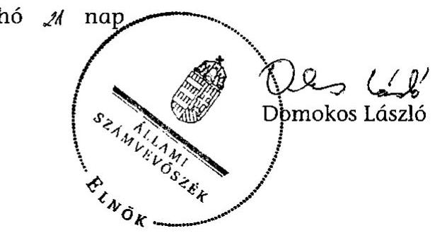

# ÁLLAMI   SZÁMVEVŐSZÉK 

## JELENTÉS

Szirák Község Önkormányzata belső kontrollrendszerének kialakítása, valamint egyes kontrolltevékenységek és a belső ellenőrzés működése ellenőrzéséről

---

# Állami Számvevőszék 

Iktatószám: V-0012-058-014-025/2013.
Témaszám: 1051
Vizsgálat-azonosító szám: V059113

## Az ellenőrzést felügyelte:

Dr. Benedek Mária
felügyeleti vezető
2012. december 16. napjától

Gyüre Lajosné
felügyeleti vezető
2012. december 15. napjáig

## Az ellenőrzést vezette:

## Szakmányné Bilik Mária

ellenőrzésvezető
A számvevőszéki jelentés összeállításában közreműködtek:
dr. Fónagy Diána
számvevő tanácsos
dr. Láng Ágnes Krisztina
számvevő
Az ellenőrzést végezték:
Hadnagyné Papp Ildikó Papp József
számvevő
számvevő tanácsos

---

# TARTALOMJEGYZÉK 

BEVEZETÉS ..... 5
I. ÖSSZEGZŐ MEGÁLLAPÍTÁSOK, KÖVETKEZTETÉSEK, JAVASLATOK ..... 8
II. RÉSZLETES MEGÁLLAPÍTÁSOK ..... 17

1. Az önkormányzat belső kontrollrendszere kialakításának megfelelősége ..... 17
1.1. A kontrollkörnyezet kialakítása ..... 17
1.2. A kockázatkezelési rendszer kialakítása ..... 18
1.3. A kontrolltevékenységek kialakítása ..... 18
1.4. Az információs és kommunikációs rendszer kialakítása ..... 20
1.5. A monitoring rendszer kialakítása ..... 21
2. A pénzügyi folyamatokban kulcsszerepet betöltő belső kontrollok (szakmai teljesítésigazolás és utalvány ellenjegyzés) működése ..... 21
3. A belső ellenőrzés szervezeti keretei és működése ..... 24

## FÜGGELÉKEK

1. számú Értelmező szótár
2. számú A belső kontrollrendszer kialakítása, a pénzügyi folyamatokban kulcsszerepet betöltő szakmai teljesítésigazolás és utalvány ellenjegyzés kontrollok működése, valamint a belső ellenőrzés működése értékelésénél alkalmazott minősítési szempontok

---

.

---

# RÖVIDÍTÉSEK JEGYZÉKE 

| Törvények |  |
| :--: | :--: |
| ÁSZ tv. | 2011. évi LXVI. törvény az Állami Számvevőszékről |
| Avtv. | 1992. évi LXIII. törvény a személyes adatok védelméről és a közérdekű adatok nyilvánosságáról (hatálytalan 2012. január 1-jétől) |
| Htv. | 1991. évi XX. törvény a helyi önkormányzatok és szerveik, a köztársasági megbízottak, valamint egyes centrális alárendeltségű szervek feladat- és hatásköreiről |
| Info tv. | 2011. évi CXII. törvény az információs önrendelkezési jogról és az információszabadságról (hatályos 2012. január 1-jétől) |
| Ktv. | 1992. évi XXIII. törvény a köztisztviselők jogállásáról (hatálytalan 2012. március 1-jétől) |
| Kttv. | 2011. évi CXCIX. törvény a közszolgálati tisztségviselőkről |
| Ltv. | 1995. évi LXVI. törvény a köziratokról, a közlevéltárakról és a magánlevéltári anyag védelméről |
| Mötv. | 2011. évi CLXXXIX. törvény Magyarország helyi önkormányzatairól (hatályos 2012. január 1-jétől) |
| Mvtv. | 1993. évi XCIII. törvény a munkavédelemről |
| Ötv. | 1990. évi LXV. törvény a helyi önkormányzatokról |
| régi Áht. | 1992. évi XXXVIII. törvény az államháztartásról (hatálytalan 2012. január 1-jétől) |
| Számv. tv. | 2000. évi C. törvény a számvitelről |
| Tvtv. | 1996. évi XXXI. törvény a tűz elleni védekezésről, a műszaki mentésről és a tűzoltóságról |
| új Áht. | 2011. évi CXCV. törvény az államháztartásról (hatályos 2012. január 1-jétől) |
| Vagyonnyilatkozat-tételi tv. | 2007. évi CLII. törvény az egyes vagyonnyilatkozat-tételi kötelezettségekről |
| Rendeletek |  |
| Ámr. | 292/2009. (XII. 19.) Korm. rendelet az államháztartás működési rendjéről (hatálytalan 2012. január 1-jétől) |
| Ávr. | 368/2011. (XII. 31.) Korm. rendelet az államháztartásról szóló törvény végrehajtásáról (hatályos 2012. január 1-jétől) |
| Ber. | 193/2003. (XI. 26.) Korm. rendelet a költségvetési szervek belső ellenőrzéséről (hatálytalan 2012. január 1-jétől) |
| Bkr. | 370/2011. (XII. 31.) Korm. rendelet a költségvetési szervek belső kontrollrendszeréről és belső ellenőrzéséről (hatályos 2012. január 1-jétől) |
| 2011. évi költségvetési rendelet | Szirák Község Önkormányzata 1/2011. (III. 7.) rendelete az Önkormányzat 2011. évi költségvetéséről |

---

# Szórövidítések 

| ÁSZ | Állami Számvevőszék |
| :--: | :--: |
| Belső Kontroll Kézikönyv | Az Ámr. 155. § (1) bekezdése, valamint az államháztartási belső kontroll standardokról szóló 1/2009. (IX. 11.) PM irányelv egységes értelmezése érdekében az államháztartásért felelős miniszter által a 2010. évben kiadott Belső Kontroll Kézikönyv. |
| FEUVE | folyamatba épített, előzetes, utólagos és vezetői ellenőrzés |
| informatikai biztonsági   szabályzat | Vanyarc-Szirák-Bér Községek Önkormányzatának Körjegyzősége Informatikai biztonsági szabályzata (hatályos 2012. szeptember 1-jétől) |
| $jegyző_{1}$ | Szirák-Bér Községek Önkormányzatainak körjegyzője 2007. április 1-jétől 2009. január 31-éig |
| jegyző2 | Szirák-Bér Községek Önkormányzatainak körjegyzője 2009. február 1-jétől 2009. június 3-áig |
| jegyző3 | Szirák-Bér Községek Önkormányzatainak körjegyzője 2009. június 5-étől 2009. július 31-éig |
| jegyző4 | Szirák-Bér Községek Önkormányzatainak körjegyzője 2009. augusztus 1-jétől 2009. szeptember 1-jéig |
| jegyző5 | Szirák-Bér Községek Önkormányzatainak körjegyzője 2009. szeptember 1-jétől 2009. december 31-éig, Szirák Község Önkormányzatának jegyzője 2010. január 1-jétől 2010. június 30-áig |
| jegyző6 | Szirák Község Önkormányzatának jegyzője 2010. július 1-jétől 2011. augusztus 31-éig |
| jegyző7 | Szirák Község Önkormányzatának jegyzője 2011. szeptember 2-ától 2011. október 9-éig |
| jegyző8 | Szirák Község Önkormányzatának jegyzője 2011. október 10-étől 2012. augusztus 31-éig |
| jegyző9 | Vanyarc-Szirák-Bér Községek Önkormányzatainak körjegyzője 2012. szeptember 1-jétől |
| Képviselő-testület | Szirák Község Önkormányzatának Képviselő-testülete |
| Körjegyzőség ${ }_{1}$ | Szirák és Bér Községek Önkormányzatának Körjegyzősége 2007. április 1-jétől 2009. december 31-éig |
| Körjegyzőség ${ }_{2}$ | Vanyarc-Szirák-Bér Községek Önkormányzatának Körjegyzősége 2012. szeptember 1-jétől |
| leltározási szabályzat | Vanyarc-Szirák-Bér Községek Önkormányzatának Körjegyzősége Eszközök és források leltárkészítési és leltározási szabályzata (hatályos 2012. november 20-ától) |
| Önkormányzat | Szirák Község Önkormányzata |
| pénzkezelési szabályzat | Vanyarc-Szirák-Bér Községek Önkormányzatának Körjegyzősége Pénzkezelési szabályzata (hatályos 2012. november 20-ától) |
| polgármester | Szirák Község Önkormányzatának polgármestere |
| Polgármesteri Hivatal | Szirák Község Önkormányzatának Polgármesteri Hivatala 2010. január 1-jétől 2012. augusztus 31-éig |
| SZMSZ | szervezeti és működési szabályzat |
| Társulás | Pásztó Kistérség Többcélú Társulása |

---

# JELENTÉS 

## Szirák Község Önkormányzata belső kontrollrendszerének kialakítása, valamint egyes kontrolltevékenységek és a belső ellenőrzés működése ellenőrzéséről

## BEVEZETÉS

A belső kontrollrendszer kialakítását, működtetését és fejlesztését a régi Áht. és az új Áht. is előírja. Ennek megvalósításáért a költségvetési szerv vezetője felel. A belső kontrollrendszer azt a célt szolgálja, hogy a költségvetési szervek működésük és gazdálkodásuk során a tevékenységeket szabályszerűen, gazdaságosan, hatékonyan, eredményesen hajtsák végre, teljesítsék elszámolási kötelezettségeiket és megvédjék az erőforrásokat a veszteségektől, a károktól és a nem rendeltetésszerű használattól. A belső kontrollrendszer magában foglalja mindazon szabályokat, eljárásokat, gyakorlati módszereket és szervezeti struktúrákat, kockázatkezelési technikákat, kontrolltevékenységeket, amelyek segítséget nyújtanak a szervezetnek céljai eléréséhez.

Az ÁSZ a 2011-2015. évekre szóló stratégiájában hangsúlyos szerepet szánt annak, hogy szilárd szakmai alapon álló, értékteremtő ellenőrzéseivel előmozdítsa a közpénzügyek átláthatóságát, rendezettségét. A számvevőszéki ellenőrzés nemzetközi alapelvei is rögzítik, hogy a megfelelő belső kontrollrendszer minimálisra csökkenti a hibák és szabálytalanságok kockázatát.

Az ellenőrzés célja annak értékelése volt, hogy az Önkormányzat a jogszabályi előírásoknak megfelelően alakította-e ki a belső kontrollrendszert; a gazdálkodás folyamatában kulcsszerepet betöltő szakmai teljesítésigazolás és az utalvány ellenjegyzés kontrolltevékenységeit megfelelően működtette-e; biztosította-e a belső ellenőrzés szabályos és eredményes működését.

Az ÁSZ ezen ellenőrzési céljait pilot (próba) jelleggel községi/nagyközségi önkormányzatoknál végzett ellenőrzések során érvényesítette.

Az ellenőrzés típusa: szabályszerűségi ellenőrzés
Az ellenőrzés jogszabályi alapja: az ÁSZ tv. 5. § (2) és (6) bekezdései
Az ellenőrzött szervezet: az Önkormányzat
Az ellenőrzött időszak: a belső kontrollrendszer kialakításának megfelelőségét a 2011. évre vonatkozóan értékeltük. A kontrolltevékenységek működésének megfelelőségét a 2011. január 1-je és december 31-e, míg a belső ellenőrzés működésének szabályosságát és eredményességét a 2009. január 1-je és 2011. december 31-e közötti időszakot figyelembe véve értékeltük. A helyszíni ellenőrzés lezárásáig a helyi szabályozás változásait nyomon követtük.
Az ellenőrzés szakmai módszertana az ÁSZ hivatalos honlapján (www.asz.hu) közzétett szakmai szabályokon alapult, amely a Legfőbb Ellenőrző Intézmények Nemzetközi Szervezete (INTOSAI) által kiadott nemzetközi standardok (ISSAI) figyelembevételével készült.

A belső kontrollrendszer kialakításának ellenőrzése során értékeltük a kontrollkörnyezet, a kockázatkezelési rendszer, a kontrolltevékenységek, az információs és kommunikációs rendszer, valamint a monitoring rendszer szabályozottságának megfelelőségét.

Értékeltük a pénzügyi folyamatokban kulcsszerepet betöltő szakmai teljesítésigazolás és az utalvány ellenjegyzés kontrollok működésének megfelelőségét az államháztartáson kívülre teljesített működési és felhalmozási célú pénzeszközátadásoknál, az állományba nem tartozók megbízási díjainál, továbbá a külső szolgáltatók által végzett karbantartási, kisjavítási munkákkal kapcsolatos kifizetéseknél. Az egyszerû véletlen mintavétellel kiválasztott tételek ellenőrzését többlépcsős megfelelőségi tesztek útján addig végeztük, amíg elegendő és megfelelő bizonyítékot szereztünk a vizsgált folyamatok kulcskontrolljai működésének megfelelő vagy nem megfelelő voltáról. Értékeltük az Önkormányzatnál a belső ellenőrzés működésének szabályosságát és eredményességét. Az ÁSZ a 2007-2010. években az Önkormányzatnál ellenőrzést nem végzett.

A fogalmak magyarázatát az 1. számú függelék, az ellenőrzés egyes területeinek értékelésénél alkalmazott egységes minősítési szempontokat a 2. számú függelék tartalmazza.

Az ellenőrzés lefolytatásához az Önkormányzat a munkalapok és a tanúsítvány elektronikus kitöltésével, valamint a megjelölt dokumentumok elektronikus megküldésével szolgáltatott adatokat. A munkalapokon szerepeltetett adatok, információk ellenőrzése és szükség szerinti javítása a helyszíni ellenőrzés keretében történt.

Az ÁSZ az ellenőrzés megállapításait az ellenőrzött időszakban hatályos, az intézkedést igénylő megállapításokra tett javaslatokat a jelenleg hatályos jogszabályok alapján fogalmazta meg.

Az ÁSZ tv. 29. § (1) bekezdése szerint a jelentéstervezetet megküldtük a polgármester részére, aki az ÁSZ tv. 29. § (2) bekezdésében foglalt észrevételezési jogával nem élt, a jelentéstervezetre észrevételt nem tett.

Szirák község állandó lakosainak száma 2011. január 1-jén 1153 fő volt. Az Önkormányzat héttagú Képviselő-testületének munkáját egy állandó bizottság segítette. Az Önkormányzat az önállóan működő és gazdálkodó Polgármesteri Hivatalon felül kettő önállóan működő intézménnyel látta el feladatát. Az Önkormányzat többségi tulajdoni hányadú gazdasági társasággal nem rendelkezett. A polgármester a 2006. évi önkormányzati választások óta tölti be tisztségét. Az ellenőrzött időszakban 2009. december 31-ig a hivatali feladatok ellátását a jegyző ${ }_{1,2,3,4,5}$ vezetésével Körjegyzőség ${ }_{1}$, 2010. január 1-jétől a jegyző ${ }_{5,6,7,8}$ vezetésével önálló Polgármesteri Hivatal keretében biztosították. A jegyző ${ }_{9}$ 2012. szeptember 1-jétől látta el feladatait. A személyi változások alkalmával a munkakör átadás-átvételt nem dokumentálták. A Polgármesteri Hivatal szervezeti egységekre nem tagolódott, a foglalkoztatott köztisztviselők száma 2011. január 1-jén öt fő volt. Az Önkormányzat a 2011. évi költségvetési beszámolója szerint 263352 ezer Ft költségvetési bevételt ért el, valamint 249174 ezer Ft költségvetési kiadást teljesített. A 2011. december 31-i könyvviteli mérleg szerint 511617 ezer Ft értékű eszközvagyonnal rendelkezett, 6912 ezer Ft rövid lejáratú kötelezettsége volt. Hosszú lejáratú kötelezettsége nem volt.

---

# I. ÖSSZEGZŐ MEGÁLLAPÍTÁSOK, KÖVETKEZTETÉSEK, JAVASLATOK 

A belső kontrollrendszer kialakításán belül 2011-ben a Polgármesteri Hivatalban a kontrollkörnyezet, a kockázatkezelési rendszer, a kontrolltevékenységek, az információs és kommunikációs rendszer, valamint a monitoring rendszer szabályozását, illetve kialakítását külön-külön és összesítve is értékeltük. A belső kontrollrendszer kialakítása az összesített értékelés alapján nem felelt meg a jogszabályi előírásoknak, és az egyes területek kialakításának értékelését az alábbiakban részletezzük.

A kontrollkörnyezet kialakítása a jogszabályi követelményeknek nem felelt meg, mert a jegyző ${ }_{6,7,8}$ - a régi Áht.-ban ${ }^{1}$ foglaltak ellenére - nem készítette el a Polgármesteri Hivatal SZMSZ-ét és a Htv. előírását figyelmen kívül hagyva nem készítette el az Önkormányzat gazdasági programtervezetét. A jegyző ${ }_{6,7,8}$ továbbá az önkormányzati
 feladatellátás szervezeti változását követően - a Számv. tv.-ben foglaltak ellenére - nem alakította ki a Polgármesteri Hivatal számviteli politikáját, nem készítette el a leltározási és leltárkészítési, valamint a pénzkezelési szabályzatot, illetve az eszközök és források értékelési szabályzatát, továbbá a számlarendet és a bizonylati rendet. Az Mvtv. és a Tvtv. előírásait figyelmen kívül hagyva nem határozta meg a Polgármesteri Hivatalban az egészséget nem veszélyeztető és biztonságos munkavégzés követelményei megvalósításának módját, és nem adott ki tűzvédelmi szabályzatot. A jegyző${ }_{6,7,8}$ Ktv.${ }^{2}$ előírásai ellenére nem alakította ki a teljesítményértékelési rendszert. Az Ámr.-ben${ }^{3}$ foglalt előírás ellenére a Polgármesteri Hivatalban ellátott feladatokra vonatkozóan az ellenőrzési nyomvonalat nem alakította ki. A szabályozási hiányosságok korlátozzák a feladatellátás számon kérhetőségét, folytonosságának biztosítását. A 2012. évben a Képviselő-testület elfogadta a Körjegyzőség${ }_{2}$ SZMSZ-ét. A jegyző${ }_{9}$ kiadta a leltározási, valamint a pénzkezelési szabályzatot.

A kockázatkezelési rendszer kialakítása nem felelt meg a jogszabályi előírásoknak, mert a jegyző${ }_{6,7,8}$ az Ámr. szerinti kockázatkezelési rendszert nem szabályozta, és - a Vagyonnyilatkozat-tételi tv. előírása ellenére - nem rögzítette a köztisztviselők vagyonnyilatkozat-tételi kötelezettségét. A jegyző${ }_{9}$ ez utóbbi hiányosságot a 2012. évben megszüntette.

A kontrolltevékenységek kialakítása nem felelt meg a jogszabályi követelményeknek, mert a jegyző${ }_{6,7,8}$ - a régi Áht.-ban foglaltak ellenére - nem szabályozta a folyamatba épített, előzetes, utólagos és vezetői ellenőrzést a vagyonhasznosítási tevékenység, az iratkezelés és a szabálytalanságkezelés folyamataiban. Az Ámr. előírása ellenére nem alakította ki a Polgármesteri Hivatal tevékenységeire vonatkozó beszámolási eljárásokat, és nem jelölte ki a szakmai teljesítés igazolására jogosultakat. Az Ámr. előírásait figyelmen kívül hagyva a kötelezettségvállalás és az utalvány ellenjegyzésére az előírt iskolai végzettséggel, szakmai képesítéssel nem rendelkező személyeket hatalmazott fel, továbbá nem határozta meg az előzetes írásbeli kötelezettségvállaláshoz nem kötött kifizetések rendjét, eljárási részletszabályait. A kontrolltevékenységek hiányos kialakítása kockázatot jelent a feladatok szabályszerű végrehajtása során. A 2012. évben írásban kijelölték a teljesítésigazolásra, valamint az előírt szakmai képesítéssel rendelkező pénzügyi ellenjegyzésre jogosultakat.

Az információs és kommunikációs rendszer kialakítása nem felelt meg a jogszabályi követelményeknek, mert a jegyző${ }_{6,7,8}$ az Ámr.-ben előírt információs és kommunikációs rendszert és a szabálytalanságkezelési eljárásrendet nem szabályozta, valamint - az Ltv.-ben foglaltak ellenére - nem készítette el a Polgármesteri Hivatal egyedi iratkezelési szabályzatát. Az Avtv.${ }^{4}$ és az Ámr. előírásait figyelmen kívül hagyva nem adta ki az adatvédelmi és adatbiztonsági szabályzatot, továbbá nem szabályozta a közérdekű adatok megismerésére irányuló kérelmek teljesítésének, valamint a kötelezően közzéteendő adatok nyilvánosságra hozatalának rendjét. Elmulasztotta az adatbiztonság érvényre juttatásához szükséges intézkedések megtételét, mert nem határozta meg a hozzáférési jogosultságok megállapítására, módosítására és azok ellenőrzésére vonatkozó eljárásrendet, és nem gondoskodott a hozzáférési jogosultság nyilvántartás vezetéséről. Nem szabályozta a pénzügyi-számviteli szoftverváltozások ellenőrzésére vonatkozó eljárásokat, a rendszerben feldolgozott adatok mentési eljárásait és nem jelölte ki a mentések elvégzésének a felelőseit. A jegyző${ }_{9}$ a 2012. évben az informatikai biztonsági szabályzatban rögzítette a szoftverváltozás során követendő eljárást és a feldolgozott adatok mentési eljárásait, felelősségi viszonyait, azonban továbbra sem szabályozta a hozzáférési jogosultság megállapításának, módosításának és nyilvántartásának rendjét.

A monitoring rendszer kialakítása nem felelt meg a jogszabályi előírásoknak, mert a jegyző${ }_{6,7,8}$ - az Ámr. előírása ellenére - az operatív tevékenységek keretében megvalósuló folyamatos és eseti nyomon követésből álló, az Önkormányzat tevékenységének, a célok megvalósításának nyomon követését biztosító rendszert nem szabályozta.

A belső kontrollrendszer kialakításáért és működtetéséért felelős vezető, a jegyző személyének gyakori változása, a hivatali feladatellátás többszöri átszervezése is hozzájárult ahhoz, hogy a belső kontrollrendszer kialakítása nem felelt meg a jogszabályi követelményeknek. A belső kontrollrendszer nem megfelelő kialakítása kockázatot jelent az Önkormányzat tevékenységeinek szabályszerű, gazdaságos, hatékony és eredményes végrehajtásában.

A Polgármesteri Hivatalban a 2011. évben az államháztartáson kívülre történő működési célú pénzeszközátadásokkal, az állományba nem tartozók megbízási díjaival, valamint a külső szolgáltatók által végzett karbantartással, kisjavítással kapcsolatos kifizetések során összefoglalóan értékelve a kulcskontrollok működésének megfelelősége gyenge volt.

[^0]
[^0]:    ${ }^{4}$ 2012. január 1-jétől Info tv.

---

A kiadások teljesítését megelőzően a szakmai teljesítés igazolását - az Ámr.ben foglaltak ellenére - olyan személyek végezték, akiket a jegyző${ }_{6,7}$ nem jelölt ki a feladat ellátására. Az utalványok ellenjegyzője az Ámr. előírásait figyelmen kívül hagyva annak ellenére aláírta az utalványokat, hogy a kifizetések szakmai teljesítés igazolását arra nem jogosult személyek végezték. Továbbá a kiadások ellenjegyzése során nem tartották be a gazdálkodásra - köztük a kötelezettségvállalások ellenjegyzésére, nyilvántartásba vételére, a nyilvántartási szám, valamint a kedvezményezett nevének utalványrendeleten történő feltüntetésére - vonatkozó szabályokat. A 2011. évben a Szirák FC-t - az Ámr. előírása ellenére - írásos kötelezettségvállalás nélkül 846,1 ezer Ft összegű sporttámogatásban részesítették, amelyből 42,8 ezer Ft-ot nevezési díj jogcímen a támogatott Szirák FC helyett a versenyt szervező Magyar Labdarúgó Szövetségnek utaltak át. Az európai uniós pályázat keretében kötött megbízási szerződések ellenjegyzése - az Ámr. rendelkezései ellenére - nem történt meg.

A számvevőszéki ellenőrzés az ellenőrzött kifizetésekkel összefüggésben a rendelkezésre bocsátott dokumentumok alapján kár bekövetkeztére utaló adatot, tényt nem állapított meg, azonban a gazdálkodásban kulcsszerepet betöltő kontrollok működésében feltárt hiányosságok miatt magas a hibák bekövetkezésének lehetősége. A nem megfelelően működtetett belső kontrollok, valamint azok szabályozásának hiánya korrupciós kockázatot hordoznak.

Az Önkormányzat a belső ellenőrzési feladatok ellátását a Társulással kötött megállapodás alapján biztosította. Az Önkormányzatnál a 2009-2011. években a belső ellenőrzés szabályozása és működése összességében nem felelt meg a jogszabályi előírásoknak. A belső ellenőrzés ellátásának módját és jogállását - a Ber.-ben${ }^{5}$ foglaltak ellenére - nem rögzítették SZMSZ-ben. A 2009. és a 2011. évi ellenőrzési tervet a jegyző${ }_{1}$, illetve a jegyző${ }_{6}$ késedelmesen terjesztette a Képviselő-testület elé, ezért azt az Ötv.-ben meghatározott határidőt túllépve fogadták el. Az éves ellenőrzési terv elkészítéséhez a jegyző${ }_{1,5,6}$ a Ber. szabályait figyelmen kívül hagyva írásos véleményt nem adott. Az ellenőrzési terv nem tartalmazta az ellenőrizendő időszakot és az ellenőrzések módszereit. Az ellenőrzéshez készített program nem tartalmazta az ellenőrzés tárgyát. A belső ellenőrzés által tett javaslatok végrehajtására a jegyző${ }_{5,6,7,8}$ nem készített valamennyi megállapításra kiterjedő intézkedési tervet. A feltárt hiányosságok megszüntetéséről az ellenőrzést végzők nem győződtek meg.

Az Önkormányzatnál a 2009-2011 években a belső ellenőrzés működése a 2. számú függelék minősítési szempontjai alapján - nem volt eredményes, mert a belső ellenőrzés szabályozása és működése az összegző értékelés alapján az ellenőrzött időszak egészét tekintve a jogszabályi előírásoknak nem felelt meg; továbbá a belső ellenőrzés a kontrollrendszer kialakítását és a pénzügyi folyamatokban kulcsszerepet betöltő kontrollok működését ugyan ellenőrizte, azonban a kontrollrendszer kialakításának és működésének a hiányait nem tárta fel; valamint a belső ellenőrzés által - a pénzügyi folyamatokban kulcsszerepet betöltő belső kontrollok működésére vonatkozóan - megfogalmazott javaslatok nem hasznosultak, a jegyző${ }_{5,6,7,8}$ nem intézkedett teljes körűen a feltárt hibák, hiányosságok kijavításáról, mivel a gazdálkodási jogkörök gyakor-

[^0]
[^0]:    ${ }^{5}$ 2012. január 1-jétől Bkr.

---

lása a jogszabályi előírásoknak nem felelt meg és a kötelezettségvállalások nyilvántartásba vételét továbbra sem biztosították. Ezért a gyengén működő kontrollok következtében a szabálytalanságok ismétlődtek.

Az ÁSZ tv. 33. § (1) bekezdésében foglaltak értelmében az ellenőrzött szervezet vezetője köteles a jelentésben foglalt megállapításokhoz kapcsolódó intézkedési tervet összeállítani, és azt a jelentés kézhezvételétől számított 30 napon belül az ÁSZ részére megküldeni. Amennyiben az intézkedési tervet határidőre nem küldi meg a szervezet, vagy az az ÁSZ tv. 33. § (2) bekezdésében foglalt póthatáridő eltelte ellenére továbbra sem elfogadható, az ÁSZ elnöke a hivatkozott törvény 33. § (3) bekezdés a)-b) pontjaiban foglaltakat érvényesítheti.

Az ellenőrzés intézkedést igénylő megállapításai és javaslatai:

# a polgármesternek 

1. A Képviselő-testület - az Ötv. 91. § (7) bekezdésben foglaltak ellenére - nem fogadta el az Ötv. 91. § (1) és (6) bekezdése szerinti gazdasági programtervezetet.

Javaslat:
Terjessze a Képviselő-testület elé a gazdasági program jegyző által elkészített tervezetét a Mötv. 116. § (1) és (5) bekezdései alapján, a (3)-(4) bekezdésekben foglalt tartalommal.
2. A sporttámogatások címén teljesített pénzeszközátadás kifizetését megelőzően nem történt írásos kötelezettségvállalás, az Ámr. 74. § (1) bekezdésében foglalt előírás ellenére. Az európai uniós pályázat keretében kötött megbízási szerződések ellenjegyzése - az Ámr. 74. § (1) bekezdésében foglaltak ellenére - elmaradt.

Javaslat:
Biztosítsa, hogy az Önkormányzat nevében történő kötelezettségvállalásra az új Áht. 37. § (1) bekezdésében foglaltaknak megfelelően minden esetben írásban, pénzügyi ellenjegyzés után kerüljön sor.
3. A szakmai teljesítésigazolást - az Ámr. 76. § (5) bekezdésében foglaltak ellenére jegyzői kijelöléssel nem rendelkező személy végezte. Az utalványok ellenjegyzője az Ámr. 74. § (3) bekezdés c) pontjában foglaltak és a 79. § (2) bekezdése ellenére szabályszerűen elvégzett szakmai teljesítésigazolás hiányában ellenjegyezte az utalványt.

Javaslat:
Intézkedjen a szakmai teljesítésigazolás és az utalvány ellenjegyzés kontrollokkal összefüggésben feltárt hiányosságok és szabálytalanságok tekintetében az esetleges munkajogi felelősséggel kapcsolatos körülmények kivizsgálásáról, és a vizsgálat eredményének függvényében tegye meg a szükséges munkajogi intézkedéseket.

---

# a jegyzőnek Szirák Község Önkormányzatára vonatkozóan 

4. a kontrollkörnyezettel kapcsolatban:

A jegyző${ }_{6,7,8}$ a Htv. 140. § (1) bekezdés a) pontjában foglalt előírást figyelmen kívül hagyva nem készítette el az Ötv. 91. § (1) és (6) bekezdése szerinti gazdasági program tervezetét.

A Számv. tv. 14. § (3)-(5) és a 161. § (1)-(2) bekezdéseiben foglaltak ellenére nem alakította ki a Polgármesteri Hivatal számviteli politikáját, az eszközök és források értékelési szabályzatát, a számlarendet és a bizonylati rendet.

Az Mvtv. 2. § (3) bekezdés előírását figyelmen kívül hagyva nem határozta meg a Polgármesteri Hivatalban az egészséget nem veszélyeztető és biztonságos munkavégzés követelményei megvalósításának módját.

A Tvtv. 19. § (1) bekezdésében foglaltak ellenére nem készítette el a Polgármesteri Hivatal tűzvédelmi szabályzatát.

A Ktv. 34. § (5) bekezdésében foglalt előírás ellenére nem alakította ki a teljesítményértékelési rendszert.

Az Ámr. 156. § (2) bekezdésében foglalt előírás ellenére nem alakította ki a Polgármesteri Hivatalban ellátott feladatokra vonatkozóan az ellenőrzési nyomvonalat.

Javaslat:
a) Készítse elő a Htv. 140. § (1) bekezdés a) pontjában foglaltak alapján a gazdasági program tervezetét a Mötv. 116. § (3)-(4) bekezdésében foglalt tartalommal, és kezdeményezze a polgármesternél a Képviselő-testület elé terjesztését.
b) A jegyző${ }_{6,7,8}$ intézkedjen a Számv. tv. 14. § (3)-(5) és a 161. § (1)-(2) bekezdéseiben foglalt számviteli politika kialakításáról, az eszközök és
 források értékelési szabályzatának elkészítéséről, a számlarend és a bizonylati rend meghatározásáról.
c) Határozza meg az egészséget nem veszélyeztető és biztonságos munkavégzés követelményei megvalósításának módját az Mvt. 2. § (3) bekezdése alapján.
d) Készítse el a tűzvédelmi szabályzatot a Tvt. 19. § (1) bekezdésében foglalt előírásnak megfelelően.
e) Intézkedjen a Polgármesteri Hivatal köztisztviselőire vonatkozóan a Kttv. 130. § (1)-(6) bekezdéseiben előírtak szerint a teljesítményértékeléssel kapcsolatos szabályok kialakításáról és alkalmazásáról.
f) Készítse el az ellenőrzési nyomvonalat a Bkr. 6. § (3) bekezdés előírásának megfelelően.

---

5. a kockázatkezelési rendszerrel kapcsolatban:

A jegyző ${ }_{6,7,8}$ az Ámr. 157. § (1)-(3) bekezdései szerinti kockázatkezelési rendszert nem alakította ki.

Javaslat:
Alakítson ki és működtessen kockázatkezelési rendszert a Bkr. 7. §-nak megfelelően.
6. a kontrolltevékenységekkel kapcsolatban:

A jegyző ${ }_{6,7,8}$ - a régi Áht. 121/A. § (4) bekezdésében foglaltak ellenére - nem határozta meg a folyamatba épített, előzetes, utólagos és vezetői ellenőrzés feladatait a vagyonhasznosítási tevékenység, továbbá az iratkezelés és a szabálytalanságkezelés folyamataiban.

Az Ámr. 158. § (2) bekezdés d) pontjának előírása ellenére nem alakította ki a Polgármesteri Hivatal tevékenységeire vonatkozó beszámolási eljárásokat.

Az Ámr. 72. § (14) bekezdésében foglaltakat figyelmen kívül hagyva nem határozta meg az előzetes írásbeli kötelezettségvállaláshoz nem kötött kifizetések rendjét, eljárási részletszabályait.

Javaslat:
a) Gondoskodjon - a Bkr. 8. § (2) bekezdése alapján - a vagyonhasznosítási tevékenység, az iratkezelés és a szabálytalanságkezelés folyamatba épített, előzetes, utólagos és vezetői ellenőrzés feladatainak meghatározásáról.
b) Alakítsa ki a Bkr. 8. § (4) bekezdés c) pontjának megfelelően a hivatali tevékenységekre vonatkozó beszámolási eljárásokat.
c) Gondoskodjon az Ávr. 53. § (2) bekezdésének megfelelően az előzetes írásbeli kötelezettségvállaláshoz nem kötött kifizetések rendjének, eljárási részletszabályainak meghatározásáról.
7. az információs és kommunikációs rendszerrel kapcsolatban:

A jegyző ${ }_{6,7,8}$ az Ámr. 159. §-ában előírt információs és kommunikációs rendszert nem alakította ki. Az Ltv. 10. § (1) bekezdés c) pontjában foglaltak ellenére nem készítette el a Polgármesteri Hivatal egyedi iratkezelési szabályzatát. Az Avtv. 31/A. § (3) bekezdése ellenére nem készítette el az adatvédelmi és adatbiztonsági szabályzatot. Az Avtv. 20. § (8) bekezdésének és az Ámr. 20. § (3) bekezdés i) pontjának előírása ellenére nem szabályozta a közérdekű adatok megismerésére irányuló kérelmek teljesítésének, valamint a kötelezően közzéteendő adatok nyilvánosságra hozatalának rendjét. Az Avtv. 10. § (1)-(2) bekezdésében foglalt előírások ellenére elmulasztotta az adatbiztonság érvényre juttatásához szükséges intézkedések megtételét, nem határozta meg a hozzáférési jogosultságok megállapítására, módosítására és nyilvántartására, betartásuk ellenőrzésére vonatkozó eljárásrendet. Az Ámr. 156. § (3) bekezdésében foglalt előírás ellenére nem alakította ki a szabálytalanságkezelési eljárásrendet.

---

Javaslat:
a) Intézkedjen az információs és kommunikációs rendszer kialakításáról, működtetéséről és fejlesztéséről a Bkr. 3. § d) pontjának megfelelően.
b) Adja ki az egyedi iratkezelési szabályzatot az Ltv. 10. § (1) bekezdés c) pontja alapján.
c) Készítsen adatvédelmi és adatbiztonsági szabályzatot az Info tv. 24. § (3) bekezdése alapján.
d) Rendelkezzen az Önkormányzattal kapcsolatos információk esetében az Info tv. 35. § (3) bekezdése alapján a közérdekű adatok közzétételi eljárásának, nyilvánosságra hozatala rendjének, valamint az Ávr. 13. § (2) bekezdés h) pontja alapján a közérdekű adatok megismerésére irányuló kérelmek teljesítése rendjének szabályozásáról; jelölje ki a közérdekű adatok közzétételének adatfelelősét és az adatközlő személyt.
e) Gondoskodjon az Info tv. 7. § (2)-(3) bekezdései alapján az adatok biztonságáról, és intézkedjen a hozzáférési jogosultságok megállapításáról, módosításáról és nyilvántartásáról, és a betartásuk ellenőrzésére vonatkozó eljárásrend meghatározásáról.
f) Szabályozza a szabálytalanságok kezelésének eljárásrendjét a Bkr. 6. § (4) bekezdésében foglaltaknak megfelelően.
8. a monitoring rendszerrel kapcsolatban:

A jegyző ${ }_{6.7}$ - az Ámr. 160. §-ában foglaltak ellenére - nem alakított ki és nem működtetett olyan monitoring rendszert, amely lehetővé teszi a Polgármesteri Hivatal tevékenységének, a célok megvalósításának nyomon követését, és amelynek része az operatív tevékenységek keretében megvalósuló folyamatos és eseti nyomon követés is.

Javaslat:
Alakítsa ki és működtesse a Bkr. 10. §-ában előírtak alapján a Polgármesteri Hivatal tevékenységének, a célok megvalósításának nyomon követését biztosító rendszerét, amelynek része az operatív tevékenységek keretében megvalósuló folyamatos és eseti nyomon követés is.
9. a pénzügyi folyamatokban kulcsszerepet betöltő kontrollok működésével kapcsolatban:

Az államháztartáson kívülre történő működési és felhalmozási célú pénzeszközátadásokkal, az állományba nem tartozók megbízási díjaival, valamint a külső szolgáltatók által végzett karbantartással, kisjavítással kapcsolatos kiadások teljesítését megelőzően a szakmai teljesítés igazolását - az Ámr. 76. § (5) bekezdésében foglaltak ellenére - nem a jegyző ${ }_{6.7}$ által kijelölt személyek végezték. Az utalványok ellenjegyzője az Ámr. 79. § (2) bekezdésében foglalt ellenőrzési feladatait - az Ámr. 76. § (1) bekezdésében foglaltaknak megfelelően elvégzett szakmai teljesítésigazolás hiányában - nem a jogszabályi előírásoknak megfelelően végezte. Továbbá nem tartották be a

---

Polgármesteri Hivatalban a gazdálkodásra vonatkozó szabályokat, közöttük az Ámr. 74. § (1) bekezdésében foglalt, a kötelezettségvállalások ellenjegyzésére, az Ámr. 75. § (1) bekezdése szerinti, a kötelezettségvállalások nyilvántartásba vételére, valamint az Ámr. 78. § (2) bekezdés g) pontja szerinti, az utalványrendeleten a kötelezettségvállalás nyilvántartási számának feltüntetésére vonatkozó szabályokat. Az állományba nem tartozók megbízási díjainak kifizetése előtt az utalványok ellenjegyzője aláírta az utalványt annak ellenére, hogy azon az Ámr. 78. § (2) bekezdés d) pontjában előírtak szerint a kedvezményezett szervezet neve nem szerepelt, valamint az Ámr. 78. § (2) bekezdés g) pontban előírt kötelezettségvállalás nyilvántartási számot nem tüntették fel.

Javaslat:
Gondoskodjon - a szakmai teljesítés igazolása, az érvényesítés és az utalvány ellenjegyzése vonatkozásában feltárt hiányosságok megszüntetése, illetve az operatív gazdálkodás során a működésbeli hibák megelőzése, feltárása és kijavítása érdekében - arról, hogy
a) az Ávr. 57. § (3) bekezdése szerinti teljesítésigazolást az Ávr. 57. § (4) bekezdés figyelembevételével kijelölt személyek végezzék el, és az Ávr. 57. § (1) bekezdésében foglaltaknak megfelelően a teljesítésigazolás során ellenőrizzék a kiadások teljesítésének jogosságát, összegszerűségét, valamint ellenszolgáltatást is magában foglaló kötelezettségvállalás esetében a szerződés, megrendelés teljesítését;
b) a kifizetéseket megelőzően az Ávr. 58. § (1) bekezdése szerint a teljesítésigazolás alapján - az Ávr. 57. § (3) bekezdése szerinti esetben annak hiányában is - az összegszerűségnek, a fedezet meglétének és a megelőző ügymenetben az új Áht., az Áhsz., az Ávr. előírásai és a belső szabályzatokban foglaltak betartásának az ellenőrzése megtörténjen;
c) az Ávr 56. § (1) bekezdésében előírt kötelezettségvállalások nyilvántartásba vétele megtörténjen, és az utalványrendeleteken az Ávr. 59. § (3) bekezdés c) és f) pontjában foglaltaknak megfelelően tüntessék fel a kedvezményezett nevét és a kötelezettségvállalás nyilvántartási számát.
10. a belső ellenőrzés működésével kapcsolatban:

A belső ellenőrzés ellátásának módját és jogállását - a Ber. 4. § (2) bekezdésében foglaltak ellenére - nem rögzítették az SZMSZ-ben. A 2009. és a 2011. évi ellenőrzési tervet a Képviselő-testület az Ötv. 92. § (6) bekezdésében foglalt határidőt túllépve fogadta el, mert a jegyző ${ }_{1,6}$ nem gondoskodott a határidőn belül történő előterjesztéséről. Az éves ellenőrzési terv elkészítéséhez a jegyző ${ }_{1,5,6}$ - a Ber. 32/B. § (2) bekezdésében előírtak ellenére - írásos véleményt nem adott. Az ellenőrzési terv nem felelt meg a Ber. 21. § (3) bekezdés d) és f) pontjában előírtaknak, mert nem tartalmazta az ellenőrizendő időszakot és az ellenőrzések módszereit. A belső ellenőrzés által tett javaslatok végrehajtására a jegyző ${ }_{5,6,7,8}$ - a Ber. 29. § (1) bekezdésében foglaltak ellenére - nem készített teljes körűen intézkedési tervet. A feltárt hiányosságok megszüntetéséről a belső ellenőrzést végzők nem győződtek meg, a Ber. 8. § f) pontját figyelmen kívül hagyva.

---

Javaslat:
a) Módosítsa a hivatali SZMSZ-t, és kezdeményezze a polgármesternél a módosítás Képviselő-testület elé terjesztését annak érdekében, hogy a hatályos SZMSZ a Bkr. 15. § (2) bekezdésének megfelelően tartalmazza a belső ellenőrzést végzők jogállását és feladatait.
b) Készítse elő az éves ellenőrzési tervről szóló előterjesztést, és kezdeményezze a polgármesternél a Képviselő-testület elé terjesztését annak érdekében, hogy a Képviselő-testület azt a Mötv. 119. § (5) bekezdésében előírt határidőig jóváhagyhassa.
c) Intézkedjen arról, hogy az éves ellenőrzési terv összeállítása tekintettel a társult feladatellátásra - a Bkr. 56. § (2) bekezdésében foglaltaknak megfelelően - a jegyző írásos véleményének figyelembevételével történjen.
d) Intézkedjen arról, hogy az éves ellenőrzési tervek tartalmazzák a Bkr. 31. § (4) bekezdésében előírt tartalmi követelményeket.
e) Intézkedjen - a belső ellenőrzésekről készült jelentésekben rögzített hiányosságok felszámolása érdekében - az intézkedési terv elkészítéséről a Bkr. 45. § (1) bekezdésének megfelelően.
f) Intézkedjen arról, hogy a belső ellenőrzés a belső ellenőrzési jelentések alapján megtett intézkedéseket - a Bkr. 21. § (2) bekezdés d) pontjának megfelelően - kövesse nyomon.

---

# II. RÉSZLETES MEGÁLLAPÍTÁSOK 

## 1. AZ ÖNKORMÁNYZAT BELSŐ KONTROLLRENDSZERE KIALAKÍTÁSÁNAK MEGFELELŐSÉGE

### 1.1. A kontrollkörnyezet kialakítása

A kontrollkörnyezet kialakítása a 2. számú függelék kritériumrendszerében meghatározott szempontok szerinti értékelés alapján a Polgármesteri Hivatalban nem volt megfelelő, mert a jegyző ${ }_{6,7,8}$ a jogszabályi előírásokat nem érvényesítette.

A jegyző ${ }_{6,7,8}$, mint a költségvetési szerv vezetője:

- a régi Áht. 91. § (2) bekezdésében foglaltak ellenére nem készítette el a Polgármesteri Hivatal SZMSZ-ét, és nem kezdeményezte, hogy azt a polgármester terjessze a Képviselő-testület elé; a Képviselő-testület a 2012. évben elfogadta a Körjegyzőség ${ }_{2}$ SZMSZ-ét;
- a Htv. 140. § (1) bekezdés a) pontjában foglalt előírást figyelmen kívül hagyva nem készítette el a gazdasági programtervezetet, így a Képviselőtestület - az Ötv. 91. § (7) bekezdésében ${ }^{6}$ foglaltak ellenére - nem fogadta el az Önkormányzat 2011-2014. évekre vonatkozó gazdasági programját;
- a Számv. tv. 14. § (3)-(5) és a 161. § (1)-(2) bekezdéseiben foglaltak ellenére nem alakította ki a Polgármesteri Hivatal számviteli politikáját, nem készítette el a leltározási és leltárkészítési, valamint a pénzkezelési szabályzatot ${ }^{7}$, illetve az eszközök és források értékelési szabályzatát, továbbá a számlarendet és a bizonylati rendet;
- az Mvt. 2. § (3) bekezdés előírását figyelmen kívül hagyva nem határozta meg a Polgármesteri Hivatalban az egészséget nem veszélyeztető és biztonságos munkavégzés követelményei megvalósításának módját;
- a Tvt. 19. § (1) bekezdésében foglaltak ellenére nem készítette el a Polgármesteri Hivatal tűzvédelmi szabályzatát;
- a Ktv. 34. § (5) bekezdésében ${ }^{8}$ foglalt előírás ellenére nem alakította ki a teljesítményértékelési rendszert;

[^0]
[^0]:    ${ }^{6}$ 2013. január 1-jétől a Mötv. 116. § (5) bekezdés
    ${ }^{7}$ A jegyző ${ }_{9}$ a leltározási és leltárkészítési szabályzatot és a pénzkezelési szabályzatot a 2012. évben kiadta.
    ${ }^{8}$ 2012. július 1-jétől a Kttv. 130. §

---

- az Ámr. 156. § (2) bekezdésében ${ }^{9}$ foglalt előírás ellenére nem alakította ki a Polgármesteri Hivatalban ellátott feladatokra vonatkozóan az ellenőrzési nyomvonalat.

A kontrollkörnyezet kialakítása keretében a jegyző az Ámr. 155. § (3) bekezdésének ${ }^{10}$
 előírását figyelmen kívül hagyva az államháztartásért felelős miniszter által kiadott Belső Kontroll Kézikönyv ajánlásait nem hasznosította teljes körűen.

A kontrollkörnyezet kialakítása során a jegyző ${ }_{6,7,8}$

- a Belső Kontroll Kézikönyv ${ }^{11}$ 1.5.2. pontjában foglalt ajánlást nem hasznosította, mert nem határozta meg a Polgármesteri Hivatalban ellátott köztisztviselői munkakörök betöltésére vonatkozó elvárt tudást és képességeket;
- a Belső Kontroll Kézikönyv 1.6. pontjában foglalt ajánlást nem vette figyelembe, mert nem intézkedett a szervezeti célokkal összhangban álló etikai értékek és az integritás kiemelt kezeléséről, nem határozta meg a köztisztviselőkkel szembeni etikai elvárásokat.

# 1.2. A kockázatkezelési rendszer kialakítása 

A kockázatkezelési rendszer kialakítása a 2. számú függelék kritériumrendszerében meghatározott szempontok szerinti értékelés alapján a Polgármesteri Hivatalban nem volt megfelelő, mert a jegyző ${ }_{6,7,8}$ az Ámr. 157. § (1)(3) bekezdése ${ }^{12}$ szerinti kockázatkezelési rendszert nem szabályozta. A Vagyon-nyilatkozat-tételi tv. 4. § a) pontjának előírása ellenére a jegyző ${ }_{6,7,8}$ nem írta elő a köztisztviselők vagyonnyilatkozat-tételi kötelezettségét, amelyet a Körjegyzőség${ }_{2}$ 2012. október 15-től hatályos SZMSZ-ében a jegyző ${ }_{9}$ rögzített.

### 1.3. A kontrolltevékenységek kialakítása

A kontrolltevékenységek kialakítása a 2. számú függelék kritériumrendszerében meghatározott szempontok szerinti értékelés alapján a Polgármesteri Hivatalban nem volt megfelelő, mert a jegyző ${ }_{6,7,8}$ a jogszabályi előírásokat nem érvényesítette.

A jegyző ${ }_{6,7,8}$, mint a költségvetési szerv vezetője:

- a régi Áht. 121/A. § (4) bekezdésében ${ }^{13}$ foglaltak ellenére nem határozta meg a folyamatba épített, előzetes, utólagos és vezetői ellenőrzés feladatait a vagyonhasznosítási tevékenység, az iratkezelés és a szabálytalanságkezelés folyamataiban;

[^0]
[^0]:    ${ }^{9}$ 2012. január 1-jétől a Bkr. 6. § (3) bekezdés
    ${ }^{10}$ 2012. január 1-jétől a Bkr. 5. § (1) bekezdése
    ${ }^{11}$ A 2011. évben az Ámr. 155. § (1) bekezdése, 2012. január 1-jétől a Bkr. 5. § (1) bekezdése
    ${ }^{12}$ 2012. január 1-jétől a Bkr. 7. § (1)-(2) bekezdés
    ${ }^{13}$ 2012. január 1-jétől a Bkr. 8. § (2) bekezdés

---

- az Ámr. 158. § (2) bekezdés d) pontjának ${ }^{14}$ előírása ellenére nem alakította ki a Polgármesteri Hivatal tevékenységeire vonatkozó beszámolási eljárásokat;
- az Ámr. 76. § (5) bekezdésében foglalt előírás és a belső ellenőrzés javaslatai ellenére nem jelölte ki a szakmai teljesítés igazolására jogosult személyeket ${ }^{15}$;
- az Ámr. 19. § (1) bekezdésében ${ }^{16}$ foglalt előírást figyelmen kívül hagyva a kötelezettségvállalás és az utalvány ellenjegyzésére az előírt iskolai végzettséggel, szakképesítéssel nem rendelkező személyeket hatalmazott fel;
- az Ámr. 72. § (14) bekezdésében ${ }^{17}$ foglaltakat figyelmen kívül hagyva annak ellenére nem határozta meg az előzetes írásbeli kötelezettségvállalást nem igénylő kifizetések rendjét, az eljárási részletszabályokat, annak ellenére, hogy a belső szabályozásban lehetővé tette a 100 ezer Ft-ot el nem érő kifizetések előzetes kötelezettségvállalás nélküli teljesítését.

A jegyző ${ }_{6,7,8}$ - az Ámr. 80. § (3) bekezdése ${ }^{18}$ és a belső ellenőrzés javaslatai ellenére - nem gondoskodott a gazdálkodási jogkörök gyakorlására jogosult személyek nevét és aláírás-mintáját tartalmazó, naprakész nyilvántartás vezetéséről.

A kontrolltevékenységek kialakítása keretében a jegyző az Ámr. 155. § (3) bekezdésének előírását figyelmen kívül hagyva az államháztartásért felelős miniszter által kiadott Belső Kontroll Kézikönyv ajánlásait nem hasznosította teljes körűen.

A kontrolltevékenységek kialakítása során a jegyző ${ }_{6,7,8}$

- a feladatkörök szétválasztása keretében a Belső Kontroll Kézikönyv 3.2.1. pontjában foglalt ajánlást nem hasznosította, mert a köztisztviselők munkaköri leírásában nem határozta meg a gazdálkodási jogkörök ellátásához kapcsolódó kötelezettségeket és ellenőrzési feladatokat ${ }^{19}$;
- a feladatvégzés folytonosságának feltételeit nem biztosította, mert a Belső Kontroll Kézikönyv 3.3.1. pontjában foglaltakat figyelmen kívül hagyva, nem szabályozta a Polgármesteri Hivatalban munkaviszony megszűnése esetén a munkavállaló folyamatban lévő feladatai átadásának rendjét, nem írta elő munkakör átadás-átvétel esetén a jegyzőkönyvkészítés kötelezettségét.

A kontrolltevékenységek hiányos kialakítása a feladatok szabályszerű végrehajtását veszélyeztette.

[^0]
[^0]:    ${ }^{14}$ 2012. január 1-jétől a Bkr. 8. § (4) bekezdés c) pont
    ${ }^{15}$ 2012. január 1-jétől az Ávr. 57. § (4) bekezdés
    ${ }^{16}$ 2012. január 1-jétől az Ávr. 55. § (3) bekezdés
    ${ }^{17}$ 2012. január 1-jétől az Ávr. 53. § (2) bekezdés
    ${ }^{18}$ 2012. január 1-jétől az Ávr. 60. § (3) bekezdés
    ${ }^{19}$ A 2012. szeptember 10-től, illetve október 1-jétől érvényes új munkaköri leírások részletesen tartalmazzák a munkavállalók feladatait, a helyettesítési rendet, a kapcsolattartást, a felelősségi köröket és az ellenőrzési feladatokat.

---

A Körjegyzőség ${ }_{2}$-nél 2012. szeptember 1-jétől kijelölték a teljesítés igazolására jogosultakat, és vezették a gazdálkodási jogkörök gyakorlására jogosult személyek nevét és aláírás-mintáját tartalmazó, naprakész nyilvántartást.

# 1.4. Az információs és kommunikációs rendszer kialakítása 

Az információs és kommunikációs rendszer kialakítása a 2. számú függelék kritériumrendszerében meghatározott szempontok szerinti értékelés alapján a Polgármesteri Hivatalban nem volt megfelelő, mert a jegyző ${ }_{6,7,8}$ a jogszabályi előírásokat nem érvényesítette.

A jegyző ${ }_{6,7,8}$, mint a költségvetési szerv vezetője:

- az Ámr. 159. §-ában ${ }^{20}$ előírt információs és kommunikációs rendszert nem alakította ki;
- az Ltv. 10. § (1) bekezdés c) pontjában foglaltak ellenére nem készítette el a Polgármesteri Hivatal egyedi iratkezelési szabályzatát;
- az Avtv. 31/A. § (3) bekezdésének ${ }^{21}$ előírása ellenére nem készítette el az adatvédelmi és adatbiztonsági szabályzatot;
- az Avtv. 20. § (8) bekezdésének és az Ámr. 20. § (3) bekezdés i) pontjának ${ }^{22}$ előírása ellenére nem szabályozta a közérdekű adatok megismerésére irányuló kérelmek teljesítésének, valamint a kötelezően közzéteendő adatok nyilvánosságra hozatalának rendjét;
- az informatikai rendszer környezetének szabályozása során - az Avtv. 10. § (1)-(2) bekezdéseiben ${ }^{23}$ foglalt előírások ellenére - elmulasztotta az adatbiztonság érvényre juttatásához szükséges intézkedések megtételét; nem határozta meg a hozzáférési jogosultságok megállapítására, módosítására, nyilvántartására és azok ellenőrzésére vonatkozó eljárásrendet; nem szabályozta a pénzügyi-számviteli szoftverváltozások ellenőrzésére vonatkozó eljárásokat, a rendszerben feldolgozott adatok mentési eljárásait és nem jelölte ki a mentések elvégzésének felelőseit;
- az Ámr. 156. § (3) bekezdésében ${ }^{24}$ foglalt előírás ellenére nem alakította ki a szabálytalanságkezelési eljárásrendet.

A jegyző ${ }_{9}$ 2012. szeptember 1-jétől hatályba léptette az informatikai biztonsági szabályzatot, amelyben rögzítette a szoftverváltozás során követendő eljárást és a feldolgozott adatok mentési eljárásait, felelősségi viszonyait.

[^0]
[^0]:    ${ }^{20}$ 2012. január 1-jétől a Bkr. 3. § d) pont
    ${ }^{21}$ 2012. január 1-jétől az Info tv. 24. § (3) bekezdés
    ${ }^{22}$ 2012. január 1-jétől az Ávr. 13. § (2) bekezdés h) pont és az Info tv. 35. § (3) bekezdés
    ${ }^{23}$ 2012. január 1-jétől az Info tv. 7. § (2)-(3) bekezdés
    ${ }^{24}$ 2012. január 1-jétől a Bkr. 6. § (4) bekezdés

---

# 1.5. A monitoring rendszer kialakítása 

A monitoring-rendszer kialakítása a 2. számú függelék kritériumrendszerében meghatározott szempontok szerinti értékelés alapján a Polgármesteri Hivatalban nem volt megfelelő, mert a jegyző ${ }_{6,7,8}$ - az Ámr. 160. §-ában ${ }^{25}$ foglaltak ellenére - az operatív tevékenységek keretében megvalósuló, folyamatos és eseti nyomon követésből álló, az Önkormányzat tevékenységének, a célok megvalósításának nyomon követését biztosító rendszert nem szabályozta.

A monitoring rendszer szabályozása keretében a jegyző az Ámr. 155. § (3) bekezdésének előírását figyelmen kívül hagyva az államháztartásért felelős miniszter által kiadott Belső Kontroll Kézikönyv ajánlásait nem hasznosította teljes körűen.

A jegyző ${ }_{6,7,8}$ a Belső Kontroll Kézikönyv 1.2.2. pontjának ajánlását nem vette figyelembe, mert a szervezeti célok megvalósításának nyomon követése érdekében a lakosság, illetve a szolgáltatásokat igénybe vevők körében az önkormányzati feladatellátásra irányuló elégedettségi felméréseket nem végeztetett.

A belső kontrollrendszer kialakítása a Polgármesteri Hivatalban 2011-ben a kontrollkörnyezet, a kockázatkezelési rendszer, a kontrolltevékenységek, az információs és kommunikációs rendszer, valamint a monitoring rendszer szabályozásának, illetve kialakításának értékelése alapján nem felelt meg a jogszabályi előírásoknak, amelyhez a belső kontrollrendszer kialakításáért és működtetéséért felelős vezető, a jegyző személyének gyakori változása és a hivatali feladatellátás többszöri átszervezése is hozzájárult.

## 2. A PÉNZÜGYI FOLYAMATOKBAN KULCSSZEREPET BETÖLTŐ BELSŐ KONTROLLOK (SZAKMAI TELJESÍTÉSIGAZOLÁS ÉS UTALVÁNY ELLENJEGYZÉS) MŰKÖDÉSE

A Polgármesteri Hivatalban a 2011. évben az államháztartáson kívülre teljesített működési célú pénzeszközátadások során a szakmai teljesítésigazolás és az utalvány ellenjegyzés kulcskontrollok működésének megfelelősége gyenge volt, mert

- a szakmai teljesítésigazolást - az Ámr. 76. § (5) bekezdésében foglaltak ellenére - jegyzői kijelöléssel nem rendelkező személy végezte a Szirák FC részére sporttámogatás címén április 11-én, május 19-én, augusztus 31-én és szeptember 19-én teljesített kifizetéseknél, ezért a kiadás teljesítését megelőzően az Ámr. 76. § (1) bekezdésének ${ }^{26}$ előírása ellenére - nem a jogszabályi előírások szerint történt a kifizetések jogosságának, összegszerűségének ellenőrzése;

[^0]
[^0]:    ${ }^{25}$ 2012. január 1-jétől a Bkr. 10. §
    ${ }^{26}$ 2012. január 1-jétől az Ávr. 57. § (1) bekezdés

---

- az augusztus 31-én utalványozott 40 ezer Ft összegű támogatást - a régi Áht. 100/C. § (6) bekezdésében ${ }^{27}$ foglaltak ellenére - az utalvány ellenjegyzésének hiányában fizették ki;
- az utalványok ellenjegyzője az Ámr. 79. § (2) bekezdésében foglalt ${ }^{28}$ ellenőrzési feladatait szabályszerűen elvégzett szakmai teljesítésigazolás hiányában nem a jogszabályi előírásoknak megfelelően végezte; az érvényesítés - az Ámr. 77. § (1) bekezdésében ${ }^{29}$ foglaltak ellenére - szabályszerűen elvégzett szakmai teljesítésigazolás hiányában történt, valamint a május 19-én és augusztus 31-én teljesített kifizetéseknél az érvényesítést végző személy az Ámr. 74. § (2) bekezdésében ${ }^{30}$ és a 77. § (4) bekezdésében ${ }^{31}$ foglaltakkal ellentétben - kijelölés hiányában - nem rendelkezett érvényesítési jogkörrel, továbbá a szeptember 19-én teljesített kifizetésnél nem szerepelt az érvényesítő aláírása;
- az utalványok ellenjegyzője, annak ellenére aláírta az utalványokat, hogy a 2011. évi költségvetési rendeletben a 850 ezer Ft összegű, „sportlét. működtet és fejleszt" előirányzat terhére a Szirák FC-t - az Ámr. 74. § (1) bekezdésében ${ }^{32}$ foglalt előírást figyelmen kívül hagyva - írásbeli kötelezettségvállalás nélkül 846,1 ezer Ft összegű sporttámogatásban részesítették, amelyből szeptember 19-én 42,8 ezer Ft-ot nevezési díj jogcímen a támogatott Szirák FC helyett a versenyt szervező Magyar Labdarúgó Szövetségnek utaltak át.

A Polgármesteri Hivatalban a 2011. évben az állományba nem tartozók megbízási díjainak kifizetése során a szakmai teljesítésigazolás és az utalvány ellenjegyzés kulcskontrollok működésének megfelelősége gyenge volt, mert

- a szakmai teljesítésigazolást - az Ámr. 76. § (5) bekezdésében foglaltak ellenére - jegyzői kijelöléssel nem rendelkező személy végezte a

 szavazatszámlálói feladatra, valamint az európai uniós pályázat keretében kötött megbízási szerződésben rögzített feladatokra teljesített két kifizetést megelőzően, ezért - az Ámr. 76. § (1) bekezdésének előírása ellenére - nem a jogszabályi előírásoknak megfelelően történt a kifizetések jogosságának, összegszerűségének, és a szerződésben foglaltak teljesítésének ellenőrzése;
- az utalványok ellenjegyzője az Ámr. 79. § (2) bekezdésében foglalt ellenőrzési feladatait szabályszerűen elvégzett szakmai teljesítésigazolás hiányában nem a jogszabályi előírásoknak megfelelően végezte; az érvényesítés - az Ámr. 77. § (1) bekezdésében foglaltak ellenére - szabályszerűen elvégzett

[^0]
[^0]:    ${ }^{27}$ A 2012. január 1-jétől hatályos szabályozás az utalvány ellenjegyzés kontrolltevékenységet nem tartalmazza, az új Áht. 38. § (1) bekezdés értelmében kifizetés elrendelésére (utalványozásra) a teljesítés igazolását és az ennek alapján végrehajtott érvényesítést követően kerülhet sor.
    ${ }^{28}$ 2012. január 1-jétől az új Áht. 38. § (1) bekezdés és az Ávr. 58. § (1) bekezdés
    ${ }^{29}$ 2012. január 1-jétől az Ávr. 58. § (1) bekezdése
    ${ }^{30}$ 2012. január 1-jétől az Ávr. 55. § (2) bekezdés
    ${ }^{31}$ 2012. január 1-jétől az Ávr. 58. § (4) bekezdés
    ${ }^{32}$ 2012. január 1-jétől az új Áht. 37. § (1) bekezdés

---

szakmai teljesítésigazolás nélkül történt, továbbá az európai uniós pályázat keretében kötött megbízási szerződésben rögzített feladatokra teljesített kifizetéseknél az érvényesítést végző személy az Ámr. 74. § (2) bekezdésében és a 77. § (4) bekezdésében foglaltakkal ellentétben - kijelölés hiányában - nem rendelkezett érvényesítési jogkörrel;

- Az utalványok ellenjegyzője aláírta az utalványt annak ellenére, hogy az európai uniós pályázat keretében kötött megbízási szerződések - Ámr. 74. § (1) bekezdésében ${ }^{33}$ előírt - ellenjegyzése nem történt meg, továbbá a kifizetéseket elrendelő utalványrendeletek nem tartalmazták - az Ámr. 78. § (2) bekezdés d) pontjában ${ }^{34}$ foglaltak ellenére - a kedvezményezettek nevét, valamint az Ámr. 78. § (2) bekezdés g) pontban ${ }^{35}$ előírt kötelezettségvállalás nyilvántartási számot, mert az Ámr. 75. § (1) bekezdésében ${ }^{36}$ foglaltakat és a belső ellenőrzés javaslatát figyelmen kívül hagyva az ellenőrzött kifizetésekhez kapcsolódó kötelezettségvállalásokat a nyilvántartásba nem vezették fel.

A Polgármesteri Hivatalban a 2011. évben a külső szolgáltatók által végzett karbantartási, kisjavítási szolgáltatások kiadásai során a szakmai teljesítésigazolás és az utalvány ellenjegyzés kulcskontrollok működésének megfelelősége gyenge volt, mert

- a szakmai teljesítésigazolást - az Ámr. 76. § (5) bekezdésében foglaltak ellenére - jegyzői kijelöléssel nem rendelkező személy végezte a gépjárműjavítás kifizetését megelőzően, ezért - az Ámr. 76. § (1) bekezdésének előírása ellenére - nem a jogszabályi előírásoknak megfelelően történt a kifizetés jogosságának, összegszerűségének és a megrendelésben foglaltak teljesítésének ellenőrzése;
- az utalványok ellenjegyzője az Ámr. 79. § (2) bekezdésében foglalt ellenőrzési feladatait - szabályszerűen elvégzett szakmai teljesítésigazolás hiányában - nem a jogszabályi előírásoknak megfelelően végezte; az érvényesítés - az Ámr. 77. § (1) bekezdésében foglaltak ellenére - szabályszerűen elvégzett szakmai teljesítésigazolás hiányában történt; továbbá az európai uniós pályázat keretében kötött megbízási szerződésben rögzített feladatokra teljesített kifizetéseknél az érvényesítést végző személy az Ámr. 74. § (2) bekezdésében és a 77. § (4) bekezdésében foglaltakkal ellentétben - kijelölés hiányában - nem rendelkezett érvényesítési jogkörrel;
- az utalványok ellenjegyzője - aláírása ellenére - nem tett eleget az Ámr. 74. § (3) bekezdés c) pontjában és a 79. § (2) bekezdésében előírt ellenőrzési feladatának, mert a gépjárműjavításnál - a 100 ezer Ft alatti kifizetések szabályozásának hiányában - a kötelezettségvállalás nyilvántartásba vétele - az Ámr. 75. § (1) bekezdésének előírása ellenére - elmaradt, így az utalványon a kötelezettségvállalás nyilvántartási számát nem rögzítették, az Ámr. 78. § (2) bekezdés g) pontját figyelmen kívül hagyva.

[^0]
[^0]:    ${ }^{33}$ 2012. január 1-jétől az Ávr. 55. § (1) bekezdés
    ${ }^{34}$ 2012. január 1-jétől az Ávr. 59. § (3) bekezdés c) pont
    ${ }^{35}$ 2012. január 1-jétől az Ávr. 59. § (3) bekezdése
    ${ }^{36}$ 2012. január 1-jétől az Ávr. 56. § (1) bekezdése

---

Az Önkormányzatnál a 2011. évben a pénzügyi folyamatokban kulcsszerepet betöltő belső kontrollok működésében feltárt hiányosságokkal összefüggésben az ellenőrzés az ellenőrzött tételek vonatkozásában a rendelkezésre bocsátott dokumentumok alapján kár bekövetkeztére utaló adatot, tényt nem állapított meg, azonban a feltárt hiányosságok miatt fennáll a hibák bekövetkezésének kockázata.

# 3. A BELSŐ ELLENŐRZÉS SZERVEZETI KERETEI ÉS MŰKÖDÉSE 

Az Önkormányzat a 2009-2011. években a belső ellenőrzési feladatokat - a Képviselő-testület döntése alapján ${ }^{37}$ - a Társulás útján látta el. A belső ellenőrzés ellátásának módját és jogállását - a Ber. 4. § (2) bekezdésében ${ }^{38}$ foglaltak ellenére - nem rögzítették az SZMSZ-ben.

Az Önkormányzatnál a belső ellenőrzés kialakítása és működése a 2009. évben a jogszabályi előírásoknak nem felelt meg. Az ellenőrzési tervet ${ }^{39}$ a Képviselő-testület az Ötv. 92. § (6) bekezdésében ${ }^{40}$ foglalt határidőn túlfogadta el, mert a jegyző ${ }_{1,6}$ nem gondoskodott a határidőre történő előterjesztéséről. Az éves ellenőrzési terv elkészítéséhez a jegyző ${ }_{1}$ - a Ber. 32/B. § (2) bekezdésében ${ }^{41}$ előírtak és a Társulás kérése ellenére - írásos véleményt nem adott. Az ellenőrzési terv nem felelt meg a Ber. 21. § (3) bekezdés d) és f) pontjában ${ }^{42}$ előírtaknak, mert nem tartalmazta az ellenőrizendő időszakot és az ellenőrzések módszereit. Az ellenőrzési programokat - a Ber. 23. § (3) bekezdésének ${ }^{43}$ előírása ellenére - nem a belső ellenőrzési vezető ${ }^{44}$ hagyta jóvá. Az ellenőrzéshez készített program ${ }^{45}$ - a Ber. 23. § (4) bekezdés c) pontjában ${ }^{46}$ foglaltak ellenére nem tartalmazta az ellenőrzés tárgyát. A belső ellenőrzés által tett javaslatok végrehajtására a jegyző ${ }_{5,6,7,8}$ - a Ber. 29. § (1) bekezdésében ${ }^{47}$ foglaltak ellenére - nem készített valamennyi megállapításra kiterjedő intézkedési tervet. A Ber. 8. § f) pontjában ${ }^{48}$ foglalt előírás ellenére a feltárt hiányosságok megszüntetéséről nem győződtek meg.

[^0]
[^0]:    ${ }^{37}$ A Képviselő-testület 5/2006. (I. 24.) számú határozata.
    ${ }^{38}$ 2012. január 1-jétől a Bkr. 15. § (2) bekezdés
    ${ }^{39}$ A Képviselő-testület 113/2008. (XII. 29.), 2/2011. (II.3.) számú határozata.
    ${ }^{40}$ 2013. január 1-jétől a Mötv. 119. § (5) bekezdés
    ${ }^{41}$ 2012. január 1-jétől a Bkr. 56. § (2) bekezdés
    ${ }^{42}$ 2012. január 1-jétől a Bkr. 31. § (4) bekezdés
    ${ }^{43}$ 2012. január 1-jétől a Bkr. 33. § (2) bekezdés
    ${ }^{44}$ a belső ellenőrzési vezető akadályoztatása miatt a Társulás Munkaszervezetének vezetője helytelenül, egy fő helyett öt fő belső ellenőrt is felhatalmazott a belső ellenőrzési vezető feladatainak ellátására.
    ${ }^{45}$ A Teleki József Általános Iskola és Szakiskola átfogó ellenőrzéséhez készített ellenőrzési program.
    ${ }^{46}$ 2012. január 1-jétől a Bkr. 33. § (2) bekezdés d) pont
    ${ }^{47}$ 2012. január 1-jétől a Bkr. 45. § (1)-(3) bekezdései
    ${ }^{48}$ 2012. január 1-jétől a Bkr. 21. § (2) bekezdés d) pont

---

Az Önkormányzatnál a 2010. és a 2011. években a belső ellenőrzés kialakítása összességében a jogszabályi előírásoknak megfelelt, azonban a 2011. évi ellenőrzési tervet a Képviselő-testület az Ötv. 92. § (6) bekezdésében foglalt határidőt túllépve fogadta el, mert a jegyző nem gondoskodott a határidőn belül történő előterjesztéséről. Az ellenőrzési program megfelelt a Ber. előírásainak, és azt a belső ellenőrzési vezető hagyta jóvá.

A belső ellenőrzés a belső kontrollok ellenőrzése alapján a 2009. évben javasolta az általános iskolánál az utalványrendelet használatát, valamint leltározásnál, selejtezésnél a szabályzatokban foglaltak betartását. A Körjegyzőségénél a támogatott társadalmi szervezetekkel történő szerződéskötésre, az analitikus nyilvántartások teljes körű, folyamatos vezetésére, a leltározási szabályzat aktualizálására és a leltározás szabályszerűségére irányultak a javaslatok.

A 2010. évben a gazdálkodási jogkörök felülvizsgálatát, aktualizálását és a kötelezettségvállalások írásbeliségének, nyilvántartásba vételének biztosítását javasolták.

A 2011. évi javaslatok a pénzkezelési szabályzatnak a gazdálkodási jogköröket gyakorlók aláírás mintájával való kiegészítését, valamint a FEUVE szabályozásának aktualizálását tartalmazták.

A belső kontrollok működtetésére irányuló belső ellenőri javaslatok - a jelen ellenőrzés tapasztalatai alapján - nem hasznosultak, mert a gazdálkodási jogkörök gyakorlása a jogszabályi előírásoknak nem felelt meg és a kötelezettségvállalások nyilvántartásba vételét továbbra sem biztosították. Nem rendelkeztek hatályos számlarenddel, számviteli politikával, leltározási és leltárkészítési, illetve pénzkezelési szabályzattal, és a folyamatba épített, előzetes, utólagos és vezetői ellenőrzést nem teljes körűen szabályozták.

Az Önkormányzatnál a 2009-2011. években a belső ellenőrzés működése a 2. számú függelék minősítési szempontjai alapján - nem volt eredményes, mert a belső ellenőrzés szabályozása és működése az összegző értékelés alapján az ellenőrzött időszak egészét tekintve a jogszabályi előírásoknak nem felelt meg; továbbá a belső ellenőrzés nem tárta fel a kontrollrendszer kialakításának és működésének a hiányait annak ellenére, hogy vizsgálta és értékelte a gazdálkodási jogkörök gyakorlásához, az önkormányzati vagyon hasznosításához, a vagyonvédelemhez, valamint a készpénzkezeléshez kapcsolódóan a belső kontrollok működését; valamint a pénzügyi folyamatokban kulcsszerepet betöltő belső kontrollok működésére irányuló belső ellenőrzés javaslatai nem hasznosultak, a jegyző nem intézkedett teljes körűen a feltárt hibák, hiányosságok kijavításáról, mert a gazdálkodási jogkörök gyakorlása a jogszabályi előírásoknak nem felelt meg és a kötelezettségvállalások nyilvántartásba vételét továbbra sem biztosították.

Budapest, 2013. 05

Függelék: 2 db

---

# ÉRTELMEZŐ SZÓTÁR 

belső ellenőrzés
belső kontrollrendszer
belső kontrollrendszer területei
integritás
kockázat
kockázatkezelési rendszer
kontrollkörnyezet

Független, tárgyilagos bizonyosságot adó és tanácsadó tevékenység, amelynek célja, hogy az ellenőrzött szervezet működését fejlessze és eredményességét növelje, az ellenőrzött szervezet céljai elérése érdekében rendszerszemléletű megközelítéssel és módszeresen értékeli, illetve fejleszti az ellenőrzött szervezet irányítási és belső kontrollrendszerének hatékonyságát. (A régi Áht. 121/B. § (1) bekezdés és a Bkr. 2. § b) pontjából levezetett meghatározás.)
A belső kontrollrendszer a kockázatok kezelése és tárgyilagos bizonyosság megszerzése érdekében kialakított folyamatrendszer, amely azt a célt szolgálja, hogy a működés és gazdálkodás során a tevékenységeket szabályszerűen, gazdaságosan, hatékonyan, eredményesen hajtsák végre, az elszámolási kötelezettségeket teljesítsék, megvédjék az erőforrásokat a veszteségektől, károktól és nem rendeltetésszerű használattól. (A régi Áht. 121. § (1) és az új Áht. 69. § (1) bekezdéséből levezetett fogalom.)
A kontrollkörnyezet, a kockázatkezelési rendszer, a kontrolltevékenységek, az információ és kommunikáció, valamint a nyomon követés (monitoring). (A régi Áht. 121. § (2) bekezdéséből és

 a Bkr. 3. §-ából levezetett fogalom.)
Az integritás elvek, értékek, cselekvések, módszerek, intézkedések konzisztenciáját jelenti: olyan magatartásmódot, amely meghatározott értékeknek felel meg. Az integritás a közszféra esetében a társadalom által elvárt nyilvánossági, átláthatósági, illetve jogi/etikai normáknak történő megfelelést jelenti. (A http://integritas.asz.hu honlapon között „Integritás jelentés 2011" című dokumentum 5. oldal 1. bekezdés.)
Az a lehetőség, hogy egy olyan esemény történik meg, amely negatívan hat a célok elérésére. (ÁSZ Ellenőrzési kézikönyv 6/139-140. oldal)
Olyan irányítási eszközök és módszerek összessége, melynek elemei a szervezeti célok elérését veszélyeztető tényezők (kockázatok) azonosítása, elemzése, csoportosítása, nyomon követése, valamint szükség esetén a kockázati kitettség mérséklése. (2012. január 1-jétől a Bkr. 2. § m) pontjában meghatározott fogalom)
A kontrollkörnyezet alakítja ki a szervezet belső kontrollrendszerhez való viszonyát, hozzáállását, befolyásolja az alkalmazottak belső kontrollal kapcsolatos tudatosságát, magatartását. Elemei a személyes és szakmai elkötelezettség és a vezetés, valamint az alkalmazottak által vallott erkölcsi értékek; a szakmai hozzáértés iránti elkötelezettség; a felső vezetés hozzáállása - a vezetés filozófiája és tevékenységének stílusa; a szervezeti struktúra; a humánerőforrás-politika és gazdálkodási gyakorlat. (ÁSZ Ellenőrzési kézikönyv 6/107. oldal)

---

kontrolltevékenységek
kommunikáció
korrupció
kulcskontrollok
lényegesség
monitoring
utóellenőrzés
véletlen minta

A kontrolltevékenységek azok a politikák és eljárások, amelyeket a kockázatok megoldására hoznak létre a szervezet céljainak teljesítése érdekében. (ÁSZ Ellenőrzési kézikönyv 6/108-109. oldal)
Az a tevékenység, melynek során információ továbbítása valósul meg. A kommunikációs folyamat résztvevői között tájékoztatás történik, mely során tényeket, ezek magyarázatát közlik. „A szervezetben eredményes kommunikációnak kell áramlania lefelé, horizontálisan és felfelé, a szervezet egészében és annak valamennyi elemében." (ÁSZ Ellenőrzési kézikönyv 6/112. oldal)
A közhatalmi pozíció bármilyen erkölcstelen felhasználása személyes, vagy magáncélú előnyök megszerzése érdekében. (ÁSZ Ellenőrzési kézikönyv 6/84. oldal)
Az önkormányzatok kontrollrendszere kialakításának ellenőrzése során a pénzügyi folyamatokban kulcsszerepet betöltő belső kontrollok a szakmai teljesítésigazolás és utalvány ellenjegyzés. (ÁSZ Módszertani útmutató az átfogó ellenőrzéshez 2.2. pontja alapján meghatározott fogalom.)

Egy információ akkor lényeges, ha hiánya vagy téves állítása befolyásolhatja ezen információkat felhasználók döntéseit, véleményét. Az ellenőrzés során a lényegesség három szempontból értelmezhető: érték, jelleg és összefüggés szerint. (ÁSZ Ellenőrzési kézikönyv 6/122-123. oldal)
A monitoring a különböző szintű szervezeti célok megvalósításának folyamatát kíséri figyelemmel, melynek során a releváns eseményekről és tevékenységekről (együtt: folyamatokról) rendszeres jelleggel, strukturált, döntéstámogató információkhoz jutnak a szervezet vezetői. (NGM útmutató a költségvetési szervek monitoring rendszeréhez 3. oldal, 2011. november, 2012. január 1-jétől a Bkr. 3. § e) pontja nyomon követési rendszerként azonosítja.)
Az intézkedések nyomon követése érdekében elrendelt ellenőrzés, amelynek célja, hogy a belső ellenőrzés bizonyosságot szerezzen az elfogadott intézkedések végrehajtásáról, vagy arról a tényről, hogy ha az ellenőrzött szerv, illetve az ellenőrzött szervezeti egység vezetője nem, vagy nem az elfogadott intézkedésnek megfelelően hajtja végre a feladatokat, továbbá meggyőződni arról, hogy a végrehajtott intézkedésekkel a megállapított kockázat ténylegesen megszűnt, vagy a kockázati túréshatár alá csökkent. (2012. január 1-jétől a Bkr. 2. § s) pontjában meghatározott fogalom.)
Az alapsokaságot képviselő (reprezentáló) véletlenszerűen kiválasztott részsokaság. (ÁSZ Ellenőrzési kézikönyv 6/71. oldal)

---

# A belső kontrollrendszer kialakítása, a pénzügyi folyamatokban kulcsszerepet betöltő szakmai teljesítésigazolás és utalvány ellenjegyzés kontrollok működése, valamint a belső ellenőrzés működése értékelésénél alkalmazott minősítési szempontok 

## 1. A BELSŐ KONTROLLRENDSZER MINŐSÍTÉSE

Az ellenőrzés során először a belső kontrollrendszer területeinek (kontrollkörnyezet, kockázatkezelés, kontrolltevékenységek, információs és kommunikációs rendszer, monitoring rendszer) minősítését külön-külön elvégeztük. A megfelelőség minősítése a belső kontrollrendszer kialakítására vonatkozó kérdéseket tartalmazó munkalapokon, az elérhető és az elért pontokból kimunkált képlet alapján, számítógépes program segítségével történt.

A belső kontrollrendszer egyes területei kialakítása megfelelőségének értékelésére - az elért és elérhető pontok figyelembevételével - sávos rendszer alapján „nem megfelelő", „részben megfelelő" és „megfelelő" minősítést alkalmaztunk.

A vizsgált önkormányzat belső kontrollrendszerének egy-egy területe - az elért pontszámtól függetlenül - „nem megfelelő" értékelést kapott, ha nem teljesítette az alábbi kritériumok bármelyikét.

1. Kontrollkörnyezet kialakítása:

- Az Önkormányzat Képviselő-testülete az Ötv. 91. § (1) bekezdésében előírtaknak megfelelően megalkotta hosszabb időszakra szóló gazdasági programját.
- A Polgármesteri Hivatal ${ }^{1}$ rendelkezik a régi Áht. 88. § (2) bekezdésében előírt alapító okirattal, és az tartalmazza a régi Áht. 90. § (1) bekezdésében előírtakat, kiemelten a d) pont szerinti alaptevékenységeit.
- A Polgármesteri Hivatal rendelkezik a régi Áht. 91. § (2) bekezdésben előírt SZMSZ-szel.
- A Polgármesteri Hivatal rendelkezik az Áhsz. 8. § (3) bekezdésben előírt számviteli politikával.
- A Polgármesteri Hivatal rendelkezik az Áhsz. 8. § (4) bekezdés a) pontjában előírt eszközök és források leltározási és leltárkészítési szabályzatával.
- A Polgármesteri Hivatal rendelkezik az Áhsz. 8. § (4) bekezdés b) pontjában előírt eszközök és források értékelési szabályzatával.

[^0]
[^0]:    ${ }^{1}$ A körjegyzőségben működő önkormányzatoknál a polgármesteri hivatal feladatait a körjegyzőség látta el.

---

- A Polgármesteri Hivatal rendelkezik az Áhsz. 8. § (4) bekezdés d) pontjában előírt pénzkezelési szabályzattal.
- A Polgármesteri Hivatal rendelkezik az Áhsz. 49. § (1) bekezdésben előírt számlarenddel.
- A Polgármesteri Hivatal rendelkezik a Számv. tv. 161. § (2) bekezdés d) pontjában előírt bizonylati renddel.
- A Polgármesteri Hivatal rendelkezik a munkavédelemről szóló 1993. évi XCIII. törvény 2. § (3) bekezdés és 72. § (4) bekezdés előírásaiban foglalt, az egészséget nem veszélyeztető és biztonságos munkavégzés követelményei megvalósításának módját meghatározó szabályozással.
- A Polgármesteri Hivatal rendelkezik a tűz elleni védekezésről, a műszaki mentésről és a tűzoltóságról szóló 1996. évi XXXI. törvény 19. § (1) bekezdésben előírt tűzvédelmi szabályzattal.
- A Polgármesteri Hivatal rendelkezik az Ámr. 15. § (6) bekezdésben hivatkozott gazdasági szervezet ügyrendjével. Amennyiben a gazdasági feladatokat a Polgármesteri Hivatalon belül több szervezeti egység látja el, és azoknak önálló ügyrendjük van, az is elfogadható.
- A Polgármesteri Hivatal tevékenységeire vonatkozóan az Ámr. 156. § (2) bekezdésben előírtaknak megfelelve elkészült az ellenőrzési nyomvonal, folyamatleírás.

2. Kockázatkezelési tevékenység szabályozása és kialakítása:

- A költségvetési szerv (Polgármesteri Hivatal) vezetője az Ámr. 157. § (1) bekezdése alapján kockázatkezelési rendszert működtet, melynek keretében elkészítették a kockázatkezelési szabályzatot a Belső Kontroll Kézikönyv 2.1 pontjában meghatározott tartalommal.

3. Információs és kommunikációs rendszer szabályozása és kialakítása:

- A Polgármesteri Hivatal rendelkezik iratkezelési szabályzattal.
- Az 1992. évi LXIII. tv. 31/A. § (3) bekezdésben előírtaknak megfelelve az Önkormányzat jegyzője elkészítette az adatvédelmi és adatbiztonsági szabályzatot.
- Az Ámr. 156. § (3) bekezdésében előírtaknak megfelelve a jegyző szabályozta a szabálytalanságok kezelésének eljárásrendjét.

4. A monitoring rendszer szabályozottsága:

- Az Önkormányzat rendelkezik a Ber. 5. § (1) bekezdése alapján a jegyző, társult feladatellátás esetén a Ber. 32/B. § (8) bekezdésében előírtaknak megfelelve a társulás munkaszervezeti feladatát ellátó (vagy közös feladatellátás esetén a feladatellátást végző, intézményi társulás esetén az irányítási feladatot ellátó önkormányzat által kijelölt) költségvetési szerv vezetője által jóváhagyott belső ellenőrzési kézikönyvvel.

---

A belső kontrollrendszer öt fő területének egyedi értékelését követően került sor az összegző értékelésre, a minősítés itt is „megfelelő", „részben megfelelő", illetve „nem megfelelő" lehetett:

- Megfelelő a belső kontrollrendszer kialakítása, amennyiben mind az öt fő terület megfelelő értékelést kapott.
- Nem megfelelő a belső kontrollrendszer kialakítása, amennyiben bármelyik fő terület nem megfelelő értékelést kapott.
- Részben megfelelő a kontrollrendszer kialakítása, amennyiben bármelyik fő terület részben megfelelő értékelést kapott, és egyik fő terület sem kapott nem megfelelő értékelést.

# 2. A KÉT KULCSKONTROLL (SZAKMAI TELJESÍTÉSIGAZOLÁS ÉS AZ UTALVÁNY ELLENJEGYZÉSE) MINŐSÍTÉSE 

A két kulcskontroll (szakmai teljesítésigazolás és az utalvány ellenjegyzése) működése megfelelőségének vizsgálatát többlépcsős megfelelőségi tesztek útján, megismételt eljárással, a könyvviteli tételekből vett egyszerű véletlen mintavételi eljárással kiválasztott minta alapján végeztük.

Az ellenőrzés során alkalmazott módszer (megfelelőségi teszt) lényege, hogy a kiválasztott minta ellenőrzését csak addig végeztük, amíg elegendő és megfelelő bizonyítékot nem szereztünk a vizsgált kulcskontroll (szakmai teljesítésigazolás, utalvány ellenjegyzés) működésének megfelelő, vagy nem megfelelő voltáról. A megismételt eljárás alkalmazása a szándékolt hatáshoz (törvényes működés, kitűzött célok, teljesítmények elérése, veszteséget okozó kockázatok megelőzése, mérséklése, feltárása) viszonyítva lehetővé tette a kontrolltevékenységek tényleges hatásának vizsgálatát, ez alapján a működésük megfelelősége értékelését. Ennek keretében a számvevő bizonyosságot szerzett arról, hogy a rendelkezésre álló szabályozás és dokumentumok alapján a szakmai teljesítésigazoláshoz és utalvány ellenjegyzéshez szükséges ellenőrzési lépéseket végrehajtották-e.

A tesztek kiértékelése két szinten történt. Először az egyes tevékenységi területre meghatározott kulcskontrollokat értékeltük, majd általános következtetéseket vontunk le a két kulcskontroll együttes megfelelősége tekintetében. Az ellenőrzésre kijelölt területek kifizetéseinél a két kulcskontroll működése „kiváló", „jó" vagy „gyenge" minősítést kaphatott.

A szakmai teljesítésigazolás és az utalvány ellenjegyzés működését:

- kiválónak értékeltük abban az esetben, ha azok működése megfelel a hibák megelőzésére és kijavítására meghatározott jogszabályi és helyi szintű szabályozásnak;
- jónak minősítettük, ha a megállapított kisebb (tolerálható mértékű) hiányosságok nem veszélyeztetik az ellenőrzött területek hibáinak megelőzését és kijavítását;

---

- gyengének értékeltük, amennyiben a kontrollok működésében előforduló hiányosságok miatt nem biztosított a hibák megelőzése, feltárása, kijavítása.

# 3. A BELSŐ ELLENŐRZÉS MEGFELELŐ ÉS EREDMÉNYES MŰKÖDÉSÉNEK ÉRTÉKELÉSE 

A belső ellenőrzés megfelelő és eredményes működésének ellenőrzése során értékeltük, hogy az ellenőrzött időszakban a belső ellenőrzés kockázatelemzésen alapuló ellenőrzési terv alapján ellenőrizte-e az Önkormányzat irányítási, belső kontroll eljárásainak hatékonyságát, valamint a jogszabályoknak és belső szabályzatoknak való megfelelését, továbbá a gazdaságosság, hatékonyság és eredményesség követelményeit vizsgálva a belső ellenőrzés fogalmazott-e meg megállapításokat és ajánlásokat a polgármester és a jegyző részére, és azok hasznosultak-e.

A belső ellenőrzés működését három év (2009-2011) tapasztalatai, valamint a munkalapok kérdéseire adott válaszok alapján évenként értékeltük, ami az elérhető és az elért pontokból kimunkált képlettel, számítógépes program segítségével történt. A belső ellenőrzés működése megfelelőségének értékelése során - az elért és elérhető pontok figyelembevételével - a belső kontrollrendszer egyes területeinek minősítésével azonos sávos rendszer alapján „nem felelt meg", „megfelelt" és „jól megfelelt" minősítést alkalmaztunk.

A belső ellenőrzés eredményességének megállapításához a 2009-2011. évek egyedi értékelésén túlmenően az összesített pontszámok alapján is el kellett végezni a „jól megfelelt", „megfelelt" és „nem felelt meg" kategóriák szerinti minősítést.

Eredményesnek akkor tekintettük a belső ellenőrzés működését, ha az összesített értékelés alapján az önkormányzat legalább „megfelelt" minősítést kapott, és legalább kettő terület ellenőrzésére sor került a 2009-2011. években az alábbiak közül:

- a belső kontrollrendszer kialakításának szabályozottsága;
- a beazonosított tűréshatár feletti kockázatok kezelése érdekében tett intézkedések;
- a gazdálkodási jogkörök gyakorlásához kapcsolódó belső kontrollok működése;
- a készpénzkezeléssel kapcsolatos belső kontrollok működése;
- az önkormányzati vagyon hasznosítása területén a vagyongazdálkodási szabályok betartása;
- a vagyonvédelem területén a leltározási és a selejtezési szabályzatban foglaltak betartása;
- kockázatelemzésen alapuló és az előzőekbe nem tartozó ellenőrzés.

---

A belső ellenőrzés eredményessé minősítésének feltétele volt továbbá, hogy az Önkormányzat jegyzője intézkedett a felsorolt és elvégzett ellenőrzések javaslatainak hasznosításáról. Ha a minősítés az összegző értékelés alapján „nem felelt meg", akkor a belső ellenőrzés működése nem volt eredményes. Amennyiben az összegző értékelés alapján
 a minősítés „megfelelt”, de az előbb felsorolt területek közül legalább kettő ellenőrzésére a 2009–2011. években nem került sor, vagy a javaslatok hasznosulása érdekében az önkormányzat jegyzője nem intézkedett, úgy a belső ellenőrzés működése szintén nem volt eredményes.
