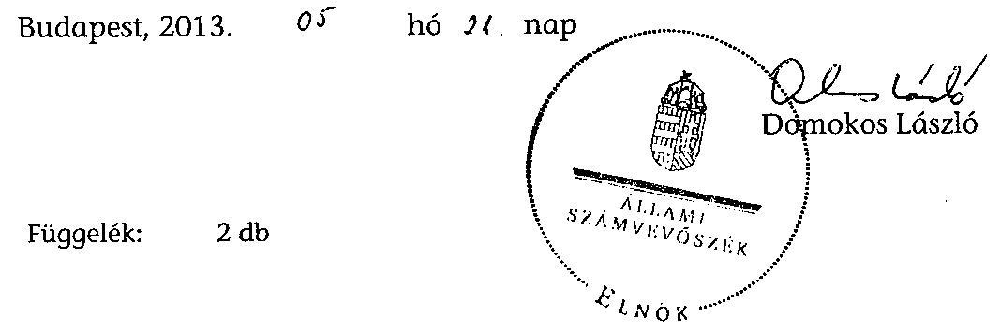

# ÁLLAMI   SZÁMVEVŐSZÉK 

## JELENTÉS

Tar Község Önkormányzata belső kontrollrendszerének kialakítása, valamint egyes kontrolltevékenységek és a belső ellenőrzés működése ellenőrzéséről

---

# Állami Számvevőszék 

Iktatószám: V-0012-058-015-029/2013.
Témaszám: 1051
Vizsgálat-azonosító szám: V059114

## Az ellenőrzést felügyelte:

Dr. Benedek Mária
felügyeleti vezető
2012. december 16. napjától

Gyüre Lajosné
felügyeleti vezető
2012. december 15. napjáig

## Az ellenőrzést vezette:

## Szakmányné Bilik Mária

ellenőrzésvezető

## A számvevőszéki jelentés összeállításában közreműködtek:

Dr. Fónagy Diána
számvevő tanácsos
Kámán Edina
számvevő

## Az ellenőrzést végezték:

| Deák Tamásné | Lakatos József |
| :-- | :-- |
| számvevő tanácsos | számvevő |

---

# TARTALOMJEGYZÉK 

BEVEZETÉS ..... 5
I. ÖSSZEGZŐ MEGÁLLAPÍTÁSOK, KÖVETKEZTETÉSEK, JAVASLATOK ..... 8
II. RÉSZLETES MEGÁLLAPÍTÁSOK ..... 17

1. Az önkormányzat belső kontrollrendszere kialakításának megfelelősége ..... 17
1.1. A kontrollkörnyezet kialakítása ..... 17
1.2. A kockázatkezelési rendszer kialakítása ..... 19
1.3. A kontrolltevékenységek kialakítása ..... 19
1.4. Az információs és kommunikációs rendszer kialakítása ..... 20
1.5. A monitoring rendszer kialakítása ..... 21
2. A pénzügyi folyamatokban kulcsszerepet betöltő belső kontrollok (szakmai teljesítésigazolás és utalvány ellenjegyzés) működése ..... 22
3. A belső ellenőrzés szervezeti keretei és működése ..... 24
FÜGGELÉKEK
4. számú Értelmező szótár
5. számú A belső kontrollrendszer kialakítása, a pénzügyi folyamatokban kulcsszerepet betöltő szakmai teljesítésigazolás és utalvány ellenjegyzés kontrollok működése, valamint a belső ellenőrzés működése értékelésénél alkalmazott minősítési szempontok

---

.

---

# RÖVIDÍTÉSEK JEGYZÉKE 

## Törvények

ÁSZ tv.
Avtv.

Info tv.

Ktv.
Kttv.
Mötv.

Mvtv.
Ötv.
régi Áht.

Számv. tv.
Tvtv.
új Áht.

## Rendeletek

Áhsz.

Ámr.
Ávr.

Ber.
Bkr.
önkormányzati SZMSZ
2011. évi LXVI. törvény az Állami Számvevőszékről
1992. évi LXIII. törvény a személyes adatok védelméről és a közérdekű adatok nyilvánosságáról (hatálytalan 2012. január 1-jétől)
2011. évi CXII. törvény az információs önrendelkezési jogról és az információszabadságról (hatályos 2012. január 1-jétől)
1992. évi XXIII. törvény a köztisztviselők jogállásáról (hatálytalan 2012. március 1-jétől)
2011. évi CXCIX. törvény a közszolgálati tisztviselőkről (hatályos 2012. március 1-jétől)
2011. évi CLXXXIX. törvény Magyarország helyi önkormányzatairól (hatályos 2012. január 1-jétől)
1993. évi XCIII. törvény a munkavédelemről
1990. évi LXV. törvény a helyi önkormányzatokról
1992. évi XXXVIII. törvény az államháztartásról (hatálytalan 2012. január 1-jétől)
2000. évi C. törvény a számvitelről
1996. évi XXXI. törvény a tűz elleni védekezésről, a műszaki mentésről és a tűzoltóságról
2011. évi CXCV. törvény az államháztartásról (hatályos 2012. január 1-jétől)

249/2000. (XII. 24.) Korm. rendelet az államháztartás szervezetei beszámolási és könyvvezetési kötelezettségének sajátosságairól
292/2009. (XII. 19.) Korm. rendelet az államháztartás működési rendjéről (hatálytalan 2012. január 1-jétől)
368/2011. (XII. 31.) Korm. rendelet az államháztartásról szóló törvény végrehajtásáról (hatályos 2012. január 1-jétől)
193/2003. (XI. 26.) Korm. rendelet a költségvetési szervek belső ellenőrzéséről (hatálytalan 2012. január 1-jétől)
370/2011. (XII. 31.) Korm. rendelet a költségvetési szervek belső kontrollrendszeréről és belső ellenőrzéséről (hatályos 2012. január 1-jétől)
Tar Község Önkormányzat Képviselő-testületének 10/2007. (IV. 13.) számú rendelete az Önkormányzat és szervei szervezeti és működési szabályainak egyes kérdéseiről

---

# Szórövidítések 

| ÁSZ | Állami Számvevőszék |
| :--: | :--: |
| Belső ellenőrzési kézikönyv | Bátonyterenye Kistérség Önkormányzatainak Többcélú Társulása Belső Ellenőrzési Kézikönyve (hatályos 2010. január 1-jétől) |
| Belső Kontroll Kézikönyv | Az Ámr. 155. § (1) bekezdése, valamint az államháztartási belső kontroll standardokról szóló 1/2009. (IX. 11.) PM irányelv egységes értelmezése érdekében az államháztartásért felelős miniszter által 2010. évben kiadott Belső Kontroll Kézikönyv. |
| bizonylati rend | Tar Község Önkormányzata Polgármesteri Hivatalának Bizonylati rend szabályzata (hatályos 2009. június 1-jétől) |
| gazdálkodási szabályzat | Tar Község Önkormányzata Polgármesteri Hivatalának kötelezettségvállalás, ellenjegyzés, utalványozás, érvényesítés rendjének szabályzata (hatályos 2011. május 23-ától) |
| gazdasági program | A Képviselő-testület 46/2010. (X. 7.) számú határozata az Önkormányzat 2010-2014. évekre szóló gazdasági programjáról |
| hivatali SZMSZ | A Polgármesteri Hivatal szervezeti és működési szabályzata (az önkormányzati SZMSZ 8. számú melléklete, hatályos 2009. október 1-jétől) |
| jegyző $_{1}$ | Tar Község Önkormányzatának jegyzője 2008. február 25-étől 2009. április 1-jéig |
| jegyző $_{2}$ | Tar Község Önkormányzatának jegyzője 2009. április 2-ától 2010. december 31-éig |
| jegyző $_{3}$ | Tar Község Önkormányzatának jegyzője 2011. január 21-étől 2011. április 30-áig |
| jegyző $_{4}$ | Tar Község Önkormányzatának jegyzője 2011. május 1-jétől 2011. május 31-éig |
| jegyző $_{5}$ | Tar Község Önkormányzatának jegyzője 2011. július 7-étől 2011. július 31-éig |
| jegyző $_{6}$ | Tar Község Önkormányzatának jegyzője 2011. augusztus 5-étől 2012. július 30-áig |
| jegyző | Tar Község Önkormányzatának jegyzője 2012. október 8-ától |
| Képviselő-testület | Tar Község Önkormányzatának Képviselő-testülete |
| leltározási szabályzat | Tar Község Önkormányzata Polgármesteri Hivatalának szabályzata a leltározásról (hatályos 2009. május 27-étől) |
| Önkormányzat | Tar Község Önkormányzata |
| pénzkezelési szabályzat | Tar Község Önkormányzata Polgármesteri Hivatalának pénzkezelési szabályzata (hatályos 2009. június 1-jétől) |
| polgármester | Tar Község Önkormányzatának polgármestere |
| Polgármesteri Hivatal | Tar Község Önkormányzatának Polgármesteri Hivatala |
| Társulás $_{1}$ | Pásztó Kistérség Többcélú Társulás |
| Társulás $_{2}$ | Bátonyterenye Kistérség Önkormányzatainak Többcélú Társulása |

---

# JELENTÉS 

## Tar Község Önkormányzata belső kontrollrendszerének kialakítása, valamint egyes kontrolltevékenységek és a belső ellenőrzés működése ellenőrzéséről

## BEVEZETÉS

A belső kontrollrendszer kialakítását, működtetését és fejlesztését a régi Áht. és az új Áht. is előírja. Ennek megvalósításáért a költségvetési szerv vezetője felel. A belső kontrollrendszer azt a célt szolgálja, hogy a költségvetési szervek működésük és gazdálkodásuk során a tevékenységeket szabályszerűen, gazdaságosan, hatékonyan, eredményesen hajtsák végre, teljesítsék elszámolási kötelezettségeiket és megvédjék az erőforrásokat a veszteségektől, a károktól és a nem rendeltetésszerű használattól. A belső kontrollrendszer magában foglalja mindazon szabályokat, eljárásokat, gyakorlati módszereket és szervezeti struktúrákat, kockázatkezelési technikákat, kontrolltevékenységeket, amelyek segítséget nyújtanak a szervezetnek céljai eléréséhez.

Az ÁSZ a 2011-2015. évekre szóló stratégiájában hangsúlyos szerepet szánt annak, hogy szilárd szakmai alapon álló, értékteremtő ellenőrzéseivel előmozdítsa a közpénzügyek átláthatóságát, rendezettségét. A számvevőszéki ellenőrzés nemzetközi alapelvei is rögzítik, hogy a megfelelő belső kontrollrendszer minimálisra csökkenti a hibák és szabálytalanságok kockázatát.

Az ellenőrzés célja annak értékelése volt, hogy az Önkormányzat a jogszabályi előírásoknak megfelelően alakította-e ki a belső kontrollrendszert; a gazdálkodás folyamatában kulcsszerepet betöltő szakmai teljesítésigazolás és az utalvány ellenjegyzés kontrolltevékenységeit megfelelően működtette-e; biztosította-e a belső ellenőrzés szabályos és eredményes működését.

Az ÁSZ ezen ellenőrzési céljait pilot (próba) jelleggel községi/nagyközségi önkormányzatoknál végzett ellenőrzések során érvényesítette.

Az ellenőrzés típusa: szabályszerűségi ellenőrzés
Az ellenőrzés jogszabályi alapja: az ÁSZ tv. 5. § (2) és (6) bekezdései
Az ellenőrzött szervezet: az Önkormányzat

---

Az ellenőrzött időszak: a belső kontrollrendszer kialakításának megfelelőségét a 2011. évre vonatkozóan értékeltük. A kontrolltevékenységek működésének megfelelőségét a 2011. január 1-je és december 31-e, míg a belső ellenőrzés működésének szabályosságát és eredményességét a 2009. január 1-je és 2011. december 31-e közötti időszakot figyelembe véve értékeltük. A helyszíni ellenőrzés lezárásáig a helyi szabályozás változásait nyomon követtük.

Az ellenőrzés szakmai módszertana az ÁSZ hivatalos honlapján (www.asz.hu) közzétett szakmai szabályokon alapult, amely a Legfőbb Ellenőrző Intézmények Nemzetközi Szervezete (INTOSAI) által kiadott nemzetközi standardok (ISSAI) figyelembevételével készült.

A belső kontrollrendszer kialakításának ellenőrzése során értékeltük a kontrollkörnyezet, a kockázatkezelési rendszer, a kontrolltevékenységek, az információs és kommunikációs rendszer, valamint a monitoring rendszer szabályozottságának megfelelőségét.

Értékeltük a pénzügyi folyamatokban kulcsszerepet betöltő szakmai teljesítésigazolás és az utalvány ellenjegyzés kontrollok működésének megfelelőségét az államháztartáson kívülre teljesített működési és felhalmozási célú pénzeszköz átadásoknál, az állományba nem tartozók megbízási díjainál, továbbá a külső szolgáltatók által végzett karbantartási, kisjavítási munkákkal kapcsolatos kifizetéseknél. Az egyszerû véletlen mintavétellel kiválasztott tételek ellenőrzését többlépcsős megfelelőségi tesztek útján addig végeztük, amíg elegendő és megfelelő bizonyítékot szereztünk a vizsgált folyamatok kulcskontrolljai működésének megfelelő vagy nem megfelelő voltáról. Értékeltük az Önkormányzatnál a belső ellenőrzés működésének szabályosságát és eredményességét. Az ÁSZ a 2007-2010. években az Önkormányzatnál ellenőrzést nem végzett.

A fogalmak magyarázatát az 1. számú függelék, az ellenőrzés egyes területeinek értékelésénél alkalmazott egységes minősítési szempontokat a 2. számú függelék tartalmazza.

Az ellenőrzés lefolytatásához az Önkormányzat a munkalapok és a tanúsítvány elektronikus kitöltésével, valamint a megjelölt dokumentumok elektronikus megküldésével szolgáltatott adatokat. A munkalapokon szerepeltetett adatok, információk ellenőrzése és szükség szerinti javítása a helyszíni ellenőrzés keretében történt.

Az ÁSZ az ellenőrzés megállapításait az ellenőrzött időszakban hatályos, az intézkedést igénylő megállapításokra tett javaslatokat a jelenleg hatályos jogszabályok alapján fogalmazta meg.

Az ÁSZ tv. 29. § (1) bekezdése szerint a jelentéstervezetet megküldtük a polgármester részére, aki az ÁSZ tv. 29. § (2) bekezdésében foglalt észrevételezési jogával nem élt, a jelentéstervezetre észrevételt nem tett.

Tar község állandó lakosainak száma 2011. január 1-jén 1987 fő volt. Az Önkormányzat héttagú Képviselő-testületének munkáját négy állandó bizottság segítette. Az Önkormányzat az önállóan működő és gazdálkodó Polgármesteri Hivatalon felül két önállóan működő intézménnyel látta el feladatát. Az Önkormányzat többségi tulajdoni hányadú gazdasági társasággal nem rendelke-

---

zett. A polgármester a 2006. évi önkormányzati választások óta tölti be tisztségét. Az ellenőrzött időszakban a jegyző személye öt alkalommal változott. A jegyzőváltások alkalmával a munkakör átadás-átvételt nem dokumentálták. A helyszíni ellenőrzés időszakában a munkakört betöltő jegyző 2012. október 8-ától látta el feladatait.

A Polgármesteri Hivatal szervezeti egységekre nem tagolódott, a foglalkoztatott köztisztviselők száma 2011. január 1-jén nyolc fő volt. Az Önkormányzat a 2011. évi költségvetési beszámolója szerint 267741 ezer Ft költségvetési bevételt ért el, és 254039 ezer Ft költségvetési kiadást teljesített. A 2011. december 31-i könyvviteli mérleg szerint 1259804 ezer Ft értékű eszközvagyonnal rendelkezett, hosszú lejáratú kötelezettsége nem volt, rövid lejáratú kötelezettsége 14235 ezer Ft volt.

---

# I. ÖSSZEGZŐ MEGÁLLAPÍTÁSOK, KÖVETKEZTETÉSEK, JAVASLATOK 

A belső kontrollrendszer kialakításán belül 2011-ben a Polgármesteri Hivatalban a kontrollkörnyezet, a kockázatkezelési rendszer, a kontrolltevékenységek, az információs és kommunikációs rendszer, valamint a monitoring rendszer szabályozását, illetve kialakítását külön-külön és összesítve is értékeltük. A belső kontrollrendszer kialakítása az összesített értékelés alapján nem felelt meg a jogszabályi előírásoknak, és az egyes területek kialakításának értékelését az alábbiakban részletezzük.

A kontrollkörnyezet kialakítása nem felelt meg a jogszabályi követelményeknek. A jegyző ${ }_{1,2,3,4,5,6}$ - az Ámr.-ben ${ }^{1}$ foglaltak ellenére - a hivatali SZMSZ-ben nem rögzítette az alaptevékenységeket szabályozó jogszabályokat. Nem határozta meg a hivatali SZMSZ-ben nevesített munkakörökhöz tartozó feladat- és hatásköröket, a hatáskörök gyakorlásának módját, az ezekhez kapcsolódó felelősségi szabályokat és a Polgármesteri Hivatal szervezeti ábráját. A jegyző ${ }_{1,2,3,4,5,6}$ és a helyszíni ellenőrzés idején hivatalban lévő jegyző nem rendelkezett a polgármester által aláírt munkaköri leírással. A jegyző ${ }_{1,2,3,4,5,6}$ a hivatali SZMSZ-ben - az Ámr.-ben foglaltak ellenére - nem szabályozta a pénzügyi-gazdasági feladatok munkafolyamatainak leírását, és a feladatok ellátásáért felelősök feladat- és hatáskörét. A leltározási szabályzatban - az Áhsz.-ben foglaltak ellenére - a mérlegben kimutatott eszközök közül az ingatlanok, a gépek, berendezések, felszerelések és a járművek kétévenkénti leltározási kötelezettségét a Képviselő-testület felhatalmazása nélkül írta elő. Nem készítette el - a Számv. tv. előírása ellenére - az eszközök és források értékelési szabályzatát, valamint az Önkormányzat bizonylati rendjének záró rendelkezésében előírt bizonylati albumot. A pénzkezelési szabályzatban - a Számv. tv.-ben foglaltak ellenére - nem szabályozta
 a házipénztáron kívüli pénzkezelést és annak elszámolási rendjét, ami vagyonvédelmi kockázatot jelent. Az Mvt. előírását figyelmen kívül hagyva nem határozta meg a Polgármesteri Hivatalban az egészséget nem veszélyeztető és biztonságos munkavégzés követelményei megvalósításának módját. A Ktv.-ben² ${ }^{2}$ foglaltak ellenére nem alakították ki a teljesítményértékelési rendszert.

A kockázatkezelési rendszer kialakítása nem felelt meg a jogszabályi előírásoknak. A jegyző ${ }_{1,2,3,4,5,6}$ - az Ámr.-ben foglaltak ellenére - nem állapította meg a Polgármesteri Hivatal tevékenységében és gazdálkodásában rejlő kockázatokat, továbbá írásban nem határozta meg az egyes kockázatokkal kapcsolatos intézkedéseket és megtételük módját.

A kontrolltevékenységek kialakítása nem felelt meg a jogszabályi követelményeknek. A jegyző ${ }_{4}$ az Ámr.-ben foglaltakat figyelmen kívül hagyva hatal-

[^0]
[^0]:    ${ }^{1}$ 2012. január 1-jétől Ávr.
    ${ }^{2}$ 2012. március 1-jétől Kttv.

---

mazta fel a kötelezettségvállalás és az utalványozás ellenjegyzésére jogosultat, aki nem rendelkezett az előírt végzettséggel és képesítéssel, és ezt a jegyző ${ }_{5,6}$ sem vizsgálta felül. A jegyző ${ }_{2,3,4,5,6}$ - az Ámr.-ben foglaltak ellenére - az ellenjegyzésre, valamint a szakmai teljesítés igazolására jogosult személyekről és az aláírásmintájukról vezetett nyilvántartás naprakészségét nem biztosította. A jegyző${ }_{2,3,4,5,6}$ az Ámr.-ben foglaltakat figyelmen kívül hagyva nem határozta meg az előzetes írásbeli kötelezettségvállalást nem igénylő kifizetések rendjét annak ellenére, hogy a gazdálkodási szabályzat tartalmazta a nem írásbeli kötelezettségvállalás lehetőségét.

Az információs és kommunikációs rendszer kialakítása nem felelt meg a jogszabályi követelményeknek, A jegyző ${ }_{1,2,3,4,5,6}$ - az Ámr.-ben foglaltak ellenére - nem határozta meg a közérdekű adatok közzétételi eljárásának, nyilvánosságra hozatalának rendjét, továbbá - az Avtv. előírása ellenére - nem szabályozta a közérdekű adatok megismerésére irányuló igények teljesítésének rendjét. Az Avtv.-ben ${ }^{3}$ foglaltak ellenére elmulasztotta az adatbiztonság érvényre juttatásához szükséges intézkedések megtételét. Nem alakította ki az informatikai rendszer hozzáférési jogosultságaira és az azok betartásának ellenőrzésére vonatkozó eljárásrendet és nyilvántartást. Nem szabályozta a pénzügyi-számviteli szoftverváltozások ellenőrzésére vonatkozó eljárásokat, a pénzügyi-számviteli rendszerben feldolgozott adatok mentési eljárásrendjét, és nem jelölte ki a mentések felelőseit.

A monitoring rendszer kialakítása a jogszabályi előírásoknak nem felelt meg. A jegyző ${ }_{1,2,3,4,5,6}$ - az Ámr.-ben foglalt előírások ellenére - az operatív tevékenységek keretében megvalósuló folyamatos és eseti nyomon követésből álló, az Önkormányzat tevékenységének, a célok megvalósításának nyomon követését biztosító rendszert nem szabályozta.

A belső kontrollrendszer kialakításáért és működtetéséért felelős vezető, a jegyző személyének gyakori változása hozzájárult ahhoz, hogy a belső kontrollrendszer kialakítása nem felelt meg a jogszabályi követelményeknek. A belső kontrollrendszer nem megfelelő kialakítása kockázatot jelent az Önkormányzat tevékenységeinek szabályszerű, gazdaságos és hatékony végrehajtása során.

A Polgármesteri Hivatalban a 2011. évben az államháztartáson kívülre történő működési és felhalmozási célú pénzeszközátadásokkal, az állományba nem tartozók megbízási díjaival, valamint a külső szolgáltatók által végzett karbantartással, kisjavítással kapcsolatos kifizetések során összefoglalóan értékelve a kulcskontrollok működésének megfelelősége gyenge volt, mert a kiadások teljesítését megelőzően azok jogosságának, összegszerűségének ellenőrzése, az ellenszolgáltatást is magukban foglaló kifizetések esetében a szerződések szakmai teljesítésének igazolása - az Ámr. előírása ellenére - a jegyző ${ }_{4}$ által kijelölt személyek által nem történt meg, illetve azt nem az arra jogosult személy végezte el, valamint egyes megbízási szerződések esetében - az Ámr.-ben előírtak ellenére - a kötelezettségvállalás ellenjegyzése nem történt meg. Továbbá az utalványok ellenjegyzője az Ámr.-ben foglalt ellenőrzési feladatait nem a jogszabályi előírásoknak megfelelően végezte. Annak ellenére ellenjegyezte a

[^0]
[^0]:    ${ }^{3}$ 2012. január 1-jétől Info tv.

---

kiadásokat, hogy a szakmai teljesítésigazolást nem, vagy nem a jegyző ${ }_{4}$ által kijelölt személyek végezték el, valamint - az Ámr. szabályozása ellenére - az utalványrendelet tartalmi megfelelőségére, a kötelezettségvállalás ellenjegyzésére és nyilvántartásba vételére vonatkozó szabályokat nem tartották be, továbbá a jegyző ${ }_{4}$ által kijelölt személy nem rendelkezett az Ámr.-ben előírt iskolai végzettséggel és pénzügyi-számviteli képesítéssel.

A számvevőszéki ellenőrzés az ellenőrzött kifizetésekkel összefüggésben a rendelkezésre bocsátott dokumentumok alapján jogosulatlan kifizetést nem tárt fel, azonban a gazdálkodásban kulcsszerepet betöltő kontrollok működésében feltárt hiányosságok miatt fennáll a hibák bekövetkezésének lehetősége. A nem megfelelően működtetett belső kontrollok, valamint azok szabályozásának hiánya korrupciós kockázatot hordoznak.

Az Önkormányzat a 2009-2011. években a belső ellenőrzési feladatokat a Társulás ${ }_{1,2}$ útján látta el. A belső ellenőrzés szabályozása a jogszabályi előírásoknak összességében nem felelt meg. A 2010-2011. években - a Ber.-ben ${ }^{4}$ foglaltak ellenére - nem határozták meg a belső ellenőrzési vezető személyét, illetve a feladatkörébe tartozó tevékenységek ellátásának módját. A 2009-2011. évi ellenőrzési tervek összeállításához - a Ber. előírása ellenére - a jegyző ${ }_{1,2}$ írásos véleményt nem készített. A belső ellenőrzési vezető - a Ber.-ben foglaltak ellenére - a 2010. évben az ellenőrzésekről, valamint a 2009-2010. években az ellenőrzési jelentésekben szereplő javaslatok alapján tett intézkedésekről nyilvántartást nem vezetett. A 2011. évben az éves ellenőrzési tervben szereplő - a belső ellenőrzési feladatok ellátása szempontjából kifogásolható számú - mindössze egy ellenőrzéshez ellenőrzési program nem készült a Ber.-ben foglaltak ellenére. A Társulás ${ }_{2}$ kapacitás hiányára hivatkozva az ellenőrzést nem végezte el. A Társulás ${ }_{2}$ így a 2011. évben belső ellenőrzési feladatát az Önkormányzatnál nem látta el, a jegyző ${ }_{6}$ - a régi Áht.-ban ${ }^{5}$ foglaltak ellenére - a belső ellenőrzés működtetéséről nem gondoskodott.

Az Önkormányzatnál a 2009-2011. években a belső ellenőrzés működése a 2. számú függelék minősítési szempontjai alapján - nem volt eredményes, mert a belső ellenőrzés szabályozása és működése az összegző értékelés alapján az ellenőrzött időszak egészét tekintve a jogszabályi előírásoknak nem felelt meg; továbbá nem végeztek belső ellenőrzést a következőkben felsoroltak közül legalább kettő területen: a belső kontrollrendszer kialakításának szabályozottsága, a beazonosított túréshatár feletti kockázatok kezelése érdekében tett intézkedések, a gazdálkodási jogkörök gyakorlása, a készpénzkezeléssel kapcsolatos belső kontrollok működése, valamint az önkormányzati vagyonhasznosításra vonatkozó vagyongazdálkodási szabályok betartása.

Az ÁSZ tv. 33. § (1) bekezdésében foglaltak értelmében az ellenőrzött szervezet vezetője köteles a jelentésben foglalt megállapításokhoz kapcsolódó intézkedési tervet összeállítani, és azt a jelentés kézhezvételétől számított 30 napon belül az ÁSZ részére megküldeni. Amennyiben az intézkedési tervet határidőre nem küldi meg a szervezet, vagy az az ÁSZ tv. 33. § (2) bekezdésében foglalt pótha-

[^0]
[^0]:    ${ }^{4}$ 2012. január 1-jétől Bkr.
    ${ }^{5}$ 2012. január 1-jétől új Áht.

---

táridő eltelte ellenére továbbra sem elfogadható, az ÁSZ elnöke a hivatkozott törvény 33. § (3) bekezdés a)-b) pontjaiban foglaltakat érvényesítheti.

Az ellenőrzés intézkedést igénylő megállapításai és javaslatai:

# a polgármesternek 

1. A megbízási szerződések esetében a kötelezettségvállalás - a régi Áht. 100/C. § (3) bekezdésében és az Ámr. 74. § (1) bekezdésében foglaltak ellenére - ellenjegyzés nélkül történt.

Javaslat:
Biztosítsa, hogy - az új Áht. 37. § (1) bekezdésében foglaltaknak megfelelően - kötelezettségvállalásra - az Ávr. 53. §-ában meghatározott kivételeket figyelembe véve - minden esetben a pénzügyi ellenjegyzés után, a pénzügyi teljesítés esedékességét megelőzően, írásban kerüljön sor.
2. A Ktv. 11. § (6) bekezdésében foglaltak ellenére a jegyző ${ }_{1,2,3,4,5,6}$ és a helyszíni ellenőrzés idején hivatalban lévő jegyző nem rendelkezett a polgármester által aláírt munkaköri leírással.

Javaslat:
Készítse el a jegyző kinevezési okmányához a munkaköri leírást a Kttv. 43. § (4) bekezdés előírásainak megfelelően.
3. Az utalványok ellenjegyzője - aláírása ellenére - nem tett eleget az Ámr. 79. § (2) bekezdésében foglalt ellenőrzési kötelezettségének. Annak ellenére ellenjegyezte a kiadásokat, hogy a szakmai teljesítésigazolást nem végezték el, továbbá az Ámr. 75. § (1) bekezdésében foglalt, a kötelezettségvállalások nyilvántartásba vételére, és az Ámr. 78. § (2) bekezdése szerinti utalványrendelet tartalmi követelményére vonatkozó szabályokat nem tartották be.

Javaslat:
Intézkedjen a szakmai teljesítésigazolás és az utalvány ellenjegyzés kontrollokkal összefüggésben a számvevőszéki jelentésben rögzített hiányosságok és szabálytalanságok tekintetében az esetleges munkajogi felelősséggel kapcsolatos körülmények kivizsgálásáról, majd a vizsgálat eredményének függvényében tegye meg a szükséges munkajogi intézkedéseket.

## a jegyzőnek

4. a kontrollkörnyezettel kapcsolatban:

A jegyző ${ }_{1,2,3,4,5,6}$ - az Ámr. 20. § (2) bekezdés c), h) és i) pontjaiban foglaltak ellenére - a hivatali SZMSZ-ben nem rögzítette az alaptevékenységeket szabályozó jogszabályok megjelölését. Nem határozta meg a hivatali SZMSZ-ben nevesített munkakörökhöz tartozó feladat- és hatásköröket, a hatáskörök gyakorlásának módját, az

---

ezekhez kapcsolódó felelősségi szabályokat és a Polgármesteri Hivatal szervezeti ábráját. A hivatali SZMSZ-ben - az Ámr. 20. § (7) bekezdésének előírása ellenére - nem szabályozta a pénzügyi-gazdasági feladatok munkafolyamatainak leírását, és a feladatok ellátásáért felelősök feladat- és hatáskörét.

A leltározási szabályzatban - az Áhsz 37. § (7) bekezdésében foglaltak ellenére - a mérlegben kimutatott eszközök kétévenkénti leltározási kötelezettségét a Képviselőtestület felhatalmazása nélkül írta elő.

Nem gondoskodott - a Számv. tv. 14. § (5) bekezdés b) pontjának előírása ellenére - az eszközök és források értékelési szabályzatának, valamint az Önkormányzat bizonylati rendjének záró rendelkezésében előírtak szerinti bizonylati album elkészítéséről.

A pénzkezelési szabályzatban - a Számv. tv. 14. § (8) bekezdésében foglaltak ellenére - nem szabályozta a házipénztáron kívüli pénzkezelést és annak elszámolási rendjét.

Az Mvt. 2. § (3) bekezdés előírását figyelmen kívül hagyva nem határozta meg a Polgármesteri Hivatalban az egészséget nem veszélyeztető és biztonságos munkavégzés követelményei megvalósításának módját.

A Ktv. 34. § (5) bekezdésében foglaltak ellenére nem alakították ki a teljesítményértékelési rendszert.

Javaslat:
a) Módosítsa a hivatali SZMSZ-t, és kezdeményezze a polgármesternél a módosítás Képviselő-testület elé terjesztését annak érdekében, hogy a hivatali SZMSZ az Ávr. 13. § (1) bekezdés c), e) és g) pontjaiban foglaltaknak megfelelően tartalmazza az alaptevékenységeket szabályozó jogszabályok megjelölését, az SZMSZ-ben nevesített munkakörökhöz tartozó feladat- és hatásköröket, azok gyakorlásának módját, a felelősségi szabályokat, és a Polgármesteri Hivatal szervezeti ábráját; az Ávr. 13. § (5) bekezdésében foglaltaknak megfelelően a pénzügyi-gazdasági feladatok munkafolyamatainak leírását, a vezető és a pénzügyi-gazdasági feladatok ellátásáért felelősök feladat- és hatáskörét.
b) Biztosítsa a leltározási szabályzat és az Áhsz. 37. § (1) bekezdése előírásának összhangját. Amennyiben az Áhsz. 37. § (7) bekezdésében foglalt lehetőséggel élve kétévenkénti leltározást ír elő, készítsen előterjesztést, és kezdeményezze a polgármesternél a Képviselő-testület elé terjesztését annak érdekében, hogy rendeletben (határozatban) állapítsa meg a leltározási kötelezettség szabályait.
c) Készítse el - a Számv. tv. 14. § (5) bekezdésének b) pontja előírásainak megfelelően - az eszközök és források értékelési szabályzatát, valamint az Önkormányzat bizonylati rendjének záró rendelkezésében előírtaknak megfelelően a bizonylati albumot.
d) Egészítse ki a pénzkezelési szabályzatot a Számv. tv. 14. § (8) bekezdésében foglaltaknak megfelelően a házipénztáron kívüli pénzkezelés szabályozásával és elszámolási rendjének meghatározásával.

---

e) Gondoskodjon a Polgármesteri Hivatalban az egészséget nem veszélyeztető és biztonságos munkavégzés körülményei megvalósításának szabályozásáról.
 az Mtv. 2. § (3) bekezdése alapján.
f) Gondoskodjon a Kttv. 130. § (1)-(6) bekezdéseiben előírtak szerint a teljesítményértékelésre vonatkozó szabályok kialakításáról és alkalmazásáról.
5. a kockázatkezelési rendszerrel kapcsolatban:

A jegyző ${ }_{1,2,3,4,5,6}$ - az Ámr. 157. § (2)-(3) bekezdésében foglaltak ellenére - nem állapította meg a Polgármesteri Hivatal tevékenységében, gazdálkodásában rejlő kockázatokat, továbbá írásban nem határozta meg az egyes kockázatokkal kapcsolatos intézkedéseket és megtételük módját.

Javaslat:
Mérje fel és állapítsa meg - a Bkr. 7. §-a alapján - a Polgármesteri Hivatal tevékenységében, gazdálkodásában rejlő kockázatokat, és határozza meg a feltárt kockázatokkal kapcsolatban szükséges intézkedéseket és azok teljesítésének folyamatos nyomon követésének módját.
6. a kontrolltevékenységekkel kapcsolatban:

A jegyző ${ }_{4}$ az Ámr. 19. § (1) bekezdésében foglaltakat figyelmen kívül hagyva hatalmazta fel a kötelezettségvállalás és az utalványozás ellenjegyzésére jogosultat, mivel az nem rendelkezett az előírt iskolai végzettséggel és pénzügyi-számviteli képesítéssel. Ezt a jegyző ${ }_{5,6}$ sem vizsgálta felül. A jegyző ${ }_{2,3,4,5,6}$ - az Ámr. 80. § (3) bekezdésében foglaltak ellenére - az ellenjegyzésre, valamint a szakmai teljesítés igazolására jogosult személyekről és az aláírás-mintájukról vezetett nyilvántartás naprakészségét nem biztosította. A jegyző ${ }_{2,3,4,5,6}$ - az Ámr. 72. § (14) bekezdésében foglaltakat figyelmen kívül hagyva - nem határozta meg az előzetes írásbeli kötelezettségvállalást nem igénylő kifizetések rendjét annak ellenére, hogy a gazdálkodási szabályzat tartalmazta a nem írásbeli kötelezettségvállalás lehetőségét.

Javaslat:
a) Jelöljön ki az Ávr. 55. § (3) bekezdésében előírt iskolai végzettséggel, illetve szakképesítéssel rendelkező pénzügyi ellenjegyzőt.
b) Biztosítsa a gazdálkodási szabályzat naprakészségét, valamint az Ávr. 60. § (3) bekezdése szerint a kötelezettségvállalásra, a pénzügyi ellenjegyzésre, a teljesítés igazolására, az érvényesítésre és az utalványozásra jogosult személyek és aláírásmintájuk naprakész nyilvántartását.
c) Módosítsa a gazdálkodási szabályzatot, hogy az Ávr. 53. § (2) bekezdésének megfelelően tartalmazza az előzetes írásbeli kötelezettségvállalást nem igénylő kifizetések rendjét.

---

7. az információs és kommunikációs rendszerrel kapcsolatban:

A jegyző ${ }_{1,2,3,4,5,6}$ - az Ámr. 20. § (3) bekezdés i) pontjában foglaltak ellenére - nem határozta meg a közérdekű adatok közzétételi eljárásának, nyilvánosságra hozatalának rendjét, továbbá az Avtv. 20. § (8) bekezdésének előírása ellenére nem szabályozta a közérdekű adatok megismerésére irányuló igények teljesítésének rendjét. Az Avtv. 10. § (1)-(2) bekezdéseiben foglaltak ellenére elmulasztotta az adatbiztonság érvényre juttatásához szükséges intézkedések megtételét. Nem alakította ki az informatikai rendszer hozzáférési jogosultságaira és az azok betartásának ellenőrzésére vonatkozó eljárásrendet és nyilvántartást. Nem szabályozta a pénzügyi-számviteli szoftverváltozások ellenőrzésére, tesztelésére vonatkozó eljárásokat, a pénzügyi-számviteli rendszerben feldolgozott adatok mentési eljárásrendjét, és nem jelölte ki a mentések felelőseit.

Javaslat:
a) Rendelkezzen az Ávr. 13. § (2) bekezdés h) pontja és az Info tv. 35. § (3) bekezdése alapján a közérdekű adatok közzétételi eljárásának, nyilvánosságra hozatala rendjének, valamint az Info tv. 30. § (6) bekezdése szerint a közérdekű adatok megismerésére irányuló igények teljesítése rendjének szabályozásáról.
b) Biztosítsa az Info tv. 7. § (2)-(3) bekezdésének megfelelően az adatbiztonság érvényesülését, rendelkezzen a hozzáférési jogosultságok megállapításáról, betartásának ellenőrzéséről és nyilvántartásáról. Szabályozza a pénzügyi-számviteli szoftverváltozások ellenőrzésére, tesztelésére vonatkozó eljárásokat, a feldolgozott adatok mentési eljárásait, és jelölje ki a mentések elvégzésének felelőseit.
8. a monitoring rendszerrel kapcsolatban:

A jegyző ${ }_{1,2,3,4,5,6}$ - az Ámr. 160. §-ában foglaltak ellenére - nem alakított ki és működtetett olyan monitoring rendszert, amely lehetővé teszi a Polgármesteri Hivatal tevékenységének, a célok megvalósításának nyomon követését, és amelynek része az operatív tevékenységek keretében megvalósuló folyamatos és eseti nyomon követés is.

Javaslat:
Alakítsa ki és működtesse a Bkr. 10. §-ában előírtak alapján a Polgármesteri Hivatal tevékenységének, a célok megvalósításának nyomon követését biztosító rendszert, amelynek része az operatív tevékenységek keretében megvalósuló folyamatos és eseti nyomon követés is.
9. a pénzügyi folyamatokban kulcsszerepet betöltő kontrollok működésével kapcsolatban:

Az államháztartáson kívülre történő működési és felhalmozási célú pénzeszközátadásokkal, a szociális étkezők ebédszállításával kapcsolatos megbízási díj kifizetésénél, valamint a külső szolgáltatók által végzett karbantartással, kisjavítással kapcsolatos kiadások teljesítését megelőzően a szakmai teljesítésigazolást - az Ámr. 76. § (3) bekezdésében foglaltak ellenére - nem az arra jogosult személy végezte. A szemétdíj beszedésével, valamint a december 29-ei és november 9-ei népszámlálási feladatokkal kapcsolatos kifizetéseknél a szakmai teljesítés igazolására kijelölt személy - a régi

---

Áht. 100/C. § (6) bekezdésében és az Ámr. 76. § (1) és (3) bekezdésében foglaltak ellenére - aláírásával nem igazolta a kifizetés jogosságát, összegszerűségét és a szerződés teljesítését.

Az államháztartáson kívülre történő működési és felhalmozási célú pénzeszközátadásokkal, az állományba nem tartozók megbízási díjaival, valamint a külső szolgáltatók által végzett karbantartással, kisjavítással kapcsolatos kiadások teljesítését megelőzően az utalványok ellenjegyzője az Ámr. 79. § (2) bekezdésében foglalt ellenőrzési feladatait nem a jogszabályi előírásoknak megfelelően végezte. Annak ellenére ellenjegyezte a kiadásokat, hogy a szakmai teljesítésigazolást nem végezték el, továbbá az Ámr. 75. § (1) bekezdésében foglalt, a kötelezettségvállalások nyilvántartásba vételére, és az Ámr. 78. § (2) bekezdése szerinti, az utalványrendelet tartalmi követelményeire vonatkozó szabályokat nem tartották be.

Javaslat:
Gondoskodjon - a szakmai teljesítés igazolása, az érvényesítés és az utalványozás ellenjegyzés vonatkozásában feltárt hiányosságok megszüntetése, illetve az operatív gazdálkodás során a működésbeli hibák megelőzése, feltárása és kijavítása érdekében - arról, hogy
a) az Ávr. 57. § (3) bekezdése szerinti teljesítésigazolást az Ávr. 57. § (4) bekezdése figyelembevételével kijelölt személyek végezzék el, és az Ávr. 57. § (1) bekezdésében foglaltaknak megfelelően ellenőrizhető okmányok alapján ellenőrizzék a kiadások teljesítésének jogosságát, összegszerűségét, az ellenszolgáltatást is magában foglaló kötelezettségvállalás esetében a szerződés, megrendelés teljesítését;
b) a kifizetéseket megelőzően - az Ávr. 58. § (1) bekezdése szerint - a teljesítésigazolás alapján - az Ávr. 57. § (3) bekezdése szerinti esetben annak hiányában is az összegszerűségnek, a fedezet meglétének és a megelőző ügymenetben az új Áht., az Áhsz., az Ávr. előírásai és a belső szabályzatokban foglaltak betartásának az ellenőrzése megtörténjen;
c) az Ávr. 56. § (1) bekezdésében foglaltak szerint a kötelezettségvállalást követően annak nyilvántartásba vétele megtörténjen;
d) a külön írásbeli rendelkezésként kiállítandó utalvány tartalmazza az Ávr. 59. § (3) bekezdésében foglaltakat, illetve az utalvány használata során tüntessék fel a kötelező tartalmi elemeket.
10. a belső ellenőrzés működésével kapcsolatban:

A 2011. évben - a Ber. 23. § (1) bekezdésében foglaltak ellenére - az éves ellenőrzési tervben tervezett - a belső ellenőrzési feladatok ellátása szempontjából kifogásolható számú - mindössze egy ellenőrzéshez ellenőrzési program nem készült, és a Társulás ${ }_{2}$ az ellenőrzést nem végezte el. A jegyző ${ }_{6}$ - a régi Áht. 121/B. § (4) bekezdésében foglaltak ellenére - a belső ellenőrzés működtetéséről nem gondoskodott. A 2010-2011. években a belső ellenőrzési vezető személyét, illetve a feladatkörébe tartozó tevékenységek ellátásának módját - a Ber. 4/A. § (2) bekezdésében foglaltak ellenére - nem határozták meg. A 2009-2011. évi ellenőrzési tervek összeállításához - a Ber. 32/B. § (2) bekezdésének előírása ellenére - a jegyző ${ }_{1,2}$ írásos véleményt nem

---

készített. A belső ellenőrzési vezető a 2010. évben - a Ber. 32. § (1)-(2) bekezdéseiben foglaltak ellenére - az ellenőrzésekről, valamint - a Ber. 12. § n) pontja, és 29/A. § (1)-(2) és (7) bekezdéseinek előírásai ellenére - a 2009-2010. években az ellenőrzési jelentésekben szereplő javaslatok alapján tett intézkedésekről nyilvántartást nem vezetett.

Javaslat:
a) Gondoskodjon az új Áht. 70. § (1) bekezdésének előírása szerint a belső ellenőrzés megfelelő működtetéséről.
b) Intézkedjen, hogy a tervezett ellenőrzéseket a Bkr. 33. § (2) bekezdésében foglaltaknak megfelelően, a belső ellenőrzési vezető által jóváhagyott ellenőrzési programok alapján hajtsák végre.
c) Gondoskodjon a belső ellenőrzési vezető személyének, illetve a feladatkörébe tartozó tevékenységek ellátása módjának a Bkr. 16. § (4) bekezdésében foglaltaknak megfelelő meghatározásáról.
d) Biztosítsa, hogy az éves ellenőrzési terv összeállítása a társult feladatellátásra tekintettel a Bkr. 56. § (2) bekezdésében foglaltaknak megfelelően, a jegyző írásos véleményének figyelembevételével történjen.
e) Intézkedjen arról, hogy a belső ellenőrzési vezető vezesse a Bkr. 21. § (2) bekezdés d) pontja alapján - a Bkr. 47. § szerinti - nyilvántartást, és kövesse nyomon a belső ellenőrzési jelentésekben tett megállapításokat, javaslatokat, a vonatkozó intézkedési terveket és azok végrehajtását; továbbá a belső ellenőrzési vezető az elvégzett belső ellenőrzésekről vezesse a Bkr. 50. § szerinti nyilvántartást.

---

# II. RÉSZLETES MEGÁLLAPÍTÁSOK 

## 1. AZ ÖNKORMÁNYZAT BELSŐ KONTROLLRENDSZERE KIALAKÍTÁSÁNAK MEGFELELŐSÉGE

### 1.1. A kontrollkörnyezet kialakítása

A kontrollkörnyezet kialakítása a 2. számú függelék kritériumrendszerében meghatározott szempontok szerinti értékelés alapján a Polgármesteri Hivatalban nem volt megfelelő, mert a jegyző ${ }_{1,2,3,4,5,6}$ a jogszabályi előírásokat nem érvényesítette.

A jegyző ${ }_{1,2,3,4,5,6}$, mint a költségvetési szerv vezetője:

- a hivatali SZMSZ-ben - az Ámr. 20. § (2) bekezdés c), h) és i) pontjaiban ${ }^{6}$ foglaltak ellenére - nem rögzítette az alaptevékenységeket szabályozó jogszabályokat; nem határozta meg a hivatali SZMSZ-ben nevesített munkakörökhöz tartozó feladat- és hatásköröket, a hatáskörök gyakorlásának módját, az ezekhez kapcsolódó felelősségi szabályokat és a Polgármesteri Hivatal szervezeti ábráját;
- az Ámr. 20. § (7) bekezdésének ${ }^{7}$ előírása ellenére nem szabályozta a pénz-ügyi-gazdasági feladatok munkafolyamatainak leírását, a feladatok ellátásáért felelősök feladat- és hatáskörét;
- a leltározási szabályzatban - az Áhsz. 37. § (7) bekezdésében foglaltak ellenére - a mérlegben kimutatott eszközök közül az ingatlanok, a gépek, berendezések, felszerelések és a járművek kétévenkénti leltározási kötelezettségét a Képviselő-testület felhatalmazása nélkül írta elő;
- nem készítette el - a Számv. tv. 14. § (5) bekezdés b) pontjának előírása ellenére - az eszközök és források értékelési szabályzatát, az Önkormányzat bizonylati rendjének záró rendelkezésében előírt bizonylati albumot, valamint a pénzkezelési szabályzatban - a Számv. tv. 14. § (8) bekezdésében foglaltak ellenére - nem szabályozta a házipénztáron kívüli pénzkezelést és annak elszámolási rendjét;
- az Mtv. 2. § (3) bekezdés előírását figyelmen kívül hagyva nem határozta meg a Polgármesteri Hivatalban az egészséget nem veszélyeztető és biztonságos munkavégzés követelményei megvalósításának módját, és nem készítette el - a Tvtv. 19. § (1) bekezdésében foglaltak ellenére - a tűzvédelmi szabályzatot;

[^0]
[^0]:    ${ }^{6}$ 2012. január 1-jétől az Ávr. 13. § (1) bekezdés c), e) és g) pontjai
    ${ }^{7}$ 2012. január 1-jétől az Ávr. 13. § (5) bekezdése

---

A 2012. évben a jegyző ${ }_{8}$ elkészítette és 2012. június 15-én hatályba helyezte a tűzvédelmi szabályzatot.

- a Ktv. 34. § (5) bekezdésében ${ }^{8}$ foglaltak ellenére nem alakította ki a teljesítményértékelési rendszert.

A Ktv. 11. § (6) bekezdésében ${ }^{9}$ foglaltak ellenére a jegyző ${ }_{1,2,3,4,5,6}$ és a helyszíni ellenőrzés idején hivatalban lévő jegyző nem rendelkezett a polgármester által aláírt munkaköri leírással.

A Képviselő-testület az Önkormányzat gazdasági programját hiányos tartalommal fogadta el.

Az önkormányzat
 gazdasági programja nem felelt meg az Ötv. 91. § (6) bekezdésében ${ }^{10}$ foglaltaknak, mert nem tartalmazta a munkahelyteremtés feltételeinek elősegítését, a településfejlesztési politikát, az adópolitikai célkitűzéseket és az egyes közszolgáltatások biztosítására, színvonalának javítására vonatkozó megoldásokat.

A kontrollkörnyezet kialakítása keretében a jegyző ${ }_{1,2,3,4,5,6}$ az Ámr. 155. § (3) bekezdésének ${ }^{11}$ előírását figyelmen kívül hagyva az államháztartásért felelős miniszter által kiadott Belső Kontroll Kézikönyv ajánlásait nem hasznosította teljes körűen.

A kontrollkörnyezet kialakítása során a jegyző ${ }_{1,2,3,4,5,6}$

- a Belső Kontroll Kézikönyv ${ }^{12}$ 1.2.7. pontjában foglalt ajánlást nem hasznosította, mert nem írta elő a hivatali SZMSZ dolgozók általi megismerésének kötelezettségét, és a hivatali SZMSZ dolgozók általi megismerése nem történt meg;
- a Belső Kontroll Kézikönyv 1.3.3. pontjában foglaltakat nem hasznosította, mert a Polgármesteri Hivatalban dolgozó köztisztviselők munkaköri leírásaiban a munkakörökhöz kapcsolódó felelősségi szabályokat nem határozta meg;
- a Belső Kontroll Kézikönyv 1.5.2. pontjában foglalt ajánlást nem vette figyelembe, mert nem dolgozta ki a Polgármesteri Hivatalban ellátott köztisztviselői munkakörök betöltésére vonatkozó elvárt tudást és képességeket;
- a Belső Kontroll Kézikönyv 1.6. pontjában foglaltakat nem hasznosította, mert nem intézkedett a szervezeti célokkal összhangban álló etikai értékek kiemelt kezeléséről, mert nem határozta meg a köztisztviselőkkel szembeni etikai elvárásokat.
${ }^{8}$ 2012. július 1-jétől a köztisztviselőkre vonatkozóan a Kttv. 226. § (1) bekezdésének figyelembevételével a Kttv. 130. § (1)-(3) és (7) bekezdései
${ }^{9}$ 2012. március 1-jétől a Kttv. 246. § (1) és 226. § (1) bekezdésének figyelembevételével a Kttv. 43. § (4) bekezdése
${ }^{10}$ 2013. január 1-jétől a Mötv. 116. § (1)-(5) bekezdései
${ }^{11}$ 2012. január 1-jétől a Bkr. 5. § (1) bekezdése
${ }^{12}$ A 2011. évben az Ámr. 155. § (1) bekezdése, 2012. január 1-jétől a Bkr. 5. § (1) bekezdése

---

# 1.2. A kockázatkezelési rendszer kialakítása 

A kockázatkezelési rendszer kialakítása a 2. számú kritériumrendszerében meghatározott szempontok szerinti értékelés alapján a Polgármesteri Hivatalban nem volt megfelelő. A jegyző ${ }_{1,2,3,4,5,6}$ - az Ámr. 157. § (2)-(3) bekezdésében ${ }^{13}$ foglaltak ellenére - nem állapította meg a Polgármesteri Hivatal tevékenységében, gazdálkodásában rejlő kockázatokat, továbbá írásban nem határozta meg az egyes kockázatokkal kapcsolatos intézkedéseket és megtételük módját.

A kockázatkezelési rendszer szabályozása keretében a jegyző ${ }_{1,2,3,4,5,6}$ az Ámr. 155. § (3) bekezdésének előírását figyelmen kívül hagyva az államháztartásért felelős miniszter által kiadott Belső Kontroll Kézikönyv ajánlásait nem hasznosította teljes körűen.

A kockázatkezelési rendszer szabályozása során a jegyző ${ }_{1,2,3,4,5,6}$

- a Belső Kontroll Kézikönyv 2.1.1. pontjában előírtakat nem hasznosította, mert nem tárta fel a kockázati tényezőket;
- a Belső Kontroll Kézikönyv 2.1.3. pontjában foglalt ajánlást nem vette figyelembe, mert nem alakították ki a kockázat-nyilvántartási rendszert;
- a Belső Kontroll Kézikönyv 2.2.3. pontjának ajánlását nem hasznosította, mert nem állapította meg a Polgármesteri Hivatal tevékenységeire vonatkozó kockázati tűrésképességet, azokat a tűréshatárokat, amelyek felett be kell avatkozni a folyamatokba;
- a Belső Kontroll Kézikönyv 2.3. pontjában foglaltakat nem vette figyelembe, mert nem jelölte ki a kockázatokra adható válaszlépések végrehajtásáért felelős személyeket;
- nem hasznosította a Belső Kontroll Kézikönyv 2.5.1. pontjában foglalt ajánlást, mert nem gondoskodott a csalás és a korrupció, mint kiemelt kockázatok értékeléséről és kezeléséről.

### 1.3. A kontrolltevékenységek kialakítása

A kontrolltevékenységek kialakítása a 2. számú függelék kritériumrendszerében meghatározott szempontok szerinti értékelés alapján a Polgármesteri Hivatalban nem volt megfelelő, mert a jegyző ${ }_{1,2,3,4,5,6}$ a jogszabályi előírásokat nem érvényesítette teljes mértékben.

- a jegyző ${ }_{4}$ az Ámr. 19. § (1) bekezdésében ${ }^{14}$ foglaltakat figyelmen kívül hagyva hatalmazta fel a kötelezettségvállalás és az utalványozás ellenjegyzésére jogosultat, mivel a feljogosított személy ${ }^{15}$ nem rendelkezett az előírt iskolai végzettséggel és pénzügyi-számviteli képesítéssel, és ezt a jegyző ${ }_{5,6}$ sem vizsgálta felül;

[^0]
[^0]:    ${ }^{13}$ 2012. január 1-jétől a Bkr. 7. § (1)-(2) bekezdései
    ${ }^{14}$ 2012. január 1-jétől az Ávr. 55. § (3) bekezdése
    ${ }^{15}$ a Polgármesteri Hivatal szociális és gyámügyi ügyintézője

---

- a jegyző ${ }_{2,3,4,5,6}$ - az Ámr. 80. § (3) bekezdésében ${ }^{16}$ foglaltak ellenére - az ellenjegyzésre, valamint a szakmai teljesítés igazolására jogosult személyekről és aláírásmintájukról vezetett nyilvántartás naprakészségét nem biztosította;
- a jegyző ${ }_{2,3,4,5,6}$ az Ámr. 72. § (14) bekezdésében ${ }^{17}$ foglaltakat figyelmen kívül hagyva nem határozta meg az előzetes írásbeli kötelezettségvállalást nem igénylő kifizetések rendjét annak ellenére, hogy a gazdálkodási szabályzat tartalmazta a nem írásbeli kötelezettségvállalás lehetőségét.

A kontrolltevékenységek kialakítása keretében a jegyző ${ }_{1,2,3,4,5,6}$ az Ámr. 155. § (3) bekezdésének előírását figyelmen kívül hagyva az államháztartásért felelős miniszter által kiadott Belső Kontroll Kézikönyv ajánlásait nem hasznosította teljes körűen.

A kontrolltevékenységek kialakítása során a jegyző ${ }_{1,2,3,4,5,6}$

- a feladatkörök szétválasztása keretében a Belső Kontroll Kézikönyv 3.2.1. pontjában foglalt ajánlást nem vette figyelembe, mert a belső szabályzatokban nem határozta meg a folyamatok felügyelet alatt tartása és a kockázatok mérséklése érdekében szükséges, az egyes tevékenységekhez kapcsolódó pénzügyi teljesítési feladatokat ${ }^{18}$, továbbá a köztisztviselők munkaköri leírásaiban nem határozta meg azok ellenőrzési feladatait;
- a Belső Kontroll Kézikönyv 3.3.1. pontjában foglaltakat nem hasznosította, mert nem szabályozta a munkaviszony megszűnése esetén a munkavállaló folyamatban lévő feladatainak átadási rendjét, továbbá nem írta elő munkakör átadás-átvétel esetén a jegyzőkönyv készítési kötelezettséget.

A kontrolltevékenységek hiányos kialakítása veszélyeztette a feladatok szabályszerű végrehajtását.

# 1.4. Az információs és kommunikációs rendszer kialakítása 

Az információs és kommunikációs rendszer kialakítása a 2. számú függelék kritériumrendszerében meghatározott szempontok szerinti értékelés alapján a Polgármesteri Hivatalban nem volt megfelelő. Az Ámr. 159. $\S$ ában ${ }^{19}$ előírt információs és kommunikációs rendszer kialakítása keretében a jegyző ${ }_{1,2,3,4,5,6}$ a jogszabályi előírásokat nem érvényesítette teljes mértékben.

A jegyző ${ }_{1,2,3,4,5,6}$, mint a költségvetési szerv vezetője:

- az Ámr. 20. § (3) bekezdés i) pontjában ${ }^{20}$ foglaltak ellenére nem határozta meg a közérdekű adatok közzétételi eljárásának, nyilvánosságra hozatalá-

[^0]
[^0]:    ${ }^{16}$ 2012. január 1-jétől az Ávr. 60. § (3) bekezdése
    ${ }^{17}$ 2012. január 1-jétől az Ávr. 53. § (2) bekezdése
    ${ }^{18}$ A Belső Kontroll Kézikönyv 1.4.1. pontja alapján pénzügyi teljesítési feladaton a jóváhagyás utáni, jogszabályi előíráson vagy szerződésen alapuló feltételek teljesítését követő kifizetés feladatait értjük.
    ${ }^{19}$ 2012. január 1-jétől a Bkr. 3. § d) pontja
    ${ }^{20}$ 2012. január 1-jétől az Ávr. 13. § (2) bekezdés h) pontja

---

nak rendjét, továbbá - az Avtv. 20. § (8) bekezdésének ${ }^{21}$ előírásai ellenére nem szabályozta a közérdekű adatok megismerésére irányuló igények teljesítésének rendjét;

- az informatikai rendszer környezetének szabályozása során - az Avtv. 10. § (1)-(2) bekezdéseiben ${ }^{22}$ foglalt előírások ellenére - elmulasztotta az adatbiztonság érvényre juttatásához szükséges intézkedések megtételét. Nem alakította ki az informatikai rendszer hozzáférési jogosultságaira és azok betartásának ellenőrzésére vonatkozó eljárásrendet és nyilvántartást. Nem szabályozta a pénzügyi-számviteli szoftverváltozások ellenőrzésére vonatkozó eljárásokat, a pénzügyi-számviteli rendszerben feldolgozott adatok mentési eljárásrendjét és nem jelölte ki a mentések felelőseit.

Az információs és kommunikációs rendszer szabályozása során a jegyző ${ }_{1,2,3,4,5,6}$ az Ámr. 155. § (3) bekezdésének előírását figyelmen kívül hagyva az államháztartásért felelős miniszter által kiadott Belső Kontroll Kézikönyv ajánlásait nem hasznosította teljes körűen.

Az információs és kommunikációs rendszer szabályozása során a jegyző ${ }_{1,2,3,4,5,6}$

- a Belső Kontroll Kézikönyv 4.1.1. pontjában foglalt ajánlást nem hasznosította, nem szabályozta a szervezeten belüli információátadás módját;
- az iktatási, iratkezelési rendszer kialakítása során a Belső Kontroll Kézikönyv 4.2.4. pontjában foglalt ajánlást nem hasznosította, mert nem szabályozta az ügyintézési határidők nyomon követésének dokumentálását és a késedelmes ügyintézés jelzéséért való felelősség rendjét;
- a szabálytalanságkezelési szabályzatban a Belső Kontroll Kézikönyv 4.3.3. pontjában foglalt ajánlást nem hasznosította, mert nem rögzítette a szabálytalanságot bejelentő védelmére vonatkozó előírásokat és kötelezettségeket.

# 1.5. A monitoring rendszer kialakítása 

A monitoring rendszer kialakítása a 2. számú függelék kritériumrendszerében meghatározott szempontok szerinti értékelés alapján a Polgármesteri Hivatalban nem volt megfelelő, mert a jegyző ${ }_{1,2,3,4,5,6}$ - az Ámr. 160. §-ában ${ }^{23}$ foglaltak ellenére - az operatív tevékenységek keretében megvalósuló folyamatos és eseti nyomon követésből álló, az Önkormányzat tevékenységének, a célok megvalósításának nyomon követését biztosító rendszert nem alakította ki.

A belső kontrollrendszer kialakítása a Polgármesteri Hivatalban 2011ben a kontrollkörnyezet, a kockázatkezelési rendszer, a kontrolltevékenységek, az információs és kommunikációs rendszer, valamint a monitoring rendszer szabályozásának, illetve kialakításának összesített értékelése alapján nem felelt meg a jogszabályi előírásoknak.

[^0]
[^0]:    ${ }^{21}$ 2012. január 1-jétől az Ávr. 13. § (2) bekezdés h) pontja és az Info tv. 35. § (3) bekezdése
    ${ }^{22}$ 2012. január 1-jétől az Info tv. 7. § (2)-(3) bekezdései
    ${ }^{23}$ 2012. január 1-jétől a Bkr. 10. §-a

---

# 2. A PÉNZÜGYI FOLYAMATOKBAN KULCSSZEREPET BETÖLTŐ BELSŐ KONTROLLOK (SZAKMAI TELJESÍTÉSIGAZOLÁS ÉS UTALVÁNY ELLENJEGYZÉS) MŰKÖDÉSE 

A Polgármesteri Hivatalban a 2011. évben az államháztartáson kívülre teljesített működési célú pénzeszközátadások között elszámolt kiadásoknál a szakmai teljesítésigazolás és az utalvány ellenjegyzés kulcskontrollok működésének megfelelősége gyenge volt, mert

- a szakmai teljesítés igazolását nem az arra jogosult személy végezte; a július 27-ei tagdíj kifizetésnél szereplő aláírás nem egyezett meg a gazdálkodási szabályzat 5. számú melléklete szerinti nyilvántartásban szereplő, a jegyző ${ }_{4}$ által kijelölt személy aláírásának mintájával, így a kiadás jogosságának és összegszerűségének - a jegyző által kijelölt szakmai teljesítést igazoló általi - ellenőrzése nem az Ámr. 76. § (3) bekezdésében ${ }^{24}$ foglaltaknak megfelelően történt;
- az utalvány ellenjegyzője a július 27-ei tagdíj kifizetésnél az Ámr. 79. § (2) bekezdésében ${ }^{25}$ foglalt ellenőrzési feladatait nem a jogszabályi előírásoknak megfelelően végezte, mert annak ellenére aláírásával ellenjegyezte a kiadást, hogy az arra jogosult személy általi szakmai teljesítésigazolás elmaradt, továbbá az érvényesítés nem szabályszerűen történt, mert nem tartalmazta az érvényesítésre utaló megjelölést, az Ámr. 77. § (3) bekezdésében ${ }^{26}$ és a gazdálkodási szabályzat V. fejezetében foglaltak ellenére;
- az utalvány ellenjegyzője annak ellenére aláírta az utalványt, hogy a kifizetésnél használt utalványrendelet nem a gazdálkodási szabályzat 14. számú mellékletében előírt minta alapján készült, valamint nem felelt meg az Ámr. 78. § (2) bekezdésében ${ }^{27}$ előírt tartalmi követelményeknek, mert nem tartalmazta a költségvetési évet, a megterhelendő és a jóváírandó pénzforgalmi számla megnevezését, továbbá a kötelezettségvállalás nyilvántartásba vételére - az Ámr. 75. § (1) bekezdésében ${ }^{28}$ foglaltak ellenére - nem került sor.

A Polgármesteri Hivatalban a
 2011. évben az állományba nem tartozók megbízási díjainak kifizetése során a szakmai teljesítésigazolás és az utalvány ellenjegyzés kulcskontrollok működésének megfelelősége gyenge volt, mert

- a szakmai teljesítés igazolását nem az arra jogosult személy végezte a szociális étkezők ebédszállításával kapcsolatos megbízási díj kifizetésénél, így a

[^0]
[^0]:    ${ }^{24}$ 2012. január 1-jétől az Ávr. 57. § (1) bekezdése
    ${ }^{25}$ 2012. január 1-jétől az Ávr. 58. § (1) bekezdése, amely szerint az utalvány ellenjegyzőjének feladatait 2012. január 1-jétől az érvényesítő - valamint az Ávr. 55. § (1) bekezdése alapján a pénzügyi ellenjegyző - látja el.
    ${ }^{26}$ 2012. január 1-jétől az Ávr. 58. § (3) bekezdése
    ${ }^{27}$ 2012. január 1-jétől az Ávr. 59. § (3) bekezdése
    ${ }^{28}$ 2012. január 1-jétől az Ávr. 56. § (1) bekezdése

---

kiadás jogosságának és összegszerűségének - a jegyző ${ }_{4}$ által kijelölt szakmai teljesítést igazoló általi - ellenőrzése nem az Ámr. 76. § (3) bekezdésében ${ }^{29}$ foglaltaknak megfelelően történt; a szakmai teljesítés igazolására a jegyző ${ }_{4}$ által kijelölt személy - az Ámr. 76. § (3) bekezdésében ${ }^{30}$ foglaltak ellenére a szemétdíj beszedésével, valamint a december 29-ei és a november 9-ei népszámlálási feladatokkal kapcsolatos kifizetéseknél aláírásával nem igazolta a kifizetés jogosságát, összegszerűségét és a szerződés teljesítését;

- az utalvány ellenjegyzése a szociális étkezők ebédszállításával kapcsolatos megbízási díj kifizetését megelőzően nem a jogszabályi előírásoknak megfelelően történt, mert az ellenjegyzést végző, a jegyző ${ }_{4}$ által kijelölt személy nem rendelkezett az Ámr. 19. § (1) bekezdésében ${ }^{31}$ előírt végzettséggel és pénzügyi-számviteli képesítéssel;
- az utalványok ellenjegyzője a szemétdíj beszedésével, valamint a december 29-ei és a november 9-ei népszámlálási feladatokkal kapcsolatos kifizetéseknél az Ámr. 79. § (2) bekezdésében foglalt ellenőrzési feladatait nem a jogszabályi előírásoknak megfelelően végezte, mert annak ellenére aláírásával ellenjegyezte a kiadásokat, hogy a szakmai teljesítésigazolás elmaradt; továbbá az érvényesítés - az Ámr. 77. § (1) bekezdésében ${ }^{32}$ foglaltak ellenére - nem szabályszerűen elvégzett szakmai teljesítésigazolás alapján történt;
- az utalványok ellenjegyzője annak ellenére aláírásával ellenjegyezte az utalványt, hogy a kifizetéseknél használt utalványrendelet nem a gazdálkodási szabályzat 14. számú mellékletében előírt minta alapján készült. Az utalványrendelet - az Ámr. 78. § (2) bekezdésében előírtak ellenére - nem tartalmazta a megterhelendő és a jóváírandó pénzforgalmi számla megnevezését, valamint a kötelezettségvállalás nyilvántartási számát. A kötelezettségvállalás nyilvántartásba vételére - az Ámr. 75. § (1) bekezdésében foglaltak ellenére - nem került sor. A szemétdíj beszedésével, valamint a december 29-ei és a november 9-ei népszámlálási feladatokkal kapcsolatos megbízási szerződéseken - az Ámr. 74. § (1) bekezdésében ${ }^{33}$ foglaltak ellenére - a kötelezettségvállalás ellenjegyzése nem történt meg, továbbá a november 2-ai népszámlálási feladatokkal kapcsolatos megbízási szerződést az Ámr. 72. § (3) bekezdés c) pontjában ${ }^{34}$ foglaltak ellenére - a megbízó kötelezettségvállaló - nem írta alá.

A Polgármesteri Hivatalban a 2011. évben a külső szolgáltatók által teljesített karbantartási, kisjavítási szolgáltatások kiadásai során a szakmai teljesítésigazolás és az utalvány ellenjegyzés kulcskontrollok működésének megfelelősége gyenge volt, mert

[^0]
[^0]:    ${ }^{29}$ 2012. január 1-jétől az Ávr. 57. § (1) bekezdése
    ${ }^{30}$ 2012. január 1-jétől az Ávr. 57. § (1) bekezdése
    ${ }^{31}$ 2012. január 1-jétől az Ávr. 55. § (3) bekezdése
    ${ }^{32}$ 2012. január 1-jétől az Ávr. 58. § (1) bekezdés
    ${ }^{33}$ 2012. január 1-jétől az új Áht. 37. § (1) bekezdése és az Ávr. 55. § (1) bekezdése
    ${ }^{34}$ 2012. január 1-jétől az Ávr. 52. § (1) bekezdés c) pontja

---

- a szakmai teljesítés igazolását a számítógép javítás kifizetését megelőzően az Ámr. 76. § (5) bekezdésében foglaltak ellenére - nem a jegyző ${ }_{8}$ által kijelölt személy végezte, ezért - az Ámr. 76. § (1) bekezdésének előírása ellenére - a kijelölt személy nem ellenőrizte a kifizetés jogosságát, összegszerűségét és szerződésszerű teljesítését;
- az utalvány ellenjegyzése a számítógép javítás kifizetését megelőzően nem a jogszabályi előírásoknak megfelelően történt, mert az ellenjegyzést végző - a jegyző ${ }_{8}$ által kijelölt - személy nem rendelkezett az Ámr. 19. § (1) bekezdésében ${ }^{35}$ előírt iskolai végzettséggel és pénzügyi-számviteli képesítéssel.

Az Önkormányzatnál a 2011. évben a pénzügyi folyamatokban kulcsszerepet betöltő belső kontrollok működésében feltárt hiányosságokkal összefüggésben az ellenőrzés az ellenőrzött tételek vonatkozásában, a rendelkezésre bocsátott dokumentumok alapján kár bekövetkeztére utaló adatot, tényt nem állapított meg, azonban a feltárt hiányosságok miatt fennáll a hibák bekövetkezésének kockázata.

# 3. A BELSŐ ELLENŐRZÉS SZERVEZETI KERETEI ÉS MŰKÖDÉSE 

A 2009-2011. évek között az Önkormányzat a belső ellenőrzési feladatokat a Társulás ${ }_{1,2}$ útján ${ }^{36}$ látta el. A belső ellenőrzés ellátásának módja a 2010-2011. években nem felelt meg az Ötv. 92. § (8) bekezdésében ${ }^{37}$ előírtaknak, mert a Képviselő-testület - előterjesztés hiányában - a Társulás ${ }_{2}$-höz való csatlakozásról nem döntött ${ }^{38}$. A 2010-2011. években a belső ellenőrzési vezető személyét, illetve a feladatkörébe tartozó tevékenységek ellátásának módját - a Ber. 4/A. § (2) bekezdésében ${ }^{39}$ foglaltak ellenére - nem határozták meg. A Társulás ${ }_{2}$-nél a Belső ellenőrzési kézikönyvet - a Ber. 32/B. § (8) bekezdésében ${ }^{40}$ foglaltak ellenére - a munkaszervezet vezetője helyett a belső ellenőrzési vezető hagyta jóvá.

Az Önkormányzatnál a 2009-2011. években a belső ellenőrzés működése a jogszabályi előírásoknak nem felelt meg. A Képviselő-testület a 2009. és a 2011. évi ellenőrzési terveket - az Ötv. 92. § (6) bekezdésében ${ }^{41}$ foglaltak ellenére - határidőn túl fogadta ${ }^{42}$ el, mert a jegyző ${ }_{1,2}$ elmulasztotta a határidőben történő előkészítésüket. A 2009-2011. évi ellenőrzési tervek összeállításához - a Ber. 32/B. § (2) bekezdésének ${ }^{43}$ előírása ellenére - a jegyző ${ }_{1,2}$ írásos véleményt, valamint - a Ber. 21. § (2) bekezdésében ${ }^{44}$ foglaltak ellenére - a belső ellenőrzési vezető a 2010. évi ellenőrzési terv összeállítását megelőzően kockázatelemzést nem készített.

A 2009. évi ellenőrzési tervben a Polgármesteri Hivatalnál a szabályzatok és belső szabályozások utóellenőrzését, a vagyongazdálkodás ellenőrzését, az Örökzöld Óvoda és a Kodály Zoltán Általános Iskola átfogó ellenőrzését tervezték. A 2010-2011. évi ellenőrzési tervek az Önkormányzat „Megbízhatósági ellenőrzés”-ét, illetve a normatív állami támogatás igénybevételét megalapozó intézményi adatszolgáltatás megfelelőségének ellenőrzését - tartalmazták. A 2010. évi ellenőrzési tervben foglaltakat végrehajtották, azonban a 2009. és a 2011. évre tervezett ellenőrzéseket nem teljes körűen, illetve nem hajtották végre.

A 2009-2011. évi ellenőrzési terveket nem módosították, soron kívüli ellenőrzést nem végeztek. A 2009. évben a Polgármesteri Hivatalnál az ellenőrzési tervet nem hajtották végre, mert a vagyongazdálkodás ellenőrzéséről ellenőrzési jelentés nem készült.

A helyszíni ellenőrzés kezdetét - szeptember 25-ét - megelőzően a Képviselőtestület az 53/2009. (IX. 16.) számú határozatával a Társulás ${ }_{1}$-hez való csatlakozást 2009. december 31-vel felmondta. A helyszíni ellenőrzést a belső ellenőrök lefolytatták, de az éves összefoglaló ellenőrzési jelentés szerint: „A helyszíni ellenőrzés során az ellenőrzéshez szükséges dokumentumokat csak szűk körben bocsátották az ellenőrzést végző személyek rendelkezésére.” „A vagyongazdálkodással kapcsolatban dokumentumok hiányában nem volt lehetőség érdemi ellenőrzési jelentés készítésére.”

A 2011. évben a normatív állami támogatás igénybevételét megalapozó intézményi adatszolgáltatás megfelelőségének ellenőrzéséhez - a Ber. 23. § (1) bekezdésében ${ }^{45}$ foglaltak ellenére - ellenőrzési program nem készült, és a Társulás ${ }_{2}$ - kapacitás hiányára hivatkozva - az ellenőrzési tervben ütemezett mindössze egy ellenőrzést sem végezte el. A Társulás ${ }_{2}$ így a 2011. évben belső ellenőrzési feladatát az Önkormányzatnál nem látta el, a jegyző ${ }_{6}$ - a régi Áht. 121/B. § (4) bekezdésében ${ }^{46}$ foglaltak ellenére - a belső ellenőrzés működtetéséről nem gondoskodott.

A belső ellenőrzés - a Ber. 8. § f) pontjában ${ }^{47}$ foglaltak ellenére - az intézkedések nyomon követését elmulasztotta. A belső ellenőrzési vezető a 2010. évben a Ber. 32. § (1)-(2) bekezdéseiben ${ }^{48}$ foglaltakat figyelmen kívül hagyva - az ellenőrzésekről, valamint - a Ber. 12. § n) pontja és 29/A. § (1)-(2) és (7) bekezdéseinek ${ }^{49}$ előírásai ellenére - a 2009-2010. években az ellenőrzési jelentésekben

[^0]
[^0]:    ${ }^{35}$ 2012. január 1-jétől az Ávr. 55. § (3) bekezdése
    ${ }^{36}$ A 2009. évi belső ellenőrzési feladatokat a Képviselő-testület 4/2006. (I. 27.) számú határozata alapján a Társulás ${ }_{1}$ látta el, a szerződést azonban az 53/2009. (IX. 16.) számú határozattal 2009. december 31-ével felmondták.
    ${ }^{37}$ 2013. január 1-jétől a Bkr. 15. § (7) bekezdése
    ${ }^{38}$ A Társulás ${ }_{2}$ azonban az Önkormányzat kérelme alapján az 51/2009. (IX. 30.) számú határozatával döntött az Önkormányzat belső ellenőrzési feladatainak 2010. január 1-jétől történő ellátásáról.
    ${ }^{39}$ 2012. január 1-jétől a Bkr. 16. § (4) bekezdése
    ${ }^{40}$ 2012. január 1-jétől a Bkr. 17. § (1) bekezdése
    ${ }^{41}$ 2013. január 1-jétől a Mötv. 119. § (5) bekezdése
    ${ }^{42}$ Az éves belső ellenőrzési tervet a 2009. évre vonatkozóan a 69/2008. (XI. 28.), a 2010. évre vonatkozóan a 76/2009. (XI. 12.), a 2011. évre vonatkozóan az 51/2010. (XI. 22.) számú határozatával fogadta el.
    ${ }^{43}$ 2012. január 1-jétől a Bkr. 56. § (2) bekezdése
    ${ }^{44}$ 2012. január 1-jétől a Bkr. 31. § (2) bekezdése
    ${ }^{45}$ 2012. január 1-jétől a Bkr. 33. § (2) bekezdése
    ${ }^{46}$ 2012. január 1-jétől az új Áht. 70. § (1) bekezdése
    ${ }^{47}$ 2012. január 1-jétől a Bkr. 21. § (2) bekezdés d) pontja
    ${ }^{48}$ 2012. január 1-jétől a Bkr. 50. § (1)-(2) bekezdései
    ${ }^{49}$ 2012. január 1-jétől a Bkr. 47. § (1)-(2) bekezdései

---

szereplő javaslatok alapján tett intézkedésekről nyilvántartást nem vezetett. A Polgármesteri Hivatalnál és intézményeinél elvégzett belső ellenőrzések büntető-, szabálysértési, kártérítési, vagy fegyelmi eljárás megindítására okot adó cselekményt nem tártak fel.

Az Önkormányzatnál a 2009-2011. években a belső ellenőrzés működése - a 2. számú függelék minősítési szempontjai alapján - nem volt eredményes, mert a belső

 ellenőrzés szabályozása és működése az összegző értékelés alapján az ellenőrzött időszak egészét tekintve a jogszabályi előírásoknak nem felelt meg; továbbá nem végeztek belső ellenőrzést a következőkben felsoroltak közül legalább kettő területen: a belső kontrollrendszer kialakításának szabályozottsága, a beazonosított tűréshatár feletti kockázatok kezelése érdekében tett intézkedések, a gazdálkodási jogkörök gyakorlása, a készpénzkezeléssel kapcsolatos belső kontrollok működése, valamint az önkormányzati vagyonhasznosítás vonatkozásában a vagyongazdálkodási szabályok betartása.

---

# ÉRTELMEZŐ SZÓTÁR 

belső ellenőrzés
belső kontrollrendszer
belső kontrollrendszer területei
integritás
kockázat
kockázatkezelési rendszer
kontrollkörnyezet

Független, tárgyilagos bizonyosságot adó és tanácsadó tevékenység, amelynek célja, hogy az ellenőrzött szervezet működését fejlessze és eredményességét növelje, az ellenőrzött szervezet céljai elérése érdekében rendszerszemléletű megközelítéssel és módszeresen értékeli, illetve fejleszti az ellenőrzött szervezet irányítási és belső kontrollrendszerének hatékonyságát. (A régi Áht. 121/B. § (1) bekezdés és a Bkr. 2. § b) pontjából levezetett meghatározás.)
A belső kontrollrendszer a kockázatok kezelése és tárgyilagos bizonyosság megszerzése érdekében kialakított folyamatrendszer, amely azt a célt szolgálja, hogy a működés és gazdálkodás során a tevékenységeket szabályszerűen, gazdaságosan, hatékonyan, eredményesen hajtsák végre, az elszámolási kötelezettségeket teljesítsék, megvédjék az erőforrásokat a veszteségektől, károktól és nem rendeltetésszerű használattól. (A régi Áht. 121. § (1) és az új Áht. 69. § (1) bekezdéséből levezetett fogalom.)
A kontrollkörnyezet, a kockázatkezelési rendszer, a kontrolltevékenységek, az információ és kommunikáció, valamint a nyomon követés (monitoring). (A régi Áht. 121. § (2) bekezdéséből és a Bkr. 3. §-ából levezetett fogalom.)
Az integritás elvek, értékek, cselekvések, módszerek, intézkedések, konzisztenciáját jelenti: olyan magatartásmódot, amely meghatározott értékeknek felel meg. Az integritás a közszféra esetében a társadalom által elvárt nyilvánossági, átláthatósági, illetve jogi/etikai normáknak történő megfelelést jelenti. (A http://integritas.asz.hu honlapon között „Integritás jelentés 2011" című dokumentum 5. oldal 1. bekezdés.)
Az a lehetőség, hogy egy olyan esemény történik meg, amely negatívan hat a célok elérésére. (ÁSZ Ellenőrzési kézikönyv 6/139-140.oldal)
Olyan irányítási eszközök és módszerek összessége, melynek elemei a szervezeti célok elérését veszélyeztető tényezők (kockázatok) azonosítása, elemzése, csoportosítása, nyomon követése, valamint szükség esetén a kockázati kitettség mérséklése. (2012. január 1-jétől a Bkr. 2. § m) pontjában meghatározott fogalom)
A kontrollkörnyezet alakítja ki a szervezet belső kontrollrendszerhez való viszonyát, hozzáállását, befolyásolja az alkalmazottak belső kontrollal kapcsolatos tudatosságát, magatartását. Elemei a személyes és szakmai elkötelezettség és a vezetés, valamint az alkalmazottak által vallott erkölcsi értékek; a szakmai hozzáértés iránti elkötelezettség; a felső vezetés hozzáállása - a vezetés filozófiája és tevékenységének stílusa; a szervezeti struktúra; a humánerőforrás-politika és gazdálkodási gyakorlat. (ÁSZ Ellenőrzési kézikönyv 6/107. oldal)

---

kontrolltevékenységek
kommunikáció
korrupció
kulcskontrollok
lényegesség
monitoring
utóellenőrzés
véletlen minta

A kontrolltevékenységek azok a politikák és eljárások, amelyeket a kockázatok megoldására hoznak létre a szervezet céljainak teljesítése érdekében. (ÁSZ Ellenőrzési kézikönyv 6/108-109. oldal)
Az a tevékenység, melynek során információ továbbítása valósul meg. A kommunikációs folyamat résztvevői között tájékoztatás történik, mely során tényeket, ezek magyarázatát közlik. „A szervezetben eredményes kommunikációnak kell áramlania lefelé, horizontálisan és felfelé, a szervezet egészében és annak valamennyi elemében." (ÁSZ Ellenőrzési kézikönyv 6/112. oldal)
A közhatalmi pozíció bármilyen erkölcstelen felhasználása személyes, vagy magáncélú előnyök megszerzése érdekében. (ÁSZ Ellenőrzési kézikönyv 6/84. oldal)
Az önkormányzatok kontrollrendszere kialakításának ellenőrzése során a pénzügyi folyamatokban kulcsszerepet betöltő belső kontrollok a szakmai teljesítésigazolás és utalvány ellenjegyzés. (ÁSZ Módszertani útmutató az átfogó ellenőrzéshez 2.2. pontja alapján meghatározott fogalom.)

Egy információ akkor lényeges, ha hiánya vagy téves állítása befolyásolhatja ezen információkat felhasználók döntéseit, véleményét. Az ellenőrzés során a lényegesség három szempontból értelmezhető: érték, jelleg és összefüggés szerint. (ÁSZ Ellenőrzési kézikönyv 6/122-123. oldal)
A monitoring a különböző szintű szervezeti célok megvalósításának folyamatát kíséri figyelemmel, melynek során a releváns eseményekről és tevékenységekről (együtt: folyamatokról) rendszeres jelleggel, strukturált, döntéstámogató információkhoz jutnak a szervezet vezetői. (NGM útmutató a költségvetési szervek monitoring rendszeréhez 3. oldal, 2011. november, 2012. január 1-jétől a Bkr. 3. § e) pontja nyomon követési rendszerként azonosítja.)
Az intézkedések nyomon követése érdekében elrendelt ellenőrzés, amelynek célja, hogy a belső ellenőrzés bizonyosságot szerezzen az elfogadott intézkedések végrehajtásáról, vagy arról a tényről, hogy ha az ellenőrzött szerv, illetve az ellenőrzött szervezeti egység vezetője nem, vagy nem az elfogadott intézkedésnek megfelelően hajtja végre a feladatokat, továbbá meggyőződni arról, hogy a végrehajtott intézkedésekkel a megállapított kockázat ténylegesen megszűnt, vagy a kockázati túréshatár alá csökkent. (2012. január 1-jétől a Bkr. 2. § s) pontjában meghatározott fogalom.)
Az alapsokaságot képviselő (reprezentáló) véletlenszerűen kiválasztott részsokaság. (ÁSZ Ellenőrzési kézikönyv 6/71. oldal)

---

# A belső kontrollrendszer kialakítása, a pénzügyi folyamatokban kulcsszerepet betöltő szakmai teljesítésigazolás és utalvány ellenjegyzés kontrollok működése, valamint a belső ellenőrzés működése értékelésénél alkalmazott minősítési szempontok 

## 1. A BELSŐ KONTROLLRENDSZER MINŐSÍTÉSE

Az ellenőrzés során először a belső kontrollrendszer területeinek (kontrollkörnyezet, kockázatkezelés, kontrolltevékenységek, információs és kommunikációs rendszer, monitoring rendszer) minősítését külön-külön elvégeztük. A megfelelőség minősítése a belső kontrollrendszer kialakítására vonatkozó kérdéseket tartalmazó munkalapokon, az elérhető és az elért pontokból kimunkált képlet alapján, számítógépes program segítségével történt.

A belső kontrollrendszer egyes területei kialakítása megfelelőségének értékelésére - az elért és elérhető pontok figyelembevételével - sávos rendszer alapján „nem megfelelő", „részben megfelelő" és „megfelelő" minősítést alkalmaztunk.

A vizsgált önkormányzat belső kontrollrendszerének egy-egy területe - az elért pontszámtól függetlenül - „nem megfelelő" értékelést kapott, ha nem teljesítette az alábbi kritériumok bármelyikét.

1. Kontrollkörnyezet kialakítása:

- Az Önkormányzat Képviselő-testülete az Ötv. 91. § (1) bekezdésében előírtaknak megfelelően megalkotta hosszabb időszakra szóló gazdasági programját.
- A Polgármesteri Hivatal ${ }^{1}$ rendelkezik a régi Áht. 88. § (2) bekezdésében előírt alapító okirattal, és az tartalmazza a régi Áht. 90. § (1) bekezdésében előírtakat, kiemelten a d) pont szerinti alaptevékenységeit.
- A Polgármesteri Hivatal rendelkezik a régi Áht. 91. § (2) bekezdésben előírt SZMSZ-szel.
- A Polgármesteri Hivatal rendelkezik az Áhsz. 8. § (3) bekezdésben előírt számviteli politikával.
- A Polgármesteri Hivatal rendelkezik az Áhsz. 8. § (4) bekezdés a) pontjában előírt eszközök és források leltározási és leltárkészítési szabályzatával.
- A Polgármesteri Hivatal rendelkezik az Áhsz. 8. § (4) bekezdés b) pontjában előírt eszközök és források értékelési szabályzatával.

[^0]
[^0]:    ${ }^{1}$ A körjegyzőségben működő önkormányzatoknál a polgármesteri hivatal feladatait a körjegyzőség látta el.

---

- A Polgármesteri Hivatal rendelkezik az Áhsz. 8. § (4) bekezdés d) pontjában előírt pénzkezelési szabályzattal.
- A Polgármesteri Hivatal rendelkezik az Áhsz. 49. § (1) bekezdésben előírt számlarenddel.
- A Polgármesteri Hivatal rendelkezik a Számv. tv. 161. § (2) bekezdés d) pontjában előírt bizonylati renddel.
- A Polgármesteri Hivatal rendelkezik a munkavédelemről szóló 1993. évi XCIII. törvény 2. § (3) bekezdés és 72. § (4) bekezdés előírásaiban foglalt, az egészséget nem veszélyeztető és biztonságos munkavégzés követelményei megvalósításának módját meghatározó szabályozással.
- A Polgármesteri Hivatal rendelkezik a tűz elleni védekezésről, a műszaki mentésről és a tűzoltóságról szóló 1996. évi XXXI. törvény 19. § (1) bekezdésben előírt tűzvédelmi szabályzattal.
- A Polgármesteri Hivatal rendelkezik az Ámr. 15. § (6) bekezdésben hivatkozott gazdasági szervezet ügyrendjével. Amennyiben a gazdasági feladatokat a Polgármesteri Hivatalon belül több szervezeti egység látja el, és azoknak önálló ügyrendjük van, az is elfogadható.
- A Polgármesteri Hivatal tevékenységeire vonatkozóan az Ámr. 156. § (2) bekezdésben előírtaknak megfelelve elkészült az ellenőrzési nyomvonal, folyamatleírás.

2. Kockázatkezelési tevékenység szabályozása és kialakítása:

- A költségvetési szerv (Polgármesteri Hivatal) vezetője az Ámr. 157. § (1) bekezdése alapján kockázatkezelési rendszert működtet, melynek keretében elkészítették a kockázatkezelési szabályzatot a Belső Kontroll Kézikönyv 2.1 pontjában meghatározott tartalommal.

3. Információs és kommunikációs rendszer szabályozása és kialakítása:

- A Polgármesteri Hivatal rendelkezik iratkezelési szabályzattal.
- Az 1992. évi LXIII. tv. 31/A. § (3) bekezdésben előírtaknak megfelelve az Önkormányzat jegyzője elkészítette az adatvédelmi és adatbiztonsági szabályzatot.
- Az Ámr. 156. § (3) bekezdésében előírtaknak megfelelve a jegyző szabályozta a szabálytalanságok kezelésének eljárásrendjét.

4. A monitoring rendszer szabályozottsága:

- Az Önkormányzat rendelkezik a Ber. 5. § (1) bekezdése alapján a jegyző, társult feladatellátás esetén a Ber. 32/B. § (8) bekezdésében előírtaknak megfelelve a társulás munkaszervezeti feladatát ellátó (vagy közös feladatellátás esetén a feladatellátást végző, intézményi társulás esetén az irányítási feladatot ellátó önkormányzat által kijelölt) költségvetési szerv vezetője által jóváhagyott belső ellenőrzési kézikönyvvel.

---

A belső kontrollrendszer öt fő területének egyedi értékelését követően került sor az összegző értékelésre, a minősítés itt is „megfelelő", „részben megfelelő", illetve „nem megfelelő" lehetett:

- Megfelelő a belső kontrollrendszer kialakítása, amennyiben mind az öt fő terület megfelelő értékelést kapott.
- Nem megfelelő a belső kontrollrendszer kialakítása, amennyiben bármelyik fő terület nem megfelelő értékelést kapott.
- Részben megfelelő a kontrollrendszer kialakítása, amennyiben bármelyik fő terület, részben megfelelő értékelést kapott, és egyik fő terület sem kapott nem megfelelő értékelést.

# 2. A KÉT KULCSKONTROLL (SZAKMAI TELJESÍTÉSIGAZOLÁS ÉS AZ UTALVÁNY ELLENJEGYZÉSE) MINŐSÍTÉSE 

A két kulcskontroll (szakmai teljesítésigazolás és az utalvány ellenjegyzése) működése megfelelőségének vizsgálatát többlépcsős megfelelőségi tesztek útján, megismételt eljárással, a könyvviteli tételekből vett egyszerű véletlen mintavételi eljárással kiválasztott minta alapján végeztük.

Az ellenőrzés során alkalmazott módszer (megfelelőségi teszt) lényege, hogy a kiválasztott minta ellenőrzését csak addig végeztük, amíg elegendő és megfelelő bizonyítékot nem szereztünk a vizsgált kulcskontroll (szakmai teljesítésigazolás, utalvány ellenjegyzés) működésének megfelelő, vagy nem megfelelő voltáról. A megismételt eljárás alkalmazása a szándékolt hatáshoz (törvényes működés, kitűzött célok, teljesítmények elérése, veszteséget okozó kockázatok megelőzése, mérséklése, feltárása) viszonyítva lehetővé tette a kontrolltevékenységek tényleges hatásának vizsgálatát, ez alapján a működésük megfelelősége értékelését. Ennek keretében a számvevő bizonyosságot szerzett arról, hogy a rendelkezésre álló szabályozás és dokumentumok alapján a szakmai teljesítésigazoláshoz és utalvány ellenjegyzéshez szükséges ellenőrzési lépéseket végrehajtották-e.

A tesztek kiértékelése két szinten történt. Először az egyes tevékenységi területre meghatározott kulcskontrollokat értékeltük, majd általános következtetéseket vontunk le a két kulcskontroll együttes megfelelősége tekintetében. Az ellenőrzésre kijelölt területek kifizetéseinél a két kulcskontroll működése „kiváló", „jó" vagy „gyenge" minősítést kaphatott.

A szakmai teljesítésigazolás és az utalvány ellenjegyzés működését:

- kiválónak értékeltük abban az esetben, ha azok működése megfelel a hibák megelőzésére és kijavítására meghatározott jogszabályi és helyi szintű szabályozásnak;
- jónak minősítettük, ha a megállapított kisebb (tolerálható mértékű) hiányosságok nem veszélyeztetik az ellenőrzött területek hibáinak megelőzését és kijavítását;

---

- gyengének értékeltük, amennyiben a kontrollok működésében előforduló hiányosságok miatt nem biztosított a hibák megelőzése, feltárása, kijavítása.

# 3. A BELSŐ ELLENŐRZÉS MEGFELELŐ ÉS EREDMÉNYES MŰKÖDÉSÉNEK ÉRTÉKELÉSE 

A belső ellenőrzés megfelelő és eredményes működésének ellenőrzése során értékeltük, hogy az ellenőrzött időszakban a belső ellenőrzés kockázatelemzésen alapuló ellenőrzési terv alapján ellenőrizte-e az Önkormányzat irányítási, belső kontroll eljárásainak hatékonyságát, valamint a jogszabályoknak és belső szabályzatoknak való megfelelését, továbbá a gazdaságosság, hatékonyság és eredményesség követelményeit vizsgálva a belső ellenőrzés fogalmazott-e meg megállapításokat és ajánlásokat a polgármester és a jegyző részére, és azok hasznosultak-e.

A belső ellenőrzés működését három év (2009-2011) tapasztalatai, valamint a munkalapok
 kérdéseire adott válaszok alapján évenként értékeltük, ami az elérhető és az elért pontokból kimunkált képlettel, számítógépes program segítségével történt. A belső ellenőrzés működése megfelelőségének értékelése során - az elért és elérhető pontok figyelembevételével - a belső kontrollrendszer egyes területeinek minősítésével azonos sávos rendszer alapján „nem felelt meg", „megfelelt" és „jól megfelelt" minősítést alkalmaztunk.

A belső ellenőrzés eredményességének megállapításához a 2009-2011. évek egyedi értékelésén túlmenően az összesített pontszámok alapján is el kellett végezni a „jól megfelelt", „megfelelt" és „nem felelt meg" kategóriák szerinti minősítést.

Eredményesnek akkor tekintettük a belső ellenőrzés működését, ha az összesített értékelés alapján az önkormányzat legalább „megfelelt" minősítést kapott, és legalább kettő terület ellenőrzésére sor került a 2009-2011. években az alábbiak közül:

- a belső kontrollrendszer kialakításának szabályozottsága;
- a beazonosított tűréshatár feletti kockázatok kezelése érdekében tett intézkedések;
- a gazdálkodási jogkörök gyakorlásához kapcsolódó belső kontrollok működése;
- a készpénzkezeléssel kapcsolatos belső kontrollok működése;
- az önkormányzati vagyon hasznosítása területén a vagyongazdálkodási szabályok betartása;
- a vagyonvédelem területén a leltározási és a selejtezési szabályzatban foglaltak betartása;
- kockázatelemzésen alapuló és az előzőekbe nem tartozó ellenőrzés.

---

A belső ellenőrzés eredményessé minősítésének feltétele volt továbbá, hogy az Önkormányzat jegyzője intézkedett a felsorolt és elvégzett ellenőrzések javaslatainak hasznosításáról. Ha a minősítés az összegző értékelés alapján „nem felelt meg", akkor a belső ellenőrzés működése nem volt eredményes. Amennyiben az összegző értékelés alapján a minősítés „megfelelt", de az előbb felsorolt területek közül legalább kettő ellenőrzésére a 2009-2011. években nem került sor, vagy a javaslatok hasznosulása érdekében az Önkormányzat jegyzője nem intézkedett, úgy a belső ellenőrzés működése szintén nem volt eredményes.
