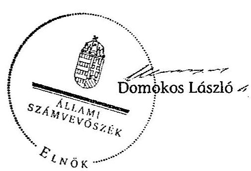

# ÁLLAMI   SZÁMVEVŐSZÉK 

## JELENTÉS

Beremend Nagyközség Önkormányzata
belső kontrollrendszerének kialakítása, valamint egyes
kontrolltevékenységek és a belső ellenőrzés működése ellenőrzéséről

---

# Állami Számvevőszék 

Iktatószám: V-0063-002-017/2013.
Témaszám: 1098
Vizsgálat-azonosító szám: V059126

## Az ellenőrzést felügyelte:

Dr. Benedek Mária
felügyeleti vezető
Az ellenőrzést vezette:
Gyüre Lajosné
ellenőrzésvezető
A számvevőszéki jelentés összeállításában közreműködtek:
Szenténé Tubak Klára
számvevő tanácsos
Krupánszki Dóra
számvevő
Az ellenőrzést végezték:
Zaroba Szilvia Dr. Zsolnay András
számvevő tanácsos számvevő

---

# TARTALOMJEGYZÉK 

BEVEZETÉS ..... 5
I. ÖSSZEGZŐ MEGÁLLAPÍTÁSOK, KÖVETKEZTETÉSEK, JAVASLATOK ..... 8
II. RÉSZLETES MEGÁLLAPÍTÁSOK ..... 17

1. Az önkormányzat belső kontrollrendszere kialakításának megfelelősége ..... 17
1.1. A kontrollkörnyezet kialakítása ..... 17
1.2. A kockázatkezelési rendszer kialakítása ..... 17
1.3. A kontrolltevékenységek kialakítása ..... 18
1.4. Az információs és kommunikációs rendszer kialakítása ..... 19
1.5. A monitoring rendszer kialakítása ..... 20
2. A pénzügyi folyamatokban kulcsszerepet betöltő belső kontrollok (szakmai teljesítésigazolás és utalvány ellenjegyzés) működése ..... 20
3. A belső ellenőrzés szervezeti keretei és működése ..... 23

## FÜGGELÉKEK

1. számú Értelmező szótár
2. számú A belső kontrollrendszer kialakítása, a pénzügyi folyamatokban kulcsszerepet betöltő szakmai teljesítésigazolás és utalvány ellenjegyzés kontrollok működése, valamint a belső ellenőrzés működése értékelésénél alkalmazott minősítési szempontok

---

.

---

# RÖVIDÍTÉSEK JEGYZÉKE 

| Törvények |  |
| :--: | :--: |
| ÁSZ tv. | 2011. évi LXVI. törvény az Állami Számvevőszékről |
| Avtv. | 1992. évi LXIII. törvény a személyes adatok védelméről és a közérdekű adatok nyilvánosságáról (hatálytalan 2012. január 1-jétől) |
| Info tv. | 2011. évi CXII. törvény az információs önrendelkezési jogról és az információszabadságról (hatályos 2012. január 1-jétől) |
| Mötv. | 2011. évi CLXXXIX. törvény Magyarország helyi önkormányzatairól (hatályos 2012. január 1-jétől) |
| Ötv. | 1990. évi LXV. törvény a helyi önkormányzatokról |
| régi Áht. | 1992. évi XXXVIII. törvény az államháztartásról (hatálytalan 2012. január 1-jétől) |
| új Áht. | 2011. évi CXCV. törvény az államháztartásról (hatályos 2012. január 1-jétől) |
| Rendeletek |  |
| Áhsz. | 249/2000. (XII. 24.) Korm. rendelet az államháztartás szervezetei beszámolási és könyvvezetési kötelezettségének sajátosságairól |
| Ámr. | 292/2009. (XII. 19.) Korm. rendelet az államháztartás működési rendjéről (hatálytalan 2012. január 1-jétől) |
| Ávr. | 368/2011. (XII. 31.) Korm. rendelet az államháztartásról szóló törvény végrehajtásáról (hatályos 2012. január 1-jétől) |
| Ber. | 193/2003. (XI. 26.) Korm. rendelet a költségvetési szervek belső ellenőrzéséről (hatálytalan 2012. január 1-jétől) |
| Bkr. | 370/2011. (XII. 31.) Korm. rendelet a költségvetési szervek belső kontrollrendszeréről és belső ellenőrzéséről (hatályos 2012. január 1-jétől) |
| Szórövidítések |  |
| ÁSZ | Állami Számvevőszék |
| Belső ellenőrzési kézikönyv | a Siklósi Többcélú Kistérségi Társulás belső ellenőrzési kézikönyve |
| Belső Kontroll Kézikönyv | az Ámr. 155. § (1) bekezdése, valamint az államháztartási belső kontroll standardokról szóló 1/2009. (IX. 11.) PM irányelv egységes értelmezése érdekében az államháztartásért felelős miniszter által 2010. évben kiadott Belső Kontroll Kézikönyv |
| gazdasági program | Beremend Nagyközség Önkormányzat Képviselőtestületének 24/2011. (III. 22.) számú határozata a 2010-2014. évekre szóló gazdasági programjáról |
| Hivatal | Kásád és Kistapolca községek önkormányzatai részvételével 2013. március 1-jétől létrehozott Beremendi Közös Önkormányzati Hivatal |

---

hivatali SZMSZ
jegyző$_{1}$
jegyző$_{2}$
Képviselő-testület
kockázatkezelési szabályzat
Önkormányzat
pénzgazdálkodási szabályzat
polgármester
Polgármesteri Hivatal
szabálytalanságkezelési szabályzat
Társulás
társulási megállapodás

Beremend Nagyközség Polgármesteri Hivatala Szervezeti és Működési Szabályzata (hatályos 2011. február 16-ától)
Beremend Nagyközség Önkormányzatának 2012. július 31-éig hivatalban lévő jegyzője
Beremend Nagyközség Önkormányzatának 2012. augusztus 1-jétől hivatalban lévő jegyzője
Beremend Nagyközség Képviselő-testülete
Beremend Nagyközség Önkormányzatának Kockázatkezelési szabályzata (hatályos 2005. november 5-étől)
Beremend Nagyközség Önkormányzata
Beremend Nagyközség Önkormányzatának Pénzgazdálkodási szabályzata (hatályos 2010. június 1-jétől)
Beremend Nagyközség Önkormányzatának polgármestere
Beremend Nagyközség Önkormányzatának Polgármesteri Hivatala
Szabálytalanságok kezelésének eljárásrendje (hatályos 2005. november 5-étől)

Siklósi Többcélú Kistérségi Társulás
Megállapodás a Siklósi Többcélú Kistérségi Társulás létrehozásáról (hatályos 2010. november 30-ától)

---

# JELENTÉS 

## Beremend Nagyközség Önkormányzata belső kontrollrendszerének kialakítása, valamint egyes kontrolltevékenységek és a belső ellenőrzés működése ellenőrzéséről

## BEVEZETÉS

A belső kontrollrendszer kialakítását, működtetését és fejlesztését a régi Áht. és az új Áht. is előírja. Ennek megvalósításáért a költségvetési szerv vezetője felel. A belső kontrollrendszer azt a célt szolgálja, hogy a költségvetési szervek működésük és gazdálkodásuk során a tevékenységeket szabályszerűen, gazdaságosan, hatékonyan, eredményesen hajtsák végre, teljesítsék elszámolási kötelezettségeiket és megvédjék az erőforrásokat a veszteségektől, a károktól és a nem rendeltetésszerű használattól. A belső kontrollrendszer magában foglalja mindazon szabályokat, eljárásokat, gyakorlati módszereket és szervezeti struktúrákat, kockázatkezelési technikákat, kontrolltevékenységeket, amelyek segítséget nyújtanak a szervezetnek céljai eléréséhez.

Az ÁSZ a 2011-2015. évekre szóló stratégiájában hangsúlyos szerepet szánt annak, hogy szilárd szakmai alapon álló, értékteremtő ellenőrzéseivel előmozdítsa a közpénzügyek átláthatóságát, rendezettségét. A számvevőszéki ellenőrzés nemzetközi alapelvei is rögzítik, hogy a megfelelő belső kontrollrendszer minimálisra csökkenti a hibák és szabálytalanságok kockázatát.

Az ellenőrzés célja annak értékelése volt, hogy az Önkormányzat a jogszabályi előírásoknak megfelelően alakította-e ki a belső kontrollrendszert; a gazdálkodás folyamatában kulcsszerepet betöltő szakmai teljesítésigazolás és az utalvány ellenjegyzés kontrolltevékenységeit megfelelően működtette-e; biztosította-e a belső ellenőrzés szabályos és eredményes működését.

Az ÁSZ ezen ellenőrzési céljait pilot (próba) jelleggel községi/nagyközségi önkormányzatoknál végzett ellenőrzések során érvényesítette.

Az ellenőrzés típusa: szabályszerűségi ellenőrzés
Az ellenőrzés jogszabályi alapja: az ÁSZ tv. 5. § (2) és (6) bekezdései
Az ellenőrzött szervezet: az Önkormányzat
Az ellenőrzött időszak: a belső kontrollrendszer kialakításának megfelelőségét a 2011. évre vonatkozóan értékeltük. A kontrolltevékenységek működésének megfelelőségét a 2011. január 1-je és december 31-e, míg a belső ellenőrzés működésének szabályosságát és eredményességét a 2009. január 1-je és

---

2011. december 31-e közötti időszakot figyelembe véve értékeltük. A helyszíni ellenőrzés lezárásáig a helyi szabályozás változásait nyomon követtük.

Az ellenőrzés szakmai módszertana az ÁSZ hivatalos honlapján (www.asz.hu) közzétett szakmai szabályokon alapult, amely a Legfőbb Ellenőrző Intézmények Nemzetközi Szervezete (INTOSAI) által kiadott nemzetközi standardok (ISSAI) figyelembevételével készült.

A belső kontrollrendszer kialakításának ellenőrzése során értékeltük a kontrollkörnyezet, a kockázatkezelési rendszer, a kontrolltevékenységek, az információs és kommunikációs rendszer, valamint a monitoring rendszer szabályozottságának megfelelőségét.

Értékeltük a pénzügyi folyamatokban kulcsszerepet betöltő szakmai teljesítésigazolás és az utalvány ellenjegyzés kontrollok működésének megfelelőségét az államháztartáson kívülre teljesített működési és felhalmozási célú pénzeszközátadásoknál, az állományba nem tartozók megbízási díjainál, továbbá a külső szolgáltatók által végzett karbantartási, kisjavítási munkákkal kapcsolatos kifizetéseknél. Az egyszerû véletlen mintavétellel kiválasztott tételek ellenőrzését többlépcsős megfelelőségi tesztek útján addig végeztük, amíg elegendő és megfelelő bizonyítékot szereztünk a vizsgált folyamatok kulcskontrolljai működésének megfelelő vagy nem megfelelő voltáról. Értékeltük az Önkormányzatnál a belső ellenőrzés működésének szabályosságát és eredményességét. Az ÁSZ a 2007-2010. években az Önkormányzatnál átfogó ellenőrzést nem végzett.

A fogalmak magyarázatát az 1. számú függelék, az ellenőrzés egyes területeinek értékelésénél alkalmazott egységes minősítési szempontokat a 2. számú függelék tartalmazza.

Az ellenőrzés lefolytatásához az Önkormányzat a munkalapok és a tanúsítvány elektronikus kitöltésével, valamint a megjelölt dokumentumok elektronikus megküldésével szolgáltatott adatokat. A munkalapokon szerepeltetett adatok, információk ellenőrzése és szükség szerinti javítása a helyszíni ellenőrzés keretében történt.

Az ÁSZ az ellenőrzés megállapításait az ellenőrzött időszakban hatályos, az intézkedést igénylő megállapításokra tett javaslatokat a jelenleg hatályos jogszabályok alapján fogalmazta meg.

Az ÁSZ tv. 29. § (1) bekezdése szerint a jelentéstervezetet megküldtük a polgármester részére, aki az ÁSZ tv. 29. § (2) bekezdésében foglalt észrevételezési jogával nem élt, a jelentéstervezetre észrevételt nem tett.

Beremend nagyközség állandó lakosainak száma 2011. január 1-jén 2624 fő volt. Az Önkormányzat hattagú Képviselő-testületének munkáját három állandó bizottság segítette. Az Önkormányzat az önállóan működő és gazdálkodó Polgármesteri Hivatalon felül hat intézménnyel látta el feladatát. Az Önkormányzat egy többségi tulajdoni hányadú gazdasági társasággal rendelkezett.

A polgármester a 2006. évi önkormányzati választások óta tölti be tisztségét. A jegyző$_{2}$-t az ellenőrzött időszakot követően, 2012. augusztus 1-jén nevezték ki. A jegyző$_{1}$ 2000. május 1-jétől látta el feladatait.

---

A Polgármesteri Hivatal három szervezeti egységre tagolódott, a foglalkoztatott köztisztviselők száma 2011. január 1-jén 15 fő volt.

Az Önkormányzat a 2011. évi költségvetési beszámolója szerint 766805 ezer Ft költségvetési bevételt ért el, valamint 872765 ezer Ft költségvetési kiadást teljesített. A 2011. december 31-i könyvviteli mérleg szerint 2467476 ezer Ft értékű eszközvagyonnal rendelkezett, 11026 ezer Ft hosszú lejáratú, 4377 ezer Ft rövid lejáratú kötelezettsége volt.
2013. március 1-jétől létrehozták Beremend nagyközség, valamint Kásád és Kistapolca községek önkormányzatai részvételével a Beremendi Közös Önkormányzati Hivatalt.

---

# I. ÖSSZEGZŐ MEGÁLLAPÍTÁSOK, KÖVETKEZTETÉSEK, JAVASLATOK 

A belső kontrollrendszeren belül 2011-ben a Polgármesteri Hivatalban a kontrollkörnyezet, a kockázatkezelési rendszer, a kontrolltevékenységek, az információs és kommunikációs rendszer, valamint a monitoring rendszer kialakítását külön-külön és összesítve is értékeltük. A belső kontrollrendszer kialakítása az összesített értékelés alapján nem felelt meg a jogszabályi előírásoknak. Az egyes területek kialakításának értékelését az alábbiakban részletezzük.

A kontrollkörnyezet kialakítása részben felelt meg a jogszabályi előírásoknak, mert a jegyző$_{1}$ elkészítette a gazdálkodást érintő legfontosabb szabályzatokat, azonban a hivatali SZMSZ-ben - az Ámr.-ben$^{1}$ foglaltak ellenére - nem rögzítette a munkakörökhöz tartozó feladat- és hatásköröket, a hatáskörök gyakorlásának módját és az ezekhez kapcsolódó felelősségi szabályokat. Ezek a hiányosságok korlátozzák a feladatellátás számon kérhetőségét, valamint folyamatosságának biztosítását. A jegyző$_{1}$ az Ámr.-ben foglaltak ellenére nem végezte el az ellenőrzési nyomvonal aktualizálását.

A kockázatkezelési rendszer kialakítása nem felelt meg a jogszabályi előírásoknak, mert a jegyző$_{1}$ az Ámr.-ben foglaltak ellenére kockázatelemzést nem végzett, nem mérte fel és nem állapította meg a Polgármesteri Hivatal tevékenységében, gazdálkodásában rejlő kockázatokat.

A kontrolltevékenységek kialakítása a jogszabályi követelményeknek nem felelt meg, mert a jegyző$_{1}$ az Ámr. rendelkezései ellenére nem szabályozta a beszámolási eljárásokat, a szakmai teljesítésigazolás gyakorlásának módját, eljárási és dokumentációs részletszabályait. Az Ámr. előírása és a pénzgazdálkodási szabályzatban foglalt - az előzetes írásbeli kötelezettségvállalást nem igénylő kifizetésekre vonatkozó - döntése ellenére ezen kifizetések részletes rendjét belső szabályzatban nem rögzítette. A kontrolltevékenységek hiányos kialakítása kockázatot jelent a feladatok szabályszerű végrehajtása során.

Az információs és kommunikációs rendszer kialakítása a jogszabályi előírásoknak nem felelt meg, mert a jegyző$_{1}$ az Ámr.-ben foglalt előírások ellenére nem határozta meg a kötelezően közzéteendő adatok nyilvánosságra hozatalának részletes eljárásrendjét. Az Avtv.$^{2}$ előírása ellenére az adatbiztonság érvényre juttatásához szükséges intézkedéseket hiányosan tette meg, mert nem szabályozta a Polgármesteri Hivatal pénzügyi és számviteli elektronikus adatainak kezelését, feldolgozását, tárolását, továbbá nem szabályozta a pénzügyiszámviteli rendszerben feldolgozott adatok mentési eljárásait. A Polgármesteri Hivatal nem rendelkezett a hozzáférési jogosultságokra vonatkozó eljárásrenddel és nyilvántartással.

[^0]
[^0]:    $^{1}$ 2012. január 1-jétől Ávr.
    $^{2}$ 2012. január 1-jétől Info tv.

---

A monitoring rendszer kialakítása a jogszabályi követelményeknek nem felelt meg, mert a jegyző$_{1}$ az Ámr.-ben foglaltak ellenére az operatív tevékenységek keretében megvalósuló, folyamatos és eseti nyomon követésből álló, a Polgármesteri Hivatal tevékenységének, a célok megvalósításának nyomon követését biztosító rendszer szabályait nem határozta meg.

A belső kontrollrendszer nem megfelelő kialakítása kockázatot jelent az Önkormányzat tevékenységeinek szabályszerű, gazdaságos, hatékony
 és eredményes végrehajtása során.

A Polgármesteri Hivatalban a 2011. évben az államháztartáson kívülre történő működési célú pénzeszközátadásokkal, az állományba nem tartozók megbízási díjaival, valamint a külső szolgáltatók által végzett karbantartással, kisjavítással kapcsolatos kifizetések során, összefoglalóan értékelve, a kulcskontrollok működésének megfelelősége gyenge volt.

Az állományba nem tartozók megbízási díjaival kapcsolatos kifizetéseket megelőzően a jegyző ${ }_{1}$ által szakmai teljesítésigazolásra kijelölt személyek a kiadások teljesítésének jogosságát, összegszerűségét, valamint - az ellenszolgáltatást is magukba foglaló kifizetések esetében - a szerződések, megrendelések szakmai teljesítését a régi Áht. ${ }^{3}$ és az Ámr. előírásai ellenére nem ellenőrizték, nem igazolták. Az államháztartáson kívülre történő működési célú pénzeszközátadásokkal, az állományba nem tartozók megbízási díjaival, valamint a külső szolgáltatók által végzett karbantartással, kisjavítással kapcsolatos kifizetések során a szakmai teljesítés igazolását jegyzői kijelöléssel nem rendelkező személyek végezték. Az államháztartáson kívülre történő működési célú pénzeszközátadások esetén, a bizonylatokon az igazolás dátumát nem tüntették fel, továbbá ellenőrizhető okmányok hiányában nem ellenőrizték a kiadások teljesítésének jogosságát és összegszerűségét.

Az utalványok ellenjegyzője az Ámr.-ben foglalt ellenőrzési feladatait szakmai teljesítésigazolás, illetve szabályszerű szakmai teljesítésigazolás hiányában nem a jogszabályi előírásoknak megfelelően végezte. Az utalvány ellenjegyző az utalványokat annak ellenére ellenjegyezte, hogy a régi Áht. és az Ámr. gazdálkodásra - közöttük a kötelezettségvállalások nyilvántartására és az utalványrendeleten a kötelezettségvállalás nyilvántartási számának feltüntetésére, a kötelezettségvállalások ellenjegyzésére - vonatkozó szabályait nem tartották be.

A számvevőszéki ellenőrzés az ellenőrzött kifizetésekkel összefüggésben a rendelkezésre bocsátott dokumentumok alapján jogosulatlan kifizetést nem tárt fel, azonban a gazdálkodásban kulcsszerepet betöltő kontrollok jogszabályi előírásoknak nem megfelelő, gyenge működése miatt fennáll a hibák bekövetkezésének kockázata. A nem megfelelően szabályozott és működtetett belső kontrollok korrupciós kockázatot is hordoznak.

[^0]
[^0]:    ${ }^{3}$ 2012. január 1-jétől új Áht.

---

Az Önkormányzat a belső ellenőrzési feladatokat a Társulás útján látta el. A belső ellenőrzés szabályozása és működése az ellenőrzött időszak egészét tekintve a jogszabályi előírásoknak nem felelt meg, mert a Ber.-ben ${ }^{4}$ foglaltak ellenére nem határozták meg a belső ellenőrzési vezetőt, a belső ellenőrzést végző személyt, valamint jogállásukat és feladataikat. A 2010:2011. években nem készítettek kockázatelemzést. A 2009. és a 2011. évi ellenőrzési terveket a Képviselő-testület - a jegyző késedelmes előterjesztése miatt - az Ötv.-ben ${ }^{5}$ előírt határidőn túl fogadta el. A Ber. előírása ellenére az ellenőrzési tervekhez a jegyző írásos véleményt, javaslatot nem adott. A belső ellenőrzési tervekben a szükséges ellenőri kapacitást nem határozták meg. A belső ellenőrzésekről és az intézkedésekről a Ber. előírása ellenére nem vezettek nyilvántartást. Az Ötv.ben foglaltak ellenére a jegyző nem készítette el, ezért a polgármester nem terjesztette a Képviselő-testület elé a 2011. évi zárszámadási rendelettervezettel egyidejűleg a belső ellenőrzési jelentésekről az összefoglaló jelentést.

Az Önkormányzatnál a 2009-2011. években a belső ellenőrzés működése a 2. számú függelék minősítési szempontjai alapján - nem volt eredményes, mert a belső ellenőrzés szabályozása és működése az összegző értékelés alapján az ellenőrzött időszak egészét tekintve a jogszabályi előírásoknak nem felelt meg. A belső ellenőrzés működése azért sem volt eredményes, mert nem tárták fel a belső kontrollrendszer kialakításának ellenőrzése keretében a számviteli politikában foglalt előírások és a vagyongazdálkodási szabályok betartására, a jogszabályok alapján kötelezően elkészítendő belső szabályzatok elkészítésére, a gazdálkodási jogkörök gyakorlásához és a készpénzkezeléshez kapcsolódó belső kontrollok működésére irányuló ellenőrzések során a belső kontrollok kialakításának és működésének hiányosságait, továbbá az elvégzett ellenőrzések folyamán tett - az utalványrendeletekkel, a gazdálkodási jogkörök gyakorlásával és a könyvviteli bizonylatokkal kapcsolatos hiányosságok megszüntetésére irányuló - javaslatokat nem hasznosították. Mindezek hozzájárultak a számvevőszéki ellenőrzés során is feltárt szabályozási és működési hiányosságok, hibák ismétlődéséhez.

Az ÁSZ tv. 33. § (1) bekezdésében foglaltak értelmében az ellenőrzött szervezet vezetője köteles a jelentésben foglalt megállapításokhoz kapcsolódó intézkedési tervet összeállítani, és azt a jelentés kézhezvételétől számított 30 napon belül az ÁSZ részére megküldeni. Amennyiben az intézkedési tervet határidőre nem küldi meg a szervezet, vagy az - az ÁSZ tv. 33. § (2) bekezdésében foglalt póthatáridő eltelte ellenére - továbbra sem elfogadható, az ÁSZ elnöke a hivatkozott törvény 33. § (3) bekezdés a)-b) pontjaiban foglaltakat érvényesítheti.

[^0]
[^0]:    ${ }^{4}$ 2012. január 1-jétől Bkr.
    ${ }^{5}$ 2013. január 1-jétől Mötv.

---

Az ellenőrzés intézkedést igénylő megállapításai és javaslatai:

# a polgármesternek 

1. Az állományba nem tartozók megbízási díjaira vonatkozóan - a régi Áht. 100/C. § (3) és az Ámr. 74. § (1) bekezdésében foglaltak ellenére - ellenjegyzés hiányában vállaltak kötelezettséget.

Javaslat:
Intézkedjen arról, hogy az Önkormányzat nevében történő kötelezettségvállalásra az új Áht. 37. § (1) bekezdésében foglaltaknak megfelelően - az Ávr. 53. §-ában meghatározott kivételekkel - kizárólag a pénzügyi ellenjegyzés után, a pénzügyi teljesítés esedékességét megelőzően, írásban kerüljön sor.
2. A polgármester - az Ötv. 92. § (10) bekezdésében előírtak ellenére - a 2011. évi belső ellenőrzési jelentést a zárszámadási rendelettervezettel egyidejűleg nem terjesztette a Képviselő-testület elé.

Javaslat:
A Bkr. 56. § (8) bekezdésében foglaltak szerint az éves ellenőrzési jelentést a zárszámadási rendelettervezettel egyidejűleg terjessze a Képviselő-testület elé.
3. Az állományba nem tartozók megbízási díjaival kapcsolatos kifizetéseket megelőzően a jegyző által szakmai teljesítésigazolásra kijelölt személyek a szakmai teljesítést - a régi Áht. 100/C. § (6) bekezdésében és az Ámr. 76. § (1) bekezdésében foglalt előírások ellenére - nem igazolták. Az államháztartáson kívülre teljesített működési célú pénzeszközátadásokkal, az állományba nem tartozók megbízási díjaival, valamint a külső szolgáltatók által végzett karbantartással, kisjavítással kapcsolatos kifizetések során a szakmai teljesítés igazolását - az Ámr. 76. § (3) bekezdésében előírtak ellenére - jegyzői kijelöléssel nem rendelkező személyek végezték. Az államháztartáson kívülre teljesített működési célú pénzeszközátadások esetén az Ámr. 76. § (1) és (3) bekezdéseiben előírtak ellenére a bizonylatokon az igazolás dátumát nem tüntették fel, továbbá ellenőrizhető okmányok hiányában nem ellenőrizték a kifizetések jogosságát és összegszerűségét. Az utalványok ellenjegyzője a kiadások teljesítését megelőzően - a régi Áht. 100/C. § (6) bekezdésének előírása ellenére - az Ámr. 78-79. §-aiban foglalt ellenőrzési feladatait nem a jogszabályi előírásoknak megfelelően végezte el.

Javaslat:
A Mötv. 115. § (1) bekezdésében foglaltak alapján kísérje figyelemmel az önkormányzat gazdálkodásának szabályszerűségét. A Mötv. 67. § f) pontja alapján gondoskodjon a belső kontrollrendszerre és a belső ellenőrzés működésére vonatkozó jogszabályi rendelkezések be nem tartása, valamint a szakmai teljesítésigazolás, illetve az utalvány ellenjegyzés kontrollokkal összefüggésben feltárt hiányosságok, szabálytalanságok tekintetében az esetleges munkajogi felelősséggel kapcsolatos körülmények kivizsgálásáról, és a vizsgálat eredményének függvényében tegye meg a szükséges munkajogi intézkedéseket.

---

# a jegyzőnek Beremend Nagyközség Önkormányzata vonatkozásában 

1. a kontrollkörnyezettel kapcsolatban:

Az Ámr. 20. § (2) bekezdésének h) pontjában foglaltak ellenére a jegyző a munkakörökhöz tartozó feladat- és hatásköröket, a hatáskörök gyakorlásának módját és az ezekhez kapcsolódó felelősségi szabályokat nem rögzítette. A Ber. 4. § (2) bekezdésében foglalt előírás ellenére a hivatali SZMSZ-ben nem rögzítették a belső ellenőrzést végzők jogállását, feladatait.

A jegyző az Ámr. 156. § (2) bekezdésében foglalt előírás ellenére az ellenőrzési nyomvonalat nem aktualizálta rendszeresen.

Javaslat:
a) Módosítsa a hivatali SZMSZ-t, és kezdeményezze a polgármesternél a módosítás Képviselő-testület elé terjesztését annak érdekében, hogy az tartalmazza az Ávr. 13. § (1) bekezdésének g) pontjában foglaltaknak megfelelően a munkakörökhöz tartozó feladat- és hatásköröket, a hatáskörök gyakorlásának módját, az ezekhez kapcsolódó felelősségi szabályokat; továbbá a Bkr. 15. § (2) bekezdésének megfelelően a belső ellenőrzést végzők jogállását, feladatait.
b) Intézkedjen a Bkr. 6. § (3) bekezdésében előírtaknak megfelelően az ellenőrzési nyomvonal rendszeres aktualizálásáról.
2. a kockázatkezelési rendszerrel kapcsolatban:

A jegyző a kockázatkezelési rendszer kialakítása és működtetése során az Ámr. 157. § (1)-(2) bekezdésében foglaltak ellenére nem mérte fel és nem állapította meg a Polgármesteri Hivatal tevékenységében, gazdálkodásában rejlő kockázatokat.

Javaslat:
Mérje fel és állapítsa meg - a Bkr. 7. §-ában foglaltak alapján - a Hivatal tevékenységében és gazdálkodásában rejlő kockázatokat.
3. a kontrolltevékenységekkel kapcsolatban:

A jegyző - az Ámr. 158. § (2) bekezdés d) pontjában foglaltak ellenére - nem szabályozta a Polgármesteri Hivatal tevékenységeire vonatkozó beszámolási eljárásokat.

A jegyző - az Ámr. 20. § (3) bekezdés a) pontjában foglalt előírás ellenére - nem szabályozta a szakmai teljesítésigazolás gyakorlásának módját, eljárási és dokumentációs részletszabályait, valamint az előzetes írásbeli kötelezettségvállalást nem igénylő kifizetések rendjét az Ámr. 72. § (14) bekezdésében foglaltak, valamint annak ellenére, hogy a pénzgazdálkodási szabályzat a 100 E Ft alatti kifizetések esetében lehetővé teszi az előzetes írásbeli kötelezettségvállalás mellőzését.

---

Javaslat:
a) Szabályozza a Bkr. 8. § (4) bekezdés c) pontjában foglaltaknak megfelelően a felelősségi körök meghatározásával a Hivatal tevékenységeire vonatkozó beszámolási eljárásokat.
b) Rendezze belső szabályzatban az Ávr. 13. § (2) bekezdés a) pontjának megfelelően a teljesítésigazolás gyakorlásának módjával, eljárási és dokumentációs részletszabályaival kapcsolatos belső előírásokat, feltételeket.
c) Rögzítse belső szabályzatban az Ávr. 53. § (2) bekezdése alapján az előzetes írásbeli kötelezettségvállalást nem igénylő kifizetések rendjét.
4. az információs és kommunikációs rendszerrel kapcsolatban:

A jegyző - az Ámr. 20. § (3) bekezdés i) pontjában foglaltak ellenére - nem határozta meg a kötelezően közzéteendő adatok nyilvánosságra hozatalának részletes eljárásrendjét.

Az informatikai rendszer környezetének szabályozása során - az Avtv. 10. § (1)-(2) bekezdéseiben foglalt előírások ellenére - az adatbiztonság érvényre juttatásához szükséges intézkedéseket hiányosan tette meg, mert nem szabályozta a Polgármesteri Hivatal pénzügyi és számviteli elektronikus adatainak kezelését, feldolgozását, tárolását és mentési eljárásait. A Polgármesteri Hivatal nem rendelkezett a hozzáférési jogosultságokra vonatkozó eljárásrenddel és nyilvántartással.

Javaslat:
a) Készítsen - az Info tv. 30. § (6) bekezdésének és az Ávr. 13. § (2) bekezdése h) pontjának megfelelően - a közérdekű adatok megismerésére irányuló igények teljesítésének rendjét rögzítő szabályzatot.
b) Biztosítsa az Info tv. 7. § (2)-(3) bekezdéseiben foglaltaknak megfelelően az adatbiztonság érvényesülését, szabályozza a hozzáférési jogosultságokkal kapcsolatos feladatokat (jogosultságok megállapítása, módosítása, azok betartásának ellenőrzése, nyilvántartásának vezetése), valamint szabályozza az adatok kezelésének, feldolgozásának, tárolásának és mentési eljárásának rendjét.
5. a monitoring rendszerrel kapcsolatban:

A jegyző - az Ámr. 160. §-ában foglaltak ellenére - nem alakított ki és nem működtetett olyan monitoring rendszert, amely lehetővé teszi a Polgármesteri Hivatal tevékenységének, a célok megvalósításának nyomon követését, és amelynek része az operatív tevékenységek keretében megvalósuló folyamatos és eseti nyomon követés is.

Javaslat:
Alakítsa ki és működtesse a Bkr. 3. § e) pontjában és a 10. §-ában előírtak alapján a Hivatal tevékenységének, a célok megvalósításának nyomon követését biztosító rendszert, amelynek része az operatív tevékenységek keretében megvalósuló folyamatos és eseti nyomon követés is.

---

6. a pénzügyi folyamatokban kulcsszerepet betöltő kontrollokkal kapcsolatban:

Az államháztartáson kívülre teljesített működési célú pénzeszközátadásokkal kapcsolatos további kifizetéseket megelőzően a szakmai teljesítésigazolásra a jegyző által kijelölt
 személy a kiadások jogosságának és összegszerűségének ellenőrzése során - az Ámr. 76. § (3) bekezdése ellenére - az igazolás dátumát nem tüntette fel, vagy - az Ámr. 76. § (1) bekezdésében foglaltak ellenére - ellenőrizhető okmányok hiányában nem végezte el az ellenőrzést.

Az állományba nem tartozók megbízási díjaival kapcsolatos kifizetések esetében a szakmai teljesítésigazolásra a jegyző által kijelölt személyek a szakmai teljesítést - az Ámr. 76. § (1) bekezdése ellenére - nem igazolták.

A 2011. évben az államháztartáson kívülre teljesített működési célú pénzeszközátadásokkal, az állományba nem tartozók megbízási díjaival és a külső szolgáltatók által teljesített karbantartási, kisjavítási munkákkal kapcsolatos kifizetések jogosságát, összegszerűségét és a szerződések szakmai teljesítését - az Ámr. 76. § (3) bekezdésében foglaltak ellenére - nem a jegyző által szakmai teljesítésigazolásra kijelölt személy ellenőrizte és igazolta.

Az utalványok ellenjegyzője az Ámr. 79. § (2) bekezdésében foglalt ellenőrzési feladatait szakmai teljesítésigazolás, illetve szabályszerű szakmai teljesítésigazolás hiányában nem a jogszabályi előírásoknak megfelelően végezte. Az utalványok ellenjegyzője annak ellenére ellenjegyezte az utalványokat, hogy az állományba nem tartozók megbízási díjaival kapcsolatos kifizetéseknél a kötelezettségvállalásokat - a régi Áht. 100/C. § (3) bekezdésében és az Ámr. 74. § (1) bekezdésében foglaltak ellenére - nem ellenjegyezték, valamint a külső szolgáltatók által teljesített karbantartási, kisjavítási munkákkal kapcsolatos kifizetések esetében az utalvány nem tartalmazta - az Ámr. 78. § (2) bekezdés g) pontjában foglaltak ellenére - a kötelezettségvállalás nyilvántartási számát, mert az Ámr. 75. § (1) bekezdésében előírt kötelezettségvállalás nyilvántartásba vételéről nem gondoskodtak.

Javaslat:
Intézkedjen - a szakmai teljesítés igazolása és az utalványozás ellenjegyzése vonatkozásában feltárt hiányosságok megszüntetése, illetve az operatív gazdálkodás során a működésbeli hibák megelőzése, feltárása és kijavítása érdekében - arról, hogy
a) a teljesítésigazolásra - az Ávr. 57. § (4) bekezdésében foglalt előírásnak megfelelően - kijelölt személyek az Ávr. 57. § (1) bekezdésében foglaltaknak megfelelően, ellenőrizhető okmányok alapján ellenőrizzék a kiadások teljesítésének jogosságát, összegszerűségét, ellenszolgáltatást is magában foglaló kötelezettségvállalás esetében a szerződés, megrendelés teljesítését, és azt az Ávr. 57. § (3) bekezdésében foglalt módon igazolják;
b) az új Áht. 37. § (1) és az Ávr. 55. § (1) bekezdésében foglaltaknak megfelelően, kötelezettségvállalásra - az Ávr. 53. §-ában meghatározott kivételekkel - pénzügyi ellenjegyzés után kerüljön sor, valamint a pénzügyi ellenjegyző győződjön meg arról, hogy a kötelezettségvállalás nem sérti-e a gazdálkodási szabályokat;
c) a kifizetéseket megelőzően - az Ávr. 58. § (1) bekezdése szerint - a teljesítésigazolás alapján - az Ávr. 57. § (3) bekezdés szerinti esetben annak hiányában is -

---

az összegszerűségnek, a fedezet meglétének és a megelőző ügymenetben az új Áht., az Áhsz., az Ávr. előírásai és a belső szabályzatokban foglaltak betartásának az ellenőrzése történjen meg;
d) a kötelezettségvállalások nyilvántartását az Ávr. 56. § (1) bekezdésében foglalt előírásnak megfelelően vezessék, és az utalványrendeleteken a kötelezettségvállalás nyilvántartási számát az Ávr. 59. § (3) bekezdés f) pontjában foglaltaknak megfelelően tüntessék fel.
7. a belső ellenőrzés működésével kapcsolatban:

A 2010-2011. években a belső ellenőrzési tervek összeállítását megelőzően - a Ber. 12. § b) pontjában és a 21. § (2) bekezdésében foglaltak ellenére - az Önkormányzatra vonatkozóan kockázatelemzést nem készítettek.

A Ber. 32/B. § (2) bekezdésében foglaltak ellenére a 2010. és a 2011. évi ellenőrzési tervek készítése során a jegyző írásos véleményt nem adott.

A Képviselő-testület az éves ellenőrzési tervet 2009-ben és 2011-ben az Ötv. 92. § (6) bekezdésében előírt határidőn túl fogadta el, mert azok napirendre vételét a jegyző nem kezdeményezte.

Az éves ellenőrzési tervek nem tartalmazták a Ber. 21. § (3) bekezdés e) pontjában meghatározott szükséges ellenőrzési kapacitást.

Nem vezették a Ber. 29/A. § (1), (2) és (7) bekezdéseiben előírtak ellenére az ellenőrzési jelentésekben tett intézkedések nyomon követését szolgáló nyilvántartást.

Az Ötv. 92. § (10) bekezdésében foglaltak ellenére a jegyző nem készítette el, ezért a polgármester nem terjesztette a Képviselő-testület elé a 2011. évi zárszámadási rendelettervezettel egyidejűleg az éves ellenőrzési jelentést.

Javaslat:
a) Intézkedjen arról, hogy az éves ellenőrzési terv a Bkr. 22. § b) pontja, a 29. § (1) és a 31. § (2) bekezdése alapján kockázatelemzésen alapuljon.
b) Intézkedjen arról, hogy az éves ellenőrzési tervet a belső ellenőrzési vezető a Bkr. 56. § (2) bekezdés előírásainak megfelelően a jegyző írásos véleményének figyelembevételével, a Bkr. 29. § (1) bekezdésében foglaltak szerint készítse el.
c) Intézkedjen az éves ellenőrzési terv Képviselő-testület elé terjesztéséről annak érdekében, hogy azt a Képviselő-testület a Mötv. 119. § (5) és a Bkr. 32. § (4) bekezdésében előírt határidőn belül hagyja jóvá.
d) Intézkedjen arról, hogy az éves ellenőrzési terv tartalmazza a Bkr. 31. § (4) bekezdésében felsorolt tartalmi elemeket.
e) Vezessen nyilvántartást a Bkr. 21. § (2) bekezdés d) pontjának és a 47. §-nak megfelelően a belső ellenőrzési jelentésekben tett megállapításokról, javaslatokról, a vonatkozó intézkedési tervekről, és kövesse nyomon azok végrehajtását.

---

f) Kezdeményezze, hogy a polgármester az éves ellenőrzési jelentést a Bkr. 56. § (8) bekezdése alapján a zárszámadási rendelettervezettel egyidejűleg terjessze a Képviselő-testület elé.

---

# II. RÉSZLETES MEGÁLLAPÍTÁSOK 

## 1. AZ ÖNKORMÁNYZAT BELSŐ KONTROLLRENDSZERE KIALAKÍTÁSÁNAK MEGFELELŐSÉGE

### 1.1. A kontrollkörnyezet kialakítása

A kontrollkörnyezet kialakítása a 2. számú függelékben részletezett kritériumrendszer alapján végzett értékelés szerint a Polgármesteri Hivatalban részben volt megfelelő, mert a Képviselő-testület elfogadta az Önkormányzat 2010-2014. évekre szóló gazdasági programját, a Polgármesteri Hivatal rendelkezett alapító okirattal, amely tartalmazta az alaptevékenységeket. A jegyző₁, mint a költségvetési szerv vezetője kialakította a gazdálkodást érintő legfontosabb szabályzatokat, azonban a hivatali SZMSZ-ben az Ámr. 20. § (2) bekezdés h) pontjában⁶ foglaltak ellenére nem rögzítette a munkakörökhöz tartozó feladat- és hatásköröket, a hatáskörök gyakorlásának módját és az ezekhez kapcsolódó felelősségi szabályokat. Az ellenőrzési nyomvonal rendszeres aktualizálását az Ámr. 156. § (2) bekezdésében⁷ foglalt előírás ellenére nem végezte el.

A kontrollkörnyezet kialakítása során a jegyző₁ az Ámr. 155. § (3) bekezdésének⁸ előírását figyelmen kívül hagyva az államháztartásért felelős miniszter által kiadott Belső Kontroll Kézikönyv ajánlásait nem hasznosította.

A kontrollkörnyezet kialakítása során a jegyző₁:

- a Polgármesteri Hivatalban dolgozó köztisztviselők munkaköri leírásaiban a Belső Kontroll Kézikönyv 1.3.3. pontjában foglalt ajánlást nem érvényesítette, mert nem határozta meg a munkakörökhöz kapcsolódó jogokat és kötelezettségeket;
- a humánerőforrásra vonatkozó kontrollkörnyezet szabályozása tekintetében a Belső Kontroll Kézikönyv 1.5.2. pontjában foglalt ajánlást nem érvényesítette, mert nem dolgozta ki a Polgármesteri Hivatalban ellátott köztisztviselői munkakörökre vonatkozó szakmai követelményrendszert.

### 1.2. A kockázatkezelési rendszer kialakítása

A kockázatkezelési rendszer kialakítása a 2. számú függelékben részletezett kritériumrendszer alapján végzett értékelés szerint a Polgármesteri Hivatalban nem volt megfelelő, mert a jegyző₁ kockázatkezelési szabályzatot készített, azonban az Ámr. 157. § (1)-(2) bekezdéseiben⁹ foglaltak ellenére kockázat-

[^0]
[^0]:    ⁶ 2012. január 1-jétől az Ávr. 13. § (1) bekezdés g) pontja
    ⁷ 2012. január 1-jétől a Bkr. 6. § (3) bekezdése
    ⁸ 2012. január 1-jétől a Bkr. 5. § (1) bekezdése
    ⁹ 2012. január 1-jétől a Bkr. 3. § b) pontja és a 7. § (2) bekezdése

---

elemzést nem végzett, nem mérte fel és nem állapította meg a Polgármesteri Hivatal tevékenységében, gazdálkodásában rejlő kockázatokat.

A kockázatkezelési rendszer kialakítása során a jegyző; az Ámr. 155. § (3) bekezdésének előírását figyelmen kívül hagyva az államháztartásért felelős miniszter által kiadott Belső Kontroll Kézikönyv ajánlásait nem hasznosította teljes körűen.

A kockázatkezelési rendszer kialakítása során a jegyző;:

- a Belső Kontroll Kézikönyv 2.1. pontjában foglalt ajánlást nem érvényesítette, mert a kockázatok meghatározása és felmérése keretében a kockázatkezelési szabályzatban nem határozta meg a Polgármesteri Hivatal kockázati türőképességét és azt az értéknagyságot, amely felett be kell avatkozni a folyamatokba, valamint nem rögzítette a kockázatkezelés időtartamát;
- a Belső Kontroll Kézikönyv 2.1.3. pontjában foglalt ajánlást figyelmen kívül hagyva nem gondoskodott a feltárt kockázati tényezők rögzítéséről, valamint nem alakította ki a kockázatok nyilvántartásának rendszerét;
- a kockázatkezelés folyamatának szabályozása során a Belső Kontroll Kézikönyv 2.3.1. pontjában adott ajánlást nem érvényesítette, mert nem határozta meg a kockázatkezelőket;
- a Belső Kontroll Kézikönyv 2.4. pontjában foglalt ajánlást nem hasznosította, mert nem írta elő a beazonosított kockázatok évenkénti felülvizsgálatát, nem jelölte ki a felülvizsgálatért felelős személyt és felülvizsgálatra nem került sor;
- a Belső Kontroll Kézikönyv 2.5.1. pontjában foglalt ajánlást nem érvényesítette, mert nem gondoskodott a csalás és a korrupció, mint kiemelt kockázatok értékeléséről és kezeléséről.

# 1.3. A kontrolltevékenységek kialakítása 

A kontrolltevékenységek kialakítása a 2. számú függelékben részletezett kritériumrendszer alapján végzett értékelés szerint a Polgármesteri Hivatalban nem volt megfelelő, mert a jegyző; a jogszabályi előírásokat nem tartotta be.

A jegyző;, mint a költségvetési szerv vezetője:

- az Ámr. 158. § (2) bekezdés d) pontjának¹⁰ előírása ellenére nem szabályozta a beszámolási eljárásokat;
- az Ámr. 20. § (3) bekezdés a) pontjában¹¹ foglalt előírás ellenére a szakmai teljesítésigazolás gyakorlásának módját, eljárási és dokumentációs részletszabályait, valamint az Ámr. 72. § (14) bekezdésében foglalt előírás¹² és a pénzgazdálkodási szabályzatban foglalt - az előzetes írásbeli kötelezettség-

[^0]
[^0]:    ¹⁰ 2012. január 1-jétől a Bkr. 8. § (4) bekezdése c) pontja
    ¹¹ 2012. január 1-jétől az Ávr. 13. § (2) bekezdés a) pontja
    ¹² 2012. január 1-jétől az Ávr. 53. § (2) bekezdése

---

vállalást nem igénylő kifizetésekre vonatkozó - döntése¹³ ellenére ezen kifizetések részletes rendjét belső szabályzatban nem rögzítette;

- a pénzgazdálkodási szabályzatban a szakmai teljesítés igazolására jogosultak kijelölőjeként az Ámr. 76. § (5) bekezdésében¹⁴ foglaltak ellenére a kötelezettségvállalót jelölte meg.

A kontrolltevékenységek kialakítása során a jegyző₁ az Ámr. 155. § (3) bekezdésének előírását figyelmen kívül hagyva az államháztartásért felelős miniszter által kiadott Belső Kontroll Kézikönyv ajánlásait nem hasznosította teljes körűen.

A kontrolltevékenységek kialakítása keretében a jegyző₁:

- a feladatkörök szétválasztása tekintetében a Belső Kontroll Kézikönyv 3.2.3. pontjában foglalt ajánlást nem hasznosította, mert nem mérte fel a kis létszámból adódó kockázatokat;
- a Belső Kontroll Kézikönyv 3.3.1. pontjában foglalt ajánlást nem vette figyelembe, mert a feladatvégzés folytonossága feltételeinek kialakítása keretében nem szabályozta munkaviszony megszűnése esetén a munkavállaló folyamatban lévő feladatai átadásának rendjét, valamint nem írta elő a munkakör átadás-átvételi jegyzőkönyv készítésének kötelezettségét.

# 1.4. Az információs és kommunikációs rendszer kialakítása 

Az információs és kommunikációs rendszer kialakítása a 2. számú függelékben részletezett kritériumrendszer alapján végzett értékelés szerint a Polgármesteri Hivatalban nem volt megfelelő,
 mert a jegyző ${ }_{1}$ az Ámr. 20. § (3) bekezdés i) pontjában ${ }^{15}$ foglaltak ellenére nem határozta meg részletesen a kötelezően közzéteendő adatok nyilvánosságra hozatalának rendjét. Az informatikai rendszer környezetének szabályozása során az Avtv. 10. § (1)-(2) bekezdéseiben ${ }^{16}$ foglalt előírások ellenére az adatbiztonság érvényre juttatásához szükséges intézkedéseket hiányosan tette meg, mert nem szabályozta a Polgármesteri Hivatal pénzügyi és számviteli elektronikus adatainak kezelését, feldolgozását, tárolását, továbbá nem szabályozta a pénzügyi-számviteli rendszerben feldolgozott adatok mentési eljárásait. Nem határozta meg a hozzáférési jogosultságokra vonatkozó eljárásrendet, valamint a hozzáférési jogosultságokról nyilvántartást nem vezetett.

[^0]
[^0]:    ${ }^{13}$ A pénzgazdálkodási szabályzat 7/h. pontja szerint nem kell írásbeli kötelezettségvállalás a gazdasági eseményenként 100 ezer Ft-ot el nem érő kifizetéseknél.
    ${ }^{14}$ 2012. március 31-től a szabályozási hiányosság már nem áll fenn, mert a teljesítés igazolására jogosult személyek kijelölését az Ávr. 57. § (4) bekezdése ismét a kötelezettségvállaló hatáskörébe utalta.
    ${ }^{15}$ 2012. január 1-jétől az Ávr. 13. § (2) bekezdés h) pontja és az Info tv. 35. § (3) bekezdése
    ${ }^{16}$ 2012. január 1-jétől az Info tv. 7. § (2)-(3) bekezdései

---

Az információs és kommunikációs rendszer kialakítása során a jegyző ${ }_{1}$ az Ámr. 155. § (3) bekezdésének előírását figyelmen kívül hagyva az államháztartásért felelős miniszter által kiadott Belső Kontroll Kézikönyv ajánlásait nem hasznosította teljes körűen.

Az információs és kommunikációs rendszer kialakítása során a jegyző ${ }_{1}$ :

- a Belső Kontroll Kézikönyv 4.1.2. pontjában foglalt ajánlást nem érvényesítette, mert nem szabályozta a szervezeten belüli információátadás módját és formáit;
- a szabálytalanságkezelési szabályzatban - a Belső Kontroll Kézikönyv 4.3.3. pontjában foglalt ajánlást figyelmen kívül hagyva - nem rögzítette a szabálytalanságot bejelentő védelmére vonatkozó előírásokat és kötelezettségeket.

# 1.5. A monitoring rendszer kialakítása 

A monitoring rendszer kialakítása a 2. számú függelékben részletezett kritériumrendszer alapján végzett értékelés szerint a Polgármesteri Hivatalban nem volt megfelelő, mert a jegyző ${ }_{1}$ az Ámr. 160. §-ában ${ }^{17}$ foglaltak ellenére az operatív tevékenységek keretében megvalósuló, folyamatos és eseti nyomon követésből álló, a Polgármesteri Hivatal tevékenységének, a célok megvalósításának nyomon követését biztosító rendszert nem alakította ki.

A belső kontrollrendszer kialakítása a Polgármesteri Hivatalban 2011-ben összefoglalóan értékelve nem felelt meg a jogszabályi előírásoknak, mert a jegyző ${ }_{1}$ a kockázatkezelési rendszert, a kontrolltevékenységeket, az információs és kommunikációs rendszert, valamint a monitoring rendszert - a szabályozás hiányosságai miatt - nem megfelelően, a kontrollkörnyezetet részben megfelelően alakította ki.

## 2. A PÉNZÜGYI FOLYAMATOKBAN KULCSSZEREPET BETÖLTŐ BELSŐ KONTROLLOK (SZAKMAI TELJESÍTÉSIGAZOLÁS ÉS UTALVÁNY ELLENJEGYZÉS) MŰKÖDÉSE

A Polgármesteri Hivatalban a 2011. évben az államháztartáson kívülre teljesített működési célú pénzeszközátadások során a szakmai teljesítésigazolás és az utalvány ellenjegyzés kulcskontrollok működésének megfelelősége gyenge volt, mert

- a 2011. január 31-én teljesített, csatornadíj átvállalással kapcsolatos kifizetés során a kiadás teljesítése jogosságának és összegszerűségének ellenőrzését az Ámr. 76. § (3) bekezdésében ${ }^{18}$ foglaltak ellenére nem a jegyzői kijelöléssel rendelkező személy végezte;

[^0]
[^0]:    ${ }^{17}$ 2012. január 1-jétől a Bkr. 3. § e) pontja és a 10. §-a
    ${ }^{18}$ 2012. január 1-jétől az Ávr. 57. § (3) bekezdése

---

- a szakmai teljesítés igazolására a jegyző ${ }_{1}$ által kijelölt személyek a 2011. május 31-ei 67301 Ft, 46178 Ft és 28799 Ft összegű, továbbá a 2011. július 31-ei csatornadíj kifizetéseit megelőzően a kiadások teljesítése jogosságának és összegszerűségének ellenőrzését nem az Ámr. 76. § (3) bekezdésében foglalt előírásnak megfelelően igazolták, mert a bizonylatokon az igazolás dátumát nem tüntették fel;
- a szakmai teljesítés igazolására a jegyző ${ }_{1}$ által kijelölt személyek az Ámr. 76. § (1) bekezdésében ${ }^{19}$ foglaltak ellenére - ellenőrizhető okmányok hiányában - nem ellenőrizték az államháztartáson kívülre teljesített működési célú pénzeszközátadások kiadásai teljesítésének jogosságát és összegszerűségét;
- az utalványok ellenjegyzője az államháztartáson kívülre teljesített működési célú pénzeszközátadások kifizetése során az Ámr. 79. § (2) bekezdésében ${ }^{20}$ foglalt feladatát - szabályszerű szakmai teljesítésigazolás hiányában - nem a jogszabályi előírásoknak megfelelően végezte.

Az Áhsz. 9. számú mellékletének a számlaosztályok tartalmára vonatkozó 9. c) pontja előírása ellenére a csatornadíjak könyvviteli elszámolására tévesen a működési célú pénzeszközátadás államháztartáson kívülre főkönyvi számlát jelölték meg.

A Polgármesteri Hivatalban a 2011. évben az állományba nem tartozók megbízási díjainak kifizetése során a szakmai teljesítésigazolás és az utalvány ellenjegyzés kulcskontrollok működésének megfelelősége gyenge volt, mert

- a védőnői és a számlázási feladatokkal kapcsolatos kifizetések esetében a szakmai teljesítés igazolására a jegyző ${ }_{1}$ által kijelölt személyek - a régi Áht. 100/C. § (6) ${ }^{21}$ és az Ámr. 76. § (1) bekezdése ellenére - nem ellenőrizték és aláírásukkal nem igazolták a kiadások teljesítésének jogosságát, összegszerűségét, valamint a szerződésekben foglalt feladatok végrehajtását;
- a 2011. november 10-ei, népszámláláshoz kapcsolódó kifizetés esetében a kiadás teljesítésének jogosságát, összegszerűségét és a megbízás szakmai teljesítését az Ámr. 76. § (3) bekezdésében foglaltak ellenére nem a jegyző ${ }_{1}$ által kijelölt személy ellenőrizte és igazolta;
- az utalványok ellenjegyzője a védőnői és a számlázási feladatokkal kapcsolatos, valamint a 2011. november 10-ei, népszámláláshoz kapcsolódó kifizetések során az Ámr. 79. § (2) bekezdésében foglalt feladatát szakmai teljesítésigazolás, illetve szabályszerű szakmai teljesítésigazolás hiányában nem a jogszabályi előírásoknak megfelelően végezte;

[^0]
[^0]:    ${ }^{19}$ 2012. január 1-jétől az Ávr. 57. § (1) bekezdése
    ${ }^{20}$ 2012. január 1-jétől bővültek az érvényesítő feladatai, valamint új értelmezést kapott a pénzügyi ellenjegyzés. Az érvényesítő feladatait az Ávr. 58. § (1) bekezdése tartalmazza, míg a pénzügyi ellenjegyzés előírásait az új Áht. 37. § (1) bekezdése, valamint az Ávr. 55. § (1) bekezdése és a (2) bekezdés f) pontja rögzíti.
    ${ }^{21}$ 2012. január 1-jétől az új Áht. 38. § (1) bekezdése

---

- az utalványok ellenjegyzője az utalványt annak ellenére ellenjegyezte, hogy a védőnői és a számlázási feladatok kifizetéseivel kapcsolatosan a kötelezettségvállalásokat a régi Áht. 100/C. § (3) bekezdésében ${ }^{22}$ és az Ámr. 74. § (1) bekezdésében ${ }^{23}$ foglaltak ellenére nem ellenjegyezték.

A Polgármesteri Hivatalban a 2011. évben a külső szolgáltatók által teljesített karbantartási, kisjavítási munkákra történő kifizetések során a szakmai teljesítésigazolás és az utalvány ellenjegyzés kulcskontrollok működésének megfelelősége gyenge volt, mert

- a szakmai teljesítés igazolása során a kábeltelevízió és az internethálózat karbantartási díjaihoz kapcsolódó kifizetéseket megelőzően a kiadások teljesítésének jogosságát és összegszerűségét, valamint a szerződésben foglaltak teljesítését az Ámr. 76. § (3) bekezdésében foglaltak ellenére nem a jegyző által kijelölt személyek ellenőrizték és igazolták;
- az utalványok ellenjegyzője a kábeltelevízió és az internethálózat karbantartási díjainak kifizetése során az Ámr. 79. § (2) bekezdésében foglalt feladatát szabályszerű szakmai teljesítésigazolás hiányában nem a jogszabályi előírásoknak megfelelően végezte;
- az utalványok ellenjegyzője a bölcsődei villámhárító javítás kifizetését megelőzően az utalványt annak ellenére ellenjegyezte, hogy az nem tartalmazta az Ámr. 78. § (2) bekezdés g) pontban ${ }^{24}$ előírt kötelezettségvállalás nyilvántartási számot, mert az Ámr. 75. § (1) bekezdésében ${ }^{25}$ előírt kötelezettségvállalás nyilvántartásba vételéről nem gondoskodtak.

Az Áhsz. 9. § (11) bekezdésében és a 9. számú mellékletének a számlaosztályok tartalmára vonatkozó előírások alcím alatt található 9. c) pont előírásától eltérően a külső szolgáltatók által végzett karbantartási, kisjavítási kiadások között számoltak el anyagbeszerzéseket.

A Polgármesteri Hivatalban a 2011. évben a pénzügyi folyamatokban kulcsszerepet betöltő belső kontrollok működésében feltárt hiányosságokkal összefüggésben az ellenőrzés az ellenőrzött tételek vonatkozásában a rendelkezésre bocsátott dokumentumok alapján kár bekövetkeztére utaló adatot, tényt nem állapított meg, azonban a kulcskontrollok jogszabályi előírásoknak nem megfelelő, gyenge működése miatt fennáll a hibák bekövetkezésének kockázata.

[^0]
[^0]:    ${ }^{22}$ 2012. január 1-jétől az új Áht. 37. § (1) bekezdése
    ${ }^{23}$ 2012. január 1-jétől az Ávr. 55. § (1) bekezdése
    ${ }^{24}$ 2012. január 1-jétől az Ávr. 59. § (3) bekezdés f) pontja
    ${ }^{25}$ 2012. január 1-jétől az Ávr. 56. § (1) bekezdése

---

# 3. A BELSŐ ELLENŐRZÉS SZERVEZETI KERETEI ÉS MŰKÖDÉSE 

A 2009-2011. évek között az Önkormányzat a belső ellenőrzési feladatokat a Társulás útján látta el. A belső ellenőrzés ellátásának módja a 2009-2011. években megfelelt az Ötv. előírásainak, mert a Képviselő-testület a Társuláshoz való csatlakozásról döntött. A Ber. 4. § (2) bekezdésében ${ }^{26}$ foglaltak ellenére nem határozták meg a hivatali SZMSZ-ben, a társulási megállapodásban, vagy más dokumentumban a belső ellenőrzést végző személyt, annak jogállását és feladatait. A belső ellenőrzési vezető személyét, illetve a feladatkörébe tartozó tevékenységek ellátásának módját a Ber. 4/A. § (2) bekezdésében ${ }^{27}$ foglaltak ellenére nem határozták meg. A Társulás rendelkezett a munkaszervezet vezetője által jóváhagyott Belső ellenőrzési kézikönyvvel, ami tartalmazta a szakmai etikai kódexet, a kockázatelemzési módszertant és a minőségbiztosítási eljárásokat.

Az Önkormányzatnál a 2009. évben a belső ellenőrzés működése a jogszabályi kritériumoknak megfelelt, az ellenőrzési tervhez készítettek kockázatelemzést, azonban magas kockázatú területet nem határoztak meg. A 2010. és 2011. években a belső ellenőrzés működése a jogszabályi előírásoknak nem felelt meg, mert a Ber. 12. § b) pontjában ${ }^{28}$, a 18. §-ában ${ }^{29}$ és a 21. § (2) bekezdésében ${ }^{30}$ foglaltak ellenére nem készítettek az ellenőrzési tervekhez kockázatelemzést. A belső ellenőrzési terveket az ellenőrzött időszak mindhárom évében elkészítették, azonban a 2009. és a 2011. évi ellenőrzési terveket a Képviselő-testület - a jegyző késedelmes előterjesztése miatt - az Ötv. 92. § (6) bekezdésében ${ }^{31}$ előírt határidőn túl fogadta el. A 2010. és a 2011. évi ellenőrzési tervek elkészítésekor a Ber. 32/B. § (2) bekezdésében ${ }^{32}$ foglaltak ellenére a jegyző ${ }_{1}$ írásos véleményét nem vették figyelembe, mert a jegyző ${ }_{1}$ véleményt, javaslatot nem adott.

A belső ellenőrzési tervek a szükséges ellenőrzési kapacitást a Ber. 21. § (3) bekezdés e) pontjában ${ }^{33}$ foglaltak ellenére nem tartalmazták. A Ber. 8. § f) pontjában ${ }^{34}$ és a 29/A. § (1)-(2) és (7) bekezdéseiben ${ }^{35}$ foglaltak ellenére nem alakítottak ki az ellenőrzési jelentésekben tett intézkedések nyomon követését szolgáló nyilvántartást. A 2009-2010. évekre ${ }^{36}$ vonatkozó belső ellenőrzési tervek

[^0]
[^0]:    ${ }^{26}$ 2012. január 1-jétől a Bkr. 15. § (2) bekezdése
    ${ }^{27}$ 2012. január 1-jétől a Bkr. 16. § (4) bekezdése
    ${ }^{28}$ 2012.

 január 1-jétől a Bkr. 22. § (1) bekezdés b) pontja
    ${ }^{29}$ 2012. január 1-jétől a Bkr. 29. § (1) bekezdése
    ${ }^{30}$ 2012. január 1-jétől a Bkr. 31. § (2) bekezdése
    ${ }^{31}$ 2013. január 1-jétől a Mötv. 119. § (5) bekezdése és a Bkr. 32. § (4) bekezdése
    ${ }^{32}$ 2012. január 1-jétől a Bkr. 56. § (2) bekezdése
    ${ }^{33}$ 2012. január 1-jétől a Bkr. 31. § (4) bekezdés e) pontja
    ${ }^{34}$ 2012. január 1-jétől a Bkr. 21. § (2) bekezdés d) pontja
    ${ }^{35}$ 2012. január 1-jétől a Bkr. 21. § (2) bekezdés d) pontja és a 47. § (1) bekezdése
    ${ }^{36}$ a 202/2008. (XI. 25.) és a 156/2009. (X. 27.) számú határozatokkal elfogadott

---

három-három ellenőrzést tartalmaztak. A 2011. évre szóló belső ellenőrzési tervben ${ }^{37}$ foglaltak szerint két ellenőrzést terveztek.

Mindhárom évben tervezték a Polgármesteri Hivatalban a gazdálkodás szabályozottságának és a bizonylati rend, fegyelem megfelelőségének ellenőrzését. Az ellenőrzési terv tartalmazta 2009-ben a Polgármesteri Hivatalban a közbeszerzési eljárások szabályszerűségének, a költségvetési szerveknél a normatív támogatások felhasználásának ellenőrzését, 2010-ben a Polgármesteri Hivatalban a szociális segélyezési rendszer és a közfoglalkoztatás szabályszerűségének, valamint a vagyongazdálkodás szabályszerűségének ellenőrzését, 2011-ben a Polgármesteri Hivatalban a költségvetés tervezése, végrehajtása és a zárszámadás során a gazdálkodás törvényessége és szabályszerűsége ellenőrzését.

Az ellenőrzési terveket egyik évben sem módosították, soron kívüli ellenőrzést nem végeztek. A tervekben jóváhagyott ellenőrzéseket a 2009-2011. években elvégezték.

A 2009. évben a belső ellenőr javasolta a készpénzelőleg-felvétel elszámolási szabályozásának pontosítását, a kiküldetési rendelvények, az utalványrendeletek és a pénztárbizonylatok szabályos kitöltését, valamint a közbeszerzési eljárások szabályozásának pontosítását, valamint az eljárások során a közbeszerzési törvény által előírt dokumentumok teljes körű bekérését. A 2010. évben a belső ellenőr javaslatot tett a gazdálkodási jogköröket gyakorlók pontos meghatározására és arra, hogy a bizonylatokon a könyvviteli nyilvántartásban történő rögzítés időpontját szerepeltessék. A 2009-2010. évi belső ellenőrzési jelentésekben tett javaslatokat részben hasznosították, a pénzkezelés szabályozását kiegészítették, az elszámolásra felvett előlegekről vezetett analitikus nyilvántartásban az elszámolási határidőt pótolták.

A belső ellenőrzés a 2009-2011. évi ellenőrzések során nem tárt fel büntető-, szabálysértési, kártérítési, vagy fegyelmi eljárás megindítására okot adó cselekményt. Az Ötv. 92. § (10) bekezdésében ${ }^{38}$ foglaltak ellenére a jegyző nem készítette el, ezért a polgármester nem terjesztette elő a 2011. évi zárszámadási rendelettervezettel egyidejűleg a Képviselő-testületnek az éves ellenőrzési jelentést és a belső ellenőrzési jelentésekről az összefoglaló jelentést.

Az Önkormányzatnál a 2009-2011. évek között a belső ellenőrzés működése - a 2. számú függelékben részletezett kritériumrendszer alapján végzett értékelés szerint - nem volt eredményes, mert a belső ellenőrzés szabályozása és működése az összegző értékelés alapján az ellenőrzött időszak egészét tekintve a jogszabályi előírásoknak nem felelt meg. A belső ellenőrzés működése azért sem volt eredményes, mert nem tárták fel a belső kontrollrendszer kialakításának ellenőrzése keretében a számviteli politikában foglalt előírások és a vagyongazdálkodási szabályok betartására, a jogszabályok alapján kötelezően elkészítendő belső szabályzatok elkészítésére, a gazdálkodási jogkörök gyakorlásához és a készpénzkezeléshez kapcsolódó belső kontrollok működésére irányuló ellenőrzések során a belső kontrollok kialakításának és működésének hiányosságait, továbbá az elvégzett ellenőrzések során tett - az utalványrendele-

[^0]
[^0]:    ${ }^{37}$ a 186/2010. (XI. 24.) számú határozattal elfogadott
    ${ }^{38}$ a 2012. évtől kezdődően elvégzett ellenőrzések tekintetében 2012. január 1-jétől a Bkr. 56. § (8)-(9) bekezdései

---

tekkel, a gazdálkodási jogkörök gyakorlásával és a könyvviteli bizonylatokkal kapcsolatos hiányosságok megszüntetésére irányuló - javaslatokat nem hasznosították. Mindezek hozzájárultak a számvevőszéki ellenőrzés során is feltárt szabályozási és működési hiányosságok, hibák ismétlődéséhez.

Budapest, 2013. ๑๔ hónap 10 nap

Függelék: $\quad 2 \mathrm{db}$

---

# ÉRTELMEZŐ SZÓTÁR 

belső ellenőrzés
belső kontrollrendszer
belső kontrollrendszer területei
integritás
kockázat
kockázatkezelési rendszer
kontrollkörnyezet

Független, tárgyilagos bizonyosságot adó és tanácsadó tevékenység, amelynek célja, hogy az ellenőrzött szervezet működését fejlessze és eredményességét növelje, az ellenőrzött szervezet céljai elérése érdekében rendszerszemléletű megközelítéssel és módszeresen értékeli, illetve fejleszti az ellenőrzött szervezet irányítási és belső kontrollrendszerének hatékonyságát. (A régi Áht. 121/B. § (1) bekezdéséből és a Bkr. 2. § b) pontjából levezetett meghatározás.)
A belső kontrollrendszer a kockázatok kezelése és tárgyilagos bizonyosság megszerzése érdekében kialakított folyamatrendszer, amely azt a célt szolgálja, hogy a működés és gazdálkodás során a tevékenységeket szabályszerűen, gazdaságosan, hatékonyan, eredményesen hajtsák végre, az elszámolási kötelezettségeket teljesítsék, megvédjék az erőforrásokat a veszteségektől, károktól és nem rendeltetésszerű használattól. (A régi Áht. 121. § (1) és az új Áht. 69. § (1) bekezdéseiből levezetett fogalom.)
A kontrollkörnyezet, a kockázatkezelési rendszer, a kontrolltevékenységek, az információ és kommunikáció, valamint a nyomon követés (monitoring). (A régi Áht. 121. § (2) bekezdéséből és a Bkr. 3. §-ából levezetett fogalom.)
Az integritás elvek, értékek, cselekvések, módszerek, intézkedések konzisztenciáját jelenti: olyan magatartásmódot, amely meghatározott értékeknek felel meg. Az integritás a közszféra esetében a társadalom által elvárt nyilvánossági, átláthatósági, illetve jogi/etikai normáknak történő megfelelést jelenti. (A http://integritas.asz.hu honlapon között „Integritás jelentés 2011" című dokumentum 5. oldal 1. bekezdés.)
Az a lehetőség, hogy egy olyan esemény történik meg, amely negatívan hat a célok elérésére. (ÁSZ Ellenőrzési kézikönyv 6/139-140.oldal)
Olyan irányítási eszközök és módszerek összessége, melynek elemei a szervezeti célok elérését veszélyeztető tényezők (kockázatok) azonosítása, elemzése, csoportosítása, nyomon követése, valamint szükség esetén a kockázati kitettség mérséklése. (2012. január 1-jétől a Bkr. 2. § m) pontjában meghatározott fogalom)
A kontrollkörnyezet alakítja ki a szervezet belső kontrollrendszerhez való viszonyát, hozzáállását, befolyásolja az alkalmazottak belső kontrollal kapcsolatos tudatosságát, magatartását. Elemei a személyes és szakmai elkötelezettség és a vezetés, valamint az alkalmazottak által vallott erkölcsi értékek; a szakmai hozzáértés iránti elkötelezettség; a felső vezetés hozzáállása - a vezetés filozófiája és tevékenységének stílusa; a szervezeti struktúra; a humánerőforrás-politika és gazdálkodási gyakorlat. (ÁSZ Ellenőrzési kézikönyv 6/107. oldal)

---

kontrolltevékenységek
kommunikáció
korrupció
kulcskontrollok
lényegesség
monitoring
utóellenőrzés
véletlen minta

A kontrolltevékenységek azok a politikák és eljárások, amelyeket a kockázatok megoldására hoznak létre a szervezet céljainak teljesítése érdekében. (ÁSZ Ellenőrzési kézikönyv 6/108-109. oldal)
Az a tevékenység, melynek során információ továbbítása valósul meg. A kommunikációs folyamat résztvevői között tájékoztatás történik, mely során tényeket, ezek magyarázatát közlik. „A szervezetben eredményes kommunikációnak kell áramlania lefelé, horizontálisan és felfelé, a szervezet egészében és annak valamennyi elemében." (ÁSZ Ellenőrzési kézikönyv 6/112. oldal)
A közhatalmi pozíció bármilyen erkölcstelen felhasználása személyes, vagy magáncélú előnyök megszerzése érdekében. (ÁSZ Ellenőrzési kézikönyv 6/84. oldal)
Az önkormányzatok kontrollrendszere kialakításának ellenőrzése során a pénzügyi folyamatokban kulcsszerepet betöltő belső kontrollok a szakmai teljesítésigazolás és utalvány ellenjegyzés. (ÁSZ Módszertani útmutató az átfogó ellenőrzéshez 2.2. pontja alapján meghatározott fogalom.)

Egy információ akkor lényeges, ha hiánya vagy téves állítása befolyásolhatja ezen információkat felhasználók döntéseit, véleményét. Az ellenőrzés során a lényegesség három szempontból értelmezhető: érték, jelleg és összefüggés szerint. (ÁSZ Ellenőrzési kézikönyv 6/122-123. oldal)
A monitoring a különböző szintű szervezeti célok megvalósításának folyamatát kíséri figyelemmel, melynek során a releváns eseményekről és tevékenységekről (együtt: folyamatokról) rendszeres jelleggel, strukturált, döntéstámogató információkhoz jutnak a szervezet vezetői. (NGM útmutató a költségvetési szervek monitoring rendszeréhez 3. oldal, 2011. november, 2012. január 1-jétől a Bkr. 3. § e) pontja nyomon követési rendszerként azonosítja.)
Az intézkedések nyomon követése érdekében elrendelt ellenőrzés, amelynek célja, hogy a belső ellenőrzés bizonyosságot szerezzen az elfogadott intézkedések végrehajtásáról, vagy arról a tényről, hogy ha az ellenőrzött szerv, illetve az ellenőrzött szervezeti egység vezetője nem, vagy nem az elfogadott intézkedésnek megfelelően hajtja végre a feladatokat, továbbá meggyőződni arról, hogy a végrehajtott intézkedésekkel a megállapított kockázat ténylegesen megszűnt, vagy a kockázati túréshatár alá csökkent. (2012. január 1-jétől a Bkr. 2. § s) pontjában meghatározott fogalom.)
Az alapsokaságot képviselő (reprezentáló) véletlenszerűen kiválasztott részsokaság. (ÁSZ Ellenőrzési kézikönyv 6/71. oldal)

---

# A belső kontrollrendszer kialakítása, a pénzügyi folyamatokban kulcsszerepet betöltő szakmai teljesítésigazolás és utalvány ellenjegyzés kontrollok működése, valamint a belső ellenőrzés működése értékelésénél alkalmazott minősítési szempontok 

## 1. A BELSŐ KONTROLLRENDSZER MINŐSÍTÉSE

Az ellenőrzés során először a belső kontrollrendszer területeinek (kontrollkörnyezet, kockázatkezelés, kontrolltevékenységek, információs és kommunikációs rendszer, monitoring rendszer) minősítését külön-külön elvégeztük. A megfelelőség minősítése a belső kontrollrendszer kialakítására vonatkozó kérdéseket tartalmazó munkalapokon, az elérhető és az elért pontokból kimunkált képlet alapján, számítógépes program segítségével történt.

A belső kontrollrendszer egyes területei kialakítása megfelelőségének értékelésére - az elért és elérhető pontok figyelembevételével - sávos rendszer alapján „nem megfelelő", „részben megfelelő" és „megfelelő" minősítést alkalmaztunk.

Az ellenőrzött önkormányzat belső kontrollrendszerének egy-egy területe - az elért pontszámtól függetlenül - „nem megfelelő" értékelést kapott, ha nem teljesítette az alábbi kritériumok bármelyikét.

1. Kontrollkörnyezet kialakítása:

- Az Önkormányzat Képviselő-testülete az Ötv. 91. § (1) bekezdésében előírtaknak megfelelően megalkotta hosszabb időszakra szóló gazdasági programját.
- A Polgármesteri Hivatal ${ }^{1}$ rendelkezik a régi Áht. 88. § (2) bekezdésében előírt alapító okirattal, és az tartalmazza a régi Áht. 90. § (1) bekezdésében előírtakat, kiemelten a d) pont szerinti alaptevékenységeit.
- A Polgármesteri Hivatal rendelkezik a régi Áht. 91. § (2) bekezdésben előírt SZMSZ-szel.
- A Polgármesteri Hivatal rendelkezik az Áhsz. 8. § (3) bekezdésben előírt számviteli politikával.
- A Polgármesteri Hivatal rendelkezik az Áhsz. 8. § (4) bekezdés a) pontjában előírt eszközök és források leltározási és leltárkészítési szabályzatával.
- A Polgármesteri Hivatal rendelkezik az Áhsz. 8. § (4) bekezdés b) pontjában előírt eszközök és források értékelési szabályzatával.

[^0]
[^0]:    ${ }^{1}$ A körjegyzőségben működő önkormányzatoknál a polgármesteri hivatal feladatait a körjegyzőség látta el.

---

- A Polgármesteri Hivatal rendelkezik az Áhsz. 8. § (4) bekezdés d) pontjában előírt pénzkezelési szabályzattal.
- A Polgármesteri Hivatal rendelkezik az Áhsz. 49. § (1) bekezdésben előírt számlarenddel.
- A Polgármesteri Hivatal rendelkezik a Számv. tv. 161. § (2) bekezdés d) pontjában előírt bizonylati renddel.
- A Polgármesteri Hivatal rendelkezik a munkavédelemről szóló 1993. évi XCIII. törvény 2. § (3) bekezdés és 72. § (4) bekezdés előírásaiban foglalt, az egészséget nem veszélyeztető és biztonságos munkavégzés követelményei megvalósításának módját meghatározó szabályozással.
- A Polgármesteri Hivatal rendelkezik a tűz elleni védekezésről, a műszaki mentésről és a tűzoltóságról szóló 1996. évi XXXI. törvény 19. § (1) bekezdésben előírt tűzvédelmi szabályzattal.
- A Polgármesteri Hivatal rendelkezik az Ámr. 15. § (6) bekezdésben hivatkozott gazdasági szervezet ügyrendjével. Amennyiben a gazdasági feladatokat a Polgármesteri Hivatalon belül több szervezeti egység látja el, és azoknak önálló ügyrendjük van, az is elfogadható.
- A Polgármesteri Hivatal tevékenységeire vonatkozóan az Ámr. 156. § (2) bekezdésben előírtaknak megfelelve elkészült az ellenőrzési nyomvonal, folyamatleírás.

2. Kockázatkezelési tevékenység kialakítása:

- A költségvetési szerv (Polgármesteri Hivatal) vezetője
 az Ámr. 157. § (1) bekezdése alapján kockázatkezelési rendszert működtet, melynek keretében elkészítették a kockázatkezelési szabályzatot a Belső Kontroll Kézikönyv 2.1 pontjában meghatározott tartalommal.

3. Információs és kommunikációs rendszer kialakítása:

- A Polgármesteri Hivatal rendelkezik iratkezelési szabályzattal.
- Az 1992. évi LXIII. tv. 31/A. § (3) bekezdésben előírtaknak megfelelve az Önkormányzat jegyzője elkészítette az adatvédelmi és adatbiztonsági szabályzatot.
- Az Ámr. 156. § (3) bekezdésében előírtaknak megfelelve a jegyző szabályozta a szabálytalanságok kezelésének eljárásrendjét.

4. A monitoring rendszer kialakítása:

- Az Önkormányzat rendelkezik a Ber. 5. § (1) bekezdése alapján a jegyző, társult feladatellátás esetén a Ber. 32/B. § (8) bekezdésében előírtaknak megfelelve a társulás munkaszervezeti feladatát ellátó (vagy közös feladatellátás esetén a feladatellátást végző, intézményi társulás esetén az irányítási feladatot ellátó önkormányzat által kijelölt) költségvetési szerv vezetője által jóváhagyott belső ellenőrzési kézikönyvvel.

---

A belső kontrollrendszer öt fő területének egyedi értékelését követően került sor az összegző értékelésre, a minősítés itt is „megfelelő", „részben megfelelő", illetve „nem megfelelő" lehetett:

- Megfelelő a belső kontrollrendszer kialakítása, amennyiben mind az öt fő terület megfelelő értékelést kapott.
- Nem megfelelő a belső kontrollrendszer kialakítása, amennyiben bármelyik fő terület nem megfelelő értékelést kapott.
- Részben megfelelő a kontrollrendszer kialakítása, amennyiben bármelyik fő terület részben megfelelő értékelést kapott, és egyik fő terület sem kapott nem megfelelő értékelést.

# 2. A KÉT KULCSKONTROLL (SZAKMAI TELJESÍTÉSIGAZOLÁS ÉS AZ UTALVÁNY ELLENJEGYZÉSE) MINŐSÍTÉSE 

A két kulcskontroll (szakmai teljesítésigazolás és az utalvány ellenjegyzése) működése megfelelőségének vizsgálatát többlépcsős megfelelőségi tesztek útján, megismételt eljárással, a könyvviteli tételekből vett véletlen mintavételi eljárással kiválasztott minta alapján végeztük.

Az ellenőrzés során alkalmazott módszer (megfelelőségi teszt) lényege, hogy a kiválasztott minta ellenőrzését csak addig végeztük, amíg elegendő és megfelelő bizonyítékot nem szereztünk a vizsgált kulcskontroll (szakmai teljesítésigazolás, utalvány ellenjegyzés) működésének megfelelő, vagy nem megfelelő voltáról. A megismételt eljárás alkalmazása a szándékolt hatáshoz (törvényes működés, kitűzött célok, teljesítmények elérése, veszteséget okozó kockázatok megelőzése, mérséklése, feltárása) viszonyítva lehetővé tette a kontrolltevékenységek tényleges hatásának vizsgálatát, ez alapján a működésük megfelelősége értékelését. Ennek keretében a számvevő bizonyosságot szerzett arról, hogy a rendelkezésre álló szabályozás és dokumentumok alapján a szakmai teljesítésigazoláshoz és utalvány ellenjegyzéshez szükséges ellenőrzési lépéseket végrehajtották-e.

A tesztek kiértékelése két szinten történt. Először az egyes tevékenységi területre meghatározott kulcskontrollokat értékeltük, majd általános következtetéseket vontunk le a két kulcskontroll együttes megfelelősége tekintetében. Az ellenőrzésre kijelölt területek kifizetéseinél a két kulcskontroll működése „kiváló", „jó" vagy „gyenge" minősítést kaphatott.

A szakmai teljesítésigazolás és az utalvány ellenjegyzés működését:

- kiválónak értékeltük abban az esetben, ha azok működése megfelel a hibák megelőzésére és kijavítására meghatározott jogszabályi és helyi szintű szabályozásnak;
- jónak minősítettük, ha a megállapított kisebb (tolerálható mértékű) hiányosságok nem veszélyeztetik az ellenőrzött területek hibáinak megelőzését és kijavítását;

---

- gyengének értékeltük, amennyiben a kontrollok működésében előforduló hiányosságok miatt nem biztosított a hibák megelőzése, feltárása, kijavítása.

# 3. A BELSŐ ELLENŐRZÉS MEGFELELŐ ÉS EREDMÉNYES MŰKÖDÉSÉNEK ÉRTÉKELÉSE 

A belső ellenőrzés megfelelő és eredményes működésének ellenőrzése során értékeltük, hogy az ellenőrzött időszakban a belső ellenőrzés kockázatelemzésen alapuló ellenőrzési terv alapján ellenőrizte-e az Önkormányzat irányítási, belső kontroll eljárásainak hatékonyságát, valamint a jogszabályoknak és belső szabályzatoknak való megfelelését, továbbá a gazdaságosság, hatékonyság és eredményesség követelményeit vizsgálva a belső ellenőrzés fogalmazott-e meg megállapításokat és ajánlásokat a polgármester és a jegyző részére, és azok hasznosultak-e.

A belső ellenőrzés működését három év (2009-2011) tapasztalatai, valamint a munkalapok kérdéseire adott válaszok alapján évenként értékeltük, ami az elérhető és az elért pontokból kimunkált képlettel, számítógépes program segítségével történt. A belső ellenőrzés működése megfelelőségének értékelése során - az elért és elérhető pontok figyelembevételével - a belső kontrollrendszer egyes területeinek minősítésével azonos sávos rendszer alapján „nem felelt meg", „megfelelt" és „jól megfelelt" minősítést alkalmaztunk.

A belső ellenőrzés eredményességének megállapításához a 2009-2011. évek egyedi értékelésén túlmenően az összesített pontszámok alapján is el kellett végezni a „jól megfelelt", „megfelelt" és „nem felelt meg" kategóriák szerinti minősítést.

Eredményesnek akkor tekintettük a belső ellenőrzés működését, ha az összesített értékelés alapján az önkormányzat legalább „megfelelt" minősítést kapott, és legalább kettő terület ellenőrzésére sor került a 2009-2011. években az alábbiak közül:

- a belső kontrollrendszer kialakításának szabályozottsága;
- a beazonosított tűréshatár feletti kockázatok kezelése érdekében tett intézkedések;
- a gazdálkodási jogkörök gyakorlásához kapcsolódó belső kontrollok működése;
- a készpénzkezeléssel kapcsolatos belső kontrollok működése;
- az önkormányzati vagyon hasznosítása területén a vagyongazdálkodási szabályok betartása;
- a vagyonvédelem területén a leltározási és a selejtezési szabályzatban foglaltak betartása;
- kockázatelemzésen alapuló és az előzőekbe nem tartozó ellenőrzés.

---

A belső ellenőrzés eredményessé minősítésének feltétele volt továbbá, hogy az Önkormányzat jegyzője intézkedett a felsorolt és elvégzett ellenőrzések javaslatainak hasznosításáról. Ha a minősítés az összegző értékelés alapján „nem felelt meg", akkor a belső ellenőrzés működése nem volt eredményes. Amennyiben az összegző értékelés alapján a minősítés „megfelelt", de az előbb felsorolt területek közül legalább kettő ellenőrzésére a 2009-2011. években nem került sor, vagy a javaslatok hasznosulása érdekében az Önkormányzat jegyzője nem intézkedett, úgy a belső ellenőrzés működése szintén nem volt eredményes.
