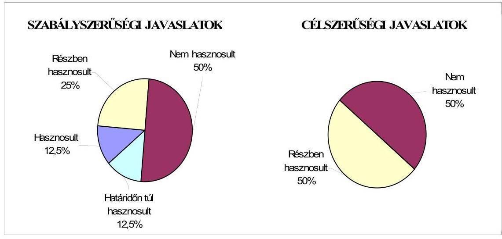
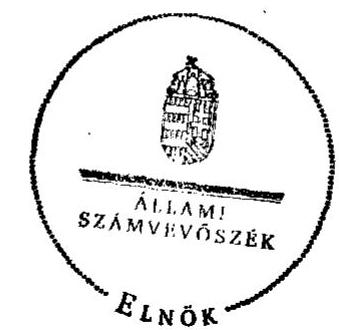
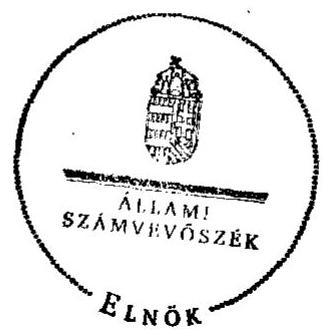

# JELENTÉS 

Hajdúbagos Község Önkormányzata belső kontrollrendszerének kialakítása, valamint egyes kontrolltevékenységek és a belső ellenőrzés múködése ellenőrzéséről

---

# Állami Számvevőszék 

Iktatószám: V-0063-004-060/2013.
Témaszám: 1098
Vizsgálat-azonosító szám: V059129

## Az ellenőrzést felügyelte:

Dr. Benedek Mária
felügyeleti vezető
Az ellenőrzést vezette:
Gyüre Lajosné
ellenőrzésvezető
A számvevőszéki jelentés összeállításában közremúködtek:
Szenténé Tubak Klára
számvevő tanácsos
Vásárhelyi Zoltán
számvevő tanácsos
Az ellenőrzést végezték:
Farkas Emese Rozália Dr. Eke-Pekács Tibor
számvevő
számvevő tanácsos

---

# TARTALOMJEGYZÉK 

BEVEZETÉS ..... 5
I. ÖSSZEGZŐ MEGÁLLAPÍTÁSOK, KÖVETKEZTETÉSEK, JAVASLATOK ..... 8
II. RÉSZLETES MEGÁLLAPÍTÁSOK ..... 17

1. Az Önkormányzat belső kontrollrendszere kialakításának megfelelősége ..... 17
1.1. A kontrollkörnyezet kialakítása ..... 17
1.2. A kockázatkezelési rendszer kialakítása ..... 18
1.3. A kontrolltevékenységek kialakítása ..... 19
1.4. Az információs és kommunikációs rendszer kialakítása ..... 20
1.5. A monitoring rendszer kialakítása ..... 21
2. A pénzügyi folyamatokban kulcsszerepet betöltő belső kontrollok (szakmai teljesítésigazolás és utalvány ellenjegyzés) múködése ..... 22
3. A belső ellenőrzés szervezeti keretei és múködése ..... 25
4. Az ÁSZ 2007-2010. években végzett átfogó ellenőrzései során megfogalmazott javaslatok végrehajtására tett intézkedések ..... 27
FÜGGELÉKEK
5. számú Értelmező szótár
6. számú A belső kontrollrendszer kialakítása, a pénzügyi folyamatokban kulcsszerepet betöltő szakmai teljesítésigazolás és utalvány ellenjegyzés kontrollok múködése, valamint a belső ellenőrzés múködése értékelésénél alkalmazott minősítési szempontok

---

.

---

# RÖVIDÍTÉSEK JEGYZÉKE 

## Törvények

ÁSZ. tv.
Avtv.

Info tv.

Ktv.

Kttv.

Mötv.

Ötv.
régi Áht.

Számv. tv.
új Áht.

## Rendeletek

Áhsz.

Ámr.
Ávr.

Ber.
Bkr.
önkormányzati SZMSZ

## Szórövidítések

adatvédelmi szabályzat

ÁSZ
Belső ellenőrzési kézikönyv
2011. évi LXVI. törvény az Állami Számvevőszékről
1992. évi LXIII. törvény a személyes adatok védelméről és a közérdekű adatok nyilvánosságáról (hatálytalan 2012. január 1-jétől)
2011. évi CXII. törvény az információs önrendelkezési jogról és az információszabadságról (hatályos 2012. január 1-jétől)
1992. évi XXIII. törvény a köztisztviselők jogállásáról (hatálytalan 2012. március 1-jétől)
2011. évi CXCIX. törvény a közszolgálati tisztviselőkről (hatályos 2012. január 1-jétől)
2011. évi CLXXXIX. törvény Magyarország helyi önkormányzatairól (hatályos 2012. január 1-jétől)
1990. évi LXV. törvény a helyi önkormányzatokról
1992. évi XXXVIII. törvény az államháztartásról (hatálytalan 2012. január 1-jétől)
2000. évi C. törvény a számvitelről
2011. évi CXCV. törvény az államháztartásról (hatályos 2012. január 1-jétől)

249/2000. (XII. 24.) Korm. rendelet az államháztartás szervezetei beszámolási és könyvvezetési kötelezettségének sajátosságairól
292/2009. (XII. 19.) Korm. rendelet az államháztartás múködési rendjéről (hatálytalan 2012. január 1-jétől)
368/2011. (XII. 31.) Korm. rendelet az államháztartásról szóló törvény végrehajtásáról (hatályos 2012. január 1jétől)
193/2003. (XI. 26.) Korm. rendelet a költségvetési szervek belső ellenőrzéséről (hatálytalan 2012. január 1-jétől)
370/2011. (XII. 31.) Korm. rendelet a költségvetési szervek belső kontrollrendszeréről és belső ellenőrzéséről (hatályos 2012. január 1-jétől)
Hajdúbagos Község Önkormányzata 8/2007. (IV. 15.) számú rendelete a Képviselő-testület és szervei SZMSZ-éről

Hajdúbagos Község Önkormányzat Szervezeteinek és Intézményeinek Adatvédelmi és Számítástechnikai Védelmi Szabályzata (hatályos 2004. szeptember 1-jétől)
Állami Számvevőszék
Derecske-Létavértes Kistérség Többcélú Kistérségi Társulás Belső Ellenőrzési Kézikönyve

---

Belső Kontroll Kézikönyv Az Ámr. 155. § (1) bekezdése, valamint az államháztartási belső kontroll standardokról szóló 1/2009. (IX. 11.) PM irányelv egységes értelmezése érdekében az államháztartásért felelős miniszter által a 2010. évben kiadott Belső Kontroll Kézikönyv
értékelési szabályzat
gazdasági program
hivatali SZMSZ
jegyzö ${ }_{1}$
jegyzö ${ }_{2}$
jegyzö ${ }_{3}$
Képviselő-testület
kockázatkezelési szabályzat
kötelezettségvállalási
szabályzat ${ }_{1}$
kötelezettségvállalási
szabályzat ${ }_{2}$
leltározási szabályzat
Önkormányzat
pénzkezelési szabályzat
polgármester
Polgármesteri Hivatal
selejtezési szabályzat
szabálytalanságkezelési
szabályzat

Társulás

Eszközök és Források Értékelési Szabályzata Polgármesteri Hivatal Hajdúbagos hatályos 2007. május 15-étől
Hajdúbagos Község Önkormányzat Képviselőtestületének Gazdasági Programja 2011-2014 (hatályos 2013. január 10-étől)
Hajdúbagos Község Önkormányzata 51/2007. (V. 17.) rendelete az Önkormányzat Szervezeti és Müködési Szabályzatáról (hatályos 2007. május 15-étől)
Hajdúbagos Község Önkormányzatának jegyzője 2003. augusztus 1-től 2011. február 28-áig
Hajdúbagos Község Önkormányzatának megbízott jegyzője 2010. december 20-tól 2013. február 15-éig
Hajdúbagos Község Önkormányzatának jegyzője 2013. február 18-ától
Hajdúbagos Község Képviselő-testülete
Hajdúbagos Község Önkormányzat Polgármesteri Hivatalának Kockázatkezelési Szabályzata (hatályos 2011. április 1-jétől)
Hajdúbagos Község Önkormányzat Polgármesteri Hivatalának Kötelezettségvállalás, utalványozás, ellenjegyzés, érvényesítés rendjének szabályzata (hatályos 2007. május 15-étől 2011. augusztus 9-éig)
Hajdúbagos Község Önkormányzat Polgármesteri Hivatalának Kötelezettségvállalás, érvényesítés, utalványozás, ellenjegyzés szabályzata (hatályos 2011. augusztus 10étől)
Hajdúbagos Község Önkormányzat Polgármesteri Hivatalának Leltározási és Leltárkészítési Szabályzata (hatályos 2007. május 15-étől)
Hajdúbagos Község Önkormányzata
Hajdúbagos Község Önkormányzat Polgármesteri Hivatalának Pénzkezelési Szabályzata (hatályos 2007. május 15-étől)
Hajdúbagos Község Önkormányzatának polgármestere
Hajdúbagos Község Önkormányzatának Polgármesteri Hivatala
Hajdúbagos Község Önkormányzat Polgármesteri Hivatalának a Felesleges vagyontárgyak hasznosításának, selejtezésének szabályzata (hatályos 2007. május 15-étől)
Hajdúbagos Község Önkormányzat Polgármesteri Hivatalának eljárásrendje a szabálytalanságok kezeléséről a Polgármesteri Hivatalban (hatályos 2007. május 15-étől)
Derecske-Létavértes Kistérség Többcélú Kistérségi Társulás

---

# JELENTÉS 

## Hajdúbagos Község Önkormányzata belső kontrollrendszerének kialakítása, valamint egyes kontrolltevékenységek és a belső ellenőrzés múködése ellenőrzéséről

## BEVEZETÉS

A belső kontrollrendszer kialakítását, múködtetését és fejlesztését a régi Áht. és az új Áht. is előírja. Ennek megvalósításáért a költségvetési szerv vezetője felel. A belső kontrollrendszer azt a célt szolgálja, hogy a költségvetési szervek múködésük és gazdálkodásuk során a tevékenységeket szabályszerűen, gazdaságosan, hatékonyan, eredményesen hajtsák végre, teljesítsék elszámolási kötelezettségeiket és megvédjék az erőforrásokat a veszteségektől, a károktól és a nem rendeltetésszerú használattól. A belső kontrollrendszer magában foglalja mindazon szabályokat, eljárásokat, gyakorlati módszereket és szervezeti struktúrákat, kockázatkezelési technikákat, kontrolltevékenységeket, amelyek segítséget nyújtanak a szervezetnek céljai eléréséhez.

Az ÁSZ a 2011-2015. évekre szóló stratégiájában hangsúlyos szerepet szánt annak, hogy szilárd szakmai alapon álló, értékteremtő ellenőrzéseivel előmozdítsa a közpénzügyek átláthatóságát, rendezettségét. A számvevőszéki ellenőrzés nemzetközi alapelvei is rögzítik, hogy a megfelelő belső kontrollrendszer minimálisra csökkenti a hibák és szabálytalanságok kockázatát.

Az ellenőrzés célja annak értékelése volt, hogy az Önkormányzat a jogszabályi előírásoknak megfelelően alakította-e ki a belső kontrollrendszert; a gazdálkodás folyamatában kulcsszerepet betöltő szakmai teljesítésigazolás és az utalvány ellenjegyzés kontrolltevékenységeit megfelelően múködtette-e; biztosí-totta-e a belső ellenőrzés szabályos és eredményes múködését; intézkedett-e az ÁSZ által a 2007-2010. évek között végzett átfogó ellenőrzések javaslatainak végrehajtására.

Az ÁSZ ezen ellenőrzési céljait pilot (próba) jelleggel községi/nagyközségi önkormányzatoknál végzett ellenőrzések során érvényesítette.

Az ellenőrzés típusa: szabályszerűségi ellenőrzés
Az ellenőrzés jogszabályi alapja: az ÁSZ tv. 5. § (2) és (6) bekezdései
Az ellenőrzött szervezet: az Önkormányzat
Az ellenőrzött időszak: a belső kontrollrendszer kialakításának megfelelőségét a 2011. évre vonatkozóan értékeltük. A kontrolltevékenységek múködésé-

---

nek megfelelőségét a 2011. január 1-je és december 31-e, míg a belső ellenőrzés működésének szabályosságát és eredményességét a 2009. január 1-je és 2011. december 31-e közötti időszakot figyelembe véve értékeltük. A helyszíni ellenőrzés lezárásáig a helyi szabályozás változásait nyomon követtük.

Az ellenőrzés szakmai módszertana az ÁSZ hivatalos honlapján (www.asz.hu) közzétett szakmai szabályokon alapult, amely a Legfőbb Ellenőrző Intézmények Nemzetközi Szervezete (INTOSAI) által kiadott nemzetközi standardok (ISSAI) figyelembevételével készült.

A belső kontrollrendszer kialakításának ellenőrzése során értékeltük a kontrollkörnyezet, a kockázatkezelési rendszer, a kontrolltevékenységek, az információs és kommunikációs rendszer, valamint a monitoring rendszer szabályozottságának megfelelőségét.

Értékeltük a pénzügyi folyamatokban kulcsszerepet betöltő szakmai teljesítésigazolás és az utalvány ellenjegyzés kontrollok múködésének megfelelőségét az államháztartáson kívülre teljesített múködési és felhalmozási célú pénzeszközátadásoknál, a külső szolgáltatók által végzett karbantartási, kisjavítási munkákkal, továbbá az egyéb üzemeltetési, fenntartási, szolgáltatási kiadásokkal kapcsolatos kifizetéseknél. Az egyszerú véletlen mintavétellel kiválasztott tételek ellenőrzését többlépcsős megfelelőségi tesztek útján addig végeztük, amíg elegendő és megfelelő bizonyítékot szereztünk a vizsgált folyamatok kulcskontrolljai múködésének megfelelő vagy nem megfelelő voltáról. Értékeltük az Önkormányzatnál a belső ellenőrzés múködésének szabályosságát és eredményességét. Az ÁSZ az Önkormányzat gazdálkodási rendszerét a 2007. évben ellenőrizte átfogó jelleggel.

A fogalmak magyarázatát az 1. számú függelék, az ellenőrzés egyes területeinek értékelésénél alkalmazott egységes minősítési szempontokat a 2. számú függelék tartalmazza.

Az ellenőrzés lefolytatásához az Önkormányzat a munkalapok és a tanúsítvány elektronikus kitöltésével, valamint a megjelölt dokumentumok elektronikus megküldésével szolgáltatott adatokat. A munkalapokon szerepeltetett adatok, információk ellenőrzése és szükség szerinti javítása a helyszíni ellenőrzés keretében történt.

Az ÁSZ az ellenőrzés megállapításait az ellenőrzött időszakban hatályos, az intézkedést igénylő megállapításokra tett javaslatokat a jelenleg hatályos jogszabályok alapján fogalmazta meg.

Az ÁSZ tv. 29. § (1) bekezdése szerint a jelentéstervezetet megküldtük a polgármester részére, aki az ÁSZ tv. 29. § (2) bekezdésében foglalt észrevételezési jogával nem élt, a jelentéstervezetre észrevételt nem tett.

Hajdúbagos község állandó lakosainak száma 2011. január 1-jén 2037 fő volt. Az Önkormányzat hét tagú Képviselő-testületének munkáját három állandó bizottság segítette. Az Önkormányzat az önállóan múködő és gazdálkodó Polgármesteri Hivatalon felül egy önállóan múködő intézménnyel látta el feladatát. A polgármester a 2010. évi önkormányzati választások óta tölti be tisztségét. A jegyző, tartós távolléte miatt 2010. december 20-ától a jegyző ${ }_{2}$ megbízott

---

jegyzőként látta el a jegyzői feladatokat. A jegyző ${ }_{1}$ megbízatása 2011. február 28-án közös megegyezéssel megszűnt. A jegyző ${ }_{1}$ és a jegyző ${ }_{2}$ között dokumentált munkakör és feladat átadás nem történt. A jegyző ${ }_{2}$ megbízatása 2013. február 15-én megszűnt, a jegyző ${ }_{3}$ kinevezésére 2013. február 18-án került sor. A jegy$z \ddot{2}_{2}$ és a jegyző ${ }_{3}$ között dokumentált munkakör és feladat átadás történt. A Polgármesteri Hivatal szervezeti egységekre tagolódott, a foglalkoztatott köztisztviselők száma 2011. január 1-jén 6 fő volt. Az Önkormányzat a 2011. évi költségvetési beszámolója szerint 334752 ezer Ft költségvetési bevételt ért el, valamint 315591 ezer Ft költségvetési kiadást teljesített. A 2011. december 31-ei könyvviteli mérleg szerint 667465 ezer Ft értékű eszközvagyonnal rendelkezett, 116340 ezer Ft hosszú lejáratú, 33050 ezer Ft rövid lejáratú kötelezettsége volt.

Az Önkormányzat - mint 2000 fő lélekszám feletti település - Polgármesteri Hivatalának szervezete a Mötv. 85. § (1) bekezdésére tekintettel 2013. március 1 -jéig nem változott.

---

# I. ÖSSZEGZŐ MEGÁLLAPÍTÁSOK, KÖVETKEZTETÉSEK, JAVASLATOK 

A belső kontrollrendszeren belül 2011-ben a Polgármesteri Hivatalban a kontrollkörnyezet, a kockázatkezelési rendszer, a kontrolltevékenységek, az információs és kommunikációs rendszer, valamint a monitoring rendszer kialakítását külön-külön és összesítve is értékeltük. A belső kontrollrendszer kialakítása az összesített értékelés alapján nem felelt meg a jogszabályi előírásoknak. Az egyes területek kialakításának értékelését az alábbiakban részletezzük.

A kontrollkörnyezet kialakítása nem felelt meg a jogszabályi követelményeknek, mert a Képviselő-testület az Ötv. ${ }^{1}$ előírása ellenére nem fogadta el a gazdasági programot, melynek oka, hogy a jegyző ${ }_{1}$ által elkészített gazdasági programtervezetet a polgármester nem terjesztette a Képviselő-testület elé. A jegyző ${ }_{1,2}$ az Ámr. ${ }^{2}$-ben foglaltak ellenére a hivatali SZMSZ-ben nem rögzítette az alaptevékenységeket, az alaptevékenységeket szabályozó jogszabályokat, valamint a munkakörökhöz tartozó hatásköröket, azok gyakorlásának módját, az engedélyezett létszámot, a helyettesítés rendjét és az ezekhez kapcsolódó felelősségi szabályokat. Az előző ÁSZ ellenőrzés javaslata ellenére a hivatali SZMSZ-ben nem határozták meg a gazdasági szervezet felépítését. A jegyző ${ }_{1,2}$ az Áhsz. előírása, valamint az előző ÁSZ ellenőrzés javaslata ellenére nem készítette el az önköltség számítási szabályzatot. A számlarend a Számv. tv. és az Áhsz. előírásai, valamint az előző ÁSZ ellenőrzés javaslata ellenére nem tartalmazta az összesítő bizonylatok tartalmi és formai követelményeit, valamint a főkönyv és az analitikus nyilvántartások egyeztetése dokumentálásának módját. A pénzkezelési szabályzat 2011. szeptember 1-jéig nem tartalmazta a házipénztáron kívüli pénzkezelés szabályait. A gazdasági vezető képesítése nem felelt meg az Ámr.-ben előírt képesítési követelményeknek. A Ktv. ${ }^{3}$ előírása ellenére a jegyző ${ }_{1,2}$ nem határozta meg a köztisztviselők munkateljesítményének értékeléséhez szükséges teljesítménykövetelményeket. Ezek a hiányosságok korlátozzák a feladatellátás számon kérhetőségét és folyamatosságának biztosítását. Az ellenőrzött időszakot követően, a 2012. év végén a hivatali SZMSZ-t kiegészítették az ellátandó alaptevékenységekkel, 2013-ban pedig a Képviselőtestület elfogadta az Önkormányzat 2011-2014. évekre vonatkozó gazdasági programját.

A kockázatkezelési rendszer kialakítása nem felelt meg a jogszabályi előírásoknak, mert a jegyző ${ }_{1,2}$ az Ámr. előírásai ellenére kockázatelemzést nem végzett, nem mérte fel és nem állapította meg a Polgármesteri Hivatal tevékenységében, gazdálkodásában rejlő kockázatokat, nem határozta meg az egyes kockázatokkal kapcsolatos intézkedéseket és megtételük módját.

[^0]
[^0]:    ${ }^{1}$ 2013. január 1-jétől Mötv.
    ${ }^{2}$ 2012. január 1-jétől Ávr.
    ${ }^{3}$ 2012. március 1-jétől Kttv.

---

A kontrolltevékenységek kialakítása a jogszabályi előírásoknak nem felelt meg, mert a jegyző ${ }_{1,2}$ a régi Áht. ${ }^{4}$ előírása ellenére nem határozta meg a pénzügyi döntések, köztük a beszerzési és a szabálytalanságkezelési feladatok folyamatba épített, előzetes, utólagos és vezetői ellenőrzését, valamint az előző ÁSZ ellenőrzés javaslata ellenére a pénzkezelés utólagos vezetői ellenőrzésének gyakoriságát és dokumentálásának módját. A jegyző ${ }_{1,2}$ az Ámr. előírása ellenére nem alakította ki a Polgármesteri Hivatal tevékenységeire vonatkozó beszámolási eljárásokat. A jegyző ${ }_{1,2}$ az Ámr. előírásait és az előző ÁSZ ellenőrzés javaslatait figyelmen kívül hagyva a kötelezettségvállalási szabályzat ${ }_{1}$-ben nem írta elő a szakmai teljesítésigazolás és az érvényesítés gyakorlásának módját, eljárási és dokumentációs részletszabályait, valamint az adatszolgáltatási feladatok teljesítésével kapcsolatos előírásokat, feltételeket. A kötelezettségvállalási szabályzat ${ }_{2}$-ben a jegyző ${ }_{2}$ nem határozta meg a szakmai teljesítésigazolás és érvényesítés dokumentációs részletszabályait. Az Ámr. előírása és a kötelezettségvállalási szabályzat ${ }_{1,2}$-ben foglalt - az előzetes írásbeli kötelezettségvállalást nem igénylő kifizetésekre vonatkozó - döntése ellenére ezen kifizetések részletes rendjét belső szabályzatban nem rögzítette. Az Ámr. előírása ellenére a kötelezettségvállalási szabályzat ${ }_{1}$-ben az érvényesítésre és szakmai teljesítésigazolásra kijelölt személyekről nem vezetett naprakész nyilvántartást. A kontrolltevékenységek hiányos kialakítása kockázatot jelent a feladatok szabályszerű végrehajtása során.

Az információs és kommunikációs rendszer kialakítása a jogszabályi előírásoknak nem felelt meg, mert a jegyző ${ }_{1,2}$ az Avtv. ${ }^{5}$ előírásai ellenére nem tette meg az adatbiztonság érvényre juttatásához szükséges intézkedéseket. Nem határozta meg teljes körűen a hozzáférési jogosultságok megállapítására és módosítására, nyilvántartására, azok ellenőrzésére vonatkozó eljárásrendet, továbbá nem szabályozta a pénzügyi-számviteli szoftverváltozások ellenőrzésére vonatkozó eljárásokat, a feldolgozott adatok mentési eljárásait és nem jelölte ki a mentések felelőseit. Az Ámr.-ben előírtak ellenére nem határozta meg a kötelezően közzéteendő adatok nyilvánosságra hozatalának rendjét. Az Avtv. rendelkezését figyelmen kívül hagyva a jegyző ${ }_{1,2}$ a közérdekú adatok megismerésére irányuló igények teljesítésének rendjét nem szabályozta.

A monitoring rendszer kialakítása a jogszabályi követelményeknek nem felelt meg, mert a jegyző ${ }_{1,2}$ az Ámr.-ben foglaltak ellenére az operatív tevékenységek keretében megvalósuló folyamatos és eseti nyomon követésből álló, a Polgármesteri Hivatal tevékenységének, a célok megvalósításának nyomon követését biztosító rendszer szabályait nem határozta meg.

A belső kontrollrendszer nem megfelelő kialakítása kockázatot jelent az Önkormányzat tevékenységeinek szabályszerű, gazdaságos, hatékony és eredményes végrehajtásában.

A Polgármesteri Hivatalban a 2011. évben az államháztartáson kívülre teljesített múködési és felhalmozási célú pénzeszközátadásokkal, az állományba nem tartozók megbízási díjaival, valamint a külső szolgáltatók által végzett karban-

[^0]
[^0]:    ${ }^{4}$ 2012. január 1-jétől új Áht.
    ${ }^{5}$ 2012. január 1-jétől Info tv.

---

tartással, kisjavítással kapcsolatos kifizetések során összefoglalóan értékelve a kulcskontrollok múködésének megfelelősége gyenge volt. A szakmai teljesítés igazolására a jegyző ${ }_{1,2}$ által kijelölt személyek az Ámr.-ben foglalt előírás ellenére a bizonylatokon az igazolás dátumát nem tüntették fel. A külső szolgáltatók által teljesített karbantartási, kisjavítási munkákra történő kifizetéseknél a kiadások teljesítése jogosságát, összegszerűségét és a szerződésben foglaltak szakmai teljesítését az Ámr.-ben foglaltak ellenére nem a jegyző ${ }_{1}$ által kijelölt személyek ellenőrizték és igazolták. A jegyző ${ }_{2}$ kijelölésével rendelkező személyek által végzett igazolások esetében pedig - az Ámr.-ben foglalt előírás ellenére - a kiadások teljesítése jogosságának, összegszerűségének ellenőrzését, a szakmai teljesítés igazolását nem a kötelezettségvállalási szabályzat ${ }_{2}$-ben előírt módon végezték.

Az utalványok ellenjegyző́je az Ámr.-ben foglalt ellenőrzési feladatait szabályszerű szakmai teljesítésigazolás hiányában nem a jogszabályi előírásoknak megfelelően végezte. Az utalvány ellenjegyzője annak ellenére ellenjegyezte az utalványokat, hogy a jegyzői kijelöléssel rendelkező személyek által végzett szakmai teljesítésigazolásokat nem a kötelezettségvállalási szabályzat ${ }_{2}$-ben foglalt módon végezték, valamint a bizonylatokon az igazolás dátumát sem tüntették fel. Az utalvány ellenjegyző az utalványokat annak ellenére ellenjegyezte, hogy a régi Áht. és az Ámr. gazdálkodásra - közöttük a kötelezettségvállalások nyilvántartására és az utalványrendeleten a kötelezettségvállalás nyilvántartási számának feltüntetésére, a kötelezettségvállalások ellenjegyzésére - vonatkozó szabályait nem tartották be.

A számvevőszéki ellenőrzés az ellenőrzött kifizetésekkel összefüggésben jogosulatlan kifizetést nem állapított meg, azonban a gazdálkodásban kulcsszerepet betöltő kontrollok jogszabályi előírásoknak nem megfelelő, gyenge múködése, valamint az előző ÁSZ ellenőrzés és a belső ellenőrzések javaslatai hasznosításának elmaradása miatt magas a hibák bekövetkezésének kockázata. A korábbi ÁSZ ellenőrzés során - a szakmai teljesítésigazolás és az utalvány ellenjegyzés kulcskontrollok múködtetésére, valamint a kötelezettségvállalások ellenjegyzésére - tett javaslatokat nem hasznosították, ami a hibák ismétlődéséhez vezetett. A nem szabályozott és nem múködtetett belső kontrollok korrupciós kockázatot is hordoznak.

Az Önkormányzat a belső ellenőrzési feladatokat a Társulás útján látta el. Az Önkormányzatnál a 2009-2011. években a belső ellenőrzés szabályozása és múködése az összegző értékelés alapján az ellenőrzött időszak egészét tekintve nem felelt meg a jogszabályi előírásoknak. A Ber.-ben foglalt előírás ellenére a belső ellenőrzési vezető személyét nem határozták meg. A 2010-2011. évek belső ellenőrzési terveinek elfogadásáról az Ötv.-ben előírtak ellenére a Képvi-selő-testület nem döntött, mert összeállításukról és előterjesztésükről a jegyző ${ }_{1}$ nem gondoskodott. A 2009. évben végzett ellenőrzések tekintetében ellenőrzési programokat a Ber. ${ }^{6}$ előírása ellenére nem készítettek. A jegyző ${ }_{1}$ a 2009-2010. években a belső ellenőrzés által tett javaslatok végrehajtására intézkedési tervet nem készített. A Ber. előírása ellenére az ellenőrzések és a külső és belső ellenőrzések javaslatai alapján tett intézkedések nyilvántartását és az intézkedések

[^0]
[^0]:    ${ }^{6}$ 2012. január 1-jétől Bkr.

---

nyomon követését elmulasztották. A 2011. évben az Önkormányzatnál nem végeztek belső ellenőrzést.

Az Önkormányzatnál a 2009-2011. években a belső ellenőrzés múködése a 2. számú függelékben részletezett kritériumrendszer alapján végzett értékelés szerint - nem volt eredményes, mert a belső ellenőrzés szabályozása és működése az összegző értékelés alapján az ellenőrzött időszak egészét tekintve nem felelt meg a jogszabályi előírásoknak, továbbá mert a 2009-2010. években a gazdálkodási jogkörök gyakorlásával és a készpénzkezelés belső kontrolljainak működésével kapcsolatban végzett ellenőrzések során tett javaslatokat nem hasznosították. Mindezek hozzájárultak a számvevőszéki ellenőrzés során is feltárt szabályozási és működési hiányosságok, a gyengén működő belső kontrollokból eredő hibák fennmaradásához, ismétlődéséhez.

Az ÁSZ tv. 33. § (1) bekezdésében foglaltak értelmében az ellenőrzött szervezet vezetője köteles a jelentésben foglalt megállapításokhoz kapcsolódó intézkedési tervet összeállítani, és azt a jelentés kézhezvételétől számított 30 napon belül az ÁSZ részére megküldeni. Amennyiben az intézkedési tervet határidőre nem küldi meg a szervezet, vagy az - az ÁSZ tv. 33. § (2) bekezdésében foglalt póthatáridő eltelte ellenére - továbbra sem elfogadható, az ÁSZ elnöke a hivatkozott törvény 33. § (3) bekezdés a)-b) pontjaiban foglaltakat érvényesítheti.

Az ellenőrzés intézkedést igénylő megállapításai és javaslatai:

# a polgármesternek 

1. Az Önkormányzat nevében történő kötelezettségvállalásokra - a régi Áht. 100/C. § (3) és az Ámr. 74. § (1) bekezdéseiben foglaltak ellenére - ellenjegyzés nélkül került sor.

Javaslat:
Intézkedjen arról, hogy az Önkormányzat nevében történő kötelezettségvállalásra az új Áht. 37. § (1) bekezdésében foglaltaknak megfelelően - az Ávr. 53. §-ában meghatározott kivételekkel - kizárólag a pénzügyi ellenjegyzés után, a pénzügyi teljesítés esedékességét megelőzően, írásban kerüljön sor.
2. A jegyző ${ }_{1,2}$ - az Ámr. 155. § (4) bekezdését figyelmen kívül hagyva - nem hasznosította a szabályozásbeli hiányosságok megszüntetésére, az Önkormányzat szabályszerű gazdálkodására és a belső ellenőrzés szabályszerű működésére vonatkozó korábbi ÁSZ ellenőrzés javaslatait. Az államháztartáson kívülre teljesített működési és felhalmozási célú pénzeszközátadások, az állományba nem tartozók megbízási díjainak és a külső szolgáltatók által teljesített karbantartási, kisjavítási munkákra teljesített kifizetéseket megelőzően az Ámr. 76. § (1) és (3) bekezdéseiben előírtak ellenére a szakmai teljesítés igazolását nem szabályszerűen végezték. Az utalványok ellenjegyző́je a kiadások teljesítését megelőzően - a régi Áht. 100/C. § (6) bekezdése ellenére - az Ámr. 78-79. §-aiban foglalt ellenőrzési feladatait nem, illetve nem a jogszabályi előírásoknak megfelelően végezte.

---

Javaslat:
A Mötv. 115. § (1) bekezdésében foglaltak alapján kísérje figyelemmel az önkormányzat gazdálkodásának szabályszerűségét. A Mötv. 67. § f) pontja alapján gondoskodjon a belső kontrollrendszerre és a belső ellenőrzés múködésére vonatkozó jogszabályi rendelkezések be nem tartása, valamint a szakmai teljesítésigazolás, illetve az utalvány ellenjegyzés kontrollokkal összefüggésben feltárt hiányosságok, szabálytalanságok tekintetében az esetleges munkajogi felelősséggel kapcsolatos körülmények kivizsgálásáról, és a vizsgálat eredményének függvényében tegye meg a szükséges munkajogi intézkedéseket.

# a jegyzőnek 

1. a kontrollkörnyezettel kapcsolatban:

A jegyző ${ }_{1,2}$ az Ámr. 20. § (2) bekezdés c), e) és h) pontjaiban foglaltak ellenére a hivatali SZMSZ-ben nem határozta meg az ellátandó alaptevékenységet szabályozó jogszabályok megjelölését, nem rögzítette a szervezeti egységek engedélyezett létszámát, a nevesített valamennyi munkakörhöz tartozó feladat- és hatásköröket, a hatáskörök gyakorlásának módját, a helyettesítés rendjét és az ezekhez kapcsolódó felelősségi szabályokat.

A jegyző ${ }_{1,2}$ - az Áhsz. 8. § (4) bekezdés c) pontjában foglaltak ellenére - nem készítette el az önköltségszámítás rendjére vonatkozó belső szabályzatot.

A számlarend - a Számv. tv. 161. § (1)-(3) bekezdéseiben, valamint az Áhsz. 49. § (3) bekezdésében foglalt előírások ellenére - nem tartalmazott rendelkezést a főkönyvi és az analitikus nyilvántartás egyeztetése dokumentálásának módjára vonatkozóan.

A gazdasági szervezet vezetője nem rendelkezett az Ámr. 18. § (1), (2) és (4) bekezdéseiben előírt képesítéssel.

A jegyző ${ }_{1,2}$ - a Ktv. 34. § (5) bekezdésében foglalt előírás ellenére - nem határozta meg a köztisztviselők munkateljesítményének értékeléséhez szükséges teljesítménykövetelményeket.

Javaslat:
a) Módosítsa a hivatali SZMSZ-t, és kezdeményezze a polgármesternél a módosítás Képviselő-testület elé terjesztését annak érdekében, hogy az az Ávr. 13. § (1) bekezdés c), e) és g) pontjaiban foglaltaknak megfelelően tartalmazza az ellátandó alaptevékenységet szabályozó jogszabályok megjelölését, a szervezeti egységek engedélyezett létszámát, a nevesített valamennyi munkakörhöz tarozó feladatás hatáskört, a hatáskörök gyakorlásának módját, a helyettesítés rendjét, valamint az ezekhez kapcsolódó felelősségi szabályokat.
b) Készítse el az Áhsz. 8. § (4) bekezdés c) pontjában foglaltak alapján az önköltségszámítás rendjére vonatkozó belső szabályzatot.

---

c) Egészítse ki a Számv. tv. 161. § (1)-(3) bekezdéseiben és az Áhsz. 49. §-ában foglaltak alapján a számlarendet a főkönyv és az analitikus nyilvántartások egyeztetése dokumentálásának módjára vonatkozó előírásokkal.
d) Intézkedjen arról, hogy a gazdasági szervezet vezetőjeként az Ávr. 12. § (1)-(2) bekezdéseiben előírt képesítéssel rendelkező személy kerüljön kinevezésre.
e) Dolgozza ki a Kttv. 130. § (1)-(3) bekezdéseiben előírtak szerinti teljesítményértékelés alapját képező teljesítménykövetelményeket.
2. a kockázatkezelési rendszerrel kapcsolatban:

A jegyző ${ }_{1,2}$ - az Ámr. 157. § (1)-(3) bekezdéseinek előíása ellenére - nem végzett kockázatelemzést, és nem múködtetett kockázatkezelési rendszert.

Javaslat:
Alakítsa ki és múködtesse a Bkr. 3. § b) pontja és a 7. §-a szerinti kockázatkezelési rendszert.
3. a kontrolltevékenységekkel kapcsolatban:

A jegyző ${ }_{1,2}$ - a régi Áht. 121/A. § (4) bekezdés a) pontjában foglaltak ellenére - nem határozta meg a pénzügyi döntések - köztük a beszerzési és szabálytalanságkezelési feladatok - dokumentumainak elkészítésével kapcsolatos folyamatba épített, előzetes, utólagos és vezetői ellenőrzés feladatait, és az előző ÁSZ ellenőrzés javaslata ellenére a pénzkezelés utólagos vezetői ellenőrzésének gyakoriságát és dokumentálásának módját.

A jegyző ${ }_{1,2}$ - az Ámr. 158. § (2) bekezdés d) pontjában foglaltak ellenére - nem szabályozta a Polgármesteri Hivatal tevékenységeire vonatkozó beszámolási eljárásokat.

Az Ámr. 20. § (3) bekezdés a) pontjában foglaltak ellenére a kötelezettségvállalási szabályzat ${ }_{2}$-ben a jegyző ${ }_{2}$ nem rendezte a szakmai teljesítésigazolás és érvényesítés dokumentációs részletszabályait.

A jegyző ${ }_{1,2}$ nem szabályozta a kötelezettségvállalást nem igénylő kifizetések rendjét az Ámr. 72. § (14) bekezdésében foglaltak, valamint annak ellenére, hogy a kötelezettségvállalási szabályzat ${ }_{1}$ az 50 E , illetve a kötelezettségvállalási szabályzat ${ }_{2}$ a 100 E Ft alatti kifizetések esetében lehetővé tette az előzetes írásbeli kötelezettségvállalás mellőzését.

Javaslat:
a) Biztosítsa minden tevékenységre vonatkozóan a folyamatba épített, előzetes, utólagos és vezetői ellenőrzést a Bkr. 8. § (2) bekezdése alapján.
b) Szabályozza a Bkr. 8. § (4) bekezdés c) pontja alapján a Polgármesteri Hivatal tevékenységeire vonatkozó beszámolási eljárásokat.

---

c) Egészítse ki a gazdálkodással kapcsolatos belső előírásokat és feltételeket a teljesítésigazolás, érvényesítés dokumentációs részletszabályaival az Ávr. 13. § (2) bekezdés a) pontjának megfelelően.
d) Rögzítse belső szabályzatban az Ávr. 53. § (2) bekezdése alapján az előzetes írásbeli kötelezettségvállalást nem igénylő kifizetések rendjét.
4. az információs és kommunikációs rendszerrel kapcsolatban:

A jegyző ${ }_{1,2}$ - az Avtv. 10. § (1)-(2) bekezdéseiben foglalt előírások ellenére - elmulasztotta az adatbiztonság érvényre juttatásához szükséges intézkedések megtételét, nem határozta meg teljes körűen a hozzáférési jogosultságok megállapítására, módosítására és ellenőrzésére vonatkozó eljárásrendet. Nem szabályozta a pénzügyiszámviteli szoftverváltozások ellenőrzésére, tesztelésére vonatkozó eljárásokat, a feldolgozott adatok mentési eljárásait, és nem jelölte ki a mentések felelőseit.

Az Ámr. 20. § (3) bekezdés i) pontjában foglaltak ellenére nem határozta meg a kötelezően közzéteendő adatok nyilvánosságra hozatalának rendjét. Az Avtv. 20. § (8) bekezdésében és az Ámr. 20. § (3) bekezdés i) pontjában foglaltak ellenére a jegy$z \tilde{o}_{1,2}$ a közérdekű adatok megismerésére irányuló igények teljesítésének rendjét nem szabályozta.

Javaslat:
a) Biztosítsa az Info tv. 7. § (2)-(3) bekezdéseinek megfelelően az adatbiztonság érvényesülését, szabályozza a hozzáférési jogosultságok megállapítására és módosítására, azok ellenőrzésére vonatkozó eljárásrendet, a pénzügyi-számviteli szoftverváltozások ellenőrzésére, tesztelésére vonatkozó eljárásokat, a feldolgozott adatok mentési eljárásait, és jelölje ki a mentések felelőseit.
b) Állapítsa meg szabályzatban az Info tv. 35. § (3) bekezdésben előírtaknak megfelelően a kötelezően közzéteendő adatok nyilvánosságra hozatalának rendjét, és készítse el az Info tv. 30. § (6) bekezdésében és az Ávr. 13. § (2) bekezdés h) pontjában foglaltak alapján a közérdekű adatok megismerésére irányuló igények teljesítésének rendjét rögzítő szabályzatot.
5. a monitoring rendszerrel kapcsolatban:

A jegyző ${ }_{1,2}$ - az Ámr. 160. §-ában foglaltak ellenére - nem alakított ki és nem múködtetett olyan monitoring rendszert, amely lehetővé teszi a Polgármesteri Hivatal tevékenységének, a célok megvalósításának nyomon követését, és amelynek része az operatív tevékenységek keretében megvalósuló folyamatos és eseti nyomon követés is.

Javaslat:
Alakítsa ki és múködtesse a Bkr. 3. § e) pontjában és a 10. §-ában előírtak alapján a Polgármesteri Hivatal tevékenységének, a célok megvalósításának nyomon követését biztosító rendszerét, amelynek része az operatív tevékenységek keretében megvalósuló folyamatos és eseti nyomon követés is.

---

6. a pénzügyi folyamatokban kulcsszerepet betöltő kontrollokkal kapcsolatban:

A 2011. évben az államháztartáson kívülre történő működési célú pénzeszközátadásokkal kapcsolatos kifizetéseket megelőzően a szakmai teljesítés igazolására a jegy$z_{1,2}$ által kijelölt személyek - az Ámr. 76. § (1) bekezdésében foglaltak ellenére - a szakmai teljesítést - az igazolás dátumának feltüntetése hiányában - nem szabályszerűen igazolták. A jegyző ${ }_{2}$ által kijelölt személyek az Ámr. 76. § (3) bekezdésében foglalt előírás ellenére az állományba nem tartozók megbízási díjaira és a külső szolgáltatók által teljesített karbantartási, kisjavítási munkákra történő kifizetések során a szakmai teljesítés igazolását nem a kötelezettségvállalási szabályzat ${ }_{2}$-ben előírt módon végezték. A külső szolgáltatók által teljesített karbantartási, kisjavítási munkákra történt kifizetést megelőzően a kifizetés jogosságát, összegszerűségét és a megrendelés szakmai teljesítését - az Ámr. 76. § (3) bekezdésében foglaltak ellenére - nem a jegyző; által kijelölt személy ellenőrizte és igazolta.

Az utalványok ellenjegyzője a külső szolgáltatók által teljesített karbantartási, kisjavítási munkákra történő kifizetés során az Ámr. 79. § (2) bekezdésében foglalt feladatát szabályszerű szakmai teljesítésigazolás hiányában nem a jogszabályi előírásoknak megfelelően végezte. Annak ellenére aláírásával ellenjegyezte az állományba nem tartozók megbízási díjai és a külső szolgáltatók által teljesített karbantartási, kisjavítási munkák kifizetésére vonatkozó utalványokat, hogy a szakmai teljesítésigazolást nem a kötelezettségvállalási szabályzatban előírtak szerint végezték, illetve az államháztartáson kívülre teljesített múködési célú pénzeszközátadások kifizetéseikor a szakmai teljesítést igazoló dátum feltüntetése nélkül végezte az igazolást. Az érvényesítés a megbízási díjak és a karbantartási, kisjavítási munkák kifizetése esetében nem felelt meg az Ámr. 77. § (3) bekezdésében foglalt előírásoknak, mert nem tartalmazta az érvényesítés dátumát, illetve az érvényesítésre utaló megjelölést és a megállapított összeget. Az utalványok ellenjegyzője aláírásával ellenjegyezte az utalványokat annak ellenére, hogy az nem tartalmazta az Ámr. 78. § (2) bekezdés g) pontjában előírt nyilvántartási számot, mert a kötelezettségvállalások Ámr. 75. § (1) bekezdésében meghatározott nyilvántartását nem vezették, továbbá, hogy az államháztartáson kívülre teljesített múködési célú pénzeszközátadásokhoz és az állományba nem tartozók megbízási díjaihoz kapcsolódó kötelezettségvállalásokra - a régi Áht. 100/C. § (3) és az Ámr. 74. § (1) bekezdésében foglaltak ellenére - ellenjegyzés nélkül került sor.

Javaslat:
Intézkedjen - a szakmai teljesítés igazolása és az utalvány ellenjegyzése vonatkozásában feltárt hiányosságok megszüntetése, illetve az operatív gazdálkodás során a múködésbeli hibák megelőzése, feltárása és kijavítása érdekében - arról, hogy:
a) a teljesítésigazolásra - az Ávr. 57. § (4) bekezdésében foglalt előírás szerint - kijelölt személyek az Ávr. 57. § (1) bekezdésében foglaltaknak megfelelően a kötelezettségvállalási szabályzat ${ }_{2}$-ben előírt módon, ellenőrizhető okmányok alapján ellenőrizzék a kiadások teljesítésének jogosságát, összegszerűségét, ellenszolgáltatást is magában foglaló kötelezettségvállalás esetében a szerződés, megrendelés teljesítését, és azt az Ávr. 57. § (3) bekezdésében foglalt módon igazolják;
b) a kifizetéseket megelőzően - az Ávr. 58. § (1) bekezdése szerint - a teljesítésigazolás alapján - az Ávr. 57. § (3) bekezdése szerinti esetben annak hiányában is -

---

az összegszerűségnek, a fedezet meglétének és a megelőző ügymenetben az új Áht., az Áhsz., az Ávr. előírásai és a belső szabályzatokban foglaltak betartásának az ellenőrzése történjen meg;
c) az Ávr. 56. § (1) bekezdésében foglalt kötelezettségvállalási nyilvántartást naprakészen vezessék, és az utalványrendeleteken az Ávr. 59. § (3) bekezdés f) pontjában foglaltaknak megfelelően tüntessék fel a kötelezettségvállalás nyilvántartási számát.
7. a belső ellenőrzés múködésével kapcsolatban:

A Ber. 21. § (1) bekezdésében előírtak ellenére a 2010-2011. években nem gondoskodtak a belső ellenőrzési tervek összeállításáról, így azt a Képviselő-testület - az Ötv. 92. § (6) bekezdésében előírtak ellenére - nem hagyta jóvá. A Ber. 4/A. § (2) bekezdésében foglaltak ellenére nem rendelkeztek a Ber. 12. §-ában foglalt tevékenységek ellátásának módjáról. A jegyző, - a Ber. 29. § (1) bekezdésében foglaltak ellenére - a belső ellenőrzés által tett javaslatok hasznosítására nem készített intézkedési terveket. A Ber. 12. § j) pontjában és a 32. §-ban foglaltak ellenére az elvégzett belső ellenőrzésekről nem vezettek nyilvántartást, valamint a Ber. 8. § f) pontjában és a 29/A. § (1)-(2) bekezdéseiben foglaltak ellenére nem vezettek nyilvántartást, amellyel a külső és belső ellenőrzési jelentésekben tett megállapítások, javaslatok hasznosulása és végrehajtása nyomon követhető lett volna.

Javaslat:
a) Intézkedjen az éves ellenőrzési terv Képviselő-testület elé terjesztéséről annak érdekében, hogy azt a Képviselő-testület az Mötv. 119. § (5) bekezdésében és a Bkr. 32. § (4) bekezdésében előírt határidőn belül hagyja jóvá.
b) Intézkedjen arról, hogy a Bkr. 16. § (4) bekezdésének megfelelően a belső ellenőrzési tevékenység megszervezésére vonatkozó megállapodásban rendelkezzenek a Bkr. 22. § (1)-(2) bekezdéseiben foglalt tevékenységek és kötelességek ellátásának módjáról.
c) Intézkedjen arról, hogy a belső ellenőrzésekről készült jelentésekben rögzített hiányosságok felszámolására a Bkr. 45. §-nak megfelelően készüljön intézkedési terv.
d) Kezdeményezze, hogy a Bkr. 22. § (2) bekezdés b) és e) pontja, valamint az 50. § alapján vezessenek nyilvántartást az elvégzett belső ellenőrzésekről, továbbá a belső ellenőrzés a Bkr. 21. § (2) bekezdés d) pontjában foglaltak szerint kövesse nyomon a belső ellenőrzési jelentések alapján megtett intézkedéseket, és vezessen nyilvántartást a Bkr. 14. § (1) bekezdése szerint a külső ellenőrzések javaslatai alapján készült intézkedési tervek végrehajtásáról, illetve a 47. §-ban foglalt előírásokat figyelembe véve a belső ellenőrzési jelentésekben tett megállapításokról, javaslatokról, a vonatkozó intézkedési tervekről és azok végrehajtásáról.

---

# II. RÉSZLETES MEGÁLLAPÍTÁSOK 

## 1. Az ÖNKORMÁNYZAT BELSŐ KONTROLLRENDSZERE KIALAKÍTÁSÁNAK MEGFELELŐSÉGE

### 1.1. A kontrollkörnyezet kialakítása

A kontrollkörnyezet kialakítása a 2. számú függelékben részletezett kritériumrendszer alapján végzett értékelés szerint a Polgármesteri Hivatalban nem volt megfelelö, mert a jegyző ${ }_{1,2}$ a jogszabályi előírásokat nem érvényesítette maradéktalanul. A jegyző ${ }_{1}$ elkészítette az Önkormányzat gazdasági programtervezetét, azonban azt a polgármester a Htv. 139. § (1) bekezdés a) pontjában foglaltakat figyelmen kívül hagyva nem terjesztette a Képviselő-testület elé, így a Képviselő-testület az Ötv. 91. § (7) bekezdésében ${ }^{7}$ foglaltakat megsértve, nem határozta meg az Önkormányzat 2011-2014. évekre vonatkozó gazdasági programját. A gazdasági szervezet vezetőjének képesítése nem felelt meg az Ámr. 18. § (1), (2) és (4) bekezdéseiben ${ }^{8}$ foglalt képesítési követelményeknek.

A jegyző ${ }_{1,2}$, mint a költségvetési szerv vezetője:

- az Ámr. 20. § (2) bekezdés c), e) és h) pontjaiban ${ }^{9}$ foglaltak ellenére a hivatali SZMSZ-ben nem határozta meg az ellátandó alaptevékenységeket, az alaptevékenységet szabályozó jogszabályok megjelölését, a szervezeti egységek engedélyezett létszámát, a nevesített valamennyi munkakörhöz tartozó feladat- és hatásköröket, a hatáskörök gyakorlásának módját, a helyettesítés rendjét, az ezekhez kapcsolódó felelősségi szabályokat és - az előző ÁSZ ellenőrzés javaslata ellenére - a gazdasági szervezet felépítését;
- a pénzkezelési szabályzatot elkészítette, azonban az az Áhsz. 8. § (4) bekezdés d) pontjában előírtak ellenére 2011. szeptember 1-jéig nem tartalmazta a házipénztáron kívüli pénzkezelés szabályait;
- az Áhsz. 8. § (4) bekezdés c) pontjában foglaltak és az előző ÁSZ ellenőrzés javaslata ellenére nem készítette el az önköltségszámítás rendjére vonatkozó belső szabályzatot;
- a Polgármesteri Hivatal számlarendjét elkészítette, az analitikus nyilvántartások formáját, tartalmát, vezetésének módját, a főkönyv és az analitikus nyilvántartások egyeztetését meghatározta, azonban - a Számv. tv. 161. § (1)-(3) bekezdéseiben, az Áhsz. 49. §-ában és az 51. § (1) bekezdés b) pontjában foglalt előírások, valamint az előző ÁSZ ellenőrzés javaslatai ellenére a számlarend nem tartalmazott rendelkezést az összesítő bizonylatok (feladások) tartalmi, formai követelményeire, valamint a főkönyv és az analitikus nyilvántartások egyeztetése dokumentálásának módjára vonatkozóan;

[^0]
[^0]:    ${ }^{7}$ 2013. január 1-jétől a Mötv. 116. § (5) bekezdése
    ${ }^{8}$ 2012. január 1-jétől az Ávr. 12. § (1) bekezdése
    ${ }^{9}$ 2012. január 1-jétől az Ávr. 13. § (1) bekezdés c), e) és g) pontjai

---

- a Ktv. 34. § (5) bekezdésében ${ }^{10}$ foglalt előírás ellenére nem határozta meg a köztisztviselők munkateljesítményének értékeléséhez szükséges teljesítménykövetelményeket.

A Polgármesteri Hivatalban a kontrollkörnyezet szabályozási hiányosságait az ellenőrzött időszakot követően részben megszüntették, mert a 2011-2014. évekre vonatkozó gazdasági programot a 2013. évben a Képviselő-testület az 5/2013. (I. 10.) számú határozatában utólag elfogadta, és a hivatali SZMSZ 2012. december 14-étől tartalmazza az ellátandó alaptevékenységeket.

A kontrollkörnyezet kialakítása során a jegyző ${ }_{1,2}$ az Ámr. 155. § (3) bekezdésének ${ }^{11}$ előírását figyelmen kívül hagyva az államháztartásért felelős miniszter által kiadott Belső Kontroll Kézikönyv ajánlásait nem hasznosította teljes körűen.

A kontrollkörnyezet kialakítása során a jegyző ${ }_{1,2}$ :

- a Belső Kontroll Kézikönyv 1.2.4. pontjának ajánlását és az előző ÁSZ ellenőrzés javaslatát nem hasznosította, mert az értékelési szabályzat nem tartalmazta az értékelések ellenőrzéséért felelős munkaköröket, valamint a selejtezési szabályzatban nem rögzítette a minősítési jogot gyakorló munkaköröket és az ármegállapítás szabályait, továbbá az érintett dolgozók munkaköri leírásaiban az értékelési, selejtezési és ellenőrzési feladatokat nem határozta meg;
- a Belső Kontroll Kézikönyv 1.5.2. pontjának ajánlását nem érvényesítette, mert nem dolgozta ki a Polgármesteri Hivatalban ellátott köztisztviselői munkakörök betöltésére vonatkozó elvárt tudást és képességeket;
- a Belső Kontroll Kézikönyv 1.6. pontjában foglalt ajánlást nem hasznosította, mert nem intézkedett - a szervezeti célokkal összhangban álló - etikai értékek és az integritás kiemelt kezeléséről, nem határozta meg a köztisztviselőkkel szembeni etikai elvárásokat.

# 1.2. A kockázatkezelési rendszer kialakítása 

A kockázatkezelési rendszer kialakítása a 2. számú függelékben részletezett kritériumrendszer alapján végzett értékelés szerint a Polgármesteri Hivatalban nem volt megfelelő, mert rendelkeztek ugyan kockázatkezelési szabályzattal, azonban a jegyző ${ }_{1,2}$ a kockázatkezelési rendszer keretében az Ámr. 157. § (1)-(3) bekezdéseiben ${ }^{12}$ foglaltak ellenére kockázatelemzést nem végzett, nem mérte fel és nem állapította meg a Polgármesteri Hivatal tevékenységében, gazdálkodásában rejlő kockázatokat, nem határozta meg az egyes kockázatokkal kapcsolatos intézkedéseket és megtételük módját.

A kockázatkezelési rendszer kialakítása során a jegyző ${ }_{1,2}$ az Ámr. 155. § (3) bekezdésének előírását figyelmen kívül hagyva az államháztartásért felelős miniszter által kiadott Belső Kontroll Kézikönyv ajánlásait nem hasznosította teljes körűen.

[^0]
[^0]:    ${ }^{10}$ 2012. július 1-jétől a Kttv. 130.§ (1)-(6) bekezdései
    ${ }^{11}$ 2012. január 1-jétől a Bkr. 5. § (1) bekezdése
    ${ }^{12}$ 2012. január 1-jétől a Bkr. 3. § b) pontja és a 7. § (1)-(2) bekezdései

---

A kockázatkezelési rendszer kialakítása során a jegyző ${ }_{1,2}$ :

- a Belső Kontroll Kézikönyv 2.2. pontjában foglaltakat nem hasznosította, mert az Önkormányzat tevékenységeit kockázati kitettség alapján nem rangsorolta, nem határozta meg a kockázati túréshatárokat;
- a Belső Kontroll Kézikönyv 2.3. pontjában foglalt ajánlásokat nem hasznosította, mert nem jelölte ki a válaszlépések végrehajtásáért felelős személyeket, nem szabályozta az intézkedések nyomon követésének módját, valamint a kockázat-nyilvántartási rendszert nem alakította ki, és nem vezetett nyilvántartást;
- a Belső Kontroll Kézikönyv 2.4.2. pontjában foglaltakat nem hasznosította, mert nem írta elő, és ezért nem is végezték el a kockázatok legalább évenkénti felülvizsgálatát;
- nem érvényesítette a Belső Kontroll Kézikönyv 2.5.1. pontjában foglalt ajánlást, mert nem gondoskodott a csalás és a korrupció, mint kiemelt kockázatok értékeléséről és kezeléséről.

# 1.3. A kontrolltevékenységek kialakítása 

A kontrolltevékenységek kialakítása a 2. számú függelékben részletezett kritériumrendszer alapján végzett értékelés szerint a Polgármesteri Hivatalban nem volt megfelelő, mert a jegyző ${ }_{1,2}$ a jogszabályi előírásokat nem tartotta be.

A jegyző ${ }_{1,2}$, mint a költségvetési szerv vezetője:

- a régi Áht. 121/A. § (4) bekezdésében ${ }^{13}$ foglaltak ellenére nem határozta meg a pénzügyi döntések, köztük a beszerzési és a szabálytalanságkezeléssel öszszefüggő feladatok folyamatba épített, előzetes, utólagos és vezetői ellenőrzését, illetve az előző ÁSZ ellenőrzés javaslata ellenére a pénzkezelés utólagos vezetői ellenőrzésének gyakoriságát és dokumentálásának módját;
- az Ámr. 158. § (2) bekezdés d) ${ }^{14}$ pontjának előírása ellenére nem szabályozta a Polgármesteri Hivatal tevékenységeire vonatkozó beszámolási eljárásokat;
- az Ámr. 20. § (3) bekezdés a) pontjában ${ }^{15}$ foglalt előírások, illetve az előző ÁSZ ellenőrzés javaslatai ellenére nem rendezte a kötelezettségvállalási sza-bályzat ${ }_{1}$-ben a szakmai teljesítésigazolás és az érvényesítés gyakorlásának módjával, eljárási és dokumentációs részletszabályaival, az adatszolgáltatási feladatok teljesítésével kapcsolatos belső előírásokat, feltételeket. A kötelezettségvállalási szabályzat ${ }_{2}$-ben a szakmai teljesítés igazolás módját előírta, azonban nem határozta meg a szakmai teljesítésigazolás és érvényesítés dokumentációs részletszabályait;
- az Ámr. 72. § (14) bekezdésében foglalt előírás ${ }^{16}$ és a kötelezettségvállalási szabályzat ${ }_{1,2}$-ben foglalt - az előzetes írásbeli kötelezettségvállalást nem

[^0]
[^0]:    ${ }^{13}$ 2012. január 1-jétől a Bkr. 8. § (2) bekezdés
    ${ }^{14}$ 2012. január 1-jétől a Bkr. 8. § (4) bekezdés c) pontja
    ${ }^{15}$ 2012. január 1-jétől az Ávr. 13. § (2) bekezdés a) pontja
    ${ }^{16}$ 2012. január 1-jétől az Ávr. 53. § (2) bekezdése

---

igénylő kifizetésekre vonatkozó - döntése ${ }^{17}$ ellenére ezen kifizetések részletes rendjét a belső szabályzatban nem rögzítette;

- a kötelezettségvállalási szabályzat ${ }_{1}$-ben az érvényesítésre és a szakmai teljesítésigazolásra kijelölt személyekről és aláírás mintájukról az Ámr. 80. § (3) bekezdésében ${ }^{18}$ előírtak ellenére naprakész nyilvántartást nem vezetett.

A kontrolltevékenységek kialakítása során a jegyző ${ }_{1,2}$ az Ámr. 155. § (3) bekezdésének előírását figyelmen kívül hagyva az államháztartásért felelős miniszter által kiadott Belső Kontroll Kézikönyv ajánlásait nem hasznosította teljes körűen.

A kontrolltevékenységek kialakítása során a jegyző ${ }_{1,2}$ :

- a Belső Kontroll Kézikönyv 3.1.7. pontjában foglaltakat és az előző ÁSZ ellenőrzés javaslatát nem hasznosította, mert az ellenőrzési nyomvonalban nem rendelkezett az egyes tevékenységek/feladatok elvégzését igazoló dokumentumok megnevezéséről és azok rendszerben való helyének szabályairól;
- a feladatkörök szétválasztása keretében a Belső Kontroll Kézikönyv 3.2.1. pontjában foglalt ajánlást nem érvényesítette, mert a köztisztviselők munkaköri leírásában nem határozta meg a gazdálkodási jogkörök ellátásához kapcsolódó kötelezettségeket és ellenőrzési feladatokat;
- a Belső Kontroll Kézikönyv 3.2.3. pontjában foglaltakat nem hasznosította, mert nem mérte fel a kis létszámból adódó kockázatokat az összeférhetetlenség kiküszöbölése érdekében;
- a Belső Kontroll Kézikönyv 3.3.1. pontjában foglalt ajánlást nem hasznosította, a feladatvégzés folytonossága feltételeinek biztosítása keretében nem szabályozta a Polgármesteri Hivatalban a munkaviszony megszűnése esetén a munkavállaló folyamatban lévő feladatai átadásának rendjét, és nem írta elő munkakör átadás-átvétel esetén jegyzőkönyv készítésének a kötelezettségét.

# 1.4. Az információs és kommunikációs rendszer kialakítása 

Az információs és kommunikációs rendszer kialakítása a 2. számú függelékben részletezett kritériumrendszer alapján végzett értékelés szerint a Polgármesteri Hivatalban nem volt megfelelő, mert a jegyző ${ }_{1,2}$ a jogszabályi követelményeket nem érvényesítette.

A jegyző ${ }_{1,2}$, mint a költségvetési szerv vezetője:

- az informatikai rendszer környezetének kialakítása során az Avtv. 10. § (1)(2) bekezdéseiben ${ }^{19}$ foglalt előírások ellenére elmulasztotta az adatbiztonság érvényre juttatásához szükséges intézkedések megtételét, mert nem határozta meg teljes körűen a hozzáférési jogosultságok megállapítására, módosítá-

[^0]
[^0]:    ${ }^{17}$ A kötelezettségvállalási szabályzat ${ }_{1}$ II. pontjában foglaltak szerint nem kötelező írásbeli kötelezettségvállalás az 50 ezer Ft alatti kifizetések esetében, illetve a kötelezettségvállalási szabályzat ${ }_{2} 3 / 1$. pontja szerint a 100 ezer Ft alatti kifizetésekhez a kötelezettségvállaló szóbeli engedélye szükséges.
    ${ }^{18}$ 2012. január 1-jétől az Ávr. 60. § (3) bekezdése
    ${ }^{19}$ 2012. január 1-jétől az Info tv. 7. § (2)-(3) bekezdései

---

sára és nyilvántartására, azok ellenőrzésére vonatkozó eljárásrendet, továbbá nem szabályozta a pénzügyi-számviteli szoftverváltozások ellenőrzésére, tesztelésére vonatkozó eljárásokat, a feldolgozott adatok mentési eljárásait, és nem jelölte ki a mentések felelőseit;

- az Ámr. 20. § (3) bekezdés i) pontjában ${ }^{20}$ foglaltak ellenére nem határozta meg a közérdekú adatok közzétételi eljárásának, nyilvánosságra hozatalának rendjét. Az Avtv. 20. § (8) bekezdésének ${ }^{21}$ rendelkezése ellenére nem szabályozta a közérdekú adatok megismerésére irányuló igények teljesítésének rendjét.

Az információs és kommunikációs rendszer kialakítása során a jegyző ${ }_{1,2}$ az Ámr. 155. § (3) bekezdésének előírását figyelmen kívül hagyva az államháztartásért felelős miniszter által kiadott Belső Kontroll Kézikönyv ajánlásait nem hasznosította teljes körúen.

Az információs és kommunikációs rendszer kialakítása során a jegyző ${ }_{1,2}$ :

- a Belső Kontroll Kézikönyv 4.1.2. pontjaiban foglalt ajánlást nem hasznosította, mert nem írta elő a dokumentálási kötelezettséget és a szervezeten belüli információ átadás formáit;
- az iktatási, iratkezelési rendszer kialakítása során a Belső Kontroll Kézikönyv 4.2.4. pontjában foglalt ajánlást nem érvényesítette, mert nem írta elő a Polgármesteri Hivatalban az ügyintézési határidők nyomon követésének dokumentálását, és nem szabályozta a késedelmes ügyintézéssel kapcsolatos felelősséget;
- a szabálytalanságkezelési szabályzatban a Belső Kontroll Kézikönyv 4.3.3. pontjában foglaltakat figyelmen kívül hagyva nem rögzítette a szabálytalanságot bejelentő védelmére vonatkozó előírásokat és kötelezettségeket.

# 1.5. A monitoring rendszer kialakítása 

A monitoring rendszer kialakítása a 2. számú függelékben részletezett kritériumrendszer alapján végzett értékelés szerint a Polgármesteri Hivatalban nem volt megfelelő, mert a jegyző ${ }_{1,2}$ az Ámr. 160. §-ában ${ }^{22}$ foglaltak ellenére az operatív tevékenységek keretében megvalósuló folyamatos és eseti nyomon követésből álló, a Polgármesteri Hivatal tevékenységének, a célok megvalósításának nyomon követését biztosító rendszert nem alakította ki.

A belső kontrollrendszer kialakítása a Polgármesteri Hivatalban 2011-ben összefoglalóan értékelve nem felelt meg a jogszabályi előírásoknak, mert a jegyző ${ }_{1,2}$ a kontrollkörnyezetet, a kockázatkezelési rendszert és a kontrolltevékenységeket, az információs és kommunikációs rendszert, valamint a monitor-

[^0]
[^0]:    ${ }^{20}$ 2012. január 1-jétől az Ávr. 13. § (2) bekezdés h) pontja és az Info tv 35. § (3) bekezdése
    ${ }^{21}$ 2012. január 1-jétől az Ávr. 13. § (2) bekezdés h) pontja és az Info tv. 30. § (6) bekezdése
    ${ }^{22}$ 2012. január 1-jétől a Bkr. 3. § e) pontja és a 10. §-a

---

ing rendszert - a szabályozás hiányosságai miatt - nem megfelelően alakította ki.

# 2. A PÉNZÜGYI FOLYAMATOKBAN KULCSSZEREPET BETÖLTŐ BELSŐ KONTROLLOK (SZAKMAI TELJESÍTÉSIGAZOLÁS ÉS UTALVÁNY ELLENJEGYZÉS) MÚKÖDÉSE 

A Polgármesteri Hivatalban a 2011. évben az államháztartáson kívülre teljesített múködési és felhalmozási célú pénzeszközátadások során a szakmai teljesítésigazolás és az utalvány ellenjegyzés kulcskontrollok múködésének megfelelősége gyenge volt, mert

- a szakmai teljesítés igazolására a jegyző ${ }_{2}$ által kijelölt személy a benzin vásárlására nyújtott támogatás kifizetésénél a kiadások teljesítése jogosságának és összegszerűségének ellenőrzését nem az Ámr. 76. § (3) bekezdésében ${ }^{23}$ foglalt előírásnak megfelelően igazolta, mert a bizonylatokon az igazolás dátumát nem tüntette fel;
- a szakmai teljesítés igazolására a jegyző ${ }_{2}$ által kijelölt személy a benzin vásárlására és a fellépés költségeihez nyújtott támogatások kifizetései esetében az Ámr. 76. § (1) bekezdésében ${ }^{24}$ foglalt feladatait - a kiadások teljesítése jogosságának, összegszerűségének ellenőrzését, a szakmai teljesítés igazolását nem a kötelezettségvállalási szabályzat ${ }_{2}$-ben előírt módon végezte, mert rájegyzése nem felelt meg a szabályzatban meghatározott, igazolásra utaló tartalomnak;

A kötelezettségvállalási szabályzat ${ }_{2}$-ben a szakmai teljesítésigazolás módjaként bélyegző használatát, vagy azzal megegyező szöveg feltüntetését határozták meg, amelyen szövegszerűen szerepelni kell annak, hogy „a feladat teljesitését, a kifizetés jogosságát szakmailag igazolom, a ....Ft összeg kifizethetö", továbbá fel kell tüntetni a kötelezettségvállalás-nyilvántartásba vétel sorszámát, a dátumot és az aláírást.

- az utalványok ellenjegyző́je a benzin vásárlására nyújtott támogatások kifizetései során az Ámr. 79. § (2) bekezdésében ${ }^{25}$ foglalt feladatát nem a jogszabályi előírásoknak megfelelően végezte, mert annak ellenére ellenjegyezte az utalványt, hogy a szakmai teljesítésigazolás dátumát nem tüntették fel, valamint, hogy a benzin vásárlására és a fellépés költségeihez nyújtott támogatások kifizetései esetében a szakmai teljesítés igazolását nem a kötelezettségvállalási szabályzat ${ }_{2}$-ben előírt módon végezték. Az érvényesítés nem felelt meg az Ámr. 77. § (3) bekezdésében ${ }^{26}$ foglalt előírásoknak, mert a benzin vásárlására nyújtott támogatás kifizetése esetében nem tartalmazta az

[^0]
[^0]:    ${ }^{23}$ 2012. január 1-jétől az Ávr. 57. § (3) bekezdése
    ${ }^{24}$ 2012. január 1-jétől az Ávr. 57. § (1) bekezdése
    ${ }^{25}$ 2012. január 1-jétől bővültek az érvényesítő feladatai, valamint új értelmezést kapott a pénzügyi ellenjegyzés. Az érvényesítő feladatait az Ávr. 58. § (1) bekezdése tartalmazza, míg a pénzügyi ellenjegyzés előírásait az új Áht. 37. § (1) bekezdése, valamint az Ávr. 55. § (1) bekezdése és a (2) bekezdés f) pontja rögzíti.
    ${ }^{26}$ 2012. január 1-jétől az Ávr. 58. § (3) bekezdése

---

érvényesítés dátumát, a fellépés költségeihez nyújtott támogatás kifizetése esetében pedig az érvényesítésre utaló megjelölést és az érvényesített összeget;

- az utalványok ellenjegyzője az utalványt annak ellenére ellenjegyezte, hogy az nem tartalmazta az Ámr. 78. § (2) bekezdés g) pontban ${ }^{27}$ előírt kötelezettségvállalás nyilvántartási számot, mert az Ámr. 75. § (1) bekezdésében ${ }^{28}$ előírt kötelezettségvállalás nyilvántartást nem vezették. A benzin vásárlására és a fellépés költségeihez nyújtott támogatás esetében a régi Áht. 100/C. § (3) és az Ámr. 74. § (1) bekezdéseiben ${ }^{29}$ foglaltak ellenére a kötelezettségvállalást nem ellenjegyezték.

A Polgármesteri Hivatalban a 2011. évben, az állományba nem tartozók megbízási díjainak kifizetései során a szakmai teljesítésigazolás és az utalvány ellenjegyzés kulcskontrollok múködésének megfelelősége gyenge volt, mert

- a szakmai teljesítés igazolására a jegyző ${ }_{1,2}$ által kijelölt személy a megbízási díjak kifizetéseinél a kiadások teljesítése jogosságának és összegszerűségének ellenőrzését, valamint a szerződésben foglaltak teljesítését nem az Ámr. 76. § (3) bekezdésében foglalt előírásnak megfelelően igazolta, mert a bizonylatokon az igazolás dátumát nem tüntette fel;
- a szakmai teljesítés igazolására a jegyző ${ }_{2}$ által kijelölt személy az intézményi étkeztetéssel összefüggő adminisztráció, valamint a jegyzőkönyvírás (2011. december 2-ai) kifizetései esetében az Ámr. 76. § (1) bekezdésében foglalt feladatait - a kiadások teljesítése jogosságának, összegszerűségének ellenőrzését, a szakmai teljesítés igazolását - nem a kötelezettségvállalási szabályzat ${ }_{2}$ ben előírt módon végezte, mert rájegyzése nem felelt meg a szabályzatban meghatározott, igazolásra utaló tartalmi követelményeknek;
- az utalványok ellenjegyzője az Ámr. 79. § (2) bekezdésében foglalt ellenőrzési feladatait nem a jogszabályoknak megfelelően végezte, mert a megbízási díjak utalványait annak ellenére aláírásával ellenjegyezte, hogy a bizonylatokon a szakmai teljesítésigazolás dátumát nem tüntették fel, valamint, hogy az étkeztetéssel összefüggő adminisztráció és a jegyzőkönyvírás kifizetései esetében a szakmai teljesítés igazolását nem a kötelezettségvállalási szabályzat ${ }_{2}$-ben előírt módon végezték.
- az érvényesítés nem felelt meg az Ámr. 77. § (3) bekezdésében foglalt előírásnak, mert a megbízási díjak kifizetése esetében az érvényesítés nem tartalmazta az érvényesítés dátumát;
- az utalvány ellenjegyző az utalványokat annak ellenére aláírásával ellenjegyezte, hogy a kötelezettségvállalásokat a régi Áht. 100/C. § (3) és az Ámr. 74. § (1) bekezdésében foglaltak ellenére nem ellenjegyezték, valamint hogy az utalványok nem tartalmazták az Ámr. 78. § (2) bekezdés g) pontban elő-

[^0]
[^0]:    ${ }^{27}$ 2012. január 1-jétől az Ávr. 59. § (3) bekezdés f) pontja
    ${ }^{28}$ 2012. január 1-jétől az Ávr. 56. § (1) bekezdése
    ${ }^{29}$ 2012. január 1-jétől az új Áht. 37. (1) és az Ávr. 55. § (1) bekezdései

---

írt kötelezettségvállalás nyilvántartási számot, mivel az Ámr. 75. § (1) bekezdésében előírt kötelezettségvállalás nyilvántartást nem vezették.

A Polgármesteri Hivatalban a 2011. évben a külső szolgáltatók által teljesített karbantartási, kisjavítási munkákra történő kifizetések során a szakmai teljesítésigazolás és az utalvány ellenjegyzés kulcskontrollok müködésének megfelelősége gyenge volt, mert

- a szakmai teljesítés igazolása során a kerékpárjavítás kifizetése esetében a kiadás teljesítésének jogosságát, összegszerűségét és a megrendelés szakmai teljesítését - az Ámr. 76. § (3) bekezdésében foglaltak ellenére - nem a jegyzö ${ }_{1}$ által kijelölt személy ellenőrizte és igazolta;
- a szakmai teljesítés igazolására a jegyző ${ }_{1,2}$ által kijelölt személy a hivatali gépjármú műszaki vizsgáztatása és a szoftverfejlesztés kifizetései esetében a kiadások teljesítése jogosságának és összegszerűségének ellenőrzését, valamint a megrendelésben, szerződésben foglaltak teljesítését nem az Ámr. 76. § (3) bekezdésében foglalt előírásnak megfelelően igazolta, mert a bizonylatokon az igazolás dátumát nem tüntette fel;
- a szakmai teljesítés igazolására a jegyző ${ }_{2}$ által kijelölt személy a számítógép karbantartás és a gépjármú műszaki vizsgáztatásával kapcsolatos kifizetések esetében az Ámr. 76. § (1) bekezdésében foglalt feladatait - a kiadások teljesítése jogosságának, összegszerűségének ellenőrzését, a szakmai teljesítés igazolását - nem a kötelezettségvállalási szabályzat ${ }_{2}$-ben előírt módon végezte, mert rájegyzése nem felelt meg a szabályzatban meghatározott, igazolásra utaló tartalmi követelményeknek;
- az utalványok ellenjegyzője a kerékpárjavítás, a hivatali gépjármú műszaki vizsgáztatása, a számítógép karbantartás és a szoftverfejlesztés kifizetése során az Ámr. 79. § (2) bekezdésében foglalt feladatát szabályszerű szakmai teljesítésigazolás hiányában nem a jogszabályi előírásoknak megfelelően végezte;
- az utalványok ellenjegyzője annak ellenére aláírásával ellenjegyezte az utalványokat, hogy az érvényesítés nem felelt meg az Ámr. 77. § (3) bekezdésében foglalt előírásoknak, mert a kerékpárjavítás és a gépjármú vizsgadíj esetében az érvényesítés nem tartalmazta az érvényesítés dátumát, a szoftverfejlesztés és a számítógép karbantartás esetében az érvényesítésre utaló megjelölést és az érvényesített összeget;
- az utalvány ellenjegyző az utalványokat annak ellenére aláírásával ellenjegyezte, hogy a kötelezettségvállalásokat a régi Áht. 100/C. § (3) és az Ámr. 74. § (1) bekezdésében foglaltak ellenére nem ellenjegyezték, továbbá hogy az utalványok nem tartalmazták az Ámr. 78. § (2) bekezdés g) pontban előírt kötelezettségvállalás nyilvántartási számot, mivel az Ámr. 75. § (1) bekezdésében ${ }^{30}$ előírt kötelezettségvállalás nyilvántartást nem vezették.

Az ÁSZ által 2007-ben, valamint a belső ellenőrzés által 2010-ben végzett ellenőrzésről készített jelentések a szakmai teljesítésigazolás és utalvány ellen-

[^0]
[^0]:    ${ }^{30}$ 2012. január 1-jétől az Ávr. 56. § (1) bekezdése

---

jegyzés kulcskontrollok múködtetésére és a gazdálkodási jogkörök gyakorlására vonatkozó javaslatokat fogalmaztak meg, azonban azokat nem, illetve csak részben hasznosították, ezért a hibák ismétlődtek.

A Polgármesteri Hivatalnál a 2011. évben a pénzügyi folyamatokban kulcsszerepet betöltő belső kontrollok működésében feltárt hiányosságok következtében az ellenőrzés az ellenőrzött tételek vonatkozásában - a rendelkezésre álló dokumentumok alapján - kár bekövetkeztére utaló adatot, tényt nem állapított meg, azonban a kulcskontrollok jogszabályi előírásoknak nem megfelelő, gyenge múködése miatt fennáll a hibák bekövetkezésének kockázata.

# 3. A BELSŐ ELLENŐRZÉS SZERVEZETI KERETEI ÉS MŰKÖDÉSE 

Az Önkormányzat a 2009-2011. évek között a belső ellenőrzési feladatokat - képviselő-testületi döntés alapján és a hivatali SZMSZ-ben foglaltaknak megfelelően - a Társulás útján látta el. A belső ellenőrzés meghatározásának és ellátásának módja megfelelt az Ötv. 92. § (8) bekezdés c) pontjában ${ }^{31}$ előírtaknak. Az Önkormányzat rendelkezett a Társulás munkaszervezetének vezetője által jóváhagyott Belső ellenőrzési kézikönyvvel. A belső ellenőrzési vezető személyét a Ber. 4/A. § (2) bekezdése ${ }^{32}$ ellenére nem határozták meg.

Az Önkormányzatnál a 2009-2011. évek között a belső ellenőrzés múködése a jogszabályi előírásoknak nem felelt meg. A 2010-2011. évek belső ellenőrzési terveiről az Ötv. 92. § (6) bekezdésében ${ }^{33}$ előírtak ellenére a Képvise-lő-testület nem döntött, mert a Ber. 12. § b) pontjában ${ }^{34}$, a 18. §-ában ${ }^{35}$ és a 21. § (1) bekezdésében ${ }^{36}$ foglaltak ellenére összeállításukról és előterjesztésükről a jegyzö ${ }_{1,2}$ nem gondoskodott.

A 2009. évben a Ber. 12. § b) pontjának, a 18. §-ának és a 21. § (2) bekezdésének ${ }^{37}$ előírása ellenére az éves ellenőrzési terv összeállítását megelőzően az Önkormányzatra vonatkozó kockázatelemzést nem készítettek. A 2009. évi ellenőrzési tervben a 2008. évi beszámoló ellenőrzése, a készpénzkezelés, a banki pénzforgalom kezelése, a kötelezettségvállalás és a költségvetési előirányzatok módosításának ellenőrzése mellett az élelmezési tevékenység célellenőrzése szerepelt. A 2009. évben tervezett ellenőrzéseket végrehajtották, az ellenőrzésekhez a Ber. 23. § (1) bekezdésében ${ }^{38}$ foglaltak ellenére ellenőrzési programokat nem készítettek.

[^0]
[^0]:    ${ }^{31}$ 2013. január 1-jétől az Mötv. 42. § 5. pontja és a Bkr. 15. § (7) bekezdés b) pontja
    ${ }^{32}$ 2012. január 1-jétől a Bkr. 16. § (4) bekezdése
    ${ }^{33}$ 2013. január 1-jétől a Mötv. 119. § (5) bekezdése
    ${ }^{34}$ 2012. január 1-jétől a Bkr. 22. § (1) bekezdés b) pontja
    ${ }^{35}$ 2012. január 1-jétől a Bkr. 29. § (1) bekezdése
    ${ }^{36}$ 2012. január 1-jétől a Bkr. 31. § (1) bekezdése
    ${ }^{37}$ 2012. január 1-jétől a Bkr. 31. § (2) bekezdése
    ${ }^{38}$ 2012. január 1-jétől a Bkr. 33. § (2) bekezdése

---

A 2010. évben - megbízási szerződés keretében - külső cég ellenőrizte az Önkormányzat által megkötött szerződések és a bérgazdálkodás szabályszerűségét. Az ellenőrzések során büntető-, szabálysértési, kártérítési, vagy fegyelmi eljárás megindítására okot adó cselekményt nem tártak fel.

A 2009-2010. években végzett ellenőrzések jelentéseiben a belső ellenőrzés javaslatot tett az élelmezési tevékenység támogatásához egy korszerúbb számítástechnikai program használatára, az utalványozás és utalvány ellenjegyzés szabályszerű végrehajtására, a bérgazdálkodáshoz kapcsolódóan a bérgazdálkodás átlátható, jogszabályoknak minden tekintetben megfelelő dokumentációs rendszere kialakítására, valamint a múködést segítő és a jogszabályok szerint kötelező szabályzatok készítésére, aktualizálására. A szerződések szabályszerűségének ellenőrzésével kapcsolatban az ellenőrzés javasolta, hogy készítsenek intézkedési tervet a Polgármesteri Hivatal gazdálkodási feladatainak és múködésének teljes körű és átfogó átvilágítására. A belső ellenőrzés javasolta, hogy készítsék el a múködésre vonatkozó kötelező tartalmú szabályzatokat.

A 2009-2010. években a belső ellenőrzés által tett javaslatok hasznosítására intézkedési tervet a Ber. 29. § (1) bekezdésében ${ }^{39}$ foglaltak ellenére nem készítettek. A 2009-2010. években elvégzett ellenőrzésekről - a Ber 12. § j) pontjában ${ }^{40}$ és a 32. §-ában ${ }^{41}$ - valamint a külső és belső ellenőrzések javaslatai alapján tett intézkedésekről, a megtett intézkedések nyomon követéséről - a Ber. 8. § f) pontjában ${ }^{42}$ és a Ber. 29/A. § (1)-(2) és (7) bekezdéseiben ${ }^{43}$ előírt - nyilvántartást nem vezettek. A 2011. évben az Önkormányzatnál belső ellenőrzést nem végeztek.

A jegyző ${ }_{1,2}$ nem készítette el, így a polgármester az Ötv. 92. § (10) bekezdésében ${ }^{44}$ előírtak és a korábbi ÁSZ ellenőrzés javaslata ellenére nem terjesztette a Képviselő-testület elé az éves összefoglaló ellenőrzési jelentéseket a zárszámadási rendelettervezettel egyidejúleg.

Az Önkormányzatnál a 2009-2011. években a belső ellenőrzés múködése a 2. számú függelékben részletezett kritériumrendszer alapján végzett értékelés szerint - nem volt eredményes, mert a belső ellenőrzés szabályozása és múködése az összegző értékelés alapján az ellenőrzött időszak egészét tekintve a jogszabályi előírásoknak nem felelt meg, valamint a 2009-2010. években a gazdálkodási jogkörök gyakorlásának szabályszerűségével, a belső kontrollok múködésével kapcsolatos ellenőrzések során tett javaslatok hasznosítására a jegyző ${ }_{1}$ nem intézkedett. Mindezek hozzájárultak a számvevőszéki ellenőrzés során feltárt szabályozási és múködési hiányosságok, hibák fennmaradásához, ismétlődéséhez.

[^0]
[^0]:    ${ }^{39}$ 2012. január 1-jétől a Bkr. 45. § (2)-(3) bekezdései
    ${ }^{40}$ 2012. január 1-jétől a Bkr.22. § (2) bekezdés b), e) pontjai
    ${ }^{41}$ 2012. január 1-jétől a Bkr. 50. §-a
    ${ }^{42}$ 2012. január 1-jétől a Bkr. 21. § (2) bekezdés d) pontja
    ${ }^{43}$ 2012. január 1-jétől a Bkr. 14. § (1) bekezdése és a 47. § (1)-(2) bekezdései
    ${ }^{44}$ a 2012. évtől kezdődően elvégzett ellenőrzések tekintetében 2012. január 1-jétől a Bkr. 56. § (8)-(9) bekezdései

---

# 4. Az ÁSZ 2007-2010. ÉVEKBEN VÉGZETT ÁtFOGÓ ELLENŐRZÉSEI SORÁN MEGFOGALMAZOTT JAVASLATOK VÉGREHAJTÁSÁRA TETT INTÉZKEDÉSEK 

Az ÁSZ az Önkormányzat gazdálkodási rendszerét a 2007. évben ellenőrizte átfogó jelleggel. Az ellenőrzés megállapításairól és javaslatairól a Képviselőtestületet nem tájékoztatták. Az ellenőrzésről készített jelentés nyolc szabályszerűségi és hat célszerűségi javaslatot fogalmazott meg. A javaslatok realizálása érdekében a jegyző; - a felelősöket és határidőket megjelölő - intézkedési tervet készített. A szabályszerűségi javaslatokból egy az intézkedési tervben foglalt határidőre, további egy határidőn túl realizálódott, kettő részben, négy nem hasznosult. Az ÁSZ ellenőrzés során tett javaslatok hasznosulásának megoszlását a következő ábra szemlélteti:

A költségvetési rendelet módosítására vonatkozó javaslatot hasznosították. A részletes megállapítások 1., 2. és 3. pontjainál rögzített, a kontrollrendszer kialakításához és az egyes kulcskontrollok, valamint a belső ellenőrzés múködéséhez kapcsolódó nem hasznosult és részben hasznosult szabályszerűségi és célszerűségi javaslatokon túl, részben hasznosult a szociális otthon építéséhez kapcsolódó számviteli nyilvántartásra vonatkozó szabályszerűségi javaslat.

A javaslatban foglaltaknak megfelelően a kifizetés dokumentálásához a számlákat beszerezték, azonban az Áhsz. 9 számú mellékletében a számlaosztályok tartalmára vonatkozó rész 1)-2) pontjaiban foglalt előírás ellenére a számviteli nyilvántartásokban továbbra sem a számlákban feltüntetett eszköz fajtánként mutatták ki az eszközöket.

---

A számvevői jelentésben foglaltak megismertetésére és az intézkedési terv készítésére vonatkozó célszerűségi javaslat részben hasznosult, mert a jegyző, elkészítette az intézkedési tervet, azonban az intézkedési tervet és a számvevői jelentést a polgármester nem terjesztette a Képviselő-testület elé.

Budapest, 2013.

$O \in$ hónap 14 nap

Függelék: $\quad 2 \mathrm{db}$

Domokos László
elnök $\boldsymbol{\alpha}$.

---

# ÉRTELMEZŐ SZÓTÁR 

belső ellenőrzés
belső kontrollrendszer
belső kontrollrendszer területei
integritás
kockázat
kockázatkezelési rendszer
kontrollkörnyezet

Független, tárgyilagos bizonyosságot adó és tanácsadó tevékenység, amelynek célja, hogy az ellenőrzött szervezet múködését fejlessze és eredményességét növelje, az ellenőrzött szervezet céljai elérése érdekében rendszerszemléletű megközelítéssel és módszeresen értékeli, illetve fejleszti az ellenőrzött szervezet irányítási és belső kontrollrendszerének hatékonyságát. (A régi Áht. 121/B. § (1) bekezdéséből és a Bkr. 2. § b) pontjából levezetett meghatározás.)
A belső kontrollrendszer a kockázatok kezelése és tárgyilagos bizonyosság megszerzése érdekében kialakított folyamatrendszer, amely azt a célt szolgálja, hogy a múködés és gazdálkodás során a tevékenységeket szabályszerűen, gazdaságosan, hatékonyan, eredményesen hajtsák végre, az elszámolási kötelezettségeket teljesítsék, megvédjék az erőforrásokat a veszteségektől, károktól és nem rendeltetésszerű használattól. (A régi Áht. 121. § (1) és az új Áht. 69. § (1) bekezdéseiből levezetett fogalom.)
A kontrollkörnyezet, a kockázatkezelési rendszer, a kontrolltevékenységek, az információ és kommunikáció, valamint a nyomon követés (monitoring). (A régi Áht. 121. § (2) bekezdéséből és a Bkr. 3. §-ából levezetett fogalom.)
Az integritás elvek, értékek, cselekvések, módszerek, intézkedések konzisztenciáját jelenti: olyan magatartásmódot, amely meghatározott értékeknek felel meg. Az integritás a közszféra esetében a társadalom által elvárt nyilvánossági, átláthatósági, illetve jogi/etikai normáknak történő megfelelést jelenti. (A http://integritas.asz.hu honlapon között „Integritás jelentés 2011" című dokumentum 5. oldal 1. bekezdés.)
Az a lehetőség, hogy egy olyan esemény történik meg, amely negatívan hat a célok elérésére. (ÁSZ Ellenőrzési kézikönyv 6/139-140.oldal)
Olyan irányítási eszközök és módszerek összessége, melynek elemei a szervezeti célok elérését veszélyeztető tényezők (kockázatok) azonosítása, elemzése, csoportosítása, nyomon követése, valamint szükség esetén a kockázati kitettség mérséklése. (2012. január 1-jétől a Bkr. 2. § m) pontjában meghatározott fogalom)
A kontrollkörnyezet alakítja ki a szervezet belső kontrollrendszerhez való viszonyát, hozzáállását, befolyásolja az alkalmazottak belső kontrollal kapcsolatos tudatosságát, magatartását. Elemei a személyes és szakmai elkötelezettség és a vezetés, valamint az alkalmazottak által vallott erkölcsi értékek; a szakmai hozzáértés iránti elkötelezettség; a felső vezetés hozzáállása - a vezetés filozófiája és tevékenységének stílusa; a szervezeti struktúra; a humánerőforrás-politika és gazdálkodási gyakorlat. (ÁSZ Ellenőrzési kézikönyv 6/107. oldal)

---

kontrolltevékenységek
kommunikáció
korrupció
kulcskontrollok
lényegesség
monitoring
utóellenőrzés
véletlen minta

A kontrolltevékenységek azok a politikák és eljárások, amelyeket a kockázatok megoldására hoznak létre a szervezet céljainak teljesítése érdekében. (ÁSZ Ellenőrzési kézikönyv 6/108-109. oldal)
Az a tevékenység, melynek során információ továbbítása valósul meg. A kommunikációs folyamat résztvevői között tájékoztatás történik, mely során tényeket, ezek magyarázatát közlik. „A szervezetben eredményes kommunikációnak kell áramlania lefelé, horizontálisan és felfelé, a szervezet egészében és annak valamennyi elemében." (ÁSZ Ellenőrzési kézikönyv 6/112. oldal)
A közhatalmi pozíció bármilyen erkölcstelen felhasználása személyes, vagy magáncélú előnyök megszerzése érdekében. (ÁSZ Ellenőrzési kézikönyv 6/84. oldal)
Az önkormányzatok kontrollrendszere kialakításának ellenőrzése során a pénzügyi folyamatokban kulcsszerepet betöltő belső kontrollok a szakmai teljesítésigazolás és utalvány ellenjegyzés. (ÁSZ Módszertani útmutató az átfogó ellenőrzéshez 2.2. pontja alapján meghatározott fogalom.)

Egy információ akkor lényeges, ha hiánya vagy téves állítása befolyásolhatja ezen információkat felhasználók döntéseit, véleményét. Az ellenőrzés során a lényegesség három szempontból értelmezhető: érték, jelleg és összefüggés szerint. (ÁSZ Ellenőrzési kézikönyv 6/122-123. oldal)
A monitoring a különböző szintű szervezeti célok megvalósításának folyamatát kíséri figyelemmel, melynek során a releváns eseményekről és tevékenységekről (együtt: folyamatokról) rendszeres jelleggel, strukturált, döntéstámogató információkhoz jutnak a szervezet vezetői. (NGM útmutató a költségvetési szervek monitoring rendszeréhez 3. oldal, 2011. november, 2012. január 1-jétől a Bkr. 3. § e) pontja nyomon követési rendszerként azonosítja.)
Az intézkedések nyomon követése érdekében elrendelt ellenőrzés, amelynek célja, hogy a belső ellenőrzés bizonyosságot szerezzen az elfogadott intézkedések végrehajtásáról, vagy arról a tényről, hogy ha az ellenőrzött szerv, illetve az ellenőrzött szervezeti egység vezetője nem, vagy nem az elfogadott intézkedésnek megfelelően hajtja végre a feladatokat, továbbá meggyőződni arról, hogy a végrehajtott intézkedésekkel a megállapított kockázat ténylegesen megszűnt, vagy a kockázati túréshatár alá csökkent. (2012. január 1-jétől a Bkr. 2. § s) pontjában meghatározott fogalom.)
Az alapsokaságot képviselő (reprezentáló) véletlenszerűen kiválasztott részsokaság. (ÁSZ Ellenőrzési kézikönyv 6/71. oldal)

---

# A belső kontrollrendszer kialakítása, a pénzügyi folyamatokban kulcsszerepet betöltő szakmai teljesítésigazolás és utalvány ellenjegyzés kontrollok múködése, valamint a belső ellenőrzés múködése értékelésénél alkalmazott minősítési szempontok 

## 1. A BELSŐ KONTROLLRENDSZER MINŐSÍTÉSE

Az ellenőrzés során először a belső kontrollrendszer területeinek (kontrollkörnyezet, kockázatkezelés, kontrolltevékenységek, információs és kommunikációs rendszer, monitoring rendszer) minősítését külön-külön elvégeztük. A megfelelőség minősítése a belső kontrollrendszer kialakítására vonatkozó kérdéseket tartalmazó munkalapokon, az elérhető és az elért pontokból kimunkált képlet alapján, számítógépes program segítségével történt.

A belső kontrollrendszer egyes területei kialakítása megfelelőségének értékelésére - az elért és elérhető pontok figyelembevételével - sávos rendszer alapján „nem megfelelő", „részben megfelelő" és „megfelelő" minősítést alkalmaztunk.

Az ellenőrzött önkormányzat belső kontrollrendszerének egy-egy területe - az elért pontszámtól függetlenül - „nem megfelelő" értékelést kapott, ha nem teljesítette az alábbi kritériumok bármelyikét.

1. Kontrollkörnyezet kialakítása:

- Az Önkormányzat Képviselő-testülete az Ötv. 91. § (1) bekezdésében előírtaknak megfelelően megalkotta hosszabb időszakra szóló gazdasági programját.
- A Polgármesteri Hivatal ${ }^{1}$ rendelkezik a régi Áht. 88. § (2) bekezdésében előírt alapító okirattal, és az tartalmazza a régi Áht. 90. § (1) bekezdésében előírtakat, kiemelten a d) pont szerinti alaptevékenységeit.
- A Polgármesteri Hivatal rendelkezik a régi Áht. 91. § (2) bekezdésben előírt SZMSZ-szel.
- A Polgármesteri Hivatal rendelkezik az Áhsz. 8. § (3) bekezdésben előírt számviteli politikával.
- A Polgármesteri Hivatal rendelkezik az Áhsz. 8. § (4) bekezdés a) pontjában előírt eszközök és források leltározási és leltárkészítési szabályzatával.
- A Polgármesteri Hivatal rendelkezik az Áhsz. 8. § (4) bekezdés b) pontjában előírt eszközök és források értékelési szabályzatával.

[^0]
[^0]:    ${ }^{1}$ A körjegyzőségben működő önkormányzatoknál a polgármesteri hivatal feladatait a körjegyzőség látta el.

---

- A Polgármesteri Hivatal rendelkezik az Áhsz. 8. § (4) bekezdés d) pontjában előírt pénzkezelési szabályzattal.
- A Polgármesteri Hivatal rendelkezik az Áhsz. 49. § (1) bekezdésben előírt számlarenddel.
- A Polgármesteri Hivatal rendelkezik a Számv. tv. 161. § (2) bekezdés d) pontjában előírt bizonylati renddel.
- A Polgármesteri Hivatal rendelkezik a munkavédelemről szóló 1993. évi XCIII. törvény 2. § (3) bekezdés és 72. § (4) bekezdés előírásaiban foglalt, az egészséget nem veszélyeztető és biztonságos munkavégzés követelményei megvalósításának módját meghatározó szabályozással.
- A Polgármesteri Hivatal rendelkezik a tűz elleni védekezésről, a műszaki mentésről és a tűzoltóságról szóló 1996. évi XXXI. törvény 19. § (1) bekezdésben előírt tűzvédelmi szabályzattal.
- A Polgármesteri Hivatal rendelkezik az Ámr. 15. § (6) bekezdésben hivatkozott gazdasági szervezet ügyrendjével. Amennyiben a gazdasági feladatokat a Polgármesteri Hivatalon belül több szervezeti egység látja el, és azoknak önálló ügyrendjük van, az is elfogadható.
- A Polgármesteri Hivatal tevékenységeire vonatkozóan az Ámr. 156. § (2) bekezdésben előírtaknak megfelelve elkészült az ellenőrzési nyomvonal, folyamatleírás.

2. Kockázatkezelési tevékenység kialakítása:

- A költségvetési szerv (Polgármesteri Hivatal) vezetője az Ámr. 157. § (1) bekezdése alapján kockázatkezelési rendszert múködtet, melynek keretében elkészítették a kockázatkezelési szabályzatot a Belső Kontroll Kézikönyv 2.1 pontjában meghatározott tartalommal.

3. Információs és kommunikációs rendszer kialakítása:

- A Polgármesteri Hivatal rendelkezik iratkezelési szabályzattal.
- Az 1992. évi LXIII. tv. 31/A. § (3) bekezdésben előírtaknak megfelelve az Önkormányzat jegyzője elkészítette az adatvédelmi és adatbiztonsági szabályzatot.
- Az Ámr. 156. § (3) bekezdésében előírtaknak megfelelve a jegyző szabályozta a szabálytalanságok kezelésének eljárásrendjét.

4. A monitoring rendszer kialakítása:

- Az Önkormányzat rendelkezik a Ber. 5. § (1) bekezdése alapján a jegyző, társult feladatellátás esetén a Ber. 32/B. § (8) bekezdésében előírtaknak megfelelve a társulás munkaszervezeti feladatát ellátó (vagy közös feladatellátás esetén a feladatellátást végző, intézményi társulás esetén az irányítási feladatot ellátó önkormányzat által kijelölt) költségvetési szerv vezetője által jóváhagyott belső ellenőrzési kézikönyvvel.

---

A belső kontrollrendszer öt fő területének egyedi értékelését követően került sor az összegző értékelésre, a minősítés itt is „megfelelő", „részben megfelelő", illetve „nem megfelelő" lehetett:

- Megfelelő a belső kontrollrendszer kialakítása, amennyiben mind az öt fő terület megfelelő értékelést kapott.
- Nem megfelelő a belső kontrollrendszer kialakítása, amennyiben bármelyik fő terület nem megfelelő értékelést kapott.
- Részben megfelelő a kontrollrendszer kialakítása, amennyiben bármelyik fő terület, részben megfelelő értékelést kapott, és egyik fő terület sem kapott nem megfelelő értékelést.

# 2. A KÉT KULCSKONTROLL (SZAKMAI TELJESÍTÉSIGAZOLÁS ÉS AZ UTALVÁNY ELLENJEGYZÉSE) MINŐSÍTÉSE 

A két kulcskontroll (szakmai teljesítésigazolás és az utalvány ellenjegyzése) működése megfelelőségének vizsgálatát többlépcsős megfelelőségi tesztek útján, megismételt eljárással, a könyvviteli tételekből vett véletlen mintavételi eljárással kiválasztott minta alapján végeztük.

Az ellenőrzés során alkalmazott módszer (megfelelőségi teszt) lényege, hogy a kiválasztott minta ellenőrzését csak addig végeztük, amíg elegendő és megfelelő bizonyítékot nem szereztünk a vizsgált kulcskontroll (szakmai teljesítésigazolás, utalvány ellenjegyzés) múködésének megfelelő, vagy nem megfelelő voltáról. A megismételt eljárás alkalmazása a szándékolt hatáshoz (törvényes múködés, kitűzött célok, teljesítmények elérése, veszteséget okozó kockázatok megelőzése, mérséklése, feltárása) viszonyítva lehetővé tette a kontrolltevékenységek tényleges hatásának vizsgálatát, ez alapján a működésük megfelelősége értékelését. Ennek keretében a számvevő bizonyosságot szerzett arról, hogy a rendelkezésre álló szabályozás és dokumentumok alapján a szakmai teljesítésigazoláshoz és utalvány ellenjegyzéshez szükséges ellenőrzési lépéseket végrehaj-tották-e.

A tesztek kiértékelése két szinten történt. Először az egyes tevékenységi területre meghatározott kulcskontrollokat értékeltük, majd általános következtetéseket vontunk le a két kulcskontroll együttes megfelelősége tekintetében. Az ellenőrzésre kijelölt területek kifizetéseinél a két kulcskontroll múködése „kiváló", „jó" vagy „gyenge" minősítést kaphatott.

A szakmai teljesítésigazolás és az utalvány ellenjegyzés múködését:

- kiválónak értékeltük abban az esetben, ha azok múködése megfelel a hibák megelőzésére és kijavítására meghatározott jogszabályi és helyi szintű szabályozásnak;
- jónak minősítettük, ha a megállapított kisebb (tolerálható mértékű) hiányosságok nem veszélyeztetik az ellenőrzött területek hibáinak megelőzését és kijavítását;

---

- gyengének értékeltük, amennyiben a kontrollok múködésében előforduló hiányosságok miatt nem biztosított a hibák megelőzése, feltárása, kijavítása.

# 3. A BELSŐ ELLENŐRZÉS MEGFELELŐ ÉS EREDMÉNYES MŰKÖDÉSÉNEK ÉRTÉKELÉSE 

A belső ellenőrzés megfelelő és eredményes múködésének ellenőrzése során értékeltük, hogy az ellenőrzött időszakban a belső ellenőrzés kockázatelemzésen alapuló ellenőrzési terv alapján ellenőrizte-e az Önkormányzat irányítási, belső kontroll eljárásainak hatékonyságát, valamint a jogszabályoknak és belső szabályzatoknak való megfelelését, továbbá a gazdaságosság, hatékonyság és eredményesség követelményeit vizsgálva a belső ellenőrzés fo-galmazott-e meg megállapításokat és ajánlásokat a polgármester és a jegyző részére, és azok hasznosultak-e.

A belső ellenőrzés múködését három év (2009-2011) tapasztalatai, valamint a munkalapok kérdéseire adott válaszok alapján évenként értékeltük, ami az elérhető és az elért pontokból kimunkált képlettel, számítógépes program segítségével történt. A belső ellenőrzés múködése megfelelőségének értékelése során - az elért és elérhető pontok figyelembevételével - a belső kontrollrendszer egyes területeinek minősítésével azonos sávos rendszer alapján „nem felelt meg", „megfelelt" és „jól megfelelt" minősítést alkalmaztunk.

A belső ellenőrzés eredményességének megállapításához a 2009-2011. évek egyedi értékelésén túlmenően az összesített pontszámok alapján is el kellett végezni a „jól megfelelt", „megfelelt" és „nem felelt meg" kategóriák szerinti minősítést.

Eredményesnek akkor tekintettük a belső ellenőrzés múködését, ha az összesített értékelés alapján az önkormányzat legalább „megfelelt" minősítést kapott, és legalább kettő terület ellenőrzésére sor került a 2009-2011. években az alábbiak közül:

- a belső kontrollrendszer kialakításának szabályozottsága;
- a beazonosított tűréshatár feletti kockázatok kezelése érdekében tett intézkedések;
- a gazdálkodási jogkörök gyakorlásához kapcsolódó belső kontrollok múködése;
- a készpénzkezeléssel kapcsolatos belső kontrollok múködése;
- az önkormányzati vagyon hasznosítása területén a vagyongazdálkodási szabályok betartása;
- a vagyonvédelem területén a leltározási és a selejtezési szabályzatban foglaltak betartása;
- kockázatelemzésen alapuló és az előzőekbe nem tartozó ellenőrzés.

---

A belső ellenőrzés eredményessé minősítésének feltétele volt továbbá, hogy az Önkormányzat jegyzője intézkedett a felsorolt és elvégzett ellenőrzések javaslatainak hasznosításáról. Ha a minősítés az összegző értékelés alapján „nem felelt meg", akkor a belső ellenőrzés múködése nem volt eredményes. Amennyiben az összegző értékelés alapján a minősítés „megfelelt", de az előbb felsorolt területek közül legalább kettő ellenőrzésére a 2009-2011. években nem került sor, vagy a javaslatok hasznosulása érdekében az Önkormányzat jegyzője nem intézkedett, úgy a belső ellenőrzés múködése szintén nem volt eredményes.