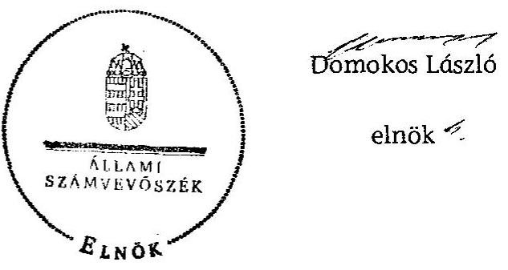

# JELENTÉS 

Cibakháza Nagyközség Önkormányzata belső kontrollrendszerének kialakítása, valamint egyes kontrolltevékenységek és a belső ellenőrzés múködése ellenőrzéséről

---

# Állami Számvevőszék 

Iktatószám: V-0063-006-031/2013.
Témaszám: 1098
Vizsgálat-azonosító szám: V059127

## Az ellenőrzést felügyelte:

Dr. Benedek Mária
felügyeleti vezető

## Az ellenőrzést vezette:

Gyüre Lajosné
ellenőrzésvezető
A számvevőszéki jelentés összeállításában közremúködtek:
Pappné dr. Szamosi Éva
számvevő tanácsos
Fülöppné Nagy Marianna
számvevő tanácsos
Az ellenőrzést végezték:
Turai Erzsébet
számvevő

Kovács Richárd
számvevő

---

# TARTALOMJEGYZÉK 

BEVEZETÉS ..... 5
I. ÖSSZEGZŐ MEGÁLLAPÍTÁSOK, KÖVETKEZTETÉSEK, JAVASLATOK ..... 8
II. RÉSZLETES MEGÁLLAPÍTÁSOK ..... 19

1. Az önkormányzat belső kontrollrendszere kialakításának megfelelősége ..... 19
1.1. A kontrollkörnyezet kialakítása ..... 19
1.2. A kockázatkezelési rendszer kialakítása ..... 20
1.3. A kontrolltevékenységek kialakítása ..... 20
1.4. Az információs és kommunikációs rendszer kialakítása ..... 21
1.5. A monitoring rendszer kialakítása ..... 22
2. A pénzügyi folyamatokban kulcsszerepet betöltő belső kontrollok (szakmai teljesítésigazolás és utalvány ellenjegyzés) múködése ..... 22
3. A belső ellenőrzés szervezeti keretei és múködése ..... 26
FÜGGELÉKEK
4. számú Értelmező szótár
5. számú A belső kontrollrendszer kialakítása, a pénzügyi folyamatokban kulcsszerepet betöltő szakmai teljesítésigazolás és utalvány ellenjegyzés kontrollok múködése, valamint a belső ellenőrzés múködése értékelésénél alkalmazott minősítési szempontok

---

.

---

# RÖVIDÍTÉSEK JEGYZÉKE 

## Törvények

ÁSZ tv.
Avtv.

Htv.

Info tv.

Mötv.
Ötv.
régi Áht.

Számv. tv.
új Áht.

## Rendeletek

Ámr.
Ávr.

Ber.
Bkr.

305/2010. (XII. 23.)
Korm. rendelet
Képviselő-testület
SZMSZ-e

## Szórövidítések

ÁSZ
Belső Kontroll Kézikönyv

2011. évi LXVI. törvény az Állami Számvevőszékről
1992. évi LXIII. törvény a személyes adatok védelméről és a közérdekű adatok nyilvánosságáról (hatálytalan 2012. január 1-jétől)
1991. évi XX. törvény a helyi önkormányzatok és szerveik, a köztársasági megbízottak, valamint egyes centrális alárendeltségű szervek feladat- és hatásköreiről
2011. évi CXII. törvény az információs önrendelkezési jogról és az információszabadságról (hatályos 2012. január 1-jétől)
2011. évi CLXXXIX. törvény Magyarország helyi önkormányzatairól (hatályos 2012. január 1-jétől)
1990. évi LXV. törvény a helyi önkormányzatokról
1992. évi XXXVIII. törvény az államháztartásról (hatálytalan 2012. január 1-jétől)
2000. évi C. törvény a számvitelről
2011. évi CXCV. törvény az államháztartásról (hatályos 2012. január 1-jétől)

292/2009. (XII. 19.) Korm. rendelet az államháztartás múködési rendjéről (hatálytalan 2012. január 1-jétől)
368/2011. (XII. 31.) Korm. rendelet az államháztartásról szóló törvény végrehajtásáról (hatályos 2012. január 1jétől)
193/2003. (XI. 26.) Korm. rendelet a költségvetési szervek belső ellenőrzéséről (hatálytalan 2012. január 1-jétől)
370/2011. (XII. 31.) Korm. rendelet a költségvetési szervek belső kontrollrendszeréről és belső ellenőrzéséről (hatályos 2012. január 1-jétől)

305/2010. (XII. 23.) Korm. rendelet a 2011. évi népszámlálás végrehajtásával kapcsolatos egyes feladatokról
Cibakháza Nagyközség Önkormányzat Képviselőtestületének Szervezeti és Múködési Szabályzata (hatályos 2010. október 14-étől)

Állami Számvevőszék
Az Ámr. 155. § (1) bekezdése, valamint az államháztartási belső kontroll standardokról szóló 1/2009. (IX. 11.) PM irányelv egységes értelmezése érdekében az államháztartásért felelős miniszter által 2010. évben kiadott Belső Kontroll Kézikönyv

---

gazdálkodási jogkörök szabályzata

Közös Önkormányzati Hivatal
jegyzö $_{1}$
jegyzö $_{2}$
Képviselő-testület
Megállapodás
Önkormányzat
polgármester
Polgármesteri Hivatal
szervezeti és múködési szabályzat

Társulás

Cibakháza Nagyközség Önkormányzat Polgármesteri Hivatala, mint Nagyrév és Tiszainoka községekben körjegyzői feladatok ellátásában közremúködő hivatal kötelezettségvállalás, ellenjegyzés, utalványozás, érvényesítés szabályzata (hatályos 2011. január 1-jétől)
Cibakházi Közös Önkormányzati Hivatal (Cibakháza és Tiszainoka közös hivatala 2013. március 1-jével jött létre)
Cibakháza Nagyközség Önkormányzatának jegyzője 2001. október 1-jétől 2012. december 30-áig
Cibakháza Nagyközség Önkormányzatának jegyzője 2012. december 31-étől

Cibakháza Nagyközség Képviselő-testülete
Kunszentmártoni Kistérség Többcélú Társulási Megállapodása (hatályos 2005. május 15-étől)
Cibakháza Nagyközség Önkormányzata
Cibakháza Nagyközség Önkormányzatának polgármestere
Cibakháza Nagyközség Önkormányzatának Polgármesteri Hivatala
Cibakháza Nagyközség Önkormányzat Képviselőtestületének Szervezeti és Múködési Szabályzata 8. számú melléklete (hatályos 2010. október 14-étől)
Kunszentmártoni Kistérség Többcélú Társulása

---

# JELENTÉS 

## Cibakháza Nagyközség Önkormányzata belső kontrollrendszerének kialakítása, valamint egyes kontrolltevékenységek és a belső ellenőrzés múködése ellenőrzéséről

## BEVEZETÉS

A belső kontrollrendszer kialakítását, múködtetését és fejlesztését a régi Áht. és az új Áht. is előírja. Ennek megvalósításáért a költségvetési szerv vezetője felel. A belső kontrollrendszer azt a célt szolgálja, hogy a költségvetési szervek múködésük és gazdálkodásuk során a tevékenységeket szabályszerűen, gazdaságosan, hatékonyan, eredményesen hajtsák végre, teljesítsék elszámolási kötelezettségeiket és megvédjék az erőforrásokat a veszteségektől, a károktól és a nem rendeltetésszerú használattól. A belső kontrollrendszer magában foglalja mindazon szabályokat, eljárásokat, gyakorlati módszereket és szervezeti struktúrákat, kockázatkezelési technikákat, kontrolltevékenységeket, amelyek segítséget nyújtanak a szervezetnek céljai eléréséhez.

Az ÁSZ a 2011-2015. évekre szóló stratégiájában hangsúlyos szerepet szánt annak, hogy szilárd szakmai alapon álló, értékteremtő ellenőrzéseivel előmozdítsa a közpénzügyek átláthatóságát, rendezettségét. A számvevőszéki ellenőrzés nemzetközi alapelvei is rögzítik, hogy a megfelelő belső kontrollrendszer minimálisra csökkenti a hibák és szabálytalanságok kockázatát.

Az ellenőrzés célja annak értékelése volt, hogy az Önkormányzat a jogszabályi előírásoknak megfelelően alakította-e ki a belső kontrollrendszert; a gazdálkodás folyamatában kulcsszerepet betöltő szakmai teljesítésigazolás és az utalvány ellenjegyzés kontrolltevékenységeit megfelelően múködtette-e; biztosí-totta-e a belső ellenőrzés szabályos és eredményes múködését.

Az ÁSZ ezen ellenőrzési céljait pilot (próba) jelleggel községi/nagyközségi önkormányzatoknál végzett ellenőrzések során érvényesítette.

Az ellenőrzés típusa: szabályszerűségi ellenőrzés
Az ellenőrzés jogszabályi alapja: az ÁSZ tv. 5. § (2) és (6) bekezdései
Az ellenőrzött szervezet: az Önkormányzat
Az ellenőrzött időszak: a belső kontrollrendszer kialakításának megfelelőségét a 2011. évre vonatkozóan értékeltük. A kontrolltevékenységek múködésének megfelelőségét a 2011. január 1-je és december 31-e, míg a belső ellenőrzés múködésének szabályosságát és eredményességét a 2009. január 1-je és

---

2011. december 31-e közötti időszakot figyelembe véve értékeltük. A helyszíni ellenőrzés lezárásáig a helyi szabályozás változásait nyomon követtük.

Az ellenőrzés szakmai módszertana az ÁSZ hivatalos honlapján (www.asz.hu) közzétett szakmai szabályokon alapult, amely a Legfőbb Ellenőrző Intézmények Nemzetközi Szervezete (INTOSAI) által kiadott nemzetközi standardok (ISSAI) figyelembevételével készült.

A belső kontrollrendszer kialakításának ellenőrzése során értékeltük a kontrollkörnyezet, a kockázatkezelési rendszer, a kontrolltevékenységek, az információs és kommunikációs rendszer, valamint a monitoring rendszer szabályozottságának megfelelőségét.

Értékeltük a pénzügyi folyamatokban kulcsszerepet betöltő szakmai teljesítésigazolás és utalvány ellenjegyzés kontrollok múködésének megfelelőségét az állományba nem tartozók megbízási díjainál, a külső szolgáltatók által végzett karbantartási, kisjavítási munkákkal kapcsolatos kifizetéseknél, továbbá az egyéb üzemeltetési, fenntartási, szolgáltatási kiadások esetében. Az egyszerú véletlen mintavétellel kiválasztott tételek ellenőrzését többlépcsős megfelelőségi tesztek útján addig végeztük, amíg elegendő és megfelelő bizonyítékot szereztünk a vizsgált folyamatok kulcskontrolljai múködésének megfelelő vagy nem megfelelő voltáról. Értékeltük az Önkormányzatnál a belső ellenőrzés múködésének szabályosságát és eredményességét. Az ÁSZ a 2007-2010. években az Önkormányzatnál átfogó ellenőrzést nem végzett.

A fogalmak magyarázatát az 1. számú függelék, az ellenőrzés egyes területeinek értékelésénél alkalmazott egységes minősítési szempontokat a 2. számú függelék tartalmazza.

Az ellenőrzés lefolytatásához az Önkormányzat a munkalapok és a tanúsítvány elektronikus kitöltésével, valamint a megjelölt dokumentumok elektronikus megküldésével szolgáltatott adatokat. A munkalapokon szerepeltetett adatok, információk ellenőrzése és szükség szerinti javítása a helyszíni ellenőrzés keretében történt.

Az ÁSZ az ellenőrzés megállapításait az ellenőrzött időszakban hatályos, az intézkedést igénylő megállapításokra tett javaslatokat a jelenleg hatályos jogszabályok alapján fogalmazta meg.

Az ÁSZ tv. 29. § (1) bekezdése szerint a jelentéstervezetet megküldtük a polgármester részére, aki az ÁSZ tv. 29. § (2) bekezdésében foglalt észrevételezési jogával nem élt, a jelentéstervezetre észrevételt nem tett.

Cibakháza nagyközség állandó lakosainak száma 2011. január 1-jén 4447 fő volt. Az Önkormányzat héttagú Képviselő-testületének munkáját két állandó bizottság segítette. Az Önkormányzat az önállóan múködő és gazdálkodó Polgármesteri Hivatalon felül nyolc intézménnyel látta el feladatát. Az Önkormányzat többségi tulajdoni részesedésű gazdasági társasággal nem rendelkezett.

A polgármester a 2006. évi önkormányzati választások óta tölti be tisztségét. A jegyzö ${ }_{1}$ a Polgármesteri Hivatal bevonásával 2008. január 1-jétől 2011. decem-

---

ber 31-éig ellátta Nagyrév és Tiszainoka községek - 2012. január 1-jétől csak Tiszainoka - körjegyzői feladatait is. A jegyző ${ }_{1}$ nyugdíjba vonulása miatt 2012. december 31-e óta új jegyző ${ }_{2}$ látja el a feladatokat. A jegyzők között dokumentált munkakör átadás nem volt. A Polgármesteri Hivatal 2013. március 1-jétől Közös Önkormányzati Hivatalként múködik tovább.

A Polgármesteri Hivatal a 2011. év elején hat szervezeti egységre tagolódott, május 1-jétől a szervezeti egységek száma ötre csökkent, a foglalkoztatott köztisztviselők száma 2011. január 1-jén 27 fő volt.

Az Önkormányzat a 2011. évi költségvetési beszámolója szerint 1128035 ezer Ft költségvetési bevételt ért el, valamint 1123243 ezer Ft költségvetési kiadást teljesített. A 2011. december 31-ei könyvviteli mérleg szerint 1759628 ezer Ft értékű eszközvagyonnal rendelkezett, 27172 ezer Ft hosszú lejáratú, 68837 ezer Ft rövid lejáratú kötelezettsége volt.

---

# I. ÖSSZEGZŐ MEGÁLLAPÍTÁSOK, KÖVETKEZTETÉSEK, JAVASLATOK 

A belső kontrollrendszeren belül 2011-ben a Polgármesteri Hivatalban a kontrollkörnyezet, a kockázatkezelési rendszer, a kontrolltevékenységek, az információs és kommunikációs rendszer, valamint a monitoring rendszer kialakítását külön-külön és összesítve is értékeltük. A belső kontrollrendszer kialakítása az összesített értékelés alapján nem felelt meg a jogszabályi előírásoknak. Az egyes területek kialakításának értékelését az alábbiakban részletezzük.

A kontrollkörnyezet kialakítása nem felelt meg a jogszabályi követelményeknek, mert a jegyző́ ${ }_{1}$ - a Htv. előírása ellenére - nem készítette el a gazdasági program tervezetét, ezért a Képviselő-testület nem fogadta el az Önkormányzat gazdasági programját. A jegyző́ ${ }_{1}$ a Számv. tv. előírása ellenére nem alakította ki a Polgármesteri Hivatal bizonylati rendjét. A jegyző́ ${ }_{1}$ az ellenőrzési nyomvonalat elkészítette, de az tartalmában nem felelt meg az Ámr.-ben ${ }^{1}$ foglaltaknak, mert nem jelölte ki a folyamatgazdákat, nem határozta meg a felelősségi és információs szinteket és kapcsolatokat, az irányítási és ellenőrzési folyamatokat, gátolva ezzel a folyamatok nyomon követését és utólagos ellenőrzését. A jegyző́ ${ }_{1}$ a Polgármesteri Hivatal szervezeti és múködési szabályzatát elkészítette, de - az Ámr.-ben foglaltak ellenére - nem rögzítette az ellátandó és a szakfeladatrend szerint besorolt alaptevékenységeket, az alaptevékenységet szabályozó jogszabályok megjelölését, a szervezeti egységek engedélyezett létszámát, a munkakörökhöz tartozó feladat- és hatásköröket, a hatáskörök gyakorlásának módját, az ezekhez kapcsolódó felelősségi szabályokat, a Polgármesteri Hivatal szervezeti ábráját, valamint a Polgármesteri Hivatalhoz rendelt más költségvetési szervek felsorolását. Ezek a hiányosságok korlátozzák a feladatellátás számon kérhetőségét és folyamatosságának biztosítását.

A kockázatkezelési rendszer kialakítása nem felelt meg a jogszabályi előírásoknak, mert a jegyző́ ${ }_{1}$ az Ámr.-ben foglaltak ellenére kockázatelemzést nem végzett, nem mérte fel és nem állapította meg a Polgármesteri Hivatal tevékenységében, gazdálkodásában rejlő kockázatokat, továbbá nem határozta meg a kockázatokkal kapcsolatos intézkedéseket és megtételük módját.

A kontrolltevékenységek kialakítása nem felelt meg a jogszabályi előírásoknak, mert a jegyző́ ${ }_{1}$ - a régi Áht. ${ }^{2}$ előírása ellenére - nem határozta meg a pénzügyi döntések - köztük a beszerzési folyamat - dokumentumainak elkészítésével kapcsolatos, folyamatba épített, előzetes, utólagos és vezetői ellenőrzés feladatait. Az Ámr.-ben foglaltak ellenére a jegyző́ ${ }_{1}$ nem szabályozta a Polgármesteri Hivatal tevékenységeire vonatkozó beszámolási eljárásokat.

Az információs és kommunikációs rendszer kialakítása nem felelt meg a jogszabályi követelményeknek, mert a jegyző́ ${ }_{1}$ az Ámr.-ben foglaltak ellenére

[^0]
[^0]:    ${ }^{1}$ 2012. január 1-jétől Ávr.
    ${ }^{2}$ 2012. január 1-jétől új Áht.

---

nem határozta meg a kötelezően közzéteendő adatok nyilvánosságra hozatalának rendjét. A jegyző ${ }_{1}$ az Avtv.-ben ${ }^{3}$ foglaltak ellenére elmulasztotta az adatbiztonság érvényre juttatásához szükséges intézkedések megtételét, mert nem határozta meg a hozzáférési jogosultságok megállapítására, módosítására és azok betartásának ellenőrzésére vonatkozó belső eljárásrendet, nem alakította ki a hozzáférési jogosultságok nyilvántartását, nem szabályozta a pénzügyiszámviteli szoftverváltozások ellenőrzését, azok tesztelésére vonatkozó eljárásokat és a pénzügyi-számviteli rendszerben feldolgozott adatok mentési eljárásrendjét, valamint az adatmentés felelősségi viszonyait.

A monitoring rendszer kialakítása a jogszabályi előírásoknak nem felelt meg, mert a jegyző ${ }_{1}$ az Ámr.-ben foglalt előírások ellenére az operatív tevékenységek keretében megvalósuló folyamatos és eseti nyomon követésből álló, a Polgármesteri Hivatal tevékenységének, a célok megvalósításának nyomon követését biztosító rendszer szabályait nem határozta meg.

A belső kontrollrendszer nem megfelelő kialakítása kockázatot jelent az Önkormányzat tevékenységeinek szabályszerű, gazdaságos, hatékony és eredményes végrehajtása során.

A Polgármesteri Hivatalban a 2011. évben az állományba nem tartozók megbízási díjaival, a külső szolgáltatók által végzett karbantartással, kisjavítással, valamint az egyéb üzemeltetéssel, fenntartással, szolgáltatással kapcsolatos kifizetések során összefoglalóan értékelve a kulcskontrollok múködésének megfelelősége gyenge volt, mert az állományba nem tartozók megbízási díjainak kifizetése során a szakmai teljesítés igazolására jegyző ${ }_{1}$ által kijelölt személy a régi Áht.-ban és az Ámr.-ben előírtak ellenére nem minden esetben végezte el a kiadások teljesítése jogosságának, összegszerűségének, a megállapodásban foglaltak teljesítésének ellenőrzését, és igazolási kötelezettségének nem tett eleget. A külső szolgáltatók által teljesített karbantartási, kisjavítási munkákra történő kifizetések és az egyéb üzemeltetési, fenntartási, szolgáltatási kiadások esetében az Ámr. előírása ellenére a szakmai teljesítésigazolás - az igazolás dátuma és ellenőrizhető okmányok hiánya miatt - nem az előírt módon történt.

Az utalvány ellenjegyző a kiadások teljesítését megelőzően az Ámr.-ben foglalt feladatát nem a jogszabályi előírásoknak megfelelően végezte, mert az egyéb üzemeltetéssel, fenntartással, szolgáltatással kapcsolatos kiadások esetében az ellenjegyzés dátumát nem tüntette fel. Annak ellenére aláírásával ellenjegyezte a kifizetéseket, hogy a szakmai teljesítésigazolásra és az érvényesítésre jegyző ${ }_{1}$ által kijelölt személyek ellenőrzési kötelezettségüknek nem az előírásoknak megfelelően, illetve nem tettek eleget. A régi Áht. és az Ámr. gazdálkodásra közöttük a kötelezettségvállalások nyilvántartására, az okmányon a kötelezettségvállalás nyilvántartási számának feltüntetésére, az előzetes írásbeli kötelezettségvállalásra, a jogosult általi ellenjegyzést követő kötelezettségvállalásra vonatkozó szabályai betartásának hiánya ellenére az utalvány ellenjegyző a kifizetéseket aláírásával ellenjegyezte.

[^0]
[^0]:    ${ }^{3}$ 2012. január 1-jétől Info tv.

---

A népszámláláshoz kapcsolódó megbízási szerződéseket a 305/2010. (XII. 23.) Korm. rendeletben foglaltak alapján a jegyző ${ }_{1}$ kötötte. A megbízási díjak kifizetésénél azonban az utalvány ellenjegyző a jegyző ${ }_{1}$, az utalványozó a polgármester volt, ami nem felelt meg az Ámr.-ben foglalt előírásoknak. Az egyéb üzemeltetési, fenntartási, szolgáltatási munkákkal kapcsolatos kiadások esetében az érvényesítő az Ámr.-ben foglalt összeférhetetlenségi szabályt nem tartotta be, mert az érvényesítést megelőzően aláírásával igazolta a szakmai teljesítést is.

Az ellenőrzött kifizetésekkel összefüggésben a rendelkezésre bocsátott dokumentumok alapján jogosulatlan kifizetést nem tárt fel az ellenőrzés, azonban a gazdálkodásban kulcsszerepet betöltő kontrollok jogszabályi előírásoknak nem megfelelő, gyenge múködése miatt fennáll a hibák bekövetkezésének lehetősége. A nem megfelelően szabályozott és múködtetett belső kontrollok korrupciós kockázatot hordoznak.

Az Önkormányzat a 2009-2011. években a belső ellenőrzési feladatokat kistérségi társulás útján látta el. A belső ellenőrzés szabályozása és múködése a jogszabályi előírásoknak nem felelt meg. A Ber. ${ }^{4}$ előírása ellenére a szervezeti és múködési szabályzatban nem rögzítették a belső ellenőrzést végző szervezet jogállását és feladatait, továbbá nem határozták meg a belső ellenőrzési vezető személyét, illetve a feladatkörébe tartozó tevékenységek ellátásának módját. A Ber.-ben foglaltak ellenére a Társulás nem rendelkezett a munkaszervezetének vezetője által jóváhagyott Belső ellenőrzési kézikönyvvel. A Ber.-ben foglaltak ellenére az éves ellenőrzési terveket nem a belső ellenőrzési vezető állította öszsze, azokat előzetesen elvégzett kockázatelemzéssel nem alapozták meg, továbbá a 2010. és a 2011. évi éves ellenőrzési tervek nem tartalmazták a szükséges ellenőrzési kapacitás meghatározását. A Képviselő-testület a 2010. és 2011. években az éves belső ellenőrzési tervet az Ötv.-ben előírtakat figyelmen kívül hagyva határidőn túl hagyta jóvá, mert a jegyző ${ }_{1}$ a törvényi határidőn túl kezdeményezte a polgármesternél annak Képviselő-testület elé terjesztését. A Ber.ben foglaltak ellenére az ellenőrzési programokat nem a belső ellenőrzési vezető hagyta jóvá. A Ber.-ben előírtak ellenére az ellenőrzési jelentéseket az ellenőrzést végző belső ellenőr nem írta alá, a Polgármesteri Hivatalban 2011-ben a házipénztár és a pénzkezelés ellenőrzéséről készült jelentést a jegyző ${ }_{1}$-nek - belső ellenőrzési vezető hiányában - nem küldték meg.

A belső ellenőrzések megállapításainak, javaslatainak hasznosítására az ellenőrzöttek a Ber.-ben előírtak ellenére intézkedési tervet nem készítettek. Az ellenőrzésekről nyilvántartást nem vezettek, mellyel a Ber.-ben előírtakat nem tartották be. A jegyző ${ }_{1}$ nem alakította ki éves bontásban a belső ellenőrzési jelentésekben az ellenőrzési javaslatok alapján megtett intézkedések nyomon követéséről a nyilvántartást, mellyel a Ber.-ben foglaltakat nem vette figyelembe. A belső ellenőrzés a Ber.-ben foglaltak ellenére a megtett intézkedések nyomon követését elmulasztotta. A polgármester a belső ellenőrzési jelentésekről készített 2011. évi éves ellenőrzési jelentést a zárszámadási rendelettervezettel egyidejúleg - az Ötv.-ben ${ }^{5}$ és a Ber.-ben előírtak ellenére - nem terjesztette a Képvi-

[^0]
[^0]:    ${ }^{4}$ 2012. január 1-jétől Bkr.
    ${ }^{5}$ 2012. január 1-jétől Mötv.

---

selő-testület elé, mert a jegyző ${ }_{1}$ nem kezdeményezte a polgármesternél annak Képviselő-testület elé terjesztését.

Az Önkormányzatnál a 2009-2011. évek között a belső ellenőrzés múködése - a 2. számú függelékben részletezett kritériumrendszer alapján végzett értékelés szerint - nem volt eredményes, mert a belső ellenőrzés szabályozása és múködése az összegző értékelés alapján az ellenőrzött időszak egészét tekintve a jogszabályi előírásoknak nem felelt meg. A belső ellenőrzés múködése azért sem volt eredményes, mert a belső ellenőrzések - a gazdálkodási jogkörök gyakorlásának, a pénzkezeléssel kapcsolatos belső kontrollok múködésének, a vagyonvédelem területén a leltározási és selejtezési szabályzatban foglaltak betartásának ellenőrzése - során nem tárták fel teljes körűen a belső kontrollok múködésének és kialakításának hiányosságait, továbbá a belső ellenőrzés által tett javaslatok csak részben hasznosultak, mert a jegyző ${ }_{1}$ a gazdálkodási jogkörök gyakorlására megfogalmazott javaslat hasznosításáról nem intézkedett. Mindezek hozzájárultak a számvevőszéki ellenőrzés során is feltárt szabályozási és múködési hiányosságok, hibák ismétlődéséhez.

Az ÁSZ tv. 33. § (1) bekezdésében foglaltak értelmében az ellenőrzött szervezet vezetője köteles a jelentésben foglalt megállapításokhoz kapcsolódó intézkedési tervet összeállítani, és azt a jelentés kézhezvételétől számított 30 napon belül az ÁSZ részére megküldeni. Amennyiben az intézkedési tervet határidőre nem küldi meg a szervezet, vagy az - az ÁSZ tv. 33. § (2) bekezdésében foglalt póthatáridő eltelte ellenére - továbbra sem elfogadható, az ÁSZ elnöke a hivatkozott törvény 33. § (3) bekezdés a)-b) pontjaiban foglaltakat érvényesítheti.

Az ellenőrzés intézkedést igénylő megállapításai és javaslatai:

# a polgármesternek 

1. A Képviselő-testület - az Ötv. 91. § (7) bekezdésében foglaltak ellenére - nem fogadta el az Ötv. 91. § (1) és (6) bekezdése szerinti gazdasági programtervezetet.

Javaslat:
Terjessze a Képviselő-testület elé a gazdasági program jegyző által elkészített tervezetét a Mötv. 116. § (1) és (5) bekezdése alapján a 116. § (3)-(4) bekezdéseiben foglalt tartalommal.
2. Az állományba nem tartozók megbízási szerződéseit és a megállapodásokat - a régi Áht. 100/C. § (3) és az Ámr. 74. § (1) bekezdésében előírtak ellenére - a kötelezettségvállalás előtt nem ellenjegyezték, valamint a karbantartási, kisjavítási és az egyéb üzemeltetési, fenntartási munkáknál - a régi Áht. 100/C. § (3) és az Ámr. 74. § (1) bekezdésében előírtak ellenére - nem minden esetben történt írásbeli kötelezettségvállalás, továbbá azt nem minden esetben előzte meg ellenjegyzés.

Javaslat:
Intézkedjen arról, hogy az Önkormányzat nevében történő kötelezettségvállalásra az új Áht. 37. § (1) bekezdésében foglaltaknak megfelelően - az Ávr. 53. §-ában meg-

---

határozott kivételeket figyelembe véve - kizárólag a pénzügyi ellenjegyzés után, a pénzügyi teljesítés esedékességét megelőzően, írásban kerüljön sor.
3. A polgármester - az Ötv. 92. § (10) bekezdésében előírtak ellenére - a 2011. évi belső ellenőrzési jelentést a zárszámadási rendelettervezettel egyidejűleg nem terjesztette a Képviselő-testület elé.

Javaslat:
A Bkr. 56. § (8) bekezdésében foglaltak szerint az éves ellenőrzési jelentést a zárszámadási rendelettervezettel egyidejűleg terjessze a Képviselő-testület elé.
4. Az állományba nem tartozók megbízási díjaival kapcsolatos kifizetéseket megelőzően a szakmai teljesítés igazolására a jegyző által kijelölt személy - a régi Áht. 100/C. § (6) és az Ámr. 76. § (1) bekezdése ellenére - a szakmai teljesítést nem igazolta. A külső szolgáltatók által végzett karbantartással, kisjavítással, valamint az egyéb üzemeltetési, fenntartási, szolgáltatási munkákkal kapcsolatos kifizetéseket megelőzően a szakmai teljesítés igazolására a jegyző által kijelölt személy - az Ámr. 76. § (1) és (3) bekezdései ellenére - a szakmai teljesítést nem szabályszerűen igazolta. Az utalvány ellenjegyzője az Ámr. 79. § (2) bekezdésében foglalt ellenőrzési feladatait nem a jogszabályoknak megfelelően végezte, mert aláírása ellenére nem ellenőrizte a szakmai teljesítésigazolás és az érvényesítés megtörténtét, valamint annak ellenére ellenjegyezte a kiadásokat, hogy a bizonylatokon a szakmai teljesítésigazolás dátumát nem tüntették fel. Az érvényesítés nem felelt meg az Ámr. 77. § (3) bekezdésében foglalt előírásoknak, mert nem tartalmazta az érvényesítés dátumát. Az utalvány ellenjegyzője a személygépjármú szervizelésével, valamint az egyéb üzemeltetési, fenntartási, szolgáltatási munkákkal kapcsolatos kiadások teljesítését megelőzően - a dátum feltüntetésének hiányában - nem az Ámr. 74. § (1) és 79. § (2) bekezdésben foglaltaknak megfelelően végezte az ellenőrzést. Az utalvány ellenjegyzője a kiadásokat annak ellenére ellenjegyezte, hogy elmaradt az Ámr. 78. § (2) bekezdés g) pontjában előírt kötelezettségvállalás nyilvántartási számának a feltüntetése, mert az Ámr. 75. § (1) bekezdésében előírt nyilvántartást nem vezették, továbbá az Ámr. 74. § (1) bekezdésében foglaltak ellenére a kötelezettségvállalás és ellenjegyzése nem minden esetben történt meg.

A népszámláláshoz tartozó megbízási díjak kifizetéséhez kapcsolódóan az utalvány ellenjegyzője (kötelezettségvállalóként) a jegyző, az utalványozó a polgármester volt, ami nem felelt meg az Ámr. 78. § (1) bekezdésében, valamint a 79. § (1) bekezdésében foglalt előírásoknak. Tekintettel arra, hogy a települési népszámlálási felelős feladata a számlálóbiztosi megbízási szerződések megkötése, a jegyző mint települési népszámlálási felelős ezen kifizetések tekintetében utalványozásra volt jogosult. Az egyéb üzemeltetési, fenntartási, szolgáltatási munkákkal kapcsolatos kiadások esetében az Ámr. 80. § (1) bekezdésében foglalt összeférhetetlenségi szabályt nem tartották be.

Javaslat:
A Mötv. 115. § (1) bekezdésében foglaltak alapján kísérje figyelemmel az Önkormányzat gazdálkodásának szabályszerűségét. A Mötv. 67. § f) pontja alapján gondoskodjon a belső kontrollrendszerre és a belső ellenőrzés müködésére vonatkozó jogszabályi rendelkezések be nem tartása, valamint a szakmai teljesítésigazolás, illet-

---

ve az utalvány ellenjegyzés kontrollokkal összefüggésben feltárt hiányosságok, szabálytalanságok tekintetében az esetleges munkajogi felelősséggel kapcsolatos körülmények kivizsgálásáról, majd a vizsgálat eredményének függvényében tegye meg a szükséges munkajogi intézkedéseket.

# a jegyzőnek Cibakháza Nagyközség Önkormányzata vonatkozásában 

1. a kontrollkörnyezettel kapcsolatban:

A jegyző a Htv. 140. § (1) bekezdés a) pontjában foglalt előírást figyelmen kívül hagyva nem készítette el az Ötv. 91. § (1) és (6) bekezdése szerinti gazdasági program tervezetét.

A jegyző - a Számv. tv. 161. § (2) bekezdés d) pontjában foglaltak ellenére - nem készítette el a Polgármesteri Hivatal bizonylati rendjét.

Az ellenőrzési nyomvonal tartalmában nem felelt meg az Ámr. 156. § (2) bekezdésében foglaltaknak, mert a jegyző nem jelölte ki a folyamatgazdákat, nem határozta meg a felelősségi és információs szinteket és kapcsolatokat, az irányítási és ellenőrzési folyamatokat.

A jegyző az Ámr. 20. § (2) bekezdés c), e), h), i) és k) pontjában és (7) bekezdésében foglaltak ellenére szabályzatban nem rögzítette az ellátandó és a szakfeladatrend szerint besorolt alaptevékenységet, az alaptevékenységeket szabályozó jogszabályok megjelölését, a szervezeti egységek engedélyezett létszámát, a munkakörökhöz tartozó feladat- és hatásköröket, a hatáskörök gyakorlásának módját, az ezekhez kapcsolódó felelősségi szabályokat, a Polgármesteri Hivatal szervezeti ábráját és a Polgármesteri Hivatalhoz rendelt más költségvetési szervek felsorolását, valamint a Ber. 4. § (2) bekezdés rendelkezése ellenére nem határozta meg a belső ellenőrzést végző személy, szervezet jogállását, feladatait.

Javaslat:
a) Készítse elő a Htv. 140. § (1) bekezdés a) pontjában foglaltak alapján a gazdasági program tervezetét a Mötv. 116. § (3)-(4) bekezdéseiben foglalt tartalommal, és kezdeményezze a polgármesternél a Képviselő-testület elé terjesztését.
b) Készítse el a Számv. tv. 161. § (2) bekezdés d) pontjában foglalt előírásnak megfelelően a Közös Önkormányzati Hivatal bizonylati rendjét.
c) Intézkedjen arról, hogy az ellenőrzési nyomvonal a Bkr. 6. § (3) bekezdésében foglaltaknak megfelelően készüljön el.
d) Készítse el a Közös Önkormányzati Hivatal szervezeti és múködési szabályzatának módosítását, és kezdeményezze a polgármesternél a módosítás Képviselőtestület elé terjesztését annak érdekében, hogy az tartalmazza az Ávr. 13. § (1) bekezdésének c), e) g) és i) pontjában foglaltaknak megfelelően az ellátandó és a szakfeladatrend szerint besorolt alaptevékenységet, az alaptevékenységeket szabályozó jogszabályok megjelölését, a szervezeti egységek engedélyezett létszámát, a Közös Önkormányzati hivatal szervezeti ábráját, a munkakörökhöz tartozó feladat- és hatásköröket, a hatáskörök gyakorlásának módját, a kapcsolódó fele-

---

lősségi szabályokat és a Közös Önkormányzati Hivatalhoz rendelt más költségvetési szervek felsorolását, valamint a Bkr. 15. § (2) bekezdésében foglaltaknak megfelelően a belső ellenőrzést végző személy vagy szervezet jogállását, feladatait.
2. a kockázatkezelési rendszerrel kapcsolatban:

A jegyző - az Ámr. 157. § (1)-(3) bekezdéseiben előírtak ellenére - nem végzett kockázatelemzést, és nem múködtetett kockázatkezelési rendszert.

Javaslat:
Alakítsa ki, múködtesse és fejlessze a Bkr. 3. § b) pontja és a 7. § szerinti kockázatkezelési rendszert.
3. a kontrolltevékenységekkel kapcsolatban:

A jegyző - a régi Áht. 121/A. § (4) bekezdés a) pontjában foglaltak ellenére - nem határozta meg a pénzügyi döntések - köztük a beszerzési folyamatok - dokumentumainak elkészítésével kapcsolatos, folyamatba épített előzetes, utólagos és vezetői ellenőrzés feladatait.

A jegyző - az Ámr. 158. § (2) bekezdés d) pontjában foglaltak ellenére - nem szabályozta a Polgármesteri Hivatal tevékenységeire vonatkozó beszámolási eljárásokat.

Javaslat:
a) Biztosítsa minden tevékenységre vonatkozóan a folyamatba épített, előzetes, utólagos és vezetői ellenőrzést a Bkr. 8. § (2) bekezdése alapján.
b) Szabályozza - a Bkr. 8. § (4) bekezdés c) pontja alapján - a Közös Önkormányzati Hivatal tevékenységeire vonatkozó beszámolási eljárásokat.
4. az információs és kommunikációs rendszerrel kapcsolatban:

A jegyző - az Ámr. 20. § (3) bekezdés i) pontjában foglalt előírás ellenére - nem határozta meg a kötelezően közzéteendő adatok nyilvánosságra hozatalának rendjét.

A jegyző az Avtv. 10. §-ában foglalt előírások ellenére elmulasztotta az adatbiztonság érvényre juttatásához szükséges intézkedések megtételét, mert nem határozta meg a hozzáférési jogosultságok megállapítására, módosítására és azok betartásának ellenőrzésére vonatkozó belső eljárásrendet, nem alakította ki a hozzáférési jogosultságok nyilvántartását, nem szabályozta a pénzügyi-számviteli szoftverváltozások ellenőrzését, azok tesztelésére vonatkozó eljárásokat, a pénzügyi-számviteli rendszerben feldolgozott adatok mentési eljárásrendjét, valamint az adatmentés felelősségi viszonyait.

Javaslat:
a) Szabályozza az Info tv. 35. § (3) bekezdése és az Ávr. 13. § (2) bekezdésének h) pontja alapján a kötelezően közzéteendő adatok nyilvánosságra hozatalának rendjét.

---

b) Biztosítsa az Info tv. 7. § (2)-(3) bekezdéseinek megfelelően az adatbiztonság érvényesülését, és ennek keretében határozza meg a hozzáférési jogosultságok megállapítására, módosítására és azok betartásának ellenőrzésére vonatkozó belső eljárásrendet, alakítsa ki a hozzáférési jogosultságok nyilvántartását, szabályozza a pénzügyi-számviteli szoftverváltozások ellenőrzését, azok tesztelésére vonatkozó eljárásokat, a pénzügyi-számviteli rendszerben feldolgozott adatok mentési eljárásrendjét, valamint az adatmentés felelősségi viszonyait.
5. a monitoring rendszerrel kapcsolatban:

A jegyző - az Ámr. 160. §-ában foglaltak ellenére - nem alakított ki és nem múködtetett olyan monitoring rendszert, amely lehetővé teszi a Polgármesteri Hivatal tevékenységének, a célok megvalósításának nyomon követését, és amelynek része az operatív tevékenységek keretében megvalósuló folyamatos és eseti nyomon követés is.

Javaslat:
Alakítsa ki és múködtesse a Bkr. 3. § e) pontjában és a 10. §-ában előírtak alapján a Közös Önkormányzati Hivatal tevékenységének, a célok megvalósításának nyomon követését biztosító rendszerét, amelynek része az operatív tevékenységek keretében megvalósuló folyamatos és eseti nyomon követés is.
6. a pénzügyi folyamatokban kulcsszerepet betöltő kontrollokkal kapcsolatban:

A 2011. évben a szakmai teljesítés igazolására a jegyző által kijelölt személy az állományba nem tartozók megbízási díjaival kapcsolatos kifizetéseket megelőzően - az Ámr. 76. § (1) és (3) bekezdéseinek előírása ellenére - a szakmai teljesítést nem igazolta. A szakmai teljesítés igazolására a jegyző által kijelölt személy a külső szolgáltatók által végzett karbantartással, kisjavítással, valamint az egyéb üzemeltetési, fenntartási, szolgáltatási munkákkal kapcsolatos kifizetéseket megelőzően - az Ámr. 76. § (1) és (3) bekezdései és aláírása ellenére - a szakmai teljesítést nem szabályszerűen igazolta.

A 2011. évben az utalvány ellenjegyző́je az állományba nem tartozók megbízási díjaival kapcsolatos kiadások teljesítését megelőzően az Ámr. 79. § (2) bekezdésében foglalt ellenőrzési feladatait - a szakmai teljesítésigazolás és az érvényesítés hiányában - nem a jogszabályi előírásoknak megfelelően végezte, valamint a megbízási díjakhoz kapcsolódó kötelezettségvállalásokra - a régi Áht. 100/C. § (3) bekezdésében és az Ámr. 74. § (1) bekezdésében foglaltak ellenére - ellenjegyzés hiányában került sor. Az utalvány ellenjegyzője a külső szolgáltatók által végzett karbantartással, kisjavítással, valamint az egyéb üzemeltetési, fenntartási, szolgáltatási munkákkal kapcsolatos kiadások teljesítését megelőzően az Ámr. 79. § (2) bekezdésében foglalt ellenőrzési feladatait nem a jogszabályi előírásoknak megfelelően végezte, mert annak ellenére aláírásával ellenjegyezte a kiadásokat, hogy a bizonylatokon a szakmai teljesítésigazolás, érvényesítés dátumát nem tüntették fel, és - az Ámr. 74. § (1) bekezdésében előírtak ellenére - a kötelezettségvállalás és annak ellenjegyzése nem minden esetben történt meg.

Az utalvány ellenjegyzője az egyéb üzemeltetéssel, fenntartási szolgáltatással kapcsolatos kiadások esetében - az Ámr. 74. § (1) bekezdésében foglaltak ellenére - az ellenjegyzés dátumát nem tüntette fel. Az utalvány ellenjegyzője a kiadásokat annak

---

ellenére ellenjegyezte, hogy elmaradt az Ámr. 78. § (2) bekezdés g) pontjában előírt kötelezettségvállalás nyilvántartási számának a feltüntetése, mert az Ámr. 75. § (1) bekezdésében előírt nyilvántartást nem vezették.

A népszámláláshoz tartozó megbízási díjak kifizetéséhez kapcsolódóan az utalvány ellenjegyző̉e (kötelezettségvállalóként) a jegyző, az utalványozó a polgármester volt, ami nem felelt meg az Ámr. 78. § (1) bekezdésében, valamint a 79. § (1) bekezdésében foglalt előírásoknak. Tekintettel arra, hogy a települési népszámlálási felelős feladata a számlálóbiztosi megbízási szerződések megkötése, a jegyző mint települési népszámlálási felelős ezen kifizetések tekintetében utalványozásra volt jogosult. Az egyéb üzemeltetési, fenntartási, szolgáltatási munkákkal kapcsolatos kiadások esetében az Ámr. 80. § (1) bekezdésében foglalt összeférhetetlenségi szabályt nem tartották be.

Javaslat:
Intézkedjen - a szakmai teljesítés igazolása és az utalvány ellenjegyzése vonatkozásában feltárt hiányosságok megszüntetése, illetve az operatív gazdálkodás során a müködésbeli hibák megelőzése, feltárása és kijavítása érdekében - arról, hogy:
a) a teljesítésigazolás során az Ávr. 57. § (1) bekezdésében előírtaknak megfelelően, ellenőrizhető okmányok alapján ellenőrizzék és igazolják a kiadások teljesítésének jogosságát, összegszerűségét, az ellenszolgáltatást is magában foglaló kötelezettségvállalás esetén a szerződés, megrendelés teljesítését, valamint az Ávr. 57. § (3) bekezdése szerint a teljesítést az igazolás dátumának és a teljesítés tényére történő utalásnak a megjelölésével, az arra jogosult személy aláírásával igazolják;
b) a kifizetéseket megelőzően a teljesítésigazolás alapján - az Ávr. 57. § (3) bekezdése szerinti esetben annak hiányában is - az összegszerűségnek, a fedezet meglétének és a megelőző ügymenetben az új Áht., az Áhsz., az Ávr. előírásai és a belső szabályzatokban foglaltak betartásának az ellenőrzése - az Ávr. 58. § (1) és (3) bekezdése szerint - történjen meg;
c) a kötelezettségvállalások nyilvántartását az Ávr 56. § (1) bekezdésében foglalt előírásnak megfelelően naprakészen vezessék, és az utalványon a kötelezettségvállalás nyilvántartási számát az Ávr. 59. § (3) bekezdés f) pontjában foglaltaknak megfelelően tüntessék fel;
d) az összeférhetetlenségi szabályok az Ávr. 60. § (1)-(2) bekezdésében foglaltaknak megfelelően érvényesüljenek.
7. a belső ellenőrzés müködésével kapcsolatban:

A Társulás keretében elvégzett belső ellenőrzés során - a Ber. 4/A. § (2) bekezdésében foglaltak ellenére - nem rendelkeztek a Ber. 12. §-ban foglalt tevékenységek ellátásának módjáról.

A Társulás a Ber. 32/B. § (8) bekezdésében foglaltak ellenére nem rendelkezett a társulás munkaszervezeti feladatát ellátó költségvetési szerv vezetője által jóváhagyott belső ellenőrzési kézikönyvvel.

---

A Ber. 18. §-ában előírtak ellenére az éves ellenőrzési terveket nem a belső ellenőrzési vezető készítette. Az éves ellenőrzési terveket - a Ber. 12. § b) pontjában és a 21. § (2) bekezdésében foglaltak ellenére - kockázatelemzéssel nem alapozták meg. A 2010. és a 2011. évi éves ellenőrzési tervek- a Ber. 21. § (3) bekezdés e) pontjában előírtak ellenére - nem tartalmazták a szükséges ellenőrzési kapacitás meghatározását. Az Ötv. 92. § (6) bekezdésében előírtakat figyelmen kívül hagyva a Képviselőtestület a 2010. és 2011. évi belső ellenőrzési terveket határidőn túl hagyta jóvá, mert a jegyző nem kezdeményezte a polgármesternél annak Képviselő-testület elé terjesztését az előírt határidőn belül történő jóváhagyása érdekében.

Az ellenőrzési programokat - a Ber. 23. § (3) bekezdésében foglaltak ellenére - a belső ellenőrzési vezető nem hagyta jóvá. A Ber. 14. § (1) bekezdése g) pontjában és a 27. § (2) bekezdés f) pontjában előírtak ellenére az ellenőrzési jelentéseket az ellenőrzést végző belső ellenőr nem írta alá. A Polgármesteri Hivatalban 2011-ben a házipénztár és a pénzkezelés ellenőrzéséről készült jelentést - a Ber. 28. § (8) bekezdés a) pontjában foglaltak ellenére - belső ellenőrzési vezető hiányában nem küldték meg a jegyzőnek. Az ellenőrzések megállapításainak, javaslatainak hasznosítására az ellenőrzöttek - a Ber. 29. § (1) bekezdésében előírtak ellenére - intézkedési tervet nem készítettek. Az elvégzett belső ellenőrzésekről -a Ber. 12. § j) pontjában foglaltak ellenére - a Ber. 32. § szerinti nyilvántartást nem vezették. A jegyző - a Ber. 29/A. § (1)-(2) bekezdéseiben foglaltak ellenére - nem vezetett nyilvántartást, amellyel az ellenőrzési jelentésekben tett megállapítások, javaslatok hasznosulása és végrehajtása nyomon követhető. A belső ellenőrzés a Ber. 8. § f) pontjában foglaltak ellenére azok nyomon követését elmulasztotta.

A polgármester 2011-ben a belső ellenőrzési jelentésekről készített éves ellenőrzési jelentést - az Ötv. 92. § (10) bekezdésében és a Ber. 32/B. § (9) bekezdésében előírtak ellenére - a zárszámadási rendelettervezettel egyidejűleg nem terjesztette a Kép-viselő-testület elé, mert a jegyző nem kezdeményezte a polgármesternél annak Kép-viselő-testület elé terjesztését az előírt határidőn belül történő jóváhagyása érdekében.

Javaslat:
a) Intézkedjen arról, hogy a Bkr. 16. § (4) bekezdésének megfelelően a belső ellenőrzési tevékenység megszervezésére vonatkozó megállapodásban rendelkezzenek a Bkr. 22. § (1)-(2) bekezdéseiben foglalt tevékenységek és kötelességek ellátásának módjáról.
b) Kezdeményezze, hogy a belső ellenőrzési vezető a Bkr. 22. § (1) bekezdés a) pontja alapján készítse el a Bkr. 17. § (2) bekezdése szerinti tartalommal a belső ellenőrzési kézikönyvet, és azt a Bkr. 56. § (7) bekezdésének megfelelően írják alá.
c) Intézkedjen arról, hogy az éves ellenőrzési terv a Bkr. 29. § (1) és a 31. § (2) bekezdése alapján kockázatelemzésen alapuljon, valamint arról, hogy azt a belső ellenőrzési vezető a Bkr. 56. § (2) bekezdés előírásainak megfelelően a jegyző írásos véleményének figyelembevételével, a Bkr. 29. § (1) bekezdése alapján a Bkr. 31. § (4) bekezdésében meghatározott tartalommal készítse el.

---

d) Intézkedjen az éves ellenőrzési terv Képviselő-testület elé terjesztéséről annak érdekében, hogy azt a Képviselő-testület az Mötv. 119. § (5) bekezdésében és a Bkr. 32. § (4) bekezdésében előírt határidőn belül hagyja jóvá.
e) Kezdeményezze, hogy a Bkr. 33. § (2) bekezdésében foglaltaknak megfelelően a belső ellenőrzési vezető hagyja jóvá az ellenőrzési programot, továbbá a jelentések tartalmazzák a Bkr. 39. § (3) bekezdésében foglalt tartalmi elemeket.
f) Intézkedjen arról, hogy a Közös Önkormányzati Hivatalban folytatott ellenőrzésekről készített ellenőrzési jelentéseket a belső ellenőrzési vezető a Bkr. 43. § (4) bekezdése alapján, az előírt aláírásokat követően hagyja jóvá és a jegyző részére küldje meg.
g) Intézkedjen arról, hogy a belső ellenőrzésekről készült jelentésekben rögzített hiányosságok felszámolására a Bkr. 45. §-nak megfelelően készüljön intézkedési terv.
h) Intézkedjen arról, hogy vezessenek nyilvántartást a Bkr. 21. § (2) bekezdése d) pontjának és a 47. §-nak megfelelően a belső ellenőrzési jelentésekben tett megállapításokról, javaslatokról, a vonatkozó intézkedési tervekről, és kövessék nyomon azok végrehajtását.
i) Kezdeményezze, hogy a polgármester az éves ellenőrzési jelentést a Bkr. 56. § (8) bekezdése alapján a zárszámadási rendelettervezettel egyidejűleg terjessze a Képviselő-testület elé.

---

# II. RÉSZLETES MEGÁLLAPÍTÁSOK 

## 1. AZ ÖNKORMÁNYZAT BELSŐ KONTROLLRENDSZERE KIALAKÍTÁSÁNAK MEGFELELŐSÉGE

### 1.1. A kontrollkörnyezet kialakítása

A kontrollkörnyezet kialakítása a 2. számú függelékben részletezett kritériumrendszer alapján végzett értékelés szerint a Polgármesteri Hivatalban nem volt megfelelő, mert a jegyző́ a jogszabályi előírásokat nem érvényesítette maradéktalanul.

A jegyző́, mint a költségvetési szerv vezetője:

- a Htv. 140. § (1) bekezdés a) pontjában foglalt előírás ellenére nem készítette el az Ötv. 91. § (1) és (6) bekezdés szerinti gazdasági programtervezetet, és a Képviselő-testület az Ötv. 91. § (7) bekezdésében ${ }^{6}$ foglaltakat megsértve nem fogadta el az Önkormányzat 2011-2014. évekre szóló gazdasági programját;
- a Számv. tv. 161. § (2) bekezdés d) pontjában foglalt előírás ellenére nem alakította ki a Polgármesteri Hivatal bizonylati rendjét;
- az ellenőrzési nyomvonalat elkészítette, de az tartalmában nem felelt meg az Ámr. 156. § (2) bekezdésében ${ }^{7}$ foglaltaknak, mert nem jelölte ki a folyamatgazdákat, nem határozta meg a felelősségi és információs szinteket és kapcsolatokat, az irányítási és ellenőrzési folyamatokat;
- a Polgármesteri Hivatal szervezeti és múködési szabályzatát elkészítette, de az Ámr. 20. § (2) bekezdés c), e), h), i) és k) pontjában ${ }^{8}$ foglaltak ellenére nem rögzítette az ellátandó és a szakfeladatrend szerint besorolt alaptevékenységeket, az alaptevékenységet szabályozó jogszabályok megjelölését, a szervezeti egységek engedélyezett létszámát, a munkakörökhöz tartozó fel-adat- és hatásköröket, a hatáskörök gyakorlásának módját, az ezekhez kapcsolódó felelősségi szabályokat, a Polgármesteri Hivatal szervezeti ábráját, valamint a Polgármesteri Hivatalhoz rendelt más költségvetési szervek felsorolását.

A kontrollkörnyezet kialakítása során a jegyző́ az Ámr. 155. § (3) bekezdésének ${ }^{9}$ előírását figyelmen kívül hagyva az államháztartásért felelős miniszter által kiadott Belső Kontroll Kézikönyv ajánlásait nem hasznosította teljes körűen.

[^0]
[^0]:    ${ }^{6}$ 2013. január 1-jétől a Mötv. 116. §-a
    ${ }^{7}$ 2012. január 1-jétől a Bkr. 6. § (3) bekezdése
    ${ }^{8}$ 2012. január 1-jétől az Ávr. 13. § (1) bekezdés c), e), g) és i) pontjai
    ${ }^{9}$ 2012. január 1-jétől a Bkr. 5. § (1) bekezdése

---

A kontrollkörnyezet kialakítása során a jegyző ${ }_{1}$ :

- a Belső Kontroll Kézikönyv 1.2.7. pontjában foglalt ajánlást nem érvényesítette, mert nem írta elő a Polgármesteri Hivatalban dolgozók számára a szervezeti és múködési szabályzat megismerésének kötelezettségét, és annak megismerését nem dokumentálták;
- a Belső Kontroll Kézikönyv 1.5.2. pontjában foglalt ajánlást nem hasznosította, mert nem dolgozta ki a Polgármesteri Hivatalban ellátott köztisztviselői munkakörökre vonatkozó szakmai követelményrendszert;
- a Belső Kontroll Kézikönyv 1.6. pontjában foglalt ajánlást nem hasznosította, mert nem intézkedett - a szervezeti célokkal összhangban álló - etikai értékek kiemelt kezeléséről, mivel nem határozta meg a köztisztviselőkkel szembeni etikai elvárásokat.

# 1.2. A kockázatkezelési rendszer kialakítása 

A kockázatkezelési rendszer kialakítása a 2. számú függelékben részletezett kritériumrendszer alapján végzett értékelés szerint a Polgármesteri Hivatalban nem volt megfelelő, mert a jegyző, az Ámr. 157. § (1)-(3) bekezdéseiben ${ }^{10}$ előírtak ellenére kockázatelemzést nem végzett, nem mérte fel és nem állapította meg a Polgármesteri Hivatal tevékenységében, gazdálkodásában rejlő kockázatokat, nem határozta meg a kockázatokkal kapcsolatos intézkedéseket és megtételük módját.

### 1.3. A kontrolltevékenységek kialakítása

A kontrolltevékenységek kialakítása a 2. számú függelékben részletezett kritériumrendszer alapján végzett értékelés szerint a Polgármesteri Hivatalban nem volt megfelelő, mert a jegyző ${ }_{1}$ a jogszabályi előírásokat nem tartotta be.

A jegyző ${ }_{1}$, mint a költségvetési szerv vezetője:

- a régi Áht. 121/A. § (4) bekezdés a) pontjában ${ }^{11}$ foglaltak ellenére nem határozta meg a pénzügyi döntések - köztük a beszerzési folyamat - dokumentumainak elkészítésével kapcsolatos, folyamatba épített, előzetes, utólagos és vezetői ellenőrzés feladatait;
- az Ámr. 158. § (2) bekezdés d) pontja ${ }^{12}$ ellenére nem szabályozta a Polgármesteri Hivatal tevékenységeire vonatkozó beszámolási eljárásokat.

A kontrolltevékenységek kialakítása során a jegyző, az Ámr. 155. § (3) bekezdésének előírását figyelmen kívül hagyva az államháztartásért felelős miniszter által kiadott Belső Kontroll Kézikönyv ajánlásait nem hasznosította teljes körűen.

[^0]
[^0]:    ${ }^{10}$ 2012. január 1-jétől a Bkr. 3. § b) pontja és 7. §-a
    ${ }^{11} 2012$. január 1-jétől a Bkr. 8. § (2) bekezdése
    ${ }^{12}$ 2012. január 1-jétől a Bkr. 8. § (4) bekezdés c) pontja

---

A kontrolltevékenységek kialakítása során a jegyző ${ }_{1}$ :

- a feladatkörök szétválasztása keretében, a Belső Kontroll Kézikönyv 3.2.1. pontjában foglalt ajánlást nem hasznosította, mert nem határozta meg a Polgármesteri Hivatal szervezeti egységeinek ellenőrzési, pénzügyi teljesítési feladatait, és a köztisztviselők munkaköri leírásában az ellenőrzési feladatokat;
- a Belső Kontroll Kézikönyv 3.2.3. pontjában foglalt ajánlást nem érvényesítette, mert nem mérte fel a kis létszámból adódó kockázatokat;
- a feladatvégzés folytonosságának feltételeit nem biztosította, mivel a Belső Kontroll Kézikönyv 3.3.1. pontjában foglalt ajánlást nem hasznosította, mert nem szabályozta a munkaviszony megszűnése esetén a munkavállaló folyamatban lévő feladatai átadásának rendjét, és nem írta elő átadás-átvétel esetén jegyzőkönyv készítésének kötelezettségét.

A kontrolltevékenységek hiányos kialakítása a feladatok szabályszerű végrehajtását veszélyeztette.

# 1.4. Az információs és kommunikációs rendszer kialakítása 

Az információs és kommunikációs rendszer kialakítása a 2. számú függelékben részletezett kritériumrendszer alapján végzett értékelés szerint a Polgármesteri Hivatalnál nem volt megfelelő, mert a jegyző ${ }_{1}$ a jogszabályi követelményeket nem érvényesítette.

A jegyző ${ }_{1}$, mint a költségvetési szerv vezetője:

- az Ámr. 20. § (3) bekezdés i) pontjában ${ }^{13}$ foglalt előírás ellenére nem határozta meg a kötelezően közzéteendő adatok nyilvánosságra hozatalának rendjét;
- az informatikai rendszer környezetének szabályozása során - az Avtv. 10. §ában ${ }^{14}$ foglalt előírások ellenére - elmulasztotta az adatbiztonság érvényre juttatásához szükséges intézkedések megtételét, mert nem határozta meg a hozzáférési jogosultságok megállapítására, módosítására és azok betartásának ellenőrzésére vonatkozó belső eljárásrendet, nem alakította ki a hozzáférési jogosultságok nyilvántartását, nem szabályozta a pénzügyi-számviteli szoftverváltozások ellenőrzését, az azok tesztelésére vonatkozó eljárásokat és a pénzügyi-számviteli rendszerben feldolgozott adatok mentési eljárásrendjét, valamint az adatmentés felelősségi viszonyait.

Az információs és kommunikációs rendszer kialakítása során a jegyző ${ }_{1}$ az Ámr. 155. § (3) bekezdésének előírását figyelmen kívül hagyva az államháztartásért felelős miniszter által kiadott Belső Kontroll Kézikönyv ajánlásait nem hasznosította teljes körűen.

[^0]
[^0]:    ${ }^{13}$ 2012. január 1-jétől az Ávr. 13. § (2) bekezdés h) pontja és az Info tv. 35. § (3) bekezdése
    ${ }^{14}$ 2012. január 1-jétől az Info tv. 7. § (2)-(3) bekezdései

---

Az információs és kommunikációs rendszer kialakítása során a jegyző ${ }_{1}$ :

- a Belső Kontroll Kézikönyv 4.1.1. pontjában foglalt ajánlást nem érvényesítette, mert nem szabályozta az információ külső feleknek történő átadását, a kívülről érkező, valamint a belső információk kezelésének rendjét;
- a Belső Kontroll Kézikönyv 4.2.4. pontjában foglalt ajánlást nem hasznosította, mert az iktatási, iratkezelési rendszer kialakítása során nem írta elő a Polgármesteri Hivatalban az ügyintézési határidők nyomon követésének dokumentálását és nem szabályozta a késedelmes ügyintézés felelősségi rendjét;
- a Belső Kontroll Kézikönyv 4.3.3. pontjában foglalt ajánlást nem érvényesítette, mert a szabálytalanságkezelési szabályzatban nem rögzítette a szabálytalanságot bejelentő védelmére vonatkozó előírásokat és kötelezettségeket.

# 1.5. A monitoring rendszer kialakítása 

A monitoring rendszer kialakítása a 2. számú függelékben részletezett kritériumrendszer alapján végzett értékelés szerint a Polgármesteri Hivatalban nem volt megfelelő, mert a jegyző ${ }_{1}$ az Ámr. 160. §-ában ${ }^{15}$ foglaltak ellenére az operatív tevékenységek keretében megvalósuló folyamatos és eseti nyomon követésből álló, a Polgármesteri Hivatal tevékenységének, a célok megvalósításának nyomon követését biztosító rendszer szabályait nem határozta meg.

A belső kontrollrendszer kialakítása a Polgármesteri Hivatalban 2011ben összefoglalóan értékelve nem felelt meg a jogszabályi előírásoknak, mert a jegyző ${ }_{1}$ a kontrollkörnyezetet, a kockázatkezelési rendszert, a kontrolltevékenységeket, az információs és kommunikációs rendszert, valamint a monitoring rendszert - a szabályozás hiányosságai miatt - nem megfelelően alakította ki.

## 2. A PÉNZÜGYI FOLYAMATOKBAN KULCSSZEREPET BETÖLTŐ BELSŐ KONTROLLOK (SZAKMAI TELJESÍTÉSIGAZOLÁS ÉS UTALVÁNY ELLENJEGYZÉS) MŰKÖDÉSE

A Polgármesteri Hivatalban a 2011. évben az állományba nem tartozók megbízási díjainak kifizetése során a szakmai teljesítésigazolás és az utalvány ellenjegyzés kulcskontrollok múködésének megfelelősége gyenge volt, mert

- a szakmai teljesítés igazolására a jegyző ${ }_{1}$ által kijelölt személy a régi Áht. 100/C. § (6) bekezdésében ${ }^{16}$ és az Ámr. 76. § (1) és (3) bekezdéseiben ${ }^{17}$ foglaltak ellenére nem végezte el - az Integrációs Pedagógiai Rendszer programhoz kapcsolódó kifizetéseket megelőzően - a kiadások teljesítése jogosságának, összegszerűségének, a megállapodásban foglaltak teljesítésének ellenőrzését, és igazolási kötelezettségének nem tett eleget;

[^0]
[^0]:    ${ }^{15}$ 2012. január 1-jétől a Bkr_3. § e) pontja és 10. §-a
    ${ }^{16}$ 2012. január 1-jétől az új Áht. 38. § (1) bekezdése
    ${ }^{17}$ 2012. január 1-jétől az Ávr. 57. § (1) és (3) bekezdése

---

- a népszámláláshoz kapcsolódó megbízási szerződéseket - a 305/2010. (XII. 23.) Korm. rendelet 1. § ba) pontjában és a 4. § (1) bekezdés c) pontjában foglaltak alapján - a jegyző́ 1 kötötte, azonban a megbízási díjak - 2011. november 15-ei - kifizetésénél az utalvány ellenjegyző a jegyző́, az utalványozó pedig a polgármester volt, ami nem felelt meg az Ámr. 78. § (1) bekezdésében ${ }^{18}$, valamint a 79. § (1) bekezdésében foglalt előírásoknak, mivel a jegyző́, ezen kifizetések tekintetében utalványozásra volt jogosult;
- az utalvány ellenjegyző az Ámr. 79. § (2) bekezdésében ${ }^{19}$ foglaltak ellenére nem győződött meg a szakmai teljesítésigazolás és az érvényesítés megtörténtéről, mert annak ellenére ellenjegyezte a kifizetéseket, hogy az Integrációs Pedagógiai Rendszer programhoz kapcsolódó kifizetéseket megelőzően a szakmai teljesítés igazolása elmaradt, valamint az Ámr. 77. § (1)-(3) bekezdésében előírtak ellenére nem végezték el az érvényesítést;
- az utalvány ellenjegyző az Ámr. 79. § (2) bekezdésében foglalt ellenőrzési feladatát nem a jogszabályi előírásoknak megfelelően végezte, mert annak ellenére ellenjegyezte a kiadásokat, hogy az okmányokon az Ámr. 78. § (2) bekezdés g) pontjában ${ }^{20}$ előírtak ellenére a kötelezettségvállalás nyilvántartási számát nem tüntették fel, mivel az Ámr. 75. § (1) bekezdésében ${ }^{21}$ előírt kötelezettségvállalás nyilvántartást nem vezették;
- az utalvány ellenjegyző annak ellenére ellenjegyezte a kifizetéseket, hogy - a régi Áht. 100/C. § (3) bekezdésében ${ }^{22}$ és az Ámr. 74. § (1) bekezdésében ${ }^{23}$ előírtak ellenére - a megbízási díjakhoz kapcsolódó kötelezettségvállalásokat nem ellenjegyezték.

A Polgármesteri Hivatalban a 2011. évben a külső szolgáltatók által teljesített karbantartási, kisjavítási munkákra történő kifizetések során a szakmai teljesítésigazolás és az utalvány ellenjegyzés kulcskontrollok múködésének megfelelősége gyenge volt, mert:

- a szakmai teljesítés igazolására a jegyző́, által kijelölt személy a karbantartási anyagbeszerzéssel, kisgépjavítással, személygépjármú szervizzel összefüggő kifizetéseket megelőzően a kiadások teljesítése jogosságának és öszszegszerúségének ellenőrzését nem az Ámr. 76. § (3) bekezdésében foglalt előírásnak megfelelően igazolta, mert a bizonylatokon az igazolás dátumát nem tüntette fel;

[^0]
[^0]:    ${ }^{18}$ 2012. január 1-jétől az Ávr. 59. § (1) bekezdése
    ${ }^{19}$ 2012. január 1-jétől bővültek az érvényesítő feladatai, valamint új értelmezést kapott a pénzügyi ellenjegyzés. Az érvényesítő feladatait az Ávr. 58. § (1)-(3) bekezdései tartalmazzák, míg a pénzügyi ellenjegyzés előírásait az új Áht. 37. § (1) bekezdése, valamint az Ávr. 55. § (1) bekezdése és a (2) bekezdés f) pontja rögzíti.
    ${ }^{20}$ 2012. január 1-jétől az Ávr. 59. § (3) bekezdés f) pontja
    ${ }^{21}$ 2012. január 1-jétől az Ávr. 56. § (1) bekezdése
    ${ }^{22}$ 2012. január 1-jétől új Áht. 37. § (1) bekezdése
    ${ }^{23}$ 2012. január 1-jétől az új Áht. 37. § (1) bekezdése és az Ávr. 55. § (1) bekezdése tartalmazza a kötelezettségvállalás pénzügyi ellenjegyzésére vonatkozó előírást.

---

- a szakmai teljesítésigazolására a jegyző́ 1 által kijelölt személy az Ámr. 76. § (1) bekezdésében ${ }^{24}$ foglaltak ellenére a személygépjármú szervizelésével kapcsolatos kiadás teljesítése jogosságának, összegszerűségének ellenőrzését, a szerződés, megrendelés teljesítését ellenőrizhető okmány hiányában aláírása ellenére nem végezte el, mert a kötelezettségvállalást - a régi Áht. 100/C. § (3) bekezdésének és az Ámr. 74. § (1) bekezdésének előírása ellenére - nem foglalták írásba;
- a szakmai teljesítésigazolására a jegyző́ 1 által kijelölt személy az 50000 Ft-ot meg nem haladó karbantartási anyag beszerzéshez, kisgépjavításhoz kapcsolódó kiadások teljesítése jogosságának, összegszerűségének és a feladat szakmai teljesítésének igazolását nem a gazdálkodási jogkörök szabályzatában - a szakmai teljesítés igazolás módjára, dokumentációs részletszabályaira - előírt módon végezte, mert a belső szabályzatban előírt, a kontrollok elvégzéséhez szükséges dokumentumok nem álltak rendelkezésre;
- az utalvány ellenjegyző a kiadások teljesítését megelőzően az Ámr. 79. § (2) bekezdésében foglalt ellenőrzési feladatait nem a jogszabályi előírásoknak megfelelően végezte, mivel annak ellenére aláírásával ellenjegyezte a karbantartási anyagbeszerzéssel, kisgépjavítással, a személygépjármú szervizzel összefüggő kifizetéseket, hogy a bizonylatokon az igazolás dátumát a szakmai teljesítés igazolója nem tüntette fel;
- az utalvány ellenjegyző az Ámr. 79. § (2) bekezdésében foglalt ellenőrzési feladatát nem a jogszabályi előírásoknak megfelelően végezte, annak ellenére ellenjegyezte a kifizetéseket, hogy a személygépjármú szervizhez, az iktató rendszer karbantartásához, a karbantartási anyag vásárlásához, a fénymásoló szervizhez kapcsolódó kifizetések esetében az érvényesítés az Ámr. 77. § (3) bekezdésében előírtak ellenére nem tartalmazta a dátumot;
- az utalvány ellenjegyző az Ámr. 79. § (2) bekezdésében foglalt ellenőrzési feladatát nem a jogszabályi előírásoknak megfelelően végezte, annak ellenére ellenjegyezte a kifizetést, hogy - a régi Áht. 100/C. § (3) bekezdésében és az Ámr. 74. § (1) bekezdésében, valamint a gazdálkodási jogkörök szabályzatában előírtak ellenére - a személygépjármú szervizelésére vonatkozó kötelezettségvállalás és annak ellenjegyzése elmaradt;
- az utalvány ellenjegyző - a személygépjármú szervizelésével kapcsolatos kiadás teljesítését megelőzően - nem az Ámr. 74. § (1) bekezdésében foglaltaknak megfelelően végezte az ellenjegyzést, mert dátumot nem tüntetett fel;
- a személygépjármú szervizeléséhez kapcsolódó kifizetést megelőzően az utalvány ellenjegyző az Ámr. 79. § (2) bekezdésében foglalt ellenőrzési feladatát nem a jogszabályi előírásoknak megfelelően látta el, mert annak ellenére ellenjegyezte a kiadást, hogy az okmányon az Ámr. 78. § (2) bekezdés g) pontjában előírtak ellenére a kötelezettségvállalás nyilvántartási számát nem tüntették fel, mivel az Ámr. 75. § (1) bekezdésében ${ }^{25}$ előírt kötelezettségvállalás nyilvántartást nem vezették.

[^0]
[^0]:    ${ }^{24}$ 2012. január 1-jétől az Ávr. 57. § (1) bekezdése
    ${ }^{25}$ 2012. január 1-jétől az Ávr. 56. § (1) bekezdése

---

A Polgármesteri Hivatalban a 2011. évben az egyéb üzemeltetési, fenntartási, szolgáltatási kiadások esetében a szakmai teljesítés igazolás és az utalvány ellenjegyzés kulcskontrollok müködésének megfelelősége gyenge volt, mert:

- a szakmai teljesítés igazolására a jegyző, által kijelölt személy a postai közreműködési díjhoz, a posta költséghez, a TIGÁZ szolgáltatási díjhoz és az étkezési utalvány kezelési költséghez kapcsolódó kifizetéseket megelőzően a kiadások teljesítése jogosságának és összegszerűségének ellenőrzését nem az Ámr. 76. § (3) bekezdésében foglalt előírásnak megfelelően igazolta, mert a bizonylatokon az igazolás dátumát nem tüntette fel;
- a szakmai teljesítés igazolására a jegyző, által kijelölt személy az Ámr. 76. § (1) bekezdésében foglaltak ellenére a kiadás teljesítése jogosságának, összegszerűségének ellenőrzését, a szerződés, megrendelés teljesítésének igazolását aláírása ellenére nem végezte el, mert a posta költség esetén a szerződés nem tartalmazta a díjtételek összegét, valamint az étkezési utalványokkal kapcsolatos kezelési költség kifizetése tekintetében ellenőrizhető okmány nem állt rendelkezésre, mivel a kötelezettségvállalást a régi Áht. 100/C. § (3) bekezdésének és az Ámr. 74. § (1) bekezdésének előírása ellenére nem foglalták írásba;
- az utalvány ellenjegyző nem az Ámr. 74. § (1) bekezdésben foglaltaknak megfelelően végezte a posta költséghez, a TIGÁZ szolgáltatási díjhoz és az étkezési utalvány kezelési költségéhez kapcsolódó kifizetések ellenjegyzését, mert a dátumot nem tüntette fel;
- az utalvány ellenjegyző az Ámr. 79. § (2) bekezdésében foglalt ellenőrzési feladatát nem a jogszabályi előírásoknak megfelelően végezte, annak ellenére ellenjegyezte a kifizetéseket, hogy a posta költséghez, a TIGÁZ szolgáltatási díjhoz és az étkezési utalvány kezelési költségéhez kapcsolódó kifizetések esetében a bizonylatokon az igazolás dátumát a szakmai teljesítés igazolója az Ámr. 76. § (3) bekezdésében foglaltak ellenére nem tüntette fel, valamint az érvényesítés az Ámr. 77. § (3) bekezdésében előírtak ellenére nem tartalmazta a dátumot;
- az utalvány ellenjegyző az Ámr. 79. § (2) bekezdésében foglalt ellenőrzési feladatát nem a jogszabályi előírásoknak megfelelően végezte, annak ellenére ellenjegyezte az étkezési utalványokkal kapcsolatos kezelési költségek kifizetését, hogy az írásbeli kötelezettségvállalás és annak ellenjegyzése - a régi Áht. 100/C. § (3) bekezdésében és az Ámr. 74. § (1) bekezdésében, valamint a gazdálkodási jogkörök szabályzatában foglaltak ellenére - elmaradt;
- az utalvány ellenjegyző annak ellenére ellenjegyezte a kiadásokat, hogy az okmányokon az Ámr. 78. § (2) bekezdés g) pontjában előírtak ellenére a kötelezettségvállalás nyilvántartási számát nem tüntették fel, mert az Ámr. 75. § (1) bekezdésében előírt kötelezettségvállalás nyilvántartást nem vezették.

Az érvényesítő az Ámr. 80. § (1) bekezdésében foglalt összeférhetetlenségi szabályt nem tartotta be, mert az egyéb üzemeltetési, fenntartási, szolgáltatási kiadások érvényesítését megelőzően aláírásával igazolta a szakmai teljesítést is.

---

A Polgármesteri Hivatalban a 2011. évben a pénzügyi folyamatokban kulcsszerepet betöltő belső kontrollok működésében feltárt hiányosságok következtében az ellenőrzés az ellenőrzött tételek vonatkozásában - a rendelkezésre álló dokumentumok alapján - kár bekövetkeztére utaló adatot, tényt nem állapított meg, azonban a kulcskontrollok jogszabályi előírásoknak nem megfelelő, gyenge múködése miatt fennáll a hibák bekövetkezésének lehetősége.

# 3. A BELSŐ ELLENŐRZÉS SZERVEZETI KERETEI ÉS MŰKÖDÉSE 

Az Önkormányzat a 2009-2011. években a belső ellenőrzési feladatokat kistérségi társulás útján látta el. A Megállapodás a Társulás által közösen vállalt feladatok között a belső ellenőrzés vonatkozásában rögzíti, hogy a Társulás a belső ellenőrzési feladatokat munkaszervezete keretében látja el, ennek érdekében belső ellenőröket közösen foglalkoztatnak. A Ber. 4. § (2) bekezdésében ${ }^{26}$ foglaltak ellenére a szervezeti és múködési szabályzatban nem rögzítették a belső ellenőrzést végző szervezet jogállását, valamint feladatait. A belső ellenőrzési vezető személyét, illetve a feladatkörébe tartozó tevékenységek ellátásának módját a Ber. 4/A. § (2) bekezdésében ${ }^{27}$ foglaltak ellenére nem határozták meg. A Társulás nem rendelkezett a Ber. 32/B. § (8) bekezdésében ${ }^{28}$ előírt, a munkaszervezet vezetője által jóváhagyott Belső ellenőrzési kézikönyvvel.

Az Önkormányzatnál a 2009-2011. években a belső ellenőrzés múködése a jogszabályi előírásoknak nem felelt meg. A Ber. 18. §-ában ${ }^{29}$ előírtak ellenére a 2009-2011. évi éves ellenőrzési tervek összeállítását - a belső ellenőrzési vezető kijelölése hiányában - a jegyző ${ }_{1}$ végezte. A Ber. 12. § b) pontjában ${ }^{30}$, a 18. §-ában ${ }^{31}$ és a 21. § (2) bekezdésében ${ }^{32}$ előírtak ellenére az éves ellenőrzési terveket előzetesen elvégzett kockázatelemzéssel nem alapozták meg. A 2010. és a 2011. évi éves ellenőrzési tervek nem tartalmazták a Ber. 21. § (3) bekezdés e) pontjában ${ }^{33}$ előírtak ellenére a szükséges ellenőrzési kapacitás meghatározását. Az Ötv. 92. § (6) bekezdésében ${ }^{34}$ előírtakat figyelmen kívül hagyva a Képvi-selő-testület az éves belső ellenőrzési tervet - a 2009. év kivételével - határidőn túl hagyta jóvá, mert a jegyző ${ }_{1}$ a törvényi határidőn túl kezdeményezte a polgármesternél annak Képviselő-testület elé terjesztését.

Az ellenőrzési programokat a Ber. 23. § (3) bekezdésében ${ }^{35}$ foglaltak ellenére belső ellenőrzési vezető nem hagyta jóvá. A Ber. 14. § (1) bekezdés g) pontjá-

[^0]
[^0]:    ${ }^{26}$ 2012. január 1-jétől a Bkr. 15. § (2) bekezdése
    ${ }^{27}$ 2012. január 1-jétől a Bkr. 16. § (4) bekezdése
    ${ }^{28}$ 2012. január 1-jétől a Bkr. 56. § (7) bekezdése
    ${ }^{29}$ 2012. január 1-jétől a Bkr. 29. § (1) bekezdése
    ${ }^{30}$ 2012. január 1-jétől a Bkr. 22. § (1) bekezdés b) pontja
    ${ }^{31}$ 2012. január 1-jétől a Bkr. 29. § (1) bekezdése
    ${ }^{32}$ 2012. január 1-jétől a Bkr. 31. § (2) bekezdése
    ${ }^{33}$ 2012. január 1-jétől a Bkr. 31. § (4) bekezdés e) pontja
    ${ }^{34}$ 2013. január 1-jétől a Mötv. 119. § (5) bekezdése és a Bkr. 32. § (4) bekezdése
    ${ }^{35}$ 2012. január 1-jétől a Bkr. 33. § (2) bekezdése

---

ban ${ }^{36}$ és a 27. § (2) bekezdés l) pontjában ${ }^{37}$ előírtak ellenére az ellenőrzési jelentéseket az ellenőrzést végző belső ellenőr nem írta alá. A Polgármesteri Hivatalban 2011-ben a házipénztár és a pénzkezelés ellenőrzéséről készült jelentést a jegyző ${ }_{1}$-nek belső ellenőrzési vezető hiányában nem küldték meg, mellyel a Ber. 28. § (8) bekezdés a) pontjában ${ }^{38}$ előírtakat nem tartották be. Az ellenőrzések megállapításainak, javaslatainak hasznosítására az ellenőrzöttek a Ber. 29. § (1) bekezdésében ${ }^{39}$ előírtak ellenére intézkedési tervet nem készítettek. Az ellenőrzésekről nyilvántartást nem vezettek, mellyel a Ber. 32. § (1)-(2) bekezdéseiben ${ }^{40}$ előírtakat nem tartották be. A jegyző ${ }_{1}$ nem alakította ki éves bontásban a belső ellenőrzési jelentésekben az ellenőrzési javaslatok alapján megtett intézkedések nyomon követéséről a nyilvántartást, mellyel a Ber. 29/A § (1)-(2) és (7) bekezdéseiben ${ }^{41}$ foglaltakat nem vette figyelembe. A belső ellenőrzés a Ber. 8. § f) pontjában ${ }^{42}$ foglaltak ellenére a megtett intézkedések nyomon követését elmulasztotta. A polgármester a belső ellenőrzési jelentésekről készített 2011. évi éves ellenőrzési jelentést az Ötv. 92. § (10) bekezdésében ${ }^{43}$ és a Ber. 32/B. § (9) bekezdésében ${ }^{44}$ előírtak ellenére a zárszámadási rendelettervezettel egyidejűleg nem terjesztette a Képviselő-testület elé, mert a jegyző ${ }_{1}$ nem kezdeményezte a polgármesternél annak Képviselő-testület elé terjesztését.

A Polgármesteri Hivatalban 2009-ben és 2011-ben a belső ellenőrzés ellenőrizte a leltározást és a selejtezést, a készpénz és banki okmányok kezelését, valamint a követelések beszedését és behajtását. A belső ellenőr a 2009-2011. évi belső ellenőrzési jelentéseiben javasolta a követelések behajtásának szabályozását, a leltározási utasítás, leltározási ütemterv tartalmi elemeinek kiegészítését, a leltár ellenőr kijelölését, az eszközök és források értékelési szabályzatának, a leltározási és leltárkészítési szabályzatnak, valamint a pénzkezelési szabályzatnak az aktualizálását, a gazdálkodási jogkörök rendszeres gyakorlását. A jegyző1 a javaslatok hasznosítására intézkedési tervet nem készített, a szabályzatokat azonban aktualizálta.

Az ellenőrzések során nem tártak fel büntető-, szabálysértési, kártérítési, vagy fegyelmi eljárás megindítására okot adó cselekményt.

Az Önkormányzatnál a 2009-2011. évek között a belső ellenőrzés múködése - a 2. számú függelékben részletezett kritériumrendszer alapján végzett értékelés szerint - nem volt eredményes, mert a belső ellenőrzés szabályozása és múködése az összegző értékelés alapján az ellenőrzött időszak egészét tekintve a jogszabályi előírásoknak nem felelt meg. A belső ellenőrzés múködése azért

[^0]
[^0]:    ${ }^{36}$ 2012. január 1-jétől a Bkr. 26. § f) pontja
    ${ }^{37}$ 2012. január 1-jétől a Bkr. 39. § (3) bekezdés m) pontja
    ${ }^{38}$ 2012. január 1-jétől a Bkr. 43. § (4) bekezdése
    ${ }^{39}$ 2012. január 1-jétől a Bkr. 45. §-a
    ${ }^{40}$ 2012. január 1-jétől a Bkr. 50. § (1) bekezdése
    ${ }^{41}$ 2012. január 1-jétől a Bkr. 21. § (2) bekezdés d) pontja és a 47. § (1) bekezdése
    ${ }^{42}$ 2012. január 1-jétől a Bkr. 21. § (2) bekezdés d) pontja és a 47. § (1) bekezdése
    ${ }^{43}$ a 2012. évtől kezdődően elvégzett ellenőrzések tekintetében 2012. január 1-jétől a Bkr. 56. § (8) bekezdése
    ${ }^{44}$ 2012. január 1-jétől a Bkr. 56. § (8) bekezdése

---

sem volt eredményes, mert a belső ellenőrzések - a gazdálkodási jogkörök gyakorlásának, a pénzkezeléssel kapcsolatos belső kontrollok múködésének, a vagyonvédelem területén a leltározási és selejtezési szabályzatban foglaltak betartásának ellenőrzése - során nem tárták fel teljes körűen a belső kontrollok múködésének és kialakításának hiányosságait, továbbá a belső ellenőrzés által tett javaslatok csak részben hasznosultak, mert a jegyző; a gazdálkodási jogkörök gyakorlására megfogalmazott javaslat hasznosításáról nem intézkedett. Mindezek hozzájárultak a számvevőszéki ellenőrzés során is feltárt szabályozási és működési hiányosságok, hibák ismétlődéséhez.

Budapest, 2013. 06 hónap 4 nap

Függelék: $\quad 2 \mathrm{db}$

---

# ÉRTELMEZŐ SZÓTÁR 

belső ellenőrzés
belső kontrollrendszer
belső kontrollrendszer területei
integritás
kockázat
kockázatkezelési rendszer
kontrollkörnyezet

Független, tárgyilagos bizonyosságot adó és tanácsadó tevékenység, amelynek célja, hogy az ellenőrzött szervezet múködését fejlessze és eredményességét növelje, az ellenőrzött szervezet céljai elérése érdekében rendszerszemléletű megközelítéssel és módszeresen értékeli, illetve fejleszti az ellenőrzött szervezet irányítási és belső kontrollrendszerének hatékonyságát. (A régi Áht. 121/B. § (1) bekezdéséből és a Bkr. 2. § b) pontjából levezetett meghatározás.)
A belső kontrollrendszer a kockázatok kezelése és tárgyilagos bizonyosság megszerzése érdekében kialakított folyamatrendszer, amely azt a célt szolgálja, hogy a múködés és gazdálkodás során a tevékenységeket szabályszerűen, gazdaságosan, hatékonyan, eredményesen hajtsák végre, az elszámolási kötelezettségeket teljesítsék, megvédjék az erőforrásokat a veszteségektől, károktól és nem rendeltetésszerű használattól. (A régi Áht. 121. § (1) és az új Áht. 69. § (1) bekezdéséből levezetett fogalom.)
A kontrollkörnyezet, a kockázatkezelési rendszer, a kontrolltevékenységek, az információ és kommunikáció, valamint a nyomon követés (monitoring). (A régi Áht. 121. § (2) bekezdéséből és a Bkr. 3. §-ából levezetett fogalom.)
Az integritás elvek, értékek, cselekvések, módszerek, intézkedések konzisztenciáját jelenti: olyan magatartásmódot, amely meghatározott értékeknek felel meg. Az integritás a közszféra esetében a társadalom által elvárt nyilvánossági, átláthatósági, illetve jogi/etikai normáknak történő megfelelést jelenti.
(A http://integritas.asz.hu honlapon között „Integritás jelentés 2011" című dokumentum 5. oldal 1. bekezdés.)
Az a lehetőség, hogy egy olyan esemény történik meg, amely negatívan hat a célok elérésére. (ÁSZ Ellenőrzési kézikönyv 6/139-140. oldal)
Olyan irányítási eszközök és módszerek összessége, melynek elemei a szervezeti célok elérését veszélyeztető tényezők (kockázatok) azonosítása, elemzése, csoportosítása, nyomon követése, valamint szükség esetén a kockázati kitettség mérséklése. (2012. január 1-jétől a Bkr. 2. § m) pontjában meghatározott fogalom)
A kontrollkörnyezet alakítja ki a szervezet belső kontrollrendszerhez való viszonyát, hozzáállását, befolyásolja az alkalmazottak belső kontrollal kapcsolatos tudatosságát, magatartását. Elemei a személyes és szakmai elkötelezettség és a vezetés, valamint az alkalmazottak által vallott erkölcsi értékek; a szakmai hozzáértés iránti elkötelezettség; a felső vezetés hozzáállása - a vezetés filozófiája és tevékenységének stílusa; a szervezeti struktúra; a humánerőforrás-politika és gazdálkodási gyakorlat. (ÁSZ Ellenőrzési kézikönyv 6/107. oldal)

---

kontrolltevékenységek
kommunikáció
korrupció
kulcskontrollok
lényegesség
monitoring
utóellenőrzés
véletlen minta

A kontrolltevékenységek azok a politikák és eljárások, amelyeket a kockázatok megoldására hoznak létre a szervezet céljainak teljesítése érdekében. (ÁSZ Ellenőrzési kézikönyv 6/108-109. oldal)
Az a tevékenység, melynek során információ továbbítása valósul meg. A kommunikációs folyamat résztvevői között tájékoztatás történik, mely során tényeket, ezek magyarázatát közlik. „A szervezetben eredményes kommunikációnak kell áramlania lefelé, horizontálisan és felfelé, a szervezet egészében és annak valamennyi elemében." (ÁSZ Ellenőrzési kézikönyv 6/112. oldal)
A közhatalmi pozíció bármilyen erkölcstelen felhasználása személyes, vagy magáncélú előnyök megszerzése érdekében. (ÁSZ Ellenőrzési kézikönyv 6/84. oldal)
Az önkormányzatok kontrollrendszere kialakításának ellenőrzése során a pénzügyi folyamatokban kulcsszerepet betöltő belső kontrollok a szakmai teljesítésigazolás és utalvány ellenjegyzés. (ÁSZ Módszertani útmutató az átfogó ellenőrzéshez 2.2. pontja alapján meghatározott fogalom.)

Egy információ akkor lényeges, ha hiánya vagy téves állítása befolyásolhatja ezen információkat felhasználók döntéseit, véleményét. Az ellenőrzés során a lényegesség három szempontból értelmezhető: érték, jelleg és összefüggés szerint. (ÁSZ Ellenőrzési kézikönyv 6/122-123. oldal)
A monitoring a különböző szintű szervezeti célok megvalósításának folyamatát kíséri figyelemmel, melynek során a releváns eseményekről és tevékenységekről (együtt: folyamatokról) rendszeres jelleggel, strukturált, döntéstámogató információkhoz jutnak a szervezet vezetői. (NGM útmutató a költségvetési szervek monitoring rendszeréhez 3. oldal, 2011. november, 2012. január 1-jétől a Bkr. 3. § e) pontja nyomon követési rendszerként azonosítja.)
Az intézkedések nyomon követése érdekében elrendelt ellenőrzés, amelynek célja, hogy a belső ellenőrzés bizonyosságot szerezzen az elfogadott intézkedések végrehajtásáról, vagy arról a tényről, hogy ha az ellenőrzött szerv, illetve az ellenőrzött szervezeti egység vezetője nem, vagy nem az elfogadott intézkedésnek megfelelően hajtja végre a feladatokat, továbbá meggyőződni arról, hogy a végrehajtott intézkedésekkel a megállapított kockázat ténylegesen megszűnt, vagy a kockázati túréshatár alá csökkent. (2012. január 1-jétől a Bkr. 2. § s) pontjában meghatározott fogalom.)
Az alapsokaságot képviselő (reprezentáló) véletlenszerűen kiválasztott részsokaság. (ÁSZ Ellenőrzési kézikönyv 6/71. oldal)

---

# A belső kontrollrendszer kialakítása, a pénzügyi folyamatokban kulcsszerepet betöltő szakmai teljesítésigazolás és utalvány ellenjegyzés kontrollok múködése, valamint a belső ellenőrzés múködése értékelésénél alkalmazott minősítési szempontok 

## 1. A BELSŐ KONTROLLRENDSZER MINŐSÍTÉSE

Az ellenőrzés során először a belső kontrollrendszer területeinek (kontrollkörnyezet, kockázatkezelés, kontrolltevékenységek, információs és kommunikációs rendszer, monitoring rendszer) minősítését külön-külön elvégeztük. A megfelelőség minősítése a belső kontrollrendszer kialakítására vonatkozó kérdéseket tartalmazó munkalapokon, az elérhető és az elért pontokból kimunkált képlet alapján, számítógépes program segítségével történt.

A belső kontrollrendszer egyes területei kialakítása megfelelőségének értékelésére - az elért és elérhető pontok figyelembevételével - sávos rendszer alapján „nem megfelelő", „részben megfelelő" és „megfelelő" minősítést alkalmaztunk.

Az ellenőrzött önkormányzat belső kontrollrendszerének egy-egy területe - az elért pontszámtól függetlenül - „nem megfelelő" értékelést kapott, ha nem teljesítette az alábbi kritériumok bármelyikét.

1. Kontrollkörnyezet kialakítása:

- Az Önkormányzat Képviselő-testülete az Ötv. 91. § (1) bekezdésében előírtaknak megfelelően megalkotta hosszabb időszakra szóló gazdasági programját.
- A Polgármesteri Hivatal ${ }^{1}$ rendelkezik a régi Áht. 88. § (2) bekezdésében előírt alapító okirattal, és az tartalmazza a régi Áht. 90. § (1) bekezdésében előírtakat, kiemelten a d) pont szerinti alaptevékenységeit.
- A Polgármesteri Hivatal rendelkezik a régi Áht. 91. § (2) bekezdésben előírt SZMSZ-szel.
- A Polgármesteri Hivatal rendelkezik az Áhsz. 8. § (3) bekezdésben előírt számviteli politikával.
- A Polgármesteri Hivatal rendelkezik az Áhsz. 8. § (4) bekezdés a) pontjában előírt eszközök és források leltározási és leltárkészítési szabályzatával.
- A Polgármesteri Hivatal rendelkezik az Áhsz. 8. § (4) bekezdés b) pontjában előírt eszközök és források értékelési szabályzatával.

[^0]
[^0]:    ${ }^{1}$ A körjegyzőségben múködő önkormányzatoknál a polgármesteri hivatal feladatait a körjegyzőség látta el.

---

- A Polgármesteri Hivatal rendelkezik az Áhsz. 8. § (4) bekezdés d) pontjában előírt pénzkezelési szabályzattal.
- A Polgármesteri Hivatal rendelkezik az Áhsz. 49. § (1) bekezdésben előírt számlarenddel.
- A Polgármesteri Hivatal rendelkezik a Számv. tv. 161. § (2) bekezdés d) pontjában előírt bizonylati renddel.
- A Polgármesteri Hivatal rendelkezik a munkavédelemről szóló 1993. évi XCIII. törvény 2. § (3) bekezdés és 72. § (4) bekezdés előírásaiban foglalt, az egészséget nem veszélyeztető és biztonságos munkavégzés követelményei megvalósításának módját meghatározó szabályozással.
- A Polgármesteri Hivatal rendelkezik a tűz elleni védekezésről, a műszaki mentésről és a tűzoltóságról szóló 1996. évi XXXI. törvény 19. § (1) bekezdésben előírt tűzvédelmi szabályzattal.
- A Polgármesteri Hivatal rendelkezik az Ámr. 15. § (6) bekezdésben hivatkozott gazdasági szervezet ügyrendjével. Amennyiben a gazdasági feladatokat a Polgármesteri Hivatalon belül több szervezeti egység látja el, és azoknak önálló ügyrendjük van, az is elfogadható.
- A Polgármesteri Hivatal tevékenységeire vonatkozóan az Ámr. 156. § (2) bekezdésben előírtaknak megfelelve elkészült az ellenőrzési nyomvonal, folyamatleírás.

2. Kockázatkezelési tevékenység kialakítása:

- A költségvetési szerv (Polgármesteri Hivatal) vezetője az Ámr. 157. § (1) bekezdése alapján kockázatkezelési rendszert múködtet, melynek keretében elkészítették a kockázatkezelési szabályzatot a Belső Kontroll Kézikönyv 2.1 pontjában meghatározott tartalommal.

3. Információs és kommunikációs rendszer kialakítása:

- A Polgármesteri Hivatal rendelkezik iratkezelési szabályzattal.
- Az 1992. évi LXIII. tv. 31/A. § (3) bekezdésben előírtaknak megfelelve az Önkormányzat jegyzője elkészítette az adatvédelmi és adatbiztonsági szabályzatot.
- Az Ámr. 156. § (3) bekezdésében előírtaknak megfelelve a jegyző szabályozta a szabálytalanságok kezelésének eljárásrendjét.

4. A monitoring rendszer kialakítása:

- Az Önkormányzat rendelkezik a Ber. 5. § (1) bekezdése alapján a jegyző, társult feladatellátás esetén a Ber. 32/B. § (8) bekezdésében előírtaknak megfelelve a társulás munkaszervezeti feladatát ellátó (vagy közös feladatellátás esetén a feladatellátást végző, intézményi társulás esetén az irányítási feladatot ellátó önkormányzat által kijelölt) költségvetési szerv vezetője által jóváhagyott belső ellenőrzési kézikönyvvel.

---

A belső kontrollrendszer öt fő területének egyedi értékelését követően került sor az összegző értékelésre, a minősítés itt is „megfelelő", „részben megfelelő", illetve „nem megfelelő" lehetett:

- Megfelelő a belső kontrollrendszer kialakítása, amennyiben mind az öt fő terület megfelelő értékelést kapott.
- Nem megfelelő a belső kontrollrendszer kialakítása, amennyiben bármelyik fő terület nem megfelelő értékelést kapott.
- Részben megfelelő a kontrollrendszer kialakítása, amennyiben bármelyik fő terület, részben megfelelő értékelést kapott, és egyik fő terület sem kapott nem megfelelő értékelést.

# 2. A KÉT KULCSKONTROLL (SZAKMAI TELJESÍTÉSIGAZOLÁS ÉS AZ UTALVÁNY ELLENJEGYZÉSE) MINŐSÍTÉSE 

A két kulcskontroll (szakmai teljesítésigazolás és az utalvány ellenjegyzése) működése megfelelőségének vizsgálatát többlépcsős megfelelőségi tesztek útján, megismételt eljárással, a könyvviteli tételekből vett véletlen mintavételi eljárással kiválasztott minta alapján végeztük.

Az ellenőrzés során alkalmazott módszer (megfelelőségi teszt) lényege, hogy a kiválasztott minta ellenőrzését csak addig végeztük, amíg elegendő és megfelelő bizonyítékot nem szereztünk a vizsgált kulcskontroll (szakmai teljesítésigazolás, utalvány ellenjegyzés) múködésének megfelelő, vagy nem megfelelő voltáról. A megismételt eljárás alkalmazása a szándékolt hatáshoz (törvényes múködés, kitűzött célok, teljesítmények elérése, veszteséget okozó kockázatok megelőzése, mérséklése, feltárása) viszonyítva lehetővé tette a kontrolltevékenységek tényleges hatásának vizsgálatát, ez alapján a működésük megfelelősége értékelését. Ennek keretében a számvevő bizonyosságot szerzett arról, hogy a rendelkezésre álló szabályozás és dokumentumok alapján a szakmai teljesítésigazoláshoz és utalvány ellenjegyzéshez szükséges ellenőrzési lépéseket végrehaj-tották-e.

A tesztek kiértékelése két szinten történt. Először az egyes tevékenységi területre meghatározott kulcskontrollokat értékeltük, majd általános következtetéseket vontunk le a két kulcskontroll együttes megfelelősége tekintetében. Az ellenőrzésre kijelölt területek kifizetéseinél a két kulcskontroll múködése „kiváló", „jó" vagy „gyenge" minősítést kaphatott.

A szakmai teljesítésigazolás és az utalvány ellenjegyzés múködését:

- kiválónak értékeltük abban az esetben, ha azok múködése megfelel a hibák megelőzésére és kijavítására meghatározott jogszabályi és helyi szintű szabályozásnak;
- jónak minősítettük, ha a megállapított kisebb (tolerálható mértékű) hiányosságok nem veszélyeztetik az ellenőrzött területek hibáinak megelőzését és kijavítását;

---

- gyengének értékeltük, amennyiben a kontrollok múködésében előforduló hiányosságok miatt nem biztosított a hibák megelőzése, feltárása, kijavítása.

# 3. A BELSŐ ELLENŐRZÉS MEGFELELŐ ÉS EREDMÉNYES MŰKÖDÉSÉNEK ÉRTÉKELÉSE 

A belső ellenőrzés megfelelő és eredményes múködésének ellenőrzése során értékeltük, hogy az ellenőrzött időszakban a belső ellenőrzés kockázatelemzésen alapuló ellenőrzési terv alapján ellenőrizte-e az Önkormányzat irányítási, belső kontroll eljárásainak hatékonyságát, valamint a jogszabályoknak és belső szabályzatoknak való megfelelését, továbbá a gazdaságosság, hatékonyság és eredményesség követelményeit vizsgálva a belső ellenőrzés fo-galmazott-e meg megállapításokat és ajánlásokat a polgármester és a jegyző részére, és azok hasznosultak-e.

A belső ellenőrzés múködését három év (2009-2011) tapasztalatai, valamint a munkalapok kérdéseire adott válaszok alapján évenként értékeltük, ami az elérhető és az elért pontokból kimunkált képlettel, számítógépes program segítségével történt. A belső ellenőrzés múködése megfelelőségének értékelése során - az elért és elérhető pontok figyelembevételével - a belső kontrollrendszer egyes területeinek minősítésével azonos sávos rendszer alapján „nem felelt meg", „megfelelt" és „jól megfelelt" minősítést alkalmaztunk.

A belső ellenőrzés eredményességének megállapításához a 2009-2011. évek egyedi értékelésén túlmenően az összesített pontszámok alapján is el kellett végezni a „jól megfelelt", „megfelelt" és „nem felelt meg" kategóriák szerinti minősítést.

Eredményesnek akkor tekintettük a belső ellenőrzés múködését, ha az összesített értékelés alapján az önkormányzat legalább „megfelelt" minősítést kapott, és legalább kettő terület ellenőrzésére sor került a 2009-2011. években az alábbiak közül:

- a belső kontrollrendszer kialakításának szabályozottsága;
- a beazonosított tűréshatár feletti kockázatok kezelése érdekében tett intézkedések;
- a gazdálkodási jogkörök gyakorlásához kapcsolódó belső kontrollok múködése;
- a készpénzkezeléssel kapcsolatos belső kontrollok múködése;
- az önkormányzati vagyon hasznosítása területén a vagyongazdálkodási szabályok betartása;
- a vagyonvédelem területén a leltározási és a selejtezési szabályzatban foglaltak betartása;
- kockázatelemzésen alapuló és az előzőekbe nem tartozó ellenőrzés.

---

A belső ellenőrzés eredményessé minősítésének feltétele volt továbbá, hogy az Önkormányzat jegyzője intézkedett a felsorolt és elvégzett ellenőrzések javaslatainak hasznosításáról. Ha a minősítés az összegző értékelés alapján „nem felelt meg", akkor a belső ellenőrzés múködése nem volt eredményes. Amennyiben az összegző értékelés alapján a minősítés „megfelelt", de az előbb felsorolt területek közül legalább kettő ellenőrzésére a 2009-2011. években nem került sor, vagy a javaslatok hasznosulása érdekében az Önkormányzat jegyzője nem intézkedett, úgy a belső ellenőrzés múködése szintén nem volt eredményes.