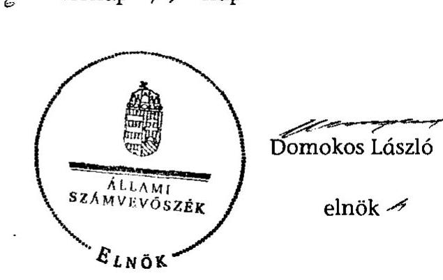

# JELENTÉS 

Kurd Község Önkormányzata belső kontrollrendszerének kialakítása, valamint egyes kontrolltevékenységek és a belső ellenőrzés múködése ellenőrzéséről

---

# Állami Számvevőszék 

Iktatószám: V-0063-007-017/2013.
Témaszám: 1098
Vizsgálat-azonosító szám: V059131

## Az ellenőrzést felügyelte:

Dr. Benedek Mária
felügyeleti vezető

## Az ellenőrzést vezette:

Gyüre Lajosné
ellenőrzésvezető
A számvevőszéki jelentés összeállításában közremúködtek:
Pappné dr. Szamosi Éva
számvevő tanácsos
Dr. Horváth Klára
számvevő tanácsos
Az ellenőrzést végezték:
Tóth Béla
Vasváriné Molnár Judit
számvevő

---

# TARTALOMJEGYZÉK 

BEVEZETÉS ..... 5
I. ÖSSZEGZŐ MEGÁLLAPÍTÁSOK, KÖVETKEZTETÉSEK, JAVASLATOK ..... 8
II. RÉSZLETES MEGÁLLAPÍTÁSOK ..... 15

1. Az önkormányzat belső kontrollrendszere kialakításának megfelelősége ..... 15
1.1. A kontrollkörnyezet kialakítása ..... 15
1.2. A kockázatkezelési rendszer kialakítása ..... 16
1.3. A kontrolltevékenységek kialakítása ..... 16
1.4. Az információs és kommunikációs rendszer kialakítása ..... 17
1.5. A monitoring rendszer kialakítása ..... 18
2. A pénzügyi folyamatokban kulcsszerepet betöltő belső kontrollok (szakmai teljesítésigazolás és utalvány ellenjegyzés) múködése ..... 19
3. A belső ellenőrzés szervezeti keretei és múködése ..... 21

## FÜGGELÉKEK

1. számú Értelmező szótár
2. számú A belső kontrollrendszer kialakítása, a pénzügyi folyamatokban kulcsszerepet betöltő szakmai teljesítésigazolás és utalvány ellenjegyzés kontrollok múködése, valamint a belső ellenőrzés múködése értékelésénél alkalmazott minősítési szempontok

---

.

---

# RÖVIDÍTÉSEK JEGYZÉKE 

## Törvények

ÁSZ tv.
Avtv.

Info tv.

Kttv.

Ktv.

Mötv.

Ötv.
régi Áht.
új Áht.

## Rendeletek

Ámr.
Ávr.

Ber.

Bkr.

Ügyrend, körjegyzőségi SZMSZ

## Szórövidítések

Általános Iskola
ÁSZ
Belső ellenőrzési kézikönyv
Belső ellenőrzési kézikönyv ${ }_{2}$

2011. évi LXVI. törvény az Állami Számvevőszékről
1992. évi LXIII. törvény a személyes adatok védelméről és a közérdekú adatok nyilvánosságáról (hatálytalan 2012. január 1-jétől)
2011. évi CXII. törvény az információs önrendelkezési jogról és az információszabadságról (hatályos 2012. január 1-jétől)
2011. évi CXCIX. törvény a közszolgálati tisztviselőkről (hatályos 2012. március 1-jétől)
1992. évi XXIII. törvény a köztisztviselők jogállásáról (hatálytalan 2012. március 1-jétől)
2011. évi CLXXXIX. törvény Magyarország helyi önkormányzatairól (hatályos 2012. január 1-jétől)
1990. évi LXV. törvény a helyi önkormányzatokról
1992. évi XXXVIII. törvény az államháztartásról (hatálytalan 2012. január 1-jétől)
2011. évi CXCV. törvény az államháztartásról (hatályos 2012. január 1-jétől)

292/2009. (XII. 19.) Korm. rendelet az államháztartás múködési rendjéről (hatálytalan 2012. január 1-jétől)
368/2011. (XII. 31.) Korm. rendelet az államháztartásról szóló törvény végrehajtásáról (hatályos 2012. január 1-jétől)
193/2003. (XI. 26.) Korm. rendelet a költségvetési szervek belső ellenőrzéséről (hatálytalan 2012. január 1jétől)
370/2011. (XII. 31.) Korm. rendelet a költségvetési szervek belső kontrollrendszeréről és belső ellenőrzéséről (hatályos 2012. január 1-jétől)
Kurd Község Önkormányzat Képviselő-testületének 5/2007. (V. 19.) számú rendelete Kurd Község Önkormányzata Szervezeti és Múködési Szabályzatáról 4. számú függeléke Kurd-Csibrák Körjegyzőség Úgyrendje (hatályos 2007. május 19-étől)

Körzeti Általános Iskola és Óvoda (Kurd)
Állami Számvevőszék
Belső Ellenőrzési Kézikönyv (hatályos 2009. január 2ától 2010. január 30-áig)
Belső Ellenőrzési Kézikönyv (hatályos 2010. február 1jétől)

---

| Belső Kontroll Kézikönyv | Az Ámr. 155. § (1) bekezdése, valamint az államháztartási belső kontroll standardokról szóló 1/2009. (IX. 11.) PM irányelv egységes értelmezése érdekében az államháztartásért felelős miniszter által 2010. évben kiadott Belső Kontroll Kézikönyv |
| :--: | :--: |
| FEUVE | folyamatba épített, előzetes, utólagos és vezetői ellenőrzés |
| gazdasági program | Kurd Község Önkormányzatának 4 éves munkaprogramja (Ciklusprogram) 2010-2014 (a Képviselő-testület 29/2011. (IV. 29.) számú határozatával jóváhagyva) |
| gazdálkodási szabályzat | Kurd Községi Önkormányzat Gazdálkodási Szabályzat (ikt.sz.: 1272/5/2010., mód. 738/6/2011., hatályos 2010. január 1-jétől) |
| Hivatal   jegyző | Kurdi Közös Önkormányzati Hivatal   Kurdi Közös Önkormányzati Hivatal jegyzője (2013. január 1-jétől) |
| Képviselő-testület   körjegyző | Kurd Községi Önkormányzat Képviselő-testülete   Kurd és Csibrák Községek Önkormányzata Körjegyzőségének körjegyzője |
| Körjegyzőség | Kurd és Csibrák Községek Önkormányzatának Körjegyzősége |
| Önkormányzat   polgármester   Társulás | Kurd Község Önkormányzata   Kurd Község Önkormányzatának polgármestere   Dombóvár és Környéke Többcélú Kistérségi Társulás |

---

# JELENTÉS 

## Kurd Község Önkormányzata belső kontrollrendszerének kialakítása, valamint egyes kontrolltevékenységek és a belső ellenőrzés múködése ellenőrzéséről

## BEVEZETÉS

A belső kontrollrendszer kialakítását, múködtetését és fejlesztését a régi Áht. és az új Áht. is előírja. Ennek megvalósításáért a költségvetési szerv vezetője felel. A belső kontrollrendszer azt a célt szolgálja, hogy a költségvetési szervek múködésük és gazdálkodásuk során a tevékenységeket szabályszerűen, gazdaságosan, hatékonyan, eredményesen hajtsák végre, teljesítsék elszámolási kötelezettségeiket és megvédjék az erőforrásokat a veszteségektől, a károktól és a nem rendeltetésszerú használattól. A belső kontrollrendszer magában foglalja mindazon szabályokat, eljárásokat, gyakorlati módszereket és szervezeti struktúrákat, kockázatkezelési technikákat, kontrolltevékenységeket, amelyek segítséget nyújtanak a szervezetnek céljai eléréséhez.

Az ÁSZ a 2011-2015. évekre szóló stratégiájában hangsúlyos szerepet szánt annak, hogy szilárd szakmai alapon álló, értékteremtő ellenőrzéseivel előmozdítsa a közpénzügyek átláthatóságát, rendezettségét. A számvevőszéki ellenőrzés nemzetközi alapelvei is rögzítik, hogy a megfelelő belső kontrollrendszer minimálisra csökkenti a hibák és szabálytalanságok kockázatát.

Az ellenőrzés célja annak értékelése volt, hogy az Önkormányzat a jogszabályi előírásoknak megfelelően alakította-e ki a belső kontrollrendszert; a gazdálkodás folyamatában kulcsszerepet betöltő szakmai teljesítésigazolás és az utalvány ellenjegyzés kontrolltevékenységeit megfelelően múködtette-e; biztosí-totta-e a belső ellenőrzés szabályos és eredményes múködését.

Az ÁSZ ezen ellenőrzési céljait pilot (próba) jelleggel községi/nagyközségi önkormányzatoknál végzett ellenőrzések során érvényesítette.

Az ellenőrzés típusa: szabályszerűségi ellenőrzés
Az ellenőrzés jogszabályi alapja: az ÁSZ tv. 5. § (2) és (6) bekezdései
Az ellenőrzött szervezet: az Önkormányzat
Az ellenőrzött időszak: a belső kontrollrendszer kialakításának megfelelőségét a 2011. évre vonatkozóan értékeltük. A kontrolltevékenységek múködésének megfelelőségét a 2011. január 1-je és december 31-e, míg a belső ellenőrzés múködésének szabályosságát és eredményességét a 2009. január 1-je és 2011.

---

december 31-e közötti időszakot figyelembe véve értékeltük. A helyszíni ellenőrzés lezárásáig a helyi szabályozás változásait nyomon követtük.

Az ellenőrzés szakmai módszertana az ÁSZ hivatalos honlapján (www.asz.hu) közzétett szakmai szabályokon alapult, amely a Legfőbb Ellenőrző Intézmények Nemzetközi Szervezete (INTOSAI) által kiadott nemzetközi standardok (ISSAI) figyelembevételével készült.

A belső kontrollrendszer kialakításának ellenőrzése során értékeltük a kontrollkörnyezet, a kockázatkezelési rendszer, a kontrolltevékenységek, az információs és kommunikációs rendszer, valamint a monitoring rendszer szabályozottságának megfelelőségét.

Értékeltük a pénzügyi folyamatokban kulcsszerepet betöltő szakmai teljesítésigazolás és utalvány ellenjegyzés kontrollok múködésének megfelelőségét az államháztartáson kívülre teljesített múködési és felhalmozási célú pénzeszköz átadásoknál, az állományba nem tartozók megbízási díjainál, továbbá a külső szolgáltatók által végzett karbantartási, kisjavítási munkákkal kapcsolatos kifizetéseknél. Az egyszerú véletlen mintavétellel kiválasztott tételek ellenőrzését többlépcsős megfelelőségi tesztek útján addig végeztük, amíg elegendő és megfelelő bizonyítékot szereztünk a vizsgált folyamatok kulcskontrolljai múködésének megfelelő vagy nem megfelelő voltáról. Értékeltük az Önkormányzatnál a belső ellenőrzés múködésének szabályosságát és eredményességét. Az ÁSZ a 2007-2010. években az Önkormányzatnál átfogó ellenőrzést nem végzett.

A fogalmak magyarázatát az 1. számú függelék, az ellenőrzés egyes területeinek értékelésénél alkalmazott egységes minősítési szempontokat a 2. számú függelék tartalmazza.

Az ellenőrzés lefolytatásához az Önkormányzat a munkalapok és a tanúsítvány elektronikus kitöltésével, valamint a megjelölt dokumentumok elektronikus megküldésével szolgáltatott adatokat. A munkalapokon szerepeltetett adatok, információk ellenőrzése és szükség szerinti javítása a helyszíni ellenőrzés keretében történt.

Az ÁSZ az ellenőrzés megállapításait az ellenőrzött időszakban hatályos, az intézkedést igénylő megállapításokra tett javaslatokat a jelenleg hatályos jogszabályok alapján fogalmazta meg.

Az ÁSZ tv. 29. § (1) bekezdése szerint a jelentéstervezetet megküldtük a polgármester részére, aki az ÁSZ tv. 29. § (2) bekezdésében foglalt észrevételezési jogával nem élt, a jelentéstervezetre észrevételt nem tett.

Kurd község állandó lakosainak száma 2011. január 1-jén 1283 fő volt. Az Önkormányzat hattagú Képviselő-testületének munkáját egy állandó bizottság segítette. Az Önkormányzat az önállóan működő és gazdálkodó Körjegyzőséggel, valamint az ugyancsak önállóan múködő és gazdálkodó Általános Iskolával látta el feladatát. Az Önkormányzat többségi tulajdoni hányadú gazdasági társasággal nem rendelkezett.

A polgármester a 2010. évi önkormányzati választások óta tölti be tisztségét. A körjegyző 2004. november 1-jétől látja el feladatait.

---

A Körjegyzőség szervezeti egységekre nem tagolódott, a foglalkoztatott köztisztviselők száma 2011. január 1-jén 7 fő volt.

Az Önkormányzat a 2011. évi költségvetési beszámolója szerint 509701 ezer Ft költségvetési bevételt ért el, valamint 501063 ezer Ft költségvetési kiadást teljesített. A 2011. december 31-ei könyvviteli mérleg szerint 1002218 ezer Ft értékű eszközvagyonnal rendelkezett, 9678 ezer Ft hosszú lejáratú, 50840 ezer Ft rövid lejáratú kötelezettsége volt.
2013. január 1-jétől kezdődően Kurd, Gyulaj és Csibrák községek önkormányzatainak képviselő-testületei Közös Önkormányzati Hivatalt hoztak létre Kurd székhellyel igazgatási feladataik ellátására.

---

# I. ÖSSZEGZŐ MEGÁLLAPÍTÁSOK, KÖVETKEZTETÉSEK, JAVASLATOK 

A belső kontrollrendszeren belül 2011-ben a Körjegyzőségen a kontrollkörnyezet, a kockázatkezelési rendszer, a kontrolltevékenységek, az információs és kommunikációs rendszer, valamint a monitoring rendszer kialakítását különkülön és összesítve is értékeltük. A belső kontrollrendszer kialakítása az összesített értékelés alapján nem felelt meg a jogszabályi előírásoknak. Az egyes területek kialakításának értékelését az alábbiakban részletezzük.

A kontrollkörnyezet kialakítása részben felelt meg a jogszabályi követelményeknek, mert a körjegyző a jogszabályi előírásokat nem érvényesítette maradéktalanul. A körjegyző elkészítette a gazdálkodást érintő legfontosabb szabályzatokat, azonban a körjegyzőségi SZMSZ-ben - az Ámr. ${ }^{1}$ rendelkezései ellenére - nem rögzítette az ellátandó és a szakfeladatrend szerint besorolt alaptevékenységeket, valamint a munkakörökhöz tartozó feladat- és hatásköröket, a hatáskörök gyakorlásának módját, az ezekhez kapcsolódó felelősségi szabályokat. A körjegyző az ellenőrzési nyomvonalban az Ámr.-ben előírtak ellenére nem azonosította be a Körjegyzőség tevékenységéhez kapcsolódó valamennyi működési folyamatot, nem határozta meg a felelősségi és információs szinteket és kapcsolatokat, irányítási és ellenőrzési folyamatokat, gátolva ezzel a folyamatok nyomon követését és utólagos ellenőrzését, továbbá nem készítette el a szabálytalanságok kezelésének eljárásrendjét. A körjegyző a Ktv. ${ }^{2}$-ben foglaltak ellenére nem alakította ki a 2011. évre vonatkozó teljesítményértékelési rendszert, nem határozta meg a köztisztviselők munkateljesítményének értékeléséhez szükséges teljesítménykövetelményeket. A 2012. évre vonatkozó követelmények meghatározása megtörtént.

A kockázatkezelési rendszer kialakítása nem felelt meg a jogszabályi előírásoknak, mert a körjegyző az Ámr. előírása ellenére kockázatelemzést nem végzett, a kockázatok felmérésével, elemzésével, kezelésével és felülvizsgálatával kapcsolatos feladatok és előírások meghatározását elmulasztotta.

A kontrolltevékenységek kialakítása részben felelt meg a jogszabályi követelményeknek, mert a körjegyző a jogszabályi előírásokat nem érvényesítette maradéktalanul. A körjegyző szabályozta az érvényesítés rendjét, a szakmai teljesítés igazolásának módját, kijelölte a jogosultakat, azonban a régi Áht. ${ }^{3}$ ban foglaltak ellenére nem határozta meg a pénzügyi döntések - köztük a beszerzési folyamatok és a szabálytalanságkezelési feladatok - dokumentumainak elkészítésével kapcsolatos, FEUVE feladatait. Az Ámr. előírása ellenére nem szabályozta a Körjegyzőség tevékenységeire vonatkozó beszámolási eljárásokat. Az utalvány ellenjegyzésére a körjegyző által (összeférhetetlenség esetére) írás-

[^0]
[^0]:    ${ }^{1}$ 2012. január 1-jétől Ávr.
    ${ }^{2}$ 2012. március 1-jétől Kttv.
    ${ }^{3}$ 2012. január 1-jétől új Áht.

---

ban feljogosított személy 2011. május 31-éig nem rendelkezett az előírt iskolai végzettséggel, szakmai képesítéssel.

Az információs és kommunikációs rendszer kialakítása nem felelt meg a jogszabályi előírásoknak, mert a körjegyző az Ámr.-ben foglalt előírás ellenére nem határozta meg a közérdekú adatok közzétételi eljárásának, nyilvánosságra hozatalának rendjét. Az Avtv. ${ }^{4}$ előirása ellenére nem szabályozta a közérdekú adatok megismerésére irányuló igények teljesítésének rendjét. A körjegyzö az Avtv.-ben foglaltak ellenére elmulasztotta az adatbiztonság érvényre juttatásához szükséges intézkedések megtételét, nem rendelkezett a hozzáférési jogosultságok megállapításáról, betartásának ellenőrzéséről és nyilvántartásáról, nem szabályozta a pénzügyi-számviteli szoftverváltozások ellenőrzésére, tesztelésére vonatkozó eljárásokat, a pénzügyi-számviteli rendszerben feldolgozott adatok mentési eljárásrendjét, és nem jelölte ki az adatmentések felelőseit. A 2012. évben a körjegyzö elkészítette a közérdekú adatok megismerésével és közzétételével kapcsolatos szabályozást.

A monitoring rendszer kialakítása a jogszabályi követelményeknek nem felelt meg, mert a körjegyző az Ámr.-ben foglaltak ellenére az operatív tevékenységek keretében megvalósuló folyamatos és eseti nyomon követésből álló, a Körjegyzőség tevékenységének, a célok megvalósitásának nyomon követését biztosító rendszer szabályait nem határozta meg.

A belső kontrollrendszer nem megfelelő kialakítása kockázatot jelent az Önkormányzat tevékenységeinek szabályszerú, gazdaságos, hatékony és eredményes végrehajtása során.

A Körjegyzőségen a 2011. évben az államháztartáson kívülre történő múködési és felhalmozási célú pénzeszközátadásokkal, az állományba nem tartozók megbízási díjaival, valamint a külső szolgáltatók által végzett karbantartással, kisjavítással kapcsolatos kifizetések során összefoglalóan értékelve a kulcskontrollok múködésének megfelelősége gyenge volt. Az államháztartáson kívülre teljesített pénzeszközátadások és az állományba nem tartozók megbízási díjainak kifizetése során a szakmai teljesítés igazolása az Ámr. és a gazdálkodási szabályzat előírásai ellenére - szabályszerű rájegyzés hiányában nem az előírt módon történt. Az államháztartáson kívülre teljesített pénzeszközátadások során a régi Áht.-ban és az Ámr.-ben előírtak ellenére a szakmai teljesítés igazolását nem minden esetben végezték el. A külső szolgáltatók által teljesített karbantartási, kisjavítási munkákra történő kifizetések esetében - az Ámr.-ben foglaltak ellenére - ellenőrizhető okmányok hiányában a feladatok teljesítését nem ellenőrizték.

Az utalványok ellenjegyzője az Ámr.-ben foglalt feladatát nem szabályszerűen végezte, mert annak ellenére ellenjegyezte az utalványokat, hogy a szakmai teljesítésigazolásra és az érvényesítésre a körjegyző által kijelölt személyek ellenőrzési kötelezettségüknek nem az előírásoknak megfelelően, illetve nem tettek eleget. A régi Áht. és az Ámr. gazdálkodásra - közöttük a kötelezettségvállalások nyilvántartására, és az utalványon a kötelezettségvállalás nyilvántartási számának feltüntetésére, egy megbízási és egy vállalkozási szerződés esetében a

[^0]
[^0]:    ${ }^{4}$ 2012. január 1-jétől Info tv.

---

jogosult általi ellenjegyzést követő kötelezettségvállalásra - vonatkozó szabályai betartásának hiánya ellenére az utalvány ellenjegyző a kifizetéseket aláírásával ellenjegyezte.

Az ellenőrzött kifizetésekkel összefüggésben a rendelkezésre bocsátott dokumentumok alapján jogosulatlan kifizetést nem tárt fel az ellenőrzés, azonban a gazdálkodásban kulcsszerepet betöltő kontrollok jogszabályi előírásoknak nem megfelelő, gyenge múködése miatt fennáll a hibák bekövetkezésének lehetősége. A nem megfelelően szabályozott és múködtetett belső kontrollok korrupciós kockázatot hordoznak.

Az Önkormányzat a belső ellenőrzési feladatokat a Társulás útján látta el, azonban a körjegyzőségi SZMSZ-ben a belső ellenőrzést végző személy, egység jogállását, feladatait a Ber. ${ }^{5}$-ben foglaltak ellenére nem határozták meg. A belső ellenőrzés szabályozása és múködése a 2009. évben megfelelt, a 2010-2011. években jól megfelelt a jogszabályi követelményeknek. Az éves ellenőrzési terveket kockázatelemzéssel alapozták meg, az ellenőrzéseket az előírt tartalmú ellenőrzési programok alapján hajtották végre, a javaslatok végrehajtására intézkedési tervek készültek. Az éves ellenőrzési terveket a 2009-2010. években a Képviselő-testület - a jóváhagyásra előírt határidőn túli körjegyzői előterjesztés miatt - az Ötv.-ben előírt határidőt túllépve hagyta jóvá. A 2011-re vonatkozó éves ellenőrzési terv jóváhagyása határidőn belül megtörtént. A Ber. előírása ellenére a 2009. évben egy ellenőrzési programot nem a belső ellenőrzési vezető hagyott jóvá, a jelentések a Ber.-ben előírt következtetéseket nem tartalmaztak.

Az Önkormányzatnál a 2009-2011. években a belső ellenőrzés múködése a 2. számú függelékben részletezett kritériumrendszer alapján végzett értékelés szerint - nem volt eredményes annak ellenére, hogy a belső ellenőrzés szabályozása és múködése az összegző értékelés alapján az ellenőrzött időszak egészét tekintve a jogszabályi előírásoknak jól megfelelt. A belső ellenőrzés múködése azért nem volt eredményes, mert ellenőrizték ugyan a gazdálkodási jogkörök gyakorlásához kapcsolódó, a pénzkezeléssel, továbbá a vagyongazdálkodással kapcsolatos belső kontrollok múködését, azonban az intézkedési tervekben foglaltak ellenére a körjegyző a belső ellenőrzés által a 2009-2011. években feltárt hibák kijavításáról - kiemelten a szakmai teljesítésigazolás szabályszerű végzéséről, az ellenőrzési nyomvonal kiegészítéséről és a kötelezettségvállalások nyilvántartásának vezetéséről - nem gondoskodott. Ez hozzájárult a számvevőszéki ellenőrzés során is feltárt szabályozási hiányosságok, hibák ismétlődéséhez.

Az ÁSZ tv. 33. § (1) bekezdésében foglaltak értelmében az ellenőrzött szervezet vezetője köteles a jelentésben foglalt megállapításokhoz kapcsolódó intézkedési tervet összeállítani, és azt a jelentés kézhezvételétől számított 30 napon belül az ÁSZ részére megküldeni. Amennyiben az intézkedési tervet határidőre nem küldi meg a szervezet, vagy az - az ÁSZ tv. 33. § (2) bekezdésében foglalt póthatáridő eltelte ellenére - továbbra sem elfogadható, az ÁSZ elnöke a hivatkozott törvény 33. § (3) bekezdés a)-b) pontjaiban foglaltakat érvényesítheti.

[^0]
[^0]:    ${ }^{5}$ 2012. január 1-jétől Bkr.

---

Az ellenőrzés intézkedést igénylő megállapításai és javaslatai:

# a polgármesternek 

Az állományba nem tartozók megbízási díjaival, valamint a külső szolgáltatók által teljesített karbantartási, kisjavítási munkákkal kapcsolatos kifizetéseknél a kötelezettségvállalást - az Ámr. 74. § (1) bekezdésében foglaltak ellenére - nem minden esetben ellenjegyezték.

Javaslat:
Intézkedjen arról, hogy az Önkormányzat nevében történő kötelezettségvállalásra az új Áht. 37. § (1) bekezdésében foglaltaknak megfelelően - az Ávr. 53. §-ában meghatározott kivételekkel - kizárólag a pénzügyi ellenjegyzés után, a pénzügyi teljesítés esedékességét megelőzően, írásban kerüljön sor.

## a jegyzőnek Kurd Község Önkormányzata vonatkozásában

1. a kontrollkörnyezettel kapcsolatban:

A körjegyző a körjegyzőségi SZMSZ-ben - az Ámr. 20. § (2) bekezdés c) és h) pontjaiban foglaltak ellenére - nem rögzítette az ellátandó, és a szakfeladatrend szerint besorolt alaptevékenységeket, valamint az SZMSZ-ben nevesített munkakörökhöz tartozó feladat- és hatásköröket, a hatáskörök gyakorlásának módját, az ezekhez kapcsolódó felelősségi szabályokat, és a Ber. 4. § (2) bekezdés rendelkezése ellenére nem határozta meg a belső ellenőrzést végző személy, szervezet jogállását, feladatait.

Az ellenőrzési nyomvonal - az Ámr. 156. § (2) bekezdésében előírtak ellenére - nem tartalmazta a Körjegyzőség valamennyi müködési folyamatát, a felelősségi és információs szinteket és kapcsolatokat, irányítási és ellenőrzési folyamatokat.

A körjegyző az Ámr. 156. § (3) bekezdésében foglalt előírás ellenére nem szabályozta a szabálytalanságok kezelésének eljárásrendjét.

Javaslat:
a) Módosítsa a hivatali SZMSZ-t, és kezdeményezze a polgármesternél a módosítás Képviselő-testület elé terjesztését annak érdekében, hogy az Ávr. 13. § (1) bekezdésének c) és g) pontjában foglaltaknak megfelelően tartalmazza a szakfeladatrend szerint besorolt alaptevékenységeket és az abban nevesített munkakörökhöz tartozó feladat- és hatásköröket, a hatáskörök gyakorlásának módját, az ezekhez kapcsolódó felelősségi szabályokat, továbbá a Bkr.15. § (2) bekezdésének megfelelően tartalmazza a belső ellenőrzést végző személy, vagy szervezet jogállását, feladatait.
b) Egészítse ki az ellenőrzési nyomvonalat annak érdekében, hogy az tartalmazza a Bkr. 6. § (3) bekezdésében előírtakat.
c) Intézkedjen a Bkr. 6. § (3) bekezdésében előírtak érvényre juttatása érdekében az ellenőrzési nyomvonal rendszeres aktualizálásáról.

---

d) Szabályozza a Bkr. 6. § (4) bekezdésének megfelelően a szabálytalanságok kezelésének eljárásrendjét.
2. a kockázatkezelési rendszerrel kapcsolatban:

A körjegyző az Ámr. 157. § (1)-(3) bekezdéseinek előírása ellenére a kockázatkezelési rendszert nem alakította ki, a kockázatok felmérésével, elemzésével, kezelésével és felülvizsgálatával kapcsolatos feladatok és előírások meghatározását elmulasztotta.

Javaslat:
Alakítsa ki és múködtesse a Bkr. 3. § b) pontja és 7. §-a alapján a kockázatkezelési rendszert, ennek érdekében mérje fel és állapítsa meg a Hivatal tevékenységében, gazdálkodásában rejlő kockázatokat, valamint határozza meg az egyes kockázatokkal kapcsolatban szükséges intézkedéseket és azok teljesítése folyamatos nyomon követésének módját.
3. a kontrolltevékenységekkel kapcsolatban:

A körjegyző - a régi Áht. 121/A. § (4) bekezdés a) pontjában foglaltak ellenére nem határozta meg a pénzügyi döntések - köztük a beszerzési és szabálytalanságkezelési feladatok - dokumentumainak elkészítésével kapcsolatos folyamatba épített, előzetes, utólagos és vezetői ellenőrzés feladatait.

A körjegyző - az Ámr. 158. § (2) bekezdés d) pontjának előírása ellenére - nem alakította ki a Körjegyzőség tevékenységeire vonatkozó beszámolási eljárásokat.

Javaslat:
a) Biztosítsa minden tevékenységre vonatkozóan a folyamatba épített, előzetes, utólagos és vezetői ellenőrzést a Bkr. 8. § (2) bekezdése alapján.
b) Szabályozza a Bkr. 8. § (4) bekezdés c) pontja alapján a Hivatal tevékenységeire vonatkozó beszámolási eljárásokat.
4. az információs és kommunikációs rendszerrel kapcsolatban:

A körjegyző az Avtv. 10. §-ában foglalt előírások ellenére elmulasztotta az adatbiztonság érvényre juttatásához szükséges intézkedések megtételét, nem rendelkezett a hozzáférési jogosultságok megállapításáról, betartásának ellenőrzéséről és nyilvántartásáról, nem szabályozta a pénzügyi-számviteli szoftverváltozások ellenőrzésére, tesztelésére vonatkozó eljárásokat, a pénzügyi-számviteli rendszerben feldolgozott adatok mentési eljárásrendjét, és nem jelölte ki az adatmentések felelőseit.

Javaslat:
Biztosítsa az Info tv. 7. § (2)-(3) bekezdéseinek megfelelően az adatbiztonság érvényesülését, és ennek keretében rendelkezzen a hozzáférési jogosultságok megállapításáról, azok betartásának ellenőrzéséről és nyilvántartásáról, továbbá szabályozza a pénzügyi-számviteli szoftverváltozások ellenőrzésére, tesztelésére vonatkozó eljárásokat, a feldolgozott adatok mentési eljárásait, és jelölje ki a mentések felelőseit.

---

5. a monitoring rendszerrel kapcsolatban:

A körjegyző - az Ámr. 160. §-ában foglaltak ellenére - nem alakított ki és nem múködtetett olyan monitoring rendszert, amely lehetővé teszi a Körjegyzőség tevékenységének, a célok megvalósításának nyomon követését, és amelynek része az operatív tevékenységek keretében megvalósuló folyamatos és eseti nyomon követés is.

Javaslat:
Alakítsa ki és múködtesse a Bkr. 3. § e) pontjában és a 10. §-ában előírtak alapján a tevékenységek, a célok megvalósításának nyomon követését biztosító rendszert, amelynek része az operatív tevékenységek keretében megvalósuló folyamatos és eseti nyomon követés is.
6. a pénzügyi folyamatokban kulcsszerepet betöltő kontrollok múködésével kapcsolatban:

Az államháztartáson kívülre teljesített pénzeszközátadások és az állományba nem tartozók megbízási dijainak kifizetése során az Ámr. 76. § (1) bekezdésében előírt szakmai teljesítés igazolása - szabályszerű rájegyzés hiányában - nem a gazdálkodási szabályzatban előírt módon történt. Az államháztartáson kívülre teljesített pénzeszközátadások során egy esetben a szakmai teljesítés igazolását nem végezték el. A külső szolgáltatók által teljesített karbantartási, kisjavítási munkákra történő kifizetések esetében a szerződésben, megrendelésben foglalt feladatok teljesítését igazolták, azonban - az Ámr. 76. § (1) bekezdésében foglaltak ellenére - ellenőrizhető okmányok hiányában nem ellenőrizték. Az utalványok ellenjegyzője az Ámr. 79. § (2) bekezdésében foglaltakat figyelmen kívül hagyva, annak ellenére ellenjegyezte az utalványokat, hogy a szakmai teljesítésigazolásra és az érvényesítésre a körjegyző által kijelölt személyek ellenőrzési kötelezettségüknek nem, vagy nem az előírásoknak megfelelően tettek eleget, nem tartották be a gazdálkodásra - közöttük a kötelezettségvállalások nyilvántartására, és az utalványon a kötelezettségvállalás nyilvántartási számának feltüntetésére, egy megbízási és egy vállalkozási szereződés esetében a jogosult általi ellenjegyzést követő kötelezettségvállalásra - vonatkozó szabályokat.

Javaslat:
Intézkedjen - a szakmai teljesítésigazolás és az utalvány ellenjegyzése vonatkozásában feltárt hiányosságok megszüntetése, illetve az operatív gazdálkodás során a múködésbeli hibák megelőzése, feltárása és kijavítása érdekében - arról, hogy:
a) a teljesítésigazolásra - az Ávr. 57. § (4) bekezdésében foglalt előírás szerint - kijelölt személyek az Ávr. 57. § (1) bekezdésében foglaltaknak megfelelően a gazdálkodási szabályzatban előírt módon, ellenőrizhető okmányok alapján ellenőrizzék a kiadások teljesítésének jogosságát, összegszerűségét, ellenszolgáltatást is magában foglaló kötelezettségvállalás esetében a szerződés, megrendelés teljesítését, és azt az Ávr. 57. § (3) bekezdésében foglalt módon igazolják;
b) a kifizetéseket megelőzően - az Ávr. 58. § (1) bekezdése szerint - a teljesítésigazolás alapján - az Ávr. 57. § (3) bekezdése szerinti esetben annak hiányában is az összegszerűségnek, a fedezet meglétének és a megelőző ügymenetben az új Áht., az Áhsz., az Ávr. előírásai és a belső szabályzatokban foglaltak betartásának

---

az ellenőrzése az Ávr. 58. § (3) bekezdésében előírtak figyelembevételével történjen meg;
c) a kötelezettségvállalások Ávr 56. § (1) bekezdése szerinti nyilvántartását naprakészen vezessék, és az utalványokon az Ávr. 59. § (3) bekezdés f) pontjában foglaltaknak megfelelően tüntessék fel a kötelezettségvállalás nyilvántartási számát.
7. a belső ellenőrzés múködésével kapcsolatban:

Az ellenőrzési jelentések - a Ber. 27. § (2) bekezdés j) pontjában előírtak ellenére nem tartalmaztak következtetéseket.

Javaslat:
Intézkedjen annak érdekében, hogy az ellenőrzési jelentések tartalmazzák a Bkr. 39. § (3) bekezdésében előírt tartalmi elemeket.

---

# II. RÉSZLETES MEGÁLLAPÍTÁSOK 

## 1. AZ ÖNKORMÁNYZAT BELSŐ KONTROLLRENDSZERE KIALAKÍTÁSÁNAK MEGFELELŐSÉGE

### 1.1. A kontrollkörnyezet kialakítása

A kontrollkörnyezet kialakítása a 2. számú függelékben részletezett kritériumrendszer alapján végzett értékelés szerint a Körjegyzőségen részben volt megfelelő, mert a körjegyző a jogszabályi előírásokat nem érvényesítette maradéktalanul. A Körjegyzőség rendelkezett körjegyzőségi SZMSZ-szel, a Képvise-lő-testület elfogadta az Önkormányzat 2010-2014. évre szóló gazdasági programját és a Körjegyzőség alapító okiratát. A körjegyző kialakította a gazdálkodást érintő legfontosabb szabályzatokat.

A körjegyző, mint a költségvetési szerv vezetője:

- a körjegyzőségi SZMSZ-ben az Ámr 20. § (2) bekezdés c) és h) pontjaiban ${ }^{6}$ foglaltak ellenére nem rögzítette az ellátandó, és a szakfeladatrend szerint besorolt alaptevékenységeket, valamint az SZMSZ-ben nevesített munkakörökhöz tartozó feladat- és hatásköröket, a hatáskörök gyakorlásának módját és az ezekhez kapcsolódó felelősségi szabályokat;
- a folyamatok meghatározása és dokumentálása körében, az ellenőrzési nyomvonalban - az Ámr. 156. § (2) bekezdésében ${ }^{7}$ előírtak ellenére - nem azonosította be a Körjegyzőség tevékenységéhez kapcsolódó valamennyi működési folyamatot, nem határozta meg a felelősségi és információs szinteket és kapcsolatokat, irányítási és ellenőrzési folyamatokat;
- az Ámr. 156. § (3) bekezdésében ${ }^{8}$ foglalt előírás ellenére nem készítette el a szabálytalanságok kezelésének eljárásrendjét;
- a Ktv. 34. § (5) bekezdésében ${ }^{9}$ foglalt előírás ellenére nem alakította ki a 2011. évre vonatkozó teljesítményértékelési rendszert, és nem határozta meg a köztisztviselők munkateljesítményének értékeléséhez szükséges teljesítménykövetelményeket. A 2012. évre vonatkozó követelmények meghatározása a 96/2011. (XII. 13.) számú önkormányzati határozattal megtörtént.

[^0]
[^0]:    ${ }^{6}$ 2012. január 1-jétől az Ávr. 13. § (1) bekezdés c) és g) pontjai
    ${ }^{7}$ 2012. január 1-jétől a Bkr. 6. § (3) bekezdése
    ${ }^{8}$ 2012. január 1-jétől a Bkr. 6. § (4) bekezdése
    ${ }^{9}$ 2012. július 1-jétől a Kttv. 130. § (1) és (8) bekezdései

---

Az Önkormányzat gazdasági programja az Ötv. 91. § (6) bekezdésében ${ }^{10}$ foglaltak ellenére nem tartalmazta a munkahelyteremtés feltételeinek elősegítését, és az adópolitika célkitűzéseit.

A kontrollkörnyezet kialakítása során a körjegyző az Ámr. 155. § (3) bekezdésének ${ }^{11}$ előírását figyelmen kívül hagyva az államháztartásért felelős miniszter által kiadott Belső Kontroll Kézikönyv ajánlásait nem hasznosította teljes körűen.

A kontrollkörnyezet kialakítása során a körjegyző:

- a Belső Kontroll Kézikönyv 1.1.2 pontjában foglalt ajánlást figyelmen kívül hagyva a gazdasági program céljainak az érintettekkel történő megismertetéséről nem gondoskodott;
- a Belső Kontroll Kézikönyv 1.2.7. pontjában foglalt ajánlást nem érvényesítette, mert nem írta elő a körjegyzőségi SZMSZ dolgozók általi megismerésének kötelezettségét;
- a Belső Kontroll Kézikönyv 1.3.3. pontjában foglalt ajánlást nem vette figyelembe, mert a köztisztviselők munkaköri leírásaiban nem határozta meg a munkakörökhöz kapcsolódó jogokat, kötelezettségeket és felelősségi szabályokat;
- a Belső Kontroll Kézikönyv 1.4.2. pontjában foglalt ajánlást figyelmen kívül hagyva nem írta elő az ellenőrzési nyomvonal rendszeres felülvizsgálatának kötelezettségét;
- a Belső Kontroll Kézikönyv 1.5.2. pontjában foglalt ajánlást nem érvényesítette, mert nem dolgozta ki a Körjegyzőségen ellátott köztisztviselői munkakörökre vonatkozó szakmai követelményrendszert.

# 1.2. A kockázatkezelési rendszer kialakítása 

A kockázatkezelési rendszer kialakítása a 2. számú függelékben részletezett kritériumrendszer alapján végzett értékelés szerint a Körjegyzőségen nem volt megfelelő, mert a körjegyző az Ámr. 157. § (1)-(3) bekezdéseinek ${ }^{12}$ előírása ellenére nem végzett kockázatelemzést, a kockázatok felmérésével, elemzésével, kezelésével és felülvizsgálatával kapcsolatos feladatok és előírások meghatározását elmulasztotta.

### 1.3. A kontrolltevékenységek kialakítása

A kontrolltevékenységek kialakítása a 2. számú függelékben részletezett kritériumrendszer alapján végzett értékelés szerint a Körjegyzőségen részben volt megfelelő, mert a körjegyző a jogszabályi előírásokat nem érvényesítette maradéktalanul. A körjegyző a kontrollstratégiák és módszerek keretében meghatározta az érvényesítés rendjét, a szakmai teljesítés igazolásának mód-

[^0]
[^0]:    ${ }^{10}$ 2013. január 1-jétől a Mötv. 116. § (1)-(5) bekezdései nem írják elő a munkahelyteremtés feltételei elősegítésének és az adópolitikai célkitűzések rögzítésének kötelezettségét.
    ${ }^{11}$ 2012. január 1-jétől a Bkr. 5. § (1) bekezdése
    ${ }^{12}$ 2012. január 1-jétől a Bkr. 3. § b) pontja és 7. §-a

---

ját, és kijelölte az érvényesítésre, illetve szakmai teljesítésigazolásra jogosultakat.

A körjegyző, mint a költségvetési szerv vezetője:

- a régi Áht. 121/A. § (4) bekezdés a) pontjában ${ }^{13}$ foglaltak ellenére nem határozta meg a pénzügyi döntések - köztük a beszerzési folyamatok és a szabálytalanságkezelési feladatok - dokumentumainak elkészítésével kapcsolatos, FEUVE feladatait;
- az Ámr. 158. § (2) bekezdés d) pontjának ${ }^{14}$ előírása ellenére nem alakította ki a Körjegyzőség tevékenységeire vonatkozó beszámolási eljárásokat;
- az írásbeli kijelölések során figyelmen kívül hagyta az Ámr. 19. § (1) bekezdésében ${ }^{15}$ foglalt előírást, mivel az utalvány ellenjegyzésére a körjegyző által - összeférhetetlenség esetére - írásban feljogosított személy 2011. május 31éig nem rendelkezett az előírt iskolai végzettséggel, szakmai képesítéssel.

A kontrolltevékenységek kialakítása során a körjegyző az Ámr. 155. § (3) bekezdésének előírását figyelmen kívül hagyva az államháztartásért felelős miniszter által kiadott Belső Kontroll Kézikönyv ajánlásait nem hasznosította teljes körúen.

A kontrolltevékenységek kialakítása keretében a körjegyzó:

- a Belső Kontroll Kézikönyv 3.2.1. pontjában foglalt ajánlást figyelmen kívül hagyva nem határozta meg a köztisztviselők munkaköri leírásában az ellenőrzési feladatokat;
- a Belső Kontroll Kézikönyv 3.2.3. pontjában foglalt ajánlást nem vette figyelembe, mert nem mérte fel a kis létszámból adódó kockázatokat;
- a Belső Kontroll Kézikönyv 3.3.1. pontjában foglalt ajánlást figyelmen kívül hagyva a munkakör átadás-átvételi jegyzőkönyv kötelező tartalmi elemei között nem írta elő a munkaviszony megszüntetésének időpontját.

# 1.4. Az információs és kommunikációs rendszer kialakítása 

Az információs és kommunikációs rendszer kialakítása a 2. számú függelékben részletezett kritériumrendszer alapján végzett értékelés szerint a Körjegyzőségen nem volt megfelelő, mert a körjegyzó a jogszabályi előírásokat nem tartotta be.

A körjegyzó, mint a költségvetési szerv vezetője:

- az Avtv. 20. § (8) bekezdésének ${ }^{16}$ és az Ámr. 20. § (3) bekezdés i) pontjának ${ }^{17}$ előírása ellenére nem szabályozta a közérdekú adatok megismerésére irá-

[^0]
[^0]:    ${ }^{13}$ 2012. január 1-jétől a Bkr. 8. § (2) bekezdése
    ${ }^{14}$ 2012. január 1-jétől a Bkr. 8. § (4) bekezdés c) pontja
    ${ }^{15}$ 2012. január 1-jétől az Ávr. 55. § (3) bekezdése és 58. § (4) bekezdése
    ${ }^{16}$ 2012. január 1-jétől az Info tv. 30. § (6) bekezdése és a 35. § (3) bekezdése, valamint az Ávr. 13. § (2) bekezdés h) pontja
    ${ }^{17}$ 2012. január 1-jétől Ávr. 13. § (2) bekezdés h) pontja

---

nyuló igények teljesítésének, valamint a kötelezően közzéteendő adatok nyilvánosságra hozatalának rendjét;

- az Avtv. 10. §-ában ${ }^{18}$ foglalt előírások ellenére elmulasztotta az adatbiztonság érvényre juttatásához szükséges intézkedések megtételét, nem rendelkezett a hozzáférési jogosultságok megállapításáról, betartásának ellenőrzéséről és nyilvántartásáról, nem szabályozta a pénzügyi-számviteli szoftverváltozások ellenőrzésére, tesztelésére vonatkozó eljárásokat, a pénzügyiszámviteli rendszerben feldolgozott adatok mentési eljárásrendjét, és nem jelölte ki az adatmentések felelőseit.

Az információs és kommunikációs rendszer kialakítása során a körjegyző az Ámr. 155. § (3) bekezdésének előírását figyelmen kívül hagyva az államháztartásért felelős miniszter által kiadott Belső Kontroll Kézikönyv ajánlásait nem hasznosította teljes körűen.

Nem vette figyelembe a Belső Kontroll Kézikönyv 4.1.1. pontjában foglalt ajánlást, mert nem szabályozta a szervezeten belüli, valamint a szervezeten kívülre történő információátadás módját és formáit, illetve a kívülről érkező információk kezelésének rendjét, az információáramlás dokumentálási kötelezettségét.

A 2012. évben a körjegyző elkészítette a közérdekű adatok megismerésével és közzétételével kapcsolatos szabályozást.

# 1.5. A monitoring rendszer kialakítása 

A monitoring rendszer kialakítása a 2. számú függelékben részletezett kritériumrendszer alapján végzett értékelés szerint a Körjegyzőségen nem volt megfelelő, mert a körjegyző az Ámr. 160. §-ában ${ }^{19}$ foglaltak ellenére az operatív tevékenységek keretében megvalósuló folyamatos és eseti nyomon követésből álló, a Körjegyzőség tevékenységének, a célok megvalósításának nyomon követését biztosító rendszer szabályait nem határozta meg.

A belső kontrollrendszer kialakítása a Körjegyzőségnél 2011-ben összefoglalóan értékelve nem felelt meg a jogszabályi előírásoknak, mert a körjegyzö, a kockázatkezelési rendszert, az információs és kommunikációs rendszert, valamint a monitoring rendszert - a szabályozás hiányosságai miatt - nem megfelelően alakította ki, a kontrollkörnyezet és a kontrolltevékenységek kialakítása részben felelt meg a jogszabályi előírásoknak.

[^0]
[^0]:    ${ }^{18}$ 2012. január 1-jétől az Info tv. 7. § (2)-(3) bekezdései
    ${ }^{19}$ 2012. január 1-jétől a Bkr. 3. § e) pontja és a Bkr. 10. §-a

---

# 2. A PÉNZÜGYI FOLYAMATOKBAN KULCSSZEREPET BETÖLTŐ BELSŐ KONTROLLOK (SZAKMAI TELJESÍTÉSIGAZOLÁS ÉS UTALVÁNY ELLENJEGYZÉS) MŰKÖDÉSE 

A Körjegyzőségen a 2011. évben az államháztartáson kívülre teljesített múködési és felhalmozási célú pénzeszközátadások során a szakmai teljesítésigazolás és az utalvány ellenjegyzés kulcskontrollok müködésének megfelelősége gyenge volt, mert

- a szakmai teljesítés igazolására a körjegyző által kijelölt személy a nonprofit kft. részére történő kifizetés teljesítését megelőzően a kiadás teljesítése jogosságának, összegszerűségének ellenőrzését nem az Ámr. 76. § (1) bekezdésében ${ }^{20}$ előírtaknak megfelelően végezte, mert az utalványrendeletet aláírásával és dátummal ugyan ellátta, ez azonban a szakmai teljesítés igazolására utaló, szabályszerű rájegyzés hiánya miatt nem felelt meg a gazdálkodási szabályzatban foglaltnak;

A gazdálkodási szabályzat IV. fejezetében előírtak szerinti rájegyzés kötelező tartalmi elemeit - a szerződés, a megállapodás számát, a nevet és a beküldött bizonylat számát - a szakmai teljesítésigazoló nem töltötte ki.

- a kiadás teljesítése jogosságának és összegszerűségének ellenőrzését a régi Áht. 100/C. § (6) bekezdésében ${ }^{21}$ és az Ámr. 76. § (1) bekezdésében foglaltak ellenére a lakossági közműfejlesztési hozzájárulás esetén nem végezték el;
- az utalványok ellenjegyzője az Ámr. 79. § (2) bekezdésében ${ }^{22}$ foglalt feladatát nem szabályszerűen végezte, mert annak ellenére aláírásával ellenjegyezte az utalványt, hogy a nonprofit kft. részére történő kifizetést megelőzően a szakmai teljesítésigazolás nem a gazdálkodási szabályzatban előírt módon történt, és elmaradt az érvényesítés;
- az utalványok ellenjegyzője az Ámr. 79. § (2) bekezdésében foglaltakat figyelmen kívül hagyva, a közműfejlesztési hozzájárulás kifizetése esetén aláírása ellenére - nem győződött meg a szakmai teljesítésigazolás megtörténtéről;
- az utalványok ellenjegyzője annak ellenére aláírásával ellenjegyezte a nonprofit kft. részére történt, és a lakossági közműfejlesztési hozzájárulás kifizetéseinél az utalványt, hogy az nem tartalmazta az Ámr. 78. § (2) bekezdés g) pontjában ${ }^{23}$ előírt kötelezettségvállalás nyilvántartási számot, mivel az Ámr. 75. § (1) bekezdésében ${ }^{24}$ előírt kötelezettségvállalás nyilvántartást nem vezették.

[^0]
[^0]:    ${ }^{20}$ 2012. január 1-jétől az Ávr. 57. § (1) bekezdése
    ${ }^{21}$ 2012. január 1-jétől az új Áht. 38. § (1) bekezdése
    ${ }^{22}$ 2012. január 1-jétől bővültek az érvényesítő feladatai, valamint új értelmezést kapott a pénzügyi ellenjegyzés. Az érvényesítő feladatait az Ávr. 58. § (1) bekezdése tartalmazza, míg a pénzügyi ellenjegyzés előírásait az új Áht. 37. § (1) bekezdése, valamint az Ávr. 55. § (1) bekezdése és a (2) bekezdés f) pontja rögzíti.
    ${ }^{23}$ 2012. január 1-jétől az Ávr. 59. § (3) bekezdés f) pontja
    ${ }^{24}$ 2012. január 1-jétől az Ávr. 56. § (1) bekezdése

---

A Körjegyzőségen a 2011. évben az állományba nem tartozók megbízási díjainak kifizetése során a szakmai teljesítésigazolás és az utalvány ellenjegyzés kulcskontrollok múködésének megfelelősége gyenge volt, mert

- a szakmai teljesítés igazolására a körjegyző által kijelölt személy a könyvtári állomány katalogizálására kifizetett megbízási díj esetében a kiadás teljesítése jogosságának, összegszerűségének, a szerződés teljesítésének ellenőrzését nem az Ámr. 76. § (1) bekezdésében előírtaknak megfelelően végezte, mert az utalványrendeletet aláírásával és dátummal ugyan ellátta, ez azonban a szakmai teljesítés igazolására utaló, szabályszerű rájegyzés hiánya miatt nem felelt meg a gazdálkodási szabályzatban foglaltnak;
- az utalványok ellenjegyző́je az Ámr. 79. § (2) bekezdésében foglalt feladatát nem szabályszerűen végezte, mert annak ellenére aláírásával ellenjegyezte az utalványt, hogy a könyvtári állomány katalogizálására kifizetett megbízási díj esetében a szakmai teljesítésigazolás, valamint az érvényesítés nem a gazdálkodási szabályzatban előírt módon történt;
- az utalványok ellenjegyző́je az Ámr. 79. § (2) bekezdésében foglalt ellenőrzési feladatait nem a jogszabályi előírásoknak megfelelően végezte, mert a könyvtári állomány katalogizálására kifizetett megbízási díj esetében annak ellenére aláírásával ellenjegyzete az utalványt, hogy a kötelezettségvállalásra - a régi Áht. 100/C. § (3) bekezdésében ${ }^{25}$ és az Ámr. 74. § (1) bekezdésében ${ }^{26}$ előírtakat figyelmen kívül hagyva - ellenjegyzés nélkül került sor, továbbá az utalvány nem tartalmazta az Ámr. 78. § (2) bekezdés g) pontban foglalt kötelezettségvállalás nyilvántartási számot, mivel az Ámr. 75. § (1) bekezdésében előírt kötelezettségvállalás nyilvántartást nem vezették.

A Körjegyzőségen a 2011. évben a külső szolgáltatók által teljesített karbantartási, kisjavítási munkákra történő kifizetések során a szakmai teljesítésigazolás és az utalvány ellenjegyzés kulcskontrollok múködésének megfelelősége gyenge volt, mert

- a szakmai teljesítés igazolására a körjegyző által kijelölt személy az Ámr. 76. § (1) bekezdésében foglaltak ellenére a feladatok teljesítését - a karbantartási és javítási munkákhoz vásárolt egyes építési anyagok és alkatrészek kifizetése esetében - ellenőrizhető okmányok hiányában aláírása ellenére nem ellenőrizte;
- az utalványok ellenjegyzője az Ámr. 79. § (2) bekezdésében foglalt ellenőrzési feladatait nem a jogszabályi előírásoknak megfelelően végezte, mert annak ellenére aláírásával ellenjegyezte az utalványt, hogy a közvilágítás karbantartására kötött vállalkozási szerződés - a régi Áht. 100/C. § (3) bekezdésében és az Ámr. 74. § (1) bekezdésében előírt - ellenjegyzése nem történt meg;
- az utalványok ellenjegyzője az Ámr. 79. § (2) bekezdésében foglalt ellenőrzési feladatait nem a jogszabályi előírásoknak megfelelően végezte, mert a viharkár utáni helyreállítás, a közvilágítás karbantartás és egyes anyagvásár-

[^0]
[^0]:    ${ }^{25}$ 2012. január 1-jétől az új Áht. 37. § (1) bekezdése
    ${ }^{26}$ 2012. január 1-jétől az Ávr. 55. § (1) bekezdése

---

lások kifizetéseinél annak ellenére aláírásával ellenjegyzete az utalványt, hogy az nem tartalmazta az Ámr. 78. § (2) bekezdés g) pontban foglalt kötelezettségvállalás nyilvántartási számot, mivel az Ámr. 75 § (1) bekezdésében előírt kötelezettségvállalás nyilvántartást nem vezették.

A Körjegyzőségen a 2011. évben a pénzügyi folyamatokban kulcsszerepet betöltő belső kontrollok múködésében feltárt hiányosságokkal összefüggésben, az ellenőrzés az ellenőrzött tételek vonatkozásában a rendelkezésre bocsátott dokumentumok alapján kár bekövetkeztére utaló adatot, tényt nem állapított meg, azonban a kulcskontrollok jogszabályi előírásoknak nem megfelelő, gyenge múködése miatt fennáll a hibák bekövetkezésének kockázata.

# 3. A BELSŐ ELLENŐRZÉS SZERVEZETI KERETEI ÉS MŰKÖDÉSE 

Az Önkormányzat a 2009-2011. évek között a belső ellenőrzési feladatait - Képviselő-testületi döntés alapján - a Társulás keretében látta el. A körjegyzőségi SZMSZ-ben a belső ellenőrzést végző személy, egység jogállását, feladatait a Ber. 4. § (2) bekezdésében ${ }^{27}$ foglaltak ellenére nem határozták meg. Az Önkormányzat rendelkezett a Társulás munkaszervezetének vezetője által jóváhagyott Belső ellenőrzési kézikönyv ${ }_{1,2}$-vel, amely a belső ellenőrzési feladatokat, a szakmai etikai kódexet, a kockázatelemzési módszertant, valamint a belső ellenőrzési tevékenység minőségét biztosító eljárásokat tartalmazta. A belső ellenőrzési vezetőt kijelölték.

Az Önkormányzatnál a belső ellenőrzés múködése a jogszabályi kritériumoknak a 2009. évben megfelelt, a 2010-2011. években jól megfelelt, mert a belső ellenőrzési feladatok elvégzésének és teljesítésének módja összhangban volt az Ötv. 92. § (8) bekezdés c) pontjában ${ }^{28}$ foglaltakkal. Az éves ellenőrzési terveket kockázatelemzéssel alapozták meg, az ellenőrzéseket a Ber. 23. § (4) bekezdésében ${ }^{29}$ előírt tartalmú ellenőrzési programok alapján végezték el, az ellenőrzöttek a javaslatok végrehajtására intézkedési tervet készítettek. A belső ellenőrzési vezető az elvégzett ellenőrzésekről, illetve a belső ellenőrzési jelentés javaslatai alapján megtett intézkedésekről nyilvántartást vezetett. Az éves ellenőrzési tervek tartalmukban megfeleltek az előírásoknak, azonban azokat a 2009-2010. években a Képviselő-testület az Ötv. 92. § (6) bekezdésében ${ }^{30}$ előírt határidőt túllépve hagyta jóvá, mert a körjegyző nem kezdeményezte a polgármesternél a Képviselő-testület elé terjesztésüket az előírt határidőn belül történő jóváhagyás érdekében. A Ber. 23. § (3) bekezdése ${ }^{31}$ előírása ellenére a 2009. évben egy ellenőrzési programot nem a belső ellenőrzési

[^0]
[^0]:    ${ }^{27}$ 2012. január 1-jétől a Bkr. 15. § (2) bekezdése
    ${ }^{28}$ 2013. január 1-jétől a Mötv. 42. § 5. pontja és 2012. január 1-jétől a Bkr. 15. § (7) bekezdés b) pontja
    ${ }^{29}$ 2012. január 1-jétől a Bkr. 33. § (2) bekezdése
    ${ }^{30}$ 2013. január 1-jétől a Mötv. 119. § (5) bekezdése, 2012. január 1-jétől a Bkr. 32. § (4) bekezdése
    ${ }^{31}$ 2012. január 1-jétől a Bkr. 33. § (2) bekezdése

---

vezető hagyott jóvá, továbbá a jelentések a Ber. 27. § (2) bekezdés j) pontjában ${ }^{32}$ foglaltak ellenére következtetéseket nem tartalmaztak.

A 2009-2011-re vonatkozó éves ellenőrzési tervek évenként egy-egy ellenőrzés végrehajtását irányozták elő az Általános Iskola és a Körjegyzőség vonatkozásában. Az éves ellenőrzési terveket nem módosították, soron kívüli ellenőrzést egyik évben sem végeztek. Mindhárom évben meghatároztak egy-egy magas kockázatúnak értékelt területet. A 2009. évben a vagyongazdálkodást, a 2010. évben a pénzkezelés rendjét, a 2011. évben pedig a normatíva igénylés területét értékelték magas kockázatúnak. A magas kockázatúnak értékelt területek ellenőrzését az éves ellenőrzési tervek szerint teljes körűen végrehajtották.

Az ellenőrzések során büntető-, szabálysértési, kártérítési, vagy fegyelmi eljárás megindítására okot adó cselekményt nem tártak fel.

A Körjegyzőségen a belső ellenőrzés a vagyongazdálkodás és a pénzgazdálkodás keretében ellenőrizte a belső kontrollrendszert, ezen belül a szabályozottságot és a gazdálkodási jogkörök múködését.

A 2009. évi vagyongazdálkodás ellenőrzése során a belső ellenőrzés megállapította, hogy az előző évi FEUVE ellenőrzés során hiányolt ellenőrzési nyomvonalat a korábbi javaslata ellenére nem készítették el, nem szabályozták az egyes munkafolyamatokat. A belső ellenőrzés javasolta a szabályzatban előírt leltározási ütemterv elkészítését és a kis értékű tárgyi eszközök nyilvántartásának vezetését. A javaslatok alapján a körjegyző felelős és határidő megjelölésével intézkedési tervet készített. Az ellenőrzési nyomvonal kidolgozása teljes körűen - valamennyi munkafolyamatra vonatkozóan - nem történt meg.

A 2010. évben végzett pénzkezelés rendjének ellenőrzése ${ }^{33}$ során a belső ellenőrök javasolták az aláírási jogosultságokkal rendelkező dolgozók helyettesítési rendjének szabályozását, a kötelezettségvállalások dokumentumainak és nyilvántartásának szabályszerű elkészítését és vezetését, a szakmai teljesítések igazolásának, az utalványrendeletek teljes körű kitöltésének és aláírásának elvégzését, valamint a bizonylatok szabályszerű javítását. A javaslatok alapján a körjegyző intézkedési tervet készített, azonban a javaslatokat csak részben hasznosította, mert a szakmai teljesítés igazolását továbbra sem a gazdálkodási szabályzatban előírt módon teljesítették, és a kötelezettségvállalások nyilvántartását sem vezették.

A 2011. évi elektronikus adatfeldolgozás és a papíralapú dokumentáció összhangjának ellenőrzése ${ }^{34}$ során a belső ellenőr az egyes munkafolyamatokhoz tartozó ellenőrzési nyomvonalak kidolgozását és a hivatali SZMSZ-hez mellékleteként történő csatolását javasolta. A javaslatok alapján a körjegyző intézkedési tervet készített, azonban az ellenőrzési nyomvonal kidolgozása teljes körűen - valamennyi munkafolyamatra vonatkozóan - továbbra sem történt meg.

Az Önkormányzatnál a 2009-2011. években a belső ellenőrzés múködése a 2. számú függelékben részletezett kritériumrendszer alapján végzett értékelés szerint - nem volt eredményes annak ellenére, hogy a belső ellenőrzés szabályozása és működése az összegző értékelés alapján az ellenőrzött időszak

[^0]
[^0]:    ${ }^{32}$ 2012. január 1-jétől a Bkr. 39. § (3) bekezdés k) pontja
    ${ }^{33}$ I. -728/2010. sz. Ellenőrzési jelentés
    ${ }^{34}$ I. -547/2011. sz. Ellenőrzési jelentés

---

egészét tekintve a jogszabályi előírásoknak jól megfelelt. A belső ellenőrzés működése azért nem volt eredményes, mert ellenőrizték ugyan a gazdálkodási jogkörök gyakorlásához kapcsolódó, a pénzkezeléssel, továbbá a vagyongazdálkodással kapcsolatos belső kontrollok működését, azonban az intézkedési tervekben foglaltak ellenére a körjegyző a belső ellenőrzés által a 2009-2011. években feltárt hibák kijavításáról - kiemelten a szakmai teljesítésigazolás szabályszerű végzéséről, az ellenőrzési nyomvonal kiegészítéséről, és a kötelezettségvállalások nyilvántartásának vezetéséről - nem gondoskodott. Ez hozzájárult a számvevőszéki ellenőrzés során is feltárt szabályozási hiányosságok, hibák ismétlődéséhez.

Budapest, 2013.

---

# ÉRTELMEZŐ SZÓTÁR 

belső ellenőrzés
belső kontrollrendszer
belső kontrollrendszer területei
integritás
kockázat
kockázatkezelési rendszer
kontrollkörnyezet

Független, tárgyilagos bizonyosságot adó és tanácsadó tevékenység, amelynek célja, hogy az ellenőrzött szervezet múködését fejlessze és eredményességét növelje, az ellenőrzött szervezet céljai elérése érdekében rendszerszemléletű megközelítéssel és módszeresen értékeli, illetve fejleszti az ellenőrzött szervezet irányítási és belső kontrollrendszerének hatékonyságát. (A régi Áht. 121/B. § (1) bekezdéséből és a Bkr. 2. § b) pontjából levezetett meghatározás.)
A belső kontrollrendszer a kockázatok kezelése és tárgyilagos bizonyosság megszerzése érdekében kialakított folyamatrendszer, amely azt a célt szolgálja, hogy a múködés és gazdálkodás során a tevékenységeket szabályszerűen, gazdaságosan, hatékonyan, eredményesen hajtsák végre, az elszámolási kötelezettségeket teljesítsék, megvédjék az erőforrásokat a veszteségektől, károktól és nem rendeltetésszerű használattól. (A régi Áht. 121. § (1) és az új Áht. 69. § (1) bekezdéséből levezetett fogalom.)
A kontrollkörnyezet, a kockázatkezelési rendszer, a kontrolltevékenységek, az információ és kommunikáció, valamint a nyomon követés (monitoring). (A régi Áht. 121. § (2) bekezdéséből és a Bkr. 3. §-ából levezetett fogalom.)
Az integritás elvek, értékek, cselekvések, módszerek, intézkedések konzisztenciáját jelenti: olyan magatartásmódot, amely meghatározott értékeknek felel meg. Az integritás a közszféra esetében a társadalom által elvárt nyilvánossági, átláthatósági, illetve jogi/etikai normáknak történő megfelelést jelenti. (A http://integritas.asz.hu honlapon között „Integritás jelentés 2011" című dokumentum 5. oldal 1. bekezdés.)
Az a lehetőség, hogy egy olyan esemény történik meg, amely negatívan hat a célok elérésére. (ÁSZ Ellenőrzési kézikönyv 6/139-140. oldal)
Olyan irányítási eszközök és módszerek összessége, melynek elemei a szervezeti célok elérését veszélyeztető tényezők (kockázatok) azonosítása, elemzése, csoportosítása, nyomon követése, valamint szükség esetén a kockázati kitettség mérséklése. (2012. január 1-jétől a Bkr. 2. § m) pontjában meghatározott fogalom)
A kontrollkörnyezet alakítja ki a szervezet belső kontrollrendszerhez való viszonyát, hozzáállását, befolyásolja az alkalmazottak belső kontrollal kapcsolatos tudatosságát, magatartását. Elemei a személyes és szakmai elkötelezettség és a vezetés, valamint az alkalmazottak által vallott erkölcsi értékek; a szakmai hozzáértés iránti elkötelezettség; a felső vezetés hozzáállása - a vezetés filozófiája és tevékenységének stílusa; a szervezeti struktúra; a humánerőforrás-politika és gazdálkodási gyakorlat. (ÁSZ Ellenőrzési kézikönyv 6/107. oldal)

---

kontrolltevékenységek
kommunikáció
korrupció
kulcskontrollok
lényegesség
monitoring
utóellenőrzés
véletlen minta

A kontrolltevékenységek azok a politikák és eljárások, amelyeket a kockázatok megoldására hoznak létre a szervezet céljainak teljesítése érdekében. (ÁSZ Ellenőrzési kézikönyv 6/108-109. oldal)
Az a tevékenység, melynek során információ továbbítása valósul meg. A kommunikációs folyamat résztvevői között tájékoztatás történik, mely során tényeket, ezek magyarázatát közlik. „A szervezetben eredményes kommunikációnak kell áramlania lefelé, horizontálisan és felfelé, a szervezet egészében és annak valamennyi elemében." (ÁSZ Ellenőrzési kézikönyv 6/112. oldal)
A közhatalmi pozíció bármilyen erkölcstelen felhasználása személyes, vagy magáncélú előnyök megszerzése érdekében. (ÁSZ Ellenőrzési kézikönyv 6/84. oldal)
Az önkormányzatok kontrollrendszere kialakításának ellenőrzése során a pénzügyi folyamatokban kulcsszerepet betöltő belső kontrollok a szakmai teljesítésigazolás és utalvány ellenjegyzés. (ÁSZ Módszertani útmutató az átfogó ellenőrzéshez 2.2. pontja alapján meghatározott fogalom.)

Egy információ akkor lényeges, ha hiánya vagy téves állítása befolyásolhatja ezen információkat felhasználók döntéseit, véleményét. Az ellenőrzés során a lényegesség három szempontból értelmezhető: érték, jelleg és összefüggés szerint. (ÁSZ Ellenőrzési kézikönyv 6/122-123. oldal)
A monitoring a különböző szintű szervezeti célok megvalósításának folyamatát kíséri figyelemmel, melynek során a releváns eseményekről és tevékenységekről (együtt: folyamatokról) rendszeres jelleggel, strukturált, döntéstámogató információkhoz jutnak a szervezet vezetői. (NGM útmutató a költségvetési szervek monitoring rendszeréhez 3. oldal, 2011. november, 2012. január 1-jétől a Bkr. 3. § e) pontja nyomon követési rendszerként azonosítja.)
Az intézkedések nyomon követése érdekében elrendelt ellenőrzés, amelynek célja, hogy a belső ellenőrzés bizonyosságot szerezzen az elfogadott intézkedések végrehajtásáról, vagy arról a tényről, hogy ha az ellenőrzött szerv, illetve az ellenőrzött szervezeti egység vezetője nem, vagy nem az elfogadott intézkedésnek megfelelően hajtja végre a feladatokat, továbbá meggyőződni arról, hogy a végrehajtott intézkedésekkel a megállapított kockázat ténylegesen megszűnt, vagy a kockázati túréshatár alá csökkent. (2012. január 1-jétől a Bkr. 2. § s) pontjában meghatározott fogalom.)
Az alapsokaságot képviselő (reprezentáló) véletlenszerűen kiválasztott részsokaság. (ÁSZ Ellenőrzési kézikönyv 6/71. oldal)

---

# A belső kontrollrendszer kialakítása, a pénzügyi folyamatokban kulcsszerepet betöltő szakmai teljesítésigazolás és utalvány ellenjegyzés kontrollok múködése, valamint a belső ellenőrzés múködése értékelésénél alkalmazott minősítési szempontok 

## 1. A BELSŐ KONTROLLRENDSZER MINŐSÍTÉSE

Az ellenőrzés során először a belső kontrollrendszer területeinek (kontrollkörnyezet, kockázatkezelés, kontrolltevékenységek, információs és kommunikációs rendszer, monitoring rendszer) minősítését külön-külön elvégeztük. A megfelelőség minősítése a belső kontrollrendszer kialakítására vonatkozó kérdéseket tartalmazó munkalapokon, az elérhető és az elért pontokból kimunkált képlet alapján, számítógépes program segítségével történt.

A belső kontrollrendszer egyes területei kialakítása megfelelőségének értékelésére - az elért és elérhető pontok figyelembevételével - sávos rendszer alapján „nem megfelelő", „részben megfelelő" és „megfelelő" minősítést alkalmaztunk.

Az ellenőrzött önkormányzat belső kontrollrendszerének egy-egy területe - az elért pontszámtól függetlenül - „nem megfelelő" értékelést kapott, ha nem teljesítette az alábbi kritériumok bármelyikét.

1. Kontrollkörnyezet kialakítása:

- Az Önkormányzat Képviselő-testülete az Ötv. 91. § (1) bekezdésében előírtaknak megfelelően megalkotta hosszabb időszakra szóló gazdasági programját.
- A Polgármesteri Hivatal ${ }^{1}$ rendelkezik a régi Áht. 88. § (2) bekezdésében előírt alapító okirattal, és az tartalmazza a régi Áht. 90. § (1) bekezdésében előírtakat, kiemelten a d) pont szerinti alaptevékenységeit.
- A Polgármesteri Hivatal rendelkezik a régi Áht. 91. § (2) bekezdésben előírt SZMSZ-szel.
- A Polgármesteri Hivatal rendelkezik az Áhsz. 8. § (3) bekezdésben előírt számviteli politikával.
- A Polgármesteri Hivatal rendelkezik az Áhsz. 8. § (4) bekezdés a) pontjában előírt eszközök és források leltározási és leltárkészítési szabályzatával.
- A Polgármesteri Hivatal rendelkezik az Áhsz. 8. § (4) bekezdés b) pontjában előírt eszközök és források értékelési szabályzatával.

[^0]
[^0]:    ${ }^{1}$ A körjegyzőségben működő önkormányzatoknál a polgármesteri hivatal feladatait a körjegyzőség látta el.

---

- A Polgármesteri Hivatal rendelkezik az Áhsz. 8. § (4) bekezdés d) pontjában előírt pénzkezelési szabályzattal.
- A Polgármesteri Hivatal rendelkezik az Áhsz. 49. § (1) bekezdésben előírt számlarenddel.
- A Polgármesteri Hivatal rendelkezik a Számv. tv. 161. § (2) bekezdés d) pontjában előírt bizonylati renddel.
- A Polgármesteri Hivatal rendelkezik a munkavédelemről szóló 1993. évi XCIII. törvény 2. § (3) bekezdés és 72. § (4) bekezdés előírásaiban foglalt, az egészséget nem veszélyeztető és biztonságos munkavégzés követelményei megvalósításának módját meghatározó szabályozással.
- A Polgármesteri Hivatal rendelkezik a tűz elleni védekezésről, a műszaki mentésről és a tűzoltóságról szóló 1996. évi XXXI. törvény 19. § (1) bekezdésben előírt tűzvédelmi szabályzattal.
- A Polgármesteri Hivatal rendelkezik az Ámr. 15. § (6) bekezdésben hivatkozott gazdasági szervezet ügyrendjével. Amennyiben a gazdasági feladatokat a Polgármesteri Hivatalon belül több szervezeti egység látja el, és azoknak önálló ügyrendjük van, az is elfogadható.
- A Polgármesteri Hivatal tevékenységeire vonatkozóan az Ámr. 156. § (2) bekezdésben előírtaknak megfelelve elkészült az ellenőrzési nyomvonal, folyamatleírás.

2. Kockázatkezelési tevékenység kialakítása:

- A költségvetési szerv (Polgármesteri Hivatal) vezetője az Ámr. 157. § (1) bekezdése alapján kockázatkezelési rendszert múködtet, melynek keretében elkészítették a kockázatkezelési szabályzatot a Belső Kontroll Kézikönyv 2.1 pontjában meghatározott tartalommal.

3. Információs és kommunikációs rendszer kialakítása:

- A Polgármesteri Hivatal rendelkezik iratkezelési szabályzattal.
- Az 1992. évi LXIII. tv. 31/A. § (3) bekezdésben előírtaknak megfelelve az Önkormányzat jegyzője elkészítette az adatvédelmi és adatbiztonsági szabályzatot.
- Az Ámr. 156. § (3) bekezdésében előírtaknak megfelelve a jegyző szabályozta a szabálytalanságok kezelésének eljárásrendjét.

4. A monitoring rendszer kialakítása:

- Az Önkormányzat rendelkezik a Ber. 5. § (1) bekezdése alapján a jegyző, társult feladatellátás esetén a Ber. 32/B. § (8) bekezdésében előírtaknak megfelelve a társulás munkaszervezeti feladatát ellátó (vagy közös feladatellátás esetén a feladatellátást végző, intézményi társulás esetén az irányítási feladatot ellátó önkormányzat által kijelölt) költségvetési szerv vezetője által jóváhagyott belső ellenőrzési kézikönyvvel.

---

A belső kontrollrendszer öt fő területének egyedi értékelését követően került sor az összegző értékelésre, a minősítés itt is „megfelelő", „részben megfelelő", illetve „nem megfelelő" lehetett:

- Megfelelő a belső kontrollrendszer kialakítása, amennyiben mind az öt fő terület megfelelő értékelést kapott.
- Nem megfelelő a belső kontrollrendszer kialakítása, amennyiben bármelyik fő terület nem megfelelő értékelést kapott.
- Részben megfelelő a kontrollrendszer kialakítása, amennyiben bármelyik fő terület, részben megfelelő értékelést kapott, és egyik fő terület sem kapott nem megfelelő értékelést.

# 2. A KÉT KULCSKONTROLL (SZAKMAI TELJESÍTÉSIGAZOLÁS ÉS AZ UTALVÁNY ELLENJEGYZÉSE) MINŐSÍTÉSE 

A két kulcskontroll (szakmai teljesítésigazolás és az utalvány ellenjegyzése) működése megfelelőségének vizsgálatát többlépcsős megfelelőségi tesztek útján, megismételt eljárással, a könyvviteli tételekből vett véletlen mintavételi eljárással kiválasztott minta alapján végeztük.

Az ellenőrzés során alkalmazott módszer (megfelelőségi teszt) lényege, hogy a kiválasztott minta ellenőrzését csak addig végeztük, amíg elegendő és megfelelő bizonyítékot nem szereztünk a vizsgált kulcskontroll (szakmai teljesítésigazolás, utalvány ellenjegyzés) múködésének megfelelő, vagy nem megfelelő voltáról. A megismételt eljárás alkalmazása a szándékolt hatáshoz (törvényes múködés, kitűzött célok, teljesítmények elérése, veszteséget okozó kockázatok megelőzése, mérséklése, feltárása) viszonyítva lehetővé tette a kontrolltevékenységek tényleges hatásának vizsgálatát, ez alapján a működésük megfelelősége értékelését. Ennek keretében a számvevő bizonyosságot szerzett arról, hogy a rendelkezésre álló szabályozás és dokumentumok alapján a szakmai teljesítésigazoláshoz és utalvány ellenjegyzéshez szükséges ellenőrzési lépéseket végrehaj-tották-e.

A tesztek kiértékelése két szinten történt. Először az egyes tevékenységi területre meghatározott kulcskontrollokat értékeltük, majd általános következtetéseket vontunk le a két kulcskontroll együttes megfelelősége tekintetében. Az ellenőrzésre kijelölt területek kifizetéseinél a két kulcskontroll múködése „kiváló", „jó" vagy „gyenge" minősítést kaphatott.

A szakmai teljesítésigazolás és az utalvány ellenjegyzés múködését:

- kiválónak értékeltük abban az esetben, ha azok múködése megfelel a hibák megelőzésére és kijavítására meghatározott jogszabályi és helyi szintű szabályozásnak;
- jónak minősítettük, ha a megállapított kisebb (tolerálható mértékű) hiányosságok nem veszélyeztetik az ellenőrzött területek hibáinak megelőzését és kijavítását;

---

- gyengének értékeltük, amennyiben a kontrollok múködésében előforduló hiányosságok miatt nem biztosított a hibák megelőzése, feltárása, kijavítása.

# 3. A BELSŐ ELLENŐRZÉS MEGFELELŐ ÉS EREDMÉNYES MŰKÖDÉSÉNEK ÉRTÉKELÉSE 

A belső ellenőrzés megfelelő és eredményes múködésének ellenőrzése során értékeltük, hogy az ellenőrzött időszakban a belső ellenőrzés kockázatelemzésen alapuló ellenőrzési terv alapján ellenőrizte-e az Önkormányzat irányítási, belső kontroll eljárásainak hatékonyságát, valamint a jogszabályoknak és belső szabályzatoknak való megfelelését, továbbá a gazdaságosság, hatékonyság és eredményesség követelményeit vizsgálva a belső ellenőrzés fo-galmazott-e meg megállapításokat és ajánlásokat a polgármester és a jegyző részére, és azok hasznosultak-e.

A belső ellenőrzés múködését három év (2009-2011) tapasztalatai, valamint a munkalapok kérdéseire adott válaszok alapján évenként értékeltük, ami az elérhető és az elért pontokból kimunkált képlettel, számítógépes program segítségével történt. A belső ellenőrzés múködése megfelelőségének értékelése során - az elért és elérhető pontok figyelembevételével - a belső kontrollrendszer egyes területeinek minősítésével azonos sávos rendszer alapján „nem felelt meg", „megfelelt" és „jól megfelelt" minősítést alkalmaztunk.

A belső ellenőrzés eredményességének megállapításához a 2009-2011. évek egyedi értékelésén túlmenően az összesített pontszámok alapján is el kellett végezni a „jól megfelelt", „megfelelt" és „nem felelt meg" kategóriák szerinti minősítést.

Eredményesnek akkor tekintettük a belső ellenőrzés múködését, ha az összesített értékelés alapján az önkormányzat legalább „megfelelt" minősítést kapott, és legalább kettő terület ellenőrzésére sor került a 2009-2011. években az alábbiak közül:

- a belső kontrollrendszer kialakításának szabályozottsága;
- a beazonosított tűréshatár feletti kockázatok kezelése érdekében tett intézkedések;
- a gazdálkodási jogkörök gyakorlásához kapcsolódó belső kontrollok múködése;
- a készpénzkezeléssel kapcsolatos belső kontrollok múködése;
- az önkormányzati vagyon hasznosítása területén a vagyongazdálkodási szabályok betartása;
- a vagyonvédelem területén a leltározási és a selejtezési szabályzatban foglaltak betartása;
- kockázatelemzésen alapuló és az előzőekbe nem tartozó ellenőrzés.

---

A belső ellenőrzés eredményessé minősítésének feltétele volt továbbá, hogy az Önkormányzat jegyzője intézkedett a felsorolt és elvégzett ellenőrzések javaslatainak hasznosításáról. Ha a minősítés az összegző értékelés alapján „nem felelt meg", akkor a belső ellenőrzés múködése nem volt eredményes. Amennyiben az összegző értékelés alapján a minősítés „megfelelt", de az előbb felsorolt területek közül legalább kettő ellenőrzésére a 2009-2011. években nem került sor, vagy a javaslatok hasznosulása érdekében az Önkormányzat jegyzője nem intézkedett, úgy a belső ellenőrzés múködése szintén nem volt eredményes.