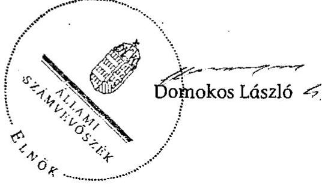

# JELENTÉS 

Délegyháza Község Önkormányzata belső kontrollrendszerének kialakítása, valamint egyes kontrolltevékenységek és a belső ellenőrzés múködése ellenőrzéséről

---

# Állami Számvevőszék 

Iktatószám: V-0012-058-018-031/2013.
Témaszám: 1051
Vizsgálat-azonosító szám: V059117
Az ellenőrzést felügyelte:
Dr. Benedek Mária
felügyeleti vezető
Az ellenőrzést vezette:
Szakmányné Bilik Mária
ellenőrzésvezető
A számvevőszéki jelentés összeállításában közremúködtek:
Dr. Csapó Anna
számvevő tanácsos
Groholy Andrásné Hangyál Márta
számvevő tanácsos
Az ellenőrzést végezték:
Dr. Csapó Anna
Vacsora Erika
számvevő tanácsos
számvevő tanácsos

---

# TARTALOMJEGYZÉK 

BEVEZETÉS ..... 5
I. ÖSSZEGZŐ MEGÁLLAPÍTÁSOK, KÖVETKEZTETÉSEK, JAVASLATOK ..... 8
II. RÉSZLETES MEGÁLLAPÍTÁSOK ..... 14

1. Az önkormányzat belső kontrollrendszere kialakításának megfelelősége ..... 14
1.1. A kontrollkörnyezet kialakítása ..... 14
1.2. A kockázatkezelési rendszer kialakítása ..... 14
1.3. A kontrolltevékenységek kialakítása ..... 15
1.4. Az információs és kommunikációs rendszer kialakítása ..... 15
1.5. A monitoring rendszer kialakítása ..... 16
2. A pénzügyi folyamatokban kulcsszerepet betöltő belső kontrollok (szakmai teljesítésigazolás és utalvány ellenjegyzés) múködése ..... 16
3. A belső ellenőrzés szervezeti keretei és múködése ..... 19

## FÜGGELÉKEK

1. számú Értelmező szótár
2. számú A belső kontrollrendszer kialakítása, a pénzügyi folyamatokban kulcsszerepet betöltő szakmai teljesítésigazolás és utalvány ellenjegyzés kontrollok múködése, valamint a belső ellenőrzés múködése értékelésénél alkalmazott minősítési szempontok

---

.

---

# RÖVIDÍTÉSEK JEGYZÉKE 

## Törvények

ÁSZ tv.
Avtv.

Info tv.

Mötv.

Ötv.
régi Áht.
Számv. tv.
új Áht.

## Rendeletek

Áhsz.

Ámr.
Ávr.

Ber.
Bkr.
önkormányzati SZMSZ

## Szórövidítések

aljegyző
ÁSZ
Belső ellenőrzési kézikönyv

2011. évi LXVI. törvény az Állami Számvevőszékről
1992. évi LXIII. törvény a személyes adatok védelméről és a közérdekú adatok nyilvánosságáról (hatálytalan 2012. január 1-jétől)
2011. évi CXII. törvény az információs önrendelkezési jogról és az információszabadságról (hatályos 2012. január 1-jétől)
2011. évi CLXXXIX. törvény Magyarország helyi önkormányzatairól (hatályos 2012. január 1-jétől)
1990. évi LXV. törvény a helyi önkormányzatokról
1992. évi XXXVIII. törvény az államháztartásról (hatálytalan 2012. január 1-jétől)
2000. évi C. törvény a számvitelről
2011. évi CXCV. törvény az államháztartásról (hatályos 2012. január 1-jétől)

249/2000. (XII. 24.) Korm. rendelet az államháztartás szervezetei beszámolási és könyvvezetési kötelezettségének sajátosságairól
292/2009. (XII. 19.) Korm. rendelet az államháztartás múködési rendjéről (hatálytalan 2012. január 1-jétől)
368/2011. (XII. 31.) Korm. rendelet az államháztartásról szóló törvény végrehajtásáról (hatályos 2012. január 1jétől)
193/2003. (XI. 26.) Korm. rendelet a költségvetési szervek belső ellenőrzéséről (hatálytalan 2012. január 1-jétől)
370/2011. (XII. 31.) Korm. rendelet a költségvetési szervek belső kontrollrendszeréről és belső ellenőrzéséről (hatályos 2012. január 1-jétől)
Délegyháza Község Önkormányzata 10/2011. (II. 16.) számú rendelete a Képviselő-testület Szervezeti és Müködési Szabályzatáról (hatályos 2011. február 16-ától)

Délegyháza Község Önkormányzatának jegyzőjét helyettesítette 2008. április 1-jétől 2010. április 30-áig
Állami Számvevőszék
Délegyháza Község Önkormányzatának jegyzője által kiadott Belső Ellenőrzési Kézikönyv (hatályos 2011. január 2-ától)

---

| Belső Kontroll Kézikönyv | Az Ámr. 155. § (1) bekezdése, valamint az államháztartási belső kontroll standardokról szóló 1/2009. (IX. 11.) PM irányelv egységes értelmezése érdekében az államháztartásért felelős miniszter által 2010. évben kiadott Belső Kontroll Kézikönyv |
| :--: | :--: |
| FEUVE | Folyamatba épített, előzetes, utólagos és vezetői ellenőrzés |
| hivatali SZMSZ | Délegyháza Község Önkormányzat Polgármesteri Hivatalának Szervezeti és Múködési Szabályzata (önkormányzati SZMSZ 5. számú melléklete hatályos 2011. február 16ától) |
| informatikai biztonsági   szabályzat | Délegyháza Község Önkormányzat Polgármesteri Hivatalának Informatikai biztonsági szabályzata (hatályos 2011. január 1-jétó) |
| jegyző | Délegyháza Község Önkormányzatának jegyzője |
| Képviselő-testület | Délegyháza Község Önkormányzatának Képviselőtestülete |
| Koncessziós szerződés | Koncessziós Szerződés Dunavarsány és Térsége víziközmúveinek üzemeltetésére, amely létrejött a RESONATOR Vállalkozási és Kereskedelmi Kft., Dunavarsány és Térsége Víziközmúveit üzemeltető Koncessziós Zrt., Dunavarsány Város, Taksony Nagyközség, Délegyháza, Áporka, Majosháza, Szigetszentmárton Községek Önkormányzatai, valamint Dunavarsány és Térsége Önkormányzati Szennyvíztársulás között 2007. október 24 -én |
| Koncessziós Társaság | Dunavarsány és Térsége Víziközműveit Üzemeltető Koncessziós Zrt. |
| kötelezettségvállalási szabályzat | Délegyháza Község Önkormányzat polgármestere és jegyzője által kiadott a Kötelezettségvállalás, érvényesítés, utalványozás, ellenjegyzés, valamint a szakmai teljesítésigazolás rendjének szabályzata (hatályos 2010. október 5 -étől) |
| Önkormányzat   polgármester   Polgármesteri Hivatal | Délegyháza Község Önkormányzata   Délegyháza Község Önkormányzatának polgármestere   Délegyháza Község Önkormányzatának Polgármesteri Hivatala |
| szabálytalanságkezelési   szabályzat | Délegyháza Község Önkormányzat Polgármesteri Hivatala Szervezeti és Müködési Szabályzatának 4. számú melléklete (hatályos 2011. február 16-ától) |
| Társulás | Csepel-Sziget és Környéke Többcélú Önkormányzati Társulás |

---

# JELENTÉS   Délegyháza Község Önkormányzata belső kontrollrendszerének kialakítása, valamint egyes kontrolltevékenységek és a belső ellenőrzés múködése ellenőrzéséről 

## BEVEZETÉS

A belső kontrollrendszer kialakítását, múködtetését és fejlesztését a régi Áht. és az új Áht. is előírja. Ennek megvalósításáért a költségvetési szerv vezetője felel. A belső kontrollrendszer azt a célt szolgálja, hogy a költségvetési szervek múködésük és gazdálkodásuk során a tevékenységeket szabályszerűen, gazdaságosan, hatékonyan, eredményesen hajtsák végre, teljesítsék elszámolási kötelezettségeiket és megvédjék az erőforrásokat a veszteségektől, a károktól és a nem rendeltetésszerú használattól. A belső kontrollrendszer magában foglalja mindazon szabályokat, eljárásokat, gyakorlati módszereket és szervezeti struktúrákat, kockázatkezelési technikákat, kontrolltevékenységeket, amelyek segítséget nyújtanak a szervezetnek céljai eléréséhez.

Az ÁSZ a 2011-2015. évekre szóló stratégiájában hangsúlyos szerepet szánt annak, hogy szilárd szakmai alapon álló, értékteremtő ellenőrzéseivel előmozdítsa a közpénzügyek átláthatóságát, rendezettségét. A számvevőszéki ellenőrzés nemzetközi alapelvei is rögzítik, hogy a megfelelő belső kontrollrendszer minimálisra csökkenti a hibák és szabálytalanságok kockázatát.

Az ellenőrzés célja annak értékelése volt, hogy az Önkormányzat a jogszabályi előírásoknak megfelelően alakította-e ki a belső kontrollrendszert; a gazdálkodás folyamatában kulcsszerepet betöltő szakmai teljesítésigazolás és az utalvány ellenjegyzés kontrolltevékenységeit megfelelően működtette-e; biztosí-totta-e a belső ellenőrzés szabályos és eredményes múködését.

Az ÁSZ ezen ellenőrzési céljait pilot (próba) jelleggel községi/nagyközségi önkormányzatoknál végzett ellenőrzések során érvényesítette.

Az ellenőrzés típusa: szabályszerűségi ellenőrzés
Az ellenőrzés jogszabályi alapja: az ÁSZ tv. 5. § (2) és (6) bekezdései
Az ellenőrzött szervezet: az Önkormányzat
Az ellenőrzött időszak: a belső kontrollrendszer kialakításának megfelelőségét a 2011. évre vonatkozóan értékeltük. A kontrolltevékenységek múködésének megfelelőségét a 2011. január 1-je és december 31-e, míg a belső ellenőrzés múködésének szabályosságát és eredményességét a 2009. január 1-je és 2011. december 31-e közötti időszakot figyelembe véve értékeltük. A helyszíni ellenőrzés lezárásáig a helyi szabályozás változásait nyomon követtük.

---

Az ellenőrzés szakmai módszertana az ÁSZ hivatalos honlapján (www.asz.hu) közzétett szakmai szabályokon alapult, amely a Legfőbb Ellenőrző Intézmények Nemzetközi Szervezete (INTOSAI) által kiadott nemzetközi standardok (ISSAI) figyelembevételével készült.

A belső kontrollrendszer kialakításának ellenőrzése során értékeltük a kontrollkörnyezet, a kockázatkezelési rendszer, a kontrolltevékenységek, az információs és kommunikációs rendszer, valamint a monitoring rendszer szabályozottságának megfelelőségét.

Értékeltük a pénzügyi folyamatokban kulcsszerepet betöltő szakmai teljesítésigazolás és utalvány ellenjegyzés kontrollok működésének megfelelőségét az államháztartáson kívülre teljesített múködési és felhalmozási célú pénzeszköz átadásoknál, az állományba nem tartozók megbízási díjainál, továbbá a külső szolgáltató által végzett karbantartási, kisjavítási munkákkal kapcsolatos kifizetéseknél. Az egyszerű véletlen mintavétellel kiválasztott tételek ellenőrzését többlépcsős megfelelőségi tesztek útján addig végeztük, amíg elegendő és megfelelő bizonyítékot szereztünk a vizsgált folyamatok kulcskontrolljai múködésének megfelelő vagy nem megfelelő voltáról. Értékeltük az Önkormányzatnál a belső ellenőrzés múködésének szabályosságát és eredményességét. Az ÁSZ a 2007-2010. években az Önkormányzatnál a gazdálkodás szabályszerűségére irányuló átfogó ellenőrzést nem végzett.

A fogalmak magyarázatát az 1. számú függelék, az ellenőrzés egyes területeinek értékelésénél alkalmazott egységes minősítési szempontokat a 2. számú függelék tartalmazza.

Az ellenőrzés lefolytatásához az Önkormányzat a munkalapok és a tanúsítvány elektronikus kitöltésével, valamint a megjelölt dokumentumok elektronikus megküldésével szolgáltatott adatokat. A munkalapokon szerepeltetett adatok, információk ellenőrzése és szükség szerinti javítása a helyszíni ellenőrzés keretében történt.

Az ÁSZ az ellenőrzés megállapításait az ellenőrzött időszakban hatályos, az intézkedést igénylő megállapításokra tett javaslatokat a jelenleg hatályos jogszabályok alapján fogalmazta meg.

Az ÁSZ tv. 29. § (1) bekezdése szerint a jelentéstervezetet megküldtük a polgármester részére, aki az ÁSZ tv. 29. § (2) bekezdésében foglalt észrevételezési jogával nem élt, a jelentéstervezetre észrevételt nem tett.

Délegyháza község állandó lakosainak száma 2011. január 1-jén 3366 fő volt. Az Önkormányzat héttagú Képviselő-testületének munkáját három állandó bizottság segítette. Az Önkormányzat az önállóan működő és gazdálkodó Polgármesteri Hivatalon felül négy intézménnyel látta el feladatát. Az Önkormányzat egy többségi tulajdoni hányadú gazdasági társasággal rendelkezett. A polgármester a 2010. évi önkormányzati választások óta tölti be tisztségét. A jegyző 2010. május 4 -étől látja el feladatait. Az ellenőrzött időszakban 2008. április 1-jétől 2010. április 30-ig a hivatali feladatok ellátását az aljegyző vezetésével biztosították. A Polgármesteri Hivatal kettő szervezeti egységre tagolódott: Igazgatási osztályra és Pénzügyi osztályra. A foglalkoztatott köztisztviselők száma 2011. január 1-jén 13 fő volt.

---

Az Önkormányzat a 2011. évi költségvetési beszámolója szerint 553838 ezer Ft költségvetési bevételt ért el, valamint 552110 ezer Ft költségvetési kiadást teljesített. A 2011. december 31-i könyvviteli mérleg szerint 3450252 ezer Ft értékű eszközvagyonnal rendelkezett, a rövid lejáratú kötelezettsége 39740 ezer Ft, a hosszú lejáratú kötelezettsége 85592 ezer Ft volt.

---

# I. ÖSSZEGZŐ MEGÁLLAPÍTÁSOK, KÖVETKEZTETÉSEK, JAVASLATOK 

#### Abstract

A belső kontrollrendszeren belül 2011-ben a Polgármesteri Hivatalban a kontrollkörnyezet, a kockázatkezelési rendszer, a kontrolltevékenységek, az információs és kommunikációs rendszer, valamint a monitoring rendszer szabályozását, illetve kialakítását külön-külön és összesítve is értékeltük. A belső kontrollrendszer kialakítása az összesített értékelés alapján nem felelt meg a jogszabályi előírásoknak. Az egyes területek kialakításának értékelését az alábbiakban részletezzük.

A kontrollkörnyezet kialakítása megfelelt a jogszabályi követelményeknek, mert a jegyző a jogszabályi előírásoknak megfelelő tartalommal elkészítette a Polgármesteri Hivatal múködését és gazdálkodását érintő legfontosabb szabályzatokat.

A kockázatkezelési rendszer kialakítása nem felelt meg a jogszabályi előírásoknak, mert a jegyző - az Ámr-ben ${ }^{1}$ foglaltak ellenére - nem határozta meg a Polgármesteri Hivatal tevékenységében és gazdálkodásában rejlő, az egyes kockázatokkal kapcsolatos intézkedéseket és megtételük módját.

A kontrolltevékenységek kialakítása részben felelt meg a jogszabályi előírásoknak. A jegyző a kontrollstratégiák és módszerek keretében szabályozta a FEUVE feladatait. Meghatározta az érvényesítés rendjét, szabályozta a szakmai teljesítésigazolás módját és kijelölte az érvényesítésre, illetve szakmai teljesítésigazolásra jogosultakat. Az Ámr. előírását figyelmen kívül hagyva nem határozta meg belső szabályzatban az előzetes írásbeli kötelezettségvállaláshoz nem kötött kifizetések rendjét. A jegyző - az Ámr. előírása ellenére - nem szabályozta a Polgármesteri Hivatal tevékenységére vonatkozó beszámolási eljárásokat.

Az információs és kommunikációs rendszer kialakítása a jogszabályi előírásoknak nem felelt meg, mert a jegyző - az Avtv. ${ }^{2}$ rendelkezése ellenére - elmulasztotta az adatbiztonság érvényre juttatásához szükséges intézkedések megtételét, mivel nem határozta meg a hozzáférési jogosultságok megállapítására, módosítására és azok ellenőrzésére vonatkozó eljárásrendet, és nem gondoskodott a hozzáférési jogosultságok nyilvántartásának vezetéséről. Nem szabályozta a pénzügyi-számviteli szoftverváltozások ellenőrzésére vonatkozó eljárásokat, a rendszerben feldolgozott adatok mentési eljárásait, és nem jelölte ki a mentések elvégzésének felelőseit.

A monitoring rendszer kialakítása a jogszabályi követelményeknek nem felelt meg, mert a jegyző - az Ámr.-ben foglaltak ellenére - az operatív tevékenységek keretében megvalósuló folyamatos és eseti nyomon követésből álló,

[^0]
[^0]:    ${ }^{1}$ 2012. január 1-jétől Ávr.
    ${ }^{2}$ 2012. január 1-jétől Info tv.

---

a Polgármesteri Hivatal tevékenységének, a célok megvalósításának nyomon követését biztosító rendszer szabályait nem határozta meg.

A belső kontrollrendszer nem megfelelő kialakítása kockázatot jelent az Önkormányzat tevékenységeinek szabályszerű, gazdaságos, hatékony és eredményes végrehajtásában.

A Polgármesteri Hivatalban a 2011. évben az államháztartáson kívülre történő működési célú pénzeszközátadásokkal, az állományba nem tartozók megbízási díjaival, valamint a külső szolgáltatók által végzett karbantartással, kisjavítással kapcsolatos kifizetések során összefoglalóan értékelve a kulcskontrollok múködésének megfelelősége gyenge volt.

A kiadások teljesítését megelőzően - az Ámr.-ben és a kötelezettségvállalási szabályzatban előírtak ellenére - a kifizetések jogosságának, összegszerűségének ellenőrzése, az ellenszolgáltatást is magukban foglaló kifizetések esetében a megállapodások, szerződések, megrendelések szakmai teljesítésének igazolása nem szabályszerűen történt, vagy nem történt meg. Az utalványok ellenjegyzője az Ámr.-ben foglalt ellenőrzési feladatait nem a jogszabályi előírásoknak megfelelően végezte. A kiadások teljesítését megelőzően annak ellenére aláírásával ellenjegyezte az utalványokat, hogy a szakmai teljesítésigazolásnak nem, vagy nem szabályszerűen tettek eleget, az érvényesítés nem a szakmai teljesítésigazoláson alapult. Az utalványok ellenjegyzője a gazdálkodásra - közöttük a kötelezettségvállalásokra és azok ellenjegyzésére, az előzetes írásbeli kötelezettségvállalást nem igénylő kifizetések nyilvántartására - vonatkozó szabályok betartásának hiánya ellenére az utalványokat aláírásával ellenjegyezte.

A főkönyvi számlát - a Számv. tv. és az Áhsz. előírásaitól eltérően - nem a gazdasági esemény tényleges tartalmának megfelelően jelölték ki, mert hibásan a külső szolgáltatók által végzett karbantartási, kisjavítási munkák kifizetései között számoltak el felújítási kiadást. A nem megfelelő elszámolás miatt a könyvvezetés során nem tartották be a Számv. tv.-ben előírt, a tartalom elsődlegessége a formával szemben számviteli alapelvet.

Az ellenőrzött kifizetésekkel összefüggésben a rendelkezésre bocsátott dokumentumok alapján jogosulatlan kifizetést nem tárt fel az ellenőrzésünk, azonban a gazdálkodásban kulcsszerepet betöltő kontrollok múködésében feltárt hiányosságok miatt fennáll a hibák bekövetkezésének lehetősége. A nem megfelelően szabályozott és múködtetett belső kontrollok korrupciós kockázatot is hordoznak.

Az Önkormányzat a belső ellenőrzési feladatokat a Társulás útján, valamint külső szakértő megbízásával látta el. Az Önkormányzatnál a 2009-2011. években a belső ellenőrzés szabályozása és múködése összességében megfelelt a jogszabályi előírásoknak. A belső ellenőrzés ellátásának módját, jogállását a 2009-2010. években a Képviselő-testület a Ber.-ben ${ }^{3}$ foglaltak ellenére nem határozta meg, a 2011. évben azokat a Képviselő-testület által jóváhagyott hiva-

[^0]
[^0]:    ${ }^{3}$ 2012. január 1-jétől Bkr.

---

tali SZMSZ-ben rögzítették. A 2009. évi ellenőrzési tervhez az aljegyző nem készített írásos előterjesztést, ezért a Képviselő-testület az Ötv.-ben ${ }^{4}$ foglalt előírás ellenére nem tudta jóváhagyni. A 2009. évben az ellenőrzések lefolytatásához a Ber.-ben ${ }^{5}$ foglaltak ellenére nem készült ellenőrzési program. A belső ellenőrzés által tett javaslatok végrehajtására az aljegyző intézkedési tervet készített. A Ber.-ben foglalt előírás ellenére a belső ellenőrzés elmulasztotta a megtett intézkedések nyomon követését, a belső ellenőrzési vezető nem alakította ki az intézkedések nyilvántartását, valamint az elvégzett belső ellenőrzésekről nem vezetett nyilvántartást. A belső ellenőrzés 2009. évi múködésében - az ellenőrzések tervezésénél és végrehajtásánál - feltárt hiányosságokat a 2010-2011. években megszüntették. A 2010. és a 2011. évben az éves ellenőrzési tervet a Képvi-selő-testület az előírt határidőig jóváhagyta. A jegyző a feltárt hibák, hiányosságok kijavítására határidőt, felelőst kijelölő intézkedési terveket készített. A belső ellenőrzési vezető az elvégzett belső ellenőrzésekről és a javaslatok alapján tett intézkedésekről nyilvántartást vezetett, a végrehajtásukról, a feltárt hiányosságok megszüntetéséről utóellenőrzés keretében győződött meg. A 2011. évi utóellenőrzés során megállapították, hogy a Polgármesteri Hivatalban a 2010. évi bank- és pénztárbizonylatok ellenőrzése keretében feltárt - így a szakmai teljesítésigazolásra és az utalványozásra vonatkozó - hiányosságok az utóellenőrzés időpontjában továbbra is fennálltak. Mindezek hozzájárultak az ellenőrzésünk során is feltárt szabályozási hiányosságok fennmaradásához, a hibák ismétlődéséhez.

Az Önkormányzatnál a 2009-2011. években a belső ellenőrzés múködése a 2. számú függelékben részletezett kritériumrendszer alapján végzett értékelés szerint - nem volt eredményes, annak ellenére, hogy a belső ellenőrzés szabályozása és működése az ellenőrzött időszak egészét tekintve a jogszabályi előírásoknak megfelelt. A belső ellenőrzés vizsgálta ugyan a jogszabályok alapján kötelezően elkészítendő szabályzatokat, valamint a gazdálkodási jogkörök gyakorlásához kapcsolódóan a belső kontrollok működését, azonban a pénzügyi folyamatokban kulcsszerepet betöltő belső kontrollok működésére irányuló belső ellenőrzés javaslatai teljes körűen nem hasznosultak, mert a jegyző által készített intézkedési tervekben foglaltakat az intézkedésre kötelezettek csak részben hajtották végre.

Az ÁSZ tv. 33. § (1) bekezdésében foglaltak értelmében az ellenőrzött szervezet vezetője köteles a jelentésben foglalt megállapításokhoz kapcsolódó intézkedési tervet összeállítani, és azt a jelentés kézhezvételétől számított 30 napon belül az ÁSZ részére megküldeni. Amennyiben az intézkedési tervet határidőre nem küldi meg a szervezet, vagy az - az ÁSZ tv. 33. § (2) bekezdésében foglalt póthatáridő eltelte ellenére - továbbra sem elfogadható, az ÁSZ elnöke a hivatkozott törvény 33. § (3) bekezdés a)-b) pontjaiban foglaltakat érvényesítheti.

[^0]
[^0]:    ${ }^{4}$ 2013. január 1-jétől Mötv.
    ${ }^{5}$ 2012. január 1-jétől Bkr.

---

Az ellenőrzés intézkedést igénylő megállapításai és javaslatai:

# a polgármesternek 

A kötelezettségvállalás dokumentumait - a régi Áht. 100/C. § (3) bekezdésében és az Ámr. 74. § (1) bekezdésben foglaltak ellenére - a kötelezettségvállalás előtt nem minden esetben ellenjegyezték.

Javaslat:
Intézkedjen arról, hogy az Önkormányzat nevében történő kötelezettségvállalásra az új Áht. 37. § (1) bekezdésében foglaltaknak megfelelően - az Ávr. 53. §-ában meghatározott kivételeket figyelembe véve - kizárólag a pénzügyi ellenjegyzés után, a pénzügyi teljesítés esedékességét megelőzően, írásban kerüljön sor.

## a jegyzőnek

1. a kockázatkezelési rendszerrel kapcsolatban:

A jegyző - az Ámr. 157. § (1)-(3) bekezdéseinek előírása ellenére - nem végzett kockázatelemzést, és nem határozta meg a Polgármesteri Hivatal tevékenységében az egyes kockázatokkal kapcsolatos intézkedéseket és megtételük módját.

Javaslat:
Mérje fel és állapítsa meg a Polgármesteri Hivatal tevékenységében, gazdálkodásában rejlő kockázatokat, valamint határozza meg az egyes kockázatokkal kapcsolatban szükséges intézkedéseket, valamint azok teljesítésének folyamatos nyomon követésének módját a Bkr. 3. § b) pontjának és 7. §-ának megfelelően.
2. a kontrolltevékenységekkel kapcsolatban:

A jegyző - az Ámr. 158. § (2) bekezdés d) pontjának előírása ellenére - nem szabályozta a Polgármesteri Hivatal tevékenységeire vonatkozó beszámolási eljárásokat. Az Ámr. 72. § (14) bekezdésében foglaltakat figyelmen kívül hagyva nem határozta meg belső szabályzatban az előzetes írásbeli kötelezettségvállaláshoz nem kötött kifizetések rendjét.

Javaslat:
a) Szabályozza a Bkr. 8. § (4) bekezdés c) pontja alapján a Polgármesteri Hivatal tevékenységeire vonatkozó beszámolási eljárásokat.
b) Gondoskodjon az Ávr. 53. § (2) bekezdésének megfelelően az előzetes írásbeli kötelezettségvállalást nem igénylő kifizetések rendjének belső szabályzatban történő meghatározásáról.
3. az információs és kommunikációs rendszerrel kapcsolatban:

A jegyző - az Avtv. 10. § (1)-(2) bekezdéseiben foglalt előírások ellenére - elmulasztotta az adatbiztonság érvényre juttatásához szükséges intézkedések megtételét,

---

nem határozta meg a hozzáférési jogosultságok megállapítására, módosítására és nyilvántartására, betartásuk ellenőrzésére vonatkozó eljárásrendet. Nem szabályozta a pénzügyi-számviteli szoftverváltozások ellenőrzésére vonatkozó eljárásokat, és nem jelölte ki a mentések felelőseit.

Javaslat:
Gondoskodjon az Info tv. 7. § (2)-(3) bekezdésének megfelelően az adatok biztonságáról, intézkedjen a hozzáférési jogosultságok megállapításáról, módosításáról és nyilvántartásáról, valamint a betartásuk ellenőrzésére vonatkozó eljárásrend meghatározásáról, továbbá szabályozza a pénzügyi-számviteli szoftverváltozások ellenőrzésére vonatkozó eljárásokat, és jelölje ki a mentések felelőseit.
4. a monitoring rendszerrel kapcsolatban:

A jegyző - az Ámr. 160. §-ában foglaltak ellenére - nem alakított ki olyan monitoring rendszert, amely lehetővé teszi a Polgármesteri Hivatal tevékenységének, a célok megvalósításának nyomon követését, és amelynek része az operatív tevékenységek keretében megvalósuló folyamatos és eseti nyomon követés is.

Javaslat:
Alakítsa ki és múködtesse a Bkr. 3. § e) pontjában és 10. §-ában előírtak alapján a Polgármesteri Hivatal tevékenységének, a célok megvalósításának nyomon követését biztosító rendszert, amelynek része az operatív tevékenységek keretében megvalósuló folyamatos és eseti nyomon követés is.
5. a pénzügyi folyamatokban kulcsszerepet betöltő kontrollok múködésével kapcsolatban:

Az államháztartáson kívülre teljesített múködési és felhalmozási célú pénzeszközátadások kifizetését megelőzően, a jegyző által kijelölt személyek nem az Ámr. 20. § (3) bekezdésében foglaltak alapján elkészített kötelezettségvállalási szabályzatban meghatározott előírások szerint végezték a szakmai teljesítés igazolását, mivel nem a szabályzat mellékletében előírt utalványrendeleten történt az igazolás. A régi Áht. 100/C. § (6) bekezdésében és az Ámr. 76. § (1) és (3) bekezdésében foglaltak ellenére a jegyző által a szakmai teljesítés igazolására kijelölt személyek az állományba nem tartozók megbízási díjainak kifizetését megelőzően nem végezték el, a külső szolgáltatók által végzett karbantartási, kisjavítási szolgáltatásokkal kapcsolatos kiadások teljesítését megelőzően pedig nem szabályszerűen végezték a kifizetések jogosságának, összegszerűségének ellenőrzését, valamint az ellenszolgáltatást is magukban foglaló kifizetések esetében a megállapodások, szerződések, megrendelések szakmai teljesítésének igazolását.

Az utalványok ellenjegyzője az Ámr. 79. § (2) bekezdésében foglalt ellenőrzési feladatait nem a jogszabályi előírásoknak megfelelően végezte, mert annak ellenére aláírásával ellenjegyezte a kiadásokat, hogy a szakmai teljesítésigazolás nem, vagy nem szabályszerűen történt, és az érvényesítés az Ámr. 77. § (1) bekezdésében foglaltak ellenére nem szakmai teljesítésigazoláson alapult.

Az utalványok ellenjegyzője aláírásával ellenjegyezte az utalványokat annak ellenére, hogy a Koncessziós szerződést és a megállapodást, valamint a megbízási szerződést

---

a régi Áht. 100/C. § (3) bekezdésében és az Ámr. 74. § (1) bekezdésében foglalt előírás ellenére a kötelezettségvállalás előtt nem ellenjegyezték. A külső szolgáltatók által végzett karbantartási, kisjavítási szolgáltatások kiadásai során - az Ámr. 72. § (14) bekezdésében foglaltakat figyelmen kívül hagyva - az előzetes írásbeli kötelezettségvállaláshoz nem kötött kifizetések rendjének belső szabályzatban történő rögzítése nélkül, írásbeli kötelezettségvállalás hiányában történtek kifizetések, amelyek során elmaradt a kötelezettségvállalásnak az Ámr. 72. § (14) és a 75. § (1) és (4) bekezdéseiben előírt nyilvántartásba vétele.

A Számv. tv. 16. § (3) bekezdésében, az Áhsz. 9. § (11) bekezdésében és a 9. számú melléklet 9. c) pontjában foglalt előírás ellenére - felújítási kiadás helyett - a külső szolgáltatók által végzett karbantartási, kisjavítási munkák kiadásai között számolták el a Koncessziós Társaságnak a szennyvíztelepi öntöző távvezeték átépítésével kapcsolatos kifizetéseket.

Javaslat:
Gondoskodjon - a szakmai teljesítés igazolása és az utalvány ellenjegyzése vonatkozásában feltárt hiányosságok megszüntetése, illetve az operatív gazdálkodás során a múködésbeli hibák megelőzése, feltárása és kijavítása érdekében - arról, hogy:
a) a teljesítésigazolásra kijelölt személyek az Ávr. 57. § (1) bekezdésében előírtaknak megfelelően ellenőrizhető okmányok alapján ellenőrizzék a kiadások teljesítésének jogosságát, összegszerűségét, ellenszolgáltatást is magában foglaló kötelezettségvállalás esetében a szerződés, megrendelés teljesítését, és azt az Ávr. 57. § (3) bekezdésében foglalt módon, dátummal, a teljesítés tényére történő utalással és aláírásukkal igazolják;
b) a kifizetéseket megelőzően az Ávr. 58. § (1) bekezdése szerint a teljesítésigazolás alapján - az Ávr. 57. § (3) bekezdése szerinti esetben annak hiányában is - az összegszerűségnek, a fedezet meglétének és a megelőző ügymenetben az új Áht., az Áhsz., az Ávr. előírásai és a belső szabályzatokban foglaltak betartásának az ellenőrzése történjen meg;
c) a kötelezettségvállalásra az új Áht. 37. § (1) bekezdésében foglaltaknak megfelelően az Ávr. 55. § (1) bekezdése szerint pénzügyi ellenjegyzést követően kerüljön sor, és a pénzügyi ellenjegyzés során győződjenek meg a kötelezettségvállalás tárgyával összefüggő szabad előirányzat rendelkezésre állásáról;
d) az előzetes írásbeli kötelezettségvállalást nem igénylő kifizetések és azok nyilvántartásba vétele az Ávr. 53. § (2) és az 56. § (1) bekezdésében előírtak szerint és a belső szabályzatban meghatározott módon történjen meg;
e) a gazdasági eseményeket a Számv. tv. 16. § (3) bekezdésében, az Áhsz. 9. § (11) bekezdésében és a 9. számú melléklet 9. c) pontjában foglaltaknak megfelelően tényleges tartalmuknak megfelelően könyveljék.

---

# II. RÉSZLETES MEGÁLLAPÍTÁSOK 

## 1. AZ ÖNKORMÁNYZAT BELSŐ KONTROLLRENDSZERE KIALAKÍTÁSÁNAK MEGFELELŐSÉGE

### 1.1. A kontrollkörnyezet kialakítása

A kontrollkörnyezet kialakítása a 2. számú függelékben részletezett kritériumrendszer alapján végzett értékelés szerint a Polgármesteri Hivatalban megfelelő volt, mert a jegyző a jogszabályi előírásoknak megfelelő tartalommal elkészítette a Polgármesteri Hivatal múködését és gazdálkodását érintő legfontosabb szabályzatokat.

A kontrollkörnyezet kialakítása során a jegyző az Ámr. 155. § (3) bekezdésének ${ }^{6}$ előírását figyelmen kívül hagyva az államháztartásért felelős miniszter által kiadott Belső Kontroll Kézikönyv ajánlásait nem hasznosította teljes körűen.

A kontrollkörnyezet kialakítása során a jegyző a Belső Kontroll Kézikönyv 1.6. pontjában foglaltakat figyelmen kívül hagyva nem intézkedett a szervezeti célokkal összhangban álló etikai értékek és az integritás kiemelt kezeléséről, nem határozta meg a köztisztviselőkkel szembeni etikai elvárásokat.

### 1.2. A kockázatkezelési rendszer kialakítása

A kockázatkezelési rendszer kialakítása a 2. számú függelékben részletezett kritériumrendszer alapján végzett értékelés szerint a Polgármesteri Hivatalban nem volt megfelelő, mert a jegyző az Ámr. 157. § (1)-(3) bekezdéseiben ${ }^{7}$ foglaltak ellenére kockázatelemzést nem végzett, az egyes kockázatokkal kapcsolatos intézkedéseket és megtételük módját nem határozta meg.

A kockázatkezelési rendszer kialakítása során a jegyző az Ámr. 155. § (3) bekezdésének előírását figyelmen kívül hagyva az államháztartásért felelős miniszter által kiadott Belső Kontroll Kézikönyv ajánlásait nem hasznosította teljes körűen.

A kockázatkezelési rendszer kialakítása során a jegyző:

- a Belső Kontroll Kézikönyv 2.1.3. pontjában foglaltakat figyelmen kívül hagyva nem alakította ki a kockázat-nyilvántartási rendszert, a vezetéséről nem gondoskodott;
- a Belső Kontroll Kézikönyv 2.2. pontjában foglaltakat figyelmen kívül hagyva nem gondoskodott arról, hogy az Önkormányzat tevékenységeit kockázati kitettség alapján rangsorolják;

[^0]
[^0]:    ${ }^{6}$ 2012. január 1-jétől a Bkr. 5. § (1) bekezdése
    ${ }^{7}$ 2012. január 1-jétől a Bkr. 3. § b) pontja és a Bkr. 7. §

---

- a Belső Kontroll Kézikönyv 2.4.1. pontjában foglalt ajánlást figyelmen kívül hagyva nem írta elő a kockázatkezelés teljes folyamatának felülvizsgálatát;
- a Belső Kontroll Kézikönyv 2.5.1. pontjában foglalt ajánlást figyelmen kívül hagyta, mert nem gondoskodott a csalás és a korrupció, mint kiemelt kockázatok értékeléséről és kezeléséről.

# 1.3. A kontrolltevékenységek kialakítása 

A kontrolltevékenységek kialakítása a 2. számú függelékben részletezett kritériumrendszer alapján végzett értékelés szerint a Polgármesteri Hivatalban részben volt megfelelő. A jegyző a kontrollstratégiák és módszerek keretében szabályozta a FEUVE feladatait, meghatározta az érvényesítés rendjét, szabályozta a szakmai teljesítésigazolás módját és kijelölte az érvényesítésre, illetve szakmai teljesítésigazolásra jogosultakat. A jegyző azonban a jogszabályi követelményeket nem érvényesítette teljes körűen.

A jegyző, mint a költségvetési szerv vezetője:

- az Ámr. 72. § (14) bekezdésében ${ }^{8}$ foglaltak ellenére nem szabályozta az előzetes írásbeli kötelezettségvállalást nem igénylő kifizetések rendjét annak ellenére, hogy a kötelezettségvállalási szabályzatban a kötelezettségvállalás fogalmának meghatározása során lehetővé tették a szóbeli kötelezettségvállalást;
- az Ámr. 158. § (2) bekezdés d) pontjának ${ }^{9}$ előírása ellenére nem szabályozta a Polgármesteri Hivatal tevékenységeire vonatkozó beszámolási eljárásokat.

A kontrolltevékenységek kialakítása során a jegyző az Ámr. 155. § (3) bekezdésének előírását figyelmen kívül hagyva az államháztartásért felelős miniszter által kiadott Belső Kontroll Kézikönyv ajánlásait nem hasznosította teljes körűen.

A kontrolltevékenységek kialakítása során a jegyző:

- a Belső Kontroll Kézikönyv 3.2.1. pontjában foglaltakat nem vette figyelembe, a köztisztviselők munkaköri leírásaiban nem határozta meg az ellenőrzési feladataikat;
- a Belső Kontroll Kézikönyv 3.2.3. pontjában foglaltakat figyelmen kívül hagyva nem mérte fel a kis létszámból adódó kockázatokat az összeférhetetlenség kiküszöbölése érdekében.

### 1.4. Az információs és kommunikációs rendszer kialakítása

Az információs és kommunikációs rendszer kialakítása a 2. számú függelékben részletezett kritériumrendszer alapján végzett értékelés szerint a Polgármesteri Hivatalban nem volt megfelelő, mert a jegyző az informatikai rendszer környezetének szabályozása során - az Avtv. 10. § (1)-(2) bekezdéseiben ${ }^{10}$ foglalt előírások ellenére - elmulasztotta az adatbiztonság érvényre juttatásához szükséges intézkedések megtételét. Nem határozta meg a hozzáférési

[^0]
[^0]:    ${ }^{8}$ 2012. január 1-jétől az Ávr. 53. § (2) bekezdése
    ${ }^{9}$ 2012. január 1-jétől a Bkr. 8. § (4) bekezdés c) pontja
    ${ }^{10}$ 2012. január 1-jétől az Info tv. 7. § (2)-(3) bekezdései

---

jogosultságok megállapítására, módosítására, nyilvántartására és azok ellenőrzésére vonatkozó eljárásrendet. Nem szabályozta a pénzügyi-számviteli szoftverváltozások ellenőrzésére vonatkozó eljárásokat, és nem jelölte ki a mentések elvégzésének felelőseit.

Az információs és kommunikációs rendszer kialakítása során a jegyző az Ámr. 155. § (3) bekezdésének előírását figyelmen kívül hagyva az államháztartásért felelős miniszter által kiadott Belső Kontroll Kézikönyv ajánlásait nem hasznosította teljes körűen.

Az információs és kommunikációs rendszer kialakítása során a jegyző:

- a Belső Kontroll Kézikönyv 4.1.1. pontjában foglalt ajánlást figyelmen kívül hagyva nem szabályozta a szervezeten belüli, valamint a szervezeten kívülre történő információátadás módját és formáit, illetve a kívülről érkező információk kezelésének rendjét, az információáramlás dokumentálási kötelezettségét;
- az iktatási, iratkezelési rendszer kialakítása során a Belső Kontroll Kézikönyv 4.2.4. pontjában foglalt ajánlást figyelmen kívül hagyva nem szabályozta az ügyintézési határidők nyomon követésének dokumentálását és a késedelmes ügyintézés jelzéséért való felelősség rendjét;
- a Belső Kontroll Kézikönyv 4.3.3. pontjában foglaltakat figyelmen kívül hagyva nem rögzítette a szabálytalanságot bejelentő védelmére vonatkozó előírásokat és kötelezettségeket.

# 1.5. A monitoring rendszer kialakítása 

A monitoring rendszer kialakítása a Polgármesteri Hivatalban nem volt megfelelő, mert a jegyző az Ámr. 160. §-ában ${ }^{11}$ foglaltak ellenére az operatív tevékenységek keretében megvalósuló folyamatos és eseti nyomon követésből álló, a Polgármesteri Hivatal tevékenységének, a célok megvalósításának nyomon követését biztosító rendszert nem alakította ki.

A belső kontrollrendszer kialakítása a Polgármesteri Hivatalban 2011-ben a kontrollkörnyezet, a kockázatkezelési rendszer, a kontrolltevékenységek és a monitoring rendszer kialakításának, illetve az információs és kommunikációs rendszer szabályozásának értékelése alapján összességében nem felelt meg a jogszabályi előírásoknak.

## 2. A PÉNZÜGYI FOLYAMATOKBAN KULCSSZEREPET BETÖLTŐ BELSŐ KONTROLLOK (SZAKMAI TELJESÍTÉSIGAZOLÁS ÉS UTALVÁNY ELLENJEGYZÉS) MÜKÖDÉSE

A Polgármesteri Hivatalban a 2011. évben az államháztartáson kívülre teljesített múködési és felhalmozási célú pénzeszközátadások között elszámolt kiadások teljesítése során a szakmai teljesítésigazolás és az utalvány ellenjegyzés kulcskontrollok múködésének megfelelősége gyenge

[^0]
[^0]:    ${ }^{11}$ 2012. január 1-jétől a Bkr. 3. § e) pontja és a Bkr. 10. §-a

---

volt, mert a Koncessziós Társaságnak a szervizautó finanszírozására átadott pénzeszköz kifizetését megelőzően

- a jegyző által kijelölt személyek nem az Ámr. 20. § (3) bekezdésében ${ }^{12}$ foglaltak alapján elkészített kötelezettségvállalási szabályzatban meghatározottak szerint végezték a szakmai teljesítés igazolását, mert nem a szabályzat mellékletében előírt utalványrendeleten történt az igazolás;
- az utalványok ellenjegyzője az Ámr. 79. § (2) bekezdésében ${ }^{13}$ foglalt ellenőrzési feladatait nem a jogszabályi előírásoknak megfelelően végezte, mert annak ellenére aláírásával ellenjegyezte a kiadásokat, hogy a szakmai teljesítésigazolás és az érvényesítés nem szabályszerűen történt;
- az utalványok ellenjegyzője aláírásával ellenjegyezte az utalványokat annak ellenére, hogy a Koncessziós szerződést és a szervizautók finanszírozására kötött megállapodást a régi Áht. 100/C. § (3) bekezdésében ${ }^{14}$ és az Ámr. 74. § (1) bekezdésében ${ }^{15}$ foglalt előírás ellenére a kötelezettségvállalás előtt nem ellenjegyezték.

A Polgármesteri Hivatalban a 2011. évben az állományba nem tartozók megbízási díjainak kifizetése során a szakmai teljesítésigazolás és az utalvány ellenjegyzés kulcskontrollok müködésének megfelelősége gyenge volt, mert a Délegyházi hírek újság kihordásához és a népszámlálás számlálóbiztosi feladataihoz kapcsolódó kifizetéseket megelőzően

- a szakmai teljesítésigazolásra a jegyző által kijelölt személyek a régi Áht. 100/C. § (6) bekezdésében ${ }^{16}$ és az Ámr. 76. § (1) bekezdésében ${ }^{17}$ foglalt ellenőrzési feladataikat nem látták el, a kifizetés jogosságát, összegszerűségét, a megbízási szerződésben foglalt feladatok elvégzésének teljesítését nem ellenőrizték, a bizonylatokon az ellenőrzés megtörténtét - az Ámr. 76. § (3) bekezdésében ${ }^{18}$ foglaltak ellenére - aláírásukkal, az igazolás dátumának feltüntetésével, valamint a teljesítés tényére történő utalás megjelölésével nem igazolták;
- az utalványok ellenjegyzője az Ámr. 79. § (2) bekezdésében foglalt ellenőrzési feladatait nem a jogszabályi előírásoknak megfelelően végezte, mert annak ellenére aláírásával ellenjegyezte a kiadásokat, hogy a szakmai teljesítésigazolás nem történt meg, az érvényesítés az Ámr. 77. § (1) bekezdésében ${ }^{19}$ foglaltak ellenére nem szakmai teljesítésigazoláson alapult;

[^0]
[^0]:    ${ }^{12}$ 2012. január 1-jétől az Ávr. 13. § (2) bekezdése
    ${ }^{13}$ 2012. január 1-jétől az új Áht. 38. § (1) bekezdése és az 58. § (1) bekezdései
    ${ }^{14}$ 2012. január 1-jétől az új Áht. 37. § (1) bekezdése
    ${ }^{15}$ 2012. január 1-jétől az Ávr. 55. § (1) bekezdése
    ${ }^{16}$ 2012. január 1-jétől az új Áht. 38. § (1) bekezdése
    ${ }^{17}$ 2012. január 1-jétől az Ávr. 57. § (1) bekezdése
    ${ }^{18}$ 2012. január 1-jétől az Ávr. 57. § (3) bekezdése
    ${ }^{19}$ 2012. január 1-jétől az Ávr. 58. § (1) bekezdése

---

- az utalványok ellenjegyző̉e aláírásával ellenjegyezte az utalványokat annak ellenére, hogy a megbízási szerződéseket a régi Áht. 100/C. § (3) bekezdésében és az Ámr. 74. § (1) bekezdésében foglaltak ellenére nem ellenjegyezték.

A Polgármesteri Hivatalban a 2011. évben a külső szolgáltatók által végzett karbantartási, kisjavítási szolgáltatások kiadásai során a szakmai teljesítésigazolás és az utalvány ellenjegyzés kulcskontrollok múködésének megfelelősége gyenge volt, mert a Polgármesteri Hivatalban a csatornahálózat karbantartás, a szennyvítelepi öntöző távvezeték átépítés, az ékszíívásárlás és a kerékcsere ellenértékének kifizetéseit megelőzően

- a szakmai teljesítésigazolásra a jegyző által kijelölt személyek nem szabályszerűen végezték el az Ámr. 76. § (1) bekezdésében foglalt ellenőrzési feladataikat, mivel a szennyvítelepi öntöző távvezeték átépítéssel kapcsolatos írásbeli kötelezettségvállalás az Ámr. 74. § (1) bekezdésének előírása ellenére, valamint az előzetes írásbeli kötelezettségvállalást nem igénylő csatornahálózat karbantartással, ékszíívásárlással, kerékcserével kapcsolatos kifizetéseket elrendelő belső intézkedés dokumentumai az Ámr. 75. § (4) bekezdésében ${ }^{20}$ foglaltak ellenére nem álltak rendelkezésre, így dokumentumok hiányában nem volt ellenőrizhető a teljesítés jogossága és az elszámolás összegszerűsége;
- az utalványok ellenjegyzője az Ámr. 79. § (2) bekezdésében foglalt ellenőrzési feladatait nem a jogszabályi előírásoknak megfelelően végezte, mert annak ellenére aláírásával ellenjegyezte a kiadásokat, hogy a szakmai teljesítésigazolás nem szabályszerűen történt, mivel a szakmai teljesítésigazoló a kiadások teljesítését megelőzően nem ellenőrizte a teljesítés jogosságát és összegszerűségét, és az érvényesítés az Ámr. 77. § (1) bekezdésében foglaltak ellenére nem szakmai teljesítésigazoláson alapult;
- az utalványok ellenjegyzője aláírásával ellenjegyezte az utalványokat annak ellenére, hogy a régi Áht. 100/C. § (3) bekezdésében ${ }^{21}$ és az Ámr. 74. § (1) bekezdésében foglaltak ellenére a szennyvítelepi öntöző távvezeték átépítéssel kapcsolatos írásbeli kötelezettségvállalás és annak ellenjegyzése nem történt meg. A csatornahálózat karbantartás, az ékszíívásárlás és a kerékcsere kifizetéseknél elmaradt az Ámr. 75. § (4) bekezdésében előírt kötelezettségvállalás nyilvántartásba vétele.

A Számv. tv. 16. § (3) bekezdésében, az Áhsz. 9. § (11) bekezdésében és a 9. számú mellékletének a számlaosztályok tartalmára vonatkozó előírásai 9. c) pontjában foglalt előírások ellenére - felújítási kiadás helyett - a külső szolgáltatók által végzett karbantartási, kisjavítási munkák kiadásai között számolták el a Koncessziós Társaságnak a szennyvítelepi öntöző távvezeték átépítésével kapcsolatos kifizetéseket. A könyvvezetésben a nem megfelelő számlakijelölés és elszámolás miatt nem tartották be a Számv. tv. 16. § (3) bekezdésében előírt a tartalom elsődlegessége a formával szemben számviteli alapelvet.

[^0]
[^0]:    ${ }^{20}$ 2012. január 1-jétől az Ávr. 53. § (1) bekezdése
    ${ }^{21}$ 2012. január 1-jétől az új Áht. 38. § (1) bekezdése

---

A Polgármesteri Hivatalban a 2011. évben a pénzügyi folyamatokban kulcsszerepet betöltő belső kontrollok működésében feltárt hiányosságokkal összefüggésben az ellenőrzésünk - az ellenőrzött tételek vonatkozásában a rendelkezésre bocsátott dokumentumok alapján - kár bekövetkeztére utaló adatot, tényt nem állapított meg.

# 3. A BELSŐ ELLENŐRZÉS SZERVEZETI KERETEI ÉS MŰKÖDÉSE 

Az Önkormányzat a 2009-2010. években a belső ellenőrzési feladatokat a Társuláshoz történt csatlakozással, valamint külső szakértő megbízásával látta el. A belső ellenőrzést végző személy vagy szervezet jogállását, feladatait a 2009-2010. években - a Ber. 4. § (2) bekezdésében ${ }^{22}$ foglaltak ellenére - a hivatali SZMSZ-ben nem írták elő, azokat a 2011. évben a Képviselőtestület által jóváhagyott hivatali SZMSZ-ben rögzítették. Az Önkormányzat rendelkezett a belső ellenőrzési vezető által jóváhagyott - a Ber.-nek megfelelő tartalmú - Belső ellenőrzési kézikönyvvel. A 2011. évtől a külső szakértő látta el - a hivatali SZMSZ-ben foglaltak szerint - a belső ellenőrzési vezető feladatait.

Az Önkormányzatnál a 2009. évben a belső ellenőrzés múködése a jogszabályi előírásoknak nem felelt meg, mert a kockázatelemzéssel megalapozott, az aljegyző írásos véleményének figyelembevételével összeállított éves ellenőrzési tervhez az aljegyző nem készített írásos előterjesztést, ezért az éves ellenőrzési tervet a Képviselő-testület az Ötv. 92. § (6) bekezdésében ${ }^{23}$ foglalt előírás ellenére nem tudta jóváhagyni.

A Társulás által készített ellenőrzési tervben a 2009. évben öt ellenőrzés végrehajtását tervezték.

A Polgármesteri Hivatalnál a kötelezettségvállalások, az iktatási rendszer, az óvodai étkeztetés, a családi napközi múködtetés ellenőrzését, valamint az informatikai rendszerek nyilvántartásának utóellenőrzését tervezték.

A 2009. évben az ellenőrzések lefolytatásához a Ber. 23. § (1) bekezdésében ${ }^{24}$ foglaltak ellenére nem készült ellenőrzési program. A 2009. évre tervezett öt vizsgálat közül a Polgármesteri Hivatalnál a kötelezettségvállalások, valamint az óvodai étkeztetés ellenőrzését elvégezték, három ellenőrzés elmaradt. A Társulás - az elmaradt ellenőrzések kapcsán - a Ber. 32/B. § (6) bekezdésében ${ }^{25}$ foglaltak ellenére nem kezdeményezte az ellenőrzési terv módosítását. Soron kívüli ellenőrzés volt a Polgármesteri Hivatalnál a pénzügyi-szabályszerűségi ellenőrzés, amelynek során az alapító okirat, a hivatali SZMSZ, a FEUVE, a számviteli és pénzügyi szabályzatok felülvizsgálatát és az informatikai biztonsági szabályzat elkészítését javasolták. Az ellenőrzési jelentésekben tett javaslatok végrehajtására az aljegyző intézkedési tervet készített. A belső ellenőrzés a Ber. 8. § f) pontjában ${ }^{26}$ foglalt előírás ellenére elmulasztotta a megtett intézke-

[^0]
[^0]:    ${ }^{22}$ 2012. január 1-jétől a Bkr. 15. § (2) bekezdése
    ${ }^{23}$ 2013. január 1-jétől a Mötv. 119. § (5) bekezdése
    ${ }^{24}$ 2012. január 1-jétől a Bkr. 33. § (2) bekezdése
    ${ }^{25}$ 2012. január 1-jétől a Bkr. 56. § (5) bekezdése
    ${ }^{26}$ 2012. január 1-jétől a Bkr. 21. § (2) bekezdés d) pontja

---

dések nyomon követését, a belső ellenőrzési vezető a Ber. 12. § n) pontjában foglalt ${ }^{27}$ előírást figyelmen kívül hagyva nem alakította ki az intézkedések nyilvántartását, valamint az elvégzett belső ellenőrzésekről a Ber. 32. § (1) bekezdésében ${ }^{28}$ foglaltak ellenére nem vezetett nyilvántartást.

Az Önkormányzatnál a 2010. és a 2011. években a belső ellenőrzés múködése a jogszabályi előírásoknak jól megfelelt. A belső ellenőrzés 2009. évi múködésében - az ellenőrzések tervezésénél és végrehajtásánál - feltárt hiányosságokat a 2010-2011. években megszüntették.

A Képviselő-testület által elfogadott ellenőrzési tervben a 2010. évben három ellenőrzés végrehajtását tervezték.

Az általános iskolában és az óvodában a normatív állami támogatások és hozzájárulások elszámolásának, valamint a családi napközi múködtetés gazdaságosságának ellenőrzését tervezték.

A Képviselő-testület által elfogadott 2010. évi ellenőrzési tervet a jegyző kezdeményezésére módosították.

A módosítást az indokolta, hogy az Önkormányzatnál a belső ellenőrzésre vonatkozó igények teljesítésére külső szakértő bevonására volt szükség, és az eredetileg tervezetthez képest további nyolc ellenőrzést terveztek. A 2010. évi költségvetés és a 2009. évi zárszámadás szabályszerűségének, az óvodai és iskolai konyha kihasználtságának, a 2010. évi bank- és pénztárbizonylatoknak az ellenőrzését, a Polgármesteri Hivatal pénzügyi-gazdasági ellenőrzését, a civil szervezetek támogatásának, a közbeszerzéseknek a vizsgálatát és a 2009. évben végrehajtott ellenőrzéseknek az utóvizsgálatát tervezték.

A 2010. évre tervezett ellenőrzéseket végrehajtották.
A Képviselő-testület által elfogadott 2011. évi ellenőrzési tervben két ellenőrzést a Társulás, tíz ellenőrzést a külső szakértő bevonásával terveztek.

A Társulásnál tervezték az általános iskolában az OKÉV szakértő bevonásával végzett ellenőrzést, valamint a tankönyvelszámolás vizsgálatát. Külső szakértő igénybevételével tervezték a Polgármesteri Hivatal átfogó pénzügyi-gazdasági ellenőrzését, a 2010. évi kötött felhasználású, illetve a feladatmutatóhoz kötött normatív állami támogatások alakulásának, a 2011. évi költségvetés és zárszámadás szabályszerűségének, az óvoda és általános iskola kihasználtságának, a 2011. évi bank- és pénztárbizonylatoknak, a civil szervezetek támogatásának, a közbeszerzések lebonyolításának és az EU-s forrásokból megvalósított feladatoknak az ellenőrzését.

A 2011. évben a Társulás éves terve szerinti kettő, a külső szakértő által tervezett tíz, valamint az egy soron kívüli ellenőrzést végrehajtották.

A soron kívüli ellenőrzés a 2011. évben az általános iskolában a napközis napló ellenőrzése volt.

[^0]
[^0]:    ${ }^{27}$ 2012. január 1-jétől a Bkr. 47. § (1) és (2) bekezdése
    ${ }^{28}$ 2012. január 1-jétől a Bkr. 50. § (1) bekezdése

---

Az ellenőrzések során büntető-, szabálysértési, kártérítési, vagy fegyelmi eljárás megindítására okot adó cselekményt nem tártak fel.

A jegyző a feltárt hibák, hiányosságok kijavítására határidőt és felelőst kijelölő intézkedési terveket készített. A belső ellenőrzési vezető (a hivatali SZMSZ szerint a külső szakértő) az elvégzett belső ellenőrzésekről és a javaslatok alapján tett intézkedésekről nyilvántartást vezetett. A 2010. évben végzett ellenőrzések javaslatainak végrehajtásáról, a feltárt hiányosságok megszüntetéséről a belső ellenőrzés a 2011. évben utóellenőrzés keretében győződött meg. Ennek során megállapították, hogy az ellenőrzöttek három esetben az intézkedési tervben foglaltakat nem, illetve részben hajtották végre.

Az óvodai és iskolai konyha kihasználtságának ellenőrzéséhez készült intézkedési tervben foglaltakat az intézmény vezetője részben hajtotta végre. Továbbra sem rendelkeztek a konyha üzemeltetésére vonatkozó múködési engedéllyel, valamint a javaslat ellenére nem történt meg év végén a leltárak kiértékelése. A Polgármesteri Hivatalban a 2010. évi bank- és pénztárbizonylatok ellenőrzése során feltárt - így a szakmai teljesítésigazolásra és az utalványozásra vonatkozó - hiányosságok az utóellenőrzés időpontjában továbbra is fennálltak.

A Képviselő-testület a belső ellenőrzésekről készített éves összefoglaló ellenőrzési jelentéseket határozattal ${ }^{29}$ elfogadta.

Az Önkormányzatnál a 2009-2011. években a belső ellenőrzés múködése a 2. számú függelékben részletezett kritériumrendszer alapján végzett értékelés szerint - nem volt eredményes, annak ellenére, hogy a belső ellenőrzés szabályozása és múködése az ellenőrzött időszak egészét tekintve a jogszabályi előírásoknak megfelelt. A belső ellenőrzés vizsgálta ugyan a jogszabályok alapján kötelezően elkészítendő szabályzatokat, valamint a gazdálkodási jogkörök gyakorlásához kapcsolódóan a belső kontrollok múködését, azonban a pénzügyi folyamatokban kulcsszerepet betöltő belső kontrollok múködésére irányuló belső ellenőrzés javaslatai nem hasznosultak teljes körűen, mert a jegyző által készített intézkedési tervekben foglaltakat az intézkedésre kötelezettek csak részben hajtották végre. Mindezek hozzájárultak a számvevőszéki ellenőrzés során is feltárt múködési hiányosságok, hibák ismétlődéséhez.

Budapest, 2013.
P $<$
hónap $t \subsetneq$ nap

[^0]
[^0]:    ${ }^{29}$ A Képviselő-testület 151/2011. (IV. 19.) számú határozata a 2010. évi és a 96/2012. (IV. 23.) számú határozata a 2011. évi belső ellenőrzésről szóló beszámoló elfogadásáról.

---

# ÉRTELMEZŐ SZÓTÁR 

belső ellenőrzés
belső kontrollrendszer
belső kontrollrendszer területei
integritás
kockázat
kockázatkezelési rendszer
kontrollkörnyezet

Független, tárgyilagos bizonyosságot adó és tanácsadó tevékenység, amelynek célja, hogy az ellenőrzött szervezet múködését fejlessze és eredményességét növelje, az ellenőrzött szervezet céljai elérése érdekében rendszerszemléletű megközelítéssel és módszeresen értékeli, illetve fejleszti az ellenőrzött szervezet irányítási és belső kontrollrendszerének hatékonyságát. (A régi Áht. 121/B. § (1) bekezdés és a Bkr. 2. § b) pontjából levezetett meghatározás.)
A belső kontrollrendszer a kockázatok kezelése és tárgyilagos bizonyosság megszerzése érdekében kialakított folyamatrendszer, amely azt a célt szolgálja, hogy a múködés és gazdálkodás során a tevékenységeket szabályszerűen, gazdaságosan, hatékonyan, eredményesen hajtsák végre, az elszámolási kötelezettségeket teljesítsék, megvédjék az erőforrásokat a veszteségektől, károktól és nem rendeltetésszerű használattól. (A régi Áht. 121. § (1) és az új Áht. 69. § (1) bekezdéséből levezetett fogalom.)
A kontrollkörnyezet, a kockázatkezelési rendszer, a kontrolltevékenységek, az információ és kommunikáció, valamint a nyomon követés (monitoring). (A régi Áht. 121. § (2) bekezdéséből és a Bkr. 3. §-ából levezetett fogalom.)
Az integritás elvek, értékek, cselekvések, módszerek, intézkedések, konzisztenciáját jelenti: olyan magatartásmódot, amely meghatározott értékeknek felel meg. Az integritás a közszféra esetében a társadalom által elvárt nyilvánossági, átláthatósági, illetve jogi/etikai normáknak történő megfelelést jelenti. (A http://integritas.asz.hu honlapon között „Integritás jelentés 2011" című dokumentum 5. oldal 1. bekezdés.)
Az a lehetőség, hogy egy olyan esemény történik meg, amely negatívan hat a célok elérésére. (ÁSZ Ellenőrzési kézikönyv 6/139-140.oldal)
Olyan irányítási eszközök és módszerek összessége, melynek elemei a szervezeti célok elérését veszélyeztető tényezők (kockázatok) azonosítása, elemzése, csoportosítása, nyomon követése, valamint szükség esetén a kockázati kitettség mérséklése. (2012. január 1-jétől a Bkr. 2. § m) pontjában meghatározott fogalom)
A kontrollkörnyezet alakítja ki a szervezet belső kontrollrendszerhez való viszonyát, hozzáállását, befolyásolja az alkalmazottak belső kontrollal kapcsolatos tudatosságát, magatartását. Elemei a személyes és szakmai elkötelezettség és a vezetés, valamint az alkalmazottak által vallott erkölcsi értékek; a szakmai hozzáértés iránti elkötelezettség; a felső vezetés hozzáállása - a vezetés filozófiája és tevékenységének stílusa; a szervezeti struktúra; a humánerőforrás-politika és gazdálkodási gyakorlat. (ÁSZ Ellenőrzési kézikönyv 6/107. oldal)

---

kontrolltevékenységek
kommunikáció
korrupció
kulcskontrollok
lényegesség
monitoring
utóellenőrzés
véletlen minta

A kontrolltevékenységek azok a politikák és eljárások, amelyeket a kockázatok megoldására hoznak létre a szervezet céljainak teljesítése érdekében. (ÁSZ Ellenőrzési kézikönyv 6/108-109. oldal)
Az a tevékenység, melynek során információ továbbítása valósul meg. A kommunikációs folyamat résztvevői között tájékoztatás történik, mely során tényeket, ezek magyarázatát közlik. „A szervezetben eredményes kommunikációnak kell áramlania lefelé, horizontálisan és felfelé, a szervezet egészében és annak valamennyi elemében." (ÁSZ Ellenőrzési kézikönyv 6/112. oldal)
A közhatalmi pozíció bármilyen erkölcstelen felhasználása személyes, vagy magáncélú előnyök megszerzése érdekében. (ÁSZ Ellenőrzési kézikönyv 6/84. oldal)
Az önkormányzatok kontrollrendszere kialakításának ellenőrzése során a pénzügyi folyamatokban kulcsszerepet betöltő belső kontrollok a szakmai teljesítésigazolás és utalvány ellenjegyzés. (ÁSZ Módszertani útmutató az átfogó ellenőrzéshez 2.2. pontja alapján meghatározott fogalom.)

Egy információ akkor lényeges, ha hiánya vagy téves állítása befolyásolhatja ezen információkat felhasználók döntéseit, véleményét. Az ellenőrzés során a lényegesség három szempontból értelmezhető: érték, jelleg és összefüggés szerint. (ÁSZ Ellenőrzési kézikönyv 6/122-123. oldal)
A monitoring a különböző szintű szervezeti célok megvalósításának folyamatát kíséri figyelemmel, melynek során a releváns eseményekről és tevékenységekről (együtt: folyamatokról) rendszeres jelleggel, strukturált, döntéstámogató információkhoz jutnak a szervezet vezetői. (NGM útmutató a költségvetési szervek monitoring rendszeréhez 3. oldal, 2011. november, 2012. január 1-jétől a Bkr. 3. § e) pontja nyomon követési rendszerként azonosítja.)
Az intézkedések nyomon követése érdekében elrendelt ellenőrzés, amelynek célja, hogy a belső ellenőrzés bizonyosságot szerezzen az elfogadott intézkedések végrehajtásáról, vagy arról a tényről, hogy ha az ellenőrzött szerv, illetve az ellenőrzött szervezeti egység vezetője nem, vagy nem az elfogadott intézkedésnek megfelelően hajtja végre a feladatokat, továbbá meggyőződni arról, hogy a végrehajtott intézkedésekkel a megállapított kockázat ténylegesen megszűnt, vagy a kockázati túréshatár alá csökkent. (2012. január 1-jétől a Bkr. 2. § s) pontjában meghatározott fogalom.)
Az alapsokaságot képviselő (reprezentáló) véletlenszerűen kiválasztott részsokaság. (ÁSZ Ellenőrzési kézikönyv 6/71. oldal)

---

# A belső kontrollrendszer kialakítása, a pénzügyi folyamatokban kulcsszerepet betöltő szakmai teljesítésigazolás és utalvány ellenjegyzés kontrollok múködése, valamint a belső ellenőrzés múködése értékelésénél alkalmazott minősítési szempontok 

## 1. A BELSŐ KONTROLLRENDSZER MINŐSÍTÉSE

Az ellenőrzés során először a belső kontrollrendszer területeinek (kontrollkörnyezet, kockázatkezelés, kontrolltevékenységek, információs és kommunikációs rendszer, monitoring rendszer) minősítését külön-külön elvégeztük. A megfelelőség minősítése a belső kontrollrendszer kialakítására vonatkozó kérdéseket tartalmazó munkalapokon, az elérhető és az elért pontokból kimunkált képlet alapján, számítógépes program segítségével történt.

A belső kontrollrendszer egyes területei kialakítása megfelelőségének értékelésére - az elért és elérhető pontok figyelembevételével - sávos rendszer alapján „nem megfelelő", „részben megfelelő" és „megfelelő" minősítést alkalmaztunk.

A vizsgált önkormányzat belső kontrollrendszerének egy-egy területe - az elért pontszámtól függetlenül - „nem megfelelő" értékelést kapott, ha nem teljesítette az alábbi kritériumok bármelyikét.

1. Kontrollkörnyezet kialakítása:

- Az Önkormányzat Képviselő-testülete az Ötv. 91. § (1) bekezdésében előírtaknak megfelelően megalkotta hosszabb időszakra szóló gazdasági programját.
- A Polgármesteri Hivatal ${ }^{1}$ rendelkezik a régi Áht. 88. § (2) bekezdésében előírt alapító okirattal, és az tartalmazza a régi Áht. 90. § (1) bekezdésében előírtakat, kiemelten a d) pont szerinti alaptevékenységeit.
- A Polgármesteri Hivatal rendelkezik a régi Áht. 91. § (2) bekezdésben előírt SZMSZ-szel.
- A Polgármesteri Hivatal rendelkezik az Áhsz. 8. § (3) bekezdésben előírt számviteli politikával.
- A Polgármesteri Hivatal rendelkezik az Áhsz. 8. § (4) bekezdés a) pontjában előírt eszközök és források leltározási és leltárkészítési szabályzatával.
- A Polgármesteri Hivatal rendelkezik az Áhsz. 8. § (4) bekezdés b) pontjában előírt eszközök és források értékelési szabályzatával.

[^0]
[^0]:    ${ }^{1}$ A körjegyzőségben működő önkormányzatoknál a polgármesteri hivatal feladatait a körjegyzőség látta el.

---

- A Polgármesteri Hivatal rendelkezik az Áhsz. 8. § (4) bekezdés d) pontjában előírt pénzkezelési szabályzattal.
- A Polgármesteri Hivatal rendelkezik az Áhsz. 49. § (1) bekezdésben előírt számlarenddel.
- A Polgármesteri Hivatal rendelkezik a Számv. tv. 161. § (2) bekezdés d) pontjában előírt bizonylati renddel.
- A Polgármesteri Hivatal rendelkezik a munkavédelemről szóló 1993. évi XCIII. törvény 2. § (3) bekezdés és 72. § (4) bekezdés előírásaiban foglalt, az egészséget nem veszélyeztető és biztonságos munkavégzés követelményei megvalósításának módját meghatározó szabályozással.
- A Polgármesteri Hivatal rendelkezik a tűz elleni védekezésről, a műszaki mentésről és a tűzoltóságról szóló 1996. évi XXXI. törvény 19. § (1) bekezdésben előírt tűzvédelmi szabályzattal.
- A Polgármesteri Hivatal rendelkezik az Ámr. 15. § (6) bekezdésben hivatkozott gazdasági szervezet ügyrendjével. Amennyiben a gazdasági feladatokat a Polgármesteri Hivatalon belül több szervezeti egység látja el, és azoknak önálló ügyrendjük van, az is elfogadható.
- A Polgármesteri Hivatal tevékenységeire vonatkozóan az Ámr. 156. § (2) bekezdésben előírtaknak megfelelve elkészült az ellenőrzési nyomvonal, folyamatleírás.

2. Kockázatkezelési tevékenység szabályozása és kialakítása:

- A költségvetési szerv (Polgármesteri Hivatal) vezetője az Ámr. 157. § (1) bekezdése alapján kockázatkezelési rendszert múködtet, melynek keretében elkészítették a kockázatkezelési szabályzatot a Belső Kontroll Kézikönyv 2.1 pontjában meghatározott tartalommal.

3. Információs és kommunikációs rendszer szabályozása és kialakítása:

- A Polgármesteri Hivatal rendelkezik iratkezelési szabályzattal.
- Az 1992. évi LXIII. tv. 31/A. § (3) bekezdésben előírtaknak megfelelve az Önkormányzat jegyzője elkészítette az adatvédelmi és adatbiztonsági szabályzatot.
- Az Ámr. 156. § (3) bekezdésében előírtaknak megfelelve a jegyző szabályozta a szabálytalanságok kezelésének eljárásrendjét.

4. A monitoring rendszer szabályozottsága:

- Az Önkormányzat rendelkezik a Ber. 5. § (1) bekezdése alapján a jegyző, társult feladatellátás esetén a Ber. 32/B. § (8) bekezdésében előírtaknak megfelelve a társulás munkaszervezeti feladatát ellátó (vagy közös feladatellátás esetén a feladatellátást végző, intézményi társulás esetén az irányítási feladatot ellátó önkormányzat által kijelölt) költségvetési szerv vezetője által jóváhagyott belső ellenőrzési kézikönyvvel.

---

A belső kontrollrendszer öt fő területének egyedi értékelését követően került sor az összegző értékelésre, a minősítés itt is „megfelelő", „részben megfelelő", illetve „nem megfelelő" lehetett:

- Megfelelő a belső kontrollrendszer kialakítása, amennyiben mind az öt fő terület megfelelő értékelést kapott.
- Nem megfelelő a belső kontrollrendszer kialakítása, amennyiben bármelyik fő terület nem megfelelő értékelést kapott.
- Részben megfelelő a kontrollrendszer kialakítása, amennyiben bármelyik fő terület, részben megfelelő értékelést kapott, és egyik fő terület sem kapott nem megfelelő értékelést.

# 2. A KÉT KULCSKONTROLL (SZAKMAI TELJESÍTÉSIGAZOLÁS ÉS AZ UTALVÁNY ELLENJEGYZÉSE) MINŐSÍTÉSE 

A két kulcskontroll (szakmai teljesítésigazolás és az utalvány ellenjegyzése) működése megfelelőségének vizsgálatát többlépcsős megfelelőségi tesztek útján, megismételt eljárással, a könyvviteli tételekből vett véletlen mintavételi eljárással kiválasztott minta alapján végeztük.

Az ellenőrzés során alkalmazott módszer (megfelelőségi teszt) lényege, hogy a kiválasztott minta ellenőrzését csak addig végeztük, amíg elegendő és megfelelő bizonyítékot nem szereztünk a vizsgált kulcskontroll (szakmai teljesítésigazolás, utalvány ellenjegyzés) múködésének megfelelő, vagy nem megfelelő voltáról. A megismételt eljárás alkalmazása a szándékolt hatáshoz (törvényes múködés, kitűzött célok, teljesítmények elérése, veszteséget okozó kockázatok megelőzése, mérséklése, feltárása) viszonyítva lehetővé tette a kontrolltevékenységek tényleges hatásának vizsgálatát, ez alapján a működésük megfelelősége értékelését. Ennek keretében a számvevő bizonyosságot szerzett arról, hogy a rendelkezésre álló szabályozás és dokumentumok alapján a szakmai teljesítésigazoláshoz és utalvány ellenjegyzéshez szükséges ellenőrzési lépéseket végrehaj-tották-e.

A tesztek kiértékelése két szinten történt. Először az egyes tevékenységi területre meghatározott kulcskontrollokat értékeltük, majd általános következtetéseket vontunk le a két kulcskontroll együttes megfelelősége tekintetében. Az ellenőrzésre kijelölt területek kifizetéseinél a két kulcskontroll múködése „kiváló", „jó" vagy „gyenge" minősítést kaphatott.

A szakmai teljesítésigazolás és az utalvány ellenjegyzés múködését:

- kiválónak értékeltük abban az esetben, ha azok múködése megfelel a hibák megelőzésére és kijavítására meghatározott jogszabályi és helyi szintű szabályozásnak;
- jónak minősítettük, ha a megállapított kisebb (tolerálható mértékű) hiányosságok nem veszélyeztetik az ellenőrzött területek hibáinak megelőzését és kijavítását;

---

- gyengének értékeltük, amennyiben a kontrollok múködésében előforduló hiányosságok miatt nem biztosított a hibák megelőzése, feltárása, kijavítása.

# 3. A BELSŐ ELLENŐRZÉS MEGFELELŐ ÉS EREDMÉNYES MŰKÖDÉSÉNEK ÉRTÉKELÉSE 

A belső ellenőrzés megfelelő és eredményes múködésének ellenőrzése során értékeltük, hogy az ellenőrzött időszakban a belső ellenőrzés kockázatelemzésen alapuló ellenőrzési terv alapján ellenőrizte-e az Önkormányzat irányítási, belső kontroll eljárásainak hatékonyságát, valamint a jogszabályoknak és belső szabályzatoknak való megfelelését, továbbá a gazdaságosság, hatékonyság és eredményesség követelményeit vizsgálva a belső ellenőrzés fo-galmazott-e meg megállapításokat és ajánlásokat a polgármester és a jegyző részére, és azok hasznosultak-e.

A belső ellenőrzés múködését három év (2009-2011) tapasztalatai, valamint a munkalapok kérdéseire adott válaszok alapján évenként értékeltük, ami az elérhető és az elért pontokból kimunkált képlettel, számítógépes program segítségével történt. A belső ellenőrzés múködése megfelelőségének értékelése során - az elért és elérhető pontok figyelembevételével - a belső kontrollrendszer egyes területeinek minősítésével azonos sávos rendszer alapján „nem felelt meg", „megfelelt" és „jól megfelelt" minősítést alkalmaztunk.

A belső ellenőrzés eredményességének megállapításához a 2009-2011. évek egyedi értékelésén túlmenően az összesített pontszámok alapján is el kellett végezni a „jól megfelelt", „megfelelt" és „nem felelt meg" kategóriák szerinti minősítést.

Eredményesnek akkor tekintettük a belső ellenőrzés múködését, ha az összesített értékelés alapján az önkormányzat legalább „megfelelt" minősítést kapott, és legalább kettő terület ellenőrzésére sor került a 2009-2011. években az alábbiak közül:

- a belső kontrollrendszer kialakításának szabályozottsága;
- a beazonosított tűréshatár feletti kockázatok kezelése érdekében tett intézkedések;
- a gazdálkodási jogkörök gyakorlásához kapcsolódó belső kontrollok múködése;
- a készpénzkezeléssel kapcsolatos belső kontrollok múködése;
- az önkormányzati vagyon hasznosítása területén a vagyongazdálkodási szabályok betartása;
- a vagyonvédelem területén a leltározási és a selejtezési szabályzatban foglaltak betartása;
- kockázatelemzésen alapuló és az előzőekbe nem tartozó ellenőrzés.

---

A belső ellenőrzés eredményessé minősítésének feltétele volt továbbá, hogy az Önkormányzat jegyzője intézkedett a felsorolt és elvégzett ellenőrzések javaslatainak hasznosításáról. Ha a minősítés az összegző értékelés alapján „nem felelt meg", akkor a belső ellenőrzés múködése nem volt eredményes. Amennyiben az összegző értékelés alapján a minősítés „megfelelt", de az előbb felsorolt területek közül legalább kettő ellenőrzésére a 2009-2011. években nem került sor, vagy a javaslatok hasznosulása érdekében az Önkormányzat jegyzője nem intézkedett, úgy a belső ellenőrzés múködése szintén nem volt eredményes.