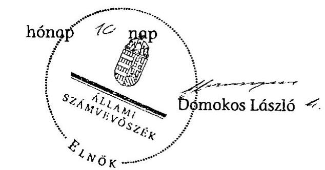

# JELENTÉS 

Fábiánsebestyén Község Önkormányzata belső kontrollrendszerének kialakítása, valamint egyes kontrolltevékenységek és a belső ellenőrzés működése ellenőrzéséről

---

# Állami Számvevőszék 

Iktatószám: V-0012-058-020-026/2013.
Témaszám: 1051
Vizsgálat-azonosító szám: V059119

## Az ellenőrzést felügyelte:

Dr. Benedek Mária
felügyeleti vezető

## Az ellenőrzést vezette:

## Szakmányné Bilik Mária ellenőrzésvezető

A számvevői jelentések feldolgozásában és a jelentés összeállításában közreműködtek:

## Kámán Edina

számvevő
Laki Dóra
számvevő tanácsos
Az ellenőrzést végezték:
Laki Dóra
Számvevő tanácsos

## Kóródi Gábor

számvevő

---

# TARTALOMJEGYZÉK 

BEVEZETÉS ..... 5
I. ÖSSZEGZŐ MEGÁLLAPÍTÁSOK, KÖVETKEZTETÉSEK, JAVASLATOK ..... 8
II. RÉSZLETES MEGÁLLAPÍTÁSOK ..... 16

1. Az önkormányzat belső kontrollrendszere kialakításának megfelelősége ..... 16
1.1. A kontrollkörnyezet kialakítása ..... 16
1.2. A kockázatkezelési rendszer kialakítása ..... 17
1.3. A kontrolltevékenységek kialakítása ..... 17
1.4. Az információs és kommunikációs rendszer kialakítása ..... 18
1.5. A monitoring rendszer kialakítása ..... 18
2. A pénzügyi folyamatokban kulcsszerepet betöltő belső kontrollok (szakmai teljesítésigazolás és utalvány ellenjegyzés) működése ..... 19
3. A belső ellenőrzés szervezeti keretei és működése ..... 21

## FÜGGELÉKEK

1. számú Értelmező szótár
2. számú A belső kontrollrendszer kialakítása, a pénzügyi folyamatokban kulcsszerepet betöltő szakmai teljesítésigazolás és utalvány ellenjegyzés kontrollok működése, valamint a belső ellenőrzés működése értékelésénél alkalmazott minősítési szempontok

---

.

---

# RÖVIDÍTÉSEK JEGYZÉKE 

## Törvények

ÁSZ tv.
Avtv.

Htv.

Info tv.

Ktv.
Kttv.
Mötv.
Ötv.
régi Áht.
új Áht.

## Rendeletek

Áhsz.

Ámr.
Ávr.

Ber.
Bkr.

## Szórövidítések

ÁSZ
ÁMK
Belső ellenőrzési kézikönyv
2011. évi LXVI. törvény az Állami Számvevőszékről
1992. évi LXIII. törvény a személyes adatok védelméről és a közérdekű adatok nyilvánosságáról (hatálytalan 2012. január 1-jétől)
1991. évi XX. törvény a helyi önkormányzatok és szerveik, a köztársasági megbízottak, valamint egyes centrális alárendeltségű szervek feladat- és hatásköréről
2011. évi CXII. törvény az információs önrendelkezési jogról és az információszabadságról (hatályos 2012. január 1-jétől)
1992. évi XXIII. törvény a köztisztviselők jogállásáról (hatálytalan 2012. március 1-jétől)
2011. évi CXCIX törvény a közszolgálati tisztviselőkről (hatályos 2012. március 1-jétől)
2011. évi CLXXXIX. törvény Magyarország helyi önkormányzatairól (hatályos 2012. január 1-jétől)
1990. évi LXV. törvény a helyi önkormányzatokról
1992. évi XXXVIII. törvény az államháztartásról (hatálytalan 2012. január 1-jétől)
2011. évi CXCV. törvény az államháztartásról (hatályos 2012. január 1-jétől)

249/2000. (XII. 24.) Korm. rendelet az államháztartás szervezetei beszámolási és könyvvezetési kötelezettségének sajátosságairól
292/2009. (XII. 19.) Korm. rendelet az államháztartás működési rendjéről (hatálytalan 2012. január 1-jétől)
368/2011. (XII. 31.) Korm. rendelet az államháztartásról szóló törvény végrehajtásáról (hatályos 2012. január 1-jétől)
193/2003. (XI. 26.) Korm. rendelet a költségvetési szervek belső ellenőrzéséről (hatálytalan 2012. január 1-jétől)
370/2011. (XII. 31.) Korm. rendelet a költségvetési szervek belső kontrollrendszeréről és belső ellenőrzéséről (hatályos 2012. január 1-jétől)

Állami Számvevőszék
Arany János Általános Művelődési Központ
Fábiánsebestyén Község Önkormányzat belső ellenőrzési kézikönyve (hatályos 2006. március 28-tól)

---

| Belső Kontroll Kézikönyv | Az Ámr. 155. § (1) bekezdése, valamint az államháztartási belső kontroll standardokról szóló 1/2009. (IX. 11.) |
| :--: | :--: |
|  | PM irányelv egységes értelmezése érdekében az államháztartásért felelős miniszter által a 2010. évben kiadott Belső Kontroll Kézikönyv |
| gazdálkodási jogkörök | Fábiánsebestyén Község Önkormányzat Polgármesteri |
| szabályzata | Hivatal pénzgazdálkodásával kapcsolatos kötelezettségvállalás, utalványozás, érvényesítés és ellenjegyzés hatásköri rendjéről (hatályos 2010. szeptember 29-étől) |
| hivatali SZMSZ | Fábiánsebestyén Község Önkormányzat Polgármesteri Hivatal Szervezeti és Működési Szabályzata (hatályos 2010. november 2-ától) |
| jegyző | Fábiánsebestyén Község Önkormányzatának jegyzője |
| Képviselő-testület | Fábiánsebestyén Község Képviselő-testülete |
| Önkormányzat | Fábiánsebestyén Község Önkormányzata |
| pénzkezelési szabályzat | Fábiánsebestyén Község Önkormányzat Polgármesteri Hivatal pénzkezelési szabályzata (hatályos 2010. szeptember 29-étől) |
| polgármester | Fábiánsebestyén Község Önkormányzatának polgármestere |
| Polgármesteri Hivatal | Fábiánsebestyén Község Önkormányzatának Polgármesteri Hivatala |
| Társulás | Szentes Kistérség Belső Ellenőrzési Társulása |

---

# JELENTÉS 

## Fábiánsebestyén Község Önkormányzata belső kontrollrendszerének kialakítása, valamint egyes kontrolltevékenységek és a belső ellenőrzés működése ellenőrzéséről

## BEVEZETÉS

A belső kontrollrendszer kialakítását, működtetését és fejlesztését a régi Áht. és az új Áht. is előírja. Ennek megvalósításáért a költségvetési szerv vezetője felel. A belső kontrollrendszer azt a célt szolgálja, hogy a költségvetési szervek működésük és gazdálkodásuk során a tevékenységeket szabályszerűen, gazdaságosan, hatékonyan, eredményesen hajtsák végre, teljesítsék elszámolási kötelezettségeiket és megvédjék az erőforrásokat a veszteségektől, a károktól és a nem rendeltetésszerű használattól. A belső kontrollrendszer magában foglalja mindazon szabályokat, eljárásokat, gyakorlati módszereket és szervezeti struktúrákat, kockázatkezelési technikákat, kontrolltevékenységeket, amelyek segítséget nyújtanak a szervezetnek céljai eléréséhez.

Az ÁSZ a 2011-2015. évekre szóló stratégiájában hangsúlyos szerepet szánt annak, hogy szilárd szakmai alapon álló, értékteremtő ellenőrzéseivel előmozdítsa a közpénzügyek átláthatóságát, rendezettségét. A számvevőszéki ellenőrzés nemzetközi alapelvei is rögzítik, hogy a megfelelő belső kontrollrendszer minimálisra csökkenti a hibák és szabálytalanságok kockázatát.

Az ellenőrzés célja annak értékelése volt, hogy az Önkormányzat a jogszabályi előírásoknak megfelelően alakította-e ki a belső kontrollrendszert; a gazdálkodás folyamatában kulcsszerepet betöltő szakmai teljesítésigazolás és az utalvány ellenjegyzés kontrolltevékenységeit megfelelően működtette-e; biztosította-e a belső ellenőrzés szabályos és eredményes működését.

Az ÁSZ ezen ellenőrzési céljait pilot (próba) jelleggel községi/nagyközségi önkormányzatoknál végzett ellenőrzések során érvényesítette.

Az ellenőrzés típusa: szabályszerűségi ellenőrzés
Az ellenőrzés jogszabályi alapja: az ÁSZ tv. 5. § (2) és (6) bekezdései
Az ellenőrzött szervezet: az Önkormányzat
Az ellenőrzött időszak: a belső kontrollrendszer kialakításának megfelelőségét a 2011. évre vonatkozóan értékeltük. A kontrolltevékenységek működésének megfelelőségét a 2011. január 1-je és december 31-e, míg a belső ellenőrzés működésének szabályosságát és eredményességét a 2009. január 1-je és 2011.

---

december 31-e közötti időszakot figyelembe véve értékeltük. A helyszíni ellenőrzés lezárásáig a helyi szabályozás változásait nyomon követtük.

Az ellenőrzés szakmai módszertana az ÁSZ hivatalos honlapján (www.asz.hu) közzétett szakmai szabályokon alapult, amely a Legfőbb Ellenőrző Intézmények Nemzetközi Szervezete (INTOSAI) által kiadott nemzetközi standardok (ISSAI) figyelembevételével készült.

A belső kontrollrendszer kialakításának ellenőrzése során értékeltük a kontrollkörnyezet, a kockázatkezelési rendszer, a kontrolltevékenységek, az információs és kommunikációs rendszer, valamint a monitoring rendszer szabályozottságának megfelelőségét.

Értékeltük a pénzügyi folyamatokban kulcsszerepet betöltő szakmai teljesítésigazolás és utalvány ellenjegyzés kontrollok működésének megfelelőségét az államháztartáson kívülre teljesített működési és felhalmozási célú pénzeszközátadásoknál, az állományba nem tartozók megbízási díjainál, továbbá a külső szolgáltatók által végzett karbantartási, kisjavítási munkákkal kapcsolatos kifizetéseknél. Az egyszerű véletlen mintavétellel kiválasztott tételek ellenőrzését többlépcsős megfelelőségi tesztek útján addig végeztük, amíg elegendő és megfelelő bizonyítékot szereztünk a vizsgált folyamatok kulcskontrolljai működésének megfelelő vagy nem megfelelő voltáról. Értékeltük az Önkormányzatnál a belső ellenőrzés működésének szabályosságát és eredményességét. Az ÁSZ a 2007-2010. években az Önkormányzatnál a gazdálkodás szabályszerűségére irányuló átfogó ellenőrzést nem végzett.

A fogalmak magyarázatát az 1. számú függelék, az ellenőrzés egyes területeinek értékelésénél alkalmazott egységes minősítési szempontokat a 2. számú függelék tartalmazza.

Az ellenőrzés lefolytatásához az Önkormányzat a munkalapok és a tanúsítvány elektronikus kitöltésével, valamint a megjelölt dokumentumok elektronikus megküldésével szolgáltatott adatokat. A munkalapokon szerepeltetett adatok, információk ellenőrzése és szükség szerinti javítása a helyszíni ellenőrzés keretében történt.

Az ÁSZ az ellenőrzés megállapításait az ellenőrzött időszakban hatályos, az intézkedést igénylő megállapításokra tett javaslatokat a jelenleg hatályos jogszabályok alapján fogalmazta meg.

Az ÁSZ tv. 29. § (1) bekezdése szerint a jelentéstervezetet megküldtük a polgármester részére, aki az ÁSZ tv. 29. § (2) bekezdésében foglalt észrevételezési jogával nem élt, a jelentéstervezetre észrevételt nem tett.

Fábiánsebestyén község állandó lakosainak száma 2011. január 1-jén 2141 fő volt. Az Önkormányzat héttagú Képviselő-testületének munkáját kettő állandó bizottság segítette. Az Önkormányzat az önállóan működő és gazdálkodó Polgármesteri Hivatalon kívül egy önállóan működő és gazdálkodó, valamint három önállóan működő intézménnyel látta el feladatát, többségi tulajdoni hányadú gazdasági társasággal nem rendelkezett. A polgármester az 1994. évtől kezdődően tölti be tisztségét. Az ellenőrzött időszakban a jegyző személye nem változott. Az Önkormányzat Polgármesteri Hivatalánál 2013. január 1-jétől

---

szervezeti átalakítás nem volt, azonban a jegyző személyében változás történt. A jegyző 2013. január 2-ától megbízással, 2013. február 25-étől kinevezéssel látta el a feladatait. A Polgármesteri Hivatal szervezeti egységekre nem tagolódott, a foglalkoztatott köztisztviselők száma 2011. január 1-jén kilenc fő volt.

Az Önkormányzat a 2011. évi költségvetési beszámolója szerint 565332 ezer Ft költségvetési bevételt ért el, és 540596 ezer Ft költségvetési kiadást teljesített. A 2011. december 31-i könyvviteli mérleg szerint 813762 ezer Ft értékű eszközvagyonnal rendelkezett, 17076 ezer Ft hosszú lejáratú, és 146754 ezer Ft rövid lejáratú kötelezettsége volt.

---

# I. ÖSSZEGZŐ MEGÁLLAPÍTÁSOK, KÖVETKEZTETÉSEK, JAVASLATOK 

A belső kontrollrendszeren belül 2011-ben a Polgármesteri Hivatalban a kontrollkörnyezet, a kockázatkezelési rendszer, a kontrolltevékenységek, az információs és kommunikációs rendszer, valamint a monitoring rendszer szabályozását, illetve kialakítását külön-külön és összesítve is értékeltük. A belső kontrollrendszer kialakítása az összesített értékelés alapján nem felelt meg a jogszabályi előírásoknak. Az egyes területek kialakításának értékelését az alábbiakban részletezzük.

A kontrollkörnyezet kialakítása nem felelt meg a jogszabályi követelményeknek, mert a jegyző a Htv.-ben foglalt előírást figyelmen kívül hagyva nem készítette el a gazdasági programtervezetet, így a Képviselő-testület az Ötv ${ }^{1}$ ben foglaltak ellenére nem határozta meg az Önkormányzat 2011-2014. évekre vonatkozó gazdasági programját. A hivatali SZMSZ-ben nem határozták meg - az Ámr ${ }^{2}$-ben előírtak ellenére - a Polgármesteri Hivatal szervezeti ábráját (e hiányosságot a 2012. évben megszüntették), valamint a Ber ${ }^{3}$. előírása ellenére a belső ellenőrzést végző szervezet jogállását. A Ktv ${ }^{4}$.-ben foglaltak ellenére a 2011. évben nem határozták meg a köztisztviselők munkateljesítményének értékeléséhez szükséges teljesítménykövetelményeket, valamint a jegyző nem végzett teljesítményértékelést.

A kockázatkezelési rendszer kialakítása a Polgármesteri Hivatalban nem felelt meg a jogszabályi előírásoknak, mert a jegyző az Ámr. előírása ellenére kockázatelemzést nem végzett, és nem működtetett kockázatkezelési rendszert.

A kontrolltevékenységek kialakítása a jogszabályi követelményeknek részben felelt meg. A jegyző meghatározta a gazdálkodási jogkörök gyakorlásának szabályait, azonban az Ámr. rendelkezése ellenére nem szabályozta a Polgármesteri Hivatal tevékenységeire vonatkozó beszámolási eljárásokat.

Az információs és kommunikációs rendszer kialakítása a jogszabályi előírásoknak nem felelt meg, mert az Avtv ${ }^{5}$. és az Ámr. rendelkezései ellenére a jegyző nem határozta meg a közérdekű adatok közzétételi eljárásának, nyilvánosságra hozatalának rendjét, továbbá nem szabályozta a közérdekű adatok megismerésére irányuló igények teljesítésének rendjét. A jegyző az Avtv. előírásai ellenére elmulasztotta az adatbiztonság érvényre juttatásához szükséges intézkedések megtételét. Nem alakította ki az informatikai rendszer hozzáférési jogosultságaira és azok betartásának ellenőrzésére vonatkozó eljárásrendet és

[^0]
[^0]:    ${ }^{1}$ 2012. január 1-jétől Mötv
    ${ }^{2}$ 2012. január 1-jétől Ávr.
    ${ }^{3}$ 2012. január 1-jétől Bkr.
    ${ }^{4}$ 2012. március 1-jétől Kttv.
    ${ }^{5}$ 2011. január 1-től Info tv.

---

nyilvántartást, nem szabályozta a pénzügyi-számviteli szoftverváltozások ellenőrzésére, tesztelésére vonatkozó eljárásokat, és nem jelölte ki a feldolgozott adatok mentésének felelőseit.

A monitoring rendszer kialakítása a jogszabályi követelményeknek nem felelt meg, mert a jegyző az Ámr.-ben foglaltak ellenére az operatív tevékenységek keretében megvalósuló folyamatos és eseti nyomon követésből álló, a Polgármesteri Hivatal tevékenységének, a célok megvalósításának nyomon követését biztosító rendszer szabályait nem határozta meg.

A belső kontrollrendszer nem megfelelő kialakítása kockázatot jelent az Önkormányzat tevékenységeinek szabályszerű, gazdaságos, hatékony
 és eredményes végrehajtása során.

A Polgármesteri Hivatalban a 2011. évben az államháztartáson kívülre történő felhalmozási célú pénzeszközátadással, az állományba nem tartozók megbízási díjaival, valamint a külső szolgáltatók által végzett karbantartással, kisjavítással kapcsolatos kifizetések során, összefoglalóan értékelve a kulcskontrollok működésének megfelelősége gyenge volt.

A szakmai teljesítés igazolására a jegyző által kijelölt személy - az Ámr. előírása ellenére - az államháztartáson kívülre teljesített felhalmozási célú pénzeszközátadás kifizetését megelőzően nem végezte el a kifizetés jogosságának, összegszerűségének ellenőrzését, a külső szolgáltatók által teljesített karbantartási, kisjavítási munkákra történő kifizetéseknél nem szabályszerűen - az igazolás dátumának megjelölése nélkül - igazolta a kifizetés jogosságát, összegszerűségét és a szerződés teljesítését. Az állományba nem tartozók megbízási díjainak kifizetésénél az Ámr. előírása ellenére nem a kiadások teljesítését megelőzően végezte a kifizetések jogosságának, összegszerűségének és a megbízási szerződések teljesítésének ellenőrzését.

Az utalvány ellenjegyzését az állományba nem tartozók megbízási díjainak kifizetésénél arra nem jogosult személy is végezte. Az utalvány ellenjegyzője az Ámr. előírásait figyelmen kívül hagyva, annak ellenére ellenjegyezte a kifizetéseket, hogy a szakmai teljesítésigazolást az államháztartáson kívülre teljesített felhalmozási célú pénzeszközátadásnál a kifizetést megelőzően nem végezték el, a külső szolgáltatók által teljesített karbantartási, kisjavítási munkákra történő kifizetéseknél pedig nem szabályszerűen, az igazolás dátumának megjelölése nélkül végezték. Az utalványok ellenjegyzője ellenőrzési feladatát nem a jogszabályi előírásoknak megfelelően végezte a gazdálkodásra - köztük az Ámr.-ben előírt, a kötelezettségvállalások nyilvántartásba vételére, a kötelezettségvállalás nyilvántartási számának feltüntetésére, és az állományba nem tartozók megbízási díjainak kifizetésénél a kötelezettségvállalások ellenjegyzésére - vonatkozó szabályok betartásának ellenőrzése során. A megbízási díjak kifizetésénél az utólagos szakmai teljesítésigazolást és érvényesítést ugyanazon személy végezte, ezzel megsértve az Ámr. összeférhetetlenségi szabályokra vonatkozó előírását. Ebből adódóan az Önkormányzatnál károkozás nem volt megállapítható.

Az ellenőrzött kifizetésekkel összefüggésben a rendelkezésre bocsátott dokumentumok alapján jogosulatlan kifizetést nem tárt fel az ellenőrzésünk, azonban a

---

gazdálkodásban kulcsszerepet betöltő kontrollok működésében feltárt hiányosságok miatt fennáll a hibák bekövetkezésének lehetősége. A nem megfelelően működtetett belső kontrollok korrupciós kockázatot is hordoznak.

Az Önkormányzat a belső ellenőrzési feladatokat a Társulás útján látta el. Az Önkormányzatnál a 2009-2011. években a belső ellenőrzés szabályozása és működése összességében nem felelt meg a jogszabályi előírásoknak. A társulási megállapodás szerint működő belső ellenőrzés az ellenőrzött időszakban nem felelt meg a Ber. előírásainak, mert a belső ellenőrzés végzésére vonatkozó társulási megállapodásban a működtetésre vonatkozó eljárásrend - többek között az éves terv készítésére, a határidőkre, a megbízólevelek és ellenőrzési programok aláírására vonatkozóan - eltért az Ötv. és a Ber. előírásaitól.

A Ber. előírásai ellenére az éves ellenőrzési tervek összeállítását megelőzően az Önkormányzatra vonatkozó kockázatelemzés nem készült, valamint az éves ellenőrzési terveket a belső ellenőrzési vezető helyett a jegyző készítette el. A 2009-2011. évi ellenőrzési tervek nem tartalmazták az ellenőrzések célját, az ellenőrizendő időszakot, az ellenőrzések típusát és módszereit, valamint az ellenőrzött szerv, illetve szervezeti egységek megnevezését. A 2009-2011. évi ellenőrzési programokat a Ber. előírásait figyelmen kívül hagyva - a belső ellenőrzési vezető kijelölésének hiányában - a belső ellenőr hagyta jóvá. Az ellenőrzési programok nem tartalmazták az ellenőrizendő időszakot, az ellenőrzésre vonatkozó jogszabályi vagy egyéb felhatalmazásra történő hivatkozást, valamint a kiállítás keltét. A 2009-2010. években az intézkedést igénylő megállapítást és javaslatot tartalmazó jelentésekhez a Ber.-ben előírtak ellenére intézkedési terv nem készült, a belső ellenőrzés a feltárt hiányosságok nyomon követéséről nem győződött meg. A belső ellenőr által, az ellenőrzésekről vezetett nyilvántartás a Ber.-ben foglaltak ellenére nem tartalmazta az ellenőrzést végzők nevét, valamint a fontosabb megállapításokat, javaslatokat. A Ber. előírásai ellenére az Önkormányzatnál az ellenőrzési jelentések javaslatai alapján megtett intézkedésekről nyilvántartási rendszert nem alakítottak ki.

Az Önkormányzatnál a 2009-2011. években a belső ellenőrzés működése a 2. számú függelékben részletezett kritériumrendszer alapján végzett értékelés szerint - nem volt eredményes, mert a belső ellenőrzés szabályozása és működése az ellenőrzött időszak egészét tekintve a jogszabályi előírásoknak nem felelt meg. Ellenőrizték ugyan a gazdálkodási jogkörök gyakorlásához kapcsolódó, a készpénzkezeléssel, továbbá a vagyonvédelemmel kapcsolatos belső kontrollok működését, azonban a feltárt hiányosságok megszüntetésére irányuló javaslatok - a jegyző intézkedése hiányában - nem hasznosultak.

Az ÁSZ tv. 33. § (1) bekezdésében foglaltak értelmében az ellenőrzött szervezet vezetője köteles a jelentésben foglalt megállapításokhoz kapcsolódó intézkedési tervet összeállítani, és azt a jelentés kézhezvételétől számított 30 napon belül az ÁSZ részére megküldeni. Amennyiben az intézkedési tervet határidőre nem küldi meg a szervezet, vagy az - az ÁSZ tv. 33. § (2) bekezdésében foglalt póthatáridő eltelte ellenére - továbbra sem elfogadható, az ÁSZ elnöke a hivatkozott törvény 33. § (3) bekezdés a-b) pontjaiban foglaltakat érvényesítheti.

---

Az ellenőrzés intézkedést igénylő megállapításai és javaslatai:

# a polgármesternek 

1. A Képviselő-testület - az Ötv. 91. § (7) bekezdésében foglaltak ellenére - nem fogadta el az Ötv. 91. § (1) és (6) bekezdése szerinti gazdasági program tervezetét.

Javaslat:
Terjessze a Képviselő-testület elé a gazdasági program jegyző által elkészített tervezetét a Mötv. 116. § (1) és (5) bekezdései alapján, a (3)-(4) bekezdésekben foglalt tartalommal.
2. Az állományba nem tartozók megbízási díjainak kifizetése során - a régi Áht. 100/C. § (3) bekezdésében és az Ámr. 74. § (1) bekezdésében foglaltak ellenére - ellenjegyzés hiányában vállaltak kötelezettséget.

Javaslat:
Intézkedjen arról, hogy az Önkormányzat nevében történő kötelezettségvállalásra az új Áht. 37. § (1) bekezdésében foglaltaknak megfelelően - az Ávr. 53. §-ában meghatározott kivételeket figyelembe véve - kizárólag a pénzügyi ellenjegyzés után, a pénzügyi teljesítés esedékességét megelőzően, írásban kerüljön sor.

## a jegyzőnek

1. a kontrollkörnyezettel kapcsolatban:

A jegyző a Htv. 140. § (1) bekezdés a) pontjában foglalt előírást figyelmen kívül hagyva nem készítette el az Ötv. 91. § (1) és (6) bekezdése szerinti gazdasági program tervezetét.

A hivatali SZMSZ - a Ber. 4. § (2) bekezdés előírása ellenére - nem tartalmazta a belső ellenőrzést végzők jogállását.

A jegyző - a Ktv. 34. § (5) bekezdésében foglaltak ellenére - a 2011. évben nem határozta meg a köztisztviselők munkateljesítményének értékeléséhez szükséges teljesítménykövetelményeket, és a Ktv. 34. § (1) bekezdése szerinti teljesítményértékelést nem végzett.
Javaslat:
a) Készítse elő a Htv. 140. § (1) bekezdés a) pontjában foglaltak alapján a gazdasági program tervezetét a Mötv. 116. § (3)-(4) bekezdéseiben foglalt tartalommal, és kezdeményezze a polgármesternél a Képviselő-testület elé terjesztését.
b) Készítse elő a hivatali SZMSZ módosítását, és kezdeményezze a polgármesternél a módosítás Képviselő-testület elé terjesztését annak érdekében, hogy a Bkr. 15. § (2) bekezdésében foglaltak szerint a hivatali SZMSZ tartalmazza a belső ellenőrzést végzők jogállását.
c) Intézkedjen a Kttv. 130. § (1)-(6) bekezdéseiben előírtak szerint a teljesítményértékelésre vonatkozó szabályok kialakításáról és alkalmazásáról.

---

2. a kockázatkezelési rendszerrel kapcsolatban:

A jegyző az Ámr. 157. § (1)-(3) bekezdése szerinti kockázatkezelési rendszert nem alakította ki.

Javaslat:
Alakítsa ki és működtesse a Bkr. 3. § b) pontja és a 7. §-a szerinti kockázatkezelési rendszert.
3. a kontrolltevékenységekkel kapcsolatban:

A jegyző - az Ámr. 158. § (2) bekezdés d) pontjában előírtak ellenére - nem szabályozta a Polgármesteri Hivatal tevékenységeire vonatkozó beszámolási eljárásokat.

Javaslat:
Szabályozza a Bkr. 8. § (4) bekezdés c) pontja alapján a Polgármesteri Hivatal tevékenységeire vonatkozó beszámolási eljárásokat.
4. az információs és kommunikációs rendszerrel kapcsolatban:

A jegyző az Ámr. 20. § (3) bekezdés i) pontjában foglaltak ellenére nem határozta meg a közérdekű adatok közzétételi eljárásának, nyilvánosságra hozatalának rendjét, továbbá az Avtv. 20. § (8) bekezdésének előírásai ellenére nem szabályozta a közérdekű adatok megismerésére irányuló igények teljesítésének rendjét. Az Avtv. 10. § (1)-(2) bekezdéseiben foglaltak ellenére elmulasztotta az adatbiztonság érvényre juttatásához szükséges intézkedések megtételét. Nem alakította ki az informatikai rendszer hozzáférési jogosultságaira és azok betartásának ellenőrzésére vonatkozó eljárásrendet és nyilvántartást. Nem szabályozta a pénzügyi-számviteli szoftverváltozások ellenőrzésére, tesztelésére vonatkozó eljárásokat, és nem jelölte ki a feldolgozott adatok mentésének felelőseit.

Javaslat:
a) Szabályozza az Ávr. 13. § (2) bekezdés h) pontja és az Info tv. 35. § (3) bekezdése alapján a közérdekű adatok közzétételének, nyilvánosságra hozatalának rendjét, valamint az Info tv. 30. § (6) bekezdése szerint a közérdekű adatok megismerésére irányuló igények teljesítésének rendjét.
b) Biztosítsa az Info tv. 7. § (2)-(3) bekezdésének megfelelően az adatbiztonság érvényesülését, rendelkezzen a hozzáférési jogosultságok megállapításáról, betartásának ellenőrzéséről és nyilvántartásáról. Szabályozza a pénzügyi-számviteli szoftverváltozások ellenőrzésére, tesztelésére vonatkozó eljárásokat, és jelölje ki a feldolgozott adatok mentésének felelőseit.
5. a monitoring rendszerrel kapcsolatban:

A jegyző - az Ámr. 160. §-ában foglaltak ellenére - nem alakított ki olyan monitoring rendszert, amely lehetővé teszi a Polgármesteri Hivatal tevékenységének, a célok megvalósításának nyomon követését, és amelynek része az operatív tevékenységek keretében megvalósuló folyamatos és eseti nyomon követés is.

---

Javaslat:
Alakítsa ki és működtesse a Bkr. 3. § e) pontjában és 10. §-ában előírtak alapján a Polgármesteri Hivatal tevékenységének, a célok megvalósításának nyomon követését biztosító rendszert, amelynek része az operatív tevékenységek keretében megvalósuló folyamatos és eseti nyomon követés is.
6. a pénzügyi folyamatokban kulcsszerepet betöltő kontrollok működésével kapcsolatban:

A szakmai teljesítésigazolásra a jegyző által kijelölt személy a régi Áht. 100/C. § (6) bekezdésében és az Ámr. 76. § (3) bekezdésében foglaltak ellenére az államháztartáson kívülre teljesített felhalmozási célú pénzeszközátadásnál aláírásával nem, illetve a külső szolgáltatók által teljesített karbantartási, kisjavítási munkákra történő kifizetéseknél nem szabályszerűen - az igazolás dátumának megjelölése nélkül - igazolta a kifizetés jogosságát, összegszerűségét és a szerződés teljesítését. Az állományba nem tartozók megbízási díjainak kifizetésénél a régi Áht. 100/C. § (6) bekezdésének és az Ámr. 76. § (1) bekezdésének előírása ellenére nem a kiadások teljesítését megelőzően végezte a kifizetések jogosságának, összegszerűségének és a megbízási szerződések teljesítésének ellenőrzését.

Az utalvány ellenjegyzését az állományba nem tartozók megbízási díjainak kifizetésénél - az Ámr. 79. § (1) bekezdésében foglaltak ellenére - arra nem jogosult személy is végezte. Az utalvány ellenjegyzője az Ámr. 79. § (2) bekezdésében foglaltakat figyelmen kívül hagyva annak ellenére ellenjegyezte az utalványt, hogy a szakmai teljesítésigazolást az államháztartáson kívülre teljesített felhalmozási célú pénzeszközátadásnál a kifizetést megelőzően nem, illetve a külső szolgáltatók által teljesített karbantartási, kisjavítási munkákra történő kifizetéseknél nem szabályszerűen - az igazolás dátumának megjelölése nélkül - végezték el. Az utalványok ellenjegyzője ellenőrzési feladatát nem a jogszabályi előírásoknak megfelelően végezte a gazdálkodásra - köztük az Ámr. 75. § (1) bekezdésében foglalt, a kötelezettségvállalások nyilvántartásba vételére, az Ámr. 78. § (2) bekezdés g) pontja szerinti, a kötelezettségvállalás nyilvántartási számának feltüntetésére, valamint az állományba nem tartozók megbízási díjainak kifizetésénél az Ámr. 74. § (1) bekezdésében előírt, a kötelezettségvállalások ellenjegyzésére - vonatkozó szabályok betartásának ellenőrzése során.

A megbízási díjak esetében az érvényesítést és a szakmai teljesítés (kifizetést követő) igazolását - az
 Ámr. 80. § (1) bekezdésében foglaltak ellenére – ugyanazon személy végezte.

Javaslat:
Gondoskodjon – a szakmai teljesítésigazolás és az utalványozás ellenjegyzése vonatkozásában feltárt hiányosságok megszüntetése, illetve az operatív gazdálkodás során a működésbeli hibák megelőzése, feltárása és kijavítása érdekében – arról, hogy:
a) a teljesítés igazolására kijelölt személyek az Ávr. 57. § (1) bekezdésében előírtaknak megfelelően a kiadások teljesítésének jogosságát, összegszerűségét, az ellenszolgáltatást is magában foglaló kötelezettségvállalás esetében annak teljesítését ellenőrizhető okmányok alapján ellenőrizzék, valamint az Ávr. 57. § (3) bekezdése szerint tegyenek eleget igazolási kötelezettségüknek;

---

b) a kifizetéseket megelőzően – az Ávr. 58. § (1) bekezdése szerint – a teljesítésigazolás alapján – az Ávr. 57. § (3) bekezdése szerinti esetben annak hiányában is az összegszerűségnek, a fedezet meglétének és a megelőző ügymenetben az új Áht., az Áhsz., az Ávr. előírásai és a belső szabályzatokban foglaltak betartásának az ellenőrzése történjen meg;
c) az Ávr. 56. § (1) bekezdésében foglaltak szerint a kötelezettségvállalásokat nyilvántartásba vegyék, és az utalványrendeleteken az Ávr. 59. § (3) bekezdés f) pontjában foglaltaknak megfelelően a kötelezettségvállalás nyilvántartási számát tüntessék fel;
d) az összeférhetetlenségi szabályok az Ávr. 60. § (1)-(2) bekezdésében foglaltaknak megfelelően érvényesüljenek.
7. a belső ellenőrzés működésével kapcsolatban:

A belső ellenőrzés végzésére vonatkozó társulási megállapodás az ellenőrzött időszakban nem felelt meg a Ber.-ben – a 22. § (1), a 23. § (1) és (3), a 24. § (1), a 28. § (1) és a 32/B. § (1) bekezdésében – foglalt előírásoknak, továbbá nem volt összhangban az Ötv. 92. § (6) bekezdésében foglalt rendelkezéssel.

A belső ellenőrzési vezető feladatkörébe tartozó tevékenységek ellátásának módja a Ber. 4/A. § (2) bekezdésében foglaltak ellenére nem került meghatározásra.

Az éves ellenőrzési tervet – a Ber. 12. § (b) pontjában és a 21. § (1) bekezdésében foglaltak ellenére – a belső ellenőrzési vezető helyett a jegyző készítette el. A Ber. 21. § (2) bekezdésében foglaltak ellenére az éves ellenőrzési tervek összeállítását megelőzően nem készült kockázatelemzés. A Ber. 21. § (3) bekezdésében foglaltak ellenére a 2009-2011. évi ellenőrzési tervek nem tartalmazták az ellenőrzések célját, az ellenőrizendő időszakot, az ellenőrzések típusát és módszereit, valamint az ellenőrzött szerv megnevezését.

A 2009-2011. évi ellenőrzési programokat – a Ber. 23. § (3) bekezdésében foglaltak ellenére – a belső ellenőrzési vezető kijelölésének hiányában a belső ellenőr hagyta jóvá. Az ellenőrzési programok – a Ber. 23. § (4) bekezdésében foglaltak ellenére nem tartalmazták az ellenőrizendő időszakot, az ellenőrzésre vonatkozó jogszabályi vagy egyéb felhatalmazásra történő hivatkozást, valamint a kiállítás keltét.

Az intézkedést igénylő megállapítást és javaslatot tartalmazó belső ellenőri jelentésekhez – a Ber. 29. § (1) bekezdésében foglaltak ellenére – intézkedési terv nem készült, a belső ellenőrzés – a Ber. 8. § f) bekezdésében előírtak ellenére – nem követte nyomon a feltárt hiányosságokra tett intézkedéseket.

A Ber. 29/A. § (1)-(2) és (7) bekezdéseiben foglaltak ellenére az Önkormányzatnál az ellenőrzési jelentésekben tett megállapítások, javaslatok hasznosulását és végrehajtását nyomon követő nyilvántartási rendszert nem alakítottak ki, továbbá az elvégzett belső ellenőrzésekről vezetett nyilvántartás – a Ber. 32. § (2) bekezdés d-e) pontjaiban foglaltak ellenére – nem tartalmazta az ellenőrök nevét, illetve az ellenőrzések jelentősebb megállapításait és javaslatait.

---

Javaslat:
a) Kezdeményezze a belső ellenőrzés végzésére vonatkozó társulási megállapodás módosítását vagy új megállapodás megkötését annak érdekében, hogy az abban foglaltak a hatályos jogszabályi előírásokkal – különösen az Mótv. és a Bkr. vonatkozó rendelkezéseivel – összhangban legyenek.
b) Kezdeményezze, hogy a belső ellenőrzési vezető feladatkörébe tartozó tevékenységek ellátásának módját a Bkr. 16. § (4) bekezdésében foglaltaknak megfelelően határozzák meg.
c) Intézkedjen arról, hogy az éves ellenőrzési terv a Bkr. 29. § (1) bekezdése alapján kockázatelemzésen alapuljon, valamint arról, hogy azt a belső ellenőrzési vezető a Bkr. 56. § (2) bekezdés előírásainak megfelelően a jegyző írásos véleményének figyelembevételével, a Bkr. 29. § (1) bekezdésében foglaltak szerint készítse el.
d) Intézkedjen, hogy a tervezett ellenőrzéseket a Bkr. 33. § (2) bekezdésében foglaltaknak megfelelően a belső ellenőrzési vezető által jóváhagyott ellenőrzési programok alapján hajtsák végre.
e) Kezdeményezze, hogy az éves ellenőrzési tervek tartalmazzák a Bkr. 31. § (4) bekezdésében előírt tartalmi elemeket.
f) Készítsen intézkedési tervet a belső ellenőrzési jelentésekben megfogalmazott javaslatok végrehajtására a Bkr. 45. § (2)-(3) bekezdéseiben foglaltaknak megfelelő tartalommal és határidőn belül, és kérje számon annak végrehajtását.
g) Kezdeményezze, hogy a belső ellenőrzési vezető a Bkr. 21. § (2) bekezdés d) pontjában és a 47. §-ban foglaltak szerint tartsa nyilván és kövesse nyomon az ellenőrzési jelentések alapján megtett intézkedéseket, és a Bkr. 22. § (2) bekezdés b) és e) pontja alapján, az 50. §-ban foglaltaknak megfelelően vezesse az elvégzett belső ellenőrzésekre vonatkozó nyilvántartást.

---

# II. RÉSZLETES MEGÁLLAPÍTÁSOK 

## 1. AZ ÖNKORMÁNYZAT BELSŐ KONTROLLRENDSZERE KIALAKÍTÁSÁNAK MEGFELELŐSÉGE

### 1.1. A kontrollkörnyezet kialakítása

A kontrollkörnyezet kialakítása – a 2. számú függelékben részletezett kritériumrendszer alapján végzett értékelés szerint – a Polgármesteri Hivatalban nem volt megfelelő, mert a jegyző a jogszabályi előírásokat nem érvényesítette maradéktalanul.

A jegyző, mint a költségvetési szerv vezetője:

- a Htv. 140. § (1) bekezdés a) pontjában foglalt előírást figyelmen kívül hagyva nem készítette el az Ötv. 91. § (1) és (6) bekezdés szerinti gazdasági programtervezetet, így a Képviselő-testület az Ötv. 91. § (7) bekezdésében $^{6}$ foglaltakat megsértve nem határozta meg az Önkormányzat 2011-2014. évekre vonatkozó gazdasági programját;
- a Képviselő-testület által jóváhagyott $^{7}$ – a jegyző által összeállított – hivatali SZMSZ-ben az Ámr. 20. § (2) bekezdése i) pontjában $^{8}$ előírtak ellenére nem határozta meg a Polgármesteri Hivatal szervezeti ábráját, valamint a Ber. 4. § (2) bekezdés $^{9}$ előírása ellenére nem írta elő a belső ellenőrzést végzők jogállását;

A Polgármesteri Hivatal szervezeti ábrájára vonatkozó hiányosságot a 2012. évben megszüntették (58/2012. (III. 27.) Ö. számú határozat 2.1 pontja).

- a Ktv. 34. § (5) bekezdésében foglaltak ellenére a 2011. évben nem határozta meg a köztisztviselők munkateljesítményének értékeléséhez szükséges teljesítménykövetelményeket, és a Ktv. 34. § (1) bekezdése szerinti teljesítményértékelést nem végzett.

A kontrollkörnyezet kialakítása során a jegyző az Ámr. 155. § (3) bekezdésének $^{10}$ előírását figyelmen kívül hagyva az államháztartásért felelős miniszter által kiadott Belső Kontroll Kézikönyv ajánlásait nem hasznosította teljes körűen.

[^0]
[^0]:    $^{6}$ 2013. január 1-jétől a Mötv. 116. §-a
    $^{7}$ A hivatali SZMSZ-t 173/2010. (XI.2.) Ö. számú határozatával fogadta el a Képviselőtestület
    $^{8}$ 2012. január 1-jétől az Ávr. 13. § (1) bekezdés e) pontja
    $^{9}$ 2012. január 1-jétől a Bkr. 15. § (2) bekezdése
    $^{10}$ 2012. január 1-jétől a Bkr. 5. § (1) bekezdése

---

A kontrollkörnyezet kialakítása során a jegyző:

- a Belső Kontroll Kézikönyv 1.2.7. pontjában foglaltakat nem hasznosította, mert nem írta elő a hivatali SZMSZ munkatársak általi megismerésének kötelezettségét, és a hivatali SZMSZ dolgozók általi megismerése nem történt meg;
- a Belső Kontroll Kézikönyv 1.5.2. pontjában foglalt ajánlást nem érvényesítette, mert nem dolgozta ki a Polgármesteri Hivatalban ellátott köztisztviselői munkakörök betöltésére vonatkozó elvárt tudást és képességeket;
- a Belső Kontroll Kézikönyv 1.6.1. pontjában foglaltakat nem hasznosította, mert nem határozta meg – a szervezeti célokkal összhangban – a köztisztviselőkkel szemben támasztott etikus magatartással és integritással kapcsolatos elvárásokat.

# 1.2. A kockázatkezelési rendszer kialakítása 

A kockázatkezelési rendszer kialakítása – a 2. számú függelékben részletezett kritériumrendszer alapján végzett értékelés szerint – a Polgármesteri Hivatalban nem volt megfelelő, mert a jegyző az Ámr. 157. § (1)-(3) bekezdésében $^{11}$ foglaltak ellenére nem végzett kockázatelemzést, és nem működtetett kockázatkezelési rendszert.

### 1.3. A kontrolltevékenységek kialakítása

A kontrolltevékenységek kialakítása – a 2. számú függelékben részletezett kritériumrendszer alapján végzett értékelés szerint – a Polgármesteri Hivatalban részben volt megfelelő. A jegyző a kontrollstratégiák és módszerek keretében szabályozta a folyamatba épített, előzetes, utólagos és vezetői ellenőrzést, meghatározta az érvényesítés rendjét, a szakmai teljesítés igazolásának módját, kijelölte az érvényesítésre, illetve a szakmai teljesítésigazolásra jogosultakat. A kontrolltevékenységek kialakítása során azonban a jegyző, mint a költségvetési szerv vezetője, az Ámr. 158. § (2) bekezdés d) pontjának $^{12}$ előírása ellenére nem szabályozta a Polgármesteri Hivatal tevékenységeire vonatkozó beszámolási eljárásokat.

A kontrolltevékenységek kialakítása során a jegyző az Ámr. 155. § (3) bekezdésének előírását figyelmen kívül hagyva az államháztartásért felelős miniszter által kiadott Belső Kontroll Kézikönyv ajánlásait nem hasznosította teljes körűen.

A kontrolltevékenységek kialakítása során a jegyző a Belső Kontroll Kézikönyv 3.3.1. pontjában foglaltakat nem érvényesítette, mert nem szabályozta a munkaviszony megszűnése esetén a munkavállaló folyamatban lévő feladatainak átadási rendjét, továbbá nem írta elő munkakör átadás-átvétel esetén a jegyzőkönyv készítési kötelezettséget.

[^0]
[^0]:    $^{11}$ 2012. január 1-jétől a Bkr. 7. § (1)-(2) bekezdése
    $^{12}$ 2012. január 1-jétől a Bkr. 8. § (4) bekezdés c) pontja

---

# 1.4. Az információs és kommunikációs rendszer kialakítása 

Az információs és kommunikációs rendszer kialakítása – a 2. számú függelékben részletezett kritériumrendszer alapján végzett értékelés szerint – a Polgármesteri Hivatalban nem volt megfelelő, mert a jegyző a jogszabályi követelményeket nem érvényesítette.

A jegyző, mint a költségvetési szerv vezetője:

- az Ámr. 20. § (3) bekezdés i) pontjában $^{13}$ foglaltak ellenére nem határozta meg a közérdekű adatok közzétételi eljárásának, nyilvánosságra hozatalának rendjét, nem jelölte ki a közérdekű adatok közzétételének adatfelelősét és az adatközlő személyt, továbbá az Avtv. 20. § (8) bekezdésének $^{14}$ előírásai ellenére nem szabályozta a közérdekű adatok megismerésére irányuló igények teljesítésének rendjét;
- az informatikai rendszer környezetének szabályozása során, az Avtv. 10. § (1)-(2) bekezdéseiben $^{15}$ foglalt előírások ellenére, elmulasztotta az adatbiztonság érvényre juttatásához szükséges intézkedések megtételét. Nem alakította ki az informatikai rendszer hozzáférési jogosultságaira és betartásának ellenőrzésére vonatkozó eljárásrendet és nyilvántartást. Nem szabályozta a szoftverváltozások ellenőrzésére, tesztelésére vonatkozó eljárásokat, és nem jelölte ki a feldolgozott adatok mentésének felelőseit.

Az információs és kommunikációs kialakítása során a jegyző $_{1,2}$ az Ámr. 155. § (3) bekezdésének előírását figyelmen kívül hagyva az államháztartásért felelős miniszter által kiadott Belső Kontroll Kézikönyv ajánlásait nem hasznosította teljes körűen.

A szabálytalanságkezelés keretében a jegyző a Belső Kontroll Kézikönyv 4.3.3. pontjában foglaltakat figyelmen kívül hagyva nem rögzítette a szabálytalanságot bejelentő védelmére vonatkozó előírásokat.

### 1.5. A monitoring rendszer kialakítása

A monitoring rendszer kialakítása – a 2. számú függelékben részletezett kritériumrendszer alapján végzett értékelés szerint – a Polgármesteri Hivatalban nem volt megfelelő, mert a jegyző – az Ámr. 160. §-ában $^{16}$ foglaltak ellenére – az operatív

 tevékenységek keretében megvalósuló folyamatos és eseti nyomon követésből álló, a Polgármesteri Hivatal tevékenységének, a célok megvalósításának nyomon követését biztosító rendszert nem alakította ki.

A belső kontrollrendszer kialakítása a Polgármesteri Hivatalban 2011-ben a kontrollkörnyezet, a kockázatkezelési rendszer és a kontrolltevékenysé-

[^0]
[^0]:    ${ }^{13}$ 2012. január 1-jétől az Ávr. 13. § (2) bekezdés h) pontja
    ${ }^{14}$ 2012. január 1-jétől az Ávr. 13. § (2) bekezdés h) pontja és az Info tv. 35. § (3) bekezdése
    ${ }^{15}$ 2012. január 1-jétől az Info tv. 7. § (2)-(3) bekezdése
    ${ }^{16}$ 2012. január 1-jétől a Bkr. 3. § e) pontja és a Bkr. 10. §-a

---

gek, a monitoring rendszer kialakításának, illetve az információs és kommunikációs rendszer szabályozásának értékelése alapján összességében nem felelt meg a jogszabályi előírásoknak.

# 2. A PÉNZÜGYI FOLYAMATOKBAN KULCSSZEREPET BETÖLTŐ BELSŐ KONTROLLOK (SZAKMAI TELJESÍTÉSIGAZOLÁS ÉS UTALVÁNY ELLENJEGYZÉS) MŰKÖDÉSE 

A Polgármesteri Hivatalban a 2011. évben az államháztartáson kívülre teljesített működési és felhalmozási célú pénzeszközátadások között elszámolt kiadások teljesítése során a szakmai teljesítésigazolás és az utalvány ellenjegyzés kulcskontrollok működésének megfelelősége gyenge volt, mert

- a szakmai teljesítést a jegyző által kijelölt személy - az Ámr. 76. § (3) bekezdésének ${ }^{17}$ előírása ellenére - a lakásvásárlási támogatáshoz kapcsolódó kifizetést megelőzően aláírásával nem igazolta;
- az utalvány ellenjegyzője az Ámr. 79. § (2) bekezdésében ${ }^{18}$ foglalt ellenőrzési feladatait nem a jogszabályi előírásoknak megfelelően végezte, mert annak ellenére aláírásával ellenjegyezte a kifizetést, hogy a szakmai teljesítés igazolása nem történt meg az utalványrendeleten, továbbá az Ámr. 78. § (2) bekezdés g) pontjának ${ }^{19}$ előírásai ellenére a kötelezettségvállalás nyilvántartási számát nem tüntették fel, mivel a kötelezettségvállalás nyilvántartásba vételére az Ámr. 75. § (1) bekezdésében ${ }^{20}$ foglaltak ellenére nem került sor.

A Polgármesteri Hivatalban a 2011. évben az állományba nem tartozók megbízási díjainak kifizetése során a szakmai teljesítésigazolás és az utalvány ellenjegyzés kulcskontrollok működésének megfelelősége gyenge volt, mert

- a jegyző által szakmai teljesítésigazolásra kijelölt személy a január 28-ai és július 29-ei diszpécseri, valamint a november 10-ei népszámlálási feladathoz kapcsolódó megbízási díjak kifizetésénél nem a kiadások teljesítését megelőzően, hanem - a régi Áht. 100/C § (6) bekezdésének ${ }^{21}$ és az Ámr. 76. § (1) bekezdésének ${ }^{22}$ előírásai ellenére - azt követően végezte a kifizetések jogosságának, összegszerűségének és a megbízási szerződések teljesítésének ellenőrzését;
- a szakmai teljesítésigazolásra a jegyző által kijelölt személy a november 30-ai diszpécseri feladathoz kapcsolódó kifizetésnél - az Ámr. 76. § (3) bekezdé-

[^0]
[^0]:    ${ }^{17}$ 2012. január 1-jétől az Ávr. 57. § (3) bekezdése
    ${ }^{18}$ 2012. január 1-jétől az új Áht. 38. § (1) bekezdése és az Ávr. 58. § (1) bekezdése
    ${ }^{19}$ 2012. január 1-jétől az Ávr. 56. § (1) bekezdése
    ${ }^{20}$ 2012. január 1-jétől az Ávr. 56. § (1) bekezdése
    ${ }^{21}$ 2012. január 1-jétől az új Áht. 38. § (1) bekezdése
    ${ }^{22}$ 2012. január 1-jétől az Ávr. 57. § (1) bekezdése

---

sében foglaltak ellenére - aláírásával nem igazolta a kifizetés jogosságát, összegszerűségét és a szerződés teljesítését;

- az utalvány ellenjegyzését a november 10-én bérszámfejtett, népszámlálási feladattal kapcsolatos kifizetésnél - az Ámr. 79. § (1) bekezdésében foglaltakkal, valamint a belső szabályozással ellentétesen - arra nem jogosult személy végezte;
- az utalványok ellenjegyzője az Ámr. 79. § (2) bekezdésében foglaltak ellenére szakmai teljesítésigazolás hiányában ellenjegyezte a november 30-ai bérszámfejtésű diszpécseri feladattal kapcsolatos kifizetést, valamint a diszpécseri feladatok január 28-ai és július 29-ei bérszámfejtésű kifizetéseit annak ellenére ellenjegyezte, hogy a szakmai teljesítésigazolás és az érvényesítés nem történt meg;
- az utalványok ellenjegyzője ellenőrzési feladatát nem az Ámr. 79. § (2) bekezdésében foglalt előírásoknak megfelelően végezte, mert a diszpécseri, valamint a népszámlálási feladatokkal kapcsolatos megbízási szerződéseken az Ámr. 74. § (1) bekezdésében ${ }^{23}$ foglaltak ellenére a kötelezettségvállalást nem ellenjegyezték, továbbá a kötelezettségvállalás nyilvántartásba vételére az Ámr. 75. § (1) bekezdésében foglaltak ellenére nem került sor;
- a január 28-ai és a július 29-ei diszpécseri, valamint a november 10-ei népszámlálási feladatokkal kapcsolatos megbízási díjak kifizetésénél az utólagos szakmai teljesítésigazolást és érvényesítést ugyanazon személy végezte, ezzel megsértve az Ámr. 80. § (1) bekezdés ${ }^{24}$ összeférhetetlenségre vonatkozó előírását. Ebből adódóan - a rendelkezésre bocsátott dokumentumok alapján - az Önkormányzatnál károkozás nem volt megállapítható.

A Polgármesteri Hivatalban a 2011. évben a külső szolgáltatók által teljesített karbantartási, kisjavítási munkákra történő kifizetések során a szakmai teljesítésigazolás és az utalvány ellenjegyzés kulcskontrollok működésének megfelelősége gyenge volt, mert

- az alkatrészvásárlással, a gumijavítással, a kompresszorjavítással, a villanyszerelési anyagok, valamint a simító és élvédő beszerzésével kapcsolatos kifizetéseknél a jegyző által kijelölt személy a szakmai teljesítés igazolását az Ámr. 76. § (3) bekezdésében foglaltak ellenére nem szabályszerűen, az igazolás dátumának megjelölése nélkül végezte;
- az utalvány ellenjegyzője az Ámr. 79. § (2) bekezdésében foglaltakat figyelmen kívül hagyva annak ellenére aláírásával ellenjegyezte az alkatrészvásárlással, a gumijavítással, a kompresszorjavítással, a villanyszerelési anyagok, valamint a simító és élvédő beszerzésével kapcsolatos kifizetéseket, hogy azok nem tartalmazták a szakmai teljesítésigazolás dátumát. Az Ámr. 75. § (1) bekezdésében előírt kötelezettségvállalás nyilvántartásba vétele nem történt meg, ezért az utalványrendeleteken az Ámr. 78. § (2) bekezdés g) pont-

[^0]
[^0]:    ${ }^{23}$ 2012. január 1-jétől az új Áht. 37. § (1) bekezdése és az Ávr. 55. § (1) bekezdése
    ${ }^{24}$ 2012. január 1-jétől az Ávr. 60. § (1) bekezdése

---

jának előírása ellenére a kötelezettségvállalások nyilvántartási számát nem tüntették fel.

A Polgármesteri Hivatalban a 2011. évben az államháztartáson kívülre történő felhalmozási célú pénzeszközátadással, az állományba nem tartozók megbízási díjaival, valamint a külső szolgáltatók által végzett karbantartási, kisjavítási munkákkal kapcsolatos kifizetések során a pénzügyi folyamatokban kulcsszerepet betöltő szakmai teljesítés igazolás és utalvány ellenjegyzés belső kontrollok működésének megfelelősége gyenge volt. A Polgármesteri Hivatalban a 2011. évben a pénzügyi folyamatokban kulcsszerepet betöltő belső kontrollok működésében feltárt hiányosságokkal összefüggésben az ellenőrzés az ellenőrzött tételek vonatkozásában a rendelkezésre bocsátott dokumentumok alapján kár bekövetkeztére utaló adatot, tényt nem állapított meg, azonban a kulcskontrollok jogszabályi előírásoknak nem megfelelő, gyenge működése miatt fennáll a károk bekövetkezésének kockázata.

# 3. A BELSŐ ELLENŐRZÉS SZERVEZETI KERETEI ÉS MŰKÖDÉSE 

A 2009-2011. években az Önkormányzatnál a belső ellenőrzési feladatokat, összhangban az Ötv. 92. § (8) bekezdés c) pontjában ${ }^{25}$ előírtakkal, a Társulás ${ }^{26}$ útján látták el. A 2004. évben megkötött és a helyszíni ellenőrzés időszakában is hatályos társulási megállapodás több rendelkezése nem felelt meg a Ber. és az Ötv. rendelkezéseinek.

- Az Ötv. 92. § (6) bekezdésében foglalt, az ellenőrzési terv Képviselő-testületi jóváhagyására meghatározott november 15-ei határidőt és a Ber. 22. § (1) bekezdésében foglaltakat figyelmen kívül hagyva a Társulási megállapodásban az ellenőrzési terv elkészítésére és jóváhagyására a december 20-ai és a december 31-ei határidőket rögzítették.
- A Társulási megállapodás értelmében, a Ber. 23. § (1) és (3) bekezdéseiben, illetve a 24. § (1) bekezdésében foglaltakkal ellentétesen az ellenőrzési programokat és a megbízóleveleket a Társulás székhelye szerinti önkormányzat jegyzője készíti el, illetve hagyja jóvá.
- A Ber. 28. § (1) bekezdésében foglaltakkal ellentétesen a Társulási megállapodásban az ellenőrzési jelentések polgármester részére történő megküldését írták elő.
- A Ber. 32/B. § (9) bekezdésében foglalt március 20-ai határidőt figyelmen kívül hagyva, az éves ellenőrzési jelentés elkészítésének határidejét május 31-én határozták meg.

A 2009-2011. években a belső ellenőrzési vezető személyét, illetve a feladatkörébe tartozó tevékenységek ellátásának módját a Ber. 4/A. § (2) bekezdésében ${ }^{27}$ foglaltak ellenére nem határozták meg. Az Önkormányzat rendelkezett a jegyző által jóváhagyott Belső ellenőrzési kézikönyvvel, amely a Ber. 5. § (2) bekez-

[^0]
[^0]:    ${ }^{25}$ 2013. január 1-jétől a Bkr. 15. § (7) bekezdés b) pontja
    ${ }^{26}$ A belső ellenőrzési feladatokat a Képviselő-testület 65/2004. (VI. 22.) Ö. számú határozata alapján látta el a Társulás.
    ${ }^{27}$ 2012. január 1-jétől a Bkr. 16. § (4) bekezdése

---

désében ${ }^{28}$ előírtaknak megfelelően tartalmazta a szakmai etikai kódexet, a kockázatelemzési módszertant, valamint a minőségbiztosítási eljárásokat.

Az Önkormányzatnál a 2009-2011. években a belső ellenőrzés működése a jogszabályi előírásoknak nem felelt meg. A Ber. 21. § (2) bekezdésében ${ }^{29}$ foglaltak ellenére az éves ellenőrzési tervek összeállítását megelőzően az Önkormányzatra vonatkozó kockázatelemzés egyik évben sem készült. Az éves ellenőrzési tervet - a Ber. 12. § b) pontjában ${ }^{30}$, valamint a 21. § (1) bekezdésében ${ }^{31}$ foglaltak ellenére - kijelölt belső ellenőrzési vezető hiányában a jegyző készítette el.

A jegyző által elkészített és a Képviselő-testület által elfogadott ellenőrzési tervet megküldték a Társulásnak, ahol azt módosítás nélkül beépítették a Társulás éves ellenőrzési tervébe.

A Ber. 21. § (3) bekezdésében ${ }^{32}$ foglaltakat figyelmen kívül hagyva a 2009-2011. évi ellenőrzési tervek nem tartalmazták az ellenőrzések célját, az ellenőrizendő időszakot, az ellenőrzések típusát és módszereit, valamint az ellenőrzött szerv, illetve szervezeti egységek megnevezését.

A belső ellenőrzés mindhárom ellenőrzött évben tervezte a Polgármesteri Hivatal előző évi gazdálkodásával kapcsolatos pénztári-banki forgalom, valamint az ÁMK-nál a megelőző évi tanügyi nyilvántartások és a statisztikai jelentés egyezőségének ellenőrzését. Az Önkormányzatnál a mérlegvalódiság elvének ellenőrzését a 2010. és a 2011. évi ellenőrzési tervek tartalmazták. A 2009. évben a Polgármesteri Hivatalnál a 2008. évi leltározás, selejtezés végrehajtásának, a 2008. évi adó-végrehajtási ügyeknek, továbbá a vállalkozási és az alaptevékenység elkülönítésének ellenőrzését tervezték. A 2010. évben a Polgármesteri Hivatalban az üzemanyag-elszámolás, valamint a lakásfenntartási támogatások folyósítása elszámolásának ellenőrzése is szerepelt az ellenőrzési tervben. A 2011. évben a Polgármesteri Hivatalban a rendelkezésre állási támogatás folyósításának ellenőrzését is tervezték.

Az éves ellenőrzési terveket a 2009-2011. években nem módosították, soron kívüli ellenőrzést nem végeztek. A 2009-2011. évi ellenőrzési programokat a Ber. 23. § (3) bekezdésében ${ }^{33}$ foglaltaktól eltérően, a belső ellenőrzési vezető kijelölésének hiányában a belső ellenőr hagyta jóvá.

[^0]
[^0]:    ${ }^{28}$ 2012. január 1-jétől a Bkr. 17. § (2) bekezdése
    ${ }^{29}$ 2012. január 1-jétől a Bkr. 31. § (2) bekezdése
    ${ }^{30}$ 2012. január 1-jétől a Bkr. 22 § (1) bekezdés b) pontja
    ${ }^{31}$ 2012. január 1-jétől a Bkr.

 31. § (1) bekezdése
    ${ }^{32}$ 2012. január 1-jétől a Bkr. 31. § (4) bekezdése
    ${ }^{33}$ 2012. január 1-jétől a Bkr. 33. § (2) bekezdése

---

Az ellenőrzési programok a Ber. 23. § (4) bekezdésében ${ }^{34}$ foglaltak ellenére nem tartalmazták az ellenőrizendő időszakot, az ellenőrzésre vonatkozó jogszabályi vagy egyéb felhatalmazásra történő hivatkozást, valamint a kiállítás keltét.

A 2009-2011. években tervezett ellenőrzéseket végrehajtották. A Ber. 27. § (2) bekezdésében ${ }^{35}$ foglaltak ellenére a 2009-2010. években hat jelentés nem tartalmazta az ellenőrzés célját, feladatait, három jelentés nem tartalmazott következtetést, valamint a 2009. évi jelentésekről és a 2011. év két ellenőrzési jelentéséről hiányzott a dátum. A 2009-2010. években két jelentés ${ }^{36}$ tartalmazott intézkedést igénylő megállapítást és javaslatot, amelyekhez azonban a Ber. 29. § (1) bekezdésében ${ }^{37}$ foglaltak ellenére intézkedési terv nem készült.

A Társulás egyik belső ellenőre vezetett nyilvántartást az elvégzett ellenőrzésekről, de a nyilvántartás hiányos volt, mivel nem tartalmazta - a Ber. 32. § (2) bekezdés d)-e) pontjaiban foglaltak ellenére - az ellenőrök nevét és az ellenőrzések jelentősebb megállapításait, javaslatait. A belső ellenőrzés a Ber. 8. § f) bekezdésében ${ }^{38}$ előírtak ellenére nem követte nyomon, hogy a feltárt hiányosságok megszüntetésére történtek-e intézkedések. A Ber. 29/A. § (1)-(2) és (7) bekezdéseiben ${ }^{39}$ foglaltak ellenére az Önkormányzatnál az ellenőrzési jelentések megállapításai és javaslatai hasznosulását és végrehajtását nyomon követő nyilvántartási rendszert nem alakítottak ki. Az elvégzett belső ellenőrzések büntető-, szabálysértési, kártérítési, vagy fegyelmi eljárás megindítására okot adó cselekményt nem tártak fel.

Az Önkormányzatnál a 2009-2011. évek mindegyikében ellenőrizték a gazdálkodási jogkörök gyakorlásához kapcsolódó, valamint a készpénzkezeléssel kapcsolatos belső kontrollok működését, továbbá a 2009-2010. évben a vagyonvédelemmel kapcsolatos belső kontrollok működését. Megállapításokkal alátámasztott, intézkedésre alkalmas javaslatot azonban a jelentések nem tartalmaztak.

Az Önkormányzatnál a 2009-2011. években a belső ellenőrzés működése a 2. számú függelékben részletezett kritériumrendszer alapján végzett értékelés szerint - nem volt eredményes, mert a belső ellenőrzés szabályozása és működése az ellenőrzött időszak egészét tekintve a jogszabályi előírásoknak nem felelt meg, továbbá mert ellenőrizték ugyan a gazdálkodási jogkörök gyakorlásához kapcsolódó, a készpénzkezeléssel és a vagyonvédelemmel kapcsolatos belső kontrollok működését, azonban az intézkedést igénylő megállapítást és javaslatot is tartalmazó jelentések alapján feltárt hiányosságok megszünteté-

[^0]
[^0]:    ${ }^{34}$ 2012. január 1-jétől a Bkr. 33. § (2) bekezdése
    ${ }^{35}$ 2012. január 1-jétől a Bkr. 39. § (3) bekezdése
    ${ }^{36}$ A 2009. évben a vállalkozási és az alaptevékenység elkülönítésének ellenőrzéséről, a 2010. évben az üzemanyag-elszámolás szabályszerűségének ellenőrzéséről készült jelentés tartalmazott javaslatot.
    ${ }^{37}$ 2012. január 1-jétől Bkr. 45. §-a
    ${ }^{38}$ 2012. január 1-jétől a Bkr. 21. § (2) bekezdés d) pontja
    ${ }^{39}$ 2012. január 1-jétől a Bkr. 47. és 50. §-a

---

re intézkedési terv nem készült, így a belső ellenőrzés javaslatai nem hasznosultak.

Budapest, 2013.

Függelék: 2 db

---

# ÉRTELMEZŐ SZÓTÁR 

belső ellenőrzés
belső kontrollrendszer
belső kontrollrendszer területei
integritás
kockázat
kockázatkezelési rendszer
kontrollkörnyezet

Független, tárgyilagos bizonyosságot adó és tanácsadó tevékenység, amelynek célja, hogy az ellenőrzött szervezet működését fejlessze és eredményességét növelje, az ellenőrzött szervezet céljai elérése érdekében rendszerszemléletű megközelítéssel és módszeresen értékeli, illetve fejleszti az ellenőrzött szervezet irányítási és belső kontrollrendszerének hatékonyságát. (A régi Áht. 121/B. § (1) bekezdés és a Bkr. 2. § b) pontjából levezetett meghatározás.)
A belső kontrollrendszer a kockázatok kezelése és tárgyilagos bizonyosság megszerzése érdekében kialakított folyamatrendszer, amely azt a célt szolgálja, hogy a működés és gazdálkodás során a tevékenységeket szabályszerűen, gazdaságosan, hatékonyan, eredményesen hajtsák végre, az elszámolási kötelezettségeket teljesítsék, megvédjék az erőforrásokat a veszteségektől, károktól és nem rendeltetésszerű használattól. (A régi Áht. 121. § (1) és az új Áht. 69. § (1) bekezdéséből levezetett fogalom.)
A kontrollkörnyezet, a kockázatkezelési rendszer, a kontrolltevékenységek, az információ és kommunikáció, valamint a nyomon követés (monitoring). (A régi Áht. 121. § (2) bekezdéséből és a Bkr. 3. §-ából levezetett fogalom.)
Az integritás elvek, értékek, cselekvések, módszerek, intézkedések, konzisztenciáját jelenti: olyan magatartásmódot, amely meghatározott értékeknek felel meg. Az integritás a közszféra esetében a társadalom által elvárt nyilvánossági, átláthatósági, illetve jogi/etikai normáknak történő megfelelést jelenti. (A http://integritas.asz.hu honlapon között „Integritás jelentés 2011" című dokumentum 5. oldal 1. bekezdés.)
Az a lehetőség, hogy egy olyan esemény történik meg, amely negatívan hat a célok elérésére. (ÁSZ Ellenőrzési kézikönyv 6/139-140.oldal)
Olyan irányítási eszközök és módszerek összessége, melynek elemei a szervezeti célok elérését veszélyeztető tényezők (kockázatok) azonosítása, elemzése, csoportosítása, nyomon követése, valamint szükség esetén a kockázati kitettség mérséklése. (2012. január 1-jétől a Bkr. 2. § m) pontjában meghatározott fogalom)
A kontrollkörnyezet alakítja ki a szervezet belső kontrollrendszerhez való viszonyát, hozzáállását, befolyásolja az alkalmazottak belső kontrollal kapcsolatos tudatosságát, magatartását. Elemei a személyes és szakmai elkötelezettség és a vezetés, valamint az alkalmazottak által vallott erkölcsi értékek; a szakmai hozzáértés iránti elkötelezettség; a felső vezetés hozzáállása - a vezetés filozófiája és tevékenységének stílusa; a szervezeti struktúra; a humánerőforrás-politika és gazdálkodási gyakorlat. (ÁSZ Ellenőrzési kézikönyv 6/107. oldal)

---

kontrolltevékenységek
kommunikáció
korrupció
kulcskontrollok
lényegesség
monitoring
utóellenőrzés
véletlen minta

A kontrolltevékenységek azok a politikák és eljárások, amelyeket a kockázatok megoldására hoznak létre a szervezet céljainak teljesítése érdekében. (ÁSZ Ellenőrzési kézikönyv 6/108-109. oldal)
Az a tevékenység, melynek során információ továbbítása valósul meg. A kommunikációs folyamat résztvevői között tájékoztatás történik, mely során tényeket, ezek magyarázatát közlik. „A szervezetben eredményes kommunikációnak kell áramlania lefelé, horizontálisan és felfelé, a szervezet egészében és annak valamennyi elemében." (ÁSZ Ellenőrzési kézikönyv 6/112. oldal)
A közhatalmi pozíció bármilyen erkölcstelen felhasználása személyes, vagy magáncélú előnyök megszerzése érdekében. (ÁSZ Ellenőrzési kézikönyv 6/84. oldal)
Az önkormányzatok kontrollrendszere kialakításának ellenőrzése során a pénzügyi folyamatokban kulcsszerepet betöltő belső kontrollok a szakmai teljesítésigazolás és utalvány ellenjegyzés. (ÁSZ Módszertani útmutató az átfogó ellenőrzéshez 2.2. pontja alapján meghatározott fogalom.)

Egy információ akkor lényeges, ha hiánya vagy téves állítása befolyásolhatja ezen információkat felhasználók döntéseit, véleményét. Az ellenőrzés során a lényegesség három szempontból értelmezhető: érték, jelleg és összefüggés szerint. (ÁSZ Ellenőrzési kézikönyv 6/122-123. oldal)
A monitoring a különböző szintű szervezeti célok megvalósításának folyamatát kíséri figyelemmel, melynek során a releváns eseményekről és tevékenységekről (együtt: folyamatokról) rendszeres jelleggel, strukturált, döntéstámogató információkhoz jutnak a szervezet vezetői. (NGM útmutató a költségvetési szervek monitoring rendszeréhez 3. oldal, 2011. november, 2012. január 1-jétől a Bkr. 3. § e) pontja nyomon követési rendszerként azonosítja.)
Az intézkedések nyomon követése érdekében elrendelt ellenőrzés, amelynek célja, hogy a belső ellenőrzés bizonyosságot szerezzen az elfogadott intézkedések végrehajtásáról, vagy arról a tényről, hogy ha az ellenőrzött szerv, illetve az ellenőrzött szervezeti egység vezetője nem, vagy nem az elfogadott intézkedésnek megfelelően hajtja végre a feladatokat, továbbá meggyőződni arról, hogy a végrehajtott intézkedésekkel a megállapított kockázat ténylegesen megszűnt, vagy a kockázati túréshatár alá csökkent. (2012. január 1-jétől a Bkr. 2. § s) pontjában meghatározott fogalom.)
Az alapsokaságot képviselő (reprezentáló) véletlenszerűen kiválasztott részsokaság. (ÁSZ Ellenőrzési kézikönyv 6/71. oldal)

---

# A belső kontrollrendszer kialakítása, a pénzügyi folyamatokban kulcsszerepet betöltő szakmai teljesítésigazolás és utalvány ellenjegyzés kontrollok működése, valamint a belső ellenőrzés működése értékelésénél alkalmazott minősítési szempontok 

## 1. A BELSŐ KONTROLLRENDSZER MINŐSÍTÉSE

Az ellenőrzés során először a belső kontrollrendszer területeinek (kontrollkörnyezet, kockázatkezelés, kontrolltevékenységek, információs és kommunikációs rendszer, monitoring rendszer) minősítését külön-külön elvégeztük. A megfelelőség minősítése a belső kontrollrendszer kialakítására vonatkozó kérdéseket tartalmazó munkalapokon, az elérhető és az elért pontokból kimunkált képlet alapján, számítógépes program segítségével történt.

A belső kontrollrendszer egyes területei kialakítása megfelelőségének értékelésére - az elért és elérhető pontok figyelembevételével - sávos rendszer alapján „nem megfelelő", „részben megfelelő" és „megfelelő" minősítést alkalmaztunk.

A vizsgált önkormányzat belső kontrollrendszerének egy-egy területe - az elért pontszámtól függetlenül - „nem megfelelő" értékelést kapott, ha nem teljesítette az alábbi kritériumok bármelyikét.

1. Kontrollkörnyezet kialakítása:

- Az Önkormányzat Képviselő-testülete az Ötv. 91. § (1) bekezdésében előírtaknak megfelelően megalkotta hosszabb időszakra szóló gazdasági programját.
- A Polgármesteri Hivatal ${ }^{1}$ rendelkezik a régi Áht. 88. § (2) bekezdésében előírt alapító okirattal, és az tartalmazza a régi Áht. 90. § (1) bekezdésében előírtakat, kiemelten a d) pont szerinti alaptevékenységeit.
- A Polgármesteri Hivatal rendelkezik a régi Áht. 91. § (2) bekezdésben előírt SZMSZ-szel.
- A Polgármesteri Hivatal rendelkezik az Áhsz. 8. § (3) bekezdésben előírt számviteli politikával.
- A Polgármesteri Hivatal rendelkezik az Áhsz. 8. § (4) bekezdés a) pontjában előírt eszközök és források leltározási és leltárkészítési szabályzatával.
- A Polgármesteri Hivatal rendelkezik az Áhsz. 8. § (4) bekezdés b) pontjában előírt eszközök és források értékelési szabályzatával.

[^0]
[^0]:    ${ }^{1}$ A körjegyzőségben működő önkormányzatoknál a polgármesteri hivatal feladatait a körjegyzőség látta el.

---

- A Polgármesteri Hivatal rendelkezik az Áhsz. 8. § (4) bekezdés d) pontjában előírt pénzkezelési szabályzattal.
- A Polgármesteri Hivatal rendelkezik az Áhsz. 49. § (1) bekezdésben előírt számlarenddel.
- A Polgármesteri Hivatal rendelkezik a Számv. tv. 161. § (2) bekezdés d) pontjában előírt bizonylati renddel.
- A Polgármesteri Hivatal rendelkezik a munkavédelemről szóló 1993. évi XCIII. törvény 2. § (3) bekezdés és 72. § (4) bekezdés előírásaiban foglalt, az egészséget nem veszélyeztető és biztonságos munkavégzés követelményei megvalósításának módját meghatározó szabályozással.
- A Polgármesteri Hivatal rendelkezik a tűz elleni védekezésről, a műszaki mentésről és a tűzoltóságról szóló 1996. évi XXXI. törvény 19. § (1) bekezdésben előírt tűzvédelmi szabályzattal.
- A Polgármesteri Hivatal rendelkezik az Ámr. 15. § (6) bekezdésben hivatkozott gazdasági szervezet ügyrendjével. Amennyiben a gazdasági feladatokat a Polgármesteri Hivatalon belül több szervezeti egység látja el, és azoknak önálló ügyrendjük van, az is elfogadható.
- A Polgármesteri Hivatal tevékenységeire vonatkozóan az Ámr. 156. § (2) bekezdésben előírtaknak megfelelve elkészült az ellenőrzési nyomvonal, folyamatleírás.

2. Kockázatkezelési tevékenység szabályozása és kialakítása:

- A költségvetési szerv (Polgármesteri Hivatal) vezetője az Ámr. 157. § (1) bekezdése alapján kockázatkezelési rendszert működtet, melynek keretében elkészítették a kockázatkezelési szabályzatot a Belső Kontroll Kézikönyv 2.1 pontjában meghatározott tartalommal.

3. Információs és kommunikációs rendszer szabályozása és kialakítása:

- A Polgármesteri Hivatal rendelkezik iratkezelési szabályzattal.
- Az 1992. évi LXIII. tv. 31/A. § (3) bekezdésben előírtaknak megfelelve az Önkormányzat jegyzője elkészítette az adatvédelmi és adatbiztonsági szabályzatot.
- Az Ámr. 156. § (3) bekezdésében előírtaknak megfelelve a jegyző szabályozta a szabálytalanságok kezelésének eljárásrendjét.

4. A monitoring rendszer szabályozottsága:

- Az Önkormányzat rendelkezik a Ber. 5. § (1) bekezdése alapján a jegyző, társult feladatellátás esetén a Ber. 32/B. § (8) bekezdésében előírtaknak megfelelve a társulás munkaszervezeti feladatát ellátó (vagy közös feladatellátás esetén a feladatellátást végző, intézményi társulás esetén az irányítási feladatot ellátó önkormányzat
 által kijelölt) költségvetési szerv vezetője által jóváhagyott belső ellenőrzési kézikönyvvel.

---

A belső kontrollrendszer öt fő területének egyedi értékelését követően került sor az összegző értékelésre, a minősítés itt is „megfelelő", „részben megfelelő", illetve „nem megfelelő" lehetett:

- Megfelelő a belső kontrollrendszer kialakítása, amennyiben mind az öt fő terület megfelelő értékelést kapott.
- Nem megfelelő a belső kontrollrendszer kialakítása, amennyiben bármelyik fő terület nem megfelelő értékelést kapott.
- Részben megfelelő a kontrollrendszer kialakítása, amennyiben bármelyik fő terület részben megfelelő értékelést kapott, és egyik fő terület sem kapott nem megfelelő értékelést.

# 2. A KÉT KULCSKONTROLL (SZAKMAI TELJESÍTÉSIGAZOLÁS ÉS AZ UTALVÁNY ELLENJEGYZÉSE) MINŐSÍTÉSE 

A két kulcskontroll (szakmai teljesítésigazolás és az utalvány ellenjegyzése) működése megfelelőségének vizsgálatát többlépcsős megfelelőségi tesztek útján, megismételt eljárással, a könyvviteli tételekből vett egyszerű véletlen mintavételi eljárással kiválasztott minta alapján végeztük.

Az ellenőrzés során alkalmazott módszer (megfelelőségi teszt) lényege, hogy a kiválasztott minta ellenőrzését csak addig végeztük, amíg elegendő és megfelelő bizonyítékot nem szereztünk a vizsgált kulcskontroll (szakmai teljesítésigazolás, utalvány ellenjegyzés) működésének megfelelő, vagy nem megfelelő voltáról. A megismételt eljárás alkalmazása a szándékolt hatáshoz (törvényes működés, kitűzött célok, teljesítmények elérése, veszteséget okozó kockázatok megelőzése, mérséklése, feltárása) viszonyítva lehetővé tette a kontrolltevékenységek tényleges hatásának vizsgálatát, ez alapján a működésük megfelelősége értékelését. Ennek keretében a számvevő bizonyosságot szerzett arról, hogy a rendelkezésre álló szabályozás és dokumentumok alapján a szakmai teljesítésigazoláshoz és utalvány ellenjegyzéshez szükséges ellenőrzési lépéseket végrehajtották-e.

A tesztek kiértékelése két szinten történt. Először az egyes tevékenységi területre meghatározott kulcskontrollokat értékeltük, majd általános következtetéseket vontunk le a két kulcskontroll együttes megfelelősége tekintetében. Az ellenőrzésre kijelölt területek kifizetéseinél a két kulcskontroll működése „kiváló", „jó" vagy „gyenge" minősítést kaphatott.

A szakmai teljesítésigazolás és az utalvány ellenjegyzés működését:

- kiválónak értékeltük abban az esetben, ha azok működése megfelel a hibák megelőzésére és kijavítására meghatározott jogszabályi és helyi szintű szabályozásnak;
- jónak minősítettük, ha a megállapított kisebb (tolerálható mértékű) hiányosságok nem veszélyeztetik az ellenőrzött területek hibáinak megelőzését és kijavítását;

---

- gyengének értékeltük, amennyiben a kontrollok működésében előforduló hiányosságok miatt nem biztosított a hibák megelőzése, feltárása, kijavítása.

# 3. A BELSŐ ELLENŐRZÉS MEGFELELŐ ÉS EREDMÉNYES MŰKÖDÉSÉNEK ÉRTÉKELÉSE 

A belső ellenőrzés megfelelő és eredményes működésének ellenőrzése során értékeltük, hogy az ellenőrzött időszakban a belső ellenőrzés kockázatelemzésen alapuló ellenőrzési terv alapján ellenőrizte-e az Önkormányzat irányítási, belső kontroll eljárásainak hatékonyságát, valamint a jogszabályoknak és belső szabályzatoknak való megfelelését, továbbá a gazdaságosság, hatékonyság és eredményesség követelményeit vizsgálva a belső ellenőrzés fogalmazott-e meg megállapításokat és ajánlásokat a polgármester és a jegyző részére, és azok hasznosultak-e.

A belső ellenőrzés működését három év (2009-2011) tapasztalatai, valamint a munkalapok kérdéseire adott válaszok alapján évenként értékeltük, ami az elérhető és az elért pontokból kimunkált képlettel, számítógépes program segítségével történt. A belső ellenőrzés működése megfelelőségének értékelése során - az elért és elérhető pontok figyelembevételével - a belső kontrollrendszer egyes területeinek minősítésével azonos sávos rendszer alapján „nem felelt meg", „megfelelt" és „jól megfelelt" minősítést alkalmaztunk.

A belső ellenőrzés eredményességének megállapításához a 2009-2011. évek egyedi értékelésén túlmenően az összesített pontszámok alapján is el kellett végezni a „jól megfelelt", „megfelelt" és „nem felelt meg" kategóriák szerinti minősítést.

Eredményesnek akkor tekintettük a belső ellenőrzés működését, ha az összesített értékelés alapján az önkormányzat legalább „megfelelt" minősítést kapott, és legalább kettő terület ellenőrzésére sor került a 2009-2011. években az alábbiak közül:

- a belső kontrollrendszer kialakításának szabályozottsága;
- a beazonosított tűréshatár feletti kockázatok kezelése érdekében tett intézkedések;
- a gazdálkodási jogkörök gyakorlásához kapcsolódó belső kontrollok működése;
- a készpénzkezeléssel kapcsolatos belső kontrollok működése;
- az önkormányzati vagyon hasznosítása területén a vagyongazdálkodási szabályok betartása;
- a vagyonvédelem területén a leltározási és a selejtezési szabályzatban foglaltak betartása;
- kockázatelemzésen alapuló és az előzőekbe nem tartozó ellenőrzés.

---

A belső ellenőrzés eredményessé minősítésének feltétele volt továbbá, hogy az Önkormányzat jegyzője intézkedett a felsorolt és elvégzett ellenőrzések javaslatainak hasznosításáról. Ha a minősítés az összegző értékelés alapján „nem felelt meg", akkor a belső ellenőrzés működése nem volt eredményes. Amennyiben az összegző értékelés alapján a minősítés „megfelelt", de az előbb felsorolt területek közül legalább kettő ellenőrzésére a 2009-2011. években nem került sor, vagy a javaslatok hasznosulása érdekében az Önkormányzat jegyzője nem intézkedett, úgy a belső ellenőrzés működése szintén nem volt eredményes.
