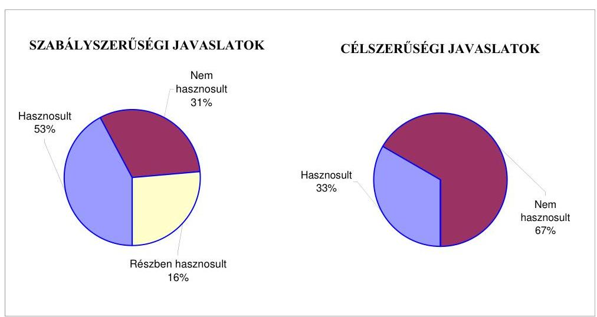
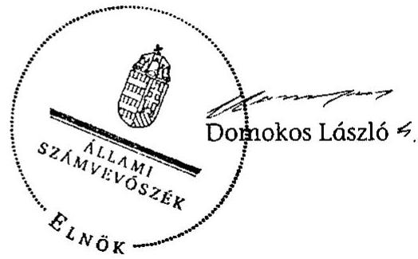

# JELENTÉS 

Gyenesdiás Nagyközség Önkormányzata belső kontrollrendszerének kialakítása, valamint egyes kontrolltevékenységek és a belső ellenőrzés múködése ellenőrzéséről

---

# Állami Számvevőszék 

Iktatószám: V-0012-058-022-021/2013.
Témaszám: 1051
Vizsgálat-azonosító szám: V059121
Az ellenőrzést felügyelte:
Dr. Benedek Mária
felügyeleti vezető
Az ellenőrzést vezette:
Szakmányné Bilik Mária
ellenőrzésvezető
A számvevőszéki jelentés összeállításában közremúködtek:
Dr. Láng Ágnes Krisztina
számvevő
Groholy Andrásné Hangyál Márta
számvevő tanácsos
Az ellenőrzést végezték:
Bencsik Árpád
számvevő

Séra Andrásné
számvevő tanácsos

---

# TARTALOMJEGYZÉK 

BEVEZETÉS ..... 5
I. ÖSSZEGZŐ MEGÁLLAPÍTÁSOK, KÖVETKEZTETÉSEK, JAVASLATOK ..... 8
II. RÉSZLETES MEGÁLLAPÍTÁSOK ..... 15

1. Az Önkormányzat belső kontrollrendszere kialakításának megfelelősége ..... 15
1.1. A kontrollkörnyezet kialakítása ..... 15
1.2. A kockázatkezelési rendszer kialakítása ..... 16
1.3. A kontrolltevékenységek kialakítása ..... 16
1.4. Az információs és kommunikációs rendszer kialakítása ..... 17
1.5. A monitoring rendszer kialakítása ..... 18
2. A pénzügyi folyamatokban kulcsszerepet betöltő belső kontrollok (szakmai teljesítésigazolás és utalvány ellenjegyzés) múködése ..... 18
3. A belső ellenőrzés szervezeti keretei és múködése ..... 20
4. Az ÁSZ 2007-2010. években végzett átfogó ellenőrzései során megfogalmazott javaslatok végrehajtására tett intézkedések ..... 22
FÜGGELÉKEK
5. számú Értelmező szótár
6. számú A belső kontrollrendszer kialakítása, a pénzügyi folyamatokban kulcsszerepet betöltő szakmai teljesítésigazolás és utalvány ellenjegyzés kontrollok múködése, valamint a belső ellenőrzés múködése értékelésénél alkalmazott minősítési szempontok

---

.

---

# RÖVIDÍTÉSEK JEGYZÉKE 

## Törvények

ÁSZ tv.
Avtv.

Info tv.

Mötv.
Ötv.
régi Áht.
Számv. tv.
Tvtv.
új Áht.

## Rendeletek

Áhsz.

Ámr.
Ávr.

Ber.
Bkr.
vagyongazdálkodási rendelet

## Szórövidítések

Általános iskola
ÁSZ
Belső Ellenőrzési Kézikönyv
2011. évi LXVI. törvény az Állami Számvevőszékről
1992. évi LXIII. törvény a személyes adatok védelméről és a közérdekú adatok nyilvánosságáról (hatálytalan 2012. január 1-jétől)
2011. évi CXII. törvény az információs önrendelkezési jogról és az információszabadságról (hatályos 2012. január 1-jétől
2011. évi CLXXXIX. törvény Magyarország helyi önkormányzatairól (hatályos 2012. január 1-jétől)
1990. évi LXV. törvény a helyi önkormányzatokról
1992. évi XXXVIII. törvény az államháztartásról (hatálytalan 2012. január 1-jétől)
2000. évi C. törvény a számvitelről
1996. évi XXXI. törvény a túz elleni védekezésről, a múszaki mentésről és a tűzoltóságról
2011. évi CXCV. törvény az államháztartásról (hatályos 2012. január 1-jétől)

249/2000. (XII. 24.) Korm. rendelet az államháztartás szervezetei beszámolási és könyvvezetési kötelezettségének sajátosságairól
292/2009. (XII. 19.) Korm. rendelet az államháztartás múködési rendjéről (hatálytalan 2012. január 1-jétől)
368/2011. (XII. 31.) Korm. rendelet az államháztartásról szóló törvény végrehajtásáról (hatályos 2012. január 1jétől)
193/2003. (XI. 26.) Korm. rendelet a költségvetési szervek belső ellenőrzéséről (hatálytalan 2012. január 1-jétől)
370/2011. (XII. 31.) Korm. rendelet a költségvetési szervek belső kontrollrendszeréről és belső ellenőrzéséről (hatályos 2012. január 1-jétől)
Gyenesdiás Nagyközség Önkormányzatának 20/2004. (XII. 15.) számú rendelete az önkormányzat vagyonáról és a vagyongazdálkodás szabályairól

Általános és Alapfokú Művészeti Iskola GyenesdiásVárvölgy Közös Fenntartású Intézmény
Állami Számvevőszék
Keszthely és Környéke Térségi Többcélú Társulás Belső Ellenőrzési Kézikönyv (hatályos 2011. március 1-jétől)

---

| Belső Kontroll Kézikönyv | Az Ámr. 155. § (1) bekezdése, valamint az államháztartási belső kontroll standardokról szóló 1/2009. (IX. 11.) |
| :--: | :--: |
|  | PM irányelv egységes értelmezése érdekében az államháztartásért felelős miniszter által a 2010. évben kiadott Belső Kontroll Kézikönyv |
| hivatali SZMSZ | Gyenesdiás Nagyközség Önkormányzata Polgármesteri Hivatalának Szervezeti és Múködési Szabályzata, amit a Képviselő-testület a 109/2005. (XII. 20.) számú határozatával fogadott el (hatályos 2006. január 1-jétől) |
| jegyző | Gyenesdiás Nagyközség Önkormányzatának jegyzője |
| Képviselő-testület | Gyenesdiás Nagyközség Képviselő-testülete |
| kockázatkezelési szabályzat | A Folyamatba épített, előzetes, utólagos és vezetői ellenőrzés szabályzat IV. fejezete (hatályos 2008. november 3ától) |
| kötelezettségvállalási szabályzat | Gyenesdiás Nagyközség Önkormányzata Polgármesteri Hivatalának kötelezettségvállalás, érvényesítés, utalványozás, ellenjegyzés szabályzata (hatályos 2010. november 30-ától) |
| leltározási szabályzat | Gyenesdiás Nagyközség Önkormányzata Polgármesteri Hivatalának eszközök és források leltározási és leltárkészítési szabályzata (hatályos 2008. október 31-től) |
| Önkormányzat polgármester | Gyenesdiás Nagyközség Önkormányzata   Gyenesdiás Nagyközség Önkormányzatának polgármestere |
| Polgármesteri Hivatal | Gyenesdiás Nagyközség Önkormányzatának Polgármesteri Hivatala |
| Társulás | Keszthely és Környéke Térségi Többcélú Társulás |

---

# JELENTÉS 

## Gyenesdiás Nagyközség Önkormányzata belső kontrollrendszerének kialakítása, valamint egyes kontrolltevékenységek és a belső ellenőrzés múködése ellenőrzéséről

## BEVEZETÉS

A belső kontrollrendszer kialakítását, múködtetését és fejlesztését a régi Áht. és az új Áht. is előírja. Ennek megvalósításáért a költségvetési szerv vezetője felel. A belső kontrollrendszer azt a célt szolgálja, hogy a költségvetési szervek múködésük és gazdálkodásuk során a tevékenységeket szabályszerűen, gazdaságosan, hatékonyan, eredményesen hajtsák végre, teljesítsék elszámolási kötelezettségeiket és megvédjék az erőforrásokat a veszteségektől, a károktól és a nem rendeltetésszerú használattól. A belső kontrollrendszer magában foglalja mindazon szabályokat, eljárásokat, gyakorlati módszereket és szervezeti struktúrákat, kockázatkezelési technikákat, kontrolltevékenységeket, amelyek segítséget nyújtanak a szervezetnek céljai eléréséhez.

Az ÁSZ a 2011-2015. évekre szóló stratégiájában hangsúlyos szerepet szánt annak, hogy szilárd szakmai alapon álló, értékteremtő ellenőrzéseivel előmozdítsa a közpénzügyek átláthatóságát, rendezettségét. A számvevőszéki ellenőrzés nemzetközi alapelvei is rögzítik, hogy a megfelelő belső kontrollrendszer minimálisra csökkenti a hibák és szabálytalanságok kockázatát.

Az ellenőrzés célja annak értékelése volt, hogy az Önkormányzat a jogszabályi előírásoknak megfelelően alakította-e ki a belső kontrollrendszert; a gazdálkodás folyamatában kulcsszerepet betöltő szakmai teljesítésigazolás és az utalvány ellenjegyzés kontrolltevékenységeit megfelelően múködtette-e; biztosí-totta-e a belső ellenőrzés szabályos és eredményes múködését; intézkedett-e az ÁSZ által a 2007-2010. évek között végzett átfogó ellenőrzések javaslatainak végrehajtására.

Az ÁSZ ezen ellenőrzési céljait pilot (próba) jelleggel községi/nagyközségi önkormányzatoknál végzett ellenőrzések során érvényesítette.

Az ellenőrzés típusa: szabályszerűségi ellenőrzés
Az ellenőrzés jogszabályi alapja: az ÁSZ tv. 5. § (2) és (6) bekezdései
Az ellenőrzött szervezet: az Önkormányzat
Az ellenőrzött időszak: a belső kontrollrendszer kialakításának megfelelőségét a 2011. évre vonatkozóan értékeltük. A kontrolltevékenységek múködésé-

---

nek megfelelőségét a 2011. január 1-je és december 31-e, míg a belső ellenőrzés működésének szabályosságát és eredményességét a 2009. január 1-je és 2011. december 31-e közötti időszakot figyelembe véve értékeltük. A helyszíni ellenőrzés lezárásáig a helyi szabályozás változásait nyomon követtük.

Az ellenőrzés szakmai módszertana az ÁSZ hivatalos honlapján (www.asz.hu) közzétett szakmai szabályokon alapult, amely a Legfőbb Ellenőrző Intézmények Nemzetközi Szervezete (INTOSAI) által kiadott nemzetközi standardok (ISSAI) figyelembevételével készült.

A belső kontrollrendszer kialakításának ellenőrzése során értékeltük a kontrollkörnyezet, a kockázatkezelési rendszer, a kontrolltevékenységek, az információs és kommunikációs rendszer, valamint a monitoring rendszer szabályozottságának megfelelőségét.

Értékeltük a pénzügyi folyamatokban kulcsszerepet betöltő szakmai teljesítésigazolás és utalvány ellenjegyzés kontrollok múködésének megfelelőségét az államháztartáson kívülre teljesített múködési és felhalmozási célú pénzeszköz átadásoknál, az állományba nem tartozók megbízási díjainál, továbbá a külső szolgáltatók által végzett karbantartási, kisjavítási munkákkal kapcsolatos kifizetéseknél. Az egyszerú véletlen mintavétellel kiválasztott tételek ellenőrzését többlépcsős megfelelőségi tesztek útján addig végeztük, amíg elegendő és megfelelő bizonyítékot szereztünk a vizsgált folyamatok kulcskontrolljai múködésének megfelelő vagy nem megfelelő voltáról. Értékeltük az Önkormányzatnál a belső ellenőrzés múködésének szabályosságát és eredményességét. Az ÁSZ az Önkormányzat gazdálkodási rendszerét a 2008. évben ellenőrizte átfogó jelleggel.

A fogalmak magyarázatát az 1. számú függelék, az ellenőrzés egyes területeinek értékelésénél alkalmazott egységes minősítési szempontokat a 2. számú függelék tartalmazza.

Az ellenőrzés lefolytatásához az Önkormányzat a munkalapok és a tanúsítvány elektronikus kitöltésével, valamint a megjelölt dokumentumok elektronikus megküldésével szolgáltatott adatokat. A munkalapokon szerepeltetett adatok, információk ellenőrzése és szükség szerinti javítása a helyszíni ellenőrzés keretében történt.

Az ÁSZ az ellenőrzés megállapításait az ellenőrzött időszakban hatályos, az intézkedést igénylő megállapításokra tett javaslatokat a jelenleg hatályos jogszabályok alapján fogalmazta meg.

Az ÁSZ tv. 29. § (1) bekezdése szerint a jelentéstervezetet megküldtük a polgármester részére, aki az ÁSZ tv. 29. § (2) bekezdésében foglalt észrevételezési jogával nem élt, a jelentéstervezetre észrevételt nem tett.

Gyenesdiás nagyközség állandó lakosainak száma 2011. január 1-jén 3899 fő volt. Az Önkormányzat héttagú Képviselő-testületének munkáját kettő állandó bizottság segítette. Az Önkormányzat az önállóan múködő és gazdálkodó Polgármesteri Hivatalon felül négy - ebből egy önállóan múködő és gazdálkodó intézménnyel látta el feladatát. Az Önkormányzat többségi tulajdoni hányadú gazdasági társasággal nem rendelkezett.

---

A polgármester a 2006. évi önkormányzati választások óta tölti be tisztségét. A jegyző 1990. november 13-ától látja el feladatait. Az Önkormányzatnál a Polgármesteri Hivatal feladatellátásának szervezeti keretei 2013. január 1-jét követően nem változtak. A Polgármesteri Hivatal szervezeti egységekre nem tagolódott, a foglalkoztatott köztisztviselők száma 2011. január 1-jén 16 fő volt.

Az Önkormányzat a 2011. évi költségvetési beszámolója szerint 1011789 ezer Ft költségvetési bevételt ért el, valamint 981631 ezer Ft költségvetési kiadást teljesített. A 2011. december 31-i könyvviteli mérleg szerint 6640283 ezer Ft értékű eszközvagyonnal rendelkezett, 12265 ezer Ft rövid lejáratú kötelezettsége volt. Az Önkormányzatnak hosszú lejáratú kötelezettsége nem volt.

---

# I. ÖSSZEGZŐ MEGÁLLAPÍTÁSOK, KÖVETKEZTETÉSEK, JAVASLATOK 

A belső kontrollrendszeren belül 2011-ben a Polgármesteri Hivatalban a kontrollkörnyezet, a kockázatkezelési rendszer, a kontrolltevékenységek és a monitoring rendszer kialakítását, valamint az információs és kommunikációs rendszer szabályozását külön-külön és összesítve is értékeltük. A belső kontrollrendszer kialakítása az összesített értékelés alapján nem felelt meg a jogszabályi előírásoknak. Az egyes területek kialakításának értékelését az alábbiakban részletezzük.

A kontrollkörnyezet kialakítása nem felelt meg a jogszabályi követelményeknek, mert a jegyző a Számv. tv. előírása ellenére nem készítette el a Polgármesteri Hivatal bizonylati rendjét, és a Tvtv. előírásai ellenére a tűzvédelmi szabályzatot. A jegyző az Ámr.-ben ${ }^{1}$ foglaltak és az előző ÁSZ ellenőrzés javaslata ellenére a hivatali SZMSZ-ben nem rögzítette az abban nevesített munkakörökhöz tartozó részletes feladatokat, hatásköröket és a hatáskörök gyakorlásának módját, valamint az ehhez kapcsolódó felelősségi szabályokat. A jegyző az Áhsz. és a vagyongazdálkodási rendelet évenkénti leltározásra vonatkozó szabályozása, valamint az előző ÁSZ ellenőrzés javaslata ellenére a mérlegben kimutatott eszközök kétévenkénti leltározási kötelezettségét határozta meg a leltározási szabályzatban.

A kockázatkezelési rendszer kialakítása nem felelt meg a jogszabályi előírásoknak, mert a jegyző az Ámr.-ben foglaltak ellenére nem mérte fel és nem állapította meg a Polgármesteri Hivatal tevékenységében és gazdálkodásában rejlő kockázatokat.

A kontrolltevékenységek kialakítása a jogszabályi előírásoknak részben felelt meg. A jegyző szabályozta a folyamatba épített, előzetes, utólagos és vezetői ellenőrzést. Meghatározta a szakmai teljesítésigazolás módját és kijelölte az érvényesítésre, illetve szakmai teljesítésigazolásra jogosultakat. Azonban a kötelezettségvállalási szabályzatban - az Ámr.-ben foglaltakat és az előző ÁSZ ellenőrzés javaslatát is figyelmen kívül hagyva - nem határozta meg az előzetes írásbeli kötelezettségvállalást nem igénylő kifizetések rendjét, az eljárási részletszabályokat annak ellenére, hogy a kötelezettségvállalási szabályzat tartalmazta a nem írásbeli kötelezettségvállalás lehetőségét. A jegyző az Ámr. előírása ellenére nem szabályozta a Polgármesteri Hivatal tevékenységeire vonatkozó beszámolási eljárásokat.

Az információs és kommunikációs rendszer szabályozása a jogszabályi előírásoknak nem felelt meg, mert a jegyző az Avtv. ${ }^{2}$ és az Ámr. előírása ellenére nem készítette el az adatvédelmi és adatbiztonsági szabályzatot, nem határozta meg a közérdekú adatok megismerésére irányuló igények teljesítésének,

[^0]
[^0]:    ${ }^{1}$ 2012. január 1-jétől Ávr.
    ${ }^{2}$ 2012. január 1-jétől Info tv.

---

valamint a kötelezően közzéteendő adatok nyilvánosságra hozatalának rendjét. Az Avtv. rendelkezése ellenére a jegyző nem határozta meg az informatikai rendszer hozzáférési jogosultságai megállapítására és azok ellenőrzésére vonatkozó eljárásrendet. Nem szabályozta a pénzügyi-számviteli szoftverváltozások ellenőrzésére vonatkozó eljárásokat, a feldolgozott adatok mentési eljárásait és nem jelölte ki a mentések felelőseit.

A monitoring rendszer kialakítása a jogszabályi követelményeknek nem felelt meg, mert a jegyző az Ámr.-ben foglaltak ellenére az operatív tevékenységek keretében megvalósuló folyamatos és eseti nyomon követésből álló, a Polgármesteri Hivatal tevékenységének, a célok megvalósításának nyomon követését biztosító rendszer szabályait nem határozta meg.

A belső kontrollrendszer nem megfelelő kialakítása kockázatot jelent az Önkormányzat tevékenységeinek szabályszerű, gazdaságos, hatékony és eredményes végrehajtása során.

A Polgármesteri Hivatalban a 2011. évben az államháztartáson kívülre történő működési és felhalmozási célú pénzeszközátadásokkal, az állományba nem tartozók megbízási díjaival, valamint a külső szolgáltatók által végzett karbantartással, kisjavítással kapcsolatos kifizetések során összefoglalóan értékelve a kulcskontrollok múködésének megfelelősége gyenge volt.

Az állományba nem tartozók megbízási díjaival, valamint a külső szolgáltatók által végzett karbantartással, kisjavítással kapcsolatos kiadások teljesítését megelőzően a szakmai teljesítés igazolására a jegyző által kijelölt személyek nem tettek eleget az Ámr.-ben előírt igazolási kötelezettségüknek. A népszámlálással kapcsolatos megbízási díjak kifizetéseinél az igazolás ellenére nem végezték el az összegszerűség ellenőrzését, mert nem kifogásolták, hogy a megbízási díj elszámolásának dokumentumán a szerződésben rögzítetteken túl további díjtételt is szerepeltettek.

Az utalványok ellenjegyzője a kiadások teljesítését megelőzően az Ámr.-ben foglalt ellenőrzési feladatait nem a jogszabályi előírásoknak megfelelően végezte. Annak ellenére ellenjegyezte az utalványokat, hogy elmaradt a szakmai teljesítés igazolása, illetve az összegszerűség ellenőrzése, így az érvényesítésre is szakmai teljesítésigazolás, illetve az összegszerűség ellenőrzése hiányában került sor. A gazdálkodásra - közöttük a kötelezettségvállalások nyilvántartására és az utalványrendeleten a kötelezettségvállalás nyilvántartási számának feltüntetésére, a kötelezettségvállalások ellenjegyzésére - vonatkozó szabályok betartásának hiánya ellenére az utalványokat ellenjegyezte.

Az ellenőrzött kifizetésekkel összefüggésben a rendelkezésre bocsátott dokumentumok alapján jogosulatlan kifizetést nem tárt fel az ellenőrzésünk, azonban a gazdálkodásban kulcsszerepet betöltő kontrollok múködésében feltárt hiányosságok miatt magas a hibák bekövetkezésének lehetősége. A nem megfelelően szabályozott és múködtetett belső kontrollok korrupciós kockázatot is hordoznak.

---

A korábbi ÁSZ ellenőrzés során - a szakmai teljesítésigazolás és az utalvány ellenjegyzés kulcskontrollok múködtetésére, valamint a kötelezettségvállalások nyilvántartására és ellenjegyzésére - tett javaslatokat nem hasznosították, ami a hibák ismétlődéséhez vezetett.

Az Önkormányzatnál a belső ellenőrzési feladatokat képviselő-testületi döntés alapján társulásos formában látták el. Az Önkormányzatnál a 2009-2011. években a belső ellenőrzés szabályozása és működése összességében megfelelt a jogszabályi előírásoknak. Az éves ellenőrzési tervek összeállítását megelőzően kockázatelemzést végeztek. Az éves ellenőrzési tervekben jóváhagyott ellenőrzéseket elvégezték. Az ellenőrzésekről készített jelentések megfeleltek a Ber.-ben ${ }^{3}$ előírt szerkezeti és tartalmi követelményeknek. A 2009-2011. években az ellenőrzési tervek összeállításához a jegyző a Ber. előírása ellenére írásos véleményt nem adott, az ellenőrzési programokat a belső ellenőrzési vezető helyett a jegyző hagyta jóvá.

Az Önkormányzatnál a 2009-2011. évek között a belső ellenőrzés működése - a 2. számú függelékben részletezett kritériumrendszer alapján végzett értékelés szerint - nem volt eredményes annak ellenére, hogy a belső ellenőrzés szabályozása az ellenőrzött időszak egészét tekintve a jogszabályi előírásoknak megfelelt. Ellenőrizték ugyan a gazdálkodási jogkörök gyakorlásához kapcsolódó, valamint a készpénzkezeléssel kapcsolatos belső kontrollok múködését, a leltározás és selejtezés szabályszerűségét, valamint a kockázatosnak értékelt területeket, azonban a belső ellenőrzés javaslatai nem hasznosultak teljes körűen, mert a jegyző nem gondoskodott a vagyongazdálkodási rendelet módosításához, valamint a közérdekű adatok közzététele eljárásrendjének meghatározásához szükséges intézkedések megtételéről és a kötelezettségvállalások nyilvántartásának vezetéséről. Mindezek hozzájárultak a korábbi számvevőszéki ellenőrzés során is feltárt szabályozási hiányosságok, hibák ismétlődéséhez.

Az ÁSZ tv. 33. § (1) bekezdésében foglaltak értelmében az ellenőrzött szervezet vezetője köteles a jelentésben foglalt megállapításokhoz kapcsolódó intézkedési tervet összeállítani, és azt a jelentés kézhezvételétől számított 30 napon belül az ÁSZ részére megküldeni. Amennyiben az intézkedési tervet határidőre nem küldi meg a szervezet, vagy az - az ÁSZ tv. 33. § (2) bekezdésében foglalt póthatáridő eltelte ellenére - továbbra sem elfogadható, az ÁSZ elnöke a hivatkozott törvény 33. § (3) bekezdés a)-b) pontjaiban foglaltakat érvényesítheti.

Az ellenőrzés intézkedést igénylő megállapításai és javaslatai:

# a polgármesternek 

1. A Gyenesdiás Köz-Kultúra Alapítvány, az orvosi ügyelet, valamint a Gyenesdiási Turisztikai Egyesület részére teljesített pénzeszközátadások, továbbá az üdülőhelyi ellenőri és az egészségügyi asszisztensi feladatok ellátására teljesített megbízási díjak alapját képező kötelezettségvállalásokra - a régi Áht. 100/C. § (3) bekezdésében és az Ámr. 74. § (1) bekezdésében foglaltak ellenére - ellenjegyzés nélkül került sor.
[^0]
[^0]:    ${ }^{3}$ 2012. január 1-jétől Bkr.

---

Javaslat:
Biztosítsa, hogy - az új Áht. 37. § (1) bekezdésében foglaltaknak megfelelően - az Önkormányzat nevében történő kötelezettségvállalásra - az Ávr. 53. §-ában meghatározott kivételeket figyelembe véve - kizárólag pénzügyi ellenjegyzés után, a pénzügyi teljesítés esedékességét megelőzően, írásban kerüljön sor.
2. A jegyző által a szakmai teljesítésigazolásra kijelölt személyek nem tettek eleget a régi Áht. 100/C. § (6) bekezdése alapján az Ámr. 76. § (1) és (3) bekezdésében előírt igazolási, valamint az összegszerűség ellenőrzésére vonatkozó kötelezettségüknek. Az utalványok ellenjegyzője - aláírása ellenére - nem a jogszabályi előírásoknak megfelelően tett eleget a régi Áht. 100/C. § (6) bekezdése alapján az Ámr. 79. § (2) bekezdésében előírt ellenőrzési feladatának.

Javaslat:
A Mötv. 115. § (1) bekezdésében foglaltak alapján kísérje figyelemmel az önkormányzat gazdálkodásának szabályszerűségét. A Mötv. 67. § f) pontja alapján gondoskodjon a belső kontrollrendszerre és a belső ellenőrzés müködésére vonatkozó jogszabályi rendelkezések be nem tartása, valamint a szakmai teljesítésigazolás és az utalvány ellenjegyzés kontrollokkal összefüggésben feltárt hiányosságok és szabálytalanságok tekintetében az esetleges munkajogi felelősséggel kapcsolatos körülmények kivizsgálásáról, és a vizsgálat eredményének függvényében tegye meg a szükséges munkajogi intézkedéseket.

# a jegyzőnek 

1. a kontrollkörnyezettel kapcsolatban:

A jegyző - a Számv. tv. 161. § (2) bekezdés d) pontjában foglaltak ellenére - nem készítette el a Polgármesteri Hivatal bizonylati rendjét.

A jegyző - a Tvtv. 19. § (1) bekezdésében foglaltak ellenére - nem készítette el a Polgármesteri Hivatal tűzvédelmi szabályzatát.

A jegyző - az Ámr. 20. § (2) bekezdés h) pontjában és a (7) bekezdésében foglaltak ellenére - a hivatali SZMSZ-ben nem rögzítette az abban nevesített munkakörökhöz tartozó részletes feladatokat, hatásköröket, a hatáskörök gyakorlásának módját és az ehhez kapcsolódó felelősségi szabályokat.

A leltározási szabályzatban - az Áhsz. 37. § (1) bekezdésében, valamint a vagyongazdálkodási rendelet 3. § (2) bekezdésében foglaltak ellenére - a mérlegben kimutatott eszközök kétévenkénti leltározási kötelezettségét írta elő.

Javaslat:
a) Készítse el a Számv. tv. 161. § (2) bekezdés d) pontja előírásának megfelelően a Polgármesteri Hivatal bizonylati rendjét.
b) Készítse el a Tvtv. 19. § (1) bekezdésében foglalt előírásnak megfelelően a Polgármesteri Hivatal tűzvédelmi szabályzatát.

---

c) Módosítsa a hivatali SZMSZ-t, és kezdeményezze a polgármesternél a módosítás Képviselő-testület elé terjesztését annak érdekében, hogy az az Ávr. 13. § (1) bekezdés g) pontjában és a 13. § (5) bekezdésében foglaltaknak megfelelően tartalmazza a benne nevesített munkakörökhöz tartozó feladat- és hatásköröket, a hatáskörök gyakorlásának módját és a felelősségi szabályokat.
d) Írja elő a leltározási szabályzatban a mérlegben kimutatott eszközök és források leltározási kötelezettségét az Áhsz. 37. § (1) bekezdésében és a vagyongazdálkodási rendelet 3. § (2) bekezdésében foglaltaknak megfelelően.
2. a kockázatkezelési rendszerrel kapcsolatban:

A jegyző az Ámr. 157. § (1)-(2) bekezdéseinek előírása ellenére nem mérte fel és nem állapította meg a Polgármesteri Hivatal tevékenységében és gazdálkodásában rejlő kockázatokat.

Javaslat:
Mérje fel és állapítsa meg - a Bkr. 7. §-ában foglaltak alapján - a Polgármesteri Hivatal tevékenységében és gazdálkodásában rejlő kockázatokat.
3. a kontrolltevékenységekkel kapcsolatban:

A jegyző az Ámr. 158. § (2) bekezdés d) pontjában foglaltak ellenére nem szabályozta a Polgármesteri Hivatal tevékenységeire vonatkozó beszámolási eljárásokat.

A jegyző - az Ámr. 20. § (3) bekezdés a) pontjában és a 72. § (14) bekezdésében foglaltakat figyelmen kívül hagyva - annak ellenére nem határozta meg az előzetes írásbeli kötelezettségvállalást nem igénylő kifizetések rendjét és az eljárási részletszabályokat, hogy a kötelezettségvállalási szabályzat tartalmazta a nem írásbeli kötelezettségvállalás lehetőségét.

Javaslat:
a) Szabályozza a Bkr. 8. § (4) bekezdés c) pont előírásának megfelelően a Polgármesteri Hivatal tevékenységeire vonatkozó beszámolási eljárásokat.
b) Határozza meg az Ávr. 13. § (2) bekezdés a) pontjának és 53. § (2) bekezdésének megfelelően az előzetes írásbeli kötelezettségvállalást nem igénylő kifizetések rendjét és eljárási részletszabályait.
4. az információs és kommunikációs rendszerrel kapcsolatban:

A jegyző - az Avtv. 31/A. § (3) bekezdése ellenére nem készítette el a Polgármesteri Hivatal adatvédelmi és adatbiztonsági szabályzatát.

A jegyző az Avtv. 20. § (8) bekezdésének előírása ellenére nem készítette el a közérdekű adatok megismerésére irányuló igények teljesítésének rendjét rögzítő szabályzatot. Az Ámr. 20. § (3) bekezdés i) pontjában foglaltak ellenére nem határozta meg a kötelezően közzéteendő adatok nyilvánosságra hozatalának rendjét.

---

Az informatikai rendszer környezetének szabályozása során - az Avtv. 10. § (1)-(2) bekezdéseinek előírása ellenére - a jegyző nem határozta meg a hozzáférési jogosultságok megállapítására, és azok ellenőrzésére vonatkozó eljárásrendet, továbbá nem szabályozta a pénzügyi-számviteli szoftverváltozások ellenőrzésére vonatkozó eljárásokat, a feldolgozott adatok mentési eljárásait, és nem jelölte ki a mentések felelőseit.

Javaslat:
a) Készítse el a Polgármesteri Hivatal adatvédelmi és adatbiztonsági szabályzatát az Info tv. 24. § (3) bekezdésének megfelelően.
b) Állapítsa meg - az Info tv. 33. § (1) és 35. § (3) bekezdéseiben, valamint az Ávr. 13. § (2) bekezdés h) pontjában foglaltaknak megfelelően - a kötelezően közzéteendő adatok nyilvánosságra hozatalának rendjét, továbbá készítsen - az Info tv. 30. § (6) bekezdésében és az Ávr. 13. § (2) bekezdés h) pontjában foglaltaknak megfelelően - a közérdekú adatok megismerésére irányuló igények teljesítésének rendjét rögzítő szabályzatot.
c) Biztosítsa az Info tv. 7. § (2)-(3) bekezdéseinek megfelelően az adatbiztonság érvényesülését, az informatikai környezet szabályozása keretében rendelkezzen a hozzáférési jogosultságok megállapításáról és azok ellenőrzéséről, valamint szabályozza a pénzügyi-számviteli szoftverváltozások ellenőrzésére vonatkozó eljárásokat, a feldolgozott adatok mentési eljárásait, és jelölje ki a mentések felelőseit.
5. a monitoring rendszerrel kapcsolatban:

A jegyző - az Ámr. 160. §-ában foglaltak ellenére - nem alakított ki olyan monitoring rendszert, amely lehetővé teszi a Polgármesteri Hivatal tevékenységének, a célok megvalósításának nyomon követését, és amelynek része az operatív tevékenységek keretében megvalósuló folyamatos és eseti nyomon követés is.

Javaslat:
Alakítsa ki és múködtesse a Bkr. 3. § e) pontjában és 10. §-ában előírtak alapján a Polgármesteri Hivatal tevékenységének, a célok megvalósításának nyomon követését biztosító rendszert, amelynek része az operatív tevékenységek keretében megvalósuló folyamatos és eseti nyomon követés is.
6. a pénzügyi folyamatokban kulcsszerepet betöltő kontrollokkal kapcsolatban:

Az állományba nem tartozók megbízási díjaival, valamint a külső szolgáltatók által végzett karbantartással, kisjavítással kapcsolatos kiadások teljesítését megelőzően a jegyző által a szakmai teljesítés igazolására kijelölt személyek nem tettek eleget a régi Áht. 100/C. § (6) bekezdésében és az Ámr. 76. § (1) és (3) bekezdéseiben előírt igazolási, valamint az összegszerűség ellenőrzésére vonatkozó kötelezettségüknek.

Az utalványok ellenjegyzője a kiadásokat megelőzően nem a jogszabályi előírásoknak megfelelően tett eleget az Ámr. 79. § (2) bekezdésében foglalt ellenőrzési kötelezettségének, mert a kifizetéseket szakmai teljesítésigazolás, illetve az összegszerűség ellenőrzésének hiányában ellenjegyezte.

---

Az utalványok ellenjegyzője az államháztartáson kívülre teljesített múködési és felhalmozási célú pénzeszközátadásokkal, az állományba nem tartozók megbízási díjaival, valamint a külső szolgáltatók által végzett karbantartással, kisjavítással kapcsolatos kiadásokat megelőzően annak ellenére ellenjegyezte az utalványokat, hogy nem tartották be a gazdálkodásra vonatkozó, a régi Áht. 100/C. § (3) bekezdésében és az Ámr. 74. § (1) bekezdésében előírt, a kötelezettségvállalások ellenjegyzésére, az Ámr. 75. § (1) bekezdésében foglalt, a kötelezettségvállalások nyilvántartásba vételére és az Ámr. 78. § (2) bekezdés g) pontja szerinti, a kötelezettségvállalás nyilvántartási számának az utalványrendeleten történő feltüntetésére vonatkozó szabályokat.

Javaslat:
Gondoskodjon - a szakmai teljesítés igazolása és az utalvány ellenjegyzése vonatkozásában feltárt hiányosságok megszüntetése, illetve az operatív gazdálkodás során a múködésbeli hibák megelőzése, feltárása és kijavítása érdekében - arról, hogy
a) a teljesítés igazolására kijelölt személyek az Ávr. 57. § (1) bekezdésében előírtaknak megfelelően a kiadások teljesítésének jogosságát, összegszerűségét, az ellenszolgáltatást is magában foglaló kötelezettségvállalás esetében - ha a kifizetés vagy annak egy része az ellenszolgáltatás teljesítését követően esedékes - annak teljesítését ellenőrizhető okmányok alapján ellenőrizzék, valamint az igazolási kötelezettségüknek az Ávr. 57. § (3) bekezdése szerint tegyenek eleget;
b) a kifizetéseket megelőzően - az Ávr. 58. § (1) bekezdése szerint - a teljesítésigazolás alapján - az Ávr. 57. § (3) bekezdése szerinti esetben annak hiányában is az összegszerűségnek, a fedezet meglétének és a megelőző ügymenetben az új Áht., az Áhsz., az Ávr. előírásai és a belső szabályzatokban foglaltak betartásának az ellenőrzése történjen meg;
c) a kötelezettségvállalásokat az Ávr. 56. § (1) bekezdésében foglaltak szerint vegyék nyilvántartásba, és az utalványrendeleteken az Ávr. 59. § (3) bekezdés f) pontjában foglaltaknak megfelelően a kötelezettségvállalás nyilvántartási számát tüntessék fel;
d) a kötelezettségvállalások ellenjegyzése az új Áht. 37. § (1) bekezdése szerint történjen.
7. a belső ellenőrzés múködésével kapcsolatban:

A 2009-2011. években az ellenőrzési tervek összeállítása - a Ber. 32/B. § (2) bekezdésének előírása ellenére - a jegyző írásos véleményének figyelembevétele nélkül történt.

Az ellenőrzési programokat - a Ber. 23. § (3) bekezdésének előírása ellenére - a belső ellenőrzési vezető helyett a jegyző hagyta jóvá.

Javaslat:
a) Intézkedjen arról, hogy - a Társulásban történő feladatellátás miatt - az ellenőrzési terv összeállítása a Bkr. 56. § (2) bekezdésében foglaltaknak megfelelően a jegyző írásos véleményének figyelembevételével történjen.
b) Intézkedjen arról, hogy az ellenőrzési programokat a Bkr. 33. § (2) bekezdésében foglaltaknak megfelelően a belső ellenőrzési vezető hagyja jóvá.

---

# II. RÉSZLETES MEGÁLLAPÍTÁSOK 

## 1. Az ÖNKORMÁNYZAT BELSŐ KONTROLLRENDSZERE KIALAKÍTÁSÁNAK MEGFELELŐSÉGE

### 1.1. A kontrollkörnyezet kialakítása

A kontrollkörnyezet kialakítása - a 2. számú függelékben részletezett kritériumrendszer alapján végzett értékelés szerint - a Polgármesteri Hivatalban nem volt megfelelő, mert a jegyző a jogszabályi előírásokat nem érvényesítette maradéktalanul.

A jegyző, mint a költségvetési szerv vezetője:

- a Számv. tv. 161. § (2) bekezdés d) pontjában foglaltak ellenére nem készítette el a Polgármesteri Hivatal bizonylati rendjét;
- a Tvtv. 19. § (1) bekezdésében foglaltak ellenére nem készítette el a Polgármesteri Hivatal tűzvédelmi szabályzatát;
- az Ámr. 20. § (2) bekezdés h) pontjának ${ }^{4}$ és (7) bekezdésének ${ }^{5}$ előírása, valamint az előző ÁSZ ellenőrzés javaslata ellenére nem rögzítette a hivatali SZMSZ-ben az abban nevesített munkakörökhöz tartozó részletes feladatokat, hatásköröket és a hatáskörök gyakorlásának módját, valamint az ehhez kapcsolódó felelősségi szabályokat;
- a leltározási szabályzatban - az Áhsz. 37. § (1) bekezdésében, valamint a vagyongazdálkodási rendelet 3. § (2) bekezdésében előírt évenkénti leltározási kötelezettség és az előző ÁSZ ellenőrzés javaslata ellenére - a mérlegben kimutatott eszközök kétévenkénti leltározási kötelezettségét határozta meg;

A kontrollkörnyezet kialakítása során a jegyző az Ámr. 155. § (3) bekezdésének ${ }^{6}$ előírását figyelmen kívül hagyva az államháztartásért felelős miniszter által kiadott Belső Kontroll Kézikönyv ajánlásait nem hasznosította teljes körűen.

A kontrollkörnyezet kialakítása során a jegyző:

- a Belső Kontroll Kézikönyv 1.2.7. pontjában foglaltakat figyelmen kívül hagyva nem írta elő a hivatali SZMSZ munkatársak általi megismerésének kötelezettségét, és annak dolgozók általi megismerését nem dokumentálták;
- a Polgármesteri Hivatalban dolgozó köztisztviselők munkaköri leírásaiban, a Belső Kontroll Kézikönyv 1.3.3. pontjában foglalt ajánlás, valamint az előző

[^0]
[^0]:    ${ }^{4}$ 2012. január 1-jétől az Ávr. 13. § (1) bekezdés g) pont
    ${ }^{5}$ 2012. január 1-jétől az Ávr. 13 § (5) bekezdés
    ${ }^{6}$ 2012. január 1-jétől a Bkr. 5. § (1) bekezdés

---

ÁSZ ellenőrzés javaslatai ellenére, a munkakörökhöz kapcsolódó jog- és felelősségi köröket nem határozta meg;

- a Belső Kontroll Kézikönyv 1.5.2. pontjában foglalt ajánlást nem hasznosította, mert nem dolgozta ki a Polgármesteri Hivatalban ellátott köztisztviselői munkakörök betöltésére vonatkozó elvárt tudást és képességeket.

# 1.2. A kockázatkezelési rendszer kialakítása 

A kockázatkezelési rendszer kialakítása - a 2. számú függelékben részletezett kritériumrendszer alapján végzett értékelés szerint - a Polgármesteri Hivatalban nem volt megfelelő. A Polgármesteri Hivatal rendelkezett kockázatkezelési szabályzattal, azonban az Ámr. 157. § (1)-(2) bekezdésében ${ }^{7}$ foglaltak ellenére a jegyző nem mérte fel és nem állapította meg a Polgármesteri Hivatal tevékenységében és gazdálkodásában rejlő kockázatokat.

A kockázatkezelési rendszer kialakítása során a jegyző az Ámr. 155. § (3) bekezdésének előírását figyelmen kívül hagyva az államháztartásért felelős miniszter által kiadott Belső Kontroll Kézikönyv ajánlásait nem hasznosította teljes körűen.

A kockázatkezelési rendszer kialakítása során a jegyző:

- a Belső Kontroll Kézikönyv 2.2.3. pontjának ajánlását nem hasznosította, mivel nem határozta meg a kockázati túréshatárokat;
- a Belső Kontroll Kézikönyv 2.5.1. pontjának ajánlását nem érvényesítette, mivel nem gondoskodott a csalás és a korrupció, mint kiemelt kockázatok értékeléséről és kezeléséről.

### 1.3. A kontrolltevékenységek kialakítása

A kontrolltevékenységek kialakítása - a 2. számú függelékben részletezett kritériumrendszer alapján végzett értékelés szerint - a Polgármesteri Hivatalban részben volt megfelelő. A jegyző a kontrollstratégiák és módszerek keretében szabályozta a folyamatba épített, előzetes, utólagos és vezetői ellenőrzést. Meghatározta a szakmai teljesítésigazolás módját és kijelölte az érvényesítésre, illetve szakmai teljesítésigazolásra jogosultakat. A jegyző a feladatellátás folytonosságának biztosítása érdekében szabályozta a munkaviszony megszűnése esetén a folyamatban lévő feladatok átadásának rendjét, továbbá munkakör átadás-átvétel esetén jegyzőkönyv készítési kötelezettséget írt elő, azonban a jogszabályi előírásokat nem érvényesítette maradéktalanul.

A jegyző, mint a költségvetési szerv vezetője:

- az Ámr. 158. § (2) bekezdés d) pontjának ${ }^{8}$ előírása ellenére nem szabályozta a Polgármesteri Hivatal tevékenységeire vonatkozó beszámolási eljárásokat;

[^0]
[^0]:    ${ }^{7}$ 2012. január 1-jétől a Bkr. 7. § (1) bekezdés
    ${ }^{8}$ 2012. január 1-jétől a Bkr. 8. § (4) bekezdés c) pont

---

- az Ámr. 20. § (3) bekezdés a) pontjában és a 72. § (14) bekezdésében ${ }^{9}$ foglaltakat, továbbá az előző ÁSZ ellenőrzés javaslatát figyelmen kívül hagyva nem határozta meg az előzetes írásbeli kötelezettségvállalást nem igénylő kifizetések rendjét, az eljárási részletszabályokat, annak ellenére, hogy a kötelezettségvállalási szabályzatban előírta, hogy a gazdasági eseményenként 50 ezer Ft-ot el nem érő kifizetésekhez nem szükséges előzetes írásbeli kötelezettségvállalás.

A kontrolltevékenységek kialakítása során a jegyző az Ámr. 155. § (3) bekezdésének előírását figyelmen kívül hagyva az államháztartásért felelős miniszter által kiadott Belső Kontroll Kézikönyv ajánlásait nem hasznosította teljes körűen.

A jegyző a Belső Kontroll Kézikönyv 3.2.1. pontjában foglaltakat figyelmen kívül hagyva, nem határozta meg a köztisztviselők végrehajtási, ellenőrzési, illetve pénzügyi teljesítési feladatait.

# 1.4. Az információs és kommunikációs rendszer kialakítása 

Az információs és kommunikációs rendszer kialakítása - a 2. számú függelékben részletezett kritériumrendszer alapján végzett értékelés szerint - a Polgármesteri Hivatalban nem volt megfelelő, mert a jegyző a jogszabályi követelményeket nem érvényesítette.

A jegyző, mint a költségvetési szerv vezetője:

- az Avtv. 31/A. § (3) bekezdése ${ }^{10}$ ellenére nem készítette el az adatvédelmi és adatbiztonsági szabályzatot;
- az Avtv. 20. § (8) bekezdésének ${ }^{11}$ előírása ellenére nem készítette el a közérdekű adatok megismerésére irányuló igények teljesítésének rendjét rögzítő szabályzatot;
- az Ámr. 20. § (3) bekezdés i) pontjában ${ }^{12}$ foglaltak ellenére nem határozta meg a kötelezően közzéteendő adatok nyilvánosságra hozatalának rendjét;
- az informatikai rendszer környezetének szabályozása során - az Avtv. 10. § (1)-(2) bekezdéseiben ${ }^{13}$ foglalt előírások ellenére - elmulasztotta az adatbiztonság érvényre juttatásához szükséges intézkedések megtételét. Nem határozta meg a hozzáférési jogosultságok megállapítására és azok ellenőrzésére vonatkozó eljárásrendet. Nem szabályozta a pénzügyi-számviteli szoftverváltozások ellenőrzésére vonatkozó eljárásokat, a feldolgozott adatok mentési eljárásait és nem jelölte ki a mentések felelőseit.

[^0]
[^0]:    ${ }^{9}$ 2012. január 1-jétől az Ávr. 13. § (2) bekezdés a) pont és 53. § (2) bekezdés
    ${ }^{10}$ 2012. január 1-jétől az Info tv. 24. § (3) bekezdés
    ${ }^{11}$ 2012. január 1-jétől az Ávr. 13. § (2) bekezdés h) pontja és az Info tv. 35. § (3) bekezdés
    ${ }^{12}$ 2012. január 1-jétől az Ávr. 13. § (2) bekezdés h) pont
    ${ }^{13}$ 2012. január 1-jétől az Info tv. 7. § (2)-(3) bekezdés

---

Az információs és kommunikációs rendszer kialakítása során a jegyző az Ámr. 155. § (3) bekezdésének előírását figyelmen kívül hagyva az államháztartásért felelős miniszter által kiadott Belső Kontroll Kézikönyv ajánlásait nem hasznosította teljes körűen.

A jegyző a Belső Kontroll Kézikönyv 4.1.1. pontjában foglalt ajánlást nem hasznosította, mert nem szabályozta a szervezeten belüli, valamint a szervezeten kívülre történő információátadás módját és formáit, és nem írta elő az információáramlás dokumentálási kötelezettségét.

# 1.5. A monitoring rendszer kialakítása 

A monitoring rendszer kialakítása - a 2. számú függelékben részletezett kritériumrendszer alapján végzett értékelés szerint - a Polgármesteri Hivatalban nem volt megfelelő, mert a jegyző az Ámr. 160. §-ában ${ }^{14}$ foglaltak ellenére az operatív tevékenységek keretében megvalósuló folyamatos és eseti nyomon követésből álló, a Polgármesteri Hivatal tevékenységének, a célok megvalósításának nyomon követését biztosító rendszert nem alakította ki.

A belső kontrollrendszer kialakítása a Polgármesteri Hivatalban 2011-ben a kontrollkörnyezet, a kontrolltevékenységek és a kockázatkezelési rendszer, a monitoring rendszer kialakításának, illetve az információs és kommunikációs rendszer szabályozásának értékelése alapján összességében nem felelt meg a jogszabályi előírásoknak.

## 2. A PÉNZÜGYI FOLYAMATOKBAN KULCSSZEREPET BETÖLTŐ BELSŐ KONTROLLOK (SZAKMAI TELJESÍTÉSIGAZOLÁS ÉS UTALVÁNY ELLENJEGYZÉS) MŰKÖDÉSE

A Polgármesteri Hivatalban a 2011. évben az államháztartáson kívülre teljesített múködési és felhalmozási célú pénzeszközátadások között elszámolt kiadások teljesítése során a kulcskontrollok - a szakmai teljesítésigazolás és az utalvány ellenjegyzés - múködésének megfelelősége öszszefoglalóan értékelve gyenge volt.

Az utalványok ellenjegyzője - a Gyenesdiás Köz-Kultúra Alapítvány, az orvosi ügyelet, valamint a Gyenesdiási Turisztikai Egyesület részére teljesített kifizetéseket megelőzően - annak ellenére ellenjegyezte az utalványt, hogy a kötelezettségvállalásokra a régi Áht. 100/C. § (3) bekezdésében és az Ámr. 74. § (1) bekezdésben ${ }^{15}$ foglaltakat figyelmen kívül hagyva ellenjegyzés nélkül került sor, továbbá az utalvány nem tartalmazta az Ámr. 78. § (2) bekezdés g) pontban ${ }^{16}$ előírt kötelezettségvállalás nyilvántartási számot, mivel az Ámr. 75. § (1) bekezdésében ${ }^{17}$ előírt kötelezettségvállalás nyilvántartást nem vezették.

[^0]
[^0]:    ${ }^{14}$ 2012. január 1-jétől a Bkr. 10. §
    ${ }^{15}$ 2012. január 1-jétől az új Áht. 37. § (1) bekezdés
    ${ }^{16}$ 2012. január 1-jétől az Ávr. 59. § (3) bekezdés f) pont
    ${ }^{17}$ 2012. január 1-jétől az Ávr. 56. § (1) bekezdés

---

A szakmai teljesítésigazoló az ellenőrzési feladatait a kötelezettségvállalási szabályzatban előírt módon végezte el.

A Polgármesteri Hivatalban a 2011. évben az állományba nem tartozók megbízási díjainak kifizetése során a szakmai teljesítésigazolás és az utalvány ellenjegyzés kulcskontrollok múködésének megfelelősége gyenge volt, mert

- a szakmai teljesítésigazolásra kijelölt személy a régi Áht. 100/C. § (6) bekezdésében foglaltak ellenére nem végezte el az Ámr. 76. § (3) bekezdésében ${ }^{18}$ foglalt feladatait az üdülőhelyi ellenőr és a helyettesítő egészségügyi asszisztens megbízási díjainak kifizetésénél, mert az ellenőrzés megtörténtét aláírásával, az igazolás dátumának feltüntetésével, valamint a teljesítés tényére történő utalás megjelölésével nem igazolta. A szakmai teljesítés igazolására a jegyző által kijelölt személy az Ámr. 76. § (1) bekezdésében ${ }^{19}$ foglaltakat figyelmen kívül hagyva - aláírása, a dátum feltüntetése, valamint a teljesítés tényére történő utalás ellenére - a népszámláláshoz kapcsolódó kifizetést megelőzően nem végezte el a kifizetés összegszerűségének ellenőrzését, mert nem kifogásolta, hogy a megbízási díj elszámolásának dokumentumán a szerződésben rögzítetteken túl további díjtételt - az oktatáson való részvételi díjat - is szerepeltettek;
- az utalványok ellenjegyzője a megbízási díjak kifizetését megelőzően az Ámr. 79. § (2) bekezdésében foglalt ellenőrzési feladatait nem a jogszabályi előírásoknak megfelelően végezte, mert annak ellenére ellenjegyezte a kiadásokat, hogy az üdülőhelyi ellenőr és a helyettesítő egészségügyi asszisztens részére történő kifizetéseknél a szakmai teljesítésigazolás, a népszámláláshoz kapcsolódó kifizetésnél az összegszerűség ellenőrzése elmaradt;
- az utalványok ellenjegyzője annak ellenére aláírta az utalványt, hogy az üdülőhelyi ellenőri és az egészségügyi asszisztensi feladatok ellátására teljesített megbízási díjak alapját képező kötelezettségvállalásokra - a régi Áht. 100/C. § (3) bekezdésében és az Ámr. 74. § (1) bekezdésben foglaltak ellenére - ellenjegyzés nélkül került sor, továbbá az utalvány nem tartalmazta az Ámr. 78. § (2) bekezdés g) pontjában előírt kötelezettségvállalás nyilvántartási számot, mivel az Ámr. 75. § (1) bekezdésében előírt kötelezettségvállalás nyilvántartást nem vezették.

A Polgármesteri Hivatalban a 2011. évben a külső szolgáltatók által teljesített karbantartási, kisjavítási munkák kifizetései során a szakmai teljesítésigazolás és az utalvány ellenjegyzés kulcskontrollok múködésének megfelelősége gyenge volt, mert

- a szakmai teljesítésigazolásra a jegyző által kijelölt személy a régi Áht. 100/C. § (6) bekezdésében foglaltak ellenére nem végezte el az Ámr. 76. § (3) bekezdésében foglalt feladatait a traktorkarbantartásra, a gázkazán javításra és a hínárvágásra teljesített kifizetéseket megelőzően, mert az ellenőrzés

[^0]
[^0]:    ${ }^{18}$ 2012. január 1-jétől az Ávr. 57. § (3) bekezdés
    ${ }^{19}$ 2012. január 1-jétől az Ávr. 57. § (1) bekezdés

---

megtörténtét aláírásával, az igazolás dátumának feltüntetésével, valamint a teljesítés tényére történő utalás megjelölésével nem igazolta;

- az utalványok ellenjegyző́je az Ámr. 79. § (2) bekezdésében foglalt ellenőrzési feladatait nem a jogszabályi előírásoknak megfelelően végezte, mert annak ellenére ellenjegyezte az utalványt, hogy a szakmai teljesítésigazolás elmaradt, valamint az érvényesítést az Ámr. 77. § (1) bekezdésében foglaltak ellenére szakmai teljesítésigazolás hiányában végezték;
- az utalványok ellenjegyzóje annak ellenére aláírta az utalványt, hogy az nem tartalmazta az Ámr. 78. § (2) bekezdés g) pontjában előírt kötelezettségvállalás nyilvántartási számot, mivel az Ámr. 75. § (1) bekezdésében előírt kötelezettségvállalás nyilvántartást nem vezették.

A Polgármesteri Hivatalban a 2011. évben az államháztartáson kívülre történő felhalmozási célú pénzeszközátadással, az állományba nem tartozók megbízási díjaival, valamint a külső szolgáltatók által végzett karbantartási, kisjavítási munkákkal kapcsolatos kifizetések során a pénzügyi folyamatokban kulcsszerepet betöltő szakmai teljesítés igazolás és utalvány ellenjegyzés belső kontrollok múködésének megfelelősége gyenge volt.

A Polgármesteri Hivatalban a 2011. évben a pénzügyi folyamatokban kulcsszerepet betöltő belső kontrollok múködésében feltárt hiányosságokkal összefüggésben az ellenőrzés - az ellenőrzött tételek vonatkozásában a rendelkezésre bocsátott dokumentumok alapján - kár bekövetkeztére utaló adatot, tényt nem állapított meg, azonban a kulcskontrollok jogszabályi előírásoknak nem megfelelő, gyenge múködése miatt fennáll a hibák bekövetkezésének kockázata.

A korábbi ÁSZ ellenőrzés során - a szakmai teljesítésigazolás és az utalvány ellenjegyzés kulcskontrollok múködtetésére, valamint a kötelezettségvállalások nyilvántartására és ellenjegyzésére - tett javaslatokat nem hasznosították, ami a hibák ismétlődéséhez vezetett.

# 3. A BELSŐ ELLENŐRZÉS SZERVEZETI KERETEI ÉS MŰKÖDÉSE 

Az Önkormányzat a 2009-2011. évek között a belső ellenőrzési feladatokat - képviselő-testületi döntés ${ }^{20}$ alapján - a Társuláshoz történt csatlakozással látta el. A belső ellenőrzés ellátásának módja megfelelt az Ötv. 92. § (8) bekezdés c) pontjában ${ }^{21}$ előírtaknak. Az Önkormányzat rendelkezett a Társulás munkaszervezetének vezetője által jóváhagyott - a Ber.-nek megfelelő tartalmú - Belső Ellenőrzési Kézikönyvvel. A belső ellenőrzési vezetőt kijelölték.

Az Önkormányzatnál a 2009-2011. években a belső ellenőrzés múködése a jogszabályi előírásoknak megfelelt, a belső ellenőrzési feladatok teljesítésének módja összhangban volt a hivatali SZMSZ-ben előírtakkal. Az éves ellenőrzési tervek összeállítását megelőzően kockázatelemzést végeztek. Az azonosí-

[^0]
[^0]:    ${ }^{20}$ A Képviselő-testület 40/2005. (V. 13.) számú határozata
    ${ }^{21}$ 2013. január 1-jétől a Bkr. 15. § (7) bekezdés b) pont

---

tott magas kockázatú területek - a gépjármú üzemeltetés szabályozása, lebonyolítása, az állami hozzájárulás elszámolása - ellenőrzését az éves tervek tartalmazták.

A 2009. évi tervben a 2008. évi normatív állami hozzájárulások elszámolásának és a gépjármú üzemeltetésének ellenőrzése, valamint az Általános iskolánál és a Polgármesteri Hivatalnál az intézményi gazdálkodás jogszabályi megfelelőségének utóellenőrzése szerepelt. A 2010. évre a 2009. évi beszámoló könyvviteli mérlegének és a 2008. évi ÁSZ ellenőrzés megállapítására tett intézkedéseknek az ellenőrzését tervezték. A 2011. évi ellenőrzési terv a közbeszerzések szabályozottságának és lebonyolításának, valamint a Polgármesteri Hivatal gazdálkodásának ellenőrzését tartalmazta.

Az ellenőrzési tervek módosítására, soron kívüli ellenőrzés végrehajtására a 2009-2011. években nem került sor. Mindhárom évben valamennyi tervezett ellenőrzést elvégezték. Az ellenőrzésekről készített jelentések megfeleltek a Ber.ben előírt szerkezeti és tartalmi követelményeknek.

Büntető-, szabálysértési, kártérítési, vagy fegyelmi eljárás megindítására okot adó cselekményt nem tártak fel. A 2009-2011. években az ellenőrzési tervek összeállításához a jegyző írásos véleményt a Ber. 32/B. § (2) bekezdésének ${ }^{22}$ előírása ellenére nem adott. A Képviselő-testület a 2010. évi ellenőrzési tervet ${ }^{23}$ az Ötv. 92. § (6) bekezdésében ${ }^{24}$ foglalt határidőt túllépve fogadta el. Az ellenőrzési programokat a Ber. 23. § (3) bekezdésében ${ }^{25}$ foglaltak ellenére a belső ellenőrzési vezető helyett a jegyző hagyta jóvá.

A 2009-2011. években intézkedési terv készítését igénylő javaslatot hat belső ellenőri jelentés ${ }^{26}$ tartalmazott. Az ellenőrzött szervezetek vezetői az intézkedési terveket - felelős és határidő megjelölésével - elkészítették, azokat a jegyző jóváhagyta.

A belső ellenőrzésnek az önkormányzati belső kontrollok múködésével kapcsolatosan tett javaslatai a kétévente történő leltározás feltételeinek megteremtéséhez a vagyongazdálkodási rendelet módosításának szükségességére, a közérdekú adatok közzététele eljárásrendjének meghatározására és a rendszeres időközönkénti selejtezésre hívták fel a figyelmet.

Az Önkormányzat a Ber. 29/A. § (1) bekezdésének előírása ellenére a külső és belső ellenőrzési jelentésekben szereplő ellenőrzési javaslatok alapján megtett intézkedések nyomon követését tartalmazó nyilvántartással nem rendelkezett. Ez hozzájárult ahhoz, hogy a jegyző nem gondoskodott a vagyongazdálkodási rendelet módosításához, valamint a közérdekú adatok közzététele eljárásrendjének meghatározásához szükséges intézkedések megtételéről.

[^0]
[^0]:    ${ }^{22}$ 2012. január 1-jétől a Bkr. 56. § (2) bekezdés
    ${ }^{23}$ 77/2009. (XI. 24.) sz. képviselő-testületi határozat
    ${ }^{24}$ 2013. január 1-jétől a Mötv. 119. § (5) bekezdés
    ${ }^{25}$ 2012. január 1-jétől a Bkr. 33. § (2) bekezdés
    ${ }^{26}$ A 2009. évben az Önkormányzat gazdálkodásának, 2010-ben a normatív hozzájárulások felhasználásának és a 2009. évi beszámolónak, a 2011. évben az Általános iskola és az Önkormányzat gazdálkodásának ellenőrzési jelentései.

---

Az Önkormányzatnál a 2009-2011. évek között a belső ellenőrzés múködése a 2. számú függelékben részletezett kritériumrendszer alapján végzett értékelés szerint - nem volt eredményes annak ellenére, hogy a belső ellenőrzés szabályozása az ellenőrzött időszak egészét tekintve a jogszabályi előírásoknak megfelelt. Ellenőrizték ugyan a gazdálkodási jogkörök gyakorlásához kapcsolódó, valamint a készpénzkezeléssel kapcsolatos belső kontrollok múködését, a leltározás és selejtezés szabályszerűségét, valamint a kockázatosnak ítélt területeket, azonban a belső ellenőrzés javaslatai nem hasznosultak teljes körűen, mert a jegyző nem gondoskodott a vagyongazdálkodási rendelet módosításához, valamint a közérdekú adatok közzététele eljárásrendjének meghatározásához szükséges intézkedések megtételéről, a kötelezettségvállalások nyilvántartásának vezetéséről. Mindezek hozzájárultak a korábbi számvevőszéki ellenőrzés során is feltárt szabályozási hiányosságok, hibák ismétlődéséhez.

# 4. Az ÁSZ 2007-2010. ÉVEKBEN VÉGZETT ÁTFOGÓ ELLENŐRZÉSEI SORÁN MEGFOGALMAZOTT JAVASLATOK VÉGREHAJTÁSÁRA TETT INTÉZKEDÉSEK 

Az ÁSZ az Önkormányzat gazdálkodási rendszerét a 2008. évben ellenőrizte átfogó jelleggel, és az ellenőrzést követően 19 szabályszerűségi és három célszerűségi javaslatot fogalmazott meg.

A javaslatok realizálása érdekében a jegyző - a felelősöket és határidőket tartalmazó - intézkedési tervet készített, amelyet a Képviselő-testület a 15/2009. (III. 24.) számú határozatával jóváhagyott. A szabályszerűségi javaslatokból nyolc realizálódott, öt részben, hat nem hasznosult. A célszerűségi javaslatok közül egyet végrehajtottak, kettő nem hasznosult.

Az ÁSZ ellenőrzés során tett javaslatok hasznosulásának megoszlását a következő ábra szemlélteti:

---

A nem realizálódott szabályszerűségi és célszerűségi javaslatokat a részletes megállapítások 1.1, 1.3. és 2. pontjai tartalmazzák. A részletes megállapításokban rögzített, nem realizált szabályszerűségi javaslatokon felül nem hasznosították az Áhsz. 8. § (4) bekezdés c) pontjában és a 8. § (16) bekezdésében előírt, a közérdekú adatok szolgáltatása önköltségének meghatározásához szükséges szabályozásra vonatkozó javaslatot.

Budapest, 2013.
$\Delta 6$ hónap 10 nap

Függelék: $\quad 2 \mathrm{db}$

---

.

---

# ÉRTELMEZŐ SZÓTÁR 

belső ellenőrzés
belső kontrollrendszer
belső kontrollrendszer területei
integritás
kockázat
kockázatkezelési rendszer
kontrollkörnyezet

Független, tárgyilagos bizonyosságot adó és tanácsadó tevékenység, amelynek célja, hogy az ellenőrzött szervezet múködését fejlessze és eredményességét növelje, az ellenőrzött szervezet céljai elérése érdekében rendszerszemléletű megközelítéssel és módszeresen értékeli, illetve fejleszti az ellenőrzött szervezet irányítási és belső kontrollrendszerének hatékonyságát. (A régi Áht. 121/B. § (1) bekezdés és a Bkr. 2. § b) pontjából levezetett meghatározás.)
A belső kontrollrendszer a kockázatok kezelése és tárgyilagos bizonyosság megszerzése érdekében kialakított folyamatrendszer, amely azt a célt szolgálja, hogy a múködés és gazdálkodás során a tevékenységeket szabályszerűen, gazdaságosan, hatékonyan, eredményesen hajtsák végre, az elszámolási kötelezettségeket teljesítsék, megvédjék az erőforrásokat a veszteségektől, károktól és nem rendeltetésszerű használattól. (A régi Áht. 121. § (1) és az új Áht. 69. § (1) bekezdéséből levezetett fogalom.)
A kontrollkörnyezet, a kockázatkezelési rendszer, a kontrolltevékenységek, az információ és kommunikáció, valamint a nyomon követés (monitoring). (A régi Áht. 121. § (2) bekezdéséből és a Bkr. 3. §-ából levezetett fogalom.)
Az integritás elvek, értékek, cselekvések, módszerek, intézkedések, konzisztenciáját jelenti: olyan magatartásmódot, amely meghatározott értékeknek felel meg. Az integritás a közszféra esetében a társadalom által elvárt nyilvánossági, átláthatósági, illetve jogi/etikai normáknak történő megfelelést jelenti. (A http://integritas.asz.hu honlapon között „Integritás jelentés 2011" című dokumentum 5. oldal 1. bekezdés.)
Az a lehetőség, hogy egy olyan esemény történik meg, amely negatívan hat a célok elérésére. (ÁSZ Ellenőrzési kézikönyv 6/139-140.oldal)
Olyan irányítási eszközök és módszerek összessége, melynek elemei a szervezeti célok elérését veszélyeztető tényezők (kockázatok) azonosítása, elemzése, csoportosítása, nyomon követése, valamint szükség esetén a kockázati kitettség mérséklése. (2012. január 1-jétől a Bkr. 2. § m) pontjában meghatározott fogalom)
A kontrollkörnyezet alakítja ki a szervezet belső kontrollrendszerhez való viszonyát, hozzáállását, befolyásolja az alkalmazottak belső kontrollal kapcsolatos tudatosságát, magatartását. Elemei a személyes és szakmai elkötelezettség és a vezetés, valamint az alkalmazottak által vallott erkölcsi értékek; a szakmai hozzáértés iránti elkötelezettség; a felső vezetés hozzáállása - a vezetés filozófiája és tevékenységének stílusa; a szervezeti struktúra; a humánerőforrás-politika és gazdálkodási gyakorlat. (ÁSZ Ellenőrzési kézikönyv 6/107. oldal)

---

kontrolltevékenységek
kommunikáció
korrupció
kulcskontrollok
lényegesség
monitoring
utóellenőrzés
véletlen minta

A kontrolltevékenységek azok a politikák és eljárások, amelyeket a kockázatok megoldására hoznak létre a szervezet céljainak teljesítése érdekében. (ÁSZ Ellenőrzési kézikönyv 6/108-109. oldal)
Az a tevékenység, melynek során információ továbbítása valósul meg. A kommunikációs folyamat résztvevői között tájékoztatás történik, mely során tényeket, ezek magyarázatát közlik. „A szervezetben eredményes kommunikációnak kell áramlania lefelé, horizontálisan és felfelé, a szervezet egészében és annak valamennyi elemében." (ÁSZ Ellenőrzési kézikönyv 6/112. oldal)
A közhatalmi pozíció bármilyen erkölcstelen felhasználása személyes, vagy magáncélú előnyök megszerzése érdekében. (ÁSZ Ellenőrzési kézikönyv 6/84. oldal)
Az önkormányzatok kontrollrendszere kialakításának ellenőrzése során a pénzügyi folyamatokban kulcsszerepet betöltő belső kontrollok a szakmai teljesítésigazolás és utalvány ellenjegyzés. (ÁSZ Módszertani útmutató az átfogó ellenőrzéshez 2.2. pontja alapján meghatározott fogalom.)

Egy információ akkor lényeges, ha hiánya vagy téves állítása befolyásolhatja ezen információkat felhasználók döntéseit, véleményét. Az ellenőrzés során a lényegesség három szempontból értelmezhető: érték, jelleg és összefüggés szerint. (ÁSZ Ellenőrzési kézikönyv 6/122-123. oldal)
A monitoring a különböző szintű szervezeti célok megvalósításának folyamatát kíséri figyelemmel, melynek során a releváns eseményekről és tevékenységekről (együtt: folyamatokról) rendszeres jelleggel, strukturált, döntéstámogató információkhoz jutnak a szervezet vezetői. (NGM útmutató a költségvetési szervek monitoring rendszeréhez 3. oldal, 2011. november, 2012. január 1-jétől a Bkr. 3. § e) pontja nyomon követési rendszerként azonosítja.)
Az intézkedések nyomon követése érdekében elrendelt ellenőrzés, amelynek célja, hogy a belső ellenőrzés bizonyosságot szerezzen az elfogadott intézkedések végrehajtásáról, vagy arról a tényről, hogy ha az ellenőrzött szerv, illetve az ellenőrzött szervezeti egység vezetője nem, vagy nem az elfogadott intézkedésnek megfelelően hajtja végre a feladatokat, továbbá meggyőződni arról, hogy a végrehajtott intézkedésekkel a megállapított kockázat ténylegesen megszűnt, vagy a kockázati túréshatár alá csökkent. (2012. január 1-jétől a Bkr. 2. § s) pontjában meghatározott fogalom.)
Az alapsokaságot képviselő (reprezentáló) véletlenszerűen kiválasztott részsokaság. (ÁSZ Ellenőrzési kézikönyv 6/71. oldal)

---

# A belső kontrollrendszer kialakítása, a pénzügyi folyamatokban kulcsszerepet betöltő szakmai teljesítésigazolás és utalvány ellenjegyzés kontrollok múködése, valamint a belső ellenőrzés múködése értékelésénél alkalmazott minősítési szempontok 

## 1. A BELSŐ KONTROLLRENDSZER MINŐSÍTÉSE

Az ellenőrzés során először a belső kontrollrendszer területeinek (kontrollkörnyezet, kockázatkezelés, kontrolltevékenységek, információs és kommunikációs rendszer, monitoring rendszer) minősítését külön-külön elvégeztük. A megfelelőség minősítése a belső kontrollrendszer kialakítására vonatkozó kérdéseket tartalmazó munkalapokon, az elérhető és az elért pontokból kimunkált képlet alapján, számítógépes program segítségével történt.

A belső kontrollrendszer egyes területei kialakítása megfelelőségének értékelésére - az elért és elérhető pontok figyelembevételével - sávos rendszer alapján „nem megfelelő", „részben megfelelő" és „megfelelő" minősítést alkalmaztunk.

A vizsgált önkormányzat belső kontrollrendszerének egy-egy területe - az elért pontszámtól függetlenül - „nem megfelelő" értékelést kapott, ha nem teljesítette az alábbi kritériumok bármelyikét.

1. Kontrollkörnyezet kialakítása:

- Az Önkormányzat Képviselő-testülete az Ötv. 91. § (1) bekezdésében előírtaknak megfelelően megalkotta hosszabb időszakra szóló gazdasági programját.
- A Polgármesteri Hivatal ${ }^{1}$ rendelkezik a régi Áht. 88. § (2) bekezdésében előírt alapító okirattal, és az tartalmazza a régi Áht. 90. § (1) bekezdésében előírtakat, kiemelten a d) pont szerinti alaptevékenységeit.
- A Polgármesteri Hivatal rendelkezik a régi Áht. 91. § (2) bekezdésben előírt SZMSZ-szel.
- A Polgármesteri Hivatal rendelkezik az Áhsz. 8. § (3) bekezdésben előírt számviteli politikával.
- A Polgármesteri Hivatal rendelkezik az Áhsz. 8. § (4) bekezdés a) pontjában előírt eszközök és források leltározási és leltárkészítési szabályzatával.
- A Polgármesteri Hivatal rendelkezik az Áhsz. 8. § (4) bekezdés b) pontjában előírt eszközök és források értékelési szabályzatával.

[^0]
[^0]:    ${ }^{1}$ A körjegyzőségben működő önkormányzatoknál a polgármesteri hivatal feladatait a körjegyzőség látta el.

---

- A Polgármesteri Hivatal rendelkezik az Áhsz. 8. § (4) bekezdés d) pontjában előírt pénzkezelési szabályzattal.
- A Polgármesteri Hivatal rendelkezik az Áhsz. 49. § (1) bekezdésben előírt számlarenddel.
- A Polgármesteri Hivatal rendelkezik a Számv. tv. 161. § (2) bekezdés d) pontjában előírt bizonylati renddel.
- A Polgármesteri Hivatal rendelkezik a munkavédelemről szóló 1993. évi XCIII. törvény 2. § (3) bekezdés és 72. § (4) bekezdés előírásaiban foglalt, az egészséget nem veszélyeztető és biztonságos munkavégzés követelményei megvalósításának módját meghatározó szabályozással.
- A Polgármesteri Hivatal rendelkezik a tűz elleni védekezésről, a műszaki mentésről és a tűzoltóságról szóló 1996. évi XXXI. törvény 19. § (1) bekezdésben előírt tűzvédelmi szabályzattal.
- A Polgármesteri Hivatal rendelkezik az Ámr. 15. § (6) bekezdésben hivatkozott gazdasági szervezet ügyrendjével. Amennyiben a gazdasági feladatokat a Polgármesteri Hivatalon belül több szervezeti egység látja el, és azoknak önálló ügyrendjük van, az is elfogadható.
- A Polgármesteri Hivatal tevékenységeire vonatkozóan az Ámr. 156. § (2) bekezdésben előírtaknak megfelelve elkészült az ellenőrzési nyomvonal, folyamatleírás.

2. Kockázatkezelési tevékenység szabályozása és kialakítása:

- A költségvetési szerv (Polgármesteri Hivatal) vezetője az Ámr. 157. § (1) bekezdése alapján kockázatkezelési rendszert múködtet, melynek keretében elkészítették a kockázatkezelési szabályzatot a Belső Kontroll Kézikönyv 2.1 pontjában meghatározott tartalommal.

3. Információs és kommunikációs rendszer szabályozása és kialakítása:

- A Polgármesteri Hivatal rendelkezik iratkezelési szabályzattal.
- Az 1992. évi LXIII. tv. 31/A. § (3) bekezdésben előírtaknak megfelelve az Önkormányzat jegyzője elkészítette az adatvédelmi és adatbiztonsági szabályzatot.
- Az Ámr. 156. § (3) bekezdésében előírtaknak megfelelve a jegyző szabályozta a szabálytalanságok kezelésének eljárásrendjét.

4. A monitoring rendszer szabályozottsága:

- Az Önkormányzat rendelkezik a Ber. 5. § (1) bekezdése alapján a jegyző, társult feladatellátás esetén a Ber. 32/B. § (8) bekezdésében előírtaknak megfelelve a társulás munkaszervezeti feladatát ellátó (vagy közös feladatellátás esetén a feladatellátást végző, intézményi társulás esetén az irányítási feladatot ellátó önkormányzat által kijelölt) költségvetési szerv vezetője által jóváhagyott belső ellenőrzési kézikönyvvel.

---

A belső kontrollrendszer öt fő területének egyedi értékelését követően került sor az összegző értékelésre, a minősítés itt is „megfelelő", „részben megfelelő", illetve „nem megfelelő" lehetett:

- Megfelelő a belső kontrollrendszer kialakítása, amennyiben mind az öt fő terület megfelelő értékelést kapott.
- Nem megfelelő a belső kontrollrendszer kialakítása, amennyiben bármelyik fő terület nem megfelelő értékelést kapott.
- Részben megfelelő a kontrollrendszer kialakítása, amennyiben bármelyik fő terület, részben megfelelő értékelést kapott, és egyik fő terület sem kapott nem megfelelő értékelést.

# 2. A KÉT KULCSKONTROLL (SZAKMAI TELJESÍTÉSIGAZOLÁS ÉS AZ UTALVÁNY ELLENJEGYZÉSE) MINŐSÍTÉSE 

A két kulcskontroll (szakmai teljesítésigazolás és az utalvány ellenjegyzése) működése megfelelőségének vizsgálatát többlépcsős megfelelőségi tesztek útján, megismételt eljárással, a könyvviteli tételekből vett véletlen mintavételi eljárással kiválasztott minta alapján végeztük.

Az ellenőrzés során alkalmazott módszer (megfelelőségi teszt) lényege, hogy a kiválasztott minta ellenőrzését csak addig végeztük, amíg elegendő és megfelelő bizonyítékot nem szereztünk a vizsgált kulcskontroll (szakmai teljesítésigazolás, utalvány ellenjegyzés) múködésének megfelelő, vagy nem megfelelő voltáról. A megismételt eljárás alkalmazása a szándékolt hatáshoz (törvényes múködés, kitűzött célok, teljesítmények elérése, veszteséget okozó kockázatok megelőzése, mérséklése, feltárása) viszonyítva lehetővé tette a kontrolltevékenységek tényleges hatásának vizsgálatát, ez alapján a működésük megfelelősége értékelését. Ennek keretében a számvevő bizonyosságot szerzett arról, hogy a rendelkezésre álló szabályozás és dokumentumok alapján a szakmai teljesítésigazoláshoz és utalvány ellenjegyzéshez szükséges ellenőrzési lépéseket végrehaj-tották-e.

A tesztek kiértékelése két szinten történt. Először az egyes tevékenységi területre meghatározott kulcskontrollokat értékeltük, majd általános következtetéseket vontunk le a két kulcskontroll együttes megfelelősége tekintetében. Az ellenőrzésre kijelölt területek kifizetéseinél a két kulcskontroll múködése „kiváló", „jó" vagy „gyenge" minősítést kaphatott.

A szakmai teljesítésigazolás és az utalvány ellenjegyzés múködését:

- kiválónak értékeltük abban az esetben, ha azok múködése megfelel a hibák megelőzésére és kijavítására meghatározott jogszabályi és helyi szintű szabályozásnak;
- jónak minősítettük, ha a megállapított kisebb (tolerálható mértékű) hiányosságok nem veszélyeztetik az ellenőrzött területek hibáinak megelőzését és kijavítását;

---

- gyengének értékeltük, amennyiben a kontrollok múködésében előforduló hiányosságok miatt nem biztosított a hibák megelőzése, feltárása, kijavítása.

# 3. A BELSŐ ELLENŐRZÉS MEGFELELŐ ÉS EREDMÉNYES MŰKÖDÉSÉNEK ÉRTÉKELÉSE 

A belső ellenőrzés megfelelő és eredményes múködésének ellenőrzése során értékeltük, hogy az ellenőrzött időszakban a belső ellenőrzés kockázatelemzésen alapuló ellenőrzési terv alapján ellenőrizte-e az Önkormányzat irányítási, belső kontroll eljárásainak hatékonyságát, valamint a jogszabályoknak és belső szabályzatoknak való megfelelését, továbbá a gazdaságosság, hatékonyság és eredményesség követelményeit vizsgálva a belső ellenőrzés fo-galmazott-e meg megállapításokat és ajánlásokat a polgármester és a jegyző részére, és azok hasznosultak-e.

A belső ellenőrzés múködését három év (2009-2011) tapasztalatai, valamint a munkalapok kérdéseire adott válaszok alapján évenként értékeltük, ami az elérhető és az elért pontokból kimunkált képlettel, számítógépes program segítségével történt. A belső ellenőrzés múködése megfelelőségének értékelése során - az elért és elérhető pontok figyelembevételével - a belső kontrollrendszer egyes területeinek minősítésével azonos sávos rendszer alapján „nem felelt meg", „megfelelt" és „jól megfelelt" minősítést alkalmaztunk.

A belső ellenőrzés eredményességének megállapításához a 2009-2011. évek egyedi értékelésén túlmenően az összesített pontszámok alapján is el kellett végezni a „jól megfelelt", „megfelelt" és „nem felelt meg" kategóriák szerinti minősítést.

Eredményesnek akkor tekintettük a belső ellenőrzés múködését, ha az összesített értékelés alapján az önkormányzat legalább „megfelelt" minősítést kapott, és legalább kettő terület ellenőrzésére sor került a 2009-2011. években az alábbiak közül:

- a belső kontrollrendszer kialakításának szabályozottsága;
- a beazonosított tűréshatár feletti kockázatok kezelése érdekében tett intézkedések;
- a gazdálkodási jogkörök gyakorlásához kapcsolódó belső kontrollok múködése;
- a készpénzkezeléssel kapcsolatos belső kontrollok múködése;
- az önkormányzati vagyon hasznosítása területén a vagyongazdálkodási szabályok betartása;
- a vagyonvédelem területén a leltározási és a selejtezési szabályzatban foglaltak betartása;
- kockázatelemzésen alapuló és az előzőekbe nem tartozó ellenőrzés.

---

A belső ellenőrzés eredményessé minősítésének feltétele volt továbbá, hogy az Önkormányzat jegyzője intézkedett a felsorolt és elvégzett ellenőrzések javaslatainak hasznosításáról. Ha a minősítés az összegző értékelés alapján „nem felelt meg", akkor a belső ellenőrzés múködése nem volt eredményes. Amennyiben az összegző értékelés alapján a minősítés „megfelelt", de az előbb felsorolt területek közül legalább kettő ellenőrzésére a 2009-2011. években nem került sor, vagy a javaslatok hasznosulása érdekében az Önkormányzat jegyzője nem intézkedett, úgy a belső ellenőrzés múködése szintén nem volt eredményes.