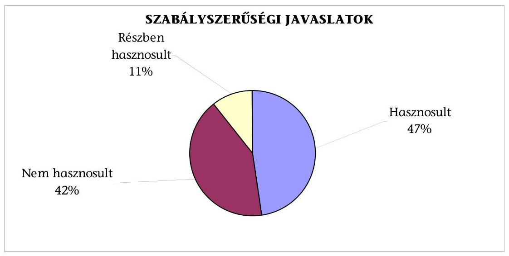
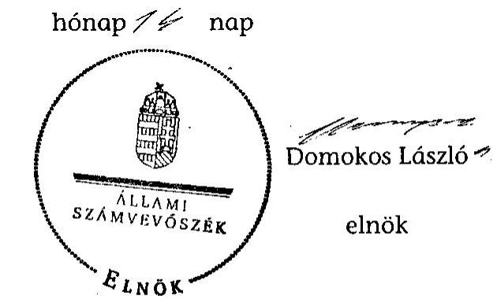

# JELENTÉS 

Őrbottyán Nagyközség Önkormányzata belső kontrollrendszerének kialakítása, valamint egyes kontrolltevékenységek és a belső ellenőrzés működése ellenőrzéséről

---

# Állami Számvevőszék 

Iktatószám: V-0012-058-026-023/2013.
Témaszám: 1051
Vizsgálat-azonosító szám: V059125
Az ellenőrzést felügyelte:
Dr. Benedek Mária
felügyeleti vezető
Az ellenőrzést vezette:
Szakmányné Bilik Mária
ellenőrzésvezető
A számvevőszéki jelentés összeállításában közreműködtek:
Dr. Láng Ágnes Krisztina
számvevő
Ganter Ildikó
számvevő
Az ellenőrzést végezték:
Ganter Ildikó
Tukacs Éva
számvevő
számvevő tanácsos

---

# TARTALOMJEGYZÉK 

BEVEZETÉS ..... 5
I. ÖSSZEGZŐ MEGÁLLAPÍTÁSOK, KÖVETKEZTETÉSEK, JAVASLATOK ..... 8
II. RÉSZLETES MEGÁLLAPÍTÁSOK ..... 17

1. Az Önkormányzat belső kontrollrendszere kialakításának megfelelősége ..... 17
1.1. A kontrollkörnyezet kialakítása ..... 17
1.2. A kockázatkezelési rendszer kialakítása ..... 18
1.3. A kontrolltevékenységek kialakítása ..... 18
1.4. Az információs és kommunikációs rendszer kialakítása ..... 19
1.5. A monitoring rendszer kialakítása ..... 20
2. A pénzügyi folyamatokban kulcsszerepet betöltő belső kontrollok (szakmai teljesítésigazolás és utalvány ellenjegyzés) működése ..... 21
3. A belső ellenőrzés szervezeti keretei és működése ..... 24
4. Az ÁSZ 2007-2010. években végzett átfogó ellenőrzései során megfogalmazott javaslatok végrehajtására tett intézkedések ..... 25

## FÜGGELÉKEK

1. számú Értelmező szótár
2. számú A belső kontrollrendszer kialakítása, a pénzügyi folyamatokban kulcsszerepet betöltő szakmai teljesítésigazolás és utalvány ellenjegyzés kontrollok működése, valamint a belső ellenőrzés működése értékelésénél alkalmazott minősítési szempontok

---

.

---

# RÖVIDÍTÉSEK JEGYZÉKE 

## Törvények:

ÁSZ tv.
2011. LXVI. törvény az Állami Számvevőszékről (hatályos 2011. július 1-jétől)

Avtv.
1992. évi LXIII. törvény a személyes adatok védelméről és a közérdekű adatok nyilvánosságáról (hatálytalan 2012. január 1-jétől)

Htv. 1991. évi XX. törvény a helyi önkormányzatok és szerveik, a köztársasági megbízottak, valamint egyes centrális alárendeltségű szervek feladat- és hatásköreiről
Info tv. 2011. évi CXII. törvény az információs önrendelkezési jogról és az információszabadságról (hatályos 2012. január 1-jétől)

Ktv. 1992. évi XXIII. törvény a köztisztviselők jogállásáról (hatálytalan 2012. március 1-jétől)
Kttv. 2011. évi CXCIX. törvény a közszolgálati tisztviselőkről (hatályos 2012. március 1-jétől)
Mötv. 2011. évi CLXXXIX. törvény Magyarország helyi önkormányzatairól (hatályos 2012. január 1-jétől)
Mvtv. 1993. évi XCIII. törvény a munkavédelemről
Ötv. 1990. évi LXV. törvény a helyi önkormányzatokról
régi Áht. 1992. évi XXXVIII. törvény az államháztartásról (hatálytalan 2012. január 1-jétől)
Számv. tv. 2000. évi C. törvény a számvitelről
új Áht. 2011. évi CXCV. törvény az államháztartásról (hatályos 2012. január 1-jétől)

## Rendeletek

Áhsz.
249/2000. (XII. 24.) Korm. rendelet az államháztartás szervezetei beszámolási és könyvvezetési kötelezettségének sajátosságairól
Ámr. 292/2009. (XII. 19.) Korm. rendelet az államháztartás működési rendjéről (hatálytalan 2012. január 1-jétől)
Ávr. 368/2011. (XII. 31.) Korm. rendelet az államháztartásról szóló törvény végrehajtásáról (hatályos 2012. január 1-jétől)
Ber. 193/2003. (XI. 26.) Korm. rendelet a költségvetési szervek belső ellenőrzéséről (hatálytalan 2012. január 1-jétől)
Bkr. 370/2011. (XII. 31.) Korm. rendelet a költségvetési szervek belső kontrollrendszeréről és belső ellenőrzéséről (hatályos 2012. január 1-jétől)

## Szórövidítések

ÁSZ
Állami Számvevőszék

---

Belső ellenőrzési kézikönyv

Belső Kontroll Kézikönyv
gazdasági program
hivatali SZMSZ
jegyző
Képviselő-testület
kockázatkezelési szabályzat
kötelezettségvállalási szabályzat
leltározási szabályzat

Önkormányzat
pénzkezelési szabályzat
polgármester
Polgármesteri Hivatal
szabálytalanságkezelési szabályzat
számviteli politika
számlarend
Társulás
ügyrend

Veresegyház Többcélú Kistérség Önkormányzatainak Társulása Belső ellenőrzési kézikönyv a kistérségi társulási önkormányzati költségvetési szervek részére
Az Ámr. 155. § (1) bekezdése, valamint az államháztartási belső kontroll standardokról szóló 1/2009. (IX. 11.) PM irányelv egységes értelmezése érdekében az államháztartásért felelős miniszter által 2010. évben kiadott Belső Kontroll Kézikönyv
Örbottyán Nagyközség Önkormányzatának Gazdaságfejlesztési programja 2011-2014. és azt követő évekre (jóváhagyta: Örbottyán Nagyközség Önkormányzat Képviselő-testületének 122/2011. (III.28.) számú határozata)
Örbottyán Nagyközség Önkormányzat Polgármesteri Hivatalának és az Önkormányzat által intézményi formába nem szervezett szakfeladatoknak Szervezeti és Működési Szabályzata (hatályos 2011. szeptember 19-től)
Örbottyán Nagyközség Önkormányzatának jegyzője
Örbottyán Nagyközség Képviselő-testülete
Örbottyán Nagyközség Önkormányzat Polgármesteri Hivatal Kockázatkezelési szabályzata (hatályos 2009. június 1-jétől)
Örbottyán Nagyközség Önkormányzat Polgármesteri Hivatal önkormányzati kötelezettségvállalás, ellenjegyzés, utalványozás, érvényesítés szabályozása
Örbottyán Nagyközség Önkormányzat Polgármesteri Hivatalának Leltározási szabályzata (hatályos 2008. január 2-ától)
Örbottyán Nagyközség Önkormányzata
Örbottyán Nagyközség Önkormányzat Polgármesteri Hivatal Pénzkezelési szabályzata (hatályos 2011. december 7-től)
Örbottyán Nagyközség Önkormányzatának polgármestere
Örbottyán Nagyközség Önkormányzatának Polgármesteri Hivatala
Szabálytalanságok kezelésének szabályzata (hatályos 2009. június 1-jétől)

Örbottyán Nagyközség Önkormányzat Polgármesteri Hivatal Számviteli politikája (hatályos 2010. január 4-től)
Örbottyán Nagyközség Önkormányzat Polgármesteri Hivatal Számlarendje (hatályos 2009. június 1-jétől)
Veresegyház Többcélú Kistérség Önkormányzatainak Társulása
Örbottyán Nagyközség Önkormányzat Polgármesteri Hivatal Gazdasági szervezetének ügyrendje (hatályos 2011. szeptember 19-től)

---

# JELENTÉS 

## Örbottyán Nagyközség Önkormányzata belső kontrollrendszerének kialakítása, valamint egyes kontrolltevékenységek és a belső ellenőrzés működése ellenőrzéséről

## BEVEZETÉS

A belső kontrollrendszer kialakítását, működtetését és fejlesztését a régi Áht. és az új Áht. is előírja. Ennek megvalósításáért a költségvetési szerv vezetője felel. A belső kontrollrendszer azt a célt szolgálja, hogy a költségvetési szervek működésük és gazdálkodásuk során a tevékenységeket szabályszerűen, gazdaságosan, hatékonyan, eredményesen hajtsák végre, teljesítsék elszámolási kötelezettségeiket és megvédjék az erőforrásokat a veszteségektől, a károktól és a nem rendeltetésszerű használattól. A belső kontrollrendszer magában foglalja mindazon szabályokat, eljárásokat, gyakorlati módszereket és szervezeti struktúrákat, kockázatkezelési technikákat, kontrolltevékenységeket, amelyek segítséget nyújtanak a szervezetnek céljai eléréséhez.

Az ÁSZ a 2011-2015. évekre szóló stratégiájában hangsúlyos szerepet szánt annak, hogy szilárd szakmai alapon álló, értékteremtő ellenőrzéseivel előmozdítsa a közpénzügyek átláthatóságát, rendezettségét. A számvevőszéki ellenőrzés nemzetközi alapelvei is rögzítik, hogy a megfelelő belső kontrollrendszer minimálisra csökkenti a hibák és szabálytalanságok kockázatát.

Az ellenőrzés célja annak értékelése volt, hogy az Önkormányzat a jogszabályi előírásoknak megfelelően alakította-e ki a belső kontrollrendszert; a gazdálkodás folyamatában kulcsszerepet betöltő szakmai teljesítésigazolás és az utalvány ellenjegyzés kontrolltevékenységeit megfelelően működtette-e; biztosította-e a belső ellenőrzés szabályos és eredményes működését; intézkedett-e az ÁSZ által a 2007-2010. évek között végzett átfogó ellenőrzések javaslatainak végrehajtására.

Az ÁSZ ezen ellenőrzési céljait pilot (próba) jelleggel községi/nagyközségi önkormányzatoknál végzett ellenőrzések során érvényesítette.

Az ellenőrzés típusa: szabályszerűségi ellenőrzés
Az ellenőrzés jogszabályi alapja: az ÁSZ tv. 5. § (2) és (6) bekezdései
Az ellenőrzött szervezet: az Önkormányzat
Az ellenőrzött időszak: a belső kontrollrendszer kialakításának megfelelőségét a 2011. évre vonatkozóan értékeltük. A kontrolltevékenységek működésének megfelelőségét a 2011. január 1-je és december 31-e, míg a belső ellenőrzés működésének szabályosságát és eredményességét a 2009. január 1-je és 2011. december 31-e közötti időszakot figyelembe véve értékeltük. A helyszíni ellenőrzés lezárásáig a helyi szabályozás változásait nyomon követtük.

Az ellenőrzés szakmai módszertana az ÁSZ hivatalos honlapján (www.asz.hu) közzétett szakmai szabályokon alapult, amely a Legfőbb Ellenőrző Intézmények Nemzetközi Szervezete (INTOSAI) által kiadott nemzetközi standardok (ISSAI) figyelembevételével készült.

A belső kontrollrendszer kialakításának ellenőrzése során értékeltük a kontrollkörnyezet, a kockázatkezelési rendszer, a kontrolltevékenységek, az információs és kommunikációs rendszer, valamint a monitoring rendszer szabályozottságának megfelelőségét.

Értékeltük a pénzügyi folyamatokban kulcsszerepet betöltő szakmai teljesítésigazolás és az utalvány ellenjegyzés kontrollok működésének megfelelőségét az államháztartáson kívülre teljesített működési és felhalmozási célú pénzeszközátadásoknál, a külső szolgáltatók által végzett karbantartási, kisjavítási munkákkal, továbbá az egyéb üzemeltetési, fenntartási, szolgáltatási kiadásokkal kapcsolatos kifizetéseknél. Az egyszerű véletlen mintavétellel kiválasztott tételek ellenőrzését többlépcsős megfelelőségi tesztek útján addig végeztük, amíg elegendő és megfelelő bizonyítékot szereztünk a vizsgált folyamatok kulcskontrolljai működésének megfelelő vagy nem megfelelő voltáról. Értékeltük az Önkormányzatnál a belső ellenőrzés működésének szabályosságát és eredményességét. Az ÁSZ az Önkormányzat gazdálkodási rendszerét a 2008. évben ellenőrizte átfogó jelleggel.

A fogalmak magyarázatát az 1. számú függelék, az ellenőrzés egyes területeinek értékelésénél alkalmazott egységes minősítési szempontokat a 2. számú függelék tartalmazza.

Az ellenőrzés lefolytatásához az Önkormányzat a munkalapok és a tanúsítvány elektronikus kitöltésével, valamint a megjelölt dokumentumok elektronikus megküldésével szolgáltatott adatokat. A munkalapokon szerepeltetett adatok, információk ellenőrzése és szükség szerinti javítása a helyszíni ellenőrzés keretében történt.

Az ÁSZ az ellenőrzés megállapításait az ellenőrzött időszakban hatályos, az intézkedést igénylő megállapításokra tett javaslatokat a jelenleg hatályos jogszabályok alapján fogalmazta meg.

Az ÁSZ tv. 29. § (1) bekezdése szerint a jelentéstervezetet megküldtük a polgármester részére, aki az ÁSZ tv. 29. § (2) bekezdésében foglalt észrevételezési jogával nem élt, a jelentéstervezetre észrevételt nem tett.

Őrbottyán Nagyközség állandó lakosainak száma 2011. január 1-jén 7053 fő volt. Az Önkormányzat nyolctagú Képviselő-testületének munkáját három állandó bizottság segítette. Az Önkormányzat az önállóan működő és gazdálkodó Polgármesteri Hivatalon felül három részben önállóan gazdálkodó költségvetési intézménnyel látta el feladatait. Az Önkormányzat többségi tulajdoni hányadú gazdasági társasággal nem rendelkezett. A polgármester a 2006. évi önkormányzati választásoktól 2010. júliusáig, majd újraválasztását követően 2010. októberétől látja el feladatait. A jegyző 2010. október 1-jétől látja el feladatait. A Polgármesteri Hivatal négy szervezeti egységre tagolódott, a foglalkoztatott köztisztviselők száma 2011. január 1-jén 19 fő volt. Az Önkormányzat a 2011. évi költségvetési beszámolója szerint 860247 ezer Ft költségvetési bevételt ért el, valamint 845071 ezer Ft költségvetési kiadást teljesített. A 2011. december 31-i könyvviteli mérleg szerint 8578656 ezer Ft értékű eszközvagyonnal rendelkezett, rövid lejáratú kötelezettségállománya 39633 ezer Ft, hosszú lejáratú kötelezettsége nem volt.

---

# I. ÖSSZEGZŐ MEGÁLLAPÍTÁSOK, KÖVETKEZTETÉSEK, JAVASLATOK 

A belső kontrollrendszeren belül 2011-ben a Polgármesteri Hivatalban a kontrollkörnyezet, a kockázatkezelési rendszer, a kontrolltevékenységek, az információs és kommunikációs rendszer, valamint a monitoring rendszer kialakítását külön-külön és összesítve is értékeltük. A belső kontrollrendszer kialakítása az összesített értékelés alapján nem felelt meg a jogszabályi előírásoknak. Az egyes területek kialakításának értékelését az alábbiakban részletezzük.

A kontrollkörnyezet kialakítása nem felelt meg a jogszabályi követelményeknek, mert a jegyző a Htv. előírása ellenére nem alakította ki az Önkormányzat intézményeinek számviteli rendjét a költségvetési szervekre vonatkozó előírások alapján. A Számv. tv. és az Áhsz. előírásai ellenére nem készítette el az eszközök és források értékelési szabályzatát, valamint a Polgármesteri Hivatal bizonylati rendjét. A jegyző az Ámr.-ben foglaltak ellenére a hivatali SZMSZ-ben nem rögzítette az ellátandó és a szakfeladatrend szerint besorolt alaptevékenységeket, az alaptevékenységet szabályozó jogszabályok megjelölését, valamint nem alakította ki a hivatali SZMSZ-ben meghatározott tevékenységekre és feladatokra vonatkozóan az ellenőrzési nyomvonalat. Az ügyrend az Ámr. előírásai, valamint az előző ÁSZ ellenőrzés javaslata ellenére nem tartalmazta a pénzügyi-gazdálkodási feladatot ellátó köztisztviselők helyettesítési rendjét. A polgármester a Ktv.-ben foglaltak ellenére nem készítette el a jegyző munkaköri leírását.

A kockázatkezelési rendszer kialakítása nem felelt meg a jogszabályi előírásoknak, mert a jegyző ugyan készített kockázatkezelési szabályzatot, azonban az Ámr.-ben foglaltak ellenére kockázatelemzést nem végzett, kockázatkezelési rendszert nem működtetett.

A kontrolltevékenységek kialakítása a jogszabályi követelményeknek részben felelt meg. A polgármester és a jegyző szabályozta a kötelezettségvállalás, az ellenjegyzés, az utalványozás és az érvényesítés rendjét. A jegyző a feladatkörök szétválasztása keretében meghatározta a Polgármesteri Hivatal szervezeti egységeinek végrehajtási és pénzügyi teljesítési feladatait. A régi Áht. előírása ellenére azonban nem határozta meg a folyamatba épített, előzetes, utólagos és vezetői ellenőrzés feladatait a beszerzési folyamatok tekintetében, valamint az Ámr.-ben foglaltak ellenére nem szabályozta a Polgármesteri Hivatal tevékenységeire vonatkozó beszámolási eljárásokat. A jegyző a 2011-ben egymást követően hatályban lévő négy kötelezettségvállalási szabályzat közül hármat az Ámr.-ben foglaltak ellenére hiányosan készített el, mert azok nem tar-

[^0]
[^0]:    ${ }^{1}$ 2012. január 1-jétől Ávr.
    ${ }^{2}$ 2012. március 1-jétől Kttv.
    ${ }^{3}$ 2012. január 1-jétől új Áht.

---

almazták a feladatok ellátására szóló megbízásokat és a jogosultak aláírásának mintáját.

Az információs és kommunikációs rendszer kialakítása a jogszabályi előírásoknak

 nem felelt meg, mert a jegyző az Avtv. ${ }^{4}$ és az Ámr. előírása ellenére nem készítette el az adatvédelmi és adatbiztonsági szabályzatot, nem határozta meg a közérdekű adatok megismerésére irányuló igények teljesítésének, valamint a kötelezően közzéteendő adatok nyilvánosságra hozatalának rendjét. Az informatikai rendszer környezetének szabályozása során az Avtv. előírása és a belső ellenőrzés javaslata ellenére elmulasztotta az adatbiztonság érvényre juttatásához szükséges intézkedések megtételét. Nem határozta meg a hozzáférési jogosultságokra vonatkozó eljárásrendet és a hozzáférési jogosultságokról nyilvántartást nem vezetett. Nem szabályozta a pénzügyi-számviteli szoftverváltozások ellenőrzésére vonatkozó eljárásokat, a feldolgozott adatok mentési eljárásait.

A monitoring rendszer kialakítása a jogszabályi követelményeknek nem felelt meg, mert a jegyző az Ámr.-ben foglaltak ellenére a Polgármesteri Hivatal tevékenységének, a célok megvalósításának nyomon követését biztosító, az operatív tevékenységek keretében megvalósuló folyamatos és eseti nyomon követésből álló monitoring rendszer szabályait nem határozta meg.

A belső kontrollrendszer nem megfelelő kialakítása kockázatot jelent az Önkormányzat tevékenységeinek szabályszerű, gazdaságos, hatékony és eredményes végrehajtásában.

A Polgármesteri Hivatalban a 2011. évben az államháztartáson kívülre történő működési célú pénzeszközátadásokkal, az állományba nem tartozók megbízási díjaival, valamint a külső szolgáltatók által végzett karbantartási, kisjavítási munkákkal kapcsolatos kifizetések során - mindhárom területen és összességében - a szakmai teljesítésigazolás és az utalvány ellenjegyzés kulcskontrollok működésének megfelelősége gyenge volt.

Az államháztartáson kívülre történő működési és felhalmozási célú pénzeszközátadások kifizetése és a külső szolgáltatók által végzett karbantartással, kisjavítással kapcsolatos kifizetések során a szakmai teljesítésigazolásra kijelölt személy ellenőrzési feladatait nem a jogszabályi előírásoknak megfelelően végezte, mert az ellenőrzés megtörténtét aláírásával, az igazolás dátumának feltüntetésével, valamint a teljesítés tényére történő utalás megjelölésével nem minden esetben igazolta. Az állományba nem tartozók megbízási díjai és a külső szolgáltatók által végzett karbantartással, kisjavítással kapcsolatos kifizetések esetében az Ámr.-ben foglaltak ellenére a szakmai teljesítés igazolását részben olyan személyek látták el, akiknek aláírás mintája az Ámr.-ben előírt nyilvántartásban és a kijelölésben nem szerepelt.

Az utalványok ellenjegyzői a kiadások teljesítését megelőzően az Ámr.-ben foglalt ellenőrzési feladataikat nem a jogszabályi előírásoknak megfelelően végezték. Annak ellenére ellenjegyezték az utalványokat, hogy nem minden esetben

[^0]
[^0]:    ${ }^{4}$ 2012. január 1-jétől Info tv.

---

rendelkeztek jegyzői kijelöléssel, illetve az Ámr.-ben előírt nyilvántartásban szereplő aláírás mintával, vagy a szakmai teljesítés igazolása, illetve az összegszerűség ellenőrzése elmaradt. A gazdálkodásra - közöttük a kötelezettségvállalások nyilvántartására és az utalványrendeletben a kötelezettségvállalás nyilvántartási számának feltüntetésére, a kötelezettségvállalások ellenjegyzésére - vonatkozó szabályok betartásának hiánya ellenére az utalványokat ellenjegyezték.

Az ellenőrzött kifizetésekkel összefüggésben a rendelkezésre bocsátott dokumentumok alapján ellenőrzésünk jogosulatlan kifizetést nem tárt fel, azonban a gazdálkodásban kulcsszerepet betöltő kontrollok működésében feltárt hiányosságok miatt fennáll a hibák bekövetkezésének lehetősége. A nem megfelelően szabályozott és működtetett belső kontrollok korrupciós kockázatot is hordoznak.

A korábbi ÁSZ ellenőrzés - a kötelezettségvállalások ellenjegyzésére és az utalvány ellenjegyzés során elvégzendő, folyamatba épített ellenőrzési feladatok teljesítésére tett - javaslatait nem hasznosították, ami a hibák ismétlődéséhez vezetett.

Az Önkormányzat a belső ellenőrzési feladatokat a Társulás útján látta el. Az Önkormányzatnál a 2009-2011. években a belső ellenőrzés szabályozása és működése összességében nem felelt meg jogszabályi előírásoknak. Az éves ellenőrzési terveket - a Ber.-ben ${ }^{5}$ foglaltakat figyelmen kívül hagyva - kockázatelemzés nem alapozta meg. A Képviselő-testület - a jegyző késedelmes előterjesztése miatt - az Önkormányzatra vonatkozó éves ellenőrzési terveket az Ötv.-ben ${ }^{6}$ előírt határidőt túllépve fogadta el. A Ber.-ben foglaltak és az előző ÁSZ ellenőrzés javaslata ellenére a jegyző nem kezdeményezte a soron kívüli ellenőrzési feladatok végrehajtásához szükséges kapacitás meghatározását. A 2011. évben az éves ellenőrzési terv módosítását a Képviselő-testület az Ötv.ben foglaltak ellenére - előterjesztés hiányában - nem hagyta jóvá, azonban terven felüli ellenőrzéseket végeztek. A polgármester az éves ellenőrzési jelentések alapján elkészített éves összefoglaló ellenőrzési jelentést az Ötv.-ben előírtak és a korábbi ÁSZ ellenőrzés javaslata ellenére nem a zárszámadási rendelettervezettel egyidejűleg terjesztette a Képviselő-testület elé.

Az Önkormányzatnál a 2009-2011. években a belső ellenőrzés működése a 2. számú függelékben részletezett kritériumrendszer alapján végzett értékelés szerint - nem volt eredményes, mert a belső ellenőrzés szabályozása és működése az összegző értékelés alapján az ellenőrzött időszak egészét tekintve a jogszabályi előírásoknak nem felelt meg. Ellenőrizték ugyan a belső kontrollrendszer kialakításának szabályozottságát, a gazdálkodási jogkörök gyakorlásához kapcsolódó belső kontrollok működését, azonban a belső ellenőrzés javaslatai csak részben hasznosultak, mert a jegyző nem megfelelően intézkedett a feltárt hibák kijavítására. Mindezek hozzájárultak a számvevőszéki ellenőrzés során is feltárt szabályozási hiányosságok, hibák ismétlődéséhez.

[^0]
[^0]:    ${ }^{5}$ 2012. január 1-jétől Bkr.
    ${ }^{6}$ 2013. január 1-jétől Mötv.

---

Az ÁSZ tv. 33. § (1) bekezdésében foglaltak értelmében az ellenőrzött szervezet vezetője köteles a jelentésben foglalt megállapításokhoz kapcsolódó intézkedési tervet összeállítani, és azt a jelentés kézhezvételétől számított 30 napon belül az ÁSZ részére megküldeni. Amennyiben az intézkedési tervet határidőre nem küldi meg a szervezet, vagy az az ÁSZ tv. 33. § (2) bekezdésében foglalt póthatáridő eltelte ellenére továbbra sem elfogadható, az ÁSZ elnöke a hivatkozott törvény 33. § (3) bekezdés a)-b) pontjaiban foglaltakat érvényesítheti.

Az ellenőrzés intézkedést igénylő megállapításai és javaslatai:

# a polgármesternek 

1. A Ktv. 11. § (6) bekezdésében foglaltak ellenére a jegyző nem rendelkezett a polgármester által aláírt munkaköri leírással.

Javaslat:
Készítse el a Kttv. 43. § (4) bekezdés előírása alapján a jegyző munkaköri leírását.
2. A népszámlálási feladat ellátására teljesített megbízási díjak, valamint a gázkészülékek karbantartására és a számítógép karbantartási munkákra teljesített kifizetések alapját képező kötelezettségvállalásokra - a régi Áht. 100/C. § (3) bekezdésében és az Ámr. 74. § (1) bekezdésben foglaltak ellenére - ellenjegyzés nélkül került sor.
3. Javaslat:

Biztosítsa, hogy - az új Áht. 37. § (1) bekezdésében foglaltaknak megfelelően - az Önkormányzat nevében történő kötelezettségvállalásra - az Ávr. 53. §-ában meghatározott kivételeket figyelembe véve - kizárólag pénzügyi ellenjegyzés után, a pénzügyi teljesítés esedékességét megelőzően, írásban kerüljön sor.
4. A polgármester - az Ötv. 92. § (10) bekezdésében előírtak ellenére - a 2011. évi belső ellenőrzési jelentést a zárszámadási rendelettervezettel egyidejűleg nem terjesztette a Képviselő-testület elé.

Javaslat:
A Bkr. 56. § (8) bekezdésében foglaltak szerint az éves ellenőrzési jelentést a zárszámadási rendelettervezettel egyidejűleg terjessze a Képviselő-testület elé.
5. Az államháztartáson kívülre történő működési és felhalmozási célú pénzeszközátadásokkal és a külső szolgáltatók által végzett karbantartási, kisjavítási szolgáltatásokkal kapcsolatosan a szakmai teljesítést igazoló a kifizetést megelőzően a kiadás jogosságát, összegszerűségét és a szerződésszerű teljesítést - a régi Áht. 100/C. § (6) bekezdésének, az Ámr. 76. § (1) és (3) bekezdésének előírása ellenére - aláírásával, a dátum feltüntetésével nem minden esetben igazolta. Az állományba nem tartozók megbízási díjainak és a külső szolgáltatók által végzett karbantartási, kisjavítási szolgáltatások díjának kifizetése során a szakmai teljesítésigazolást olyan személy végezte, aki - az Ámr. 76. § (5) bekezdésében előírtak ellenére - jegyzői kijelöléssel nem rendelkezett, vagy aláírás mintája - az Ámr. 80. § (3) bekezdésében foglaltak ellenére - nem volt szabályszerűen nyilvántartva. Az utalványok ellenjegyzője - aláírása ellenére - nem minden esetben tett eleget az Ámr. 79. § (2) bekezdésében és a 74. §-ban előírt, a gazdálkodási szabályok betartására vonatkozó ellenőrzési feladatának.

Javaslat:
A Mötv. 115. § (1) bekezdésében foglaltak alapján kísérje figyelemmel az önkormányzat gazdálkodásának szabályszerűségét. A Mötv. 67. § f) pontja alapján gondoskodjon a belső kontrollrendszerre és a belső ellenőrzés működésére vonatkozó jogszabályi rendelkezések be nem tartása, valamint a szakmai teljesítésigazolás és az utalvány ellenjegyzés kontrollokkal összefüggésben feltárt hiányosságok és szabálytalanságok tekintetében az esetleges munkajogi felelősséggel kapcsolatos körülmények kivizsgálásáról, és a vizsgálat eredményének függvényében tegye meg a szükséges munkajogi intézkedéseket.

# a jegyzőnek 

1. a kontrollkörnyezettel kapcsolatban:

A jegyző nem a Htv. 140. § (1) bekezdés c) pontjában foglalt előírásnak megfelelően alakította ki a számviteli rendet.

Nem készítette el a - Számv. tv. 14. § (5) bekezdés b) pontjának és az Áhsz. 8. § (4) bekezdés b) pontjának előírásai ellenére - az eszközök és források értékelési szabályzatát, valamint - a Számv. tv. 161. § (2) bekezdés d) pontjának előírásai ellenére - a Polgármesteri Hivatal bizonylati rendjét.

Az Ámr. 20. § (2) bekezdés c) pontjában foglaltak ellenére a hivatali SZMSZ nem tartalmazta az ellátandó és a szakfeladatrend szerint (szakfeladat számmal és megnevezéssel) besorolt alaptevékenységek, valamint az alaptevékenységet szabályozó jogszabályok megjelölését. A jegyző - az Ámr. 156. § (2) bekezdésében foglalt előírás ellenére - nem alakította ki a hivatali SZMSZ-ben meghatározott tevékenységekre és feladatokra vonatkozóan az ellenőrzési nyomvonalat. Az ügyrend az Ámr. 20. § (7) bekezdésében foglaltak ellenére nem tartalmazta a pénzügyi-gazdálkodási feladatot ellátó köztisztviselők helyettesítésének rendjét.

Javaslat:
a) Alakítsa ki a Htv. 140. § (1) bekezdés c) pontjában foglaltak szerinti számviteli rendet.
b) Készítse el a Számv. tv. 14. § (5) bekezdés b) pontja és az Áhsz. 8. § (4) bekezdés b) pontja előírásának megfelelően az eszközök és források értékelési szabályzatát.
c) Készítse el a Számv. tv. 161. § (2) bekezdés d) pontja előírásának megfelelően a Polgármesteri Hivatal bizonylati rendjét.
d) Készítse elő a hivatali SZMSZ módosítását, és kezdeményezze a polgármesternél a módosítás Képviselő-testület elé terjesztését annak érdekében, hogy az Ávr. 13. § (1) bekezdés c) pontjában foglaltaknak megfelelően tartalmazza a szakfeladatrend szerint besorolt alaptevékenységeket, valamint az alaptevékenységet szabályozó jogszabályok megjelölését.

---

e) Határozza meg az Ávr. 13. § (5) bekezdés előírása alapján a pénzügyi-gazdasági feladatot ellátó köztisztviselők helyettesítési rendjét.
f) Készítse el a Bkr. 6. § (3) bekezdés előírásának eleget téve a Polgármesteri Hivatal ellenőrzési nyomvonalát.
2. a kockázatkezelési rendszerrel kapcsolatban:

A jegyző a Polgármesteri Hivatalban - az Ámr. 157. § (1)-(3) bekezdéseiben és a kockázatkezelési szabályzatban foglaltak ellenére - kockázatelemzést nem végzett, kockázatkezelési rendszert nem működtetett.

Javaslat:
Működtesse a kockázatkezelési rendszert a Bkr. 3. § b) pontjában és a 7. § (2) bekezdésében foglaltak szerint.
3. a kontrolltevékenységekkel kapcsolatban:

A jegyző - a régi Áht. 121/A. § (4) bekezdés a) pontjában foglaltak ellenére - nem határozta meg a pénzügyi döntések - köztük a beszerzési folyamatok - dokumentumainak elkészítésével kapcsolatos, folyamatba épített előzetes, utólagos és vezetői ellenőrzés feladatait.

Az Ámr. 158. § (2) bekezdésének d) pontjában foglaltak ellenére nem szabályozta a Polgármesteri Hivatal tevékenységeire vonatkozó beszámolási eljárásokat.

Javaslat:
a) Biztosítsa minden tevékenységre vonatkozóan a folyamatba épített, előzetes, utólagos és vezetői ellenőrzést a Bkr. 8. § (2) bekezdése alapján.
b) Szabályozza - a Bkr. 8. § (4) bekezdés c) pontja alapján - a Polgármesteri Hivatal tevékenységeire vonatkozó beszámolási eljárásokat.
4. az információs és kommunikációs rendszerrel kapcsolatban:

A jegyző az Avtv. 31/A. § (3) bekezdése ellenére
 nem készítette el a Polgármesteri Hivatal adatvédelmi és adatbiztonsági szabályzatát.

A jegyző az Avtv. 20. § (8) bekezdésének előírása ellenére nem készítette el a közérdekű adatok megismerésére irányuló igények teljesítésének rendjét rögzítő szabályzatot.

Az Ámr. 20. § (3) bekezdés i) pontjában foglaltak ellenére nem határozta meg a kötelezően közzéteendő adatok nyilvánosságra hozatalának rendjét.

Az informatikai rendszer környezetének szabályozása során az Avtv. 10. § (1)-(2) bekezdéseiben foglalt előírások ellenére elmulasztotta az adatbiztonság érvényre juttatásához szükséges intézkedések megtételét. Nem határozta meg a hozzáférési jogosultságokra vonatkozó eljárásrendet, a hozzáférési jogosultságokról nyilvántartást nem vezetett. Nem szabályozta a pénzügyi-számviteli szoftverváltozások ellenőrzésére vonatkozó eljárásokat és a feldolgozott adatok mentési eljárásait.
Javaslat:
a) Készítsen adatvédelmi és adatbiztonsági szabályzatot az Info tv. 24. § (3) bekezdése alapján.
b) Szabályozza az Ávr. 13. § (2) bekezdés h) pontja és az Info tv. 35. § (3) bekezdése alapján a közérdekű adatok közzététele, nyilvánosságra hozatala rendjét, továbbá határozza meg az Info tv. 30. § (6) bekezdése és az Ávr. 13. § (2) bekezdés h) pontjában foglaltaknak megfelelően a közérdekű adatok megismerésére irányuló kérelmek intézésének rendjét.
c) Gondoskodjon az Info tv. 7. § (2)-(3) bekezdései alapján az adatok biztonságáról, és intézkedjen a hozzáférési jogosultságokra vonatkozó eljárásrend elkészítéséről, a hozzáférési jogosultságok nyilvántartásának vezetéséről, valamint szabályozza a pénzügyi-számviteli szoftverváltozások ellenőrzésére vonatkozó eljárásokat és a feldolgozott adatok mentési eljárásait.
5. a monitoring rendszerrel kapcsolatban:

A jegyző - az Ámr. 160. §-ában foglaltak ellenére - nem alakított ki olyan monitoring rendszert, amely lehetővé teszi a Polgármesteri Hivatal tevékenységének, a célok megvalósításának nyomon követését, és amelynek része az operatív tevékenységek keretében megvalósuló folyamatos és eseti nyomon követés is.

Javaslat:
Alakítsa ki és működtesse a Bkr. 3. § e) pontjában és 10. §-ában előírtak alapján a Polgármesteri Hivatal tevékenységének, a célok megvalósításának nyomon követését biztosító rendszert, amelynek része az operatív tevékenységek keretében megvalósuló folyamatos és eseti nyomon követés is.
6. a pénzügyi folyamatokban kulcsszerepet betöltő kontrollokkal kapcsolatban:

Az államháztartáson kívülre történő működési és felhalmozási célú pénzeszközátadásokkal kapcsolatos kiadások teljesítését megelőzően - a régi Áht. 100/C. § (6) bekezdésében és az Ámr. 76. § (1) és (3) bekezdésében foglaltak ellenére - a jegyző által kijelölt személy a szakmai teljesítésigazolást nem végezte el.

Az állományba nem tartozók megbízási díjainak kifizetése során a szakmai teljesítésigazolást - az Ámr. 76. § (5) bekezdésében előírtak ellenére - jegyzői kijelöléssel nem rendelkező személy végezte, vagy a kijelölt személy aláírás mintája - az Ámr. 80. § (3) bekezdésében foglaltak ellenére - nem volt szabályszerűen nyilvántartva. A rendezvényszervezéssel kapcsolatos megbízási díj kifizetését megelőzően a kijelölt személy az összegszerűség ellenőrzésének hiányában a szakmai teljesítésigazolást nem az Ámr. 76. § (1) bekezdésében foglaltaknak megfelelően végezte el.

A külső szolgáltatók által végzett karbantartási, kisjavítási szolgáltatások kifizetése során a szakmai teljesítésigazolásra kijelölt személy aláírás mintája - az Ámr. 80. § (3) bekezdésében foglaltak ellenére - nem minden esetben volt szabályszerűen nyilvántartva. A szakmai teljesítésigazolás - az Ámr. 76. § (3) bekezdésében foglaltak ellenére - dátumot vagy aláírást és dátumot nem tartalmazott.

Az utalványok ellenjegyzője az államháztartáson kívülre történő működési és felhalmozási célú pénzeszközátadásokkal, az állományba nem tartozók megbízási díjaival, valamint a külső szolgáltatók által végzett karbantartással, kisjavítással kapcsolatos kiadások teljesítését megelőzően - aláírása ellenére - nem tett eleget az Ámr. 79. § (2) bekezdésében foglalt ellenőrzési kötelezettségének, ugyanis a kifizetéseket részben szakmai teljesítésigazolás, illetve az összegszerűség ellenőrzésének hiányában ellenjegyezte. A gazdálkodásra - közöttük a régi Áht. 100/C. § (3) bekezdésében és az Ámr. 74. § (1) bekezdésében előírt, a kötelezettségvállalások ellenjegyzésére, az Ámr. 75. § (1) bekezdésében foglalt, a kötelezettségvállalások nyilvántartásba vételére és az Ámr. 78. § (2) bekezdés g) pontja szerinti, a kötelezettségvállalás nyilvántartási számának az utalványrendeleten történő feltüntetésére - vonatkozó szabályok betartásának hiánya ellenére az utalványokat aláírásával ellátta. Az utalványok ellenjegyzője - az Ámr. 79. § (1) bekezdésében foglaltak ellenére - nem minden esetben rendelkezett jegyzői kijelöléssel, illetve aláírás mintája az Ámr. 80. § (3) bekezdésében előírt nyilvántartásban nem minden esetben szerepelt.

Javaslat:
Gondoskodjon - a szakmai teljesítés igazolása és az utalvány ellenjegyzése vonatkozásában feltárt hiányosságok megszüntetése, illetve az operatív gazdálkodás során a működésbeli hibák megelőzése, feltárása és kijavítása érdekében - arról, hogy
a) a teljesítésigazolásra - az Ávr. 57. § (4) bekezdésében foglalt előírásnak megfelelően - kijelölt személyek az Ávr. 57. § (1) bekezdésében foglaltaknak megfelelően ellenőrizhető okmányok alapján ellenőrizzék a kiadások teljesítésének jogosságát, összegszerűségét, ellenszolgáltatást is magában foglaló kötelezettségvállalás esetében a szerződés, megrendelés teljesítését, és azt az Ávr. 57. § (3) bekezdésében foglalt módon, dátummal, a teljesítés tényére történő utalással és aláírásukkal igazolják;
b) az Ávr. 60. § (3) bekezdése alapján a kötelezettségvállalásra, pénzügyi ellenjegyzésre, a teljesítés igazolására, érvényesítésre, utalványozásra jogosult személyekről és aláírás mintájukról a belső szabályzatban foglaltak szerint naprakész nyilvántartást vezessenek;
c) kötelezettségvállalásra az új Áht. 37. § (1) bekezdésében foglaltaknak megfelelően - az Ávr.-ben meghatározott kivételekkel - pénzügyi ellenjegyzés után kerüljön sor;
d) a kifizetéseket megelőzően - az Ávr. 58. § (1) bekezdése szerint - a teljesítésigazolás alapján - az Ávr. 57. § (3) bekezdés szerinti esetben annak hiányában is az összegszerűségnek, a fedezet meglétének és a megelőző ügymenetben az új Áht., az Áhsz., az Ávr. előírásai és a belső szabályzatokban foglaltak betartásának az ellenőrzése történjen meg;
e) az Ávr. 56. § (1) bekezdésében foglalt kötelezettségvállalási nyilvántartást naprakészen vezessék, és az utalványrendeleteken az Ávr. 59. § (3) bekezdés f) pontjában foglaltaknak megfelelően a kötelezettségvállalás nyilvántartási számát tüntessék fel.
7. a belső ellenőrzés működésével kapcsolatban:

Az éves ellenőrzési terveket - a Ber. 21. § (2) bekezdésében előírtak ellenére - nem alapozta meg kockázatelemzés.

A Képviselő-testület - a jegyző késedelmes előterjesztése miatt - az Önkormányzatra vonatkozó éves ellenőrzési terveket az Ötv. 92. § (6) bekezdésében előírt határidőt túllépve fogadta el. A 2011. évben az éves ellenőrzési terv módosítását az Ötv. 92. § (6) bekezdésében foglaltak ellenére a Képviselő-testület - előterjesztés hiányában - nem hagyta jóvá, így - jóváhagyás hiányában - terven felüli ellenőrzéseket végeztek. A szükséges ellenőrzési kapacitás - Ber. 21. § (3) bekezdés e) pontja szerinti - meghatározása során - a Ber. 21. § (4) bekezdésében foglaltak ellenére - nem tervezték a soron kívüli ellenőrzési feladatok végrehajtásához szükséges ellenőri kapacitást annak érdekében, hogy szükség esetén az éves ellenőrzési tervben nem szereplő, soron kívüli ellenőrzési feladatok végrehajthatóak legyenek. A polgármester az éves összefoglaló ellenőrzési jelentést - az Ötv. 92. § (10) bekezdésében előírtak és a korábbi ÁSZ ellenőrzés javaslata ellenére - nem a zárszámadási rendelettervezettel egyidejűleg terjesztette a Képviselő-testület elé.

Javaslat:
a) Intézkedjen arról, hogy a belső ellenőrzési vezető az éves ellenőrzési tervet a Bkr. 56. § (2) bekezdés előírásainak megfelelően a jegyző írásos véleményének figyelembevételével a Bkr. 29. § (1) bekezdésében foglaltak szerint készítse el.
b) Intézkedjen az éves ellenőrzési terv Képviselő-testület elé terjesztéséről annak érdekében, hogy azt a Képviselő-testület a Mötv. 119. § (5) bekezdésében és a Bkr. 32. § (4) bekezdésében előírt határidőn belül hagyja jóvá, továbbá arról, hogy a Képviselő-testület az éves ellenőrzési terv módosítását is hagyja jóvá.
c) Kezdeményezze a Bkr. 31. § (4) bekezdés j) pontja alapján a soron kívüli ellenőrzési feladatok végrehajtásához szükséges kapacitás meghatározását.
d) Intézkedjen arról, hogy a polgármester az Önkormányzat éves ellenőrzési jelentését a Bkr. 56. § (8) bekezdése alapján a zárszámadási rendelettervezettel egyidejűleg terjessze a Képviselő-testület elé.

---

# II. RÉSZLETES MEGÁLLAPÍTÁSOK 

## 1. Az ÖNKORMÁNYZAT BELSŐ KONTROLLRENDSZERE KIALAKÍTÁSÁNAK MEGFELELŐSÉGE

### 1.1. A kontrollkörnyezet kialakítása

A kontrollkörnyezet kialakítása a 2. számú függelékben részletezett kritériumrendszer alapján végzett értékelés szerint a Polgármesteri Hivatalban nem volt megfelelő, mert a jegyző a jogszabályi előírásokat nem érvényesítette maradéktalanul.

A jegyző, mint a költségvetési szerv vezetője:

- a Htv. 140. § (1) bekezdés c) pontjában foglalt előírást figyelmen kívül hagyva nem alakította ki az Önkormányzat intézményei számviteli rendjét a költségvetési szervekre vonatkozó előírások alapján;
- a Számv. tv. 14. § (5) bekezdés b) pontjának és az Áhsz. 8. § (4) bekezdés b) pontjának előírásai ellenére nem készítette el az eszközök és források értékelési szabályzatát;
- a Számv. tv. 161. § (2) bekezdés d) pontjának előírásai ellenére nem készítette el a Polgármesteri Hivatal bizonylati rendjét;
- az Ámr. 20. § (2) bekezdés c) pontjában$^7$ foglaltak ellenére a hivatali SZMSZ nem tartalmazta az ellátandó és a szakfeladatrend szerint (szakfeladat számmal és megnevezéssel) besorolt alaptevékenységek, valamint az alaptevékenységet szabályozó jogszabályok megjelölését;
- az Ámr. 156. § (2) bekezdésében$^8$ foglalt előírás és az előző ÁSZ ellenőrzés javaslata ellenére nem alakította ki a hivatali SZMSZ-ben meghatározott tevékenységekre és feladatokra vonatkozóan az ellenőrzési nyomvonalat;
- az ügyrend az Ámr. 20. § (7) bekezdésében$^9$ foglaltak és az előző ÁSZ ellenőrzés javaslata ellenére nem tartalmazta a pénzügyi-gazdálkodási feladatot ellátó köztisztviselők helyettesítésének rendjét.

A polgármester a Ktv. 11. § (6) bekezdésének előírása ellenére nem készítette el a jegyző munkaköri leírását.

[^0]
[^0]:    $^7$ 2012. január 1-jétől az Ávr. 13. § (1) bekezdés c) és g) pontjai
    $^8$ 2012. január 1-jétől a Bkr. 6. § (3) bekezdés
    $^9$ 2012. január 1-jétől Ávr. 13. § (5) bekezdés

---

A kontrollkörnyezet kialakítása keretében a jegyző az Ámr. 155. § (3) bekezdésének$^{10}$ előírását figyelmen kívül hagyva az államháztartásért felelős miniszter által kiadott Belső Kontroll Kézikönyv ajánlásait nem hasznosította.

A kontrollkörnyezet kialakítása során a jegyző:

- a Belső Kontroll Kézikönyv 1.2.7. pontjában foglalt ajánlást nem hasznosította, mert nem írta elő a hivatali SZMSZ dolgozók általi megismerésének kötelezettségét, és a hivatali SZMSZ dolgozók általi megismerése dokumentáltan nem történt meg;
- a Belső Kontroll Kézikönyv 1.6. pontjában foglalt ajánlást figyelmen kívül hagyta, mert nem intézkedett - a szervezeti célokkal összhangban álló - etikai értékek kiemelt kezeléséről, nem határozta meg a Polgármesteri Hivatalban dolgozó köztisztviselőkkel szembeni etikai elvárásokat$^{11}$.

# 1.2. A kockázatkezelési rendszer kialakítása 

A kockázatkezelési rendszer kialakítása a 2. számú függelékben részletezett kritériumrendszer alapján végzett értékelés szerint a Polgármesteri Hivatalban nem volt megfelelő, mert a jegyző az Ámr. 157. § (1)-(3) bekezdéseiben$^{12}$ és a kockázatkezelési szabályzatban foglaltak ellenére nem végzett kockázatelemzést és nem működtetett kockázatkezelési rendszert.

A kockázatkezelési rendszer kialakítása során a jegyző az Ámr. 155. § (3) bekezdésének előírását figyelmen kívül hagyva az államháztartásért felelős miniszter által kiadott Belső Kontroll Kézikönyv ajánlásait nem hasznosította.

A kockázatkezelési rendszer kialakítása során a jegyző:

- a Belső Kontroll Kézikönyv
 2.3.2. pontjában megfogalmazott ajánlást nem hasznosította, mert nem gondoskodott a kockázatkezelés teljes folyamatának felülvizsgálatáról;
- a Belső Kontroll Kézikönyv 2.4.1. pontjában megfogalmazott ajánlást nem hasznosította, mert nem gondoskodott a kockázatok évenkénti felülvizsgálatáról;
- a Belső Kontroll Kézikönyv 2.5.1. pontjában foglalt ajánlást nem hasznosította, mert nem gondoskodott a csalás és a korrupció, mint kiemelt kockázatok értékeléséről és kezeléséről.

### 1.3. A kontrolltevékenységek kialakítása

A kontrolltevékenységek kialakítása a 2. számú függelékben részletezett kritériumrendszer alapján végzett értékelés szerint a Polgármesteri Hivatalban részben volt megfelelő. A jegyző a feladatkörök szétválasztása keretében

[^0]
[^0]:    ${ }^{10}$ 2012. január 1-jétől a Bkr. 5. § (1) bekezdése
    ${ }^{11}$ 2012. március 1-jétől a Kttv. 83. § (1)-(2) bekezdése tartalmazza az Etikai Kódex készítésének kötelezettségét. Örbottyán Nagyközség Önkormányzat Képviselő-testülete a 234/2012. (IX.24.) sz. határozatával fogadta el a Polgármesteri Hivatal köztisztviselőire vonatkozó hivatásetikai alapelveket és az etikai eljárás szabályait.
    ${ }^{12}$ 2012. január 1-jétől a Bkr. 7. § (2) bekezdés

---

meghatározta a Polgármesteri Hivatal szervezeti egységeinek végrehajtási és pénzügyi teljesítési feladatait. A polgármester és a jegyző szabályozta a kötelezettségvállalás, az utalványozás, az ellenjegyzés és az érvényesítés rendjét.

A jegyző, mint a költségvetési szerv vezetője:

- a régi Áht. 121/A. § (4) bekezdésében ${ }^{13}$ foglaltak ellenére nem határozta meg a folyamatba épített, előzetes, utólagos és vezetői ellenőrzés feladatait a beszerzési folyamatok tekintetében;
- az Ámr. 158. § (2) bekezdésének d) pontjában ${ }^{14}$ foglaltak ellenére nem szabályozta a Polgármesteri Hivatal tevékenységeire vonatkozó beszámolási eljárásokat;
- a 2011-ben egymást követően hatályban lévő négy kötelezettségvállalási szabályzat közül hármat az Ámr. 20. § (3) bekezdésében foglaltak ellenére hiányosan készített el, mert azok nem tartalmazták a feladatok ellátására szóló megbízásokat, és a jogosultak aláírásának mintáját.

A 2007. szeptember 1-jétől hatályos (többször módosított) kötelezettségvállalási szabályzat nem tartalmazott megismerési záradékot. A 2011. február 20-tól 2011. május 29-ig hatályban lévő kötelezettségvállalási szabályzat - a kötelezettségvállalásra és annak ellenjegyzésére, valamint az utalványozásra jogosultakét kivéve - nem tartalmazta az aláírás mintákat és a megismerési záradékot sem. A 2011. november 10-től hatályos kötelezettségvállalási szabályzat a szakmai teljesítés igazolására, az érvényesítésre és az utalvány ellenjegyzésére jogosultak aláírásmintáját részben tartalmazta, a megismerési záradékot a felsoroltak kevesebb mint 20%-a írta alá.

A kontrolltevékenységek kialakítása során a jegyző az Ámr. 155. § (3) bekezdésének előírását figyelmen kívül hagyva az államháztartásért felelős miniszter által kiadott Belső Kontroll Kézikönyv ajánlásait nem hasznosította.

A kontrolltevékenységek kialakítása során a jegyző:

- a Belső Kontroll Kézikönyv 3.2.1. pontjában foglalt ajánlást nem hasznosította, mivel a Polgármesteri Hivatalban csak a vezető beosztásban lévő köztisztviselők munkaköri leírása tartalmazta az ellenőrzési feladatok ellátásának kötelezettségét, továbbá nem határozta meg a Polgármesteri Hivatal szervezeti egységeinek ellenőrzési feladatait;
- a Belső Kontroll Kézikönyv 3.3.1. pontjában foglaltakat figyelmen kívül hagyva nem szabályozta a munkaviszony megszűnése során a munkavállaló folyamatban lévő feladatainak átadási rendjét, továbbá nem írta elő munkakör átadás-átvétel esetén a jegyzőkönyv-készítési kötelezettséget.

# 1.4. Az információs és kommunikációs rendszer kialakítása 

Az információs és kommunikációs rendszer kialakítása a 2. számú függelékben részletezett kritériumrendszer alapján végzett értékelés szerint a

[^0]
[^0]:    ${ }^{13}$ 2012. január 1-jétől a Bkr. 8. § (2) bekezdés
    ${ }^{14}$ 2012. január 1-jétől a Bkr. 8. § (4) bekezdés c) pont

---

Polgármesteri Hivatalban nem volt megfelelő, mert a jegyző a jogszabályi előírásokat maradéktalanul nem érvényesítette.

A jegyző, mint a költségvetési szerv vezetője:

- az Avtv. 31/A. § (3) bekezdése ${ }^{15}$ ellenére nem készítette el az adatvédelmi és adatbiztonsági szabályzatot;
- az Avtv. 20. § (8) bekezdésének ${ }^{16}$ előírása ellenére nem készítette el a közérdekű adatok megismerésére irányuló igények teljesítésének rendjét rögzítő szabályzatot. Az Ámr. 20. § (3) bekezdés i) pontjában ${ }^{17}$ foglaltak ellenére nem határozta meg a kötelezően közzéteendő adatok nyilvánosságra hozatalának rendjét;
- az informatikai rendszer környezetének szabályozása során az Avtv. 10. § (1)-(2) bekezdéseiben ${ }^{18}$ foglalt előírások és a belső ellenőrzés javaslata ellenére elmulasztotta az adatbiztonság érvényre juttatásához szükséges intézkedések megtételét. Nem határozta meg a hozzáférési jogosultságokra vonatkozó eljárásrendet, a hozzáférési jogosultságokról nyilvántartást nem vezetett. Nem szabályozta a pénzügyi-számviteli szoftverváltozások ellenőrzésére vonatkozó eljárásokat és a feldolgozott adatok mentési eljárásait.

Az információs és kommunikációs rendszer kialakítása során a jegyző az Ámr. 155. § (3) bekezdésének előírását figyelmen kívül hagyva az államháztartásért felelős miniszter által kiadott Belső Kontroll Kézikönyv ajánlásait nem hasznosította.

Az információs és kommunikációs rendszer kialakítása során a jegyző:

- az iktatási, iratkezelési rendszer szabályozása keretében a Belső Kontroll Kézikönyv 4.2.4. pontjában foglalt ajánlást nem hasznosította, mert nem szabályozta az ügyintézési határidők nyomon követésének dokumentálását, és a késedelmes ügyintézéssel kapcsolatos felelősséget;
- nem határozta meg a szabálytalanságkezelési szabályzatban - a Belső Kontroll Kézikönyv 4.3.3. pontja szerint - a szabálytalanságot bejelentő védelmére vonatkozó előírásokat és kötelezettségeket.

# 1.5. A monitoring rendszer kialakítása 

A monitoring rendszer kialakítása a 2. számú függelékben részletezett kritériumrendszer alapján végzett értékelés szerint a Polgármesteri Hivatalban nem volt megfelelő, mert a jegyző az Ámr. 160. §-ában foglaltak ellenére a Polgármesteri Hivatal tevékenységének, a célok megvalósításának nyomon kö-

[^0]
[^0]:    ${ }^{15}$ 2012. január 1-jétől az Info tv. 24. § (3) bekezdés
    ${ }^{16}$ 2012. január 1-jétől az Ávr. 13. § (2) bekezdés h) pontja és az Info tv. 35. § (3) bekezdés
    ${ }^{17}$ 2012. január 1-jétől az Ávr. 13. § (2) bekezdés h) pont
    ${ }^{18}$ 2012. január 1-jétől az Info tv. 7. § (2)-(3) bekezdései

---

vetését biztosító, az operatív tevékenységek keretében megvalósuló, folyamatos és eseti nyomon követésből álló monitoring rendszert nem alakította ki.

A belső kontrollrendszer kialakítása a Polgármesteri Hivatalban 2011-ben a kontrollkörnyezet, a kockázatkezelési rendszer, a kontrolltevékenységek és a monitoring rendszer kialakításának, az információs és kommunikációs rendszer szabályozásának értékelése alapján összességében nem felelt meg a jogszabályi előírásoknak.

# 2. A PÉNZÜGYI FOLYAMATOKBAN KULCSSZEREPET BETÖLTŐ BELSŐ KONTROLLOK (SZAKMAI TELJESÍTÉSIGAZOLÁS ÉS UTALVÁNY ELLENJEGYZÉS) MŰKÖDÉSE 

A Polgármesteri Hivatalban a 2011. évben az államháztartáson kívülre teljesített működési és felhalmozási célú pénzeszközátadások között elszámolt kiadások teljesítése során a szakmai teljesítésigazolás és az utalvány ellenjegyzés kulcskontrollok működésének megfelelősége gyenge volt, mert:

- a szakmai teljesítés igazolására a jegyző által kijelölt személy - a régi Áht. 100/C. § (6) bekezdésének és az Ámr. 76. § (3) bekezdésében ${ }^{19}$ foglaltak ellenére - az Örbottyán Polgári Örség Egyesület és az Örbottyáni Civil Kör részére teljesített működési célú pénzeszközátadásoknál az ellenőrzés megtörténtét aláírásával, az igazolás dátumának feltüntetésével, valamint a teljesítés tényére történő utalás megjelölésével nem igazolta;
- az utalványok ellenjegyzője ${ }^{20}$ az Ámr. 79. § (2) bekezdésében ${ }^{21}$ foglalt ellenőrzési feladatait nem a jogszabályi előírásoknak megfelelően végezte, mert annak ellenére ellenjegyezte a kiadásokat, hogy a szakmai teljesítés igazolása elmaradt;
- az utalványok ellenjegyzője az Ámr. 79. § (2) bekezdésében foglalt, a gazdálkodási szabályok betartásának ellenőrzésére vonatkozó ellenőrzési feladatait nem a jogszabályi előírások szerint végezte, mert annak ellenére aláírta az utalványt, hogy az nem tartalmazta az Ámr. 78. § (2) bekezdés g) pontjában ${ }^{22}$ előírt kötelezettségvállalás nyilvántartási számot, mivel az Ámr. 75. § (1) bekezdésének ${ }^{23}$ előírása ellenére a kötelezettségvállalások nyilvántartásba vétele elmaradt.

A Polgármesteri Hivatalban a 2011. évben az állományba nem tartozók megbízási díjainak kifizetése során a szakmai teljesítésigazolás és az

[^0]
[^0]:    ${ }^{19}$ 2012. január 1-jétől az Ávr. 57. § (3) bekezdés
    ${ }^{20}$ Az utalvány ellenjegyzőjének feladatait 2012. január 1-jétől hatályos Ávr. 55. § (1) és 58. § (1) bekezdései alapján az érvényesítő látja el.
    ${ }^{21}$ 2012. január 1-jétől az új Áht. 38. § (1) bekezdés
    ${ }^{22}$ 2012. január 1-jétől az Ávr. 59. § (3) bekezdés f) pont
    ${ }^{23}$ 2012. január 1-jétől az Ávr. 56. § (1) bekezdés

---

utalvány ellenjegyzés kulcskontrollok működésének megfelelősége gyenge volt, mert:

- a szakmai teljesítésigazolást az Ámr. 76. § (5) bekezdésében ${ }^{24}$ foglaltak ellenére jegyzői kijelöléssel nem rendelkező személy végezte a népszámlálási feladatra teljesített 45835 Ft, 146985 Ft és 124850 Ft összegű kifizetéseknél;
- a 2011. május 1-jei rendezvénnyel kapcsolatos feladatokra teljesített kifizetésnél a szakmai teljesítésigazolást olyan személy végezte, akinek aláírásmintája nem szerepelt az Ámr. 80. § (3) bekezdésében ${ }^{25}$ előírt nyilvántartásban;
- a szakmai teljesítésigazoló - az Ámr. 76. § (1) bekezdésében foglaltakat figyelmen kívül hagyva - aláírása ellenére a kifizetést megelőzően az összegszerűséget nem ellenőrizte, mivel a 2011. augusztus 20-i rendezvénnyel kapcsolatos feladatra teljesített megbízási díj kifizetéshez kapcsolódó kötelezettségvállalási, illetve a teljesítéséről szóló dokumentum nem ugyanazt a megbízási díj összeget tartalmazta;
- az utalványok ellenjegyzője az Ámr. 79. § (2) bekezdésében foglalt, a gazdálkodási szabályok betartásának ellenőrzésére vonatkozó ellenőrzési feladatait nem a jogszabályi előírások szerint végezte. Az utalványt aláírásával látta el annak ellenére, hogy a népszámlálási feladat ellátására teljesített megbízási díjak alapját képező kötelezettségvállalásokra az Ámr. 74. § (1) bekezdésben foglaltak ellenére ellenjegyzés nélkül került sor, továbbá az utalvány nem tartalmazta az Ámr. 78. § (2) bekezdés g) pontban előírt kötelezettségvállalás nyilvántartási számot, mivel az Ámr. 75. § (1) bekezdésének előírása ellenére a kötelezettségvállalások nyilvántartásba vétele elmaradt.

A Polgármesteri Hivatalban a 2011. évben a külső szolgáltatók által végzett karbantartási, kisjavítási szolgáltatások kiadásai során a szakmai teljesítésigazolás és az utalvány ellenjegyzés kulcskontrollok működésének megfelelősége gyenge volt, mert

- a gázkészülékek 3. havi karbantartására, az ablaküvegezési és a rendőrség épületében a csaptelep szerelési munkákra, valamint a 2011. 04. 20-án a számítógép karbantartásra teljesített kifizetésnél a szakmai teljesítést igazoló aláírás mintája az Ámr. 80. § (3) bekezdésében ${ }^{26}$ előírt nyilvántartásban nem szerepelt, továbbá a gázkészülékek 9. havi karbantartásának teljesítésigazolása az Ámr. 76. § (3) bekezdésében foglaltak ellenére az igazolás dátumát nem tartalmazta;
- a szakmai teljesítés igazolására a jegyző által kijelölt személy a karbantartási munkákra történt kifizetést megelőzően a kiadás jogosságát, összegszerűségét és a szerződésszerű teljesítést - a régi Áht. 100/C. § (6) bekezdésének és

[^0]
[^0]:    ${ }^{24}$ 2012. január 1-jétől az Ávr. 57. § (4) bekezdés
    ${ }^{25}$ 2012. január 1-jétől az Ávr. 60. § (3) bekezdés
    ${ }^{26}$ 2012. január 1-jétől az Ávr. 57. § (1) bekezdés
    ${ }^{27}$ 2012. január 1-jétől az új Áht. 37. § (1) bekezdés
    ${ }^{28}$ 2012.

---
 január 1-jétől az Ávr. 60. § (3) bekezdése

---

az Ámr. 76. § (1) bekezdésének előírásai ellenére - aláírásával, a teljesítés tényére történő utalással, a dátum feltüntetésével nem igazolta;

- a gázkészülékek 1. havi karbantartási munkáira, a karbantartási munkákra és a 2011. 04. 20-án számítógép-karbantartásra teljesített kifizetéseknél az utalványok ellenjegyzőjének aláírásmintája az Ámr. 80. § (3) bekezdésében ${ }^{29}$ előírt nyilvántartásban nem szerepelt, továbbá a gázkészülékek 3. havi karbantartására és az ablaküvegezés feladatokra teljesített kifizetéseknél az utalványok ellenjegyzőjének aláírás-mintája az Ámr. 80. § (3) bekezdésében előírt nyilvántartásban nem szerepelt.
- a karbantartási munkákra történt kifizetést megelőzően az utalvány ellenjegyzője az Ámr. 79. § (2) bekezdésében foglalt ellenőrzési feladatait nem a jogszabályi előírásoknak megfelelően végezte, mert annak ellenére aláírásával ellenjegyezte a karbantartási munkák kiadását, hogy a szakmai teljesítés igazolása elmaradt;
- az utalványok ellenjegyzője az Ámr. 79. § (2) bekezdésében foglalt, a gazdálkodási szabályok betartásának ellenőrzésére vonatkozó ellenőrzési feladatait nem a jogszabályi előírások szerint végezte, mivel az utalványt aláírásával látta el annak ellenére, hogy a gázkészülékek (1., 3. és 9. havi) karbantartására és a 2011. 11. 11-i számítógép-karbantartási munkákra teljesített kifizetések alapját képező kötelezettségvállalásokra az Ámr. 74. § (1) bekezdésben foglaltak ellenére ellenjegyzés nélkül került sor.
- a gázkészülékek 1. és 3. havi karbantartására, valamint a karbantartási munkákra teljesített kifizetéseknél a kötelezettségvállalás nyilvántartásba vétele az Ámr. 75. § (1) bekezdésében foglalt előírásnak nem felelt meg, mert egy kötelezettségvállaláshoz két azonosító számot használtak. Az ablaküvegezés és a rendőrség épületében a csaptelep-szerelés kifizetése során a kötelezettségvállalás nyilvántartási számát - az Ámr. 78. § (2) bekezdés g) pontját figyelmen kívül hagyva - az utalványon nem rögzítették.

A Polgármesteri Hivatalban a 2011. évben az államháztartáson kívülre történő működési és felhalmozási célú pénzeszköz-átadásokkal, az állományba nem tartozók megbízási díjaival, valamint a külső szolgáltatók által végzett karbantartási, kisjavítási munkákkal kapcsolatos kifizetések során összefoglalóan értékelve a pénzügyi folyamatokban kulcsszerepet betöltő szakmai teljesítésigazolás és utalvány-ellenjegyzés belső kontrollok működésének megfelelősége gyenge volt. Az Önkormányzatnál a 2011. évben a pénzügyi folyamatokban kulcsszerepet betöltő belső kontrollok működésében feltárt hiányosságokkal összefüggésben az ellenőrzés az ellenőrzött tételek vonatkozásában a rendelkezésre bocsátott dokumentumok alapján kár bekövetkeztére utaló adatot, tényt nem állapított meg, azonban a kulcskontrollok jogszabályi előírásoknak nem megfelelő, gyenge működése miatt fennáll a hibák bekövetkezésének kockázata.

[^0]
[^0]:    ${ }^{29}$ 2012. január 1-jétől az Ávr. 60. § (3) bekezdése

---

A korábbi ÁSZ-ellenőrzés során - az utalvány-ellenjegyzés kulcskontroll működtetésére, valamint a kötelezettségvállalások ellenjegyzésére - tett javaslatokat nem hasznosították, ami a hibák ismétlődéséhez vezetett.

# 3. A BELSŐ ELLENŐRZÉS SZERVEZETI KERETEI ÉS MŰKÖDÉSE 

Az Önkormányzat a 2009-2011. évek között a belső ellenőrzési feladatokat a Társulás keretében látta el. A belső ellenőrzés meghatározásának és ellátásának módja megfelelt az Ötv. 92. § (8) bekezdés c) pontjában ${ }^{30}$ előírtaknak. Az Önkormányzat rendelkezett a Társulás munkaszervezetének vezetője által jóváhagyott - a Ber.-nek megfelelő tartalmú - Belső ellenőrzési kézikönyvvel. A belső ellenőrzési vezetőt kijelölték.

Az Önkormányzatnál 2009-2011. évek között a belső ellenőrzés működése a jogszabályi előírásoknak nem felelt meg. A 2009. évi ellenőrzési terv összeállításához a jegyző a Ber. 32/B. § (2) bekezdés előírása ${ }^{31}$ ellenére írásos véleményt nem adott, az éves ellenőrzési terveket a Ber. 21. § (2) bekezdésében ${ }^{32}$ előírtak ellenére nem alapozta meg kockázatelemzés. A Képviselő-testület - a jegyző késedelmes előterjesztése miatt - az Önkormányzatra vonatkozó éves ellenőrzési terveket ${ }^{33}$ az Ötv. 92. § (6) bekezdésében ${ }^{34}$ előírt határidőt túllépve fogadta el. A Ber. 21. § (4) bekezdésében ${ }^{35}$ foglaltak és az előző ÁSZ-ellenőrzés javaslata ellenére a jegyző nem kezdeményezte a soron kívüli ellenőrzési feladatok végrehajtásához szükséges kapacitás biztosítását. A 2011. évben az éves ellenőrzési terv módosítását az Ötv. 92. § (6) bekezdésében foglaltak ellenére a Képviselő-testület - előterjesztés hiányában - nem hagyta jóvá, azonban terven felüli ellenőrzéseket végeztek.

A Képviselő-testület által elfogadott éves ellenőrzési terv négy ellenőrzést tartalmazott, ezzel szemben hét ellenőrzést végeztek.

Az ellenőrzött időszakban valamennyi tervezett ellenőrzést elvégezték. Az ellenőrzésekről készített jelentések megfeleltek a Ber.-ben előírt szerkezeti és tartalmi követelményeknek. Büntető-, szabálysértési, kártérítési, vagy fegyelmi eljárás megindítására okot adó cselekményt nem tártak fel.

A belső ellenőrzés az önkormányzati belső kontrollok működésével kapcsolatosan a 2009. évben a gépjármű-menetlevelek szakmai teljesítésigazolására, a helyes alapnormával történő elszámolásra, a kötelezettségvállalások szabályszerű nyilvántartására, az utalványrendeletben a szakmai teljesítésigazolás feltüntetésére, az 50 ezer Ft feletti kifizetéseket megelőző kötelezettségvállalásra és a folyamatba épített ellenőrzésre (szakmai teljesítésigazolás, érvényesítés, utalvány-ellenjegyzés) hívta fel a figyelmet. A 2010. évben a belső ellenőrzés javasolta a gazdálkodási szabályzatok aktualizálását, a kockázatkezelési rendszer működtetését, az Önkormányzat által kötött szerződések egyértelmű feladat-meghatározását, a közérdekű adatok közzététele eljárásrendjének és a közérdekű adatok megismerésére irányuló igények teljesítési rendjének meghatározását. A belső ellenőrzés javaslatai a 2011. évben ismételten a menetlevelek szabályos kitöltésére és a folyamatba épített ellenőrzési feladatok ellátására irányultak.

Az ellenőrzési jelentések alapján az intézkedési terveket - felelős és határidő megjelölésével - elkészítették, azokat a jegyző jóváhagyta. Az Önkormányzat a Ber. 29/A. § (1)-(2) és (7) bekezdéseinek előírása ellenére - a külső és belső ellenőrzési jelentésekben tett megállapítások, javaslatok hasznosulásának és végrehajtásának nyomon követését tartalmazó nyilvántartással nem rendelkezett.

A polgármester az Önkormányzat éves ellenőrzési jelentései alapján elkészített éves összefoglaló ellenőrzési jelentést - az Ötv. 92. § (10) bekezdésében ${ }^{36}$ előírtak és a korábbi ÁSZ-ellenőrzés javaslata ellenére - nem a zárszámadási rendelettervezettel egyidejűleg terjesztette a Képviselő-testület elé.

Az Önkormányzatnál a 2009-2011. években a belső ellenőrzés működése - a 2. számú függelékben részletezett kritériumrendszer alapján végzett értékelés szerint - nem volt eredményes, mert a belső ellenőrzés szabályozása és működése az ellenőrzött időszak egészét tekintve a jogszabályi előírásoknak nem felelt meg. Ellenőrizték ugyan a belső kontrollrendszer kialakításának szabályozottságát, a gazdálkodási jogkörök gyakorlásához kapcsolódó belső kontrollok működését, azonban a belső ellenőrzés javaslatai csak részben hasznosultak, mert a jegyző a belső ellenőrzés javaslata ellenére nem gondoskodott a kockázatkezelési rendszer működtetéséről, a közérdekű adatok közzététele eljárásrendjének és a közérdekű adatok megismerésére irányuló igények teljesítési rendjének meghatározásáról. Mindezek hozzájárultak a számvevőszéki ellenőrzés során is feltárt szabályozási hiányosságok, hibák ismétlődéséhez.

# 4. Az ÁSZ 2007-2010. ÉVEKBEN VÉGZETT ÁTFOGÓ ELLENŐRZÉSEI SORÁN MEGFOGALMAZOTT JAVASLATOK VÉGREHAJTÁSÁRA TETT INTÉZKEDÉSEK 

Az ÁSZ az Önkormányzat gazdálkodási rendszerét a 2008. évben ellenőrizte egyéb szabályszerűségi ellenőrzés keretében. Az ellenőrzésről készített jelentés 19 szabályszerűségi és egy célszerűségi javaslatot tartalmazott. A javaslatok realizálása érdekében a jegyző - a felelősöket és határidőket tartalmazó - intézkedési tervet készített, amelyet a Képviselő-testület a 32/2009. (III. 30.) számú határozatával jóváhagyott. Az intézkedési tervben foglalt határidőre az ÁSZ által tett egy célszerűségi javaslat hasznosult. A 19 szabályszerűségi javaslatból kilenc hasznosult, kettő részben, nyolc nem hasznosult.

[^0]
[^0]:    ${ }^{30}$ 2013. január 1-jétől a Bkr. 15. § (7) bekezdés b) pontja
    ${ }^{31}$ 2012. január 1-jétől a Bkr. 56. § (2) bekezdése
    ${ }^{32}$ 2012. január 1-jétől a Bkr. 29. § (1) bekezdése
    ${ }^{33}$ A 2009. évre vonatkozóan a 139/2008. (XII. 01.). számú határozattal, a 2010. évre a 173/2009. (XI. 30.) számú határozattal és a 2011. évre a 256/2010. (XII. 13.) számú határozattal fogadta el az éves belső ellenőrzési terveket a Képviselő-testület.
    ${ }^{34}$ 2013. január 1-jétől a Mötv. 119. § (5) bekezdése
    ${ }^{35}$ 2012. január 1-jétől a Bkr. 31. § (4) bekezdés j) pontja

---

Az ÁSZ-ellenőrzés során tett szabályszerűségi javaslatok hasznosulásának megoszlását a következő ábra szemlélteti:

A nem realizálódott szabályszerűségi javaslatokat és az intézkedések elmaradásának következményeit a részletes megállapítások 1.1., 2. és 3. pontjai tartalmazzák, ezen felül a számlarend kiegészítésére vonatkozó szabályszerűségi javaslatot nem hasznosították.

Budapest, 2013.

Függelék: $\quad 2 \mathrm{db}$

---

# ÉRTELMEZŐ SZÓTÁR 

belső ellenőrzés
belső kontrollrendszer
belső kontrollrendszer területei
integritás
kockázat
kockázatkezelési rendszer
kontrollkörnyezet

Független, tárgyilagos bizonyosságot adó és tanácsadó tevékenység, amelynek célja, hogy az ellenőrzött szervezet működését fejlessze és eredményességét növelje, az ellenőrzött szervezet céljai elérése érdekében rendszerszemléletű megközelítéssel és módszeresen értékeli, illetve fejleszti az ellenőrzött szervezet irányítási és belső kontrollrendszerének hatékonyságát. (A régi Áht. 121/B. § (1) bekezdése és a Bkr. 2. § b) pontjából levezetett meghatározás.)
A belső kontrollrendszer a kockázatok kezelése és tárgyilagos bizonyosság megszerzése érdekében kialakított folyamatrendszer, amely azt a célt szolgálja, hogy a működés és gazdálkodás során a tevékenységeket szabályszerűen, gazdaságosan, hatékonyan, eredményesen hajtsák végre, az elszámolási kötelezettségeket teljesítsék, megvédjék az erőforrásokat a veszteségektől, károktól és nem rendeltetésszerű használattól. (A régi Áht. 121. § (1) és az új Áht. 69. § (1) bekezdéséből levezetett fogalom.)
A kontrollkörnyezet, a kockázatkezelési rendszer, a kontrolltevékenységek, az információ és kommunikáció, valamint a nyomon követés (monitoring). (A régi Áht. 121. § (2) bekezdéséből és a Bkr. 3. §-ból levezetett fogalom.)
Az integritás elvek, értékek, cselekvések, módszerek, intézkedések, konzisztenciáját jelenti: olyan magatartásmódot, amely meghatározott értékeknek felel meg. Az integritás a közszféra esetében a társadalom által elvárt nyilvánossági, átláthatósági, illetve jogi/etikai normáknak történő megfelelést jelenti. (A http://integritas.asz.hu honlapon között „Integritás jelentés 2011" című dokumentum 5. oldal 1. bekezdése.)
Az a lehetőség, hogy egy olyan esemény történik meg, amely negatívan hat a célok elérésére. (ÁSZ Ellenőrzési kézikönyv 6/139-140.oldala)
Olyan irányítási eszközök és módszerek összessége, melynek elemei a szervezeti célok elérését veszélyeztető tényezők (kockázatok) azonosítása, elemzése, csoportosítása, nyomon követése, valamint szükség esetén a kockázati kitettség mérséklése. (2012. január 1-jétől a Bkr. 2. § m) pontjában meghatározott fogalom)
A kontrollkörnyezet alakítja ki a szervezet belső kontrollrendszerhez való viszonyát, hozzáállását, befolyásolja az alkalmazottak belső kontrollal kapcsolatos tudatosságát, magatartását. Elemei a személyes és szakmai elkötelezettség és a vezetés, valamint az alkalmazottak által vallott erkölcsi értékek; a szakmai hozzáértés iránti elkötelezettség; a felső vezetés hozzáállása - a vezetés filozófiája és tevékenységének stílusa; a szervezeti struktúra; a humánerőforrás-politika és gazdálkodási gyakorlat. (ÁSZ Ellenőrzési kézikönyv 6/107. oldala)

---

kontrolltevékenységek
kommunikáció
korrupció
kulcskontrollok
lényegesség
monitoring
utóellenőrzés
véletlen minta

A kontrolltevékenységek azok a politikák és eljárások, amelyeket a kockázatok megoldására hoznak létre a szervezet céljainak teljesítése érdekében. (ÁSZ Ellenőrzési kézikönyv 6/108-109. oldala)
Az a tevékenység, melynek során információ-továbbítás valósul meg. A kommunikációs folyamat résztvevői között tájékoztatás történik, mely során tényeket, ezek magyarázatát közlik. „A szervezetben eredményes kommunikációnak kell áramlania lefelé, horizontálisan és felfelé, a szervezet egészében és annak valamennyi elemében." (ÁSZ Ellenőrzési kézikönyv 6/112. oldala)
A közhatalmi pozíció bármilyen

[^0]
[^0]:    ${ }^{36}$ 2012. január 1-jétől a Bkr. 56. § (8) bekezdése

 erkölcstelen felhasználása személyes, vagy magáncélú előnyök megszerzése érdekében. (ÁSZ Ellenőrzési kézikönyv 6/84. oldal)
Az önkormányzatok kontrollrendszere kialakításának ellenőrzése során a pénzügyi folyamatokban kulcsszerepet betöltő belső kontrollok a szakmai teljesítésigazolás és utalvány ellenjegyzés. (ÁSZ Módszertani útmutató az átfogó ellenőrzéshez 2.2. pontja alapján meghatározott fogalom.)

Egy információ akkor lényeges, ha hiánya vagy téves állítása befolyásolhatja ezen információkat felhasználók döntéseit, véleményét. Az ellenőrzés során a lényegesség három szempontból értelmezhető: érték, jelleg és összefüggés szerint. (ÁSZ Ellenőrzési kézikönyv 6/122-123. oldal)
A monitoring a különböző szintű szervezeti célok megvalósításának folyamatát kíséri figyelemmel, melynek során a releváns eseményekről és tevékenységekről (együtt: folyamatokról) rendszeres jelleggel, strukturált, döntéstámogató információkhoz jutnak a szervezet vezetői. (NGM útmutató a költségvetési szervek monitoring rendszeréhez 3. oldal, 2011. november, 2012. január 1-jétől a Bkr. 3. § e) pontja nyomon követési rendszerként azonosítja.)
Az intézkedések nyomon követése érdekében elrendelt ellenőrzés, amelynek célja, hogy a belső ellenőrzés bizonyosságot szerezzen az elfogadott intézkedések végrehajtásáról, vagy arról a tényről, hogy ha az ellenőrzött szerv, illetve az ellenőrzött szervezeti egység vezetője nem, vagy nem az elfogadott intézkedésnek megfelelően hajtja végre a feladatokat, továbbá meggyőződni arról, hogy a végrehajtott intézkedésekkel a megállapított kockázat ténylegesen megszűnt, vagy a kockázati túréshatár alá csökkent. (2012. január 1-jétől a Bkr. 2. § s) pontjában meghatározott fogalom.)
Az alapsokaságot képviselő (reprezentáló) véletlenszerűen kiválasztott részsokaság. (ÁSZ Ellenőrzési kézikönyv 6/71. oldal)

---

# A belső kontrollrendszer kialakítása, a pénzügyi folyamatokban kulcsszerepet betöltő szakmai teljesítésigazolás és utalvány ellenjegyzés kontrollok működése, valamint a belső ellenőrzés működése értékelésénél alkalmazott minősítési szempontok 

## 1. A BELSŐ KONTROLLRENDSZER MINŐSÍTÉSE

Az ellenőrzés során először a belső kontrollrendszer területeinek (kontrollkörnyezet, kockázatkezelés, kontrolltevékenységek, információs és kommunikációs rendszer, monitoring rendszer) minősítését külön-külön elvégeztük. A megfelelőség minősítése a belső kontrollrendszer kialakítására vonatkozó kérdéseket tartalmazó munkalapokon, az elérhető és az elért pontokból kimunkált képlet alapján, számítógépes program segítségével történt.

A belső kontrollrendszer egyes területei kialakítása megfelelőségének értékelésére - az elért és elérhető pontok figyelembevételével - sávos rendszer alapján „nem megfelelő", „részben megfelelő" és „megfelelő" minősítést alkalmaztunk.

A vizsgált önkormányzat belső kontrollrendszerének egy-egy területe - az elért pontszámtól függetlenül - „nem megfelelő" értékelést kapott, ha nem teljesítette az alábbi kritériumok bármelyikét.

1. Kontrollkörnyezet kialakítása:

- Az Önkormányzat Képviselő-testülete az Ötv. 91. § (1) bekezdésében előírtaknak megfelelően megalkotta hosszabb időszakra szóló gazdasági programját.
- A Polgármesteri Hivatal ${ }^{1}$ rendelkezik a régi Áht. 88. § (2) bekezdésében előírt alapító okirattal, és az tartalmazza a régi Áht. 90. § (1) bekezdésében előírtakat, kiemelten a d) pont szerinti alaptevékenységeit.
- A Polgármesteri Hivatal rendelkezik a régi Áht. 91. § (2) bekezdésben előírt SZMSZ-szel.
- A Polgármesteri Hivatal rendelkezik az Áhsz. 8. § (3) bekezdésben előírt számviteli politikával.
- A Polgármesteri Hivatal rendelkezik az Áhsz. 8. § (4) bekezdés a) pontjában előírt eszközök és források leltározási és leltárkészítési szabályzatával.
- A Polgármesteri Hivatal rendelkezik az Áhsz. 8. § (4) bekezdés b) pontjában előírt eszközök és források értékelési szabályzatával.

[^0]
[^0]:    ${ }^{1}$ A körjegyzőségben működő önkormányzatoknál a polgármesteri hivatal feladatait a körjegyzőség látta el.

---

- A Polgármesteri Hivatal rendelkezik az Áhsz. 8. § (4) bekezdés d) pontjában előírt pénzkezelési szabályzattal.
- A Polgármesteri Hivatal rendelkezik az Áhsz. 49. § (1) bekezdésben előírt számlarenddel.
- A Polgármesteri Hivatal rendelkezik a Számv. tv. 161. § (2) bekezdés d) pontjában előírt bizonylati renddel.
- A Polgármesteri Hivatal rendelkezik a munkavédelemről szóló 1993. évi XCIII. törvény 2. § (3) bekezdés és 72. § (4) bekezdés előírásaiban foglalt, az egészséget nem veszélyeztető és biztonságos munkavégzés követelményei megvalósításának módját meghatározó szabályozással.
- A Polgármesteri Hivatal rendelkezik a tűz elleni védekezésről, a műszaki mentésről és a tűzoltóságról szóló 1996. évi XXXI. törvény 19. § (1) bekezdésben előírt tűzvédelmi szabályzattal.
- A Polgármesteri Hivatal rendelkezik az Ámr. 15. § (6) bekezdésben hivatkozott gazdasági szervezet ügyrendjével. Amennyiben a gazdasági feladatokat a Polgármesteri Hivatalon belül több szervezeti egység látja el, és azoknak önálló ügyrendjük van, az is elfogadható.
- A Polgármesteri Hivatal tevékenységeire vonatkozóan az Ámr. 156. § (2) bekezdésben előírtaknak megfelelve elkészült az ellenőrzési nyomvonal, folyamatleírás.

2. Kockázatkezelési tevékenység szabályozása és kialakítása:

- A költségvetési szerv (Polgármesteri Hivatal) vezetője az Ámr. 157. § (1) bekezdése alapján kockázatkezelési rendszert működtet, melynek keretében elkészítették a kockázatkezelési szabályzatot a Belső Kontroll Kézikönyv 2.1 pontjában meghatározott tartalommal.

3. Információs és kommunikációs rendszer szabályozása és kialakítása:

- A Polgármesteri Hivatal rendelkezik iratkezelési szabályzattal.
- Az 1992. évi LXIII. tv. 31/A. § (3) bekezdésben előírtaknak megfelelve az Önkormányzat jegyzője elkészítette az adatvédelmi és adatbiztonsági szabályzatot.
- Az Ámr. 156. § (3) bekezdésében előírtaknak megfelelve a jegyző szabályozta a szabálytalanságok kezelésének eljárásrendjét.

4. A monitoring rendszer szabályozottsága:

- Az Önkormányzat rendelkezik a Ber. 5. § (1) bekezdése alapján a jegyző, társult feladatellátás esetén a Ber. 32/B. § (8) bekezdésében előírtaknak megfelelve a társulás munkaszervezeti feladatát ellátó (vagy közös feladatellátás esetén a feladatellátást végző, intézményi társulás esetén az irányítási feladatot ellátó önkormányzat által kijelölt) költségvetési szerv vezetője által jóváhagyott belső ellenőrzési kézikönyvvel.

---

A belső kontrollrendszer öt fő területének egyedi értékelését követően került sor az összegző értékelésre, a minősítés itt is „megfelelő", „részben megfelelő", illetve „nem megfelelő" lehetett:

- Megfelelő a belső kontrollrendszer kialakítása, amennyiben mind az öt fő terület megfelelő értékelést kapott.
- Nem megfelelő a belső kontrollrendszer kialakítása, amennyiben bármelyik fő terület nem megfelelő értékelést kapott.
- Részben megfelelő a kontrollrendszer kialakítása, amennyiben bármelyik fő terület, részben megfelelő értékelést kapott, és egyik fő terület sem kapott nem megfelelő értékelést.

# 2. A KÉT KULCSKONTROLL (SZAKMAI TELJESÍTÉSIGAZOLÁS ÉS AZ UTALVÁNY ELLENJEGYZÉSE) MINŐSÍTÉSE 

A két kulcskontroll (szakmai teljesítésigazolás és az utalvány ellenjegyzése) működése megfelelőségének vizsgálatát többlépcsős megfelelőségi tesztek útján, megismételt eljárással, a könyvviteli tételekből vett véletlen mintavételi eljárással kiválasztott minta alapján végeztük.

Az ellenőrzés során alkalmazott módszer (megfelelőségi teszt) lényege, hogy a kiválasztott minta ellenőrzését csak addig végeztük, amíg elegendő és megfelelő bizonyítékot nem szereztünk a vizsgált kulcskontroll (szakmai teljesítésigazolás, utalvány ellenjegyzés) működésének megfelelő, vagy nem megfelelő voltáról. A megismételt eljárás alkalmazása a szándékolt hatáshoz (törvényes működés, kitűzött célok, teljesítmények elérése, veszteséget okozó kockázatok megelőzése, mérséklése, feltárása) viszonyítva lehetővé tette a kontrolltevékenységek tényleges hatásának vizsgálatát, ez alapján a működésük megfelelősége értékelését. Ennek keretében a számvevő bizonyosságot szerzett arról, hogy a rendelkezésre álló szabályozás és dokumentumok alapján a szakmai teljesítésigazoláshoz és utalvány ellenjegyzéshez szükséges ellenőrzési lépéseket végrehajtották-e.

A tesztek kiértékelése két szinten történt. Először az egyes tevékenységi területre meghatározott kulcskontrollokat értékeltük, majd általános következtetéseket vontunk le a két kulcskontroll együttes megfelelősége tekintetében. Az ellenőrzésre kijelölt területek kifizetéseinél a két kulcskontroll működése „kiváló", „jó" vagy „gyenge" minősítést kaphatott.

A szakmai teljesítésigazolás és az utalvány ellenjegyzés működését:

- kiválónak értékeltük abban az esetben, ha azok működése megfelel a hibák megelőzésére és kijavítására meghatározott jogszabályi és helyi szintű szabályozásnak;
- jónak minősítettük, ha a megállapított kisebb (tolerálható mértékű) hiányosságok nem veszélyeztetik az ellenőrzött területek hibáinak megelőzését és kijavítását;

---

- gyengének értékeltük, amennyiben a kontrollok működésében előforduló hiányosságok miatt nem biztosított a hibák megelőzése, feltárása, kijavítása.

# 3. A BELSŐ ELLENŐRZÉS MEGFELELŐ ÉS EREDMÉNYES MŰKÖDÉSÉNEK ÉRTÉKELÉSE 

A belső ellenőrzés megfelelő és eredményes működésének ellenőrzése során értékeltük, hogy az ellenőrzött időszakban a belső ellenőrzés kockázatelemzésen alapuló ellenőrzési terv alapján ellenőrizte-e az Önkormányzat irányítási, belső kontroll eljárásainak hatékonyságát, valamint a jogszabályoknak és belső szabályzatoknak való megfelelését, továbbá a gazdaságosság, hatékonyság és eredményesség követelményeit vizsgálva a belső ellenőrzés fogalmazott-e meg megállapításokat és ajánlásokat a polgármester és a jegyző részére, és azok hasznosultak-e.

A belső ellenőrzés működését három év (2009-2011) tapasztalatai, valamint a munkalapok kérdéseire adott válaszok alapján évenként értékeltük, ami az elérhető és az elért pontokból kimunkált képlettel, számítógépes program segítségével történt. A belső ellenőrzés működése megfelelőségének értékelése során - az elért és elérhető pontok figyelembevételével - a belső kontrollrendszer egyes területeinek minősítésével azonos sávos rendszer alapján „nem felelt meg", „megfelelt" és „jól megfelelt" minősítést alkalmaztunk.

A belső ellenőrzés eredményességének megállapításához a 2009-2011. évek egyedi értékelésén túlmenően az összesített pontszámok alapján is el kellett végezni a „jól megfelelt", „megfelelt" és „nem felelt meg" kategóriák szerinti minősítést.

Eredményesnek akkor tekintettük a belső ellenőrzés működését, ha az összesített értékelés alapján az önkormányzat legalább „megfelelt" minősítést kapott, és legalább kettő terület ellenőrzésére sor került a 2009-2011. években az alábbiak közül:

- a belső kontrollrendszer kialakításának szabályozottsága;
- a beazonosított tűréshatár feletti kockázatok kezelése érdekében tett intézkedések;
- a gazdálkodási jogkörök gyakorlásához kapcsolódó belső kontrollok működése;
- a készpénzkezeléssel kapcsolatos belső kontrollok működése;
- az önkormányzati vagyon hasznosítása területén a vagyongazdálkodási szabályok betartása;
- a vagyonvédelem területén a leltározási és a selejtezési szabályzatban foglaltak betartása;
- kockázatelemzésen alapuló és az előzőekbe nem tartozó ellenőrzés.

---

A belső ellenőrzés eredményessé minősítésének feltétele volt továbbá, hogy az Önkormányzat jegyzője intézkedett a felsorolt és elvégzett ellenőrzések javaslatainak hasznosításáról. Ha a minősítés az összegző értékelés alapján „nem felelt meg", akkor a belső ellenőrzés működése nem volt eredményes. Amennyiben az összegző értékelés alapján a minősítés „megfelelt", de az előbb felsorolt területek közül legalább kettő ellenőrzésére a 2009-2011. években nem került sor, vagy a javaslatok hasznosulása érdekében az Önkormányzat jegyzője nem intézkedett, úgy a belső ellenőrzés működése szintén nem volt eredményes.
