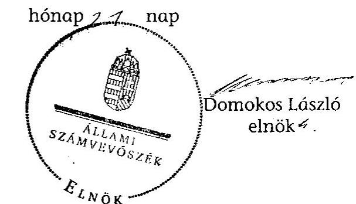

# JELENTÉS 

Dunapataj Nagyközség Önkormányzata belső kontrollrendszerének kialakítása, valamint egyes kontrolltevékenységek és a belső ellenőrzés működése ellenőrzéséről

---

# Állami Számvevőszék 

Iktatószám: V-0063-001-017/2013.
Témaszám: 1098
Vizsgálat-azonosító szám: V059128

## Az ellenőrzést felügyelte:

Dr. Benedek Mária
felügyeleti vezető
Az ellenőrzést vezette:
Gyüre Lajosné
ellenőrzésvezető
A számvevőszéki jelentés összeállításában közreműködtek:
Szenténé Tubak Klára
számvevő tanácsos
Krupánszki Dóra
számvevő
Az ellenőrzést végezték:
Robák Ferencné
Számvevő tanácsos

## Burenzsargal Narantuja

számvevő tanácsos
számvevő tanácsos

---

# TARTALOMJEGYZÉK 

BEVEZETÉS ..... 7
I. ÖSSZEGZŐ MEGÁLLAPÍTÁSOK, KÖVETKEZTETÉSEK, JAVASLATOK ..... 10
II. RÉSZLETES MEGÁLLAPÍTÁSOK ..... 15

1. Az önkormányzat belső kontrollrendszere kialakításának megfelelősége ..... 15
1.1. A kontrollkörnyezet kialakítása ..... 15
1.2. A kockázatkezelési rendszer kialakítása ..... 15
1.3. A kontrolltevékenységek kialakítása ..... 16
1.4. Az információs és kommunikációs rendszer kialakítása ..... 17
1.5. A monitoring rendszer kialakítása ..... 18
2. A pénzügyi folyamatokban kulcsszerepet betöltő belső kontrollok (szakmai teljesítésigazolás és utalvány ellenjegyzés) működése ..... 18
3. A belső ellenőrzés szervezeti keretei és működése ..... 19

## FÜGGELÉKEK

1. számú Értelmező szótár
2. számú A belső kontrollrendszer kialakítása, a pénzügyi folyamatokban kulcsszerepet betöltő kontrollok szakmai teljesítésigazolás és utalvány ellenjegyzés működése, valamint a belső ellenőrzés működése értékelésénél alkalmazott minősítési szempontok

---

.

---

# RÖVIDÍTÉSEK JEGYZÉKE 

## Törvények

ÁSZ tv.
Avtv.

Info tv.

Mötv.
Ötv.
régi Áht.
Ttv.
új Áht.

## Rendeletek

Áhsz.

Ámr.
Ávr.

Ber.
Bkr.

## Szórövidítések

ÁSZ
Belső ellenőrzési kézikönyv
Belső Kontroll Kézikönyv
bizonylati rend

2011. évi LXVI. törvény az Állami Számvevőszékről
1992. évi LXIII. törvény a személyes adatok védelméről és a közérdekű adatok nyilvánosságáról (hatálytalan 2012. január 1-jétől)
2011. évi CXII. törvény az információs önrendelkezési jogról és az információszabadságról (hatályos 2012. január 1-jétől)
2011. évi CLXXXIX. törvény Magyarország helyi önkormányzatairól (hatályos 2012. január 1-jétől)
1990. évi LXV. törvény a helyi önkormányzatokról
1992. évi XXXVIII. törvény az államháztartásról (hatálytalan 2012. január 1-jétől)
a helyi önkormányzatok társulásairól és együttműködéséről szóló 1997. évi CXXXV. törvény (hatálytalan 2013. január 1-jétől)
2011. évi CXCV. törvény az államháztartásról (hatályos 2012. január 1-jétől)

249/2000. (XII. 24.) Korm. rendelet az államháztartás szervezetei beszámolási és könyvvezetési kötelezettségének sajátosságairól
292/2009. (XII. 19.) Korm. rendelet az államháztartás működési rendjéről (hatálytalan 2012. január 1-jétől)
368/2011. (XII. 31.) Korm. rendelet az államháztartásról szóló törvény végrehajtásáról (hatályos 2012. január 1-jétől)
193/2003. (XI. 26.) Korm. rendelet a költségvetési szervek belső ellenőrzéséről (hatálytalan 2012. január 1-jétől)
370/2011. (XII. 31.) Korm. rendelet a költségvetési szervek belső kontrollrendszeréről és belső ellenőrzéséről (hatályos 2012. január 1-jétől)

Állami Számvevőszék
Kalocsa Kistérség Többcélú Társulása belső ellenőrzési kézikönyve (hatályos 2011. január 1-jétől)
az Ámr. 155. § (1) bekezdése, valamint az államháztartási belső kontroll standardokról szóló 1/2009. (IX. 11.) PM irányelv egységes értelmezése érdekében az államháztartásért felelős miniszter által 2010. évben kiadott Belső Kontroll Kézikönyv
Dunapataj Nagyközség Polgármesteri Hivatala Bizonylati szabályzata és bizonylati albuma (hatályos 2010. január 1-jétől)

---

bizonylati szabályzat
értékelési szabályzat
etikai kódex

FEUVE
gazdálkodási jogkörök
szabályzata
gazdasági program
hivatali SZMSZ
informatikai biztonsági szabályzat
jegyző
Képviselő-testület
kockázatkezelési szabályzat
leltározási szabályzat
munkavédelmi szabályzat

Önkormányzat
pénzkezelési szabályzat
polgármester
Polgármesteri Hivatal
szabálytalanságkezelési
szabályzat
számlarend

Dunapataj Nagyközség Polgármesteri Hivatala Bizonylati szabályzata (hatályos 2010.január 1-jétől)
Dunapataj Nagyközség Polgármesteri Hivatala Eszközök és források értékelési szabályzata (hatályos 2010. január 1-jétől)
Dunapataj Nagyközség Polgármesteri Hivatala Köztisztviselői Etikai kódexe, a hivatali SZMSZ 6. számú függeléke (hatályos 2011. március 15-től)
folyamatba épített, előzetes, utólagos és vezetői ellenőrzés Dunapataj Nagyközség Polgármesteri Hivatala szabályzata az önkormányzat pénzgazdálkodásával kapcsolatos kötelezettségvállalás, utalványozás, érvényesítés és ellenjegyzés hatásköri rendjéről (hatályos 2010. január 1-jétől, utolsó módosítás 2011. január 31.)
Dunapataj Nagyközség Önkormányzatának gazdasági programja 2010-2014. (a Képviselő-testület elfogadta a 25/2011. számú határozatával)
Dunapataj Nagyközség Önkormányzat Polgármesteri Hivatala Szervezeti és Működési Szabályzata (hatályos 2009. október 1-jétől)
Dunapataj Nagyközség Polgármesteri Hivatala Informatikai biztonsági szabályzata (hatályos 2012. február 1-jétől)
Dunapataj Nagyközség Önkormányzatának jegyzője
Dunapataj Nagyközség Képviselő-testülete
Dunapataj Nagyközség Polgármesteri Hivatala Kockázatkezelési szabályzata, a FEUVE szabályzat 4. számú melléklete (hatályos 2007. április 2-től)
Dunapataj Nagyközség Polgármesteri Hivatala Leltározási és leltárkészítési szabályzat (hatályos 2010. január 1-jétől)
Dunapataj Nagyközség Polgármesteri Hivatala Munkavédelmi Szabályzata, a hivatali SZMSZ 7. számú függeléke (készült 2009. szeptember 9-én)
Dunapataj Nagyközség Önkormányzata
Dunapataj Nagyközség Polgármesteri Hivatala Pénzkezelési szabályzata (hatályos 2010. január 1-jétől, utolsó módosítás 2011. június 1-jétől)
Dunapataj Nagyközség Önkormányzatának polgármestere
Dunapataj Nagyközség Önkormányzatának Polgármesteri Hivatala
Dunapataj Nagyközség Önkormányzata Polgármesteri Hivatala szabálytalanságok kezelésének szabályzata (hatályos 2007. április 1-jétől)
Dunapataj Nagyközség Önkormányzatának Számviteli Rendje III. fejezet (hatályos 2010. január 1-jétől)

---

számviteli politika Dunapataj Nagyközség Önkormányzatának Számviteli Rendje IV., V., VI., VII., IX. fejezet (hatályos 2010. január 1-jétől)
Társulás
tűzvédelmi szabályzat
ügyrend

Kalocsa Kistérségi Többcélú Társulás
Dunapataj Nagyközség Polgármesteri Hivatala Tűzvédelmi szabályzata, a hivatali SZMSZ 8. számú függeléke (készült 2009. szeptember 9-én)
Dunapataj Nagyközség Önkormányzat Polgármesteri Hivatala Gazdasági szervezetének Ügyrendje, a hivatali SZMSZ 3. számú függeléke (hatályos 2010. január 1-jétől)

---

.

---

# JELENTÉS 

## Dunapataj Nagyközség Önkormányzata belső kontrollrendszerének kialakítása, valamint egyes kontrolltevékenységek és a belső ellenőrzés működése ellenőrzéséről

## BEVEZETÉS

A belső kontrollrendszer kialakítását, működtetését és fejlesztését a régi Áht. és az új Áht. is előírja. Ennek megvalósításáért a költségvetési szerv vezetője felel. A belső kontrollrendszer azt a célt szolgálja, hogy a költségvetési szervek működésük és gazdálkodásuk során a tevékenységeket szabályszerűen, gazdaságosan, hatékonyan, eredményesen hajtsák végre, teljesítsék elszámolási kötelezettségeiket és megvédjék az erőforrásokat a veszteségektől, károktól és a nem rendeltetésszerű használattól. A belső kontrollrendszer magában foglalja mindazon szabályokat, eljárásokat, gyakorlati módszereket és szervezeti struktúrákat, kockázatkezelési technikákat, kontrolltevékenységeket, amelyek segítséget nyújtanak a szervezetnek céljai eléréséhez.

Az ÁSZ a 2011-2015. évekre szóló stratégiájában hangsúlyos szerepet szánt annak, hogy szilárd szakmai alapon álló, értékteremtő ellenőrzéseivel előmozdítsa a közpénzügyek átláthatóságát, rendezettségét. A számvevőszéki ellenőrzés nemzetközi alapelvei is rögzítik, hogy a megfelelő belső kontrollrendszer minimálisra csökkenti a hibák és szabálytalanságok kockázatát.

Az ellenőrzés célja annak értékelése volt, hogy az Önkormányzat a jogszabályi előírásoknak megfelelően alakította-e ki a belső kontrollrendszert, a gazdálkodás folyamatában kulcsszerepet betöltő szakmai teljesítésigazolás és az utalvány-ellenjegyzés kontrolltevékenységeit megfelelően működtette-e, biztosította-e a belső ellenőrzés szabályos és eredményes működését.

Az ÁSZ ezen ellenőrzési céljait pilot (próba) jelleggel községi/nagyközségi önkormányzatoknál végzett ellenőrzések során érvényesítette.

Az ellenőrzés típusa: szabályszerűségi ellenőrzés
Az ellenőrzés jogszabályi alapja: az ÁSZ tv. 5. § (2) és (6) bekezdései
Az ellenőrzött szervezet: az Önkormányzat
Az ellenőrzött időszak: a belső kontrollrendszer kialakításának megfelelőségét a 2011. évre vonatkozóan értékeltük. A kontrolltevékenységek működésének megfelelőségét a 2011. január 1-je és december 31-e, míg a belső ellenőrzés működésének szabályosságát és eredményességét a 2009. január 1-je és 2011.

---

december 31-e közötti időszakot figyelembe véve értékeltük. A helyszíni ellenőrzés lezárásáig a helyi szabályozás változásait nyomon követtük.

Az ellenőrzés szakmai módszertana az ÁSZ hivatalos honlapján (www.asz.hu) közzétett szakmai szabályokon alapult, amely a Legfőbb Ellenőrző Intézmények Nemzetközi Szervezete (INTOSAI) által kiadott nemzetközi standardok (ISSAI) figyelembevételével készült.

A belső kontrollrendszer kialakításának ellenőrzése során értékeltük a kontrollkörnyezet, a kockázatkezelési rendszer, a kontrolltevékenységek, az információs és kommunikációs rendszer, valamint a monitoring rendszer szabályozottságának megfelelőségét.

Értékeltük a pénzügyi folyamatokban kulcsszerepet betöltő szakmai teljesítésigazolás és utalvány ellenjegyzés kontrollok működésének megfelelőségét az államháztartáson kívülre teljesített működési és felhalmozási célú pénzeszközátadásoknál, az állományba nem tartozók megbízási díjainál, továbbá a külső szolgáltató által végzett karbantartási, kisjavítási munkákkal kapcsolatos kifizetéseknél. Az egyszerû véletlen mintavétellel kiválasztott tételek ellenőrzését többlépcsős megfelelőségi tesztek útján addig végeztük, amíg elegendő és megfelelő bizonyítékot szereztünk a vizsgált folyamatok kulcskontrolljai működésének megfelelő vagy nem megfelelő voltáról. Értékeltük az Önkormányzatnál a belső ellenőrzés működésének szabályosságát és eredményességét. Az ÁSZ a 2007-2010. években az Önkormányzatnál a gazdálkodás szabályszerűségére irányuló átfogó ellenőrzést nem végzett.

A fogalmak magyarázatát az 1. számú függelék, az ellenőrzés egyes területeinek értékelésénél alkalmazott egységes minősítési szempontokat a 2. számú függelék tartalmazza.

Az ellenőrzés lefolytatásához az Önkormányzat a munkalapok és a tanúsítvány elektronikus kitöltésével, valamint a megjelölt dokumentumok elektronikus megküldésével szolgáltatott adatokat. A munkalapokon szerepeltetett adatok, információk ellenőrzése és szükség szerinti javítása a helyszíni ellenőrzés keretében történt.

Az ÁSZ az ellenőrzés megállapításait az ellenőrzött időszakban hatályos, az intézkedést igénylő megállapításokra tett javaslatokat a jelenleg hatályos jogszabályok alapján fogalmazta meg.

Az ÁSZ tv. 29. § (1) bekezdése szerint a jelentéstervezetet megküldtük a polgármester részére, aki az ÁSZ tv. 29. § (2) bekezdésében foglalt észrevételezési jogával nem élt, a jelentéstervezetre észrevételt nem tett.

Dunapataj nagyközség állandó lakosainak száma 2011. január 1-jén 3380 fő volt. Az Önkormányzat hattagú Képviselő-testületének munkáját három állandó bizottság segítette. Az Önkormányzat az önállóan működő és gazdálkodó Polgármesteri Hivatalon felül két intézménnyel látta el feladatát. Az Önkormányzat nem rendelkezett többségi tulajdoni hányadú gazdasági társasággal.

A polgármester a 2006. évi önkormányzati választások óta tölti be tisztségét. A jegyző az 1999. évtől látja el feladatait.

---

A Polgármesteri Hivatal gazdasági szervezete két egységre tagolódott, a foglalkoztatott köztisztviselők száma 2011. január 1-jén 18 fő volt.

Az Önkormányzat a 2011. évi költségvetési beszámolója szerint 808616 ezer Ft költségvetési bevételt ért el, valamint 671876 ezer Ft költségvetési kiadást teljesített. A 2011. december 31-i könyvviteli mérleg szerint 1724532 ezer Ft értékű eszközvagyonnal rendelkezett, hosszú lejáratú kötelezettsége nem volt, rövid lejáratú kötelezettsége 10192 ezer Ft volt.

Az Önkormányzat - mint 2000 fő lélekszám feletti település - Polgármesteri Hivatalának szervezete a Mötv. 85. § (1) bekezdésére tekintettel 2013. március 1-jéig nem változott.

---

# I. ÖSSZEGZŐ MEGÁLLAPÍTÁSOK, KÖVETKEZTETÉSEK, JAVASLATOK 

A belső kontrollrendszeren belül 2011-ben a Polgármesteri Hivatalban a kontrollkörnyezet, a kockázatkezelési rendszer, a kontrolltevékenységek, az információs és kommunikációs rendszer, valamint a monitoring rendszer kialakítását külön-külön és összesítve is értékeltük. A belső kontrollrendszer kialakítása az összesített értékelés alapján nem felelt meg a jogszabályi előírásoknak. Az egyes területek kialakításának értékelését az alábbiakban részletezzük.

A kontrollkörnyezet kialakítása megfelelt a jogszabályi követelményeknek, mert a jegyző elkészítette a gazdálkodást érintő legfontosabb szabályzatokat, azonban az Ámr. ¹ előírása ellenére az ellenőrzési nyomvonal rendszeres aktualizálását nem végezte el. A gazdasági szervezet vezetője nem rendelkezett az Ámr.-ben előírt végzettséggel.

A kockázatkezelési rendszer kialakítása nem felelt meg a jogszabályi követelményeknek, mert a jegyző az Ámr. előírásai ellenére nem végzett kockázatelemzést, nem mérte fel és nem állapította meg a Polgármesteri Hivatal tevékenységében, gazdálkodásában rejlő kockázatokat.

A kontrolltevékenységek kialakítása megfelelt a jogszabályi követelményeknek, mert a jegyző szabályozta a folyamatba épített, előzetes, utólagos és vezetői ellenőrzés feladatait, a belső jelentéstétel folyamatait, az érvényesítés rendjét, a szakmai teljesítésigazolás módját, és kijelölte az érvényesítésre, illetve szakmai teljesítésigazolásra jogosultakat. A feladatkörök szétválasztása keretében meghatározta a Polgármesteri Hivatal szervezeti egységeinek, köztisztviselőinek végrehajtási, ellenőrzési és pénzügyi teljesítési feladatait. Szabályozta a munkaviszony megszűnése esetén a folyamatban lévő feladatok átadásának rendjét, továbbá munkakör átadás-átvétel esetén jegyzőkönyv készítési kötelezettséget írt elő.

Az információs és kommunikációs rendszer kialakítása a jogszabályi előírásoknak nem felelt meg, mert a jegyző az Avtv. ² előírása ellenére az adatbiztonság érvényre juttatásához szükséges intézkedéseket hiányosan tette meg. Nem szabályozta a pénzügyi-számviteli szoftverváltozások ellenőrzésére, tesztelésére vonatkozó eljárásokat és a pénzügyi-számviteli rendszerben feldolgozott adatok mentési eljárásait, továbbá a Polgármesteri Hivatal nem rendelkezett a hozzáférési jogosultságokra vonatkozó eljárásrenddel és nyilvántartással. A szabályozási hiányosságokat 2012-ben részben megszüntette, mert készített informatikai biztonsági szabályzatot, kialakította az elektronikus hozzáférések nyilvántartását, azonban továbbra sem határozta meg a hozzáférési jogosultságok eljárásrendjét, a pénzügyi-számviteli szoftverváltozások ellenőrzésére,

[^0]
[^0]:    ¹ 2012. január 1-jétől Ávr.
   

 ${ }^{2}$ 2012. január 1-jétől Info tv.

---

tesztelésére vonatkozó eljárásokat és a pénzügyi-számviteli rendszerben feldolgozott adatok mentési eljárásait.

A monitoring rendszer kialakítása a jogszabályi követelményeknek részben felelt meg, mert a jegyző ugyan a kiemelt közszolgáltatások fizikai és pénzügyi indikátorainak rendszerét, a Polgármesteri Hivatal belső kontrollrendszerére irányuló monitoring rendszert, a rendszeresen végzendő vezetői ellenőrzés rendjét szabályozta, valamint az Ámr.-ben előírt módon értékelte a belső kontrollok működését, azonban az Ámr. előírása ellenére az operatív tevékenységek keretében megvalósuló, folyamatos és eseti nyomon követés szabályait nem határozta meg.

A belső kontrollrendszer nem megfelelő kialakítása kockázatot jelent az Önkormányzat tevékenységeinek szabályszerű, gazdaságos, hatékony és eredményes végrehajtása során.

A Polgármesteri Hivatalban a 2011. évben az államháztartáson kívülre történő működési célú pénzeszközátadásokkal, az állományba nem tartozók megbízási díjaival, valamint a külső szolgáltatók által végzett karbantartással, kisjavítással kapcsolatos kifizetések során - összefoglalóan értékelve - a pénzügyi folyamatokban kulcsszerepet betöltő szakmai teljesítésigazolás és utalvány ellenjegyzés belső kontrollok működésének megfelelősége kiváló volt. A kiadások teljesítését megelőzően a jegyző által szakmai teljesítésigazolásra kijelölt személyek a kiadások teljesítése jogosságának, összegszerűségének ellenőrzését, valamint - az ellenszolgáltatást is magukba foglaló kifizetések esetében a szerződések, megrendelések szakmai teljesítésének igazolását elvégezték. Az utalványok ellenjegyzője a szakmai teljesítésigazolás és az érvényesítés elvégzéséről, továbbá a gazdálkodásra vonatkozó szabályok érvényesüléséről - a feltárt két eset kivételével - meggyőződött. A számvevőszéki ellenőrzés az ellenőrzött kifizetésekkel összefüggésben a rendelkezésre bocsátott dokumentumok alapján kár bekövetkeztére utaló adatot, tényt nem állapított meg.

Az Önkormányzat a belső ellenőrzési feladatokat társulásos formában látta el. A belső ellenőrzés szabályozása és működése a jogszabályi előírásoknak megfelelt. A jegyző írásos véleményének figyelembevételével készített és szabályszerűen jóváhagyott ellenőrzési tervek, valamint ellenőrzési programok alapján végzett ellenőrzésekről jelentéseket készítettek. A 2009. évi ellenőrzési tervet azonban a Ber. ${ }^{3}$ előírása ellenére nem alapozta meg kockázatelemzés, valamint az nem tartalmazta a szükséges ellenőrzési kapacitást és az ellenőrzések ütemezését. A 2009-2010. évi ellenőrzési programok a Ber.-ben foglaltak ellenére nem tartalmazták az ellenőrök megbízólevelének számát és az ellenőrök közötti feladatmegosztást. A 2009-2011. évi ellenőrzések során tett javaslatokra a Ber. előírása ellenére intézkedési tervet nem készítettek, a hiányosságok megszüntetéséről nem győződtek meg. Az elvégzett belső ellenőrzésekről vezetett nyilvántartás a Ber.-ben foglaltak ellenére nem tartalmazta a belső ellenőrök nevét és a jelentősebb megállapításokat, javaslatokat.

[^0]
[^0]:    ${ }^{3}$ 2012. január 1-jétől Bkr.

---

Az Önkormányzatnál a 2009-2011. években a belső ellenőrzés működése a 2. számú függelékben részletezett kritériumrendszer alapján végzett értékelés szerint - nem volt eredményes, mert ugyan a belső ellenőrzés szabályozása és működése az összegző értékelés alapján az ellenőrzött időszak egészét tekintve a jogszabályi előírásoknak megfelelt, azonban nem végeztek ellenőrzést a belső kontrollrendszer kialakításának szabályozottságával, a beazonosított tűréshatár feletti kockázatok kezelése érdekében tett intézkedésekkel, a gazdálkodási jogkörök gyakorlásával, a készpénzkezeléssel kapcsolatos belső kontrollok működésével, az önkormányzati vagyonhasznosítás vonatkozásában a vagyongazdálkodási szabályok betartásával, a vagyonvédelem tekintetében a leltározási és a selejtezési szabályzatban foglaltak betartásával kapcsolatos területek közül legalább kettő területen, továbbá az elvégzett belső ellenőrzések során feltárt hiányosságok megszüntetésére a jegyző intézkedési tervet nem készített, és a javaslatok hasznosításáról sem győződött meg.

Az ÁSZ tv. 33. § (1) bekezdésében foglaltak értelmében az ellenőrzött szervezet vezetője köteles a jelentésben foglalt megállapításokhoz kapcsolódó intézkedési tervet összeállítani, és azt a jelentés kézhezvételétől számított 30 napon belül az ÁSZ részére megküldeni. Amennyiben az intézkedési tervet határidőre nem küldi meg a szervezet, vagy az - az ÁSZ tv. 33. § (2) bekezdésében foglalt póthatáridő eltelte ellenére - továbbra sem elfogadható, az ÁSZ elnöke a hivatkozott törvény 33. § (3) bekezdés a)-b) pontjaiban foglaltakat érvényesítheti.

Az ellenőrzés intézkedést igénylő megállapításai és javaslatai:

# a jegyzőnek 

1. a kontrollkörnyezettel kapcsolatban:

A jegyző - az Ámr. 156. § (2) bekezdésében foglalt előírás ellenére - az ellenőrzési nyomvonalat rendszeresen nem aktualizálta.

A gazdasági szervezet vezetője nem rendelkezett az Ámr. 18. § (1)-(2) bekezdéseiben előírt végzettséggel.

Javaslat:
a) Intézkedjen a Bkr. 6. § (3) bekezdésében előírtak érvényre juttatása érdekében az ellenőrzési nyomvonal rendszeres aktualizálásáról.
b) Biztosítsa, hogy a gazdasági vezető az Ávr. 12. § (1)-(2) bekezdéseiben előírt feltételeknek feleljen meg.
2. a kockázatkezelési rendszerrel kapcsolatban:

A jegyző a kockázatkezelési rendszer kialakítása során - az Ámr. 157. § (1)-(2) bekezdésében foglaltak ellenére - kockázatelemzést nem végzett, nem mérte fel és nem állapította meg a Polgármesteri Hivatal tevékenységében, gazdálkodásában rejlő kockázatokat.

---

Javaslat:
Mérje fel és állapítsa meg a Bkr. 3. § b) pontjának és a 7. § (2) bekezdésének megfelelően a kockázatkezelési rendszer működtetése keretében a költségvetési szerv tevékenységében, gazdálkodásában rejlő kockázatokat.
3. az információs és kommunikációs rendszerrel kapcsolatban:

A jegyző az informatikai rendszer környezetének szabályozása során - az Avtv. 10. § (1)-(2) bekezdéseiben foglalt előírások ellenére - az adatbiztonság érvényre juttatásához szükséges intézkedéseket hiányosan tette meg, mert nem szabályozta a Polgármesteri Hivatal pénzügyi és számviteli elektronikus adatainak kezelését, feldolgozását, tárolását és mentési eljárásait. A Polgármesteri Hivatal nem rendelkezett a hozzáférési jogosultságokra vonatkozó eljárásrenddel és nyilvántartással.

Javaslat:
Biztosítsa az Info tv. 7. § (2)-(3) bekezdéseiben foglaltaknak megfelelően az adatbiztonság érvényesülését, szabályozza a hozzáférési jogosultságokkal kapcsolatos feladatokat (a jogosultságok megállapítása, módosítása, azok betartásának ellenőrzése, nyilvántartásának vezetése), valamint szabályozza az adatok kezelésének, feldolgozásának, tárolásának és mentési eljárásának rendjét.
4. a monitoring rendszerrel kapcsolatban:

A jegyző - az Ámr. 160. §-ában foglaltak ellenére - az operatív tevékenységek keretében megvalósuló folyamatos és eseti nyomon követésből álló, a Polgármesteri Hivatal tevékenységének, a célok megvalósításának nyomon követését biztosító rendszert nem alakította ki.

Javaslat:
Alakítsa ki és működtesse a Bkr. 3. § e) pontjában és a 10. §-ában előírtak alapján a Polgármesteri Hivatal tevékenységének, a célok megvalósításának nyomon követését biztosító rendszert, amelynek része az operatív tevékenységek keretében megvalósuló folyamatos és eseti nyomon követés is.
5. a belső ellenőrzés működésével kapcsolatban:

A 2009-2011. években a Ber. 29. § (1) bekezdésében foglalt előírás ellenére a javaslatokra intézkedési tervet nem készítettek, a Ber. 8. § f) pontjában foglalt előírás ellenére nem követték nyomon az ellenőrzési jelentések alapján megtett intézkedéseket.

Az elvégzett belső ellenőrzésekről a 2009-2011. években vezetett nyilvántartás - a Ber. 32. § (2) bekezdés d) és e) pontjaiban előírtak ellenére - nem tartalmazta a belső ellenőrök nevét és a jelentősebb megállapításokat, javaslatokat.

Javaslat:
a) Készítsen intézkedési tervet a belső ellenőrzési jelentésekben tett javaslatokra a Bkr. 45. § (1)-(2) bekezdéseiben foglaltaknak megfelelően.

---

b) Vezessen nyilvántartást a Bkr. 21. § (2) bekezdés d) pontjának és a 47. §-nak megfelelően a belső ellenőrzési jelentésekben tett megállapításokról, javaslatokról, a vonatkozó intézkedési tervekről, és kövesse nyomon azok végrehajtását.
c) Intézkedjen arról, hogy az elvégzett belső ellenőrzésekről szóló nyilvántartás tartalmazza a Bkr. 50. § (2) bekezdésében előírt tartalmi elemeket.

---

# II. RÉSZLETES MEGÁLLAPÍTÁSOK 

## 1. Az önkormányzat belső kontrollrendszere kialakításának megfelelősége

### 1.1. A kontrollkörnyezet kialakítása

A kontrollkörnyezet kialakítása a 2. számú függelék kritériumrendszerének értékelése alapján a Polgármesteri Hivatalban megfelelő volt, mert a Képviselő-testület elfogadta az Önkormányzat gazdasági programját, a Polgármesteri Hivatal rendelkezett a jogszabályokban előírt tartalmú alapító okirattal és hivatali SZMSZ-szel, továbbá a jegyző, mint a költségvetési szerv vezetője elkészítette a Polgármesteri Hivatal számviteli politikáját, a leltározási, az értékelési és a pénzkezelési szabályzatot, a gazdasági szervezet ügyrendjét, valamint a munkavédelmi és a tűzvédelmi szabályzatot. A jegyző meghatározta a számlarendet, kialakította a bizonylati szabályzatban a bizonylati rendet, elkészítette az ellenőrzési nyomvonalat, meghatározta a feladat-, a felelősségi és hatásköröket, valamint biztosította a Polgármesteri Hivatal folyamatainak meghatározását és dokumentálását. A kontrollkörnyezet kialakítása annak ellenére megfelelő volt, hogy az ellenőrzési nyomvonal rendszeres aktualizálása az Ámr. 156. § (2) bekezdésében ${ }^{4}$ foglalt előírás ellenére nem történt meg, valamint a gazdasági szervezet vezetője nem rendelkezett az Ámr. 18. § (1)-(2) bekezdéseiben ${ }^{5}$ előírt végzettséggel.

A kontrollkörnyezet kialakítása keretében a jegyző az Ámr. 155. § (3) bekezdésének ${ }^{6}$ előírását figyelmen kívül hagyva az államháztartásért felelős miniszter által kiadott Belső Kontroll Kézikönyv ajánlásait nem hasznosította teljes körűen.

A kontrollkörnyezet kialakítása során a jegyző a Belső Kontroll Kézikönyv 1.2.7. pontjában foglalt ajánlást nem érvényesítette, mert a hivatali SZMSZ 29. § (3) bekezdésében előírt kötelezettség ellenére annak dolgozók általi megismerése nem történt meg.

### 1.2. A kockázatkezelési rendszer kialakítása

A kockázatkezelési rendszer kialakítása a 2. számú függelék kritériumrendszerének értékelése alapján a Polgármesteri Hivatalban nem volt megfelelő, mert a jegyző - mint a költségvetési szerv vezetője - az Ámr. 157. § (1)-(2) bekezdésében ${ }^{7}$ foglaltak ellenére kockázatelemzést nem végzett, nem mérte fel

[^0]
[^0]:    ${ }^{4}$ 2012. január 1-jétől a Bkr. 6. § (3) bekezdése
    ${ }^{5}$ 2012. január 1-jétől az Ávr. 12. § (1)-(2) bekezdései
    ${ }^{6}$ 2012. január 1-jétől a Bkr. 5. § (1) bekezdése
    ${ }^{7}$ 2012. január 1-jétől a Bkr. 3. § b) pontja és a 7. § (2) bekezdése

---

és nem állapította meg a Polgármesteri Hivatal tevékenységében, gazdálkodásában rejlő kockázatokat.

A kockázatkezelési rendszer kialakítása során a jegyző az Ámr. 155. § (3) bekezdésének előírását figyelmen kívül hagyva az államháztartásért felelős miniszter által kiadott Belső Kontroll Kézikönyv ajánlásait nem hasznosította teljes körűen.

A kockázatkezelési rendszer kialakítása során a jegyző:

- a Belső Kontroll Kézikönyv 2.1. pontjában foglalt ajánlást nem érvényesítette, mert a kockázatok meghatározása és felmérése keretében a kockázatkezelési szabályzatban nem határozta meg a Polgármesteri Hivatal kockázati tűrőképességét és azt az értéknagyságot, amely felett be kell avatkozni a folyamatokba, továbbá nem rögzítette a kockázatkezelés időtartamát;
- a Belső Kontroll Kézikönyv 2.1.3. pontjában foglalt ajánlást nem hasznosította, mert nem rögzítette a feltárt kockázati tényezőket, nem alakította ki a kockázatok nyilvántartásának rendszerét, továbbá a kockázatok meghatározása és felmérése során nem támaszkodott a belső ellenőrzés megállapításaira;
- a Belső Kontroll Kézikönyv 2.3.4. pontjában foglalt ajánlást figyelmen kívül hagyta, mert nem biztosította a szükséges felhatalmazást és hozzáférési jogosítványokat a kockázatok kezelése érdekében hozott válaszlépések végrehajtásáért felelős személyek részére;
- a Belső Kontroll Kézikönyv 2.4. pontjában foglalt ajánlást nem hasznosította, mert nem írta elő a kockázatok évenkénti felülvizsgálatát, és nem jelölte ki a felülvizsgálatért felelős személyt;
- a Belső Kontroll Kézikönyv 2.5.1. pontjában foglalt ajánlást nem érvényesítette, mert nem gondoskodott a csalás és a korrupciós kockázatok értékeléséről és kezeléséről.

# 1.3. A kontrolltevékenységek kialakítása 

A kontrolltevékenységek kialakítása a 2. számú függelék kritériumrendszerének értékelése alapján a Polgármesteri Hivatalban megfelelő volt, mert a jegyző - mint a költségvetési szerv vezetője - a kontrollstratégiák és módszerek keretében szabályozta a folyamatba épített, előzetes, utólagos és vezetői ellenőrzés feladatait, valamint a belső
 jelentéstétel folyamatait. Meghatározta az érvényesítés rendjét, szabályozta a szakmai teljesítésigazolás módját és kijelölte az érvényesítésre, illetve szakmai teljesítésigazolásra jogosultakat. A feladatkörök szétválasztása keretében meghatározta a Polgármesteri Hivatal szervezeti egységeinek, köztisztviselőinek végrehajtási, ellenőrzési és pénzügyi teljesítési feladatait. A feladatellátás folytonosságának biztosítása érdekében szabályozta a munkaviszony megszűnése esetén a folyamatban lévő feladatok átadásának rendjét, továbbá munkakör átadás-átvétel esetén jegyzőkönyv készítési kötelezettséget írt elő.

A kontrolltevékenységek kialakítása során a jegyző - az Ámr. 155. § (3) bekezdésének előírását figyelmen kívül hagyva - az államháztartásért felelős miniszter által kiadott Belső Kontroll Kézikönyv ajánlásait nem hasznosította teljes körűen.

---

A kontrolltevékenységek kialakítása annak ellenére megfelelő volt, hogy a jegyző:

- a feladatkörök szétválasztása keretében a Belső Kontroll Kézikönyv 3.2.3. pontjában foglalt ajánlást nem hasznosította, mert nem mérte fel a kis létszámból adódó kockázatokat;
- a Belső Kontroll Kézikönyv 3.3.1. pontjában foglaltak ellenére a munkakör átadás-átvétel esetén alkalmazott jegyzőkönyv kötelező tartalmi elemeként a szakmailag illetékes és a humánpolitikai vezető aláírását nem jelölte meg.

# 1.4. Az információs és kommunikációs rendszer kialakítása 

Az információs és kommunikációs rendszer kialakítása a 2. számú függelék kritériumrendszerének értékelése alapján a Polgármesteri Hivatalban nem volt megfelelő, mert a jegyző - mint a költségvetési szerv vezetője - az Avtv. 10. § (1)-(2) bekezdéseiben ${ }^{8}$ foglalt előírások ellenére az adatbiztonság érvényre juttatásához szükséges intézkedéseket hiányosan tette meg. Nem határozta meg a hozzáférési jogosultságok megállapítására, módosítására és azok ellenőrzésére vonatkozó eljárásrendet. Nem szabályozta a pénzügyi-számviteli szoftverváltozások ellenőrzésére, tesztelésére vonatkozó eljárásokat és a pénzügy-számviteli rendszerben feldolgozott adatok mentési eljárásait.

Az információs és kommunikációs rendszer kialakítása során a jegyző az Ámr. 155. § (3) bekezdésének előírását figyelmen kívül hagyva az államháztartásért felelős miniszter által kiadott Belső Kontroll Kézikönyv ajánlásait nem hasznosította teljes körűen.

Az információs és kommunikációs rendszer kialakítása során a jegyző:

- a Belső Kontroll Kézikönyv 4.1.2. pontjában foglalt ajánlást nem vette figyelembe, mert nem szabályozta az információáramlás dokumentálási kötelezettségét;
- a Belső Kontroll Kézikönyv 4.2.4. pontjában foglalt ajánlást nem hasznosította, mert az iktatási, iratkezelési rendszer kialakítása során nem írta elő a Polgármesteri Hivatalban az ügyintézési határidők nyomon követésének dokumentálását és nem szabályozta a késedelmes ügyintézés felelősségi rendjét;
- a szabálytalanságkezelési szabályzatban a Belső Kontroll Kézikönyv 4.3.3. pontjában foglalt ajánlást nem hasznosította, mert nem rögzítette a szabálytalanságot bejelentő védelmére vonatkozó előírásokat és kötelezettségeket.

A Polgármesteri Hivatalban az információs és kommunikációs rendszer szabályozási hiányosságait a 2012. évben részben megszüntették, mert a jegyző készített informatikai biztonsági szabályzatot, kialakította az elektronikus hozzáférések nyilvántartását, azonban továbbra sem határozta meg a hozzáférési jogosultságok eljárásrendjét, a pénzügyi-számviteli szoftverváltozások ellenőrzésére, tesztelésére vonatkozó eljárásokat és a pénzügyi-számviteli rendszerben feldolgozott adatok mentési eljárásait.

[^0]
[^0]:    ${ }^{8}$ 2012. január 1-jétől az Info tv. 7. § (2)-(3) bekezdései

---

# 1.5. A monitoring rendszer kialakítása 

A monitoring rendszer kialakítása a 2. számú függelék kritériumrendszerének értékelése alapján a Polgármesteri Hivatalban részben volt megfelelő, mert ugyan a jegyző - mint a költségvetési szerv vezetője - a kiemelt közszolgáltatások fizikai és pénzügyi indikátorainak rendszerét, a Polgármesteri Hivatal belső kontrollrendszerére irányuló monitoring rendszert, a rendszeresen végzendő vezetői ellenőrzés rendjét szabályozta, valamint az Ámr.-ben előírt módon értékelte a belső kontrollok működését, azonban az Ámr. 160. § (2) bekezdésben ${ }^{9}$ foglalt előírás ellenére az operatív tevékenységek keretében megvalósuló, folyamatos és eseti nyomon követést biztosító rendszer szabályait nem határozta meg.

A monitoring rendszer kialakítása során a jegyző az Ámr. 155. § (3) bekezdésének előírását figyelmen kívül hagyva az államháztartásért felelős miniszter által kiadott Belső Kontroll Kézikönyv ajánlásait nem hasznosította teljes körűen.

A monitoring rendszer kialakítása során a jegyző:

- a Belső Kontroll Kézikönyv 1.2.2. pontjának ajánlását nem érvényesítette, mert a szervezeti célok megvalósításának nyomon követése érdekében a lakosság, illetve a szolgáltatásokat igénybe vevők körében az önkormányzati feladatellátásra irányuló elégedettségi felméréseket nem végeztetett;
- a Belső Kontroll Kézikönyv 5.2.1. pontjában megfogalmazott ajánlás ellenére a belső kontrollrendszerre irányuló monitoring rendszer szabályozását nem alapozta meg kockázatértékeléssel;
- a Belső Kontroll Kézikönyv 5.2.2. pontjában foglalt ajánlás ellenére a külső ellenőrzések jelentéseiben foglalt megállapítások hasznosításának nyomon követését nem biztosította.

A belső kontrollrendszer kialakítása a Polgármesteri Hivatalban 2011-ben az összesített értékelés alapján nem felelt meg a jogszabályi előírásoknak, mert a jegyző a kockázatkezelési rendszert és az információs és kommunikációs rendszert - a szabályozás hiányosságai miatt - nem megfelelően alakította ki, a monitoring rendszert pedig részben megfelelően alakította ki. A kontrollkörnyezet és a kontrolltevékenységek kialakítása megfelelt a jogszabályi előírásoknak.

## 2. A PÉNZÜGYI FOLYAMATOKBAN KULCSSZEREPET BETÖLTŐ BELSŐ KONTROLLOK (SZAKMAI TELJESÍTÉSIGAZOLÁS ÉS UTALVÁNY ELLENJEGYZÉS) MŰKÖDÉSE

A Polgármesteri Hivatalban a 2011. évben az államháztartáson kívülre teljesített működési célú pénzeszközátadások során a szakmai teljesítésigazolás és az utalvány ellenjegyzés kulcskontrollok működésének megfelelősége kiváló volt, mert a kiadások teljesítése jogosságának és összegszerűségének ellenőrzését a jegyző által a szakmai teljesítésigazolásra kijelölt személy a gazdálkodási jogkörök szabályzatában előírt módon igazolta. Az utalványok ellenjegyzője ellenőrzési feladatait a jogszabályi előírásoknak megfelelően végezte, aláírásával ellenjegyezte az utalványokat és meggyőződött a szakmai teljesítésigazolás, valamint az érvényesítés megtörténtéről, továbbá a feltárt két eset kivételével - a gazdálkodásra vonatkozó szabályok érvényesüléséről.

Az Áhsz. 9. számú mellékletének a számlaosztályok tartalmára vonatkozó 9. d) pontjában foglalt előírás ellenére a Homokhátsági Regionális Hulladékgazdálkodási Önkormányzati Társulás részére teljesített két tagdíjfizetés - összesen 252,5 ezer Ft - könyvviteli elszámolására helytelenül a működési célú pénzeszközátadás államháztartáson kívülre főkönyvi számlát jelölték meg.

A Polgármesteri Hivatalban a 2011. évben az állományba nem tartozók megbízási díjainak kifizetése során a szakmai teljesítésigazolás és az utalvány ellenjegyzés kulcskontrollok működésének megfelelősége kiváló volt, mert a kiadások teljesítése jogosságának, összegszerűségének és a megbízási szerződésekben meghatározott feladatok teljesítésének ellenőrzését a jegyző által a szakmai teljesítésigazolásra kijelölt személyek a gazdálkodási jogkörök szabályzatában előírt módon igazolták. Az utalványok ellenjegyzője ellenőrzési feladatait a jogszabályi előírásoknak megfelelően végezte, aláírásával ellenjegyezte az utalványokat és meggyőződött a szakmai teljesítésigazolás, valamint az érvényesítés megtörténtéről, a gazdálkodásra vonatkozó szabályok érvényesüléséről.

A Polgármesteri Hivatalban a 2011. évben a külső szolgáltatók által teljesített karbantartási, kisjavítási munkákra történő kifizetések során a szakmai teljesítésigazolás és az utalvány ellenjegyzés kulcskontrollok működésének megfelelősége kiváló volt, mert a kiadások teljesítése jogosságának, összegszerűségének és a megrendelésekben meghatározott feladatok teljesítésének ellenőrzését a jegyző által a szakmai teljesítésigazolásra kijelölt személy a gazdálkodási jogkörök szabályzatában előírt módon végezte. Az utalványok ellenjegyzője ellenőrzési feladatait a jogszabályi előírásoknak megfelelően végezte, aláírásával ellenjegyezte az utalványokat és meggyőződött a szakmai teljesítésigazolás, valamint az érvényesítés megtörténtéről, a gazdálkodásra vonatkozó szabályok érvényesüléséről.

Az Önkormányzatnál a 2011. évben a pénzügyi folyamatokban kulcsszerepet betöltő belső kontrollok működésének ellenőrzése során az ellenőrzésünk az ellenőrzött tételek vonatkozásában a rendelkezésre bocsátott dokumentumok alapján kár bekövetkeztére utaló adatot, tényt nem állapított meg.

# 3. A BELSŐ ELLENŐRZÉS SZERVEZETI KERETEI ÉS MŰKÖDÉSE 

A 2009-2011. évek között az Önkormányzat a belső ellenőrzési feladatokat társulási ${ }^{10}$ formában látta el, amely megfelelt az Ötv. 92. § (8) bekezdés c) pont-

[^0]
[^0]:    ${ }^{10}$ A Képviselő-testület 2004. június 4-ei, 79/2004. számú határozatával - az Ötv. és a Ttv. alapján - csatlakozott a Kalocsa Kistérségi Többcélú Társuláshoz és elfogadta a társulási megállapodást.

---

jában ${ }^{11}$ foglalt előírásnak. A hivatali SZMSZ-ben a belső ellenőrzés rendjét, jogállását, feladatait meghatározták. Rendelkeztek a Társulás munkaszervezetének vezetője által jóváhagyott Belső ellenőrzési kézikönyvvel, amely tartalmazta a belső ellenőrökre vonatkozó szakmai etikai kódexet, a kockázatelemzési módszertant, a belső ellenőrzési tevékenység minőségét biztosító szabályokat, a belső ellenőrzést végzők továbbképzési kötelezettségét, az intézkedési terv készítésének kötelezettségét, a végrehajtásról történő beszámoltatás rendjét, a rendszeres tájékoztatási kötelezettséget a belső ellenőrzés munkájáról, valamint a belső ellenőrzéshez kapcsolódó nyilvántartási feladatokat. A belső ellenőrzési vezetőt kijelölték. A polgármester a zárszámadási rendelettervezettel egyidejűleg a Képviselő-testület elé terjesztette a 2011. évi belső ellenőrzési jelentések alapján készített összefoglaló jelentést.

Az Önkormányzatnál a belső ellenőrzés szabályozása és működése a 2009. évben a jogszabályi előírásoknak nem felelt meg. A belső ellenőrzési tervet a Ber.-ben előírt tartalommal a Képviselő-testület az Ötv.-ben előírt határidőig jóváhagyta, azonban az a Ber. 12. § b) pontja ${ }^{12}$ a 18. §-a ${ }^{13}$ és a 21. § (2) bekezdésében ${ }^{14}$ foglaltak ellenére nem kockázatelemzésen alapult. A belső ellenőrzési terv a Ber. 21. § (3) bekezdés e) és g) pontjainak ${ }^{15}$ előírása ellenére nem tartalmazta a szükséges ellenőrzési kapacitás meghatározását és az ellenőrzések ütemezését.

Az ellenőrzési program tartalmilag nem felelt meg a Ber. 23. § (4) bekezdés j) pontjában ${ }^{16}$ foglaltaknak, mert nem tartalmazta az ellenőrök megbízólevelének számát és az ellenőrök közötti feladatmegosztást. A belső ellenőrzési programot a Ber. 23. § (3) bekezdése ${ }^{17}$ előírása ellenére nem a belső ellenőrzési vezető hagyta jóvá.

Az Önkormányzatnál a 2010. és a 2011. években a belső ellenőrzés szabályozása és működése megfelelt a jogszabályi előírásoknak. Az éves ellenőrzési terveket az előírt tartalommal, a jegyző írásos véleményének figyelembevételével a Képviselő-testület az Ötv.-ben előírt határidőig jóváhagyta.

A belső ellenőrzési terveket kockázatelemzés alapozta meg, amelynek során közepes kockázatú területeket határoztak meg. Belső ellenőrzési programot készítettek, azonban az 2010-ben a Ber. 23. § (4) bekezdés j) pontjában foglaltak ellenére nem tartalmazta az ellenőrök megbízólevelének számát és az ellenőrök közötti feladatmegosztást, továbbá a Ber. 23. § (3) bekezdése előírása ellenére nem a belső ellenőrzési vezető hagyta jóvá.

[^0]
[^0]:    ${ }^{11}$ 2012. január 1-jétől a Bkr. 15. § (7) bekezdés b) pontja
    ${ }^{12}$ 2012. január 1-jétől a Bkr. 22. § (1) bekezdés b) pontja
    ${ }^{13}$ 2012. január 1-jétől a Bkr. 29. § (1) bekezdése
    ${ }^{14}$ 2012. január 1-jétől a Bkr. 31. § (2) bekezdése
    ${ }^{15}$ 2012. január 1-jétől a Bkr. 31. § (4) bekezdés e) és g) pontjai
    ${ }^{16}$ 2012. január 1-jétől a Bkr. 33. § (2) bekezdés g) pontja
    ${ }^{17}$ 2012. január 1-jétől a Bkr. 33. § (2) bekezdés j) pontja

---

A 2009-2011. években az ellenőrzési tervekben szereplő egy-egy, a normatív állami támogatást megalapozó létszámadatokra irányuló ellenőrzést a költségvetési intézményeknél végrehajtották. Az ellenőrzésekről a Ber.-ben előírt tartalmú jelentéseket készítettek, amelyek tartalmaztak intézkedést igénylő javaslatokat. A Ber. 29. § (1) bekezdésében ${ }^{18}$ foglalt előírás ellenére a javaslatokra intézkedési tervet nem készítettek, a Ber. 8. § f) pontjában

 ${ }^{19}$ foglalt előírás ellenére nem követték nyomon az ellenőrzési jelentések alapján megtett intézkedéseket. A belső ellenőrzés a tévesen befizetett térítési díjak visszafizetésére, a térítési díjak megállapítására, a szociális ellátást szabályozó helyi rendelet módosítására, a szolgáltatás igénybevételére szóló nyilatkozat bekérésére vonatkozó javaslatok hasznosulásáról a 2009-2011. években nem győződött meg.

Az ellenőrzések során nem tártak fel büntető-, szabálysértési, kártérítési vagy fegyelmi eljárás megindítására okot adó cselekményt.

Az elvégzett belső ellenőrzésekről vezetett nyilvántartás a Ber. 32. § (2) bekezdés d) és e) ${ }^{20}$ pontjaiban előírtak ellenére nem tartalmazta a belső ellenőrök nevét, valamint a jelentősebb megállapításokat, javaslatokat.

Az Önkormányzatnál a 2009-2011. években a belső ellenőrzés működése a 2. számú függelékben részletezett kritériumrendszer alapján végzett értékelés szerint - nem volt eredményes, mert ugyan a belső ellenőrzés szabályozása és működése az összegző értékelés alapján az ellenőrzött időszak egészét tekintve a jogszabályi előírásoknak megfelelt, azonban nem végeztek ellenőrzést a belső kontrollrendszer kialakításának szabályozottságával, a beazonosított túréshatár feletti kockázatok kezelése érdekében tett intézkedésekkel, a gazdálkodási jogkörök gyakorlásával, a készpénzkezeléssel kapcsolatos belső kontrollok működésével, az önkormányzati vagyonhasznosítás vonatkozásában a vagyongazdálkodási szabályok betartásával, a vagyonvédelem tekintetében a leltározási és a selejtezési szabályzatban foglaltak betartásával kapcsolatos területek közül legalább kettő területen, továbbá az elvégzett belső ellenőrzések során feltárt hiányosságok megszüntetésére a jegyző intézkedési tervet nem készített, és a javaslatok hasznosításáról sem győződött meg.

Budapest, 2013.

Függelék: $\quad 2 \mathrm{db}$

[^0]
[^0]:    ${ }^{18}$ 2012. január 1-jétől a Bkr. 45. § (1)-(2) bekezdései
    ${ }^{19}$ 2012. január 1-jétől a Bkr. 21. § (2) bekezdés d) pontja és a 47. § (1) bekezdése
    ${ }^{20}$ 2012. január 1-jétől a Bkr. 50. § (2) bekezdés e) pontja

---

# ÉRTELMEZŐ SZÓTÁR 

belső ellenőrzés
belső kontrollrendszer
belső kontrollrendszer területei
integritás
kockázat
kockázatkezelési rendszer
kontrollkörnyezet

Független, tárgyilagos bizonyosságot adó és tanácsadó tevékenység, amelynek célja, hogy az ellenőrzött szervezet működését fejlessze és eredményességét növelje, az ellenőrzött szervezet céljai elérése érdekében rendszerszemléletű megközelítéssel és módszeresen értékeli, illetve fejleszti az ellenőrzött szervezet irányítási és belső kontrollrendszerének hatékonyságát. (A régi Áht. 121/B. § (1) bekezdéséből és a Bkr. 2. § b) pontjából levezetett meghatározás.)
A belső kontrollrendszer a kockázatok kezelése és tárgyilagos bizonyosság megszerzése érdekében kialakított folyamatrendszer, amely azt a célt szolgálja, hogy a működés és gazdálkodás során a tevékenységeket szabályszerűen, gazdaságosan, hatékonyan, eredményesen hajtsák végre, az elszámolási kötelezettségeket teljesítsék, megvédjék az erőforrásokat a veszteségektől, károktól és nem rendeltetésszerű használattól. (A régi Áht. 121. § (1) és az új Áht. 69. § (1) bekezdéseiből levezetett fogalom.)
A kontrollkörnyezet, a kockázatkezelési rendszer, a kontrolltevékenységek, az információ és kommunikáció, valamint a nyomon követés (monitoring). (A régi Áht. 121. § (2) bekezdéséből és a Bkr. 3. §-ából levezetett fogalom.)
Az integritás elvek, értékek, cselekvések, módszerek intézkedések konzisztenciáját jelenti: olyan magatartásmódot, amely meghatározott értékeknek felel meg. Az integritás a közszféra esetében a társadalom által elvárt nyilvánossági, átláthatósági, illetve jogi/etikai normáknak történő megfelelést jelenti. (A http://integritas.asz.hu honlapon között „Integritás jelentés 2011" című dokumentum 5. oldal 1. bekezdés.)
Az a lehetőség, hogy egy olyan esemény történik meg, amely negatívan hat a célok elérésére. (ÁSZ Ellenőrzési kézikönyv 6/139-140.oldal)
Olyan irányítási eszközök és módszerek összessége, melynek elemei a szervezeti célok elérését veszélyeztető tényezők (kockázatok) azonosítása, elemzése, csoportosítása, nyomon követése, valamint szükség esetén a kockázati kitettség mérséklése. (2012. január 1-jétől a Bkr. 2. § m) pontjában meghatározott fogalom)
A kontrollkörnyezet alakítja ki a szervezet belső kontrollrendszerhez való viszonyát, hozzáállását, befolyásolja az alkalmazottak belső kontrollal kapcsolatos tudatosságát, magatartását. Elemei a személyes és szakmai elkötelezettség és a vezetés, valamint az alkalmazottak által vallott erkölcsi értékek; a szakmai hozzáértés iránti elkötelezettség; a felső vezetés hozzáállása - a vezetés filozófiája és tevékenységének stílusa; a szervezeti struktúra; a humánerőforrás-politika és gazdálkodási gyakorlat. (ÁSZ Ellenőrzési kézikönyv 6/107. oldal)

---

kontrolltevékenységek
kommunikáció
korrupció
kulcskontrollok
lényegesség
monitoring
utóellenőrzés
véletlen minta

A kontrolltevékenységek azok a politikák és eljárások, amelyeket a kockázatok megoldására hoznak létre a szervezet céljainak teljesítése érdekében. (ÁSZ Ellenőrzési kézikönyv 6/108-109. oldal)
Az a tevékenység, melynek során információ továbbítása valósul meg. A kommunikációs folyamat résztvevői között tájékoztatás történik, mely során tényeket, ezek magyarázatát közlik. „A szervezetben eredményes kommunikációnak kell áramlania lefelé, horizontálisan és felfelé, a szervezet egészében és annak valamennyi elemében." (ÁSZ Ellenőrzési kézikönyv 6/112. oldal)
A közhatalmi pozíció bármilyen erkölcstelen felhasználása személyes, vagy magáncélú előnyök megszerzése érdekében. (ÁSZ Ellenőrzési kézikönyv 6/84. oldal)
Az önkormányzatok kontrollrendszere kialakításának ellenőrzése során a pénzügyi folyamatokban kulcsszerepet betöltő belső kontrollok a szakmai teljesítésigazolás és utalvány ellenjegyzés. (ÁSZ Módszertani útmutató az átfogó ellenőrzéshez 2.2. pontja alapján meghatározott fogalom.)

Egy információ akkor lényeges, ha hiánya vagy téves állítása befolyásolhatja ezen információkat felhasználók döntéseit, véleményét. Az ellenőrzés során a lényegesség három szempontból értelmezhető: érték, jelleg és összefüggés szerint. (ÁSZ Ellenőrzési kézikönyv 6/122-123. oldal)
A monitoring a különböző szintű szervezeti célok megvalósításának folyamatát kíséri figyelemmel, melynek során a releváns eseményekről és tevékenységekről (együtt: folyamatokról) rendszeres jelleggel, strukturált, döntéstámogató információkhoz jutnak a szervezet vezetői. (NGM útmutató a költségvetési szervek monitoring rendszeréhez 3. oldal, 2011. november, 2012. január 1-jétől a Bkr. 3. § e) pontja nyomon követési rendszerként azonosítja.)
Az intézkedések nyomon követése érdekében elrendelt ellenőrzés, amelynek célja, hogy a belső ellenőrzés bizonyosságot szerezzen az elfogadott intézkedések végrehajtásáról, vagy arról a tényről, hogy ha az ellenőrzött szerv, illetve az ellenőrzött szervezeti egység vezetője nem, vagy nem az elfogadott intézkedésnek megfelelően hajtja végre a feladatokat, továbbá meggyőződni arról, hogy a végrehajtott intézkedésekkel a megállapított kockázat ténylegesen megszűnt, vagy a kockázati túréshatár alá csökkent. (2012. január 1-jétől a Bkr. 2. § s) pontjában meghatározott fogalom.)
Az alapsokaságot képviselő (reprezentáló) véletlenszerűen kiválasztott részsokaság. (ÁSZ Ellenőrzési kézikönyv 6/71. oldal)

---

# A belső kontrollrendszer kialakítása, a pénzügyi folyamatokban kulcsszerepet betöltő szakmai teljesítésigazolás és utalvány ellenjegyzés kontrollok működése, valamint a belső ellenőrzés működése értékelésénél alkalmazott minősítési szempontok 

## 1. A BELSŐ KONTROLLRENDSZER MINŐSÍTÉSE

Az ellenőrzés során először a belső kontrollrendszer területeinek (kontrollkörnyezet, kockázatkezelés, kontrolltevékenységek, információs és kommunikációs rendszer, monitoring rendszer) minősítését külön-külön elvégeztük. A megfelelőség minősítése a belső kontrollrendszer kialakítására vonatkozó kérdéseket tartalmazó munkalapokon, az elérhető és az elért pontokból kimunkált képlet alapján, számítógépes program segítségével történt.

A belső kontrollrendszer egyes területei kialakítása megfelelőségének értékelésére - az elért és elérhető pontok figyelembevételével - sávos rendszer alapján „nem megfelelő", „részben megfelelő" és „megfelelő" minősítést alkalmaztunk.

Az ellenőrzött önkormányzat belső kontrollrendszerének egy-egy területe - az elért pontszámtól függetlenül - „nem megfelelő" értékelést kapott, ha nem teljesítette az alábbi kritériumok bármelyikét.

1. Kontrollkörnyezet kialakítása:

- Az Önkormányzat Képviselő-testülete az Ötv. 91. § (1) bekezdésében előírtaknak megfelelően megalkotta hosszabb időszakra szóló gazdasági programját.
- A Polgármesteri Hivatal ${ }^{1}$ rendelkezik a régi Áht. 88. § (2) bekezdésében előírt alapító okirattal, és az tartalmazza a régi Áht. 90. § (1) bekezdésében előírtakat, kiemelten a d) pont szerinti alaptevékenységeit.
- A Polgármesteri Hivatal rendelkezik a régi Áht. 91. § (2) bekezdésben előírt SZMSZ-szel.
- A Polgármesteri Hivatal rendelkezik az Áhsz. 8. § (3) bekezdésben előírt számviteli politikával.
- A Polgármesteri Hivatal rendelkezik az Áhsz. 8. § (4) bekezdés a) pontjában előírt eszközök és források leltározási és leltárkészítési szabályzatával.
- A Polgármesteri Hivatal rendelkezik az Áhsz. 8. § (4) bekezdés b) pontjában előírt eszközök és források értékelési szabályzatával.

[^0]
[^0]:    ${ }^{1}$ A körjegyzőségben működő önkormányzatoknál a polgármesteri hivatal feladatait a körjegyzőség látta el.

---

- A Polgármesteri Hivatal rendelkezik az Áhsz. 8. § (4) bekezdés d) pontjában előírt pénzkezelési szabályzattal.
- A Polgármesteri Hivatal rendelkezik az Áhsz. 49. § (1) bekezdésben előírt számlarenddel.
- A Polgármesteri Hivatal rendelkezik a Számv. tv. 161. § (2) bekezdés d) pontjában előírt bizonylati renddel.
- A Polgármesteri Hivatal rendelkezik a munkavédelemről szóló 1993. évi XCIII. törvény 2. § (3) bekezdés és 72. § (4) bekezdés előírásaiban foglalt, az egészséget nem veszélyeztető és biztonságos munkavégzés követelményei megvalósításának módját meghatározó szabályozással.
- A Polgármesteri Hivatal rendelkezik a tűz elleni védekezésről, a műszaki mentésről és a tűzoltóságról szóló 1996. évi XXXI. törvény 19. § (1) bekezdésben előírt tűzvédelmi szabályzattal.
- A Polgármesteri Hivatal rendelkezik az Ámr. 15. § (6) bekezdésben hivatkozott gazdasági szervezet ügyrendjével. Amennyiben a gazdasági feladatokat a Polgármesteri Hivatalon belül több szervezeti egység látja el, és azoknak önálló ügyrendjük van, az is elfogadható.
- A Polgármesteri Hivatal tevékenységeire vonatkozóan az Ámr. 156. § (2) bekezdésben előírtaknak megfelelve elkészült az ellenőrzési nyomvonal, folyamatleírás.

2. Kockázatkezelési tevékenység kialakítása:

- A költségvetési szerv (Polgármesteri Hivatal) vezetője az Ámr. 157. § (1) bekezdése alapján kockázatkezelési rendszert működtet, melynek keretében elkészítették a kockázatkezelési szabályzatot a Belső Kontroll Kézikönyv 2.1 pontjában meghatározott tartalommal.

3. Információs és kommunikációs rendszer kialakítása:

- A Polgármesteri Hivatal rendelkezik iratkezelési szabályzattal.
- Az 1992. évi LXIII. tv. 31/A. § (3) bekezdésben előírtaknak megfelelve az Önkormányzat jegyzője elkészítette az adatvédelmi és adatbiztonsági szabályzatot.
- Az Ámr. 156. § (3) bekezdésében előírtaknak megfelelve a jegyző szabályozta a szabálytalanságok kezelésének eljárásrendjét.

4. A monitoring rendszer kialakítása:

- Az Önkormányzat rendelkezik a Ber. 5. § (1) bekezdése alapján a jegyző, társult feladatellátás esetén a Ber. 32/B. § (8) bekezdésében előírtaknak megfelelve a társulás munkaszervezeti feladatát ellátó (vagy közös feladatellátás esetén a feladatellátást végző, intézményi társulás esetén az irányítási feladatot ellátó önkormányzat által kijelölt) költségvetési szerv vezetője által jóváhagyott belső ellenőrzési kézikönyvvel.

---

A belső kontrollrendszer öt fő területének egyedi értékelését követően került sor az összegző értékelésre, a minősítés itt is „megfelelő", „részben megfelelő", illetve „nem megfelelő" lehetett:

- Megfelelő a belső kontrollrendszer kialakítása, amennyiben mind az öt fő terület megfelelő értékelést kapott.
- Nem megfelelő a belső kontrollrendszer kialakítása, amennyiben bármelyik fő terület nem megfelelő értékelést kapott.
- Részben megfelelő a kontrollrendszer kialakítása, amennyiben bármelyik fő terület, részben megfelelő értékelést kapott, és egyik fő terület sem kapott nem megfelelő értékelést.

# 2. A KÉT KULCSKONTROLL (SZAKMAI TELJESÍTÉSIGAZOLÁS ÉS AZ UTALVÁNY ELLENJEGYZÉSE) MINŐSÍTÉSE 

A két kulcskontroll (szakmai teljesítésigazolás és az utalvány ellenjegyzése) működése megfelelőségének vizsgálatát többlépcsős megfelelőségi tesztek útján, megismételt eljárással, a könyvviteli tételekből vett véletlen mintavételi eljárással kiválasztott minta alapján végeztük.

Az ellenőrzés során alkalmazott módszer (megfelelőségi teszt) lényege, hogy a kiválasztott minta ellenőrzését csak addig végeztük, amíg elegendő és megfelelő bizonyítékot nem szereztünk a vizsgált kulcskontroll (szakmai teljesítésigazolás, utalvány ellenjegyzés) működésének megfelelő, vagy nem megfelelő voltáról. A megismételt eljárás alkalmazása a szándékolt hatáshoz (törvényes működés, kitűzött célok, teljesítmények elérése, veszteséget okozó kockázatok megelőzése, mérséklése, feltárása) viszonyítva lehetővé tette a kontrolltevékenységek tényleges hatásának vizsgálatát, ez alapján a működésük megfelelősége értékelését. Ennek keretében a számvevő bizonyosságot szerzett arról, hogy
 a rendelkezésre álló szabályozás és dokumentumok alapján a szakmai teljesítésigazoláshoz és utalvány ellenjegyzéshez szükséges ellenőrzési lépéseket végrehajtották-e.

A tesztek kiértékelése két szinten történt. Először az egyes tevékenységi területre meghatározott kulcskontrollokat értékeltük, majd általános következtetéseket vontunk le a két kulcskontroll együttes megfelelősége tekintetében. Az ellenőrzésre kijelölt területek kifizetéseinél a két kulcskontroll működése „kiváló", „jó" vagy „gyenge" minősítést kaphatott.

A szakmai teljesítésigazolás és az utalvány ellenjegyzés működését:

- kiválónak értékeltük abban az esetben, ha azok működése megfelel a hibák megelőzésére és kijavítására meghatározott jogszabályi és helyi szintű szabályozásnak;
- jónak minősítettük, ha a megállapított kisebb (tolerálható mértékű) hiányosságok nem veszélyeztetik az ellenőrzött területek hibáinak megelőzését és kijavítását;

---

- gyengének értékeltük, amennyiben a kontrollok működésében előforduló hiányosságok miatt nem biztosított a hibák megelőzése, feltárása, kijavítása.

# 3. A BELSŐ ELLENŐRZÉS MEGFELELŐ ÉS EREDMÉNYES MŰKÖDÉSÉNEK ÉRTÉKELÉSE 

A belső ellenőrzés megfelelő és eredményes működésének ellenőrzése során értékeltük, hogy az ellenőrzött időszakban a belső ellenőrzés kockázatelemzésen alapuló ellenőrzési terv alapján ellenőrizte-e az Önkormányzat irányítási, belső kontroll eljárásainak hatékonyságát, valamint a jogszabályoknak és belső szabályzatoknak való megfelelését, továbbá a gazdaságosság, hatékonyság és eredményesség követelményeit vizsgálva a belső ellenőrzés fogalmazott-e meg megállapításokat és ajánlásokat a polgármester és a jegyző részére, és azok hasznosultak-e.

A belső ellenőrzés működését három év (2009-2011) tapasztalatai, valamint a munkalapok kérdéseire adott válaszok alapján évenként értékeltük, ami az elérhető és az elért pontokból kimunkált képlettel, számítógépes program segítségével történt. A belső ellenőrzés működése megfelelőségének értékelése során - az elért és elérhető pontok figyelembevételével - a belső kontrollrendszer egyes területeinek minősítésével azonos sávos rendszer alapján „nem felelt meg", „megfelelt" és „jól megfelelt" minősítést alkalmaztunk.

A belső ellenőrzés eredményességének megállapításához a 2009-2011. évek egyedi értékelésén túlmenően az összesített pontszámok alapján is el kellett végezni a „jól megfelelt", „megfelelt" és „nem felelt meg" kategóriák szerinti minősítést.

Eredményesnek akkor tekintettük a belső ellenőrzés működését, ha az összesített értékelés alapján az önkormányzat legalább „megfelelt" minősítést kapott, és legalább kettő terület ellenőrzésére sor került a 2009-2011. években az alábbiak közül:

- a belső kontrollrendszer kialakításának szabályozottsága;
- a beazonosított tűréshatár feletti kockázatok kezelése érdekében tett intézkedések;
- a gazdálkodási jogkörök gyakorlásához kapcsolódó belső kontrollok működése;
- a készpénzkezeléssel kapcsolatos belső kontrollok működése;
- az önkormányzati vagyon hasznosítása területén a vagyongazdálkodási szabályok betartása;
- a vagyonvédelem területén a leltározási és a selejtezési szabályzatban foglaltak betartása;
- kockázatelemzésen alapuló és az előzőekbe nem tartozó ellenőrzés.

---

A belső ellenőrzés eredményessé minősítésének feltétele volt továbbá, hogy az Önkormányzat jegyzője intézkedett a felsorolt és elvégzett ellenőrzések javaslatainak hasznosításáról. Ha a minősítés az összegző értékelés alapján „nem felelt meg", akkor a belső ellenőrzés működése nem volt eredményes. Amennyiben az összegző értékelés alapján a minősítés „megfelelt", de az előbb felsorolt területek közül legalább kettő ellenőrzésére a 2009-2011. években nem került sor, vagy a javaslatok hasznosulása érdekében az Önkormányzat jegyzője nem intézkedett, úgy a belső ellenőrzés működése szintén nem volt eredményes.
