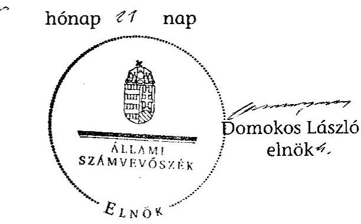
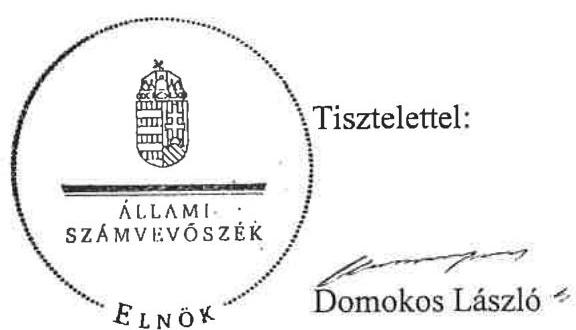
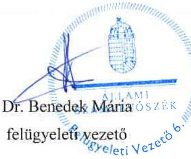

# ÁLLAMI   SZÁMVEVŐSZÉK 

## JELENTÉS

Kétegyháza Nagyközség Önkormányzata belső
kontrollrendszerének kialakítása, valamint egyes
kontrolltevékenységek és a belső ellenőrzés működése ellenőrzéséről

---

# Állami Számvevőszék 

Iktatószám: V-0063-003-017/2013.
Témaszám: 1098
Vizsgálat-azonosító szám: V059130

## Az ellenőrzést felügyelte:

Dr. Benedek Mária
felügyeleti vezető
Az ellenőrzést vezette:
Gyüre Lajosné
ellenőrzésvezető
A számvevőszéki jelentés összeállításában közreműködtek:
Pappné dr. Szamosi Éva
számvevő tanácsos
Dr. Horváth Klára
számvevő tanácsos
Az ellenőrzést végezték:
Némethné Nagy Mária Szepes Béla Bálint
számvevő számvevő tanácsos

---

# TARTALOMJEGYZÉK 

BEVEZETÉS ..... 5
I. ÖSSZEGZŐ MEGÁLLAPÍTÁSOK, KÖVETKEZTETÉSEK, JAVASLATOK ..... 8
II. RÉSZLETES MEGÁLLAPÍTÁSOK ..... 15

1. Az önkormányzat belső kontrollrendszere kialakításának megfelelősége ..... 15
1.1. A kontrollkörnyezet kialakítása ..... 15
1.2. A kockázatkezelési rendszer kialakítása ..... 16
1.3. A kontrolltevékenységek kialakítása ..... 16
1.4. Az információs és kommunikációs rendszer szabályozása ..... 16
1.5. A monitoring rendszer kialakítása ..... 17
2. A pénzügyi folyamatokban kulcsszerepet betöltő belső kontrollok (szakmai teljesítésigazolás és utalvány ellenjegyzés) működése ..... 17
3. A belső ellenőrzés szervezeti keretei és működése ..... 19

## MELLÉKLETEK

1. számú Az észrevételt tartalmazó polgármesteri levél
2. számú Az észrevételre vonatkozó elnöki válaszlevél

## FÜGGELÉKEK

1. számú Értelmező szótár
2. számú A belső kontrollrendszer kialakítása, a pénzügyi folyamatokban kulcsszerepet betöltő szakmai teljesítésigazolás és utalvány ellenjegyzés kontrollok működése, valamint a belső ellenőrzés működése értékelésénél alkalmazott minősítési szempontok

---

.

---

# RÖVIDÍTÉSEK JEGYZÉKE 

## Törvények

ÁSZ tv.
Avtv.

Htv.

Info tv.

Kttv.

Ktv.

Mötv.

Ötv.
régi Áht.
új Áht.

## Rendeletek

Ámr.
Ávr.

Ber.

Bkr.
hivatali SZMSZ
önkormányzati SZMSZ

2011. évi LXVI. törvény az Állami Számvevőszékről
1992. évi LXIII. törvény a személyes adatok védelméről és a közérdekű adatok nyilvánosságáról (hatálytalan 2012. január 1-jétől)
1991. évi XX. törvény a helyi önkormányzatok és szerveik, a köztársasági megbízottak, valamint egyes centrális alárendeltségű szervek feladat- és hatásköreiről
2011. évi CXII. törvény az információs önrendelkezési jogról és az információszabadságról (hatályos 2012. január 1-jétől)
2011. évi CXCIX. törvény a közszolgálati tisztviselőkről (hatályos 2012. március 1-jétől)
1992. évi XXIII. törvény a köztisztviselők jogállásáról (hatálytalan 2012. március 1-jétől)
2011. évi CLXXXIX. törvény Magyarország helyi önkormányzatairól (hatályos 2012. január 1-jétől)
1990. évi LXV. törvény a helyi önkormányzatokról
1992. évi XXXVIII. törvény az államháztartásról (hatálytalan 2012. január 1-jétől)
2011. évi CXCV. törvény az államháztartásról (hatályos 2012. január 1-jétől)

292/2009. (XII. 19.) Korm. rendelet az államháztartás működési rendjéről (hatálytalan 2012. január 1-jétől)
368/2011. (XII. 31.) Korm. rendelet az államháztartásról szóló törvény végrehajtásáról (hatályos 2012. január 1-jétől)
193/2003. (XI. 26.) Korm. rendelet a költségvetési szervek belső ellenőrzéséről (hatálytalan 2012. január 1-jétől)
370/2011. (XII. 31.) Korm. rendelet a költségvetési szervek belső kontrollrendszeréről és belső ellenőrzéséről (hatályos 2012. január 1-jétől)
Kétegyháza Nagyközség Önkormányzat Képviselőtestületének 13/2008. (IV. 30.) számú rendelete Kétegyháza Nagyközség Polgármesteri Hivatalának szervezeti és működési szabályzatáról (hatályos 2008. május 1-jétől)
Kétegyháza Nagyközség Önkormányzat Képviselőtestületének 12/2008. (IV. 30.) számú rendelete Kétegyháza Nagyközség Képviselő-testülete és szerveinek szervezeti és működési szabályzatáról (hatályos 2008. május 1-jétől)

---

# Szórövidítések 

| ÁSZ | Állami Számvevőszék |
| :--: | :--: |
| belső ellenőrzési kézikönyv | Belső ellenőrzési Kézikönyv (hatályos 2009. április 1-jétől) |
| Belső Kontroll Kézikönyv | Az Ámr. 155. § (1) bekezdése, valamint az államháztartási belső kontroll standardokról szóló 1/2009. (IX. 11.) PM irányelv egységes értelmezése érdekében az államháztartásért felelős miniszter által 2010. évben kiadott Belső Kontroll Kézikönyv |
| FEUVE | folyamatba épített, előzetes, utólagos és vezetői ellenőrzés |
| gazdasági program | Kétegyháza Nagyközség Önkormányzat Gazdasági programja 2011-2014 (a Képviselő-testület 8/2011. (I. 20.) számú határozatával jóváhagyva) |
| jegyző | Kétegyháza Nagyközség Önkormányzatának jegyzője |
| Képviselő-testület | Kétegyháza Nagyközség Önkormányzatának Képviselő-testülete |
| Önkormányzat polgármester | Kétegyháza Nagyközség Önkormányzata   Kétegyháza Nagyközség Önkormányzatának polgármestere |
| Polgármesteri Hivatal | Kétegyháza Nagyközség Önkormányzatának Polgármesteri Hivatala |
| Társulás | Gyula és Környéke Többcélú Kistérségi Társulás |

---

# JELENTÉS 

## Kétegyháza Nagyközség Önkormányzata belső kontrollrendszerének kialakítása, valamint egyes kontrolltevékenységek és a belső ellenőrzés működése ellenőrzéséről

## BEVEZETÉS

A belső kontrollrendszer kialakítását, működtetését és fejlesztését a régi Áht. és az új Áht. is előírja. Ennek megvalósításáért a költségvetési szerv vezetője felel. A belső kontrollrendszer azt a célt szolgálja, hogy a költségvetési szervek működésük és gazdálkodásuk során a tevékenységeket szabályszerűen, gazdaságosan, hatékonyan, eredményesen hajtsák végre, teljesítsék elszámolási kötelezettségeiket és megvédjék az erőforrásokat a veszteségektől, a károktól és a nem rendeltetésszerű használattól. A belső kontrollrendszer magában foglalja mindazon szabályokat, eljárásokat, gyakorlati módszereket és szervezeti struktúrákat, kockázatkezelési technikákat, kontrolltevékenységeket, amelyek segítséget nyújtanak a szervezetnek céljai eléréséhez.

Az ÁSZ a 2011-2015. évekre szóló stratégiájában hangsúlyos szerepet szánt annak, hogy szilárd szakmai alapon álló, értékteremtő ellenőrzéseivel előmozdítsa a közpénzügyek átláthatóságát, rendezettségét. A számvevőszéki ellenőrzés nemzetközi alapelvei is rögzítik, hogy a megfelelő belső kontrollrendszer minimálisra csökkenti a hibák és szabálytalanságok kockázatát.

Az ellenőrzés célja annak értékelése volt, hogy az Önkormányzat a jogszabályi előírásoknak megfelelően alakította-e ki a belső kontrollrendszert; a gazdálkodás folyamatában kulcsszerepet betöltő szakmai teljesítésigazolás és az utalvány ellenjegyzés kontrolltevékenységeit megfelelően működtette-e; biztosította-e a belső ellenőrzés szabályos és eredményes működését.

Az ÁSZ ezen ellenőrzési céljait pilot (próba) jelleggel községi/nagyközségi önkormányzatoknál végzett ellenőrzések során érvényesítette.

Az ellenőrzés típusa: szabályszerűségi ellenőrzés
Az ellenőrzés jogszabályi alapja: az ÁSZ tv. 5. § (2) és (6) bekezdései
Az ellenőrzött szervezet: az Önkormányzat
Az ellenőrzött időszak: a belső kontrollrendszer kialakításának megfelelőségét a 2011. évre vonatkozóan értékeltük. A kontrolltevékenységek működésének megfelelőségét a 2011. január 1-je és december 31-e, míg a belső ellenőrzés

---

működésének szabályosságát és eredményességét a 2009. január 1-je és 2011. december 31-e közötti időszakot figyelembe véve értékeltük. A helyszíni ellenőrzés lezárásáig a helyi szabályozás változásait nyomon követtük.

Az ellenőrzés szakmai módszertana az ÁSZ hivatalos honlapján (www.asz.hu) közzétett szakmai szabályokon alapult, amely a Legfőbb Ellenőrző Intézmények Nemzetközi Szervezete (INTOSAI) által kiadott nemzetközi standardok (ISSAI) figyelembevételével készült.

A belső kontrollrendszer kialakításának ellenőrzése során értékeltük a kontrollkörnyezet, a kockázatkezelési rendszer, a kontrolltevékenységek, az információs és kommunikációs rendszer, valamint a monitoring rendszer szabályozottságának megfelelőségét.

Értékeltük a pénzügyi folyamatokban kulcsszerepet betöltő szakmai teljesítésigazolás és utalvány ellenjegyzés kontrollok működésének megfelelőségét az államháztartáson kívülre teljesített működési és felhalmozási célú pénzeszközátadásoknál, az állományba nem tartozók megbízási díjainál, továbbá a külső szolgáltatók által végzett karbantartási, kisjavítási munkákkal kapcsolatos kifizetéseknél. Az egyszerû véletlen mintavétellel kiválasztott tételek ellenőrzését többlépcsős megfelelőségi tesztek útján addig végeztük, amíg elegendő és megfelelő bizonyítékot szereztünk a vizsgált folyamatok kulcskontrolljai működésének megfelelő vagy nem megfelelő voltáról. Értékeltük az Önkormányzatnál a belső ellenőrzés működésének szabályosságát és eredményességét. Az ÁSZ a 2007-2010. években az Önkormányzatnál átfogó ellenőrzést nem végzett.

A fogalmak magyarázatát az 1. számú függelék, az ellenőrzés egyes területeinek értékelésénél alkalmazott egységes minősítési szempontokat a 2. számú függelék tartalmazza.

Az ellenőrzés lefolytatásához az Önkormányzat a munkalapok és a tanúsítvány elektronikus kitöltésével, valamint a megjelölt dokumentumok elektronikus megküldésével szolgáltatott adatokat. A munkalapokon szerepeltetett adatok, információk ellenőrzése és szükség szerinti javítása a helyszíni ellenőrzés keretében történt.

Az ÁSZ az ellenőrzés megállapításait az ellenőrzött időszakban hatályos, az intézkedést igénylő megállapításokra tett javaslatokat a jelenleg hatályos jogszabályok alapján fogalmazta meg.

Az Ász tv. 29. § (1) bekezdése szerint a jelentéstervezetet megküldtük a polgármester részére, aki az ÁSZ tv. 29. § (2) bekezdésében foglalt észrevételezési jogával élt, a jelentéstervezetre észrevételt tett. Az ÁSZ tv. 29. § (3) bekezdésében előírtaknak megfelelően a figyelembe nem vett észrevételeket és annak indokairól szóló tájékoztatást a jelentés tartalmazza (1. számú melléklet).

Kétegyháza nagyközség állandó lakosainak száma 2011. január 1-jén 4008 fő volt. Az Önkormányzat héttagú Képviselő-testületének munkáját négy állandó bizottság segítette. Az Önkormányzat a Polgármesteri Hivatalon felül négy intézménnyel látta el a feladatát. Az Önkormányzat többségi tulajdoni hányaddal gazdasági társaságokban nem rendelkezett.

---

A polgármester a 2010. évi önkormányzati választások óta tölti be tisztségét. A jegyző 2007. november 1-jétől látja el feladatait.

A Polgármesteri Hivatal szervezeti egységekre nem tagolódott, a foglalkoztatott köztisztviselők száma 2011. január 1-jén 15 fő volt.

Az Önkormányzat a 2011. évi költségvetési beszámolója szerint 895891 ezer Ft költségvetési bevételt ért el, valamint 896146 ezer Ft költségvetési kiadást teljesített. A 2011. december 31-i könyvviteli mérleg szerint 1337885 ezer Ft értékű eszközvagyonnal rendelkezett, a rövid lejáratú kötelezettségállománya 100620 ezer Ft volt, hosszú lejáratú kötelezettsége nem volt.

Az Önkormányzat - mint 2000 fő lélekszám feletti település - Polgármesteri Hivatalának szervezete a Mötv. 85. § (1) bekezdésére tekintettel 2013. március 1-jéig nem változott.

---

# I. ÖSSZEGZŐ MEGÁLLAPÍTÁSOK, KÖVETKEZTETÉSEK, JAVASLATOK 

A belső kontrollrendszeren belül 2011-ben a Polgármesteri Hivatalban a kontrollkörnyezet, a kockázatkezelési rendszer, a kontrolltevékenységek és a monitoring rendszer kialakítását, valamint az információs és kommunikációs rendszer szabályozását külön-külön és összesítve is értékeltük. A belső kontrollrendszer kialakítása az összesített értékelés alapján nem felelt meg a jogszabályi előírásoknak. Az egyes területek kialakításának értékelését az alábbiakban részletezzük.

A kontrollkörnyezet kialakítása részben felelt meg a jogszabályi követelményeknek, mert a jegyző a jogszabályi előírásokat nem érvényesítette maradéktalanul. A jegyző elkészítette a gazdálkodást érintő legfontosabb szabályzatokat, azonban a hivatali SZMSZ-ben az Ámr. ¹ rendelkezései ellenére nem rögzítette az ellátandó és a szakfeladatrend szerint besorolt alaptevékenységeket, az alaptevékenységet szabályozó jogszabályok megjelölését, az engedélyezett létszámot, valamint a munkakörökhöz tartozó feladat- és hatásköröket, a hatáskörök gyakorlásának módját, a helyettesítés rendjét és az ezekhez kapcsolódó felelősségi szabályokat. A jegyző az ellenőrzési nyomvonalban az Ámr.-ben előírtak ellenére nem azonosította be a Polgármesteri Hivatal tevékenységéhez kapcsolódó valamennyi működési folyamatot, nem határozta meg a felelősségi és információs szinteket és kapcsolatokat, irányítási és ellenőrzési folyamatokat.

A kockázatkezelési rendszer kialakítása nem felelt meg a jogszabályi előírásoknak, mert a jegyző az Ámr.-ben foglaltak ellenére kockázatelemzést nem végzett, nem mérte fel és nem állapította meg teljes körűen a Polgármesteri Hivatal tevékenységében, gazdálkodásában rejlő kockázatokat, nem határozta meg a kockázatokkal kapcsolatos intézkedéseket és megtételük módját.

A kontrolltevékenységek kialakítása megfelelt a jogszabályi követelményeknek, mert a jegyző szabályozta a FEUVE feladatait, valamint a belső jelentéstétel folyamatait. Meghatározta az érvényesítés rendjét, szabályozta a szakmai teljesítés igazolásának módját, és kijelölte az érvényesítésre, valamint a szakmai teljesítésigazolásra jogosultakat.

Az információs és kommunikációs rendszer szabályozása megfelelt a jogszabályi előírásoknak, mert a jegyző szabályozta az információáramlás rendjét és a kommunikációs feladatokat. Meghatározta a kötelezően közzéteendő adatok nyilvánosságra hozatalának és megismerési igényének teljesítési rendjét. Biztosította az informatikai rendszer környezetének szabályozottságát, meghatározta a hozzáférési jogosultságok megállapításának, módosításának és ellenőrzésének eljárásrendjét. Az adatbiztonság érvényre juttatásához szükséges intézkedéseket azonban - az Avtv.-ben ² foglalt előírások ellenére - a jegyző hiányosan tette meg, mert nem szabályozta a Polgármesteri Hivatal pénzügyi és számviteli elektronikus adatainak kezelését, feldolgozását, tárolását, és nem készítette el a hozzáférési jogosultságok nyilvántartását.

A monitoring rendszer kialakítása a jogszabályi követelményeknek nem felelt meg, mert a jegyző az Ámr.-ben foglaltak ellenére az operatív tevékenységek keretében megvalósuló folyamatos és eseti nyomon követésből álló, a Polgármesteri Hivatal tevékenységének, a célok megvalósításának nyomon követését biztosító rendszer szabályait nem határozta meg.

A belső kontrollrendszer nem megfelelő kialakítása és hiányos szabályozása

[^1]: ¹ 2012. január 1-jétől Ávr.
[^2]: ² 2012. január 1-jétől Ávr.

 kockázatot jelent az Önkormányzat tevékenységeinek szabályszerű, gazdaságos, hatékony és eredményes végrehajtása során.

A Polgármesteri Hivatalban a 2011. évben az államháztartáson kívülre történő működési és felhalmozási célú pénzeszközátadásokkal, az állományba nem tartozók megbízási díjaival, valamint a külső szolgáltatók által végzett karbantartással, kisjavítással kapcsolatos kifizetések során - összefoglalóan értékelve a pénzügyi folyamatokban kulcsszerepet betöltő szakmai teljesítésigazolás és utalvány ellenjegyzés belső kontrollok működésének megfelelősége gyenge volt.

A külső szolgáltatók által teljesített karbantartási, kisjavítási munkák kifizetéseit megelőzően a jegyző által kijelölt személy a régi Áht. ${ }^{3}$ és az Ámr. előírásai ellenére nem ellenőrizte a kiadások teljesítésének jogosságát, összegszerűségét, a megrendelés teljesítését, illetve nem tett eleget igazolási kötelezettségének. Az államháztartáson kívülre teljesített működési és felhalmozási célú pénzeszközátadások, valamint az állományba nem tartozók megbízási díjainak kifizetése esetében a szakmai teljesítés igazolását az Ámr.-ben foglaltak ellenére nem a jegyző által kijelölt személy végezte. Az utalványok ellenjegyzője a kifizetések teljesítését megelőzően az Ámr.-ben foglalt ellenőrzési feladatait - szakmai teljesítésigazolás és szabályszerű szakmai teljesítésigazolás hiányában - nem a jogszabályi előírásoknak megfelelően végezte. Annak ellenére aláírásával ellenjegyezte az utalványokat, hogy azok nem tartalmazták a kötelezettségvállalás nyilvántartási számot, mivel az Ámr.-ben előírt kötelezettségvállalás nyilvántartást nem vezették. A népszámláláshoz tartozó megbízási díjak kifizetéséhez kapcsolódóan az utalványok ellenjegyzője nem jelezte az utalványozónak, hogy a számfejtési dokumentum nem érvényesített okmány, nem győződött meg arról, hogy az érvényesítés megtörtént-e, valamint nem tüntette fel az ellenjegyzés dátumát.

Az ellenőrzött kifizetésekkel összefüggésben a rendelkezésre bocsátott dokumentumok alapján jogosulatlan kifizetést nem tárt fel a számvevőszéki ellenőrzés, azonban a gazdálkodásban kulcsszerepet betöltő kontrollok jogszabályi előírásoknak nem megfelelő, gyenge működése miatt fennáll a hibák bekövetkezésének kockázata. A nem megfelelően szabályozott és működtetett belső kontrollok korrupciós kockázatot is hordoznak.

[^0]
[^0]:    ${ }^{2}$ 2012. január 1-jétől Info tv.
    ${ }^{3}$ 2012. január 1-jétől új Áht.

---

nek kockázata. A nem megfelelően szabályozott és működtetett belső kontrollok korrupciós kockázatot is hordoznak.

Az Önkormányzatnál a belső ellenőrzési feladatok ellátása a 2009-2011. évek között a Társulás feladata volt. A 2010. évben a Társulás a belső ellenőrzés feladatát nem látta el, a jegyző a régi Áht.-ban előírtak ellenére a belső ellenőrzés működtetéséről nem gondoskodott. A Ber.-ben ${ }^{4}$ előírtak ellenére a belső ellenőrzési vezetői tevékenység ellátásának módját nem határozták meg, a társulás munkaszervezeti feladatát ellátó költségvetési szerv vezetője által jóváhagyott belső ellenőrzési kézikönyvvel nem rendelkeztek, mert azt a Társulás elnöke hagyta jóvá. A belső ellenőrzés szabályozása és működése a 2009-2011. években nem felelt meg a jogszabályi előírásoknak, mert a Ber.-ben előírtak ellenére kockázatelemzésen alapuló éves ellenőrzési terveket, az ellenőrzésekhez ellenőrzési programokat nem készítettek. A 2009-ben és 2011-ben végzett ellenőrzések javaslatainak végrehajtására a jegyző 2011-ben intézkedési tervet nem készített, és a javaslatok hasznosítására sem intézkedett. Az ellenőrzésekről, valamint a javaslatok alapján tett intézkedésekről a Ber.-ben előírtak ellenére nyilvántartást nem vezettek. A belső ellenőrzés a Ber.-ben foglaltak ellenére a 2009-ben megtett intézkedések nyomon követését is elmulasztotta.

Az Önkormányzatnál a 2009-2011. évek között a belső ellenőrzés működése - a 2. számú függelékben részletezett kritériumrendszer alapján végzett értékelés szerint - nem volt eredményes, mert a belső ellenőrzés szabályozása és működése az összegző értékelés alapján az ellenőrzött időszak egészét tekintve a jogszabályi előírásoknak nem felelt meg. A belső ellenőrzés működése azért sem volt eredményes, mert - kockázatelemzés hiányában - a kockázatos területeken, illetőleg a belső kontrollrendszer kialakításának szabályozottsága, a beazonosított tűréshatár feletti kockázatok kezelése érdekében tett intézkedések, a gazdálkodási jogkörök gyakorlása, a készpénzkezeléssel kapcsolatos belső kontrollok működése, az önkormányzati vagyonhasznosítás vonatkozásában a vagyongazdálkodási szabályok, valamint a vagyonvédelem tekintetében a leltározási és a selejtezési szabályzatban foglaltak betartása területei közül legalább kettő területen nem végeztek belső ellenőrzést, és a jegyző a 2011. évben elvégzett ellenőrzés javaslatainak hasznosításáról nem intézkedett. Mindezek hozzájárultak a számvevőszéki ellenőrzés során is feltárt szabályozási hiányosságok fennmaradásához.

Az ÁSZ tv. 33. § (1) bekezdésében foglaltak értelmében az ellenőrzött szervezet vezetője köteles a jelentésben foglalt megállapításokhoz kapcsolódó intézkedési tervet összeállítani, és azt a jelentés kézhezvételétől számított 30 napon belül az ÁSZ részére megküldeni. Amennyiben az intézkedési tervet határidőre nem küldi meg a szervezet, vagy az - az ÁSZ tv. 33. § (2) bekezdésében foglalt póthatáridő eltelte ellenére - továbbra sem elfogadható, az ÁSZ elnöke a hivatkozott törvény 33. § (3) bekezdés a)-b) pontjaiban foglaltakat érvényesítheti.

[^0]
[^0]:    ${ }^{4}$ 2012. január 1-jétől Bkr.

---

Az ellenőrzés intézkedést igénylő megállapításai és javaslatai:

# a polgármesternek 

A régi Áht. 100/C. § (6) bekezdésében és az Ámr. 76. § (1) és (3) bekezdéseiben foglaltak ellenére a külső szolgáltatók által teljesített karbantartási, kisjavítási munkák kifizetéseit megelőzően a jegyző által kijelölt személy nem ellenőrizte a kiadások jogosságát, összegszerűségét, a megrendelés teljesítését, és nem tett eleget igazolási kötelezettségének. Az államháztartáson kívülre teljesített működési és felhalmozási célú pénzeszközátadások, valamint az állományba nem tartozók megbízási díjainak kifizetései esetében a szakmai teljesítés igazolását - az Ámr. 76. § (1) és (5) bekezdéseiben foglaltak ellenére - nem a jegyző által kijelölt személy végezte. Az utalványok ellenjegyzője a kifizetések teljesítését megelőzően az Ámr. 78-79. §-aiban foglalt ellenőrzési feladatait nem a jogszabályi előírásoknak megfelelően végezte.

Javaslat:
A Mötv. 115. § (1) bekezdésében foglaltak alapján kísérje figyelemmel az önkormányzat gazdálkodásának szabályszerűségét. A Mötv. 67. § f) pontja alapján gondoskodjon a belső kontrollrendszerre és a belső ellenőrzés működésére vonatkozó jogszabályi rendelkezések be nem tartása, valamint a szakmai teljesítésigazolás, illetve az utalvány ellenjegyzés kontrollokkal összefüggésben feltárt hiányosságok, szabálytalanságok tekintetében az esetleges munkajogi felelősséggel kapcsolatos körülmények kivizsgálásáról, majd a vizsgálat eredményének függvényében tegye meg a szükséges munkajogi intézkedéseket.

## a jegyzőnek

1. a kontrollkörnyezettel kapcsolatban:

A jegyző a hivatali SZMSZ-ben - az Ámr. 20. § (2) bekezdés c), e) és h) pontjaiban foglaltak ellenére - nem rögzítette az ellátandó és a szakfeladatrend szerint besorolt alaptevékenységeket, az alaptevékenységet szabályozó jogszabályok megjelölését, az engedélyezett létszámot, valamint a hivatali SZMSZ-ben nevesített munkakörökhöz tartozó feladat- és hatásköröket, a hatáskörök gyakorlásának módját, a helyettesítés rendjét és az ezekhez kapcsolódó felelősségi szabályokat.

A jegyző az ellenőrzési nyomvonalban - az Ámr. 156. § (2) bekezdésében előírtak ellenére - nem azonosította be a Polgármesteri Hivatal tevékenységéhez kapcsolódó valamennyi működési folyamatot, valamint nem határozta meg a felelősségi és információs szinteket és kapcsolatokat, irányítási és ellenőrzési folyamatokat.

Javaslat:
a) Készítse elő a hivatali SZMSZ módosítását, és kezdeményezze a polgármesternél a módosítás Képviselő-testület elé terjesztését annak érdekében, hogy az az Ávr. 13. § (1) bekezdésének c), e) és g) pontjaiban foglaltaknak megfelelően tartalmazza az ellátandó és a szakfeladatrend szerint besorolt alaptevékenységeket, az alaptevékenységet szabályozó jogszabályok megjelölését, az engedélyezett létszámot, a nevesített munkakörökhöz tartozó feladat- és hatásköröket, a hatáskörök gyakorlásának módját, a helyettesítés rendjét és az ezekhez kapcsolódó felelősségi szabályokat.
b) Intézkedjen arról, hogy az ellenőrzési nyomvonal a Bkr. 6. § (3) bekezdésében foglaltaknak megfelelően készüljön el.
2. a kockázatkezelési rendszerrel kapcsolatban:

A jegyző az Ámr. 157. § (1)-(3) bekezdéseinek előírása ellenére kockázatelemzést nem végzett és a kockázatkezelési rendszert nem alakította ki teljes körűen.

Javaslat:
Alakítsa ki és működtesse a Bkr. 3. § b) pontja és 7. § alapján a kockázatkezelési rendszert.
3. az információs és kommunikációs rendszerrel kapcsolatban:

A jegyző az Avtv. 10. §-ában foglalt előírások ellenére az adatbiztonság érvényre juttatásához szükséges intézkedéseket hiányosan tette meg, mert nem szabályozta a Polgármesteri Hivatal pénzügyi és számviteli elektronikus adatainak kezelését, feldolgozását, tárolását, és nem készítette el a hozzáférési jogosultságok nyilvántartását.

Javaslat:
Biztosítsa az Info tv. 7. § (2)-(3) bekezdéseinek megfelelően az adatbiztonság érvényesülését, szabályozza a Polgármesteri Hivatal pénzügyi és számviteli elektronikus adatainak kezelését, feldolgozását, tárolását, és készítse el a hozzáférési jogosultságok nyilvántartását.
4. a monitoring rendszerrel kapcsolatban

A jegyző az Ámr. 160. §-ában foglaltak ellenére az operatív tevékenységek keretében megvalósuló folyamatos és eseti nyomon követésből álló, a Polgármesteri Hivatal tevékenységének, a célok megvalósításának nyomon követését biztosító rendszert nem alakította ki.

Javaslat:
Alakítsa ki és működtesse a Bkr. 3. § e) pontjában és a 10. §-ában előírtak alapján a Polgármesteri Hivatal tevékenységének, a célok megvalósításának nyomon követését biztosító rendszert, amelynek része az operatív tevékenységek keretében megvalósuló folyamatos és eseti nyomon követés is.
5. a pénzügyi folyamatokban kulcsszerepet betöltő kontrollok működésével kapcsolatban:A régi Áht. 100/C. § (6) bekezdésében és az Ámr. 76. § (1) és (3) bekezdéseiben foglaltak ellenére a külső szolgáltatók által teljesített karbantartási, kisjavítási munkák kifizetéseit megelőzően a jegyző által kijelölt személy nem ellenőrizte a kiadások jogosságát, összegszerűségét, a megrendelés teljesítését, és nem tett eleget igazolási kötelezettségének. Az államháztartáson kívülre teljesített működési és felhalmozási célú pénzeszközátadások, valamint az állományba nem tartozók megbízási díjainak

---

kifizetése esetében a szakmai teljesítés igazolását - az Ámr. 76. § (1) és (5) bekezdéseiben foglaltak ellenére - nem a jegyző által kijelölt személy végezte. Az utalványok ellenjegyzője a kifizetések teljesítését megelőzően az Ámr. 79. § (2) bekezdésében foglalt ellenőrzési feladatait - szakmai teljesítésigazolás, illetőleg szabályszerű szakmai teljesítésigazolás hiányában - nem a jogszabályi előírásoknak megfelelően végezte. Az utalvány ellenjegyzője annak ellenére aláírásával ellenjegyezte az utalványt, hogy az - az Ámr. 78. § (2) bekezdés g) pontjában foglaltak ellenére - nem tartalmazta a kötelezettségvállalás nyilvántartási számát, mert a kötelezettségvállalások Ámr. 75.§ (1) bekezdésében előírt nyilvántartását nem vezették. A népszámláláshoz tartozó megbízási díjak kifizetéséhez kapcsolódóan az utalványok ellenjegyzője az Ámr. 78. § (2) és a 79. § (2)-(3) bekezdéseiben foglaltak ellenére nem jelezte az utalványozónak, hogy a számfejtési dokumentum nem érvényesített okmány, nem győződött meg arról, hogy az érvényesítés megtörtént-e, valamint nem tüntette fel az ellenjegyzés dátumát.

Javaslat:
Intézkedjen - a szakmai teljesítés igazolása és az utalvány ellenjegyzése vonatkozásában feltárt hiányosságok megszüntetése, illetve az operatív gazdálkodás során a működésbeli hibák megelőzése, feltárása és kijavítása érdekében - arról, hogy
a) a teljesítésigazolásra - az Ávr. 57. § (4) bekezdésében foglalt előírásnak megfelelően - kijelölt személyek az Ávr. 57. § (1) bekezdésében előírtaknak megfelelően, ellenőrizhető okmányok alapján ellenőrizzék a kiadások teljesítésének jogosságát, összegszerűségét, ellenszolgáltatást is magában foglaló kötelezettségvállalás esetében a szerződés, megrendelés teljesítését, és azt az Ávr. 57. § (3) bekezdésében foglalt módon - dátummal, a teljesítés tényére való utalással és aláírásukkal - igazolják;
b) a kifizetéseket megelőzően - az Ávr. 58. § (1) bekezdése szerint - teljesítésigazolás alapján ellenőrizzék az összegszerűséget, és azt, hogy a megelőző ügymenetben az új Áht., az Áhsz. és az Ávr. - gazdálkodási szabályokra, a teljesítésigazolás elvégzésére vonatkozó - előírásait betartották-e;
c) a kötelezettségvállalásokról az Ávr 56. § (1) bekezdésében foglalt nyilvántartást naprakészen vezessék, és az utalványokon az Ávr. 59. §
 (3) bekezdés f) pontjában foglaltaknak megfelelően tüntessék fel a kötelezettségvállalás nyilvántartási számát;
d) a kifizetések utalványozása az Ávr. 59. § (1) bekezdésben foglaltak alapján érvényesített okmányon történjen.
6. a belső ellenőrzés működésével kapcsolatban:

A Ber. 12. §-ában foglalt belső ellenőrzési vezetői tevékenység ellátásának módját a Ber. 4/A. § (2) bekezdésében előírtak ellenére nem határozták meg. A belső ellenőrzési kézikönyvet - a Ber. 32/B. § (8) bekezdésében foglaltak ellenére - nem a Társulás munkaszervezeti feladatát ellátó költségvetési szerv vezetője, hanem a Társulás elnöke hagyta jóvá.

---

A Ber. 18. §-ában előírtak ellenére az Önkormányzatra vonatkozó, kockázatelemzéssel alátámasztott éves ellenőrzési tervek, valamint az ellenőrzésekhez - a Ber. 23. § (1) bekezdésében foglaltak ellenére - ellenőrzési programok nem készültek.

A 2011-ben elvégzett ellenőrzés javaslatainak végrehajtására a jegyző a Ber. 29.§ (1) bekezdésben előírtak ellenére intézkedési tervet nem készített. Az ellenőrzésekről - a Ber. 12. § j) pontjában és a 32. §-ban foglaltak ellenére -, a javaslatok egy részére megtett intézkedésekről - a Ber. 29/A. § (1)-(2) bekezdéseiben foglaltak ellenére - nyilvántartást nem vezettek. A belső ellenőrzés - a Ber. 8. § f) pontjában foglalt előírás ellenére - a megtett intézkedések nyomon követését elmulasztotta.

Javaslat:
a) Intézkedjen arról, hogy a Bkr. 16. § (4) bekezdésének megfelelően a belső ellenőrzési tevékenység megszervezésére vonatkozó megállapodásban rendelkezzenek a Bkr. 22. § (1)-(2) bekezdéseiben foglalt tevékenységek és kötelességek ellátásának módjáról.
b) Kezdeményezze, hogy a belső ellenőrzési kézikönyv jóváhagyása a Bkr. 56. § (7) bekezdésében foglaltaknak megfelelően történjen.
c) Intézkedjen annak érdekében, hogy a Bkr. 22. § (1) bekezdés b) pontjában, a 29. § (1) bekezdésében és a 31. § (1)-(2) bekezdéseiben foglaltaknak megfelelően az ellenőrzési munka megtervezéséhez kockázatelemzésen alapuló éves ellenőrzési tervek készüljenek, és azokat a Képviselő-testület a Mötv. 119. § (5) bekezdésében és a Bkr. 32. § (4) bekezdésében előírt határidőn belül hagyja jóvá.
d) Kezdeményezze, hogy a Bkr. 33. § (2) bekezdésében foglaltaknak megfelelően előkészített, a belső ellenőrzési vezető által jóváhagyott ellenőrzési programok alapján hajtsák végre az ellenőrzéseket.
e) Készítsen intézkedési tervet a belső ellenőrzési jelentésekben megfogalmazott javaslatok végrehajtására a Bkr. 45. § (2)-(3) bekezdéseiben foglaltaknak megfelelő tartalommal és határidőn belül.
f) Kezdeményezze, hogy a belső ellenőrzési vezető a Bkr. 22. § b) és e) pontjában, valamint az 50. §-ában foglaltaknak megfelelően az elvégzett ellenőrzésekről nyilvántartást vezessen.
g) Kezdeményezze, hogy a belső ellenőrzés a Bkr. 21. § (2) bekezdés d) pontjában foglaltak szerint kövesse nyomon a belső ellenőrzési jelentések alapján megtett intézkedéseket, és vezessen erre vonatkozó nyilvántartást a Bkr. 47. §-ában foglalt előírásokat is figyelembe véve.

---

# II. RÉSZLETES MEGÁLLAPÍTÁSOK 

## 1. AZ ÖNKORMÁNYZAT BELSŐ KONTROLLRENDSZERE KIALAKÍTÁSÁNAK MEGFELELŐSÉGE

### 1.1. A kontrollkörnyezet kialakítása

A kontrollkörnyezet kialakítása a 2. számú függelékben részletezett kritériumrendszer alapján végzett értékelés szerint a Polgármesteri Hivatalban részben volt megfelelő, mert a jegyző a jogszabályi előírásokat nem érvényesítette maradéktalanul. A Polgármesteri Hivatal rendelkezett hivatali SZMSZ-szel, a Képviselő-testület elfogadta az Önkormányzat 2011-2014. évre szóló gazdasági programját és a Polgármesteri Hivatal alapító okiratát. A jegyző kialakította a gazdálkodást érintő legfontosabb szabályzatokat.

A jegyző, mint a költségvetési szerv vezetője:

- a hivatali SZMSZ-ben az Ámr 20. § (2) bekezdés c), e) és h) pontjaiban ${ }^{5}$ foglaltak ellenére nem rögzítette az ellátandó és a szakfeladatrend szerint besorolt alaptevékenységeket, az alaptevékenységet szabályozó jogszabályok megjelölését, az engedélyezett létszámot, valamint a hivatali SZMSZ-ben nevesített munkakörökhöz tartozó feladat- és hatásköröket, a hatáskörök gyakorlásának módját, a helyettesítés rendjét és az ezekhez kapcsolódó felelősségi szabályokat;
- a folyamatok meghatározása és dokumentálása körében, az ellenőrzési nyomvonalban - az Ámr. 156. § (2) bekezdésében ${ }^{6}$ előírtak ellenére - nem azonosította be a Polgármesteri Hivatal tevékenységéhez kapcsolódó valamennyi működési folyamatot, nem határozta meg a felelősségi és információs szinteket és kapcsolatokat, irányítási és ellenőrzési folyamatokat.

A Képviselő-testület az Önkormányzat gazdasági programját hiányos tartalommal fogadta el.

Az Önkormányzat gazdasági programja az Ötv. 91. § (6) bekezdésében ${ }^{7}$ foglaltak ellenére nem tartalmazta az adópolitika célkitűzéseit.

A kontrollkörnyezet kialakítása során a jegyző az Ámr. 155. § (3) bekezdésének ${ }^{8}$ előírását figyelmen kívül hagyva az államháztartásért felelős miniszter által kiadott Belső Kontroll Kézikönyv ajánlásait nem hasznosította teljes körűen.

[^0]
[^0]:    ${ }^{5}$ 2012. január 1-jétől az Ávr. 13. § (1) bekezdés c), e) és g) pontjai
    ${ }^{6}$ 2012. január 1-jétől a Bkr. 6. § (3) bekezdése
    ${ }^{7}$ 2013. január 1-jétől a Mötv. 116. § (1) bekezdése nem írja elő az adópolitikai célkitűzések rögzítésének kötelezettségét.
    ${ }^{8}$ 2012. január 1-jétől a Bkr. 5. § (1) bekezdése

---

A kontrollkörnyezet kialakítása keretében a jegyző:

- a Belső Kontroll Kézikönyv 1.2.7. pontjában foglaltakat nem hasznosította, mert nem írta elő a hivatali SZMSZ dolgozók általi megismerésének kötelezettségét;
- a Belső Kontroll Kézikönyv 1.3.3. pontjában foglaltakat nem érvényesítette, mert a köztisztviselők munkaköri leírásaiban nem határozta meg a munkakörökhöz kapcsolódó jogokat, kötelezettségeket és felelősségi szabályokat.

# 1.2. A kockázatkezelési rendszer kialakítása 

A kockázatkezelési rendszer kialakítása a 2. számú függelékben részletezett kritériumrendszer alapján végzett értékelés szerint a Polgármesteri Hivatalban nem volt megfelelő, mert a jegyző az Ámr. 157. § (1)-(3) bekezdéseinek ${ }^{9}$ előírása ellenére kockázatelemzést nem végzett, nem mérte fel és nem állapította meg teljes körűen a Polgármesteri Hivatal tevékenységében, gazdálkodásában rejlő kockázatokat, nem határozta meg a kockázatokkal kapcsolatos intézkedéseket és megtételük módját.

### 1.3. A kontrolltevékenységek kialakítása

A kontrolltevékenységek kialakítása a 2. számú függelékben részletezett kritériumrendszer alapján végzett értékelés szerint a Polgármesteri Hivatalban megfelelő volt, mert a jegyző szabályozta a FEUVE feladatait, valamint a belső jelentéstétel folyamatait. Meghatározta az érvényesítés rendjét, szabályozta a szakmai teljesítés igazolásának módját, és kijelölte az érvényesítésre, valamint a szakmai teljesítésigazolásra jogosultakat.

A kontrolltevékenységek kialakítása során a jegyző az Ámr. 155. § (3) bekezdésének előírását figyelmen kívül hagyva az államháztartásért felelős miniszter által kiadott Belső Kontroll Kézikönyv ajánlásait nem hasznosította teljes körűen.

A kontrolltevékenységek kialakítása keretében a jegyző:

- a Belső Kontroll Kézikönyv 3.2.3. pontjában foglalt ajánlást nem érvényesítette, mert nem mérte fel a kis létszámból adódó kockázatokat;
- a Belső Kontroll Kézikönyv 3.3.1. pontjában foglaltakat nem hasznosította, mert nem szabályozta a munkaviszony megszüntetése esetén a munkavállaló folyamatban lévő feladatai átadásának rendjét, és nem írta elő a munkakör átadás-átvételi jegyzőkönyv kötelező tartalmi elemei között a munkaviszony megszüntetésének időpontját.

### 1.4. Az információs és kommunikációs rendszer szabályozása

Az információs és kommunikációs rendszer szabályozottsága a 2. számú függelékben részletezett kritériumrendszer alapján végzett értékelés szerint a Polgármesteri Hivatalban megfelelő volt, mert a jegyző szabályozta az

[^0]
[^0]:    ${ }^{9}$ 2012. január 1-jétől a Bkr. 3. § b) pontja és 7. §-a

---

információáramlás rendjét és a kommunikációs feladatokat. Meghatározta a kötelezően közzéteendő adatok nyilvánosságra hozatalának és megismerési igényének teljesítési rendjét. Biztosította az informatikai rendszer környezetének szabályozottságát, meghatározta a hozzáférési jogosultságok megállapításának, módosításának és ellenőrzésének eljárásrendjét. Szabályozta az ügyintézési határidők nyomon követését. A Polgármesteri Hivatal rendelkezett adatvédelmi és adatbiztonsági szabályzattal, valamint szabálytalanságkezelési eljárásrenddel.

Annak ellenére megfelelő volt az információs és kommunikációs rendszer szabályozottsága, hogy a jegyző az Avtv. 10. §-ában ${ }^{10}$ foglalt előírások ellenére az adatbiztonság érvényre juttatásához szükséges intézkedéseket hiányosan tette meg, mert nem szabályozta a Polgármesteri Hivatal pénzügyi és számviteli elektronikus adatainak kezelését, feldolgozását, tárolását, valamint nem készítette el a hozzáférési jogosultságok nyilvántartását.

# 1.5. A monitoring rendszer kialakítása 

A monitoring rendszer kialakítása a 2. számú függelékben részletezett kritériumrendszer alapján végzett értékelés szerint a Polgármesteri Hivatalban nem volt megfelelő, mert a jegyző az Ámr. 160. §-ában ${ }^{11}$ foglaltak ellenére az operatív tevékenységek keretében megvalósuló folyamatos és eseti nyomon követésből álló, a Polgármesteri Hivatal tevékenységének, a célok megvalósításának nyomon követését biztosító rendszer szabályait nem határozta meg.

A belső kontrollrendszer kialakítása a Polgármesteri Hivatalban 2011-ben összefoglalóan értékelve nem felelt meg a jogszabályi előírásoknak, mert a jegyző a kockázatkezelési rendszert és a monitoring rendszert - a szabályozás hiányosságai miatt - nem megfelelően alakította ki, valamint a kontrollkörnyezetet kialakítása részben megfelelt a jogszabályi előírásoknak. A kontrolltevékenységeket és az információs és kommunikációs rendszert az előírásoknak megfelelően szabályozta.

## 2. A PÉNZÜGYI FOLYAMATOKBAN KULCSSZEREPET BETÖLTŐ BELSŐ KONTROLLOK (SZAKMAI TELJESÍTÉSIGAZOLÁS ÉS UTALVÁNY ELLENJEGYZÉS) MŰKÖDÉSE

A Polgármesteri Hivatalban a 2011. évben az államháztartáson kívülre teljesített működési és felhalmozási célú pénzeszközátadások során a szakmai teljesítésigazolás és az utalvány ellenjegyzés kulcskontrollok működésének megfelelősége gyenge volt, mert

- az Ámr. 76. § (5) bekezdésében ${ }^{12}$ foglaltak ellenére nem a jegyző által kijelölt személy végezte a szakmai teljesítés igazolását a sportegyesület és az ösztön-

[^0]
[^0]:    ${ }^{10}$ 2012. január 1-jétől az Info tv. 7. § (2)-(3) bekezdései
    ${ }^{11}$ 2012. január 1-jétől a Bkr. 3. § e) pontja és a 10. §-a
    ${ }^{12}$ 2012. január 1-jétől az Ávr. 57. § (4) bekezdése

---

díj támogatások kifizetéseinél, ezért a kiadás teljesítését megelőzően - az Ámr. 76. § (3) bekezdésének ${ }^{13}$ előírása ellenére - nem a jogszabályi előírásoknak megfelelően történt a kiadások teljesítése jogosságának, összegszerűségének ellenőrzése;

- az utalványok ellenjegyzője az Ámr. 79. § (2) bekezdésében ${ }^{14}$ foglalt feladatát szabályszerű szakmai teljesítésigazolás hiányában nem a jogszabályi előírásoknak megfelelően végezte, továbbá annak ellenére aláírásával ellenjegyezte az utalványokat, hogy az utalványok nem tartalmazták az Ámr. 78. § (2) bekezdés g) pontjában ${ }^{15}$ előírt kötelezettségvállalás nyilvántartási számot, mivel az Ámr. 75. § (1) bekezdésében ${ }^{16}$ előírt kötelezettségvállalás nyilvántartást nem vezették.

A Polgármesteri Hivatalban a 2011. évben az állományba nem tartozók megbízási díjainak kifizetése során a szakmai teljesítésigazolás és az utalvány ellenjegyzés kulcskontrollok működésének megfelelősége gyenge volt, mert

- az Ámr. 76. § (5) bekezdésében foglaltak ellenére nem a jegyző által kijelölt személy végezte a szakmai teljesítés igazolását az európai uniós pályázatok keretében kifizetett megbízási díjak esetében, ezért - az Ámr. 76. § (3) bekezdésének előírása ellenére - nem a jogszabályi előírásoknak megfelelően történt a kiadások teljesítése jogosságának, összegszerűségének és a szerződésben foglaltak teljesítésének ellenőrzése;
- az utalványok ellenjegyzője az Ámr. 79. § (2) bekezdésében foglalt feladatát szabályszerű szakmai teljesítésigazolás hiányában nem a jogszabályi előírásoknak megfelelően végezte, továbbá annak ellenére aláírásával ellenjegyezte az utalványokat, hogy az utalványok nem tartalmazták az Ámr. 78. § (2) bekezdés g) pontjában előírt kötelezettségvállalás nyilvántartási számot, mivel az Ámr. 75. § (1) bekezdésében előírt kötelezettségvállalás nyilvántartást nem vezették;
- a népszámláláshoz tartozó megbízási díjak kifizetéséhez kapcsolódóan az utalványok ellenjegyzője az Ámr. 78. § (2) és a 79.
 § (2)-(3) bekezdéseiben foglaltak ellenére nem jelezte az utalványozónak, hogy a számfejtési dokumentum nem érvényesített okmány, nem győződött meg arról, hogy az érvényesítés megtörtént-e, valamint nem tüntette fel az ellenjegyzés dátumát. A települési népszámlálási felelős feladata a számlálóbiztosi megbízási szerződések megkötése, így a jegyző, mint települési népszámlálási felelős ezen kifizetések tekintetében utalványozásra volt jogosult.

[^0]
[^0]:    ${ }^{13}$ 2012. január 1-jétől az Ávr. 57. § (3) bekezdése
    ${ }^{14}$ 2012. január 1-jétől bővültek az érvényesítő feladatai, valamint új értelmezést kapott a pénzügyi ellenjegyzés. Az érvényesítő feladatait az Ávr. 58. § (1) bekezdése tartalmazza, míg a pénzügyi ellenjegyzés előírásait az új Áht. 37. § (1) bekezdése, valamint az Ávr. 55. § (1) bekezdése és a (2) bekezdés f) pontja rögzíti.
    ${ }^{15}$ 2012. január 1-jétől az Ávr. 59. § (3) bekezdés f) pontja
    ${ }^{16}$ 2012. január 1-jétől az Ávr. 56. § (1) bekezdése

---

A Polgármesteri Hivatalban a 2011. évben a külső szolgáltatók által teljesített karbantartási, kisjavítási munkákra történő kifizetések során a szakmai teljesítésigazolás és az utalvány ellenjegyzés kulcskontrollok működésének megfelelősége gyenge volt, mert

- a szakmai teljesítésigazolást - a régi Áht. 100/C. § (6) bekezdésében ${ }^{17}$ és az Ámr. 76. § (1) és (3) bekezdéseiben ${ }^{18}$ foglaltak ellenére - az MTZ gépjármű javításának kifizetése esetében nem végezték el, a kiadások teljesítése jogosságának és összegszerűségének, a megrendelésben foglaltak teljesítésének ellenőrzésére vonatkozó feladatoknak és igazolási kötelezettségnek nem tettek eleget;
- az utalványok ellenjegyzője az Ámr. 79. § (2) bekezdésében foglalt ellenőrzési feladatait nem a jogszabályi előírásoknak megfelelően végezte, mert annak ellenére aláírásával ellenjegyezte az MTZ gépjármű javításának kifizetését, hogy a szakmai teljesítésigazolás nem történt meg;
- az utalvány ellenjegyző a KIA és a VW típusú személygépkocsik, az MTZ gépjármű és a kerékpár javítása kifizetéseinél annak ellenére ellenjegyezte az utalványokat, hogy azok nem tartalmazták az Ámr. 78. § (2) bekezdés g) pontjában előírt kötelezettségvállalás nyilvántartási számot, mivel az Ámr. 75. § (1) bekezdésében előírt kötelezettségvállalás nyilvántartást nem vezették.

A Polgármesteri Hivatalban a 2011. évben a pénzügyi folyamatokban kulcsszerepet betöltő belső kontrollok működésében feltárt hiányosságokkal összefüggésben az ellenőrzésünk az ellenőrzött tételek vonatkozásában a rendelkezésre bocsátott dokumentumok alapján kár bekövetkeztére utaló adatot, tényt nem állapított meg, azonban a kulcskontrollok jogszabályi előírásoknak nem megfelelő, gyenge működése miatt fennáll a hibák bekövetkezésének kockázata.

# 3. A BELSŐ ELLENŐRZÉS SZERVEZETI KERETEI ÉS MŰKÖDÉSE 

Az Önkormányzatnál a belső ellenőrzési feladatok ellátása a 2009-2011. évek között a Társulás feladata volt. A belső ellenőrzési kötelezettséget, az ellenőrzést végző szervezet jogállását, feladatait az önkormányzati SZMSZ-ben rögzítették. A 2010. évben az Önkormányzatnál belső ellenőrzést nem végeztek, a jegyző a régi Áht. 121/B. § (4) bekezdésében ${ }^{19}$ foglaltak ellenére a belső ellenőrzés működtetéséről nem gondoskodott. A Ber. 12. §-ában ${ }^{20}$ foglalt belső ellenőrzési vezetői tevékenység ellátásának módját a Ber. 4/A. § (2) bekezdésében ${ }^{21}$ előírtak ellenére nem határozták meg. A Társulás a Ber. 32/B. § (8) bekezdésében ${ }^{22}$ foglaltak ellenére nem rendelkezett a társulás munkaszervezeti feladatát ellátó

[^0]
[^0]:    ${ }^{17}$ 2012. január 1-jétől az új Áht. 38. § (1) bekezdése
    ${ }^{18}$ 2012. január 1-jétől az Ávr. 57. § (3) bekezdése
    ${ }^{19}$ 2012. január 1-jétől az új Áht. 70. § (1) bekezdése
    ${ }^{20}$ 2012. január 1-jétől a Bkr. 22. §-a
    ${ }^{21}$ 2012. január 1-jétől a Bkr. 16. § (4) bekezdése
    ${ }^{22}$ 2012. január 1-jétől a Bkr. 56. § (7) bekezdése

---

költségvetési szerv vezetője által jóváhagyott belső ellenőrzési kézikönyvvel, mert azt 2009-ben a Társulás elnöke hagyta jóvá.

Az Önkormányzatnál a belső ellenőrzés szabályozása és működése a 2009-2011. években nem felelt meg a jogszabályi előírásoknak, mert a Ber. 12. § b) pontjában ${ }^{23}$ 18. §-ában ${ }^{24}$ és a 21. § (2) bekezdésében ${ }^{25}$ előírtak ellenére az Önkormányzatra vonatkozóan kockázatelemzésen alapuló, éves ellenőrzési terveket, az ellenőrzésekhez - a Ber. 23. § (1) bekezdésében ${ }^{26}$ foglaltak ellenére - ellenőrzési programokat nem készítettek. A 2011-ben elvégzett ellenőrzés javaslatainak végrehajtására a jegyző a Ber. 29. § (1) bekezdésben ${ }^{27}$ előírtak ellenére intézkedési tervet nem készített. Az ellenőrzésekről a Ber. 32. § (1)(2) bekezdéseiben ${ }^{28}$ a javaslatok hasznosítására tett intézkedésekről a Ber. 29/A. § (1)-(2) bekezdéseiben ${ }^{29}$ foglaltak ellenére nyilvántartást nem vezettek. A belső ellenőrzés a Ber. 8. § f) pontjában ${ }^{30}$ foglalt előírás ellenére az ellenőrzési jelentések alapján megtett intézkedések nyomon követését is elmulasztotta.

A 2009. évben a Polgármesteri Hivatalnál, és az Önkormányzat önállóan működő intézményeinél a köztisztviselői, közalkalmazotti jogviszony szabályozását ellenőrizték. A belső ellenőr javaslatot tett azok aktualizálására, valamint a nyilvántartások naprakész vezetésére. A jegyző a javaslatok hasznosítása érdekében intézkedési tervet készített. 2011-ben a belső ellenőrzés a közfoglalkoztatással kapcsolatos munkaügyi és szociális iratokat ellenőrizte. A belső ellenőr jelentésében javaslatot tett a szabadság nyilvántartás folyamatos vezetésére és a jelenléti ívek ellenőrzésére. A belső ellenőr javaslataira a jegyző intézkedési tervet nem készített.

Az ellenőrzések során büntető-, szabálysértési, kártérítési, vagy fegyelmi eljárás megindítására okot adó cselekményt nem tártak fel.

Az Önkormányzatnál a 2009-2011. évek között a belső ellenőrzés működése - a 2. számú függelékben részletezett kritériumrendszer alapján végzett értékelés szerint - nem volt eredményes, mert a belső ellenőrzés szabályozása és működése az összegző értékelés alapján az ellenőrzött időszak egészét tekintve a jogszabályi előírásoknak nem felelt meg. A belső ellenőrzés működése azért sem volt eredményes, mert - kockázatelemzés hiányában - a kockázatos területeken, illetőleg a belső kontrollrendszer kialakításának szabályozottsága, a beazonosított túréshatár feletti kockázatok kezelése érdekében tett intézkedések, a gazdálkodási jogkörök gyakorlása, a készpénzkezeléssel kapcsolatos belső kontrollok működése, az önkormányzati vagyonhasznosítás vonatkozásában a vagyongazdálkodási szabályok, valamint a vagyonvédelem tekintetében a leltár-

[^0]
[^0]:    ${ }^{23}$ 2012. január 1-jétől a Bkr. 22. § (1) bekezdés b) pontja
    ${ }^{24}$ 2012. január 1-jétől a Bkr. 29. § (1) bekezdése
    ${ }^{25}$ 2012. január 1-jétől a Bkr. 31. § (2) bekezdése
    ${ }^{26}$ 2012. január 1-jétől a Bkr. 33. § (2) bekezdése
    ${ }^{27}$ 2012. január 1-jétől a Bkr. 45. § (1) bekezdése
    ${ }^{28}$ 2012. január 1-jétől a Bkr. 50. § (1)-(2) bekezdései
    ${ }^{29}$ 2012. január 1-jétől a Bkr. 21. § (2) bekezdés d) pontja és 47. §-a
    ${ }^{30}$ 2012. január 1-jétől a Bkr. 21. § (2) bekezdés d) pontja

---

rozási és a selejtezési szabályzatban foglaltak betartása területei közül legalább kettő területen nem végeztek belső ellenőrzést, és a jegyző a 2011. évben elvégzett ellenőrzés javaslatainak hasznosításáról nem intézkedett. Mindezek hozzájárultak a számvevőszéki ellenőrzés során is feltárt szabályozási hiányosságok fennmaradásához.

Budapest, 2013.

Melléklet: $\quad 2 \mathrm{db}$
Függelék: $\quad 2 \mathrm{db}$

---

Kétegyháza Nagyközség Polgármesterétől
5741 Kétegyháza Fő tér 9.
Tel.: 66/ 250-122 Fax: 66/ 250-222
e-mail: ketegyhaza@ketegyhaza.hu

Iktatószám: 2188/2013.

Tárgy: Észrevételek az Állami Számvevőszék által előkészített anyaghoz

Állami Számvevőszék

Domokos László elnök Úr részére

Budapest 4.
Pf.: 54.
1364

Állami Számvevőszék

48420/
Érkezési időpont: 2013. JÚNIUS 04.
Iktatószám: V-0063-014-015/2013
Melléklet: 2013.

Tisztelt Elnök Úr!

A Kétegyháza Nagyközség Önkormányzatánál lefolytatott ellenőrzés eredményeképpen - V-0063-003-014/2013. szám alatt - kiadott jelentéstervezetre észrevételeinket az alábbiakban teszem meg:

## II. Részletes megállapításokhoz

### 1.1.

### 15. oldal

A Htv. 140. § (1) bekezdés c) pontjában foglalt kötelezettségnek eleget tettünk, a Polgármesteri Hivatal számviteli rendje az önállóan működő intézményekkel kötött megállapodás alapján reájuk is kötelező erővel bír. A hivatkozott jogszabály külön szabályozást nem ír elő.

### 16. oldal

A dolgozók az egyes szabályzatokat megismerték, ezt aláírásukkal igazolták. Ezen túlmenően más szabályozást nem tartunk indokoltnak.

A köztisztviselők munkaköri leírásaiban a leltárfelelősségen túlmenően más felelősséget szabályozni nem indokolt, a vonatkozó jogszabályok ezt a kérdést rendezik, a jogszabályi szövegezés átmásolása jogi szempontból aggályos.

---

# 16. oldal 

A 14/2010. (XII.30.) számú szabályzat megfelelően tartalmazza a kockázatok feltárását és a teendő intézkedéseket.
1.3.

## 16. oldal

A 2/2010. (II.22.) számú Szabályzat 10. § tartalmazza a munkakör átadás-átvétel szabályait. A munkaviszony megszüntetésének időpontját az erről szóló munkajogi iratok rögzítik. Ezt külön szabályozni aggályos, tekintettel arra, hogy törvény rendezi.

## 1.4.

## 17. oldal

A hatályos 4/2010. (XII.30.) számú szabályzat rendezi az elektronikus adatok kezelésének rendjét, külön, kizárólag a pénzügyi területre vonatkozó szabályozás szükségtelen, a használt programok felsorolását elkészítjük.

## 1.5.

## 17. oldal

Az idézett jogszabályhely előírásainak eleget tettünk, a Hivatal minden évben beszámol a képviselő-testület által meghatározott célok teljesítéséről.

A belső kontrollrendszer a Polgármesteri Hivatalban megfelelően működött és működik, a feltárt hiányosságok a jelenleginél jóval szigorúbb adminisztrációra vonatkoznak. Ezek - álláspontunk szerint - szükségtelenek.

## 2.

## 18. oldal

A teljesítések igazolására fő szabályként a jegyző vagy a polgármester jogosult. Az adott támogatásokra vonatkozóan a támogatási szerződés részletes beszámoló készítését írja elő, melyet a képviselő-testület hagy jóvá.
Ezt a jogkört a képviselő-testület nem ruházta át, így a Polgármesteri Hivatal ügyintézője sem jogosult a teljesítések igazolására.

Az EU-s pályázattal elnyert támogatási összegek felhasználásának, elszámolásának módja a pályázati kiírásban rögzítve van. A teljesítés dokumentálását a pályázati kiírásnak megfelelő formanyomtatványon végeztük, melyet a polgármester írt alá az elszámolásnak megfelelően. E tekintetben más protokoll nem alkalmazható.

Kötelezettségvállalás nyilvántartása
2013. január 1-től, a százezer forint értékhatár alatti és feletti kifizetésekről külön nyilvántartást vezetünk, és ezek sorszámait a szakmai teljesítésigazolásokon feltüntetjük.

---

A népszámláláshoz kapcsolódó megállapodásokat, melyek iktatószámmal és szerződésszámmal vannak ellátva, a jegyző, mint a népszámlálás lebonyolításáért felelős személy írta alá. A megbízási díjak elszámolásához a KSH formanyomtatványt biztosított, melyen a szakmai teljesítés igazolását megbízás alapján látták el. A kifizetés jogosságát és összegszerűségét a jegyzőnek kellett igazolnia a KSH előírása alapján. Az előzőek alapján a kifizetéshez tartozó számfejtéseket is utalványozóként a jegyző írta alá.

A bankszámla kivonathoz tartozó utalványrendeleten a megbízási díjakat és a többi tételt a polgármester utalványozta. Álláspontunk szerint ez megfelel az adott ügyletre vonatkozó előírásoknak, a KSH szabályozásának megváltoztatására nincs lehetőségünk.

3.

## 19. oldal

A Hivatal jegyzője a belső ellenőrzésről a Kistérségi megállapodásban foglaltak szerint gondoskodott. A belső ellenőrzés működése a vizsgált években akadozott, az ellenőrök személye folyamatosan változott. A Társulás keretében végzett tevékenységre közvetlen ráhatásunk nem volt, jelzéseinkre a Társulási Tanács új ellenőröket bízott meg, akik a reájuk bízott feladatot nem mindig megfelelően látták el.

2013. évtől a kistérségi belső ellenőrzés megszűnt, az ellenőrzésről külön jogviszony keretében gondoskodunk.

Kelt, Kétegyházán, 2013. május 28. napján

Tisztelettel:

Kalesó
 Istvánné polgármester

---

# 2. sz. melléklet   V-0063-003-017/2013. sz. jelentéshez 

## ELNÖK

ÁLLAMI
SZÁMVEVŐSZÉK

Ikt.szám: V-0063-003-016/2013.

## Kalcsó Istvánné asszony

polgármester
Kétegyháza Nagyközség Önkormányzata

## Kétegyháza

## Tisztelt Polgármester Asszony!

Köszönettel megkaptam a 2013. május 28. napján kelt, a Kétegyháza Nagyközség Önkormányzata belső kontrollrendszerének kialakítása, valamint egyes kontrolltevékenységek és a belső ellenőrzés működése ellenőrzésének jelentéstervezetében foglalt megállapításokra tett észrevételeit.

Tájékoztatom Polgármester asszonyt, hogy a jelentéstervezetre tett észrevételeinek figyelembevételével hozzuk nyilvánosságra a számvevőszéki jelentést.

Az Állami Számvevőszék észrevételekre vonatkozó álláspontjáról a felügyeleti vezető által készített részletes tájékoztatást csatoltan megküldöm.

Budapest, 2013. 06. hó 21. nap

Mellékletek:

1. melléklet: Tájékoztatás a jelentéstervezetre tett észrevételek elfogadásáról és annak indokairól

---

# Tájékoztatás 

a jelentéstervezetre tett észrevételek elfogadásáról és annak indokairól

| 1. | Észrevétel: | „15. oldal   A Htv. 140. § (1) bekezdés c) pontjában foglalt kötelezettségnek eleget tettünk, a Polgármesteri Hivatal számviteli rendje az önállóan működő intézményekkel kötött megállapodás alapján reájuk is kötelező erővel bír. A hivatkozott jogszabály külön szabályozást nem ír elő." |
| :--: | :--: | :--: |
|  | Válasz: | Az Állami Számvevőszék az észrevételt elfogadja. |
|  | Indoklás: | Az Önkormányzat által az Állami Számvevőszék rendelkezésére bocsátott, teljességi nyilatkozattal alátámasztott dokumentumok között nem szerepelt az észrevételben hivatkozott, intézményekkel kötött megállapodás. Az elektronikus adatszolgáltatás hiánypótlási szakaszában a 2. számú munkalapon szereplő kérdésre - miszerint „Kialakította-e a jegyző az Önkormányzati intézményeinek számviteli rendjét a költségvetési szervekre vonatkozó előírások alapján (Htv. 140. § (1) bekezdés c) pontja)" - az Önkormányzat „NEM" választ adott. Ennek ellenére az Önkormányzat intézményei számviteli rendjének a helyi önkormányzatok és szerveik, köztársasági megbízottak, valamint egyes centrális alárendeltségű szervek feladat-és hatásköréről szóló 1991. évi XX. törvény (Htv.) 140. § (1) bekezdés c) pontjában foglaltak szerinti kialakításának elmaradására vonatkozó megállapítás és javaslat a jelentésből törlésre került, mivel a hivatkozott polgármesteri észrevétellel kapcsolatban megállapítást nyert, hogy az Önkormányzat három önállóan működő költségvetési intézményének gazdálkodási feladatait a hivatali SZMSZ szerint a Polgármesteri Hivatal látja el és a Polgármesteri Hivatal számviteli politikáját kiterjesztették a három önállóan működő költségvetési szervre is, amellyel a Htv.-ben foglalt kötelezettséget teljesítették. |
| 2. | Észrevétel: | „16. oldal   A dolgozók az egyes szabályzatokat megismerték, ezt aláírásukkal igazolták. Ezen túlmenően más szabályozást nem tartunk indokoltnak." |

---

|  | Válasz: | Az Állami Számvevőszék az észrevételt nem fogadja el. |
| :--: | :--: | :--: |
|  | Indokolás: | A jelen pontban hivatkozott polgármesteri észrevétel nem megalapozott, mivel a számvevőszéki jelentéstervezetben foglalt megállapítás arra vonatkozott, hogy a jegyző az ellenőrzött időszakban hatályos, az államháztartás működési rendjéről szóló 292/2009. (XII. 30.) Korm. rendelet (továbbiakban: Ámr.) jelenleg a költségvetési szervek belső kontrollrendszeréről és a belső ellenőrzésről szóló 370/2011. (XII. 31.) Korm. rendelet (továbbiakban: Bkr.) 5. § (1) bekezdés - 155. § (3) bekezdésében foglalt előírást figyelmen kívül hagyva az államháztartásért felelős miniszter által közzétett módszertani útmutató (Belső Kontroll Kézikönyv) ajánlásait nem hasznosította teljes körűen, mert nem írta elő a hivatali SZMSZ dolgozók általi megismerésének kötelezettségét. Az ellenőrzési program szerint az Állami Számvevőszék a belső kontrollrendszer kialakítását, a kontrollok folyamatokba történő beépítését vizsgálta, azok működtetésére (a számvevőszéki jelentéstervezet részletes megállapításainak 2. pontjában szereplő kulcskontrollok kivételével) nem tért ki. Így arra nem is tartalmazott a számvevőszéki jelentéstervezet megállapítást, hogy megismerték-e a dolgozók az SZMSZ-t és azt aláírásukkal igazolták-e. |
|  | Észrevételek: | ,,16. oldal   A köztisztviselők munkaköri leírásaiban a leltárfelelősségen túlmenően más felelősséget szabályozni nem indokolt, a vonatkozó jogszabályok ezt a kérdést rendezik, a jogszabályi szövegezés átmásolása jogi szempontból aggályos." |
|  | Válasz: | Az Állami Számvevőszék az észrevételt nem fogadja el. |
| 3. | Indokolás | A jelen pontban hivatkozott polgármesteri észrevétel nem megalapozott. Az észrevételhez kapcsolódó megállapításban szereplő, az ellenőrzött időszakban hatályos jogszabályi hivatkozás (Ámr. 155. § (3) bekezdése) arra utal, hogy a belső kontrollrendszer kialakítása és működtetése során a költségvetési szerv vezetőjének figyelembe kell venni az államháztartásért felelős miniszter által kiadott módszertani útmutatókban foglaltakat. A Bkr. 5. § (1) bekezdésében foglaltak szerint 2012. január 1-jétől a Polgármesteri Hivatal belső kontrollrendszerét az államháztartásért felelős miniszter által közzétett módszertani útmutatók megfelelő alkalmazásával kell kialakítani és működtetni. |

---

|  |  | A polgármesteri észrevételhez kapcsolódó számvevőszéki megállapítás az államháztartásért felelős miniszter által kiadott Belső Kontroll Kézikönyv 1.3.3 pontjában foglaltak hasznosításának elmaradását tartalmazza, mely szerint a kontrollkörnyezet kialakítása keretében szükséges rögzíteni a munkaköri leírásokban az egyes munkakörökhöz kapcsolódó jogokat és kötelezettségeket, a felelősségi szabályokat. Ezt az ajánlást a jegyző nem hasznosította a kontrollkörnyezet kialakítása során, mivel a munkaköri leírások nem, vagy hiányosan tartalmazták a feladatokhoz kapcsolódó jogokat és kötelezettségeket, a felelősségi szabályokat. Az ajánlás hasznosításának elmaradását rögzítő megállapítás mellett azonban az Állami Számvevőszék a kontrollkörnyezet részben megfelelő kialakítását nem a Belső Kontroll Kézikönyvben foglalt ajánlások szempontjai alapján, hanem az Ámr.-ben foglalt előírásokkal alátámasztva fogalmazta meg. Az előzőekben leírtak figyelembe vételével az Állami Számvevőszék fenntartja a számvevőszéki jelentéstervezetben tett megállapítását. |
| :--: | :--: | :--: |
|  | Észrevétel: | ,,16. oldal   A 14/2010. (XII. 30.) számú szabályzat megfelelően tartalmazza a kockázatok feltárását és a teendő intézkedéseket." |
|  | Válasz: | Az Állami Számvevőszék az észrevételt részben elfogadja. |
| 4. | Indoklás: | A polgármesteri észrevétel részben megalapozott. A polgármesteri észrevételben hivatkozott 14/2010. (XII. 30.) számú szabályzat a Polgármesteri Hivatal működésének fizikai kockázatait (energia, tűz, víz, vihar, számítástechnikai biztonság, stb.) és azok kezelésére vonatkozó intézkedéseket tartalmazza, amelyek feltárása, kezelése természetesen elengedhetetlen a folyamatos működés biztosításához, és része a kockázatkezelési rendszernek. Emiatt a számvevőszéki jelentéstervezet kiegészítésre került. Azonban az Ámr. 157. § (2) bekezdésében (az ellenőrzött időszakra vonatkozóan a Bkr. 7. § (2) bekezdésében) foglaltak alapján nemcsak a Polgármesteri Hivatal tevékenységében, hanem a gazdálkodásában rejlő kockázatokat is fel kell mérni, meg kell állapítani és meg kell határozni az egyes kockázatokkal kapcsolatban szükséges intézkedéseket és azok teljesítése folyamatos nyomon követésének módját. A 14/2010. (XII. 30.) számú szabályzat a gazdálkodásban rejlő kockázatok feltárására, kezelésére, nyomon követésére nem tartalmaz rendelkezéseket, ezért a számvevőszéki jelentésben tett, erre vonatkozó megállapítást az Állami Számvevőszék fenntartja. |

---

|  |  | lésére, nyomon követésére nem tartalmaz rendelkezéseket, ezért a számvevőszéki jelentésben tett, erre vonatkozó megállapítást az Állami Számvevőszék fenntartja. |
| :--: | :--: | :--: |
| 5. | Észrevétel: | ,16. oldal   A 2/2010. (II.22.) számú Szabályzat 10. § tartalmazza a munkakör átadás-átvétel szabályait. A munkaviszony megszüntetésének időpontját, az erről szóló munkajogi iratok rögzítik. Ezt külön szabályozni aggályos, tekintettel arra, hogy törvény rendezi." |
|  | Válasz: | Az Állami Számvevőszék az észrevételt nem fogadja el. |
|  | Indoklás: | A jelen pontban hivatkozott polgármesteri észrevétel nem megalapozott. A számvevőszéki megállapításban szereplő jogszabályi hivatkozás (Ámr. 155. § (3) bekezdése) arra utal, hogy a belső kontrollrendszer kialakítása és működtetése során a költségvetési szerv vezetőjének figyelembe kell venni az államháztartásért felelős miniszter által kiadott módszertani útmutatókban foglaltakat. A Bkr. 5. § (1) bekezdésében foglaltak szerint 2012. január 1-jétől ,, a költségvetési szervek belső kontrollrendszerét az államháztartásért felelős miniszter által közzétett módszertani útmutatók megfelelő alkalmazásával kell kialakítani és működtetni".   A polgármesteri észrevételhez kapcsolódó, a számvevőszéki jelentésben tett megállapítás az államháztartásért felelős miniszter által kiadott Belső Kontroll Kézikönyv 3.3.1 pontjában foglaltak hasznosításának elmaradását tartalmazza. E szerint a kontrolltevékenységek kialakítása keretében nem szabályozták a munkaviszony megszüntetése esetén a munkavállaló folyamatban lévő feladatai átadásának rendjét, az átadás-átvételi jegyzőkönyv kötelező tartalmi elemei között nem határozták meg a munkaviszony megszüntetésének időpontját. A polgármesteri észrevételben hivatkozott 2/2010. (II. 22.) számú szabályzat 10. § (2) bekezdése szerint a munkakör átadás - átvétel tartalmi követelményeit és a lebonyolítás módját a jegyző határozza meg. Az Önkormányzat által teljességi nyilatkozattal átadott dokumentumok között a munkakör átadás-átvétel követelményeit és a lebonyolítás módját tartalmazó dokumentum nem szerepelt. Az ajánlás hasznosításának elmaradását rögzítő megállapítás mellett a számvevőszéki jelentéstervezetben a kontrollrendszeren belül a kontrolltevékenységek megfelelő ki- |

---

|  |  | alakítását nem a Belső Kontroll Kézikönyvben foglalt ajánlások szempontjai alapján, hanem az Ámr.-ben foglalt előírásokkal alátámasztva fogalmazta meg az Állami Számvevőszék. |
| :--: | :--: | :--: |
| 6. | Észrevétel: | „17. oldal   A hatályos 4/2010. (XII. 30.) számú szabályzat rendezi az elektronikus adatok kezelésének rendjét, külön, kizárólag a pénzügyi területre vonatkozó szabályozás szükségtelen, a használt programok felsorolását elkészítjük." |
|  | Válasz: | Az Állami Számvevőszék az észrevételt részben elfogadja. |
|  | Indoklás: | A jelen pontban hivatkozott polgármesteri észrevétel részben megalapozott. A polgármesteri hivatal informatikai eszközeinek alkalmazásáról szóló 4/2010. (XII. 30.) számú szabályzat a Polgármesteri Hivatalban keletkezett elektronikus adatok tekintetében általánosan tartalmazza azok mentési eljárásait, az erre vonatkozó megállapítást és javaslatot töröltük a számvevőszéki jelentéstervezetből. Azonban a hivatkozott szabályzat nem tartalmaz az elektronikus adatok, köztük a pénzügyi-számviteli elektronikus adatok kezelésével, feldolgozásával, tárolásával kapcsolatos rendelkezéseket, továbbá a hozzáférési jogosultságok felsorolásából (amely a szabályzat melléklete) nem állapítható/k meg a pénzügyi-számviteli elektronikus adatokhoz való hozzáférés jogosultja/jogosultjai, ezért a számvevőszéki jelentéstervezet erre vonatkozó megállapítását fenntartja az Állami Számvevőszék. |
| 7. | Észrevétel: | 17. oldal   Az idézett jogszabályhely előírásainak eleget tettünk, a Hivatal minden évben beszámol a képviselőtestület által meghatározott célok teljesítéséről." |
|  | Válasz: | Az Állami Számvevőszék az észrevételt nem fogadja el. |
|  | Indoklás: | A jelen pontban hivatkozott polgármesteri észrevétel nem megalapozott. Az ellenőrzött időszak tekintetében az Ámr 155. § (1) bekezdésében (jelenleg a Bkr. 3. §-a) előírtak szerint a költségvetési szerv vezetője a költségvetési szerv működésének folyamatára és sajátosságaira tekintettel köteles kialakítani, működtetni és fejleszteni a belső kontrollrendszert. A kontrollrendszernek egyik eleme a monitoring, amelynek keretében a nyomon követést biztosító rendszer szabályait meg kell határozni. A számvevőszéki jelentéstervezetben tett megállapítás arra irányult, hogy a Polgármesteri Hivatalban az operatív tevékenységek keretében megvalósuló folyamatos és eseti nyomon követésből álló, a célok megvalósításának nyomon követését biztosító rendszer szabályait nem határozták meg (ellenőrzött időszakra vonatkozóan az Ámr. 160. §-a, jelenleg a Bkr. 10. §-a). Az Állami Számvevőszék jelen ellenőrzésének célja az ellenőrzési program szerint a belső kontrollrendszer kialakításának ellenőrzése volt, a beépített kontrollok működését - a számvevőszéki jelentéstervezet részletes megállapításainak 2. pontjában szereplő kulcskontrollok kivételével - nem ellenőrizte. Az ellenőrzés rendelkezésére bocsátott, az Önkormányzat teljességi nyilatkozatával megerősített dokumentumok között nem szerepelt a nyomon követést biztosító rendszer szabályait

 tartalmazó dokumentum. |
| :--: | :--: | :--: |
| 8. | Észrevétel: | „17. oldal   A belső kontrollrendszer a Polgármesteri Hivatalban megfelelően működött és működik, a feltárt hiányosságok a jelenleginél jóval szigorúbb adminisztrációra vonatkoznak. Ezek - álláspontunk szerint - szükségtelenek." |
|  | Válasz: | Az Állami Számvevőszék az észrevételt nem fogadja el. |
|  | Indoklás: | Az Állami Számvevőszék jelen ellenőrzés keretében a belső kontrollrendszer kialakítását ellenőrizte, a kontrollrendszer kialakítása keretében a folyamatokba beépített kontrollok működését csak a számvevőszéki jelentéstervezet részletes megállapításainak 2. pontjában szereplő kulcskontrollok tekintetében ellenőrizte. Az Ámr. 155. § (1) bekezdésében (jelenleg a Bkr. 3. §-ában) foglaltak szerint a költségvetési szerv vezetője felelős a belső kontrollrendszer keretében a szervezet minden szintjén érvényesülő, megfelelő kontrollkörnyezet, kockázatkezelési rendszer, kontrolltevékenységek, információs és kommunikációs rendszer, valamint a nyomon követési (monitoring) rendszer kialakításáért, működtetéséért és fejlesztéséért. A kontrollrendszer akkor működtethető, ha ki van alakítva, így az észrevételben foglaltakkal szemben az Állami Számvevőszék álláspontja szerint csak a megfelelően kialakított és a folyamatokba beépített kontrollokat lehet megfelelően működtetni. A vonatkozó jogszabályokban foglalt kötelezettségek differenciált végrehajtására jelenleg nincs lehetőség, az azokban foglalt jogok és kötelezettségek valamennyi, a jogszabályok hatálya alá tartozó szervezetet (a Polgármesteri Hivatalt is) egyformán illetik meg, illetve terhelik, |

---

|  |  | függetlenül a szervezetek különböző adottságaitól. A módszertani útmutatások támogatást nyújtanak abban, hogy a költségvetési szervezetek a jogszabályban meghatározott kötelezettségek teljesítését a helyi feltételeknek megfelelően alakítsák ki. |
| :--: | :--: | :--: |
|  | Észrevétel: | „18. oldal   A teljesítések igazolására fő szabályként a jegyző, vagy a polgármester jogosult. Az adott támogatásokra vonatkozóan a támogatási szerződés részletes beszámoló készítését írja elő, melyet a képviselőtestület hagy jóvá. Ezt a jogkört a képviselő-testület nem ruházta át, így a Polgármesteri Hivatal ügyintézője sem jogosult a teljesítések igazolására." |
|  | Válasz: | Az Állami Számvevőszék az észrevételt nem fogadta el. |
| 9. | Indoklás: | A számvevőszéki jelentéstervezet részletes megállapításainak 2. pontjában szereplő kulcskontrollok működésének ellenőrzése a 2011. évre terjedt ki. A 2011. évben hatályos Ámr. 76. § (5) bekezdése szerint a szakmai teljesítés igazolására jogosult személyeket az önkormányzat nevében vállalt kötelezettségek esetében a jegyző jelöli ki. A Polgármesteri Hivatal 2011-ben hatályos gazdálkodási szabályzata 1.1.4. pontjában foglaltak szerint a jegyző kijelölte a szakmai teljesítés igazolására jogosult személyeket, amelyek között a polgármester és a jegyző, mint szakmai teljesítés igazoló nem szerepel. A szakmai teljesítés igazolására az a személy volt jogosult, akit a jegyző az Ámr 76. § (5) bekezdésében foglaltak alapján kijelölt, függetlenül attól, hogy a kötelezettségvállalás alapját képező döntéshozatali hatáskör kihez volt telepítve. A polgármesteri észrevételben szereplő támogatás tekintetében a szakmai teljesítés igazolására a jegyző által kijelölt személy lett volna jogosult, azonban a szakmai teljesítés igazolását a polgármester és a jegyző írta alá, ezért a szakmai teljesítés igazolásának hiányosságára vonatkozó, a számvevőszéki jelentéstervezetben foglalt megállapítást az Állami Számvevőszék fenntartja. |
| 10. | Észrevétel: | „18. oldal   Az EU-s pályázattal elnyert támogatási összegek felhasználásának, elszámolásának módja a pályázati kiírásban rögzítve van. A teljesítés dokumentálását a pályázati kiírásnak megfelelő formanyomtatványon végeztük, melyet a polgármester írt alá az elszámolásnak megfelelően. E tekintetben más protokoll nem alkalmazható." |

---

|  | Válasz: | Az Állami Számvevőszék az észrevételt nem fogadja el. |
| :--: | :--: | :--: |
|  | Indoklás: | Az észrevétel nem megalapozott. Az ellenőrzött időszakban hatályos Ámr. 76. §-ában foglalt, a teljesítés igazolására vonatkozó szabályok az EU-s támogatásokkal megvalósuló feladatokhoz kapcsolódó kiadások tekintetében is alkalmazandók. A szakmai teljesítés igazolására - az Ámr 76. § (5) bekezdésében foglaltak alapján - a jegyző által kijelölt személy jogosult. Az EU-s pályázatokhoz kapcsolódó megbízási díjak esetében a számvevőszéki jelentéstervezetben tett megállapítás - a polgármesteri észrevételben foglaltaktól eltérően - nem arra irányult, hogy a polgármester nem végezhet szakmai teljesítésigazolást, hanem arra, hogy a szakmai teljesítés igazolását végző személy (polgármester) a szakmai teljesítésigazolás elvégzésére nem volt jogosult, mert nem rendelkezett az Ámr. 76. § (5) bekezdésében foglalt előírás alapján a jegyző általi kijelöléssel. Az indokolás alapján a számvevőszéki jelentéstervezetben tett megállapítást az Állami Számvevőszék fenntartja. |
|  | Észrevétel: | ,,18. oldal   Kötelezettségvállalás nyilvántartása   2013. január 1-jétől, a százezer forint értékhatár alatti és feletti kifizetésekről nyilvántartást vezetünk, és ezek sorszámait a szakmai teljesítésigazolásokon feltüntetjük." |
|  | Válasz: | Az Állami Számvevőszék az észrevételben megfogalmazott intézkedést az Állami Számvevőszékről szóló 2011. évi LXVI. törvény (továbbiakban: ÁSZ tv.) 33. § (7) bekezdésében foglaltak alapján utóellenőrzés keretében ellenőrizheti. |
| 11. | Indoklás: | A polgármesteri észrevételben szereplő intézkedés időpontja kívül esik az ÁSZ által ellenőrzött időszakon, és nem áll rendelkezésre dokumentum, amely a polgármesteri észrevétel szerint megtett intézkedést alátámasztja, továbbá, amely a számvevőszéki jelentéstervezeten való átvezetést indokolja. Az ÁSZ tv. előírásai alapján az ellenőrzött szervezet vezetőjének a kiadmányozott számvevőszéki jelentés kézhezvételétől számított 30 napon belül intézkedési terv készítési kötelezettsége áll fenn. A számvevőszéki jelentésben az intézkedést igénylő megállapítások alapján tett javaslatok hasznosulására vonatkozó tervezett, vagy már végrehajtott intézkedéseket (az észrevételben szereplő intézkedést is) ezen intézkedési tervben indokolt szerepeltetni, amelynek |

---

|  |  | végrehajtását az Állami Számvevőszék a hivatkozott ÁSZ tv.-ben foglaltak alapján ellenőrizheti. |
| :--: | :--: | :--: |
|  | Észrevétel: | „18. oldal   A népszámláláshoz kapcsolódó megállapodásokat, melyek iktatószámmal és szerződésszámmal vannak ellátva, a jegyző, mint a népszámlálás lebonyolításáért felelős személy írta alá. A megbízási díjak elszámolásához a KSH formanyomtatványt biztosított, melyen a szakmai teljesítés igazolását megbízás alapján látták el. A kifizetés jogosságát és összegszerűségét a jegyzőnek kellett igazolnia a KSH előírása alapján. Az előzőek alapján a kifizetéshez tartozó számfejtéseket is utalványozóként a jegyző írta alá.   A bankszámla kivonathoz tartozó utalványrendeleten a megbízási díjakat és a többi tételt a polgármester utalványozta. Álláspontunk szerint ez megfelel az adott ügyletre vonatkozó előírásoknak, a KSH szabályozásának megváltoztatására nincs lehetőségünk." |
|  | Válasz: | Az Állami Számvevőszék az észrevételt részben fogadja el. |
| 12. | Indoklás: | A polgármesteri észrevétel részben megalapozott. A számvevőszéki jelentéstervezet megállapítása arra vonatkozott, hogy a népszámlálásra kötött megbízási szerződések esetében a kötelezettségvállaló a jegyző volt, aki ezen szerződésekből eredő megbízási díjak esetében - figyelemmel az Ámr. 78. (1) és 79. § (1) bekezdéseire - a kifizetések előtti utalványozásra volt jogosult és nem annak ellenjegyzésére. A polgármesteri észrevétel alapján ismételten áttekintett dokumentumokból megállapítást nyert, hogy a hatályos szabályok a külön írásbeli rendelkezés mellett, az érvényesített okmányra rávezetett utalványozást is lehetővé teszik. Azonban az utalvány ellenjegyzése azért nem felelt meg az Ámr. 78. § (2), a 79. § (2)-(3) bekezdéseiben, valamint a gazdálkodásra vonatkozó szabályzatban foglalt előírásoknak, mert a jegyző által elvégzett utalványozást tartalmazó dokumentumon az utalvány ellenjegyzőjeként szereplő személy nem jelezte az utalványozónak, hogy a számfejtési dokumentum nem érvényesített okmány, nem győződött meg arról, hogy az érvényesítés megtörtént-e, valamint nem tüntette fel az ellenjegyzés dátumát. Ennek alapján a számvevőszéki jelentéstervezetben az erre vonatkozóan tett megállapítást az Állami Számvevőszék módosítja. |

---

|  | Észrevétel: | ,19. oldal   ,A Hivatal jegyzője a belső ellenőrzésről a Kistérségi megállapodásban foglaltak szerint gondoskodott. A belső ellenőrzés működése a vizsgált években akadozott, az ellenőrök személye folyamatosan változott. A Társulás keretében végzett tevékenységre közvetlen ráhatásunk nem volt, jelzéseinkre a Társulási Tanács új ellenőröket bízott meg, akik a reájuk bízott feladatot nem mindig megfelelően látták el.   2013. évtől a kistérségi belső ellenőrzés megszűnt, az ellenőrzésről külön jogviszony keretében gondoskodunk." |
| :--: | :--: | :--: |
|  | Válasz: | Az Állami Számvevőszék az észrevételben megfogalmazott intézkedést az ÁSZ tv. 33. § (7) bekezdésében foglaltak alapján utóellenőrzés keretében ellenőrizheti. |
| 13. | Indoklás: | A polgármesteri észrevételben szereplő intézkedés időpontja kívül esik az Állami Számvevőszék által ellenőrzött időszakon, és nem áll rendelkezésre dokumentum, amely a polgármesteri észrevétel szerint megtett intézkedést alátámasztja, továbbá amely a számvevőszéki jelentéstervezeten való átvezetést indokolja. Az ÁSZ tv. előírásai alapján az ellenőrzött szervezet vezetőjének a kiadmányozott számvevőszéki jelentés kézhezvételétől számított 30 napon belül intézkedési terv készítési kötelezettsége áll fenn. A számvevőszéki jelentésben az intézkedést igénylő megállapítások alapján tett javaslatok hasznosulására vonatkozó tervezett, vagy már végrehajtott intézkedéseket (az észrevételben szereplő intézkedést is) ezen intézkedési tervben indokolt szerepeltetni, amelynek végrehajtását az Állami Számvevőszék a hivatkozott ÁSZ tv.-ben foglaltak alapján ellenőrizheti. |

Budapest, 2013. 06. hó 24. nap

---

# ÉRTELMEZŐ SZÓTÁR 

belső ellenőrzés
belső kontrollrendszer
belső kontrollrendszer területei
integritás
kockázat
kockázatkezelési rendszer
kontrollkörnyezet

Független, tárgyilagos bizonyosságot adó és tanácsadó tevékenység, amelynek célja, hogy az ellenőrzött szervezet működését fejlessze és eredményességét növelje, az ellenőrzött szervezet céljai elérése érdekében rendszerszemléletű megközelítéssel és módszeresen értékeli, illetve fejleszti az ellenőrzött szervezet irányítási és belső kontrollrendszerének hatékonyságát. (A régi Áht. 121/B. § (1) bekezdéséből és a Bkr. 2. § b) pontjából levezetett meghatározás.)
A belső kontrollrendszer a kockázatok kezelése és tárgyilagos bizonyosság megszerzése érdekében kialakított folyamatrendszer, amely azt a célt szolgálja, hogy a működés és gazdálkodás során a tevékenységeket szabályszerűen, gazdaságosan, hatékonyan, eredményesen hajtsák végre, az elszámolási kötelezettségeket teljesítsék, megvédjék az erőforrásokat a veszteségektől, károktól és nem rendeltetésszerű használattól. (A régi Áht. 121. § (1) és az új Áht. 69. § (1) bekezdéséből levezetett fogalom.)
A kontrollkörnyezet, a kockázatkezelési rendszer, a kontrolltevékenységek, az információ és kommunikáció, valamint a nyomon követés (monitoring). (A régi Áht. 121. § (2) bekezdéséből és a Bkr. 3. §-ából levezetett fogalom.)
Az integritás elvek, értékek, cselekvések, módszerek, intézkedések konzisztenciáját jelenti: olyan magatartásmódot, amely meghatározott értékeknek felel meg. Az integritás a közszféra esetében a társadalom által elvárt nyilvánossági, átláthatósági, illetve jogi/etikai normáknak történő megfelelést jelenti. (A http://integritas.asz.hu honlapon között „Integritás jelentés 2011" című dokumentum 5. oldal 1. bekezdés.)
Az a lehetőség, hogy egy olyan esemény történik meg, amely negatívan hat a célok elérésére. (ÁSZ Ellenőrzési kézikönyv 6/139-140.oldal)
Olyan irányítási eszközök és módszerek összessége, melynek elemei a szervezeti célok elérését veszélyeztető tényezők (kockázatok) azonosítása, elemzése, csoportosítása, nyomon követése, valamint szükség esetén a kockázati kitettség mérséklése. (2012. január 1-jétől a Bkr. 2. § m) pontjában meghatározott fogalom)
A kontrollkörnyezet alakítja ki a szervezet belső kontrollrendszerhez való viszonyát, hozzáállását, befolyásolja az alkalmazottak belső kontrollal kapcsolatos tudatosságát, magatartását. Elemei a személyes és szakmai elkötelezettség és a vezetés, valamint az alkalmazottak által vallott

 erkölcsi értékek; a szakmai hozzáértés iránti elkötelezettség; a felső vezetés hozzáállása - a vezetés filozófiája és tevékenységének stílusa; a szervezeti struktúra; a humánerőforrás-politika és gazdálkodási gyakorlat. (ÁSZ Ellenőrzési kézikönyv 6/107. oldal)

---

kontrolltevékenységek
kommunikáció
korrupció
kulcskontrollok
lényegesség
monitoring
utóellenőrzés
véletlen minta

A kontrolltevékenységek azok a politikák és eljárások, amelyeket a kockázatok megoldására hoznak létre a szervezet céljainak teljesítése érdekében. (ÁSZ Ellenőrzési kézikönyv 6/108-109. oldal)
Az a tevékenység, melynek során információ továbbítása valósul meg. A kommunikációs folyamat résztvevői között tájékoztatás történik, mely során tényeket, ezek magyarázatát közlik. „A szervezetben eredményes kommunikációnak kell áramlania lefelé, horizontálisan és felfelé, a szervezet egészében és annak valamennyi elemében." (ÁSZ Ellenőrzési kézikönyv 6/112. oldal)
A közhatalmi pozíció bármilyen erkölcstelen felhasználása személyes, vagy magáncélú előnyök megszerzése érdekében. (ÁSZ Ellenőrzési kézikönyv 6/84. oldal)
Az önkormányzatok kontrollrendszere kialakításának ellenőrzése során a pénzügyi folyamatokban kulcsszerepet betöltő belső kontrollok a szakmai teljesítésigazolás és utalvány ellenjegyzés. (ÁSZ Módszertani útmutató az átfogó ellenőrzéshez 2.2. pontja alapján meghatározott fogalom.)

Egy információ akkor lényeges, ha hiánya vagy téves állítása befolyásolhatja ezen információkat felhasználók döntéseit, véleményét. Az ellenőrzés során a lényegesség három szempontból értelmezhető: érték, jelleg és összefüggés szerint. (ÁSZ Ellenőrzési kézikönyv 6/122-123. oldal)
A monitoring a különböző szintű szervezeti célok megvalósításának folyamatát kíséri figyelemmel, melynek során a releváns eseményekről és tevékenységekről (együtt: folyamatokról) rendszeres jelleggel, strukturált, döntéstámogató információkhoz jutnak a szervezet vezetői. (NGM útmutató a költségvetési szervek monitoring rendszeréhez 3. oldal, 2011. november, 2012. január 1-jétől a Bkr. 3. § e) pontja nyomon követési rendszerként azonosítja.)
Az intézkedések nyomon követése érdekében elrendelt ellenőrzés, amelynek célja, hogy a belső ellenőrzés bizonyosságot szerezzen az elfogadott intézkedések végrehajtásáról, vagy arról a tényről, hogy ha az ellenőrzött szerv, illetve az ellenőrzött szervezeti egység vezetője nem, vagy nem az elfogadott intézkedésnek megfelelően hajtja végre a feladatokat, továbbá meggyőződni arról, hogy a végrehajtott intézkedésekkel a megállapított kockázat ténylegesen megszűnt, vagy a kockázati túréshatár alá csökkent. (2012. január 1-jétől a Bkr. 2. § s) pontjában meghatározott fogalom.)
Az alapsokaságot képviselő (reprezentáló) véletlenszerűen kiválasztott részsokaság. (ÁSZ Ellenőrzési kézikönyv 6/71. oldal)

---

# A belső kontrollrendszer kialakítása, a pénzügyi folyamatokban kulcsszerepet betöltő szakmai teljesítésigazolás és utalvány ellenjegyzés kontrollok működése, valamint a belső ellenőrzés működése értékelésénél alkalmazott minősítési szempontok 

## 1. A BELSŐ KONTROLLRENDSZER MINŐSÍTÉSE

Az ellenőrzés során először a belső kontrollrendszer területeinek (kontrollkörnyezet, kockázatkezelés, kontrolltevékenységek, információs és kommunikációs rendszer, monitoring rendszer) minősítését külön-külön elvégeztük. A megfelelőség minősítése a belső kontrollrendszer kialakítására vonatkozó kérdéseket tartalmazó munkalapokon, az elérhető és az elért pontokból kimunkált képlet alapján, számítógépes program segítségével történt.

A belső kontrollrendszer egyes területei kialakítása megfelelőségének értékelésére - az elért és elérhető pontok figyelembevételével - sávos rendszer alapján „nem megfelelő", „részben megfelelő" és „megfelelő" minősítést alkalmaztunk.

A vizsgált önkormányzat belső kontrollrendszerének egy-egy területe - az elért pontszámtól függetlenül - „nem megfelelő" értékelést kapott, ha nem teljesítette az alábbi kritériumok bármelyikét.

1. Kontrollkörnyezet kialakítása:

- Az Önkormányzat Képviselő-testülete az Ötv. 91. § (1) bekezdésében előírtaknak megfelelően megalkotta hosszabb időszakra szóló gazdasági programját.
- A Polgármesteri Hivatal ${ }^{1}$ rendelkezik a régi Áht. 88. § (2) bekezdésében előírt alapító okirattal, és az tartalmazza a régi Áht. 90. § (1) bekezdésében előírtakat, kiemelten a d) pont szerinti alaptevékenységeit.
- A Polgármesteri Hivatal rendelkezik a régi Áht. 91. § (2) bekezdésben előírt SZMSZ-szel.
- A Polgármesteri Hivatal rendelkezik az Áhsz. 8. § (3) bekezdésben előírt számviteli politikával.
- A Polgármesteri Hivatal rendelkezik az Áhsz. 8. § (4) bekezdés a) pontjában előírt eszközök és források leltározási és leltárkészítési szabályzatával.
- A Polgármesteri Hivatal rendelkezik az Áhsz. 8. § (4) bekezdés b) pontjában előírt eszközök és források értékelési szabályzatával.

[^0]
[^0]:    ${ }^{1}$ A körjegyzőségben működő önkormányzatoknál a polgármesteri hivatal feladatait a körjegyzőség látta el.

---

- A Polgármesteri Hivatal rendelkezik az Áhsz. 8. § (4) bekezdés d) pontjában előírt pénzkezelési szabályzattal.
- A Polgármesteri Hivatal rendelkezik az Áhsz. 49. § (1) bekezdésben előírt számlarenddel.
- A Polgármesteri Hivatal rendelkezik a Számv. tv. 161. § (2) bekezdés d) pontjában előírt bizonylati renddel.
- A Polgármesteri Hivatal rendelkezik a munkavédelemről szóló 1993. évi XCIII. törvény 2. § (3) bekezdés és 72. § (4) bekezdés előírásaiban foglalt, az egészséget nem veszélyeztető és biztonságos munkavégzés követelményei megvalósításának módját meghatározó szabályozással.
- A Polgármesteri Hivatal rendelkezik a tűz elleni védekezésről, a műszaki mentésről és a tűzoltóságról szóló 1996. évi XXXI. törvény 19. § (1) bekezdésben előírt tűzvédelmi szabályzattal.
- A Polgármesteri Hivatal rendelkezik az Ámr. 15. § (6) bekezdésben hivatkozott gazdasági szervezet ügyrendjével. Amennyiben a gazdasági feladatokat a Polgármesteri Hivatalon belül több szervezeti egység látja el, és azoknak önálló ügyrendjük van, az is elfogadható.
- A Polgármesteri Hivatal tevékenységeire vonatkozóan az Ámr. 156. § (2) bekezdésben előírtaknak megfelelve elkészült az ellenőrzési nyomvonal, folyamatleírás.

2. Kockázatkezelési tevékenység kialakítása:

- A költségvetési szerv (Polgármesteri Hivatal) vezetője az Ámr. 157. § (1) bekezdése alapján kockázatkezelési rendszert működtet, melynek keretében elkészítették a kockázatkezelési szabályzatot a Belső Kontroll Kézikönyv 2.1 pontjában meghatározott tartalommal.

3. Információs és kommunikációs rendszer szabályozása:

- A Polgármesteri Hivatal rendelkezik iratkezelési szabályzattal.
- Az 1992. évi LXIII. tv. 31/A. § (3) bekezdésben előírtaknak megfelelve az Önkormányzat jegyzője elkészítette az adatvédelmi és adatbiztonsági szabályzatot.
- Az Ámr. 156. § (3) bekezdésében előírtaknak megfelelve a jegyző szabályozta a szabálytalanságok kezelésének eljárásrendjét.

4. A monitoring rendszer kialakítása:

- Az Önkormányzat rendelkezik a Ber. 5. § (1) bekezdése alapján a jegyző, társult feladatellátás esetén a Ber. 32/B. § (8) bekezdésében előírtaknak megfelelve a társulás munkaszervezeti feladatát ellátó (vagy közös feladatellátás esetén a feladatellátást végző, intézményi társulás esetén az irányítási feladatot ellátó önkormányzat által kijelölt) költségvetési szerv vezetője által jóváhagyott belső ellenőrzési kézikönyvvel.

---

A belső kontrollrendszer öt fő területének egyedi értékelését követően került sor az összegző értékelésre, a minősítés itt is „megfelelő", „részben megfelelő", illetve „nem megfelelő" lehetett:

- Megfelelő a belső kontrollrendszer kialakítása, amennyiben mind az öt fő terület megfelelő értékelést kapott.
- Nem megfelelő a belső kontrollrendszer kialakítása, amennyiben bármelyik fő terület nem megfelelő értékelést kapott.
- Részben megfelelő a kontrollrendszer kialakítása, amennyiben bármelyik fő terület, részben megfelelő értékelést kapott, és egyik fő terület sem kapott nem megfelelő értékelést.

# 2. A KÉT KULCSKONTROLL (SZAKMAI TELJESÍTÉSIGAZOLÁS ÉS AZ UTALVÁNY ELLENJEGYZÉSE) MINŐSÍTÉSE 

A két kulcskontroll (szakmai teljesítésigazolás és az utalvány ellenjegyzése) működése megfelelőségének vizsgálatát többlépcsős megfelelőségi tesztek útján, megismételt eljárással, a könyvviteli tételekből vett véletlen mintavételi eljárással kiválasztott minta alapján végeztük.

Az ellenőrzés során alkalmazott módszer (megfelelőségi teszt) lényege, hogy a kiválasztott minta ellenőrzését csak addig végeztük, amíg elegendő és megfelelő bizonyítékot nem szereztünk a vizsgált kulcskontroll (szakmai teljesítésigazolás, utalvány ellenjegyzés) működésének megfelelő, vagy nem megfelelő voltáról. A megismételt eljárás alkalmazása a szándékolt hatáshoz (törvényes működés, kitűzött célok, teljesítmények elérése, veszteséget okozó kockázatok megelőzése, mérséklése, feltárása) viszonyítva lehetővé tette a kontrolltevékenységek tényleges hatásának vizsgálatát, ez alapján a működésük megfelelősége értékelését. Ennek keretében a számvevő bizonyosságot szerzett arról, hogy a rendelkezésre álló szabályozás és dokumentumok alapján a szakmai teljesítésigazoláshoz és utalvány ellenjegyzéshez szükséges ellenőrzési lépéseket végrehajtották-e.

A tesztek kiértékelése két szinten történt. Először az egyes tevékenységi területre meghatározott kulcskontrollokat értékeltük, majd általános következtetéseket vontunk le a két kulcskontroll együttes megfelelősége tekintetében. Az ellenőrzésre kijelölt területek kifizetéseinél a két kulcskontroll működése „kiváló", „jó" vagy „gyenge" minősítést kaphatott.

A szakmai teljesítésigazolás és az utalvány ellenjegyzés működését:

- kiválónak értékeltük abban az esetben, ha azok működése megfelel a hibák megelőzésére és kijavítására meghatározott jogszabályi és helyi szintű szabályozásnak;
- jónak minősítettük, ha a megállapított kisebb (tolerálható mértékű) hiányosságok nem veszélyeztetik az ellenőrzött területek hibáinak megelőzését és kijavítását;

---

- gyengének értékeltük, amennyiben a kontrollok működésében előforduló hiányosságok miatt nem biztosított a hibák megelőzése, feltárása, kijavítása.

# 3. A BELSŐ ELLENŐRZÉS MEGFELELŐ ÉS EREDMÉNYES MŰKÖDÉSÉNEK ÉRTÉKELÉSE 

A belső ellenőrzés megfelelő és eredményes működésének ellenőrzése során értékeltük, hogy az ellenőrzött időszakban a belső ellenőrzés kockázatelemzésen alapuló ellenőrzési terv alapján ellenőrizte-e az Önkormányzat irányítási, belső kontroll eljárásainak hatékonyságát, valamint a jogszabályoknak és belső szabályzatoknak való megfelelését, továbbá a gazdaságosság, hatékonyság és eredményesség követelményeit vizsgálva a belső ellenőrzés fogalmazott-e meg megállapításokat és ajánlásokat a polgármester és a jegyző részére, és azok hasznosultak-e.

A belső ellenőrzés működését három év (2009-2011) tapasztalatai, valamint a munkalapok kérdéseire adott válaszok alapján évenként értékeltük, ami az elérhető és az elért pontokból kimunkált képlettel, számítógépes program segítségével történt. A belső ellenőrzés működése megfelelőségének értékelése során - az elért és elérhető pontok figyelembevételével - a belső kontrollrendszer egyes területeinek minősítésével azonos sávos rendszer alapján „nem felelt meg", „megfelelt" és „jól megfelelt" minősítést alkalmaztunk.

A belső ellenőrzés eredményességének megállapításához a 2009-2011. évek egyedi értékelésén túlmenően az összesített pontszámok alapján is el kellett végezni a „jól megfelelt", „megfelelt" és „nem felelt meg" kategóriák szerinti minősítést.

Eredményesnek akkor tekintettük a belső ellenőrzés működését, ha az összesített értékelés alapján az önkormányzat legalább „megfelelt" minősítést kapott, és legalább kettő terület ellenőrzésére sor került a 2009-2011. években az alábbiak közül:

- a belső kontrollrendszer kialakításának szabályozottsága;
- a beazonosított tűréshatár feletti kockázatok kezelése érdekében tett intézkedések;
- a gazdálkodási jogkörök gyakorlásához kapcsolódó belső kontrollok működése;
- a készpénzkezeléssel kapcsolatos belső kontrollok működése;
- az önkormányzati vagyon hasznosítása területén a vagyongazdálkodási szabályok betartása;
- a vagyonvédelem területén a leltározási és a selejtezési szabályzatban foglaltak betartása;
- kockázatelemzésen alapuló és az előzőekbe nem tartozó ellenőrzés.

---

A belső ellenőrzés eredményessé minősítésének feltétele volt továbbá, hogy az Önkormányzat jegyzője intézkedett a felsorolt és elvégzett ellenőrzések javaslatainak hasznosításáról. Ha a minősítés az összegző értékelés alapján „nem felelt meg", akkor a belső ellenőrzés működése nem volt eredményes. Amennyiben az összegző értékelés alapján a minősítés „megfelelt", de az előbb felsorolt területek közül legalább kettő ellenőrzésére a 2009-2011. években nem került sor, vagy a javaslatok hasznosulása érdekében az Önkormányzat jegyzője nem intézkedett, úgy a belső ellenőrzés működése szintén nem volt eredményes.
