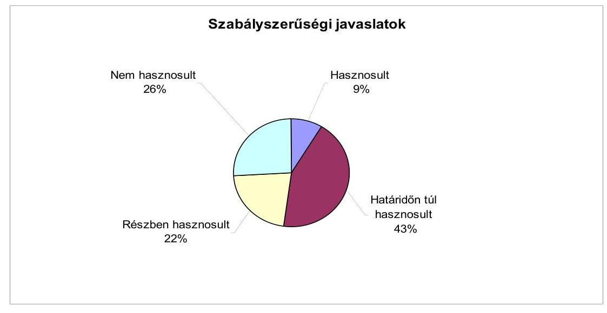
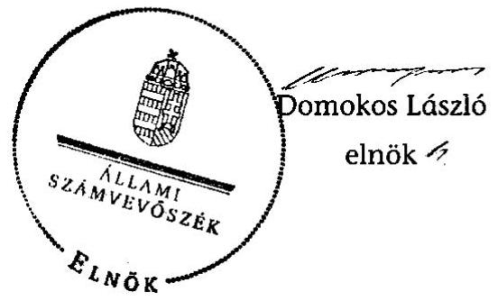

# ÁLLAMI   SZÁMVEVŐSZÉK 

## JELENTÉS

Ősi Község Önkormányzata belső kontrollrendszerének kialakítása, valamint egyes kontrolltevékenységek és a belső ellenőrzés múködése ellenőrzéséről

---

# Állami Számvevőszék 

Iktatószám: V-0063-008-024/2013.
Témaszám: 1098
Vizsgálat-azonosító szám: V059132

## Az ellenőrzést felügyelte:

Dr. Benedek Mária
felügyeleti vezető
Az ellenőrzést vezette:
Gyüre Lajosné
ellenőrzésvezető
A számvevőszéki jelentés összeállításában közremúködtek:
Pappné dr. Szamosi Éva
számvevő tanácsos
Fülöppné Nagy Marianna
számvevő tanácsos
Az ellenőrzést végezték:

| Liziczai Imréné | Fülöppné Nagy Marianna |
| :-- | :-- |
| számvevő | számvevő tanácsos |

---

# TARTALOMJEGYZÉK 

BEVEZETÉS ..... 5
I. ÖSSZEGZŐ MEGÁLLAPÍTÁSOK, KÖVETKEZTETÉSEK, JAVASLATOK ..... 8
II. RÉSZLETES MEGÁLLAPÍTÁSOK ..... 18

1. Az önkormányzat belső kontrollrendszere kialakításának megfelelősége ..... 18
1.1. A kontrollkörnyezet kialakítása ..... 18
1.2. A kockázatkezelési rendszer kialakítása ..... 19
1.3. A kontrolltevékenységek kialakítása ..... 20
1.4. Az információs és kommunikációs rendszer kialakítása ..... 21
1.5. A monitoring rendszer kialakítása ..... 22
2. A pénzügyi folyamatokban kulcsszerepet betöltő belső kontrollok (szakmai teljesítésigazolás és utalvány ellenjegyzés) múködése ..... 22
3. A belső ellenőrzés szervezeti keretei és múködése ..... 24
4. Az ÁSZ 2007-2010. években végzett átfogó ellenőrzései során megfogalmazott javaslatok végrehajtására tett intézkedések ..... 27

## FÜGGELÉKEK

1. számú Értelmező szótár
2. számú A belső kontrollrendszer kialakítása, a pénzügyi folyamatokban kulcsszerepet betöltő szakmai teljesítésigazolás és utalvány ellenjegyzés kontrollok múködése, valamint a belső ellenőrzés múködése értékelésénél alkalmazott minősítési szempontok

---

.

---

# RÖVIDÍTÉSEK JEGYZÉKE 

## Törvények

ÁSZ tv.
Avtv.

Htv.

Info tv.

Kttv.

Ktv.

Mötv.

Ötv.
régi Áht.

Számv. tv.
új Áht.

## Rendeletek

Áhsz.

Ámr.
Ávr.

Ber.

Bkr.
önkormányzati SZMSZ
vagyongazdálkodási rendelet
2011. évi LXVI. törvény az Állami Számvevőszékről
1992. évi LXIII. törvény a személyes adatok védelméről és a közérdekú adatok nyilvánosságáról (hatálytalan 2012. január 1-jétől)
1991. évi XX. törvény a helyi önkormányzatok és szerveik, a köztársasági megbízottak, valamint egyes centrális alárendeltségú szervek feladat- és hatásköreiről
2011. évi CXII. törvény az információs önrendelkezési jogról és az információszabadságról (hatályos 2012. január 1-jétől)
2011. évi CXCIX. törvény a közszolgálati tisztviselőkről (hatályos 2012. március 1-jétől)
1992. évi XXIII. törvény a köztisztviselők jogállásáról (hatálytalan 2012. március 1-jétől)
2011. évi CLXXXIX. törvény Magyarország helyi önkormányzatairól (hatályos 2012. január 1-jétől)
1990. évi LXV. törvény a helyi önkormányzatokról
1992. évi XXXVIII. törvény az államháztartásról (hatálytalan 2012. január 1-jétől)
2000. évi C. törvény a számvitelről
2011. évi CXCV. törvény az államháztartásról (hatályos 2012. január 1-jétől)

249/2000. (XII. 24.) Korm. rendelet az államháztartás szervezetei beszámolási és könyvvezetési kötelezettségének sajátosságairól
292/2009. (XII. 19.) Korm. rendelet az államháztartás múködési rendjéről (hatálytalan 2012. január 1-jétől)
368/2011. (XII. 31.) Korm. rendelet az államháztartásról szóló törvény végrehajtásáról (hatályos 2012. január 1jétől)
193/2003. (XI. 26.) Korm. rendelet a költségvetési szervek belső ellenőrzéséről (hatálytalan 2012. január 1jétől)
370/2011. (XII. 31.) Korm. rendelet a költségvetési szervek belső kontrollrendszeréről és belső ellenőrzéséről (hatályos 2012. január 1-jétől)
Ősi Község Önkormányzata Képviselő-testületének 6/2007. (IV. 2.) számú rendelete a Szervezeti és Múködési Szabályzatáról
Ősi Község Önkormányzata Képviselő-testületének 10/2004. (IV. 29.) számú rendelete az Önkormányzat vagyonáról, a vagyonkezelés és vagyongazdálkodás szabályairól

---

# Szórövidítések 

| ÁsZ | Állami Számvevőszék |
| :--: | :--: |
| Belső Kontroll Kézikönyv | az Ámr. 155. § (1) bekezdése, valamint az államháztartási belső kontroll standardokról szóló 1/2009. (IX. 11.) |
|  | PM irányelv egységes értelmezése érdekében az államháztartásért felelős miniszter által 2010. évben kiadott Belső Kontroll Kézikönyv |
| gazdasági program | Ősi Község Önkormányzata Gazdasági Programja 2011-2014. (elfogadva a Képviselő-testület 22/2011. (IV. 27.) számú határozatával) |
| Polgármesteri Hivatal SZMSZ-e | Ősi Község Önkormányzat Polgármesteri Hivatala Szervezeti és Múködési Szabályzata (hatályos 2009. december 14-étől) |
| jegyző | Ősi Község Önkormányzatának jegyzője |
| Képviselő-testület | Ősi Község Képviselő-testülete |
| Önkormányzat polgármester | Ősi Község Önkormányzata |
| Polgármesteri Hivatal számviteli politika | Ősi Község Önkormányzatának polgármestere |
|  | Ősi Község Önkormányzatának Polgármesteri Hivatala |
|  | Ősi Község Önkormányzata Számviteli Politika (hatályos 2002. január 1-jétől) |
| Társulás | Várpalota Kistérség Többcélú Társulása |
| ügyrend | Gazdasági-múszaki Ügyrend Ősi Község Önkormányzat Polgármesteri Hivatal gazdasági szervezetének gazdálkodással összefüggő feladataira (hatályos 2009. június 1-jétől) |

---

# JELENTÉS 

## Ősi Község Önkormányzata belső kontrollrendszerének kialakítása, valamint egyes kontrolltevékenységek és a belső ellenőrzés múködése ellenőrzéséről

## BEVEZETÉS

A belső kontrollrendszer kialakítását, múködtetését és fejlesztését a régi Áht. és az új Áht. is előírja. Ennek megvalósításáért a költségvetési szerv vezetője felel. A belső kontrollrendszer azt a célt szolgálja, hogy a költségvetési szervek múködésük és gazdálkodásuk során a tevékenységeket szabályszerűen, gazdaságosan, hatékonyan, eredményesen hajtsák végre, teljesítsék elszámolási kötelezettségeiket és megvédjék az erőforrásokat a veszteségektől, a károktól és a nem rendeltetésszerú használattól. A belső kontrollrendszer magában foglalja mindazon szabályokat, eljárásokat, gyakorlati módszereket és szervezeti struktúrákat, kockázatkezelési technikákat, kontrolltevékenységeket, amelyek segítséget nyújtanak a szervezetnek céljai eléréséhez.

Az ÁSZ a 2011-2015. évekre szóló stratégiájában hangsúlyos szerepet szánt annak, hogy szilárd szakmai alapon álló, értékteremtő ellenőrzéseivel előmozdítsa a közpénzügyek átláthatóságát, rendezettségét. A számvevőszéki ellenőrzés nemzetközi alapelvei is rögzítik, hogy a megfelelő belső kontrollrendszer minimálisra csökkenti a hibák és szabálytalanságok kockázatát.

Az ellenőrzés célja annak értékelése volt, hogy az Önkormányzat a jogszabályi előírásoknak megfelelően alakította-e ki a belső kontrollrendszert; a gazdálkodás folyamatában kulcsszerepet betöltő szakmai teljesítésigazolás és az utalvány ellenjegyzés kontrolltevékenységeit megfelelően múködtette-e; biztosí-totta-e a belső ellenőrzés szabályos és eredményes múködését; intézkedett-e az ÁSZ által a 2007-2010. évek között végzett átfogó ellenőrzések javaslatainak végrehajtására.

Az ÁSZ ezen ellenőrzési céljait pilot (próba) jelleggel községi/nagyközségi önkormányzatoknál végzett ellenőrzések során érvényesítette.

Az ellenőrzés típusa: szabályszerűségi ellenőrzés
Az ellenőrzés jogszabályi alapja: az ÁSZ tv. 5. § (2) és (6) bekezdései
Az ellenőrzött szervezet: az Önkormányzat
Az ellenőrzött időszak: a belső kontrollrendszer kialakításának megfelelőségét a 2011. évre vonatkozóan értékeltük. A kontrolltevékenységek múködésé-

---

nek megfelelőségét a 2011. január 1-je és december 31-e, míg a belső ellenőrzés működésének szabályosságát és eredményességét a 2009. január 1-je és 2011. december 31-e közötti időszakot figyelembe véve értékeltük. A helyszíni ellenőrzés lezárásáig a helyi szabályozás változásait nyomon követtük.

Az ellenőrzés szakmai módszertana az ÁSZ hivatalos honlapján (www.asz.hu) közzétett szakmai szabályokon alapult, amely a Legfőbb Ellenőrző Intézmények Nemzetközi Szervezete (INTOSAI) által kiadott nemzetközi standardok (ISSAI) figyelembevételével készült.

A belső kontrollrendszer kialakításának ellenőrzése során értékeltük a kontrollkörnyezet, a kockázatkezelési rendszer, a kontrolltevékenységek, az információs és kommunikációs rendszer, valamint a monitoring rendszer szabályozottságának megfelelőségét.

Értékeltük a pénzügyi folyamatokban kulcsszerepet betöltő szakmai teljesítésigazolás és utalvány ellenjegyzés kontrollok múködésének megfelelőségét az állományba nem tartozók megbízási díjainál, a külső szolgáltatók által végzett karbantartási, kisjavítási munkákkal kapcsolatos kifizetéseknél, továbbá az egyéb üzemeltetési, fenntartási, szolgáltatási kiadások esetében. Az egyszerű véletlen mintavétellel kiválasztott tételek ellenőrzését többlépcsős megfelelőségi tesztek útján addig végeztük, amíg elegendő és megfelelő bizonyítékot szereztünk a vizsgált folyamatok kulcskontrolljai múködésének megfelelő vagy nem megfelelő voltáról. Értékeltük az Önkormányzatnál a belső ellenőrzés múködésének szabályosságát és eredményességét. Az Önkormányzat gazdálkodási rendszerének vonatkozásában ÁSZ ellenőrzésre a 2008. évben került sor.

A fogalmak magyarázatát az 1. számú függelék, az ellenőrzés egyes területeinek értékelésénél alkalmazott egységes minősítési szempontokat a 2. számú függelék tartalmazza.

Az ellenőrzés lefolytatásához az Önkormányzat a munkalapok és a tanúsítvány elektronikus kitöltésével, valamint a megjelölt dokumentumok elektronikus megküldésével szolgáltatott adatokat. A munkalapokon szerepeltetett adatok, információk ellenőrzése és szükség szerinti javítása a helyszíni ellenőrzés keretében történt.

Az ÁSZ az ellenőrzés megállapításait az ellenőrzött időszakban hatályos, az intézkedést igénylő megállapításokra tett javaslatokat a jelenleg hatályos jogszabályok alapján fogalmazta meg.

Az ÁSZ tv. 29. § (1) bekezdése szerint a jelentéstervezetet megküldtük a polgármester részére, aki az ÁSZ tv. 29. § (2) bekezdésében foglalt észrevételezési jogával nem élt, a jelentéstervezetre észrevételt nem tett.

Ősi község állandó lakosainak száma 2011. január 1-jén 2169 fő volt. A 2010. évi önkormányzati választást követően az Önkormányzat hét tagú Képviselőtestületének munkáját négy állandó bizottság segítette. Az Önkormányzat az önállóan működő és gazdálkodó Polgármesteri Hivatalával és egy önállóan működő költségvetési intézménnyel látta el feladatát, többségi tulajdoni hányadú gazdasági társasággal nem rendelkezett.

---

A polgármester a 2010. évi önkormányzati választások óta tölti be tisztségét. A jegyző személye 2008. július 1-től változatlan. A jegyző 2011. július 5. napjától a szociális ügyintézői munkakört betöltő - általános szociális munkás főiskolai és igazgatásszervező főiskolai végzettségű - köztisztviselőt bízta meg tartós távolléte miatt átmenetileg ellátatlan munkaköre helyettesítésével.

A Polgármesteri Hivatal két szervezeti egységre tagolódott, a foglalkoztatott köztisztviselők száma 2011. január 1-jén tíz fő volt. Az Önkormányzat a 2011. évi költségvetési beszámolója szerint 251462 ezer Ft költségvetési bevételt ért el és 222890 ezer Ft költségvetési kiadást teljesített. A 2011. december 31-ei könyvviteli mérleg szerint 844083 ezer Ft értékű eszközvagyonnal rendelkezett, rövidlejáratú kötelezettsége 339628 ezer Ft volt, hosszúlejáratú kötelezettsége nem volt.

Az Önkormányzat - mint 2000 fő lélekszám feletti település - Polgármesteri Hivatalának szervezete a Mötv. 85. § (1) bekezdésére tekintettel 2013. március 1 -jéig nem változott.

---

# I. ÖSSZEGZŐ MEGÁLLAPÍTÁSOK, KÖVETKEZTETÉSEK, JAVASLATOK 

A belső kontrollrendszeren belül 2011-ben a Polgármesteri Hivatalban a kontrollkörnyezet, a kockázatkezelési rendszer, a kontrolltevékenységek, az információs és kommunikációs rendszer, valamint a monitoring rendszer kialakítását külön-külön és összesítve is értékeltük. A belső kontrollrendszer kialakítása az összesített értékelés alapján nem felelt meg a jogszabályi előírásoknak. Az egyes területek kialakításának értékelését az alábbiakban részletezzük.

A kontrollkörnyezet kialakítása nem felelt meg a jogszabályi követelményeknek, mert a jegyző a számviteli politikát hiányosan készítette el, abban az Áhsz.-ben foglaltak ellenére nem szabályozta a lényeges, és jelentős összegre vonatkozó szempontokat, a tárgyi eszköz üzembe helyezése dokumentálását, valamint nem döntött arról, hogy a számviteli politika rendelkezéseit és a kapcsolódó szabályzatok hatályát kiterjeszti a Polgármesteri Hivatalhoz rendelt költségvetési szervre is. A jegyző az Áhsz. és az előző ÁSZ ellenőrzés javaslata ellenére a számlarendet nem készítette el. Az Ámr.-ben ${ }^{1}$ foglalt előírás és az előző ÁSZ ellenőrzés javaslata ellenére az ellenőrzési nyomvonalban nem azonosította be a Polgármesteri Hivatal tevékenységéhez kapcsolódó valamennyi múködési folyamatot, nem határozta meg a felelősségi és információs szinteket és kapcsolatokat, irányítási és ellenőrzési folyamatokat, gátolva ezzel a folyamatok nyomon követését és utólagos ellenőrzését. A jegyző a Polgármesteri Hivatal SZMSZ-ében az Ámr.-ben foglaltak ellenére nem határozta meg a nevesített valamennyi munkakörhöz tartozó feladat- és hatásköröket, a hatáskörök gyakorlásának módját, a helyettesítés rendjét és az ezekhez kapcsolódó felelősségi szabályokat. A jegyző a Ktv.-ben ${ }^{2}$ előírt teljesítményértékelési rendszert nem alakította ki, a köztisztviselők munkateljesítményének értékeléséhez szükséges teljesítménykövetelményeket nem határozta meg. Ezek a hiányosságok korlátozzák a feladatellátás számon kérhetőségét, folyamatosságának biztosítását.

Az Ötv.-ben ${ }^{3}$ és a Ktv.-ben foglaltak ellenére - melyek szerint tartósan távollévő jegyző helyettesítése aljegyző kinevezésével, vagy a képviselő-testületek megállapodása alapján másik önkormányzat jegyzőjének határozott idejű kinevezésével történhet - 2011. július 5. napjától visszavonásig terjedő időtartamra a jegyző, tartós távolléte miatt a szociális ügyintézői munkakört betöltő köztisztviselőt bízta meg átmenetileg ellátatlan munkaköre helyettesítésével.

A kockázatkezelési rendszer kialakítása nem felelt meg a jogszabályi előírásnak, mert a jegyző kockázatkezelési szabályzatot készített, azonban az Ámr. 157. §-ában foglaltak ellenére kockázatelemzést nem végzett, nem mérte fel és

[^0]
[^0]:    ${ }^{1}$ 2012. január 1-jétől Ávr.
    ${ }^{2}$ 2012. március 1-jétől Kttv.
    ${ }^{3}$ 2013. január 1-jétől Mötv.

---

nem állapította meg a Polgármesteri Hivatal tevékenységében, gazdálkodásában rejlő kockázatokat, továbbá nem határozta meg a kockázatokkal kapcsolatos intézkedéseket és megtételük módját.

A kontrolltevékenységek kialakítása nem felelt meg a jogszabályi előírásoknak, mert a jegyző a régi Áht.-ban ${ }^{4}$ foglaltak, valamint az előző ÁSZ ellenőrzés javaslata ellenére nem határozta meg a pénzügyi döntések - köztük a beszerzési folyamat és vagyonhasznosítási tevékenység - dokumentumainak elkészítésével kapcsolatos, folyamatba épített, előzetes, utólagos és vezetői ellenőrzés feladatait. Az Ámr. előírása ellenére nem szabályozta a Polgármesteri Hivatal tevékenységeire vonatkozó beszámolási eljárásokat. Az Ámr.-ben előírtak, valamint az előző ÁSZ ellenőrzés javaslata ellenére az ügyrendben foglalt - az előzetes írásbeli kötelezettségvállalást nem igénylő kifizetésekre vonatkozó döntése ellenére ezen kifizetéseknél a szakmai teljesítésigazolás gyakorlásának dokumentációs részletszabályait nem határozta meg. A jegyző az Ámr.-ben foglaltak ellenére 2011. június 3-tól a kötelezettségvállalás és az utalvány ellenjegyzésére az előírt iskolai végzettséggel, szakmai képesítéssel nem rendelkező köztisztviselőt jelölte ki.

Az információs és kommunikációs rendszer kialakítása a jogszabályi előírásoknak nem felelt meg, mert a jegyző az Ámr.-ben foglaltak ellenére nem határozta meg a kötelezően közzéteendő adatok nyilvánosságra hozatalának rendjét, valamint az Avtv. ${ }^{5}$ és az Ámr. előírása ellenére nem szabályozta a közérdekű adatok megismerésére irányuló igények teljesítésének rendjét. A jegyző az Avtv. előírása ellenére nem készítette el az adatvédelmi és adatbiztonsági szabályzatot, elmulasztotta az adatbiztonság érvényre juttatásához szükséges intézkedések megtételét, mert nem alakította ki az informatikai rendszer hozzáférési jogosultságaira és azok betartásának ellenőrzésére vonatkozó eljárásrendet és nyilvántartást, továbbá nem szabályozta a pénzügyi-számviteli szoftverváltozások ellenőrzését, az azok tesztelésére vonatkozó eljárásokat és a pénz-ügyi-számviteli rendszerben feldolgozott adatok mentési eljárásrendjét, valamint az adatmentés felelősségi viszonyait.

A monitoring rendszer kialakítása a jogszabályi előírásoknak nem felelt meg, mert a jegyző az Ámr.-ben foglaltak ellenére az operatív tevékenységek keretében megvalósuló folyamatos és eseti nyomon követésből álló, a Polgármesteri Hivatal tevékenységének, a célok megvalósításának nyomon követését biztosító rendszer szabályait nem határozta meg.

A belső kontrollrendszer nem megfelelő kialakítása kockázatot jelent az Önkormányzat tevékenységeinek szabályszerű, gazdaságos, hatékony és eredményes végrehajtása során.

A Polgármesteri Hivatalban a 2011. évben az állományba nem tartozók megbízási díjaival, a külső szolgáltatók által végzett karbantartással, kisjavítással, valamint az egyéb üzemeltetéssel, fenntartással, szolgáltatással kapcsolatos kifizetések során - összefoglalóan értékelve - a pénzügyi folyamatokban kulcs-

[^0]
[^0]:    ${ }^{4}$ 2012. január 1-jétől új Áht.
    ${ }^{5}$ 2012. január 1-jétől Info tv.

---

szerepet betöltő szakmai teljesítésigazolás és utalvány ellenjegyzés belső kontrollok múködésének megfelelősége gyenge volt.

A jegyző által a szakmai teljesítés igazolására kijelölt személyek az állományba nem tartozók megbízási díjaival, az egyéb üzemeltetéssel, fenntartással, szolgáltatásokkal, valamint a külső szolgáltatók által teljesített karbantartási, kisjavítási munkákkal kapcsolatos kiadások teljesítésének jogosságát, összegszerűségét, a szerződésben, megrendelésben foglalt feladatok teljesítését igazolták, azonban - az Ámr.-ben foglaltak ellenére - ellenőrizhető okmányok hiányában nem ellenőrizték.

Az utalványok ellenjegyzője az állományba nem tartozók megbízási díjainak kifizetései során, a külső szolgáltatók által teljesített karbantartási, kisjavítási munkákra történő kifizetések és az egyéb üzemeltetéssel, fenntartással, szolgáltatással kapcsolatos kifizetések esetében az Ámr.-ben foglalt feladatát szabályszerű szakmai teljesítésigazolás hiányában nem a jogszabályi előírásoknak megfelelően végezte. Az utalvány ellenjegyző az Ámr.-ben előírt ellenőrzési feladatát nem teljesítette, mert annak ellenére ellenjegyezte az utalványokat, hogy az állományba nem tartozók megbízási díjaihoz kapcsolódó kötelezettségvállalásokat - a régi Áht.-ban és az Ámr.-ben foglaltak ellenére - nem ellenjegyezték, továbbá az utalványok nem tartalmazták az Ámr.-ben előírt kötelezettségvállalás nyilvántartási számot. Az utalványok ellenjegyzése a 2011. június 3 -át követő kifizetéseknél nem felelt meg az Ámr.-ben foglalt előírásoknak, mert az ellenjegyző nem rendelkezett az Ámr.-ben előírt iskolai végzettséggel, szakmai képesítéssel.

Az ellenőrzött kifizetésekkel összefüggésben a rendelkezésre bocsátott dokumentumok alapján jogosulatlan kifizetést nem tárt fel a számvevőszéki ellenőrzés, azonban a gazdálkodásban kulcsszerepet betöltő kontrollok jogszabályi előírásoknak nem megfelelő, gyenge múködése, valamint az előző ÁSZ ellenőrzés javaslatai hasznosításának elmaradása miatt továbbra is fennálló hiányosságok miatt magas a hibák bekövetkezésének kockázata. A korábbi ÁSZ ellenőrzés során - a szakmai teljesítésigazolás és az utalvány ellenjegyzés kulcskontrollok múködtetésére - tett javaslatokat csak részben hasznosították, ami a hibák ismétlődéséhez vezetett. A nem megfelelően szabályozott és múködtetett belső kontrollok korrupciós kockázatot is hordoznak.

Az Önkormányzat a 2009-2011. években a belső ellenőrzési feladatokat a Társulás keretében látta el. A belső ellenőrzés szabályozása és múködése a jogszabályi előírásoknak nem felelt meg, mert a belső ellenőrzési vezető személyéről, illetve a feladatkörébe tartozó tevékenységek ellátásának módjáról a Ber. ${ }^{6}$ előírása és az előző ÁSZ ellenőrzés javaslata ellenére nem rendelkeztek. A Ber.-ben előírtak ellenére a 2009-2011. évi belső ellenőrzési terveket kockázatelemzéssel nem alapozták meg, valamint a 2010-2011. évi tervek összeállításához a jegyző írásos véleményt nem adott. Az Ötv.-ben előírtakat figyelmen kívül hagyva a Képviselő-testület a 2011. évi belső ellenőrzési tervet határidőn túl hagyta jóvá, mert a jegyző a törvényi határidőn túl kezdeményezte a polgármesternél annak Képviselő-testület elé terjesztését. A Ber.-ben előírtak elle-

[^0]
[^0]:    ${ }^{6}$ 2012. január 1-jétől Bkr.

---

nére az ellenőrzési programokat belső ellenőrzési vezető nem hagyta jóvá, az ellenőrzési programokban nem rögzítették az ellenőrzés tárgyát. A belső ellenőr az ellenőrzési jelentésekben rögzített feltárt hiányosságok pótlására nem tett teljes körűen intézkedést igénylő javaslatot, amellyel a Ber.-ben foglaltakat nem tartotta be. Az ellenőrzöttek a Ber.-ben foglaltak és az előző ÁSZ ellenőrzés javaslata ellenére a javaslatok hasznosítására intézkedési tervet nem minden esetben készítettek, az ellenőrzésekről és a javaslatok alapján tett intézkedésekről nyilvántartást nem vezettek. A belső ellenőrzés a Ber.-ben foglaltak és az előző ÁSZ javaslat ellenére a megtett intézkedések nyomon követését elmulasztotta.

Az Önkormányzatnál a 2009-2011. években a belső ellenőrzés múködése a 2. számú függelékben részletezett kritériumrendszer alapján végzett értékelés szerint - nem volt eredményes, mert a belső ellenőrzés szabályozása és működése az összegző értékelés alapján az ellenőrzött időszak egészét tekintve a jogszabályi előírásoknak nem felelt meg. A belső ellenőrzés működése azért sem volt eredményes, mert az elvégzett belső ellenőrzések során - a belső kontrollrendszer kialakítása szabályozottságának, a készpénzzel kapcsolatos belső kontrollok működésének és a vagyonvédelem területén a leltárkészítési és leltározási szabályzatban foglaltak betartásának ellenőrzésénél - nem tárták fel teljes körűen a belső kontrollok kialakításának és működésének hiányosságait, továbbá mert a belső ellenőrzés által tett, a munkaköri leírások felülvizsgálatára, az ügyrend aktualizálására, és az ellenőrzési nyomvonal kiegészítésére irányuló javaslatokat a jegyző nem hasznosította. Mindezek hozzájárultak a számvevőszéki ellenőrzés során is feltárt szabályozási hiányosságok, hibák ismétlődéséhez.

Az ÁSZ tv. 33. § (1) bekezdésében foglaltak értelmében az ellenőrzött szervezet vezetője köteles a jelentésben foglalt megállapításokhoz kapcsolódó intézkedési tervet összeállítani, és azt a jelentés kézhezvételétől számított 30 napon belül az ÁSZ részére megküldeni. Amennyiben az intézkedési tervet határidőre nem küldi meg a szervezet, vagy az - az ÁSZ tv. 33. § (2) bekezdésében foglalt póthatáridő eltelte ellenére - továbbra sem elfogadható, az ÁSZ elnöke a hivatkozott törvény 33. § (3) bekezdés a)-b) pontjaiban foglaltakat érvényesítheti.

Az ellenőrzés intézkedést igénylő megállapításai és javaslatai:

# a polgármesternek 

1. A jegyző a polgármester egyetértésével 2011. július 5. napjától visszavonásig terjedő időtartamra a szociális ügyintézői munkakört betöltő - általános szociális munkás főiskolai és igazgatásszervező főiskolai végzettségű - köztisztviselőt bízta meg tartós távolléte miatt átmenetileg ellátatlan munkaköre helyettesítésével. A jegyző helyettesítése nem felelt meg az Ötv. 36. § (1) bekezdésében előírtaknak, mely szerint a jegyzőt tartós távolléte esetén aljegyző helyettesítheti. Nem felelt meg továbbá a Ktv. 21. § (5) bekezdésében foglaltaknak sem, mely szerint tartós távolléte esetén a jegyzőt a Képviselő-testületek megállapodása alapján más önkormányzatnál kinevezett jegyző helyettesítheti.

---

Javaslat:
Intézkedjen arról, hogy a jegyzői feladatok ellátásának módja - a jegyző tartós akadályoztatására tekintettel - feleljen meg a Mötv. 82. § (1) és (3) bekezdéseiben, illetve a Kttv. 251. §-ában foglaltaknak.
2. Az állományba nem tartozók megbízása során a kötelezettségvállalásokat - a régi Áht. 100/C. § (3) bekezdésében és az Ámr. 74. § (1) bekezdésében foglaltak ellenére - nem ellenjegyezték.

Javaslat:
Intézkedjen arról, hogy az Önkormányzat nevében történő kötelezettségvállalásra az új Áht. 37. § (1) és az Ávr. 55. § (1) bekezdéseiben foglaltaknak megfelelően - az Ávr. 53. §-ában meghatározott kivételeket figyelembe véve - kizárólag pénzügyi ellenjegyzés után, a pénzügyi teljesítés esedékességét megelőzően, írásban kerüljön sor.
3. A jegyző - az Ámr. 155. § (4) bekezdését figyelmen kívül hagyva - nem hasznosította az előző ÁSZ ellenőrzésnek a szabályozásbeli hiányosságok megszüntetésére, az Önkormányzat szabályszerű gazdálkodására és a belső ellenőrzés szabályszerű múködésére vonatkozó javaslatait. A jegyző az Ámr. 76. § (1) bekezdésében és az Ámr. 20. § (3) bekezdés a) pontjában foglaltakat nem érvényesítette, mert az ügyrendben nem határozta meg az előzetes írásbeli kötelezettségvállalást nem igénylő kifizetések esetén a szakmai teljesítésigazolás gyakorlásának dokumentációs részletszabályait. A szakmai teljesítés igazolására a jegyző által kijelölt személyek az állományba nem tartozók megbízási díjaival, az egyéb üzemeltetési, fenntartási szolgáltatásokkal, valamint a külső szolgáltatók által teljesített karbantartási, kisjavítási munkákkal kapcsolatos kiadások jogosságát, összegszerűségét, a szerződésben, megrendelésben foglalt feladatok teljesítését igazolták, azonban - az Ámr. 76. § (1) bekezdésében foglaltak ellenére - ellenőrizhető okmányok hiányában nem ellenőrizték. Az utalványok ellenjegyzését nem az Ámr. 19. § (1) bekezdésében előírt végzettséggel és képesítéssel rendelkező személy végezte. Az utalványok ellenjegyzője a kifizetések teljesítését megelőzően az Ámr. 78-79. §-aiban foglalt ellenőrzési feladatait nem a jogszabályi előírásoknak megfelelően végezte.

Javaslat:
A Mötv. 115. § (1) bekezdésében foglaltak alapján kísérje figyelemmel az önkormányzat gazdálkodásának szabályszerűségét. A Mötv. 67. § f) pontja alapján gondoskodjon a belső kontrollrendszerre és a belső ellenőrzés működésére vonatkozó jogszabályi rendelkezések be nem tartása, valamint a szakmai teljesítésigazolás, illetve az utalvány ellenjegyzés kontrollokkal összefüggésben feltárt hiányosságok, szabálytalanságok tekintetében az esetleges munkajogi felelősséggel kapcsolatos körülmények kivizsgálásáról, majd a vizsgálat eredményének függvényében tegye meg a szükséges munkajogi intézkedéseket.

---

# a jegyzőnek 

1. a kontrollkörnyezettel kapcsolatban:

A jegyző az Áhsz. 49. § (1) bekezdésében előírtak ellenére a Polgármesteri Hivatal számlarendjét nem alakította ki.

A jegyző az Ámr. 156. § (2) bekezdésében foglalt előírás ellenére az ellenőrzési nyomvonalban nem azonosította be a Polgármesteri Hivatal tevékenységéhez kapcsolódó valamennyi múködési folyamatot, nem határozta meg a felelősségi és információs szinteket és kapcsolatokat, irányítási és ellenőrzési folyamatokat.

A jegyző a Polgármesteri Hivatal SZMSZ-ében - az Ámr. 20. § (2) bekezdés h) pontjában foglaltak ellenére - nem határozta meg a nevesített valamennyi munkakörhöz tartozó feladat- és hatásköröket, a hatáskörök gyakorlásának módját, a helyettesítés rendjét és az ezekhez kapcsolódó felelősségi szabályokat.

A jegyző a Ktv. 34. § (5) bekezdésében foglaltak ellenére nem határozta meg a köztisztviselők munkateljesítményének értékeléséhez szükséges teljesítménykövetelményeket.

Javaslat:
a) Intézkedjen a Polgármesteri Hivatal számlarendjének - az Áhsz. 49. § (1) bekezdésében előírtaknak megfelelő - kialakításáról.
b) Intézkedjen arról, hogy az ellenőrzési nyomvonal a Bkr. 6. § (3) bekezdésében foglaltaknak megfelelően készüljön el.
c) Készítse elő a Polgármesteri Hivatal SZMSZ-ének módosítását, és kezdeményezze a polgármesternél a módosítás Képviselő-testület elé terjesztését annak érdekében, hogy az az Ávr. 13. § (1) bekezdés g) pontjában foglaltaknak megfelelően tartalmazza a nevesített munkakörökhöz tartozó feladat- és hatásköröket, a hatáskörök gyakorlásának módját, a helyettesítés rendjét, valamint a kapcsolódó felelősségi szabályokat.
d) Dolgozza ki a Kttv. 130. § (1)-(3) bekezdéseiben előírtak szerinti teljesítményértékelés alapját képező teljesítménykövetelményeket.
2. a kockázatkezelési rendszerrel kapcsolatban:

A jegyző kockázatkezelési szabályzatot készített, azonban - az Ámr. 157. § (1)-(3) bekezdésében foglaltak ellenére - kockázatelemzést nem végzett és kockázatkezelési rendszert nem alakított ki.

Javaslat:
Alakítsa ki és múködtesse a Bkr. 3. § b) pontja és 7. § alapján a kockázatkezelési rendszert.

---

3. a kontrolltevékenységekkel kapcsolatban:

A jegyző a régi Áht. 121/A. § (4) bekezdésében foglaltak ellenére nem határozta meg a pénzügyi döntések - köztük a beszerzési folyamat és a vagyonhasznosítási tevékenység - dokumentumainak elkészítésével kapcsolatos, folyamatba épített, előzetes, utólagos és vezetői ellenőrzés feladatait.

A jegyző az Ámr. 158. § (2) bekezdés d) pontjának előírása ellenére nem szabályozta a Polgármesteri Hivatal tevékenységeire vonatkozó beszámolási eljárásokat.

A jegyző az Ámr. 20. § (3) bekezdés a) pontjában és a 72. § (14) bekezdésében foglaltak ellenére az ügyrendben foglalt - az előzetes írásbeli kötelezettségvállalást nem igénylő kifizetésekre vonatkozó - döntése ellenére ezen kifizetéseknél a szakmai teljesítésigazolás gyakorlásának dokumentációs részletszabályait nem határozta meg.

Javaslat:
a) Biztosítsa minden tevékenységre vonatkozóan a folyamatba épített, előzetes, utólagos és vezetői ellenőrzést a Bkr. 8. § (2) bekezdése alapján.
b) Szabályozza a Bkr. 8. § (4) bekezdés c) pontjának előírása alapján a Polgármesteri Hivatal tevékenységeire vonatkozó beszámolási eljárásokat.
c) Az Ávr. 13. § (2) bekezdés a) pontjában és 53. § (2) bekezdésében foglaltak alapján belső szabályzatban rendezze az előzetes írásbeli kötelezettségvállalást nem igénylő kifizetések esetén a teljesítésigazolás gyakorlásának dokumentációs részletszabályait.
4. az információs és kommunikációs rendszerrel kapcsolatban:

A jegyző - az Avtv. 31/A. § (3) bekezdésében foglaltak ellenére - nem készítette el az adatvédelmi és adatbiztonsági szabályzatot.

A jegyző - az Ámr. 20. § (3) bekezdés i) pontjában foglalt előírás ellenére - nem határozta meg a kötelezően közzéteendő adatok nyilvánosságra hozatalának rendjét. Az Avtv. 20. § (8) bekezdésének és az Ámr. 20. § (3) bekezdés i) pontjának előírása ellenére nem szabályozta a közérdekű adatok megismerésére irányuló igények teljesítésének rendjét.

A jegyző - az Avtv. 10. §-ában foglalt előírások ellenére - elmulasztotta az adatbiztonság érvényre juttatásához szükséges intézkedések megtételét, mert nem határozta meg a hozzáférési jogosultságok megállapítására, módosítására és azok betartásának ellenőrzésére vonatkozó belső eljárásrendet, nem alakította ki a hozzáférési jogosultságok nyilvántartását, nem szabályozta a pénzügyi-számviteli szoftverváltozások ellenőrzését, az azok tesztelésére vonatkozó eljárásokat és a pénzügyi-számviteli rendszerben feldolgozott adatok mentési eljárásrendjét, valamint az adatmentés felelősségi viszonyait.

Javaslat:
a) Készítse el az Info tv. 24. § (3) bekezdésében foglaltak alapján az adatvédelmi és adatbiztonsági szabályzatot.

---

b) Szabályozza az Info tv. 35. § (3) bekezdésében és az Ávr. 13. § (2) bekezdés h) pontjában előírtaknak megfelelően a kötelezően közzéteendő adatok nyilvánosságra hozatala rendjét, valamint készítse el az Info tv. 30. § (6) bekezdése és az Ávr. 13. § (2) bekezdés h) pontjában foglaltaknak megfelelően a közérdekű adatok megismerésére irányuló igények teljesítésének rendjét rögzítő szabályzatot.
c) Biztosítsa az Info tv. 7. § (2)-(3) bekezdésének megfelelően az adatbiztonság érvényesülését, szabályozza a hozzáférési jogosultságok megállapítására, módosítására és azok betartásának ellenőrzésére vonatkozó eljárásrendet, alakítsa ki a hozzáférési jogosultságok nyilvántartását, továbbá szabályozza a pénzügyiszámviteli szoftverváltozások ellenőrzését, az azok tesztelésére vonatkozó eljárásokat, a pénzügyi-számviteli rendszerben feldolgozott adatok mentési eljárásrendjét, valamint az adatmentés felelősségi viszonyait.
5. a monitoring rendszerrel kapcsolatban:

A jegyző az Ámr. 160. §-ában foglaltak ellenére az operatív tevékenységek keretében megvalósuló folyamatos és eseti nyomon követésből álló, a Polgármesteri Hivatal tevékenységének, a célok megvalósításának nyomon követését biztosító rendszert nem szabályozta.

Javaslat:
Alakítsa ki és múködtesse a Bkr. 3. § e) pontjában és 10. §-ában előírtak alapján a Polgármesteri Hivatal tevékenységének, a célok megvalósításának nyomon követését biztosító rendszert, amelynek része az operatív tevékenységek keretében megvalósuló folyamatos és eseti nyomon követés is.
6. a pénzügyi folyamatokban kulcsszerepet betöltő kontrollok múködésével kapcsolatban:

A 2011. évben a szakmai teljesítés igazolására a jegyző által kijelölt személyek az állományba nem tartozók megbízási díjaival, az egyéb üzemeltetéssel, fenntartással és szolgáltatásokkal, valamint a külső szolgáltatók által teljesített karbantartási, kisjavítási munkákkal kapcsolatos kiadások jogosságát, összegszerűségét, a szerződésben, megrendelésben foglalt feladatok teljesítését igazolták, azonban - az Ámr. 76. § (1) bekezdésében foglaltak ellenére - ellenőrizhető okmányok hiányában nem ellenőrizték.

Az utalványok ellenjegyzője az Ámr. 79. § (2) bekezdésében foglalt feladatát szabályszerű szakmai teljesítésigazolás hiányában nem a jogszabályi előírásoknak megfelelően látta el. Az utalványok ellenjegyzését nem az Ámr. 19. § (1) bekezdésében előírt végzettséggel és képesítéssel rendelkező személy végezte. Az utalványok ellenjegyzője - az állományba nem tartozók megbízási díjainak kifizetését megelőzően aláírásával annak ellenére ellenjegyezte az utalványokat, hogy az állományba nem tartozók feladatellátásával összefüggő kötelezettségvállalásokat - a régi Áht. 100/C. § (3) bekezdésében és az Ámr. 74. § (1) bekezdésében foglaltak ellenére - nem ellenjegyezték, továbbá az utalványok nem tartalmazták az Ámr. 78. § (2) bekezdés g) pontjában előírt kötelezettségvállalási nyilvántartási számot.

---

Javaslat:
Intézkedjen - a szakmai teljesítés igazolása és az utalvány ellenjegyzése vonatkozásában feltárt hiányosságok megszüntetése, illetve az operatív gazdálkodás során a müködésbeli hibák megelőzése, feltárása és kijavítása érdekében - arról, hogy
a) a teljesítésigazolás során az Ávr. 57. § (1) bekezdésében előírtaknak megfelelően, ellenőrizhető okmányok alapján ellenőrizzék és igazolják a kiadások teljesítésének jogosságát, összegszerűségét, az ellenszolgáltatást is magában foglaló kötelezettségvállalás esetén a szerződés, megrendelés teljesítését;
b) a kifizetéseket megelőzően - az Ávr. 58. § (1) bekezdése szerint - a teljesítésigazolás alapján - az Ávr. 57. § (3) bekezdése szerinti esetben annak hiányában is az összegszerűségnek, a fedezet meglétének és a megelőző ügymenetben az új Áht., az Áhsz., az Ávr. előírásai és a belső szabályzatokban foglaltak betartásának az ellenőrzése történjen meg;
c) kötelezettségvállalásra az új Áht. 37. § (1) bekezdésében foglaltaknak megfelelően - az Ávr. 53. §-ában meghatározott kivételekkel - pénzügyi ellenjegyzés után kerüljön sor;
d) az utalványon az Ávr. 59. § (3) bekezdés f) pontjában foglaltaknak megfelelően tüntessék fel a kötelezettségvállalás nyilvántartási számát.
7. a belső ellenőrzés müködésével kapcsolatban:

A Társulás keretében elvégzett belső ellenőrzés során - a Ber. 4/A. § (2) bekezdése ellenére - nem rendelkeztek a Ber. 12. §-ában foglalt tevékenységek ellátásának módjáról.

A Ber. 12. § b) pontjában és a 21. § (2) bekezdésében előírtak ellenére a 20092011. évi belső ellenőrzési terveket kockázatelemzéssel nem alapozták meg. A Ber. 32/B. § (2) bekezdésében foglaltakat nem tartották be, mert a 2010-2011. évi tervek összeállításához a jegyző írásos véleményt nem adott. Az Ötv. 92. § (6) bekezdésében előírtakat figyelmen kívül hagyva a Képviselő-testület a 2011. évi belső ellenőrzési tervet határidőn túl hagyta jóvá, mert a jegyző a törvényi határidőn túl kezdeményezte a polgármesternél annak Képviselő-testület elé terjesztését.

Az ellenőrzési programokat a Ber. 23. § (3) bekezdésében foglaltak ellenére a belső ellenőrzési vezető nem hagyta jóvá. Az ellenőrzési programokban a Ber. 23. § (4) bekezdés c) pontjában foglaltak ellenére nem rögzítették az ellenőrzés tárgyát.

A belső ellenőr az ellenőrzési jelentésekben rögzített, feltárt hiányosságok pótlására nem tett teljes körűen intézkedést igénylő javaslatot, amellyel a Ber. 27. § (2) bekezdés j) pontjában foglaltakat nem tartotta be. Az ellenőrzöttek - a Ber. 29. § (1) bekezdésében foglaltak ellenére - a javaslatok hasznosítására intézkedési tervet nem minden esetben készítettek. Az elvégzett belső ellenőrzésekről - a Ber. 12. § j) pontjában foglaltak ellenére - a Ber. 32. §-ában előírt nyilvántartást nem vezették. A jegyző - a Ber. 29/A. § (1)-(2) bekezdéseiben foglaltak ellenére - nem vezetett nyilvántartást, amellyel az ellenőrzési jelentésekben tett megállapítások, javaslatok hasznosulása és végrehajtása nyomon követhető. A belső ellenőrzés - a Ber. 8. § f) pontjában foglaltak ellenére - a megtett intézkedések nyomon követését elmulasztotta.

---

Javaslat:
a) Intézkedjen arról, hogy a Bkr. 16. § (4) bekezdésének megfelelően a belső ellenőrzési tevékenység megszervezésére vonatkozó megállapodásban rendelkezzenek a Bkr. 22. § (1)-(2) bekezdéseiben foglalt tevékenységek és kötelességek ellátásának módjáról.
b) Intézkedjen arról, hogy az éves ellenőrzési terv a Bkr. 29. § (1) és a 31. § (2) bekezdése alapján kockázatelemzésen alapuljon, és az a Bkr. 56. § (2) bekezdés előírásainak megfelelően a jegyző írásos véleményének figyelembevételével készüljön.
c) Készítse el az éves ellenőrzési terv előterjesztését, és kezdeményezze a polgármesternél a Képviselő-testület elé terjesztését annak érdekében, hogy a Képvise-lő-testület az éves ellenőrzési tervet a Mötv. 119. § (5) bekezdésében és a Bkr. 32. § (4) bekezdésében előírt határidőn belül hagyja jóvá.
d) Kezdeményezze, hogy a Bkr. 33. § (2) bekezdésében foglaltaknak megfelelően a belső ellenőrzési vezető hagyja jóvá az ellenőrzési programot.
e) Intézkedjen arról, hogy az ellenőrzési jelentések tartalmazzák a Bkr. 39. § (3) bekezdésében foglalt tartalmi elemeket.
f) Intézkedjen arról, hogy a belső ellenőrzésekről készült jelentésekben rögzített hiányosságok felszámolására a Bkr. 45. §-nak megfelelően készüljön intézkedési terv.
g) Kezdeményezze, hogy a belső ellenőrzési vezető a Bkr. 22. § (2) bekezdés b) és e) pontja, valamint az 50. § alapján vezessen nyilvántartást az elvégzett belső ellenőrzésekről, továbbá a belső ellenőrzés a Bkr. 21. § (2) bekezdés d) pontjában foglaltak szerint kövesse nyomon a belső ellenőrzési jelentések alapján megtett intézkedéseket, és vezessen nyilvántartást a Bkr. 14. § (1) bekezdése szerint a külső ellenőrzések javaslatai alapján készült intézkedési tervek végrehajtásáról, és a 47. §-ban foglalt előírásokra figyelemmel a belső ellenőrzési jelentésekben tett megállapításokról, javaslatokról, a vonatkozó intézkedési tervekről és azok végrehajtásáról.

---

# II. RÉSZLETES MEGÁLLAPÍTÁSOK 

## 1. AZ ÖNKORMÁNYZAT BELSŐ KONTROLLRENDSZERE KIALAKÍTÁSÁNAK MEGFELELŐSÉGE

### 1.1. A kontrollkörnyezet kialakítása

A kontrollkörnyezet kialakítása a 2. számú függelékben részletezett kritériumrendszer alapján végzett értékelés szerint a Polgármesteri Hivatalban nem volt megfelelő, mert a jegyző a jogszabályi előírásokat nem érvényesítette maradéktalanul.

A jegyző, mint a költségvetési szerv vezetője:

- a számviteli politikát hiányosan készítette el, mert az Áhsz. 8. § (5), (7) és (13) bekezdéseiben foglaltak ellenére nem szabályozta a lényeges és jelentős összegre vonatkozó szempontokat, a tárgyi eszköz üzembe helyezése dokumentálását, valamint nem döntött arról, hogy a számviteli politika rendelkezéseit és a kapcsolódó szabályzatok hatályát kiterjeszti a Polgármesteri Hivatalhoz rendelt költségvetési szervre is;
- az Áhsz. 49. § (1) bekezdésében foglaltak és az előző ÁSZ ellenőrzés javaslata ellenére a számlarendet nem alakította ki;
- az Ámr. 156. § (2) bekezdésében ${ }^{7}$ foglalt előírás és az előző ÁSZ ellenőrzés javaslata ellenére az ellenőrzési nyomvonalban nem azonosította be a Polgármesteri Hivatal tevékenységéhez kapcsolódó valamennyi múködési folyamatot, nem határozta meg a felelősségi és információs szinteket és kapcsolatokat, irányítási és ellenőrzési folyamatokat;
- a Polgármesteri Hivatal SZMSZ-ében az Ámr. 20. § (2) bekezdés h) pontjában ${ }^{8}$ foglaltak ellenére nem határozta meg a nevesített valamennyi munkakörhöz tartozó feladat- és hatásköröket, a hatáskörök gyakorlásának módját, a helyettesítés rendjét és az ezekhez kapcsolódó felelősségi szabályokat;
- a Ktv. 34. § (5) bekezdésében ${ }^{9}$ foglaltak ellenére nem alakította ki a teljesítményértékelési rendszert, nem határozta meg a köztisztviselők munkateljesítményének értékeléséhez szükséges teljesítménykövetelményeket.

[^0]
[^0]:    ${ }^{7}$ 2012. január 1-jétől a Bkr. 6. § (3) bekezdése
    ${ }^{8}$ 2012. január 1-jétől az Ávr. 13. § (1) bekezdés g) pontja
    ${ }^{9}$ 2012. július 1-jétől a Kttv. 130. § (1)-(6) bekezdései

---

Az Ötv. 36. § (1) bekezdésében ${ }^{10}$ és a Ktv. 21. § (5) bekezdésében ${ }^{11}$ foglaltak ellenére - melyek szerint a tartósan távollévő jegyző helyettesítése aljegyző kinevezésével, vagy a képviselő-testületek megállapodása alapján másik önkormányzat jegyzőjének határozott idejű kinevezésével történhet - 2011. július 5. napjától visszavonásig terjedő időtartamra a jegyző tartós távolléte miatt a szociális ügyintézői munkakört betöltő köztisztviselőt bízta meg átmenetileg ellátatlan munkaköre helyettesítésével. A gazdasági vezetői feladatok ellátásának helyettesítésére is kinevezett szociális ügyintéző képesítése nem felelt meg az Ámr. 18. § (1) bekezdésében ${ }^{12}$ foglalt végzettségi és képesítési követelményeknek.

A Polgármesteri Hivatalban a kontrollkörnyezet szabályozási hiányosságait a 2012-2013. években részben megszüntették, mert a 2012. július 27 -től hatályos új számviteli politikában a hiányosságokat pótolták, és a Képviselő-testület 2013. január 31-én döntött a gazdasági vezetői álláshely létrehozásáról, valamint a Polgármesteri Hivatal SZMSZ-ének módosításával a gazdasági vezető feladatainak meghatározásáról. 2013. február 15-étől a gazdasági vezetői feladatok ellátására a végzettségi és a képesítési követelményeknek megfelelő köztisztviselőt bíztak meg.

A kontrollkörnyezet kialakítása során a jegyző az Ámr. 155. § (3) bekezdésének ${ }^{13}$ előírását figyelmen kívül hagyva az államháztartásért felelős miniszter által kiadott Belső Kontroll Kézikönyv ajánlásait nem hasznosította teljes körűen.

A kontrollkörnyezet kialakítása keretében a jegyző:

- a Belső Kontroll Kézikönyv 1.3.3. pontjában foglalt ajánlást nem érvényesítette, mert a szociális ügyintéző, az adóügyintéző és a pénztáros, a kontírozó, valamint a könyvelői feladatot ellátó köztisztviselők munkaköri leírásában nem határozta meg a felelősségi szabályokat;
- a Belső Kontroll Kézikönyv 1.5.2. pontjában foglalt ajánlást nem hasznosította, mert nem dolgozta ki a Polgármesteri Hivatalban ellátott köztisztviselői munkakörök betöltéséhez szükséges szakmai követelményeket;
- a Belső Kontroll Kézikönyv 1.6. pontjában foglalt ajánlást nem hasznosította, mert nem intézkedett - a szervezeti célokkal összhangban álló - etikai értékek kiemelt kezeléséről, mivel nem határozta meg a köztisztviselőkkel szembeni etikai elvárásokat.

# 1.2. A kockázatkezelési rendszer kialakítása 

A kockázatkezelési rendszer kialakítása a 2. számú függelékben részletezett kritériumrendszer alapján végzett értékelés szerint a Polgármesteri Hivatalban nem volt megfelelő, mert a jegyző kockázatkezelési szabályzatot készí-

[^0]
[^0]:    ${ }^{10}$ 2013. január 1-jétől a Mötv. 82. § (1) és (3) bekezdései
    ${ }^{11}$ 2013. január 1-jétől a Kttv. 251. §-a
    ${ }^{12}$ 2012. január 1-jétől az Ávr. 12. § (1)-(2) bekezdése
    ${ }^{13}$ 2012. január 1-jétől a Bkr. 5. § (1) bekezdése

---

tett, azonban az Ámr. 157. § (1)-(3) bekezdésében ${ }^{14}$ foglaltak ellenére kockázatelemzést nem végzett, nem mérte fel és nem állapította meg a Polgármesteri Hivatal tevékenységében, gazdálkodásában rejlő kockázatokat, továbbá nem határozta meg a kockázatokkal kapcsolatos intézkedéseket és megtételük módját.

# 1.3. A kontrolltevékenységek kialakítása 

A kontrolltevékenységek kialakítása a 2. számú függelékben részletezett kritériumrendszer alapján végzett értékelés szerint a Polgármesteri Hivatalban nem volt megfelelő, mert a jegyző a jogszabályi előírásokat nem tartotta be.

A jegyző, mint a költségvetési szerv vezetője:

- a régi Áht. 121/A. § (4) bekezdés a) pontjában ${ }^{15}$ foglaltak, valamint az előző ÁSZ ellenőrzés javaslata ellenére nem határozta meg a pénzügyi döntések köztük a beszerzési folyamat és a vagyonhasznosítási tevékenység - dokumentumainak elkészítésével kapcsolatos, folyamatba épített, előzetes, utólagos és vezetői ellenőrzés feladatait;
- az Ámr. 158. § (2) bekezdés d) pontjának ${ }^{16}$ előírása ellenére nem szabályozta a Polgármesteri Hivatal tevékenységeire vonatkozó beszámolási eljárásokat;
- az Ámr. 20. § (3) bekezdés a) pontjában ${ }^{17}$ és a 72. § (14) bekezdésében ${ }^{18}$ foglaltak, valamint az előző ÁSZ ellenőrzés javaslata ellenére az ügyrendben foglalt - az előzetes írásbeli kötelezettségvállalást nem igénylő kifizetésekre vonatkozó - döntése ${ }^{19}$ ellenére ezen kifizetéseknél a szakmai teljesítésigazolás gyakorlásának dokumentációs részletszabályait nem határozta meg;
- az Ámr. 19. § (1) bekezdésében ${ }^{20}$ foglaltakat nem tartotta be, mert a kötelezettségvállalás ellenjegyzésére és az utalvány ellenjegyzésére 2011. június 3tól feljogosított köztisztviselő nem rendelkezett az előírt iskolai végzettséggel, szakmai képesítéssel. A jegyzőt helyettesítő ügyintéző 2011. szeptember 28án a kötelezettségvállalás ellenjegyzésére az előírt iskolai végzettséggel, szakmai képesítéssel rendelkező pénzügyi ügyintézőt jelölte ki.

[^0]
[^0]:    ${ }^{14}$ 2012. január 1-jétől a Bkr. 3. § b) pontja és 7. §-a
    ${ }^{15} 2012$. január 1-jétől a Bkr. 8. § (2) bekezdése
    ${ }^{16}$ 2012. január 1-jétől a Bkr. 8. § (4) bekezdés c) pontja
    ${ }^{17}$ 2012. január 1-jétől az Ávr. 13. § (2) bekezdés a) pontja
    ${ }^{18}$ 2012. január 1-jétől az Ávr. 53. § (2) bekezdése
    ${ }^{19}$ Az ügyrend 6.1.1. pontja szerint „nem szükséges előzetes írásbeli kötelezettségvállalás a gazdasági eseményenként 50000 Ft-ot el nem érő kifizetések esetén".
    ${ }^{20}$ 2012. január 1-jétől az Ávr. 55. § (3) és 58. § (4) bekezdései

---

A kontrolltevékenységek kialakítása során a jegyző az Ámr. 155. § (3) bekezdésének előírását figyelmen kívül hagyva az államháztartásért felelős miniszter által kiadott Belső Kontroll Kézikönyv ajánlásait nem hasznosította teljes körúen.

A kontrolltevékenységek kialakítása keretében a jegyző:

- a Belső Kontroll Kézikönyv 3.2.1. pontjában foglalt ajánlást és az előző ÁSZ ellenőrzés javaslatát nem hasznosította, mert nem határozta meg a köztisztviselők munkaköri leírásában a feladatellátással összefüggő ellenőrzési, továbbá az érvényesítéssel, a szakmai teljesítésigazolással, a vagyontárgyak hasznosításával és selejtezésével kapcsolatos feladataikat;
- a Belső Kontroll Kézikönyv 3.2.3. pontjában foglalt ajánlást nem érvényesítette, mert nem mérte fel a kis létszámból adódó kockázatokat.

A kontrolltevékenységek hiányos kialakítása a feladatok szabályszerű végrehajtását veszélyeztette.

# 1.4. Az információs és kommunikációs rendszer kialakítása 

Az információs és kommunikációs rendszer kialakítása a 2. számú függelékben részletezett kritériumrendszer alapján végzett értékelés szerint a Polgármesteri Hivatalban nem volt megfelelő, mert a jegyző az Avtv. 31/A. § (3) bekezdésében ${ }^{21}$ foglaltak ellenére nem készítette el az adatvédelmi és adatbiztonsági szabályzatot, az Ámr. 20. § (3) bekezdés i) pontjában ${ }^{22}$ foglalt előírás ellenére nem határozta meg a kötelezően közzéteendő adatok nyilvánosságra hozatalának rendjét. Az Avtv. 20. § (8) bekezdésének ${ }^{23}$ és az Ámr. 20. § (3) bekezdés i) pontjának előírása ellenére nem szabályozta a közérdekú adatok megismerésére irányuló igények teljesítésének rendjét. Az informatikai rendszer környezetének szabályozása során - az Avtv. 10. §-ában ${ }^{24}$ foglalt előírások ellenére - elmulasztotta az adatbiztonság érvényre juttatásához szükséges intézkedések megtételét, mert nem határozta meg a hozzáférési jogosultságok megállapítására, módosítására és azok betartásának ellenőrzésére vonatkozó belső eljárásrendet, nem alakította ki a hozzáférési jogosultságok nyilvántartását, nem szabályozta a pénzügyi-számviteli szoftverváltozások ellenőrzését, az azok tesztelésére vonatkozó eljárásokat és a pénzügyi-számviteli rendszerben feldolgozott adatok mentési eljárásrendjét, valamint az adatmentés felelősségi viszonyait.

Az információs és kommunikációs rendszer kialakítása során a jegyző az Ámr. 155. § (3) bekezdésének előírását figyelmen kívül hagyva az államháztartásért felelős miniszter által kiadott Belső Kontroll Kézikönyv ajánlásait nem hasznosította teljes körúen.

[^0]
[^0]:    ${ }^{21}$ 2012. január 1-jétől az Info tv. 24. § (3) bekezdése
    ${ }^{22}$ 2012. január 1-jétől az Ávr. 13. § (2) bekezdés h) pontja és az Info tv. 35. § (3) bekezdése
    ${ }^{23}$ 2012. január 1-jétől az Info tv. 30. § (6) bekezdése és az Ávr. 13. § (2) bekezdés h) pontja
    ${ }^{24}$ 2012. január 1-jétől az Info tv. 7. § (2)-(3) bekezdése

---

Az információs és kommunikációs rendszer kialakítása keretében a jegyző:

- a Belső Kontroll Kézikönyv 4.1.2. pontjában foglalt ajánlást nem érvényesítette, mert nem szabályozta a Polgármesteri Hivatal kommunikációs csatornáit és a kapcsolódó jogosultságokat;
- a Belső Kontroll Kézikönyv 4.2.4. pontjában foglalt ajánlást nem hasznosította, mert az iktatási, iratkezelési rendszer kialakítása során nem írta elő a Polgármesteri Hivatalban az ügyintézési határidők nyomon követésének dokumentálását és nem szabályozta a késedelmes ügyintézés felelősségi rendjét;
- a Belső Kontroll Kézikönyv 4.3.3. pontjában foglalt ajánlást nem érvényesítette, mert a szabálytalanságkezelési szabályzatban nem rögzítette a szabálytalanságot bejelentő védelmére vonatkozó előírásokat és kötelezettségeket.

# 1.5. A monitoring rendszer kialakítása 

A monitorig rendszer kialakítása a 2. számú függelékben részletezett kritériumrendszer alapján végzett értékelés szerint a Polgármesteri Hivatalban nem volt megfelelő, mert a jegyző az Ámr. 160. §-ában ${ }^{25}$ foglaltak ellenére az operatív tevékenységek keretében megvalósuló folyamatos és eseti nyomon követésből álló, a Polgármesteri Hivatal tevékenységének, a célok megvalósításának nyomon követését biztosító rendszer szabályait nem határozta meg.

A belső kontrollrendszer kialakítása a Polgármesteri Hivatalban 2011-ben összefoglalóan értékelve nem felelt meg a jogszabályi előírásoknak, mert a jegyző a kontrollkörnyezetet, a kockázatkezelési rendszert, a kontrolltevékenységeket, az információs és kommunikációs rendszert, valamint a monitoring rendszert - a szabályozás hiányosságai miatt - nem megfelelően alakította ki.

## 2. A PÉNZÜGYI FOLYAMATOKBAN KULCSSZEREPET BETÖLTŐ BELSŐ KONTROLLOK (SZAKMAI TELJESÍTÉSIGAZOLÁS ÉS UTALVÁNY ELLENJEGYZÉS) MŰKÖDÉSE

A Polgármesteri Hivatalban a 2011. évben az állományba nem tartozók megbízási díjainak kifizetése során a szakmai teljesítésigazolás és az utalvány ellenjegyzés kulcskontrollok múködésének megfelelősége gyenge volt, mert

- a szakmai teljesítés igazolására a jegyző által kijelölt személy a készenléti díj (2011. június 28 -ai) kifizetése során az Ámr. 76. § (1) bekezdésében ${ }^{26}$ foglalt ellenőrzési feladatát nem teljesítette, aláírása ellenére nem ellenőrizte az öszszegszerúséget, mert a kifizetendő összeg (nettó 4,1 ezer Ft) nem egyezett meg a megállapodás szerinti összeggel (nettó 5 ezer Ft-tal);
- a szakmai teljesítés igazolására a jegyző által kijelölt személy az Ámr. 76. § (1) bekezdésében foglaltak és aláírása ellenére - a kontrollok elvégzéséhez szükséges ellenőrizhető okmányok hiányában - nem ellenőrizte a ravatalo-

[^0]
[^0]:    ${ }^{25}$ 2012. január 1-jétől a Bkr_3. § e) pontja és 10. §-a
    ${ }^{26}$ 2012. január 1-jétől az Ávr. 57. § (1) bekezdése

---

zó takarítás megbízási díjainak kifizetését megelőzően a kiadás teljesítésének jogosságát, összegszerűségét és a szerződés teljesítését, valamint a népszámlálási feladatokkal kapcsolatos 2011. november 16-ai kifizetések során a kiadás összegszerűségét;

- az utalványok ellenjegyző̉je az állományba nem tartozók megbízási díjainak esetében az Ámr. 79. § (2) bekezdésében foglalt feladatát szabályszerű szakmai teljesítésigazolás hiányában nem a jogszabályi előírásoknak megfelelően látta el;
- az utalványok ellenjegyzője annak ellenére aláírásával ellenjegyezte az utalványokat, hogy a népszámlálási feladatokkal, a ravatalozó takarítással és a készenléti díjat is tartalmazó helyettes szülői feladatok ellátásával összefüggő kötelezettségvállalásokat a régi Áht. 100/C. § (3) bekezdésében ${ }^{27}$ és az Ámr. 74. § (1) bekezdésében ${ }^{28}$ foglaltak ellenére nem ellenjegyezték, továbbá azok nem tartalmazták az Ámr. 78. § (2) bekezdés g) pontjában ${ }^{29}$ előírt kötelezettségvállalás nyilvántartási számot;
- a ravatalozó takarítás megbízási díjának és a készenléti díjnak a 2011. július 27-ei, valamint a készenléti díjnak a 2011. november 30-ai kifizetéseinél az utalványok ellenjegyzését nem az Ámr. 19. § (1) bekezdésében előírt végzettséggel és képesítéssel rendelkező személy végezte.

A Polgármesteri Hivatalban a 2011. évben a külső szolgáltatók által teljesített karbantartási, kisjavítási munkákra történő kifizetések során a szakmai teljesítésigazolás és az utalvány ellenjegyzés kulcskontrollok működésének megfelelősége gyenge volt, mert

- a szakmai teljesítés igazolására a jegyző által kijelölt személy az Ámr. 76. § (1) bekezdésében foglaltak és aláírása ellenére - a kontrollok elvégzéséhez szükséges ellenőrizhető okmányok hiányában - nem ellenőrizte a konyhai eszközök javításával és a számítógép memóriabővítéssel kapcsolatos kifizetéseket megelőzően a kiadások teljesítésének jogosságát, összegszerűségét és a feladat elvégzésének teljesítését;
- az utalványok ellenjegyzője a konyhai eszközök javításával és a számítógép memóriabővítéssel kapcsolatos kifizetések esetében az Ámr. 79. § (2) bekezdésében foglalt feladatát szabályszerű szakmai teljesítésigazolás hiányában nem a jogszabályi előírásoknak megfelelően látta el;
- a konyhai eszközök javításával és a számítógép memóriabővítéssel kapcsolatos kifizetéseknél az utalványok ellenjegyzését nem az Ámr. 19. § (1) bekezdésében előírt végzettséggel és képesítéssel rendelkező személy végezte.

[^0]
[^0]:    ${ }^{27}$ 2012. január 1-jétől az új Áht. 37. § (1) bekezdése
    ${ }^{28}$ 2012. január 1-jétől az Ávr. 55. § (1) bekezdése
    ${ }^{29}$ 2012. január 1-jétől az Ávr. 59. § (3) bekezdés f) pontja

---

A Polgármesteri Hivatalban a 2011. évben az egyéb üzemeltetéssel, fenntartással, szolgáltatással kapcsolatos kifizetések során a szakmai teljesítésigazolás és az utalvány ellenjegyzés kulcskontrollok múködésének megfelelősége gyenge volt, mert

- a szakmai teljesítés igazolására a jegyző által kijelölt személyek az Ámr. 76. § (1) bekezdésében foglaltak és aláírásuk ellenére - a kontrollok elvégzéséhez szükséges ellenőrizhető okmányok hiányában - nem ellenőrizték a fénymásolási díj, a szemétszállítási díj, a postabélyeg vásárlás és a postaköltség kifizetését megelőzően a kiadás teljesítésének jogosságát, összegszerűségét és a szerződés teljesítését, valamint az állat-egészségügyi feladatellátással összefüggő kifizetés esetében a kiadás teljesítésének jogosságát, összegszerűségét és a feladat elvégzésének teljesítését;
- az utalványok ellenjegyző́je a fénymásolási díj, a szemétszállítási díj, a postabélyeg vásárlás és a postaköltség kifizetései esetében az Ámr. 79. § (2) bekezdésében foglalt feladatát szabályszerű szakmai teljesítésigazolás hiányában nem a jogszabályi előírásoknak megfelelően látta el;
- a fénymásolási díj, a szemétszállítási díj és a postaköltség 2011. június 3 -át követő kifizetéseinél az utalványok ellenjegyzését nem az Ámr. 19. § (1) bekezdésében előírt végzettséggel és képesítéssel rendelkező személy végezte.

Az ÁSZ a 2008-ban végzett ellenőrzéséről készített jelentésében a szakmai teljesítésigazolás és utalvány ellenjegyzés kulcskontrollok múködtetésére vonatkozó javaslatokat fogalmazott meg, azonban azokat csak részben hasznosították, ezért a hibák ismétlődtek.

A Polgármesteri Hivatalban a 2011. évben a pénzügyi folyamatokban kulcsszerepet betöltő belső kontrollok működésében feltárt hiányosságok következtében az ellenőrzésünk az ellenőrzött tételek vonatkozásában - a rendelkezésre álló dokumentumok alapján - kár bekövetkeztére utaló adatot, tényt nem állapított meg, azonban a kulcskontrollok jogszabályi előírásoknak nem megfelelő, gyenge múködése miatt fennáll a hibák bekövetkezésének lehetősége.

# 3. A BELSŐ ELLENŐRZÉS SZERVEZETI KERETEI ÉS MŰKÖDÉSE 

Az Önkormányzatnál a 2009-2011. években a belső ellenőrzési feladatokat az Ötv. 92. § (8) bekezdés c) pontjában ${ }^{30}$ foglaltaknak megfelelően a Társulás keretében látták el. A Társulás megbízásából ${ }^{31}$ a 2009-2011. évi belső ellenőrzési feladatokat a Ber. 11. § (1) bekezdésében ${ }^{32}$ előírt, megfelelő iskolai végzettséggel, szakmai képesítéssel és a feladatellátáshoz előírt gyakorlattal rendelkező magánszemély végezte. A Társulás rendelkezett a munkaszervezet vezetője által jóváhagyott Belső ellenőrzési kézikönyvvel, ami tartalmazta a szakmai etikai kódexet, a kockázatelemzési módszertant, valamint a minőségbiztosítási el-

[^0]
[^0]:    ${ }^{30}$ 2012. január 1-jétől a Bkr. 15. § (7) bekezdés b) pontja
    ${ }^{31}$ 2009. január 28-án kötött megbízási szerződés
    ${ }^{32}$ 2012. január 1-jétől a Bkr. 24. § (1)-(2) bekezdései

---

járásokat. A Társulás keretében elvégzett belső ellenőrzés során - a Ber. 4/A. § (2) bekezdése ${ }^{33}$ és az előző ÁSZ ellenőrzés javaslata ellenére - nem rendelkeztek a Ber. 12. §-ában foglalt tevékenységek ellátásának módjáról és a belső ellenőrzési vezető személyét nem határozták meg. A Ber. 12. §-a szerinti belső ellenőrzési vezetői feladatokat megosztották a munkaszervezet vezetője, a jegyző és a belső ellenőr között. A polgármester a belső ellenőrzési jelentésekről készített 2011. évi éves ellenőrzési jelentést a zárszámadási rendelettervezettel egyidejűleg - 2012. április 26-án - terjesztette a Képviselő-testület elé.

Az Önkormányzatnál a 2009-2011. években a belső ellenőrzés szabályozása és múködése a jogszabályi előírásoknak nem felelt meg. A Ber. 12. § b) pontjában ${ }^{34}$, 18. §-ában ${ }^{35}$ és a 21. § (2) bekezdésében ${ }^{36}$ előírtak ellenére a 2009-2011. évi belső ellenőrzési terveket kockázatelemzéssel nem alapozták meg. A Ber. 32/B. § (2) bekezdésében ${ }^{37}$ foglaltakat nem tartották be, mert a 2010-2011. évi tervek összeállításához a jegyző írásos véleményt nem adott. Az Ötv. 92. § (6) bekezdésében ${ }^{38}$ előírtakat figyelmen kívül hagyva a Képviselőtestület a 2011. évi belső ellenőrzési tervet határidőn túl hagyta jóvá, mert a jegyző a törvényi határidőn túl kezdeményezte a polgármesternél annak Képvi-selő-testület elé terjesztését. Az ellenőrzési programokat a Ber. 23. § (3) bekezdésében ${ }^{39}$ foglaltak ellenére belső ellenőrzési vezető nem hagyta jóvá. Az ellenőrzési programokban nem rögzítették az ellenőrzés tárgyát, mellyel a Ber. 23. § (4) bekezdés c) pontjában ${ }^{40}$ rögzítetteket nem tartották be. A belső ellenőr az ellenőrzési jelentésekben rögzített feltárt hiányosságok pótlására nem tett teljes körűen intézkedést igénylő javaslatot, amellyel a Ber. 27. § (2) bekezdés j) pontjában ${ }^{41}$ foglaltakat nem tartotta be.

Az ellenőrzöttek a Ber. 29. § (1) bekezdésében ${ }^{42}$ előírtak és az előző ÁSZ ellenőrzés javaslata ellenére a javaslatok hasznosítására intézkedési tervet - két ellenőrzési jelentés javaslatait kivéve - nem készítettek. Az elvégzett belső ellenőrzésekről - a Ber. 12. § j) pontjában foglaltak ellenére - a Ber. 32. §-ában ${ }^{43}$ előírt nyilvántartást nem vezették. A jegyző - a Ber. 29/A. § (1)-(2) bekezdéseiben ${ }^{44}$ előírtak ellenére - nem alakította ki éves bontásban a belső ellenőrzési jelentésekben az ellenőrzési javaslatok alapján megtett intézkedések nyomon követé-

[^0]
[^0]:    ${ }^{33}$ 2012. január 1-jétől a Bkr. 16. § (4) bekezdése
    ${ }^{34}$ 2012. január 1-jétől a Bkr. 22. § (1) bekezdés b) pontja
    ${ }^{35}$ 2012. január 1-jétől a Bkr. 29. § (1) bekezdése
    ${ }^{36}$ 2012. január 1-jétől a Bkr. 31. § (2) bekezdése
    ${ }^{37}$ 2012. január 1-jétől a Bkr. 56. § (2) bekezdése
    ${ }^{38}$ 2013. január 1-jétől a Mötv. 119. § (5) bekezdése és a Bkr. 32. § (4) bekezdése
    ${ }^{39}$ 2012. január 1-jétől a Bkr. 33. § (2) bekezdése
    ${ }^{40}$ 2010. január 1-jétől a Bkr. 33. § (2) bekezdés d) pontja
    ${ }^{41}$ 2012. január 1-jétől a Bkr. 39. § (3) bekezdés k) pontja
    ${ }^{42}$ 2012. január 1-jétől a Bkr. 45. § (1) bekezdése
    ${ }^{43}$ 2012. január 1-jétől a Bkr. 50. § (1) bekezdése
    ${ }^{44}$ 2012. január 1-jétől a Bkr. 21. § (2) bekezdés d) pontja és a 47. §-a

---

séről a nyilvántartást. A belső ellenőrzés a Ber. 8. § f) ${ }^{45}$ pontjában foglaltak és az előző ÁSZ ellenőrzés javaslata ellenére az ellenőrzési jelentések alapján megtett intézkedések nyomon követését elmulasztotta.

2009-ben a belső ellenőr javasolta az ingatlanvagyon kataszteri nyilvántartás és a főkönyvi könyvelés közötti egyezőség biztosítását, a leltározások során a leltár különbözetek rendezését, a munkaköri leírások felülvizsgálatát követően a pénztárellenőri feladatok rögzítését, a gazdálkodási szabályzatok és az ügyrend felülvizsgálatot követő módosítását és az ellenőrzési nyomvonal elkészítését, valamint a bizonylati album kiegészítését. A jegyző a javaslatok hasznosítása érdekében intézkedési tervet készített, de az nem tartalmazta az ellenőrzési nyomvonal kiegészítésére tett 2008. évi javaslatra vonatkozó intézkedést, a jegyző a nyomvonalat nem egészítette ki.

2010-ben a belső ellenőr javasolta a leltározás során a leltározási szabályzat szerinti nyomtatványok használatát és a leltározás szabályszerű végrehajtását. A javaslatok hasznosítása érdekében a jegyző intézkedési tervet nem készített.

2011-ben javasolta a leltározás szabályszerű végrehajtását, az ügyrend aktualizálását és az ellenőrzési nyomvonal kiegészítését. A javaslatok hasznosítása érdekében a jegyző intézkedési tervet nem készített, az ügyrendet nem aktualizálta és az ellenőrzési nyomvonalat nem egészítette ki.

Az ellenőrzések során nem tártak fel büntető-, szabálysértési, kártérítési vagy fegyelmi eljárás megindítására okot adó cselekményt.

Az Önkormányzatnál a 2009-2011. években a belső ellenőrzés múködése a 2. számú függelékben részletezett kritériumrendszer alapján végzett értékelés szerint - nem volt eredményes, mert a belső ellenőrzés szabályozása és működése az összegző értékelés alapján az ellenőrzött időszak egészét tekintve a jogszabályi előírásoknak nem felelt meg. A belső ellenőrzés működése azért sem volt eredményes, mert az elvégzett belső ellenőrzések során - a belső kontrollrendszer kialakítása szabályozottságának, a készpénzzel kapcsolatos belső kontrollok múködésének és a vagyonvédelem területén a leltárkészítési és leltározási szabályzatban foglaltak betartásának ellenőrzésénél - nem tárták fel teljes körűen a belső kontrollok kialakításának és működésének hiányosságait, továbbá mert a belső ellenőrzés által tett, a munkaköri leírások felülvizsgálatára, az ügyrend aktualizálására és az ellenőrzési nyomvonal kiegészítésére irányuló javaslatokat a jegyző nem hasznosította. Mindezek hozzájárultak a számvevőszéki ellenőrzés során is feltárt szabályozási hiányosságok, hibák ismétlődéséhez.
${ }^{45}$ 2012. január 1-jétől a Bkr. 21. § (2) bekezdés d) pontja és a 47. §-a

---

# 4. Az ÁSZ 2007-2010. ÉVEKBEN VÉGZETT ÁTFOGÓ ELLENŐRZÉSEI SORÁN MEGFOGALMAZOTT JAVASLATOK VÉGREHAJTÁSÁRA TETT INTÉZKEDÉSEK 

Az ÁSZ az Önkormányzat gazdálkodási rendszerét a 2008. évben ellenőrizte egyéb szabályszerűségi ellenőrzés keretében. Az ellenőrzéséről készített jelentés 23 szabályszerűségi, továbbá - az intézkedési terv készítésére és a 2006. évi ÁSZ ellenőrzés nem teljesült javaslatának (szociális szolgáltatási koncepció készítése) végrehajtására - kettő célszerűségi javaslatot tartalmazott. A javaslatok hasznosítása érdekében a jegyző - felelősök és határidők megjelölésével - intézkedési tervet készített, amelyet a Képviselő-testület a 149/2008. (XI. 06.) számú határozatával jóváhagyott. A szabályszerűségi javaslatokból kettő az intézkedési tervben foglalt határidőre, tíz határidőn túl hasznosult, öt részben teljesült, hatot nem hasznosítottak. A célszerűségi javaslatokat határidőn belül hasznosították.

A szabályszerűségi javaslatok - intézkedési tervben foglalt határidőre történő hasznosulásának megoszlását a következő ábra szemlélteti:

A jegyző az ÁSZ javaslatok hasznosítása során az intézkedési tervben foglalt határidőn belül intézkedett a kockázatelemzéssel alátámasztott stratégiai ellenőrzési terv jóváhagyásáról, valamint a Ber.-nek megfelelő éves ellenőrzési jelentés összeállításáról.

A jegyző határidőn túl intézkedett a hivatali SZMSZ-nek a belső ellenőrzés ellátási módjával történő kiegészítéséről, valamint a gazdálkodási jogkörök összeférhetetlenségével és a gazdálkodási jogkörök szabályozásával összefüggően az ügyrend kiegészítéséről. A jegyző határidőn túl intézkedett továbbá az üzemeltetésre átadott eszközök leltározási módjának a leltározási és leltárkészítési szabályzatban történő rögzítéséről, az eszközök és források értékelési szabályzata és a pénzkezelési szabályzat módosításáról, az önköltség számítás rendjére vonatkozó belső szabályzat és a felesleges vagyontárgyak hasznosításának, selejtezésének szabályzata elkészítéséről, a pénzkezeléssel kapcsolatos feladatokkal

---

összefüggően az érintett dolgozók munkaköri leírásának kiegészítéséről, valamint a kockázatkezelési szabályzatban a kockázatok értékelésének és kategóriákba sorolásának rögzítéséről. Határidőn túl készítették el a szabálytalanságok kezelésének eljárásrendjét, amelyben meghatározták a szabálytalanság észlelése esetén teendő intézkedéseket.

A kontrollrendszer kialakításához és az egyes kulcskontrollok, valamint a belső ellenőrzés múködéséhez kapcsolódó nem hasznosult és részben hasznosult szabályszerűségi javaslatokat a részletes megállapítások 1., 2. és 3. pontjai tartalmazzák.

Budapest, 2013. OG hónap 21 nap

Függelék: $\quad 2 \mathrm{db}$

---

# ÉRTELMEZŐ SZÓTÁR 

belső ellenőrzés
belső kontrollrendszer
belső kontrollrendszer területei
integritás
kockázat
kockázatkezelési rendszer
kontrollkörnyezet

Független, tárgyilagos bizonyosságot adó és tanácsadó tevékenység, amelynek célja, hogy az ellenőrzött szervezet múködését fejlessze és eredményességét növelje, az ellenőrzött szervezet céljai elérése érdekében rendszerszemléletű megközelítéssel és módszeresen értékeli, illetve fejleszti az ellenőrzött szervezet irányítási és belső kontrollrendszerének hatékonyságát. (A régi Áht. 121/B. § (1) bekezdéséből és a Bkr. 2. § b) pontjából levezetett meghatározás.)
A belső kontrollrendszer a kockázatok kezelése és tárgyilagos bizonyosság megszerzése érdekében kialakított folyamatrendszer, amely azt a célt szolgálja, hogy a múködés és gazdálkodás során a tevékenységeket szabályszerűen, gazdaságosan, hatékonyan, eredményesen hajtsák végre, az elszámolási kötelezettségeket teljesítsék, megvédjék az erőforrásokat a veszteségektől, károktól és nem rendeltetésszerű használattól. (A régi Áht. 121. § (1) és az új Áht. 69. § (1) bekezdéséből levezetett fogalom.)
A kontrollkörnyezet, a kockázatkezelési rendszer, a kontrolltevékenységek, az információ és kommunikáció, valamint a nyomon követés (monitoring). (A régi Áht. 121. § (2) bekezdéséből és a Bkr. 3. §-ából levezetett fogalom.)
Az integritás elvek, értékek, cselekvések, módszerek, intézkedések konzisztenciáját jelenti: olyan magatartásmódot, amely meghatározott értékeknek felel meg. Az integritás a közszféra esetében a társadalom által elvárt nyilvánossági, átláthatósági, illetve jogi/etikai normáknak történő megfelelést jelenti. (A http://integritas.asz.hu honlapon között „Integritás jelentés 2011" című dokumentum 5. oldal 1. bekezdés.)
Az a lehetőség, hogy egy olyan esemény történik meg, amely negatívan hat a célok elérésére. (ÁSZ Ellenőrzési kézikönyv 6/139-140.oldal)
Olyan irányítási eszközök és módszerek összessége, melynek elemei a szervezeti célok elérését veszélyeztető tényezők (kockázatok) azonosítása, elemzése, csoportosítása, nyomon követése, valamint szükség esetén a kockázati kitettség mérséklése. (2012. január 1-jétől a Bkr. 2. § m) pontjában meghatározott fogalom)
A kontrollkörnyezet alakítja ki a szervezet belső kontrollrendszerhez való viszonyát, hozzáállását, befolyásolja az alkalmazottak belső kontrollal kapcsolatos tudatosságát, magatartását. Elemei a személyes és szakmai elkötelezettség és a vezetés, valamint az alkalmazottak által vallott erkölcsi értékek; a szakmai hozzáértés iránti elkötelezettség; a felső vezetés hozzáállása - a vezetés filozófiája és tevékenységének stílusa; a szervezeti struktúra; a humánerőforrás-politika és gazdálkodási gyakorlat. (ÁSZ Ellenőrzési kézikönyv 6/107. oldal)

---

kontrolltevékenységek
kommunikáció
korrupció
kulcskontrollok
lényegesség
monitoring
utóellenőrzés
véletlen minta

A kontrolltevékenységek azok a politikák és eljárások, amelyeket a kockázatok megoldására hoznak létre a szervezet céljainak teljesítése érdekében. (ÁSZ Ellenőrzési kézikönyv 6/108-109. oldal)
Az a tevékenység, melynek során információ továbbítása valósul meg. A kommunikációs folyamat résztvevői között tájékoztatás történik, mely során tényeket, ezek magyarázatát közlik. „A szervezetben eredményes kommunikációnak kell áramlania lefelé, horizontálisan és felfelé, a szervezet egészében és annak valamennyi elemében." (ÁSZ Ellenőrzési kézikönyv 6/112. oldal)
A közhatalmi pozíció bármilyen erkölcstelen felhasználása személyes, vagy magáncélú előnyök megszerzése érdekében. (ÁSZ Ellenőrzési kézikönyv 6/84. oldal)
Az önkormányzatok kontrollrendszere kialakításának ellenőrzése során a pénzügyi folyamatokban kulcsszerepet betöltő belső kontrollok a szakmai teljesítésigazolás és utalvány ellenjegyzés. (ÁSZ Módszertani útmutató az átfogó ellenőrzéshez 2.2. pontja alapján meghatározott fogalom.)

Egy információ akkor lényeges, ha hiánya vagy téves állítása befolyásolhatja ezen információkat felhasználók döntéseit, véleményét. Az ellenőrzés során a lényegesség három szempontból értelmezhető: érték, jelleg és összefüggés szerint. (ÁSZ Ellenőrzési kézikönyv 6/122-123. oldal)
A monitoring a különböző szintű szervezeti célok megvalósításának folyamatát kíséri figyelemmel, melynek során a releváns eseményekről és tevékenységekről (együtt: folyamatokról) rendszeres jelleggel, strukturált, döntéstámogató információkhoz jutnak a szervezet vezetői. (NGM útmutató a költségvetési szervek monitoring rendszeréhez 3. oldal, 2011. november, 2012. január 1-jétől a Bkr. 3. § e) pontja nyomon követési rendszerként azonosítja.)
Az intézkedések nyomon követése érdekében elrendelt ellenőrzés, amelynek célja, hogy a belső ellenőrzés bizonyosságot szerezzen az elfogadott intézkedések végrehajtásáról, vagy arról a tényről, hogy ha az ellenőrzött szerv, illetve az ellenőrzött szervezeti egység vezetője nem, vagy nem az elfogadott intézkedésnek megfelelően hajtja végre a feladatokat, továbbá meggyőződni arról, hogy a végrehajtott intézkedésekkel a megállapított kockázat ténylegesen megszűnt, vagy a kockázati túréshatár alá csökkent. (2012. január 1-jétől a Bkr. 2. § s) pontjában meghatározott fogalom.)
Az alapsokaságot képviselő (reprezentáló) véletlenszerűen kiválasztott részsokaság. (ÁSZ Ellenőrzési kézikönyv 6/71. oldal)

---

# A belső kontrollrendszer kialakítása, a pénzügyi folyamatokban kulcsszerepet betöltő szakmai teljesítésigazolás és utalvány ellenjegyzés kontrollok múködése, valamint a belső ellenőrzés múködése értékelésénél alkalmazott minősítési szempontok 

## 1. A BELSŐ KONTROLLRENDSZER MINŐSÍTÉSE

Az ellenőrzés során először a belső kontrollrendszer területeinek (kontrollkörnyezet, kockázatkezelés, kontrolltevékenységek, információs és kommunikációs rendszer, monitoring rendszer) minősítését külön-külön elvégeztük. A megfelelőség minősítése a belső kontrollrendszer kialakítására vonatkozó kérdéseket tartalmazó munkalapokon, az elérhető és az elért pontokból kimunkált képlet alapján, számítógépes program segítségével történt.

A belső kontrollrendszer egyes területei kialakítása megfelelőségének értékelésére - az elért és elérhető pontok figyelembevételével - sávos rendszer alapján „nem megfelelő", „részben megfelelő" és „megfelelő" minősítést alkalmaztunk.

A vizsgált önkormányzat belső kontrollrendszerének egy-egy területe - az elért pontszámtól függetlenül - „nem megfelelő" értékelést kapott, ha nem teljesítette az alábbi kritériumok bármelyikét.

1. Kontrollkörnyezet kialakítása:

- Az Önkormányzat Képviselő-testülete az Ötv. 91. § (1) bekezdésében előírtaknak megfelelően megalkotta hosszabb időszakra szóló gazdasági programját.
- A Polgármesteri Hivatal ${ }^{1}$ rendelkezik a régi Áht. 88. § (2) bekezdésében előírt alapító okirattal, és az tartalmazza a régi Áht. 90. § (1) bekezdésében előírtakat, kiemelten a d) pont szerinti alaptevékenységeit.
- A Polgármesteri Hivatal rendelkezik a régi Áht. 91. § (2) bekezdésben előírt SZMSZ-szel.
- A Polgármesteri Hivatal rendelkezik az Áhsz. 8. § (3) bekezdésben előírt számviteli politikával.
- A Polgármesteri Hivatal rendelkezik az Áhsz. 8. § (4) bekezdés a) pontjában előírt eszközök és források leltározási és leltárkészítési szabályzatával.
- A Polgármesteri Hivatal rendelkezik az Áhsz. 8. § (4) bekezdés b) pontjában előírt eszközök és források értékelési szabályzatával.

[^0]
[^0]:    ${ }^{1}$ A körjegyzőségben működő önkormányzatoknál a polgármesteri hivatal feladatait a körjegyzőség látta el.

---

- A Polgármesteri Hivatal rendelkezik az Áhsz. 8. § (4) bekezdés d) pontjában előírt pénzkezelési szabályzattal.
- A Polgármesteri Hivatal rendelkezik az Áhsz. 49. § (1) bekezdésben előírt számlarenddel.
- A Polgármesteri Hivatal rendelkezik a Számv. tv. 161. § (2) bekezdés d) pontjában előírt bizonylati renddel.
- A Polgármesteri Hivatal rendelkezik a munkavédelemről szóló 1993. évi XCIII. törvény 2. § (3) bekezdés és 72. § (4) bekezdés előírásaiban foglalt, az egészséget nem veszélyeztető és biztonságos munkavégzés követelményei megvalósításának módját meghatározó szabályozással.
- A Polgármesteri Hivatal rendelkezik a tűz elleni védekezésről, a műszaki mentésről és a tűzoltóságról szóló 1996. évi XXXI. törvény 19. § (1) bekezdésben előírt tűzvédelmi szabályzattal.
- A Polgármesteri Hivatal rendelkezik az Ámr. 15. § (6) bekezdésben hivatkozott gazdasági szervezet ügyrendjével. Amennyiben a gazdasági feladatokat a Polgármesteri Hivatalon belül több szervezeti egység látja el, és azoknak önálló ügyrendjük van, az is elfogadható.
- A Polgármesteri Hivatal tevékenységeire vonatkozóan az Ámr. 156. § (2) bekezdésben előírtaknak megfelelve elkészült az ellenőrzési nyomvonal, folyamatleírás.

2. Kockázatkezelési tevékenység kialakítása:

- A költségvetési szerv (Polgármesteri Hivatal) vezetője az Ámr. 157. § (1) bekezdése alapján kockázatkezelési rendszert múködtet, melynek keretében elkészítették a kockázatkezelési szabályzatot a Belső Kontroll Kézikönyv 2.1 pontjában meghatározott tartalommal.

3. Információs és kommunikációs rendszer kialakítása:

- A Polgármesteri Hivatal rendelkezik iratkezelési szabályzattal.
- Az 1992. évi LXIII. tv. 31/A. § (3) bekezdésben előírtaknak megfelelve az Önkormányzat jegyzője elkészítette az adatvédelmi és adatbiztonsági szabályzatot.
- Az Ámr. 156. § (3) bekezdésében előírtaknak megfelelve a jegyző szabályozta a szabálytalanságok kezelésének eljárásrendjét.

4. A monitoring rendszer kialakítása:

- Az Önkormányzat rendelkezik a Ber. 5. § (1) bekezdése alapján a jegyző, társult feladatellátás esetén a Ber. 32/B. § (8) bekezdésében előírtaknak megfelelve a társulás munkaszervezeti feladatát ellátó (vagy közös feladatellátás esetén a feladatellátást végző, intézményi társulás esetén az irányítási feladatot ellátó önkormányzat által kijelölt) költségvetési szerv vezetője által jóváhagyott belső ellenőrzési kézikönyvvel.

---

A belső kontrollrendszer öt fő területének egyedi értékelését követően került sor az összegző értékelésre, a minősítés itt is „megfelelő", „részben megfelelő", illetve „nem megfelelő" lehetett:

- Megfelelő a belső kontrollrendszer kialakítása, amennyiben mind az öt fő terület megfelelő értékelést kapott.
- Nem megfelelő a belső kontrollrendszer kialakítása, amennyiben bármelyik fő terület nem megfelelő értékelést kapott.
- Részben megfelelő a kontrollrendszer kialakítása, amennyiben bármelyik fő terület, részben megfelelő értékelést kapott, és egyik fő terület sem kapott nem megfelelő értékelést.

# 2. A KÉT KULCSKONTROLL (SZAKMAI TELJESÍTÉSIGAZOLÁS ÉS AZ UTALVÁNY ELLENJEGYZÉSE) MINŐSÍTÉSE 

A két kulcskontroll (szakmai teljesítésigazolás és az utalvány ellenjegyzése) működése megfelelőségének vizsgálatát többlépcsős megfelelőségi tesztek útján, megismételt eljárással, a könyvviteli tételekből vett véletlen mintavételi eljárással kiválasztott minta alapján végeztük.

Az ellenőrzés során alkalmazott módszer (megfelelőségi teszt) lényege, hogy a kiválasztott minta ellenőrzését csak addig végeztük, amíg elegendő és megfelelő bizonyítékot nem szereztünk a vizsgált kulcskontroll (szakmai teljesítésigazolás, utalvány ellenjegyzés) múködésének megfelelő, vagy nem megfelelő voltáról. A megismételt eljárás alkalmazása a szándékolt hatáshoz (törvényes múködés, kitűzött célok, teljesítmények elérése, veszteséget okozó kockázatok megelőzése, mérséklése, feltárása) viszonyítva lehetővé tette a kontrolltevékenységek tényleges hatásának vizsgálatát, ez alapján a működésük megfelelősége értékelését. Ennek keretében a számvevő bizonyosságot szerzett arról, hogy a rendelkezésre álló szabályozás és dokumentumok alapján a szakmai teljesítésigazoláshoz és utalvány ellenjegyzéshez szükséges ellenőrzési lépéseket végre-hajtották-e.

A tesztek kiértékelése két szinten történt. Először az egyes tevékenységi területre meghatározott kulcskontrollokat értékeltük, majd általános következtetéseket vontunk le a két kulcskontroll együttes megfelelősége tekintetében. Az ellenőrzésre kijelölt területek kifizetéseinél a két kulcskontroll múködése „kiváló", „jó" vagy „gyenge" minősítést kaphatott.

A szakmai teljesítésigazolás és az utalvány ellenjegyzés múködését:

- kiválónak értékeltük abban az esetben, ha azok múködése megfelel a hibák megelőzésére és kijavítására meghatározott jogszabályi és helyi szintű szabályozásnak;
- jónak minősítettük, ha a megállapított kisebb (tolerálható mértékű) hiányosságok nem veszélyeztetik az ellenőrzött területek hibáinak megelőzését és kijavítását;

---

- gyengének értékeltük, amennyiben a kontrollok múködésében előforduló hiányosságok miatt nem biztosított a hibák megelőzése, feltárása, kijavítása.

# 3. A BELSŐ ELLENŐRZÉS MEGFELELŐ ÉS EREDMÉNYES MŰKÖDÉSÉNEK ÉRTÉKELÉSE 

A belső ellenőrzés megfelelő és eredményes múködésének ellenőrzése során értékeltük, hogy az ellenőrzött időszakban a belső ellenőrzés kockázatelemzésen alapuló ellenőrzési terv alapján ellenőrizte-e az Önkormányzat irányítási, belső kontroll eljárásainak hatékonyságát, valamint a jogszabályoknak és belső szabályzatoknak való megfelelését, továbbá a gazdaságosság, hatékonyság és eredményesség követelményeit vizsgálva a belső ellenőrzés fo-galmazott-e meg megállapításokat és ajánlásokat a polgármester és a jegyző részére, és azok hasznosultak-e.

A belső ellenőrzés múködését három év (2009-2011) tapasztalatai, valamint a munkalapok kérdéseire adott válaszok alapján évenként értékeltük, ami az elérhető és az elért pontokból kimunkált képlettel, számítógépes program segítségével történt. A belső ellenőrzés múködése megfelelőségének értékelése során - az elért és elérhető pontok figyelembevételével - a belső kontrollrendszer egyes területeinek minősítésével azonos sávos rendszer alapján „nem felelt meg", „megfelelt" és „jól megfelelt" minősítést alkalmaztunk.

A belső ellenőrzés eredményességének megállapításához a 2009-2011. évek egyedi értékelésén túlmenően az összesített pontszámok alapján is el kellett végezni a „jól megfelelt", „megfelelt" és „nem felelt meg" kategóriák szerinti minősítést.

Eredményesnek akkor tekintettük a belső ellenőrzés múködését, ha az összesített értékelés alapján az önkormányzat legalább „megfelelt" minősítést kapott, és legalább kettő terület ellenőrzésére sor került a 2009-2011. években az alábbiak közül:

- a belső kontrollrendszer kialakításának szabályozottsága;
- a beazonosított tűréshatár feletti kockázatok kezelése érdekében tett intézkedések;
- a gazdálkodási jogkörök gyakorlásához kapcsolódó belső kontrollok múködése;
- a készpénzkezeléssel kapcsolatos belső kontrollok múködése;
- az önkormányzati vagyon hasznosítása területén a vagyongazdálkodási szabályok betartása;
- a vagyonvédelem területén a leltározási és a selejtezési szabályzatban foglaltak betartása;
- kockázatelemzésen alapuló és az előzőekbe nem tartozó ellenőrzés.

---

A belső ellenőrzés eredményessé minősítésének feltétele volt továbbá, hogy az Önkormányzat jegyzője intézkedett a felsorolt és elvégzett ellenőrzések javaslatainak hasznosításáról. Ha a minősítés az összegző értékelés alapján „nem felelt meg", akkor a belső ellenőrzés múködése nem volt eredményes. Amennyiben az összegző értékelés alapján a minősítés „megfelelt", de az előbb felsorolt területek közül legalább kettő ellenőrzésére a 2009-2011. években nem került sor, vagy a javaslatok hasznosulása érdekében az Önkormányzat jegyzője nem intézkedett, úgy a belső ellenőrzés múködése szintén nem volt eredményes.