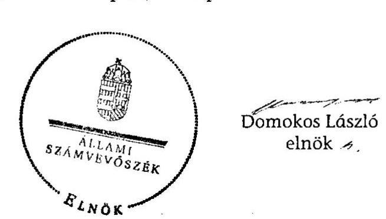

# JELENTÉS 

Tarnabod Község Önkormányzata belső kontrollrendszerének kialakítása, valamint egyes kontrolltevékenységek és a belső ellenőrzés működése ellenőrzéséről

---

# Állami Számvevőszék 

Iktatószám: V-0063-005-044/2013.
Témaszám: 1098
Vizsgálat-azonosító szám: V059133

## Az ellenőrzést felügyelte:

Dr. Benedek Mária
felügyeleti vezető
Az ellenőrzést vezette:
Gyüre Lajosné
ellenőrzésvezető
A számvevőszéki jelentés összeállításában közreműködtek:
Szenténé Tubak Klára
számvevő tanácsos
Vásárhelyi Zoltán
számvevő tanácsos
Az ellenőrzést végezték:
Dr. Nagymányai Péter Magyaricsné Hajdú Regina
számvevő számvevő

---

# TARTALOMJEGYZÉK 

BEVEZETÉS ..... 5
I. ÖSSZEGZŐ MEGÁLLAPÍTÁSOK, KÖVETKEZTETÉSEK, JAVASLATOK ..... 8
II. RÉSZLETES MEGÁLLAPÍTÁSOK ..... 19

1. Az önkormányzat belső kontrollrendszere kialakításának megfelelősége ..... 19
1.1. A kontrollkörnyezet kialakítása ..... 19
1.2. A kockázatkezelési rendszer kialakítása ..... 20
1.3. A kontrolltevékenységek kialakítása ..... 20
1.4. Az információs és kommunikációs rendszer kialakítása ..... 21
1.5. A monitoring rendszer kialakítása ..... 22
2. A pénzügyi folyamatokban kulcsszerepet betöltő belső kontrollok (szakmai teljesítésigazolás és utalvány ellenjegyzés) működése ..... 22
3. A belső ellenőrzés szervezeti keretei és működése ..... 25

## FÜGGELÉKEK

1. számú Értelmező szótár
2. számú A belső kontrollrendszer kialakítása, a pénzügyi folyamatokban kulcsszerepet betöltő szakmai teljesítésigazolás és utalvány ellenjegyzés kontrollok működése, valamint a belső ellenőrzés működése értékelésénél alkalmazott minősítési szempontok

---

.

---

# RÖVIDÍTÉSEK JEGYZÉKE 

| Törvények |  |
| :--: | :--: |
| ÁSZ tv. | 2011. évi LXVI. törvény az Állami Számvevőszékről |
| Avtv. | 1992. évi LXIII. törvény a személyes adatok védelméről és a közérdekű adatok nyilvánosságáról (hatálytalan 2012. január 1-jétől) |
| Htv. | 1991. évi XX. törvény a helyi önkormányzatok és szerveik, a köztársasági megbízottak, valamint egyes centrális alárendeltségű szervek feladat- és hatásköreiről |
| Info tv. | 2011. évi CXII. törvény az információs önrendelkezési jogról és az információszabadságról (hatályos 2012. január 1-jétől) |
| Kttv. | 2011. évi CXCIX. törvény a közszolgálati tisztviselőkről (hatályos 2012. március 1-jétől) |
| Ktv. | 1992. évi XXIII. törvény a köztisztviselők jogállásáról (hatálytalan 2012. március 1-jétől) |
| Ltv. | 1995. évi LXVI. törvény a köziratokról, a közlevéltárakról és a magánlevéltári anyag védelméről |
| Mötv. | 2011. évi CLXXXIX. törvény Magyarország helyi önkormányzatairól (hatályos 2012. január 1-jétől) |
| Mvtv. | 1993. évi XCIII. törvény a munkavédelemről |
| Ötv. | 1990. évi LXV. törvény a helyi önkormányzatokról |
| régi Áht. | 1992. évi XXXVIII. törvény az államháztartásról (hatálytalan 2012. január 1-jétől) |
| Számv. tv. | 2000. évi C. törvény a számvitelről |
| Tvtv. | 1996. évi XXXI. törvény a tűz elleni védekezésről, a műszaki mentésről és a tűzoltóságról |
| új Áht. | 2011. évi CXCV. törvény az államháztartásról (hatályos 2012. január 1-jétől) |
| Vagyonnyilatkozat-   tételről szóló tv.   Rendeletek | 2007. évi CLII. törvény az egyes vagyonnyilatkozat-tételi kötelezettségekről |
| Áhsz. | 249/2000. (XII. 24.) Korm. rendelet az államháztartás szervezetei beszámolási és könyvvezetési kötelezettségének sajátosságairól |
| Ámr. | 292/2009. (XII. 19.) Korm. rendelet az államháztartás működési rendjéről (hatálytalan 2012. január 1-jétől) |
| Ávr. | 368/2011. (XII. 31.) Korm. rendelet az államháztartásról szóló törvény végrehajtásáról (hatályos 2012. január 1-jétől) |
| Ber. | 193/2003. (XI. 26.) Korm. rendelet a költségvetési szervek belső ellenőrzéséről (hatálytalan 2012. január 1-jétől) |
| Bkr. | 370/2011. (XII. 31.) Korm. rendelet a költségvetési szervek belső kontrollrendszeréről és belső ellenőrzéséről (hatályos 2012. január 1-jétől) |

---

| jegyző | Tarnazsadány-Tarnabod Községek Közös Önkormányzati Hivatalának megbízott jegyzője 2013. január 21-étől |
| :--: | :--: |
| Képviselő-testület | Tarnabod Község Önkormányzatának Képviselő-testülete |
| $\operatorname{körjegyző}_{1}$ | Tarnazsadány-Tarnabod Községek Körjegyzőségének körjegyzője 2008. május 1-jétől 2010. október 3-áig |
| $\operatorname{körjegyző}_{2}$ | Tarnazsadány-Tarnabod Községek Körjegyzőségének megbízott körjegyzője 2010. október 22-étől 2010. december 31-áig |
| $\operatorname{körjegyző}_{3}$ | Tarnazsadány-Tarnabod Községek Körjegyzőségének körjegyzője 2011. január 1-jétől 2011. december 31-éig |
| $\operatorname{körjegyző}_{4}$ | Tarnazsadány-Tarnabod Községek Körjegyzőségének körjegyzője 2012. január 1-jétől 2012. március 31-éig |
| $\operatorname{körjegyző}_{5}$ | Tarnazsadány-Tarnabod Községek Körjegyzőségének megbízott körjegyzője 2012. április 1-jétől 2012. június 30-áig |
| $\operatorname{körjegyző}_{6}$ | Tarnazsadány-Tarnabod Községek Körjegyzőségének megbízott körjegyzője 2012. július 1-jétől 2012. július 31-áig |
| $\operatorname{körjegyző}_{7}$ | Tarnazsadány-Tarnabod Községek Körjegyzőségének körjegyzője 2012. augusztus 1-jétől 2013. január 20-áig |
| Körjegyzőség | Tarnazsadány és Tarnabod Községek Körjegyzősége 2012. december 31-éig |
| Önkormányzat polgármester | Tarnabod Község Önkormányzata Tarnabod Község Önkormányzatának polgármestere |

---

# JELENTÉS 

## Tarnabod Község Önkormányzata belső kontrollrendszerének kialakítása, valamint egyes kontrolltevékenységek és a belső ellenőrzés működése ellenőrzéséről

## BEVEZETÉS

A belső kontrollrendszer kialakítását, működtetését és fejlesztését a régi Áht. és az új Áht. is előírja. Ennek megvalósításáért a költségvetési szerv vezetője felel. A belső kontrollrendszer azt a célt szolgálja, hogy a költségvetési szervek működésük és gazdálkodásuk során a tevékenységeket szabályszerűen, gazdaságosan, hatékonyan, eredményesen hajtsák végre, teljesítsék elszámolási kötelezettségeiket és megvédjék az erőforrásokat a veszteségektől, károktól és a nem rendeltetésszerű használattól. A belső kontrollrendszer magában foglalja mindazon szabályokat, eljárásokat, gyakorlati módszereket és szervezeti struktúrákat, kockázatkezelési technikákat, kontrolltevékenységeket, amelyek segítséget nyújtanak a szervezetnek céljai eléréséhez.

Az ÁSZ a 2011-2015. évekre szóló stratégiájában hangsúlyos szerepet szánt annak, hogy szilárd szakmai alapon álló, értékteremtő ellenőrzéseivel előmozdítsa a közpénzügyek átláthatóságát, rendezettségét. A számvevőszéki ellenőrzés nemzetközi alapelvei is rögzítik, hogy a megfelelő belső kontrollrendszer minimálisra csökkenti a hibák és szabálytalanságok kockázatát.

Az ellenőrzés célja annak értékelése volt, hogy az Önkormányzat a jogszabályi előírásoknak megfelelően alakította-e ki a belső kontrollrendszert; a gazdálkodás folyamatában kulcsszerepet betöltő szakmai teljesítésigazolás és az utalvány ellenjegyzés kontrolltevékenységeit megfelelően működtette-e; biztosította-e a belső ellenőrzés szabályos és eredményes működését.

Az ÁSZ ezen ellenőrzési céljait pilot (próba) jelleggel községi/nagyközségi önkormányzatoknál végzett ellenőrzések során érvényesítette.

Az ellenőrzés típusa: szabályszerűségi ellenőrzés
Ellenőrzött szervezet: az Önkormányzat
Az ellenőrzés jogszabályi alapja: az ÁSZ tv. 5. § (2) és (6) bekezdései
Az ellenőrzött időszak: a belső kontrollrendszer kialakításának megfelelőségét a 2011. évre vonatkozóan értékeltük. A kontrolltevékenységek működésének megfelelőségét a 2011. január 1-je és december 31-e, míg a belső ellenőrzés működésének szabályosságát és eredményességét a 2009. január 1-je és 2011.

---

december 31-e közötti időszakot figyelembe véve értékeltük. A helyszíni ellenőrzés lezárásáig a helyi szabályozás változásait nyomon követtük.

Az ellenőrzés szakmai módszertana az ÁSZ hivatalos honlapján (www.asz.hu) közzétett szakmai szabályokon alapult, amely a Legfőbb Ellenőrző Intézmények Nemzetközi Szervezete (INTOSAI) által kiadott nemzetközi standardok (ISSAI) figyelembevételével készült.

A belső kontrollrendszer kialakításának ellenőrzése során értékeltük a kontrollkörnyezet, a kockázatkezelési rendszer, a kontrolltevékenységek, az információs és kommunikációs rendszer, valamint a monitoring rendszer szabályozottságának megfelelőségét.

Értékeltük a pénzügyi folyamatokban kulcsszerepet betöltő szakmai teljesítésigazolás és az utalvány ellenjegyzés kontrollok működésének megfelelőségét az állományba nem tartozók megbízási díjaival, a külső szolgáltatók által végzett karbantartási, kisjavítási munkákkal, az egyéb üzemeltetési, fenntartási, szolgáltatási kiadásokkal, továbbá a rendszeres szociális segélyekkel kapcsolatos kifizetéseknél. Az egyszerű véletlen mintavétellel kiválasztott tételek ellenőrzését többlépcsős megfelelőségi tesztek útján addig végeztük, amíg elegendő és megfelelő bizonyítékot szereztünk a vizsgált folyamatok kulcskontrolljai működésének megfelelő vagy nem megfelelő voltáról. Értékeltük az Önkormányzatnál a belső ellenőrzés működésének szabályosságát és eredményességét. Az ÁSZ a 2007-2010. években az Önkormányzatnál a gazdálkodás szabályszerűségére vonatkozó átfogó ellenőrzést nem végzett.

A fogalmak magyarázatát az 1. számú függelék, az ellenőrzés egyes területeinek értékelésénél alkalmazott egységes minősítési szempontokat a 2. számú függelék tartalmazza.

Az ellenőrzés lefolytatásához az Önkormányzat a munkalapok és a tanúsítvány elektronikus kitöltésével, valamint a megjelölt dokumentumok elektronikus megküldésével szolgáltatott adatokat. A munkalapokon szerepeltetett adatok, információk ellenőrzése és szükség szerinti javítása a helyszíni ellenőrzés keretében történt.

Az ÁSZ az ellenőrzés megállapításait az ellenőrzött időszakban hatályos, az intézkedést igénylő megállapításokra tett javaslatokat a jelenleg hatályos jogszabályok alapján fogalmazta meg.

Az ÁSZ tv. 29. § (1) bekezdése szerint a jelentéstervezetet megküldtük a polgármester részére, aki az ÁSZ tv. 29. § (2) bekezdésében foglalt észrevételezési jogával nem élt, a jelentéstervezetre észrevételt nem tett.

Tarnabod község állandó lakosainak száma 2011. január 1-jén 826 fő volt. Az Önkormányzat öttagú Képviselő-testületének munkáját bizottság nem segítette. Az Önkormányzat az önállóan működő és gazdálkodó Körjegyzőségen kívül intézményt nem működtetett. Az Önkormányzat többségi tulajdoni hányadú gazdasági társasággal nem rendelkezett.

A polgármester a 2002. évi önkormányzati választások óta tölti be tisztségét. A Körjegyzőségen a 2009. január 1-je és 2012. december 31-e közötti időszakban

---

hét körjegyző, közülük a 2011. évben a körjegyző$_{2}$ látta el a körjegyzői feladatokat. 2013. január 1-jétől megalapították$^1$ a Hivatalt, melynek jegyzőjét január 21-től bízták meg a jegyzői feladatok ellátásával.

A Körjegyzőség a szervezeti felépítését tartalmazó szervezeti és működési szabályzattal nem rendelkezett. A köztisztviselők száma 2011. január 1-jén a körjegyzővel együtt 9 fő volt. Az ellenőrzött időszakban a körjegyzőváltások során dokumentált munkakör átadás-átvételre nem került sor.

Az Önkormányzat a 2011. évi költségvetési beszámolója szerint 168748 ezer Ft költségvetési bevételt ért el és 172947 ezer Ft költségvetési kiadást teljesített. A 2011. december 31-ei könyvviteli mérleg szerint 233365 ezer Ft értékű eszközvagyonnal rendelkezett, a hosszú lejáratú kötelezettségállománya 1000 ezer Ft, a rövid lejáratú kötelezettségállománya 64091 ezer Ft volt.

[^0]
[^0]:    $^1$ 32/2012. (X. 30.) számú közös képviselő-testületi határozat

---

# I. ÖSSZEGZŐ MEGÁLLAPÍTÁSOK, KÖVETKEZTETÉSEK, JAVASLATOK 

A belső kontrollrendszeren belül 2011-ben a Körjegyzőségen a kontrollkörnyezet, a kockázatkezelési rendszer, a kontrolltevékenységek, az információs és kommunikációs rendszer, valamint a monitoring rendszer kialakítását külön-külön és összesítve is értékeltük. A belső kontrollrendszer kialakítása az összesített értékelés alapján nem felelt meg a jogszabályi előírásoknak. Az egyes területek kialakításának értékelését az alábbiakban részletezzük.

A kontrollkörnyezet kialakítása nem felelt meg a jogszabályi követelményeknek, mert a körjegyző$_{3}$ a Htv. előírását figyelmen kívül hagyva nem készítette el a gazdasági programtervezetet, ezért a Képviselő-testület az Ötv.$^2$ előírása ellenére nem határozta meg az Önkormányzat gazdasági programját. A körjegyző$_{3}$ a régi Áht.$^3$-ban foglaltak ellenére a Körjegyzőség feladatai ellátásának belső rendjét és módját szervezeti és működési szabályzatban nem állapította meg. A körjegyző$_{3}$ az Áhsz. előírásai ellenére nem határozta meg a Körjegyzőség számviteli politikáját, nem készítette el a leltározási és leltárkészítési szabályzatot, az eszközök és források értékelési szabályzatát és a pénzkezelési szabályzatot, valamint nem alakította ki a számlarendet, továbbá a Számv. tv.-ben foglalt előírás ellenére nem készítette el a Körjegyzőség bizonylati rendjét. Nem készítette el az Ámr.$^4$-ben előírtak ellenére az ellenőrzési nyomvonalat, és nem szabályozta a szabálytalanságkezelés eljárásrendjét. Ezek a hiányosságok korlátozták a feladatellátás számon kérhetőségét, folyamatosságának biztosítását, a folyamatos nyomon követést. A körjegyző$_{3}$ az Mvtv. előírásait figyelmen kívül hagyva nem határozta meg a Körjegyzőségen a biztonságos munkavégzés követelményei megvalósításának módját. A körjegyző$_{3}$ a Tvtv.-ben foglaltak ellenére nem készítette el a Körjegyzőség tűzvédelmi szabályzatát. A Ktv.$^5$ előírása ellenére a körjegyző$_{3}$ nem készítette el és nem csatolta a köztisztviselők kinevezési okmányaihoz a munkaköri leírásokat, nem határozta meg a köztisztviselők munkateljesítményének értékeléséhez szükséges teljesítménykövetelményeket, továbbá

 a körjegyző${ }_{3}$ nem rendelkezett munkaköri leírással.

A kockázatkezelési rendszer kialakítása nem felelt meg a jogszabályi előírásoknak, mert a körjegyző${ }_{3}$ az Ámr. előírása ellenére kockázatelemzést nem végzett, nem mérte fel és nem állapította meg a Körjegyzőség tevékenységében, gazdálkodásában rejlő kockázatokat, nem határozta meg az egyes kockázatokkal kapcsolatos intézkedéseket és megtételük módját. A Vagyonnyilatkozattételről szóló tv.-ben foglalt előírás ellenére a vagyonnyilatkozat-tételi kötele-

[^0]
[^0]:    ${ }^{2}$ 2012. január 1-jétől Mötv.
    ${ }^{3}$ 2012. január 1-jétől új Áht.
    ${ }^{4}$ 2012. január 1-jétől Ávr.
    ${ }^{5}$ 2012. március 1-jétől Kttv.

---

zettséget az érintett személyek esetében szervezeti és működési szabályzatban nem tüntette fel.

A kontrolltevékenységek kialakítása a jogszabályi előírásoknak nem felelt meg, mert a körjegyző${ }_{3}$ a régi Áht. előírása ellenére nem határozta meg a folyamatba épített, előzetes, utólagos és vezetői ellenőrzés feladatait, továbbá az Ámr. előírása ellenére nem alakította ki a Körjegyzőség tevékenységeire vonatkozó beszámolási eljárásokat. A körjegyző${ }_{3}$ az Ámr. előírásai ellenére nem határozta meg a gazdálkodással, így különösen a kötelezettségvállalás, az ellenjegyzés, a szakmai teljesítésigazolás, az érvényesítés és az utalványozás gyakorlásának módjával, eljárási és dokumentációs részletszabályaival kapcsolatos belső előírásokat, feltételeket. A gazdálkodással összefüggő ellenőrzési jogkörök tekintetében a szakmai teljesítésigazolás és az érvényesítés gyakorlására nem adott kijelölést. A kontrolltevékenységek kialakításának hiánya kockázatot jelent a feladatok szabályszerű végrehajtása során.

Az információs és kommunikációs rendszer kialakítása a jogszabályi előírásoknak nem felelt meg, mert a körjegyző${ }_{3}$ az Ltv.-ben foglaltak ellenére nem készítette el a Körjegyzőség iratkezelési szabályzatát és az Avtv.${ }^{6}$ előírása ellenére az adatvédelmi és adatbiztonsági szabályzatot. Az Avtv. és az Ámr. előírása ellenére a körjegyző${ }_{3}$ nem szabályozta a közérdekű adatok megismerésére irányuló igények teljesítésének, valamint a kötelezően közzéteendő adatok nyilvánosságra hozatalának rendjét. Az Avtv. előírásai ellenére a körjegyző${ }_{3}$ elmulasztotta az adatbiztonság érvényre juttatásához szükséges intézkedések megtételét, mert nem határozta meg a hozzáférési jogosultságokra, a pénzügyi számviteli szoftverváltozások ellenőrzésére és az adatok mentésére vonatkozó eljárásrendet.

A monitoring rendszer kialakítása a jogszabályi követelményeknek nem felelt meg, mert a körjegyző${ }_{3}$ az Ámr.-ben foglaltak ellenére nem határozta meg az operatív tevékenységek keretében megvalósuló, folyamatos és eseti nyomon követésből és az operatív tevékenységektől függetlenül működő belső ellenőrzésből álló, a Körjegyzőség tevékenységének, a célok megvalósításának nyomon követését biztosító rendszer szabályait.

A belső kontrollrendszer kialakításával kapcsolatos kötelezettségének a körjegyző${ }_{4,5,6,7}$ és a jegyző sem tett eleget, ennek hiánya kockázatot jelent az Önkormányzat tevékenységeinek szabályszerű, gazdaságos, hatékony és eredményes végrehajtásában.

A Körjegyzőségen az Önkormányzat vonatkozásában a 2011. évben az állományba nem tartozók megbízási díjaival, a külső szolgáltatók által végzett karbantartásokkal, kisjavításokkal, az egyéb üzemeltetési, fenntartási szolgáltatásokkal, valamint a rendszeres szociális segélyekkel kapcsolatos 2011. évi kifizetések során, összefoglalóan értékelve a pénzügyi folyamatokban a kulcskontrollok működésének megfelelősége gyenge volt. A kiadások teljesítését megelőzően a szakmai teljesítésigazolást a régi Áht. és az Ámr. előírása ellenére nem végezték el, így elmaradt a kiadások teljesítése jogosságának, össze-

[^0]
[^0]:    ${ }^{6}$ 2012. január 1-jétől Info tv.

---

gszerűségének ellenőrzése, az ellenszolgáltatást is magukban foglaló kifizetések esetében a megrendelések, szerződések szakmai teljesítésének igazolása. Az Ámr.-ben előírt utalvány ellenjegyzési feladatokat sem végezték el, ennek következtében nem tárták fel a szakmai teljesítés igazolásának hiányát, a jogosulatlan személy általi érvényesítéseket, továbbá a régi Áht.-ban és az Ámr.-ben előírt, a kötelezettségvállalások írásba foglalásának, azok ellenjegyzésének, valamint az összeférhetetlenségi szabályok érvényesülésének elmaradását sem.

A gazdálkodásban kulcsszerepet betöltő belső kontrollok hiánya hozzájárult ahhoz, hogy az ügyviteli feladatok ellátására a Ktv. - közszolgálati jogviszony létesítésére vonatkozó - előírásaival ellentétes megbízási szerződéseket kötöttek. A szakmai teljesítésigazolás és az utalvány ellenjegyzés elmaradása következtében az állományba nem tartozók megbízási díjainak kifizetéseire - a megbízás tárgyát, a jogosságot és az összegszerűséget megalapozó - ellenőrizhető okmányok hiányában került sor, mivel az Ámr. előírása ellenére nem kötöttek megbízási szerződést, vagy a megkötött szerződések esetenként nem tartalmazták az elvégzendő feladatot, illetőleg a megbízásért járó összeget.

A szakmai teljesítésigazolás és az utalvány ellenjegyzés elmulasztása következményeként az ÁSZ az ellenőrzés során a karbantartásokkal, kisjavításokkal és az egyéb üzemeltetési, fenntartási szolgáltatásokkal összefüggésben kár bekövetkezését valószínűsítő, szabálytalan, jogosulatlan kifizetéseket tárt fel a gépkocsijavítások, illetőleg autójavítás címén teljesített kiadásoknál. A szakmai teljesítésigazolásokat nem végezték el, azokról dokumentumok nem álltak rendelkezésre, így a gépkocsijavítások, illetőleg autójavítás címén teljesített kifizetésekről nem állapítható meg, hogy az Önkormányzat tulajdonában, illetve üzemeltetésében lévő személygépkocsi javításáért fizetett-e az Önkormányzat. A kiadásokhoz kapcsolódóan rendelkezésre álló okmányok (számlák) alapján sem állapítható meg, hogy ezen kifizetések az önkormányzati feladatok ellátása érdekében történtek-e. Az Ámr.-ben előírtak ellenére egy egyéb üzemeltetési, fenntartási szolgáltatásokkal kapcsolatos kifizetéshez kapcsolódóan pedig a kiadást megalapozó és alátámasztó ellenőrizhető okmány (a számla) sem állt rendelkezésre. A Számv. tv.-ben foglalt előírás ellenére az autójavítás jogcímen teljesített kifizetés számviteli nyilvántartásokban történő bejegyzésére bizonylat (számla) hiányában került sor.

A kulcsszerepet betöltő belső kontrollok - a szakmai teljesítésigazolás és az utalvány ellenjegyzés - jogszabályi előírásoknak nem megfelelő, gyenge működése miatt az Önkormányzat gazdálkodásában magas a hibák bekövetkezésének kockázata. A szabályozás hiánya és a nem megfelelően működtetett belső kontrollok korrupciós kockázatot is hordoznak.

Az Önkormányzatnál a 2009-2011. években a belső ellenőrzés szabályozása és működése nem felelt meg a jogszabályi előírásoknak. Az Ötv.-ben előírtak ellenére a belső ellenőrzés ellátásának módjáról a Képviselő-testület nem hozott döntést. A körjegyző${ }_{1,2,3}$ 2009. és 2011. között az Ötv.-ben és régi Áht.-ban foglalt kötelezettség ellenére nem alakított ki és nem működtetett belső ellenőrzést. A körjegyző${ }_{1,2,3}$ a Ber.${ }^{7}$ előírásai ellenére nem készített belső ellenőrzési

[^0]
[^0]:    ${ }^{7}$ 2012. január 1-jétől Bkr.

---

kézikönyvet, nem gondoskodott kockázatelemzéssel alátámasztott belső ellenőrzési stratégia és éves belső ellenőrzési terv elkészítéséről, ezáltal az Ötv.-ben foglalt előírás ellenére a Képviselő-testület nem hagyott jóvá belső ellenőrzési tervet. A belső ellenőrzés kialakításának és működtetésének hiányában belső ellenőrzést nem végeztek. A körjegyző${ }_{1,2,3}$ nem készített éves ellenőrzési jelentést, ezért az Ötv.-ben foglalt előírás ellenére a polgármester nem terjesztett éves ellenőrzési jelentést a Képviselő-testület elé a zárszámadással egyidejűleg.

Az Önkormányzatnál a 2009-2011. években a belső ellenőrzés működése a 2. számú függelékben részletezett kritériumrendszer alapján végzett értékelés szerint - nem volt eredményes, mert az ellenőrzött időszak egészét tekintve a belső ellenőrzést a jogszabályi előírások ellenére nem alakították ki és nem is működtették, ezáltal a 2009-2011. évek között belső ellenőrzést sem végeztek, így nem ellenőriztek a következőkben felsoroltak közül legalább kettő területet: a belső kontrollrendszer kialakításának szabályozottságát, a beazonosított túréshatár feletti kockázatok kezelése érdekében tett intézkedéseket, a gazdálkodási jogkörök gyakorlását, a készpénzkezeléssel kapcsolatos belső kontrollok működését, valamint az önkormányzati vagyonhasznosítás vonatkozásában a vagyongazdálkodási szabályok betartását. A belső ellenőrzés - annak kialakítása és működtetése hiányában - nem előzte meg, nem tárta fel és nem javíttatta ki a pénzügyi gazdálkodás hibáit, hiányosságait. A belső ellenőrzés hiánya hozzájárult az ÁSZ ellenőrzés által feltárt szabályozási hiányosságokhoz, a gyengén működő belső kontrollokból eredő hibákhoz, a szabálytalan, jogosulatlan kifizetésekhez.

Az ÁSZ tv. 33. § (1) bekezdésében foglaltak értelmében az ellenőrzött szervezet vezetője köteles a jelentésben foglalt megállapításokhoz kapcsolódó intézkedési tervet összeállítani, és azt a jelentés kézhezvételétől számított 30 napon belül az ÁSZ részére megküldeni. Amennyiben az intézkedési tervet határidőre nem küldi meg a szervezet, vagy az - az ÁSZ tv. 33. § (2) bekezdésében foglalt póthatáridő eltelte ellenére - továbbra sem elfogadható, az ÁSZ elnöke a hivatkozott törvény 33. § (3) bekezdés a)-b) pontjaiban foglaltakat érvényesítheti.

Az ellenőrzés intézkedést igénylő megállapításai és javaslatai:

# a polgármesternek 

1. A Képviselő-testület - az Ötv. 91. § (7) bekezdésében foglaltak ellenére - nem fogadta el az Ötv. 91. § (1) és (6) bekezdése szerinti gazdasági programtervezetet.

Javaslat:
Terjessze a Képviselő-testület elé a gazdasági program jegyző által elkészített tervezetét a Mötv. 116. § (1) és (5) bekezdése alapján a 116. § (3)-(4) bekezdéseiben foglalt tartalommal.

---

2. A Ktv. 11. § (6) bekezdésében foglaltak ellenére a körjegyző${ }_{1}$ nem rendelkezett a polgármester által aláírt munkaköri leírással.

Javaslat:
Intézkedjen a Kttv. 43. § (4) bekezdésében foglaltak alapján a jegyző munkaköri leírásának elkészítéséről és a kinevezési okmányhoz történő csatolásáról.
3. Az állományba nem tartozók megbízási díjaira, a külső szolgáltatók által végzett karbantartással, kisjavítással kapcsolatos kifizetésekre és az egyéb üzemeltetési, fenntartási, szolgáltatási díjak és a rendszeres szociális segélyek kifizetéseire vonatkozóan - a régi Áht. 100/C. § (3) és az Ámr. 74. § (1) bekezdésében foglaltak ellenére - a kötelezettségvállalást nem foglalták írásba, vagy az írásba foglalt kötelezettségvállalások ellenjegyzésének tényét aláírással és dátummal nem igazolták.

Javaslat:
Intézkedjen arról, hogy az Önkormányzat nevében történő kötelezettségvállalásra az új Áht. 37. § (1) bekezdésében foglaltaknak megfelelően - az Ávr. 53. §-ában meghatározott kivételekkel - kizárólag a pénzügyi ellenjegyzés után, a pénzügyi teljesítés esedékességét megelőzően, írásban kerüljön sor.
4. A körjegyző${ }_{1}$ a belső kontrollrendszer kialakításáról nem gondoskodott, az Ámr. 20. § (3) bekezdés a) pontjában foglaltak ellenére belső szabályzatban nem rendezte a gazdálkodással, így különösen a kötelezettségvállalás, az ellenjegyzés, a szakmai teljesítés igazolása, az érvényesítés és az utalványozás gyakorlásának módjával, eljárási és dokumentációs részletszabályaival, valamint az ezeket végző személyek kijelölésének rendjével és az adatszolgáltatási feladatok teljesítésének rendjével kapcsolatos belső előírásokat, feltételeket. A kiadások teljesítését megelőzően a szabályozás és a szakmai teljesítésigazoló kijelölésének hiányában a régi Áht. 100/C. § (6) és az Ámr. 76. § (1) bekezdéseinek előírása ellenére a kifizetések jogosságának, összegszerűségének ellenőrzése, az ellenszolgáltatást is magukban foglaló kifizetések esetében a szerződések, megrendelések szakmai teljesítésének igazolása elmaradt. Az utalványok ellenjegyzését a kiadások teljesítését megelőzően a régi Áht. 100/C. § (6) és az Ámr. 79. § (2) bekezdésében foglalt előírás ellenére nem végezték el. Az állományba nem tartozók megbízási díjai, a külső szolgáltatók által végzett karbantartással, kisjavítással kapcsolatos kifizetések, az egyéb üzemeltetési, fenntartási, szolgáltatási feladatok és a rendszeres segélyek kifizetései tekintetében a kötelezettségvállalást a régi Áht. 100/C. § (3) és az Ámr. 74. § (1) bekezdésében foglalt előírás ellenére nem foglalták írásba, vagy az írásba foglalt kötelezettségvállalások ellenjegyzésének tényét aláírással és dátummal nem igazolták.

A gazdálkodásban kulcsszerepet betöltő belső kontrollok, a szakmai teljesítés igazolás és az utalvány ellenjegyzés elmulasztása következményeként az ÁSZ ellenőrzés a karbantartásokkal, kisjavításokkal és az egyéb üzemeltetési, fenntartási szolgáltatásokkal összefüggésben kár bekövetkezését valószínűsítő, szabálytalan, jogosulatlan kifizetéseket tárt fel.

Az irodai ügyintézésre kötött megbízási szerződések ellentétesek voltak a
 Ktv. 1. § (9) bekezdésében foglaltakkal, mert a közigazgatási szerv közhatalmi, irányítási, ellenőrzési és felügyeleti hatáskörének gyakorlásával közvetlenül összefüggő, valamint ügyviteli feladat ellátására kizárólag közszolgálati jogviszony létesíthető.

Javaslat:
A Mötv. 115. § (1) bekezdésében foglaltak alapján kísérje figyelemmel az önkormányzat gazdálkodásának szabályszerűségét. A Mötv. 67. § f) pontja alapján gondoskodjon a belső kontrollrendszerre és a belső ellenőrzés működésére vonatkozó jogszabályi rendelkezések be nem tartása, valamint a szakmai teljesítésigazolás, illetve az utalvány ellenjegyzés kontrollokkal összefüggésben feltárt hiányosságok, szabálytalanságok, valamint a szabálytalanul megkötött szerződés tekintetében az esetleges munkajogi felelősséggel kapcsolatos körülmények kivizsgálásáról, és a vizsgálat eredményének függvényében tegye meg a szükséges munkajogi intézkedéseket.

# a jegyzőnek Tarnabod Község Önkormányzata vonatkozásában 

1. a kontrollkörnyezettel kapcsolatban:

A körjegyző ${ }_{3}$ - a régi Áht. 91. § (2) bekezdésében és az Ámr. 20. § (1) bekezdésében foglaltak ellenére - a Körjegyzőség feladatai ellátásának belső rendjét és módját szervezeti és működési szabályzatban nem állapította meg.

A körjegyző ${ }_{3}$ - az Áhsz. 8. § (3) bekezdése ellenére - nem alakította ki és írásban nem szabályozta a Körjegyzőség számviteli politikáját, ennek keretében nem készítette el - az Áhsz. 8. § (4) bekezdés a), b) és d) pontjaiban foglalt előírás ellenére - a Körjegyzőség leltározási és leltárkészítési szabályzatát, az eszközök és források értékelési szabályzatát és a pénzkezelési szabályzatot.

A körjegyző ${ }_{3}$ - a Számv. tv. 161. § (2) és az Áhsz. 49. § (1) bekezdésének előírása ellenére - nem készítette el a Körjegyzőség számlarendjét és ennek részeként - a Számv. tv. 161. § (2) bekezdés d) pontjában foglalt előírás ellenére - a bizonylati rendet.

A körjegyző ${ }_{3}$ - az Ámr. 156. § (2)-(3) bekezdése ellenére - nem készítette el a Körjegyzőség tevékenységeire és feladataira vonatkozóan az ellenőrzési nyomvonalat, és nem szabályozta a szabálytalanságkezelés eljárásrendjét.

A körjegyző ${ }_{3}$ - az Mvtv. 2. § (3) bekezdése ellenére - nem határozta meg a Körjegyzőségen az egészséget nem veszélyeztető és biztonságos munkavégzés követelményei megvalósításának módját.

A körjegyző ${ }_{3}$ - a Tvtv. 19. § (1) bekezdésében foglaltak ellenére - nem készítette el a Körjegyzőség tűzvédelmi szabályzatát.

A körjegyző ${ }_{3}$ - a Ktv. 11. § (6) bekezdésében foglalt előírás ellenére - nem készítette el, és nem csatolta a Körjegyzőségen dolgozó köztisztviselők kinevezési okmányához a munkaköri leírásukat, továbbá a Ktv. 34. § (5) bekezdésében foglaltak ellenére nem határozta meg a köztisztviselők munkateljesítményének értékeléséhez szükséges teljesítménykövetelményeket.

Javaslat:
a) Intézkedjen az új Áht. 10. § (5) bekezdésében foglaltak szerint a Hivatal SZMSZ-ének elkészítéséről, és kezdeményezze a polgármesternél annak Képviselőtestület elé terjesztését.
b) Alakítsa ki és írásban szabályozza az Áhsz. 8. § (3) bekezdésében előírtak szerint a Hivatal számviteli politikáját, amelynek keretében készítse el az Áhsz. 8. § (4) bekezdés a), b), d) pontjaiban foglaltak alapján a leltározási és leltárkészítési szabályzatot, az eszközök és források értékelési szabályzatát és a pénzkezelési szabályzatot.
c) Készítse el a Számv. tv. 161. § (1) és az Áhsz. 49. § (1) bekezdésében foglalt előírásnak megfelelően a Hivatal számlarendjét és az abban foglaltakat alátámasztó, a Számv. tv. 161. § (2) bekezdés d) pontjában előírt bizonylati szabályzatot.
d) Készítse el a Bkr. 6. § (3)-(4) bekezdéseiben előírtaknak megfelelően az ellenőrzési nyomvonalat, és szabályozza a szabálytalanságok kezelésének eljárásrendjét.
e) Határozza meg az Mvtv. 2. § (3) bekezdésének megfelelően az egészséget nem veszélyeztető és biztonságos munkavégzés követelményei megvalósításának módját.
f) Készítse el a Tvtv. 19. § (1) bekezdés előírása alapján a Hivatal tűzvédelmi szabályzatát.
g) Csatolja a Hivatal köztisztviselőinek kinevezési okmányaihoz a Kttv. 43. § (4) bekezdésében előírtak szerint a munkaköri leírásokat.
h) Dolgozza ki a Kttv. 130. § (1)-(3) bekezdéseiben előírtak szerinti teljesítményértékelés alapját képező teljesítménykövetelményeket.
2. a kockázatkezelési rendszerrel kapcsolatban:

A körjegyző az Ámr. 157. § (1)-(3) bekezdésének előírása ellenére nem végzett kockázatelemzést és nem alakított ki kockázatkezelési rendszert, valamint a vagyonnyilatkozat tételről szóló tv. 4. §-ában foglalt előírás ellenére belső szabályzatban nem rögzítette a vagyonnyilatkozat-tételi kötelezettséget.

Javaslat:
a) Alakítsa ki és működtesse a Bkr. 3. § b) pontja és 7. § alapján a kockázatkezelési rendszert.
b) Írja elő belső szabályzatban a vagyonnyilatkozat tételről szóló tv. 4. §-ában foglaltak alapján a vagyonnyilatkozat-tételi kötelezettséget.
3. a kontrolltevékenységekkel kapcsolatban:

A régi Áht. 121/A. § (4) bekezdésében foglaltak ellenére a körjegyző ${ }_{3}$ nem alakította ki a folyamatba épített, előzetes, utólagos és vezetői ellenőrzést.

A körjegyző ${ }_{1}$ - az Ámr. 158. § (2) bekezdés d) pontja ellenére - nem szabályozta a Körjegyzőség tevékenységeire vonatkozó beszámolási eljárásokat.

A körjegyző az Ámr. 20. § (3) bekezdés a) pontja előírásai ellenére nem szabályozta a Körjegyzőségen a gazdálkodással, így különösen a kötelezettségvállalás, az ellenjegyzés, a szakmai teljesítés igazolása, az érvényesítés és az utalványozás gyakorlásának módjával, eljárási és dokumentációs részletszabályaival, valamint az ezeket végző személyek kijelölésének rendjével és az adatszolgáltatási feladatok teljesítésével kapcsolatos belső előírásokat, feltételeket.

A körjegyző ${ }_{1}$ nem jelölte ki - az Ámr. 76. § (5), a 77. § (4) és a 79. § (1) bekezdéseiben foglaltak ellenére - a szakmai teljesítésigazolásra és az érvényesítésre jogosultakat.

Javaslat:
a) Biztosítsa - a Bkr. 8. § (2) bekezdése alapján - a kontrolltevékenységek részeként minden tevékenységre vonatkozósan a folyamatba épített, előzetes, utólagos és vezetői ellenőrzést.
b) Szabályozza a Bkr. 8. § (4) bekezdés c) pontja alapján a Hivatal tevékenységeire vonatkozó beszámolási eljárásokat.
c) Rendezze belső szabályzatban az Ávr. 13. § (2) bekezdés a) pontjában foglaltak alapján a gazdálkodással - különösen a kötelezettségvállalás, az ellenjegyzés, a teljesítés igazolása, az érvényesítés és az utalványozás gyakorlásának módjával, eljárási és dokumentációs részletszabályaival - kapcsolatos belső előírásokat, feltételeket.
d) Intézkedjen arról, hogy az Ávr. 55. § (2), az 57. § (4) és az 58. § (4) bekezdéseknek megfelelően kijelölésre kerüljenek a teljesítésigazolásra és az érvényesítésre jogosult személyek.
4. az információs és kommunikációs rendszerrel kapcsolatban:

A körjegyző ${ }_{1}$ az Avtv. 31/A. § (3) bekezdésében előírtak ellenére nem készítette el az adatvédelmi és adatbiztonsági szabályzatot.

A körjegyző ${ }_{1}$ - az Avtv. 20. § (8) bekezdésének és az Ámr. 20. § (3) bekezdés i) pontjának rendelkezései ellenére - nem szabályozta a közérdekű adatok megismerésére irányuló igények teljesítésének és a kötelezően közzéteendő adatok nyilvánosságra hozatalának rendjét.

A körjegyző ${ }_{1}$ - az Avtv. 10. § (1)-(2) bekezdéseiben foglalt előírások ellenére - nem határozta meg a hozzáférési jogosultságok eljárásrendjét, valamint nem szabályozta a pénzügyi-számviteli szoftverváltozások ellenőrzésére, tesztelésére vonatkozó eljárásokat, a feldolgozott adatok mentési eljárásait, és nem jelölte ki a mentések felelőseit.

Javaslat:
a) Készítsen az Info tv. 24. § (3) bekezdése alapján adatvédelmi és adatbiztonsági szabályzatot.
b) Rendezze belső szabályzatban az Ávr. 13. § (2) bekezdés h) pontja, valamint az Info tv. 30. § (6) és a 35. § (3) bekezdései alapján a közérdekű adatok megismerésére irányuló igények teljesítésének és a kötelezően közzéteendő adatok nyilvánosságra hozatalának rendjét.
c) Biztosítsa az Info tv. 7. § (2)-(3) bekezdéseinek megfelelően az adatbiztonság érvényesülését, szabályozza a hozzáférési jogosultságokkal kapcsolatos feladatokat (jogosultság megállapítása, módosítása, azok betartásának ellenőrzése, nyilvántartásának vezetése), valamint szabályozza az adatok kezelésének, feldolgozásának, tárolásának és mentési eljárásának rendjét.
5. a monitoring rendszerrel kapcsolatban:

A körjegyző ${ }_{3}$ - az Ámr. 160. §-ában foglaltak ellenére - nem alakított ki olyan monitoring rendszert, amely lehetővé teszi a Körjegyzőség tevékenységének, a célok megvalósításának nyomon követését, és amelynek része az operatív tevékenységek keretében megvalósuló folyamatos és eseti nyomon követés is.

Javaslat:
Alakítsa ki és működtesse a Bkr. 3. § e) pontjában és 10. §-ában előírtak alapján a Hivatal tevékenységének, a célok megvalósításának nyomon követését biztosító rendszert, amelynek része az operatív tevékenységek keretében megvalósuló folyamatos és eseti nyomon követés is.
6. a pénzügyi folyamatokban kulcsszerepet betöltő kontrollokkal kapcsolatban:

A régi Áht. 100/C. § (6) és az Ámr. 76. § (1) bekezdésben foglaltak ellenére az állományba nem tartozók megbízási díjai, a karbantartás, kisjavítás, az egyéb üzemeltetési, fenntartási és szolgáltatási díjak és a rendszeres szociális segélyek kifizetéseit megelőzően a szakmai teljesítés igazolását nem végezték el, nem ellenőrizték a kiadások jogosságát, összegszerűségét a megrendelések, szerződések szakmai teljesítését. Az utalványok ellenjegyzése az Ámr. 79. § (2) bekezdésében foglalt előírás ellenére elmaradt. A kötelezettségvállalás és annak ellenjegyzése a régi Áht. 100/C. § (3) és az Ámr. 74. § (1) bekezdése ellenére írásban nem történt meg, a 75. § (1) bekezdésében foglaltak ellenére a kötelezettségvállalások nyilvántartását nem vezették, amelynek következtében - az Ámr. 78. § (2) bekezdés g) pontjában foglaltak ellenére - elmaradt a kötelezettségvállalás nyilvántartási számának a feltüntetése. A gépkocsijavításokkal kapcsolatos kifizetések során az utalványozási feladatot végző személy - az Ámr. 80. § (2) bekezdésében foglalt előírás ellenére - ezt a tevékenységét maga javára látta el. Az érvényesítést - az Ámr. 77. § (4) bekezdésében foglaltak ellenére - nem az arra kijelölt személy végezte.

Az autójavítással kapcsolatos adatok számviteli nyilvántartásokban történő bejegyzésére - a Számv. tv. 165. § (2) bekezdése ellenére - bizonylat (számla) hiányában került sor.

Az irodai ügyintézésre kötött megbízási szerződések ellentétesek voltak a Ktv. 1. § (9) bekezdésében foglaltakkal, mert a közigazgatási szerv közhatalmi, irányítási, ellenőrzési és felügyeleti hatáskörének gyakorlásával közvetlenül összefüggő, valamint ügyviteli feladat ellátására kizárólag közszolgálati jogviszony létesíthető.

Javaslat:
Intézkedjen - a szakmai teljesítés igazolása és az utalványozás ellenjegyzése vonatkozásában feltárt hiányosságok megszüntetése, illetve az operatív gazdálkodás során a működésbeli hibák megelőzése, feltárása és kijavítása érdekében - arról, hogy:
a) a teljesítés igazolását a kötelezettségvállaló által kijelölt személyek az új Áht. 38. § (1) bekezdésében és az Ávr. 57. § (1) és (3) bekezdésében előírtaknak megfelelően ellenőrizzék, és a kiadások teljesítésének jogosságát, összegszerűségét, ellenszolgáltatást is magába foglaló kötelezettségvállalás esetén a szerződés, megrendelés teljesítését aláírásukkal igazolják;
b) a kifizetéseket megelőzően - az Ávr. 58. § (1) bekezdése szerint - a teljesítésigazolás alapján - az Ávr. 57. § (3) bekezdése szerinti esetben annak hiányában is az összegszerűségnek, a fedezet meglétének és a megelőző ügymenetben az új Áht., az Áhsz., az Ávr. előírásai és a belső szabályzatokban foglaltak betartásának az ellenőrzése történjen meg;
c) az új Áht. 37. § (1) és az Ávr. 55. § (1) bekezdésében foglaltaknak megfelelően, kötelezettségvállalásra - az Ávr. 53. §-ában meghatározott kivételekkel - pénzügyi ellenjegyzés után kerüljön sor, valamint a pénzügyi ellenjegyző győződjön meg arról, hogy a kötelezettségvállalás nem sérti-e a gazdálkodási szabályokat;
d) a kötelezettségvállalások nyilvántartását az Ávr. 56. § (1) bekezdésében foglalt előírásnak megfelelően vezessék, és az utalványrendeleteken a kötelezettségvállalás nyilvántartási számát az Ávr. 59. § (3) bekezdés f) pontjában foglaltaknak megfelelően tüntessék fel.
 fel;
e) az összeférhetetlenségi szabályok az Ávr. 60. § (1)–(2) bekezdésében foglaltaknak megfelelően érvényesüljenek;
f) Intézkedjen arról, hogy a gazdasági események számviteli (könyvviteli) nyilvántartásokban történő bejegyzésére a Számv. tv. 165. § (2) bekezdésének megfelelően kizárólag bizonylat alapján kerüljön sor.
g) Intézkedjen a Kttv. 8. § (1)–(2) bekezdéseiben foglalt előírás alapján, hogy a Hivatal, mint közigazgatási szerv közhatalmi, irányítási, ellenőrzési és felügyeleti hatáskörének gyakorlásával közvetlenül összefüggő, valamint ügyviteli feladat ellátására kizárólag kormányzati szolgálati, illetve közszolgálati jogviszonyt létesítsenek.
7. a belső ellenőrzés működésével kapcsolatban:

A 2009–2011. évek között a belső ellenőrzési feladatok ellátásának módjáról az Ötv. 92. § (8) bekezdésében előírtak ellenére a Képviselő-testület – az erre irányuló, a körjegyző ${ }_{1,2,3}$ által kezdeményezett előterjesztés hiányában – nem hozott döntést. A körjegyző ${ }_{1,2,3}$ a Ber. 4. § (2) bekezdésében foglaltak ellenére szervezeti és működési szabályzatban vagy más belső szabályzatban nem határozta meg a belső ellenőrzést végző személy, egység jogállását, feladatait.

A körjegyző ${ }_{1,2,3}$ 2009. és 2011. között nem gondoskodott az Ötv. 92. § (5) bekezdése és a régi Áht. 121/B. § (4) bekezdésben foglalt kötelezettség ellenére a belső ellenőrzés kialakításáról és működtetéséről. A Ber. 5. § (1) bekezdésben előírtak ellenére nem készíttetett és nem hagyott jóvá belső ellenőrzési kézikönyvet. A körjegyző ${ }_{1,2,3}$ – a Ber. 12. § b) pontjában, 18. §-ában és a 21. § (2) bekezdésében foglaltak ellenére – kockázatelemzéssel alátámasztott belső ellenőrzési stratégiát és éves belső ellenőrzési tervet nem készített. Belső ellenőrzést a 2009–2011. évek között nem végeztek.

Javaslat:
a) Gondoskodjon az új Áht. 70. § (1) bekezdésében és a Mötv. 119. § (4) bekezdésében foglalt előírás alapján a belső ellenőrzés kialakításáról és megfelelő működtetéséről.
b) Írja elő a Hivatal szervezeti és működési szabályzatában a Bkr. 15. § (2) bekezdésében foglalt előírásnak megfelelően a belső ellenőrzést végző személy, szervezet jogállását, feladatait.
c) Készíttesse el és hagyja jóvá a Bkr. 17. § (1)–(2) bekezdéseiben és a 22. § (1) bekezdés a) pontjában foglaltak alapján a belső ellenőrzési kézikönyvet.
d) Készítsen a Bkr. 22. § (1) bekezdés b) pontja, a 29. § (1) bekezdése és a 31. § (1)–(2) bekezdései alapján kockázatelemzéssel alátámasztott stratégiai és éves ellenőrzési tervet, valamint az ellenőrzési tervben foglalt ellenőrzéseket végezze el.

---

# II. RÉSZLETES MEGÁLLAPÍTÁSOK 

## 1. AZ ÖNKORMÁNYZAT BELSŐ KONTROLLRENDSZERE KIALAKÍTÁSÁNAK MEGFELELŐSÉGE

### 1.1. A kontrollkörnyezet kialakítása

A kontrollkörnyezet kialakítása a 2011. évben a 2. számú függelékben részletezett kritériumrendszer alapján végzett értékelés szerint a Körjegyzőségen nem volt megfelelő, mert a körjegyző ${ }_{3}$ a jogszabályi előírásokat nem érvényesítette.

A körjegyző ${ }_{3}$, mint a költségvetési szerv vezetője:

- a Htv. 140. § (1) bekezdés a) pontjában foglalt előírást figyelmen kívül hagyva nem készítette el a gazdasági programtervezetet, így a Képviselőtestület az Ötv. 91. § (1), (6) és (7) bekezdéseiben ${ }^{8}$ foglaltak ellenére nem határozta meg az Önkormányzat 2011–2014. évekre szóló gazdasági programját, valamint az önkormányzati célok kitűzése elmaradt;
- a régi Áht. 91. § (2) bekezdésében ${ }^{9}$ foglaltak ellenére a Körjegyzőség feladatai ellátásának belső rendjét és módját szervezeti és működési szabályzatban nem állapította meg;
- az Áhsz. 8. § (3) bekezdése ellenére nem határozta meg a Körjegyzőség számviteli politikáját;
- az Áhsz. 8. § (4) bekezdés a), b) és d) pontjaiban foglalt előírás ellenére nem készítette el a Körjegyzőség leltározási és leltárkészítési szabályzatát, az eszközök és források értékelési szabályzatát, a pénzkezelési szabályzatot, továbbá az Áhsz. 49. § (1) bekezdésének előírása ellenére nem alakította ki a számlarendet;
- a Számv. tv. 161. § (2) bekezdés d) pontjában foglalt előírás ellenére nem készítette el a számlarendben foglaltakat alátámasztó bizonylati rendet;
- az Ámr. 156. § (2)–(3) bekezdéseiben ${ }^{10}$ foglalt előírás ellenére nem készítette el a Körjegyzőség ellenőrzési nyomvonalát, és nem szabályozta a szabálytalanságkezelés eljárásrendjét;
- az Mvtv. 2. § (3) bekezdésének előírásait figyelmen kívül hagyva nem határozta meg a Körjegyzőségen a biztonságos munkavégzés követelményei megvalósításának módját;

[^0]
[^0]:    ${ }^{8}$ 2013. január 1-jétől a Mötv. 116. § (1) bekezdése
    ${ }^{9}$ 2012. január 1-jétől az új Áht 10. § (5) bekezdése és az Ávr. 13. § (1) bekezdése
    ${ }^{10}$ 2012. január 1-jétől a Bkr. 6. § (3)–(4) bekezdései

---

- a Tvtv. 19. § (1) bekezdésében foglaltak ellenére nem készítette el a Körjegyzőség tűzvédelmi szabályzatát;
- a Ktv. 11. § (6) bekezdésében ${ }^{11}$ előírtakat figyelmen kívül hagyva nem csatolta a Körjegyzőségen dolgozó köztisztviselők kinevezési okmányaihoz a személyre szóló munkaköri leírásokat, mert azokat nem készítette el;
- a Ktv. 34. § (5) bekezdésében ${ }^{12}$ foglaltak ellenére nem határozta meg a köztisztviselők munkateljesítményének értékeléséhez szükséges teljesítménykövetelményeket.

A Ktv. 11. § (6) bekezdésében előírtak ellenére a körjegyző ${ }_{3}$ nem rendelkezett munkaköri leírással.

# 1.2. A kockázatkezelési rendszer kialakítása 

A kockázatkezelési rendszer kialakítása a 2011. évben a Körjegyzőségen a 2. számú függelékben részletezett kritériumrendszer alapján végzett értékelés szerint nem volt megfelelő, mert a körjegyző ${ }_{3}$, mint a költségvetési szerv vezetője az Ámr. 157. § (1)–(3) bekezdései ${ }^{13}$ ellenére kockázatelemzést nem végzett, nem mérte fel és nem állapította meg a Körjegyzőség tevékenységében, gazdálkodásában rejlő kockázatokat, valamint nem határozta meg az egyes kockázatokkal kapcsolatos intézkedéseket és megtételük módját. A Vagyonnyilatkozat tételről szóló tv. 4. §-ában foglalt előírás ellenére nem tüntette fel a vagyonnyilatkozat-tételi kötelezettséget az érintett személyek esetében a szervezeti és működési szabályzatban.

### 1.3. A kontrolltevékenységek kialakítása

A kontrolltevékenységek kialakítása a 2011. évben a Körjegyzőségen a 2. számú függelékben részletezett kritériumrendszer alapján végzett értékelés szerint nem volt megfelelő, mert a körjegyző ${ }_{3}$ a jogszabályi előírásokat nem tartotta be.

A körjegyző ${ }_{3}$, mint a költségvetési szerv vezetője:

- a régi Áht. 121/A. § (4) bekezdésében ${ }^{14}$ foglaltak ellenére nem alakította ki a folyamatba épített, előzetes, utólagos és vezetői ellenőrzést;
- az Ámr. 158. § (2) bekezdésének d) pontjában ${ }^{15}$ foglaltak ellenére nem szabályozta a Körjegyzőség belső jelentéstételi folyamatait;

[^0]
[^0]:    ${ }^{11}$ 2012. március 1-jétől a Kttv. 43. § (4) bekezdése
    ${ }^{12}$ 2012. július 1-jétől a Kttv. 130. § (1)–(6) bekezdései
    ${ }^{13}$ 2012. január 1-jétől a Bkr. 3. § b) pontja és a 7. §-a
    ${ }^{14}$ 2012. január 1-jétől a Bkr. 8. § (2) bekezdése
    ${ }^{15}$ 2012. január 1-jétől a Bkr. 8. § (4) bekezdés c) pontja

---

- az Ámr. 20. § (3) bekezdés a) pontjában ${ }^{16}$ foglalt előírás ellenére nem szabályozta a Körjegyzőségen a gazdálkodással, így különösen a kötelezettségvállalás, az ellenjegyzés, a szakmai teljesítés igazolása, az érvényesítés és az utalványozás gyakorlásának módjával, eljárási és dokumentációs részletszabályaival, valamint az ezeket végző személyek kijelölésének rendjével és az adatszolgáltatási feladatok teljesítésének rendjével kapcsolatos belső előírásokat, feltételeket;
- nem jelölte ki az Ámr. 76. § (5) ${ }^{17}$ és a 77. § (4) ${ }^{18}$ bekezdéseiben foglaltak ellenére a szakmai teljesítésigazolásra és az érvényesítésre jogosultakat.

# 1.4. Az információs és kommunikációs rendszer kialakítása 

Az információs és kommunikációs rendszer kialakítása a 2011. évben a Körjegyzőségen a 2. számú függelékben részletezett kritériumrendszer alapján végzett értékelés szerint nem volt megfelelő, mert a körjegyző ${ }_{3}$ az Ámr. 159. § (1) bekezdésében ${ }^{19}$ előírtak ellenére nem alakított ki és nem működtetett olyan rendszereket, amelyek biztosítják, hogy a megfelelő információk a megfelelő időben eljussanak az illetékes szervezethez, szervezeti egységhez, illetve személyhez.

A körjegyző ${ }_{3}$, mint a költségvetési szerv vezetője:

- az Ltv. 10. § (1) bekezdés c) pontjában foglaltak ellenére nem készítette el a Körjegyzőség iratkezelési szabályzatát;
- az Avtv. 31/A. § (3) bekezdésében ${ }^{20}$ előírtak ellenére nem készítette el az adatvédelmi és adatbiztonsági szabályzatot;
- az Avtv. 20. § (8) bekezdésének ${ }^{21}$ és az Ámr. 20. § (3) bekezdés i) pontjának ${ }^{22}$ előírása ellenére nem szabályozta a közérdekű adatok megismerésére irányuló igények teljesítésének, valamint a kötelezően közzéteendő adatok nyilvánosságra hozatalának rendjét;
- az informatikai rendszer környezetének szabályozása során az Avtv. 10. § (1)–(2) bekezdéseiben ${ }^{23}$ foglalt előírások ellenére elmulasztotta az adatbiztonság érvényre juttatásához szükséges intézkedések megtételét. Nem határozta meg a hozzáférési jogosultságok megállapítására, módosítására, nyilvántartására és azok ellenőrzésére vonatkozó eljárásrendet. Nem szabályozta a pénzügyi-számviteli szoftverváltozások ellenőrzésére vonatkozó eljárá-

[^0]
[^0]:    ${ }^{16}$ 2012. január 1-jétől az Ávr. 13. § (2) bekezdés a) pontja
    ${ }^{17}$ 2012. január 1-jétől az Ávr. 57. § (4) bekezdése
    ${ }^{18}$ 2012. január 1-jétől az Ávr. 58. § (4) bekezdése
    ${ }^{19}$ 2012. január 1-jétől a Bkr. 9. § (1) bekezdése
    ${ }^{20}$ 2012. január 1-jétől az Info tv. 24. § (3) bekezdése
    ${ }^{21}$ 2012. január 1-jétől az Ávr. 13. § (2) bekezdés h) pontja
    ${ }^{22}$ 2012. január 1-jétől az Info tv. 30. § (6) és a 35. § (3) bekezdései
    ${ }^{23}$ 2012. január 1-jétől az Info tv. 7. § (2)–(3) bekezdése

---

sokat, a rendszerben feldolgozott adatok mentési eljárásait, és nem jelölte ki a mentések elvégzésének felelőseit.

# 1.5. A monitoring rendszer kialakítása 

A monitoring rendszer kialakítása a 2011. évben a Körjegyzőségen a 2. számú függelékben részletezett kritériumrendszer alapján végzett értékelés szerint nem volt megfelelő, mert a körjegyző ${ }_{3}$, mint a költségvetési szerv vezetője az Ámr. 160. §-ában ${ }^{24}$ foglaltak ellenére nem határozta meg a Körjegyzőség tevékenységének, a célok megvalósításának nyomon követését biztosító – az operatív tevékenységek keretében megvalósuló folyamatos és eseti nyomon követésből és az operatív tevékenységektől függetlenül működő, belső ellenőrzésből álló – monitoring rendszer szabályait.

A belső kontrollrendszer kialakítása a Körjegyzőségen 2011-ben nem felelt meg a jogszabályi előírásoknak, mert a körjegyző ${ }_{3}$ a kontrollkörnyezetet, a kockázatkezelési rendszert, a kontrolltevékenységeket, az információs és kommunikációs rendszert, valamint a monitoring rendszert – szabályozás hiányában – nem alakította ki. A belső kontrollrendszer kialakítása során a körjegyző ${ }_{3}$ az Ámr. 155. § (3) bekezdésének ${ }^{25}$ előírását figyelmen kívül hagyva az államháztartásért felelős miniszter által kiadott Belső Kontroll Kézikönyv ajánlásait sem hasznosította. A belső kontrollrendszer kialakításával kapcsolatos kötelezettségének a körjegyző ${ }_{4,5,6,7}$ és a jegyző sem tett eleget, ennek hiánya kockázatot jelent az Önkormányzat tevékenységeinek szabályszerű, gazdaságos, hatékony és eredményes végrehajtásában.

## 2. A PÉNZÜGYI FOLYAMATOKBAN KULCSSZEREPET BETÖLTŐ BELSŐ

 KONTROLLOK (SZAKMAI TELJESÍTÉSIGAZOLÁS ÉS UTALVÁNY ELLENJEGYZÉS) MŰKÖDÉSE

A Körjegyzőségen a 2011. évben az állományba nem tartozók megbízási díjaival kapcsolatos - az Önkormányzatra vonatkozó - kifizetések során a szakmai teljesítésigazolás és az utalvány ellenjegyzés kulcskontrollok működésének megfelelősége gyenge volt az alábbiakban felsoroltak miatt:

- A megbízási díjak kifizetéseit megelőzően a régi Áht. 100/C. § (6) ${ }^{26}$ és az Ámr. 76. § (1) bekezdésben ${ }^{27}$ foglaltak ellenére nem ellenőrizték a kiadások teljesítésének jogosságát, összegszerűségét, és nem igazolták a megbízási szerződésekben foglalt feladatok szakmai teljesítését. A kiadások teljesítésére - a megbízás tárgyát, a jogosságot és az összegszerűséget megalapozó - ellenőrizhető okmányok hiányában került sor, mert a 2011. december 29-ei, összesen 120000 Ft megbízási díj kifizetését megbízási szerződések hiányában teljesítették. A 2011. május 3-ai, összesen 91300 Ft megbízási díj kifizeté-

[^0]
[^0]:    ${ }^{24}$ 2012. január 1-jétől a Bkr. 3. § e) pontja és a 10. §-a
    ${ }^{25}$ 2012. január 1-jétől a Bkr. 5. § (1) bekezdése
    ${ }^{26}$ 2012. január 1-jétől az új Áht. 38. § (1) bekezdése
    ${ }^{27}$ 2012. január 1-jétől az Ávr. 57. § (1) bekezdése

---

séhez kapcsolódó megbízási szerződések nem tartalmazták az elvégzendő feladatot, illetőleg a 2011. január 18-án, 21-én és 25-én kifizetett, összesen 25000 Ft megbízási díj esetében a megbízási szerződések nem tartalmazták a megbízásért járó összeget.

- A megbízási díjakkal kapcsolatos kifizetések tekintetében - az Ámr. 79. § (2) bekezdésében ${ }^{28}$ előírtak ellenére - az utalványok ellenjegyzése is elmaradt, ezáltal nem tárták fel a szakmai teljesítés igazolás megtörténtének hiányát, valamint a jogosulatlanul végzett érvényesítéseket sem. Az utalványok ellenjegyzésének elmaradása következtében nem tárták fel továbbá, hogy a 2011. december 29-ei kifizetések esetében a régi Áht. 100/C. § (3) ${ }^{29}$ és az Ámr. 74. § (1) bekezdésében előírtak ${ }^{30}$ ellenére az írásbeli kötelezettségvállalás elmaradt, valamint, hogy a kötelezettségvállalás ellenjegyzése a megbízási díjak kiadásai esetében nem történt meg. Az utalványok ellenjegyzésének elmaradása miatt nem tárták fel azt sem, hogy az irodai ügyintézésről szóló megbízási szerződések ellentétesek a Ktv. 1. § (9) bekezdésében ${ }^{31}$ foglaltakkal, amely szerint ügyviteli feladat ellátására kizárólag közszolgálat jogviszony létesíthető, továbbá, hogy a megbízási díjak kifizetései esetében az utalványok nem tartalmazták az Ámr. 78. § (2) bekezdés g) pontjában ${ }^{32}$ előírt kötelezettségvállalás nyilvántartási számot, mert az Ámr. 75. § (1) bekezdésében ${ }^{33}$ előírt kötelezettségvállalás nyilvántartásba vételéről nem gondoskodtak.

A Körjegyzőségen a 2011. évben a külső szolgáltatók által teljesített karbantartási, kisjavítási munkákra - az Onkormányzatra vonatkozóan történt kifizetések során a szakmai teljesítésigazolás és az utalvány ellenjegyzés kulcskontrollok működésének megfelelősége gyenge volt az alábbiakban felsoroltak miatt:

- A külső szolgáltatók által teljesített karbantartási, kisjavítási munkákra teljesített kifizetéseket megelőzően az Ámr. 76. § (1) bekezdésben foglaltak ellenére nem ellenőrizték a kiadások teljesítésének jogosságát, összegszerűségét, és nem igazolták a feladatok szakmai teljesítését. A szakmai teljesítésigazolás elmaradása miatt gépkocsi szervizelés címen 57358 Ft és gépkocsijavítások címen összesen 200000 Ft szabálytalan készpénz kifizetést teljesítettek, mert a pénztárbizonylatokon az összegek felvételére jogosultként feltüntetett személy (a polgármester) nem volt azonos a számlákon feltüntetett jogosulttal $^{34}$, és az összegek átvételére jogosító dokumentumot (meghatalmazást)

[^0]
[^0]:    ${ }^{28}$ 2012. január 1-jétől bővültek az érvényesítő feladatai, valamint új értelmezést kapott a pénzügyi ellenjegyzés. Az érvényesítő feladatait az Ávr. 58. § (1) bekezdése tartalmazza, míg a pénzügyi ellenjegyzés előírásait az új Áht. 37. § (1) bekezdése, valamint az Ávr. 55. § (1) bekezdése és a (2) bekezdés f) pontja rögzíti.
    ${ }^{29}$ 2012. január 1-jétől az új Áht. 37. § (1) bekezdése
    ${ }^{30}$ 2012. január 1-jétől az új Áht. 37. § (1) és az Ávr. 55. § (1) bekezdései
    ${ }^{31}$ 2012. március 1-jétől a Kttv. 8. § (1)-(2) bekezdése
    ${ }^{32}$ 2012. január 1-jétől az Ávr. 59. § (3) bekezdés f) pontja
    ${ }^{33}$ 2012. január 1-jétől az Ávr. 56. § (1) bekezdése
    ${ }^{34}$ tarnamérai autószerelő mester és budapesti székhelyű kft

---

nem csatolták. Ugyanezen gazdasági eseményeknél a szakmai teljesítés igazolásának elmaradása következtében az összesen 200000 Ft összegű kiadást jogosulatlanul teljesítették, mert a csatolt okmányokból (számlákból ${ }^{35}$ ) nem volt megállapítható, hogy az Önkormányzat tulajdonában, illetve üzemeltetésében lévő személygépkocsik javításáért - az önkormányzati feladatok ellátása érdekében - fizetett-e az Önkormányzat.

- Az utalványok ellenjegyzése az Ámr. 79. § (2) bekezdésében foglalt előírás ellenére elmaradt a külső szolgáltatók által végzett karbantartási, kisjavítási munkákra teljesített kifizetések esetében, ezáltal nem tárták fel a szakmai teljesítés igazolás elmaradását, valamint a jogosulatlanul végzett érvényesítéseket. Az utalványok ellenjegyzésének elmaradása miatt nem tárták fel, hogy az utalványok nem tartalmazták az Ámr. 78. § (2) bekezdés g) pontjában előírt kötelezettségvállalás nyilvántartási számot, mivel az Ámr. 75. § (1) bekezdésében foglaltak ellenére a kötelezettségvállalás nyilvántartását nem vezették, továbbá, hogy a kötelezettségvállalás és annak ellenjegyzése a régi Áht. 100/C. § (3) és az Ámr. 74. § (1) bekezdései ellenére írásban nem történt meg. A belső kontrollok hiánya hozzájárult ahhoz, hogy a gépkocsijavítások és gépkocsi szervizelés címen szabálytalanul teljesített, összesen 257358 Ft kifizetést az utalványozó - az Ámr. 80. § (2) bekezdés ${ }^{36}$ előírása ellenére - saját maga javára utalványozta.

A Körjegyzőségen a 2011. évben az egyéb üzemeltetési, fenntartási és szolgáltatási feladatokra - az Önkormányzatra vonatkozóan - történt kifizetések során a szakmai teljesítésigazolás és az utalvány ellenjegyzés kulcskontrollok működésének megfelelősége gyenge volt az alábbiakban felsoroltak miatt:

- A bélyegvásárlásra, szakértői, biztosítási, pályázati díra, szállásra, értékbecslésre, autójavításra és egyéb szolgáltatási díra teljesített kifizetéseket megelőzően az Ámr. 76. § (1) bekezdésben foglaltak ellenére nem ellenőrizték a kiadások teljesítésének jogosságát, összegszerűségét, nem igazolták a feladatok szakmai teljesítését, az összesen 133600 Ft kifizetésére ellenőrizhető okmányok hiányában került sor. A szakmai teljesítés igazolásának elmulasztása következtében autójavítás címen 50000 Ft összegű kifizetést a házipénztárból szabálytalanul teljesítettek, mert az Ámr. 76. § (1) bekezdésében előírtak ellenére a kiadást megalapozó és a munkavégzést alátámasztó okmányok (számla és teljesítésigazolás) nem álltak rendelkezésre.
- Az utalványok ellenjegyzése az Ámr. 79. § (2) bekezdésében foglalt előírás ellenére elmaradt a bélyegvásárlásra, szakértői, biztosítási, pályázati díra, szállásra, értékbecslésre, autójavításra és egyéb szolgáltatási díra teljesített kifizetések esetében, így nem tárták fel a szakmai teljesítés igazolás megtörténtének hiányát, valamint a jogosulatlanul végzett érvényesítéseket. Nem tárták fel, hogy a Számv. tv. 165. § (2) bekezdése ellenére az autójavítás jogcímen teljesített kifizetés számviteli nyilvántartásokban történő bejegyzésére

[^0]
[^0]:    ${ }^{35}$ A számlák „Tarnabod Községi önkormányzat", valamint „Polgármesteri Hivatal" nevére szólnak.
    ${ }^{36}$ 2012. január 1-jétől az Ávr. 60. § (2) bekezdése

---

bizonylat (számla) hiányában került sor, valamint, hogy az utalványok nem tartalmazták az Ámr. 78. § (2) bekezdés g) pontjában előírt kötelezettségvállalás nyilvántartási számot, mivel az Ámr. 75. § (1) bekezdésében foglaltak ellenére a kötelezettségvállalás nyilvántartását nem vezették. Továbbá nem tárták fel azt sem, hogy az írásbeli kötelezettségvállalás és annak ellenjegyzése a régi Áht. 100/C. § (3) és az Ámr. 74. § (1) bekezdéseinek előírása ellenére elmaradt.

A Körjegyzőségen a 2011. évben a rendszeres szociális segélyek - Önkormányzatra vonatkozó - kifizetései során a szakmai teljesítésigazolás és az utalvány ellenjegyzés kulcskontrollok működésének megfelelősége gyenge volt, mert

- az ellenőrzött, rendszeres szociális segélyre teljesített kifizetést megelőzően az Ámr. 76. § (1) bekezdésben foglaltak ellenére nem ellenőrizték és nem igazolták a kiadások teljesítésének jogosságát és összegszerűségét;
- az utalványok ellenjegyzése az Ámr. 79. § (2) bekezdésében foglalt előírás ellenére elmaradt az ellenőrzött rendszeres szociális segélyekre teljesített kifizetések esetében, így nem tárták fel a szakmai teljesítés igazolás megtörténtének hiányát, valamint a jogosulatlanul végzett érvényesítéseket. Nem tárták fel továbbá, hogy az utalványok nem tartalmazták az Ámr. 78. § (2) bekezdés g) pontjában előírt kötelezettségvállalás nyilvántartási számot, mivel az Ámr. 75. § (1) bekezdésében foglaltak ellenére a kötelezettségvállalás nyilvántartását nem vezették, valamint azt sem, hogy a kötelezettségvállalások ellenjegyzése a régi Áht. 100/C. § (3) és az Ámr. 74. § (1) bekezdéseinek előírásai ellenére elmaradt.

# 3. A BELSŐ ELLENŐRZÉS SZERVEZETI KERETEI ÉS MŰKÖDÉSE 

A 2009-2011. évek között a belső ellenőrzési feladatok ellátásának módjáról az Ötv. 92. § (8) bekezdésében ${ }^{37}$ előírtak ellenére a Képviselő-testület - az erre irányuló, a körjegyző${ }_{1,2,3}$ által kezdeményezett előterjesztés hiányában - nem hozott döntést. A körjegyző${ }_{1,2,3}$ a Ber. 4. § (2) bekezdésében ${ }^{38}$ foglaltak ellenére szervezeti és működési szabályzatban, vagy más belső szabályzatban nem határozta meg a belső ellenőrzést végző személy, illetve egység jogállását, feladatait.

Az Önkormányzatnál a 2009-2011. években a belső ellenőrzés szabályozása és működése nem felelt meg a jogszabályi előírásoknak, mert a körjegyző${ }_{1,2,3}$ 2009. és 2011. között nem gondoskodott az Ötv. 92. § (5) bekezdése ${ }^{39}$ és a régi Áht. 121/B. § (4) bekezdésben ${ }^{40}$ foglalt kötelezettség ellenére a belső ellenőrzés kialakításáról és működtetéséről. A körjegyző${ }_{1,2,3}$ a Ber.

[^0]
[^0]:    ${ }^{37}$ hatálytalan 2013. január 1-jétől
    ${ }^{38}$ 2012. január 1-jétől a Bkr. 15. § (2) bekezdése
    ${ }^{39}$ 2012. január 1-jétől a Mötv. 119. § (4) bekezdése és a Bkr. 15. § (1) bekezdése
    ${ }^{40}$ 2012. január 1-jétől az új Áht. 70. § (1) bekezdése

---

5. § (1) bekezdésben ${ }^{41}$ előírtak ellenére nem készíttetett és nem hagyott jóvá belső ellenőrzési kézikönyvet, valamint a Ber. 12. § b) pontja ${ }^{42}$, a 18. §-a ${ }^{43}$ és a 21. § (1)-(2) bekezdése ${ }^{44}$ ellenére nem gondoskodott a kockázatelemzésen alapuló belső ellenőrzési stratégia és éves belső ellenőrzési terv elkészítéséről, ezáltal az Ötv. 92. § (6) bekezdésében ${ }^{45}$ foglalt előírás ellenére a Képviselő-testület nem hagyott jóvá belső ellenőrzési tervet. A belső ellenőrzés kialakításának és működtetésének hiányában, a 2009-2011. években belső ellenőrzést nem végeztek. A körjegyző${ }_{1,2,3}$ nem készített éves ellenőrzési jelentést, ezért az Ötv. 92. § (10) bekezdésében ${ }^{46}$ foglalt előírás ellenére a polgármester éves ellenőrzési jelentést nem terjesztett a Képviselő-testület elé a zárszámadással egyidejűleg.

Az Önkormányzatnál a 2009-2011. években a belső ellenőrzés működése a 2. számú függelékben részletezett kritériumrendszer alapján végzett értékelés szerint
 - nem volt eredményes, mert az ellenőrzött időszak egészét tekintve a belső ellenőrzést a jogszabályi előírások ellenére nem alakították ki és nem is működtették, ezáltal a 2009-2011. évek között belső ellenőrzést sem végeztek, így nem ellenőriztek a következőkben felsoroltak közül legalább kettő területet: a belső kontrollrendszer kialakításának szabályozottságát, a beazonosított tűréshatár feletti kockázatok kezelése érdekében tett intézkedéseket, a gazdálkodási jogkörök gyakorlását, a készpénzkezeléssel kapcsolatos belső kontrollok működését, valamint az önkormányzati vagyonhasznosítás vonatkozásában a vagyongazdálkodási szabályok betartását. A belső ellenőrzés - annak kialakítása és működtetésének hiánya miatt - nem előzte meg, nem tárta fel és nem javíttatta ki a pénzügyi gazdálkodás hibáit, hiányosságait. A belső ellenőrzés hiánya hozzájárult az ÁSZ ellenőrzés által feltárt szabályozási hiányosságok, a gyengén működő belső kontrollokból eredő hibák kialakulásához és a szabálytalan, jogosulatlan kifizetésekhez.

Budapest, 2013.

Függelék: $\quad 2 \mathrm{db}$

[^0]
[^0]:    ${ }^{41}$ 2012. január 1-jétől a Bkr. 17. § (1) bekezdése és a 22. § (1) bekezdés a) pontja
    ${ }^{42}$ 2012. január 1-jétől a Bkr. 22. § (1) bekezdés b) pontja
    ${ }^{43}$ 2012. január 1-jétől a Bkr. 29. § (1) bekezdése
    ${ }^{44}$ 2012. január 1-jétől a Bkr. 31. § (1)-(2) bekezdései
    ${ }^{45}$ 2013. január 1-jétől a Mötv. 119. § (5) bekezdése és a Bkr. 32. § (4) bekezdése
    ${ }^{46}$ a 2012. évtől kezdődően elvégzett ellenőrzések tekintetében 2012. január 1-jétől a Bkr. 56. § (8)-(9) bekezdései

---

# ÉRTELMEZŐ SZÓTÁR 

belső ellenőrzés
belső kontrollrendszer
belső kontrollrendszer területei
integritás
kockázat
kockázatkezelési rendszer
kontrollkörnyezet

Független, tárgyilagos bizonyosságot adó és tanácsadó tevékenység, amelynek célja, hogy az ellenőrzött szervezet működését fejlessze és eredményességét növelje, az ellenőrzött szervezet céljai elérése érdekében rendszerszemléletű megközelítéssel és módszeresen értékeli, illetve fejleszti az ellenőrzött szervezet irányítási és belső kontrollrendszerének hatékonyságát. (A régi Áht. 121/B. § (1) bekezdéséből és a Bkr. 2. § b) pontjából levezetett meghatározás.)
A belső kontrollrendszer a kockázatok kezelése és tárgyilagos bizonyosság megszerzése érdekében kialakított folyamatrendszer, amely azt a célt szolgálja, hogy a működés és gazdálkodás során a tevékenységeket szabályszerűen, gazdaságosan, hatékonyan, eredményesen hajtsák végre, az elszámolási kötelezettségeket teljesítsék, megvédjék az erőforrásokat a veszteségektől, károktól és nem rendeltetésszerű használattól. (A régi Áht. 121. § (1) és az új Áht. 69. § (1) bekezdéseiből levezetett fogalom.)
A kontrollkörnyezet, a kockázatkezelési rendszer, a kontrolltevékenységek, az információ és kommunikáció, valamint a nyomon követés (monitoring). (A régi Áht. 121. § (2) bekezdéséből és a Bkr. 3. §-ából levezetett fogalom.)
Az integritás elvek, értékek, cselekvések, módszerek intézkedések konzisztenciáját jelenti: olyan magatartásmódot, amely meghatározott értékeknek felel meg. Az integritás a közszféra esetében a társadalom által elvárt nyilvánossági, átláthatósági, illetve jogi/etikai normáknak történő megfelelést jelenti. (A http://integritas.asz.hu honlapon között „Integritás jelentés 2011" című dokumentum 5. oldal 1. bekezdés.)
Az a lehetőség, hogy egy olyan esemény történik meg, amely negatívan hat a célok elérésére. (ÁSZ Ellenőrzési kézikönyv 6/139-140.oldal)
Olyan irányítási eszközök és módszerek összessége, melynek elemei a szervezeti célok elérését veszélyeztető tényezők (kockázatok) azonosítása, elemzése, csoportosítása, nyomon követése, valamint szükség esetén a kockázati kitettség mérséklése. (2012. január 1-jétől a Bkr. 2. § m) pontjában meghatározott fogalom)
A kontrollkörnyezet alakítja ki a szervezet belső kontrollrendszerhez való viszonyát, hozzáállását, befolyásolja az alkalmazottak belső kontrollal kapcsolatos tudatosságát, magatartását. Elemei a személyes és szakmai elkötelezettség és a vezetés, valamint az alkalmazottak által vallott erkölcsi értékek; a szakmai hozzáértés iránti elkötelezettség; a felső vezetés hozzáállása - a vezetés filozófiája és tevékenységének stílusa; a szervezeti struktúra; a humánerőforrás-politika és gazdálkodási gyakorlat. (ÁSZ Ellenőrzési kézikönyv 6/107. oldal)

---

kontrolltevékenységek
kommunikáció
korrupció
kulcskontrollok
lényegesség
monitoring
utóellenőrzés
véletlen minta

A kontrolltevékenységek azok a politikák és eljárások, amelyeket a kockázatok megoldására hoznak létre a szervezet céljainak teljesítése érdekében. (ÁSZ Ellenőrzési kézikönyv 6/108-109. oldal)
Az a tevékenység, melynek során információ továbbítása valósul meg. A kommunikációs folyamat résztvevői között tájékoztatás történik, mely során tényeket, ezek magyarázatát közlik. „A szervezetben eredményes kommunikációnak kell áramlania lefelé, horizontálisan és felfelé, a szervezet egészében és annak valamennyi elemében." (ÁSZ Ellenőrzési kézikönyv 6/112. oldal)
A közhatalmi pozíció bármilyen erkölcstelen felhasználása személyes, vagy magáncélú előnyök megszerzése érdekében. (ÁSZ Ellenőrzési kézikönyv 6/84. oldal)
Az önkormányzatok kontrollrendszere kialakításának ellenőrzése során a pénzügyi folyamatokban kulcsszerepet betöltő belső kontrollok a szakmai teljesítésigazolás és utalvány ellenjegyzés. (ÁSZ Módszertani útmutató az átfogó ellenőrzéshez 2.2. pontja alapján meghatározott fogalom.)

Egy információ akkor lényeges, ha hiánya vagy téves állítása befolyásolhatja ezen információkat felhasználók döntéseit, véleményét. Az ellenőrzés során a lényegesség három szempontból értelmezhető: érték, jelleg és összefüggés szerint. (ÁSZ Ellenőrzési kézikönyv 6/122-123. oldal)
A monitoring a különböző szintű szervezeti célok megvalósításának folyamatát kíséri figyelemmel, melynek során a releváns eseményekről és tevékenységekről (együtt: folyamatokról) rendszeres jelleggel, strukturált, döntéstámogató információkhoz jutnak a szervezet vezetői. (NGM útmutató a költségvetési szervek monitoring rendszeréhez 3. oldal, 2011. november, 2012. január 1-jétől a Bkr. 3. § e) pontja nyomon követési rendszerként azonosítja.)
Az intézkedések nyomon követése érdekében elrendelt ellenőrzés, amelynek célja, hogy a belső ellenőrzés bizonyosságot szerezzen az elfogadott intézkedések végrehajtásáról, vagy arról a tényről, hogy ha az ellenőrzött szerv, illetve az ellenőrzött szervezeti egység vezetője nem, vagy nem az elfogadott intézkedésnek megfelelően hajtja végre a feladatokat, továbbá meggyőződni arról, hogy a végrehajtott intézkedésekkel a megállapított kockázat ténylegesen megszűnt, vagy a kockázati túréshatár alá csökkent. (2012. január 1-jétől a Bkr. 2. § s) pontjában meghatározott fogalom.)
Az alapsokaságot képviselő (reprezentáló) véletlenszerűen kiválasztott részsokaság. (ÁSZ Ellenőrzési kézikönyv 6/71. oldal)

---

# A belső kontrollrendszer kialakítása, a pénzügyi folyamatokban kulcsszerepet betöltő szakmai teljesítésigazolás és utalvány ellenjegyzés kontrollok működése, valamint a belső ellenőrzés működése értékelésénél alkalmazott minősítési szempontok 

## 1. A BELSŐ KONTROLLRENDSZER MINŐSÍTÉSE

Az ellenőrzés során először a belső kontrollrendszer területeinek (kontrollkörnyezet, kockázatkezelés, kontrolltevékenységek, információs és kommunikációs rendszer, monitoring rendszer) minősítését külön-külön elvégeztük. A megfelelőség minősítése a belső kontrollrendszer kialakítására vonatkozó kérdéseket tartalmazó munkalapokon, az elérhető és az elért pontokból kimunkált képlet alapján, számítógépes program segítségével történt.

A belső kontrollrendszer egyes területei kialakítása megfelelőségének értékelésére - az elért és elérhető pontok figyelembevételével - sávos rendszer alapján „nem megfelelő", „részben megfelelő" és „megfelelő" minősítést alkalmaztunk.

Az ellenőrzött önkormányzat belső kontrollrendszerének egy-egy területe - az elért pontszámtól függetlenül - „nem megfelelő" értékelést kapott, ha nem teljesítette az alábbi kritériumok bármelyikét.

1. Kontrollkörnyezet kialakítása:

- Az Önkormányzat Képviselő-testülete az Ötv. 91. § (1) bekezdésében előírtaknak megfelelően megalkotta hosszabb időszakra szóló gazdasági programját.
- A Polgármesteri Hivatal ${ }^{1}$ rendelkezik a régi Áht. 88. § (2) bekezdésében előírt alapító okirattal, és az tartalmazza a régi Áht. 90. § (1) bekezdésében előírtakat, kiemelten a d) pont szerinti alaptevékenységeit.
- A Polgármesteri Hivatal rendelkezik a régi Áht. 91. § (2) bekezdésben előírt SZMSZ-szel.
- A Polgármesteri Hivatal rendelkezik az Áhsz. 8. § (3) bekezdésben előírt számviteli politikával.
- A Polgármesteri Hivatal rendelkezik az Áhsz. 8. § (4) bekezdés a) pontjában előírt eszközök és források leltározási és leltárkészítési szabályzatával.
- A Polgármesteri Hivatal rendelkezik az Áhsz. 8. § (4) bekezdés b) pontjában előírt eszközök és források értékelési szabályzatával.

[^0]
[^0]:    ${ }^{1}$ A körjegyzőségben működő önkormányzatoknál a polgármesteri hivatal feladatait a körjegyzőség látta el.

---

- A Polgármesteri Hivatal rendelkezik az Áhsz. 8. § (4) bekezdés d) pontjában előírt pénzkezelési szabályzattal.
- A Polgármesteri Hivatal rendelkezik az Áhsz. 49. § (1) bekezdésben előírt számlarenddel.
- A Polgármesteri Hivatal rendelkezik a Számv. tv. 161. § (2) bekezdés d) pontjában előírt bizonylati renddel.
- A Polgármesteri Hivatal rendelkezik a munkavédelemről szóló 1993. évi XCIII. törvény 2. § (3) bekezdés és 72. § (4) bekezdés előírásaiban foglalt, az egészséget nem veszélyeztető és biztonságos munkavégzés követelményei megvalósításának módját meghatározó szabályozással.
- A Polgármesteri Hivatal rendelkezik a tűz elleni védekezésről, a műszaki mentésről és a tűzoltóságról szóló 1996. évi XXXI. törvény 19. § (1) bekezdésben előírt tűzvédelmi szabályzattal.
- A Polgármesteri Hivatal rendelkezik az Ámr. 15. § (6) bekezdésben hivatkozott gazdasági szervezet ügyrendjével. Amennyiben a gazdasági feladatokat a Polgármesteri Hivatalon belül több szervezeti egység látja el, és azoknak önálló ügyrendjük van, az is elfogadható.
- A Polgármesteri Hivatal tevékenységeire vonatkozóan az Ámr. 156. § (2) bekezdésben előírtaknak megfelelve elkészült az ellenőrzési nyomvonal, folyamatleírás.

2. Kockázatkezelési tevékenység kialakítása:

- A költségvetési szerv (Polgármesteri Hivatal) vezetője az Ámr. 157. § (1) bekezdése alapján kockázatkezelési rendszert működtet, melynek keretében elkészítették a kockázatkezelési szabályzatot a Belső Kontroll Kézikönyv 2.1 pontjában meghatározott tartalommal.

3. Információs és kommunikációs rendszer kialakítása:

- A Polgármesteri Hivatal rendelkezik iratkezelési szabályzattal.
- Az 1992. évi LXIII. tv. 31/A. § (3) bekezdésben előírtaknak megfelelve az Önkormányzat jegyzője elkészítette az adatvédelmi és adatbiztonsági szabályzatot.
- Az Ámr. 156. § (3) bekezdésében előírtaknak megfelelve a jegyző szabályozta a szabálytalanságok kezelésének eljárásrendjét.

4. A monitoring rendszer kialakítása:

- Az Önkormányzat rendelkezik a Ber. 5. § (1) bekezdése alapján a jegyző, társult feladatellátás esetén a Ber. 32/B. § (8) bekezdésében előírtaknak megfelelve a társulás munkaszervezeti feladatát ellátó (vagy közös feladatellátás esetén a feladatellátást végző, intézményi társulás esetén az irányítási feladatot ellátó önkormányzat által kijelölt) költségvetési szerv vezetője által jóváhagyott belső ellenőrzési kézikönyvvel.

---

A belső kontrollrendszer öt fő területének egyedi értékelését követően került sor az összegző értékelésre, a minősítés itt is „megfelelő", „részben megfelelő", illetve „nem megfelelő" lehetett:

- Megfelelő a belső kontrollrendszer kialakítása, amennyiben mind az öt fő terület megfelelő értékelést kapott.
- Nem megfelelő a belső kontrollrendszer kialakítása, amennyiben bármelyik fő terület nem megfelelő értékelést kapott.
- Részben megfelelő a kontrollrendszer kialakítása, amennyiben bármelyik fő terület, részben megfelelő értékelést kapott, és egyik fő terület sem kapott nem megfelelő értékelést.

# 2. A KÉT KULCSKONTROLL (SZAKMAI TELJESÍTÉSIGAZOLÁS ÉS AZ UTALVÁNY ELLENJEGYZÉSE) MINŐSÍTÉSE 

A két kulcskontroll (szakmai teljesítésigazolás és az utalvány ellenjegyzése) működése megfelelőségének vizsgálatát többlépcsős megfelelőségi tesztek útján, megismételt eljárással, a könyvviteli tételekből vett egyszerű véletlen mintavételi eljárással kiválasztott minta alapján végeztük.

Az ellenőrzés során alkalmazott módszer (megfelelőségi teszt) lényege, hogy a kiválasztott minta ellenőrzését csak addig végeztük, amíg elegendő és megfelelő bizonyítékot nem szereztünk a vizsgált kulcskontroll (szakmai teljesítésigazolás, utalvány ellenjegyzés) működésének megfelelő, vagy nem megfelelő voltáról. A megismételt eljárás alkalmazása a szándékolt hatáshoz (törvényes működés, kitűzött célok, teljesítmények elérése, veszteséget okozó kockázatok megelőzése, mérséklése, feltárása) viszonyítva lehetővé tette a kontrolltevékenységek tényleges hatásának vizsgálatát, ez alapján a működésük megfelelősége értékelését. Ennek keretében a számvevő bizonyosságot szerzett arról, hogy a rendelkezésre álló szabályozás és dokumentumok alapján a szakmai teljesítésigazoláshoz és utalvány ellenjegyzéshez szükséges ellenőrzési lépéseket végre-hajtották-e.

A tesztek kiértékelése két szinten történt. Először az egyes tevékenységi területre meghatározott
 kulcskontrollokat értékeltük, majd általános következtetéseket vontunk le a két kulcskontroll együttes megfelelősége tekintetében. Az ellenőrzésre kijelölt területek kifizetéseinél a két kulcskontroll működése „kiváló", „jó" vagy „gyenge" minősítést kaphatott.

A szakmai teljesítésigazolás és az utalvány ellenjegyzés működését:

- kiválónak értékeltük abban az esetben, ha azok működése megfelel a hibák megelőzésére és kijavítására meghatározott jogszabályi és helyi szintű szabályozásnak;
- jónak minősítettük, ha a megállapított kisebb (tolerálható mértékű) hiányosságok nem veszélyeztetik az ellenőrzött területek hibáinak megelőzését és kijavítását;

---

- gyengének értékeltük, amennyiben a kontrollok működésében előforduló hiányosságok miatt nem biztosított a hibák megelőzése, feltárása, kijavítása.

# 3. A BELSŐ ELLENŐRZÉS MEGFELELŐ ÉS EREDMÉNYES MŰKÖDÉSÉNEK ÉRTÉKELÉSE 

A belső ellenőrzés megfelelő és eredményes működésének ellenőrzése során értékeltük, hogy az ellenőrzött időszakban a belső ellenőrzés kockázatelemzésen alapuló ellenőrzési terv alapján ellenőrizte-e az Önkormányzat irányítási, belső kontroll eljárásainak hatékonyságát, valamint a jogszabályoknak és belső szabályzatoknak való megfelelését, továbbá a gazdaságosság, hatékonyság és eredményesség követelményeit vizsgálva a belső ellenőrzés fogalmazott-e meg megállapításokat és ajánlásokat a polgármester és a jegyző részére, és azok hasznosultak-e.

A belső ellenőrzés működését három év (2009-2011) tapasztalatai, valamint a munkalapok kérdéseire adott válaszok alapján évenként értékeltük, ami az elérhető és az elért pontokból kimunkált képlettel, számítógépes program segítségével történt. A belső ellenőrzés működése megfelelőségének értékelése során - az elért és elérhető pontok figyelembevételével - a belső kontrollrendszer egyes területeinek minősítésével azonos sávos rendszer alapján „nem felelt meg", „megfelelt" és „jól megfelelt" minősítést alkalmaztunk.

A belső ellenőrzés eredményességének megállapításához a 2009-2011. évek egyedi értékelésén túlmenően az összesített pontszámok alapján is el kellett végezni a „jól megfelelt", „megfelelt" és „nem felelt meg" kategóriák szerinti minősítést.

Eredményesnek akkor tekintettük a belső ellenőrzés működését, ha az összesített értékelés alapján az önkormányzat legalább „megfelelt" minősítést kapott, és legalább kettő terület ellenőrzésére sor került a 2009-2011. években az alábbiak közül:

- a belső kontrollrendszer kialakításának szabályozottsága;
- a beazonosított tűréshatár feletti kockázatok kezelése érdekében tett intézkedések;
- a gazdálkodási jogkörök gyakorlásához kapcsolódó belső kontrollok működése;
- a készpénzkezeléssel kapcsolatos belső kontrollok működése;
- az önkormányzati vagyon hasznosítása területén a vagyongazdálkodási szabályok betartása;
- a vagyonvédelem területén a leltározási és a selejtezési szabályzatban foglaltak betartása;
- kockázatelemzésen alapuló és az előzőekbe nem tartozó ellenőrzés.

---

A belső ellenőrzés eredményes minősítésének feltétele volt továbbá, hogy az Önkormányzat jegyzője intézkedett a felsorolt és elvégzett ellenőrzések javaslatainak hasznosításáról. Ha a minősítés az összegző értékelés alapján „nem felelt meg", akkor a belső ellenőrzés működése nem volt eredményes. Amennyiben az összegző értékelés alapján a minősítés „megfelelt", de az előbb felsorolt területek közül legalább kettő ellenőrzésére a 2009-2011. években nem került sor, vagy a javaslatok hasznosulása érdekében az Önkormányzat jegyzője nem intézkedett, úgy a belső ellenőrzés működése szintén nem volt eredményes.
