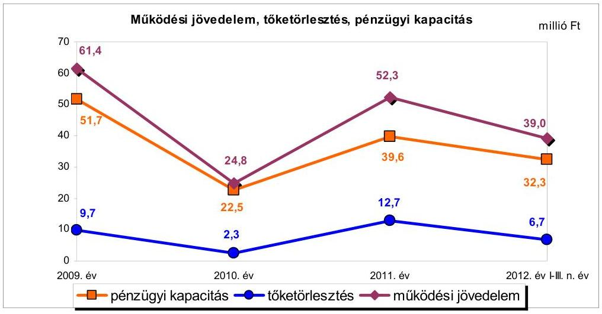
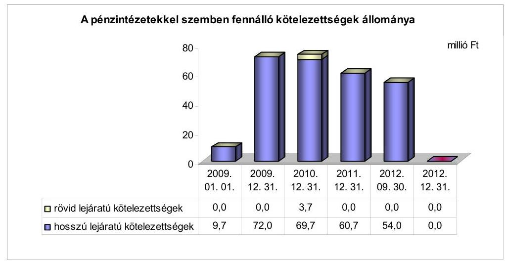
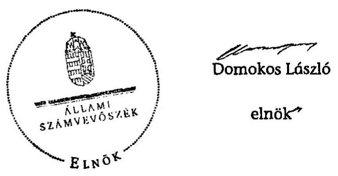
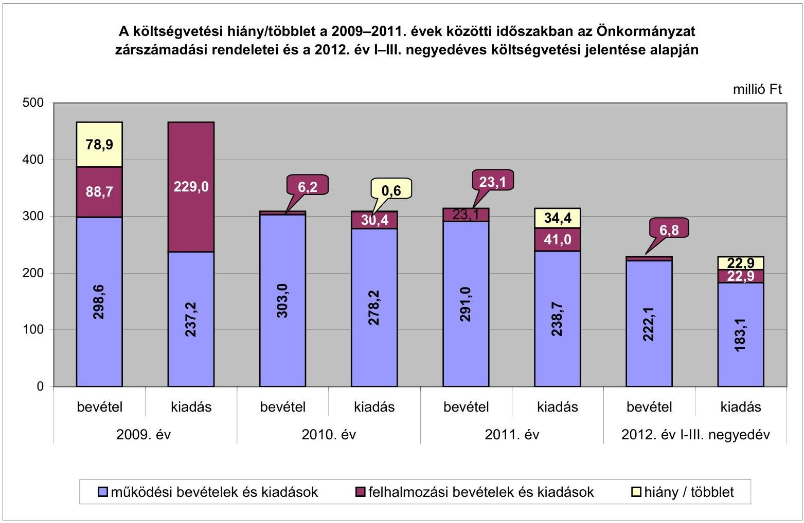
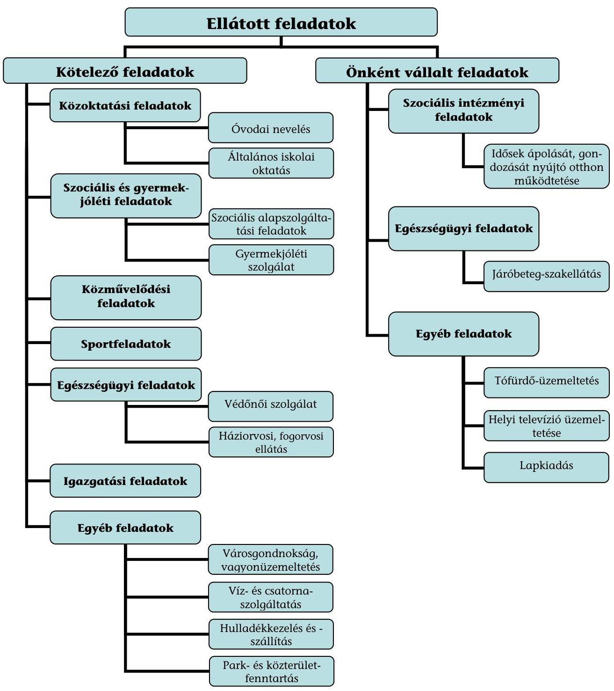

# ÁLLAMI   SZÁMVEVŐSZÉK 

## JELENTÉS

Bodajk Város Önkormányzata pénzügyi gazdálkodási helyzetének, szabályosságának ellenőrzéséről

---

# Állami Számvevőszék 

Iktatószám: V-0030-339-018/2013.
Témaszám: 1069
Vizsgálat-azonosító szám: V059214

## Az ellenőrzést felügyelte:

## Renkó Zsuzsanna

felügyeleti vezető

## Az ellenőrzést vezette:

## Dér Lívia

ellenőrzésvezető

## Az ellenőrzést végezték:

| Domonkosné Kurilla | Dancsóné Kuron | Jenei Zoltánné |
| :-- | :-- | :-- |
| Edit | Ildikó | számvevő |
| számvevő tanácsos | számvevő tanácsos |  |

Jelentéseink az Országgyűlés számítógépes hálózatán és az Interneten a www.asz.hu címen is olvashatóak.

---

# TARTALOMJEGYZÉK 

BEVEZETÉS ..... 3
I. ÖSSZEGZŐ MEGÁLLAPÍTÁSOK, KÖVETKEZTETÉSEK, JAVASLATOK ..... 6
II. RÉSZLETES MEGÁLLAPÍTÁSOK ..... 11

1. Az Önkormányzat kötelező és önként vállalt feladatai, a feladatellátás szervezeti keretei ..... 11
2. A pénzügyi egyensúly fenntartását veszélyeztető pénzügyi kockázatok és az ezek csökkentése érdekében tett intézkedések ..... 13
3. A pénzügyi gazdálkodási folyamatok szabályosságát, megfelelőségét biztosító belső kontrollok ..... 21

---

# MELLÉKLETEK 

1. számú A költségvetési hiány/többlet a 2009-2011. évek közötti időszakban az Önkormányzat zárszámadási rendeletei és a 2012. év I-III. negyedéves költségvetési jelentése alapján
2. számú Az Önkormányzat bevételei és kiadásai, valamint adósságszolgálata a 2009. év és a 2012. év III. negyedéve között (a CLF módszer szerint)

3/a. számú Az Önkormányzat által a 2009. év és a 2012. év III. negyedéve között megvalósított (műszakilag befejezett) fejlesztések forrásösszetétele
3/b. számú Az Önkormányzat 2012. szeptember 30-án folyamatban lévő fejlesztési feladataihoz kapcsolódó kötelezettségeinek összegzése
3/c. számú Az Önkormányzat által beadott, elbírálás alatti pályázatok forrásaiból megvalósuló fejlesztésekhez kapcsolódó kötelezettségvállalások összegzése
4. számú Az önkormányzati feladatok ellátásában résztvevő gazdasági társaságok egyes kiemelt adatai
5. számú Az Önkormányzat 2012. szeptember 30-án fennálló, hosszú lejáratú adósságot keletkeztető kötelezettségvállalása
6. számú Az Önkormányzat kötelezettségeinek és egyes kötelezettségvállalásainak 2011. december 31-ei és 2012. szeptember 30-ai tényleges, 2012. december 31-ei várható állománya és a 2013. évben, valamint az azt követő években várható kötelezettségek miatti kiadások

## FÜGGELÉKEK

1. számú Rövidítések jegyzéke
2. számú Fogalomtár
3. számú Az Önkormányzat által ellátott feladatok 2012. szeptember 30-án

---

# JELENTÉS 

## Bodajk Város Önkormányzata pénzügyi gazdálkodási helyzetének, szabályosságának ellenőrzéséről

## BEVEZETÉS

Az államháztartás helyi szintjén, az önkormányzati alrendszerben az utóbbi években megjelenő gazdálkodási nehézségek, a pénzforgalmi hiány növekedése, az eladósodás az ÁSZ figyelmét a helyi önkormányzatok pénzügyi helyzetére irányította.

Az ÁSZ a 2013. első félévi ellenőrzési tervben foglaltaknak megfelelően az önkormányzatok pénzügyi gazdálkodási helyzetének, szabályosságának ellenőrzésével az önkormányzatok 2011. évben megkezdett helyzetelemzését folytatta. Az ellenőrzés keretében értékeljük az önkormányzatok adósságkezelési és likviditási helyzetét. Bemutatjuk a pénzügyi egyensúly alakulására hatással lévő folyamatokat, feltárjuk az ezekre ható kockázatokat. Értékeljük a pénzügyi egyensúlyi helyzetet befolyásoló döntésmegalapozó, dön-tés-előkészítő eljárások szabályosságát, minősítjük az ezekkel összefüggő belső kontrollok kialakítását, múködését.

Az ellenőrzés - eredményének várható hatásaként - megállapításaival segítséget nyújthat a pénzügyi helyzet értékeléséhez, a pénzügyi egyensúly helyreállítása, javítása és fenntartása érdekében szükségessé váló önkormányzati intézkedések megtételéhez.

Az ellenőrzés típusa: szabályszerűségi ellenőrzés.

## Az ellenőrzés célja annak értékelése volt, hogy

- az ellenőrzött időszakban a kötelező és önként vállalt feladatok ellátását biztosító szervezeti formák változása milyen hatást gyakorolt az Önkormányzat pénzügyi helyzetének alakulására;
- az Önkormányzat pénzügyi - ezen belül múködési és felhalmozási - egyensúlya milyen irányban változott, a változást milyen okok idézték elő, továbbá milyen intézkedéseket tettek a pénzügyi egyensúly biztosítása, illetve javítása érdekében, az intézkedések hatására javult-e az Önkormányzat pénzügyi helyzete;
- a költségvetési kiadások finanszírozása érdekében vállalt, pénzintézetekkel szembeni kötelezettségek hogyan alakultak, a kötelezettségek fennállása miként befolyásolja az Önkormányzat jövőbeli pénzügyi egyensúlyi helyzetét;

---

- az Önkormányzat beazonosította, felmérte, értékelte-e a pénzügyi egyensúlyt befolyásoló pénzügyi kockázatokat, a finanszírozási célú pénzügyi műveletekkel kapcsolatban írtak-e elő kockázatértékelési kötelezettséget;
- az Önkormányzat által kialakított belső kontrollok biztosítják-e a pénzügyi gazdálkodás folyamatainak szabályosságát és eredményességét.

Utóellenőrzés nem történt, mivel az ÁSZ a 2009. év és a 2012. év III. negyedéve között ellenőrzést nem végzett az Önkormányzatnál.

Az ellenőrzés a 2009. január 1-jétől 2012. szeptember 30-áig terjedő időszakot ölelte fel. A pénzintézetekkel szembeni kötelezettségek állományára vonatkozóan az ellenőrzés kezdő időpontjaként a 2012. szeptember 30-án fennálló kötelezettségek keletkezésének időpontját vettük figyelembe. A jövőbeni kötelezettségek megállapításakor az adósságkonszolidáció hatását is értékeltük.

Az ellenőrzés szakmai módszertana az ÁSZ Ellenőrzési Elvek és Standardokban foglalt szakmai szabályokon alapult, amely a Legfőbb Ellenőrző Intézmények Nemzetközi Szervezete (INTOSAI) által kiadott nemzetközi standardok (ISSAI) figyelembevételével készült.

Az ellenőrzés során használt rövidítéseket az 1. számú, az egyes fogalmak magyarázatát a 2. számú függelék tartalmazza.

Az ellenőrzés jogszabályi alapját az ÁSZ tv. 1. § (3) bekezdésének, 5. § (2)-(6) bekezdéseinek, valamint az államháztartásról szóló 2011. évi CXCV. törvény 61. § (2) bekezdésének előírásai képezik.

Az Országgyűlés 2012 végén a helyi önkormányzatok adósságállományának részleges konszolidációjáról döntött. Az 5000 fő lakosságszámot meg nem haladó települési önkormányzatok számára nyújtott, törlesztési célú támogatással ${ }^{1}$ lehetővé tették a 2012. december 12-én fennálló adósságállományuk és annak 2012. december 28 -áig számított járulékai teljes megfizetését. Az 5000 fő lakosságszám feletti települések esetében a 2013. évben az állam differenciált az adóerő-képességet figyelembe vevő, 40-70\%-ig terjedő - mértékben vállalja át ${ }^{2}$ az önkormányzatok 2012. december 31-i, az átvállalás időpontjában fennálló adósságállományát és annak járulékait. Az adósságkonszolidációs intézkedéssel egyidejűleg a Kormány elrendelte ${ }^{3}$ az önkormányzatok adósságállománya újratermelődésének megakadályozása céljából a hitelengedélyezési és a likvid hitelekre vonatkozó szabályozás szigorítását.

[^0]
[^0]:    ${ }^{1}$ Magyarország 2012. évi központi költségvetéséről szóló 2011. évi CLXXXVIII. törvény 76/C. §-a (beiktatta a 2012. évi CLXXXVII. törvény 8. §-a, hatályos 2012. XII. 6-tól)
    ${ }^{2}$ Magyarország 2013. évi központi költségvetéséről szóló 2012. évi CCIV. törvény 7276. §-ai
    ${ }^{3}$ 1540/2012. (XII. 4.) Korm. határozat a helyi önkormányzatok adósságállományának részleges konszolidációjáról

---

Bodajk Város Önkormányzata, lakónépességére tekintettel, a 2012. évben részesült törlesztési célú támogatásban. Az ÁSZ jelen ellenőrzése során tett megállapításai az adósságkonszolidációt követően is időszerűek és helytállóak.

Bodajk település 2008-ban nyerte el a városi címet, lakosainak száma 2013. január 1-jén 4134 fő volt, ami 76 fős csökkenést jelentett a 2009. év eleji lakosságszámhoz képest. Az Önkormányzat a 2011. évben 314,2 millió Ft költségvetési bevételt ért el és 288,2 millió Ft költségvetési kiadást teljesített. 2011. december 31-én a könyvviteli mérleg szerint 1887,7 millió Ft értékű vagyonnal rendelkezett, amely a 2009. év végi állományhoz (az 1942,4 millió Ft-hoz) viszonyítva 2,8\%-kal (54,7 millió Ft-tal) csökkent. Az eszközérték 2009-2011. közötti csökkenésében a tárgyi eszközök értékének csökkenése volt meghatározó, a 2009. évi magas beruházási szint mellett a következő évekre tervezett fejlesztések elmaradásának eredményeként. 2009-ben a legjelentősebb fejlesztés a városi sportcentrum létesítése volt, amelyhez igénybe vett beruházási hitel 72,0 millió Ft-tal növelte a pénzintézetekkel szembeni, hosszú lejáratú kötelezettségek állományát. Az Önkormányzat az ellenőrzött időszakban ÖNHIKI támogatásban nem részesült.

Az ÁSZ tv. 29. § (1) bekezdése szerint a jelentéstervezetet megküldtük a polgármester részére, aki az ÁSZ tv. 29. § (2) bekezdésében foglalt észrevételezési jogával nem élt, a jelentéstervezetre észrevételt nem tett.

---

# I. ÖSSZEGZŐ MEGÁLLAPÍTÁSOK, KÖVETKEZTETÉSEK, JAVASLATOK 

Bodajk Város Önkormányzatának pénzügyi egyensúlyi helyzete a kiegyensúlyozott - tartósan pozitív - múködési jövedelemtermelő képessége eredményeként rövid és középtávon biztosított volt. Az állam az Önkormányzat 2012. december 12-én fennálló adósságállománya és annak 2012. december 28-án fennálló járulékai együttes összegére - összesen 66,8 millió Ft - törlesztési célú támogatást nyújtott. Az egyszeri, vissza nem térítendő költségvetési támogatás eredményeként az Önkormányzat pénzügyi egyensúlya még stabilabbá vált, azonban a pénzügyi egyensúly hosszú távú fenntartásához a jövedelemtermelő képesség megőrzése szükséges.

Az Önkormányzat költségvetésének elemzését a CLF módszerrel számított mutatók alapján végeztük. Pénzügyi kapacitásának a 2009. év és a 2012. év III. negyedéve közötti változását a következő ábra mutatja be:

Az Önkormányzat a 2009. év és a 2012. év III. negyedéve között összesen 1239,5 millió Ft költségvetési bevételt ért el, és 1260,5 millió Ft költségvetési kiadást teljesített. Múködési költségvetésének egyensúlya az ellenőrzött időszakban biztosított volt, a - jövedelemtermelő képessége alapján - képződött bevételek a feladatok ellátásához szükséges kiadásokat fedezték, összesen 177,5 millió Ft többlet keletkezett. A múködési jövedelem változását főként a folyó kiadások alakulása határozta meg. A folyó kiadások 2009-2010. közötti növekedése az egyszeri jellegű (személyi változásokkal, szabadságmegváltással, valamint az állományba nem tartozók juttatásaival összefüggő személyi juttatások és járulék) kiadások, a vásárolt közszolgáltatási kiadások és a Kistérségi Társulásnak teljesített támogatásértékű kiadások, valamint a szociálpolitikai juttatások emelkedése miatt következett be. A pozitív múködési jövedelem a 2009. év és a 2012. év III. negyedéve között fedezetet nyújtott a tőketörlesztésekre, a nettó múködési jövedelem az ellenőrzött időszak minden évében pozitív volt. A 2009-2010. években azonban a pénzügyi kapacitás nem volt ele-

---

gendő a felhalmozási forráshiány finanszírozására. Az Önkormányzat ÖNHIKI támogatásban nem részesült.

A felhalmozási költségvetés egyensúlya az ellenőrzött időszakban nem állt fenn. A felhalmozási költségvetés egyenlege negatív volt, de javuló tendenciát mutatott. A felhalmozási forráshiány a 2009. évi 140,3 millió Ft-ról 2010-ben 24,2 millió Ft-ra, 2011-ben 17,9 millió Ft-ra, a 2012. év I-III. negyedévére 16,1 millió Ft-ra mérséklődött, összesen 198,5 millió Ft volt. A forráshiány finanszírozásához az ellenőrzött időszakban 146,1 millió Ft nettó működési jövedelem állt rendelkezésre. A 2009. évi kiugróan magas negatív egyenleget főként a Sportcentrum létesítésének beruházási kiadásai, önkormányzati épületek állagmegóvási kiadásai, valamint a városi úthálózat burkolat-felújítási munkálataira fordított kiadások okozták. A felhalmozási forráshiányt 72,0 millió Ft hosszú lejáratú fejlesztési hitelből, az előző évek pénzmaradványából és az év során képződött nettó működési jövedelemből finanszírozták.

Az ellenőrzött időszakban a kötelező és önként vállalt feladatok ellátását biztosító szervezeti formák változása - a városgondnoksági feladatok gazdasági társaságnak történt átadása, az építésügyi hatósági feladatellátás megszüntetése - az Önkormányzat adatszolgáltatása szerint 2,2 millió Ft megtakarítást eredményezett, amely nem gyakorolt jelentős hatást a pénzügyi egyensúlyi helyzet alakulására. A bevételnövelő és kiadáscsökkentő intézkedések (eszközhasznosítás, a feladatátadáshoz kapcsolódó kiadási megtakarítás, az építésügyi társulás megszüntetése, a költségtérítések, a civil szervezetek támogatása, a helyettesítési és megbízási díjak, üzemeltetési kiadások csökkentése) - az Önkormányzat adatszolgáltatása szerint - összesen 18,7 millió Ft-tal javították a pénzügyi egyensúlyi helyzetet. A pénzintézetekkel szembeni kötelezettségek állománya a 2009. január 1-jei 9,7 millió Ftról a 2012. év III. negyedév végére 54,0 millió Ft-ra nőtt, 2012. december 31ére, az állam által nyújtott, törlesztési célú támogatás eredményeként, megszűnt. Az Önkormányzat a 2009. évben 72,0 millió Ft hosszú lejáratú beruházási hitelt vett igénybe. Az ellenőrzött időszakban működésének egyensúlyát pozitív működési jövedelméből biztosította, azonban likviditásának fenntartását 2010-ben és 2011-ben folyószámlahitel - csökkenő mértékű - igénybevételével tudta biztosítani. Az Önkormányzatnak a 2012. év III. negyedév végén 1,2 millió Ft kölcsöntartozásból, 1,5 millió Ft telekvásárlásból fennálló hosszú lejáratú kötelezettsége állt fenn. Az Önkormányzat szállítói tartozást utolsó alkalommal a 2009. évi könyvviteli mérlegében mutatott ki, az ellenőrzött időszak végén a 2,8 millió Ft helyi adóbevétel visszatérítési kötelezettségen túl egyéb rövid lejáratú kötelezettséggel nem rendelkezett.

Az Önkormányzat a 2012. év I-III. negyedéve során a Kormány engedélyezési jogkörébe tartozó, új, fejlesztési célú adósságot keletkeztető kötelezettségvállalásra vonatkozó ügyletet nem kezdeményezett. Az Önkormányzat hosszú távú pénzügyi egyensúlyi helyzetének fenntartását az ellenőrzött időszakban felvett fejlesztési hitel 2012. évet követő években esedékes törlesztő részletei nem veszélyeztették. A gördülő tervezés keretében megtervezték az egyes éveket terhelő törlesztő részletek kiadásait, és éves bontásban bemutatták a fedezetül szolgáló forrásokat. A forrásként megjelölt saját bevételekből - az adósságszolgálat teljesítésére - tartalékot képeztek.

---

Az Önkormányzatnál nem azonosították be, nem mérték fel és nem értékelték a pénzügyi egyensúlyt befolyásoló kockázatokat, azonban az ellenőrzött időszakban a pénzügyi egyensúlyra kiható kockázat nem állt fenn. A finanszírozási célú pénzügyi műveletekkel kapcsolatban nem írtak elő kockázatértékelési kötelezettséget.

Összességében az állam által nyújtott, törlesztési célú támogatás pénzügyi egyensúlyi helyzetre gyakorolt, kedvező hatása mellett, továbbra is elsődleges fontosságú az Önkormányzat múködési költségvetése egyensúlyának fenntartása. A megvalósított beruházások hozzájárultak a feladatellátás színvonalának javításához, de nem teremtettek bevétel növelési lehetőséget.

Az Önkormányzatnál a pénzügyi gazdálkodási folyamatok szabályosságát, megfelelőségét, kockázatainak kezelését biztosító, belsö kontrolltevékenységek kialakítása - a 2009. évben az Ámr. ${ }_{1}$, a 2010-2011. években az Ámr. ${ }_{2}$, a 2012. év I-III. negyedévben a Bkr. előírásai ellenére - részben volt megfelelő, mert nem írták elő a feladatellátási szerződések tartalmi követelményeinek meghatározásával kapcsolatos kontrolltevékenységeket. Nem határozták meg továbbá a pénzintézeti kötelezettségvállalásokkal kapcsolatos döntések kockázatai döntés-előkészítés szakaszában történő feltárásának, valamint a pénzintézeti szolgáltatások igénybevételének pályáztatási, vagy több ajánlatkérési kötelezettségét. Az ellenőrzött időszak belső ellenőrzési terveinek készítését megelőzően - a 2009. évben az Ámr. ${ }_{1}$-ben, a 2010-2011. években az Ámr. ${ }_{2}$ ben, a 2009-2011. években a Ber.-ben, 2012. január 1-jétől a Bkr.-ben foglaltak ellenére - nem írták elő a pénzügyi egyensúlyi helyzetet befolyásoló döntések kockázati tényezőinek feltárását és a feltárt kockázati tényezők belső ellenőrzés keretében történő ellenőrzését.

Az Önkormányzatnál a pénzügyi gazdálkodási folyamatok szabályosságát, megfelelőségét, kockázatainak kezelését biztosító, belső kontrollok múködése jó volt annak ellenére, hogy az Önkormányzatnál a döntés-előkészítési folyamatban nem tárták fel a fejlesztések előkészítésének, lebonyolításának és múködtetésének, valamint a pénzintézeti kötelezettségvállalások kockázatait. A belső ellenőrzés keretében nem tárták fel és nem ellenőrizték az Önkormányzat pénzügyi egyensúlyi helyzetét befolyásoló döntések kockázati tényezőit. A megállapított hiányosságok ellenére a kialakított belső kontrollok biztosították a pénzügyi-gazdálkodási folyamatok szabályosságát, eredményességét.

Az Önkormányzat az SZMSZ ${ }_{1-2}$-ben nem sorolta az önként vállalt feladatok közé az Ötv. előírásai alapján nem kötelező feladatnak minősülő, a szociális feladatokból az idősek ápolását, gondozását nyújtó otthon múködtetését, valamint az egészségügyi feladatokból a járóbeteg-szakellátást. Az önként vállalt feladatok ellátása - az Önkormányzat pénzügyi egyensúlya szempontjából nem jelentett kockázatot, mely minősítés a téves besorolás miatt sem módosul, mert az ellenőrzött időszakban az ezen feladatokra fordított kiadások aránya ezzel együtt sem volt jelentős.

Az ÁSZ tv. 33. § (1) bekezdésében foglaltak értelmében az ellenőrzött szervezet vezetője köteles a jelentésben foglalt megállapításokhoz kapcsolódó intézkedési tervet összeállítani, és azt a jelentés kézhezvételétől számított harminc napon belül az ÁSZ részére megküldeni. Amennyiben az intézkedési tervet határidőre

---

nem küldi meg a szervezet vezetője, vagy az továbbra sem elfogadható, az ÁSZ elnöke a hivatkozott törvény 33. § (3) bekezdés a)-b) pontjaiban foglaltakat érvényesítheti.

# Az ellenőrzés intézkedést igénylő megállapításai és javaslatai: 

## a polgármesternek

1. Az ellenőrzött időszakban képződött folyó bevételek fedezetet nyújtottak a feladatellátás folyó kiadásaira. Az Önkormányzat ÖNHIKI támogatásban nem részesült. A 2009. év és a 2012. év III. negyedéve közötti 177,5 millió Ft működési jövedelem a tőketörlesztésen túl a felhalmozási költségvetésben képződött 198,5 millió Ft hiányból 146,1 millió Ft finanszírozását tette lehetővé. Az Önkormányzat az ellenőrzött időszak végén 54,0 millió Ft pénzintézettel szembeni, 1,2 millió Ft kölcsöntartozásból fennálló, valamint 4,3 millió Ft egyéb kötelezettséggel rendelkezett. Szállítói tartozásállományt utoljára a 2009. évi mérlegében mutatott ki. Az adósságkonszolidációt követően, a 2012. év végén az Önkormányzat pénzintézettel szemben fennálló kötelezettséggel nem rendelkezett, az egyéb kötelezettségek jövőbeni teljesíthetősége - a működési jövedelemtermelő képesség megőrzése esetén - rövid és középtávon biztosított.

Javaslat:
A működési jövedelemtermelő képesség és a feladatellátás összhangja, valamint az Önkormányzat pénzügyi egyensúlyának hosszú távú fenntarthatósága érdekében - a 2012. évi kormányzati adósságkonszolidációt, valamint a 2013. évtől változó feladatellátási kötelezettséget, feladatfinanszírozási rendszert figyelembe véve - felelősök és határidők megjelölésével kezdeményezzen intézkedéseket, melyek keretében:
a) a költségvetés végrehajtásáról készített féléves beszámoló, valamint a zárszámadási rendelettervezet előterjesztése során tájékoztassa a Képviselő-testületet az Önkormányzat pénzügyi egyensúlyi helyzetének alakulásáról;
b) a pénzügyi egyensúlyi helyzet kedvezőtlen változása esetén terjessze a Képviselőtestület elé az egyensúly hosszú távú megőrzését, az adósságállomány újratermelődésének elkerülését biztosító intézkedések bevezetéséhez szükséges - a helyi önkormányzatok és szerveik, a köztársasági megbízottak, valamint egyes centrális alárendeltségű szervek feladat- és hatásköreiről szóló 1991. évi XX. törvény 140. § (1) bekezdés a) pontja alapján a jegyző által elkészített - döntési javaslatát.

## a jegyzőnek

1. Az Önkormányzatnál a pénzügyi gazdálkodási folyamatok szabályossága, megfelelősége vonatkozásában a kockázatok kezelését biztosító belső kontrolltevékenységek kialakítása - a 2009. évben az Ámr. 145/E. § (1)-(2) bekezdéseiben, a 2010-2011. években az Ámr. 158. § (1)-(2) bekezdéseiben, a 2012. év I-III. negyedévben a Bkr. 8. § (1)-(2) bekezdéseiben foglalt előírások ellenére - részben volt megfelelő, mert nem írták elő a feladatellátási szerződések tartalmi követelményeinek meghatározá-

---

sával, valamint a pénzintézeti szolgáltatások igénybevételének pályáztatási kötelezettségével kapcsolatos kontrolltevékenységeket. Nem írták elő a pénzintézeti kötelezettségvállalásokkal kapcsolatos döntések kockázatai döntés előkészítés során történő feltárásának kötelezettségét.

Javaslat:
Alakítsa ki a Bkr. 8. § (1)-(2) bekezdései alapján azokat a belső kontrolltevékenységeket, amelyek biztosítják a pénzügyi-gazdálkodási folyamatok szabályosságát, a pénzügyi egyensúlyi helyzet alakulását befolyásoló döntések kockázatainak kezelését. Ennek keretében:
a) határozza meg a feladatellátási szerződések minimum tartalmi követelményeinek meghatározására vonatkozó helyi szabályokat;
b) határozza meg a pénzintézeti szolgáltatások igénybevételének pályáztatási kötelezettségével kapcsolatos kontrolltevékenységeket;
c) írja elő a pénzintézeti kötelezettségvállalások kockázatainak döntés-előkészítő szakaszban történő feltárását.
2. Az ellenőrzött időszakban a belső ellenőrzési tervek készítését megelőzően - a 2009. évben az Ámr. 145/C. § (2) bekezdésében, a 2010-2011. években az Ámr. 157. § (2) bekezdésében, a 2009-2011. években a Ber. 18. §-ában, a 21. § (2) bekezdésében, a (3) bekezdés a) pontjában, 2012. január 1-jétől a Bkr. 7. § (2) bekezdésében, a 29. § (1) bekezdésében, a 31. § (2)-(4) bekezdéseiben foglalt előírások ellenére - nem írták elő a pénzügyi egyensúlyi helyzetet befolyásoló döntések kockázati tényezőinek feltárását, ezért a belső ellenőrzési tervek nem tartalmazták az ellenőrzési tervet megalapozó kockázatelemzéseket, ezáltal az Önkormányzatnál nem ellenőrizték ezeket a kockázati tényezőket.

Javaslat:
Intézkedjen a belső ellenőrzés vezetője felé, hogy a Bkr. 7. § (2) bekezdésében foglaltak szerint mérjék fel a gazdálkodásban rejlő kockázatokat, a 29. § (1) bekezdésében, a 31. § (2)-(4) bekezdéseiben foglalt előírások szerint az éves belső ellenőrzési tervek tartalmazzák a pénzügyi egyensúlyi helyzetet befolyásoló döntésekkel kapcsolatos, feltárt kockázati tényezők ellenőrzését, valamint biztosítsa az ellenőrzési tervek végrehajtását.

---

# II. RÉSZLETES MEGÁLLAPÍTÁSOK 

## 1. Az ÖNKORMÁNYZAT KÖTELEZŐ ÉS ÖNKÉNT VÁLlALT FELADATAI, A FELADATELLÁTÁS SZERVEZETI KERETEI

Az Önkormányzat a kötelező és az önként vállalt feladatait az Ötv. és a kapcsolódó ágazati törvények alapján az SZMSZ ${ }_{1,2}$-ben határozta meg.

Az Önkormányzat besorolása alapján a kötelező feladatok 2009. január 1jén az óvodai nevelés és az általános iskolai oktatás, egyes szociális alapszolgáltatási feladatok (a házi segítségnyújtás, a támogató szolgálat, a szociális étkeztetés) és szociális intézményi feladatok (a nappali ellátás, az idősek ápolását, gondozását nyújtó otthon múködtetése), a gyermekjóléti szolgálat, a közművelődési, a sport, az egészségügyi alapellátási, a járóbeteg-szakellátási, az igazgatási és egyéb feladatok voltak. Az ellenőrzött időszakban ellátott, egyéb feladatok közül az addig, részben a Polgármesteri Hivatal által végzett városgondnoksági ${ }^{4}$ feladatokkal 2012-ben az Önkormányzat kizárólagos tulajdonában lévő gazdasági társaságot bízták meg, valamint az igazgatási feladatok közül az építésügyi hatósági feladatok ellátását 2011-től megszüntették. Önként vállalt feladat a Tófürdő és a helyi televízió üzemeltetése, a helyi lapkiadás, valamint a - 2012-ben megszüntetett - sípálya és sífelvonó üzemeltetése voltak. A feladatellátás részletezését a 3. számú függelék tartalmazza.

Az Önkormányzat az SZMSZ ${ }_{1-2}$-ben nem sorolta az önként vállalt feladatok közé az - Ötv. 8. § (4) bekezdésében foglalt előírás ${ }^{5}$ alapján nem kötelező feladatként ellátott - idősek ápolását, gondozását nyújtó otthon múködtetését, valamint a járóbeteg-szakellátást. Ezen feladatokat megállapodások alapján a Kistérségi Társulás, illetve alapítvány végezte, melyekből az Önkormányzatnak a járóbeteg-szakellátás jelentett - az ellenőrzött időszakban összesen 6,9 millió Ft - kiadást.

Az idősek ápolását, gondozását nyújtó otthon működtetését a Kistérségi Társulás állami támogatásból finanszírozta, így az kiadást nem jelentett az Önkormányzatnak. A Bodajki Egészségügy Fejlesztéséért Közalapítvány által ellátott járóbeteg-szakellátás önkormányzati tulajdonú ingatlanban múködött, melynek karbantartási, takarítási és közüzemi kiadásait az Önkormányzat fedezte.

[^0]
[^0]:    ${ }^{4}$ A 2012 áprilisától hatályos megállapodás szerint a városgondnoksági feladatok a közterületek hulladékmentesítését, takarítását, síkosság-mentesítését, a közárkok, közparkok karbantartását, a Sportcentrum felügyeletét, karbantartását, az önkormányzati intézmények területén felmerülő, kisebb, különös szakértelmet nem igénylő karbantartási munkák elvégzését foglalták magukban.
    ${ }^{5}$ Hatálytalan 2013.január 1-jétől, a 2013. január 1-jétől hatályos jogszabályi előírás: a Magyarország helyi önkormányzatairól szóló 2011. évi CLXXXIX. törvény 13. § (1) bekezdés 4. és 8 . pontja

---

A kötelező és az önként vállalt feladatokra fordított kiadások arányának, mértékének és azok változásának a pénzügyi egyensúlyi helyzetre gyakorolt hatását az Önkormányzat nem értékelte.

Az Önkormányzatnál 2009-ben az összes múködési célú költségvetési kiadás 95,4\%-át (226,3 millió Ft-ot), 2010-ben 94,8\%-át (263,6 millió Ft-ot), 2011-ben 97,3\%-át (232,2 millió Ft-ot) a kötelező feladatokra fordított kiadások tették ki. Az önként vállalt feladatokra - az Önkormányzat adatszolgáltatása alapján a múködési kiadásoknak 2009-ben a 4,6\%-át (10,9 millió Ft-ot), 2010-ben az 5,2\%-át (14,6 millió Ft-ot), 2011-ben a 2,7\%-át (6,5 millió Ft-ot) használták fel. Az ellenőrzés által megállapított téves besorolást is figyelembe véve az önként vállalt feladatokra a múködési kiadásoknak 2009-ben az 5,5\%-át (13,1 millió Ft-ot), 2010-ben a 6,3\%-át (17,5 millió Ft-ot), 2011-ben a 3,2\%-át ( 7,6 millió Ft-ot) használták fel. Az ellenőrzött időszakban az önként vállalt feladatokkal összefüggő felújításokra, beruházásokra 8,6 millió Ft-ot, a felhalmozási kiadások 3,1\%-át fordították. Az önként vállalt feladatok ellátása azok kiadásainak múködési és felhalmozási kiadásokon belüli alacsony arányára tekintettel - az Önkormányzat pénzügyi egyensúlyának szempontjából nem jelentett kockázatot.

Az Önkormányzat a kötelező és önként vállalt feladatainak ellátásához az ellenőrzött időszakban nem rendelkezett saját fenntartású intézménnyel. A kötelező feladatai közül az önállóan múködő és gazdálkodó Polgármesteri Hivatal végezte az igazgatási, a közmúvelődési, a sportpálya-üzemeltetési feladatokat, a védőnői szolgálatot, valamint egyéb városgazdálkodási és üzemeltetési feladatokat, hét telephelyen. Az óvodai nevelést és az általános iskolai oktatást, valamint - a szociális alapszolgáltatási feladatok közül - a házi segítségnyújtást, a támogató szolgálatot, az intézményi nappali ellátást, továbbá a gyermekjóléti szolgálatot a Kistérségi Társulás látta el. A szociális alapszolgáltatások közül az étkeztetést, valamint az egészségügyi alapellátási feladatokat gazdasági társaságok, a járóbeteg-szakellátást alapítvány végezte.

A gazdasági társaságok által ellátott feladatok körében - a városgondnoksági feladatok átvételén kívül - változás nem volt. Gazdasági társaság biztosította továbbá a víz- és csatornaszolgáltatást, a hulladékkezelést és -szállítást, a vagyonüzemeltetési szolgáltatást, a park- és közterület-fenntartást, a helyi televízió üzemeltetését és a lapkiadást.

Az Önkormányzat 2009-ben öt, a 2012. év III. negyedévében négy gazdasági társaságban rendelkezett tulajdoni részesedéssel. Egy gazdasági társaságban lévő részesedését 2011-ben értékesítette. Kizárólagos tulajdonában egy - 1997-ben létrehozott -, kötelező feladatot ellátó gazdasági társaság volt. További három gazdasági társaságban a tulajdoni hányada nem érte el az 1,0\%-ot. A kötelező és önként vállalt feladatok ellátásában 2012. szeptember 30-án - szerződések alapján - további hat gazdasági társaság vett részt, amelyekben az Önkormányzat tulajdonrésszel nem rendelkezett.

Az ellenőrzött időszakban a kötelező és önként vállalt feladatok ellátását biztosító szervezeti formák - önkormányzati adatszolgáltatás szerint 2,2 millió Ft megtakarítást eredményező - változása nem gyakorolt jelentős hatást az Önkormányzat pénzügyi egyensúlyi helyzetének alakulására.

---

# 2. A PÉNZÜGYI EGYENSÚLY FENNTARTÁSÁT VESZÉLYEZTETŐ PÉNZÜGYI KOCKÁZATOK ÉS AZ EZEK CSÖKKENTÉSE ÉRDEKÉBEN TETT INTÉZKEDÉSEK 

Az Önkormányzat költségvetésének elemzését CLF módszerrel hajtottuk végre. A CLF módszer szerinti, a 2009. év és a 2012. év III. negyedéve közötti időszak részletes adatait a 2. számú melléklet, a főbb önkormányzati adatokat a következő tábla mutatja be:

|  |  |  |  | millió Ft |
| :-- | --: | --: | --: | --: |
| Megnevezés | 2009. év | 2010. év | 2011. év | 2012. év |
| Folyó bevételek | 298,6 | 303,0 | 291,0 | 222,1 |
| Folyó kiadások | 237,2 | 278,2 | 238,7 | 183,1 |
| Múködési jövedelem | $\mathbf{6 1 , 4}$ | $\mathbf{2 4 , 8}$ | $\mathbf{5 2 , 3}$ | $\mathbf{3 9 , 0}$ |
| Felhalmozási bevételek | 88,7 | 6,2 | 23,1 | 6,8 |
| Felhalmozási kiadások | 229,0 | 30,4 | 41,0 | 22,9 |
| Felhalmozási költségvetés egyenlege | $\mathbf{- 1 4 0 , 3}$ | $\mathbf{- 2 4 , 2}$ | $\mathbf{- 1 7 , 9}$ | $\mathbf{- 1 6 , 1}$ |
| Folyó és felhalmozási bevételek összesen | 387,3 | 309,2 | 314,1 | 228,9 |
| Folyó és felhalmozási kiadások összesen | 466,2 | 308,6 | 279,7 | 206,0 |
| Finanszírozási múveletek nélküli pozíció | $\mathbf{- 7 8 , 9}$ | $\mathbf{0 , 6}$ | $\mathbf{3 4 , 4}$ | $\mathbf{2 2 , 9}$ |
| Finanszírozási műveletek egyenlege | 63,8 | $-14,8$ | $-8,4$ | $-9,9$ |
| Tárgyévi pénzügyi pozíció | $\mathbf{- 1 5 , 1}$ | $\mathbf{- 1 4 , 2}$ | $\mathbf{2 6 , 0}$ | $\mathbf{1 3 , 0}$ |
| Hiteltörlesztés, értékpapír beváltás | 9,7 | 2,3 | 12,7 | 6,7 |
| Nettó múködési jövedelem | $\mathbf{5 1 , 7}$ | $\mathbf{2 2 , 5}$ | $\mathbf{3 9 , 6}$ | $\mathbf{3 2 , 3}$ |

Az Önkormányzat a 2009. év és a 2012. év III. negyedéve között összesen 1239,5 millió Ft költségvetési bevételt ért el, és 1260,5 millió Ft költségvetési kiadást teljesített. Az Önkormányzat folyó költségvetési egyenlege, múködési jövedelme az ellenőrzött időszakban pozitív volt, összességében 177,5 millió Ft múködési forrástöbblet keletkezett. A múködési jövedelem alakulását főként a folyó kiadások változása határozta meg. A múködési jövedelem 2009. és 2010. között 36,6 millió Ft-tal (59,6\%-kal) mérséklődött, elsősorban az egyszeri jellegű személyi juttatások és azok járulékainak - a személyi változásokkal összefüggő szabadságmegváltás miatti és az állományba nem tartozók juttatásai - emelkedése, illetve a vásárolt közszolgáltatásokra fordított kiadások növekedése következtében. További kiadásemelkedést okozott 2010ben a Kistérségi Társulásnak teljesített támogatásértékủ kiadások, valamint a magánszemélyek részére folyósított szociálpolitikai juttatások előző évihez viszonyított növekedése. A múködési jövedelem 2010-ről 2011-re 27,5 millió Fttal, több mint kétszeresére nőtt a folyó kiadások csökkenése következtében. A folyó kiadások 2010-ről 2011-re történő csökkenését döntően a dologi kiadások, azon belül a szolgáltatások és a vásárolt közszolgáltatások, valamint a kapcsolódó áfa kiadás mérséklődése, továbbá a személyi juttatások előző évi, egyszeri jellegű kiadásainak megszűnése okozta.

Az Önkormányzat nettó múködési jövedelme 2009-ről 2010-re 29,2 millió Ft-tal (56,5\%-kal) csökkent, 2010-ről 2011-re 17,1 millió Ft-tal (76,0\%-kal) növekedett, és minden évben pozitív volt. A nettó múködési jövedelem alaku-

---

lásában a múködési jövedelem változása volt a meghatározó, a 2,312,7 millió Ft közötti összegű hiteltörlesztési kiadások azt jelentősen nem befolyásolták. Az Önkormányzat pénzügyi helyzete az ellenőrzött időszakban kiegyensúlyozott volt.

A felhalmozási költségvetés egyenlege az ellenőrzött időszak minden évében negatív volt, de javuló tendenciát mutatott. Ezen időszakban összesen 198,5 millió Ft felhalmozási forráshiány keletkezett, melyre - a 2009-2010. évek kivételével - fedezetet nyújtott az adott évek nettó múködési jövedelme. A forráshiány finanszírozásához az ellenőrzött időszakban összesen 146,1 millió Ft nettó múködési jövedelem állt rendelkezésre. A felhalmozási költségvetés 2009. évi kiugróan magas ( 140,3 millió Ft) negatív egyenlegét főként a Sportcentrum létesítésének 126,2 millió Ft összegű beruházási kiadásai, az önkormányzati épületek állagmegóvási kiadásai ( 29,8 millió Ft), valamint a városi úthálózat burkolat-felújítási munkálataira fordított ( 16,1 millió Ft) kiadások okozták. A felhalmozási forráshiányt 72,0 millió Ft hosszú lejáratú fejlesztési hitelből, az előző évek pénzmaradványából és az év során képződött nettó múködési jövedelemből finanszírozták.

Az Önkormányzat évenkénti teljes finanszírozási igénye ${ }^{6}$ a CLF módszer szerint 2009-ben 88,6 millió Ft, 2010-ben 1,7 millió Ft volt; 2011-ben 21,7 millió Ft, a 2012. év I-III. negyedévben 16,2 millió Ft pénzügyi többlet keletkezett. A költségvetési hiány/többlet alakulását az Önkormányzat 20092011. évi zárszámadási rendeletei, valamint a 2012. év I-III. negyedéves költségvetési jelentése alapján az 1. számú melléklet tartalmazza.

A folyó bevételek a 2009. évi 298,6 millió Ft-ról, a 2010. évre 4,4 millió Ft-tal (1,5\%-kal) nőttek, a 2011. évre 12,0 millió Ft-tal (4,0\%-kal) csökkentek az előző évihez képest, a 2012. év I-III. negyedévben pedig 222,1 millió Ft-ban teljesültek. A folyó bevételek 2010. évi növekedését főként a költségvetési támogatás (egyes szociális feladatok támogatása) és az szja bevétel együttes, 16,5 millió Ft-os növekedése okozta, az egyéb (saját múködési) bevételek csökkenése mellett. A 2011. évi csökkenés ugyanezen bevételek - összesen 22,1 millió Ft-os -, döntően a normatív kötött felhasználású támogatások és a központosított előirányzatok csökkenésének következménye. Az Önkormányzat az ellenőrzött időszakban ÖNHIKI támogatásban nem részesült. Vis maior támogatásként - árvízi védekezésre - 2010-ben 0,3 millió Ft-ot kaptak.

Az Önkormányzatnál a helyi adók, pótlékok részaránya a folyó bevételeken belül 2009-ben 13,1\% (39,0 millió Ft), 2010-ben 12,0\% (36,5 millió Ft), 2011ben $15,3 \%$ ( 44,4 millió Ft) volt. A 2012. év I-III. negyedévben 43,2 millió Ft adóbevételt realizáltak. A helyi adóbevétel nem jelentett bevételi kitettség miatti kockázatot, mivel három adónemből és nagyszámú adóalanytól származott.

Az Önkormányzat az iparúzési adó esetében 2009. január 1-jén már a maximális, 2\%-os adómértéket alkalmazta. A magánszemélyek kommunális adójának éves mértéke - az ellenőrzött időszakban - $8000 \mathrm{Ft} /$ adótárgy volt, amely elmaradt

[^0]
[^0]:    ${ }^{6}$ a nettó múködési jövedelemnek és a felhalmozási költségvetés egyenlegének együttes, negatív eredménye

---

a törvényi maximumtól. Az idegenforgalmi adó esetében 2009. január 1-jétől az adó mértékét személyenként és vendégéjszakánként 300 Ft-ban határozták meg, amelyet - a település idegenforgalmi vonzásának növelése érdekében - 2012. május 1-jétől 200 Ft-ra mérsékeltek.

Az egyéb saját bevételek ellenőrzött időszakbeli együttes összege 94,8 millió Ft volt, folyó bevételeken belüli részaránya jelentősen nem változott, a 2009-2011. években átlagosan 9,2\%-ot (27,3 millió Ft) képviselt. A 2012. év I-III. negyedévben 13,0 millió Ft egyéb saját bevételt értek el. A 2009. évben jelentős tétel ( 15,0 millió Ft) volt az egyszeri jellegű - a református egyháztól az ellenőrzött időszakot megelőzően átadott iskolaépületért kapott - kártalanítási összeg.

A felhalmozási bevételek a 2009. évi 88,7 millió Ft-ról 2010-re 6,2 millió Ftra csökkentek, 2011-re 23,1 millió Ft-ra nőttek, a 2012. év I-III. negyedévben 6,8 millió Ft-ra teljesültek. A felhalmozási bevételek a 2009-2011. közötti időszakban a költségvetési bevételek 11,7\%-át (118,0 millió Ft) tették ki, melyben a - döntően eszköz és részesedés értékesítésből származó - saját tőkebevételek mindössze 18,7 millió Ft-ot ( $15,8 \%$-ot) jelentettek. A legmagasabb, 2009. évi felhalmozási bevételek közel felét a Kistérségi Társulástól - feladatelmaradás miatt - visszautalt 42,5 millió Ft képezte, továbbá - szintén egyszeri jelleggel 29,3 millió Ft költségvetési és egyéb támogatásban, valamint pályázatok útján az útfelújításokra, településfejlesztésre 8,2 millió Ft kamatmentes kölcsönben részesültek. Az Önkormányzatnak tulajdonosi részesedései után osztalék bevétele nem volt.

A folyó kiadások a 2009. év és a 2012. év III. negyedéve között a költségvetési kiadásoknak átlagosan a 74,4\%-át ( 937,2 millió Ft) jelentették. A folyó kiadások a 2009. évi 237,2 millió Ft-ról a 2010. évre 41,0 millió Ft-tal (17,3\%-kal) nőttek, és 2010-ről 2011-re 39,5 millió Ft-tal (14,2\%-kal) csökkenve, a 2009. évi szintet közelítették meg. A folyó kiadások 2009-ről 2010-re történő emelkedését főként az egyszeri jellegű - a személyi változások miatti szabadságmegváltással és az állományba nem tartozók juttatásaival összefüggő - személyi juttatások és azok járulékai, a vásárolt közszolgáltatások, továbbá a Kistérségi Társulásnak teljesített támogatásértékű kiadások és a szociálpolitikai juttatások növekedése okozta. A folyó kiadásokban a 2010. évről a 2011. évre bekövetkezett csökkenést döntően az - előző évben jelentkezett - egyszeri jellegű kiadások megszűnése határozta meg, melyhez hozzájárult a kiadáscsökkentő intézkedések hatása (az egyéb üzemeltetési, fenntartási kiadások mérséklődése és azok áfa-vonzata).

A folyó kiadásokon belül a személyi juttatások és a munkaadót terhelő járulékok 2009-ről 2010-re 12,0 millió Ft-tal nőttek, főként a munkavégzéshez kapcsolódó juttatások (szabadságmegváltás) és az állományba nem tartozók juttatásai növekedésének következtében, a személyi változásokhoz kapcsolódóan. Ezen kiadások a 2011. évre 14,5\%-kal (13,7 millió Ft-tal) csökkentek az előző évi, egyszeri jellegű kifizetések megszűnése miatt. A pénzeszközátadások évenkénti összegének (a 2009. évben 46,9 millió Ft, a 2010. évben 62,4 millió Ft, a 2011. évben 71,7 millió Ft) növekedését az oktatási és nevelési intézmény múködésének, a Kistérségi Társulás múködtetésének, valamint a szociálpolitikai juttatások növekvő finanszírozási igénye okozta. A dologi kiadások a

---

2009. évi 78,7 millió Ft-ról a 2010. évben 10,5\%-kal (8,3 millió Ft-tal) nőttek, a 2011. évben 36,3\%-kal (31,6 millió Ft-tal) csökkentek az előző évihez viszonyítva. A 2011. évi csökkenés legnagyobb részben a vásárolt közszolgáltatásokhoz és az egyéb üzemeltetési, fenntartási szolgáltatások kiadásaihoz kapcsolódó takarékos gazdálkodásból adódó megtakarításból keletkezett. Az önkormányzati feladatellátásban résztvevő gazdasági társaságok részére nem adtak át múködési célú pénzeszközt.

A folyó és felhalmozási kiadások együttes összegén belül a felhalmozási kiadások aránya 2009-ben 49,1\% (229,0 millió Ft), 2010-ben 9,9\% (30,4 millió Ft), 2011-ben 14,7\% (41,0 millió Ft), a 2012. év I-III. negyedévben pedig $11,1 \%$ (22,9 millió Ft) volt. A felhalmozási kiadások 2009. évi magas aránya a megvalósult fejlesztések - főként a Sportcentrum 126,2 millió Ft-os beruházási kiadásai - következtében alakult ki. Beruházásokra és felújításokra 2009-ben 197,3 millió Ft-ot, 2010-ben 23,6 millió Ft-ot, 2011-ben 30,7 millió Ftot, a 2012. év I-III. negyedévben pedig 15,7 millió Ft-ot fordítottak.

Az Önkormányzat az ellenőrzött időszakban teljesített, 323,3 millió Ft felhalmozási kiadásból a müszakilag befejezett fejlesztési feladatokra 247,8 millió Ft-ot fordított. A 2012. szeptember 30-ig műszakilag befejezett fejlesztések teljes ${ }^{7}$ bekerülési költségének ( 260,0 millió Ft) forrását 155,0 millió Ft (59,6\%) önkormányzati saját bevétel, 72,0 millió Ft (27,7\%) hitel, valamint 33,0 millió Ft (12,7\%) egyéb központi támogatás képezte. A 2012. szeptember 30-án folyamatban levő felújítások és beruházások teljesített kiadása 13,5 millió Ft, melynek forrása önkormányzati saját bevétel volt. A folyamatban levő fejlesztések kötelezettségvállalásai 2012. szeptember 30-a utáni kiadásainak összege 8,4 millió Ft, amelynek tervezett forrása 2,4 millió Ft (28,6\%) saját bevétel és 6,0 millió Ft ( $71,4 \%$ ) egyéb központi támogatás.

Az Önkormányzat a beadott, elbírálás alatti pályázatok forrásaiból két, összesen 99,4 millió Ft bekerülési költségű projektet tervezett megvalósítani. A 94,5 millió Ft bekerülési költségű, 75,0 millió Ft (79,4\%) EU-s támogatással tervezett „A bodajki múvelődési és közösségi ház épületének komplex felújítása és rekonstrukciója" című pályázat elutasításáról (az ellenőrzött időszakot) 2012. szeptember 30-át követően kaptak értesítést. A 4,9 millió Ft bekerülési költségű felújítás tervezett forrása egyéb központi támogatás. A 2009. év és a 2012. év III. negyedéve között megvalósult, valamint a folyamatban lévő és a beadott, elbírálás alatti pályázatok forrásaiból megvalósuló fejlesztési feladatokat és azok forrásösszetételét a 3/a., a 3/b. és a 3/c. számú mellékletek mutatják be.

Az ellenőrzött időszakban a fejlesztések finanszírozásához finanszírozási terv nem készült, azonban a Képviselő-testület határozatban vállalt kötelezettséget a saját források biztosítására. Az Önkormányzat egy létesítményi fejlesztést (Sportcentrum) valósított meg, melynek várható múködési kiadásait és megtakarításait nem számszerűsítették, továbbá a jövőbeni üzemeltetés kockázatát nem mérték fel. Az Önkormányzat által megvalósított fejlesztések működése

[^0]
[^0]:    ${ }^{7}$ A teljes bekerülési költség magában foglalja a fejlesztési feladatokra az ellenőrzött időszakot megelőzően teljesített kiadásokat is.

---

forrást nem teremtett, a beruházások, felújítások célja a közfeladatok magasabb szintű ellátása volt.

Az Önkormányzat pénzintézetekkel szembeni kötelezettségeinek állománya a 2009. január 1-jei 9,7 millió Ft-ról a 2011. év végére 60,7 millió Ft-ra növekedett, a 2012. év III. negyedév végén 54,0 millió Ft volt, amely 2012. december 31-ére - a törlesztési célú támogatás eredményeként - megszűnt.

Az Önkormányzat pénzintézetekkel szemben 2009-2012. években fennálló kötelezettségeit a következő ábra mutatja be:

A pénzintézetekkel szembeni kötelezettségek 2009. január 1-jei állománya ( 9,7 millió Ft) a 2006-2007-ben igénybevett fejlesztési hitelek áthúzódó tőketörlesztési kötelezettségét tartalmazta, amelyet az ütemezésnek megfelelően, az év során kiegyenlítettek. Ezen kötelezettségek 2009. év végi, 72,0 millió Ft-os állománya egy, a tárgyévben felvett, hosszú lejáratú beruházási hitelből származott. A 2010. év végére - a tárgyévben igénybevett folyószámlahitel 3,7 millió Ft-os záró állománya és a fejlesztési hitel 2,3 millió Ft-os tőketörlesztésének együttes hatására - 73,4 millió Ft-ra nőtt, majd a folyószámlahitel viszszafizetése és a fejlesztési hitel törlesztése miatt a 2011. év végére 60,7 millió Ftra, 2012. szeptember 30-ára 54,0 millió Ft-ra csökkent. A pénzintézetekkel szembeni kötelezettségállomány az esedékes törlesztő részlet megfizetése ( 2,3 millió Ft) és az állam által nyújtott, 66,8 millió Ft törlesztési célú támogatás eredményeként 2012. december 31-ére megszűnt.

Az Önkormányzat a 2008. évben - a Képviselő-testület döntése alapján - a „Sikeres Magyarországért Önkormányzati Fejlesztési Hitelprogram" keretében sportlétesítmény létrehozására 72,0 millió Ft értékben hosszú lejáratú fejlesztési hitelkeretszerződést kötött. A változó kamatozású, forintalapú fejlesztési hitel futamideje tíz év, lejárata 2018. december 5-e volt. A hitelt a 2009. évben teljes összegben igénybe vették, és a szerződésben meghatározott céloknak megfelelően, a Sportcentrum létesítésére használták fel.

A pénzintézeti kötelezettségvállalásokról a Képviselő-testület döntött. Az adósságot keletkeztető kötelezettségvállalás felső határát nem lépték túl. A hitelt nyújtó pénzintézetet közbeszerzési eljárás lefolytatásával választották ki.

---

A hosszú lejáratú pénzintézeti kötelezettségből eredően az Önkormányzat tulajdonában lévő ingatlanokra jelzálogot, elidegenítési vagy terhelési tilalmat nem jegyeztek be. A hitelszerződésekben a hitelek fedezetéül az önkormányzati saját bevételt jelölték meg. A törlesztések határidőre megtörténtek, így fedezetbevonásra nem került sor. A Képviselő-testület a hosszú lejáratú, adósságot keletkeztető kötelezettségvállalásból adódó fizetési kötelezettségekről, a hitelek futamidejének egyes éveire kimutatott tőke- és kamatfizetési kötelezettségekről tájékoztatást kapott.

Az Önkormányzat a 2009. év és a 2012. év III. negyedéve között a hosszú lejáratú, fejlesztési hiteleinek tőketörlesztésére 27,7 millió Ft-ot, azok kamataira 7,6 millió Ft-ot fordított. (A 2012. év IV. negyedévi tőketörlesztés 2,3 millió Ft, a teljesített kamat 0,4 millió Ft volt.) A törlesztési célú támogatásból a hosszú lejáratú hitel és kamata visszafizetésére 52,1 millió Ft-ot fordítottak.

A 2012. szeptember 30-án fennálló, hosszú lejáratú adósságot keletkeztető kötelezettségvállalást az 5. számú melléklet tartalmazza.

A pénzintézeti kötelezettségek állományának változását a 2009-2012. évi költségvetési és a 2009-2011. évi zárszámadási rendeletekben, valamint az éves költségvetési beszámolókban bemutatták, azonban nem értékelték a változások okait.

Az Önkormányzat számlavezető pénzintézete az ellenőrzött időszakban nem változott.

Az Önkormányzatnak a 2012. év III. negyedév végén egy telekvásárlásra, a tárgyévben kötött szerződés alapján 1,5 millió Ft kötelezettsége állt fenn, mely ellenértékének megfizetése a 2013-2015. években esedékes.

Az Önkormányzat a kizárólagos tulajdonában lévő gazdasági társasága (BAK Kft.) részére - CHF-alapú hitel egyösszegű visszafizetéséhez - 2009-ben 16,0 millió Ft kölcsönt nyújtott, amelyet az határidő előtt, 2012-ben visszafizetett. A Bodajkért Közalapítvány részére, egy játszótér-beruházás kiadásainak előfinanszírozására, 2012 júliusában 3,7 millió Ft kölcsönt folyósítottak. A kölcsönszerződésben a folyósítás ütemezését a beruházási számlák fizetési határidejéhez kötötték, visszafizetésének véghatáridejét 2015. január 31-ében határozták meg.

Az Önkormányzat hosszú távú pénzügyi egyensúlyi helyzetének fenntartását a 2012. évet követő években esedékes adósságterhek törlesztő részletei nem veszélyeztették, mert gördülő tervezés keretében megtervezték az egyes éveket terhelő törlesztő részletek kiadásait, és éves bontásban bemutatták a fedezetül szolgáló forrásokat. A forrásként megjelölt saját bevételekből - az adósságszolgálat teljesítésére - tartalékot képeztek. Az ellenőrzött évek jövedelemtermelő képessége alapján a törlesztés fedezetére a 2012. év utáni időszakban képződő működési jövedelem várhatóan biztosított volna fedezetet.

Az Önkormányzat a Kormány engedélyezési jogkörébe tartozó új, fejlesztési célú kötelezettségvállalásra vonatkozó ügyletet nem kezdeményezett, és kötvényt nem bocsátott ki.

---

Az Önkormányzat a kiegyensúlyozott múködését folyószámlahitel átmeneti igénybevételével, kockázat nélkül tudta biztosítani az ellenőrzött időszakban. A folyószámlahitel igénybevételét a következő tábla mutatja be:

| Megnevezés | 2009. év | 2010. év | 2011. év | 2012. év   I-III.   negyedév |
| :-- | --: | --: | --: | --: |
| Keretösszeg január 1-jén (millió Ft-ban) | 0,0 | 15,0 | 15,0 | 15,0 |
| Átlagos, napi állomány (millió Ft-ban) | 0,0 | 4,1 | 0,3 | 0,0 |
| Hitellel zárt napok száma (nap) | 0 | 133 | 35 | 0 |
| Egyenleg állomány az időszak végén (millió Ft-ban) | - | 3,7 | - | - |
| Teljesített kamat és egyéb költség (millió Ft-ban) | 0,0 | 0,7 | 0,2 | 0,0 |

Az Önkormányzat rendelkezésére álló folyószámlahitel keretösszege - 2010 júniusától - 15,0 millió Ft volt. A folyószámlahitel átlagos, napi állománya a 2010. évi 4,1 millió Ft-ról a 2011. évre 0,3 millió Ft-ra ( $92,7 \%$-kal), a hitel-igénybevételi napok száma közel a negyedére csökkent, az átmeneti likvidítási nehézségek megszűnésének eredményeként. Az igénybevett folyószámlahitel kamataira 0,6 millió Ft-ot, az egyéb kiadásokra 0,3 millió Ft-ot fordítottak. A törlesztési célú támogatásból - a 2012. év IV. negyedévben igénybevett - folyószámlahitel és kamatai visszafizetésére 14,7 millió Ft-ot fordítottak.

A 2009. év végi, szállítókkal szembeni kötelezettségek az összes kötelezettség 6,6\%-át ( 7,7 millió Ft-ot) tették ki. A 2010. és a 2011. évek, valamint a 2012. év III. negyedév végén nem volt kiegyenlítetlen szállítói kötelezettsége az Önkormányzatnak, ami likviditásának a kiegyensúlyozottságát jelzi. A szállítói állomány alakulását figyelemmel kísérték, és a kötelezettségek teljesítéséről gondoskodtak.

A bevétel-visszafizetési kötelezettség záró állománya a 2009-2011. években átlagosan 3,3 millió Ft, 2012. szeptember 30-án 2,8 millió Ft volt, ami helyi adó visszatérítési kötelezettségből származott, és - nagyságrendje alapján nem befolyásolta az Önkormányzat pénzügyi egyensúlyi helyzetét.

Az Önkormányzat - pályázatok keretében kapott, kamatmentes kölcsönökböl keletkezett - hosszú lejáratú kötelezettségeinek állománya a 2009. évi 7,0 millió Ft-ról a 2012. év III. negyedév végére 1,2 millió Ft-ra ( $82,9 \%$-kal) csökkent a törlesztések következtében. A kölcsönök felhasználása (útfelújítás, településfejlesztés) és visszafizetése a megállapodásban rögzített feltételek és ütemezés szerint történt.

A kölcsönöket a Pénzügyi Keret Közgyűlése - amelyet a Fejér Megyei Közgyűlés elnöke képviselt - bocsátotta az Önkormányzat rendelkezésére. A 7,0 millió Ft-os kölcsönt 2010. június 30-a és 2012. június 30-a között kellett visszafizetni, az 1,2 millió Ft-os kölcsön visszafizetése 2012. október 31-e és 2014. október 31-e között esedékes.

A 2009-2011. évek között fennállt, 25,5 millió Ft peres eljárásból származó kötelezettséget - jogerős bírósági végzés alapján - 2012-ben kivezették a kötelezettségek közül.

---

Az Önkormányzatnak a 2009. év és 2012. szeptember 30. között lízingkötelezettsége nem keletkezett, garancia- és kezességvállalása, PPP konstrukció keretében végzett beruházása nem volt. Követelést két esetben, összesen 0,9 millió Ft összegben engedtek el az ellenőrzött időszakban, ami az Önkormányzat pénzügyi egyensúlyi helyzete szempontjából nem meghatározó.

A törlesztési célú támogatás ( 66,8 millió Ft) folyósítását követően az Önkormányzatnak - 0,8 millió Ft kölcsöntartozáson és 1,5 millió Ft, telekvásárlás miatti kötelezettségen kívül, egyéb - hosszú lejáratú kötelezettsége nem állt fenn, szállítói állománya 2010-től nem volt. Az állam által nyújtott, vissza nem térítendő költségvetési támogatás pénzügyi egyensúlyt erősítő hatása mellett, az Önkormányzat pénzügyi egyensúlyának hosszú távú fenntartásához szükséges a jövedelemtermelő képességének megőrzése. Az Önkormányzat kötelezettségeinek és egyes kötelezettségvállalásainak 2011. december 31-ei és 2012. szeptember 30-ai tényleges, 2012. december 31-ei várható állományát és a 2013. évben, valamint az azt követő években várható kötelezettségek miatti kiadásokat a 6. számú melléklet mutatja be.

Az Önkormányzat kizárólagos tulajdonában lévő BAK Kft. fennálló kötelezettségei - annak tartósan nyereséges gazdálkodása miatt - nem jelentettek kockázatot. A gazdasági társaság részére az Önkormányzat a városüzemeltetési és -gondnoksági feladatok ellátásáért szerződés alapján számlázott szolgáltatási díjként 2009-ben 3,3 millió Ft-ot, 2010-ben 1,7 millió Ft-ot, a 2012. év I-III. negyedévben 5,0 millió Ft-ot fizetett ki, ezen kívül a feladatellátásához pénzeszközt nem adott át. Az önkormányzati feladatellátásban résztvevő gazdasági társaságok egyes kiemelt adatait a 4. számú melléklet tartalmazza.

Az Önkormányzatnál nem azonosították be, nem mérték fel és nem értékelték a pénzügyi egyensúlyt befolyásoló kockázatokat, azonban az ellenőrzött időszakban a pénzügyi egyensúlyra kiható kockázat nem állt fenn. A finanszírozási célú pénzügyi műveletekkel kapcsolatban nem írtak elő kockázatértékelési kötelezettséget.

Az Önkormányzat adatszolgáltatása alapján az ellenőrzött időszakban megvalósított bevételnövelő intézkedések 1,1 millió Ft-tal, a kiadáscsökkentő intézkedések 17,6 millió Ft-tal - csekély mértékben - javították a pénzügyi egyensúlyi helyzetet.

Bevételi többletet eszközhasznosításból értek el. A kiadáscsökkentő intézkedésekből 2,2 millió Ft feladatátadáshoz, 3,7 millió Ft a helyettesítési díj, 1,0 millió Ft a költségtérítés, 0,6 millió Ft a civil szervezetek támogatásának csökkentéséhez kapcsolódott. Az ügyvédi megbízási szerződés felmondása további 3,0 millió Ft, az építésügyi társulás megszüntetése 2,6 millió Ft, a Bodajk TV üzemeltetésére kiírt pályázat alapján kötött megállapodás 4,5 millió Ft megtakarítást eredményezett.

A kiadáscsökkenésből 13,3 millió Ft volt a tartós jellegű megtakarítás. Az ellenőrzött időszakban 20 álláshelyen (ennek száma nem változott) a foglalkoztatottak létszáma a 2009. január 1-jei 20 főről 2012. szeptember 30-ára 3 fővel csökkent.

---

Az ellenőrzött időszakban nem készítettek felmérést az elszámolt értékcsökkenés és az eszközpótlásra fordított kiadások arányának alakulásáról. Az elszámolt értékcsökkenési leírás összegéhez igazodóan nem különítettek el az eszközök pótlására, felújítására szolgáló pénzeszközöket. A 2009-2011. években a befektetett eszközök után összesen 132,8 millió Ft értékcsökkenést számoltak el.

Az ellenőrzött időszakban fejlesztési feladatokra 267,3 millió Ft-ot használtak fel, amelyből az eszközpótlásra fordított összeg - az Önkormányzat adatszolgáltatása szerint $-122,1$ millió Ft volt.

Az Önkormányzat eszközeinek használhatósági foka a 2009. évi 85,8\%-ról 2010-ben 83,5\%-ra, 2011-ben 81,3\%-ra csökkent.

# 3. A PÉNZÜGYI GAZDÁLKODÁSI FOLYAMATOK SZABÁLYOSSÁGÁT, MEGFELELŐSÉGÉT BIZTOSÍTÓ BELSŐ KONTROLLOK 

Az Önkormányzatnál a pénzügyi gazdálkodási folyamatok szabályosságát, megfelelőségét, kockázatainak kezelését biztosító, belső kontrolltevékenységek kialakítása - a 2009. évben az Ámr. ${ }_{1}$ 145/E. § (1)-(2) bekezdéseiben, a 20102011. években az Ámr. ${ }_{2}$ 158. § (1)-(2) bekezdéseiben, a 2012. év I-III. negyedévben a Bkr. 8. § (1)-(2) bekezdéseiben foglalt előírások ellenére - összességében részben volt megfelelő.

A pénzügyi gazdálkodási folyamatok szabályosságát, megfelelőségét biztosító kontrolltevékenységek körében a pénzügyi egyensúlyi helyzet alakulását befolyásoló kontrolltevékenységeket kialakították, mivel a költségve-tés- és zárszámadás-készítés folyamatát meghatározták. Rendelkeztek kockázatkezelési szabályzattal, ellenőrzési nyomvonallal és a szabálytalanságok kezelésének eljárásrendjével. A kockázatkezelési szabályzatban előírták a fejlesztések esetében az előkészítés, a lebonyolítás és a működtetés kockázatai feltárásának és kezelésének, valamint a beruházások pályáztatásának kötelezettségét. Meghatározták a fejlesztésekhez kapcsolódó külső források, támogatások figyelési rendszerét, a pályázatkészítés feltételeit és szervezeti kereteit. Előírták az Önkormányzat által nyújtott működési és felhalmozási célú pénzeszközátadások feltételrendszerét.

A pénzügyi gazdálkodási folyamatok szabályosságát, megfelelőségét biztosító kontrolltevékenységek körében a feladatellátás szabályosságát és a pénzügyi gazdasági döntések megalapozását szolgáló döntés-előkészítő, valamint a pénzintézeti kötelezettségvállalások szabályosságát, megfelelőségét, a kockázatok kezelését biztosító belső kontrolltevékenységek kialakítása - a 2009. évben az Ámr. ${ }_{1}$ 145/E. § (1)-(2) bekezdéseiben, a 2010-2011. években az Ámr. ${ }_{2}$ 158. § (1)-(2) bekezdéseiben, a 2012. év I-III. negyedévben a Bkr. 8. § (1)(2) bekezdéseiben foglalt előírások ellenére - részben volt megfelelő, mert nem írták elő a feladatellátási szerződések tartalmi követelményeinek meghatározásával kapcsolatos kontrolltevékenységeket. Nem határozták meg továbbá a pénzintézeti kötelezettségvállalásokkal kapcsolatos döntések kockázatai döntés-előkészítés szakaszában történő feltárásának, valamint a pénzintézeti szolgáltatások igénybevételének pályáztatási, vagy több ajánlatkérési kötelezettségét. A feladatellátás szabályosságát biztosító kontrollok keretében előírták az önkormányzati feladatellátáshoz kapcsolódó támogatási rendszer feltételeit,

---

a feladatellátási szerződések keretében történő feladatellátás teljesítéséről történő beszámolási kötelezettséget. A pénzügyi gazdasági döntések megalapozását szolgáló döntés-előkészítő, valamint a pénzintézeti kötelezettségvállalások szabályosságát, megfelelőségét, a kockázatok kezelését biztosító kontrollok kialakítása során előírták a hitelfelvételről szóló döntés-előkészítés folyamatában a futamidő egyes éveit terhelő kötelezettség költségvetési egyensúlyra gyakorolt hatása vizsgálatának kötelezettségét. Továbbá meghatározták, hogy az Önkormányzat minősített többségi befolyása alatt álló gazdasági társaság beszámolási kötelezettségét pénzügyi helyzete alakulásáról.

Az ellenőrzött időszak belső ellenőrzési terveinek készítését megelőzően - a 2009. évben az Ámr. ${ }_{1} 145 /$ C. § (2) bekezdésében, a 2010-2011. években az Ámr. ${ }_{2}$ 157. § (2) bekezdésében, a 2009-2011. években a Ber. 18. §-ában, a 21. § (2) bekezdésében és a (3) bekezdés a) pontjában, 2012. január 1-jétől a Bkr. 7. § (2) bekezdésében, a 29. § (1) bekezdésében, a 31. § (2)-(4) bekezdéseiben foglaltak ellenére - nem írták elő a pénzügyi egyensúlyi helyzetet befolyásoló döntések kockázati tényezőinek feltárását és a feltárt kockázati tényezők belső ellenőrzés keretében történő ellenőrzését.

Az Önkormányzatnál a feladatellátás szabályosságát, a pénzügyi egyensúlyi helyzet alakulását és a pénzügyi gazdasági döntések megalapozását szolgáló belső kontrollok múködése jó volt annak ellenére, hogy az Önkormányzatnál a döntés-előkészítési folyamatban nem tárták fel a fejlesztések előkészítése, lebonyolítása és múködtetése kockázatait, valamint a pénzintézeti kötelezettségvállalások kockázatait. A belső ellenőrzés keretében nem tárták fel és nem ellenőrizték az Önkormányzat pénzügyi egyensúlyi helyzetét befolyásoló döntések kockázati tényezőit. A megállapított hiányosságok ellenére a kialakított belső kontrollok biztosították a pénzügyi-gazdálkodási folyamatok szabályosságát, eredményességét.

Budapest, 2013. Of hó 12 nap

Melléklet: 8 db
Függelék: 3 db

---

# A költségvetési hiány/többlet a 2009–2011. évek közötti időszakban az Önkormányzat zárszámadási rendeletei és a 2012. év I–III. negyedéves költségvetési jelentése alapján

|  I. év | II. név | III. negyedév  |
| --- | --- | --- |
|  2009. év | 78.9 | 229.0  |
|  2010. év | 89.7 | 239.0  |
|  2011. év | 96.2 | 241.4  |
|  2012. év I-III. negyedév | 91.4 | 243.2  |
|  2013. év I-III. negyedév | 91.4 | 243.2  |
|  2014. év I-III. negyedév | 91.4 | 243.2  |
|  2015. év I-III. negyedév | 91.4 | 243.2  |
|  2016. év I-III. negyedév | 91.4 | 243.2  |
|  2017. év I-III. negyedév | 91.4 | 243.2  |
|  2018. év I-III. negyedév | 91.4 | 243.2  |

Millió Ft

---

Az Önkormányzat bevételei és kiadásai, valamint adósságszolgálata a 2009. év és a 2012. év III. negyedéve között (a CLF módszer szerint) vívító Ft

|  1. FOLYÓ KÖLTSÉGVETÉS* | 2009. év | 2010. év | 2011. év | 2012. év I-III. negyedév  |
| --- | --- | --- | --- | --- |
|  1.1.1. Saját müködési bevételek | 63,6 | 46,9 | 53,1 | 49,2  |
|  1.1.2. Költségvetési támogatások ÖNHIKI támogatások nélkül** | 52,9 | 63,0 | 51,5 | 35,8  |
|  1.1.3. Alengedett bevételek | 169,5 | 177,6 | 171,1 | 128,4  |
|  1.1.4. Államháztartáson belülről kapott támogatások | 11,2 | 11,4 | 14,2 | 7,9  |
|  1.1.5. EU-tól és külföldi díj kapott bevételek | 0,0 | 0,0 | 0,0 | 0,0  |
|  1.1.6. Államháztartáson kívülről kapott bevételek | 1,0 | 3,9 | 0,9 | 0,4  |
|  1.1.7. Hozom- és kamatbevételek** | 0,0 | 0,0 | 0,1 | 0,0  |
|  1.1.8. Kölcsönök visszatérülése, igénybevétele | 0,2 | 0,2 | 0,1 | 0,1  |
|  1.1.9. Előző évi pénzmaradvány átvétel | 0,0 | 0,0 | 0,0 | 0,0  |
|  1.1.10. ÖNHIKI támogatások | 0,0 | 0,0 | 0,0 | 0,0  |
|  1.1. Folyó bevételek $=1.1 .1 .+1.1 .2 .+1.1 .3 .+1.1 .4 .+1.1 .5 .+1.1 .6 .+1.1 .7 .+1.1 .8 .+1.1 .9 .+1.1 .10$. | 288,6 | 303,0 | 291,0 | 222,1  |
|  1.2.1. Müködési kiadások kamatkiadások nélkül | 167,0 | 166,3 | 142,2 | 104,3  |
|  1.2.2. Államháztartáson belülre átadott pénzeszközök | 46,9 | 62,4 | 71,7 | 55,9  |
|  1.2.3.1. vállalkozásoknak | 0,0 | 0,0 | 0,2 | 0,0  |
|  1.2.3.2. EU-nak, illetve külföldre | 0,0 | 0,0 | 0,0 | 0,0  |
|  1.2.3.3. magánszemélyeknek | 19,1 | 24,3 | 21,5 | 20,4  |
|  1.2.3.4. nonprofit szervezeteknek | 4,1 | 2,5 | 2,8 | 2,4  |
|  1.2.3. Transzferkiadások ( $=1.2 .3 .1 .+1.2 .3 .2 .+1.2 .3 .3 .+1.2 .3 .4$. | 23,2 | 26,8 | 24,5 | 22,8  |
|  1.2.4. Kamatkiadások** | 0,1 | 0,7 | 0,1 | 0,0  |
|  1.2.5. Kölcsönök nyújtása, törlesztése | 0,0 | 0,0 | 0,2 | 0,1  |
|  1.2.6. Előző évi pénzmaradvány átadás | 0,0 | 0,0 | 0,0 | 0,0  |
|  1.2. Folyó kiadások $=1.2 .1 .+1.2 .2 .+1.2 .3 .+1.2 .4 .+1.2 .5 .+1.2 .6$. | 237,2 | 276,2 | 238,7 | 183,1  |
|  1.3. Folyó költségvetés egyenlege, müködési jövedelem (1.1.-1.2.) | 61,4 | 24,8 | 52,3 | 39,0  |
|  2. FELHALMOZÁSI KÖLTSÉGVETÉS*** |  |  |  |   |
|  2.1.1. Saját tökebevételek | 1,3 | 0,1 | 17,3 | 3,4  |
|  2.1.2. Költségvetési támogatások | 21,3 | 0,3 | 0,0 | 0,0  |
|  2.1.3. Államháztartáson belülről kapott támogatások | 50,2 | 0,0 | 0,0 | 0,0  |
|  2.1.4. EU-tól és külföldről kapott támogatások* | 0,0 | 0,0 | 0,0 | 0,0  |
|  2.1.5. Államháztartáson kívülről kapott bevételek | 3,5 | 0,2 | 0,6 | 0,5  |
|  2.1.6. Hozom- és kamatbevételek | 0,8 | 0,8 | 0,3 | 0,0  |
|  2.1.7. Kölcsönök visszatérülése, igénybevétele | 11,6 | 4,8 | 4,9 | 2,9  |
|  2.1.8. Előző évi pénzmaradvány átvétel | 0,0 | 0,0 | 0,0 | 0,0  |
|  2.1. Felhalmozási bevételek $=2.1 .1 .+2.1 .2 .+2.1 .3 .+2.1 .4 .+2.1 .5 .+2.1 .6 .+2.1 .7 .+2.1 .8$. | 88,7 | 6,2 | 23,1 | 8,8  |
|  2.2.1. Saját beruházási kiadás átfaval | 143,4 | 4,2 | 8,1 | 7,4  |
|  2.2.2. Saját felújítási kiadás átfaval | 53,9 | 19,4 | 22,6 | 8,3  |
|  2.2.3. Államháztartáson belülre átadott pénzeszközök | 10,2 | 0,0 | 0,0 | 0,0  |
|  2.2.4. EU-nak és külföldnek adott pénzeszközök | 0,0 | 0,0 | 0,0 | 0,0  |
|  2.2.5. Államháztartáson kívülre adott pénzeszközök | 0,0 | 0,0 | 0,0 | 0,0  |
|  2.2.6. Befektetési célú részesedések vásárlása | 2,4 | 2,5 | 2,8 | 1,5  |
|  2.2.7. Kamatkiadások | 1,1 | 2,3 | 2,5 | 1,5  |
|  2.2.8. Kölcsönök nyújtása, törlesztése | 18,0 | 2,0 | 5,0 | 3,7  |
|  2.2.9. Előző évi pénzmaradvány átadás | 0,0 | 0,0 | 0,0 | 0,0  |
|  2.2.10. AFA befizetések | 0,0 | 0,0 | 0,0 | 0,0  |
|  2.2. Felhalmozási kiadások $=2.2 .1 .+2.2 .2 .+2.2 .3 .+2.2 .4 .+2.2 .5 .+2.2 .6 .+2.2 .7 .+2.2 .8 .+2.2 .9 .+2.2 .10$. | 329,0 | 30,4 | 41,0 | 32,9  |
|  2.3. Felhalmozási költségvetés egyenlege (2.1.-2.2.) | $-140,3$ | $-24,2$ | $-17,9$ | $-16,1$  |
|  3. FINANSZÍROZÁSI MÜVELETEK NÉLKÜLI (GFS) POZÍCIÓ (1.3.+2.3.) | $-78,9$ | 0,6 | 34,4 | 22,9  |
|  4. FINANSZÍROZÁSI MÜVELETEK |  |  |  |   |
|  4.1. Hitelfelvétel | 72,0 | 3,7 | 0,0 | 0,0  |
|  4.2. Hitelförlesztés | 9,7 | 2,3 | 12,7 | 6,7  |
|  4.3. Forgatási és befektetési célú értékpapírok kibocsátása | 0,0 | 0,0 | 0,0 | 0,0  |
|  4.4. Forgatási és befektetési célú értékpapírok beváltása | 0,0 | 0,0 | 0,0 | 0,0  |
|  4.5. Forgatási és befektetési célú értékpapírok értékesítése | 0,0 | 0,0 | 0,0 | 0,0  |
|  4.6. Forgatási és befektetési célú értékpapírok vásárlása | 0,0 | 0,0 | 0,0 | 0,0  |
|  4.7. Egyéb finanszírozási bevételek (függő, átfutó, kiegyenlítő) | 0,2 | $-12,3$ | 0,0 | 0,0  |
|  4.8. Egyéb finanszírozási kiadások (függő, átfutó, kiegyenlítő) | $-1,3$ | 3,9 | $-4,3$ | 2,7  |
|  4.9. Finanszírozási műveletek egyenlege (4.1.-4.2.+4.3.-4.4.+4.5.-4.6.+4.7.-4.8.) | 63,8 | $-14,8$ | $-8,4$ | $-9,9$  |
|  5. TÁRGYÉVI PÉNZÜGYI POZÍCIÓ (1.3.+ 2.3.+4.9.) | $-15,1$ | $-14,2$ | 26,0 | 13,0  |
|  6. NETTÓ MÜKÖDÉSI JÖVEDELEM = müködési jövedelem (1.3.) - töketörlesztés (4.2.+4.4.) | 51,7 | 22,5 | 39,6 | 32,3  |
|  TÁJÉKOZTATÓ ADATOK |  |  |  |   |
|  Összes kötelezettség | 115,9 | 105,8 | 92,0 | 59,5  |
|  ebből rövid lejáratú | 41,2 | 42,6 | 39,5 | 6,4  |
|  Összes szállítói kötelezettség | 7,7 | 0,0 | 0,0 | 0,0  |
|  ebből lejárt (lanúsítványból) | 7,7 | 0,0 | 0,0 | 0,0  |
|  Pénz- és tőkepiaci kötelezettség (adósság) | 72,0 | 73,4 | 60,7 | 54,0  |
|  ebből rövid lejáratú | 2,3 | 12,7 | 9,0 | 2,3  |
|  ebből hosszú lejáratú kötelezettségek következő évet terhelő törlesztő részletel (anultőkából) | 2,3 | 9,0 | 9,0 | 2,3  |
|  PPP szerződéses állomány jelenértéken (lanúsítványból) | 0,0 | 0,0 | 0,0 | 0,0  |
|  ebből lejárt szolgáltatási díj miatti kötelezettség | 0,0 | 0,0 | 0,0 | 0,0  |
|  Folyoszámla-, lékvíz- és munkabér-megelőleggalási hitel napi átlagos állománya (lanúsítványból) | 0,0 | 4,1 | 0,3 | 0,0  |
|  Kezesség és gerenclavállalások (lanúsítványból) | 0,0 | 0,0 | 0,0 | 0,0  |
|  Jogerős bírósági feltétebből adódó kötelezettségek (lanúsítványból) | 25,5 | 25,5 | 25,5 | 0,0  |
|  Finanszírozásba bevonható eszközök: | 15,0 | 0,9 | 29,9 | 29,9  |
|  Tartós hitelviszonyt megtestesítő értékpapírok | 0,0 | 0,0 | 0,0 | 0,0  |
|  Hosszú lejáratú bankbetétek | 0,0 | 0,0 | 0,0 | 0,0  |
|  Értékpapírok | 0,0 | 0,0 | 0,0 | 0,0  |
|  Pénzeszközök (idegen nélkül) | 15,0 | 0,9 | 26,9 | 39,9  |

- A költségvetési szerveknél a számviteli szabályoknak megfelelően a bevételekben nem térül, a kiadásokban nem jelenik meg az amortizáció, a vagyoni helyzetet az egyenleg befolyásolja. ** A költségvetési támogatásból, a 2009. évben a hozam- és kamatbevételekből, a kamatkiadásokból a felhalmozási célú részt az Önkormányzat adatszolgáltatása szerinti mértékben vettük figyelembe a 2.1.2., a 2.1.6., illetve a 2.2.7. sorokon. *** Bevételekben vagyonmegőrzésre és -bővítésre fordítható források. ${ }^{1}$ Az EU-tól kapott támogatások számviteli elszámolása a jogszabályi előírásoknak megfelelően, az államháztartáson belülről kapott támogatások között történt (2.1.3. soron).

---

## **Az Önkormányzat által a 2009. év és a 2012. év III. negyedéve között megvalósított (műszakilag befejezett) fejlesztések forrásösszetétele**

|   |  |  |  |  |  |  |  |  |  |  |  |  |  |  |  |  |  |  |  |  |  |  |  |  |  |  |  |  |  |  |  |  |  |  |  |  |  |  |  |  |  |  |  |  |  |   |
| --- | --- | --- | --- | --- | --- | --- | --- | --- | --- | --- | --- | --- | --- | --- | --- | --- | --- | --- | --- | --- | --- | --- | --- | --- | --- | --- | --- | --- | --- | --- | --- | --- | --- | --- | --- | --- | --- | --- | --- | --- | --- | --- | --- | --- | --- | --- | --- | --- | --- | --- |
|   |  |  |  |  |  |  |  |  |  |  |  |  |  |  |  |  |  |  |  |  |  |  |  |  |  |  |  |  |  |  |  |  |  |  |  |  |  |  |  |  |  |  |  |  |  |  |  |   |
|   |  |  |  |  |  |  |  |  |  |  |  |  |  |  |  |  |  |  |  |  |  |  |  |  |  |  |  |  |  |  |  |  |  |  |  |  |  |  |  |  |  |  |  |  |  |  |  |   |
|   |  |  |  |  |  |  |  |  |  |  |  |  |  |  |  |  |  |  |  |  |  |  |  |  |  |  |  |  |  |  |  |  |  |  |  |  |  |  |  |  |  |  |  |  |  |  |  |   |
|   |  |  |  |  |  |  |  |  |  |  |  |  |  |  |  |  |  |  |  |  |  |  |  |  |  |  |  |  |  |  |  |  |  |  |  |  |  |  |  |  |  |  |  |  |  |  |  |   |
|   |  |  |  |  |  |  |  |  |  |  |  |  |  |  |  |  |  |  |  |  |  |  |  |  |  |  |  |  |  |  |  |  |  |  |  |  |  |  |  |  |  |  |  |  |  |  |  |   |
|   |  |  |  |  |  |  |  |  |  |  |  |  |  |  |  |  |  |  |  |  |  |  |  |  |  |  |  |  |  |  |  |  |  |  |  |  |  |  |  |  |  |  |  |  |  |  |  |   |
|   |  |  |  |  |  |  |  |  |  |  |  |  |  |  |  |  |  |  |  |  |  |  |  |  |  |  |  |  |  |  |  |  |  |  |  |  |  |  |  |  |  |  |  |  |  |  |  |   |
|   |  |  |  |  |  |  |  |  |  |  |  |  |  |  |  |  |  |  |  |  |  |  |  |  |  |  |  |  |  |  |  |  |  |  |  |  |  |  |  |  |  |  |  |  |  |  |  |   |
|   |  |  |  |  |  |  |  |  |  |  |  |  |  |  |  |  |  |  |  |  |  |  |  |  |  |  |  |  |  |  |  |  |  |  |  |  |  |  |  |  |  |  |  |  |  |  |  |   |
|   |  |  |  |  |  |  |  |  |  |  |  |  |  |  |  |  |  |  |  |  |  |  |  |  |  |  |  |  |  |  |  |  |  |  |  |  |  |  |  |  |  |  |  |  |  |  |  |  |   |
|   |  |  |  |  |  |  |  |  |  |  |  |  |  |  |  |  |  |  |  |  |  |  |  |  |  |  |  |  |  |  |  |  |  |  |  |  |  |  |  |  |  |  |  |  |  |  |  |  |   |
|   |  |  |  |  |  |  |  |  |  |  |  |  |  |  |  |  |  |  |  |  |  |  |  |  |  |  |  |  |  |  |  |  |  |  |  |  |  |  |  |  |  |  |  |  |  |  |  |  |   |
|   |  |  |  |  |  |  |  |  |  |  |  |  |  |  |  |  |  |  |  |  |  |  |  |  |  |  |  |  |  |  |  |  |  |  |  |  |  |  |  |  |  |  |  |  |  |  |  |  |   |
|   |  |  |  |  |  |  |  |  |  |  |  |  |  |  |  |  |  |  |  |  |  |  |  |  |  |  |  |  |  |  |  |  |  |  |  |  |  |  |  |  |  |  |  |  |  |  |  |  |   |
|   |  |  |  |  |  |  |  |  |  |  |  |  |  |  |  |  |  |  |  |  |  |  |  |  |  |  |  |  |  |  |  |  |  |  |  |  |  |  |  |  |  |  |  |  |  |  |  |  |   |
|   |  |  |  |  |  |  |  |  |  |  |  |  |  |  |  |  |  |  |  |  |  |  |  |  |  |  |  |  |  |  |  |  |  |  |  |  |  |  |  |  |  |  |  |  |  |  |  |  |  |   |
|   |  |  |  |  |  |  |  |  |  |  |  |  |  |  |  |  |  |  |  |  |  |  |  |  |  |  |  |  |  |  |  |  |  |  |  |  |  |  |  |  |  |  |  |  |  |  |  |  |  |   |
|   |  |  |  |  |  |  |  |  |  |  |  |  |  |  |  |  |  |  |  |  |  |  |  |  |  |  |  |  |  |  |  |  |  |  |  |  |  |  |  |  |  |  |  |  |  |  |  |  |  |   |
|   |  |  |  |  |  |  |  |  |  |  |  |  |  |  |  |  |  |  |  |  |  |  |  |  |  |  |  |  |  |  |  |  |  |  |  |  |  |  |  |  |  |  |  |  |  |  |  |  |  |   |
|   |  |  |  |  |  |  |  |  |  |  |  |  |  |  |  |  |  |  |  |  |  |  |  |  |  |  |  |  |  |  |  |  |  |  |  |  |  |  |  |  |  |  |  |  |  |  |  |  |  |   |
|   |  |  |  |  |  |  |  |  |  |  |  |  |  |  |  |  |  |  |  |  |  |  |  |  |  |  |  |  |  |  |  |  |  |  |  |  |  |  |  |  |  |  |  |  |  |  |  |  |  |   |
|   |  |  |  |  |  |  |  |  |  |  |  |  |  |  |  |  |  |  |  |  |  |  |  |  |  |  |  |  |  |  |  |  |  |  |  |  |  |  |  |  |  |  |  |  |  |  |  |  |  |  |   |
|   |  |  |  |  |  |  |  |  |  |  |  |  |  |  |  |  |  |  |  |  |  |  |  |  |  |  |  |  |  |  |  |  |  |  |  |  |  |  |  |  |  |  |  |  |  |  |  |  |  |  |   |
|   |  |  |  |  |  |  |  |  |  |  |  |  |  |  |  |  |  |  |  |  |  |  |  |  |  |  |  |  |  |  |  |  |  |  |  |  |  |  |  |  |  |  |  |  |  |  |  |  |  |  |   |
|   |  |  |  |  |  |  |  |  |  |  |  |  |  |  |  |  |  |  |  |  |  |  |  |  |  |  |  |  |  |  |  |  |  |  |  |  |  |  |  |  |  |  |  |  |  |  |  |  |  |  |   |
|   |  |  |  |  |  |  |  |  |  |  |  |  |  |  |  |  |  |  |  |  |  |  |  |  |  |  |  |  |  |  |  |  |  |  |  |  |  |  |  |  |  |  |  |  |  |  |  |  |  |  |  |   |
|   |  |  |  |  |  |  |  |  |  |  |  |  |  |  |  |  |  |  |  |  |  |  |  |  |  |  |  |  |  |  |  |  |  |  |  |  |  |  |  |  |  |  |  |  |  |  |  |  |  |  |  |   |
|   |  |  |  |  |  |  |  |  |  |  |  |  |  |  |  |  |  |  |  |  |  |  |  |  |  |  |  |  |  |  |  |  |  |  |  |  |  |  |  |  |  |  |  |  |  |  |  |  |  |  |  |   |
|   |  |  |  |  |  |  |  |  |  |  |  |  |  |  |  |  |  |  |  |  |  |  |  |  |  |  |  |  |  |  |  |  |  |  |  |  |  |  |  |  |  |  |  |  |  |  |  |  |  |  |  |   |
|   |  |  |  |  |  |  |  |  |  |  |  |  |  |  |  |  |  |  |  |  |  |  |  |  |  |  |  |  |  |  |  |  |  |  |  |  |  |  |  |  |  |  |  |  |  |  |  |  |  |  |  |   |
|   |  |  |  |  |  |  |  |  |  |  |  |  |  |  |  |  |  |  |  |  |  |  |  |  |  |  |  |  |  |  |  |  |  |  |  |  |  |  |  |  |  |  |  |  |  |  |  |  |  |  |  |  |   |
|   |  |  |  |  |  |  |  |  |  |  |  |  |  |  |  |  |  |  |  |  |  |  |  |  |  |  |  |  |  |  |  |  |  |  |  |  |  |  |  |  |  |  |  |  |  |  |  |  |  |  |  |  |   |
|   |  |  |  |  |  |  |  |  |  |  |  |  |  |  |  |  |  |  |  |  |  |  |  |  |  |  |  |  |  |  |  |  |  |  |  |  |  |  |  |  |  |  |  |  |  |  |  |  |  |  |  |  |   |
|   |  |  |  |  |  |  |  |  |  |  |  |  |  |  |  |  |  |  |  |  |  |  |  |  |  |  |  |  |  |  |  |  |  |  |  |  |  |  |  |  |  |  |  |  |  |  |  |  |  |  |  |  |   |
|   |  |  |  |  |  |  |  |  |  |  |  |  |  |  |  |  |  |  |  |  |  |  |  |  |  |  |  |  |  |  |  |  |  |  |  |  |  |  |  |  |  |  |  |  |  |  |  |  |  |  |  |  |   |
|   |  |  |  |  |  |  |  |  |  |  |  |  |  |  |  |  |  |  |  |  |  |  |  |  |  |  |  |  |  |  |  |  |  |  |  |  |  |  |  |  |  |  |  |  |  |  |  |  |  |  |  |  |   |
|   |  |  |  |  |  |  |  |  |  |  |  |  |  |  |  |  |  |  |  |  |  |  |  |  |  |  |  |  |  |  |  |  |  |  |  |  |  |  |  |  |  |  |  |  |  |  |  |  |  |  |  |  |   |
|   |  |  |  |  |  |  |  |  |  |  |  |  |  |  |  |  |  |  |  |  |  |  |  |  |  |  |  |  |  |  |  |  |  |  |  |  |  |  |  |  |  |  |  |  |  |  |  |  |  |  |  |  |   |
|   |  |  |  |  |  |  |  |  |  |  |  |  |  |  |  |  |  |  |  |  |  |  |  |  |  |  |  |  |  |  |  |  |  |  |  |  |  |  |  |  |  |  |  |  |  |  |  |  |  |  |  |  |   |
|   |  |  |  |  |  |  |  |  |  |  |  |  |  |  |  |  |  |  |  |  |  |  |  |  |  |  |  |  |  |  |  |  |  |  |  |  |  |  |  |  |  |  |  |  |  |  |  |  |  |  |  |  |   |
|   |  |  |  |  |  |  |  |  |  |  |  |  |  |  |  |  |  |  |  |  |  |  |  |  |  |  |  |  |  |  |  |  |  |  |  |  |  |  |  |  |  |  |  |  |  |  |  |  |  |  |  |  |   |
|   |  |  |  |  |  |  |  |  |  |  |  |  |  |  |  |  |  |  |  |  |  |  |  |  |  |  |  |  |  |  |  |  |  |  |  |  |  |  |  |  |  |  |  |  |  |  |  |  |  |  |  |  |   |
|   |  |  |  |  |  |  |  |  |  |  |  |  |  |  |  |  |  |  |  |  |  |  |  |  |  |  |  |  |  |  |  |  |  |  |  |  |  |  |  |  |  |  |  |  |  |  |  |  |  |  |  |  |  |   |
|   |  |  |  |  |  |  |  |  |  |  |  |  |  |  |  |  |  |  |  |  |  |  |  |  |  |  |  |  |  |  |  |  |  |  |  |  |  |  |  |  |  |  |  |  |  |  |  |  |  |  |  |  |  |   |
|   |  |  |  |  |  |  |  |  |  |  |  |  |  |  |  |  |  |  |  |  |  |  |  |  |  |  |  |  |  |  |  |  |  |  |  |  |  |  |  |  |  |  |  |  |  |  |  |  |  |  |  |  |  |   |
|   |  |  |  |  |  |  |  |  |  |  |  |  |  |  |  |  |  |  |  |  |  |  |  |  |  |  |  |  |  |  |  |  |  |  |  |  |  |  |  |  |  |  |  |  |  |  |  |  |  |  |  |  |  |   |
|   |  |  |  |  |  |  |  |  |  |  |  |  |  |  |  |  |  |  |  |  |  |  |  |  |  |  |  |  |  |  |  |  |  |  |  |  |  |  |  |  |  |  |  |  |  |  |  |  |  |  |  |  |  |   |
|   |  |  |  |  |  |  |  |  |  |  |  |  |  |  |  |  |  |  |  |  |  |  |  |  |  |  |  |  |  |  |  |  |  |  |  |  |  |  |  |  |  |  |  |  |  |  |  |  |  |  |  |  |  |  |   |
|   |  |  |  |  |  |  |  |  |  |  |  |  |  |  |  |  |  |  |  |  |  |  |  |  |  |  |  |  |  |  |  |  |  |  |  |  |  |  |  |  |  |  |  |  |  |  |  |  |  |  |  |  |  |  |   |
|   |  |  |  |  |  |  |  |  |  |  |  |  |  |  |  |  |  |  |  |  |  |  |  |  |  |  |  |  |  |  |  |  |  |  |  |  |  |  |  |  |  |  |  |  |  |  |  |  |  |  |  |  |  |  |   |
|   |  |  |  |  |  |  |  |  |  |  |  |  |  |  |  |  |  |  |  |  |  |  |  |  |  |  |  |  |  |  |  |  |  |  |  |  |  |  |  |  |  |  |  |  |  |  |  |  |  |  |  |  |  |  |   |
|   |  |  |  |  |  |  |  |  |  |  |  |  |  |  |  |  |  |  |  |  |  |  |  |  |  |  |  |  |  |  |  |  |  |  |  |  |  |  |  |  |  |  |  |  |  |  |  |  |  |  |  |  |  |  |   |
|   |  |  |  |  |  |  |  |  |  |  |  |  |  |  |  |  |  |  |  |  |  |  |  |  |  |  |  |  |  |  |  |  |  |  |  |  |  |  |  |  |  |  |  |  |  |  |  |  |  |  |  |  |  |  |   |
|   |  |  |  |  |  |  |  |  |  |  |  |  |  |  |  |  |  |  |  |  |  |  |  |  |  |  |  |  |  |  |  |  |  |  |  |  |  |  |  |  |  |  |  |  |  |  |  |  |  |  |  |  |  |  |   |
|   |  |  |  |  |  |  |  |  |  |  |  |  |  |  |  |  |  |  |  |  |  |  |  |  |  |  |  |  |  |  |  |  |  |  |  |  |  |  |  |  |  |  |  |  |  |  |  |  |  |  |  |  |  |  |   |
|   |  |  |  |  |  |  |  |  |  |  |  |  |  |  |  |  |  |  |  |  |  |  |  |  |  |  |  |  |  |  |  |  |  |  |  |  |  |  |  |  |  |  |  |  |  |  |  |  |  |  |  |  |  |  |   |
|   |  |  |  |  |  |  |  |  |  |  |  |  |  |  |  |  |  |  |  |  |  |  |  |  |  |  |  |  |  |  |  |  |  |  |  |  |  |  |  |  |  |  |  |  |  |  |  |  |  |  |  |  |  |  |  |   |
|   |  |  |  |  |  |  |  |  |  |  |  |  |  |  |  |  |  |  |  |  |  |  |  |  |  |  |  |  |  |  |  |  |  |  |  |  |  |  |  |  |  |  |  |  |  |  |  |  |  |  |  |  |  |  |  |   |
|   |  |  |  |  |  |  |  |  |  |  |  |  |  |  |  |  |  |  |  |  |  |  |  |  |  |  |  |  |  |  |  |  |  |  |  |  |  |  |  |  |  |  |  |  |  |  |  |  |  |  |  |  |  |  |  |  |   |
|   |  |  |  |  |  |  |  |  |  |  |  |  |  |  |  |  |  |  |  |  |  |  |  |  |  |  |  |  |  |  |  |  |  |  |  |  |  |  |  |  |  |  |  |  |  |  |  |  |  |  |  |  |  |  |  |  |  |   |
|   |  |  |  |  |  |  |  |  |  |  |  |  |  |  |  |  |  |  |  |  |  |  |  |  |  |  |  |  |  |  |  |  |  |  |  |  |  |  |  |  |  |  |  |  |  |  |  |  |  |  |  |  |  |  |  |  |   |
|   |  |  |  |  |  |  |  |  |  |  |  |  |  |  |  |  |  |  |  |  |  |  |  |  |  |  |  |  |  |  |  |  |  |  |  |  |  |  |  |  |  |  |  |  |  |  |  |  |  |  |  |  |  |  |  |  |  |   |
|   |  |  |  |  |  |  |  |  |  |  |  |  |  |  |  |  |  |  |  |  |  |  |  |  |  |  |  |  |  |  |  |  |  |  |  |  |  |  |  |  |  |  |  |  |  |  |  |  |  |  |  |  |  |  |  |  |  |  |   |
|   |  |  |  |  |  |  |  |  |  |  |  |  |  |  |  |  |  |  |  |  |  |  |  |  |  |  |  |  |  |  |  |  |  |  |  |  |  |  |  |  |  |  |  |  |  |  |  |  |  |  |  |  |  |  |  |  |  |  |  |  |   |
|   |  |  |  |  |  |  |  |  |  |  |  |  |  |  |  |  |  |  |  |  |  |  |  |  |  |  |  |  |  |  |  |  |  |  |  |  |  |  |  |  |  |  |  |  |  |  |  |  |  |  |  |  |  |  |  |  |  |  |  |  |   |
|   |  |  |  |  |  |  |  |  |  |  |  |  |  |  |  |  |  |  |  |  |  |  |  |  |  |  |  |  |  |  |  |  |  |  |  |  |  |  |  |  |  |  |  |  |  |  |  |  |  |  |  |  |  |  |  |  |  |  |  |  |  |   |
|   |  |  |  |  |  |  |  |  |  |  |  |  |  |  |  |  |  |  |  |  |  |  |  |  |  |  |  |  |  |  |  |  |  |  |  |  |  |  |  |  |  |  |  |  |  |  |  |  |  |  |  |  |  |  |  |  |  |  |  |  |  |  |  |   |
|   |  |  |  |  |  |  |  |  |  |  |  |  |  |  |  |  |  |  |  |  |  |  |  |  |  |  |  |  |  |  |  |  |  |  |  |  |  |  |  |  |  |  |  |  |  |  |  |  |  |  |  |  |  |  |  |  |  |  |  |  |  |  |  |  |  |  |  |   |
|   |  |  |  |  |  |  |  |  |  |  |  |  |  |  |  |  |  |  |  |  |  |  |  |  |  |  |  |  |  |  |  |  |  |  |  |  |  |  |  |  |  |  |  |  |  |  |  |  |  |  |  |  |  |  |  |  |  |  |  |  |  |  |  |  |  |  |  |  |  |  |  |   |
|   |  |  |  |  |  |  |  |  |  |  |  |  |  |  |  |  |  |  |  |  |  |  |  |  |  |  |  |  |  |  |  |  |  |  |  |  |  |  |  |  |  |  |  |  |  |  |  |  |  |  |  |  |  |  |  |  |  |  |  |  |  |  |  |  |  |  |  |  |  |  |  |  |  |   |
|   |  |  |  |  |  |  |  |  |  |  |  |  |  |  |  |  |  |  |  |  |  |  |  |  |  |  |  |  |  |  |  |  |  |  |  |  |  |  |  |  |  |  |  |  |  |  |  |  |  |  |  |  |  |  |  |  |  |  |  |  |  |  |  |  |  |  |  |  |  |  |  |  |  |  |  |  |  |  |  |  |  |  |  |  |  |  |  |  |  |  |  |  |  |  |  |  |  |  |  | 

---

## **Az Önkormányzat 2012. szeptember 30-án folyamatban lévő fejlesztési feladataihoz kapcsolódó kötelezettségeinek összegzése**

|   |  |  |  |  |  |  |  |  |  |  |  |  |  |  |  |  |  |  |  |  |  |  |  |  |  |  |  |  |  |  |  |  |  |  |  |  |  |  |  |  |  |  |  |  |  |  |  |  |  |  |  |  |  |  |  |  |  |  |  |  |  |  |  |  |  |  |  |  |  |  |  |  |  |  |  |  |  |  |  |  |  |  |  |  |  |  |  |  |  |  |  |  |  |  |  |  |  |  |  |  | 

---

### Az Önkormányzat által beadott, elbírálás alatti pályázatok forrásaiból megvalósuló fejlesztésekhez kapcsolódó kötelezettségvállalások összegzése

|  Fejlesztési feladat (beruházás, felújítás) | Beruházás, felújítás | Teljes bekerülési költség (terv) | Ebből kötelező feladatra fordítandó összeg | A teljes bekerülési költségből eszközpótlásra tervezett összeg | 2012. szeptember 30-ig teljesített kiadás | 2012. év III. negyedév utánra vállalt kötelezettség (9×10+12+14+16+18) | 2012. szeptember 30-a utáni kötelezettségvállalások forrásösszetétele |  |  |  |  |  |  |  |  |  |  |   |
| --- | --- | --- | --- | --- | --- | --- | --- | --- | --- | --- | --- | --- | --- | --- | --- | --- | --- | --- |
|   |  |  |  |  |  |  |  | Saját forrás |  |  |  |  |  | Támogatás |  |  |  |   |
|   | Megnevezés | kezdete | tervezett befejezése | Teljes bekerülési költség (terv) | Ebből kötelező feladatra fordítandó összeg | A teljes bekerülési költségből eszközpótlásra tervezett összeg | 2012. szeptember 30-ig teljesített kiadás | 2012. év III. negyedév utánra vállalt kötelezettség (9×10+12+14+16+18) | Saját bevétel | Bevétel rendelkezésre állása | Hítél | Bevétel rendelkezésre állása |  |  |  |  |  |   |
|  1. | 2 | 3 | 4 | 5 | 6 | 7 | 8 | 9 | 10 | 11 | 12 | 13 | 14 | 15 | 16 | 17 | 18 | 19  |
|  1. | Felújítások |  |  |  |  |  |  |  |  |  |  |  |  |  |  |  |  |   |
|  1.1. | Művelődési Ház | 2011. | 2013. | 94,5 | 94,5 | 0,0 | 5,6 | 88,9 | 0,0 | - | 13,9 | C | 0,0 | - | 75,0 | C | 0,0 | -  |
|  1.2. | 10 millió Ft alatti felújítások (1 db) | 2012. | 2012. | 4,9 | 4,9 | 0,0 | 0,4 | 4,5 | 0,0 | - | 0,0 | - | 0,0 | - | 0,0 | - | 4,5 | C  |
|   | Felújítások összesen (2 db) |  |  | 99,4 | 99,4 | 0,0 | 6,0 | 93,4 | 0,0 |  | 13,9 |  | 0,0 |  | 75,0 |  | 4,5 |   |
|  2. | Beruházások |  |  |  |  |  |  |  |  |  |  |  |  |  |  |  |  |   |
|  2.1. | - | - | - | 0,0 | 0,0 | 0,0 | 0,0 | 0,0 | 0,0 | - | 0,0 | - | 0,0 | - | 0,0 | - | 0,0 | -  |
|   | Beruházások összesen |  |  | 0,0 | 0,0 | 0,0 | 0,0 | 0,0 | 0,0 |  | 0,0 |  | 0,0 |  | 0,0 |  | 0,0 |   |
|  3. | Összesen (2 db) |  |  | 99,4 | 99,4 | 0,0 | 6,0 | 93,4 | 0,0 |  | 13,9 |  | 0,0 |  | 75,0 |  | 4,5 |   |

Bevétel rendelkezésre állása:

A = ha a forrás már rendelkezésre áll, a támogatási szerződést, hitelszerződést megkötötte, a képviselő-testületi határozat rendelkezésre áll a saját forrásról;

B = ha a forrás közbeszerzési eljárása folyamatban van;

C = ha a forrás közbeszerzési eljárása még nem indult el, a forrás nem áll rendelkezésre.

---

## **Az önkormányzati feladatok ellátásában résztvevő gazdasági társaságok egyes kiemelt adata**

|  Gazdasági társaság
megnevezése |  |  |  |  |  |  |  |  |  |  |  |  |  |  |  |  |  |  |  |  |  |  |  |  |  |   |
| --- | --- | --- | --- | --- | --- | --- | --- | --- | --- | --- | --- | --- | --- | --- | --- | --- | --- | --- | --- | --- | --- | --- | --- | --- | --- | --- |
|   |  |  |  |  |  |  |  |  |  |  |  |  |  |  |  |  |  |  | a gazdasági társaságnak szerződéses kötelezettségre, feladatellátási szerződésre alapozottan az
Önkormányzat költségvetéséből nyújtott |  |  |  |  |  |  |   |
|  Gazdasági társaság
megnevezése | önkormányzati | önkormányzati
gazdasági
társaságának | saját tőke,
jegyzett tőke
aránya | kötelező
feladathoz | önként vállalt
feladathoz | hosszú lejáratú
felelőit,
kötvényből | tízingből | lejárt szállító
állományból | működési célú pénzeszközátadás | felhalmozási célú pénzeszközátadás |  |  |  |  |  |  |  |  |  |  |  |  |  |  |  |   |
|   | tulajdoni hányada |  |  |  |  |  |  |  |  |  |  |  |  |  |  |  |  |  |  |  |  |  |  |  |  |   |
|   | % |  |  |  |  |  |  | rendelt nettó vagyon | fennálló kötelezettség | 2009. | 2010. | 2011. | 2012. év
140.
negyedév | 2009. | 2010. | 2011. | 2012. év
140.
negyedév |  |  |  |  |  |  |  |   |
|  I. 100%-os tulajdoni hányadú gazdasági társaságok |  |  |  |  |  |  |  |  |  |  |  |  |  |  |  |  |  |  |  |  |  |  |  |  |  |   |
|  BAK Kft. | 100,0 | 0,0 | 18,77% | 40,0 | 0,0 | 0,0 | 0,0 | 2,1 | 0,0 | 0,0 | 0,0 | 0,0 | 0,0 | 0,0 | 0,0 | 0,0 | 0,0 | 0,0 | 0,0 | 0,0 |  |  |  |  |   |
|  100%-os tulajdoni hányadú gazdasági társaságok
összesen | x | x | x | 40,0 | 0,0 | 0,0 | 0,0 | 2,1 | 0,0 | 0,0 | 0,0 | 0,0 | 0,0 | 0,0 | 0,0 | 0,0 | 0,0 | 0,0 | 0,0 |  |  |  |  |  |   |
|  II. 75-99%-os tulajdoni hányadú gazdasági társaságok |  |  |  |  |  |  |  |  |  |  |  |  |  |  |  |  |  |  |  |  |  |  |  |  |  |   |
|  75-99%-os tulajdoni
hányadú gazdasági
társaságok összesen | x | x | x | 0,0 | 0,0 | 0,0 | 0,0 | 0,0 | 0,0 | 0,0 | 0,0 | 0,0 | 0,0 | 0,0 | 0,0 | 0,0 | 0,0 | 0,0 | 0,0 |  |  |  |  |  |   |
|  I. + II. együtt (75-100%-os tulajdoni hányadú gazdasági társaságok) |  |  |  |  |  |  |  |  |  |  |  |  |  |  |  |  |  |  |  |  |  |  |  |  |  |   |
|  mindvalett befolyásszerű
tulajdoni hányadú
gazdasági társaságok
összesen | x | x | x | 40,0 | 0,0 | 0,0 | 0,0 | 2,1 | 0,0 | 0,0 | 0,0 | 0,0 | 0,0 | 0,0 | 0,0 | 0,0 | 0,0 | 0,0 | 0,0 |  |  |  |  |  |   |
|  III. 51-74%-os tulajdoni hányadú gazdasági társaságok |  |  |  |  |  |  |  |  |  |  |  |  |  |  |  |  |  |  |  |  |  |  |  |  |  |   |
|  51-74%-os tulajdoni
hányadú gazdasági
társaságok összesen | x | x | x | 0,0 | 0,0 | 0,0 | 0,0 | 0,0 | 0,0 | 0,0 | 0,0 | 0,0 | 0,0 | 0,0 | 0,0 | 0,0 | 0,0 | 0,0 | 0,0 |  |  |  |  |  |   |
|  IV. egyéb, közfeladatot ellátó gazdasági társaságok |  |  |  |  |  |  |  |  |  |  |  |  |  |  |  |  |  |  |  |  |  |  |  |  |  |   |
|  Közép-Duna Vidéke
Hulladékgazdálkodási
Vagyonkezelő és
Közszolpáltató Zrt. | 0,32 | 0,0 | 80,55% | 0,0 | 0,0 | 0,0 | 0,0 | 463,0 | 0,0 | 0,0 | 0,0 | 0,0 | 0,0 | 0,0 | 0,0 | 0,0 | 0,0 | 0,0 | 0,0 |  |  |  |  |  |   |
|  KÖZVIL Első Magyar
Kösviláglási Zrt. | 0,32 | 0,0 | 94,00% | 0,0 | 0,0 | 37,3 | 0,0 | 294,4 | 0,0 | 0,0 | 0,0 | 0,0 | 0,0 | 0,0 | 0,0 | 0,0 | 0,0 | 0,0 | 0,0 |  |  |  |  |  |   |
|  FEJÉRVÍZ - Fejér Megyei
Önkormányzatok Víz- és
Csatornámű Zrt. | 0,94 | 0,0 | 1120,80% | 484,3 | 0,0 | 297,3 | 0,0 | 0,0 | 0,0 | 0,0 | 0,0 | 0,0 | 0,0 | 0,0 | 0,0 | 0,0 | 0,0 | 0,0 | 0,0 |  |  |  |  |  |   |
|  Csarnavölgyi és Társa Bt. | 0,0 | 0,0 | 0,0 | 0,0 | 0,0 | 0,0 | 0,0 | 0,0 | 0,0 | 0,0 | 0,0 | 0,0 | 0,0 | 0,0 | 0,0 | 0,0 | 0,0 | 0,0 | 0,0 |  |  |  |  |  |   |
|  Levid Bt. | 0,0 | 0,0 | 0,0 | 0,0 | 0,0 | 0,0 | 0,0 | 0,0 | 0,0 | 0,0 | 0,0 | 0,0 | 0,0 | 0,0 | 0,0 | 0,0 | 0,0 | 0,0 | 0,0 |  |  |  |  |  |   |
|  Depónia Hulladékkezelő és
Településdoztasági Kft. | 0,0 | 0,0 | 529,00% | 0,0 | 0,0 | 287,7 | 0,0 | 132,3 | 0,0 | 0,0 | 0,0 | 0,0 | 0,0 | 0,0 | 0,0 | 0,0 | 0,0 | 0,0 | 0,0 |  |  |  |  |  |   |
|  Klein Park Kft. | 0,0 | 0,0 | 1181,67% | 0,0 | 0,0 | 0,0 | 0,0 | 434,0 | 0,0 | 0,0 | 0,0 | 0,0 | 0,0 | 0,0 | 0,0 | 0,0 | 0,0 | 0,0 | 0,0 |  |  |  |  |  |   |
|  Peske Paletta Kft. | 0,0 | 0,0 | 50,00% | 0,0 | 0,0 | 1,5 | 0,0 | 0,0 | 0,0 | 0,0 | 0,0 | 0,0 | 0,0 | 0,0 | 0,0 | 0,0 | 0,0 | 0,0 | 0,0 |  |  |  |  |  |   |
|  GYÓGY-LAK Egészségügyi
és Szolgáltató Kft. | 0,0 | 0,0 | 123,00% | 0,0 | 0,0 | 0,5 | 0,0 | 0,0 | 0,0 | 0,0 | 0,0 | 0,0 | 0,0 | 0,0 | 0,0 | 0,0 | 0,0 | 0,0 | 0,0 |  |  |  |  |  |   |

1. oldal, összesen: 2

---

## **Az önkormányzati feladatok ellátásában résztvevő gazdasági társaságok egyes kiemelt adata**

|  Gazdasági társaság
negynevezése |  |  |  |  |  |  |  |  |  | a gazdasági társaságnak szerződéses kötelezettségre, feladatellátási szerződésre alapozottan az
Önkormányzat költségvetéséből nyújtott |  |  |  |  |  |  |  |  |  |  |   |
| --- | --- | --- | --- | --- | --- | --- | --- | --- | --- | --- | --- | --- | --- | --- | --- | --- | --- | --- | --- | --- |
|   | önkormány-zat | önkormányzat
gazdasági
társaságának | saját tőke,
jegyzett tőke
aránya | kötelező
feladathoz | önként vállalt
feladathoz | hosszú lejáratú
híteiből,
kötvényből | tízingből | lejárt szállítói
állományból | müködési célú pénzeszközátadás |  |  |  |  |  |  |  |  |  |  | felhalmozási célú pénzeszközátadás  |
|   |  | tulajdoni hányada |  |  |  | rendelt nettó vagyon |  | fennálló kötelezettség |  |  | 2009. | 2010. | 2011. | 2012. év
i-ét,
negyedév | 2009. | 2010. | 2011. | 2012. év
i-ét,
negyedév |   |
|  egyéb, közfeladatot ellátó
gazdasági társaságnak
összesen | x | x | x | 484,3 | 0,0 | 624,3 | 0,0 | 1 323,7 | 0,0 | 0,0 | 0,0 | 0,0 | 0,0 | 0,0 | 0,0 | 0,0 | 0,0 | 0,0 |   |
|  Összesen | x | x | x | 524,3 | 0,0 | 624,3 | 0,0 | 1 325,8 | 0,0 | 0,0 | 0,0 | 0,0 | 0,0 | 0,0 | 0,0 | 0,0 | 0,0 | 0,0 |   |

---

Az Önkormányzat 2012. szeptember 30-án fennálló, hosszú lejáratú adósságot keletkeztető kötelezettségvállalása

|  Megnevezés | Szerződéskötés/
Kibocsátás időpontja | Összeg
millió Ft-ban | Kamat
(referencia kamat + kamatfelár) | Felhasználás célja  |
| --- | --- | --- | --- | --- |
|  1-2-08-3600-0743-1. számú
kölcsönszerződés | 2008.10 .01 | 72,0 | 3 havi EURIBOR + 2,5\% | Sportcentrum létrehozása  |

---

Az Önkormányzat kötelezettségeinek és egyes kötelezettségvállalásainak 2011. december 31-ei és 2012. szeptember 30-ai tényleges, 2012. december 31-ei várható állománya és a 2013. évben, valamint az azt követő években várható kötelezettségek miatti kiadások

|  Megnevezés | Állomány 2011. december 31-én | Állomány 2012. szeptember 30-án | Várható állomány 2012. december 31-én | A 2012. év végén fennálló kötelezettség alapján várható kiadások a |   |
| --- | --- | --- | --- | --- | --- |
|   |  |  |  | 2013-2015. években | 2016. évtől  |
|  Hosszú lejáratú fejlesztési hitel | 60,7 | 54,0 | 0,0 | - | -  |
|  Pénzintézeti kötelezettségek összesen Ft-ban | 60,7 | 54,0 | 0,0 | - | -  |
|  Telekvásárlás ellenértéke* | - | 1,5 | 1,5 | 1,5 | -  |
|  Kiadáselmaradás (peres eljárásból) | 25,5 | 0,0 | - | - | -  |
|  Bevétel-visszatérítési kötelezettség (helyi adó) | 4,6 | 2,8 | 0,0 | - | -  |
|  Igénybevett egyéb kölcsön | 1,2 | 1,2 | 0,8 | 0,8 | -  |

*: a kiegyenlítés adásvételi szerződés szerinti ütemezése a 2013-2015. évekre

---

# RÖVIDÍTÉSEK JEGYZÉKE 

## Törvények

ÁSZ tv.
Ötv.

## Rendeletek

Ámr. 1

Ámr. 2

Ber.

Bkr.

SZMSZ $_{1}$

SZMSZ $_{2}$

2009. évi költségvetési rendelet
2010. évi költségvetési rendelet
2011. évi költségvetési rendelet
2012. évi költségvetési rendelet

2009. évi zárszámadási rendelet

2010. évi zárszámadási rendelet

Szórövidítések
áfa
az Állami Számvevőszékről szóló 2011. évi LXVI. törvény a helyi önkormányzatokról szóló 1990. évi LXV. törvény
az államháztartás múködési rendjéről szóló 217/1998. (XII. 30.) Korm. rendelet (hatálytalan 2010. január 1-jétől)
az államháztartás múködési rendjéről szóló 292/2009. (XII. 19.) Korm. rendelet (hatálytalan 2012. január 1-jétől)
a költségvetési szervek belső ellenőrzéséről szóló 193/2003. (XI. 26.) Korm. rendelet (hatálytalan 2012. január 1-jétől)
a költségvetési szervek belső kontrollrendszeréről és belső ellenőrzéséről szóló 370/2011. (XII. 31.) Korm. rendelet (hatályos 2012. január 1-jétől)
Bodajk Város Önkormányzata 15/2008. (VII. 15.) számú rendelete a képviselő-testület szervezeti és múködési szabályzatáról
Bodajk Város Képviselő-testületének 5/2011. (III. 31.) önkormányzati rendelete a képviselő-testület szervezeti és múködési szabályzatáról
Bodajk Város Önkormányzat 1/2009. (I. 30.) rendelete a 2009. évi költségvetésről
Bodajk Város Önkormányzat Képviselő-testületének 3/2010. (II. 26.) önkormányzati rendelete a 2010. évi költségvetésről
Bodajk Város Önkormányzat Képviselő-testületének 3/2011. (II. 25.) önkormányzati rendelete a 2011. évi költségvetésről
Bodajk Város Önkormányzat Képviselő-testületének 5/2012. (II. 29.) önkormányzati rendelete a 2012. évi költségvetésről
Bodajk Város Önkormányzat Képviselő-testületének 5/2010. (V. 28.) önkormányzati rendelete a 2009. évi zárszámadásról
Bodajk Város Önkormányzat Képviselő-testületének 11/2011. (VI. 3.) önkormányzati rendelete a 2010. évi zárszámadásról
Bodajk Város Önkormányzat Képviselő-testületének 11/2012. (V. 30.) önkormányzati rendelete a 2011. évi zárszámadásról
általános forgalmi adó

---

| ÁSZ | Állami Számvevőszék |
| :-- | :-- |
| EU | Európai Unió |
| jegyző | Bodajk Város Önkormányzatának jegyzője |
| Képviselő-testület | Bodajk Város Önkormányzatának Képviselő-testülete |
| Kistérségi Társulás | Móri Többcélú Kistérségi Társulás |
| Önkormányzat | Bodajk Város Önkormányzata |
| polgármester | Bodajk Város Önkormányzatának polgármestere |
| Polgármesteri Hivatal | Bodajk Város Önkormányzatának Polgármesteri Hivata- |
|  | la |
| PPP konstrukció | Public Private Partnership (Partnerségi együttmúködés |
|  | közfeladatok ellátására a magánszektor bevonásával) |
| szja | személyi jövedelemadó |

---

# FOGALOMTÁR 

adósságszolgálat
bevételi kitettség

CLF módszer

Az adósság tőkerészének törlesztése, és az esedékes kamat együttes összege.
Az önkormányzat pénzügyi helyzete olyan külső körülmények hatására is módosulhat, amelyekre az önkormányzatnak nincs hatása, emiatt a költségvetés egyensúlya, biztonsága veszélybe kerülhet. Pl.: az önkormányzat bevételeinek alakulása függhet néhány nagy adózó gazdasági helyzetének, tevékenységének alakulásától, illetve székhelyének, telephelyének változásától.
Az önkormányzatok költségvetése elemzésének eszköze. A módszer következetesen elkülöníti a folyó és a felhalmozási költségvetés bevételeit és kiadásait, azok költségvetési egyenlegeit. Bizonyos mértékig a vállalati gazdálkodás logikai elemeit érvényesíti az önkormányzatok pénzügyi, jövedelmi helyzetének vizsgálata során.
A folyó költségvetés egyenlege, a múködési jövedelem megmutatja, hogy az Önkormányzat éves folyó bevétele fedezetet biztosít-e a kötelező és önként vállalt feladatellátáshoz kapcsolódó éves folyó kiadására. A múködési jövedelem negatív értéke pénzügyileg fenntarthatatlan helyzetet jelez. A mutató pozitív értéke megtakarítást mutat, amely forrásul szolgálhat az Önkormányzat fennálló kötelezettségei megfizetéséhez, valamint fejlesztéseihez.
A felhalmozási költségvetés pozitív értéke felhalmozási többletet mutat, amely a jövőbeni fejlesztések forrását biztosíthatja. Amennyiben a folyó költségvetési hiány finanszírozása a felhalmozási többletből történik, ez szűkebb értelemben vagyonfelélésnek tekinthető. Amennyiben a felhalmozási költségvetés megtakarítása fejlesztési célú hitelek, kötvények adósságszolgálatát finanszírozza, az változatlan vagyontömeg mellett, a korábban megelőlegezett tőkebevételek valós realizációjának tekinthető. A felhalmozási deficit által generált finanszírozási igény önmagában nem jár pénzügyi kockázattal, a pénzügyileg fenntartható beruházásokhoz kapcsolódó kötelezettségvállalás (adósságszolgálat) átlátható és szabályozott költségvetési gazdálkodással teljesíthető.
A módszer a pénzügyi kapacitás fogalmát helyezi a középpontba. Az adós hitelfelvételi képessége, hosszú távú fizetőképessége vagy bonitása a pénzügyi kapacitással, ezen belül is a nettó múködési jövedelemmel jellemezhető. A nettó múködési jövedelmet a tőketörlesztés levonásával a folyó költségvetés egyenlegéből származtatjuk. A nettó múködési jövedelem negatív értéke az egyes költségvetési években jelentkező adósságszolgálat túlzott

---

felhalmozási bevétel
felhalmozási kockázat
folyó bevétel
folyó kiadás
garanciavállalás
használhatósági fok
mértékére utal, kivéve, ha annak finanszírozására a korábbi években képzett tartalékok fedezetet nyújtanak. A nettó múködési jövedelem negatív értékének felhalmozási többletből, vagy további hitelből történő finanszírozása pénzügyileg nem fenntartható gazdálkodást vetít előre. A pozitív értéket mutató nettó múködési jövedelem fejlesztési kiadások fedezetét biztosíthatja, illetve a folyamatosan, évenként képződő pozitív nettó múködési jövedelemből meghatározható a jövőben vállalható, teljesíthető éves adósságszolgálat, ily módon az a hitelösszeg, amely - a többi tényezőt, feltételt adottnak tekintve - visszafizetési kockázat nélkül felvehető.
Az önkormányzatok tárgyévi felhalmozási célú költségvetési bevételei.
Az a kockázat, amely a folyamatban lévő felhalmozási feladatok finanszírozási forrásának hiányára utal.

- a folyamatban lévő beruházások kockázata (előfinanszírozni kell a projektet, az önerőhöz a források nem állnak rendelkezésre, az önkormányzat finanszírozási terve, ismert forrásösszetétele és annak nagysága nem támasztja alá az ütemezett fizetést);
- a benyújtott pályázatok finanszírozhatósága (a saját erőhöz szükséges források nem állnak rendelkezésre, a pénzügyi szabályozási és a külső finanszírozási környezet bizonytalan);
- az uniós támogatásokhoz való hozzájutás kiszámíthatóságának feltételei romlottak.
Az önkormányzatok tárgyévi múködési célú költségvetési bevételei.
Az önkormányzatok tárgyévi múködési célú költségvetési kiadásai.
Valamilyen esemény jövőbeni bekövetkezéséhez kapcsolódó kötelezettségvállalás. A garanciavállalás az önkormányzat kötelezettség-vállalása arra vonatkozóan, hogy a szerződésben meghatározott feltételek beálltakor a garancia kedvezményezettje számára, határozott összegig, határozott időpontig, felszólításra azonnal fizet. Ez a kötelezettség az önkormányzat számára azzal a bizonytalansággal jár, hogy nem tudja, hogy ezt a kötelezettségvállalását igénybe veszik-e vagy nem, és ha igen, mikor.
Az eszközgazdálkodás vizsgálatának elemzése során használt mutató. Számításakor a tárgyi eszköz könyv szerinti nettó értékét viszonyítják a tárgyi eszköz bruttó (beszerzési/létesítési) értékéhez. A \%-ban kifejezett mutató csökkenése az eszköz állagának romlására, avulására utal, ami maga után vonja az üzemeltetési és fenntartási költségek növekedését is. (A mutató számítása során az eszközök könyv szerinti bruttó és nettó értékét a nettósított önkormányzati beszámoló 38. úrlap vonatkozó sora-

---

kezességvállalás

Kötvény

Közfeladat

ÖNHIKI támogatás
iból és oszlopából számítjuk. A számítás során figyelmen kívül hagyjuk a nem aktivált beruházásokat.)
Szerződésben vállalt olyan kötelezettség, amely alapján a kötelezett nem teljesítése esetén a kezes maga fog a jogosultnak teljesíteni. Olyan járulékos kötelezettségvállalás, amely lehet egyszerű vagy készfizető, és mindig feltételezi a főkötelezettet. Az egyszerű kezességvállalás esetén a kezes mindaddig megtagadhatja a teljesítést, míg mindazoktól behajtható, akik őt megelőzően vállaltak kötelezettséget. A készfizető kezest nem illeti meg a sortartás kifogása. A fentiek következtében mind a garancia-, mind a kezességvállalás esetében az önkormányzatnak a futamidő teljes időtartama alatt azzal kell számolnia, hogy ha a főkötelezett elmulasztja teljesíteni a fizetést, a vállalt kötelezettséget vele szemben érvényesítik az adott időpontban fennálló összeg erejéig. (Ptk. 272-276. §-ai alapján).
Hosszabb lejáratra szóló, hitelviszonyt megtestesítő kamatozó értékpapír. A kötvényben a kibocsátó arra kötelezi magát, hogy a kötvényben megjelölt pénzösszegnek az előre meghatározott kamatát vagy egyéb jutalékait, továbbá az adott pénzösszeget a kötvény mindenkori tulajdonosának, illetve jogosultjának a megjelölt időben és módon megfizeti. A kötvények csoportosítása és fajtái igen sokfélék. Lehetnek névre, vagy bemutatóra szóló; fix vagy változó kamatozású; állami, közintézményi, jegybanki vagy kereskedelmi banki, illetve vállalati kibocsátású; visszahívható, amely lehetőséget ad a kibocsátó számára, hogy a kötvényt valamilyen előre meghatározott árfolyamon bármikor visszavásárolja. A kötvény lehet átváltható, amely lehetőséget ad a birtokosa részére a kötvények meghatározott időpontban meghatározott számú részvényre történő kicserélésére. A devizakötvényt devizában bocsátják ki.
Állami, helyi, illetve kisebbségi önkormányzati feladat, amelynek ellátásáról az államnak, illetve az önkormányzatoknak kell gondoskodni. A hatályos szabályozás szerint közfeladatot törvény és önkormányzati rendelet állapíthat meg. Az önkormányzatok által ellátandó feladatok keretszerű meghatározását az Ötv. tartalmazza.
Az önkormányzatok múködőképességét szolgáló, önhibájukon kívül hátrányos helyzetben levő települési önkormányzatok támogatása.

---

önkormányzat többségi tulajdonában lévő gazdasági társaságok
önkormányzat tulajdonosi joga, az önkormányzati tulajdonosi jog gyakorlása
pénzügyi kapacitás

Az önkormányzat a gazdasági társaságban a szavazatok több mint ötven százalékával vagy a Ptk. 685/B. § (2)-(3) bekezdéseiben rögzített meghatározó befolyással rendelkezik. A befolyással rendelkező akkor rendelkezik egy jogi személyben meghatározó befolyással, ha annak tagja, illetve részvényese és jogosult e jogi személy vezető tisztségviselői vagy felügyelőbizottsága tagjai többségének megválasztására, illetve visszahívására, vagy a jogi személy más tagjaival, illetve részvényeseivel kötött megállapodás alapján egyedül rendelkezik a szavazatok több mint ötven százalékával (Ptk. 685/B. § (2) bek.). A meghatározó befolyás akkor is fennáll, ha a befolyással rendelkező számára e jogosultságok közvetett módon (köztes vállalkozásain keresztül, a Ptk. 685/B. § (3), (4) bek. szerint) biztosítottak.
A helyi önkormányzat és az önkormányzat irányítása alá tartozó költségvetési szerv többségi tulajdonában, illetve többségi befolyása alatt álló gazdálkodó szervezet esetében hitelfelvétel, kölcsönfelvétel, garancia- vagy kezességvállalás, tartozásátvállalás, tartozás-elengedés, értékpapír kibocsátás, vásárlás, pénzügyi lízing, tartós bérleti szerződés, ingyenes vagyonjuttatás (így különösen: ajándékozás, ingyenes engedményezés), vagy követelésvásárlás, követelésengedményezés végrehajtására vonatkozóan az Áht; 100/M. § (4) bekezdése alapján az önkormányzat rendelkezik döntési jogosultsággal.
A helyi önkormányzatot - az Ötv.-ben meghatározott eltérésekkel - megilletik mindazok a jogok és terhelik mindazok a kötelezettségek, amelyek a tulajdonost megilletik, illetőleg terhelik.
Az önkormányzati tulajdon tekintetében a képviselőtestület gyakorolja a tulajdonost megillető jogokat. A képviselő-testületet a polgármester képviseli. A képviselőtestület egyes hatásköreit a polgármesterre, a bizottságaira, a részönkormányzat testületére, a kisebbségi önkormányzat testületére, törvényben meghatározottak társulásaira ruházhatja. A gazdasági vállalkozás céljára a képviselő-testület gazdasági társaságot alapíthat.
A pénzügyi kapacitás (financial capacity) a jövedelemtermelő képességet méri. A múködési bevételekből a múködési kiadások és a hitelek tőketörlesztésének kifizetése után fennmaradó jövedelem.

---

pénzügyi kockázat Megmutatkozhat a költségvetés nagyságrendjének, szerkezetének nem megalapozott módosításaiban, a bevételi és a kiadási előirányzatoktól lényegesen eltérő teljesítésekben, a nem megfelelő belső kontrollrendszer múködésében, a tudatos károkozásokban, a biztosítások elmaradásában, a hibás fejlesztési döntésekben, a nem a terveknek megfelelő forrásfelhasználásokban. Jelentkezhet továbbá a bevételek és kiadások ütemkülönbsége miatt felvett folyószámla- és likvidhitelek költségvetési év végén fennálló egyenlege miatt, amely az önkormányzat költségvetésébe - akár tartósan - beépülő forráshiányt jelzi. A pénzügyi kockázatok forráshiány, likviditáshiány, bonitáshiány formájában, esetleg látens csődben jelentkezhetnek.
Jellemző múködési kockázatok, pl.:

- bevételi kitettség miatti kockázat (az önkormányzat ÖNHIKI támogatással múködött, a helyi adóbevétel jelentős része egy-két nagy adóalanytól származik, nincs az önkormányzatnak további helyi adó bevezetési lehetősége, az önkormányzat bevételeinek növekedése egyszeri támogatásból, pénzeszköz átvételből származik);
- működési jövedelemtermelő képesség miatti kockázat (a múködési jövedelem csökkenő tendenciájú vagy a vizsgált időszak több évében negatív volt);
- adósságszolgálat miatti kockázat (hitelt csak újabb hitel felvételével tudtak kifizetni, a finanszírozási szerkezet kedvezőbb irányú átstrukturálása nem lehetséges, a felhalmozási hiányra nem nyújt fedezetet a nettó múködési jövedelem illetve a kapott uniós és hazai támogatás);
- önként vállalt feladatok miatti kockázat (az önként vállalt feladatok aránya magas vagy nőtt az áttekintett időszakban);
- a fejlesztések során kialakított létesítmények jövőbeni üzemeltetése miatti kockázat (nem számszerúsítették a várható múködési kiadásokat, a fejlesztés fenntartási kötelezettségével nem számoltak, a fejlesztés nem teremt bevétel növelési lehetőséget).
PPP A köz- és a magánszféra együttmúködésén alapuló fejlesztési konstrukció. Az állami és a magánszféra együttműködésének egyik formáját jelöli a PPP. A rövidítés a „köz- és magánszféra partnersége" angol nyelvű megfelelője. A PPP keretében a közcél a magánszféra jelentős mértékű közremúködésével valósul meg. Az állam (önkormányzat) a közszolgáltatások létrehozását a tradicionálisnál komplexebb módon bízza a magánszférára. Az együttmúködés keretében megvalósuló közszolgáltatás hosszú távra szól. A magán partner felelőssége az infrast-

---

ruktúra tervezésére, megépítésére, múködtetésére és legalább részben a projekt finanszírozására terjed ki. Az állam (önkormányzat) és/vagy a szolgáltatások igénybe vevője szolgáltatási díjat fizet. A közszférabeli szerződő fél feladata a projekt definiálása, a szolgáltatás elvárt minőségének, mennyiségének és az igénybevétel idejének meghatározása, valamint az árazási politika kialakítása, az ellenőrzési, monitoring feladatok ellátása.

---

# Az Önkormányzat által ellátott feladatok 2012. szeptember 30-án 

