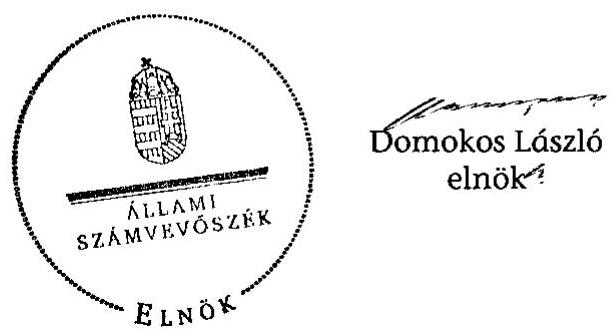

# ÁLLAMI   SZÁMVEVŐSZÉK 

## JELENTÉS

Nagyigmánd Nagyközség Önkormányzata belső kontrollrendszerének kialakítása, valamint egyes kontrolltevékenységek és a belső ellenőrzés működése ellenőrzéséről

---

# Állami Számvevőszék 

Iktatószám: V-0012-058-025-021/2013.
Témaszám: 1051
Vizsgálat-azonosító szám: V059124

## Az ellenőrzést felügyelte:

Dr. Benedek Mária
felügyeleti vezető

## Az ellenőrzést vezette:

## Szakmányné Bilik Mária

ellenőrzésvezető
A számvevőszéki jelentés összeállításában közreműködtek:
Groholy Andrásné Hangyál Márta
számvevő tanácsos
Kámán Edina
számvevő
Az ellenőrzést végezték:
Hámoriné Maróti Györgyi Dr. Ernst László
számvevő vezető főtanácsos számvevő tanácsos

---

# TARTALOMJEGYZÉK 

BEVEZETÉS ..... 5
I. ÖSSZEGZŐ MEGÁLLAPÍTÁSOK, KÖVETKEZTETÉSEK, JAVASLATOK ..... 8
II. RÉSZLETES MEGÁLLAPÍTÁSOK ..... 13

1. Az Önkormányzat belső kontrollrendszere kialakításának megfelelősége ..... 13
1.1. A kontrollkörnyezet kialakítása ..... 13
1.2. A kockázatkezelési rendszer kialakítása ..... 14
1.3. A kontrolltevékenységek kialakítása ..... 14
1.4. Az információs és kommunikációs rendszer szabályozása ..... 15
1.5. A monitoring rendszer kialakítása ..... 15
2. A pénzügyi folyamatokban kulcsszerepet betöltő belső kontrollok (szakmai teljesítésigazolás és utalvány ellenjegyzés) működése ..... 16
3. A belső ellenőrzés szervezeti keretei és működése ..... 17

## FÜGGELÉKEK

1. számú Értelmező szótár
2. számú A belső kontrollrendszer kialakítása, a pénzügyi folyamatokban kulcsszerepet betöltő szakmai teljesítésigazolás és utalvány ellenjegyzés kontrollok működése, valamint a belső ellenőrzés működése értékelésénél alkalmazott minősítési szempontok

---

.

---

# RÖVIDÍTÉSEK JEGYZÉKE 

## Törvények

ÁSZ tv.
Avtv.

Info tv.

Kttv.
Ktv.
Mötv.
Ötv.
régi Áht.
új Áht.

## Rendeletek

Ámr.
Ávr.

Ber.
Bkr.
önkormányzati SZMSZ

## Szórövidítések

adatvédelmi és adatbiztonsági szabályzat ÁSZ
Belső ellenőrzési kézikönyv
2011. évi LXVI. törvény az Állami Számvevőszékről
1992. évi LXIII. törvény a személyes adatok védelméről és a közérdekű adatok nyilvánosságáról (hatálytalan 2012. január 1-jétől)
2011. évi CXII. törvény az információs önrendelkezési jogról és az információszabadságról (hatályos 2012. január 1-jétől)
2011. évi CXCIX. törvény a közszolgálati tisztviselőkről (hatályos 2012. március 1-jétől)
1992. évi XXIII. törvény a köztisztviselők jogállásáról (hatálytalan 2012. március 1-jétől)
2011. évi CLXXXIX. törvény Magyarország helyi önkormányzatairól (hatályos 2012. január 1-jétől)
1990. évi LXV. törvény a helyi önkormányzatokról
1992. évi XXXVIII. törvény az államháztartásról (hatálytalan 2012. január 1-jétől)
2011. évi CXCV. törvény az államháztartásról (hatályos 2012. január 1-jétől)

292/2009. (XII. 19.) Korm. rendelet az államháztartás működési rendjéről (hatálytalan 2012. január 1-jétől)
368/2011. (XII. 31.) Korm. rendelet az államháztartásról szóló törvény végrehajtásáról (hatályos 2012. január 1-jétől)
193/2003. (XI. 26.) Korm. rendelet a költségvetési szervek belső ellenőrzéséről (hatálytalan 2012. január 1-jétől)
370/2011. (XII. 31.) Korm. rendelet a költségvetési szervek belső kontrollrendszeréről és belső ellenőrzéséről (hatályos 2012. január 1-jétől)
Nagyigmánd Nagyközség Önkormányzat Képviselőtestületének 6/2011. (III. 24.) számú önkormányzati rendelete az önkormányzati képviselő-testület és szervei szervezeti és működési szabályzatáról (hatályos 2011. március 31-től, ezt megelőzően az 1/2007. (II. 1.) számú rendelet volt hatályban)

190-16/2011. számú Adatvédelmi és adatbiztonsági szabályzat Nagyigmánd Nagyközség Polgármesteri Hivatala Állami Számvevőszék
A Komárom-Bábolna Többcélú Kistérségi Társulás belső ellenőrzés kézikönyve (12/2006. (II. 22.) számú Társulási határozat)

---

Belső Kontroll Kézikönyv az Ámr. 155. § (1) bekezdése, valamint az államháztartási belső kontroll standardokról szóló 1/2009. (IX. 11.) PM irányelv egységes értelmezése érdekében az államháztartásért felelős miniszter által a 2010. évben kiadott Belső Kontroll Kézikönyv
FEUVE
gazdálkodási szabályzat

|  | Nagyigmánd Nagyközség Önkormányzata Polgármesteri |
| :-- | :-- |
|  | Hivatal Szabályzata a kötelezettségvállalás, utalványoz |
|  | zás, ellenjegyzés, érvényesítés, szakmai teljesítés igazolás |
|  | rendjéről (hatályos 2011. január 1-jétől) |
| gazdasági program | Nagyigmánd Nagyközség Önkormányzata Képviselő- |
|  | testületének gazdasági programja a 2010-2014. évekre |
| hivatali SZMSZ | Nagyigmánd Nagyközség Polgármesteri Hivatalának |
|  | Szervezeti és Működési Szabályzata (Nagyigmánd Nagy- |
|  | község Önkormányzata 6/2011. (III. 24.) számú rendelet |
|  | tével elfogadott önkormányzati SZMSZ-ének melléklete, |
|  | hatályos 2011. március 31-től, ezt megelőzően az 1/2007. |
|  | (II. 1.) számú rendelet volt hatályban) |
| informatikai biztonsági | Nagyigmánd Nagyközség Önkormányzata Polgármesteri |
| szabályzat | Hivatalának Informatikai biztonsági szabályzata (hatályos 2010. január 1-jétől) |
| iratkezelési rend | Nagyigmánd Nagyközség Önkormányzata Polgármesteri |
|  | Hivatalának Iratkezelési szabályzata (hatályos 2007. ja- |
|  | nuár 1-jétől) |
| jegyző | Nagyigmánd Nagyközség Önkormányzatának jegyzője |
| Képviselő-testület | Nagyigmánd Nagyközség Önkormányzatának Képviselőtestülete |
| Önkormányzat | Nagyigmánd Nagyközség Önkormányzata |
| polgármester | Nagyigmánd Nagyközség Önkormányzatának polgármestere |
| Polgármesteri Hivatal | Nagyigmánd Nagyközség Önkormányzatának Polgármesteri Hivatala |
| szabálytalanságkezelési | Nagyigmánd Nagyközség Önkormányzata Polgármesteri |
| eljárásrend | Hivatalának a szabálytalanságok kezelésének rendjéről szóló szabályzata (hatályos 2011. március 24-től) |
| Társulás | Komárom-Bábolna Többcélú Kistérségi Társulás |
| társulási megállapodás | Komárom-Bábolna Többcélú Kistérségi Társulási Megállapodás (a Társulási Tanács 1/2005. (I. 26.), 25/2006. (V. 23.), 285/2008. (XII. 18.), 12/2011. (III. 2.) számú határozatokkal módosított egységes szerkezetben) |

---

# JELENTÉS 

## Nagyigmánd Nagyközség Önkormányzata belső kontrollrendszerének kialakítása, valamint egyes kontrolltevékenységek és a belső ellenőrzés működése ellenőrzéséről

## BEVEZETÉS

A belső kontrollrendszer kialakítását, működtetését és fejlesztését a régi Áht. és az új Áht. is előírja. Ennek megvalósításáért a költségvetési szerv vezetője felel. A belső kontrollrendszer azt a célt szolgálja, hogy a költségvetési szervek működésük és gazdálkodásuk során a tevékenységeket szabályszerűen, gazdaságosan, hatékonyan, eredményesen hajtsák végre, teljesítsék elszámolási kötelezettségeiket és megvédjék az erőforrásokat a veszteségektől, a károktól és a nem rendeltetésszerű használattól. A belső kontrollrendszer magában foglalja mindazon szabályokat, eljárásokat, gyakorlati módszereket és szervezeti struktúrákat, kockázatkezelési technikákat, kontrolltevékenységeket, amelyek segítséget nyújtanak a szervezetnek céljai eléréséhez.

Az ÁSZ a 2011-2015. évekre szóló stratégiájában hangsúlyos szerepet szánt annak, hogy szilárd szakmai alapon álló, értékteremtő ellenőrzéseivel előmozdítsa a közpénzügyek átláthatóságát, rendezettségét. A számvevőszéki ellenőrzés nemzetközi alapelvei is rögzítik, hogy a megfelelő belső kontrollrendszer minimálisra csökkenti a hibák és szabálytalanságok kockázatát.

Az ellenőrzés célja annak értékelése volt, hogy az Önkormányzat a jogszabályi előírásoknak megfelelően alakította-e ki a belső kontrollrendszert; a gazdálkodás folyamatában kulcsszerepet betöltő szakmai teljesítésigazolás és az utalvány ellenjegyzés kontrolltevékenységeit megfelelően működtette-e; biztosította-e a belső ellenőrzés szabályos és eredményes működését.

Az ÁSZ ezen ellenőrzési céljait pilot (próba) jelleggel községi/nagyközségi önkormányzatoknál végzett ellenőrzések során érvényesítette.

Az ellenőrzés típusa: szabályszerűségi ellenőrzés
Az ellenőrzés jogszabályi alapja: az ÁSZ tv. 5. § (2) és (6) bekezdései
Az ellenőrzött szervezet: az Önkormányzat
Az ellenőrzött időszak: a belső kontrollrendszer kialakításának megfelelőségét a 2011. évre vonatkozóan értékeltük. A kontrolltevékenységek működésének megfelelőségét a 2011. január 1-je és december 31-e, míg a belső ellenőrzés működésének szabályosságát és eredményességét a 2009. január 1-je és 2011.

---

december 31-e közötti időszakot figyelembe véve értékeltük. A helyszíni ellenőrzés lezárásáig a helyi szabályozás változásait nyomon követtük.

Az ellenőrzés szakmai módszertana az ÁSZ hivatalos honlapján (www.asz.hu) közzétett szakmai szabályokon alapult, amely a Legfőbb Ellenőrző Intézmények Nemzetközi Szervezete (INTOSAI) által kiadott nemzetközi standardok (ISSAI) figyelembevételével készült.

A belső kontrollrendszer kialakításának ellenőrzése során értékeltük a kontrollkörnyezet, a kockázatkezelési rendszer, a kontrolltevékenységek, az információs és kommunikációs rendszer, valamint a monitoring rendszer szabályozottságának megfelelőségét.

Értékeltük a pénzügyi folyamatokban kulcsszerepet betöltő szakmai teljesítésigazolás és az utalvány ellenjegyzés kontrollok működésének megfelelőségét az államháztartáson kívülre teljesített működési és felhalmozási célú pénzeszközátadásoknál, az állományba nem tartozók megbízási díjainál, továbbá a külső szolgáltató által végzett karbantartási, kisjavítási munkákkal kapcsolatos kifizetéseknél. Az egyszerû véletlen mintavétellel kiválasztott tételek ellenőrzését többlépcsős megfelelőségi tesztek útján addig végeztük, amíg elegendő és megfelelő bizonyítékot szereztünk a vizsgált folyamatok kulcskontrolljai működésének megfelelő vagy nem megfelelő voltáról. Értékeltük az Önkormányzatnál a belső ellenőrzés működésének szabályosságát és eredményességét. Az ÁSZ a 2007-2010. években az Önkormányzatnál a gazdálkodás szabályszerűségére irányuló, átfogó ellenőrzést nem végzett.

A fogalmak magyarázatát az 1. számú függelék, az ellenőrzés egyes területeinek értékelésénél alkalmazott egységes minősítési szempontokat a 2. számú függelék tartalmazza.

Az ellenőrzés lefolytatásához az Önkormányzat a munkalapok és a tanúsítvány elektronikus kitöltésével, valamint a megjelölt dokumentumok elektronikus megküldésével szolgáltatott adatokat. A munkalapokon szerepeltetett adatok, információk ellenőrzése és szükség szerinti javítása a helyszíni ellenőrzés keretében történt.

Az ÁSZ az ellenőrzés megállapításait az ellenőrzött időszakban hatályos, az intézkedést igénylő megállapításokra tett javaslatokat a jelenleg hatályos jogszabályok alapján fogalmazta meg.

Az ÁSZ tv. 29. § (1) bekezdése szerint a jelentéstervezetet megküldtük a polgármester részére, aki az ÁSZ tv. 29. § (2) bekezdésében foglalt észrevételezési jogával nem élt, a jelentéstervezetre észrevételt nem tett.

Nagyigmánd nagyközség állandó lakosainak száma 2011. január 1-jén 2996 fő volt. Az Önkormányzat héttagú Képviselő-testületének munkáját kettő állandó bizottság segítette. Az Önkormányzat az önállóan működő és gazdálkodó Polgármesteri Hivatalon felül egy önállóan működő és gazdálkodó intézménnyel - Általános Iskola és Óvoda - látta el feladatait. Az Önkormányzat többségi tulajdoni hányadú gazdasági társasággal nem rendelkezett. A polgármester a 2010. évi önkormányzati választások óta tölti be tisztségét. A jegyző 1994. július 1-jétől látja el feladatait. A Polgármesteri Hivatal négy szervezeti egységre - Igazgatási csoportra, Pénzügyi osztályra, Építési és beruházási irodára, valamint Titkárságra - tagolódott, a foglalkoztatott köztisztviselők száma 2011. január 1-jén 19 fő volt.

Az Önkormányzat a 2011. évi költségvetési beszámolója szerint 1277073 ezer Ft költségvetési bevételt ért el, valamint 1011326 ezer Ft költségvetési kiadást teljesített. A 2011. december 31-i könyvviteli mérleg szerint 2155569 ezer Ft értékű eszközvagyonnal rendelkezett, 17513 ezer Ft rövid lejáratú kötelezettsége volt. Hosszú lejáratú kötelezettsége nem volt.

Az Önkormányzatnál a Polgármesteri Hivatal feladatellátásának szervezeti keretei 2013. január 1-jét követően megváltoztak. Nagyigmánd nagyközség és Csém község önkormányzatai közös hivatalt alakítottak Nagyigmándi Közös Hivatal elnevezéssel.

---

# I. ÖSSZEGZŐ MEGÁLLAPÍTÁSOK, KÖVETKEZTETÉSEK, JAVASLATOK 

A belső kontrollrendszeren belül 2011-ben a Polgármesteri Hivatalban a kontrollkörnyezet, a kockázatkezelési rendszer, a kontrolltevékenységek és a monitoring rendszer kialakítását, valamint az információs és kommunikációs rendszer szabályozását külön-külön és összesítve is értékeltük. A belső kontrollrendszer kialakítása az összesített értékelés alapján nem felelt meg a jogszabályi előírásoknak. Az egyes területek kialakításának értékelését az alábbiakban részletezzük.

A kontrollkörnyezet kialakítása részben felelt meg a jogszabályi követelményeknek. A Polgármesteri Hivatal rendelkezett alapító okirattal és hivatali SZMSZ-szel, azonban a jegyző az Ámr. ${ }^{1}$ előírása ellenére a hivatali SZMSZ-ben nem rögzítette a szervezeti egységek feladatait, továbbá a Ber. ${ }^{2}$ előírása ellenére nem írta elő a belső ellenőrzést végzők jogállását, feladatait. A Ktv.-ben ${ }^{3}$ foglaltak ellenére a jegyző nem határozta meg a köztisztviselők munkateljesítményének értékeléséhez szükséges teljesítménykövetelményeket, és teljesítményértékelést nem végzett.

A kockázatkezelési rendszer kialakítása nem felelt meg a jogszabályi előírásoknak, mert a jegyző az Ámr.-ben foglaltak ellenére nem mérte fel az Önkormányzat tevékenységeire ható kockázatokat, és nem határozta meg az egyes kockázatokkal kapcsolatos intézkedéseket és megtételük módját.

A kontrolltevékenységek kialakítása a jogszabályi előírásoknak megfelelt, mert a jegyző meghatározta a gazdálkodási jogkörök gyakorlásának szabályait, és az Ámr. rendelkezésének megfelelően rögzítette a Polgármesteri Hivatal tevékenységeire vonatkozó beszámolási eljárásokat. A jegyző a régi Áht. ${ }^{4}$ előírásának megfelelően meghatározta a FEUVE feladatait. A kialakított kontrolltevékenységek - végrehajtásuk esetén - biztosítják a lehetséges hibák feltárását és kijavítását.

Az információs és kommunikációs rendszer szabályozása megfelelt a jogszabályi követelményeknek, mert a jegyző az Avtv. ${ }^{5}$ és az Ámr. előírásának megfelelően elkészítette az adatvédelmi és adatbiztonsági szabályzatot,
 meghatározta a kötelezően közzéteendő adatok közzétételi eljárásrendjét és a közérdekű adatok megismerésére irányuló igények teljesítésének rendjét.

[^0]
[^0]:    ${ }^{1}$ 2012. január 1-jétől Ávr.
    ${ }^{2}$ 2012. január 1-jétől Bkr.
    ${ }^{3}$ 2012. március 1-jétől Kttv.
    ${ }^{4}$ 2012. január 1-jétől új Áht.
    ${ }^{5}$ 2012. január 1-jétől Info tv.

---

A monitoring rendszer kialakítása a jogszabályi követelményeknek nem felelt meg, mert a jegyző az Ámr.-ben foglaltak ellenére nem határozta meg a Polgármesteri Hivatal tevékenységének, a célok megvalósításának nyomon követését biztosító, az operatív tevékenységek keretében megvalósuló folyamatos és eseti nyomon követésből álló monitoring rendszer szabályait.

A belső kontrollrendszer nem megfelelő kialakítása kockázatot jelent az Önkormányzat tevékenységeinek szabályszerű, gazdaságos, hatékony és eredményes végrehajtásában.

A Polgármesteri Hivatalban a 2011. évben az államháztartáson kívülre történő működési és felhalmozási célú pénzeszközátadásokkal, az állományba nem tartozók megbízási díjaival, valamint a külső szolgáltatók által végzett karbantartással, kisjavítással kapcsolatos kifizetések során - összefoglalóan értékelve a szakmai teljesítésigazolás és az utalvány ellenjegyzés kulcskontrollok működésének megfelelősége kiváló volt. A kiadások teljesítését megelőzően a jegyző által a szakmai teljesítésigazolásra kijelölt személyek, a gazdálkodási szabályzatban előírt módon, a kifizetések jogosságának, összegszerűségének, a szerződésben, megrendelésben foglaltak teljesítésének ellenőrzését elvégezték. Az utalványok ellenjegyzője a kiadások teljesítését megelőzően a gazdálkodásra vonatkozó szabályok érvényesüléséről, továbbá a szakmai teljesítésigazolás és az érvényesítés elvégzéséről meggyőződött. A számvevőszéki ellenőrzés az ellenőrzött kifizetésekkel összefüggésben a rendelkezésre bocsátott dokumentumok alapján kár bekövetkeztére utaló adatot, tényt nem állapított meg.

Az Önkormányzat a belső ellenőrzési feladatokat a Társulás útján látta el. Az Önkormányzatnál a 2009-2011. években a belső ellenőrzés szabályozása és működése összességében nem felelt meg a jogszabályi előírásoknak. A Társulás keretében végzett belső ellenőrzés során, a Ber. előírása ellenére a társulási megállapodásban nem rögzítették a belső ellenőrzési vezetői tevékenység ellátásának módját. A 2010. és a 2011. évre vonatkozó éves ellenőrzési tervet a Képviselő-testület az Ötv.-ben foglalt határidőt követően hagyta jóvá. Az éves ellenőrzési tervek összeállítását a Ber. előírása ellenére nem alapozta meg kockázatelemzés. Az ellenőrzési tervek összeállítása a Ber.-ben foglaltakkal ellentétesen a jegyző véleményének hiányában, annak figyelembevétele nélkül történt, továbbá a tartalmuk részben felelt meg a Ber. előírásának. A jóváhagyott ellenőrzési tervekhez viszonyítva a 2009. évben három, a 2011. évben egy ellenőrzés elmaradt, továbbá soron kívül kettő ellenőrzést végeztek annak ellenére, hogy a Ber. előírásával szemben a terveket nem módosították. A 2010-2011. évben elvégzett ellenőrzésekről készített jelentések tartalma nem felelt meg a Ber. előírásainak. A belső ellenőrzési vezető a végrehajtott ellenőrzésekről, továbbá a jelentések javaslatai alapján megtett intézkedésekről nyilvántartást nem vezetett, azok nyomon követését elmulasztotta. A jegyző a végrehajtott ellenőrzések javaslatainak hasznosítására intézkedési tervet - három eset kivételével - nem készített.

Az Önkormányzatnál a 2009-2011. években a belső ellenőrzés működése a 2. számú függelékben részletezett kritériumrendszer alapján végzett összesített értékelés szerint - nem volt eredményes, mert a belső ellenőrzés szabályozása és működése az ellenőrzött időszak egészét tekintve a jogszabályi előírásoknak nem felelt meg. Végeztek ugyan belső ellenőrzést a gazdálkodási jogkörök

---

gyakorlása, a készpénzkezeléssel kapcsolatos belső kontrollok működése, valamint az önkormányzati vagyonhasznosítás vonatkozásában a vagyongazdálkodási szabályok betartása témakörében, azonban a belső ellenőrzésekről készített jelentésekben megfogalmazott javaslatok alapján szükséges feladatok végrehajtására a jegyző - három jelentés javaslatai kivételével - nem intézkedett. Mindezek hozzájárultak az ellenőrzésünk során is feltárt szabályozási hiányosságok fennmaradásához.

Az ÁSZ tv. 33. § (1) bekezdésében foglaltak értelmében az ellenőrzött szervezet vezetője köteles a jelentésben foglalt megállapításokhoz kapcsolódó intézkedési tervet összeállítani, és azt a jelentés kézhezvételétől számított 30 napon belül az ÁSZ részére megküldeni. Amennyiben az intézkedési tervet határidőre nem küldi meg a szervezet, vagy az - az ÁSZ tv. 33. § (2) bekezdésében foglalt póthatáridő eltelte ellenére - továbbra sem elfogadható, az ÁSZ elnöke a hivatkozott törvény 33. § (3) bekezdés a)-b) pontjaiban foglaltakat érvényesítheti.

Az ellenőrzés intézkedést igénylő megállapításai és javaslatai:

# a jegyzőnek 

1. a kontrollkörnyezettel kapcsolatban:

Az Ámr. 20. § (2) bekezdés e) pontjában foglaltak ellenére a hivatali SZMSZ-ben nem rögzítette a Polgármesteri Hivatal szervezeti egységeinek feladatait, továbbá - a Ber. 4. § (2) bekezdés előírása ellenére - nem írta elő a belső ellenőrzést végzők jogállását és feladatait.

A jegyző - a Ktv. 34. § (5) bekezdésében foglaltak ellenére - a 2011. évben nem határozta meg a köztisztviselők munkateljesítményének értékeléséhez szükséges teljesítménykövetelményeket.

Javaslat:
a) Módosítsa a hivatali SZMSZ-t, és kezdeményezze a polgármesternél a módosítás Képviselő-testület elé terjesztését annak érdekében, hogy az az Ávr. 13. § (1) bekezdés e) pontjában foglaltaknak megfelelően tartalmazza a szervezeti egységek - ezen belül a gazdasági szervezet - feladatait, továbbá a Bkr. 15. § (2) bekezdésében foglaltak szerint a belső ellenőrzést végzők jogállását.
b) Dolgozza ki a Kttv. 130. § (1)-(3) bekezdéseiben előírtak szerinti teljesítményértékelés alapját képező teljesítménykövetelményeket.
2. a kockázatkezelési rendszerrel kapcsolatban:

A jegyző kockázatkezelési szabályzatot készített, azonban - az Ámr. 157. § (1)-(3) bekezdésében foglaltak ellenére - kockázatelemzést nem végzett, és kockázatkezelési rendszert nem alakított ki.

---

Javaslat:
Alakítsa ki és működtesse a Bkr. 3. § b) pontja és 7. § alapján a kockázatkezelési rendszert.
3. a monitoring rendszerrel kapcsolatban:

A jegyző - az Ámr. 160. §-ában foglaltak ellenére - nem alakított ki olyan monitoring rendszert, amely lehetővé teszi a Polgármesteri Hivatal tevékenységének, a célok megvalósításának nyomon követését, és amelynek része az operatív tevékenységek keretében megvalósuló folyamatos és eseti nyomon követés is.

Javaslat:
Alakítsa ki és működtesse a Bkr. 3. § e) pontjában és 10. §-ában előírtak alapján a Polgármesteri Hivatal tevékenységének, a célok megvalósításának nyomon követését biztosító rendszert, amelynek része az operatív tevékenységek keretében megvalósuló folyamatos és eseti nyomon követés is.
4. a belső ellenőrzés működésével kapcsolatban:

A belső ellenőrzési vezető feladatkörébe tartozó tevékenységek ellátásának módja a Ber. 4/A. § (2) bekezdésében foglaltak ellenére nem került meghatározásra.

A Képviselő-testület a 2010-2011. évi ellenőrzési terveket az Ötv. 92. § (6) bekezdésében foglalt határidőt követően hagyta jóvá.

A belső ellenőrzési vezető az ellenőrzési tervet - a Ber. 12. § b) pontjában, a 18. §ban és a 21. § (2) bekezdésében foglaltak ellenére - nem kockázatelemzés alapján készítette, továbbá a Ber. 32/B. § (2) bekezdésének előírása ellenére az ellenőrzési terv összeállításához a jegyző írásos véleményt nem adott. A 2009-2011. évi ellenőrzési terv - a Ber. 21. § (3) bekezdés f) pontjában foglaltak ellenére - nem tartalmazta az ellenőrzési kapacitás meghatározását; valamint az ellenőrzések módszereit.

A Ber. 32/B. § (6) bekezdését figyelmen kívül hagyva annak ellenére nem módosították az éves ellenőrzési terveket, hogy a 2009-2011. években ellenőrzések maradtak el, valamint a 2009. évben kettő nem tervezett ellenőrzést hajtottak végre.

Az elvégzett ellenőrzésekről készített 2010. és 2011. évi jelentések - a Ber. 27. § (2) bekezdésének j) pontjában előírtak ellenére - nem tartalmaztak következtetéseket. A 2011. évben az ellenőrzést végző belső ellenőrök kettő jelentést - a Ber. 14. § (1) bekezdés g) pontjában és a 27. § (2) bekezdés l) pontjában foglaltak ellenére - nem írtak alá.

A jegyző a jelentésekben megfogalmazott javaslatok hasznosítására - a Ber. 29. § (1) bekezdése ellenére - nem minden esetben készített intézkedési tervet. Az ellenőrzési jelentések megállapításai és javaslatai alapján megtett intézkedések végrehajtásáról, illetve a végre nem hajtott intézkedések esetében a mulasztás okáról a jegyző nyilvántartási rendszert - a Ber. 29/A. § (1)-(2) bekezdésében foglaltak ellenére - nem alakított ki.

---

A belső ellenőrzés a Ber. 8. § f) pontjában foglaltak ellenére a megtett intézkedések nyomon követését elmulasztotta, a belső ellenőrzési vezető nem alakította ki a Ber. 12. § n) pontjában előírt nyilvántartást az ellenőrzési javaslatok alapján megtett intézkedések végrehajtásának nyomon követéséről.

A belső ellenőrzés a 2009-2011. években az elvégzett ellenőrzésekről - a Ber. 12. § j) pontjában és a 32. §-ában foglaltak ellenére - nyilvántartást nem vezetett, és az ellenőrzési dokumentumok megőrzéséről nem gondoskodott.

Javaslat:
a) Kezdeményezze, hogy a belső ellenőrzési vezető feladatkörébe tartozó tevékenységek ellátásának módját a Bkr. 16. § (4) bekezdésében foglaltaknak megfelelően határozzák meg.
b) Kezdeményezze a polgármesternél az éves ellenőrzési terv Képviselő-testület elé terjesztését annak érdekében, hogy azt a Képviselő-testület az Mötv. 119. § (5) bekezdésében előírt határidőn belül jóváhagyja.
c) Intézkedjen arról, hogy az éves ellenőrzési terv a Bkr. 22. § (1) bekezdés b) pontja, a 29. § (1) bekezdése és a 31. § (2) bekezdése alapján kockázatelemzésen alapuljon, valamint arról, hogy azt a belső ellenőrzési vezető a Bkr. 56. § (2) bekezdés előírásainak megfelelően a jegyző írásos véleményének figyelembevételével a Bkr. 29. § (1) bekezdésében foglaltak szerint készítse el.
d) Kezdeményezze, hogy az éves ellenőrzési tervek tartalmazzák a Bkr. 31. § (4) bekezdésében előírt tartalmi elemeket, továbbá hogy a Képviselő-testület által elfogadott éves ellenőrzési tervekben szereplő belső ellenőrzéseket elvégezzék, és a Bkr. 56. § (5) bekezdésében foglalt előírást betartva, az éves ellenőrzési tervben foglaltakhoz képest ellenőrzés elhagyására vagy új ellenőrzés indítására az ellenőrzési terv módosítását követően kerüljön sor.
e) Kezdeményezze, hogy az ellenőrzési jelentések tartalmazzák a Bkr. 39. § (3) bekezdésében felsorolt tartalmi elemeket.
f) Készítsen a Bkr. 45. § (1) bekezdésének megfelelően intézkedési tervet a belső ellenőrzési jelentésekben megfogalmazott javaslatok végrehajtására a Bkr. 45. § (2)-(3) bekezdéseiben foglaltaknak megfelelő tartalommal és határidőn belül.
g) Kezdeményezze, hogy a belső ellenőrzési vezető a Bkr. 21. § (2) bekezdés d) pontjában és a 47. §-ban foglaltak szerint tartsa nyilván és kövesse nyomon az ellenőrzési jelentések alapján megtett intézkedéseket, és a Bkr. 22. § (2) bekezdés b) és e) pontja alapján az 50. §-ban foglaltaknak megfelelően vezesse az elvégzett belső ellenőrzésekre vonatkozó nyilvántartást, továbbá gondoskodjon az ellenőrzési dokumentumok megőrzéséről.

---

# II. RÉSZLETES MEGÁLLAPÍTÁSOK 

## 1. Az ÖNKORMÁNYZAT BELSŐ KONTROLLRENDSZERE KIALAKÍTÁSÁNAK MEGFELELŐSÉGE

### 1.1. A kontrollkörnyezet kialakítása

A kontrollkörnyezet kialakítása a 2. számú függelékben részletezett kritériumrendszer alapján végzett értékelés szerint a Polgármesteri Hivatalban részben volt megfelelő. A Polgármesteri Hivatal rendelkezett alapító okirattal és hivatali SZMSZ-szel, azonban a jegyző a jogszabályi előírásokat nem érvényesítette teljes körűen.

A jegyző, mint a költségvetési szerv vezetője:

- az Ámr. 20. § (2) bekezdés e) pontjában foglaltak ellenére a hivatali SZMSZ-ben nem rögzítette a szervezeti egységek feladatait;
- a Ber. 4. § (2) bekezdés előírása ellenére a hivatali SZMSZ-ben nem írta elő a belső ellenőrzést végzők jogállását, feladatait;
- a Ktv. 34. § (5) bekezdésében foglaltak ellenére nem határozta meg a köztisztviselők munkateljesítményének értékeléséhez szükséges teljesítménykövetelményeket.

A jegyző hiányosan készítette el a
 gazdasági programtervezetet, így a Képviselőtestület az Önkormányzat gazdasági programját hiányos tartalommal fogadta el.

Az Önkormányzat gazdasági programja nem felelt meg az Ötv. 91. § (6) bekezdésében ${ }^{9}$ foglaltaknak, mert nem tartalmazta az adópolitikai célkitűzéseket.

A kontrollkörnyezet kialakítása során a jegyző az Ámr. 155. § (3) bekezdésének ${ }^{10}$ előírását figyelmen kívül hagyva az államháztartásért felelős miniszter által kiadott Belső Kontroll Kézikönyv ajánlásait nem hasznosította teljes körűen.

[^0]
[^0]:    ${ }^{6}$ 2012. január 1-jétől az Ávr. 13. § (1) bekezdés e) pontja
    ${ }^{7}$ 2012. január 1-jétől a Bkr. 15. § (2) bekezdése
    ${ }^{8}$ 2012. július 1-jétől a Kttv. 130. § (1)-(6) bekezdései
    ${ }^{9}$ 2013. január 1-jétől az Mötv. 116. § (1) bekezdése
    ${ }^{10}$ 2012. január 1-jétől a Bkr. 5. § (1) bekezdése

---

A kontrollkörnyezet kialakítása során a jegyző:

- előírta a hivatali SZMSZ dolgozók általi megismerésének kötelezettségét, azonban a Belső Kontroll Kézikönyv 1.2.7. pontjában foglaltak ellenére a hivatali SZMSZ dolgozók általi megismerése dokumentált módon nem történt meg;
- a Belső Kontroll Kézikönyv 1.5.2. pontjában foglalt ajánlást nem hasznosította, mert nem dolgozta ki a köztisztviselői munkakörök betöltésére vonatkozó elvárt tudást és képességeket;
- a Belső Kontroll Kézikönyv 1.6. pontjának ajánlását figyelmen kívül hagyta, nem intézkedett a szervezeti célokkal összhangban álló etikai értékek kiemelt kezeléséről, nem határozta meg a köztisztviselőkkel szembeni etikai elvárásokat.

# 1.2. A kockázatkezelési rendszer kialakítása 

A kockázatkezelési rendszer kialakítása a 2. számú függelékben részletezett kritériumrendszer alapján végzett értékelés szerint a Polgármesteri Hivatalban nem volt megfelelő, mert a jegyző az Ámr. 157. § (1)-(3) bekezdéseiben ${ }^{11}$ foglaltak ellenére nem mérte fel és nem állapította meg az Önkormányzat tevékenységében rejlő kockázatokat, nem határozta meg az egyes kockázatokkal kapcsolatos intézkedéseket és megtételük módját.

A Polgármesteri Hivatal rendelkezett kockázatkezelési szabályzattal, melynek egyes pontjai általánosságban megfelelnek az Ámr. előírásainak, azonban a szabályzat mellékletében a kockázati tényezőket tartalmazó táblázat nem a Polgármesteri Hivatal kötelezően és önként ellátott feladataira vonatkozik.

A kockázatkezelési rendszer kialakítása során a jegyző az Ámr. 155. § (3) bekezdésének előírását figyelmen kívül hagyva az államháztartásért felelős miniszter által kiadott Belső Kontroll Kézikönyv ajánlásait nem hasznosította teljes körűen.

A kockázatkezelési rendszer kialakítása során a jegyző:

- a Belső Kontroll Kézikönyv 2.1.3. pontjában foglaltakat nem hasznosította, mert nem alakította ki a kockázatnyilvántartási rendszert;
- a Belső Kontroll Kézikönyv 2.2.3. pontjában foglalt ajánlást figyelmen kívül hagyva az Önkormányzat tevékenységeit a kockázati kitettség alapján nem rangsorolta, és nem határozta meg a kockázati tűréshatárokat;
- a Belső Kontroll Kézikönyv 2.5.1. pontjának ajánlását nem érvényesítette, mivel nem gondoskodott a csalás és a korrupció, mint kiemelt kockázatok értékeléséről és kezeléséről.

### 1.3. A kontrolltevékenységek kialakítása

A kontrolltevékenységek kialakítása a 2. számú függelékben részletezett kritériumrendszer alapján végzett értékelés szerint a Polgármesteri Hivatalban megfelelő volt, mert a jegyző a kontrollstratégiák és módszerek keretében

[^0]
[^0]:    ${ }^{11}$ 2012. január 1-jétől a Bkr. 7. §

---

szabályozta a Polgármesteri Hivatal tevékenységére vonatkozó beszámolási eljárásokat. Meghatározta az érvényesítés rendjét, szabályozta a szakmai teljesítésigazolás módját és kijelölte az érvényesítésre, illetve szakmai teljesítésigazolásra jogosultakat, és biztosította a feladatellátás folytonosságát.

A kialakított kontrolltevékenységek - végrehajtásuk esetén - képesek feltárni a munkafolyamatokban bekövetkező hibákat.

# 1.4. Az információs és kommunikációs rendszer szabályozása 

Az információs és kommunikációs rendszer szabályozottsága a Polgármesteri Hivatalban a 2. számú függelékben részletezett kritériumrendszer alapján végzett értékelés szerint megfelelő volt, mert a jegyző az Ámr. 159. §-ában ${ }^{12}$ előírt információs rendszerek keretében kialakította az iktatási rendszert, szabályozta az iratkezelés rendjét, valamint elkészítette az adatvédelmi és adatbiztonsági szabályzatot. A Polgármesteri Hivatalban elkészítették az informatikai biztonsági szabályzatot, meghatározták a rendszerekhez való hozzáférési jogosultságokat, valamint az adatok mentési eljárásait. A jegyző az Avtv. előírásának megfelelően elkészítette mind a kötelezően közzéteendő adatok nyilvánosságra hozatalának, mind a közérdekű adatok megismerésére irányuló igények teljesítésének rendjét rögzítő szabályzatot.

### 1.5. A monitoring rendszer kialakítása

A monitoring rendszer kialakítása a 2. számú függelékben részletezett kritériumrendszer alapján végzett értékelés szerint a Polgármesteri Hivatalban nem volt megfelelő, mert a jegyző az Ámr. 160. §-ában ${ }^{13}$ foglaltak ellenére nem határozta meg a Polgármesteri Hivatal tevékenységének, a célok megvalósításának nyomon követését biztosító, az operatív tevékenységek keretében megvalósuló folyamatos és eseti nyomon követésből álló monitoring rendszer szabályait.

A monitoring rendszer kialakítása során a jegyző az Ámr. 155. § (3) bekezdésének előírását figyelmen kívül hagyva az államháztartásért felelős miniszter által kiadott Belső Kontroll Kézikönyv ajánlásait nem hasznosította teljes körűen.

A monitoring rendszer kialakítása során a jegyző:

- a Belső Kontroll Kézikönyv 1.2.2. pontjának ajánlását nem hasznosította, mert a szervezeti célok megvalósításának nyomon követése érdekében a lakosság, illetve a szolgáltatásokat igénybe vevők körében az önkormányzati feladatellátásra irányuló elégedettségi felméréseket nem végeztetett;
- a belső kontrollrendszer évenkénti felülvizsgálatát és értékelését - a Belső Kontroll Kézikönyv 5.2.1. pontjának ajánlását figyelmen kívül hagyva - nem végezte el.

[^0]
[^0]:    ${ }^{12}$ 2012. január 1-jétől a Bkr. 3. § d) pontja
    ${ }^{13}$ 2012. január 1-jétől a Bkr. 10. §-a

---

A belső kontrollrendszer kialakítása a Polgármesteri Hivatalban 2011-ben a kontrollkörnyezet, a kockázatkezelési rendszer, a kontrolltevékenységek, az információs és kommunikációs rendszer és a monitoring rendszer értékelése alapján összességében nem felelt meg a jogszabályi előírásoknak.

# 2. A PÉNZÜGYI FOLYAMATOKBAN KULCSSZEREPET BETÖLTŐ BELSŐ KONTROLLOK (SZAKMAI TELJESÍTÉSIGAZOLÁS ÉS UTALVÁNY ELLENJEGYZÉS) MŰKÖDÉSE 

A Polgármesteri Hivatalban a 2011. évben az államháztartáson kívülre teljesített működési és felhalmozási célú pénzeszközátadások között elszámolt kiadások teljesítése során a szakmai teljesítésigazolás és az utalvány ellenjegyzés kulcskontrollok működésének megfelelősége kiváló volt, mert a kiadások jogosságának, összegszerűségének ellenőrzését a jegyző által a szakmai teljesítésigazolásra kijelölt személyek a gazdálkodási szabályzatban előírt módon elvégezték.

Annak ellenére összességében kiváló volt, hogy a szakmai teljesítésigazolás elvégzésének igazolásához a gyakorlatban használt pecsét tartalma nem volt összhangban a gazdálkodási szabályzatban rögzítettekkel.

Az utalványok ellenjegyzője a gazdálkodásra vonatkozó szabályok érvényesüléséről, továbbá a szakmai teljesítésigazolás és az érvényesítés elvégzéséről meggyőződött.

A Polgármesteri Hivatalban a 2011. évben az állományba nem tartozók megbízási díjainak kifizetése során a szakmai teljesítésigazolás és az utalvány ellenjegyzés kulcskontrollok működésének megfelelősége kiváló volt, mert a megbízási szerződésekben meghatározott feladatok teljesítésének, a kiadások jogosságának, összegszerűségének ellenőrzését és igazolását a jegyző által a szakmai teljesítésigazolásra kijelölt személy elvégezte. Az utalványok ellenjegyzője a gazdálkodásra vonatkozó szabályok érvényesüléséről, továbbá a szakmai teljesítésigazolás és az érvényesítés elvégzéséről meggyőződött.

A Polgármesteri Hivatalban a 2011. évben a külső szolgáltatók által végzett karbantartási, kisjavítási szolgáltatások kiadásai során a szakmai teljesítésigazolás és az utalvány ellenjegyzés kulcskontrollok működésének megfelelősége kiváló volt, mert a kiadások jogosságának, összegszerűségének, a szerződésben, megrendelésben foglaltak teljesítésének ellenőrzését a jegyző által a szakmai teljesítésigazolásra kijelölt személyek elvégezték. Az utalványok ellenjegyzője a gazdálkodásra vonatkozó szabályok érvényesüléséről, továbbá a szakmai teljesítésigazolás és az érvényesítés elvégzéséről meggyőződött.

Az Önkormányzatnál a 2011. évben a pénzügyi folyamatokban kulcsszerepet betöltő belső kontrollok működésének ellenőrzése során a számvevőszéki ellenőrzés az ellenőrzött tételek vonatkozásában a rendelkezésre bocsátott dokumentumok alapján kár bekövetkeztére utaló adatot, tényt nem állapított meg.

---

# 3. A BELSŐ ELLENŐRZÉS SZERVEZETI KERETEI ÉS MŰKÖDÉSE 

Az Önkormányzat a 2009-2011. évek között a belső ellenőrzési feladatokat -képviselő-testületi döntés alapján - a Társuláshoz történt csatlakozással látta el. A belső ellenőrzés meghatározásának és ellátásának módja megfelelt az Ötv. 92. § (8) bekezdés c) pontjában ${ }^{14}$ előírtaknak. Az Önkormányzat rendelkezett a Társulás munkaszervezetének vezetője által jóváhagyott - a Ber.-nek megfelelő tartalmú - Belső Ellenőrzési Kézikönyvvel. A Társulás keretében végzett belső ellenőrzés során a belső ellenőrzési vezetői tevékenység ellátásának módját a Ber. 4/A. § (2) bekezdése, illetve 12. §-ának rendelkezései ${ }^{15}$ ellenére a társulási megállapodásban nem határozták meg.

Az Önkormányzatnál a 2009-2011. években a belső ellenőrzés működése a jogszabályi előírásoknak nem felelt meg. A Polgármesteri Hivatalban nem állt rendelkezésre teljes körűen a belső ellenőrzés iratanyaga. A polgármester és a jegyző jegyzőkönyvben ${ }^{16}$ rögzített nyilatkozata alapján ennek oka az volt, hogy a 2009-2011. évek hiányzó dokumentumait a Társulás munkaszervezetének vezetőjétől dokumentáltan nem vették át. A belső ellenőrzési vezető a Ber. 32. §-ában ${ }^{17}$ foglaltak ellenére az elvégzett ellenőrzésekről nem vezetett nyilvántartást, az ellenőrzési dokumentumok megőrzéséről nem gondoskodott.

A Társulás által végzett ellenőrzések ellenőrzési programját, a jelentéseket, a javaslatok alapján készült intézkedési terveket, valamint az intézkedésekről vezetett nyilvántartás dokumentumait a jegyző írásban ${ }^{18}$ kérte a Társulás munkaszervezetének vezetőjétől, aki válaszában ${ }^{19}$ jelezte, hogy a kért dokumentumokat - három jelentés kivételével - nem tudja rendelkezésre bocsátani.

A Képviselőtestület az éves ellenőrzési terveket a 2010-2011. években az Ötv. 92. § (6) bekezdésében ${ }^{20}$ foglalt határidőt követően hagyta jóvá.

A jegyző az éves ellenőrzési terv elfogadására vonatkozó előterjesztését az érintett két évben a november 15-ei határidőt követően, november 18-án nyújtotta be a Képviselőtestületnek, amely november 24-én, illetve 25-én fogadta el azokat.

Az éves ellenőrzési tervek összeállítását - a Ber. 12. § b) pontjában, a 18. §-ban és a 21. § (2) bekezdésében ${ }^{21}$ foglaltak ellenére - nem alapozta meg kockázatelemzés. Az ellenőrzési terveket a Ber. 32/B. § (2) bekezdés előírása ${ }^{22}$ ellenére nem a jegyző írásos véleményének figyelembevételével állították össze, mert a jegyző véleményt, javaslatot nem fogalmazott meg. A 2009-2011. években a jóváhagyott ellenőrzési tervek tartalma a jogszabályi előírásoknak részben fe-

[^0]
[^0]:    ${ }^{14}$ 2013. január 1-jétől a Bkr. 15. § (7) bekezdés b) pontja
    ${ }^{15}$ 2012. január 1-jétől a Bkr. 16. § (4), illetve a 22. § (1)-(2) bekezdései
    ${ }^{16}$ a 2013. február 15-én felvett jegyzőkönyv
    ${ }^{17}$ 2012. január 1-jétől a Bkr. 50. § (1)-(2) bekezdései
    ${ }^{18}$ 56-5/2013. iktatószámú feljegyzés
    ${ }^{19}$ 1558-2/2013. számú válaszlevél
    ${ }^{20}$ 2013. január 1-jétől a Mötv. 119. § (5) bekezdése
    ${ }^{21}$ 2012. január 1-jétől a Bkr. 29. § (1) bekezdése
    ${ }^{22}$ 2012. január 1-jétől a Bkr. 56. § (2) bekezdése

---

lelt meg, mert azok a Ber. 21. § (3) bekezdésében ${ }^{23}$ foglaltak ellenére nem tartalmazták az ellenőrzési kapacitás meghatározását, valamint az ellenőrzés módszereit, továbbá a 2009. évben az ellenőrzés célját és típusát sem. A 2011. évben jóváhagyott ellenőrzési terv az ellenőrzési napok számát tartalmazta.

A Képviselőtestület által elfogadott éves ellenőrzési tervekben a 2009. évben hét, a 2010.
 évben hat, a 2011. évben négy ellenőrzés végrehajtását tervezték. A 2009. évben a jegyző által kért, soron kívüli ellenőrzésekre hivatkozva a belső ellenőrzés három vizsgálatot - az állami normatíva igénylés és annak felhasználásának ellenőrzése az oktatási intézményekben, az ellátottakról vezetett nyilvántartások alátámasztottságának vizsgálata, valamint a forgóeszközökkel való gazdálkodás ellenőrzése - nem hajtott végre. A 2011. évben személyi változásokra hivatkozva elmaradt a gazdasági társaságok működésének tervezett ellenőrzése. Az elmaradt ellenőrzésekkel, valamint a 2009. évben végrehajtott kettő nem tervezett ellenőrzéssel (a beszerzések szabályozottsága és a szabályos lebonyolítás ellenőrzése, valamint az óvodai betörés felelősségének vizsgálata) összefüggésben az éves ellenőrzési terveket a Ber. 32/B. § (6) bekezdésének ${ }^{24}$ előírása ellenére a Képviselő-testület nem módosította.

A 2009. évi tervben a szabályzatok meglétét és jogszabályoknak való megfelelőségét, a FEUVE működését, valamint a kötelezettségvállalások szabályozottságának és nyilvántartásának ellenőrzését tervezték.

A 2010. évben a Polgármesteri Hivatal költségvetés tervezésének, valamint a 2009. évi zárszámadás és pénzmaradvány megállapításának szabályszerűségi vizsgálatát tervezték és végezték el. Az önállóan működő és gazdálkodó oktatási intézménynél a 2009. évi normatív állami hozzájárulás elszámolását, valamint a 2010. évi normatív támogatás igénylésének statisztikai adatokkal történt alátámasztását ellenőrizték.

A 2011. évben az országgyűlési és önkormányzati választásokhoz felhasznált pénzeszközök elszámolásának szabályszerűségi ellenőrzését, az önkormányzati saját bevételek összetételének, valamint egyes önkormányzati intézmények kapacitáskihasználtságának ellenőrzését tervezték és végezték el.

A számvevőszéki ellenőrzés rendelkezésére bocsátott dokumentumok szerint a 2010. és a 2011. évben az ellenőrzési programokat a Ber.-ben foglaltaknak megfelelően a Társulás belső ellenőrzési vezetője jóváhagyta. Az elvégzett ellenőrzésekről készített és az ellenőrzés rendelkezésére álló 2010. és 2011. évi jelentések a Ber. 27. § (2) bekezdésének j) pontjában ${ }^{25}$ előírtak ellenére nem tartalmaztak következtetéseket, valamint a jelentések közül kettőt a Ber. 14. § (1) bekezdés g) pontjában és a 27. § (2) bekezdése l) pontjában ${ }^{26}$ előírtak ellenére az ellenőrzést végző belső ellenőrök nem írtak alá. A jegyző a jelentésekben megfogalmazott javaslatok hasznosítására - a Ber. 29. § (1) bekezdés ${ }^{27}$ rendelkezése ellenére - intézkedési tervet - három jelentés kivételével - nem készített.

[^0]
[^0]:    ${ }^{23}$ 2012. január 1-jétől a Bkr. 31. § (4) bekezdése
    ${ }^{24}$ 2012. január 1-jétől a Bkr. 56. § (5) bekezdése
    ${ }^{25}$ 2012. január 1-jétől a Bkr. 39. § (3) bekezdés k) pontja
    ${ }^{26}$ 2012. január 1-jétől a Bkr. 39. § (3) bekezdés m) pontja
    ${ }^{27}$ 2012. január 1-jétől a Bkr. 45. § (2)-(3) bekezdései

---

Az ellenőrzési jelentések megállapításai és javaslatai alapján megtett intézkedések végrehajtásáról, illetve a végre nem hajtás okáról a jegyző nyilvántartást a Ber. 29/A. § (1)-(2) bekezdésében ${ }^{28}$ foglaltak ellenére nem alakított ki. Az ellenőrzések során büntető-, szabálysértési, kártérítési, vagy fegyelmi eljárás megindítására okot adó cselekményt nem tártak fel. A Ber. 8. § f) pontjában ${ }^{29}$ foglalt előírás ellenére a belső ellenőrzés az ellenőrzési jelentések alapján megtett intézkedések nyomon követését elmulasztotta, a belső ellenőrzési vezető a Ber. 12. § n) pontjában foglalt ${ }^{30}$ előírás ellenére az intézkedésekről nyilvántartást nem alakított ki.

Az Önkormányzatnál a 2009-2011. években a belső ellenőrzés működése - a 2. számú függelékben részletezett kritériumrendszer alapján végzett értékelés szerint - nem volt eredményes, mert a belső ellenőrzés szabályozása és működése az ellenőrzött időszak egészét tekintve a jogszabályi előírásoknak nem felelt meg, végeztek ugyan belső ellenőrzést a gazdálkodási jogkörök gyakorlása, a készpénzkezeléssel kapcsolatos belső kontrollok működése, valamint az önkormányzati vagyonhasznosítás vonatkozásában a vagyongazdálkodási szabályok betartása témakörében, azonban a belső ellenőrzésekről készített jelentésekben megfogalmazott javaslatok alapján szükséges feladatok végrehajtására a jegyző - három jelentés javaslatai kivételével - nem intézkedett.

Budapest, 2013.
Df hónap 08 nap

Függelék: $\quad 2 \mathrm{db}$

[^0]
[^0]:    ${ }^{28}$ 2012. január 1-jétől a Bkr. 47. § és 50. §-ai
    ${ }^{29}$ 2012. január 1-jétől a Bkr. 21. § (2) bekezdés d) pontja
    ${ }^{30}$ 2012. január 1-jétől a Bkr. 47. § (1)-(2) bekezdése

---

# ÉRTELMEZŐ SZÓTÁR 

belső ellenőrzés
belső kontrollrendszer
belső kontrollrendszer területei
integritás
kockázat
kockázatkezelési rendszer
kontrollkörnyezet

Független, tárgyilagos bizonyosságot adó és tanácsadó tevékenység, amelynek célja, hogy az ellenőrzött szervezet működését fejlessze és eredményességét növelje, az ellenőrzött szervezet céljai elérése érdekében rendszerszemléletű megközelítéssel és módszeresen értékeli, illetve fejleszti az ellenőrzött szervezet irányítási és belső kontrollrendszerének hatékonyságát. (A régi Áht. 121/B. § (1) bekezdés és a Bkr. 2. § b) pontjából levezetett meghatározás.)
A belső kontrollrendszer a kockázatok kezelése és tárgyilagos bizonyosság megszerzése érdekében kialakított folyamatrendszer, amely azt a célt szolgálja, hogy a működés és gazdálkodás során a tevékenységeket szabályszerűen, gazdaságosan, hatékonyan, eredményesen hajtsák végre, az elszámolási kötelezettségeket teljesítsék, megvédjék az erőforrásokat a veszteségektől, károktól és nem rendeltetésszerű használattól. (A régi Áht. 121. § (1) és az új Áht. 69. § (1) bekezdéséből levezetett fogalom.)
A kontrollkörnyezet, a kockázatkezelési rendszer, a kontrolltevékenységek, az információ és kommunikáció, valamint a nyomon követés (monitoring). (A régi Áht. 121. § (2) bekezdéséből és a Bkr. 3. §-ából levezetett fogalom.)
Az integritás elvek, értékek, cselekvések, módszerek, intézkedések, konzisztenciáját jelenti: olyan magatartásmódot, amely meghatározott értékeknek felel meg. Az integritás a közszféra esetében a társadalom által elvárt nyilvánossági, átláthatósági, illetve jogi/etikai normáknak történő megfelelést jelenti. (A http://integritas.asz.hu honlapon között „Integritás jelentés 2011" című dokumentum 5. oldal 1. bekezdés.)
Az a lehetőség, hogy egy olyan esemény történik meg, amely negatívan hat a célok elérésére. (ÁSZ Ellenőrzési kézikönyv 6/139-140.oldal)
Olyan irányítási eszközök és módszerek összessége, melynek elemei a szervezeti célok elérését veszélyeztető tényezők (kockázatok) azonosítása, elemzése, csoportosítása, nyomon követése, valamint szükség esetén a kockázati kitettség mérséklése. (2012. január 1-jétől a Bkr. 2. § m) pontjában meghatározott fogalom)
A kontrollkörnyezet alakítja ki a szervezet belső kontrollrendszerhez való viszonyát, hozzáállását, befolyásolja az alkalmazottak belső kontrollal kapcsolatos tudatosságát, magatartását. Elemei a személyes és szakmai elkötelezettség és a vezetés, valamint az alkalmazottak által vallott erkölcsi értékek; a szakmai hozzáértés iránti elkötelezettség; a felső vezetés hozzáállása - a vezetés filozófiája és tevékenységének stílusa; a szervezeti struktúra; a humánerőforrás-politika és gazdálkodási gyakorlat. (ÁSZ Ellenőrzési kézikönyv 6/107. oldal)

---

kontrolltevékenységek
kommunikáció
korrupció
kulcskontrollok
lényegesség
monitoring
utóellenőrzés
véletlen minta

A kontrolltevékenységek azok a politikák és eljárások, amelyeket a kockázatok megoldására hoznak létre a szervezet céljainak teljesítése érdekében. (ÁSZ Ellenőrzési kézikönyv 6/108-109. oldal)
Az a tevékenység, melynek során információ továbbítása valósul meg. A kommunikációs folyamat résztvevői között tájékoztatás történik, mely során tényeket, ezek magyarázatát közlik. „A szervezetben eredményes kommunikációnak kell áramlania lefelé, horizontálisan és felfelé, a szervezet egészében és annak valamennyi elemében." (ÁSZ Ellenőrzési kézikönyv 6/112. oldal)
A közhatalmi pozíció bármilyen erkölcstelen felhasználása személyes, vagy magáncélú előnyök megszerzése érdekében. (ÁSZ Ellenőrzési kézikönyv 6/84. oldal)
Az önkormányzatok kontrollrendszere kialakításának ellenőrzése során a pénzügyi folyamatokban kulcsszerepet betöltő belső kontrollok a szakmai teljesítésigazolás és utalvány ellenjegyzés. (ÁSZ Módszertani útmutató az átfogó ellenőrzéshez 2.2. pontja alapján meghatározott fogalom.)

Egy információ akkor lényeges, ha hiánya vagy téves állítása befolyásolhatja ezen információkat felhasználók döntéseit, véleményét. Az ellenőrzés során a lényegesség három szempontból értelmezhető: érték, jelleg és összefüggés szerint. (ÁSZ Ellenőrzési kézikönyv 6/122-123. oldal)
A monitoring a különböző szintű szervezeti célok megvalósításának folyamatát kíséri figyelemmel, melynek során a releváns eseményekről és tevékenységekről (együtt: folyamatokról) rendszeres jelleggel, strukturált, döntéstámogató információkhoz jutnak a szervezet vezetői. (NGM útmutató a költségvetési szervek monitoring rendszeréhez 3. oldal, 2011. november, 2012. január 1-jétől a Bkr. 3. § e) pontja nyomon követési rendszerként azonosítja.)
Az intézkedések nyomon követése érdekében elrendelt ellenőrzés, amelynek célja, hogy a belső ellenőrzés bizonyosságot szerezzen az elfogadott intézkedések végrehajtásáról, vagy arról a tényről, hogy ha az ellenőrzött szerv, illetve az ellenőrzött szervezeti egység vezetője nem, vagy nem az elfogadott intézkedésnek megfelelően hajtja végre a feladatokat, továbbá meggyőződni arról, hogy a végrehajtott intézkedésekkel a megállapított kockázat ténylegesen megszűnt, vagy a kockázati túréshatár alá csökkent. (2012. január 1-jétől a Bkr. 2. § s) pontjában meghatározott fogalom.)
Az alapsokaságot képviselő (reprezentáló) véletlenszerűen kiválasztott részsokaság. (ÁSZ Ellenőrzési kézikönyv 6/71. oldal)

---

# A belső kontrollrendszer kialakítása, a pénzügyi folyamatokban kulcsszerepet betöltő szakmai teljesítésigazolás és utalvány ellenjegyzés kontrollok működése, valamint a belső ellenőrzés működése értékelésénél alkalmazott minősítési szempontok 

## 1. A BELSŐ KONTROLLRENDSZER MINŐSÍTÉSE

Az ellenőrzés során először a belső kontrollrendszer területeinek (kontrollkörnyezet, kockázatkezelés, kontrolltevékenységek, információs és kommunikációs rendszer, monitoring rendszer) minősítését külön-külön elvégeztük. A megfelelőség minősítése a belső kontrollrendszer kialakítására vonatkozó kérdéseket tartalmazó munkalapokon, az elérhető és az elért pontokból kimunkált képlet alapján, számítógépes program segítségével történt.

A belső kontrollrendszer egyes területei kialakítása megfelelőségének értékelésére - az elért és elérhető pontok figyelembevételével - sávos rendszer alapján „nem megfelelő", „részben megfelelő" és „megfelelő" minősítést alkalmaztunk.

A vizsgált önkormányzat belső kontrollrendszerének egy-egy területe - az elért pontszámtól függetlenül - „nem megfelelő" értékelést kapott, ha nem teljesítette az alábbi kritériumok bármelyikét.

1. Kontrollkörnyezet kialakítása:

- Az Önkormányzat Képviselő-testülete az Ötv. 91. § (1) bekezdésében előírtaknak megfelelően megalkotta hosszabb időszakra szóló gazdasági programját.
- A Polgármesteri Hivatal ${ }^{1}$ rendelkezik a régi Áht. 88. § (2) bekezdésében előírt alapító okirattal, és az tartalmazza a régi Áht. 90. § (1) bekezdésében előírtakat, kiemelten a d) pont szerinti alaptevékenységeit.
- A Polgármesteri Hivatal rendelkezik a régi Áht. 91. § (2) bekezdésben előírt SZMSZ-szel.
- A Polgármesteri Hivatal rendelkezik az Áhsz. 8. § (3) bekezdésben előírt számviteli politikával.
- A Polgármesteri Hivatal rendelkezik az Áhsz. 8. § (4) bekezdés a) pontjában előírt eszközök és források leltározási és leltárkészítési szabályzatával.
- A Polgármesteri Hivatal rendelkezik az Áhsz. 8. § (4) bekezdés b) pontjában előírt eszközök és források értékelési szabályzatával.

[^0]
[^0]:    ${ }^{1}$ A körjegyzőségben működő önkormányzatoknál a polgármesteri hivatal feladatait a körjegyzőség látta el.

---

- A Polgármesteri Hivatal rendelkezik az Áhsz. 8. § (4) bekezdés d) pontjában előírt pénzkezelési szabályzattal.
- A Polgármesteri Hivatal rendelkezik az Áhsz. 49. § (1) bekezdésben előírt számlarenddel.
- A Polgármesteri Hivatal rendelkezik a Számv. tv. 161. § (2) bekezdés d) pontjában előírt bizonylati renddel.
- A Polgármesteri Hivatal rendelkezik a munkavédelemről szóló 1993. évi XCIII. törvény 2. § (3) bekezdés és 72. § (4) bekezdés előírásaiban foglalt, az egészséget nem veszélyeztető és biztonságos munkavégzés követelményei megvalósításának módját meghatározó szabályozással.
- A Polgármesteri Hivatal rendelkezik a tűz elleni védekezésről, a műszaki mentésről és a tűzoltóságról szóló 1996. évi XXXI. törvény 19. § (1) bekezdésben előírt tűzvédelmi szabályzattal.
- A Polgármesteri Hivatal rendelkezik az Ámr. 15. § (6) bekezdésben hivatkozott gazdasági szervezet ügyrendjével. Amennyiben a gazdasági feladatokat a Polgármesteri Hivatalon belül

 több szervezeti egység látja el, és azoknak önálló ügyrendjük van, az is elfogadható.
- A Polgármesteri Hivatal tevékenységeire vonatkozóan az Ámr. 156. § (2) bekezdésben előírtaknak megfelelve elkészült az ellenőrzési nyomvonal, folyamatleírás.

2. Kockázatkezelési tevékenység szabályozása és kialakítása:

- A költségvetési szerv (Polgármesteri Hivatal) vezetője az Ámr. 157. § (1) bekezdése alapján kockázatkezelési rendszert működtet, melynek keretében elkészítették a kockázatkezelési szabályzatot a Belső Kontroll Kézikönyv 2.1 pontjában meghatározott tartalommal.

3. Információs és kommunikációs rendszer szabályozása és kialakítása:

- A Polgármesteri Hivatal rendelkezik iratkezelési szabályzattal.
- Az 1992. évi LXIII. tv. 31/A. § (3) bekezdésben előírtaknak megfelelve az Önkormányzat jegyzője elkészítette az adatvédelmi és adatbiztonsági szabályzatot.
- Az Ámr. 156. § (3) bekezdésében előírtaknak megfelelve a jegyző szabályozta a szabálytalanságok kezelésének eljárásrendjét.

4. A monitoring rendszer szabályozottsága:

- Az Önkormányzat rendelkezik a Ber. 5. § (1) bekezdése alapján a jegyző, társult feladatellátás esetén a Ber. 32/B. § (8) bekezdésében előírtaknak megfelelve a társulás munkaszervezeti feladatát ellátó (vagy közös feladatellátás esetén a feladatellátást végző, intézményi társulás esetén az irányítási feladatot ellátó önkormányzat által kijelölt) költségvetési szerv vezetője által jóváhagyott belső ellenőrzési kézikönyvvel.

---

A belső kontrollrendszer öt fő területének egyedi értékelését követően került sor az összegző értékelésre, a minősítés itt is „megfelelő", „részben megfelelő", illetve „nem megfelelő" lehetett:

- Megfelelő a belső kontrollrendszer kialakítása, amennyiben mind az öt fő terület megfelelő értékelést kapott.
- Nem megfelelő a belső kontrollrendszer kialakítása, amennyiben bármelyik fő terület nem megfelelő értékelést kapott.
- Részben megfelelő a kontrollrendszer kialakítása, amennyiben bármelyik fő terület, részben megfelelő értékelést kapott, és egyik fő terület sem kapott nem megfelelő értékelést.

# 2. A KÉT KULCSKONTROLL (SZAKMAI TELJESÍTÉSIGAZOLÁS ÉS AZ UTALVÁNY ELLENJEGYZÉSE) MINŐSÍTÉSE 

A két kulcskontroll (szakmai teljesítésigazolás és az utalvány ellenjegyzése) működése megfelelőségének vizsgálatát többlépcsős megfelelőségi tesztek útján, megismételt eljárással, a könyvviteli tételekből vett egyszerű véletlen mintavételi eljárással kiválasztott minta alapján végeztük.

Az ellenőrzés során alkalmazott módszer (megfelelőségi teszt) lényege, hogy a kiválasztott minta ellenőrzését csak addig végeztük, amíg elegendő és megfelelő bizonyítékot nem szereztünk a vizsgált kulcskontroll (szakmai teljesítésigazolás, utalvány ellenjegyzés) működésének megfelelő, vagy nem megfelelő voltáról. A megismételt eljárás alkalmazása a szándékolt hatáshoz (törvényes működés, kitűzött célok, teljesítmények elérése, veszteséget okozó kockázatok megelőzése, mérséklése, feltárása) viszonyítva lehetővé tette a kontrolltevékenységek tényleges hatásának vizsgálatát, ez alapján a működésük megfelelősége értékelését. Ennek keretében a számvevő bizonyosságot szerzett arról, hogy a rendelkezésre álló szabályozás és dokumentumok alapján a szakmai teljesítésigazoláshoz és utalvány ellenjegyzéshez szükséges ellenőrzési lépéseket végrehajtották-e.

A tesztek kiértékelése két szinten történt. Először az egyes tevékenységi területre meghatározott kulcskontrollokat értékeltük, majd általános következtetéseket vontunk le a két kulcskontroll együttes megfelelősége tekintetében. Az ellenőrzésre kijelölt területek kifizetéseinél a két kulcskontroll működése „kiváló", „jó" vagy „gyenge" minősítést kaphatott.

A szakmai teljesítésigazolás és az utalvány ellenjegyzés működését:

- kiválónak értékeltük abban az esetben, ha azok működése megfelel a hibák megelőzésére és kijavítására meghatározott jogszabályi és helyi szintű szabályozásnak;
- jónak minősítettük, ha a megállapított kisebb (tolerálható mértékű) hiányosságok nem veszélyeztetik az ellenőrzött területek hibáinak megelőzését és kijavítását;

---

- gyengének értékeltük, amennyiben a kontrollok működésében előforduló hiányosságok miatt nem biztosított a hibák megelőzése, feltárása, kijavítása.

# 3. A BELSŐ ELLENŐRZÉS MEGFELELŐ ÉS EREDMÉNYES MŰKÖDÉSÉNEK ÉRTÉKELÉSE 

A belső ellenőrzés megfelelő és eredményes működésének ellenőrzése során értékeltük, hogy az ellenőrzött időszakban a belső ellenőrzés kockázatelemzésen alapuló ellenőrzési terv alapján ellenőrizte-e az Önkormányzat irányítási, belső kontroll eljárásainak hatékonyságát, valamint a jogszabályoknak és belső szabályzatoknak való megfelelését, továbbá a gazdaságosság, hatékonyság és eredményesség követelményeit vizsgálva a belső ellenőrzés fogalmazott-e meg megállapításokat és ajánlásokat a polgármester és a jegyző részére, és azok hasznosultak-e.

A belső ellenőrzés működését három év (2009-2011) tapasztalatai, valamint a munkalapok kérdéseire adott válaszok alapján évenként értékeltük, ami az elérhető és az elért pontokból kimunkált képlettel, számítógépes program segítségével történt. A belső ellenőrzés működése megfelelőségének értékelése során - az elért és elérhető pontok figyelembevételével - a belső kontrollrendszer egyes területeinek minősítésével azonos sávos rendszer alapján „nem felelt meg", „megfelelt" és „jól megfelelt" minősítést alkalmaztunk.

A belső ellenőrzés eredményességének megállapításához a 2009-2011. évek egyedi értékelésén túlmenően az összesített pontszámok alapján is el kellett végezni a „jól megfelelt", „megfelelt" és „nem felelt meg" kategóriák szerinti minősítést.

Eredményesnek akkor tekintettük a belső ellenőrzés működését, ha az összesített értékelés alapján az önkormányzat legalább „megfelelt" minősítést kapott, és legalább kettő terület ellenőrzésére sor került a 2009-2011. években az alábbiak közül:

- a belső kontrollrendszer kialakításának szabályozottsága;
- a beazonosított tűréshatár feletti kockázatok kezelése érdekében tett intézkedések;
- a gazdálkodási jogkörök gyakorlásához kapcsolódó belső kontrollok működése;
- a készpénzkezeléssel kapcsolatos belső kontrollok működése;
- az önkormányzati vagyon hasznosítása területén a vagyongazdálkodási szabályok betartása;
- a vagyonvédelem területén a leltározási és a selejtezési szabályzatban foglaltak betartása;
- kockázatelemzésen alapuló és az előzőekbe nem tartozó ellenőrzés.

---

A belső ellenőrzés eredményessé minősítésének feltétele volt továbbá, hogy az Önkormányzat jegyzője intézkedett a felsorolt és elvégzett ellenőrzések javaslatainak hasznosításáról. Ha a minősítés az összegző értékelés alapján „nem felelt meg", akkor a belső ellenőrzés működése nem volt eredményes. Amennyiben az összegző értékelés alapján a minősítés „megfelelt", de az előbb felsorolt területek közül legalább kettő ellenőrzésére a 2009-2011. években nem került sor, vagy a javaslatok hasznosulása érdekében az Önkormányzat jegyzője nem intézkedett, úgy a belső ellenőrzés működése szintén nem volt eredményes.
