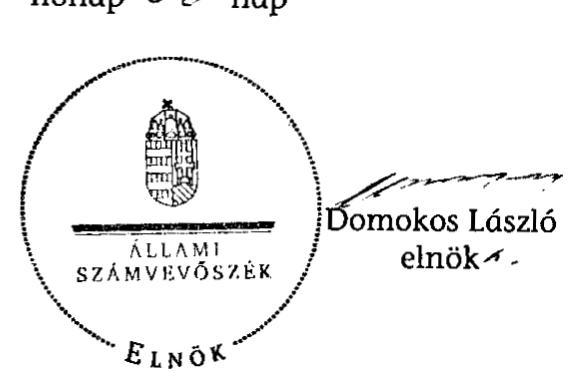

# JELENTÉS 

Gönyű Község Önkormányzata belső kontrollrendszerének kialakítása, valamint egyes kontrolltevékenységek és a belső ellenőrzés múködése ellenőrzéséről

---

# Állami Számvevőszék 

Iktatószám: V-0012-058-021-022/2013.
Témaszám: 1051
Vizsgálat-azonosító szám: V059120
Az ellenőrzést felügyelte:
Dr. Benedek Mária
felügyeleti vezető
Az ellenőrzést vezette:
Szakmányné Bilik Mária
ellenőrzésvezető
A számvevőszéki jelentés összeállításában közremúködtek:
Iszakné Dóczé Katalin
számvevő tanácsos
Dr. Láng Ágnes Krisztina
számvevő
Az ellenőrzést végezték:
Iszakné Dóczé Katalin
számvevő tanácsos

Kulcsár Lászlóné
számvevő

---

# TARTALOMJEGYZÉK 

BEVEZETÉS ..... 5
I. ÖSSZEGZŐ MEGÁLLAPÍTÁSOK, KÖVETKEZTETÉSEK, JAVASLATOK ..... 8
II. RÉSZLETES MEGÁLLAPÍTÁSOK ..... 11

1. Az Önkormányzat belső kontrollrendszere kialakításának megfelelősége ..... 11
1.1. A kontrollkörnyezet kialakítása ..... 11
1.2. A kockázatkezelési rendszer kialakítása ..... 11
1.3. A kontrolltevékenységek kialakítása ..... 12
1.4. Az információs és kommunikációs rendszer szabályozása ..... 12
1.5. A monitoring rendszer kialakítása ..... 13
2. A pénzügyi folyamatokban kulcsszerepet betöltő belső kontrollok (szakmai teljesítésigazolás és utalvány ellenjegyzés) múködése ..... 13
3. A belső ellenőrzés szervezeti keretei és múködése ..... 15

## FÜGGELÉKEK

1. számú Értelmező szótár
2. számú A belső kontrollrendszer kialakítása, a pénzügyi folyamatokban kulcsszerepet betöltő szakmai teljesítésigazolás és utalvány ellenjegyzés kontrollok múködése, valamint a belső ellenőrzés múködése értékelésénél alkalmazott minősítési szempontok

---

.

---

# RÖVIDÍTÉSEK JEGYZÉKE 

| ÁSZ tv. | 2011. LXVI. törvény az Állami Számvevőszékről (hatályos   2011. július 1-jétől) |
| :--: | :--: |
| Avtv. | 1992. évi LXIII. törvény a személyes adatok védelméről és   a közérdekú adatok nyilvánosságáról (hatálytalan: 2012.   január 1-jétől) |
| Info tv. | 2011. évi CXII. törvény az információs önrendelkezési   jogról és az információszabadságról (hatályos 2012. ja-   nuár 1-jétől) |
| Kttv. | 2011. évi CXCIX. törvény a közszolgálati tisztviselőkről   (hatályos 2012. március 1-jétől) |
| Mötv. | 2011. évi CLXXXIX. törvény Magyarország helyi önkor-   mányzatairól (hatályos 2012. január 1-jétől) |
| Ötv.   régi Áht. | 1990. évi LXV. törvény a helyi önkormányzatokról   1992. évi XXXVIII. törvény az államháztartásról (hatály-   talan 2012. január 1-jétől) |
| Számv. tv.   új Áht. | 2000. évi C. törvény a számvitelről   2011. évi CXCV. törvény az államháztartásról (hatályos   2012. január 1-jétől) |
| Rendeletek |  |
| Áhsz. | 249/2000. (XII. 24.) Korm. rendelet az államháztartás   szervezetei beszámolási és könyvvezetési kötelezettségé-   nek sajátosságairól |
| Ámr. | 292/2009. (XII. 19.) Korm. rendelet az államháztartás   múködési rendjéről (hatálytalan: 2012. január 1-jétől) |
| Ávr. | 368/2011. (XII. 31.) Korm. rendelet az államháztartásról   szóló törvény végrehajtásáról (hatályos 2012. január 1-   jétől) |
| Ber. | 193/2003. (XI. 26.) Korm. rendelet a költségvetési szervek   belső ellenőrzéséről (hatálytalan 2012. január 1-jétől) |
| Bkr. | 370/2011. (XII. 31.) Korm. rendelet a költségvetési szervek   belső kontrollrendszeréről és belső ellenőrzéséről (hatá-   lyos 2012. január 1-jétől) |
| Szórövidítések |  |
| adatvédelmi szabályzat | Gönyú Község Önkormányzat Polgármesteri Hivatalának   Adatvédelmi számítástechnikai védelmi és informatikai   szabályzata, közzétételi rend (hatályos 2011. október 3-   tól) |
| ÁSZ | Állami Számvevőszék |
| BEK | Győri Többcélú Kistérségi Társulás Belső ellenőrzési kézi-   könyve - Gönyú Község Önkormányzat és költségvetési   szervei részére (hatályos 2010. január 4-től) |

---

Belső Kontroll Kézikönyv Az Ámr. 155. § (1) bekezdése, valamint az államháztartási belső kontroll standardokról szóló 1/2009. (IX. 11.) PM irányelv egységes értelmezése érdekében az államháztartásért felelős miniszter által 2010. évben kiadott Belső Kontroll Kézikönyv.
BKK
Gönyű Község Önkormányzatának Belső Kontroll Kézikönyve (hatályos 2011. március 31-től)
FEUVE
gazdálkodási jogkörök szabályzata
gozdasági program
hivatali SZMSZ
jegyzö ${ }_{1}$
jegyzö ${ }_{2}$

Képviselő-testület
kockázatkezelési szabályzat
Önkormányzat
polgármester
Polgármesteri Hivatal
Társulás
ügyrend
folyamatba épített, előzetes, utólagos és vezetői ellenőrzés
Gönyű Község Önkormányzatának Kötelezettségvállalás, utalványozás, ellenjegyzés, érvényesítés, szakmai teljesítésigazolás rendjének szabályzata (hatályos 2011. október 3-tól)
Gönyű Község Önkormányzatának Gazdasági programja a 2011-2014. évekre (35/2011. (IV. 28.) számú határozat) 85/2011. (X. 6.) számú önkormányzati határozat, Gönyű Község Önkormányzat Polgármesteri Hivatalának Szervezeti és Múködési Szabályzatáról (hatályos 2011. október 6-tól)
Gönyű Község Önkormányzatának jegyzője 2011. február 1-jéig
Gönyű Község Önkormányzatának jegyzője 2011. március 16-tól (Képviselő-testület 4/2011. (II. 4.) számú határozat)
Gönyű Község Képviselő-testülete
Gönyű Község Önkormányzatának Belső Kontroll Kézikönyve III. fejezete (hatályos 2011. március 31-től)
Gönyű Község Önkormányzata
Gönyű Község Önkormányzatának polgármestere
Gönyű Község Önkormányzatának Polgármesteri Hivatala
Győri Többcélú Kistérségi Társulás
Ügyrend Gönyű Község Önkormányzata gazdasági szervezetének gazdálkodással összefüggő feladataira (hatályos 2011. október 3-tól)

---

# JELENTÉS 

## Gönyú Község Önkormányzata belső kontrollrendszerének kialakítása, valamint egyes kontrolltevékenységek és a belső ellenőrzés múködése ellenőrzéséről

## BEVEZETÉS

A belső kontrollrendszer kialakítását, múködtetését és fejlesztését a régi Áht. és az új Áht. is előírja. Ennek megvalósításáért a költségvetési szerv vezetője felel. A belső kontrollrendszer azt a célt szolgálja, hogy a költségvetési szervek múködésük és gazdálkodásuk során a tevékenységeket szabályszerűen, gazdaságosan, hatékonyan, eredményesen hajtsák végre, teljesítsék elszámolási kötelezettségeiket és megvédjék az erőforrásokat a veszteségektől, a károktól és a nem rendeltetésszerú használattól. A belső kontrollrendszer magában foglalja mindazon szabályokat, eljárásokat, gyakorlati módszereket és szervezeti struktúrákat, kockázatkezelési technikákat, kontrolltevékenységeket, amelyek segítséget nyújtanak a szervezetnek céljai eléréséhez.

Az ÁSZ a 2011-2015. évekre szóló stratégiájában hangsúlyos szerepet szánt annak, hogy szilárd szakmai alapon álló, értékteremtő ellenőrzéseivel előmozdítsa a közpénzügyek átláthatóságát, rendezettségét. A számvevőszéki ellenőrzés nemzetközi alapelvei is rögzítik, hogy a megfelelő belső kontrollrendszer minimálisra csökkenti a hibák és szabálytalanságok kockázatát.

Az ellenőrzés célja annak értékelése volt, hogy az Önkormányzat a jogszabályi előírásoknak megfelelően alakította-e ki a belső kontrollrendszert; a gazdálkodás folyamatában kulcsszerepet betöltő szakmai teljesítésigazolás és az utalvány ellenjegyzés kontrolltevékenységeit megfelelően múködtette-e; biztosí-totta-e a belső ellenőrzés szabályos és eredményes múködését.

Az ÁSZ ezen ellenőrzési céljait pilot (próba) jelleggel községi/nagyközségi önkormányzatoknál végzett ellenőrzések során érvényesítette.

Az ellenőrzés típusa: szabályszerűségi ellenőrzés
Az ellenőrzés jogszabályi alapja: az ÁSZ tv. 5. § (2) és (6) bekezdései
Az ellenőrzött szervezet: az Önkormányzat
Az ellenőrzött időszak: a belső kontrollrendszer kialakításának megfelelőségét a 2011. évre vonatkozóan értékeltük. A kontrolltevékenységek múködésének megfelelőségét a 2011. január 1-je és december 31-e, míg a belső ellenőrzés múködésének szabályosságát és eredményességét a 2009. január 1-je és 2011.

---

december 31-e közötti időszakot figyelembe véve értékeltük. A helyszíni ellenőrzés lezárásáig a helyi szabályozás változásait nyomon követtük.

Az ellenőrzés szakmai módszertana az ÁSZ hivatalos honlapján (www.asz.hu) közzétett szakmai szabályokon alapult, amely a Legfőbb Ellenőrző Intézmények Nemzetközi Szervezete (INTOSAI) által kiadott nemzetközi standardok (ISSAI) figyelembevételével készült.

A belső kontrollrendszer kialakításának ellenőrzése során értékeltük a kontrollkörnyezet, a kockázatkezelési rendszer, a kontrolltevékenységek, az információs és kommunikációs rendszer, valamint a monitoring rendszer szabályozottságának megfelelőségét.

Értékeltük a pénzügyi folyamatokban kulcsszerepet betöltő szakmai teljesítésigazolás és az utalvány ellenjegyzés kontrollok múködésének megfelelőségét az államháztartáson kívülre teljesített múködési és felhalmozási célú pénzeszközátadásoknál, az állományba nem tartozók megbízási díjainál, továbbá a külső szolgáltatók által végzett karbantartási, kisjavítási munkákkal kapcsolatos kifizetéseknél. Az egyszerú véletlen mintavétellel kiválasztott tételek ellenőrzését többlépcsős megfelelőségi tesztek útján addig végeztük, amíg elegendő és megfelelő bizonyítékot szereztünk a vizsgált folyamatok kulcskontrolljai múködésének megfelelő vagy nem megfelelő voltáról. Értékeltük az Önkormányzatnál a belső ellenőrzés múködésének szabályosságát és eredményességét. Az ÁSZ a 2007-2010. években az Önkormányzatnál a gazdálkodás szabályszerűségére irányuló átfogó ellenőrzést nem végzett.

A fogalmak magyarázatát az 1. számú függelék, az ellenőrzés egyes területeinek értékelésénél alkalmazott egységes minősítési szempontokat a 2. számú függelék tartalmazza.

Az ellenőrzés lefolytatásához az Önkormányzat a munkalapok és a tanúsítvány elektronikus kitöltésével, valamint a megjelölt dokumentumok elektronikus megküldésével szolgáltatott adatokat. A munkalapokon szerepeltetett adatok, információk ellenőrzése és szükség szerinti javítása a helyszíni ellenőrzés keretében történt.

Az ÁSZ az ellenőrzés megállapításait az ellenőrzött időszakban hatályos, az intézkedést igénylő megállapításokra tett javaslatokat a jelenleg hatályos jogszabályok alapján fogalmazta meg.

Az ÁSZ tv. 29. § (1) bekezdése szerint a jelentéstervezetet megküldtük a polgármester részére, aki az ÁSZ tv. 29. § (2) bekezdésében foglalt észrevételezési jogával nem élt, a jelentéstervezetre észrevételt nem tett.

Gönyú község állandó lakosainak száma 2011. január 1-jén 3172 fő volt. A 2010. évi önkormányzati választást követően az Önkormányzat héttagú Képvi-selő-testületének munkáját négy állandó bizottság segítette. Az Önkormányzat az önállóan múködő és gazdálkodó Polgármesteri Hivatalon felül három önállóan múködő intézménnyel látta el feladatát. Az Önkormányzat nem rendelkezett többségi tulajdoni hányadú gazdasági társasággal. A polgármester a 2006. évtől tölti be tisztségét. A jegyző ${ }_{1}$ 2011. augusztus 31-i hatállyal nyugdíjba vonult (2011. február 1-jétől felmentették a munkavégzés alól). A jegyzö ${ }_{2}$

---

kinevezése 2011. március 16-i hatállyal, határozatlan időre történt. Az Önkormányzatnál a Polgármesteri Hivatal feladatellátásának szervezeti keretei 2013. január 1-jét követően nem változtak. A Polgármesteri Hivatalban 2011. január 1-jén kilenc köztisztviselőt foglalkoztattak. A Polgármesteri Hivatalban háromfős gazdasági szervezeti egység múködött, amely ellátta a három önállóan működő költségvetési intézmény gazdálkodási feladatait is. Az Önkormányzat a 2011. évi költségvetési beszámolója szerint 535332 ezer Ft költségvetési bevételt ért el, valamint 484379 ezer Ft költségvetési kiadást teljesített. A 2011. december 31-i könyvviteli mérleg szerint 899821 ezer Ft értékű eszközvagyonnal rendelkezett, 23930 ezer Ft hosszú lejáratú, valamint 46676 ezer Ft rövid lejáratú kötelezettsége volt.

---

# I. ÖSSZEGZŐ MEGÁLLAPÍTÁSOK, KÖVETKEZTETÉSEK, JAVASLATOK 

A belső kontrollrendszeren belül 2011-ben a Polgármesteri Hivatalban a kontrollkörnyezet, a kockázatkezelési rendszer, a kontrolltevékenységek és a monitoring rendszer kialakítását, valamint, az információs és kommunikációs rendszer szabályozását külön-külön és összesítve is értékeltük. A belső kontrollrendszer kialakítása az összesített értékelés alapján megfelelt a jogszabályi előírásoknak. Az egyes területek kialakításának értékelését az alábbiakban részletezzük.

A kontrollkörnyezet kialakítása megfelelt a jogszabályi követelményeknek, mert a Képviselő-testület elfogadta az Önkormányzat gazdasági programját, a jegyző ${ }_{1,2}$ meghatározta a Polgármesteri Hivatal szervezeti rendjét, múködési folyamatait, a feladatok ellátásának hatásköri és felelősségi viszonyait, a jogszabályi előírásoknak megfelelő tartalommal elkészítette a Polgármesteri Hivatal múködését és gazdálkodását érintő legfontosabb szabályzatokat.

A kockázatkezelési rendszer kialakítása megfelelt a jogszabályi előírásoknak, mert a jegyző ${ }_{2}$ az Ámr. ${ }^{1}$ előírásainak megfelelően elvégezte a kockázatok elemzését, a kockázatkezelés szabályozása tartalmazta a kockázatok meghatározásának, felmérésének, elemzésének és kezelésének módját, továbbá a kockázatkezelés teljes folyamatának felülvizsgálatát, dokumentálását.

A kontrolltevékenységek kialakítása a jogszabályi előírásoknak megfelelt, mert a jegyző ${ }_{1,2}$ szabályozta a régi Áht. ${ }^{2}$ előírásai szerint a folyamatba épített, előzetes, utólagos és vezetői ellenőrzés, valamint a belső jelentéstétel feladatait. Az Ámr. előírásait figyelembe véve meghatározta a gazdálkodási jogkörök gyakorlásának szabályait. Rögzítette a Polgármesteri Hivatal köztisztviselőinek végrehajtási, ellenőrzési és pénzügyi teljesítési feladatait.

Az információs és kommunikációs rendszer szabályozása megfelelt a jogszabályi követelményeknek, mert a Polgármesteri Hivatal rendelkezett iratkezelési szabályzattal, adatvédelmi és adatbiztonsági szabályzattal, valamint szabálytalanságkezelési eljárásrenddel. A jegyző ${ }_{2}$ ugyanakkor az informatikai rendszer környezetének szabályozása során az Avtv. ${ }^{3}$ előírása ellenére nem határozta meg a hozzáférési jogosultságokra vonatkozó előírások betartásának ellenőrzési kötelezettségét, módját.

A monitoring rendszer kialakítása a jogszabályi követelményeknek megfelelt, mert a jegyző ${ }_{2}$ az Ámr. előírásai alapján kialakította az operatív tevékenységek keretében megvalósuló folyamatos és eseti nyomon követésből álló moni-

[^0]
[^0]:    ${ }^{1}$ 2012. január 1-jétől az Ávr.
    ${ }^{2}$ 2012. január 1-jétől a Bkr.
    ${ }^{3}$ 2012. január 1-jétől az Info tv.

---

toring rendszert. Meghatározta a szervezeti teljesítmények nyomon követésére szolgáló mutatószámokat, indikátorokat és a rendszeresen végzendő vezetői ellenőrzés rendjét.

A megfelelően kialakított belső kontrollrendszer az előírások végrehajtása esetén biztosítja az Önkormányzat tevékenységeinek szabályszerű, gazdaságos, hatékony és eredményes végrehajtását.

A Polgármesteri Hivatalban a 2011. évben az államháztartáson kívülre történő működési és felhalmozási célú pénzeszközátadásokkal, az állományba nem tartozók megbízási díjaival, valamint a külső szolgáltatók által végzett karbantartással, kisjavítással kapcsolatos kifizetések során - összefoglalóan értékelve a pénzügyi folyamatokban kulcsszerepet betöltő szakmai teljesítésigazolás és utalvány ellenjegyzés belső kontrollok múködésének megfelelősége kiváló volt.

Az államháztartáson kívülre történő működési és felhalmozási célú pénzeszközátadásokkal, az állományba nem tartozók megbízási díjaival és a külső szolgáltatók által végzett karbantartással, kisjavítással kapcsolatos kiadások teljesítését megelőzően a szakmai teljesítésigazolásra a jegyző ${ }_{1,2}$ által kijelölt személyek ellenőrzési és igazolási kötelezettségüknek az Ámr.-ben és a gazdálkodási jogkörök szabályzatában előírt módon - az állományba nem tartozók megbízási díjai kiadásoknál feltárt eseti hiányosságok kivételével - eleget tettek. Az utalványok ellenjegyzője - az Ámr.-ben foglalt kötelezettségét teljesítve - meggyőződött a szakmai teljesítésigazolás és az érvényesítés megtörténtéről, valamint a gazdálkodásra vonatkozó szabályok érvényesüléséről. A számvevőszéki ellenőrzés az ellenőrzött kifizetésekkel összefüggésben a rendelkezésre bocsátott dokumentumok alapján kár bekövetkeztére utaló adatot, tényt nem állapított meg.

Az Önkormányzat a belső ellenőrzési feladatokat a Társulás útján látta el. Az Önkormányzatnál a belső ellenőrzés szabályozása és múködése az ellenőrzött időszak egészét tekintve a jogszabályi előírásoknak jól megfelelt. A belső ellenőrzés szabályozása annak ellenére jól megfelelt, hogy a jegyzö ${ }_{1,2}$ a Ber. ${ }^{4}$ előírásaival szemben a belső ellenőrzést végzők jogállását, feladatait a hivatali SZMSZ-ben nem határozta meg, továbbá, hogy az ellenőrzési programokat nem a belső ellenőrzési vezető, hanem a jegyző ${ }_{1,2}$ hagyta jóvá.

Az Önkormányzatnál a 2009-2011. években a belső ellenőrzés múködése a 2. számú függelékben részletezett kritériumrendszer alapján végzett értékelés szerint - eredményes volt, mert a belső ellenőrzés szabályozása és múködése az összesített értékelés alapján az ellenőrzött időszak egészét tekintve a jogszabályi előírásoknak jól megfelelt, és ellenőrizték a belső kontrollrendszer kialakításának szabályozottságát és a gazdálkodási jogkörök gyakorlásához kapcsolódó belső kontrollok múködését. A belső ellenőrzés múködése azért is eredményes volt, mert az elvégzett ellenőrzések belső ellenőri jelentésekbe foglalt javaslatainak hasznosításáról a jegyző ${ }_{1,2}$ intézkedett. A belső ellenőrzés eredményes mű-

[^0]
[^0]:    ${ }^{4}$ 2012. január 1-jétől a Bkr.

---

ködése elősegítette a szabálytalanságok megelőzését, a feltárt hibák kijavítását és megszüntetését.

Az ÁSZ tv. 33. § (1) bekezdésében foglaltak értelmében az ellenőrzött szervezet vezetője köteles a jelentésben foglalt megállapításokhoz kapcsolódó intézkedési tervet összeállítani, és azt a jelentés kézhezvételétől számított 30 napon belül az ÁSZ részére megküldeni. Amennyiben az intézkedési tervet határidőre nem küldi meg a szervezet, vagy az - az ÁSZ tv. 33. § (2) bekezdésében foglalt póthatáridő eltelte ellenére - továbbra sem elfogadható, az ÁSZ elnöke a hivatkozott törvény 33. § (3) bekezdés a)-b) pontjaiban foglaltakat érvényesítheti.

Az ellenőrzés intézkedést igénylő megállapításai és javaslatai:

# a jegyzőnek 

1. az információs és kommunikációs rendszerrel kapcsolatban:

Az informatikai rendszer környezetének szabályozása során az Avtv. 10. § (1)-(2) bekezdéseinek előírása ellenére a jegyző ${ }_{2}$ nem rendelkezett a hozzáférési jogosultságokra vonatkozó előírások, eljárási szabályok betartásának ellenőrzéséről.

Javaslat:
Az adatok biztonsága érdekében az Info tv. 7. § (2)-(3) bekezdései alapján, az informatikai rendszer környezetének szabályozása során írja elő az informatikai rendszer hozzáférési jogosultságaira vonatkozó eljárási szabályok betartásának ellenőrzési kötelezettségét.
2. a belső ellenőrzés működésével kapcsolatban:

A jegyző ${ }_{1,2}$ - a Ber. 4. § (2) bekezdésében foglaltak ellenére - a hivatali SZMSZ-ben nem írta elő a belső ellenőrzést végzők jogállását, feladatait. A Ber. 23. § (3) bekezdésének előírása ellenére nem a belső ellenőrzési vezető, hanem a jegyző ${ }_{1,2}$ hagyta jóvá a belső ellenőrzési programokat.

Javaslat:
a) Módosítsa a hivatali SZMSZ-t, és kezdeményezze a polgármesternél a módosítás Képviselő-testület elé terjesztését annak érdekében, hogy az a Bkr. 15. § (2) bekezdésében foglaltaknak megfelelően tartalmazza a belső ellenőrzést végzők jogállását és feladatkörét.
b) Kezdeményezze, hogy az ellenőrzési programokat a Bkr. 33. § (2) bekezdésében foglaltaknak megfelelően a belső ellenőrzési vezető hagyja jóvá.

---

# II. RÉSZLETES MEGÁLLAPÍTÁSOK 

## 1. Az ÖNKORMÁNYZAT BELSŐ KONTROLLRENDSZERE KIALAKÍTÁSÁNAK MEGFELELŐSÉGE

### 1.1. A kontrollkörnyezet kialakítása

A kontrollkörnyezet kialakítása a 2. számú függelékben részletezett kritériumrendszer alapján végzett értékelés szerint a Polgármesteri Hivatalban megfelelő volt, mert a Képviselő-testület - az Ötv. 91. § (1) és (7) bekezdéseinek ${ }^{5}$ megfelelően - elfogadta az Önkormányzat gazdasági programját, a jegy$z_{1,2}$ meghatározta a Polgármesteri Hivatal szervezeti rendjét, múködési folyamatait, a feladatok ellátásának hatásköri és felelősségi viszonyait, továbbá a jogszabályi előírásoknak megfelelő tartalommal elkészítette a Polgármesteri Hivatal múködését és gazdálkodását érintő legfontosabb szabályzatokat, valamint a köztisztviselők munkaköri leírásait.

A kontrollkörnyezet kialakítása során a jegyző ${ }_{1,2}$ az Ámr. 155. § (3) bekezdése ${ }^{6}$ előírását figyelmen kívül hagyva az államháztartásért felelős miniszter által kiadott Belső Kontroll Kézikönyv ajánlásait nem hasznosította.

A kontrollkörnyezet kialakítása során a jegyző ${ }_{2}$ a Belső Kontroll Kézikönyv 1.6.1. pontjában foglalt ajánlás ellenére nem intézkedett - a szervezeti célokkal összhangban - az etikai értékek és az integritás kiemelt kezeléséről, nem határozta meg a köztisztviselőkkel szembeni etikai elvárásokat.

### 1.2. A kockázatkezelési rendszer kialakítása

A kockázatkezelési rendszer kialakítása a 2. számú függelékben részletezett kritériumrendszer alapján végzett értékelés szerint a Polgármesteri Hivatalban megfelelő volt, mert a jegyző ${ }_{2}$ elkészítette a kockázatkezelési szabályzatot, amelyben az Ámr. 157. § (1)-(3) bekezdése ${ }^{7}$ alapján meghatározta a kockázatok felmérésének, elemzésének és kezelésének a módját. A kockázatkezelés folyamatában előírta a beazonosított kockázatok legalább évenkénti felülvizsgálati kötelezettségét, kijelölte a felülvizsgálat végrehajtásáért felelős személyt. A jegyző ${ }_{2}$ a 2011. évben az Ámr. 157. § (1)-(2) bekezdése alapján kockázatelemzést végzett. Gondoskodott továbbá a csalás és a korrupció, mint kiemelt kockázatok értékelésének és kezelésének szabályozásáról.

A kockázatkezelési rendszer kialakítása során a jegyző ${ }_{2}$ az Ámr. 155. § (3) bekezdésének előírását figyelmen kívül hagyva az államháztartásért felelős miniszter által kiadott Belső Kontroll Kézikönyv ajánlásait nem hasznosította.

[^0]
[^0]:    ${ }^{5}$ 2012. január 1-jétől a Mötv. 116. §-a
    ${ }^{6}$ 2012. január 1-jétől a Bkr. 5. § (1) bekezdése
    ${ }^{7}$ 2012. január 1-jétől a Bkr. 7. §-a

---

A kockázatkezelési rendszer kialakítása során a jegyző ${ }_{2}$ :

- a Belső Kontroll Kézikönyv 2.2.3. pontjában foglaltakat figyelmen kívül hagyva a kockázatok elemzése során nem határozta meg a kockázati tűréshatárokat;
- a Belső Kontroll Kézikönyv 2.3.3. pontjában foglalt ajánlás ellenére nem szabályozta a kockázatokkal kapcsolatban hozott intézkedések hatásának, hatékonyságának és gazdaságosságának felülvizsgálati módszerét.

# 1.3. A kontrolltevékenységek kialakítása 

A kontrolltevékenységek kialakítása a Polgármesteri Hivatalban a 2. számú függelékben részletezett kritériumrendszer alapján végzett értékelés szerint megfelelő volt, mert a régi Áht. 121/A. § (4) bekezdése ${ }^{8}$ alapján a jegy$z \tilde{o}_{1,2}$ szabályozta a folyamatba épített, előzetes, utólagos és vezetői ellenőrzés, valamint a belső jelentéstétel feladatait. A gazdálkodási jogkörök szabályzatában meghatározta az érvényesítés rendjét, a szakmai teljesítésigazolás módját és kijelölte az érvényesítésre, illetve szakmai teljesítésigazolásra jogosultakat. Az ügyrendben és a köztisztviselők munkaköri leírásaiban rögzítette a Polgármesteri Hivatal gazdasági szervezeti egysége köztisztviselőinek végrehajtási, ellenőrzési és pénzügyi teljesítési feladatait. A jegyző ${ }_{1,2}$ - a 2011. október 3-ától hatályos közszolgálati szabályzatban - szabályozta a munkaviszony megszủnése esetén a folyamatban lévő feladatok átadásának rendjét.

### 1.4. Az információs és kommunikációs rendszer szabályozása

Az információs és kommunikációs rendszer szabályozottsága a Polgármesteri Hivatalban a 2. számú függelékben részletezett kritériumrendszer alapján végzett értékelés szerint megfelelő volt, mert a jegyző ${ }_{2}$ szabályozta az információáramlás rendjét és a kommunikációs feladatokat, meghatározta a kötelezően közzéteendő adatok nyilvánosságra hozatalának és a közérdekú adatok megismerésére irányuló kérelmek intézésének rendjét. Biztosította az informatikai rendszer környezetének szabályozottságát, a feldolgozott adatok mentési eljárásait és felelősségi viszonyait. A jegyző ${ }_{2}$ kialakította az iktatási rendszert. A Polgármesteri Hivatal rendelkezett adatvédelmi és adatbiztonsági szabályzattal, valamint szabálytalanságkezelési eljárásrenddel. Az informatikai rendszer környezetének szabályozása során azonban a jegyző ${ }_{2}$ - az Avtv. 10. § (1) bekezdésében ${ }^{9}$ foglalt előírások ellenére - nem szabályozta a hozzáférési jogosultságokra vonatkozó előírások betartásának ellenőrzési kötelezettségét, módját.

Az információs és kommunikációs rendszer szabályozása során a jegyző ${ }_{2}$ az Ámr. 155. § (3) bekezdésének előírását figyelmen kívül hagyva az államháztartásért felelős miniszter által kiadott Belső Kontroll Kézikönyv ajánlásait nem hasznosította.

[^0]
[^0]:    ${ }^{8}$ 2012. január 1-jétől a Bkr. 8. § (1)-(2) bekezdései
    ${ }^{9}$ 2012. január 1-jétől az Info tv. 7. § (2) bekezdése

---

Az információs és kommunikációs rendszer szabályozása során a jegyző ${ }_{2}$ :

- az iktatási, iratkezelési rendszer szabályozása során a Belső Kontroll Kézikönyv 4.2.4. pontjában foglalt ajánlásokat nem hasznosította, mert nem szabályozta az ügyintézési határidők nyomon követésének dokumentálását, a késedelmes ügyintézés jelzéséért való felelősség rendjét;
- a szabálytalanságkezelés szabályozása keretében, a Belső Kontroll Kézikönyv 4.3.3. pontjában foglaltakat figyelmen kívül hagyva, nem rögzítette a szabálytalanságot bejelentő védelmére vonatkozó előírásokat és kötelezettségeket.

# 1.5. A monitoring rendszer kialakítása 

A monitoring rendszer kialakítása a Polgármesteri Hivatalban a 2. számú függelékben részletezett kritériumrendszer alapján végzett értékelés szerint megfelelő volt, mert a monitoring rendszer kialakítása során az Ámr. 160. § (1)-(2) bekezdései ${ }^{10}$ előírása alapján a jegyző ${ }_{2}$ - a BKK-ban, a BEK-ben és a FEUVE szabályzatban - meghatározta az operatív tevékenységek keretében megvalósuló folyamatos és eseti nyomon követés, valamint a rendszeresen végzendő vezetői ellenőrzés rendjét. A jegyző ${ }_{2}$ meghatározta a kiemelt közszolgáltatások ${ }^{11}$ teljesítményének nyomon követésére szolgáló mutatószámokat, előírta az indikátorok alakulásának nyomon követését és értékelését. Múködtette az operatív tevékenységektől független belső ellenőrzést.

A monitoring rendszer kialakítása során a jegyző ${ }_{2}$ az Ámr. 155. § (3) bekezdésének előírását figyelmen kívül hagyva az államháztartásért felelős miniszter által kiadott Belső Kontroll Kézikönyv ajánlásait nem hasznosította.

A jegyző ${ }_{1,2}$ a Belső Kontroll Kézikönyv 1.2.2. pontjában foglalt ajánlást figyelmen kívül hagyva a szervezeti célok megvalósításának nyomon követése érdekében a lakosság, illetve a szolgáltatásokat igénybe vevők körében az önkormányzati feladatellátásra irányulóan elégedettségi felméréseket a 2009-2011. években nem végeztetett.

A belső kontrollrendszer kialakítása a Polgármesteri Hivatalban 2011ben a kontrollkörnyezet, a kockázatkezelési rendszer, a kontrolltevékenységek, az információs és kommunikációs rendszer, valamint a monitoring rendszer értékelése alapján összességében megfelelt a jogszabályi előírásoknak.

## 2. A PÉNZÜGYI FOLYAMATOKBAN KULCSSZEREPET BETÖLTŐ BELSŐ KONTROLLOK (SZAKMAI TELJESÍTÉSIGAZOLÁS ÉS UTALVÁNY ELLENJEGYZÉS) MŰKÖDÉSE

A Polgármesteri Hivatalban a 2011. évben az államháztartáson kívülre teljesített múködési és felhalmozási célú pénzeszközátadások között

[^0]
[^0]:    ${ }^{10}$ 2012. január 1-jétől a Bkr. 10. §-a
    ${ }^{11}$ a pénzbeli szociális ellátások, a szociális alapszolgáltatások, az óvodai ellátás és a jegyzői hatáskörbe tartozó elsőfokú hatósági tevékenység (ügyintézés)

---

elszámolt kiadások teljesítése során a szakmai teljesítésigazolás és az utalvány ellenjegyzés kulcskontrollok múködésének megfelelősége kiváló volt, mert a kiadások jogosságának, összegszerűségének ellenőrzését a jegyző ${ }_{1,2}$ által a szakmai teljesítésigazolásra kijelölt személyek a gazdálkodási jogkörök szabályzatában előírt módon elvégezték. Az utalványok ellenjegyzője a gazdálkodásra vonatkozó szabályok érvényesüléséről, továbbá a szakmai teljesítésigazolás és az érvényesítés elvégzéséről meggyőződött.

A Polgármesteri Hivatalban a 2011. évben az állományba nem tartozók megbízási díjainak kifizetése során a szakmai teljesítésigazolás és az utalvány ellenjegyzés kulcskontrollok múködésének megfelelősége jó volt, mert

- a szakmai teljesítésigazolás során a megbízási szerződésekben meghatározott feladatok teljesítésének igazolását, a kiadások jogosságának, összegszerűségének ellenőrzését a jegyző ${ }_{1,2}$ által a feladatra kijelölt személy a gazdálkodási szabályzatban előírt módon - a feltárt eseti hiányosságok kivételével - elvégezte;

A szakmai teljesítés igazolására kijelölt személy az Ámr. 76. § (1) bekezdésében ${ }^{12}$ foglaltakat figyelmen kívül hagyva - aláírása, a dátum feltüntetése és a teljesítés tényére történő utalás ellenére - a népszámláláshoz kapcsolódó, 106770 Ft , 132260 Ft és 113925 Ft összegű megbízási díjak 2011. november 10-i kifizetése előtt nem végezte el a kifizetések összegszerűségének ellenőrzését, mert nem kifogásolta, hogy a megbízási díjak elszámolásának dokumentumán a megbízási szerződésben ${ }^{13}$ rögzítetteken túl további díjtételt - az oktatáson való, 3000 Ft öszszegű részvételi díjat - is szerepeltettek a számlálóbiztosi tevékenység elszámolásakor.

- az utalványok ellenjegyzője a gazdálkodásra vonatkozó szabályok érvényesüléséről, a szakmai teljesítésigazolás és az érvényesítés megtörténtéről meggyőződött.

A Polgármesteri Hivatalban a 2011. évben a külső szolgáltatók által teljesített karbantartási, kisjavítási szolgáltatások kiadásai során a szakmai teljesítésigazolás és az utalvány ellenjegyzés kulcskontrollok múködésének megfelelősége kiváló volt, mert a kiadások jogosságának, összegszerűségének, a szerződésben, megrendelésben foglaltak teljesítésének ellenőrzését a jegyző ${ }_{1,2}$ által a szakmai teljesítésigazolásra kijelölt személyek a gazdálkodási jogkörök szabályzatában előírt módon elvégezték. Az utalványok ellenjegyzője a gazdálkodásra vonatkozó szabályok érvényesüléséről, továbbá a szakmai teljesítésigazolás és az érvényesítés elvégzéséről meggyőződött.

A 2011. évben az államháztartáson kívülre történő működési és felhalmozási célú pénzeszkózátadásokkal; az állományba nem tartozók megbízási díjaival;

[^0]
[^0]:    ${ }^{12}$ 2012. január 1-jétől az Ávr. 57. § (1) bekezdése
    ${ }^{13}$ A Polgármesteri Hivatal és a számlálóbiztos között létrejött megbízási szerződés 12. pontja rögzíti a tevékenység után járó díjtételeket a 305/2010. (XII. 23.) Korm. rendelet melléklete alapján, amiben nincs külön nevesítve a számlálóbiztosokat megillető oktatási költségtérítés és járuléka.

---

valamint a külső szolgáltatók által végzett karbantartással, kisjavítással kapcsolatos kiadások során - összefoglalóan értékelve - a szakmai teljesítésigazolás és az utalvány ellenjegyzés kulcskontrollok múködésének megfelelősége kiváló volt. A számvevőszéki ellenőrzés az ellenőrzött kifizetésekkel összefüggésben a rendelkezésre bocsátott dokumentumok alapján kár bekövetkeztére utaló adatot, tényt nem állapított meg.

# 3. A BELSŐ ELLENŐRZÉS SZERVEZETI KERETEI ÉS MŰKÖDÉSE 

Az Önkormányzat a belső ellenőrzési feladatokat - a Képviselő-testület külön döntése ${ }^{14}$ alapján - a Társulás útján látta el az Ötv. 92. § (8) bekezdés c) pontja szerint, az ellenőrzött időszak egészében. A Ber. 4. § (2) bekezdése ${ }^{15}$ előírásait megsértve a hivatali SZMSZ nem, csak a társulási megállapodás tartalmazta a belső ellenőrzést végzők jogállását és feladatait.

A 2009-2011. években az Önkormányzatnál a belső ellenőrzés múködése a jogszabályi előírásoknak jól megfelelt. Az Önkormányzatra vonatkozó éves ellenőrzési tervek tartalmukban megfeleltek a Ber.-ben megfogalmazott előírásoknak, azokat a Képviselő-testület az Ötv.-ben előírt határidőn belül hagyta jóvá. Az éves ellenőrzési terveket a Ber. 21. § (2) és 32/B. § (2) bekezdéseiben ${ }^{16}$ előírtaknak megfelelően kockázatelemzéssel alapozták meg és a jegyzö ${ }_{1,2}$ írásos véleményének figyelembevételével készítették el.

Az ellenőrzési tervekben mindhárom évben két-két magas kockázatú ellenőrzés végrehajtását tervezték. A tervezett ellenőrzéseket végrehajtották, soron kívüli ellenőrzést nem végeztek. Az ellenőrzések során büntető-, szabálysértési, kártérítési, vagy fegyelmi eljárás megindítására okot adó cselekményt nem tártak fel.

A 2009. évben a pályáztatási és projekt-elszámolási rendszer és az átadott pénzeszközök felülvizsgálatát, a 2010. évben a bér- és létszámgazdálkodás és a gépjármúhasználat szabályozásának, gyakorlatának ellenőrzését, a 2011. évben pedig a FEUVE szabályozásának, gyakorlatának, valamint a házipénztárban és az ellátmánypénztárban a készpénzkezelés szabályozásának, illetve gyakorlatának ellenőrzését tervezték és végezték el.

Az ellenőrzési programokat a Ber. 23. § (3) bekezdése ${ }^{17}$ előírása ellenére nem a belső ellenőrzési vezető, hanem a jegyzö ${ }_{1,2}$ hagyta jóvá. A 2009-2011. években az ellenőrzéseket az így elfogadott ellenőrzési programok alapján végezték.

Az ellenőrzésekről készült jelentések megfeleltek a Ber. 27. § (2) bekezdése ${ }^{18}$ előírásainak, az ellenőrzöttek a javaslatok végrehajtására intézkedési tervet készítettek. A jegyzö ${ }_{1,2}$ az elvégzett ellenőrzések javaslatainak hasznosítása érdeké-

[^0]
[^0]:    ${ }^{14}$ a Képviselő-testület 132/2006. (XI. 15.) számú határozata
    ${ }^{15}$ 2012. január 1-jétől a Bkr. 15. § (2) bekezdése
    ${ }^{16}$ 2012. január 1-jétől a Bkr. 31. § (2)-(3) bekezdései és az 56.§ (2) bekezdése
    ${ }^{17}$ 2012. január 1-jétől a Bkr. 33. § (2) bekezdése
    ${ }^{18}$ 2012. január 1-jétől a Bkr. 39. § (3) bekezdése

---

ben intézkedett, a javaslatokat - az éves belső ellenőrzési jelentések szerint hasznosították. A belső ellenőrzési vezető az elvégzett ellenőrzésekről és a belső ellenőrzési jelentések javaslatai alapján megtett intézkedések nyomon követéséről nyilvántartást vezetett. A polgármester az éves ellenőrzési jelentéseket a zárszámadási rendelettervezettel egyidejűleg a Képviselő-testület elé terjesztette.

Az Önkormányzatnál a 2009-2011. években a belső ellenőrzés múködése a 2. számú függelékben részletezett kritériumrendszer alapján végzett értékelés szerint - eredményes volt, mert a belső ellenőrzés szabályozása és múködése az összesített értékelés alapján az ellenőrzött időszak egészét tekintve a jogszabályi előírásoknak jól megfelelt, és a FEUVE szabályozásának, gyakorlatának ellenőrzése során értékelték a belső kontrollkörnyezet kialakítását, ellenőrizték a készpénzkezelés szabályozottságát, gyakorlatát. A belső ellenőrzés múködése azért is eredményes volt, mert az elvégzett ellenőrzések belső ellenőri jelentésekbe foglalt javaslatainak hasznosításáról a jegyző ${ }_{1,2}$ intézkedett.

A belső ellenőrzés eredményes múködése elősegítette a szabálytalanságok megelőzését, a feltárt hibák kijavítását és megszüntetését.

Budapest, 2013.

---

# ÉRTELMEZŐ SZÓTÁR 

belső ellenőrzés
belső kontrollrendszer
belső kontrollrendszer területei
integritás
kockázat
kockázatkezelési rendszer
kontrollkörnyezet

Független, tárgyilagos bizonyosságot adó és tanácsadó tevékenység, amelynek célja, hogy az ellenőrzött szervezet múködését fejlessze és eredményességét növelje, az ellenőrzött szervezet céljai elérése érdekében rendszerszemléletű megközelítéssel és módszeresen értékeli, illetve fejleszti az ellenőrzött szervezet irányítási és belső kontrollrendszerének hatékonyságát. (A régi Áht. 121/B. § (1) bekezdés és a Bkr. 2. § b) pontjából levezetett meghatározás.)
A belső kontrollrendszer a kockázatok kezelése és tárgyilagos bizonyosság megszerzése érdekében kialakított folyamatrendszer, amely azt a célt szolgálja, hogy a múködés és gazdálkodás során a tevékenységeket szabályszerűen, gazdaságosan, hatékonyan, eredményesen hajtsák végre, az elszámolási kötelezettségeket teljesítsék, megvédjék az erőforrásokat a veszteségektől, károktól és nem rendeltetésszerű használattól. (A régi Áht. 121. § (1) és az új Áht. 69. § (1) bekezdéséből levezetett fogalom.)
A kontrollkörnyezet, a kockázatkezelési rendszer, a kontrolltevékenységek, az információ és kommunikáció, valamint a nyomon követés (monitoring). (A régi Áht. 121. § (2) bekezdéséből és a Bkr. 3. §-ából levezetett fogalom.)
Az integritás elvek, értékek, cselekvések, módszerek, intézkedések, konzisztenciáját jelenti: olyan magatartásmódot, amely meghatározott értékeknek felel meg. Az integritás a közszféra esetében a társadalom által elvárt nyilvánossági, átláthatósági, illetve jogi/etikai normáknak történő megfelelést jelenti.
(A http://integritas.asz.hu honlapon közétett „Integritás jelentés 2011" című dokumentum 5. oldal 1. bekezdés.)
Az a lehetőség, hogy egy olyan esemény történik meg, amely negatívan hat a célok elérésére. (ÁSZ Ellenőrzési kézikönyv 6/139-140.oldal)
Olyan irányítási eszközök és módszerek összessége, melynek elemei a szervezeti célok elérését veszélyeztető tényezők (kockázatok) azonosítása, elemzése, csoportosítása, nyomon követése, valamint szükség esetén a kockázati kitettség mérséklése. (2012. január 1-jétől a Bkr. 2. § m) pontjában meghatározott fogalom)
A kontrollkörnyezet alakítja ki a szervezet belső kontrollrendszerhez való viszonyát, hozzáállását, befolyásolja az alkalmazottak belső kontrollal kapcsolatos tudatosságát, magatartását. Elemei a személyes és szakmai elkötelezettség és a vezetés, valamint az alkalmazottak által vallott erkölcsi értékek; a szakmai hozzáértés iránti elkötelezettség; a felső vezetés hozzáállása - a vezetés filozófiája és tevékenységének stílusa; a szervezeti struktúra; a humánerőforrás-politika és gazdálkodási gyakorlat. (ÁSZ Ellenőrzési kézikönyv 6/107. oldal)

---

kontrolltevékenységek
kommunikáció
korrupció
kulcskontrollok
lényegesség
monitoring
utóellenőrzés
véletlen minta

A kontrolltevékenységek azok a politikák és eljárások, amelyeket a kockázatok megoldására hoznak létre a szervezet céljainak teljesítése érdekében. (ÁSZ Ellenőrzési kézikönyv 6/108-109. oldal)
Az a tevékenység, melynek során információ továbbítása valósul meg. A kommunikációs folyamat résztvevői között tájékoztatás történik, mely során tényeket, ezek magyarázatát közlik. „A szervezetben eredményes kommunikációnak kell áramlania lefelé, horizontálisan és felfelé, a szervezet egészében és annak valamennyi elemében." (ÁSZ Ellenőrzési kézikönyv 6/112. oldal)
A közhatalmi pozíció bármilyen erkölcstelen felhasználása személyes, vagy magáncélú előnyök megszerzése érdekében. (ÁSZ Ellenőrzési kézikönyv 6/84. oldal)
Az önkormányzatok kontrollrendszere kialakításának ellenőrzése során a pénzügyi folyamatokban kulcsszerepet betöltő belső kontrollok a szakmai teljesítésigazolás és utalvány ellenjegyzés. (ÁSZ Módszertani útmutató az átfogó ellenőrzéshez 2.2. pontja alapján meghatározott fogalom.)

Egy információ akkor lényeges, ha hiánya vagy téves állítása befolyásolhatja ezen információkat felhasználók döntéseit, véleményét. Az ellenőrzés során a lényegesség három szempontból értelmezhető: érték, jelleg és összefüggés szerint. (ÁSZ Ellenőrzési kézikönyv 6/122-123. oldal)
A monitoring a különböző szintű szervezeti célok megvalósításának folyamatát kíséri figyelemmel, melynek során a releváns eseményekről és tevékenységekről (együtt: folyamatokról) rendszeres jelleggel, strukturált, döntéstámogató információkhoz jutnak a szervezet vezetői. (NGM útmutató a költségvetési szervek monitoring rendszeréhez 3. oldal, 2011. november, 2012. január 1-jétől a Bkr. 3. § e) pontja nyomon követési rendszerként azonosítja.)
Az intézkedések nyomon követése érdekében elrendelt ellenőrzés, amelynek célja, hogy a belső ellenőrzés bizonyosságot szerezzen az elfogadott intézkedések végrehajtásáról, vagy arról a tényről, hogy ha az ellenőrzött szerv, illetve az ellenőrzött szervezeti egység vezetője nem, vagy nem az elfogadott intézkedésnek megfelelően hajtja végre a feladatokat, továbbá meggyőződni arról, hogy a végrehajtott intézkedésekkel a megállapított kockázat ténylegesen megszűnt, vagy a kockázati túréshatár alá csökkent. (2012. január 1-jétől a Bkr. 2. § s) pontjában meghatározott fogalom.)
Az alapsokaságot képviselő (reprezentáló) véletlenszerűen kiválasztott részsokaság. (ÁSZ Ellenőrzési kézikönyv 6/71. oldal)

---

# A belső kontrollrendszer kialakítása, a pénzügyi folyamatokban kulcsszerepet betöltő szakmai teljesítésigazolás és utalvány ellenjegyzés kontrollok múködése, valamint a belső ellenőrzés múködése értékelésénél alkalmazott minősítési szempontok 

## 1. A BELSŐ KONTROLLRENDSZER MINŐSÍTÉSE

Az ellenőrzés során először a belső kontrollrendszer területeinek (kontrollkörnyezet, kockázatkezelés, kontrolltevékenységek, információs és kommunikációs rendszer, monitoring rendszer) minősítését külön-külön elvégeztük. A megfelelőség minősítése a belső kontrollrendszer kialakítására vonatkozó kérdéseket tartalmazó munkalapokon, az elérhető és az elért pontokból kimunkált képlet alapján, számítógépes program segítségével történt.

A belső kontrollrendszer egyes területei kialakítása megfelelőségének értékelésére - az elért és elérhető pontok figyelembevételével - sávos rendszer alapján „nem megfelelő", „részben megfelelő" és „megfelelő" minősítést alkalmaztunk.

Az ellenőrzött önkormányzat belső kontrollrendszerének egy-egy területe - az elért pontszámtól függetlenül - „nem megfelelő" értékelést kapott, ha nem teljesítette az alábbi kritériumok bármelyikét.

1. Kontrollkörnyezet kialakítása:

- Az Önkormányzat Képviselő-testülete az Ötv. 91. § (1) bekezdésében előírtaknak megfelelően megalkotta hosszabb időszakra szóló gazdasági programját.
- A Polgármesteri Hivatal ${ }^{1}$ rendelkezik a régi Áht. 88. § (2) bekezdésében előírt alapító okirattal, és az tartalmazza a régi Áht. 90. § (1) bekezdésében előírtakat, kiemelten a d) pont szerinti alaptevékenységeit.
- A Polgármesteri Hivatal rendelkezik a régi Áht. 91. § (2) bekezdésben előírt SZMSZ-szel.
- A Polgármesteri Hivatal rendelkezik az Áhsz. 8. § (3) bekezdésben előírt számviteli politikával.
- A Polgármesteri Hivatal rendelkezik az Áhsz. 8. § (4) bekezdés a) pontjában előírt eszközök és források leltározási és leltárkészítési szabályzatával.
- A Polgármesteri Hivatal rendelkezik az Áhsz. 8. § (4) bekezdés b) pontjában előírt eszközök és források értékelési szabályzatával.

[^0]
[^0]:    ${ }^{1}$ A körjegyzőségben múködő önkormányzatoknál a polgármesteri hivatal feladatait a körjegyzőség látta el.

---

- A Polgármesteri Hivatal rendelkezik az Áhsz. 8. § (4) bekezdés d) pontjában előírt pénzkezelési szabályzattal.
- A Polgármesteri Hivatal rendelkezik az Áhsz. 49. § (1) bekezdésben előírt számlarenddel.
- A Polgármesteri Hivatal rendelkezik a Számv. tv. 161. § (2) bekezdés d) pontjában előírt bizonylati renddel.
- A Polgármesteri Hivatal rendelkezik a munkavédelemről szóló 1993. évi XCIII. törvény 2. § (3) bekezdés és 72. § (4) bekezdés előírásaiban foglalt, az egészséget nem veszélyeztető és biztonságos munkavégzés követelményei megvalósításának módját meghatározó szabályozással.
- A Polgármesteri Hivatal rendelkezik a tűz elleni védekezésről, a műszaki mentésről és a tűzoltóságról szóló 1996. évi XXXI. törvény 19. § (1) bekezdésben előírt tűzvédelmi szabályzattal.
- A Polgármesteri Hivatal rendelkezik az Ámr. 15. § (6) bekezdésben hivatkozott gazdasági szervezet ügyrendjével. Amennyiben a gazdasági feladatokat a Polgármesteri Hivatalon belül több szervezeti egység látja el, és azoknak önálló ügyrendjük van, az is elfogadható.
- A Polgármesteri Hivatal tevékenységeire vonatkozóan az Ámr. 156. § (2) bekezdésben előírtaknak megfelelve elkészült az ellenőrzési nyomvonal, folyamatleírás.

2. Kockázatkezelési tevékenység kialakítása:

- A költségvetési szerv (Polgármesteri Hivatal) vezetője az Ámr. 157. § (1) bekezdése alapján kockázatkezelési rendszert múködtet, melynek keretében elkészítették a kockázatkezelési szabályzatot a Belső Kontroll Kézikönyv 2.1 pontjában meghatározott tartalommal.

3. Információs és kommunikációs rendszer kialakítása:

- A Polgármesteri Hivatal rendelkezik iratkezelési szabályzattal.
- Az 1992. évi LXIII. tv. 31/A. § (3) bekezdésben előírtaknak megfelelve az Önkormányzat jegyzője elkészítette az adatvédelmi és adatbiztonsági szabályzatot.
- Az Ámr. 156. § (3) bekezdésében előírtaknak megfelelve a jegyző szabályozta a szabálytalanságok kezelésének eljárásrendjét.

4. A monitoring rendszer kialakítása:

- Az Önkormányzat rendelkezik a Ber. 5. § (1) bekezdése alapján a jegyző, társult feladatellátás esetén a Ber. 32/B. § (8) bekezdésében előírtaknak megfelelve a társulás munkaszervezeti feladatát ellátó (vagy közös feladatellátás esetén a feladatellátást végző, intézményi társulás esetén az irányítási feladatot ellátó önkormányzat által kijelölt) költségvetési szerv vezetője által jóváhagyott belső ellenőrzési kézikönyvvel.

---

A belső kontrollrendszer öt fő területének egyedi értékelését követően került sor az összegző értékelésre, a minősítés itt is „megfelelő", „részben megfelelő", illetve „nem megfelelő" lehetett:

- Megfelelő a belső kontrollrendszer kialakítása, amennyiben mind az öt fő terület megfelelő értékelést kapott.
- Nem megfelelő a belső kontrollrendszer kialakítása, amennyiben bármelyik fő terület nem megfelelő értékelést kapott.
- Részben megfelelő a kontrollrendszer kialakítása, amennyiben bármelyik fő terület, részben megfelelő értékelést kapott, és egyik fő terület sem kapott nem megfelelő értékelést.

# 2. A KÉT KULCSKONTROLL (SZAKMAI TELJESÍTÉSIGAZOLÁS ÉS AZ UTALVÁNY ELLENJEGYZÉSE) MINŐSÍTÉSE 

A két kulcskontroll (szakmai teljesítésigazolás és az utalvány ellenjegyzése) működése megfelelőségének vizsgálatát többlépcsős megfelelőségi tesztek útján, megismételt eljárással, a könyvviteli tételekből vett véletlen mintavételi eljárással kiválasztott minta alapján végeztük.

Az ellenőrzés során alkalmazott módszer (megfelelőségi teszt) lényege, hogy a kiválasztott minta ellenőrzését csak addig végeztük, amíg elegendő és megfelelő bizonyítékot nem szereztünk a vizsgált kulcskontroll (szakmai teljesítésigazolás, utalvány ellenjegyzés) múködésének megfelelő, vagy nem megfelelő voltáról. A megismételt eljárás alkalmazása a szándékolt hatáshoz (törvényes múködés, kitűzött célok, teljesítmények elérése, veszteséget okozó kockázatok megelőzése, mérséklése, feltárása) viszonyítva lehetővé tette a kontrolltevékenységek tényleges hatásának vizsgálatát, ez alapján a működésük megfelelősége értékelését. Ennek keretében a számvevő bizonyosságot szerzett arról, hogy a rendelkezésre álló szabályozás és dokumentumok alapján a szakmai teljesítésigazoláshoz és utalvány ellenjegyzéshez szükséges ellenőrzési lépéseket végre-hajtották-e.

A tesztek kiértékelése két szinten történt. Először az egyes tevékenységi területre meghatározott kulcskontrollokat értékeltük, majd általános következtetéseket vontunk le a két kulcskontroll együttes megfelelősége tekintetében. Az ellenőrzésre kijelölt területek kifizetéseinél a két kulcskontroll múködése „kiváló", „jó" vagy „gyenge" minősítést kaphatott.

A szakmai teljesítésigazolás és az utalvány ellenjegyzés múködését:

- kiválónak értékeltük abban az esetben, ha azok múködése megfelel a hibák megelőzésére és kijavítására meghatározott jogszabályi és helyi szintű szabályozásnak;
- jónak minősítettük, ha a megállapított kisebb (tolerálható mértékű) hiányosságok nem veszélyeztetik az ellenőrzött területek hibáinak megelőzését és kijavítását;

---

- gyengének értékeltük, amennyiben a kontrollok múködésében előforduló hiányosságok miatt nem biztosított a hibák megelőzése, feltárása, kijavítása.

# 3. A BELSŐ ELLENŐRZÉS MEGFELELŐ ÉS EREDMÉNYES MŰKÖDÉSÉNEK ÉRTÉKELÉSE 

A belső ellenőrzés megfelelő és eredményes múködésének ellenőrzése során értékeltük, hogy az ellenőrzött időszakban a belső ellenőrzés kockázatelemzésen alapuló ellenőrzési terv alapján ellenőrizte-e az Önkormányzat irányítási, belső kontroll eljárásainak hatékonyságát, valamint a jogszabályoknak és belső szabályzatoknak való megfelelését, továbbá a gazdaságosság, hatékonyság és eredményesség követelményeit vizsgálva a belső ellenőrzés fo-galmazott-e meg megállapításokat és ajánlásokat a polgármester és a jegyző részére, és azok hasznosultak-e.

A belső ellenőrzés múködését három év (2009-2011) tapasztalatai, valamint a munkalapok kérdéseire adott válaszok alapján évenként értékeltük, ami az elérhető és az elért pontokból kimunkált képlettel, számítógépes program segítségével történt. A belső ellenőrzés múködése megfelelőségének értékelése során - az elért és elérhető pontok figyelembevételével - a belső kontrollrendszer egyes területeinek minősítésével azonos sávos rendszer alapján „nem felelt meg", „megfelelt" és „jól megfelelt" minősítést alkalmaztunk.

A belső ellenőrzés eredményességének megállapításához a 2009-2011. évek egyedi értékelésén túlmenően az összesített pontszámok alapján is el kellett végezni a „jól megfelelt", „megfelelt" és „nem felelt meg" kategóriák szerinti minősítést.

Eredményesnek akkor tekintettük a belső ellenőrzés múködését, ha az összesített értékelés alapján az önkormányzat legalább „megfelelt" minősítést kapott, és legalább kettő terület ellenőrzésére sor került a 2009-2011. években az alábbiak közül:

- a belső kontrollrendszer kialakításának szabályozottsága;
- a beazonosított tűréshatár feletti kockázatok kezelése érdekében tett intézkedések;
- a gazdálkodási jogkörök gyakorlásához kapcsolódó belső kontrollok múködése;
- a készpénzkezeléssel kapcsolatos belső kontrollok múködése;
- az önkormányzati vagyon hasznosítása területén a vagyongazdálkodási szabályok betartása;
- a vagyonvédelem területén a leltározási és a selejtezési szabályzatban foglaltak betartása;
- kockázatelemzésen alapuló és az előzőekbe nem tartozó ellenőrzés.

---

A belső ellenőrzés eredményessé minősítésének feltétele volt továbbá, hogy az Önkormányzat jegyzője intézkedett a felsorolt és elvégzett ellenőrzések javaslatainak hasznosításáról. Ha a minősítés az összegző értékelés alapján „nem felelt meg", akkor a belső ellenőrzés múködése nem volt eredményes. Amennyiben az összegző értékelés alapján a minősítés „megfelelt", de az előbb felsorolt területek közül legalább kettő ellenőrzésére a 2009-2011. években nem került sor, vagy a javaslatok hasznosulása érdekében az Önkormányzat jegyzője nem intézkedett, úgy a belső ellenőrzés múködése szintén nem volt eredményes.