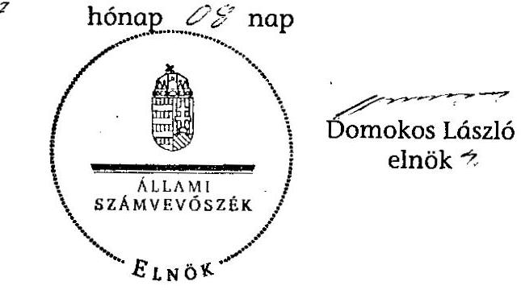

# ÁLLAMI   SZÁMVEVŐSZÉK 

## JELENTÉS

Jánosháza Nagyközség Önkormányzata belső kontrollrendszerének kialakítása, valamint egyes kontrolltevékenységek és a belső ellenőrzés múködése ellenőrzéséről

---

# Állami Számvevőszék 

Iktatószám: V-0012-058-023-022/2013.
Témaszám: 1051
Vizsgálat-azonosító szám: V059122
Az ellenőrzést felügyelte:
Dr. Benedek Mária
felügyeleti vezető
Az ellenőrzést vezette:
Szakmányné Bilik Mária
ellenőrzésvezető
A számvevőszéki jelentés összeállításában közremúködtek:
Kámán Edina
számvevő
Dr. Láng Ágnes Krisztina
számvevő
Az ellenőrzést végezték:
Czmarkó Frigyes
számvevő

Temesváry Miklós
számvevő tanácsos

---

# TARTALOMJEGYZÉK 

BEVEZETÉS ..... 5
I. ÖSSZEGZŐ MEGÁLLAPÍTÁSOK, KÖVETKEZTETÉSEK, JAVASLATOK ..... 8
II. RÉSZLETES MEGÁLLAPÍTÁSOK ..... 16

1. Az önkormányzat belső kontrollrendszere kialakításának megfelelősége ..... 16
1.1. A kontrollkörnyezet kialakítása ..... 16
1.2. A kockázatkezelési rendszer kialakítása ..... 17
1.3. A kontrolltevékenységek kialakítása ..... 17
1.4. Az információs és kommunikációs rendszer kialakítása ..... 18
1.5. A monitoring rendszer kialakítása ..... 18
2. A pénzügyi folyamatokban kulcsszerepet betöltő belső kontrollok (szakmai teljesítésigazolás és utalvány ellenjegyzés) múködése ..... 19
3. A belső ellenőrzés szervezeti keretei és múködése ..... 22

## FÜGGELÉKEK

1. számú Értelmező szótár
2. számú A belső kontrollrendszer kialakítása, a pénzügyi folyamatokban kulcsszerepet betöltő szakmai teljesítésigazolás és utalvány ellenjegyzés kontrollok múködése, valamint a belső ellenőrzés múködése értékelésénél alkalmazott minősítési szempontok

---

.

---

# RÖVIDÍTÉSEK JEGYZÉKE 

## Törvények

ÁSZ tv.
Avtv.

Info tv.

Ötv.
régi Áht.
új Áht.

## Rendeletek

Áhsz.

Ámr.
Ávr.

Ber.
Bkr.

## Szórövidítések

ÁSZ
Belső ellenőrzési kézikönyv

Belső Kontroll Kézikönyv
gazdálkodási jogkörök szabályzata
gazdasági program
2011. évi LXVI. törvény az Állami Számvevőszékről
1992. évi LXIII. törvény a személyes adatok védelméről és a közérdekú adatok nyilvánosságáról (hatálytalan 2012. január 1-jétől)
2011. évi CXII. törvény az információs önrendelkezési jogról és az információszabadságról (hatályos 2012. január 1-jétől)
1990. évi LXV. törvény a helyi önkormányzatokról
1992. évi XXXVIII. törvény az államháztartásról (hatálytalan 2012. január 1-jétől)
2011. évi CXCV. törvény az államháztartásról (hatályos 2012. január 1-jétől)

249/2000. (XII. 24.) Korm. rendelet az államháztartás szervezetei beszámolási és könyvvezetési kötelezettségének sajátosságairól
292/2009. (XII. 19.) Korm. rendelet az államháztartás múködési rendjéről (hatálytalan 2012. január 1-jétől)
368/2011. (XII. 31.) Korm. rendelet az államháztartásról szóló törvény végrehajtásáról (hatályos 2012. január 1jétől)
193/2003. (XI. 26.) Korm. rendelet a költségvetési szervek belső ellenőrzéséről (hatálytalan 2012. január 1-jétől)
370/2011. (XII. 31.) Korm. rendelet a költségvetési szervek belső kontrollrendszeréről és belső ellenőrzéséről (hatályos 2012. január 1-jétől)

Állami Számvevőszék
Celldömölki Kistérség Önkormányzatainak Többcélú Társulása Belső ellenőrzési kézikönyve (hatályos 2007. január 11-étől)
Az Ámr. 155. § (1) bekezdése, valamint az államháztartási belső kontroll standardokról szóló 1/2009. (IX. 11.) PM irányelv egységes értelmezése érdekében az államháztartásért felelős miniszter által a 2010. évben kiadott Belső Kontroll Kézikönyv
Jánosháza Nagyközség Önkormányzata Polgármesteri Hivatala számvitel politikájának melléklete: Kötelezettségvállalás, ellenjegyzés, érvényesítés, utalványozás rendjének szabályzata (hatályos 2010. január 1-jétől)
a Képviselő-testület 22/2011. (III. 31.) számú határozatával elfogadott Jánosháza Nagyközség Önkormányzatának gazdasági programja 2011-2014.

---

| hivatali SZMSZ | Jánosháza Nagyközség Önkormányzata Polgármesteri Hivatalának Szervezeti és Múködési Szabályzata, jóváhagyta a Képviselő-testület 166/2005. (VII. 26.) számú határozata (hatályos 2005. augusztus 1-jétől) |
| :--: | :--: |
| jegyzö $_{1}$ | Jánosháza Nagyközség Önkormányzatának jegyzője 1995. június 1-jétől 2010. december 29-éig |
| jegyzö $_{2}$ | Jánosháza Nagyközség Önkormányzatának megbízott jegyzője 2010. szeptember 1-jétől 2010. december 31-ig, Jánosháza Nagyközség Önkormányzatának jegyzője 2011. január 1-jétől |
| Képviselő-testület kockázatkezelési szabályzat | Jánosháza Nagyközség Képviselő-testülete   Jánosháza Nagyközség Önkormányzata Polgármesteri Hivatalának kockázatkezelési szabályzata (hatályos 2011. október 1-jétől) |
| Önkormányzat polgármester | Jánosháza Nagyközség Önkormányzata   Jánosháza Nagyközség Önkormányzatának polgármestere |
| Polgármesteri Hivatal | Jánosháza Nagyközség Önkormányzatának Polgármesteri Hivatala |
| szabálytalanságkezelési eljárásrend | Jánosháza Nagyközség Önkormányzata Polgármesteri Hivatal szabálytalanságok kezelésének eljárásrendje (hatályos 2011. október 1-jétől) |
| számviteli politika | Jánosháza Nagyközség Önkormányzata Polgármesteri Hivatalának számviteli politikája, számlarendje (hatályos 2010. január 1-jétől) |
| Társulás | Celldömölki Kistérség Önkormányzatainak Többcélú Társulása |

---

# JELENTÉS 

## Jánosháza Nagyközség Önkormányzata belső kontrollrendszerének kialakítása, valamint egyes kontrolltevékenységek és a belső ellenőrzés múködése ellenőrzéséről

## BEVEZETÉS

A belső kontrollrendszer kialakítását, múködtetését és fejlesztését a régi Áht. és az új Áht. is előírja. Ennek megvalósításáért a költségvetési szerv vezetője felel. A belső kontrollrendszer azt a célt szolgálja, hogy a költségvetési szervek múködésük és gazdálkodásuk során a tevékenységeket szabályszerűen, gazdaságosan, hatékonyan, eredményesen hajtsák végre, teljesítsék elszámolási kötelezettségeiket és megvédjék az erőforrásokat a veszteségektől, a károktól és a nem rendeltetésszerú használattól. A belső kontrollrendszer magában foglalja mindazon szabályokat, eljárásokat, gyakorlati módszereket és szervezeti struktúrákat, kockázatkezelési technikákat, kontrolltevékenységeket, amelyek segítséget nyújtanak a szervezetnek céljai eléréséhez.

Az ÁSZ a 2011-2015. évekre szóló stratégiájában hangsúlyos szerepet szánt annak, hogy szilárd szakmai alapon álló, értékteremtő ellenőrzéseivel előmozdítsa a közpénzügyek átláthatóságát, rendezettségét. A számvevőszéki ellenőrzés nemzetközi alapelvei is rögzítik, hogy a megfelelő belső kontrollrendszer minimálisra csökkenti a hibák és szabálytalanságok kockázatát.

Az ellenőrzés célja annak értékelése volt, hogy az Önkormányzat a jogszabályi előírásoknak megfelelően alakította-e ki a belső kontrollrendszert; a gazdálkodás folyamatában kulcsszerepet betöltő szakmai teljesítésigazolás és az utalvány ellenjegyzés kontrolltevékenységeit megfelelően múködtette-e; biztosí-totta-e a belső ellenőrzés szabályos és eredményes múködését.

Az ÁSZ ezen ellenőrzési céljait pilot (próba) jelleggel községi/nagyközségi önkormányzatoknál végzett ellenőrzések során érvényesítette.

Az ellenőrzés típusa: szabályszerűségi ellenőrzés
Az ellenőrzés jogszabályi alapja: az ÁSZ tv. 5. § (2) és (6) bekezdései
Az ellenőrzött szervezet: az Önkormányzat
Az ellenőrzött időszak: a belső kontrollrendszer kialakításának megfelelőségét a 2011. évre vonatkozóan értékeltük. A kontrolltevékenységek múködésének megfelelőségét a 2011. január 1-je és december 31-e, míg a belső ellenőrzés múködésének szabályosságát és eredményességét a 2009. január 1-je és 2011.

---

december 31-e közötti időszakot figyelembe véve értékeltük. A helyszíni ellenőrzés lezárásáig a helyi szabályozás változásait nyomon követtük.

Az ellenőrzés szakmai módszertana az ÁSZ hivatalos honlapján (www.asz.hu) közzétett szakmai szabályokon alapult, amely a Legfőbb Ellenőrző Intézmények Nemzetközi Szervezete (INTOSAI) által kiadott nemzetközi standardok (ISSAI) figyelembevételével készült.

A belső kontrollrendszer kialakításának ellenőrzése során értékeltük a kontrollkörnyezet, a kockázatkezelési rendszer, a kontrolltevékenységek, az információs és kommunikációs rendszer, valamint a monitoring rendszer szabályozottságának megfelelőségét.

Értékeltük a pénzügyi folyamatokban kulcsszerepet betöltő szakmai teljesítésigazolás és utalvány ellenjegyzés kontrollok működésének megfelelőségét az államháztartáson kívülre teljesített múködési és felhalmozási célú pénzeszközátadásoknál, az állományba nem tartozók megbízási díjainál, továbbá a külső szolgáltató által végzett karbantartási, kisjavítási munkákkal kapcsolatos kifizetéseknél. Az egyszerű véletlen mintavétellel kiválasztott tételek ellenőrzését többlépcsős megfelelőségi tesztek útján addig végeztük, amíg elegendő és megfelelő bizonyítékot szereztünk a vizsgált folyamatok kulcskontrolljai múködésének megfelelő vagy nem megfelelő voltáról. Értékeltük az Önkormányzatnál a belső ellenőrzés múködésének szabályosságát és eredményességét. Az ÁSZ a 2007-2010. években az Önkormányzatnál a gazdálkodás szabályszerűségére irányuló, átfogó ellenőrzést nem végzett.

A fogalmak magyarázatát az 1. számú függelék, az ellenőrzés egyes területeinek értékelésénél alkalmazott egységes minősítési szempontokat a 2. számú függelék tartalmazza.

Az ellenőrzés lefolytatásához az Önkormányzat a munkalapok és a tanúsítvány elektronikus kitöltésével, valamint a megjelölt dokumentumok elektronikus megküldésével szolgáltatott adatokat. A munkalapokon szerepeltetett adatok, információk ellenőrzése és szükség szerinti javítása a helyszíni ellenőrzés keretében történt.

Az ÁSZ az ellenőrzés megállapításait az ellenőrzött időszakban hatályos, az intézkedést igénylő megállapításokra tett javaslatokat a jelenleg hatályos jogszabályok alapján fogalmazta meg.

Az ÁSZ tv. 29. § (1) bekezdése szerint a jelentéstervezetet megküldtük a polgármester részére, aki az ÁSZ tv. 29. § (2) bekezdésében foglalt észrevételezési jogával nem élt, a jelentéstervezetre észrevételt nem tett.

Jánosháza nagyközség állandó lakosainak száma 2011. január 1-jén 2599 fő volt. Az Önkormányzat héttagú Képviselő-testületének munkáját két állandó bizottság segítette. Az Önkormányzat az önállóan múködő és gazdálkodó Polgármesteri Hivatalon kívül egy önállóan múködő intézménnyel látta el feladatát. Az Önkormányzat többségi tulajdoni hányadú gazdasági társasággal nem rendelkezett. A polgármester 2003. október 12-e óta tölti be tisztségét. A jegyző ${ }_{2}$ 2010. szeptember 1-jétől megbízással, 2011. január 1-jétől kinevezéssel látja el feladatait. A jegyzőváltás dokumentált munkakör átadás-átvétellel történt.

---

A Polgármesteri Hivatal az ellenőrzött időszakban körjegyzőségi feladatot látott el Karakó, Keléd, Kissomlyó és Nemeskeresztúr községek vonatkozásában. A 2012. december 31-én megszűnő Polgármesteri Hivatal jogutódja - 12 községi önkormányzat csatlakozási szándéknyilatkozata alapján - a Jánosházi Közös Önkormányzati Hivatal lett.

A Polgármesteri Hivatal három szervezeti egységre tagolódott, a foglalkoztatott köztisztviselők száma 2011. január 1-jén 17 fő volt. Az Önkormányzat a 2011. évi költségvetési beszámolója szerint 458857 ezer Ft költségvetési bevételt ért el, valamint 499657 ezer Ft költségvetési kiadást teljesített. A 2011. december 31-i könyvviteli mérleg szerint 1559891 ezer Ft értékű eszközvagyonnal rendelkezett, 42615 ezer Ft rövid lejáratú kötelezettsége volt, hosszú lejáratú kötelezettsége nem volt.

---

# I. ÖSSZEGZŐ MEGÁLLAPÍTÁSOK, KÖVETKEZTETÉSEK, JAVASLATOK 

A belső kontrollrendszeren belül 2011-ben a Polgármesteri Hivatalban a kontrollkörnyezet, a kockázatkezelési rendszer, a kontrolltevékenységek, az információs és kommunikációs rendszer, valamint a monitoring rendszer kialakítását külön-külön és összesítve is értékeltük. A belső kontrollrendszer kialakítása az összesített értékelés alapján nem felelt meg a jogszabályi előírásoknak. Az egyes területek kialakításának értékelését az alábbiakban részletezzük.

A kontrollkörnyezet kialakítása részben felelt meg a jogszabályi követelményeknek. A jegyző ${ }_{2}$ elkészítette a gazdálkodást érintő legfontosabb szabályzatokat, azonban az Ámr.-ben ${ }^{1}$ foglaltak ellenére a hivatali SZMSZ-ben nem aktualizálták az ellátandó és a szakfeladatrend szerint besorolt alaptevékenységeket, nem rögzítették az alaptevékenységet szabályozó jogszabályok megjelölését, valamint a Polgármesteri Hivatalhoz rendelt költségvetési szervet. Nem határozták meg a hivatali SZMSZ-ben nevesített munkakörökhöz tartozó feladat- és hatásköröket, a hatáskörök gyakorlásának módját és az ezekhez kapcsolódó felelősségi szabályokat. A Ber.-ben ${ }^{2}$ foglaltak ellenére a hivatali SZMSZ nem tartalmazta a belső ellenőrzést végző szervezet jogállását, feladatait.

A kockázatkezelési rendszer kialakítása nem felelt meg a jogszabályi előírásoknak. A jegyző ${ }_{2}$ a kockázatkezelési szabályzatot elkészítette, azonban az Ámr.-ben foglaltak ellenére kockázatkezelési rendszert nem múködtetett. Nem gondoskodott a Polgármesteri Hivatal tevékenységében, gazdálkodásában rejlő kockázatok felméréséről, megállapításáról, kockázatelemzést nem végzett. Nem határozta meg a kockázatokkal kapcsolatos intézkedéseket és megtételük módját.

A kontrolltevékenységek kialakítása a jogszabályi követelményeknek részben felelt meg. A jegyző ${ }_{2}$ szabályozta a kontrollstratégiák és módszerek keretében a Polgármesteri Hivatal tevékenységére vonatkozó beszámolási eljárásokat. Meghatározta az érvényesítés rendjét, a szakmai teljesítésigazolás módját, kijelölte az érvényesítésre, illetve szakmai teljesítésigazolásra jogosultakat, azonban a jegyző ${ }_{2}$ az Ámr.-ben foglaltakat figyelmen kívül hagyva nem határozta meg az előzetes írásbeli kötelezettségvállalást nem igénylő kifizetések rendjét, annak ellenére, hogy a gazdálkodási jogkörök szabályzata tartalmazta a nem írásbeli kötelezettségvállalás lehetőségét.

Az információs és kommunikációs rendszer kialakítása a jogszabályi előírásoknak nem felelt meg, mert a jegyző ${ }_{2}$ az Avtv.-ben ${ }^{3}$ foglalt előírások ellenére az adatbiztonság érvényre juttatásához szükséges intézkedéseket hiányosan

[^0]
[^0]:    ${ }^{1}$ 2012. január 1-jétől Ávr.
    ${ }^{2}$ 2012. január 1-jétől Bkr.
    ${ }^{3}$ 2012. január 1-jétől Info tv.

---

tette meg. Nem rendelkezett a hozzáférési jogosultságok megállapításáról, betartásának ellenőrzéséről és nyilvántartásáról. Nem szabályozta a pénzügyiszámviteli szoftverváltozások ellenőrzésére vonatkozó eljárásokat, a feldolgozott adatok mentési eljárásait, és nem jelölte ki a mentések felelőseit.

A monitoring rendszer kialakítása a jogszabályi követelményeknek nem felelt meg, mert a jegyző ${ }_{2}$ az Ámr.-ben foglaltak ellenére az operatív tevékenységek keretében megvalósuló folyamatos és eseti nyomon követésből álló, a Polgármesteri Hivatal tevékenységének, a célok megvalósításának nyomon követését biztosító rendszert nem teljes körűen szabályozta.

A belső kontrollrendszer nem megfelelő kialakítása kockázatot jelent az Önkormányzat tevékenységeinek szabályszerű, gazdaságos, hatékony és eredményes végrehajtásában.

A Polgármesteri Hivatalban a 2011. évben az államháztartáson kívülre történő működési és felhalmozási célú pénzeszközátadásokkal, az állományba nem tartozók megbízási díjaival, valamint a külső szolgáltatók által végzett karbantartással, kisjavítással kapcsolatos kifizetések során - összefoglalóan értékelve a pénzügyi folyamatokban kulcsszerepet betöltő szakmai teljesítésigazolás és utalvány ellenjegyzés belső kontrollok múködésének megfelelősége gyenge volt.

Az államháztartáson kívülre történő működési és felhalmozási célú pénzeszközátadásokkal kapcsolatos kiadások teljesítését megelőzően azok jogosságának, összegszerűségének ellenőrzése a régi Áht. ${ }^{4}$ és az Ámr. előírásai ellenére a kijelölt személyek által nem, vagy nem szabályszerűen történt meg. Az állományba nem tartozók megbízási díjaival kapcsolatos kiadások teljesítését megelőzően a szakmai teljesítés igazolását a kijelölt személyek nem végezték el, vagy a szakmai teljesítésigazolást olyan személy is ellátta, akit a jegyző ${ }_{2}$ nem jelölt ki a feladatra. A külső szolgáltatók által végzett karbantartással, kisjavítással kapcsolatos kiadások teljesítését megelőzően a szakmai teljesítésigazolásra kijelölt személy - az előzetes írásbeli kötelezettségvállalást nem igénylő kifizetések rendjének szabályozása hiányában - ellenőrzési feladatainak az Ámr. előírása ellenére nem szabályszerűen tett eleget.

Az utalvány ellenjegyzője az Ámr.-ben foglaltakat figyelmen kívül hagyva annak ellenére ellenjegyezte a kifizetéseket, hogy a szakmai teljesítésigazolást a kifizetést megelőzően nem, illetve nem szabályszerűen, vagy nem a jegyző ${ }_{2}$ által kijelölt személyek végezték. Az államháztartáson kívülre történő működési és felhalmozási célú pénzeszközátadásoknál, valamint az állományba nem tartozók megbízási díjaival kapcsolatos kiadásoknál az érvényesítésre a régi Áht.ban és az Ámr.-ben foglaltak ellenére szakmai teljesítésigazolás hiányában, illetve nem szabályszerű, vagy nem arra kijelölt személy által végzett szakmai teljesítésigazolás alapján került sor. Az utalvány ellenjegyzője a gazdálkodásra - köztük a régi Áht.-ban és az Ámr.-ben előírt, a kötelezettségvállalások ellenjegyzésére, illetve a külső szolgáltatók által végzett karbantartással, kisjavítással kapcsolatos kiadásoknál a kötelezettségvállalásra - vonatkozó szabályok be

[^0]
[^0]:    ${ }^{4}$ 2012. január 1-jétől új Áht.

---

nem tartása ellenére az utalványokat aláírta. Az utalványok ellenjegyzését az állományba nem tartozók megbízási díjaival kapcsolatosan az Ámr.-ben és a gazdálkodási jogkörök szabályzatában foglaltak ellenére nem arra jogosult személy is végezte.

Az ellenőrzött kifizetésekkel összefüggésben a rendelkezésre bocsátott dokumentumok alapján jogosulatlan kifizetést nem tárt fel az ellenőrzésünk, azonban a gazdálkodásban kulcsszerepet betöltő kontrollok működésében feltárt hiányosságok miatt fennáll a hibák bekövetkezésének lehetősége. A nem megfelelően szabályozott és múködtetett belső kontrollok korrupciós kockázatot is hordoznak.

Az Önkormányzat a belső ellenőrzési feladatokat a Társulás útján látta el. Az Önkormányzatnál a 2009-2011. években a belső ellenőrzés szabályozása és múködése összességében nem felelt meg a jogszabályi előírásoknak. A 20092011. évi ellenőrzési tervek a Ber.-ben előírtak ellenére nem kockázatelemzésen alapultak. A 2009. évben a belső ellenőrzés a Ber.-ben foglaltak ellenére az intézkedések nyomon követését elmulasztotta, a belső ellenőrzési vezető az elvégzett ellenőrzésről és a javaslatok alapján tett intézkedésekről a Ber. előírásai ellenére nem vezetett nyilvántartást. A Társulás a 2010-2011. években a mindössze évi egy tervezett ellenőrzést sem végezte el, a jegyző ${ }_{2}$ a régi Áht.-ban foglaltak ellenére a belső ellenőrzés múködtetéséről nem gondoskodott, mert nem intézkedett az elmaradt ellenőrzés pótlásáról és az éves ellenőrzési terv módosításáról.

Az Önkormányzatnál a 2009-2011. évek között a belső ellenőrzés múködése - a 2. számú függelékben részletezett kritériumrendszer alapján végzett értékelés szerint - nem volt eredményes, mert a belső ellenőrzés szabályozása és múködése az összegző értékelés alapján az ellenőrzött időszak egészét tekintve a jogszabályi előírásoknak nem felelt meg, és a 2010-2011. években belső ellenőrzést nem végeztek. A belső ellenőrzés múködése azért sem volt eredményes, mert a 2009. évben sem végeztek ellenőrzést a következőkben felsoroltak közül legalább kettő területen: a belső kontrollrendszer kialakításának szabályozottsága, a beazonosított túréshatár feletti kockázatok kezelése érdekében tett intézkedések, a gazdálkodási jogkörök gyakorlása, a készpénzkezeléssel kapcsolatos belső kontrollok múködése, valamint az önkormányzati vagyonhasznosítás vonatkozásában a vagyongazdálkodási szabályok betartása. Mindezek hozzájárultak a számvevőszéki ellenőrzés során is feltárt szabályozási hiányosságok fennmaradásához, a hibák ismétlődéséhez.

Az ÁSZ tv. 33. § (1) bekezdésében foglaltak értelmében az ellenőrzött szervezet vezetője köteles a jelentésben foglalt megállapításokhoz kapcsolódó intézkedési tervet összeállítani, és azt a jelentés kézhezvételétől számított 30 napon belül az ÁSZ részére megküldeni. Amennyiben az intézkedési tervet határidőre nem küldi meg a szervezet, vagy az - az ÁSZ tv. 33. § (2) bekezdésében foglalt póthatáridő eltelte ellenére - továbbra sem elfogadható, az ÁSZ elnöke a hivatkozott törvény 33. § (3) bekezdés a-b) pontjaiban foglaltakat érvényesítheti.

---

Az ellenőrzés intézkedést igénylő megállapításai és javaslatai:

# a polgármesternek 

1. Az államháztartáson kívülre teljesített működési és felhalmozási célú pénzeszközátadáshoz és az állományba nem tartozók megbízási díjaihoz kapcsolódó kötelezettségvállalásokra - a régi Áht. 100/C. § (3) bekezdésében és az Ámr. 74. § (1) bekezdésében foglaltak ellenére - ellenjegyzés nélkül is sor került, illetve a külső szolgáltatók által végzett karbantartással, kisjavítással kapcsolatos kifizetéseknél a megrendelőkön - a régi Áht. 100/C. § (3) bekezdésében, az Ámr. 74. § (1) bekezdésében és 72. § (3) bekezdés c) pontjában és a (8)-(9) bekezdésekben foglaltak ellenére - a kötelezettségvállalás ellenjegyzése nem történt meg, továbbá nem az arra jogosult személy vállalt kötelezettséget.

Javaslat:
Intézkedjen arról, hogy az Önkormányzat nevében történő kötelezettségvállalásra az új Áht. 37. § (1) bekezdésében, az Ávr. 52. § (1) bekezdés c) pontjában és a (6)-(6a) bekezdésekben foglaltaknak megfelelően - az Ávr. 53. §-ában meghatározott kivételekkel - kizárólag a pénzügyi ellenjegyzés után, a pénzügyi teljesítés esedékességét megelőzően, írásban, a kötelezettségvállalásra jogosult személy által kerüljön sor.
2. A szakmai teljesítésigazolás - a régi Áht. 100/C. § (6) bekezdésének és az Ámr. 76. § (1) és (3) bekezdésének előírása ellenére - a kijelölt személyek által nem, vagy nem szabályszerűen történt meg, illetve egyes tételek vonatkozásában a szakmai teljesítésigazolást - az Ámr. 76. § (5) bekezdésének ellenére - jegyzői kijelöléssel nem rendelkező személy látta el. Az utalványok ellenjegyzője az Ámr. 79. § (2) bekezdésében foglaltakat figyelmen kívül hagyva annak ellenére ellenjegyezte a kifizetéseket, hogy a szakmai teljesítésigazolást a kifizetést megelőzően nem, illetve nem szabályszerűen, vagy nem a kijelölt személyek végezték. Az állományba nem tartozók megbízási díjaival kapcsolatos kifizetéseknél egyes tételek vonatkozásában az utalványok ellenjegyzését - az Ámr. 79. § (1) bekezdésének előírása ellenére - kijelöléssel nem rendelkező személy végezte. A 2010-2011. években - a Ber. 32/B § (6) bekezdésében előírtak ellenére - az éves ellenőrzési tervben foglalt ellenőrzéseket - a terv módosítása nélkül - elhagyták, az önkormányzatnál belső ellenőrzést nem végeztek.

Javaslat:
A Mötv. 115. § (1) bekezdésében foglaltak alapján kísérje figyelemmel az önkormányzat gazdálkodásának szabályszerűségét. A Mötv. 67. § f) pontja alapján gondoskodjon a belső kontrollrendszerre és a belső ellenőrzés múködésére vonatkozó jogszabályi rendelkezések be nem tartása, valamint a szakmai teljesítésigazolás, illetve az utalvány ellenjegyzés kontrollokkal összefüggésben feltárt hiányosságok, szabálytalanságok tekintetében az esetleges munkajogi felelősséggel kapcsolatos körülmények kivizsgálásáról, majd a vizsgálat eredményének függvényében tegye meg a szükséges munkajogi intézkedéseket.

---

# a jegyzőnek 

1. a kontrollkörnyezettel kapcsolatban:

Az Ámr. 20. § (2) bekezdés c), h) és k) pontjaiban foglaltak ellenére a hivatali SZMSZ-ben nem aktualizálták az ellátandó és a szakfeladatrend szerint besorolt alaptevékenységeket, nem rögzítették az alaptevékenységet szabályozó jogszabályok megjelölését, valamint a Polgármesteri Hivatalhoz rendelt költségvetési szervet. Nem határozták meg a hivatali SZMSZ-ben nevesített munkakörökhöz tartozó feladat- és hatásköröket, a hatáskörök gyakorlásának módját és az ezekhez kapcsolódó felelősségi szabályokat. A Ber. 4. § (2) bekezdésében foglalt előírás ellenére a hivatali SZMSZ nem tartalmazta a belső ellenőrzést végző szervezet jogállását, feladatait.

Javaslat:
Készítse elő a hivatali SZMSZ módosítását, és kezdeményezze a polgármesternél a módosítás Képviselő-testület elé terjesztését annak érdekében, hogy az az Ávr. 13. § (1) bekezdés c), g), i) pontjaiban foglaltaknak megfelelően tartalmazza az aktuális szakfeladatrend szerint ellátott alaptevékenységeket, a szabályozásukra vonatkozó jogszabályok megjelölését, a nevesített munkakörökhöz tartozó feladat- és hatásköröket, a hatáskörök gyakorlásának módját, az ezekhez kapcsolódó felelősségi szabályokat, a Polgármesteri Hivatalhoz rendelt költségvetési szervek felsorolását, továbbá a Bkr. 15. § (2) bekezdésében foglaltaknak megfelelően a belső ellenőrzést végzők jogállását és feladatait.
2. a kockázatkezelési rendszerrel kapcsolatban:

A jegyző ${ }_{2}$ az Ámr. 157. § (1)-(3) bekezdésében foglaltak ellenére kockázatelemzést nem végzett, és kockázatkezelési rendszert nem alakított ki.

Javaslat:
Alakítsa ki és múködtesse a Bkr. 3. § b) pontja és a 7. §-a szerinti kockázatkezelési rendszert.
3. a kontrolltevékenységekkel kapcsolatban:

A jegyző ${ }_{2}$ - az Ámr. 72. § (14) bekezdésében foglaltak ellenére - nem határozta meg az előzetes írásbeli kötelezettségvállalást nem igénylő kifizetések rendjét, annak ellenére, hogy a gazdálkodási jogkörök szabályzata tartalmazta az írásbeli kötelezettségvállalást nem igénylő kifizetések lehetőségét.

Javaslat:
Rögzítse belső szabályzatban az Ávr. 53. § (2) bekezdésének megfelelően az előzetes írásbeli kötelezettségvállalást nem igénylő kifizetések rendjét.
4. az információs és kommunikációs rendszerrel kapcsolatban:

Az informatikai rendszer környezetének szabályozása során az Avtv. 10. § (1)-(2) bekezdéseiben foglalt előírások ellenére a jegyző ${ }_{2}$ nem rendelkezett a hozzáférési jogo-

---

sultságok megállapításáról, betartásának ellenőrzéséről és nyilvántartásáról. Nem szabályozta a pénzügyi-számviteli szoftverváltozások ellenőrzésére vonatkozó eljárásokat, a feldolgozott adatok mentési eljárásait, és nem jelölte ki a mentések felelőseit.

Javaslat:
Biztosítsa az Info tv. 7. § (2)-(3) bekezdésének megfelelően az adatbiztonság érvényesülését, rendelkezzen a hozzáférési jogosultságok megállapításáról, betartásának ellenőrzéséről és nyilvántartásáról, szabályozza a pénzügyi-számviteli szoftverváltozások ellenőrzésére vonatkozó eljárásokat, a feldolgozott adatok mentési eljárásait, és jelölje ki a mentések elvégzésének felelőseit.
5. a monitoring rendszerrel kapcsolatban:

A jegyző ${ }_{2}$ - az Ámr. 160. §-ában foglaltak ellenére - nem alakított ki olyan monitoring rendszert, amely lehetővé teszi a Polgármesteri Hivatal tevékenységének, a célok megvalósításának nyomon követését, és amelynek része az operatív tevékenységek keretében megvalósuló folyamatos és eseti nyomon követés is.

Javaslat:
Alakítsa ki és múködtesse a Bkr. 3. § e) pontjában és 10. §-ában előírtak alapján a szervezet tevékenységének, a célok megvalósításának nyomon követését biztosító rendszert, amelynek része az operatív tevékenységek keretében megvalósuló folyamatos és eseti nyomon követés is.
6. a pénzügyi folyamatokban kulcsszerepet betöltő kontrollok múködésével kapcsolatban:

Az államháztartáson kívülre történő múködési és felhalmozási célú pénzeszközátadásokkal kapcsolatos kiadások teljesítését megelőzően azok jogosságának, összegszerűségének ellenőrzése - a régi Áht. 100/C. § (6) bekezdésének és az Ámr. 76. § (1) és (3) bekezdésének előírása ellenére - a kijelölt személyek által nem, vagy nem szabályszerűen történt meg, és a szakmai teljesítést nem igazolták. Az állományba nem tartozók megbízási díjaival kapcsolatos kiadások teljesítését megelőzően a régi Áht. 100/C. § (6) bekezdését és az Ámr. 76. § (3) bekezdését figyelmen kívül hagyva a szakmai teljesítésigazolást a kijelölt személyek nem végezték el, illetve az Ámr. 76. § (5) bekezdésének ellenére a szakmai teljesítésigazolást egyes tételek vonatkozásában olyan személy látta el, akit a jegyző ${ }_{2}$ nem jelölt ki a feladatra. A külső szolgáltatók által végzett karbantartással, kisjavítással kapcsolatos kiadások teljesítését megelőzően a szakmai teljesítésigazolásra kijelölt személy az Ámr. 76. § (1) bekezdésének előírása ellenére - az Ámr. 74. § (14) bekezdésében előírt előzetes írásbeli kötelezettségvállalást nem igénylő kifizetések rendjének szabályozása hiányában - ellenőrzési feladatainak nem szabályszerűen tett eleget.

Az utalványok ellenjegyzője az Ámr. 79. § (2) bekezdésében foglaltakat figyelmen kívül hagyva annak ellenére ellenjegyezte a kifizetéseket, hogy a szakmai teljesítésigazolást a kifizetést megelőzően nem, illetve nem szabályszerűen vagy nem a jegyző ${ }_{2}$ által kijelölt személyek végezték. Az állományba nem tartozók megbízási díjaival kapcsolatos kifizetéseknél az utalványok ellenjegyzését - az Ámr. 79. § (1) bekezdésének, valamint a gazdálkodási jogkörök szabályzatának előírása ellenére - egyes té-

---

telek vonatkozásában nem az arra jogosult személy végezte. Az államháztartáson kívülre történő működési és felhalmozási célú pénzeszközátadásoknál, valamint az állományba nem tartozók megbízási díjaival kapcsolatos kiadásoknál az érvényesítésre - az Ámr. 77. § (1) bekezdésében foglaltak ellenére - szakmai teljesítésigazolás hiányában, illetve nem szabályszerűen végzett szakmai teljesítésigazolás alapján, vagy nem az arra kijelölt személy által végzett szakmai teljesítésigazolás alapján került sor. A régi Áht. 100/C. § (3) bekezdésében és az Ámr. 74. § (1) bekezdésében foglaltak ellenére az államháztartáson kívülre teljesített működési és felhalmozási célú pénzeszközátadáshoz és az állományba nem tartozók megbízási díjaihoz kapcsolódó kötelezettségvállalásokra egyes tételek vonatkozásában ellenjegyzés nélkül került sor, illetve a külső szolgáltatók által végzett karbantartással, kisjavítással kapcsolatos kifizetéseknél a megrendelőkön a kötelezettségvállalás ellenjegyzése nem történt meg.

Javaslat:
Intézkedjen - a szakmai teljesítés igazolása és az utalványozás ellenjegyzése vonatkozásában feltárt hiányosságok megszüntetése, illetve az operatív gazdálkodás során a működésbeli hibák megelőzése, feltárása és kijavítása érdekében - arról, hogy
a) a teljesítésigazolásra - az Ávr. 57. § (4) bekezdésében foglalt előírásnak megfelelően - kijelölt személyek az Ávr. 57. § (1) bekezdésében foglaltak szerint ellenőrizhető okmányok alapján ellenőrizzék a kiadások teljesítésének jogosságát, öszszegszerűségét, ellenszolgáltatást is magában foglaló kötelezettségvállalás esetében a szerződés, megrendelés teljesítését, és azt az Ávr. 57. § (3) bekezdésében előírt módon - dátummal, a teljesítés tényére történő utalással és aláírásukkal igazolják;
b) a kifizetéseket megelőzően - az Ávr. 58. § (1) bekezdése szerint - a teljesítésigazolás alapján - az Ávr. 57. § (3) bekezdése szerinti esetben annak hiányában is az összegszerűségnek, a fedezet meglétének és a megelőző ügymenetben az új Áht., az Áhsz., az Ávr. előírásai és a belső szabályzatokban foglaltak betartásának az ellenőrzése történjen meg;
c) kötelezettségvállalásra az új Áht. 37. § (1) bekezdésében foglaltaknak megfelelően - az Ávr. 53. §-ában meghatározott kivételekkel - kizárólag a pénzügyi ellenjegyzés után, a pénzügyi teljesítés esedékességét megelőzően, írásban kerüljön sor.
7. a belső ellenőrzés működésével kapcsolatban:

A 2009-2011. évi ellenőrzési tervek - a Ber. 12. § b) pontjában és a 21. § (2) bekezdésében előírtak ellenére - nem kockázatelemzésen alapultak. A 2009. évben a belső ellenőrzés - a Ber. 8. § f) pontjában foglaltak ellenére - az intézkedések nyomon követését elmulasztotta, a belső ellenőrzési vezető az elvégzett ellenőrzésről - a Ber. 32. § (1)-(2) bekezdésében foglaltak ellenére - és a javaslatok alapján tett intézkedésekről - a Ber. 12. § n) pontjának előírása ellenére - nyilvántartást nem vezetett. A Társulás munkaszervezete a 2010-2011. években az évi egy tervezett ellenőrzést sem végezte el, és a jegyző ${ }_{2}$ - a Ber. 33/B. § (6) bekezdésében foglaltak ellenére nem intézkedett az elmaradt ellenőrzés pótlásáról és az éves ellenőrzési terv módosításáról.

---

Javaslat:
a) Kezdeményezze a Társulásnál, hogy az éves ellenőrzési tervet a Bkr. 29. § (1) bekezdése és a 31. § (2) bekezdésének megfelelően kockázatelemzéssel alapozzák meg.
b) Kezdeményezze, hogy a belső ellenőrzés a Bkr. 21. § (2) bekezdés d) pontjában foglaltak szerint kövesse nyomon a belső ellenőrzési jelentések alapján megtett intézkedéseket, továbbá az Önkormányzatnál elvégzett ellenőrzésekről és a jelentések javaslatai alapján megtett intézkedésekről vezessen a Bkr. 47. és 50. §aiban előírt tartalmú nyilvántartást.
c) Kezdeményezze a Társulásnál, hogy a Képviselő-testület által elfogadott éves ellenőrzési tervekben szereplő belső ellenőrzéseket végezzék el, továbbá a Bkr. 56. § (5) bekezdésében foglalt előírást betartva az éves ellenőrzési tervben foglaltakhoz viszonyítva ellenőrzés elhagyására az éves ellenőrzési terv módosítását követően kerüljön sor.

---

# II. RÉSZLETES MEGÁLLAPÍTÁSOK 

## 1. AZ ÖNKORMÁNYZAT BELSŐ KONTROLLRENDSZERE KIALAKÍTÁSÁNAK MEGFELELŐSÉGE

### 1.1. A kontrollkörnyezet kialakítása

A kontrollkörnyezet kialakítása - a 2. számú függelékben részletezett kritériumrendszer alapján végzett értékelés szerint - a Polgármesteri Hivatalban részben volt megfelelő. A Képviselő-testület elfogadta az Önkormányzat 2011-2014. évekre szóló gazdasági programját. A Polgármesteri Hivatal rendelkezett a Képviselő-testület által elfogadott alapító okirattal és hivatali SZMSZ-szel. A jegyző ${ }_{2}$ kialakította a gazdálkodást érintő legfontosabb szabályzatokat, azonban a jogszabályi előírásokat nem érvényesítette teljes körűen.

A jegyző ${ }_{2}$, mint a költségvetési szerv vezetője:
a Képviselő-testület által jóváhagyott - a jegyző ${ }_{1}$ által összeállított - hivatali SZMSZ-ben az Ámr. 20. § (2) bekezdés c), h) és k) pontjaiban ${ }^{5}$ foglaltak ellenére nem aktualizálta az ellátandó és a szakfeladatrend szerint besorolt alaptevékenységeket, nem rögzítette az alaptevékenységet szabályozó jogszabályok megjelölését, valamint a Polgármesteri Hivatalhoz rendelt költségvetési szervet. Nem határozta meg a hivatali SZMSZ-ben nevesített munkakörökhöz tartozó feladat- és hatásköröket, a hatáskörök gyakorlásának módját és az ezekhez kapcsolódó felelősségi szabályokat. Továbbá a Ber. 4. § (2) bekezdésében ${ }^{6}$ foglalt előírás ellenére a hivatali SZMSZ-ben nem írta elő a belső ellenőrzést végző szervezet jogállását, feladatait.

A kontrollkörnyezet kialakítása során a jegyző ${ }_{2}$ az Ámr. 155. § (3) bekezdésének ${ }^{7}$ előírását figyelmen kívül hagyva az államháztartásért felelős miniszter által kiadott Belső Kontroll Kézikönyv ajánlásait nem hasznosította teljes körűen.

A kontrollkörnyezet kialakítása során a jegyző ${ }_{2}$ :

- a Belső Kontroll Kézikönyv 1.2.7. pontjában foglaltakat figyelmen kívül hagyva nem írta elő a hivatali SZMSZ munkatársak általi megismerésének kötelezettségét, és annak dolgozók általi megismerését nem dokumentálták;
- a Belső Kontroll Kézikönyv 1.3.3. pontjában foglalt ajánlást nem hasznosította, mert a Polgármesteri Hivatalban dolgozó köztisztviselők munkaköri leírásaiban a munkakörökhöz kapcsolódó jogokat, kötelezettségeket és felelősségi szabályokat nem határozta meg;

[^0]
[^0]:    ${ }^{5}$ 2012. január 1-jétől az Ávr. 13. § (1) bekezdés c), g) és i) pontjai
    ${ }^{6}$ 2012. január 1-jétől a Bkr. 15. § (2) bekezdése
    ${ }^{7}$ 2012. január 1-jétől a Bkr. 5. § (1) bekezdése

---

- a Belső Kontroll Kézikönyv 1.5.2. pontjában foglaltakat figyelmen kívül hagyva nem dolgozta ki a köztisztviselői munkakörök betöltésére vonatkozó elvárt tudást és képességeket;
- a Belső Kontroll Kézikönyv 1.6.1. pontjában foglaltakat nem hasznosította, mert nem határozta meg - a szervezeti célokkal összhangban álló - a köztisztviselőkkel szemben támasztott etikus magatartással és integritással kapcsolatos elvárásokat.

# 1.2. A kockázatkezelési rendszer kialakítása 

A kockázatkezelési rendszer kialakítása - a 2. számú függelékben részletezett kritériumrendszer alapján végzett értékelés szerint - a Polgármesteri Hivatalban nem volt megfelelő. A jegyző ${ }_{2}$ kockázatkezelési szabályzatot készített, azonban az Ámr. 157. § (1)-(3) bekezdésében ${ }^{8}$ foglaltak ellenére kockázatkezelési rendszert nem múködtetett. Nem gondoskodott a Polgármesteri Hivatal tevékenységében, gazdálkodásában rejlő kockázatok felméréséről, megállapításáról, kockázatelemzést - a munkavédelem, foglalkozás-egészségügy területén kívül - nem végzett. Nem határozta meg a kockázatokkal kapcsolatos intézkedéseket és megtételük módját.

A kockázatkezelési rendszer kialakítása során a jegyző ${ }_{2}$ az Ámr. 155. § (3) bekezdésének előírását figyelmen kívül hagyva az államháztartásért felelős miniszter által kiadott Belső Kontroll Kézikönyv ajánlásait nem hasznosította teljes körűen.

A kockázatkezelési rendszer kialakítása során a jegyző ${ }_{2}$ :

- a Belső Kontroll Kézikönyv 2.3.4. pontjában foglalt ajánlást nem hasznosította, mert a kockázatkezelés vonatkozásában nem biztosította a kockázatkezelők részére szükséges felhatalmazást és a kockázatkezelési feladatellátást biztosító hozzáférési jogosítványokat;
- a Belső Kontroll Kézikönyv 2.4.3. pontjában foglaltakat figyelmen kívül hagyva nem jelölte ki a kockázatkezelési tevékenység felülvizsgálatért felelős személyt;
- a Belső Kontroll Kézikönyv 2.5.1. pontjában foglalt ajánlást nem érvényesítette, mert nem gondoskodott a csalás és a korrupció, mint kiemelt kockázatok értékeléséről és kezeléséről.

### 1.3. A kontrolltevékenységek kialakítása

A kontrolltevékenységek kialakítása - a 2. számú függelékben részletezett kritériumrendszer alapján végzett értékelés szerint - a Polgármesteri Hivatalban részben volt megfelelő. A jegyző ${ }_{2}$ szabályozta a kontrollstratégiák és módszerek keretében a Polgármesteri Hivatal tevékenységére vonatkozó beszámolási eljárásokat. Meghatározta az érvényesítés rendjét, a szakmai teljesítésigazolás módját, kijelölte az érvényesítésre, illetve a szakmai teljesítésigazolásra jogosultakat. Szabályozta a folyamatba épített, előzetes, utólagos és vezetői ellenőrzés feladatait, az ellenőrzött időszakban a Polgármesteri Hivatalban

[^0]
[^0]:    ${ }^{8}$ 2012. január 1-jétől a Bkr. 7. § (1)-(2) bekezdései

---

foglalkoztatott köztisztviselők munkafolyamatba épített, valamint vezetői ellenőrzéseket, célvizsgálatokat végeztek. A jegyző ${ }_{2}$ azonban az Ámr. 72. § (14) bekezdésében ${ }^{9}$ foglaltakat figyelmen kívül hagyva nem határozta meg az előzetes írásbeli kötelezettségvállalást nem igénylő kifizetések rendjét, annak ellenére, hogy a gazdálkodási jogkörök szabályzata tartalmazta a nem írásbeli kötelezettségvállalás lehetőségét.

# 1.4. Az információs és kommunikációs rendszer kialakítása 

Az információs és kommunikációs rendszer kialakítása - a 2. számú függelékben részletezett kritériumrendszer alapján végzett értékelés szerint - a Polgármesteri Hivatalban nem volt megfelelő, mert a jegyző ${ }_{2}$ az Avtv. 10. § (1)-(2) bekezdéseiben ${ }^{10}$ foglalt előírások ellenére az adatbiztonság érvényre juttatásához szükséges intézkedéseket hiányosan tette meg. Nem rendelkezett a hozzáférési jogosultságok megállapításáról, betartásának ellenőrzéséről és nyilvántartásáról. Nem szabályozta a pénzügyi-számviteli szoftverváltozások ellenőrzésére vonatkozó eljárásokat, a feldolgozott adatok mentési eljárásait, és nem jelölte ki a mentések felelőseit.

Az információs és kommunikációs rendszer kialakítása során a jegyző ${ }_{2}$ az Ámr. 155. § (3) bekezdésének előírását figyelmen kívül hagyva az államháztartásért felelős miniszter által kiadott Belső Kontroll Kézikönyv ajánlásait nem hasznosította teljes körűen.

Az információs és kommunikációs rendszer kialakítása során a jegyző ${ }_{2}$ :

- az iktatási, iratkezelési rendszer kialakítása során a Belső Kontroll Kézikönyv 4.2.4. pontjában foglaltakat nem érvényesítette, mert nem határozta meg az ügyintézési határidők nyomon követésének dokumentálását, a késedelmes ügyintézés jelzéséért való felelősség rendjét;
- a szabálytalanságkezelési eljárásrendben a Belső Kontroll Kézikönyv 4.3.3. pontjában foglaltakat figyelmen kívül hagyva nem rógzítette a szabálytalanságot bejelentő védelmére vonatkozó előírásokat.

### 1.5. A monitoring rendszer kialakítása

A monitoring rendszer kialakítása - a 2. számú függelékben részletezett kritériumrendszer alapján végzett értékelés szerint - a Polgármesteri Hivatalban nem volt megfelelő, mert a jegyző ${ }_{2}$ az Ámr. 160. §-ában ${ }^{11}$ foglaltak ellenére az operatív tevékenységek keretében megvalósuló folyamatos és eseti nyomon követésből álló, a Polgármesteri Hivatal tevékenységének, a célok megvalósításának nyomon követését biztosító rendszert nem teljes körűen szabályozta.

[^0]
[^0]:    ${ }^{9}$ 2012. január 1-jétől az Ávr. 53. § (2) bekezdése
    ${ }^{10}$ 2012. január 1-jétől az Info tv. 7. § (2)-(3) bekezdései
    ${ }^{11}$ 2012. január 1-jétől a Bkr. 10. §-a

---

A monitoring rendszer kialakítása során a jegyző ${ }_{2}$ az Ámr. 155. § (3) bekezdésének előírását figyelmen kívül hagyva az államháztartásért felelős miniszter által kiadott Belső Kontroll Kézikönyv ajánlásait nem hasznosította teljes körűen.

A monitoring rendszer kialakítása keretében a jegyző ${ }_{2}$ :

- a Belső Kontroll Kézikönyv 1.2.2. pontjának ajánlását nem érvényesítette, a szervezeti célok teljesítésének nyomon követése érdekében a lakosság, illetve a szolgáltatásokat igénybe vevők körében az önkormányzati feladatellátásra irányulóan elégedettségi felméréseket a 2009-2011. években nem végeztetett;
- a Belső Kontroll Kézikönyv 5.1.2. pontjának ajánlását nem hasznosította, mert nem alakította ki az elsőfokú hatósági tevékenységhez kapcsolódó indikátorok rendszerét és alkalmazásuk rendjét, valamint nem írta elő alakulásuk nyomon követését és értékelését.

A belső kontrollrendszer kialakítása a Polgármesteri Hivatalban 2011-ben a kontrollkörnyezet, a kockázatkezelési rendszer, a kontrolltevékenységek, az információs és kommunikációs rendszer és a monitoring rendszer értékelése alapján összességében nem felelt meg a jogszabályi előirásoknak.

# 2. A PÉNZÜGYI FOLYAMATOKBAN KULCSSZEREPET BETÖLTŐ BELSŐ KONTROLLOK (SZAKMAI TELJESÍTÉSIGAZOLÁS ÉS UTALVÁNY ELLENJEGYZÉS) MŰKÖDÉSE 

A Polgármesteri Hivatalban a 2011. évben az államháztartáson kívülre teljesített múködési és felhalmozási célú pénzeszközátadások során a szakmai teljesítésigazolás és az utalvány ellenjegyzés kulcskontrollok múködésének megfelelősége gyenge volt, mert

- a szakmai teljesítésigazolásra kijelölt személy a VASIVÍZ Zrt. december 31-ei fejlesztési támogatásánál a régi Áht. 100/C. § (6) bekezdésében és az Ámr. 76. § (3) bekezdésében ${ }^{12}$ foglaltak ellenére aláírásával nem igazolta a kifizetés jogosságát, összegszerűségét;
- a Vöröskereszt támogatásának kifizetését megelőzően a szakmai teljesítésigazolást a jegyző ${ }_{2}$ által kijelölt személy nem szabályszerűen végezte, mert a bizonylat a teljesítés tényére történő utalást nem tartalmazta;
- a jegyző ${ }_{2}$ által kijelölt személy a szakmai teljesítésigazolást a Sportkör augusztus 23-ai támogatásánál a régi Áht. 100/C. § (6) bekezdésének és az Ámr. 76. § (1) bekezdésének ${ }^{13}$ előírása ellenére a kiadást követően végezte el, ezért a kifizetést megelőzően nem ellenőrizte a kifizetés jogosságát és összegszerűségét;

[^0]
[^0]:    ${ }^{12}$ 2012. január 1-jétől az Ávr. 57. § (3) bekezdése
    ${ }^{13}$ 2012. január 1-jétől az Ávr. 57. § (1) bekezdése

---

- az utalványok ellenjegyző̉e ellenőrzési feladatait nem az Ámr. 79. § (2) bekezdésében ${ }^{14}$ foglaltaknak megfelelően végezte, mert annak ellenére ellenjegyezte a kiadásokat, hogy a szakmai teljesítésigazolás a kifizetést megelőzően a Sportkör és a VASIVÍZ Zrt. támogatásánál elmaradt, valamint a Vöröskereszt támogatásánál nem szabályszerűen történt meg;
- az érvényesítésre jogosult személy az érvényesítést az Ámr. 77. § (1) bekezdésében ${ }^{15}$ foglaltak ellenére a Sportkör és a VASIVÍZ Zrt. támogatásánál szakmai teljesítésigazolás hiányában végezte;
- az utalványok ellenjegyző̉e annak ellenére ellenjegyezte az utalványt, hogy a Római Katolikus Egyházközséggel kötött támogatási, illetve készfizető kezességvállalási szerződéseken a régi Áht. 100/C. § (3) bekezdésében és az Ámr. 74. § (1) bekezdésében ${ }^{16}$ foglaltak ellenére a kötelezettségvállalás ellenjegyzése nem történt meg.

A Polgármesteri Hivatalban a 2011. évben az állományba nem tartozók megbízási díjainak kifizetése során a szakmai teljesítésigazolás és az utalvány ellenjegyzés kulcskontrollok múködésének megfelelősége gyenge volt, mert

- a szakmai teljesítés igazolását a november 15 -ei számlálóbiztosi feladatra teljesített 134570 Ft és 115175 Ft megbízási díj kifizetéseknél, az Ámr. 76. § (3) és (5) bekezdéseiben ${ }^{17}$ foglaltak ellenére jegyzői kijelöléssel nem rendelkező személy végezte, ezért a kiadás teljesítését megelőzően az Ámr. 76. § (1) bekezdésének előírása ellenére nem szabályszerűen történt meg a kifizetés jogosságának, összegszerűségének és a megbízás szerződés szerinti teljesítésének ellenőrzése;
- a szakmai teljesítés igazolására a jegyző ${ }_{2}$ által kijelölt személy - a régi Áht. 100/C. § (6) bekezdésében és az Ámr. 76. § (3) bekezdésében foglaltak ellenére - az egészségház takarításával kapcsolatos kifizetésnél nem igazolta aláírásával, az igazolás dátumának feltüntetésével, valamint a teljesítés tényére történő utalás megjelölésével a kifizetés jogosságát, összegszerűségét és a szerződés teljesítését;
- az utalványok ellenjegyzését a november 15 -ei számlálóbiztosi feladattal kapcsolatos megbízási díjak kifizetése előtt az Ámr. 79. § (1) bekezdésében, valamint a gazdálkodási jogkörök szabályzatában foglaltak ellenére nem az arra jogosult személy végezte, továbbá az utalványok ellenjegyző̉e ellenőrzési feladatait nem az Ámr. 79. § (2) bekezdésében foglaltaknak megfelelően végezte, mert annak ellenére aláírásával ellenjegyezte az egészségház takarításával kapcsolatos kiadást, hogy a szakmai teljesítésigazolás nem történt meg, és az érvényesítés az Ámr. 77. § (1) bekezdésében foglaltak ellenére

[^0]
[^0]:    ${ }^{14}$ 2012. január 1-jétől az Ávr. 55. § (1) bekezdése tartalmazza a pénzügyi ellenjegyzö, az 58. § (1) bekezdése az érvényesítő feladatait.
    ${ }^{15}$ 2012. január 1-jétől az Ávr. 58. § (1) bekezdése
    ${ }^{16}$ 2012. január 1-jétől az új Áht. 37. § (1) bekezdése és az Ávr. 55. § (1) bekezdése
    ${ }^{17}$ 2012. január 1-jétől az Ávr. 57. § (3) és (4) bekezdései

---

szakmai teljesítésigazolás hiányában vagy szabálytalan szakmai teljesítésigazolást követően történt;

- az utalványok ellenjegyző̉je annak ellenére ellenjegyezte az utalványt, hogy a régi Áht. 100/C. § (3) bekezdése és az Ámr. 74. § (1) bekezdésében foglaltak ellenére az egészségház takarításáért fizetendő megbízási dí alapját képező kötelezettségvállalásra ellenjegyzés nélkül került sor.

A Polgármesteri Hivatalban a 2011. évben a külső szolgáltatók által teljesített karbantartási, kisjavítási munkákra történő kifizetések során a szakmai teljesítésigazolás és az utalvány ellenjegyzés kulcskontrollok múködésének megfelelősége gyenge volt, mert

- az előzetes írásbeli kötelezettségvállalást nem igénylő kifizetések rendjét - az Ámr. 72. § (14) bekezdésében előírtakat figyelmen kívül hagyva - belső szabályzatban nem rögzítették, ebből adódóan a szakmai teljesítésigazolásra kijelölt személy a február 14-ei, a május 17-ei, a szeptember 13-ai egyéb anyag és a december 19-ei karbantartási anyagbeszerzés, valamint a május 26-ai hűtőszekrény javítás kifizetését megelőzően kötelezettségvállalási dokumentumok hiányában az Ámr. 76. § (1) bekezdésében foglalt ellenőrzési feladatainak nem szabályszerűen tett eleget;
- a szeptember 13-ai egyéb anyag és a december 19-ei karbantartási anyag kifizetését megelőzően nem végezte el ellenőrzési kötelezettségét a szakmai teljesítésigazolásra a jegyző ${ }_{2}$ által kijelölt személy, mert a gazdálkodási jogkörök szabályzatában rögzítettek ellenére a megrendelők szállítók általi visszaigazolása nem történt meg, illetve a megrendelőkön a kötelezettségvállalás összegét nem tüntették fel;
- az utalványok ellenjegyzője az Ámr. 79. § (2) bekezdésében foglalt ellenőrzési feladatait nem a jogszabályi előírásoknak megfelelően végezte, mert annak ellenére ellenjegyezte a kiadásokat, hogy a szakmai teljesítésigazolás a február 14-ei, a május 17-ei, a szeptember 13-ai egyéb anyag és a december 19-ei karbantartási anyag beszerzés, valamint a május 26-ai hűtőszekrény javítás kifizetésénél nem szabályszerűen történt meg;
- az utalványok ellenjegyzője annak ellenére ellenjegyezte az utalványt, hogy a régi Áht. 100/C. § (3) bekezdésében, az Ámr. 74. § (1) bekezdésében és a 72. § (3) bekezdés c) pontjában ${ }^{18}$ foglaltak ellenére a szeptember 13-ai egyéb anyag és a december 19-ei karbantartási anyag kifizetését megelőzően a megrendelőkön a kötelezettségvállalás ellenjegyzése nem történt meg, továbbá nem az arra jogosult személy vállalt kötelezettséget.

A Polgármesteri Hivatalban a 2011. évben az államháztartáson kívülre történő működési és felhalmozási célú pénzeszközátadásokkal, az állományba nem tartozók megbízási díjaival, valamint a külső szolgáltatók által végzett karbantartással, kisjavítással kapcsolatos kifizetések során - összefoglalóan értékelve a pénzügyi folyamatokban kulcsszerepet betöltő szakmai teljesítésigazolás és utalvány ellenjegyzés belső kontrollok múködésének megfelelősége

[^0]
[^0]:    ${ }^{18}$ 2012. január 1-jétől Ávr. 52. § 6) bekezdése

---

gyenge volt. Az Önkormányzatnál a 2011. évben a pénzügyi folyamatokban kulcsszerepet betöltő belső kontrollok működésében feltárt hiányosságokkal összefüggésben az ellenőrzés, az ellenőrzött tételek vonatkozásában a rendelkezésre bocsátott dokumentumok alapján kár bekövetkeztére utaló adatot, tényt nem állapított meg, azonban a kulcskontrollok jogszabályi előírásoknak nem megfelelő, gyenge múködése miatt fennáll a hibák bekövetkezésének kockázata.

# 3. A BELSŐ ELLENŐRZÉS SZERVEZETI KERETEI ÉS MŰKÖDÉSE 

Az Önkormányzat a 2009-2011. évek között a belső ellenőrzési feladatokat - képviselő-testületi döntés alapján ${ }^{19}$ - a Társuláshoz történt csatlakozással látta el. A belső ellenőrzés ellátásának módja megfelelt az Ötv. 92. § (8) bekezdés c) pontjában ${ }^{20}$ foglaltaknak. Az Önkormányzat rendelkezett a munkaszervezet vezetője által jóváhagyott - a Ber.-nek megfelelő tartalmú - belső ellenőrzési kézikönyvvel. A belső ellenőrzési vezető személyét kijelölték.

Az Önkormányzatnál a belső ellenőrzés múködése a jogszabályi előírásoknak a 2009.évben megfelelt, a 2010-2011. években nem felelt meg, mert a 2009. évben feltárt hiányosságokon túl az éves ellenőrzési tervekben előirányzott ellenőrzések elmaradtak.

A 2009-2011. években a Képviselő-testület által jóváhagyott ${ }^{21}$ éves ellenőrzési terv összeállítása a Ber.-ben rögzítetteknek megfelelően, a jegyző ${ }_{1,2}$ írásos véleményének figyelembevételével történt. Az éves ellenőrzési tervek azonban a Ber. 12. § b) pontjában és a 21. § (2) bekezdésében ${ }^{22}$ előírtak ellenére nem kockázatelemzésen alapultak.

A 2009. évi ellenőrzési terv az Önkormányzatnál a normatív, kötött felhasználású támogatások igénylésének, felhasználásának és elszámolásának, a 2010. évi a Batthyány Lajos Művelődési Központ és Könyvtár múködési bevételének, a 2011. évi pedig az Önkormányzat közbeszerzésének ellenőrzését tartalmazta.

A 2009. évben tervezett - egy - ellenőrzést a Ber.-ben előírt tartalmú, a belső ellenőrzési vezető által jóváhagyott ellenőrzési program alapján végrehajtották, amelyről a Ber.-ben előírt tartalmú ellenőrzési jelentést készítettek.

A normatív, kötött felhasználású támogatások ellenőrzése során a belső ellenőrzés a nyilvántartások kiegészítésére, pontosítására tett javaslatot, továbbá a Magyar Államkincstár részére visszafizetést javasolt.

[^0]
[^0]:    ${ }^{19}$ A Képviselő-testület a 123/2008. (IX. 17.) számú határozatával fogadta el a társulási megállapodást.
    ${ }^{20}$ 2012. január 1-jétől a Bkr. 15. § (7) bekezdés b) pontja
    ${ }^{21}$ A 2009. évi ellenőrzési tervet a 151/2008. (XI. 10.) számú, a 2010. évi ellenőrzési tervet a 131/2009. (XI. 17.) számú, a 2011. évi ellenőrzési tervet a 116/2010. (XI. 17.) számú képviselő- testületi határozattal fogadták el.
    ${ }^{22}$ 2012. január 1-jétől a Bkr. 31. § (2) bekezdése

---

A javaslatok végrehajtására a 2009. évben a Ber.-ben foglaltaknak megfelelő intézkedési terv készült, azonban a belső ellenőrzés a Ber. 8. § f) pontjában ${ }^{23}$ foglaltak ellenére az intézkedések nyomon követését elmulasztotta. A belső ellenőrzési vezető az elvégzett ellenőrzésről a Ber. 32. § (1)-(2) bekezdésének ${ }^{24}$ és a javaslatok alapján tett intézkedésekről a Ber. 12. § n) pontjának ${ }^{25}$ előírása ellenére nyilvántartást nem vezetett.

A Társulás munkaszervezete a 2010. évben kapacitás hiányára, a 2011. évben a tervezett ellenőrzési téma (közbeszerzés) meghiúsulására hivatkozva - a feladatellátás megfelelősége szempontjából kifogásolható számú - mindössze évi egy ellenőrzést sem végezte el. A Társulás így a 2010. és 2011. évben belső ellenőrzési feladatát az Önkormányzatnál nem látta el. A jegyzö ${ }_{1,2}$ a régi Áht. 121/B. § (4) bekezdésében ${ }^{26}$ foglaltak ellenére a belső ellenőrzés múködtetéséről a 2010. és a 2011. években nem gondoskodott, mert nem intézkedett az elmaradt ellenőrzés pótlásáról és az éves ellenőrzési terv módosításáról.

A 2009-2011. években az Önkormányzat éves ellenőrzési terveit a jóváhagyásukat követően nem módosították, soron kívüli ellenőrzésre nem került sor. A 2009. évben elvégzett ellenőrzés során büntető-, szabálysértési, kártérítési, fegyelmi eljárás megindítására okot adó cselekményt nem tártak fel.

Az Önkormányzatnál a 2009-2011. évek között a belső ellenőrzés múködése - a 2. számú függelékben részletezett kritériumrendszer alapján végzett értékelés szerint - nem volt eredményes, mert a belső ellenőrzés szabályozása és múködése az összesített értékelés alapján az ellenőrzött időszak egészét tekintve a jogszabályi előírásoknak nem felelt meg, és a 2010-2011. években belső ellenőrzést nem végeztek. A belső ellenőrzés múködése azért sem volt eredményes, mert a 2009. évben sem végeztek ellenőrzést a következőkben felsoroltak közül legalább kettő területen: a belső kontrollrendszer kialakításának szabályozottsága, a beazonosított tűréshatár feletti kockázatok kezelése érdekében tett intézkedések, a gazdálkodási jogkörök gyakorlása, a készpénzkezeléssel kapcsolatos belső kontrollok múködése, valamint az önkormányzati vagyonhasznosítás vonatkozásában a vagyongazdálkodási szabályok betartása. Mindezek hozzájárultak a számvevőszéki ellenőrzés során is feltárt szabályozási hiányosságok fennmaradásához, a hibák ismétlődéséhez.

Budapest, 2013.

Függelék: $\quad 2 \mathrm{db}$

[^0]
[^0]:    ${ }^{23}$ 2012. január 1-jétől a Bkr. 21. § (2) bekezdés d) pontja
    ${ }^{24}$ 2012. január 1-jétől a Bkr. 50. §-a
    ${ }^{25}$ 2012. január 1-jétől a Bkr. 47. §-a
    ${ }^{26}$ 2012. január 1-jétől az új Áht. 70. § (1) bekezdése

---

# ÉRTELMEZŐ SZÓTÁR 

belső ellenőrzés
belső kontrollrendszer
belső kontrollrendszer területei
integritás
kockázat
kockázatkezelési rendszer
kontrollkörnyezet

Független, tárgyilagos bizonyosságot adó és tanácsadó tevékenység, amelynek célja, hogy az ellenőrzött szervezet múködését fejlessze és eredményességét növelje, az ellenőrzött szervezet céljai elérése érdekében rendszerszemléletű megközelítéssel és módszeresen értékeli, illetve fejleszti az ellenőrzött szervezet irányítási és belső kontrollrendszerének hatékonyságát. (A régi Áht. 121/B. § (1) bekezdés és a Bkr. 2. § b) pontjából levezetett meghatározás.)
A belső kontrollrendszer a kockázatok kezelése és tárgyilagos bizonyosság megszerzése érdekében kialakított folyamatrendszer, amely azt a célt szolgálja, hogy a múködés és gazdálkodás során a tevékenységeket szabályszerűen, gazdaságosan, hatékonyan, eredményesen hajtsák végre, az elszámolási kötelezettségeket teljesítsék, megvédjék az erőforrásokat a veszteségektől, károktól és nem rendeltetésszerű használattól. (A régi Áht. 121. § (1) és az új Áht. 69. § (1) bekezdéséből levezetett fogalom.)
A kontrollkörnyezet, a kockázatkezelési rendszer, a kontrolltevékenységek, az információ és kommunikáció, valamint a nyomon követés (monitoring). (A régi Áht. 121. § (2) bekezdéséből és a Bkr. 3. §-ából levezetett fogalom.)
Az integritás elvek, értékek, cselekvések, módszerek, intézkedések, konzisztenciáját jelenti: olyan magatartásmódot, amely meghatározott értékeknek felel meg. Az integritás a közszféra esetében a társadalom által elvárt nyilvánossági, átláthatósági, illetve jogi/etikai normáknak történő megfelelést jelenti. (A http://integritas.asz.hu honlapon között „Integritás jelentés 2011" című dokumentum 5. oldal 1. bekezdés.)
Az a lehetőség, hogy egy olyan esemény történik meg, amely negatívan hat a célok elérésére. (ÁSZ Ellenőrzési kézikönyv 6/139-140.oldal)
Olyan irányítási eszközök és módszerek összessége, melynek elemei a szervezeti célok elérését veszélyeztető tényezők (kockázatok) azonosítása, elemzése, csoportosítása, nyomon követése, valamint szükség esetén a kockázati kitettség mérséklése. (2012. január 1-jétől a Bkr. 2. § m) pontjában meghatározott fogalom)
A kontrollkörnyezet alakítja ki a szervezet belső kontrollrendszerhez való viszonyát, hozzáállását, befolyásolja az alkalmazottak belső kontrollal kapcsolatos tudatosságát, magatartását. Elemei a személyes és szakmai elkötelezettség és a vezetés, valamint az alkalmazottak által vallott erkölcsi értékek; a szakmai hozzáértés iránti elkötelezettség; a felső vezetés hozzáállása - a vezetés filozófiája és tevékenységének stílusa; a szervezeti struktúra; a humánerőforrás-politika és gazdálkodási gyakorlat. (ÁSZ Ellenőrzési kézikönyv 6/107. oldal)

---

kontrolltevékenységek
kommunikáció
korrupció
kulcskontrollok
lényegesség
monitoring
utóellenőrzés
véletlen minta

A kontrolltevékenységek azok a politikák és eljárások, amelyeket a kockázatok megoldására hoznak létre a szervezet céljainak teljesítése érdekében. (ÁSZ Ellenőrzési kézikönyv 6/108-109. oldal)
Az a tevékenység, melynek során információ továbbítása valósul meg. A kommunikációs folyamat résztvevői között tájékoztatás történik, mely során tényeket, ezek magyarázatát közlik. „A szervezetben eredményes kommunikációnak kell áramlania lefelé, horizontálisan és felfelé, a szervezet egészében és annak valamennyi elemében." (ÁSZ Ellenőrzési kézikönyv 6/112. oldal)
A közhatalmi pozíció bármilyen erkölcstelen felhasználása személyes, vagy magáncélú előnyök megszerzése érdekében. (ÁSZ Ellenőrzési kézikönyv 6/84. oldal)
Az önkormányzatok kontrollrendszere kialakításának ellenőrzése során a pénzügyi folyamatokban kulcsszerepet betöltő belső kontrollok a szakmai teljesítésigazolás és utalvány ellenjegyzés. (ÁSZ Módszertani útmutató az átfogó ellenőrzéshez 2.2. pontja alapján meghatározott fogalom.)

Egy információ akkor lényeges, ha hiánya vagy téves állítása befolyásolhatja ezen információkat felhasználók döntéseit, véleményét. Az ellenőrzés során a lényegesség három szempontból értelmezhető: érték, jelleg és összefüggés szerint. (ÁSZ Ellenőrzési kézikönyv 6/122-123. oldal)
A monitoring a különböző szintű szervezeti célok megvalósításának folyamatát kíséri figyelemmel, melynek során a releváns eseményekről és tevékenységekről (együtt: folyamatokról) rendszeres jelleggel, strukturált, döntéstámogató információkhoz jutnak a szervezet vezetői. (NGM útmutató a költségvetési szervek monitoring rendszeréhez 3. oldal, 2011. november, 2012. január 1-jétől a Bkr. 3. § e) pontja nyomon követési rendszerként azonosítja.)
Az intézkedések nyomon követése érdekében elrendelt ellenőrzés, amelynek célja, hogy a belső ellenőrzés bizonyosságot szerezzen az elfogadott intézkedések végrehajtásáról, vagy arról a tényről, hogy ha az ellenőrzött szerv, illetve az ellenőrzött szervezeti egység vezetője nem, vagy nem az elfogadott intézkedésnek megfelelően hajtja végre a feladatokat, továbbá meggyőződni arról, hogy a végrehajtott intézkedésekkel a megállapított kockázat ténylegesen megszűnt, vagy a kockázati túréshatár alá csökkent. (2012. január 1-jétől a Bkr. 2. § s) pontjában meghatározott fogalom.)
Az alapsokaságot képviselő (reprezentáló) véletlenszerűen kiválasztott részsokaság. (ÁSZ Ellenőrzési kézikönyv 6/71. oldal)

---

# A belső kontrollrendszer kialakítása, a pénzügyi folyamatokban kulcsszerepet betöltő szakmai teljesítésigazolás és utalvány ellenjegyzés kontrollok múködése, valamint a belső ellenőrzés múködése értékelésénél alkalmazott minősítési szempontok 

## 1. A BELSŐ KONTROLLRENDSZER MINŐSÍTÉSE

Az ellenőrzés során először a belső kontrollrendszer területeinek (kontrollkörnyezet, kockázatkezelés, kontrolltevékenységek, információs és kommunikációs rendszer, monitoring rendszer) minősítését külön-külön elvégeztük. A megfelelőség minősítése a belső kontrollrendszer kialakítására vonatkozó kérdéseket tartalmazó munkalapokon, az elérhető és az elért pontokból kimunkált képlet alapján, számítógépes program segítségével történt.

A belső kontrollrendszer egyes területei kialakítása megfelelőségének értékelésére - az elért és elérhető pontok figyelembevételével - sávos rendszer alapján „nem megfelelő", „részben megfelelő" és „megfelelő" minősítést alkalmaztunk.

A vizsgált önkormányzat belső kontrollrendszerének egy-egy területe - az elért pontszámtól függetlenül - „nem megfelelő" értékelést kapott, ha nem teljesítette az alábbi kritériumok bármelyikét.

1. Kontrollkörnyezet kialakítása:

- Az Önkormányzat Képviselő-testülete az Ötv. 91. § (1) bekezdésében előírtaknak megfelelően megalkotta hosszabb időszakra szóló gazdasági programját.
- A Polgármesteri Hivatal ${ }^{1}$ rendelkezik a régi Áht. 88. § (2) bekezdésében előírt alapító okirattal, és az tartalmazza a régi Áht. 90. § (1) bekezdésében előírtakat, kiemelten a d) pont szerinti alaptevékenységeit.
- A Polgármesteri Hivatal rendelkezik a régi Áht. 91. § (2) bekezdésben előírt SZMSZ-szel.
- A Polgármesteri Hivatal rendelkezik az Áhsz. 8. § (3) bekezdésben előírt számviteli politikával.
- A Polgármesteri Hivatal rendelkezik az Áhsz. 8. § (4) bekezdés a) pontjában előírt eszközök és források leltározási és leltárkészítési szabályzatával.
- A Polgármesteri Hivatal rendelkezik az Áhsz. 8. § (4) bekezdés b) pontjában előírt eszközök és források értékelési szabályzatával.

[^0]
[^0]:    ${ }^{1}$ A körjegyzőségben működő önkormányzatoknál a polgármesteri hivatal feladatait a körjegyzőség látta el.

---

- A Polgármesteri Hivatal rendelkezik az Áhsz. 8. § (4) bekezdés d) pontjában előírt pénzkezelési szabályzattal.
- A Polgármesteri Hivatal rendelkezik az Áhsz. 49. § (1) bekezdésben előírt számlarenddel.
- A Polgármesteri Hivatal rendelkezik a Számv. tv. 161. § (2) bekezdés d) pontjában előírt bizonylati renddel.
- A Polgármesteri Hivatal rendelkezik a munkavédelemről szóló 1993. évi XCIII. törvény 2. § (3) bekezdés és 72. § (4) bekezdés előírásaiban foglalt, az egészséget nem veszélyeztető és biztonságos munkavégzés követelményei megvalósításának módját meghatározó szabályozással.
- A Polgármesteri Hivatal rendelkezik a tűz elleni védekezésről, a műszaki mentésről és a tűzoltóságról szóló 1996. évi XXXI. törvény 19. § (1) bekezdésben előírt tűzvédelmi szabályzattal.
- A Polgármesteri Hivatal rendelkezik az Ámr. 15. § (6) bekezdésben hivatkozott gazdasági szervezet ügyrendjével. Amennyiben a gazdasági feladatokat a Polgármesteri Hivatalon belül több szervezeti egység látja el, és azoknak önálló ügyrendjük van, az is elfogadható.
- A Polgármesteri Hivatal tevékenységeire vonatkozóan az Ámr. 156. § (2) bekezdésben előírtaknak megfelelve elkészült az ellenőrzési nyomvonal, folyamatleírás.

2. Kockázatkezelési tevékenység szabályozása és kialakítása:

- A költségvetési szerv (Polgármesteri Hivatal) vezetője az Ámr. 157. § (1) bekezdése alapján kockázatkezelési rendszert múködtet, melynek keretében elkészítették a kockázatkezelési szabályzatot a Belső Kontroll Kézikönyv 2.1 pontjában meghatározott tartalommal.

3. Információs és kommunikációs rendszer szabályozása és kialakítása:

- A Polgármesteri Hivatal rendelkezik iratkezelési szabályzattal.
- Az 1992. évi LXIII. tv. 31/A. § (3) bekezdésben előírtaknak megfelelve az Önkormányzat jegyzője elkészítette az adatvédelmi és adatbiztonsági szabályzatot.
- Az Ámr. 156. § (3) bekezdésében előírtaknak megfelelve a jegyző szabályozta a szabálytalanságok kezelésének eljárásrendjét.

4. A monitoring rendszer szabályozottsága:

- Az Önkormányzat rendelkezik a Ber. 5. § (1) bekezdése alapján a jegyző, társult feladatellátás esetén a Ber. 32/B. § (8) bekezdésében előírtaknak megfelelve a társulás munkaszervezeti feladatát ellátó (vagy közös feladatellátás esetén a feladatellátást végző, intézményi társulás esetén az irányítási feladatot ellátó önkormányzat által kijelölt) költségvetési szerv vezetője által jóváhagyott belső ellenőrzési kézikönyvvel.

---

A belső kontrollrendszer öt fő területének egyedi értékelését követően került sor az összegző értékelésre, a minősítés itt is „megfelelő", „részben megfelelő", illetve „nem megfelelő" lehetett:

- Megfelelő a belső kontrollrendszer kialakítása, amennyiben mind az öt fő terület megfelelő értékelést kapott.
- Nem megfelelő a belső kontrollrendszer kialakítása, amennyiben bármelyik fő terület nem megfelelő értékelést kapott.
- Részben megfelelő a kontrollrendszer kialakítása, amennyiben bármelyik fő terület, részben megfelelő értékelést kapott, és egyik fő terület sem kapott nem megfelelő értékelést.

# 2. A KÉT KULCSKONTROLL (SZAKMAI TELJESÍTÉSIGAZOLÁS ÉS AZ UTALVÁNY ELLENJEGYZÉSE) MINŐSÍTÉSE 

A két kulcskontroll (szakmai teljesítésigazolás és az utalvány ellenjegyzése) működése megfelelőségének vizsgálatát többlépcsős megfelelőségi tesztek útján, megismételt eljárással, a könyvviteli tételekből vett véletlen mintavételi eljárással kiválasztott minta alapján végeztük.

Az ellenőrzés során alkalmazott módszer (megfelelőségi teszt) lényege, hogy a kiválasztott minta ellenőrzését csak addig végeztük, amíg elegendő és megfelelő bizonyítékot nem szereztünk a vizsgált kulcskontroll (szakmai teljesítésigazolás, utalvány ellenjegyzés) múködésének megfelelő, vagy nem megfelelő voltáról. A megismételt eljárás alkalmazása a szándékolt hatáshoz (törvényes múködés, kitűzött célok, teljesítmények elérése, veszteséget okozó kockázatok megelőzése, mérséklése, feltárása) viszonyítva lehetővé tette a kontrolltevékenységek tényleges hatásának vizsgálatát, ez alapján a működésük megfelelősége értékelését. Ennek keretében a számvevő bizonyosságot szerzett arról, hogy a rendelkezésre álló szabályozás és dokumentumok alapján a szakmai teljesítésigazoláshoz és utalvány ellenjegyzéshez szükséges ellenőrzési lépéseket végre-hajtották-e.

A tesztek kiértékelése két szinten történt. Először az egyes tevékenységi területre meghatározott kulcskontrollokat értékeltük, majd általános következtetéseket vontunk le a két kulcskontroll együttes megfelelősége tekintetében. Az ellenőrzésre kijelölt területek kifizetéseinél a két kulcskontroll múködése „kiváló", „jó" vagy „gyenge" minősítést kaphatott.

A szakmai teljesítésigazolás és az utalvány ellenjegyzés múködését:

- kiválónak értékeltük abban az esetben, ha azok múködése megfelel a hibák megelőzésére és kijavítására meghatározott jogszabályi és helyi szintű szabályozásnak;
- jónak minősítettük, ha a megállapított kisebb (tolerálható mértékű) hiányosságok nem veszélyeztetik az ellenőrzött területek hibáinak megelőzését és kijavítását;

---

- gyengének értékeltük, amennyiben a kontrollok múködésében előforduló hiányosságok miatt nem biztosított a hibák megelőzése, feltárása, kijavítása.

# 3. A BELSŐ ELLENŐRZÉS MEGFELELŐ ÉS EREDMÉNYES MŰKÖDÉSÉNEK ÉRTÉKELÉSE 

A belső ellenőrzés megfelelő és eredményes múködésének ellenőrzése során értékeltük, hogy az ellenőrzött időszakban a belső ellenőrzés kockázatelemzésen alapuló ellenőrzési terv alapján ellenőrizte-e az Önkormányzat irányítási, belső kontroll eljárásainak hatékonyságát, valamint a jogszabályoknak és belső szabályzatoknak való megfelelését, továbbá a gazdaságosság, hatékonyság és eredményesség követelményeit vizsgálva a belső ellenőrzés fo-galmazott-e meg megállapításokat és ajánlásokat a polgármester és a jegyző részére, és azok hasznosultak-e.

A belső ellenőrzés múködését három év (2009-2011) tapasztalatai, valamint a munkalapok kérdéseire adott válaszok alapján évenként értékeltük, ami az elérhető és az elért pontokból kimunkált képlettel, számítógépes program segítségével történt. A belső ellenőrzés múködése megfelelőségének értékelése során - az elért és elérhető pontok figyelembevételével - a belső kontrollrendszer egyes területeinek minősítésével azonos sávos rendszer alapján „nem felelt meg", „megfelelt" és „jól megfelelt" minősítést alkalmaztunk.

A belső ellenőrzés eredményességének megállapításához a 2009-2011. évek egyedi értékelésén túlmenően az összesített pontszámok alapján is el kellett végezni a „jól megfelelt", „megfelelt" és „nem felelt meg" kategóriák szerinti minősítést.

Eredményesnek akkor tekintettük a belső ellenőrzés múködését, ha az összesített értékelés alapján az önkormányzat legalább „megfelelt" minősítést kapott, és legalább kettő terület ellenőrzésére sor került a 2009-2011. években az alábbiak közül:

- a belső kontrollrendszer kialakításának szabályozottsága;
- a beazonosított tűréshatár feletti kockázatok kezelése érdekében tett intézkedések;
- a gazdálkodási jogkörök gyakorlásához kapcsolódó belső kontrollok múködése;
- a készpénzkezeléssel kapcsolatos belső kontrollok múködése;
- az önkormányzati vagyon hasznosítása területén a vagyongazdálkodási szabályok betartása;
- a vagyonvédelem területén a leltározási és a selejtezési szabályzatban foglaltak betartása;
- kockázatelemzésen alapuló és az előzőekbe nem tartozó ellenőrzés.

---

A belső ellenőrzés eredményessé minősítésének feltétele volt továbbá, hogy az Önkormányzat jegyzője intézkedett a felsorolt és elvégzett ellenőrzések javaslatainak hasznosításáról. Ha a minősítés az összegző értékelés alapján „nem felelt meg", akkor a belső ellenőrzés múködése nem volt eredményes. Amennyiben az összegző értékelés alapján a minősítés „megfelelt", de az előbb felsorolt területek közül legalább kettő ellenőrzésére a 2009-2011. években nem került sor, vagy a javaslatok hasznosulása érdekében az Önkormányzat jegyzője nem intézkedett, úgy a belső ellenőrzés múködése szintén nem volt eredményes.