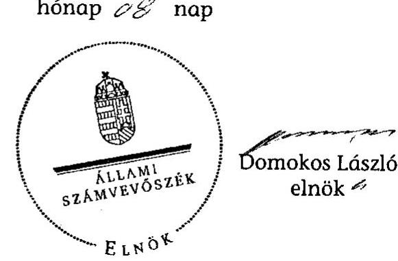

# JELENTÉS 

Érsekvadkert Község Önkormányzata belső kontrollrendszerének kialakítása, valamint egyes kontrolltevékenységek és a belső ellenőrzés működése ellenőrzéséről

---

# Állami Számvevőszék 

Iktatószám: V-0012-058-019-024/2013.
Témaszám: 1051
Vizsgálat-azonosító szám: V059118
Az ellenőrzést felügyelte:
Dr. Benedek Mária
felügyeleti vezető
Az ellenőrzést vezette:
Szakmányné Bilik Mária
ellenőrzésvezető
A számvevőszéki jelentés összeállításában közreműködtek:
Moder Beatrix
számvevő
Tótfalusi Zoltán
számvevő tanácsos
Az ellenőrzést végezték:
Baki István
számvevő tanácsos

Tótfalusi Zoltán
számvevő tanácsos

---

# TARTALOMJEGYZÉK 

BEVEZETÉS ..... 5
I. ÖSSZEGZŐ MEGÁLLAPÍTÁSOK, KÖVETKEZTETÉSEK, JAVASLATOK ..... 8
II. RÉSZLETES MEGÁLLAPÍTÁSOK ..... 16

1. Az Önkormányzat belső kontrollrendszere kialakításának megfelelősége ..... 16
1.1. A kontrollkörnyezet kialakítása ..... 16
1.2. A kockázatkezelési rendszer kialakítása ..... 17
1.3. A kontrolltevékenységek kialakítása ..... 17
1.4. Az információs és kommunikációs rendszer kialakítása ..... 18
1.5. A monitoring rendszer kialakítása ..... 19
2. A pénzügyi folyamatokban kulcsszerepet betöltő belső kontrollok (szakmai teljesítésigazolás és utalvány ellenjegyzés) működése ..... 20
3. A belső ellenőrzés szervezeti keretei és működése ..... 22

## FÜGGELÉKEK

1. számú Értelmező szótár
2. számú A belső kontrollrendszer kialakítása, a pénzügyi folyamatokban kulcsszerepet betöltő szakmai teljesítésigazolás és utalvány ellenjegyzés kontrollok működése, valamint a belső ellenőrzés működése értékelésénél alkalmazott minősítési szempontok

---

.

---

# RÖVIDÍTÉSEK JEGYZÉKE 

## Törvények

ÁSZ tv.
Avtv.

Htv.

Info tv.

Kttv.

Ktv.

Mötv.

Ötv.
régi Áht.
új Áht.

## Rendeletek

Áhsz.

Ámr.
Ávr.

Ber.
Bkr.
önkormányzati SZMSZ
2011. évi LXVI. törvény az Állami Számvevőszékről
1992. évi LXIII. törvény a személyes adatok védelméről és a közérdekű adatok nyilvánosságáról (hatálytalan 2012. január 1-jétől)
1991. évi XX. törvény a helyi önkormányzatok és szerveik, a köztársasági megbízottak, valamint egyes centrális alárendeltségű szervek feladat- és hatásköreiről
2011. évi CXII. törvény az információs önrendelkezési jogról és az információszabadságról (hatályos 2012. január 1-jétől)
2011. évi CXCIX. törvény a közszolgálati tisztviselőkről (hatályos 2012. március 1-jétől)
1992. évi XXIII. törvény a köztisztviselők jogállásáról (hatálytalan 2012. március 1-jétől)
2011. évi CLXXXIX. törvény Magyarország helyi önkormányzatairól (hatályos 2012. január 1-jétől)
1990. évi LXV. törvény a helyi önkormányzatokról
1992. évi XXXVIII. törvény az államháztartásról (hatálytalan 2012. január 1-jétől)
2011. évi CXCV. törvény az államháztartásról (hatályos 2012. január 1-jétől)

249/2000. (XII. 24.) Korm. rendelet az államháztartás szervezetei beszámolási és könyvvezetési kötelezettségének sajátosságairól
292/2009. (XII. 19.) Korm. rendelet az államháztartás működési rendjéről (hatálytalan 2012. január 1-jétől)
368/2011. (XII. 31.) Korm. rendelet az államháztartásról szóló törvény végrehajtásáról (hatályos 2012. január 1-jétől)
193/2003. (XI. 26.) Korm. rendelet a költségvetési szervek belső ellenőrzéséről (hatálytalan 2012. január 1-jétől)
370/2011. (XII. 31.) Korm. rendelet a költségvetési szervek belső kontrollrendszeréről és belső ellenőrzéséről (hatályos 2012. január 1-jétől)
Érsekvadkert Község Önkormányzat Képviselőtestületének 3/2007. (III. 30.) számú rendelete az Önkormányzat és szervei szervezeti és működési szabályzatáról

---

# Szórövidítések 

adatvédelmi szabályzat
ÁSZ
Belső ellenőrzési kézikönyv
Belső Kontroll Kézikönyv

GAMESZ
gazdálkodási jogkörök szabályzata
gazdasági program
hivatali SZMSZ
jegyző
Képviselő-testület
leltározási szabályzat

Önkormányzat
polgármester
Polgármesteri Hivatal

Társulás
Társulás Munkaszervezete
ügyrend

Érsekvadkert Község Önkormányzata Polgármesteri Hivatalának Adatvédelmi Szabályzata (hatályos 2007. április 1-jétől)
Állami Számvevőszék
Balassagyarmat Kistérség Többcélú Társulás Belső Ellenőrzési Kézikönyve (hatályos 2011. május 1-jétől)
Az Ámr. 155. § (1) bekezdése, valamint az államháztartási belső kontroll standardokról szóló 1/2009. (IX. 11.) PM irányelv egységes értelmezése érdekében az államháztartásért felelős miniszter által a 2010. évben kiadott Belső Kontroll Kézikönyv
Érsekvadkert Község Önkormányzat Képviselőtestületének Gazdasági, Műszaki Ellátó és Szolgáltató Szervezete
Érsekvadkert Község Önkormányzata Polgármesteri Hivatalának Kötelezettségvállalás, ellenjegyzés, utalványozás, érvényesítés szabályzata (hatályos 2007. január 1-jétől)
Érsekvadkert Község Önkormányzatának gazdasági programja (2010-2014. évek)
Érsekvadkert Községi Önkormányzat Képviselő-testülete Polgármesteri Hivatalának Szervezeti és Működési Szabályzata (hatályos 2011. január 1-jétől)
Érsekvadkert Község Önkormányzatának jegyzője
Érsekvadkert Község Képviselő-testülete
Érsekvadkert Község Önkormányzat Polgármesteri Hivatalának Eszközök és források leltározási- és leltárkészítési szabályzata (hatályos 2007. január 1-jétől)
Érsekvadkert Község Önkormányzata
Érsekvadkert Község Önkormányzatának polgármestere
Érsekvadkert Község Önkormányzatának Polgármesteri Hivatala
Balassagyarmat Kistérség Többcélú Társulás
Balassagyarmat Kistérség Többcélú Társulás Kistérségi Szolgáltató Intézménye
Érsekvadkert Község Önkormányzata Polgármesteri Hivatalának ügyrendje (Önkormányzati SZMSZ 18. sz. melléklete, hatályos 2011. szeptember 2-ától)

---

# JELENTÉS 

## Érsekvadkert Község Önkormányzata belső kontrollrendszerének kialakítása, valamint egyes kontrolltevékenységek és a belső ellenőrzés működése ellenőrzéséről

## BEVEZETÉS

A belső kontrollrendszer kialakítását, működtetését és fejlesztését a régi Áht. és az új Áht. is előírja. Ennek megvalósításáért a költségvetési szerv vezetője felel. A belső kontrollrendszer azt a célt szolgálja, hogy a költségvetési szervek működésük és gazdálkodásuk során a tevékenységeket szabályszerűen, gazdaságosan, hatékonyan, eredményesen hajtsák végre, teljesítsék elszámolási kötelezettségeiket és megvédjék az erőforrásokat a veszteségektől, a károktól és a nem rendeltetésszerű használattól. A belső kontrollrendszer magában foglalja mindazon szabályokat, eljárásokat, gyakorlati módszereket és szervezeti struktúrákat, kockázatkezelési technikákat, kontrolltevékenységeket, amelyek segítséget nyújtanak a szervezetnek céljai eléréséhez.

Az ÁSZ a 2011-2015. évekre szóló stratégiájában hangsúlyos szerepet szánt annak, hogy szilárd szakmai alapon álló, értékteremtő ellenőrzéseivel előmozdítsa a közpénzügyek átláthatóságát, rendezettségét. A számvevőszéki ellenőrzés nemzetközi alapelvei is rögzítik, hogy a megfelelő belső kontrollrendszer minimálisra csökkenti a hibák és szabálytalanságok kockázatát.

Az ellenőrzés célja annak értékelése volt, hogy az Önkormányzat a jogszabályi előírásoknak megfelelően alakította-e ki a belső kontrollrendszert; a gazdálkodás folyamatában kulcsszerepet betöltő szakmai teljesítésigazolás és az utalvány ellenjegyzés kontrolltevékenységeit megfelelően működtette-e; biztosította-e a belső ellenőrzés szabályos és eredményes működését.

Az ÁSZ ezen ellenőrzési céljait pilot (próba) jelleggel községi/nagyközségi önkormányzatoknál végzett ellenőrzések során érvényesítette.

Az ellenőrzés típusa: szabályszerűségi ellenőrzés
Az ellenőrzés jogszabályi alapja: az ÁSZ tv. 5. § (2) és (6) bekezdései
Az ellenőrzött szervezet: az Önkormányzat
Az ellenőrzött időszak: a belső kontrollrendszer kialakításának megfelelőségét a 2011. évre vonatkozóan értékeltük. A kontrolltevékenységek működésének megfelelőségét a 2011. január 1-je és december 31-e, míg a belső ellenőrzés működésének szabályosságát és eredményességét a 2009. január 1-je és 2011.

---

december 31-e közötti időszakot figyelembe véve értékeltük. A helyszíni ellenőrzés lezárásáig a helyi szabályozás változásait nyomon követtük.

Az ellenőrzés szakmai módszertana az ÁSZ hivatalos honlapján (www.asz.hu) közzétett szakmai szabályokon alapult, amely a Legfőbb Ellenőrző Intézmények Nemzetközi Szervezete (INTOSAI) által kiadott nemzetközi standardok (ISSAI) figyelembevételével készült.

A belső kontrollrendszer kialakításának ellenőrzése során értékeltük a Polgármesteri Hivatalban a kontrollkörnyezet, a kockázatkezelési rendszer, a kontrolltevékenységek, az információs és kommunikációs rendszer, valamint a monitoring rendszer szabályozottságának megfelelőségét.

Értékeltük a pénzügyi folyamatokban kulcsszerepet betöltő szakmai teljesítésigazolás és utalvány ellenjegyzés kontrollok működésének megfelelőségét az államháztartáson kívülre teljesített működési és felhalmozási célú pénzeszközátadásoknál, az állományba nem tartozók megbízási díjainál, továbbá a külső szolgáltató által végzett karbantartási, kisjavítási munkákkal kapcsolatos kifizetéseknél. Az egyszerû véletlen mintavétellel kiválasztott tételek ellenőrzését többlépcsős megfelelőségi tesztek útján addig végeztük, amíg elegendő és megfelelő bizonyítékot szereztünk a vizsgált folyamatok kulcskontrolljai működésének megfelelő vagy nem megfelelő voltáról. Értékeltük az Önkormányzatnál a belső ellenőrzés működésének szabályosságát és eredményességét. Az ÁSZ a 2007-2010. években az Önkormányzatnál a gazdálkodás szabályszerűségére irányuló átfogó ellenőrzést nem végzett.

A fogalmak magyarázatát az 1. számú függelék, az ellenőrzés egyes területeinek értékelésénél alkalmazott egységes minősítési szempontokat a 2. számú függelék tartalmazza.

Az ellenőrzés lefolytatásához az Önkormányzat a munkalapok és a tanúsítvány elektronikus kitöltésével, valamint a megjelölt dokumentumok elektronikus megküldésével szolgáltatott adatokat. A munkalapokon szerepeltetett adatok, információk ellenőrzése és szükség szerinti javítása a helyszíni ellenőrzés keretében történt.

Az ÁSZ az ellenőrzés megállapításait az ellenőrzött időszakban hatályos, az intézkedést igénylő megállapításokra tett javaslatokat a jelenleg hatályos jogszabályok alapján fogalmazta meg.

Az Ász tv. 29. § (1) bekezdése szerint a jelentéstervezetet megküldtük a polgármester részére, aki az ÁSZ tv. 29. § (2) bekezdésében foglalt észrevételezési jogával élt, a tett észrevétel szakmai tartalmánál fogva a jelentéstervezet egyes megállapításait nem érintette.

Érsekvadkert község állandó lakosainak száma 2011. január 1-jén 3777 fő volt. Az Önkormányzat héttagú Képviselő-testületének munkáját négy állandó bizottság segítette. Az Önkormányzat az önállóan működő és gazdálkodó Polgármesteri Hivatalon felül hat intézménnyel látta el feladatát, amelyek közül a GAMESZ önállóan működő és gazdálkodó intézményként működött. Az Önkormányzat többségi tulajdoni hányadú gazdasági társasággal nem rendelkezett. A polgármester a 2006. évi önkormányzati választások óta tölti be tisztségét. A jegyző 2005. május 1-jétől látja el feladatait. A Polgármesteri Hivatal szervezeti egységekre nem tagolódott, a foglalkoztatott köztisztviselők száma 2011. január 1-jén 10 fő volt.

Az Önkormányzatnál a Polgármesteri Hivatal feladatellátásának szervezeti keretei 2013. január 1-jét követően nem változtak.

Az Önkormányzat a 2011. évi költségvetési beszámolója szerint 534120 ezer Ft költségvetési bevételt ért el, valamint 497498 ezer Ft költségvetési kiadást teljesített. A 2011. december 31-i könyvviteli mérleg szerint 1508498 ezer Ft értékű eszközvagyonnal rendelkezett, 9000 ezer Ft hosszú lejáratú, valamint 15472 ezer Ft rövid lejáratú kötelezettsége volt.

---

# I. ÖSSZEGZŐ MEGÁLLAPÍTÁSOK, KÖVETKEZTETÉSEK, JAVASLATOK 

A belső kontrollrendszeren belül 2011-ben a Polgármesteri Hivatalban a kontrollkörnyezet, a kockázatkezelési rendszer, a kontrolltevékenységek, az információs és kommunikációs rendszer, valamint a monitoring rendszer kialakítását külön-külön és összesítve is értékeltük. A belső kontrollrendszer kialakítása az összesített értékelés alapján nem felelt meg a jogszabályi előírásoknak. Az egyes területek kialakításának értékelését az alábbiakban részletezzük.

A kontrollkörnyezet kialakítása részben felelt meg a jogszabályi követelményeknek. A jegyző elkészítette a gazdálkodást érintő legfontosabb szabályzatokat, azonban a Htv. előírása ellenére nem alakította ki a költségvetési szervekre vonatkozó előírások alapján az intézmények számviteli rendjét, és a Ktv.-ben ${ }^{1}$ foglaltak ellenére nem határozta meg a köztisztviselők munkateljesítményének értékeléséhez szükséges teljesítménykövetelményeket. A jegyző az Ámr.-ben² ${ }^{2}$ foglaltak ellenére a hivatali SZMSZ-ben nem rögzítette az abban nevesített munkakörökhöz tartozó hatáskörök gyakorlásának módját és a helyettesítés rendjét. A hivatali SZMSZ-ben a Ber. ${ }^{3}$ előírása ellenére nem írta elő a belső ellenőrzést végzők jogállását, feladatait. A jegyző az Áhsz.-ben foglaltak ellenére a leltározás részletes szabályainak meghatározása során nem írta elő a leltár és a könyvviteli adatok egyeztetésének módját.

A kockázatkezelési rendszer kialakítása nem felelt meg a jogszabályi előírásoknak, mert a jegyző az Ámr.-ben foglaltak ellenére nem mérte fel és nem állapította meg a Polgármesteri Hivatal tevékenységében rejlő kockázatokat, nem határozta meg az egyes kockázatokkal kapcsolatos intézkedéseket és megtételük módját, így kockázatelemzést nem végzett és nem működtette a kockázatkezelési rendszert.

A kontrolltevékenységek kialakítása a jogszabályi előírásoknak nem felelt meg, mert a jegyző az Ámr. előírása ellenére nem alakította ki a Polgármesteri Hivatal tevékenységeire vonatkozó beszámolási eljárásokat, az érvényesítés szabályozása során nem határozta meg a jogszabályokban és a belső szabályzatokban foglalt ellenőrzési feladatok részletszabályait, továbbá nem jelölte ki az érvényesítésre és a szakmai teljesítésigazolásra jogosultakat. A jegyző az Ámr. előírása ellenére a kötelezettségvállalásra, ellenjegyzésre, szakmai teljesítésigazolásra, érvényesítésre és utalványozásra jogosult személyekről és az aláírás mintájukról vezetett nyilvántartás naprakészségét nem biztosította, és nem rögzítette belső szabályzatban az előzetes írásbeli kötelezettségvállalást nem igénylő kifizetések rendjét.

[^0]
[^0]:    ${ }^{1}$ 2012. március 1-jétől Kttv.
    ${ }^{2}$ 2012. január 1-jétől Ávr.
    ${ }^{3}$ 2012. január 1-jétől Bkr.

---

Az információs és kommunikációs rendszer kialakítása a jogszabályi előírásoknak nem felelt meg, mert a jegyző az Avtv. ${ }^{4}$ és az Ámr. előírása ellenére nem határozta meg a kötelezően közzéteendő adatok közzétételének eljárásrendjét és a közérdekű adatok megismerésére irányuló igények teljesítésének rendjét, valamint elmulasztotta az adatbiztonság érvényre juttatásához szükséges intézkedések megtételét. Nem határozta meg a hozzáférési jogosultságok ellenőrzésének és nyilvántartásának eljárásrendjét, a pénzügyi-számviteli szoftverváltozások ellenőrzésére vonatkozó eljárásokat, a feldolgozott adatok mentési

 eljárásait és nem jelölte ki a mentések felelőseit, veszélyeztetve ezzel az átlátható és megbízható adatkezelést.

A monitoring rendszer kialakítása a jogszabályi követelményeknek nem felelt meg, mert a jegyző az Ámr.-ben foglaltak ellenére nem határozta meg a Polgármesteri Hivatal tevékenységének, a célok megvalósításának nyomon követését biztosító, az operatív tevékenységek keretében megvalósuló folyamatos és eseti nyomon követésből álló monitoring rendszer szabályait.

A belső kontrollrendszer nem megfelelő kialakítása kockázatot jelent az Önkormányzat tevékenységeinek szabályszerű, gazdaságos, hatékony és eredményes végrehajtásában.

A Polgármesteri Hivatalban a 2011. évben az államháztartáson kívülre történő működési és felhalmozási célú pénzeszközátadásokkal, az állományba nem tartozók megbízási díjaival, valamint a külső szolgáltatók által végzett karbantartással, kisjavítással kapcsolatos kifizetések során - összefoglalóan értékelve a pénzügyi folyamatokban kulcsszerepet betöltő szakmai teljesítésigazolás és utalvány ellenjegyzés belső kontrollok működésének megfelelősége gyenge volt.

Az államháztartáson kívülre történő működési és felhalmozási célú pénzeszközátadásokkal, az állományba nem tartozók megbízási díjaival, valamint a külső szolgáltatók által végzett karbantartással, kisjavítással kapcsolatos kifizetések esetében a szakmai teljesítésigazolást végző személy az Ámr.-ben foglalt előírások ellenére nem rendelkezett a jogkör gyakorlására írásbeli felhatalmazással, ezért a feladatot jogosulatlanul látta el. Az utalványok ellenjegyzője a kiadások teljesítését megelőzően a régi Áht. és az Ámr. előírása ellenére ellenőrzési feladatait nem a jogszabályi előírásoknak megfelelően végezte, valamint ellenjegyzés hiányában is teljesítettek kifizetéseket. Annak ellenére ellenjegyezte az utalványokat, hogy a szakmai teljesítésigazolás nem szabályszerűen történt, valamint az érvényesítést e feladatra kijelöléssel nem rendelkező személy végezte, vagy az érvényesítést nem látták el. Az utalványok ellenjegyzője a gazdálkodásra - köztük a kötelezettségvállalások ellenjegyzésére, a kötelezettségvállalások nyilvántartására - vonatkozó szabályok betartásának hiánya ellenére az utalványokat aláírta.

Az ellenőrzött kifizetésekkel összefüggésben a rendelkezésre bocsátott dokumentumok alapján jogosulatlan kifizetést nem tárt fel az ellenőrzésünk, azonban a gazdálkodásban kulcsszerepet betöltő kontrollok működésében feltárt hiányosságok miatt fennáll a hibák bekövetkezésének lehetősége. A nem megfelelően szabályozott és működtetett belső kontrollok korrupciós kockázatot is hordoznak.

Az Önkormányzat a 2009-2011. években a belső ellenőrzési feladatokat a Társulás útján látta el. A belső ellenőrzés szabályozása az ellenőrzött időszakban a jogszabályi előírásoknak összességében megfelelt. A 2009. évben a Ber. előírása ellenére az éves ellenőrzési terv összeállítását megelőzően kockázatelemzést nem készítettek, az ellenőrzési terv összeállításához a jegyző írásos véleményt nem adott. Ezeket a hiányosságokat a 2010-2011. években megszüntették. A 2009-2011. években a Ber. előírása ellenére az ellenőrzési programok nem tartalmazták az ellenőrzések módszereit, valamint az ellenőrök megbízólevelének számát. A Bkr. rendelkezése ellenére a 2012. évben a polgármester nem terjesztette a Képviselő-testület elé a 2011. évi zárszámadási rendelettervezettel egyidejűleg a belső ellenőrzési jelentésekről készült, a belső ellenőrzési vezető által készített és a jegyző által jóváhagyott éves ellenőrzési jelentést.

Az Önkormányzatnál a 2009-2011. években a belső ellenőrzés működése a 2. számú függelék minősítési szempontjai alapján - nem volt eredményes, mert a belső ellenőrzés szabályozása és működése az összegző értékelés alapján az ellenőrzött időszak egészét tekintve ugyan a jogszabályi előírásoknak megfelelt, és ellenőrizték a gazdálkodási jogkörök gyakorlását és a vagyongazdálkodási szabályok betartását, a jegyző azonban a belső ellenőrzés által tett javaslatok végrehajtására a 2009. évben intézkedési tervet nem készített. A 2010. és a 2011. években készített intézkedési tervek ellenére továbbá a belső ellenőrzés által feltárt hiányosságokat nem szüntették meg teljes körűen, mert többek között a belső szabályzatok átfogó, az Ámr. előírásainak megfelelő felülvizsgálatára, a kötelezettségvállalások nyilvántartásának vezetésére vonatkozó javaslatok nem hasznosultak. Mindezek hozzájárultak az ellenőrzésünk során is feltárt szabályozási hiányosságok fennmaradásához, a hibák ismétlődéséhez.

Az ÁSZ tv. 33. § (1) bekezdésében foglaltak értelmében az ellenőrzött szervezet vezetője köteles a jelentésben foglalt megállapításokhoz kapcsolódó intézkedési tervet összeállítani, és azt a jelentés kézhezvételétől számított 30 napon belül az ÁSZ részére megküldeni. Amennyiben az intézkedési tervet határidőre nem küldi meg a szervezet, vagy az - az ÁSZ tv. 33. § (2) bekezdésében foglalt póthatáridő eltelte ellenére - továbbra sem elfogadható, az ÁSZ elnöke a hivatkozott törvény 33. § (3) bekezdés a)-b) pontjaiban foglaltakat érvényesítheti.

Az ellenőrzés intézkedést igénylő megállapításai és javaslatai:

# a polgármesternek 

1. A kötelezettségvállalás dokumentumait - a régi Áht. 100/C. § (3) bekezdésében és az Ámr. 74. § (1) bekezdésében foglaltak ellenére - a kötelezettségvállalás előtt nem minden esetben ellenjegyezték.

---

Javaslat:
Intézkedjen arról, hogy az Önkormányzat nevében történő kötelezettségvállalásra az új Áht. 37. § (1) bekezdésében foglaltaknak megfelelően - az Ávr. 53. §-ában meghatározott kivételekkel - kizárólag a pénzügyi ellenjegyzés után, a pénzügyi teljesítés esedékességét megelőzően, írásban kerüljön sor.
2. A Bkr. 56. § (8) bekezdése ellenére a 2012. évben nem terjesztette a Képviselőtestület elé a 2011. évi zárszámadási rendelettervezettel egyidejűleg a belső ellenőrzési jelentésekről készült, a belső ellenőrzési vezető által készített és a jegyző által jóváhagyott éves ellenőrzési jelentést.

Javaslat:
Terjessze a Bkr. 56. § (8) bekezdés előírásának teljesítése érdekében a Képviselőtestület elé a zárszámadási rendelettervezettel egyidejűleg az éves ellenőrzési jelentést.

# a jegyzőnek 

1. a kontrollkörnyezettel kapcsolatban:

A jegyző - a Htv. 140. § (1) bekezdés c) pontjában foglaltak ellenére - nem alakította ki az Önkormányzat intézményeinek számviteli rendjét.

A jegyző - a Ktv. 34. § (5) bekezdésében foglalt előírás ellenére - nem határozta meg a köztisztviselők munkateljesítményének értékeléséhez szükséges teljesítménykövetelményeket.

Az Ámr. 20. § (2) bekezdés h) pontjában foglaltak ellenére a hivatali SZMSZ-ben nem rögzítette az abban nevesített munkakörökhöz tartozó hatáskörök gyakorlásának módját, a helyettesítés rendjét, továbbá a Ber. 4. § (2) bekezdés előírása ellenére a hivatali SZMSZ-ben nem írta elő a belső ellenőrzést végző személy vagy szervezet jogállását, feladatait.

A jegyző az Áhsz. 37. § (5) bekezdésében foglalt előírást figyelmen kívül hagyva a leltározás részletes szabályainak meghatározása során nem rögzítette a leltár és a könyvviteli adatok egyeztetésének módját.

Javaslat:
a) Alakítsa ki az Önkormányzat intézményeinek számviteli rendjét a Htv. 140. § (1) bekezdés c) pontjában előírtak alapján.
b) Dolgozza ki a Kttv. 130. § (1)-(3) bekezdéseiben előírtak szerinti teljesítményértékelés alapját képező teljesítménykövetelményeket.
c) Módosítsa a hivatali SZMSZ-t, és kezdeményezze a polgármesternél a módosítás Képviselő-testület elé terjesztését annak érdekében, hogy az tartalmazza az Ávr. 13. § (1) bekezdés g) pontjában foglaltaknak megfelelően a benne nevesített munkakörökhöz kapcsolódó hatáskörök gyakorlásának módját, a helyettesítés

---

rendjét, továbbá a Bkr. 15. § (2) bekezdésében foglaltak szerint a belső ellenőrzést végzők jogállását és feladatait.
d) Gondoskodjon az Áhsz. 37. § (5) bekezdésében előírtak szerint a leltár és a könyvviteli adatok egyeztetése módjának rögzítéséről.
2. a kockázatkezelési rendszerrel kapcsolatban:

A jegyző az Ámr. 157. § (1)-(3) bekezdéseiben foglaltak ellenére kockázatelemzést nem végzett és kockázatkezelési rendszert nem alakított ki.

Javaslat:
Alakítsa ki és működtesse a Bkr. 3. § b) pontja és a 7. §-a szerinti kockázatkezelési rendszert.
3. a kontrolltevékenységekkel kapcsolatban:

A jegyző az Ámr. 158. § (2) bekezdés d) pontjában előírtak ellenére nem alakította ki a Polgármesteri Hivatal tevékenységeire vonatkozó beszámolási eljárásokat.

Az Ámr. 20. § (3) bekezdés a) pontjában előírtak ellenére az érvényesítés szabályozása során nem határozta meg az Ámr. 77. § (1) bekezdésében foglalt ellenőrzési feladatok közül a régi Áht.-ban, az Áhsz.-ben, az Ámr.-ben és a belső szabályzatokban foglaltak ellenőrzésének részletszabályait.

A jegyző nem jelölte ki - az Ámr. 76. § (5) bekezdésben foglaltak ellenére - a szakmai teljesítés igazolására, valamint az Ámr. 77. § (4) bekezdésben foglaltak ellenére az érvényesítésre jogosult személyeket.

Az Ámr. 80. § (3) bekezdésében foglaltak ellenére a kötelezettségvállalásra, az ellenjegyzésre, a szakmai teljesítésigazolásra, az érvényesítésre és az utalványozásra jogosult személyekről és az aláírás mintájukról vezetett nyilvántartás nem volt naprakész.

Az Ámr. 72. § (14) bekezdésében előírtak ellenére nem rögzítette belső szabályzatban az előzetes írásbeli kötelezettségvállalást nem igénylő kifizetések rendjét, annak ellenére, hogy azt a hivatali SZMSZ 13. mellékletében lehetővé tették.

Javaslat:
a) Szabályozza a Bkr. 8. § (4) bekezdés c) pontjában foglaltaknak megfelelően a Polgármesteri Hivatal tevékenységeire vonatkozó beszámolási eljárásokat.
b) Határozza meg az Ávr. 13. § (2) bekezdés a) pontjában és az 58. § (1) bekezdésében előírtaknak megfelelően az új Áht.-ban, az Áhsz.-ben, az Ávr.-ben és a belső szabályzatokban foglaltak ellenőrzésének részletszabályait.
c) Intézkedjen arról, hogy az Ávr. 57. § (4) és az 58. § (4) bekezdésének megfelelően kijelölésre kerüljenek a teljesítésigazolásra, valamint az érvényesítésre jogosult személyek.

---

d) Intézkedjen arról, hogy a kötelezettségvállalásra, az ellenjegyzésre, a teljesítésigazolásra, az érvényesítésre és az utalványozásra jogosult személyekről és az aláírás-mintájukról a nyilvántartást az Ávr. 60. § (3) bekezdésében foglaltaknak megfelelően naprakészen vezessék.
e) Rögzítse belső szabályzatban az Ávr. 53. § (2) bekezdésének megfelelően az előzetes írásbeli kötelezettségvállalást nem igénylő kifizetések rendjét.
4. az információs és kommunikációs rendszerrel kapcsolatban:

Az Ámr. 20. § (3) bekezdés i) pontjában foglaltak ellenére nem határozta meg a kötelezően közzéteendő adatok nyilvánosságra hozatalának rendjét. Az Avtv. 20. § (8) bekezdésének és az Ámr. 20. § (3) bekezdés i) pontjának előírása ellenére nem szabályozta a közérdekű adatok megismerésére irányuló igények teljesítésének rendjét.

Az informatikai rendszer környezetének szabályozása során az Avtv. 10. § (1)-(2) bekezdéseinek előírása ellenére a jegyző elmulasztotta az adatbiztonság érvényre juttatásához szükséges intézkedések megtételét, nem határozta meg a hozzáférési jogosultságok ellenőrzésének és nyilvántartásának eljárásrendjét, a pénzügyi-számviteli szoftverváltozások ellenőrzésére és a feldolgozott adatok mentésére vonatkozó eljárásokat.

Javaslat:
a) Alakítsa ki az Info tv. 35. § (3) bekezdésének és az Ávr. 13. § (2) bekezdés h) pontjának megfelelően a kötelezően közzéteendő adatok nyilvánosságra hozatalának rendjét, valamint az Info tv. 30. § (6) bekezdése és az Ávr. 13. § (2) bekezdés h) pontja szerint szabályozza a közérdekű adatok megismerésére irányuló igények teljesítésének rendjét.
b) Gondoskodjon az Info tv. 7. § (2)-(3) bekezdéseinek megfelelően az adatbiztonság érvényesüléséről, továbbá az informatikai környezet szabályozása keretében határozza meg a hozzáférési jogosultságok ellenőrzésének és nyilvántartásának eljárásrendjét, valamint szabályozza a pénzügyi-számviteli szoftverváltozások ellenőrzésére és a feldolgozott adatok mentésére vonatkozó eljárásokat.
5. a monitoring rendszerrel kapcsolatban:

A jegyző - az Ámr. 160. §-ában foglaltak ellenére - az operatív tevékenységek keretében megvalósuló folyamatos és eseti nyomon követésből álló, a Polgármesteri Hivatal tevékenységének, a célok megvalósításának nyomon követését biztosító rendszert nem alakította ki.

Javaslat:
Alakítsa ki és működtesse a Bkr. 3. § e) pontjában és a 10. §-ában előírtak alapján a Polgármesteri Hivatal tevékenységének, a célok megvalósításának nyomon követését biztosító rendszert, amelynek része az operatív tevékenységek keretében megvalósuló folyamatos és eseti nyomon követés is.

---

6. a pénzügyi folyamatokban kulcsszerepet betöltő kontrollok működésével kapcsolatban:

A 2011. évben az államháztartáson kívülre történő működési és felhalmozási célú pénzeszközátadásokkal, az állományba nem tartozók megbízási díjaival, valamint a külső szolgáltatók által végzett karbantartással, kisjavítással kapcsolatos kiadások esetében
 a szakmai teljesítést - az Ámr. 76. § (5) bekezdésében foglaltak ellenére - jegyzői kijelöléssel nem rendelkező személy igazolta.

Az utalványok ellenjegyzője az Ámr. 79. § (2) bekezdésében foglalt ellenőrzési feladatait nem a jogszabályi előírásoknak megfelelően végezte, mert annak ellenére aláírásával ellenjegyezte az utalványokat, hogy a szakmai teljesítésigazolás nem szabályszerűen történt, valamint az Ámr. 78. § (2) bekezdés g) pontjában foglaltak ellenére az utalványokon a kötelezettségvállalás nyilvántartási számát nem tüntették fel, mivel az Ámr. 75. § (1) bekezdésének előírása ellenére a kötelezettségvállalásokról nyilvántartást nem vezettek. Az államháztartáson kívülre teljesített működési és felhalmozási célú pénzeszközátadások, valamint a külső szolgáltatók által végzett karbantartási, kisjavítási szolgáltatási kiadások teljesítését megelőzően - a régi Áht. 100/C. § (6) bekezdése és az Ámr. 79. § (1) bekezdés előírása ellenére - a kifizetéseket nem ellenjegyezték. Az utalványok ellenjegyzője annak ellenére aláírásával ellenjegyezte az utalványokat, hogy az érvényesítést - az Ámr. 77. § (4) bekezdésében foglaltak ellenére - kijelöléssel nem rendelkező személy végezte, valamint az állományba nem tartozók megbízási díjaival kapcsolatos kifizetéseknél - a régi Áht. 100/C. § (6) bekezdés és az Ámr. 77. § (3) bekezdés előírása ellenére - az érvényesítési feladatokat nem látták el.

Az állományba nem tartozók megbízási díjaira történt kifizetések teljesítését megelőzően az utalványok ellenjegyzője a kiadásokat annak ellenére ellenjegyezte, hogy a kötelezettségvállalásokra - a régi Áht. 100/C. § (3) bekezdésében és az Ámr. 74. § (1) bekezdésében foglaltakat megsértve - ellenjegyzés nélkül került sor.

Javaslat:
Intézkedjen - a szakmai teljesítésigazolás és az utalvány ellenjegyzése vonatkozásában feltárt hiányosságok megszüntetése, illetve az operatív gazdálkodás során a működésbeli hibák megelőzése, feltárása és kijavítása érdekében - arról, hogy:
a) a teljesítést - az Ávr. 57. § (3) bekezdésében foglalt előírásnak megfelelően - az arra kijelölt személyek igazolják;
b) a kifizetéseket megelőzően - az Ávr. 58. § (1) bekezdése szerint - a teljesítésigazolás alapján - az Ávr. 57. § (3) bekezdése szerinti esetben annak hiányában is - az összegszerűségnek, a fedezet meglétének és a megelőző ügymenetben az új Áht., az Áhsz., az Ávr. előírásai és a belső szabályzatokban foglaltak betartásának az ellenőrzése történjen meg;
c) a kötelezettségvállalások nyilvántartását az Ávr. 56. § (1) bekezdésében foglalt előírásnak megfelelően vezessék, és az utalványrendeleteken a kötelezettségvállalás nyilvántartási számát az Ávr. 59. § (3) bekezdés f) pontjában foglaltaknak megfelelően tüntessék fel.

---

d) a kötelezettségvállalásokra az új Áht. 37. § (1) bekezdésében foglaltaknak megfelelően - az Ávr. 53. §-ában meghatározott kivételeket figyelembe véve - kizárólag a pénzügyi ellenjegyzés után, a pénzügyi teljesítés esedékességét megelőzően, írásban kerüljön sor.
7. a belső ellenőrzés működésével kapcsolatban:

A 2010-2011. években az ellenőrzési programok a Ber. 23. § (4) bekezdés h) és j) pontjaiban előírtak ellenére nem tartalmazták az ellenőrzések módszereit, valamint az ellenőr megbízólevelének számát.

Javaslat:
Kezdeményezze, hogy az ellenőrzési programok tartalmazzák a Bkr. 33. § (2) bekezdésében előírt tartalmi elemeket.

---

# II. RÉSZLETES MEGÁLLAPÍTÁSOK 

## 1. Az ÖNKORMÁNYZAT BELSŐ KONTROLLRENDSZERE KIALAKÍTÁSÁNAK MEGFELELŐSÉGE

### 1.1. A kontrollkörnyezet kialakítása

A kontrollkörnyezet kialakítása - a 2. számú függelékben részletezett kritériumrendszer alapján végzett értékelés szerint - a Polgármesteri Hivatalban részben volt megfelelő. A Képviselő-testület elfogadta az Önkormányzat 2011-2014. évekre szóló gazdasági programját. A Polgármesteri Hivatal rendelkezett a Képviselő-testület által elfogadott alapító okirattal. A jegyző elkészítette a Polgármesteri Hivatal működését és gazdálkodását érintő legfontosabb szabályzatokat, azonban a jogszabályi előírásokat nem érvényesítette maradéktalanul.

A jegyző, mint a költségvetési szerv vezetője:

- a Htv. 140. § (1) bekezdés c) pontjában foglalt előírást figyelmen kívül hagyva nem alakította ki az intézmények számviteli rendjét a költségvetési szervekre vonatkozó előírások alapján;
- a Ktv. 34. § (5) bekezdésében${ }^{5}$ foglalt előírás ellenére nem határozta meg a köztisztviselők munkateljesítményének értékeléséhez szükséges teljesítménykövetelményeket;
- az Ámr. 20. § (2) bekezdés h) pontjában${ }^{6}$ foglaltak ellenére a hivatali SZMSZ-ben nem rögzítette az abban nevesített munkakörökhöz tartozó hatáskörök gyakorlásának módját, a helyettesítés rendjét, továbbá - a Ber. 4. § (2) bekezdésének${ }^{7}$ előírása ellenére - nem írta elő a belső ellenőrzést végző személy, szervezet jogállását, feladatait;
- az Áhsz. 37. § (2) bekezdésében foglaltak érvényesülését a szabályozás során nem biztosította, mert - az Áhsz. 37. § (5) bekezdésében előírt - a leltározás részletes szabályainak meghatározása keretében nem rögzítette a leltár és a könyvviteli adatok egyeztetésének módját.

A jegyző gondoskodott az önkormányzati vagyonnal való gazdálkodás szabályairól szóló tervezet előkészítéséről, amely alapján a Képviselő-testület a tulajdonosi jogok gyakorlásának módjáról rendeletet alkotott, azonban ebben - az Ötv. 80/A. § (4) bekezdésében${ }^{8}$ foglaltak ellenére - nem írták elő a hasznosításra szánt

[^0]
[^0]:    ${ }^{5}$ 2012. július 1-jétől a Kttv. 130. § (1) bekezdése
    ${ }^{6}$ 2012. január 1-jétől az Ávr. 13. § (1) bekezdés g) pontja
    ${ }^{7}$ 2012. január 1-jétől a Bkr. 15. § (2) bekezdése
    ${ }^{8}$ 2012. január 1-jétől hatálytalan, a Mötv. erre vonatkozó előírást nem tartalmaz.

---

vagyon értékének megállapítása céljából az értékbecslés készítésének kötelezettségét.

A kontrollkörnyezet kialakítása során a jegyző az Ámr. 155. § (3) bekezdésének${ }^{9}$ előírását figyelmen kívül hagyva az államháztartásért felelős miniszter által kiadott Belső Kontroll Kézikönyv ajánlásait nem hasznosította teljes körűen.

A kontrollkörnyezet kialakítása során a jegyző:

- a Polgármesteri Hivatalban dolgozó köztisztviselők munkaköri leírásaiban a Belső Kontroll Kézikönyv 1.3.3. pontjában foglaltakat figyelmen kívül hagyva, nem határozta meg a munkavállalók jogait;
- a Belső Kontroll Kézikönyv 1.5.2. pontjában foglalt ajánlást nem érvényesítette, mert nem dolgozta ki a Polgármesteri Hivatalban ellátott köztisztviselői munkakörök betöltésére vonatkozó elvárt tudást és képességeket.

# 1.2. A kockázatkezelési rendszer kialakítása 

A kockázatkezelési rendszer kialakítása - a 2. számú függelékben részletezett kritériumrendszer alapján végzett értékelés szerint - a Polgármesteri Hivatalban nem volt megfelelő, mert a jegyző - az Ámr. 157. § (1)(3) bekezdésének${ }^{10}$ előírása ellenére - kockázatelemzést nem végzett és kockázatkezelési rendszert nem működtetett, nem mérte fel és nem állapította meg a Polgármesteri Hivatal tevékenységében rejlő kockázatokat, nem határozta meg az egyes kockázatokkal kapcsolatos intézkedéseket és megtételük módját.

### 1.3. A kontrolltevékenységek kialakítása

A kontrolltevékenységek kialakítása - a 2. számú függelékben részletezett kritériumrendszer alapján végzett értékelés szerint - a Polgármesteri Hivatalban nem volt megfelelő, mert a jegyző a jogszabályi előírásokat nem tartotta be.

A jegyző, mint a költségvetési szerv vezetője:

- az Ámr. 158. § (2) bekezdés d) pontjának${ }^{11}$ előírása ellenére nem alakította ki a Polgármesteri Hivatal tevékenységeire vonatkozó beszámolási eljárásokat;
- az Ámr. 20. § (3) bekezdés a) pontjában${ }^{12}$ előírtak ellenére az érvényesítés szabályozása során nem határozta meg az Ámr. 77. § (1) bekezdésében foglalt ellenőrzési feladatok közül a jogszabályokban és a belső szabályzatokban foglaltak ellenőrzésének részletszabályait, nem jelölte ki az Ámr. 76. §

[^0]
[^0]:    ${ }^{9}$ 2012. január 1-jétől a Bkr. 5. § (1) bekezdése
    ${ }^{10}$ 2012. január 1-jétől a Bkr. 7. § (1)-(2) bekezdése
    ${ }^{11}$ 2012. január 1-jétől a Bkr. 8. § (4) bekezdése
    ${ }^{12}$ 2012. január 1-jétől az Ávr. 13. § (2) bekezdés a) pontja

---

(5) bekezdésében${ }^{13}$ foglaltak ellenére a szakmai teljesítés igazolására, valamint az Ámr. 77. § (4) bekezdésében${ }^{14}$ foglaltak ellenére az érvényesítésre jogosultakat;

- az Ámr. 80. § (3) bekezdésben${ }^{15}$ foglaltak ellenére a kötelezettségvállalásra, ellenjegyzésre, szakmai teljesítésigazolásra, érvényesítésre, utalványozásra jogosult személyekről és az aláírás mintájukról vezetett nyilvántartás naprakészségét nem biztosította;
- az Ámr. 72. § (14) bekezdésben${ }^{16}$ előírtak ellenére belső szabályzatban nem rögzítette az előzetes írásbeli kötelezettségvállalást nem igénylő kifizetések rendjét annak ellenére, hogy a hivatali SZMSZ 13. számú mellékletében azt lehetővé tették és a gyakorlatban is alkalmazták.

A kontrolltevékenységek kialakítása során a jegyző az Ámr. 155. § (3) bekezdésének előírását figyelmen kívül hagyva az államháztartásért felelős miniszter által kiadott Belső Kontroll Kézikönyv ajánlásait nem hasznosította.

A kontrolltevékenységek kialakítása során a jegyző a feladatkörök szétválasztása keretében, a Belső Kontroll Kézikönyv 3.2.1. pontjában foglalt ajánlást figyelmen kívül hagyva nem határozta meg a hivatali SZMSZ-ben rögzített munkakörökre vonatkozóan a pénzügyi teljesítési feladatokat, és a köztisztviselők munkaköri leírásai nem tartalmazták az ellenőrzési feladataikat.

A kontrolltevékenységek hiányos kialakítása a feladatok szabályszerű végrehajtását veszélyeztette.

# 1.4. Az információs és kommunikációs rendszer kialakítása 

Az információs és kommunikációs rendszer kialakítása - a 2. számú függelékben részletezett kritériumrendszer alapján végzett értékelés szerint - a Polgármesteri Hivatalban nem volt megfelelő, mert a jegyző a jogszabályi követelményeket nem érvényesítette.

A jegyző, mint a költségvetési szerv vezetője:

- az Ámr. 20. § (3) bekezdés i) pontjában${ }^{17}$ foglaltak ellenére nem határozta meg a kötelezően közzéteendő adatok közzétételi eljárásának, nyilvánosságra hozatalának rendjét, továbbá - az Avtv. 20. § (8) bekezdésének${ }^{18}$ előírásai ellenére - nem szabályozta a közérdekű adatok megismerésére irányuló igények teljesítésének rendjét;

[^0]
[^0]:    ${ }^{13}$ 2012. január 1-jétől az Ávr. 57. § (4) bekezdése
    ${ }^{14}$ 2012. január 1-jétől az Ávr. 55. § (2) és 58. § (4) bekezdése
    ${ }^{15}$ 2012. január 1-jétől az Ávr. 60. § (3) bekezdése
    ${ }^{16}$ 2012. január 1-jétől az Ávr. 53. § (2) bekezdése
    ${ }^{17}$ 2012. január 1-jétől az Ávr. 13. § (2) bekezdés h) pontja
    ${ }^{18}$ 2012. január 1-jétől az Info tv. 30. § (6) bekezdése

---

- az informatikai rendszer környezetének szabályozása során - az Avtv. 10. § (1)-(2) bekezdéseiben${ }^{19}$ foglalt előírások ellenére - elmulasztotta az adatbiztonság érvényre juttatásához szükséges intézkedések megtételét. Nem határozta meg a hozzáférési jogosultságok ellenőrzésének és nyilvántartásának eljárásrendjét, a pénzügyi-számviteli szoftverváltozások ellenőrzésére vonatkozó eljárásrendet, a feldolgozott adatok mentési eljárásait, és nem jelölte ki a mentések elvégzésének felelőseit.

A Polgármesteri Hivatal 2007. március 25-étől hatályos adatvédelmi szabályzata nem tartalmazta az Avtv.-ben és az Ámr.-ben előírt szabályozási elemeket, ezért az az információs és kommunikációs rendszer szabályozásaként nem elfogadható.

Az információs és kommunikációs rendszer szabályozása során a jegyző az Ámr. 155. § (3) bekezdésének előírását figyelmen kívül hagyva az államháztartásért felelős miniszter által kiadott Belső Kontroll Kézikönyv ajánlásait nem hasznosította.

Az információs és kommunikációs rendszer szabályozása során a jegyző:

- a Belső Kontroll Kézikönyv 4.1.1. pontjában foglalt ajánlást figyelmen kívül hagyva nem szabályozta a külső feleknek történő információ átadás rendjét, formáit;
- az iktatási, iratkezelési rendszer kialakítása során a Belső Kontroll Kézikönyv 4.2.4. pontjában foglalt ajánlást figyelmen kívül hagyva nem írta elő a

 Polgármesteri Hivatalban az intézkedést igénylő ügyek előrehaladásának nyomon követését, az ügyintézési határidők betartásának monitoringját, és nem szabályozta a késedelmes ügyintézés jelzéséért való felelősségi rendjét.

# 1.5. A monitoring rendszer kialakítása 

A monitoring rendszer kialakítása a Polgármesteri Hivatalban nem volt megfelelő, mert a jegyző - az Ámr. 160. §-ában ${ }^{20}$ foglaltak ellenére - nem határozta meg a Polgármesteri Hivatal tevékenységének, a célok megvalósításának nyomon követését biztosító, az operatív tevékenységek keretében megvalósuló folyamatos és eseti nyomon követésből álló monitoring rendszer szabályait.

A belső kontrollrendszer kialakítása a Polgármesteri Hivatalban 2011-ben a kontrollkörnyezet, a kockázatkezelési rendszer, a kontrolltevékenységek, az információs és kommunikációs rendszer és a monitoring rendszer értékelése alapján összességében nem felelt meg a jogszabályi előírásoknak.

[^0]
[^0]:    ${ }^{19}$ 2012. január 1-jétől az Info tv. 7. § (2) bekezdése
    ${ }^{20}$ 2012. január 1-jétől a Bkr. 10. §-a

---

# 2. A PÉNZÜGYI FOLYAMATOKBAN KULCSSZEREPET BETÖLTŐ BELSŐ KONTROLLOK (SZAKMAI TELJESÍTÉSIGAZOLÁS ÉS UTALVÁNY ELLENJEGYZÉS) MŰKÖDÉSE 

A Polgármesteri Hivatalban a 2011. évben az államháztartáson kívülre teljesített működési és felhalmozási célú pénzeszközátadások teljesítése során a szakmai teljesítésigazolás és az utalvány ellenjegyzés kulcskontrollok működésének megfelelősége gyenge volt, mert

- a római katolikus egyház és a tűzoltó egyesület támogatásainak kifizetésénél a szakmai teljesítésigazolást végző személy - az Ámr. 76. § (3) és (5) bekezdéseiben ${ }^{21}$ foglaltak ellenére - nem rendelkezett a jogkör gyakorlására írásbeli felhatalmazással, ezért a feladatot jogosulatlanul látta el;
- a régi Áht. 100/C. § (6) bekezdése és az Ámr. 79. § (1) bekezdés előírása ellenére ellenjegyzés hiányában teljesítették a római katolikus egyház támogatásának kifizetéseit;
- a tűzoltó egyesület támogatásának kifizetését megelőzően az utalvány ellenjegyzője az ellenőrzési feladatait nem az Ámr. 79. § (2) bekezdésében ${ }^{22}$ foglaltaknak megfelelően végezte, mivel annak ellenére ellenjegyezte az utalványt, hogy a szakmai teljesítésigazolás nem szabályszerűen történt, valamint - az Ámr. 77. § (4) bekezdésében ${ }^{23}$ foglaltak ellenére - az érvényesítést az e feladatra kijelöléssel nem rendelkező személy végezte;
- az utalvány ellenjegyzője annak ellenére ellenjegyezte a tűzoltó egyesület támogatásának kifizetését, hogy - az Ámr. 75. § (1) bekezdésében ${ }^{24}$ foglaltak ellenére - a kötelezettségvállalásokról nem vezettek nyilvántartást, így az utalványon, az Ámr. 78. § (2) bekezdés g) pontja ${ }^{25}$ ellenére nem tüntették fel a kötelezettségvállalás nyilvántartási számát.

A Polgármesteri Hivatalban a 2011. évben az állományba nem tartozók megbízási díjaira történt kifizetések során a szakmai teljesítésigazolás és az utalvány ellenjegyzés kulcskontrollok működésének megfelelősége gyenge volt, mert

- a projektvezetői díj és az adóívek kihordásáért megállapított megbízási díj kifizetésénél a szakmai teljesítésigazolást végző személy - az Ámr. 76. § (3) és (5) bekezdéseiben foglaltak ellenére - nem rendelkezett a jogkör gyakorlására írásbeli felhatalmazással, ezért a feladatot jogosulatlanul látta el;
- az utalványok ellenjegyzője ellenőrzési feladatait nem az Ámr. 79. § (2) bekezdésében foglaltaknak megfelelően végezte, mivel annak ellenére ellenjegyezte az utalványokat, hogy a szakmai teljesítésigazolás nem szabály-

[^0]
[^0]:    ${ }^{21}$ 2012. január 1-jétől az Ávr. 57. § (3)-(4) bekezdése
    ${ }^{22}$ 2012. január 1-jétől az új Áht. 38. § (1) bekezdése és az Ávr. 58. § (1) bekezdése
    ${ }^{23}$ 2012. január 1-jétől az Ávr. 58. § (4) bekezdése
    ${ }^{24}$ 2012. január 1-jétől az Ávr. 56. § (1) bekezdés a)-c) pontjai
    ${ }^{25}$ 2012. január 1-jétől az Ávr. 59. § (2) bekezdés f) pontja

---

szerűen történt, valamint - a régi Áht. 100/C. § (6) bekezdésében és az Ámr. 77. § (3) bekezdésében ${ }^{26}$ foglaltak ellenére - az érvényesítési feladatokat nem látták el;

- az utalványok ellenjegyzője annak ellenére ellenjegyezte a kifizetéseket, hogy a kötelezettségvállalásokra - a régi Áht. 100/C. § (3) bekezdésében és az Ámr. 74. § (1) bekezdésében ${ }^{27}$ foglaltak ellenére - ellenjegyzés nélkül került sor, továbbá az Ámr. 75. § (1) bekezdésében foglaltak ellenére a kötelezettségvállalásokról nem vezettek nyilvántartást, így az utalványokon, az Ámr. 78. § (2) bekezdés g) pontja ellenére nem tüntették fel a kötelezettségvállalás nyilvántartási számát.

A Polgármesteri Hivatalban a 2011. évben a külső szolgáltatók által végzett karbantartási, kisjavítási szolgáltatások kiadásai során a szakmai teljesítésigazolás és az utalvány ellenjegyzés kulcskontrollok működésének megfelelősége gyenge volt, mert

- a távfelügyelet és a fűtés szerelés kiadások esetében a szakmai teljesítésigazolást végző személy - az Ámr. 76. § (3) és (5) bekezdéseiben foglaltak ellenére - nem rendelkezett a jogkör gyakorlására írásbeli felhatalmazással, ezért a feladatot jogosulatlanul látta el;
- a régi Áht. 100/C. § (6) bekezdése és az Ámr. 79. § (1) bekezdés előírása ellenére ellenjegyzés hiányában teljesítették a fűtés szerelés kifizetését;
- a távfelügyelet ellátásáért teljesített kifizetéseket megelőzően az utalvány ellenjegyzője ellenőrzési feladatait nem az Ámr. 79. § (2) bekezdésében foglaltaknak megfelelően végezte, mert annak ellenére ellenjegyezte az utalványt, hogy a szakmai teljesítésigazolás nem szabályszerűen történt, valamint - az Ámr. 77. § (4) bekezdésében foglaltak ellenére - az érvényesítést e feladatra kijelöléssel nem rendelkező személy végezte;
- az utalványok ellenjegyzője annak ellenére ellenjegyezte a távfelügyelet ellátásáért teljesített kifizetéseket, hogy - az Ámr. 75. § (1) bekezdésében foglaltak ellenére - a kötelezettségvállalásokról nem vezettek nyilvántartást, így az utalványokon az Ámr. 78. § (2) bekezdés g) pontja ellenére nem tüntették fel a kötelezettségvállalás nyilvántartási számát.

A Polgármesteri Hivatalban a 2011. évben az államháztartáson kívülre történő működési és felhalmozási célú pénzeszközátadásokkal, az állományba nem tartozók megbízási díjaival, valamint a külső szolgáltatók által végzett karbantartási, kisjavítási munkákkal kapcsolatos kifizetések során a pénzügyi folyamatokban kulcsszerepet betöltő szakmai teljesítés igazolás és utalvány ellenjegyzés belső kontrollok működésének megfelelősége összefoglalóan értékelve gyenge volt. A Polgármesteri Hivatalban a 2011. évben a pénzügyi folyamatokban kulcsszerepet betöltő belső kontrollok működésében feltárt hiányosságokkal összefüggésben az ellenőrzésünk az ellenőrzött tételek vonatkozásában, a rendelkezésre bocsátott dokumentumok alapján kár bekövetkeztére

[^0]
[^0]:    ${ }^{26}$ 2012. január 1-jétől az új Áht. 38. § (1) bekezdése és az Ávr. 58. § (3) bekezdése
    ${ }^{27}$ 2012. január 1-jétől az új Áht. 37. § (1) bekezdése és az Ávr. 55. § (1) bekezdése

---

utaló adatot, tényt nem állapított meg, azonban a kulcskontrollok jogszabályi előírásoknak nem megfelelő, gyenge működése miatt fennáll a hibák bekövetkezésének kockázata.

# 3. A BELSŐ ELLENŐRZÉS SZERVEZETI KERETEI ÉS MŰKÖDÉSE 

Az Önkormányzat a 2009-2011. évek között a belső ellenőrzési feladatokat - képviselő-testületi döntés alapján - a Társuláshoz történt csatlakozással látta el. A belső ellenőrzés meghatározásának és ellátásának módja megfelelt az Ötv. 92. § (8) bekezdés c) pontjában ${ }^{28}$ előírtaknak. Az Önkormányzat rendelkezett a Társulás munkaszervezetének vezetője által jóváhagyott - a Ber.-nek megfelelő tartalmú - Belső ellenőrzési kézikönyvvel. A belső ellenőrzési vezetőt kijelölték.

Az Önkormányzatnál a belső ellenőrzés működése a jogszabályi előírásoknak a 2009. évben nem felelt meg, a 2010-2011. években jól megfelelt.

A 2009. évi ellenőrzési terv összeállítása - a Ber. 32/B. § (2) bekezdés előírása ${ }^{29}$ ellenére - nem a jegyző írásos véleményének figyelembevételével történt, mert a jegyző véleményt, javaslatot nem fogalmazott meg, továbbá a 2009. évi ellenőrzési tervet, a Ber. 18. §-ának ${ }^{30}$ és 21. § (2) bekezdésének ${ }^{31}$ előírása ellenére nem alapozta meg kockázatelemzés. A hiányosságokat a 2010-2011. években megszüntették. A 2009-2011. évek ellenőrzési tervei - a Ber. 21. § (3) bekezdés f) pontjában ${ }^{32}$ előírtak ellenére - nem tartalmazták az ellenőrzések módszereit.

A 2009. és a 2011. évre vonatkozó ellenőrzési tervet a Képviselő-testület az Ötv. 92. § (6) bekezdésében előírt november 15-i határidőn belül, a 2010. évi ellenőrzési tervet azon túl ${ }^{33}$ fogadta el.

A Polgármesteri Hivatalnál, valamint a GAMESZ-nél és a hozzá tartozó valamennyi intézménynél a 2009. évben a humánerőforrás gazdálkodás megfelelőségének ellenőrzését, a 2010. évben az önkormányzati vagyongazdálkodás szabályszerűsége és a szakmai feladatellátásnak való megfelelősége ellenőrzését tervezték, kiemelten a beszámolót alátámasztó leltározás és selejtezés szabályszerűségére. A 2011. évi ellenőrzési terv a Polgármesteri Hivatal és az önállóan működő és gazdálkodó GAMESZ költségvetés tervezési és beszámoló készítési folyamatainak szabályszerűségi, valamint az EU-s támogatások felhasználásának szabályszerűségi és célszerűségi ellenőrzését tartalmazta.

[^0]
[^0]:    ${ }^{28}$ 2013. január 1-jétől a Bkr. 15. § (7) bekezdés b) pontja
    ${ }^{29}$ 2012. január 1-jétől a Bkr. 56. § (2) bekezdése
    ${ }^{30}$ 2012. január 1-jétől a Bkr. 29. § (1) bekezdése
    ${ }^{31}$ 2012. január 1-jétől a Bkr. 31. § (2) bekezdése
    ${ }^{32}$ 2012. január 1-jétől a Bkr. az ellenőrzések módszereit az éves ellenőrzési terv tartalmi elemeként nem írja elő.
    ${ }^{33}$ A 2010. évi ellenőrzési tervet a Képviselő-testület 2009. november 26-án hagyta jóvá.

---

Az éves belső ellenőrzési tervek módosítására nem került sor, a tervezett ellenőrzéseket végrehajtották. A 2010. évben a Képviselő-testület kezdeményezésére soron kívüli ellenőrzés keretében vizsgálták a GAMESZ dologi és felhalmozási előirányzatai felhasználásának szabályszerűségét, amelyhez- a Ber. 23. § (1) bekezdésében foglaltak ellenére - nem készült ellenőrzési program. A tervezett ellenőrzések lefolytatásához készített ellenőrzési programokat - a Ber. 23. § (3) bekezdés előírása ellenére - a 2009-2010. években a belső ellenőrzési vezető helyett a jegyző hagyta jóvá, ezt a szabálytalanságot 2011-től megszüntették. Az ellenőrzési programok, a Ber. 23. § (4) bekezdés h) ${ }^{34}$ és j) ${ }^{35}$ pontjaiban előírtak ellenére, az ellenőrzött évek egyikében sem tartalmazták az ellenőrzések módszereit és az ellenőrök megbízólevelének számát.

Az ellenőrzések során büntető-, szabálysértési, kártérítési, vagy fegyelmi eljárás megindítására okot adó cselekményt nem tártak fel.

A jegyző a belső ellenőrzés által tett javaslatok végrehajtására - a 2009. évi belső ellenőrzés kivételével - intézkedési tervet készített.

A belső ellenőrzési vezető az ellenőrzési jelentésekben szereplő ellenőrzési javaslatokra tett intézkedések nyomon követését biztosító nyilvántartást - a Ber. 12. § n) pontjában ${ }^{36}$ rögzítettek ellenére - a 2009. évben nem vezetett. A 2010-2011. években a hiányosságot megszüntették.

A polgármester, a Bkr. 56. § (8) bekezdése ellenére, a 2012. évben nem terjesztette a Képviselő-testület elé a 2011. évi zárszámadási rendelettervezettel egyidejűleg a belső ellenőrzési jelentésekről készült, a belső ellenőrzési vezető által készített és a jegyző által jóváhagyott éves ellenőrzési jelentést.

Az Önkormányzatnál a 2009-2011. években a belső ellenőrzés működése a 2. számú függelékben részletezett kritériumrendszer minősítési szempontjai alapján végzett értékelés szerint - nem volt eredményes, mert a belső ellenőrzés szabályozása és

 működése az ellenőrzött időszak egészét tekintve ugyan a jogszabályi előírásoknak megfelelt, valamint ellenőrizték a gazdálkodási jogkörök gyakorlását és a vagyongazdálkodási szabályok betartását, a jegyző azonban a belső ellenőrzés által tett javaslatok végrehajtására a 2009. évben intézkedési tervet nem készített, és a 2010. és a 2011. években készített intézkedési tervek ellenére a belső ellenőrzés által feltárt hiányosságokat nem szüntették meg teljes körűen.

[^0]
[^0]:    ${ }^{34}$ 2012. január 1-jétől a Bkr. 33. § (2) h) pontja
    ${ }^{35}$ 2012. január 1-jétől a Bkr. 33. § (2) g) pontja
    ${ }^{36}$ 2012. január 1-jétől a Bkr. 47. §-a

---

A belső ellenőrzés az utóellenőrzések során megállapította, hogy nem hasznosultak a Polgármesteri Hivatalban az előirányzat-felhasználási ütemterv készítésére, az európai uniós forrásból finanszírozott támogatással megvalósuló programok, projektek bevételeinek, kiadásainak elkülönített nyilvántartására, a likviditási terv készítésére, valamint a zárszámadási rendelet tartalmára vonatkozó javaslatok, valamint a GAMESZ-nél a belső szabályzatok átfogó, az Ámr. előírásainak megfelelő felülvizsgálatára, a kötelezettségvállalások nyilvántartásának vezetésére, az előirányzat-felhasználási ütemterv készítésére vonatkozó javaslatok.

Mindezek hozzájárultak az ellenőrzésünk során is feltárt szabályozási hiányosságok fennmaradásához, a hibák ismétlődéséhez.

Budapest, 2013.

---

# ÉRTELMEZŐ SZÓTÁR 

belső ellenőrzés
belső kontrollrendszer
belső kontrollrendszer területei
integritás
kockázat
kockázatkezelési rendszer
kontrollkörnyezet

Független, tárgyilagos bizonyosságot adó és tanácsadó tevékenység, amelynek célja, hogy az ellenőrzött szervezet működését fejlessze és eredményességét növelje, az ellenőrzött szervezet céljai elérése érdekében rendszerszemléletű megközelítéssel és módszeresen értékeli, illetve fejleszti az ellenőrzött szervezet irányítási és belső kontrollrendszerének hatékonyságát. (A régi Áht. 121/B. § (1) bekezdés és a Bkr. 2. § b) pontjából levezetett meghatározás.)
A belső kontrollrendszer a kockázatok kezelése és tárgyilagos bizonyosság megszerzése érdekében kialakított folyamatrendszer, amely azt a célt szolgálja, hogy a működés és gazdálkodás során a tevékenységeket szabályszerűen, gazdaságosan, hatékonyan, eredményesen hajtsák végre, az elszámolási kötelezettségeket teljesítsék, megvédjék az erőforrásokat a veszteségektől, károktól és nem rendeltetésszerű használattól. (A régi Áht. 121. § (1) és az új Áht. 69. § (1) bekezdéséből levezetett fogalom.)
A kontrollkörnyezet, a kockázatkezelési rendszer, a kontrolltevékenységek, az információ és kommunikáció, valamint a nyomon követés (monitoring). (A régi Áht. 121. § (2) bekezdéséből és a Bkr. 3. §-ából levezetett fogalom.)
Az integritás elvek, értékek, cselekvések, módszerek, intézkedések, konzisztenciáját jelenti: olyan magatartásmódot, amely meghatározott értékeknek felel meg. Az integritás a közszféra esetében a társadalom által elvárt nyilvánossági, átláthatósági, illetve jogi/etikai normáknak történő megfelelést jelenti. (A http://integritas.asz.hu honlapon között „Integritás jelentés 2011" című dokumentum 5. oldal 1. bekezdés.)
Az a lehetőség, hogy egy olyan esemény történik meg, amely negatívan hat a célok elérésére. (ÁSZ Ellenőrzési kézikönyv 6/139-140.oldal)
Olyan irányítási eszközök és módszerek összessége, melynek elemei a szervezeti célok elérését veszélyeztető tényezők (kockázatok) azonosítása, elemzése, csoportosítása, nyomon követése, valamint szükség esetén a kockázati kitettség mérséklése. (2012. január 1-jétől a Bkr. 2. § m) pontjában meghatározott fogalom)
A kontrollkörnyezet alakítja ki a szervezet belső kontrollrendszerhez való viszonyát, hozzáállását, befolyásolja az alkalmazottak belső kontrollal kapcsolatos tudatosságát, magatartását. Elemei a személyes és szakmai elkötelezettség és a vezetés, valamint az alkalmazottak által vallott erkölcsi értékek; a szakmai hozzáértés iránti elkötelezettség; a felső vezetés hozzáállása - a vezetés filozófiája és tevékenységének stílusa; a szervezeti struktúra; a humánerőforrás-politika és gazdálkodási gyakorlat. (ÁSZ Ellenőrzési kézikönyv 6/107. oldal)

---

kontrolltevékenységek
kommunikáció
korrupció
kulcskontrollok
lényegesség
monitoring
utóellenőrzés
véletlen minta

A kontrolltevékenységek azok a politikák és eljárások, amelyeket a kockázatok megoldására hoznak létre a szervezet céljainak teljesítése érdekében. (ÁSZ Ellenőrzési kézikönyv 6/108-109. oldal)
Az a tevékenység, melynek során információ továbbítása valósul meg. A kommunikációs folyamat résztvevői között tájékoztatás történik, mely során tényeket, ezek magyarázatát közlik. „A szervezetben eredményes kommunikációnak kell áramlania lefelé, horizontálisan és felfelé, a szervezet egészében és annak valamennyi elemében." (ÁSZ Ellenőrzési kézikönyv 6/112. oldal)
A közhatalmi pozíció bármilyen erkölcstelen felhasználása személyes, vagy magáncélú előnyök megszerzése érdekében. (ÁSZ Ellenőrzési kézikönyv 6/84. oldal)
Az önkormányzatok kontrollrendszere kialakításának ellenőrzése során a pénzügyi folyamatokban kulcsszerepet betöltő belső kontrollok a szakmai teljesítésigazolás és utalvány ellenjegyzés. (ÁSZ Módszertani útmutató az átfogó ellenőrzéshez 2.2. pontja alapján meghatározott fogalom.)

Egy információ akkor lényeges, ha hiánya vagy téves állítása befolyásolhatja ezen információkat felhasználók döntéseit, véleményét. Az ellenőrzés során a lényegesség három szempontból értelmezhető: érték, jelleg és összefüggés szerint. (ÁSZ Ellenőrzési kézikönyv 6/122-123. oldal)
A monitoring a különböző szintű szervezeti célok megvalósításának folyamatát kíséri figyelemmel, melynek során a releváns eseményekről és tevékenységekről (együtt: folyamatokról) rendszeres jelleggel, strukturált, döntéstámogató információkhoz jutnak a szervezet vezetői. (NGM útmutató a költségvetési szervek monitoring rendszeréhez 3. oldal, 2011. november, 2012. január 1-jétől a Bkr. 3. § e) pontja nyomon követési rendszerként azonosítja.)
Az intézkedések nyomon követése érdekében elrendelt ellenőrzés, amelynek célja, hogy a belső ellenőrzés bizonyosságot szerezzen az elfogadott intézkedések végrehajtásáról, vagy arról a tényről, hogy ha az ellenőrzött szerv, illetve az ellenőrzött szervezeti egység vezetője nem, vagy nem az elfogadott intézkedésnek megfelelően hajtja végre a feladatokat, továbbá meggyőződni arról, hogy a végrehajtott intézkedésekkel a megállapított kockázat ténylegesen megszűnt, vagy a kockázati túréshatár alá csökkent. (2012. január 1-jétől a Bkr. 2. § s) pontjában meghatározott fogalom.)
Az alapsokaságot képviselő (reprezentáló) véletlenszerűen kiválasztott részsokaság. (ÁSZ Ellenőrzési kézikönyv 6/71. oldal)

---

# A belső kontrollrendszer kialakítása, a pénzügyi folyamatokban kulcsszerepet betöltő szakmai teljesítésigazolás és utalvány ellenjegyzés kontrollok működése, valamint a belső ellenőrzés működése értékelésénél alkalmazott minősítési szempontok 

## 1. A BELSŐ KONTROLLRENDSZER MINŐSÍTÉSE

Az ellenőrzés során először a belső kontrollrendszer területeinek (kontrollkörnyezet, kockázatkezelés, kontrolltevékenységek, információs és kommunikációs rendszer, monitoring rendszer) minősítését külön-külön elvégeztük. A megfelelőség minősítése a belső kontrollrendszer kialakítására vonatkozó kérdéseket tartalmazó munkalapokon, az elérhető és az elért pontokból kimunkált képlet alapján, számítógépes program segítségével történt.

A belső kontrollrendszer egyes területei kialakítása megfelelőségének értékelésére - az elért és elérhető pontok figyelembevételével - sávos rendszer alapján „nem megfelelő", „részben megfelelő" és „megfelelő" minősítést alkalmaztunk.

A vizsgált önkormányzat belső kontrollrendszerének egy-egy területe - az elért pontszámtól függetlenül - „nem megfelelő" értékelést kapott, ha nem teljesítette az alábbi kritériumok bármelyikét.

1. Kontrollkörnyezet kialakítása:

- Az Önkormányzat Képviselő-testülete az Ötv. 91. § (1) bekezdésében előírtaknak megfelelően megalkotta hosszabb időszakra szóló gazdasági programját.
- A Polgármesteri Hivatal ${ }^{1}$ rendelkezik a régi Áht. 88. § (2) bekezdésében előírt alapító okirattal, és az tartalmazza a régi Áht. 90. § (1) bekezdésében előírtakat, kiemelten a d) pont szerinti alaptevékenységeit.
- A Polgármesteri Hivatal rendelkezik a régi Áht. 91. § (2) bekezdésben előírt SZMSZ-szel.
- A Polgármesteri Hivatal rendelkezik az Áhsz. 8. § (3) bekezdésben előírt számviteli politikával.
- A Polgármesteri Hivatal rendelkezik az Áhsz. 8. § (4) bekezdés a) pontjában előírt eszközök és források leltározási és leltárkészítési szabályzatával.
- A Polgármesteri Hivatal rendelkezik az Áhsz. 8. § (4) bekezdés b) pontjában előírt eszközök és források értékelési szabályzatával.

[^0]
[^0]:    ${ }^{1}$ A körjegyzőségben működő önkormányzatoknál a polgármesteri hivatal feladatait a körjegyzőség látta el.

---

- A Polgármesteri Hivatal rendelkezik az Áhsz. 8. § (4) bekezdés d) pontjában előírt pénzkezelési szabályzattal.
- A Polgármesteri Hivatal rendelkezik az Áhsz. 49. § (1) bekezdésben előírt számlarenddel.
- A Polgármesteri Hivatal rendelkezik a Számv. tv. 161. § (2) bekezdés d) pontjában előírt bizonylati renddel.
- A Polgármesteri Hivatal rendelkezik a munkavédelemről szóló 1993. évi XCIII. törvény 2. § (3) bekezdés és 72. § (4) bekezdés előírásaiban foglalt, az egészséget nem veszélyeztető és biztonságos munkavégzés követelményei megvalósításának módját meghatározó szabályozással.
- A Polgármesteri Hivatal rendelkezik a tűz elleni védekezésről, a műszaki mentésről és a tűzoltóságról szóló 1996. évi XXXI. törvény 19. § (1) bekezdésben előírt tűzvédelmi szabályzattal.
- A Polgármesteri Hivatal rendelkezik az Ámr. 15. § (6) bekezdésben hivatkozott gazdasági szervezet ügyrendjével. Amennyiben a gazdasági feladatokat a Polgármesteri Hivatalon belül több szervezeti egység látja el, és azoknak önálló ügyrendjük van, az is elfogadható.
- A Polgármesteri Hivatal tevékenységeire vonatkozóan az Ámr. 156. § (2) bekezdésben előírtaknak megfelelve elkészült az ellenőrzési nyomvonal, folyamatleírás.

2. Kockázatkezelési tevékenység szabályozása és kialakítása:

- A költségvetési szerv (Polgármesteri Hivatal) vezetője az Ámr. 157. § (1) bekezdése alapján kockázatkezelési rendszert működtet, melynek keretében elkészítették a kockázatkezelési szabályzatot a Belső Kontroll Kézikönyv 2.1 pontjában meghatározott tartalommal.

3. Információs és kommunikációs rendszer szabályozása és kialakítása:

- A Polgármesteri Hivatal rendelkezik iratkezelési szabályzattal.
- Az 1992. évi LXIII. tv. 31/A. § (3) bekezdésben előírtaknak megfelelve az Önkormányzat jegyzője elkészítette az adatvédelmi és adatbiztonsági szabályzatot.
- Az Ámr. 156. § (3) bekezdésében előírtaknak megfelelve a jegyző szabályozta a szabálytalanságok kezelésének eljárásrendjét.

4. A monitoring rendszer szabályozottsága:

- Az Önkormányzat rendelkezik a Ber. 5. § (1) bekezdése alapján a jegyző, társult feladatellátás esetén a Ber. 32/B. § (8) bekezdésében előírtaknak megfelelve a társulás munkaszervezeti feladatát ellátó (vagy közös feladatellátás esetén a feladatellátást végző, intézményi társulás esetén az irányítási feladatot ellátó önkormányzat által kijelölt) költségvetési szerv vezetője által jóváhagyott belső ellenőrzési kézikönyvvel.

---

A belső kontrollrendszer öt fő területének egyedi értékelését követően került sor az összegző értékelésre, a minősítés itt is „megfelelő", „részben megfelelő", illetve „nem megfelelő" lehetett:

- Megfelelő a belső kontrollrendszer kialakítása, amennyiben mind az öt fő terület megfelelő értékelést kapott.
- Nem megfelelő a belső kontrollrendszer kialakítása, amennyiben bármelyik fő terület nem megfelelő értékelést kapott.
- Részben megfelelő a kontrollrendszer kialakítása, amennyiben bármelyik fő terület, részben megfelelő értékelést kapott, és egyik fő terület sem kapott nem megfelelő értékelést.

# 2. A KÉT KULCSKONTROLL (SZAKMAI TELJESÍTÉSIGAZOLÁS ÉS AZ UTALVÁNY ELLENJEGYZÉSE) MINŐSÍTÉSE 

A két kulcskontroll (szakmai teljesítésigazolás és az utalvány ellenjegyzése) működése megfelelőségének vizsgálatát többlépcsős megfelelőségi tesztek útján, megismételt eljárással, a könyvviteli tételekből vett egyszerű véletlen minta alapján végeztük.

Az ellenőrzés során alkalmazott módszer (megfelelőségi teszt) lényege, hogy a kiválasztott minta ellenőrzését csak addig végeztük, amíg elegendő és megfelelő bizonyítékot nem szereztünk a vizsgált kulcskontroll (szakmai teljesítésigazolás, utalvány ellenjegyzés) működésének megfelelő, vagy nem megfelelő voltáról. A megismételt eljárás alkalmazása a szándékolt hatáshoz (törvényes működés, kitűzött célok, teljesítmények elérése, veszteséget okozó kockázatok megelőzése, mérséklése, feltárása) viszonyítva lehetővé tette a kontrolltevékenységek tényleges hatásának vizsgálatát, ez alapján a működésük megfelelősége értékelését. Ennek keretében a számvevő bizonyosságot szerzett arról, hogy a rendelkezésre álló szabályozás és dokumentumok alapján a szakmai teljesítésigazoláshoz és utalvány ellenjegyzéshez szükséges ellenőrzési lépéseket végrehajtották-e.

A tesztek kiértékelése két szinten történt. Először az egyes tevékenységi területre meghatározott kulcskontrollokat értékeltük, majd általános következtetéseket vontunk le a két kulcskontroll együttes megfelelősége tekintetében. Az ellenőrzésre kijelölt területek kifizetéseinél a két kulcskontroll működése „kiváló", „jó" vagy „gyenge" minősítést kaphatott.

A szakmai teljesítésigazolás és az utalvány ellenjegyzés működését:

- kiválónak értékeltük abban az esetben, ha azok működése megfelel a hibák megelőzésére és kijavítására meghatározott jogszabályi és helyi szintű szabályozásnak;
- jónak minősítettük, ha a megállapított
 kisebb (tolerálható mértékű) hiányosságok nem veszélyeztetik az ellenőrzött területek hibáinak megelőzését és kijavítását;

---

- gyengének értékeltük, amennyiben a kontrollok működésében előforduló hiányosságok miatt nem biztosított a hibák megelőzése, feltárása, kijavítása.

# 3. A BELSŐ ELLENŐRZÉS MEGFELELŐ ÉS EREDMÉNYES MŰKÖDÉSÉNEK ÉRTÉKELÉSE 

A belső ellenőrzés megfelelő és eredményes működésének ellenőrzése során értékeltük, hogy az ellenőrzött időszakban a belső ellenőrzés kockázatelemzésen alapuló ellenőrzési terv alapján ellenőrizte-e az Önkormányzat irányítási, belső kontroll eljárásainak hatékonyságát, valamint a jogszabályoknak és belső szabályzatoknak való megfelelését, továbbá a gazdaságosság, hatékonyság és eredményesség követelményeit vizsgálva a belső ellenőrzés fogalmazott-e meg megállapításokat és ajánlásokat a polgármester és a jegyző részére, és azok hasznosultak-e.

A belső ellenőrzés működését három év (2009-2011) tapasztalatai, valamint a munkalapok kérdéseire adott válaszok alapján évenként értékeltük, ami az elérhető és az elért pontokból kimunkált képlettel, számítógépes program segítségével történt. A belső ellenőrzés működése megfelelőségének értékelése során - az elért és elérhető pontok figyelembevételével - a belső kontrollrendszer egyes területeinek minősítésével azonos sávos rendszer alapján „nem felelt meg", „megfelelt" és „jól megfelelt" minősítést alkalmaztunk.

A belső ellenőrzés eredményességének megállapításához a 2009-2011. évek egyedi értékelésén túlmenően az összesített pontszámok alapján is el kellett végezni a „jól megfelelt", „megfelelt" és „nem felelt meg" kategóriák szerinti minősítést.

Eredményesnek akkor tekintettük a belső ellenőrzés működését, ha az összesített értékelés alapján az önkormányzat legalább „megfelelt" minősítést kapott, és legalább kettő terület ellenőrzésére sor került a 2009-2011. években az alábbiak közül:

- a belső kontrollrendszer kialakításának szabályozottsága;
- a beazonosított tűréshatár feletti kockázatok kezelése érdekében tett intézkedések;
- a gazdálkodási jogkörök gyakorlásához kapcsolódó belső kontrollok működése;
- a készpénzkezeléssel kapcsolatos belső kontrollok működése;
- az önkormányzati vagyon hasznosítása területén a vagyongazdálkodási szabályok betartása;
- a vagyonvédelem területén a leltározási és a selejtezési szabályzatban foglaltak betartása;
- kockázatelemzésen alapuló és az előzőekbe nem tartozó ellenőrzés.

---

A belső ellenőrzés eredményes minősítésének feltétele volt továbbá, hogy az Önkormányzat jegyzője intézkedett a felsorolt és elvégzett ellenőrzések javaslatainak hasznosításáról. Ha a minősítés az összegző értékelés alapján „nem felelt meg", akkor a belső ellenőrzés működése nem volt eredményes. Amennyiben az összegző értékelés alapján a minősítés „megfelelt", de az előbb felsorolt területek közül legalább kettő ellenőrzésére a 2009-2011. években nem került sor, vagy a javaslatok hasznosulása érdekében az Önkormányzat jegyzője nem intézkedett, úgy a belső ellenőrzés működése szintén nem volt eredményes.
