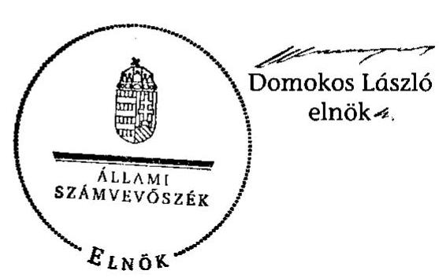

# ÁLLAMI   SZÁMVEVŐSZÉK 

## JELENTÉS

Kisapostag Község Önkormányzata belső kontrollrendszerének kialakítása, valamint egyes kontrolltevékenységek és a belső ellenőrzés múködése ellenőrzéséről

---

# Állami Számvevőszék 

Iktatószám: V-0012-058-024-033/2013.
Témaszám: 1051
Vizsgálat-azonosító szám: V059123
Az ellenőrzést felügyelte:
Dr. Benedek Mária
felügyeleti vezető
Az ellenőrzést vezette:
Szakmányné Bilik Mária
ellenőrzésvezető
A számvevőszéki jelentés összeállításában közremúködtek:
Hadnagyné Papp Ildikó
számvevő
Kámán Edina
számvevő
Az ellenőrzést végezték:
Hadnagyné Papp Ildikó
számvevő
dr. Zelei Andrásné
számvevő

---

# TARTALOMJEGYZÉK 

BEVEZETÉS ..... 5
I. ÖSSZEGZŐ MEGÁLLAPÍTÁSOK, KÖVETKEZTETÉSEK, JAVASLATOK ..... 8
II. RÉSZLETES MEGÁLLAPÍTÁSOK ..... 18

1. Az Önkormányzat belső kontrollrendszere kialakításának megfelelősége ..... 18
1.1. A kontrollkörnyezet kialakítása ..... 18
1.2. A kockázatkezelési rendszer kialakítása ..... 19
1.3. A kontrolltevékenységek kialakítása ..... 20
1.4. Az információs és kommunikációs rendszer kialakítása ..... 21
1.5. A monitoring rendszer kialakítása ..... 22
2. A pénzügyi folyamatokban kulcsszerepet betöltő belső kontrollok (szakmai teljesítésigazolás és utalvány ellenjegyzés) múködése ..... 22
3. A belső ellenőrzés szervezeti keretei és múködése ..... 25

## FÜGGELÉKEK

1. számú Értelmező szótár
2. számú A belső kontrollrendszer kialakítása, a pénzügyi folyamatokban kulcsszerepet betöltő szakmai teljesítésigazolás és utalvány ellenjegyzés kontrollok múködése, valamint a belső ellenőrzés múködése értékelésénél alkalmazott minősítési szempontok

---

.

---

# RÖVIDÍTÉSEK JEGYZÉKE 

## Törvények

ÁSZ tv.
Avtv.

Info tv.

Kttv.
Ktv.
Mötv.
Ötv.
régi Áht.

Számv. tv.
Tvtv.
új Áht.

## Rendeletek

Áhsz.

Ámr.
Ávr.

Ber.
Bkr.

## Szórövidítések

ÁSZ
Belső ellenőrzési kézikönyv
2011. évi LXVI. törvény az Állami Számvevőszékről
1992. évi LXIII. törvény a személyes adatok védelméről és a közérdekú adatok nyilvánosságáról (hatálytalan 2012. január 1-jétől)
2011. évi CXII. törvény az információs önrendelkezési jogról és az információszabadságról (hatályos 2012. január 1-jétől
2011. évi CXCIX. törvény a közszolgálati tisztviselőkről (hatályos 2012. március 1-jétől)
1992. évi XXIII. törvény a köztisztviselők jogállásáról (hatálytalan 2012. március 1-jétől)
2011. évi CLXXXIX. törvény Magyarország helyi önkormányzatairól (hatályos 2012. január 1-jétől)
1990. évi LXV. törvény a helyi önkormányzatokról
1992. évi XXXVIII. törvény az államháztartásról (hatálytalan 2012. január 1-jétől)
2000. évi C. törvény a számvitelről
1996. évi XXXI. törvény a túz elleni védekezésről, a múszaki mentésről és a tűzoltóságról
2011. évi CXCV. törvény az államháztartásról (hatályos 2012. január 1-jétől)

249/2000. (XII. 24.) Korm. rendelet az államháztartás szervezeti beszámolási és könyvvezetési kötelezettségének sajátosságairól
292/2009. (XII. 19.) Korm. rendelet az államháztartás múködési rendjéről (hatálytalan 2012. január 1-jétől)
368/2011. (XII. 31.) Korm. rendelet az államháztartásról szóló törvény végrehajtásáról (hatályos 2012. január 1jétől)
193/2003. (XI. 26.) Korm. rendelet a költségvetési szervek belső ellenőrzéséről (hatálytalan 2012. január 1-jétől)
370/2011. (XII. 31.) Korm. rendelet a költségvetési szervek belső kontrollrendszeréről és belső ellenőrzéséről (hatályos 2012. január 1-jétől)

Állami Számvevőszék
Kisapostag Község Önkormányzata Jegyzőjének 2/2010. számú szabályzata Kisapostag Község Önkormányzata Polgármesteri Hivatalának Belső Ellenőrzési Kézikönyve (hatályos 2010. február 1-jétől)

---

Belső Kontroll Kézikönyv az Ámr. 155. § (1) bekezdése, valamint az államháztartási belső kontroll standardokról szóló 1/2009. (IX. 11.) PM irányelv egységes értelmezése érdekében az államháztartásért felelős miniszter által a 2010. évben kiadott Belső Kontroll Kézikönyv
gazdálkodási jogkörök Kisapostag Község Önkormányzat Polgármesteri Hivatala szabályzata Kötelezettségvállalás, utalványozás, ellenjegyzés, érvényesítés rendjének szabályzata (hatályos 2005. január 1jétől)
gazdasági program
jegyzö ${ }_{1} \quad$ Kisapostag Község Önkormányzatának Gazdasági Programja 2011-2014. (hatályos 2011. január 31-étől)
jegyzö ${ }_{2} \quad$ Kisapostag Község Önkormányzatának jegyzője 2004. július 12-étől 2010. október 27-éig
jegyzö ${ }_{3} \quad$ Kisapostag Község Önkormányzatának megbízott helyettesítő jegyzője 2010. október 18-ától 2010. november 29éig, majd jegyzője 2010. november 30-ától 2010. december 6 -áig
jegyzö ${ }_{3} \quad$ Kisapostag Község Önkormányzatának jegyzője 2010. december 7-étől 2012. december 31-éig
jegyző
Kisapostag Község Önkormányzatának helyettes jegyzője 2013. január 1-jétől 2013. február 28-áig, a Baracsi Közös Önkormányzati Hivatal jegyzője 2013. március 1-jétől
Képviselő-testület
kockázatkezelési szabályzat
leltározási szabályzat
Önkormányzat
pénzkezelési szabályzat
polgármester
Polgármesteri Hivatal
Társulás
ügyrend

Kisapostag Község Önkormányzatának Képviselőtestülete
Kisapostag Község Önkormányzat Jegyzőjének 1/2006. sz. utasítása a Folyamatba épített előzetes és utólagos vezetői ellenőrzés rendszeréről III. fejezete: Kockázatkezelési szabályzat (hatályos 2006. január 1-jétől)
Kisapostag Község Önkormányzata Polgármesteri Hivatalának Leltárkészítési és leltározási szabályzata (hatályos 2005. január 1-jétől)
Kisapostag Község Önkormányzata
Kisapostag Község Önkormányzat Polgármesteri Hivatalának Pénzkezelési Szabályzata (hatályos 2005. január 1jétől)
Kisapostag Község Önkormányzatának polgármestere
Kisapostag Község Önkormányzatának Polgármesteri Hivatala
Dunaújvárosi Kistérség Többcélú Kistérségi Társulása
Kisapostag Község Önkormányzata Polgármesteri Hivatalának Úgyrendje (hatályos 2009. december 1-jétől)

---

# JELENTÉS 

## Kisapostag Község Önkormányzata belső kontrollrendszerének kialakítása, valamint egyes kontrolltevékenységek és a belső ellenőrzés múködése ellenőrzéséről

## BEVEZETÉS

A belső kontrollrendszer kialakítását, múködtetését és fejlesztését a régi Áht. és az új Áht. is előírja. Ennek megvalósításáért a költségvetési szerv vezetője felel. A belső kontrollrendszer azt a célt szolgálja, hogy a költségvetési szervek múködésük és gazdálkodásuk során a tevékenységeket szabályszerűen, gazdaságosan, hatékonyan, eredményesen hajtsák végre, teljesítsék elszámolási kötelezettségeiket és megvédjék az erőforrásokat a veszteségektől, a károktól és a nem rendeltetésszerú használattól. A belső kontrollrendszer magában foglalja mindazon szabályokat, eljárásokat, gyakorlati módszereket és szervezeti struktúrákat, kockázatkezelési technikákat, kontrolltevékenységeket, amelyek segítséget nyújtanak a szervezetnek céljai eléréséhez.

Az ÁSZ a 2011-2015. évekre szóló stratégiájában hangsúlyos szerepet szánt annak, hogy szilárd szakmai alapon álló, értékteremtő ellenőrzéseivel előmozdítsa a közpénzügyek átláthatóságát, rendezettségét. A számvevőszéki ellenőrzés nemzetközi alapelvei is rögzítik, hogy a megfelelő belső kontrollrendszer minimálisra csökkenti a hibák és szabálytalanságok kockázatát.

Az ellenőrzés célja annak értékelése volt, hogy az Önkormányzat a jogszabályi előírásoknak megfelelően alakította-e ki a belső kontrollrendszert; a gazdálkodás folyamatában kulcsszerepet betöltő szakmai teljesítésigazolás és az utalvány ellenjegyzés kontrolltevékenységeit megfelelően múködtette-e; biztosí-totta-e a belső ellenőrzés szabályos és eredményes múködését.

Az ÁSZ ezen ellenőrzési céljait pilot (próba) jelleggel községi/nagyközségi önkormányzatoknál végzett ellenőrzések során érvényesítette.

Az ellenőrzés típusa: szabályszerűségi ellenőrzés
Az ellenőrzés jogszabályi alapja: az ÁSZ tv. 5. § (2) és (6) bekezdései
Az ellenőrzött szervezet: az Önkormányzat
Az ellenőrzött időszak: a belső kontrollrendszer kialakításának megfelelőségét a 2011. évre vonatkozóan értékeltük. A kontrolltevékenységek múködésének megfelelőségét a 2011. január 1-je és december 31-e, míg a belső ellenőrzés múködésének szabályosságát és eredményességét a 2009. január 1-je és 2011.

---

december 31-e közötti időszakot figyelembe véve értékeltük. A helyszíni ellenőrzés lezárásáig a helyi szabályozás változásait nyomon követtük.

Az ellenőrzés szakmai módszertana az ÁSZ hivatalos honlapján (www.asz.hu) közzétett szakmai szabályokon alapult, amely a Legfőbb Ellenőrző Intézmények Nemzetközi Szervezete (INTOSAI) által kiadott nemzetközi standardok (ISSAI) figyelembevételével készült.

A belső kontrollrendszer kialakításának ellenőrzése során értékeltük a kontrollkörnyezet, a kockázatkezelési rendszer, a kontrolltevékenységek, az információs és kommunikációs rendszer, valamint a monitoring rendszer szabályozottságának megfelelőségét.

Értékeltük a pénzügyi folyamatokban kulcsszerepet betöltő szakmai teljesítésigazolás és utalvány ellenjegyzés kontrollok működésének megfelelőségét az államháztartáson kívülre teljesített múködési és felhalmozási célú pénzeszközátadásoknál, az állományba nem tartozók megbízási díjainál, továbbá a külső szolgáltatók által végzett karbantartási, kisjavítási munkákkal kapcsolatos kifizetéseknél. Az egyszerű véletlen mintavétellel kiválasztott tételek ellenőrzését többlépcsős megfelelőségi tesztek útján addig végeztük, amíg elegendő és megfelelő bizonyítékot szereztünk a vizsgált folyamatok kulcskontrolljai múködésének megfelelő vagy nem megfelelő voltáról. Értékeltük az Önkormányzatnál a belső ellenőrzés múködésének szabályosságát és eredményességét. Az ÁSZ a 2007-2010. években az Önkormányzatnál a gazdálkodás szabályszerűségére irányuló átfogó ellenőrzést nem végzett.

A fogalmak magyarázatát az 1. számú függelék, az ellenőrzés egyes területeinek értékelésénél alkalmazott egységes minősítési szempontokat a 2. számú függelék tartalmazza.

Az ellenőrzés lefolytatásához az Önkormányzat a munkalapok és a tanúsítvány elektronikus kitöltésével, valamint a megjelölt dokumentumok elektronikus megküldésével szolgáltatott adatokat. A munkalapokon szerepeltetett adatok, információk ellenőrzése és szükség szerinti javítása a helyszíni ellenőrzés keretében történt.

Az ÁSZ az ellenőrzés megállapításait az ellenőrzött időszakban hatályos, az intézkedést igénylő megállapításokra tett javaslatokat a jelenleg hatályos jogszabályok alapján fogalmazta meg.

Az ÁSZ tv. 29. § (1) bekezdése szerint a jelentéstervezetet megküldtük a polgármester részére, aki az ÁSZ tv. 29. § (2) bekezdésében foglalt észrevételezési jogával nem élt, a jelentéstervezetre észrevételt nem tett.

Kisapostag község állandó lakosainak száma 2011. január 1-jén 1470 fő volt. Az Önkormányzat héttagú Képviselő-testületének munkáját egy állandó bizottság segítette. Az Önkormányzat az önállóan működő és gazdálkodó Polgármesteri Hivatalon kívül önállóan működő, illetve önállóan működő és gazdálkodó intézménnyel, többségi tulajdoni hányadú gazdasági társasággal nem rendelkezett. A polgármester az 1998. évi önkormányzati választások óta tölti be tisztségét. Az ellenőrzött időszakban a jegyző személye kettő alkalommal változott. A jegyzőváltások alkalmával a munkakör átadás-átvételt a jegyző ${ }_{2}$ és

---

a jegyző ${ }_{3}$ között nem dokumentálták. A helyszíni ellenőrzés időszakában a munkakört betöltő jegyző 2013. január 1-jétől látta el feladatait.

A hivatali feladatellátás szervezeti keretei 2013. január 1-jét követően megváltoztak, az Önkormányzat Képviselő-testülete Baracs Község Önkormányzatával közös hivatal létrehozásáról döntött, és 2013. március 1-jén megalakult a Baracsi Közös Önkormányzati Hivatal.

A Polgármesteri Hivatal szervezeti egységekre nem tagolódott, a foglalkoztatott köztisztviselők száma 2011. január 1-jén hét fő volt. Az Önkormányzat a 2011. évi költségvetési beszámolója szerint 208270 ezer Ft költségvetési bevételt ért el, valamint 125584 ezer Ft költségvetési kiadást teljesített. A 2011. december 31-i könyvviteli mérleg szerint 1040309 ezer Ft értékű eszközvagyonnal rendelkezett, 91514 ezer Ft hosszú lejáratú, valamint 8710 ezer Ft rövid lejáratú kötelezettsége volt.

---

# I. ÖSSZEGZŐ MEGÁLLAPÍTÁSOK, KÖVETKEZTETÉSEK, JAVASLATOK 

A belső kontrollrendszeren belül 2011-ben a Polgármesteri Hivatalban a kontrollkörnyezet, a kockázatkezelési rendszer, a kontrolltevékenységek, az információs és kommunikációs rendszer, valamint a monitoring rendszer kialakítását külön-külön és összesítve is értékeltük. A belső kontrollrendszer kialakítása az összesített értékelés alapján nem felelt meg a jogszabályi előírásoknak. Az egyes területek kialakításának értékelését az alábbiakban részletezzük.

A kontrollkörnyezet kialakítása nem felelt meg a jogszabályi követelményeknek, mert a jegyző ${ }_{3}$ a régi Áht. ${ }^{1}$ előírása ellenére nem készítette el a Polgármesteri Hivatal Szervezeti és Múködési Szabályzatát, így nem tett eleget az Ámr.-ben ${ }^{2}$ foglalt szabályozási kötelezettségének, valamint nem írta elő a Ber.ben ${ }^{3}$ foglaltak ellenére a belső ellenőrzést végző szervezet jogállását, feladatait. A Polgármesteri Hivatal ügyrendjében az Ámr.-ben foglaltakat figyelmen kívül hagyva nem szabályozta a pénzügyi feladatok ellátásáért felelős dolgozók helyettesítés rendjét, továbbá a Ktv.-ben ${ }^{4}$ foglaltak ellenére nem alakította ki a teljesítményértékelési rendszert és teljesítményértékelést nem végzett. A jegyzős és a helyszíni ellenőrzés idején hivatalban lévő jegyző nem rendelkezett a polgármester által aláírt munkaköri leírással. Ezek a hiányosságok korlátozzák a feladatellátás számon kérhetőségét, folyamatosságának biztosítását. A jegyzős az ellenőrzési nyomvonalban az Ámr. előírása ellenére nem rögzítette a felelősségi és információs szinteket, ellenőrzési folyamatokat. A leltározási szabályzatban az Áhsz.-ben foglaltak ellenére nem szabályozta az üzemeltetésre átadott eszközök leltározását, a Számv. tv. előírása ellenére nem készítette el a Polgármesteri Hivatal bizonylati rendjét, továbbá a pénzkezelési szabályzatában nem határozta meg a házipénztáron kívüli pénzkezelést és annak elszámolási rendjét, amely hiányosságok vagyonvédelmi kockázatot jelentenek. A Tvtv.-ben foglaltak ellenére nem készítette el a Polgármesteri Hivatal tűzvédelmi szabályzatát.

A kockázatkezelési rendszer kialakítása nem felelt meg a jogszabályi követelményeknek, mert az Ámr. előírásai ellenére a jegyzős nem mérte fel és nem állapította meg az Önkormányzat tevékenységében, gazdálkodásában rejlő kockázatokat, nem határozta meg az egyes kockázatokkal kapcsolatos intézkedéseket és megtételük módját, így kockázatelemzést nem végzett és nem múködtette a kockázatkezelési rendszert.

A kontrolltevékenységek kialakítása a jogszabályi követelményeknek nem felelt meg, mert a jegyzős az Ámr. előírásait figyelmen kívül hagyva a gazdál-

[^0]
[^0]:    ${ }^{1}$ 2012. január 1-jétől az új Áht.
    ${ }^{2}$ 2012. január 1-jétől Ávr.
    ${ }^{3}$ 2012. január 1-jétől Bkr.
    ${ }^{4}$ 2012. július 1-jétől a Kttv.

---

kodási jogkörök szabályzatában nem írta elő a szakmai teljesítésigazolás módját, eljárási és dokumentációs szabályait (a hiányosságot 2012-ben szüntették meg). A kötelezettségvállalás és az utalványozás ellenjegyzésére egy főt, az érvényesítésre két főt az Ámr.-ben foglaltakat figyelmen kívül hagyva hatalmazott fel, mert a felhatalmazottak nem rendelkeztek a jogszabályban előírt pénzügyi-számviteli képesítéssel. Az Ámr. előírása ellenére nem szabályozta a Polgármesteri Hivatal tevékenységeire vonatkozó beszámolási eljárásokat, nem biztosította a kötelezettségvállalásra, ellenjegyzésre, szakmai teljesítésigazolásra, érvényesítésre, utalványozásra jogosult személyekről és az aláírás mintájukról vezetett nyilvántartás naprakészségét. Nem gondoskodott arról, hogy a kötelezettségvállalás nyilvántartása megfeleljen az Ámr.-ben előírt tartalmi követelményeknek. A kontrolltevékenységek hiányos kialakítása nem biztosította a feladatok szabályszerű végrehajtását.

Az információs és kommunikációs rendszer kialakítása a jogszabályi előírásoknak nem felelt meg, mert a jegyző ${ }_{3}$ az Avtv. ${ }^{5}$ előírása ellenére nem készítette el az adatvédelmi és adatbiztonsági szabályzatot, nem határozta meg a kötelezően közzéteendő adatok közzétételi eljárásrendjét, továbbá az Avtv. előírása ellenére nem szabályozta a közérdekú adatok megismerésére irányuló igények teljesítésének rendjét. Nem alakította ki az informatikai rendszer hozzáférési jogosultságaira és az azok betartásának ellenőrzésére vonatkozó eljárásrendet és nyilvántartást. Nem szabályozta a pénzügyi-számviteli szoftverváltozások ellenőrzésére vonatkozó eljárásokat, a feldolgozott adatok mentési eljárásait, és nem jelölte ki a mentések felelőseit.

A monitoring rendszer kialakítása a jogszabályi követelményeknek nem felelt meg, mert a jegyzö ${ }_{3}$ az Ámr.-ben foglaltak ellenére az operatív tevékenységek keretében megvalósuló folyamatos és eseti nyomon követésből álló, a Polgármesteri Hivatal tevékenységének, a célok megvalósításának nyomon követését biztosító rendszert nem szabályozta.

A belső kontrollrendszer nem megfelelő kialakítása kockázatot jelent az Önkormányzat tevékenységeinek szabályszerű, gazdaságos, hatékony és eredményes végrehajtásában.

A Polgármesteri Hivatalban a 2011. évben az államháztartáson kívülre történő múködési és felhalmozási célú pénzeszközátadásokkal, az állományba nem tartozók megbízási díjaival, valamint a külső szolgáltatók által végzett karbantartással, kisjavítással kapcsolatos kifizetések során - összefoglalóan értékelve a pénzügyi folyamatokban kulcsszerepet betöltő szakmai teljesítésigazolás és utalvány ellenjegyzés belső kontrollok múködésének megfelelősége gyenge volt.

Az államháztartáson kívülre történő múködési és felhalmozási célú pénzeszközátadásokkal, az állományba nem tartozók megbízási díjaival és a külső szolgáltatók által végzett karbantartással, kisjavítással kapcsolatos kiadások teljesítését megelőzően azok jogosságának, összegszerűségének ellenőrzése, valamint - az ellenszolgáltatást is magában foglaló kötelezettségvállalás esetében

[^0]
[^0]:    ${ }^{5}$ 2012. január 1-jétől Info tv.

---

- a szerződések szakmai teljesítésének igazolása a régi Áht. és az Ámr. előírása ellenére a jegyző ${ }_{3}$ részéről kijelölt személyek által nem, vagy nem szabályszerűen történt meg. Az utalványok ellenjegyzője az Ámr.-ben foglalt ellenőrzési feladatait nem a jogszabályi előírásoknak megfelelően végezte, mert annak ellenére ellenjegyezte az utalványokat, hogy a szakmai teljesítésigazolás nem, illetve nem szabályszerűen történt meg, továbbá a kifizetések érvényesítése az Ámr.-ben foglaltak ellenére nem tartalmazta az érvényesítés dátumát és az érvényesítésre utaló megjelölést.

A gazdálkodásra - köztük a kötelezettségvállalás ellenjegyzésére, a kötelezettségvállalások nyilvántartására és az utalványrendeleten a kötelezettségvállalás nyilvántartási számának feltüntetésére, továbbá az utalvány tartalmi megfelelőségére - vonatkozó szabályok betartásának hiánya ellenére az utalványokat az utalvány ellenjegyzője aláírta. Az Ámr. előírásai ellenére az adóügyi és a népszámlálási feladatokhoz kapcsolódó utalványt nem az arra jogosult ellenjegyezte, továbbá az adóügyi feladatokra annak ellenére megbízási szerződést kötöttek, hogy a feladat ellátására a Ktv. alapján kizárólag közszolgálati jogviszony létesíthető.

Az ellenőrzött kifizetésekkel összefüggésben a rendelkezésre bocsátott dokumentumok alapján jogosulatlan kifizetést nem tárt fel az ellenőrzésünk, azonban a gazdálkodásban kulcsszerepet betöltő kontrollok múködésében feltárt hiányosságok miatt fennáll a hibák bekövetkezésének kockázata. A nem megfelelően szabályozott és múködtetett belső kontrollok korrupciós kockázatot is hordoznak.

Az Önkormányzat a belső ellenőrzési feladatokat a Társulás útján látta el. Az Önkormányzatnál a 2009-2011. években a belső ellenőrzés szabályozása az összesített értékelés alapján - a jogszabályi előírásoknak megfelelt. A Képvi-selő-testület a 2011. évi ellenőrzési tervet az Ötv.-ben foglalt határidőn túl fogadta el, mert a jegyző ${ }_{2}$ nem gondoskodott a határidőre történő előterjesztéséről. A 2009-2011. évi ellenőrzési tervek összeállításához a Ber. előírása ellenére a jegyző ${ }_{1,2}$ írásos véleményt nem készített. A 2010. évi ellenőrzési terveket nem módosították annak ellenére, hogy egy ellenőrzést nem hajtottak végre. A belső ellenőrzési vezető a Ber.-ben foglaltak ellenére nem alakította ki a belső ellenőrzési jelentésekben szereplő javaslatok alapján megtett intézkedések nyilvántartását, és az intézkedések nyomon követését elmulasztotta.

Az Önkormányzatnál a 2009-2011. években a belső ellenőrzés múködése a 2. számú függelékben részletezett kritériumrendszer alapján végzett értékelés szerint - nem volt eredményes annak ellenére, hogy a belső ellenőrzés szabályozása és múködése az összegző értékelés alapján az ellenőrzött időszak egészét tekintve a jogszabályi előírásoknak megfelelt. Nem végeztek azonban belső ellenőrzést a következőkben felsoroltak közül legalább kettő területen: a belső kontrollrendszer kialakításának szabályozottsága, a beazonosított túréshatár feletti kockázatok kezelése érdekében tett intézkedések, a gazdálkodási jogkörök gyakorlása, a készpénzkezeléssel kapcsolatos belső kontrollok múködése, valamint az önkormányzati vagyonhasznosítás vonatkozásában a vagyongazdálkodási szabályok betartása. Ezen túl a belső ellenőrzés javaslataira tett intézkedések nem hasznosultak. Mindezek hozzájárultak a számvevőszéki ellenőrzés

---

során is feltárt szabályozási hiányosságok fennmaradásához, a hibák ismétlődéséhez.

Az ÁSZ tv. 33. § (1) bekezdésében foglaltak értelmében az ellenőrzött szervezet vezetője köteles a jelentésben foglalt megállapításokhoz kapcsolódó intézkedési tervet összeállítani, és azt a jelentés kézhezvételétől számított 30 napon belül az ÁSZ részére megküldeni. Amennyiben az intézkedési tervet határidőre nem küldi meg a szervezet, vagy az - az ÁSZ tv. 33. § (2) bekezdésében foglalt póthatáridő eltelte ellenére - továbbra sem elfogadható, az ÁSZ elnöke a hivatkozott törvény 33. § (3) bekezdés a-b) pontjaiban foglaltakat érvényesítheti.

Az ellenőrzés intézkedést igénylő megállapításai és javaslatai:

# a polgármesternek 

1. A Ktv. 11. § (1) és (6) bekezdésében foglaltak ellenére a jegyző ${ }_{1,2,3}$ és a helyszíni ellenőrzés idején hivatalban lévő jegyző nem rendelkezett a polgármester által aláírt munkaköri leírással.

Javaslat:
Intézkedjen a Kttv. 43. § (4) bekezdésében foglaltak alapján a jegyző munkaköri leírásának elkészítéséről és a kinevezési okmányhoz történő csatolásáról.
2. Az adóügyi, a népszámlálási feladatok ellátására teljesített megbízási díjak, valamint a fénymásoló karbantartási és burkolatjavítási munkákra teljesített kifizetések alapját képező kötelezettségvállalásokra - a régi Áht. 100/C. § (3) bekezdésében és az Ámr. 74. § (1) bekezdésében foglaltak ellenére - ellenjegyzés nélkül került sor.

Javaslat:
Intézkedjen arról, hogy az Önkormányzat nevében történő kötelezettségvállalásra az új Áht. 37. § (1) bekezdésében foglaltaknak megfelelően - az Ávr. 53. §-ában meghatározott kivételekkel - kizárólag a pénzügyi ellenjegyzés után, a pénzügyi teljesítés esedékességét megelőzően, írásban kerüljön sor.
3. Az államháztartáson kívülre történő működési és felhalmozási célú pénzeszközátadásokkal, az állományba nem tartozók megbízási díjaival és a külső szolgáltatók által végzett karbantartással, kisjavítással kapcsolatos kiadások teljesítését megelőzően azok jogosságának, összegszerűségének ellenőrzése, valamint - az ellenszolgáltatást is magában foglaló kötelezettségvállalás esetében - a szerződések szakmai teljesítésének igazolása - a régi Áht. 100/C. § (6) bekezdésében és az Ámr. 76. § (3) bekezdésének előírása ellenére - a jegyző ${ }_{3}$ részéről kijelölt személyek által nem vagy nem szabályszerűen történt meg. Az utalványok ellenjegyzője az Ámr. 79. § (2) bekezdésében foglalt ellenőrzési feladatait nem a jogszabályi előírásoknak megfelelően végezte. Az adóügyi és a népszámlálási feladatokhoz kapcsolódó utalványt az Ámr. 78. § (1) bekezdésében foglalt előírások ellenére nem az arra jogosult ellenjegyezte. Az adóügyi feladatokra a Ktv. 1. § (9) bekezdésében foglaltakat figyelmen kívül hagyva annak ellenére megbízási szerződést kötöttek, hogy a feladat ellátására kizárólag közszolgálati jogviszony létesíthető.

---

Javaslat:
A Mötv. 115. § (1) bekezdésében foglaltak alapján kísérje figyelemmel az önkormányzat gazdálkodásának szabályszerűségét. A Mötv. 67. § f) pontja alapján gondoskodjon a belső kontrollrendszerre és a belső ellenőrzés müködésére vonatkozó jogszabályi rendelkezések be nem tartása, valamint a szakmai teljesítésigazolás, illetve az utalvány ellenjegyzés kontrollokkal összefüggésben feltárt hiányosságok, szabálytalanságok, valamint a szabálytalanul megkötött szerződés tekintetében az esetleges munkajogi felelősséggel kapcsolatos körülmények kivizsgálásáról, és a vizsgálat eredményének függvényében tegye meg a szükséges munkajogi intézkedéseket.

# a jegyzőnek Kisapostag Község Önkormányzata vonatkozásában 

4. a kontrollkörnyezettel kapcsolatban:

A jegyző; - a régi Áht. 91. § (2) bekezdésében foglaltak ellenére - nem készítette el a Polgármesteri Hivatal szervezeti és müködési szabályzatát. A Számv. tv. 161. § (2) bekezdés d) pontjában foglaltak ellenére nem készítette el a Polgármesteri Hivatal bizonylati rendjét, a pénzkezelési szabályzatban - a Számv. tv. 14. § (8) bekezdése ellenére - nem határozta meg a házipénztáron kívüli pénzkezelést és annak elszámolási rendjét. A leltározási szabályzatban az Áhsz. 37. § (4) bekezdésben előírtakat figyelmen kívül hagyva nem szabályozta az üzemeltetésre átadott eszközök leltározását, továbbá a Tvtv. 19. § (1) bekezdésében foglaltak ellenére nem készítette el a tűzvédelmi szabályzatot. A Ktv. 34. § (5) bekezdésében foglaltak ellenére nem határozta meg a köztisztviselők munkateljesítményének értékeléséhez szükséges teljesítménykövetelményeket, és az ügyrend - az Ámr. 20. § (7) bekezdésében előírtak ellenére - nem tartalmazta a pénzügyi feladatok ellátásáért felelős dolgozók helyettesítési rendjét. Az ellenőrzési nyomvonalban az Ámr. 156. § (2) bekezdését figyelmen kívül hagyva nem rögzítette a felelősségi és információs szinteket és kapcsolatokat, irányítási és ellenőrzési folyamatokat.

Javaslat:
a) Készítse el az új Áht. 10. § (5) bekezdésében foglaltak alapján a Hivatal szervezeti és müködési szabályzatát az Ávr. 13. § (1) bekezdésében előírt tartalommal, a Bkr. 15. § (2) bekezdésének megfelelően a belső ellenőrzést végző szervezet jogállását és feladatait is meghatározva, és az új. Áht. 9. § (1) bekezdés e) pontja alapján kezdeményezze a polgármesternél a Képviselő-testület elé terjesztését.
b) Készítse el a Számv. tv. 161. § (2) bekezdés d) pontjában előírtaknak megfelelően a Hivatal bizonylati rendjét, továbbá egészítse ki a pénzkezelési szabályzatot a Számv. tv. 14. § (8) bekezdésében foglaltaknak megfelelően a házipénztáron kívüli pénzkezelés szabályozásával, elszámolási rendjének meghatározásával.
c) Írja elő az Áhsz. 37. § (4) bekezdésében foglaltak szerint a leltározási szabályzatban az üzemeltetésre átadott eszközök leltározási módját.
d) Készítse el a Tvtv. 19. § (1) bekezdésében előírtaknak megfelelően a Hivatal tűzvédelmi szabályzatát.

---

e) Egészítse ki az ügyrendet az Ávr. 13. § (5) bekezdésében foglaltak alapján a pénzügyi-gazdasági feladatok ellátásáért felelős dolgozók helyettesítési rendjének szabályozásával.
f) Dolgozza ki a Kttv. 130. § (1)-(3) bekezdéseiben előírtak szerinti teljesítményértékelés alapját képező teljesítménykövetelményeket.
g) Egészítse ki az ellenőrzési nyomvonalat annak érdekében, hogy az tartalmazza a Bkr. 6. § (3) bekezdésében előírtakat.
5. a kockázatkezelési rendszerrel kapcsolatban:

A jegyző ${ }_{3}$ - az Ámr. 157. § (1)-(3) bekezdésének előírása ellenére kockázatelemzést nem végzett, és kockázatkezelési rendszert nem alakított ki.

Javaslat:
Alakítsa ki és múködtesse a Bkr. 3. § b) pontja és a 7. §-a szerinti kockázatkezelési rendszert.
6. a kontrolltevékenységekkel kapcsolatban:

A jegyző ${ }_{3}$ az Ámr. 19. § (1) bekezdésében foglaltakat figyelmen kívül hagyva hatalmazott fel egy főt a kötelezettségvállalás és az utalványozás ellenjegyzésére, továbbá két főt az érvényesítésre jogosult személyek közül, mert a felhatalmazottak nem rendelkeztek az előírt pénzügyi-számviteli képesítéssel. Az Ámr. 80. § (3) bekezdésben foglaltak ellenére a kötelezettségvállalásra, ellenjegyzésre, szakmai teljesítésigazolásra, érvényesítésre, utalványozásra jogosult személyekről és az aláírás mintájukról vezetett nyilvántartás nem volt naprakész. Az Ámr. 75. § (1) bekezdésének előírása ellenére nem gondoskodott arról, hogy a kötelezettségvállalás nyilvántartása megfeleljen a tartalmai követelményeknek. Az Ámr. 158. § (2) bekezdés d) pontjában előírtak ellenére nem szabályozta a Polgármesteri Hivatal tevékenységeire vonatkozó beszámolási eljárásokat.

Javaslat:
a) Intézkedjen arról, hogy pénzügyi ellenjegyzőként és érvényesítőként az Ávr. 55. § (3) bekezdésében előírt képesítéssel rendelkező személy kerüljön kinevezésre.
b) Szabályozza a Bkr. 8. § (4) bekezdés c) pontjában foglaltaknak megfelelően a Hivatal tevékenységeire vonatkozó beszámolási eljárásokat.
c) Intézkedjen arról, hogy a kötelezettségvállalásra, ellenjegyzésre, teljesítésigazolásra, érvényesítésre, utalványozásra jogosult személyekről és az aláírásmintájukról a nyilvántartást az Ávr. 60. § (3) bekezdésében foglaltaknak megfelelően naprakészen vezessék.
d) Intézkedjen arról, hogy a kötelezettségvállalások nyilvántartása megfeleljen az Ávr. 56. § (1) bekezdésében foglalt tartalmi követelményeknek.

---

7. Az információs és kommunikációs rendszerrel kapcsolatban:

A jegyző ${ }_{3}$ az Avtv. 31/A. § (3) bekezdése ellenére nem készítette el a Polgármesteri Hivatal adatvédelmi és adatbiztonsági szabályzatát. Az Ámr. 20. § (3) bekezdés i) pontjában foglaltak ellenére nem határozta meg a kötelezően közzéteendő adatok nyilvánosságra hozatalának rendjét. Az Avtv. 20. § (8) bekezdésének előírása ellenére nem szabályozta a közérdekú adatok megismerésére irányuló igények teljesítésének rendjét. Az informatikai rendszer környezetének szabályozása során az Avtv. 10. § (1)-(2) bekezdéseinek előírása ellenére a jegyző ${ }_{3}$ nem alakította ki az informatikai rendszer hozzáférési jogosultságaira és az azok betartásának ellenőrzésére vonatkozó eljárásrendet és nyilvántartást. Nem szabályozta a pénzügyi-számviteli szoftverváltozások ellenőrzésére vonatkozó eljárásokat, a feldolgozott adatok mentési eljárásrendjét, és nem jelölte ki a mentések felelőseit.

Javaslat:
a) Készítse el a Hivatal adatvédelmi és adatbiztonsági szabályzatát az Info tv. 24. § (3) bekezdésének megfelelően.
b) Állapítsa meg - az Info tv. 33. § (1) és 35. § (3) bekezdéseiben, valamint az Ávr. 13. § (2) bekezdés h) pontjában foglaltaknak megfelelően - a kötelezően közzéteendő adatok nyilvánosságra hozatalának rendjét, továbbá készítsen - az Info tv. 30. § (6) bekezdésében és az Ávr. 13. § (2) bekezdés h) pontjában foglaltaknak megfelelően - a közérdekű adatok megismerésére irányuló igények teljesítésének rendjét rögzítő szabályzatot.
c) Biztosítsa az Info tv. 7. § (2)-(3) bekezdéseinek megfelelően az adatbiztonság érvényesülését, az informatikai környezet szabályozása keretében rendelkezzen a hozzáférési jogosultságok megállapításáról, ellenőrzéséről és nyilvántartásáról, valamint szabályozza a pénzügyi-számviteli szoftverváltozások ellenőrzésére vonatkozó eljárásokat, a feldolgozott adatok mentési eljárásait, és jelölje ki a mentések felelőseit.
8. a monitoring rendszerrel kapcsolatban:

A jegyző ${ }_{3}$ az Ámr. 160. §-ában foglaltak ellenére nem alakított ki olyan monitoring rendszert, amely lehetővé teszi a Polgármesteri Hivatal tevékenységének, a célok megvalósításának nyomon követését, és amelynek része az operatív tevékenységek keretében megvalósuló folyamatos és eseti nyomon követés is.

Javaslat:
Alakítsa ki és múködtesse a Bkr. 3. § e) pontjában és a Bkr. 10. §-ában előírtak alapján a Hivatal tevékenységének, a célok megvalósításának nyomon követését biztosító rendszert, amelynek része az operatív tevékenységek keretében megvalósuló folyamatos és eseti nyomon követés.

---

9. a pénzügyi folyamatokban kulcsszerepet betöltő kontrollok müködésével kapcsolatban:

Az államháztartáson kívülre történő működési és felhalmozási célú pénzeszközátadásokkal, az állományba nem tartozók megbízási díjaival és a külső szolgáltatók által végzett karbantartással, kisjavítással kapcsolatos kiadások teljesítését megelőzően azok jogosságának, összegszerűségének ellenőrzése, valamint - az ellenszolgáltatást is magában foglaló kötelezettségvállalás esetében - a szerződések szakmai teljesítésének igazolása - a régi Áht. 100/C. § (6) bekezdésének és az Ámr. 76. § (3) bekezdésének előírása ellenére - a jegyző ${ }_{3}$ részéről kijelölt személyek által nem vagy nem szabályszerűen történt meg.

Az államháztartáson kívülre történő működési és felhalmozási célú pénzeszközátadásokkal, az állományba nem tartozók megbízási díjaival és a külső szolgáltatók által teljesített karbantartási, kisjavítási munkákkal kapcsolatos kiadások esetében az utalványok ellenjegyzője az Ámr. 79. § (2) bekezdésében foglalt ellenőrzési feladatait nem a jogszabályi előírásoknak megfelelően végezte, mert annak ellenére ellenjegyezte az utalványokat, hogy a szakmai teljesítésigazolás nem vagy nem szabályszerűen történt meg, továbbá a kifizetések érvényesítése az Ámr. 77. § (3) bekezdésével ellentétesen nem tartalmazta az érvényesítés dátumát és az érvényesítésre utaló megjelölést.

Az utalvány ellenjegyzője nem szabályszerűen ellenjegyzete az utalványt, mert az államháztartáson kívülre történő működési és felhalmozási célú pénzeszközátadásokhoz és a külső szolgáltatók által teljesített karbantartási, kisjavítási munkákhoz kapcsolódó utalványrendeleten - az Ámr. 78. § (2) bekezdés a) és g) pontjában előírtak ellenére - nem szerepelt az utalványozás és az ellenjegyzés dátuma, valamint a kötelezettségvállalás nyilvántartási száma. Az államháztartáson kívülre történő működési és felhalmozási célú pénzeszközátadásokhoz, az állományba nem tartozók megbízási díjaihoz és a külső szolgáltatók által teljesített karbantartáshoz, kisjavításhoz kapcsolódó kötelezettségvállalásokat - az Ámr. 75. § (1) bekezdésében foglaltak ellenére nem vették nyilvántartásba. Az adóügyi és a népszámlálási feladatokhoz kapcsolódó utalványt - az Ámr. 79. § (1) bekezdésében foglalt előírás ellenére - nem az arra jogosult ellenjegyezte. Az adóügyi és a népszámlálási feladatokhoz, a fénymásoló gép karbantartásához, valamint a burkolatjavítási munkákhoz kapcsolódó kifizetéseknél a régi Áht. 100/C. § (3) bekezdésében és az Ámr. 74. § (1) bekezdésében foglaltak ellenére - ellenjegyzés hiányában vállaltak kötelezettséget.

Az adóügyi feladatokra a Ktv. 1. § (9) bekezdésében foglaltakat figyelmen kívül hagyva annak ellenére megbízási szerződést kötöttek, hogy a feladat ellátására kizárólag közszolgálati jogviszony létesíthető.

Javaslat:
Intézkedjen - a szakmai teljesítés igazolása és az utalvány ellenjegyzése vonatkozásában feltárt hiányosságok megszüntetése, illetve az operatív gazdálkodás során a müködésbeli hibák megelőzése, feltárása és kijavítása érdekében - arról, hogy:
a) a teljesítésigazolásra kijelölt személyek az Ávr. 57. § (1) bekezdésében foglaltaknak megfelelően, ellenőrizhető okmányok alapján ellenőrizzék a kiadások teljesítésének jogosságát, összegszerűségét, ellenszolgáltatást is magában foglaló köte-

---

lezettségvállalás esetében a szerződés, megrendelés teljesítését, és azt az Ávr. 57. § (3) bekezdésében foglalt módon - dátummal, a teljesítés tényére történő utalással és aláírásukkal - igazolják;
b) a kifizetéseket megelőzően - az Ávr. 58. § (1) bekezdése szerint - a teljesítésigazolás alapján - az Ávr. 57. § (3) bekezdése szerinti esetben annak hiányában is az összegszerűségnek, a fedezet meglétének és a megelőző ügymenetben az új Áht., az Áhsz., az Ávr. előírásai és a belső szabályzatokban foglaltak betartásának az ellenőrzése történjen meg;
c) a kötelezettségvállalások nyilvántartását az Ávr. 56. § (1) bekezdésében foglalt előírásnak megfelelően vezessék, és az utalványrendeleteken a kötelezettségvállalás nyilvántartási számát az Ávr. 59. § (3) bekezdés f) pontjában foglaltaknak megfelelően tüntessék fel;
d) kötelezettségvállalásra az új Áht. 37. § (1) bekezdésében foglaltaknak megfelelően - az Ávr.-ben meghatározott kivételekkel - kizárólag a pénzügyi ellenjegyzés után, a pénzügyi teljesítés esedékességét megelőzően, írásban kerüljön sor;
e) a Kttv. 8. § (1)-(2) bekezdéseiben foglalt előírás alapján, a Hivatal, mint közigazgatási szerv közhatalmi, irányítási, ellenőrzési és felügyeleti hatáskörének gyakorlásával közvetlenül összefüggő, valamint ügyviteli feladatai ellátására kizárólag kormányzati szolgálati, illetve közszolgálati jogviszonyt létesítsenek.
10. a belső ellenőrzés múködésével kapcsolatban:

A Képviselő-testület a 2011. évi ellenőrzési tervet az Ötv. 92. § (6) bekezdésében foglalt határidőn túl fogadta el, mert a jegyző ${ }_{2}$ nem gondoskodott a határidőre történő előterjesztéséről. A 2009-2011. évi ellenőrzési tervek összeállításához - a Ber. 32/B. § (2) bekezdésének előírása ellenére - a jegyző ${ }_{1,2}$ írásos véleményt nem készített. A 2010. évi ellenőrzési tervben foglaltakhoz képest úgy hagytak el ellenőrzést, hogy az ellenőrzési tervet - a Ber. 32/B. § (6) bekezdésében előírtak ellenére - nem módosították.

A belső ellenőrzés - a Ber. 8. § f) pontjának előírása ellenére - az intézkedések nyomon követését elmulasztotta, továbbá a belső ellenőrzési vezető nem alakította ki a Ber. 12. § n) pontjában előírt nyilvántartást az ellenőrzési javaslatok alapján megtett intézkedések végrehajtásának nyomon követéséről.

Javaslat:
a) Készítse elő az éves ellenőrzési tervről szóló előterjesztést, és kezdeményezze a polgármesternél a Képviselő-testület elé terjesztését annak érdekében, hogy a Képviselő-testület az éves ellenőrzési tervet a Mötv. 119. § (5) bekezdésében és a Bkr. 32. § (4) bekezdésében előírt határidőig jóváhagyhassa.
b) Intézkedjen arról, hogy az éves ellenőrzési terv összeállítása a Bkr. 56. § (2) bekezdésében foglaltaknak megfelelően a jegyző írásos véleményének figyelembevételével történjen.

---

c) Intézkedjen arról, hogy az éves ellenőrzési tervben foglaltakhoz képest ellenőrzés elhagyására a Bkr. 56. § (5) bekezdésében foglalt előírásnak megfelelően az ellenőrzési terv módosítását követően kerüljön sor.
d) Kezdeményezze, hogy a belső ellenőrzési vezető a Bkr. 21. § (2) bekezdés d) pontja alapján és a Bkr. 47. §-ában foglaltak szerint tartsa nyilván és kövesse nyomon a belső ellenőrzési jelentések alapján megtett intézkedéseket.

---

# II. RÉSZLETES MEGÁLLAPÍTÁSOK 

## 1. Az ÖNKORMÁNYZAT BELSŐ KONTROLLRENDSZERE KIALAKÍTÁSÁNAK MEGFELELŐSÉGE

### 1.1. A kontrollkörnyezet kialakítása

A kontrollkörnyezet kialakítása - a 2. számú függelékben részletezett kritériumrendszer alapján végzett értékelés szerint - a Polgármesteri Hivatalban nem volt megfelelő, mert a jegyző ${ }_{3}$ a jogszabályi előírásokat nem érvényesítette teljes körúen.

A jegyző ${ }_{3}$, mint a költségvetési szerv vezetője:

- a régi Áht. 91. § (2) bekezdésében ${ }^{6}$ foglaltak ellenére nem készítette el a Polgármesteri Hivatal Szervezeti és Múködési Szabályzatát, és nem kezdeményezte a polgármesternél a Képviselő-testület elé terjesztését, így az Ámr. 20. § (2) bekezdésében ${ }^{7}$ foglalt szabályozási kötelezettségnek nem tett eleget, továbbá nem írta elő a Ber. 4. § (2) bekezdésében ${ }^{8}$ foglaltak ellenére a belső ellenőrzést végző szervezet jogállását, feladatait;
- a Számv. tv. 161. § (2) bekezdés d) pontjában foglalt előírás ellenére nem készítette el a Polgármesteri Hivatal bizonylati rendjét, valamint a pénzkezelési szabályzatban a Számv. tv. 14. § (8) bekezdésében foglaltak ellenére nem határozta meg a házipénztáron kívüli pénzkezelést és annak elszámolási rendjét;
- a leltározási szabályzatában az Áhsz. 37. § (4) bekezdésben foglaltak ellenére nem szabályozta az üzemeltetésre átadott eszközök leltározását;
- a Tvtv. 19. § (1) bekezdésében foglaltak ellenére nem készítette el a Polgármesteri Hivatal tűzvédelmi szabályzatát;
- az ügyrendben az Ámr. 20. § (7) bekezdésében ${ }^{9}$ foglaltak ellenére nem szabályozta a pénzügyi feladatok ellátásáért felelős dolgozók helyettesítési rendjére vonatkozó szabályokat;
- a Ktv. 34. § (5) bekezdésében ${ }^{10}$ foglaltak ellenére nem alakította ki a teljesítményértékelési rendszert, és teljesítményértékelést nem végzett;

[^0]
[^0]:    ${ }^{6}$ 2012. január 1-jétől az új Áht. 10. § (5) bekezdése
    ${ }^{7}$ 2012. január 1-jétől az Ávr. 13. § (1) bekezdése
    ${ }^{8}$ 2012. január 1-jétől a Bkr. 15. § (2) bekezdése
    ${ }^{9}$ 2012. január 1-jétől az Ávr. 13. § (1) bekezdés g) pontja
    ${ }^{10}$ 2012. július 1-jétől a Kttv. 130. § (1)-(6) bekezdése

---

- az ellenőrzési nyomvonalban az Ámr. 156. § (2) bekezdésében ${ }^{11}$ foglaltak ellenére nem rögzítette a felelősségi és információs szinteket és kapcsolatokat, irányítási és ellenőrzési folyamatokat.

A jegyző ${ }_{3}$ és a helyszíni ellenőrzés idején hivatalban lévő jegyző a Ktv. 11. § (1) és (6) bekezdésében ${ }^{12}$ foglaltak ellenére nem rendelkezett a polgármester által aláírt munkaköri leírással.

A jegyző ${ }_{3}$ az Ötv. 91. § (6) bekezdésében ${ }^{13}$ foglaltaktól eltérően, hiányosan készítette el a gazdasági programtervezetet, így a Képviselő-testület az Önkormányzat gazdasági programját hiányos tartalommal fogadta el.

Az Önkormányzat gazdasági programja nem tartalmazta a munkahelyteremtés feltételeinek elősegítését, az adópolitikai célkitűzéseket és az egyes közszolgáltatások biztosítására, színvonalának javítására vonatkozó megoldásokat.

A kontrollkörnyezet kialakítása során a jegyző ${ }_{3}$ az Ámr. 155. § (3) bekezdésének ${ }^{14}$ előírását figyelmen kívül hagyva az államháztartásért felelős miniszter által kiadott Belső Kontroll Kézikönyv ajánlásait nem hasznosította teljes körűen.

A kontrollkörnyezet kialakítása során a jegyző ${ }_{3}$.

- a Belső Kontroll Kézikönyv 1.4.1. pontjában foglaltakat figyelmen kívül hagyva az ellenőrzési nyomvonalban nem azonosította be a Polgármesteri Hivatal valamennyi tevékenységéhez kapcsolódó folyamatot, és nem jelölte ki a folyamatgazdákat;
- a Belső Kontroll Kézikönyv 1.5.2. pontjában foglaltakat figyelmen kívül hagyva nem dolgozta ki a köztisztviselői munkakörök betöltésére vonatkozó elvárt tudást és képességeket;
- a Belső Kontroll Kézikönyv 1.6.1. pontjában foglalt ajánlást figyelmen kívül hagyva nem határozta meg - a szervezeti célokkal összhangban álló - a köztisztviselőkkel szemben támasztott, az etikus magatartással és az integritással kapcsolatos elvárásokat. 2012-ben a jegyző ${ }_{3}$ elkészítette a Kisapostag Község Polgármesteri Hivatalának köztisztviselőivel szemben támasztott hivatásetikai alapelvek szabályzatát.

# 1.2. A kockázatkezelési rendszer kialakítása 

A kockázatkezelési rendszer kialakítása - a 2. számú függelékben részletezett kritériumrendszer alapján végzett értékelés szerint - a Polgármesteri Hivatalban nem volt megfelelő, mert a jegyző ${ }_{3}$ az Ámr. 157. § (1)-(3) bekezdésének ${ }^{15}$ előírása ellenére nem mérte fel és nem állapította meg az Önkormány-

[^0]
[^0]:    ${ }^{11}$ 2012. január 1-jétől a Bkr. 6. § (3) bekezdése
    ${ }^{12}$ 2012. március 1-jétől a Kttv. 246. § (1) és 226. § (1) bekezdésének figyelembevételével a Kttv. 43. § (4) bekezdése
    ${ }^{13}$ 2013. január 1-jétől a Mötv. 116. § (1)-(5) bekezdése
    ${ }^{14}$ 2012. január 1-jétől a Bkr. 5. § (1) bekezdése
    ${ }^{15}$ 2012. január 1-jétől a Bkr. 7. § (1)-(2) bekezdése

---

zat tevékenységében, gazdálkodásában rejlő kockázatokat, nem határozta meg az egyes kockázatokkal kapcsolatos intézkedéseket és megtételük módját, így kockázatelemzést nem végzett, és nem múködtette a kockázatkezelési rendszert.

# 1.3. A kontrolltevékenységek kialakítása 

A kontrolltevékenységek kialakítása - a 2. számú függelékben részletezett kritériumrendszer alapján végzett értékelés szerint - a Polgármesteri Hivatalban nem volt megfelelő, mert a jegyző ${ }_{3}$ a jogszabályi előírásokat nem érvényesítette teljes körúen.

A jegyző ${ }_{3}$, mint a költségvetési szerv vezetője:

- az Ámr. 20. § (3) bekezdés a) pontjában ${ }^{16}$ foglaltak ellenére a gazdálkodási jogkörök szabályzatában nem határozta meg a szakmai teljesítésigazolás módjával, eljárási és dokumentációs részletszabályaival kapcsolatos előírásokat (a hiányosságot a 2012. évben szüntették meg);
- az Ámr. 19. § (1) bekezdésében ${ }^{17}$ foglaltakat figyelmen kívül hagyva hatalmazott fel egy főt ${ }^{18}$ a kötelezettségvállalás és az utalványozás ellenjegyzésére, továbbá két főt az érvényesítésre jogosult személyek közül ${ }^{19}$, mert a feljogosított személyek nem rendelkeztek az előírt pénzügyi-számviteli képesítéssel;
- az Ámr. 75. § (1) bekezdésének ${ }^{20}$ előírása ellenére nem gondoskodott arról, hogy a kötelezettségvállalás nyilvántartása megfeleljen a tartalmi követelményeknek;
- az Ámr. 80. § (3) bekezdésében ${ }^{21}$ foglaltak ellenére a kötelezettségvállalásra, ellenjegyzésre, szakmai teljesítésigazolásra, érvényesítésre, utalványozásra jogosult személyekről és az aláírás mintájukról vezetett nyilvántartás naprakészségét nem biztosította;
- az Ámr. 158. § (2) bekezdés d) pontja ${ }^{22}$ előírása ellenére nem szabályozta a Polgármesteri Hivatal tevékenységeire vonatkozó beszámolási eljárásokat.

A kontrolltevékenységek kialakítása során a jegyző ${ }_{3}$ az Ámr. 155. § (3) bekezdésének előírását figyelmen kívül hagyva az államháztartásért felelős miniszter által kiadott Belső Kontroll Kézikönyv ajánlásait nem hasznosította teljes körúen.

[^0]
[^0]:    ${ }^{16}$ 2012. január 1-jétől az Ávr. 13. § (2) bekezdés a) pontja
    ${ }^{17}$ 2012. január 1-jétől az Ávr. 55. § (3) bekezdése
    ${ }^{18}$ Az igazgatási előadó általános szociális munkás szakképzettségű.
    ${ }^{19}$ Az igazgatási előadó általános szociális munkás szakképzettségű, az adóügyi ügyintéző igazgatási ügyintéző szakképzettségű.
    ${ }^{20}$ 2012. január 1-jétől az Ávr. 56. § (1) bekezdése
    ${ }^{21}$ 2012. január 1-jétől az Ávr. 60. § (3) bekezdése
    ${ }^{22}$ 2012. január 1-jétől a Bkr. 8. § (4) bekezdés c) pontja

---

A kontrolltevékenységek kialakítása során a jegyző ${ }_{3}$ a Belső Kontroll Kézikönyv 3.2.1. pontjában foglaltakat figyelmen kívül hagyva nem határozta meg - a folyamatok felügyelet alatt tartása és a kockázatok mérséklése érdekében - az egyes folyamatokkal kapcsolatos ellenőrzési, illetve pénzügyi teljesítési tevékenységeket személyekhez delegáltan, továbbá a köztisztviselők munkaköri leírásaiban nem határozta meg az ellenőrzési feladataikat.

A kontrolltevékenységek hiányos kialakítása a feladatok szabályszerű végrehajtását veszélyeztette.

# 1.4. Az információs és kommunikációs rendszer kialakítása 

Az információs és kommunikációs rendszer kialakítása - a 2. számú függelékben részletezett kritériumrendszer alapján végzett értékelés szerint - a Polgármesteri Hivatalban nem volt megfelelő, mert a jegyző ${ }_{3}$ a jogszabályi követelményeket nem érvényesítette.

A jegyző ${ }_{3}$, mint a költségvetési szerv vezetője:

- az Avtv. 31/A. § (3) bekezdése ${ }^{23}$ ellenére nem készítette el az adatvédelmi és adatbiztonsági szabályzatot;
- az Ámr. 20. § (3) bekezdés i) pontjában ${ }^{24}$ foglaltak ellenére nem határozta meg a kötelezően közzéteendő adatok közzétételi eljárásának, nyilvánosságra hozatalának rendjét, továbbá az Avtv. 20. § (8) bekezdésének ${ }^{25}$ előírásai ellenére nem szabályozta a közérdekú adatok megismerésére irányuló igények teljesítésének rendjét;
- az informatikai rendszer környezetének szabályozása során - az Avtv. 10. § (1)-(2) bekezdéseiben ${ }^{26}$ foglalt előírások ellenére - elmulasztotta az adatbiztonság érvényre juttatásához szükséges intézkedések megtételét. Nem alakította ki az informatikai rendszer hozzáférési jogosultságaira és az azok betartásának ellenőrzésére vonatkozó eljárásrendet és nyilvántartást. Nem szabályozta a pénzügyi-számviteli szoftverváltozások ellenőrzésére vonatkozó eljárásokat, a feldolgozott adatok mentési eljárásait, és nem jelölte ki a mentések felelőseit.

Az információs és kommunikációs rendszer szabályozása során a jegyző ${ }_{3}$ az Ámr. 155. § (3) bekezdésének előírását figyelmen kívül hagyva az államháztartásért felelős miniszter által kiadott Belső Kontroll Kézikönyv ajánlásait nem hasznosította teljes körúen.

[^0]
[^0]:    ${ }^{23}$ 2012. január 1-jétől az Info tv. 24. § (3) bekezdése
    ${ }^{24}$ 2012. január 1-jétől az Ávr. 13. § (2) bekezdés h) pontja
    ${ }^{25}$ 2012. január 1-jétől az Info tv. 30. § (6) bekezdése
    ${ }^{26}$ 2012. január 1-jétől az Info tv. 7. § (2) bekezdése

---

Az információs és kommunikációs rendszer kialakítása során a jegyző ${ }_{3}$ :

- a Belső Kontroll Kézikönyv 4.1.1. pontjában foglalt ajánlást nem érvényesítette, nem szabályozta a szervezeten belüli, valamint a szervezeten kívülre történő információátadás módját és formáit, illetve a kívülről érkező információk kezelésének rendjét és az információáramlás dokumentálási kötelezettségét;
- az iktatási, iratkezelési rendszer kialakítása során a Belső Kontroll Kézikönyv 4.2.4. pontjában foglalt ajánlást figyelmen kívül hagyva nem írta elő a Polgármesteri Hivatalban az ügyintézési határidők nyomon követésének dokumentálását, és nem szabályozta a késedelmes ügyintézés felelősségi rendjét;
- a Belső Kontroll Kézikönyv 4.3.3. pontjában foglaltakat nem hasznosította, mert nem határozta meg a szabálytalanságot bejelentő védelmére vonatkozó előírásokat és kötelezettségeket.

# 1.5. A monitoring rendszer kialakítása 

A monitoring rendszer kialakítása - a 2. számú függelékben részletezett kritériumrendszer alapján végzett értékelés szerint - a Polgármesteri Hivatalban nem volt megfelelő, mert a jegyző ${ }_{3}$ az Ámr. 160. §-ában ${ }^{27}$ foglaltak ellenére, az operatív tevékenységek keretében megvalósuló, folyamatos és eseti nyomon követésből álló, a Polgármesteri Hivatal tevékenységének, a célok megvalósulásának nyomon követését biztosító rendszert nem szabályozta.

A belső kontrollrendszer kialakítása a Polgármesteri Hivatalban 2011ben a kontrollkörnyezet, a kockázatkezelési rendszer, a kontrolltevékenységek, a monitoring rendszer, valamint az információs és kommunikációs rendszer értékelése alapján összességében nem felelt meg a jogszabályi előírásoknak.

## 2. A PÉNZÜGYI FOLYAMATOKBAN KULCSSZEREPET BETÖLTŐ BELSŐ KONTROLLOK (SZAKMAI TELJESÍTÉSIGAZOLÁS ÉS UTALVÁNY ELLENJEGYZÉS) MŰKÖDÉSE

A Polgármesteri Hivatalban a 2011. évben az államháztartáson kívülre teljesített múködési és felhalmozási célú pénzeszközátadások során a szakmai teljesítésigazolás és az utalvány ellenjegyzés kulcskontrollok múködésének megfelelősége gyenge volt, mert

- a régi Áht. 100/C. § (6) bekezdésében ${ }^{28}$ és az Ámr. 76. § (3) bekezdésében ${ }^{29}$ foglaltak ellenére a Polgárőr Egyesületnek 2011. május 4-én és 2011. október 3-án nyújtott támogatásnál a szakmai teljesítésigazolásra kijelölt személy az igazolás dátumával, a teljesítés tényére történő utalással és aláírásával nem igazolta a szakmai teljesítés megtörténtét;
- az Ámr. 20. § (3) bekezdés a) pontjában foglaltak ellenére a szakmai teljesítésigazolás gyakorlásának módja, eljárási és dokumentációs részletszabályai

[^0]
[^0]:    ${ }^{27}$ 2012. január 1-jétől a Bkr. 3. §. e) pontja és a 10. §-a
    ${ }^{28}$ 2012. január 1-jétől az új Áht. 38. § (1) bekezdése
    ${ }^{29}$ 2012. január 1-jétől az Ávr. 57. § (3) bekezdése

---

meghatározása nélkül történt a szakmai teljesítésigazolás a Sportegyesületnek és a Közszolgáltatónak nyújtott támogatások kifizetését megelőzően;

- az utalványok ellenjegyzője az Ámr. 79. § (2) bekezdésében ${ }^{30}$ foglalt ellenőrzési feladatait nem a jogszabályi előírásoknak megfelelően végezte, mert annak ellenére ellenjegyezte a Polgárőr Egyesület 2011. május 4-ei és október 3-ai támogatásánál a kiadásokat, hogy a szakmai teljesítésigazolás elmaradt, valamint a Sportegyesületnek és a Közszolgáltatónak nyújtott támogatásoknál nem szabályszerűen történt;
- a Polgárőr Egyesületnek, a Sportegyesületnek és a Közszolgáltatónak nyújtott támogatásoknál az érvényesítés az Ámr. 77. § (3) bekezdésével ${ }^{31}$ ellentétesen nem tartalmazta az érvényesítés dátumát és az érvényesítésre utaló - a gazdálkodási jogkörök szabályzatában előírt „érvényesitve" - megjelölést;
- az utalványok ellenjegyzője, annak ellenére ellenjegyezte az utalványt, hogy a Sportegyesülethez és a Közszolgáltatóhoz kapcsolódó támogatásoknál az Ámr. 75. § (1) bekezdésében foglaltak ellenére a kötelezettségvállalás nyilvántartásba vétele nem történt meg, továbbá a kifizetést elrendelő utalványrendeleteken az Ámr. 78. § (2) bekezdés a) és g) pontjában ${ }^{32}$ előírtak ellenére nem tüntették fel a kötelezettségvállalás nyilvántartási számát, az utalványozás és az ellenjegyzés dátumát.

A Polgármesteri Hivatalban a 2011. évben az állományba nem tartozók megbízási díjaira történt kifizetések során a szakmai teljesítésigazolás és az utalvány ellenjegyzés kulcskontrollok múködésének megfelelősége gyenge volt, mert

- a régi Áht. 100/C. § (6) bekezdésében és az Ámr. 76. § (3) bekezdésében foglaltak ellenére az adóügyi, a népszámlálási, a község életét megörökítő videó felvételek készítése, valamint a beszerzési és egyéb feladatokra történt kifizetéseknél a szakmai teljesítésigazolás nem történt meg;
- az Ámr. 78. § (1) bekezdésében ${ }^{33}$ foglaltak ellenére az adóügyi és a népszámlálási feladatokhoz kapcsolódó utalványt nem az arra jogosult személy ellenjegyezte, továbbá az utalványok ellenjegyzője ellenőrzési feladatait nem az Ámr. 79. § (2) bekezdésében foglaltaknak megfelelően végezte, mert annak ellenére ellenjegyezte az állományba nem tartozók megbízási díjaival kapcsolatos utalványokat, hogy a szakmai teljesítésigazolás nem történt meg;
- az adóügyi, a népszámlálási, a község életét megörökítő videó felvételek készítése, valamint a beszerzési és egyéb feladatokra történt kifizetéseknél az érvényesítést az Ámr. 77. § (1) bekezdésében foglaltak ellenére szakmai teljesítésigazolás hiányában végezték, továbbá az Ámr. 77. § (3) bekezdésével ${ }^{34}$

[^0]
[^0]:    ${ }^{30}$ 2012. március 31-étől az Ávr. 54. § (3) bekezdése
    ${ }^{31}$ 2012. január 1-jétől az Ávr. 58. § (1)-(3) bekezdése
    ${ }^{32}$ 2012. január 1-jétől az Ávr. 59. § (3) bekezdése
    ${ }^{33}$ 2012. január 1-jétől az Ávr. 59. § (1) bekezdése
    ${ }^{34}$ 2012. január 1-jétől az Ávr. 59. § (1) bekezdése

---

ellentétesen az érvényesítés nem tartalmazta az érvényesítés dátumát és az érvényesítésre utaló - a gazdálkodási jogkörök szabályzatában előírt „érvényesítve" - megjelölést;

- az utalványok ellenjegyző̉e az Ámr. 79. § (2) bekezdésében foglalt ellenőrzési feladatait nem a jogszabályi előírásoknak megfelelően végezte, továbbá az adóügyi feladatokra - a 2010. december 15. és 2011. május 1. közötti időszakra - annak ellenére megbízási szerződést kötöttek, hogy az adóügyi feladatok ellátására a Ktv. 1. § (9) bekezdése ${ }^{35}$ alapján kizárólag közszolgálati jogviszony létesíthető;

A Polgármesteri Hivatalnál a megbízottat 2011. június 1-jétől közszolgálati jogviszonyban nevezték ki. Tekintettel arra, hogy az érintett személy havi megbízási díja alacsonyabb volt, mint a Ktv. alapján megállapított köztisztviselői havi illetmény, az Önkormányzatnál károkozás nem történt.

- az adóügyi és a népszámlálási feladatokhoz kapcsolódó szerződéseket a régi Áht. 100/C. § (3) bekezdésében ${ }^{36}$ és az Ámr. 74. § (1) bekezdésében ${ }^{37}$ foglaltak ellenére nem ellenjegyezték, továbbá az adóügyi, a népszámlálási, a község életét megörökítő videó felvételek készítése, valamint a beszerzési és egyéb feladatok megbízási díjaival kapcsolatos kötelezettségvállalásokat az Ámr. 75. § (1) bekezdése ellenére nem vették nyilvántartásba.

A Polgármesteri Hivatalban a 2011. évben a külső szolgáltatók által teljesített karbantartási, kisjavítási munkákra történő kifizetések során a szakmai teljesítésigazolás és az utalvány ellenjegyzés kulcskontrollok múködésének megfelelősége gyenge volt, mert

- az Ámr. 20. § (3) bekezdés a) pontja ellenére a szakmai teljesítésigazolás gyakorlásának módja, eljárási és dokumentációs részletszabályai meghatározása nélkül történt a szakmai teljesítésigazolás a fénymásoló gép karbantartásához, a számítástechnikai szolgáltatáshoz, a burkolatjavításhoz és az erősítő javításhoz kapcsolódó kifizetéseket megelőzően;
- az utalványok ellenjegyző̉e ellenőrzési feladatait nem az Ámr. 79. § (2) bekezdésében foglaltaknak megfelelően végezte, mert annak ellenére ellenjegyezte a kiadásokat, hogy a szakmai teljesítésigazolás nem szabályszerűen történt meg, továbbá az Ámr. 77. § (3) bekezdésében foglaltak ellenére a fénymásoló gép karbantartásához, a számítástechnikai szolgáltatáshoz, a burkolatjavítási munkákhoz és a zöldterület kezeléséhez kapcsolódó kifizetéseknél az érvényesítés nem tartalmazta az érvényesítés dátumát és az érvényesítésre utaló - a gazdálkodási jogkörök szabályzatában előírt „érvényesit$v e^{\prime \prime}$ - megjelölést;
- az utalványok ellenjegyzője az Ámr. 79. § (2) bekezdésében foglalt ellenőrzési feladatait nem a jogszabályi előírásoknak megfelelően végezte, mert a fénymásoló gép karbantartásához és a burkolatjavítási munkákhoz kapcso-

[^0]
[^0]:    ${ }^{35}$ 2012. március 1-jétől a Kttv. 8. §-a
    ${ }^{36}$ 2012. január 1-jétől az új Áht. 37. § (1) bekezdése
    ${ }^{37}$ 2012. január 1-jétől az új Áht. 37. § (1)-(2) bekezdése és az Ávr. 55. § (1) bekezdése

---

lódó kötelezettségvállalásokat a régi Áht. 100/C. § (3) bekezdésében és az Ámr. 74. § (1) bekezdésében foglaltak ellenére nem ellenjegyezték;

- a fénymásoló gép karbantartásához és a számítástechnikai szolgáltatáshoz kapcsolódó utalványrendeleten az Ámr. 78. § (2) bekezdés a) és g) pontjában előírtakkal ellentétesen nem szerepelt az utalványozás és az ellenjegyzés dátuma, a kötelezettségvállalás nyilvántartási száma, továbbá az Ámr. 75. § (1) bekezdésében foglaltak ellenére a kötelezettségvállalás nyilvántartásba vétele nem történt meg.

A Polgármesteri Hivatalban a 2011. évben az államháztartáson kívülre történő működési és felhalmozási célú pénzeszközátadásokkal, az állományba nem tartozók megbízási díjaival, valamint a külső szolgáltatók által végzett karbantartással, kisjavítással kapcsolatos kifizetések során - összefoglalóan értékelve a pénzügyi folyamatokban kulcsszerepet betöltő szakmai teljesítésigazolás és utalvány ellenjegyzés belső kontrollok múködésének megfelelősége gyenge volt. Az Önkormányzatnál a 2011. évben a pénzügyi folyamatokban kulcsszerepet betöltő belső kontrollok múködésében feltárt hiányosságokkal összefüggésben az ellenőrzés az ellenőrzött tételek vonatkozásában a rendelkezésre bocsátott dokumentumok alapján kár bekövetkeztére utaló adatot, tényt nem állapított meg, azonban a kulcskontrollok jogszabályi előírásoknak nem megfelelő, gyenge múködése miatt fennáll a hibák bekövetkezésének kockázata.

# 3. A BELSŐ ELLENŐRZÉS SZERVEZETI KERETEI ÉS MŰKÖDÉSE 

Az Önkormányzat a 2009-2011. években a belső ellenőrzési feladatokat a Képviselő-testület döntése ${ }^{38}$ alapján a Társulás útján látta el. A belső ellenőrzési feladatok meghatározásának módja megfelelt az Ötv. 92. § (8) bekezdés c) pontjában ${ }^{39}$ előírtaknak. Az Önkormányzat rendelkezett a jegyző ${ }_{1}$ által jóváhagyott - a Ber.-nek megfelelő tartalmú - belső ellenőrzési kézikönyvvel.

Az Önkormányzatnál a 2009-2011. években a belső ellenőrzés múködése a jogszabályi előírásoknak megfelelt. A Képviselő-testület a 2011. évi ellenőrzési tervet az Ötv. 92. § (6) bekezdésében ${ }^{40}$ foglalt határidőn túl fogadta el, mert a jegyző ${ }_{2}$ nem gondoskodott a határidőre történő előterjesztéséről ${ }^{41}$. A 20092011. évi ellenőrzési tervek összeállításához - a Ber. 32/B. § (2) bekezdésének ${ }^{42}$ előírása ellenére - a jegyző ${ }_{1,2}$ írásos véleményt, valamint - a Ber. 21. § (2) bekezdésében ${ }^{43}$ foglaltak ellenére - a belső ellenőrzési vezető a 2009. évi ellenőrzési terv összeállítását megelőzően kockázatelemzést nem készített.

[^0]
[^0]:    ${ }^{38}$ a Képviselő-testület 65/2005. (VI. 27.) ÖKT. számú határozata
    ${ }^{39}$ 2013. január 1-jétől a Bkr. 15. § (7) bekezdés b) pontja
    ${ }^{40}$ 2013. január 1-jétől a Mötv. 119. § (5) bekezdése
    ${ }^{41}$ a Képviselő-testület 174/2010. (XI. 29.) ÖKT. számú határozata
    ${ }^{42}$ 2012. január 1-jétől a Bkr. 56. § (2) bekezdése
    ${ }^{43}$ 2012. január 1-jétől a Bkr. 31. § (2) bekezdése

---

A 2009. évi ellenőrzési tervben a segélyek és támogatások szabályszerű kifizetése, a 2010. évben a központi forrásból származó normatívák igénybevétele és felhasználása, valamint a 2010. és 2011. évben a bevételek, kiadások és a pénzgazdálkodási folyamatok ellenőrzését tervezték.

A 2010. évben a Polgármesteri Hivatalnál a belső ellenőrzés kapacitáshiányra hivatkozva a magas kockázatúnak minősített bevételek, kiadások és a pénzgazdálkodási folyamatok ellenőrzését nem végezte el, annak ellenére, hogy az éves ellenőrzési tervet a Ber. 32/B § (6) bekezdésében ${ }^{44}$ előírtak ellenére a Képvi-selő-testület nem módosította. Az elmaradt ellenőrzést a 2011. évi ellenőrzési tervben ismét jóváhagyták. A belső ellenőrzés a 2011. évben, a bevételek, kiadások és a pénzgazdálkodási folyamatok ellenőrzése keretében tervezte és kezdte meg, de csak 2012-ben zárta le a gazdálkodási jogkörök gyakorlásához kapcsolódóan, valamint a készpénzkezeléssel kapcsolatosan a belső kontrollok múködésének ellenőrzését. A 2009-2011. évben az Önkormányzatnál soron kívüli ellenőrzést nem végeztek, továbbá az ellenőrzések során büntető-, szabálysértési, kártérítési, vagy fegyelmi eljárás megindítására okot adó cselekményt nem tártak fel.

A jegyző; a belső ellenőrzés által tett javaslatok végrehajtására intézkedési tervet készített, azonban a belső ellenőrzés a Ber. 8. § f) pontjának ${ }^{45}$ ellenére az intézkedések nyomon követését elmulasztotta. A belső ellenőrzési vezető a Ber. 12. § n) pontjában foglaltak ${ }^{46}$ ellenére a belső ellenőrzési jelentésekben szereplő javaslatok alapján megtett intézkedések nyomon követéséről nyilvántartást nem vezetett.

Az Önkormányzatnál a 2009-2011. évek között a belső ellenőrzés múködése - a 2. számú függelékben részletezett kritériumrendszer alapján végzett értékelés szerint - nem volt eredményes annak ellenére, hogy a belső ellenőrzés szabályozása és múködése az összegző értékelés alapján az ellenőrzött időszak egészét tekintve a jogszabályi előírásoknak megfelelt. Nem végeztek azonban belső ellenőrzést a következőkben felsoroltak közül legalább kettő területen: a belső kontrollrendszer kialakításának szabályozottsága, a beazonosított túréshatár feletti kockázatok kezelése érdekében tett intézkedések, a gazdálkodási jogkörök gyakorlása, a készpénzkezeléssel kapcsolatos belső kontrollok múködése, valamint az önkormányzati vagyonhasznosítás vonatkozásában a vagyongazdálkodási szabályok betartása. Ezen túl a belső ellenőrzés javaslataira tett intézkedések nem hasznosultak. Mindezek hozzájárultak az ellenőrzésünk során is feltárt szabályozási hiányosságok fennmaradásához, a hibák ismétlődéséhez.

[^0]
[^0]:    ${ }^{44}$ 2012. január 1-jétől a Bkr. 56. § (5) bekezdése
    ${ }^{45}$ 2012. január 1-jétől a Bkr. 21. § (2) bekezdés d) pontja
    ${ }^{46}$ 2012. január 1-jétől a Bkr. 47. §-a

---

A belső ellenőrzés a 2011. évre vonatkozóan a gazdálkodási jogkörök gyakorlásával és a készpénzkezeléssel kapcsolatosan a belső kontrollok múködésére is kiterjedő ellenőrzést a 2011. évben megkezdte, azonban azt csak 2012. május 29-én fejezte be. A 13065-2/2012. sz. ellenőrzési jelentés 2012. május 29-én készült el, és akkor küldték meg az Önkormányzat részére.

Budapest, 2013.
24 hónap 08 nap

Függelék: $\quad 2 \mathrm{db}$

---

# ÉRTELMEZŐ SZÓTÁR 

belső ellenőrzés
belső kontrollrendszer
belső kontrollrendszer területei
integritás
kockázat
kockázatkezelési rendszer
kontrollkörnyezet

Független, tárgyilagos bizonyosságot adó és tanácsadó tevékenység, amelynek célja, hogy az ellenőrzött szervezet múködését fejlessze és eredményességét növelje, az ellenőrzött szervezet céljai elérése érdekében rendszerszemléletű megközelítéssel és módszeresen értékeli, illetve fejleszti az ellenőrzött szervezet irányítási és belső kontrollrendszerének hatékonyságát. (A régi Áht. 121/B. § (1) bekezdés és a Bkr. 2. § b) pontjából levezetett meghatározás.)
A belső kontrollrendszer a kockázatok kezelése és tárgyilagos bizonyosság megszerzése érdekében kialakított folyamatrendszer, amely azt a célt szolgálja, hogy a múködés és gazdálkodás során a tevékenységeket szabályszerűen, gazdaságosan, hatékonyan, eredményesen hajtsák végre, az elszámolási kötelezettségeket teljesítsék, megvédjék az erőforrásokat a veszteségektől, károktól és nem rendeltetésszerű használattól. (A régi Áht. 121. § (1) és az új Áht. 69. § (1) bekezdéséből levezetett fogalom.)
A kontrollkörnyezet, a kockázatkezelési rendszer, a kontrolltevékenységek, az információ és kommunikáció, valamint a nyomon követés (monitoring). (A régi Áht. 121. § (2) bekezdéséből és a Bkr. 3. §-ából levezetett fogalom.)
Az integritás elvek, értékek, cselekvések, módszerek, intézkedések, konzisztenciáját jelenti: olyan magatartásmódot, amely meghatározott értékeknek felel meg. Az integritás a közszféra esetében a társadalom által elvárt nyilvánossági, átláthatósági, illetve jogi/etikai normáknak történő megfelelést jelenti. (A http://integritas.asz.hu honlapon között „Integritás jelentés 2011" című dokumentum 5. oldal 1. bekezdés.)
Az a lehetőség, hogy egy olyan esemény történik meg, amely negatívan hat a célok elérésére. (ÁSZ Ellenőrzési kézikönyv 6/139-140.oldal)
Olyan irányítási eszközök és módszerek összessége, melynek elemei a szervezeti célok elérését veszélyeztető tényezők (kockázatok) azonosítása, elemzése, csoportosítása, nyomon követése, valamint szükség esetén a kockázati kitettség mérséklése. (2012. január 1-jétől a Bkr. 2. § m) pontjában meghatározott fogalom)
A kontrollkörnyezet alakítja ki a szervezet belső kontrollrendszerhez való viszonyát, hozzáállását, befolyásolja az alkalmazottak belső kontrollal kapcsolatos tudatosságát, magatartását. Elemei a személyes és szakmai elkötelezettség és a vezetés, valamint az alkalmazottak által vallott erkölcsi értékek; a szakmai hozzáértés iránti elkötelezettség; a felső vezetés hozzáállása - a vezetés filozófiája és tevékenységének stílusa; a szervezeti struktúra; a humánerőforrás-politika és gazdálkodási gyakorlat. (ÁSZ Ellenőrzési kézikönyv 6/107. oldal)

---

kontrolltevékenységek
kommunikáció
korrupció
kulcskontrollok
lényegesség
monitoring
utóellenőrzés
véletlen minta

A kontrolltevékenységek azok a politikák és eljárások, amelyeket a kockázatok megoldására hoznak létre a szervezet céljainak teljesítése érdekében. (ÁSZ Ellenőrzési kézikönyv 6/108-109. oldal)
Az a tevékenység, melynek során információ továbbítása valósul meg. A kommunikációs folyamat résztvevői között tájékoztatás történik, mely során tényeket, ezek magyarázatát közlik. „A szervezetben eredményes kommunikációnak kell áramlania lefelé, horizontálisan és felfelé, a szervezet egészében és annak valamennyi elemében." (ÁSZ Ellenőrzési kézikönyv 6/112. oldal)
A közhatalmi pozíció bármilyen erkölcstelen felhasználása személyes, vagy magáncélú előnyök megszerzése érdekében. (ÁSZ Ellenőrzési kézikönyv 6/84. oldal)
Az önkormányzatok kontrollrendszere kialakításának ellenőrzése során a pénzügyi folyamatokban kulcsszerepet betöltő belső kontrollok a szakmai teljesítésigazolás és utalvány ellenjegyzés. (ÁSZ Módszertani útmutató az átfogó ellenőrzéshez 2.2. pontja alapján meghatározott fogalom.)

Egy információ akkor lényeges, ha hiánya vagy téves állítása befolyásolhatja ezen információkat felhasználók döntéseit, véleményét. Az ellenőrzés során a lényegesség három szempontból értelmezhető: érték, jelleg és összefüggés szerint. (ÁSZ Ellenőrzési kézikönyv 6/122-123. oldal)
A monitoring a különböző szintű szervezeti célok megvalósításának folyamatát kíséri figyelemmel, melynek során a releváns eseményekről és tevékenységekről (együtt: folyamatokról) rendszeres jelleggel, strukturált, döntéstámogató információkhoz jutnak a szervezet vezetői. (NGM útmutató a költségvetési szervek monitoring rendszeréhez 3. oldal, 2011. november, 2012. január 1-jétől a Bkr. 3. § e) pontja nyomon követési rendszerként azonosítja.)
Az intézkedések nyomon követése érdekében elrendelt ellenőrzés, amelynek célja, hogy a belső ellenőrzés bizonyosságot szerezzen az elfogadott intézkedések végrehajtásáról, vagy arról a tényről, hogy ha az ellenőrzött szerv, illetve az ellenőrzött szervezeti egység vezetője nem, vagy nem az elfogadott intézkedésnek megfelelően hajtja végre a feladatokat, továbbá meggyőződni arról, hogy a végrehajtott intézkedésekkel a megállapított kockázat ténylegesen megszűnt, vagy a kockázati túréshatár alá csökkent. (2012. január 1-jétől a Bkr. 2. § s) pontjában meghatározott fogalom.)
Az alapsokaságot képviselő (reprezentáló) véletlenszerűen kiválasztott részsokaság. (ÁSZ Ellenőrzési kézikönyv 6/71. oldal)

---

# A belső kontrollrendszer kialakítása, a pénzügyi folyamatokban kulcsszerepet betöltő szakmai teljesítésigazolás és utalvány ellenjegyzés kontrollok múködése, valamint a belső ellenőrzés múködése értékelésénél alkalmazott minősítési szempontok 

## 1. A BELSŐ KONTROLLRENDSZER MINŐSÍTÉSE

Az ellenőrzés során először a belső kontrollrendszer területeinek (kontrollkörnyezet, kockázatkezelés, kontrolltevékenységek, információs és kommunikációs rendszer, monitoring rendszer) minősítését külön-külön elvégeztük. A megfelelőség minősítése a belső kontrollrendszer kialakítására vonatkozó kérdéseket tartalmazó munkalapokon, az elérhető és az elért pontokból kimunkált képlet alapján, számítógépes program segítségével történt.

A belső kontrollrendszer egyes területei kialakítása megfelelőségének értékelésére - az elért és elérhető pontok figyelembevételével - sávos rendszer alapján „nem megfelelő", „részben megfelelő" és „megfelelő" minősítést alkalmaztunk.

A vizsgált önkormányzat belső kontrollrendszerének egy-egy területe - az elért pontszámtól függetlenül - „nem megfelelő" értékelést kapott, ha nem teljesítette az alábbi kritériumok bármelyikét.

1. Kontrollkörnyezet kialakítása:

- Az Önkormányzat Képviselő-testülete az Ötv. 91. § (1) bekezdésében előírtaknak megfelelően megalkotta hosszabb időszakra szóló gazdasági programját.
- A Polgármesteri Hivatal ${ }^{1}$ rendelkezik a régi Áht. 88. § (2) bekezdésében előírt alapító okirattal, és az tartalmazza a régi Áht. 90. § (1) bekezdésében előírtakat, kiemelten a d) pont szerinti alaptevékenységeit.
- A Polgármesteri Hivatal rendelkezik a régi Áht. 91. § (2) bekezdésben előírt SZMSZ-szel.
- A Polgármesteri Hivatal rendelkezik az Áhsz. 8. § (3) bekezdésben előírt számviteli politikával.
- A Polgármesteri Hivatal rendelkezik az Áhsz. 8. § (4) bekezdés a) pontjában előírt eszközök és források leltározási és leltárkészítési szabályzatával.
- A Polgármesteri Hivatal rendelkezik az Áhsz. 8. § (4) bekezdés b) pontjában előírt eszközök és források értékelési szabályzatával.

[^0]
[^0]:    ${ }^{1}$ A körjegyzőségben működő önkormányzatoknál a polgármesteri hivatal feladatait a körjegyzőség látta el.

---

- A Polgármesteri Hivatal rendelkezik az Áhsz. 8. § (4) bekezdés d) pontjában előírt pénzkezelési szabályzattal.
- A Polgármesteri Hivatal rendelkezik az Áhsz. 49. § (1) bekezdésben előírt számlarenddel.
- A Polgármesteri Hivatal rendelkezik a Számv. tv. 161. § (2) bekezdés d) pontjában előírt bizonylati renddel.
- A Polgármesteri Hivatal rendelkezik a munkavédelemről szóló 1993. évi XCIII. törvény 2. § (3) bekezdés és 72. § (4) bekezdés előírásaiban foglalt, az egészséget nem veszélyeztető és biztonságos munkavégzés követelményei megvalósításának módját meghatározó szabályozással.
- A Polgármesteri Hivatal rendelkezik a tűz elleni védekezésről, a műszaki mentésről és a tűzoltóságról szóló 1996. évi XXXI. törvény 19. § (1) bekezdésben előírt tűzvédelmi szabályzattal.
- A Polgármesteri Hivatal rendelkezik az Ámr. 15. § (6) bekezdésben hivatkozott gazdasági szervezet ügyrendjével. Amennyiben a gazdasági feladatokat a Polgármesteri Hivatalon belül több szervezeti egység látja el, és azoknak önálló ügyrendjük van, az is elfogadható.
- A Polgármesteri Hivatal tevékenységeire vonatkozóan az Ámr. 156. § (2) bekezdésben előírtaknak megfelelve elkészült az ellenőrzési nyomvonal, folyamatleírás.

2. Kockázatkezelési tevékenység szabályozása és kialakítása:

- A költségvetési szerv (Polgármesteri Hivatal) vezetője az Ámr. 157. § (1) bekezdése alapján kockázatkezelési rendszert múködtet, melynek keretében elkészítették a kockázatkezelési szabályzatot a Belső Kontroll Kézikönyv 2.1 pontjában meghatározott tartalommal.

3. Információs és kommunikációs rendszer szabályozása és kialakítása:

- A Polgármesteri Hivatal rendelkezik iratkezelési szabályzattal.
- Az 1992. évi LXIII. tv. 31/A. § (3) bekezdésben előírtaknak megfelelve az Önkormányzat jegyzője elkészítette az adatvédelmi és adatbiztonsági szabályzatot.
- Az Ámr. 156. § (3) bekezdésében előírtaknak megfelelve a jegyző szabályozta a szabálytalanságok kezelésének eljárásrendjét.

4. A monitoring rendszer szabályozottsága:

- Az Önkormányzat rendelkezik a Ber. 5. § (1) bekezdése alapján a jegyző, társult feladatellátás esetén a Ber. 32/B. § (8) bekezdésében előírtaknak megfelelve a társulás munkaszervezeti feladatát ellátó (vagy közös feladatellátás esetén a feladatellátást végző, intézményi társulás esetén az irányítási feladatot ellátó önkormányzat által kijelölt) költségvetési szerv vezetője által jóváhagyott belső ellenőrzési kézikönyvvel.

---

A belső kontrollrendszer öt fő területének egyedi értékelését követően került sor az összegző értékelésre, a minősítés itt is „megfelelő", „részben megfelelő", illetve „nem megfelelő" lehetett:

- Megfelelő a belső kontrollrendszer kialakítása, amennyiben mind az öt fő terület megfelelő értékelést kapott.
- Nem megfelelő a belső kontrollrendszer kialakítása, amennyiben bármelyik fő terület nem megfelelő értékelést kapott.
- Részben megfelelő a kontrollrendszer kialakítása, amennyiben bármelyik fő terület, részben megfelelő értékelést kapott, és egyik fő terület sem kapott nem megfelelő értékelést.

# 2. A KÉT KULCSKONTROLL (SZAKMAI TELJESÍTÉSIGAZOLÁS ÉS AZ UTALVÁNY ELLENJEGYZÉSE) MINŐSÍTÉSE 

A két kulcskontroll (szakmai teljesítésigazolás és az utalvány ellenjegyzése) működése megfelelőségének vizsgálatát többlépcsős megfelelőségi tesztek útján, megismételt eljárással, a könyvviteli tételekből vett véletlen mintavételi eljárással kiválasztott minta alapján végeztük.

Az ellenőrzés során alkalmazott módszer (megfelelőségi teszt) lényege, hogy a kiválasztott minta ellenőrzését csak addig végeztük, amíg elegendő és megfelelő bizonyítékot nem szereztünk a vizsgált kulcskontroll (szakmai teljesítésigazolás, utalvány ellenjegyzés) múködésének megfelelő, vagy nem megfelelő voltáról. A megismételt eljárás alkalmazása a szándékolt hatáshoz (törvényes múködés, kitűzött célok, teljesítmények elérése, veszteséget okozó kockázatok megelőzése, mérséklése, feltárása) viszonyítva lehetővé tette a kontrolltevékenységek tényleges hatásának vizsgálatát, ez alapján a működésük megfelelősége értékelését. Ennek keretében a számvevő bizonyosságot szerzett arról, hogy a rendelkezésre álló szabályozás és dokumentumok alapján a szakmai teljesítésigazoláshoz és utalvány ellenjegyzéshez szükséges ellenőrzési lépéseket végre-hajtották-e.

A tesztek kiértékelése két szinten történt. Először az egyes tevékenységi területre meghatározott kulcskontrollokat értékeltük, majd általános következtetéseket vontunk le a két kulcskontroll együttes megfelelősége tekintetében. Az ellenőrzésre kijelölt területek kifizetéseinél a két kulcskontroll múködése „kiváló", „jó" vagy „gyenge" minősítést kaphatott.

A szakmai teljesítésigazolás és az utalvány ellenjegyzés múködését:

- kiválónak értékeltük abban az esetben, ha azok múködése megfelel a hibák megelőzésére és kijavítására meghatározott jogszabályi és helyi szintű szabályozásnak;
- jónak minősítettük, ha a megállapított kisebb (tolerálható mértékű) hiányosságok nem veszélyeztetik az ellenőrzött területek hibáinak megelőzését és kijavítását;

---

- gyengének értékeltük, amennyiben a kontrollok múködésében előforduló hiányosságok miatt nem biztosított a hibák megelőzése, feltárása, kijavítása.

# 3. A BELSŐ ELLENŐRZÉS MEGFELELŐ ÉS EREDMÉNYES MŰKÖDÉSÉNEK ÉRTÉKELÉSE 

A belső ellenőrzés megfelelő és eredményes múködésének ellenőrzése során értékeltük, hogy az ellenőrzött időszakban a belső ellenőrzés kockázatelemzésen alapuló ellenőrzési terv alapján ellenőrizte-e az Önkormányzat irányítási, belső kontroll eljárásainak hatékonyságát, valamint a jogszabályoknak és belső szabályzatoknak való megfelelését, továbbá a gazdaságosság, hatékonyság és eredményesség követelményeit vizsgálva a belső ellenőrzés fo-galmazott-e meg megállapításokat és ajánlásokat a polgármester és a jegyző részére, és azok hasznosultak-e.

A belső ellenőrzés múködését három év (2009-2011) tapasztalatai, valamint a munkalapok kérdéseire adott válaszok alapján évenként értékeltük, ami az elérhető és az elért pontokból kimunkált képlettel, számítógépes program segítségével történt. A belső ellenőrzés múködése megfelelőségének értékelése során - az elért és elérhető pontok figyelembevételével - a belső kontrollrendszer egyes területeinek minősítésével azonos sávos rendszer alapján „nem felelt meg", „megfelelt" és „jól megfelelt" minősítést alkalmaztunk.

A belső ellenőrzés eredményességének megállapításához a 2009-2011. évek egyedi értékelésén túlmenően az összesített pontszámok alapján is el kellett végezni a „jól megfelelt", „megfelelt" és „nem felelt meg" kategóriák szerinti minősítést.

Eredményesnek akkor tekintettük a belső ellenőrzés múködését, ha az összesített értékelés alapján az önkormányzat legalább „megfelelt" minősítést kapott, és legalább kettő terület ellenőrzésére sor került a 2009-2011. években az alábbiak közül:

- a belső kontrollrendszer kialakításának szabályozottsága;
- a beazonosított tűréshatár feletti kockázatok kezelése érdekében tett intézkedések;
- a gazdálkodási jogkörök gyakorlásához kapcsolódó belső kontrollok múködése;
- a készpénzkezeléssel kapcsolatos belső kontrollok múködése;
- az önkormányzati vagyon hasznosítása területén a vagyongazdálkodási szabályok betartása;
- a vagyonvédelem területén a leltározási és a selejtezési szabályzatban foglaltak betartása;
- kockázatelemzésen alapuló és az előzőekbe nem tartozó ellenőrzés.

---

A belső ellenőrzés eredményessé minősítésének feltétele volt továbbá, hogy az Önkormányzat jegyzője intézkedett a felsorolt és elvégzett ellenőrzések javaslatainak hasznosításáról. Ha a minősítés az összegző értékelés alapján „nem felelt meg", akkor a belső ellenőrzés múködése nem volt eredményes. Amennyiben az összegző értékelés alapján a minősítés „megfelelt", de az előbb felsorolt területek közül legalább kettő ellenőrzésére a 2009-2011. években nem került sor, vagy a javaslatok hasznosulása érdekében az Önkormányzat jegyzője nem intézkedett, úgy a belső ellenőrzés múködése szintén nem volt eredményes.