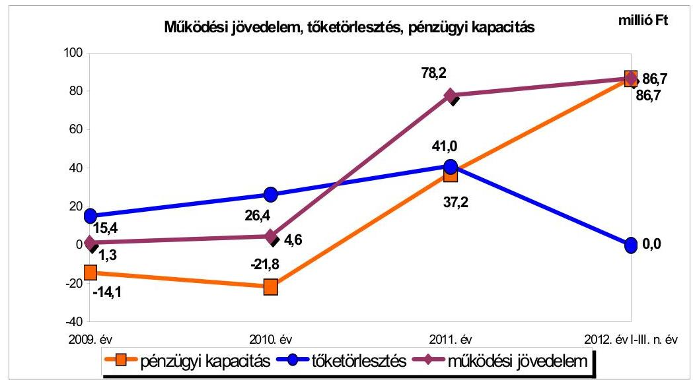
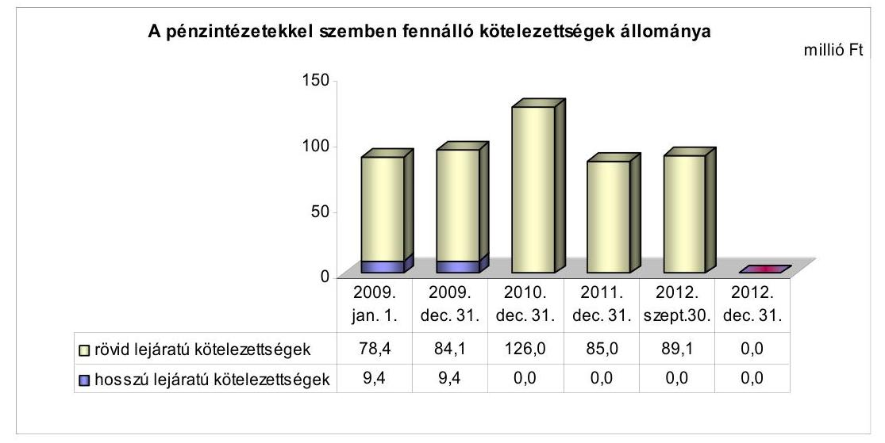
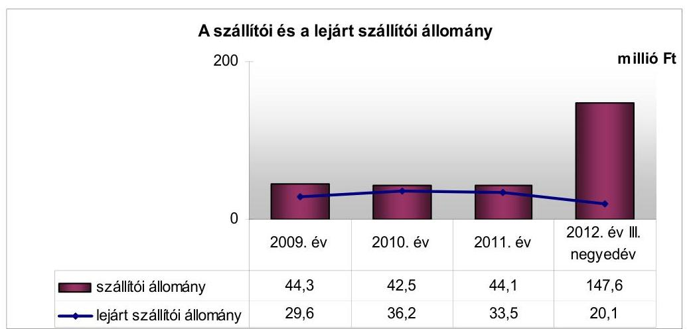
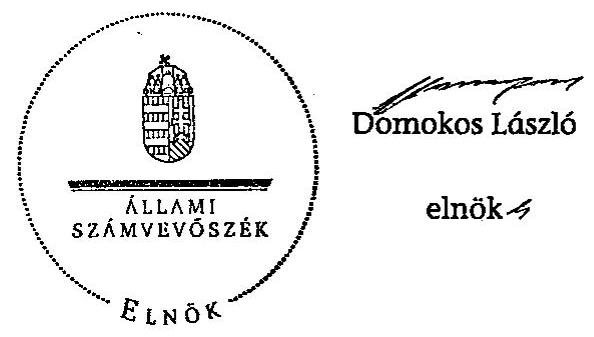
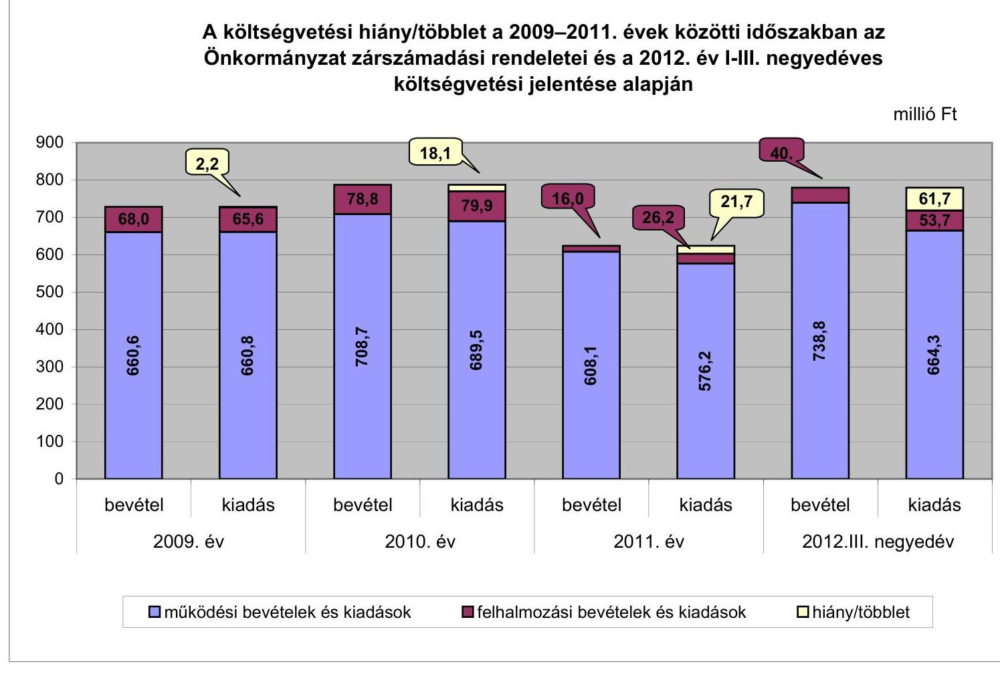
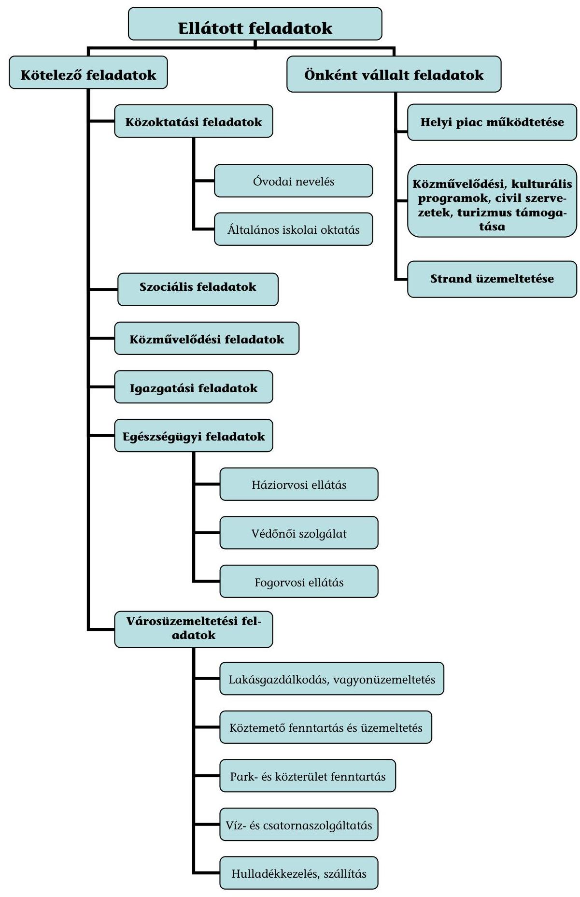

# ÁLLAMI   SZÁMVEVŐSZÉK 

## JELENTÉS

Kisköre Város Önkormányzata pénzügyi gazdálkodási helyzetének, szabályosságának ellenőrzéséről

---

# Állami Számvevőszék 

Iktatószám: V-0030-341-017/2013.
Témaszám: 1069
Vizsgálat-azonosító szám: V059216

## Az ellenőrzést felügyelte:

## Renkó Zsuzsanna

felügyeleti vezető

## Az ellenőrzést vezette:

## Dér Lívia

ellenőrzésvezető

## Az ellenőrzést végezték:

| Dr. Szima Mária | Puskás Balázs | Velkei András |
| :-- | :-- | :-- |
| számvevő tanácsos | számvevő | számvevő |

---

# TARTALOMJEGYZÉK 

BEVEZETÉS ..... 3
I. ÖSSZEGZŐ MEGÁLLAPÍTÁSOK, KÖVETKEZTETÉSEK, JAVASLATOK ..... 6
II. RÉSZLETES MEGÁLLAPÍTÁSOK ..... 15

1. Az Önkormányzat kötelező és önként vállalt feladatai, a feladatellátás szervezeti keretei ..... 15
2. A pénzügyi egyensúly fenntartását veszélyeztető pénzügyi kockázatok és az ezek csökkentése érdekében tett intézkedések ..... 16
3. A pénzügyi gazdálkodási folyamatok szabályosságát, megfelelőségét biztosító belső kontrollok ..... 25
4. Az ÁSZ korábbi ellenőrzése során a pénzügyi, gazdálkodási helyzet javítására tett javaslatainak megvalósítása ..... 26

---

# MELLÉKLETEK 

1. számú A költségvetési hiány/többlet a 2009-2011. évek közötti időszakban az Önkormányzat zárszámadási rendeletei és a 2012. év I-III. negyedéves költségvetési jelentése alapján
2. számú Az Önkormányzat bevételei és kiadásai, valamint adósságszolgálata a 2009. év és a 2012. év III. negyedéve között (a CLF módszer szerint)

3/a. számú Az Önkormányzat által a 2009. év és a 2012. év III. negyedéve között megvalósított (műszakilag befejezett) fejlesztések forrásösszetétele
3/b. számú Az Önkormányzat 2012. szeptember 30-án folyamatban lévő fejlesztési feladataihoz kapcsolódó kötelezettségeinek összegzése
3/c. számú Az Önkormányzat által beadott, elbírálás alatti pályázatok forrásaiból megvalósuló fejlesztésekhez kapcsolódó kötelezettségvállalások összegzése
4. számú Az önkormányzati feladatok ellátásában résztvevő gazdasági társaságok egyes kiemelt adatai
5. számú Az Önkormányzat kötelezettségeinek és egyes kötelezettségvállalásainak 2011. december 31-ei és 2012. szeptember 30-ai tényleges, 2012. december 31-ei várható állománya és a 2013. évben, valamint az azt követő években várható kötelezettségek miatti kiadások

## FÜGGELÉKEK

1. számú Rövidítések jegyzéke
2. számú Fogalomtár
3. számú Az Önkormányzat által ellátott feladatok 2012. év szeptember 30-án

---

# JELENTÉS 

## Kisköre Város Önkormányzata pénzügyi gazdálkodási helyzetének, szabályosságának ellenőrzéséről

## BEVEZETÉS

Az államháztartás helyi szintjén, az önkormányzati alrendszerben az utóbbi években megjelenő gazdálkodási nehézségek, a pénzforgalmi hiány növekedése, az eladósodás az ÁSZ figyelmét a helyi önkormányzatok pénzügyi helyzetére irányította.

Az ÁSZ a 2013. év I. félévi ellenőrzési tervben foglaltaknak megfelelően az önkormányzatok pénzügyi gazdálkodási helyzetének, szabályosságának ellenőrzésével az önkormányzatok 2011. évben megkezdett helyzetelemzését folytatta. Az ellenőrzés keretében értékeljük az önkormányzatok adósságkezelési és likviditási helyzetét. Bemutatjuk a pénzügyi egyensúly alakulására hatással lévő folyamatokat, feltárjuk az ezekre ható kockázatokat. Értékeljük a pénzügyi egyensúlyi helyzetet befolyásoló döntésmegalapozó, dön-tés-előkészítő eljárások szabályosságát, minősítjük az ezekkel összefüggő belső kontrollok kialakítását, múködését.

Az ellenőrzés eredményének várható hatásaként a megállapításokkal segítséget nyújthatunk az önkormányzatok számára a pénzügyi egyensúly helyreállítása, javítása és fenntartása érdekében szükségessé váló intézkedések megtételéhez.

Az ellenőrzés típusa: szabályszerűségi ellenőrzés.

## Az ellenőrzés célja annak értékelése volt, hogy:

- az ellenőrzött időszakban a kötelező és önként vállalt feladatok ellátását biztosító szervezeti formák változása milyen hatást gyakorolt az Önkormányzat pénzügyi helyzetének alakulására;
- az Önkormányzat pénzügyi - ezen belül múködési és felhalmozási - egyensúlya milyen irányban változott, a változást milyen okok idézték elő, továbbá milyen intézkedéseket tettek a pénzügyi egyensúly biztosítása, illetve javítása érdekében, az intézkedések hatására javult-e az Önkormányzat pénzügyi helyzete;
- a költségvetési kiadások finanszírozása érdekében vállalt, pénzintézetekkel szembeni kötelezettségek hogyan alakultak, a kötelezettségek fennállása miként befolyásolja az Önkormányzat jövőbeli pénzügyi egyensúlyi helyzetét;

---

- az Önkormányzat beazonosította, felmérte, értékelte-e a pénzügyi egyensúlyt befolyásoló pénzügyi kockázatokat, a finanszírozási célú pénzügyi műveletekkel kapcsolatban írtak-e elő kockázatértékelési kötelezettséget;
- az Önkormányzat által kialakított belső kontrollok biztosítják-e a pénzügyi gazdálkodás folyamatainak szabályosságát és eredményességét;
- hasznosultak-e az ÁSZ korábbi ellenőrzése során a pénzügyi, gazdálkodási helyzet javítására tett szabályszerűségi és célszerűségi javaslatok.

Az ellenőrzés a 2009. január 1-jétől 2012. szeptember 30-áig terjedő időszakot ölelte fel. A pénzintézetekkel szembeni kötelezettségek állományára vonatkozóan az ellenőrzés kezdő időpontjaként a 2012. szeptember 30-án fennálló kötelezettségek keletkezésének időpontját vettük figyelembe. A jövőbeni kötelezettségek megállapításakor az adósságkonszolidáció hatását is értékeltük.

Az ellenőrzés szakmai módszertana az ÁSZ Ellenőrzési Elvek és Standardokban foglalt szakmai szabályokon alapult, amely a Legfőbb Ellenőrző Intézmények Nemzetközi Szervezete (INTOSAI) által kiadott nemzetközi standardok (ISSAI) figyelembevételével készült.

Az ellenőrzés során használt rövidítéseket az 1. számú, az egyes fogalmak magyarázatát a 2. számú függelék tartalmazza.

Az ellenőrzés jogszabályi alapját az ÁSZ tv. 1. § (3) bekezdésének, 5. § (2)-(6) bekezdéseinek, valamint az államháztartásról szóló 2011. évi CXCV. törvény 61. § (2) bekezdésének előírásai képezik.

Az Országgyűlés 2012 végén a helyi önkormányzatok adósságállományának részleges konszolidációjáról döntött. Az 5000 fő lakosságszámot meg nem haladó települési önkormányzatok számára nyújtott törlesztési célú támogatással ${ }^{1}$ lehetővé tették a 2012. december 12-én fennálló adósságállományuk és annak 2012. december 28-áig számított járulékai teljes megfizetését. Az 5000 fő lakosságszám feletti települések esetében a 2013. évben az állam differenciált az adóerő-képességet figyelembe vevő, 40-70\%-ig terjedő - mértékben vállalja át ${ }^{2}$ az önkormányzat 2012. december 31-i, az átvállalás időpontjában fennálló adósságállományát és annak járulékait. Az adósságkonszolidációs intézkedéssel egyidejűleg a Kormány elrendelte ${ }^{3}$ az önkormányzatok adósságállománya újratermelődésének megakadályozása céljából a hitelengedélyezési és a likvid hitelekre vonatkozó szabályozás szigorítását.

Kisköre Város Önkormányzata lakónépességére tekintettel a 2012. évben részesült törlesztési célú támogatásban. A pénzügyi egyensúlya jövőbeni alakulását

[^0]
[^0]:    ${ }^{1}$ Magyarország 2012. évi központi költségvetéséről szóló 2011. évi CLXXXVIII. törvény 76/C. §-a (beiktatta a 2012. évi CLXXXVII. törvény 8. §-a, hatályos 2012. XII. 6-tól)
    ${ }^{2}$ Magyarország 2013. évi központi költségvetéséről szóló 2012. évi CCIV. törvény 72-76. §-ai
    ${ }^{3}$ 1540/2012. (XII. 4.) Korm. határozat a helyi önkormányzatok adósságállományának részleges konszolidációjáról

---

befolyásoló, az ellenőrzött időszakban fennállt kockázatokra tett megállapításaink - a pénzintézetekkel szembeni kötelezettségekkel összefüggésben feltárt kockázatok kivételével - az adósságkonszolidációt követően is helytállóak és időszerűek.

Kisköre város lakosainak száma 2012. január 1-jén 2996 fő volt, ami 133 fős csökkenést jelent a 2009. év eleji ( 3129 fő) lakosságszámhoz képest. Az Önkormányzat a 2011. évben 623,2 millió Ft költségvetési bevételt ért el és 559,3 millió Ft költségvetési kiadást teljesített. A 2011. december 31-i könyvviteli mérleg alapján 2395,1 millió Ft értékű vagyonnal rendelkezett, amely a 2009. év végi állományhoz (2579,5 millió Ft) viszonyítva 7,1\%-kal (184,4 millió Ft-tal) csökkent. A 2011. évben az eszközök közül a tárgyi eszközök állománya 2218,1 millió Ft, a forgóeszközök állománya 51,5 millió Ft volt. Az Önkormányzat az ellenőrzött időszak minden évében részesült ÖNHIKI támogatásban.

Az ÁSZ tv. 29. § (1) bekezdése szerint a jelentéstervezetet megküldtük a polgármester részére, aki az ÁSZ tv. 29. § (2) bekezdésében foglalt észrevételezési jogával nem élt, a jelentéstervezetre észrevételt nem tett.

---

# I. ÖSSZEGZŐ MEGÁLLAPÍTÁSOK, KÖVETKEZTETÉSEK, JAVASLATOK 

Kisköre Város Önkormányzatának pénzügyi egyensúlya az ellenőrzött időszakban rövid távon nem volt biztosított. Az állam által nyújtott törlesztési célú támogatásból az Önkormányzat kiegyenlítette a 2012. december 12-én fennálló pénzintézeti kötelezettségeit és azok 2012. december 28-án fennálló járulékait. Az adósságkonszolidáció eredményeként az Önkormányzat pénzügyi egyensúlyi helyzete javult, azonban az ellenőrzött időszak jövedelemtermelő képessége alapján várhatóan képződő bevételei a feladatok ellátásához szükséges kiadásokon túl a kötelezettségek fedezetét részben biztosítják.

Az Önkormányzat pénzügyi helyzetét a CLF módszer alapján számított mutatók figyelembevételével értékeltük. Pénzügyi kapacitásának (nettó múködési jövedelmének) a 2009. év és a 2012. év III. negyedéve közötti változását a következő ábra mutatja be:

Az Önkormányzat 2009. és 2011. között összesen 2007,0 millió Ft költségvetési bevételt ért el és 1973, 9 millió Ft költségvetési kiadást teljesített. A múködési költségvetés egyenlege az ellenőrzött időszak éveiben pozitív értéket, összességében 84,1 millió Ft többletet mutatott.

Az Önkormányzat múködési költségvetésének egyensúlya az ellenőrzött években a múködőképesség fenntartását szolgáló (ÖNHIKI) támogatással volt biztosított. Az Önkormányzat 2009-ben 3,0 millió Ft, 2010-ben 9,0 millió Ft, 2011ben 79,1 millió Ft, a 2012. év I-III. negyedévben: 18,8 millió Ft ÖNHIKI támogatásban részesült.

A múködési jövedelem a 2009-2011. években folyamatosan növekedett, egyenlegének kedvező változását az ÖNHIKI támogatások növekedése, alakulását az egyéb saját bevételek, a költségvetési támogatások és a folyó kiadások

---

változása határozta meg. Alacsony múködési jövedelemtermelő képességet jelez, hogy ÖNHIKI támogatások nélkül a múködési jövedelem az ellenőrzött időszak minden évében - 2009-ben 1,7 millió Ft, 2010-ben 4,4 millió Ft, 2011-ben 0,9 millió Ft - hiányt mutatott volna. A múködési egyensúly csak ÖNHIKI támogatással volt fenntartható, ami bevételi kitettség miatti kockázatot jelez.

A felhalmozási költségvetés egyensúlya az ellenőrzött időszak egyik évében sem állt fenn. A 2009. évben 4,0 millió Ft hiányt mutatott, amely a 2010. évre 32,7 millió Ft-ra nőtt, majd a 2011. évben 14,3 millió Ft-ra mérséklődött. A felhalmozási hiány összegének változását a felmerült kiadások és a pályázati támogatások ütemkülönbsége alakította. A hiány átmeneti finanszírozására folyószámlahitelt, rövid lejáratú támogatás-megelőlegezési és egyéb likvid hiteleket vettek igénybe. A 2011. évben a 37,2 millió Ft nettó múködési jövedelem biztosította a felhalmozási költségvetés 14,3 millió Ft-os hiányát.

Az ellenőrzött időszakban a kötelező feladatok körében az építéshatósági feladatok ellátását biztosító szervezeti forma változása és az önként vállalt feladatok körében végrehajtott feladatátrendezések hatására 18,2 millió Ft megtakarítást értek el, amely a pénzügyi egyensúlyi helyzetet javította. A feladatellátás szervezeti változásán túl az Önkormányzat bevételnövelő és kiadáscsökkentő intézkedéseket tett (az építményadó kivetése, létszámcsökkentés, takarékossági intézkedések). Ennek eredményeként - adatszolgáltatása szerint 45,5 millió Ft megtakarítás keletkezett, amelynek hatása tartósnak minősül, javítva ezzel az Önkormányzat pénzügyi egyensúlyi helyzetét.

Az alacsony jövedelemtermelő képesség miatt az Önkormányzatnál a pénzügyi egyensúly szempontjából fennállt kockázatok:

- az önként vállalt feladatok miatti múködési kockázat: az önként vállalt feladatokra fordított kiadások összege a 2009. évben 43,7 millió Ft (7,1\%), a 2010. évben 34,3 millió Ft (5,0\%), a 2011. évben 17,6 millió Ft (3,3\%), a 2012. év I-III. negyedévben 5,8 millió Ft (1,3\%) volt. Az önként vállalt feladatokra fordított kiadás 2009. és 2011. között 59,7\%-kal (26,1 millió Ft-tal) csökkent. A 2009-2010. években az önként vállalt feladatok ellátása miatti múködési kockázat fennállt, az önként vállalt feladatokra fordított kiadások nagyságára és a múködési jövedelem alacsony (2009. évi 1,3 millió Ft, 2010. évi 4,6 millió Ft) összegére tekintettel. Az önként vállalt feladatokra fordított kiadások csökkenésének hatására a 2011. évtől a kockázat mérséklődött;
- a lejárt szállítói állomány miatti az ellenőrzött időszak végén fennállt nemfizetési kockázat: az összes szállítói kötelezettség állománya a 2009. év végi 44,3 millió Ft-ról a 2012. év III. negyedév végére 147,6 millió Ft-ra nőtt, amelyből 121,1 millió Ft szállítói finanszírozással függött össze. Az Önkormányzat szállítói kitettsége az ellenőrzött időszakban a lejárt szállítói állomány 2009. évi 29,6 millió Ft-ról a 2012. év III. negyedév végére 20,1 millió Ft-ra való csökkenése ellenére fennállt. A 2012. év III. negyedév végi lejárt szállítói állományban a 60 napon túli tartozás 14,9 millió Ft volt, amely meghaladta a 2012. év I-III. negyedévi dologi kiadások egy havi átlagos 12,6 millió Ft összegét;

---

- a fejlesztések során létrejött létesítmények jövőbeni üzemeltetésének kockázata: a fejlesztésekről szóló döntések előkészítésekor a fejlesztések várható múködési kiadásait, a múködtetés forrásait nem számszerúsítették.

A pénzintézetekkel szembeni kötelezettségek állománya a 2009. január 1-jei 87,8 millió Ft-ról a 2011. év végére 85,0 millió Ft-ra csökkent, a 2012. év III. negyedév végén 89,1 millió Ft volt. A változást az ellenőrzött időszakban felvett likvid hitelek, a folyószámlahitel és a munkabér-megelőlegezési hitel állományának növekedése, valamint az ellenőrzött időszakot megelőzően felvett hosszú lejáratú hitelek törlesztése együttesen eredményezte. A főként a folyószámlahitel tartóssá válása miatti banki kitettség kockázata, az Önkormányzat likviditásának, rövid távú pénzügyi egyensúlyának kedvezőtlen irányú változását jelzi. A pénzintézeti kötelezettség 2012. december 31-ére a törlesztési célú támogatás eredményeként megszűnt. Az Önkormányzat az adósságkonszolidációs célú állami támogatás felhasználásával visszafizette a folyószámlahitele miatt fennálló 111,3 millió Ft összegű tőke és kamatfizetési kötelezettségét. A pénzintézettel szembeni kötelezettségek állományának megszünése az Önkormányzat jövőbeni pénzügyi egyensúlyi helyzetét kedvezően befolyásolja. Az Önkormányzat a jövőbeni kötelezettségei teljesítéséhez felhasználható elkülönített tartalékkal nem rendelkezik, ezért a múködési jövedelemtermelő képesség megfelelő szintjének elérése nélkül a likvid hitel állomány újratermelődésének kockázata fennáll.

A kizárólagos tulajdonban lévő gazdasági társaság kötelezettségállománya az Önkormányzat pénzügyi egyensúlyi helyzetének szempontjából mérlegen kívüli kockázatot jelent. A gazdasági társaság bevételszerző tevékenységet nem végzett, a felmerült költségei miatt veszteségesen gazdálkodott. A gazdasági társaság átvállalta a szétválás előtti, jogelőd gazdasági társaság 41,0 millió Ft-os hitelfelvételből származó hosszú lejáratú kötelezettségét. Az átvállalt hitelből fennálló kötelezettségét törleszteni nem tudta, amely az Önkormányzat 2012. évet követő pénzügyi egyensúlyi helyzete tekintetében kockázatot jelent. A lejárt esedékességű hiteltartozás miatt a gazdasági társaság ellen a pénzintézet végrehajtási eljárást indított. A gazdasági társaság pénzügyi helyzetének 2011. évi alakulásáról a Képviselő-testület részére nem készítettek beszámolót. A gazdasági társaságról az adatszolgáltatás hiányos volt, így az összes kötelezettségállománya, ezen belül a lejárt tartozásainak ellenőrzött időszakra vonatkozó adatai nem ismertek.

Az Önkormányzat a Társulás által 2010-ben felvett 4,5 millió Ft-os kölcsön vonatkozásában - mint a Társulás gesztora - készfizető kezességet vállalt. A kölcsönt, annak kamatait és járulékait a 2011. évben teljes összegében az Önkormányzat fizette vissza, amelynek arányos megtérítésére a társult önkormányzatok felé intézkedés nem történt.

Az Önkormányzatnál a kockázatkezelési rendszer keretében a pénzügyi egyensúlyt befolyásoló kockázatok feltárása, beazonosítása, felmérése, értékelése és ezáltal kezelése - a 2009. évben az Ámr.,-ben, a 2010-2011. években az Ámr.,-ben, a 2012. év I-III. negyedévben pedig a Bkr.-ben foglalt jogszabályi előírások ellenére - elmaradt. Annak ellenére maradt el a kockázatok kezelése, hogy az ellenőrzött időszakban fennállt az önként vállalt feladatok miatti kockázat, az ÖNHIKI támogatás miatt a bevételi kitettség kockázata,

---

a fejlesztések során létrejött létesítmények jövőbeni üzemeltetésének kockázata, a folyószámlahitel állandósulása miatt a banki kitettség kockázata, a magas lejárt szállítói állomány miatti nemfizetési kockázat, valamint az Önkormányzat kizárólagos tulajdonában álló gazdasági társaság kötelezettségei miatti mérlegen kívüli kockázat. Az Önkormányzatnál a finanszírozási célú pénzügyi műveletekkel kapcsolatban nem írtak elő kockázatértékelési kötelezettséget.

Az Önkormányzatnál a pénzügyi gazdálkodási folyamatok szabályossága, megfelelősége vonatkozásában a kockázatok kezelését biztosító belső kontrolltevékenységek kialakítása - a 2009. évben az Ámr. ${ }_{1}$, a 2010-2011. években az Ámr. ${ }_{2}$, a 2012. év I-III. negyedévben a Bkr. előírásai ellenére - nem volt megfelelő, mert a feladat átadásra vonatkozóan a döntés-előkészítés folyamatában nem írták elő annak értékelését, hogy a döntés milyen hatással bír a kötelező és önként vállalt feladatokra fordított kiadások arányára, a pénzügyi egyensúlyi helyzetre. Nem írtak elő beszámoltatási kötelezettséget a feladatellátási szerződések keretében történő feladatellátás teljesítéséről. Nem szabályozták a költségvetés és a zárszámadás készítés folyamatát, az önkormányzati fejlesztések döntés-előkészítési folyamatában az előkészítés, a lebonyolítás és a múködtetés kockázatai feltárásának és kezelésének kötelezettségét. Nem alakították ki a fejlesztésekhez kapcsolódó külső források, támogatások figyelési rendszerét, a pályázat készítés feltételeit és eljárásrendjét. Nem határozták meg az Önkormányzat által nyújtott múködési és felhalmozási célú pénzeszközátadások feltételrendszerét. Nem írtak elő elszámolási kötelezettséget a kizárólagos tulajdonban lévő gazdasági társaság részére átadott pénzeszközök felhasználásáról. Nem írták elő a fizetőképesség és az eladósodás kezelését szolgáló stratégia, koncepció, illetve egyéb belső szabályozás készítését. Nem szabályozták a pénzintézeti szolgáltatások igénybevételének pályáztatási vagy több ajánlatkérési kötelezettségével, valamint a pénzügyi kötelezettségek teljesítésével összefüggő kontrolltevékenységeket. Nem határozták meg a szállítói tartozások (kiemelten a lejárt szállítói tartozások) és az egyéb kiadáselmaradások rendezése szabályait, továbbá nem írták elő az Önkormányzat kizárólagos tulajdonában álló gazdasági társaság ügyvezetője részére a bejelentési kötelezettséget csődeljárás megindítása esetén.

Az ellenőrzött időszak belső ellenőrzési terveinek készítését megelőzően - a 2009. évben az Ámr. ${ }_{1}$-ben, a 2010-2011. években az Ámr. ${ }_{2}$-ben, a 2009-2011. években a Ber.-ben, 2012. január 1-jétől a Bkr.-ben foglaltak ellenére - nem írták elő a pénzügyi egyensúlyi helyzetet befolyásoló döntések kockázati tényezőinek feltárását követően a feltárt kockázati tényezők belső ellenőrzés keretében történő ellenőrzését.

Az Önkormányzatnál a feladatellátás szabályosságát, a pénzügyi egyensúlyi helyzet alakulását és a pénzügyi gazdasági döntések megalapozását szolgáló döntéselőkészítő, valamint a pénzintézeti kötelezettségvállalások szabályosságát, megfelelőségét biztosító belső kontrollok múködése gyenge volt, mert elmaradt az önkormányzati feladatátadásnál annak értékelése, hogy a döntés milyen hatással bír az Önkormányzat pénzügyi egyensúlyi helyzetére. Nem tárták fel a fejlesztések működtetésének kockázatait. Közbeszerzési eljárás mellőzésével kötötték a 2010-2011. évi folyószámlahitel keretszerződéseket. Nem számolt be az ügyvezető az Önkormányzat kizárólagos tulajdonában lévő gazdasági társaság 2011. évi pénzügyi helyzete alakulásáról. Nem tettek intézke-

---

déseket a lejárt szállítói tartozások rendezésére. A belső ellenőrzés keretében nem tárták fel és nem ellenőrizték az Önkormányzat pénzügyi egyensúlyi helyzetét befolyásoló döntések kockázati tényezőit. Mindezek miatt a belső kontrollok nem biztosították a pénzügyi gazdálkodási folyamatok eredményességét.

Az ellenőrzés során a gazdálkodási feladatok ellátásával, illetve a beszámoló készítési és könyvvezetési kötelezettség teljesítésével kapcsolatosan az alábbi szabályszerűségi hibákat tártuk fel:

- a munkabér-megelőlegezési hitel felvételét és törlesztését az Áhsz.-ben rögzített előírástól eltérően a főkönyvi nyilvántartásban halmozottan mutatták ki a 2009-2010. években és a 2012. év I-III. negyedévben;
- a folyószámlahitel felvételére vonatkozó döntés-előkészítés során a 2010. és 2011. években a Kbt.1-ben foglalt előírásokat megsértve, közbeszerzési eljárás lefolytatása nélkül döntöttek a banki szolgáltatás igénybe vételéről. A közbeszerzésre vonatkozó jogszabály megsértése miatt az ÁSZ jogorvoslati eljárást kezdeményezett, melyben a Közbeszerzési Döntőbizottság a D.68/12/2013. számú határozatával megállapította, hogy az Önkormányzat a közbeszerzési eljárás mellőzésével megsértette a Kbt. 1 előírásait.

Az ÁSZ az Önkormányzat gazdálkodási rendszerét a 2009. évben ellenőrizte, amely során 20 szabályszerűségi és 18 célszerűségi javaslatot tett, melyből négy szabályszerűségi és 12 célszerűségi javaslat megvalósításáról nem intézkedtek. A pénzügyi gazdálkodási helyzet javítására összesen négy szabályszerűségi és három célszerűségi javaslat vonatkozott. A szabályszerűségi és a célszerűségi javaslatokból egyaránt kettőt nem hasznosítottak. Nem történt intézkedés a saját bevételek és a költségvetési igények megalapozottságának ellenőrzésére, a belső kontrollok működéséről a nyilatkozattételi kötelezettség teljesítésére, az ellenőrzési nyomvonal kiegészítésére, valamint az éves belső ellenőrzési tervet megalapozó kockázatelemzés kiterjesztésére.

Az ÁSZ tv. 33. § (1) bekezdésében foglaltak értelmében az ellenőrzött szervezet vezetője köteles a jelentésben foglalt megállapításokhoz kapcsolódó intézkedési tervet összeállítani és azt a jelentés kézhezvételétől számított harminc napon belül az ÁSZ részére megküldeni. Amennyiben az intézkedési tervet határidőn belül nem küldi meg a szervezet vezetője, vagy az továbbra sem elfogadható, az ÁSZ elnöke a hivatkozott törvény 33. § (3) bekezdés a-b) pontjaiban foglaltakat érvényesítheti.

# Az ellenőrzés intézkedést igénylő megállapításai és javaslatai: 

## a polgármesternek

1. Az Önkormányzat múködési jövedelme 2009. és 2011. között az ÖNHIKI támogatás nélkül negatív lett volna. A nettó múködési jövedelem 2009-ben és 2010-ben negatív volt. A likviditás folyószámlahitel és munkabér-megelőlegezési hitel igénybevételével volt biztosítható. Az ellenőrzött időszak végén a pénzintézeti kötelezettségek állománya 89,1 millió Ft, a szállítói állománya 147,6 millió Ft volt, amelyből 121,1 millió Ft szállítói finanszírozással függött össze. A 20,1 millió Ft lejárt szállítói tartozásból 60 napon túli esedékességű 14,9 millió Ft volt. Az Önkormányzat kizáró-

---

lagos tulajdonában lévő gazdasági társaság a lejárt esedékességű hiteltartozással rendelkezett, a 2011. évi pénzügyi helyzetéről nem számolt be a Képviselőtestületnek, az ügyvezető részére nem írták elő csődeljárás esetén az értesítési kötelezettséget. Az Önkormányzat készfizető kezességvállalására tekintettel visszafizette a Társulás által felvett 4,5 millió Ft kölcsönt, annak kamatát és egyéb járulékos költségeit, azonban a kiadások arányos megtérítése érdekében a Társulás tagjai felé intézkedést nem tettek. A bevételnövelő, kiadáscsökkentő intézkedések eredménye számottevően nem javította a pénzügyi egyensúlyi helyzetet. A 2012. évi adósságkonszolidációt követően a pénzintézetekkel szembeni kötelezettség állománya megszűnt, ugyanakkor az ellenőrzött évek jövedelemtermelő képessége alapján várhatóan képződő bevételek a kötelezettségek teljesítésére csak részben nyújtanak fedezetet.

Javaslat:
A múködési jövedelemtermelő képesség és a feladatellátás összhangja, valamint az Önkormányzat pénzügyi egyensúlyának helyreállítása, hosszú távú fenntarthatósága érdekében - a 2012. évi kormányzati adósságkonszolidációt, valamint a 2013. évtől változó feladat-ellátási kötelezettséget és feladatfinanszírozási rendszert figyelembe véve - felelősök és határidők megjelölésével kezdeményezzen intézkedéseket, melyek keretében:
a) a költségvetési rendelettervezet, valamint annak évközi módosítása előterjesztését megelőzően mérjék fel az Önkormányzatnál a bevételszerző, kiadáscsökkentő lehetőségeket, és terjessze a Képviselő-testület elé a bevételek növelését, a kiadások csökkentését célzó intézkedések bevezetéséhez szükséges - a Htv. 140. § (1) bekezdés a) pontja alapján a jegyző által elkészített - döntési javaslatát;
b) terjesszen a Képviselő-testület elé jóváhagyásra - a Htv. 140. § (1) bekezdés a) pontja alapján a jegyző által elkészített - az Önkormányzat gazdasági helyzetének elemzésén alapuló, a pénzügyi egyensúlyi helyzet gyors helyreállítását, hosszú távú megőrzését és az adósságállomány újratermelődésének elkerülését biztosító intézkedéseket tartalmazó reorganizációs programot;
c) a szállítói kitettség és a helyi önkormányzatok adósságrendezési eljárásáról szóló 1996. évi XXV. törvény 4-9. §-aiban szabályozott adósságrendezési eljárás megindításának elkerülése érdekében, meghatározott gyakorisággal számoljon be a Képviselő-testületnek az Önkormányzat lejárt szállítói állománya alakulásáról; intézkedjen a szállítói számlák esedékesség szerinti kiegyenlítéséről vagy a lejárt tartozások átütemezéséről;
d) kezdeményezze az Önkormányzat kizárólagos tulajdonában lévő gazdasági társaság ügyvezetőjének beszámoltatását a társaság múködéséről, pénzügyi helyzetéről, és terjessze a Képviselő-testület elé az ügyvezető által készített beszámolót;
e) terjesszen a jegyző közremúködésével elkészített intézkedési tervet a Képviselőtestület elé jóváhagyásra a kizárólagos tulajdonú gazdasági társaság pénzügyi helyzetének stabilizálása érdekében;

---

f) intézkedjen, hogy az Önkormányzat kizárólagos tulajdonában lévő gazdasági társaság ügyvezetője részére írják elő csődeljárás esetén az értesítési kötelezettséget;
g) intézkedjen a társulati tagokkal szemben az Önkormányzat által a Társulás helyett visszafizetett kölcsön és annak járulékos költségei arányos megtérítése érdekében.
2. Az Önkormányzat a folyószámla hitelkeret szerződéseket a 2010. és a 2011. években - a Kbt. ${ }_{1}$ 240. § (1) bekezdésében ${ }^{4}$ foglalt előírás ellenére - közbeszerzési eljárás lefolytatása nélkül kötötte meg. A jogszabálysértés miatt az ÁSZ jogorvoslati eljárást kezdeményezett, melyben a Közbeszerzési Döntőbizottság megállapította, hogy az Önkormányzat a közbeszerzési eljárás mellőzésével megsértette a Kbt. ${ }_{1}$ elöírásait.

Javaslat:
A közbeszerzési eljárásról szóló törvényben foglaltak maradéktalan betartása érdekében:
a) biztosítsa, hogy jövőbeni pénzügyi szolgáltatások igénybevétele esetén amennyiben a Kbt. 2 120. § k) pontjában foglalt kivétel nem áll fenn - a közbeszerzési eljárás lefolytatásának kötelezettségére a 119. §-ban foglalt előírást érvényesítsék;
b) intézkedjen az ÁSZ ellenőrzés során feltárt közbeszerzési szabálytalanság tekintetében a munkajogi felelősséggel kapcsolatos körülmények kivizsgálásáról, és hozza meg a szükséges munkajogi intézkedéseket.

# a jegyzőnek 

1. Az Önkormányzat a 2009-2010. években és a 2012. év I-III. negyedévben a mun-kabér-megelőlegezési hitel felvételét és törlesztését a főkönyvi könyvelésben az Áhsz. 9. számú mellékletének a számlaosztályok tartalmára vonatkozó 3. bb) pontjában foglalt előírástól eltérően halmozottan mutatta ki.

Javaslat:
Biztosítsa, hogy a könyvvezetés során az Áhsz. 9. számú mellékletének a számlaosztályok tartalmára vonatkozó 3. bb) pontjában foglalt előírás szerint kerüljön sor a likvid hitel felvétel és törlesztés - halmozódást nem tartalmazó - összegének kimutatására.
2. A kockázatkezelési rendszer keretében az ellenőrzött időszakban fennállt, pénzügyi egyensúlyt befolyásoló kockázatok feltárása, beazonosítása, értékelése, ezáltal a kockázatok kezelése - a 2009. évben az Ámr. ${ }_{1}$ 145/C. §-ában, a 2010-2011. években az Ámr. ${ }_{2}$ 157. §-ában, a 2012. év I-III. negyedévben pedig a Bkr. 7. § (1)-(2) bekezdéseiben foglalt jogszabályi előírások ellenére - elmaradt. Annak ellenére maradt el a

[^0]
[^0]:    ${ }^{4}$ Hatálytalan 2012. január 1-jétől, a 2012. január 1-jétől hatályos jogszabályi előírás a Kbt. 2 120. § k) pontja

---

kockázatok kezelése, hogy az ellenőrzött időszakban fennállt az önként vállalt feladatok miatti kockázat, az ÖNHIKI támogatás miatti bevételi kitettség kockázata, a fejlesztések jövőbeni üzemeltetési kockázata, a folyószámlahitel állandósulása miatt a banki kitettség kockázata, a magas szállítói állomány miatti nemfizetési kockázat, valamint a kizárólagos tulajdonban lévő gazdasági társaság kötelezettségei miatti mérlegen kívüli kockázat.

Javaslat:
Múködtessen a Bkr. 7. § (1)-(2) bekezdéseiben foglalt előírásoknak megfelelő, a pénzügyi egyensúlyt befolyásoló kockázatok kezelésére alkalmas kockázatkezelési rendszert.
3. Az Önkormányzatnál a pénzügyi gazdálkodási folyamatok szabályossága, megfelelősége vonatkozásában a kockázatok kezelését biztosító belső kontrolltevékenységek kialakítása - a 2009. évben az Ámr. 145/E. § (1)-(2) bekezdéseiben, a 2010-2011. években az Ámr. 158. § (1)-(2) bekezdéseiben, a 2012. év I-III. negyedévben a Bkr. 8. § (1)-(2) bekezdéseiben foglalt előírások ellenére - nem volt megfelelő, mert a feladat átadásra vonatkozóan a döntés-előkészítés folyamatában nem írták elő annak értékelését, hogy a döntés milyen hatással bír a kötelező és önként vállalt feladatokra fordított kiadások arányára, a pénzügyi egyensúlyi helyzetre. Nem írtak elő beszámoltatási kötelezettséget a feladatellátási szerződések keretében történő feladatellátás teljesítéséről. Nem szabályozták a költségvetés és a zárszámadás készítés folyamatát. Nem határozták meg a fejlesztési döntések előkészítése folyamatában a döntések kockázatai feltárásának és kezelésének kötelezettségét. Nem alakították ki a fejlesztésekhez kapcsolódó külső források, támogatások figyelési rendszerét, a pályázat készítés feltételeit és eljárásrendjét. Nem határozták meg az Önkormányzat által nyújtott múködési és felhalmozási célú pénzeszközátadások feltételrendszerét. Nem írtak elő elszámolási kötelezettséget a kizárólagos tulajdonban lévő gazdasági társaság részére átadott pénzeszközök felhasználásáról. Nem írták elő a fizetőképesség és az eladósodás kezelését szolgáló stratégia, koncepció, illetve egyéb belső szabályozás készítését. Nem határozták meg a pénzintézeti szolgáltatások igénybevételének pályáztatási vagy több ajánlatkérési kötelezettségével, a pénzügyi kötelezettségek teljesítésével, valamint a szállítói (kiemelten a lejárt) tartozások és az egyéb kiadáselmaradások rendezésével összefüggő kontrolltevékenységeket.

Javaslat:
Alakítsa ki a Bkr. 8. § (1)-(2) bekezdései alapján azokat a belső kontrolltevékenységeket, amelyek biztosítják a pénzügyi-gazdálkodási folyamatok szabályosságát és a pénzügyi egyensúlyi helyzet alakulását befolyásoló döntések kockázatainak kezelését. Ennek keretében:
a) írja elő a feladat átadás-átvételre vonatkozó döntések előkészítése során a döntés kötelező és önként vállalt feladatok arányára, ezáltal a pénzügyi egyensúlyi helyzetre gyakorolt hatásának vizsgálatát;
b) határozza meg a feladatellátási szerződések teljesítésére vonatkozó beszámolási kötelezettséggel kapcsolatos kontrolltevékenységeket;
c) határozza meg a költségvetés és a zárszámadás készítés folyamatának helyi szabályait;

---

d) határozza meg a fejlesztések döntés előkészítés folyamatában az előkészítés, a lebonyolítás és a müködtetés kockázatai feltárásának és kezelésének kötelezettségét;
e) határozza meg a fejlesztésekhez kapcsolódó külső források, támogatások figyelési rendszerével, a pályázat készítés feltételeivel összefüggő kontrolltevékenységeket;
f) szabályozza a müködési és felhalmozási célú pénzeszközátadások feltételrendszerével összefüggő kontrolltevékenységeket;
g) írja elő az átadott pénzeszközök felhasználásával kapcsolatos elszámolási kötelezettséggel kapcsolatos kontrolltevékenységeket;
h) határozza meg a pénzintézeti szolgáltatások esetén a közbeszerzési értékhatár alatti esetekben a pályáztatási kötelezettséggel kapcsolatos kontrolltevékenységeket;
i) készítsen szabályzatot az Önkormányzat fizetőképességének és eladósodásának kezelésére, valamint határozza meg a pénzügyi kötelezettségek teljesítése, a szállítói tartozások és az egyéb kiadáselmaradások rendezésének helyi szabályait.
4. Az Önkormányzatnál az ellenőrzött időszak belső ellenőrzési terveinek készítését megelőzően - a 2009. évben az Ámr.; 145/C. § (2) bekezdésében, a 2010-2011. években az Ámr. 1 157. § (2) bekezdésében, a 2009-2011. években a Ber. 18. §ában, a 21. § (2) bekezdésében és a (3) bekezdés a) pontjában, 2012. január 1-jétől a Bkr. 7. § (2) bekezdésében, a 29. § (1) bekezdésében, a 31. § (2)-(4) bekezdéseiben foglaltak ellenére - nem írták elő a pénzügyi egyensúlyi helyzetet befolyásoló döntések kockázati tényezőinek feltárását, ezért a belső ellenőrzési tervek nem tartalmazták az ellenőrzési tervet megalapozó kockázatelemzéseket, ezáltal az Önkormányzatnál nem ellenőrizték ezeket a kockázati tényezőket.

Javaslat:
Intézkedjen a belső ellenőrzés vezetője felé, hogy a Bkr. 7. § (2) bekezdésében foglaltak szerint mérjék fel a gazdálkodásban rejlő kockázatokat, a 29. § (1) bekezdésében, a 31. § (2)-(4) bekezdéseiben foglalt előírások szerint az éves belső ellenőrzési tervek tartalmazzák a pénzügyi egyensúlyi helyzetet befolyásoló döntésekkel kapcsolatos feltárt kockázati tényezők ellenőrzését, valamint biztosítsa az ellenőrzési tervek végrehajtását.

---

# II. RÉSZLETES MEGÁLLAPÍTÁSOK 

## 1. Az ÖNKORMÁNYZAT KÖTELEZŐ ÉS ÖNKÉNT VÁLlALT FELADATAI, A FELADATELLÁTÁS SZERVEZETI KERETEI

Az Önkormányzat kötelező és önként vállalt feladatait a Képviselő-testület $\mathrm{SZMSZ}_{1,2}$-ének mellékletében rögzítették. Kötelező feladatai a közoktatási, a szociális, a közművelődési, az igazgatási, az egészségügyi és a városüzemeltetési feladatok voltak. Az adatszolgáltatás szerint a 2009. évben az önként vállalt feladatok közé sorolták a strand üzemeltetését, a közművelődési, kulturális programok szervezését és támogatását, a mezőőri szolgálatot, a helyi piac múködtetését, a civil szervezetek és a turizmus támogatását. Az Önkormányzat által az ellenőrzött időszakban ellátott feladatok közül a kiemelt építéshatósági feladat ellátására létrehozott igazgatási társulást megszűntették. Az építéshatósági feladatokat 2011. január 1-jétől Heves Város Önkormányzatának Polgármesteri Hivatala látja el. A Polgármesteri Hivatal végezte a strand üzemeltetését, a mezőőri szolgálat és a Tourinform Iroda múködtetését. A strand üzemeltetésével a 2011. évtől egy gazdasági társaságot bíztak meg, továbbá a 2012. évben a mezőőri szolgálat és a Tourinform Iroda megszűntetésére került sor. (A feladatellátás részletezését a 3. számú függelék tartalmazza.)

A kötelező és az önként vállalt feladatokra fordított kiadások arányának, mértékének és azok változásának a pénzügyi egyensúlyi helyzetre gyakorolt hatását az Önkormányzat nem értékelte.

Az Önkormányzat - adatszolgáltatása szerint - működési célú kötelező feladataira a 2009. évben 571,4 millió Ft-ot (a múködési kiadások 92,9\%-át), a 2010. évben 647,0 millió Ft-ot ( $95,0 \%$-ot), a 2011. évben 513,5 millió Ft-ot ( $96,7 \%$-ot), a 2012. év I-III. negyedévben pedig 448,3 millió Ft-ot ( $98,7 \%$-ot) fordított. Az önként vállalt feladatok érdekében teljesített kiadások összege a 2009. évben 43,7 millió Ft ( $7,1 \%$ ), a 2010. évben 34,3 millió Ft (5,0\%), a 2011. évben 17,6 millió Ft (3,3\%), a 2012. év I-III. negyedévben pedig 5,8 millió Ft (1,3\%) volt. A 2011. évi múködési kiadás a 2009. évi 615,1 millió Ft múködési kiadáshoz viszonyítva 13,7\%-kal ( 84,0 millió Ft-tal) csökkent. Ebben az időszakban az önként vállalt feladatokra fordított kiadás 59,7\%-kal (26,1 millió Ft-tal) mérséklődött. Az önként vállalt feladatok múködési kiadásainak csökkenését a mezőőri szolgálat és a Tourinform Iroda megszűntetése, valamint a strand üzemeltetésének átadása eredményezte.

A 2009-2010. években az önként vállalt feladatok ellátása miatti múködési kockázat - az önként vállalt feladatokra fordított kiadások nagyságára és a múködési jövedelem alacsony 2009. évi 1,3 millió Ft, 2010. évi 4,6 millió Ft összegére tekintettel - fennállt. Az önként vállalt feladatokra fordított kiadások csökkenésének hatására a 2011. évtől a kockázat mérséklődött.

---

Az Önkormányzat az ellenőrzött időszakban 191,4 millió Ft felhalmozási kiadást teljesített, amelyből a kötelező feladatokhoz kapcsolódó beruházásokra, felújításokra 141,5 millió Ft-ot ( $73,9 \%$ ), az önként vállalt feladatokhoz kapcsolódóan 49,9 millió Ft-ot ( $26,1 \%$ ) fordított. Az önként vállalt beruházási, felújítási feladatokra fordított kiadás felhalmozási kockázatot nem jelentett, mivel többségében kis összegű fejlesztésekhez kapcsolódott, amelyekhez a szükséges önerő rendelkezésre állt.

Az Önkormányzat a kötelező és az önként vállalt feladatait 2012. szeptember 30-án három költségvetési szervvel látta el. A költségvetési szervek száma az ellenőrzött időszakban nem változott, a telephelyek száma hét volt.

Az Önkormányzat az ellenőrzött időszakban egy 100,0\%-os tulajdoni hányadú, a 2010. évben - önként vállalt feladatra (turizmus) - létrehozott gazdasági társasággal (Kiskörei-Tó Kft) rendelkezett. Az Önkormányzat megbízásából a 2009. év és a 2012. év III. negyedéve között szerződések alapján kettő gazdasági társaság látott el önkormányzati kötelező feladatokat (hulladékkezelés, szállítás, víz- és csatornaszolgáltatás). Az önkormányzati feladatellátásban résztvevő gazdasági társaságok egyes kiemelt adatait a 4. számú melléklet tartalmazza.

Az ellenőrzött időszakban a kötelező feladatok körében az építéshatósági feladatok ellátását biztosító szervezeti forma változása és az önként vállalt feladatok körében a feladatátrendezés hatásaként - az Önkormányzat adatszolgáltatása szerint - a kiadások 26,7 millió Ft-tal, a bevételek 8,5 millió Ft-tal csökkentek. A megtett intézkedések összesen 18,2 millió Ft megtakarítást eredményeztek, amely a pénzügyi egyensúlyi helyzetet javította.

# 2. A PÉNZÜGYI EGYENSÚLY FENNTARTÁSÁT VESZÉLYEZTETŐ PÉNZÜGYI KOCKÁZATOK ÉS AZ EZEK CSÖKKENTÉSE ÉRDEKÉBEN TETT INTÉZKEDÉSEK 

Az Önkormányzat költségvetésének elemzését a CLF módszerrel hajtottuk végre. Az ÁSZ az ellenőrzéshez felhasznált, a CLF táblában szereplő adatokat a 2010-2011. évi költségvetési beszámolóban és a 2012. év I-III. negyedévi könyvelési adatokban feltárt hibák miatt módosította. A 2009-2010. években és a 2012. év I-III. negyedévben a munkabér-megelőlegezési hitel felvételét és törlesztését a főkönyvi könyvelésben az Áhsz. 9. számú mellékletének a számlaosztályok tartalmára vonatkozó előírásai 3. bb) pontjában rögzített szabálytól eltérően halmozottan végezték, a hitel felvételét bevételként, törlesztését kiadásként számolták el.

---

A CLF módszer szerinti, a 2009. év és a 2012. év III. negyedéve közötti részletes adatokat a 2. számú melléklet, a főbb önkormányzati adatokat a következő tábla mutatja be:

|  |  |  |  | millió Ft |
| :--: | :--: | :--: | :--: | :--: |
| Megnevezés | 2009. év | 2010. év | 2011. év | 2012. év III. n. év |
| Folyó bevételek | 616,4 | 685,9 | 609,3 | 540,8 |
| Folyó kiadások | 615,1 | 681,3 | 531,1 | 454,1 |
| Múködési jövedelem | 1,3 | 4,6 | 78,2 | 86,7 |
| Felhalmozási bevételek | 46,0 | 35,5 | 13,9 | 40,9 |
| Felhalmozási kiadások | 50,0 | 68,2 | 28,2 | 53,7 |
| Felhalmozási költségvetés egyenlege | $-4,0$ | $-32,7$ | $-14,3$ | $-12,8$ |
| Folyó és felhalmozási bevételek összesen | 662,4 | 721,4 | 623,2 | 581,7 |
| Folyó és felhalmozási kiadások összesen | 665,1 | 749,5 | 559,3 | 507,8 |
| Finanszírozási múveletek nélküli pozíció | $-2,7$ | $-28,1$ | 63,9 | 73,9 |
| Finanszírozási műveletek egyenlege | 1,9 | 28,7 | $-42,9$ | $-51,6$ |
| Tárgyévi pénzügyi pozíció | $-0,8$ | 0,6 | 21,0 | 22,3 |
| Hiteltörlesztés, értékpapír beváltás | 15,4 | 26,4 | 41,0 | 0,0 |
| Nettó múködési jövedelem | $-14,1$ | $-21,8$ | 37,2 | 86,7 |

Az Önkormányzat 2009. és 2011. között összesen 2007,0 millió Ft költségvetési bevételt ért el és 1973, 9 millió Ft költségvetési kiadást teljesített. A múködési költségvetés egyenlege az ellenőrzött időszakban pozitív értéket, összességében 170,8 millió Ft többletet mutatott.

A múködési jövedelem a 2009-2011. években folyamatosan növekedett, egyenlegének kedvező változását az ÖNHIKI támogatások növekedése, alakulását az egyéb saját bevétek, a költségvetési támogatások és a folyó kiadások változása határozta meg. 2010-ről 2011-re 73,6 millió Ft-tal növekedett az ÖNHIKI támogatás hatására és a kiadáscsökkentő intézkedések következtében. Az Önkormányzat a 2009. év és a 2012. év III. negyedéve között összesen 109,9 millió Ft ÖNHIKI támogatásban részesült ${ }^{5}$. A múködési jövedelem a múködőképesség fenntartását szolgáló támogatások nélkül 2009. és 2011. között hiányt mutatott volna, ami a múködési jövedelemtermelő képesség bevételi kitettség miatti kockázatát jelzi.

A nettó múködési jövedelem (pénzügyi kapacitás) 2009-ben 14,1 millió Ft, 2010-ben 21,8 millió Ft hiányt mutatott. 2011-ben a többlet 37,2 millió Ft, a 2012. év I-III. negyedévben 86,7 millió Ft volt. A pénzügyi kapacitás változását a múködési jövedelem alakulása, valamint a hiteltörlesztés összegének változása befolyásolta.

A felhalmozási költségvetés egyenlege 2009. és 2011. között minden évben negatív volt. Ezen időszakban összesen 51,0 millió Ft felhalmozási hiányt mutatott. A felhalmozási hiány összegének változását a felmerült kiadások és a pályázati támogatások ütemkülönbsége alakította. A felhalmozási forráshiány

[^0]
[^0]:    ${ }^{5}$ 2009-ben: 3,0 millió Ft, 2010-ben: 9,0 millió Ft, 2011-ben: 79,1 millió Ft, a 2012. év I-III. negyedévekben: 18,8 millió Ft

---

fedezetét folyószámlahitel, rövidlejáratú támogatás-megelőlegezési és egyéb likvidhitelek igénybevételével biztosították. A 2011. évben a 37,2 millió Ft nettó működési jövedelem biztosította a felhalmozási költségvetés 14,3 millió Ft-os hiányának fedezetét.

Az Önkormányzat évenkénti teljes finanszírozási igénye ${ }^{6}$ a CLF módszer szerint 2009-ben 18,1 millió Ft, 2010-ben pedig 54,5 millió Ft volt. A 2011. évben 22,9 millió Ft, a 2012. év III. negyedévéig 73,9 millió Ft finanszírozási többlet keletkezett. A költségvetési hiány alakulását az Önkormányzat 2009-2011. évi zárszámadási rendeletei, valamint a 2012. év III. negyedéves költségvetési jelentése alapján az 1. számú melléklet tartalmazza ${ }^{7}$.

A folyó bevételek összege a 2009. évi 616,4 millió Ft-ról 2010-re 685,9 millió Ft-ra nőtt (11,3\%-kal), 2011-re pedig 609,3 millió Ft-ra (11,2\%-kal) csökkent. A 2010. évi növekedést a saját múködési bevételek és az államháztartáson belülről kapott egyéb támogatások emelkedése okozta. A 2011. évi 76,6 millió Ft-os csökkenés a saját bevételek, az átengedett bevételek és az államháztartáson belülről kapott egyéb támogatások csökkenésének eredménye.

A helyi adók, pótlékok részaránya a folyó bevételeken belül 2009-ben 9,6\% (59,4 millió Ft), 2010-ben 7,5\% (51,7 millió Ft), 2011-ben pedig 8,7\% (52,8 millió Ft) volt. 2012. szeptember 30 -áig 50,3 millió Ft adóbevételt realizáltak. Az adóbevétel döntő része több adóalanytól származott, így nem jelentett bevételi kitettséget.

Az Önkormányzat az iparúzési adó esetében a maximális, 2\%-os adómértéket alkalmazta. A magánszemélyek kommunális adójának éves mértéke 12000 Ft /adótárgy volt, amely elmaradt a törvényi maximumtól. A telekadó mértékét adótárgyanként $100 \mathrm{Ft} / \mathrm{m}^{2}$-ben határozták meg, amely a maximális adómérték $50 \%$-át jelentette. Az idegenforgalmi adó esetében az adó mértékét személyenként és vendégéjszakánként 200 Ft-ban állapították meg. Az épületek utáni idegenforgalmi adót a 2010. év végén megszűntették, a 2011. évben bevezetett építményadó mértéke üdülőépület, hétvégi ház után $450 \mathrm{Ft} / \mathrm{m}^{2}$, más épületek esetében $100 \mathrm{Ft} / \mathrm{m}^{2}$ volt.

Az Önkormányzat múködési bevételeinek egyszeri támogatásból, átvett pénzeszközökből származó hányada 2009-ben 13,0\%-ot (83,8 millió Ft), 2010-ben 14,5\%-ot (92,0 millió Ft), 2011-ben 17\%-ot (103,0 millió Ft), 2012. év I-III. negyedévben pedig $21,1 \%$-ot ( 165,0 millió Ft) képviselt.

A felhalmozási bevételek a 2009. évi 46,0 millió Ft-ról 2010-re 35,5 millió Ft-ra ( $22,8 \%$-kal), a 2011. évre 13,9 millió Ft-ra ( $60,6 \%$-kal) csökkentek, összegük a 2012. év I-III. negyedévben 40,9 millió Ft-ra teljesült. A felhalmozási bevételek csökkenését a felhalmozási célú költségvetési támogatások, valamint az államháztartáson belülről és kívülről átvett felhalmozási célú pénzeszközök csökkenése okozta.

[^0]
[^0]:    ${ }^{6}$ a nettó múködési jövedelem és a felhalmozási költségvetés együttes negatív egyenlege
    ${ }^{7}$ A zárszámadási rendeletek a bevételeket és kiadásokat nem a CLF módszer szerint, hanem a pénzforgalom nélküli tételekkel együttesen tartalmazzák, ezért az 1. számú mellékletben a CLF tábla adataitól eltérő összegek szerepelnek.

---

A folyó kiadások a 2009. évi 615,1 millió Ft-ról 2010-re 66,2 millió Ft-tal (10,8\%-kal) nőttek, 2010. és 2011. között 150,2 millió Ft-tal (22,0\%-kal) csökkentek. A folyó kiadások alakulását a transzferkiadások változása, a kiadáscsökkentő intézkedések és a feladatátadás befolyásolták. A személyi juttatások és a munkaadókat terhelő járulékok 2009-ről a 2010. évre 7,3\%-kal (24,0 millió Ft-tal) növekedtek, a 2011. évre az előző évhez képest 16,2\%-kal (57,2 millió Ft-tal) csökkentek. A 2010. évi növekedést a jubileumi jutalmak kifizetése és a cafetéria juttatások összege okozta, a 2011. évi csökkenést a végrehajtott létszámcsökkentés, a túlórára elszámolt juttatások és a feladatátadás eredményezte. A dologi kiadások összege 2009-ben 144,5 millió Ft volt, ami 2010-re 152,8 millió Ft-ra nőtt (5,7\%), a 2011. évre az előző évhez viszonyítva 24,5\%-kal (37,5 millió Ft-tal) csökkent, amit a költségcsökkentő intézkedések okoztak.

Az ellenőrzött időszakban megvalósított, műszakilag befejezett fejlesztések teljes bekerülési költsége 155,2 millió Ft volt, amelyből 2009. és 2012. III. negyedéve között 150,1 millió Ft kiadás merült fel. A befejezett fejlesztések forrásait a 44,0 millió Ft (28,4\%) EU-s támogatás, a 44,4 millió Ft (28,6\%) saját bevétel és a 66,8 millió Ft (43,0\%) egyéb központi támogatás jelentette. A megvalósított beruházások, felújítások közül ${ }^{8}$ öt haladta meg a 10 millió Ft-ot, teljes bekerülési költségük 98,6 millió Ft volt.

Az Önkormányzatnál a 2012. év III. negyedév végén egy iskola felújítása volt folyamatban. A 234,4 millió Ft-os teljes bekerülési költségű felújításra az ellenőrzött időszakban 30,9 millió Ft-ot fizettek ki. A 2012. szeptember 30-át követően fennálló kötelezettségvállalás összege 203,5 millió Ft, melyet 21,0 millió Ft (10,3\%) saját bevételből és 182,5 millió Ft (89,7\%) EU-s támogatásból terveznek finanszírozni. Az elbírálás alatt lévő pályázati forrásból megvalósuló fejlesztés tervezett bekerülési költsége 265,0 millió Ft, melyből 10,4 millió Ft-ot (3,9\%-ot) - saját bevételeik terhére - már kifizettek. A további 254,6 millió Ft-ot EU-s forrásból (246,7 millió Ft - 93,1\%) és hitelből (7,9 millió Ft - 3,0\%) tervezik biztosítani. A 2009. év és a 2012. év III. negyedéve között megvalósult, a folyamatban lévő és az elbírálás alatti pályázatok fejlesztési feladatait és azok forrásösszetételét a 3/a., a 3/b. és a 3/c. számú mellékletek mutatják be.

A 2009. év és a 2012. év III. negyedéve között befejezett, illetve a 2012. szeptember 30-án folyamatban lévő fejlesztések finanszírozására a források rendelkezésre álltak. A fejlesztések finanszírozásához támogatás megelőlegezési hitelt vettek igénybe, és éltek a szállítói finanszírozás lehetőségével. A folyamatban lévő beruházások önerejének biztosításához rendelkezésre állnak a források, így felhalmozási kockázat nem áll fenn.

A fejlesztések megvalósításával kapcsolatosan számítások minden esetben készültek, azonban a döntések előkészítésekor a fejlesztések várható múködési kiadásait, a működtetés forrásait nem számszerúsítették, ezért fenn-

[^0]
[^0]:    ${ }^{8}$ a fogorvosi rendelő felújítása 43,4 millió Ft, a tarnaszentmiklósi tagiskola felújítása 14,3 millió Ft, útfelújítás 12,2 millió Ft, a térfigyelő rendszer kialakítása 18,1 millió Ft, a rehabilitációs központ kialakítása 10,6 millió Ft összegben

---

áll a fejlesztések során létrejött létesítmények jövőbeni üzemeltetésének kockázata.

Az Önkormányzat pénzintézetekkel szemben a 2009-2012. években fennálló kötelezettségeit a következő ábra mutatja be ${ }^{9}$ :

A pénzintézetekkel szembeni kötelezettségek állománya a 2009. január 1-jei 87,8 millió Ft-ról a 2011. év végére 85,0 millió Ft-ra csökkent, a 2012. év III. negyedév végén 89,1 millió Ft volt, amely 2012. december 31-ére - a törlesztési célú támogatás eredményeként - megszűnt. A változásokat az ellenőrzött időszakot megelőzően felvett fejlesztési hitel visszafizetése és az átmeneti likviditási problémák megoldására, a fejlesztési kiadások finanszírozásához felvett rövid lejáratú hitelek igénybevétele okozta.

Az Önkormányzat a 2009. és a 2012. év III. negyedéve közötti időszakban nem vett igénybe fejlesztési hitelt. A hosszú lejáratú kötelezettségek állománya a 2005. évben felvett, 47,0 millió Ft összegű, forint alapú fejlesztési hitelből állt. A hosszú lejáratú fejlesztési hitellel összefüggő fizetési terhek a 2009. évben 9,4 millió Ft tőketörlesztésből és 0,8 millió Ft kamatfizetésből, a 2010. évben 9,4 millió Ft tőketörlesztésből és 0,3 millió Ft kamatfizetésből álltak. A fejlesztési hitelt 2010. december 31-ig teljes összegében visszafizették.

[^0]
[^0]:    ${ }^{9}$ A táblázat 2009. és 2010. évi adatai az Önkormányzati Társulás rövid lejáratú hiteleit nem tartalmazzák. Az eltérés a 2. számú mellékletben szereplő pénzintézeti kötelezettség adatokhoz képest 2009-ben 7,4 millió Ft, 2010-ben 4,0 millió Ft.

---

Az Önkormányzat a likviditását folyószámlahitel és munkabérmegelőlegezési hitel segítségével tudta biztosítani, amelyek igénybevételét a 2009-2011. években és a 2012. év I-III. negyedév során a következő tábla mutatja be:

| Megnevezés | 2009. év | 2010. év | 2011. év | 2012. év I-III.   negyedév |
| :-- | --: | --: | --: | --: |
| Folyószámlahitel |  |  |  |  |
| Keretösszeg január 1-jén (millió Ft-ban) | 70,0 | 70,0 | 105,0 | 85,0 |
| Átlagos, napi állomány (millió Ft-ban) | 38,6 | 53,4 | 64,8 | 56,1 |
| Hitellel zárt napok száma (nap) | 365 | 365 | 365 | 273 |
| Egyenleg állomány az időszak végén | 69,7 | 104,6 | 85,0 | 89,1 |
| Teljesített kamat és egyéb költség | 7,4 | 10,6 | 14,2 | 9,7 |
| Munkabér-megelőlegezési hitel |  |  |  |  |
| Keretösszeg január 1-jén (millió Ft-ban) | 7,0 | 7,0 | 9,0 | 9,0 |
| Átlagos, napi állomány (millió Ft-ban) | 2,6 | 5,4 | 7,8 | 4,3 |
| Hitellel zárt napok száma (nap) | 146 | 284 | 315 | 131 |
| Egyenleg állomány az időszak végén | 7,0 | 0,0 | 0,0 | 0,0 |
| Teljesített kamat és egyéb költség | 0,3 | 0,8 | 1,2 | 0,5 |

A folyószámlahitel - 365 nap figyelembevételével számított - átlagos napi állománya a 2009. évi 38,6 millió Ft-ról a 2011. évre 64,8 millió Ft-ra (67,9\%kal) nőtt, a 2012. év I-III. negyedévben 56,1 millió Ft volt. Az Önkormányzat 2009. és 2011. közötti likviditásának és rövid távú pénzügyi egyensúlyának kedvezőtlen irányú változását és a banki kitettség miatti kockázatot jelzi a folyószámlahitel tartóssá válása, valamint a napi átlagos állománynak az előző időszakihoz képest bekövetkezett növekedése. Az Önkormányzat 2012. december 12-én folyószámlahitellel rendelkezett, amelyet az állam által nyújtott törlesztési célú támogatás segítségével teljes összegben kifizettek, így a banki kitettség megszűnt.

A folyószámla-hitelkeret szerződéseket a 2010. és a 2011. évek vonatkozásában a Kbt. ${ }_{1}$ 240. §-ának (1) bekezdésében ${ }^{10}$ foglaltakat megsértve, közbeszerzési eljárás lefolytatása nélkül kötötték meg. Az ÁSZ a Kbt. ${ }_{1}$ 327. § (1) bekezdésének b) pontja alapján a Közbeszerzési Döntőbizottságnál 2013. február 13-ával jogorvoslati eljárást kezdeményezett az Önkormányzat pénzügyi szolgáltatás igénybe vétele vonatkozásában közbeszerzési eljárás jogtalan mellőzése miatt. A jogorvoslati eljárásban a Közbeszerzési Döntőbizottság a D.68/12/2013. számú határozatával megállapította, hogy az Önkormányzat a közbeszerzési eljárás mellőzésével megsértette a Kbt. ${ }_{1}$ előírásait.

A folyószámla-hitelkeret szerződésekhez kapcsolódóan kamat és egyéb költségként a 2009. évben 7,4 millió Ft-ot, a 2010. évben 10,6 millió Ft-ot, a 2011. évben 14,2 millió Ft-ot, a 2012. év I-III. negyedévben pedig 9,7 millió Ft-ot fizettek ki. A 2010. és a 2011. években megkötött folyószámla-hitelkeret szerződések esetében a becsült, illetve a tényleges érték meghaladta az egyszerű közbeszerzési eljárás szolgáltatásokra vonatkozó - 8 millió Ft-os értékhatárát.

[^0]
[^0]:    ${ }^{10}$ Hatályát vesztette 2011. december 31-én. A 2012. január 1-jétől hatályos jogszabályi előírás a közbeszerzésekről szóló Kbt. ${ }_{2}$ 120. § k) pontja.

---

Az ellenőrzött időszakban munkabér-megelőlegezési hitelszerződést minden évben kötöttek, majd 2012. július 27 -ével megszüntették azt. A mun-kabér-megelőlegezési hitel átlagos napi állománya a 2009. évi 2,6 millió Ft-ról a 2011. évre 7,8 millió Ft-ra, háromszorosára nőtt. A napi átlagos állomány ellenőrzött időszaki változásai az Önkormányzat likviditási nehézségei fokozódását jelezték.

Az Önkormányzat az ellenőrzött időszak során egyéb likvid hitelt támogatás megelőlegezésre, illetve saját erő előfinanszírozásra, valamint - a hosszú lejáratú hitel utolsó törlesztő részlete kapcsán - rövid futamidejű áthidaló hitel formájában vett fel. Az egyéb likvid hitelek átlagos napi állománya 2009-ben 0,5 millió Ft, 2010-ben 8,9 millió Ft, 2011-ben pedig 5,4 millió Ft volt.

Az Önkormányzat 2009. év vége és 2012. szeptember 30-a közötti szállítói és lejárt szállítói állományát a következő ábra mutatja be:

A szállítói tartozások összege a 2009. év végi 44,3 millió Ft-ról a 2012. év III. negyedév végére 147,6 millió Ft-ra nőtt, melyből 121,1 millió Ft szállítói finanszírozással függött össze. A lejárt szállítói tartozások állománya a 2009. év végi 29,6 millió Ft-ról a 2012. év III. negyedév végére 32,1\%-kal (20,1 millió Ft-ra) csökkent. A 2012. év III. negyedév végi lejárt szállítói állományban a 60 napon túli tartozás 14,9 millió Ft volt, amely meghaladta a 2012. év I-III. negyedévi dologi kiadások egy havi átlagos 12,6 millió Ft összegét. A 2012. év III. negyedév végi lejárt szállítói állomány nemfizetési kockázatot jelentett. Az Önkormányzat szállítói kitettsége az ellenőrzött időszakban - a lejárt szállítói állomány 2009-ről 2012. év III. negyedév végére való csökkenése ellenére - 2012. év III. negyedév végén fennállt.

A szállítói kötelezettségek állományának alakulását figyelemmel kísérték, de nem értékelték annak változását, okait és az abban rejlő nemfizetési kockázatot.

Az Önkormányzat a Társulás által 2010. november 22-én felvett 4,5 millió Ft-os kölcsön vonatkozásában - mint a Társulás gesztora készfizető kezességet vállalt. A kölcsönt, annak kamatait és járulékait teljes összegében az Önkormányzat fizette vissza, amelynek arányos megtérítésére a társult önkormányzatok felé intézkedés nem történt.

---

A folyószámlahitellel összefüggésben 2012. szeptember 30-án az Önkormányzat három forgalomképes ingatlanát terhelte jelzálog. Az ingatlanok jelzáloggal való terhelése a pénzügyi egyensúlyi helyzetre gyakorolt hatás szempontjából nem jelentett kockázatot ${ }^{11}$.

Az Önkormányzat kötelezettségeinek és egyes kötelezettségvállalásainak 2011. december 31-ei és 2012. szeptember 30-ai tényleges, 2012. december 31-ei várható állományát és a 2013. évben, valamint az azt követő években várható kötelezettségek miatti kiadásokat az 5 . számú melléklet mutatja be.

Az Önkormányzat 2012. december 12-én folyószámlahitelből fennállt adósságállománya és annak 2012. december 28-án fennálló járuléka együttesen 111,3 millió Ft volt, amelyet kiegyenlített. Az Önkormányzatnak összes egyéb kötelezettsége 2012. december 31-én szállítói tartozásból 3,8 millió Ft volt. Az állam által nyújtott törlesztési célú támogatást követően a banki kitettség kockázata, illetve a pénzintézeti kötelezettségek miatti nemfizetési kockázat már nem állt fenn, a szállítói kitettség miatti kockázat csökkent. Az Önkormányzat a jövőbeni kötelezettségei teljesítéséhez felhasználható elkülönített tartalékkal nem rendelkezik, ezért a múködési jövedelemtermelő képesség megfelelő szintjének elérése nélkül a likvid hitel állomány újratermelődésének kockázata fennáll.

Az Önkormányzat egy gazdasági társaságban (Kiskörei-Tó Kft.) rendelkezett minősített többségi befolyást jelentő 100,0\%-os tulajdoni részesedéssel. A Tiszatavi-IBSZ Ingatlan Beruházó Kft.-ből történt kiválással 2010. február 5ével létrejött gazdasági társaság átvállalta a szétválás előtti gazdasági társaság 41,0 millió Ft-os hitelfelvételből származó hosszú lejáratú kötelezettségét. A gazdasági társaságról az adatszolgáltatás hiányos ${ }^{12}$ volt, így az összes kötelezettségállománya nem ismert. A lejárt esedékességú törlesztő részletek miatt ellene a pénzintézet 2011. november 11-én végrehajtási eljárást indított.

Az alapítás és a múködtetés kockázatairól a Képviselő-testületet nem tájékoztatták. A Kiskörei-Tó Kft. pénzügyi helyzetének 2011. évi alakulásáról a Képviselőtestület részére nem készítettek beszámolót.

A Kiskörei-Tó Kft. gazdasági tevékenységet nem végzett, bevétele nem keletkezett, a múködési kiadásaira - a Képviselő-testület döntése alapján - 2010-ben 0,9 millió Ft, 2011-ben 1,2 millió Ft, 2012. év I-III. negyedévben pedig 0,3 millió Ft pénzeszközt adtak át.

A Kiskörei-Tó Kft. kötelezettségállománya, az Önkormányzat 2012. évet követő pénzügyi egyensúlyi helyzete tekintetében mérlegen kívüli kockázatot jelent.

[^0]
[^0]:    ${ }^{11}$ A helyszíni ellenőrzés időtartama alatt a jelzálogjog törlés ingatlan nyilvántartáson való átvezetése folyamatban volt.
    ${ }^{12}$ A hitelszerződés, valamint a hitelhez kapcsolódó egyéb (kamatokra, késedelmi kamatokra, törlesztésre, végrehajtási eljárásra vonatkozó) dokumentumok és a 2011. évi számviteli beszámoló nem álltak az Önkormányzat rendelkezésére.

---

Az Önkormányzat a gazdasági társaságokról szóló 2006. évi IV. törvény 54. § (2) bekezdése alapján korlátlan felelősséggel tartozik azon gazdasági társaságának felszámolása esetében, amelyben az Önkormányzat az 52. § (2) bekezdése szerint a szavazatok legalább 75\%-ával rendelkezik, így minősített befolyásszerzőnek minősül. Korlátlan felelősséggel tartozik továbbá a csődeljárásról és a felszámolási eljárásról szóló 1991. évi XLIX. törvény 63. § (2) bekezdése alapján a kizárólagos önkormányzati tulajdonú gazdasági társaságának minden olyan kötelezettségéért, amelynek kielégítését a felszámolási eljárás során az adós társaság vagyona nem fedezi, ha a hitelezőinek a felszámolási eljárás során benyújtott keresete alapján a bíróság - az adós társaság felé érvényesített tartósan hátrányos üzletpolitikájára figyelemmel - megállapítja az Önkormányzat korlátlan és teljes felelősségét.

A 2009. év és a 2012. év III. negyedéve között bevételnövelő intézkedés a helyi adókhoz fűződően volt. A 2011. január 1-jétől bevezetett építményadó kivetése 5,0 millió Ft többletbevételt eredményezett. A kiadáscsökkentő intézkedések az Önkormányzat adatszolgáltatása alapján - létszámcsökkentési döntéshez, a többletjuttatások, tiszteletdíjak csökkentéséhez, valamint a tanulóbérlet és az iskolabusz megszüntetéséhez kapcsolódóan 40,5 millió Ft-ot tettek ki. A kiadáscsökkentés tartós jellegűnek minősül. Az ellenőrzött időszakban megtett kiadáscsökkentő és bevételnövelő intézkedések 45,5 millió Ft-tal járultak hozzá a pénzügyi helyzet javításához.

Az engedélyezett álláshelyek száma 2009. január 1-jén 97, a foglalkoztatottak száma 96 fő volt. Az engedélyezett álláshelyek száma a foglalkoztatottak számával egyezően 92 főre csökkent 2011. december 31-ére. Az Önkormányzat a végrehajtott létszámcsökkentésekhez kapcsolódóan 0,8 millió Ft támogatást kapott.

Az ellenőrzött időszakban nem készítettek felmérést az elszámolt értékcsökkenés és az eszközpótlásra fordított kiadások arányának és - ezzel összefüggésben - az eszközök használhatósági fokának alakulásáról. Az elszámolt értékcsökkenési leírás összegéhez igazodóan nem különítettek el az eszközök pótlására, felújítására szolgáló pénzeszközöket. A 2009-2011. években a befektetett eszközök után a főkönyvi könyvelésben 156,1 millió Ft értékcsökkenést számoltak el. Fejlesztési feladatokra a 2009. év és a 2012. év III. negyedéve között 191,4 millió Ft-ot fordítottak, amelyből az eszközpótlásra fordított összeg 38,6 millió Ft volt. Az eszközök használhatósági foka a 2009. évi 85,0\%ról a 2011. évre 82,0\%-ra csökkent.

Az Önkormányzatnál a kockázatkezelési rendszer keretében a pénzügyi egyensúlyt befolyásoló kockázatok beazonosítása, felmérése, értékelése, ezáltal kezelése a 2009. évben az Ámr. ${ }_{1}$ 145/C. §-ában, a 2010-2011. években az Ámr. ${ }_{2}$ 157. §-ában és a 2012. év I-III. negyedévben a Bkr. 7. § (1)-(2) bekezdéseiben foglalt jogszabályi előírások ellenére elmaradt. Annak ellenére maradt el a kockázatok kezelése, hogy az ellenőrzött időszakban fennállt az önként vállalt feladatok miatti kockázat, az ÖNHIKI támogatás miatt a bevételi kitettség kockázata, a fejlesztések során létrejött létesítmények jövőbeni üzemeltetése miatti kockázat, a folyószámlahitel állandósulása miatt a banki kitettség kockázata, a magas lejárt szállítói állomány miatti nemfizetési kockázat, valamint a kizárólagos tulajdonban álló gazdasági társaság kötelezettségei miatti mérlegen kívüli kockázat. Az Önkormányzatnál a finanszírozási célú

---

pénzügyi műveletekkel kapcsolatban nem írtak elő kockázatértékelési kötelezettséget.

# 3. A PÉNZÜGYI GAZDÁLKODÁSI FOLYAMATOK SZABÁLYOSSÁGÁT, MEGFELELŐSÉGÉT BIZTOSÍTÓ BELSŐ KONTROLLOK 

Az Önkormányzatnál a pénzügyi gazdálkodási folyamatok (a feladatellátás szabályosságát, a pénzügyi egyensúlyi helyzet alakulását és a pénzügyi gazdasági döntések megalapozását szolgáló döntéselőkészítő, valamint a pénzintézeti kötelezettségvállalások) szabályossága, megfelelősége vonatkozásában a kockázatok kezelését biztosító belső kontrolltevékenységek kialakítása - a 2009. évben az Ámr. ${ }_{1}$ 145/E. § (1)-(2) bekezdéseiben, a 2010-2011. években az Ámr. ${ }_{2}$ 158. § (1)-(2) bekezdéseiben, a 2012. év I-III. negyedévben a Bkr. 8. § (1)-(2) bekezdéseiben foglalt előírások ellenére - nem volt megfelelő, mert a feladat átadásra vonatkozóan a döntés-előkészítés folyamatában nem írták elő annak értékelését, hogy a döntés milyen hatással bír a kötelező és önként vállalt feladatokra fordított kiadások arányára, a pénzügyi egyensúlyi helyzetre. Nem írtak elő beszámoltatási kötelezettséget a feladatellátási szerződések keretében történő feladatellátás teljesítéséről. Nem szabályozták a költségvetés és a zárszámadás készítés folyamatát, az önkormányzati fejlesztések döntés-előkészítési folyamatában az előkészítés, a lebonyolítás és a múködtetés kockázatai feltárásának és kezelésének kötelezettségét. Nem alakították ki a fejlesztésekhez kapcsolódó külső források, támogatások figyelési rendszerét, a pályázat készítés feltételeit és eljárásrendjét. Nem határozták meg az Önkormányzat által nyújtott múködési és felhalmozási célú pénzeszközátadások feltételrendszerét. Nem írtak elő elszámolási kötelezettséget a kizárólagos tulajdonban lévő gazdasági társaság részére átadott pénzeszközök felhasználásáról. Nem írták elő a fizetőképesség és az eladósodás kezelését szolgáló stratégia, koncepció, illetve egyéb belső szabályozás készítését. Nem szabályozták a pénzintézeti szolgáltatások igénybevételének pályáztatási vagy több ajánlatkérési kötelezettségével, valamint a pénzügyi kötelezettségek teljesítésével összefüggő kontrolltevékenységeket. Nem határozták meg a szállítói tartozások (kiemelten a lejárt szállítói tartozások) és az egyéb kiadáselmaradások rendezése szabályait, továbbá nem írták elő az Önkormányzat kizárólagos tulajdonában álló gazdasági társaság ügyvezetője részére a bejelentési kötelezettséget a csődeljárás megindítása esetén.

Rendelkeztek azonban a közpénzek felhasználásának szabályosságát biztosító kockázatkezelési szabályzattal, ellenőrzési nyomvonallal és a szabálytalanságok kezelésének eljárásrendjével.

Az ellenőrzött időszak belső ellenőrzési terveinek készítését megelőzően - a 2009. évben az Ámr. ${ }_{1}$ 145/C. § (2) bekezdésében, a 2010-2011. években az Ámr. ${ }_{2}$ 157. § (2) bekezdésében, a 2009-2011. években a Ber. 18. §-ában, 21. § (2) bekezdés és (3) bekezdés a) pontjában, 2012. január 1-jétől a Bkr. 7. § (2) bekezdésében, a 29. § (1) bekezdésében, a 31. § (2)-(4) bekezdéseiben foglaltak ellenére - nem írták elő a pénzügyi egyensúlyi helyzetet befolyásoló döntések kockázati tényezőinek feltárását, a feltárt kockázati tényezők belső ellenőrzés keretében történő ellenőrzését.

---

Az Önkormányzatnál a feladatellátás szabályosságát, a pénzügyi egyensúlyi helyzet alakulását és a pénzügyi gazdasági döntések megalapozását szolgáló döntéselőkészítő, valamint a pénzintézeti kötelezettségvállalások szabályosságát, megfelelőségét biztosító belsö kontrollok múködése gyenge volt, mert elmaradt az önkormányzati feladatátadásnál annak értékelése, hogy a döntés milyen hatással bír az Önkormányzat pénzügyi egyensúlyi helyzetére. Nem tárták fel a fejlesztések múködtetésének kockázatait. Közbeszerzési eljárás mellőzésével kötötték a 2010-2011. évi folyószámla-hitelkeret szerződéseket. Nem számolt be az ügyvezető az Önkormányzat kizárólagos tulajdonában lévő gazdasági társaságának a 2011. évi pénzügyi helyzete alakulásáról. Nem tettek intézkedéseket a lejárt szállítói tartozások rendezésére. A belső ellenőrzés keretében nem tárták fel és nem ellenőrizték az Önkormányzat pénzügyi egyensúlyi helyzetét befolyásoló döntések kockázati tényezőit. Mindezek miatt a belső kontrollok nem biztosították a pénzügyi gazdálkodási folyamatok eredményességét.

# 4. Az ÁSZ KORÁBBI ELLENŐRZÉSE SORÁN A PÉNZÜGYI, GAZDÁLKO. DÁSI HELYZET JAVÍTÁSÁRA TETT JAVASLATAINAK MEGVALÓSÍTÁSA 

Az ÁSZ az Önkormányzat gazdálkodási rendszerét a 2009. évben ellenőrizte, amely során 20 szabályszerűségi és 18 célszerűségi javaslatot tett. A szabályszerűségi javaslatok - az Önkormányzat adatszolgáltatása alapján - 20,0\%-ban (4 db), a célszerűségi javaslatok 66,7\%-ban (12 db) nem hasznosultak.

Az Önkormányzat pénzügyi, gazdálkodási helyzetének javításához összesen négy szabályszerűségi és három célszerűségi javaslat kapcsolódott. A szabályszerűségi javaslatokból kettőt nem hasznosítottak. Nem írták elő annak ellenőrzését, hogy az intézmények, hivatali szervezeti egységek által benyújtott költségvetési igények indokoltak, teljesíthetőek-e, a saját bevételek előirányzatai és a költségvetés megalapozását szolgáló helyi rendeletek összhangja biztosított-e. A jegyző nem teljesítette a nyilatkozattételi kötelezettségét, és nem értékelte a Polgármesteri Hivatalnál a belső kontrollok működését. A célszerűségi javaslatokból kettő javaslat nem hasznosult. Nem intézkedtek az ellenőrzési nyomvonal kiegészítéséről, valamint arról, hogy az éves belső ellenőrzési tervet megalapozó kockázatelemzés terjedjen ki az EU-s forrásokból megvalósított feladatok végrehajtására.

Budapest, 2013. év 07 hó 1/nap

Melléklet: $\quad 7 \mathrm{db}$
Függelék: $\quad 3 \mathrm{db}$

---

# A költségvetési hiány/többlet a 2009–2011. évek közötti időszakban az Önkormányzat zárszámadási rendeletei és a 2012. év I-III. negyedéves költségvetési jelentése alapján

|  I. év | 2009. év | 2010. év | 2011. év | 2012. év | 2012. év  |
| --- | --- | --- | --- | --- | --- |
|  18.1 | 68.0 | 65.6 | 78.8 | 79.9 | 66.8  |
|  18.1 | 65.6 | 78.8 | 79.9 | 79.9 | 66.8  |
|  18.1 | 79.9 | 76.2 | 76.2 | 76.2 | 66.8  |
|  18.1 | 79.9 | 76.2 | 76.2 | 76.2 | 66.8  |
|  18.1 | 66.2 | 73.8 | 73.8 | 73.8 | 66.8  |
|  18.1 | 61.7 | 61.7 | 61.7 | 61.7 | 66.8  |
|  18.1 | 53.7 | 53.7 | 53.7 | 53.7 | 66.8  |
|  18.1 | 61.7 | 61.7 | 61.7 | 61.7 | 66.8  |
|  18.1 | 53.7 | 53.7 | 53.7 | 53.7 | 66.8  |

Millió Ft

---

Az Önkormányzat bevételei és kiadásai, valamint adósságszolgálata a 2009. év és a 2012. év III. negyedéve között (a CLF módszer szerint) millió Ft

|  1. FOLYÓ KÖLTSÉGVETÉS* | 2009. év | 2010. év | 2011. év | 2012. év I-III. negyedév  |
| --- | --- | --- | --- | --- |
|  1.1.1. Saját müködési bevételek | 94,9 | 126,6 | 73,7 | 71,4  |
|  1.1.2. Költségvetési támogatások ÖNHIKI támogatások nélkül** | 360,3 | 349,6 | 239,9 | 198,7  |
|  1.1.3. Alategedett bevételek | 103,9 | 107,2 | 100,6 | 79,1  |
|  1.1.4. Államháztartáson belülről kapott támogatások | 49,4 | 77,4 | 98,4 | 155,2  |
|  1.1.5. EU-tól és külföldről kapott bevételek | 0,0 | 0,0 | 0,0 | 0,0  |
|  1.1.6. Államháztartáson kívülről kapott bevételek | 4,7 | 15,8 | 17,5 | 18,0  |
|  1.1.7. Hozam- és kamatbevételek** | 0,0 | 0,1 | 0,1 | 0,1  |
|  1.1.8. Kölcsönök visszatérülése, igénybevétele | 0,0 | 0,0 | 0,0 | 0,0  |
|  1.1.9. Előző évl pénzmaradvány átvétel | 0,0 | 0,0 | 0,0 | 0,0  |
|  1.1.10. ÖNHIKI támogatások | 3,0 | 9,0 | 79,1 | 18,8  |
|  1.1. Folyó bevételek =1.1.1.+1.1.2.+1.1.3.+1.1.4.+1.1.5.+1.1.6.+1.1.7.+1.1.8.+1.1.9.+1.1.10. | 616,4 | 685,9 | 609,3 | 540,8  |
|  1.2.1. Müködési kiadások kamatkiadások nélkül | 478,9 | 510,9 | 412,5 | 376,7  |
|  1.2.2. Államháztartáson belülre átadott pénzeszközök | 3,0 | 3,0 | 3,0 | 3,4  |
|  1.2.3.1. vállalkozásoknak | 0,0 | 42,2 | 0,0 | 0,0  |
|  1.2.3.2. EU-nak, illetve külföldre | 0,0 | 0,0 | 0,0 | 0,0  |
|  1.2.3.3. megátszerrellyeknek | 121,0 | 102,2 | 101,2 | 75,0  |
|  1.2.3.4. nonprofit szervezeteknek | 3,1 | 5,2 | 0,0 | 0,0  |
|  1.2.3. Transzferkiadások (+1.2.3.1.+1.2.3.2.+1.2.3.3.+1.2.3.4.) | 124,1 | 150,9 | 101,2 | 75,0  |
|  1.2.4. Kamatkiadások** | 9,1 | 14,0 | 14,4 | 0,0  |
|  1.2.5. Kölcsönök nyújtása, törlesztése | 0,0 | 0,0 | 0,0 | 0,0  |
|  1.2.6. Előző évl pénzmaradvány átadás | 0,0 | 0,0 | 0,0 | 0,0  |
|  1.2. Folyó kiadások = 1.2.1.+1.2.2.+1.2.3.+1.2.4.+1.2.5.+1.2.6. | 615,1 | 681,3 | 531,1 | 454,1  |
|  1.3. Folyó költségvetés egyenlege, müködési jövedelem (1.1.-1.2.) | 1,3 | 4,6 | 78,2 | 88,7  |
|  2. FELHALMOZÁSI KÖLTSÉGVETÉS*** | 0,0 | 0,0 | 0,0 | 0,0  |
|  2.1.1. Saját tökebevételek | 0,1 | 0,0 | 0,5 | 0,0  |
|  2.1.2. Költségvetési támogatások | 10,9 | 6,2 | 0,0 | 0,0  |
|  2.1.3. Államháztartáson belülről kapott támogatások | 24,0 | 20,8 | 12,8 | 40,5  |
|  2.1.4. EU-tól és külföldről kapott támogatások* | 0,0 | 0,0 | 0,0 | 0,0  |
|  2.1.5. Államháztartáson kívülről kapott bevételek | 11,0 | 7,8 | 0,6 | 0,4  |
|  2.1.6. Hozam- és kamatbevételek | 0,0 | 0,7 | 0,0 | 0,0  |
|  2.1.7. Kölcsönök visszatérülése, igénybevétele | 0,0 | 0,0 | 0,0 | 0,0  |
|  2.1.8. Előző évl pénzmaradvány átvétel | 0,0 | 0,0 | 0,0 | 0,0  |
|  2.1. Felhalmozási bevételek =2.1.1.+2.1.2.+2.1.3.+2.1.4.+2.1.5.+2.1.6.+2.1.7.+2.1.8. | 48,0 | 35,5 | 13,9 | 40,9  |
|  2.2.1. Saját beruházási kiadás átával | 17,4 | 25,0 | 12,1 | 23,5  |
|  2.2.2. Saját felújítási kiadás átával | 30,9 | 38,2 | 14,1 | 30,1  |
|  2.2.3. Államháztartáson belülre átadott pénzeszközök | 0,0 | 0,0 | 0,0 | 0,0  |
|  2.2.4. EU-nak és külföldnek adott pénzeszközök | 0,0 | 0,0 | 0,0 | 0,0  |
|  2.2.5. Államháztartáson kívülre adott pénzeszközök | 0,0 | 0,0 | 0,0 | 0,0  |
|  2.2.6. Befektetési célú részesedések vásárlása | 0,8 | 4,1 | 0,0 | 0,0  |
|  2.2.7. Kamatkiadások | 0,8 | 0,9 | 2,0 | 0,0  |
|  2.2.8. Kölcsönök nyújtása, törlesztése | 0,0 | 0,0 | 0,0 | 0,0  |
|  2.2.9. Előző évl pénzmaradvány átadás | 0,0 | 0,0 | 0,0 | 0,0  |
|  2.2.10. AFA befizetések | 0,0 | 0,0 | 0,0 | 0,0  |
|  2.2. Felhalmozási kiadások = 2.2.1.+2.2.2.+2.2.3.+2.2.4.+2.2.5.+2.2.6.+2.2.7.+2.2.8.+2.2.9.+2.2.10. | 50,0 | 68,2 | 28,2 | 53,7  |
|  2.3. Felhalmozási költségvetés egyenlege (2.1.-2.2.) | $-4,0$ | $-32,7$ | $-14,3$ | $-12,8$  |
|  3. FINANSZÍROZÁSI MÜVELETEK NÉLKÜLI (GFS) POZÍCIO(1.3.+2.3.) | $-2,7$ | $-28,1$ | 63,9 | 73,3  |
|  4. FINANSZÍROZÁSI MÜVELETEK | 0 | 0 | 0 | 0  |
|  4.1. Hitelfelvétel**** | 21,0 | 51,6 | 0,0 | 4,1  |
|  4.2. Hitelförlesztés**** | 15,4 | 26,4 | 41,0 | 0,0  |
|  4.3. Forgatási és befektetési célú értékpapírok kibocsátása | 0,0 | 0,0 | 0,0 | 0,0  |
|  4.4. Forgatási és befektetési célú értékpapírok beváltása | 0,0 | 0,0 | 0,0 | 0,0  |
|  4.5. Forgatási és befektetési célú értékpapírok elvásosítása | 0,0 | 0,0 | 0,0 | 0,0  |
|  4.6. Forgatási és befektetési célú értékpapírok vásárlása | 0,0 | 0,0 | 0,0 | 0,0  |
|  4.7. Egyéb finanszírozási bevételek (függő, átfutó, kiegyenlítő) | 0,1 | $-17,0$ | $-0,5$ | 35,0  |
|  4.8. Egyéb finanszírozási kiadások (függő, átfutó, kiegyenlítő) | 3,8 | $-20,5$ | 1,4 | 90,7  |
|  4.9. Finanszírozási műveletek egyenlege (4.1.-4.2.+4.3.-4.4.+4.5.-4.6.+4.7.-4.8.) | 1,9 | 28,7 | $-42,9$ | $-51,6$  |
|  5. TÁRGYÉVI PÉNZÜGYI POZÍCIO (1.3.+ 2.3.+4.9.) | $-0,8$ | 0,6 | 21,0 | 22,3  |
|  6. NETTO MÜKÖDÉSI JÖVEDELEM = müködési jövedelem (1.3.) - töketörlesztés (4.2.+4.4.) | $-14,1$ | $-21,6$ | 37,2 | 86,7  |
|  TAJÉKOZTATÓ ADÁTOR |  |  |  |   |
|  Összes kötelezettség | 146,8 | 174,2 | 144,2 | 260,1  |
|  ebből rövid lejáratú | 146,8 | 174,2 | 144,2 | 258,5  |
|  Összes szállítás kötelezettség | 44,3 | 42,5 | 44,1 | 147,6  |
|  ebből lejárt (tanúsítványból) | 29,6 | 36,2 | 33,5 | 20,1  |
|  Pénz- és tökepijoci kötelezettség (adósság)***** | 93,5 | 126,0 | 95,0 | 89,1  |
|  ebből rövid lejáratú | 84,1 | 126,0 | 85,0 | 89,1  |
|  ebből hosszú lejáratú kötelezettségek következő évet terhelő törlesztő részletei (analitikából) | 9,4 | 0,0 | 0,0 | 0,0  |
|  PPP szerződéses állomány jelenértéken (tanúsítványból) | 0,0 | 0,0 | 0,0 | 0,0  |
|  ebből lejárt szolgáltatási díj miatti kötelezettség | 0,0 | 0,0 | 0,0 | 0,0  |
|  Folyószámla-, likvid- és munkabér-megelőlegetési hitel napi átlagos állománya (tanúsítványból | 41,7 | 57,7 | 78,0 | 60,4  |
|  Kezesség és garancsaválatások (tanúsítványból) | 0,0 | 4,0 | 0,0 | 0,0  |
|  Jogerős bírósági téletekből adódó kötelezettségek (tanúsítványból | 0,0 | 0,0 | 0,0 | 0,0  |
|  Finanszírozásba bevonható eszközök: | 2,1 | 2,7 | 23,6 | 21,7  |
|  Tartós hitelviszonyt megtestesítő értékpapírok | 0,0 | 0,0 | 0,0 | 0,0  |
|  Hossza lejáratú bankbetélek | 0,0 | 0,0 | 0,0 | 0,0  |
|  Értékpapírok | 0,0 | 0,0 | 0,0 | 0,0  |
|  Pénzeszközök (idegen nélkül) | 2,1 | 2,7 | 23,6 | 21,7  |

- A költségvetési szerveknéi a számviteli szabályoknak megfelelően a bevételekben nem térül, a kiadásokban nem jelenik meg az amortizáció, a vagyoni helyzetet az egyenleg befolyásolja. ** A költségvetési támogatásból, a 2009. évben a hozam- és kamatbevételekből, a kamatkiadásokból a felhalmozási célú részt az Önkormányzat adatszolgáltatása szerinti mértékben vettük figyelembe a 2.1.2., a 2.1.6., illetve a 2.2.7. sorokon. *** Bevételekben vagyonmegőrzésre és -kövítésre fordítható források. **** A 2009., 2010. év és 2012. év III. negyedév tekintetében a költségvetési beszámolóiban/könyvviteli mérlegben a munkabér-megelőlegezési hitel helytelenül, halmozott összeggel szerepelt. A CLF tábla 4.1 Hitelfelvétel és 4.2 Hitelförlesztés sorai halmozódás mentes adatokat tartalmaznak. **** Az Önkormányzati Társulás 2009-ben 7.4 millió Ft-os, 2010-ben 4,0 millió Ft-os rövid lejáratú hitel adatait is tartalmazza. 1/ Az EU-tól kapott támogatások számviteli elszámolása a jogszabályi előírásoknak megfelelően, az államháztartáson belülről kapott támogatások között történt (2.1.3. soron).

---

## **Az Önkormányzat által 2009. év és 2012. év III. negyedéve között megvalósított (műszakilag befejezett) fejlesztések forrásösszetételu**

|   |  |  |  |  |  |  |  |  |  |  |  |  |  |  |  |  |  |  |  |  |  |  |  |  |  |  |  |  |  |  |  |  |  |  |  |  |  |  |  |  |  |  |  |  |  |  |  |  |  |  |  |  |  |  |  |  |  |  |  |  |  |  |  |  |  |  |  |  |  |  |  |  |  |  |  |  |  |  |  |  |  |  |  |  |  |  |  |  |  |  |  |  |  |  |  |  |  |  |  |  | 

---

### **Az Önkormányzat 2012. szeptember 30-án folyamatban lévő fejlesztési feladataihoz kapcsolódó kötelezettségeinek összegzés+**

|   | Fejlesztési feladat (beruházás, felújítás) | Beruházás, felújítás | Teljes bekerülési költség |  |  |  |  |  |  |  |  |  |  |  |  |  |  |  |  |  |  |  |  |  |  |  |  |  |  |  |  |  |  |  |  |  |  |  |  |  |  |  |  |  |  |  |  |  |  |  |  |  |  |  |  |  |  |  |  |  |  |  |  |  |  |  |  |  |  |  |  |  |  |  |  |  |  |  |  |  |  |  |  |  |  |  |  |  |  |  |  |  |  |  |  |  |  |  |  |  |  |  |  |

---

### **Az Önkormányzat által beadott, elbírálás alatti pályázatok forrásaiból megvalósuló fejlesztésekhez kapcsolódó kötelezettségvállalások összegzése**

|   | Fejlesztési feladat (beruházás, felújítás) |  |  |  |  |  |  |  |  |  |  |  |  |  |  |  |  |  |  |  |  |  |  |  |  |  |  |  |  |  |  |  |  |  |  |  |  |  |  |  |  |  |  |  |  |  |  |  |  |  |  |  |  |  |  |  |  |  |  |  |  |  |  |  |  |  |  |  |  |  |  |  |  |  |  |  |  |  |  |  |  |  |  |  |  |  |  |  |  |  |  |  |  |  |  |  |  |  |  |  |  |  |  |  | 

---

# Az önkormányzati feladatok ellátásában résztvevő gazdasági társaságok egyes kiemelt adatai

|  Gazdasági társaság megnevezése | 2012. szeptember 30-án | a gazdasági társaságnak szerződéses kötelezettségre, feladatellátási szerződésre alapozottan az Önkormányzat költségvetéséből nyújtott  |
| --- | --- | --- |
|   | önkormányzat | önkormányzat gazdasági társaságának  |
|   |  |   |
|   |  | tulajdoni hányada %  |
|  Kiskörei-Tó Kft. | 100,0 | x  |
|  100%-os tulajdoni hányadú gazdasági társaságok összesen | 100 | x  |
|  II. 75-99%-os tulajdoni hányadú gazdasági társaságok összesen | x | x  |
|  I. + II. együtt (75-100%-os tulajdoni hányadú gazdasági társaságok) |  |   |
|  minősített befolyásszerző tulajdoni hányadú gazdasági társaságok összesen | x | x  |
|  III. 51-74%-os tulajdoni hányadú gazdasági társaságok összesen | x | x  |
|  IV. egyéb, közfeladatot ellátó gazdasági társaságok |  |   |
|  AVE Miskolc Kft. | x | x  |
|  Tiszamenti Vízművek Zrt. | x | x  |
|  egyéb, közfeladatot ellátó gazdasági társaságok összesen | x | x  |
|  Összesen | x | x  |

---

Az Önkormányzat kötelezettségeinek és egyes kötelezettségvállalásainak 2011. december 31-ei és 2012. szeptember 30-ai tényleges, 2012. december 31-ei várható állománya és a 2013. évben, valamint az azt követő években várható kötelezettségek miatti kiadások millió Ft

|  Megnevezés | Állomány
2011. december 31-én | Állomány
2012. szeptember 30-án | Várható állomány
2012. december 31-én | A 2012. év végén fennálló kötelezettség
alapján várható kiadások |   |
| --- | --- | --- | --- | --- | --- |
|   |  |  |  | 2013-2015. években | 2016. évtől  |
|  Folyószámlahitel | 85,0 | 89,1 | 0,0 | 0,0 | 0,0  |
|  Munkabér-megelőlegezési hitel | 0,0 | 0,0 | 0,0 | 0,0 | 0,0  |
|  Pénzintézeti kötelezettségek összesen | 85,0 | 89,1 | 0,0 | 0,0 | 0,0  |
|  Szállítói tartozás | 44,1 | 147,6 | 3,8 | 3,8 | 0,0  |

---

# RÖVIDÍTÉSEK JEGYZÉKE 

## Törvények

ÁSZ tv.
Htv.

Kbt. $_{1}$
Kbt. $_{2}$

## Rendeletek

Áhsz.

Ámr. $_{1}$

Ámr. $_{2}$

Ber.
Bkr.

SZMSZ $_{1}$

SZMSZ $_{2}$

2009. évi költségvetési rendelet

2010. évi költségvetési rendelet

2011. évi költségvetési rendelet

2012. évi költségvetési rendelet

2009. évi zárszámadási rendelet
az Állami Számvevőszékről szóló 2011. évi LXVI. törvény a helyi önkormányzatok és szerveik, a köztársasági megbízottak, valamint egyes centrális alárendeltségű szervek feladat- és hatásköreiről szóló 1991. évi XX. törvény a közbeszerzésekről szóló 2003. évi CXXIX. törvény a közbeszerzésekről szóló 2011. évi CVIII. törvény
az államháztartás szervezetei beszámolási és könyvvezetési kötelezettségének sajátosságairól szóló 249/2000. (XII. 24.) Korm. rendelet
az államháztartás múködési rendjéről szóló 217/1998. (XII. 30.) Korm. rendelet (hatálytalan 2010. január 1-jétől)
az államháztartás múködési rendjéről szóló 292/2009. (XII. 19.) Korm. rendelet (hatálytalan 2012. január 1-jétől)
a költségvetési szervek belső ellenőrzéséről szóló 193/2003. (XI. 26.) Korm. rendelet (hatálytalan 2012. január 1-jétől)
a költségvetési szervek belső kontrollrendszeréről és belső ellenőrzéséről szóló 370/2011. (XII. 31.) Korm. rendelet (hatályos 2012. január 1-jétől)
Kisköre Város Önkormányzatának 5/2007. (IV. 2.) számú rendelete a szervezeti és múködési szabályzatáról (hatályos 2007. április 2-átől 2011. március 30-ig)
Kisköre Város Önkormányzatának 4/2011. (III. 31.) számú rendelete a szervezeti és múködési szabályzatáról (hatályos 2011. március 31-étől)
Kisköre Városi Önkormányzat Képviselő testületének 3/2009. (II. 26.) rendelete az Önkormányzat 2009. évi költségvetéséről
Kisköre Városi Önkormányzat Képviselő testületének 2/2010. (III. 3.) rendelete az Önkormányzat 2010. évi költségvetéséről
Kisköre Városi Önkormányzat Képviselő testületének 2/2011. (III. 3.) önkormányzati rendelete az Önkormányzat 2011. évi költségvetéséről
Kisköre Város Önkormányzatának 4/2012. (III. 5.) önkormányzati rendelete az Önkormányzat 2012. évi költségvetéséről
Kisköre Város Önkormányzatának 5/2010. (IV. 28.) Képviselő testületi rendelete a 2009. évi költségvetési zárszámadásáról

---

2010. évi zárszámadási rendelet

2011. évi zárszámadási rendelet

## Szórövidítések

AVE Miskolc Kft.
ÁSZ
EU
jegyzó
Képviselő-testület
Kiskörei-Tó Kft.
Önkormányzat
polgármester
Polgármesteri Hivatal
Társulás
Tiszamenti Vízmúvek Zrt.

Kisköre Város Önkormányzat Képviselő̉ testületének 6/2011. (IV. 16.) Önkormányzati rendelete a 2010. évi költségvetési zárszámadásáról
Kisköre Város Önkormányzat Képviselő̉ testületének 6/2012. (IV. 26.) Önkormányzati rendelete a 2011. évi költségvetési zárszámadásáról

AVE Miskolc Környezetvédelmi és Hulladékgazdálkodási Kft.
Állami Számvevőszék
Európai Unió
Kisköre Város Önkormányzatának jegyzője
Kisköre Város Önkormányzatának Képviselő-testülete
Kiskörei-Tó Termálhasznosító és Szolgáltató Kft.
Kisköre Város Önkormányzata
Kisköre Város Önkormányzatának polgármestere
Kisköre Város Önkormányzatának Polgármesteri Hivatala
Kisköre, Kömlő, Tiszanána Települések Önkormányzati Társulása
Tiszamenti Regionális Vízmúvek Zrt.

---

## FOGALOMTÁR

adósságszolgálat
banki kitettség
bevételi kitettség

CLF módszer

Az adósság tőkerészének törlesztése, és az esedékes kamat együttes összege.
Az önkormányzat pénzügyi helyzete olyan külső körülmények hatására is módosulhat, amelyekre az önkormányzatnak nincs hatása, emiatt banki kitettsége keletkezik. Pl.: rövid távú kötelezettségek fennállása esetén kizárólag a bank egyoldalú döntésén múlik, hogy továbbra is biztosíte hitelt az önkormányzatnak, valamint azt milyen feltételekkel bocsátja az önkormányzat rendelkezésére.
Az önkormányzat pénzügyi helyzete olyan külső körülmények hatására is módosulhat, amelyekre az önkormányzatnak nincs hatása, emiatt a költségvetés egyensúlya, biztonsága veszélybe kerülhet. Pl.: az önkormányzat bevételeinek alakulása függhet néhány nagy adózó gazdasági helyzetének, tevékenységének alakulásától, illetve székhelyének, telephelyének változásától
Az önkormányzatok költségvetése elemzésének eszköze. A módszer következetesen elkülöníti a folyó és a felhalmozási költségvetés bevételeit és kiadásait, azok költségvetési egyenlegeit. Bizonyos mértékig a vállalati gazdálkodás logikai elemeit érvényesíti az önkormányzatok pénzügyi, jövedelmi helyzetének vizsgálata során.
A folyó költségvetés egyenlege, a múködési jövedelem megmutatja, hogy az Önkormányzat éves folyó bevétele fedezetet biztosít-e a kötelező és önként vállalt feladatellátáshoz kapcsolódó éves folyó kiadására. A múködési jövedelem negatív értéke pénzügyileg fenntarthatatlan helyzetet jelez. A mutató pozitív értéke megtakarítást mutat, amely forrásul szolgálhat az Önkormányzat fennálló kötelezettségei megfizetéséhez, valamint fejlesztéseihez.
A felhalmozási költségvetés pozitív értéke felhalmozási többletet mutat, amely a jövőbeni fejlesztések forrását biztosíthatja. Amennyiben a folyó költségvetési hiány finanszírozása a felhalmozási többletből történik, ez szúkebb értelemben vagyonfelélésnek tekinthető. Amennyiben a felhalmozási költségvetés megtakarítása fejlesztési célú hitelek, kötvények adósságszolgálatát finanszírozza, az változatlan vagyontömeg mellett, a korábban megelőlegezett tőkebevételek valós realizációjának tekinthető. A felhalmozási deficit által generált finanszírozási igény önmagában nem jár pénzügyi kockázattal, a pénzügyileg fenntartható beruházásokhoz kapcsolódó kötelezettségvállalás (adósságszolgálat) átlátható és szabályozott költségvetési gazdálkodással teljesíthető.
A módszer a pénzügyi kapacitás fogalmát helyezi a középpontba. Az adós hitelfelvételi képessége, hosszú távú fizetőképessége vagy bonitása a pénzügyi kapacitással, ezen belül is a nettó múködési jövedelemmel jellemezhető.

---

felhalmozási bevétel
felhalmozási kockázat
folyó bevétel
folyó kiadás
gazdasági társaságok miatti kockázatot jelentő tényezők

A nettó múködési jövedelmet a tőketörlesztés levonásával a folyó költségvetés egyenlegéből származtatjuk. A nettó múködési jövedelem negatív értéke az egyes költségvetési években jelentkező adósságszolgálat túlzott mértékére utal, kivéve, ha annak finanszírozására a korábbi években képzett tartalékok fedezetet nyújtanak. A nettó múködési jövedelem negatív értékének felhalmozási többletből, vagy további hitelből történő finanszírozása pénzügyileg nem fenntartható gazdálkodást vetít előre. A pozitív értéket mutató nettó múködési jövedelem fejlesztési kiadások fedezetét biztosíthatja, illetve a folyamatosan, évenként képződő pozitív nettó múködési jövedelemből meghatározható a jövőben vállalható, teljesíthető éves adósságszolgálat, ily módon az a hitelösszeg, amely - a többi tényezőt, feltételt adottnak tekintve - visszafizetési kockázat nélkül felvehető.
Az önkormányzatok tárgyévi felhalmozási célú költségvetési bevételei.
Az a kockázat, amely a folyamatban lévő felhalmozási feladatok finanszírozási forrásának hiányára utal.

- a folyamatban lévő beruházások kockázata (előfinanszírozni kell a projektet, az önerőhöz a források nem állnak rendelkezésre, az önkormányzat finanszírozási terve, ismert forrásösszetétele és annak nagysága nem támasztja alá az ütemezett fizetést);
- a benyújtott pályázatok finanszírozhatósága (a saját erőhöz szükséges források nem állnak rendelkezésre, a pénzügyi szabályozási és a külső finanszírozási környezet bizonytalan);
- az uniós támogatásokhoz való hozzájutás kiszámíthatóságának feltételei romlottak.
Az önkormányzatok tárgyévi múködési célú költségvetési bevételei.
Az önkormányzatok tárgyévi múködési célú költségvetési kiadásai.
Az a kockázat, amely a gazdasági társaságok kedvezőtlen pénzügyi döntései következtében az önkormányzat pénzügyi egyensúlyi helyzetét veszélyeztetik:
- az önkormányzat az önként vállalt és/vagy a kötelező feladatot ellátó társaságának a tevékenység ellátásához pénzeszközt ad át;
- az önkormányzat nem vizsgálja a feladatellátás választott szervezeti megoldásának hatékonyságát;
- a kötelező feladat ellátást biztosító gazdasági társaság tevékenységének ágazati szabályozása változik (vízi közmúvagyon üzemeltetése);
- a kizárólagos vagy többségi tulajdonú társaságok pénzügyi helyzete nem stabil, amely az alapítóra kötelezettségeket háríthat;

---

- az önkormányzat a társaságok tevékenységét nem kísérte figyelemmel, nem élt az alapítói (irányítói) jogok gyakorlásával, a társaságok gazdálkodásának önkormányzati szintű konszolidálása nem biztosított;
- az önkormányzat garanciát, vagy kezességet vállal a gazdasági társaság kötelezettségeire;
- a társaságoknak átadott pénzeszköz uniós elvárásoknak megfelelő kezelése.
gesztor
A társulási megállapodásban meghatározott képviselőtestület, illetve annak szerve, amely az intézmény közös fenntartásával, illetve a közös foglalkoztatással kapcsolatos feladat- és hatásköröket gyakorolja. (Forrás: 1997. évi CXXXV. törvény a helyi önkormányzatok társulásairól és együttműködéséről)
használhatósági fok Az eszközgazdálkodás vizsgálatának elemzése során használt mutató. Számításakor a tárgyi eszköz könyv szerinti nettó értékét viszonyítják a tárgyi eszköz bruttó (beszerzési/létesítési) értékéhez. A \%-ban kifejezett mutató csökkenése az eszköz állagának romlására, avulására utal, ami maga után vonja az üzemeltetési és fenntartási költségek növekedését is. (A mutató számítása során az eszközök könyv szerinti bruttó és nettó értékét a nettósított önkormányzati beszámoló 38. űrlap vonatkozó soraiból és oszlopából számítjuk. A számítás során figyelmen kívül hagyjuk a nem aktivált beruházásokat.)
kezességvállalás Szerződésben vállalt olyan kötelezettség, amely alapján a kötelezett nem teljesítése esetén a kezes maga fog a jogosultnak teljesíteni. Olyan járulékos kötelezettségvállalás, amely lehet egyszerú vagy készfizető, és mindig feltételezi a főkötelezettet. Az egyszerú kezességvállalás esetén a kezes mindaddig megtagadhatja a teljesítést, míg mindazoktól behajtható, akik őt megelőzően vállaltak kötelezettséget. A készfizető kezest nem illeti meg a sortartás kifogása. A fentiek következtében mind a garancia-, mind a kezességvállalás esetében az önkormányzatnak a futamidő teljes időtartama alatt azzal kell számolnia, hogy ha a főkötelezett elmulasztja teljesíteni a fizetést, a vállalt kötelezettséget vele szemben érvényesítik az adott időpontban fennálló összeg erejéig. (Ptk. 272-276. §-ai alapján).
mérlegen kívüli kockázat

Az önkormányzatok által alapított gazdasági társaságok kötelezettségvállalásai során az önkormányzatok által adott garancia- és kezességvállalások, PPP szerződésekből eredő kötelezettségvállalások. A konszolidáció hiánya miatt ezek a kockázatok nem épülnek be az önkormányzat mérlegébe. A garancia- és kezességvállalások beváltása esetén lép fel a kockázat. PPP konstrukció esetében a kockázat abban áll, hogy képes-e az önkormányzat teljesíteni a rendelkezésre állási díjat, a megvalósítás során létrejött beruházás jelent-e többletbevételt az önkormányzatnak, javult-e az ellátás színvonala.

---

ÖNHIKI támogatás
önkormányzat korlátlan felelősségének értelmezése
önkormányzat többségi tulajdonában lévő gazdasági társaságok

Az önkormányzatok múködőképességét szolgáló, önhibájukon kívül hátrányos helyzetben levő települési önkormányzatok támogatása.
Az önkormányzat korlátlan felelősséggel tartozik felszámolás esetén a Gt. 54. § (2) bekezdése alapján a minősített többségi befolyással rendelkező, illetve a Csődtv. 63. § (2) bekezdése alapján a kizárólagos önkormányzati tulajdonú gazdasági társaság minden olyan kötelezettségéért, amelynek kielégítését a felszámolási eljárás során az adós vagyona nem fedez, ha a hitelezőinek a felszámolási eljárás során, vagy annak lezárását követő 90 napos jogvesztő határidőn belül benyújtott keresete alapján a bíróság - az adós társaság felé érvényesített tartósan hátrányos üzletpolitikájára figyelemmel - megállapítja az önkormányzat korlátlan és teljes felelősségét a társaság tartozásaiért.
A Csődtv. 63. § (2) bekezdése 2012. március 1-jei hatállyal az alábbiak szerint változott:
A minősített többséget biztosító befolyás alatt álló, valamint egyszemélyes gazdaság, továbbá az egyéni cég felszámolása esetében a befolyással rendelkező, illetve az egyedüli tag (részvényes) korlátlan felelősséggel tartozik a társaság minden olyan kötelezettségéért, amelynek kielégítését a felszámolási eljárás során az adós vagyona nem fedezi, ha a hitelezőnek a felszámolási eljárás során, vagy annak lezárását követő 90 napos jogvesztő határidőn belül benyújtott keresete alapján a bíróság megállapítja e tagnak (részvényesnek) - az adós társaság felé érvényesített tartósan hátrányos üzletpolitikájára figyelemmel - korlátlan és teljes felelősségét a társaság tartozásaiért. A felszámoló a keresetindítást megalapozó körülményekről és információkról köteles a hitelezői választmányt, a hitelezői képviselőt vagy a hozzá forduló hitelezőket tájékoztatni.
Az önkormányzat a gazdasági társaságban a szavazatok több mint ötven százalékával vagy a Ptk. 685/B. § (2)-(3) bekezdéseiben rögzített meghatározó befolyással rendelkezik. A befolyással rendelkező akkor rendelkezik egy jogi személyben meghatározó befolyással, ha annak tagja, illetve részvényese és jogosult e jogi személy vezető tisztségviselői vagy felügyelőbizottsága tagjai többségének megválasztására, illetve visszahívására, vagy a jogi személy más tagjaival, illetve részvényeseivel kötött megállapodás alapján egyedül rendelkezik a szavazatok több mint ötven százalékával (Ptk. 685/B. § (2) bek.). A meghatározó befolyás akkor is fennáll, ha a befolyással rendelkező számára e jogosultságok közvetett módon (köztes vállalkozásain keresztül, a Ptk. 685/B. § (3), (4) bek. szerint) biztosítottak.
A helyi önkormányzat és az önkormányzat irányítása alá tartozó költségvetési szerv többségi tulajdonában, illetve többségi befolyása alatt álló gazdálkodó szervezet esetében

---

önkormányzat tulajdonosi joga, az önkormányzati tulajdonosi jog gyakorlása
pénzügyi kapacitás
pénzügyi kockázat
hitelfelvétel, kölcsönfelvétel, garancia- vagy kezességvállalás, tartozásátvállalás, tartozás-elengedés, értékpapír kibocsátás, vásárlás, pénzügyi lízing, tartós bérleti szerződés, ingyenes vagyonjuttatás (így különösen: ajándékozás, ingyenes engedményezés), vagy követelésvásárlás, követelésengedményezés végrehajtására vonatkozóan az Áht ${ }_{1}$ 100/M. § (4) bekezdése alapján az önkormányzat rendelkezik döntési jogosultsággal.
A helyi önkormányzatot - az Ötv-ben meghatározott eltérésekkel - megilletik mindazok a jogok és terhelik mindazok a kötelezettségek, amelyek a tulajdonost megilletik, illetőleg terhelik.
Az önkormányzati tulajdon tekintetében a képviselőtestület gyakorolja a tulajdonost megillető jogokat. A kép-viselő-testületet a polgármester képviseli. A képviselőtestület egyes hatásköreit a polgármesterre, a bizottságaira, a részönkormányzat testületére, a kisebbségi önkormányzat testületére, törvényben meghatározottak társulásaira ruházhatja. A gazdasági vállalkozás céljára a képvi-selő-testület gazdasági társaságot alapíthat.
A pénzügyi kapacitás (financial capacity) a jövedelemtermelő képességet méri. A múködési bevételekből a múködési kiadások és a hitelek tőketörlesztésének kifizetése után fennmaradó jövedelem.
Megmutatkozhat a költségvetés nagyságrendjének, szerkezetének nem megalapozott módosításaiban, a bevételi és a kiadási előirányzatoktól lényegesen eltérő teljesítésekben, a nem megfelelő belső kontrollrendszer múködésében, a tudatos károkozásokban, a biztosítások elmaradásában, a hibás fejlesztési döntésekben, a nem a terveknek megfelelő forrásfelhasználásokban. Jelentkezhet továbbá a bevételek és kiadások ütemkülönbsége miatt felvett folyószámla- és likvidhitelek költségvetési év végén fennálló egyenlege miatt, amely az önkormányzat költségvetésébe - akár tartósan - beépülő forráshiányt jelzi. A pénzügyi kockázatok forráshiány, likviditáshiány, bonitáshiány formájában, esetleg látens csődben jelentkezhetnek.
Jellemző múködési kockázatok, pl.:

- bevételi kitettség miatti kockázat (az önkormányzat ÖNHIKI támogatással múködött, a helyi adóbevétel jelentős része egy-két nagy adóalanytól származik, nincs az önkormányzatnak további helyi adó bevezetési lehetősége, az önkormányzat bevételeinek növekedése egyszeri támogatásból, pénzeszköz átvételből származik);
- múködési jövedelemtermelő képesség miatti kockázat (a múködési jövedelem csökkenő tendenciájú vagy a vizsgált időszak több évében negatív volt);
- adósságszolgálat miatti kockázat (hitelt csak újabb hitel felvételével tudtak kifizetni, a finanszírozási

---

szerkezet kedvezőbb irányú átstrukturálása nem lehetséges, a felhalmozási hiányra nem nyújt fedezetet a nettó múködési jövedelem illetve a kapott uniós és hazai támogatás);

- önként vállalt feladatok miatti kockázat (az önként vállalt feladatok aránya magas vagy nőtt az áttekintett időszakban);
- a fejlesztések során kialakított létesítmények jövőbeni üzemeltetése miatti kockázat (nem számszerúsítették a várható múködési kiadásokat, a fejlesztés fenntartási kötelezettségével nem számoltak, a fejlesztés nem teremt bevétel növelési lehetőséget).
szállítói finanszírozás Olyan támogatás-finanszírozási forma, amelyben a számla támogatásra eső része közvetlenül a szállítónak - illetve engedményezés esetén az engedményesnek - fizetik ki az önerő kifizetésének igazolása után, a benyújtást követő 30 napon belül. (Forrás: Nemzeti Fejlesztési Ügynökség által kiadott Pénzügyi elszámolás részletes szabályai dokumentum.)
szállítói kitettség Az önkormányzat pénzügyi helyzete olyan külső körülmények hatására is módosulhat, amelyekre az önkormányzatnak nincs hatása, emiatt szállítói kitettsége keletkezik. Pl.: a lejárt szállítói tartozások rendezése függhet attól, hogy a szállító milyen intézkedéseket foganatosít az önkormányzattal szemben.
transzferkiadások
Közvetlen ellenszolgáltatás nélküli jövedelemáramlás az állami költségvetésből a gazdasági/magán szféra felé. Negatív adónak is tekinthetjük. Növelik a rendelkezésre álló jövedelmet, a fogyasztást megemelik.

---

# Az Önkormányzat által ellátott feladatok 2012. szeptember 30-án 

