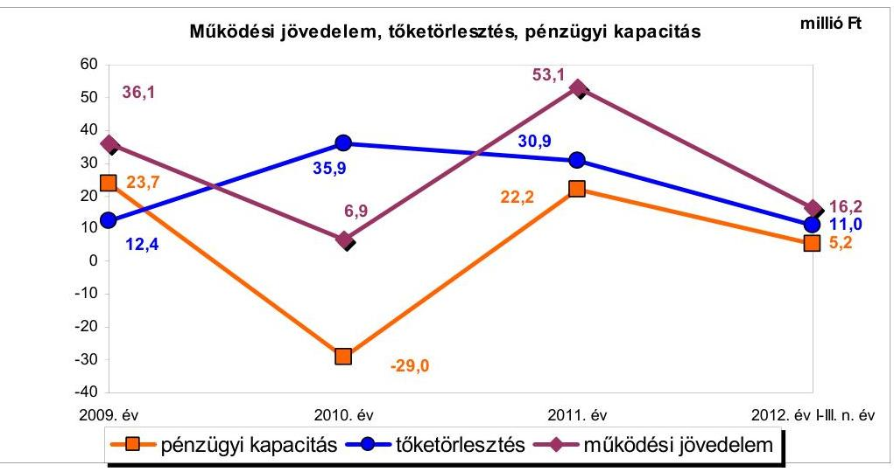
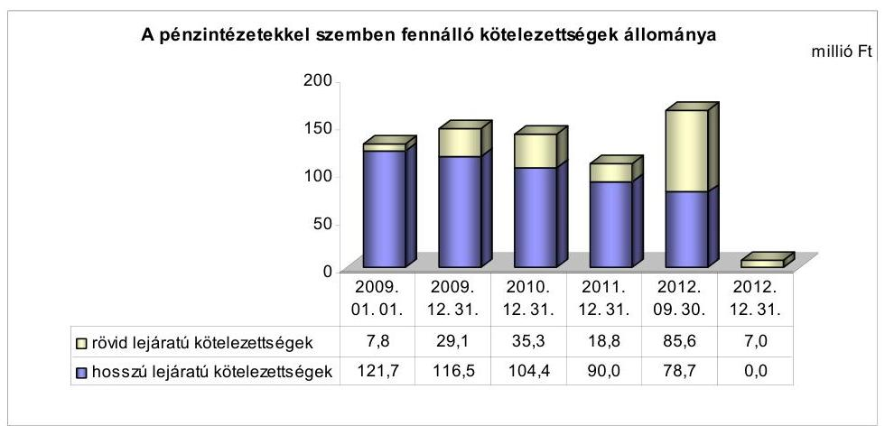
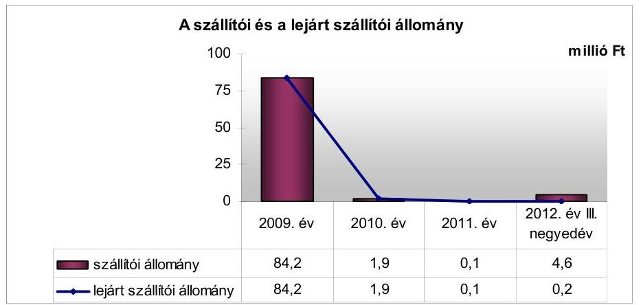
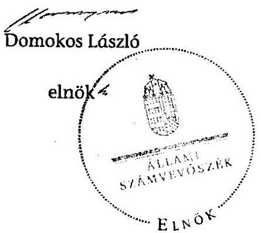
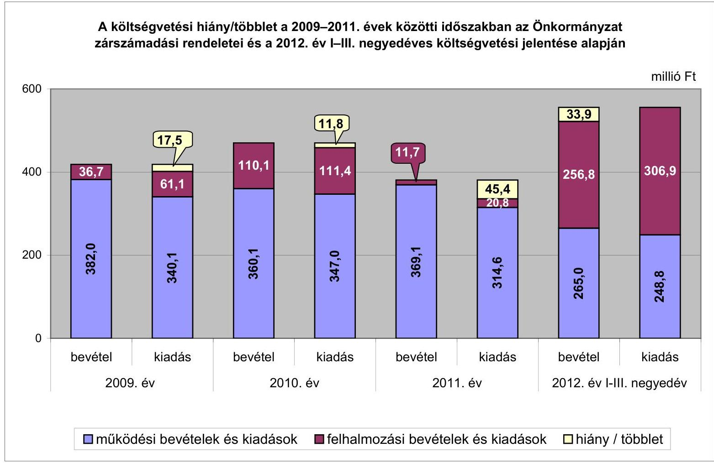
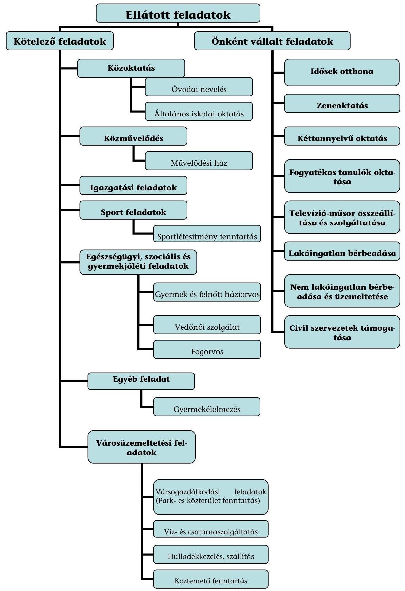

# ÁLLAMI   SZÁMVEVŐSZÉK 

## JELENTÉS

Nagymányok Város Önkormányzata pénzügyi gazdálkodási helyzetének, szabályosságának ellenőrzéséről

---

# Állami Számvevőszék 

Iktatószám: V-0030-342-017/2013.
Témaszám: 1069
Vizsgálat-azonosító szám: V059218

## Az ellenőrzést felügyelte:

## Renkó Zsuzsanna

felügyeleti vezető

## Az ellenőrzést vezette:

## Dér Lívia

ellenőrzésvezető

## Az ellenőrzést végezték:

| Gelencsér Zoltán | Fekete Gábor | Szatmári János |
| :-- | :-- | :-- |
| számvevő tanácsos | számvevő tanácsos | számvevő tanácsos |

---

# TARTALOMJEGYZÉK 

BEVEZETÉS ..... 3
I. ÖSSZEGZŐ MEGÁLLAPÍTÁSOK, KÖVETKEZTETÉSEK, JAVASLATOK ..... 6
II. RÉSZLETES MEGÁLLAPÍTÁSOK ..... 14

1. Az Önkormányzat kötelező és önként vállalt feladatai, a feladatellátás szervezeti keretei ..... 14
2. A pénzügyi egyensúlyt fenntartását veszélyeztető pénzügyi kockázatok és az ezek csökkentése érdekében tett intézkedések ..... 16
3. A pénzügyi gazdálkodási folyamatok szabályosságát, megfelelőségét biztosító belső kontrollok ..... 26

---

# MELLÉKLETEK 

1. számú A költségvetési hiány/többlet a 2009-2011. évek közötti időszakban az Önkormányzat zárszámadási rendeletei és a 2012. év I-III. negyedéves költségvetési jelentése alapján
2. számú Az Önkormányzat bevételei és kiadásai, valamint adósságszolgálata a 2009. év és a 2012. év III. negyedéve között (a CLF módszer szerint)
3. számú Az Önkormányzat által a 2009. év és a 2012. év III. negyedéve között megvalósított (műszakilag befejezett) fejlesztések forrásösszetétele
4. számú Az önkormányzati feladatok ellátásában résztvevő gazdasági társaságok egyes kiemelt adatai
5. számú Az Önkormányzat 2012. szeptember 30-án fennálló, hosszú lejáratú adósságot keletkeztető kötelezettségvállalásai
6. számú Az Önkormányzat kötelezettségeinek és egyes kötelezettségvállalásainak 2011. december 31-ei és 2012. szeptember 30-ai tényleges, 2012. december 31-ei várható állománya és a 2013. évben, valamint az azt követő években várható kötelezettségek miatti kiadások

## FÜGGELÉKEK

1. számú Rövidítések jegyzéke
2. számú Fogalomtár
3. számú Az Önkormányzat által ellátott feladatok 2012. szeptember 30-án

---

# JELENTÉS 

## Nagymányok Város Önkormányzata pénzügyi gazdálkodási helyzetének, szabályosságának ellenőrzéséről

## BEVEZETÉS

Az államháztartás helyi szintjén, az önkormányzati alrendszerben az utóbbi években megjelenő gazdálkodási nehézségek, a pénzforgalmi hiány növekedése, az eladósodás az ÁSZ figyelmét a helyi önkormányzatok pénzügyi helyzetére irányította.

Az ÁSZ a 2013. év I. félévi ellenőrzési tervben foglaltaknak megfelelően az önkormányzatok pénzügyi gazdálkodási helyzetének, szabályosságának ellenőrzésével az önkormányzatok 2011. évben megkezdett helyzetelemzését folytatta. Az ellenőrzés keretében értékeljük az önkormányzatok adósságkezelési és likviditási helyzetét. Bemutatjuk a pénzügyi egyensúly alakulására hatással lévő folyamatokat, feltárjuk az ezekre ható kockázatokat. Értékeljük a pénzügyi egyensúlyi helyzetet befolyásoló döntésmegalapozó, döntés-előkészítő eljárások szabályosságát, és minősítjük az ezekkel összefüggő belső kontrollok kialakítását, működését.

Az ellenőrzés eredményének várható hatásaként a megállapításokkal segítséget nyújthatunk az önkormányzatok számára a pénzügyi egyensúly helyreállítása, javítása és fenntartása érdekében szükségessé váló intézkedések megtételéhez.

Az ellenőrzés típusa: szabályszerűségi ellenőrzés.

## Az ellenőrzés célja annak értékelése volt, hogy:

- az ellenőrzött időszakban a kötelező és önként vállalt feladatok ellátását biztosító szervezeti formák változása milyen hatást gyakorolt az Önkormányzat pénzügyi helyzetének alakulására;
- az Önkormányzat pénzügyi - ezen belül működési és felhalmozási - egyensúlya milyen irányban változott, a változást milyen okok idézték elő, továbbá milyen intézkedéseket tettek a pénzügyi egyensúly biztosítása, illetve javítása érdekében, az intézkedések hatására javult-e az Önkormányzat pénzügyi helyzete;
- a költségvetési kiadások finanszírozása érdekében vállalt, pénzintézetekkel szembeni kötelezettségek hogyan alakultak, a kötelezettségek fennállása miként befolyásolja az Önkormányzat jövőbeli pénzügyi egyensúlyi helyzetét;

---

- az Önkormányzat beazonosította, felmérte, értékelte-e a pénzügyi egyensúlyt befolyásoló pénzügyi kockázatokat, a finanszírozási célú pénzügyi műveletekkel kapcsolatban írtak-e elő kockázatértékelési kötelezettséget;
- az Önkormányzat által kialakított belső kontrollok biztosítják-e a pénzügyi gazdálkodás folyamatainak szabályosságát és eredményességét.

Utóellenőrzés nem történt, mivel az ÁSZ a 2009. év és a 2012. év III. negyedéve közötti időszakban nem végzett ellenőrzést az Önkormányzatnál.

Az ellenőrzés a 2009. január 1-jétől 2012. szeptember 30-áig terjedő időszakot ölelte fel. A pénzintézetekkel szembeni kötelezettségek állományára vonatkozóan az ellenőrzés kezdő időpontjaként a 2012. szeptember 30-án fennálló kötelezettségek keletkezésének időpontját vettük figyelembe. A jövőbeni kötelezettségek megállapításakor az adósságkonszolidáció hatását is értékeltük.

Az ellenőrzés szakmai módszertana az ÁSZ Ellenőrzési Elvek és Standardokban foglalt szakmai szabályokon alapult, amely a Legfőbb Ellenőrző Intézmények Nemzetközi Szervezete (INTOSAI) által kiadott nemzetközi standardok (ISSAI) figyelembevételével készült.

Az ellenőrzés során használt rövidítéseket az 1. számú függelék, az egyes fogalmak magyarázatát a 2. számú függelék tartalmazza.

Az ellenőrzés jogszabályi alapját az ÁSZ tv. 1. § (3) bekezdésének, 5. § (2)-(6) bekezdéseinek, valamint az Áht. 61. § (2) bekezdésének előírásai képezik.

Az Országgyűlés 2012 végén a helyi önkormányzatok adósságállományának részleges konszolidációjáról döntött. Az 5000 fő lakosságszámot meg nem haladó települési önkormányzatok számára nyújtott törlesztési célú támogatással ${ }^{1}$ lehetővé tették a 2012. december 12-én fennálló adósságállományuk és annak 2012. december 28-áig számított járulékai teljes megfizetését. Az 5000 fő lakosságszám feletti települések esetében a 2013. évben az állam differenciált, az adóerő-képességet figyelembe vevő, 40-70%-ig terjedő mértékben vállalja át ${ }^{2}$ az önkormányzatok 2012. december 31-i, az átvállalás időpontjában fennálló adósságállományát és annak járulékait. Az adósságkonszolidációs intézkedéssel egyidejűleg a Kormány elrendelte ${ }^{3}$ az önkormányzatok adósságállománya újratermelődésének megakadályozása céljából a hitelengedélyezési és a likvid hitelekre vonatkozó szabályozás szigorítását.

Nagymányok Város Önkormányzata lakónépességére tekintettel a 2012. évben törlesztési célú támogatásban részesült. A pénzügyi egyensúlya jövőbeni alakulását befolyásoló, az ellenőrzött időszakban fennállt kockázatokra tett megállapításaink - a pénzintézetekkel szembeni kötelezettségekkel összefüggésben feltárt kockázatok kivételével - az adósságkonszolidációt követően is helytállóak és időszerűek.

Nagymányok város lakosainak száma 2012. január 1-jén 2412 fő volt, ami 47 fős csökkenést jelentett a 2009. év eleji lakosságszámhoz képest. Az Önkormányzat a 2011. évben 380,8 millió Ft költségvetési bevételt és 335,4 millió Ft költségvetési kiadást teljesített, 2011. december 31-én a könyvviteli mérleg szerint 1459,6 millió Ft értékű vagyonnal rendelkezett. Az Önkormányzat vagyona 79,7 millió Ft-tal (5,2%-kal) csökkent a 2009. év végi (1539,3 millió Ft) állományhoz viszonyítva. Az Önkormányzat a kötelező és az önként vállalt feladatainak ellátására 2012. szeptember 30-án kettő költségvetési szervet működtetett. Az önkormányzati feladatok ellátásában közszolgáltatási, illetve vállalkozási szerződések alapján öt gazdasági társaság vett részt. Az Önkormányzat a 2009. év és a 2012. év III. negyedéve közötti időszakban műszakilag befejezett jelentősebb fejlesztései a Nagymányokon átmenő út felújítása, a posta és a tűzoltószertár épületének felújítása, játszóterek és sétányok építése, továbbá a volt Brikettgyár megvásárlása voltak. Az Önkormányzat 2011-ben és a 2012. év I-III. negyedévben részesült ÖNHIKI támogatásban.

Az ÁSZ tv. 29. § (1) bekezdése szerint a jelentéstervezetet megküldtük a polgármester részére, aki az ÁSZ tv. 29. § (2) bekezdésében foglalt észrevételezési jogával nem élt, a jelentéstervezetre észrevételt nem tett.

---

# I. ÖSSZEGZŐ MEGÁLLAPÍTÁSOK, KÖVETKEZTETÉSEK, JAVASLATOK 

Nagymányok Város Önkormányzatának pénzügyi egyensúlya az ellenőrzött időszakban középtávon nem volt biztosított. Az állam által nyújtott, összesen 130,5 millió Ft törlesztési célú támogatásból az Önkormányzat kiegyenlítette a 2012. december 12-én fennálló, az adósságkonszolidáció körébe bevonható adósságállományát és annak 2012. december 28-án fennálló járulékait. Az adósságkonszolidáció eredményeként az Önkormányzat pénzügyi egyensúlyi helyzete javult. Az ellenőrzött időszak jövedelemtermelő képessége alapján várhatóan képződő bevételek a feladatok ellátásához szükséges kiadásokat fedezik, azonban a pénzügyi egyensúly fenntartásához elkülönített tartalék nem áll rendelkezésre.

Az Önkormányzat költségvetésének elemzését a CLF módszer alapján számított mutatók alapján végeztük. Az Önkormányzat pénzügyi kapacitásának a 2009. év és a 2012. év I-III. negyedév közötti változását az alábbi ábra mutatja be:

Az Önkormányzat 2009. és 2011. között összesen 1256,4 millió Ft költségvetési bevételt ért el, és 1195,0 millió Ft költségvetési kiadást teljesített. Az Önkormányzat működési költségvetésének egyensúlya a 2009. év és a 2012. év III. negyedéve között biztosított volt. Az ellenőrzött időszakban összesen 112,3 millió Ft működési többlet képződött. A működési jövedelem 2010. évi csökkenését a költségvetési támogatások, az áfa bevételek és visszatérülések, a helyi adók mérséklődése, valamint a közfoglalkoztatásból adódó személyi juttatásokra fordított kiadások emelkedése okozta. A 2011. évben a működési jövedelem növekedéséhez hozzájárult a helyiadó-bevételek és az egyéb saját bevételek növekedése, valamint a kiadáscsökkentő intézkedések eredményeként a személyi juttatások és a dologi kiadások csökkenése. Az Önkormányzat a működőképességének megőrzésére - 2011-ben 30,7 millió Ft, a 2012. év I-III. negyedévben 6,8 millió Ft - összesen 37,5 millió Ft ÖNHIKI támogatásban, valamint 5,2 millió Ft vis maior támogatásban részesült. Az ellenőrzött időszakban

---

az Önkormányzat működési költségvetésének egyensúlya ÖNHIKI támogatás nélkül is biztosított lett volna, e támogatás bevételi kitettséget nem jelentett. A működési jövedelem - a 2010. év kivételével - fedezetet biztosított a tőketörlesztésre és a felhalmozási forráshiány 61,1%-ára is. A nettó működési jövedelem 2009. évi, valamint a 2011. év és a 2012. III. negyedéve közötti pozitív egyenlege összesen 51,1 millió Ft, amely fedezetként részben hozzájárult az ugyanezen időszakban képződött 83,6 millió Ft felhalmozási forráshiány finanszírozásához.

A felhalmozási költségvetés az ellenőrzött időszak egyik évében sem volt egyensúlyban. A felhalmozási hiány összegének változását a felmerült felhalmozási kiadások és a pályázati támogatások közötti ütemkülönbség okozta. A 2009. év és a 2012. év III. negyedéve között összesen 84,8 millió Ft felhalmozási forráshiány képződött. Ebből a 2012. év I-III. negyedévi hiány összege 50,1 millió Ft volt, amelyet alapvetően a fejlesztések - posta és tűzoltószertár felújítás, valamint a Béke utcai játszótérépítés - utófinanszírozása okozott.

Az ellenőrzött időszakban az óvodai és az igazgatási feladatok átszervezésével 9,6 millió Ft összegű megtakarítást értek el. A kötelező és az önként vállalt feladatok ellátását biztosító szervezeti formák változása kedvező volt, de nem gyakorolt jelentős hatást az Önkormányzat pénzügyi egyensúlyi helyzetére. A feladatellátás szervezeti változásán túl az Önkormányzat bevételnövelő és kiadáscsökkentő intézkedéseket tett (eszközök értékesítése, létszámcsökkentés, beszerzési szerződések felülvizsgálata, helyettesítésre fordított és dologi kiadások csökkentése, karbantartások elhalasztása). A 2011-ben és a 2012. év I-III. negyedévben megvalósított kiadáscsökkentő és bevételnövelő intézkedések - a volt brikettgyári ingatlanok megvásárlására fordított 201,0 millió Ft-tal azonos összegben realizált, egyes eszközök és a kinyert fémhulladék értékesítéséből származó bevételt figyelmen kívül hagyva - 67,7 millió Ft-tal járultak hozzá a pénzügyi helyzet javításához.

Az Önkormányzatnál fennállt kockázatok:

- az önként vállalt feladatokhoz kapcsolódó felhalmozási kiadások miatti kockázat: a volt Brikettgyár ingatlanjain a korábbi gyártástechnológia következtében történt környezetszennyezésből adódó, még nem teljes körűen ismert kárelhárítási költségek az Önkormányzat pénzügyi helyzetét befolyásolhatják;
- a fejlesztések során létrejött létesítmények jövőbeni üzemeltetésének kockázata: a megvalósított fejlesztések jövőbeni üzemeltetésének várható kiadásait és bevételeit - a posta és a tűzoltószertár felújítását és a Béke utcai játszóterek
 építését megvalósító projektek kivételével – nem mutatták be a Képviselő-testületnek, a működtetés forrásait nem számszerűsítették;
- a likvid hitelek növekvő állománya miatti pénzügyi kockázat: az Önkormányzat likviditásának, rövid távú pénzügyi egyensúlyának kedvezőtlen irányú változását, pénzügyi kockázatát jelezte a folyószámlahitel tartóssá válása, növekvő összegű igénybevétele, valamint a felhalmozási források kiegészítését szolgáló egyéb likvid hitelek felhasználása.

---

Az Önkormányzat pénzintézeti kötelezettségeinek állománya 2009. január 1-jétől a 2012. év III. negyedév végére 26,9%-kal, 129,5 millió Ft-ról 164,3 millió Ft-ra növekedett. A változást az ellenőrzött időszakban felvett likvid hitelek állományának növekedése, valamint az ellenőrzött időszakot megelőzően felvett hosszú lejáratú hitelek törlesztése együttesen eredményeztek. A pénzintézeti kötelezettség 2012. december 31-ére a törlesztési célú támogatás eredményeként 7,0 millió Ft-ra (95,7%-kal) csökkent. Az Önkormányzat az adósságkonszolidációs célú állami támogatás felhasználásával teljesítette a folyószámlahitele miatt fennálló 51,2 millió Ft-os, valamint a hosszú lejáratú hitelekből fennálló 79,3 millió Ft összegű tőke- és kamatfizetési kötelezettségét. A 2013. évre áthúzódó 7,0 millió Ft likvid hitel visszafizetésének fedezete áfa visszaigénylésből biztosított. A pénzintézettel szembeni kötelezettségek állományának megszünése az Önkormányzat jövőbeni pénzügyi egyensúlyi helyzetét kedvezően befolyásolja. Az adósságkonszolidációt követően a banki kitettség miatti kockázat nem áll fent. Az ellenőrzött időszak jövedelemtermelő képessége alapján várhatóan képződő bevételek a feladatok ellátásához szükséges kiadásokat fedezik. A pénzügyi egyensúly hosszú távú fenntartásához a jövedelemtermelő képesség megőrzése szükséges. Az ellenőrzött időszak végén fennálló szállítói tartozásállomány 4,6 millió Ft volt. Az Önkormányzat lejárt szállító állományának nagyságrendje az ellenőrzött időszakban nem jelentett nemfizetési kockázatot, szállítói kitettséget.

Az Önkormányzatnál a kockázatkezelési rendszer keretében a pénzügyi egyensúlyt befolyásoló kockázatok feltárása, beazonosítása, felmérése, értékelése és ezáltal kezelése – a 2009. évben az Ámr. ${ }_{1}$-ben, a 2010-2011. években az Ámr. ${ }_{2}$-ben, a 2012. év I-III. negyedévben a Bkr.-ben foglalt jogszabályi előírások ellenére – elmaradt. Annak ellenére maradt el a kockázatok kezelése, hogy az ellenőrzési időszakban fennállt az önként vállalt feladatokhoz kapcsolódó felhalmozási kiadások miatti kockázat, a fejlesztések során létrejött létesítmények jövőbeni üzemeltetése és a likvid hitelek növekvő állománya miatti pénzügyi kockázat. Az Önkormányzatnál a finanszírozási célú pénzügyi műveletekkel kapcsolatban nem írtak elő kockázatértékelési kötelezettséget.

A pénzügyi gazdálkodási folyamatok szabályosságát, megfelelőségét, kockázatainak kezelését biztosító belső kontrolltevékenységek kialakítása – a 2009. évben az Ámr. ${ }_{1}$, a 2010-2011. években az Ámr. ${ }_{2}$, a 2012. év I-III. negyedévben a Bkr. előírásai ellenére – nem volt megfelelő, mert nem írták elő a feladat átadás-átvételre vonatkozó döntések hatásának értékelését a kötelező és az önként vállalt feladatokra és a pénzügyi egyensúlyi helyzetre. Nem szabályozták a feladatellátáshoz kapcsolódó támogatási rendszer feltételeit, a feladatellátási szerződések tartalmi követelményeit és a beszámolási kötelezettséget. Nem írták elő az önkormányzati fejlesztések előkészítése, lebonyolítása és működtetése kockázatai feltárásának és kezelésének kötelezettségét, valamint a fejlesztésekre vonatkozó pályáztatási kötelezettséget. Nem határozták meg a fejlesztésekhez kapcsolódó támogatások figyelési rendszerét, továbbá a pályázatkészítés feltételeit és szervezeti kereteit. Nem írták elő a fizetőképesség és az eladósodás kezelését szolgáló belső szabályozás készítését, a pénzintézeti kötelezettségvállalásokkal kapcsolatos döntések kockázatai feltárásának, a futamidő egyes éveit terhelő kötelezettségek pénzügyi egyensúlyra gyakorolt hatásának döntés-előkészítés során történő vizsgálatát. Nem szabályozták a pénzinté-

---

zeti szolgáltatások igénybevételével és a pénzügyi kötelezettségek teljesítésével összefüggő kontrolltevékenységeket.

Az ellenőrzött időszak belső ellenőrzési terveinek készítését megelőzően – a 2009. évben az Ámr.-ben, a 2010-2011. években az Ámr.-ben, a 2009-2011. években a Ber.-ben, 2012. január 1-jétől a Bkr.-ben foglaltak ellenére – nem írták elő a pénzügyi egyensúlyi helyzetet befolyásoló döntések kockázati tényezőinek feltárását követően a feltárt kockázati tényezők belső ellenőrzés keretében történő ellenőrzését.

A feladatellátás szabályosságát, a pénzügyi egyensúlyi helyzet alakulását, továbbá a pénzügyi gazdasági döntések megalapozását szolgáló döntéselőkészítő, valamint a pénzintézeti kötelezettségvállalások szabályosságát, megfelelőségét, a kockázatok kezelését biztosító belső kontrollok működése annak ellenére jó volt, hogy az Önkormányzat pénzügyi egyensúlyi helyzetét befolyásoló döntések kockázati tényezőinek feltárását követően, azok belső ellenőrzés keretében történő ellenőrzése elmaradt. Ezért a kialakított kontrollok összességében nem biztosították a pénzügyi gazdálkodási folyamatok eredményességét.

Az ellenőrzés során a gazdálkodási feladatok ellátásával kapcsolatosan az alábbi szabályszerűségi hibákat tártuk fel:

- a behajthatatlannak minősülő követelés elengedésének jogkörét a tíz ezer forint értékhatárt meghaladó követelések esetében az Önkormányzat vagyongazdálkodási rendeletében előírtak ellenére a Képviselő-testület helyett két esetben, összesen 0,5 millió Ft összegben a polgármester gyakorolta;
- a beruházási hitel felvételére vonatkozó döntés-előkészítés során versenyeztetés nélkül, a Kbt.-ben foglalt, az egyszerű közbeszerzési eljárás lefolytatására vonatkozó előírások mellőzésével döntöttek a banki szolgáltatás igénybevételéről;
- a pénzintézeti kötelezettséghez kapcsolódóan az Önkormányzat megsértette az Ötv. előírását azzal, hogy a folyószámlahitel tekintetében a törzsvagyon részét képező, egy korlátozottan forgalomképes ingatlanán jelzálogjogot alapított;
- az Önkormányzat a 2006. évben 97,1 millió Ft, a 2008. évben 30,0 millió Ft összegben igénybevett hosszú lejáratú hiteleinek fedezeteként valamennyi bevételét, köztük az Ötv. és az Ámr. ${ }_{1}$ előírásait megsértve, a központi költségvetésből származó bevételeit is felajánlotta.

Az ÁSZ tv. 33. § (1) bekezdésében foglaltak értelmében az ellenőrzött szervezet vezetője köteles a jelentésben foglalt megállapításokhoz kapcsolódó intézkedési tervet összeállítani, és azt a jelentés kézhezvételétől számított harminc napon belül az ÁSZ részére megküldeni. Amennyiben az intézkedési tervet határidőn belül nem küldi meg a szervezet vezetője, vagy az továbbra sem elfogadható, az ÁSZ elnöke a hivatkozott törvény 33. § (3) bekezdés a)-b) pontjaiban foglaltakat érvényesítheti.

---

# Az ellenőrzés intézkedést igénylő megállapításai és javaslatai: 

## a polgármesternek

1. Az ellenőrzött időszak éveiben az Önkormányzat működési jövedelme pozitív volt, a 2010. év kivételével fedezetet biztosított a törlesztési kötelezettségekre. A nettó működési jövedelem 2009. évi, valamint a 2011. év és a 2012. év III. negyedéve közötti pozitív egyenlege összesen 51,1 millió Ft volt, amely fedezetként részben hozzájárult az ugyanezen időszakban képződött 83,6 millió Ft felhalmozási forráshiány finanszírozásához. A likviditást folyószámlahitel és likvid hitelek igénybevételével biztosították. Az ellenőrzött időszak végén fennálló pénzintézeti kötelezettség 164,3 millió Ft, a szállítói tartozásállomány 4,6 millió Ft volt. Az ellenőrzött időszakban megvalósított bevételnövelő és kiadáscsökkentő intézkedések tartós hatása nem volt jelentős, számottevően nem javította a pénzügyi egyensúlyi helyzetet. A 2012. évi adósságkonszolidációt követően fennmaradó áfa-megelőlegezési hitel 7,0 millió Ft volt. Az ellenőrzött időszak jövedelemtermelő képességének megőrzése esetén a várhatóan képződő bevételek a feladatellátás kiadásait fedezik.

Javaslat:
A működési jövedelemtermelő képesség és a feladatellátás összhangja, valamint az Önkormányzat pénzügyi egyensúlyának fenntarthatósága érdekében – a 2012. évi kormányzati adósságkonszolidációt, valamint a 2013. évtől változó feladatellátási kötelezettséget, feladatfinanszírozási rendszert figyelembe véve – felelősök és határidők megjelölésével kezdeményezzen intézkedéseket, melyek keretében:
a) a költségvetési rendelettervezet, valamint annak évközi módosítása előterjesztését megelőzően mérjék fel a bevételszerző, kiadáscsökkentő lehetőségeket, és terjessze a Képviselő-testület elé a bevételek növelését, a kiadások csökkentését célzó intézkedések bevezetéséhez szükséges – a Htv. 140. § (1) bekezdés a) pontja alapján a jegyző által elkészített – döntési javaslatát;
b) terjesszen a Képviselő-testület elé jóváhagyásra – a Htv. 140. § (1) bekezdés a) pontja alapján a jegyző által elkészített – az Önkormányzat gazdasági helyzetének elemzésén alapuló, a pénzügyi egyensúlyi helyzet hosszú távú megőrzését és az adósságállomány újratermelődésének elkerülését biztosító intézkedéseket tartalmazó stabilizációs programot.
2. A folyószámlahitel szerződés megkötésekor – az Ötv. 88. § (1) bekezdés b) pontjában ${ }^{4}$ foglalt előírást megsértve – a törzsvagyonba tartozó, korlátozottan forgalomképes művelődési házat, az ingatlanra engedélyezett jelzáloggal a hitel fedezetéül használták fel. A 2006. és a 2008. években felvett hosszú lejáratú fejlesztési célú hitelszerződésekben a kötelezettségek teljesítésének biztosítására az azonnali beszedési megbízás érvényesítésének jogát engedélyezték valamennyi – köztük a költségvetési támogatások folyósítására szolgáló – bankszámlát érintően. Ezáltal az Ötv. 88. § (1)

[^0]
[^0]:    ${ }^{4}$ Hatálytalan 2012. január 1-jétől, a 2012. március 31-től hatályos jogszabályi előírás az Áht. 84. § (4) bekezdése.

---

bekezdés b) pontjában és az Ámr. 1 103. § (11) bekezdésében ${ }^{5}$ foglalt előírásokat megsértve a központi költségvetésből származó bevételeket is felajánlották hitelfelvétel fedezeteként.

Javaslat:
A pénzintézeti kötelezettségvállalásokkal kapcsolatos jogszerű biztosíték, illetve fedezet felajánlása érdekében intézkedjen, hogy:
a) jövőbeni hitelfelvétel, kötvénykibocsátás fedezeteként az Áht. 84. § (4) bekezdésében foglalt előírás alapján az Önkormányzat törzsvagyona, valamint az Önkormányzat általános működésének és ágazati feladatainak támogatása, továbbá a költségvetési támogatás ne kerüljön felhasználásra;
b) az Ávr. 145. § (2) bekezdésében előírtak szerint a költségvetési támogatások folyósítására szolgáló elkülönített bankszámláról hiteltörlesztést ne teljesítsenek.
3. Az Önkormányzatnál egy hosszú lejáratú beruházási hitel esetében a Kbt ${ }_{1}$. 240. § (1) bekezdésében ${ }^{6}$ foglaltakat megsértve, az egyszerű közbeszerzési eljárás lefolytatására vonatkozó előírások mellőzésével döntöttek a banki szolgáltatás igénybevételéről.

Javaslat:
A közbeszerzési eljárásról szóló törvényben foglaltak maradéktalan betartása érdekében:
a) biztosítsa, hogy jövőbeni pénzügyi szolgáltatások igénybevétele esetén – amennyiben a Kbt. 2 120. § k) pontjában foglalt kivétel nem áll fenn – a közbeszerzési eljárás lefolytatásának kötelezettségére a 119. §-ban foglalt előírást érvényesítsék;
b) intézkedjen az ÁSZ ellenőrzés során feltárt közbeszerzési szabálytalanság tekintetében a munkajogi felelősséggel kapcsolatos körülmények kivizsgálásáról, és hozza meg a szükséges munkajogi intézkedéseket.
4. A behajthatatlannak minősülő követelések elengedésre vonatkozó – a vagyongazdálkodási rendelet 15. § (2) bekezdés c) pontjában és a 18. § (3) bekezdésében foglalt – előírást megsértve a polgármester a 2009. évben két esetben, összesen 0,5 millió Ft összegben, a tíz ezer forint értékhatárt meghaladó követelések esetében a Képviselő-testület számára meghatározott jogkörben hozott döntést.

Javaslat:
Biztosítsa, hogy az Önkormányzat vagyongazdálkodási rendelete 15. § (2) bekezdés c) pontjában és a 18. § (3) bekezdésében foglaltak alapján az előírt értékhatárt meg-

[^0]
[^0]:    ${ }^{5}$ Hatálytalan 2010. január 1-jétől, 2010. január 1-jétől 2011. december 31-ig hatályos az Ámr. 2 174. § (11) bekezdése, 2012. január 1-jétől hatályos az Ávr. 145. § (2) bekezdése.
    ${ }^{6}$ Hatálytalan 2012. január 1-jétől, a 2012. január 1-jétől hatályos előírás a Kbt. 2 120. § k) pontja.

---

haladó esetekben a követelés elengedésére vonatkozó döntési jogkört a Képviselőtestület gyakorolja.

# a jegyzőnek 

1. A kockázatkezelési rendszer keretében az ellenőrzött időszakban fennállt, pénzügyi egyensúlyt befolyásoló kockázatok feltárása, beazonosítása, értékelése és ezáltal kezelése – a 2009. évben az Ámr.1 145/C. §-ában, a 2010-2011. években az Ámr. ${ }_{2}$ 157. §-ában, a 2012. év I-III. negyedévben pedig a Bkr. 7. § (1)-(2) bekezdéseiben foglalt jogszabályi előírások ellenére – elmaradt. Annak ellenére maradt el a kockázatok kezelése, hogy az ellenőrzött időszakban fennállt az önként vállalt feladatokhoz kapcsolódó felhalmozási kiadások miatti kockázat, a fejlesztések során létrejött létesítmények jövőbeni üzemeltetése miatti kockázat és a likvid hitelek növekvő állománya miatti pénzügyi kockázat.

Javaslat:
Működtessen a Bkr. 7. § (1)-(2) bekezdéseiben foglalt előírásoknak
 megfelelő, a pénzügyi egyensúlyt befolyásoló kockázatok kezelésére alkalmas kockázatkezelési rendszert.
2. Az Önkormányzatnál a pénzügyi gazdálkodási folyamatok szabályossága, megfelelősége vonatkozásában a kockázatok kezelését biztosító belső kontrolltevékenységek kialakítása - a 2009. évben az Ámr. 1 145/E. § (1)-(2) bekezdéseiben, a 2010-2011. években az Ámr. ${ }_{2}$ 158. § (1)-(2) bekezdéseiben, a 2012. év I-III. negyedévben a Bkr. 8. § (1)-(2) bekezdéseiben foglalt előírások ellenére - nem volt megfelelő, mert nem írták elő a feladat átadás-átvételre vonatkozó döntések hatásának értékelését a kötelező és az önként vállalt feladatokra, valamint a pénzügyi egyensúlyi helyzetre. Nem szabályozták a feladatellátáshoz kapcsolódó támogatási rendszer feltételeit, a feladatellátási szerződések tartalmi követelményeit és a beszámolási kötelezettséget. Nem írták elő az önkormányzati fejlesztési döntések kockázatai feltárásának és kezelésének kötelezettségét és a fejlesztésekre vonatkozó pályáztatási kötelezettséget. Nem határozták meg a fejlesztésekhez kapcsolódó támogatások figyelési rendszerét, a pályázatkészítés feltételeit és szervezeti kereteit. Nem írták elő a fizetőképesség és az eladósodás kezelését szolgáló belső szabályozás készítését és nem határozták meg a pénzügyi kötelezettségek teljesítésével összefüggő kontrolltevékenységeket. Nem írták elő a pénzintézeti kötelezettségvállalásokkal kapcsolatos döntések kockázatai feltárásának kötelezettségét, valamint a futamidő egyes éveit terhelő kötelezettségek pénzügyi egyensúlyra gyakorolt hatásának döntés-előkészítés során történő vizsgálatát. Nem határozták meg a pénzintézeti szolgáltatások igénybevételének pályáztatásával összefüggő kontrolltevékenységeket.

Javaslat:
Alakítsa ki a Bkr. 8. § (1)-(2) bekezdései alapján azokat a belső kontrolltevékenységeket, amelyek biztosítják a pénzügyi-gazdálkodási folyamatok szabályosságát és a pénzügyi egyensúlyi helyzet alakulását befolyásoló döntések kockázatainak kezelését.

---

Ennek keretében:
a) írja elő a feladat átadás-átvételre vonatkozó döntések előkészítése során a döntés kötelező és önként vállalt feladatok arányára, ezáltal a pénzügyi egyensúlyi helyzetre gyakorolt hatásának vizsgálatát;
b) szabályozza a feladatellátási rendszerhez kapcsolódó támogatási rendszer feltételeit, továbbá határozza meg a feladatellátási szerződések minimum tartalmi követelményeinek meghatározására vonatkozó helyi szabályokat;
c) határozza meg a feladatellátási szerződések teljesítésére vonatkozó beszámolási kötelezettséggel kapcsolatos kontrolltevékenységeket;
d) határozza meg a fejlesztések döntés-előkészítési folyamatában az előkészítés, a lebonyolítás és a működtetés kockázatai feltárásának és kezelésének kötelezettségét;
e) határozza meg a közbeszerzési értékhatár alatti esetekben a pályáztatási kötelezettséggel kapcsolatos kontrolltevékenységeket;
f) határozza meg a fejlesztésekhez kapcsolódó külső források, támogatások figyelési rendszerével, a pályázat készítés feltételeivel összefüggő kontrolltevékenységeket;
g) készítsen szabályzatot az Önkormányzat fizetőképességének és eladósodásának kezelésére, valamint határozza meg a pénzügyi kötelezettségek teljesítésének helyi szabályait;
h) írja elő a pénzintézeti kötelezettségvállalások kockázatainak döntés-előkészítő szakaszban történő feltárását, a futamidő egyes éveit terhelő kötelezettségek költségvetési egyensúlyra gyakorolt hatásának vizsgálatát.
3. Az Önkormányzatnál az ellenőrzött időszak belső ellenőrzési terveinek készítését megelőzően - a 2009. évben az Ámr. ${ }_{1}$ 145/C. § (2) bekezdésében, a 2010-2011. években az Ámr. ${ }_{2}$ 157. § (2) bekezdésében, a 2009-2011. években a Ber. 18. §-ában, a 21. § (2) bekezdésében és a (3) bekezdés a) pontjában, 2012. január 1-jétől a Bkr. 7. § (2) bekezdésében, a 29. § (1) bekezdésében, a 31. § (2)-(4) bekezdéseiben foglaltak ellenére - nem írták elő a pénzügyi egyensúlyi helyzetet befolyásoló döntések kockázati tényezőinek feltárását, ezért a belső ellenőrzési tervek nem tartalmazták az ellenőrzési tervet megalapozó kockázatelemzéseket, ezáltal az Önkormányzatnál nem ellenőrizték ezeket a kockázati tényezőket.

Javaslat:
Intézkedjen a belső ellenőrzés vezetője felé, hogy a Bkr. 7. § (2) bekezdésében, a 29. § (1) bekezdésében, a 31. § (2)-(4) bekezdéseiben foglalt előírások szerint az éves belső ellenőrzési tervek tartalmazzák a pénzügyi egyensúlyi helyzetet befolyásoló döntésekkel kapcsolatos feltárt kockázati tényezők ellenőrzését, valamint biztosítsa az ellenőrzési tervek végrehajtását.

---

# II. RÉSZLETES MEGÁLLAPÍTÁSOK 

## 1. Az ÖNKORMÁNYZAT KÖTELEZŐ ÉS ÖNKÉNT VÁLLALT FELADATAI, A FELADATELLÁTÁS SZERVEZETI KERETEI

Az Önkormányzat a kötelező és az önként vállalt feladatainak körét az SZMSZ-ben rögzítette, az önként vállalt feladatait azonban nem a ténylegesen ellátott feladatokkal azonosan határozta meg. Az önként vállalt feladatok közé sorolták be az idősek otthonának működtetését, az általános iskolai tanulók zeneoktatását, az általános iskolai tanulók két tannyelvű ${ }^{7}$ oktatását és a fogyatékos tanulók oktatását. Az Önkormányzat nyilatkozata szerint önként vállalt feladatnak tekintette továbbá - az SZMSZ-ben történő besorolás nélkül - a televízió-műsor összeállítása és szolgáltatása, a lakóingatlanok bérbeadása, nem lakóingatlan bérbeadása és üzemeltetése, továbbá a civil szervezetek támogatása feladatokat.

Az Önkormányzat ellenőrzött időszakban ellátott kötelező feladatai az óvodai nevelés, az általános iskolai oktatás, a közművelődési (művelődési ház), igazgatási és sport${ }^{8}$ feladatok, az egészségügyi, szociális, gyermekjóléti és városgazdálkodási (park- és közterület fenntartási) feladatok, továbbá a gazdasági társaságok által ellátott közszolgáltatások (víz- és csatornaszolgáltatás, hulladékkezelés, hulladékszállítás, köztemető fenntartás) és az egyéni vállalkozó által végzett gyermekélelmezés voltak. Az ellátott feladatok az ellenőrzött időszakban nem módosultak. (A feladatellátás részletezését a 3. számú függelék tartalmazza.)

Az Önkormányzat a kötelező és az önként vállalt feladatokra fordított kiadások mértékének, arányának és annak változásának a pénzügyi egyensúlyi helyzetére gyakorolt hatását nem értékelte. Az Önkormányzat adatszolgáltatása szerint - működési kiadásaiból a kötelező feladataira a 2009. évben 291,6 millió Ft-ot (85,7%-ot), a 2010. évben 289,7 millió Ft-ot (83,5%-ot), a 2011. évben 262,0 millió Ft-ot (83,3%-ot), a 2012. év I-III. negyedévben pedig 221,8 millió Ft-ot (89,1%-ot) fordított. Az önként vállalt feladatok érdekében teljesített működési kiadások összege a 2009. évben 48,5 millió Ft (14,3%), a 2010. évben 57,3 millió Ft (16,5%), a 2011. évben 52,6 millió Ft-ot (16,7%), a 2012. év I-III. negyedévben 27,0 millió Ft (10,9%) volt. A 2011. évi működési kiadás a 2009. évi 340,1 millió Ft működési kiadáshoz viszonyítva 7,5%-kal (25,5 millió Ft-tal) csökkent. Ebben az időszakban a kötelező feladatokra fordított működési kiadás 10,2%-kal (29,6 millió Ft-tal) mérséklődött. Az önként vállalt feladatok finanszírozása kockázatot nem jelentett, mert az e feladatokra fordított működési kiadások növekedése - 2009-ről 2011-re 8,5%, 4,1 millió Ft - a működési jövedelem alakulása szempontjából nem volt meg-

[^0]
[^0]:    ${ }^{7}$ nemzetiségi német nyelv oktatása tanterv alapján
    ${ }^{8}$ sportlétesítmények fenntartása

---

határozó, a működési költségvetés pozitív egyenlegének változását döntően a kötelező feladatok bevételei és kiadásai befolyásolták.

Az Önkormányzatnál a 2009. és a 2012. év III. negyedéve között befejezett fejlesztések bekerülési költsége - az ellenőrzött időszakot megelőzően elszámolt költségeket is figyelembe véve - 474,4 millió Ft volt, amelyből az ellenőrzött időszakban 473,7 millió Ft kiadást teljesítettek. A kötelező feladatokhoz kapcsolódó fejlesztésekre 183,8 millió Ft-ot - a beruházási, felújítási kiadások 38,7%-át - használták fel. Az önként vállalt feladatok fejlesztési kiadásaira 290,6 millió Ft-ot - az összes beruházási, felújítási kiadás 61,3%-át - fordították, melyből a volt Brikettgyár ingatlanjainak vételára (áfával együtt) 255,3 millió Ft - az önként vállalt beruházási, felújítási kiadások 87,9%-a volt. A volt Brikettgyár megvásárlására fordított kiadás nélkül az Önkormányzat az önként vállalt feladataihoz kapcsolódóan felhalmozási célra összesen 35,3 millió Ft-ot fordított, amely nagyságrendjére tekintettel nem jelentett felhalmozási kockázatot. A volt Brikettgyár megvásárlására fordított kiadás, annak forrását illetően nem jelentett felhalmozási kockázatot, mert az Önkormányzat - a jelentős nagyságrendű ingatlan tulajdonjogának megszerzésén túl - a vételi árral megegyező összegű saját bevételhez jutott egyes eszközök és a fémhulladék értékesítése révén. Ugyanakkor kockázatot hordoz, hogy a korábbi gyártástechnológia következtében történt környezetszennyezésből adódó, még nem teljes körűen ismert kárelhárítási költségek az Önkormányzat pénzügyi helyzetét befolyásolhatják.

Az Önkormányzat a kötelező és az önként vállalt feladatait az ellenőrzött időszakban két költségvetési szervvel, gazdasági társaságokkal és egyéni vállalkozóval kötött szerződésekkel látta el. A költségvetési szervek száma az ellenőrzött időszakban nem változott, azonban feladatátadásra, továbbá intézményi feladatok átszervezésére is sor került. Kismányok Község Önkormányzata a közigazgatási területén lévő óvodájának az Önkormányzat gesztorságával működő Intézményfenntartó társulásból történő - 2011. szeptember 1-jei hatályú - kilépéséről döntött, amelynek következtében az óvodai telephelyek száma eggyel csökkent. A tagóvoda kiválását követően intézményi átszervezést is végrehajtottak (csoportszám csökkentés, az egységes feladatellátás kialakítása). Az ellenőrzött időszakban tett további szervezési intézkedések keretében létszámcsökkentést hajtottak végre a Polgármesteri Hivatalt és az ÁMK-t érintően.

Az önkormányzati feladatok ellátásában az ellenőrzött időszakban közszolgáltatási, illetve vállalkozási szerződések alapján öt gazdasági társaság és egy egyéni vállalkozó vett részt. Az önkormányzati feladatok ellátásában résztvevő gazdasági társaságok egyes kiemelt adatait a 4. számú melléklet tartalmazza.

Az Önkormányzatnak 2012. szeptember 30-án a 2012. június 30-ig vízszolgáltatást végző Völgység Nkft.-ben 18,9%-os, majd az ezt a feladatot 2012. július 1-jétől átvevő - Mezőföldvíz Kft.-ben 0,15%-os tulajdoni részesedése volt. A csatornaszolgáltatást 2012. június 30-ig a Bonycom Kft. végezte - amelyben az Önkormányzat nem rendelkezett tulajdonrésszel -, ezt követően a feladatot a Mezőföldvíz Kft. látta el. A szilárd hulladékszállítást végző Biokom Városüzemeltetési és Környezetgazdálkodási Kft.-ben, valamint a köztemető fenntartásban közreműködő KLEM Kft.-ben az Önkormányzatnak nem volt tulajdoni részesedése. A gyermekélelmezést szolgáltatási szerződés alapján egyéni vállalkozó végezte.

---

A 90,0%-os önkormányzati tulajdonban lévő - bioenergia előállítási és hasznosítási feladat ellátására létrehozott - Bioenergia Kft. eredménytelen működési támogatási pályázat miatt nem működött, a feladatellátásban nem vett részt.

Az Intézményfenntartó társulásból kivált tagóvodával (telephely csökkenéssel) összefüggő feladatok átadása nem jelentett megtakarítást az Önkormányzat számára, mert a kiadások csökkenésével megegyező volt a költségvetési támogatás, a saját bevétel és a társult önkormányzati támogatás együttes összegének mérséklődése. Az óvodai és az igazgatási feladatok átszervezésével azonban összességében 9,6 millió Ft megtakarítást értek el. Az ellenőrzött időszakban a feladatok ellátását biztosító szervezeti formák változása kedvező volt, de nem gyakorolt jelentős hatást az Önkormányzat pénzügyi egyensúlyi helyzetére.

# 2. A PÉNZÜGYI EGYENSÚLY FENNTARTÁSÁT VESZÉLYEZTETŐ PÉNZÜGYI KOCKÁZATOK ÉS AZ EZEK CSÖKKENTÉSE ÉRDEKÉBEN TETT INTÉZKEDÉSEK 

Az Önkormányzat költségvetésének elemzését CLF módszerrel hajtottuk végre. Az Önkormányzat bevételeit és kiadásait, valamint adósságszolgálatát a 2009. év és a 2012. év III. negyedéve között a 2. számú melléklet, a főbb önkormányzati adatokat a következő tábla mutatja be:

|  |  |  |  | millió Ft |
| :--: | :--: | :--: | :--: | :--: |
| Megnevezés | 2009. év | 2010. év | 2011. év | 2012. év   I-III. n. |
| Folyó bevételek | 376,2 | 353,9 | 367,7 | 265,0 |
| Folyó kiadások | 340,1 | 347,0 | 314,6 | 248,8 |
| Működési jövedelem | 36,1 | 6,9 | 53,1 | 16,2 |
| Felhalmozási bevételek | 36,7 | 110,2 | 11,7 | 256,8 |
| Felhalmozási kiadások | 61,1 | 111,4 | 20,8 | 306,9 |
| Felhalmozási költségvetés egyenlege | $-24,4$ | $-1,2$ | $-9,1$ | $-50,1$ |
| Folyó és felhalmozási bevételek összesen | 412,9 | 464,1 | 379,4 | 521,8 |
| Folyó és felhalmozási kiadások összesen | 401,2 | 458,4 |

 | 335,4 | 555,7 |
| Finanszírozási műveletek nélküli pozíció | 11,7 | 5,7 | 44,0 | $-33,9$ |
| Finanszírozási műveletek egyenlege | 11,6 | $-11,0$ | $-39,8$ | 64,2 |
| Tárgyévi pénzügyi pozíció | 23,3 | $-5,3$ | 4,2 | 30,3 |
| Hiteltörlesztés, értékpapír beváltás | 12,4 | 35,9 | 30,9 | 11,0 |
| Nettó működési jövedelem | 23,7 | $-29,0$ | 22,2 | 5,2 |

Az Önkormányzat 2009. és 2011. között összesen 1256,4 millió Ft költségvetési bevételt ért el, és 1195,0 millió Ft költségvetési kiadást teljesített. A működési jövedelem (a működési költségvetés egyenlege) az ellenőrzött időszakban pozitív volt, 2009. és 2011. között összességében 96,1 millió Ft, a 2012. évi I-III. negyedévben 16,2 millió Ft többletet mutatott. A működési jövedelem alakulását elsősorban a költségvetési támogatások, a helyiadó-bevételek évenkénti ingadozása, az egyéb saját bevételek növekedése, valamint a dologi kiadások csökkenése határozta meg.

Az Önkormányzat működőképességének megőrzésére 2011-ben 30,7 millió Ft, a 2012. év I-III. negyedévben 6,8 millió Ft, összesen 37,5 millió Ft vissza nem térítendő ÖNHIKI támogatásban, valamint összesen 5,2 millió Ft vis maior támogatásban részesült ${ }^{9}$. Az Önkormányzatnál e támogatások miatt bevételi kitettség nem állt fenn, mert a működőképességének megőrzésére juttatott költségvetési támogatások nélkül a működési jövedelem 2010-ben 3,0 millió Ft, 2011-ben 21,1 millió Ft, a 2012. év I-III. negyedévben pedig 9,4 millió Ft többletet mutatott volna.

A nettó működési jövedelem a 2009. évi 23,7 millió Ft többletet követően a 2010. évben - a növekvő hiteltörlesztés és a csökkenő működési jövedelem hatására - 29,0 millió Ft negatív összeget mutatott, majd a 2011. évben meghatározóan a működési jövedelem ÖNHIKI támogatásból adódó növekedésének eredményeként 22,2 millió Ft-ra változott. A 2012. év I-III. negyedévben a nettó működési jövedelem összege 5,2 millió Ft volt, amely - az előző évhez képest jelentősen csökkenő ÖNHIKI támogatás miatt mérséklődő működési jövedelem következtében - időarányosan elmaradt az előző évitől.

A felhalmozási költségvetés egyenlege 2009. és 2011. között minden évben negatív volt. Ezen időszakban összesen 34,7 millió Ft felhalmozási forráshiány keletkezett. A felhalmozási költségvetés a 2009. évben 24,4 millió Ft hiányt mutatott, amely a 2010. évre 1,2 millió Ft-ra csökkent, majd a 2011. évre 9,1 millió Ft-ra nőtt. A 2012. év I-III. negyedévben a felhalmozási forráshiány összege 50,1 millió Ft volt, amelyet alapvetően a fejlesztések - a posta és tűzoltószertár felújítás valamint a Béke utcai játszótérépítés utófinanszírozása okozott. A felhalmozási forráshiány 61,1\%-ára nyújtott fedezetet a 2009. és a 2011. évi, valamint a 2012. év I-III. negyedévi nettó működési jövedelem. A forráshiányt likvid hitelek felvételével finanszírozták.

Az Önkormányzat évenkénti teljes finanszírozási igénye ${ }^{10}$ a CLF módszer szerint 2009-ben 0,7 millió Ft, 2010-ben 30,2 millió Ft, a 2012. év I-III. negyedévben pedig 44,9 millió Ft volt. A 2011. évben a 22,2 millió Ft összegű nettó működési jövedelem biztosította a felhalmozási költségvetés 9,1 millió Ft-os hiányának a finanszírozását. A 2009-2011. évi költségvetési többletek és a 2012. év I-III. negyedévi hiány alakulását a 2009. és a 2011. évek közötti időszakban az Önkormányzat zárszámadási rendeletei és a 2012. év I-III. negyedéves költségvetési jelentése alapján az 1. számú melléklet tartalmazza.

A folyó bevételek a 2009. évi 376,2 millió Ft-ról, a 2010. évre 22,3 millió Ft-tal csökkentek, a 2011. évre 13,8 millió Ft-tal nőttek az előző évhez viszonyítva. A folyó bevételek között meghatározó arányt képviselt a költségvetési támogatás és az átengedett bevételek együttes összege (amely 2009-ben a folyó bevételek $73,1\%$-a, 2010-ben $77,6\%$-a, 2011-ben $74,4\%$-a, a 2012. év III. negyedév végén pedig $73,9\%$-a volt). A folyó bevételek 2010. évi csökkenésében meghatározó volt a költségvetési támogatások, az áfa bevételek és visszatérülések, valamint a helyi adók együttesen 38,4 millió Ft-os mérséklődése, továbbá az átengedett bevételek és az egyéb saját bevételek 16,1 millió Ft-os növekedése.

[^0]
[^0]:    ${ }^{9}$ 2010-ben 3,9 millió Ft, 2011-ben 1,3 millió Ft
    ${ }^{10}$ a nettó működési jövedelem és a felhalmozási költségvetés együttes negatív egyenlege

---

A 2011. évi növekedést döntően a helyi adók és az egyéb saját bevételek összesen 13,1 millió Ft-os emelkedése eredményezte.

Az Önkormányzatnak három helyi adónemből (iparűzési adó, vállalkozók ${ }^{11}$ és magánszemélyek kommunális adója) származott bevétele az ellenőrzött időszakban. A realizált bevételek folyó bevételeken belüli részaránya a 2009. évben 5,2\% (19,4 millió Ft), a 2010. évben 4,4\% (15,5 millió Ft), a 2011. évben 6,2\% (22,8 millió Ft), a 2012. év III. negyedév végén pedig 6,9\% (18,4 millió Ft) volt. A 2010. évben az előző évhez képest jelentősen (3,9 millió Ft-tal, 20,1\%-kal) visszaesett a helyi adókból származó bevétel, aminek fő oka a vállalkozások árbevételének csökkenése volt.

A helyi iparűzési adó esetében az adóalanyok száma az egyes években 169 és 185 között változott. Az adó mértéke az ellenőrzött időszak során nem változott, a korrigált nettó árbevétel 1,3\%-a volt. A 2009. év és a 2012. év III. negyedéve között az iparűzési adóból 65,1 millió Ft bevétele keletkezett az Önkormányzatnak, ami az összes helyiadó-bevétel 85,6\%-át tette ki. Az iparűzési adó esetében a jogszabályi maximális adómérték alkalmazása az ellenőrzött időszakban - az Önkormányzat kimutatása szerint - 35,0 millió Ft többletbevételt eredményezhetett volna. Az Önkormányzat számára a helyiadóbevétel bevételi kitettséget nem jelentett, mert a helyi iparűzési adóbevétel meghatározó része több gazdasági társaságtól folyt be az ellenőrzött időszakban.

Az egyéb saját bevételek részaránya és összege a folyó bevételeken belül folyamatosan növekvő tendenciát mutatott, a 2009. évben 13,8\% (51,9 millió Ft), a 2011. évben 17,5\% (64,3 millió Ft) volt. A saját bevételek növekménye elsősorban a bérleti díjbevételek növekedéséből és a saját tulajdonú erdőből történt fa értékesítésből származott.

A felhalmozási bevételek összege 2009-ben 36,7 millió Ft volt, amely 2010-ben döntően a Nagymányokon átmenő út felújításához igénybe vett támogatáshoz kapcsolódóan 110,2 millió Ft-ra nőtt. A 2010. évi felhalmozási bevétel 94,1\%-a (103,7 millió Ft) pályázati forrásból származott. A felhalmozási bevételek a 2011. évben a pályázati források mérséklődése miatt 11,7 millió Ft-ra csökkentek. A 2012. év I-III. negyedévben befolyt bevétel 256,8 millió Ft volt, amelyből 201,0 millió Ft a volt Brikettgyár egyes eszközei és a kinyert fémhulladék értékesítéséből származott.

A folyó kiadások évenkénti átlagos összege a 2009-2011. években a költségvetési kiadások 83,8\%-át (333,9 millió Ft-ot) tette ki. A folyó kiadások 2010-ben 2,0\%-kal (6,9 millió Ft-tal) nőttek, 2011-ben - az óvodai feladatátadás és a dologi kiadások takarékossági intézkedésekből származó mérséklése miatt - 9,3\%-kal (32,4 millió Ft-tal) csökkentek az előző évhez viszonyítva. A személyi juttatások és munkaadót terhelő járulékok 2009-ről 2010-re 5,0\%-kal (10,1 millió Ft-tal) nőttek, majd 2010-ről 2011-re 7,6\%-kal (16,1 millió Ft-tal) csökkentek. A növekmény oka 2010-ben, hogy 14 fő közmunkást foglalkoztattak, és 4,0 millió Ft jubileumi jutalmat fizettek ki. A dologi kiadások a

[^0]
[^0]:    ${ }^{11}$ A vállalkozók kommunális adója jogszabályi változások miatt 2011-től megszűnt.

---

2010. évben 6,3\%-kal (6,9 millió Ft-tal), a 2011. évben további 13,6\%-kal (13,9 millió Ft-tal) csökkentek az előző évhez viszonyítva. A csökkenés oka egyrészt a kiadáscsökkentő intézkedések eredménye, másrészt az, hogy 2010-ben lezárult a TÁMOP-ból megvalósított közoktatási program, amelynek következtében 2011-ben már nem merültek fel a pályázattal kapcsolatos dologi kiadások.

A 2009. év és a 2012. év III. negyedéve között megvalósított (műszakilag befejezett) beruházásokra és felújításokra fordított kiadás 473,7 millió Ft volt. A teljes bekerülési költségek ${ }^{12}$ forrását 278,1 millió Ft (58,6\%) önkormányzati saját bevétel, 13,5 millió Ft (2,8\%) folyószámlahitel, 172,0 millió Ft (36,3\%) EU-s pályázati támogatás, valamint 10,8 millió Ft (2,3\%) egyéb központi támogatás képezte. A megvalósított beruházások és felújítások ${ }^{13}$ közül négy haladta meg a 10,0 millió Ft-ot, összes bekerülési költségük 410,7 millió Ft - a beruházási és felújítási kiadások 86,6\%-a - volt. A 2009. év és a 2012. év III. negyedéve között megvalósított fejlesztési feladatokat és azok forrásösszetételét a 3. számú melléklet mutatja be.

Az ellenőrzött időszakban a legnagyobb összegű felhalmozási kiadást a volt Brikettgyár megvásárlása jelentette. Az elővásárlási joggal rendelkező Önkormányzat versenyen kívüli kiajánlást követően, az eladó gazdasági társaság ajánlatát elfogadva, 2012. január 12-én megvásárolta a település közigazgatási területén lévő - 12 ingatlant magába foglaló, három ingatlancsoportból álló - volt Brikettgyárat nettó 201,0 millió Ft vételáron. Az ingatlan a korábbi gyártástechnológia következtében történt környezetszennyezés tudomásul vételével és a kárelhárítás átvállalt kötelezettségével került értékesítésre. Mivel a szerződést az Önkormányzat önerejéből teljesíteni nem tudta, 2012. április 13-án szerződést kötött egy gazdasági társasággal az ingatlanon található egyes eszközök és a kinyert fémhulladék értékesítésére nettó 201,0 millió Ft-os vételáron. Így a volt Brikettgyár megvásárlásának fedezetét az eszközök és a fémhulladék értékesítésével elért, a vételárral azonos nagyságrendű bevétel biztosította. Az ingatlan összességében külön ráfordítás nélkül került az Önkormányzat tulajdonába, jelentős ingatlanvagyon gyarapodást okozva. Az ingatlan egyes elemeit az Önkormányzat ipari és egyéb gazdasági célokra tervezi fordítani.

A 2012. év III. negyedév végén az Önkormányzatnak nem voltak folyamatban lévő felújításai és beruházásai, valamint beadott, elbírálás alatt lévő fejlesztési célú pályázatai. A pályázati forrásokból megvalósuló programok utófinanszírozásúak voltak. Az utófinanszírozás a likviditási problémák fokozódását, a támogatás-megelőlegezési hitelek költsége többletkiadást jelentett az Önkormányzatnak.

Az átmenő út felújítása szállítói finanszírozással biztosított támogatással történt. A posta és a tűzoltószertár felújítását és a Béke utcai játszóterek építését megvalósító projekteket átmenetileg támogatás-megelőlegező hitelek felvételével finanszírozták.

[^0]
[^0]:    ${ }^{12}$ a 2009. év előtt felmerült felhalmozási kiadásokat is tartalmazó
    ${ }^{13}$ átmenő út felújítása 120,6 millió Ft, posta és tűzoltószertár felújítása 13,1 millió Ft, Béke utcai játszóterek fejlesztése 21,7 millió Ft, Brikettgyár megvásárlása 255,3 millió Ft - áfával növelt - összegben

---

Az Önkormányzatnak az ellenőrzött időszakban megvalósított fejlesztések jövőbeni üzemeltetésével összefüggően várható kiadásait és bevételeit - a posta és a tűzoltószertár felújítását és a Béke utcai játszóterek építését megvalósító projektek kivételével - a Képviselő-testületnek dokumentáltan nem mutatták be, a működtetés forrásait nem számszerúsítették, a létesítmények jövőbeni üzemeltetésének kockázatát nem mérték fel.

Az Önkormányzat - kizárólag forintban fennálló - pénzintézeti kötelezettségeinek állománya 2009. január 1-jétől 2011. december 31-éig 16,0\%-kal, 129,5 millió Ft-ról 108,8 millió Ft-ra csökkent. A kötelezettség állománya 2011. december 31-étől a 2012. év III. negyedév végére 164,3 millió Ft-ra (51,0\%-kal) növekedett.

Az Önkormányzat pénzintézetekkel szemben 2009-2012. években fennálló kötelezettségeit az alábbi ábra mutatja be:

A rövid lejáratú pénzintézeti kötelezettség összege - a folyószámlahitel állományának emelkedése és az egyéb likvid hitelek felvételének
 következtében – a 2012. év III. negyedév végére a 2009. január 1-jén fennálló állomány tizenegyszeresére, 85,6 millió Ft-ra emelkedett. A hosszú lejáratú pénzintézeti kötelezettség a 2012. év III. negyedév végére – a felhalmozási célú hitelek törlesztése következtében – a 2009. január 1-jén fennálló tartozás 64,7%-ára, 78,7 millió Ft-ra mérséklődött.

A pénzintézeti kötelezettség állományának 2009. évi 16,1 millió Ft-os emelkedését elsősorban egy likvid hitel felvétele, a folyószámlahitel állományának növekedése, valamint egy egyéb likvid hitel és a hosszú lejáratú hitel törlesztése határozta meg. A 2010. évi 5,9 millió Ft-os csökkenést az egyéb likvid hitel és a felhalmozási hitel törlesztések növekedése, valamint a folyószámlahitel állományának emelkedése okozta. A 2011. évi 30,9 millió Ft-os csökkenést a felhalmozási hitelek törlesztése, valamint a folyószámlahitel állományának mérséklődése okozta. A 2012. év I-III. negyedévében a pénzintézeti kötelezettségek állományának növekedésében meghatározó volt a két likvid hitelből eredő, összesen 44,5 millió Ft-os kötelezettség. Az Önkormányzat a 2012. december hónapban kapott törlesztési célú támogatás felhasználásával fizette vissza a hitelkerettel megegyező összegű, 50,0 millió Ft-os folyószámlahitelét és a hosszú lejáratú hitelekből fennálló 78,7 millió Ft összegű tőketar-

---

tozását, valamint összesen 1,8 millió Ft kamatból származó adósságát. A pénzintézeti kötelezettség 2012. december 31-ére a törlesztési célú támogatás eredményeként 7,0 millió Ft-ra ${ }^{14}$ (95,7%-kal) csökkent. A 2013. évre áthúzódó 7,0 millió Ft likvid hitel visszafizetésének fedezete áfa visszaigénylésből biztosított.

Az Önkormányzat az ellenőrzött időszakban hosszú lejáratú fejlesztési célú hitelt nem vett fel. 2012. szeptember 30-án kettő forintalapú, fejlesztési célú hitelszerződésből volt fennálló hosszú lejáratú pénzintézeti kötelezettsége. Az ellenőrzött időszakot megelőzően 127,1 millió Ft összegű, hosszú lejáratú hitelt vettek fel. Az Önkormányzat 2012. szeptember 30-án fennálló, hosszú lejáratú adósságot keletkeztető kötelezettségvállalásait az 5. számú melléklet mutatja be.

A 97,1 millió Ft infrastruktúra-fejlesztési hitelt 2006. május 12-én vették igénybe. A tőketörlesztés kezdete a 2008. év I. negyedéve, szerződés szerinti lejárata 2026. március 31-e volt. A 30,0 millió Ft beruházási hitelt 2008. május 19-én vették igénybe. A tőketörlesztés kezdete a 2010. év II. negyedéve, szerződés szerinti lejárata 2013. június 30-a volt.

A hosszú lejáratú fejlesztési hitelek kamata a törlesztés megkezdésétől 2012. szeptember 30-áig terjedő időszakban az induló kamatfeltételekhez viszonyítva összességében kedvezően változott ${ }^{15}$. A változás nagyságrendje az Önkormányzat pénzügyi helyzetére nem volt jelentős hatással, mert a referencia kamatok kedvező alakulása következtében 0,5 millió Ft-tal kevesebb kötelezettséget kellett teljesíteni.

A hosszú lejáratú fejlesztési hitelek törlesztésére az Önkormányzat 2009. január 1-jétől, 2012. szeptember 30-ig 40,3 millió Ft tőkét és 21,7 millió Ft kamatot teljesített. A hosszú lejáratú hitelekkel kapcsolatos kötelezettségek – a törlesztési célú támogatásból biztosított 78,7 millió Ft tőke és 0,6 millió Ft kamat teljesítésével – 2012. december 31-re megszüntek.

A hosszú lejáratú fejlesztési hiteleket a szerződésben foglalt célnak megfelelően vették igénybe, befektetési célú felhasználásra nem került sor.

Az Önkormányzat – az adatszolgáltatása szerint – a hosszú lejáratú fejlesztési hitelek forrásaiból 47,0 millió Ft-ot az általános iskola felújítására, 50,1 millió Ft-ot az óvoda felújítására és 30,0 millió Ft-ot földterületek vásárlására használt fel az ellenőrzött időszakot megelőzően.

A pénzintézeti kötelezettségvállalásokra a Képviselő-testület döntése alapján került sor. A felhalmozási célú hitelszerződések megkötésekor (a 2006. és a 2008. évben) az Önkormányzat a visszafizetések fedezetéül jelzálogot és opciós jogot biztosított a forgalomképes vagyonába tartozó erdő és agyagbánya ingat-

[^0]
[^0]:    ${ }^{14}$ áfa megelőlegezési céllal felvett likvid hitel maradványa
    ${ }^{15}$ A kamat az infrastruktúra fejlesztési hitel esetében 4,7%-ról (3 havi EURIBOR +1,9% kamatfelár) 4,02%-ra (3 havi EURIBOR +2,5% kamatfelár) csökkent, a beruházási hitelé nem változott az induló 10,67%-os kamathoz (3 havi BUBOR +2,5% kamatfelár) képest.

---

lanára a hitelt nyújtó pénzintézet számára. Ugyanakkor a kötelezettségek teljesítése érdekében azonnali beszedési megbízás érvényesítésének jogát engedélyezték a pénzintézet számára az Önkormányzat valamennyi – köztük a költségvetési támogatások folyósítására szolgáló – bankszámláját érintően. Ez által az Ötv. 88. § (1) bekezdés b) pontjában ${ }^{16}$ és az Ámr. ${ }_{1}$ 103. § (11) bekezdésében ${ }^{17}$ foglalt előírásokat megsértve a központi költségvetésből származó bevételeket hitelfelvételek fedezeteként ajánlották fel.

Az Önkormányzat az ellenőrzött időszakban nem váltott számlavezető pénzintézetet.

A pénzintézeti kötelezettségállomány alakulására ható döntések előkészítése során nem készítettek elemzéseket, értékeléseket a futamidő egyes éveit terhelő tőke- és kamatfizetési kötelezettség pénzügyi egyensúlyra gyakorolt hatására vonatkozóan, nem mutatták be hogy a működési jövedelem biztosítja-e a futamidő egyes éveiben az adósságszolgálat finanszírozását. A fejlesztési hitelek döntés-előkészítő dokumentumai nem tartalmazták a változó kamatozás miatt esetlegesen fellépő kötelezettség növekedés miatt bekövetkező pénzügyi kockázatot.

A hosszú lejáratú pénzintézeti kötelezettségvállalásokra vonatkozó döntéselőkészítés során egy esetben – a 30,0 millió Ft-os beruházási hitel igénybevételét megelőzően –, versenyeztetés nélkül, a Kbt ${ }_{1}$. 240. § (1) bekezdése szerinti egyszerű közbeszerzési eljárás lefolytatásának mellőzésével ${ }^{18}$ döntöttek a banki szolgáltatás igénybevételéről. A közbeszerzési eljárás mellőzésével összefüggésben nem állt fenn a jogorvoslat kezdeményezésének lehetősége, mert a Kbt. ${ }_{2}$ 140. § (2) bekezdés b) pontjában szabályozott jogorvoslati eljárásra vonatkozó jogvesztő határidő eltelt.

A beruházási hitelszerződésben az ügyleti kamatláb változó mértékét háromhavi BUBOR +2,5% mértékben, induló évi 10,67%-ban határozták meg. A hitelképesség vizsgálati díjra 0,15 millió Ft kötelezettséget vállalt az Önkormányzat, amely összesen 10,9 millió Ft szolgáltatási díjat jelentett a lejáratig.

A pénzintézeti kötelezettségállomány alakulását, annak változását az éves költségvetési tervezési, valamint a zárszámadási dokumentumokban bemutatták, azonban nem történt meg a visszafizetés feltételeinek, forrásainak, kockázatának, a pénzügyi helyzetre gyakorolt hatásának elemzése, értékelése. A törlesztések fedezetének biztosítására nem képeztek elkülönített tartalékot.

[^0]
[^0]:    ${ }^{16}$ Hatálytalan 2012. január 1-jétől, a 2012. március 31-től hatályos új jogszabályi előírás az Áht. 84. § (4) bekezdése.
    ${ }^{17}$ Hatálytalan 2010. január 1-jétől, 2010. január 1-jétől 2011. december 31-ig hatályos előírás: az Ámr. ${ }_{2}$ 174. § (11) bekezdése, 2012. január 1-jétől hatályos előírás: az Ávr. 145. § (2) bekezdése.
    ${ }^{18}$ A banki szolgáltatás becsült értéke meghaladta a Magyar Köztársaság 2008. évi költségvetéséről szóló 2007. évi CLXIX. törvény 91. § (3) bekezdés c) pontjában foglalt közbeszerzési értékhatárt.

---

Az Önkormányzat az ellenőrzött időszakban likviditását folyószámlahitel és egyéb likvid hitelek igénybevételével tudta biztosítani. Folyamatosan figyelemmel kísérték az Önkormányzat likviditási helyzetét, a folyószámlahitel és a rövid lejáratú hitelek állományát, annak változását, azonban nem elemezték és nem értékelték a kötelezettségállomány alakulásának a pénzügyi helyzetre gyakorolt hatását. A folyószámlahitel igénybevételét a 2009-2011. években és a 2012. év I-III. negyedévében az alábbi tábla mutatja be:

| Megnevezés | 2009. év | 2010. év | 2011. év | 2012. év   I-III.   negyedév |
| :-- | --: | --: | --: | --: |
| Keretösszeg január 1-én (millió Ft-ban) | 50,0 | 50,0 | 50,0 | 50,0 |
| Átlagos, napi állomány (millió Ft-ban) | 34,1 | 42,0 | 47,0 | 39,0 |
| Hitellel zárt napok száma (nap) | 365 | 365 | 365 | 274 |
| Egyenleg állomány az időszak végén (millió Ft-ban) | 5,5 | 35,3 | 18,8 | 41,1 |
| Teljesített kamat és egyéb költség (millió Ft-ban) | 7,2 | 4,4 | 4,8 | 4,7 |

Az Önkormányzat folyószámlahitel kerete az ellenőrzött időszakban nem változott. A folyószámlahitel átlagos napi állománya a 2009. évi 34,1 millió Ft-ról a 2011. évre 47,0 millió Ft-ra (37,8%-kal) nőtt, a 2012. év III. negyedévére 39,0 millió Ft-ra (17,0%-kal) csökkent. A napi átlagos állomány 2010. és 2011. évi emelkedését az Önkormányzat likviditásának, rövid távú pénzügyi egyensúlyának kedvezőtlen irányú változása okozta. Banki kitettséget és egyben pénzügyi kockázatot jelentett a folyószámlahitel tartóssá válása, növekvő összegű igénybevétele. A törlesztési célú támogatás révén folyószámlahitelből származó kötelezettség 2012. december 31-én nem állt fenn, a banki kitettség megszűnt.

Az Önkormányzat a folyószámlahitel-szerződés megkötésekor fedezetül a törzsvagyonba tartozó korlátozottan forgalomképes művelődési házra jelzálog bejegyzését biztosította a pénzintézet számára, amellyel megsértette az Ötv. 88. § (1) bekezdés b) pontjában ${ }^{19}$ foglalt előírást, amely szerint az önkormányzati törzsvagyon hitel fedezetéül nem használható fel.

Az Önkormányzat részben a fejlesztési feladatokhoz szükséges saját erő, részben a támogatások utófinanszírozásából fakadó átmeneti forráshiány pótlása érdekében az ellenőrzött időszakban három alkalommal vett igénybe éven belüli futamidejű likvid hitelt. A 2009. évben áfa befizetés megelőlegezési céllal, továbbá a településmegújításra és fejlesztésre elnyert támogatás megelőlegezésére vettek igénybe 23,6 millió Ft-ot, amelyet a szerződésben foglaltaknak megfelelően használtak fel és egy éven belül törlesztettek. A 2012. év I-III. negyedévében igénybe vett 35,0 millió Ft-os likvid hitel felhasználásának célja a településmegújításra és fejlesztésre elnyert támogatás előfinanszírozása, a 9,5 millió Ft-os hitelé áfa megelőlegezés volt. A támogatás előfinanszírozást szolgáló hitelt az ellenőrzött időszakot követően ${ }^{20}$ törlesztették. Az áfa megelő-

[^0]
[^0]:    ${ }^{19}$ Hatálytalan 2012. január 1-jétől, a 2012. március 31-től hatályos új jogszabályi előírás az Áht. 84. § (4) bekezdése.
    ${ }^{20}$ 2012. december 13-án

---

legező hitelt az ellenőrzött időszakot követően egyenlítették ki${ }^{21}$. Az ellenőrzött időszakban a likvid hitelek kamata 1,2 millió Ft, egyéb költsége 0,7 millió Ft volt.

Az Önkormányzat 2009. év és 2012. szeptember 30. közötti szállítói és lejárt szállítói állományát az alábbi ábra mutatja be:

A 2009. év végén az Önkormányzat lejárt szállítói tartozásállománya 84,2 millió Ft volt, amely megegyezett a teljes szállítói kötelezettséggel. A szállítói tartozásállomány 95,5%-a (80,4 millió Ft) szállítói finanszírozású támogatásból származott. A szállítói finanszírozás nélküli tartozásállomány 3,8 millió Ft volt. A szállítói tartozás 2010. év végi állománya 1,9 millió Ft volt, amely a 2009. évihez képest 82,3 millió Ft-tal, 97,7%-kal csökkent. A 2009. évben a szállítói finanszírozás miatti tartozásállomány 60 nap alatti lejárt, az ellenőrzött időszak további éveiben a lejárt szállítói tartozásállomány 30 nap alatti lejárt esedékességű volt. Az Önkormányzat lejárt szállítói állományának nagyságrendje az ellenőrzött időszakban nem jelentett nemfizetési kockázatot, szállítói kitettséget.

Az Önkormányzatnak az ellenőrzött időszakban lízingszerződésből eredő kötelezettsége nem volt. PPP konstrukció keretében nem valósított meg beruházást, nem vett igénybe kölcsönt önkormányzati intézményektől, gazdasági társaságoktól, valamint egyéb szervezetektől, illetőleg nem nyújtott kölcsönt ilyen szervezetek részére. A 2003. évben keletkezett kezességvállalásból fennálló kötelezettsége az ellenőrzött időszakban megszűnt. A kezességvállalással kapcsolatban fizetési kötelezettség nem keletkezett. Az Önkormányzat kötelezettségeinek 2011. december 31-ei és 2012. szeptember 30-ai tényleges, a 2012. december 31-ei várható állománya és a 2013. évben, valamint az azt követő években várható kötelezettségek miatti kiadásokat az 6.
 számú melléklet mutatja be.

Az Önkormányzat behajthatatlannak minősített - bérleti díj és készletértékesítésből származó - összesen 0,5 millió Ft összegű követelését a polgármester engedte el a 2009. évben. A követelés elengedésére vonatkozó döntéseket az Ön-

[^0]
[^0]:    ${ }^{21}$ 2,5 millió Ft-ot a 2012. évben egyenlítettek ki, a további 7,0 millió Ft törlesztési kötelezettség szerződés szerinti teljesítése áthúzódott a 2013. évre.

---

kormányzat az ellenőrzött időszakban hatályos vagyongazdálkodási rendeletében szabályozta. A követelés elengedésének gyakorlata azonban eltért a vagyongazdálkodási rendelet 15. § (2) bekezdés c) pontjában és a 18. § (3) bekezdésében előírtaktól, mert a szabályozás ellenére az erre - a tíz ezer forint értékhatárt meghaladó követelések esetében a Képviselő-testület számára meghatározott jogkört a polgármester gyakorolta.

Az Önkormányzat kettő forgalomképes és egy törzsvagyonba tartozó, korlátozottan forgalomképes ingatlanát terhelte 2012. szeptember 30-án 90,0 millió Ft összegű jelzálog. A terhelt ingatlanok számviteli értéke 35,6 millió Ft, a forgalomképes és a korlátozottan forgalomképes ingatlanok együttes könyv szerinti értékének (994,4 millió Ft-nak) a 3,6%-a volt. Az ellenőrzött időszakban a jelzáloggal terhelt ingatlanok száma és értéke nem nőtt, ami nem jelentett kockázatot a fedezetbevonás növekedése szempontjából.

Az Önkormányzat 2012. szeptember 30-án egy jogerős határozattal le nem zárt és egy lezárt, de ki nem fizetett peres eljárásának együttes perértéke 6,8 millió Ft volt, amelyből a lezárt eljárás miatti kötelezettség 2,4 millió Ft volt.

Az ellenőrzött időszakban az Önkormányzat egy minősített többségi befolyása alatt álló gazdasági társaságban - Bioenergia Kft. - rendelkezett 90,0%-os tulajdoni részesedéssel. A gazdasági társaság - számviteli beszámolói, illetve adatszolgáltatása szerint - nem tart nyilván pénzintézeti, lízing és egyéb kötelezettséget, mérlegében nem mutatott ki szállítói tartozást. Az Önkormányzat nem adott át a gazdasági társaság részére rendszeres és eseti jelleggel sem pénzeszközt.

Az Önkormányzat 2012. szeptember 30-án fennálló pénzintézeti kötelezettségállománya 164,3 millió Ft volt, amely a hitelek szerződés szerinti teljesítése, valamint a hosszú lejáratú és a folyószámla hitelnek a törlesztési célú támogatás felhasználásával történő visszafizetése következtében 2012. december 31-re 7,0 millió Ft-ra mérséklődött. Az Önkormányzatnak összes egyéb kötelezettsége 2012. szeptember 30-án a peres ügyből származó 2,4 millió Ft volt. A pénzintézettel szembeni kötelezettségek állományának megszűnése az Önkormányzat jövőbeni pénzügyi egyensúlyi helyzetét kedvezően befolyásolja. Az egyéb kötelezettségek teljesítése az Önkormányzat számára a jövedelemtermelő képessége változatlansága esetén nem jelent nemfizetési kockázatot.

Az Önkormányzat - adatszolgáltatása szerint - a 2009. év és a 2012. év III. negyedéve közötti időszakban megvalósított kiadáscsökkentő intézkedések hatásaként 56,9 millió Ft megtakarítást mutatott ki. A kiadási megtakarítások 36,9%-a (21,0 millió Ft) az összesen kilenc főt érintő létszámcsökkentésből származott. A Polgármesteri Hivatalban és az ÁMK-ban végrehajtott létszámcsökkentési intézkedések hatására a 2012. év végére az engedélyezett álláshelyek - és a foglalkoztatottak száma is - 75 főről 66 főre csökkent. A beszerzési szerződések feltételeinek javításával, a helyettesítésre fordított kiadások csökkentésével, a dologi kiadások mérséklésével és a karbantartások elhalasztásával összesen 35,9 millió Ft kiadási megtakarítást értek el az ellenőrzött időszakban.

---

Az ellenőrzött időszakban hozott bevételnövelő intézkedések eredményeként kimutatott 211,8 millió Ft többletbevétel körében alapvetően a volt Brikettgyár berendezéseinek 201,0 millió Ft (nettó) összegű értékesítése volt a meghatározó, ami egyszeri bevételt - ugyanakkor azonos összegű felhalmozási kiadást is - jelentett az Önkormányzat számára. A 2011-ben és a 2012. év I-III. negyedévben megtett kiadáscsökkentő és bevételnövelő intézkedések - a volt Brikettgyár egyes eszközeinek és a kinyert fémhulladéknak az értékesítéséből származó bevételt figyelmen kívül hagyva - 67,7 millió Ft-tal járultak hozzá a pénzügyi helyzet javításához.

Az Önkormányzatnál a kockázatkezelési rendszer keretében a pénzügyi egyensúlyt befolyásoló kockázatok feltárása, beazonosítása, felmérése, értékelése és ezáltal kezelése - a 2009. évben az Ámr. ${ }_{1}$ 145/C. §-ában, a 2010-2011. években az Ámr. ${ }_{2}$ 157. §-ában, a 2012. év I-III. negyedévben a Bkr. 7. § (1)-(2) bekezdéseiben foglalt jogszabályi előírások ellenére - elmaradt. Annak ellenére maradt el a kockázatok kezelése, hogy az ellenőrzési időszakban fennállt az önként vállalt feladatokhoz kapcsolódó felhalmozási kiadások miatti kockázat, valamint a fejlesztések során létrejött létesítmények jövőbeni üzemeltetése és a likvid hitelek növekvő állománya miatti pénzügyi kockázat. Az Önkormányzatnál a finanszírozási célú pénzügyi műveletekkel kapcsolatban nem írtak elő kockázatértékelési tevékenységet.

Az ellenőrzött időszakban az Önkormányzatnál - az üzemeltetésre átadott eszközök kivételével - nem mérték fel, hogy az elhasználódott eszközök felújítása, pótlása fedezetének biztosítása mekkora forrásokat igényel. A 2009-2011. években a befektetett eszközök után a főkönyvi könyvelésben összesen 141,0 millió Ft összegű értékcsökkenést számoltak el. Az elszámolt értékcsökkenésből az eszközök pótlására külön alapot nem képeztek. Az eszközök használhatósági foka - a fejlesztések aktiválásának elhúzódása miatt - a 2009. évi 83,8%-ról a 2011. évre 70,9%-ra csökkent.

# 3. A PÉNZÜGYI GAZDÁLKODÁSI FOLYAMATOK SZABÁLYOSSÁGÁT, MEGFELELŐSÉGÉT BIZTOSÍTÓ BELSŐ KONTROLLOK 

A pénzügyi gazdálkodási folyamatok szabályosságát, megfelelőségét, kockázatainak kezelését biztosító belső kontrolltevékenységek kialakítása - a 2009. évben az Ámr. ${ }_{1}$ 145/E. § (1)-(2) bekezdéseiben, a 2010-2011. években az Ámr. ${ }_{2}$ 158. § (1)-(2) bekezdéseiben, a 2012. év I-III. negyedévben a Bkr. 8. § (1)-(2) bekezdéseiben foglalt előírások ellenére - összességében nem volt megfelelő.

A feladatellátás szabályosságát, megfelelőségét, a kockázatok kezelését biztosító kontrolltevékenységek kialakítása - a 2009. évben az Ámr. ${ }_{1}$ 145/E. § (1)-(2) bekezdéseiben, a 2010-2011. években az Ámr. ${ }_{2}$ 158. § (1)-(2) bekezdéseiben, a 2012. év I-III. negyedévben a Bkr. 8. § (1)-(2) bekezdéseiben foglalt előírások ellenére - nem volt megfelelő, mert nem írták elő a feladat át-adás-átvételre vonatkozó döntés-előkészítés folyamatában annak értékelését, hogy a döntés milyen hatást gyakorol a kötelező és az önként vállalt feladatokra fordított kiadások arányára, a pénzügyi egyensúlyi helyzetre. Nem szabályozták továbbá a feladatellátáshoz kapcsolódó támogatási rendszer feltételeit,

---

valamint nem írták elő a feladatellátási szerződések tartalmi követelményeit és a feladatellátás teljesítésével kapcsolatos beszámolási kötelezettséget.

A pénzügyi egyensúlyi helyzet alakulását befolyásoló, a kockázatok kezelését biztosító belső kontrolltevékenységek kialakítása - a 2009. évben az Ámr. 145/E. § (1)-(2) bekezdéseiben, a 2010-2011. években az Ámr. ${ }_{2}$ 158. § (1)-(2) bekezdéseiben, a 2012. év I-III. negyedévben a Bkr. 8. § (1)-(2) bekezdéseiben foglalt előírások ellenére - részben volt megfelelő, mert nem írták elő az önkormányzati fejlesztések döntés-előkészítési folyamatában az előkészítés, a lebonyolítás és a működtetés kockázatai feltárásának és kezelésének kötelezettségét és az önkormányzati fejlesztésekre vonatkozó pályáztatási kötelezettséget. Nem határozták meg továbbá a fejlesztésekhez kapcsolódó támogatások figyelési rendszerét, a pályázatkészítés feltételeit és szervezeti kereteit.

Rendelkeztek azonban a közpénzek felhasználásának szabályosságát biztosító kockázatkezelési szabályzattal, ellenőrzési nyomvonallal, a szabálytalanságok kezelésének eljárásrendjével és közbeszerzési szabályzattal. A beszámoló készítés és adatszolgáltatás rendjét a gazdálkodási szabályzatban és a számviteli politikában szabályozták. Előírták az Önkormányzat által nyújtott működési és felhalmozási célú pénzeszközátadások feltételrendszerét.

A pénzügyi gazdasági döntések megalapozását szolgáló, a kockázatok kezelését biztosító döntés-előkészítő, valamint a pénzintézeti kötelezettségvállalások szabályosságát, megfelelőségét biztosító kontrolltevékenységek kialakítása - a 2009. évben az Ámr. 145/E. § (1)-(2) bekezdéseiben, a 2010-2011. években az Ámr. ${ }_{2}$ 158. § (1)-(2) bekezdéseiben, a 2012. év I-III. negyedévben a Bkr. 8. § (1)-(2) bekezdéseiben foglalt előírások ellenére - részben volt megfelelő, mert nem írták elő a fizetőképesség és az eladósodás kezelését szolgáló belső szabályozás készítését, a pénzintézeti kötelezettségvállalásokkal kapcsolatos döntések kockázatai feltárásának, a futamidő egyes éveit terhelő kötelezettségek pénzügyi egyensúlyra gyakorolt hatásának döntés-előkészítés során történő vizsgálatát. Nem szabályozták továbbá a pénzintézeti szolgáltatások igénybevételének pályáztatási vagy több ajánlatkérési kötelezettségével és a pénzügyi kötelezettségek teljesítésével összefüggő kontrolltevékenységeket.

Elkészítették azonban a szállítói tartozások kezelésére vonatkozó szabályozást. Meghatározták az Önkormányzat minősített többségi befolyása alatt álló gazdasági társaság pénzügyi helyzete alakulásáról szóló beszámolási kötelezettségét.

Az ellenőrzött időszak belső ellenőrzési terveinek készítését megelőzően - a 2009. évben az Ámr. ${ }_{1} 145/$C. § (2) bekezdésében, a 2010-2011. években az Ámr. ${ }_{2}$ 157. § (2) bekezdésében, a 2009-2011. években a Ber. 18. §-ában, a 21. § (2) bekezdésében és a (3) bekezdés a) pontjában, 2012. január 1-jétől a Bkr. 7. § (2) bekezdésében, a 29. § (1) bekezdésében, a 31. § (2)-(4) bekezdéseiben foglaltak ellenére - nem írták elő a pénzügyi egyensúlyi helyzetet befolyásoló döntések kockázati tényezőinek feltárását követően a feltárt kockázati tényezők belső ellenőrzés keretében történő ellenőrzését.

A feladatellátás szabályosságát, a pénzügyi egyensúlyi helyzet alakulását, továbbá a pénzügyi gazdasági döntések megalapozását szolgáló döntéselőkészítő, valamint a pénzintézeti kötelezettségvállalások szabályosságát, megfelelőségét, a kockázatok kezelését biztosító belső kontrollok működése

---

annak ellenére jó volt, hogy az Önkormányzat pénzügyi egyensúlyi helyzetét befolyásoló döntések kockázati tényezőinek feltárását követően azok belső ellenőrzés keretében történő ellenőrzése elmaradt.

A feladatellátási szerződésekben rögzítették az előírt tartalmi követelményeket, a szolgáltatók beszámoltak a feladatellátás teljesítéséről. Az előírásoknak megfelelően végezték a költségvetés és a zárszámadás készítését, a szabályozásnak megfelelően működtették a pénzeszközátadásokat. A döntés-előkészítés szakaszában vizsgálták a pénzintézeti kötelezettségvállalások kockázatait, a futamidő egyes éveit terhelő kötelezettség költségvetési egyensúlyra gyakorolt hatását, beszámoltatták a hatáskört gyakorlókat a pénzintézeti kötelezettségvállalásokat érintően átruházott hatáskörök gyakorlásáról, az Önkormányzat minősített többségi befolyása alatt álló gazdasági társaság a beszámolóját elkészítette.

A kialakított kontrollok összességében nem biztosították a pénzügyi gazdálkodási folyamatok eredményességét, mert a kontrollok szabályozása az ellenőrzött területeken nem, vagy csak részben volt megfelelő.

Budapest, 2013. 07 hó 12 nap

| Melléklet | 6 db |
| :-- | :-- |
| Függelék | 3 db |

---

# A költségvetési hiány/többlet a 2009–2011. évek közötti időszakban az Önkormányzat zárszámadási rendeletei és a 2012. év I–III. negyedéves költségvetési jelentése alapján

|  I. év | II. név | III. negyedév  |
| --- | --- | --- |
|  2009. év | 362,0 | 61,1  |
|  2010. év | 340,1 | 60,1  |
|  2011. év | 111,4 | 347,0  |
|  2012. év I-III. negyedév | 11,7 | 111,4  |
|  2013. év I-III. negyedév | 33,9 | 256,8  |
|  2014. év I-III. negyedév | 265,0 | 248,8  |

☐ működési bevételek és kiadások ☐ felhalmozási bevételek és kiadások ☐ hiány / többlet

---

|  1. FOLYÓ KÖLTSÉGVETÉS* | 2009. év | 2010. év | 2011. év | 2012. év
I-tilt.  |
| --- | --- | --- | --- | --- |
|  1.1.1. Saját működési bevételek | 62,5 | 47,5 | 51,8 | 36,9  |
|  1.1.2. Költségvetési támogatások ÖNHIKI támogatások nélkül** | 183,2 | 173,5 | 146,0 | 116,4  |
|  1.1.3. Alengedett bevételek | 91,8 | 101,3 | 98,7 | 72,7  |
|  1.1.4. Államháztartáson
 belülről kapott támogatások | 35,2 | 29,6 | 39,7 | 30,5  |
|  1.1.5. EU-tól és külföldről kapott bevételek | 0,0 | 0,0 | 0,0 | 0,0  |
|  1.1.6. Államháztartáson kívülről kapott bevételek | 2,7 | 1,7 | 2,4 | 0,3  |
|  1.1.7. Hozam- és kamatbevételek** | 0,8 | 0,3 | 0,4 | 0,6  |
|  1.1.8. Kölcsönök visszatérülése, igénybevétele | 0,0 | 0,0 | 0,0 | 0,0  |
|  1.1.9. Előző évi pénzmaradvány átvétel | 0,0 | 0,0 | 0,0 | 0,8  |
|  1.1.10. ÖNHIKI támogatások | 0,0 | 0,0 | 30,7 | 6,8  |
|  1.1. Folyó bevételek +1.1.1.+1.1.2.+1.1.3.+1.1.4.+1.1.5.+1.1.6.+1.1.7.+1.1.8.+1.1.9.+1.1.10. | 376,2 | 353,9 | 367,7 | 263,0  |
|  1.2.1. Működési kiadások kamatkiadások nélkül | 317,6 | 325,1 | 289,7 | 228,1  |
|  1.2.2. Államháztartáson belülre átadott pénzeszközök | 0,0 | 0,2 | 0,2 | 0,0  |
|  1.2.2.1. vállalkozásoknak | 0,0 | 0,0 | 0,0 | 0,0  |
|  1.2.2.2. EU-nak, illetve külföldre | 0,0 | 0,0 | 0,0 | 0,0  |
|  1.2.2.3. magánszemélyeknek | 14,8 | 15,8 | 19,1 | 15,7  |
|  1.2.2.4. nonprofitorganizációknak | 2,2 | 2,0 | 1,1 | 0,9  |
|  1.2.3. Transzferkiadások (+1.2.3.1.+1.2.3.2.+1.2.3.3.+1.2.3.4.) | 17,0 | 17,6 | 20,2 | 16,5  |
|  1.2.4. Kamatkiadások** | 5,3 | 3,9 | 4,5 | 3,4  |
|  1.2.5. Kölcsönök nyújtása, törlesztése | 0,0 | 0,0 | 0,0 | 0,0  |
|  1.2.6. Előző évi pénzmaradvány átadás | 0,0 | 0,0 | 0,0 | 0,8  |
|  1.2. Folyó kiadások + 1.2.1.+1.2.2.+1.2.3.+1.2.4.+1.2.5.+1.2.6. | 340,1 | 347,0 | 314,6 | 249,0  |
|  1.3. Folyó költségvetés egyenlege, működési jövedelem (1.1.-1.2.) | 38,1 | 6,9 | 53,1 | 16,2  |
|  2. FELHALMOZÁSI KÖLTSÉGVETÉS*** |  |  |  |   |
|  2.1.1. Saját tőkebevételek | 20,4 | 1,6 | 1,7 | 256,2  |
|  2.1.2. Költségvetési támogatások | 0,6 | 4,6 | 0,0 | 0,0  |
|  2.1.3. Államháztartáson belülről kapott támogatások | 15,0 | 103,7 | 10,0 | 0,4  |
|  2.1.4. EU-tól és külföldről kapott támogatások * | 0,0 | 0,0 | 0,0 | 0,0  |
|  2.1.5. Államháztartáson kívülről kapott bevételek | 0,6 | 0,3 | 0,0 | 0,0  |
|  2.1.6. Hozam- és kamatbevételek | 0,0 | 0,0 | 0,0 | 0,0  |
|  2.1.7. Kölcsönök visszatérülése, igénybevétele | 0,1 | 0,0 | 0,0 | 0,2  |
|  2.1.8. Előző évi pénzmaradvány átvétel | 0,0 | 0,0 | 0,0 | 0,0  |
|  2.1. Felhalmozási bevételek +2.1.1.+2.1.2.+2.1.3.+2.1.4.+2.1.5.+2.1.6.+2.1.7.+2.1.8. | 36,7 | 110,2 | 11,7 | 256,6  |
|  2.2.1. Saját beruházási kiadás átfával | 8,6 | 12,7 | 8,8 | 287,8  |
|  2.2.2. Saját felújítási kiadás átfával | 42,8 | 92,5 | 6,2 | 14,3  |
|  2.2.3. Államháztartáson belülre átadott pénzeszközök | 0,0 | 0,0 | 0,0 | 0,0  |
|  2.2.4. EU-nak és külföldnek adott pénzeszközök | 0,0 | 0,0 | 0,0 | 0,0  |
|  2.2.5. Államháztartáson kívülre adott pénzeszközök | 1,4 | 1,4 | 1,3 | 1,8  |
|  2.2.6. Befektetési célú részesedések vásárlása | 0,0 | 0,0 | 0,0 | 0,0  |
|  2.2.7. Kamatkiadások | 7,4 | 4,8 | 4,5 | 3,0  |
|  2.2.8. Kölcsönök nyújtása, törlesztése | 0,0 | 0,0 | 0,0 | 0,0  |
|  2.2.9. Előző évi pénzmaradvány átadás | 0,0 | 0,0 | 0,0 | 0,0  |
|  2.2.10. ÁFA befizetések | 0,0 | 0,0 | 0,0 | 0,0  |
|  2.2. Felhalmozási kiadások + 2.2.1.+2.2.2.+2.2.3.+2.2.4.+2.2.5.+2.2.6.+2.2.7.+2.2.8.+2.2.9.+2.2.10. | 61,1 | 111,4 | 20,8 | 308,9  |
|  2.3. Felhalmozási költségvetés egyenlege (2.1.-2.2.) | -24,4 | -1,2 | -9,1 | -50,1  |
|  3. FINANSZÍROZÁSI MÜVELETEK NÉLKÜLI (GFS) POZÍCIÓ(1.3.+2.3.) | 11,7 | 5,7 | 44,0 | -33,9  |
|  4. FINANSZÍROZÁSI MÜVELETEK |  |  |  |   |
|  4.1. Hitelfelvétel | 28,5 | 29,9 | 0,0 | 66,9  |
|  4.2. Hiteltörlesztés | 12,4 | 35,9 | 30,9 | 11,0  |
|  4.3. Forgatási és befektetési célú értékpapírok kibocsátása | 0,0 | 0,0 | 0,0 | 0,0  |
|  4.4. Forgatási és befektetési célú értékpapírok beváltása | 0,0 | 0,0 | 0,0 | 0,0  |
|  4.5. Forgatási és befektetési célú értékpapírok értékesítése | 0,0 | 0,0 | 0,0 | 0,0  |
|  4.6. Forgatási és befektetési célú értékpapírok vásárlása | 0,0 | 0,0 | 0,0 | 0,0  |
|  4.7. Egyéb finanszírozási bevételek (függő, átfutó, kiegyenlítő) | -3,6 | -12,6 | 9,5 | -9,4  |
|  4.8. Egyéb finanszírozási kiadások (függő, átfutó, kiegyenlítő) | 0,9 | -7,6 | 18,4 | -17,7  |
|  4.9. Finanszírozási műveletek egyenlege (4.1.+4.2.+4.3.+4.4.+4.5.+4.5.+4.7.+4.8.) | 11,6 | -11,0 | -39,8 | 64,2  |
|  5. TÁRGYÉVI PÉNZÜGYI POZÍCIÓ (1.3.+ 2.3.+4.9.) | 23,3 | -5,3 | 4,2 | 35,3  |
|  6. NETTŐ MÜKÖDÉSI JÖVEDELEM = működési jövedelem (1.3.) - tőketörlesztés (4.2.+4.4.) | 23,7 | -29,0 | 22,2 | 9,2  |
|  TÁJÉKOZTATÓ ADATOK |  |  |  |   |
|  Összes kötelezettség | 244,8 | 143,4 | 126,0 | 176,2  |
|  ebből rövid lejáratú | 126,4 | 52,7 | 37,3 | 96,9  |
|  Összes szállító kötelezettség | 84,2 | 1,8 | 0,1 | 4,6  |
|  ebből lejárt (tanúsítványból) | 84,2 | 1,9 | 0,1 | 0,2  |
|  Pénz- és tőkepiaci kötelezettség (adósság) | 145,6 | 139,7 | 108,8 | 164,3  |
|  ebből rövid lejáratú | 41,5 | 47,4 | 33,2 | 66,0  |
|  ebből hosszú lejáratú kötelezettségek következő évet terhelő törlesztő részletei (analitikából) | 12,4 | 12,1 | 14,4 | 10,8  |
|  PPP szerződéses állomány jelenértéken (tanúsítványból) | 0,0 | 0,0 | 0,0 | 0,0  |
|  ebből lejárt szolgáltatási díj miatti kötelezettség | 0,0 | 0,0 | 0,0 | 0,0  |
|  Folyószámla-, likvid- és munkabér-megelőleggazdálkodási hitel napi átlagos állománya (tanúsítványból) | 38,9 | 42,6 | 47,0 | 47,9  |
|  Kezesség és garanciavállalások (tanúsítványból) | 28,4 | 21,1 | 7,4 | 0,0  |
|  Jogerős bírósági ítéletből adódó kötelezettségek (tanúsítványból) | 0,0 | 0,0 | 0,0 | 2,4  |
|  Finanszírozásba bevonható eszközök: | 16,0 | 10,9 | 17,2 | 77,0  |
|  Tartós hitehiányt megtestesítő értékpapírok | 0,0 | 0,0 | 0,0 | 0,0  |
|  Hosszú lejáratú bankbetétek | 0,0 | 0,0 | 0,0 | 0,0  |
|  Értékpapírok | 0,0 | 0,0 | 0,0 | 0,0  |
|  Pénzeszközök (idegen nélkül) | 16,0 | 10,9 | 17,2 | 77,0  |
|  * Bevételekben nem térül, a kiadásokban nem jelenik meg az amortizáció, a vagyoni helyzetet az egyenleg befolyásolja.
* A költségvetési támogatásból, a 2009. évben a hozam- és kamatbevételekből, a kamatkiadásokból a felhalmozási célú részt az Önkormányzat adatszolgáltatása szerinti mértékben vettük figyelembe a 2.1.2. a 2.1.6. illetve a 2.2.7 sorokon.
*** Bevételekben vagyon megőrzésre és bővítésre fordítható források.
1) Az EU-tól kapott támogatások elszámolása a számviteli előírások szerint az államháztartáson belülről kapott támogatások között történt (2.1.3.soron). |  |  |  |   |

---

### **Az Önkormányzat által a 2009. év és a 2012. év III. negyedéve között megvalósított (műszakilag befejezett) fejlesztések forrásösszetétele**

|  |   |   |   |   |   |   |   |   |   |   |   |   |   |   |   |   |   |   |   |   |   |   |
| --- | --- | --- | --- | --- | --- | --- | --- | --- | --- | --- | --- | --- | --- | --- | --- | --- | --- | --- | --- | --- | --- | --- |
|   |  |  |  |  |  |  |  |  |  |  |  |  | 2012. szeptember 30-ig megvalósított fejlesztések |  |  |  |  |  |  |  |  |   |
|   |  |  |  |  |  |  |  |  |  |  |  |  | Saját forrás |  |  |  | Támogatás |  |  |  |  |   |
|   | Fejlesztési feladat (beruházás, felújítás) |  | Beruházás, |  |  |  |  |  |  |  |  |  |  |  |  |  |  |  |  |  |  |   |
|   |  |  | felújítás |  |  |  |  |  |  |  |  |  |  |  |  |  |  |  |  |  |  |   |
|   |  |  |  |  |  |  |  |  |  |  |  |  |  |  |  |  |  |  |  |  |  |   |
|  Jó | Megnevezés

 |  |  |  |  |  |  |  |  |  |  |  |  |  |  |  |  |  |  |  |  |   |
|   |  |  |  |  |  |  |  |  |  |  |  |  |  |  |  |  |  |  |  |  |  |   |
|   |  |  |  |  |  |  |  |  |  |  |  |  |  |  |  |  |  |  |  |  |  |   |
|   | 1. | 2 | 3 | 4 | 5 | 6 | 7 | 8 | 9 | 10 | 11 | 12 | 13 | 14 | 15 | 16 | 17 | 18 |  |  |  |   |
|  1. | Felújítások |  |  |  |  |  |  |  |  |  |  |  |  |  |  |  |  |  |  |  |  |   |
|  1.1 |  | pénzügyileg befejezett |  |  |  |  |  |  |  |  |  |  |  |  |  |  |  |  |  |  |  |   |
|  1.1.1 |  | Átmenő út | 2008 | 2011 | 123,0 | 120,6 | 120,6 | -2,4 | 0,7 | 119,9 | 3,6 | 0,0 | 0,0 | 117,0 | N | N | 0,0 | 0,0 |  |  |  |   |
|  1.1.2 |  | Posta tízotőszertár | 2007 | 2012 | 13,1 | 13,1 | 9,8 | 0,0 | 0,0 | 13,1 | 0,0 | 2,8 | 0,0 | 10,3 | N | N | 0,0 | 0,0 |  |  |  |   |
|  1.2 |  | pénzügyileg nem befejezett |  |  |  |  |  |  |  |  |  |  |  |  |  |  |  |  |  |  |  |   |
|  1.2.1 |  | - | - | 0,0 | 0,0 | 0,0 | 0,0 | 0,0 | 0,0 | 0,0 | 0,0 | 0,0 | 0,0 | 0,0 | - | 0,0 | 0,0 |  |  |  |  |   |
|  1.3 |  | 10 millió Ft alatti felújítások (8 db) |  | 22,8 | 22,8 | 20,3 | 0,0 | 0,0 | 22,8 | 13,3 | 0,0 | 0,0 | 0,0 | N | N | 9,5 | 0,0 |  |  |  |  |   |
|   |  | Felújítások összesen |  | 158,9 | 156,5 | 150,7 | -2,4 | 0,7 | 155,8 | 16,9 | 2,8 | 0,0 | 127,3 |  |  | 9,5 | 0,0 |  |  |  |  |   |
|  2. |  | Beruházások |  |  |  |  |  |  |  |  |  |  |  |  |  |  |  |  |  |  |  |   |
|  2.1 |  | pénzügyileg befejezett |  |  |  |  |  |  |  |  |  |  |  |  |  |  |  |  |  |  |  |   |
|  2.1.1 |  | Béke utca | 2007 | 2012 | 21,7 | 21,7 | 21,7 | 0,0 | 0,0 | 21,7 | 0,0 | 4,6 | 0,0 | 17,1 | N | N | 0,0 | 0,0 |  |  |  |   |
|  2.1.2 |  | Brikettgyár | 2011 | 2012 | 255,3 | 255,3 | 0,0 | 0,0 | 0,0 | 255,3 | 255,3 | 0,0 | 0,0 | 0,0 | - | 0,0 | 0,0 |  |  |  |  |   |
|  2.2 |  | pénzügyileg nem befejezett |  |  |  |  |  |  |  |  |  |  |  |  |  |  |  |  |  |  |  |   |
|  2.2.1 |  | - | - | 0,0 | 0,0 | 0,0 | 0,0 | 0,0 | 0,0 | 0,0 | 0,0 | 0,0 | 0,0 | 0,0 | - | 0,0 | 0,0 |  |  |  |  |   |
|  2.3 |  | 10 millió Ft alatti fejlesztések (18 db) |  | 40,9 | 40,9 | 11,4 | 0,0 | 0,0 | 40,9 | 5,9 | 6,1 | 0,0 | 27,6 | N | N | 1,3 | 0,0 |  |  |  |  |   |
|   |  | Beruházások összesen |  | 317,9 | 317,9 | 33,1 | 0,0 | 0,0 | 317,9 | 261,2 | 10,7 | 0,0 | 44,7 |  |  | 1,3 | 0,0 |  |  |  |  |   |
|  3. |  | Mindösszesen |  | 476,8 | 474,4 | 183,8 | -2,4 | 0,7 | 473,7 | 278,1 | 13,5 | 0,0 | 172,0 |  |  | 10,8 | 0,0 |  |  |  |  |   |
|  4. |  | A pénzügyileg be nem fejezett felújítások várható forrása |  |  |  |  |  |  |  |  |  |  |  |  |  |  |  |  |  |  |  |   |
|  4.1 |  | A forrás rendelkezésre állása |  |  |  |  |  |  |  |  |  |  |  |  |  |  |  |  |  |  |  |   |
|  4.2 |  | A forrás rendelkezésre állása |  |  |  |  |  |  |  |  |  |  |  |  |  |  |  |  |  |  |  |   |
|  4.3 |  | A forrás rendelkezésre állása |  |  |  |  |  |  |  |  |  |  |  |  |  |  |  |  |  |  |  |   |
|  5. |  | A pénzügyileg be nem fejezett beruházások várható forrása |  |  |  |  |  |  |  |  |  |  |  |  |  |  |  |  |  |  |  |   |
|  5.1 |  | A forrás rendelkezésre állása |  |  |  |  |  |  |  |  |  |  |  |  |  |  |  |  |  |  |  |   |
|  5.2 |  | A forrás rendelkezésre állása |  |  |  |  |  |  |  |  |  |  |  |  |  |  |  |  |  |  |  |   |
|  5.3 |  | A forrás rendelkezésre állása |  |  |  |  |  |  |  |  |  |  |  |  |  |  |  |  |  |  |  |   |
|  6. |  | EU finanszírozás esetén az igénybevett előleg összege |  |  |  |  |  |  |  |  |  |  |  |  |  |  |  |  |  |  |  |   |
|  7. |  | EU finanszírozás esetén az előfinanszírozás összege |  |  |  |  |  |  |  |  |  |  |  |  |  |  |  |  |  |  |  |   |
|   | A= ha a forrás már rendelkezésre áll, a kifizetés, pénzügyi teljesítés azonban egyéb okból (pl. hibás teljesítés miatti számlavisszatartás, vitatott számla) nem történt meg. |  |  |  |  |  |  |  |  |  |  |  |  |

  |  |  |  |  |  |  |  |   |
|   | B= ha a forráshoz a hitelszerződés megkötése folyamatban van, továbbá - támogatások (EU-s, hazai) lehívása esetében - ha a lehívás megtörtént, de a forrás még nem áll rendelkezésre, a kiutalása folyamatban van. |  |  |  |  |  |  |  |  |  |  |  |  |  |  |  |  |  |  |  |  |   |
|   | C= ha a forrás nem áll rendelkezésre. |  |  |  |  |  |  |  |  |  |  |  |  |  |  |  |  |  |  |  |  |   |

---

# Az önkormányzati feladatok ellátásában résztvevő gazdasági társaságok egyes kiemelt adatai

|  Gazdasági társaság megnevezése | 2012. szeptember 30-án | a gazdasági társaságnak szerződéses kötelezettségre, feladatellátási szerződésre alapozottan az Önkormányzat költségvetéséből nyújtott  |
| --- | --- | --- |
|   | önkormányzat | önkormányzat gazdasági társaságának  |
|   |  |   |
|   |  | 2010. 2011. 2012. év 1-III. negyedévé |
|   |  | 2009. 2010. 2011. 2012. év 1-III. negyedévé |
|  I. 100%-os tulajdoni hányadú gazdasági társaságok |  |   |
|  100%-os tulajdoni hányadú gazdasági társaságok összesen | x | x  |
|  II. 75-99%-os tulajdoni hányadú gazdasági társaságok |  |   |
|  75-99%-os tulajdoni hányadú gazdasági társaságok összesen | x | x  |
|  I. + II. együtt (75-100%-os tulajdoni hányadú gazdasági társaságok) |  |   |
|  minősített befolyásszerző tulajdoni hányadú gazdasági társaságok összesen | x | x  |
|  III. 51-74%-os tulajdoni hányadú gazdasági társaságok |  |   |
|  51-74%-os tulajdoni hányadú gazdasági társaságok összesen | x | x  |
|  IV. egyéb, közfeladatot ellátó gazdasági társaságok |  |   |
|  Völgység Nkft. | 18,9 | x  |
|  Mezőföldvíz Kft. | 15,0 | x  |
|  Bonycom Kft. | 0,0 | x  |
|  Biokom Városüzemeltetési és Környezetgazdálkodási Kft. | 0,0 | x  |
|  KLEM Kft. | 0,0 | x  |
|  egyéb, közfeladatot ellátó gazdasági társaságok összesen | x | x  |
|  Összesen | x | x  |

*nincs adat

---

|  Az Önkormányzat 2012. szeptember 30-án fennálló, hosszú lejáratú adósságot keletkeztető kötelezettségvállalásai |  |  |  |   |
| --- | --- | --- | --- | --- |
|  Megnevezés | Szerződéskötés/
Kibocsátás időpontja | Összeg
millió Ft-ban | Kamat
(referencia kamat + kamatfelár) | Felhasználás célja  |
|  Infrastruktúrafejlesztési hitel | 2006.05.12 | 97,1 | 3 havi EURIBOR $(2,8 \%)+1,9 \%$ | Óvoda, iskola felújítása  |
|  Beruházási hitel | 2008.05.19 | 30,0 | 3 havi BUBOR $(8,17 \%)+2.5 \%$ | Földterület vásárlás  |

---

Az Önkormányzat kötelezettségeinek és egyes kötelezettségvállalásainak 2011. december 31-ei és 2012. szeptember 30-ai tényleges, 2012. december 31-ei várható állománya és a 2013. évben, valamint az azt követő években várható kötelezettségek miatti kiadások millió Ft

|  Megnevezés | Állomány 2011. december 31-én | Állomány 2012. szeptember 30-án | Várható állomány 2012. december 31-én | A 2012. év végén fennálló kötelezettség alapján várható kiadások a 2013-2015. években | A 2012. év végén fennálló kötelezettség alapján várható kiadások a 2016. évtől  |
| --- | --- | --- | --- | --- | --- |
|  Infrastruktúrafejlesztési hitel | 76,1 | 71,4 | 0,0 | 0,0 | 0,0  |
|  Beruházási hitel | 13,9 | 7,3 | 0,0 | 0,0 | 0,0  |
|  Folyószámlahitel | 18,8 | 41,1 | 0,0 | 0,0 | 0,0  |
|  Támogatás megelőlegező hitel | 0,0 | 44,5 | 7,0 | 7,0 | 0,0  |
|  Pénzintézeti kötelezettségek összesen Ft-ban | 108,8 | 164,3 | 7,0 | 7,0 | 0,0  |
|  Pénzintézeti kötelezettségek összesen devizában | - | - | - | - | -  |
|  Kezesség | 7,4 | 0,0 | 0,0 | - | -  |
|  Szállítói tartozás | 0,1 | 4,6 | 0,0 | - | -  |
|  Jogerős végzéssel lezárt de ki nem fizetett kötelezettségek | - | 2,4 | 2,4 | 2,4 | -  |

---

# RÖVIDÍTÉSEK JEGYZÉKE 

## Törvények

Áht.
ÁSZ tv.
Htv.

Kbt. $_{1}$
Kbt. $_{2}$
Ötv.

## Rendeletek

Ámr. $_{1}$

Ámr. $_{2}$

Ávr.
Ber.

Bkr.

2009. évi költségvetési rendelet

2010. évi költségvetési rendelet

2011. évi költségvetési rendelet

2012. évi költségvetési rendelet

SZMSZ
az államháztartásról szóló 2011. évi CXCV. törvény
az Állami Számvevőszékről szóló 2011. évi LXVI. törvény a helyi önkormányzatok és szerveik, a köztársasági megbízottak, valamint egyes centrális alárendeltségű szervek feladat- és hatásköreiről szóló 1991. évi XX. törvény
a közbeszerzésekről szóló 2003. évi CXXIX. törvény (hatálytalan 2012. január 1-jétől)
a közbeszerzésekről szóló 2011. évi CVIII. törvény
a helyi önkormányzatokról szóló 1990. évi LXV. törvény
az államháztartás működési rendjéről szóló 217/1998. (XII. 30.) Korm. rendelet (hatálytalan 2010. január 1-jétől)
az államháztartás működési rendjéről szóló 292/2009. (XII. 19.) Korm. Rendelet (hatálytalan 2012. január 1-jétől)
Az államháztartásról szóló törvény végrehajtásáról szóló 368/2011. (XII. 31.) Korm. rendelet
a költségvetési szervek belső ellenőrzéséről szóló 193/2003. (XI. 26.) Korm. rendelet (hatálytalan 2012. január 1-jétől)
a költségvetési szervek belső kontrollrendszeréről és belső ellenőrzéséről szóló 370/2011. (XII. 31.) Korm. rendelet (hatályos 2012. január 1-jétől)
Nagymányok Város Önkormányzatának 6/2009. (II. 13.) számú rendelete az Önkormányzat 2009. évi költségvetéséről
Nagymányok Város Önkormányzatának 4/2010. (II. 16.) számú rendelete az Önkormányzat 2010. évi költségvetéséről
Nagymányok Város Önkormányzatának 3/2011. (II. 11.) számú rendelete az Önkormányzat 2011. évi költségvetéséről
Nagymányok Város Önkormányzatának 2/2012. (II. 16.) számú rendelete az Önkormányzat 2012. évi költségvetéséről
Nagymányok Város Önkormányzatának 3/2003. (III. 28.) számú rendelete az önkormányzat Szervezeti és Működési Szabályzatáról

---

vagyongazdálkodási rendelet

## Szórövidítések

áfa
ÁMK
ÁSZ
EU
Intézményfenntartó társulás
jegyző
Képviselő-testület
Önkormányzat
polgármester
Polgármesteri Hivatal
TÁMOP
TIOP

Nagymányok Város Önkormányzatának 15/2008. (VII. 1.) számú rendelete az önkormányzat vagyonáról és a vagyongazdálkodás szabályairól
általános forgalmi adó
II. Rákóczi Ferenc Általános Művelődési Központ

Állami Számvevőszék
Európai Unió
Nagymányoki II. Rákóczi Ferenc Általános Művelődési Központot (ÁMK-t) Fenntartó Társulás
Nagymányok Város Önkormányzatának jegyzője
Nagymányok Város Önkormányzatának Képviselőtestülete
Nagymányok Város Önkormányzata
Nagymányok Város Önkormányzatának polgármestere
Nagymányok Város Önkormányzatának Polgármesteri Hivatala
Társadalmi Megújulás Operatív Programja
Társadalmi Infrastruktúra Operatív Program

---

# FOGALOMTÁR 

adósságszolgálat
banki kitettség
bevételi kitettség

BUBOR

CLF módszer

Az adósság tőkerészének törlesztése, és az esedékes kamat együttes összege.
Az önkormányzat pénzügyi helyzete olyan külső körülmények hatására is módosulhat, amelyekre az önkormányzatnak nincs hatása, emiatt banki kitettsége keletkezik. Pl.: rövid távú kötelezettségek fennállása esetén kizárólag a bank egyoldalú döntésén múlik, hogy továbbra is biztosít-e hitelt az önkormányzatnak, valamint azt milyen feltételekkel bocsátja az önkormányzat rendelkezésére.
Az önkormányzat pénzügyi helyzete olyan külső körülmények hatására is módosulhat, amelyekre az önkormányzatnak nincs hatása, emiatt a költségvetés egyensúlya, biztonsága veszélybe kerülhet. Pl.: az önkormányzat bevételeinek alakulása függhet néhány nagy adózó gazdasági helyzetének, tevékenységének alakulásától, illetve székhelyének, telephelyének változásától.
Budapesti Bankközi Forint Hitelkamatláb. Irányadó, referencia jellegű kamatláb. Mértékét az MNB naponta állapítja meg a banki kamatok figyelembevételével. Közzététele naponta történik.
Az önkormányzatok költségvetése elemzésének eszköze. A módszer következetesen elkülöníti a folyó és a felhalmozási költségvetés bevételeit és kiadásait, azok költségvetési egyenlegeit. Bizonyos mértékig a vállalati gazdálkodás logikai elemeit érvényesíti az önkormányzatok pénzügyi, jövedelmi helyzetének vizsgálata során.
A folyó költségvetés egyenlege, a működési jövedelem megmutatja, hogy az Önkormányzat éves folyó bevétele fedezetet biztosít-e a kötelező és önként vállalt feladatellátáshoz kapcsolódó éves folyó kiadására. A működési jövedelem negatív értéke pénzügyileg fenntarthatatlan helyzetet jelez. A mutató pozitív értéke megtakarítást mutat, amely forrásul szolgálhat az Önkormányzat fennálló kötelezettségei megfizetéséhez, valamint fejlesztéseihez.
A felhalmozási költségvetés pozitív értéke felhalmozási többletet mutat, amely a jövőbeni fejlesztések forrását biztosíthatja. Amennyiben a folyó költségvetési hiány finanszírozása a felhalmozási többletből történik, ez szűkebb értelemben vagyonfelélésnek tekinthető. Amennyiben a felhalmozási költségvetés megtakarítása fejlesztési célú hitelek, kötvények adósságszolgálatát finanszírozza, az változatlan vagyontömeg mellett, a korábban megelőlegezett tőkebevételek valós realizációjának tekinthető. A felhalmozási deficit

---

# 2.2.2.2.2.2.2.2.2.2.2.2.2.2.2.2.2.2.2.2.2.2.2.2.2.2.2.2.2.2.2.2.2.2. 

|  | által generált finanszírozási igény önmagában nem jár pénzügyi kockázattal, a pénzügyileg fenntartható beruházásokhoz kapcsolódó kötelezettségvállalás (adósságszolgálat) átlátható és szabályozott költségvetési gazdálkodással teljesíthető.   A módszer a pénzügyi kapacitás fogalmát helyezi a középpontba. Az adós hitelfelvételi képessége, hosszú távú fizetőképessége vagy bonitása a pénzügyi kapacitással, ezen belül is a nettó működési jövedelemmel jellemezhető. A nettó működési jövedelmet a tőketörlesztés levonásával a folyó költségvetés egyenlegéből származtatjuk. A nettó működési jövedelem negatív értéke az egyes költségvetési években jelentkező adósságszolgálat túlzott mértékére utal, kivéve, ha annak finanszírozására a korábbi években képzett tartalékok fedezetet nyújtanak. A nettó működési jövedelem negatív értékének felhalmozási többletből, vagy további hitelből történő finanszírozása pénzügyileg nem fenntartható gazdálkodást vetít előre. A pozitív értéket mutató nettó működési jövedelem fejlesztési kiadások fedezetét biztosíthatja, illetve a folyamatosan, évenként képződő pozitív nettó működési jövedelemből meghatározható a jövőben vállalható, teljesíthető éves adósságszolgálat, ily módon az a hitelösszeg, amely - a többi tényezőt, feltételt adottnak tekintve visszafizetési kockázat nélkül felvehető. |
| :--: | :--: |
| felhalmozási bevétel | Az önkormányzatok tárgyévi felhalmozási célú költségvetési bevételei. |
| felhalmozási kockázat | Az a kockázat, amely a folyamatban lévő felhalmozási feladatok finanszírozási forrásának hiányára utal:   a folyamatban lévő beruházások kockázata (előfinanszírozni kell a projektet, az önerőhöz a források nem állnak rendelkezésre, az önkormányzat finanszírozási terve, ismert forrásösszetétele és annak nagysága nem támasztja alá az ütemezett fizetést);   a benyújtott pályázatok finanszírozhatósága (a saját erőhöz szükséges források nem állnak rendelkezésre, a pénzügyi szabályozási és a külső finanszírozási környezet bizonytalan);   az uniós támogatásokhoz való hozzájutás kiszámíthatóságának feltételei romlottak. |
| folyó bevétel | Az önkormányzatok tárgyévi működési célú költségvetési bevételei. |
| folyó kiadás | Az önkormányzatok tárgyévi működési célú költségvetési kiadásai. |
| gazdasági társaságok miatti kockázatot jelentő tényezők | Az a kockázat, amely a gazdasági társaságok kedvezőtlen pénzügyi döntései következtében az önkormányzat pénzügyi egyensúlyi helyzetét veszélyeztetik: az önkormányzat az önként vállalt és/vagy a kötelező |

---

feladatot ellátó társaságának a tevékenység ellátásához pénzeszközt ad át;
az önkormányzat nem vizsgálja a feladatellátás választott szervezeti megoldásának hatékonyságát;
a kötelező feladatellátást biztosító gazdasági
 társaság tevékenységének ágazati szabályozása változik (vízi közművagyon üzemeltetése);
a kizárólagos vagy többségi tulajdonú társaságok pénzügyi helyzete nem stabil, amely az alapítóra kötelezettségeket háríthat;
az önkormányzat a társaságok tevékenységét nem kísérte figyelemmel, nem élt az alapítói (irányítói) jogok gyakorlásával, a társaságok gazdálkodásának önkormányzati szintű konszolidálása nem biztosított; az önkormányzat garanciát, vagy kezességet vállal a gazdasági társaság kötelezettségeire;
a társaságoknak átadott pénzeszköz uniós elvárásoknak megfelelő kezelése.
gesztor
használhatósági fok
kamatkockázat
kezességvállalás

A társulási megállapodásban meghatározott képviselő-testület, illetve annak szerve, amely az intézmény közös fenntartásával, illetve a közös foglalkoztatással kapcsolatos feladat- és hatásköröket gyakorolja. (Forrás: 1997. évi CXXXV. törvény a helyi önkormányzatok társulásairól és együttműködéséről)
Az eszközgazdálkodás vizsgálatának elemzése során használt mutató. Számításakor a tárgyi eszköz könyv szerinti nettó értékét viszonyítják a tárgyi eszköz bruttó (beszerzési/létesítési) értékéhez. A %-ban kifejezett mutató csökkenése az eszköz állagának romlására, avulására utal, ami maga után vonja az üzemeltetési és fenntartási költségek növekedését is. (A mutató számítása során az eszközök könyv szerinti bruttó és nettó értékét a nettósított önkormányzati beszámoló 38. űrlap vonatkozó soraiból és oszlopából számítjuk. A számítás során figyelmen kívül hagyjuk a nem aktivált beruházásokat.)
A változó kamatozású forint, vagy a devizahitelek futamideje alatt a kamat emelkedése miatt fennálló kamatkockázat, melynek növekedése miatt nő a hitel törlesztő részlete.
Szerződésben vállalt olyan kötelezettség, amely alapján a kötelezett nem teljesítése esetén a kezes maga fog a jogosultnak teljesíteni. Olyan járulékos kötelezettségvállalás, amely lehet egyszerű vagy készfizető, és mindig feltételezi a főkötelezettet. Az egyszerű kezességvállalás esetén a kezes mindaddig megtagadhatja a teljesítést, míg mindazoktól behajtható, akik őt megelőzően vállaltak kötelezettséget. A készfizető kezes nem illeti meg a sortartás kifogása.
A fentiek következtében mind a garancia-, mind a

---

közfeladat

ÖNHIKI támogatás
önkormányzat többségi tulajdonában lévő gazdasági társaságok
pénzügyi kapacitás
pénzügyi kockázat
kezességvállalás esetében az önkormányzatnak a futamidő teljes időtartama alatt azzal kell számolnia, hogy ha a főkötelezett elmulasztja teljesíteni a fizetést, a vállalt kötelezettséget vele szemben érvényesítik az adott időpontban fennálló összeg erejéig. (Ptk. 272-276. §-ai alapján).
Állami, helyi, illetve kisebbségi önkormányzati feladat, amelynek ellátásáról az államnak, illetve az önkormányzatoknak kell gondoskodni. A hatályos szabályozás szerint közfeladatot törvény és önkormányzati rendelet állapíthat meg. Az önkormányzatok által ellátandó feladatok keretszerű meghatározását az Ötv. tartalmazza.
Az önkormányzatok működőképességét szolgáló, önhibájukon kívül hátrányos helyzetben levő települési önkormányzatok támogatása.
Az önkormányzat a gazdasági társaságban a szavazatok több mint ötven százalékával vagy a Ptk. 685/B. § (2)-(3) bekezdéseiben rögzített meghatározó befolyással rendelkezik. A befolyással rendelkező akkor rendelkezik egy jogi személyben meghatározó befolyással, ha annak tagja, illetve részvényese és jogosult e jogi személy vezető tisztségviselői vagy felügyelőbizottsága tagjainak többségének megválasztására, illetve visszahívására, vagy a jogi személy más tagjaival, illetve részvényeseivel kötött megállapodás alapján egyedül rendelkezik a szavazatok több mint ötven százalékával (Ptk. 685/B. § (2) bek.). A meghatározó befolyás akkor is fennáll, ha a befolyással rendelkező számára e jogosultságok közvetett módon (köztes vállalkozásain keresztül, a Ptk. 685/B. § (3), (4) bekezdései szerint) biztosítottak.
A helyi önkormányzat és az önkormányzat irányítása alá tartozó költségvetési szerv többségi tulajdonában, illetve többségi befolyása alatt álló gazdálkodó szervezet esetében hitelfelvétel, kölcsönfelvétel, garanciavagy kezességvállalás, tartozásátvállalás, tartozáselengedés, értékpapír kibocsátás, vásárlás, pénzügyi lízing, tartós bérleti szerződés, ingyenes vagyonjuttatás (így különösen: ajándékozás, ingyenes engedményezés), vagy követelésvásárlás, követelésengedményezés végrehajtására vonatkozóan az Áht ${ }_{1} 100 / \mathrm{M}$. § (4) bekezdése alapján az önkormányzat rendelkezik döntési jogosultsággal.
A pénzügyi kapacitás (financial capacity) a jövedelemtermelő képességet méri. A működési bevételekből a működési kiadások és a hitelek tőketörlesztésének kifizetése után fennmaradó jövedelem.
Megmutatkozhat a költségvetés nagyságrendjének, szerkezetének nem megalapozott módosításaiban, a bevételi és a kiadási előirányzatoktól lényegesen eltérő teljesítésekben, a nem megfelelő belső kontrollrendszer működésében, a tudatos károkozásokban, a biztosítások elmaradásában, a hibás fejlesztési döntésekben, a nem a terveknek megfelelő forrásfelhasználásokban. Jelentkezhet továbbá a bevételek és kiadások ütemkülönbsége miatt felvett folyószámla- és likvidhitelek költségvetési év végén fennálló egyenlege miatt, amely az önkormányzat költségvetésébe - akár tartósan - beépülő forráshiányt jelzi. A pénzügyi kockázatok forráshiány, likviditáshiány, bonitáshiány formájában, esetleg látens csődben jelentkezhetnek.
Jellemző működési kockázatok, pl.:

- bevételi kitettség miatti kockázat (az önkormányzat ÖNHIKI támogatással működött, a helyi adóbevétel jelentős része egy-két nagy adóalanytól származik, nincs az önkormányzatnak további helyi adó bevezetési lehetősége, az önkormányzat bevételeinek növekedése egyszeri támogatásból, pénzeszköz átvételből származik);
- működési jövedelemtermelő képesség miatti kockázat (a működési jövedelem csökkenő tendenciájú vagy a vizsgált időszak több évében negatív volt);
- adósságszolgálat miatti kockázat (hitelt csak újabb hitel felvételével tudtak kifizetni, a finanszírozási szerkezet kedvezőbb irányú átstrukturálása nem lehetséges, a felhalmozási hiányra nem nyújt fedezetet a nettó működési jövedelem illetve a kapott uniós és hazai támogatás);
- önként vállalt feladatok miatti kockázat (az önként vállalt feladatok aránya magas vagy nőtt az áttekintett időszakban);
- a fejlesztések során kialakított létesítmények jövőbeni üzemeltetése miatti kockázat (nem számszerűsítették a várható működési kiadásokat, a fejlesztés fenntartási kötelezettségével nem számoltak, a fejlesztés nem teremt bevétel növelési lehetőséget).
PPP A köz- és a magánszféra együttműködésén alapuló fejlesztési konstrukció. Az állami és a magánszféra együttműködésének egyik formáját jelöli a PPP. A rövidítés a „köz- és magánszféra partnersége" angol nyelvű megfelelője. A PPP keretében a közcél a magánszféra jelentős mértékű közreműködésével valósul meg. Az állam (önkormányzat) a közszolgáltatások létrehozását a tradicionálisnál komplexebb módon bízza a magánszférára. Az együttműködés keretében megvalósuló közszolgáltatás hosszú távra szól. A magán partner felelőssége az infrastruktúra tervezésére, megépítésére, működtetésére és legalább részben a projekt finanszírozására terjed ki. Az állam (önkormányzat) és/vagy a szolgáltatások igénybe vevője szolgáltatási díjat fizet. A közszférabeli szerződő fél feladata a projekt definiálása, a szolgáltatás elvárt minőségének, mennyiségének és az igénybevétel idejének meghatározása, valamint az árazási politika kialakítása, az ellenőrzési, monitoring feladatok ellátása.
szállítói finanszírozás
szállítói kitettség
transzferkiadások
üzemeltetésre átadott eszközök

Olyan támogatás-finanszírozási forma, amelyben a számla támogatásra eső részét közvetlenül a szállítónak - illetve engedményezés esetén az engedményesnek - fizetik ki az önerő kifizetésének igazolása után, a benyújtást követő 30 napon belül. (Forrás: Nemzeti Fejlesztési Ügynökség által kiadott Pénzügyi elszámolás részletes szabályai dokumentum.)
Az önkormányzat pénzügyi helyzete olyan külső körülmények hatására is módosulhat, amelyekre az önkormányzatnak nincs hatása, emiatt szállítói kitettsége keletkezik. Pl.: a lejárt szállítói tartozások rendezése függhet attól, hogy a szállító milyen intézkedéseket foganatosít az önkormányzattal szemben.
Közvetlen ellenszolgáltatás nélküli jövedelemáramlás az állami költségvetésből a gazdasági/magán szféra felé. Negatív adónak is tekinthetjük. Növelik a rendelkezésre álló jövedelmet, a fogyasztást megemelik.
Az önkormányzatok tulajdonában lévő azon eszközök, amelyeket nem saját maguk, vagy felügyeletük alatt álló költségvetési szerveik üzemeltetnek, hanem az üzemeltetését, működtetését más szervekre bízták. Az önkormányzat számviteli nyilvántartásában elkülönítetten kell nyilvántartani ezen eszközök bruttó értékét és értékcsökkenését.

---

# Az Önkormányzat által ellátott feladatok 2012. szeptember 30-án 

