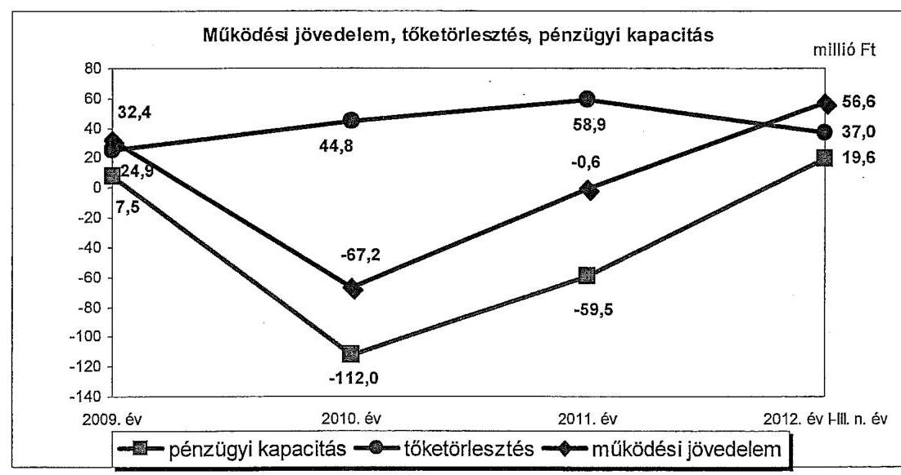
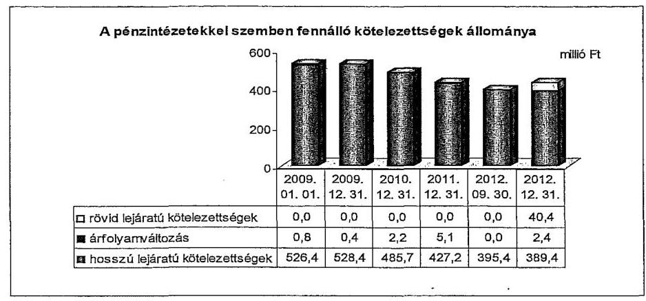
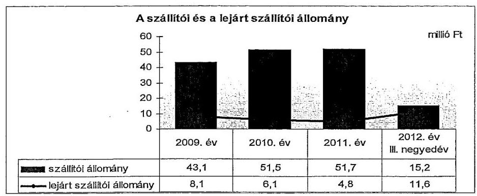
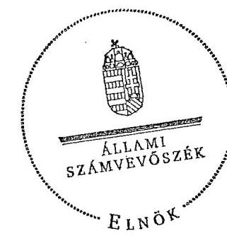
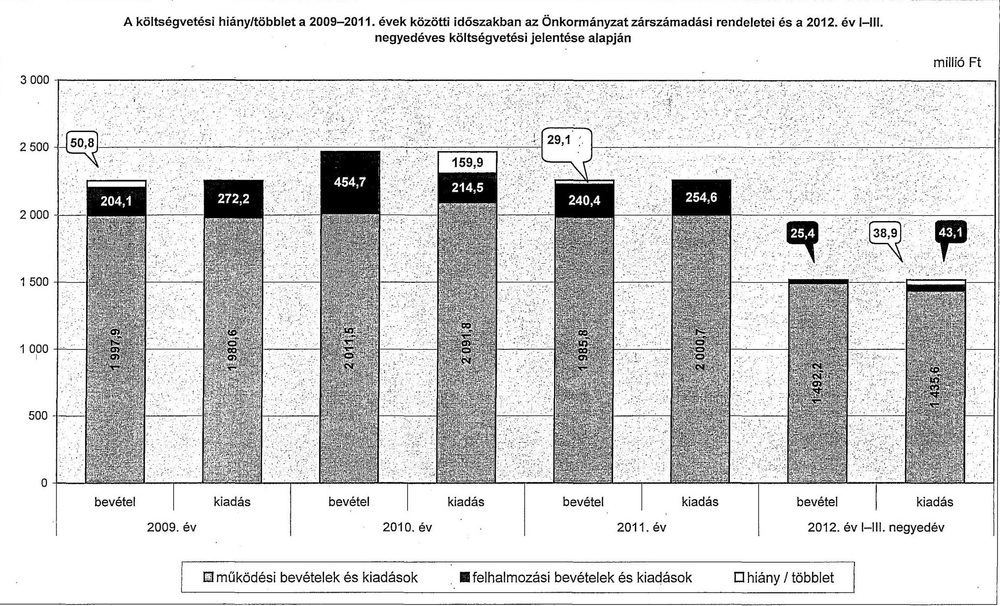
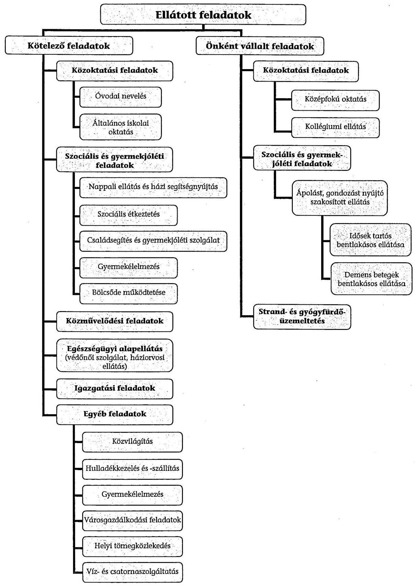

# ÁLLAMI   SZÁMVEVŐSZÉK 

## JELENTÉS

Tiszaföldvár Város Önkormányzata pénzügyi gazdálkodási helyzetének, szabályosságának ellenőrzéséről

---

# Állami Számvevőszék 

Iktatószám: V-0030-343-016/2013.
Témaszám: 1069
Vizsgálat-azonosító szám: V059217

## Az ellenőrzést felügyelte:

## Renkó Zsuzsanna

felügyeleti vezető

## Az ellenőrzést vezette:

## Dér Lívia

ellenőrzésvezető

## Az ellenőrzést végezték:

## Gál Magdolna

számvevő

## Deli Gáborné

számvevő tanácsos

## Terbe Mónika

számvevő tanácsos

## Szöllősiné Hrabóczki

Etelka
számvevő tanácsos

---

# TARTALOMJEGYZÉK 

BEVEZETÉS ..... 3
I. ÖSSZEGZŐ MEGÁLLAPÍTÁSOK, KÖVETKEZTETÉSEK, JAVASLATOK ..... 6
II. RÉSZLETES MEGÁLLAPÍTÁSOK ..... 13

1. Az Önkormányzat kötelező és önként vállalt feladatai, a feladatellátás szervezeti keretei ..... 13
2. Az Önkormányzat pénzügyi egyensúlyának fenntartását veszélyeztető kockázatok és az ezek csökkentése érdekében tett intézkedések ..... 14
3. A pénzügyi gazdálkodási folyamatok szabályosságát, megfelelőségét biztosító belső kontrollok ..... 24
4. Az ÁSZ korábbi ellenőrzése során a pénzügyi, gazdálkodási helyzet javítására tett javaslatainak megvalósítása ..... 26

---

# MELLÉKLETEK 

1. számú A költségvetési hiány/többlet a 2009-2011. évek közötti időszakban az Önkormányzat zárszámadási rendeletei és a 2012. év I-III. negyedéves költségvetési jelentése alapján
2. számú Az Önkormányzat bevételei és kiadásai, valamint adósságszolgálata a 2009. év és a 2012. év III. negyedéve között (a CLF módszer szerint)

3/a. számú Az Önkormányzat által a 2009. év és a 2012. év III. negyedéve között megvalósított (múszakilag befejezett) fejlesztések forrásösszetétele
3/b. számú Az Önkormányzat 2012. szeptember 30-án folyamatban lévő fejlesztési feladataihoz kapcsolódó kötelezettségeinek összegzése
3/c. számú Az Önkormányzat által beadott, elbírálás alatti pályázatok forrásaiból megvalósuló fejlesztésekhez kapcsolódó kötelezettségvállalások összegzése
4. számú Az önkormányzati feladatok ellátásában résztvevő gazdasági társaságok egyes kiemelt adatai
5. számú Az Önkormányzat 2012. szeptember 30-án fennálló, hosszú lejáratú adósságot keletkeztető kötelezettségvállalásai
6. számú Az Önkormányzat kötelezettségeinek és egyes kötelezettségvállalásainak 2011. december 31-ei és 2012. szeptember 30-ai tényleges, 2012. december 31-ei várható állománya és a 2013. évben, valamint az azt követő években várható kötelezettségek miatti kiadások

## FÜGGELÉKEK

1. számú Rövidítések jegyzéke
2. számú Fogalomtár
3. számú Az Önkormányzat által ellátott feladatok 2012. szeptember 30-án

---

# JELENTÉS 

## Tiszaföldvár Város Önkormányzata pénzügyi gazdálkodási helyzetének, szabályosságának ellenőrzéséről

## BEVEZETÉS

Az államháztartás helyi szintjén, az önkormányzati alrendszerben az utóbbi években megjelenő gazdálkodási nehézségek, a pénzforgalmi hiány növekedése, az eladósodás az ÁSZ figyelmét a helyi önkormányzatok pénzügyi helyzetére irányította.

Az ÁSZ a 2013. első félévi ellenőrzési tervében foglaltaknak megfelelően az önkormányzatok pénzügyi gazdálkodási helyzetének, szabályosságának ellenőrzésével az önkormányzatok 2011. évben megkezdett helyzetelemzését folytatta. Az ellenőrzés keretében értékeljük az önkormányzatok adósságkezelési és likviditási helyzetét. Bemutatjuk a pénzügyi egyensúly alakulására hatással lévő folyamatokat, feltárjuk az ezekre ható kockázatokat. Értékeljük a pénzügyi egyensúlyi helyzetet befolyásoló döntésmegalapozó, dön-tés-előkészítő eljárások szabályosságát, minősítjük az ezekkel összefüggő belső kontrollok kialakítását, múködését.

Az ellenőrzés eredményének várható hatásaként a megállapításokkal segítséget nyújthatunk az önkormányzatok számára a pénzügyi egyensúly helyreállítása, javítása és fenntartása érdekében szükségessé váló intézkedések megtételéhez.

Az ellenőrzés típusa: szabályszerűségi ellenőrzés.

## Az ellenőrzés célja annak értékelése volt, hogy:

- az ellenőrzött időszakban a kötelező és önként vállalt feladatok ellátását biztosító szervezeti formák változása milyen hatást gyakorolt az Önkormányzat pénzügyi helyzetének alakulására;
- az Önkormányzat pénzügyi - ezen belül múködési és felhalmozási - egyensúlya milyen irányban változott, a változást milyen okok idézték elő, továbbá milyen intézkedéseket tettek a pénzügyi egyensúly biztosítása, illetve javítása érdekében, az intézkedések hatására javult-e az Önkormányzat pénzügyi helyzete;
- a költségvetési kiadások finanszírozása érdekében vállalt, pénzintézetekkel szembeni kötelezettségek hogyan alakultak, a kötelezettségek fennállása miként befolyásolja az Önkormányzat jövőbeli pénzügyi egyensúlyi helyzetét;

---

- az Önkormányzat beazonosította, felmérte, értékelte-e a pénzügyi egyensúlyt befolyásoló pénzügyi kockázatokat, a finanszírozási célú pénzügyi műveletekkel kapcsolatban írtak-e elő kockázatértékelési kötelezettséget;
- az Önkormányzat által kialakított belső kontrollok biztosítják-e a pénzügyi gazdálkodás folyamatainak szabályosságát és eredményességét;
- hasznosultak-e az ÁSZ korábbi ellenőrzése során a pénzügyi, gazdálkodási helyzet javítására tett szabályszerűségi és célszerűségi javaslatok.

Az ellenőrzés a 2009. január 1-jétől 2012. szeptember 30-áig terjedő időszakot ölelte fel. A pénzintézetekkel szembeni kötelezettségek állományára vonatkozóan az ellenőrzés kezdő időpontjaként a 2012. szeptember 30-án fennálló kötelezettségek keletkezésének időpontját vettük figyelembe. A jövőbeni kötelezettségek megállapításakor az adósságkonszolidáció hatását is értékeltük.

Az ellenőrzés szakmai módszertana az ÁSZ Ellenőrzési Elvek és Standardokban foglalt szakmai szabályokon alapult, amely a Legfőbb Ellenőrző Intézmények Nemzetközi Szervezete (INTOSAI) által kiadott nemzetközi standardok (ISSAI) figyelembevételével készült.

Az ellenőrzés során használt rövidítéseket az 1. számú, az egyes fogalmak magyarázatát a 2. számú függelék tartalmazza.

Az ellenőrzés jogszabályi alapját az ÁSZ tv. 1. § (3) bekezdésének, 5. § (2)-(6) bekezdéseinek, valamint az Áht. 2 61. § (2) bekezdésének előírásai képezik.

Az Országgyűlés 2012 végén a helyi önkormányzatok adósságállományának részleges konszolidációjáról döntött. Az 5000 fő lakosságszámot meg nem haladó települési önkormányzatok számára nyújtott törlesztési célú támogatással ${ }^{1}$ lehetővé tették a 2012. december 12-én fennálló adósságállományuk és annak 2012. december 28-áig számított járulékai teljes megfizetését. Az 5000 fő lakosságszám feletti települések esetében a 2013. évben az állam differenciált az adóerő-képességet figyelembe vevő, $40-70 \%$-ig terjedő - mértékben vállalja át ${ }^{2}$ az önkormányzat 2012. december 31-i, az átvállalás időpontjában fennálló adósságállományát és annak járulékait. Az adósságkonszolidációs intézkedéssel egyidejűleg a Kormány elrendelte ${ }^{3}$ az önkormányzatok adósságállománya újratermelődésének megakadályozása céljából a hitelengedélyezési és a likvid hitelekre vonatkozó szabályozás szigorítását.

Tiszaföldvár Város Önkormányzata lakónépességére tekintettel a 2013. évi adósságátvállalásban érintett. A pénzügyi egyensúlya jövőbeni alakulását befolyásoló, az ellenőrzött időszakban fennállt kockázatokra az ellenőrzés idősza-

[^0]
[^0]:    ${ }^{1}$ Magyarország 2012. évi központi költségvetéséről szóló 2011. évi CLXXXVIII. törvény 76/C. §-a (belktatta a 2012. évi CLXXXVII. törvény 8. §-a, hatályos 2012. XII. 6-tól)
    ${ }^{2}$ Magyarország 2013. évi központi költségvetéséről szóló 2012. évi CCIV. törvény 7276. §-ai
    ${ }^{3}$ 1540/2012. (XII. 4.) Korm. határozat a helyi önkormányzatok adósságállományának részleges konszolidációjáról

---

kában tett megállapításaink - a pénzintézetekkel szembeni kötelezettségekkel összefüggésben feltárt kockázatok kivételével - az adósságkonszolidációt követően is helytállóak és időszerűek.

Tiszaföldvár város lakosainak száma 2012. január 1-jén 11120 fő volt, amely 428 fővel kevesebb a 2009. január 1-jei lakosságszámhoz képest. Az Önkormányzat a 2011. évben 2226,1 millió Ft költségvetési bevételt ért el és 2255,2 millió Ft költségvetési kiadást teljesített. A 2011. december 31-i könyvviteli mérleg szerint az eszközök értéke 4681,1 millió Ft volt, amely a 2009. év végi állományhoz viszonyítva $2,2 \%$-kal, 98,7 millió Ft-tal növekedett a fejlesztések következtében. A 2011. évben az eszközök közül a tárgyi eszközök állománya 4463,7 millió Ft, a forgóeszközök állománya 115,5 millió Ft volt. A három legnagyobb bekerülési költségű fejlesztés a belterületi kerékpárút építése, az utak szilárd burkolattal történő ellátása és az informatikai infrastruktúra fejlesztése volt.

Az ÁSZ tv. 29. § (1) bekezdése szerint a jelentéstervezetet megküldtük a polgármester részére, aki az ÁSZ tv. 29. § (2) bekezdésében foglalt észrevételezési jogával nem élt, a jelentéstervezetre észrevételt nem tett.

---

# I. ÖSSZEGZŐ MEGÁLLAPÍTÁSOK, KÖVETKEZTETÉSEK, JAVASLATOK 

Tiszaföldvár Város Önkormányzatának pénzügyi egyensúlya az ellenőrzött időszakban rövid távon nem volt biztosított. A 2013. évi, részleges adósságkonszolidáció eredményeként az Önkormányzat pénzügyi egyensúlyi helyzete javulni fog, azonban az ellenőrzött időszak jövedelemtermelő képessége alapján, a képződő bevételek a feladatok ellátásához szükséges kiadásokat, valamint a jövőbeni kötelezettségek terhelt várhatóan nem fogják fedezni.

Az Önkormányzat pénzügyi helyzetét a CLF módszer alapján számított mutatók figyelembevételével értékeltük. Pénzügyi kapacitásának a 2009. év és 2012. év III. negyedéve közötti változását az alábbi ábra mutatja be:

Az Önkormányzat az ellenőrzött időszakban összesen 8411,8 millió Ft költségvetési bevételt ért el és 8292,9 millió Ft költségvetési kiadást teljesített. Múködési költségvetésének egyenlege 2009-ben és a 2012. év I-III. negyedévben pozitív, a 2010-2011. években negatív volt. Az időszak egészét tekintve a múködési jövedelem összességében 21,2 millió Ft többletet mutatott. A múködési jövedelem alakulását elsősorban az Önkormányzat költségvetési támogatásának folyamatos csökkenése befolyásolta, amelyet az egyéb folyó bevételek növekedése nem ellensúlyozott.

Az Önkormányzat 2009-2010-ben a működőképességének megőrzését szolgáló (ÖNHIKI) támogatásban nem részesült, 2011-ben 104,5 millió Ft, a 2012. év IIII. negyedévben 47,6 millió Ft, összesen 152,1 millió Ft ÖNHIKI támogatást kapott. Az ÖNHIKI támogatás nélkül a folyó költségvetés egyenlege 2011ben 105,1 millió Ft hiányt mutatott volna, ami bevételi kitettség miatti kockázatot jelez. A 2012. év I-III. negyedévben az ÖNHIKI támogatás nélkül számított múködési jövedelem pozitív ( 9,0 millió Ft) maradt. A múködési jövedelemtermelő képesség miatti kockázat a 2010-2011. években fennállt,

---

mivel a múködési jövedelem - 2011-ben az ÖNHIKI támogatással is - negatív összegű volt.

A felhalmozási költségvetés egyensúlya az ellenőrzött időszakban, a 2010. év kivételével, nem állt fenn. A 2010. évi, kiugróan magas - a lakosság által útépítési hozzájárulásként az Önkormányzatra engedményezett lakástakarékpénztári befizetésekből adódó - pozitív egyenleg miatt 97,7 millió Ft felhalmozási forrástöbblet keletkezett. A felhalmozási költségvetési egyenleg változását egyes pályázatok elhúzódása okozta.

Az Önkormányzatnál a feladatellátás szervezeti formái nem változtak, így nem gyakoroltak hatást a pénzügyi egyensúlyi helyzet alakulására. A 2009. év és a 2012. év III. negyedéve között a kialakított szervezeti keretek biztosították a kötelező és önként vállalt feladatok ellátását. Az ellenőrzött időszakban bevételnövelő és kiadáscsökkentő intézkedéseket tettek (eszközök hasznosítása, hivatali és intézményi átszervezéssel összefüggő létszámcsökkentés, többletjuttatások és költségtérítések csökkentése, központosított beszerzés). Az Önkormányzat adatszolgáltatása szerint ezen intézkedések összesen 120,1 millió Ft - ebből tartós jellegű 115,1 millió Ft - megtakarítást, illetve többletbevételt eredményeztek, amely javította a pénzügyi egyensúlyt, azonban annak hosszú távú fenntartásához nem nyújt elegendő forrást.

Az alacsony jövedelemtermelő képesség miatt az Önkormányzatnál fennállt még:

- az önként vállalt feladatok miatti kockázat: az ellenőrzött időszak alatt növekedett az önként vállalt feladatokra fordított múködési kiadás öszszege (2009-ben 335,6 millió Ft, 2011-ben 350,8 millió Ft) és a működési kiadásokon belüli aránya (2009-ben 16,9\%, 2011-ben 17,7\%), ennek ellenére nem értékelték, hogy ez a növekedés milyen hatással van a pénzügyi egyensúlyi helyzetre;
- a lejárt szállítói állomány miatti nemfizetési kockázat: az Önkormányzat szállítói állománya a 2009. évi 43,1 millió Ft-ról - a 2010-2011. évekbeli folyamatos növekedést követően - a 2012. év III. negyedév végére 27,9 millió Ft-tal ( $64,7 \%$-kal) csökkent. A szállítói állományon belül azonban a lejárt kötelezettségek összege és aránya a 2009. évi 8,1 millió Ft-ról, $18,8 \%$-ról a 2012. év III. negyedév végére 11,6 millió Ft-ra, $76,3 \%$-ra nőtt. A 2012. szeptember 30-ai lejárt szállítói állomány az időszak havi átlagos dologi kiadásának ( 38,6 millió Ft-nak) közel egyharmadát tette ki;
- a fejlesztések során létrejött létesítmények jövőbeni üzemeltetésének kockázata: az ellenőrzött időszakban befejezett beruházásokhoz kapcsolódóan a jövőbeni üzemeltetési és fenntartási költségekről az Önkormányzat három esetben, a folyamatban lévő fejlesztéseknél egy esetben nem készített számítást.

Az Önkormányzat pénzintézetekkel szembeni kötelezettségeinek állománya a 2009. január 1-jei 527,2 millió Ft-ról a 2012. év III. negyedév végére 395,4 millió Ft-ra csökkent, a 2012. év végére - a folyószámlahitel állománya miatt - 432,2 millió Ft-ra nőtt. A hosszú lejáratú, pénzintézettel szembeni kötelezettségek állománya a 2009-2012. évek között folyamatosan csökkent, az

---

összesen 36,5 millió Ft hitel-igénybevétel mellett teljesített, 173,5 millió Ft hiteltörlesztés eredményeként. A folyószámlahitel keretösszege, napi átlagos állománya és az igénybevétel napjainak száma 2011-től jelentősen növekedett, amely a likviditás és a rövid távú pénzügyi egyensúly kedvezőtlen irányú változását jelezte. A folyószámlahitel állandósulása miatt fennállt a banki kitettség kockázata. Az Önkormányzatnak az ellenőrzött időszakban három PPP-szerződésből származó kötelezettségvállalása volt. A tizenhárom éves futamidőre kötött szerződésekben - a 2007. és 2008. évi szerződéskötéskor érvényes díjak alapján - összesen 237,0 millió Ft kötelezettséget vállaltak, mely mérlegen kívüli kockázatot jelent.

Az Önkormányzatnak az ellenőrzött időszak végén 369,8 millió Ft és 18,3 ezer CHF, valamint 66,7 ezer EUR pénzintézettel szembeni, továbbá 205,7 millió Ft PPP-szerződésekben vállalt hosszú lejáratú és összesen 39,0 millió Ft szállítói és egyéb rövid lejáratú kötelezettsége állt fenn. A 2012. év végén várható pénzintézeti kötelezettség 409,9 millió Ft és 17,2 ezer CHF, valamint 62,5 ezer EUR, a PPP-szerződésekből eredő kötelezettség 203,8 millió Ft. A szállítói állomány várható összege 66,2 millió Ft, az egyéb kötelezettségeké 23,8 millió Ft.

A 2013. évi adósságkonszolidációt követően fennmaradó pénzintézeti kötelezettségek és a lejárt esedékességú szállítói tartozások a továbbiakban is nemfizetési, a fennálló, PPP-szerződésekből eredő kötelezettségek mérlegen kívüli kockázatot jelentenek. Az Önkormányzat a jövőbeni kötelezettségei teljesítéséhez felhasználható elkülönített tartalékkal nem rendelkezik, ezért a múködési egyensúly megteremtése nélkül a likvid hitelállomány újratermelődésének kockázata fennáll.

A pénzügyi egyensúlyra kiható kockázatok beazonosítása, felmérése, értékelése, ezáltal kezelése - a 2009. évben az Ámr. ${ }_{1}$-ben, a 2010-2011. években az Ámr. ${ }_{2}$-ben, a 2012. év I-III. negyedévben a Bkr.-ben foglalt előírások ellenére - elmaradt. Annak ellenére maradt el a kockázatok kezelése, hogy az ellenőrzött időszakban fennállt a múködési jövedelemtermelő képesség miatti kockázat, az ÖNHIKI támogatásból adódó bevételi kitettség miatti kockázat, az önként vállalt feladatok miatti múködési kockázat, a fejlesztések során létrejött létesítmények jövőbeni üzemeltetése miatti kockázat, a folyószámlahitel állandósulása okán a banki kitettség kockázata, a lejárt szállítói állományból adódó nemfizetési kockázat, a jövőbeli várható kötelezettségek teljesíthetősége miatti kockázat, valamint a PPP-szerződésekből származó kötelezettségvállalások kapcsán a mérlegen kívüli kockázat. Nem írták elő a finanszírozási célú pénzügyi műveletekkel kapcsolatban a kockázatértékelési kötelezettséget.

Az Önkormányzatnál a pénzügyi gazdálkodási folyamatok szabályossága, megfelelősége vonatkozásában a kockázatok kezelését biztosító belső kontrolltevékenységek kialakítása - a 2009. évben az Ámr., a 2010-2011. években az Ámr. ${ }_{2}$, a 2012. év I-III. negyedévben a Bkr. előírásai ellenére részben volt megfelelő, mert nem írták elő a feladat átadás-átvételre vonatkozóan a döntés-előkészítés folyamatában annak értékelését, hogy a döntés milyen hatással bír a kötelező és önként vállalt feladatokra fordított kiadások arányára, ezzel együtt a pénzügyi egyensúlyi helyzetre. Nem írták elő továbbá

---

az Önkormányzat fizetőképességének és eladósodásának kezelését szolgáló stratégia, koncepció vagy egyéb belső szabályozás készítésének kötelezettségét, valamint a pénzintézeti kötelezettségvállalások kockázatai döntés-előkészítési szakaszban történő feltárásának kötelezettségét.

Az Önkormányzatnál a feladatellátás szabályosságát, a pénzügyi egyensúlyi helyzet alakulását befolyásoló és a pénzügyi gazdasági döntések megalapozását szolgáló belső kontrollok múködése jó volt annak ellenére, hogy nem teljes körűen mérték fel a pénzintézeti kötelezettségvállalások kockázatait, és nem teljes körűen tárták fel a fejlesztéseket megelőzően a működtetés kockázatait. Összességében a kialakított belső kontrollok biztosították a pénzügyi gazdálkodási folyamatok eredményességét.

Az Önkormányzat az SZMSZ-ében nem sorolta az önként vállalt feladatok közé a strand- és gyógyfürdő üzemeltetését annak ellenére, hogy az Ötv. ezen feladatot az önkormányzatok által kötelezően ellátandó feladatként nem tartalmazta, amiből következően a strand- és gyógyfürdő üzemeltetése önként vállalt feladatnak minősül.

Az Önkormányzatnak devizában nyilvántartott, hosszú lejáratú kötelezettsége, valamint a lízingdíj teljesítése során az árfolyam változása miatt realizált árfolyamvesztesége keletkezett. A devizában fennálló hiteltartozás törlesztő részletei és a lízingdíj után pénzügyileg realizált árfolyamveszteség összegét - a főkönyvi könyvelésben az Áhsz.-ben foglalt előírások ellenére - a folyó kiadások között elkülönítetten nem mutatták ki.

A költségvetési és zárszámadási rendeletekben a többéves kihatással járó kötelezettségvállalások között, az Áht. ${ }_{1}$-ben foglaltak ellenére, nem mutatták be a PPP-szerződésekből eredő kötelezettségvállalás évenkénti összegét.

Az ÁSZ az Önkormányzat gazdálkodási rendszerét a 2009. évben ellenőrizte, melynek során kilenc szabályszerűségi és két célszerűségi javaslatot tett. Az Önkormányzat adatszolgáltatása szerint a javaslatokat 100\%-ban hasznosították. A pénzügyi gazdálkodási helyzet javításához hét szabályszerűségi javaslat kapcsolódott, melyeket az intézkedési tervben előírt határidőre megvalósítottak.

Az ÁSZ tv. 33. § (1) bekezdésében foglaltak értelmében az ellenőrzött szerv vezetője köteles a jelentésben foglalt megállapításokhoz kapcsolódó intézkedési tervet összeállítani, és azt a jelentés kézhezvételétől számított harminc napon belül az ÁSZ részére megküldeni. Amennyiben az intézkedési tervet határidőn belül nem küldi meg a szervezet vezetője, vagy az továbbra sem elfogadható, az ÁSZ elnöke a hivatkozott törvény 33. § (3) bekezdés a-b) pontjaiban foglaltakat érvényesítheti.

# Az ellenőrzés intézkedést igénylő megállapításai és javaslatai: 

## a polgármesternek

1. Az Önkormányzat múködési jövedelme 2010-ben és - az ÖNHIKI támogatás ellenére - a 2011. évben is negatív volt. A 2012. év I-III. negyedévben képződött 56,6 millió Ft müködési jövedelem döntően a 47,6 millió Ft ÖNHIKI támogatás

---

eredménye. Az alacsony jövedelemtermelő képességből adódóan az önként vállalt feladatokra fordított működési kiadások aránya és növekvő összege kockázatot jelentett. Az adósságszolgálat kiadásaira a működési jövedelem 2010. és 2011. között nem, 2012. I-III. negyedévben az ÖNHIKI támogatás révén nyújtott fedezetet. A folyószámlahitel napi átlagos állománya a 2010. évtől folyamatosan emelkedett. Az ellenőrzött időszak végén fennálló, forintalapú pénzintézeti kötelezettség 369,8 millió Ft, a devizahitel állománya 18342 CHF , valamint 66703 EUR , a szállítói tartozás 15,2 millió Ft (ebből a lejárt tartozás: 11,6 millió Ft) és a PPP szerződések miatti kötelezettség 205,7 millió Ft volt. Az adósságkonszolidációt követően a fennmaradó kötelezettségek jövőbeni teljesíthetősége várhatóan rövid távon nem biztosított. Az eddig tett kiadáscsökkentő és bevételnövelő intézkedések nem biztosítottak elegendő forrást a pénzügyi egyensúly helyreállításához, hosszú távú fenntarthatóságához. A jövőbeni kötelezettségek teljesítéséhez felhasználható, elkülönített tartalékkal az Önkormányzat nem rendelkezik.

Javaslat:
A működési jövedelemtermelő képesség és a feladatellátás összhangja, valamint az Önkormányzat pénzügyi egyensúlyának helyreállítása, hosszú távú fenntarthatósága érdekében - a 2013. évi kormányzati adósságkonszolidációt, valamint a 2013. évtől változó feladat-ellátási kötelezettséget, feladatfinanszírozási rendszert figyelembe véve - felelősök és határidők megjelölésével kezdeményezzen intézkedéseket, melyek keretében:
a) a költségvetési rendelettervezet, valamint annak évközi módosítása előterjesztését megelőzően mérjék fel a bevételszerző, kiadáscsökkentő lehetőségeket, és terjessze a Képviselő-testület elé a bevételek növelését, a kiadások csökkentését célzó intézkedések bevezetéséhez szükséges - a Htv. 140. § (1) bekezdés a) pontja alapján a jegyző által elkészített - döntési javaslatát;
b) terjesszen a Képviselő-testület elé jóváhagyásra - a Htv. 140. § (1) bekezdés a) pontja alapján a jegyző által elkészített - az Önkormányzat gazdasági helyzetének elemzésén alapuló, a pénzügyi egyensúlyi helyzet gyors helyreállítását, hoszszú távú megőrzését és az adósságállomány újratermelődésének elkerülését biztosító intézkedéseket tartalmazó reorganizációs programot;
c) az adósságkonszolidációt követően fennmaradó kötelezettségek jövőbeni teljesítése, a fizetőképesség megőrzése érdekében terjesszen a Képviselő-testület elé a Htv. 140. § (1) bekezdés a) pontja alapján a jegyző által elkészített - döntési javaslatot, amelyben a Képviselő-testület kötelezettséget vállal arra, hogy előre meghatározott összegben és módon a realizált többletbevételeket, a meglévő és a jövőben képződő tartalékokat mindaddig a kötelezettségek rendezésére fordítja, amíg az Önkormányzat pénzügyi egyensúlya rövid távon veszélyeztetett;
d) a szállítói kitettség és a helyi önkormányzatok adósságrendezési eljárásáról szóló 1996. évi XXV. törvény 4-9. §-aiban szabályozott adósságrendezési eljárás megindításának elkerülése érdekében, meghatározott gyakorisággal számoljon be a Képviselő-testületnek az Önkormányzat lejárt szállítói állománya alakulásáról; intézkedjen a szállítói számlák esedékesség szerinti kiegyenlítéséről vagy a lejárt tartozások átütemezéséről;

---

e) vizsgáltassa felül az önként vállalt feladatok finanszírozhatóságát a kötelező feladatellátás elsődlegességének biztosítása érdekében, és ennek függvényében tegyen javaslatot a Képviselő-testületnek a feladatellátás racionalizálására.
2. Az Önkormányzat SZMSZ-ében a strand és gyógyfürdő üzemeltetését nem sorolta az önként vállalt feladatai közé, annak ellenére, hogy az Ötv. 8. § (4) bekezdésében ${ }^{4}$ foglalt előírások szerint az nem minősül kötelező feladatnak.

Javaslat:
Terjessze a Képviselő-testület elé az Önkormányzat SZMSZ-ének a Mötv. 13. § (1) bekezdésében foglalt előírásoknak megfelelő - a jegyző által előkészített - a strand és gyógyfürdő üzemeltetési feladatok önként vállalt feladatként történő meghatározását tartalmazó módosítását.

# a jegyzőnek 

1. Az Önkormányzatnál a devizában fennálló hosszú lejáratú hitel törlesztő részletei, valamint a devizaalapú lízingdíjak megfizetése során az ellenőrzött időszakban pénzügyileg realizált árfolyamveszteség keletkezett, melynek összegét a főkönyvi könyvelésben az Áhsz. 9. számú melléklet számlaosztályok tartalmára vonatkozó előírásai 4. d) pontjában és a 9. c) pontjában foglalt előírással ellentétben a folyó kiadások között elkülönítetten nem mutatták ki.

Javaslat:
Intézkedjen, hogy a devizában fennálló kötelezettségek jövőbeni törlesztése során a pénzügyileg realizált árfolyam-különbözet elszámolása, amennyiben az árfolyamveszteség, az Áhsz. 9. számú melléklet számlaosztályok tartalmára vonatkozó előírásai 4. dl) és a 9. c) pontjában foglalt előírásoknak megfelelően történjen. Amennyiben a pénzügyi teljesítés napján árfolyamnyereség keletkezik, azt az Áhsz. 9. számú melléklet számlaosztályok tartalmára vonatkozó előírásai 14. a) pontjában foglalt előírás szerint számolják el a főkönyvi könyvelésben.
2. A költségvetési és zárszámadási rendeletekben a többéves kihatással járó kötelezettségvállalások között a PPP szerződésekből eredő kötelezettségvállalást az Áht. 1 118. § (1) bekezdés 2. b) és a (2) bekezdés 2. d) pontjaiban ${ }^{5}$ foglaltak ellenére nem mutatták be.

Javaslat:
Intézkedjen, hogy a költségvetési és zárszámadási rendelettervezetekben az Áht. ${ }_{2}$ 24. § (4) bekezdés b) pontjában és a 91. § (2) bekezdés a) pontjában előírtak szerint teljes körűen mutassák be a többéves kihatással járó kötelezettségvállalásokat.

[^0]
[^0]:    ${ }^{4}$ Hatálytalan 2013. január 1-jétől, a 2013. január 1-jétől hatályos jogszabályi előírás: a Mötv. 13. § (1) bekezdése.
    ${ }^{5}$ Hatálytalan 2012. január 1-jétől, a 2012. január 1-jétől hatályos jogszabályi előírás: az Áht. 24. § (4) bekezdés b) pontja és a 91. § (2) bekezdés a) pontja.

---

3. A kockázatkezelési rendszer keretében az ellenőrzött időszakban fennállt, pénzügyi egyensúlyt befolyásoló kockázatok feltárása, beazonosítása, értékelése, ezáltal a kockázatok kezelése - a 2009. évben az Ámr. 1 145/C. §-ában, a 2010-2011. években az Ámr. 2 157. §-ában, a 2012. év I-III. negyedévben a Bkr. 7. § (1)-(2) bekezdéseiben foglalt előírások ellenére - elmaradt. Annak ellenére maradt el a kockázatok kezelése, hogy az ellenőrzött időszakban fennállt a müködési jövedelemtermelő képesség miatti kockázat, az ÖNHIKI támogatásból adódó bevételi kitettség miatti kockázat, az önként vállalt feladatok miatti müködési kockázat, a fejlesztések során létrejött létesítmények jövőbeni üzemeltetése miatti kockázat, a folyószámlahitel tartóssá válásából adódó miatti banki kitettség kockázata, a lejárt szállítói állomány miatti nemfizetési, valamint a jövőbeli várható kötelezettségek teljesíthetősége miatti kockázat és a PPP kötelezettségvállalások miatti mérlegen kívüli kockázat.

Javaslat:
Müködtessen a Bkr. 7. § (1)-(2) bekezdéseiben foglalt előírásoknak megfelelő, a pénzügyi egyensúlyt befolyásoló kockázatok kezelésére alkalmas kockázatkezelési rendszert.
4. Az Önkormányzatnál a pénzügyi gazdálkodási folyamatok szabályossága, megfelelősége vonatkozásában a kockázatok kezelését biztosító belső kontrolltevékenységek kialakítása - a 2009. évben az Ámr. 1 145/E. § (1)-(2) bekezdéseiben, a 2010-2011. években az Ámr. 2 158. § (1)-(2) bekezdéseiben, a 2012. év I-III. negyedévben a Bkr. 8. § (1)-(2) bekezdéseiben foglalt előírások ellenére - részben volt megfelelő, mert a döntés-előkészítés szakaszában nem írták elő annak értékelését, hogy a feladat át-adás-átvételre vonatkozó döntés milyen hatással bír a kötelező és önként vállalt feladatok arányára, ezzel együtt a pénzügyi egyensúlyi helyzetre. Nem írták elő továbbá az Önkormányzat fizetőképességének és eladósodásának kezelését szolgáló stratégia, koncepció, vagy egyéb belső szabályozás készítésének kötelezettségét, valamint a pénzintézeti kötelezettségvállalásokkal kapcsolatos döntések kockázatainak a döntés-előkészítés szakaszában történő feltárását.

Javaslat:
Alakítsa ki a Bkr. 8. § (1)-(2) bekezdései alapján azokat a belső kontrolltevékenységeket, amelyek biztosítják a pénzügyi-gazdálkodási folyamatok szabályosságát, a pénzügyi egyensúlyi helyzet alakulását befolyásoló döntések kockázatainak kezelését. Ennek keretében:
a) írja elő a feladat átadás-átvételre vonatkozó döntések előkészítése során a döntés kötelező és önként vállalt feladatok arányára, ezáltal a pénzügyi egyensúlyi helyzetre gyakorolt hatásának vizsgálatát;
b) készítsen szabályzatot az Önkormányzat fizetőképességének és eladósodásának kezelésére;
c) írja elő a pénzintézeti kötelezettségvállalások kockázatainak döntés-előkészítő szakaszban történő feltárását.

---

# II. RÉSZLETES MEGÁLLAPÍTÁSOK 

## 1. Az ÖNKORMÁNYZAT KÖTELEZŐ ÉS ÖNKÉNT VÁLlALT FELADATAI, A FELADATELLÁTÁS SZERVEZETI KERETEI

Az Önkormányzat az Ötv. előírásai alapján az SZMSZ-ében határozta meg a kötelező és az önként vállalt feladatait, amelyek az ellenőrzött időszakban nem változtak. Az Önkormányzat kötelező feladatai az óvodai nevelés, az általános iskolai oktatás, a nappali ellátás, a házi segítségnyújtás, a szociális étkeztetés, a családsegítés, a gyermekjóléti szolgálat, a bölcsőde múködtetése, valamint a közmúvelődési, egészségügyi alapellátási, az igazgatási és egyéb feladatok ellátása voltak. Önként vállalt feladatként látták el a középfokú oktatást, a kollégiumi ellátást, valamint az ápolást és a gondozást nyújtó szakosított ellátást. Az Önkormányzat az SZMSZ-ében nem sorolta az önként vállalt feladatok közé a strand- és gyógyfürdő üzemeltetését annak ellenére, hogy az önkormányzatok által kötelezően ellátandó feladatokat meghatározó - Ötv. 8. § (4) bekezdése ${ }^{6}$ ezen feladatot nem tartalmazta, amiből következően a strand és gyógyfürdő üzemeltetése önként vállalt feladatnak minősül. (A feladatellátás részletezését a 3. számú függelék tartalmazza).

Az Önkormányzatnál 2009-ben az összes múködési célú költségvetési kiadás 83,1\%-át ( 1648,8 millió Ft-ot), 2010-ben 83,6\%-át ( 1737,3 millió Ft-ot), 2011ben $82,3 \%$-át ( 1635,5 millió Ft-ot) a kötelező feladatokra fordított kiadások tették ki. Az önként vállalt feladatokra a múködési kiadásoknak 2009-ben az 16,9\%-át (335,6 millió Ft-ot), 2010-ben a 16,4\%-át ( 341,4 millió Ft-ot), 2011ben a $17,7 \%$-át ( 350,8 millió Ft-ot) használták fel. Az alacsony múködési jövedelemtermelő képességre tekintettel az önként vállalt feladatok ellátása kockázatot jelentett, mivel az ellenőrzött időszak alatt az e feladatokra felhasznált múködési kiadások összege és - 2009. és 2011. között - a múködési kiadáson belüli aránya emelkedett. Az Önkormányzat nem értékelte ezen változások pénzügyi egyensúlyi helyzetre gyakorolt hatását.

Az ellenőrzött időszakban - az Önkormányzat által szolgáltatott adatok alapján - az önként vállalt feladatokra 13,5 millió Ft felhalmozási kiadást ${ }^{7}$ fordítottak, melynek összes felhalmozási kiadáson belüli aránya 1,7\% volt. Az önként vállalt feladatokhoz kapcsolódó felhalmozási kiadások, alacsony arányuk alapján, nem jelentettek kockázatot.

Az Önkormányzat 2012. szeptember 30-án 12 költségvetési szervet tartott fenn, a három önállóan múködő és gazdálkodó, valamint a kilenc önállóan múködő költségvetési szerv 20 telephellyel rendelkezett. Az egészségügyi feladatok körébe tartozó háziorvosi ellátást és védőnői szolgálatot egyéni vállalkozás útján biztosították. Az egyéb feladatokat (közvilágítás, hulladékkezelés és -szállítás,

[^0]
[^0]:    ${ }^{6}$ Hatálytalan 2013. január 1-jétől, új jogszabályhely Mötv. 13. § (1) bekezdése.
    ${ }^{7}$ fejlesztési feladat megvalósítására 11,0 millió Ft, hitelkamat teljesítésére 2,5 millió Ft

---

gyermekélelmezés, városgazdálkodási feladatok, helyi tömegközlekedés, víz- és csatornaszolgáltatás, strand és gyógyfürdő üzemeltetése) hat gazdasági társasággal, feladatellátási szerződések alapján látták el. A feladatokat ellátó költségvetési szervek és gazdasági társaságok száma az ellenőrzött időszakban nem változott.

Az Önkormányzat kizárólagos tulajdonában 2012. szeptember 30-án egy gazdasági társaság, a Városüzemeltető Kft. volt. Az ellenőrzött időszakban a Városüzemeltető Kft. állományából 38 fő technikai alkalmazottat szerveztek vissza az önkormányzati fenntartású intézmények állományába. A létszámhoz tartozó kiadások forrását korábban is az Önkormányzat biztosította pénzeszközátadásként, így a pénzügyi helyzetére ez nem volt hatással. A strandfürdő üzemeltetési feladata 2011. október 1-jén a Városüzemeltető Kft.-hez került a - szintén kizárólagos önkormányzati tulajdonú, 2011 decemberében értékesített Tiszaföldvári Víz- és Csatornamú Kft.-től. A pénzügyi helyzetre ez sem gyakorolt hatást, mivel a feladatellátásért mindkét gazdasági társaság - támogatási szerződés alapján - azonos összegű támogatást kapott. A víz- és csatornaszolgáltatást 2012-től külső gazdasági társaság végezte.

Az ellenőrzött időszakban végrehajtott hivatali és intézményi átszervezés hatására - az Önkormányzat adatszolgáltatása szerint - az álláshelyek száma 25 -tel, a telephelyek száma néggyel (24-ről 20-ra) csökkent.

Az Önkormányzat által a 2009. év és a 2012. év III. negyedéve között kialakított szervezeti keretek biztosították a kötelező és az önként vállalt feladatok ellátását, de az Önkormányzat nem elemezte a választott szervezeti megoldás hatékonyságát, annak a pénzügyi egyensúlyi helyzetére gyakorolt hatását. Az ellenőrzött időszakban a kötelező és önként vállalt feladatok ellátását biztosító szervezeti formák nem változtak, így nem gyakoroltak hatást a pénzügyi egyensúlyi helyzet alakulására.

# 2. Az ÖNKORMÁNYZAT PÉNZÜGYI EGYENSÚLYÁNAK FENNTARTÁSÁT VESZÉLYEZTETŐ KOCKÁZATOK ÉS AZ EZEK CSÖKKENTÉSE ÉRDEKÉBEN TETT INTÉZKEDÉSEK 

Az ellenőrzött időszakban az Önkormányzat stratégiával, koncepcióval vagy programmal nem rendelkezett, nem határozták meg a pénzügyi egyensúly biztosítása, illetve helyreállítása, a fizetőképesség megőrzése érdekében rövid és hosszú távon elérni kívánt célokat.

---

Az Önkormányzat költségvetésének elemzését CLF módszerrel hajtottuk végre. A CLF módszer szerinti 2009. év és 2012. év III. negyedéve közötti részletes adatokat a 2. számú melléklet, a főbb önkormányzati adatokat a következő tábla mutatja be:

|  |  |  |  | millió Ft |
| :--: | :--: | :--: | :--: | :--: |
| Megnevezés | 2009. év | 2010. év | 2011. év | 2012. év   1-III. n. év |
| Folyó bevételek | 2016,8 | 2011,5 | 1985,7 | 1492,2 |
| Folyó kiadások | 1984,4 | 2078,7 | 1986,3 | 1435,6 |
| Müködési jövedelem | 32,4 | $-67,2$ | $-0,6$ | 56,6 |
| Felhalmozási bevételek | 185,1 | 454,7 | 240,4 | 25,4 |
| Felhalmozási kiadások | 268,3 | 227,6 | 268,9 | 43,1 |
| Felhalmozási költségvetés egyenlege | $-83,2$ | 227,1 | $-28,5$ | $-17,7$ |
| Folyó és felhalmozási bevételek összesen | 2201,9 | 2466,2 | 2226,1 | 1517,6 |
| Folyó és felhalmozási kiadások összesen | 2252,7 | 2306,3 | 2255,2 | 1478,7 |
| Finanszirozási múveletek nélküli pozíció | $-50,8$ | 159,9 | $-29,1$ | 38,9 |
| Finanszírozási műveletek egyenlege | 60,5 | $-99,4$ | $-54,1$ | $-37,0$ |
| Tárgyévi pénzügyi pozíció | 9,7 | 60,5 | $-83,2$ | 1,9 |
| Hiteltörlesztés, értékpapír beváltás | 24,9 | 44,8 | 58,9 | 37,0 |
| Nettó müködési jövedelem | 7,5 | $-112,0$ | $-59,5$ | 19,6 |

Az ellenőrzött időszakban az Önkormányzat összesen 8411,8 millió Ft költségvetési bevételt ért el és 8292,9 millió Ft költségvetési kiadást teljesített. Folyó költségvetési egyenlege, múködési jövedelme a 2009. évben és a 2012. év I-III. negyedévben pozitív, a 2010-2011. években negatív volt. Az időszak egészét tekintve a működési jövedelem összességében 21,2 millió Ft többletet mutatott. A múködési jövedelem alakulását elsősorban a folyó bevételek azokon belül a költségvetési támogatás folyamatos csökkenése - befolyásolták, amit az egyéb bevételek növekedése nem ellensúlyozott.

A 2009. évi pozitív múködési jövedelemben meghatározó volt a helyi adók eredeti előirányzatot ( 19,7 millió Ft-tal) meghaladó teljesítése és az áfa visszaigénylésből származó 8,0 millió Ft bevétel.

Az Önkormányzat 2011-ben 104,5 millió Ft, a 2012. év I-III. negyedévben 47,6 millió Ft, összesen 152,1 millió Ft, müködőképességének megőrzését szolgáló (ÖNHIKI) támogatásban részesült. Az ÖNHIKI támogatás nélkül a folyó költségvetés egyenlege 2011-ben 105,1 millió Ft hiányt mutatott volna, ami bevételi kitettség kockázatot jelez. A 2012. év I-III. negyedévben azonban az ÖNHIKI támogatás nélkül számított múködési jövedelem pozitív ( 9,0 millió Ft) maradt. A múködési jövedelemtermelő képesség miatti kockázat a 2010-2011. években fennállt, mivel a múködési jövedelem -2011-ben ÖNHIKI támogatással is - negatív összegű volt.

A nettó múködési jövedelem (pénzügyi kapacitás) a 2009. évi 7,5 millió Ftos többletet követően 2010-ben ( 112,0 millió Ft) és 2011-ben ( 59,5 millió Ft) hiányt mutatott, a 2012. év III. negyedév végére ismét pozitív ( 19,6 millió Ft) volt. A pénzügyi kapacitás módosulását döntően a múködési jövedelem határozta meg, de a hiteltörlesztés összegének változása - a 2009-2011 közötti növekedése, valamint a 2012. év I-III. negyedévi csökkenése - is befolyásolta.

Az ellenőrzött időszakban a felhalmozási költségvetés egyenlege - a 2010. évi kivételével - negatív volt. A 2009. évi 83,2 millió Ft-os felhalmozási forrás-

---

hiányt az értékpapír értékesítés, a fejlesztési célú hitel és a nettó működési jövedelem együttesen finanszírozták. A 2010. évi 227,1 millió Ft-os pozitív egyenleget - az Önkormányzatra engedményezett - lakossági útépítési hozzájárulásból származó bevétel eredményezte. A forráshiány a 2011. évi 28,5 millió Ft-ról, a 2012. év I-III. negyedévre 17,7 millió Ft-ra csökkent, melyet a nettó működési jövedelem fedezett. Az ellenőrzött időszakban összesen 97,7 millió Ft felhalmozási forrástöbblet keletkezett.

Az Önkormányzat évenkénti teljes finanszírozási igénye ${ }^{8}$ a CLF módszer szerint a 2009. évben 75,7 millió Ft, a 2011. évben 88,0 millió Ft volt. A 2010. évben 115,1 millió Ft, a 2012. év I-III. negyedévben 1,9 millió Ft többlet keletkezett. A költségvetési hiány/többlet alakulását - az Önkormányzat 20092011. évi zárszámadási rendeletei, valamint a 2012. év I-III. negyedéves költségvetési jelentése alapján - az 1. számú melléklet tartalmazza.

A folyó bevételek összege 2009. és 2011. között - csekély mértékben, de - folyamatosan csökkent. A 2009. évi 2016,8 millió Ft-ról 2010-re 0,3\%-kal (2011,5 millió Ft-ra), 2011-re 1,3\%-kal (1985,7 millió Ft-ra) mérséklődött az előző évihez képest. Ebben döntő szerepe volt a költségvetési támogatás és az szja folyamatos és növekvő mértékủ csökkenésének. A 2009. évi 1572,0 millió Ft-ról 2010-ben 15,5 millió Ft-tal ( $1,0 \%$-kal), 2011-ben - az ÖNHIKI támogatás ellenére - további 76,6 millió Ft-tal ( $4,9 \%$-kal) csökkent e két bevételi jogcím együttes összege. A 2012. év I-III. negyedévben - az ÖNHIKI támogatással együtt - 1100,2 millió Ft költségvetési támogatást és szja bevételt realizáltak.

A helyi adók közül az iparűzési adót, a vállalkozók kommunális adóját (2010. december 31-ig), az idegenforgalmi, az építmény- és a telekadót vezették be. A jogszabályi felső határt az építmény- és a telekadó mértéke nem érte el. A helyi adó- és pótlékbevétel a 2009. évi 162,6 millió Ft-ról 2011-re 3,0\%-kal ( 167,5 millió Ft-ra) emelkedett, a folyó bevételeken belüli aránya $8,1 \%$-ról $8,4 \%$-ra nőtt. A 2009. év és a 2012. év III. negyedéve között a helyi adóbevételnek átlagosan a háromnegyede ( 472,8 millió Ft) a helyi iparűzési adóból realizálódott. Az adóbevétel döntő része több adóalanytól származott, így nem jelentett bevételi kitettség kockázatot.

A helyi adókból származó bevételek szerkezetét és összetételét a 2009-2011. évi zárszámadási rendeletek előterjesztéseiben bemutatták, nem elemezték azonban a lakosság teherviselő képességének és az adómértékek emelésének egymáshoz való viszonyát.

Az egyéb saját bevételek a 2009. évi 192,2 millió Ft-ról 2011-re 19,6\%-kal (229,8 millió Ft-ra) emelkedtek a támogatásértékű működési bevételek növekedése miatt.

A felhalmozási bevételek összege (és összetétele) az ellenőrzött időszakban évenként jelentősen változott (2009-ben 185,1 millió Ft, 2010-ben

[^0]
[^0]:    ${ }^{8}$ a nettó múködési jövedelemnek és a felhalmozási költségvetés egyenlegének együttes, negatív eredménye

---

454,7 millió Ft, 2011-ben 240,4 millió Ft volt), főként a fejlesztésekhez elnyert EU-s támogatás és az államháztartáson kívülről kapott bevételek alakulásától függően. A legnagyobb összegű ( 363,0 millió Ft) felhalmozási célú, államháztartáson kívülről átvett pénzeszköz - 2010-ben - a lakosság által útépítési hozzájárulás címén az Önkormányzatra engedményezett lakás-takarékpénztári szerződésekből származott. A 2011. évi felhalmozási bevételek 87,4\%-a (210,1 millió Ft) EU-s programokra biztosított, támogatásértékű bevétel volt. A 2012. év I-III. negyedévben 25,4 millió Ft felhalmozási bevételt értek el, melynek közel felét ( 12,0 millió Ft-ot) költségvetési támogatás képezte.

A folyó kiadások a 2009-2011. években a költségvetési kiadásoknak átlagosan $88,8 \%$-át ( 6049,4 millió Ft-ot) tették ki. A folyó kiadások a 2009. évi 1984,4 millió Ft-ról 2010-re 2078,7 millió Ft-ra növekedtek, 2011-ben - közel a 2009. évi szintre - 1986,3 millió Ft-ra estek vissza. A 2012. év I-III. negyedévben 1435,6 millió Ft-ot fordítottak folyó kiadásokra. A 2010. évi kiadásnövekedés döntően a dologi kiadások - áfa-változással összefüggő - emelkedésének következménye, melyhez a személyi juttatásoknak és járulékaiknak, valamint a transzferkiadásoknak a növekedése is hozzájárult. A 2011. évi csökkenést alapvetően a transzferkiadások ( 104,3 millió Ft-os), azon belül a gazdasági társaságoknak átadott pénzeszközök csökkenése okozta.

Az Önkormányzat múködési és felhalmozási célra nonprofit szervezeteknek, magánszemélyeknek (lakáshoz jutás támogatása jogcímen), valamint a kizárólagos tulajdonában lévő, két gazdasági társaságának adott át pénzeszközt. Az önkormányzati feladatellátásban résztvevő gazdasági társaságok egyes kiemelt adatait a 4. számú melléklet tartalmazza.

A nonprofit szervezeteknek átadott pénzeszközök összege az ellenőrzött időszakban 50,9 millió Ft volt. Az önkormányzati tulajdonú gazdasági társaságoknak átadott pénzeszközök összege a 2009. évi 156,2 millió Ft-ról 2010-re 172,7 millió Ft-ra ( $10,6 \%$-kal) nőtt, 2011-re 73,7 millió Ft-ra ( $57,3 \%$-kal) csökkent. A csökkenést a 2011. évtől az önkormányzati intézményekhez visszaszervezett technikai létszám járandóságai átadott pénzeszközként való finanszírozásának megszűnése, a közfoglalkoztatás elszámolási módjának változása, valamint a források - folyó bevételek csökkenése miatti - szűkülése okozta. Az Önkormányzat kizárólagos tulajdonát képező, két (a 2012. évtől egy) gazdasági társaságnak átadott pénzeszközök cél szerinti felhasználását minden esetben ellenőrizték.

Az ellenőrzött időszakban a felhalmozási kiadások összesen 807,9 millió Ftban teljesültek. A felhalmozási kiadások költségvetési kiadásokon belüli aránya 2009-ben és 2011-ben 11,9\% (268,3 millió Ft és 268,9 millió Ft), 2010-ben 9,9\% (227,6 millió Ft), a 2012. év I-III. negyedévben 2,9\% (43,1 millió Ft) volt. A 2010. évi csökkenés a közbeszerzési, EU-s pályázati és egyéb (pl.: kisajátítási, szerződésmódosítási) eljárások elhúzódása miatt következett be.

Az Önkormányzat az ellenőrzött időszakban 649,2 millió Ft kiadást teljesített fejlesztésekre, amelyből a műszakilag befejezettekre 600,5 millió Ft-ot, a folyamatban lévőkre 32,2 millió Ft-ot, az elbírálás alatti, pályázati forrásból

---

megvalósuló fejlesztésre 16,5 millió Ft-ot számoltak el. A müszakilag befejezett fejlesztések teljes ${ }^{9}$ bekerülési költségének ${ }^{10}$ forrása $37,3 \%$-ban ( 225,2 millió Ft) saját bevétel, $4,8 \%$-ban ( 28,8 millió Ft ) hitel, $37,0 \%$-ban ( 223,4 millió Ft) EU-s és $20,9 \%$-ban ( 125,9 millió Ft ) egyéb központi támogatás volt. A folyamatban lévő fejlesztések teljes bekerülési költségéből ${ }^{11}$ a 2012. év III. negyedév végéig 32,2 millió Ft-ot fizettek ki, melynek forrásául 14,9 millió Ft ( $46,3 \%$ ) saját bevétel, 1,3 millió Ft ( $4,0 \%$ ) hitel, 14,7 millió Ft ( $45,7 \%$ ) EU-s és 1,3 millió Ft ( $4,0 \%$ ) egyéb központi támogatás szolgált. Ezen fejlesztési feladatoknak a 2012. év III. negyedévét követő időszakra áthúzódó, 1121,2 millió Ft kiadását, 210,6 millió Ft ( $18,8 \%$ ) saját forrás, 49,2 millió Ft ( $4,4 \%$ ) hitel, 789,5 millió Ft ( $70,4 \%$ ) EU-s és 71,9 millió Ft ( $6,4 \%$ ) egyéb központi támogatás fedezi. Az elbírálás alatti pályázatok forrásaiból 492,4 millió Ft összegben egy felújítás és két beruházás megvalósítását tervezték, melyből 16,5 millió Ft kifizetése történt meg az ellenőrzött időszak végéig. A további, 475,9 millió Ft kiadás tervezett forrása 4,5 millió Ft ( $0,9 \%$ ) saját bevétel és 471,4 millió Ft ( $91,9 \%$ ) EU-s támogatás. A 2009. év és a 2012. év III. negyedéve között megvalósult, a folyamatban lévő és az elbírálás alatti pályázatok fejlesztési feladatait és azok forrásösszetételét a 3/a., a 3/b. és a 3/c. számú mellékletek mutatják be.

A 2009. év és a 2012. év III. negyedéve között megvalósított, valamint a folyamatban lévő beruházások, felújítások esetében a források rendelkezésre álltak. A befejezett beruházásokhoz kapcsolódóan a jövőbeni üzemeltetési és fenntartási költségekről az Önkormányzat három esetben, a folyamatban lévő fejlesztéseknél egy esetben nem készített számítást, ezért fennáll a fejlesztések során létrejött létesítmények jövőbeni üzemeltetésének kockázata. A pályáztatás alatt lévő létesítmények esetében a számítások elkészültek.

Az Önkormányzat pénzintézetekkel szembeni kötelezettségeinek állománya a 2009. január 1-jei 527,2 millió Ft-ról 2012. szeptember 30-ára 395,4 millió Ft-ra csökkent, az év végére 432,2 millió Ft-ra nőtt.

[^0]
[^0]:    ${ }^{9}$ A teljes bekerülési költség magában foglalja a fejlesztési feladatokra az ellenőrzött időszakot megelőzően teljesített kiadásokat is.
    ${ }^{10} 603,3$ millió Ft
    ${ }^{11} 1153,4$ millió Ft

---

Az Önkormányzat pénzintézettel szemben 2009-2012. években fennálló kötelezettségeit a következő ábra mutatja be ${ }^{13}$ :

A pénzintézettel szembeni kötelezettségek 2009. január 1-jei állománya az ellenőrzött időszakot megelőzően felvett, hat hosszú lejáratú fejlesztési hitelből származott. A 2009-2012. évek végén fennálló, hosszú lejáratú kötelezettségek állományának folyamatos csökkenését az összesen 36,5 millió Ft hiteligénybevétel mellett teljesített 173,5 millió Ft hiteltörlesztés eredményezte. Az árfolyamváltozás hatása ( 10,9 millió Ft) az Önkormányzat pénzügyi egyensúlyi helyzetére nem jelentős, ugyanis a devizaalapú hitelek hosszú lejáratú kötelezettségeken belüli aránya mindössze 5,7\% (22,3 millió Ft) volt 2012. december 31-én.

Az Önkormányzat a 2009. évet megelőzően öt forintalapú, hosszú lejáratú, fejlesztési célú hitelt vett igénybe, összesen 522,1 millió Ft összegben. A hitelek törlesztése az ellenőrzött időszakban kezdődött, melyekből kettőt, összesen 49,4 millió Ft összegben a 2012. év III. negyedév végéig visszafizettek, egy hitel 2016-ban, két hitel pedig 2026-ban jár le. Egy - 2011-ben kötött, 56,5 millió Ft-os - szerződés alapján 2012-ben 7,7 millió Ft-ot hívtak le, melynek maradványát 2013 novemberéig használhatják fel. Ezen hitel törlesztése a 2016-2023. évek között esedékes. A hiteleket az ÖKIF hitelprogram keretében vették igénybe, és szennyvíz-beruházásra, valamint települési közutak építésére használták fel.

A 2008. évben 36,1 millió Ft értékben devizaalapú hitelre kötöttek szerződést, amelyből 33,1 millió Ft-ot - 4,3 millió Ft-ot ${ }^{13}$ CHF-ban (28 660,52 CHF),

[^0]
[^0]:    ${ }^{13}$ A hosszú lejáratú hitelek következő évet terhelő törlesztő részlete a hosszú lejáratú kötelezettségek között szerepel.
    A 2009. január 1-jén és a 2009-2012. évek végén kimutatott, hosszú lejáratú kötelezettségek között szereplő, devizaalapú hitelállományok és az árfolyamváltozások együttes összege az év végén érvényes MNB középárfolyamon (2008-ban 177,78 Ft/CHF, 2009ben $182,34 \mathrm{Ft} / \mathrm{CHF}$ és $270,84 \mathrm{Ft} / \mathrm{EUR}, 2010$-ben $222,68 \mathrm{Ft} / \mathrm{CHF}$ és $278,75 \mathrm{Ft} / \mathrm{EUR}, 2011$ ben $255,91 \mathrm{Ft} / \mathrm{CHF}$ és $311,13 \mathrm{Ft} / \mathrm{EUR}, 2012$-ben $240,11 \mathrm{Ft} / \mathrm{CHF}$ és $289,42 \mathrm{Ft} / \mathrm{EUR}$ ) számított értéket mutatják. A 2012. szeptember 30-ai devizaalapú kötelezettségek az előző év végi értékelés szerinti árfolyamon számított állomány és az I-III. negyedév során a törlesztéskori árfolyamon számított törlesztések egyenlege.
    ${ }^{13}$ Igénybevételkori árfolyamon: 2008. szeptember 9-én 150,73 Ft/CHF

---

28,8 millió Ft-ot ${ }^{14}$ EUR-ban (104 224,06 EUR) - vettek igénybe. A hitelt a 20082010. években használták fel pályázatok előkészítésével kapcsolatos kiadásokra, valamint pályázati önerő biztosítására. A 2016-ban lejáró hitel törlesztését 2010ben kezdte meg az Önkormányzat.

Az Önkormányzatnak 2012. december 31-én pénzintézetekkel szemben egy devizában (CHF-ben és EUR-ban) fennálló, 22,3 millió Ft összegű és négy forintban fennálló, 369,5 millió Ft összegű hosszú lejáratú kötelezettsége volt. A 2012. szeptember 30-án fennálló, hosszú lejáratú adósságot keletkeztető kötelezettségvállalásokat az 5. számú melléklet részletezi.

A hosszú lejáratú hitelek biztosítékaként az Önkormányzat kötelezettséget vállalt arra, hogy a hitel futamideje alatt a hitel és járulékai visszafizetését az éves költségvetéseibe betervezi, továbbá a helyi adókat és a gépjármúadót a hitel és járulékai erejéig a folyósító pénzintézetre engedményezi.

A rövid lejáratú kötelezettségek ( 40,4 millió Ft) a - likviditás biztosítása érdekében felvett - folyószámlahitel 2012. év végi állományát mutatják.

Az adósságot keletkeztető, hosszú lejáratú pénzintézeti kötelezettségekből szabad források nem keletkeztek, azokat az igénybevétel időpontját követően azonnal a céljuk szerint, fejlesztési feladatokra felhasználták. Az ellenőrzött időszakban kötvényt nem bocsátottak ki.

A forintalapú, hosszú lejáratú hitelek után az ellenőrzött időszakban összesen 152,3 millió Ft tőketörlesztést, 47,4 millió Ft kamatot és 3,0 millió Ft egyéb kiadást teljesítettek, a devizaalapú kötelezettségek tőketörlesztésére - törlesztéskori árfolyamokon - 13,3 millió Ft-ot, kamataira 6,1 millió Ft-ot fizettek ki. A hosszú lejáratú pénzintézeti kötelezettségek kamat- és egyéb kiadásai az ellenőrzött időszakban összesen 56,5 millió Ft-tal rontották az Önkormányzat pénzügyi egyensúlyi helyzetét.

Az Önkormányzatnak - a devizában nyilvántartott, hosszú lejáratú kötelezettsége teljesítése során az árfolyamváltozás miatt - realizált árfolyamvesztesége keletkezett a 2009. év és a 2012. év III. negyedéve között. A realizált árfolyamveszteség összegét - a főkönyvi könyvelésben az Áhsz. 9. számú, a számlaosztályok tartalmára vonatkozó mellékletének 4. dl) pontjában és a 9. c) pontjában foglalt előírások ellenére - a folyó kiadások között elkülönítetten nem mutatták ki.

A pénzintézeti kötelezettségvállalásokról a Képviselő-testület döntött. Az adósságot keletkeztető kötelezettségvállalások felső határára és a hitel-visszafizetés fedezetére vonatkozó előírásokat betartották. A Képviselő-testület a hosszú lejáratú adósságot keletkeztető kötelezettségvállalásokból adódó fizetési kötelezettségekről az ellenőrzött időszak költségvetési és zárszámadási rendeleteinek mellékletét képező kimutatások szerint tájékoztatást kapott. Az Önkormányzat számlavezető pénzintézete az ellenőrzött időszakban nem változott.

[^0]
[^0]:    ${ }^{14}$ Igénybevételkori árfolyamokon: 2009. április 30-án 286,31 Ft/EUR, 2009. május 20án 275,42 Ft/EUR, 2009. június 17-én 280,07 Ft/EUR, 2009. november 25-én 265,05 Ft/EUR, 2010. január 29-én 269,53 Ft/EUR

---

Az ellenőrzött időszakban egy esetben vállaltak adósságot keletkeztető pénzintézeti kötelezettséget, melyhez a hitelt nyújtó pénzintézet kiválasztására közbeszerzési eljárást folytattak le. A kötelezettségvállalásról szóló dokumentumokban bemutatták a hosszú távú kötelezettségvállalás pénzügyi egyensúlyra gyakorolt hatását a futamidő egyes éveire. Az adósságot keletkeztető pénzintézeti kötelezettségek kockázatainak csökkentésére nem intézkedtek.

A folyószámla-hitelek igénybevételét a 2009-2011. években és a 2012. év IIII. negyedévben a következő tábla mutatja be:

| Megnevezés | 2009. év | 2010. év | 2011. év | 2012. év   I-III.   negyedév |
| :-- | --: | --: | --: | --: |
| Keretösszeg január 1-jén (millió Ft-ban) | 100,0 | 100,0 | 100,0 | 135,0 |
| Átlagos, napi állomány (millió Ft-ban) | 25,7 | 0,8 | 15,1 | 23,1 |
| Hítellel zárt napok száma (nap) | 217 | 38 | 164 | 173 |
| Egyenleg állomány az időszak végén (millió Ft-ban) | - | - | - | - |
| Teljesített kamat és egyéb költség (millió Ft-ban) | 3,2 | 0,3 | 1,6 | 2,7 |

A folyószámla-hitelkeret 2009. és 2011. között 100,0 millió Ft volt, melyet a 2012. évtől 135,0 millió Ft-ra emeltek a várható likviditási nehézségek miatt. A folyószámla-hitelek átlagos, napi állománya és a hitellel zárt napok száma a 2009. évben volt a legmagasabb, az útépítési kiadások és az azokat finanszírozó központi támogatás ütemkülönbsége miatt. A 2010. évben mind az átlagos, napi állomány ( 0,8 millió Ft), mind a hitellel zárt napok száma ( 38 nap) jelentősen csökkent az előző évihez viszonyítva. A likviditási nehézségeket 2010-ben átmenetileg a - lakosság által az Önkormányzatra engedményezett, útépítésre rendelkezésre álló - lakás-takarékpénztári szerződésekből származó bevétel, illetve a gázközmű-vagyon után kapott értékpapír értékesítéséből befolyt bevétel enyhítette. A folyószámlahitel átlagos, napi állománya, illetve a hitellel zárt napok száma 2011-re 15,1 millió Ft-ra, illetve 164 napra, a 2012. év III. negyedév végére 23,1 millió Ft-ra ( $53,0 \%$-kal), illetve 173 napra emelkedett az előző évihez képest.

A hitelek napi, átlagos állományának, valamint az igénybevételi napok számának emelkedése, a 2012. év I-III. negyedévben a folyószámlahitel tartóssá válása az Önkormányzat likviditásának és rövid távú pénzügyi egyensúlyának kedvezőtlen irányú változását és a banki kitettség miatti kockázatot jelezte.

A fizetőképesség fenntartása érdekében igénybe vett folyószámlahitel ka-mat- és egyéb kiadásai az ellenőrzött időszakban összesen 7,8 millió Ft terhet jelentettek.

Az Önkormányzat hosszú és rövid lejáratú kötelezettségeinek a 2009. évben 7,2\%-át (43,1 millió Ft), a 2012. év III. negyedév végén 3,5\%-át (15,2 millió Ft) képezték a szállítókkal szembeni kötelezettségek. Az Önkormányzat 2009. év és 2012. szeptember 30. közötti szállítói és lejárt szállítói állományát a következő ábra mutatja be.

---

Az Önkormányzat szállítói állománya a 2009. évi 43,1 millió Ft-ról - a 20102011. évekbeli folyamatos növekedést követően - a 2012. év III. negyedév végére 27,9 millió Ft-tal ( $64,7 \%$-kal) csökkent. A szállítói állomány 2011. év és 2012. év III. negyedéve közötti jelentős csökkenése a folyószámla-hitel igénybevételének növekedésével járt, amit a hitel átlagos, napi állományának és az igénybevételi napok számának emelkedése is mutat. A szállítói állományon belül a lejárt kötelezettségek összege és aránya a 2009. évi 8,1 millió Ft-ról ( $18,8 \%$-ról) a 2012. év III. negyedév végére 11,6 millió Ft-ra ( $76,3 \%$-ra) nőtt. A 2012. szeptember 30-ai lejárt szállító állomány az időszak havi átlagos dologi kiadásának ( 38,6 millió Ft-nak) közel egyharmadát tette ki. A lejárt szállítói állományból a 60 napon túl lejárt tartozás 2009-ben 0,2 millió Ft, a 2012. év III. negyedév végén 3,0 millió Ft volt, folyamatosan növekedett. A szállítói kötelezettségek alakulását figyelemmel kísérték, de nem értékelték a szállító kötelezettségből eredő nemfizetési kockázatot.

Az ellenőrzött időszakban egy - 2008-ban kötött, négyéves futamidejű - lízingszerződésből származó, devizaalapú (CHF) díffizetési kötelezettség állt fenn 2012. június 30-ig. A lízingdíj után 1,1 millió Ft árfolyamveszteséget realizáltak, amelyet a főkönyvi könyvelésben - az Áhsz. 9. számú, a számlaosztályok tartalmára vonatkozó mellékletének 4. dl) pontjában és a 9. c) pontjában foglalt előírások ellenére - a folyó kiadások között elkülönítetten nem mutattak ki.

Az egyéb rövid lejáratú kötelezettségek 2012. szeptember 30-án fennálló, 23,8 millió Ft-os összege helyi adó túlfizetés miatti visszatérítési és támogatási program előleg miatti kötelezettségeket foglalta magában.

Az Önkormányzatnak az ellenőrzött időszakban három PPP-szerződésből származó kötelezettségvállalása volt, melyeket a 2007-2008. években fütési és világítási rendszerek korszerűsítésére kötöttek. A 13 éves futamidejű szerződések - a szerződéskötéskor érvényes dí alapján - 237,0 millió Ft kötelezettségvállalást jelentettek. A költségvetési és zárszámadási rendeletekben a többéves kihatással járó kötelezettségvállalások között - az Áht. 118. § (1) bekezdés 2. b) és (2) bekezdés 2. d) pontjában ${ }^{15}$ foglaltak ellenére - nem mutatták be a PPPszerződésekből eredő kötelezettségvállalás évenkénti összegét. A kor-

[^0]
[^0]:    ${ }^{15}$ Hatályon kívül helyezte az Áht. 114. § (2) bekezdése, hatálytalan 2012. január 1jétől. Új jogszabályhely: Áht. 2 24. § (4) bekezdés b) pontja és 91. § (2) bekezdés a) pontja.

---

szerúsítés eredményeként elért energia és egyéb kiadási megtakarítást, valamint a kötelezettségvállalás pénzügyi egyensúlyra gyakorolt hatását nem számszerúsítették.

Az Önkormányzatnál jelzálogjoggal, elidegenítési és terhelési tilalommal terhelt ingatlant nem tartottak nyilván.

Az Önkormányzat pénzintézeti és egyéb kötelezettségeinek állománya 2012. szeptember 30-án 614,5 millió Ft, valamint 18342 CHF és 66703 EUR volt. A pénzintézeti és egyéb kötelezettségek várható állománya 2012. december 31-én 703,7 millió Ft, valamint 17196 CHF és 62534 EUR. Az Önkormányzat jövőbeni várható kötelezettségeinek teljesíthetősége visszafizetési kockázatot jelent, mivel a 2012. év utáni időszakra a működési jövedelem - a jövedelemtermelő képesség alacsony szintje miatt - a jövőbeni kötelezettségekre várhatóan nem biztosít fedezetet. A kötelezettségek teljesítésére mindössze 65,0 millió Ft mérleg szerinti követelésállomány vehető figyelembe. Az Önkormányzat pénzügyi egyensúlyának fenntartása rövid távon nem biztosított, a 2012. év III. negyedév végén fennálló, hitel- és PPP-szerződésekből eredő, a 2012. évet követő években esedékes kötelezettségek teljesítéséhez szükséges fedezet hiánya miatt ${ }^{16}$. A PPP-szerződésekből eredő kötelezettségvállalásokkal kapcsolatban fennáll a mérlegen kívüli kockázat. A vállalt hosszú és rövid lejáratú, valamint az egyéb kötelezettségek fedezetének megteremtése érdekében kötelezettségek átstrukturálásáról, vagy tartalékképzésről nem döntöttek.

A 2013. évi adósságkonszolidáció eredményeként az Önkormányzat pénzügyi egyensúlyi helyzete javul, azonban a várhatóan képződő bevételek a feladatok ellátásához szükséges kiadásokat nem fogják fedezni. A fennmaradó pénzintézeti kötelezettségek és a lejárt szállítói tartozások a továbbiakban is nemfizetési kockázatot jelentenek. Az Önkormányzat a jövőbeni kötelezettségei teljesítéséhez felhasználható, elkülönített tartalékkal nem rendelkezik, ezért a múködési egyensúly megteremtése nélkül a likvid hitel állománya újratermelődésének kockázata fennáll.

A 2012. évben az Önkormányzat a Kormány engedélyezési jogkörébe tartozó adósságot keletkeztető ügyletet nem kezdeményezett.

Az ellenőrzött időszakban - az Önkormányzat adatszolgáltatása szerint - a pénzügyi egyensúlyi helyzet javítása érdekében tett bevételnövelő és kiadáscsökkentő intézkedések együttes eredménye 120,1 millió Ft volt, amely a pénzügyi egyensúly hosszú távú fenntartásához elegendő forrást nem biztosított.

Eszközök hasznosításából 5,0 millió Ft többletbevétel származott. A kiadáscsökkentő intézkedések összesen 115,1 millió Ft - tartós jellegű - megtakarítást eredményeztek. Ebből hivatali és intézményi átszervezéssel összefüggő létszámcsökkentéshez 89,5 millió Ft, egyéb létszámcsökkentéshez 1,9 millió Ft, a többletjutta-

[^0]
[^0]:    ${ }^{16}$ Az Önkormányzat kötelezettségeinek 2011. december 31-ei, 2012. szeptember 30-ai állományát, a 2012. december 31-ei, valamint a 2013-2015. években és a 2016. évtől várható kötelezettségeket a 6 . számú melléklet mutatja be.

---

tások és költségtérítések csökkentéséhez 12,8 millió Ft, központosított beszerzéshez 10,9 millió Ft kapcsolódott.

A költségvetési beszámolók adatai alapján az Önkormányzatnál és költségvetési szerveinél engedélyezett álláshelyek száma 2009. január 1-jén 336 volt, amely - a 43 fős létszámnövekedés és a 25 fős létszámcsökkentés hatására - 2012. szeptember 30-ra 354-re emelkedett. A foglalkoztatottak létszáma ebben az időszakban 329 fơről 354 fốre nőtt. A 25 fốs álláshely csökkentésből a helyi szervezési intézkedésekhez kapcsolódóan nyolc, tartósan leépített álláshelyre 10,1 millió Ft központosított támogatásban részesültek.

A 2011. évben a Városüzemeltető Kft. állományából visszaszervezett 38 fő technikai létszám a közoktatási ágazatban 28 fő, a szociális ágazatban és a Polgármesteri Hivatalnál négy-négy fó, a közművelődési intézményeknél két fő létszámnövekedést jelentett. Létszámnövekedést okozott továbbá az óvodai férőhelyek és a védőnői körzetek számának emelkedése.

Az Önkormányzatnál a kockázatkezelési rendszer keretében a pénzügyi egyensúlyt befolyásoló kockázatok - a múködési jövedelemtermelő képesség miatti kockázat, az ÖNHIKI támogatásból adódó bevételi kitettség kockázata, az önként vállalt feladatok miatti múködési kockázat, a fejlesztések során létrejött létesítmények jövőbeni üzemeltetési kockázata, a folyószámlahitel tartóssá válása miatti banki kitettség kockázata, a lejárt szállítói állomány miatti nemfizetési kockázat, valamint a jövőbeli várható kötelezettségek teljesíthetősége miatti és a mérlegen kívüli kockázat - beazonosítása, felmérése, értékelése, ezáltal kezelése - a 2009. évben az Ámr. ${ }_{1}$ 145/C. §-ában, a 2010-2011. években az Ámr. ${ }_{2}$ 157. §-ában, a 2012. év I-III. negyedévben a Bkr. 7. § (1)-(2) bekezdéseiben foglalt jogszabályi előírások ellenére - elmaradt. Nem írták elő továbbá a finanszírozási célú pénzügyi műveletekkel kapcsolatban a kockázatértékelési kötelezettséget.

Az ellenőrzött időszakban nem készítettek felmérést az elszámolt értékcsökkenés és az eszközpótlásra fordított kiadások arányának alakulásáról. Eszközök pótlására, felújítására szolgáló alapot nem különítettek el. A 2009-2011-ben elszámolt, 472,3 millió Ft értékcsökkenés összegével szemben a 2012. év III. negyedév végéig műszakilag befejezett fejlesztések során 59,9 millió Ft-ot fordítottak eszközpótlásra. Az eszközök használhatósági foka a 2009. évi 79,0\%ról a 2011. évben 75,1\%-ra csökkent.

# 3. A PÉNZÜGYI GAZDÁLKODÁSI FOLYAMATOK SZABÁLYOSSÁGÁT, MEGFELELŐSÉGÉT BIZTOSÍTÓ BELSŐ KONTROLLOK 

Az Önkormányzatnál a pénzügyi gazdálkodási folyamatok szabályossága, megfelelősége vonatkozásában a kockázatok kezelését biztosító belső kontrolltevékenységek kialakítása - a 2009. évben az Ámr. ${ }_{1}$ 145/E. § (1)-(2) bekezdéseiben, a 2010-2011. években az Ámr. ${ }_{2}$ 158. § (1)-(2) bekezdéseiben, a 2012. év I-III. negyedévben a Bkr. 8. § (1)-(2) bekezdéseiben foglalt előírások - összességében részben volt megfelelő.

A pénzügyi gazdálkodási folyamatok szabályosságát, megfelelőségét, kockázatainak kezelését biztosító kontrolltevékenységek körében a pénzügyi egyen-

---

súlyi helyzet alakulását befolyásoló kontrolltevékenységeket kialakították, mivel szabályozták a költségvetés- és a zárszámadás-készítés folyamatát. Az Önkormányzat rendelkezett kockázatkezelési szabályzattal, ellenőrzési nyomvonallal és a szabálytalanságok kezelésének eljárásrendjével. A szabályzatokban előírták a fejlesztések döntés-előkészítési folyamatában az előkészítés, a lebonyolítás és a múködtetés kockázatai feltárásának és kezelésének kötelezettségét, valamint a beruházásokra a pályáztatási kötelezettséget. Rendelkeztek közbeszerzési szabályzattal és a közbeszerzés hatálya alá nem tartozó beszerzések lebonyolítására vonatkozó szabályzattal. Meghatározták a fejlesztésekhez kapcsolódó külső források, támogatások figyelési rendszerét, a pályázatkészítés feltételeit és szervezeti kereteit. Meghatározták a pénzeszközátadások feltételrendszerét.

A pénzügyi gazdálkodási folyamatok szabályosságát, megfelelőségét, kockázatainak kezelését biztosító kontrolltevékenységek körében a feladatellátás szabályosságát és a pénzügyi gazdasági döntések megalapozását szolgáló döntés-előkészítő, valamint a pénzintézeti kötelezettségvállalások szabályosságának megfelelőségét biztosító kontrolltevékenységeket - a 2009. évben az Ámr. ${ }_{1}$ 145/E. § (1)-(2) bekezdéseiben, a 2010-2011. években az Ámr. ${ }_{2}$ 158. § (1)-(2) bekezdéseiben, a 2012. év I-III. negyedévben a Bkr. 8. § (1)-(2) bekezdéseiben foglalt előírások ellenére - részben alakították ki, mert nem írták elő a feladat átadás-átvételre vonatkozóan a döntés-előkészítés folyamatában annak értékelését, hogy a döntés milyen hatással bír a kötelező és önként vállalt feladatokra fordított kiadások arányára, ezzel együtt a pénzügyi egyensúlyi helyzetre. Nem írták elő továbbá az Önkormányzat fizetőképességének és eladósodásának kezelését szolgáló stratégia, koncepció vagy egyéb belső szabályozás készítésének kötelezettségét, a pénzintézeti kötelezettségvállalások kockázatai döntés-előkészítési szakaszban történő feltárásának kötelezettségét.

Előírták azonban a támogatási rendszer feltételeit, a feladatellátási szerződések tartalmi követelményeit, a feladatellátás teljesítéséről a beszámolási kötelezettséget. Előírták továbbá a hitelfelvételről szóló döntés-előkészítési folyamatban a futamidő egyes éveit terhelő kötelezettség költségvetési egyensúlyra gyakorolt hatása vizsgálatának kötelezettségét, valamint a pénzintézeti szolgáltatások igénybevételére a pályáztatási vagy több ajánlatkérési kötelezettséget. Meghatározták a szállítói (kiemelten a lejárt) tartozások és az egyéb kiadáselmaradások kezelésére vonatkozó szabályokat. Meghatározták, hogy az Önkormányzat minősített többségi befolyása alatt álló gazdasági társaság köteles beszámolni a pénzügyi helyzete alakulásáról, és a pénzügyi helyzete alakulását köteles vizsgálni. Az ellenőrzött időszakon belül a 2012. évi belső ellenőrzési tervben előírták az Önkormányzat pénzügyi egyensúlyi helyzetét befolyásoló döntések kockázati tényezőinek belső ellenőrzés keretében történő ellenőrzését.

Az Önkormányzatnál a feladatellátás szabályosságát, a pénzügyi egyensúlyi helyzet alakulását befolyásoló és a pénzügyi gazdasági döntések megalapozását szolgáló belső kontrollok múködése jó volt annak ellenére, hogy nem teljes körűen mérték fel a pénzintézeti kötelezettségvállalások kockázatait, és nem teljes körűen tárták fel a fejlesztéseket megelőzően a múködtetés kockázatait. Összességében a kialakított belső kontrollok biztosították a pénzügyi gazdálkodási folyamatok eredményességét.

---

# 4. Az ÁSZ korábBi ellenőrzése során a pénzügyi, gazdálkoDÁSI HELYZET JAVÍTÁSÁRA TETT JAVASLATAINAK MEGVALÓsíTÁSA 

Az ÁSZ az Önkormányzat gazdálkodási rendszerét a 2009. évben ellenőrizte, melynek során kilenc szabályszerűségi és két célszerűségi javaslatot tett. Az Önkormányzat adatszolgáltatása alapján az ÁSZ által tett szabályszerűségi és célszerűségi javaslatokat 100\%-ban hasznosították.

A javaslatokból a pénzügyi gazdálkodási helyzet javításához hét szabályszerűségi javaslat kapcsolódott. Az Önkormányzat valamennyi javaslatot dokumentáltan - az intézkedési tervben előírt határidőre megvalósította.

Budapest, 2013. O 8. hó ơnap

Melléklet: 8 db
Függelék: 3 db

Domokos László
elnök $\checkmark$

---

# A költségvetési hiány/többlet a 2009–2011. évek közötti időszakban az Önkormányzat zárszámadási rendeletei és a 2012. év I–III. negyedéves költségvetési jelentése alapján

|  I. számú melléklet | II. számú melléklet | III. számú jelentéshez  |
| --- | --- | --- |
|  250. | 260. | 272.  |
|  261. | 273. | 280.  |
|  262. | 281. | 290.  |
|  263. | 292. | 300.  |
|  264. | 310. | 315.  |
|  265. | 320. | 330.  |
|  266. | 331. | 340.  |
|  267. | 342. | 350.  |
|  268. | 351. | 360.  |
|  269. | 362. | 370.  |
|  270. | 373. | 380.  |
|  271. | 382. | 390.  |
|  272. | 393. | 400.  |
|  273. | 402. | 410.  |
|  274. | 411. | 420.  |
|  275. | 422. | 430.  |
|  276. | 433. | 440.  |
|  277. | 434. | 445.  |
|  278. | 435. | 446.  |
|  279. | 436. | 447.  |
|  280. | 437. | 448.  |
|  281. | 438. | 449.  |
|  282. | 439. | 441.  |
|  283. | 440. | 442.  |
|  284. | 441. | 443.  |
|  285. | 442. | 444.  |
|  286. | 443. | 445.  |
|  287. | 444. | 446.  |
|  288. | 445. | 447.  |
|  289. | 446. | 448.  |
|  290. | 447. | 449.  |
|  291. | 448. | 441.  |
|  292. | 449. | 450.  |
|  293. | 451. | 452.  |
|  294. | 453. | 454.  |
|  295. | 455. | 456.  |
|  296. | 457. | 458.  |
|  297. | 459. | 460.  |
|  298. | 461. | 462.  |
|  299. | 463. | 464.  |
|  300. | 465. | 466.  |
|  301. | 466. | 467.  |
|  302. | 467. | 468.  |
|  303. | 468. | 469.  |
|  304. | 469. | 470.  |
|  305. | 471. | 472.  |
|  306. | 473. | 474.  |
|  307. | 474. | 475.  |
|  308. | 475. | 476.  |
|  309. | 476. | 477.  |
|  310. | 477. | 478.  |
|  311. | 478. | 479.  |
|  312. | 479. | 480.  |
|  313. | 481. | 482.  |
|  314. | 482. | 483.  |
|  315. | 483. | 484.  |
|  316. | 484. | 485.  |
|  317. | 485. | 486.  |
|  318. | 486. | 487.  |
|  319. | 487. | 488.  |
|  320. | 488. | 489.  |
|  321. | 489. | 490.  |
|  322. | 490. | 491.  |
|  323. | 491. | 492.  |
|  324. | 492. | 493.  |
|  325. | 493. | 494.  |
|  326. | 494. | 495.  |
|  327. | 495. | 496.  |
|  328. | 496. | 497.  |
|  329. | 497. | 498.  |
|  330. | 498. | 499.  |
|  331. | 499. | 500.  |
|  332. | 500. | 501.  |
|  333. | 502. | 503.  |
|  334. | 504. | 505.  |
|  335. | 506. | 507.  |
|  336. | 508. | 509.  |
|  337. | 509. | 510.  |
|  338. | 511. | 512.  |
|  339. | 513. | 514.  |
|  340. | 515. | 516.  |
|  341. | 517. | 518.  |
|  342. | 519. | 520.  |
|  343. | 521. | 522.  |
|  344. | 522. | 523.  |
|  345. | 523. | 524.  |
|  346. | 524. | 525.  |
|  347. | 525. | 526.  |
|  348. | 527. | 528.  |
|  349. | 529. | 530.  |
|  350. | 531. | 532.  |
|  351. | 533. | 534.  |
|  352. | 534. | 535.  |
|  353. | 535. | 536.  |
|  354. | 536. | 537.  |
|  355. | 537. | 538.  |
|  356. | 538. | 539.  |
|  357. | 539. | 540.  |
|  358. | 541. | 542.  |
|  359. | 543. | 544.  |
|  360. | 544. | 545.  |
|  361. | 545. | 546.  |
|  362. | 546. | 547.  |
|  363. | 547. | 548.  |
|  364. | 548. | 549.  |
|  365. | 549. | 550.  |
|  366. | 550. | 551.  |
|  367. | 551. | 552.  |
|  368. | 552. | 553.  |
|  369. | 553. | 554.  |
|  370. | 554. | 555.  |
|  371. | 555. | 556.  |
|  372. | 556. | 557.  |
|  373. | 557. | 558.  |
|  374. | 558. | 559.  |
|  375. | 559. | 551.  |
|  376. | 551. | 552.  |
|  377. | 552. | 553.  |
|  378. | 553. | 554.  |
|  379. | 554. | 555.  |
|  380. | 555. | 556.  |
|  381. | 555. | 557.  |
|  382. | 556. | 558.  |
|  383. | 557. | 559.  |
|  384. | 558. | 551.  |
|  385. | 558. | 552.  |
|  386. | 558. | 553.  |
|  387. | 559. | 554.  |
|  388. | 559. | 555.  |
|  389. | 559. | 556.  |
|  390. | 559. | 557.  |
|  391. | 559. | 558.  |
|  392. | 559. | 559.  |
|  393. | 559. | 551.  |
|  394. | 559. | 552.  |
|  395. | 559. | 553.  |
|  396. | 559. | 554.  |
|  397. | 559. | 555.  |
|  398. | 559. | 556.  |
|  399. | 559. | 557.  |
|  400. | 559. | 558.  |
|  401. | 559. | 559.  |
|  402. | 559. | 551.  |
|  403. | 559. | 552.  |
|  404. | 559. | 553.  |
|  405. | 559. | 554.  |
|  406. | 559. | 555.  |
|  407. | 559. | 556.  |
|  408. | 559. | 557.  |
|  409. | 559. | 558.  |
|  410. | 559. | 559.  |
|  411. | 559. | 551.  |
|  412. | 559. | 552.  |
|  413. | 559. | 553.  |
|  414. | 559. | 554.  |
|  415. | 559. | 555.  |
|  416. | 559. | 556.  |
|  417. | 559. | 557.  |
|  418. | 559. | 558.  |
|  419. | 559. | 559.  |
|  420. | 559. | 551.  |
|  421. | 559. | 552.  |
|  422. | 559. | 553.  |
|  423. | 559. | 554.  |
|  424. | 559. | 555.  |
|  425. | 559. | 556.  |
|  426. | 559. | 557.  |
|  427. | 559. | 558.  |
|  428. | 559. | 559.  |
|  429. | 559. | 551.  |
|  430. | 559. | 552.  |
|  431. | 559. | 553.  |
|  432. | 559. | 554.  |
|  433. | 559. | 555.  |
|  434. | 559. | 556.  |
|  435. | 559. | 557.  |
|  436. | 559. | 558.  |
|  437. | 559. | 559.  |
|  438. | 559. | 551.  |
|  439. | 559. | 552.  |
|  440. | 559. | 553.  |
|  441. | 559. | 554.  |
|  442. | 559. | 555.  |
|  443. | 559. | 556.  |
|  444. | 559. | 557.  |
|  445. | 559. | 558.  |
|  446. | 559. | 559.  |
|  447. | 559. | 551.  |
|  448. | 559. | 552.  |
|  449. | 559. | 553.  |
|  4410. | 559. | 554.  |
|  4411. | 559. | 555.  |
|  4412. | 559. | 556.  |
|  4413. | 559. | 557.  |
|  4414. | 559. | 558.  |
|  4415. | 559. | 559.  |
|  4416. | 559. | 551.  |
|  4417. | 559. | 552.  |
|  4418. | 559. | 553.  |
|  4419. | 559. | 554.  |
|  4420. | 559. | 555.  |
|  4419. | 559. | 556.  |
|  4421. | 559. | 557.  |
|  4422. | 559. | 558.  |
|  4423. | 559. | 559.  |
|  4424. | 559. | 551.  |
|  4425. | 559. | 552.  |
|  4426. | 559. | 553.  |
|  4427. | 559. | 554.  |
|  4427. | 559. | 555.  |
|  4428. | 559. | 556.  |
|  4429. | 559. | 557.  |
|  4430. | 559. | 558.  |
|  4431. | 559. | 559.  |
|  4431. | 559. | 551.  |
|  4432. | 559. | 552.  |
|  4432. | 559. | 553.  |
|  4433. | 559. | 554.  |
|  4433. | 559. | 555.  |
|  4433. | 559. | 556.  |
|  4434. | 559. | 557.  |
|  4434. | 559. | 558.  |
|  4434. | 559. | 559.  |
|  4434. | 559. | 551.  |
|  4434. | 559. | 552.  |
|  4434. | 559. | 553.  |
|  4435. | 559. | 554.  |
|  4435. | 559. | 555.  |
|  4435. | 559. | 556.  |
|  4435. | 559. | 557.  |
|  4435. | 559. | 558.  |
|  4435. | 559. | 559.  |
|  4436. | 559. | 551.  |
|  4436. | 559. | 552.  |
|  4436. | 559. | 553.  |
|  4437. | 559. | 554.  |
|  4437. | 559. | 555.  |
|  4437. | 559. | 556.  |
|  4438. | 559. | 557.  |
|  4438. | 559. | 558.  |
|  4438. | 559. | 559.  |
|  4439. | 559. | 551.  |
|  4439. | 559. | 552.  |
|  4439. | 559. | 553.  |
|  4440. | 559. | 554.  |
|  4440. | 559. | 555.  |
|  4440. | 559. | 556.  |
|  4440. | 559. | 557.  |
|  4440. | 559. | 558.  |
|  4440. | 559. | 559.  |
|  4440. | 559. | 551.  |
|  4440. | 559. | 552.  |
|  4440. | 559. | 553.  |
|  4440. | 559. | 554.  |
|  4440. | 559. | 555.  |
|  4440. | 559. | 556.  |
|  4440. | 559. | 557.  |
|  4440. | 559. | 558.  |
|  4440. | 559. | 559.  |
|  4440. | 559. | 551.  |
|  4440. | 559. | 552.  |
|  4440. | 559. | 553.  |
|  4440. | 559. | 554.  |
|  4440. | 559. | 555.  |
|  4440. | 559. | 556.  |
|  4440. | 559. | 557.  |
|  4440. | 559. | 558.  |
|  4440. | 559. | 559.  |
|  4440. | 559. | 551.  |
|  4440. | 559. | 552.  |
|  4440. | 559. | 553.  |
|  4440. | 559. | 554.  |
|  4440. | 559. | 555.  |
|  4440. | 559. | 556.  |
|  4440. | 559. | 557.  |
|  4440. | 559. | 558.  |
|  4440. | 559. | 559.  |
|  4440. | 559. | 551.  |
|  4440. | 559. | 552.  |
|  4440. | 559. | 553.  |
|  4440. | 559. | 554.  |
|  4440. | 559. | 555.  |
|  4440. | 559. | 556.  |
|  4440. | 559. | 557.  |
|  4440. | 559. | 558.  |
|  4440. | 559. | 559.  |
|  4440. | 559. | 551.  |
|  4440. | 559. | 552.  |
|  4440. | 559. | 553.  |
|  4440. | 559. | 554.  |
|  4440. | 559. | 555.  |
|  4440. | 559. | 556.  |
|  4440. | 559. | 557.  |
|  4440. | 559. | 558.  |
|  4440. | 559. | 559.  |
|  4440. | 559. | 551.  |
|  4440. | 559. | 552.  |
|  4440. | 559. | 553.  |
|  4440. | 559. | 554.  |
|  4440. | 559. | 555.  |
|  4440. | 559. | 556.  |
|  4440. | 559. | 557.  |
|  4440. | 559. | 558.  |
|  4440. | 559. | 559.  |
|  4440. | 559. | 551.  |
|  4440. | 559. | 552.  |
|  4440. | 559. | 553.  |
|  4440. | 559. | 554.  |
|  4440. | 559. | 555.  |
|  4440. | 559. | 556.  |
|  4440. | 559. | 557.  |
|  4440. | 559. | 558.  |
|  4440. | 559. | 559.  |
|  4440. | 559. | 551.  |
|  4440. | 559. | 552.  |
|  4440. | 559. | 553.  |
|  4440. | 559. | 554.  |
|  4440. | 559. | 555.  |
|  4440. | 559. | 556.  |
|  4440. | 559. | 557.  |
|  4440. | 559. | 558.  |
|  4440. | 559. | 559.  |
|  4440. | 559. | 551.  |
|  4440. | 559. | 552.  |
|  4440. | 559. | 553.  |
|  4440. | 559. | 554.  |
|  4440. | 559. | 555.  |
|  4440. | 559. | 556.  |
|  4440. | 559. | 557.  |
|  4440. | 559. | 558.  |
|  4440. | 559. | 559.  |
|  4440. | 559. | 551.  |
|  4440. | 559. | 552.  |
|  4440. | 559. | 553.  |
|  4440. | 559. | 554.  |
|  4440. | 559. | 555.  |
|  4440. | 559. | 556.  |
|  4440. | 559. | 557.  |
|  4440. | 559. | 558.  |
|  4440. | 559. | 559.  |
|  4440. | 559. | 551.  |
|  4440. | 559. | 552.  |
|  4440. | 559. | 553.  |
|  4440. | 559. | 554.  |
|  4440. | 559. | 555.  |
|  4440. | 559. | 556.  |
|  4440. | 559. | 557.  |
|  4440. | 559. | 558.  |
|  4440. | 559. | 559.  |
|  4440. | 559. | 551.  |
|  4440. | 559. | 552.  |
|  4440. | 559. | 553.  |
|  4440. | 559. | 554.  |
|  4440. | 559. | 555.  |
|  4440. | 559. | 556.  |
|  4440. | 559. | 557.  |
|  4440. | 559. | 558.  |
|  4440. | 559. | 559.  |
|  4440. | 559. | 551.  |
|  4440. | 559. | 551.  |
|  4440. | 559. | 552.  |
|  4440. | 559. | 553.  |
|  4440. | 559. | 551.  |
|  4440. | 559. | 552.  |
|  4440. | 559. | 553.  |
|  4440. | 559. | 554.  |
|  4440. | 559. | 555.  |
|  4440. | 559. | 553.  |
|  4440. | 559. | 554.  |
|  4440. | 559. | 555.  |
|  4440. | 559. | 556.  |
|  4440. | 559. | 557.  |
|  4440. | 559. | 557.  |
|  4440. | 559. | 557.  |
|  4440. | 559. | 558.  |
|  4440. | 559. | 559.  |
|  4440. | 559. | 559.  |
|  4440. | 559. | 551.  |
|  4440. | 559. | 551.  |
|  4440. | 559. | 551.  |
|  4440. | 559. | 551.  |
|  4440. | 559. | 551.  |
|  4440. | 559. | 551.  |
|  4440. | 559. | 551.  |
|  4440. | 559. | 551.  |
|  4440. | 559. | 551.  |
|  4440. | 559. | 551.  |
|  4440. | 559. | 551.  |
|  4440. | 559. | 551.  |
|  4440. | 559. | 551.  |
|  4440. | 559. | 551.  |
|  4440. | 559. | 551.  |
|  4440. | 559. | 551.  |
|  4440. | 559. | 551.  |
|  4440. | 559. | 551.  |
|  4440. | 559. | 551.  |
|  4440. | 559. | 551.  |
|  4440. | 559. | 551.  |
|  4440. | 559. | 551.  |
|  4440. | 559. | 551.  |
|  4440. | 559. | 551.  |
|  4440. | 559. | 551.  |
|  4440. | 559. | 551.  |
|  4440. | 559. | 551.  |
|  4440. | 559. | 551.  |
|  4440. | 559. | 551.  |
|  4440. | 559. | 551.  |
|  4440. | 559. | 551.  |

---

#### Az Önkormányzat bevételei és kiadásai, valamint adósságszolgálata a 2009. év és a 2012. év III. negyedéve között (a CLF módszer szerint)

|  1. FOLYÓ KÖLTSÉGVETÉS* | 2009. év | 2010. év | 2011. év | 2012. év I-III. negyedév  |
| --- | --- | --- | --- | --- |
|  1.1.1. Saját működési bevételek | 312,2 | 317,7 | 340,1 | 279,0  |
|  1.1.2. Költségvetési támogatások ÖNHIKI támogatások nélkül** | 1 117,3 | 1 093,6 | 933,4 | 742,0  |
|  1.1.3. Alampedett bevételek | 612,7 | 526,1 | 504,2 | 361,0  |
|  1.1.4. Államháztartáson belülről kapott támogatások | 59,4 | 50,9 | 56,1 | 60,0  |
|  1.1.5. EU-tól és külföldről kapott bevételek | 0,0 | 0,0 | 0,0 | 0,0  |
|  1.1.6. Államháztartáson kívülről kapott bevételek | 4,6 | 7,1 | 6,4 | 1,9  |
|  1.1.7. Hozam- és kamatbevételek** | 3,6 | 1,8 | 0,1 | 0,0  |
|  1.1.8. Köllcsőnök visszatérülése, igénybevétele | 5,9 | 4,2 | 10,9 | 0,0  |
|  1.1.9. Előző év) pénzmaradvány átvétei | 0,0 | 0,0 | 0,0 | 0,0  |
|  1.1.10. ÖNHIKI támogatások | 0,0 | 0,0 | 104,5 | 47,6  |
|  1.1. Folyó bevételek = 1.1.1.+1.1.2.+1.1.3.+1.1.4.+1.1.5.+1.1.6.+1.1.7.+1.1.8.+1.1.9.+1.1.10. | 2 016,8 | 2 011,8 | 1 995,7 | 1 492,2  |
|  1.2.1. Működési kiadások kamatkiadások nélkül | 1 512,4 | 1 590,8 | 1 603,9 | 1 147,7  |
|  1.2.2. Államháztartáson belülre átadott pénzeszközök | 0,0 | 0,0 | 0,0 | 0,0  |
|  1.2.2.1. vállalkozásoknak | 166,5 | 172,7 | 73,7 | 58,8  |
|  1.2.2.2. EU-nak, illetve külföldre | 0,0 | 0,0 | 0,0 | 0,0  |
|  1.2.3.2. megénysemélyeknek | 293,6 | 294,2 | 297,1 | 217,8  |
|  1.2.3.4. múnprofil szervezeteknek | 12,8 | 18,4 | 10,2 | 8,4  |
|  1.2.3.1. Trenszfarkladások (=1.2.3.1.+1.2.3.2.+1.2.3.3.+1.2.3.4.) | 463,0 | 465,3 | 381,0 | 285,5  |
|  1.2.4. Kamatkiadások** | 3,0 | 0,1 | 1,4 | 2,5  |
|  1.2.5. Köllcsőnök nyújtása, törlesztése | 8,0 | 12,0 | 0,0 | 0,0  |
|  1.2.6. Előző év) pénzmaradvány átadás | 0,0 | 0,0 | 0,0 | 0,0  |
|  1.2. Folyó kiadások = 1.2.1.+1.2.2.+1.2.3.+1.2.4.+1.2.5.+1.2.6. | 1 984,4 | 2 078,7 | 1 986,3 | 1 435,6  |
|  1.3. Folyó költségvetés egyenlege, működési jövedelem (1.1.-1.2.) | 32,4 | -67,2 | -0,6 | 56,6  |
|  2. FELHALMOZASI KÖLTSÉGVETÉS*** |  |  |  |   |
|  2.1.1. Saját tökebevételek | 19,8 | 13,7 | 16,1 | 11,0  |
|  2.1.2. Költségvetési támogatások | 77,0 | 55,1 | 3,7 | 12,0  |
|  2.1.3. Államháztartáson belülről kapott támogatások | 5,7 | 37,5 | 213,8 | 0,0  |
|  2.1.4. EU-tól és külföldről kapott támogatások1 | 0,0 | 0,0 | 0,0 | 0,0  |
|  2.1.5. Államháztartáson kívülről kapott bevételek | 89,8 | 363,0 | 0,2 | 0,0  |
|  2.1.6. Hozam- és kamatbevételek | 3,0 | 2,0 | 3,6 | 0,4  |
|  2.1.7. Köllcsőnök visszatérülése, igénybevétele | 5,4 | 3,4 | 3,0 | 2,0  |
|  2.1.8. Előző év) pénzmaradvány átvétei | 0,0 | 0,0 | 0,0 | 0,0  |
|  2.1. Felhalmozási bevételek = 2.1.1.+2.1.2.+2.1.3.+2.1.4.+2.1.5.+2.1.6.+2.1.7.+2.1.8. | 185,1 | 454,7 | 240,4 | 25,4  |
|  2.2.1. Saját beruházási kiadás átával | 87,0 | 140,3 | 199,9 | 27,4  |
|  2.2.2. Saját felújítási kiadás átával | 75,1 | 55,5 | 50,1 | 3,9  |
|  2.2.3. Államháztartáson belülre átadott pénzeszközök | 0,0 | 1,2 | 0,0 | 0,0  |
|  2.2.4. EU-nak és külföldnek adott pénzeszközök | 0,0 | 0,0 | 0,0 | 0,0  |
|  2.2.5. Államháztartáson kívülre adott pénzeszközök | 87,5 | 6,2 | 3,7 | 2,0  |
|  2.2.6. Befektetési célú részesedések vásárlása | 0,0 | 0,0 | 0,0 | 0,0  |
|  2.2.7. Kamatkiadások | 17,6 | 13,2 | 14,3 | 8,4  |
|  2.2.8. Köllcsőnök nyújtása, törlesztése | 1,1 | 1,2 | 0,5 | 0,0  |
|  2.2.9. Előző év) pénzmaradvány átadás | 0,0 | 0,0 | 0,0 | 0,0  |
|  2.2.10. AFA befizetések | 0,0 | 0,0 | 0,0 | 1,4  |
|  2.2. Felhalmozási kiadások = 2.2.1.+2.2.2.+2.2.3.+2.2.4.+2.2.5.+2.2.6.+2.2.7.+2.2.8.+2.2.9.+2.2.10. | 268,3 | 227,6 | 266,9 | 43,1  |
|  2.3. Felhalmozási költségvetés egyenlege (2.1.-2.2.) | -83,2 | 227,1 | -28,5 | -17,7  |
|  3. FINANSZÍROZÁSI MŰVELETEK NÉLKÜLI (GFS) POZÍCIO (1.3.+2.3.) | -50,6 | 159,9 | -29,1 | 38,9  |
|  4. FINANSZÍROZÁSI MŰVELETEK |  |  |  |   |
|  4.1. Hitelletvétei | 27,0 | 1,8 | 0,0 | 0,0  |
|  4.2. Hitelkörlesztés | 24,9 | 44,9 | 58,9 | 37,0  |
|  4.3. Forgatási és befektetési célú értékpapírok kibocsátása | 0,0 | 0,0 | 0,0 | 0,0  |
|  4.4. Forgatási és befektetési célú értékpapírok beváltása | 0,0 | 0,0 | 0,0 | 0,0  |
|  4.5. Forgatási és befektetési célú értékpapírok értékesítése | 26,8 | 27,6 | 0,0 | 0,0  |
|  4.6. Forgatási és befektetési célú értékpapírok vásárlása | 0,0 | 0,0 | 0,0 | 0,0  |
|  4.7. Egyéb finanszírozási bevételek (függő, átfurb, kiegyenlítő) | -1,3 | -79,2 | -0,3 | 0,0  |
|  4.8. Egyéb finanszírozási kiadások (függő, átfurb, kiegyenlítő) | -32,9 | 4,8 | -6,1 | 6,0  |
|  4.9. Finanszírozási műveletek egyenlege (4.1.-4.2.+4.3.-4.4.+4.5.-4.6.+4.7.-4.8.) | 60,5 | -95,4 | -54,1 | -37,0  |
|  5. TÁRGYÉVI PÉNŐJÖTÍ POZÍCIO (1.3.+2.3.+4.9.) | 6,7 | 60,9 | -63,2 | 1,9  |
|  6. NETTO MUKODESI JÖVEDELEM = működési jövedelem (1.3.) - töketörlesztés (4.2.+4.4.) | 7,6 | -112,0 | -59,5 | 19,6  |
|  TÁJÉKOZTATÓ ADATOK |  |  |  |   |
|  Összes kötelezettség | 597,9 | 588,4 | 511,0 | 434,4  |
|  ebből rövid lejáratú | 113,3 | 139,4 | 128,3 | 39,0  |
|  Összes száltási kötelezettség | 43,1 | 61,5 | 51,7 | 15,2  |
|  ebből lejárt (tanúsítványból) | 8,1 | 6,1 | 4,8 | 11,8  |
|  Pénz- és tökeplasi kötelezettség (adósság) | 526,6 | 487,9 | 432,3 | 395,4  |
|  ebből rövid lejáratú | 44,2 | 58,9 | 46,6 | 44,2  |
|  ebből hosszú lejáratú kötelezettségek következő évet terhelő törlesztő részletei (analitikából) | 44,2 | 58,9 | 46,6 | 44,2  |
|  PPP szerződéses állomány jelenértéken (tanúsítványból) | 233,9 | 222,7 | 211,4 | 205,5  |
|  ebből lejárt szolgáltatási díj miatti kötelezettség | 0,0 | 0,0 | 0,0 | 0,0  |
|  Folyószámla-, likvid- és munkabér-megelőlegezési hitel napl átlagos állománya (tanúsítványból) | 25,7 | 0,8 | 15,1 | 23,1  |
|  Kezesség- és garancisvállalások (tanúsítványból) | 10,0 | 16,0 | 18,0 | 0,0  |
|  Jogerős bírósági félelebből adódó kötelezettségek (tanúsítványból) | 0,0 | 0,0 | 0,0 | 0,0  |
|  Finanszírozásna bevonható eszközök | 109,5 | 143,2 | 60,1 | 62,0  |
|  Tartók hitelviszonyt megtestesítő értékpapírok | 26,8 | 0,0 | 0,0 | 0,0  |
|  Hóintól lejáratú bankbetétek | 0,0 | 0,0 | 0,0 | 0,0  |
|  Értékpapírok | 0,0 | 0,0 | 0,0 | 0,0  |
|  Pénzeszközök (idegen nélkül) | 62,7 | 143,2 | 60,1 | 62,0  |

- A költségvetési szerveknéi a számviteli szabályoknak megfelelően a bevételekben nem térül, a kiadásokban nem jelenik meg az amortizáció, a vagyoni helyzetet az egyenleg befolyásolja.

* A költségvetési támogatásból, a 2009. évben a hozam- és kamatbevételekből, a kamatkiadásokból a felhalmozási célú részt az Önkormányzat adatszolgáltatása szerinti mértékben vettük figyelembe a 2.1.2., a 2.1.6., illetve a 2.2.7. sorokon.

*** Bevételekben vagyonmegórzésre és -bővítésre fordítható források.

1. Az EU-tól kapott támogatások számviteli elszámolása a jogszabályi előírásoknak megfelelően az államháztartáson belülről kapott támogatások között történt (2.1.3. soron).

---

### Az Önkormányzat által a 2009. év és a 2012. év III. negyedéve között megvalósított (műszakilag befejezett) fejlesztések forrásösszetétele

|  Fejlesztési feladat (beruházás, felújítás) |  | Beruházás, felújítás |  |  |  |  |  |  |  |  |  |  |  |  |  |  |  |  |  |  |  |  |  |  |  |  |  |  |  |  |  |  |  |  |  |  |  |  |  |  |  |  |  |  |  |  |  |  |  |  |  |  |  |  |  |  |  |  |  |  |  |  |  |  |  |  |  |  |  |  |  |  |  |  |  |  |  |  |  |  |  |  |  |  |  |  |  |  |  |  |  |  |  |  |  |  |  |  |  |  |  | 

---

### Az Önkormányzat 2012. szeptember 30-án folyamatban lévő fejlesztési feladataihoz kapcsolódó kötelezettségelnek összegzése

|  Fejlesztési feladat (beruházás, felújítás) |  | Beruházás, felújítás |  |  |  |  |  |  |  |  |  |  |  |  |  |  |  |  |  |  |  |  |  |  |  |  |  |  |  |  |  |  |  |  |  |  |  |  |  |  |  |  |  |  |  |  |  |  |  |  |  |  |  |  |  |  |   |
| --- | --- | --- | --- | --- | --- | --- | --- | --- | --- | --- | --- | --- | --- | --- | --- | --- | --- | --- | --- | --- | --- | --- | --- | --- | --- | --- | --- | --- | --- | --- | --- | --- | --- | --- | --- | --- | --- | --- | --- | --- | --- | --- | --- | --- | --- | --- | --- | --- | --- | --- | --- | --- | --- | --- | --- | --- | --- | --- | --- | --- | --- | --- | --- | --- | --- | --- | --- | --- | --- | --- | --- | --- | --- | --- | --- | --- | --- | --- | --- | --- | --- | --- | --- | --- | --- | --- | --- | --- | --- | --- | --- | --- | --- | --- | --- | --- | --- | --- | --- | ---

---

### Az Önkormányzat által beadott, elbírálás alatti pályázatok forrásaiból megvalósuló fejlesztésekhez kapcsolódó kötelezettségvállalások összegzése

|  Sorszám | Fejlesztési feladat (beruházás, felújítás) | Beruházás, felújítás | Teljes bekerülési költség (terv) | Ebből kötelező feladatra fordítandó összeg | A teljes bekerülési költségből eszközpótlásra tervezett összeg | 2012. szeptember 30-ig teljesített kiadás | 2012. év III. negyedév utánra vállalt kötelezettség (9×10+12+14+16+18) | 2012. szeptember 30-a utáni kötelezettségvállalások forrásösszetétele | Támogatás | Bevétel rendelkezésre állása | EU-s támogatás | Bevétel rendelkezésre állása | Egyéb központi támogatás  |
| --- | --- | --- | --- | --- | --- | --- | --- | --- | --- | --- | --- | --- | --- |
|   | Megnevezés | kezdete (év) | tervezett befejezése (év) |  |  |  |  |  |  |  |  |  |   |
|  1 | 2 | 3 | 4 | 5 | 6 | 7 | 8 | 9 | 10 | 11 | 12 | 13 | 14  |
|  1. | Felújítások |  |  |  |  |  |  |  |  |  |  |  |   |
|  1.1 | Tiszaföldvár Központi orvosi rendelő és orvosi ügyelet felújítása | 2013 | 2014 | 60,0 | 60,0 | 0,7 | 0,0 | 60,0 | 0,0 | 0,0 | 0,0 | 0,0 | 60,0  |
|   | Felújítások összesen |  |  | 60,0 | 60,0 | 0,7 | 0,0 | 60,0 | 0,0 | 0,0 | 0,0 | 0,0 | 60,0  |
|  2. | Beruházások |  |  |  |  |  |  |  |  |  |  |  |   |
|  2.1 | Tiszaföldvár Autóbusz pályaudvar építése (ÉAOP-3.1.4/A-11-2012-0002) | 2013 | 2014 | 396,8 | 396,8 | 0,0 | 16,5 | 380,3 | 4,5 | A | 0,0 | 0,0 | 375,8  |
|  2.2 | Óvoda fejlesztése Tiszaföldváron (TÁMOP-3.1.11-12/2-2012-0224) | 2013 | 2014 | 35,6 | 35,6 | 11,3 | 0,0 | 35,6 | 0,0 | 0,0 | 0,0 | 0,0 | 35,6  |
|   | Beruházások összesen |  |  | 432,4 | 432,4 | 11,3 | 16,5 | 415,9 | 4,5 | 0,0 | 0,0 | 0,0 | 411,4  |
|  3. | Összesen |  |  | 492,4 | 492,4 | 12,0 | 16,5 | 475,9 | 4,5 | 0,0 | 0,0 | 0,0 | 471,4  |

Bevétel rendelkezésre állása:

A = ha a forrás már rendelkezésre áll, a támogatási szerződést, hitelszerződést megkötötte, a képviselő-testületi határozat rendelkezésre áll a saját forrásról;

B = ha a forrás közbeszerzési eljárása folyamatban van;

C = ha a forrás közbeszerzési eljárása még nem indult el, a forrás nem áll rendelkezésre.

---

$\cdot$
$\cdot$

---

### Az önkormányzati feladatok ellátásában résztvevő gazdasági társaságok egyes kiemelt adatai

|  Gazdasági társaság
mégnevezése |  |  |  |  |  |  |  |  |  |  | a gazdasági társaságnak szerződéses kötelezettségre, feladattálási szerződésre alapozottan az
Önkormányzat költségvetéséből nyújtott |  |  |  |  |  |  |  |  |  |  |  |  |  |  |  |  |  |  |  |   |
| --- | --- | --- | --- | --- | --- | --- | --- | --- | --- | --- | --- | --- | --- | --- | --- | --- | --- | --- | --- | --- | --- | --- | --- | --- | --- | --- | --- | --- | --- | --- |
|   |  |  |  |  |  |  |  |  |  |  |  |  |  |  |  |  |  |  |  |  |  |  |  |  |  |  |  |  |  |   |
|  Gazdasági társaság
mégnevezése | önkormányzat
gazdasági
társaságának |  | saját tőke,
jegyzett tőke
aránya |  | kötelező
feladathoz |  | önként vállalt
feladathoz |  | hosszú lejáratú
hitetböl,
kötvényből |  | lizingból |  | lejárt szállító
állományból |  | működési célú pénzeszközátadás |  |  |  |  |  |  |  |  |  |  |  |  |  |  |  |   |
|   | tulajdoni hányada |  |  |  |  |  |  |  |  |  |  |  |  |  |  |  |  |  |  |  |  |  |  |  |  |  |  |  |  |   |
|   | % |  |  |  |  |  |  |  |  |  |  |  |  |  |  |  |  |  |  |  |  |  |  |  |  |  |  |  |  |   |
|   |  |  |  |  |  |  |  |  |  |  |  |  |  |  |  |  |  |  |  |  |  |  |  |  |  |  |  |  |  |   |
|  I. 100%-os tulajdoni hányadú gazdasági társaságok |  |  |  |  |  |  |  |  |  |  |  |  |  |  |  |  |  |  |  |  |  |  |  |  |  |  |  |  |  |   |
|  Tiszaföldvári Város(zemeltető
és Foglalkoztatási Klemében
Közhasznú Nonprofit KFT | 100,0 |  |  |  |  |  |  |  |  |  |  |  |  |  |  |  |  |  |  |  |  |  |  |  |  |  |  |  |  |   |
|  100%-os tulajdoni
hányadú gazdasági
társaságok összesen | x |  |  |  |  |  |  |  |  |  |  |  |  |  |  |  |  |  |  |  |  |  |  |  |  |  |  |  |  |   |
|  II. 75-99%-os tulajdoni hányadú gazdasági társaságok |  |  |  |  |  |  |  |  |  |  |  |  |  |  |  |  |  |  |  |  |  |  |  |  |  |  |  |  |  |   |
|  75-99%-os tulajdoni
hányadú gazdasági
társaságok összesen | x |  |  |  |  |  |  |  |  |  |  |  |  |  |  |  |  |  |  |  |  |  |  |  |  |  |  |  |  |   |
|  I. + II. együtt (75-100%-os tulajdoni hányadú gazdasági társaságok) |  |  |  |  |  |  |  |  |  |  |  |  |  |  |  |  |  |  |  |  |  |  |  |  |  |  |  |  |  |   |
|  minősített befolyásszerű
tulajdoni hányadú
gazdasági társaságok
összesen | x |  |  |  |  |  |  |  |  |  |  |  |  |  |  |  |  |  |  |  |  |  |  |  |  |  |  |  |  |   |
|  III. 51-74%-os tulajdoni hányadú gazdasági társaságok |  |  |  |  |  |  |  |  |  |  |  |  |  |  |  |  |  |  |  |  |  |  |  |  |  |  |  |  |  |   |
|  51-74%-os tulajdoni
hányadú gazdasági
társaságok összesen | x |  |  |  |  |  |  |  |  |  |  |  |  |  |  |  |  |  |  |  |  |  |  |  |  |  |  |  |  |   |
|  IV. egyéb, közfeladatot ellátó gazdasági társaságok |  |  |  |  |  |  |  |  |  |  |  |  |  |  |  |  |  |  |  |  |  |  |  |  |  |  |  |  |  |   |
|  Ebbenm. z. | 0,0 |  |  |  |  |  |  |  |  |  |  |  |  |  |  |  |  |  |  |  |  |  |  |  |  |  |  |  |  |   |
|  Remondis Kft. | 0,0 |  |  |  |  |  |  |  |  |  |  |  |  |  |  |  |  |  |  |  |  |  |  |  |  |  |  |  |  |   |
|  BUSZ-VÁR Kft. | 0,0 |  |  |  |  |  |  |  |  |  |  |  |  |  |  |  |  |  |  |  |  |  |  |  |  |  |  |  |  |   |
|  Tiszafjogóri Kft. | 0,0 |  |  |  |  |  |  |  |  |  |  |  |  |  |  |  |  |  |  |  |  |  |  |  |  |  |  |  |  |   |
|  Tiszafjogóri Kft. | 0,0 |  |  |  |  |  |  |  |  |  |  |  |  |  |  |  |  |  |  |  |  |  |  |  |  |  |  |  |  |   |
|  Keltéglátó Kft. | 0,0 |  |  |  |  |  |  |  |  |  |  |  |  |  |  |  |  |  |  |  |  |  |  |  |  |  |  |  |  |   |
|  Keltéglátó Kft. | 0,0 |  |  |  |  |  |  |  |  |  |  |  |  |  |  |  |  |  |  |  |  |  |  |  |  |  |  |  |  |   |
|  Egyéb, közfeladatot ellátó
gazdasági társaságok
összesen | x |  |  |  |  |  |  |  |  |  |  |  |  |  |  |  |  |  |  |  |  |  |  |  |  |  |  |  |  |   |
|  Összesen | x |  |  |  |  |  |  |  |  |  |  |  |  |  |  |  |  |  |  |  |  |  |  |  |  |  |  |  |  |   |
|  n.a.: nincs adat |  |  |  |  |  |  |  |  |  |  |  |  |  |  |  |  |  |  |  |  |  |  |  |  |  |  |  |  |  |   |

---

Az Önkormányzat 2012. szeptember 30-án fennálló, hosszú lejáratú adósságot keletkeztető kötelezettségvállalásai

|  Megnevezés | Szerződéskötés/
Kibocsátás időpontja | Összeg
millió Ft-ban | Összeg | Kamat
(referencia kamat + kamatfelár) | Felhasználás célja  |
| --- | --- | --- | --- | --- | --- |
|  1-2-06-4500-0159-1. számú kölcsönszerződés | 2006.03.14 | 297,0 |  | 3 havi EURIBOR + 1,54\% | Települési közutak építése, strandfürdő fejlesztés, vízforgató berendezés  |
|  1-2-06-4500-1513-0. számú kölcsönszerződés | 2006.12.19 | 136,5 |  | 3 havi EURIBOR + 1,6\% | Szennyvízisztító telep rekonstrukciója  |
|  1-2-08-4500-0644-0. számú kölcsönszerződés | 2008.07.25 | 39,2 |  | 3 havi EURIBOR + 1,5\% | Szennyvízelvezetési és szennyvízisztítási beruházás  |
|  1-2-08-4500-0643-9. számú kölcsönszerződés | 2008.07.25 |  | 28,660 ezer CHF | 3 havi CHF LIBOR + 2,2\% | kollégium előkészítő tervek, szennyvízcsatornázás megvalósíthatósági tanulmány, régészeti tanulmány  |
|   |  |  | 104,224 ezer EUR | 3 havi EURIBOR + 4,75\% |   |
|  1-2-11-4500-0010-1. számú kölcsönszerződés | 2011.11.21 | 56,5 |  | 3 havi EURIBOR + 2\% + 1,35\% | Szennyvízcsatorna hálózat építése  |
|  PPP-1 CAMINUS Zrt | 2007.10.09 | 15,7 |  |  | belső világítási rendszer korszerűsítés  |
|  PPP-2 CAMINUS Zrt | 2007.12.13 | 23,1 |  |  | fűtéstechnikai rendszer korszerűsítés  |
|  PPP-3 CAMINUS Zrt | 2008.05.07 | 198,2 |  |  | fűtéstechnikai rendszer korszerűsítés  |

---

Az Önkormányzat kötelezettségeinek és egyes kötelezettségvállalásainak 2011. december 31-ei és 2012. szeptember 30-ai tényleges, 2012. december 31-ei várható állománya és a 2013. évben, valamint az azt követő években várható kötelezettségek miatti kiadások

|  Megnevezés | Állomány 2011. december 31-én |  |  | Állomány 2012. szeptember 30-án |  |  | Várható állomány 2012. december 31-én* |  |  | A 2012. év végén fennálló kötelezettség alapján várható kiadások a 2013-2015. években* |  | A 2012. év végén fennálló kötelezettség alapján várható kiadások a 2016. évtől*  |
| --- | --- | --- | --- | --- | --- | --- | --- | --- | --- | --- | --- | --- |
|   | Ft-ban (millió Ft-ban) | Devizában (összege ezer-ben) | Deviza-
nem | Ft-ban (millió Ft-ban) | Devizában (összege ezer-ben) | Deviza-
nem | Ft-ban (millió Ft-ban) | Devizában (összege ezer-ben) | Deviza-
nem | Ft-ban (millió Ft-ban) | Devizában (összege ezer-ben) | Ft-ban (millió Ft-ban)  |
|  Hosszú lejáratú fejlesztési hitelek Ft-ban | 402,0 | - | - | 369,8 | - | - | 369,5 | - | - | 118,6 | - | 360,6  |
|  Hosszú lejáratú fejlesztési hitelek CHF-ben | - | 21,782 | CHF | - | 18,342 | CHF | - | 17,196 | CHF | - | 15,344 | -  |
|  Hosszú lejáratú fejlesztési hitelek EUR-ban | - | 79,210 | EUR | - | 66,703 | EUR | - | 62,534 | EUR | - | 56,013 | -  |
|  Folyószámlahitel | 0,0 | - | - | 0,0 | - | - | 40,4 | - | - | 40,4 | - | 0,0  |
|  Pénzintézeti kötelezettségek összesen Ft-ban | 402,0 | - | - | 369,8 | - | - | 409,9 | - | - | 159,0 | - | 360,8  |
|  Pénzintézeti kötelezettségek összesen CHF-ban | - | 21,782 | CHF | - | 18,342 | CHF | - | 17,196 | CHF | - | 15,344 | -  |
|  Pénzintézeti kötelezettségek összesen EUR-ban | - | 79,210 | EUR | - | 66,703 | EUR | - | 62,534 | EUR | - | 56,013 | -  |
|  Kezességből származó kötelezettségvállalás | 15,0 | - | - | 0,0 | - | - | 0,0 | - | - | 0,0 | - | 0,0  |
|  PPP szerződések | 211,4 | - | - | 205,7 | - | - | 203,8 | - | - | 76,4 | - | 127,4  |
|  Szállítói tartozás | 51,7 | - | - | 15,2 | - | - | 66,2 | - | - | 66,2 | - | 0,0  |
|  Lizing kötelezettségek | - | 0,6 | CHF | - | 0,0 | - | - | 0,0 | - | - | 0,0 | -  |
|  Egyéb kötelezettségek | 27,0 | - | - | 23,8 | - | - | 23,8 | - | - | 23,8 | - | 0,0  |

*: az adatok az adósságkonszolidáció várható hatását nem tartalmazzák

---

.

---

# RÖVIDÍTÉSEK JEGYZÉKE 

## Törvények

Áht. 1
Áht. 2
ÁSZ tv.
Htv.
Mötv.
Ötv.

## Rendeletek

Áhsz.

Ámr. 1

Ámr. 2

Bkr.

SZMSZ
2009. évi zárszámadási rendelet
2010. évi zárszámadási rendelet
2011. évi zárszámadási rendelet

## Szórövidítések

áfa
ÁSZ
EU
jegyzó
az államháztartásról szóló 1992. évi XXXVIII. törvény (hatálytalan 2012. január 1-jétől)
az államháztartásról szóló 2011. évi CXCV. törvény
az Állami Számvevőszékről szóló 2011. évi LXVI. törvény
a helyi önkormányzatok és szerveik, a köztársasági meg-
bízottak, valamint egyes centrális alárendeltségú szervek feladat- és hatásköreiről szóló 1991. évi XX. törvény
Magyarország helyi önkormányzatairól szóló 2011. évi CLXXXIX. törvény
a helyi önkormányzatokról szóló 1990. évi LXV. törvény
az államháztartás szervezetei beszámolási és könyvvezetési kötelezettségének sajátosságairól szóló 249/2000. (XII. 24.) Korm. rendelet
az államháztartás múködési rendjéről szóló 217/1998. (XII.30.) Korm. rendelet (hatálytalan 2010. január 1-jétől)
az államháztartás múködési rendjéről szóló 292/2009. (XII.19.) Korm. rendelet (hatálytalan 2012. január 1-jétől)
a költségvetési szervek belső kontrollrendszeréről és belső ellenőrzéséről szóló 370/2011. (XII.31.) Korm. rendelet (hatályos 2012. január 1-jétől)
15/2012. (IV. 05.), 12/2011. (IV. 05.), 16/2010. (IV. 05.), 8/2008. (IV. 05.) Tiszaföldvár Város Önkormányzat Kép-viselő-testületének önkormányzati rendelete a képviselőtestület Szervezeti és Múködési Szabályzatáról
Tiszaföldvár Város Önkormányzatának 9/2010. (V. 04.) számú rendelete az Önkormányzat 2009. évi zárszámadásáról
Tiszaföldvár Város Önkormányzatának 13/2011. (V. 03.) számú rendelete az Önkormányzat 2010. évi zárszámadásáról
Tiszaföldvár Város Önkormányzatának 8/2012. (V. 02.) számú rendelete az Önkormányzat 2011. évi zárszámadásáról
általános forgalmi adó
Állami Számvevőszék
Európai Unió
Tiszaföldvár Város Önkormányzatának címzetes főjegyzöje

---

| Képviselő-testület | Tiszaföldvár Város Önkormányzatának Képviselőtestülete |
| :--: | :--: |
| Kft. | Korlátolt felelősségű társaság |
| ÖKIF hitelprogram | Önkormányzati Infrastruktúra Fejlesztési Hitelprogram |
| ÖNHIKI | önhibájukon kívül hátrányos helyzetben lévő önkormányzatok támogatása |
| Önkormányzat polgármester | Tiszaföldvár Város Önkormányzata   Tiszaföldvár Város Önkormányzatának polgármestere |
| Polgármesteri Hivatal | Tiszaföldvár Város Önkormányzatának Polgármesteri Hivatala |
| PPP konstrukció   szja | Public Private Partnership (Partnerségi együttmúködés közfeladatok ellátására a magánszektor bevonásával) személyi jövedelemadó |
| Városüzemeltető Kft. | Tiszaföldvári Városüzemeltető és Foglalkoztatási Kiemelten Közhasznú Nonprofit Kft. |

---

# FOGALOMTÁR 

adósságszolgálat
árfolyamkockázat
banki kitettség
bevételi kitettség

CLF módszer

Az adósság tőkerészének törlesztése, és az esedékes kamat együttes összege.
Az a kockázat, amely a külföldi devizában fennálló pénzügyi eszközök tulajdonosainál abból ered, hogy az árfolyam elmozdulásával a tulajdonukban lévő eszköz hazai fizetőeszközben kifejezett értéke megváltozik.
Az önkormányzat pénzügyi helyzete olyan külső körülmények hatására is módosulhat, amelyekre az önkormányzatnak nincs hatása, emiatt függőségi viszony alakulhat ki az adott pénzintézettel szemben. Pl.: rövid távú kötelezettségek fennállása esetén kizárólag a bank egyoldalú döntésén múlik, hogy továbbra is biztosít-e hitelt az önkormányzatnak, valamint azt milyen feltételekkel bocsátja az önkormányzat rendelkezésére.
Az önkormányzat pénzügyi helyzete, olyan külső körülmények hatására is módosulhat, amelyekre az önkormányzatnak nincs hatása, emiatt a költségvetés egyensúlya, biztonsága veszélybe kerülhet. Pl.: az önkormányzat bevételeinek alakulása függhet néhány nagy adózó gazdasági helyzetének, tevékenységének alakulásától, illetve székhelyének, telephelyének változásától.
Az önkormányzatok költségvetése elemzésének eszköze. A módszer következetesen elkülöníti a folyó és a felhalmozási költségvetés bevételeit és kiadásait, azok költségvetési egyenlegeit. Bizonyos mértékig a vállalati gazdálkodás logikai elemeit érvényesíti az önkormányzatok pénzügyi, jövedelmi helyzetének vizsgálata során.
A folyó költségvetés egyenlege, a múködési jövedelem megmutatja, hogy az Önkormányzat éves folyó bevétele fedezetet biztosít-e a kötelező és önként vállalt feladatellátáshoz kapcsolódó éves folyó kiadására. A múködési jövedelem negatív értéke pénzügyileg fenntarthatatlan helyzetet jelez. A mutató pozitív értéke megtakarítást mutat, amely forrásul szolgálhat az Önkormányzat fennálló kötelezettségei megfizetéséhez, valamint fejlesztéseihez.
A felhalmozási költségvetés pozitív értéke felhalmozási többletet mutat, amely a jövőbeni fejlesztések forrását biztosíthatja. Amennyiben a folyó költségvetési hiány finanszírozása a felhalmozási többletből történik, ez szúkebb értelemben vagyonfelélésnek tekinthető. Amennyiben a felhalmozási költségvetés megtakarítása fejlesztési célú hitelek, kötvények adósságszolgálatát finanszírozza, az változatlan vagyontömeg mellett, a korábban megelőlegezett tőkebevételek valós realizációjának tekinthető. A felhalmozási deficit által generált finanszírozási igény önmagában nem jár pénzügyi kockázattal, a pénzügyi-

---

leg fenntartható beruházásokhoz kapcsolódó kötelezettségvállalás (adósságszolgálat) átlátható és szabályozott költségvetési gazdálkodással teljesíthető.
A módszer a pénzügyi kapacitás fogalmát helyezi a középpontba. Az adós hitelfelvételi képessége, hosszú távú fizetőképessége vagy bonitása a pénzügyi kapacitással, ezen belül is a nettó múködési jövedelemmel jellemezhető. A nettó múködési jövedelmet a tőketörlesztés levonásával a folyó költségvetés egyenlegéből származtatjuk. A nettó múködési jövedelem negatív értéke az egyes költségvetési években jelentkező adósságszolgálat túlzott mértékére utal, kivéve, ha annak finanszírozására a korábbi években képzett tartalékok fedezetet nyújtanak. A nettó múködési jövedelem negatív értékének felhalmozási többletből, vagy további hitelből történő finanszírozása pénzügyileg nem fenntartható gazdálkodást vetít előre. A pozitív értéket mutató nettó múködési jövedelem fejlesztési kiadások fedezetét biztosíthatja, illetve a folyamatosan, évenként képződő pozitív nettó múködési jövedelemből meghatározható a jövőben vállalható, teljesíthető éves adósságszolgálat, ily módon az a hitelösszeg, amely - a többi tényezőt, feltételt adottnak tekintve - visszafizetési kockázat nélkül felvehető.
EURIBOR
felhalmozási bevétel
felhalmozási kockázat
folyó bevétel
folyó kiadás

A frankfurti bankközi piacon jegyzett, az Európai Központi Bank szabályainak megfelelően megállapított kínálati kamatláb. Az EURIBOR értékét a legfontosabb európai bankok hitelkínálatának kamatlábai alapján a Reuters ügynökség számolja ki és teszi közzé naponta. A magyar pénzintézetek is ezt használják viszonyítási alapnak EUR hitelek esetén.
Az önkormányzatok tárgyévi felhalmozási célú költségvetési bevételei.
Az a kockázat, amely a folyamatban lévő felhalmozási feladatok finanszírozási forrásának hiányára utal:

- a folyamatban lévő beruházások kockázata (előfinanszírozni kell a projektet, az önerőhöz a források nem állnak rendelkezésre, az önkormányzat finanszírozási terve, ismert forrásösszetétele és annak nagysága nem támasztja alá az ütemezett fizetést);
- a benyújtott pályázatok finanszírozhatósága (a saját erőhöz szükséges források nem állnak rendelkezésre, a pénzügyi szabályozási és a külső finanszírozási környezet bizonytalan);
- az uniós támogatásokhoz való hozzájutás kiszámíthatóságának feltételei romlottak.
Az önkormányzatok tárgyévi múködési célú költségvetési bevételei.
Az önkormányzatok tárgyévi múködési célú költségvetési kiadásai.

---

gazdasági társaságok miatti kockázatot jelentő tényezők
használhatósági fok
kamatkockázat
kötelező közszolgáltatás (az önkormányzati feladatokat érintően)
kötvény

Az a kockázat, amely a gazdasági társaságok kedvezőtlen pénzügyi döntései következtében az önkormányzat pénzügyi egyensúlyi helyzetét veszélyeztetik:

- az önkormányzat az önként vállalt és/vagy a kötelező feladatot ellátó társaságának a tevékenység ellátásához pénzeszközt ad át;
- az önkormányzat nem vizsgálja a feladatellátás választott szervezeti megoldásának hatékonyságát;
- a kötelező feladat ellátást biztosító gazdasági társaság tevékenységének ágazati szabályozása változik (vízi közmúvagyon üzemeltetése);
- a kizárólagos vagy többségi tulajdonú társaságok pénzügyi helyzete nem stabil, amely az alapítóra kötelezettségeket háríthat;
- az önkormányzat a társaságok tevékenységét nem kísérte figyelemmel, nem élt az alapítói (irányítói) jogok gyakorlásával, a társaságok gazdálkodásának önkormányzati szintű konszolidálása nem biztosított;
- az önkormányzat garanciát, vagy kezességet vállal a gazdasági társaság kötelezettségeire;
- a társaságoknak átadott pénzeszköz uniós elvárásoknak megfelelő kezelése.
Az eszközgazdálkodás vizsgálatának elemzése során használt mutató. Számításakor a tárgyi eszköz könyv szerinti nettó értékét viszonyítják a tárgyi eszköz bruttó (beszerzési/létesítési) értékéhez. A \%-ban kifejezett mutató csökkenése az eszköz állagának romlására, avulására utal, ami maga után vonja az üzemeltetési és fenntartási költségek növekedését is. (A mutató számítása során az eszközök könyv szerinti bruttó és nettó értékét a nettósított önkormányzati beszámoló 38. úrlap vonatkozó soraiból és oszlopából számítjuk. A számítás során figyelmen kívül hagyjuk a nem aktivált beruházásokat.)
A változó kamatozású forint-, vagy a devizahitelek futamideje alatt a kamat emelkedése miatt fennálló kockázat, melynek növekedése miatt nő a hitel törlesztő részlete.
A helyi önkormányzati feladatkörbe tartozó, a köztisztasággal és a településtisztasággal, valamint az élet- és vagyonbiztonsággal összefüggő egyes - közszolgáltatás útján megvalósuló - közfeladatok ellátása, amelynek kötelező igénybevételét külön jogszabály (törvény, helyi önkormányzati rendelet) határozza meg.
Hosszabb lejáratra szóló, hitelviszonyt megtestesítő kamatozó értékpapír. A kötvényben a kibocsátó arra kötelezi magát, hogy a kötvényben megjelölt pénzösszegnek az előre meghatározott kamatát vagy egyéb jutalékait, továbbá az adott pénzösszeget a kötvény mindenkori tulajdonosának, illetve jogosultjának a megjelölt időben

---

közfeladat
mérlegen kívüli kockázat
nemfizetési kockázatot jelentő tényezők
és módon megfizeti. A kötvények csoportosítása és fajtái igen sokfélék. Lehetnek névre, vagy bemutatóra szóló; fix vagy változó kamatozású; állami, közintézményi, jegybanki vagy kereskedelmi banki, illetve vállalati kibocsátású; visszahívható, amely lehetőséget ad a kibocsátó számára, hogy a kötvényt valamilyen előre meghatározott árfolyamon bármikor visszavásárolja. A kötvény lehet átváltható, amely lehetőséget ad a birtokosa részére a kötvények meghatározott időpontban meghatározott számú részvényre történő kicserélésére. A devizakötvényt devizában bocsátják ki.
Állami, helyi, illetve kisebbségi önkormányzati feladat, amelynek ellátásáról az államnak, illetve az önkormányzatnak kell gondoskodni. A hatályos szabályozás szerint közfeladatot törvény és önkormányzati rendelet állapíthat meg. Az önkormányzatok által ellátandó feladatok keretszerú meghatározását az Ötv. Tartalmazza.
Az önkormányzatok által alapított gazdasági társaságok kötelezettségvállalásai során az önkormányzatok által adott garancia- és kezességvállalások, PPP szerződésekből eredő kötelezettségvállalások. A konszolidáció hiánya miatt ezek a kockázatok nem épülnek be az önkormányzat mérlegébe. A garancia- és kezességvállalások beváltása esetén annak beváltása esetén lép fel a kockázat. PPP konstrukció esetében a kockázat abban áll, hogy képes-e az önkormányzat teljesíteni a rendelkezésre állási díjat, a megvalósítás során létrejött beruházás jelent-e többletbevételt az önkormányzatnak, javult-e az ellátás színvonala.
Ez a kockázat akkor keletkezik, ha a fennálló kötelezettségek teljesítésére nem áll rendelkezésre fedezet és nem is kerül sor a kifizetésre. Egyes elemei:

- szállítói kockázat (egyre növekvő szállítói állomány, növekvő arányú közüzemi tartozások, a mérlegben kimutatott adatok tartalmaznak vitatott, vagy szállítói finanszírozáshoz kapcsolódó kötelezettségeket, a lejárt szállítói állomány összetétele kedvezőtlen irányba tolódott el, sikertelen szállítói átütemezések);
- pénzintézeti kockázat (növekedési tendencia jelentős, árfolyamveszteség vagy a fizetendő kamat mértéke/kezelési költsége nőtt, kezességvállalás nagysága emelkedett, a fedezetbevonás egyre több forgalomképes ingatlant érint, az önkormányzat adósságát újabb kötelezettségvállalással teljesíti, így adósságspirálba kerül, s kiszolgáltatottá válik, az önkormányzat pénzügyi döntési hatáskörét korlátozza a pénzintézet, a pénzintézet informálisan vagy formálisan fokozatosan átveszi a rendelkezési lehetőséget az önkormányzati bevétel felhasználási módjára vonatkozóan, ennek során saját érdekeit érvényesíti);

---

ÖNHIKI támogatás
önkormányzat többségi tulajdonában lévő gazdasági társaságok
pénzügyi kapacitás
pénzügyi kockázat

- egyéb visszterhes kötelezettségek kockázata (lízing, visszafizetési kötelezettséggel átvett pénzeszközök értéke nőtt, jogerős peres eljárások miatti kötelezettség vagy adótartozás áll fenn);
- jövőbeni kötelezettségek teljesíthetőségének kockázata (nem rendelkezik az önkormányzat szabad tartalékkal, nettó múködési jövedelemmel, nem tettek bevételnövelő, kiadáscsökkentő intézkedéseket, a követelésállományból a kétes kintlévőségek nagysága számottevő, a fedezetként felhasználható ingatlanállomány forgalmi értéke csökkent, értékesítésének lehetősége piaci oldalról korlátozott).
Az önkormányzatok múködőképességét szolgáló, önhibájukon kívül hátrányos helyzetben levő települési önkormányzatok támogatása.
Az önkormányzat a gazdasági társaságban a szavazatok több mint ötven százalékával vagy a Ptk. 685/B. § (2)-(3) bekezdéseiben rögzített meghatározó befolyással rendelkezik. A befolyással rendelkező akkor rendelkezik egy jogi személyben meghatározó befolyással, ha annak tagja, illetve részvényese és jogosult e jogi személy vezető tisztségviselői vagy felügyelőbizottsága tagjai többségének megválasztására, illetve visszahívására, vagy a jogi személy más tagjaival, illetve részvényeseivel kötött megállapodás alapján egyedül rendelkezik a szavazatok több mint ötven százalékával (Ptk. 685/B. § (2) bek.). A meghatározó befolyás akkor is fennáll, ha a befolyással rendelkező számára e jogosultságok közvetett módon (köztes vállalkozásain keresztül, a Ptk. 685/B. § (3), (4) bek. szerint) biztosítottak.
A helyi önkormányzat és az önkormányzat irányítása alá tartozó költségvetési szerv többségi tulajdonában, illetve többségi befolyása alatt álló gazdálkodó szervezet esetében hitelfelvétel, kölcsönfelvétel, garancia- vagy kezességvállalás, tartozásátvállalás, tartozás-elengedés, értékpapír kibocsátás, vásárlás, pénzügyi lízing, tartós bérleti szerződés, ingyenes vagyonjuttatás (így különösen: ajándékozás, ingyenes engedményezés), vagy követelésvásárlás, követelésengedményezés végrehajtására vonatkozóan az Áht1 100/M. § (4) bekezdése alapján az önkormányzat rendelkezik döntési jogosultsággal.
A pénzügyi kapacitás (financial capacity) a jövedelemtermelő képességet méri. A múködési bevételekből a múködési kiadások és a hitelek tőketörlesztésének kifizetése után fennmaradó jövedelem.
Megmutatkozhat a költségvetés nagyságrendjének, szerkezetének nem megalapozott módosításaiban, a bevételi és a kiadási előirányzatoktól lényegesen eltérő teljesítésekben, a nem megfelelő belső kontrollrendszer múködésében, a tudatos károkozásokban, a biztosítások elmar

---

dásában, a hibás fejlesztési döntésekben, a nem a terveknek megfelelő forrásfelhasználásokban. Jelentkezhet továbbá a bevételek és kiadások ütemkülönbsége miatt felvett folyószámla- és likvidhitelek költségvetési év végén fennálló egyenlege miatt, amely az önkormányzat költségvetésébe - akár tartósan - beépülő forráshiányt jelzi. A pénzügyi kockázatok forráshiány, likviditáshiány, bonitáshiány formájában, esetleg látens csődben jelentkezhetnek.
Jellemző működési kockázatok, pl.:

- bevételi kitettség miatti kockázat (az önkormányzat ÖNHIKI támogatással múködött, a helyi adóbevétel jelentős része egy-két nagy adóalanytól származik, nincs az önkormányzatnak további helyi adó bevezetési lehetősége, az önkormányzat bevételeinek növekedése egyszeri támogatásból, pénzeszköz átvételből származik);
- múködési jövedelemtermelő képesség miatti kockázat (a múködési jövedelem csökkenő tendenciájú vagy a vizsgált időszak több évében negatív volt);
- adósságszolgálat miatti kockázat (hitelt csak újabb hitel felvételével tudtak kifizetni, a finanszírozási szerkezet kedvezőbb irányú átstrukturálása nem lehetséges, a felhalmozási hiányra nem nyújt fedezetet a nettó múködési jövedelem illetve a kapott uniós és hazai támogatás);
- önként vállalt feladatok miatti kockázat (az önként vállalt feladatok aránya magas vagy nőtt az áttekintett időszakban);
- a fejlesztések során kialakított létesítmények jövőbeni üzemeltetése miatti kockázat (nem számszerúsítették a várható múködési kiadásokat, a fejlesztés fenntartási kötelezettségével nem számoltak, a fejlesztés nem teremt bevétel növelési lehetőséget).
PPP
A köz- és a magánszféra együttmúködésén alapuló fejlesztési konstrukció. Az állami és a magánszféra együttmúködésének egyik formáját jelöli a PPP. A rövidítés a „köz- és magánszféra partnersége" angol nyelvű megfelelője. A PPP keretében a közcél a magánszféra jelentős mértékű közremúködésével valósul meg. Az állam (önkormányzat) a közszolgáltatások létrehozását a tradicionálisnál komplexebb módon bízza a magánszférára. Az együttmúködés keretében megvalósuló közszolgáltatás hosszú távra szól. A magán partner felelőssége az infrastruktúra tervezésére, megépítésére, múködtetésére és legalább részben a projekt finanszírozására terjed ki. Az állam (önkormányzat) és/vagy a szolgáltatások igénybe vevője szolgáltatási díjat fizet. A közszférabeli szerződő fél feladata a projekt definiálása, a szolgáltatás elvárt minőségének, mennyiségének és az igénybevétel idejének

---

# transzferkiadások 

visszafizetési kockázat
meghatározása, valamint az árazási politika kialakítása, az ellenőrzési, monitoring feladatok ellátása.
Közvetlen ellenszolgáltatás nélküli jövedelemáramlás az állami költségvetésből a gazdasági/magán szféra felé. Negatív adónak is tekinthetjük. Növelik a rendelkezésre álló jövedelmet, a fogyasztást megemelik.
Annak a kockázata, hogy a hitelt felvevőnél rendelkezésre állnak-e a visszafizetéshez, a hitel törlesztéséhez szükséges pénzügyi források. Egy adott kötelezettség keletkezését megelőzően, illetve azt követően olyan pénzügyi helyzet állhat fenn, amely a kötelezettség visszafizetését korlátozhatja, meggátolhatja, ellehetetleníti. Visszafizetési kockázatot okozhat, ha pl.:

- a hitelfelvételből, kötvénykibocsátásból származó bevétel visszafizetéséhez szükséges forrást a bevétel felhasználási területe nem biztosítja, (pl. a megvalósított beruházás múködése, üzemeltetése során nem a tervezett eredményességet biztosította, vagy a tervezettnél magasabb a fenntartási költsége, a tervezett kiadási megtakarítást nem biztosítja, a betétbehelyezés alacsonyabb kamatbevételt biztosított, mint amennyi a kötvény kamata);
- a visszafizetésre tervezett forrás elérésének, teljesítésének bizonytalansága (pl.: a visszafizetéshez tervezett tartalékolás elmaradt, a tervezettnél alacsonyabb a saját bevétel, a helyi adóból származó bevétel az adóalanyok, adóalapok csökkenése miatt nem teljesül);
- a kötelezettségvállaláskor a visszafizetési forrás megjelölésének, tervezésének elmaradása, vagy megalapozatlan figyelembevétele;
- a hosszú lejáratú hitel helyett a kötvénykibocsátás gyakorlata egyben az önkormányzatok adósságot keletkeztető kötelezettségvállalása esetében az átlagos visszafizetési futamidő meghosszabbodásával járt együtt. Az önkormányzatok a hosszú lejáratú hiteleket általában legfeljebb 10-15 éves futamidőre vették fel, ettől eltérően a kötvények jellemző futamideje 2025 év. A hitel-, és kötvény visszafizetés hosszú futamidejének és a jellemzően 3-5 évvel késleltetett tőketörlesztésnek a tényleges teherbírást elleplező kockázata van, kiszámíthatatlanabbá teszi a visszafizetés tényleges fedezetét.

---

.

---

# Az Önkormányzat által ellátott feladatok 2012. szeptember 30-án 

---

.