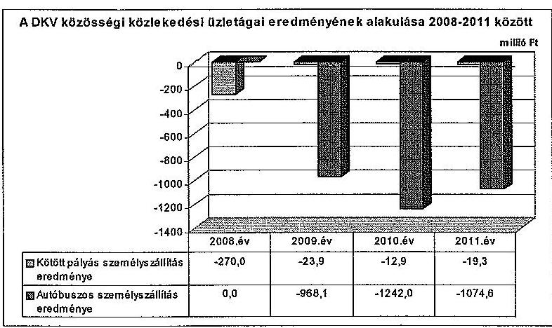
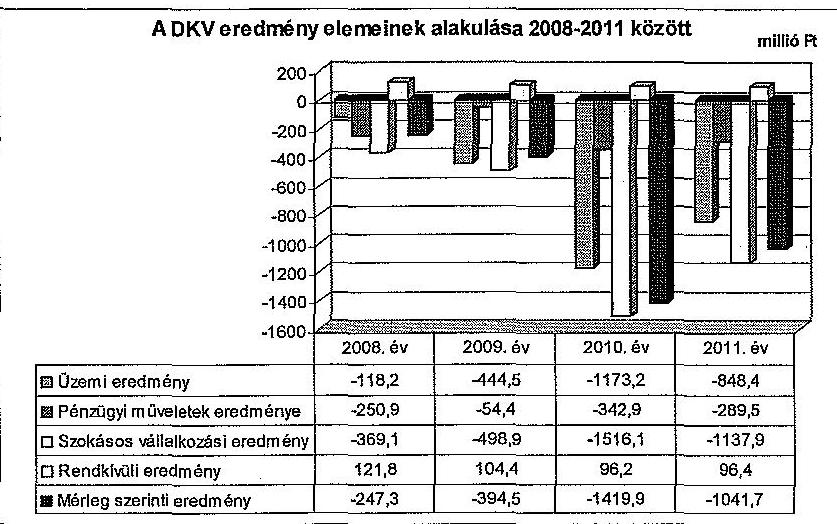
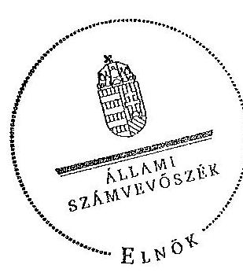
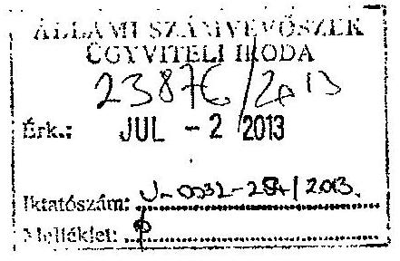
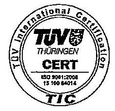
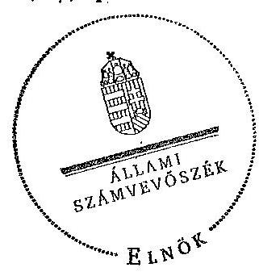
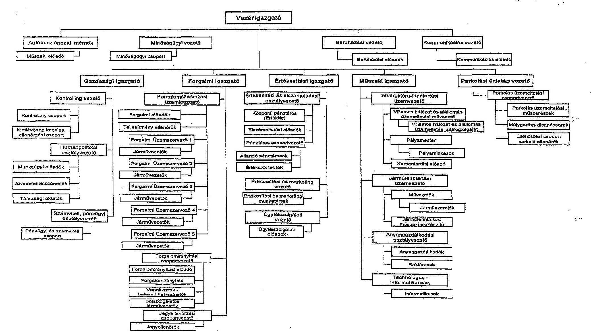
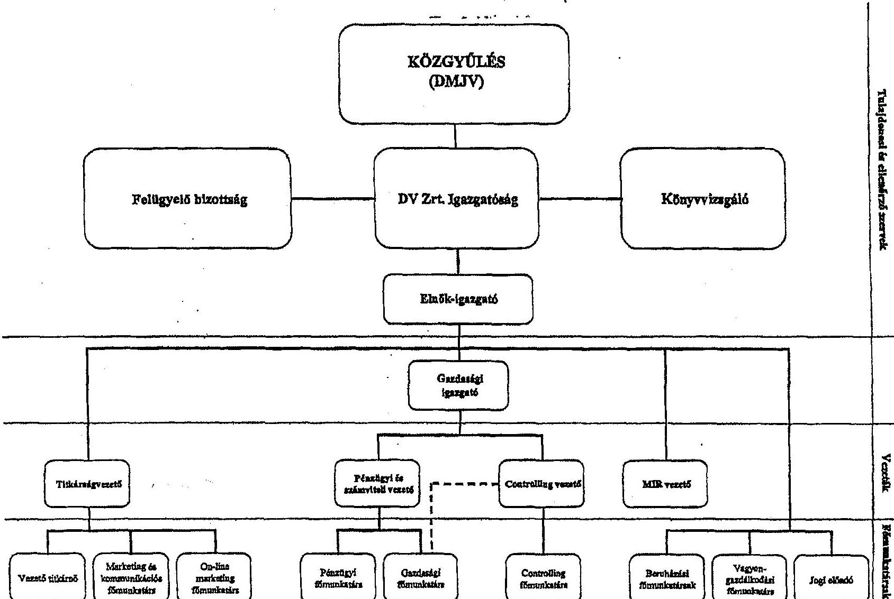
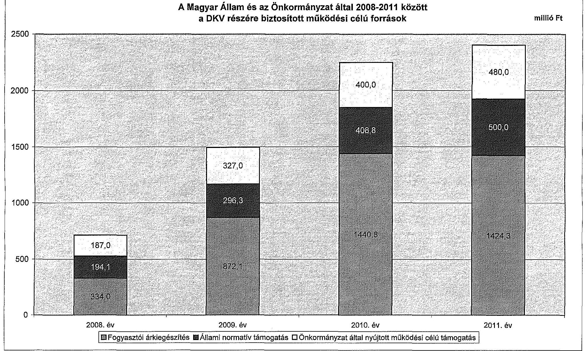
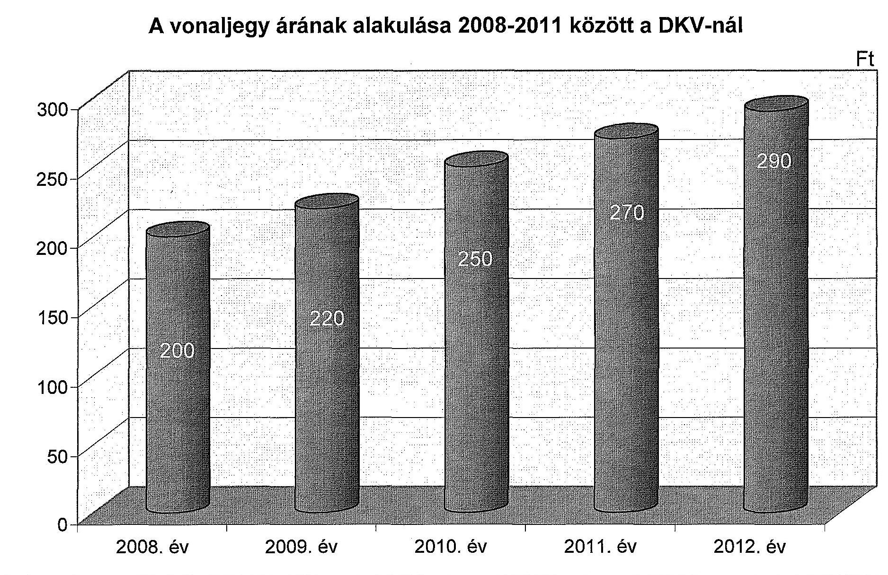

# JELENTÉS 

az önkormányzatok többségi tulajdonában lévő gazdasági társaságok közfeladat-ellátásának ellenőrzéséről

DKV Debreceni Közlekedési Zrt.
13060
2013. július

---

# Állami Számvevőszék 

Iktatószám: V-0032-266/2013.
Témaszám: 13
Vizsgálat-azonosító szám: V060903

## Az ellenőrzést felügyelte:

## Makkai Mária

felügyeleti vezető

## Az ellenőrzést vezette és az ellenőrzés végrehajtásáért felelős:

## Klinga László

ellenőrzésvezető

A számvevői jelentések feldolgozásában és a jelentés összeállításában közremüködött:

## Bialkó Zsolt Gyula

számvevő tanácsos

## Az ellenőrzést végezték:

| Bialkó Zsolt Gyula | Bozsik Tamás | Budai Éva |
| :-- | :-- | :-- |
| számvevő tanácsos | szakértő | szakértő |

---

# TARTALOMJEGYZÉK 

BEVEZETÉS ..... 9
I. ÖSSZEGZŐ MEGÁLLAPÍTÁSOK, KÖVETKEZTETÉSEK, JAVASLATOK ..... 12
II. RÉSZLETES MEGÁLLAPÍTÁSOK ..... 18

1. Az Önkormányzat közfeladat-ellátásának megszervezése ..... 18
1.1. A közfeladat meghatározása, a feladat ellátásának választott módja ..... 18
1.2. Az önkormányzati és tulajdonosi irányítás megítélése ..... 21
2. A DKV közfeladat-ellátással kapcsolatos tevékenysége ..... 23
2.1. A DKV szervezeti kialakítása, szabályozottsága ..... 23
2.2. A DKV vagyonnyilvántartása ..... 25
2.3. A gazdasági évek ráfordításainak és bevételeinek alakulása ..... 27
2.4. A DKV eredményének alakulása ..... 31
2.5. A DKV folyamatos üzemmenetének, likviditásának biztosítása ..... 35
3. Az Önkormányzat és a DV jogainak és kötelezettségeinek érvényesítése ..... 37
3.1. A DKV-tól származó információk elemzése, hasznosítása ..... 37
3.2. A Közgyűlés és a DV tulajdonosi intézkedései ..... 38
MELLÉKLETEK
4. számú Tanúsítvány az Önkormányzat által a 2008-2012. I. félévében a DKV Debreceni Közlekedési Zrt. részére nyújtott müködési célú támogatásokról
5. számú Tanúsítvány a Magyar Állam által a 2008-2012. I. félévében a DKV Debreceni Közlekedési Zrt. részére nyújtott müködési célú támogatásokról
6. számú Tanúsítvány az Önkormányzat által a 2008-2012. I. félévében a DKV Debreceni Közlekedési Zrt. részére nyújtott fejlesztési célú támogatásokról
7. számú Tanúsítvány az Európai Unió által a 2008-2012. I. félévében a DKV Debreceni Közlekedési Zrt. részére nyújtott fejlesztési célú támogatásokról
8. számú Tanúsítvány a Magyar Állam által a 2008-2012. I. félévében a DKV Debreceni Közlekedési Zrt. részére nyújtott fejlesztési célú támogatásokról
9. számú Tanúsítvány a DKV Debreceni Közlekedési Zrt. 2008-2012. I. félév szállítói kötelezettségeinek alakulásáról
10. számú Tanúsítvány a DKV Debreceni Közlekedési Zrt. 2008-2012. I. félévi hitelállományának alakulásáról
11. számú Tanúsítvány a Debrecen Megyei Jogú Város Önkormányzata által végzett tulajdonosi ellenőrzésekről

---

9. számú Tanúsítvány a DKV Debreceni Közlekedési Zrt. belső ellenőrzése által végzett ellenőrzésekről
10. számú Tanúsítvány a DKV Debreceni Közlekedési Zrt. gazdasági társaság által vállalt, mérlegen kívüli kötelezettségek alakulásáról
11. számú Debrecen Megyei Jogú Város Önkormányzat polgármesterének észrevétele
12. számú A DKV Debreceni Közlekedési Zrt. vezérigazgatójának észrevétele
13. számú A Debreceni Vagyonkezelő Zrt. elnök-igazgatójának észrevétele
14. számú Észrevételre adott válasz a Debreceni Vagyonkezelő Zrt. elnökigazgatójának

# FÜGGELÉKEK 

1. számú A DKV szervezeti felépítése
2. számú A DV szervezeti felépítése
3. számú A Magyar Állam és az Önkormányzat által 2008 és 2011 között a DKV részére biztosított múködési célú források
4. számú A vonaljegy árának alakulása 2008 és 2012 között a DKV-nál

---

# RÖVIDÍTÉSEK JEGYZÉKE 

## Európai Uniós jogforrás

1191/69/EGK rendelet

1370/2007/EK rendelet

## Törvények

$\AA_{\text {ht }_{1}}$.
$\AA_{\mathrm{ht}_{2}}$.
Ár. tv.
Eisztv.
Gt. tv.
Iötv.

Mötv.

Ötv.

Számv. tv.
Taktv.
Tao. tv.
Vagyon tv.

Vasút tv.
a Tanács 1969. június 26-i 1191/69/EGK rendelete a vasúti, közúti közlekedési közszolgáltatás fogalmában rejlő kötelezettségek terén a tagállamok tevékenységéről
az Európai Parlament és a Tanács 1370/2007/EK rendelete a vasúti és közúti személyszállítási közszolgáltatásról, valamint a 1191/69/EGK és az 1107/70/EGK tanácsi rendelet hatályon kívül helyezéséről (hatályos: 2009. december 3-ától)
az államháztartásról szóló 1992. évi XXXVIII. törvény (hatálytalan: 2012. január 1-jétől)
az államháztartásról szóló 2011. évi CXCV. törvény
az árak megállapításáról szóló 1990. évi LXXXVII. törvény
az elektronikus információszabadságról szóló 2005. évi XC. törvény (hatálytalan: 2012. január 1-jétől)
a gazdasági társaságokról szóló 2006. évi IV. törvény
az információs önrendelkezési jogról és az információszabadságról szóló 2011. évi CXII. törvény (hatályos: 2012. január 1-jétől)

Magyarország helyi önkormányzatairól szóló 2011. évi CLXXXIX. törvény (hatályos: 2012. január 1-jétől, kivéve a 144. § (2) bekezdésben meghatározott paragrafusok, amelyek 2012. április 15 -én, a (3) bekezdésben meghatározott paragrafusok, amelyek 2013. január 1-jén léptek hatályba, a (4) bekezdésben meghatározott paragrafusok a 2014. évi általános önkormányzati választások napján lépnek hatályba)
a helyi önkormányzatokról szóló 1990. évi LXV. törvény (hatálytalan: a 2014. évi általános önkormányzati választások napjától)
a számvitelről szóló 2000 . évi C. törvény
a köztulajdonban álló gazdasági társaságok takarékosabb müködéséről szóló 2009. évi CXXII. törvény
a társasági adóról és az osztalékadóról szóló 1996. évi LXXXI. törvény
a nemzeti vagyonról szóló 2011. évi CXCVI. törvény (hatályos: 2011. december 31-étől, kivéve a 20. § (2) bekezdésben meghatározott paragrafusok, amelyek 2012. január 1-jétől, a (3) bekezdésben meghatározott paragrafusok 2013. január 1-jétől, a (4) bekezdésben meghatározott paragrafus 2012. március 2-ától léptek hatályba)
a vasútról szóló 1993. évi XCV. törvény (hatálytalan: 2006. január 1-jétől)

---

## Rendeletek

SZMSZ
vagyongazdálkodási rendelet

85/2007. Korm. rendelet

## Szórövidítések

Alapító Okirat ${ }_{1}$
Alapító Okirat ${ }_{2}$
áfa
ÁSZ
Cívisbusz Kft.
Cívisbusz Konzorcium

DKV
DKV SZMSZ-e
DV
EU
FB
Hajdú Volán
ITK
jegyzö
Közszolgáltatási szerzödés ${ }_{1}$

Közszolgáltatási szerződés $_{2}$

Közgyűlés
Önkormányzat
polgármester

Debrecen Megyei Jogú Város Önkormányzatának 17/2000. (V. 01.) számú rendelete az Önkormányzat Szervezeti és Múködési Szabályzatáról (hatályos: 2000. május 1-jétől)
Debrecen Megyei Jogú Város Önkormányzatának 27/1997. (VI. 20.) számú rendelete az Önkormányzat vagyonáról (hatályos: 1997. július 19-től)
a közforgalmú személyszállitási utazási kedvezményekről szóló 85/2007. (IV. 25.) Korm. rendelet

Debreceni Vagyonkezelő Zártkörűen Múködő Részvénytársaság Alapító Okirata
DKV Debreceni Közlekedési Zártkörűen Múködő Részvénytársaság Alapító Okirata
általános forgalmi adó
Állami Számvevőszék
Cívisbusz Kereskedelmi és Szolgáltató Korlátolt Felelősségű Társaság
DKV Debreceni Közlekedési Zártkörűen Múködő Részvénytársaság és az INTER TAN-KER Zártkörűen Múködő Részvénytársaság által létrehozott Konzorcium
DKV Debreceni Közlekedési Zártkörűen Múködő Részvénytársaság
DKV Debreceni Közlekedési Zártkörűen Múködő Részvénytársaság Szervezeti és Múködési Szabályzata
Debreceni Vagyonkezelő Zártkörűen Múködő Részvénytársaság
Európai Unió
felügyelőbizottság
Hajdú Volán Közlekedési Zártkörűen Múködő Részvénytársaság
INTER TAN-KER Tanácsadó és Kereskedelmi Zártkörűen Múködő Részvénytársaság
Debrecen Megyei Jogú Város Önkormányzatának jegyzője
menetrend alapján villamossal, illetve trolibusszal végzett személyszállítási tevékenység ellátása érdekében 2004. december 22 -én kötött Közszolgáltatási szerződés menetrend alapján autóbusszal végzett személyszállítási tevékenység ellátása érdekében 2008. október 10-én kötött Közszolgáltatási szerződés
Debrecen Megyei Jogú Város Önkormányzatának Közgyűlése
Debrecen Megyei Jogú Város Önkormányzata
Debrecen Megyei Jogú Város Önkormányzatának polgármestere

---

| Polgármesteri Hivatal | Debrecen Megyei Jogú Város Önkormányzatának Polgármesteri Hivatala |
| :--: | :--: |
| üzemeltetési szerződés | a fizető várakozóhelyek üzemeltetésére 2007. július 20-án kötött szerződés |
| Villamos Konzorcium | Debrecen Megyei Jogú Város Önkormányzata és a DKV Debreceni Közlekedési Zártkörűen Müködő Részvénytársaság által a Debrecen 2-es villamosvonal kiépítésére létrehozott konzorcium |

---

.

---

# ÉRTELMEZŐ SZÓTÁR 

biztonság
cash-pool

Egységes Közlekedésfejlesztési Stratégia
funkcionális szervezet
közfeladat
közlekedési hálózat
közösségi közlekedés
közvetett tulajdon, illetve közvetett befolyás
lineáris szervezet

Minőségi követelmény, ami az utasok maximális személy és vagyonbiztonságára vonatkozik.
Egy vállalatcsoport bankszámláinak összevont kezelése annak érdekében, hogy optimalizálják a cégek pénzügyi pozícióját, jobb betétesi pozíciót érjenek el, vagy belsô finanszírozással csökkentsék a külső hitelállományt.
A Közlekedési, Hírközlési és Energiaügyi Minisztérium által kiadott, a 2008-2020. időszakra vonatkozó Egységes Közlekedésfejlesztési Stratégia.
Az egydimenziós és a többvonalas szervezetek tipikus példája. A szervezeten belüli elsődleges munkamegosztás a vezetési feladatok, funkciók szerint történik. A hatáskörökre a döntési jogkörök centralizációja a jellemző.
Jogszabályban meghatározott állami vagy önkormányzati feladat, amit az arra kötelezett közérdekből, jogszabályban meghatározott követelményeknek és feltételeknek megfelelve végez, ideértve a lakosság közszolgáltatásokkal való ellátását, továbbá az állam nemzetközi szerződésekben vállalt kötelezettségeiből adódó közérdekủ feladatokat, valamint e feladatok ellátásához szükséges infrastruktúra biztosítását is (Vagyon tv. 3. § (1) bekezdés 7. pont).
Azon útvonalak és kötöttpályás közlekedési vonalak öszszessége, amelyeken a közösségi közlekedés történik.
Alapvető utazási igényeket kiszolgáló szolgáltatás, mely meghatározott viszonylatokon és paraméterek szerint, szabályozott ár ellenében történik Debrecen közigazgatási határán belül.
Egy vállalkozás tulajdoni hányadának, illetőleg szavazati jogának a vállalkozásban tulajdoni részesedéssel, illetőleg szavazati joggal rendelkező más vállalkozás (köztes vállalkozás) tulajdoni hányadán, szavazati jogán keresztül történő gyakorlása. A közvetett tulajdon, a közvetett befolyás arányának megállapításához a közvetett tulajdonnal, közvetett befolyással rendelkezőnek a köztes vállalkozásban fennálló szavazati jogát vagy tulajdoni hányadát meg kell szorozni a köztes vállalkozásnak a vállalkozásban fennálló szavazati vagy tulajdoni hányada közül azzal, amelyik a nagyobb. Ha a köztes vállalkozásban fennálló szavazati vagy tulajdoni hányad az ötven százalékot meghaladja, akkor azt egy egészként kell figyelembe venni (a tőkepiacról szóló 2001. évi CXX. törvény 5. § (1) bekezdés 84. pont).
A lineáris szervezet az egyvonalas szervezeti forma klaszszikus példája. A függelmi és a szakmai jellegú kapcsolat nem válik külön, a feladatkijelölés, utasítás és az azokról való jelentés ugyanazon az úton (vonalon) történik.

---

menetdíj
mérleg szerinti eredmény
tulajdonosi joggyakorló
üzemi eredmény

A közösségi közlekedési eszközök igénybevételéért az utasok által jegy, bérlet formában megfizetett viteldi.
A mérleg szerinti eredmény az osztalékra, részesedésre, a kamatozó részvények kamatára igénybe vett eredménytartalékkal növelt, a jóváhagyott osztalékkal, részesedéssel, a kamatozó részvények kamatával csökkentett tárgyévi adózott eredmény, egyezően az eredménykimutatásban ilyen címen kimutatott összeggel (Számv. tv. 39. § (2) bekezdés).
Aki a nemzeti vagyon felett az államot vagy a helyi önkormányzatot megillető tulajdonosi jogok és kötelezettségek összességének gyakorlására jogosult (Vagyon tv. 3. § (1) bekezdés 17. pont).

Az üzemi, üzleti tevékenység eredménye a társaság termelési és szolgáltatási eredményét jelenti, azt mutatja, hogy a fő és mellék tevékenységek mekkora eredményt hoztak.

---

# JELENTÉS 

## az önkormányzatok többségi tulajdonában lévő gazdasági társaságok közfeladatellátásának ellenőrzéséről

## DKV Debreceni Közlekedési Zrt.

## BEVEZETÉS

A DKV alaptevékenysége a Debrecen közigazgatási határain belül történő közösségi közlekedés lebonyolítása és a biztonságos üzemeltetést szolgáló infrastruktúra (pálya, felsővezeték) karbantartási, fenntartási munkáinak elvégzése, valamint 2002. január 1-jétől az önkormányzati tulajdonú parkolóhelyek és a 2005. évtől az önkormányzati tulajdonú mélygarázsok üzemeltetése.

A DKV által biztosított közszolgáltatás 2009. július 1-jétől a kötöttpályás járművek, vagyis a trolibuszok és villamosok mellett - a korábbi szolgáltatóval, a Hajdú Volánnal kötött Közszolgáltatási szerződés felmondását követően - az autóbuszokkal végzett közösségi közlekedéssel egészült ki. Ettől az időponttól kezdve Debrecenben egységes közösségi közlekedési szolgáltatás valósult meg, egyetlen szolgáltató közremúködésével. Az Önkormányzat - a közgyűlési előterjesztés alapján - az autóbuszos közszolgáltatás ellátásának pályáztatása révén, a XXI. század követelményeinek megfelelő, magasabb műszaki paraméterű buszállománnyal, gazdaságosabb és korszerűbb szolgáltatásszervezéssel kívánt eleget tenni a kötelező feladatának.

A DKV feladata a villamos és trolibusz járművek közlekedéséhez szükséges infrastruktúra - $8,8 \mathrm{~km}$ villamos pálya és $58,0 \mathrm{~km}$ felsővezeték rendszer - üzemeltetése, fenntartása. Az autóbusz-hálózat hossza $172,5 \mathrm{~km}$. A DKV jármúállománya 21 db villamosból, 30 db trolibuszból és 140 db bérelt autóbuszból állt a helyszíni ellenőrzés időpontjában. A DKV a 2011. évben 947,6 millió férőhelykilométert ${ }^{1}$ és 8,3 millió hasznos kilométert ${ }^{2}$ teljesített. A DKV helyi közösségi közlekedési működési bevételei 2008 és 2012 között a menetdíj bevételekből, ál-

[^0]
[^0]:    ${ }^{1}$ Közlekedési teljesítmény: az egyes járművek (szerelvények) férőhelyének (befogadóképességének) és hasznos megtett kilométerének szorzata, több jármű közlekedtetése esetén az előzőek szerint járművenként számított teljesítmények összege.
    ${ }^{2}$ a személyszállítási teljesítmény egyik mutatószáma, egy utaskilométer egy utas egy kilométerre történő szállítása

---

lami normatív támogatásból ${ }^{3}$, fogyasztói árkiegészítésből és az Önkormányzat működési célú pénzeszköz átadásaiból tevődött össze.

A DKV 100\%-os önkormányzati tulajdonban volt 2000-ig. Az Önkormányzat 100\%-os tulajdonát képező DV alapítását követően a Közgyűlés döntése alapján a DKV-t a DV-be apportálták. Az Önkormányzat 2000-ben határozott a DV létrehozataláról. A döntéssel egy holdingszervezetet hoztak létre, amely az addig az Önkormányzat 100\%-os tulajdonában lévő gazdasági társaságok vonatkozásában a tulajdonosi jogokat gyakorolja. Ettől az időponttól az Önkormányzat a DKV felett közvetetten - a DV-n keresztül - érvényesíti a tulajdonosi jogait. A holdingszervezet létrehozásának az volt a célja, hogy - többek között az erőforrásokat vállalatcsoport szinten optimalizálják, kihasználják a DV méretéből eredő piaci előnyöket, közös beszerzési rendszert alakítsanak ki, javítsák a tagvállalati működés hatékonyságát, támogassák az egyes tagvállalatok szintjén az ésszerű tőkebevonást, valamint hogy a vállalatcsoport nyereséges múködése járuljon hozzá az önkormányzati támogatás megszüntetéséhez. A DKV a szakmai tevékenységét önállóan gyakorolja, a közfeladat ellátása - az Önkormányzattal kötött Közszolgáltatási szerződések ${ }_{1,2}$ alapján - kizárólagos joga, az üzleti tervén belül szabadon gazdálkodhat. A DV kontrollt gyakorol a DKV felett az üzleti terv betartása érdekében, ez kiterjed a számviteli rendszer szabályozására, a kötelezettségvállalásokra, az üzleti terv készítéséhez biztosított információ szolgáltatásra, valamint a finanszírozásra is. A DKV likviditását a DV cash-pool rendszer keretében biztosítja, a hitelek devizaneméről való döntés, és árfolyamváltozás esetén a kedvezőbb devizanemre való átváltás a DV Igazgatóságának jogosultsága.

A polgármester 1998 óta tölti be tisztségét, a jegyző személye 2006 óta változatlan. A DKV vezérigazgatójának személye 2001. november 1. óta változatlan.

A DV gazdálkodását nem ellenőriztük. A DV esetében az ellenőrzés a DKV feletti tulajdonosi joggyakorlási tevékenységre terjedt ki.

Az ellenőrzés célja annak értékelése volt, hogy az Önkormányzat egyértelmű, számon kérhető formában írta-e elő az ellátandó feladatokat, biztosította-e a közfeladatot ellátó gazdasági társaság számára a közfeladat ellátásához szükséges közvagyont, a gazdasági társaság a rendelkezésre álló erőforrások szabályszerű felhasználásával teljesítette-e a tulajdonos (Önkormányzat, holding) részéről meghatározott célokat és feladatokat, valamint az Önkormányzat és a holding a tulajdonostól elvárható gondossággal felügyelte-e a társaság múködését és vagyongazdálkodását, továbbá a gazdasági társaság az ellenőrzött időszakban betartotta-e a vagyonnal történő gazdálkodásra vonatkozó jogszabályi rendelkezéseket és a helyi szabályzatok előírásait.

# Az ellenőrzés típusa: szabályszerűségi ellenőrzés 

[^0]
[^0]:    ${ }^{3}$ A Magyarország 2013. évi központi költségvetéséről szóló 2012. évi CCIV. törvény a kötelezően ellátandó helyi közösségi közlekedési feladat támogatására előirányzatot a Fővárosi Önkormányzat kivételével - a feladatot ellátó önkormányzatok számára nem tartalmaz.

---

Az ellenőrzött időszak: a 2008-2011. évek és a 2012. év I-III. negyedéve volt.

Az ellenőrzés jogalapját az Állami Számvevőszékről szóló 2011. évi LXVI. törvény 5. § (4) bekezdése képezi.

Az ÁSZ a 2011. évi LXVI. törvény 29. §-a szerint a jelentést megküldte Debrecen Megyei Jogú Város polgármesterének, a DKV Debreceni Közlekedési Zrt.-nek és a Debreceni Vagyonkezelő Zrt.-nek. A beérkezett észrevételeket és az arra adott válaszokat a jelentés 11-13. számú mellékletei tartalmazzák.

---

# I. ÖSSZEGZŐ MEGÁLLAPÍTÁSOK, KÖVETKEZTETÉSEK, JAVASLATOK 

Debrecen Megyei Jogú Város Önkormányzatának Közgyűlése (Közgyűlés) a közösségi közlekedés megszervezéséről az akkor hatályos 1191/69/EGK rendelet, továbbá a fizető várakozóhelyek üzemeltetéséről az Ötv. előírásainak figyelembevételével döntött. Az SZMSZ-ében az Önkormányzat egyértelműen előírta a kötelező feladatok ellátásának kötelezettségét. A helyi közösségi közlekedés kötelező feladat ellátásának mértékét és módját az Önkormányzat a DKV-val kötött Közszolgáltatási szerződések ${ }_{1,2}$-ben és az üzemeltetési szerződésben határozta meg.

A Közgyűlés 2007-ben jóváhagyta a Fenntartható Városi Közlekedésfejlesztési Tervét. A tervben rögzített stratégiai célok és prioritások a Közlekedési, Hírközlési és Energiaügyi Minisztérium által kiadott Egységes Közlekedésfejlesztési Stratégiában - a 2007 és 2020 közötti időszakra - megfogalmazott prioritásokkal összhangban voltak. A DKV részére az ellenőrzött időszakban önálló stratégiai tervet nem határoztak meg, feladata az Önkormányzat célkitűzéseinek megvalósítása volt.

A DKV a kötött pályás - villamos és trolibusz - közösségi közlekedés közfeladatát 2005. január 1-jétől az Önkormányzattal 17 évre megkötött Közszolgáltatási szerződés ${ }_{1}$ alapján látja el. A Közszolgáltatási szerződés megkötésekor hatályos EGK rendelet és az azon alapuló Vasút tv. a kötött pályás közlekedést érintően pályáztatási kötelezettséget nem írt elő. Az autóbusszal végzett helyi közösségi közlekedés közszolgáltatását 2009. június 30 -áig a Hajdú Volán biztosította. A Közgyűlés ezt követően a feladat ellátással - a szabályosan lebonyolított pályázat nyertesét - a DKV vezette Cívisbusz Konzorciumot bízta meg. A Cívisbusz Konzorciumnak a DKV-n kívül az autóbuszokat bérbeadó ITK a tagja. Az autóbuszos Közszolgáltatási szerződés ${ }_{2}$ nyolc éves időtartamát, élve az EGK rendeletben rögzített lehetőséggel, a Közgyűlés 2010-ben a Cívisbusz Konzorcium kezdeményezésére az eredeti közszolgáltatási időtartam felével, négy évvel szabályszerűen meghosszabbította. A fizető várakozóhelyek üzemeltetését a DKV a korábbi szerződés lejártát követően a 2007. január 1-jétől hatályos üzemeltetési szerződés alapján látja el.

Az Önkormányzat a közösségi közlekedés közfeladat-ellátásához a DKV részére alapításkor (1997-ben) apportálással 865,0 millió Ft összegben (pl.: villamosok, trolibuszok, villamos pálya, épületek, műszaki létesítmények) közvagyont biztosított, amely a kötöttpályás közösségi közlekedést szolgálta. Az átadott vagyont a DKV a könyveiben nyilvántartotta. Az Önkormányzat az ellenőrzött időszakban - a jogszabályi előírások betartásával - összesen 1394,0 millió Ft-os múködési célú pénzeszközátadással forrást nyújtott a DKV-nak a közfeladat-ellátásra. A működési célú pénzeszközátadások felhasználásának elszámolási kötelezettségét előírták, a DKV azok felhasználásával szabályszerűen elszámolt. Az ellenőrzött időszakban a közfeladat-ellátás biztosításához hitel igénybevétele is szükségessé vált, amelyet a DV-n keresztül biztosítottak. A Közszolgáltatási szerződések ${ }_{1,2}$ a veszteségek kötelező kiegyenlítését nem tartalmaz-

---

ták, a kötöttpályás közlekedés esetében az Önkormányzat dönt a veszteség kiegyenlítéséről és annak módjáról, a Közszolgáltatási szerződés ${ }_{2}$ alapján az autóbusz esetében nem kompenzálják a bevételekkel nem fedezett költségeket. Az ellenőrzött időszakban az Önkormányzat 228,2 millió Ft-os fejlesztési célú pénzeszközt adott át a DKV részére. A DV mint tulajdonosi joggyakorló - a 2008-2011. évek veszteséges gazdálkodása következményeként - a Gt. tv-ben foglaltaknak eleget téve, a saját tőke/alaptőke mutató előírt szintjének biztosítása érdekében a DKV-nál 2011-ben két lépésben - lekötött tartalékként - összesen 2070,5 millió Ft tőkepótlást hajtott végre saját eredménytartaléka terhére.

Az Önkormányzat a tulajdonosi jogok gyakorlásának szabályait a vagyongazdálkodási rendeletben, a Közgyűlés kizárólagos hatásköreit a DV Alapító Okirat ${ }_{1}$-ában határozta meg. A tulajdonosi jogokat a Közgyűlés közvetlenül gyakorolta a DV, és közvetetten a DKV felett.

A DKV vagyonával kapcsolatos döntések szintjeit, értékhatárait és a döntések meghozatalának eljárásrendjét az Alapító Okirat ${ }_{2}$ és a DKV SZMSZ-e szabályozta. A DV, mint a tulajdonosi joggyakorló kizárólagos hatáskörébe tartozik minden öt millió Ft feletti kötelezettségvállalás. A DKV vezérigazgatójának, mint a gazdasági társaság egyszemélyi vezetőjének a feladatait és hatáskörét a DKV Alapító Okirat ${ }_{2}$-ában, illetve a munkaszerződésében rögzítették.

Az Önkormányzat a Közszolgáltatási szerződések ${ }_{1,3}$-ben a közfeladatellátásról évenkénti szakmai beszámolási kötelezettséget írt elő. A DKV 2008 és 2011 között a szakmai beszámolókat elkészítette, azonban azokat a Közszolgáltatási szerződések ${ }_{1,3}$-ben foglaltak ellenére a Közgyűlésnek nem mutatták be, ezért annak elfogadásáról a Közgyűlés nem döntött. A DKV az Önkormányzat által számára meghatározott feladatokat a szakmai beszámolók alapján - a közösségi közlekedés biztosítását, a Közszolgáltatási szerződések ${ }_{1,2}$-ben előírt menetrendszerinti személyszállítást - a rendelkezésre álló erőforrások felhasználásával teljesítette. A Közszolgáltatási szerződések ${ }_{1,3}$-ben előírták az ellátást biztosító személyi és tárgyi feltételeket, a szolgáltatási színvonal, minőség és az utas tájékoztatás követelményeit, illetve megkövetelték az egységes arculatot. Az autóbuszok esetében többek között előírták azok maximális életkorát, valamint az alacsonypadlós, EURO 5-ös, légkondicionált, mozgáskorlátozott rámpával ellátott gépjárművek használatát. A közfeladat-ellátásra garanciákat a nem, vagy nem megfelelő teljesítésre a Közszolgáltatási szerződés; nem tartalmazott, ennek feltételeit a Közszolgáltatási szerződés ${ }_{2}$-ben előírták. Az Önkormányzat nem élt a Közszolgáltatási szerződések ${ }_{1,2}$-ben rögzített jogkörével, a DKV közszolgáltatási feladatellátását és a szolgáltatási színvonalat nem ellenőrizte.

Az Önkormányzat a DV, a DV pedig a DKV éves üzleti tervének, kontrolling és éves beszámolóinak elkészítési és elfogadási rendjét szabályozta. A DKV 2010 és 2011 között belső ellenőrzést múködtetett, valamint a DV előírása alapján az éves üzleti tervek mellett havi gyorsjelentést, negyedéves és éves kontrolling beszámolókat készített, azokban a terv- és tényadatok közötti eltérést számszerú és szöveges, okszerú magyarázattal is bemutatták. A kontrolling beszámolókat és az éves számviteli beszámolót a DKV FB-je értékelte és elfogadta. A DKV feletti tulajdonosi jogokat gyakorló DV a feladatait ellátta, előírta és betartatta a

---

számviteli beszámolási rendet. Az Önkormányzat a DV-én keresztül közvetetten felügyelte a DKV múködését és vagyongazdálkodását. A DV üzleti tervei és konszolidált beszámolói - melyek tartalmazták a DKV mérleg és eredménykimutatás adatait is - mellékletként az Önkormányzat költségvetési és azok végrehajtásáról szóló rendeleteinek részét képezték. A személyszállitási bevételeket a tervezetthez képest alulteljesítették, míg az üzemi tevékenység eredményét döntően meghatározó anyagjellegủ ráfordításokat alultervezték a 2009 és 2011 közötti években. A bevételek alulteljesítésének főbb okai az utazási igények ellenőrzött időszakban történt visszaesése és az igénymérés 2011 előtti hiányosságai voltak. Az üzleti tervek nem tartalmaztak az autóbuszok bérleti díjával, a dízel üzemanyag árváltozásával, valamint az EUR árfolyamváltozásával kapcsolatos kockázatszámítást.

A Közgyűlés a DV vezető tisztségviselői, a DV és a DKV vezérigazgatójának javadalmazásával kapcsolatos alapelveket és előírásokat szabályzatban határozta meg. A DKV-nál prémium célokat 2008-ban, 2009-ben és 2012-ben tűztek ki. Ekkor a DV Igazgatósága a célfeladatokat és a hozzá kapcsolódó ösztönzési kereteket meghatározta, azok teljesítését értékelte és a kifizetéséről szabályszerű döntést hozott. A 2008. és a 2009. évben a prémium célok között szerepelt a DKV üzleti terveiben szereplő, közösségi közlekedés negatív eredményének csökkentése, illetve 2012-ben a prémium kifizetés kizárólagos feltételeként az elfogadott üzleti tervben meghatározott veszteség csökkentését várták el.

A DKV a Számv. tv. előírásainak megfelelően elkészítette értékelési, leltározási és önköltségszámítási szabályzatát. Hatályba léptették továbbá a feleslegessé vált vagyontárgyak hasznosításának szabályzatát is. A szabályzatokat szükség szerint aktualizálták, azonban a leltározási szabályzatnak és a feleslegessé vált vagyontárgyak hasznosítása szabályzatának hatás- és felelőségi körökre irányuló módosítását a 2011. évi szervezeti átalakulást követően nem hajtották végre.

A gazdasági események elszámolása a DKV-nál az ellenőrzött területeken a vagyonnal való gazdálkodásra vonatkozó jogszabályi rendelkezéseknek és a helyi szabályzatok előírásainak - a DKV SZMSZ-e, a számviteli politika, az önköltségszámítási szabályzat, a munkaszámrendszer szabályzat, a számlarend és az utalványozási jogosultságok szabályozása - betartásával történt. Az elkülönített üzletágak ráfordításainak és bevételeinek egyértelmú elhatárolását a DKV zárt rendszerú ügyviteli program keretében biztosította.

A DKV-nál az eszközök könyvviteli mérleg szerinti értéke a 2008. január 1jei 4111,8 millió Ft-os állományról a 2012. év III. negyedév végére 9320,8 millió Ft-ra nőtt. A tárgyi eszközök értéknövekedése a támogatásokból megvalósított fejlesztések miatt - elsősorban a 2-es villamoshoz felhasznált források összegével - meghaladta az elszámolt értékcsökkenés összegét. A saját tőke a tulajdonosi pótbefizetések (tőkepótlás) ellenére 2481,7 millió Ft-tal csökkent, mivel a DKV gazdálkodása az ellenőrzött időszak minden évében veszteséges volt.

A DKV összes ráfordítása 2008-ról 2011-re 2573,6 millió Ft-ról 7683,8 millió Ftra nőtt. A DKV bevétele 2008-ban 2178,6 millió Ft volt, melynek összege 2011ben 6533,3 millió Ft-ra változott. A bevételeken belül 2008-ról 2011-re a menetdíjbevételek 739,3 millió Ft-ról 3064,4 millió Ft-ra, a fogyasztói árkiegészítés

---

összege 334,0 millió Ft-ról 1424,3 millió Ft-ra, az állami normatív támogatás összege 194,1 millió Ft-ról 500,0 millió Ft-ra, továbbá az önkormányzat által nyújtott múködési célú támogatás összege 187,0 millió Ft-ról 480,0 millió Ft-ra nőtt. A ráfordítások és a bevételek növekedésére a legjelentősebb hatást az autóbusszal ellátott közösségi közlekedés 2009. júliusi átvétele gyakorolta. A DKV mérleg szerinti eredménye 2008-ban -247,3 millió Ft, 2009-ben -394,5 millió Ft, 2010-ben -1419,9 millió Ft és 2011-ben -1041,7 millió Ft volt. A helyi közösségi közlekedés üzletágai - szakmai beszámolókból nyert - eredményének évenkénti adatait a következő ábra szemlélteti:

A DKV eredményességét alapvetően befolyásolta, hogy 2009-től a közösségi közlekedés bevétele elmaradt a tervezettől. Ennek okaként a DKV kontrolling beszámolói a gazdasági környezet hatásait, a menetjegyek iránti fizetőképes kereslet csökkenését, a kerékpárutak kiépítése miatt a közösségi közlekedés igénybevételének visszaesését, valamint a bérletvásárlási szokások módosulását jelölték meg. A 2009 júliusától ellátott autóbuszos személyszállítás vesztesége döntő mértékben befolyásolta a DKV eredményességét. A veszteség kialakulásában a tervezett bevételek elmaradása mellett meghatározó volt az autóbuszokért fizetett bérleti díj és a gázolaj üzemanyagköltségek emelkedése. Az ellenőrzött időszakban az autóbuszok bérleti díja összesen 7243,9 millió Ft volt, míg az üzemanyagköltség 3702,4 millió Ft-ot tett ki. A bérleti díj tartalmazta az autóbuszok rendelkezésre bocsátásán túl azok karbantartási díját is. A kötöttpályás személyszállítás eredményességének javulásában közrejátszott, hogy 2009-től az általános költségek megoszlottak az üzletágak között. A személyszállításon kívüli tevékenységek pozitív eredménye jellemzően a fizető várakozóhelyek üzemeltetéséből származott, és hozzájárult a közösségi közlekedés feladatellátásából származó veszteség csökkentéséhez. A fizető várakozóhelyek üzemeltetéséből a kontrolling beszámolók alapján a DKV-nak 2008-ban 209,0 millió Ft, 2009-ben 199,2 millió Ft, 2010-ben 183,5 millió Ft, 2011-ben pedig 264,8 millió Ft üzemi eredménye származott.

A veszteségek mérséklése érdekében a DKV viteldíj emeléseket, menetrend módosításokat kezdeményezett az Önkormányzatnál. A kezdeményezett szolgáltatási díjemelések korlátjaként - a Közszolgáltatási szerződések ${ }_{1,2}$-ben előírt inflációt nem meghaladó áremelésen túl - a fogyasztói szokások és a fizetőképes kereslet megváltozását, valamint az utaslétszám visszaesését vette figyelembe az Önkormányzat. Az ellenőrzött időszakban a DKV a menetjegy bevétel

---

alakulását havi szinten elemezte. A 2011. évben a DKV megvizsgálta a bérelt buszok üzemanyag fogyasztásának normához viszonyított alakulását és túlfogyasztást állapított meg. A bérbeadó ITK vitatta a túlfogyasztást, ezért a DKV peres eljárást kezdeményezett 2012 novemberében. A DKV 2011-ben a Cívisbusz Konzorcium tagjai közötti elszámolás módjának a felülvizsgálatát kezdeményezte az ITK-nál. Ennek eredményeként ideiglenesen a korábbinál kilométerenként 4 Ft-tal kedvezőbb bérleti egységdíjról állapodtak meg, azonban a végleges megegyezés hiányában a vitás kérdést 2012 márciusában peresítette a DKV. A csökkenő utazási igények következtében a bérelt autóbuszok kapacitásaiban felesleg lépett fel. Ennek következtében a DV Igazgatósága 2012-ben arról döntött, hogy a DKV kezdeményezze az autóbusz bérleti szerződés módosítását - az előírt minimális futásteljesítmény, illetve a rendelkezésre bocsátott buszok számának a csökkentését - működésének gazdaságosabbá tétele érdekében. A bérleti szerződés módosításáról a helyszíni ellenőrzés lezárásáig a felek nem döntöttek. A villamos energia költségek csökkentése érdekében a DKV 2009-ben belépett a villamosenergia-piacra annak liberalizációjakor, ennek hatásaként - a kimutatásaik szerint - már a belépés évében 20,0 millió Ft költségmegtakarítást értek el.

A DKV a pénzügyi gazdálkodás szabályairól szóló DV utasítás alapján elkészítette az éves üzleti tervre alapozott likviditási tervet. A DKV likvidításkezelése a DV többi tagvállalatával együtt cash-pool rendszerben történt. A DKV-nak a pénzügyi eredményre ható tényezők kezelésében döntési jogosultsága nem volt, mert a DV döntött a finanszírozással kapcsolatos kérdésekben. A DKV-nak a cash-pool rendszer keretében, a DV pénzügyi gazdálkodásának szabályairól szóló belső utasítás alapján működő rendszere biztosította a kötelezettségek határidő szerinti teljesítését. A kötelezettségek állománya a 2008. január 1-jei 1411,7 millió Ft-ról a 2012. év III. negyedévére 4746,3 millió Ft-ra emelkedett. A kötelezettségek összegének növekedését elsősorban a 2-es villamos beruházásának utófinanszírozása miatt a szállítói állomány, és a folyószámla hitel állományának emelkedése okozta.

A DKV a 2007 végén forintban fennálló hitelállományát az ellenőrzött időszakban előbb CHF, majd EUR alapúra váltotta át - a kedvezőbb kamatszint miatt - a DV utasítására. A DV kalkulációja szerint a DKV a fizetendő kamatoknál 144,7 millió Ft kamatmegtakarítást ért el, az átváltások következtében ugyanakkor 604,6 millió Ft árfolyamveszteséget elszámolt 2011. december 31éig. A 2008. évi 1035,0 millió Ft-ról a hitel állománya 2011-re 2075,0 millió Ftra nőtt, melyből a működési célú hitelek 2008-ban 148,0 millió Ft-ot, 2011-ben pedig 490,0 millió Ft-ot tettek ki.

Az ellenőrzött időszak legjelentősebb beruházása a 2-es villamos kivitelezésének megkezdése volt. A beruházás le nem vonható áfával számított összköltsége a 2008. decemberi támogatási szerződés alapján 17695,2 millió Ft volt, melyből a támogatás összege 15762,4 millió Ft-ot tett ki. A támogatás összege 2011-ben a támogatási arányok módosulása miatt 16058,4 millió Ft-ra emelkedett. A projekttel kapcsolatban az Önkormányzat 2007 júliusában - költség-haszonés kockázatelemzést tartalmazó - megvalósíthatósági tanulmányt készíttetett. A 18 darab villamos beszerzési ára 37,9 millió EUR, ennek teljesítésére a szerződés szerint 2013 márciusától kerül sor. A beruházás átadásának várható időpontjaként a közbeszerzési eljárások elhúzódása és a pályaépítés jogvitái miatt

---

2010 helyett 2014-et határozták meg. A DKV a számviteli nyilvántartásokban elkülönítve, szabályszerűen tartotta nyilván az önkormányzati, az állami és az EU-s támogatásokat és forrásokat.

Az Önkormányzat az adatszolgáltatási kötelezettség előírásával és teljesítésével az ÁSZ 2011-ben tett - a gazdasági társaságok aktuális pénzügyi helyzetének félévenkénti bemutatására vonatkozó - javaslatát hasznosította.

Az Állami Számvevőszékről szóló 2011. évi LXVI. törvény 33. § (1) bekezdésében foglaltak értelmében a jelentésben foglalt megállapításokhoz kapcsolódó intézkedési tervet köteles az ellenőrzött szervezet vezetője összeállítani, és azt a jelentés kézhezvételétől számított 30 napon belül az ÁSZ részére megküldeni. Amennyiben az intézkedési tervet határidőben nem küldi meg a szervezet, vagy az nem elfogadható, az ÁSZ elnöke a hivatkozott törvény 33. § (3) bekezdés a)-b) pontjaiban foglaltakat érvényesítheti.

Az ellenőrzés intézkedést igénylő megállapításai és javaslatai:

# A jegyzönek 

1. Az Önkormányzat nem élt a Közszolgáltatási szerződések1,2-ben rögzített jogkörével, a DKV közszolgáltatás feladatellátását és a szolgáltatási színvonalat nem ellenőrizte.

Javaslat:
Intézkedjen a DKV részére meghatározott feladat ellátásának ellenőrzéséről.
2. A DKV a Közszolgáltatási szerződések ${ }_{1,2}$-ben előírt szakmai beszámolókat évente elkészítette, azok az Önkormányzatnál rendelkezésre állnak. Azonban a Közszolgáltatási szerződések ${ }_{1,2}$-ben foglaltak ellenére azokat nem terjesztették a Közgyűlés elé.

Javaslat:
Készítse elő a közfeladat-ellátásról szóló éves szakmai beszámolókat a Közgyűlés elé való terjeszthetőség érdekében.

## A DKV vezérigazgatójának

A számviteli szabályzatokat szükség szerint aktualizálták, azonban a leltározási szabályzatnak és a feleslegessé vált vagyontárgyak hasznosítása szabályzatának hatás- és felelősségi körökre irányuló módosítását a 2011. évi szervezeti átalakulást követően nem hajtották végre.

Javaslat:
A leltározási szabályzatot és a feleslegessé vált vagyontárgyak hasznosításának szabályzatát vizsgálják felül, azokban a hatás- és felelőségi körökre vonatkozó szabályozást a DKV hatályos SZMSZ-ének megfelelően módosítsák.

---

# II. RÉSZLETES MEGÁLLAPÍTÁSOK 

## 1. Az ÖNKORMÁNYZAT KÖZFELADAT-ELLÁTÁSÁNAK MEGSZERVEZÉSE

### 1.1. A közfeladat meghatározása, a feladat ellátásának választott módja

A helyi közösségi közlekedés közszolgáltatásának és a közúti járművel való várakozás lehetőségének biztosítása az Önkormányzat törvényi kötelezettsége. Az SZMSZ-ben a Közgyűlés az Ötv. 8. § (1) bekezdése ${ }^{4}$ alapján előírta a kötelező feladatai ellátásának kötelezettségét, az Önkormányzat közigazgatási területén történő személyszállítás és a helyi közutakon kijelölt fizető parkolóhelyek üzemeltetésének mértékét és módját a Közszolgáltatási szerződések ${ }_{1,2}$-ben és az üzemeltetési szerződésben határozta meg. A helyi közösségi közlekedés megszervezéséről az akkor hatályos 1191/69/EGK rendelet ${ }^{5}$ és az Ötv. előírásainak figyelembevételével döntött a Közgyűlés.

A helyi közúti és kötött pályás közösségi közlekedés és a fizető várakozóhelyek üzemeltetésének feladatellátását az Önkormányzat a DKV szolgáltatásának igénybevételével biztosítja a közigazgatási területén.

A DKV a kötött pályás - villamos és trolibusz - közösségi közlekedés közfeladatát a 2004. december 22 -én 17 évre megkötött Közszolgáltatási szerződés; alapján látja el. A Közszolgáltatási szerződés; megkötésekor hatályos 1191/69/EGK rendeleten alapuló Vasút tv. 7/A. § (8) bekezdése a kötött pályás közösségi közlekedés lebonyolítására pályáztatási kötelezettséget nem írt elő. A Közszolgáltatási szerződést; 2012 decemberéig 11-szer módosították, melyből nyolc menetrendi módosítás miatt történt. A további három módosításra jogszabályi változás, illetve szövegszerű pontosítás miatt került sor. A Közszolgáltatási szerződés ${ }_{1}$-ben előírták az ellátást biztosító személyi és tárgyi feltételeket, valamint a szolgáltatási színvonal, minőség és az utas tájékoztatás követelményeit. A járművek és létesítmények, valamint a személyi feltételek biztosítása a DKV feladata. A feladatellátást a közforgalmú közlekedésre - a közlekedési hatóság által - alkalmasnak minősített, rendszeresen ellenőrzött, a műszaki, környezetvédelmi és a forgalombiztonsági követelményeknek megfelelő járművekkel köteles a DKV teljesíteni. Ezen belül gondoskodnia kell a járművek folyamatos karbantartásáról, tisztán tartásáról, megfelelő esztétikai állapotáról és a menetrend betartásához szükséges járműpark biztosításáról. A Közszolgáltatási szerződés, garanciákat a nem, vagy nem megfelelő teljesítésre nem tartalmazott.

[^0]
[^0]:    ${ }^{4}$ 2013. január 1-jétől az Mötv. 13. § (1) bekezdése szabályozza.
    ${ }^{5}$ 2009. december 3-tól a rendelet hatályát vesztette, azt követően az Európai Parlament és a Tanács 1370/2007/EK rendelete hatályos.

---

Az autóbusszal végzett, menetrend szerinti helyi közösségi közlekedés közszolgáltatását 2009. június 30 -áig a Hajdú Volán látta el az Önkormányzat közigazgatási területén. A Közgyűlés 2008. február 12-én határozott a szolgáltatóval 2004-ben megkötött Közszolgáltatási szerződés felmondásáról, és a feladatellátásra irányuló pályázat kiírásáról. Az autóbusszal végzett, menetrend szerinti helyi személyszállítást, közösségi közlekedési közszolgáltatást 2009. július 1-jétől a DKV látta el.

A DKV és az általa képviselt Cívisbusz Konzorcium a feladatellátásra kiírt nyilvános pályázaton összességében a legelőnyösebb ajánlatot tette, és az autóbuszos közösségi közlekedés biztosítására irányuló Közszolgáltatási szerződés ${ }_{2}$-t kötött az Önkormányzattal 2008. október 10-én.

A Közszolgáltatási szerződés ${ }_{2}$-t a helyszíni ellenőrzés befejezéséig 20-szor módosították, melyből 16 módosítás menetrend változtatáshoz kapcsolódott. A további négy módosításra jogszabályi változás, illetve szövegszerü pontosítás miatt került sor. A Közszolgáltatási szerződés ${ }_{2}$ nyolc éves időtartamát, a Közgyűlés határozata alapján, 2010. február 23-án, élve az autóbusszal végzett menetrend szerinti személyszállításról szóló 2004. évi XXXIII. tv. 9. § (1) bekezdésében foglalt felhatalmazással, a Cívisbusz Konzorcium kezdeményezésére az eredeti közszolgáltatási időtartam felével, négy évvel meghosszabbították. A Közszolgáltatási szerződés ${ }_{2}$-ben előírták a közszolgáltatási követelmények, a szolgáltatás és a múködés feltételeit. Ennek keretében meghatározták a feladat teljesítésének követelményrendszerét, a szolgáltatási színvonalat, minőséget, továbbá a feladatellátást biztosító személyi és tárgyi feltételeket. A közszolgáltatás folyamatos, zavartalan fenntartása érdekében elvárták a menetrendben foglaltak teljesítését, a járatkimaradások arányát 2\%-ban korlátozták. Előírták a buszok életkorát, ami a közszolgáltatás végzésének teljes időtartama alatt nem haladhatja meg darabonként a 11 évet, továbbá a jármúállomány átlagéletkora nem haladhatja meg a 8 évet. A szolgáltatást 100\%-ban alacsonypadlós, EURO 5-ös, légkondicionált, mozgáskorlátozott rámpával ellátott, egységes arculatú gépjármúvekkel kell biztosítani. Előírták továbbá a menetrend betartásához szükséges jármúpark-biztosítási kötelezettséget. A Közszolgáltatási szerződés garanciákat tartalmazott a nem, vagy nem megfelelő teljesítésre.

A garanciák között rögzítették a Közszolgáltatási szerződés ${ }_{2}$ módosításának, felmondásának jogkövetkezményeit, a rendkívüli felmondás eseteit, a kártérítési felelősséget, továbbá a szerződés megszűnésének feltételeit.

A közszolgáltatási színvonal emelkedésének elvárása mellett az Önkormányzat a kötöttpályás közösségi közlekedést szabályozó Közszolgáltatási szerződés ${ }_{1}$-ben előírta, hogy a „veszteség kiegyenlítésről és annak módjáról" az Önkormányzat dönt. Ugyanakkor az autóbusszal végzett közösségi közlekedést szabályozó Közszolgáltatási szerződés ${ }_{2}$-ben rögzítették, hogy a DKV tudomásul veszi, hogy az Önkormányzat és a cégei nem kompenzálják a DKV önkormányzati támogatáson kívüli bevételekkel nem fedezett költségeit.

Az Önkormányzat a DKV számára, évente megkötött megállapodás alapján müködési célú pénzeszközöket adott át további felhasználási kötöttség nélkül. A pénzeszközátadás mértékét eseti egyeztetést követően határozták meg, melyek során a közösségi közlekedés futásteljesítményét figyelembe vették, azonban arra kalkulációs módszert az Önkormányzat nem írt elő.

---

A Közgyűlés 2007-ben határozattal jóváhagyta a Fenntartható Városi Közlekedésfejlesztési Tervét. A tervben rögzített stratégiai célok és prioritások az Egységes Közlekedésfejlesztési Stratégiában - a 2007-2020-ig tartó időszakra - megfogalmazott prioritásokkal összhangban voltak.

A terv középpontjában a helyi közösségi közlekedés fenntartható és hosszútávon müködtethető megszervezése állt, mely biztosítja a belső városrész megóvását, valamint a külső területeken élők életminőségének javítását.

A helyi közösségi közlekedés fejlesztése érdekében az Önkormányzat „Megvalósíthatósági tanulmány költség-haszon elemzéssel Debrecen 2. számú villamos vonal kiépitéséhez" címmel 2007-ben tanulmányt készíttetett. A Közgyűlés 2011-ben döntött a „Nagyváradi Metropolisz övezet által a 2007-2013 között Magyarország - Románia Határon Átnyúló Együttmüködési Program" keretén belül meghirdetett „Átfogó Közlekedésfejlesztési Stratégia és Program kidolgozása" címmel benyújtandó pályázatban való partneri részvételről. Az Önkormányzat 2012. november 30-án tervezési szerződést kötött a közlekedésfejlesztési stratégiai terv és program elkészítésére vonatkozóan.

Az Önkormányzat a közigazgatási területén lévő, tulajdonában álló fizető várakozóhelyek üzemeltetésével - a Közgyűlés 271/2006. (XII. 14.) számú határozata alapján - 10 évre a DKV-t bízta meg. A DKV ezen közfeladat ellátásával kapcsolatos jogait és kötelezettségeit a 2007. január 1-től hatályos, a helyszíni ellenőrzés végéig hétszer módosított üzemeltetési szerződésben előírták.

Az Önkormányzat a villamossal és trolibusszal biztosított helyi közösségi közlekedés feladatellátásához szükséges eszközöket 1997-ben 865,0 millió Ft nyilvántartott értéken a Debreceni Közlekedési Vállalat részvénytársasággá alakulásakor a DKV-be apportálta. A kizárólagos önkormányzati tulajdonú DV alapítását követően, 2000-ben a Közgyűlés a DKV részvényeinek DV-be való apportálásáról döntött.

Az Önkormányzat az apporton túl a DKV részére 2008-ban 140 millió Ft összegű fejlesztési támogatást biztosított, mely a trolibusz és a villamos energia ellátás korszerűsítésével kapcsolatos beruházási kiadásokra volt elszámolható. A 2es villamos projektjéhez kapcsolódóan villamos jármű beszerzésre, valamint a 2-es villamos füves pályaszakaszain öntözőhálózat kialakítására 2012-ben 88,2 millió Ft beruházási támogatást biztosított az Önkormányzat a DKV részére (3. számú melléklet).

Az Önkormányzat a DKV részére 2008-ban 187,0 millió Ft, 2009-ben 327,0 millió Ft, 2010-ben 400,0 millió Ft, 2011-ben pedig 480,0 millió Ft pénzeszközt adott át felhasználási megkötés nélkül működési célra (1. számú melléklet). Az Önkormányzat a 2012. évre 512,0 millió Ft müködési célú pénzeszközátadást irányzott elő.

---

Az átadott források felhasználásának számadási kötelezettségét 2008 és 2011 között az Áht ${ }_{1}, 13 / \mathrm{A}$. § (2) bekezdésében rögzítetteknek megfelelően ${ }^{6}$ előírták, és a DKV azok felhasználásával szabályszerűen elszámolt.

# 1.2. Az önkormányzati és tulajdonosi irányítás megítélése 

Az Önkormányzat, mint a DV alapítója és egyszemélyes tulajdonosa az Alapító Okirat ${ }_{1}$-ban meghatározta az alapító kizárólagos hatásköreit, továbbá évente egy alkalommal a DV tevékenységére, áttekintésre, értékelésre és a döntés meghozatalára vonatkozó feladatokat és a rendkívüli alapítói döntés szükségességének esetelt.

Az önkormányzati társaságok feletti tulajdonosi jogok gyakorlásának szabályait az Önkormányzat a vagyongazdálkodási rendeletben határozta meg. Ennek értelmében az Önkormányzat tulajdonában lévő egyszemélyes részvénytársaságokkal - így a DV-vel - összefüggő egyes tulajdonosi jogokat a Közgyülés közvetlenül gyakorolta.

A DV igazgatósági tagjainak és az FB tagjainak megválasztásáról, valamint a könyvvizsgáló megbízásáról a Közgyűlés határozatokban döntött. A döntések megfeleltek a Gt. tv. előírásainak. A DV vezetését ellátó Igazgatóság feladatait és hatáskörét az Alapító Okirat ${ }_{1}$-ban rögzítették. A DKV vezérigazgatójának, mint egyszemélyi vezetőnek a feladatait és hatáskörét a gazdasági társaság Alapító Okirat ${ }_{2}$-ában, illetve a Gt. tv-ben meghatározott jogokat gyakorló vezérigazgató munkaszerződésében rögzítették, azok teljesítését a DV részéről vizsgálták.

A DV Igazgatóságának feladata többek között a Közgyűlés felé évente kétszer, az FB felé pedig negyedévente jelentés készítése az ügyvezetésről és a társaság vagyoni helyzetéről, valamint üzletpolitikájáról; az éves gazdálkodási terv, valamint ennek keretében az éves költségvetés, illetőleg a középtávú gazdálkodási terv előkészítése, illetve annak a Közgyűlés elé terjesztése jóváhagyás végett.

A DKV vezérigazgatójának Alapító Okirat ${ }_{2}$-ban rögzített feladata a DV évenként legalább kétszeri, valamint az FB negyedévenkénti jelentésben való tájékoztatása az ügyvezetésről, a társaság vagyoni helyzetéről és üzletpolitikájáról. Feladata továbbá az éves gazdálkodási terv és ennek keretében az éves költségvetés, illetve a középtávú gazdálkodási terv előkészítése, annak DV elé terjesztése jóváhagyásra.

A közszolgáltatási feladatellátás mérésére alkalmas kritériumrendszert a Közszolgáltatási szerződések ${ }_{1,2}$-ben meghatározták. A közszolgáltatás feladatellátásáról való éves beszámolás kötelezettségét az Önkormányzat a Közszolgáltatási szerződések ${ }_{1,2}$-ben előírta, azonban nem konkretizálták a DKV feladatait az utazási igények és szokások felmérésével kapcsolatban, mivel a Közszolgáltatási szerződések ${ }_{1,2}$-ben csak azt rögzítették, hogy a DKV köteles az „utazási igények alakulását folyamatosan figyelemmel kisérni". Az üzemeltetési szerződésben az Önkormányzat az éves beszámolási kötelezettség

[^0]
[^0]:    ${ }^{6}$ Az előírást az Áht ${ }_{2}, 114 . \S$ (2) bekezdése 2012. január 1-jétől hatályon kívül helyezte.

---

mellett, a díjbevételi adatokról havi beszámolási kötelezettséget írt elő, mely kötelezettségének a DKV eleget tett.

A DV Alapító Okirata ${ }_{1}$ alapján az éves üzleti terv elfogadása a DV közgyűlésének feladata volt. A DKV üzleti tervének jóváhagyása a DV Igazgatóságának a kompetenciája volt az Alapító Okirat ${ }_{2}$-ban előírtak alapján.

A Polgármesteri Hivatal Gazdálkodási Főosztálya az éves számviteli, gazdálkodási beszámolási kötelezettség tartalmát a DV részére utasításban határozta meg. A DV részére elôírták a „kapcsolt és egyéb részesedési viszonyban lévô vállalkozásai", köztük a DKV beszámolói megküldésének kötelezettségét is azzal a megjegyzéssel, hogy „a Közgyülés elé csak a DV Zrt. éves beszámolója kerül jóváhagyás céljából". Az éves beszámoló tartalmát a Számv. tv. 19. § (1) bekezdésének és a Gt. tv. 35. § (3) bekezdésének elốírásai alapján határozták meg, annak tartalmaznia kellett az üzleti jelentést, a könyvvizsgálati jelentést, valamint az FB írásbeli jelentését is. A közgyülési elöterjesztések formai és tartalmi követelményeit a 10/2007. számú együttes polgármesteri és jegyzői utasítás írta elő. A DV a saját és a tagvállalatai - így a DKV - éves beszámolási folyamatait az Eljárások Kézikönyvében szabályozta. A DV üzleti tervei és konszolidált éves beszámolói mellékletként az Önkormányzat költségvetési és azok végrehajtási rendeleteinek részét képezték.

A Közgyűlés az Önkormányzat kizárólagos tulajdonában álló gazdasági társaságok vezető tisztségviselőinek javadalmazásával kapcsolatos alapelveket és elöírásokat - a Taktv. 5. § (3) bekezdésének felhatalmazása alapján, annak hatályba lépését követően - 2010. február 1-jén szabályzatban írta elő. A DV 2010 februárjában a tulajdonában lévő 10 gazdasági társaság így a DKV - érdekeltségi rendszerének kialakítása, vezetőinek premizálása tárgyában szabályzatot alkotott, melyet igazgatósági határozattal fogadott el.

Ezt megelőzően a DKV esetében a gazdasági társaság vezetéséért felelős vezérigazgató 2006. október 31-től hatályos munkaszerződésében rögzítették, hogy a „munkavállaló minden további anyagi jellegü elismerésére csak a Debreceni Vagyonkezelő Rt. Igazgatóságának vagy Elnök-igazgatójának elözetes engedélyével kerülhet sor". A szabályozást a 2012. február 24-ei munkaszerződés módosításkor konkretizálták, előírva hogy „eseti jellegü célfeladat kitüzése és annak teljesitése esetén célprémium illeti meg a vezető tisztségviselót".

A DKV-nál vezetői prémium kitűzésére a 2008., 2009. és 2012. években került sor. A DV Igazgatósága a célfeladatok és a hozzájuk kapcsolódó ösztönzési keretek meghatározásával a vállalatcsoport múködésének hatékonyságát, eredményességét kívánta növelni, és ezáltal bővíteni a vállalatcsoporton belül felhasználható források volumenét. A DKV vezetői prémiumainak megállapításánál és a teljesítés értékelésénél a DV Igazgatósága a kifizetési feltételeket rögzítő határozatokban foglaltaknak megfelelően járt el.

A 2008. évben a DV Igazgatósága prémium célként határozta meg az üzleti tervben szereplő közösségi közlekedés negatív eredményének csökkentését, a pótdíjbeszedési tevékenység hatékonyságának növelését, a buszközlekedés bonyolítására kiírt pályázaton való eredményes szereplést, a 2-es villamos megvalósításához kapcsolódó közbeszerzési pályázatokon való szakértői közremúködést és a Bethlen utcai mélygarázsok kihasználtságának növelését. A feladatok közül kettő tel-

---

jesítését részben fogadta el a DV Igazgatósága. A 2009. évben célul tűzték ki a buszközlekedés szerződésben vállaltaknak megfelelő, zökkenőmentes bevezetését, az éves üzleti terv üzemi eredményének túlteljesítését, az üzleti tervben elfogadott bérköltség és személyi jellegű egyéb kifizetés tervezett mértékéből való megtakarítást, a viteldíj megfizetési fegyelem erősítésére irányuló intézkedés kidolgozását és bevezetését. A DV Igazgatósága kizárólag az első prémium feladat teljesítését fogadta el. A 2012. évben a prémium kifizetés feltételeként kizárólag az elfogadott üzleti tervben meghatározott veszteség csökkentését határozták meg.

Az Önkormányzat a Közszolgáltatási szerződések ${ }_{1,2}$-ben és az üzemeltetési szerződésben rögzítette az árképzési tevékenység szabályait. Az Ár. tv. 7. § (1) bekezdése alapján az Önkormányzat jogosult az ármegállapítási jogkör gyakorlására.

A DKV gazdaságossági számításain alapuló évenkénti áremelés javaslatának mértéke nem haladhatja meg az MNB által közzétett, a következő évre vonatkozó várható fogyasztói árindexet. Amennyiben az MNB által közzétett, a következő évre vonatkozó várható fogyasztói árindex eltér a KSH által utólag közzétett tényleges fogyasztói árindextől, a szolgáltató jogosult, illetve köteles az eltérést a következő évi tarifaemelésnél érvényesíteni.

# 2. A DKV KÖZFELADAT-ELLÁTÁSSAL KAPCSOLATOS TEVÉKENYSÉGE 

### 2.1. A DKV szervezeti kialakítása, szabályozottsága

A DKV szervezeti felépítését, feladat és hatásköri rendszerét az ellenőrzött időszakban öt alkalommal módosított SZMSZ-e szabályozta.

A DKV szervezeti felépítése az 1997. évi alapítása óta lineáris, funkcionális volt, melyen a 2011-ben végrehajtott szervezeti átalakítás sem változtatott. A DKV szervezetében az alá- és fölérendeltségi viszonyok, a szolgálati útvonalak egyértelműen meghatározottak voltak. A munkamegosztást önálló szervezeti funkciók szerint végezték, a döntési jogkörök centralizálása mellett.

A lehetséges szervezeti alternatívák meghatározására, a felelősségi és elszámolási rendszer kialakítására és az átalakulás utáni müködés szabályozására tanácsadói szerződés keretében tanulmányt készíttettek, mely az átszervezés alapjául szolgált. Az átszervezés célja egy költséghatékony müködést támogató funkcionális elvű szervezeti struktúra kialakítása volt, ahol szerephez jut a teljesítmény motivációt elősegítő értékelési funkció.

A változás elsősorban a forgalmi szervezeti egység felépítésére terjedt ki, az értékesítési terület kiemelése mellett. Az átszervezés során végrehajtott racionalizálás eredményeképpen a 2010. év végi 708 fő átlagos statisztikai állományi létszám 2011. év végére 686 före csökkent.

A szervezeti átalakítás közfeladat-ellátásra vonatkozó hatásait nem vizsgálták, viszont a teljesítmények mérése érdekében teljesítményértékelési rendszer bevezetéséről döntöttek. Ennek első lépése volt a kiemelt vezetők teljesítményértékelési rendszerének bevezetése 2012. július 1-jével.

---

A DKV vagyoni döntéseinek szintjeit, értékhatárait és a döntések meghozatalának eljárásrendjét az Alapító Okirat ${ }_{2}$ és a DKV SZMSZ-e szabályozta.

Az Alapító Okirat ${ }_{2}$ VI. 1. pontjában foglaltak alapján a DV kizárólagos hatáskörébe tartozott minden öt millió Ft feletti kötelezettségvállalás, valamint az ingatlanokkal és az ingatlanhoz kapcsolódó vagyoni értékú jogokkal, ingó vagyontárgyakkal kapcsolatos döntés. A DKV SZMSZ-e szerint az egy és öt millió Ft között kötelezettségvállalásra a vezérigazgató, az egy millió Ft alattira a gazdasági igazgató és az érintett szakterület igazgatója együttesen voltak jogosultak.

Az utalványozási szabályokat a DKV vezérigazgatója az utalványozási jogosultságok szabályozása tárgyú utasításban írta elő, mely tartalmazta az utalványozásra jogosultak névsorát és aláírás mintáját is. A DKV a vagyonvédelem érdekében 2009-ben elkészítette belső ellenőrzési szabályzatát, azonban a belső ellenőri munkakört 2011 januárja óta nem töltötték be.

A DKV a Számv. tv. 14. § (5) bekezdés a) pontjában előírtaknak megfelelően elkészítette, és 2006-ban hatályba léptette leltározási szabályzatát. Ugyanekkor elfogadták a feleslegessé vált vagyontárgyak hasznosításának szabályzatát is. A szabályozás hozzájárult a tulajdon megőrzéséhez és védelméhez, azonban a 2011. évi szervezeti átalakulást követően a szabályzatokban meghatározott felelőségi és hatáskörök aktualizálását nem hajtották végre.

A leltározási szabályzatban meghatározták a leltározási alapelveket, a leltározás készítésének módját és időpontját, személyi feltételeit, bizonylati rendjét és formai követelményeit. A feleslegessé vált vagyontárgyak hasznosításának szabályzatában megszabták a feleslegessé válás ismérveit, feltárásuk folyamatát, a feleslegesnek minősített eszközök és készletek hasznosítási lehetőségeit, a feleslegessé vált vagyontárgyak selejtezését, továbbá a hatáskört és a felelősségi köröket.

A Számv. tv. 14. § (5) bekezdés b) pontjában előírtaknak megfelelően a DKV hatályba léptette a DV által kidolgozott és kiadott, valamennyi tagvállalatra nézve kötelező érvényű, a számviteli politika részét képező értékelési szabályzatát. Az értékelési szabályzat a Számv. tv. előírásaival összhangban biztosította a vagyon értékének meghatározását.

A DKV-nál a gazdasági események elszámolásának szabályozottságát az SZMSZ, a számviteli politika, az önköltségszámítási szabályzat, a munkaszámrendszer szabályzat, a számlarend és az utalványozási jogosultságok szabályozása tárgyú vezérigazgatói utasítás biztosította. A DKV a számviteli politikában meghatározottakkal összhangban összköltségeljárással készítette eredménykimutatását. Az elkülönített üzletágak ráfordításainak és bevételeinek egyértelmú elhatárolását a DKV biztosította, az elkülönítést a számlarend és a munkaszámrendszer szabályzat megfelelően szabályozta.

Az üzletágankénti költségek, ráfordítások elkülönítése munkaszámok alapján történt, a bevételek esetében a számlarend szerinti külön-külön fökönyvi számra könyvelve biztosították az elkülönítést. Az Alapító Okirat ${ }_{2}$ által előírt negyedévenkénti jelentéskészítési kötelezettségnek eleget tevő kontrolling beszámolóban szereplő táblák az adott időszak ráfordításait és bevételeit tartalmazták összevont módon, továbbá megbontva a villamossal és trollbusszal, illetve autóbusszal történő személyszállításra, a parkolásra és a fel nem osztott részre vonatkozóan.

---

A DKV a Számv. tv. 14. § (5) bekezdés c) pontjának és (7) bekezdésének megfelelően elkészítette önköltségszámítási szabályzatát. A szabályzat meghatározta a bevételek és ráfordítások üzletágankénti felosztását, a műhelyekben végzett felújítások munkaóra és anyagfelhasználás nyilvántartását, biztosítva ezáltal a saját előállítású termékek, végzett szolgáltatások árképzéséhez szükséges önköltségének utókalkuláció módszerével történő megállapítását.

A DKV tevékenységei közé a városi, elővárosi, várostérségi szárazföldi személyszállítás, a parkolási tevékenység, a reklámtevékenység, valamint a személyszállítási és a parkolási tevékenységet kiszolgáló üzemek fenntartása tartozott.

Az Önkormányzat - 2012. december 31-éig hatályos - az Ötv. 91. §. (6) bekezdésében előírtaknak ${ }^{7}$ megfelelő városfejlesztési programját a 2007 és 2013 közötti időszakra hagyta jóvá a Közgyűlés, melyben célként fogalmazták meg „a helyi közösségi közlekedés átszervezését az üzemeltető vállalatok közötti verseny generálta problémák miatt és a lakossági igények minél jobb kiszolgálása érdekében". A program készítésének időszakában használt járműpark elavult és típusukat tekintve sokféle volt, így célként fogalmazódott meg az eszközök folyamatos cseréje, továbbá a buszmegállóhelyek minőségének javítása.

A DKV az ellenőrzött időszakban önálló hosszú távú stratégiát nem készített, fejlesztései irányát az Önkormányzat határozta meg. A DKV minden évben elkészítette - a DV és tagvállalatai operatív tervezési folyamata tárgyú Eljárások Kézikönyve által szabályozott - üzleti tervét, melyben figyelembe vették a hatályos önkormányzati rendeletben meghatározott hatósági árakat, a DV igazgatói határozatai által előírt üzemanyag árat és a devizában, illetve valutában keletkező tételek esetén alkalmazandó keresztárfolyamot.

A Közszolgáltatási szerződések ${ }_{1,2}$ és a Számv. tv. 9. és 19. §-a előírásainak megfelelően, az éves beszámoló részeként elkészített üzleti jelentésben összehasonlították és indokolták a terv és tény adatok, továbbá bemutatták az Önkormányzat városfejlesztési programjának megvalósítása érdekében tett beruházási, korszerüsítési lépéseket. Az üzleti jelentésnek minden évben kiemelt területe volt a DKV gazdasági és pénzügyi helyzetének, az árbevétel és a ráfordítások, illetve a likviditás és a hitelállomány alakulásának, továbbá a munkaerő gazdálkodás, a beruházás és a fejlesztés elemzése.

# 2.2. A DKV vagyonnyilvántartása 

A DKV a közösségi közlekedés feladat ellátásához alapításkor, valamint tőkepótlásként és fejlesztési támogatásként vett át véglegesen vagyont az Önkormányzattól, amelynek nyilvántartása az ellenőrzött időszakban a főkönyvi könyvelés során megvalósult. Az Önkormányzat a fizető várakozóhelyek üzemeltetési szerződésének keretében a DKV kizárólagos üzemeltetésébe adta a tulajdonában álló, Debrecen város területén található fizető várakozóhelyeket. A parkolóhelyek a DKV könyveiben nem szerepelnek, azokat az Önkormányzat tartja nyilván. A parkolóhelyek karbantartásának, fel-

[^0]
[^0]:    ${ }^{7}$ 2013. január 1-jétől az Mötv. 116. § (1) bekezdése szabályozza.

---

újításának szabályait az üzemeltetési szerződésben előírták, az előírásokat az üzemeltetés során betartották.

A DKV saját tulajdonú vagyonát, annak változásait és értékét a Számv. tv. 161. § előírásának megfelelően az éves beszámoló készítését biztosító számlarend alapján tartotta nyilván, biztosítva ezzel a vagyon védelmét.

A DKV az „Apolló" ügyviteli program zárt rendszerében teljesítette könyvvezetési kötelezettségét. A program keretein belül a hozzáférési jogosultságokat szabályozták, a nyomon követhetőség érdekében kötelező jelszó és kulcsszám használatát írták elő. Az „Apolló" program tárgyi eszköz nyilvántartó rendszerében történt az ellenőrzött időszakban a közfeladat-ellátáshoz használt vagyonelemek naprakész nyilvántartása.

Az Alapító Okirat ${ }_{2}$ a DV felé évente legalább kétszeri, az FB felé pedig negyedéves gazdálkodással összefüggő jelentéskészítési kötelezettséget írt elő, melynek a DKV a kontrolling beszámolóin keresztül tett eleget. Az FB a beszámolókat értékelte és elfogadta. A DKV kontrolling beszámolójában szerepelo adatok körét a DV és tagvállalatai havi és negyedéves kontrolling beszámolás folyamata tárgyú Eljárások kézikönyve szabályozta.

A vagyoni helyzetet jellemző főbb, könyvviteli mérleg szerinti adatok a 2008. és a 2012. év III. negyedév között a következők voltak:

Adatok: millió Ft-ban

| Megnevezés | 2008.   01.01. | 2008.   12.31. | 2009.   12.31. | 2010.   12.31. | 2011.   12.31. | 2012.   09.30. |
| :-- | --: | --: | --: | --: | --: | --: |
| Befektetett eszközök | 3791,2 | 3516,2 | 3583,9 | 4580,7 | 7369,3 | 8347,7 |
| ebből tárgyi eszközök | 3779,3 | 3497,3 | 3448,6 | 4461,6 | 7253,5 | 8127,8 |
| Forgóeszközök | 311,2 | 224,2 | 656,7 | 805,7 | 947,6 | 940,3 |
| Aktív időbeli elhatárolások | 9,5 | 13,0 | 29,1 | 20,5 | 30,8 | 32,8 |
| ESZKÖZÖK ÖSSZESEN | 4111,8 | 3753,4 | 4269,7 | 5406,9 | 8347,7 | 9320,8 |
| Saját tőke | 1626,3 | 1378,9 | 984,4 | $-435,5$ | 600,1 | $-855,4$ |
| Céltartalékok | 0,0 | 0,0 | 0,0 | 0,0 | 0,0 | 0,0 |
| Kötelezettségek | 1411,7 | 1224,6 | 2256,4 | 3753,4 | 2977,7 | 4746,3 |
| Passzív időbeli elhatárolások | 1073,8 | 1149,9 | 1028,9 | 2089,0 | 4769,9 | 5429,9 |
| FORRÁSOK ÖSSZESEN | 4111,8 | 3753,4 | 4269,7 | 5406,9 | 8347,7 | 9320,8 |

A DKV eszközállománya a 2008. január 1-jei 4111,8 millió Ft-ról a 2012. év III. negyedévének végére 5209,0 millió Ft-tal, 126,7\%-kal nőtt. A befektetett eszközök növekedésének forrását a halasztott bevételek között nyilvántartott, az Önkormányzattól és a Magyar Államtól kapott fejlesztési támogatások, továbbá a DKV cash-pool rendszeren keresztül igénybevett hitelei biztosították. A saját tőke - a DKV veszteséges tevékenysége miatt - a 2011ben végrehajtott összesen 2070,5 millió Ft tulajdonosi pótbefizetés ellenére is 2481,7 millió Ft-tal csökkent az ellenőrzött időszakban. A kötelezettségek a 2008-as és a 2011-es évet kivéve folyamatosan nőttek, 2008 januárjától 2012. III. negyedévéig 3334,6 millió Ft-tal, 236,2\%-kal emelkedtek a hitel- és szállítói állomány növekedése miatt. A DKV hitelállománya 2012. III. negyedévére 2232,0 millió Ft-tal növekedett az ellenőrzött időszakban. A

---

kötelezettségek összegének növekedését elsősorban a 2-es villamos beruházásának utófinanszírozása miatt a szállítói állomány, a folyószámla- és a beruházási hitel állományának emelkedése okozta.

# 2.3. A gazdasági évek ráfordításainak és bevételeinek alakulása 

A DKV összes ráfordítása 2008-ról 2011-re 198,6\%-kal, 2573,6 millió Ft-ról 7683,8 millió Ft-ra nőtt. Ezen belül az anyagjellegú ráfordítások részaránya $34,6 \%$-ról $56,9 \%$-ra, 3480,2 millió Ft-tal nőtt, míg a személyi jellegü ráfordításoké $36,4 \%$-ról $32,1 \%$-ra csökkent, ugyanakkor összege 1528,8 millió Ft-tal nőtt. A személyi jellegű ráfordítások növekedése a bérköltség 915,6 millió Ft-os, a személyi jellegű egyéb kifizetések 260,4 millió Ft-os és a bérjárulékok 352,8 millió Ft-os növekedéséből adódott.

Az autóbusszal végzett közfeladat ellátása érdekében a DKV szolgáltatási szerződést kötött leányvállalatával a Cívisbusz Kft-vel. A Cívisbusz Konzorcium tagjai között 2008. december 22-én létrejött közös vállalkozási megállapodás alapján a Közszolgáltatási szerződés ${ }_{2}$-ben meghatározott kötelezettségek teljesítésére - a Vagyon tv. 8. § (6) bekezdésének megfelelően - kizárólag a DKV volt köteles. A feladat ellátáshoz szükséges buszokat az ITK adta bérbe a Cívisbusz Kft-nek, majd az a DKV-nek. A szerződés keretében a Cívisbusz Kft. biztosította az ellenőrzött időszakban az autóbuszok rendelkezésre állását, azok üzemanyaggal történő ellátását. A DKV-t 2009-ben 1196,3 millió Ft, 2010-ben 2251,2 millió Ft, 2011-ben 2110,8 millió Ft, a 2012. év I-III. negyedévében pedig 1685,6 millió Ft, összesen 7243,9 millió Ft költség terhelte az autóbuszok bérleti díjából eredően. A bérleti díj tartalmazta az autóbuszok rendelkezésre bocsátásán túl azok karbantartási díját is.

Az anyag- és készletbeszerzéseknél az Alapító Okirat ${ }_{2}$-ban foglaltak alapján a DV Igazgatósága határozatban felhatalmazta a Cívisbusz Kft. ügyvezetőjét „Üzemanyag kiszolgálás biztosítása" címmel közbeszerzési eljárás lefolytatására. A DKV 2005 óta hatályban lévő közbeszerzési szabályzatát a DV hagyta jóvá tagvállalatai számára. A Cívisbusz Kft. a szabályszerűen lefolytatott közbeszerzési eljárás nyertes ajánlattevőjével kötött szállítási keretszerződést. A szerződés alapján a DKV volt köteles megfizetni az autóbuszok üzemanyaggal történő ellátásával kapcsolatban felmerült, bizonylattal igazolt havi költségeket. E kötelezettségének a DKV eleget tett. Az autóbuszok üzemanyagköltsége 2009-ben 524,7 millió Ft, 2010-ben 1070,3 millió Ft, 2011-ben 1146,5 millió Ft, a 2012. év I-III. negyedévében pedig 960,9 millió Ft, összesen 3702,4 millió Ft volt.

A DKV Közszolgáltatási szerződés, keretében a kötött pályás személyszállítással kapcsolatos feladatokat is ellátta. A DV tagvállalatai villamos energia igényeinek kielégítése érdekében - az Alapító Okirat ${ }_{1}$-ban foglaltaknak megfelelően 2009. augusztus óta közbeszerzési eljárás keretében a szabadpiacról szerezte be a villamos energiát, azzal a kikötéssel, hogy a nyertes ajánlattevő a tagvállalatokkal külön-külön kötött szerződést. A DKV a villamos energiát 2009 augusztusa előtt a területileg illetékes szolgáltatótól szerezte be.

---

A DKV humánpolitikájának fôbb alapelveit az 1/2007. számú vezérigazgatói utasítás, a prémium és a pénzjutalom fizetésének szabályait a kollektív szerződés szabályozta. Az autóbuszos helyi közösségi közlekedés 2009. júliusi kialakításával egyidejúleg az ösztönzési rendszer is megváltozott. A járművezetők üzemanyag-megtakarításának anyagi ösztönzését, valamint a járművezetők és a menetjegyellenőrök minőségi prémiumának feltételeit vezérigazgatói utasítás szabályozta. Az autóbuszok üzemanyag-megtakarítása érdekében létrehozott anyagi érdekeltségi rendszer eredményességének felülvizsgálata következtében a szabályzatot 11 alkalommal módosították, az érdekeltségi rendszerbe bevontak körének bővítése, valamint a vonali és csúcsidei szorzők tekintetében.

A DKV-nál a személyi jellegú kifizetések az ellenőrzött időszakban folyamatosan nőttek, melynek oka, hogy az átlagos statisztikai létszám a közszolgálati szerződés keretében autóbusszal végzett menetrend szerinti helyi közösségi közlekedési feladat ellátásának 2009. évi megjelenésével összesen 408 fôvel emelkedett.

A személyi jellegű egyéb kifizetések között - elsősorban a létszámemelkedés miatt - az étkezési hozzájárulás 2008 -ról 2011-re $507 \%$-kal, 110,2 millió Ft-tal, a dolgozókhoz kapcsolódó egyéb személyi jellegű kifizetések (sulicsekkiskolakezdési utalvány, internetutalvány, üdülési csekk, utazási hozzájárulás, bankkártya költségtérítés) $287,7 \%$-kal, 10,9 millió Ft-tal, az egyéb személyi jellegủ kifizetések $1064 \%$-kal, 83,1 millió Ft-tal nőttek. A DKV a személyi jellegű kifizetéseket, negyedéves kontrolling beszámolói keretében elemezte.

A DKV-nál működő érdekképviseletekkel történt megegyezést követően 2011ben a 3\%-os bérfejlesztést - azon munkavállalók részére, akiknek a havi átlagos bruttó bére a 294000 Ft -ot nem érte el - a cafetéria keret növelésével valósították meg. Ennek következtében az étkezési hozzájárulás címen folyósított összeg 60,4 millió Ft-tal, $84,5 \%$-kal növekedett az előző évhez képest.

A megbízási díjak, amelyek a menetjegy-értékesítőkkel kötött szerződések teljesítéséhez kapcsolódtak a 2008-as 6,6 millió Ft-os összegről 2011-re 2,3 millió Ft-tal csökkentek, a bérköltség 0,3\%-át tették ki. Prémium jogcímen az ellenőrzött időszakban összesen 65,7 millió Ft-ot fizettek ki a belső szabályozásnak megfelelően. A kifizetett összegek 2008-ról 2010-re 9,2 millió Ft-tal, 37,7\%-kal csökkentek. Prémium kifizetésére 2010 óta nem került sor. A kiemelt munkavégzés elismeréseként a DKV munkavállalói a kollektív szerződésben foglaltaknak megfelelően pénzjutalommal járó vezérigazgatói dicséretben részesíthetők. A jutalomként kifizetett összegek a 2008. évi 8,4 millió Ft-ról 2011-re 3,0 millió Ft-tal, 36,3\%-kal csökkentek. Összességében 34,8 millió Ft jutalmat fizettek ki 2008 és a 2012. év III. negyedéve között. A 2011. évi szervezeti átalakítás során felmerült többletmunkákhoz kapcsolódóan eseti jutalmak kifizetésére került sor. Végkielégítés kifizetésére a végrehajtott szervezeti átalakítás eredményeként bekövetkezett létszámcsökkentés hatásának következtében került sor, ami 2010-ben 7,3 millió Ft, 2011-ben pedig 12,0 millió Ft volt.

A DKV teljes munkaidős fizikai munkavállalóinak éves átlagkeresete 2008 és a 2012. év III. negyedéve között 31654 Ft-tal, 20,8\%-kal emelkedett, míg a teljes munkaidős szellemi munkavállalóké 8128 Ft-tal, 2,9\%-kal

---

csökkent. A DKV által alkalmazott átlagbérek az ellenőrzött időszakban 16-19\%-kal alacsonyabbak voltak a KSH által közzétett városi, elővárosi szárazföldi személyszállítás ágazatban foglalkoztatott teljes munkaidős dolgozók átlagbérénél.

A DKV a tárgyi eszközök értékcsökkenési kulcsait a számviteli politikájában rögzítette, az ügyviteli rendszere alkalmas volt a számviteli politika szerinti értékcsökkenési kulcsok párhuzamos nyilvántartására. A tárgyi eszközök értéknövekedése a támogatásokból megvalósított fejlesztések miatt - elsősorban a 2-es villamoshoz felhasznált források összegével - meghaladta az elszámolt értékcsökkenés összegét.

A DKV finanszírozási terhei közül a pénzintézeti költségek 2008-ról 2011-re 6,2 millió Ft-tal, a kamatjellegü ráfordítások 95,1 millió Ft-tal, az egyéb ráfordítások 20,7 millió Ft-tal növekedtek, melyek a DKV vagyoni helyzetét negatívan befolyásolták. A fennálló hitelállomány után fizetett kamatok 2008-ban 19,5 millió Ft-tal, 2009-ben 22,9 millió Ft-tal, 2010-ben 33,3 millió Fttal, 2011-ben 15,9 millió Ft-tal túllépték a terv adatokat.

A DKV az egyéb ráfordítások és a pénzügyi műveletek ráfordításainak elszámolása során egyaránt betartotta a Számv. tv. 81. § (1)-(5) bekezdésében, a 83. § (3) bekezdésében, illetve a 85. § (1)-(3) és (5)-(6) bekezdésében és a számviteli politikájában előírtakat. Rendkívüli ráfordításokat az ellenőrzött időszakban a DKV nem mutatott ki a könyveiben.

A DKV bevétele 2008-ban 2178,6 millió Ft volt, melynek összege 2011-ben 6533,3 millió Ft-ra változott 199,9\%-os emelkedést követően. A Közgyűlés a Debrecen város helyi közösségi közlekedési díjainak megállapításáról szóló 57/2007. (XII. 22.) számú rendeletének többszöri módosításával határozta meg a hatósági árakat, melyek a DKV-ra nézve kötelező érvényűek voltak. A DKV SZMSZ-e értelmében az értékesítési igazgató feladatai közé tartozott a piac igényeinek és szokásainak felmérése, a tarifapolitika kialakítása. Ennek nyomán a DKV javaslatot tett a DV-nek a menetjegy és bérletárakról, melynek Közgyűlés elé terjesztése a DV feladata volt.

A menetjegy árak évről évre növekedve a 2008. évi 200 Ft-ról 2012-re 290 Ft-ra, összesen $45 \%$-kal emelkedtek. Az áremelés hatását és a menetjegyek értékesített mennyiségét a DKV negyedévente, a kontrolling beszámoló keretében vizsgálta.

A 85/2007. (IV. 25.) Korm. rendeletben előírt utazási kedvezmények mellett az Önkormányzat egyedül a kedvezményes kisgyermekes bérlet kedvezményt vezette be, melyre az a helyi lakos volt jogosult, aki gyermekgondozási segélyben vagy gyermeknevelési támogatásban részesül. A kedvezmény jogosultságának ellenőrzését a jegyellenőrök munkaköri leírásában elöírták.

A korrupciós kockázat csökkentése és a jegyeladásokból származó bevétel növelése érdekében a DKV együttmúködési megállapodást kötött a Hajdú-Bihar Megyei Rendőr-főkapitánysággal és a Debreceni Közterület-Felügyelettel. A megállapodás a közösségi közlekedési eszközök használati rendjének betartására és az utazási feltételeket be nem tartó személyek igazoltatására irányult.

---

A DKV könyvvezetése során a bevételeken belül a közfeladat ellátásával kapcsolatos bevételeit elkülönítetten, külön főkönyvi számokon tartotta nyílván, kontrolling beszámolóiban az eredménykimutatást elkészítette a kötött pályás személyszállításra, autóbuszos személyszállításra és a parkolási üzletágra vonatkozóan is. A bevételek alakulását és a tervezettől való eltérését negyedévente, a kontrolling beszámoló készítéssel egyidőben elemezte a DKV.

A közösségi közlekedés közfeladat ellátásából származó bevétel az üzleti terv adataihoz képest 2008-ban 100,6\%-on, 2009-ben 90,3\%-on, 2010-ben 87,8\%on teljesült. Az üzleti tervben meghatározott összevont személyszállítási árbevétel elmaradása elsősorban az autóbusszal történő személyszállítási üzletágat érintette, itt a bevétel elmaradás a tervezetthez képest 2009-ben 249,0 millió Ft, 2010-ben 560,8 millió Ft, 2011-ben 4,7 millió Ft, 2012. I-III. negyedévében 106,4 millió Ft volt.

Az értékesített értékszelvények (menetjegyek és bérletek) számának csökkenését - a DKV kontrolling beszámolói szerint - 2009-ben a gazdasági környezet hatásai és a kerékpárutak kiépítése, 2010-ben a bevezetett egységes tarifarendszer és a harminc napos érvényeségi idó bevezetése miatt bekövetkezett bérletvásárlási szokások átalakulása okozta.

A DKV elemzései szerint a gazdasági környezetben bekövetkezett változások és az azok következtében kialakult munkanélküliség növekedése miatt csökkent a menetjegyek iránti fizetőképes kereslet. Ennek következtében a 2011-es üzleti tervben a villamos és a trolibusz esetében már 11,3\%-os, az autóbusz esetében pedig $13,8 \%$-os árbevétel csökkentéssel tervezett a DKV a 2010-es évhez viszonyítva, amely összességében 699,3 millió Ft tervezett bevételcsökkenést jelentett. A bevételek elmaradását 2012-ben a DKV elemzései alapján az alternatív közlekedési eszközök igénybevételének lehetősége, a kedvező időjárás és a menetrendi változások miatt tapasztalható utasszám csökkenések okozták. Az értékesítés nettó árbevétele 182,7 millió Ft-tal volt kevesebb a tervezettnél. A parkolási tevékenység nettó árbevétele a 2008. évi 406,5 millió Ft-ról 2011-re 506,5 millió Ft-ra növekedett. A parkolási üzletágra tevezett bevétel 2008-ban 95,4\%-on, 2009-ben 94\%-on, 2010-ben 101,9\%-on, 2011-ben 107,7\%-on, a 2012. év III. negyedéve során $95,5 \%$-on teljesült a tervadatokhoz képest.

A központi normatív költségvetési támogatások 2008 és 2011 között 305,9 millió Ft-tal ( $257,6 \%$-kal), az önkormányzati támogatások (256,7\%kal) 293 millió Ft-tal nőttek.

Az egyéb bevételek a központi költségvetési és önkormányzati támogatások nélkül 2008-ról 2011-re 60,7 millió Ft-tal növekedtek. A növekedést a tárgyi eszköz értékesítés 1,6 millió Ft összegű, a káreseményekkel kapcsolatos egyéb bevételek 5,9 millió Ft összegű, a kiszabott bírságok, kötbérek és késedelmi kamatok 42,2 millió Ft összegű bevételei, továbbá a más egyéb bevételek 11,0 millió Ft összegű emelkedése okozta.

A fogyasztói szokásokat, az utazási igényeket a DKV két alkalommal - 2011ben - kérdöívvel mérte fel, azok változására a menetrendek módosításával

---

és a bérletstruktúra módosításával reagált. A bevételek csökkenése miatt kiemelt figyelmet fordítottak a pótdíjbevételek beszedésére és behajtására.

A DKV a vevőállományról naprakész nyilvántartást vezetett, kintlevőségeinek vizsgálata során a fennálló vevőköveteléseket osztályozták aszerint, hogy lejárt, bizonytalan befolyású vagy le nem járt, biztos befolyású követelések. A követelések 2008-ról 2011-re 163,7 millió Fttal nőttek, melyre a DKV a 2008. évet leszámítva, minden évben számolt el értékvesztést. A lejárt esedékességű követelések behajtására az alkalmazott gyakorlat szerint két alkalommal fizetési felszólítással éltek, ennek sikertelensége miatt fizetési meghagyás kiküldésére került sor, eredménytelensége esetén végrehajtási eljárás megindítását kezdeményezték. A követelések behajtásának eredményességét 2011 előtt nem vizsgálták. A behajtási eljárások eredményét 2011-től dokumentáltan értékelték. 2012-től havonta, majd pedig éves szinten összesítve jelentést készítettek a DKV gazdasági igazgatója részére a kintlevőségkezelés és ellenőrzési csoport tapasztalatairól. Ebben bemutatták a fizetési felszólítások számát, megbontva első és második felszólításra, továbbá a felszólítást követően a 30 napon belül, illetve a 30 napon túl kiegyenlített és ki nem egyenlített számlákra.

# 2.4. A DKV eredményének alakulása 

A gazdálkodás terv és tényadatai évközi alakulásának ellenőrzésére vonatkozó szabályokat, módszereket kidolgozták, ennek részletes szabályait a DV az Eljárások Kézikönyvben meghatározta.

A DKV a DV által meghatározott számviteli politikában és a kontrolling rendszer eljárási előírásaiban foglaltak alapján részletesen tagolt, az információs igényeinek és a DV konszolidációs igényeinek is megfelelő üzleti tervezési, beszámolási, elemzési rendszert múködtetett. A DKV az Alapító Okirat ${ }_{2}$ előírásainak megfelelő éves üzleti tervek mellett, a DV előírásainak megfelelően havi gyorsjelentést, negyedéves és éves kontrolling beszámolókat készített. A tervtől való eltérés esetén a jelentésben a terv- és a tényadat közötti eltérést számmal és okszerú magyarázattal is bemutatták.

A DKV az autóbusszal végzett menetrend szerinti személyszállításra kötött Közszolgáltatási szerződés ${ }_{2}$ alapján eljárva az értékesített menetjegyek számának alakulását negyedévente a kontrolling beszámoló keretében elemezte.

Az önköltségi szabályzatnak megfelelően - 2011. december 31-éig - a forgalmi általános költségeket és a menetdíj bevételeket 79\%-ban az autóbusszal végzett, $21 \%$-ban a kötöttpályás személyszállításra bontották meg. Az egyéb közvetett költségek felosztásánál a személyszállítás, a parkolás és az egyéb más tevékenységek szükített önköltségét használták vetítési alapként.

Utasszámlálást kizárólag 2011-ben végeztek, ennek tapasztalata alapján az autóbusszal végzett és a kötött pályás személyszállításra közvetlenül fel nem osztható, forgalmi általános költségek és a menetdij bevételek felosztási arányát 2012-től 71-29\%-ra módosították. Az utasszámlálás, és ezzel a Közszolgáltatási szerződések ${ }_{1,2}$-ben is rögzített utazási igények kö-

---

vetési kötelezettségének 2011 előtti elmulasztása miatt - figyelembe véve a 2012-től és az azt megelőzően alkalmazott felosztási arány szignifikáns, 8 százalékpontos eltérését - a közvetlenül fel nem osztható általános költségek, valamint a menetdíj bevételek üzletágak közötti felosztása 2009 és 2011 között nem volt megalapozott és befolyásolta azok eredményességi mutatóit.

A DKV az ellenőrzött időszakban - a DV jóváhagyásával - kezdeményezte a jegyárak emelését az Önkormányzatnál, azonban az árváltozás kezdeményezései nem érték el az önköltség szintjét. Az önköltségek jegyáremelésben való érvényesítésének - a Közszolgáltatási szerződés ${ }_{1,2}$-ben előírt inflációt nem meghaladó áremelésen túl - korlátja volt, hogy az értékszelvények eladási adataiból, a fogyasztói szokások és a fizetőképes kereslet megváltozására vonatkozóan a DKV azt a következtetést vonta le, hogy nem lehet teljes mértékben áthárítani a közszolgáltatást igénybe vevőkre az indokolt költségeket, mert az az utaslétszám további csökkenésével járna.

Az Önkormányzat által jóváhagyott áremelések mellett differenciált jegyés bérletstruktúrát - családi jegy, kiegészítő bérlet és kisgyermekes bérlet alakított ki 2009 és 2011 között a DKV. Az általános kombinált havi bérlet mellett, a Debrecenbe bejáró, Hajdú Volán bérlettel rendelkező utasok számára kiegészítő bérletek bevezetésére került sor.

A 2011. évben a DKV elvégezte a bérelt buszok üzemanyag fogyasztásának normához viszonyított vizsgálatát. Ennek során túlfogyasztást állapítottak meg, mely tényről a bérbeadó ITK-t tájékoztatták. A DKV által kezdeményezett tárgyalások nem vezettek eredményre, az ITK vitatta a túlfogyasztást. Az autóbusz bérleti szerződésben, illetve műszaki leírásban foglaltaktól való eltérés alapján, az autóbuszok üzemanyag túlfogyasztása miatt, kártérítés jogcímén a DKV peres eljárást kezdeményezett 2012 novemberében.

A DKV a villamos energia költségek csökkentése érdekében a villamosenergiapiacra a piac liberalizációjakor, 2009-ben belépett. A szolgáltató váltás következtében 20,0 millió Ft megtakarítást értek el 2009-ben.

Az autóbuszbérlésnél a bérleti szerződésben meghatározottakhoz képest kapacitásfelesleg és többletköltség lépett fel, melynek csökkentése érdekében menetrend-változtatást, a követési idők növelését, járatmegszüntetést, összevonást, illetve egyes járatok útvonalának megváltoztatását kezdeményezték az Önkormányzatnál. A buszbérleti szerződésben vállalt elvárt minimális futásteljesítményre vonatkozó szerződéses kötelezettség teljesítése érdekében 2011-ben öt hónapon át hétvégenként autóbuszok jártak a trolibuszok helyett a vonalhálózat teljes hosszán. A DKV 2011-ben kezdeményezte az ITK-nál a Cívisbusz Konzorcium tagjai közötti elszámolás módjának a felülvizsgálatát, ennek eredményeként ideiglenesen a korábbinál kilométerenként 4 Ft-tal kedvezőbb bérleti egységdíjról állapodtak meg. Az ITK vitatta a DKV által kezdeményezett, az autóbuszok bérleti díj csökkentésével kapcsolatos szerződésmódosítási igényeket, emiatt a DKV 2012 márciusában peres eljárást kezdeményezett.

---

A DKV megvizsgálta ${ }^{8}$ a trolibuszok leállításával, illetve bérbeadásával kapcsolatos lehetőségeket is, de ezzel a piaci igények és a fizetési biztonság hiánya (a bérleti díj meg nem fizetése) miatt nem éltek. Az autóbuszok 2012. évi futásteljesítményének tervezése során kiemelt szempont volt az autóbusz bérleti szerződésben szereplő minimális futásteljesítmény teljesítése azért, hogy ne egy részben álló autóbuszos járműpark után kelljen a bérleti díjat megfizetni az ITK részére. A csökkenő futásteljesítmény igény miatt 2012ben a DV döntése alapján az autóbusz bérleti szerződés módosítását kezdeményezte a DKV az ITK-nál. A bérleti szerződés módosításáról a helyszíni ellenőrzés lezárásáig a felek nem döntöttek. A csökkenő utazási igények miatt 2010-ben és 2011-ben összesen 16-szor kezdeményezték az Önkormányzatnál az autóbusz üzletág járat és menetrendjének módosítását, míg a kötöttpályás üzletágnál összesen 8 alkalommal tették ugyanezt.

A kiegészítő tevékenységek eredményét a parkolóhelyek üzemeltetésének eredménye és kisebb mértékben a reklámfelületek bérbeadási bevételei határozták meg. Az Önkormányzat a parkolási árbevétel 30\%-át az üzemeltetési szerződésben foglaltakkal összhangban elvonta a DKV-tól. A fizető várakozóhelyek üzemeltetéséből a kontrolling beszámolók alapján a DKV-nak 2008-ban 209,0 millió Ft, 2009-ben 199,2 millió Ft, 2010-ben 183,5 millió Ft, 2011-ben 264,8 millió Ft, a 2012. év I-III. negyedévében pedig 238,0 millió Ft üzemi eredménye volt, mely csökkentette a DKV üzemi szintú veszteségeit. A reklámtevékenység 2008-ban 68,2 millió Ft-tal, 2009-ben 64,9 millió Ft-tal, 2010-ben 81,5 millió Ft-tal, 2011-ben 51,0 millió Ft-tal, a 2012. év I-III. negyedévében pedig 28,4 millió Ft-tal járult hozzá a DKV közfeladatainak finanszírozásához.

A DKV pénzügyi eredményének alakulását a DV döntései befolyásolták. A DKV üzleti tervei nem tértek ki a hitelek kezelésével összefüggő feladatokra, és a hitelek visszafizetésének forrásait, kockázatait nem ismertették részletesen, azonban azokat a DV a cash-pool rendszer keretében kezelte. A DV tagvállalatai pénzügyi gazdálkodásának szabályairól szóló belső utasítás szerint a vállalatcsoport hiteleinek kezelése, a hitelek devizaneméről való döntés, és árfolyamváltozás esetén a kedvezőbb devizanemre való átváltás a DV Igazgatóságának jogosultsága volt. A DV döntése alapján 2008. augusztus 8-án a DKV 958,0 millió Ft összegű hitelét CHF, majd 2010-ben pedig EUR alapúra váltották át. A 2010. év végén a mérlegben 5,1 millió EUR-nak megfelelő 1417,0 millió Ft-os hitelállományt mutattak ki. A Számv. tv. 85. § (3) bekezdés g) pontja által előírt árfolyam átértékelésből, az EUR/HUF átváltási árfolyam emelkedése miatt 2011-ben 165,1 millió Ft veszteség származott. A 2008. évtől kezdve a minden évben elszámolt - összesen 604,6 millió Ft - árfolyamveszteség mellett, a fennálló devizalapú hitelhez kapcsolódóan az árfolyamok gyakori változása árfolyamkockázatot is hordoz.

[^0]
[^0]:    ${ }^{8}$ a 12/2012 (01. 20.) számú DV igazgatósági határozat előirása alapján

---

A forint hitelek deviza alapúra való átváltásával a DKV - az elszámolt árfolyamveszteség mellett - 2008-tól 2011. december 31 -élg 144,7 millió Ft összegü kamatmegtakarítást ért el9.

A DKV mérleg szerinti eredménye ${ }^{10}$ 2008-ban -247,3 millió Ft, 2009-ben -394,5 millió Ft, 2010-ben -1419,9 millió Ft, 2011-ben pedig -1041,7 millió Ft volt. A számviteli beszámolók adatai alapján az ellenőrzött időszakon belül az eredmény elemek alakulását a következő ábra szemlélteti:

A DKV üzemi szintü veszteségének növekedését 2009-től alapvetően az autóbusz üzletág negatív eredménye határozta meg. Az autóbusz üzletág vesztesége - a szakmai beszámolók alapján - 2009-ben 968,1 millió Ft, 2010-ben 1242,0 millió Ft, 2011-ben 1074,6 millió Ft volt. Az eredményre ható tényezők közül meghatározó volt a dízel üzemanyagköltség, és az autóbusz bérleti díj mértéke. Az autóbuszok bérleti díjait forintban állapították meg, azonban annak összegét az EUR árfolyammozgásához kötötték. Az üzleti tervek nem tartalmaztak a bérleti díjjal, a dízel üzemanyag árváltozásával, valamint az EUR árfolyamváltozásával kapcsolatos kockázatszámítást. A kötöttpályás üzletág vesztesége - a szakmai beszámolók alapján - 2008-ban 270,0 millió Ft, 2009ben 23,9 millió Ft, 2010-ben 12,9 millió Ft, 2011-ben pedig 19,3 millió Ft volt.

A DKV rendkívüli eredményét csak a rendkívüli bevételek határozták meg, rendkívüli ráfordítást nem számoltak el 2008 és 2012 között. A rendkívüli bevételek összege 2008-ban 121,8 millió Ft, 2009-ben 104,6 millió Ft, 2010ben 96,2 millió Ft, 2011-ben 96,4 millió Ft, a 2012. év I-III. negyedévében 74,3 millió Ft volt. A rendkívüli bevételeket a fejlesztési támogatások bevételeként mutatták ki.

A DKV az ellenőrzött időszakban a kontrolling rendszer keretében tájékoztatta a tulajdonost a vagyoni helyzetéről és eredményességéről, amit

[^0]
[^0]:    ${ }^{9}$ A DV 2012. december 31-ig további 27,0 millió Ft kamat megtakarítással és 101,0 millió Ft árfolyamnyereséggel kalkulált.
    ${ }^{10}$ Az adózás előtti és a mérleg szerinti eredmény az ellenőrzött időszakban megegyezett.

---

DV tudomásul vett. A vezérigazgató 2011-ben, mivel a részvénytársaság saját tőkéje a veszteség következtében az alaptőke kétharmadára csökkent, nyolc napon belül - az FB egyidejú értesítése mellett - a szükséges intézkedések megtétele céljából, a Gt. tv. 245. § (1) bekezdésének előirásának megfelelően összehívta a DKV közgyűlését.

# 2.5. A DKV folyamatos üzemmenetének, likviditásának biztosítása 

A DKV a pénzügyi gazdálkodás szabályairól szóló DV utasítás alapján a kontrolling rendszeren belül elkészítette és aktualizálta az éves üzleti tervre alapozott likviditási tervet. A kiegészítő mellékletekben és az üzleti jelentésekben 2008 és 2011 között minden évben bemutatták a Számv. tv. 88. § (2) bekezdése szerinti likviditási helyzetet, illetve a Számv. tv. 95. § (6) bekezdése szerinti likviditási kockázatot. A DKV - mivel bevételei nem fedezték a kiadásait folyamatosan múködési hitel igénybevételére szorult. Az idegen források törlesztésére, költségeire vonatkozó számításokat az üzleti tervezéskor elkészítették. A DKV likviditását 2008 és 2012 között a DV a cash-pool rendszerben ${ }^{11}$ folyamatosan biztosította. A fennálló folyószámla hitelkeret két hitelkeretből tevődött össze, melyből az egyik forint, a másik deviza alapú volt. A tagvállalatok hitelkeret összegét a DV határozta meg.

Az üzleti terv szerkezete részletesen szabályozott volt, az üzemegységekre (kötöttpályás és autóbusz közlekedés, parkolás) lebontva tartalmazta a mérlegsoroknak és az eredménykimutatás sorainak megfelelő adatokat. A közszolgáltatási tevékenység jellege alapján indokoltan számoltak hiánnyal, azonban a ténylegesen befolyt személyszállítási bevételek a tervhez képest alulteljesültek, míg az üzemi tevékenység eredményét döntően meghatározó anyagjellegú ráfordítások teljesítései 2009-ben, 2010-ben és 2011-ben is meghaladták a tervezettet.

A kötöttpályás személyszállítás bevétele 2009-ben 77,7 millió Ft-tal, míg a 2009 júliusában indult autóbusz üzletág bevétele összességében 178,8 millió Ft-tal maradt el a tervezettől, az autóbusz üzletág anyagjellegủ ráfordításai pedig 98,8 millió Ft-tal haladták meg a tervezett összeget. A kötöttpályás személyszállítás bevétele 134,6 millió Ft-tal, míg az autóbusz üzletágé 501,2 millió Ft-tal alacsonyabb, az anyagjellegủ ráfordításoké 154,1 millió Ft-tal magasabb volt a tervezettnél 2010-ben. Az autóbusz üzletág anyagjellegủ ráfordításainál 2011-ben 141,1 millió Ft-tal lépték át a tervet.

A DKV-nak veszteséges múködése miatt nem keletkezett az ellenőrzött időszakban olyan forrása, mely a hitelállomány csökkentésének fedezetéül szolgálhatott volna. A DKV veszteséges múködésének finanszírozása - és az árfolyamveszteség - miatt a hitelállomány 2008 és 2011 között folyamatosan növekedett (7. számú melléklet). A 2008. évi végi 1035,0 millió Ft-ról a hitel állománya a 2011. év végére 2075,0 millió Ft-ra nőtt, melyből a múködési célú hitelek 2008-ban 148,0 millió Ft-ot, 2011-ben pedig 490,0 millió Ft-ot tettek ki. A cash-

[^0]
[^0]:    ${ }^{11}$ A cash-pool rendszert a DV és tagvállalatai pénzügyi mechanizmusainak szabályozásáról szóló 25/2007. számú elnöki utasítás szabályozza.

---

pool rendszer keretében kezelt átmenetileg szabad források kamatbevételei jelentősen elmaradtak a hitelek kamatköltségeitől, így azok számottevően nem járultak hozzá a hitellel kapcsolatos terhek csökkentéséhez. A kamatbevételeket a kamatráfordítások 2008-ban 56,2 millió Ft-tal, 2009-ben 54,1 millió Ft-tal, 2010-ben 106,5 millió Ft-tal, 2011-ben 140,6 millió Ft-tal, a 2012. év I-III. negyedévében pedig 97,6 millió Ft-tal haladták meg.

A 2008 és 2012 közötti időszak legjelentősebb megkezdett beruházása a „Debrecen 2-es villamos vonal kiépítése" volt. A Közgyűlés 2004-es döntését követően elkezdett tervezési munka eredményeként 2006-ban kijelölte a végleges nyomvonalat. A projekttel kapcsolatban az Önkormányzat 2007 júliusában - költség-haszon és kockázatelemzést tartalmazó - megvalósíthatósági tanulmányt készíttetett.

A projekt EU Kohéziós Alapjából történő támogatását 2008. december 19-én hagyta jóvá az NFÜ. A beruházás le nem vonható áfával számított összköltsége 17695,2 millió Ft volt, melyhez az Önkormányzat 10,3\%-os önrésszel járult hozzá. A támogatás összege 15762,4 millió Ft-ot tett ki, amely a teljes projekt $89,7 \%$-a volt, ebből az EU támogatás $76,3 \%$-ot és a hazai támogatás $13,4 \%$-ot jelentett. A DKV 2011 végéig 3981,6 millió Ft EU támogatásban részesült a beruházással kapcsolatban (a 4. számú melléklet). A forrásmegosztás 2011-ben az NFÜ-vel kötött támogatási szerződés módosulása miatt - megváltozott, az EU támogatás aránya $77,1 \%$-ra, a hazai támogatásé $13,6 \%$-ra, az önkormányzati forrás pedig $9,3 \%$-ra módosult. Az EU és a hazai támogatás együttes összege 16058,4 millió Ft-ra emelkedett. A villamosok beszerzésével kapcsolatban 2008 és 2010 között lefolytatott nyílt közbeszerzési eljárások közül a hatodik volt eredményes. A 18 darab villamos beszerzési ára 37,9 millió EUR, ennek teljesítésére a szerződés szerint 2013 márciusától kerül sor. A közbeszerzési eljárásban kihirdetett ajánlati feltételeknek megfelelő szerződést a Villamos Konzorcium 2011. október 11-én kötötte meg a nyertes ajánlattevő céggel. A 2-es villamos átadásának várható időpontjaként a közbeszerzési eljárások eredménytelensége és a pályaépítés jogvitái miatt 2010. helyett 2014-et határozták meg. A gyártó a szerződésnek megfelelően 2011. október 13-án egy 7,4 millió EUR értékű előlegszámlát, míg 2012. április 11-én egy 2,0 millió EUR értékű részszámlát nyújtott be. A számlák pénzügyi teljesítése megtörtént, a kifizetésnél a számviteli politikában foglaltakat betartották. A szerződésesben foglaltak teljesítéséről az Önkormányzat a támogatók felé fennálló kötelezettségei teljesítéséhez tájékoztatást és adatokat kért, amit a DKV határidőre szolgáltatott.

A DKV a számviteli nyilvántartásokban elkülönítve, külön főkönyvi számlaszámokon tartotta nyilván az önkormányzati, az állami és az EU-s támogatásokat és forrásokat (1-5. számú mellékletek). A múködési és a fejlesztési célú forrásokat az állami támogatásokról szóló ágazati miniszteri rendeleteknek, a Közszolgáltatási szerződések ${ }_{1,2}$-ben meghatározottaknak, illetve az önkormányzati támogatási szerződésekben foglaltaknak megfelelően használták fel. A DKV a kapott támogatások felhasználását gazdaságosság szempontjából mutatók alapján értékelte.

A DKV a DV pénzügyi gazdálkodásának szabályairól szóló belső utasítás alapján múködő cash-pool rendszer keretében biztosította a kötelezettségek határidő szerinti pénzügyi teljesítését és a kötelezettségek alakulásának

---

folyamatos nyomon követését. A DKV a DV előírásainak megfelelően naponta követte a kötelezettségek és a szállítói állomány alakulását, és tájékoztatta erről a DV-t (6. számú melléklet). Az ellenőrzött időszakban lejárt szállítói tartozás nem volt. A DKV 2011. januárig múködő belső ellenőrzése a kötelezettségek alakulását vizsgálta. Az FB a DKV-tól negyedévente, az időszaki beszámolás keretében a kötelezettségek alakulásáról tájékoztatást kapott. A DKV 2009-ben készfizető kezességet vállalt az ITK részére a Civisbusz Kft. bérleti szerződéséből származó kötelezettségek fedezetére, mely kötelezettségvállalásból 2011. december 31 -én 211,8 millió Ft állt fenn. További mérlegen kívüli kötelezettségvállalás volt a MOL Nyrt. részére történt üzemanyag szállításhoz kapcsolódó pénzügyi biztosíték nyújtása 2009-ben, melyből 2011. december 31-én 150,0 millió Ft kötelezettség terhelte a DKV-t (10. számú melléklet).

# 3. Az ÖNKORMÁNYZAT És a DV JOGAINAK És KÖTELEZETTSÉGEINEK ÉRVÉNYESÍTÉSE 

### 3.1. A DKV-tól származó információk elemzése, hasznosítása

Az Önkormányzat a Közszolgáltatási szerződések ${ }_{1,2}$-ben a közfeladat ellátásával kapcsolatos évközi beszámolási kötelezettséget nem írt elő. A tulajdonosi érdekek érvényesítése érdekében a gazdálkodási, pénzügyi adatokra vonatkozóan az Önkormányzat a DV féléves adatszolgáltatási kötelezettségét határozta meg. Az adatszolgáltatási kötelezettség előírásával és teljesítésével az ÁSZ 2011-ben az Önkormányzat pénzügyi helyzetéről készített jelentésének ${ }^{12}$ - a minősített többségi tulajdonú gazdasági társaságok aktuális pénzügyi helyzetének és az Önkormányzat gazdasági társaságai felé fennálló követeléseinek, valamint feltételes kötelezettségvállalásainak bemutatására vonatkozó - javaslatát hasznosították. A polgármester 2008 és 2012 között minden negyedévben tájékoztatta a Közgyülést az Önkormányzat gazdálkodásáról. Az önkormányzati beszámolók a II. és a III. negyedévben ${ }^{13}$ kiterjedtek a DV és tagvállalatai üzleti tervei végrehajtásával kapcsolatos információk szolgáltatására is.

A DV jelentés formájában tájékoztatta a Közgyűlést - a beszámolás időszakától függően - az ügyvezetésről, a vagyoni helyzetéről, valamint az üzletpolitikájáról. A képviselők képet kaptak a vállalatcsoport eredményét jelentősen befolyásoló változásokról, a likviditásról, a kintlévőség alakulásáról, a beruházásokról, a várható eredményről, a vállalatcsoport egyes tagvállalatainak, köztük a DKV várható eredményéről.

A DV üzleti tervét, éves beszámolóját, valamint a cégcsoport konszolidált beszámolóját az ellenőrzött időszak minden évében a Közgyülés elé terjesztették. A beszámolók adattartalma - a mérleg, az eredménykimutatás, a kiegészítő melléklet, az üzleti jelentés és a könyvvizsgálói jelentés - megfelelt a

[^0]
[^0]:    ${ }^{12}$ az ÁSZ 2011. évi Jelentése Debrecen Megyei Jogú Város Önkormányzata pénzügyi helyzetének ellenőrzéséről (1130)
    ${ }^{13}$ A DV az Alapító Okirat,-ben rögzített félévenkénti kötelezettségét úgy értelmezte, hogy a tájékoztatási kötelezettsége a III. negyedévkor is fennáll.

---

Számv. tv. előírásainak, illetve a Gt. tv. 35. § (3) bekezdésének előírása alapján tartalmazta az FB írásbeli jelentését is. A Közgyűlés az ellenőrzött időszak minden évében az Önkormányzat költségvetésének és annak teljesítésének elfogadásakor közvetlenül ellenőrizte a DV és a DKV tervezési és beszámolási kötelezettségének való megfelelést.

Az Eljárások Kézikönyve „DV Zrt. és tagvállalatai negyedéves és havi controlling beszámolás folyamata" szabályzatában rögzítetteknek megfelelve a DKV a havi kontrolling gyorsjelentéseket és a negyedéves kontrolling beszámolókat a DV részére megküldte. A beszámolókat hasznosították, az üzleti tervben meghatározott tervtől való eltérés okait vizsgálták. A cash-pool heti adatközlésén túl a havi és a negyedéves kontrolling beszámolók alapján 2012-ben a DV Igazgatósága határozott arról, hogy a DKV kezdeményezze az autóbusz bérleti szerződés módosítását - az előírt minimális futásteljesítmény, illetve a rendelkezésre bocsátott buszok számának a csökkentését - müködésének gazdaságosabbá tétele érdekében. Döntöttek továbbá a DKV 2012. májusi személyi jellegű kiadásainak üzleti tervtől való eltérése okainak a feltárásáról.

A DV az elnök-igazgatói utasítás alapján múködtetett egységes likviditástervezési és értékelési rendszer, valamint a csoportszintü cash-pool rendszer múködtetetésével a tagvállalatok pénzügyi folyamatait ellenőrzi. A DV a tagvállalatai gazdálkodásának kontrolling rendszer múködtetése által szerzett tapasztalatairól negyedévenként beszámolt a Közgyűlésnek. A havonta elemzett jegyértékesítési tapasztalatokat és a 2011-ben végzett, az utazási szokásokra vonatkozó felmérések eredményét a menetrendek módosításánál hasznosították.

A DV kezdeményezésére és jóváhagyásával a DKV szerződést kötött külső szolgáltatóval 2009-ben az autóbusszal végzett helyi menetrend szerinti személyszállítási tevékenység integrációjának segítésére 7,9 millió Ft+áfa, 2010-ben szervezeti és múködési modell szakértői támogatására 2,0 millió Ft+áfa és jármű és infrastruktúra fenntarthatóság vizsgálatára 3,8 millió Ft+áfa összegben. A megbízási szerződésekben egyértelműen és számon kérhetően határozták meg a feladatokat, teljesítéskor ellenőrizték azok megvalósulását. A szerződésekben meghatározottakat - a teljesítésigazolások alapján - a szolgáltatók teljesítették. A DV a DKV által 2010-től 2011. januárig múködtetett belső ellenőrzésének tapasztalatait nem értékelte.

A DKV a honlapján eleget tett az Eisztv. ${ }^{14}$ mellékletében előírt közfeladatellátásával kapcsolatos negyedévenkénti közzétételi kötelezettségének. A közszolgáltató kiválasztásával és a közszolgáltatás éves feladatellátásával kapcsolatos adatszolgáltatást az Önkormányzat a honlapján közzé tette.

# 3.2. A Közgyűlés és a DV tulajdonosi intézkedései 

A közszolgáltatási tevékenységéről a DKV 2008 és 2012 között minden évben a Közszolgáltatási szerződések ${ }_{1,2}$-ben foglaltaknak megfelelő tartalmú éves szakmai beszámolót küldött az Önkormányzatnak. A közszolgáltatási

[^0]
[^0]:    ${ }^{14}$ 2012. január 1-jétől az Iötv. hatályos, melynek 1. melléklete írja elő a kötelezettséget.

---

tevékenységről szóló beszámolókat a Közszolgáltatási szerződések ${ }_{1,2}$-ben foglaltak ellenére a Közgyülésnek nem mutatták be.

A DV gazdaságosabb múködtetése érdekében kialakított ösztönző rendszer - a DKV vezérigazgatójának, mint felelős vezetőjének a premizálása - évről évre változott. Az ösztönző rendszer múködésének hatékonyságáról dokumentált értékelést nem készítettek, azonban a 2008. és a 2009. évet követően 2012-ben, amikor a prémium feladatok meghatározására sor került, azok teljesülését a DV értékelte és az értékelés eredményéról határozatot hozott. A 2010. és a 2011. évben prémium feladatokat nem tűztek ki, majd 2012-re az üzemi veszteségnek az üzleti tervben meghatározott szinthez képest való csökkentését tűzték ki kizárólagosan ösztönzött célként.

A DV igazgatósági ülésén a DKV vezérigazgatóját a vonatkozó előterjesztések kapcsán rendszeresen személyesen beszámoltatták. Ezen felül a kontrolling rendszer múködtetése révén biztosították a DKV vezérigazgatójának a társaság gazdálkodásáról szóló havi, negyedéves és éves beszámoltatását. A DKV felügyelőbizottsága által - a Gt. tv. 35. §-a előírása alapján - lefolytatott ellenőrzések dokumentumait megküldték a DV-nek.

A könyvvizsgáló az ellenőrzött időszak minden évében a DKV számviteli beszámolóiról megállapította, hogy azok megbízható, valós képet nyújtanak a pénzügyi és jövedelmi helyzetről, valamint, hogy azok megfelelnek az érvényes jogszabályi rendelkezéseknek. A 2010-2011. évben figyelemfelhívással élt a saját tőke/alaptőke - Gt. tv-ben előírt - arányának betartása érdekében. A DKV számviteli beszámolóinak könyvvizsgálói jelentését a DV hasznosította. Az Önkormányzat, illetve a DV a számviteli és a szakmai beszámolók alapján nem tárt fel a DKV-nál a közszolgáltatás feladatellátására rendelt vagyon, valamint pénzeszközátadások esetében céltól eltérő felhasználást.

A DKV FB-je negyedévenként tájékozódott a gazdasági társaság kontroll beszámolóiról, valamint az éves számviteli beszámolójáról. A beszámolókat minden esetben jóváhagyták. Az FB vizsgálta továbbá a DKV 2011. évi szervezet átalakítását. A Közszolgáltatási szerződések ${ }_{1,2}$-ben foglalt kötelezettségek teljesítésének kérdését nem tűzték napirendre.

Az Önkormányzat 2008 és 2012 között nem élt az Ötv. 92. § (11) bekezdés b) pontjában ${ }^{15}$ biztosított lehetőséggel, a DV-nél belsö ellenőrzést nem végzett. Az Önkormányzat nem élt továbbá a Közszolgáltatási szerződések ${ }_{1,2}$-ben rögzített jogkörével a DKV közfeladat-ellátását és a szolgáltatás színvonalát nem ellenőrizte. A DV 2008 és 2012 között, a DKV pedig 2008 és 2009 között és 2011 januárjától nem foglalkoztatott függetlenített belső ellenőrt (8. és 9. számú melléklet). Belső ellenőrzésre irányuló külső szolgáltatást nem vettek igénybe.

Az Önkormányzat a 2012. éves belső ellenőrzési tervében a DKV-nek juttatott 2011. évi múködési célú támogatás felhasználása szabályszerűségének ellenőrzé-

[^0]
[^0]:    ${ }^{15}$ Az Ötv. előirása 2013. január 1-jétől hatálytalan. Ekkortól az ellenőrzési jogosultságot az Âht ${ }_{2} .70 . \S$ (1) bekezdés d) pontja rögzíti.

---

sét tervezte. Az ellenőrzést az ÁSZ helyszíni ellenőrzésének lezárásáig nem kezdték meg.

A DV Igazgatósága 2008 és 2012 között minden esetben szabályszerűen határozott a DKV üzleti évben elért mérlegszerinti eredményének elfogadásáról és a keletkezett veszteség eredménytartalék terhére való elszámolásáról.

A DV az Igazgatósága határozatai alapján a Gt. tv. 245. §-ában foglaltaknak eleget téve a saját tőke/alaptőke mutató előírt szintjének biztosítása érdekében - lekötött tartalékként - a DKV-nál 2011. április 8-án 870,5 millió Ft, 2011. december 16-án további 1200,0 millió Ft tőkepótlást hajtott végre saját eredménytartaléka terhére, ami az Önkormányzat vagyoni helyzetére közvetett hatást nem gyakorolt.

Budapest, 2013. 0t. hó 17, nap.

Demokos László
elnök

Melléklet: $\quad 14 \mathrm{db}$
Függelék: $\quad 4 \mathrm{db}$

---

# MELLÉKLETEK

---

.

---

1. számú melléklet a V-0032-266/2013.számú jelentéshez

Debrecen Magyar Jogó Város Önkormányzata

Tanúsítvány az Önkormányzat által a 2008-2012. félévében a DKV Debreceni Közlekedési Zrt. (gazdasági társaság megnevezése) részére nyújtott működdel célú támogatásokról

|  Támogatás jogcíme | 2008. év |  | 2009. év |  | 2010. év |  | 2011. év |  | 2012. év / Téhé |  | Mindösszesen teljesítés 2008-2012. / Téhé közzét  |
| --- | --- | --- | --- | --- | --- | --- | --- | --- | --- | --- | --- |
|   | Terv | Tény | Terv | Tény | Terv | Tény | Terv | Tény | Terv | Tény |   |
|  Pustószáza, vízmos és tróbusz közlekedés támogatása | 327.0 | 187.0 | 327.0 | 327.0 | 400.0 | 400.0 | 480.0 | 480.0 | 480.0 | 480.0 | 1 394.0  |
|  |   |   |   |   |   |   |   |   |   |   |   |
|  |   |   |   |   |   |   |   |   |   |   |   |
|  |   |   |   |   |   |   |   |   |   |   |   |
|  |   |   |   |   |   |   |   |   |   |   |   |
|  |   |   |   |   |   |   |   |   |   |   |   |
|  |   |   |   |   |   |   |   |   |   |   |   |
|  |   |   |   |   |   |   |   |   |   |   |   |
|  |   |   |   |   |   |   |   |   |   |   |   |
|  |   |   |   |   |   |   |   |   |   |   |   |
|  |   |   |   |   |   |   |   |   |   |   |   |
|  |   |   |   |   |   |   |   |   |   |   |   |
|  |   |   |   |   |   |   |   |   |   |   |   |
|  |   |   |   |   |   |   |   |   |   |   |   |
|  |   |   |   |   |   |   |   |   |   |   |   |
|  |   |   |   |   |   |   |   |   |   |   |   |
|  |   |   |   |   |   |   |   |   |   |   |   |
|  |   |   |   |   |   |   |   |   |   |   |   |
|  |   |   |   |   |   |   |   |   |   |   |   |
|  |   |   |   |   |   |   |   |   |   |   |   |
|  |   |   |   |   |   |   |   |   |   |   |   |
|  |   |   |   |   |   |   |   |   |   |   |   |
|  |   |   |   |   |   |   |   |   |   |   |   |
|  |   |   |   |   |   |   |   |   |   |   |   |
|  |   |   |   |   |   |   |   |   |   |   |   |
|  |   |   |   |   |   |   |   |   |   |   |   |
|  |   |   |   |   |   |   |   |   |   |   |   |
|  |   |   |   |   |   |   |   |   |   |   |   |
|  |   |   |   |   |   |   |   |   |   |   |   |
|  |   |   |   |   |   |   |   |   |   |   |   |
|  |   |   |   |   |   |   |   |   |   |   |   |
|  |   |   |   |   |   |   |   |   |   |   |   |
|  |

---

# 2. számú melléklet a V-0032-266/2013.számú jelentéshez

Debrecen Megyei Jogú Város Önkormányzata Tanúsítvány a Magyar Állam által a 2008-2012. I. félévében a DKV Debreceni Közlekedési Zrt. részére nyújtott működési célú támogatásokról

|  Támogatás jogcíme | 2008. év |  | 2009. év |  | 2010. év |  | 2011. év |  | 2012. év I. félév |  | Minülöszzeseit teljesítés 2008-2012. I. félév között  |
| --- | --- | --- | --- | --- | --- | --- | --- | --- | --- | --- | --- |
|   | Terv | Tény | Terv | Tény | Terv | Tény | Terv | Tény | Terv | Tény |   |
|  - normatív hozzájárulás | 156,0 | 194,1 | 301,1 | 296,3 | 471,0 | 408,8 | 500,0 | 500,0 | 225,0 | 225,0 | 1 624,2  |
|  - fogyasztói árkiegészítés | 320,4 | 334,0 | 917,9 | 872,1 | 1 505,9 | 1 440,8 | 1 418,0 | 1 424,3 | 725,1 | 697,0 | 4 768,2  |
|  - Magyar Állam hitelátráttatás |  |  |  |  |  |  |  |  |  |  | 0,0  |
|  - Magyar Állam által átvállalt hitel kamata |  |  |  |  |  |  |  |  |  |  | 0,0  |
|  - vissza nem térítendő támogatás |  |  |  |  |  |  |  |  |  |  | 0,0  |
|  - egyéb: |  |  |  |  |  |  |  |  |  |  | 0,0  |
|   |  |  |  |  |  |  |  |  |  |  | 0,0  |
|   |  |  |  |  |  |  |  |  |  |  | 0,0  |
|   |  |  |  |  |  |  |  |  |  |  | 0,0  |
|  |   |   |   |   |   |   |   |   |   |   |   |
|  Összesen | 476,4 | 528,1 | 1 219,0 | 1 168,4 | 1 075,9 | 1 849,8 | 1 918,0 | 1 924,3 | 950,1 | 922,0 | 6 392,4  |

Nyilatkozat: A tanúsítványban szereplő adatok valódiságát igazolom.

Kitöltés időpontja: 2012. 12. 15.

DKV Debrecen: 11553849-2-09

Cégjegyzékszám: 09-10-000233

OTP Bank Rt.: 11738008-20243050

gazdasági társaság képviselője (elérés)

---

### 3. számú melléklet a V-0032-266/2013. számú jelentéshez

### Debrecen Megyel Jogú Város Önkormányzata

### Tanúsítvány

sz Önkormányzat által a 2008-2012. I. félévében a DKV Debreceni Közlekedési Zrt. részére nyújtott fejlesztési célú támogatásokról

|  Feledat megnevezése | 2008. év |  | 2009. év |  | 2010. év |  | 2011. év |  | 2012. év |  | 2013. év |  | Mindeeszesen teljesítés 2008-2012. I. félév között  |
| --- | --- | --- | --- | --- | --- | --- | --- | --- | --- | --- | --- | --- | --- |
|   | Terv | Tény | Terv | Tény | Terv | Tény | Terv | Tény | Terv | Tény | Terv | Tény |   |
|  Trókusz beszerzésével és/vagy a víkemos energia ellátás korszerűsítésére | 140,0 |  | 140,0 |  |  |  |  |  |  |  |  |  | 140,0  |
|  Vállamolásmú beszerzés előleg, 2-es víkemos füves pályázat, 2-es pályázat kiadásokra |  |  |  |  |  |  |  |  |  |  |  | 88,2 | 88,2  |
|  |   |   |   |   |   |   |   |   |   |   |   |   |   |
|  |   |   |   |   |   |   |   |   |   |   |   |   |   |
|  |   |   |   |   |   |   |   |   |   |   |   |   |   |
|  |   |   |   |   |   |   |   |   |   |   |   |   |   |
|  |   |   |   |   |   |   |   |   |   |   |   |   |   |
|  |   |   |   |   |   |   |   |   |   |   |   |   |   |
|  |   |   |   |   |   |   |   |   |   |   |   |   |   |
|  |   |   |   |   |   |   |   |   |   |   |   |   |   |
|  |   |   |   |   |   |   |   |   |   |   |   |   |   |
|  |   |   |   |   |   |   |   |   |   |   |   |   |   |
|  |   |   |   |   |   |   |   |   |   |   |   |   |   |
|  |   |   |   |   |   |   |   |   |   |   |   |   |   |
|  |   |   |   |   |   |   |   |   |   |   |   |   |   |
|  |   |   |   |   |   |   |   |   |   |   |   |   |   |
|  |   |   |   |   |   |   |   |   |   |   |   |   |   |
|  |   |   |   |   |   |   |   |   |   |   |   |   |   |
|  |   |   |   |   |   |   |   |   |   |   |   |   |   |
|  |   |   |   |   |   |   |   |   |   |   |   |   |   |
|  |   |   |   |   |   |   |   |   |   |   |   |   |   |
|  |   |   |   |   |   |   |   |   |   |   |   |   |   |
|  |   |   |   |   |   |   |   |   |   |   |   |   |   |
|  |   |   |   |   |   |   |   |   |   |   |   |   |   |
|  |   |   |   |   |   |   |   |   |   |   |   |   |   |
|  |   |   |   |   |   |   |   |   |   |   |   |   |   |
|  |   |   |   |   |   |   |   |   |   |   |   |   |   |
|  |   |   |   |   |   |   |   |   |   |   |   |   |   |
|  |   |   |   |   |   |   |   |   |   |   |   |   |   |
|  |   |   |   |   |   |   |   |   |   |   |   |   |   |
|  |   |   |   |   |   |   |   |   |   |   |   |   |   |
|  |   |   |   |   |   |   |   |   |   |   |   |   |   |
|  |   |   |   |   |   |   |   |   |   |   |   |   |   |

---

Debrecen Magyar Jogú Város Önkormányzata a V-0032-266/2013.számú jelentéshez

Tanúsítvány az Európai Unió által a 2008-2012. I. télévében a DKV Debreceni Közlekedési Zrt. részére nyújtott fejlesztési célú támogatásokról

|  Feladat megnevezése | 2008. év |  | 2009. év |  | 2010. év |  | 2011. év |  | 2012. év I. félév |  | Minutöszzesen
feljessése
2008-2011
kötött  |
| --- | --- | --- | --- | --- | --- | --- | --- | --- | --- | --- | --- |
|   | Terv | Tény | Terv | Tény | Terv | Tény | Terv | Tény | Terv | Tény |   |
|  CIVITAS II. projekt fejlesztési
támogatás | 0,0 | 0,0 | 0,0 | 16,5 | 0,0 | 0,0 | 0,0 | 0,0 | 0,0 | 0,0 | 16,5  |
|  2-es villamossal kapcsolatos
fejlesztési támogatás | 0,0 | 0,0 | 0,0 | 0,0 | 0,0 | 904,5 | 0,0 | 3 077,1 | 0,0 | 3 360,7 | 7 342,3  |
|  Közösségi közlekedés fejlesztési
támogatás (EAOP) | 0,0 | 0,0 | 0,0 | 0,0 | 0,0 | 8,2 | 0,0 | 42,1 | 0,0 | 92,1 | 142,4  |
|   |  |  |  |  |  |  |  |  |  |  | 0,0  |
|   |  |  |  |  |  |  |  |  |  |  | 0,0  |
|   |  |  |  |  |  |  |  |  |  |  | 0,0  |
|   |  |  |  |  |  |  |  |  |  |  | 0,0  |
|   |  |  |  |  |  |  |  |  |  |  | 0,0  |
|   |  |  |  |  |  |  |  |  |  |  | 0,0  |
|   |  |  |  |  |  |  |  |  |  |  | 0,0  |
|  |   |   |   |   |   |   |   |   |   |   |   |
|  Összesen | 0,0 | 0,0 | 0,0 | 16,5 | 0,0 | 912,7 | 0,0 | 3 119,2 | 0,0 | 3 452,5 | 7 501,3  |

Nyilatkozat: A tanúsítványban szereplő adatok valódiságát igazolom.

Kitöltés időpontja: 2012. 12. 15.

DKV Debreceni Közlekedési Zrt. 4025 Debrecen, Saléttom u. 3. Adószám: 11553849-2-05 Cégegyzákszám: 09-10-000233 OTP Bank: Rt.: 11738005-20243050

csesőségi társaság képviselője (alábbis)

---

5. számú melléklet a V-0032-266/2013.számú jelentéshez

Debrecen Magyar Jogú Város Önkormányzata Tanúsítvány

a Magyar Állam által a 2008-2012. I. félévében a DKV Debreceni Közlekedési Zrt. részére nyújtott fejlesztési célú támogatásokról

|  |   |   |   |   |   |   |   |   |   |   |   |   |
| --- | --- | --- | --- | --- | --- | --- | --- | --- | --- | --- | --- | --- |
|  Felfedel megnevezése | 2008. év |  | 2009. év |  | 2010. év |  | 2011. év |  | 2012. év t. félév |  | Mindösszesen teljesítés 2008-2011 között |   |
|   | Terv | Tény | Terv | Tény | Terv | Tény | Terv | Tény | Terv | Tény |  |   |
|  2-es villamossal kapcsolatot fejlesztési támogatás | 0,0 | 0,0 | 0,0 | 0,0 | 0,0 | 159,6 | 0,0 | 478,9 | 0,0 | 526,9 | 1 153,3 |   |
|   |  |  |  |  |  |  |  |  |  |  | 0,0 |   |
|   |  |  |  |  |  |  |  |  |  |  | 0,0 |   |
|   |  |  |  |  |  |  |  |  |  |  | 0,0 |   |
|   |  |  |  |  |  |  |  |  |  |  | 0,0 |   |
|   |  |  |  |  |  |  |  |  |  |  | 0,0 |   |
|   |  |  |  |  |  |  |  |  |  |  | 0,0 |   |
|   |  |  |  |  |  |  |  |  |  |  | 0,0 |   |
|   |  |  |  |  |  |  |  |  |  |  | 0,0 |   |
|  |   |   |   |   |   |   |   |   |   |   |   |   |
|  Összesen | 0,0 | 0,0 | 0,0 | 0,0 | 0,0 | 159,6 | 0,0 | 478,9 | 0,0 | 526,9 | 1 153,3 |   |

Nyilatkozat: A tanúsítványban szereplő adatok valódiságát igazolom.

Klálítás időpontja: 2012. 12. 18.

P.H. DKV Debreceni Közlekedési Zrt. 4029 Debrecen. Salátra u. 3. Adószám: 11503849-2-09 Cégjegyzékszám 09-10-000233 OTP Bank Rt 11738008-20243050

gazdasági társaság képviselői éppen (alállás)

---

6. számú melléklet

a V-0032-266/2013. számú jelentéshez

## Debrecen Megyei Jogó Város Önkormányzata

### Tanúsítvány

a DKV Debreceni Közlekedési Zrt. 2008-2012. I. Név szállítói kötelezettségeinek alakulásáról

|  Szállítási kötelezettségek lejárat szerint | 2008. december 31. | 2009. december 31. | 2010. december 31. | 2011. december 31. | 2012. június 30.  |
| --- | --- | --- | --- | --- | --- |
|  Mérleg szerinti szállítói kötelezettség összesen | 86,5 | 78,9 | 146,0 | 235,3 | 719,2  |
|  - ebből átütemezési megállapodással érintett | 0,0 | 0,0 | 0,0 | 0,0 | 0,0  |
|  Lejárt szállítói tartozás | 0,0 | 0,0 | 0,0 | 0,0 | 0,0  |
|  - 30 nap alatt | 0,0 | 0,0 | 0,0 | 0,0 | 0,0  |
|  - 31 és 60 nap közötti | 0,0 | 0,0 | 0,0 | 0,0 | 0,0  |
|  - 61 és 90 nap közötti | 0,0 | 0,0 | 0,0 | 0,0 | 0,0  |
|  - 91 és 365 nap közötti | 0,0 | 0,0 | 0,0 | 0,0 | 0,0  |
|  - éven túli | 0,0 | 0,0 | 0,0 | 0,0 | 0,0  |
|  80 napon túl lejárt szállítói tartozás összesen | 0,0 | 0,0 | 0,0 | 0,0 | 0,0  |

Nyilatkozat: A tanúsítványban szereplő adatok valódiságát igazolom.

Kládítás időpontja: 2012.12.16.

P.H.

DKV Debreceni Közlekedési Zrt. 4028 Debrecen, Saliérom u. 3. Adószám: 11553849-2-09 Cégjegyzékszám: 09-10-000233 OTP Bank: RL 11735008-20243060

gazdasági téresség képviseletében (elémek)

1

---

7. számú melléklet a V-0032-266/2013.számú jelentéshez

Debreceni Megyei Jogú Város Önkormányzata Tanúsítvány a DKV Debreceni Közlekedési Zrt. 2008-2012. I. Bítési hitelállományának alakulásáról

|  Hitel célja | Igénybevett hitel összege | Töketörlesztés kezdő időpontja | Kamatfizetés kezdő időpontja | Hitel lejáratának időpontja | 2008. évben törlesztett tőke összege | 2009. évben megfizetett kamat és egyéb díjak összege | 2008.12.31- én fennálló tartozás | 2009. évben törlesztett tőke összege | 2009. évben megfizetett kamat és egyéb díjak összege | 2008.12.31-én fennálló tartozás  |
| --- | --- | --- | --- | --- | --- | --- | --- | --- | --- | --- |
|  Cash-Pool működési hitel | 145 | 2008.01.01 | 2008.04.01 | ruffírcső hosszú | 125,0 | 32,0 | 148,0 | -369,0 | 44,0 | 017,0  |
|  Debreceni Vagyonkezelő Zrt. | 200 | 2011.05.04 | 2010.09.16 | működési rövid | 0,0 | 0,0 | 0,0 | 0,0 | 0,0 | 0,0  |
|  Debreceni Vagyonkezelő Zrt. | 200 | 2011.05.04 | 2010.11.30 | működési rövid | 0,0 | 0,0 | 0,0 | 0,0 | 0,0 | 0,0  |
|  Debreceni Vagyonkezelő Zrt. | 100 | 2011.05.04 | 2011.03.17 | működési rövid | 0,0 | 0,0 | 0,0 | 0,0 | 0,0 | 0,0  |
|  Debreceni Vagyonkezelő Zrt. | 750 | 2011.12.05 | 2011.09.30 | működési rövid | 0,0 | 0,0 | 0,0 | 0,0 | 0,0 | 0,0  |
|  Működési célú hitelsk összesen |  |  |  |  | 125,0 | 32,0 | 148,0 | -369,0 | 44,0 | 017,0  |
|  Cash-Pool beruházási hitel | 1027 | 2008.01.01. | 2008.01.01. | hosszú | 140,0 | 25,0 | 887,0 | -137,0 | 40,0 | 1 024,0  |
|  Beruházási célú hitelsk összesen |  |  |  |  | 140,0 | 25,0 | 887,0 | -137,0 | 40,0 | 1 024,0  |

Nylatkozat: A tanúsítványban szereplő adatok valódiságát igazolom.

Kelt: 2012. 12. 15.

DKV Debreceni Közlekedési Zrt. 4025 Debrecen, Sejétrom u. 3. Adószám: 11553849-2-69 Cégjegyzékszám: 09-10-000233 OTP Bank Rt.: 11738088-20243050

gazdasági társaság képviselletében (eljárás)

---

7. számú melléklet a V-0032-266/2013.szúmú jelentéshez

|  Hítel célja | 2010. évben
törlesztett
tőke összege | 2010. évben
megfizetett
kamat és
egyéb díjak
összese | 2010.12.31-én
fennálló
tartozás | 2011. évben
törlesztett
tőke összege | 2011. évben
megfizetett
kamat és
egyéb díjak
összese | 2011.12.31-
én fennálló
tartozás | 2012. l.
fölévben
törlesztett
tőke összege | 2012. l.
fölévben
megfizetett
kamat és
egyéb díjak | 2012. 06.30-
én fennálló
tartozás | További tüketérlesztési kötelezettségek  |
| --- | --- | --- | --- | --- | --- | --- | --- | --- | --- |
|  Cash-Pool működési hitel | -674,0 | 62,0 | 1 191,0 | 701,0 | 67,0 | 490,0 | 0,0 | 34,7 | 1 359,0  |
|  Debreceni Vagyonkezelő Zrt. | 0,0 | 4,0 | 200,0 | 200,0 | 5,0 | 0,0 | 0,0 | 0,0 | 0,0  |
|  Debreceni Vagyonkezelő Zrt. | 0,0 | 1,0 | 200,0 | 200,0 | 5,0 | 0,0 | 0,0 | 0,0 | 0,0  |
|  Debreceni Vagyonkezelő Zrt. | 0,0 | 0,0 | 0,0 | 100,0 | 1,0 | 0,0 | 0,0 | 0,0 | 0,0  |
|  Debreceni Vagyonkezelő Zrt. | 0,0 | 0,0 | 0,0 | 750,0 | 10,0 | 0,0 | 0,0 | 0,0 | 0,0  |
|  Működési célú hittelek
összesen | -674,0 | 67,0 | 1 091,0 | 1 951,0 | 86,0 | 490,0 | 0,0 | 34,7 | 1 359,0  |
|  Cash-Pool beruházási hitel | -396,0 | 46,0 | 1 420,0 | -165,0 | 64,0 | 1 585,0 | 0,0 | 30,1 | 1 585,0  |
|  Beruházási célú hittelek
összesen | -396,0 | 46,0 | 1 420,0 | -165,0 | 64,0 | 1 585,0 | 0,0 | 30,1 | 1 585,0  |

Nylletkezel: A tanúsítványban szereplő adatok valódiságát igazolom.

Kelt: 2012. 12. 15.

DKV Debreceni Közlekedési Zrt. 4025 Debrecen. Balátrom u. 3. Adószám: 11553849-2-39 Cégjegyzékszám: 09-13-830233 OTP Bank Rt: 11738008-20243050

gondasági társaság képviselőjében (aláhás)

---

8. számú melléklet a V-0032-266/2013.számú jelentéshez

Debrecen Megyei Jogú Város Önkormányzata

# TANÚSÍTVÁNY

A Debrecen Megyei Jogú Város Önkormányzata által végzett tulajdonosi ellenőrzések*

|   | Az ellenőrzés címe | Az ellenőrzést lefolytató szervezet | Az ellenőrzés javaslatai  |
| --- | --- | --- | --- |
|  2008. | Nem történt tulajdonosi ellenőrzés |  |   |
|  2009. | Nem történt tulajdonosi ellenőrzés |  |   |
|  2010. | Nem történt tulajdonosi ellenőrzés |  |   |
|  2011. | Nem történt tulajdonosi ellenőrzés |  |   |
|  2012. i. fólés | Nem történt tulajdonosi ellenőrzés |  |   |

- A tulajdonos belső ellenőrző szervezete, vagy megbízott által végzett, vagyont érintő ellenőrzések Nyilatkozat: A tanúsítványban szereplő adatok valódiságát igazolom.

Klálítás időpontja:

P.H.

Önkormányzat Képviséletében (alázás)

---

# 9. számú melléklet a V-0032-266/2013.számú jelentéshez

## DKV Debreceni Közlekedési Zrt.

### TANÚSÍTVÁNY

A DKV Debreceni Közlekedési Zrt. belső ellenőrzése által végzett ellenőrzések

|   | Az ellenőrzés címe | Az ellenőrzés javaslatai  |
| --- | --- | --- |
|  2008. |  |   |
|  2009. |  |   |
|  2010. |  |   |
|   | Forgalmi Örem tevékenysépterek vizsgálata | Frenkáták ból/vizagálata, járműlőzzék folyamatának
szájanú betartása, elprőgítés fokozálás kiemelt kezelése,
GPS részletes valódiókának folyamaton ellenőrzése  |
|   | Pénzügyi és Számviselő osztály működésének vizsgálata | Pénz és értékbeszélés folyamatának átbízásába, a
folyamatba épített ellenőrzés lehetőségeinek
többentése, munkaköli leírások előzetesítése  |
|   | A Civiskusz KFT működésének vizsgálata | Munkáköli leírások pontosítása, részletes folyamatokba
bészítése, külső értékesítés
leítsófológárakonglamentába, járműlőzzék és átvétét
folyamatokokátézközése  |
|  2011. | A Civiskusz KFT által üzemeltetett üzemanyagköt
működésének áttekintése | Külső értékesítési lehetőség, leírások kivégítése,
folyamatával norma pontosítása, készlet nyilvántartásának
pontosítása, gépjárművek átadás áttekintések folyamatja  |

Nyilatkozat: A tanúsítványban szereplő adatok valódiségét igazolom.

Külöltés időpontja: 2012.11.28.

DKV Debreceni Közlekedési Zrt.

Sajdórom u. 5.

113808-49-2-09

Cég, 11. 11738008-20243060

gazdasági társaság képviselőkben (célérje)

---

1. számú melléklet a V-0032-266/2013.számú jelentéshez

Önkormányzata:

Tanúsítvány a DKV Debreceni Közlekedési Zrt. gazdasági társaság által vállalt, mérlegen kívüli kötelezettségek alakulásáról

|  Kötelezettség megnevezése | Kötelezettség rövid ismertetése | 2008. december 31-én fennálló összege | 2009. december 31-én fennálló összege | 2010. december 31-én fennálló összege | 2011. december 31-én fennálló összege | 2012. június 30-én fennálló összege | 2009-ben beváltott | 2009-ben beváltott | 2010-ben beváltott | 2011-ben beváltott  |
| --- | --- | --- | --- | --- | --- | --- | --- | --- | --- | --- |
|  bankgarancia ingatlan fedezettel | készítgető kezesség a CB. bérleti szerződésből származó kötelezettségei fedezetére ITK Zrt felé | 0,0 | 235,0 | 235,0 | 211,8 | 211,8 | 0 | 0 | 0 | 129,7  |
|  bankgarancia ingatlan fedezettel | pénzügyi biztosíték üzemanyag szállításhoz MOL Nyit részére | 0,0 | 150,0 | 150,0 | 150,0 | 220,0 | 0 | 0 | 0 | 0  |
|  Összesen: |  | 0,0 | 385,0 | 385,0 | 351,8 | 431,8 | 0,0 | 0,0 | 0,0 | 129,7  |

Nyilatkozat: A tanúsítványban szereplő adatok valódizágát igazolom.

Klállítás időpontja: 2012.11.26.

DKV Debreceni Közlekedési Zrt. gazdasági társaság képviselője 4025 Debrecen, Balépcső u. 3. Adószám: 11853849-2-09 Cégjegyzékszám: 09-10-000233 OTP Bank Rt.: 11738008-20243050 gazdasági társaság képviselőjében (elérés)

---

.

---

# DEBRECEN MEGYEI JOGÚ VÁROS POLGÁRMESTERE 

4024 Debrecen, Piac u. 20. Tel.: +36 52 511-410 Fax: (52) 511-401 E-mail: polgarmester@ph.debrecen.hu

Iktatószám: ÜZEM-2759/2013.
Úgyintéző: Bagdácsné Gergely Gabriella

Tárgy: a DKV Debreceni Közlekedési Zrt. közfeladat-ellátásának ellenőrzéséről készült számvevőszéki jelentéstervezettel kapcsolatos észrevétel
Hiv.szám: V-032-248/2013.

## Állami Számvevőszék

## Domokos László

elnök úr
részére

## Budapest

Apáczai Csere János u. 10. sz. 1052

Tisztelt Elnök Úr!
Az Állami Számvevőszék a DKV Debreceni Közlekedési Zrt. közfeladat-ellátását ellenőrizte Debrecen Megyei Jogú Város Önkormányzatánál, valamint a DKV Debreceni Közlekedési Zrt.-nél. Az ellenőrzött időszak: a 2008-2011. évek és a 2012. év I-III. negyedéve volt.

A javasolt ellenőrzéssel összefüggésben tájékoztatom Elnök Urat, hogy a Polgármesteri Hivatal Ellenőrzési Osztálya 2012. december 19-től 2013. január 18-ig DMJV Önkormányzatának 2012. évi ellenőrzési tervében foglaltak szerint- 229705/2012. sz. megbízólevéllel elrendeltenszabályszerüségi ellenőrzést végzett a DKV Debreceni Közlekedési Zrt.-nél az alábbi tárgykörben: "DMJV Önkormányzata 1/2010. (I.18.) Ö. rendeletével elfogadott 2010. évi költségvetése és a 4/2011. (II.18.) Ö. rendeletével elfogadott 2011. évi költségvetése terhére folyósitott támogatások felhasználásának és elszámolásának ellenőrzése a város önkormányzata és a támogatott között létrejött megállapodásban foglaltakkal összhangban."

Az önkormányzati támogatást a vizsgált két évben egyrészt a DKV Debreceni Közlekedési Zrt. állami támogatásához szorosan kapcsolódva a helyi közlekedés müködtetésének, folyamatos üzemeltetésének és eszközfenntartási ráfordításainak finanszírozására használhatta fel, és a

---

támogatási összegek célnak megfelelő felhasználásáról is együttesen kellett elszámolniuk, másrészt Debrecen városi villamoshálózat fejlesztés megvalósítására és a fejlesztéshez kapcsolódó jármübeszerzésre. Az elszámolás feltételeit a megállapodások rögzítették.

Az ellenőrzés jelentésében összefoglalóan megállapította, hogy a DKV Debreceni Közlekedési Zrt. elszámolásait a megállapodásokban rögzítetteknek megfelelően nyújtotta be DMJV Önkormányzatához, a közösségi közlekedés fenntartásához és fejlesztéséhez kapcsolódóan. Az elszámolásokat alátámasztó bizonyítékokat a helyszíni ellenőrzés alkalmával az ellenőrzés rendelkezésére bocsátották. A benyújtott elszámolásokat a vonatkozó együttmüködési megállapodások, szerződések, kimutatások és egyéb háttér-dokumentációk megfelelően alátámasztották.

A DKV Debreceni Közlekedési Zrt. a Közszolgáltatási szerződésben foglaltaknak megfelelően elkészített szakmai beszámolója 2013. szeptember hónapban kerül előterjesztésre Debrecen Megyei Jogú Város Önkormányzatának Közgyűlése elé.

Az Állami Számvevőszék által elkészített jelentéstervezettel kapcsolatban az ellenőrzés megállapításaira nem kívánok észrevételt tenni.

Debrecen, 2013. június 25.

Tisztelettel:

Kósa Lajos
polgármester

2nd 06.25.

* 2013.06.26.

---

# DKV Debreceni Közlekedési Zártkörüen Müködő Részvénytársaság 

Ikt.sz.: $\quad$ DKV- 2426-2 /2013. ÁLLAMI SZÁMVEVÓSZÉK
Hiv.szám: V-032-248/2013.

Budapest
Apáczai Csere János u. 10. 1052

## Domokos László Úr

## Elnök

## részére

## Tisztelt Elnök Úr!

Az Állami Számvevőszék által V-032-248/2013. hivatkozási számon megküldött, a DKV Zrt. közfeladat-ellátásának ellenőrzéséről készült jelentéstervezetet társaságunk megkapta, azt megismertük.

A jelentéstervezet megállapításaival egyetértünk, az abban foglaltakkal kapcsolatban észrevételünk nincs.

Társaságunk nevében köszönöm Elnök úrnak és munkatársainak a korrekt és tényszerű munkáját.

Debrecen, 2013. június 21.
Tisztelettel:

DKV Debreceni Közlekedési Zrt.
4025 Debrecen, Salétrom u. 3
Adószám: 11553849-2-09
Cégjegyzékszám: 09-10-000233
GTP Bankél: 41738008-20243050
Nagy Attila
vezérigazgató

## PONTOS KÖZLEKEDÉS, KISZÁMÍTHATÓ SZOLGÁLTATÁS -   DKV

[^0]
[^0]:    Levélem: 4002 Debrecen, Pf. 328, 4025 Debrecen, Salétrom u. 3. Központi telefon: (52) 502-640
    Titkársági telefon: (52) 502-650, Titkársági fax: (52) 502-651, Web: www.dkv.hu, E-mail: titkarsag@dkv.hu
    Cégjegyzékszám: 09-10-000233, Adószám: 11553849-2-09

---

.

---

13. számú melléklet. a V-0032-266/2013.számú jelentéshez.

# Debreceni Vagyonkezelő Zrt. 

Állami Számvevőszék
Domokos László
Elnök

$$
\begin{aligned}
& \text { DV-653-1/2013. } \\
& \text { Iktatószám: V-32-248/2013. }
\end{aligned}
$$

Budapest
Apáczai Cserc János utca 10.
1052

Tárgy: Észrevétel

## Tisztelt Elnök Úr!

Az Állami Számvevőszék a DKV Debreceni Közlekedési Zrt. közfeladat-ellátásáról szabályszcrüségi ellenőrzést végzett 2008-2011 évekre és 2012. I-III. negyedévekre vonatozóan. Az ellenőrzésről készített jelentéstervezet a Debreceni Vagyonkezelő Zrt.-hez, mint a DKV Debreceni Közlekedési Zrt. közvetlen tulajdonosához 2013. június 13-án érkezett meg. Az ellenőrzés megállapításaira kivánunk észrevételt tenni.

Az ellenőrzés megállapításaival, tényfeltárásával egyetértünk. A jelentéstervezet egyetlen szóhasználatát vitatjuk. A tervezet I. Összegző megállapítások, következtetések, javaslatok fejezetében, a 15. oldal 3. bekezdése a következőt tartalmazza: „A DKV a 2007 végén forintban fennálló hitelállományát az ellenőrzött időszakban előbb CHF, majd EUR alapúra váltotta át - kedvezőbb kamatszint miatt - a DV utasítására. A DV kalkulációja szerint a DKV a fizetendő kamatoknál 144,7 millió Ft kamatmegtakarítást ért el, az átváltások következtében ugyanakkor 604,6 millió Ft árfolyamveszteséget realizált 2011. december 31-éig." A realizált árfolyamveszteség kifejezés a II. Részletes megállapítások fejezetben a 33. és 34. oldalon fordul még elő egy-egy alkalommal.

A jelentéstervezetben számszerüsített árfolyamveszteséget döntően a számviteli törvény 60. § (2) bekezdése szerinti mérlegfordulónapi értékelés miatt számoltuk el:
„A mérlegben a valutapénztárban lévő valutakészletet, a devizaszámlán lévő devizát, továbbá a külföldi pénzértékre szóló - az 54-55. § szerint minősített - minden követelést, befektetett pénzügyi eszközt, értékpapírt, illetve kötelezettséget az üzleti év mérlegfordulónapjára vonatkozó devizaárfolyamon átszámított forintértéken kell kimutatni."

A devizahitellel kapcsolatban árfolyamveszteség jellemzően tőketörlesztéskor realizálódik, ugyanakkor a DKV Debreceni Közlekedési Zrt. devizahiteléből tőkét nem törlesztett. A jogszabályi kötelezettség alapján elvégzett év végi értékelésből származó árfolyamveszteség nem tekinthető realizált árfolyamveszteségnek.

4028 Debrecen, Tüzér u. 4. Telefon: (52) 509-408 Fax: (52) 427-362
E-mail: vagyonkezelc@dvit.hu (1) www.dvit.hu

---

Az ellenőrzés az árfolyamveszteség keletkezését részletesen feltárta, meggyőződésünk, hogy a „realizált" kifejezés csak szerkesztési probléma miatt lehet a jelentéstervezetben.

Kérem, az előzőekre hivatkozva, hogy a jelentés véglegesítésekor az árfolyamveszteséggel kapcsolatban három alkalommal használt „realizált" szót „elszámolt" kifejezésre cseréljék.

Debrecen, 2013. június 21.
Tisztelettel:
Dr. Mészáros József
elnök-igazgató

---

# 14. számú melléklet a V-0032-266/2013.számú jelentéshez 

## ELNÖK

ÁLLAMI
SZÁMVEVÓSZÉK

Ikt.szám: V-0032-259/2013.

Dr. Mészáros József úr elnök-igazgató Debreceni Vagyonkezelő Zrt.

Debrecen

## Tisztelt Elnök-igazgató Úr!

A DKV Debreceni Közlekedési Zrt. közfeladat-ellátásának ellenőrzéséről készült számvevőszéki jelentéstervezetre tett észrevételét köszönettel megkaptam.

Az Állami Számvevőszék észrevételekre vonatkozó álláspontjáról a felügyeleti vezető által készített részletes tájékoztatást csatoltan megküldöm.

Tájékoztatom Elnök-igazgató urat, hogy a jelentés szövegezése az elfogadott észrevétele figyelembevételével történik.

Budapest, 2013. 07. hó 17 nap

Tisztelettel:

## D. L. L. $l$   Domokos Lászlo

Melléklet: Tájékoztatás az elfogadott észrevételről

---

.

---

# Tájékoztatás   az elfogadott észrevételről 

A DKV Debreceni Közlekedési Zrt. közfeladat-ellátásának ellenőrzése címủ jelentéstervezetre a DV-658-1/2013. iktatószámú levelében tett észrevételét áttekintettük, annak kezeléséről az alábbi tájékoztatást adom.

Az ellenőrzés az árfolyamveszteség keletkezésének okait részletesen feltárta és megállapította, hogy azt a Számv. tv. előírásai alapján a mérlegfordulónapi értékelés miatt számolták el, ami még nem realizálódott. Ezt az észrevétel megerősíti, ezért a számvevőszéki jelentéstervezetben az árfolyamveszteséggel összefüggésben használt „realizált" kifejezés helyett az ,,elszámolt" kifejezést szerepeltetjük.

Tájékoztatom, hogy a számvevőszéki jelentés mellékleteként szerepeltetjük a jelentéstervezethez tett észrevételét, valamint az arra adott válaszunkat.

Budapest, 2013. of hó $1^{\text {te }}$ nap

Makkai Mária
felügyeleti vezető

---

.

---

# FÜGGELÉKEK

---

.

---

# A DKV szervezeti felépítése

---

2. számú függelék

a V-0032-266/2013. számú jelentéshez

A DV szervezeti felépítése

---

# A Magyar Állam és az Önkormányzat által 2008-2011 között a DKV részére biztosított működési célú források

|  Fejlesztési árkiegészítés | Állami normatív támogatás | Önkormányzat által nyújtott működési célú támogatás  |
| --- | --- | --- |
|  2008. év | 400.0 | 480.0  |
|  2009. év | 408.8 | 590.0  |
|  2010. év | 327.0 | 440.8  |
|  2011. év | 255.9 | 1440.8  |

---

4. számú függelék a V-0032-266/2013. számú jelentéshez

---

.

---

.