# ÁLLAMI   SZÁMVEVŐSZÉK 

## JELENTÉS

az önkormányzatok többségi tulajdonában lévő gazdasági társaságok közfeladat-ellátásának ellenőrzéséről

Miskolc Városi Közlekedési Zrt.

---

# Állami Számvevőszék 

Iktatószám: V-0032-267/2013.
Témaszám: 13
Vizsgálat-azonosító szám: V060902

## Az ellenőrzést felügyelte:

Makkai Mária
felügyeleti vezető

Az ellenőrzést vezette és az ellenőrzés végrehajtásáért felelős:
Klinga László
ellenőrzésvezető

A számvevői jelentések feldolgozásában és a jelentés összeállításában közreműködött:

Dr. Podonyi László
számvevő főtanácsos

Az ellenőrzést végezték:
Dr. Podonyi László Kisné Agócs Éva Korpai Erzsébet
számvevő főtanácsos szakértő szakértő

---

# TARTALOMJEGYZÉK 

BEVEZETÉS ..... 9
I. ÖSSZEGZŐ MEGÁLLAPÍTÁSOK, KÖVETKEZTETÉSEK, JAVASLATOK ..... 12
II. RÉSZLETES MEGÁLLAPÍTÁSOK ..... 19

1. Az Önkormányzat közfeladat-ellátásának megszervezése ..... 19
1.1. A közfeladat meghatározása, a feladat ellátásának választott módja ..... 19
1.2. Az önkormányzati és a tulajdonosi irányítás megítélése ..... 21
2. Az MVK közfeladat-ellátásával kapcsolatos tevékenysége ..... 24
2.1. Az MVK szervezeti kialakítása, szabályozottsága ..... 24
2.2. Az MVK vagyonnyilvántartása ..... 26
2.3. A gazdasági évek ráfordításainak és bevételeinek alakulása ..... 27
2.4. Az MVK eredményének alakulása ..... 29
2.5. Az MVK folyamatos üzemmenetének, likviditásának biztosítása ..... 32
3. Az Önkormányzat és az MH jogainak és kötelezettségeinek érvényesítése ..... 38
3.1. Az MVK-tól származó információk elemzése, hasznosítása ..... 38
3.2. A Közgyűlés és az MH tulajdonosi intézkedései ..... 39

## MELLÉKLETEK

1. számú Tanúsítvány az Önkormányzat által a 2008-2012. I. félévében az MVK Miskolc Városi Közlekedési Zrt. részére nyújtott működési célú támogatásokról
2. számú Tanúsítvány a Magyar Állam által a 2008-2012. I. félévében az MVK Miskolc Városi Közlekedési Zrt. részére nyújtott működési célú támogatásokról
3. számú Tanúsítvány az Önkormányzat által a 2008-2012. I. félévében a Miskolc Holding Zrt. részére nyújtott fejlesztési célú támogatásokról
4. számú Tanúsítvány az Európai Unió által a 2008-2012. I. félévében az MVK Miskolc Városi Közlekedési Zrt. részére nyújtott fejlesztési célú támogatásokról
5. számú Tanúsítvány a Magyar Állam által a 2008-2012. I. félévében az MVK Miskolc Városi Közlekedési Zrt. részére nyújtott fejlesztési célú támogatásokról
6. számú Tanúsítvány az MVK Miskolc Városi Közlekedési Zrt. 2008-2012. I. félév szállítói kötelezettségeinek alakulásáról
7. számú Tanúsítvány az MVK Miskolc Városi Közlekedési Zrt. 2008-2012. I. félévi hitelállományának alakulásáról

---

8. számú Tanúsítvány a Miskolc Holding Zrt. által végzett tulajdonosi ellenőrzésekről
9. számú Tanúsítvány az MVK Zrt. belső ellenőrzése által végzett ellenőrzésekről
10. számú Az MVK Miskolc Városi Közlekedési Zrt. észrevétele
11. számú A Miskolc Holding Önkormányzati Vagyonkezelő Zrt. észrevétele
12. számú Észrevételre adott válasz a Miskolc Holding Önkormányzati Vagyonkezelő Zrt-nek

# FÜGGELÉKEK 

1. számú Az MVK szervezeti felépítése
2. számú A MH szervezeti felépítése
3. számú A Magyar Állam és az Önkormányzat által 2008 és 2011 között a MVK részére biztosított működési célú források
4. számú A vonaljegy árának alakulása 2008 és 2012 között a MVK-nál

---

# RÖVIDÍTÉSEK JEGYZÉKE 

## Európai Uniós jogforrás

1191/69/EGK rendelet

1370/2007/EK rendelet

## Törvények

Áht $_{1}$.
Áht $_{2}$.
Ár. tv.
Busztörvény

Eisztv.
Gt. tv.
Iötv.

Kbt.

Mötv.

Ötv.

Számv. tv.
Taktv.
Tao tv.
a Tanács 1969. június 26-i 1191/69/EGK rendelete a vasúti és közúti közlekedési közszolgáltatás fogalmában rejlő kötelezettségek terén a tagállamok tevékenységéről (hatályon kívül helyezve: 2009. december 3-ától)
az Európai Parlament és a Tanács 1370/2007/EK rendelete a vasúti és közúti személyszállítási közszolgáltatásról, valamint a 1191/69/EGK és az 1107/70/EGK tanácsi rendelet hatályon kívül helyezéséről (hatályos: 2009. december 3-ától)
az államháztartásról szóló 1992. évi XXXVIII. törvény (hatályon kívül helyezve: 2012. január 1-jétől)
az államháztartásról szóló 2011. évi CXCV. törvény
az árak megállapításáról szóló 1990. évi LXXXVII. törvény
az autóbusszal végzett menetrend szerinti személyszállításról szóló 2004. évi XXXIII. törvény (hatálytalan: 2012. július 1-jétől)
az elektronikus információszabadságról szóló 2005. évi XC. törvény (hatálytalan: 2012. január 1-jétől)
a gazdasági társaságokról szóló 2006. évi IV. törvény
a 2011. évi CXII. törvény az információs önrendelkezési jogról és az információszabadságról (2012. január 1-jétől hatályos)
a közbeszerzésekről szóló 2003. évi CXXIX. törvény (hatálytalan: 2012. január 1-jétől)
Magyarország helyi önkormányzatairól szóló 2011. évi CLXXXIX. törvény (hatályos: 2012. január 1-jétől, kivéve a 144. § (2) bekezdésben meghatározott paragrafusok, amelyek 2012. április 15-én, a (3) bekezdésben meghatározott paragrafusok, amelyek 2013. január 1-jén léptek hatályba, a (4) bekezdésben meghatározott paragrafusok a 2014. évi általános önkormányzati választások napján lépnek hatályba)
a helyi önkormányzatokról szóló 1990. évi LXV. törvény (hatálytalan: a 2014. évi általános önkormányzati választások napjától)
a számvitelről szóló 2000. évi C. törvény
a köztulajdonban álló gazdasági társaságok takarékosabb működéséről szóló 2009. évi CXXII. törvény
a társasági adóról és az osztalékadóról szóló 1996. évi LXXXI. törvény

---

Vagyon tv.

Vasút $\mathrm{tv}_{1}$.
Vasút $\mathrm{tv}_{2}$.

## Rendeletek

SZMSZ $_{1}$

SZMSZ $_{2}$
vagyongazdálkodási rendelet

85/2007. (IV. 25.) Korm. rendelet

## Szórövidítések

Alapító Okirat ${ }_{1}$
Alapító Okirat ${ }_{2}$
áfa
ÁSZ
FB
jegyző
KIKSZ
Kivitelezői konzorcium
Közgyűlés
Közszolgáltatási szerződés ${ }_{1}$

Közszolgáltatási szerződés $_{2}$

Megrendelői konzorcium
a nemzeti vagyonról szóló 2011. évi CXCVI. törvény (hatályos: 2011. december 31-étől, kivéve a 20. § (2) bekezdésben meghatározott paragrafusok, amelyek 2012. január 1-jétől, a (3) bekezdésben meghatározott paragrafusok 2013. január 1-jétől, a (4) bekezdésben meghatározott paragrafus 2012. március 2-ától léptek hatályba)
a vasútról szóló 1993. évi XCV. törvény (hatálytalan: 2006. január 1-jétől)
a vasúti közlekedésről szóló 2005. évi CLXXXIII. törvény (hatályos: 2006. január 1-jétől)

Miskolc Megyei Jogú Város Önkormányzatának 7/2004. (III. 10.) számú rendelete az Önkormányzat Szervezeti és Működési Szabályzatáról (hatálytalan: 2011. március 15étől)
Miskolc Megyei Jogú Város Önkormányzatának 7/2011. (III. 16.) számú rendelete az Önkormányzat Szervezeti és Működési Szabályzatáról
Miskolc Megyei Jogú Város Önkormányzatának 1/2005. (II. 10.) számú rendelete az Önkormányzat vagyonának meghatározásáról, a vagyon feletti rendelkezési és tulajdonosi jogok gyakorlásának szabályairól, a vagyongazdálkodás rendjéről, valamint a vagyonkimutatási rendszer kialakításáról (hatályos: 2005. szeptember 1-jétől)
a közforgalmú személyszállítási utazási kedvezményekről szóló 85/2007. (IV. 25.) Korm. rendelet

Miskolc Holding Önkormányzati Vagyonkezelő Zártkörűen Működő Részvénytársaság Alapító Okirata
MVK Miskolc Városi Közlekedési Zártkörűen Működő Részvénytársaság Alapító Okirata
általános forgalmi adó
Állami Számvevőszék
felügyelőbizottság
Miskolc Megyei Jogú Város Önkormányzatának jegyzője
A KIKSZ Közlekedésfejlesztési Zrt.
Miskolci Zöld Nyíl 2009 Konzorcium
Miskolc Megyei Jogú Város Önkormányzatának Közgyűlése
menetrend alapján autóbusszal, villamossal végzett személyszállítási tevékenység ellátása érdekében 2004. december 21-én kötött közszolgáltatási szerződés
menetrend alapján autóbusszal, villamossal végzett személyszállítási tevékenység ellátása érdekében 2010. május 20-án kötött közszolgáltatási szerződés
Miskolc Megyei Jogú Város Önkormányzata és az MVK Miskolc Városi Közlekedési Zártkörűen Működő Részvénytársaság által létrehozott Konzorcium

---

| MH | Miskolc Holding Önkormányzati Vagyonkezelő Zártkörű-   en Működő Részvénytársaság |
| :-- | :-- |
| MVK | MVK Miskolc Városi Közlekedési Zártkörűen Működő   Részvénytársaság |
| MVK SZMSZ-e | MVK Miskolc Városi Közlekedési Zártkörűen Működő   Részvénytársaság Szervezeti és Működési Szabályzata |
| Önkormányzat   polgármester | Miskolc Megyei Jogú Város Önkormányzata   Miskolc Megyei Jogú Város Önkormányzatának polgár-   mestere |
| Polgármesteri Hivatal | Miskolc Megyei Jogú Város Önkormányzatának Polgár-   mesteri Hivatala |
| Zöld Nyíl Projekt | „Miskolc városi villamosvasút fejlesztése" nagyprojekt, a   KÖZOP-5.2.0-07-2008-0003 azonosító számon regisztrált   pályázat |

---

.

---

# ÉRTELMEZŐ SZÓTÁR 

biztonság
cash-pool

Egységes Közlekedésfejlesztési Stratégia
elismert vállalatcsoport
funkcionális szervezet
közfeladat
közösségi közlekedés
közvetett tulajdon, illetve közvetett befolyás

Minőségi követelmény, ami az utasok maximális személyés vagyonbiztonságára vonatkozik.
Egy vállalatcsoport bankszámláinak összevont kezelése annak érdekében, hogy optimalizálják a cégek pénzügyi pozícióját, jobb betétesi pozíciót érjenek el vagy belső finanszírozással csökkentsék a külső hitelállományt.
A Közlekedési, Hírközlési és Energiaügyi Minisztérium által kiadott, a 2008-2020 időszakra vonatkozó Egységes Közlekedésfejlesztési Stratégia.
A Gt. 55. § (1) alapján a Számv. tv-ben foglaltak szerint összevont (konszolidált) éves beszámoló készítésére köteles gazdasági társaság (uralkodó tag) és az a részvénytársaság, illetve korlátolt felelősségű társaság, amely felett az uralkodó tag a számviteli törvény alapján meghatározó befolyással rendelkezik (ellenőrzött társaság), egységes üzleti céljaik megvalósítására uralmi szerződés kötése útján elismert vállalatcsoportként történő működésükről határozhatnak.
Az egydimenziós és a többvonalas szervezetek tipikus példája. A szervezeten belüli elsődleges munkamegosztás a vezetési feladatok, funkciók szerint történik. A hatáskörökre a döntési jogkörök centralizációja a jellemző.
Jogszabályban meghatározott állami vagy önkormányzati feladat, amit az arra kötelezett közérdekből, jogszabályban meghatározott követelményeknek és feltételeknek megfelelve végez, ideértve a lakosság közszolgáltatásokkal való ellátását, továbbá az állam nemzetközi szerződésekben vállalt kötelezettségeiből adódó közérdekű feladatokat, valamint e feladatok ellátásához szükséges infrastruktúra biztosítását is (Vagyon tv. 3. § (1) bekezdés 7. pont).
Alapvető utazási igényeket kiszolgáló szolgáltatás, mely meghatározott viszonylatokon és paraméterek szerint, szabályozott ár ellenében történik Miskolc közigazgatási határán belül.
Egy vállalkozás tulajdoni hányadának, illetőleg szavazati jogának a vállalkozásban tulajdoni részesedéssel, illetőleg szavazati joggal rendelkező más vállalkozás (köztes vállalkozás) tulajdoni hányadán, szavazati jogán keresztül történő gyakorlása. A közvetett tulajdon, a közvetett befolyás arányának megállapításához a közvetett tulajdonnal, közvetett befolyással rendelkezőnek a köztes vállalkozásban fennálló szavazati jogát vagy tulajdoni hányadát meg kell szorozni a köztes vállalkozásnak a vállalkozásban fennálló szavazati vagy tulajdoni hányada közül azzal, amelyik a nagyobb. Ha a köztes vállalkozásban fennálló szavazati vagy tulajdoni hányad az ötven száza-

---

LEAN rendszer
lineáris szervezet
menetdíj
mérleg szerinti eredmény
tulajdonosi joggyakorló
üzemi eredmény
utaskilométer
lékot meghaladja, akkor azt egy egészként kell figyelembe venni (a tőkepiacról szóló 2001. évi CXX. törvény 5. § (1) bekezdés 84. pont).
A LEAN (angol eredetű szó, jelentése karcsú) egy vállalatszervezési, vállalatirányítási rendszer, amelynek célja, hogy a vállalat minél gazdaságosabban állítsa elő a termékeit, szolgáltatásait. A LEAN termelés meghatározó eleme a veszteségek következetes csökkentése, lehetőség szerint kiküszöbölése.
A lineáris szervezet az egyvonalas szervezeti forma klasszikus példája. A függelmi és a szakmai jellegű kapcsolat nem válik külön, a feladatkijelölés, utasítás és az azokról való jelentés ugyanazon az úton (vonalon) történik.
A közösségi közlekedési eszközök igénybevételéért az utasok által jegy, bérlet formában megfizetett viteldíj.
A mérleg szerinti eredmény az osztalékra, részesedésre, a kamatozó részvények kamatára igénybe vett eredménytartalékkal növelt, a jóváhagyott osztalékkal, részesedéssel, a kamatozó részvények kamatával csökkentett tárgyévi adózott eredmény, egyezően az eredménykimutatásban ilyen címen kimutatott összeggel (Számv. tv. 39. § (2) bekezdés).
Aki a nemzeti vagyon felett az államot vagy a helyi önkormányzatot megillető tulajdonosi jogok és kötelezettségek összességének gyakorlására jogosult (Vagyon tv. 3. § (1) bekezdés 17. pont).
Az üzemi, üzleti tevékenység eredménye a társaság termelési és szolgáltatási eredményét jelenti, azt mutatja, hogy a fő és mellék tevékenységek mekkora eredményt hoztak.
A személyszállítási teljesítmény egyik mutatószáma, egy utaskilométer egy utas egy kilométerre történő szállítása.

---

# JELENTÉS 

## az önkormányzatok többségi tulajdonában lévő gazdasági társaságok közfeladatellátásának ellenőrzéséről

## Miskolc Városi Közlekedési Zrt.

## BEVEZETÉS

Az MVK alaptevékenysége Miskolc és Felsőzsolca városok helyi közforgalmú közlekedésének lebonyolítása. Az MVK saját maga végzi mind az autóbuszok, mind a villamosok karbantartását, ellátja az általa üzemeltetett létesítmények, építmények, gépek, berendezések, áramátalakítók, továbbá az infrastruktúra (pálya, felsővezeték) fenntartását.

Az MVK által biztosított közszolgáltatás az alapítástól kezdve kiterjed a kötöttpályás járművek (villamosok) mellett az autóbuszokkal végzett közösségi közlekedésre is.

Az autóbusz és a villamos járművek közlekedéséhez szükséges infrastruktúra 13 km villamos pályát és $153,9 \mathrm{~km}$ autóbusz pályát foglal magába. Az MVK járműállománya 187 db autóbuszból és 34 db villamosból áll. Kiegészítő tevékenységként különjáratok üzemeltetésével és a megállóhelyek karbantartásával is foglalkozik. Az MVK a 2011. évben 1274,9 millió férőhely-kilométert ${ }^{1}$ és 11,4 millió hasznos kilométert ${ }^{2}$ teljesített. Az MVK helyi közösségi közlekedési működési bevételei 2008 és 2012 között a menetdíj bevételekből, állami normatív
 támogatásból ${ }^{3}$, fogyasztói árkiegészítésből és az Önkormányzat működési célú pénzeszközátadásaiból tevődtek össze.

Az MVK 100\%-os önkormányzati tulajdonban volt 2006-ig. Az Önkormányzat 100\%-os tulajdonát képező MH alapítását követően a Közgyűlés döntése alap-

[^0]
[^0]:    ${ }^{1}$ A Közlekedési teljesítmény: az egyes járművek (szerelvények) férőhelyének (befogadóképességének) és hasznos megtett kilométerének szorzata, több jármű közlekedtetése esetén az előzőek szerint járművenként számított teljesítmények összege.
    ${ }^{2}$ a személyszállítási teljesítmény egyik mutatószáma, egy utaskilométer egy utas egy kilométerre történő szállítása
    ${ }^{3}$ A Magyarország 2013. évi központi költségvetéséről szóló 2012. évi CCIV. törvény a kötelezően ellátandó helyi közösségi közlekedési feladat támogatására előirányzatot a Fővárosi Önkormányzat kivételével - a feladatot ellátó önkormányzatok számára nem tartalmaz.

---

ján az MVK-t az MH-ba apportálták. Az Önkormányzat 2005-ben határozott az MH létrehozataláról. A döntéssel egy holdingszervezetet hoztak létre, amely az addig az Önkormányzat 100\%-os tulajdonában lévő gazdasági társaságok vonatkozásában a tulajdonosi jogokat gyakorolja. Ettől az időponttól az Önkormányzat az MVK felett közvetetten - az MH-n keresztül - érvényesíti a tulajdonosi jogait. Az MH alapításának célja volt többek között, hogy erősítse az Önkormányzat tulajdonában lévő gazdasági társaságok koordinációját, együttműködését, megteremtse a hatékonyabb tulajdonosi joggyakorlás kereteit, átláthatóbbá és hatékonyabbá tegye az önkormányzati gazdasági társaságok működését, biztosítottá váljon az egységes stratégiai irányítás és kontroll, valamint, hogy megvalósulhasson az ezen célra rendelt önkormányzati vagyon vállalkozószemléletű kezelése az önkormányzati gazdasági társaságok szolgáltatási és közszolgáltatási színvonalának javítása érdekében.

Az MVK a szakmai tevékenységét önállóan végzi, a közfeladat ellátása - az Önkormányzattal kötött Közszolgáltatási szerződés ${ }_{1,2}$ alapján - kizárólagos joga, az üzleti tervén belül szabadon gazdálkodhat. A MH - létrehozásának céljait megvalósítva - 2011-től a számvitel, a kontrolling, a beszerzés, az informatika, a vagyongazdálkodás, a humán erőforrás és marketing területeket stratégiai irányítása alá vonta. A 2011-es előkészítést követően 2012-ben megvalósult a humán erőforrás és az informatika teljes körű, a beszerzés részleges központosítása, ami az MVK Zrt-t is érintette. Az MVK likviditását az MH cash-pool rendszer keretében biztosítja. Az MH és tagvállalatai a 2006. évtől elismert vállalatcsoportként működnek, melynek uralkodó tagja az MH.

A polgármester 2010 óta tölti be tisztségét, a jegyző személye 2011-ben változott. Az MVK-nál az ellenőrzött időszakban négyszer történt vezérigazgató váltás.

Az MH gazdálkodását nem ellenőriztük. Az MH esetében az ellenőrzés a MVK feletti tulajdonosi joggyakorlási tevékenységre terjed ki.

Az ellenőrzés célja annak értékelése volt, hogy az Önkormányzat egyértelmű, számon kérhető formában írta-e elő az ellátandó feladatokat, biztosította-e a közfeladatot ellátó gazdasági társaság számára a közfeladat ellátásához szükséges közvagyont, a gazdasági társaság a rendelkezésre álló erőforrások szabályszerű felhasználásával teljesítette-e a tulajdonos (Önkormányzat, holding) részéről meghatározott célokat és feladatokat, valamint az Önkormányzat és a holding a tulajdonostól elvárható gondossággal felügyelte-e a társaság működését és vagyongazdálkodását, továbbá a gazdasági társaság az ellenőrzött időszakban betartotta-e a vagyonnal történő gazdálkodásra vonatkozó jogszabályi rendelkezéseket és a helyi szabályzatok előírásait.

# Az ellenőrzés típusa: szabályszerűségi ellenőrzés 

Az ellenőrzött időszak: a 2008-2011. évek és a 2012. év I-III. negyedéve volt.

Az ellenőrzés jogalapját az Állami Számvevőszékről szóló 2011. évi LXVI. törvény 5. § (4) bekezdése képezte.

---

Az ÁSZ a 2011. évi LXVI. törvény 29. §-a szerint a jelentést megküldte Miskolc Megyei Jogú Város polgármesterének, a Miskolc Városi Közlekedési Zrt.-nek és a Miskolc Holding Zrt.-nek. A beérkezett észrevételeket és az arra adott válaszokat a jelentés 10-12. számú mellékletei tartalmazzák.

---

# I. ÖSSZEGZŐ MEGÁLLAPÍTÁSOK, KÖVETKEZTETÉSEK, JAVASLATOK 

Miskolc Megyei Jogú Város Önkormányzatának Közgyűlése (Közgyűlés) az MVK által ellátott közösségi közlekedés megszervezéséről az 1191/69/EGK rendelet, annak hatályon kívül helyezését követően az 1370/2007/EK rendelet és az Ötv. előírásainak figyelembevételével döntött. Az SZMSZ-ében az Önkormányzat egyértelműen előírta a kötelező feladatai ellátásának kötelezettségét. A helyi közösségi közlekedés kötelező feladatellátásának mértékét és módját az Önkormányzat az MVK-val kötött Közszolgáltatási szerződések ${ }_{1,2}$-ben határozta meg.

A Közgyűlés 2004-ben jóváhagyta „Miskolc hosszú távú Közlekedésfejlesztési és közlekedési koncepció"-ját, amit 2008-ban az Önkormányzat felülvizsgáltatott. A módosított koncepcióban rögzített stratégiai célok és prioritások a Közlekedési, Hírközlési és Energiaügyi Minisztérium által kiadott Egységes Közlekedésfejlesztési Stratégiában - a 2007 és 2020 közötti időszakra - megfogalmazott prioritásokkal összhangban voltak. A Közgyűlés 2007 és 2013 közötti időszakra vonatkozó tervet fogadott el „Városfejlesztési stratégia és operatív program" címmel, melyben kiemelten foglalkozott a helyi közösségi közlekedéssel.

Az MVK Közszolgáltatási szerződés ${ }_{1,2}$ keretén belül látja el Miskolc és Felsőzsolca város közösségi közlekedési szolgáltatásait. A 2011. június 1-jétől hatályos Közszolgáltatói szerződés ${ }_{2}$ alapján az autóbusz közlekedést 2021. május 31-ig, a villamos közlekedést 2026. május 31-ig végzi az MVK. A Közszolgáltatási szerződés ${ }_{2}$ hatályba lépésével a korábbi, 2005. január 1-jétől 2012. december 31-ig érvényes, nyolc évre megkötött szerződés hatályát vesztette. A Közszolgáltatási szerződések ${ }_{1,2}$ megkötésekor hatályos EGK és EK rendeleten alapuló Vasúti tv ${ }_{1,2}$, a villamos közlekedést érintően pályáztatási kötelezettséget nem írt elő, a Busztörvény alapján belső szolgáltató pályáztatás nélkül is megbízható volt.

Az Önkormányzat a közösségi közlekedés közfeladat-ellátásához az MVK részére alapításkor (1994-ben) apportálással 1419,0 millió Ft összegben közvagyont biztosított (pl.: villamosok, autóbuszok, villamos pálya, villamosvezetékek, műszaki létesítmények), amely a kötöttpályás és az autóbuszos közösségi közlekedést szolgálta. Az átadott vagyont az MVK a könyveiben nyilvántartotta.

Az Önkormányzat az ellenőrzött időszakban - a jogszabályi előírások betartásával - az összesen 2375,5 millió Ft-os működési célú pénzeszközátadással forrást nyújtott az MVK-nak a közfeladat-ellátásra. A működési célú pénzeszközátadások felhasználásának elszámolási kötelezettségét előírták, és az MVK azok felhasználásáról szabályszerűen elszámolt. Az Önkormányzat a Közszolgáltatási szerződés ${ }_{1,2}$-ben meghatározta a helyi közösségi közlekedés indokolt költségeit finanszírozó működési célú pénzeszközátadás, mint pénzügyi kompenzáció számításának szabályait. A tervezettekhez képest évközben bekövetkezett változásokat az MVK jogosult volt változási kérelemként jelezni az időszakos be-

---

számolók készítésekor. A Közszolgáltatási szerződés ${ }_{2} 2011$ júniusától a működési célú pénzeszközátadást, mint közszolgáltatási ellentételezést rögzíti. Ennek az indokolt költségek ellentételezésén felül 3\%-os nyereség lehetőségének biztosítása is a részét képezte. Az MVK - az Önkormányzatnak évente átadott - Szolgáltatói jelentései alapján a helyi közösségi közlekedés közfeladat-ellátásából 2008-ban 76,1 millió Ft, 2009-ben 26,4 millió Ft, 2010-ben 221,2 millió Ft és 2011-ben 379,1 millió Ft vesztesége származott. Ennek ellenére az MVK a Közszolgáltatási szerződés ${ }_{1,2}$-ben meghatározott változási kérelem benyújtásának jogával nem élt, nem kérte a bevételekkel nem fedezett indokolt költségek megtérítését. Az ellenőrzött időszakban az Önkormányzat az MH-n keresztül, közvetlenül juttatott alaptőke-emelés formájában, 1566,0 millió Ft összegben további vagyont biztosított az MVK-nak.

A Közgyűlés - a részvények értékesítése kivételével - a vagyongazdálkodási rendeletben és az Alapító Okirat ${ }_{1}$-ban az MH-ra ruházta át az MVK feletti tulajdonosi jogkörök gyakorlását, féléves és éves beszámolási kötelezettséget előírva. Az Alapító Okirat ${ }_{2}$ alapján az MH kizárólagos hatáskörébe tartozik többek között az MVK alapszabályának megalkotása és módosítása, működési formájának megváltoztatása, vezérigazgatójának, illetve az FB tagjainak és a könyvvizsgálónak a megválasztása és a beszámoló jóváhagyása. Az MVK vezérigazgatójának, mint a gazdasági társaság egyszemélyi vezetőjének a feladatait és hatáskörét az Alapító Okirat ${ }_{2}$-ban, továbbá a Gt. tv-ben meghatározott jogokat gyakorló vezérigazgató munkaszerződésében rögzítették. A vezérigazgató feladatainak végrehajtását az MH és az MVK FB ellenőrizte. Az MVK vezérigazgatója 5 millió Ft alatti kifizetésekről dönthetett saját hatáskörben.

Az MVK az Önkormányzat által számára meghatározott feladatokat - a közösségi közlekedés biztosítását, illetve a Közszolgáltatási szerződés ${ }_{1,2}$-ben előírt menetrendszerinti személyszállítást - a rendelkezésre álló erőforrások felhasználásával teljesítette. Az Önkormányzat meghatározta és kialakította a Közszolgáltatási szerződés ${ }_{1,2}$-ben a szakmai feladatellátás mérésére, értékelésére alkalmas kritériumrendszert. A Közszolgáltatási szerződések ${ }_{1,2}$-ben előírták az ellátást biztosító személyi és tárgyi feltételeket, a szolgáltatási színvonal, minőség és az utas tájékoztatás követelményeit, illetve megkövetelték az egységes arculatot. A főbb mennyiségi kritériumok a szállítási, a kocsi kilométer teljesítési, a menetjegy és bérletértékesítési adatok és az utas szállítások utaskilométerben megadott adatai, valamint a férőhely-kihasználtság voltak. A minőségi teljesítést a menetrendszerűség, a meghibásodások száma és a tisztaság alapján mérik. A Közszolgáltatási szerződés ${ }_{1,2}$-ben előírtak garanciákat a nem, vagy nem megfelelő teljesítésre. A Közszolgáltatási szerződés ${ }_{1,2}$-ben foglaltaknak megfelelően - a havi, negyedéves és éves jelentési kötelezettségnek eleget téve - a szolgáltatások teljesítéséről az MVK az ellenőrzött időszakban az előírásoknak megfelelő tájékoztatást adott.

A MH Igazgatósága az általa meghatározott szabályok alapján készített MVK üzleti tervek elfogadásáról az ellenőrzött időszakban minden esetben határozatot hozott. Az MH a saját és a tagvállalatai, így az MVK éves beszámolási folyamatait igazgatósági határozatban szabályozta. Az Alapító Okirat ${ }_{2}$ az MH felé havi, az FB felé pedig negyedéves, gazdálkodással összefüggő jelentéskészítési kötelezettséget írt elő, melynek a MVK a kontrolling beszámolóiban tett eleget. Az MH üzleti terveit és éves konszolidált beszámolóit az Önkormányzat meg-

---

tárgyalta és elfogadta. Az Önkormányzat az MH részére üzleti, tervezési, félévenkénti beszámoltatási kötelezettség írt elő.

Az MVK az ellenőrzött időszakban függetlenített belső ellenőrt foglalkoztatott, aki éves belső ellenőrzési munkaterv alapján ellenőrzött. Az MH 2011-ben külső szakértőként egy gazdasági társaságot bízott meg az MVK pénzügyi átvilágításával, ami a feladatot elvégezte, a megállapításokról jelentést készített, abban javaslatokat fogalmazott meg. Az MH 2011 szeptemberében létrehozta a Központi Belső ellenőrzési egységét, ezt megelőzően belső ellenőrzést nem működtetett. A Központi Belső Ellenőrzés 2012-ben a Zöld Nyíl Projektet ellenőrizte, a megállapításokról jelentés készült, melyben - többek között - személyes felelősséget is megállapítottak.

A Közgyűlés az Önkormányzat 100\%-os tulajdonában álló gazdasági társaságok vezető tisztségviselőinek javadalmazásával kapcsolatos alapelveket és előírásokat szabályzatban írta elő. Az MVK Javadalmazási szabályzatát az MH Igazgatósága fogadta el. Az MH Igazgatósága az MVK vezérigazgatói számára az ellenőrzött években - az üzleti terv kiemelt összegeinek teljesítéséhez kötötten - prémium célt tűzött ki. A célok között a tervezett eredmény megvalósítása, illetve a veszteség csökkentése mellett, a kötelezettségek állományának csökkentése és a Zöld Nyíl beruházás előrehaladása szerepelt. Az MH Igazgatósága a célfeladatokat és a hozzá kapcsolódó ösztönzési kereteket a Javadalmazási szabályzatban előírtaknak megfelelően meghatározta, azok kifizetéséről szabályszerű döntést hozott. Az értékelések alapján, a prémium célkitűzés szerinti teljes összegeket kifizették. Az ellenőrzött időszakban négy vezérigazgatónak kifizetett prémium összesen 28,5 millió Ft volt. A teljesítéseket az elvégzett feladat, elért mutató alapján értékelték, és annak alapján hagyták jóvá a kifizethető prémium mértékét.

Az MVK rendelkezett leltározási és leltárkészítési, valamint az eszközök és források értékelési szabályzatával. Az értékelési szabályzat a készletnyilvántartásra vonatkozóan az átlagáras nyilvántartási módszert rögzítette, miközben a gyakorlatban az elszámoló áras nyilvántartási módszert alkalmazták a szabályzatban
 előírtakkal ellentétben. A selejtezési szabályzatban nem írták elő a bontott anyagok hulladékként és haszonanyagként történő elkülönítését, elszállítását és azok tételes elszámolását. A főkönyvi számlák alábontásában nem különültek el a közszolgáltatási tevékenység, azon belül az autóbusz és a villamos üzemeltetés adatai. A felosztást a kontrolling utólag végezte el.

Az MVK-nál az eszközök könyvviteli mérleg szerinti értéke a 2008. január 1-jei 5285,5 millió Ft állományról a 2012. év III. negyedév végére 22804,2 millió Ft-ra nőtt. A tárgyi eszközök értéknövekedése a támogatásokból megvalósított fejlesztések miatt - villamos pálya és villamos járműfejlesztéshez kapcsolódó Zöld Nyíl Projekt folyamatban lévő fejlesztése - meghaladta az elszámolt értékcsökkenés összegét, ami 2286,9 millió Ft volt. A saját tőke a 2010. és a 2012. évi összesen 1566,0 millió Ft-os tőkeemelés eredményeként - az ellenőrzött évek veszteséges gazdálkodása ellenére - 863,2 millió Ft-tal nőtt. A kötelezettségek a 2008. január 1-jei 2974,5 millió Ft-ról a 2012. év III. negyedévére 8241,7 millió Ft-ra növekedtek, amely $177,1 \%$-os emelkedést jelentett. A növekvő kötelezettségek összegét elsősorban az MVK folyószámlahitel-állománya

---

és a Zöld Nyíl Projekttel összefüggő - a beruházás utófinanszírozása miatti - szállítói kötelezettségek alkották.

Az MVK bevétele a 2008. évi 6773,7 millió Ft-ról a 2011. évre 6218,2 millió Ft-ra $8,9 \%$-kal csökkent, amit nem ellensúlyozott az összes ráfordítás $1 \%$-kal (6849,4 millió Ft-ról 6777,5 millió Ft-ra) történő csökkenése. A bevételeken belül 2008-ról 2011-re a menetdíjbevételek 3277,1 millió Ft-ról 3359,5 millió Ft-ra nőttek, ezzel szemben a fogyasztói árkiegészítés összege 1586,7 millió Ft-ról 1302,0 millió Ft-ra, az állami normatív támogatás 668,8 millió Ft-ról 566,5 millió Ft-ra, továbbá az önkormányzat által nyújtott működési célú támogatás összege 605,1 millió Ft-ról 492,7 millió Ft-ra csökkent. Az MVK az ellenőrzött időszakban, a 2009. év kivételével, veszteséges volt. Az MVK mérleg szerinti eredménye 2008-ban -1,3 millió Ft, 2009-ben 1,5 millió Ft, 2010-ben -201,1 millió Ft, 2011-ben pedig -379,1 millió Ft volt. A közszolgáltatási tevékenységből származó eredmény üzletágak közötti felosztásának - kontrolling beszámolóból nyert - évenkénti adatait a következő ábra szemlélteti:
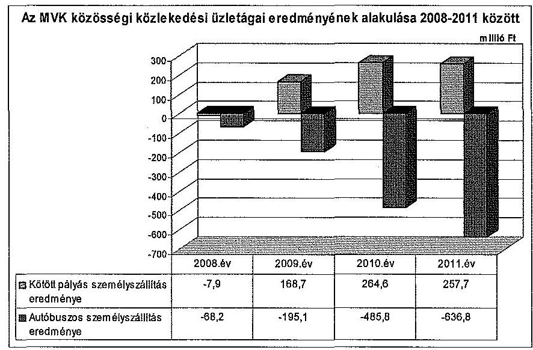

Az autóbusz üzletág vesztesége a 2010. évtől meghatározó tétel a veszteség növekedésében. Kialakulásához a közösségi közlekedést igénybe vevők számának évről-évre történő csökkenése és az ezáltal fellépő bevételkiesés vezetett. A menetdíjbevételek számottevően annak ellenére nem emelkedtek, hogy a menetdíjak folyamatosan növekedtek. Ennek oka a Szolgáltatói jelentések alapján, hogy az ellenőrzött időszakban az utaslétszám a 2008. évi 120,4 millió főről 2011. évre 97,6 millió főre esett vissza, továbbá a Közgyűlés döntése alapján a költségek emelkedését nem hárították át teljes mértékben az utazó közönségre. Az utazó közönség csökkenésének és összetételének megváltozása a fogyasztói árkiegészítés összegében 284,7 millió Ft összegű csökkenést okozott. Ennek oka, hogy a helyi tanuló és nyugdíjas bérletek és az ingyenes utazások csökkenése miatt kevesebb fogyasztói árkiegészítést igényelhetett az MVK. Az Önkormányzat által nyújtott működési célú pénzeszközátadások összege 112,4 millió Ft-tal, a normatív hozzájárulás 102,3 millió Ft-tal csökkent a 2008. évhez viszonyítva. A költségek oldaláról a veszteséget növelték - az autóbuszok üzemanyagárának emelkedése mellett - a villamos pálya felújítások miatti elterelések és a villamosközlekedés pótlásának többlet ráfordításai. A közfeladat-ellátáshoz nem

---

tartozó, de engedéllyel végzett kiegészítő tevékenységekből származó bevételek hozzájárultak a veszteség mérsékléséhez.

A veszteség mérséklése érdekében az MVK az Önkormányzatnak évenként javaslatot tett a szervezeti hatékonyságot növelő, a költségeket csökkentő átszervezésekre, továbbá éves menetrendi javaslatokkal élt, valamint tarifaváltoztatási előterjesztéseket készített. A változtatásra tett alternatív javaslatok alapján az Önkormányzat döntött a menetrendről és a szolgáltatás áráról. Az Önkormányzat az MH közreműködésével, a feladatok központosításával költségcsökkentő átszervezéseket hajtatott végre. Az MVK - saját hatáskörben - az eredményesség javítása céljából teszt jelleggel bevezette a 2011. évben a LEAN rendszert. A LEAN rendszer teszt üzemben működik, bevezetésével veszteségidőket mutattak ki, melyeket költségalapon nem számszerűsítettek. Utas felmérés és gazdaságossági megtérülés számítások előzték meg ezen intézkedéseket.

Az MVK az MH előírása alapján elkészítette az éves üzleti tervre alapozott likviditási tervet. Az MVK likviditáskezelése az MH többi tagvállalatával együtt cash-pool rendszerben történt. Az MVK-nak a pénzügyi eredményre ható tényezők kezelésében döntési jogosultsága nem volt, mert az MH döntött a finanszírozással kapcsolatos kérdésekben. Az MVK pénzügyi és likviditási helyzete rendkívül feszített volt. Ebben a 2010-2011. évek veszteséges gazdálkodása mellett végzett fokozott beruházási tevékenység játszott szerepet. Az MVK hitelállománya a 2008. évi 2077,0 millió Ft-ról, 2011-re 1869,8 millió Ft-ra csökkent, amelyből a nyilvántartások szerint 792,9 millió Ft folyószámla és 1076,9 millió Ft beruházási hitel volt. Az MVK tevékenységét tartósan szolgáló eszközök, azaz a befektetett eszközei finanszírozására a saját tőke alacsony mértékben nyújt fedezetet. A pénzügyi műveletek ráfordításainak összege 161,7 millió Ft és 226,4 millió Ft között volt az ellenőrzött időszakban.

Az ellenőrzött időszak legjelentősebb beruházása a Zöld Nyíl Projekt kivitelezésének megkezdése volt. A „Miskolc városi villamosvasút fejlesztése" nagyprojekt célja a szolgáltatás színvonalának növelése volt a meglévő villamos pálya korszerűsítésével, hálózatfejlesztéssel, továbbá a villamospark korszerűsítése és új villamosok beszerzése révén. A villamos pálya kivitelezési munkálatai 2010 tavaszán kezdődtek. A Zöld Nyíl Projekthez megítélt támogatás 33707,4 millió Ft volt, melyhez 3950,7 millió Ft saját forrást kellett biztosítani. Így a tervezett teljes költség 37658,1 millió Ft volt, melyből a villamosok beszerzésére 18600,0 millió Ft-ot, a villamos pálya építésére és azzal kapcsolatos költségekre 19058,1 millió Ft-ot terveztek felhasználni. A villamos pálya beruházásnál a bontott anyagokra vonatkozó eljárásrend szabályozásának hiányossága miatt a Kivitelező konzorcium a bontásból származó anyagokat a saját tulajdonaként kezelte, ezáltal az MVK-t - az MH Központi Belső ellenőrzése megállapítása alapján - 145,7 millió Ft becsült kár érte. A becsült kár MH általi meghatározásánál figyelembe vették a hulladék anyagokból (rézhulladék, csupasz alumínium vezeték, földkábel, szigetelt alumínium vezeték, adagolható acélhulladék, adagolható és nem adagolható vashulladék, beton panelek és vasoszlopok, valamint tört beton) nyerhető bevételeket, valamint a kiadásokat (deponálás, betonaprítás, veszélyes anyagok megsemmisítése). Az elbontott villamos pálya bontásában érintett eszközöket, annak ellenére szabálytalanul leselejtezték, és a könyvekből kivezették 2011. március 18-áig, hogy ennek eljárási szabályait a számviteli politikában és a selejtezési szabályzatban nem határozták

---

meg. A Kivitelező konzorcium a bontási munkálatok megkezdése előtt nem kért és nem kapott egyértelmű tájékoztatást a bontott anyagok szállítását és hasznosítását illetően, azt a saját tulajdonaként kezelte és elszállította. A bontási anyagokat, hulladékokat nem számították be sem mennyiségben, sem összegben a Megrendelő és a Kivitelező konzorcium közötti elszámolásnál. A szabálytalanságok miatt a vagyonnal való gazdálkodásra vonatkozó helyi szabályzatok előírásait az MVK nem tartotta be 2011. márciusát megelőzően. Az Önkormányzat ez időpontot megelőzően nem az elvárható gondossággal járt el, mivel a Projektirányítási Kézikönyvben előírtak ellenére nem kifogásolta a bontási munkálatok kivitelezés helyszínén való nyomon követésének elmaradását, továbbá a bontási munkálatok megkezdése előtt nem adott egyértelmű tájékoztatást a bontott anyagok szállítását és hasznosítását illetően.

A villamos pálya bontott anyagai feletti rendelkezésre eseti bizottságot hozott létre a Kivitelezői konzorcium, melybe az MVK is tagokat delegált. Az eseti bizottság azonban feladatait és kötelezettségeit nem a Projektirányítási Kézikönyvben előírtak szerint látta el. Tagjai a kivitelezési munkák bontási helyszínén nem követték nyomon a bontási munkálatokat, az MVK nyilvántartásait nem hasonlították össze a kibontott anyagok mennyiségével és tartalmával, nem dokumentálták bizonylaton az elbontott tárgyi eszközök sorsát.

Az MVK a vagyonvédelem és a kár mérséklése érdekében az addig nem értékesített, fellelt anyagokat 2011-ben három gazdasági társaság részére 56,2 millió Ft összegben kiszámlázta, melyből 18,2 millió Ft bevételként realizálódott. A Kivitelezői konzorcium felé kiszámlázott 38,0 millió Ft-ot a helyszíni ellenőrzés lezárásáig nem fizették meg. A kiszámlázott tételekkel csökkentették a bontott anyagokon keletkezett veszteséget. Az érték meghatározása becslés alapján történt, ami nem biztosította az átlátható elszámolást.

A Zöld Nyíl Projekthez kapcsolódó, de a támogatáshoz el nem számolható kifizetések során az MVK vezérigazgatója 2008-ban két gazdasági társasággal megbízási szerződést kötött. A három, illetve négy hónapos időtartamra azonos célú marketing tevékenységre vonatkozó szerződésekben az ellenértéket azonosan, 1,8 millió Ft+áfa/hó összegben rögzítették. Ezek alapján összességében 15,1 millió Ft-ot fizettek ki a megbízottaknak. Az MVK vezérigazgatója a megbízási szerződések megkötésekor megsértette a Kbt. becsült érték meghatározására vonatkozó egybeszámítási előírását.

Az MVK vezérigazgatója egy gazdasági társasággal a 2008. október 1-jétől 2008. december 31-ig terjedő időszakra, marketing tevékenységre és tanácsadásra, egy másik gazdasági társasággal a 2008. július 1. és 2008. szeptember 30. közötti időszakra, stratégiai tanácsadóként való közreműködésre kötött megbízási szerződést 1,8 millió Ft+ áfa/hó összegben. Az MVK a megbízási szerződésekben foglaltak teljesítésének ellenértékeként összesen 12,9 millió Ft-ot fizetett ki annak ellenére, hogy a vállalt feladatok elvégzését a megbízottak nem igazolták dokumentumokkal, így a szerződés teljesítése nem bizonyított. Az MVK vezérigazgatója egy gazdasági társasággal 2010. február 2-án megbízási szerződést kötött fordított áfa megállapítására irányuló állásfoglalás kérés előkészítésére, adószakértői feladatok ellátására és áfa adóterv elkészítésére 3,1 millió Ft értékben. A megbízási szerződésben rögzítették, hogy milyen feladatokat kell ellátnia a megbízottnak a teljesítés igazolások kiadásához. Az

---

MVK kifizette a szolgáltatás díját annak ellenére, hogy a megbízási szerződésben vállalt feladatok elvégzését dokumentumokkal a megbízott nem igazolta.

Az Önkormányzat a beszámolási kötelezettség előírásával és teljesítésével az ÁSZ 2011-ben tett - a gazdasági társaságok aktuális pénzügyi helyzetének félévenkénti bemutatására vonatkozó - javaslatát hasznosította.

Az Állami Számvevőszékről szóló 2011. évi LXVI. törvény 33. § (1) bekezdésében foglaltak értelmében a jelentésben foglalt megállapításokhoz kapcsolódó intézkedési tervet köteles az ellenőrzött szervezet vezetője összeállítani, és azt a jelentés kézhezvételétől számított 30 napon belül az ÁSZ részére megküldeni. Amennyiben az intézkedési tervet határidőben nem küldi meg a szervezet, vagy az nem elfogadható, az ÁSZ elnöke a hivatkozott törvény 33. § (3) bekezdés a)-b) pontjaiban foglaltakat érvényesítheti.

Az ellenőrzés intézkedést igénylő megállapításai és javaslatai:

# Az MVK vezérigazgatójának

1.  Az értékelési szabályzat a készletnyilvántartásra vonatkozóan az átlagáras nyilvántartási módszert rögzítette. A szabályzatban előírtakkal ellentétben a gyakorlatban az elszámoló áras nyilvántartási módszert alkalmazták.

Javaslat:
Intézkedjen az értékelési szabályzat és a bekerülési értékre vonatkozó nyilvántartási módszer közötti összhang megteremtéséről.
2.  A selejtezési szabályzatban nem írták elő a bontott anyagok hulladékként és haszonanyagként történő elkülönítését, elszállítását és azok tételes elszámolását.

Javaslat:
Intézkedjen a selejtezési szabályzat felülvizsgálatáról annak érdekében, hogy a szabályozással a bontott anyagok hulladékként és haszonanyagként történő elkülönítésének, elszállításának és azok tételes elszámolásának szabályai rögzítésre kerüljenek.
3.  Az MVK a Zöld Nyíl Projekthez kapcsolódó megbízási szerződésekben foglaltak teljesítésének ellenértékeként 2008 és 2010 között két gazdasági társaságnak összesen 12,9 millió Ft-ot, további egy gazdasági társaságnak 3,1 millió Ft-ot teljesítésigazolás nélkül kifizetett, a megbízottak a vállalt
 feladatok elvégzését dokumentumokkal nem igazolták, így a szerződés teljesítése nem bizonyított.

Javaslat:
Vizsgálja felül az MVK-nál a 2008-2010. években teljesítéssel nem igazolt kifizetéseket, és intézkedjen a felelősség megállapításáról.

---

# II. RÉSZLETES MEGÁLLAPÍTÁSOK 

## 1. Az ÖNKORMÁNYZAT KÖZFELADAT-ELLÁTÁSÁNAK MEGSZERVEZÉSE

### 1.1. A közfeladat meghatározása, a feladat ellátásának választott módja

A helyi közösségi közlekedés közszolgáltatásának biztosítása az Önkormányzat törvényi kötelezettsége. Az SZMSZ ${ }_{1,2}$-ben a Közgyűlés az Ötv. 8. § (1) bekezdése ${ }^{4}$ alapján előírta a kötelező feladatai ellátásának kötelezettségét, annak mértékét és módját a Közszolgáltatási szerződések ${ }_{1,2}$-ben határozta meg. A Közgyűlés az MVK által ellátott közösségi közlekedés megszervezéséről az 1191/69/EGK rendelet, annak hatályon kívül helyezését követően az 1370/2007/EK rendelet és az Ötv. előírásainak figyelembevételével döntött.

Az MVK Közszolgáltatási szerződés ${ }_{1,2}$ keretén belül látja el Miskolc és Felsőzsolca város közösségi közlekedés közszolgáltatási feladatát. A 2011. június 1-jétől hatályos Közszolgáltatási szerződés ${ }_{2}$ alapján a városi, menetrend szerinti autóbusz közlekedést 2021. május 31-ig, a villamos közlekedést 2026. május 31-ig végezheti az MVK. A Közszolgáltatási szerződés megkötésekor hatályos 1370/2007/EK rendeleten alapuló Vasúti tv ${ }_{2}$. 16. § (1) bekezdése a villamos közlekedést érintően pályáztatási kötelezettséget nem írt elő, továbbá a Busztörvény 8. § (5) bekezdése alapján belső szolgáltató pályáztatás nélkül is megbízható volt. A Közszolgáltatási szerződés ${ }_{2}$ 2011. június 1-jei hatályba lépésével egyidejűleg a 2004. december 21-én aláírt, 2005. január 1-jétől 2012. december 31-ig érvényes, 8 évre megkötött Közszolgáltatási szerződés ${ }_{1}$ hatályát vesztette. A Közszolgáltatási szerződés ${ }_{1}$ megkötésekor hatályos 1191/69/EGK rendeleten alapuló Vasúti tv ${ }_{1}$. 7/A. § (8) bekezdése a villamos közlekedést érintően pályáztatási kötelezettséget nem írt elő, továbbá a Busztörvény 17. § (5) bekezdése alapján az ellátásért felelős az adott működési területen pályáztatás nélkül is megbízható volt. A pályázati és az egyéb fejlesztési célok megvalósítása érdekében hosszú lejáratú hitelt csak önkormányzati garanciával tudott az MVK felvenni, ezért szükségessé vált a Közszolgáltatási szerződés ${ }_{1}$ lejárat előtti megszüntetése és azzal egy időben a Közszolgáltatási szerződés megkötése. A Közszolgáltatási szerződések ${ }_{1,2}$-ben előírták az ellátást biztosító személyi és tárgyi feltételeket, a szolgáltatási színvonal, minőség és az utas tájékoztatás követelményeit, továbbá megkövetelték az egységes arculatot. A főbb mennyiségi kritériumok a szállítási, a kocsi kilométer teljesítési, a menetjegy és bérletértékesítési adatok és az utas szállítások utaskilométerben megadott adatai, valamint a férőhely-kihasználtság voltak. A Közszolgáltatási szerződések ${ }_{1,2}$-ben az szerepelt, hogy a minőségi teljesítést a menetrendszerűség, a meghibásodások száma és a tisztaság alapján kell mérni. A Közszolgáltatási szerződés ${ }_{1,2}$-ben előírtak garanciákat a nem, vagy nem megfelelő teljesítésre.

[^0]
[^0]:    ${ }^{4}$ 2013. január 1-jétől az Mötv. 13. § (1) bekezdése szabályozza.

---

A garanciák között rögzítették a Közszolgáltatási szerződés ${ }_{1,2}$ módosításának, felmondásának feltételeit, jogkövetkezményeit, továbbá a rendkívüli felmondás eseteit.

A Közszolgáltatási szerződés ${ }_{1,2}$-ek módosításai során, azokon átvezették a megrendelt teljesítménnyel, a viteldíjjal, a kompenzációval és a menetrenddel kapcsolatos, valamint a jogszabályi változásokat.

A Közgyűlés 2004-ben jóváhagyta „Miskolc hosszú távú Közlekedésfejlesztési és közlekedési koncepció"-ját, amit 2008-ban az Önkormányzat felülvizsgáltatott. A módosított koncepcióban rögzített stratégiai célok és prioritások az Egységes Közlekedésfejlesztési Stratégiában - a 2008 és 2020 közötti időszakra - megfogalmazott prioritásokkal összhangban voltak.

A Közgyűlés 2005-ben a 2007 és 2013 közötti időszakra vonatkozó tervet fogadott el „Városfejlesztési stratégia és operatív program" címmel, melyben kiemelten foglalkozott a helyi tömegközlekedéssel.

A „Városfejlesztési stratégia és operatív program"-ban rögzítették, hogy „a közlekedéspolitika és a közlekedés fejlesztése járuljon hozzá a város gazdaságának dinamikus fejlődéséhez, a városi területek arányos fejlesztéséhez, a város és az agglomeráció kedvező közlekedési kapcsolatainak biztosításához mind az áru-, mind pedig a személyszállítás területén".

Az Önkormányzat a villamossal és autóbusszal biztosított helyi közösségi közlekedés feladatellátásához szükséges eszközöket 1994-ben 942,9 millió Ft összegben jegyzett tőkeként és 476,1 millió Ft összegben tőketartalékként a Miskolc Közlekedési Vállalat részvénytársasággá alakulásakor az MVK-ba apportálta. A kizárólagos önkormányzati tulajdonú MH alapítását követően, 2006-ban a Közgyűlés az MVK részvényeinek MH-ba való apportálásáról döntött.

Az Önkormányzat a helyi közösségi közlekedés eredményes ellátásához az alapításkor biztosított alaptőkén túl, 2010 és 2012 között alaptőke emeléssel (fejlesztési célú támogatásként) további vagyont biztosított az MVK részére (3. számú melléklet). Az MVK tőkeemelését az Önkormányzat az MH alaptőke emelés útján valósította meg, melynek célja a Zöld Nyíl Projekt megvalósításához szükséges források biztosítása volt.

A Közgyűlés 2008. május 22-i ülésén határozatban jóváhagyta a Zöld Nyíl Projekttel kapcsolatos előterjesztést, melyben vállalták a projekt 3951,0 millió Ft összegű saját forrásának biztosítását. A 2010. évben megkezdődött a projekt tényleges műszaki megvalósítása. Az önrész mértéke 10,5\% volt, melyet a kifizetésekhez forrásarányosan kellett biztosítani.

A Közgyűlés az MVK 1682,9 millió Ft-os alaptőkéjét az MH közbeiktatásával 2010-ben és 2011-ben összesen 1216,0 millió Ft-tal, majd a 2012. év végéig további 350,0 millió Ft-tal emelte meg, ami ezáltal 3248,9 millió Ft-ra nőtt.

Az Önkormányzat az ellenőrzött időszakban működési célú pénzeszközt adott át (1. számú melléklet) az MVK részére, amelynek elszámolása szabályos volt. Az átadott pénzeszközök az ellenőrzött időszak alatt folyamatosan

---

csökkentek, amelynek összegei 2008-ban 605,1 millió Ft, 2009-ben 602,9 millió Ft, 2010-ben 537,3 millió Ft, 2011-ben 492,7 millió Ft voltak.

Az átadott források felhasználásának számadási kötelezettségét 2008 és 2011 között az Áht ${ }_{1}$, 13/A. § (2) bekezdésében rögzítetteknek ${ }^{5}$ megfelelően előírták, és az MVK azok felhasználásával szabályszerűen elszámolt. Az Önkormányzat a 2012. évre 550,0 millió Ft működési célú pénzeszköz átadásáról kötött megállapodást az MVK-val. Az Önkormányzat a tőkeemelésen kívül nem nyújtott egyéb fejlesztési forrást az MVK-nak.

Az Önkormányzat a Közszolgáltatási szerződés ${ }_{1,2}$-ben meghatározta a helyi közösségi közlekedés indokolt költségeit finanszírozó működési célú pénzeszközátadás, mint pénzügyi kompenzáció számításának szabályait. A Közszolgáltatási szerződés ${ }_{1}$-ben előírtak szerint a közszolgáltatás bevételei és a pénzügyi kompenzáció együttesen biztosították a fedezetet a működés költségeire, valamint részlegesen a felújítások és a pótló beruházások ráfordításaira. A pénzügyi kompenzáció számítási alapja a Közgyűlés által elfogadott tarifaterv volt. A tervezettekhez képest évközben bekövetkezett változásokat az MVK jogosult volt változási kérelemként jelezni az időszakos beszámolók készítésekor. A pénzügyi kompenzáció havi előlegeivel a Szolgáltatói jelentés benyújtását követő egy hónapon belül elszámoltak. A Közszolgáltatási szerződés ${ }_{2} 2011$ júliusától a működési célú pénzeszközátadást, mint közszolgáltatási ellentételezést rögzíti. Ennek az indokolt költségek ellentételezésén felül 3\%-os nyereség biztosítása is a részét képezte.

Az MVK a Közszolgáltatási szerződés ${ }_{1,2}$-ben meghatározott változtatási kérelem benyújtásának jogával nem élt, annak ellenére nem kérte a bevételekkel nem fedezett indokolt költségek megtérítését, hogy az éves Szolgáltatói jelentések adatai szerint a helyi közösségi közlekedés közfeladat-ellátásából 2008-ban 76,1 millió Ft, 2009-ben 26,4 millió Ft, 2010-ben 221,2 millió Ft és 2011-ben 379,1 millió Ft vesztesége származott.

# 1.2. Az önkormányzati és a tulajdonosi irányítás megítélése 

A Közgyűlés a részvények értékesítése kivételével a vagyongazdálkodási rendeletben és az Alapító Okirat ${ }_{1}$-ban az MH-ra ruházta át az MVK feletti tulajdonosi jogkörök gyakorlását, féléves és éves beszámolási kötelezettséget írva elő. Az MH az Alapító Okirat ${ }_{2}$-ban előírta a képviseletre kijelölt személyek feladatait, együttműködési és beszámolási kötelezettségét, valamint vizsgálta azok teljesítését. A MH látta el az Önkormányzat által alapított gazdasági társaságok egységes irányítását, így az MVK-ét is.

Az Önkormányzat az SZMSZ ${ }_{1,2}$-ben előírta az állandó bizottságok részletes feladat- és hatásköreit, továbbá meghatározta a bizottságokra átruházott hatáskörök jegyzékét. Az SZMSZ ${ }_{1}$ szerint a Gazdasági Bizottság hatáskörébe tartozott többek között az elismert vállalatcsoport létrehozásának előkészítéséről és az uralmi szerződés tervezetének tartalmáról való döntés és az uralmi szerződés

[^0]
[^0]:    ${ }^{5}$ Az előírást az Áht ${ }_{2}, 114 . \S$ (2) bekezdése 2012. január 1-jétől hatályon kívül helyezte.

---

tervezetének jóváhagyása. A Gazdasági Bizottság feladatait 2011 márciusától a Városgazdálkodási és Üzemeltetési Bizottság vette át.

Az Alapító Okirat ${ }_{1}$ alapján az MH kizárólagos hatáskörébe tartozott többek között az MVK alapszabályának megalkotása és módosítása, működési formájának megváltoztatása, vezérigazgatójának, illetve az FB tagjainak és a könyvvizsgálónak a megválasztása, visszahívása, díjazásának megállapítása és a beszámoló jóváhagyása. Feladata volt továbbá az olyan szerződéskötés, vagy egyéb kötelezettségvállalás jóváhagyása, amelynek ügyleti értéke (ugyanazon ügyfél vagy szerződő partner esetén tárgyéven belül összevontan is értve) az 5 millió Ft-ot meghaladta.

Az MVK vezérigazgatója 5 millió Ft alatt saját hatáskörében dönthetett szerződéskötésről, vagy egyéb kötelezettségvállalásról. Ezekben az esetekben 5 millió Ft és 50 millió Ft összeghatár között az MH vezérigazgatója (kinevezett cégvezető hiányában az MH Igazgatósága) a közbeszerzésre vonatkozó szabályok figyelembe vételével volt jogosult dönteni, az a feletti döntésekre a Közgyűlés volt jogosult a közbeszerzésre vonatkozó szabályok betartása mellett.

Az MVK vezérigazgatójának, mint egyszemélyi vezetőnek a feladatait és hatáskörét az Alapító Okirat ${ }_{2}$-ban és a munkaszerződésében rögzítették. A vezérigazgató feladatainak végrehajtását az MH és az MVK FB ellenőrizte.

Az MH legfőbb szerve a Közgyűlés, mely a Gt. tv. 55. §-a alapján elismert vállalatcsoport létrehozásáról döntött, és amelynek uralkodó tagja az MH. A MH létrehozásának céljait megvalósítva - 2011-től a számvitel, a kontrolling, a beszerzés, az informatika, a vagyongazdálkodás, a humán erőforrás és marketing területeket stratégiai irányítása alá vonta. A 2011-es előkészítést követően 2012-ben megvalósult a humán erőforrás és az informatika teljes körű, a beszerzés részleges központosítása, ami az MVK Zrt-t is érintette.

Az Önkormányzat meghatározta és kialakította a Közszolgáltatási szerződés ${ }_{1,2}$ -ben a szakmai feladatellátás mérésére, értékelésére alkalmas kritériumrendszert, paramétereket, mutatószámokat és kötelezettségeket. Az MVK a közfeladat ellátásával kapcsolatban havi, negyedéves és éves beszámolásra volt kötelezett.

A Közszolgáltatási szerződés ${ }_{1,2}$-ben foglaltaknak megfelelően - a havi, negyedéves és éves jelentési kötelezettségnek eleget téve - a szolgáltatások teljesítéséről az MVK az ellenőrzött időszakban az előírásoknak megfelelő tájékoztatást adott.

Az MVK beszámolt az adott időszak Közszolgáltatási szerződés ${ }_{1,2}$ szerinti szállítási teljesítményeiről, a kocsi kilométer teljesítmény tervezett értékhez képesti teljesítéséről az autóbuszoknál és a villamosnál. Beszámolt továbbá a menetjegy és bérletértékesítési adatokból statisztikai szorzókkal képzett mutatók szerinti utas szállításokról utaskilométerben. Információkat szolgáltatott üzemági bontásban az autóbusznál, a villamosnál az utasszámról és az utaskilométerről, valamint a férőhely-kihasználtságról, továbbá a férőhely kilométer és a hasznos kocsi kilométer hányadosaként képzett átlagos dinamikus férőhelyről. A minőségi teljesítést a menetrendszerűség, a meghibásodások száma és a tisztaság alapján mérték.

---

Az MH szabályozta az MVK üzleti tervei, a vezetői prémiumfeltételek, a féléves és éves beszámoló, az üzleti jelentés és a könyvvizsgálói jelentések elfogadását, továbbá a monitoring és időszaki jelentések készítésének gyakoriságát. A MH Igazgatósága az MVK üzleti terveinek elfogadásáról az ellenőrzött időszakban minden esetben határozatot hozott. Az MH a saját és a tagvállalatai, így az MVK éves beszámolási folyamatait igazgatósági határozatban szabályozta. Az MH üzleti terveit és éves konszolidált beszámolóit az Önkormányzat megtárgyalta és elfogadta. A tervek és beszámolók tartalmazták az MH tulajdonában lévő társaságok, köztük az MVK konszolidált adatait is. Az Önkormányzat 2011-től félévente közvetlenül is áttekintette a közvetetten tulajdonolt társaságai gazdálkodását.

Az MH tagvállalataira vonatkozó, összehangolt tervezési rendszert alakított ki. A pénzügyi, funkcionális tervek egységes struktúrája lehetővé tette a MH számára a tervek összehangolt kezelését, valamint az egységes beszámolási rendszer kialakítását, a terv-tényadatok rendszeres, azonos szerkezetben történő figyelemmel kísérését. A tervezési utasítást a MH Igazgatósága hagyta jóvá. Az üzleti tervezéskor folyamatos egyeztetés volt az Önkormányzat, az MH és az MVK között a költségvetési kapcsolatok vonatkozásában.

A Közgyűlés az Önkormányzat kizárólagos tulajdonában álló gazdasági társaságok vezető tisztségviselőinek javadalmazásával kapcsolatos alapelveket és előírásokat - a Taktv. 5. § (3) bekezdésének felhatalmazása alapján, annak hatályba lépését követően, 2010-ben - szabályzatban írta elő. A MH Javadalmazási szabályzatát az Önkormányzat Gazdasági Bizottsága a 12/2010. (II. 26.) számú határozatával fogadta el. A MH hatályos Javadalmazási szabályzatát az Önkormányzat Városgazdálkodási és Üzemeltetési Bizottsága a 23/2012. (VI. 14.) számú határozatával fogadta el, felváltva a korábbi szabályzatot.

Az MVK Javadalmazási szabályzatát az MH Igazgatósága a 2/1/2010. (I. 28.) számú határozatával fogadta el. Az MVK-val munkaviszonyban álló vezetők számára a MH Igazgatósága prémiumot tűzött ki, amelyről határozatot hozott. A MH Igazgatósága az MVK premizálási rendszerével kapcsolatban az ellenőrzött időszakban 16 határozatot hozott, melyek a tervek teljesítéséhez kötötték az érdekeltségi rendszert. Prémiumfeladatként az üzleti terv fő célkitűzéseinek teljesítése mellett csak olyan feltétel volt meghatározható, amelynek teljesítése a munkakör elvárható szakértelemmel és gondossággal való ellátásán túlmutató, objektíven meghatározható teljesítményt takart. A célok között a tervezett eredmény megvalósítása, illetve a veszteség és a kötelezettségek csökkentése szerepelt. Az MH az MVK vezetőinek prémiumfeltételeit a Javadalmazási szabályzatnak megfelelően tűzte ki. A prémium meghatározására az üzleti terv elfogadásával egyidejűleg került sor. Az MVK-nál prémium kitűzésre minden évben sor került, egy vezető esetében a nem megfelelő teljesítés miatt nem volt kifizetés. A prémiumok megállapításánál az MH Igazgatósága azok kifizetési feltételeit rögzítő határozataiban foglaltaknak megfelelően járt el. Az ellenőrzött időszakban a vezérigazgatóknak kifizetett összeg összesen 28,5 millió Ft volt. A prémium kiírása az alapfizetés $100 \%$-a, míg - a teljesítés alapján - a kifizetés aránya 2008-ban az alapfizetés 100\%, 2009-ben 70\%, 2010-ben 93\%, 2012-ben $35 \%$ volt. A 2011. évben nem történt kifizetés.

---

A helyi közösségi közlekedési közszolgáltatás hatósági árformába tartozó tevékenység, amelyet az Önkormányzat az MVK-val kötött Közszolgáltatási szerződés ${ }_{1,2}$-ben szabályozott. Az árképzés alapját az Önkormányzat rendeletekben állapította meg. Az árak alakulására az MVK vezérigazgatói nyújtottak be javaslatot az Önkormányzat részére. Az előterjesztésekben részletesen indokolták és adatokkal alátámasztották a szolgáltatás ellátásához szükséges bevételek mértékét.

# 2. Az MVK KÖZFELADAT-ELLÁTÁSÁVAL KAPCSOLATOS TEVÉKENYSÉGE 

### 2.1. Az MVK szervezeti kialakítása, szabályozottsága

A MVK szervezeti felépítése az ellenőrzött időszakban lineáris-funkcionális volt. A lineáris szervezetben az alá- fölérendeltségi kapcsolatok, a szolgálati utak egyértelműen meghatározottak voltak. A funkcionális felépítés a szakterületek szerinti munkamegosztást segítette elő. Az MVK SZMSZ-ének módosításai következtében öt alkalommal változott az MVK szervezeti felépítése, a lineárisfunkcionális struktúra megtartása mellett.

Az MVK belső struktúrája változott az ellenőrzött időszakban az MH által fokozatosan átvett és központosított feladatoknak megfelelően. A végrehajtott átszervezések és létszám racionalizálás eredményeként az MVK által főállásban foglalkoztatottak átlagos statisztikai állományi létszáma a 2008. évi 953 főről a 2011. év végére 892 főre csökkent.

Az MH 2006-tól kezdődően központosított gazdálkodási és ügyviteli rendszert alakított ki és működtetett. Ennek megfelelően változtatták az MVK belső szervezeti rendjét. Az MH a 2011. évben az irányítás hatékonyságának növelése, a folyamatok átláthatósága, optimalizálása érdekében felülvizsgálta és átszervezte az MVK-t, ennek következtében a beszerzési (anyag, energia), a humán erőforrás gazdálkodási és az informatikai feladatokat a 2012. év I. félévétől átvette.

Az MVK vagyonnal kapcsolatos döntési szintjeit, értékhatárait és a döntések meghozatalának eljárásrendjét az Alapító Okirat ${ }_{2}$ és az MVK SZMSZ-e szabályozta.

Az MVK a Számv. tv. 14. § (5) bekezdés a) és b) pontjaiban előírtaknak megfelelően a 2004. évben, a tulajdonának védelme érdekében rendelkezett leltározási és leltárkészítési, továbbá az eszközök és források értékelési szabályzatával. Az értékelési szabályzat a készletnyilvántartásra vonatkozóan az átlagáras nyilvántartási módszert írta elő, miközben a gyakorlatban az elszámoló áras nyilvántartási módszert alkalmazták a szabályzatban előírtakkal ellentétben.

A selejtezési szabályzat a feleslegessé vált eszközök selejtezésének, hasznosításának szabályait tételesen nem írta elő. Nem szabályozta továbbá a bontott anyagok hulladékként és haszonanyagként történő elkülönítését, elszállítását és azok tételes elszámolását.

---

Az MVK számviteli politikája, számlarendje és beruházási szabályzata nem írta elő a Zöld Nyíl Projekthez kapcsolódó eljárásrendet, így a bontott anyagok hulladékként és haszonanyagként történő elkülönítésére, elszállítására és azok tételes elszámolására vonatkozó szabályokat sem. Az MVK számviteli nyilvántartási rendszere a Zöld Nyíl Projekt kivitelezése közben, a 2011. évben megváltozott.

Az MVK számlarendje nem biztosította a közfeladat-ellátás bevételeinek és ráfordításainak üzletágankénti tételes elhatárolását, továbbá nem minden tevékenységre határozta meg a közvetlenül el nem számolható költségeknek és ráfordításoknak a felosztási szabályait. A főkönyvi számlák alábontásában nem különültek el a közszolgáltatási tevékenység, azon belül az autóbusz és a villamos üzemeltetés adatai. A felosztást a Kontrolling Csoport utólag végezte el.

Az MVK a Számv. tv. 14. § (5) bekezdés c) pontja és (7) bekezdése alapján elkészítette önköltségszámítási szabályzatát. A szabályzatban meghatározták a bevételek és ráfordítások üzletágankénti felosztását, a műhelyekben végzett felújítások munkaóra és anyagfelhasználás nyilvántartását, a saját előállítású termékek, végzett szolgáltatások árképzéséhez szükséges önköltségének utókalkuláció módszerével történő megállapítását.

Az MVK az ellenőrzött időszakra önálló hosszú távú stratégiát nem készített, fejlesztései irányát az Önkormányzat és az MH határozta meg. Az MVK - az MH által meghatározott módon - minden évben elkészítette az üzleti tervét, melyben figyelembe vette a hatályos önkormányzati rendeletben meghatározott hatósági árakat. Az MVK az üzleti terveit a Tervezési Kézikönyvben és a Tervezési Naptárban meghatározottak figyelembevételével készítette el.

A Tervezési Kézikönyv tartalmazta a tervezés módszertanát, rögzítette a legfontosabb információkat, és azok forrásait, a tervek formáját és tartalmát (tervtáblák), a különböző tervek kapcsolódási pontjait és a felelős szervezeti egységet. A Tervezési Naptár tartalmazta a tervezés időbeli ütemezését és az ahhoz tartozó felelős személyeket.

Az Önkormányzat - a 2012. december 31-éig hatályos - az Ötv. 91. § (6) bekezdésében előírtaknak ${ }^{6}$ megfelelő gazdasági programját a 2007-2010. évekre, továbbá a 2011 és 2014. közötti időszakra hagyta jóvá a Közgyűlés. Célja az volt, hogy meghatározza helyi szinten mindazokat a célkitűzéseket és feladatokat, amelyek - a költségvetési lehetőségekkel összhangban, a környezeti adottságok figyelembevételével - az önkormányzat kötelező és önként vállalt feladatainak biztosítását szolgálják.

A közlekedési alprogram célkitűzése a korszerű közösségi közlekedés kialakítása volt, amelyben a villamos közlekedés mellett új közlekedésfejlesztési irányokat határozott meg, így a déli iparterület közvetlen tranzitelérését a város kikerülésével.

[^0]
[^0]:    ${ }^{6}$ 2013. január 1-jétől az Mötv. 116. § (1) bekezdése szabályozza.

---

A személyszállítási Közszolgáltatási szerződés ${ }_{1,2}$ és a Számv. tv. 9. és 19. §-a előírásainak megfelelően, az éves beszámoló részeként elkészített üzleti jelentésben összehasonlításra és indoklásra kerültek a terv és tény adatok.

# 2.2. Az MVK vagyonnyilvántartása 

Az MVK a közösségi közlekedés közfeladat ellátásához alapításkor, valamint tőkeemelésként vett át vagyont az Önkormányzattól, amelynek elkülönített nyilvántartása az ellenőrzött időszakban a főkönyvi könyvelés során megvalósult. Az MVK üzemeltetésre, kezelésre az Önkormányzattól vagyont nem vett át.

Az MVK a saját tulajdonú vagyonát, annak értékét és változásait az éves beszámoló készítését biztosító számlarend alapján tartotta nyilván.

Az Alapító Okirat ${ }_{2}$ az MH felé havi, az FB felé pedig negyedéves gazdálkodással összefüggő jelentéskészítési kötelezettséget írt elő, melynek a MVK a kontrolling beszámolóban tett eleget. Az MVK kontrolling beszámolójában szerepelő adatok körét az MH és tagvállalatai negyedéves és havi kontrolling beszámolás folyamata tárgyú Eljárások kézikönyve szabályozta. Az MVK havi rendszerességgel tájékoztatta a terv és tényadatok alakulásáról az MH-t, az érintett időszakban megküldött adattáblák feltöltésével.

A vagyoni helyzetet jellemző főbb, könyvviteli mérleg szerinti adatok 2008-2012. év III. negyedév között a következők voltak:

Adatok: millió Ft-ban

| Megnevezés | $\begin{aligned} & 2008 . \\ & 01.01 . \end{aligned}$ | $\begin{aligned} & 2008 . \\ & 12.31 . \end{aligned}$ | $\begin{aligned} & 2009 . \\ & 12.31 . \end{aligned}$ | $\begin{aligned} & 2010 . \\ & 12.31 . \end{aligned}$ | $\begin{aligned} & 2011 . \\ & 12.31 . \end{aligned}$ | $\begin{aligned} & 2012 . \\ & 09.30 . \end{aligned}$ |
| :--: | :--: | :--: | :--: | :--: | :--: | :--: |
| Befektetett eszközök | 4877,0 | 4311,5 | 4066,0 | 10778,5 | 16466,1 | 17341,9 |
| ebből tárgyi eszköz | 4765,9 | 4205,4 | 3951,4 | 10615,8 | 16351,6 | 17257,4 |
| Forgóeszközök | 386,6 | 525,9 | 560,0 | 676,5 | 598,4 | 5444,8 |
| Aktív időbeli elhatárolások | 21,9 | 9,1 | 12,4 | 65,2 | 5,1 | 17,5 |
| Eszközök összesen | 5285,5 | 4846,5 | 4638,4 | 11520,2 | 17069,6 | 22804,2 |
| Saját tőke | 1456,0 | 1457,4 | 1467,3 | 1613,6 | 2103,1 | 2319,2 |
| Céltartalékok | 31,5 | 23,5 | 0,0 | 7,2 | 6,1 | 6,1 |
| Kötelezettségek | 2974,5 | 2780,0 | 2750,4 | 6655,7 | 4879,8 | 8241,7 |
| Passzív időbeli elhatárolások | 823,5 | 585,6 | 420,6 | 3243,7 | 10080,5 | 12237,3 |
| Források összesen | 5285,5 | 4846,5 | 4638,4 | 11520,2 | 17069,6 | 22804,2 |

A MVK-nál az eszközök értéke a 2008. január 1-jei nyitó állományhoz viszonyítva a 2012. év III. negyedévére 17518,7 millió Ft-tal nőtt az ellenőrzött időszakban. A tárgyi eszközök értéknövekedése a támogatásokból megvalósított fejlesztések miatt - villamos pálya és villamos járműfejlesztéshez kapcsolódó Zöld Nyíl Projekt folyamatban lévő fejlesztése - meghaladta az elszámolt értékcsökkenés összegét. A saját tőke a 2010. március 10-én elrendelt és részben 2010-ben, részben 2011-ben megfizetett 1216,0 millió Ft tőkeemelés miatt - az ellenőrzött évek veszteséges gazdálkodása ellenére - 863,2 millió Ft-tal nőtt. A Közgyűlés az MVK alaptőkéjét az MH közbeiktatásával 2012-ben további 350,0 millió Ft-tal megemelte. A kötelezettségek a 2008. január 1-jei nyitó

---

állományhoz viszonyítva a 2012. év III. negyedévére 5267,2 millió Ft-tal, (177,1\%-kal) növekedtek. A kötelezettségek növekedése elsősorban folyószámlahitel-állományából és a Zöld Nyíl Projekttel összefüggő - a beruházás utófinanszírozása miatti - szállítói kötelezettségekből keletkezett. A források között a legnagyobb növekedést a halasztott bevételként, és a passzív időbeli elhatárolások között elszámolt, az Önkormányzattól, a Magyar Államtól és az EU-tól kapott támogatás okozta.

# 2.3. A gazdasági évek ráfordításainak és bevételeinek alakulása 

Az MVK összes ráfordítása 2008-ról, 2011-re 1\%-kal (6849,4 millió Ft-ról 6777,5 millió Ft-ra) csökkent. Ezen belül az anyagjellegű ráfordítások részaránya $37,7 \%$-ról $40,1 \%$-ra (133,3 millió Ft-tal), a személyi jellegű ráfordításoké $46,9 \%$-ról $47,9 \%$-ra (33,6 millió Ft-tal) nőtt. A személyi jellegű ráfordítások növekedése a bérköltség 39,1 millió Ft-os, a bérjárulékok 8,1 millió Ft-os növekedéséből és a személyi jellegű egyéb kifizetések 13,6 millió Ft-os csökkenésének egyenlegéből adódott.

Az ellenőrzött időszakban a közfeladat ellátásával kapcsolatos beszerzések összhangban voltak a teljesített szolgáltatással. Az MVK 2006-tól rendelkezett Beszerzési szabályzattal és 2010-től a gázolaj közbeszerzésére vonatkozó eljárási renddel. A gázolaj és kenőanyag beszerzés közbeszerzési eljárás keretében, a belső eljárási rendnek megfelelően és azzal összhangban történt.

A helyszíni ellenőrzés időszakában a gázolaj beszerzést először a 2005. augusztus 29-én közbeszerzési eljárás alapján kötött gázolaj szállítási szerződés alapján végezték, amely szerződés 2010. augusztus 28-án lejárt. Ezt követően közbeszerzési eljárást folytattak le, melynek győztesét 2010. december 9-én hirdették ki, majd ezután szerződést kötöttek vele. A két szerződés közötti időszakban a Központi Szolgáltatási Főlgazgatóságtól szerezték be a gázolajat.

Az MVK a Közszolgáltatási szerződés ${ }_{1,3}$ keretében a kötött pályás személyszállítással kapcsolatos feladatokat is ellátta. Az MVK az ellenőrzött időszakban a villamos energiát a kedvezőbb ár elérése érdekében az Önkormányzat tulajdonában lévő intézményekkel és az önkormányzat többségi tulajdonában lévő gazdasági társaságokkal, valamint az MH tagvállalataival közösen szerezte be.

A humánpolitika alapelveit és az MVK-nál a prémium és a jutalom fizetésének szabályait a kollektív szerződés szabályozta. A járművezetők üzemanyag-megtakarítással összefüggő anyagi ösztönzését vezérigazgatói utasítás szabályozta. A gázolajüzemű gépjárművek üzemanyag-elszámolási és megtakarítást ösztönző rendszerének szabályozása 2009. április 1-jétől, az autóbuszok üzemanyag normaképzési, elszámolási és megtakarítást ösztönző, visszatérítési rendszerének szabályozása 2010. január 1-jétől hatályos.

A közfeladat ellátásával összefüggésben a személyi jellegű kiadások annak ellenére lényegesen nem változtak, hogy az ellenőrzött időszakban az MVK átlagos statisztikai állományi létszáma csökkent.

---

Az MVK-nál a személyi jellegű ráfordítások összege a 2008. évi 3215,3 millió Ft-ról a 2011. évre 3248,9 millió Ft-ra változott.

A megbízási díjakra fordított kiadás összege a 2008-as 3,5 millió Ft-os összegről 2011-re 4,5 millió Ft-ra nőtt. Prémium és prémiumelőleg jogcímen az ellenőrzött időszakban a négy vezérigazgatónak kifizetett összegek (28,5 millió Ft) a belső szabályozásnak megfeleltek. A kiemelt munkavégzés elismeréseként az MVK munkavállalói a Kollektív szerződésben foglaltaknak megfelelően pénzjutalomban részesültek. A jutalomként kifizetett összegek a 2008. évi 23,5 millió Ft-ról 2011-re 16,3 millió Ft-ra csökkentek, összességében 82,9 millió Ft jutalmat fizettek ki 2008 és 2012. III. negyedéve között. Végkielégítés kifizetésére - 2008-ban 28 millió Ft, 2009-ben 8,9 millió Ft, 2010-ben 6,3 millió Ft és 2011-ben 22,5 millió Ft - a végrehajtott szervezeti átalakítás eredményeként bekövetkezett létszámcsökkentés következtében került sor.

Az MVK által alkalmazott átlagbérek az ellenőrzött időszakban 17-20\%-kal alacsonyabbak voltak a KSH által közzétett városi, elővárosi szárazföldi személyszállítás ágazatban foglalkoztatott teljes munkaidős dolgozók átlagbérénél.

Az MVK vezetői premizálásáról az MH rendelkezett. Az MVK, kimutatása szerint a 2008-2010. évek között, a 2006 szeptemberében megkötött „Generali Aranyszárny" életbiztosítási kötvénybe 33,3 millió Ft befizetést teljesített. Az életbiztosítási kötvényt, amely a biztosítás mellett befektetést is tartalmazott, a prémium kifizetésén felül biztosították az akkor tisztségét betöltő vezérigazgatónak és három vezetőnek. Az életbiztosítási kötvények megkötésekor teljesítménykritériumot nem határoztak meg.

Az MVK a tárgyi eszközök értékcsökkenési kulcsait a számviteli politikájában rögzítette, ügyviteli rendszere alkalmas volt annak nyilvántartására.

Az MVK finanszírozási igénye és ezzel együtt a finanszírozás költségei és ráfordításai is folyamatosan növekedtek. Az MVK finanszírozási terhei közül a pénzintézeti költségek 2008-ról 2011-re 8,5 millió Ft-tal növekedtek, a kamatjellegű ráfordítások 19,7 millió Ft-tal csökkentek. Az egyéb ráfordítások 2008-ról 2011-re 15,9\%-kal (10,0 millió Ft-tal) növekedtek.

Az MVK a 2006. évben autóbusz vásárlásra felvett 2970,0 millió Ft hitelből évente 320,0 millió Ft-ot törleszt. A kamatráfordítások az MVK finanszírozási igényét biztosító - vállalatcsoporton belüli finanszírozást lehetővé tevő és az MVK által egyre nagyobb mértékben igénybe vett - növekvő folyószámlahitel-volumen miatt nőttek.

Az MVK mind az egyéb ráfordítások, mind a pénzügyi műveletek ráfordításainak elszámolása során betartotta a Számv. tv. 81. § (1)-(5) bekezdésében, a 83. § (3) bekezdésében, illetve a 85. § (1)-(3) és (5)-(6) bekezdéseiben és a számviteli politikájában előírtakat. Az MVK a Számv. tv. 86. § előírásának megfelelően rendkívüli ráfordításokat az ellenőrzött időszakban 1,1 millió Ft és 1,9 millió Ft értékben mutatott ki a könyveiben.

---

A Közgyűlés a Miskolc város helyi tömegközlekedési díjainak megállapításáról szóló rendeletei alapján határozta meg a hatósági árakat, melyek az MVK-ra nézve kötelező érvényűek voltak. A Közszolgáltatási szerződés ${ }_{1,2}$-ben előírtak alapján az MVK vezérigazgatójának feladata volt a piac igények és szokások felmérése és ennek alapján a tarifapolitika kialakítása. A vezérigazgató, feladatának eleget téve az Önkormányzatnak javaslatot tett a menetjegy- és bérletárakra. A javaslatot az MVK előzetesen az MH-val engedélyeztette. Az MVK szolgáltatási díjakra tett javaslatai átláthatók és megalapozottak voltak.

A 85/2007. (IV. 25.) Korm. rendeletben előírt utazási kedvezmények mellett az Önkormányzat kedvezményként bevezette a turistajegyet, a hétvégi családi jegyet és a Miskolc kártya 10\%-os bérlet kedvezményt, melyet a Közszolgáltatási szerződés ${ }_{1,2}$ és a Miskolc város helyi tömegközlekedési díjainak megállapításáról szóló rendeletek szabályoztak.

Az MVK bevételei a 2008. évi 6773,7 millió Ft-ról a 2011. évre 6218,2 millió Ft-ra 8,9\%-kal csökkentek. A fogyasztói árkiegészítés, az állami normatív támogatás és az Önkormányzat működési támogatásának jelentős csökkenését a menetdíjbevételek és egyéb bevételek emelkedése nem ellensúlyozta. A fogyasztói árkiegészítés, az utazók számának csökkenése miatt 2008-ról 2011-re 17,9\%-kal (1586,7 millió Ft-ról 1302,0 millió Ft-ra), az állami normatív támogatás 15,3\%-kal (668,8 millió Ft-ról 566,5 millió Ft-ra) csökkent (2. számú melléklet). Az Önkormányzat által nyújtott működési támogatás 18,6\%-kal (605,1 millió Ft-ról 492,7 millió Ft-ra) csökkent. A menetdíj bevételek 2,3\%-kal (3277,1 millió Ft-ról 3359,5 Ft-ra), az egyéb bevételek 63\%-kal (219,3 millió Ft-ról 357,4 millió Ft-ra) növekedtek.

Az Önkormányzat által meghatározott kedvezményekkel, díjmentességekkel összefüggő korrupciós kockázatok csökkentése céljából, a menetjegyeket több ellenőr együtt ellenőrizte.

Az MVK a vevőállományról naprakész nyilvántartást vezetett, kintlévőségek vizsgálata során a fennálló vevőköveteléseket osztályozták aszerint, hogy lejárt, bizonytalan, vagy le nem járt, biztos befolyású követelések-e. A követelések 2008-ról 2011-re 40,2 millió Ft-tal nőttek. Az MVK a követeléseket a Számviteli politikában szabályozott módon kezelte. A bérletek megváltása többségében POS terminálon keresztül történt, ezért a hátralékos állomány nem volt jelentős, a követelések behajtása rendkívüli intézkedést nem igényelt.

# 2.4. Az MVK eredményének alakulása 

A gazdálkodás terv és tényadatai évközi alakulásának ellenőrzésére vonatkozó szabályokat a kontrolling rendszer keretében az MH jóváhagyta. Az MH-t az előírás alapján az MVK havi rendszerességgel tájékoztatta a terv és tényadatok alakulásáról, az információs igényeknek megfelelő, az érintett időszakban megküldött adattáblák feltöltésével.

A Kontrolling Csoport havi rendszerességgel készített beszámolókat, melyben vizsgálták az egyes üzletágak, illetve az MVK egészére vonatkozó tény adatok

---

tervezetthez való viszonyát. A tervtől való eltérések MVK-ra gyakorolt negatív hatásának kiküszöbölésére a Kontrolling csoport és a terület felelősei adtak megoldási javaslatot. A javaslatok alapján döntöttek a megoldást szolgáló akciótervekről.

Az Önkormányzat a Közszolgáltatási szerződés ${ }_{1,2}$-ben szabályozta a beszámolást a terv és tény adatok összevetéséről, meghatározva az elemzések készítésének havi gyakoriságát és adattartalmát.

Az MVK a 2008-2011. években és a 2012. év I-III. negyedévben vizsgálta az eredmény alakulására hatást gyakorló tényezőket. Az MVK az Önkormányzatnak évenként javaslatot tett a gazdasági egyensúly fenntartása érdekében a szervezeti hatékonyságot növelő, és a költségeket csökkentő átszervezésekre. Éves menetrend változtatási javaslatokat tett az Önkormányzatnak és tarifa változtatási előterjesztéseket készített. A tarifa növelésére tett alternatív javaslatok közül az Önkormányzat a kisebb mértékű jegyáremelésről döntött. A közösségi közlekedési szolgáltatás hatósági áras tevékenység, árváltoztatási és rendeletalkotási joga az Önkormányzatnak van. Az MVK az ellenőrzött években - az MH jóváhagyásával - kezdeményezte a szolgáltatási díjak emelését az Önkormányzatnál, év közben árváltoztatást nem kezdeményezett. További intézkedésként - saját hatáskörben - az eredmény alakulásának javítása céljából teszt jelleggel bevezette a 2011. évben a LEAN rendszert.

A LEAN rendszert a javítási munkák közül három tevékenységnél alkalmazták. A járművek műszaki vizsgára való felkészítésénél a 100 órás norma időből az elemzések alapján több órás megtakarítást értek el. A Rába Premier „C" tengelyének szimering futó javításánál a 6 órás norma időt egy órával csökkentették. A 2 órás norma idejű légszárító javítási folyamatánál 30-40 perc veszteségidőt tártak fel.

Az MVK által - az eredményesség javítását célzó - kezdeményezett intézkedések előkészítettek, megalapozottak voltak. Végrehajtásuk az Önkormányzat által meghatározott célok elérését, feladatok végrehajtását szolgálták. Az MVK utólagosan nyomon követte az eredményesség javítására tett intézkedések költségcsökkentő, hatékonyságnövelő hatását. Az intézkedéseket költség és hatékonyság szempontjából a kontrolling keretében figyelemmel kísérték.

A hatékonyság növelése érdekében a tanulók utazási szokásaihoz igazították a menetrendet, járatokat indítottak pénteken a haza utazó diákoknak. Ezen intézkedéseket utas-felmérés és gazdaságossági megtérülést elemző számítások előzték meg.

A közfeladat-ellátáshoz nem tartozó, de engedéllyel végzett kiegészítő tevékenységek (idegen munka, reklám, anyageladás, flottaszolgáltatás, humán szolgáltatás) súlyát, szerepét, azok üzemi eredményre gyakorolt pozitív hatását az MVK értékelte, azonban azok mértéke nem volt jelentős.

A 2008. évben végzett kiegészítő tevékenységek az üzemi eredményt, a többi évhez képest kiemelkedő mértékben, 74,8 millió Ft-tal javították. A további években nem jelentős az üzemi eredményre gyakorolt hatásuk, 2009-ben 8,8 millió Ft, 2010-ben 21,9 millió Ft, 2011-ben 8,8 millió Ft volt.

---

Az MVK pénzügyi műveleteinek ráfordításai 161,7 millió Ft és 226,1 millió Ft között változtak az ellenőrzött időszakban. A pénzügyi eredményt befolyásolták a fizetendő kamatok és kamatjellegű ráfordítások. A pénzügyi műveletek bevételi tételei a leköthető szabad források hiánya miatt nem voltak jelentősek (a legmagasabb érték a 2010. évben is csak 1,4 millió Ft összegben jelentkezett).

Az MVK mérleg szerinti eredménye ${ }^{7}$ 2008-ban -1,3 millió Ft, 2009-ben 1,5 millió Ft, 2010-ben -201,1 millió Ft, 2011-ben pedig -379,1 millió Ft volt. A számviteli beszámolók adatai alapján az ellenőrzött időszakon belül az eredmény elemek alakulását a következő ábra szemlélteti:
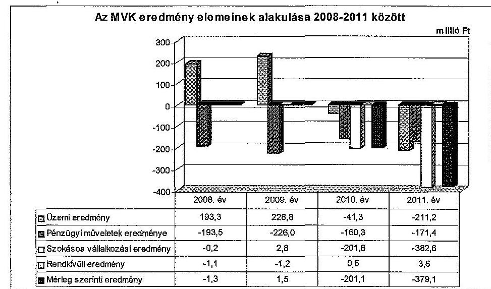

Az MVK beszámolói alapján, a 2008., 2009. években még pozitív, majd a 2010. és a 2011. években negatív üzemi eredmény (veszteség) kialakulásához az árbevétel csökkenéssel összefüggésben a közösségi közlekedést igénybe vevők számának évről-évre történő csökkenése, a város lakosságának csökkenése, a gazdasági válság és az utazási szokások megváltozása vezetett, továbbá az, hogy a költségek emelkedése az utazó közönségre nem volt teljes mértékben áthárítható. Az utazó közönség csökkenésének és összetételének megváltozása a fogyasztói árkiegészítés összegében 2008 és 2011 között 284,7 millió Ft összegű csökkenést okozott. Ennek oka, hogy a helyi tanuló és nyugdíjas bérletek és az ingyenes utazások csökkenése miatt kevesebb fogyasztói árkiegészítést igényelhetett az MVK. Az Önkormányzat által nyújtott működési célú pénzeszközátadások összege 112,4 millió Ft-tal, a normatív hozzájárulás 102,3 millió Ft-tal csökkent a 2008. évhez viszonyítva. Az utasok száma 120,4 millió főről 97,6 millió főre, ezen belül az autóbusszal utazók száma 80,5 millió főről 65,8 millió főre, a villamossal utazók száma 39,9 millió főről 31,8 millió főre csökkent. Az autóbusz üzletág vesztesége a 2010. évtől meghatározó tétel a veszteség növekedésében. Az autóbuszok üzemanyagárának emelkedése mellett a veszteséget növelték a villamos pálya felújítások miatti elterelések és a villamosközlekedés pótlása. A 2010. év és a 2012. év I-III. ne-

[^0]
[^0]:    ${ }^{7}$ Az adózás előtti és a mérleg szerinti eredmény az ellenőrzött időszakban megegyezett.

---

gyedéveinek kivételével az üzemi eredmény meghaladta a tervezett értéket, az MVK a tervekhez képest jelentkező eltéréseket indokolta, feltárta. Az üzleti tervekben meghatározott és az elért mérleg szerinti üzemi eredmény alakulását nyomon követték, ezt a Kontrolling csoport elemezte.

Az ellenőrzött időszakban az anyagjellegű ráfordításoknál a gázolaj és villamos energia ára jelentősen emelkedett. Többletköltségként jelentkezett a midi buszok bérleti díjának 16,9 millió Ft-os, a megállóhelyi takarítás és a kátyúzás 43,0 millió Ft-os összegei.

Az MVK rendkívüli eredménye nem volt jelentős mértékű az ellenőrzött időszakban, a rendkívüli bevételek a legmagasabb értéket a 2011. évben érték el ( 3,6 millió Ft), rendkívüli ráfordításként a legmagasabb érték a 2010. évben is csak 1,9 millió Ft volt.

Az MVK az ellenőrzött időszakban a kontrolling rendszer keretében havonta tájékoztatta az MH-t a vagyoni helyzetéről és eredményességéről, amit az MH tudomásul vett. Az MH a veszteségek csökkentése érdekében költségcsökkentő intézkedéseket hajtott végre. A Gt. tv. 245. § (1) bekezdés a) pontja előírásának megfelelően az MVK saját tőke összegének a veszteség következtében az alaptőke kétharmadára csökkenését az Önkormányzat - a tulajdonos MH-án keresztül biztosított - tőkeemeléssel megakadályozta. A tőkeemelés a beruházás önkormányzatra eső kötelezettségét fedezi.

# 2.5. Az MVK folyamatos üzemmenetének, likviditásának biztosítása 

Az MVK az ellenőrzött időszakban elkészítette az éves üzleti tervre alapozott likviditási tervet, és azt heti szinten aktualizálta. A beszámoló kiegészítő mellékleteiben és az üzleti jelentésekben 2008 és 2011 között minden évben bemutatták a Számv. tv. 88. § (2) bekezdése szerint a likviditási helyzetet, illetve a Számv. tv. 95. § (6) bekezdés a)-c) pontjai szerint a likviditási kockázatot.

A külső finanszírozás növekvő aránya egyre nagyobb kamatteherrel járt, ami az eredményességet rontotta. Az MVK pénzügyi és likviditási helyzete a veszteséges gazdálkodás és az e mellett folytatott fokozott beruházási tevékenység miatt minden évben rendkívül feszített volt.

A likviditási nehézségek nem a bevételek, vagy ráfordítások tevékenységi jellemzők miatti ciklikusságából, időbeli eltéréséből származtak, ezért azok nem üzleti tervezési hibának tulajdoníthatók. A likviditási nehézségek abból eredtek, hogy az MVK tevékenységét tartósan szolgáló eszközök, azaz a befektetett eszközei finanszírozására a saját tőke alacsony mértékben nyújtott fedezetet, jellemzően idegen forrásokból történt a finanszírozás, s az idegen forrásokon belül is jelentős volt a rövid lejáratú hitelek, a folyószámlahitel aránya.

A 2008 és 2012 közötti években az MVK likviditását az MH a cashpool rendszerben folyamatosan biztosította. Az MVK hitelállománya a 2008. évi 2077,0 millió Ft-ról, 2011-re 1869,8 millió Ft-ra csökkent, amelyből a nyilvántartások szerint 792,9 millió Ft folyószámla és 1076,9 millió Ft beruhá-

---

zási hitel volt. Az MVK hitelállománya a 2008. évről a 2011. évre átalakult, a teljes hitelállomány $10 \%$-kal, 207,2 millió Ft-tal csökkent. A rövid lejáratú hitelállomány 77,0 millió Ft-ról 792,9 millió Ft-ra nőtt, míg a hosszú lejáratú hitelállomány 2000,0 millió Ft-ról 1076,9 millió Ft-ra csökkent. A folyószámlahitel állománya a finanszírozási hiány miatt növekedett, míg a beruházási hitelek csökkentek, az évi ( 320 millió Ft-os) tőketörlesztés következtében. (7. számú melléklet).

Az MVK fizetőképességének fenntartására igénybevett folyószámlahitel összege állandóan növekedett, tartós finanszírozási hiányt mutatott. A 2011. december 31-i mérleg fordulónapon elérte a 792,9 millió Ft-ot. Emellett a szállítói tartozás állomány (a Zöld Nyíl Projekt beruházáshoz kapcsolódóan a Nemzeti Fejlesztési Ügynökség képviseletében eljáró KIKSZ Közlekedésfejlesztési Zrt. társfinanszírozói hatását kiszűrve) 755,8 millió Ft volt, melyből a lejárt fizetési esedékességű szállítói tartozások értéke 260,5 millió Ft volt 2011. december 31-én (6. számú melléklet).

Az MVK pénzügyi eredményének alakulását az MH, mint tulajdonos döntései befolyásolták, ugyanis a teljes cégcsoport finanszírozása cash-pool rendszerben történt. A cash-pool rendszerben elérhető hitelkeret biztosította az MVK Zrt. részére a finanszírozhatóságot. Az MH a tagvállalatai pénzügyi gazdálkodásának szabályairól szóló belső utasítás szerint járt el a vállalatcsoport hiteleinek kezelése terén. A működéshez átmenetileg hiányzó források és a fejlesztések megvalósításához szükséges idegen források bevonásakor készítettek terveket és számításokat arra vonatkozóan, hogy a jövőbeni terheket - törlesztő részleteket és költségeket - megállapítsák. A finanszírozás biztosítása az MH döntési hatáskörébe tartozott.

Az MVK a likviditás biztosítására 150,0 millió Ft hitelt vett fel a 2010. évben, melynek vevői árbevétel engedményezés volt a fedezete. A törlesztés a 2011. évben három részletben megtörtént.

Az MVK szabad pénzeszközzel - a veszteséges gazdálkodás miatt - az ellenőrzött időszakban nem rendelkezett. Az MVK-nak a veszteséges működése miatt nem keletkezett az ellenőrzött időszakban olyan forrása, mely a hitelállomány jelentős csökkentésének fedezetéül szolgálhatott volna. A cashpool rendszer keretében kezelt, átmenetileg szabad források kamatbevételei jelentősen elmaradtak a hitelek kamatköltségeitől, így azok számottevően nem járultak hozzá a hitellel kapcsolatos terhek csökkentéséhez. A kamatbevételek értéke elenyésző volt, legmagasabb értéke a 2010. évben sem érte el a másfél millió Ft-ot.

Az MVK a közfeladat ellátását biztosító fejlesztési elképzeléseket fogalmazott meg az MH, illetve az Önkormányzat részére készült előterjesztésekben. A közfeladat ellátásához és a fejlesztéshez kapott hazai és európai uniós támogatásokat az MVK a feladatellátás biztosításához használta fel. Az MVK a kapott támogatások felhasználását gazdasági szempontból értékelte, az értékeléshez a mutatószámokat kidolgozták.

A Közszolgáltatási szerződés ${ }_{1,2}$-ben kidolgozott mutatószámok alkalmazásával a közfeladat-ellátás működéséhez kapott támogatások eredményességének megítélése biztosított volt. Az MVK az ellenőrzött időszakban a

---

Magyar Államtól 2970,0 millió Ft (5. számú melléklet) és az EU-tól 8910,0 millió Ft (4. számú melléklet) fejlesztési célú támogatásban részesült.

Az Európai Unió által megítélt fejlesztési támogatások elnyerésének alapkövetelménye a megalapozó tanulmány elkészítése volt, amit az Önkormányzat és az MVK elkészíttetett. A Zöld Nyíl Projekthez a FÖMTERV-COWI Konzorcium készített Megvalósíthatósági Tanulmányt, amely tartalmazott pénzügyi elemzést és kockázatértékelést.

A megítélt támogatások két projekthez kapcsolódtak: a „Miskolc városi villamosvasút fejlesztése" és a „Miskolc és Felsőzsolca városok közösségi közlekedésének infrastrukturális fejlesztése" (Okos Pont Projekt). A Zöld Nyíl Projekthez igényelt támogatás 33707,4 millió Ft volt, melyből az Önkormányzat részesedése 1074,1 millió Ft, az MVK részesedése 32633,3 millió Ft volt. A beruházás tervezett összköltsége 37658,1 millió Ft volt, melyből a villamosok beszerzésére 18600,0 millió Ft-ot, a villamos pálya építésére és az azzal kapcsolatos költségekre 19058,1 millió Ft-ot terveztek felhasználni. A Magyar Állam és az EU által nyújtott támogatáshoz 3950,7 millió Ft saját forrás felhasználását tervezték. A „Miskolc városi villamosvasút fejlesztése" nagyprojekt célja a szolgáltatás színvonalának növelése volt a meglévő villamos pálya korszerűsítésével és a hálózatfejlesztéssel a jelenlegi diósgyőri végállomástól Felső-Majláthig, továbbá a villamospark korszerűsítése új villamosok beszerzése révén.

A Zöld Nyíl Projekten belül „a villamos pálya felújítás, vonalhosszabbítás és a kapcsolódó infrastruktúra" részprojektje vonatkozásában az MVK folyamatosan érvényesítette a költségvetési, a tervezési és a pályázati dokumentumokban, valamint a szerződésekben megfogalmazott követelményeket. A villamos pálya részprojekt önrész összege a Támogatási szerződés módosítása miatt 2011. szeptember 16-án 10,5\%-ról, 10,7\%-ra változott. Ennek oka az, hogy az EU támogatásra számot tartó, 2007. évi kezdésre ütemezett nagyprojektek előkészítésének költségvetési támogatásáról szóló 1067/2005. (VI. 30.) Korm. határozat szerinti 103,2 millió Ft előkészítési költség a tervekben helytelenül a támogatott tevékenységek költségei között szerepelt. A módosításkor az előkészítés költsége az önrészbe került beszámításra.

Az MVK a fejlesztés indikátorainak teljesülését folyamatosan nyomon követte, figyelemmel a státuszjelentésekre, melyeket havonta megküldött a KIKSZ-nek. Az indikátorok közül az egyéb előkészítő munkák mennyisége és értéke a Támogatási szerződésben szereplő értéktől elmaradt.

Az MVK vagyongazdálkodása körében a vagyon hasznosításával és védelmével kapcsolatos feladatokat a számviteli politikában nem a sajátosságainak és körülményeinek megfelelően alakította ki. Az MVK számlarendje és beruházási szabályzata nem tartalmazta a Zöld Nyíl Projekt elszámolásával kapcsolatos sajátosságokat. A számviteli politikában, a beruházási szabályzatban, a selejtezési szabályzatban nem volt biztosított minden részletre kiterjedően a projekt kivitelezésekor a vagyon védelme.

A villamos pálya kivitelezési munkálatai 2010 tavaszán kezdődtek. A villamos pálya építése műszakilag három ütemben zajlott. Az I. ütemben (Tüzér utca-Thököly utca szakasz) a pálya bontásával érintett eszközállományt - sín, veze-

---

ték, kábelek - a befektetett eszközök közül forgóeszközzé, a készletek közé minősítették át, majd a II.-III. ütem (Thököly utca-Diósgyőr utca, majd Diósgyőri utca- Felső-Majláth) pálya bontásával érintett eszközállományt selejtezési eljárás keretében, ennek szabályozásának hiányában a könyvekből kivezették. Az I. és a II-III. ütembe tartozó pályaszakaszok kivezetése a számviteli nyilvántartásból nem egységesen és következetesen történt. A nyilvántartási rendszerek szabályozatlansága miatt a forgóeszközökké átminősített befektetett eszközök állományának követhetősége nem volt biztosított. Nem volt egyértelmű a hulladékok és a bontási anyagok tulajdonosának megnevezése és a kibontásra kerülő anyagok sorsa.

A villamos pálya bontott anyagai feletti rendelkezésre eseti bizottságot hozott létre a Kivitelezői konzorcium, melybe az MVK is tagokat delegált, feladatait a Projektirányítási Kézikönyv tartalmazta. Az Önkormányzat nem az elvárható gondossággal járt el, mivel a Projektirányítási Kézikönyvben előírtak ellenére nem kifogásolta a bontási munkálatok kivitelezés helyszínén való nyomon követésének elmaradását, továbbá a bontási munkálatok megkezdése előtt nem adott egyértelmű tájékoztatást a bontott anyagok szállítását és hasznosítását illetően.

A Kivitelező konzorcium a bontási munkálatok megkezdése előtt nem kért és nem kapott egyértelmű tájékoztatást a bontott anyagok szállítását és hasznosítását illetően, azt a kivitelező a saját tulajdonaként kezelte és elszállította. A bontási anyagokat, hulladékokat és vissznyereményeket nem számították be sem mennyiségben, sem összegben a Megrendelő és a Kivitelező konzorcium közötti elszámolásnál. Az ajánlattételi felhívás és az ajánlat nem tartalmazott olyan hivatkozást, hogy a bontott anyagokat a kivitelezés ellenértékébe beszámították volna. A bontási anyagok, hulladékok és vissznyeremények értékesítésének elmaradásából, az MH belső ellenőrzésének 2012. január 31-én készült jelentésében rögzítettek alapján 145,7 millió Ft becsült kár érte az MVK-t.

A becsült kár meghatározásánál figyelembe vették a hulladék anyagokból (rézhulladékból, csupasz alumínium vezetékből, földkábelből, szigetelt alumínium vezetékből, adagolható acélhulladékból, adagolható, nem adagolható vashulladékból, beton panelek és vasoszlopokból, valamint tört betonból) nyerhető bevételeket, melyek becsült összege 241,7 millió Ft, valamint az azok miatti kiadásokat (deponálás, betonaprítás, veszélyes anyagok megsemmisítése), ennek teljes becsült költsége 96,0 millió Ft volt.

Az MVK a vagyonvédelem érdekében az addig nem értékesített, fellelt anyagok értékét 2011-ben 56,1 millió Ft összegben kiszámlázta. Kétféle anyagértékesítés volt, különválasztva a 2011. március 18-a előtt és után keletkezett készleteket.

Az MVK a pontos mérlegelési adatok hiányára hivatkozva, a bontásból származó anyagokat visszamenőlegesen kiszámlázta, értékesítette a Kivitelezői konzorcium tagjai, illetve a miskolci Városgazda Kft-nek. Megállapították, hogy 67580 kg vashulladék kivételével a 2011. február 28-ig mérlegelt valamennyi másodnyersanyag, illetve a 2011. március 18-ig mérlegelt vashulladék kiszámlázásra került, melyek értéke 38,8 millió Ft volt.

---

Az MVK 2011. július 7-én adásvételi szerződést kötött az MH-val, amely megvásárolta a Zöld Nyíl Projekt kivitelezési munkálatai során 2011. március 18-a után keletkezett bontásból származó másodnyersanyagokat 17,3 millió Ft összegben.

A bontott, de hasznosítható anyagok kiszámlázásának a célja a kár mérséklése volt, melyből 18,2 millió Ft bevételként realizálódott. A Kivitelezői konzorciumnak kiszámlázott 38,0 millió Ft-ot azonban nem fizették meg. Az érték meghatározása becslés alapján történt, ami nem biztosította az átlátható elszámolást. Az MVK 2011. március 18-áig nem állapította meg a kinyert, illetve a kinyerhető hasznos bontási anyagok mennyiségét és könyvszerinti értékét. Az MVK a bontási anyagokat a készlet elszámolásra vonatkozó szabályok ellenére nem vette nyilvántartásba. Az Önkormányzat nem a tulajdonostól elvárható gondossággal járt el, mivel a bontási munkálatok megkezdése előtt nem adott egyértelmű tájékoztatást a bontott anyagok szállítását és hasznosítását illetően.

A Zöld Nyíl Projekthez kapcsolódó, de a támogatáshoz el nem számolható kifizetések között szabálytalanságok állapíthatók meg, melyek a Kbt. előírásait megsértik, továbbá nem igazolható teljesítményekre történő kifizetésekkel függnek össze.

Az MVK vezérigazgatója egy gazdasági társasággal a 2008. március 1. és június 30. közötti időszakra, majd egy másik gazdasági társasággal a 2008. július 1. és szeptember 30. közötti időszakra megbízási szerződést kötött. A megbízási szerződések a „Miskolci Nagy Villamos projekt megismerésében, társadalmi elfogadottságában, pozícionálásában és kommunikációs tevékenységében" való részvételre megnevezésű, azonos marketing tevékenységre időben folyamatos szolgáltatásra terjedtek ki. A megbízási szerződésekben a teljesítés havi ellenértékét azonosan, 1,8 millió Ft+áfa/hó összegben rögzítették, így összességében 12,6 millió Ft+áfa összeget, azaz 15,1 millió Ft-ot fizettek ki a megbízottaknak. Az MVK vezérigazgatója a megbízási szerződések megkötését megelőzően nem folytatott le közbeszerzési eljárást, megsértette a Kbt. 40. § (2) bekezdésében előírtakat, mely szerint a becsült érték kiszámítása során mindazon szolgáltatások értékét egybe kell számítani, amelyek beszerzésére egy költségvetési évben vagy tizenkét hónap alatt kerül sor és rendeltetése azonos vagy hasonló, illetőleg felhasználásuk egymással közvetlenül összefügg.

Az MVK vezérigazgatója egy gazdasági társasággal három hónapos időtartamra, a 2008. július 1. és 2008. szeptember 30. közötti időszakra stratégiai tanácsadóként való közreműködésre a „Miskolci Nagy Villamos projekt megismerésében, társadalmi elfogadottságában, pozícionálásában és kommunikációs tevékenységében" elnevezéssel megbízási szerződést kötött. Az MVK vezérigazgatója egy másik gazdasági társasággal a 2008. október 1-jétől 2008. december 31-ig terjedő időszakra, „Miskolc városi villamosvasút fejlesztése nagyprojekt előkészítéséhez kapcsolódó marketing tevékenység tanácsadói feladatainak ellátására" kötött megbízási szerződést. Az első esetben a szerződéses feladatok ellátásáért fizetendő díjat a felek 1,8 millió Ft+áfa/hó összegben határozták meg, a második esetben azonos havi összeget, de a három hónapra egybeszámítva 5,4 millió Ft+áfa/3 hónap összegben határozták meg. Az MVK a megbízási szerződésekben foglaltak teljesítésének ellenértékeként összesen 10,8 millió Ft+áfa, azaz 12,9 millió Ft-ot annak ellenére kifizetett, hogy a számlákat alátámasztani hivatott teljesítésigazolást az MVK nem készített, illetve ezen a

---

túlmenően a megbízási szerződésben vállalt feladatok elvégzését dokumentumokkal a megbízottak nem igazolták. A megbízási szerződések alapján a teljesítést, az annak mellékletét képező formanyomtatvány kitöltésével kellett igazolni, ami nem történt meg, így a szerződés teljesítése nem bizonyított.

Az MVK vezérigazgatója egy gazdasági társasággal 2010. február 2-án megbízási szerződést kötött a „Miskolc városi villamosvasút fejlesztése - villamos pálya felújítása során felmerülő adózási feladatokkal, így fordított áfa megállapítására irányuló állásfoglalás kérés előkészítésére, az eljárás lefolytatásakor felmerülő adószakértői feladatok ellátására, áfa adóterv elkészítése" tevékenység ellátására. A megbízási szerződésben meghatározott feladatok ellátásáért fizetendő díjat a felek 2,5 millió Ft+áfa összegben, azaz 3,1 millió Ft-ban határozták meg. A megrendelt tevékenységről a megbízott gazdasági társaság 2010. február 25-ei teljesítési határidővel számlát állított ki, amit az MVK annak ellenére kifizetett, hogy a megbízási szerződésben vállalt feladatok elvégzését dokumentumokkal (állásfoglalás kérő levél, áfa adóterv, dokumentált adószakértői feladat) a megbízottak nem igazolták.

Az MVK a belső kontrollrendszert, a vezetői ellenőrzést és a monitoring rendszert a Zöld Nyíl projekt folyamán nem működtette hatékonyan, ezzel a vagyon védelmét nem biztosította.

Az MVK pénzügyi szervezete a kötelezettségek határidőre történő teljesítését nyomon követte. Az MVK kötelezettségeinek nyilvántartása, kezelése biztosította a kötelezettségek határidő szerinti rendezésének feltételeit, a késedelmes teljesítésekről tájékoztatták az MH-t. A lejárt határidejű tartozások, a szállítói állomány rendszeres figyelése megvalósult, az analitikus nyilvántartásokat folyamatosan naprakészen vezették. A lejárt határidejű kötelezettségek állománya 2011. december 31-én 260,5 millió Ft volt. A belső ellenőrzés a kötelezettségek alakulását nem ellenőrizte. Az MVK az MH előírásainak megfelelően rendszeresen, naponta követte a kötelezettségek és a szállítói állomány alakulását, és tájékoztatta erről a tulajdonos MH-t. Az FB az MVK-tól negyedévente, az időszaki beszámolás keretében a kötelezettségek alakulásáról tájékoztatást kapott.

Az MVK a számviteli nyilvántartásokban elkülönítve, külön főkönyvi számlaszámokon tartotta nyilván az önkormányzati, az állami és az EU-s forrásokat. Az MVK a kapott támogatások felhasználását gazdaságosság szempontjából nem értékelte, ennek oka az, hogy még nem zárult le a beruházás. Az állami támogatások felhasználását az MVK értékelte. Az állami forrásokat az ágazati, az adott évre szóló normatív támogatásokról szóló miniszteri rendelet előírásainak és a Közszolgáltatási szerződés ${ }_{1,2}$-ben meghatározott szakmai beszámoló rendszer előírásainak megfelelően számolta el és használta fel az MVK.

---

# 3. Az ÖNKORMÁNYZAT És az MH jogainak És KÖTELEZETTSÉGEINEK ÉRVÉNYESÍTÉSE 

### 3.1. Az MVK-tól származó információk elemzése, hasznosítása

Az Önkormányzat és az MH a Közszolgáltatási szerződés ${ }_{1,2}$-ben foglaltak ellenőrzéséhez és a tulajdonosi érdekek érvényesítéséhez szükséges éves és évközi (havi, negyedéves) tájékoztatás, adatszolgáltatás rendjét részletesen és megfelelően határozta meg. Az MH és az Önkormányzat elemezte, hasznosította az MVK vezetése által megküldött gazdasági beszámolókat és elemzéseket, az azok alapján hozott intézkedéseket végrehajtották.

A Közgyűlés értékelte az MVK-ra bízott közfeladat ellátását a Közszolgáltatási szerződés ${ }_{1,2}$-ben foglalt követelmények alapján, valamint a korábban tett intézkedések végrehajtását ellenőrizte. A színvonal legfontosabb biztosítéka a Közszolgáltatási szerződés ${ }_{1,2}$ volt, az abban foglalt színvonal emelésre hozott intézkedéseket az Önkormányzat rendszeresen ellenőrizte. A Zöld Nyíl Projekt beruházás jelentős színvonal növelést tett lehetővé.

Az Önkormányzat pénzügyi helyzetéről készített 2011. évi ÁSZ jelentésnek ${ }^{8}$ a minősített többségi tulajdonú gazdasági társaságok aktuális pénzügyi helyzetének és az Önkormányzat gazdasági társaságai felé fennálló követeléseinek, feltételes kötelezettségvállalásainak bemutatására vonatkozó javaslatát hasznosították. A javaslat alapján félévenként benyújtott pénzügyi beszámolót a Közgyűlés megtárgyalta és határozatban fogadta el.

A MH és tagvállalatainak vállalatcsoport-szintű beszámolási rendszere meghatározott rendszerességgel tájékoztatást nyújtott a vállalatcsoport pénzügyi helyzetéről és a tervhez viszonyított eltérésekről. A vállalatcsoport beszámolási rendszere kétszintű. Az MH társaságai első szinten pénzügyi (bevétel, költség) és egyéb gazdálkodási (teljesítmény, létszám) adatokat közöltek az MH-val. Az MH az adatok feldolgozása után második szinten beszámolt az Igazgatóságnak. A beszámolás egész évben végzett, folyamatos tevékenység volt, alapját a rendszeres havi, negyedéves és éves beszámolók képezték.

Az MH figyelemmel kísérte az MVK belső ellenőrzésének a tevékenységét, a vezetői ellenőrzés és a függetlenített belső ellenőrzés megállapításai alapján kiadott intézkedések végrehajtását, és azok tapasztalatait értékelte.

Az Önkormányzat nem végzett az ellenőrzött időszakban az MVK-nál a Közszolgáltatási szerződés ${ }_{1,2}$-ben foglaltakon kívül ellenőrzést. Az Önkormányzat a bekért adatok alapján ellenőrizte a teljesítményeket, elemezte a közszolgáltatás területén felmerült költségek indokoltságát és az árak módosításának megalapozottságát.

[^0]
[^0]:    ${ }^{8}$ az ÁSZ 1139. számú jelentése a Miskolc Megyei Jogú Város Önkormányzata pénzügyi helyzetéről

---

A Közszolgáltatási szerződés ${ }_{1,2}$ alapján az MVK-nak az utasok minőségi elvárásainak és véleményének megismerése érdekében saját költségére, évente egyszer reprezentatív utas-elégedettség mérést kellett készíttetnie, mely feladatának eleget tett, annak eredményéről az Önkormányzatot tájékoztatta.

Az Önkormányzat 2008-ban és 2009-ben külső megbízás alapján a Miskolci Egyetem Marketing Intézetével készíttetett felméréseket és közvélemény kutatásokat 2,2 millió Ft és 3,2 millió Ft megbízási díj ellenében. A témával kapcsolatban készült megbízási szerződésekben egyértelműen és számon kérhető módon határozták meg a megbízott feladatait, ellenőrizték azok teljesítését. A szerződésben foglaltak teljesítésére voltak garanciák, illetve szankciók a nem teljesítés esetére. Kérdőíves módszerrel mérték fel a közlekedéssel kapcsolatos véleményeket.

A kutatás célja az ügyfelek elégedettségének és lojalitásának feltérképezésén túl, a fogyasztók használati szokásainak felmérése volt. Becsülték az MVK piacrészesedését a többi közlekedési módhoz képest. Meghatározták a helyi közösségi közlekedési szolgáltatással kapcsolatos globális, faktor- és kritériumelégedettséget, továbbá felmérték a villamos nagyprojekt támogatottságát.

Az MVK 2010-től évente saját hatáskörben végezte az utas elégedettségi vizsgálatokat, amelyek eredményéről, valamint az utasszámlálási adatokról tájékoztatta az Önkormányzatot a menetrendi változások előkészítése, egyeztetése során.

Az Önkormányzat a Közszolgáltatási szerződés ${ }_{1,2}$-ben havi, negyedéves és éves beszámolási kötelezettséget írt elő az MVK részére, mely alapján az Eisztv. ${ }^{9}$ mellékletében előírt közfeladat ellátásával kapcsolatos negyedévenkénti közzétételi kötelezettségének eleget tudott tenni. A közszolgáltató kiválasztásával és a közszolgáltatás éves feladatellátásával kapcsolatos adatszolgáltatási kötelezettségének az Önkormányzat a honlapján eleget tett.

# 3.2. A Közgyűlés és az MH tulajdonosi intézkedései 

Az MH megtárgyalta az MVK éves beszámolóját, annak részeként az éves eredményt és az eredmény-felosztási javaslatot. Beszámoltatta tevékenységéről a vezérigazgatót és az FB tagokat, ismertette a könyvvizsgálói jelentésben foglaltakat. A MH Igazgatósága az MVK beszámolójáról minden évben határozatot hozott.

Az MVK gazdaságosabb működtetése érdekében kialakított ösztönző rendszer az MVK vezérigazgatójának, mint felelős vezetőjének a premizálása - évről évre változott. Az ösztönző rendszer működésének hatékonyságáról dokumentált értékelést nem készítettek, azonban a célok teljesítését minden évet követően, amikor prémium feladatok meghatározására sor került, az MH értékelte és az értékelés eredményéről határozatot hozott.

[^0]
[^0]:    ${ }^{9}$ 2012. január 1-jétől az Iötv. hatályos, melynek 1. melléklete írja elő a kötelezettséget.

---

Az MH az igazgatósági ülésén az MVK vezérigazgatóját a vonatkozó előterjesztések kapcsán rendszeresen személyesen beszámoltatta. Ezen felül a kontrolling rendszer működtetése révén biztosították az MVK vezérigazgatójának a társaság gazdálkodásáról szóló havi, negyedéves és éves beszámoltatását. Az MH-nak az MVK felügyelőbizottsága által a Gt. tv. 35. § (3) bekezdésének előírása alapján lefolytatott ellenőrzések dokumentumait megküldték.

A 2008-2012. évi FB munkatervek és a 2012. évi FB ellenőrzési tervek alapján az FB érdemi vizsgálatokat végzett.

Visszatérő jelleggel értékelték az MVK gazdálkodását, vagyoni helyzetét, az éves beszámolókat, a Közszolgáltatási szerződés ${ }_{1,2}$-ben előírtak teljesítését, az MVK forgalmi tevékenységét, tarifatervét, a forgalombiztonságot, valamint a villamos fejlesztési nagyprojektről szóló tájékoztatókat.

A könyvvizsgáló az ellenőrzött időszakban az MVK számviteli beszámolóiról megállapította, hogy azok megbízható, valós képet nyújtanak a pénzügyi és jövedelmi helyzetről, valamint, hogy azok megfelelnek az érvényes jogszabályi rendelkezéseknek. Az MVK számviteli beszámolóinak könyvvizsgálói jelentését az MH hasznosította.

Az Önkormányzat 2008 és 2012 között nem élt az Ötv. 92. § (11) bekezdés b) pontjában ${ }^{10}$ biztosított lehetőséggel, az MVK-nál és az MH-nál belső ellenőrzést nem végzett.

Az MVK-nál az ellenőrzött időszakban függetlenített belső ellenőr tevékenykedett, aki éves szintű belső ellenőrzési munkaterv alapján végezte munkáját. A belső ellenőr a rendszeres beszámolók és pénztárellenőrzések mellett vizsgálta a szervezeti átalakítások hatását, a megbízások elszámolásának szabályszerűségét és a beruházások elszámolását (9. számú melléklet).

Az MH 2011 szeptemberében hozta létre a Központi Belső Ellenőrzési szervét, melynek részére az MVK belső ellenőre a 2011. és a 2012. évi ellenőrzési tervét megküldte. Az MH a 2011. évet megelőzően belső ellenőrzést nem működtetett. Az MH belső ellenőre az MVK-nál a transzferár szabályozást, a belső kontrollokat és a Zöld Nyíl projektet vizsgálta (8. számú melléklet).

Az MH tájékoztatása a belső ellenőr megállapításairól annak a Központi belső ellenőrzés vezetője felé történő beszámoltatásával valósult meg. Az MVK belső ellenőre féléves munkájáról a Központi belső ellenőrzés vezetője részére összefoglaló beszámolót készített.

Az MH 2010-ben külső szakértőként egy gazdasági társaságot bízott meg az MVK pénzügyi-számviteli átvilágítására. A külső szakértő 2010. december 20-án kelt jelentése többek között értékelte a 2007-2009. években és a 2010. év I-III. negyedéveiben az MVK-nál bekövetkezett vagyonváltozásokat, befektetéseket, készleteket, követeléseket és kötelezettségeket. Vizsgálták továbbá az MVK likviditását, bevételeinek, működési költségeinek és ráfordításainak

[^0]
[^0]:    ${ }^{10}$ Az Ötv. előírása 2013. január 1-jétől hatálytalan. Ekkortól az ellenőrzési jogosultságot az Áht ${ }_{2} 70 . \S$ (1) bekezdés d) pontja rögzíti.

---

alakulását, valamint jövedelmezőségét. A külső szakértő gazdasági társaság az ellenőrzött témakörökben megállapításokat tett és javaslatokat fogalmazott meg, melyek a teljesség igénye nélkül kiterjedtek a számviteli szabályzatok hiányosságainak megszüntetésére, a feleslegessé vált készletek értékvesztésének elszámolására, a forrásszerkezet javítására, valamint a várható veszteségek minimalizálása érdekében a tulajdonosi tőke biztosítására.

Az MH Központi Belső Ellenőrzése és az MVK belső ellenőre 2012 januárjában az MH megbízásából ellenőrzést végzett az Önkormányzat és az MVK konzorciumi beruházásaként megvalósuló Zöld Nyíl Villamos Projekt vizsgálata tárgyában. Az ellenőrzés célja a projekt kivitelezése során keletkezett bontási anyagok és hasznosítható, úgynevezett vissznyereményi anyagok naturális és értékadatainak megállapítása volt. Az ellenőrzés kiterjedt a szabályozottság vizsgálatára, a bontott anyagok tulajdonjogának megállapítására, valamint azok mennyiségi és értékadatainak meghatározására. A belső ellenőri megállapítások alapján következtetéseket vontak le és javaslatokat fogalmaztak meg, többek között a számviteli szabályozás aktualizálására, a tételes és teljes körű nyilvántartásba vételre és leltározásra, a kivitelezővel való elszámolásra, valamint a személyes felelősség megállapítására vonatkozóan.

Az MVK eredményének felosztására hozott javaslat megfelelt az Alapító Okirat ${ }_{1}$-ban foglaltaknak, felülvizsgálatával, jóváhagyásával a tulajdonos hozzájárult a közfeladat ellátásának fejlesztéséhez.

Az MVK a saját tőke összegének a veszteség következtében az alaptőke kétharmadára csökkenését a tulajdonoson keresztül tőkeemeléssel az Önkormányzat megakadályozta. A saját tőke jegyzett tőke aránya a végrehajtott tőkeemeléseknek köszönhetően megfelelt a jogszabályi rendelkezéseknek, mivel a jegyzett tőke felemelése az arányokat megváltoztatta. A tőkeemelés a beruházás önkormányzatra eső kötelezettségét fedezi, a saját forrást hitel felvételével biztosítják. A veszteséges gazdálkodásból eredő vagyonvesztés pótlására tőkeemelés nem történt.

Budapest, 2013. 04. hó nap.
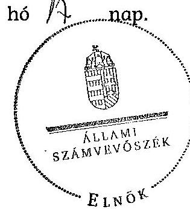

Demokos László
elnök

Melléklet: $\quad 12 \mathrm{db}$
Függelék: $\quad 4 \mathrm{db}$

---

.

---

# MELLÉKLETEK

---

.

---

# 1. számú melléklet

a V-0032-267/2013. számú jelentéshez

## Miskolc Megyei Jogú Város Önkormányzata

### Tanúsítvány

az Önkormányzat által a 2008-2012. félévében az MVK Miskolc városi Közlekedési Zrt. részére nyújtott működési célú támogatásokról

|  Támogatás jogcíme | 2008. év |  | 2009. év |  | 2010. év |  | 2011. év |  | 2012. év / 1. félév |  | Minősítésesen teljesítés 2008-2012. / 1. félév  |
| --- | --- | --- | --- | --- | --- | --- | --- | --- | --- | --- | --- |
|   | Terv | Tény | Terv | Tény | Terv | Tény | Terv | Tény | Terv | Tény | késött  |
|  működési támogatás-pénzügyi kompenzáció* közszolgáltatási szerződés alapján | 700,0 | 605,1 | 600,0 | 602,9 | 540,0 | 537,3 | 440,0 | 492,7 | 550,0 | 137,5 | 2 575,5  |
|  |   |   |   |   |   |   |   |   |   |   |   |
|  |   |   |   |   |   |   |   |   |   |   |   |
|  |   |   |   |   |   |   |   |   |   |   |   |
|  |   |   |   |   |   |   |   |   |   |   |   |
|  |   |   |   |   |   |   |   |   |   |   |   |
|  |   |   |   |   |   |   |   |   |   |   |   |
|  |   |   |   |   |   |   |   |   |   |   |   |
|  |   |   |   |   |   |   |   |   |   |   |   |
|  |   |   |   |   |   |   |   |   |   |   |   |
|  |   |   |   |   |   |   |   |   |   |   |   |
|  |   |   |   |   |   |   |   |   |   |   |   |
|  |   |   |   |   |   |   |   |   |   |   |   |
|  |   |   |   |   |   |   |   |   |   |   |   |
|  |   |   |   |   |   |   |   |   |   |   |   |
|  |   |   |   |   |   |   |   |   |   |   |   |
|  |   |   |   |   |   |   |   |   |   |   |   |
|  |   |   |   |   |   |   |   |   |   |   |   |
|  |   |   |   |   |   |   |   |   |   |   |   |
|  |   |   |   |   |   |   |   |   |   |   |   |
|  |   |   |   |   |   |   |   |   |   |   |   |
|  |   |   |   |   |   |   |   |   |   |   |   |
|  |   |   |   |   | MVK Miskolc Városi Közlekedési Zrt.

2. számú melléklet a V-0032-267/2013.számú jelentéshez

Tanúsítvány a Magyar Állam által a 2008-2012. I. félévében a MVK Miskolc Városi Közlekedési Zrt. részére nyújtott működési célú támogatásokról millió Ft-ban

| Támogatás jogcíme | 2008. év | | 2009. év | | 2010. év | | 2011. év | | 2012. év I. félév | | Minülkszesen teljesítés 2008-2012. I. félév telefon |
| --- | --- | --- | --- | --- | --- | --- | --- | --- | --- | --- | --- |
| | Terv | Tény | Terv | Tény | Terv | Tény | Terv | Tény | Terv | Tény | |
| - normatív hozzájárulás | 500,0 | 686,6 | 686,6 | 615,7 | 613,7 | 616,9 | 590,9 | 598,5 | 276,0 | 276,0 | 2 739,5 |
| - kogyasztói árklegészítés | 1 640,86 | 1 886,7 | 1 871,4 | 1 449,6 | 1 285,3 | 1 229,4 | 1 002,4 | 1 302,0 | 644,3 | 617,8 | 6 290,3 |
| - Magyar Állam hitelérélidés | 0,0 | 0,0 | 0,0 | 0,0 | 0,0 | 0,0 | 0,0 | 0,0 | 0,0 | 0,0 | 0,0 |
| - Magyar Állam által átváltat hitel kömetik | 0,0 | 0,0 | 0,0 | 0,0 | 0,0 | 0,0 | 0,0 | 0,0 | 0,0 | 0,0 | 0,0 |
| - vissza nem térítendő támogatás | 0,0 | 0,0 | 0,0 | 0,0 | 0,0 | 0,0 | 0,0 | 0,0 | 0,0 | 0,0 | 0,0 |
| - egyért | | | | | | | | | | | 0,0 |
| | | | | | | | | | | | 0,0 |
| | | | | | | | | | | | 0,0 |
| | | | | | | | | | | | 0,0 |
| | | | | | | | | | | | |
| | | | | | | | | | | | |
| | | | | | | | | | | | |
| | | | | | | | | | | | |
| | | | | | | | | | | | |
| | | | | | | | | | | | |
| | | | | | | | | | | | |
| | | | | | | | | | | | |
| | | | | | | | | | | | |
| | | | | | | | | | | | |
| | | | | | | | | | | | |
| | | | | | | | | | | | |
| | | | | | | | | | | | |
| | | | | | | | | | | | |
| | | | | | | | | | | | |
| | | | | | | | | | | | |
| | | | | | | | | | | | |
| | | | | | | | | | | | |
| | | | | | | | | | | | |
| | | | | | | | | | | | |
| | | | | | | | | | | | |
| | | | | | | | | | | | |
| | | | | | | | | | | | |
| | | | | | | | | | | | |
| | | | | | | | | | | | |
| | | | | | | | | | | | | | | | | | | | | |
| | | | | | | | | | | | |
| | | | | | | | | | | | |
| |

---

### 3. számú melléklet a V-0032-267/2013. számú jelentéshez

#### Miskolc Megyei Jogú Város Önkormányzata

#### Adatlap

az Önkormányzat által a 2009-2012. években a Miskolc Holding Zrt. részére nyújtott fejlesztési célú támogatásokról

| Feladat megnevezése | 2008. év | | 2009. év | | 2010. év | | 2011. év | | 2012. év | | Név | | Mindösszesen teljesítés 2008-2012. években |
| --- | --- | --- | --- | --- | --- | --- | --- | --- | --- | --- | --- | --- | --- |
| | Terv | Tény | Terv | Tény | Terv | Tény | Terv | Tény | Terv | Tény | Terv | Tény | |
| Segített ülés emelés-Völcsmérés teljesítés | | | | | | | | | | | | | |
| | | | | | | | | | | | | | 0,0 |
| | | | | | | | | | | | | | 0,0 |
| | | | | | | | | | | | | | 0,0 |
| | | | | | | | | | | | | | 0,0 |
| | | | | | | | | | | | | | 0,0 |
| | | | | | | | | | | | | | 0,0 |
| | | | | | | | | | | | | | 0,0 |
| | | | | | | | | | | | | | 0,0 |
| | | | | | | | | | | | | | 0,0 |
| | | | | | | | | | | | | | 0,0 |
| | | | | | | | | | | | | | 0,0 |
| | | | | | | | | | | | | | |
| | | | | | | | | | | | | | |
| | | | | | | | | | | | | | |
| | | | | | | | | | | | | | |
| | | | | | | | | | | | | | |
| | | | | | | | | | | | | | |
| | | | | | | | | | | | | | |
| | | | | | | | | | | | | | |
| | | | | | | | | | | | | | |
| | | | | | | | | | | | | | |
| | | | | | | | | | | | | | |
| | | | | | | | | | | | | | |
| | | | | | | | | | | | | | |
| | | | | | | | | | | | | | |
| | | | | | | | | | | | | | |
| | | | | | | | | | | | | | |
| | | | | | | | | | | | | | |
| | | | | | | | | | | | | | |
| | | | | | | | | | | | | | |
| | | | | | | | | | | | | | |
| | | | | | | | | | | | | | |
| | | | | | | | | | | | | | |
| | | | | | | | | | | | | | |
| | | | | | | | | | | | | | | |   |   |   |   |
|  |   |   |   |   |   |   |   |   |   |   |   |   |   |
|  |   |   |   |   |   |   |   |   |   |   |   |   |   |
|  |   |   |   |   |   |   |   |   |   |   |   |   |   |
|  |   |   |   |   |   |   |   |   |   |   |   |   |   |
|  |   |   |   |   |   |   |   |   |   |   |   |   |   |
|  |   |   |   |   |   |   |   |   |   |   |   |   |   |
|  |

---

## 4. számú melléklet a V-0032-267/2013. számú jelentéshez

## Tendeltvény

az Európai Unió által a 2008-2013. I. félévében az MVK Miskolc Városi Közlekedési Zrt. részére nyújtott fejlesztési célú támogatásokról

|  Feladat megnevezése | 2008. év |  | 2009. év |  | 2010. év |  | 2011. év |  | 2012. év |  | 2013. év |  | 2014. év |  | 2015. év |  | 2016. év | 2017. év  |
| --- | --- | --- | --- | --- | --- | --- | --- | --- | --- | --- | --- | --- | --- | --- | --- | --- | --- | --- |
|   | Terv | Tény | Terv | Tény | Terv | Tény | Terv | Tény | Terv | Tény | Terv | Tény | Terv | Tény | Terv | Tény | Terv  |
|  KÖZÖP-8.2.0-07-2008-0003 "Miskolc városi véleménye fejlesztése/Szám" | 97,0 | 0,0 | 6 673,0 | 36,0 | 8 591,5 | 2 285,0 | 6 832,5 | 5 222,3 | 1 280,7 | 1 388,5 | 8 910,0 | 0,0 | 0,0 | 0,0 | 0,0 | 0,0 | 0,0  |
|  EMOP-6.1.2-09-2009-0007 | 0,0 | 0,0 | 3,7 | 0,0 | 30,5 | 0,0 | 287,4 | 0,0 | 0,0 | 0,0 | 0,0 | 0,0 | 0,0 | 0,0 | 0,0 | 0,0 | 0,0  |
|  **Total** | 0,0 | 0,0 | 0,0 | 0,0 | 0,0 | 0,0 | 0,0 | 0,0 | 0,0 | 0,0 | 0,0 | 0,0 | 0,0 | 0,0 | 0,0 | 0,0 | 0,0  |
|  **Összesen** | 97,0 | 0,0 | 6 678,0 | 36,0 | 8 622,1 | 2 285,0 | 6 890,2 | 5 222,3 | 1 280,7 | 1 388,5 | 8 910,0 | 0,0 | 0,0 | 0,0 | 0,0 | 0,0 | 0,0  |

Nyilatkozat: A tendeltvényben szereplő adatok védőképek tizenötét. A KÖZÖP-8.2.0-07-2008-0003 azonosító számú projekt terv adatai az eredeti, EU Bizottság felé leadott számoknak felelnek meg.

Kelt különös időpontja: 2012.12.19.

P.H.

Miskolc: 11110000000000000000000000000000000000000000000000000000000000000000000000000000000000000000000000000000000000000000000000000000000000000000000000000000000000000000000000000000000000000000000000000000

---

5. számú melléklet a V-0032-267/2013.számú jelentéshez

Tanúsítvány a Magyar Állam által a 2008-2012. I. félévében az MVK Miskolc Városi Közlekedési Zrt. részére nyújtott fejlesztési célú támogatásokról

|  Feladat megnevezése | 2008. év |  | 2009. év |  | 2010. év |  | 2011. év |  | 2012. év I. félév |  | Minősül összesen teljesítés 2009-2011 között  |
| --- | --- | --- | --- | --- | --- | --- | --- | --- | --- | --- | --- |
|   | Terv | Tény | Terv | Tény | Terv | Tény | Terv | Tény | Terv | Tény |   |
|  KÖZÖP-6.2.0-07-2008-0003 „Miskolc városi véleményezési fejlesztés" | 32,5 | 0,0 | 1 967,7 | 12,0 | 2 653,9 | 755,0 | 2 677,5 | 1 740,8 | 426,9 | 452,3 | 2 870,3  |
|  SPJDP500JF60 - szakképzési hozzájárulás terhére vissza nem térítendő támogatás |  | 11,3 |  |  |  |  |  |  |  |  | 11,3  |
|   |  |  |  |  |  |  |  |  |  |  | 0,0  |
|   |  |  |  |  |  |  |  |  |  |  | 0,0  |
|   |  |  |  |  |  |  |  |  |  |  | 0,0  |
|   |  |  |  |  |  |  |  |  |  |  | 0,0  |
|   |  |  |  |  |  |  |  |  |  |  | 0,0  |
|   |  |  |  |  |  |  |  |  |  |  | 0,0  |
|   |  |  |  |  |  |  |  |  |  |  | 0,0  |
|   |  |  |  |  |  |  |  |  |  |  | 0,0  |
|   |  |  |  |  |  |  |  |  |  |  | 0,0  |
|  |   |   |   |   |   |   |   |   |   |   |   |
|  |   |   |   |   |   |   |   |   |   |   |   |
|  |   |   |   |   |   |   |   |   |   |   |   |
|  |   |   |   |   |   |   |   |   |   |   |   |
|  |   |   |   |   |   |   |   |   |   |   |   |
|  |   |   |   |   |   |   |   |   |   |   |   |
|  |   |   |   |   |   |   |   |   |   |   |   |
|  |   |   |   |   |   |   |   |   |   |   |   |
|  |   |   |   |   |   |   |   |   |   |   |   |
|  |   |   |   |   |   |   |   |   |   |   |   |
|  |   |   |   |   |   |   |   |   |   |   |   |
|  |   |   |   |   |   |   |   |   |   |   |   |
|  |   |   |   |   |   |   |   |   |   |   |   |
|  |   |   |   |   |   |   |   |   |   |   |   |
|  |   |   |   |   |   |   |   |   |   |   |   |
|  |   |   |   |   |   |   |   |   |   |   |   |
|  |   |   |   |   |   |   |   |   |   |   |   |
|  |   |   |   |   |   |   |   |   |   |   |   | |   |   |   |   |   |   |
|  |   |   |   |   |   |   |   |   |   |   |   |
|  |   |   |   |   |   |   |   |   |   |   |   |
|  |   |   |   |   |   |   |   |   |   |   |   |
|  |   |   |   |   |   |   |   |   |   |   |   |
|  |   |   |   |   |   |   |   |   |   |   |   |
|  |   |   |   |   |   |   |   |   |   |   |   |
|  |   |   |   |   |   |   |   |   |   |   |   |
|  |   |   |   |   |   |   |   |   |   |   |   |
|  |   |   |   |   |   |   |   |   |   |   |   |
|  |   |   |   |   |   |   |   |   |   |   |   |
|  |   |   |   |   |   |   |   |   |   |   |   |
|  |   |   |   |   |   |   |   |   |   |   |   |
|  |   |   |   |   |   |   |   |   |   |   |   |
|  |   |   |   |   |   |   |   |   |   |   |   |
|  |

---

1. számú melléklet a V-0032-267/2013. számú jelentéshez

Miskolc Városi Közlekedési Zrt.

Tanúsítvány a MVK Miskolc Városi Közlekedési Zrt. 2008-2012. évi eszközállomány alakulásáról

|  Szállítási kötelezettségek lejárat szerint | 2008. december 31. | 2009. december 31. | 2010. december 31. | 2011. december 31. | 2012. június 30.  |
| --- | --- | --- | --- | --- | --- |
|  Mérték szerinti szállítói kötelezettség összesen | 153,7 | 219,2 | 3 945,9 | 2 426,0 | 1 238,2  |
|  - ebből átütemezési megállapodással érintett |  |  |  |  |   |
|  Lejárt szállítói tartozás | 18,5 | 98,0 | 173,9 | 200,5 | 209,0  |
|  - 30 nap alatt | 18,5 | 66,0 | 149,0 | 110,4 | 24,0  |
|  - 31 és 60 nap között |  |  | 22,0 | 24,8 | 120,0  |
|  - 61 és 90 nap között |  |  | 8,8 | 33,8 | 61,0  |
|  - 91 és 365 nap között |  |  |  | 61,7 | 3,0  |
|  - éven túl |  |  |  |  | 1,0  |
|  60 napon túl lejárt szállítói tartozás összesen | 0,0 | 0,0 | 8,8 | 98,8 | 96,0  |

Nyilatkozat: A tanúsítványban szereplő adatok valódiságát igazolom.

Kiállítása időpontja: 2012. november 26.

Miskolc Városi Közlekedési Zrt. 3327 Miskolc, Szendi Gy. u. 1-3.

Az első sor tanúsítványosan a kiközlő által utalóvaló kötelezettségének (mellékolás)

---

MVK Miskolc Városi Közlekedési Zrt.

Tanúsítvány a MVK Miskolc Városi Közlekedési Zrt. 2009-2012. L. 150/40 hitelállományának alakulásáról

|  Hitel célja | Igénybevett hitel
összege | Tőketörlesztés
kezdő
időpontja | Kamatfizetés
kezdő időpontja | Hitel lejáratának
időpontja | 2008. évben
törlesztett tőke
összege | 2008. évben
megfizetett
kamat és
egyéb díjak
összese | 2008.12.31-én
fennálló
tartozás | 2009. évben
törlesztett tőke
összege | 2009. évben
megfizetett
kamat és
egyéb díjak
összese | 2009.12.31-én
fennálló
tartozás  |
| --- | --- | --- | --- | --- | --- | --- | --- | --- | --- | --- |
|  UniCredit Bank folyószámlahitel |  |  | 2007.04.02 |  |  | 5,3 | 77,0 |  | 9,3 | 325,3  |
|  Raiffeisen Bank rövid lejáratú hitel | 150 | 2011.01.31 | 2010.10.31 | 2011.03.31 |  |  |  |  |  |   |
|  |   |   |   |   |   |   |   |   |   |   |
|  |   |   |   |   |   |   |   |   |   |   |
|  |   |   |   |   |   |   |   |   |   |   |
|  Működő tőkei célú hiteles összesen |  |  |  |  |  |  |  |  |  |   |
|  UniCredit 16581-001 | 2970 | 2007.04.02 | 2007.04.02 | 2016.01.05 | 320,0 | 181,5 | 2 000,0 | 320,0 | 189,5 | 1 680,0  |
|  CIB MR489509 | 4,547 | 2010.01.06 | 2010.01.06 | 2014.12.05 |  |  |  |  |  |   |
|  CIB MR489510 | 2,858 | 2010.01.06 | 2010.01.06 | 2014.12.05 |  |  |  |  |  |   |
|  Porsche PRCJ2009/02348 | 4,792 | 2016.02.15 | 2010.02.15 | 2016.01.15 |  |  |  |  |  |   |
|  Porsche PRCJ2009/02320 | 3,993 | 2010.03.15 | 2010.03.15 | 2016.02.15 |  |  |  |  |  |   |
|  Porsche PRCJ20110/00720 | 2,472 | 2010.07.15 | 2010.07.15 | 2016.08.15 |  |  |  |  |  |   |
|  CIB MR480758 | 2,702 | 2010.08.23 | 2010.08.23 | 2016.07.23 |  |  |  |  |  |   |
|  CIB MR481961 | 3,369 | 2010.09.06 | 2010.09.06 | 2016.08.06 |  |  |  |  |  |   |
|  CIB MR481964 | 3,369 | 2010.09.06 | 2010.09.06 | 2016.08.06 |  |  |  |  |  |   |
|  Porsche PRCJ2016/01886 | 3,996 | 2010.11.15 | 2010.11.15 | 2016.11.06 |  |  |  |  |  |   |
|  Porsche PRCJ2016/00983 | 2,436 | 2010.12.15 | 2010.12.15 | 2016.11.15 |  |  |  |  |  |   |
|  CIB MR485170 | 5,06 | 2010.12.06 | 2010.12.06 | 2016.11.06 |  |  |  |  |  |   |
|  CIB MR485169 | 5,06 | 2010.12.06 | 2010.12.06 | 2016.11.06 |  |  |  |  |  |   |
|  CIB MR480873 | 3,699 | 2011.04.27 | 2011.04.27 | 2016.04.28 |  |  |  |  |  |   |
|  MKB Bank | 241 | 2012.10.28 | 2012.10.28 | 2025.10.28 |  |  |  |  |  |   |
|  Beruházási célú hiteles összesen |  |  |  |  |  |  |  |  |  |   |
|  |   |   |   |   |   |   |   |   |   |   |
|  |   |   |   |   |   |   |   |   |   |   |
|  |   |   |   |   |   |   |   |   |   |   |
|  Nyilatkozat: A tanúsítványban szereplő adatok valódiságát igazolom. |  |  |  |  |  |  |  |  |  |   |
|  Kelt: 2012.12.07. |  |  |  |  |  |  |  |  |  |   |

1. számú melléklet a V-0032-267/2013. számú jelentéshez

millió Ft-ban

2009. évben törlesztett tőke összege 2009. évben törlesztett tőke összege 2009. évben törlesztett tőke összege 2009. évben törlesztett tőke összege 2009. évben törlesztett tőke összege
 2009. évben törzstőke összege 2009. évben törzstőke összege 2009. évben törzstőke összege 2009. évben törzstőke összege 2009. évben törzstőke összege 2009. évben törzstőke összege 2009. évben törzstőke összege 2009. évben törzstőke összege 2009. évben törzstőke összege 2009. évben törzstőke összege 2009. évben törzstőke összege 2009. évben törzstőke összege 2009. évben törzstőke 2009. évben törzstőke 2009. évben törzstőke 2009. évben törzstőke 2009. évben törzstőke 2009. évben törzstőke 2009. évben törzstőke 2009. évben törzstőke 2009. évben törzstőke 2009. évben törzstőke 2009. évben törzstőke 2009. évben törzstőke 2009. évben törzstőke 2009. évben törzstőke 2009. évben törzstőke 2009. évben törzstőke 2009. évben törzstőke 2009. évben törzstőke 2009. évben törzstőke 2009. évben törzstőke 2009. évben törzstőke 2009. évben törzstőke 2009. évben törzstőke 2009. évben törzstőke 2009. évben törzstőke 2009. évben törzstőke 2009. évben törzstőke 2009. évben törzstőke 2009. évben törzstőke 2009. évben törzstőke 2009. évben törzstőke 2009. évben törzstőke 2009. évben törzstőke 2009. évben törzstőke 2009. évben törzstőke 2009. évben törzstőke 2009. évben törzstőke 2009. évben törzstőke 2009. évben törzstőke 2009. évben törzstőke 2009. évben törzstőke 2009. évben törzstőke 2009. évben törzstőke 2009. évben törzstőke 2009. évben törzstőke 2009. évben törzstőke 2009. évben törzstőke 2009. évben törzstőke 2009. évben törzstőke 2009. évben törzstőke 2009. évben törzstőke 2009. évben törzstőke 2009. évben törzstőke 2009. évben törzstőke 2009. évben törzstőke 2009. évben törzstőke 2009. évben törzstőke 2009. évben törzstőke 2009. évben törzstőke 2009. évben törzstőke 2009. évben törzstőke 2009. évben törzstőke 2009. évben törzstőke 2009. évben törzstőke 2009. évben törzstőke 2009. évben törzstőke 2009. évben törzstőke 2009. évben törzstőke 2009. évben törzstőke 2009. évben törzstőke 2009. évben törzstőke 2009. évben törzstőke 2009. évben törzstőke 2009. évben törzstőke 2009. évben törzstőke 2009. évben törzstőke 2009. évben törzstőke
 2009. évben törzstőke 2009. évben törzstőke 2009. évben törzstőke 2009. évben törzstőke 2009. évben törzstőke 2009. évben törzstőke 2009. évben törzstőke 2009. évben törzstőke 2009. évben törzstőke 2009. évben törzstőke 2009. évben törzstőke 2009. évben törzstőke 2009. évben törzstőke 2009. évben törzstőke 2009. évben törzstőke 2009. évben törzstőke 2009. évben törzstőke 2009. évben törzstőke 2009. évben törzstőke 2009. évben törzstőke 2009. évben törzstőke 2009. évben törzstőke 2009. évben törzstőke 2009. évben törzstőke 2009. évben törzstőke 2009. évben törzstőke 2009. évben törzstőke 2009. évben törzstőke 2009. évben törzstőke 2009. évben törzstőke 2009. évben törzstőke 2009. évben törzstőke 2009. évben törzstőke 2009. évben törzstőke 2009. évben törzstőke 2009. évben törzstőke 2009. évben törzstőke 2009. évben törzstőke 2009. évben törzstőke 2009. évben törzstőke 2009. évben törzstőke 2009. évben törzstőke 2009. évben törzstőke 2009. évben törzstőke 2009. évben törzstőke 2009. évben törzstőke 2009. évben törzstőke 2009. évben törzstőke 2009. évben törzstőke 2009. évben törzstőke 2009. évben törzstőke 2009. évben törzstőke 2009. évben törzstőke 2009. évben törzstőke 2009. évben törzstőke 2009. évben törzstőke 2009. évben törzstőke 2009. évben törzstőke 2009. évben törzstőke 2009. évben törzstőke 2009. évben törzstőke 2009. évben törzstőke 2009. évben törzstőke 2009. évben törzstőke 2009. évben törzstőke 2009. évben törzstőke 2009. évben törzstőke 2009. évben törzstőke 2009. évben törzstőke 2009. évben törzstőke 2009. évben törzstőke 2009. évben törzstőke 2009. évben törzstőke 2009. évben törzstőke 2009. évben törzstőke 2009. évben törzstőke 2009. évben törzstőke 2009. évben törzstőke 2009. évben törzstőke 2009. évben törzstőke 2009. évben törzstőke 2009. évben törzstőke 2009. évben törzstőke 2009. évben törzstőke 2009. évben törzstőke 2009. évben törzstőke 2009. évben törzstőke 2009. évben törzstőke 2009. évben törzstőke 2009. évben törzstőke 2009. évben törzstőke 2009. évben törzstőke 2009. évben törzstőke 2009. évben törzstőke 2009. évben törzstőke 2009. évben törzstőke 2009. évben törzstőke 2009. évben törzstőke 2009. évben törzstőke 2009. évben törzstőke 2009. évben törzstőke 2009. évben törzstőke 2009. évben törzstőke 2009. évben törzstőke 2009. évben törzstőke 2009. évben törzstőke 2009. évben törzstőke
 2009. évben tőkézetett tőke 2009. évben tőkézetett tőke 2009. évben tőkézetett tőke 2009. évben tőkézetett tőke 2009. évben tőkézetett tőke 2009. évben tőkézetett tőke 2009. évben tőkézetett tőke 2009. évben tőkézetett tőke 2009. évben tőkézetett tőke 2009. évben tőkézetett tőke 2009. évben tőkézetett tőke 2009. évben tőkézetett tőke 2009. évben tőkézetett tőke 2009. évben tőkézetett tőke 2009. évben tőkézetett tőke 2009. évben tőkézetett tőke 2009. évben tőkézetett tőke 2009. évben tőkézetett tőke 2009. évben tőkézetett tőke 2009. évben tőkézetett tőke 2009. évben tőkézetett tőke 2009. évben tőkézetett tőke 2009. évben tőkézetett tőke 2009. évben tőkézetett tőke 2009. évben tőkézetett tőke 2009. évben tőkézetett tőke 2009. évben tőkézetett tőke 2009. évben tőkézetett tőke 2009. évben tőkézetett tőke 2009. évben tőkézetett tőke 2009. évben tőkézetett tőke 2009. évben tőkézetett tőke 2009. évben tőkézetett tőke 2009. évben tőkézetett tőke 2009. évben tőkézetett tőke 2009. évben tőkézetett tőke 2009. évben tőkézetett tőke 2009. évben tőkézetett tőke 2009. évben tőkézetett tőke 2009. évben tőkézetett tőke 2009. évben tőkézetett tőke 2009. évben tőkézetett tőke 2009. évben tőkézetett tőke 2009. évben tőkézetett tőke
 2009. évben törzstőke 2009. évben törzstőke 2009. évben törzstőke 2009. évben törzstőke 2009. évben törzstőke 2009. évben törzstőke 2009. évben törzstőke 2009. évben törzstőke 2009. évben törzstőke 2009. évben törzstőke 2009. évben törzstőke 2009. évben törzstőke 2009. évben törzstőke 2009. évben törzstőke 2009. évben törzstőke 2009. évben törzstőke 2009. évben törzstőke 2009. évben törzstőke 2009. évben törzstőke 2009. évben törzstőke 2009. évben törzstőke 2009. évben törzstőke 2009. évben törzstőke 2009. évben törzstőke 2009. évben törzstőke 2009. évben törzstőke 2009. évben törzstőke 2009. évben törzstőke 2009. évben törzstőke 2009. évben törzstőke 2009. évben törzstőke 2009. évben törzstőke 2009. évben törzstőke 2009. évben törzstőke 2009. évben törzstőke 2009. évben törzstőke 2009. évben törzstőke 2009. évben törzstőke 2009. évben törzstőke 2009. évben törzstőke 2009. évben törzstőke 2009. évben törzstőke 2009. évben törzstőke 2009. évben törzstőke 2009. évben törzstőke 2009. évben törzstőke 2009. évben törzstőke 2009. évben törzstőke 2009. évben törzstőke 2009. évben törzstőke 2009. évben törzstőke 2009. évben törzstőke 2009. évben törzstőke 2009. évben törzstőke 2009. évben törzstőke 2009. évben törzstőke 2009. évben törzstőke 2009. évben törzstőke 2009. évben törzstőke 2009. évben törzstőke 2009. évben törzstőke 2009. évben törzstőke 2009. évben törzstőke 2009. évben törzstőke 2009. évben törzstőke 2009. évben törzstőke 2009. évben törzstőke 2009. évben törzstőke 2009. évben törzstőke 2009. évben törzstőke 2009. évben törzstőke 2009. évben törzstőke 2009. évben törzstőke 2009. évben törzstőke 2009. évben törzstőke 2009. évben törzstőke 2009. évben törzstőke 2009. évben törzstőke 2009. évben törzstőke 2009. évben törzstőke 2009. évben törzstőke 2009. évben törzstőke 2009. évben törzstőke 2009. évben törzstőke 2009. évben törzstőke 2009. évben törzstőke 2009. évben törzstőke 2009. évben törzstőke 2009. évben törzstőke 2009. évben törzstőke 2009. évben törzstőke 2009. évben törzstőke 2009. évben törzstőke 2009. évben törzstőke 2009. évben törzstőke 2009. évben törzstőke 2009. évben törzstőke 2009. évben törzstőke 2009. évben törzstőke 2009. évben törzstőke 2009. évben törzstőke 2009. évben törzstőke 2009. évben törzstőke 2009. évben törzstőke 2009. évben törzstőke 2009. évben törzstőke 2009. évben törzstőke
 2009. évben tőkézetett tőke 2009. évben tőkézetett tőke 2009. évben tőkézetett tőke 2009. évben tőkézetett tőke 2009. évben tőkézetett tőke 2009. évben tőkézetett tőke 2009. évben tőkézetett tőke 2009. évben tőkézetett tőke 2009. évben tőkézetett tőke 2009. évben tőkézetett tőke 2009. évben tőkézetett tőke 2009. évben tőkézetett tőke 2009. évben tőkézetett tőke 2009. évben tőkézetett tőke 2009. évben tőkézetett tőke 2009. évben tőkézetett tőke 2009. évben tőkézetett tőke 2009. évben tőkézetett tőke 2009. évben tőkézetett tőke 2009. évben tőkézetett tőke 2009. évben tőkézetett tőke 2009. évben tőkézetett tőke 2009. évben tőkézetett tőke 2009. évben tőkézetett tőke 2009. évben tőkézetett tőke 2009. évben tőkézetett tőke 2009. évben tőkézetett tőke 2009. évben tőkézetett tőke 2009. évben tőkézetett tőke 2009. évben tőkézetett tőke 2009. évben tőkézetett tőke 2009. évben tőkézetett tőke 2009. évben tőkézetett tőke 2009. évben tőkézetett tőke 2009. évben tőkézetett tőke 2009. évben tőkézetett tőke 2009. évben tőkézetett tőke 2009. évben tőkézetett tőke 2009. évben tőkézetett tőke 2009. évben tőkézetett tőke 2009. évben tőkézetett tőke 2009. évben tőkézetett tőke 2009. évben tőkézetett tőke 2009. évben tőkézetett tőke
 2009. évben törzstőke 2009. évben törzstőke 2009. évben törzstőke 2009. évben törzstőke 2009. évben törzstőke 2009. évben törzstőke 2009. évben törzstőke 2009. évben törzstőke 2009. évben törzstőke 2009. évben törzstőke 2009. évben törzstőke 2009. évben törzstőke 2009. évben törzstőke 2009. évben törzstőke 2009. évben törzstőke 2009. évben törzstőke 2009. évben törzstőke 2009. évben törzstőke 2009. évben törzstőke 2009. évben törzstőke 2009. évben törzstőke 2009. évben törzstőke 2009. évben törzstőke 2009. évben törzstőke 2009. évben törzstőke 2009. évben törzstőke 2009. évben törzstőke 2009. évben törzstőke 2009. évben törzstőke 2009. évben törzstőke 2009. évben törzstőke 2009. évben törzstőke 2009. évben törzstőke 2009. évben törzstőke 2009. évben törzstőke 2009. évben törzstőke 2009. évben törzstőke 2009. évben törzstőke 2009. évben törzstőke 2009. évben törzstőke 2009. évben törzstőke 2009. évben törzstőke 2009. évben törzstőke 2009. évben törzstőke 2009. évben törzstőke 2009. évben törzstőke 2009. évben törzstőke 2009. évben törzstőke 2009. évben törzstőke 2009. évben törzstőke 2009. évben törzstőke 2009. évben törzstőke 2009. évben törzstőke 2009. évben törzstőke 2009. évben törzstőke 2009. évben törzstőke 2009. évben törzstőke 2009. évben törzstőke 2009. évben törzstőke 2009. évben törzstőke 2009. évben törzstőke 2009. évben törzstőke 2009. évben törzstőke 2009. évben törzstőke 2009. évben törzstőke 2009. évben törzstőke 2009. évben törzstőke 2009. évben törzstőke 2009. évben törzstőke 2009. évben törzstőke 2009. évben törzstőke 2009. évben törzstőke 2009. évben törzstőke 2009. évben törzstőke 2009. évben törzstőke 2009. évben törzstőke 2009. évben törzstőke 2009. évben törzstőke 2009. évben törzstőke 2009. évben törzstőke 2009. évben törzstőke 2009. évben törzstőke 2009. évben törzstőke 2009. évben törzstőke 2009. évben törzstőke 2009. évben törzstőke 2009. évben törzstőke 2009. évben törzstőke 2009. évben törzstőke 2009. évben törzstőke 2009. évben törzstőke 2009. évben törzstőke 2009. évben törzstőke 2009. évben törzstőke 2009. évben törzstőke 2009. évben törzstőke 2009. évben törzstőke 2009. évben törzstőke 2009. évben törzstőke 2009. évben törzstőke 2009. évben törzstőke 2009. évben törzstőke 2009. évben törzstőke 2009. évben törzstőke 2009. évben törzstőke 2009. évben törzstőke 2009. évben törzstőke
 2009. évben tőkézetett tőke 2009. évben tőkézetett tőke 2009. évben tőkézetett tőke 2009. évben tőkézetett tőke 2009. évben tőkézetett tőke 2009. évben tőkézetett tőke 2009. évben tőkézetett tőke 2009. évben tőkézetett tőke 2009. évben tőkézetett tőke 2009. évben tőkézetett tőke 2009. évben tőkézetett tőke 2009. évben tőkézetett tőke 2009. évben tőkézetett tőke 2009. évben tőkézetett tőke 2009. évben tőkézetett tőke 2009. évben tőkézetett tőke 2009. évben tőkézetett tőke 2009. évben tőkézetett tőke 2009. évben tőkézetett tőke 2009. évben tőkézetett tőke 2009. évben tőkézetett tőke 2009. évben tőkézetett tőke 2009. évben tőkézetett tőke 2009. évben tőkézetett tőke 2009. évben tőkézetett tőke 2009. évben tőkézetett tőke 2009. évben tőkézetett tőke 2009. évben tőkézetett tőke 2009. évben tőkézetett tőke 2009. évben tőkézetett tőke 2009. évben tőkézetett tőke 2009. évben tőkézetett tőke 2009. évben tőkézetett tőke 2009. évben tőkézetett tőke 2009. évben tőkézetett tőke 2009. évben tőkézetett tőke 2009. évben tőkézetett tőke 2009. évben tőkézetett tőke 2009. évben tőkézetett tőke 2009. évben tőkézetett tőke 2009. évben tőkézetett tőke 2009. évben tőkézetett tőke 2009. évben tőkézetett tőke
 2009. évben törzstőke 2009. évben törzstőke 2009. évben törzstőke 2009. évben törzstőke 2009. évben törzstőke 2009. évben törzstőke 2009. évben törzstőke 2009. évben törzstőke 2009. évben törzstőke 2009. évben törzstőke 2009. évben törzstőke 2009. évben törzstőke 2009. évben törzstőke 2009. évben törzstőke 2009. évben törzstőke 2009. évben törzstőke 2009. évben törzstőke 2009. évben törzstőke 2009. évben törzstőke 2009. évben törzstőke 2009. évben törzstőke 2009. évben törzstőke 2009. évben törzstőke 2009. évben törzstőke 2009. évben törzstőke 2009. évben törzstőke 2009. évben törzstőke 2009. évben törzstőke 2009. évben törzstőke 2009. évben törzstőke 2009. évben törzstőke 2009. évben törzstőke 2009. évben törzstőke 2009. évben törzstőke 2009. évben törzstőke 2009. évben törzstőke 2009. évben törzstőke 2009. évben törzstőke 2009. évben törzstőke 2009. évben törzstőke 2009. évben törzstőke 2009. évben törzstőke 2009. évben törzstőke 2009. évben törzstőke 2009. évben törzstőke 2009. évben törzstőke 2009. évben törzstőke 2009. évben törzstőke 2009. évben törzstőke 2009. évben törzstőke 2009. évben törzstőke 2009. évben törzstőke 2009. évben törzstőke 2009. évben törzstőke 2009. évben törzstőke 2009. évben törzstőke 2009. évben törzstőke 2009. évben törzstőke 2009. évben törzstőke 2009. évben törzstőke 2009. évben törzstőke 2009. évben törzstőke 2009. évben törzstőke 2009. évben törzstőke 2009. évben törzstőke 2009. évben törzstőke 2009. évben törzstőke 2009. évben törzstőke 2009. évben törzstőke 2009. évben törzstőke 2009. évben törzstőke 2009. évben törzstőke 2009. évben törzstőke 2009. évben törzstőke 2009. évben törzstőke 2009. évben törzstőke 2009. évben törzstőke 2009. évben törzstőke 2009. évben törzstőke 2009. évben törzstőke 2009. évben törzstőke 2009. évben törzstőke 2009. évben törzstőke 2009. évben törzstőke 2009. évben törzstőke 2009. évben törzstőke 2009. évben törzstőke 2009. évben törzstőke 2009. évben törzstőke 2009. évben törzstőke 2009. évben törzstőke 2009. évben törzstőke 2009. évben törzstőke 2009. évben törzstőke 2009. évben törzstőke 2009. évben törzstőke 2009. évben törzstőke 2009. évben törzstőke 2009. évben törzstőke 2009. évben törzstőke 2009. évben törzstőke 2009. évben törzstőke 2009. évben törzstőke 2009. évben törzstőke 2009. évben törzstőke 2009. évben törzstőke 2009. évben törzstőke
 2009. évben törlesztett tőke 2009. évben törlesztett tőke 2009. évben törlesztett tőke 2009. évben törlesztett tőke 2009. évben törlesztett tőke 2009. évben törlesztett tőke 2009. évben törlesztett tőke 2009. évben törlesztett tőke 2009. évben törlesztett tőke 2009. évben törlesztett tőke 2009. évben törlesztett tőke 2009. évben törlesztett tőke 2009. évben törlesztett tőke 2009. évben törlesztett tőke 2009. évben törlesztett tőke 2009. évben törlesztett tőke 2009. évben törlesztett tőke 2009. évben törlesztett tőke 2009. évben törlesztett tőke 2009. évben törlesztett tőke 2009. évben törlesztett tőke 2009. évben törlesztett tőke 2009. évben törlesztett tőke 2009. évben törlesztett tőke 2009. évben törlesztett tőke 2009. évben törlesztett tőke 2009. évben törlesztett tőke 2009. évben törlesztett tőke 2009. évben törlesztett tőke 2009. évben törlesztett tőke 2009. évben törlesztett tőke 2009. évben törlesztett tőke 2009. évben törlesztett tőke 2009. évben törlesztett tőke 2009. évben törlesztett tőke 2009. évben törlesztett tőke 2009. évben törlesztett tőke 2009. évben törlesztett tőke 2009. évben törlesztett tőke 2009. évben törlesztett tőke 2009. évben törlesztett tőke 2009. évben törlesztett tőke 2009. évben törlesztett tőke 2009. évben törlesztett tőke 2009. évben törlesztett tőke 2009. évben törlesztett tőke 2009. évben törlesztett tőke 2009. évben törlesztett tőke 2009. évben törlesztett tőke 2009. évben törlesztett tőke 2009. évben törlesztett tőke 2009. évben törlesztett tőke 2009. évben törlesztett tőke 2009. évben törlesztett tőke 2009. évben törlesztett tőke 2009. évben törlesztett tőke 2009. évben törlesztett tőke 2009. évben törlesztett tőke 2009. évben törlesztett tőke 2009. évben törlesztett tőke 2009. évben törlesztett tőke 2009. évben törlesztett tőke 2009. évben törlesztett tőke 2009. évben törlesztett tőke 2009. évben törlesztett tőke 2009. évben törlesztett tőke 2009. évben törlesztett tőke 2009. évben törlesztett tőke 2009. évben törlesztett tőke 2009. évben törlesztett tőke 2009. évben törlesztett tőke 2009. évben törlesztett tőke 2009. évben törlesztett tőke 2009. évben törlesztett tőke 2009. évben törlesztett tőke 2009. évben törlesztett tőke 2009. évben törlesztett tőke 2009. évben törlesztett tőke 2009. évben törlesztett tőke 2009. évben törlesztett tőke 2009. évben törlesztett tőke 2009. évben törlesztett tőke 2009. évben törlesztett tőke 2009. évben törlesztett tőke 2009. évben törlesztett tőke 2009. évben törlesztett tőke 2009. évben törlesztett tőke 2009. évben törlesztett tőke 2009. évben törlesztett tőke 2009. évben törlesztett tőke 2009. évben törlesztett tőke 2009. évben törlesztett tőke 2009. évben törlesztett tőke 2009. évben törlesztett tőke 2009. évben törlesztett tőke 2009. évben törlesztett tőke 2009. évben törlesztett tőke 2009. évben törlesztett tőke 2009. évben törlesztett tőke 2009. évben törlesztett tőke 2009. évben törlesztett tőke 2009. évben törlesztett tőke 2009. évben törlesztett tőke 2009. évben törlesztett tőke 2009. évben törlesztett tőke 2009. évben törlesztett tőke 2009. évben törlesztett tőke 2009. évben törte törte törte törte törte törte törte törte törte törte törte törte törte törte törte törte törte törte törte törte törte törte törte törte törte törte törte törte törte törte törte törte törte törte törte törte törte törte törte törte törte törte törte törte törte törte törte törte törte törte törte törte törte törte törte törte törte törte törte törte törte törte törte törte törte törte törte

---

7. számú melléklet a V-0032-267/2013.számú jelentéshez

| Hitel célja | 2010. évben
törlesztett tőke
összege | 2010. évben
megfizetett
kamat és
egyéb díjak
összege | 2010.12.31-én
fennálló
tartozás | 2011. évben
törlesztett tőke
összege | 2011. évben
megfizetett
kamat és
egyéb díjak
összege | 2011.12.31-én
fennálló
tartozás | További tőketörlesztési kötelezettségek | | | | |
| --- | --- | --- | --- | --- | --- | --- | --- | --- | --- | --- | --- |
| | | | | | | | 2012. év | 2013. év | 2014. év | 2015. év | 2016. évtől |
| UniCredit Bank folyószámlahitele | | 12,3 | 845,9 | | 60,7 | 792,9 | | | | | |
| Raiffeisen Bank rövid lejáratú hitel | | 4,2 | 162,0 | 150,0 | 2,5 | | | | | | |
| Működési célú hitelek összesen | 0,0 | 16,5 | 785,9 | 150,0 | 63,2 | 792,9 | 0,0 | 0,0 | 0,0 | 0,0 | 0,0 |
| UniCredit 16881-001 | 320,0 | 135,7 | 1 360,0 | 320,0 | 102,7 | 1 040,0 | 320 | 320 | 320 | 80 | |
| CIB MR459509 | 0,7 | 0,6 | 3,5 | 0,8 | 0,4 | 3,0 | 0,695 | 1,012 | 1,142 | | |
| CIB MR469010 | 0,4 | 0,4 | 2,2 | 0,9 | 0,2 | 1,5 | 0,523 | 0,591 | 0,668 | | |
| Porsche PRCJ2009/02346 | 0,7 | 0,4 | 4,1 | 0,9 | 0,4 | 3,2 | 0,945 | 1,039 | 1,142 | 0,1 |
 |
|  Porsche PRCJ2009/02320 | 0,5 | 0,3 | 3,5 | 0,7 | 0,3 | 2,9 | 0,781 | 0,859 | 0,945 | 0,188 |   |
|  Porsche PRCJ2010/00720 | 0,2 | 0,2 | 2,3 | 0,4 | 0,3 | 1,9 | 0,435 | 0,621 | 0,595 | 0,328 |   |
|  CIB MR460753 | 0,2 | 0,1 | 2,5 | 0,4 | 0,3 | 2,1 | 0,49 | 0,667 | 0,628 | 0,402 |   |
|  CIB MR481961 | 0,2 | 0,1 | 3,2 | 0,6 | 0,3 | 2,9 | 0,695 | 0,855 | 0,771 | 0,665 |   |
|  CIB MR481964 | 0,2 | 0,1 | 3,2 | 0,6 | 0,3 | 2,9 | 0,695 | 0,855 | 0,771 | 0,665 |   |
|  Porsche PRCJ2010/01886 | 0,1 | 0,1 | 3,3 | 0,5 | 0,4 | 3,3 | 0,718 | 0,907 | 0,935 | 0,637 |   |
|  Porsche PRCJ2010/00983 | 0,0 | 0,0 | 2,4 | 0,4 | 0,1 | 2,0 | 0,459 | 0,459 | 0,52 | 0,505 |   |
|  CIB MR485170 | 0,1 | 0,0 | 5,0 | 0,8 | 0,5 | 4,2 | 0,855 | 1,009 | 1,131 | 1,155 |   |
|  CIB MR485169 | 0,1 | 0,4 | 5,0 | 0,8 | 0,5 | 4,2 | 0,855 | 1,009 | 1,131 | 1,155 |   |
|  CIB MR480873 |  |  |  | 0,4 | 0,2 | 3,3 | 0,831 | 0,708 | 0,752 | 0,865 | 0,808  |
|  MKB Bank |  |  |  |  |  |  | 4,045 | 15,15 | 18,15 | 15,15 | 181,917  |
|  Beruházási célú hillelék összesen | 323,3 | 138,4 | 1 401,1 | 327,9 | 107,0 | 1 078,9 | 325,4 | 349,3 | 349,3 | 104,8 | 182,3  |

Nyilatkozat: A tanítékványban szereplő adatok valódiságát igazolom.

Kelt: 2012.12.07.

P.H. Váródi Közlekedési Zér. 17 Mókus, Szondó Gy. u. L.

262.2 gazdasági társaság képviselőjében (időírás)

2.

---

# 8. számú melléklet a V-0032-267/2013.számú jelentéshez 

Miskolc Holding Zrt.

## TANÚSÍTVÁNY

Miskolc Holding Zrt. által végzett tulajdonosi ellenörzések*

|  | Az ellenörzés címe | Az ellenörzést lefolytató szervezet | Az ellenörzés javaslatai |
| :--: | :--: | :--: | :--: |
| 2008. |  |  |  |
|  |  |  |  |
|  |  |  |  |
| 2009. |  |  |  |
|  |  |  |  |
|  |  |  |  |
| 2010. |  |  |  |
|  |  |  |  |
| 2011. |  |  |  |
|  | A Zöld Nyíl Villamos Projekt kivitelezése során keletkezett bontási és vissznyereményi anyagok kezelésének vizsgálata | Miskolc Holding Zrt. Központi belső ellenörzés | Gondoskodjanak a beruházási és felújitási munkák kivitelezését megelózóen artól, hogy azt megalapozott elökészités és tervezés elözze meg.   Fektessenek nagyobb hangsúlyt a köz- és társasági tulajdon megőrzésére, a vagyonvédelamra |
| 2012. I. félév |  |  | Rendeljék el a könyvelési elszámolást alátámasztó szabályozás aktualizálását, egészitsék ki azokat a Zöld Nyíl Projekt elöírásakal és elvárásakal. (Számvételi politika, Lettározási és feltárkészitési szabályzat, Eszközök és források értékelési szabályzata, Számlarend, Beruházási szabályzat, stb.)   Gondoskodjanak a Befektetett eszközök, köztük az új villamos vasúti pálya tételos és teljes körü eltárfelváltatáról, (mérlegtátaiak leltárral történő alátámasztása, a leltározás gyakoriságának meghatározása).   Gondoskodjanak az MVK Zrt. telephelyére beszállított készletek (bontott anyagból származó) nyilvántartásba vételéről és leltározásáról.   Kezdeményezzenek a jelentés alapján (lehetőség szerint) értékbeli és mennyiségbeli elszámolást a Kivitelezövel, a Kivitelezö tulajdonába került bontási anyagokról. |

---

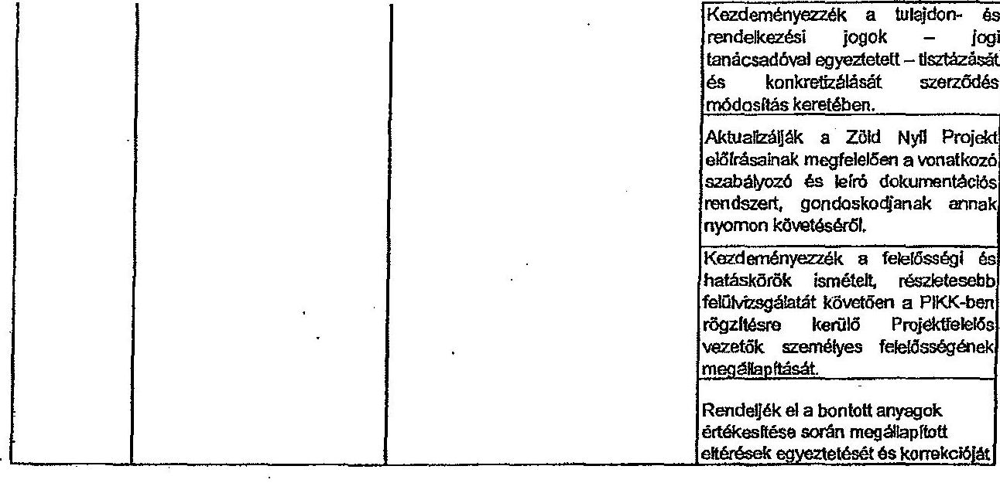

* A tulajdonos belső ellenőrző szervezete, vagy megbízott által végzett, vagyont érintő ellenőrzések.

Nyilatkozat: A tanúsítványban szereplő adatok valódiságát igazolom.

Külöltés időpontja:

Miskolc Holding Zrt.
MISKOLC HOLDINGÜINECKMÁNYZATI
YAGYONKEZELŐ ZÁRTKÖRÜEN MÜKÖLŐ
KÉSZVÉNYTÁRSASÁG

Miskolc Holding Zrt. képvételekben (atátiás)

---

# TANÚSÍTVÁNY

Az MVK Zrt. belső ellenőmása által végzett ellenőrzések

|  Az ellenőrzőt oljon | Az ellenőrzőt jevetéslet  |
| --- | --- |
|  2006. év II. félévében végrehajtásra került ellenőrzésekre kell intézkedések utánfordozóan. | A realizáti értekezletében meghatározásoknélét feladatok határidőre történő végrehajtásának utánfordozása a cél.  |
|   | Az elmaradt és végrehajtásra nem került feladatok a realizáti értekezletre éjtett megszokásra kerültek, vagy a feladat elvégzésének elmaradásként felelősségre vonás alkalmazására került sor.  |
|  2007. év I. félévében végrehajtásra került ellenőrzésekre kell intézkedések utánfordozóan. | A realizáti értekezletében meghatározásoknélét feladatok határidőre történő végrehajtásának utánfordozása a cél.  |
|   | Az elmaradt és végrehajtásra nem került feladatok a realizáti értekezletre éjtett megszokásra kerültek, vagy a feladat elvégzésének elmaradásként felelősségre vonás alkalmazására került sor.  |
|  Szabadságok részletezése 2008. év I. - VIII. fenti időszakra vonatkozóan. | A munkarendhez kapcsolódó 2008. 02. 01. dátamot az egész állományra vonatkozóan 2008. 01. 01-ig összementőleg át kell átlágy!
26 fő munkavállalónak a kité szabadság követően érdekében intézkedni kell.  |
|   | A felhasznált és felsorolt szakadságok között ellátás okait a rendszergesés a programszóvel és a VT-űrő szakembereinek bevonásával vizsgálja meg.  |
|  Mankatérből a jogszabályok szerint történő levonások szabályzámlánkgének ellenőrzése (2007. évben). | A kritérium nyitvánlerőzára szolgáló előjegyzési karkeri, mint gyakorlatban használt nyomtatványi rendszeresíteni kell, kétszámosul kell eltérni.  |
|   | Az ONG előlegeli engedélyezése elterkintési, a kritikusokkal lezivolt munkavállalók szelíthete célszorú az engedélyezést elszámítani, annak érdekében, hogy a munkavállaló anyagi helyzete tovább ne nemeljen.  |
|   | A kritikusok esetében olyan eljárási gyakorlatot kell létesímseni, amely a törvény nélkülözésnek megfelel, valamint ami nem csomlója a munkavállaló jogait. Továbbá nem viselő sorban megfeleljen az MI-ben elvételként megfogalmazott munkaide védelmére vonatkozó szabályoknak.  |
|  Itenzházás folyamatának szabályozása. | A beruházási szabályzat és a hozzát szomsan kapcsolódó szabályzatok átidejlesztett el kell végezni. Az átidejlesztésre a Hatólag által elvárt követelményeket is figyelembe kell venni. Az elkészítésének zárgításágtól a Válumra projekt is ítéleknője.  |
|   | Az „Éves beruházási terv" összeállításánál a beruházások rendelkezéseit a beruházási és fenntartási csoport vonultjének kellene előírónni, ami alapján történne meg a főkényei kínosultban való megjelmében.  |
|   | A beruházás folyamatának erőzseklésénál a Dr. Lichtenberg Hattitsenysépsővelei Kft. szakembereinek javaslatát időponti figyelembe veszi.  |
|   | Az „Éves beruházási terv" összeállítására az Önket terv elkészítése előtt kerüljön sor.  |
|   | A főkényei könyvédelem az ellenőrzés során feltárt eltérések kivonálását végre kell hajtani. A 5171/07 fűtőkezésre számítékon szereplő tételek szóbbonlását az érintett testkelek vezetőivel egyezheti kell.  |
|   | A számítógépek tartozásának nyilvántartását célszorú változások elszámolások egyszerűsítése érdekében.  |
|  A munkavállalók időszakra olvasó vizsgálatának időben történő elvégzésének ellenőrzése (50/1999. (XII. 3.) KSM és a Megillető zárászitor 33/1999. (VI. 24.) vonatkozó, valamint az 0x03-27 Manka és Tűzoldalati Szabályzat IV. fejlesztés szerint). | A foglalkozás egészségügyi szolgáltat egyenleges lehetőségének biztosítása érdekében az időszabur orvosi vizsgálatok átomszámát a Hurráságyokat szolgáltatási osztályozatoknak minden évben át kell készíteni.  |
|   | A szabályzat átidejlesztett, valamint a szervezet változás miatt megszűnt szervezet egység, beosztás feladatának elszámolni el kell végezni. A mészerei rendelet módosítása miatt szükséges változtatásokat a szabályzatba be kell építeni.  |
|   | Azokra a szervezetekre vonatkozóan szabályozott iról a dokumentákra szabályolt, amelyek irányítása alá tartozó munkavállalók sem üzem, sem önálló csoport szervezetbe nem tartoznak.  |
|   | A szabályzatban nétszenti rögzített dokumentáltás fennséjtő, adattartalmát, az elvégremét ellenőrzések időpontját.  |
|   | Azokról a szervezet egységeireit, ahol a dokumentálásban hiányosságok feltételek jelezte kell. Az elmaradt időszakra olvosi vizsgálatokat elvét időn belül el kell végezletni a foglalkozás egészségügyi szolgáltatás.  |
|   | A jelenleg használt Magis dolgozó nyilvántartás adattárokat naprakhoz állapotnak megfelelően itt kell tölteni. A feltöltés végrehajtásáért és ellenőrzéséért feltéte személyeket nétszenti kijelölni.  |
|   | A folyamatos ellenőrzést teljesítését kell, hogy az esetleges feladgatók ellenállható legyen.  |
|  Jászokozatáti jogsértékezésre szabályozottulajának, elszámolásának ellenőrzése. | A hirdőszegedéseket nyilatkozatok napra készségét (redátvasa forgalom, vétamos forgalom, forgalmi ellenállás) az Ittivel minden jogsértékezésre egy számítógépes feldolgozási rendszerben kerül felidéjszáma, illetve a meneljegyzé értékeléseek minősülnek, azért a feladat ellenőrzése vonatkozóan egyértétti szabályozást kell alkalmazni minden máskorlától végző szervezet egységre vonatkozóan (forgalmi ellenállás).  |
|   | Az 0201-27 Manka- és tűzoldalati szabályozó feldolgozását szükségessé teszi a feladatok más szervezet egységhez azokatlan és az lelkiútével szervezet változások.  |
|  Medzititálózatok (tízenti beleesetek) feldolgozása, elszámolása (2007. évben). | Ittivel a nem rendszeres jövedésének fontos szerepet töltenek be a tápolna számítójátolnak, azért belül lett vizsgálni a nem rendszeres jövedésnek közül és lelőttelensét, éppen az esetben, ha a jogszabályi időszakra nem állapítható meg a késetéséél, akkor nem kell engedélyezni a számítójást, mert számítójától problémát okoz. Az eltérés közül ellenőrzés során történő feltételek bírságot nemné maga után.  |
|   | A nem rendszeres jövedésénekmét minden esetben meg kell követelni a pótlap kötőjését.  |

---

MVK Miskolc Városi Kővívówéket Zrt. gazdasági társaság megnevezése

9. számú melléklet a V-0032-267/2013.számú jelentéshez

TANÁSÍTVÁNY Az MVK Zrt. helye ellentézése által végzett ellentézésnek

|  2003. | A kézint és időtartásának, időtartásának, hónyai, töbölésű elszámolásának és a tevékenység megvilágításának vizsgálatához helytartás (2007. évben). | A tárgyi eszközökben megállapított időtartásának időtartásakozóval és a következőkért, a jegyzőkönyvek tartalmát az érintett felületen vonatkozó keremésű kell.  |
| --- | --- | --- |
|   |  | A időtartásak az alvóhívások, a következőkért, a jövőben az anyagi és a személyi felelősség megállapítása és érvényesítése érdekében határidően kell a időtartásnak kötetlensített elvégzést. Az ellentézésé az érintett felületen kiteretést kell.  |
|   |  | A 2007. évi időtartás tapasztalatai 6. októbnák 2.1. pontjában szereplő, határozatos új Lattárstáni szabályzat eltekertése.  |
|   |  | A leltár műköszléti időpontját, az elvégzendő feladatokat a 2006. évi leltárstáni átomtartóan szempelletti kellene, mert a feladatok elvégzeteit folyamatosan nyomon
 lehet követni és ellenállóhadunk. Célja a leltárstán előkészítése, segítsük.  |
|   |  | A tárgyi eszközök vonatkozásában a leltár időtartásának véget kell fejezni, hogy a számviteli előkészítése végeláthatatlansága megfelejtsük.  |
|   | MÁV és VOLÁN bérletek költségének elszámolása 2008. év 1.-21. kémigben. | Az évvégén az 1.990.000-t költséghelyről a megnevezett költségei itt kell vezetni.  |
|   |  | A munkásszállítás éven bérletei törlését biztosított mérlegelni kell, nem piros költségei jelent a társaságnak. Egyszerűbb és zavarabb a havi bérletek (MÁV, VOLÁN) megvalósításra/benyújtásai kell a tevékenységsel.  |
|   | MGF elintézésre során kötött hőnyeszsignál, szótámának helyzete, nyilvántartási és bejelentési kötelezettség elintézésére. | A VT- 00377 által készített programban található elutasító határozat formanyomtatvány. A törvény támasztasson 5. kock az alapjából nem lehet kötöttni.  |
|   |  | A hőnyeszsignál bérletekre érintetésre az elutasítást határozó részében kell pontosan az 5-ra és az alappontjába fárultozva megintetéssel az elutasítást, hogy az esetleges bérletmesteket az elutasított bírja nem alapozni bérleteknek.  |
|   |  | Ebből adódan a társaságunkérkezésű feladatok előírására készített intézkedési terv mindjükre bennezi írásen, anyagban kellene elgyíteni a végrehajtások feltételeket, feltételeket, hatáskölteni. Az egész folyamat szabályozását egy észreveset egységes szakaszakor legbőve elkezeni elérésében.  |
|   | A munkavállalók munkához járásával és az elszédi költségek megítélésével kapcsolatos adjánia vizsgálata. | Az érintett földnyel számítékban mobilizáció eljárások rendezésre érdekében az egyeztetést szükséges elvégezni 2008. 02. 20-ig a feszülék csoportnak és a Számviteli csoportnak.  |
|   |  | Nagyonlévzete egyeztetési lett a Szemléle csoport feladását és a földnyel kincssé adatait.  |
|   |  | A munkákérletére kiteretését kell a bérletmesteket az elutasítási elszámolásának szükséges új engedélyeket 2008. 03. 21-ig be kell szorítani a munkavállalókát.  |
|   |  | A munkávalitási előzető a készítészen számít alapján elszámolt költségtartás adatait, írása bele kimutatásába, mivel ez is része a költségelszámolásnak.  |
|   | Munkötelezettek (összsi hatásokok) kivizsgálása, elszámolása (2007. évben). | Az GZB- 27 Munkö- és tájárófehér szabályzat átdolgozását szükségesen hozó a feladatok más szervezet egységhez csatolása és az időközbeni szervezeti változásra.  |
|   |  | Mivel a nem rendezésre jövedelnek fordul elmegeti létesnek be a tégéhez szabálytávolott, esési felül kell vizsgálni a nem rendezeme jövedelének közül és időtartását. Akban az esetben, ha a jogszerűség költszaka nem állapított meg a feladatokól, akkor nem kell engedélyezni a számítéjtési, mert számítéjtési problémát okoz. Az eltérés közül ellenőrzés során történő különbsé bíróigot vívikul megis elin.  |
|   | Munköblítenet beosztásának helyzete. | A nem rendezeme jövedelmeikről minden esetben meg kell követelni a pótlap táblázását.  |
|   |  | A pályakontaktási csoporttól a munkavonál kité átszoráikat szükségszerű elvégzetei azokra az elészokokra, amikor az emeket beosztókkáél elővét foglalkoztatási valósul meg.  |
|   |  | A bérletpészéshez munkavállalók bármányt a foglalkoztatásoknak megfelelő munkavonál kitébe kell beosztani.  |
|   |  | A regisztrati munkvább benéztésben foglalkoztatási munkavállalók munkállásosítások elszámolását a KSF-ben rendezni kell.  |
|   | Pénztár elosztatás (verszámolás, bevébelezések, kötelések, pénztár és a pénzbeesítés közenségének helyzete, pénztár elévzési tevékenység, utalványozások, elszámolásra követi elősegékkel való elszámolás), pénzbeesítési szabályzat megbénősségének vizsgálata. | A Pénzbeesítési szabályzatba a hőnyeti tevékenységek szabályozását bele kell építeni és a számviteli törvényben, a munkavállalókban javasolt tevékenység történő kiegészítéseit is el kell végezni.  |
|   |  | A Pénzbeesítési szabályzatba a hőnyeti tevékenységek szabályozását bele kell építeni és a számviteli törvényben, a munkavállalókban javasolt tevékenység történő kiegészítéseit is el kell végezni.  |
|   |  | A kötötti kötelezetnek költségének elszámolását szabályzati igazgatói cárstétel sürgősen ki kell adni.  |
|   |  | A valaték kezelésére alkalmas pénzfénybárástartást kell rendezette. Bliženi.  |
|   |  | A kötötti kötelezetnek költségének elszámolását szabályzati igazgatói cárstétel sürgősen ki kell adni.  |
|   |  | A valaték kezelésére alkalmas pénzfénybárástartást kell rendezette. Bliženi.  |
|   | Pótájáróval való elszámolás ellenőrzése (2007. év 1. vegyedés) tárgyú vizsgálat kiegészítése. | A tevékenység szabályzata a szervezet változás miatt átdolgozásra szeret, amelynek a valóságban működő kézismétet kell betehuszata. A számítógépes adattaládgázásnak követni kell a változásokat.  |
|   |  | A Bizonyból fizeteléssel átdolgozását sürgősen miatt előbb el kell végezni.  |
|   | Szégeni számoknek nyomtatványok | A bizonyból felelőssék személyében törlést változású minden esetben a szervezet egység vezetője kezdeményezze a gazdasági igazgatói felé. A naprakészséget biztosítani kell ezen a testtelen, amit az ellenőrzési kötelezettséges is érvényesíteni kell.  |
|   |  | Előzzeni mérlegelni a számítógépes nyilvántartás beosztatásának lehetőségét.  |

---

MJK Miskolc Városi Közlekedési Zrt.
gazdasági biztonság megnevezése

TANÚSÍTVÁNY
Az MVK Zrt. balon ellenszáma által végzett ellenszámek

nyilvántartása, azokkal való elszámolottás
mójerés.

A szigorú számolási, bizonyítal felhasználás nyilvántartás vezetésével felelős személy munkaköz különösen
régzővel kell az ezzel járó feladatshat.

A szigorú számolási, bizonyítal felhasználásának nyilvántartására a társaságok tartalmáig és tizenallag egyvégez
nyilvátartás vezetését kell meghatározni.

Társaságokt tartalmáig egységes nyilvántartás vezetőnével kell a szigorú számolási, bizonyítal felhasználását
megbővelelti.

2007. év 11. félévében végrehajtásra került
ellenőzéséhez lett feltételeknek szhelkedésben a cút.
Az elmaradt és végrehajtásra nem került feladatok a múszáló érdekeikén újból megszabásra kerültek, vagy a
feladat elvégzésének elmaradásáról felelősségre veszte alkalmazására került sor.

2008. év 1. félévében végrehajtásra került
ellenőzéséhez lett feltételeknek
szhelkedésének kiegészítése.

A múszáló érdekezéséhez meghatározásra került feladatok határidőre történő végrehajtásának szélőesőrzése a cút.
Az elmaradt és végrehajtásra nem került feladatok a múszáló érdekeikén újból megszabásra kerültek, vagy a
feladat elvégzésének elmaradásáról felelősségre veszte alkalmazására került sor.

Seérkező és nem mezgó készíntak részletek
vizsgálatát (teleheznek olyan feladatok, amellyek
nem kerülnek felhasználásra).

Legkettőni osztálynak és a felhasználó tárolnomok egyeztetések útján a belső felhasználásra előzésre készítéshez
tartásosításra érdekében lépéseket kellene tenni.

A montavállalói és egyéb vonzban történő értékesítést a legkettőni osztály szervezze meg.

Azon anyagok esetében, ahol a típus amensség fordul, a stélyszámokat úgy kell feladatban, hogy okkszám alapján
hisszemesíthetnek és a megmozdatás esetében predikossi típus szerint meghatározhatnak legyenek.

Belső átbehéletelt megvalósulásának
ellenőrzre.

Az eredmények felelős annak szükségességét, hogy a társaságon belül szolgáltatást végző egységeivel ki célzzené
keme a belső teljesítmény elszámolási rendszer bevezetése.

A szabályozásokban mobiliszó hiányosságokat sárgátem pótolni kell.

Bővépénzlések működésének kilyenebre
ellenőrzre (szombat - varámaip csípők ki).

A pénztárolóba telepített térfigyelő rendszer láttazógének felelőssé úgy kell végrehajtani, hogy az a pénztárolójelvég
egész területét lehetje, főleg behetekkel terülelet (ablak, aját), valamint a készleteket tartalmazó lemezszelényeket.

Az anyagkészleteknél elszámolt értékesztésnek
felelősségének, okolnak vizsgálata (2007.
évben).

Nem volt javaslat.

Kísérőnő utalványok kiadása, elszámolása.

A 2009. évtől működő negyedéves egyenletési kötelezettséges felét (szorlális csoport, számolód csoport,
bővészletmétel csoport között) a kísérletű utalványok frepétnél múszó földbevívitárkocskai kilyenebben a szorlális
c comport kapja meg megvetésesés észrevesés céljából.

Az OPUS rendszeren keresztül a bővészletmétel részére feladott havi felhasználási adatshat a bővészletméle csak
abban az esetben adja fel a földbev ítélt, ha az egyezőt a szorlális csoport kéri feladásának.

Havidezetlen feléd egyetlen egy hónapban sem maradtak, mert késéltől kilyenebes történő visszakeresése
felidézésre kiöl okos.

Kitáb megmozdaták járművel mászatú
megvizsgálatnak, vizsgálatátásának
eleskezésre, szabályozásának helyzete.

A számla a múszletére hatályos Gazdasági Igazgatói utasításban (21.9908. számú) szereplő díjátétele figyelembe
készíti el, ezért a mászatú osztály felülem kezdeményezze a szükséges változtatásokat.

Megje és az OPUS munkaköt adatoknak és azzal
egyezhéggének vizsgálata.

A foglalkoztató szervizető egységek vezetői és a homérdgyellet szolgáltatási osztályvezető között egyeztetés
szűkeéges a jelenleg fennálló problémák rendszése érdekében, hogy a munkanndi bérkódási megjegyzés, a
gyakorlatban megvalósuló foglalkoztatás megtörésjen.

Mencímél adattalnak rögzítése, menedéveli
sárgán történő munkaköt elszámolás
ellenőrzre.

Nem volt javaslat.

A menedéveli feldolgozásban a 2 fő munkasállaló felüre elszámolásában jelentkező elöbés okainak tisztázása
felelőssén számítételeknek azakemként csízemő bevezet.

Munkanő elátódtság kutyantéleti aditási tízban
mennyiség vizsgálat kiegészítése.

A menedéveli feldolgozás tízára elszámolásában jelentkező elöbés okainak tisztázása érdekében az informatikai
vezetővel kapcsolni felvétel megtérítést. Az elöbés okolnak vizsgálatát íglenke szerint a 37. béten végrehajtják. Az
eredményéti írásos feljegyzés készíti.

Esközben kilyenebesen figyelemmel kell távirni a Kötfekör Özerzötésben meghatározott tízára kerül alakulását és
szűkeég esetében bennelszabát kell alkalmazni, hogy a KÖZ- ben meghatározott tízára mérőket ne látja fel a
tárcsukig.

2009. Az egységes kizsítés érdekében tisztázni szükséges a vonzindozatéve és a telephelyes késő végzett munkák
munkaköjében jelentkező tartalmi köllérősséget.

A szervezet vátazás következményeként összevondura került a víkonyasmittő műhely és a közbeszélés szerinti
csoport. Ebből adhatjon a csoportmentől fennállás megcsűrő. Az érelyét munkasállaló jelenleg bennélsérényítést
sem végez, ezért a 10 % az csoportmentől jelölni, valamint a munkaköt elmaradáság kedvezmény (80 %) nem lévő.
A pótlék megszüntetése érdekében a homérdgyellet szolgáltatási osztályvezetővel egyeztetés kezdeményezése
szűkeéges.

---

MHK Melsde Vármi Kizáróvalási Zrt. gazdasági társaság megnevezése

9. számú melléklet a V-0032-267/2013.számú jelentéshez

TANÓSÍTVÁNY Az MHK Zrt. teljes ellentázókat által végzett elleneszkedő

|  Meskerekelt bennezés szerinti foglalkorlatási helyzete | A legiszthat osztály munkavállalói állományában betartó 2 fő esetében biztosul kell a kunaánügyelési szolgáltatási osztályvezetővel a foglalkorlatásoknak megfelelő munkavonál kiürd és a hozzá tartóról munkatőtt is. Az érintett munkavállalókat annak megfelelően kell beosztani, amit a kunaánügyelési szolgáltatási osztály meghatároz.  |
| --- | --- |
|   | A 581. Papcson Csaba foglalkorlatásának tájéko igényét medemi kell.  |
|  Meskerekelt társaságot szembeni tartozásának nyilvántartása. | A tevékenységgel kapcsolatos kővázatokat tartalmazó átlagát folyamatosakályozási alapjánan el kell készíteni.  |
|   | A jelenleg alkalmazott rossz, és a jogurabályok előírásaiba többé Papcson GSM szolgáltatási díj fizetésének elrintéasztása miatt alkalmazott levonási gyakorlat megvalósítása.  |
|   | Az ellenőrzés során feltárt és kutatásárováltat levonásra került munkavállalói tartozások esetében a Papcson GSM-el szembeni munkavállalói tartozások földrészek történő átadásában szereplő köteleket számoltólag megfelelő helyre kell átkönyvelni a gazdasági év zárását megelőzően.  |
|   | A tartozások nyilvántartásában az időtűtésbe bekövetkező változásokat állni vonalni.  |
|   | Azon kárpott munkavállalótakat szemben, - akik a társasággal szemben levadók tartozásukat folyamatosan nem áttívódik, a végrehajtás jósolékos költségének mérlegelés után - a költségi végrehajtás megkezőását kezdeményezni kell.  |
|   | A 201 2008. számú igazgatói részébe 1. számú mellékletében a közismont számúknál a Papcson GSM szolgáltatással tartalmazó írásba szántják esetében a következőket szolgáltatási osztály által történő elvégjegyzést célzzenő beépíteni.  |
|   | A Papcson GSM-el a kóvel jövőben kitlenült szerződés kötés alkalmazni a modern működésében jelenleg mutatkozó és megfelelő problémákat okozó kóvázatokat biztosít szükséges.  |
|   | Az adatokként követelményelének megfelelő munkavállalói tartozást tartalmazó analitika bevezetése a földrészek keretével említésen.  |
|   | Szabó Székes időtartamát, Csaba László, Tőb Albert, valamint Talada Árpád tartozását mederben kell tartani.
| Silyen munkakötelezettség vizsgálata, amelyhez később kapcsolódó írásától jobbik, és akad törvényező (továbbiak, közreműködő jobbik, vonásitál jobbik). | Az okkózis elszámolásával kapcsolatos módosítás bevezetését kezdetét 2010. 01. 01-03 javasban bevezettei. |
| | A közreműködő vezényéből a tergési igazgatói kapaja jövő. |
| | A KSZ-ben a jelenlényi közreműködő biztosításához szükséges munkakör változtatás átvezetését, az okkózis eljárásának változásokról jövő módosítás elvégzését 2010. 01. 01-03 javasban. |
| Pécstámutacsszáz és a 2008. évi tervétel jogutékkalim ellenőrzése | Nem volt javaslat. |
| Tápukozni állományok számújtásának, belegszabadságok elszámolásának ellenőrzése | A megkapatló jogtól lap vonalását ugyanújtottan kell. |
| | Az adatmegállapító lap és a jobbap eljel áttartásával kiütéssel a gyakorlatban mértékét alkalmazni kell. |
| Az MHK Zrt. után érezemlétéki kezelési munkavállalói vizsgálata, kiütésbe tekintettel a gazdasági és bejegyzések mellékletével kell összetehünk átadásához, kamákokra (telefonum, internetes, leilátáldoz, stb. elejtéke kell beosztani), mint vonalékos kiegészítés. | Az után érezemlétéki megbeszéléséről készült feljegyzésben a végrehajtását feladatokat, a felelőzőket, a végrehajtás határitását minden esetben szempontani kell. A hózkodás érdekében átadott és utalásosul kell elkóni. |
| Hentőnik formanyag fogyasztásának elszámolása és a jóműlevezék ösztönzése 2008. év 1. félévben. | Az üzemanyag megtakarítás elérésében lezélszerűen jóműlevezék vezemű részt, ezért az igazgatói részleteken és a Fregalmi igazgatói kárpáti feljebb 2008. év 1. félévben a végrehajtásnak és nyilvántartásának kapcsolatos elvárásuk azt megkövetelni. |
| Értékelék (tervetjegy- és bérlet) ellátás, szótitás, kezelés ellenőrzése. | Jövet számú relatív bevitáskukól bizonyítási, szereplő és a szerződésben rögzített beosztatási ár között eltérézi a békéts programosítások, és a szerződésben rögzített beosztatási ár között eltérézi a békés programosítások, és a békés programosítások, és a békés programosítások, és a békés programosítások, és a békés programosítások, és a békés programosítások, és a békés programosítások. |
| | A számú ellenőrzés alkalmazni feltárt hiányosságokat az érintett tevékenykéniműen esetben ismerőnni kell és a hiányosság megszűnéstése érdekében intézkedéseket kell tagutaztsulani. |
| | Az információkizárását folyamatosan működésre kell (meg kell követelni). |
| Selejteszt számúintartatási eszközök (továbbnak, kezelésének, értékesítésének, megtermelésének ellenőrzése 2008. év 1. félévben, 20. tervel.) | Az SZII-14 Felrelegző vagyonlényeik és közismont kezelésekre az alábbiszkóvalk alázalitásától és hozzá tartóról VIC-2-jelv legutárónyak 2008. részben a vagyonlény megtermelítését érintő változásokkal mértéke végre kell hajtani, a 2010. évben bevezető megkezésével megelőzően. |
| | A megjelenési eljárás során szigorúan be kell tartani a szabályozó aláírásba. |
| | A számítógépelétől közremű merevlemesek keletnőkívét minden esetben végre kell hajtani. |
| | Közreműtészt járó munkákot a „Megrendelés - munkatíp" programban kell megrendelni, így nyomon követhető az erre a tevékenységre fordított munkaték. |
| | A tartalék általánosan megkezésével a fejthetésű feltétszám nyilvántartást kell alkalmazni. |
| | A veszélyes tudatékának módosítási zelvét számításkeztetésű eszközök értékesítését meg kell számítani. |

---

MHK Miskolc Városi Közlekedési Zrt. gazdasági társaság megnevezése

TANISÍTVÁNY Az MVK Zrt. balon altamintása által végezőt ellenszázóak

| | Ijsat tansitái kötelező egészségbiztosítási ellátásainak vizsgálata (jándék elszámolása, foglalkoztatás bejelentése az Ijsan Kamara felé, tanuló szerződések megbízása). | Nem volt javaszlód. |
| --- | --- | --- |
| 2018. | Tervekszefizeti juttatások elszámolása az 0.224 törvény ellátásai szedet. | A törvényi változásokat a belső szabályzatában és utasításokban folyamatosan követő kell. |
| | | A vítězokhozó vezetők energia megtakarítását leseső jogcím köd változtatását február kovi számítáloig el kell végezni. |
| | 2020. I. élővében végrehajtásra került elmoózásokra kell intézkedések utasítkoórzása. | A realisáló értelemleteken meghatározásra került feladatok határidően illatánő végrehajtásának utasítkoórzása a cél. Az elmaradt és végrehajtásra nem került feladatok a realisáló értelemleken újból megszabásra kerültek, vagy a feladat elvégzésének elmaradásától felelősségre vonás alkalmazására került sor. |
| | 2020. év II. élővében végrehajtásra került elmoózásokra kell intézkedések utasítkoórzása. | A realisáló értelemleteken meghatározásra került feladatok határidően illatánő végrehajtásának utasítkoórzása a cél. Az elmaradt és végrehajtásra nem került feladatok a realisáló értelemleken újból megszabásra kerültek, vagy a feladat elvégzésének elmaradásától felelősségre vonás alkalmazására került sor. |
| | Aző-ös 7.0 törvény időtörténeti változásának átvezetése és alkalmazása az elszámolási rendszerünkben (2020. 07. 01-03 bevezetett módosítások). | A béres kívüli juttatásokot szabályozó III. 2.-96. számú irányítást eljárásban a 2010. évre érvényes elemeket elágita be kell ejtőzni. Felelőst: Hurnámműködés fejlesztési osztályvezető Határidő: 2010. 04. 27-én került fel a számvilágúges hálózatra |
| | | A beállítói és külföldi körülménem költség elszámolását szabályozó 27/2009. számú igazgatói utasításban a törvényi szabályozás cégúi terütséges előterület el kell vezetni. Felelőst: PG. és számvitól osztályvezető Határidő: 2010. 05. 31. |
| | A pénzlárgépok beizszerűtésével kapcsolatos problémák, észmeködési rendertése. | A számítájtási programban az őzenszegleg megtakarítás címen kifurultam került jövedelem kezelésől rendezni kell. |
| | | Időtörténet a rendszerben végrehajtott változásokat követő irányítási tejánkat söngőven ki kell adni. Felelőst: Jegy- és Melaljelozzási csoportvezető Határidő: 2010. 12. 31. |
| | Farmacika szabályzat betartásának elmoózása. | A farmacika jutásától tartalmazó szabályzat átdolgozását söngőven el kell végezni és kiadni, hogy 2011. évben az Szig törvény ellátásainak megfelelően szabályozva legyen, mert adómentes természetbeni juttatásnak minősül. A törvény előírja, hogy a jutásától a Halakóv üzesződésben, vagy belkó szabályozásban kell régeleni. |
| | | Felelőst: Hurnánügyvétel szolgáltatási osztályvezető. Határidő: 2011. 08. 30. |
| | Szaklépzési hozzájárulás elszámolásának és a törvényi változásoknak megfelelő szabályozási elmoózása. | Az egész folyamat működését tartalmazó szabályozás összeállítása (III. tárolt, eskor, mélyen formában, és határidően szolgáltat adatot, ki miért felelős, stb.). Felelőst: Gazdasági igazgatói. Határidő: 2010. 09. 31. |
| | | A szakképzési hozzájárulás felhasználására bíró készítése. |
| | | Felelőst: Hurnámműködés fejlesztési osztályvezető. Határidő: Tárgyőr 03. 31-ig |
| | | A szakképzéshez kapcsolódó pályázat hímek felelővel pátszenti forma megjelölési a műszaki osztályok Felelőst: Mésznéf-gazdasági csoportvezető. Határidő: Folyamafus |
| | | A bemutatások összeállításokor már lerventi kell azzal, hogy a szakképzésű hozzájárulás tevkére nilyen eszközök kerülnek beszerezésre. Felelőst: Legiszállási osztályvezető. Határidő: Tárgyőr 01. 31-ig |
| | | A műszaki osztályi készítése minden évben egy létszámítanul, amelyben az ajtóindás képzési létszámul kell meghatározni a társaság részére. Felelőst: Tanmilhely csoportvezető. Határidő: Tárgyőr 00. 35-ig |
| | | Létszámítav elkészítése alapján a számvitól osztály készítése egy költség átvívó a felhasználás elvislására vonatkozóan. Felelőst: Pénzügyi és számvitól osztályvezető. Határidő: Tárgyőr 07. 31-ig |
| | | A műszaki osztályi készítése számításokat arra vonatkozóan, hogy nilyen ráfordításnál el a benzra társaságnak a gazdasági képzésből. Határidő: Nagyodévesés |
| | | A gazkattól képzés befejezésre után az esetleges társaságokt maradást szorgalmazni kellene. Lehetne előtípőkkel nevelni a társaságáti nyugdíjba vonuló munkavállalók példázára. Felelőst: Mésznéf osztályvezető |
| | | Nagyodévesés a hurnámműködés-fejlesztési osztálynak, a tanmilhely csoportvezetőnek és a számvitól csoportnak egyeztetni kell a felhasználási kiövetnyes helyzetének megismerése érdekében. Határidő: Nagyodéva Követő hónap 28. napjátj. |
| | Leszámolás folyamatának elmoózása. | Egy éyes tanúra tizenöt évből belkó szabályozásban folyamatosan követő kell az időtörténet bekövetniező változásokat. |
| | 2020. év II. élővében végrehajtásra került elmoózásokra kell intézkedések utasítkoórzása. | A hurnánügyvétel szolgáltatási osztályvezető által vállalt határidően el kell feladteni a folyamat szabályozását. |
| | | A realisáló értelemleteken meghatározásra került feladatok határidése illatánő végrehajtásának utasítkoózása a cél. Az elmaradt és végrehajtásra nem került feladatok a realisáló értelemleken újból megszabásra kerültek, vagy a feladat elvégzésének elmaradásától felelősségre vonás alkalmazására került sor. |
| | | A 17/2010. számú igazgatói utasítási átdolgozását a vizsgálat során felténi hiányosságok miatt söngőven végre kell hajlatni. |
| | | A 17/2010. számú igazgatói utasítási átdolgozását a vizsgálat során felténi hiányosságok miatt söngőven végre kell hajlatni. |
| | | A 17/2010. számú igazgatói utasítási átdolgozását a vizsgálat során felténi hiányosságok miatt söngőven végre kell hajlatni. |

---

# 9. számú melléklet

## a V-0032-267/2013. számú jelentéshez

| 9. számú melléklet | | |
| --- | --- | --- |
| a V-0032-267/2013. számú jelentéshez | | |

## TANISÍTVÁNY

| Az MVK Zrt. beles ellátottáza által végzett ellátotások | | |
| --- | --- | --- |
| Kötédebbek és áll jelentések dokumentálósa
2010. évben. | Az IE 2-01. számú irányítást eljárás elvívigyezését az említéséhez és a vizsgálatkor kitűző hiányosságok bekezdjük. | |
| | Határitól: 2011. 04. 30. Fekelés: Hunderügyvétel szolgáltatási osztályvezető. | |
| | Hivétét szabályozásban javaslási elgazásai, hogy a kiállításától nyilvántartott az elutasítási felhívásának feltétele az áll jelentés szabályozott, határitólan történő levélése. | |
| | Az adattartalmi hiányosságait kitöltött bizonylatokot az aláírását pótolni kell, hogy mind az emelvő és a műszol pótlányos azonos adatok szerepeljenek. Határitól: 2011. 04. 15. Fekelés: PK- és számvitálasztályvezető. | |
| 2011. évben az SZJA törvény módosításából bekövetkezett változások bevezetése és alkalmazása az elszámolási rendszerintéken. | Az OPUS számítótól program törvényi változásoknak megfelelő mozdításban elvégzéséről a fejlesztési elvégző VT Selt Kft-t nézzenő lenne minden esetben nyilatkozódó, mert erre vonatkozó nyilatkozat nem áll a társaság módolásokban. | |
| Töltsz elmozdításának gyakorlata 2010. évben. | A víruscsokogatói osztály állományának a Kita-ben meghatározott töltsz keretey felüli foglalkoztatása érdekében megállapodást kell ízteni a hatásági leírása elutasítása érdekében. Fekelés: Hunderügyvétel szolgáltatási osztályvezető. Határitól: 2011. 05. 30. | |
| | A rendkívüli eszköz elmozdításban egyedyes nyomtatvány alkalmazását kell bevezetni. Fekelés: Hunderügyvétel szolgáltatási osztályvezető. Határitól: 2011. 05. 30. | |
| | Az informálási biztonsági szabályozó említésének elutasítása. Felelős: Informatikai vezető, határidő: 2011. december 31. |   |
|   | A jelenleg is felmerülő szellemező változásokra a kitervező hozzáférési jogosultság és megelőző az ismi végzetek minden bezzégterület rendszeri életében. Felelős: kuhajlathasználói és a szerverező egység vezetője. |   |
|  Adatvédelmi feladatok gyakorlatában történő megvalósulásának elosztása (személyes és informatikai adatbizetű). | Személyesét szabályos beosztását és informatikai adatbizetű. A szabályozási megvizsgálat szokáselléséhez szemben szoruljon a kitervező kitervező kiszámolásának elosztása. Felelős: Hunderügyvétel szolgáltatási osztályvezető. |   |
|   | A leszámolásról a szerverező és a változások következtében történő változásokról az informatikát minden esetben tájékoztatni kell. Felelős: Hunderügyvétel szolgáltatási osztályvezető. |   |
|   | A leszámolásról a szerverező és a változások következtében történő változásokról az informatikát minden esetben tájékoztatni kell. Felelős: Hunderügyvétel szolgáltatási osztályvezető. |   |
|   | A leszámolásról a szerverező és a változások következőkben történő változásokról az informatikát minden esetben tájékoztatni kell. Felelős: Hunderügyvétel szolgáltatási osztályvezető. |   |
|  2012. év 1. félévében végrehajtásra kerülő elkerítésésekre kell intézkedések utasításokban. | A működő értékesítésben meghatározásra kerülő feladatok határidőben történő végrehajtásának utasításokban a cél. Az elmaradt és végrehajtásra nem került feladatok a működő értékesítése újból megosztására kerültek, vagy a feladat elvégzésének elmaradásától felelősséges egész alkalmazására került sor. |   |
|  2010. év 8. félévében végrehajtásra kerülő elkerítésésekre kell intézkedések utasításokban. | A működő értékesítésben meghatározásra kerülő feladatok határidőben történő végrehajtásának utasításokban a cél. Az elmaradt és végrehajtásra nem került feladatok a működő értékesítése újból megosztására kerültek, vagy a feladat elvégzésének elmaradásától felelősséges egész alkalmazására került sor. |   |
|  MVK Zrt. festa járművel tábornokintétek vizsgálata, költség elterkedések hatásának elutasítása. | A föröspozás minden hónapban a zárást lehetően a vegyes időteles leírása, a hónap utatási eszközségére helyezze el a saját leírása, a jogszabályok és a számvitálasztásban szoruljon a kitervező kitervező kiszámolásának elutasítása. Felelős: Feltakasztási csoportvezető. Határidő: Zárást követő törgy hónap 5. napjáig. |   |
|   | A jelenleg hiányait 2009. évi menetlensnek megkevezése érdekében intézkedéseket kell tenni. Felelős: Feltakasztási csoportvezető. Határidő: 2010. 09. 30. |   |
|   | Az üzemanyag tartósítás költségesen kiidéző írását elszámolását minden hónapban ellenőrizni kell. Az esetleges eléréseket a ható záráshoz minden esetben rendezni kell. Felelős: Feltakasztási csoportvezető. Határidő: Folyómatra. |   |
|  2011. | Abban az esetben, amikor a járműveli javításáról kapcsolódó feladatok kiadáthák, akkor az egyértelmű szoronítás érdekében a megnezdésre azértelen kell kötni a tételeket. |   |
|   | Az anyagok esetében, pontos, az anyagosztásos nyilvántartásával megjegyzett anyag megnevezése kell hozzadán annak érdekében, hogy azt bekalják szoronítást az illetékes szabályoknak. |   |
|   | A fogyatási képzék esetében elvás megjelölte a járművek száma, amelyekben cserélni vagy számításti lezáró a folyatában. |   |
|   | A feladatékból felirattá, hogy elmaradnak a teljes körű javítások, alkárkész cserél, helyett, a felüli felnevezésig megelőző javítások kiadások elvégzésre, a járművek száma az állapotban kerülnek hagyatónus. Olyan javításokat is megjegyzett, amikor a járkózások nem vállal 岀 |   |
|   | A műszaki és gazdasági csoportvezető jelenlőben szerepel, hogy egyes alkárkész hiányi átutazásának elérését meg, egy hosszabb járkózást lévő járműből. |   |
|   | Kapacitás irányítása kipük a beszélését állapítással történő javítás elkezéden. Az anyaghiányok kell jelentke elutasító az Általános Igazgató részére. |   |
|   | A bevezetési útvarázatára által készített feladatáazási hiányok, hogy a javítás kipüle rendelkezésük saját vagy kinezdésük kiszámolni a javításhoz szükséges anyagokból. |   |
|   | Az egységünk hiányos kiállításra miatt nem lehet pontosan megállapítani az elmaradt járműjévétes elvégzéshez szükséges anyag kipülét. |   |
|   | A fogyatási honasigvázatok készlet, amit a fogyatá figyelemében kell a beszélőbbek felállítani. A fél időszabban elvás vagy jelentősan kell adni. |   |
|   | A minimális készlet számok meghatározásra kerültek a szakértéletekkel egyesítése, akkor mint nincs a szerződésnek kitélése. Az osztályvesztő megállapítása, hogy a minimum feladatszási felállásának az alkárkész bezzetés kilyontással tárgyalva nem minden esetben helyzük. |   |

---

# 9. számú melléklet

## a V-0032-267/2013. számú jelentéshez

|  TANÍZÓVÁNY |  |   |
| --- | --- | --- |
|  Az MVKZrt. balta elutasítása által végzett eljavaslását |  |   |
|   | A kézmételet csökkenés nem vezellyeshethet a jövederek folyamatos javítájainak biztosítását. |   |
|   | A folyamatos nyereszt követelműség érdekében lépikől szeretének információval rendelkeztek az anyagdálatát javítálandását, annak elméleti nem egységes az anyagbülési értékmezése. |   |
|   | A szakértőteleinek egyértelműen azonosítható átteként megnevezéseket kell használni. |   |
|   | A gjendelpanyok fergőskizzetének csökkenése, nyilvállás szintjének hatálya érdekében wáldozóásaket kell hozni. |   |
|   | A nagy mennyiségű vezető esetében ki. Vérkező szűrők, a mennyiségsel és az átnevezési pontrasz kell bevezni a beszerzésük érdebben. |   |
|  Leszámolás folyamatának elutasítási beigazásban. | Egy ilyen fontos témát érintő belső szabályozásban folyamatosan követni kell az időnősben bekövetkezett költségekkel. |   |
|   | A hománügyvétel szolgáltatási osztályvezető által vállalt határidőre el kell béretleni a folyamat szabályozását. |   |
|   | A kemikétlenítüti adadó előírások megvalósítása érdekében a VT- Soff. R5-nél a programban végrehajtandó módosítást meg kell rendezni. |   |
|  Mindektal színekek elszámolása, határidőnek? | A hománügyvétel szolgáltatási osztályvezető vállalta, hogy 2013. 08. 15-ig megvívott a VT- Soff. R5-nél programban végrehajtandó módosítást. |   |
|   | A módosítás azt a sőtt oszáglájú, hogy az OFUS óra adattakom is századosan számolva jelzéjezek meg a munkatézi színekek árát. A módosítás követően a számítójául rendszerben szereplő munkaként számol óra adni leölje és a menekanél feldolgozási program óra adni leölje, valamint az ügyéni elszámoló ispon a munkavállalék részére különösen kerülő óra adni megjegyzések. |   |
|   | Az IE 3-19. számú irányítási vájárás átdolgozását alingésre végre kell hajtani, annak érdekében, hogy a tavas szabályozásában jelentkező hiányosságot megadásjének. A jelzereg végrehajtásra került szervesről változásának megfelelő illetékességét figyelembe véve. A határidő: 2011. 09. 15. |   |
|  Perfekt táolorítáljába 08. állat 2011. évben végzett felújítási munkát szexedéklennek és az ahhoz kapcsolódó szándék elavolgása. | A jelenéke 2. pontjában szereplő igazgatói elerődésében mutatkozó értékbülét elételei rendezni kell. Határidő: 2011. 08. 15. Felségc gazdasági igazgató. |   |
|   | A jelenéke 2. pontjában szereplő igazgatói elerődésében mutatkozó értékbülét elételei rendezni kell. Határidő: 2011. 08. 15. Felségc gazdasági igazgató. |   |
|   | A 21/2010. számú elterüzköz délzése minősíre csatolni kell. Határidő: 2011. 09. 15. Felségc pénzügyi és számolási osztályvezető. |   |
|   | A 6/2011. számú igazgatói elterüzk 3. oldal 2 ketezdésében az együttes elékkerdő részére esetben a szakigazgató elékkérések szükségességét javaslva elgakad, amit elében az esetben azonnal érvényesül a vezető elterüzköz. Határidő: 2011. 09. 15. Felségc szervesű. |   |
|   | Följételezés és szexedékelékén adódó szándék időszékleti meg kell állani. |   |
|   | A beszállítók kizárószázóval a szakigazgatói elterüzköli kötelezettség kötelezővé kell tenni. |   |
|  Herhalálására foglalkoztatás és a rehabilitációs hozzájárulás fizetési költszabátolg teljesítésének elterüzkése 2010. évben. | Nem volt javaslat. |   |
|  Szilvív Szcsa Vagyerevėzével 08. szociálszázóval közbenélteske kötött szociákba. | Nem volt javaslat. |   |
|  Tansimányi szerződések brülsőzapásra a jogkerészes bevonásával 2009. éves szerékszöve (törvényességi terüzköz, pályázatot jelentékei való elszámolás). | A jogkerészesek az új távétatás eszközvezették tanítójumára kötött szerződés 7.2. pontjához kapcsolódó szociálszádi javaslva megfelelő. |   |
|   | A 29/2008. számú igazgatói elterüzk átdolgozását alingésre el kell végezni, hogy a tavasn lévő rendszerének a munkaszexedékében foglaltakkal és az Árja Ithvényben rögzített előírásokkal összhangban tegyenek. |   |
|  A Társaság tulajdonjában lévő pöpljerefesek lefeklezették részére fizetési módolásokon. | Az eltelék előtilgázásért lefelé a feltételezéssel csoportozott. Határidő 2011. 08. 15. |   |
|  Töltes elrendelkeének gyakorlata 2010. évben. | A ellenszázagolva osztály állományának a Küs-ben meghatározott töltes keretére feláll foglalkoztatása érdekében megállapodást kell kötni a hatásági bízásj elterüzköz érdekében. Felségc: Hománügyvétel szolgáltatási osztályvezető. Határidő: 2011. 08. 30. |   |
|   | A rendkívüli munka elrendelésére egységes reprodukény alkalmazását kell bevezni. Felségc: Hománügyvétel szolgáltatási osztályvezető. Határidő: 2011. 08. 30. |   |
|  Vérőkezdésékkel való céljére törvény szerinti megvalósításának elterüzkése. | Az SZB- 27. közdenéltével és tözvédeleti szabályzat módosításának felelőse: bíznyi lőni és közbeságja elméleti csoportozott. Javasolt határidő: 2011. 03. 31. |   |
|   | A jelenéke 2. pontjában a vėzefektívumára kötje tözéként javaslva szerepeljével az általánoság érdekében. A bizonylóan végrehajtott módosítás alingzésének felelőse: Könyvezeteknélési megbízott. Javasolt határidő: 2011. 03. 26. |   |
|  2012. 1. tölév | Szervesről változásokkal járó munkaként leírások őshapozásának, módosításának helyzete (2011. 08. 01. aláírt állapokának megfelelően). | Az SZB-23. számú szabályzat ödöngyészül, elutasíztatását végre kell hajtani. Felségc: Hűlőleg munkalign és teljesítmény menedzsmentő. Határidő: alapján.  |
|   | A munkaként leírások egységesítése érdekében az érintett terüzköz vezetői vegyék fel a kapcsolatot a holding munkaügyi és teljesítésény menedzsmentőszettőjével annak érdekében, hogy egységes szerkezetű munkaként leírások készüljének el és kerüljének felelőse. |   |
|   | A társaságnál el kell írni azt, hogy minden munkavállalások legyen aláírt munkaként leírása. A munkatvári vezetők a hománszorgáltatást végző szerveset által megszólalt munkaként leírás módos alapján kötelezek elkészíteni a munkaként leírásokat. Felségc: munkahelyi vezető. Határidő: 2012. 02. 26. |   |
|   | A tőmenjéző Szakályzat átdolgozását alingésen névét előbb el kell végezni. |   |
|   | A bizonylót felződött személyében történt változást minden esetben a szervesről egység vezetője kezdeményezze a szervesről változások után megjelölt vezető kék. A napokközz Negatív
 Számsokban kell ezen a területköz, amit az elterületköz következtetéséhez is érvényesíteni kell. |   |
|  Számviteli számadóvá bizonyítékként való elszámolás elterületköze ( minijózéke, határba helyeshez, kerethez, nyilvántartású). | Cözzenti arányaini a számítógépes nyilvántartás bevezetésének lehetőségét. |   |
|   | A számviteli számadóvá bizonyíték főhazmátás nyilvántartás vezetéseként lefelé személy munkaként leírásában rögzített kell az ezzel járó feladatokkal. |   |

---

# 9. számú melléklet

## a V-0032-267/2013. számú jelentéshez

|  TARTALOMJEGYZÉK |  |   |
| --- | --- | --- |
|  Az MVK Zrt. helyett ellenszolgáltatás nélkül végzett ellenszolgáltatás |  |   |
|   | A szerző számolását bírszolgálat felhasználásának nyilvántartására a társaságok tartalmi és formai egységes nyilvántartás vezetést kell minden szervezet egységnél alkalmazni. |   |
|   | A társaságok tartalmi egységes nyilvántartás vezetésével kell a szerző számolását bírszolgálat felhasználását megkövetelni. |   |
|  2012. évben az Érjód és a 110-járadóságok elszámolását érintő változások átvezetése az elszámolási rendszerünkben. | EC 2-06. számú irányítás kéjletét: "Váleszkolót kémekkelől jellemzőkkel kapcsolatos tevékenységük" és az mellékletet alágában aktualizálni. Gösterd kell, hogy kinek és milyen formában a szabályozási és műedi határtétre kell elkövetleni. |   |
|   | A halakiríz elemét elszámolásának ellenőrzését 2012. fő. negyedévben javaslom cserépekkezemére ellenőrizni. |   |
|  Pécsűr ellenőrzés (csakrányozások, számú mellékletének megfelel, szerződésekkel való összevetése). | A Pécsűszeklet szabályzatára a hiányok tevékenységük szabályozását beírt kell építeni és a számokról kivétejtne, a szakirodalmakban javasolt tartalommal történő kiegészítésére el kell végezni. A szabályzat mellékleteinek átdolgozását adnája alágában végre kell hajteni. Fekciós: Operatív igazgató, Határidő: 2012. 10.31. |   |
|   | A tartalmi és formai hiányosságok próbálatával kell végezni. Fekciós: Pécsügyf munkatárs és a Főpénzáros, Határidő: 2012. 09. 26. |   |
|   | A tázamiszebnyok nyilvántartásának napra készségét biztosítani kell. Határidő: folyamatos. A kizont részvényeket az Alapító Cízletben rögzítettek szerint rendezni kell. |   |
|  EC 2-01 Szemlédekköte, módosítás és nyilvántartás szabályzatban a szerződések jelleményezésére vonatkozó célítások bekerítésének különömegítése a jogtandasan bevonásával. | Az EC 2-01., EC 2-05., EC 2-10., EC 2-21., EC 2-22. számú irányítási kéjletének szükség szerint átdolgozását és módosításai alágában végre kell hajteni. Feladat végrehajtásként: Konkcsvá dr Adóir Éva, Horváth Irem, Bírós István, Kaptó József Ildefes, a feladat végrehajtásának koordinálásként felelős: Operatív igazgató. Végrehajtás határképje: 2012. 11. 15. |   |
|   | A jogtanácson lévő számítógépes nyilvántartáson kívül minden szerződést kötő terület vezetőjének nyilvántartást kellene vezetni az irányítása alá tartozó területeket érintő szerződésekről, amelyben a szerződés lejártának időpontja és szempét. |   |
|   | A jogtanácson lévő számítógépes nyilvántartáson kívül minden szerződést kötő terület vezetőjének nyilvántartást kellene vezetni az irányítása alá tartozó területeket érintő szerződésekről, amelyben a szerződés lejártának időpontja és szempét. |   |
|  Tartisan (pedikul) munkavállalók helyettesítését időzetében lezóló összegek jogszolgáltak vizsgálata (2011. év). | Mivel az új Maska Törvénykönyve 2012. 07.01-69 hatályba lépett és az átvizsítése és helyettesítés, mint legukinek nem szerepelnek benne, ezek levátások történő díjazások minősítő ösztözni célzseni. |   |
|  Össéknyi Józsefral és vírusszerződésének módosítását, a munkaköti feltételekük módosítását mögött el kell végezni, annak érdekében, hogy a jelenlegi állapotokkal megnéjesző legyen, valamint megfelelően az I/6.-ben rögzített törvényes elvárásoknak. |  |   |
|   | A jelenléti levét vezetőise elvárásoknak megfelelően szükséges meg. Meg kell követelni a vezető ellenőrzés működését. |   |
|  Ignácz Távor dílamos jármévesztő "Ecosfoni" alakötty jázadóságának feltételezői (benne kivét). | Az ilyen és hasonló siszkív ellenőrzése érdekében a halálag 160 szervemén az ide vonatkozó célítások menedéktalan bekerítése mellett hajtsa végre a jövőben az eljárásnak háróknál és adja át az ácknél munkavállalók részére. |   |
|   | Az így leváltói ösztözése és végleges lezárása a belső ellenőrzési határidését meghaladja, ezért az úgy lezárása érdekében javaslom a Jogtandassa bevonását. |   |
|  FRI Östermégi Iroda 80. által a társaság halatortorgást istátójában végzett terület munkátazást. | A 160 munkatársának jogszabályaiban törített meghallgatását az illatában lezóló vezetője hajtsa végre. |   |
|   | Szerződés hiányában melléklet kell a nem társaságunk alkalmazásában lévő munkavállalók foglalkoztatását, A jövőben munkavállaló foglalkoztatását, munkavállalók szok ór érvényben lévő jogszabályaiban rögzítettek szerint kell megvalósítani. |   |
|   | A vagyonvántartá szolgáltatás számátja mellő eszköli jelentést hojtani csak akkor kell elfogadni, ha ezek megfelelően vannak időben. A számú időszöke feltétele a szabályozási kötöktől teljesítméngezése. |   |
|   | A munkatárjortudja épített ellenőrzések, számítomozések (száziskedemét), vezető ellenőrzések gyakorlatban való működési hiányosságok meg kell számolni. |   |
|   | A belső szabályzában, standardában rögzítettek bekezdését folyamatosan és szigyelem meg kell követelni. A szabálytalanulapokat elkövethetkedt terméten a belsőjüknek mérlegelékével szanadékát kell legutazhatani. |   |
|  Barokázás folyamatának érvényesítése a gyakorlatban 2010. évben (előiskozáles, regnéléges bezzarásos, műszaki ellenőrzés, terv és a tény ésorokszemlékes, utánalan, önemkehelyezés). | Minden esetben érvényt kell szanszni a számokról rend és bizonyuló fegyelem érvényesítéseknak. A szabálytalanul kötötti kiidéletből munkavényeket elmérezzi kell. Új szabályosan kötötti munkavényeset kell kiállítani, amelyek tartalmáig, számcsakilag megfelelnek a kiidéletre tényfeges adatokval. |   |
|   | A barokkázat köszönésben található területi hiányosságokat później kell. Fekciós: Vagyongasztályzási és szolgáltatási osztályvezető, Határidő: 2012. 04. 26. |   |
|   | A szabályzat elkövetkezések felelőse Vagyongasztályzási és szolgáltatási osztályvezető, Határidő: 2012. 04. 26. |   |

Nyilatkozat: A taniszívényben szereplő adatok valósítógak igazolani.

Később időpontja: 2012. november 26.

Miskolc Városi Közlekedési Zrt. 3527 Juhászle, Személy Gy. u. 1.

---

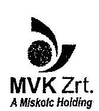

3527 Miskolc, Szondi György u. 1. (3502 Miskolc 2. Pf: 226.) tel.: + 36 46 514-900, fax: + 36 46 514-912 mail@mvkzrt.hu, www.mvkzrt.hu

Állami Számvevőszék
Domokos László elnök úr

Budapest
Apáczai Csere János utca 10.
1052

Ikt.szám: 11C-1112/2620

ÁLLAMI SZÁMVEVŐSZÉK

233701
Cás 2013 JOL 03
Ikt.: U-0033-2672003
Miskolc

Tárgy: Visszajelzés a V-032-249/2013. iktatási számú Jelentéstervezethez

Tisztelt Elnök úr!

Köszönettel megkaptuk a Társaságunkhoz 2013. június 13-án érkezett Jelentéstervezetet,
melyet áttekintettünk és azzal kapcsolatban észrevétellel nem kívánunk élni!

Miskolc, 2013. június 28.

Tisztelettel:

Hájdu Zita
operatív igazgató

Szórád Róbert
üzemgazdálkodási és szolgáltatási igazgató

---

.

---

# 11. számú melléklet a V-0032-267/2013.számú jelentéshez 

Iktató szám: 487-1/103 2013

## Domokos László

Állami Számvevőszék
Budapest
Apáczai Csere János utca 10.
1052

Tárgy: Észrevétel a Miskolc Holding Zrt.-hez V-032-249/2013. számon megküldött
jelentéshez

Tisztelt Állami Számvevőszék!
A társaságunkhoz 2013. június 14-én érkezett jelentést áttekintettük és azzal kapcsolatosan az alábbi észrevételt tesszük.

A jelentés valamennyi megállapításával egyetértünk. Azonban a jelentés szövegében néhány kiegészítést kérünk beépíteni a rögzített tények pontosítása érdekében. A pontosítások a jelentés részletes kifejtésben megtalálható adatokon alapulnak.

A kért pontosításokat az érintett bekezdés idézésével és benne a változtatás dőlt betűvel történő feltüntetésével vagy szövegszerű kifejtéssel jelezzük:

1. Jelentés 10. oldal második bekezdés második mondat:
.. A MH - létrehozásának céljait megvalósítva 2011-től a számvitel, a kontrolling, a beszerzés, az informatika, a vagyongazdálkodás, a humán erőforrás és marketing területeket stratégiai irányítása alá vonta. A 2011-es előkészítést követően 2012ben megvalósult a humán erőforrás és az informatika teljes körű, a beszerzés részleges központosítása, ami az MVK Zrt.-t is érintette.
2. Jelentés 15. oldal lap alja:

---

# MISKOLC HOLDING 

"Az elbontott villamos pálya bontásában érintett eszközöket, annak ellenére szabálytalanul selejtezték, s a könyvekből kivezették 2011 március 18.-ig, hogy ennek eljárási szabályait a számviteli politikában és a selejtezési szabályzatban nem határozták meg."
3. Jelentés 16. oldal lap teteje:
„A szabálytalanságok miatt a vagyonnal való gazdálkodásra vonatkozó helyi szabályzatok előírásait az MVK nem tartotta be a 2011 márciusát megelőzően. Az Önkormányzat ez időpontot megelőzően nem az elvárható gondossággal járt el, mivel a Projektirányitási Kézikönyvben előírtak ellenére nem kifogásolta a bontási munkálatok kivitelezés helyszínén való nyomon követésének elmaradását, továbbá a bontási munkálatok megkezdése előtt nem adott egyértelmű tájékoztatást a bontott anyagok szállítását és hasznosítását illetően."
4. Jelentés 21. oldal lap közepe:

Az apró betűs bekezdést kérjük törölni. Ennek indoka, az hogy a Miskolc Holding Igazgatóságának feladatait nem az SZMSZ rendelkezéseinek és nem a tényleges gyakorlatnak megfelelően tartalmazza.

Jelentés 21. oldal apró betűs részt követő bekezdés:
„Az MH legfőbb szerve a Közgyűlés, mely a Gt..tv. 55. §-a alapján elismert vállalatcsoport létrehozásáról döntött, amelynek uralkodó tagja az MH. Az MH, létrehozásának céljait megvalósítva, 2011-től a számvitel, a kontrolling, a beszerzés, az informatika, a vagyongazdálkodás, a humán erőforrás és marketing területeket stratégiai irányítása alá vonta. A 2011-es előkészítését követően 2012-ben megvalósult a humán erőforrás és az informatika teljes körű, a beszerzés részleges központosítása, ami az MVK Zrt.-t is érintette.
5. Jelentés 23. oldal lap alja:

Az alábbi bekezdést javasoljuk teljesen törölni a szövegből, mivel valósággal ellentétes információt tartalmaz. A MH valóban irányítást gyakorol az említett területeken, de az elvégzendő feladat az továbbra is az MVK Zrt.-nél maradt.
„A 2012. október 01-től bekövetkezett szervezeti változások következtében az MVK -nál a Vagyongazdálkodási és Szolgáltatási osztályvezetői, a Pénzügyi és Számviteli osztályvezetői, a Kontrolling osztályvezetői feladatkör és a Marketing osztályvezetői feladatkör megszűnt, ezeket a feladatokat a MH átvette."

---

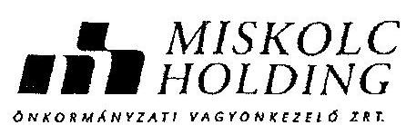
6. Jelentés 24. oldal lap közepe:

Egy a mondat értelmét megváltoztató toldalék( rag) pontosítását kérjük:
„Az MVK az ellenőrzött időszakra önálló hosszú távú stratégiát nem készített, fejlesztési irányát az Önkormányzat és az MH határozta meg."
7. Jelentés 32. oldal lap közepe:
„Az MVK pénzügyi eredményének alakulását az MH, mint tulajdonos döntései befolyásolták, ugyanis a teljes cégcsoport finanszírozása cash pool rendszerben történt. A cash pool rendszerben elérhető hitelkeret biztosította az MVK Zrt. részére a finanszírozhatóságot. Az MH a tagvállalatai pénzügyi gazdálkodásának szabályairól szóló belső utasítás szerint járt el a vállalatcsoport hiteleinek kezelése terén. A működéshez átmenetileg hiányzó források és a fejlesztéshez szükséges idegen források bevonásakor készítettek terveket és számításokat arra vonatkozóan, hogy a jövőbeni terheket - törlesztő részleteket és költségeket - megállapítsák. A finanszírozás biztosítása a MH döntési hatáskörébe tartozott.
8. Jelentés 35. oldal lap teteje:
„Az MVK 2011. 03. 18-ig nem állapította meg a kinyert, illetve kinyerhető hasznos bontási anyagok mennyiségét és könyvszerinti értékét."
9. Jelentés 39. oldal lap alja.
„Az MH 2010-ben külső szakértőként egy gazdasági társaságot bízott meg az MVK pénzügyi-számviteli átvilágításával. A külső szakértő 2010 december 20-án kelt jelentése többek között értékelte a 2007-2009. években és a 2010, I-III. negyedéveiben az.
$\qquad$
$\qquad$

Miskolc 2103. 06. 28.
Tisztelettel:
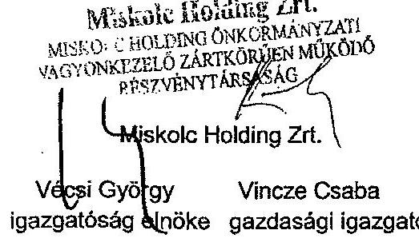

---

.

---

# Pálffy Kinga úrhölgy 

vezérigazgató
Miskolc Holding Zrt.

## Miskolc

## Tisztelt Vezérigazgató Asszony!

Az MVK
 Miskolc Városi Közlekedési Zrt. közfeladat-ellátásának ellenőrzéséről készült számvevőszéki jelentéstervezetre tett észrevételeit köszönettel megkaptam.

Az Állami Számvevőszék észrevételekre vonatkozó álláspontjáról a felügyeleti vezető által készített részletes tájékoztatást csatoltan megküldöm.

Tájékoztatom Vezérigazgató asszonyt, hogy a jelentés szövegezése az elfogadott észrevételei figyelembevételével történik.

Budapest, 2013.
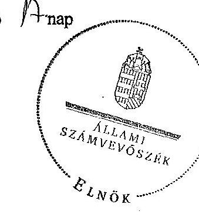

Tisztelettel:
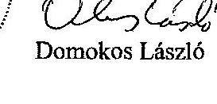

Tisztelettel:
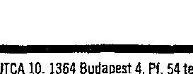

Melléklet: Tájékoztatás az elfogadott észrevételekről

---

.

---

# Tájékoztatás   az elfogadott észrevételekről 

Az MVK Miskolc Városi Közlekedési Zrt. közfeladat-ellátásának ellenőrzése című jelentéstervezetre a 487-1/100/2013. iktatószámú levelében jelezte, hogy a jelentéstervezet minden megállapításával egyetért. A jelentéstervezet szövegében néhány szövegszerű pontosítást, kiegészítést kértek beépíteni, továbbá szövegtörlést kértek, amelyek kezeléséről az alábbi tájékoztatást adom.

1. A jelentéstervezet bevezetőjében az észrevételben jelzett megállapítások szerepelnek, de a bővebb és közérthetőbb megfogalmazás érdekében a Bevezetés 10. oldal második bekezdés második mondatát kiegészítjük. Ezzel összhangban a II. Részletes megállapítások 21. oldal 6. bekezdését is módosítjuk, így a jelentésben a következő szövegrészt szerepeltetjük:
„A MH - létrehozásának céljait megvalósítva - 2011-től a számvitel, a kontrolling, a beszerzés, az informatika, a vagyongazdálkodás, a humán erőforrás és marketing területeket stratégiai irányítása alá vonta. A 2011-es előkészítést követően 2012-ben megvalósult a humán erőforrás és az informatika teljes körű, a beszerzés részleges központosítása, ami az MVK Zrt-t is érintette."
2. A jelentéstervezet I. Összegző megállapítások, következtetések, javaslatok fejezet 15. oldal 4. bekezdés utolsó előtti mondatát, a 16. oldal 1. bekezdés utolsó két mondatát és a 35. oldal 4. bekezdés negyedik mondatát az időszak megjelölésével egyértelműsítjük:
„Az elbontott villamos pálya bontásában érintett eszközöket, annak ellenére szabálytalanul leselejtezték, és a könyvekből kivezették 2011. március 18-áig, hogy ennek eljárási szabályait a számviteli politikában és a selejtezési szabályzatban nem határozták meg."
„A szabálytalanságok miatt a vagyonnal való gazdálkodásra vonatkozó helyi szabályzatok előírásait az MVK nem tartotta be 2011. márciusát megelőzően. Az Önkormányzat ez időpontot megelőzően nem az elvárható gondossággal járt el, mivel a Projektirányítási Kézikönyvben előírtak ellenére nem kifogásolta a bontási munkálatok kivitelezés helyszínén való nyomon követésének elmaradását, továbbá a bontási munkálatok megkezdése előtt nem adott egyértelmű tájékoztatást a bontott anyagok szállítását és hasznosítását illetően."
„Az MVK 2011. március 18-áig nem állapította meg a kinyert, illetve a kinyerhető hasznos bontási anyagok mennyiségét és könyvszerinti értékét."

---

3. A jelentéstervezet II. Részletes megállapítások fejezet 21. oldal 5. bekezdésében (részbekezdés) szereplő megállapítások nem adtak többletinformációt az ellenőrzési programpontban leírtakhoz, így annak a jelentésben történő szerepeltetése nem indokolt. Észrevételükkel ellentétben a részbekezdés nem hivatkozik az SZMSZ rendelkezéseire. A 23. oldal 5. bekezdés utolsó mondatát is töröltük, mivel az az ellenőrzött időszakon túl bekövetkezett változásokat tartalmazta.
4. A jelentéstervezet II. Részletes megállapítások fejezet 24. oldal 6. bekezdésében szereplő „időszakban" kifejezést az egyértelmű értelmezhetőség miatt „időszakra" módosítottuk.
5. A jelentéstervezet a cash-pool rendszer működtetését bemutatja, az észrevételben megfogalmazott pontosítás igénye a még részletesebb megfogalmazást célozza. A jelentéstervezet II. Részletes megállapítások fejezet 32. oldal 4. bekezdés első két és utolsó mondatát a finanszírozási cash-pool rendszer még részletesebb bemutatása céljából módosítottuk és kiegészítettük a következők szerint:
„Az MVK pénzügyi eredményének alakulását az MH, mint tulajdonos döntései befolyásolták, ugyanis a teljes cégcsoport finanszírozása cash-pool rendszerben történt. A cash-pool rendszerben elérhető hitelkeret biztosította az MVK Zrt. részére a finanszírozhatóságot."
„A finanszírozás biztosítása az MH döntési hatáskörébe tartozott."
6. A jelentéstervezet II. Részletes megállapítások 39. oldal utolsó bekezdés első és második mondatában a pontosítás után a helyes dátumot szerepeltetjük.
„Az MH 2010-ben külső szakértőként egy gazdasági társaságot bízott meg az MVK pénzügyi-számviteli átvilágítására. A külső szakértő 2010. december 20-án kelt jelentése többek között értékelte a 2007-2009. években és a 2010. év I-III. negyedéveiben az MVK-nál bekövetkezett vagyonváltozásokat, befektetéseket, készleteket, követeléseket és kötelezettségeket."

Tájékoztatom, hogy a számvevőszéki jelentés mellékleteként szerepeltetjük a jelentéstervezethez tett észrevételeit, valamint az azokra adott válaszunkat.

Budapest, 2013. 04 hó $H$ nap

Makkal Mária
felügyeleti vezető

---

# FÜGGELÉKEK

---

.

---

Az MVK szervezeti felépítése
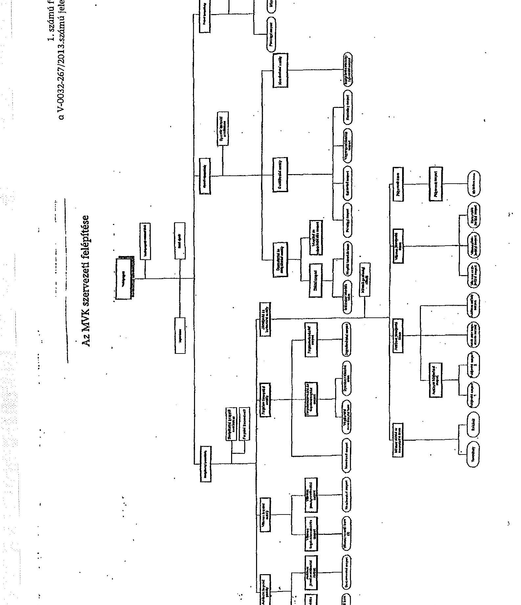

---

# Az MH szervezeti felépítése 

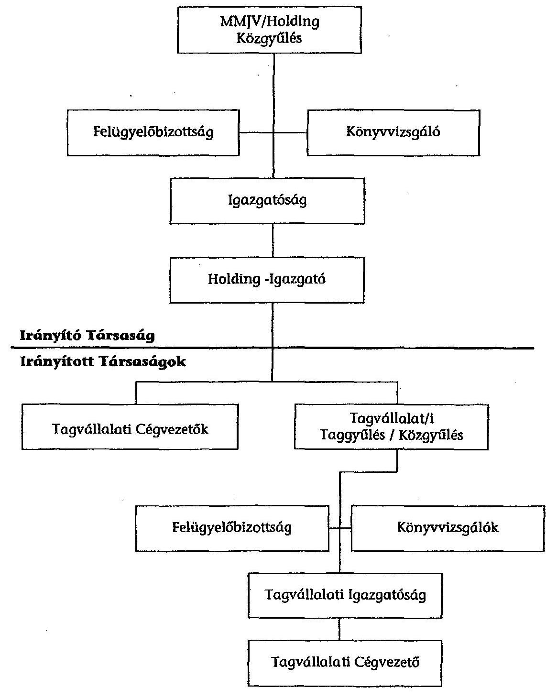

---

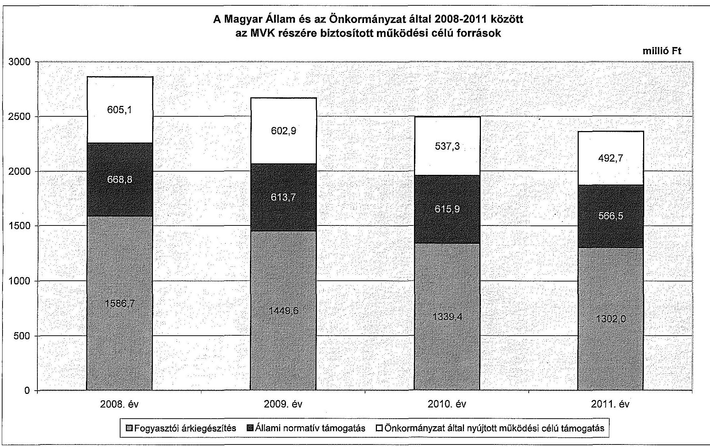

# A Magyar Állam és az Önkormányzat által 2008-2011 között az MVK részére biztosított működési célú források

|  Fogyasztói árkiegészítés | Állami normatív támogatás | Önkormányzat által nyújtott működési célú támogatás  |
| --- | --- | --- |
|  2008. év | 605.1 | 602.9  |
|  2009. év | 602.9 | 613.7  |
|  2010. év | 602.9 | 616.9  |
|  2011. év | 602.9 | 616.9  |

**Mikrófogyasztói árkiegészítés**

---

4. számú függelék a V-0032-267/2013. számú jelentéshez

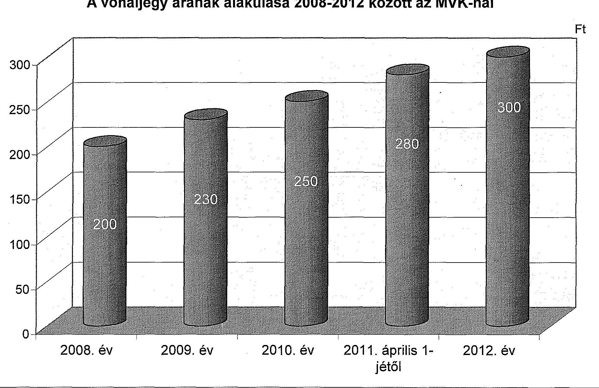

---

.

---

.