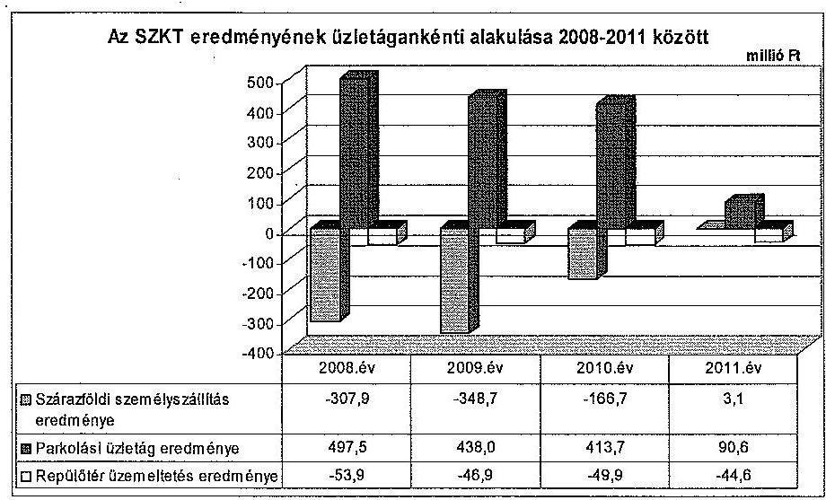
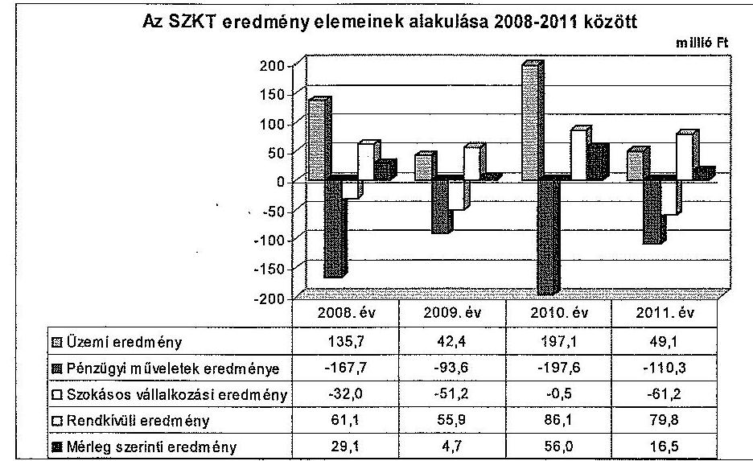
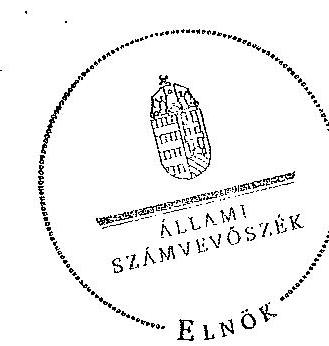
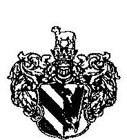
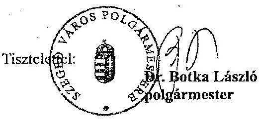
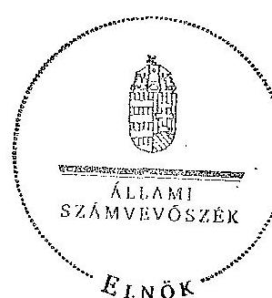
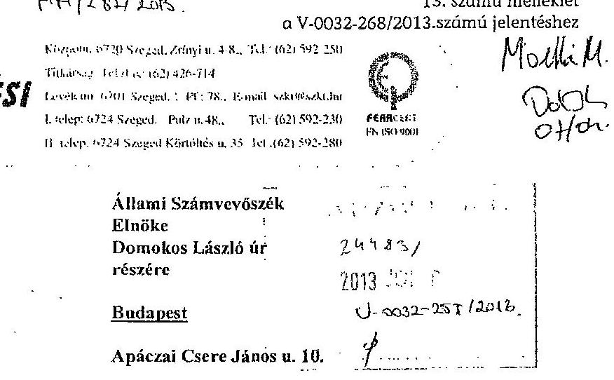
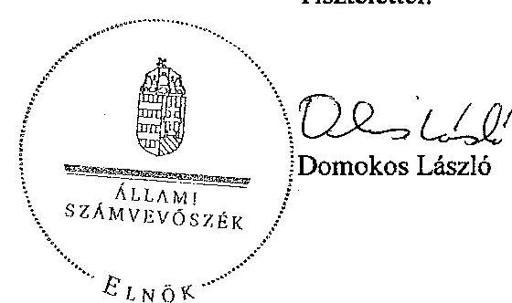
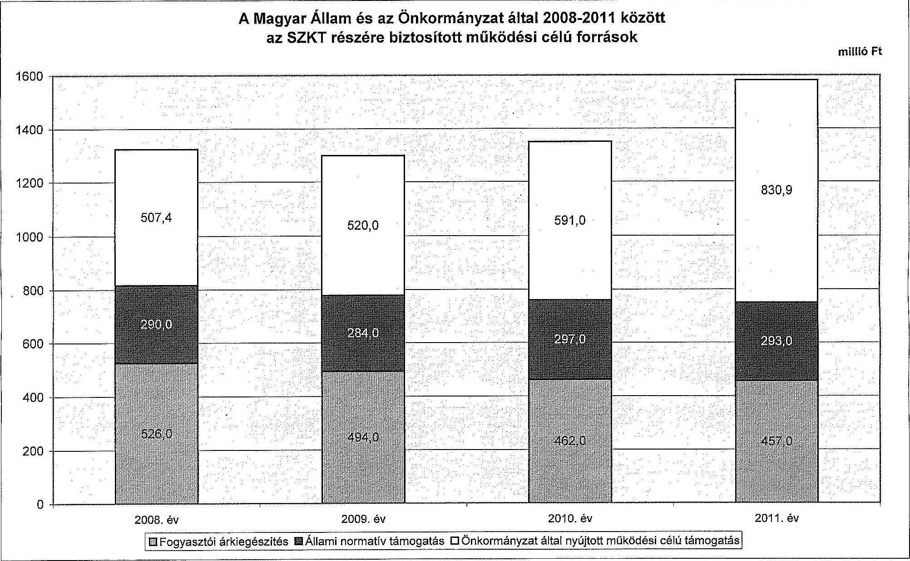
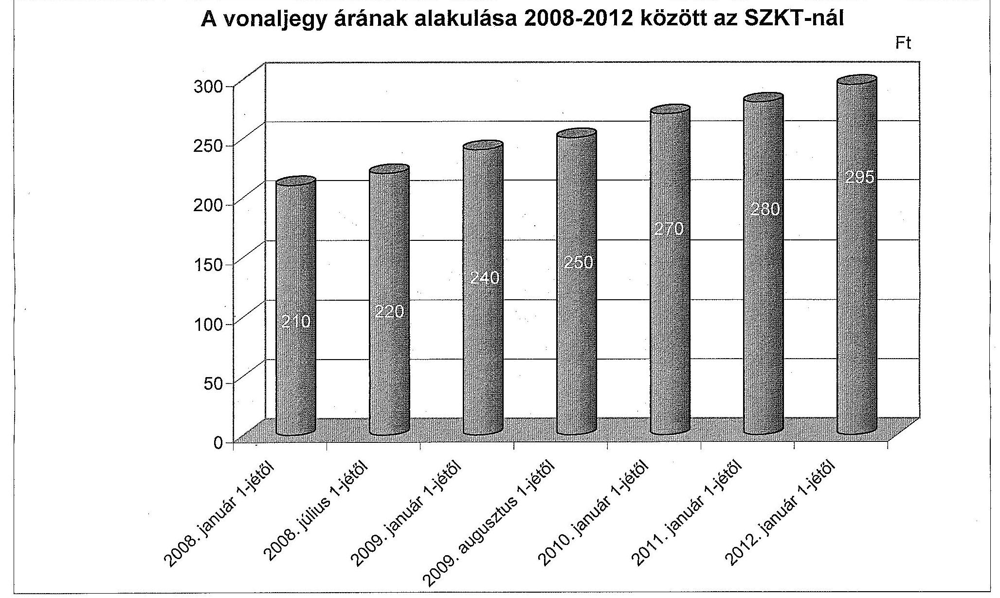

# JELENTÉS 

az önkormányzatok többségi tulajdonában lévő gazdasági társaságok közfeladat-ellátásának ellenőrzéséről

Szegedi Közlekedési Kft.

---

# Állami Számvevőszék 

Iktatószám: V-0032-268/2013.
Témaszám: 13
Vizsgálat-azonosító szám: V060901

## Az ellenőrzést felügyelte:

## Makkai Mária

felügyeleti vezető

## Az ellenőrzést vezette és az ellenőrzés végrehajtásáért felelős:

## Klinga László

ellenőrzésvezető

A számvevői jelentések feldolgozásában és a jelentés összeállításában közremúködött:

## Dobos András Csaba

számvevő tanácsos

## Az ellenőrzést végezték:

| Dobos András Csaba | Krizsán Katalin | Völgyesi Mátyás |
| :-- | :-- | :-- |
| számvevő tanácsos | szakértő | szakértő |

---

# TARTALOMJEGYZÉK 

BEVEZETÉS ..... 9
I. ÖSSZEGZŐ MEGÁLLAPÍTÁSOK, KÖVETKEZTETÉSEK, JAVASLATOK ..... 11
II. RÉSZLETES MEGÁLLAPÍTÁSOK ..... 19

1. Az Önkormányzat közfeladat-ellátásának megszervezése ..... 19
1.1. A közfeladat meghatározása, a feladat ellátásának választott módja ..... 19
1.2. Az önkormányzati és a tulajdonosi irányítás megítélése ..... 21
2. Az SZKT közfeladat-ellátással kapcsolatos tevékenysége ..... 25
2.1. Az SZKT szervezeti kialakítása, szabályozottsága ..... 25
2.2. Az SZKT vagyonnyilvántartása ..... 27
2.3. A gazdasági évek ráfordításainak és bevételeinek alakulása ..... 28
2.4. Az SZKT eredményének alakulása ..... 32
2.5. Az SZKT folyamatos üzemmenetének, likviditásának biztosítása ..... 36
3. Az Önkormányzat tulajdonosi jogainak és kötelezettségeinek érvényesítése ..... 39
3.1. Az SZKT-tól származó információk elemzése, hasznosítása ..... 39
3.2. A Közgyűlés tulajdonosi intézkedései ..... 40

## MELLÉKLETEK

1. számú Tanúsítvány az Önkormányzat által a 2008-2012. I. félévében a Szegedi Közlekedési Kft. részére nyújtott működési célú támogatásokról
2. számú Tanúsítvány a Magyar Állam által a 2008-2012. I. félévében a Szegedi Közlekedési Kft. részére nyújtott működési célú támogatásokról
3. számú Tanúsítvány az Önkormányzat által a 2008-2012. I. félévében a Szegedi Közlekedési Kft. részére nyújtott fejlesztési célú támogatásokról
4. számú Tanúsítvány az Európai Unió által a 2008-2012. I. félévében a Szegedi Közlekedési Kft. részére nyújtott fejlesztési célú támogatásokról
5. számú Tanúsítvány a Magyar Állam által a 2008-2012. I. félévében a Szegedi Közlekedési Kft. részére nyújtott fejlesztési célú támogatásokról
6. számú Tanúsítvány a Szegedi Közlekedési Kft. 2008-2012. I. félévi szállítói kötelezettségeinek alakulásáról
7. számú Tanúsítvány a Szegedi Közlekedési Kft. 2008-2012. I. félévi hitelállományának alakulásáról

---

8. számú Tanúsítvány az Önkormányzat által végzett tulajdonosi ellenőrzésekről
9. számú Tanúsítvány a Szegedi Közlekedési Kft. belső ellenőrzése által végzett el-
lenőrzésekről
10. számú Tanúsítvány az Önkormányzat által a Szegedi Közlekedési Kft-vel kap-
csolatban vállalt, mérlegen kívüli kötelezettségek alakulásáról
11. számú Szeged Megyei Jogú Város Önkormányzat polgármesterének észrevétele
12. számú Észrevételre adott válasz a polgármesternek
13. számú A Szegedi Közlekedési Kft. ügyvezető igazgatójának észrevétele
14. számú Észrevételre adott válasz az ügyvezető igazgatónak

# FÜGGELÉKEK 

1. számú A Szegedi Közlekedési Kft. szervezeti felépítése
2. számú A Magyar Állam és az Önkormányzat által 2008 és 2011 között az SZKT részére biztosított múködési célú források
3. számú A vonaljegy árának alakulása 2008 és 2012 között az SZKT-nál

---

# RÖVIDÍTÉSEK JEGYZÉKE 

## Európai Uniós jogforrás

1191/69/EGK rendelet

1370/2007/EK rendelet

## Törvények

Áht $_{1}$.
Áht $_{2}$.
Ár. tv.
Eisztv.
Gt. tv.
Iötv.

Kbt.
Mötv.

Ötv.

Számv. tv.
Taktv.
Tao tv.
Vagyon tv.
a Tanács 1969. június 26-i 1191/69/EGK rendelete a vasúti, közúti közlekedési közszolgáltatás fogalmában rejlő kötelezettségek terén a tagállamok tevékenységéről az Európai Parlament és a Tanács 1370/2007/EK rendelete a vasúti és közúti személyszállítási közszolgáltatásról, valamint a 1191/69/EGK és az 1107/70/EGK tanácsi rendelet hatályon kívül helyezéséről (hatályos: 2009. december 3-ától)
az államháztartásról szóló 1992. évi XXXVIII. törvény (hatályon kívül: 2012. január 1-jétől)
az államháztartásról szóló 2011. évi CXCV. törvény
az árak megállapításáról szóló 1990. évi LXXXVII. törvény az elektronikus információszabadságról szóló 2005. évi XC. törvény (hatálytalan: 2012. január 1-jétől)
a gazdasági társaságokról szóló 2006. évi IV. törvény
az információs önrendelkezési jogról és az információszabadságról szóló 2011. évi CXII. törvény (2012. január 1-jétől hatályos)
a közbeszerzésekről szóló 2003. évi CXXIX. törvény (hatálytalan: 2012. január 1-jétől)
Magyarország helyi önkormányzatairól szóló 2011. évi CLXXXIX. törvény (hatályos: 2012. január 1-jétől, kivéve a 144. § (2) bekezdésben meghatározott paragrafusok, amelyek 2012. április 15 -én, a (3) bekezdésben meghatározott paragrafusok, amelyek 2013. január 1-jén léptek hatályba, a (4) bekezdésben meghatározott paragrafusok a 2014. évi általános önkormányzati választások napján lépnek hatályba)
a helyi önkormányzatokról szóló 1990. évi LXV. törvény (hatálytalan: a 2014. évi általános önkormányzati választások napjától)
a számvitelről szóló 2000. évi C. törvény
a köztulajdonban álló gazdasági társaságok takarékosabb múködéséről szóló 2009. évi CXXII. törvény
a társasági adóról és az osztalékadóról szóló 1996. évi LXXXI. törvény
a nemzeti vagyonról szóló 2011. évi CXCVI. törvény (hatályos: 2011. december 31-étől, kivéve a 20. § (2) bekezdésben meghatározott paragrafusok, amelyek 2012. január 1-jétől, a (3) bekezdésben meghatározott paragrafusok 2013. január 1-jétől, a (4) bekezdésben meghatározott paragrafus 2012. március 2-ától léptek hatályba)

---

Vasúti tv.

## Rendeletek

SZMSZ $_{1}$

SZMSZ $_{2}$
vagyongazdálkodási rendelet
$85 / 2007$. Korm. rendelet

## Szórövidítések

Alapító Okirat
áfa
ÁSZ
EU
FB
jegyzö
KEF
KIKSZ
Koordinátor szervezet

Közgyűlés
Közszolgáltatási szerződés

NFÜ
Önkormányzat
polgármester
Polgármesteri Hivatal
repülőtér
a vasúti közlekedésről szóló 2005. évi CLXXXIII. törvény
Szeged Megyei Jogú Város Önkormányzatának 23/1995. (VI. 16.) számú rendelete az Önkormányzat Szervezeti és Müködési Szabályzatáról (hatálytalan: 2010. november 1-jétől)
Szeged Megyei Jogú Város Önkormányzatának 30/2010. (XI. 02.) számú rendelete az Önkormányzat Szervezeti és Müködési Szabályzatáról (hatályos: 2010. november 2ától)
Szeged Megyei Jogú Város Önkormányzatának 25/2003. (VI. 27.) számú rendelete a Szeged Megyei Jogú Város Önkormányzata vagyona feletti rendelkezési jog gyakorlásának szabályairól módosításokkal egységes szerkezetben (hatályos: 2003. július 1-jétől)
a közforgalmú személyszállítási utazási kedvezményekről szóló 85/2007. (IV. 25.) Korm. rendelet

Szegedi Közlekedési Korlátolt Felelősségű Társaság Alapító Okirata
általános forgalmi adó
Állami Számvevőszék
Európai Unió
Szegedi Közlekedési Korlátolt Felelősségű Társaság Felügyelőbizottsága
Szeged Megyei Jogú Város Önkormányzatának címzetes főjegyzője
Közbeszerzési és Ellátási Főigazgatóság
KIKSZ Közlekedésfejlesztési Zártkörűen Müködő Részvénytársaság
Szeged Megyei Jogú Város Önkormányzatának 100\%-os tulajdonában lévő Szegedi Környezetgazdálkodási Nonprofit Kft.
Szeged Megyei Jogú Város Önkormányzatának Közgyűlése
Szeged Megyei Jogú Város Önkormányzata és a Szegedi Közlekedési Kft. között 2007. január 1-jétől létrejött Közszolgáltatási szerződés a Szeged Megyei Jogú Város közigazgatási területén történő személyszállításra és a helyi közutakon kijelölt fizető parkolóhelyek üzemeltetésére
Nemzeti Fejlesztési Ügynökség
Szeged Megyei Jogú Város Önkormányzata
Szeged Megyei Jogú Város Önkormányzatának polgármestere
Szeged Megyei Jogú Város Önkormányzatának Polgármesteri Hivatala
Szegedi Repülőtér

---

SZKT
SZKT SZMSZ-e
szolgáltatók

Tisza Volán
ügyvezető

Szegedi Közlekedési Korlátolt Felelősségű Társaság
a Szegedi Közlekedési Korlátolt Felelősségủ Társaság Szervezeti és Müködési Szabályzata
a Szeged Megyei Jogú Város közigazgatási területén, menetrend alapján végzett helyi közforgalmú személyszállitási közszolgáltatást ellátó gazdasági társaságok
Tisza Volán Közlekedési és Szolgáltató Zártkörűen Müködő Részvénytársaság
a Szegedi Közlekedési Korlátolt Felelősségű Társaság ügyvezető igazgatója

---

.

---

# ÉRTELMEZŐ SZÓTÁR 

divizionális szervezet

Egységes Közlekedésfejlesztési Stratégia
férőhely-kilométer
funkcionális szervezet
közfeladat
közösségi közlekedés
menetdíj
mérleg szerinti eredmény
tulajdonosi joggyakorló
Trolley
üzemi eredmény

A divizionális szervezet nagyfokú önállósággal rendelkező, önálló szervezeti egységekből áll, amelyet vállalati központi stratégiai irányítással múködtetnek.
A Közlekedési, Hírközlési és Energiaügyi Minisztérium által kiadott, a 2008-2020. időszakra vonatkozó Egységes Közlekedésfejlesztési Stratégia.
Közlekedési teljesítmény, az egyes járművek (szerelvények) férőhelyének (befogadóképességének) és hasznos megtett kilométerének szorzata, több jármú közlekedtetése esetén az előzőek szerint járművenként számított teljesítmények összege.
Az egydimenziós és a többvonalas szervezetek tipikus példája. A szervezeten belüli elsődleges munkamegosztás a vezetési feladatok, funkciók szerint történik. A hatáskörökre a döntési jogkörök centralizációja a jellemző.
Jogszabályban meghatározott állami vagy önkormányzati feladat, amit az arra kötelezett közérdekből, jogszabályban meghatározott követelményeknek és feltételeknek megfelelve végez, ideértve a lakosság közszolgáltatásokkal való ellátását, továbbá az állam nemzetközi szerződésekben vállalt kötelezettségeiből adódó közérdekú feladatokat, valamint az e feladatok ellátásához szükséges infrastruktúra biztosítását is (Vagyon tv. 3. § (1) bekezdés 7 . pont).
Alapvető utazási igényeket kiszolgáló szolgáltatás, mely meghatározott viszonylatokon és paraméterek szerint, szabályozott ár ellenében történik Szeged közigazgatási határán belül.
A közösségi közlekedési eszközök igénybevételéért az utasok által jegy, bérlet formában megfizetett viteldi).
A mérleg szerinti eredmény az osztalékra, részesedésre, a kamatozó részvények kamatára igénybe vett eredménytartalékkal növelt, a jóváhagyott osztalékkal, részesedéssel, a kamatozó részvények kamatával csökkentett tárgyévi adózott eredmény, egyezően az eredménykimutatásban ilyen címen kimutatott összeggel (Számv. tv. 39. § (2) bekezdés).
Aki a nemzeti vagyon felett az államot vagy a helyi önkormányzatot megillető tulajdonosi jogok és kötelezettségek összességének gyakorlására jogosult (Vagyon tv. 3. § (1) bekezdés 17 . pont).
„Trolley- Promote Clean Public Transport" projekt, célja a trolibusz közlekedés népszerúsítése és fejlesztése.
Az üzemi, üzleti tevékenység eredménye a társaság termelési és szolgáltatási eredményét jelenti, azt mutatja, hogy a fő és mellék tevékenységek mekkora eredményt hoztak.

---

.

---

# JELENTÉS 

## az önkormányzatok többségi tulajdonában lévő gazdasági társaságok közfeladatellátásának ellenőrzéséről

## Szegedi Közlekedési Kft.

## BEVEZETÉS

Az SZKT alaptevékenysége a Szeged közigazgatási határain belül történő kötöttpályás közösségi közlekedés lebonyolítása és a biztonságos üzemeltetést szolgáló infrastruktúra (pálya, felsővezeték) karbantartási és fenntartási munkáinak elvégzése, valamint az önkormányzati tulajdonú parkolóhelyek üzemeltetése.

Az SZKT 1994. június 1-jén jött létre a jogelőd önkormányzati vállalat gazdasági társasággá alakulásával. Szeged közösségi közlekedését az Önkormányzat villamossal (négy vonalon $25,2 \mathrm{~km}$ ), trolibusszal (öt vonalon $21,5 \mathrm{~km}$ ) és autóbusszal ( 18 vonalon $158,9 \mathrm{~km}$ vonalhosszon) biztosította a 2012. évben. A közösségi közlekedésben a személyszállításhoz biztosított kapacitás a 2011. évben villamossal 159,2 millió, trolibusszal 199,1 millió és autóbusszal 801,5 millió férőhely-kilométer ${ }^{1}$ volt. A villamossal és trolibusszal történő közösségi közlekedési feladat ellátását az Önkormányzat a 100\%-os tulajdonában álló SZKT-val, míg az autóbusszal végzett szolgáltatást a Tisza Volánnal kötött szerződés alapján biztosítja 2007. január 1-jétől. A helyszíni ellenőrzés időpontjában az SZKT jármúállománya 54 villamosból, 54 trolibuszból és 17 autóbuszból állt. Az SZKT helyi közösségi közlekedési múködési bevétele 2008 és 2012 között a menetdíj bevételekből, állami normatív támogatásból², fogyasztói árkiegészítésből, továbbá az Önkormányzat múködési célú pénzeszközátadásaiból tevődött össze. Az SZKT 2006. áprilisa óta ellátja a Szegedi Repülőtér üzemeltetését is.

A 2008-2012. években a polgármester és a jegyző személye nem változott. Az SZKT-nál az ügyvezető személye 2010. december 10-étől változott.

[^0]
[^0]:    ${ }^{1}$ Közlekedési teljesítmény: az egyes járművek (szerelvények) férőhelyének (befogadóképességének) és hasznos megtett kilométerének szorzata, több jármú közlekedtetése esetén az előzőek szerint járművenként számított teljesítmények összege.
    ${ }^{2}$ Magyarország 2013. évi központi költségvetéséről szóló 2012. évi CCIV. törvény a kötelezően ellátandó helyi közösségi közlekedési feladat támogatására előirányzatot - a Fővárosi Önkormányzat kivételével - a feladatot ellátó önkormányzatok számára nem tartalmaz.

---

Az ellenőrzés célja annak értékelése volt, hogy az Önkormányzat egyértelmű, számon kérhető formában írta-e elő az ellátandó feladatokat, biztosítot-ta-e a közfeladatot ellátó gazdasági társaság számára a közfeladat ellátásához szükséges közvagyont, a gazdasági társaság a rendelkezésre álló erőforrások szabályszerű felhasználásával teljesítette-e a tulajdonos részéről meghatározott célokat és feladatokat, valamint az Önkormányzat a tulajdonostól elvárható gondossággal felügyelte-e a társaság múködését és vagyongazdálkodását, továbbá a gazdasági társaság az ellenőrzött időszakban betartotta-e a vagyonnal történő gazdálkodásra vonatkozó jogszabályi rendelkezéseket és a helyi szabályzatok előírásait.

# Az ellenőrzés típusa: szabályszerűségi ellenőrzés 

Az ellenőrzött időszak: a 2008-2011. évek és 2012. év I-III. negyedéve volt.
Az ellenőrzés jogalapját az Állami Számvevőszékről szóló 2011. évi LXVI. törvény 5. § (4) bekezdése képezi.

Az ÁSZ a 2011. évi LXVI. törvény 29. §-a szerint a jelentést megküldte Szeged Megyei Jogú Város polgármesterének és a Szegedi Közlekedési Kft.-nek. A beérkezett észrevételeket és az arra adott válaszokat a jelentés 11-14. számú mellékletei tartalmazzák.

---

# I. ÖSSZEGZŐ MEGÁLLAPÍTÁSOK, KÖVETKEZTETÉSEK, JAVASLATOK 

Szeged Megyei Jogú Város Önkormányzatának Közgyűlése (Közgyűlés) a közösségi közlekedés megszervezéséről az akkor hatályos 1191/69/EGK rendelet, továbbá a fizető várakozóhelyek üzemeltetéséről az Ötv. előírásainak figyelembevételével döntött. Az SZMSZ ${ }_{1,3}$-ében az Önkormányzat egyértelmúen előírta a kötelező feladatai ellátásának kötelezettségét. A helyi közösségi közlekedés kötelező feladatellátásának mértékét és módját az Önkormányzat az SZKT-val kötött Közszolgáltatási szerződésben határozta meg.

A Közgyűlés 2007 márciusában elfogadta az Önkormányzat Közlekedésfejlesztési Koncepcióját, az ebben rögzített stratégiai célok és prioritások a Közlekedési, Hírközlési és Energiaügyi Minisztérium által kiadott Egységes Közlekedésfejlesztési Stratégiában - a 2007 és 2020 közötti időszakra - megfogalmazott prioritásokkal összhangban voltak. Az SZKT az ellenőrzött időszakban önálló stratégiával nem rendelkezett, feladatait az Önkormányzat Közlekedésfejlesztési Koncepciója határozta meg. A 2010. évben az 5 évre elkészített Jármúfejlesztési koncepcióban a villamosok és trolibuszok fejlesztésére kínálkozó alternatívákat határoztak meg.

Az SZKT a kötött pályás - villamos és trolibusz - közösségi közlekedés és az Önkormányzati tulajdonban lévő közutakon kijelölt fizető parkolóhelyek üzemeltetésének közfeladat-ellátását 2007. január 1-jétől a nyolc évre megkötött Közszolgáltatási szerződés alapján biztosította. A Közszolgáltatási szerződés megkötésekor hatályos 1191/69/EGK rendeleten alapuló Vasúti tv. a kötött pályás közlekedést érintően pályáztatási kötelezettséget nem írt elő.

Az Önkormányzat a közösségi közlekedés közfeladat-ellátásához az SZKT részére alapításkor (1994-ben) apportálással 696,6 millió Ft összegben (pl.: villamosok, trolibuszok) közvagyont biztosított, amely a kötöttpályás közösségi közlekedést szolgálta. Az átadott vagyont az SZKT a könyvelben nyilvántartotta. Az Önkormányzat a tulajdonában lévő, a kötöttpályás közösségi közlekedés közszolgáltatáshoz szükséges vasúti pályát, valamint egyéb hálózati elemeket és épületeket 2008-ban határozatlan időre bérbe adta az SZKT-nak. Az Önkormányzat az ellenőrzött időszakban - a jogszabályi előírások betartásával - összesen 2975,5 millió Ft-os múködési célú pénzeszközátadással további forrást biztosított az SZKT-nak a közfeladat-ellátásra. A múködési célú pénzeszközátadások felhasználásának elszámolási kötelezettségét előírták, az SZKT azok felhasználásával szabályszerűen elszámolt. A közösségi közlekedés fejlesztéséhez az Önkormányzat az ellenőrzött időszakban 860,3 millió Ft-os tőkeemelést hajtott végre, ami a fejlesztési projektekben való részvétel feltételeinek biztosítását szolgálta. Az Önkormányzat az ellenőrzött időszakban 616,6 millió Ftos tagi kölcsönt nyújtott az SZKT-nak fejlesztésekhez kapcsolódó önerő fedezetére és támogatás megelőlegezésére. A Közszolgáltatási szerződés alapján a feladatot gazdaságos, ésszerú és takarékos intézkedésekkel, a múködési célú támogatás iránti igény csökkentésével kellett ellátni.

---

Az Önkormányzat a tulajdonosi jogok gyakorlásának szabályait a vagyongazdálkodási rendeletben és ezzel azonos módon az SZKT Alapító Okiratában, illetve az SZMSZ ${ }_{13}$-ben szabályozta. A Közgyűlés az SZKT feletti tulajdonosi jogait - az 50,0 millió Ft értékhatár alatti ügyletenkénti kötelezettségvállalások kivételével - közvetlenül gyakorolta. Az Önkormányzat az SZKT múködésének és vagyongazdálkodásának felügyeletekor, a belső ellenőrzések által tett javaslatok ellenére, nem határozta meg az ügyletenkénti kötelezettségvállalás pontos fogalmát, valamint az egybeszámítás követelményeit. Továbbá a napi gazdálkodásban jellemzően előforduló 50,0 millió Ft alatti ügyletenkénti kötelezettségvállalások esetében az ügyvezető beszámolási kötelezettségét nem írta elő.

Az Önkormányzat a Közszolgáltatási szerződésben foglaltakkal összefüggő tárgyi és pénzügyi folyamatok lebonyolítását és az ellenőrzési feladatokat a Szegedi Környezetgazdálkodási Nonprofit Kft., mint Koordinátor szervezet útján látta el. A Koordinátor szervezetet a Közszolgáltatási szerződés hatályba lépését követően bízta meg az Önkormányzat a menetrend és a műszaki, minőségi követelményrendszer betartásának ellenőrzésével. A Koordinátor szervezet ellenőrzései tapasztalatairól havonta jelentést tett az Önkormányzatnak. Az ellenőrzéseket a szerződésnek megfelelően elvégezték, az SZKT intézkedett a hiányosságok pótlásáról és a hibák kijavításáról. Az SZKT ügyvezetőjéről, az FB tagjainak megválasztásáról és a könyvvizsgáló megbízásáról a Közgyűlés szabályszerűen döntött. Az ügyvezetőnek, mint a gazdasági társaság egyszemélyi vezetőjének feladatait és hatáskörét az SZKT Alapító Okiratában, illetve a munkaszerződésében rögzítették.

Az SZKT az ellenőrzött időszakban nem működtetett belső ellenőrzést, de az Önkormányzat - élve az Ötv-ben biztosított lehetőséggel - a 2009-2011. években négy alkalommal végzett belső ellenőrzést az SZKT-nál. A belső ellenőrzés megállapította, hogy a 2008-2010. években az ügyvezető túllépte az Önkormányzat által meghatározott döntési jogkörét a külső megrendelő részére végzett munkáknál, a felújításoknál és a fejlesztéseknél gazdaságtalan döntéseket hozott, valamint az üzemanyag beszerzésnél 2010-ig nem tartotta be a közbeszerzésre vonatkozó előírásokat. Az intézkedést igénylő megállapítások alapján tett javaslatoknak az SZKT 2010. december 31-ig hivatalban lévő ügyvezetője csak részben tett eleget. Az új ügyvezető a hiányosságok megszüntetésére intézkedési tervet készített, és beszámolt azok végrehajtásáról, amit a belső ellenőrzés vezetője részben fogadott el, és annak kiegészítését kérte. A kiegészítés és az ellenőrzés lezárása a helyszíni ellenőrzés ideje alatt megvalósult. A belső ellenőrzés éves beszámolójában tájékoztatta a Közgyűlést az SZKT-nál lefolytatott helyszíni ellenőrzésekről, annak következményeként a Közgyűlés további ellenőrzéseket írt elő az SZKT-nál. Az Önkormányzat a 2013. évi belső ellenőrzési tervében az SZKT szabályszerű múködésének és gazdálkodásának ellenőrzését tervezte.

Az Önkormányzat a Közszolgáltatási szerződésben foglaltak szakmai teljesítésére vonatkozó beszámolási kötelezettséget a pénzügyi és számviteli információs beszámolórendszer keretében határozta meg, amit az üzleti jelentésre kötelezően előírt kiegészítő adatszolgáltatás biztosított. A szakmai beszámolási kötelezettségének az SZKT az ellenőrzött időszakban eleget tett. Az Önkormányzat a Közszolgáltatási szerződésben előírta az SZKT finanszírozásának

---

módját, valamint az Önkormányzat által nyújtott múködési célú támogatás meghatározásának és a túlkompenzáció kizárásának szabályait. Az SZKT finanszírozása az ellenőrzött időszakban ennek figyelembevételével valósult meg. Az SZKT a számára az Önkormányzat által közösségi közlekedés biztosítására meghatározott feladatokat a szakmai beszámolók adatai alapján a rendelkezésre álló erőforrások felhasználásával végezte. A Közszolgáltatási szerződésben előírták az ellátást biztosító személyi és tárgyi feltételeket, a szolgáltatási színvonal, a minőség, az utas tájékoztatás és a jármű megjelenés követelményeit. A Közszolgáltatási szerződés a nem, vagy nem megfelelő teljesítésre a rendkívüli felmondás lehetőségét biztosította garanciaként. Az SZKT - a Közszolgáltatási szerződésben előírtak ellenére - nem végezte el az utas elégedettség féléves gyakoriságú mérését. A Közszolgáltatási szerződés menetrendi előírása az SZKT-nak a közszolgáltatás megkezdését követő második évben, 2008ban, majd ezt követően legalább háromévente teljes körű keresztmetszeti utasszámlálást írt elő. Ennek a „Szeged elektromos közlekedés fejlesztése" projekt megvalósítására hivatkozással az SZKT nem tett eleget.

Az Önkormányzat által meghatározott feladatok teljesítése során az SZKT-nál a 2008-2010. években szabálytalanul jártak el a KT8A 3M-LF típusú villamos kifejlesztésénél és a KTNF6 típusú villamos megvásárlása, átalakítása és felújítása esetében, továbbá a trolibuszok felújításánál alkalmazott rezsióradíjak megállapításánál. A KT8A 3M-LF típusú villamos saját jármű prototípus fejlesztésére az SZKT 2010. december 31-ig 155,4 millió Ft-ot, a KTNF6 típusú villamos megvásárlására, átalakítására és felújítására 84,5 millió Ft-ot fordított, amit a számviteli nyilvántartásban a befejezetlen beruházások között tartottak nyilván. A KT8A 3M-LF típusú villamos prototípus megépítéséhez kettő darab csuklószerkezet beépítésére volt szükség, ezzel szemben tíz darabot szereztek be, összesen 55,0 millió Ft összegben. A be nem épített csuklószerkezeteket a készletek között tartják nyilván. A fejlesztéseket nem aktiválták, mivel a meglévő készültségi fokon a járművek használatra nem voltak alkalmasak, nem fejezték be, így a beruházás nem szolgálta az eredményes vagyongazdálkodást, pazarló volt. A villamosok befejezése, üzembe helyezése és engedélyeztetése további költségeket jelent, melyre az Önkormányzat belső ellenőrzése is felhívta a figyelmet. Erre hivatkozva az ügyvezető 2011 decemberében kérte a KT8A 3M-LF típusú villamos selejtezésének Közgyűlés elé terjesztését, azonban a kérelmet a hatáskörrel rendelkező alpolgármester nem megfelelő előkészítettségre hivatkozva elutasította. A selejtezés tárgyában további intézkedés nem történt. A villamosok megvásárlása, fejlesztése, átalakítása és felújítása során nem vették figyelembe, hogy a „Szeged elektromos közlekedés fejlesztése" projekt Megvalósíthatósági tanulmánya tartalmazott villamos jármű beszerzést.

Az SZKT külső megrendelőktől származó 2010. évi bevételei több elemből tevődtek össze, annak egy része a Skoda típusú trolibuszok felújításából keletkezett, amelyek során az SZKT az árképzési szabályzatában előírtakat figyelmen kívül hagyta, ebben a tekintetben a vagyonnal való gazdálkodásra vonatkozó helyi szabályzatok előírásait nem tartotta be. Az SZKT az árképzési szabályzatban rögzített 3800 Ft rezsióradíj helyett fix áras szerződéssel - 1236 Ft, 1012 Ft és 1211 Ft rezsióradíjjal - dolgozott. A külső megrendelők - egy cseh gazdasági társaság és egy jármú felújítással foglalkozó Kft. - részére végzett felújítási munkáknál, az árképzési szabályzatban meghatározott rezsióradíjnál alacsonyabb fix díjas vállalás következtében, az SZKT-nál bevételkiesés jelentkezett.

---

Az Önkormányzat Gazdasági és Pénzügyi Átvételi Ideiglenes Bizottsága a villamos fejlesztés és átalakítás, valamint a trolibusz felújításoknál vélelmezett bevételkiesés okán 2011 júniusában feljelentést tett. A feljelentésben vélelmezték továbbá a saját építésű villamos megvalósítása miatt az SZKT vagyoni hátrányát, a kereskedelmi járműforgalmazás előkészítésének és a sajáterós fejlesztések közszolgáltatási tevékenységbe illesztésének szabálytalanságát, valamint egy járműbeszerzésnél a döntési hatáskör túllépését.

Az SZKT kidolgozta a terv és tényadatok évközi alakulásának vizsgálatához szükséges kontroling rendszerét, kijelölte a feladatellátás felelőseit, havi rendszerességgel elemezte gazdálkodását, üzemi, alap és kiegészítő tevékenység szintjén. A Közgyűlés az SZKT - Önkormányzatnak kötelezően teljesítendő pénzügyi és számviteli információs beszámolórendszerének kialakításáról határozott 2003-ban. Ebben meghatározták az üzleti terv, az évközi és éves beszámolás kötelező tartalmi és formai elemeit a gazdálkodásra, a vagyoni helyzet alakulására és a közfeladat ellátásra vonatkozóan. A beszámolókban a terv- és tényadatok közötti eltérést számmal és szövegesen okszerú magyarázattal is bemutatták. Az SZKT az Önkormányzat elvárása szerinti beszámolási kötelezettségének az ellenőrzött időszakban eleget tett, a féléves, a III. negyedéves és az éves beszámolókat az előírásoknak megfelelően elkészítette, illetve az FB-nek háromhavonta beszámolt. Az éves üzleti tervek mellett havi kontrolling beszámolókat is készítettek. A számviteli beszámolási rendszer múködtetésén keresztül az Önkormányzat, mint tulajdonos felügyelte az SZKT működését. Az FB elnöke a Közgyűlés felé előírt évenként kétszeri beszámolási kötelezettségének az ellenőrzött időszakban nem tett eleget.

Az Önkormányzat a többségi tulajdonában lévő gazdasági társaságok ügyvezetőire vonatkozóan egységes éves prémium meghatározási, értékelési és jóváhagyási rendszert múködtetett. Az SZKT-nál prémium célokat a 2008-2010. években tűztek ki. Az ügyvezető részére megállapított prémium 2008-ban az éves alapbér 100\%-a, a 2009-2010-ben 80\%-a volt, míg 2011-ben nem volt. A prémiumok kifizetéséről az ügyvezető esetében a Közgyűlés, az SZKT dolgozói esetében az ügyvezetés szabályszerűen döntött a kitűzött célok teljesítésének értékelését követően.

Az SZKT a Számv. tv. előírásainak megfelelően elkészítette, és hatályba léptette értékelési, leltározási, selejtezési és önköltségszámítási szabályzatát, melyeket szükség szerint aktualizáltak. Az SZKT főkönyvi nyilvántartása a Számv. tv-ben meghatározott előírások alapján épült fel, az SZKT a könyvvezetési kötelezettségét zárt rendszerủ program keretében teljesítette, biztosítva az üzletágak ráfordításainak és bevételeinek elhatárolását. A kötelezettségvállalást és utalványozást az SZKT ügyvezetője szabályozta.

Az SZKT összes ráfordítása 2008-ról 2011-re 3,4\%-kal, 3862,8 millió Ft-ról 3731,8 millió Ft-ra csökkent. Ezen belül az anyag jellegű ráfordítások 158,7 millió Ft-tal csökkentek, míg a személyi jellegű ráfordítások 108,2 millió Ft-tal nőttek. A pénzügyi műveletek ráfordításainak összege 2008 és 2011 között 607,6 millió Ft volt, ami a pénzintézeti hitelekből, díjakból és az árfolyamvesztéségből tevődött össze, negatívan befolyásolva ezzel az SZKT nyereséges gazdálkodását. Az SZKT összes bevétele 2008 és 2011 között 3,6\%-kal, 3891,9 millió Ft-ról 3750,4 millió Ft-ra csökkent. A bevételeken belül 2008-ról

---

2011-re a menetdíjbevételek 869,2 millió Ft-ról 952,3 millió Ft-ra, az állami normatív támogatás 290,0 millió Ft-ról 293,0 millió Ft-ra, az önkormányzat által nyújtott múködési célú támogatás összege 507,4 millió Ft-ról 830,9 millió Ftra nőtt, a fogyasztói árkiegészítés összege 526,0 millió Ft-ról 457,0 millió Ft-ra csökkent.

Az SZKT-nál az eszközök könyvviteli mérleg szerinti értéke a 2008. január 1jei 3760,2 millió Ft-ról a 2012. év III. negyedév végére 11788,6 millió Ft-ra nőtt. A tárgyi eszközök értéknövekedése a támogatásokból megvalósított fejlesztések - „Szeged elektromos közlekedés fejlesztése" projekt - és a tőkeemelések miatt meghaladta az elszámolt értékcsökkenés összegét. A saját tőke 921,7 millió Fttal emelkedett a 860,3 millió Ft-os önkormányzati tőkeemelés és a 61,4 millió Ft-os mérleg szerinti nyereség eredményeként 2008. január 1. és 2012. szeptember 30. között. A kötelezettségek állománya a 2008. január 1-jei 1569,9 millió Ft-ról a 2012. év III. negyedév végére 2221,1 millió Ft-ra emelkedett a pályázatokból megvalósuló fejlesztések utófinanszírozása miatt. Az SZKT a 2008-2011. években nyereséges volt, mérleg szerinti eredménye 2008-ban 29,1 millió Ft, 2009-ben 4,7 millió Ft, 2010-ben 56,0 millió Ft, 2011-ben pedig 16,5 millió Ft volt. A helyi közösségi közlekedés üzletágai - kontrolling beszámolókból nyert - eredményének évenkénti adatait a következő ábra szemlélteti:

A helyi közösségi közlekedés feladatellátása 2008 és 2010 között veszteséges volt, 2011-ben pedig minimális nyereséget realizált az évente növekvő összegű önkormányzati múködési célú pénzeszközátadásoknak köszönhetően. A repülőtér üzemeltetése az ellenőrzött időszakban veszteséges volt. A parkolási tevékenység nyeresége ellensúlyozta az SZKT másik két üzletágának üzemi szintű veszteségeit. A parkolási bevételekből az SZKT-t megillető rész 2008 és 2011 között 702,8 millió Ft-ról 455,9 millió Ft-ra csökkent. Ezt az okozta, hogy a Közszolgáltatási szerződés 2010. júliusi módosítását követően az SZKT által beszedett parkolási bevételek - a bekövetkezett jogszabályi változások következtében - az Önkormányzatot illették meg. A közfeladat ellátásáért a társaságnak a szerződésben meghatározott szolgáltatási díjat fizetett az Önkormányzat. Az SZKT a helyi közösségi közlekedés feladatellátásának veszteségei mérséklése érdekében a menetrendek módosításával, a bérlet struktúra változtatásával,

---

visszafogott menetdíjemelésekkel és az utazás kényelmi feltételeinek javításával próbálta növelni az utas számot. A kezdeményezett szolgáltatási menetdíjemelések korlátját a fizetőképes kereslet megváltozása, az alternatív közlekedési eszközök igénybevételének lehetősége és a település szerkezeti adottságai képezték. Az SZKT a vevőállományról naprakész nyilvántartást vezetett, a lejárt vevő számlákat heti rendszerességgel felülvizsgálták.

Az SZKT éves üzleti tervei alapján elkészítette likviditási terveit. Az SZKT likviditásának a fenntartását az ellenőrzött időszakban a 480,0 millió Ft összegű folyószámlahitel-keret igénybevételével, fejlesztési célú hitelfelvétellel és az Önkormányzat által nyújtott tagi kölcsönnel biztosította. A 2011. év végén fennálló folyószámlahitel állomány 373,7 millió Ft, a fejlesztési célú hitelállomány 323,3 millió Ft, valamint a 2012. szeptember 30-án fennálló tagi kölcsön állomány 616,6 millió Ft volt. Ennek ellenére a lejárt szállítói tartozás az ellenőrzött időszakban 9,0 millió Ft-ról 127,0 millió Ft-ra nőtt.

A legjelentősebb megkezdett beruházás 2008 és 2012 között a „Szeged elektromos tömegközlekedés fejlesztése" projekt volt, amit az Önkormányzat és az SZKT konzorciuma valósított meg. A projekt le nem vonható áfával számított összköltsége a 2012. évi szerződésmódosítást követően 29259,9 millió Ft volt. A támogatás összege 25264,9 millió Ft, a teljes projekt $86,3 \%$-a, melyből az EU támogatás $73,4 \%$ és az állami támogatás $12,9 \%$ volt. A beruházás kilenc alacsonypadlós villamos jármú és $10+3$ (opciósan megrendelhető, a projektből és a felett saját forrásból finanszírozandó) új csuklós trolibusz jármű beszerzését, valamint a villamos pálya és trolibusz infrastruktúra felújítását, kiépítését célozta meg. A beruházás a helyszíni ellenőrzés befejezésekor folyamatban volt, az EU-s fejlesztési forrásokat a jogszabályi előírásoknak, illetve a támogatási szerződésekben foglaltaknak megfelelően tartották nyilván. Az Önkormányzat és az SZKT 2012. szeptember 30-ig a támogatási szerződésben meghatározottaknak megfelelően 25 147,1 millió Ft-ot használt fel, a támogatási szerződésben rögzített kifizetési kérelmek és a Projekt Státusz Jelentések szabályszerűek voltak.

Az Önkormányzat a beszámolási kötelezettség előírásával és teljesítésével az ÁSZ 2011-ben tett - a gazdasági társaságok aktuális pénzügyi helyzetének félévenkénti bemutatására vonatkozó - javaslatát hasznosította.

Az Állami Számvevőszékről szóló 2011. évi LXVI. törvény 33. § (1) bekezdésében foglaltak értelmében a jelentésben foglalt megállapításokhoz kapcsolódó intézkedési tervet köteles az ellenőrzött szervezet vezetője összeállítani, és azt a jelentés kézhezvételétől számított 30 napon belül az ÁSZ részére megküldeni. Amennyiben az intézkedési tervet határidőben nem küldi meg a szervezet, vagy az nem elfogadható, az ÁSZ elnöke a hivatkozott törvény 33. § (3) bekezdés a)-b) pontjaiban foglaltakat érvényesítheti.

---

Az ellenőrzés intézkedést igénylő megállapításai és javaslatai:

# A polgármesternek 

1. A Közgyűlés az SZKT feletti tulajdonosi jogait - az 50,0 millió Ft értékhatár alatti ügyletenkénti kötelezettségvállalások kivételével - közvetlenül gyakorolta. A Közgyűlés a belső ellenőrzések által javasoltak ellenére nem határozta meg az 50 millió Ft alatti ügyletenkénti kötelezettségvállalások esetében az ügyvezető beszámolási kötelezettségét.

Javaslat:
Írja elő az 50 millió Ft alatti ügyletenkénti kötelezettségvállalások esetében a beszámolási kötelezettséget, és annak betartását az SZKT ügyvezetőjétől követelje meg.
2. Az SZKT FB elnöke a Társaság Alapító Okiratában előírt, a Közgyűlés részére évenként kétszeri beszámolási kötelezettségének az ellenőrzött időszakban nem tett eleget.

Javaslat:
Követelje meg az Alapító Okirat előírásának megfelelően az FB elnökének a Közgyűlés felé történő féléves beszámolási kötelezettsége teljesítését.
3. Az SZKT-nál a 2008-2010. években szabálytalanul jártak el a KT8A 3M-LF típusú villamos kifejlesztésénél és a KTNF6 típusú villamos megvásárlása, átalakítása és felújítása esetében, továbbá a trolibuszok felújításánál alkalmazott rezsióradíjak megállapításánál. A KT8A 3M-LF típusú villamos saját jármű prototípus fejlesztésére az SZKT 2010. december 31-ig 155,4 millió Ft-ot, a KTNF6 típusú villamos megvásárlására, átalakítására és felújítására 84,5 millió Ft-ot fordított, amit a számviteli nyilvántartásban a befejezetlen beruházások között tartottak nyilván. A KT8A 3M-LF típusú villamos prototípus megépítéséhez kettő darab csuklószerkezet beépítésére volt szükség, ezzel szemben tíz darabot szereztek be összesen 55,0 millió Ft összegben. A be nem épített csuklószerkezeteket a készletek között tartják nyilván. A fejlesztéseket nem aktiválták, mivel a meglévő készültségi fokon a járművek használatra nem voltak alkalmasak, nem kerültek befejezésre, így a beruházás nem szolgálta az eredményes vagyongazdálkodást.

Javaslat:
a) Vizsgálja ki az SZKT-nál a 2008-2010. években a KT8A 3M-LF típusú villamos kifejlesztése és a KTNF6 típusú villamos megvásárlása, átalakítása és felújítása esetében, továbbá a trolibuszok felújításánál alkalmazott rezsióradíjak megállapításánál meghozott döntéseket, és intézkedjen a felelősség megállapításáról.
b) Készíttessen tervet az SZKT ügyvezetőjével a megállapításban érintett villamosok hasznosítására.

---

# Az SZKT ügyvezetőjének 

A Közszolgáltatási szerződés menetrendi előírása az SZKT-nak a közszolgáltatás megkezdését követő második évben, 2008-ban, majd ezt követően legalább háromévente teljes körű keresztmetszeti utasszámlálást írt elő, melynek nem tettek eleget.

Javaslat:
Tegyen eleget a Közszolgáltatási szerződésben előírtaknak, és annak megfelelően 3 évente végezze el a teljes körű keresztmetszeti utasszámlálást.

---

# II. RÉSZLETES MEGÁLLAPÍTÁSOK 

## 1. Az ÖNKORMÁNYZAT KÖZFELADAT-ELLÁTÁSÁNAK MEGSZERVEZÉSE

### 1.1. A közfeladat meghatározása, a feladat ellátásának választott módja

A helyi közösségi közlekedés közszolgáltatásának és a közúti járművel való várakozás lehetőségének biztosítása az Önkormányzat törvényi kötelezettsége. Az SZMSZ ${ }_{1,2}$-ben a Közgyűlés az Ötv. 8. § (1) bekezdése ${ }^{3}$ alapján előírta a kötelező feladatai ellátásának kötelezettségét, az Önkormányzat közigazgatási területén történő személyszállítás és a helyi közutakon kijelölt fizető parkolóhelyek üzemeltetésének mértékét és módját a Közszolgáltatási szerződésben határozta meg. A helyi közösségi közlekedés megszervezéséről az akkor hatályos 1191/69/EGK rendelet ${ }^{4}$ és az Ötv. előírásainak figyelembevételével döntött a Közgyűlés.

A kötött pályás közösségi közlekedés és a fizető várakozó helyek üzemeltetésének feladatellátását az Önkormányzat az SZKT szolgáltatásának igénybevételével biztosítja a közigazgatási területén. Az SZKT külön szerződés alapján ellátja a repülőtér nem törvényi kötelezettségen alapuló, nem közfeladatként meghatározott üzemeltetését is.

Az SZKT a kötött pályás - villamos és trolibusz - közösségi közlekedés és az önkormányzati tulajdonban lévő közutakon kijelölt fizető parkolóhelyek üzemeltetésének közfeladatát 2007. január 1-jétől a nyolc évre megkötött Közszolgáltatási szerződés alapján látja el. A Közszolgáltatási szerződés megkötésekor hatályos 1191/69/EGK rendeleten alapuló Vasúti tv. 16. § (1) bekezdése a kötött pályás közösségi közlekedés lebonyolítására pályáztatási kötelezettséget nem írt elő. A Közszolgáltatási szerződésben rögzítették, hogy amennyiben a szerződő felek egyike sem jelzi a megszüntetési szándékát, akkor annak hatálya újabb öt évre automatikusan meghosszabbodik. A Közszolgáltatási szerződés a nem, vagy nem megfelelő teljesítésre a rendkívüli felmondás lehetőségét biztosította garanciaként. A Közszolgáltatási szerződést 2012 decemberéig hat alkalommal módosították. Ezek a módosítások a fejlesztésekhez kapcsolódóan az infrastruktúra üzemeltetésében, a parkolási tevékenység elszámolásában, és a finanszírozásban bekövetkezett változások miatt történtek.

A Közgyűlés 2007 márciusában elfogadta a Közlekedésfejlesztési Koncepcióját, melyben meghatározta a közösségi közlekedés fejlesztési irányait. A helyi közösségi közlekedés legfontosabb feladataként határozták meg a közösségi közlekedés városi közlekedésben betöltött részarányának fenntartását, il-

[^0]
[^0]:    ${ }^{3}$ 2013. január 1-jétől az Mötv. 13. § (1) bekezdése szabályozza.
    ${ }^{4}$ 2009. december 3-tól a rendelet hatályát vesztette, azt követően az Európai Parlament és a Tanács 1370/2007/EK rendelete hatályos.

---

letve lehetőség szerinti növelését, a közforgalmú szolgáltatás minőségének javítását, annak kiemelt támogatását, az eszközváltó-helyek hálózatának kialakítását és az igényvezérelt közlekedési szolgáltatás bevezetésének vizsgálatát. A Közgyűlés által a 2007-2010. évekre és a 2011-2014. évekre elfogadott gazdasági programok tartalmazták az elektromos (kötött pályás) közösségi közlekedés fejlesztését, és célként jelölték meg a városi közlekedésben betöltött részarányának jobb minőségű szolgáltatás biztosításával való megőrzését. Ennek érdekében az SZKT három projektben vett részt, a fejlesztések szerződött összege 29728,0 millió Ft és 0,43 millió Európa volt. A 2008-2012. év I. félévben az SZKTrészére nyújtott EU-s fejlesztési források összege 4889,0 millió Ft volt (5. számú melléklet), míg ugyanebben az időszakban a Magyar Állam és az Önkormányzat nem nyújtott ilyen jellegű támogatást. (3. és 4. számú mellékletek).

A „Szeged elektromos tömegközlekedés fejlesztése" (Közop-5.2.0-07-2008-00002) projekt az 1-es villamos rekonstrukcióját, fejlesztését és meghosszabbítását, a 2-es szárnyvonal kiépítését, a 3-as villamos rekonstrukcióját és fejlesztését, a 4-es villamos rekonstrukcióját, fejlesztését és meghosszabbítását, a 8-as trolibusz vonal meghosszabbítását és a 10-es trolibusz vonal kiépítését, valamint a járműpark, a háttérbázisok megújítását és a telematikai (telekommunikáció és informatika) rendszer kialakítását tartalmazta. A tervezett teljes költség 29509,9 millió Ft, a támogatás összege 25264,9 millió Ft.

A Dél-alföldi operatív program (Daop-3.2.1-2008-0017) a „Közösségi közlekedés színvonalának javítása" projekt összköltsége 218,1 millió Ft, a támogatás összege 185,4 millió Ft volt. A pályázat a 2010. évben a Támogató részéről végrehajtott ellenőrzéssel lezárult, a létrehozott eszközök használatba vétele megtörtént.

Az SZKT 2010. február óta - mint partner - részt vesz a „Central Europe Operation programme 2007-2013. Trolley" projektben. Az EU-s támogatás 85,0\%, a kormányzati társfinanszírozás $10,0 \%$ volt. A "Trolley" projekt célja a trolibusz közlekedés népszerüsítése és fejlesztése, melynek összköltsége 0,43 millió Euró, tervezett időtartama 36 hónap (2010. február 1-2013. január 31).

A Közlekedésfejlesztési Koncepcióban és a gazdasági programokban rögzített stratégiai célok és prioritások az Egységes Közlekedésfejlesztési Stratégiában - a 2007-2020 közötti időszakra - megfogalmazott prioritásokkal összhangban voltak.

Az Önkormányzat a villamossal és trolibusszal biztosított közösségi közlekedés feladatellátásához szükséges eszközöket az 1994. évben 696,6 millió Ft nyilvántartott értéken az SZKT-ba apportálta. A 2008-2011. években az Önkormányzat 860,3 millió Ft összegü jegyzett tőkeemelést hajtott végre, ebből 381,9 millió Ft apport és 478,4 millió Ft pénzbeli hozzájárulás volt. A jegyzett tőkeemelések a fejlesztési projektekben való részvétel feltételeinek biztosítását szolgálták.

Az Önkormányzat 2008. augusztus 1-jétől, határozatlan időre, a közfeladatellátás érdekében bérbe adta a kötöttpályás közösségi közlekedés közszolgáltatáshoz szükséges vasúti pályát, egyéb hálózati elemeket és épületeket az SZKTnak.

Az Önkormányzat a bérleti díjat a 2008. évre 17,4 millió Ft + áfa összegben határozta meg. A további évekre a bérleti díj mértékét az SZKT-nál a fogyasztói árki-

---

egészítés nélkül számított nettó menetdíj bevétel százalékában, a 2009-2010. években $3 \%$-ában, 2011-ben $5 \%$-ában, 2012-ben és az azt követő években $7 \%$ ában állapította meg.

Az Önkormányzat az apportáláson, a tőkeemelésen és a bérbeadáson túlmenően az ellenőrzött időszakban összesen 2975,5 millió Ft-os múködési célú pénzeszközátadással további forrást biztosított az SZKT-nak a közfeladatellátásra. A közösségi közlekedés fejlesztéséhez az Önkormányzat az ellenőrzött időszakban 860,3 millió Ft-os tőkeemelést hajtott végre, ami a fejlesztési projektekben való részvétel feltételeinek biztosítását szolgálta. Az Önkormányzat és az SZKT a 2009. évben 2012. december 31-ei lejárattal 863,6 millió Ft összegű tagi kölcsön nyújtásáról kötött szerződést a „Szeged városi elektromos tömegközlekedés fejlesztése" projekt megvalósításához, az áfát nem tartalmazó költségelemek önerő fedezetére. A szerződés módosításainak következtében annak összegét 1248,2 millió Ft-ra emelték, lejáratát két évvel meghosszabbították és kiterjesztették a „TROLLEY" programra, illetve a támogatás megelőlegezés fedezetére is. A tagi kölcsönből 2012. szeptember 30 -áig 616,6 millió Ft-ot használt fel az SZKT.

A tagi kölcsön átutalására részletekben került sor az igazolt költségszámlák, előlegbekérők, illetve benyújtott lehívási kérelem alapján. A kölcsönt kamatmentesen biztosították, továbbá lehetőség volt az előtörlesztésre.

Az ellenőrzött időszakban az önkormányzat mérlegen kívüli kötelezettségvállalása (komfortlevél, cash-flow elégtelenségi garancia) a 480,0 millió Ft összegű folyószámlahitel kerethez, és a 716 millió Ft beruházási hitelhez kapcsolódott (10. számú melléklet). Az Önkormányzat az SZKT részére 2008-ban 507,4 millió Ft, 2009-ben 520,0 millió Ft, 2010-ben 591,0 millió Ft, 2011-ben 830,9 millió Ft, továbbá a 2012. év első félévben 526,2 millió Ft összegben teljesített múködési célú pénzeszközátadást (1. számú melléklet). Az Önkormányzat a 2012. évre 934,1 millió Ft múködési célú pénzeszközátadást irányzott elő.

Az átadott források felhasználásának számadási kötelezettségét 2008 és 2011 között az Áht. 13/A. § (2) bekezdésében rögzítetteknek megfelelően ${ }^{5}$ előírták, és az SZKT azok felhasználásával szabályszerűen elszámolt. Az ellenőrzött időszakban az Önkormányzat az SZKT-nak fejlesztési célú támogatást nem nyújtott (3. számú melléklet).

# 1.2. Az önkormányzati és a tulajdonosi irányítás megítélése 

Az Önkormányzat a vagyongazdálkodási rendeletben és ezzel azonos módon az Alapító Okiratban, illetve az SZMSZ ${ }_{1,2}$-ben szabályozta a tulajdonosi jogok gyakorlásának rendjét. Az Önkormányzat az SZKT-val öszszefüggő tulajdonosi jogokat - az 50 millió Ft értékhatár alatti ügyletenkénti kötelezettségvállalások kivételével - a Közgyülés közvetlenül gyakorolta. A Közgyűlés nem határozta meg az ügyletenkénti kötelezettségvállalás pontos fogalmát, vagyis milyen időszakra és milyen ügyletek esetében kell azt alkalmazni, illetve az egybeszámítás kritériumait. A Közgyűlés az ügy-

[^0]
[^0]:    ${ }^{5}$ Az előírást az Áht ${ }_{2}$. 114. § (2) bekezdése 2012. január 1-jétől hatályon kívül helyezte.

---

letenkénti kötelezettségvállalás pontos fogalmát az egybeszámításra vonatkozóan és a belső ellenőrzések által tett javaslatok ellenére nem határozta meg, és nem írta elő - a napi gazdálkodásban jellemzően előforduló - 50,0 millió Ft alatti ügyletenkénti kötelezettségvállalások esetében az ügyvezető beszámolási kötelezettségét. A polgármester 2010 decemberében és 2011 januárjában annak ellenére, hogy hatásköri felhatalmazása nem volt, levélben hívta fel az ügyvezetőt arra, hogy a saját hatáskörű ügyletekről havi jelentést készítsen. Az ügyvezető 2011. február és június között teljesítette az adatszolgáltatást. Az SZKT tulajdonában lévő ingatlanok elidegenítése, megterhelése esetén a megterhelés összege, illetve elidegenítés esetén az ingatlan forgalmi értéke alapján 50 millió Ft értékhatárig a Jogi, Ügyrendi és Közbiztonsági Bizottság előzetes véleményének kikérésével a Pénzügyi Bizottság, e felett a Közgyűlés döntött a vagyongazdálkodási rendeletben előírtaknak megfelelően.

A Gt. tv. 19-20. §-aiban és a vagyongazdálkodási rendelet 21. §-ában előírtaknak megfelelően a Közgyűlés döntött az ügyvezető visszahívásáról és kinevezéséről, munkaszerződésének feltételeiről, prémium feltételeiről és ezek teljesítésének jóváhagyásáról, az FB személyi összetételéről és díjazásról, továbbá a SZKT könyvvizsgálójáról és díjazása megállapításáról, valamint az éves üzleti terv és az éves beszámoló elfogadásáról.

A döntéseket előkészítő előterjesztéseket a Polgármesteri Hivatal Fejlesztési Iroda Városfejlesztési Osztály Közlekedési Csoportja és a Városüzemeltetési Iroda Vagyongazdálkodási Osztály Cégfelügyeleti Csoportja készítette el, és azt témától függően az Önkormányzat illetékes bizottságai (a Városüzemeltetési Bizottság, a Vagyongazdálkodási Bizottság és a Pénzügyi Bizottság) és jogi megfelelőségi szempontból a jegyző, illetve a Jogi, Ügyrendi és Közbiztonsági Bizottság véleményezték.

Az SZMSZ ${ }_{1,2}$ és a Polgármesteri Hivatal Úgyrendje határozta meg a Polgármesteri Hivatal szervezeteinek a közfeladat-ellátására és a tulajdonosi joggyakorlásra vonatkozó operatív feladatait.

Az Önkormányzat Fejlesztési Iroda Városfejlesztési Osztály Közlekedési Csoportja közreműködésével kíséri figyelemmel a helyi közösségi közlekedési igényeket, és kezdeményezi a közösségi közlekedési hálózat módosítását, a szükséges menetrendi változtatásokat, a helyi közösségi közlekedési járatok útvonalának, megállóhelyeinek kialakítását. Az SZKT gazdálkodását, müködését és a tulajdonosi joggyakorlást érintő kérdésekben az operatív teendőket a Városüzemeltetési Iroda keretében múködő Vagyongazdálkodási Osztály Cégfelügyeleti Csoportja látta el.

Az Alapító Okiratban előírták, hogy az ügyvezető adjon írásos tájékoztatást az SZKT üzleti tevékenységéről legalább hathavonta a Közgyűlésnek, illetve legalább háromhavonta az FB-nek. Az ügyvezető ennek a kötelezettségének eleget tett. Rendelkeztek továbbá arról, hogy az FB elnöke évente kétszer köteles az SZKT müködéséről a Közgyűlésnek beszámolni. Az FB elnöke az ellenőrzött időszakban ezt elmulasztotta. Az előírás elmulasztásával kapcsolatban nem intézkedtek.

A közfeladatok ellátására vonatkozó részletes szabályokat az Önkormányzat a hat alkalommal módosított Közszolgáltatási szerződésben írta elő. Ebben rendelkezett a közfeladat ellátásának mennyiségi, müszaki és minőségi követelményeiről, a pálya és felsővezeték-hálózat müködtetéséről, az

---

SZKT jelentéstételi kötelezettségeiről, a finanszírozásról és annak elszámolásáról. Rendelkezett továbbá az Önkormányzat nevében eljáró, szerződéses rendszerben meghatározott előírások betartását ellenőrző Koordinátor szervezet feladatairól és a megbízó felé teljesítendő jelentéstételi kötelezettségeiről. A Közszolgáltatási szerződésben előírták az ellátást biztosító személyi és tárgyi feltételeket, a szolgáltatási színvonal, minőség, az utastájékoztatás és a jármúmegjelenés követelményeit. A feladatellátást az ágazati előírásoknak megfelelő műszaki színvonalú járművekkel köteles az SZKT teljesíteni. Meghatározták továbbá, hogy a trolibuszok átlagéletkora nem haladhatja meg a 20 évet a Közszolgáltatási szerződés időtartama alatt.

A Közszolgáltatási szerződésben foglaltak alapján a tárgyi, a pénzügyi és az ellenőrzési feladatokkal az Önkormányzat a Koordinátor szervezetet bízta meg. A Koordinátor szervezet ellenőrizte a Közszolgáltatási szerződés előírásainak (menetrend, műszaki és minőségi követelményrendszer) betartását, amelyről havonta a tárgyhót követő hónap 10 -ig jelentést készített és azt megküldte az SZKT-nak és az Önkormányzatnak. Elvégezte továbbá a közlekedési igazolványok és értékszelvények gyártását, az egységes jegy és bérletrendszerből adódóan, az SZKT és a Tisza Volán által havonta benyújtott menetdíj bevételek elszámolásai alapján a menetdíjbevételek és a fogyasztói árkiegészítések szolgáltatók közötti megosztását, és a forgalmi adók befizetését. Ellenőrizte a szolgáltatók járművein az utazási jogosultságot, a jegyek, bérletek érvényességét, a járművezetői jegykészletet és a jegyeladást. A pótdíjbevételek a Koordinátor szervezetet illették meg.

A Közgyưlés a 1053/2003. (XII. 19.) számú határozatában rendelkezett a 100\%-os önkormányzati tulajdonú gazdasági társaságai esetében az egységes elvekre épülő pénzügyi és számviteli információs beszámolórendszer kialakításáról. Ebben meghatározták az üzleti terv kötelező elemeit, azonban nem rendelkeztek a tervezés folyamatában a tervezési dokumentumok benyújtási időpontjairól. Az éves beszámoló tartalmát a Számv. tv. 19. § (1) bekezdésének és a Gt. tv. 35. § (3) és 40. § (1) bekezdéseinek előírásai alapján határozták meg, annak tartalmaznia kellett az üzleti jelentést és a könyvvizsgálati jelentést, valamint az FB írásbeli jelentését is. Az üzleti jelentés kötelező elemeit kiegészítették a közszolgáltatási tevékenység beszámolására vonatkozó sajátos előírásokkal.

Az SZKT éves üzleti terveit - a könyvvizsgáló előzetes véleményezésével - az FB az ellenőrzött időszakban minden évben elfogadta és támogató javaslattal a Közgyűlésnek megvitatásra és elfogadásra javasolta. A Közgyűlés az ellenőrzött időszakban az SZKT üzleti terveit elfogadta.

Az Önkormányzat a Közszolgáltatási szerződésben előírta az SZKT finanszírozásának módját. Ennek keretében az Önkormányzat által nyújtott múködési célú támogatás meghatározásának, kiszámításának és a túlkompenzáció kizárásának módját, a költséghatékony gazdálkodás biztosításával határozták meg. Az SZKT finanszírozása az ellenőrzött időszakban ennek figyelembevételével valósult meg.

A Közszolgáltatási szerződés 2009. december 1-jei módosítása értelmében, amennyiben az utasok által megfizetett menetdíj, valamint a központi költségve-

---

tésből kapott fogyasztói árkiegészítés és normatív támogatás együtt sem biztosítja a költségek fedezetét, az Önkormányzat dönt a pénzügyi kompenzációról. A támogatás nem vezethet a közszolgáltatás túl kompenzációjához, ezért a megállapodás értelmében a tárgyévet megelőző évben a realizált menetdíjbevétel, az Önkormányzat által biztosított pénzügyi kompenzáció, valamint a központi költségvetés terhére biztosított fogyasztói árkiegészítés és normatív támogatás együttes összege nem haladhatja meg a szolgáltatással összefüggésben felmerült költségek és az ágazatban szokásos ésszerű nyereség együttes összegét.

Az SZKT érdekeltségi rendszerét a Közszolgáltatási szerződésben meghatározták, ami a mennyiségi és minőségi követelményrendszer nem megfelelő teljesítésére tartalmazott szankciót (szerződés rendkívüli felmondásának lehetősége), azonban a műszakira nem. Az ellenőrzött időszakban a Koordinátor szervezet havonta ellenőrizte a Közszolgáltatási szerződésben meghatározott mennyiségi és minőségi követelmények teljesítését, erről jelentést küldött az Önkormányzatnak. Azonban a követelmények nem megfelelő teljesítése miatt (járatkimaradások, jármű tisztaság, közlekedési és gépjármű vezetői fegyelem, stb.) az Önkormányzat szankciót nem alkalmazott.

A Közszolgáltatási szerződés az Önkormányzat részére a rendkívüli felmondás lehetőségét biztosította abban az esetben, ha a menetrendi követelmények az indított járatok több mint $1 \%$-ánál, a minőségi követelmények az indított járatok több mint $0,5 \%$-ánál nem megfelelően teljesülnek. Az ellenőrzött időszakban az előírt mértéket nem haladták meg a mennyiségi és minőségi követelményeknél feltárt hiányosságok.

Az Önkormányzat - az ellenőrzött időszakban - a többségi tulajdonában lévő gazdasági társaságok ügyvezetőire vonatkozóan egységes éves prémium meghatározási, értékelési, jóváhagyási rendszert működtetett és ezen belül az egyes társaságok ügyvezetői részére a társaságok tevékenységéhez igazodóan többletfeladatokat tartalmazó mutatókat határozott meg. A Taktv. 5. § (3) bekezdésének felhatalmazása alapján, annak hatályba lépését követően 2010. március 10-étől szabályzatban írta elő a Közgyűlés az Önkormányzat kizárólagos tulajdonában álló gazdasági társaságok vezető tisztségviselői javadalmazásával kapcsolatos alapelveket és előirásokat. A prémium feltételekről, a prémiumelőleg kifizetéséről és az éves értékelés alapján kifizethető prémiumról, továbbá az ügyvezető munkaszerződéséről és a vezető tisztségviselők díjazásáról az ellenőrzött időszakban a Közgyűlés határozott, alpolgármesteri javaslat és az illetékes bizottságok véleménye alapján. Az ügyvezető részére megállapított prémium 2008-ban az éves alapbér 100\%-a, 2009-2010-ben $80 \%$-a volt, míg 2011-ben nem volt. A kifizetett prémiumok összege 2008-ban 4,9 millió Ft, 2009-ben 3,9 millió Ft, 2010-ben 4,3 millió Ft volt. A prémiumok kifizetéséről az ügyvezető esetében a Közgyűlés, az SZKT dolgozói esetében az ügyvezetés szabályszerűen döntött a kitűzött célok teljesítésének értékelését követően.

A prémium előlegek kifizetéséről a Közgyűlés a társaságok, így az SZKT I-III. negyedévi értékelésének elfogadásával egyidejűleg határozott. A kifizethető éves prémium elfogadását az SZKT éves beszámolóiban az ügyvezető prémium feladatainak önértékelése és az FB erre vonatkozó javaslata előzte meg.

A Közgyűlés prémiumfeltételként határozta meg 2008-ban az üzleti tervben szereplő parkolási tevékenység ábevételének 2\%-os növelését és a jegyzett tőke eme-

---

lés nélküli saját tőke 1\%-os növelését, a „Szeged elektromos tömegközlekedés fejlesztése" feladataiban való közremúködést, legalább 2 új jegy és bérletjegy árusitó automata beszerzését, továbbá legalább 2 darab alacsonypadlós trolibusz és villamos pótkocsi üzembe helyezését. A 2009. évben célul tűzték ki az üzleti tervben szereplő jegyzett tőke emelés nélküli saját tőke növelését $0,5 \%$-kal, az üzleti tervben szereplő értékesítés nettó árbevételének növelését $0,5 \%$-kal, a „Szeged elektromos tömegközlekedés fejlesztése" feladataiban való közremüködést, integrált ügyfélszolgálati rendszer és iroda kialakítását, legalább 2 db alacsonypadlós trolibusz és 2 db villamos jármú felújítás utáni üzembe helyezését. A 2010. évben az üzleti tervben szereplő értékesítés nettó árbevételének növelését $0,8 \%$-kal, továbbá a meghosszabbításra kerülő 8 -as trolibuszvonal, valamint a kialakításra kerülő 2-es villamos vonal múködtetéséhez szükséges jármúfelújítások elvégzését határozták meg. A 2011. évben a követelésállomány $5 \%$-os csökkentése és 4 db csuklós trolibusz forgalomba állítása volt a prémiumfeltétel.

A Közgyűlés a helyi közösségi közlekedési menetdíjak megállapításáról szóló 50/1997. (XII. 22.) számú többször módosított rendeletében határozta meg a közösségi közlekedési eszközök igénybevételének feltételeit és az érvényes menetdijakat. Az Önkormányzat a Közszolgáltatási szerződésben rögzítette az SZKT menetdíjbevételekre vonatkozó javaslattételi jogát. A Közgyűlés a rendelkezésre álló források függvényében a Pénzügyi Bizottság, a Jogi, Ugyrendi és Közbiztonsági Bizottság, továbbá a Vagyongazdálkodási Bizottság véleményezését követően döntött a menetdíjakról.

# 2. Az SZKT KÖZFELADAT-ELLÁTÁSSAL KAPCSOLATOS TEVÉKENYSÉGE 

### 2.1. Az SZKT szervezeti kialakítása, szabályozottsága

Az SZKT szervezeti felépítését, feladat- és hatásköri rendszerét az ellenőrzött időszakban az SZKT SZMSZ-e szabályozta. Az SZKT szervezeti felépítése 2011 márciusában változott, amit az Önkormányzat Vagyongazdálkodási Bizottsága jogkörében eljárva jóváhagyott. A korábbi funkcionális és divizionális szervezeti felépítést divizionálisra alakították át, a gazdasági igazgatói helyett fökönyvelői státuszt hoztak létre. A szervezet átalakítást hatástanulmány nem előzte meg, következményeit nem elemezték, az a 2010. december 10-étől kinevezett ügyvezető kezdeményezésére következett be. Az SZKT az SZMSZ-ben foglaltak megvalósulásának gyakorlati tapasztalatairól 2012ben a Pénzügyi bizottság felé beszámolt, amit a bizottság határozatában tudomásul vett.

Az árbevétel és tevékenység volumene alapján a legnagyobb divízió a közösségi közlekedés, amelyet igazgatóhelyettes, míg a két lényegesen kisebb diviziót (parkolás, repülőtér üzemeltetés) üzletágvezetők irányítják.

Az SZKT átlagos statisztikai létszáma és összetétele az ellenőrzött időszakban lényegesen nem változott, az összes létszám 526 fő és 538 fő között volt, melyből a fizikai létszám 386 és 409 fő között változott.

Az SZKT vagyonát érintő döntési szinteket és jogköröket, a múködést az Alapító Okirat, az SZKT SZMSZ-e, az ügyvezető által kiadott szabályzatok, utasítások és a munkaköri leírások megfelelően szabályozták. A kötelezettségvállalási és utalványozási szabályokat az SZKT ügyvezetője az „Anyag, munkaóra és külső

---

számlák utalványozása" tárgyú utasításban és módosításaiban írta elő, mely tartalmazta az utalványozásra jogosultak névsorát és aláírás mintáját is.

Az SZKT a számviteli politika részeként a Számv tv. 14. § (5) bekezdés a)c) pontjaiban elöírt szabályzatokat hatályba léptette. A számviteli politikát szükség szerint aktualizálták, azt az SZKT könyvvizsgálója megfelelőnek minősítette.

A Számv tv. 14. § (5) bekezdés a) pontjában előírt leltározási és vagyonhasznosítási szabályzat nem tartalmazta az adófolyószámlák és más költségvetési kapcsolatok leltározásának időpontját. Az SZKT az előírás hiánya ellenére elvégezte a költségvetési kapcsolatok év végi leltározását. A Számv. tv. 14. § (5) bekezdés b) pontjában előírtaknak megfelelően az SZKT ügyvezetői utasítással hatályba léptette értékelési szabályzatát. Az értékelési szabályzat a Számv. tv. előírásaival összhangban biztosította a vagyon értékének meghatározását.

Az SZKT a Számv tv. 14. § (5) bekezdés c) pontjában előírt önköltségszámítási szabályzatot hatályba léptette. Az SZKT utókalkulációt készített a tárgyévről az első negyedév végén, azt követően havonta, minden üzletágra és a személyszállítás üzletágon belül villamos és trolibusz alüzletágakra is. A saját kivitelezésben végzett beruházások analitikus nyilvántartását a belső szabályzatokban előírtak szerint vezették, melyben kizárólag a közvetlenül a tevékenységhez rendelhető költségeket számolták el, az utóbbiak nem tartalmazták a Számv. tv. 51. § (1) bekezdés c) pontja szerinti mutatók alapján felosztható költségeket (értékcsökkenés, energia költségek, bérköltségen felüli személyi jellegű ráfordítások), amelyek részét képezik a közvetlen önköltségnek. A külső́ megrendelésre végzett szolgáltatások önköltségszámításának szabályait az SZKT az évente kiadott árképzési szabályzat 11. pontjában írta elő. Az árképzési szabályzatban az SZKT rögzítette az alkalmazandó rezsióradíjat, ami az ellenőrzött időszakban 3800 Ft/óra volt. Az árképzési szabályzat nem rendelkezett a külső megrendelésre végzett tevékenységek esetében az alkalmazandó haszonkulcs meghatározásának módjáról és mértékéről.

Az SZKT főkönyvi nyilvántartása a Számv tv. 12. § előírásai szerint épült fel, a bevételekre vonatkozóan tevékenységenkénti főcsoportok szerint, melynek részletei a számlarendben dokumentáltak voltak. A gazdasági eseményeket az ECONET pénzügyi rendszerben rögzítették. A számlarendben elöírták a bevételek és ráfordítások üzletágankénti elkülönített elszámolását, amit a főkönyvi számlák bontásával biztosítottak. A bevételeknél a főkönyvi számlák bontásával, a ráfordításoknál a költséghelyek, költségviselők gyűjtésével biztosították az üzletágankénti eredmény kimutatását. Az egyes alágazati területek (villamos, trolibusz) bevételeinek elkülönítése kalkuláció útján történt, a 2008. évi utasszámlálás alapján. A 2008. évet követöen a folyamatban lévő közlekedésfejlesztési és belvárosi beruházások miatt utasszámlálást nem végeztek, ezért a következő években a bevételek megosztása villamos és trolibusz alágazatokra az időközben bekövetkezett vonal és utazási szokás változása miatt nem tekinthető megalapozottnak.

---

A Közgyűlés az éves költségvetési koncepcióival összhangban az ellenőrzött időszak minden évében meghatározta az üzleti tervezés és az ezzel megegyező beszámoltatás szempontjait. Az ellenőrzött időszakban a Közgyűlés az SZKT üzleti terveit határozatban fogadta el. Az üzleti terveket év közben - a 2012. év kivételével - nem módosították. Az üzleti tervek teljesítéséről a beszámoltatás az Önkormányzat előírásainak megfelelően megtörtént.

Az üzleti tervek bázis alapon készülnek, az üzleti tervek elkészítésénél az SZKT számára meghatározó volt a menetrendi előírás, a tarifarendszer és az önkormányzati múködési támogatás mértéke. Kialakításuk az Önkormányzattal folytatott egyeztetés eredménye volt. A 2012. évi üzleti terv elkészítésekor nem vették figyelembe a támogatás mértékének meghatározásánál, hogy március 1-jétől a 2-es villamos elindításával a vonalhossz és a ráfordítás is növekedett. A tervek a menetdíjbevételek szinten tartását célozták.

Az SZKT a 2008-2010. években önálló hosszú távú stratégiát nem készített, feladatait az Önkormányzat Közlekedésfejlesztési Koncepciója határozta meg, ami - a 2010. évi belső ellenőrzés megállapítása alapján - összhangban volt a 2010-2015. évekre kialakított járműfejlesztési koncepcióval.

Az Önkormányzat belső ellenőrzése a 2010-ben végzett célvizsgálat során kifogásolta, hogy a 2006. évet követően az SZKT nem készített középtávú járműfejlesztési tervet, így ennek elkészítését javasolta. A javaslat hasznosult, mivel egy külső mérnöki iroda 2010-ben elkészítette a villamosok és trolibuszok fejlesztésére kínálkozó alternatívákat.

# 2.2. Az SZKT vagyonnyilvántartása 

Az Önkormányzat az SZKT-nak a közösségi közlekedés közfeladatellátásához alapításkor közvagyont biztosított, amely a kötöttpályás közösségi közlekedést szolgálta. Ezen túlmenően az Önkormányzat tőkeemeléssel, bérbeadással, tagi kölcsön nyújtásával, kezességvállalással, továbbá működési célú pénzeszközátadással biztosította a közfeladat-ellátást.

Az SZKT nyilvántartást vezet az Önkormányzat tulajdonát képező - bérleti szerződéssel átadott - a helyi kötöttpályás közösségi közlekedéshez és a külön múködtetési szerződés alapján a repülőtér üzemeltetéséhez átadott tárgyi eszközökről. Az önkormányzati tulajdonú eszközökben bekövetkező változások (felújítás, selejtezés) az Önkormányzat megfelelő jóváhagyásával történtek.

A SZKT saját tulajdonú vagyonáról a Számv. tv. 12. §-ában előírt analitikus és főkönyvi nyilvántartásokat vezette, a gazdasági események vagyonra gyakorolt hatását a negyedéves és éves beszámolókban bemutatta. Az éves beszámoló részét képező mérleg leltárral alátámasztott volt. A hatályos leltározási és vagyonhasznosítási szabályzatban foglaltaknak megfelelően az idegen tulajdonú eszközökön az előírt 3 évenkénti leltárkészítési kötelezettségének eleget tett. A gazdasági eseményeket a kettős könyvvitelben rögzítették, az analitikus nyilvántartásokat és a főkönyvi számlákat a Számv. tv. 159-161/A. §-aiban előírtak szerint vezették, a bizonylatok kezelésére vonatkozó előírásokat betartották.

---

A vagyoni helyzetet jellemző főbb, könyvviteli mérleg szerinti tényadatok a 2008. és a 2012. év III. negyedéve között a következők voltak:

Adatok: millió Ft-ban

| Megnevezés | $\begin{aligned} & 2008 . \\ & 01.01 . \end{aligned}$ | $\begin{aligned} & 2008 . \\ & 12.31 . \end{aligned}$ | $\begin{aligned} & 2009 . \\ & 12.31 . \end{aligned}$ | $\begin{aligned} & 2010 . \\ & 12.31 . \end{aligned}$ | $\begin{aligned} & 2011 . \\ & 12.31 . \end{aligned}$ | $\begin{aligned} & 2012 . \\ & 09.30 . \end{aligned}$ |
| :--: | :--: | :--: | :--: | :--: | :--: | :--: |
| Befektetett eszközök | 3312,5 | 3490,2 | 5786,0 | 7101,3 | 7842,9 | 10952,9 |
| ebből tárgyi eszköz | 3208,3 | 3426,3 | 5765,3 | 7093,5 | 7834,7 | 10946,3 |
| Forgóeszközök | 438,6 | 549,6 | 511,6 | 542,2 | 639,1 | 706,5 |
| Aktív idóbeli elhatárolások | 9,1 | 19,0 | 6,1 | 6,1 | 5,7 | 129,7 |
| Eszközök összesen | 3760,2 | 4058,8 | 6303,7 | 7649,6 | 8487,7 | 11789,1 |
| Saját tőke | 1800,7 | 1959,6 | 2046,7 | 2644,9 | 2734,9 | 2722,4 |
| Céltartalékok | 7,1 | 8,2 | 35,7 | 15,5 | 15,7 | 15,7 |
| Kötelezettségek | 1569,9 | 1745,8 | 2477,7 | 1849,3 | 1995,7 | 2221,1 |
| Passzív időbeli elhatárolások | 382,5 | 345,2 | 1743,6 | 3139,9 | 3741,4 | 6829,9 |
| Források összesen | 3760,2 | 4058,8 | 6303,7 | 7649,6 | 8487,7 | 11789,1 |

Az SZKT-nál az eszközök könyvviteli mérleg szerinti értéke a 2008. január 1-jei nyitó állományhoz viszonyítva a 2012. év III. negyedévére 8028,9 millió Ft-tal nőtt az ellenőrzött időszakban. A tárgyi eszközök értéknövekedése a támogatásokból megvalósított fejlesztések - „Szeged elektromos közlekedés fejlesztése" projekt - és a tőkeemelések miatt meghaladta az elszámolt értékcsökkenés összegét. A saját tőke 2008. és a 2012. év III. negyedéve között 921,7 millió Ft-tal nőtt, a 860,3 millió Ft-os önkormányzati tőkeemelés és a 61,4 millió Ft-os mérleg szerinti nyereség eredményeként. A kötelezettségek öszszege 651,2 millió Ft-tal nőtt az ellenőrzött időszakban a pályázatokból megvalósuló fejlesztések utófinanszírozása miatt.

# 2.3. A gazdasági évek ráfordításainak és bevételeinek alakulása 

Az SZKT összes ráfordítása 2008-ról 2011-re 3862,8 millió Ft-ról 3731,8 millió Ft-ra ( $3,4 \%$-kal) csökkent. Ezen belül az anyagjellegü ráfordítások részaránya $34,6 \%$-ról $32,1 \%$-ra, ( 158,7 millió Ft-tal) csökkent, míg a személyi jellegű ráfordításoké $43,8 \%$-ról $48,2 \%$-ra, ( 108,2 millió Ft-tal) nőtt. A személyi jellegű ráfordítások növekedése a bérköltség 86,5 millió Ft-os, a személyi jellegű egyéb kifizetések 11,7 millió Ft-os és a bérjárulékok 10,0 millió Ft-os növekedéséből adódott.

Az anyag- és készletbeszerzések, valamint az igénybe vett szolgáltatások az éves üzleti tervekkel összhangban, a szolgáltatás jellegének megfelelően történtek. Az SZKT az üzleti tervvel egyidejűleg a közbeszerzési tervet minden év március 31-ig elkészítette, és honlapján közzétette. Az anyaggazdálkodási terv az üzleti tervvel egyezően éves szinten készült.

Az anyagfelhasználás előrehaladását év közben a könyvelés adataiból a kontrolling követte nyomon, a tény és terv adatokat havonta megküldte a terv betartásáért felelős szakterületeknek.

---

Az SZKT 2007 és 2010 között a beszerzési szabályzatában, majd azt követően a Közbeszerzési szabályzatában határozta meg a beszerzésekre vonatkozó előírásokat. Az Önkormányzat belső ellenőrzése 2010-ben végzett ellenőrzésekor megállapította, hogy az SZKT a vonalfelújítások miatt a villamos- és trolibuszpótló autóbuszok üzemeltetéséhez az üzemanyagot - a Tisza Volántól - 2010-ig közbeszerzési eljárás lebonyolítása nélkül, a Kbt. 40. §-ban előírt egybeszámítási kötelezettség elmulasztásával, szabálytalanul végezte. Az ellenőrzés megállapítására hozott intézkedést követően az üzemanyagot 2010-től helyben központosított közbeszerzés keretében szerezte be. Az üzemeltetéséhez szükséges elektromos áram beszerzését - mivel az meghaladta a kötelezettségvállalást korlátozó 50,0 millió Ft-os értékhatárt - az Önkormányzat által kiírt és lebonyolított közbeszerzési eljárás keretében kiválasztott szolgáltatótól vásárolta az SZKT. A kenőolajat saját hatáskörben a Beszerzési szabályzat és a Közbeszerzési szabályzat előírásainak megfelelően szerezte be.

Az SZKT dolgozóinak javadalmazását a 2004-ben elfogadott Javadalmazási szabályzat, a Kollektív szerződés és a munkaszerződések szabályozták. A Kollektív szerződés rendelkezett a bérpótlékok, jutalékok típusairól, kifizetésének feltételeiről és számításának módjáról. A személyi jellegű kifizetések, eseti jellegű megbízások szabályszerűek voltak.

Az ellenőrzött időszakban a vezető beosztású munkavállalók (évente 2022 fő) számára az ügyvezető írt ki saját hatáskörben célprémiumot, differenciáltan az éves bér 20-80\%-ban. A Takt. tv. 5. § (3) bekezdése alapján a 2010-ben elfogadott Javadalmazási szabályzatban előírtaknak megfelelően prémium csak mutató-számok teljesítéséhez köthetően olyan plusz teljesítményekért volt adható, amelyek nem következnek a munkaköri feladatok ellátásából. Az ellenőrzött időszakban a prémium feltételeket személyre szabottan állapították meg. A prémium kifizetéseket önértékelés alapján a felettes vezetők javaslataival az ügyvezető hagyta jóvá, az előírásokkal összhangban. A kifizetett prémium 2008-ban 36,9 millió Ft, 2009-ben 31,2 millió Ft, 2010-ben 29,5 millió Ft és 2011-ben 30,6 millió Ft volt. Az SZKT negyedévente prémiumelőleget fizetett, amelyet az éves beszámoló elfogadása után számoltak el. A munkaviszonyból származó teljes munkaidős foglalkoztatottak havi átlagkeresete a 2008. évi 167633 Ft-ról a 2012. év III. negyedévére 188588 Ft-ra, ezen belül a fizikai dolgozóké 151929 Ft-ról 170163 Ft-ra növekedett. A megbízási díjak összege az ellenőrzött időszakban összességében 2,6 millió Ft alatt volt.

Az SZKT a számviteli politikájában szabályozta az értékcsökkenési leírási kulcsok mértékét, a 2010 végéig alkalmazott leírási kulcsoknál alacsonyabbakat határozott meg 2011-től, a veszteség elkerülése érdekében. Az értékcsökkenési kulcsokat az SZKT egyedi értékeléssel a beszerzett jármű életkora és műszaki állapota szerint állapította meg. A 2008. és a 2012. év III. negyedév közötti időszakban az értéknövelő ráfordítások 10 641,7 millió Ft (felújítás 274,6 millió Ft, beruházás 10367,1 millió Ft) forrását, $63,4 \%$-ban támogatások ( 6746,7 millió Ft-ban) biztosították, a különbözet egyéb forrásból származott.

---

Az egyéb ráfordítások összességében nem voltak meghatározóak, az SZKT ráfordításai között azok az értékesített eszközök nettó értékét, a fizetett kártérítéseket, adókat és az értékvesztést tartalmazták. Az egyéb ráfordítások között 2008-ban 89,4 millió Ft-ot, 2009-ben 193,8 millió Ft-ot, 2010-ben 104,6 millió Ft-ot, 2011-ben 53,6 millió Ft-ot számoltak el.

A pénzügyi múveletek ráfordításai 2008-ban 183,3 millió Ft, 2009-ben 99,0 millió Ft, 2010-ben 202,4 millió Ft, 2011-ben 122,9 millió Ft összegűek voltak, amelyek tartalmazták a 2001. évtől felvett hitelek kamatait, a pénzintézeti díjakat és az árfolyam veszteséget. A pénzügyi műveletek ráfordításaiból az árfolyam veszteség 2008-ban 53,3\%-os, 2009-ben 22,9\%-os, 2010-ben 71,2\%-os, 2011-ben $59,0 \%$-os arányt képviselt. A pénzügyi műveletek éves veszteségei negatívan befolyásolták az SZKT eredményét és vagyoni helyzetét.

Az ellenőrzött időszakban az árfolyamveszteség a parkolóház építésére felvett CHF alapú fejlesztési hitel és lízingek (autóbuszok, jegykiadó automaták és gépkocsik) miatt keletkezett. A kölcsönök, hitelek után fizetett kamat a folyószámlahitel és a devizahitel felvétele miatt keletkezett.

A rendkívüli ráfordítások összege az ellenőrzött időszakban 10,9 millió Ft volt, meghatározó tétele a szakszervezet és a munkástanácsok támogatása volt.

Az SZKT az egyéb ráfordítások, rendkívüli ráfordítások és a pénzügyi műveletek ráfordításainak elszámolása során betartotta a Számv. tv. 81. § (1)-(5) bekezdésében, a 83. § (3) bekezdésében, illetve a 85. § (1)-(3) és (5)-(6) bekezdéseiben, valamint a 86. §-ban és a számviteli politikájában elöírtakat.

A helyi közösségi közlekedési szolgáltatás hatósági áras tevékenység, az ár meghatározása az Önkormányzat joga, mellyel az Önkormányzat élt. Az SZKT tarifaemelési javaslata bázis alapon készült, a bázis évi menetdíjbevétel újbóli elérését célozta, figyelemmel a korábbi években tapasztalt utasszám változás tendenciájára, az Önkormányzat tervezési irányelveire. A tarifaemelés 2008ban 7,1\%-os, 2009-ben 10,9\%-os, 2010-ben 8\%-os, 2011-ben 4,3\%-os, 2012-ben pedig $5,9 \%$-os volt. A személyszállítási tevékenység utókalkulációjáról az önköltség számítási szabályzat rendelkezett.

A menetdíjak árképzését az önköltség mellett a közlekedés- és szociálpolitikai szempontok is befolyásolták (a közlekedési szokások változása, az utaslétszám alakulása és a komparatív közlekedési költségek). A 85/2007. (IV. 25.) Korm. rendelet előírásain túlmenően az Önkormányzat bevezette a kisgyermekes szociális havi bérletet, melyre az a helyi lakos volt jogosult, aki gyermekgondozási segélyben vagy gyermeknevelési támogatásban és a családjában élő gyermek rendszeres gyermekvédelmi támogatásban részesül. Az Önkormányzat erre vonatkozóan nem állapított meg külön támogatást az SZKT részére.

A szociális kisgyermekes bérletet 2010. március 1-jétől a diák és a nyugdíjas bérletekével megegyező áron vezették be. A kedvezményes bérlet ára 2010-ben 2710 Ft, 2011-ben 2850 Ft, 2012-ben 3020 Ft volt, szemben a havi bérlet árával, ami 2010-ben 5920 Ft-ba, 2011-ben 6200 Ft-ba, 2012-ben 6565 Ft-ba került.

---

A személyszállítás bevételei az évenkénti tarifaemelés ellenére nagyságrendileg változatlanok voltak, a Magyar Állam által nyújtott fogyasztói árkiegészítés aránya évről évre csökkent, míg 2008-ban a személyszállítás bevételének 31,3\%-a volt, addig 2011-re 26,8\%-ra csökkent.

Az SZKT könyvvezetése során a bevételeken belül a közfeladat ellátásával kapcsolatos bevételeit elkülönítetten, külön főkönyvi számokon tartotta nyilván, havi kontrolling beszámolóiban és az Önkormányzatnak benyújtott negyedéves beszámolóiban az eredménykimutatást elkészítette a kötött pályás személyszállításra és a parkolási üzletágra is. A bevételek alakulását és a tervezettől való eltérését havonta az Önkormányzatnak benyújtott beszámolóiban elemezte és bemutatta.

A kedvezmények jogosulatlan igénybe vételét a járműveken végzett menetjegy és bérlet ellenőrzés során lehet megállapítani, amelyre az SZKT-nak - tekintettel arra, hogy nem ő, hanem a Koordinátor végezte az ellenőrzési tevékenységet - közvetlen ráhatása nem volt. A saját dolgozók esetében a jogosultságot a SZKT az utazási igazolvány kiadáskor maga ellenőrizte 2010-től egy saját fejlesztésű számítógépes rendszer alapján.

Az SZKT összes bevétele 2008 és 2011 között 3891,9 millió Ft-ról 3750,4 millió Ft-ra ( $4 \%$-kal) csökkent. Ezen belül a személyszállítási bevételek 2008 és 2011 között 1682,3 millió Ft-ról, 1707,0 millió Ft-ra ( $1 \%$-kal) nőttek, ezen belül a menetdíj bevételek - az évenkénti tarifaemelések hatására - 869,2 millió Ft-ról 952,3 millió Ft-ra ( 83,1 millió Ft-tal) emelkedtek, a fogyasztói árkiegészítés összege ezzel szemben 69,0 millió Ft-tal csökkent. A menetdíj bevételek alakulását kedvezőtlenül befolyásolta a 2-es villamos vonal üzembeállítását követően, a 2012. évtől a személyszállítási menetdíj bevételek megosztásának kedvezőtlen alakulása a Tisza Volánnal, a potenciális utazóközönség közösségi közlekedési eszközök igénybevételi hajlandóságának csökkenése, és az utazási díjak növekedése. A két szolgáltató közötti bevétel megosztási arány meghatározásának szabályait a Közszolgáltatási szerződés I. számú melléklete tartalmazza. A bevételek SZKT-nál maradó része a megosztási arány alapján 2008ban $36,8 \%, 2009$-ben $37,1 \%, 2010$-ben $37,5 \% 2011$-ben $37,7 \%, 2012$. szeptember 30 -áig pedig $36,7 \%$ volt. A megosztási arány meghatározásánál nem vették figyelembe a 2012-től beindított „Szeged elektromos tömegközlekedés fejlesztése" projekt keretében megvalósított 2-es villamos vonal miatti feladatváltozást. Az EU-s fejlesztési projektek során évekig húzódó felújítások miatt a közlekedési szokások kedvezőtlenül alakultak az SZKT számára. A vonalhálózat rövidsége miatt a belvárosi távolságok akár gyalog, a nagyobb távolságok kerékpárral is jól bejárhatóak.

Az SZKT és az Önkormányzat a menetrendek módosításával, a bérlet struktúra változtatásával, valamint visszafogott menetdíjemelésekkel próbálta ellensúlyozni a negatív hatásokat.

A repülőtér üzemeltetéséből származó bevételek az SZKT összes bevételén belül nem jelentősek, a 2008. évi 14,5 millió Ft-ról 32,7 millió Ft-ra nőttek a 2011. év végéig.

---

A parkolási bevételekből az SZKT-t megillető rész 2008 és 2011 között 702,8 millió Ft-ról 455,9 millió Ft-ra csökkent. Ezt az okozta, hogy a Közszolgáltatási szerződés 2010. júliusi módosítását követően az SZKT által beszedett parkolási bevételek - a bekövetkezett jogszabályi változások következtében - az Önkormányzatot illették meg. Az SZKT-nak a Közszolgáltatási szerződésben meghatározott szolgáltatási díjat fizette meg a közfeladat ellátásáért. Az így keletkezett bevétel kiesést 2011-től csak részben ellensúlyozta az Önkormányzattól kapott múködési célú pénzeszközátadások növekedése.

Az önkormányzati múködési célú pénzeszközátadás növekedésének mértéke 2010-ről 2011-re 40,6\% volt (591,0 millió Ft-ról 830,9 millió Ft-ra nőtt), ennek fő oka, hogy az SZKT-nál maradó parkolási bevételek ugyanebben az időszakban 255,5 millió Ft-tal csökkentek.

Az SZKT pénzügyi bevételei az ellenőrzött időszakban nem voltak számottevőek, 2008 és 2011 között aránya 0,1-0,4\% (4,8-16,6 millió Ft) volt. A rendkívüli bevételek a központi forrásokból támogatott fejlesztések elszámolásából adódtak, 2008 és 2011 között aránya az összes bevételből 1,7 és 2,3\% között, összege 64,7 és 87,4 millió Ft között változott.

A helyi közösségi közlekedés közfeladat ellátásából származó bevétel a tervadatokhoz képest 2008-ban 112,2\%-ra, 2009-ben 104,6\%-ra, 2010-ben 106,2\%-ra, 2011-ben pedig 105,4\%-ra teljesült. Ennek oka a külső munkák és egyéb bevételek tulteljesülése volt.

Az SZKT a vevőállományról naprakész nyilvántartást vezetett, a lejárt vevő számlákat heti rendszerességgel figyelték, az első felszólítás kiküldése után egy hónappal került sor a második felszólításra. Amennyiben a második felszólítás nem volt eredményes, úgy ügyvédi irodának adták át behajtásra az ügyeket. A 238,4 millió Ft vevőállományból 2012. szeptember 30-án 25,1 millió Ft volt a 180 napon túli követelés, ami három nagyobb tételt tartalmazott.

Az elektromos közösségi közlekedési projekt kivitelezőjével kötött személyszállítási szerződés még ki nem egyenlített részéből 6,8 millió Ft, 4,5 millió Ft a parkolóházban bérelt vendéglátóipari helyiség elmaradt bérleti díjából, 3,9 millió Ft a repülőtéri szolgáltatások meg nem fizetett ellenértékéből származott.

A lejárt kinnlevőségek behajtására az SZKT az elvárható intézkedéseket megtette, azonban a jogi képviselőnek átadott ügyekről, azok állásáról az SZKT nem vezetett nyilvántartást.

# 2.4. Az SZKT eredményének alakulása 

Az SZKT-nál a tervezés folyamatának eljárásrendjét, az Önkormányzat elvárásainak megfelelően az ügyvezető utasítás formájában határozta meg. A tervek tartalmáért, határidőre való elkészítéséért az ügyvezető és a közvetlen irányítása alá tartozó vezetők voltak a felelősek. Az üzemi terv szerkezete részletesen szabályozott volt, üzemegységekre lebontva tartalmazta az SZKT számviteli nyilvántartásaival összhangban a mérlegsoroknak és az eredménykimutatás sorainak megfelelő adatokat.

---

Az SZKT kidolgozta a terv és tényadatok évközi alakulásának vizsgálatához szükséges kontroling rendszerét, kijelölte a feladatellátás felelőseit. Az SZKT havi rendszerességgel elemezte gazdálkodását üzemi, alap és kiegészítő tevékenység szintjén. Az ellenőrzések kiterjedtek a tervezett és a tényleges bevételekre, a támogatásokra, a ráfordításokra, az eredményre eredménykategóriánként és üzletáganként, az éves és évközi mérlegek alakulására, valamint a létszámgazdálkodásra.

A bevételek tervezésekor a Közgyűlés által jóváhagyott menetdijtételekkel számoltak, figyelembe véve a személyszállítás vonatkozásában a Tisza Volánnal megkötött bevétel megosztási szerződésben rögzített arányt. A bevételek tervezését az üzleti tervek készítésekor az előző évi tapasztalatok és tényszámok felhasználásával végezték, támaszkodva a jegy- és bérletvásárlással kapcsolatosan a Koordinátori szervezet felméréseire.

A költségek és ráfordítások kalkulációja során a bázis szemléletet tartották irányadónak, az Önkormányzat által megadott és a központi jogszabályi változásokat is figyelembe véve. A költségek és ráfordítások tervezése során részletesen bemutatásra kerültek a közösségi közlekedési menetrend betartásához szükséges üzemeltetési, karbantartási feladatok, valamint a fizető parkolóhelyek üzemeltetésével kapcsolatos feladatok.

Az SZKT az Alapító Okiratban, az SZKT SZMSZ-ében és a Közgyűlés határozatában foglaltaknak megfelelően eleget tett beszámolási kötelezettségeinek. Az FB megvitatta a negyedéves beszámolókat, és erről az Önkormányzatot a jegyzőkönyvek megküldésével tájékoztatta. A Számv. tv. 153. § (1) bekezdésében előírtaknak megfelelően az SZKT éves beszámolási kötelezettségeinek az FB elfogadó (figyelemfelhívás és korlátozás nélküli) javaslatával és a könyvvizsgálói vélemény csatolásával az Önkormányzat felé az előírt határidőn belül eleget tett.

Az SZKT 2010-től az utazóközönség számának növelése és a menetdíjak optimális értékének meghatározása céljából az utazásszámon alapuló jegyrendszerét időalapú rendszerré tervezte átállítani, azonban ennek bevezetéséhez az időközben elindult fejlesztések miatt nem rendelkezett a szükséges forrással. Az SZKT az Önkormányzat Pénzügyi Bizottságának határozata alapján tanulmányt készített a bevételeket, a fajlagos költségeket, valamint a parkolási üzletág 2011. évi árbevételeit érintő hatásokról, amelyről az ügyvezető a bizottság elnökét írásban tájékoztatta.

A tanulmányban rögzítették, hogy a 2008. évi utasszámlálás óta a helyi közösségi közlekedési szokások megváltoztak, a közösségi közlekedés utasainak száma csökkent, a közlekedési menetdíjbevétel nőtt, a hozzá kapcsolódó fogyasztói árkiegészítés csökkent.

Az SZKT a 2008-2011. években nyereségesen gazdálkodott, de a személyszállítás - a 2011. év kivételével - veszteséges volt. Az ellenőrzött időszakban a tényleges ráfordításokat alapul véve évente kezdeményezte az Önkormányzatnál a menetdíjak növelését, azonban ezek nem biztosították a közfeladat ráfordításainak megtérülését. Az indokolt ráfordítások jegyáremelésben való érvényesítését a fizetőképes kereslet csökkenése, az alternatív közlekedési módok igénybevételi lehetősége miatti utasszám csökkenés korlátozta. A tarifaemeléseken kívül sor került néhány bevételnövelő intézke-

---

désre, úgymint a kintlévőségek fokozottabb behajtása, a kedvezmények mértékének folyamatos áttekintése és külső megrendelésre végzett szolgáltatások vállalása. Az üzleti tervekben, jelentésekben és az évközi beszámolókban rendszeresen felhívták az Önkormányzat figyelmét az esetleges bevételnövelő lehetőségekre (a kisgyermekes bérlet árkiegészítő támogatása, a menetdíifizetés ellenőrzése).

A ráfordítások csökkentése céljából, az utazási feltételek javítására előnyben részesítették a saját fejlesztéseket és felújításokat. Az SZKT saját közúti villamos fejlesztésekor azonban kettő olyan beruházást is végrehajtott, amelyek használatba vétele elmaradt, így az az eredményességet nem szolgálta (KT8A 3M-LF és a KTNF6 típusú villamosok).

Az ellenőrzött időszakban az üzleti tervek a Közszolgáltatási szerződésben megfogalmazott feladatokkal összhangban voltak, és azokat az SZKT ellátta. Kiegészítő - engedéllyel ellátott - tevékenységei az Önkormányzattal kötött szerződés alapján a repülőtér üzemeltetési tevékenysége, és külső megrendelő felé végzett felújítási javítási munkák voltak, amelyből az Önkormányzat tulajdonában lévő pálya és felsővezetékek karbantartása volt a meghatározó.

Az SZKT pénzügyi műveleteinek eredménye a mérleg szerinti eredményt az ellenőrzött időszakban csökkentette. Az SZKT a kamatkiadások összegét az üzleti tervébe beépítette, azonban az üzleti évre tervezett pénzügyi műveletek ráfordításainak összegét minden évben a ténylegesen fizetett pénzügyi műveletek kiadásainak összege alatt tervezte.

A pénzügyi műveletek tervezett összege a 2008-2011. években 72,0 millió Ft és 99,9 millió Ft között változott, míg a teljesítés 99,0 millió Ft és 202,4 millió Ft között volt. Az SZKT a 2001. és 2003. években a jármű beruházási projektre, és a parkolóház kialakítására hosszú lejáratú hiteleket vett fel (7. számú melléklet). Az SZKT a 2008. év elején 756,4 millió Ft könyv szerinti értékű hosszú lejáratú CHF hitellel és 480,0 millió Ft rövid lejáratú folyószámla hitelkerettel rendelkezett. Az ellenőrzött időszakban a beruházási célú hiteleínél az 587,8 millió Ft tőketörlesztés hatására a 2011. év végi hitelállománya 323,3 millió Ft-ra csökkent. A folyószámla hitelállománya a 2011. év végén 373,7 millió Ft volt. A pénzügyi veszteséghez jelentős mértékben hozzájárult a 2008. évtől 2012. szeptember 30 -áig megfizetett 244,5 millió Ft kamat, a korábbi évek lizingszerződéseinek 54,3 millió Ft lízingdíja, továbbá a parkolóház építésére felvett CHF alapú fejlesztési hitelből keletkezett árfolyamveszteség.

A mérleg szerinti eredmény és az adózás előtti eredmény minden évben pozitív összegű volt. A mérleg szerinti eredmény ${ }^{6} 2008$-ban 29,1 millió Ft, 2009-ben 4,7 millió Ft, 2010-ben 56,0 millió Ft, 2011-ben pedig 16,5 millió Ft volt.

[^0]
[^0]:    ${ }^{6}$ Az adózás előtti és a mérleg szerinti eredmény 2008-ban és 2009-ben megegyezett, 2010-ben az adózás előtti eredmény 85,5 millió Ft, 2011-ben 18,6 millió Ft volt.

---

Az ellenőrzött időszakon belül az eredmény elemek alakulását a következő ábra szemlélteti:

A személyszállítás bevételei az üzleti tervben meghatározott szinten felül teljesültek és 41,0 és $45,5 \%$ közötti részarányt jelentettek az összes bevételből. Ennek ellenére a személyszállítás eredménye negatív, vagy a nullához közeli üzemi eredményt mutatott: 2008-ban -307,9 millió Ft-ot, 2009-ben -348,7 millió Ft-ot, 2010-ben -166,7 millió Ft-ot, 2011-ben 3,1 millió Ft-ot. A parkolási tevékenység bevételei az ellenőrzött időszakban az összes bevételéből 12,2-17,7\%-os részarányt képviseltek ( 455,9 millió Ft és 711,4 millió Ft között). A parkolási tevékenység üzemi szintü eredménye (nyeresége) 2008-ban 497,5 millió Ft, 2009-ben 438,0 millió Ft, 2010-ben 413,7 millió Ft, 2011-ben 90,6 millió Ft volt, amellyel csökkentette, kompenzálta a másik két üzletág üzemi szintü veszteségét. A repülőtér üzemeltetéséből származó bevételek mértéke növekedett, ez azonban az összes bevétel legfeljebb 0,9\%a (2008-ban 14,5 millió Ft, 2009-ben 22,2 millió Ft, 2010-ben 26,0 millió Ft, 2011-ben 32,7 millió Ft) volt. A repülőtér üzemeltetésével összefüggő tevékenység 53,9 millió Ft és 44,6 millió Ft közötti üzemi veszteséget jelentett.

Az üzemi tevékenység bevételei 2009. év kivételével minden évben meghaladták a tervezettet (2008-ban 10,2\%-kal, 2010-ben és 2011-ben 0,5\%-kal), ami a 2008. évi 3811,6 millió Ft-ról 2011-re 3654,9 millió Ft-ra csökkent. Az üzemi tevékenység eredményében meghatározó szerepe volt a kapott támogatások (normatív állami támogatás, az Önkormányzat által nyújtott müködési célú pénzeszközátadások) mértékének. Az SZKT összes bevételéből 2008ban 20,8\% (507,4 millió Ft), 2009-ben 20,9\% (520,0 millió Ft), 2010-ben 23,2\% (591,0 millió Ft), 2011-ben 30,3\% (830,9 millió Ft) volt az önkormányzati müködési célú pénzeszközátadás összege, míg a normatív állami támogatás összege csupán közel 7-7,5\%-os részarányú volt. Az önkormányzati müködési célú pénzeszközátadás meghatározása az éves üzleti tervek alapján a Közszolgáltatási szerződésben rögzített finanszírozási szabályok figyelembe vételével történt.

Az SZKT rendkívüli bevételei teljes mértékben a fejlesztési támogatások voltak. A Számv. tv. 86. § (5) bekezdésében előírtaknak megfelelő lehető-

---

ségekkel a számviteli politikában az SZKT élt, és az újonnan megkezdett fejlesztési támogatásokból megvalósuló beruházások értékében, az aktivált eszközök után elszámolt értékcsökkenésnek megfelelő halasztott bevétel megszűntetését az egyéb bevételek között számolta el, ami az üzemi eredmény értékét az SZKT-nál időlegesen javította.

Az SZKT az ellenőrzött időszakban a beszámoltatási rendszer keretében folyamatosan tájékoztatta az Önkormányzatot a vagyoni helyzetéről és eredményességéről, az alkalmazott tervezési módszerrel biztosította az ésszerú gazdálkodás feltételeit. Az SZKT az ellenőrzött időszakban pozitív mérleg szerinti eredményt ért el, a saját tőkéje a törzstőke alá nem csökkent, ezért az ügyvezetőnek a Gt. tv. 143. §-ában előírt intézkedési kötelezettsége nem állt fenn.

# 2.5. Az SZKT folyamatos üzemmenetének, likviditásának biztosítása 

Az SZKT az Önkormányzat által kialakított beszámoltatási rendszer szerint készítette el és nyújtotta be az Önkormányzat felé az éves üzleti tervre alapozott likviditási terveit, a teljes pénzforgalomra, a bevételek és a kiadások teljes körű számbavételével, pénzforgalmi szemlélet szerint. Az SZKT az Önkormányzat részére elkészített negyedéves beszámolóiban a likviditási helyzetét pénzügyi mutatókkal, a pénzintézeti kötelezettségek részletes bemutatásával és szöveges magyarázatokkal mutatta be. Az éves beszámoló mellékletét képező kiegészítő mellékletben és az üzleti jelentésekben 2008 és 2011 között bemutatásra került a likviditás és fizetőképesség, valamint a Számv. tv. 95. § (6) bekezdése szerinti likviditási kockázat.

Az üzleti tervek készítésekor indokoltan számoltak hiánnyal, mivel a számításokkal alátámasztott várható ráfordítások meghaladták a várható bevételeket. A közlekedési menetdíj bevételeket a tervezetthez képest 2009-ben és 2010-ben felültervezték, míg a külső megrendelők részére végzett szolgáltatások és az ezekhez kapcsolódó anyagértékesítések - 2008-ban, 2009-ben és 2010-ben - meghaladták a tervezett szintet. A személyszállítási tevékenységből származó bevételek 2008-ban, 2010-ben és 2011-ben a tervezett bevételekkel közel azonos mértékben teljesültek.

Az üzleti tervek és a kontrolling beszámolók év közben nem tartalmaztak részletes számításokat a hitelekre vonatkozóan. A hitelek visszafizetéséhez és a visszafizetés kockázataihoz kapcsolódó számítások év közben nem készültek, ezeket az éves beszámolókban mutatták be. Az SZKT bevételeit, a fejlesztési forrásokat kivéve, a múködés finanszírozására fordította és a beruházási célú hitel állományát folyamatosan csökkentette. Az SZKT működésének finanszírozása - a normatív állami hozzájáruláson és a fogyasztói árkiegészítésen túlmenően - 2008 és 2011 között folyószámla hitellel, az Önkormányzat múködési célú pénzeszközátadásával és a tagi kölcsönnel volt biztosítható. A finanszírozás érdekében igénybevett pénzintézeti források törlesztő részleteire és költségeire vonatkozó számításokat elkészítették.

---

Az SZKT-nál szabálytalanul jártak el a 2008-2010. években a villamos kifejlesztésénél, továbbá a trolibuszok felújítása során alkalmazott rezsióradíjak megállapításánál. Az SZKT üzleti, beruházási és értékcsökkenési terveiben szereplő KT8A 3M-LF típusú villamos kifejlesztése - amit az SZKT jármű fejlesztési tervével a Közgyűlés a 203/2010. (V. 07.) határozatával tudomásul vett - és a KTNF6 típusú villamos 2009. évi megvásárlása, valamint felújítása, átalakítása nem hasznosult. A KT8A 3M-LF típusú villamos saját jármű kifejlesztésére és a prototípus megépítésére az SZKT 2010. december 31-éig 155,4 millió Ft-ot, a KTNF6 típusú villamos megvásárlására és átalakítására 84,5 millió Ft-ot fordított, amit a számviteli nyilvántartásban a befejezetlen beruházások között tartottak nyilván. A külső munkák megrendelésénél és a beszerzésnél az ügyvezető az Alapító okiratban előírtakat nem tartotta be, és túllépte 50,0 millió Ft-os önálló döntési jogkörét. A KT8A 3M-LF típusú villamos prototípus megépítéséhez kettő darab csuklószerkezet beépítésére volt szükség, ezzel szemben tíz darabot szereztek be 55,0 millió Ft összegben. A fejlesztések aktiválására nem került sor, mivel a meglévő készültségi fokon a jármúvek használatra nem voltak alkalmasak. Az Önkormányzat belső ellenőrzése a 2010. évben megállapította, hogy a villamosok üzembe helyezése a vasúti járművek üzembe helyezése engedélyezéséről, időszakos vizsgálatáról és hatósági nyilvántartásáról szóló 31/2010. (XII. 23.) NFM rendelet értelmében a típus engedélyeztetés szigorú feltételrendszere miatt további költségeket igényel. A befejezés és az engedélyeztetés költségigényére hivatkozva az ügyvezető 2011. decemberben kérte a KT8A 3M-LF típusú villamos selejtezésének Közgyűlés elé terjesztését, amit a hatáskörrel rendelkező alpolgármester a nem megfelelő előkészítettségre hivatkozva elutasított. A villamosok fejlesztése, megvásárlása, átalakítása és felújítása során nem vették figyelembe, hogy a „Szeged elektromos közlekedés fejlesztése" projekt Megvalósíthatósági tanulmánya tartalmazott villamos jármű beszerzést.

Az SZKT külső megrendelőktől származó bevételei több elemből tevődtek össze, annak döntő része - egy cseh gazdasági társaságtól és egy jármű felújítással foglalkozó Kft-től - az 544 pályaszámú Skoda 15 Tr típusú trolibusz, az 543 pályaszámú és az 546 pályaszámú Skoda 15 Tr trolibusz felújításából származtak 2010-ben. Az SZKT nem tartotta be az á rképzési szabályzatában előírtakat, amikor az abban rögzített rezsi óradíj helyett fix áras szerződéssel vállalta a munkák elvégzését, ami $1236 \mathrm{Ft}, 1012 \mathrm{Ft}$, és 1211 Ft rezsi óradíjat jelentett. A felújítás megkezdése előtt az SZKT nem végzett kellően alátámasztott előkalkulációt, majd a felújítás teljes folyamata alatt közbenső kalkulációt sem végeztek.

A külső megrendelésre végzett munkákra az SZKT árképzési szabályzata egységesen 3800 Ft rezsióradíjat határozott meg, ehelyett 2010-ben a SZKT fix áron vállalt jármű felújítást két trolibusz esetében 19,0 és 10,0 millió Ft, továbbá egy trolibusz esetében 37,9 millió Ft ( 2,5 millió cseh korona) összegben.

Az Önkormányzat Gazdasági és Pénzügyi Átvételi Ideiglenes Bizottsága a villamos fejlesztés és átalakítás, valamint a rezsióradíj be nem tartása miatt vélelmezett bevételkiesés okán 2011 júniusában feljelentést tett. A feljelentésben vélelmezték továbbá a saját építésű villamos megvalósítása miatt az SZKT vagyoni hátrányát, a kereskedelmi járműforgalmazás előkészítésének és a saját-

---

erős fejlesztések közszolgáltatási tevékenységbe illesztésének szabálytalanságát, valamint egy jármúbeszerzésnél a döntési hatáskör túllépését.

Az Önkormányzat elkészítette középtávú fejlesztési tervét, melynek részeként a KÖZOP-5.2.0-07-2008-002 „Szeged elektromos tömegközlekedés fejlesztése" projektet az EU támogatásával, illetve a Kohéziós Alap társfinanszírozásával tervezte megvalósítani, amihez megvalósíthatósági tanulmány készült, és a támogató által támasztott követelményeknek megfelelő dokumentációt 2008-ban elkészítették.

A projekt kedvezményezettje a „Konzorciumi együttmüködési megállapodás" alapján az Önkormányzat (projektvezető) és az SZKT (tag), a projekt lebonyolító szerve az Önkormányzat 100\%-os tulajdonában lévő Szeged Pólus Fejlesztési Nonprofit Kft. A projekt le nem vonható áfa-val számított összköltsége a 2012. évi szerződésmódosítást követően 29259,9 millió Ft volt, melyből az Önkormányzat és az SZKT önrésze a projekt teljes előirányzott költségének 13,7\%-a. A támogatás összege 25264,9 millió Ft, a teljes projekt $86,3 \%$-a, ebből EU támogatás $73,4 \%$ és az állami támogatás $12,9 \%$ volt. A beruházás 9 alacsonypadlós villamos jármú beszerzését, $10+3$ (opciósan megrendelhető a projektből és a felett saját forrásból finanszírozandó) új csuklós trolibusz jármú beszerzését, valamint a villamos pálya és a trolibusz infrastruktúra kiépítését tartalmazta.

Az EU támogatással megvalósuló „Szeged elektromos tömegközlekedés fejlesztése" projekt megvalósítására 2012. szeptember 30-ig a konzorciumi partnerek 25 147,1 millió Ft-ot használtak fel. Az SZKT a projekt fejlesztési forrásaiból eddig megvalósult beruházásait elkülönítetten tartotta nyilván. A támogatásokkal kapcsolatos dokumentáció teljes körűen fellelhető volt a projekt lebonyolító szervezetnél, a Szeged Pólus Fejlesztési Nonprofit Kft-nél. A támogatási szerződésben rögzített kifizetési kérelmek és a Projekt Státusz Jelentések szabályszerűek voltak. A KIKSZ Közlekedésfejlesztési Zrt. (közreműködő, koordináló és ellenőrző szervezet) két alkalommal végzett ellenőrzést, amely során hiányosságot nem állapítottak meg. A rendelkezésre álló dokumentumok alapján az EU-s fejlesztési forrásokat (4. számú melléklet) a jogszabályi előírásoknak, illetve a támogatási szerződésekben foglaltaknak megfelelően tartották nyilván és használták fel. Az SZKT a projekt megvalósításhoz saját forrással nem rendelkezett, az utófinanszírozásra tekintettel ezeket az Önkormányzat tagi kölcsöne biztosította.

A „Szeged város elektromos tömegközlekedés fejlesztése keretében 10+3 db (opciósan megrendelhető a projektből és a felett saját forrásból finanszírozandó) új csuklós trolibusz gyártása, szállítása és kapcsolódó szolgáltatások teljesítése" tárgyú közbeszerzési eljárása ellen hivatalból indított jogorvoslati eljárás lefolytatására került sor 2011-2012-ben. A Közbeszerzések Tanácsa Közbeszerzési Döntőbizottsága az általa lefolytatott eljárás során a Gazdasági Versenyhivatal, a Nemzeti Nyomozó Iroda és az NFÜ álláspontjával egyezően a lefolytatott közbeszerzési eljárással kapcsolatban szabálytalanságot nem tárt fel. A jogorvoslati eljárás lefolytatása következtében a projekt megvalósításának határideje az eredetileg tervezett idöponthoz képest közel másfél évvel eltolódott.

---

A projektben szereplő villamos járművek beszerzésével kapcsolatban a Kbt. előírásait betartották, nyílt közbeszerzési eljárást folytattak le, a kilenc darab PESA villamos átadása megtörtént, az eszközöket a számviteli nyilvántartásokban szabályosan rögzítették.

A múködésre kapott állami forrásokat (2. számú melléklet) az ágazati, az adott évre szóló normatív támogatásokról szóló miniszteri rendelet előírásainak és a Közszolgáltatási szerződésben meghatározott szakmai beszámoló rendszer előírásainak megfelelően számolta el és használta fel az SZKT. Az állami támogatásokat a számviteli nyilvántartásaiban elkülönítetten, külön főkönyvi számlaszámon tartotta nyilván, az állami források felhasználásának nyomon követése a számviteli nyilvántartásokban biztosított volt.

Az SZKT vezetése a havi kontrolling jelentések, az FB és az Önkormányzat az évközi és az éves beszámolások alkalmával kapott tájékoztatást a kötelezettségek alakulásáról. A 2008 és 2011 közötti időszakban az üzleti jelentéseikben a pénzintézeti kötelezettségekkel egyidejűleg, egyösszegű kimutatásban adtak számot határidőn túli kötelezettségeik állományáról, azok tételes, lejárat szerinti bemutatása nélkül. A kötelezettségeket a 2012. évtől lejárat szerinti bontásban is bemutatták. Az SZKT likviditása a folyószámla hitellel és a tagi kölcsönnel volt fenntartható, a lejárt szállítói tartozás a 2008. évi 9,0 millió Ft-ról a 2012. év II. negyedévre 127,0 millió Ft-ra nőtt (6. számú melléklet).

Az SZKT a kialakított számítógépes rendszerében folyamatosan követte a szállítói kötelezettségek kiegyenlítését. Az ellenőrzött időszakban átütemezési megállapodással érintett szállítói kötelezettségük nem volt.

# 3. Az ÖNKORMÁNYZAT TULAJDONOSI JOGAINAK ÉS KÖTELEZETTSÉGEINEK ÉRVÉNYESÍTÉSE 

### 3.1. Az SZKT-tól származó információk elemzése, hasznosítása

Az Önkormányzat a Közszolgáltatási szerződésben a közfeladat ellátásával kapcsolatos évközi beszámolási kötelezettséget nem írta elő. Az Önkormányzat a Közszolgálati szerződésben foglaltak szakmai teljesítésére vonatkozó beszámolási kötelezettséget a pénzügyi és számviteli információs beszámolórendszer keretében határozta meg, amit az üzleti jelentésre kötelezően előírt kiegészítő adatszolgáltatás biztosított. A tulajdonosi érdekek érvényesítése érdekében a Közgyűlés határozatban ${ }^{7}$ döntött a gazdálkodási, pénzügyi adatokra vonatkozóan a „Pénzügyi és számviteli információs beszámoló rendszer" kialakításáról.

Az SZKT az előírások szerinti beszámolási kötelezettségének az Önkormányzat elvárása szerint eleget tett. A féléves, a III. negyedéves és az éves beszámolókat az előírásoknak megfelelően elkészítették és benyújtották az Önkormányzatnak. A Közgyűlés az éves tervet, a háromnegyed éves, és az éves beszámolókat vitatta meg és fogadta el, ennek kapcsán további feladatot, intézkedési terv készítési kötelezettséget nem írt elő.

[^0]
[^0]:    ${ }^{7}$ a Közgyűlés 1053/2003. (XII. 19.) számú határozata

---

A Közszolgáltatási szerződés teljesítését is bemutató beszámolók az ellátott közfeladatokra és további tevékenységekre vonatkozó információkat is tartalmazták. Kitértek a közszolgáltatások teljesítmény adataira, a közfeladat-ellátás mértékének, az ebben bemutatottak változásának okaira. Gazdasági-pénzügyi mutatókkal bemutatták és elemezték a tervadatok teljesítését, a korábbi évek teljesítéseit, továbbá az esetleges túllépések vagy elmaradások okait.

A 2011. évi ÁSZ ellenőrzés ${ }^{8}$ intézkedést igénylő javaslatot fogalmazott meg a polgármester részére a gazdasági társaságok vonatkozásában. A javaslatot hasznosították9, a polgármester az Önkormányzat beszámolóiban félévente bemutatta a Közgyűlésnek az SZKT aktuális pénzügyi helyzetét, az SZKT felé fennálló követeléseit, feltételes kötelezettségvállalásai helyzetét, továbbá az SZKT által benyújtott beszámolókat (éves beszámoló és III. negyedéves beszámolók).

Az ellenőrzött időszakban az SZKT nem müködtetett belső ellenőrzést (9. számú melléklet).

Az SZKT a Közszolgáltatási szerződésben előírt féléves gyakoriságú utas elégedettség mérését nem végezte el. A Közszolgáltatási szerződés menetrendi előírása az SZKT-nak a közszolgáltatás megkezdését követő második évben, azaz 2008-ban, majd ezt követően legalább háromévente teljes körű, keresztmetszeti utasszámlálást írt elő, melynek nem tettek eleget.

Az Önkormányzat az SZKT által ellátott közfeladatok ellátásával, színvonalának emelésével, és a fejlesztésekkel kapcsolatos elemzésekre, szakértői vélemények készítésére és közvélemény-kutatásokra megbízást az ellenőrzött időszakban külső szolgáltatóknak nem adott.

Az Önkormányzat és az SZKT az Eisztv. ${ }^{10}$ mellékletében előírt közfeladat ellátásával kapcsolatos közzétételi kötelezettségnek együttesen eleget tett.

Az Önkormányzat a Közszolgáltatási szerződések rövidített tartalmát, éves szinten a teljesített közszolgáltatásokra és az ehhez kapott támogatásokra vonatkozó adatokat, valamint a közösségi közlekedéssel kapcsolatos hírekről, fejlesztésekről tájékoztatásokat tett közzé a honlapján. Az SZKT közzétette az aktuális menetrendet, a menetdijakat és további a tömegközlekedést érintő információkat.

# 3.2. A Közgyűlés tulajdonosi intézkedései 

Az SZKT üzleti terveit, éves beszámolóit az ellenőrzött időszak minden évében a Közgyűlés elé terjesztették. A beszámolók adattartalma - mérleg, eredménykimutatás, kiegészítő melléklet, üzleti jelentés, könyvvizsgálói jelentés - megfelelt a Számv. tv. 17-19. § előírásainak, illetve a Gt. tv. 35. § (3) bekezdésének előírása alapján az FB írásbeli jelentést készített. Az ellenőrzött időszak minden évében az SZKT üzleti tervének és éves beszámolójának elfogadá-

[^0]
[^0]:    ${ }^{8}$ az ÁSZ 2011. évi Jelentése Szeged Megyei Jogú Város Önkormányzata pénzügyi helyzetének ellenőrzéséről (1145)
    ${ }^{9}$ a Közgyűlés 43/2012. (II. 24.) számú határozata
    ${ }^{10}$ 2012. január 1-jétől az lötv. hatályos, melynek 1. melléklete írja elő a kötelezettséget.

---

sakor a Közgyűlés közvetlenül ellenőrizte az SZKT tulajdonosi szabályozás szerinti tervezési és beszámolási kötelezettségének való megfelelését.

Az éves beszámolókat az FB megtárgyalta és a Közgyűlésnek elfogadásra javasolta. A könyvvizsgáló a beszámolókat elfogadó hitelesítő záradékkal látta el, ami korlátozást, figyelemfelhívást nem tartalmazott. Az Önkormányzat számára a könyvvizsgáló vezetői levelet nem készített.

Az FB 2009-ben - az üzleti terveket, évközi és éves beszámolókat megvitató ülésein - az SZKT ügyvezetésének a költségek csökkentésére, az üzleti tervben szereplő árbevétel külső́ megrendelésre végzett munkákkal való növelésére fogalmazott meg javaslatokat. Az Önkormányzatnak javasolta a menetdíjfizetés ellenőrzésének átadását az SZKT-nak, a mozgáskorlátozott igazolvánnyal történő parkolás szigorítását, az ügyvezető 50,0 millió Ft-os értékhatár alatti döntési jogkörének pontosítását. A javaslatok ellenére az ellenőrzési tevékenységet nem telepítették a SZKT-hoz, az Önkormányzat az 50,0 millió Ft-os értékhatár alatti döntések esetében a saját hatáskör pontosítását nem végezte el. Az FB az SZKT gazdálkodására, vagyoni helyzetének alakulására, a jogszabályokban és a SZKT belső szabályzataiban előírtak betartására, a Közszolgáltatási szerződésben foglaltak betartására ellenőrzéseket nem végzett. Az FB az ülések jegyzőkönyveit megküldte az Önkormányzatnak, azonban az FB elnöke nem teljesítette az Alapító Okiratban meghatározott - évi kétszeri írásbeli - beszámolási kötelezettségét az SZKT működéséről.

A beszámoltatási rendszeren keresztül az Önkormányzat figyelemmel kísérte a SZKT vagyoni és pénzügyi helyzetét, gazdálkodását és az üzleti terv teljesítését. A Közgyűlés a vagyon és a közpénzek cél szerinti hasznosítására, a vagyonvesztés megelőzésére vonatkozó határozatot annak ellenére nem hozott, hogy a villamosok kifejlesztésével, a trolibuszok felújításával, a közbeszerzések lefolytatásával és az ügyvezetői kötelezettségvállalásokkal kapcsolatban a belső ellenőrzés által feltárt szabálytalanságok merültek fel a 2008-2010. években.

Az Önkormányzat a közfeladat-ellátáshoz a menetrendbővítésekkel, a fejlesztési projektekben való részvétellel (pályafelújítás, új pályaszakaszok kíépítése, új jármű beszerzések) és az SZKT-nak a fejlesztési projektekben való részvételhez szükséges feltételek kialakításához hozott intézkedéseivel (jegyzett tőkeemelés, tagi kölcsön) járult hozzá.

Az Önkormányzat élve az Ötv. 92. § (11) bekezdés b) pontjában ${ }^{11}$ biztosított lehetőséggel a 2009-2011. években az SZKT-nál négy belső ellenőrzést végzett. Az SZKT gazdasági-pénzügyi célvizsgálatára a 2009. évben egy és a 2010. évben két alkalommal került sor, míg 2011-ben a korábbi ellenőrzések utóellenőrzését végezték el (8. számú melléklet).

Az SZKT-nál a 2009. évi kötelezettségvállalási szabályok betartásának és a pályázati tevékenység gazdasági-pénzügyi hatásainak ellenőrzése során feltárt

[^0]
[^0]:    ${ }^{11}$ Az Ötv. előírása 2013. január 1-jétől hatálytalan. Ekkortól az ellenőrzési jogosultságot az Áht ${ }_{2} .70 . \S$ (1) bekezdés d) pontja rögzíti.

---

hiányosságok megszüntetésére tett belső ellenőrzési javaslatokra intézkedési terv nem készült.

A belső ellenőrzés a jármű felújítási terv üzleti tervhez csatolását, több évre vonatkozó felújítási terv készítését, a jármű felújításokra előkalkuláció készítését és a fejlesztési tervben szereplő felújítások tulajdonosi elfogadását javasolta.

Az ügyvezető kötelezettségvállalási hatáskörének betartása, a villamos felújítás és fejlesztés és a közbeszerzési szabályok betartása kapcsán 2010 februárjában végzett belső ellenőrzés szabálytalanságokat tárt fel. A belső ellenőrzés megállapításai szerint az ügyvezető 50,0 millió Ft-os értékhatárt meghaladó döntései esetében az Alapító Okiratban és a vagyongazdálkodási rendeletben előírtakkal ellentétben 50,0 millió Ft értékhatár túllépése történt öt szerződés esetében. A beszerzéseknél megsértették a Kbt. 40. §-ában előírtakat, a beszerzési szabályzat és az ügyvezetői döntési hatáskör előírásait az egybeszámítási kötelezettség elmulasztásával. Az SZKT ügyvezetője az ellenőrzés megállapításaira észrevételt tett és intézkedési tervet készített, amelyben javaslatot tett az 50,0 millió Ft értékhatárú döntési jogkör pontosítására, valamint a közbeszerzési nyilvántartás és a beszerzési szabályzat pontosítására. Az intézkedések végrehajtásáról beszámolt az Önkormányzatnak.

Az Önkormányzat belső ellenőrzése 2010 augusztusában az SZKT parkolási ágazata által használt szoftverek jogszerűségét ellenőrizte. Az ellenőrzés megállapította, hogy a SZKT szerződésszegést követett el azzal, hogy több éven át több felhasználó használta a programot, mint azt a szerződés lehetővé tette. Az SZKT ügyvezetője az ellenőrzés megállapításaira észrevételt tett a Belső ellenőrzési osztály vezetőjének és a jegyzőnek, melyben kifogásolta a jelentés megállapításait és javaslatait. Az Önkormányzat belső ellenőrzése és a jegyző a kifogásokra nem válaszolt, az Önkormányzat nem követelte meg intézkedési terv készítését, a megállapítások nem hasznosultak.

Az Önkormányzat 2011-ben célvizsgálatot rendelt el a 2009. és 2010. években lefolytatott önkormányzati belső ellenőrzésekre tett intézkedések és azok hatályos jogszabályoknak való megfelelésére vonatkozóan. Az ellenőrzésről készült belső ellenőrzési jelentés megállapította, hogy a 2009. és 2010. években lefolytatott ellenőrzések alapján tett intézkedést igénylő megállapításoknak az SZKT 2010. december 31-éig hivatalban levő ügyvezetője többségében nem tett eleget. Az új ügyvezető a hiányosságok megszüntetésére intézkedési tervet készített és beszámolt a végrehajtásról, amit a belső ellenőrzés vezetője részben fogadott el, és annak kiegészítését kérte. Az intézkedési terv kiegészítése és az ellenőrzés lezárása a helyszíni ellenőrzés ideje alatt megvalósult. A belső ellenőrzés éves beszámolójában tájékoztatta a Közgyűlést az SZKTnál lefolytatott helyszíni ellenőrzésekről, annak következményeként a Közgyűlés további ellenőrzéseket írt elő az SZKT-nál. A Közgyűlés a 2013. évi belső ellenőrzési tervében az SZKT szabályszerű működésének, gazdálkodásának ellenőrzését tervezte.

---

Az SZKT a 2008-2011. években nyereségesen gazdálkodott, az Önkormányzatnak nem kellett intézkednie a veszteségek rendezéséről, a Gt. tv. 143. §-ában előírt saját tőke/alaptőke mutató előírt szintjének biztosításáról. Az ellenőrzött időszakban a képződött mérleg szerinti eredmény felosztásáról az Önkormányzat határozataiban nem rendelkezett, az egyes években képződött nyereségböl osztalékot nem fizettek ki, azt az eredménytartalékban kimutatták.

Budapest, 2013. 07 hó 17 . nap

Melléklet: 14 db
Függelék: $\quad 3 \mathrm{db}$

De, uel
Domokos László
elnök

---

.

---

MELLÉKLETEK

---

.

---

1. számú melléklet a V-0032-268/2013. számú jelentéshez

|  Tárregulás jogcíme | 2012. év | 2013. év | 2014. év | 2015. év | 2016. év | 2017. év | 2018. év | 2019. év  |
| --- | --- | --- | --- | --- | --- | --- | --- | --- |
|   | Brendr. el. | Bérencfort el. | Tejszékel | Brendr. el. | Bérencfort el. | Tejszékel | Brendr. el. | Bérencfort el.  |
|  jogcím |  |  |  |  |  |  |  |   |
|  Szeged |  |  |  |  |  |  |  |   |
|  Hozókövetkező |  |  |  |  |  |  |  |   |
|  Előző |  |  |  |  |  |  |  |   |
|  Hozókövetkező |  |  |  |  |  |  |  |   |
|  Előző |  |  |  |  |  |  |  |   |
|  Hozókövetkező |  |  |  |  |  |  |  |   |
|  Előző |  |  |  |  |  |  |  |   |
|  Hozókövetkező |  |  |  |  |  |  |  |   |
|  Előző |  |  |  |  |  |  |  |   |
|  Hozókövetkező |  |  |  |  |  |  |  |   |
|  Előző |  |  |  |  |  |  |  |   |
|  Hozókövetkező |  |  |  |  |  |  |  |   |
|  Előző |  |  |  |  |  |  |  |   |
|  Hozókövetkező |  |  |  |  |  |  |  |   |
|  Előző |  |  |  |  |  |  |  |   |
|  Hozókövetkező |  |  |  |  |  |  |  |   |
|  Előző |  |  |  |  |  |  |  |   |
|  Hozókövetkező |  |  |  |  |  |  |  |   |
|  Előző |  |  |  |  |  |  |  |   |
|  Hozókövetkező |  |  |  |  |  |  |  |   |
|  Előző |  |  |  |  |  |  |  |   |
|  Hozókövetkező |  |  |  |  |  |  |  |   |
|  Előző |  |  |  |  |  |  |  |   |
|  Hozókövetkező |  |  |  |  |  |  |  |   |
|  Előző |  |  |  |  |  |  |  |   |
|  Hozókövetkező |  |  |  |  |  |  |  |   |
|  Előző |  |  |  |  |  |  |  |   |
|  Hozókövetkező |  |  |  |  |  |  |  |   |
|  Előző |  |  |  |  |  |  |  |   |
|  Hozókövetkező |  |  |  |  |  |  |  |   |
|  Előző |  |  |  |  |  |  |  |   |
|  Hozókövetkező |  |  |  |  |  |  |  |   |
|  Előző |  |  |  |  |  |  |  |   |
|  Hozókövetkező |  |  |  |  |  |  |  |   |
|  Előző |  |  |  |  |  |  |  |   |
|  Hozókövetkező |  |  |  |  |  |  |  |   |
|  Előző |  |  |  |  |  |  |  |   |
|  Hozókövetkező |  |  |  |  |  |  |  |   |
|  Előző |  |  |  |  |  |  |  |   |
|  Hozókövetkező |  |  |  |  |  |  |  |   |
|  Előző |  |  |  |  |  |  |  |   |
|  Hozókövetkező |  |  |  |  |  |  |  |   |
|  Előző |  |  |  |  |  |  |  |   |
|  Hozókövetkező |  |  |  |  |  |  |  |   |
|  Előző |  |  |  |  |  |  |  |   |
|  Hozókövetkező |  |  |  |  |  |  |  |   |
|  Előző |  |  |  |  |  |  |  |   |
|  Hozókövetkező |  |  |  |  |  |  |  |   |
|  Előző |  |  |  |  |  |  |  |   |
|  Hozókövetkező |  |  |  |  |  |  |  |   |
|  Előző |  |  |  |  |  |  |  |   |
|  Hozókövetkező |  |  |  |  |  |  |  |   |
|  Előző |  |  |  |  |  |  |  |   |
|  Hozókövetkező |  |  |  |  |  |  |  |   |
|  Előző |  |  |  |  |  |  |  |   |
|  Hozókövetkező |  |  |  |  |  |  |  |   |
|  Előző |  |  |  |  |  |  |  |   |
|  Hozókövetkező |  |  |  |  |  |  |  |   |
|  Előző |  |  |  |  |  |  |  |   |
|  Hozókövetkező |  |  |  |  |  |  |  |   |
|  Előző |  |  |  |  |  |  |  |   |
|  Hozókövetkező |  |  |  |  |  |  |  |   |
|  Előző |  |  |  |  |  |  |  |   |
|  Hozókövetkező |  |  |  |  |  |  |  |   |
|  Előző |  |  |  |  |  |  |  |   |
|  Hozókövetkező |  |  |  |  |  |  |  |   |
|  Előző |  |  |  |  |  |  |  |   |
|  Hozókövetkező |  |  |  |  |  |  |  |   |
|  Előző |  |  |  |  |  |  |  |   |
|  Hozókövetkező |  |  |  |  |  |  |  |   |
|  Előző |  |  |  |  |  |  |  |   |
|  Hozókövetkező |  |  |  |  |  |  |  |   |
|  Előző |  |  |  |  |  |  |  |   |
|  Hozókövetkező |  |  |  |  |  |  |  |   |
|  Előző |  |  |  |  |  |  |  |   |
|  Hozókövetkező |  |  |  |  |  |  |  |   |
|  Előző |  |  |  |  |  |  |  |   |
|  Hozókövetkező |  |  |  |  |  |  |  |   |
|  Előző |  |  |  |  |  |  |  |   |
|  Hozókövetkező |  |  |  |  |  |  |  |   |
|  Előző |  |  |  |  |  |  |  |   |
|  Hozókövetkező |  |  |  |  |  |  |  |   |
|  Előző |  |  |  |  |  |  |  |   |
|  Hozókövetkező |  |  |  |  |  |  |  |   |
|  Előző |  |  |  |  |  |  |  |   |
|  Hozókövetkező |  |  |  |  |  |  |  |   |
|  Előző |  |  |  |  |  |  |  |   |
|  Hozókövetkező |  |  |  |  |  |  |  |   |
|  Előző |  |  |  |  |  |  |  |   |
|  Hozókövetkező |  |  |  |  |  |  |  |   |
|  Előző |  |  |  |  |  |  |  |   |
|  Hozókövetkező |  |  |  |  |  |  |  |   |
|  Előző |  |  |  |  |  |  |  |   |
|  Hozókövetkező |  |  |  |  |  |  |  |   |
|  Előző |  |  |  |  |  |  |  |   |
|  Hozókövetkező |  |  |  |  |  |  |  |   |
|  Előző |  |  |  |  |  |  |  |   |
|  Hozókövetkező |  |  |  |  |  |  |  |   |
|  Előző |  |  |  |  |  |  |  |   |
|  Hozókövetkező |  |  |  |  |  |  |  |   |
|  Előző |  |  |  |  |  |  |  |   |
|  Hozókövetkező |  |  |  |  |  |  |  |   |
|  Előző |  |  |  |  |  |  |  |   |
|  Hozókövetkező |  |  |  |  |  |  |  |   |
|  Előző |  |  |  |  |  |  |  |   |
|  Hozókövetkező |  |  |  |  |  |  |  |   |
|  Előző |  |  |  |  |  |  |  |   |
|  Hozókövetkező |  |  |  |  |  |  |  |   |
|  Előző |  |  |  |  |  |  |  |   |
|  Hozókövetkező |  |  |  |  |  |  |  |   |
|  Előző |  |  |  |  |  |  |  |   |
|  Hozókövetkező |  |  |  |  |  |  |  |   |
|  Előző |  |  |  |  |  |  |  |   |
|  Hozókövetkező |  |  |  |  |  |  |  |   |
|  Előző |  |  |  |  |  |  |  |   |
|  Hozókövetkező |  |  |  |  |  |  |  |   |
|  Előző |  |  |  |  |  |  |  |   |
|  Hozókövetkező |  |  |  |  |  |  |  |   |
|  Előző |  |  |  |  |  |  |  |   |
|  Hozókövetkező |  |  |  |  |  |  |  |   |
|  Előző |  |  |  |  |  |  |  |   |
|  Hozókövetkező |  |  |  |  |  |  |  |   |
|  Előző |  |  |  |  |  |  |  |   |
|  Hozókövetkező |  |  |  |  |  |  |  |   |
|  Előző |  |  |  |  |  |  |  |   |
|  Hozókövetkező |  |  |  |  |  |  |  |   |
|  Előző |  |  |  |  |  |  |  |   |
|  Hozókövetkező |  |  |  |  |  |  |  |   |
|  Előző |  |  |  |  |  |  |  |   |
|  Hozókövetkező |  |  |  |  |  |  |  |   |
|  Előző |  |  |  |  |  |  |  |   |
|  Hozókövetkező |  |  |  |  |  |  |  |   |
|  Előző |  |  |  |  |  |  |  |   |
|  Hozókövetkező |  |  |  |  |  |  |  |   |
|  Előző |  |  |  |  |  |  |  |   |
|  Hozókövetkező |  |  |  |  |  |  |  |   |
|  Előző |  |  |  |  |  |  |  |   |
|  Hozókövetkező |  |  |  |  |  |  |  |   |
|  Előző |  |  |  |  |  |  |  |   |
|  Hozókövetkező |  |  |  |  |  |  |  |   |
|  Előző |  |  |  |  |  |  |  |   |
|  Hozókövetkező |  |  |  |  |  |  |  |   |
|  Előző |  |  |  |  |  |  |  |   |
|  Hozókövetkező |  |  |  |  |  |  |  |   |
|  Előző |  |  |  |  |  |  |  |   |
|  Hozókövetkező |  |  |  |  |  |  |  |   |
|  Előző |  |  |  |  |  |  |  |   |
|  Hozókövetkező |  |  |  |  |  |  |  |   |
|  Előző |  |  |  |  |  |  |  |   |
|  Hozókövetkező |  |  |  |  |  |  |  |   |
|  Előző |  |  |  |  |  |  |  |   |
|  Hozókövetkező |  |  |  |  |  |  |  |   |
|  Előző |  |  |  |  |  |  |  |   |
|  Hozókövetkező |  |  |  |  |  |  |  |   |
|  Előző |  |  |  |  |  |  |  |   |
|  Hozókövetkező |  |  |  |  |  |  |  |   |
|  Előző |  |  |  |  |  |  |  |   |
|  Hozókövetkező |  |  |  |  |  |  |  |   |
|  Előző |  |  |  |  |  |  |  |   |
|  Hozókövetkező |  |  |  |  |  |  |  |   |
|  Előző |  |  |  |  |  |  |  |   |
|  Hozókövetkező |  |  |  |  |  |  |  |   |
|  Előző |  |  |  |  |  |  |  |   |
|  Hozókövetkező |  |  |  |  |  |  |  |   |
|  Előző |  |  |  |  |  |  |  |   |
|  Hozókövetkező |  |  |  |  |  |  |  |   |
|  Előző |  |  |  |  |  |  |  |   |
|  Hozókövetkező |  |  |  |  |  |  |  |   |
|  Előző |  |  |  |  |  |  |  |   |
|  Hozókövetkező |  |  |  |  |  |  |  |   |
|  Előző |  |  |  |  |  |  |  |   |
|  Hozókövetkező |  |  |  |  |  |  |  |   |
|  Előző |  |  |  |  |  |  |  |   |
|  Hozókövetkező |  |  |  |  |  |  |  |   |
|  Előző |  |  |  |  |  |  |  |   |
|  Hozókövetkező |  |  |  |  |  |  |  |   |
|  Előző |  |  |  |  |  |  |  |   |
|  Hozókövetkező |  |  |  |  |  |  |  |   |
|  Előző |  |  |  |  |  |  |  |   |
|  Hozókövetkező |  |  |  |  |  |  |  |   |
|  Előző |  |  |  |  |  |  |  |   |
|  Hozókövetkező |  |  |  |  |  |  |  |   |
|  Előző |  |  |  |  |  |  |  |   |
|  Hozókövetkező |  |  |  |  |  |  |  |   |
|  Előző |  |  |  |  |  |  |  |   |
|  Hozókövetkező |  |  |  |  |  |  |  |   |
|  Előző |  |  |  |  |  |  |  |   |
|  Hozókövetkező |  |  |  |  |  |  |  |   |
|  Előző |  |  |  |  |  |  |  |   |
|  Hozókövetkező |  |  |  |  |  |  |  |   |
|  Előző |  |  |  |  |  |  |  |   |
|  Hozókövetkező |  |  |  |  |  |  |  |   |
|  Előző |  |  |  |  |  |  |  |   |
|  Hozókövetkező |  |  |  |  |  |  |  |   |
|  Előző |  |  |  |  |  |  |  |   |
|  Hozókövetkező |  |  |  |  |  |  |  |   |
|  Előző |  |  |  |  |  |  |  |   |
|  Hozókövetkező |  |  |  |  |  |  |  |   |
|  Előző |  |  |  |  |  |  |  |   |
|  Hozókövetkező |  |  |  |  |  |  |  |   |
|  Előző |  |  |  |  |  |  |  |   |
|  Hozókövetkező |  |  |  |  |  |  |  |   |
|  Előző |  |  |  |  |  |  |  |   |
|  Hozókövetkező |  |  |  |  |  |  |  |   |
|  Előző |  |  |  |  |  |  |  |   |
|  Hozókövetkező |  |  |  |  |  |  |  |   |
|  Előző |  |  |  |  |  |  |  |   |
|  Hozókövetkező |  |  |  |  |  |  |  |   |
|  Előző |  |  |  |  |  |  |  |   |
|  Hozókövetkező |  |  |  |  |  |  |  |   |
|  Előző |  |  |  |  |  |  |  |   |
|  Hozókövetkező |  |  |  |  |  |  |  |   |
|  Előző |  |  |  |  |  |  |  |   |
|  Hozókövetkező |  |  |  |  |  |  |  |   |
|  Előző |  |  |  |  |  |  |  |   |
|  Hozókövetkező |  |  |  |  |  |  |  |   |
|  Előző |  |  |  |  |  |  |  |   |
|  Hozókövetkező |  |  |  |  |  |  |  |   |
|  Előző |  |  |  |  |  |  |  |   |
|  Hozókövetkező |  |  |  |  |  |  |  |   |
|  Előző |  |  |  |  |  |  |  |   |
|  Hozókövetkező |  |  |  |  |  |  |  |   |
|  Előző |  |  |  |  |  |  |  |   |
|  Hozókövetkező |  |  |  |  |  |  |  |   |
|  Előző |  |  |  |  |  |  |  |   |
|  Hozókövetkező |  |  |  |  |  |  |  |   |
|  Előző |  |  |  |  |  |  |  |   |
|  Hozókövetkező |  |  |  |  |  |  |  |   |
|  Előző |  |  |  |  |  |  |  |   |
|  Hozókövetkező |  |  |  |  |  |  |  |   |
|  Előző |  |  |  |  |  |  |  |   |
|  Hozókövetkező |  |  |  |  |  |  |  |   |
|  Előző |  |  |  |  |  |  |  |   |
|  Hozókövetkező |  |  |  |  |  |  |  |   |
|  Előző |  |  |  |  |  |  |  |   |
|  Hozókövetkező |  |  |  |  |  |  |  |   |
|  Előző |  |  |  |  |  |  |  |   |
|  Hozókövetkező |  |  |  |  |  |  |  |   |
|  Előző |  |  |  |  |  |  |  |   |
|  Hozókövetkező |  |  |  |  |  |  |  |   |
|  Előző |  |  |  |  |  |  |  |   |
|  Hozókövetkező |  |  |  |  |  |  |  |   |
|  Előző |  |  |  |  |  |  |  |   |
|  Hozókövetkező |  |  |  |  |  |  |  |   |
|  Előző |  |  |  |  |  |  |  |   |
|  Hozókövetkező |  |  |  |  |  |  |  |   |
|  Előző |  |  |  |  |  |  |  |   |
|  Hozókövetkező |  |  |  |  |  |  |  |   |
|  Előző |  |  |  |  |  |  |  |   |
|  Hozókövetkező |  |  |  |  |  |  |  |   |
|  Előző |  |  |  |  |  |  |  |   |
|  Hozókövetkező |  |  |  |  |  |  |  |   |
|  Előző |  |  |  |  |  |  |  |   |
|  Hozókövetkező |  |  |  |  |  |  |  |   |
|  Előző |  |  |  |  |  |  |  |   |
|  Hozókövetkező |  |  |  |  |  |  |  |   |
|  Előző |  |  |  |  |  |  |  |   |
|  Hozókövetkező |  |  |  |  |  |  |  |   |
|  Előző |  |  |  |  |  |  |  |   |
|  Hozókövetkező |  |  |  |  |  |  |  |   |
|  Előző |  |  |  |  |  |  |  |   |
|  Hozókövetkező |  |  |  |  |  |  |  |   |
|  Előző |  |  |  |  |  |  |  |   |
|  Hozókövetkező |  |  |  |  |  |  |  |   |
|  Előző |  |  |  |  |  |  |  |   |
|  Hozókövetkező |  |  |  |  |  |  |  |   |
|  Előző |  |  |  |  |  |  |  |   |
|  Hozókövetkező |  |  |  |  |  |  |  |   |
|  Előző |  |  |  |  |  |  |  |   |
|  Hozókövetkező |  |  |  |  |  |  |  |   |
|  Előző |  |  |  |  |  |  |  |   |
|  Hozókövetkező |  |  |  |  |  |  |  |   |
|  Előző |  |  |  |  |  |  |  |   |
|  Hozókövetkező |  |  |  |  |  |  |  |   |
|  Előző |  |  |  |  |  |  |  |   |
|  Hozókövetkező |  |  |  |  |  |  |  |   |
|  Előző |  |  |  |  |  |  |  |   |
|  Hozókövetkező |  |  |  |  |  |  |  |   |
|  Előző |  |  |  |  |  |  |  |   |
|  Hozókövetkező |  |  |  |  |  |  |  |   |
|  Előző |  |  |  |  |  |  |  |   |
|  Hozókövetkező |  |  |  |  |  |  |  |   |
|  Előző |  |  |  |  |  |  |  |   |
|  Hozókövetkező |  |  |  |  |  |  |  |   |
|  Előző |  |  |  |  |  |  |  |   |
|  Hozókövetkező |  |  |  |  |  |  |  |   |
|  Előző |  |  |  |  |  |  |  |   |
|  Hozókövetkező |  |  |  |  |  |  |  |   |
|  Előző |  |  |  |  |  |  |  |   |
|  Hozókövetkező |  |  |  |  |  |  |  |   |
|  Előző |  |  |  |  |  |  |  |   |
|  Hozókövetkező |  |  |  |  |  |  |  |   |
|  Előző |  |  |  |  |  |  |  |   |
|  Hozókövetkező |  |  |  |  |  |  |  |   |
|  Előző |  |  |  |  |  |  |  |   |
|  Hozókövetkező |  |  |  |  |  |  |  |   |
|  Előző |  |  |  |  |  |  |  |   |
|  Hozókövetkező |  |  |  |  |  |  |  |   |
|  Előző |  |  |  |  |  |  |  |   |
|  Hozókövetkező |  |  |  |  |  |  |  |   |
|  Előző |  |  |  |  |  |  |  |   |
|  Hozókövetkező |  |  |  |  |  |  |  |   |
|  Előző |  |  |  |  |  |  |  |   |
|  Hozókövetkező |  |  |  |  |  |  |  |   |
|  Előző |  |  |  |  |  |  |  |   |
|  Hozókövetkező |  |  |  |  |  |  |  |   |
|  Előző |  |  |  |  |  |  |  |   |
|  Hozókövetkező |  |  |  |  |  |  |  |   |
|  Előző |  |  |  |  |  |  |  |   |
|  Hozókövetkező |  |  |  |  |  |  |  |   |
|  Előző |  |  |  |  |  |  |  |   |
|  Hozókövetkező |  |  |  |  |  |  |  |   |
|  Előző |  |  |  |  |  |  |  |   |
|  Hozókövetkező |  |  |  |  |  |  |  |   |
|  Előző |  |  |  |  |  |  |  |   |
|  Hozókövetkező |  |  |  |  |  |  |  |   |
|  Előző |  |  |  |  |  |  |  |   |
|  Hozókövetkező |  |  |  |  |  |  |  |   |
|  Előző |  |  |  |  |  |  |  |   |
|  Hozókövetkező |  |  |  |  |  |  |  |   |
|  Előző |  |  |  |  |  |  |  |   |
|  Hozókövetkező |  |  |  |  |  |  |  |   |
|  Előző |  |  |  |  |  |  |  |   |
|  Hozókövetkező |  |  |  |  |  |  |  |   |
|  Előző |  |  |  |  |  |  |  |   |
|  Hozókövetkező |  |  |  |  |  |  |  |   |
|  Előző |  |  |  |  |  |  |  |   |
|  Hozókövetkező |  |  |  |  |  |  |  |   |
|  Előző |  |  |  |  |  |  |  |   |
|  Hozókövetkező |  |  |  |  |  |  |  |   |
|  Előző |  |  |  |  |  |  |  |   |
|  Hozókövetkező |  |  |  |  |  |  |  |   |
|  Előző |  |  |  |  |  |  |  |   |
|  Hozókövetkező |  |  |  |  |  |  |  |   |
|  Előző |  |  |  |  |  |  |  |   |
|  Hozókövetkező |  |  |  |  |  |  |  |   |
|  Előző |  |  |  |  |  |  |  |   |
|  Hozókövetkező |  |  |  |  |  |  |  |   |
|  Előző |  |  |  |  |  |  |  |   |
|  Hozókövetkező |  |  |  |  |  |  |  |   |
|  Előző |  |  |  |  |  |  |  |   |
|  Hozókövetkező |  |  |  |  |  |  |  |   |
|  Előző |  |  |  |  |  |  |  |   |
|  Hozókövetkező |  |  |  |  |  |  |  |   |
|  Előző |  |  |  |  |  |  |  |   |
|  Hozókövetkező |  |  |  |  |  |  |  |   |
|  Előző |  |  |  |  |  |  |  |   |
|  Hozókövetkező |  |  |  |  |  |  |  |   |
|  Előző |  |  |  |  |  |  |  |   |
|  Hozókövetkező |  |  |  |  |  |  |  |   |
|  Előző |  |  |  |  |  |  |  |   |
|  Hozókövetkező |  |  |  |  |  |  |  |   |
|  Előző |  |  |  |  |  |  |  |   |
|  Hozókövetkező |  |  |  |  |  |  |  |   |
|  Előző |  |  |  |  |  |  |  |   |
|  Hozókövetkező |  |  |  |  |  |  |  |   |
|  Előző |  |  |  |  |  |  |  |   |
|  Hozókövetkező |  |  |  |  |  |  |  |   |
|  Előző |  |  |  |  |  |  |  |   |
|  Hozókövetkező |  |  |  |  |  |  |  |   |
|  Előző |  |  |  |  |  |  |  |   |
|  Hozókövetkező |  |  |  |  |  |  |   |
|  Előző |  |  |  |  |  |  |  |   |
|  Hozókövetkező |  |  |  |  |  |  |   |
|  Előző |  |  |  |  |  |  |   |
|  Hozókövetkező |  |  |  |  |  |  |   |
|  Hozókövetkező |  |  |  |  |  |  |   |
|  Előző |  |  |  |  |  |  |  |   |
|  Hozókövetkező |  |  |  |  |  |  |   |
|  Előző |  |  |  |  |  |  |   |
|  Hozókövetkező |  |  |  |  |  |  |   |
|  Hozókövetkező |  |  |  |  |  |  |   |
|  Hozókövetkező |  |  |  |  |  |  |   |
|  Hozókövetkező |  |  |  |  |  |  |   |
|  Hozókövetkező |  |  |  |  |  |  |   |
|  Hozókövetkező |  |  |  |  |  |  |   |
|  Hozókövetkező |  |  |  |  |  |  |   |
|  Hozókövetkező |  |  |  |  |  |  |   |
|  Hozókövetkező |  |  |  |  |  |  |   |
|  Hozókövetkező |  |  |  |  |  |  |   |
|  Hozókövetkező |  |  |  |  |  |  |   |
|  Hozókövetkező |  |  |  |  |  |  |   |
|  Hozókövetkező |  |  |  |  |  |  |   |
|  Hozókövetkező |  |  |  |  |  |  |   |
|  Hozókövetkező |  |  |  |  |  |  |   |
|  Hozókövetkező |  |  |  |  |  |  |   |
|  Hozókövetkező |  |  |  |  |  |  |   |
|  Hozókövetkező |  |  |  |  |  |   |
|  Hozókövetkező |  |  |  |  |  |  |   |
|  Hozókövetkező |  |  |  |  |  |   |
|  Hozókövetkező |  |  |  |  |  |   |
|  Hozókövetkező |  |  |  |  |  |  |   |
|  Hozókövetkező |  |  |  |  |  |   |
|  Hozókövetkező |  |  |  |  |  |   |
|  Hozókövetkező |  |  |  |  |  |   |
|  Hozókövetkező |  |  |  |  |  |   |
|  Hozókövetkező |  |  |  |  |  |   |
|  Hozókövetkező |  |  |  |  |  |   |
|  Hozókövetkező |  |  |  |  |  |   |
|  Hozókövetkező |  |  |  |  |  |   |
|  Hozókövetkező |  |  |  |  |  |   |
|  Hozókövetkező |  |  |  |  |  |   |
|  Hozókövetkező |  |  |  |  |  |   |
|  Hozókövetkező |  |  |  |  |  |   |
|  Hozókövetkező |  |  |  |  |  |   |
|  Hozókövetkező |  |  |  |  |  |   |
|  Hozókövetkező |  |  |  |  |  |   |
|  Hozókövetkező |  |  |  |  |  |   |
|  Hozókövetkező |  |  |  |  |  |   |
|  Hozókövetkező |  |  |  |  |  |   |
|  Hozókövetkező |  |  |  |  |  |   |
|  Hozókövetkező |  |  |  |  |  |   |
|  Hozókövetkező |  |  |  |  |  |   |
|  Hozókövetkező |  |  |  |  |  |   |
|  Hozókövetkező |  |  |  |  |  |   |
|  Hozókövetkező |  |  |  |  |  |   |
|  Hozókövetkező |  |  |  |  |  |   |
|  Hozókövetkező |  |  |  |  |  |   |
|  Hozókövetkező |  |  |  |  |  |   |
|  Hozókövetkező |  |  |  |  |  |   |
|  Hozókövetkező |  |  |  |  |  |   |
|  Hozókövetkező |  |  |  |  |  |   |
|  Hozókövetkező |  |  |  |  |  |   |
|  H

---

# 2. számú melléklet a V-0032-268/2013.számú jelentéshez

Szeged Magyar Jogú Város Önkormányzata Tanúsítvány a Magyar Állam által a 2008-2012. I. félévében a Szegedi Közlekedési Kft. (gazdasági társaság megnevezése) részére nyújtott működési célú támogatásokról

|  Támogatás jogcíme | 2008. év |  | 2009. év |  | 2010. év |  | 2011. év |  | 2012. év |  | 2013. év |  | Mindösszesen teljesítés 2008-2012. I. félév között  |
| --- | --- | --- | --- | --- | --- | --- | --- | --- | --- | --- | --- | --- | --- |
|   | Terv | Tény | Terv | Tény | Terv | Tény | Terv | Tény | Terv | Tény | Terv | Tény |   |
|  - normatív hozzájárulás | 289,0 | 290,0 | 290,0 | 284,0 | 285,0 | 287,0 | 287,0 | 282,0 | 147,0 | 141,0 | 141,0 | 1 305,0 |   |
|  - fogyasztó áhilegészítés | 541,0 | 526,0 | 530,0 | 494,0 | 480,0 | 462,0 | 450,0 | 457,0 | 217,0 | 231,0 | 2 170,0 |  |   |
|  - Magyar Állam hitelátvállalás |  |  |  |  |  |  |  |  |  |  |  | 0,0 |   |
|  - Magyar Állam által átvállalt hitel kamata |  |  |  |  |  |  |  |  |  |  |  | 0,0 |   |
|  - vissza nem térílenéő támogatás |  |  |  |  |  |  |  |  |  |  |  | 0,0 |   |
|  - egyéb: |  |  |  |  |  |  |  |  |  |  |  | 0,0 |   |
|   |  |  |  |  |  |  |  |  |  |  |  | 0,0 |   |
|   |  |  |  |  |  |  |  |  |  |  |  | 0,0 |   |
|   |  |  |  |  |  |  |  |  |  |  |  | 0,0 |   |
|   |  |  |  |  |  |  |  |  |  |  |  | 0,0 |   |
|   |  |  |  |  |  |  |  |  |  |  |  | 0,0 |   |
|   |  |  |  |  |  |  |  |  |  |  |  | 0,0 |   |
|   |  |  |  |  |  |  |  |  |  |  |  | 0,0 |   |
|   |  |  |  |  |  |  |  |  |  |  |  | 0,0 |   |
|   |  |  |  |  |  |  |  |  |  |  |  | 0,0 |   |
|   |  |  |  |  |  |  |  |  |  |  |  | 0,0 |   |
|   |  |  |  |  |  |  |  |  |  |  |  | 0,0 |   |
|   |  |  |  |  |  |  |  |  |  |  |  | 0,0 |   |
|   |  |  |  |  |  |  |  |  |  |  |  | 0,0 |   |
|   |  |  |  |  |  |  |  |  |  |  |  | 0,0 |   |
|   |  |  |  |  |  |  |  |  |  |  |  | 0,0 |   |
|   |  |  |  |  |  |  |  |  |  |  |  | 0,0 |   |
|   |  |  |  |  |  |  |  |  |  |  |  | 0,0 |   |
|   |  |  |  |  |  |  |  |  |  |  |  | 0,0 |   |
|   |  |  |  |  |  |  |  |  |  |  |  | 0,0 |   |
|   |  |  |  |  |  |  |  |  |  |  |  | 0,0 |   |
|   |  |  |  |  |  |  |  |  |  |  |  | 0,0 |   |
|   |  |  |  |  |  |  |  |  |  |  |  | 0,0 |   |
|   |  |  |  |  |  |  |  |  |  |  |  | 0,0 |   |
|   |  |  |  |  |  |  |  |  |  |  |  | 0,0 |   |
|   |  |  |  |  |  |  |  |  |  |  |  | 0,0 |   |
|   |  |  |  |  |  |  |  |  |  |  |  | 0,0 |   |
|   |  |  |  |  |  |  |  |  |  |  |  | 0,0 |   |
|   |  |  |  |  |  |  |  |  |  |  |  | 0,0 |   |
|   |  |  |  |  |  |  |  |  |  |  |  | 0,0 |   |
|   |  |  |  |  |  |  |  |  |  |  |  | 0,0 |   |
|   |  |  |  |  |  |  |  |  |  |  |  | 0,0 |   |
|

---

### 3. számú melléklet a V-0032-268/2013. számú jelentéshez

Szeged M.N. Önkormányzata

|  Paladat megnevezése | 2004. év |  | 2005. év |  | 2010. év |  | 2011. év |  | 2012. év |  | 2013. év |  | 2014. év |  | 2015. év |  | 2016. év | 2017. év | 2018. év | 2019. év | 2020. év | 2021. év | 2022. év | 2023. év | 2024. év  |
| --- | --- | --- | --- | --- | --- | --- | --- | --- | --- | --- | --- | --- | --- | --- | --- | --- | --- | --- | --- | --- | --- | --- | --- | --- | --- |
|   |  |  |  |  |  |  |  |  |  |  |  |  |  |  |  |  |  |  |  |  |  |  |  |  |   |
|   |  |  |  |  |  |  |  |  |  |  |  |  |  |  |  |  |  |  |  |  |  |  |  |  |   |
|  Hírce | 0,0 |  | 0,0 |  | 0,0 |  | 0,0 |  | 0,0 |  | 0,0 |  | 0,0 |  | 0,0 |  | 0,0 |  | 0,0 |  | 0,0 |  | 0,0 |  | 0,0  |
|  |   |   |   |   |   |   |   |   |   |   |   |   |   |   |   |   |   |   |   |   |   |   |   |   |   |
|  |   |   |   |   |   |   |   |   |   |   |   |   |   |   |   |   |   |   |   |   |   |   |   |   |   |
|  |   |   |   |   |   |   |   |   |   |   |   |   |   |   |   |   |   |   |   |   |   |   |   |   |   |
|  |   |   |   |   |   |   |   |   |   |   |   |   |   |   |   |   |   |   |   |   |   |   |   |   |   |
|  |   |   |   |   |   |   |   |   |   |   |   |   |   |   |   |   |   |   |   |   |   |   |   |   |   |
|  |   |   |   |   |   |   |   |   |   |   |   |   |   |   |   |   |   |   |   |   |   |   |   |   |   |
|  |   |   |   |   |   |   |   |   |   |   |   |   |   |   |   |   |   |   |   |   |   |   |   |   |   |
|  |   |   |   |   |   |   |   |   |   |   |   |   |   |   |   |   |   |   |   |   |   |   |   |   |   |
|  |   |   |   |   |   |   |   |   |   |   |   |   |   |   |   |   |   |   |   |   |   |   |   |   |   |
|  |   |   |   |   |   |   |   |   |   |   |   |   |   |   |   |   |   |   |   |   |   |   |   |   |   |
|  |   |   |   |   |   |   |   |   |   |   |   |   |   |   |   |   |   |   |   |   |   |   |   |   |   |
|  |   |   |   |   |   |   |   |   |   |   |   |   |   |   |   |   |   |   |   |   |   |   |   |   |   |
|  |   |   |   |   |   |   |   |   |   |   |   |   |   |   |   |   |   |   |   |   |   |   |   |   |   |
|  |   |   |   |   |   |   |   |   |   |   |   |   |   |   |   |   |   |   |   |   |   |   |   |   |   |
|  |   |   |   |   |   |   |   |   |   |   |   |   |   |   |   |   |   |   |   |   |   |   |   |   |   |
|  |   |   |   |   |   |   |   |   |   |   |   |   |   |   |   |   |   |   |   |   |   |   |   |   |   |
|  |   |   |   |   |   |   |   |   |   |   |   |   |   |   |   |   |   |   |   |   |   |   |   |   |   |
|  |   |   |   |   |   |   |   |   |   |   |   |   |   |   |   |   |   |   |   |   |   |   |   |   |   |
|  |   |   |   |   |   |   |   |   |   |   |   |   |   |   |   |   |   |   |   |   |   |   |   |   |   |
|  |   |   |   |   |   |   |   |   |   |   |   |   |   |   |   |   |   |   |   |   |   |   |   |   |   |
|  |   |   |   |   |   |   |   |   |   |   |   |   |   |   |   |   |   |   |   |   |   |   |   |   |   |
|  |   |   |   |   |   |   |   |   |   |   |   |   |   |   |   |   |   |   |   |   |   |   |   |   |   |
|  |   |   |   |   |   |   |   |   |   |   |   |   |   |   |   |   |   |   |   |   |   |   |   |   |   |
|  |   |   |   |   |   |   |   |   |   |   |   |   |   |   |   |   |   |   |   |   |   |   |   |   |   |
|  |   |   |   |   |   |   |   |   |   |   |   |   |   |   |   |   |   |   |   |   |   |   |   |   |   |
|  |   |   |   |   |   |   |   |   |   |   |   |   |   |   |   |   |   |   |   |   |   |   |   |   |   |
|  |   |   |   |   |   |   |   |   |   |   |   |   |   |   |   |   |   |   |   |   |   |   |   |   |   |
|  |   |   |   |   |   |   |   |   |   |   |   |   |   |   |   |   |   |   |   |   |   |   |   |   |   |
|  |   |   |   |   |   |   |   |   |   |   |   |   |   |   |   |   |   |   |   |   |   |   |   |   |   |
|  |   |   |   |   |   |   |   |   |   |   |   |   |   |   |   |   |   |   |   |   |   |   |   |   |   |
|  |   |   |   |   |   |   |   |   |   |   |   |   |   |   |   |   |   |   |   |   |   |   |   |   |   |
|  |

---

Szeged Megyei Jogú Város Önkormányzata a V-0032-268/2013.számú jelentéshez

Tanúsítvány az Európai Unió által a 2008-2012. I. félévében a Szegedi Közlekedési Kft (gazdasági társaság megnevezése) részére nyújtott fejlesztési célú támogatásokról

|  Feladat megnevezése | 2008. év |  | 2009. év |  | 2010. év |  | 2011. év |  | 2012. év / félév |  | Minülöszzesen teljesítés 2008-2012. I. félév között  |
| --- | --- | --- | --- | --- | --- | --- | --- | --- | --- | --- | --- |
|   | Terv | Tény | Terv | Tény | Terv | Tény | Terv | Tény | Terv | Tény |   |
|  HÖZOP |  |  | 1 106,0 | 1 462,0 | 1 438,0 | 1 384,0 | 1 238,0 | 696,0 | 937,0 | 1 166,0 | 4 708,0  |
|  ZAOP |  |  |  |  | 176,0 | 158,0 | 27,0 | 23,0 |  |  | 161,0  |
|   |  |  |  |  |  |  |  |  |  |  | 0,0  |
|   |  |  |  |  |  |  |  |  |  |  | 0,0  |
|   |  |  |  |  |  |  |  |  |  |  | 0,0  |
|   |  |  |  |  |  |  |  |  |  |  | 0,0  |
|   |  |  |  |  |  |  |  |  |  |  | 0,0  |
|   |  |  |  |  |  |  |  |  |  |  | 0,0  |
|   |  |  |  |  |  |  |  |  |  |  | 0,0  |
|   | 0,0 |  | 0,0 | 1 106,0 | 1 462,0 | 1 511,0 | 1 542,0 | 1 282,0 | 719,0 | 937,0 | 1 166,0  |

Nyilatkozat: A tanúsítványban szereplő adatok valódiságát igazolom.

Klázisba időpontja: Szeged, 2012. december 04.

P.H.

Szegedi Közlekedési Kft.

Szeged kiadásul: 10

Szeged: 10

Szeged: 10

Szeged: 10

Szeged: 10

Szeged: 10

Szeged: 10

Szeged: 10

Szeged: 10

Szeged: 10

Szeged: 10

Szeged: 10

Szeged: 10

Szeged: 10

Szeged: 10

Szeged: 10

Szeged: 10

Szeged: 10

Szeged: 10

Szeged: 10

Szeged: 10

Szeged: 10

Szeged: 10

Szeged: 10

Szeged: 10

Szeged: 10

Szeged: 10

Szeged: 10

Szeged: 10

Szeged: 10

Szeged: 10

Szeged: 10

---

5. számú melléklet a V-0032-268/2013.számú jelentéshez

**Szeged Megyei Jogú Város Önkormányzata**

**Tanúsítvány**

a Magyar Állam által a 2008-2012. I. félévében a Szegedi Közlekedési Kft. (gazdasági társaság megnevezése) részére nyújtott fejlesztési célú támogatásokról

|  Feladat megnevezése | 2008. év |  | 2009. év |  | 2010. év |  | 2011. év |  | 2012. év |  | félév |  | Mindösszesen teljesítés 2008-2011 között  |
| --- | --- | --- | --- | --- | --- | --- | --- | --- | --- | --- | --- | --- | --- |
|   | Terv | Tény | Terv | Tény | Terv | Tény | Terv | Tény | Terv | Tény | Terv | Tény |   |
|  Nemlegesí |  |  |  |  |  |  |  |  |  |  |  |  | 0,0  |
|   |  |  |  |  |  |  |  |  |  |  |  |  | 0,0  |
|   |  |  |  |  |  |  |  |  |  |  |  |  | 0,0  |
|   |  |  |  |  |  |  |  |  |  |  |  |  | 0,0  |
|   |  |  |  |  |  |  |  |  |  |  |  |  | 0,0  |
|   |  |  |  |  |  |  |  |  |  |  |  |  | 0,0  |
|   |  |  |  |  |  |  |  |  |  |  |  |  | 0,0  |
|   |  |  |  |  |  |  |  |  |  |  |  |  | 0,0  |
|   |  |  |  |  |  |  |  |  |  |  |  |  | 0,0  |
|  |   |   |   |   |   |   |   |   |   |   |   |   |   |
|  |   |   |   |   |   |   |   |   |   |   |   |   |   |
|  |   |   |   |   |   |   |   |   |   |   |   |   |   |
|  |   |   |   |   |   |   |   |   |   |   |   |   |   |
|  |   |   |   |   |   |   |   |   |   |   |   |   |   |
|  |   |   |   |   |   |   |   |   |   |   |   |   |   |
|  |   |   |   |   |   |   |   |   |   |   |   |   |   |
|  |   |   |   |   |   |   |   |   |   |   |   |   |   |
|  |   |   |   |   |   |   |   |   |   |   |   |   |   |
|  |   |   |   |   |   |   |   |   |   |   |   |   |   |
|  |   |   |   |   |   |   |   |   |   |   |   |   |   |
|  |   |   |   |   |   |   |   |   |   |   |   |   |   |
|  |   |   |   |   |   |   |   |   |   |   |   |   |   |
|  |   |   |   |   |   |   |   |   |   |   |   |   |   |
|  |   |   |   |   |   |   |   |   |   |   |   |   |   |
|  |   |   |   |   |   |   |   |   |   |   |   |   |   |
|  |   |   |   |   |   |   |   |   |   |   |   |   |   |
|  |   |   |   |   |   |   |   |   |   |   |   |   |   |
|  |   |   |   |   |   |   |   |   |   |   |   |   |   |
|  |   |   |   |   |   |   |   |   |   |   |   |   |   |
|  |   |   |   |   |   |   |   |   |   |   |   |   |   |
|  |   |   |   |   |   |   |   |   |   |   |   |   |   |
|  |   |   |   |   |   |   |   |   |   |   |   |   |   |
|  |   |   |   |   |   |   |   |   |   |   |   |   |   |
|  |   |   |   |   |   |   |   |   |   |   |   |   |   |
|  |   |   |   |   |   |   |   |   |   |   |   |   |   |
|  |   |   |   |   |   |   |   |   |   |   |   |   |   |
|  |   |   |   |   |   |   |   |   |   |   |   |   |   |
|  |   |   |   |   |   |   |   |   |   |   |   |   |   |
|  |   |   |   |   |   |   |   |   |   |   |   |   |   |
|  |   |   |   |   |   |   |   |   |   |   |   |   |   |
|  |

---

# 6. számú melléklet a V-0032-268/2013. számú jelentéshez

## Szeged Megyei Jogú Várne Önkormányzata

### Tanúsítvány

A Szegedi Közzékenlési Kft. (gazdasági társaság megnevezése) 2008-2012. I. félév szállítói kötelezettségének alakulásáról

|  Szállítási kötelezettség | 2008. december 31. | 2009. december 31. | 2010. december 31. | 2011. december 31. | 2012. június 30.  |
| --- | --- | --- | --- | --- | --- |
|  Vérleg szerinti szállítói kötelezettség összesen | 169,0 | 572,0 | 407,0 | 646,0 | 2 292,0  |
|  Ebből átülemezési megállapodással érintett |  |  |  |  |   |
|  Lejáró szállítási tartozás | 9,0 | 87,0 | 26,0 | 27,0 | 137,0  |
|  30 nap alatt | 8,0 | 57,0 | 13,0 | 27,0 | 19,0  |
|  21 és 60 nap között | 0,0 | 27,0 | 13,0 | 0,0 | 0,0  |
|  61 és 90 nap között | 0,0 | 0,0 | 0,0 | 0,0 | 0,0  |
|  61 és 365 nap között | 3,0 | 3,0 | 0,0 | 0,0 | 106,0  |
|  Éven túl | 0,0 | 0,0 | 0,0 | 0,0 | 0,0  |
|  90 napon túl lejárt szállítási tartozás összesen | 3,0 | 3,0 | 0,0 | 0,0 | 106,0  |

Nyilatkozat: A tanúsítványban szereplő adatok valódiságát igazolom.

Klálítás időpontja: Szeged, 2012. december 04.

P.H.

Összegi Közzékenlési Kft.

Összegi Közzékenlési Kft.

Számlájában (mikrós)

Dr. Tóth István Tibor

---

Szeged Megyei Jogú Város Önkormányzata Tanúsítvány a Szegedi Közlekedési Kft (gazdasági társaság megnevezése) 2005-2012. I. Tölési hőstállományának alakulásához

|  Hítel célja | Igénybevett hítel
összege | Töketőríesztés
kezdő időpontja | Kamatfizetés
kezdő időpontja | Hítel lejáratának
időpontja | 2005. évben
törlesztett tőke
összege | 2005. évben
megfizetett
kamat és egyéb
díjok összege | 2005.12.31-én
fennálló
tartozás | 2005. évben
törlesztett tőke
összege | 2005. évben
megfizetett
kamat és egyéb
díjok összege  |
| --- | --- | --- | --- | --- | --- | --- | --- | --- | --- |
|  Folyószámlahtal | 480 | 2013,06,30 | 2003,12,31, | 2013,06,30 | 480,0 | 28,3 | 412,6 | 480,0 | 39,3  |
|  |   |   |   |   |   |   |   |   |   |
|  |   |   |   |   |   |   |   |   |   |
|  |   |   |   |   |   |   |   |   |   |
|  |   |   |   |   |   |   |   |   |   |
|  Müködési célú hítelsk összesen |  |  |  |  |  |  |  |  |   |
|  |   |   |   |   |   |   |   |   |   |
|  |   |   |   |   |   |   |   |   |   |
|  |   |   |   |   |   |   |   |   |   |
|  |   |   |   |   |   |   |   |   |   |
|  |   |   |   |   |   |   |   |   |   |
|  |   |   |   |   |   |   |   |   |   |
|  |   |   |   |   |   |   |   |   |   |
|  |   |   |   |   |   |   |   |   |   |
|  |   |   |   |   |   |   |   |   |   |
|  |   |   |   |   |   |   |   |   |   |
|  |   |   |   |   |   |   |   |   |   |
|  |   |   |   |   |   |   |   |   |   |
|  |   |   |   |   |   |   |   |   |   |
|  |   |   |   |   |   |   |   |   |   |
|  |   |   |   |   |   |   |   |   |   |
|  |   |   |   |   |   |   |   |   |   |
|  |   |   |   |   |   |   |   |   |   |
|  |   |   |   |   |   |   |   |   |   |
|  |   |   |   |   |   |   |   |   |   |
|  |   |   |   |   |   |   |   |   |   |
|  |   |   |   |   |   |   |   |   |   |
|  |   |   |   |   |   |   |   |   |   |
|  |   |   |   |   |   |   |   |   |   |
|  |   |   |   |   |   |   |   |   |   |
|  |   |   |   |   |   |   |   |   |   |
|  |   |   |   |   |   |   |   |   |   |
|  |   |   |   |   |   |   |   |   |   |
|  |   |   |   |   |   |   |   |   |   |
|  |   |   |   |   |   |   |   |   |   |
|  |   |   |   |   |   |   |   |   |   |
|  |   |   |   |   |   |   |   |   |   |
|  |

---

Szeged Iregyel Jogú Város Önkormányzata Tanúsítvány a Szegedi Közlekedési Kft (gazdasági társaság megnevezése) 2008-2012. I. félévi hiteliállományának alakulásáról

|  2008.12.31-én fennálló tartozás | 2010. évben tőrlesztett tőke összege | 2010. évben megfizetett kamat és egyéb díjak összege | 2010.12.31-én fennálló tartozás | 2011. évben tőrlesztett tőke összege | 2011. évben megfizetett kamat és egyéb díjak összege | 2011.12.31-én fennálló tartozás | 2012. év | További tőkstörlesztési kötelezettségek  |
| --- | --- | --- | --- | --- | --- | --- | --- | --- |
|   |  |  |  |  |  |  | 2012. év | 2013. év  |
|  398,9 | 480,0 | 30,5 | 457,4 | 480,0 | 30,3 | 373,7 | 480 |   |
|  |   |   |   |   |   |   |   |   |
|  |   |   |   |   |   |   |   |   |
|  |   |   |   |   |   |   |   |   |
|  |   |   |   |   |   |   |   |   |
|  398,9 | 480,0 | 30,5 | 457,4 | 480,0 | 30,3 | 373,7 | 480,0 | 0,0  |
|  91,4 | 80,4 | 2,2 | 27,3 | 27,3 | 1,5 | 0,0 |  |   |
|  5,2 | 4,5 | 0,2 | 1,6 | 1,6 | 0,0 | 0,0 |  |   |
|  374,3 | 86,3 | 14,7 | 375,1 | 33,7 | 11,3 | 323,3 | 105 | 50  |
|  |   |   |   |   |   |   |   |   |
|  |   |   |   |   |   |   |   |   |
|  |   |   |   |   |   |   |   |   |
|  |   |   |   |   |   |   |   |   |
|  |   |   |   |   |   |   |   |   |
|  470,0 | 171,3 | 17,1 | 403,9 | 122,5 | 12,3 | 323,3 | 105,0 | 105,0  |
|  |   |   |   |   |   |   |   |   |
|  |   |   |   |   |   |   |   |   |
|  |   |   |   |   |   |   |   |   |
|  Nyilatkozat: A tanúsítványban szereplő adatok valódiságát igazolom. |  |  |  |  |  |  |  |   |
|  Kelt: 2012.12.04. |  |  |  |  |  |  |  |   |

1. számú melléklet a V-0032-268/2013.számú jelentéshez

További tőkstörlesztési kötelezettségek

---

# TANÚSÍTVÁNY

A Szeged Megyei Jogú Város Önkormányzata által végzett tulajdonosi ellenőrzések a SZEGEDI KÖZLEKEDÉSI KFT-nél*

|   | Az ellenőrzés címe | Az ellenőrzési felújítási szervezet | Az ellenőrzés javaslatai  |
| --- | --- | --- | --- |
|  2008. | Nem volt ellenőrzés |  |   |
|  2009. | Szegedi Közlekedési Kft. 2009. (hal gazdasági-pénziógy) ellenőrzése
Célvizsgálat | SZMJV Polgármesteri Hivatal Belső Ellenőrzési Usztály és Cégbölgyeből
Cisoport | Az újból terv része isgyen a jármű felújítási terv.
- Köszöğön több éven kilerjebb felújítási terv
- A járműnek felújításával kapcsolatosan készüljön előzetes
bajkuláció az 50 MFt-os értékhalás betarthebbségének érdekében
- Fojkositási tervben szereplő felújítások kerüljenek tulajdonosi
időegedése  |
|  2010. | Szegedi Közlekedési Kft. 2010. (hal gazdasági-pénziógy) ellenőrzése
Célvizsgálat | SZMJV Polgármesteri Hivatal Belső Ellenőrzési Usztály és Kötőneszerzési és Ingaštergantiákodási Cisoport | - SZMSZ módosítása, kiegészítése az 50 MFt értékhalárt
megfelelő igyletet tekintetében
- Az acsment jellegű újból előzőnek esetében a Pénziógyi
Szabadság alá történő feljessítés
- Számolód szabályainak megfelelő amortizációs kuhasok
alkalmazása
- Beszerzésre vonatkozó eljárások szabályszorúsége (Beszerzési
Szabályoz尽en foglaltak maradéktalan betartása, a Szabályzat
megkezésére)  |
|  2011. | Szegedi Közlekedési Kft. 2011. (hal gazdasági-pénziógy) ellenőrzése
Célvizsgálat | SZMJV Polgármesteri Hivatal Belső Ellenőrzési Usztály | Tárgyalá részére:
- Sárgyalá rendszerhez kapcsolódó felhasználók számának
korlátozása, annak folyamatév ellenőrzése
- A Minimelt rendszer zárbölgének igazolása és biztosítása
Mészülensetőtétől hozta
- Perkabát táblák kiterjeszésére vonatkozó vizsgálat korároba és
tájékoztatáa  |
|  2012. | Szegedi Közlekedési Kft. 2012. (hal szinószegedési ellenőrzése) | SZMJV Polgármesteri Hivatal Belső Ellenőrzési Usztály és Kötőneszerzési és Ingaštergantiákodási Cisoport | - A két félkéze jármű további sorraiban tulajdonosi dűnöke körése
- a járműfejlesztési terv a korábbi években megkezdett
beszédelések elrűvéti költségéti hatalmázat
- a beszámoló térjese ki a járműfejlesztési tervben
megfogalmazottakéti történő előírás vázása
- közejtései fejlesztési tervet kell készíteni
- szükséges a fordítvaisek értékcsökkenését feltételezési
a 900-912 pályázatnál villamosok esetében szükséges a
számolód próbán módosítása
- az érdeklésűg-számolási szakafizsztet ki kell egészíteni a saját
klubázatokon végzett járműfelújításokra vonatkozó fizjótőhely
számában mért tereszközével
- szükséges a Beszerzési Szabályzat módosítása
- fel kell készíteni a Kft. 2012. januári változások
- a tárgyaló beszerzését esetében az egybeszámolások
ellenőrzése  |
|  2013. | Nem volt ellenőrzés |  |   |
|  2014. | Nem volt ellenőrzés |  |   |
|  2015. |  |  |   |

- A tulajdonos belső ellenőrzó szervezetet, vagy megbízott által végzett, vagyoni érintő ellenőrzések

Nyilatkozat: A tanúsítványban szereplő adatok valódáságrát igazolása.

Kilálítás időpontja:

2012. NOV. 27. P.H.

Önkormányzati Kormatlantár kiadáságrát

Oldal 1

---

# Szegedi Közlekedési Kft

gazdasági társaság megnevezése

## TÁNGÖTÖVÉNY

A ......................................... Eelső ellenőrzése által végzett ellenőrzések

|   | Az ellenőrzés címe | Az ellenőrzés javaslatai  |
| --- | --- | --- |
|  2008. |  |   |
|  2009. |  |   |
|  2010. |  |   |
|  2011. |  |   |
|  2012. I. félén |  |   |

A táblázat adatot nem tartalmaz! Nyilatkozat: A tanúsítványban szereplő adatok valódiságát összesen. Kiállítás időpontja: Szeged, 2012. december 04.

P.H.

Gazdasági társaság képviseletében (atáírás) Dr. Tóth István Tibor

---

# 10. számú melléklet

## a V-0032-268/2013. számú jelentéshez

### Szeged MJV Önkormányzata

#### Tanúsítvány

Az önkormányzat által az ellenőrzött gazdasági társasággal kapcsolatban váltott, mértegen kívüli kötelezettségének alakulásáról (Szegedi Kőzlekedési Kft.)

|  Kötétezettség megnevezése | Kötelezettség rövid termetítése | 2008. december 31-én fennálló összege | 2009. december 31-én fennálló összege | 2010. december 31-én fennálló összege | 2011. december 31-én fennálló összege | 2012. június 30-én fennálló összege | 2009.-ben beválható | 2009-ben beválható | 2010-ben beválható | 2011-ben beválható | 2012. július 30-én fennálló összege | 2009-ben beválható | 2009-ben beválható | 2010-ben beválható | 2011-ben beválható | 2012. július 30-én fennálló összege  |
| --- | --- | --- | --- | --- | --- | --- | --- | --- | --- | --- | --- | --- | --- | --- | --- |
|  Koncernavál 480 UPI. összegű hóyletrénk hűsége |  |  |  |  |  |  |  |  |  |  |  |  |  |  |   |
|  Cash flow elégtelenségi garantia 716 UPI. beruházási hűsége | Elektromos töregítőzkedés fejlesztése projektet | 449,1 | 274,0 | 373,0 | 239,9 | 270,4 | 0 | 0 | 0 | 0 | 0 | 0 | 0 | 0 | 0  |
|  |   |   |   |   |   |   |   |   |   |   |   |   |   |   |   |
|  |   |   |   |   |   |   |   |   |   |   |   |   |   |   |   |
|  |   |   |   |   |   |   |   |   |   |   |   |   |   |   |   |
|  |   |   |   |   |   |   |   |   |   |   |   |   |   |   |   |
|  |   |   |   |   |   |   |   |   |   |   |   |   |   |   |   |
|  |   |   |   |   |   |   |   |   |   |   |   |   |   |   |   |
|  |   |   |   |   |   |   |   |   |   |   |   |   |   |   |   |
|  |   |   |   |   |   |   |   |   |   |   |   |   |   |   |   |
|  |   |   |   |   |   |   |   |   |   |   |   |   |   |   |   |
|  |   |   |   |   |   |   |   |   |   |   |   |   |   |   |   |
|  |   |   |   |   |   |   |   |   |   |   |   |   |   |   |   |
|  |   |   |   |   |   |   |   |   |   |   |   |   |   |   |   |
|  |   |   |   |   |   |   |   |   |   |   |   |   |   |   |   |
|  |   |   |   |   |   |   |   |   |   |   |   |   |   |   |   |
|  |   |   |   |   |   |   |   |   |   |   |   |   |   |   |   |
|  |   |   |   |   |   |   |   |   |   |   |   |   |   |   |   |
|  |   |   |   |   |   |   |   |   |   |   |   |   |   |   |   |
|  |   |   |   |   |   |   |   |   |   |   |   |   |   |   |   |
|  |   |   |   |   |   |   |   |   |   |   |   |   |   |   |   |
|  |   |   |   |   |   |   |   |   |   |   |   |   |   |   |   |
|  |   |   |   |   |   |   |   |   |   |   |   |   |   |   |   |
|  |   |   |   |   |   |   |   |   |   |   |   |   |   |   |   |
|  |   |   |   |   |   |   |   |   |   |   |   |   |   |   |   |
|  |   |   |   |   |   |   |   |   |   |   |   |   |   |   |   |
|  |   |   |   |   |   |   |   |   |   |   |   |   |   |   |   |
|  |   |   |   |   |   |   |   |   |   |   |   |   |   |   |   |
|  |   |   |   |   |   |   |   |   |   |   |   |   |   |   |   |
|  |   |   |   |   |   |   |   |   |   |   |   |   |   |   |   |
|  |   |   |   |   |   |   |   |   |   |   |   |   |   |   |   |
|  |   |   |   |   |   |   |   |   |   |   |   |   |   |   |   |
|  |   |   |   |   |   |   |   |   |   |   |   |   |   |   |   |
| 

---

.

---

Szeged Megyei Jogú Város Polgármestere
6745 Szeged, Széchenyi tér 10.

Ikt. sz.: 19109-57/2013.

Tárgy: ÁSZ jelentéstervezet véleményezése
Hiv. ikt. sz.: V-0032-247/2013.
Vizsgálat-azonosító szám: V060901

Makkai Mária
Felügyeleti vezető

Állami Számvevőszék

Tisztelt Felügyeleti Vezető Asszony!

A Szegedi Közlekedési Kft. közfeladat-ellátásának ellenőrzéséről 2013-ban készült jelentéstervezethez az alábbi észrevételeket kívánjuk fűzni:

1.) A 9. oldal 2. bekezdésben írt vonalhálózati adatok nem felelnek meg a jelenleg az SZKT által üzemeltetett infrastruktúrának, ugyanakkor a szövegből nem következik, hogy ez korábbi időállapotnak felel meg.

2.) A 11. oldal 2. bekezdése szerint „az SZKT az ellenőrzött időszakban önálló stratégiával nem rendelkezett ...".
Ennek ellentmondani látszanak a jelentés-tervezet 26. oldalán írtak, mely 2010-2015. évekre kialakított Járműfejlesztési Koncepcióról tesz említést. Tehát a stratégiai terv hiányára vonatkozó megállapítást kérnénk helyesbíteni, pontosítani.

3.) Pontatlanok a 12. oldal 1. bekezdés szerinti megfogalmazások:

a.) „Az önkormányzat az SZKT működésének és vagyongazdálkodásának felügyeletekor, a belső ellenőrzések által tett javaslatok ellenére, nem határozta meg az ügyletenkénti kötelezettségvállalás pontos fogalmát,

b.) valamint az egybeszámítás követelményeit.”

c.) „Továbbá a napi gazdálkodásban jellemzően előforduló 50,0 millió Ft alatti ügyletenkénti kötelezettségvállalások esetében az ügyvezető beszámolási kötelezettségét nem írta elő.”

---

Ez utóbbi megfogalmazódik a Polgármester felé 1. sz. intézkedési javaslatként és a 16. oldalon is.
a.) Álláspontunk szerint a jelentésnek tartalmaznia kellene, hogy a Szeged Megyei Jogú Város Önkormányzata vagyona feletti rendelkezési jog gyakorlásáról szóló 25/2003. (VI. 27.) Kgy. rendelete - 2012. dec. 4-től hatályos - 21. § (3) bekezdése az ügylet fogalmát egyértelműsítette.
A rendeletmódosítás már 2012. szeptember 13-án elő lett terjesztve, de azt a 2013. szeptember 28-ai közgyűlés nem, csak a december 1-ei fogadta el.
b.) Egybeszámítás szabályainak rendeletben való szabályozása az önkormányzati cégek változatosságára tekintettel nem lehetséges. Egybeszámítási kötelezettségekre egyebekben magasabb rendű jogszabály, a Kbt. és a Közgyűlés által elfogadott társasági Beszerzési Szabályzat is ad rendelkezéseket, így azok betartása esetén az önkormányzati vagyonnal való gazdálkodás szabályai nem sérülhetnek.
c.) A $100 \%$-os önkormányzati tulajdonú Kft. önálló jogi személyiséggel rendelkező gazdasági társaság, ahol a vezető tisztségviselő önálló felelősségi körrel rendelkezik.
Az 50 millió Ft alatti ügyletek, társaságra gyakorolt hatását a rendszeres időközönként benyújtásra kerülő beszámolók adják. A nagyobb volument jelentő beruházásokat az üzleti terv során hagyja jóvá a tulajdonos Önkormányzat.
Fentiek alapján tehát a Társaság működése során felmerülő, 50 millió forint alatti kötelezettségvállalásokat a tulajdonos Önkormányzat jóváhagyja a társaság üzleti terveinek, illetve beszámolóinak elfogadásával.

A fenti általános szabályon túl, azonban egyedi esetekben, vagy időszakokban indokolt lehet az ügyvezetői hatáskörbe tartozó szerződések vizsgálata. Egyedi esetekben tehát egyet tudunk érteni a jelentésben foglalt beszámoltatási kötelezettséggel, viszont ennek eseti jellegére tekintettel szintén nem javasolt önkormányzati rendeletben való szabályozása.
4.) A 12. oldal 3. bekezdése szerint belső ellenőrzést nem müködtetett a Társaság. Megjegyezzük, hogy gazdasági társaságok számára - függetlenül annak önkormányzati tulajdonoltságára - jogszabályi kötelezettség nincs saját, társasági belső ellenőrzés müködtetésére, ezért kérnénk az árnyaltabb megfogalmazást.
5.) A 12. oldal 3. bekezdése szerint: 2008-2010. években az ügyvezető túllépte az Önkormányzat által meghatározott döntési jogkörét a külső megrendelő részére végzett munkáknál, a felújításoknál és a fejlesztéseknél gazdaságtalan döntéseket hozott, valamint az üzemanyag beszerzésnél 2010-ig nem tartotta be a közbeszerzésre vonatkozó szabályokat.

Meg kívánjuk jegyezni, hogy a belső ellenőrzés 2010. decembere előtt végzett vizsgálatai során összeállított adataiban több számszaki eltérés volt, melyet véleményezésében az

---

akkori ügyvezető jelzett. Jelezte azt is, hogy véleménye szerint a külső munkák nem jelentenek pénzügyi kötelezettségvállalást, hiszen ezek bevételt jelentenek a cégnek. Jelezte továbbá azt is, hogy nem lépte túl az Önkormányzat által meghatározott döntési jogkörét és a fejlesztések gazdaságosságára vonatkozó megállapításokat szakmailag megalapozatlannak tartja.
Volt olyan észrevétel amit a belső ellenőrzés elfogadott, és volt olyan amit nem, így 2010. október 14-én a revizori jelentés javított változatát megküldték az igazgató számára. Erre a javított tervezetre az igazgató 2010. október 19-i dátummal írt levélben újabb észrevételt tett. Erre már nem válaszolt a belső ellenőrzés, mert az észrevétel tartalma alapján nem tartották indokoltnak, az észrevételek nem befolyásolták a revizori jelentés tartalmát, így a revizori jelentést véglegesítették. 2010. november 23-ra realizáló tárgyalást szerveztek. A realizáló tárgyaláson elhangzott néhány észrevétel, amely alapján a jelentés "2.3. Közbeszerzési eljárás lefolytatása az új parkolási szoftver beszerzésére" pontosításra, kiegészítésre került. Az így véglegesített revizori jelentést az ügyvezető igazgató azzal a záradékkal írta alá 2010. december 1-jén, hogy a jegyzőkönyvben foglaltakkal kapcsolatban a Címzetes Főjegyző részére 8 napon belül írásbeli észrevételt tesz, amit Főjegyzö Úr részére 2010. december 8-án átadott. A 2010. októberi önkormányzati választásokat követő, új összetételű közgyűlés 2010. december 10-én leváltotta Dózsa Gábor igazgató urat december 31-i hatállyal.
Ezt követően 2011. január 26-án értesítették az új ügyvezetőt (dr. Tóth István Tibort), hogy a Belső ellenőrzési Osztály a Közgyűlés által elfogadott belső ellenőrzési tervnek megfelelően 2011. I. negyedévében a korábbi ellenőrzések (2009. december, 2010. február, 2010. augusztus) megállapításaira tett társasági intézkedések vonatkozásában utóvizsgálatot végez.
Ennek a vizsgálatnak a lefolytatására 2011. május 31. és 2011. június 14. közötti időszakban került sor.

A 28. oldal lap tetején is megjelenő szabálytalan üzemanyag-beszerzéshez az alábbiakat kívánjuk előadni:
A belső ellenőrzés a Tisza Volántól történő átmeneti üzemanyag beszerzésnél állapított meg szabálytalanságot. A korábbi ügyvezető ezt a hiányosságot a belső ellenőrzés megállapítására 2010. nyarán orvosolta. Kérjük a jelentés kiegészítését.

Közben a fenti ügyek vonatkozásában az SZMJV Közgyűlése Gazdasági és Pénzügyi Átvételi Ideiglenes Bizottsága (továbbiakban GPÁIB) is vizsgálatot rendelt el, de a feljelentésen túl további önkormányzati intézkedés meghozatalára lépéseket vagy javaslatot nem tett sem a GPÁIB müködése alatt, sem a Bizottság munkáját lezáró jelentésében, melyet a tulajdonosi jogokat gyakorló Közgyűlés is megtárgyalt.
Fentiek alapján semmi nem támasztja alá, hogy a hatásköri túllépés az Önkormányzat közgyűlése részéről megállapításra került volna. Kérjük a jelentés pontosítását, hiszen a hatáskör túllépésének csak a gyanúja merült fel, amely végül nem igazolódott be, hiszen a GPÁIB által tett feljelentés alapján folyamatba tett eljárás jelenlegi állásáról vagy kimeneteléről Szeged Megyei Jogú Város Önkormányzatának hivatalosan nincs tudomása, de az eltelt időre tekintettel vélelmezhető annak megállapítások nélküli lezárása.

---

6.) A 13. oldal első bekezdése szerint a „Szeged elektromos közlekedés fejlesztése" projekt megvalósitására hivatkozással az SZKT nem tett eleget a 2008-at követő 3. évben az utasszámlálás elvégzésének. Ugyanez a megállapítás a 25 . oldal 4. bekezdésében is megjelenik, ahol is a jelentés-tervezet megállapítja, hogy „ezért a következő években a bevételek megosztása villamos és trolibusz alágazatokra az időközben bekövetkezett vonal és utazási szokás változása miatt nem tekinthető megalapozottnak". Később is feljön ez a téma a 39. oldal 3. bekezdésében.

Megjegyezzük, hogy az utasszámlálás az adatok későbbi használhatósága érdekében valóban nem 2011-ben, hanem 2012-ben kerültek felmérésre. Ekkor azonban elvégzésre került és jelenleg egy évvel frissebb adatsor áll rendelkezésre, mintha a 2011-es, átszervezés előtti adatok kerültek volna felmérésre. A felmérés 2012. évi elvégzéséről a Közgyűlés Városüzemeltetési és Fejlesztési Bizottsága 876-343/2011. (XII. 08.) VFB. sz. és a 483-135/2012. (V. 17.) VFB sz. határozatában döntött. Ezen döntéssel a legújabb adatsor a Nagyprojekthez kapcsolódó menetrendi módosításokkal (2-es villamos 2012ben történő beindításával kapcsolatos) adatokat is tartalmazza.
A félévente esedékes, a Közszolgáltatási Szerződés IV. melléklet 7.1 pontja szerinti utaselégedettség-méréshez kapcsolódóan megjegyezzük, hogy a szolgáltatók és a koordinátor a lakossággal folyamatosan közvetlen kapcsolatban állnak, ügyfélszolgálatot tartanak fenn, a lakossági panaszok, észrevételek is túlnyomórészt e társaságokhoz érkeznek. Az Önkormányzat 2008-ban kordonpont vizsgálatot, 2009-ben háztartásfelmérést végeztetett az utazóközönség utazási szokásainak, véleményének felmérésére. 2012. folyamán az elővárosi közösségi közlekedés fejlesztése részletes megvalósithatósági tanulmány készítése során kerültek hasonló vizsgálatok elvégzésre. 2008-ban és 2012-ben teljes keresztmetszeti utasszámlálás készült a helyi közforgalmú közlekedésre vonatkozóan.

A menetrend módosítások megalapozottságához (25. o. 4. bekezdés) kapcsolódóan megjegyezzük, hogy a szerződés szerint háromévente szükséges utasszámlálás elvégzése, tehát teljesen friss utasadatok csak háromévente állnak rendelkezésre. A két vagy hároméves utasszámlálás szakmailag kellő megalapozást jelent a mindenkori menetrendmódosításához és különösen a felmérések költségigényére tekintettel nem életszerű az ennél sürübb felmérés, mely a forrásokkal való hatékony gazdálkodást nem szolgálja. Emellett kiemelten felhívjuk a figyelmet, hogy a bevételmegosztás arányát a két szolgáltató (Tisza Volán Zrt. és SZKT) között a közszolgáltatási szerződések egyértelműen rendezik. A közszolgáltatási szerződés alapján a bevételmegosztás alapját képező január 1-i férőhely-kilométer teljesítmény és az indított napi járatszám figyelembe vétele nem függ az utasszámlálás elvégzésétől.
7.) A 13. oldal 2. bekezdése szerinti (későbbi hivatkozások: 33. o., 1. bek., 35. o. utolsó bek., 36. o. 1. bek.) villamos kifejlesztés ill. megvásárlás, átalakítás és felújítás kapcsán jelezzük, hogy nem értelmezhető a „szabálytalanul jártak el" megfogalmazás. Az Önkormányzat közgyűlése, mint erre jogosult tulajdonosi jogokat gyakorló nem

---

állapitotta meg, hogy szabálytalanság történt volna.
A KT8A 3M-LF villamos építését az Önkormányzat 203/2010. (V.7.) Kgy. sz. határozatában jóváhagyta, azt a 2010. december 10-én kinevezett ügyvezetőnek be kellett volna fejeznie. Az ügyvezető a befejezés elmulasztásával nem teljesltette, azaz bojkottálta a tulajdonos Önkormányzat határozatát és éppen ezzel okozhatott kárt a társaságnak.

A jelenlegi ügyvezető fenti kötelezettségszegésen túl elmulasztotta a további intézkedést a selejtezésre vonatkozó előterjesztés kiegészítésére vonatkozó alpolgármesteri felhívást követően. Álláspontunk szerint a beszerzett alkatrészek „parlagon hagyása" a leggazdaságtalanabb megoldás. Ebben a formában való igaz, hogy a beszerzés „az eredményességet nem szolgálta", ahogy a 33. oldal 1. bekezdése is írja.

Félrevezető az a megállapítás, hogy „a villamosok megvásárlása, fejlesztése, átalakítása és felújítása során nem vették figyelembe a Szeged elektromos közlekedés fejlesztése projekt" járműbeszerzését. A Szegedi Közlekedési Kft. 2003 és 2010 között összesen 21 db villamos járművet vásárolt, újított fel és állított forgalomba és 2010. december 31én 3db villamost befejezetlen beruházásként tartott nyilván. A 2010 decemberében kinevezett új ügyvezető igazgató a három járműből egyet, a 212-es pályaszámút befejezte és forgalomba állította, míg a maradó két villamos felújítását, a Közgyűlés fentebb hivatkozott 2010.évi határozata ellenére sem folytatta.
A Európai Unió társfinanszírozásával megvalósuló tömegközlekedési nagyprojekt műszaki tartalma a Város és az SZKT fejlesztési igényei, a pályázat feltételei a pénzügyi korlátok és az Irányító Hatóság által közvetített elvárások alapján lett összeállítva. A nagyprojekt keretében csupán 9 db villamos került beszerzésre, mely csak az új 2-es vonalat szolgálja ki, a többi három vonalon az 1997 - 1998-ban illetve a 2003-2010 között forgalomba állított járművek közlekednek. A Szegedi Közlekedési Kft. sajáterős, részben alacsonypadlós villamosának kifejlesztésére éppen azért volt szükség, mert a nagyprojekt keretében beszerzett járművek szolgáltatási színvonalát a részben rossz pályaviszonyokkal rendelkező vonalakon is biztosítani kívánta az előző ügyvezető, azaz ott is alacsonypadlós és klimatizált járműveket kívánt az Önkormányzat közlekedtetni. Tehát a járművek beszerzése és korszerűsítése éppen az uniós fejlesztéssel összhangban történt.

Fentiek alapján tehát „Szeged elektromos közlekedés fejlesztése" nagyprojekt koncepciójával nem áll szemben a járműalkatrészek beszerzése, mivel a Nagyprojekt keretében a Pesa típusú villamosszerelvények a 2-es jelzésű vonalra kerültek a pályázat szerint is beszerzésre, a többi viszonylaton felmerülhet a járművek pótlásának szükségessége.

Fentiekkel összefüggésben (ami a 36. oldalon is visszaköszön) a GPÁIB 2011-ben feljelentést tett. Tekintettel arra, hogy a GPÁIB által indított feljelentések nyomán a hatóságok, az eltelt időre tekintettel feltehetően nem állapítottak meg felelősséget, kérdéses a 40. oldal 3. bekezdésében foglalt megállapítás alapja, mely arra enged következtetni, hogy kellett volna bármilyen beavatkozás az Önkormányzat részéről egy utóbb eredménytelennek bizonyult vizsgálat tárgyával kapcsolatban.

---

8.) A 13. oldal 3. bekezdésében téves és félrevezető az a számítás, amely a rendes gazdálkodás körében felelősséggel megkötött átalány díjas szerződésből számolja vissza a rezsi óradíjat, úgy mintha a megállapodás rögzített óraszámban végzett vállalkozási tevékenység elvégzésére vonatkozna. Az átalánydíjas szerződések jellemzője az, hogy a vállalkozói díj nem automatikusan igazodik a végzett teljesítés időtartamához.
A vállalkozói díj kialakításánál az ügyvezető szempontja volt az is, hogy külső munkák esetében olyan munkabér számlázható ki, melyet a Társaság egyébként is kifizetne dolgozóinak anélkül, hogy ezzel szemben megjelenne bevétel.
A szerződéses munkát végző munkavállalók tevékenységüket az előre tervezhető munkáik figyelembe vétele melletti, „üres" állási időben végezték.

A GPÁIB feljelentése kiterjedt a fenti témára is, így ezzel összefüggésben is megállapítható, hogy a rendőrhatósági nyomozás - az eltelt időre tekintettel - feltehetően nem állapította meg az SZKT vagyoni hátrányát, illetve jogszabálysértést, így e tekintetben is kérjük a jelentés kiegészítését.
9.) A 14. oldal 3. bekezdésében kérnénk a kiegészítést, miszerint 2012. évben is az alapbér $80 \%$-a került kifizetésre prémiumként.
10.) A 14. - 15. oldal számadatainak vonatkozásában előadjuk, hogy azok sokkal árnyaltabb képet adnának, ha ugyanazon vetítési időszakokat hasonlítjuk össze, így kérnénk a jelentés kiegészítését valamennyi számadatra vagy a vizsgált időszakon belüli valamennyi változás ismertetését, nem csak egy - egy időszak és számadat kiragadását:

- összes ráfordítás 2008 -ról 2010. évre is csökkent (2008.: 3.862 .852 E Ft, 2010.: 3.794.334 E Ft) $1,8 \%$-kal, amit 2011. évre már csak $1,6 \%$-kal csökkentett tovább az új ügyvezető
- az anyagjellegủ ráfordítások 2008. évtől kezdve minden évben csökkentek
- nem csak egy eredmény kimutatási sor okozza egy társaság nyereséges, vagy veszteséges gazdálkodását, ezért kérnénk a pénzügyi műveletek ráfordításainak az eredményességre gyakorolt hatását pontosítani. Ezt támasztja alá az is, hogy 2008. évben 183.336 eFt volt a pénzügyi műveletek ráfordítása, ennek ellenére nyereséges évet zárt a társaság ( 29.074 E Ft), ezzel szemben 2012. I-III. negyedévében csak 45.584 E Ft volt a pénzügyi műveletek ráfordítása, ugyanakkor a Társaság - 44.952 E Ft veszteséggel zárt.
- az összes bevétel 2008. és 2009. év között növekedett, így a bevételcsökkenés még jelentősebb 2011. évre nézve.
- a közlekedés menetdíjbevételek is 2008 és 2010 . év között is folyamatosan és jelentősen növekedtek, a legkisebb mértékủ növekedés 2010. évről 2011. évre következett be.
- a normatív támogatás összege is 2010. évben volt a legjelentősebb (297.869 E Ft), ehhez képest 2011. évre csökkenés következett be

11.) A 15. oldal utolsó bekezdésében a jelentéstervezet tévesen fogalmaz. Az Önkormányzat nem vonta el a parkolási tevékenység bevételeit, hanem azok, a

---

közterületi parkolás jogi feltételeinek megteremtése érdekében a közúti közlekedésről szóló 1988. évi I. törvény, valamint a közúti közlekedési nyilvántartásról szóló 1999. évi LXXXIV. törvény módosításáról szóló 2010. évi XLVII. törvény következtében az Önkormányzatot illetik meg. Ezt a bevételkiesést kompenzálta a tulajdonos Önkormányzat a társaság részére adott támogatás jelentős növelésével, 2010-től.

Nem valós a parkolási bevételek leírt arányú csökkentése (ez a 30. oldal utolsó bekezdésében is szerepel). Jogszabályváltozás nyomán ugyanis a parkolási cégek kötelesek az ebből szedett bevételeiket az önkormányzatnak utalni, az önkormányzat viszont müködési támogatásként és a nyújtott parkolási szolgáltatás utáni költségtérítésként teljesít kifizetést az SZKT felé. Ezért az önkormányzati forrásátadás meghatározásakor nemcsak a költségtérítést, hanem a müködési támogatást is figyelembe kell venni, mellyel együtt az önkormányzati ráfordítások mértéke az SZKT-nál nőtt.
12.) A 16. oldal 2. bekezdésében a jelentéstervezet nem azonos időpontok adatait sorolja fel és nem tér ki a tendenciákra és a jelenlegi helyzetre.

Nem felel meg a valóságnak a bekezdés utolsó mondata, miszerint a lejárt szállítói tartozás a „Szeged elektromos tömegközlekedés fejlesztése" nagyprojekt utófinanszirozása miatt állt fenn. A projekt önrészét az Önkormányzat biztosította az SZKT részére tagi hitel és tőkeemelés formájában, míg a támogatás összegét közvetlenül a Magyar Államkincstár utalja a szállítónak vagy a kivitelezőnek.
Fentiek alapján a projekt kapcsán az SZKT-nak nem volt olyan finanszírozási feladata amely alapján lejárt tartozása vagy likviditási gondjai keletkezhettek volna.
13.) A 16. oldal 3. bekezdése hiányos felsorolást tartalmaz. A „Szeged elektromos tömegközlekedés fejlesztése" nagyprojekt a leírtaknál jóval komplexebb fejlesztést tartalmazott.

# 14.) A 17. oldalon, a Polgármester felé megfogalmazott javaslatokhoz: 

1. Az SZKT ügyvezetője a féléves, háromnegyed éves és az éves beszámolók benyújtásával beszámolási kötelezettségének eleget tesz, tehát ez a javaslat eddig is teljesült. Lásd. a 4./ pontban írtakat. Itt kívánjuk azonban megjegyezni, hogy a javasolt feladattal ellentmondásban áll a 21. oldalon tett megállapítás: „a polgármester annak ellenére, hogy a saját hatásköri felhatalmazása nem volt eseti jelleggel, 2010. decemberében és 2011. januárjában felhívta az SZKT igazgatóját a saját körü ügyletekről havi jelentés készitésére)"
Nem egészen érthető, hogy ha az ÁSZ állítás szerint nincs hatásköre a polgármesternek tájékoztatást kérni, akkor ugyanezt miért adja a polgármesternek feladatául a jelentéstervezet a 16. oldal utolsó mondatában.

A tulajdonost megillető tájékoztatásra vonatkozóan számos BH is elérhető, melyekre az

---

igazgató figyelme fel lett hívva.
Idézetek a polgármesteri levelekből:
„Tájékoztatom, hogy a tulajdonos tájékoztatása alapvető tagsági jog, annak biztositása pedig a társaság ügyvezetőjének alapvető kötelessége (Cgf. II. 32.286/2001.), hiszen a társaság a tulajdonosé, ezért a tulajdonos a vezetö tisztségviselötől joggal igényelheti, hogy a tagsági jogai gyakorlásához szükséges iratokat és információkat bocsássa rendelkezésére (BH 2005.26). A társaság egyszemélyes tulajdonosi voltára tekintettel pedig a tulajdonos egyedüli tagot a Gt. 22. § (5) bekezdése alapján utasitási jog is megilleti, melynek a vezető tisztségviselő köteles eleget tenni."
„A tulajdonosi tájékoztatásra vonatkozó 2011. január 7. napján kelt levelemben irtakat változatlanul fenntartom, vagyis, hogy a tulajdonos a vezető tisztségviselötől joggal igényelheti, hogy a tagsági jogai gyakorlásához szükséges iratokat és információkat bocsássa rendelkezésére (BH 2005.26), és hogy a társaság tagja a társaság egyes iratairól másolatot igényelhet (BH 2005.26). A lényeges adatokról a tulajdonost ténylegesen tájékoztatni kell, nem elégséges az okiratok megtekinthetőségének biztositása."

Fentiek alapján az ÁSZ jelentés-tervezet szerinti polgármesteri javaslat éppen az ügyvezető feladata kellene, hogy legyen, azaz neki kellene végrehajtani a jogszabályban és a polgármesteri levélben foglaltak alapján a havi adatszolgáltatást.
2. A javaslatot elfogadjuk.
3. a.) nincs a.) pont, hanem rögtön b.) van
b.) Szeged Megyei Jogú Város Közgyűlése az Önkormányzat Szervezeti és Müködési Szabályzatáról szóló korábban hatályos 30/2010. (XI.02.) önkormányzati rendelet hatályba lépésével egyidejűleg hozta létre a Gazdasági és Pénzügyi Átvételi Ideiglenes Bizottságot. A Közgyűlés szervének minősülő Bizottság feladat- és hatáskörét az SZMSZ 4. sz. melléklete határozta meg.

A GPÁIB feladatát képezte az önkormányzati intézmények, az önkormányzat egyszemélyes gazdasági társaságai, illetve egyéb szervezetei, valamint a Polgármesteri Hivatal 2002. november 1. utáni időszakára vonatkozó működésének jogi, gazdasági, célszerűségi és informatikai szempontú vizsgálata.

Időközben Szeged Megyei Jogú Város Közgyűlése 569/2010. (XII.10.) Kgy. sz. határozatával dr. Dózsa Gábort az Szegedi Közlekedési Kft. ügyvezetőjét 2010. december 31. napi hatállyal ügyvezetői tisztségéből visszahívta és egyidejűleg munkaviszonyát az Mt. 88. § (2) bekezdése alapján ugyanezen hatállyal megszüntette.

A GPÁIB 2010. december 20-án döntött arról, hogy a Szegedi Közlekedési Kft-nél rendszer-, teljesítmény-, szabályszerűségi-, gazdaságossági-, célszerűségi ellenőrzés céljából vizsgálatot indít. Az átfogó pénzügyi- és gazdasági vizsgálat során a GPÁIB által felkért szakértők (Imre és Társai Ügyvédi Iroda, valamint a Regálé Account Adószakértő és Könyvelő Kft. és helyetteseként a Taxom Kft.) feladata volt megállapítani, hogy az

---

ellenőrzött szerv működése a szabályszerűség, a gazdaságosság, a célszerűség követelményének megfelelt-e.

A szakértők a vizsgálatot elvégezték, a megállapításaikat jelentésbe foglalták és a GPÁIB rendelkezésére bocsátották. A GPÁIB 2011. május 26-án - a Közgyűlés tulajdonosi- és munkáltatói döntésének ismeretében - arról döntött, hogy az SZKT-nál feltárt cselekmények nélkülözik a gazdálkodás mindennemű célszerűségét és felvetik a különösen nagy vagyoni hátrányt okozó hűtlen kezelés gyanúját, ezért a GPÁIB feljelentést tesz az illetékes nyomozóhatósághoz. A GPÁIB felhatalmazta a Bizottság Elnőkét, hogy nyújtsa be a feljelentést az illetékes nyomozóhatósághoz.

A feljelentés alapján folyamatba tett eljárás jelenlegi állásáról vagy kimeneteléről Szeged Megyei Jogú Város Önkormányzatának hivatalosan nincs tudomása, de az eltelt időre tekintettel vélelmezhető annak megállapítások nélküli lezárása.

Fentiekre tekintettel megállapítható:
Szeged Megyei Jogú Város Önkormányzata - a Közgyűlés szervének (Bizottság) közremüködésével - a Szegedi Közlekedési Társaságnál az ÁSZ jelentés-tervezetben ajánlott vizsgálati eljárást szakértők bevonásával már teljes körűen lefolytatta és a felelős személyének megállapítása iránt eljárást kezdeményezett az illetékes nyomozó hatóságnál; így indokolatlan a polgármester felé - aki szintén a Közgyülés szerve - javaslatot tenni ugyanezen vizsgálat lefolytatására.
c.) 2011. nyarától több levélváltás történt az önkormányzat és az ügyvezető között a nevezett villamosok selejtezése kapcsán. A feladatként megfogalmazott javaslat, miszerint a polgármester készíttessen tervezetet az ügyvezetővel a villamosok hasznosítására, mint polgármesteri feladat értelmezhetetlen, hiszen e tárgyban több levél született már.
Idézetek a levelekből:
„Az ügyletről állást foglalni nem lehet információk, háttéranyagok és összegszerü elemzések hiányában. A kérdést megitélni a készre fejlesztés kalkulációjának, illetve a fejlesztés leállitása esetén a jelenlegi készültségi állapot szerint kinyerhető haszon összegszerü bemutatásával lenne csak lehetséges (mint ahogy erről 2011. november 15. napján kelt levelünkben tájékoztattuk)."
„Az ügyet nyilván az Önök rendelkezésére álló információk és háttéranyagok hiányában megitélni nem tudom (elökészületekre forditott idő és forrás, ár-érték arány, várható haszon stb.),..."

Fentiek alapján a jelentésben a feladatot éppen nem a polgármesternek kellene adni, hanem az ügyvezetőnek, hogy hajtsa végre a 2011. júliusában, novemberében és decemberében kelt polgármesteri levélben foglaltakat, annál is inkább, mivel az ügyvezető felelősségre vonása a közgyűlés által, annak jelenlegi frakció összetételére tekintettel nem várható.

---

15.) A 20. oldal közepén kérjük a helytelen és megtévesztő szóhasználat (önkormányzati kezességvállalás) javítását.
A kezességnek, mind jogi, mind pénzügyi szempontból meghatározott követelményei vannak. Az önkormányzat az SZKT felé kezességet nem vállalt, mint ahogy ezt a jelentés mellékletét képező 10. sz. melléklet is jelzi. A kezességnél lényegesen enyhébb helytállási kötelezettsége van az önkormányzatnak a komfortlevél és cash-flow elégtelenségi garancia nyújtásával.
16.) A 21. oldalon helytelen a jelentésben a megállapítás, miszerint a polgármester hatáskörí felhatalmazás hiányában kért tájékoztatást az 50 millió Ft alatti ügyletekről az ügyvezetőtől, hiszen az Ötv./ Mötv. alapján az önkormányzatot a polgármester képviseli. A Társaságban az önkormányzat az egyedüli tag, melynek képviseletére a polgármester jogosult. A Gt. szerinti tulajdonost illető felvilágosítási jog nem kizárólagos taggyűlési hatáskör, tehát igenis volt joga a polgármesternek tájékoztatást kérni. E következtetéssel összecseng a jelentés-tervezet azon javaslata is, hogy a polgármester számoltassa be az ügyvezetőt az 50 millió Ft alatti ügyletekről.

Továbbiakban lásd a 3./ c.) pontban írottakat.
17.) A 24. oldalon hiányoljuk konklúzio, következtetés, intézkedési javaslat megfogalmazását a tekintetben, hogy a 2010 -től hivatalban lévő SZKT ügyvezető által végrehajtott szervezeti átalakításokat semmilyen tanulmány, hatásvizsgálat nem előzte meg.
18.) A 24. oldalon a létszám adatok pontatlanok, azok helyesen:

- az összes létszám 526 és 538 fó között mozgott
- fizikai létszám 386 és 409 fó között mozgott.

Továbbá igen lényeges tendencia, hogy az összlétszám lényegesen nem változott, addig azon belül a közcélú foglalkoztatott létszáma 2008 és 2010. év között viszont 14-35 fő volt, akik foglalkoztatása tulajdonképp nem jelentett terhet a Társaság számára, míg ezek az álláshelyek 2011. évtől rendes munkavállalókkal kerültek feltöltésre, ezáltal jelentős személyi jellegű ráfordításokat idézve elő a cégnél. Lényeges adat továbbá, hogy a szellemi foglalkozásúak létszáma 2008-2010. év között 100-107 fó volt, ez a létszám 2011. évre 115 före növekedett, tovább növelve ezzel a személyi jellegủ ráfordítások összeget. A lészámváltozás oka és szükségessége szintén nem került kifejtésre a jelentésben.
19.) Hiányoljuk konklúzio, következtetés, intézkedési javaslat megfogalmazását a tekintetben, hogy az SZKT a 25. oldalon írtak szerint nem rendelkezett selejtezési szabályzattal annak ellenére, hogy a társaság számviteli politikája ezt előírta.

---

20.) A 26. oldalon a 2-es villamos beindításával kapcsolatban az alábbiakat kívánjuk rögzíteni: a társaság 2012. évi müködési támogatását az SZKT igazgatója által előterjesztett üzleti terv alapozta meg. A 2-es villamos többletköltség-igényét az üzleti tervben kellett volna kezelni. A 2-es villamos beindítása mellett ugyanakkor az SZKT vonatkozásában menetrendi csökkentés is történt (nemcsak a Tisza Volán, hanem az SZKT is csökkentette a 2-es villamos beindításakor az egyéb közlekedési teljesítményét a 646/2011. (XII. 16.) Kgy. sz határozat szerint) az SZKT igazgatójának előterjesztése szerint. A 2-es villamos vonal belépésének többletköltségéről különböző helyeken különböző összegeket említve nyilatkozott az igazgató. Az új villamosok miatti amortizációs költségnövekedést kompenzálja az uniós támogatás időarányosan történő elszámolása az egyéb bevétel soron, tehát ennek nincs az eredményre kihatása. A járatritkítások és a 2-es villamos „többletfeladat" költségei sehol nincsenek levezetve. Ugyancsak nincs sehol bemutatva, hogy a 2011-ben leselejtezett villamosok és a helyükre beálló felújított, illetve új járművek között milyen működési költség különbségek vannak. A Közszolgáltatási szerződés lehetővé teszi a két közlekedési szolgáltató között (SZKT -Volán) a bevételmegosztási arány módosítását, melyre nem került sor az ügyvezető kezdeményezésének elmaradás miatt. A bevételmegosztási arány SZKT javára történő módosítása többletbevételt jelenthetett volna már a 2012.-es évben.
21.) A 28. oldal 3. bekezdése szerint az átlagbérek növekedtek. Ezzel a ténymegállapitással kapcsolatban hiányoljuk konklúció levonását.
22.) A 29. oldal első bekezdésében kérnénk pontosítani a felvett hitel dátumát, mert így félrevezető, hogy mely ügyvezetők felelőssége állhat meg a CHF alapú hitel felvétele tekintetében, ezért kérnénk pontosítani:
..., amelyek tartalmazzák a 2001. évben felvett hitelek kamatait..."
23.) A 30. oldal 3. bekezdése szerint a menetdíj bevételek alakulását kedvezőtlenül befolyásolta a Tisza Volánnal között szerződés. A szerződés megkötése az ügyvezető feladata és hatásköre, ezért hiányoljuk konklúzió levonását, hogy az ügyvezető miért kötött meg a Társaság számára kedvezőtlen szerződést, amikor a 2-es villamos üzembe helyezésére vonatkozóan a szerződés megkötésekor már rendelkezett információkkal.
24.) A 31. oldalon az SZKT kintlévőségeinek kezelésével kapcsolatban szakvéleményt várnánk az ellenőrző szerv részéről. Ugyanis az ügyvédnek történő átadást követően a jelentés-tervezet alapján a társaság nem vezetett nyilvántartást, nem kísérte nyomon a tényleges behajtás eredményességét. Nem érthető, milyen alapon rögzíti ennek kapcsán a tervezet a 32. oldal 6. bekezdésében, hogy „a kintlévőségek fokozottabb behajtására" került sor.
25.) A 32. oldalon szereplő, jegyrendszer időalapú rendszerré történő átállításával kapcsolatos tanulmányt az SZKT a Polgármesterhez nem juttatta el, így ennek alapján

---

intézkedési terv készítése nem volt lehetséges a Polgármester számára.
26.) A 32. oldal 3 bekezdésében említett - a 13180-288/2011. (11.23.) PB sz. határozattal előírt, majd 1454-40/2012. (02.22.) sz. határozattal jóváhagyott - Pénzügyi Bizottság részére készített beszámoló anyaggal kapcsolatban intézkedési terv készítéséről döntés nem született. A PB nyilván sem ennek, sem egyéb önkormányzati döntés, intézkedés megtételének szükségességét nem látta, hiszen erre vonatkozó határozatot nem hozott, közgyűlési előterjesztést nem kezdeményezett. Kötelezettsége pedig nincs az Önkormányzatnak, hogy egy cégvezetői előterjesztésre intézkedési tervet készítsen. Inkább pont az ügyvezetőnek kellett volna intézkedési tervet készítenie, hogy az által felvetett problémákat, milyen eszközökkel, intézkedésekkel kell kezelni, hiszen egy önállóan működő, önálló jogi személyiséggel rendelkező társaságról lévén szó, a felelős ügyvezetés körébe ez tartozna, önmagában a problémák felvetése nem felelős ügyvezetői magatartás, hiszen a probléma megoldását az önkormányzatra hárítaná, ha az önkormányzattól várnánk el intézkedési tervet.
27.) Kérnénk a korábban már részletezettek okán a 33. oldal lap tetején a mondatot az alábbiak szerint:
„Az SZKT... olyan beruházásokat is végrehajtott, amelyek használatba vétele elmaradt, így az az eredményességet nem szolgálta."
28.) A 37. oldal 4. bekezdéséhez mindenképp hozzá kell tenni, hogy a jelenlegi ügyvezető kezdeményezései kapcsán indultak különböző szerveknél eljárások, melyek 1,5 éves késedelmet okoztak. A tényszerűség kedvéért kérnénk a kiigazítást. Hiányoljuk annak megállapítását is, hogy a devizaárfolyamok időközbeni, az eljárások folyamán történő változása milyen kárt okozott az Önkormányzatnak.
29.) A 40. oldal lap tetején: Vezetői levél külön nem készült, de tartalmát tekintve a beszámolókhoz az ügyvezető szöveges értékelést, előterjesztést készített, mely szövegesen is magyarázza a beszámolóban foglaltakat. Annak elkészítése jogszabály alapján nem kötelező. Kérjük a pontosítást.

Kérjük észrevételeink szíves figyelembe vételét.

Szeged, 2013. június 21.

---

# Dr. Botka László úr 

polgármester
Szeged Megyei Jogú Város Önkormányzat

## Szeged

## Tisztelt Polgármester Úr!

A Szegedi Közlekedési Kft. közfeladat-ellátásának ellenőrzéséről készült számvevőszéki jelentéstervezetre tett észrevételeit köszönettel megkaptam.

Az Állami Számvevőszék észrevételekre vonatkozó álláspontjáról a felügyeleti vezető által készített részletes tájékoztatást csatoltan megküldöm.

Tájékoztatom Polgármester urat, hogy a jelentés szövegezése az elfogadott észrevételei figyelembevételével történik.

Budapest, 2013. 04. hó 1 nap

Tisztelettel:

## D. 666 Domokos László

Melléklet: Tájékoztatás az elfogadott és az el nem fogadott észrevételekről

---

# Tájékoztatás   az elfogadott és az el nem fogadott észrevételekröl 

A Szegedi Közlekedési Kft. közfeladat-ellátásának ellenőrzése címü jelentéstervezetre a 19109-57/2013. iktatószámú levelében tett észrevételét áttekintettük, annak kezeléséről az alábbi tájékoztatást adom.

A levélben szereplő észrevételeket - a felvetések sorrendjében - a következők szerint kezeljük:

1. Az észrevételben a Bevezetés 9. oldal 2. bekezdésében rögzített vonalhálózati adatok a közfeladatot ellátó SZKT-tól származnak, amelyeket a Társaság az ÁSZ-hoz küldött észrevételében nem kifogásolt. A trolibusszal végzett feladatellátás vonalszámát öt vonalra pontosítjuk a vonalhosszak változatlanul hagyása mellett. A vonalhálózati adatok a 2012. évi állapotot tartalmazzák, amit a jelentésben feltüntetünk.
2. A jelentéstervezet 11. oldal 2. bekezdése, miszerint „az SZKT az ellenőrzött idöszakban önálló stratégiával nem rendelkezett" és a 26. oldalon leírtak között „a 2010-2015. évekre kialakított Jármüfejlesztési koncepcióval" megfogalmazások között nincs ellentmondás, azok megfelelnek a tényeknek. Az, hogy az SZKT-nak az ellenőrzött időszakban nem volt önálló stratégiája és feladatait az Önkormányzat Közlekedésfejlesztési Koncepciója határozta meg tényszerű. A 2010. évben az 5 évre elkészített Jármüfejlesztési koncepcióban a villamosok és trolibuszok fejlesztésére vonatkozó alternatívákat meghatározták, amellyel az Összefoglaló megállapításokat - a részletes megállapításokban rögzített tények alapján - kiegészítjük.
3. Az észrevétel a 12. oldal 1. bekezdés utolsó két mondatának megállapítását a.), b.), c.) pontokba szedve pontatlan megállapításnak minősíti. A jelentéstervezet tényszerűen tartalmazza az ügyletenkénti kötelezettségvállalásokkal kapcsolatban feltártakat. A jelentést ennek kapcsán nem módosítjuk a következő indokok alapján:
a) „Az Önkormányzat az SZKT müködésének és vagyongazdálkodásának felügyeletekor, a belső ellenőrzések által tett javaslatok ellenére, nem határozta meg az ügyletenkénti kötelezettségvállalás pontos fogalmát." megállapításra az észrevételben jelzett 25/2003. (VI. 27.) Kgy. rendelet 2012. december 4-étől hatályos rendelkezését, ami az ügylet fogalmát egyértelműsítette, nem ellenőriztük, mivel az ellenőrzött időszak - a Bevezetésben jelzetteknek megfelelően - a 2008-2011. évek és a 2012. év I-III. negyedéve volt. Az ÁSZ megállapítás tényszerủ, annak fontosságát a közgyűlési döntés is megerősíti, mivel szükségességét érezték a fogalom pontos meghatározásának.

---

b) ,...valamint az egybeszámítás követelményeit." Az egybeszámítás követelményének érvényesítésére tett megállapítás nem tartalmazza - az észrevételben leírtakkal ellentétében -, hogy rendeletben szükséges annak szabályozása. Az észrevételben jelzett Kbt. és Beruházási szabályzat valóban tartalmaz az egybeszámításra vonatkozó előírásokat, azonban az azokban nevesített értékhatárok alatti ügyletek esetére nem írnak elő szabályokat, ezért a megállapítást - amit a belső ellenőrzés is jelzett - továbbra is változatlan formában szerepeltetjük a jelentésben.
c) „Továbbá a napi gazdálkodásban jellemzően elöforduló 50,0 millió Ft alatti ügyletenkénti kötelezettségvállalások esetében az ügyvezető beszámolási kötelezettségét nem írta elő." Nem vitatjuk, hogy az üzleti tervek és számviteli beszámolók elfogadása bizonyos kötelezettségvállalások esetében elégséges lehet, de ahogy az észrevétel is tartalmazza „egyedi esetekben egyet tudunk érteni a jelentésben foglalt beszámoltatási kötelezettséggel", ami a megállapítás megalapozottságát alátámasztja. Az ÁSZ a megállapításában „rendeletben való szabályozást" nem említ, a szabályozás formájának meghatározása az Önkormányzat feladata.
4. A 12. oldal 3. bekezdésében, miszerint „az SZKT az ellenőrzött időszakban nem müködtetett belső ellenőrzést" megállapítás tényeket tartalmaz, az ellenőrzési programban megfogalmazott kérdésre ad választ. A jelentéstervezetben nem kifogásoltuk a belső ellenőrzés hiányát, annak tényét állapítottuk meg, ezért az ,,árnyaltabb megfogalmazás" nem indokolt.
5. Az észrevétel az Összefoglaló megállapítások 12. oldal 3. bekezdésében a tulajdonos Önkormányzat belső ellenőrzése megállapításaira tesz megjegyzést és magyarázatot. A jelentéstervezet a Részletes megállapítások 40-41. oldalain az önkormányzati belső ellenőrzési tevékenységet részletesen kifejti, a megállapításokat tényszerủen rögzíti. A jelentéstervezetben szereplő „az ügyvezető tüllépte az Önkormányzat által meghatározott döntési jogkörét" megállapítást nem az ÁSZ tette, hanem az Önkormányzat belső ellenőrzése fogalmazta meg, ami a jelentéstervezetből kiderül. Az észrevételben jelzik, hogy a Gazdasági és Pénzügyi Átvételi Ideiglenes Bizottság (GPÁIB) által tett feljelentés - ami a belső ellenőrzés által feltárt ügyekre vonatkozott - kimeneteléről nincs hivatalos tudomásuk, de vélelmezik az eljárás megállapítások nélküli lezárását. Az ÁSZ ellenőrzéseit dokumentumok alapján végzi, vélelmezés alapján nem tesz megállapítást.

A 28. oldal lap tetején lévő megállapítással kapcsolatban tett észrevételben kért kiegészítés, miszerint „2010. nyarán orvosolta" az üzemanyag beszerzéssel kapcsolatban megállapított hiányosságot, az idézett bekezdés második mondata tartalmazza, ezért a további kiegészítés nem indokolt.
6. A jelentéstervezet 13. oldal első bekezdésében szereplő utasszámlálás megalapozottságára tett megállapítást - ami a Közszolgáltatási szerződésben rögzített előírásra támaszkodik - az észrevétel nem vitatja, hanem annak elmaradását magyarázza. A megállapítást ezért változatlan formában szerepeltetjük a jelentésben.

A 25. oldal 4. bekezdéséhez kapcsolódó megjegyzésük is, ami a menetrend módosítások megalapozottságára vonatkozik, tényként rögzíti a Közszolgáltatási szerződésben rögzített

---

előírásokat. Az észrevétel kiemelten felhívja a figyelmet, hogy a bevételmegosztás arányát a két szolgáltató között (SZKT, Tisza Volán Zrt.) a Közszolgáltatási szerződés alapján rendezik, ezért az nem függ az utasszámlálás elvégzésétől. A jelentéstervezetben szereplő megállapítás nem a két társaság közötti bevétel megosztására vonatkozik, hanem az SZKT-n belüli alágazatokra (trolibusz, villamos), ezért a megállapításon nem változtatunk.
7. A 13. oldal 2. bekezdésében a villamos kifejlesztés, illetve megvásárlás, átalakítás és felújítás kapcsán tett megállapítást, miszerint szabálytalanul jártak el továbbra is fenntartjuk. Az ellenőrzés céljai között szerepelt annak megállapítása, hogy a gazdasági társaság a rendelkezésre álló erőforrások szabályszerű felhasználásával teljesítette-e a tulajdonos részéről meghatározott célokat és feladatokat. Az észrevételükben is az szerepel, hogy a tulajdonosi célok az Önkormányzat döntése ellenére - szabálytalanul - nem teljesültek, mivel a villamos építése nem fejeződött be. A nevezett beruházások nem hasznosultak (ideértve a 10 csuklószerkezet beszerzését is), az eredményességet nem szolgálták, amely megállapítással az észrevételben is egyetértettek. A KT8A 3M-LF villamos befejezésére hozott döntés végrehajtásának a számonkérése az Önkormányzat, mint tulajdonos feladata. Ezzel összefüggésben az Önkormányzat belső ellenőrzése 2010-ben felhívta az Önkormányzat figyelmét arra, hogy ,, a villamosok befejezése, üzembe helyezése és engedélyeztetése további költségeket jelent."

A jelentéstervezetben szereplő azon megállapítás, miszerint „A villamosok megvásárlása, fejlesztése, átalakítása és felújítása során nem vették figyelembe, hogy a „Szeged elektromos közlekedés fejlesztése" projekt Megvalósíthatósági tanulmánya tartalmazott villamos jármü beszerzést." az észrevétellel ellentétben nem tekinthető félrevezetőnek. Ennek indoka, hogy a két jelenleg is használaton kívüli villamos vásárlása, felújítása önmagában nem támasztja alá annak szükségességét. Az eszközök működésképtelenek, a feladatellátást nem szolgálják, ugyanakkor a két jármű nélkül is megoldják az utasok szállítását. A Megvalósíthatósági tanulmányban meghatározottak figyelmen kívül hagyása az átgondoltabb döntéshozatalt nem segítette. Ezen túlmenően az észrevétel nem említi a 10 darab csuklószerkezet megvásárlását ( 55 millió Ft), ami szintén indokolatlan volt és nem szolgálta az eredményességet.

A 40. oldal 3. bekezdésében írt megállapítást nem módosítjuk, mivel az észrevétel a GPÁIB által tett feljelentés eredménytelenségét vélelmezi. Ezzel ellentétben a megállapítás az önkormányzat belső ellenőrzése által feltárt szabálytalanságokra vonatkozik.
8. A 13. oldal 3. bekezdésében szereplő megállapítás téves és félrevezető minősítése nem megalapozott, mivel a számszaki (rezsióradíj) adatok nem az ÁSZ számításain alapulnak, hanem az árképzési szabályzatban előírtakon és a ténylegesen alkalmazott díjakon. Az észrevétel a megállapítás tényszerűségét nem kifogásolja, annak módosítása nem indokolt.

A GPÁIB tárgyban tett feljelentésével összefüggésben leírtakat, annak feltételezése miatt nem tudjuk figyelembe venni.
9. Az észrevételben kért kiegészítést, a 2012. évi kifizetést igazoló dokumentumok hiányában nem áll módunkban megtenni. Az ellenőrzés rendelkezésére bocsájtott adatok alapján a 2012. évben feladatkiírás nem történt.

---

10. Az észrevételek a jelentéstervezetben leírtakat nem kifogásolják, a ráfordítások és bevételek összegei számszakilag helyesek, annak további részletezését kérik. A jelentéstervezetben leírt tendenciák és az azokból levont következtetéseknek az Összegző megállapításban való további részletezése nem indokolt, mivel az a Részletes megállapításokban megtörtént. A pótlólagos kifejtés a levont következtetéseket és tendenciákat nem változtatná meg.
11. Az észrevételt elfogadjuk és a mondatot annak megfelelően módosítjuk, (beleértve a 30. oldal utolsó bekezdését is):
,Ezt az okozta, hogy a Közzzolgáltatási szerzödés 2010. júltusi módosítását követöen az SZKT által beszedett parkolási bevételek - a bekövetkezett jogszabályi változások következtében - az Önkormányzatot illették meg. A közfeladat ellátásáért a társaságnak a szerződésben meghatározott szolgáltatási aljat fizetett az Önkormányzat."

A jelentéstervezetben a parkolásból származó bevételek összegei számszakilag megalapozottak, azok csökkenésére a szövegpontosítás magyarázatot ad.
12. Az 16. oldal 2. bekezdése a jelentéstervezet Összefoglaló megállapításokat tartalmazó része, az egyes témákhoz kapcsolódó bővebb kifejtést a jelentéstervezet részletes megállapításai és annak alátámasztását szolgáló mellékletei tartalmazzák. A bekezdés utolsó mondatát és ennek megfelelően a Részletes megállapítások 38. oldalán szereplő szöveget az észrevétel figyelembevételével pontosítjuk.
13. Az ellenőrzési programon alapuló jelentéstervezet - mint ahogyan a címe is utal rá - a közfeladat-ellátás ellenőrzésére helyezi a hangsúlyt. Az észrevételben nem jelöltek meg konkrétan hiányolt részt, így a jelentéstervezet módosítása nem indokolt. A programban a nagyprojekt ellenőrzése egy részfeladatot képviselt, annak minden részletének a rögzítése nem lehetséges.
14. Az ellenőrzés intézkedést igénylő megállapításaira és javaslataira tett észrevételek:

1. A polgármester hatásköri felhatalmazásának hiányára tett észrevétel és a javaslat között nincs ellentmondás. Az ÁSZ testületnek - ebben az esetben a Közgyülésnek nem tesz javaslatot, azt a polgármesternek címezzük, aki a javaslat teljesülése érdekében a Közgyülés részére előterjeszti a javaslat hasznosulása érdekében szükséges intézkedést. A módosítást követően a javaslat és a megállapítás összhanga biztosított. Az észrevételnek azzal a részével egyetértünk, miszerint az ügyvezető igazgató feladata a havi adatszolgáltatás végrehajtása. A javaslat arra irányul, hogy egy konkrét dologban ( 50 millió Ft alatti kötelezettségvállalás) elöírják a beszámolási kötelezettséget és annak betartását követeljék meg. Azt, hogy mikor, milyen módon és formában történik annak meghatározása a Közgyülés feladata.

---

3. a) A jelentésben a) és b) pontokra módosítjuk a felsorolást.
b) A javaslat a nem hasznosuló és az eredményességet nem szolgáló beruházások, felújítások, beszerzések során hozott döntések kivizsgálását fogalmazza meg a polgármester felé azzal, hogy annak következményeként a felelősség megállapítása megtörténjen. Az észrevételben leírtak ellenére - ami az ügyben eddig tett lépéseket rögzíti - éppen a felelősség megállapítása maradt el, ennek az érvényesitése miatt fogalmaztunk meg javaslatot. Az észrevételben a nyomozóhatósági eljárás „megállapítások nélküli lezárását" vélelmezik, ami a javaslat indokoltságát még jobban megerősíti. A GPÁIB által tett feljelentés tényét a jelentéstervezet tartalmazza (36. oldal).
c) Felhívjuk a figyelmet arra, hogy az Állami Számvevőszék független szervezet, feladatát ennek alárendelve végzi. Mindezekre tekintettel a szakmai anyagra tett észrevételben nem tartjuk elfogadhatónak a politikai indokokra való hivatkozást. Az ÁSZ testületnek - ebben az esetben a Közgyülésnek - nem tesz javaslatot, azt a polgármesternck címezzük, aki a javaslat teljesülése érdekében a Közgyűlés részére előterjeszti a javaslat hasznosulása érdekében szükséges intézkedést. A 2011. év nyarától az év végéig történt - az észrevételben említett - levélváltások ellenére a használaton kívüli villamosok hasznosítására nem készült terv, ezért javaslatunk megalapozott. A jelentéstervezet a 36. oldalon rögzíti azt a tényt, hogy korábban készült előterjesztés a témával kapcsolatban „A befejezés és az engedélyeztetés költségigényére hivatkozva az ügyvezető 2011. decemberben kérte a KT8A 3MLF típusú villamos selejtezésének Közgyülés elé terjesztését, amit a hatáskörrel rendelkezö alpolgármester a nem megfelelö elökészitettségre hivatkozva elutasitott."

Az intézkedést igénylő megállapítások és javaslatok részben megfogalmazottakat, azok indokoltsága miatt fenntartjuk és a jelentésben szerepeltetjük.
15. A 20. oldalon szereplő szóhasználatot a 10 . számú melléklet szóhasználatára módosítjuk.
„Az ellenőrzött időszakban az önkormányzat mérlegen kívüli kötelezettségvállalása (komfortlevél, cash-flow elégtelenségi garancia) a 480,0 millió Ft összegü folyószámlahitel kerethez, és a 716 millió Ft beruházási hitelhez kapcsolódott (10. számú melléklet)."
16. Az észrevételt a 14.1. pontban leírtaknak megfelelően kezeljük.
17. A szervezeti átalakításra vonatkozó megállapítás megalapozottságát és tényszerűségét az észrevétel nem vitatja. Intézkedési javaslat megfogalmazása nem indokolt, mert az SZKT az SZMSZ-ben foglaltak megvalósulásának gyakorlati tapasztalatairól 2012-ben a Pénzügyi bizottság felé beszámolt, amit a bizottság határozatában tudomásul vett.

---

18. A létszámadatokat a jelentésben módosítjuk. Az összlétszám összetételével, változásával kapcsolatos tájékoztatást köszönjük, azonban jelezzük, hogy mindezek indokainak ellenörzése nem volt az ellenőrzési programban előírt feladat.
19. Az SZKT ügyvezető igazgatója a jelentéstervezet selejtezési szabályzatra vonatkozó megállapításával kapcsolatban észrevételt tett. Az észrevétel és a rendelkezésre álló dokumentumok felülvizsgálatát követően a jelentést módosítottuk. Ez alapján intézkedést igénylő megállapítás megtétele nem indokolt. Erre való hivatkozás az ügyvezető igazgatónak tett válaszlevélben található.
20. A jelentéstervezet 26. oldal első és második bekezdése az ellenőrzési programban meghatározottakkal összhangban arról mond véleményt, hogy az üzleti terveket elkészítették-e, a tulajdonos jóváhagyta-e, illetve a beszámolás megtörtént-e. Ezen előírások teljesüléséről az ellenőrzés meggyőződött, az így tett megállapításokra észrevétel nem érkezett. A felvetésben rögzítettek megítélése a tulajdonos önkormányzat feladata, mivel az üzleti terv elfogadásának kötelezettsége őt terheli. A jóváhagyott üzleti tervek szakmai tartalmának megítélése (többletköltség igény, járatritkítások, többletfeladatok, stb.) nem volt az ellenőrzés célja.

Az észrevétel kitér arra, hogy a bevétel megosztási arányt a szolgáltatók nem módosították. Az állítással ellentétben sor került a megosztási arányok módosítására, melynek mértékét és azzal kapcsolatban levont következtetéseket a jelentéstervezet 30 . oldala tartalmazza.
21. Az ÁSZ az ellenőrzéseit ellenőrzési program alapján végzi. A bérekben bekövetkezett változások értékelése a szabályszerűségi ellenőrzés keretében az ellenőrzési programnak nem volt része.
22. A 29. oldalon jelzett szövegpontosítást elfogadjuk azzal a módosítással, hogy „2001. évben" helyett „a 2001. évtől" kifejezést használjuk, mivel azt követően is történt hitelfelvétel.
23. A jelentéstervezet 30. oldal 3. bekezdésében az SZKT és a Tisza Volán között kötött szerződéssel kapcsolatban tett megállapítást az észrevétel nem vitatja. Az ellenőrzés a menetdíj bevételek alakulását kedvezőtlenül befolyásoló tényezőket feltárta, azokat a jelentéstervezetben rögzítette. A Tisza Volánra az ellenőrzés hatóköre nem terjedt ki, így a két fél közötti megállapodás ellenőrzése sem volt feladat.
24. Az észrevételben megfogalmazottakkal ellentétben az ÁSZ ,,szakvéleményt" nem ad ki, az ellenőrzés megállapításait jelentésben rögzíti. Az SZKT ügyvezető igazgatója a jelentéstervezetre tett észrevételében jelezte, hogy a kintlévőségek behajtására tett intézkedésekről a jogi képviselőnek átadott ügyekről, azok állásáról nyilvántartást vezettek (excel táblázat), azonban a helyszíni ellenőrzéskor a jogi képviselönek átadott ügyekről vezetett nyilvántartást dokumentumjegyzékben nem adták át az ellenőrzést végzőknek, így az állítást megalapozó dokumentum hiányában a nyilvántartás tényét a továbbiakban sem szerepeltetjük a jelentésben. A kintlévőségek fokozott behajtása és a nyilvántartás között nincs közvetlen kapcsolat.

---

25. Az észrevétel alapján a mondatot a következő képen módosítjuk:
,,Az SZKT az Önkormányzat Pénzügyi Bizottságának határozata alapján tanulmányt készitett a bevételeket, a fajlagos költségeket, valamint a parkolási üzletág 2011. évi árbevételeit érintő hatásokról, amelyröl az ügyvezető a bizottság elnókét írásban tájékoztatta".
26. Az észrevételben jelzett - az előző ponthoz is kapcsolódó - Pénzügyi bizottsági határozattal elfogadott tanulmány - ami a jelentéstervezetben tényszerüen rögzítésre került kapcsán leírt felvetésre az előző pontban leírtak választ adnak. A Pénzügyi bizottság hatáskörébe tartozó ügyekben hozott döntések megalapozottságának ellenőrzése nem tartozott az ellenőrzés hatókörébe.
27. A 33. oldal lap tetején az ,,és az"szókapcsolatot ,,igy az"-ra módosítjuk.
28. Az észrevétellel érintett 37. oldal 4. bekezdés a nagyberuházással összefüggő közbeszerzési eljárással kapcsolatban tett megállapításokat tartalmazza, nem pedig az ügyvezető által kezdeményezett - az észrevételben jelzett - eljárásokat.

A fent jelzett bekezdéshez nem kapcsolódó, de ebben a pontban felvetett észrevételre a jelentéstervezet 29. oldal 1. bekezdése tartalmaz megállapításokat, így a pénzügyi műveletek ráfordításairól, mértékéről, okairól az árfolyamveszteség keletkezéséről. Az árfolyamveszteség a parkolóház építésére felvett CHF alapú fejlesztési hitel és lízingek miatt keletkezett. A hitelfelvételek az ellenőrzési időszak elött történtek, így a teljes időszakot figyelembe vevő számítást az ÁSZ nem végzett, az nem volt az ellenőrzés feladata, annak a jelentésben való szerepeltetése többletinformációt nem nyújt.
29. A vezetői levéllel kapcsolatban tett megállapítást az észrevételező nem kifogásolta, azonban az egyértelmű megfogalmazás miatt a szövegezést pontosítjuk.

Tájékoztatom, hogy a számvevőszéki jelentés mellékleteként szerepeltetjük a jelentéstervezethez tett észrevételeit, valamint az azokra adott válaszunkat.

Budapest, 2013. o4. hó $14^{\prime}$ nap

Makkai Mária
felügyeleti vezető

---

Ikt.sz.: 237-.../d...../2013. SZKT
Ügyintéző: Dr. Tóth István Tibor

1052

Tisztai, Línók úri

A V-032-250/2013. iktató számú jelentéstervezetüket megkaptuk, melyet átlanulmányoztunk és az alábbi észrevételeket tesszük:

- 13. oldal első bekezdés vége. 17. oldal utolsó bekezdés. 25. oldal utolsó előtti bekezdés. 39. oldal harmadik bekezdés:

2011-ben a nagyprojekt kivitelezési munkái miatt olyan átmeneti állapot volt, amely miatt használható eredményt nem nyújthatott utasozámlálás, ezért mind szakmai, mind gazdasági megfontolásból a felmérést érdemes volt halasztani. 2012 októberében lett elvégezve.

- 13. oldal harmadik bekezdés eleje:
  - ... a 2010. évi külső munka bevételeinek egy része származott a Skoda....,
  A külső munka több eleme is tartalmazott, melynek csak egy része volt a járműfelújítás.

- 14. oldal, 25. oldal: „A számviteli politikában előírt tulajdonvédelmét szolgáló selejtezési szabályzattal nem rendelkezett”

1-012/2003. sz. Igazgatói utasítás Leltározási és Vagyonhasznosítás Szabályzat
1-027/2011. sz. Igazgatói Utasítás Leltározási és Vagyonhasznosítás Szabályzat
A két szabályzatot megküldtük az Állami Számvevőszéknek a kért időpontban.
Mind a két szabályzat tartalmazza a leltározási, vagyonhasznosítási és selejtezéssel kapcsolatos előírásokat, szabályokat a Szegedi Közlekedési Kft eszközeire vonatkozóan.

- 15. oldal első bekezdés. 30. oldal utolsó bekezdés. 32. oldal utolsó előtti bekezdés. 34. oldal: SZKT összes bevétele résznél az ,,... önkormányzat által nyújtott működési célú támogatás összege 507,4 millió Ft-ról 830,9 millió Ft-ra nőtt..."

A tisztánlátás érdekében meg kell jegyezni a Parkolási tv. által okozott változást, mert míg 2008. évben tisztán tömegközlekedési támogatás az 507,4 millió Ft, 2011. évben a tömegközlekedési működési támogatás soron szerepel a parkolási bevétel szolgáltatási díj feletti rész, az addig keresztfinanszírozó rész. Az Önkormányzat zárszámadásában is (Szegedi Önkormányzat, központi gazdálkodás körébe tartozó 2011. évi működési kiadások teljesítése rendelet 18. oldal) 572,833 Millió Ft a működési támogatás rész, amit véleményem szerint az 507,4 millió Ft-tal szembe kellene állítani, a fennmaradó 258,149 millió Ft felhalmozási kiadások között szerepel, ez lenne a parkolás utáni rész.

Az 507,4 millió és a 830,9 millió összevetése csak megjegyzéssel ellátva helytálló. Sajnos szerződésben ez a keresztfinanszírozás nem lett rögzítve, így bizonytalan támogatási forrása és a félreértelmezés eszközévé is vált, ahogy ez a tevékenységek eredmény összehasonlításán is látszik. 2011. év nem hasonlítható azonos elvvel az előző évekhez pontosan a Parkolási tv. érvényesítése miatti elszámolásból kifolyólag, mivel az egykori közvetlen parkolási bevétel itt már számlázott szolgáltatási bevételből és az afeletti rész működési támogatás formában visszakerülő, immáron közlekedésinek nevezett bevételeből áll.

A témával a 30-31. oldalon is foglalkozik a jelentés, ott már kitér valamelyest a támogatás tartalmi eltérésére, de más szempontból világít rá.

- 15. oldalutolsó előtti hatodik sorában: van egy felesleges F betű (fizetettF)

---

- 16. oldal utolsó bekezdés: A beszámolási kötelezettség milyen mértékig és milyen gyakorisággal történjen? Egy minimumküszöb és időtáv pontosítás hasznos lehet, bár a cég mindennapjaiban az anyagbeszerzési vagy a szolgáltatási szabályozás igy is elég jól megadja a döntési lehetöségeket.
- 24. oldal első bekezdés: Felhívnám a figyelmet, hogy a 2009. évi prémium célkitüzés saját tőke növelés $0,5 \%$-kal része véleményem szerint számszakilag nem támasztható alá, nem teljesült.
- 24. oldal 2.1. pontban: Az SZMSZ változás gyakorlati tapasztalatairól a Pénzügyi Bizottság kért tájékoztatást, melyct a 1451-4/2012. (01.18.) PB. sz. Határozat szerint tudomásul is vett. Mellékelve a Határozat.
- 25. oldal: „...az Önköltségszámítási szabályzat nem tartalmazza a saját előállítású eszközök kalkulációs rendjét..."

A saját előállítású eszközök bekerülési értékét a 2000. évi C. törvény a számvitelről előírásai alapján határozza meg a Társaság, (51. § (1) Az eszköz bekerülési (előállítási) értékének részét képező költségek felsorolásával) mely a Szabályzat VII. fejezetében, a 15. oldalon található.
„Az Ár képzési Szabályzat nem rendelkezett a külső megrendelésre végzett tevékenységek esetében az alkalmazandó haszonkulcs meghatározásának módjáról és mértékéről."
A 3800 Ft-os óradíj tartalmazz a kalkulált nyereséget - melyre szövegesen ki is tér a Szabályzatban a Társaság-, ezért nem került meghatározásra ezen felül további haszonkulcs.
„...A 2008. évet követően ....a bevételek megosztása villamos és trolibusz alágazatokra ... nem tekinthető megalapozottnak." Külön kiemelésre került az ellenőrzés alkalmával, hogy csak belső információt szolgált, külső adatszolgáltatásban sehol nem jelenik meg az adat. 2014. évtől -amennyiben a jegy-és bérletszelvények nem változnak - akár összevonásra is kerülhet fökönyvi szinten.

- 26. oldal: „A 2012. évi üzleti terv készítésekor nem vették figyelembe a támogatás mértékének meghatározásánál ...." inkább nem vehette figyelembe.
Figyelembe vette a Társaság, de a 643/2011 (XII.16) Kgy. határozat alapján ,mely a Közgyülés 2012. évi költségvetési koncepcióját egészítette ki: „Önkormányzati támogatás összegét legfeljebb a 2011. évi eredeti költségvetés bázis szintjén kell tervezni."
2012. év üzleti tervébe beállított végleges támogatási összegek SZMJV Önkormányzatának 2012.03.02. napján elfogadott költségvetésében meghatározott összegek voltak, valamint a feltételesen bevételként megjelölt bázisszintű normatív támogatás és a parkolás 35 MFt-os többletbevétele.
- 26. oldal negyedik bekezdés: A 2010-ben elkészült terv azonban nem a realitásokra épült, elfogadásakor elavultnak tekinthető, legalábbis hibás koncepción alapuló volt.
- 28. oldal: „alacsonyabb értékcsökkenési leírási kulcsok a veszteség elkerülése érdekében"

Nem csak a veszteség csökkentése, volt a cél.
Az értékcsökkenés leírási kulcsokat műszaki szakvéleménnyel alátámasztva, az eszközök (járművek) élettartamát, használati idejét figyelembevéve határoztuk meg, és módosítottuk 2011. évtől. (könyvvizsgálóval jóváhagyva.) Ez azonban felvet kérdéseket az előző évek magasabb (túlzott) kulcsaival kapcsolatban.

- 31. oldal: „A jogi képviselőknek átadott ügyekről, azok állásáról az SZKT nem vezetett nyilvántartást" A lejárt kinnlevőségek jogi képviselönek átadott ügyekről excel táblázatban vezetjük a nyilvántartást, jogi nyilatkozatot legalább évente kérünk a jogásztól.
- 33. oldal: „A pénzügyi műveletek ráfordításának összegét minden évben a ténylegesen fizetett pénzügyi műveletek kiadásainak összege alatt tervezte"
A pénzügyi ráfordítások összege a tervben jelentősen eltér a ténylegestől.
Oka: az év végi deviza értékelés árfolyam különbözzete Számunkra nem volt előrelátható sem a mértéke, sem az előjele, ezért a tervezés során nem korrigáltuk a pénzügyi műveletek ráfordításának összegét.

Szeged, 2013.06.28.
Üdvözlettel,

---

# 14. számú melléklet 

a V-0032-268/2013.számú jelentéshez

## ÉLNÖK

ÁLLAMI
SZÁMVEVÓSZÉK

Ikt.szám: V-0032-261/2013.

## Dr. Tóth István Tibor úr

ügyvezető igazgató
Szegedi Közlekedési Kft.

## Szeged

## Tisztelt Ügyvezető Igazgató Úr!

A Szegedi Közlekedési Kft. közfeladat-ellátásának ellenőrzéséről készült számvevőszéki jelentéstervezetre tett észrevételeit köszönettel megkaptam.

Az Állami Számvevőszék észrevételekre vonatkozó álláspontjáról a felügyeleti vezető által készített részletes tájékoztatást csatoltan megküldöm.

Tájékoztatom Ügyvezető Igazgató urat, hogy a jelentés szövegezése az elfogadott észrevételei figyelembevételével történik.

Budapest, 2013. 04 hó $14_{\text {nap }}$
Tisztelettel:

Melléklet: Tájékoztatás az elfogadott és az el nem fogadott észrevételekről

---

# Tájékoztatás   az elfogadott és az el nem fogadott észrevételekről 

A Szegedi Közlekedési Kft. közfeladat-ellátásának ellenőrzése címủ jelentéstervezetre a 237-4/2013. SZKT iktatószámú levelében tett észrevételét áttekintettük, annak kezeléséről az alábbi tájékoztatást adom.

A levélben szereplő észrevételeket - a felvetések sorrendjében - a következők szerint kezeljük:

1. A jelentéstervezetben rögzítettük, hogy a Közszolgáltatási szerződés menetrendi előirása az SZKT-nak a közszolgáltatás megkezdését követő második évben, 2008-ban, majd ezt követően legalább háromévente teljes körű keresztmetszeti utasszámlálást írt elő. Erre való hivatkozással a 13. oldal első bekezdésében, az 25. oldal utolsó bekezdésében, a 39. oldal harmadik bekezdésében foglalt megállapításokra és a 17. oldal utolsó bekezdésében az intézkedést igénylő megállapítások, javaslatok részhez kapcsolódóan jelzi, hogy 2011-ben a nagyprojekt munkái miatt kialakult átmeneti állapot következtében a felmérést érdemesnek látták elhalasztani, így az 2012 októberében lett elvégezve. Mivel a megállapítást nem kifogásolja, hanem az utasszámlálás elmaradásának okát magyarázza, ezért a megállapítás módosítása nem indokolt. Az elmaradás okát a jelentéstervezet is tartalmazza.
2. A jelentéstervezet 13. oldal harmadik bekezdésére hivatkozva jelezte, hogy a 2010. évi külső munka bevételei több elemből tevődtek össze, melynek egy része volt a járműfelújítás. A megállapítást nem vitatta, a kért kiegészítést a jelentésben szerepeltetjük.
3. A 14. oldal 4. bekezdésében és a 25 . oldal első bekezdésében szereplő megállapításra tett észrevételét, miszerint az SZKT Igazgatói utasításban a leltározási és vagyonhasznosítási szabályzatban szabályozta a vagyonhasznosítással és selejtezéssel kapcsolatos előírásokat elfogadjuk, az alapján a számvevőszéki jelentéstervezetet pontosítjuk.
4. A jelentéstervezet több helyen, így a 15. oldal első bekezdésében, a 30. oldal utolsó bekezdésében, a 32. oldal utolsó előtti bekezdésében és a 34. oldal 2. bekezdésében az önkormányzat által nyújtott müködési célú támogatások résznél rögzíti, hogy annak összege az ellenőrzött időszakban 507,4 millió Ft-ról 830,9 millió Ft-ra nőtt. Az észrevétel a megállapítást nem vitatta, de megjegyzi, hogy az évek közötti összehasonlítás a parkolási tevékenységhez kapcsolódó finanszírozás miatt csak megjegyzéssel ellátva helytálló. Az észrevétel ugyanakkor azt is tartalmazza, hogy a Közszolgáltatási szerződés a parkolással összefüggő finanszírozási kérdéseket nem kellően részletezi. A jelentéstervezetben szereplő megállapítás az önkormányzat által hitelesített (aláirt) 1. számú tanúsítványon alapul, melyben a támogatás jogcímeként a helyi tömegközlekedés támogatását (SZKT) jelölik meg. A jelentéstervezet 30.

---

oldal utolsó bekezdése és a 31. oldal első bekezdése kitér az észrevételben megfogalmazottakra. Mindezekre tekintettel a megállapítás módosítása, további kiegészítése nem indokolt.
5. A jelentéstervezet 15 . oldal harmadik bekezdés 10 . sorában az „F" betütöbbletet töröljük.
6. Az ellenőrzés intézkedést igénylő - polgármesternek címzett - javaslata tartalmazza, hogy ,,Írja elö az 50 millió Ft alatti úgyletenkénti kötelezettségvállalások esetében a beszámolási kötelezettséget, és annak betartását az SZKT ügyvezetőjétől követelje meg." A javaslattal összefüggésben az észrevétel kérdésként teszi fel, hogy „A beszámolási kötelezettség milyen mértékig és milyen gyakorisággal történjen? " Ennek megválaszolása nem az ÁSZ feladata, a beszámolási kötelezettség mértékét és gyakoriságát a javaslat címzettjének kell meghatároznia.
7. Az észrevétel tartalmazza, hogy a 2009. évi prémium célkitüzés saját tőke növelés része számszakilag nem támasztható alá, nem teljesült. Az észrevétel nem indokolja a megállapítás pontositását, mivel az szakmailag megalapozott és célszerü. A saját tőke összege a nyitó állományhoz viszonyítva $0,5 \%$-ot meghaladó összegben nőtt, figyelembe véve a 2009. évben két alkalommal - közgyülési határozaton alapuló - 13,94 millió Ft összegủ jegyzett tőke emelést is, ezért a megállapítást nem módosítjuk. A saját tőke növekményt a 27. oldalon lévő táblázat szemlélteti.
8. Az SZMSZ változás gyakorlati tapasztalatairól való beszámolásról a csatolt Pénzügyi bizottsági határozatot a helyszíni ellenőrzés ideje alatt nem adták át, a jelentéstervezetben ezért került szerepeltetésre, hogy „A szervezeti változásnak a közfeladat-ellátására, valamint a gazdálkodásra vonatkozó hatásait az SZKT nem értékelte." Az észrevételhez csatolt dokumentum tartalmát a jelentés elkészitésénél utólag figyelembe vesszük és ennek megfelelően módosítjuk.
9. A jelentéstervezet 25. oldalán szerepel, hogy az önköltségszámítási szabályzat nem tartalmazza a saját előállítású eszközök kalkulációs rendjét. Az észrevételben jelezték, hogy a szabályzat VII. fejezetében az eszközök bekerülési értékének részét képező költségek felsorolásával tettek eleget az előírásnak. Az észrevételt elfogadjuk és ezzel a jelentéstervezet szövegét módosítjuk.
10. A jelentéstervezet 25. oldal harmadik bekezdés utolsó mondatában rögzíti a jelentéstervezet, hogy ,,Az árképzési szabályzat nem rendelkezett a külső megrendelésre végzett tevékenységek esetében az alkalmazandó haszonkulcs meghatározásának módjáról és mértékéröl." Az észrevételben jelezték, hogy a 3800 Ft -os óradíj tartalmaz kalkulált nyereséget, melyre a szabályzat is kitér. A jelentéstervezetben tett megállapítás módosítása nem indokolt, mivel az árképzési szabályzat szövegesen ugyan utal arra, hogy a rezsióradíj magában foglalja az üzem bérét, bérjárulékát, az üzemi és vállalati általános költségeket, az anyagok beszerzésével és készletezésével kapcsolatos arányhányadot, valamint kalkulált nyereséget, azonban nem határozza meg a rezsiköltségek felosztásának módját és a haszonkulcs konkrét mértékét sem.

---

11. A jelentéstervezet 25. oldal 4. bekezdés utolsó mondatában, miszerint „A 2008. évet követöen ... a bevételek megosztása villamos és trolibusz alágazatokra ... nem tekinthető megalapozottnak." megállapítást az észrevétel nem vitatja, de jelzi, hogy az csak belső információt szolgált, külső adatszolgáltatásban nem jelenik meg az adat. Mivel a megállapítás tényszerüsége nem vitatott, így annak módosítása nem indokolt.
12. A jelentéstervezet 26. oldal 2. bekezdése tartalmazza, hogy ,, a 2012. évi üzleti terv elkészitésekor nem vették figyelembe a támogatás mértékének meghatározásánál, hogy március 1-jétől a 2-es villamos elindításával a vonalhossz és a ráforditás is növekedett." Az észrevétel a tényszerủ megállapítást nem kifogásolja, hanem annak indokait és magyarázatát rögzíti és a „nem vehette figyelembe" szókapcsolat alkalmazását javasolja. Az észrevétel a Közgyűlés 643/2011 (XII.16.) számú határozatából, ami a 2012. évi költségvetési koncepciót egészítette ki idézi, hogy ,,az önkormányzati támogatás összege legfeljebb a 2011. évi eredeti költségvetés bázis szintjén kell tervezni." A helyszíni ellenőrzés során az említett határozatot nem adták át az ellenőrzést végzőknek. Mindezekre tekintettel a jelentéstervezet módosítása nem indokolt.
13. Az észrevétel a 26. oldal negyedik bekezdésében szereplő, a 2010-ben elkészült Jármüfejlesztési koncepcióval kapcsolatban, a megállapítás tényszerűségét nem kifogásolva rögzíti, hogy ,,az nem a realitásokra épült, elfogadásakor elavultnak tekinthető, legalábbis hibás koncepciókon alapul". Az ÁSZ ellenőrzés szabályszerűségi ellenőrzés volt, nem volt célja egyes programok, koncepciók szakmai megítélése, így az ezzel kapcsolatban tett észrevétel kiegészítését nem szerepeltetjük a jelentésben.
14. A 28. oldal 4. bekezdésében szereplő értékcsökkenési kulcsokra vonatkozó megállapítást az észrevétele nem kifogásolja, hanem kiegészíti azzal, hogy nem csak a veszteség csökkentése volt a cél. Az értékcsökkenési leírási kulcsokat műszaki szakvéleménnyel alátámasztva, az eszközök (járművek) élettartamát, használati idejét figyelembe véve határozták meg és módosították 2011. évtől. Az észrevételben közölt kiegészítést a jelentéstervezet tartalmazza, miszerint „Az értékcsökkenési kulcsokat az SZKT egyedi értékeléssel a beszerzett jármü életkora és müszaki állapota szerint állapította meg." Ennek figyelembe vételével a jelentés módosítása nem indokolt.
15. A jelentéstervezet 31. oldal 7. bekezdésében a kintlévőségek behajtására tett intézkedéseket tartalmazó megállapítás utolsó tagmondatát, miszerint a jogi képviselőnek átadott ügyekről, azok állásáról nem vezettek nyilvántartást, dokumentáció hiányában nem áll módunkban módosítani. A helyszíni ellenőrzéskor a jogi képviselőnek átadott ügyekről vezetett nyilvántartást dokumentumjegyzékben nem adták át az ellenőrzést végzőknek, így az állítást megalapozó dokumentum hiányában a nyilvántartás tényét a továbbiakban sem szerepeltetjük a jelentésben.
16. Az észrevételben a 33. oldal 3. bekezdés második mondatának második tagmondatát idézi, miszerint „tervezett pénzügyi müveletek ráfordításainak összegét minden évben a ténylegesen fizetett pénzügyi müveletek kiadásainak összege alatt tervezte.". Az észrevételében a megállapítást nem vitatja, annak okára ad magyarázatot. Ennek alapján az eltérés oka, hogy az év végi deviza értékelés árfolyam különbözete nem volt előrelátható, annak sem a mértéke sem

---

az előjele, ezért a tervezés során nem korrigálták a pénzügyi ráfordítások összegét. A magyarázatot nem vitatjuk, azonban a jelentéstervezet módosítását az nem indokolja.

Tájékoztatom, hogy a számvevőszéki jelentés mellékleteként szerepeltetjük a jelentéstervezethez tett észrevételeit, valamint az azokra adott válaszunkat.

Budapest, 2013. 07. hó 17 nap

Makkai Mária
felügyeleti vezető

---

.

---

# FÜGGELÉKEK

---

.

---

Az SZKT szervezeti felépítése

1. számú független
a V-0012-268/2013.számú jelentőshez

|   |  |  |  |  |  |  |  |  |  |  |  |  |  |  |  |  |  |  |  |  |  |  |  |  |  |  |  |  |  |  |  |  |  |  |  |  |  |  |  |  |  |  |  |  |  |  |  |   |
| --- | --- | --- | --- | --- | --- | --- | --- | --- | --- | --- | --- | --- | --- | --- | --- | --- | --- | --- | --- | --- | --- | --- | --- | --- | --- | --- | --- | --- | --- | --- | --- | --- | --- | --- | --- | --- | --- | --- | --- | --- | --- | --- | --- | --- | --- | --- |
|   |  |  |  |  |  |  |  |  |  |  |  |  |  |  |  |  |  |  |  |  |  |  |  |  |  |  |  |  |  |  |  |  |  |  |  |  |  |  |  |  |  |  |  |  |  |   |
|   |  |  |  |  |  |  |  |  |  |  |  |  |  |  |  |  |  |  |  |  |  |  |  |  |  |  |  |  |  |  |  |  |  |  |  |  |  |  |  |  |  |  |  |  |  |   |
|   |  |  |  |  |  |  |  |  |  |  |  |  |  |  |  |  |  |  |  |  |  |  |  |  |  |  |  |  |  |  |  |  |  |  |  |  |  |  |  |  |  |  |  |  |  |   |
|   |  |  |  |  |  |  |  |  |  |  |  |  |  |  |  |  |  |  |  |  |  |  |  |  |  |  |  |  |  |  |  |  |  |  |  |  |  |  |  |  |  |  |  |  |  |   |
|   |  |  |  |  |  |  |  |  |  |  |  |  |  |  |  |  |  |  |  |  |  |  |  |  |  |  |  |  |  |  |  |  |  |  |  |  |  |  |  |  |  |  |  |  |  |   |
|   |  |  |  |  |  |  |  |  |  |  |  |  |  |  |  |  |  |  |  |  |  |  |  |  |  |  |  |  |  |  |  |  |  |  |  |  |  |  |  |  |  |  |  |  |  |   |
|   |  |  |  |  |  |  |  |  |  |  |  |  |  |  |  |  |  |  |  |  |  |  |  |  |  |  |  |  |  |  |  |  |  |  |  |  |  |  |  |  |  |  |  |  |  |   |
|   |  |  |  |  |  |  |  |  |  |  |  |  |  |  |  |  |  |  |  |  |  |  |  |  |  |  |  |  |  |  |  |  |  |  |  |  |  |  |  |  |  |  |  |  |  |   |
|   |  |  |  |  |  |  |  |  |  |  |  |  |  |  |  |  |  |  |  |  |  |  |  |  |  |  |  |  |  |  |  |  |  |  |  |  |  |  |  |  |  |  |  |  |  |   |
|   |  |  |  |  |  |  |  |  |  |  |  |  |  |  |  |  |  |  |  |  |  |  |  |  |  |  |  |  |  |  |  |  |  |  |  |  |  |  |  |  |  |  |  |  |  |   |
|   |  |  |  |  |  |  |  |  |  |  |  |  |  |  |  |  |  |  |  |  |  |  |  |  |  |  |  |  |  |  |  |  |  |  |  |  |  |  |  |  |  |  |  |  |  |   |
|   |  |  |  |  |  |  |  |  |  |  |  |  |  |  |  |  |  |  |  |  |  |  |  |  |  |  |  |  |  |  |  |  |  |  |  |  |  |  |  |  |  |  |  |  |  |  |   |
|   |  |  |  |  |  |  |  |  |  |  |  |  |  |  |  |  |  |  |  |  |  |  |  |  |  |  |  |  |  |  |  |  |  |  |  |  |  |  |  |  |  |  |  |  |  |  |   |
|   |  |  |  |  |  |  |  |  |  |  |  |  |  |  |  |  |  |  |  |  |  |  |  |  |  |  |  |  |  |  |  |  |  |  |  |  |  |  |  |  |  |  |  |  |  |  |   |
|   |  |  |  |  |  |  |  |  |  |  |  |  |  |  |  |  |  |  |  |  |  |  |  |  |  |  |  |  |  |  |  |  |  |  |  |  |  |  |  |  |  |  |  |  |  |  |   |
|   |  |  |  |  |  |  |  |  |  |  |  |  |  |  |  |  |  |  |  |  |  |  |  |  |  |  |  |  |  |  |  |  |  |  |  |  |  |  |  |  |  |  |  |  |  |  |   |
|   |  |  |  |  |  |  |  |  |  |  |  |  |  |  |  |  |  |  |  |  |  |  |  |  |  |  |  |  |  |  |  |  |  |  |  |  |  |  |  |  |  |  |  |  |  |  |   |
|   |  |  |  |  |  |  |  |  |  |  |  |  |  |  |  |  |  |  |  |  |  |  |  |  |  |  |  |  |  |  |  |  |  |  |  |  |  |  |  |  |  |  |  |  |  |  |  |   |
|   |  |  |  |  |  |  |  |  |  |  |  |  |  |  |  |  |  |  |  |  |  |  |  |  |  |  |  |  |  |  |  |  |  |  |  |  |  |  |  |  |  |  |  |  |  |  |  |   |
|   |  |  |  |  |  |  |  |  |  |  |  |  |  |  |  |  |  |  |  |  |  |  |  |  |  |  |  |  |  |  |  |  |  |  |  |  |  |  |  |  |  |  |  |  |  |  |  |   |
|   |  |  |  |  |  |  |  |  |  |  |  |  |  |  |  |  |  |  |  |  |  |  |  |  |  |  |  |  |  |  |  |  |  |  |  |  |  |  |  |  |  |  |  |  |  |  |  |   |
|   |  |  |  |  |  |  |  |  |  |  |  |  |  |  |  |  |  |  |  |  |  |  |  |  |  |  |  |  |  |  |  |  |  |  |  |  |  |  |  |  |  |  |  |  |  |  |  |  |   |
|   |  |  |  |  |  |  |  |  |  |  |  |  |  |  |  |  |  |  |  |  |  |  |  |  |  |  |  |  |  |  |  |  |  |  |  |  |  |  |  |  |  |  |  |  |  |  |  |  |   |
|   |  |  |  |  |  |  |  |  |  |  |  |  |  |  |  |  |  |  |  |  |  |  |  |  |  |  |  |  |  |  |  |  |  |  |  |  |  |  |  |  |  |  |  |  |  |  |  |  |  |   |
|   |  |  |  |  |  |  |  |  |  |  |  |  |  |  |  |  |  |  |  |  |  |  |  |  |  |  |  |  |  |  |  |  |  |  |  |  |  |  |  |  |  |  |  |  |  |  |  |  |  |   |
|   |  |  |  |  |  |  |  |  |  |  |  |  |  |  |  |  |  |  |  |  |  |  |  |  |  |  |  |  |  |  |  |  |  |  |  |  |  |  |  |  |  |  |  |  |  |  |  |  |  |   |
|   |  |  |  |  |  |  |  |  |  |  |  |  |  |  |  |  |  |  |  |  |  |  |  |  |  |  |  |  |  |  |  |  |  |  |  |  |  |  |  |  |  |  |  |  |  |  |  |  |  |  |   |
|   |  |  |  |  |  |  |  |  |  |  |  |  |  |  |  |  |  |  |  |  |  |  |  |  |  |  |  |  |  |  |  |  |  |  |  |  |  |  |  |  |  |  |  |  |  |  |  |  |  |  |  |   |
|   |  |  |  |  |  |  |  |  |  |  |  |  |  |  |  |  |  |  |  |  |  |  |  |  |  |  |  |  |  |  |  |  |  |  |  |  |  |  |  |  |  |  |  |  |  |  |  |  |  |  |  |   |
|   |  |  |  |  |  |  |  |  |  |  |  |  |  |  |  |  |  |  |  |  |  |  |  |  |  |  |  |  |  |  |  |  |  |  |  |  |  |  |  |  |  |  |  |  |  |  |  |  |  |  |  |   |
|   |  |  |  |  |  |  |  |  |  |  |  |  |  |  |  |  |  |  |  |  |  |  |  |  |  |  |  |  |  |  |  |  |  |  |  |  |  |  |  |  |  |  |  |  |  |  |  |  |  |  |  |   |
|   |  |  |  |  |  |  |  |  |  |  |  |  |  |  |  |  |  |  |  |  |  |  |  |  |  |  |  |  |  |  |  |  |  |  |  |  |  |  |  |  |  |  |  |  |  |  |  |  |  |  |  |  |   |
|   |  |  |  |  |  |  |  |  |  |  |  |  |  |  |  |  |  |  |  |  |  |  |  |  |  |  |  |  |  |  |  |  |  |  |  |  |  |  |  |  |  |  |  |  |  |  |  |  |  |  |  |  |  |   |
|   |  |  |  |  |  |  |  |  |  |  |  |  |  |  |  |  |  |  |  |  |  |  |  |  |  |  |  |  |  |  |  |  |  |  |  |  |  |  |  |  |  |  |  |  |  |  |  |  |  |  |  |  |  |   |
|   |  |  |  |  |  |  |  |  |  |  |  |  |  |  |  |  |  |  |  |  |  |  |  |  |  |  |  |  |  |  |  |  |  |  |  |  |  |  |  |  |  |  |  |  |  |  |  |  |  |  |  |  |  |  |   |
|   |  |  |  |  |  |  |  |  |  |  |  |  |  |  |  |  |  |  |  |  |  |  |  |  |  |  |  |  |  |  |  |  |  |  |  |  |  |  |  |  |  |  |  |  |  |  |  |  |  |  |  |  |  |  |  |   |
|   |  |  |  |  |  |  |  |  |  |  |  |  |  |  |  |  |  |  |  |  |  |  |  |  |  |  |  |  |  |  |  |  |  |  |  |  |  |  |  |  |  |  |  |  |  |  |  |  |  |  |  |  |  |  |  |  |   |
|   |  |  |  |  |  |  |  |  |  |  |  |  |  |  |  |  |  |  |  |  |  |  |  |  |  |  |  |  |  |  |  |  |  |  |  |  |  |  |  |  |  |  |  |  |  |  |  |  |  |  |  |  |  |  |  |  |  |  |   |
|   |  |  |  |  |  |  |  |  |  |  |  |  |  |  |  |  |  |  |  |  |  |  |  |  |  |  |  |  |  |  |  |  |  |  |  |  |  |  |  |  |  |  |  |  |  |  |  |  |  |  |  |  |  |  |  |  |  |  |  |  |  |  |  |  |  |  |  |  |  |  |  |  |  |  |  |  |  |  |  |  |  |  |  |  |  |  |  |  |  |  |  |  |  |  |  |  |  |  |  |  | 

---

# A Magyar Állam és az Önkormányzat által 2008-2011 között az SZKT részére biztosított működési célú források

|  Főegyező | Állami normatív támogatás | Önkormányzat által nyújtott működési célú támogatás  |
| --- | --- | --- |
|  2008. év | 507.4 | 289.0  |
|  2009. év | 520.0 | 284.0  |
|  2010. év | 591.0 | 287.0  |
|  2011. év | 593.0 | 283.0  |

**A Magyar Állam és az Önkormányzat által 2008-2011 között az SZKT részére biztosított működési célú források**

---

# A vonaljegy árának alakulása 2008-2012 között az SZKT-nál

|  Ft | 2008. év | 2009. év | 2010. év | 2011. év | 2012. év | 2013. év | 2014. év | 2015. év | 2016. év | 2017. év | 2018. év  |
| --- | --- | --- | --- | --- | --- | --- | --- | --- | --- | --- | --- |
|  300 | 250 | 200 | 150 | 100 | 50 | 200 | 250 | 200 | 250 | 200 | 150  |
|  200 | 200 | 150 | 100 | 50 | 20 | 200 | 200 | 200 | 200 | 200 | 200  |
|  150 | 100 | 50 | 20 | 20 | 10 | 100 | 100 | 100 | 100 | 100 | 100  |

---

.