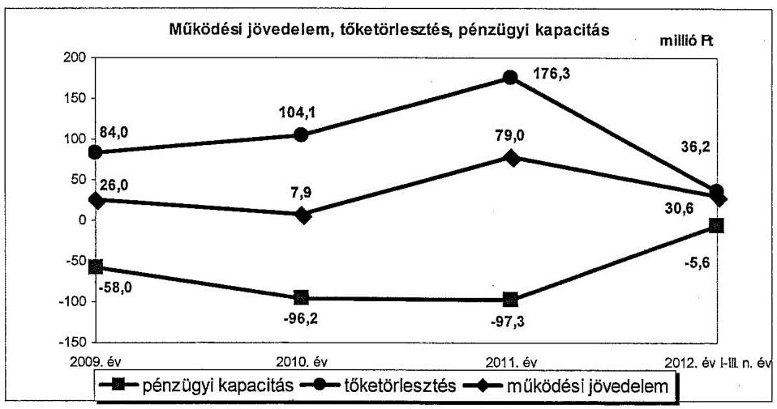
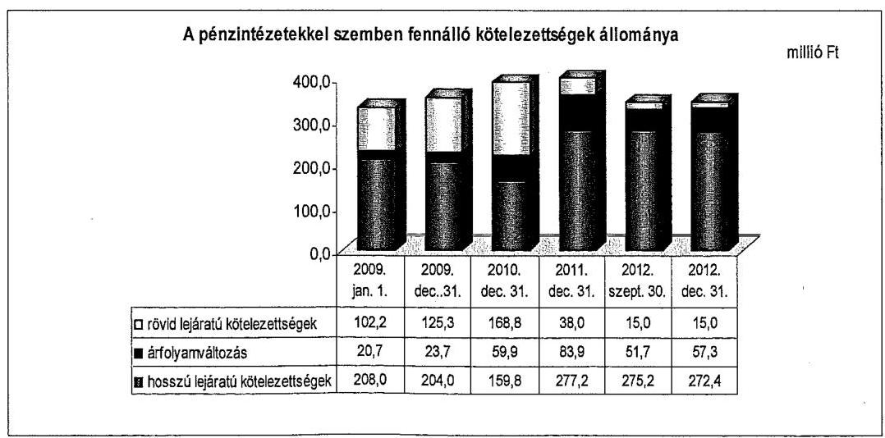
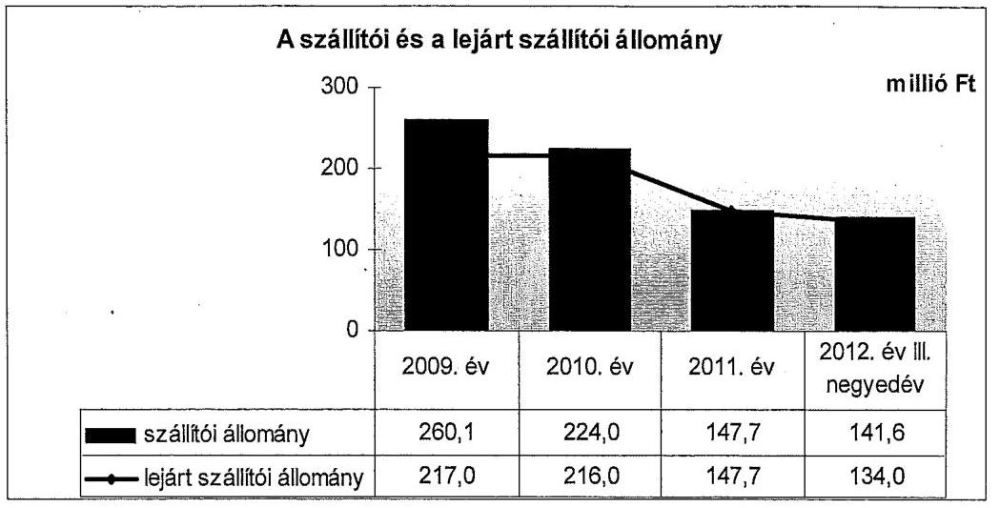
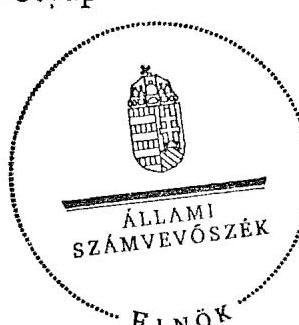
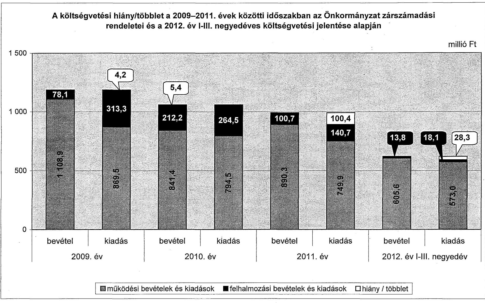
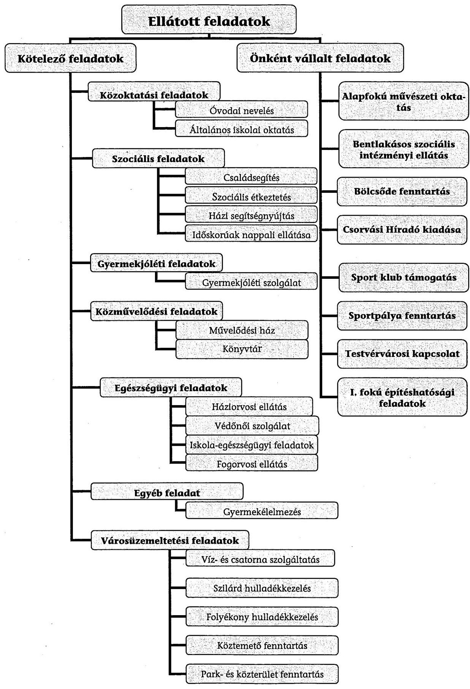

# ÁLLAMI   SZÁMVEVŐSZÉK 

## JELENTÉS

## Csorvás Város Önkormányzata pénzügyi gazdálkodási helyzetének, szabályosságának ellenőrzéséről

---

# Állami Számvevőszék 

Iktatószám: V-0030-340-017/2013.
Témaszám: 1069
Vizsgálat-azonosító szám: V059215

## Az ellenőrzést felügyelte:

## Renkó Zsuzsanna

felügyeleti vezető

## Az ellenőrzést vezette:

## Dér Lívia

ellenőrzésvezető

## Az ellenőrzést végezték:

| Halkóné | Kerekes Gábor | Dr. Szöllősi Zsolt |
| :-- | :-- | :-- |
| dr.Berkó Katalin | számvevő | számvevő |
| számvevő |  |  |

---

# TARTALOMJEGYZÉK 

BEVEZETÉS ..... 3
I. ÖSSZEGZŐ MEGÁLLAPÍTÁSOK, KÖVETKEZTETÉSEK JAVASLATOK ..... 6
II. RÉSZLETES MEGÁLLAPÍTÁSOK ..... 16

1. Az Önkormányzat kötelező és önként vállalt feladatai, a feladatellátás szervezeti keretei ..... 16
2. A pénzügyi egyensúlyt fenntartását veszélyeztető pénzügyi kockázatok és az ezek csökkentése érdekében tett intézkedések ..... 18
3. A pénzügyi gazdálkodási folyamatok szabályosságát, megfelelőségét biztosító belső kontrollok ..... 30
4. Az ÁSZ korábbi ellenőrzése során a pénzügyi, gazdálkodási helyzet javítására tett javaslatainak megvalósítása ..... 32

---

# MELLÉKLETEK 

1. számú A költségvetési hiány/többlet a 2009-2011. évek közötti időszakban az Önkormányzat zárszámadási rendeletei és a 2012. év I-III. negyedéves költségvetési jelentése alapján
2. számú Az Önkormányzat bevételei és kiadásai, valamint adósságszolgálata a 2009. év és a 2012. év III. negyedéve között (a CLF módszer szerint)

3/a. számú Az Önkormányzat által a 2009. év és a 2012. év III. negyedéve között megvalósított (műszakilag befejezett) fejlesztések forrásösszetétele
3/b. számú Az Önkormányzat által beadott, elbírálás alatti pályázatok forrásaiból megvalósuló fejlesztésekhez kapcsolódó kötelezettségvállalások összegzése
4. számú Az önkormányzati feladatok ellátásában résztvevő gazdasági társaságok egyes kiemelt adatai
5. számú Az Önkormányzat 2012. szeptember 30-án fennálló, hosszú lejáratú adósságot keletkeztető kötelezettségvállalásai
6. számú Az Önkormányzat kötelezettségeinek és egyes kötelezettségvállalásainak 2011. december 31-ei és 2012. szeptember 30-ai tényleges, 2012. december 31-ei várható állománya és a 2013. évben, valamint az azt követő években várható kötelezettségek miatti kiadások

## FÜGGELÉKEK

1. számú Rövidítések jegyzéke
2. számú Fogalomtár
3. számú Az Önkormányzat által ellátott feladatok 2012. szeptember 30-án

---

# JELENTÉS 

## Csorvás Város Önkormányzata pénzügyi gazdálkodási helyzetének, szabályosságának ellenőrzéséről

## BEVEZETÉS

Az államháztartás helyi szintjén, az önkormányzati alrendszerben az utóbbi években megjelenő gazdálkodási nehézségek, a pénzforgalmi hiány növekedése, az eladósodás az ÁSZ figyelmét a helyi önkormányzatok pénzügyi helyzetére irányította.

Az ÁSZ a 2013. I. félévi ellenőrzési tervben foglaltaknak megfelelően az önkormányzatok pénzügyi gazdálkodási helyzetének, szabályosságának ellenőrzésével az önkormányzatok 2011. évben megkezdett helyzetelemzését folytatta. Az ellenőrzés keretében értékeljük az önkormányzatok adósságkezelési és likviditási helyzetét. Bemutatjuk a pénzügyi egyensúly alakulására hatással lévő folyamatokat, feltárjuk az ezekre ható kockázatokat. Értékeljük a pénzügyi egyensúlyi helyzetet befolyásoló döntésmegalapozó, döntés-előkészítő eljárások szabályosságát, és minősítjük az ezekkel összefüggő belső kontrollok kialakítását, működését.

Az ellenőrzés eredményének várható hatásaként a megállapításokkal segítséget nyújthatunk az önkormányzatok számára a pénzügyi egyensúly helyreállítása, javítása és fenntartása érdekében szükségessé váló intézkedések megtételéhez.

Az ellenőrzés típusa: szabályszerűségi ellenőrzés.

## Az ellenőrzés célja annak értékelése volt, hogy:

- az ellenőrzött időszakban a kötelező és önként vállalt feladatok ellátását biztosító szervezeti formák változása milyen hatást gyakorolt az Önkormányzat pénzügyi helyzetének alakulására;
- az Önkormányzat pénzügyi - ezen belül működési és felhalmozási - egyensúlya milyen irányban változott, a változást milyen okok idézték elő, továbbá milyen intézkedéseket tettek a pénzügyi egyensúly biztosítása, illetve javítása érdekében, az intézkedések hatására javult-e az Önkormányzat pénzügyi helyzete;
- a költségvetési kiadások finanszírozása érdekében vállalt, pénzintézetekkel szembeni kötelezettségek hogyan alakultak, a kötelezettségek fennállása miként befolyásolja az Önkormányzat jövőbeli pénzügyi egyensúlyi helyzetét;

---

- az Önkormányzat beazonosította, felmérte, értékelte-e a pénzügyi egyensúlyt befolyásoló pénzügyi kockázatokat, a finanszírozási célú pénzügyi műveletekkel kapcsolatban írtak-e elő kockázatértékelési kötelezettséget;
- az Önkormányzat által kialakított belső kontrollok biztosítják-e a pénzügyi gazdálkodás folyamatainak szabályosságát és eredményességét;
- hasznosultak-e az ÁSZ korábbi ellenőrzése során a pénzügyi, gazdálkodási helyzet javítására tett szabályszerűségi és célszerűségi javaslatok.

Az ellenőrzés a 2009. január 1-jétől 2012. szeptember 30-áig terjedő időszakot ölelte fel. A pénzintézetekkel szembeni kötelezettségek állományára vonatkozóan az ellenőrzés kezdő időpontjaként a 2012. szeptember 30-án fennálló kötelezettségek keletkezésének időpontját vettük figyelembe. A jövőbeni kötelezettségek megállapításakor az adósságkonszolidáció hatását is értékeltük.

Az ellenőrzés szakmai módszertana az ÁSZ Ellenőrzési Elvek és Standardokban foglalt szakmai szabályokon alapult, amely a Legfőbb Ellenőrző Intézmények Nemzetközi Szervezete (INTOSAI) által kiadott nemzetközi standardok (ISSAI) figyelembevételével készült.

Az ellenőrzés során használt rövidítéseket az 1. számú, az egyes fogalmak magyarázatát a 2. számú függelék tartalmazza.

Az ellenőrzés jogszabályi alapját az ÁSZ tv. 1. § (3) bekezdésének, 5. § (2)-(6) bekezdéseinek, valamint az Áht. 61. § (2) bekezdésének előírásai képezik.

Az Országgyűlés 2012 végén a helyi önkormányzatok adósságállományának részleges konszolidációjáról döntött. Az 5000 fő lakosságszámot meg nem haladó települési önkormányzatok számára nyújtott törlesztési célú támogatással ${ }^{1}$ lehetővé tették a 2012. december 12-én fennálló adósságállományuk és annak 2012. december 28-áig számított járulékai teljes megfizetését. Az 5000 fő lakosságszám feletti települések esetében a 2013. évben az állam differenciált az adóerő-képességet figyelembe vevő, 40-70%-ig terjedő - mértékben vállalja át ${ }^{2}$ az önkormányzatok 2012. december 31-i, az átvállalás időpontjában fennálló adósságállományát és annak járulékait. Az adósságkonszolidációs intézkedéssel egyidejűleg a Kormány elrendelte ${ }^{3}$ az önkormányzatok adósságállománya újratermelődésének megakadályozása céljából a hitelengedélyezési és a likvid hitelekre vonatkozó szabályozás szigorítását.

Csorvás Város Önkormányzata lakónépességére tekintettel a 2013. évi adósságátvállalásban érintett. A pénzügyi egyensúlyi helyzetének jövőbeni alakulását befolyásoló, az ellenőrzött időszakban fennállt kockázatokra az ellenőrzés

[^0]
[^0]:    ${ }^{1}$ Magyarország 2012. évi központi költségvetéséről szóló 2011. évi CLXXXVIII. törvény 76/C. §-a (beiktatta a 2012. évi CLXXXVII. törvény 8. §-a, hatályos 2012. XII. 6-tól)
    ${ }^{2}$ Magyarország 2013. évi központi költségvetéséről szóló 2012. évi CCIV. törvény 7276. §-ai
    ${ }^{3}$ 1540/2012. (XII. 4.) Korm. határozat a helyi önkormányzatok adósságállományának részleges konszolidációjáról

---

időszakában tett megállapításaink - a pénzintézetekkel szembeni kötelezettségekkel összefüggésben feltárt kockázatok kivételével - az adósságkonszolidációt követően is helytállóak és időszerűek.

Csorvás város lakosainak száma 2012. január 1-jén 5268 fő volt, ami 247 fős csökkenést jelent a 2009. év eleji 5515 fő lakosságszámhoz képest. Az Önkormányzat a zárszámadási rendelete szerint a 2011. évben 991,0 millió Ft költségvetési bevételt ért el és 890,6 millió Ft költségvetési kiadást teljesített. A 2009. évi tényadatokhoz viszonyítva a bevételek 196,0 millió Ft-tal (16,5%-kal), a kiadások 292,3 millió Ft-tal (24,7%-kal) csökkentek. A 2011. december 31-i könyvviteli mérleg alapján az Önkormányzat 6419,6 millió Ft értékű vagyonnal rendelkezett, amely a 2009. év végi állományhoz (6393,3 millió Ft) viszonyítva 0,4%-kal (26,3 millió Ft-tal) növekedett. A 2011. évben a befektetett eszközök állománya 6332,9 millió Ft-ra (20,0 millió Ft-tal), míg a forgóeszközök állománya 86,7 millió Ft-ra (6,3 millió Ft-tal) emelkedett. A 2012. év III. negyedévére a források között a saját tőke állományának 121,0 millió Ft-os, és a kötelezettségek állományának 130,4 millió Ft-os csökkenése tette ki az állományváltozás jelentős hányadát.

Az ÁSZ tv. 29. § (1) bekezdése szerint a jelentéstervezetet megküldtük a polgármester részére, aki az ÁSZ tv. 29. § (2) bekezdésében foglalt észrevételezési jogával nem élt, a jelentéstervezetre észrevételt nem tett.

---

# I. ÖSSZEGZŐ MEGÁLLAPÍTÁSOK, KÖVETKEZTETÉSEK JAVASLATOK 

Csorvás Város Önkormányzatának pénzügyi egyensúlya az ellenőrzött időszakban rövid távon nem volt biztosított. A 2013. évi adósságkonszolidáció eredményeként ${ }^{4}$ az Önkormányzat pénzügyi egyensúlyi helyzetének javulása várható, azonban az adósságátvállalást követően fennmaradó kötelezettségek teljesíthetősége továbbra is kockázatos, az ellenőrzött időszak jövedelemtermelő képessége alapján képződő bevételek a feladatellátáshoz szükséges kiadásokon túl az adósságszolgálat terheit a továbbiakban sem fedezik, a működést rövid távon korlátozzák.

Az Önkormányzat költségvetésének elemzését a CLF módszer alapján számított mutatók alapján végeztük. A pénzügyi kapacitás 2009. év és 2012. év III. negyedéve közötti változását az alábbi ábra szemlélteti:

Az Önkormányzat a 2009. év és a 2012. év III. negyedéve között összesen 3759,3 millió Ft költségvetési bevételt ért el és 3723,4 millió Ft költségvetési kiadást teljesített. Az Önkormányzat működési költségvetésének egyensúlya az ellenőrzött időszakban biztosított volt, az ellenőrzött időszakban összesen 143,5 millió Ft többletet mutatott. Bevételi kitettséget jelentett, hogy a működési egyensúly 2009-ben a működőképesség fenntartását szolgáló (ÖNHIKI) támogatással volt fenntartható, anélkül 16,0 millió Ft hiányt mutatott volna. A működési kiadásoknak a 2009. év és a 2012. év III. negyedéve közötti csökkenését a feladatátadások, átszervezések, megszüntetések, a kiadáscsökkentő intézkedések és a közfoglalkoztatottak létszámcsökkenésének együttes hatása okozta. A 2011. évben a működési kiadások csökkenése mellett, az egyéb saját bevételek növekedésének eredményeként a működési költségvetés egyenlege - az ÖNHIKI támogatás nélkül is - pozitív volt. Az Önkormányzat a

[^0]
[^0]:    ${ }^{4}$ A helyszíni ellenőrzés végéig nem került sor a kötelezettség átvállalással kapcsolatos megállapodás aláírására.

---

2009. évben 42,0 millió Ft, a 2011. évben 38,6 millió Ft működőképességének megőrzését szolgáló támogatásban részesült.

A felhalmozási költségvetés egyensúlya az ellenőrzött időszak egyik évében sem állt fent. A 2009. évben 48,0 millió Ft hiányt mutatott, amely a 2010. évre 21,2 millió Ft-ra mérséklődött, majd a 2011. évben 35,5 millió Ft-ra nőtt, a 2012. év I-III. negyedévben 2,9 millió Ft-ra csökkent. A felhalmozási hiány változását a felmerült kiadások és a pályázati támogatások ütemkülönbsége határozta meg. A felhalmozási hiányt az erre a célra kibocsátott kötvénybevételből és hitelekből finanszírozták.

Az ellenőrzött időszakban a kötelező és önként vállalt feladatok ellátását biztosító szervezeti formák változása - a szociális és vendéglátási területeket érintő feladatátadások, átszervezések, megszüntetések - az Önkormányzat adatszolgáltatása szerint 7,5 millió Ft megtakarítást eredményezett, amely azonban nem gyakorolt jelentős hatást a pénzügyi egyensúlyi helyzetre. A feladatellátás szervezeti formáinak változásán túl a bevételnövelő és kiadáscsökkentő intézkedések (a készletek, eszközök értékesítése, a térítési díj és helyi adó mértékének emelése, bérbeadás, az étkezési hozzájárulás megszüntetése, feladatátadás, létszámcsökkentés, a civil szervezetek támogatásának csökkentése, a felülvizsgált beszerzések miatti megtakarítás) együttes eredményeként - az Önkormányzat adatszolgáltatása szerint - 64,9 millió Ft megtakarítás keletkezett, amely a pénzügyi egyensúlyi helyzetet javította.

Az Önkormányzatnál a működési jövedelemtermelő képességgel kapcsolatban fennállt kockázatok:

- az önként vállalt működési feladatok ellátása miatti működési kockázat. Az önként vállalt működési feladatokra fordított kiadások működési kiadáson belüli aránya a 2009. évi 17,2%-hoz (145,1 millió Ft), viszonyítva 2011-re 18,9%-ra (139,5 millió Ft) növekedett, e kiadások csökkenése (3,9%) kisebb ütemű volt, mint a kötelező feladatoké;
- a magas lejárt szállítói állomány miatti nemfizetési kockázat. A szállítói kötelezettség 2009. és a 2012. év III. negyedéve között 260,1 millió Ft-ról 141,6 millió Ft-ra csökkent. A 2012. szeptember 30-ai szállítói tartozás 94,6%-a (134,0 millió Ft) lejárt esedékességű volt, amely a teljesített dologi kiadások egy havi átlaga több mint hétszeresének felelt meg. A lejárt szállítói állomány 90,3%-a

 ( 121,0 millió Ft) 60 napon túli tartozás volt;
- a fejlesztések során kialakított létesítmények jövőbeni üzemeltetése miatti kockázat. A fejlesztésekről szóló döntések előkészítésekor a fejlesztések várható működési kiadásait, a működtetés forrásait nem számszerűsítették.

Az Önkormányzat pénzintézeti kötelezettsége a 2009. év elejéről a 2012. év III. negyedévére 330,9 millió Ft-ról 341,9 millió Ft-ra növekedett a fennálló kötelezettségek részbeni törlesztése, a folyószámlahitel állományának csökkenése, továbbá a devizában kibocsátott kötvény után elszámolt árfolyamveszteség változásának együttes hatására. Árfolyamkockázatot jelentett, hogy a

---

kötvény kibocsátását megelőzően az árfolyam jelentős emelkedésével nem számoltak. A kötvény devizanemének árfolyama kedvezőtlen irányba változott, az induló árfolyamhoz képest 51,6 %-kal emelkedett a 2012. év végére.

Az Önkormányzat számára banki kitettséget jelentett, hogy az igénybevett refinanszírozó hitel kamata a kiváltott hitelek kamatánál kedvezőtlenebb volt, az átlagkamat emelkedése kamatkockázatot jelentett. Visszafizetési kockázatot jelentett, hogy a refinanszírozási hitel igénybevételét megelőzően nem volt az Önkormányzatnak elegendő forrása a két kiváltott rövid lejáratú hitel törlesztésére. Az Önkormányzat a fennálló hosszú lejáratú pénzintézeti kötelezettségeiből a kötvénnyel összefüggésben 49987 CHF-et (tőkét), a refinanszírozási hitelhez kapcsolódóan 59,3 millió Ft-ot (tőkét és kamatot) nem tudott megfizetni az ellenőrzött időszakban. A szerződésektől eltérő teljesítések miatt, a bank a kötvény és hitelszerződésben foglalt biztosítéki jogokkal nem élt. Nemfizetési kockázatot jelentett, hogy a kötvény, két rövid lejáratú hitel és a refinanszírozási hitel szerződés szerinti teljesítéséhez nem állt rendelkezésre a szükséges nagyságrendű forrás.

A likviditás fenntartásához a 2009. év és a 2012. év III. negyedéve közötti időszakban folyószámlahitelt, munkabér-megelőlegezési hitelt, egyéb likvid hiteleket és kölcsönöket vettek igénybe. Az Önkormányzat likviditási nehézségeinek fokozódását, a banki kitettség miatti kockázatot jelzi, hogy a likvid hitelek igénybevétele tartóssá vált, a folyószámlahitel-keret - pénzintézeti döntés hatására - mérséklődött.

A 2013. évi adósságkonszolidáció kedvező hatása ellenére a 2013. évtől várható kötelezettségek teljesíthetőségének kockázatát jelentheti, hogy a jelenlegi feltételek alapján számított működési jövedelem várhatóan nem nyújt fedezetet a pénzintézeti kötelezettségek teljesítésére. Az adósságszolgálat teljesítéséhez szabad tartalékkal nem rendelkeznek, a likviditási nehézségek rendezéséhez források nem állnak rendelkezésre.

A fedezetbevonások növekedése miatti kockázatot jelzi, hogy a jelzáloggal terhelt ingatlanok száma - a 2009. január 1-jén terhelt háromról 27-re növekedett, számviteli értéke a forgalomképes ingatlanok nettó értékének (197,0 millió Ft-nak) a 13,7 %-a volt. A jelzálogjog összege a 2012. év III. negyedéve végén 201,8 millió Ft volt.

A kezességvállalás miatti mérlegen kívüli kockázat is fennállt. Az Önkormányzat készfizető kezességet vállalt a Csorvási Csatornaberuházó Víziközmű Társulat 2005-ben felvett hiteléhez. Kezességvállalás miatt az ellenőrzött időszakban összesen 25,1 millió Ft fizetési kötelezettséget teljesített, amelyből a társult önkormányzatokra jutó összeg nem térült meg. A megtérülés érdekében intézkedést nem kezdeményeztek. Az Önkormányzat kezességvállalásból származó mérlegen kívüli kötelezettsége az ellenőrzött időszak végén 337,7 millió Ft volt.

A gazdasági társaság miatti mérlegen kívüli kockázatot jelezte, hogy a kizárólagos tulajdonában álló gazdasági társaság lejárt szállítói állománya 2009-ről 2011-re közel háromszorosára, 7,4 millió Ft-ról 21,7 millió Ft-ra növekedett, a 2012. év III. negyedéve végén a 14,2 millió Ft lejárt szállítói állományból a 60 napon túl lejárt tartozás 5,1 millió Ft volt. Egyéb kötelezettségei 2009-ről a 2012. év III. negyedév végére megnégyszereződtek, 7,0 millió Ft-ról 29,5 millió Ft-ra emelkedtek. A gazdasági társaság pénzügyi helyzete - a fennálló kötelezettségei alapján megítélve - nincs egyensúlyban, az esetlegesen bekövetkező hitelezői döntések az Önkormányzatra helytállási kötelezettséget háríthatnak.

Az Önkormányzatnál a kockázatkezelési rendszer keretében a pénzügyi egyensúlyt befolyásoló kockázatok feltárása, beazonosítása, felmérése, értékelése és ezáltal kezelése - a 2009. évben az Ámr. ${ }_{1}$-ben, a 2010-2011. években az Ámr. ${ }_{2}$-ben, a 2012. év I-III. negyedévben a Bkr.-ben foglalt jogszabályi előírások ellenére - elmaradt. Annak ellenére maradt el a kockázatok kezelése, hogy az ellenőrzési időszakban fennállt az önként vállalt feladatok miatti működési kockázat, a kötvény miatti árfolyamkockázat, a refinanszírozó hitel és a likvid hitelek miatti banki kitettség kockázata, a két rövid lejáratú hitel és a refinanszírozási hitel miatti visszafizetési kockázat, a magas lejárt szállítói állomány és a lejárt esedékességű hitel- és kötvénytartozás miatti nemfizetési kockázat, a fedezetbevonások növekedése miatti kockázat, a fejlesztések során kialakított létesítmények jövőbeni üzemeltetése miatti, valamint a gazdasági társaság kötelezettségei miatti mérlegen kívüli kockázat és a kezességvállalás miatti kockázat, továbbá a jövőbeni kötelezettségek teljesíthetőségének kockázata.

A pénzügyi gazdálkodási folyamatok szabályosságát, megfelelőségét, kockázatainak kezelését biztosító belső kontrolltevékenységek kialakítása - a 2009. évben az Ámr. ${ }_{1}$, a 2010-2011. években az Ámr. ${ }_{2}$, a 2012. év I-III. negyedévben a Bkr.-ben foglalt előírások ellenére - nem volt megfelelő, mert nem írták elő a feladat átadás-átvételre vonatkozó döntés-előkészítés folyamatában annak értékelését, hogy a döntés milyen hatást gyakorol a kötelező és önként vállalt feladatokra fordított kiadások arányára, a pénzügyi egyensúlyi helyzetre. Nem írták elő az önkormányzati feladatellátáshoz kapcsolódó támogatási rendszer feltételeit, a szerződések tartalmi követelményeit és a feladatellátás teljesítéséről a beszámolási kötelezettséget. A kockázatkezelési szabályzatot, a szabálytalanságok kezelésének eljárásrendjét és az ellenőrzési nyomvonalat 2007. óta nem aktualizálták. A döntés-előkészítés szakaszában nem írták elő a fejlesztési döntések kockázatainak, valamint a pénzintézeti kötelezettségvállalással kapcsolatos döntések kockázatainak feltárását és a futamidő egyes éveit terhelő kötelezettség költségvetési egyensúlyra gyakorolt hatása vizsgálatát. Belső szabályzatban nem határozták meg a közbeszerzési értékhatár alatti esetekben a pályáztatási kötelezettséggel összefüggő kontrolltevékenységeket. Nem szabályozták az Önkormányzat fizetőképességének és eladósodásának kezelésével, a pénzügyi kötelezettségek teljesítésének helyi szabályaival és a szállítói tartozások és egyéb kiadáselmaradások rendezésével összefüggő kontrolltevékenységeket. A költségvetés készítése során döntöttek a pénzintézeti kötelezettségvállalás hatáskör átruházásáról, azonban nem írták elő ennek beszámolási kötelezettségét.

Az ellenőrzött időszak belső ellenőrzési terveinek készítését megelőzően - a 2009. évben az Ámr. ${ }_{1}$-ben, a 2010-2011. években az Ámr. ${ }_{2}$-ben, a 2009-2011. években a Ber.-ben, 2012. január 1-jétől a Bkr.-ben foglaltak ellenére - nem írták elő a pénzügyi egyensúlyi helyzetet befolyásoló döntések kockázati tényező-

---

inek feltárását és a feltárt kockázati tényezők belső ellenőrzés keretében történő ellenőrzését.

A pénzügyi gazdálkodási folyamatok szabályosságát, megfelelőségét, a kockázatok kezelését biztosító belső kontrollok működése gyenge volt, mert a feladat átadás-átvételre vonatkozó döntés-előkészítés folyamatában nem értékelték, hogy a döntés milyen hatással bír a kötelező és az önként vállalt feladatokra fordított kiadások arányára, ezzel együtt az Önkormányzat pénzügyi egyensúlyi helyzetére. A fejlesztéseket megelőző döntés-előkészítési folyamatban nem tárták fel az előkészítés, a lebonyolítás és a működtetés kockázatait, és nem vizsgálták a hitelfelvételnél a futamidő egyes éveit terhelő kötelezettség költségvetési egyensúlyra gyakorolt hatását. A pénzügyi egyensúlyi helyzetet befolyásoló döntések kockázati tényezőinek feltárása és belső ellenőrzés keretében történő ellenőrzése elmaradt. A kialakított kontrollok nem biztosították a pénzügyi gazdálkodási folyamatok eredményességét.

Az ellenőrzés során a gazdálkodási feladatok ellátásával és a könyvvezetési kötelezettség teljesítésével kapcsolatban az alábbi szabályszerűségi hibákat tártuk fel:

- az Önkormányzat megsértette az Ötv., az Ámr. ${ }_{1}$ és az Ámr. ${ }_{2}$ előírását azzal, hogy a központi költségvetésből származó bevételeit - a 2009. évi 40,0 millió Ft, a 2010. évi 90,0 millió Ft rövid lejáratú és a 2011. évi 130,0 millió Ft összegű hosszú lejáratú - hitelfelvétel fedezeteként ajánlotta fel;
- az Áhsz. előírásai ellenére a devizában kibocsátott kötvény törlesztése során realizált árfolyamnyereséget és árfolyamveszteséget a főkönyvi könyvelésben elkülönítetten nem mutatták ki;
- az Áhsz. előírásai ellenére az Önkormányzat a kölcsönszerződésekből adódó kötelezettségeit nem rövid lejáratú kölcsönként, hanem hitelként mutatta ki mérlegében a 2010. és a 2011. években;
- egy hitel esetében nem tettek eleget a Kbt. ${ }_{1}$-ben előírtaknak, mivel közbeszerzési eljárás lefolytatása nélkül kötöttek szerződést a folyósító pénzintézettel. A jogszabálysértés miatt az ÁSZ jogorvoslati eljárást kezdeményezett, melyben a Közbeszerzési Döntőbizottság megállapította, hogy az Önkormányzat az eljárás mellőzésével megsértette a Kbt. előírásait.

Az Önkormányzat gazdálkodási rendszerének 2009. évi ÁSZ ellenőrzése során tett 23 szabályszerűségi javaslatból 12 javaslat megvalósítására nem intézkedtek. A pénzügyi, gazdálkodási helyzet javítására tett tíz szabályszerűségi javaslatból öt nem hasznosult. Nem történt intézkedés az ellenőrzési nyomvonal kiegészítésére, a kockázatkezelés eljárásrendjének elkészítésére, az intézmények elszámoláshoz kötött mutatószámainak, azok eltérései indokoltságának ellenőrzésére, a kockázatelemzés alapján készített stratégiai és éves ellenőrzési terv elkészítésére, valamint a Polgármesteri Hivatal belső kontrolljai kialakításáról és működtetéséről szóló nyilatkozattételi kötelezettség teljesítésére.

---

Az ÁSZ tv. 33. § (1) bekezdésében foglaltak értelmében az ellenőrzött szervezet vezetője köteles a jelentésben foglalt megállapításokhoz kapcsolódó intézkedési tervet összeállítani, és azt a jelentés kézhezvételétől számított harminc napon belül az ÁSZ részére megküldeni. Amennyiben az intézkedési tervet határidőn belül nem küldi meg a szervezet vezetője, vagy az továbbra sem elfogadható, az ÁSZ elnöke a hivatkozott törvény 33. § (3) bekezdés a-b) pontjaiban foglaltakat érvényesítheti.

# Az ellenőrzés intézkedést igénylő megállapításai és javaslatai: 

## a polgármesternek

1. Az ellenőrzött időszakban az Önkormányzat működési jövedelme pozitív volt, azonban a 2009. évben az ÖNHIKI támogatás nélkül 16,0 millió Ft hiányt mutatott volna. A nettó működési jövedelem a 2009-2012. III. negyedév között minden évben negatív volt. A likviditás folyószámlahitel, munkabér- és egyéb likvidhitel igénybevételével volt biztosítható. 2012. szeptember 30-án a fennálló pénzintézeti kötelezettség összesen 341,9 millió Ft, a lejárt szállítói tartozás 134,0 millió Ft volt. A 2012. év III. negyedéve végén a lejárt tartozás 90,3 %-a ( 121,0 millió Ft) 60 napon túli esedékességű volt. Az Önkormányzat kezességvállalásból származó, mérlegen kívüli kötelezettsége az ellenőrzött időszak végén 337,7 millió Ft volt. A 2013. évi adósságkonszolidációt követően fennmaradó kötelezettségek jövőbeni teljesíthetősége kockázatot jelent, a működési jövedelem várhatóan nem nyújt fedezetet az adósságszolgálatra, melynek teljesítéséhez szabad tartalék nem áll rendelkezésre. Az Önkormányzat az ellenőrzött időszakban esedékessé vált kötvénytartozásból 49987 CHF-et (tőkét), a refinanszírozási hitelhez kapcsolódóan 59,3 millió Ft-ot (tőketörlesztés és kamatfizetést) nem tudott teljesíteni, amely nemfizetési kockázatot jelent. Az Önkormányzat készfizető kezességet vállalt a Csorvási Csatornaberuházó Víziközmű Társulat 2005-ben felvett hiteléhez. A kezességvállalásból adódóan az ellenőrzött időszakban összesen 25,1 millió Ft fizetési kötelezettség keletkezett, melynek megtérítése érdekében intézkedést nem tettek. A bevételnövelő és a kiadáscsökkentő intézkedések nem biztosítottak elegendő forrást a pénzügyi egyensúly helyreállításához.

Javaslat:
A működési jövedelemtermelő képesség és a feladatellátás összhangja, valamint az Önkormányzat pénzügyi egyensúlyának helyreállítása, hosszú távú fenntarthatósága érdekében - a 2013. évi kormányzati adósságkonszolidációt, valamint a 2013. évtől változó feladat-ellátási kötelezettséget, feladatfinanszírozási rendszert figyelembe véve - felelősök és határidők megjelölésével kezdeményezzen intézkedéseket, melyek keretében:
a) a költségvetési rendelettervezet, valamint annak évközi módosítása előterjesztését megelőzően mérjék fel a bevételszerző, kiadáscsökkentő lehetőségeket, és terjessze a Képviselő-testület elé a bevételek növelését, a kiadások csökkentését célzó intézkedések bevezetéséhez szükséges - a Htv. 140. § (1) bekezdés a) pontja alapján a jegyző által elkészített - döntési javaslatát;
b)
 terjesszen a Képviselő-testület elé jóváhagyásra - a Htv. 140. § (1) bekezdés a) pontja alapján a jegyző által elkészített - az Önkormányzat gazdasági helyzetének elemzésén alapuló, a pénzügyi egyensúlyi helyzet gyors helyreállítását, hosszú távú fenntartását, valamint az adósságállomány újratermelődésének elkerülését biztosító intézkedéseket tartalmazó reorganizációs programot;
c) az adósságkonszolidációt követően fennmaradó kötelezettségek jövőbeni teljesítése, a fizetőképesség megőrzése érdekében terjesszen a Képviselő-testület elé a Htv. 140. § (1) bekezdés a) pontja alapján a jegyző által elkészített - döntési javaslatot, amelyben a Képviselő-testület kötelezettséget vállal arra, hogy előre meghatározott összegben és módon a realizált többletbevételeket, a meglévő és a jövőben képződő tartalékokat mindaddig a kötelezettségek rendezésére fordítja, azt nem használja más célra, amíg az Önkormányzat pénzügyi egyensúlya rövid távon veszélyeztetett;
d) a szállítói kitettség és az Adósságrendezési tv. 4-9. §-aiban szabályozott adósságrendezési eljárás megindításának elkerülése érdekében, meghatározott gyakorisággal számoljon be a Képviselő-testületnek az Önkormányzat lejárt szállítói állománya alakulásáról; intézkedjen a szállítói számlák esedékesség szerinti kiegyenlítéséről, vagy a lejárt tartozások átütemezéséről;
e) intézkedjen a Víziközmű Társulat tagjaival szemben az Önkormányzat által a Társulat helyett visszafizetett hitel és járulékos költségei arányos megtérülése érdekében.
2. A 2009. évi 40,0 millió Ft, a 2010. évi 90,0 millió Ft rövid lejáratú és a 2011. évi 130,0 millió Ft összegű hosszú lejáratú hitelszerződésekben az Önkormányzat a pénzintézet számára felhatalmazást adott bármely bankszámlája megterhelésére, amennyiben törlesztési kötelezettségét nem teljesíti. Ezáltal - az Ötv. 88. § (1) bekezdés b) pontjában ${ }^{5}$, a 2009. évben az Ámr. 103. § (11) bekezdésében ${ }^{6}$ és a 2010-2011. években az Ámr. 174. § (11) bekezdésében ${ }^{7}$ foglaltakat megsértve - a központi költségvetésből származó bevételeit a hitelfelvétel fedezeteként ajánlotta fel.

Javaslat:
A pénzintézeti kötelezettségvállalásokkal kapcsolatos jogszerű biztosíték, illetve fedezet felajánlása érdekében:
a) intézkedjen, hogy jövőbeni hitelfelvétel, kötvénykibocsátás fedezeteként az Áht 84. § (4) bekezdésében, továbbá az Ávr. 145. § (2) bekezdésében előírtak szerint az Önkormányzat általános működésének és ágazati feladatainak támogatása, továbbá a költségvetési támogatás ne kerüljön felhasználásra, a költségvetési támogatások folyósítására szolgáló elkülönített bankszámláról hiteltörlesztést ne teljesítsenek;

[^0]
[^0]:    ${ }^{5}$ Hatálytalan 2012. január 1-jétől, a 2012. március 31-től hatályos előírás az Áht. 84. § (4) bekezdése.
    ${ }^{6}$ Hatálytalan 2010. január 1-jétől.
    ${ }^{7}$ Hatálytalan 2012. január 1-jétől, a 2012. január 1-jétől hatályos előírás az Ávr. 145. § (2) bekezdés.

---

b) a jogellenes állapot megszüntetése érdekében vizsgálja meg a jogszerű biztosíték cseréjének lehetőségét, és terjesszen javaslatot a Képviselő-testület elé a biztosíték cseréjéről;
c) intézkedjen az ÁSZ ellenőrzés során feltárt szabálytalanság tekintetében a munkajogi felelősséggel kapcsolatos körülmények kivizsgálásáról, és hozza meg a szükséges munkajogi intézkedéseket.
3. A hosszú lejáratú refinanszírozási hitel igénybevételekor a Kbt. 1240. § (1) bekezdésében ${ }^{8}$ foglalt előírás ellenére az Önkormányzat közbeszerzési eljárás lefolytatása nélkül kötött hitelszerződést a pénzintézettel. A jogszabálysértés miatt az ÁSZ jogorvoslati eljárást kezdeményezett, melyben a Közbeszerzési Döntőbizottság megállapította, hogy az Önkormányzat a közbeszerzési eljárás mellőzésével megsértette a Kbt. előírásait.

Javaslat:
a) biztosítsa, hogy jövőbeni pénzügyi szolgáltatások igénybevétele esetén, amennyiben a Kbt. 2120. § k) pontjában foglalt kivétel nem áll fenn, a közbeszerzési eljárás lefolytatásának kötelezettségére a 119. §-ban foglalt előírást érvényesítsék;
b) intézkedjen az ÁSZ ellenőrzés során feltárt közbeszerzési szabálytalanság tekintetében a munkajogi felelősséggel kapcsolatos körülmények kivizsgálásáról, és hozza meg a szükséges munkajogi intézkedéseket.

# a jegyzőnek

1. Az Önkormányzat a 2010. és a 2011. évi könyvviteli mérlegében a gazdasági társaságoktól, egyesülettől felvett kölcsönökből fennálló rövid lejáratú tartozását az Áhsz. 26. § (5) bekezdés a) pontjában foglalt előírással ellentétben nem kölcsöntartozásként, hanem a rövid lejáratú hitelek között mutatta ki.

Javaslat:
Intézkedjen, hogy a könyvviteli mérlegben az egy évet meg nem haladó lejáratra kapott kölcsönöket az Áhsz. 26. § (5) bekezdés a) pontjában foglalt előírásnak megfelelően a rövid lejáratú kötelezettségek között - a hitelektől elkülönítve - mutassák ki.
2. Az Önkormányzatnál a devizában fennálló kötvénytartozás törlesztő részletei után pénzügyileg realizált árfolyamveszteség összegét a főkönyvi könyvelésben - az Áhsz. 9. számú melléklet számlaosztályok tartalmára vonatkozó előírásai 4. dl) pontjában és a 9. c) pontjában foglalt előírással ellentétben - elkülönítetten nem mutatták ki.

[^0]
[^0]:    ${ }^{8}$ Hatálytalan 2012. január 1-jétől, a 2012. január 1-jétől hatályos előírás: Kbt. 2119. §, 120. § k) pontja.

---

Javaslat:
Intézkedjen, hogy a devizában fennálló kötvénytartozás törlesztése során a pénzügyileg realizált árfolyam-különbözet elszámolása árfolyamveszteség esetén az Áhsz. 9. számú melléklet számlaosztályok tartalmára vonatkozó előírásai 4. dl) és a 9. c) pontjában foglalt előírásoknak, illetve árfolyamnyereség esetén az Áhsz. 14. a) pontjában foglalt előírásnak megfelelően történjen.
3. A kockázatkezelési rendszer keretében az ellenőrzött időszakban fennállt, a pénzügyi egyensúlyt befolyásoló kockázatok feltárása, beazonosítása, értékelése, ezáltal a kockázatok kezelése - a 2009. évben az Ámr. 1145/C. §-ában, a 2010-2011. években az Ámr. 157. §-ában, a 2012. év I-III. negyedévben a Bkr. 7. § (1)-(2) bekezdéseiben foglalt jogszabályi előírások ellenére - elmaradt. Annak ellenére maradt el a kockázatok kezelése, hogy az ellenőrzött időszakban fennállt az önként vállalt feladatok miatti működési kockázat, a kötvény miatti árfolyamkockázat, a refinanszírozási hitel és a likvid hitelek miatti banki kitettség, a két rövid lejáratú és a refinanszírozási hitel miatti visszafizetési kockázat, a magas lejárt szállítói állomány és a lejárt esedékességű hitel- és kötvénytartozás miatti nemfizetési kockázat, fedezetbevonások növekedése miatti kockázat, a fejlesztések során kialakított létesítmények jövőbeni üzemeltetése miatti kockázat, a gazdasági társaság kötelezettségei miatti mérlegen kívüli kockázat és a kezességvállalás miatti kockázat, valamint a jövőbeni kötelezettségek teljesíthetősége miatti kockázat.

Javaslat:
Működtessen a Bkr. 7. § (1)-(2) bekezdéseiben foglalt előírásoknak megfelelő, a pénzügyi egyensúlyt befolyásoló kockázatok kezelésére alkalmas kockázatkezelési rendszert.
4. A pénzügyi gazdálkodási folyamatok szabályossága, megfelelősége vonatkozásában a kockázatok kezelését biztosító belső kontrolltevékenységek kialakítása - a 2009. évben az Ámr. 145/E. § (1)-(2) bekezdéseiben, a 2010-2011. években az Ámr. 158. § (1)-(2) bekezdéseiben, a 2012. év I-III. negyedévben a Bkr. 8. § (1)-(2) bekezdéseiben foglalt előírások ellenére - nem volt megfelelő, mert nem írták elő a feladat átadás-átvételre vonatkozó döntés-előkészítés folyamatában annak értékelését, hogy a döntés milyen hatást gyakorol a kötelező és önként vállalt feladatokra fordított kiadások arányára és a pénzügyi egyensúlyi helyzetre. Nem írták elő az önkormányzati feladatellátáshoz kapcsolódó támogatási rendszer feltételeit, a szerződések tartalmi követelményeit és a feladatellátás teljesítéséről a beszámolási kötelezettséget. A kockázatkezelési szabályzatot, a szabálytalanságok kezelésének eljárásrendjét és az ellenőrzési nyomvonalat 2007. óta nem aktualizálták. A döntés-előkészítés szakaszában nem írták elő a fejlesztési döntések kockázatainak, valamint a pénzintézeti kötelezettségvállalással kapcsolatos döntések kockázatainak feltárását és a futamidő egyes éveit terhelő kötelezettség költségvetési egyensúlyra gyakorolt hatása vizsgálatát. Belső szabályzatban nem határozták meg a közbeszerzési értékhatár alatti esetekben a pályáztatási kötelezettséggel összefüggő kontrolltevékenységeket. Nem szabályozták az Önkormányzat fizetőképességének és eladósodásának kezelésével, a pénzügyi kötelezettségek teljesítésének helyi szabályaival és a szállítói tartozások és egyéb kiadáselmaradások rendezésével összefüggő kontrolltevékenységeket. A költségvetés készítése során döntöttek a pénzintézeti kötelezettségvállalás hatáskör átruházásáról, azonban nem írták elő ennek beszámolási kötelezettségét.

---

Javaslat:
Alakítsa ki a Bkr. 8. § (1)-(2) bekezdései alapján azokat a belső kontrolltevékenységeket, amelyek biztosítják a pénzügyi-gazdálkodási folyamatok szabályosságát és a pénzügyi egyensúlyi helyzet alakulását befolyásoló döntések kockázatainak kezelését. Ennek keretében:
a) írja elő a feladat átadás-átvételre vonatkozó döntések előkészítése során a döntés kötelező és önként vállalt feladatok arányára, ezáltal a pénzügyi egyensúlyi helyzetre gyakorolt hatásának vizsgálatát;
b) írják elő az önkormányzati feladatellátáshoz kapcsolódó támogatási rendszer feltételeit, a feladatellátás teljesítéséről a beszámolási kötelezettséget, valamint a szerződések minimum tartalmi követelményeinek meghatározásával összefüggő kontrolltevékenységeket;
c) vizsgálja felül és szükség szerint aktualizálja az Önkormányzat kockázatkezelési szabályzatát, az ellenőrzési nyomvonalat és a szabálytalanságok kezelésének eljárásrendjét;
d) határozza meg a fejlesztések döntés-előkészítés folyamatában a lebonyolítás és a működtetés kockázatai feltárásának és kezelésének kötelezettségét;
e) írja elő a pénzintézeti kötelezettségvállalások kockázatainak döntés-előkészítő szakaszban történő feltárását, a futamidő egyes éveit terhelő kötelezettségek költségvetési egyensúlyra gyakorolt hatásának vizsgálatát;
f) határozza meg a közbeszerzési értékhatár alatti esetekben a pályáztatási kötelezettséggel kapcsolatos kontrolltevékenységeket;
g) készítsen szabályzatot az Önkormányzat fizetőképességének és eladósodásának kezelésére, valamint határozza meg a pénzügyi kötelezettségek teljesítése, a szállítói tartozások és az egyéb kiadáselmaradások rendezésének helyi szabályait.
5. Az Önkormányzatnál az ellenőrzött időszak belső ellenőrzési terveinek készítését megelőzően - a 2009. évben az Ámr. 145/C. § (2) bekezdésében, a 2010-2011. években az Ámr. 157. § (2) bekezdésében, a 2009-2011. években a Ber. 18. §-ában, a 21. § (2) bekezdésében és a (3) bekezdés a) pontjában, 2012. január 1-jétől a Bkr. 7. § (2) bekezdésében, a 29. § (1) bekezdésében, a 31. § (2)-(4) bekezdéseiben foglaltak ellenére - nem írták elő a pénzügyi egyensúlyi helyzetet befolyásoló döntések kockázati tényezőinek feltárását, ezért a belső ellenőrzési tervek nem tartalmazták az ellenőrzési tervet megalapozó kockázatelemzéseket, ezáltal az Önkormányzatnál nem ellenőrizték ezeket a kockázati tényezőket.

Javaslat:
Intézkedjen a belső ellenőrzés vezetője felé, hogy a Bkr. 7. § (2) bekezdésében foglaltak szerint mérjék fel a gazdálkodásban rejlő kockázatokat, a 29. § (1) bekezdésében, a 31. § (2)-(4) bekezdéseiben foglalt előírások szerint az éves belső ellenőrzési tervek tartalmazzák a pénzügyi egyensúlyi helyzetet befolyásoló döntésekkel kapcsolatos feltárt kockázati tényezők ellenőrzését, valamint biztosítsa az ellenőrzési tervek végrehajtását.

---

# II. RÉSZLETES MEGÁLLAPÍTÁSOK

## 1. Az ÖNKORMÁNYZAT KÖTELEZŐ ÉS ÖNKÉNT VÁLLALT FELADATAI, A FELADATELLÁTÁS SZERVEZETI KERETEI

Az Önkormányzat a kötelező és az önként vállalt feladatait az SzMSz-ben határozta meg ${ }^{9}$. Az önként vállalt feladatok - az Önkormányzat besorolása alapján - a 2009. évben az alapfokú művészeti oktatás, a bentlakásos szociális intézményi ellátás és az I. fokú építéshatósági jogkör helyben történő gyakorlásának biztosítása, a testvérvárosi kapcsolatok fenntartása és fejlesztése, a Csorvási Sport Klub támogatása, a Konferencia Központ ${ }^{10}$ üzemeltetése, a szociális foglalkoztatás, a sportpálya fenntartása, valamint a kéthavonta megjelenő Csorvási Híradó kiadása voltak. Az önként vállalt feladatok a 2012. év III. negyedév végére a Konferencia Központ - egy vállalkozás számára - üzemeltetésre történő átadásával és a szociális foglalkoztatás megszüntetésével csökkentek és a bölcsőde fenntartásával növekedtek.

A kötelező feladatok körében, a közoktatás keretében biztosították az óvodai nevelést és az általános iskolai oktatást. Kötelező feladatként látták el a szociális ágazatban a családsegítést, a szociális étkeztetést, a házi segítségnyújtást és az időskorúak nappali ellátását. A gyermekjóléti feladatok ellátására gyermekjóléti szolgálatot tartottak fenn. A gyermekélelmezési feladatokat a Szolgáltató Nonprofit Kft. látta el. A kötelező közművelődési feladatokat művelődési ház és könyvtár fenntartásával végezték. Az egészségügyi feladatok keretében

 működtették a védőnői szolgálatot. A háziorvosi és az iskola-egészségügyi feladatok ellátására három háziorvossal, a fogorvosi ellátásra egy gazdasági társasággal, Fogért Kkt.-val kötöttek szerződést. Az Önkormányzat egyes kötelező – víz- és csatornaszolgáltatási, szilárd és folyékony hulladékszolgáltatási, köztemető fenntartási, valamint park- és közterület fenntartási – feladatait közszolgáltatási szerződések alapján gazdasági társaságok és egy egyéni vállalkozó látták el. (A feladatellátás részletezését a 3. számú függelék tartalmazza.)

A szilárd hulladékszállítást 2010. augusztus 31-ig az orosházi Városüzemeltetési és Szolgáltató Zrt. végezte. E feladatot 2010. szeptember 1-jétől a BÉKÉSMANIFEST Nonprofit Kft. vette át. A települési folyékony hulladékkezelést 2010. szeptember 1-jétől egy egyéni vállalkozó, ezt követően a Teltisz Bt. látta el. A víz- és csatornaszolgáltatási, a köztemető fenntartási, valamint a park- és közterület fenntartási feladatokat a Szolgáltató Nonprofit Kft. látta el. Az önkormányzati feladatellátásban résztvevő gazdasági társaságok egyes kiemelt adatait a 4. számú melléklet tartalmazza.

A 2011. évben a teljesített működési kiadások összege 736,6 millió Ft volt, amely a 2009. évi teljesített működési kiadásnál 108,0 millió Ft-tal (12,8%-kal) kevesebb volt. A működési kiadások csökkenését a feladatátadások és megszüntetések, a közfoglalkoztatottak létszámcsökkenése, valamint a személyi és dologi kiadások mérséklődésének együttes hatása okozta. A kötelező feladatokra fordított kiadások összege a 2009. évi 699,5 millió Ft-hoz képest a 2011. évben 14,6%-kal (597,1 millió Ft-ra) csökkent. Az önként vállalt feladatok ellátása kockázatot jelentett a pénzügyi egyensúly szempontjából, mert az e feladatokra fordított működési célú kiadások működési kiadáson belüli aránya a 2009. évi 17,2%-hoz (145,1 millió Ft-hoz) viszonyítva 2011-re 18,9%-ra (139,5 millió Ft-ra) növekedett, e kiadások csökkenése (3,9%) kisebb ütemű volt, mint a kötelező feladatoké.

Az Önkormányzat az ellenőrzött időszak végéig összesen 817,6 millió Ft fejlesztési kiadást teljesített, melyből a kötelező feladatokhoz kapcsolódó fejlesztésekre 747,5 millió Ft-ot (91,4%-ot), az önként vállalt feladatokra 70,1 millió Ft-ot (8,6%-ot) fordított. Az önként vállalt feladatokhoz kapcsolódó fejlesztési kiadások nagyságrendjükre tekintettel kockázatot nem jelentettek a pénzügyi egyensúly szempontjából.

A kötelező és az önként vállalt feladatokra fordított kiadások arányának, mértékének és azok változásának a pénzügyi egyensúlyi helyzetre gyakorolt hatását az Önkormányzat nem értékelte, azonban a kötelező és az önként vállalt feladatellátás szervezeti formáinak racionalizálását célzó döntéseket hozott a Képviselő-testület az ellenőrzött időszakban.

Az Önkormányzat a feladatait 2009. január 1-jén öt költségvetési szervvel, 18 telephelyen látta el. Az ellenőrzött időszak végén az önkormányzati fenntartású költségvetési szervek száma háromra, a telephelyek száma 16-ra csökkent. Az Önkormányzat a 2009. év és a 2012. év III. negyedéve között megszüntette a szociális foglalkoztatást, kettő főzőkonyhát összevont, a családsegítést társulásnak, a Konferencia Központ üzemeltetését vállalkozásnak adta át. Az Önkormányzat a Beruházó és Szennyvíz-üzemeltető költségvetési szervet jogutód nélkül megszüntette.

Az Önkormányzat a 2009. év és a 2012. év III. negyedéve közötti időszakban három gazdasági társaságban rendelkezett – a Szolgáltató Nonprofit Kft.-ben és a Biobrikett Kft.-ben 100,0%-os, a BÉKÉS-MANIFEST Nonprofit Kft.-ben 5,0%-os – tulajdoni részesedéssel.

A 2009. év és a 2012. év III. negyedéve közötti időszakban megvalósított, feladatok átadására, átszervezésre irányuló intézkedések hatásaként – az Önkormányzat adatszolgáltatása alapján – a kiadások 8,5 millió Ft-tal, a bevételek 1,0 millió Ft-tal csökkentek. Az ellenőrzött időszakban a feladatok ellátását biztosító szervezeti változások hatása kedvező volt, összesen 7,5 millió Ft megtakarítást eredményezett, amely azonban nem gyakorolt jelentős hatást az Önkormányzat pénzügyi egyensúlyi helyzetére.

[^0]
[^0]:    ${ }^{11}$ A Képviselő-testület 2008-ban döntött a gazdasági társaság létrehozásáról. Az egyszemélyes kft. 0,5 millió Ft alaptőkével jött létre biobrikett gyártás és forgalmazás céljából. Az Európai Mezőgazdasági- és Vidékfejlesztési Alaphoz eszközbeszerzésre benyújtott pályázata nem nyert, ezért nem működött a gazdasági társaság.

---

# 2. A PÉNZÜGYI EGYENSÚLY FENNTARTÁSÁT VESZÉLYEZTETŐ PÉNZÜGYI KOCKÁZATOK ÉS AZ EZEK CSÖKKENTÉSE ÉRDEKÉBEN TETT INTÉZKEDÉSEK 

Az Önkormányzat költségvetésének elemzését CLF módszerrel hajtottuk végre. A CLF módszer szerinti, önkormányzati részletes adatokat a 2009. év és a 2012. év III. negyedéve között a 2. számú melléklet, a főbb önkormányzati adatokat a következő tábla mutatja be:

| Megnevezés | 2009. év | 2010. év | 2011. év | $\begin{gathered} \text { millió Ft } \\ 2012 . \text { év } \\ \text { I-III. } \end{gathered}$ |
| :--: | :--: | :--: | :--: | :--: |
| Folyó bevételek | 870,6 | 785,9 | 815,6 | 605,0 |
| Folyó kiadások | 844,6 | 778,0 | 736,6 | 574,4 |
| Működési jövedelem | 26,0 | 7,9 | 79,0 | 30,6 |
| Felhalmozási bevételek | 290,1 | 259,8 | 118,5 | 13,8 |
| Felhalmozási kiadások | 338,1 | 281,0 | 154,0 | 16,7 |
| Felhalmozási költségvetés egyenlege | $-48,0$ | $-21,2$ | $-35,5$ | $-2,9$ |
| Folyó és felhalmozási bevételek összesen | 1160,7 | 1045,7 | 934,1 | 618,8 |
| Folyó és felhalmozási kiadások összesen | 1182,7 | 1059,0 | 890,6 | 591,1 |
| Finanszírozási műveletek nélküli pozíció | $-22,0$ | $-13,3$ | 43,5 | 27,7 |
| Finanszírozási műveletek egyenlege | 35,0 | $-24,8$ | $-28,7$ | $-43,3$ |
| Tárgyévi pénzügyi pozíció | 13,0 | $-38,1$ | 14,8 | $-15,6$ |
| Hiteltörlesztés, értékpapír beváltás | 84,0 | 104,1 | 176,3 | 36,2 |
| Nettó működési jövedelem | $-58,0$ | $-96,2$ | $-97,3$ | $-5,6$ |

Az Önkormányzat a 2009. év és a 2012. év III. negyedéve között összesen 3759,3 millió Ft költségvetési bevételt ért el és 3723,4 millió Ft költségvetési kiadást teljesített. A folyó és a felhalmozási bevételek együttes összege 2009. és 2011. között átlagosan 10,3%-kal (113,3 millió Ft-tal), a folyó és felhalmozási kiadások együttes összege 13,2%-kal (146,1 millió Ft-tal) csökkent. Az Önkormányzat működési jövedelme az ellenőrzött időszak minden évében pozitív volt, összesen 143,5 millió Ft többletet mutatott. A működési jövedelem 2009. évi alakulását legnagyobb mértékben az ÖNHIKI támogatás befolyásolta. A 2011. évi növekményére meghatározó hatással az ÖNHIKI támogatás mellett, a közfoglalkoztatottak létszámának csökkenése volt.

Az Önkormányzat a 2009. évben 42,0 millió Ft, a 2011. évben 38,6 millió Ft működőképességének megőrzését szolgáló támogatásban részesült. A működési jövedelemtermelő képesség alacsony szintjét jelezte, és bevételi kitettséget jelentett, hogy a 2009. évben az ÖNHIKI támogatás nélkül a folyó költségvetés egyenlege (a működési jövedelem) 16,0 millió Ft hiányt mutatott volna. A 2011. évben a működési jövedelem kedvező változása következtében e támogatás nélkül számítva 40,4 millió Ft működési többlet keletkezett.

Az Önkormányzat nettó működési jövedelme a 2009. év és a 2012. év III. negyedéve között folyamatosan pénzügyi kapacitáshiányt jelzett. Az ellenőrzött időszakban a forráshiány változását – az ingadozó nagyságú pozitív működési jövedelem mellett – a 2009. és 2011. között növekvő hiteltörlesztések okozták.

---

A 2010. évről a 2011. évre jelentős mértékű hiteltörlesztés – és egyúttal hitelfelvétel – növekedés történt, amelynek legfőbb oka két, összesen 130,0 millió Ft-os, rövid lejáratú hitel visszafizetése és az ennek érdekében felvett refinanszírozási célú hitel igénybevétele volt.

A felhalmozási költségvetés egyenlege az ellenőrzött időszak minden évében negatív, a forráshiány összesen 107,6 millió Ft volt. A felhalmozási kiadások összege 2009-ben 48,0 millió Ft-tal (16,5%-kal), 2010-ben 21,2 millió Ft-tal (8,2%-kal), 2011-ben 35,5 millió Ft-tal (30,0%-kal), a 2012. év I-III. negyedévben pedig 2,9 millió Ft-tal (21,0%-kal) haladta meg a tárgyévi felhalmozási bevételeket. A felhalmozási hiány összegének változását a felmerült kiadások és a pályázati támogatások ütemkülönbsége határozta meg. A felhalmozási forráshiányt, a fejlesztések önerejét az erre a célra kibocsátott kötvénybevételből és hitelfelvételből finanszírozták.

Az Önkormányzat évenkénti teljes finanszírozási igénye 12 2009-ben 106,0 millió Ft, 2010-ben 117,4 millió Ft, 2011-ben 132,8 millió Ft, a 2012. év III. negyedévben pedig 8,5 millió Ft volt. A CLF módszertől eltérően, a pénzforgalom nélküli tételek figyelembe vételével kimutatott költségvetési többletek, valamint a 2010. évi költségvetési hiány alakulását az Önkormányzat 2009-2011. évi zárszámadási rendeletei, valamint a 2012. év I-III. negyedéves beszámolója alapján az 1. számú melléklet tartalmazza.

A folyó bevételek a 2009. évről a 2010. évre 84,7 millió Ft-tal (9,7%-kal) csökkentek, döntően az ÖNHIKI támogatás, az államháztartáson belülről kapott támogatások és a saját működési bevételek csökkenésének együttes hatására. A folyó bevételek 2011. évi – előző évhez viszonyított – 29,7 millió Ft-os (3,8%-os) növekedését az egyéb saját bevételek között elszámolt államháztartáson belüli támogatások 51,4 millió Ft-os emelkedése határozta meg. A folyó bevételek változására jelentős hatással bírt a költségvetési támogatások és az átengedett bevételek együttes összegének 2009-ről 2010-re 32,8 millió Ft-tal (5,0%-kal), 2010-ről 2011-re 53,2 millió Ft-tal (8,6%-kal) történt mérséklődése. A folyó bevételekből 2009-ben 104,8 millió Ft (12,0%), 2010-ben 30,9 millió Ft (3,9%), 2011-ben 75,7 millió Ft (9,3%), a 2012. év I-III. negyedévben pedig 103,9 millió Ft származott egyszeri támogatásokból. A támogatások között legjelentősebb a közfoglalkoztatási és a társadalombiztosítási támogatások voltak.

Az Önkormányzat a helyi adók közül az iparűzési adót és a magánszemélyek kommunális adóját vezette be. A helyi adók 2009. és 2011. között a folyó bevételek körében nem képviseltek jelentős súlyt, átlagosan 6,6%-ot (54,9 millió Ft-ot), a 2012. év I-III. negyedévben 10,2%-ot (61,9 millió Ft-ot) jelentettek.

Az Önkormányzat az iparűzési adó mértékét a maximálisan kivethető 2,0%-ban állapította meg, a magánszemélyek kommunális adójának mértékét 2012. január 1-jétől 5000 Ft-ról 7000 Ft-ra emelte.

[^0]
[^0]:    ${ }^{12}$ a nettó működési jövedelem és a felhalmozási költségvetés együttes negatív egyenlege

---

Az Önkormányzatnak a helyi adók miatt bevételi kitettsége nem volt, mert az adóbevétel meghatározó része nagyszámú adófizetőtől származott.13

Az egyéb saját bevételek részaránya a folyó bevételeken belül a 2009. évben 15,2% (132,0 millió Ft), a 2010. évben 8,7% (68,7 millió Ft), a 2011. évben pedig 20,8% (169,5 millió Ft) volt. Az egyéb saját bevételek döntő részét az intézményi térítési díjak és az államháztartáson belülről kapott támogatások adták, változását a közfoglalkoztatáshoz kapcsolódó bevételek alakulása határozta meg.

A felhalmozási bevételek az ellenőrzött időszak alatt folyamatosan csökkentek. A 2009. évi 290,1 millió Ft-tal szemben a 2012. év I-III. negyedévre 13,8 millió Ft-ra (95,2%-kal) mérséklődtek, az ellenőrzött időszakban folyamatban lévő fejlesztések befejezése következtében. A felhalmozási bevételeken belül a legnagyobb arányt – 50,0%-ot (341,3 millió Ft-ot) – az EU-s forrásból (hazai közvetítő rendszeren keresztül) kapott támogatások
 jelentették.

A folyó kiadások 2009. és 2011. között összesen 108,0 millió Ft-tal (12,8%-kal) csökkentek, amelyben a kiadáscsökkentő intézkedések hatása mellett meghatározó volt a személyi juttatások és munkaadót terhelő járulékok 49,6 millió Ft-os (11,4%-os) mérséklődése, a közfoglalkoztatottak 2010-ről 2011-re történő 40 fős létszámcsökkenése következtében. A dologi kiadások összege 35,8 millió Ft-tal (16,0%-kal) csökkent, amelyből a készletbeszerzésre fordított kiadások mérséklődése 19,8 millió Ft volt. 2009-ről 2011-re az államháztartáson belülre átadott pénzeszközök 6,6 millió Ft-tal (38,8%-kal), a transzferkiadások 7,3 millió Ft-tal (7,1%-kal), a kamatkiadások pedig 7,4 millió Ft-tal (63,8%-kal) csökkentek.

Az Önkormányzat folyó és felhalmozási kiadásainak együttes összege 2009-ben 1182,7 millió Ft, 2010-ben 1059,0 millió Ft, 2011-ben 890,6 millió Ft, a 2012. év I-III. negyedévben pedig 591,1 millió Ft volt. A kiadásokon belül a felhalmozási kiadások aránya folyamatosan, a 2009. évi 338,1 millió Ft-ról (28,6%-ról), a 2011. évben 154,0 millió Ft-ra (17,3%-ra) csökkent14, a 2012. év I-III. negyedévben 16,7 millió Ft (2,8%) volt. A felhalmozási kiadásokból beruházásra és felújításra 2009-ben 313,3 millió Ft-ot, 2010-ben 261,7 millió Ft-ot, 2011-ben 125,1 millió Ft-ot, a 2012. év I-III. negyedévben pedig 13,2 millió Ft-ot fordítottak.

Az Önkormányzat a 2012. év III. negyedév végéig műszakilag befejezett fejlesztésekre összesen 817,6 millió Ft, ebből az ellenőrzött időszakban 713,3 millió Ft kiadást teljesített. A fejlesztésekhez - a 2009. évet megelőzően teljesített 104,3 millió Ft-os kiadást is figyelembe véve - 341,3 millió Ft (41,7%) EU-s támogatás, 90,3 millió Ft (11,0%) egyéb központi támogatás és összesen 386,0 millió Ft (47,3%) saját erőből származó forrás - 225,6 millió Ft (27,6%) hitel, 150,0 millió Ft (18,3%) kötvény és 10,4 millió Ft (1,4%) saját bevétel - állt rendelkezésre. A finanszírozás szempontjából kedvezőtlen volt, az eladósodás

[^0]
[^0]:    13 Az ellenőrzött időszakban az iparűzési adó bevétel évente átlagosan 328, a kommunális adó 2308 adózótól folyt be.
    14 a 2009. és 2011. közötti költségvetési kiadásoknak átlagosan a 24,7%-át tette ki

---

növekedéséhez jelentősen hozzájárult, hogy a fejlesztések szerződésben előírt saját erő részének mindössze 2,7%-át (10,4 millió Ft-ot) biztosították a saját bevételek. 2012. szeptember 30-án folyamatban lévő fejlesztés nem volt. A szennyvíztisztító telep intenzifikálásához kapcsolódó, összesen 15,5 millió Ft felújítási kiadás pénzügyi rendezése húzódott át a 2012. év IV. negyedévére, melynek forrása saját bevételből rendelkezésre állt.

Az Önkormányzat által benyújtott, elbírálás alatti pályázati forrásból, a 2012. év III. negyedévét követően vállalt kötelezettség 15,7 millió Ft, amelyből két beruházást (óvoda, intézménykorszerűsítés) terveznek megvalósítani. A finanszírozás szempontjából kedvező, hogy a tervezett forrás teljes egészében EU-s támogatás. A 2009. év és a 2012. év III. negyedéve között megvalósult és az elbírálás alatti pályázatok fejlesztési feladatait és azok forrásösszetételét a 3/a. és a 3/b. számú mellékletek mutatják be.

Az Önkormányzatnál a fejlesztésekkel kapcsolatos várható működési kiadásokat, a működtetés forrásait nem számszerűsítették, továbbá a fejlesztések során kialakított létesítmények jövőbeni üzemeltetése miatti kockázatot nem mérték fel. Az Önkormányzat a Bocskai utcai egységes óvodabölcsőde intézmény felújításához a 2009. évben 19,0 millió Ft egyéb központi támogatást kapott. Az utófinanszírozás, a további beruházások EU-s forrásainak biztosítása a likviditási problémák fokozódásával, egyéb likvid hitelek felvételével járt, amelyek költsége 30,1 millió Ft többletkiadást jelentett az Önkormányzat számára. Az Önkormányzat EU-s támogatási előleget négy fejlesztéshez kapcsolódóan (kerékpárút építés, az általános iskola bővítése, a sérült fiatalok turisztikai szálláshelyének kialakítása, a konferencia központ építése) kapott, összesen 82,1 millió Ft értékben.

Az Önkormányzat pénzintézeti kötelezettségállománya 2009. január 1-jétől 2011. december 31-ig 20,6%-kal, 330,9 millió Ft-ról 399,1 millió Ft-ra növekedett. A 2012. év III. negyedév végén a pénzintézeti kötelezettségek állománya 341,9 millió Ft, a 2012. év végén 344,7 millió Ft volt, amely a 2011. évihez viszonyítva 13,6%-kal, 54,4 millió Ft-tal csökkent.

Az Önkormányzat pénzintézetekkel szemben a 2009-2012. években fennálló kötelezettségeit a következő ábra mutatja be:

---

Az Önkormányzat 2012. szeptember 30-án fennálló, hosszú lejáratú adósságot keletkeztető kötelezettségvállalásait az 5. számú melléklet részletezi.

A pénzintézeti kötelezettségek mérlegben kimutatott összegének alakulását a fennálló pénzintézeti kötelezettségek részbeni teljesítése, a folyószámlahitel állományának csökkenése, továbbá a devizában kibocsátott kötvény után elszámolt árfolyamveszteség változásának együttes hatása határozta meg15.

A pénzintézeti kötelezettségek 2009. január 1-jén fennálló állománya két, 2007-ben felvett, összesen 58,0 millió Ft összegű hosszú lejáratú fejlesztési, két, 2008-ban felvett, összesen 29,2 millió Ft rövid lejáratú, a 2008. évben 150,0 millió Ft értékben kibocsátott kötvényből és annak árfolyamveszteségéből, valamint az 50,0 millió Ft folyószámla- és a 23,0 millió Ft munkabér-megelőlegezési hitel záró egyenlegéből származott. A pénzintézeti kötelezettségek állományát 2012. december 31-én a kötvényből eredő 207,3 millió Ft kötelezettségállomány (amelyből 57,3 millió Ft az árfolyamváltozás), a 2011. évben felvett 122,4 millió Ft hosszú lejáratú hitelállomány, valamint a 15,0 millió Ft folyószámlahitel képezte.

A Képviselő-testület 2007. évi döntését követően, a fejlesztési célokat szolgáló „Hérics kötvény" elnevezésű kötvényét 2008. március 19-én bocsátotta ki, 943000 CHF (150,0 millió Ft) értékben, 25 éves futamidővel. A visszavásárlás a három éves tőketörlesztési türelmi időt követően a 2011. év 1. negyedév végével kezdődött meg.

A Képviselő-testület 2011-ben 130,0 millió Ft hosszú lejáratú, változó kamatozású refinanszírozási hitel felvételéről döntött. Az Önkormányzat a hitel felvételével egy 2009-ben felvett 40,0 millió Ft, és egy 2010. évi 90,0 millió Ft összegű rövid lejáratú hitelt váltott ki. A refinanszírozást az indokolta, hogy a visszafizetéshez szükséges források nem álltak rendelkezésre. A szerződések öt, illetve hat esetben módosultak, amelyre összesen 3,7 millió Ft prolongálási díjat fizetett az Önkormányzat. Visszafizetési kockázatot jelentett, hogy a refinanszírozási hitel igénybevételét megelőzően sem volt az Önkormányzatnak elegendő forrása a két rövid lejáratú hitel törlesztésére.

A kötvény esetében a kamatfizetési kötelezettségeket jelentősen befolyásolta a referencia kamat alakulása. A referencia kamat csökkenése következtében a kötvény kamat az induló feltételekhez viszonyítva kedvezően alakult16. Az Önkormányzat számára banki kitettséget jelentett, hogy az igénybevett refinanszírozó hitel kamatfelára a kiváltott hitelek kamatánál kedvezőtlenebb volt, továbbá az alapkamat emelkedése kamatkockázatot jelentett. A kiváltott hitelek kamata 1 havi BUBOR +4,0%, a refinanszírozó hitel kamata 1 havi BUBOR +6,0% volt. A MNB BUBOR fixing (átlagkamat) a 2011. évi 6,0%-ról, a 2012. évben 7,16%-ra emelkedett.

[^0]
[^0]:    15 Az árfolyam alakulása: 2009. január 1-jén 180,96 Ft/CHF, 2009. december 31-én 184,19 Ft/CHF, 2010. december 31-én 222,59 Ft/CHF, 2011. december 31-én 259,44 Ft/CHF, 2012. szeptember 30-án 234,51 Ft/CHF, 2012. december 31-én 241,06 Ft/CHF.
    16 A kibocsátáskori kamat - 3 havi LIBOR + 1% kamatfelár - 4,81%-ról 2012. december 31-én 1,012%-ra csökkent.

---

A kötvény devizanemének árfolyama kedvezőtlen irányba változott, a kibocsátáskori 159,05 Ft/CHF árfolyamról, 2012. december 31-én 241,06 Ft/CHF-re, 82,01 CHF-el (51,6%-kal) emelkedett, amely az Önkormányzat számára árfolyamkockázatot jelentett.

Az Önkormányzatnak a kötvény okirata alapján az ellenőrzött időszakban 132998 CHF tőke és 42760 CHF kamat - összesen 175758 CHF - fizetési kötelezettséget kellett volna teljesítenie. Egyéb fizetési kötelezettsége egyszeri 7,0 millió Ft volt. A pénzügyi nehézségek miatt az Önkormányzat az ellenőrzött időszakban a szerződéstől eltérően tőkére 83011 CHF-et, kamatra - a tőketörlesztési kötelezettség részbeni teljesítése miatt, a szerződés szerinti kötelezettséget meghaladóan - 56932 CHF-et, együttesen 139943 CHF-et teljesített17. Az Önkormányzat a kötvénnyel összefüggő pénzintézeti kötelezettségéből a szerződésben foglalt, esedékessé vált tőkéből 49987 CHF-et nem tudott megfizetni az ellenőrzött időszakban.

A 130,0 millió Ft-os refinanszírozási célú hitel szerződés szerinti teljesítéséhez - a havonta fizetendő tőke- és kamattörlesztéshez - a szükséges pénzügyi forrás nem állt az Önkormányzat rendelkezésére. Emiatt az ellenőrzött időszakban a szerződés alapján fizetendő 55,6 millió Ft tőke és 13,7 millió Ft kamat - összesen 69,3 millió Ft - helyett, az Önkormányzat egy alkalommal, a 2011. év III. negyedévében teljesített 7,6 millió Ft tőkét és 2,4 millió Ft kamatot, összesen 10,0 millió Ft-ot. A teljesített egyéb költség 1,2 millió Ft volt. Az Önkormányzat a hosszú lejáratú hitellel összefüggő pénzintézeti kötelezettségéből a szerződésben foglalt, esedékessé vált tőkéből és kamatból 59,3 millió Ft-ot nem tudott megfizetni az ellenőrzött időszakban.

A szerződésektől eltérő teljesítések miatt, a bank a kötvény és hitelszerződésben foglalt biztosítéki jogokkal nem élt.

Nemfizetési kockázatot jelentett az ellenőrzött időszakban, hogy a kötvény, a 2009-ben felvett 40,0 millió Ft és a 2010. évi 90,0 millió Ft összegű rövid lejáratú hitel, valamint a refinanszírozási hitel szerződés szerinti teljesítéséhez nem állt az Önkormányzat rendelkezésére a szükséges nagyságrendű forrás.

Az összes pénzintézeti kötelezettség a 2011. évi 399,1 millió Ft-ról a 2012. év III. negyedévére 341,9 millió Ft-ra csökkent18, a folyószámlahitel állományának mérséklődése, a meglévő kötelezettségek részleges teljesítése, továbbá a devizában kibocsátott kötvény év végi értékelésekor elszámolt árfolyamveszteség mérséklődése miatt. A refinanszírozó hitel 2011. évi igénybevételével a pénzintézetekkel szembeni kötelezettségen belül a hosszú lejáratú hitel- és kötvénytartozás aránya a 2010. évi 56,6%-ról (219,7 millió Ft-ról) a 2011. évre 90,5%-ra (361,1 millió Ft-ra) emelkedett, a 2012. év III. negyedévére 95,6%-ra (326,9 millió Ft-ra) mérséklődött. A pénzintézeti kötelezettségállomány - az

[^0]
[^0]:    17 Tőkefizetési kötelezettségét a szerződésnek megfelelően 2011. év I. negyedév végén kezdte meg az Önkormányzat. Ekkor 38002 CHF-et teljesített. Ezt követően két alkalommal, a 2011. év IV. negyedévben (7016 CHF) és a 2012. év I. negyedévben (37993 CHF) történt tőketörlesztés.
    18 A törlesztés során árfolyamnyereség is keletkezett.

---

átütemezés miatt - a rövid és hosszú lejáratú kötelezettségek összetétele szempontjából kedvező irányban változott.

Az Önkormányzat az ellenőrzött időszakban - a refinanszírozott hiteleken és a kötvénnyel kapcsolatos teljesített kötelezettségeken túl - két hosszú lejáratú (16,8 millió Ft és 42,2 millió Ft) 2007. évben felvett hitelének 93,6%-át (55,2 millió Ft-ot) fizette vissza. A hosszú és rövid lejáratú hitelekkel, kötvénnyel összefüggően összesen 358,3 millió Ft-ot - 304,4 millió Ft tőkét, 44,4 millió Ft kamatot és 9,5 millió Ft egyéb költséget - teljesített az Önkormányzat az ellenőrzött időszakban.

A változó kamatozású, adósságot keletkeztető kötelezettségvállalások döntéselőkészítő dokumentumai - a kötvény kivételével - nem tartalmazták azt, hogy a változó kamatozású kötelezettségvállalások terhei a jövőben jelentősen változhatnak. E döntések során az
 Önkormányzatnál nem vették figyelembe a kamatkockázatot. A kötvény kibocsátását megelőzően bemutatták a CHF esetleges árfolyam változásának hatását, azonban annak $\mathbf{51,6\%}$-os emelkedésével ( $159,05 \mathrm{Ft} / \mathrm{CHF}-241,06 \mathrm{Ft} / \mathrm{CHF}$ ) nem számoltak, amely árfolyamkockázatot jelent.

A hosszú lejáratú hitelek felvételét megelőzően a finanszírozó pénzintézetektől nem kértek ajánlatokat. A 2011-ben refinanszírozás céljából igénybevett hitel esetében nem tettek eleget a Kbt. 124. § (1) bekezdésében ${ }^{19}$ előírt közbeszerzési eljárás lefolytatása kötelezettségének, mivel közbeszerzési eljárás lefolytatása nélkül kötöttek hitelszerződést. A pénzügyi szolgáltatásoknál a Kbt. 138. § (2) bekezdés b) pontjában foglalt előírás ${ }^{20}$ alapján számított, a nyolc millió Ft-ot meghaladó becsült értékű szerződés esetében közbeszerzési eljárást kell lefolytatni. A jogszabálysértés miatt az ÁSZ jogorvoslati eljárást kezdeményezett, melyben a Közbeszerzési Döntőbizottság megállapította, hogy az Önkormányzat a közbeszerzési eljárás mellőzésével megsértette a Kbt. előírásait.

A 2011. május 18-án megkötött 130,0 millió Ft összegű szerződésből eredő kötelezettség teljesítésének határideje 2016. április 30-a volt. A hitel igénybevételekor a szolgáltatás becsült értéke 1 havi BUBOR+ évi 6,0% kamat, illetve a 0,5%-os egyszeri kezelési költség, valamint a földhivatali ügyintézési díj figyelembe vételével megközelíti a 32,0 millió Ft-ot.

Az Önkormányzat a kötvényből és a hosszú lejáratú hitelekből származó forrásokat a célnak megfelelően, az ellenőrzött időszakban felhasználta.

Az önkormányzati döntések megalapozása érdekében a pénzintézeti kötelezettségállomány alakulását bemutatták, annak változását és okait - a kötvény kivételével - nem értékelték. Az Önkormányzat az adósság kelet-

[^0]
[^0]:    ${ }^{19}$ Hatálytalan 2012. január 1-jétől, a 2012. január 1-jétől hatályos jogszabályi előírás: $\mathrm{Kbt}_{-2} 119 . \S$ és $120 . \S \mathrm{k}$ ) pontja.
    ${ }^{20}$ Hatálytalan 2012. január 1-jétől, a 2012. január 1-jétől hatályos jogszabályi előírás: $\mathrm{Kbt}_{-2} 14 . \S$ (2) bekezdés b) pont.

---

keztető éves kötelezettségvállalás felső határát betartotta. A pénzintézeti kötelezettségvállalásokra a Képviselő-testület döntése alapján és átruházott hatáskörben ${ }^{21}$ került sor.

A pénzintézeti kötelezettségek biztosítékai között az Önkormányzat törzsvagyona körébe tartozó ingatlanvagyont nem ajánlott fel. Az Önkormányzat a hitelt folyósító pénzintézetnek a hitelszerződésekben ${ }^{22}$ felhatalmazást adott bármely bankszámlája megterhelésére, amennyiben törlesztési kötelezettségét nem teljesíti. Ezáltal - az Ötv. 88. § (1) bekezdés b) pontjában ${ }^{23}$, a 2009. évben az Ámr. ${ }_{1}$ 103. § (11) bekezdésében ${ }^{24}$ és a 2010-2011. években az Ámr. ${ }_{2}$ 174. § (11) bekezdésében ${ }^{25}$ foglaltakat megsértve - a központi költségvetésből származó bevételeit a hitelfelvétel fedezeteként ajánlotta fel.

Az Önkormányzat a devizában kibocsátott kötvény számviteli törvény szerinti év végi értékelését az ellenőrzött időszak minden évében elvégezte, azonban a törlesztések során realizált árfolyamnyereséget (0,8 millió Ft-ot), illetve veszteséget ${ }^{26}$ (1,7 millió Ft-ot) a főkönyvi könyvelésben - árfolyamnyereség esetén az Áhsz. 14. a) pontjában, árfolyamveszteség esetén az Áhsz. 9. számú melléklet számlaosztályok tartalmára vonatkozó előírásai 4. dl) pontjában és a 9. c) pontjában foglalt előírással ellentétben - elkülönítetten nem mutatták ki.

Az Önkormányzat számlavezető pénzintézete az ellenőrzött időszakban nem változott.

Az Önkormányzat pénzügyi egyensúlya a 2012. szeptember 30-án fennálló adósságterhek miatt nem volt biztosított. Az egyes éveket terhelő törlesztő részletek kiadásait a gördülő tervezés keretében figyelembe vették, de a fedezetül szolgáló forrásokat éves bontásban nem mutatták be. Az adósságszolgálat teljesítésére tartalékot nem képeztek. Az Önkormányzatnak a 2012. évben új adósságot keletkeztető ügylete nem volt.

Az ellenőrzött évek jövedelemtermelő képessége alapján a 2012. év utáni időszakban a jelenlegi feltételekkel képződő működési jövedelem - a konszolidációt követően fenn maradó - hosszú lejáratú kötelezettségek törlesztésének fedezetére nem biztosít elégséges forrást.

[^0]
[^0]:    ${ }^{21}$ A Képviselő-testület a költségvetési rendeletében az ellenőrzött időszak minden évében felhatalmazta a polgármestert, hogy a költségvetési bevétele 5,0%-a erejéig likvidhitelt, valamint munkabér előirányzatának egy hónapra eső összege erejéig munka-bér-megelőlegezési hitelt vehessen fel.
    ${ }^{22}$ a 2009. évi 40,0 millió Ft, a 2010. évi 90,0 millió Ft és a 2011. évi 130,0 millió Ft összegű hitelszerződések
    ${ }^{23}$ Hatálytalan 2012. január 1-jétől, a 2012. március 31-től hatályos előírás az Áht. 84. § (4) bekezdése.
    ${ }^{24}$ Hatálytalan 2010. január 1-jétől.
    ${ }^{25}$ Hatálytalan 2012. január 1-jétől, a 2012. január 1-jétől hatályos előírás az Ávr. 145. § (2) bekezdése.
    ${ }^{26}$ Az árfolyamnyereség és az árfolyamveszteség a könyv szerinti árfolyam és a tőkefizetés pénzügyi teljesítésének napján érvényes deviza vételi árfolyam különbözete.

---

Az Önkormányzat a 2009. év és a 2012. év III. negyedéve közötti időszakban működésének egyensúlyát folyószámla-hitellel és munkabérmegelőlegezési hitel felvételével tudta biztosítani. A folyószámlahitel és a munkabér-megelőlegezési hitel igénybevételét a 2009-2011. években és a 2012. év I-III. negyedévben az alábbi tábla mutatja be:

| Megnevezés | 2009. év | 2010. év | 2011. év | 2012. év   I-III.   negyedév |
| :--: | :--: | :--: | :--: | :--: |
| Folyószámlahitel |  |  |  |  |
| Keretösszeg január 1-jén (millió Ft-ban) | 50,0 | 50,0 | 50,0 | 15,0 |
| Átlagos, napi állomány (millió Ft-ban) | 49,1 | 39,2 | 21,4 | 15,0 |
| Hitellel zárt napok száma (nap) | 360 | 295 | 333 | 274 |
| Egyenleg állomány az időszak végén (millió Ft-ban) | 50,0 | 25,0 | 15,0 | 15,0 |
| Teljesített kamat és egyéb költség (millió Ft-ban) | 6,5 | 5,2 | 2,8 | 1,6 |
| Munkabér-megelőlegezési hitel |  |  |  |  |
| Keretösszeg január 1-jén (millió Ft-ban) | 23,0 | 23,0 | 23,0 | 23,0 |
| Átlagos, napi állomány (millió Ft-ban) | 19,7 | 18,0 | 16,9 | 20,3 |
| Hitellel zárt napok száma (nap) | 313 | 337 | 292 | 260 |
| Egyenleg állomány az időszak végén (millió Ft-ban) | 23,0 | 13,8 | 23,0 | 0,0 |
| Teljesített kamat és egyéb költség (millió Ft-ban) | 2,6 | 1,8 | 1,7 | 1,9 |

A 2012. szeptember 30-án fennálló folyószámla- és munkabérmegelőlegezési hitelek 2009. évhez viszonyított napi átlagos állománya 68,8 millió Ft-ról 35,3 millió Ft-ra (48,7%-kal) csökkent, mert a pénzintézet a folyószámlahitel-keretet 2011. január 31-én 25,0 millió Ft-ra, november 10-én 15,0 millió Ft-ra mérsékelte. Ez által az évente fizetett kamat és egyéb költségek 9,1 millió Ft-ról 3,5 millió Ft-ra (61,5%-kal) csökkentek. A folyószámlahitellel és a munkabér-megelőlegezési hitellel összefüggésben az Önkormányzat összesen 22,5 millió Ft kamatot és 1,6 millió Ft egyéb költséget fizetett meg az ellenőrzött időszakban. A likvid hitelek igénybevétele az ellenőrzött időszakban tartóssá vált, a folyószámlahitel-keret pénzintézeti döntés hatására mérséklődött, ami az Önkormányzat likviditási nehézségeinek fokozódását, a banki kitettség miatti kockázatot jelzi.

Az Önkormányzat a fejlesztési feladatokhoz szükséges saját erő biztosítása és a támogatások átmeneti megelőlegezése céljából az ellenőrzött időszakban hét alkalommal vett igénybe, összesen 222,2 millió Ft összegben egyéb likvid hitelt. A felvett egyéb likvid hitelek közül öt - összesen 92,2 millió Ft összegben igénybevett - visszafizetése éven belül megtörtént. A további kettő, összesen 130,0 millió Ft - az Arany János utcai útépítésre 40,0 millió Ft és ÁMK felújításra 90,0 millió Ft - hitelt 2011-ben refinanszírozási hitellel váltották ki. Az egyéb likvid hitelek igénybevétele miatt az Önkormányzat 22,0 millió Ft kamatot és 8,1 millió Ft egyéb költséget fizetett az ellenőrzött időszakban.

A 2009. évben az Önkormányzat rövid és hosszú lejáratú kötelezettségeinek 42,2%-át (260,1 millió Ft-ot), 2012. szeptember 30-án 29,1%-át, (141,6 millió Ft-ot) a szállítókkal szembeni kötelezettségek tették ki.

---

Az Önkormányzat 2009. és 2012. szeptember 30. közötti szállítói és lejárt szállítói állományát az alábbi ábra mutatja be:

A lejárt szállítói tartozásállomány 2009. és 2012. szeptember 30. között a szállítói kötelezettségeknek átlagosan a 92,4%-át tette ki. A kötelezettségek körében szállítói finanszírozással érintett nem volt. Nemfizetési kockázatot jelent, hogy a 2012. szeptember 30-ai (134,0 millió Ft) lejárt szállító tartozásállomány meghaladta a 2012. év I-III. negyedévben teljesített dologi kiadások egy havi átlagának (18,9 millió Ft-nak) a hétszeresét.

A 2009. évi 260,1 millió Ft szállítói tartozásállomány 79,8%-a (207,6 millió Ft) beruházási szállítók felé fennálló, a fejlesztési támogatások utófinanszírozásával összefüggő tartozás volt. A pénzügyi helyzet kedvezőtlen alakulását jelenti, hogy a 2012. év III. negyedév végén fennálló szállítói tartozás elsősorban a közüzemi szolgáltatók, az ÁMK, valamint a Szolgáltató Nonprofit Kft. felé fennálló kötelezettségekből állt.

Az ellenőrzött időszak alatt a 60 napon túl lejárt kötelezettség az összes lejárt kötelezettségnek átlagosan 69,8%-át képezte (124,7 millió Ft volt). 2012. szeptember 30-án a lejárt szállítói állomány 90,3%-a (121,0 millió Ft) 60 napon túli tartozás volt. Az Önkormányzat intézményeinél és a Polgármesteri Hivatalnál a 60 napot meghaladó, szállítók felé fennálló kötelezettségek miatt - az Adósságrendezési tv. 5. § (2) bekezdésében foglaltak ellenére - a polgármester nem tájékoztatta a Pénzügyi bizottságot, illetve a Képviselőtestületet, valamint az esedékességet követő 90. nap után nem kezdeményezett adósságrendezési eljárást. Az Önkormányzatnál a szállítói tartozások átütemezéséről nem intézkedtek. Az Önkormányzat szállítói kitettsége, a szállítói tartozásállomány összetételének kedvezőtlen változása miatt - a lejárt szállítói állomány 2009-ről a 2012. év III. negyedé végére bekövetkezett csökkenése ${ }^{27}$ ellenére - fennállt.

[^0]
[^0]:    ${ }^{27}$ Az Önkormányzat lejárt szállítói állománya a 2012. év végére tovább csökkent. A 2012. december 31-én fennálló 61,4 millió Ft összegű, lejárt szállítói kötelezettségből 90 napon túli tartozásállomány 36,7 millió Ft volt.

---

Az Önkormányzat számára kezességvállalási kockázatot jelentett a Csorvási Csatornaberuházó Víziközmű Társulat által 2005. évben felvett 4000,0 millió Ft összegű beruházási hitelhez nyújtott készfizető kezességvállalása. A hitelállomány és a kezességvállalással kapcsolatos kötelezettségvállalás egyúttal a kezességvállalás kockázata - a 2012. év III. negyedévére 337,7 millió Ft-ra csökkent. A kezességvállalás miatt a 2009. év és a 2012. év III. negyedéve között összesen 25,1 millió Ft fizetési kötelezettséget teljesített az Önkormányzat, amelyből a társult önkormányzatokra jutó összeg nem térült meg. A megtérülés érdekében intézkedést nem kezdeményeztek.

Az Önkormányzat működési forrásai pótlása érdekében a 2010. és 2011. években gazdasági társaságoktól, egyesülettől az ellenőrzött időszakban összesen 24,7 millió Ft kölcsönt vett fel és kamatokkal együtt összesen 25,9 millió Ft-ot fizetett vissza. Az Önkormányzat a kölcsönszerződésekből adódó kötelezettségeit az Áhsz. 26. § (5) bekezdés a) pontjában foglalt előírással ellentétben nem rövid lejáratú kölcsönként, hanem hitelként mutatta ki a 2010. és a 2011. évi mérlegében.

A helyi adók pótlékából származó 4,6 millió Ft
 szabályoknak megfelelően elengedett követelés pénzügyi egyensúlyi helyzetre gyakorolt hatása, tekintettel nagyságrendjére, nem jelentős. Az Önkormányzat a két ${ }^{28}$ 100,0%-os tulajdoni részarányú gazdasági társaságának garanciát és kezességet nem vállalt, pénzeszközt nem adott át.

Az Önkormányzat pénzügyi helyzete szempontjából mérlegen kívüli kockázatot jelent, hogy a kizárólagos tulajdonában lévő Szolgáltató Nonprofit Kft. lejárt szállítói tartozásállománya a 2009. évről a 2011. évre 7,4 millió Ft-ról 21,7 millió Ft-ra növekedett. A lejárt szállítói tartozás a 2012. év III. negyedévében 14,2 millió Ft volt, amelyből a 60 napon túli lejárt szállítói tartozás 5,1 millió Ft volt. A gazdasági társaság egyéb kötelezettségei a 2009. évi 7,0 millió Ft-ról a 2011. év végére 22,0 millió Ft-ra, a 2012. év III. negyedév végén 29,5 millió Ft-ra növekedtek. A 2011. év végén fennálló összes kötelezettsége az összes eszközének 51,4%-át tette ki. A gazdasági társaság helyzete - a fennálló kötelezettségei alapján megítélve - nincs egyensúlyban, az esetlegesen bekövetkező hitelezői döntések az Önkormányzatra kötelezettséget háríthatnak. Pénzügyi helyzetét döntően meghatározza az Önkormányzatnak a Szolgáltató Nonprofit Kft. felé 2011. december 31-én fennálló 66,2 millió Ft-os tartozása ${ }^{29}$.

Az Önkormányzatnál a jelzáloggal terhelt ingatlanok száma az ellenőrzött időszakban jelentősen - a 2009. január 1-jén terhelt háromról 27-re - növekedett. A jelzálogjog összege a 2012. év III. negyedév végén 201,8 millió Ft volt. A terhelt ingatlanok számviteli értéke 27,0 millió Ft, ami az összes forgalomképes ingatlan nettó értékének (197,0 millió Ft-nak) a 13,7%-a volt. A fedezetbevonások növekedése kockázatot jelent az Önkormányzat számára.

[^0]
[^0]:    ${ }^{28}$ A Biobrikett Kft. nem működött, a Szolgáltató Nonprofit Kft. kötelező önkormányzati feladatokat látott el.
    ${ }^{29}$ forrás: a gazdasági társaság 2011. évi közzétett számviteli beszámolója

---

Az Önkormányzat kötelezettségeinek és egyes kötelezettségvállalásainak állománya ${ }^{30}$ 2012. szeptember 30-án 622,4 millió Ft és 860,0 ezer CHF volt. A pénzintézeti kötelezettségek állománya 2012. szeptember 30-án 140,2 millió Ft és 860,0 ezer CHF volt. A pénzintézeti kötelezettségek 2012. december 31-én várható állománya 137,4 millió Ft és 860,0 ezer CHF volt. A 2013. évi adósságkonszolidáció eredményeként az Önkormányzat pénzügyi egyensúlyi helyzetének javulása várható, azonban az adósságátvállalást követően fennmaradó kötelezettségei teljesíthetőségének kockázatát jelentheti, hogy az ellenőrzött időszak jövedelemtermelő képessége alapján számított működési jövedelem a továbbiakban sem nyújt fedezetet a pénzintézeti kötelezettségek teljesítésére, ez a működést rövid távon korlátozza. Szabad tartalékkal nem rendelkeznek, a likviditási nehézségek rendezéséhez források nem állnak rendelkezésre. A kötelezettségek teljesítéséhez szükséges fedezet hiányában az Önkormányzat pénzügyi egyensúlya rövid távon nem biztosított.

Az ellenőrzött időszakban - az Önkormányzat adatszolgáltatása szerint - a pénzügyi egyensúlyi helyzet javítása érdekében tett bevételnövelő intézkedésekből 25,5 millió Ft többletbevétel származott (a felesleges készletek, eszközök értékesítéséből 3,8 millió Ft, térítési díj emeléséből 5,4 millió Ft, a helyi adó mértékének emeléséből 4,8 millió Ft, bérbeadásból 11,5 millió Ft). A kiadáscsökkentő intézkedések 39,4 millió Ft-tal javították a pénzügyi egyensúlyi helyzetet (a cafeteria keretében adott étkezési hozzájárulás megszüntetése 16,8 millió Ft, feladatátadás 7,5 millió Ft, egyéb létszámcsökkentések 8,9 millió Ft, a civil szervezetek támogatásának csökkentése 5,5 millió Ft és a felülvizsgált beszerzések 0,7 millió Ft). Az Önkormányzat által megvalósított bevételnövelő és kiadáscsökkentő intézkedések eredménye 64,9 millió Ft volt, amely a pénzügyi egyensúlyi helyzetet javította. A tartós jellegű intézkedések hatása 47,6 millió Ft volt.

A költségvetési beszámolók adatai alapján az Önkormányzatnál és költségvetési szerveinél 2009. január 1-jén engedélyezett álláshelyek száma 128 fő volt, amely az ellenőrzött időszakban öttel (123-ra) csökkent. A foglalkoztatottak létszáma ebben az időszakban hét fővel (128 főről 121 főre) csökkent.

A létszámcsökkenés a szociális és gyermekjóléti ágazatban hat, az egészségügyi ágazatban egy, a Polgármesteri Hivatalban három főt érintett. Az egyéb ágazatokban azonban három fős létszámnövelést hajtottak végre. A legnagyobb változással az Egyesített Szociális Intézmény két konyhájának összevonása járt, amelynek következtében öt fő munkaviszonya szűnt meg.

Az Önkormányzatnál a kockázatkezelési rendszer keretében a pénzügyi egyensúlyt befolyásoló kockázatok feltárása, beazonosítása, felmérése, értékelése és ezáltal kezelése - a 2009. évben az Ámr. 145/C. §-ában, a 2010-2011. években az Ámr. ${ }_{2}$ 157. §-ában és a 2012. év I-III. negyedévben a Bkr. 7. § (1)-(2) bekezdéseiben foglalt jogszabályi előírások ellenére - elmaradt. Annak

[^0]
[^0]:    ${ }^{30}$ Az Önkormányzat kötelezettségeinek és egyes kötelezettségvállalásainak 2011. december 31-ei és 2012. szeptember 30-i tényleges, 2012. december 31-ei várható állománya és a 2013. évben, valamint az azt követő években várható kötelezettségek miatti kiadásokat a 6 . számú melléklet mutatja be.

---

ellenére maradt el a kockázatok kezelése, hogy az ellenőrzési időszakban fennállt az önként vállalt feladatok miatti működési kockázat, a kötvény miatti árfolyamkockázat, a refinanszírozó hitel és a likvid hitelek miatti banki kitettség kockázata, a két rövid lejáratú hitel és a refinanszírozási hitel miatti visszafizetési kockázat, a magas lejárt szállítói állomány és a lejárt esedékességű hitel- és kötvénytartozás miatti nemfizetési kockázat, a fedezetbevonások növekedése miatti kockázat, a fejlesztések során kialakított létesítmények jövőbeni üzemeltetése miatti, valamint a gazdasági társaság kötelezettségei miatti mérlegen kívüli kockázat és a kezességvállalás miatti kockázat, valamint a jövőbeni kötelezettségek teljesíthetőségének kockázata.

Az ellenőrzött időszakban nem mérték fel az elszámolt értékcsökkenés és az elhasználódott eszközök felújítására, pótlására fordított kiadások arányát és ezzel összefüggésben az eszközök használhatósági fokának alakulását. Az elszámolt értékcsökkenés összegéhez igazodóan nem különítettek el pótlásra, felújításra szolgáló pénzeszközöket. Az Önkormányzat a 2009. és a 2011. év között összesen 530,6 millió Ft értékcsökkenést számolt el, eszközpótlásra és az eszközök átlagos műszaki állapotának javítására 262,6 millió Ft-ot fordított. A beruházásokra fordított kiadások, ezáltal az aktiváláskor elszámolt eszközérték csökkenése miatt a használhatósági fok mutató a 2009. évi 84,4%-ról a 2011. évre 82,9%-ra csökkent.

# 3. A PÉNZÜGYI GAZDÁLKODÁSI FOLYAMATOK SZABÁLYOSSÁGÁT, MEGFELELŐSÉGÉT BIZTOSÍTÓ BELSŐ KONTROLLOK 

A pénzügyi gazdálkodási folyamatok szabályosságát, megfelelőségét, kockázatainak kezelését biztosító kontrolltevékenységek kialakítása - a 2009. évben az Ámr. ${ }_{1}$ 145/E. § (1)-(2) bekezdéseiben, a 2010-2011. években az Ámr. ${ }_{2}$ 158. § (1)-(2) bekezdéseiben, a 2012. év I-III. negyedévben a Bkr. 8. § (1)-(2) bekezdéseiben foglalt előírások ellenére - összességében nem volt megfelelő.

A feladatellátás szabályosságát, megfelelőségét és a kockázatok kezelését biztosító kontrolltevékenységek kialakítása - a 2009. évben az Ámr. ${ }_{1}$ 145/E. § (1)-(2) bekezdéseiben, a 2010-2011. években az Ámr. ${ }_{2}$ 158. § (1)-(2) bekezdéseiben, a 2012. év I-III. negyedévben a Bkr. 8. § (1)-(2) bekezdéseiben foglalt előírások ellenére - nem volt megfelelő, mert nem írták elő a feladat át-adás-átvételre vonatkozó döntés-előkészítés folyamatában annak értékelését, hogy a döntés milyen hatást gyakorol a kötelező és önként vállalt feladatokra fordított kiadások arányára és a pénzügyi egyensúlyi helyzetre. Nem írták elő az önkormányzati feladatellátáshoz kapcsolódó támogatási rendszer feltételeit, a szerződések tartalmi követelményeit és a feladatellátás teljesítéséről a beszámolási kötelezettséget.

A pénzügyi egyensúlyi helyzet alakulását befolyásoló, a kockázatok kezelését biztosító kontrolltevékenységek kialakítása - a 2009. évben az Ámr. ${ }_{1}$ 145/E. § (1)-(2) bekezdéseiben, a 2010-2011. években az Ámr. ${ }_{2}$ 158. § (1)-(2) bekezdéseiben, a 2012. év I-III. negyedévben a Bkr. 8. § (1)-(2) bekezdéseiben foglalt előírások ellenére - részben volt megfelelő, mert nem aktualizálták a 2007-ben kiadott kockázatkezelési szabályzatot, ellenőrzési nyomvonalat, valamint a szabálytalanságok kezelésének eljárásrendjét. Nem írták elő a fejlesz-

---

tések döntés-előkészítés folyamatában a kockázatok feltárásának és kezelésének, valamint a fejlesztések pályáztatásának kötelezettségét.

A pénzügyi gazdasági döntések megalapozását szolgáló, a kockázatok kezelését biztosító döntés-előkészítő, valamint a pénzintézeti kötelezettségvállalások szabályosságát, megfelelőségét biztosító kontrolltevékenységek kialakítása - a 2009. évben az Ámr. ${ }_{1}$ 145/E. § (1)-(2) bekezdéseiben, a 2010-2011. években az Ámr. ${ }_{2}$ 158. § (1)-(2) bekezdéseiben, a 2012. év I-III. negyedévben a Bkr. 8. § (1)-(2) bekezdéseiben foglalt előírások ellenére - nem volt megfelelő, mert nem írták elő a pénzintézeti kötelezettségvállalással kapcsolatos döntések kockázatai feltárásának, valamint a futamidő egyes éveit terhelő kötelezettségek költségvetési egyensúlyra gyakorolt hatásának döntés-előkészítés során történő vizsgálatát. Nem határozták meg a közbeszerzési értékhatár alatti esetekben a pályáztatási kötelezettséggel összefüggő kontrolltevékenységeket. Nem szabályozták az Önkormányzat fizetőképességének és eladósodásának kezelésével, a pénzügyi kötelezettségek teljesítésének helyi szabályaival és a magas szállítói tartozások és egyéb kiadáselmaradások rendezésével összefüggő kontrolltevékenységeket. A költségvetés készítése során döntöttek a pénzintézeti kötelezettségvállalás hatáskör átruházásáról, azonban nem írták elő ennek beszámolási kötelezettségét. Az ellenőrzött időszak belső ellenőrzési terveinek készítését megelőzően - a 2009. évben az Ámr. ${ }_{1}$ 145/C. § (2) bekezdésében, a 2010-2011. években az Ámr. ${ }_{2}$ 157. § (2) bekezdésében, a 2009-2011. években a Ber. 18. §-ában, a 21. § (2) bekezdésben és a (3) bekezdés a) pontjában, 2012. január 1-jétől a Bkr. 7. § (2) bekezdésében, a 29. § (1) bekezdésében, a 31. § (2)(4) bekezdéseiben foglaltak ellenére - nem írták elő a pénzügyi egyensúlyi helyzetet befolyásoló döntések kockázati tényezőinek feltárását és a feltárt kockázati tényezők belső ellenőrzés keretében történő ellenőrzését.

A feladatellátás szabályosságát, a pénzügyi egyensúlyi helyzet alakulását, továbbá a pénzügyi gazdasági döntések megalapozását szolgáló döntéselőkészítő, valamint a pénzintézeti kötelezettségvállalások szabályosságát, megfelelőségét, a kockázatok kezelését biztosító belső kontrollok működése gyenge volt, mert a feladat átadás-átvételre vonatkozó döntés-előkészítés folyamatában nem értékelték, hogy a döntés milyen hatással bír a kötelező és az önként vállalt feladatokra fordított kiadások arányára, ezzel együtt az Önkormányzat pénzügyi egyensúlyi helyzetére. A fejlesztéseket megelőző döntéselőkészítési folyamatban nem tárták fel az előkészítés, a lebonyolítás és a működtetés kockázatait, és nem vizsgálták a hitelfelvételnél a futamidő egyes éveit terhelő kötelezettség költségvetési egyensúlyra gyakorolt hatását. A pénzügyi egyensúlyi helyzetet befolyásoló döntések kockázati tényezőinek feltárása és belső ellenőrzés keretében történő ellenőrzése elmaradt. A kialakított kontrollok nem biztosították a pénzügyi gazdálkodási folyamatok eredményességét.

---

# 4. Az ÁSZ korábbi ellenőrzése során a pénzügyi, gazdálkodási helyzet javítására tett javaslatainak megvalósítása 

Az ÁSZ az Önkormányzat gazdálkodási rendszerét a 2009. évben ellenőrizte, amely során 23 szabályszerűségi és négy célszerűségi javaslatot tett. Az Önkormányzat adatszolgáltatása alapján az ÁSZ által tett szabályszerűségi javaslatok 47,8%-ban (11 javaslat), a célszerűségi javaslatok 100,0%-ban (négy javaslat) hasznosultak. A szabályszerűségi javaslatok közül 12 nem teljesült.

Elmaradt a gazdasági szervezet felépítésének meghatározása; a gazdasági szervezet ügyrendjének kiegészítése a vezetők és a pénzügyi gazdasági feladatok ellátásáért felelős alkalmazottak feladat- és hatáskörének, felelősségi körének, a helyettesítés rendjének és a kapcsolattartás módjának tekintetében; valamint az analitikus nyilvántartások vezetési módjának meghatározása. Nem történt meg a belső ellenőrzési jelentések tartalmára vonatkozó előírás rögzítése; a belső ellenőrzési tevékenység minőségét biztosító eljárások előírásainak meghatározása, nyilvántartási
 rendszerének kialakítása és működtetése, továbbá a belső ellenőrzés által tett megállapítások és javaslatok megvalósításának követése. Nem teljesült az Önkormányzat gazdálkodásának 2006. évi átfogó ellenőrzése során az ÁSZ által tett és nem teljesült szabályszerűségi javaslatokban foglaltak hasznosítása.

A jegyző nem teremtett összhangot a FEUVE szabályzat és a munkaköri leírások között; nem intézkedett a kötelezettségvállalások naprakész nyilvántartásának vezetéséről, a vagyonrendelet aktualizálásáról; és nem mutatta be az adósságot keletkeztető kötelezettségvállalások felső korlátját a döntést előkészítő előterjesztésekben.

A pénzügyi, gazdálkodási helyzet javításához kapcsolódó tíz szabályszerűségi javaslatból öt nem teljesült. Elmaradt az ellenőrzési nyomvonal kiegészítése a tevékenységeket, feladatokat részletesen tartalmazó belső szabályzatokra és az egyes tevékenységek elvégzését igazoló dokumentum megnevezésére, fellelhetőségi helyének meghatározására vonatkozóan. Nem készítették el a kockázatkezelés eljárásrendjét. Nem teljesült az intézmények által az állami támogatásokkal, hozzájárulásokkal történő elszámoláshoz kötött mutatószámok adatai megbízhatóságának, valamint az intézményi előirányzatok és teljesítések eltérése indokoltságának ellenőrzése. Elmaradt a stratégiai terv és az éves ellenőrzési terv kockázatelemzés alapján történő elkészítése, valamint a Polgármesteri Hivatalra vonatkozó nyilatkozattételi kötelezettség teljesítése a belső kontrollok kialakításáról és működtetéséről.

Budapest, 2013. október hónap

Melléklet: 7 db
Függelék: 3 db

Domokos László
elnök 4

---

# A költségvetési hiány/többlet a 2009–2011. évek közötti időszakban az Önkormányzat zárszámadási rendeletei és a 2012. év I-III. negyedéves költségvetési jelentése alapján

|  I. év | II. év | III. év | IV. év | 2009. év | 2010. év | 2011. év | 2012. év I-III. negyedév  |
| --- | --- | --- | --- | --- | --- | --- | --- |
|  100.7 | 100.4 | 100.7 | 100.4 | 100.7 | 100.4 | 100.7 | 100.7  |
|  13.8 | 13.8 | 13.8 | 13.8 | 13.8 | 13.8 | 13.8 | 13.8  |

☐ működési bevételek és kiadások ☐ felhalmozási bevételek és kiadások ☐ hiány / többlet

---

### Az Önkormányzat bevételei és kiadásai, valamint adósságszolgálata a 2009. év és a 2012. év III. negyedéve között (a CLF módszer szerint)

|  1. FOLYÓ KÖLTSÉGVETÉS* | 2009. év | 2010. év | 2011. év | 2012. év I-III. negyedéve  |
| --- | --- | --- | --- | --- |
|  1.1.1. Saját működési bevételek | 143,9 | 128,4 | 141,2 | 119,3  |
|  1.1.2. Költségvetési támogatások Öltözeti támogatások nélkül** | 387,6 | 368,1 | 306,2 | 248,0  |
|  1.1.3. Állami bevételek | 223,7 | 232,6 | 222,7 | 167,2  |
|  1.1.4. Állámháztartáson belülről kapott támogatások | 55,7 | 38,2 | 79,6 | 75,0  |
|  1.1.5. EU-tól és külföldről kapott bevételek | 4,5 | 0,0 | 0,0 | 0,0  |
|  1.1.6. Állámháztartáson kívülről kapott bevételek | 2,2 | 3,1 | 2,3 | 0,1  |
|  1.1.7. Hozam- és kamatbevételek** | 2,1 | 1,1 | 0,1 | 0,1  |
|  1.1.8. Kölcsönök visszatérülése, igénybevétele | 1,3 | 1,3 | 1,0 | 1,4  |
|  1.1.9. Előző évi pénzmaradvány átvétel | 12,4 | 3,1 | 23,9 | 0,0  |
|  1.1.10. Öltözeti támogatások | 42,0 | 0,0 | 36,6 | 0,0  |
|  1.1. Folyó bevételek =1.1.1.+1.1.2.+1.1.3.+1.1.4.+1.1.5.+1.1.6.+1.1.7.+1.1.8.+1.1.9.+1.1.10. | 870,6 | 785,9 | 815,6 | 605,0  |
|  1.2.1. Működési kiadások kamatikiadások nélkül | 700,5 | 649,2 | 602,2 | 490,8  |
|  1.2.2. Állámháztartáson belülre átadott pénzeszközök | 17,0 | 2,3 | 10,4 | 1,0  |
|  1.2.3.1. vállalkozásoknak | 0,2 | 22,0 | 7,0 | 0,7  |
|  1.2.3.2. EU-nek, illetve külföldre | 0,0 | 0,0 | 0,0 | 0,0  |
|  1.2.3.3. magánszemélyeknek | 86,2 | 85,8 | 88,7 | 68,7  |
|  1.2.3.4. non-profit szervezeteknek | 15,7 | 6,9 | 4,1 | 5,1  |
|  1.2.4. Transzferkiadások (=1.2.3.1.+1.2.3.2.+1.2.3.3.+1.2.3.4.) | 102,1 | 114,6 | 94,8 | 73,9  |
|  1.2.5. Kölcsönök nyújtása, törlesztése | 1,2 | 1,4 | 1,1 | 4,8  |
|  1.2.6. Előző évi pénzmaradvány átadás | 12,4 | 3,1 | 23,9 | 0,0  |
|  1.2. Folyó kiadások = 1.2.1.+1.2.2.+1.2.3.+1.2.4.+1.2.5.+1.2.6. | 844,6 | 776,0 | 736,6 | 574,4  |
|  1.3. Folyó költségvetési egyenlege, működési jövedelem (1.1.-1.2.) | 26,0 | 7,9 | 79,0 | 30,6  |
|  2. FELHALMOZÁSI KÖLTSÉGVETÉS*** |  |  |  |   |
|  2.1.1. Saját tökebevételek | 20,5 | 43,2 | 17,8 | 0,7  |
|  2.1.2. Költségvetési támogatások | 45,4 | 12,6 | 21,3 | 0,6  |
|  2.1.3. Állámháztartáson belülről kapott támogatások | 144,3 | 189,8 | 76,1 | 8,9  |
|  2.1.4. EU-tól és külföldről kapott támogatások* | 0,0 | 0,0 | 0,0 | 0,0  |
|  2.1.5. Állámháztartáson kívülről kapott bevételek | 75,0 | 0,0 | 0,0 | 0,0  |
|  2.1.6. Hozam- és kamatbevételek | 0,0 | 0,0 | 0,0 | 0,0  |
|  2.1.7. Kölcsönök visszatérülése, igénybevétele | 4,9 | 4,3 | 4,3 | 3,7  |
|  2.1.8. Előző évi pénzmaradvány átvétel | 0,0 | 0,0 | 0,0 | 0,0  |
|  2.1. Felhalmozási bevételek =2.1.1.+2.1.2.+2.1.3.+2.1.4.+2.1.5.+2.1.6.+2.1.7.+2.1.8. | 290,1 | 259,8 | 118,5 | 13,6  |
|  2.2.1. Saját beruházási kiadás átvétel | 153,3 | 235,3 | 113,2 | 9,1  |
|  2.2.2. Saját felújítási kiadás átvétel | 150,0 | 26,4 | 11,9 | 4,1  |
|  2.2.3. Állámháztartáson belülre átadott pénzeszközök | 0,0 | 0,0 | 0,0 | 0,0  |
|  2.2.4. EU-nek és külföldnek adott pénzeszközök | 0,0 | 0,0 | 0,0 | 0,0  |
|  2.2.5. Állámháztartáson kívülre adott pénzeszközök | 5,0 | 2,1 | 10,8 | 0,0  |
|  2.2.6. Befektetési célú részesedések vásárlása | 0,0 | 0,3 | 0,0 | 0,0  |
|  2.2.7. Kamatikiadások | 18,1 | 16,4 | 4,7 | 1,5  |
|  2.2.8. Kölcsönök nyújtása, törlesztése | 1,7 | 0,8 | 2,0 | 2,0  |
|  2.2.9. Előző évi pénzmaradvány átadás | 0,0 | 0,0 | 0,0 | 0,0  |
|  2.2.10. ÁFA befejezése | 0,0 | 0,0 | 8,6 | 0,0  |
|  2.2. Felhalmozási kiadások = 2.2.1.+2.2.2.+2.2.3.+2.2.4.+2.2.5.+2.2.6.+2.2.7.+2.2.8.+2.2.9.+2.2.10. | 336,1 | 281,0 | 154,0 | 16,7  |
|  2.3. Felhalmozási költségvetés egyenlege (2.1.-2.2.) | -48,0 | -21,2 | -35,5 | -2,9  |
|  3. FINANSZÍROZÁSI MŰVELETEK NÉLKÜL (GFS) POZÍCIÓ (1.3.+2.3.) | -22,0 | -13,3 | 43,5 | 27,7  |
|  4. FINANSZÍROZÁSI MŰVELETEK |  |  |  |   |
|  4.1. Hitel felvétel | 103,0 | 107,0 | 146,9 | 0,0  |
|  4.2. Hiteltörlesztés | 84,0 | 104,1 | 164,7 | 25,6  |
|  4.3. Forgatási és befektetési célú értékpapírok kibocsátása | 0,0 | 0,0 | 0,0 | 0,0  |
|  4.4. Forgatási és befektetési célú értékpapírok beváltása | 0,0 | 0,0 | 11,8 | 8,6  |
|  4.5. Forgatási és befektetési célú értékpapírok előkéseítése | 0,0 | 0,0 | 0,0 | 0,0  |
|  4.6. Forgatási és befektetési célú értékpapírok vásárlása | 0,0 | 0,0 | 0,0 | 0,0  |
|  4.7. Egyéb finanszírozási bevételek (függő, átfutó, kiegyenülő) | 12,9 | -24,6 | 26,1 | 14,8  |
|  4.8. Egyéb finanszírozási kiadások (függő, átfutó, kiegyenülő) | -3,1 | 3,1 | 25,4 | 21,9  |
|  4.9. Finanszírozási műveletek egyenlege (4.1.-4.2.+4.3.-4.4.+4.5.-4.6.+4.7.-4.8.) | 55,0 | -24,8 | -28,7 | -43,3  |
|  5. TÁRGYÉVI PÉNZÜGYI POZÍCIÓ (1.3.+ 2.3.+4.9.) | 13,0 | -38,1 | 14,8 | -15,6  |
|  6. NETTÓ MŰKÖDÉSI JÖVEDELEM = működési jövedelem (1.3.) - tőketörlesztés (4.2.+4.4.) | -58,0 | -95,2 | -97,3 | -5,6  |
|  7. TÁROLÓ ADATOK |  |  |  |   |
|  Összes kötelezettség | 616,8 | 623,2 | 552,2 | 486,4  |
|  ebből rövid lejáratú | 435,3 | 428,1 | 235,4 | 170,4  |
|  Összes szállítói kötelezettség | 260,1 | 234,0 | 147,7 | 141,6  |
|  ebből lejárat (tanúsítványból) | 217,0 | 216,0 | 147,7 | 134,0  |
|  Párizs- és tőkeplési kötelezettség (adósság) | 353,0 | 389,0 | 399,1 | 341,9  |
|  ebből rövid lejáratú | 171,5 | 194,4 | 63,3 | 60,3  |
|  ebből hosszú lejáratú kötelezettségek következő évet terhelő törlesztő részletet (analitikából) | 46,2 | 25,8 | 46,3 | 45,3  |
|  PPP szerződéses állomány jelenértéken (tanúsítványból) | 0,0 | 0,0 | 0,0 | 0,0  |
|  ebből lejárat szolgáltatási díj miatti kötelezettség | 0,0 | 0,0 | 0,0 | 0,0  |
|  Folyószámla-, folyó- és munkabér-megerősítési fölösleg átlagos állománya (tanúsítványból) | 121,1 | 141,2 | 38,3 | 35,3  |
|  Kezesség és garanciavállalásos kötelezettség | 4 000,0 | 4 000,0 | 4 000,0 | 4 000,0  |
|  Jogelős törlesztés kötelező adódó kötelezettségek (tanúsítványból) | 0,0 | 0,0 | 0,0 | 0,0  |
|  Finanszírozások bevonható eszközök | 50,9 | 12,7 | 27,5 | 11,9  |
|  Tartós hitelviszonyt megtestesítő értékpapírok | 11,5 | 11,5 | 11,5 | 11,5  |
|  Hosszú lejáratú bankbetétek | 0,0 | 0,0 | 0,0 | 0,0  |
|  Értékpapírok | 0,0 | 0,0 | 0,0 | 0,0  |
|  Pénzeszközök (idegen nélkül) | 39,3 | 1,2 | 16,0 | 0,4  |

- A költségvetési szerveknél a számviteli szabályoknak megfelelően a bevételekben nem térül, a kiadásokban nem jelenik meg az amortizáció, a vagyoni helyzetet az egyenleg befolyásolja.

* A költségvetési támogatásból, a 2009. évben a hozam- és kamatbevételekből, a kamatikiadásokból a felhalmozási célú részt az Önkormányzat adatszolgáltatása szerinti mértékben vettük figyelembe a 2.1.2., a 2.1.6., illetve a 2.2.7. sorokon.

*** Bevételekben vagyonmeglévésre és -bővítésre fordítható források.

**** A ténylegesen fennálló fölöslegre 2012. év szeptember 30-án 337,7 millió Ft volt.

1/ Az EU-tól kapott támogatások elszámolása a számviteli előírások szerinti az államháztartáson belülről kapott támogatások
 között történt (2.1.3. soron).

---

### Az Önkormányzat által a 2009. év és a 2012. év III. negyedéve között megvalósított (műszakilag befejezett) fejlesztések forrásösszetétele

|   |  |  |  |  |  |  |  |  |  |  |  |  |  |  |  |  |  |  |  |  |  |  |  |  |  |  |  |  |  |  |  |  |  |  |  |  |  |  |  |  |  |  |  |  |  |  |  |  |  |  |  |  |  |  |  |  |  |  |  |  |  |  |  |  |  |  |  |  |  |  |  |  |  |  |  |  |  |  |  |  |  |  |  |  |  |  |  |  |  |  |  |  |  |  |  |  |  |  |  |  | 

---

### Az Önkormányzat által beadott, elbírálás alatti pályázatok forrásaiból megvalósuló fejlesztésekhez kapcsolódó kötelezettségvállalások összegzése

|  Fejlesztési feladat (beruházás, felújítás) | Beruházás, felújítás | Teljes bekerülési költség (terv) | Ebből kötelező feladatra fordítandó összeg | A teljes bekerülési költségből eszközpótlásra tervezett összeg | 2012. szeptember 30-ig teljesített kiadás | 2012. év III. negyedév utánra vállalt kötelezettség (9×10+12+14+16+18) | 2012. szeptember 30-a utáni kötelezettségvállalások forrásösszetétele | Saját forrás | Támogatás | Bevétel rendelkezése állása | EU-s támogatás | Bevétel rendelkezése állása | Egyéb központi támogatás | Bevétel rendelkezése állása  |
| --- | --- | --- | --- | --- | --- | --- | --- | --- | --- | --- | --- | --- | --- | --- |
|  1 | 2 | 3 | 4 | 5 | 6 | 7 | 8 | 9 | 10 | 11 | 12 | 13 | 14 | 15  |
|  1. | Felújítások |  |  |  |  |  |  |  |  |  |  |  |  |   |
|  1.2 | 10 millió Ft alatti felújítások (......db) |  |  | 0,0 | 0,0 | 0,0 | 0,0 | 0,0 | 0,0 | 0,0 | 0,0 | 0,0 | 0,0 | 0,0  |
|   | Felújítások összesen |  |  | 0,0 | 0,0 | 0,0 | 0,0 | 0,0 | 0,0 | 0,0 | 0,0 | 0,0 | 0,0 | 0,0  |
|  2. | Beruházások |  |  |  |  |  |  |  |  |  |  |  |  |   |
|  2.1 | 10 millió Ft alatti fejlesztések (2 db) |  |  | 15,7 | 15,7 | 9,3 | 0,0 | 15,7 | 0,0 | 0,0 | 0,0 | 0,0 | 15,7 | A  |
|   | Beruházások összesen |  |  | 15,7 | 15,7 | 9,3 | 0,0 | 15,7 | 0,0 | 0,0 | 0,0 | 0,0 | 15,7 | 0,0  |
|  3. | Összesen |  |  | 15,7 | 15,7 | 9,3 | 0,0 | 15,7 | 0,0 | 0,0 | 0,0 | 0,0 | 15,7 | 0,0  |

Bevétel rendelkezésre állása:

A = ha a forrás már rendelkezésre áll, a támogatási szerződést, hitelszerződést megkötötte, a képviselő-testületi határozat rendelkezésre áll a saját forrásról;

B = ha a forrás közbeszerzési eljárása folyamatban van;

C = ha a forrás közbeszerzési eljárása még nem indult el, a forrás nem áll rendelkezésre.

---

### 4. számú melléklet V-0030-340-017/2013. számú jelentéshez

### Az önkormányzati feladatok ellátásában résztvevő gazdasági társaságok egyes kiemelt adatai

|  Gazdasági társaság megnevezése |  |  |  |  |  |  |  |  |  |  |  |  |  |  |  |  |  |  |  |  |  |  |  |  |  |  |  |  |  |  |  |  |  |  |  |  |  |  |  |  |  |  |  |  |  |  |  |  |  |  |  |  |  |  |  |  |  |  |  |  |  |  |  |  |  |  |  |  |  |  |  |  |  |  |  |  |  |  |  |  |  |  |  |  |  |  |  |  |  |  |  |  |  |  |  |  |  |  |  | 

---

Az Önkormányzat 2012. szeptember 30-án fennálló, hosszú lejáratú adósságot keletkeztető kötelezettségvállalásai

|  Megnevezés | Szerződéskötés/
Kibocsátás időpontja | Összeg
millió Ft-ban | Összeg
ezer CHF-ben | Kamat
(referencia kamat + kamatfelár) | Felhasználás célja  |
| --- | --- | --- | --- | --- | --- |
|  Hérics kötvény | 2008.03.19 | - | 943,0 | 3 havi LIBOR + 1 \% | Beruházások finanszírozása  |
|  MBD-SZEG-7/2011
Hosszú lejáratú hitel | 2011.05.18 | 130,0 | - | 1 havi BUBOR + 6 \% | Beruházási hitelek kiváltása
(40,0 MFt-os és a 90,0 MFt-os hitelek)  |
|  1615/2007 úgyszám
LEADER+ hitel | 2007.12.21 | 16,8 | - | jegybanki alapkamat + 1,5\% | Beruházások finanszírozása  |

---

Az Önkormányzat kötelezettségeinek és egyes kötelezettségvállalásainak 2011. december 31-ei és 2012. szeptember 30-ai tényleges, 2012. december 31-ei várható állománya és a 2013. évben, valamint az azt követő években várható kötelezettségek miatti kiadások*

|  Megnevezés | Állomány 2011. december 31-én |  |  | Állomány 2012. szeptember 30-án |  |  | Várható állomány 2012. december 31-én |  |  | A 2012. év végén fennálló kötelezettség alapján várható kiadások a 2013-2015. években |  |  | A 2012. év végén fennálló kötelezettség alapján várható kiadások a 2016. évtől |   |
| --- | --- | --- | --- | --- | --- | --- | --- | --- | --- | --- | --- | --- | --- | --- |
|   | Ft-ban (millió Ft-ban) | Devizában (összege ezer egységben) | Devizawem | Ft-ban (millió Ft-ban) | Devizában (összege ezer CHFben) | Devizawem | Ft-ban (millió Ft-ban) | Devizában (összege ezer egységben) | Devizawem | Ft-ban (millió Ft-ban) | Devizában (összege ezer CHFben) | Ft-ban (millió Ft-ban) | Devizában (összege ezer egységben) |   |
|  Hérics kötvény | - | 898,0 | CHF | - | 860,0 | CHF | - | 860,0 | CHF | - | 271,4 | - | 638,0 |   |
|  Hosszú lejáratú kötelezettség (130,0 MFt) | 122,4 | - | HUF | 122,4 | - | HUF | 122,4 | - | HUF | 133,4 | - | 17,9 | - |   |
|  Leader hitel (16,8 MFt) | 4,8 | - | HUF | 2,8 | - | HUF | 0,0 | - | HUF | 0,0 | - | 0,0 | - |   |
|  Folyószámlahitel | 15,0 | - | HUF | 15,0 | - | HUF | 15,0 | - | HUF | 15,0 | - | - | - |   |
|  Munkabér-megelőlegezési hitel | 23,0 | - | HUF | 0,0 | - | HUF | 0,0 | - | HUF | 0,0 | - | - | - |   |
|  Pénzintézeti kötelezettségek összesen Ft-ban | 165,2 | - | HUF | 140,2 | - | HUF | 137,4 | - | HUF | 148,4 | - | 17,9 | - |   |
|  Pénzintézeti kötelezettségek összesen devizában | - | 898,0 | CHF | - | 860,0 | CHF | - | 860,0 | CHF | - | 271,4 | - | 638,0 |   |
|  Kezességből származó kötelezettségvállalás** | 4000,0 | - | HUF | 337,7 | - | HUF | 280,9 | - | HUF | - | - | - | - |   |
|  Szállítói tartozás | 147,7 | - | HUF | 141,6 | - | HUF | 61,4 | - | HUF | 61,4 | - | - | - |   |
|  Egyéb kiadás elmaradás | 3,8 | - | HUF | 2,9 | - | HUF | 2,5 | - | HUF | - | - | - | - |   |
|  Igénybevett kölcsönök | 1,6 | - | HUF | 0 | - | HUF | 0,0 | - | HUF | - | - | - | - |   |

Megjegyzés: * Az adatok az adósságkonszolidáció várható hatását nem tartalmazzák. ** 2012. év szeptember 30-ai és a 2012. év december 31-ei adat a ténylegesen fennálló hitel összege alapján fennálló kötelezettségvállalás

---

.

---

# RÖVIDÍTÉSEK JEGYZÉKE 

## Törvények

Adósságrendezési tv.
Áht.
ÁSZ tv.
Htv.

Kbt. $_{1}$
Kbt. $_{2}$
Ötv.

## Rendeletek

Áhsz.

Ámr. $_{1}$

Ámr. $_{2}$

Ávr.
Ber.
Bkr.

## Szórövidítések

ÁMK
ÁSZ
BÉKÉS-MANIFEST Nonprofit Kft.
Biobrikett Kft.
Beruházó és Szennyvízüzemeltető
Egyesített Szociális Intézmény
EU
Konferencia Központ
jegyző
a helyi önkormányzatok adósságrendezési eljárásáról szóló 1996.
 évi XXV. törvény
az államháztartásról szóló 2011. évi CXCV. törvény
az Állami Számvevőszékről szóló 2011. évi LXVI. törvény
a helyi önkormányzatok és szerveik, a köztársasági megbízottak, valamint egyes centrális alárendeltségű szervek feladat- és hatásköreiről szóló 1991. évi XX. törvény
a közbeszerzésekről szóló 2003. évi CXXIX. törvény (hatálytalan 2012. január 1-jétől)
a közbeszerzésekről szóló 2011. évi CVIII. törvény (hatályos 2012. január 1-jétől)
a helyi önkormányzatokról szóló 1990. évi LXV. törvény
az államháztartás szervezetei beszámolási és könyvvezetési kötelezettségének sajátosságairól szóló 249/2000. (XII. 24.) Korm. rendelet
az államháztartás működési rendjéről szóló 217/1998. (XII. 30.) Korm. rendelet (hatálytalan 2010. január 1-jétől)
az államháztartás működési rendjéről szóló 292/2009. (XII. 19.) Korm. rendelet (hatálytalan 2012. január 1-jétől)
az államháztartásról szóló törvény végrehajtásáról szóló 368/2011. (XII. 31.) Korm. rendelet
a költségvetési szervek belső ellenőrzéséről szóló 193/2003. (XI. 26.) Korm. rendelet (hatálytalan 2012. január 1-jétől)
a költségvetési szervek belső kontrollrendszeréről és belső ellenőrzéséről szóló 370/2011. (XII. 31.) Korm. rendelet (hatályos 2012. január 1-jétől)

Csorvás Város Önkormányzatának Általános Művelődési Központja
Állami Számvevőszék
BÉKÉS-MANIFEST Közszolgáltató Nonprofit Korlátolt Felelősségű Társaság
Csorvási Biobrikett Korlátolt Felelősségű Társaság
Csorvás Város Önkormányzatának Beruházó és Kommunális Szennyvíz-üzemeltető Költségvetési Intézménye
Csorvás Város Önkormányzatának Egyesített Szociális Intézménye
Európai Unió
Csorvás Város Önkormányzatának Hérics Szálló és Konferencia Központja
Csorvás Város Önkormányzatának jegyzője

---

| Képviselő-testület | Csorvás Város Önkormányzatának Képviselő-testülete |
| :--: | :--: |
| kötvény | Csorvás Város Önkormányzata által kibocsátott Hérics   kötvény |
| ÖNHIKI támogatás | önhibájukon kívül hátrányos helyzetben lévő települési   önkormányzatok támogatása |
| Önkormányzat   polgármester   Pénzügyi bizottság   Polgármesteri Hivatal | Csorvás Város Önkormányzata   Csorvás Város Önkormányzatának polgármestere   Csorvás Város Önkormányzatának Pénzügyi Bizottsága   Csorvás Város Önkormányzatának Polgármesteri Hivatala |
| $\mathrm{SzMSz}_{1}$ | Csorvás Nagyközség Önkormányzata Képviselő-   testületének 17/2003. (V. 5.) rendelete Csorvás Nagyköz-   ség Önkormányzata Képviselő-testülete és szervei Szerve-   zeti és Működési Szabályzatáról |
| $\mathrm{SzMSz}_{2}$ | Csorvás Város Önkormányzata Képviselő-testületének   4/2011. (III. 31.) rendelete Csorvás Város Önkormányzata   Képviselő-testületének és szerveinek Szervezeti és Működé-   si Szabályzatáról |
| Szolgáltató Nonprofit   Kft. | Csorvási Szolgáltató Nonprofit Korlátolt Felelősségű Tár-   saság |
| Víziközmű Társulat | Csorvási Csatornaberuházó Víziközmű Társulat |

---

# FOGALOMTÁR 

adósságszolgálat
banki kitettség
árfolyamkockázat
bevételi kitettség

BUBOR

CLF módszer

Az adósság tőkerészének törlesztése, és az esedékes kamat együttes összege.
Az önkormányzat pénzügyi helyzete olyan külső körülmények hatására is módosulhat, amelyekre az önkormányzatnak nincs hatása, emiatt banki kitettsége keletkezik. Pl.: rövid távú kötelezettségek fennállása esetén kizárólag a bank egyoldalú döntésén múlik, hogy továbbra is biztosít hitelt az önkormányzatnak, valamint azt milyen feltételekkel bocsátja az önkormányzat rendelkezésére.
Az a kockázat, amely a külföldi devizában fennálló pénzügyi eszközök tulajdonosainál abból ered, hogy az árfolyam elmozdulásával a tulajdonukban lévő eszköz hazai fizetőeszközben kifejezett értéke megváltozik.
Az önkormányzat pénzügyi helyzete olyan külső körülmények hatására is módosulhat, amelyekre az önkormányzatnak nincs hatása, emiatt a költségvetés egyensúlya, biztonsága veszélybe kerülhet. Pl.: az önkormányzat bevételeinek alakulása függhet néhány nagy adózó gazdasági helyzetének, tevékenységének alakulásától, illetve székhelyének, telephelyének változásától.
Budapesti Bankközi Forint Hitelkamatláb. Irányadó, referencia jellegű kamatláb. Mértékét az MNB naponta állapítja meg a banki kamatok figyelembevételével. Közzététele naponta történik.
Az önkormányzatok költségvetése elemzésének eszköze. A módszer következetesen elkülöníti a folyó és a felhalmozási költségvetés bevételeit és kiadásait, azok költségvetési egyenlegeit. Bizonyos mértékig a vállalati gazdálkodás logikai elemeit érvényesíti az önkormányzatok pénzügyi, jövedelmi helyzetének vizsgálata során.
A folyó költségvetés egyenlege, a működési jövedelem megmutatja, hogy az Önkormányzat éves folyó bevétele fedezetet biztosít-e a kötelező és önként vállalt feladatellátáshoz kapcsolódó éves folyó kiadására. A működési jövedelem negatív értéke pénzügyileg fenntarthatatlan helyzetet jelez. A mutató pozitív értéke megtakarítást mutat, amely forrásul szolgálhat az Önkormányzat fennálló kötelezettségei megfizetéséhez, valamint fejlesztéseihez.
A felhalmozási költségvetés pozitív értéke felhalmozási többletet mutat, amely a jövőbeni fejlesztések forrását biztosíthatja. Amennyiben a folyó költségvetési hiány finanszírozása a felhalmozási többletből történik, ez szűkebb értelemben vagyonfelélésnek tekinthető. Amennyiben a felhalmozási költségvetés megtakarítása fejlesztési célú hitelek, kötvények adósságszolgálatát finanszírozza, az változatlan vagyontömeg mellett, a korábban megelőlegezett tőkebevételek valós realizációjának tekinthető. A fel-

---

halmozási deficit által generált finanszírozási igény önmagában nem jár pénzügyi kockázattal, a pénzügyileg fenntartható beruházásokhoz kapcsolódó kötelezettségvállalás (adósságszolgálat) átlátható és szabályozott költségvetési gazdálkodással teljesíthető.
A módszer a pénzügyi kapacitás fogalmát helyezi a középpontba. Az adós hitelfelvételi képessége, hosszú távú fizetőképessége vagy bonitása a pénzügyi kapacitással, ezen belül is a nettó működési jövedelemmel jellemezhető. A nettó működési jövedelmet a tőketörlesztés levonásával a folyó költségvetés egyenlegéből származtatjuk. A nettó működési jövedelem negatív értéke az egyes költségvetési években jelentkező adósságszolgálat túlzott mértékére utal, kivéve, ha annak finanszírozására a korábbi években képzett tartalékok fedezetet nyújtanak. A nettó működési jövedelem negatív értékének felhalmozási többletből, vagy további hitelből történő finanszírozása pénzügyileg nem fenntartható gazdálkodást vetít előre. A pozitív értéket mutató nettó működési jövedelem fejlesztési kiadások fedezetét biztosíthatja, illetve a folyamatosan, évenként képződő pozitív nettó működési jövedelemből meghatározható a jövőben vállalható, teljesíthető éves adósságszolgálat, ily módon az a hitelösszeg, amely - a többi tényezőt, feltételt adottnak tekintve - visszafizetési kockázat nélkül felvehető.
felhalmozási bevétel Az önkormányzatok tárgyévi felhalmozási célú költségvetési bevételei.
felhalmozási kockázat Az a kockázat, amely a folyamatban lévő felhalmozási feladatok finanszírozási forrásának hiányára utal:

- a folyamatban lévő beruházások kockázata (előfinanszírozni kell a projektet, az önerőhöz a források nem állnak rendelkezésre, az önkormányzat finanszírozási terve, ismert forrásösszetétele és annak nagysága nem támasztja alá az ütemezett fizetést);
- a benyújtott pályázatok finanszírozhatósága (a saját erőhöz szükséges források nem állnak rendelkezésre, a pénzügyi szabályozási és a külső finanszírozási környezet bizonytalan);
- az uniós támogatásokhoz való hozzájutás kiszámíthatóságának feltételei romlottak.
fizetőképességi kockázat

Az a kockázat, amely a felhalmozási feladatok finanszírozásánál azért keletkezik, mert a felvett, de fel nem használt felhalmozási célú hitelből átmeneti jelleggel végrehajtott betételhelyezés, költségvetési elszámolási számlán történő elhelyezés év végén a pénzmaradvány részét képezi, és így mint tartalék átmenetileg javítja az önkormányzat likviditási mutatóit, a működési kiadásokra igénybe vehető szabad forrást jelez, miközben felhalmozási célt kell szolgálnia.

---

folyó bevétel
folyó kiadás
garanciavállalás
gazdasági társaságok miatti kockázatot jelentő tényezők
használhatósági fok
kamatkockázat

Az önkormányzatok tárgyévi működési célú költségvetési bevételei.
Az önkormányzatok tárgyévi működési célú költségvetési kiadásai.
Valamilyen esemény jövőbeni bekövetkezéséhez kapcsolódó kötelezettségvállalás. A garanciavállalás az önkormányzat kötelezettség-vállalása arra vonatkozóan, hogy a szerződésben meghatározott feltételek beálltakor a garancia kedvezményezettje számára, határozott összegig, határozott időpontig, felszólításra azonnal fizet. Ez a kötelezettség az önkormányzat számára azzal a bizonytalansággal jár, hogy nem tudja, hogy ezt a kötelezettségvállalását igénybe veszik-e vagy nem, és ha igen, mikor.
Az a kockázat, amely a gazdasági társaságok kedvezőtlen pénzügyi döntései következtében az önkormányzat pénzügyi egyensúlyi helyzetét veszélyeztetik:

- az önkormányzat az önként vállalt és/vagy a kötelező feladatot ellátó társaságának a tevékenység ellátásához pénzeszközt ad át;
- az önkormányzat nem vizsgálja a feladatellátás választott szervezeti megoldásának hatékonyságát;
- a kötelező feladat ellátást biztosító gazdasági társaság tevékenységének ágazati szabályozása változik (víziközművagyon üzemeltetése);
- a kizárólagos vagy többségi tulajdonú társaságok pénzügyi helyzete nem stabil, amely az alapítóra kötelezettségeket háríthat;
- az önkormányzat a társaságok tevékenységét nem kísérte figyelemmel, nem élt az alapítói (irányítói) jogok gyakorlásával, a társaságok gazdálkodásának önkormányzati szintű konszolidálása nem biztosított;
- az önkormányzat garanciát, vagy kezességet vállal a gazdasági társaság kötelezettségeire;
- a társaságoknak átadott pénzeszköz uniós elvárásoknak megfelelő kezelése.
Az eszközgazdálkodás vizsgálatának elemzése során használt mutató. Számításakor a tárgyi eszköz könyv szerinti nettó értékét viszonyítják a tárgyi eszköz bruttó (beszerzési/létesítési) értékéhez. A %-ban kifejezett mutató csökkenése az eszköz állagának romlására, avulására utal, ami maga után vonja az üzemeltetési és fenntartási költségek növekedését is. (A mutató számítása során az eszközök könyv szerinti bruttó és nettó értékét a nettósított önkormányzati beszámoló 38. űrlap vonatkozó soraiból és oszlopából számítjuk. A számítás során figyelmen kívül hagyjuk a nem aktivált beruházásokat.)
A változó kamatozású forint-, vagy a devizahitelek futamideje alatt a kamat emelkedése miatt fennálló kockázat, melynek növekedése miatt nő a hitel törlesztő részlete.

---

kezességvállalás
kezességvállalás kockázata
kötelező közszolgáltatás (az önkormányzati feladatokat érintően)
kötvény
közfeladat

Szerződésben vállalt olyan kötelezettség, amely alapján a kötelezett nem teljesítése esetén a kezes maga fog a jogosultnak teljesíteni. Olyan járulékos kötelezettségvállalás, amely lehet egyszerű vagy készfizető, és mindig feltételezi a főkötelezettet. Az egyszerű kezességvállalás esetén a kezes mindaddig megtagadhatja a teljesítést, míg mindazoktól behajtható, akik őt megelőzően vállaltak kötelezettséget. A készfizető kezes nem illeti meg a sortartás kifogása. A fentiek következtében mind a garancia-, mind a kezességvállalás esetében az önkormányzatnak a futamidő teljes időtartama alatt azzal kell számolnia, hogy ha a főkötelezett elmulasztja teljesíteni a fizetést, a vállalt kötelezettséget vele szemben érvényesítik az adott időpontban fennálló összeg erejéig. (Ptk. 272-276. §-ai alapján).
A kezesség egy szerződést biztosító járulékos mellékkötelezettség, amely egy másik kötelezettség teljesítését biztosítja. A kockázat abban van, hogy a kezes helytállási kötelezettsége ahhoz a kötelezettséghez igazodik, amelyért ő kezességet vállalt, kötelezettsége azonban nem lehet súlyosabb, mint az adós által vállaltak, de kiterjedhet a kezesség elvállalása utáni mellékszolgáltatásokra is, ha a kezes ezek kikötéséről tudott (Ptk. 272-276. §-ai alapján).
A helyi önkormányzati feladatkörbe tartozó, a köztisztasággal és a településtisztasággal, valamint az élet- és vagyonbiztonsággal összefüggő egyes - közszolgáltatás útján megvalósuló - közfeladatok ellátása, amelynek kötelező igénybevételét külön jogszabály (törvény, helyi önkormányzati rendelet) határozza meg.
Hosszabb lejáratra szóló, hitelviszonyt megtestesítő kamatozó értékpapír. A kötvényben a kibocsátó arra kötelezi magát, hogy a kötvényben megjelölt pénzösszegnek az előre meghatározott kamatát vagy egyéb jutalékait, továbbá az adott pénzösszeget a kötvény mindenkori tulajdonosának, illetve jogosultjának a megjelölt időben és módon megfizeti. A kötvények csoportosítása és fajtái igen sokfélék. Lehetnek névre, vagy bemutatóra szóló; fix vagy változó kamatozású; állami, közintézményi, jegybanki vagy kereskedelmi banki, illetve vállalati kibocsátású; visszahívható, amely lehetőséget ad a kibocsátó számára, hogy a kötvényt valamilyen előre meghatározott árfolyamon bármikor visszavásárolja. A kötvény lehet átváltható, amely lehetőséget ad a birtokosa részére a kötvények meghatározott időpontban meghatározott számú részvényre történő kicserélésére. A devizakötvényt devizában bocsátják ki.
Állami, helyi, illetve kisebbségi önkormányzati feladat, amelynek ellátásáról az államnak, illetve az önkormányzatoknak kell gondoskodni. A hatályos szabályozás szerint közfeladatot törvény és önkormányzati rendelet állapíthat meg. Az önkormányzatok által ellátandó feladatok keret-

---

LIBOR
mérlegen kívüli kockázat
nemfizetési kockázatot jelentő tényezők
szerű meghatározását az Ötv. tartalmazza.
Angol kifejezés, a London Interbank Offered Rate rövidítése. Jelentése: Londoni bankközi, referencia jellegű kínálati (hitel) kamatláb.
Az önkormányzatok által alapított gazdasági társaságok kötelezettségvállalásai során az önkormányzatok által adott garancia-és kezességvállalások, PPP szerződésekből eredő kötelezettségvállalások. A garancia- és kezességvállalások esetén annak beváltása esetén lép fel a kockázat. PPP konstrukció esetében a kockázat abban áll, hogy képes-e az önkormányzat teljesíteni a rendelkezésre állási díjat, a megvalósítás során létrejött beruházás jelent-e többletbevételt az önkormányzatnak, javult-e az ellátás színvonala.
Ez a kockázat

 akkor keletkezik, ha a fennálló kötelezettségek teljesítésére nem áll rendelkezésre fedezet és nem is kerül sor a kifizetésre. Egyes elemei:

- szállítói kockázat (egyre növekvő szállítói állomány, növekvő arányú közüzemi tartozások, a mérlegben kimutatott adatok tartalmaznak vitatott, vagy szállítói finanszírozáshoz kapcsolódó kötelezettségeket, a lejárt szállítói állomány összetétele kedvezőtlen irányba tolódott el, sikertelen szállítói átütemezések);
- pénzintézeti kockázat (növekedési tendencia jelentős, árfolyamveszteség vagy a fizetendő kamat mértéke/kezelési költsége nőtt, kezességvállalás nagysága emelkedett, a fedezetbevonás egyre több forgalomképes ingatlant érint, az önkormányzat adósságát újabb kötelezettségvállalással teljesíti, így adósságspirálba kerül, s kiszolgáltatottá válik, az önkormányzat pénzügyi döntési hatáskörét korlátozza a pénzintézet, a pénzintézet informálisan vagy formálisan fokozatosan átveszi a rendelkezési lehetőséget az önkormányzati bevétel felhasználási módjára vonatkozóan, ennek során saját érdekeit érvényesíti);
- egyéb visszterhes kötelezettségek kockázata (lízing, visszafizetési kötelezettséggel átvett pénzeszközök értéke nőtt, jogerős peres eljárások miatti kötelezettség vagy adótartozás áll fenn);
- jövőbeni kötelezettségek kifizethetőségének kockázata (nem rendelkezik az önkormányzat szabad tartalékkal, nettó működési jövedelemmel, nem tettek bevételnövelő, kiadáscsökkentő intézkedéseket, a követelésállományból a kétes kintlévőségek nagysága számottevő, a fedezetként felhasználható ingatlanállomány forgalmi értéke csökkent, értékesítésének lehetősége piaci oldalról korlátozott).

---

ÖNHIKI támogatás
önkormányzat korlátlan felelősségének értelmezése
önkormányzat többségi tulajdonában lévő gazdasági társaságok

Az önkormányzatok működőképességét szolgáló, önhibájukon kívül hátrányos helyzetben levő települési önkormányzatok támogatása.
Az önkormányzat korlátlan felelősséggel tartozik felszámolás esetén a Gt. 54. § (2) bekezdése alapján a minősített többségi befolyással rendelkező, illetve a Csődtv. 63. § (2) bekezdése alapján a kizárólagos önkormányzati tulajdonú gazdasági társaság minden olyan kötelezettségéért, amelynek kielégítését a felszámolási eljárás során az adós vagyona nem fedez, ha a hitelezőinek a felszámolási eljárás során benyújtott keresete alapján a bíróság - az adós társaság felé érvényesített tartósan hátrányos üzletpolitikájára figyelemmel - megállapítja az önkormányzat korlátlan és teljes felelősségét a társaság tartozásaiért.
A Csődtv. 63. § (2) bekezdése 2012. március 10.-i hatállyal az alábbiak szerint változott:
A minősített többséget biztosító befolyás alatt álló, valamint egyszemélyes gazdaság, továbbá az egyéni cég felszámolása esetében a befolyással rendelkező, illetve az egyedüli tag (részvényes) korlátlan felelősséggel tartozik a társaság minden olyan kötelezettségéért, amelynek kielégítését a felszámolási eljárás során az adós vagyona nem fedezi, ha a hitelezőnek a felszámolási eljárás során, vagy annak lezárását követő 90 napos jogvesztő határidőn belül benyújtott keresete alapján a bíróság megállapítja e tagnak (részvényesnek) - az adós társaság felé érvényesített tartósan hátrányos üzletpolitikájára figyelemmel - korlátlan és teljes felelősségét a társaság tartozásaiért. A felszámoló a keresetindítást megalapozó körülményekről és információkról köteles a hitelezői választmányt, a hitelezői képviselőt vagy a hozzá forduló hitelezőket tájékoztatni.
Az önkormányzat a gazdasági társaságban a szavazatok több mint ötven százalékával vagy a Ptk. 685/B. § (2)-(3) bekezdéseiben rögzített meghatározó befolyással rendelkezik. A befolyással rendelkező akkor rendelkezik egy jogi személyben meghatározó befolyással, ha annak tagja, illetve részvényese és jogosult e jogi személy vezető tisztségviselői vagy felügyelőbizottsága tagjainak többségének megválasztására, illetve visszahívására, vagy a jogi személy más tagjaival, illetve részvényeseivel kötött megállapodás alapján egyedül rendelkezik a szavazatok több mint ötven százalékával (Ptk. 685/B. § (2) bek.). A meghatározó befolyás akkor is fennáll, ha a befolyással rendelkező számára e jogosultságok közvetett módon (köztes vállalkozásain keresztül, a Ptk. 685/B. § (3), (4) bek. szerint) biztosítottak.
A helyi önkormányzat és az önkormányzat irányítása alá tartozó költségvetési szerv többségi tulajdonában, illetve többségi befolyása alatt álló gazdálkodó szervezet esetében hitelfelvétel, kölcsönfelvétel, garancia- vagy kezességválla-

---

önkormányzat tulajdonosi joga, az önkormányzati tulajdonosi jog gyakorlása
pénzügyi kapacitás
pénzügyi kockázat
lás, tartozásátvállalás, tartozás-elengedés, értékpapír kibocsátás, vásárlás, pénzügyi lízing, tartós bérleti szerződés, ingyenes vagyonjuttatás (így különösen: ajándékozás, ingyenes engedményezés), vagy követelésvásárlás, követelésengedményezés végrehajtására vonatkozóan az Áht ${ }_{1}$ 100/M. § (4) bekezdése alapján az önkormányzat rendelkezik döntési jogosultsággal.
A helyi önkormányzatot - az Ötv-ben meghatározott eltérésekkel - megilletik mindazok a jogok és terhelik mindazok a kötelezettségek, amelyek a tulajdonost megilletik, illetőleg terhelik.
Az önkormányzati tulajdon tekintetében a képviselőtestület gyakorolja a tulajdonost megillető jogokat. A képviselőtestületet a polgármester képviseli. A képviselőtestület egyes hatásköreit a polgármesterre, a bizottságaira, a részönkormányzat testületére, a kisebbségi önkormányzat testületére, törvényben meghatározottak társulásaira ruházhatja. A gazdasági vállalkozás céljára a képviselőtestület gazdasági társaságot alapíthat.
A pénzügyi kapacitás (financial capacity) a jövedelemtermelő képességet méri. A működési bevételekből a működési kiadások és a hitelek tőketörlesztésének kifizetése után fennmaradó jövedelem.
Megmutatkozhat a költségvetés nagyságrendjének, szerkezetének nem megalapozott módosításaiban, a bevételi és a kiadási előirányzatoktól lényegesen eltérő teljesítésekben, a nem megfelelő belső kontrollrendszer működésében, a tudatos károkozásokban, a biztosítások elmaradásában, a hibás fejlesztési döntésekben, a nem a terveknek megfelelő forrásfelhasználásokban. Jelentkezhet továbbá a bevételek és kiadások ütemkülönbsége miatt felvett folyószámla- és likvidhitelek költségvetési év végén fennálló egyenlege miatt, amely az önkormányzat költségvetésébe - akár tartósan - beépülő forráshiányt jelzi. A pénzügyi kockázatok forráshiány, likviditáshiány, bonitáshiány formájában, esetleg látens csődben jelentkezhetnek.
Jellemző működési kockázatok, pl.:

- bevételi kitettség miatti kockázat (az önkormányzat ÖNHIKI támogatással működött, a helyi adóbevétel jelentős része egy-két nagy adóalanytól származik, nincs az önkormányzatnak további helyi adó bevezetési lehetősége, az önkormányzat bevételeinek növekedése egyszeri támogatásból, pénzeszköz átvételből származik);
- működési jövedelemtermelő képesség miatti kockázat (a működési jövedelem csökkenő tendenciájú vagy a vizsgált időszak több évében negatív volt);
- adósságszolgálat miatti kockázat (hitelt csak újabb hitel felvételével tudtak kifizetni, a finanszírozási szerkezet kedvezőbb irányú átstrukturálása nem le-

---

hetséges, a felhalmozási hiányra nem nyújt fedezetet a nettó működési jövedelem illetve a kapott uniós és hazai támogatás);

- önként vállalt feladatok miatti kockázat (az önként vállalt feladatok aránya magas vagy nőtt az áttekintett időszakban);
- a fejlesztések során kialakított létesítmények jövőbeni üzemeltetése miatti kockázat (nem számszerúsítették a várható működési kiadásokat, a fejlesztés fenntartási kötelezettségével nem számoltak, a fejlesztés nem teremt bevételnövelési lehetőséget).
szállítói finanszírozás Olyan támogatás-finanszírozási forma, amelyben a számla támogatásra eső részét közvetlenül a szállítónak - illetve engedményezés esetén az engedményesnek - fizetik ki az önerő kifizetésének igazolása után, a benyújtást követő 30 napon belül. (Forrás: Nemzeti Fejlesztési Ügynökség által kiadott Pénzügyi elszámolás részletes szabályai dokumentum.)
szállítói kitettség Az önkormányzat pénzügyi helyzete olyan külső körülmények hatására is módosulhat, amelyekre az önkormányzatnak nincs hatása, pl.: a lejárt szállítói tartozások rendezése függhet attól, hogy a szállító milyen intézkedéseket foganatosít az önkormányzattal szemben.
transzferkiadások
visszafizetési kockázat

Közvetlen ellenszolgáltatás nélküli jövedelemáramlás az állami költségvetésből a gazdasági/magán szféra felé. Negatív adónak is tekinthetjük. Növelik a rendelkezésre álló jövedelmet, a fogyasztást megemelik.
Annak a kockázata, hogy a hitelt felvevőnél rendelkezésre állnak-e a visszafizetéshez, a hitel törlesztéséhez szükséges pénzügyi források. Egy adott kötelezettség keletkezését megelőzően, illetve azt követően olyan pénzügyi helyzet állhat fenn, amely a kötelezettség visszafizetését korlátozhatja, meggátolhatja, ellehetetleníti. Visszafizetési kockázatot okozhat, ha pl.:

- a hitelfelvételből, kötvénykibocsátásból származó bevétel visszafizetéséhez szükséges forrást a bevétel felhasználási területe nem biztosítja, (pl. a megvalósított beruházás működése, üzemeltetése során nem a tervezett eredményességet biztosította, vagy a tervezettnél magasabb a fenntartási költsége, a tervezett kiadási megtakarítást nem biztosítja, a betétbehelyezés alacsonyabb kamatbevételt biztosított, mint amennyi a kötvény kamata);
- a visszafizetésre tervezett forrás elérésének, teljesítésének bizonytalansága (pl.: a visszafizetéshez tervezett tartalékolás elmaradt, a tervezettnél alacsonyabb a saját bevétel, a helyi adóból származó bevétel az adóalanyok, adóalapok csökkenése miatt nem teljesül);

---

- a kötelezettségvállaláskor a visszafizetési forrás megjelölésének, tervezésének elmaradása, vagy megalapozatlan figyelembevétele;
- a hosszú lejáratú hitel helyett a kötvénykibocsátás gyakorlata egyben az önkormányzatok adósságot keletkeztető kötelezettségvállalása esetében az átlagos visszafizetési futamidő meghosszabbodásával járt együtt. Az önkormányzatok a hosszú lejáratú hiteleket általában legfeljebb 10-15 éves futamidőre vették fel, ettől eltérően a kötvények jellemző futamideje 20-25 év. A hitel-, és kötvény visszafizetés hosszú futamidejének és a jellemzően 3-5 évvel késleltetett tőketörlesztésnek a tényleges teherbírást elleplező kockázata van, kiszámíthatatlanabbá teszi a visszafizetés tényleges fedezetét.

---

.

---

# Az Önkormányzat által ellátott feladatok 2012. szeptember 30-án 

---

.
