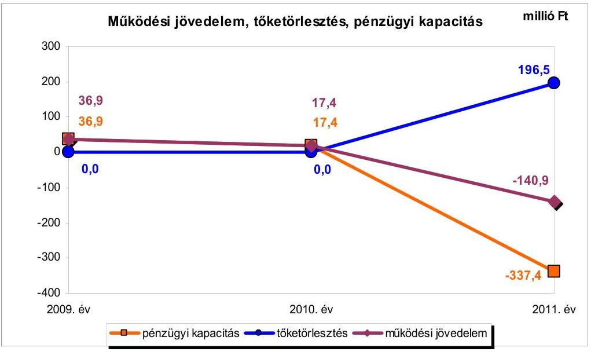
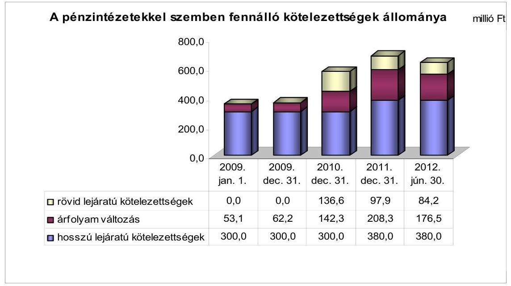
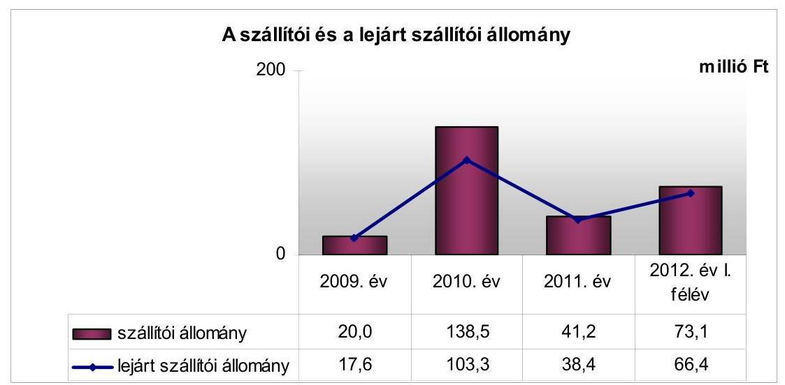
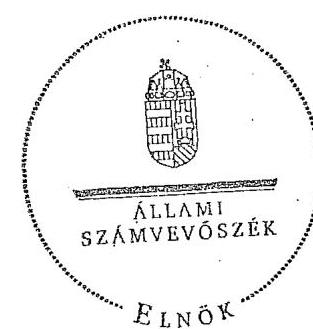
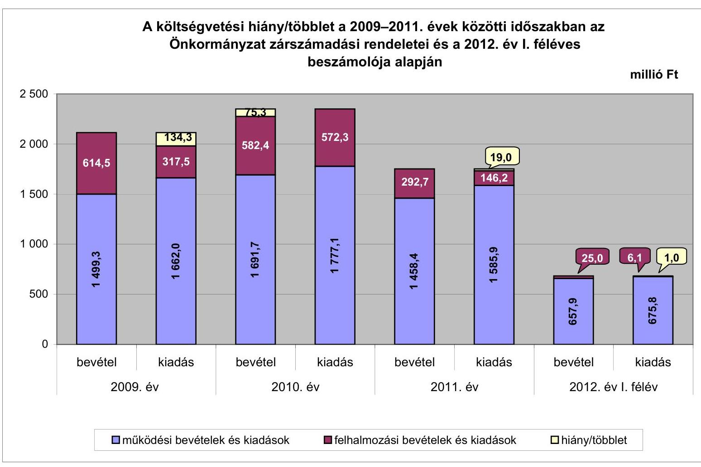
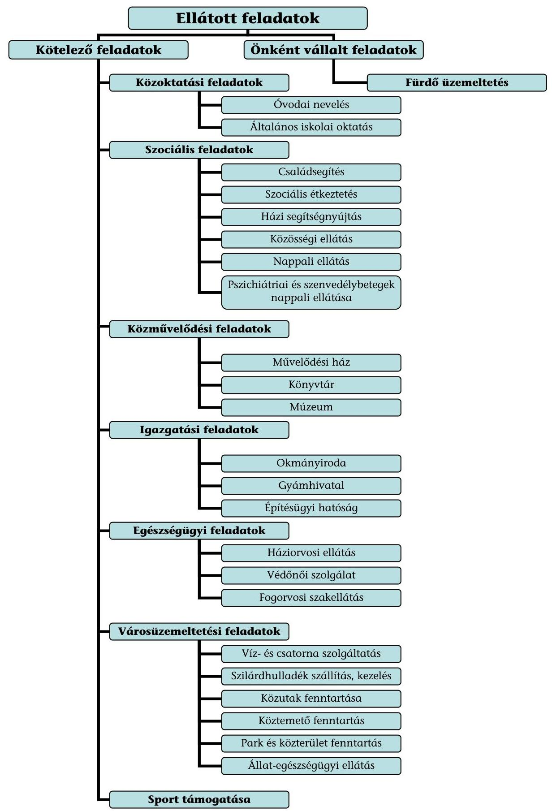

# ÁLLAMI   SZÁMVEVŐSZÉK 

## JELENTÉS

## Battonya Város Önkormányzata pénzügyi gazdálkodási helyzetének, szabályosságának ellenőrzéséről

---

# Állami Számvevőszék 

Iktatószám: V-0030-261-015/2013.
Témaszám: 1069
Vizsgálat-azonosító szám: V059203

## Az ellenőrzést felügyelte:

## Renkó Zsuzsanna

felügyeleti vezető

## Az ellenőrzést vezette:

## Dér Lívia

ellenőrzésvezető

## Az ellenőrzést végezték:

| Csiszárné dr. Kosik | Halkóné dr. Berkó | Dr. Szöllösi Zsolt |
| :-- | :-- | :-- |
| Mária | Katalin | számvevő |
| számvevő tanácsos | számvevő |  |

---

# TARTALOMJEGYZÉK 

BEVEZETÉS ..... 3
I. ÖSSZEGZŐ MEGÁLLAPÍTÁSOK, KÖVETKEZTETÉSEK, JAVASLATOK ..... 6
II. RÉSZLETES MEGÁLLAPÍTÁSOK ..... 16

1. Az Önkormányzat kötelező és önként vállalt feladatai, a feladatellátás szervezeti keretei, változásai, pénzügyi helyzetre gyakorolt hatásuk ..... 16
2. A pénzügyi egyensúly fenntartását veszélyeztető pénzügyi kockázatok és az ezek csökkentése érdekében tett intézkedések ..... 18
3. A pénzügyi gazdálkodási folyamatok szabályosságát, megfelelőségét biztosító belső kontrollok ..... 30

---

# MELLÉKLETEK 

1. számú A költségvetési hiány/többlet a 2009-2011. évek közötti időszakban az Önkormányzat zárszámadási rendeletei és a 2012. év I. féléves beszámolója alapján
2. számú Az Önkormányzat bevételei és kiadásai, valamint adósságszolgálata a 2009-2011. években (a CLF módszer szerint)
3/a. számú Az Önkormányzat által a 2009. év és a 2012. év I. félév között megvalósított (műszakilag befejezett) fejlesztések forrásösszetétele
3/b. számú Az Önkormányzat által beadott, elbírálás alatti pályázatok forrásaiból megvalósuló fejlesztésekhez kapcsolódó kötelezettségvállalások összegzése
3. számú Az önkormányzati feladatok ellátásában résztvevő gazdasági társaságok egyes kiemelt adatai
4. számú Az Önkormányzat 2012. június 30 -án fennálló, hosszú lejáratú adósságot keletkeztető kötelezettségvállalásai
5. számú Az Önkormányzat kötelezettségeinek és egyes kötelezettségvállalásainak 2011. december 31-ei és 2012. június 30 -ai tényleges állománya és a 2012. évben, valamint az azt követő években várható kötelezettségek miatti kiadások

## FÜGGELÉKEK

1. számú Rövidítések jegyzéke
2. számú Fogalomtár
3. számú Az Önkormányzat által ellátott feladatok a 2012. év I. félév végén

---

# JELENTÉS 

## Battonya Város Önkormányzata pénzügyi gazdálkodási helyzetének, szabályosságának ellenőrzéséről

## BEVEZETÉS

Az államháztartás helyi szintjén, az önkormányzati alrendszerben az utóbbi években megjelenő gazdálkodási nehézségek, a pénzforgalmi hiány növekedése, az eladósodás az ÁSZ figyelmét a helyi önkormányzatok pénzügyi helyzetére irányította.

Az ÁSZ a 2012. évi ellenőrzési tervben foglaltaknak megfelelően az önkormányzatok pénzügyi gazdálkodási helyzetének, szabályosságának ellenőrzésével az önkormányzatok 2011. évben megkezdett helyzetelemzését folytatta. Az ellenőrzés keretében értékeljük az önkormányzatok adósságkezelési és likviditási helyzetét. Bemutatjuk a pénzügyi egyensúly alakulására hatással lévő folyamatokat, feltárjuk az ezekre ható kockázatokat. Értékeljük a pénzügyi egyensúlyi helyzetet befolyásoló döntésmegalapozó, döntés-előkészítő eljárások szabályosságát, és minősítjük az ezekkel összefüggő belső kontrollok kialakítását, múködését.

Az ellenőrzés eredményének várható hatásaként a megállapításokkal segítséget nyújthatunk az önkormányzatok számára a pénzügyi egyensúly helyreállítása, javítása és fenntartása érdekében szükségessé váló intézkedések megtételéhez.

Az ellenőrzés típusa: szabályszerűségi ellenőrzés.

## Az ellenőrzés célja annak értékelése volt, hogy:

- az ellenőrzött időszakban a kötelező és önként vállalt feladatok ellátását biztosító szervezeti formák változása milyen hatást gyakorolt az Önkormányzat pénzügyi helyzetének alakulására;
- az Önkormányzat pénzügyi - ezen belül múködési és felhalmozási - egyensúlya milyen irányban változott, a változást milyen okok idézték elő, továbbá milyen intézkedéseket tettek a pénzügyi egyensúly biztosítása, illetve javítása érdekében, az intézkedések hatására javult-e az Önkormányzat pénzügyi helyzete;
- a költségvetési kiadások finanszírozása érdekében vállalt pénzintézetekkel szembeni kötelezettségek hogyan alakultak, a kötelezettségek fennállása

---

miként befolyásolja az Önkormányzat jövőbeli pénzügyi egyensúlyi helyzetét;

- az Önkormányzat beazonosította, felmérte, értékelte-e a pénzügyi egyensúlyt befolyásoló pénzügyi kockázatokat, a finanszírozási célú pénzügyi műveletekkel kapcsolatban írtak-e elő kockázatértékelési kötelezettséget;
- az Önkormányzat által kialakított belső kontrollok biztosítják-e a pénzügyi gazdálkodás folyamatainak szabályosságát és eredményességét.

Az ellenőrzött időszakban - a 2011. évben - az ÁSZ egy ellenőrzést végzett az Önkormányzatnál. „A térségek felzárkóztatására fordított pénzeszközök felhasználásának ellenőrzése" témakörben készített jelentés javaslatot nem tartalmazott, ezért utóellenőrzésre nem került sor.

Az ellenőrzés a 2009. január 1-jétől 2012. június 30 -áig terjedő időszakot ölelte fel. A pénzintézetekkel szembeni kötelezettségek állományának ellenőrzésekor a 2011. december 31-én fennálló kötelezettségek keletkezésének kezdő időpontját vettük figyelembe.

Az ellenőrzés szakmai módszertana az ÁSZ Ellenőrzési Elvek és Standardokban foglalt szakmai szabályokon alapult, amely a Legfőbb Ellenőrző Intézmények Nemzetközi Szervezete (INTOSAI) által kiadott nemzetközi standardok (ISSAI) figyelembevételével készült.

Az ellenőrzés során használt rövidítéseket az 1. számú, az egyes fogalmak magyarázatát a 2. számú függelék tartalmazza.

Az ellenőrzés jogszabályi alapját az ÁSZ tv. 1. § (3) bekezdésének, 5. § (2)-(6) bekezdéseinek, valamint az Áht. 61. § (2) bekezdésének előírásai képezik.

Az Országgyűlés 2012 végén a helyi önkormányzatok adósságállományának részleges konszolidációjáról döntött. Az 5000 fő lakosságszámot meg nem haladó települési önkormányzatok számára nyújtott törlesztési célú támogatással ${ }^{1}$ lehetővé tették a 2012. december 12-én fennálló adósságállományuk és annak 2012. december 28 -áig számított járulékai teljes megfizetését. Az 5000 fő lakosságszám feletti települések esetében a 2013. évben az állam differenciált az adóerő-képességet figyelembe vevő, 40-70\%-ig terjedő - mértékben vállalja át ${ }^{2}$ az önkormányzatok 2012. december 31-i, az átvállalás időpontjában fennálló adósságállományát és annak járulékait. Az adósságkonszolidációs intézkedéssel egyidejűleg a Kormány elrendelte ${ }^{3}$ az önkormányzatok adósságállománya újratermelődésének megakadályozása céljából a hitelengedélyezési és a likvid hitelekre vonatkozó szabályozás szigorítását.

[^0]
[^0]:    ${ }^{1}$ Magyarország 2012. évi központi költségvetéséről szóló 2011. évi CLXXXVIII. törvény 76/C. §-a (beiktatta a 2012. évi CLXXXVII. törvény 8. §-a, hatályos 2012. XII. 6-tól)
    ${ }^{2}$ Magyarország 2013. évi központi költségvetéséről szóló 2012. évi CCIV. törvény 7276. §-ai
    ${ }^{3}$ 1540/2012. (XII. 4.) Korm. határozat a helyi önkormányzatok adósságállományának részleges konszolidációjáról

---

Battonya Város Önkormányzata lakónépességére tekintettel a 2013. évi adósságátvállalásban érintett. A pénzügyi egyensúlyi helyzete jövőbeni alakulását befolyásoló, az ellenőrzött időszakban fennállt kockázatokra az ellenőrzés időszakában tett megállapításaink - a pénzintézetekkel szembeni kötelezettségekkel összefüggésben feltárt kockázatok kivételével - az adósságkonszolidációt követően is helytállóak és időszerűek.

Battonya város lakosainak száma 2012. január 1-jén 5565 fő volt, ami 273 fős csökkenést jelent a 2009. év eleji (5838 fő) lakosságszámhoz képest. Az Önkormányzat a 2011. évben 1756,2 millió Ft költségvetési bevételt és 1803,3 millió Ft költségvetési kiadást teljesített. Az Önkormányzat az ellenőrzött időszakban jelentős intézményszervezeti átalakítást hajtott végre, amelynek következtében egy intézményt (Városi Kincstár) megszüntetett, négy közoktatási intézményt országos kisebbségi, települési önkormányzatoknak, valamint az egyháznak adott át. A 2011. december 31-i könyvviteli mérleg alapján az Önkormányzat 4175,9 millió Ft értékű vagyonnal rendelkezett, amely a 2009. év végi állományhoz (3989,4 millió Ft) viszonyítva 4,7\%-kal (186,5 millió Ft-tal) növekedett a fejlesztések következtében.

Az ÁSZ tv. 29. § (1) bekezdése szerint a jelentéstervezetet megküldtük a polgármester részére, aki az ÁSZ tv. 29. § (2) bekezdésében foglalt észrevételezési jogával nem élt, a jelentéstervezetre észrevételt nem tett.

---

# I. ÖSSZEGZŐ MEGÁLLAPÍTÁSOK, KÖVETKEZTETÉSEK, JAVASLATOK 

Battonya Város Önkormányzatának pénzügyi egyensúlya az ellenőrzött időszakban rövid távon nem volt biztosított. A 2013. évi adósságkonszolidáció eredményeként az Önkormányzat pénzügyi egyensúlyi helyzetének javulása várható, azonban az adósságátvállalást követően fennmaradó kötelezettségek teljesíthetősége továbbra is kockázatos. Az ellenőrzött időszak jövedelemtermelő képessége alapján képződő bevételek a feladatellátáshoz szükséges kiadásokat, valamint a szállítói állomány és az adósságszolgálat terheit nem fedezik, a múködést rövid távon korlátozzák.

Az Önkormányzat költségvetésének elemzését a CLF módszer alapján számított mutatók alapján végeztük. A pénzügyi kapacitás 2009-2011. évek közötti változását az alábbi ábra szemlélteti:

Az Önkormányzat 2009-2011 között összesen 6075,2 millió Ft költségvetési bevételhez jutott, a teljesített költségvetési kiadása 6356,9 millió Ft-ot tett ki. Az Önkormányzat múködési költségvetésének egyensúlya a 2009-2010. években a múködőképesség fenntartását szolgáló (ÖNHIKI) támogatással volt biztosított, míg a 2011. évben e támogatással együtt is negatív volt a múködési költségvetés egyenlege. Az Önkormányzat 2009-ben 99,1 millió Ft, 2010-ben 41,5 millió Ft, 2011-ben 55,1 millió Ft, 2012. év I. félévben 6,9 millió Ft ÖNHIKI támogatásban részesült. A múködési jövedelem a 2009-2011. években folyamatosan csökkent, amely a 2011. évre a folyó kiadások 9,2\%át kitevő (140,9 millió Ft) hiányt eredményezett. A 2011. évi egyenlegének kedvezőtlen változását elsősorban - a feladatátadások és a közfoglalkoztatottak létszámcsökkenésének hatására, a folyó kiadások visszaesését meghaladó mértékben - a költségvetési támogatások, továbbá a saját múködési bevételek (együttesen 253,0 millió Ft-os) csökkenése okozta. Alacsony múködési jöve-

---

delemtermelő képességet jelzett, hogy ÖNHIKI támogatások nélkül a múködési jövedelem 2009-ben 62,2 millió Ft, 2010-ben 24,1 millió Ft, 2011-ben 196,0 millió Ft hiányt mutatott volna. Bevételi kitettség miatti kockázatot jelentett, hogy az Önkormányzat a gazdálkodásához folyamatosan ÖNHIKI támogatást vett igénybe.

A felhalmozási költségvetés egyensúlya a 2009-2010. években nem állt fenn. A 2009. évben 52,2 millió Ft hiányt mutatott, amely a 2010. évre 236,7 millió Ft-ra nőtt. A 2009-2010. évek felhalmozási forráshiányát kötvénykibocsátás bevételéből és likvid hitelekből finanszírozták. A fejlesztések 2011-re a saját erő hiánya miatt jelentősen visszaestek, ennek következtében, valamint az ingatlanértékesítések és az előző évi fejlesztésekhez kapcsolódó, áthúzódó pályázati források hatására 93,8 millió Ft felhalmozási többlet keletkezett.

Az ellenőrzött időszakban a kötelező és önként vállalt feladatok ellátását biztosító szervezeti formák változása és a feladatátrendezések hatásaként 267,0 millió Ft megtakarítást értek el. Az ellenőrzött időszakban hozott bevételnövelő (a helyi adó mértékének, illetve az intézményi térítési díjak emelése, eszközértékesítés) és kiadáscsökkentő intézkedések (intézményátszervezés, átadás, megszüntetés, 89 fős létszámcsökkentés, civil szervezetek részére átadott pénzeszközök csökkenése) együttesen - az Önkormányzat adatszolgáltatása alapján - 513,9 millió Ft megtakarítást eredményeztek, de nem biztosítottak elegendő forrást a pénzügyi egyensúly helyreállításához.

Az Önkormányzatnál fennállt kockázatok:

- az önként vállalt feladatok ellátása miatti múködési kockázat: az önként vállalt múködési feladatokra fordított kiadások múködési kiadáson belüli aránya a 2009. évi 10,6\%-hoz (161,5 millió Ft) viszonyítva 2011-re 7,0\%-ra (107,7 millió Ft) mérséklődött, nagyságrendjük azonban az ÖNHIKI támogatás miatti bevételi kitettség és az alacsony múködési jövedelemtermelő képesség miatt kockázatot jelentett;
- a magas lejárt szállítói állomány miatti nemfizetési kockázat: a lejárt szállítói kötelezettség 2009 és 2010 között közel hatszorosára nőtt (17,6 millió Ft-ról 103,3 millió Ft-ra), a 2011. év végére 38,4 millió Ft-ra mérséklődött, a 2012. év I. félév végére 66,4 millió Ft-ra változott. A 2012. év I. félév végén a 60 napot meghaladó lejárt tartozás az összes lejárt tartozásnak a $47,9 \%$-át képezte, ebből a 90 napot meghaladó lejárt állomány aránya $30,0 \%$ volt;
- a fejlesztések során kialakított létesítmények jövőbeni üzemeltetése miatti kockázat: a fejlesztésekről szóló döntések előkészítésekor a fejlesztések várható múködési kiadásait, a múködtetés forrásait nem számszerúsítették;
- az ingatlanok fedezetbevonásának növekedése miatti kockázat: az ingatlanok jelzáloggal való terhelése az ellenőrzött időszakban másfélszeresére nőtt. Az adósságkonszolidációt követően a kockázat csökkenhet;
- gazdasági társaság pénzügyi helyzete miatti mérlegen kívüli kockázat: az Önkormányzat kizárólagos tulajdonában álló gazdasági társasá-

---

gának fizetőképessége a 2009. év és a 2012. év I. félév között 14,5 millió Ft működési célú pénzeszköz átadással volt biztosítható. A 2011. évben a gazdasági társaság pénzügyi helyzete nem volt stabil, 4,5 millió Ft vesztesége keletkezett, amelynek hatására a saját tőke negatívvá vált, azaz -1,1 millió Ft volt. A gazdasági társaság könyvvizsgálója által tett figyelemfelhívás szerint jelentős vagyoncsökkenés következett be, ami az Önkormányzat számára kötelezettséget jelent.

A 2009. év elején fennálló pénzintézeti kötelezettségek állománya (353,1 millió Ft-ról) a 2012. év I. félév végére 81,5\%-kal (640,7 millió Ft-ra) nőtt. A növekedést a 2007. évben kibocsátott 300,0 millió Ft névértékú kötvény árfolyamváltozása, valamint a 2010. és a 2011. években megvalósult beruházások saját erő finanszírozásához biztosított 80,0 millió Ft összegben igénybe vett hitel eredményezte. A hitel részben múködési célú felhasználása nemfizetési kockázatot jelentett az Önkormányzat számára. A pénzintézetekkel szemben fennálló kötelezettség a 2012. év I. félév végén 164,2 millió Ft és 1986,4 ezer CHF volt. Ezek várható kötelezettsége (tőke, kamat és egyéb költség) az adósságkonszolidáció hatása nélkül a legutóbbi kamatfizetés feltételei alapján a lejáratig 221,1 millió Ft és 2422,7 ezer CHF. Árfolyamkockázatot jelentett, hogy a kötvény kibocsátását megelőzően az árfolyam jelentős emelkedésével nem számoltak. Az Önkormányzat likviditási nehézségeinek fokozódását, a banki kitettség miatti kockázatot jelzi, hogy a folyamatosan fennálló munkabér-megelőlegezési hitel mellett 2010-2011-ben az átmeneti forráshiány pótlására, támogatás és ingatlanok értékesítéséből várható bevétel megelőlegezése céljából (összesen 304,4 millió Ft összegben) likvid hitelt, 2011től folyószámlahitelt is igénybe vettek. A munkabér-megelőlegezési hitel napi átlagos állománya több mint tízszeresére (a 2009. évi 3,0 millió Ft-ról a 2011. évre 32,7 millió Ft-ra) nőtt. A 2010. és a 2011. években megvalósult beruházások saját erő finanszírozásához biztosított hitelt likviditási problémák miatt múködési kiadások, szállítói kötelezettségek részbeni teljesítésére fordították. Annak ellenére voltak likviditási problémák, hogy a hosszú lejáratú kötelezettségek tőketörlesztése az ellenőrzött időszak végéig nem volt esedékes. Az adósságkonszolidáció kedvező hatása ellenére a kötelezettségek jövőbeli teljesítésének kockázatát jelenti, hogy a várhatóan képződő működési jövedelem nem nyújt fedezetet a pénzintézeti kötelezettségek teljesítésére. Az Önkormányzat szabad tartalékkal nem rendelkezett. A 2011. évi pénzmaradványa 44,8 millió Ft, amelyből szabad maradványa nem volt.

Az Önkormányzatnál a kockázatkezelési rendszer keretében a pénzügyi egyensúlyt befolyásoló kockázatok feltárása, beazonosítása, felmérése, értékelése és ezáltal kezelése - a 2009. évben az Ámr. ${ }_{1}$-ben, a 2010-2011. években az Ámr. ${ }_{2}$-ben, a 2012. év I. félévben a Bkr.-ben foglalt jogszabályi előírások ellenére - elmaradt. Annak ellenére maradt el a kockázatok kezelése, hogy az ellenőrzési időszakban fennállt az önként vállalt feladatok miatti múködési kockázat, az ÖNHIKI támogatás miatti bevételi kitettség kockázata, a múködési jövedelemtermelő képesség csökkenése miatti kockázat, a fejlesztések jövőbeni üzemeltetése miatti kockázat, a likvid hitelek miatti banki kitettség kockázata, az ingatlanok fedezetbevonásának növekedése miatti kockázat, a magas lejárt szállítói állomány és a felhalmozási célú hitel múködési célra történt igénybevétele miatti nemfizetési kockázat, a jövőbeli várható kötelezettségek teljesíthetőségének kockázata, valamint az Önkormányzat kizárólagos tulaj-

---

donában lévő gazdasági társaság pénzügyi helyzete miatti mérlegen kívüli kockázat. Az Önkormányzatnál a finanszírozási célú pénzügyi műveletekkel kapcsolatban nem írtak elő kockázatértékelési kötelezettséget.

A pénzügyi gazdálkodási folyamatok szabályosságát, megfelelőségét, kockázatainak kezelését biztosító kontrolltevékenységek kialakítása a 2012. év I. félévben - a Bkr.-ben foglalt előírások ellenére - nem volt megfelelő, mert nem írták elő a feladat átadás-átvételre vonatkozó döntés-előkészítés folyamatában a döntés hatásának értékelését a kötelező és önként vállalt feladatokra fordított kiadások arányára, a pénzügyi egyensúlyi helyzetre. Nem írták elő az önkormányzati feladatellátáshoz kapcsolódó támogatási rendszer feltételeit, a szerződések tartalmi követelményeit és a beszámolási kötelezettséget. Nem írták elő a fejlesztések esetében a döntés-előkészítés folyamatában az előkészítés, a lebonyolítás és a múködtetés kockázatai feltárásának és kezelésének kötelezettségét. Nem határozták meg a fejlesztésekhez kapcsolódó külső források, támogatások figyelési rendszerét, a pályázat készítés feltételeit és szervezeti kereteit, valamint a múködési és felhalmozási célú pénzeszközátadások számadásainak ellenőrzésére irányuló kontrolltevékenységeket. Nem határozták meg a pénzügyi kötelezettségek teljesítése és a szállítói tartozások (kiemelten a lejárt szállítói tartozások) rendezésére vonatkozó helyi szabályokat. Nem írták elő a pénzintézeti kötelezettségvállalások kockázatai feltárásának kötelezettségét, a futamidő egyes éveit terhelő kötelezettség költségvetési egyensúlyra gyakorolt hatásának vizsgálatát, a pályáztatás vagy több ajánlat kérés kötelezettségét.

Az ellenőrzött időszak belső ellenőrzési terveinek készítését megelőzően - a 2009. évben az Ámr. ${ }_{1}$-ben, a 2010-2011. években az Ámr. ${ }_{2}$-ben, a 2009-2011. években a Ber.-ben, 2012. január 1-jétől a Bkr.-ben foglaltak ellenére - nem írták elő a pénzügyi egyensúlyi helyzetet befolyásoló döntések kockázati tényezőinek feltárását és a feltárt kockázati tényezők belső ellenőrzés keretében történő ellenőrzését.

A pénzügyi gazdálkodási folyamatok szabályosságát, megfelelőségét, kockázatainak kezelését biztosító belső kontrollok múködése gyenge volt, mert a feladat átadás-átvételre vonatkozó döntés-előkészítés folyamatában nem értékelték a döntésnek a hatását a kötelező és önként vállalt feladatokra fordított kiadások arányára, az önkormányzat pénzügyi egyensúlyi helyzetére. A hiányos szabályozás miatt nem ellenőrizték a pénzeszközátadásokról készített számadásokat. A fejlesztéseket megelőző döntés-előkészítési folyamatban nem tárták fel a múködtetés kockázatait. Nem vizsgálták a döntés-előkészítés szakaszában a pénzintézeti kötelezettségvállalások kockázatait, valamint a futamidő egyes éveit terhelő kötelezettség költségvetési egyensúlyra gyakorolt hatását. A Bkr.-ben foglaltakkal ellentétesen a belső ellenőrzési tervek nem tartalmazták az ellenőrzési tervet megalapozó kockázatelemzéseket, ezáltal a pénzügyi egyensúlyi helyzetet befolyásoló döntések kockázati tényezőinek feltárása és belső ellenőrzés keretében történő ellenőrzése elmaradt. Összességében a kialakított kontrollok nem biztosították a pénzügyi gazdálkodási folyamatok eredményességét.

Az ellenőrzés során a gazdálkodási feladatok ellátásával és a könyvvezetési kötelezettség teljesítésével kapcsolatban az alábbi szabályszerűségi hibákat tártuk fel:

---

- az Önkormányzat megsértette az Ötv. és az Ámr. ${ }_{2}$ előírását azzal, hogy a központi költségvetésből származó bevételeit - a 2011. évi 80,0 millió Ft öszszegű - hitelfelvétel fedezeteként ajánlotta fel;
- a Számv. tv. és az Áhsz. előírásai ellenére a 2007-2011. években a számviteli beszámoló készítését megelőzően nem végezték el a devizában fennálló kötelezettség év végi értékelését, az árfolyamváltozás számviteli elszámolásra az Áhsz. előírásai ellenére nem került sor, ezért a mérleg szerinti pénzintézeti kötelezettségek állománya nem tartalmazta a CHF-alapú kötvény árfolyamváltozásának hatását. A devizában fennálló kötelezettség év végi értékelésének elmulasztása miatti - a 2010. évben 142,3 millió Ft-os, a 2011. évben 208,3 millió Ft-os - eltérés az Önkormányzat számviteli politikája III. fejezet 10. pontjában és az Áhsz.-ben meghatározott, a mérlegfőösszeg 2,0\%-ának megfelelő értékhatárt meghaladta, ezért jelentős összegű hibának minősült;
- az Önkormányzat a 2009-2011. évek között összesen 295,9 millió Ft támogatási bevételt és az ezzel azonos nagyságrendű felhalmozási kiadást (pénzforgalom nélküli tételekként) a könyveiben nem rögzített, négy - EU-s támogatás igénybevételével, szállítói finanszírozással támogatott - fejlesztéssel összefüggésben. Ez által nem tettek eleget a Számv. tv.-ben és az Áhsz.-ben foglalt teljesség, valamint a Számv. tv. szerinti bruttó elszámolás számviteli alapelveknek. A hiányosság ellenére, a MÁK által közvetlenül a kivitelezőknek utalt támogatással emelten, a tényleges bekerülési költséggel azonos összegben hajtották végre az eszközök nyilvántartásba vételét (aktiválását);
- az Ötv.-ben előírt a törzsvagyon hitel és kötvény fedezetként való igénybevételének tiltása ellenére, a pénzintézeti kötelezettségekhez kapcsolódóan az Önkormányzat három, korlátozottan forgalomképes ingatlanát terhelte jelzálogjog.

Az ÁSZ tv. 33. § (1) bekezdésében foglaltak értelmében az ellenőrzött szervezet vezetője köteles a jelentésben foglalt megállapításokhoz kapcsolódó intézkedési tervet összeállítani, és azt a jelentés kézhezvételétől számított harminc napon belül az ÁSZ részére megküldeni. Amennyiben az intézkedési tervet határidőn belül nem küldi meg a szervezet vezetője, vagy az továbbra sem elfogadható, az ÁSZ elnöke a hivatkozott törvény 33. § (3) bekezdés a-b) pontjaiban foglaltakat érvényesítheti.

# Az ellenőrzés intézkedést igénylő megállapításai és javaslatai: 

## a polgármesternek

1. Az Önkormányzat múködési jövedelme a 2009-2010. években az ÖNHIKI támogatás nélkül 86,3 millió Ft, 2011-ben az ÖNHIKI támogatással együtt is 140,9 millió Ft hiányt mutatott. A likviditás az ellenőrzött időszakban munkabér-megelőlegezési hitel, a 2010-2011. évben támogatásból, illetve ingatlanértékesítésből származó bevétel megelőlegezésére felvett hitel, a 2011. évben folyószámlahitel és a felhalmozási célú hitel múködési célra történt igénybevételével volt biztosítható. A lejárt szállítói tartozás az ellenőrzött időszak végére 66,4 millió Ft-ra, a pénzintézeti kötelezettség 640,7 millió Ft-ra nőtt. A kiadáscsökkentő és bevételnövelő intézkedések nem bizto-

---

sítottak elegendő forrást a pénzügyi egyensúly helyreállításához. Az adósságszolgálat teljesítéséhez az Önkormányzat szabad tartalékkal nem rendelkezett.

Javaslat:
A múködési jövedelemtermelő képesség és a feladatellátás összhangja, valamint az Önkormányzat pénzügyi egyensúlyának helyreállítása és hosszú távú fenntarthatósága érdekében - a 2013. évi kormányzati adósságkonszolidációt, valamint a 2013. évtől változó feladatellátási kötelezettséget és feladatfinanszírozási rendszert figyelembe véve - felelősök és határidők megjelölésével kezdeményezzen intézkedéseket, melyek keretében:
a) vizsgáltassa meg és terjessze a Képviselő-testület elé a további bevételszerző, kiadáscsökkentő intézkedések bevezetésének lehetőségét, és a döntés függvényében járjon el a bevezetésre kerülő bevételnövelő, kiadáscsökkentő intézkedések végrehajtása érdekében;
b) terjesszen a Képviselő-testület elé jóváhagyásra - a Htv. 140. § (1) bekezdés a) pontja alapján a jegyző által elkészített - az Önkormányzat gazdasági helyzetének elemzésén alapuló, a pénzügyi egyensúlyi helyzet gyors helyreállítását, hosszú távú fenntartását, valamint az adósságállomány újratermelődésének elkerülését biztosító intézkedéseket tartalmazó reorganizációs programot;
c) az adósságkonszolidációt követően fennmaradó kötelezettségek teljesítése, a fizetőképesség megőrzése érdekében terjesszen a Képviselő-testület elé - a Htv. 140. § (1) bekezdés a) pontja alapján a jegyző által elkészített - döntési javaslatot, amelyben a Képviselő-testület kötelezettséget vállal arra, hogy előre meghatározott összegben és módon a realizált többletbevételeket, a jövőben képződő tartalékokat mindaddig a kötelezettségek rendezésére fordítja, azt nem használja más célra, amíg az Önkormányzat pénzügyi egyensúlya rövid távon veszélyeztetett;
d) a szállítói kitettség és az Adósságrendezési tv. 4-9. §-aiban szabályozott adósságrendezési eljárás megindításának elkerülése érdekében meghatározott gyakorisággal számoljon be a Képviselő-testületnek az Önkormányzat lejárt szállítói állománya alakulásáról. Intézkedjen a szállítói számlák esedékesség szerinti kiegyenlítéséről vagy a lejárt tartozások átütemezéséről.
2. A pénzintézeti kötelezettségekhez kapcsolódóan az Ötv. 88. § (1) bekezdés b) pontjában ${ }^{4}$ foglalt előírást megsértve három korlátozottan forgalomképes ingatlanon alapítottak jelzálogjogot. Az Ötv. 88. § (1) bekezdés b) pontjában és az Ámr. 174. § (11) bekezdésében ${ }^{5}$ foglalt előírást megsértve a 2011. évben felvett 80,0 millió Ft fejlesztési hitelszerződésben az Önkormányzat a pénzintézet számára felhatalmazást adott bármely bankszámlája megterhelésére, amennyiben törlesztési kötelezettségét

[^0]
[^0]:    ${ }^{4}$ Hatálytalan 2012. január 1-jétől, a 2012. március 31-től hatályos jogszabályi előírás: az Áht. 84. § (4) bekezdés.
    ${ }^{5}$ Hatálytalan 2012. január 1-jétől, a 2012. január 1-jétől hatályos jogszabályi előírás: az Ávr. 145. § (2) bekezdés.

---

nem teljesíti, ezáltal jogi biztosítékként közvetve a központi költségvetésből származó támogatási bevételeit használta fel.

Javaslat:
A pénzintézeti kötelezettségvállalásokkal kapcsolatos jogszerű biztosíték, illetve fedezet felajánlás érdekében:
a) intézkedjen, hogy jövőbeni hitelfelvétel és kötvénykibocsátás fedezeteként az Áht. 84. § (4) bekezdésében előírtak szerint a törzsvagyon körébe tartozó ingatlan, továbbá az Önkormányzat általános müködésének és ágazati feladatainak támogatása és a költségvetési támogatás ne kerüljön felhasználásra; az Ávr. 145. § (2) bekezdésében előírtak szerint a költségvetési támogatások folyósítására szolgáló elkülönített bankszámláról hiteltörlesztést ne teljesítsenek;
b) a jogellenes állapot megszüntetése érdekében vizsgálják meg a jogi biztosíték, valamint a megterhelt korlátozottan forgalomképes törzsvagyonba tartozó ingatlanok kiváltásának lehetőségét, és terjesszen javaslatot a Képviselő-testület elé a jogszerűen biztosítékba adható önkormányzati bevételekkel és vagyontárgyakkal való kiváltásról.

# a jegyzőnek 

1. Az Önkormányzat a Számv. tv. 60. § (2) bekezdésében, valamint az Áhsz. 33. § (1) bekezdésében és a (2) bekezdés b) pontjában foglalt előírások ellenére a 2009-2011. években a számviteli beszámoló készítését megelőzően nem végezte el a devizában fennálló kötelezettségek év végi értékelését. A devizában fennálló kötelezettség év végi értékelésének elmulasztása miatti 2010. évi 142,3 millió Ft és a 2011. évi 208,3 millió Ft miatti eltérés az Önkormányzat számviteli politikája III. fejezet 10. pontjában és az Áhsz. 5. § 8. pontjában meghatározott - a mérlegfőösszeg 2,0\%-ának megfelelő - értékhatárt meghaladja, ezért jelentős összegű hibának minősül.

Javaslat:
A devizában fennálló kötelezettségek jogszabályi előírásoknak megfelelő számviteli nyilvántartása, illetve az ellenőrzés során feltárt jelentős összegű hiba rendezése érdekében:
a) intézkedjen, hogy a Számv. tv. 60. § (2) bekezdésében, valamint az Áhsz. 33. § (1) bekezdésében és a (2) bekezdés c) pontjában foglalt előírásoknak megfelelően végezzék el a devizában fennálló kötelezettségek év végi értékelését és az ár-folyam-különbözet elszámolását;
b) biztosítsa, hogy az Áhsz. 40. § (5) bekezdésében foglalt előírásnak megfelelően, amennyiben az ellenőrzés jelentős összegű hibá(ka)t állapított meg, az előző év(ek)re vonatkozó módosításokat a kiegészítő melléklet szöveges részében részletesen, a könyvviteli mérleg és a pénzmaradvány-kimutatás minden érintett tételéhez kapcsolódóan az előző év adatainak feltüntetése mellett mutassák be. Az előző év(ek)et érintő hibákat függetlenül attól, hogy azok jelentős összegűek vagy sem, a hiba megállapításának évében számolják el a folyó évi könyvelésben.

---

2. Az Önkormányzat a 2009-2011. évek között négy fejlesztési projekt kapcsán a felhalmozási célra kapott - pénzforgalomban nem megjelenő - összesen 295,9 millió Ft támogatási bevételt és az ezzel azonos összegű felhalmozási kiadást a könyveiben nem rögzítette. A MÁK által közvetlenül a kivitelezőnek átutalt támogatást a fejlesztések révén létrejött eszközök aktiválásakor a bekerülési érték részeként figyelembe vette. A felhalmozási célú támogatások és beruházási kiadások számviteli elszámolásának hiánya ellentétes a Számv. tv.15. § (2) bekezdésében és az Áhsz. 9. § (2) bekezdésében foglalt teljesség, valamint a Számv. tv. 15. § (9) bekezdése szerinti bruttó elszámolás számviteli alapelvekkel. Az Önkormányzatnak könyvelnie kell mindazon gazdasági eseményeket, amelyeknek az eszközökre és forrásokra, illetve a tárgyévi eredményre gyakorolt hatását a beszámolóban ki kell mutatni. A teljesség elvének érvényesítésénél figyelembe kell venni, hogy a költségvetés naptári évre szól. A könyvviteli nyilvántartásokban a bevételek és a kiadások egymással szemben nem számolhatók el.

Javaslat:
A könyvvezetési és a beszámoló készítési kötelezettség szabályszerű teljesítése érdekében:
a) intézkedjen, hogy a könyvvezetés során a Számv. tv. 15. § (2) bekezdésében, valamint az Áhsz. 9. § (2) bekezdésében előírt teljesség elvének érvényesítése érdekében az adott költségvetési év valamennyi gazdasági eseményét számolják el, amelyek eszközökre, forrásokra és a pénzmaradvány alakulására gyakorolt hatását a beszámolóban be kell mutatni;
b) biztosítsa, hogy a Számv. tv. 15. § (9) bekezdésében előírt bruttó elszámolás elvének érvényesítése érdekében a könyvviteli nyilvántartásokban a bevételek és kiadások egymással szembeni elszámolására ne kerüljön sor.
3. A kockázatkezelési rendszer keretében az ellenőrzött időszakban fennállt, pénzügyi egyensúlyt befolyásoló kockázatok feltárása, beazonosítása, értékelése, ezáltal a kockázatok kezelése a 2009. évben az Ámr., 145/C. §-ában, a 2010-2011. években az Ámr. ${ }_{2}$ 157. §-ában, a 2012. év I. félévben a Bkr. 7. § (1)-(2) bekezdéseiben foglalt előírások ellenére elmaradt. Annak ellenére maradt el a kockázatok kezelése, hogy az ellenőrzött időszakban fennállt az önként vállalt feladatok miatti működési kockázat, az ÖNHIKI támogatás miatti bevételi kitettség kockázata, a működési jövedelemtermelő képesség csökkenése miatti kockázat, a fejlesztések jövőbeni üzemeltetése miatti kockázat, a likvid hitelek miatti banki kitettség kockázata, az ingatlanok fedezetbevonásának növekedése miatti kockázat, a magas lejárt szállítói állomány és a felhalmozási célú hitel működési célra történt igénybevétele miatti nemfizetési kockázat, a jövőbeli várható kötelezettségek teljesíthetőségének kockázata, valamint az Önkormányzat kizárólagos tulajdonában lévő gazdasági társaság pénzügyi helyzete miatti mérlegen kívüli kockázat.

Javaslat:
Működtessen a Bkr. 7. § (1)-(2) bekezdéseiben foglalt előírásoknak megfelelő, a pénzügyi egyensúlyt befolyásoló kockázatok kezelésére alkalmas kockázatkezelési rendszert.

---

4. A pénzügyi gazdálkodási folyamatok szabályossága, megfelelősége vonatkozásában a kockázatok kezelését biztosító belső kontrolltevékenységek kialakítása a 2012. év I. félévben a Bkr. 8. § (1)-(2) bekezdéseiben foglalt előírások ellenére - nem volt megfelelő, mert nem írták elő a döntés-előkészítés folyamatában a feladat átadásátvételre vonatkozó döntés kötelező és az önként vállalt feladatokra fordított kiadások arányára, a pénzügyi egyensúlyi helyzetre gyakorolt hatásának értékelését. Nem írták elő az önkormányzati feladatellátáshoz kapcsolódó támogatási rendszer feltételeit, a szerződések tartalmi követelményeinek meghatározását és a beszámolási kötelezettséget. Nem írták elő a fejlesztési döntések esetében a döntés-előkészítés folyamatában az előkészítés, a lebonyolítás és a működtetés kockázatai feltárásának és kezelésének kötelezettségét. Nem határozták meg a fejlesztésekhez kapcsolódó külső források, támogatások figyelési rendszerét, a pályázat készítés feltételeit és szervezeti kereteit, valamint a működési és felhalmozási célú pénzeszközátadások számadásainak ellenőrzésére irányuló kontrolltevékenységeket. Nem határozták meg a pénzügyi kötelezettségek teljesítése és a szállítói tartozások (kiemelten a lejárt szállítói tartozások) rendezésére vonatkozó helyi szabályokat. Nem írták elő pénzintézeti kötelezettségvállalásokkal kapcsolatos döntések kockázatai feltárásának kötelezettségét, a futamidő egyes éveit terhelő kötelezettség költségvetési egyensúlyra gyakorolt hatásának vizsgálatát, a pályáztatás vagy több ajánlat kérés kötelezettségét.

Javaslat:
Alakítsa ki a Bkr. 8. § (1)-(2) bekezdései alapján azokat a belső kontrolltevékenységeket, amelyek biztosítják a pénzügyi-gazdálkodási folyamatok szabályosságát, a pénzügyi egyensúlyi helyzet alakulását befolyásoló döntések kockázatainak kezelését. Ennek keretében:
a) írja elő a feladat átadás-átvételre vonatkozó döntések előkészítése során a döntés kötelező és önként vállalt feladatok arányára, ezáltal a pénzügyi egyensúlyi helyzetre gyakorolt hatásának vizsgálatát;
b) írják elő az önkormányzati feladatellátáshoz kapcsolódó támogatási rendszer feltételeit, a feladatellátás teljesítéséről a beszámolási kötelezettséget, valamint a szerződések minimum tartalmi követelményeinek meghatározásával összefüggő kontrolltevékenységeket;
c) határozza meg a fejlesztések döntés-előkészítés folyamatában a lebonyolítás és a működtetés kockázatai feltárásának, kezelésének kötelezettségét;
d) határozza meg a fejlesztésekhez kapcsolódó külső források, támogatások figyelési rendszerével, a pályázat készítés feltételeivel összefüggő kontrolltevékenységeket;
e) szabályozza az Önkormányzat által nyújtott múködési és felhalmozási célú pénzeszközátadásokkal kapcsolatosan a kedvezményezett számadási kötelezettsége ellenőrzésével összefüggő kontrolltevékenységeket;
f) készítsen szabályzatot a pénzügyi kötelezettségek teljesítése, a szállítói tartozások rendezésének helyi szabályaira;
g) írja elő a pénzintézeti kötelezettségvállalások kockázatainak döntés-előkészítő szakaszban történő feltárását, a futamidő egyes éveit terhelő kötelezettség költségvetési egyensúlyra gyakorolt hatásának vizsgálatát;

---

h) határozza meg a közbeszerzési értékhatár alatti esetekben a pályáztatási kötelezettséggel kapcsolatos kontrolltevékenységeket.
5. Az Önkormányzatnál az ellenőrzött időszak belső ellenőrzési terveinek készítését megelőzően - a 2009. évben az Ámr. 145/C. § (2) bekezdésében, a 2010-2011. években az Ámr. 2 157. § (2) bekezdésében, a 2009-2011. években a Ber. 18. §-ában, a 21. § (2) bekezdésében és a (3) bekezdés a) pontjában, 2012. január 1-jétől a Bkr. 7. § (2) bekezdésében, a 29. § (1) bekezdésében, a 31. § (2)-(4) bekezdéseiben foglaltak ellenére - nem írták elő a pénzügyi egyensúlyi helyzetet befolyásoló döntések kockázati tényezőinek feltárását, ezért a belső ellenőrzési tervek nem tartalmazták az ellenőrzési tervet megalapozó kockázatelemzéseket, ezáltal az Önkormányzatnál nem ellenőrizték ezeket a kockázati tényezőket.

Javaslat:
Intézkedjen a belső ellenőrzés vezetője felé, hogy a Bkr. 7. § (2) bekezdésében foglaltak szerint mérjék fel a gazdálkodásban rejlő kockázatokat, a 29. § (1) bekezdésében és a 31. § (2)-(4) bekezdésekben foglalt előírások szerint az éves belső ellenőrzési tervek tartalmazzák a pénzügyi egyensúlyi helyzetet befolyásoló döntésekkel kapcsolatos feltárt kockázati tényezők ellenőrzését, valamint biztosítsa az ellenőrzési tervek végrehajtását.

---

# II. RÉSZLETES MEGÁLLAPÍTÁSOK 

## 1. Az ÖNKORMÁNYZAT KÖTELEZŐ ÉS ÖNKÉNT VÁLlALT FELADATAI, A FELADATELLÁTÁS SZERVEZETI KERETEI, VÁLTOZÁSAI, PÉNZÜGYI HELYZETRE GYAKOROLT HATÁSUK

Az Önkormányzat kötelező és önként vállalt feladatait az SZMSZ ${ }_{1,2}$-ben határozta meg. Kötelező feladatai a 2009. év elején alapvetően a közoktatási, a szociális, a közművelődési, az igazgatási, az egészségügyi és a városüzemeltetési feladatok, valamint a sport támogatása voltak.

Az ellenőrzött időszak elején az önként vállalt feladatok közé sorolták a középfokú oktatást, az alapfokú művészeti oktatást, a fürdő üzemeltetését és civil szervezetek támogatását. A 2011. évi koncepcióban és a koncepcióval egyidejűleg elfogadott intézkedési tervben megfogalmazták a feladatellátás és az intézményrendszer teljes körű újraértékelésének, átalakításának szándékát és az önként vállalt feladatok csökkentését. A 2011. évben végrehajtott intézményszervezeti változások következtében a 2012. év I. félév végén önként vállalt feladat a fürdő üzemeltetése volt, amelyet egyéni vállalkozóval kötött szerződés alapján láttak el.

Az Önkormányzat a 2010. évben megszüntette a Városi Kincstárt. 2011. július 1jével a Szerb Általános Iskola és Óvoda fenntartását a Szerb Országos Önkormányzatnak, a Román Általános Iskola és Óvoda fenntartói jogát a Magyarországi Románok Országos Önkormányzatának adták át. A Battonyai József Attila Művelődési Központ és Alapfokú Művészeti Iskola fenntartását Mezőhegyes Város Önkormányzata vette át. Az Önkormányzat 2011. szeptember 1. napjával a Mikes Kelemen Gimnázium, Szakképző Iskola és Kollégium, majd 2012. szeptember 1. napjával az Összevont Napközi Otthonos Óvodák és a Szent István Általános Iskola Szeged-Csanádi Egyházmegyének való átadásáról döntött.

Az Önkormányzat - adatszolgáltatása szerint - működési célú kötelező feladataira a 2009. évben 1364,1 millió Ft-ot (a múködési kiadások 89,4\%-át), a 2010. évben 1471,6 millió Ft-ot ( $89,4 \%$-ot), a 2011. évben 1425,9 millió Ft-ot ( $93,0 \%$-ot), a 2012. év I. félévben pedig 661,8 millió Ft-ot fordított. Az önként vállalt feladatok érdekében teljesített kiadások összege a 2009. évben 161,5 millió Ft (10,6\%), a 2010. évben 174,2 millió Ft (10,6\%), a 2011. évben pedig 107,7 millió Ft ( $7,0 \%$ ) volt. Az Önkormányzat a 2012. év I. félévben önként vállalt feladatra kiadást nem teljesített. Az önként vállalt feladatokra fordított kiadások a 2009. évhez viszonyítva 2011-re - a 2011. évben végrehajtott feladatátadások miatt - 53,8 millió Ft-tal, 33,3\%-kal csökkentek. Nagyságrendjük azonban - az ÖNHIKI támogatás miatti bevételi kitettség és az alacsony múködési jövedelemtermelő képesség miatt - az ellenőrzött időszakban müködési kockázatot jelentett.

Az önként vállalt feladatokhoz kapcsolódóan teljesített felhalmozási kiadások miatti felhalmozási kockázat nem állt fenn, mivel az ellenőrzött

---

időszakban teljesített felhalmozási kiadások 2,0\%-át (29,0 millió Ft-ot) fordították önként vállalt feladatokra.

Az Önkormányzat a feladatait 2009. január 1-jén 11 költségvetési szervvel 22 telephelyen látta el. A 2011. évi költségvetési koncepcióban meghatározott intézményszervezeti átalakítások végrehajtása - átszervezések, összevonások, egy intézmény megszüntetése, négy intézmény átadása - következtében 2012. június 30 -ára az önkormányzati fenntartású költségvetési szervek száma hatra, a telephelyek száma 15 -re csökkent ${ }^{6}$. Az Önkormányzat 2012. szeptember 1jétől közoktatási intézményt nem tart fenn ${ }^{7}$.

A közép- és alapfokú oktatási intézmények, valamint az óvodai ellátás egyháznak történt átadása 168,0 millió Ft, a nemzetiségi oktatást végző általános iskolák és óvodák országos nemzetiségi önkormányzatoknak történt átadása 44,0 millió Ft, a művelődési központ és az alapfokú művészeti oktatás más települési önkormányzatnak történt átadása 16,2 millió Ft megtakarítást jelentett az Önkormányzatnak. A feladatok átadásán túl végrehajtott intézményszervezeti változások 38,8 millió Ft megtakarítást eredményeztek. Az ellenőrzött időszakban feladatot nem vettek át.

Az ellenőrzött időszakban a kötelező és az önként vállalt feladatok ellátását biztosító szervezeti formák változása és a feladatátrendezések hatásaként - az Önkormányzat adatszolgáltatása alapján - a kiadások 643,7 millió Ft-tal, a bevételek 376,7 millió Ft-tal csökkentek, amelyek összesen 267,0 millió Ft megtakarítást eredményeztek, javítva az Önkormányzat pénzügyi egyensúlyi helyzetét.

Az Önkormányzat 2009-2011 között három gazdasági társaságban rendelkezett - 100\%-os, 24\%-os, 0,03\%-os - tulajdoni részesedéssel ${ }^{8}$, amelyek közül kettő látott el önkormányzati kötelező feladatot. Közszolgáltatási szerződések alapján további egy gazdasági társaság és egy egyéni vállalkozó látott el önkormányzati kötelező - települési szilárd és folyékony hulladékkezelési, víz és csatornaszolgáltatási, állategészségügyi - feladatokat.

A 100\%-os önkormányzati tulajdonú Pannon Holt-tenger Kft. belterületi utak karbantartását látja el. A víz- és csatornaszolgáltatást végző Alföldvíz Zrt.-ben az Önkormányzat 0,03\%-os részesedéssel rendelkezik. A települési szilárd és folyékony hulladék összegyüjtését, elszállítását a Csongrád Megyei Településtisztasági Kft., az állategészségügyi feladatokat egy egyéni vállalkozó végzi.

[^0]
[^0]:    ${ }^{6}$ A feladatellátás részletezését a 3. számú függelék tartalmazza.
    ${ }^{7}$ Az Önkormányzat közoktatási feladatai átadásáról döntött az egyház és a két országos kisebbségi önkormányzat részére, a feladatellátást szolgáló ingatlanok tulajdonjogának megtartása mellett. A feladat ellátásához nem vállalt fizetési kötelezettséget.
    ${ }^{8}$ A 24\%-os önkormányzati tulajdonú Battonyai Energiapark Beruházó Termelő és Szolgáltató Kft.-t hulladék gázból villamos energia előállításra hozták létre, azonban e tevékenységét a Kft. nem kezdte meg.

---

# 2. A PÉNZÜGYI EGYENSÚLY FENNTARTÁSÁT VESZÉLYEZTETŐ PÉNZÜGYI KOCKÁZATOK ÉS AZ EZEK CSÖKKENTÉSE ÉRDEKÉBEN TETT INTÉZKEDÉSEK 

Az Önkormányzat az ellenőrzött időszak minden évében bemutatta a költségvetési és a zárszámadási rendeleteiben a múködési és felhalmozási költségvetési egyenlegének alakulását. Nem értékelte az adósságszolgálat változását, a pénzügyi kockázatokat, valamint a jövedelemtermelő képesség és az adósságszolgálat összefüggéseit. Az Önkormányzat a pénzügyi egyensúly megteremtése érdekében stratégiát nem határozott meg.

Az Önkormányzat költségvetésének elemzését CLF módszerrel hajtottuk végre. A CLF módszer szerinti önkormányzati részletes adatokat a 2009-2011. évek között a 2. számú melléklet, a főbb önkormányzati adatokat a következő tábla mutatja be:

|  |  |  | millió Ft |
| :-- | --: | --: | --: |
| Megnevezés | 2009. év | 2010. év | 2011. év |
| Folyó bevételek | 1562,5 | 1663,2 | 1392,7 |
| Folyó kiadások | 1525,6 | 1645,8 | 1533,6 |
| Müködési jövedelem | $\mathbf{3 6 , 9}$ | $\mathbf{1 7 , 4}$ | $\mathbf{- 1 4 0 , 9}$ |
| Felhalmozási bevételek | 588,9 | 504,4 | 363,5 |
| Felhalmozási kiadások | 641,1 | 741,1 | 269,7 |
| Felhalmozási költségvetés egyenlege | $\mathbf{- 5 2 , 2}$ | $\mathbf{- 2 3 6 , 7}$ | $\mathbf{9 3 , 8}$ |
| Folyó és felhalmozási bevételek összesen | 2151,4 | 2167,6 | 1756,2 |
| Folyó és felhalmozási kiadások összesen | 2166,7 | 2386,9 | 1803,3 |
| Finanszírozási múveletek nélküli | $\mathbf{- 1 5 , 3}$ | $\mathbf{- 2 1 9 , 3}$ | $\mathbf{- 4 7 , 1}$ |
| pozíció |  |  |  |
| Finanszírozási műveletek egyenlege | -12,0 | 147,8 | 42,5 |
| Tárgyévi pénzügyi pozíció | $\mathbf{- 2 7 , 3}$ | $\mathbf{- 7 1 , 5}$ | $\mathbf{- 4 , 6}$ |
| Hiteltörlesztés, értékpapír beváltás | 0,0 | 0,0 | 196,5 |
| Nettó müködési jövedelem | $\mathbf{3 6 , 9}$ | $\mathbf{1 7 , 4}$ | $\mathbf{- 3 3 7 , 4}$ |

Az Önkormányzat 2009-2011 között összesen 6075,2 millió Ft költségvetési bevételhez jutott, teljesített költségvetési kiadása 6356,9 millió Ft volt. A folyó költségvetési egyenleg az ellenőrzött időszakban folyamatosan csökkent, amely a 2011. évre már a múködési kiadások 9,2\%-át kitevő (140,9 millió Ft) hiányt okozott. A folyó bevételek a 2010. évről a 2011. évre 270,5 millió Ft-tal 16,3\%-kal, a folyó kiadások 112,2 millió Ft-tal, 6,8\%-kal csökkentek, amely a bevétel elmaradás felét sem érte el. A múködési jövedelem csökkenésére elsősorban a költségvetési támogatások ${ }^{9}$ és a saját múködési bevételek (együttesen 253,0 millió Ft-os) visszaesése volt hatással.

A folyó bevételek a 2009. évről a 2010. évre 100,7 millió Ft-tal, 6,4\%-kal nőttek, elsősorban a költségvetési és az államháztartáson belülről kapott támogatás együttes hatására. Ezen időszak alatt a folyó kiadások 120,2 millió Ft-tal, 7,9\%kal emelkedtek.

[^0]
[^0]:    ${ }^{9}$ A költségvetési támogatások mérséklődését az ellátotti létszám és az állami támogatások fajlagos összegének csökkenése okozta.

---

A 2009-2011. években a működési jövedelem összességében 86,6 millió Ft hiányt mutatott. Az Önkormányzat 2009-2011-ben múködőképességének megőrzése érdekében összesen 195,7 millió Ft vissza nem térítendő ÖNHIKI támogatásban részesült. E támogatások nélkül az Önkormányzat működési jövedelme a 2009. évben 62,2 millió Ft, a 2010. évben 24,1 millió Ft, 2011-ben 196,0 millió Ft múködési hiányt mutatott volna. A múködési jövedelem 2011-ben az ÖNHIKI támogatással együtt is 140,9 millió Ft hiányt mutatott.

A pénzügyi egyensúly megteremtése érdekében hozott intézkedések a nettó múködési jövedelmet nem tudták kedvezően befolyásolni. Az Önkormányzat nettó múködési jövedelme ${ }^{10}$ az ellenőrzött időszakban növekvő pénzügyi kapacitáshiányt mutatott, amely a hiteltörlesztés ( 196,5 millió Ft ) és a múködési hiány ( 140,9 millió Ft) miatt 2011-ben 337,4 millió Ft forráshiányt jelentett. A teljesített adósságszolgálat miatt a 2012. év I. félévében a pénzügyi kapacitás hiánya 131,7 millió Ft volt.

A felhalmozási költségvetés egyenlege 2009-2011 között összesen 195,1 millió Ft felhalmozási forráshiányt mutatott. A 2010. évi magas felhalmozási kiadást elsősorban a Szent István Általános Iskola - EU-s támogatással megvalósított - infrastrukturális felújításával és új tornatermének felépítésével kapcsolatos kiadások eredményezték. A 2009-2010. évek - támogatások igénybevételének és ingatlanok értékesítéséből várt bevétel késedelméből fakadó - felhalmozási forráshiányát kötvénykibocsátás bevételéből és likvid hitelekből finanszírozták. A fejlesztések 2011-re a saját erő hiánya miatt jelentősen visszaestek, ennek következtében, valamint az ingatlanértékesítések és az előző évi fejlesztésekhez kapcsolódó áthúzódó pályázati források hatására 93,8 millió Ft felhalmozási többlet keletkezett. A finanszírozási múveletek ${ }^{11}$ 2010. évi pozitív egyenlege 147,8 millió Ft-ra alakult, amit a felhalmozási forráshiány pótlására négy alkalommal igénybe vett, éven belüli hitel eredményezett. A teljes finanszírozási igény ${ }^{12}$ folyamatosan nőtt, a 2009. évben 15,3 millió Ft, a 2010. évben 219,3 millió Ft, a 2011. évben 243,6 millió Ft volt. A 2010. évi növekedést alapvetően a felhalmozási költségvetés forráshiánya, a 2011. évi növekedést a folyó költségvetés hiánya és a hiteltörlesztés együttesen befolyásolta.

A 2009. évi és a 2011. évi költségvetési többlet és a 2010. évi költségvetési hiány alakulását az Önkormányzat 2009-2011. évi zárszámadási rendeletei, a 2012. év I. félévi költségvetési hiány alakulását a 2012. év I. félévi beszámolója alapján ${ }^{13}$ az 1. számú melléklet mutatja be.

[^0]
[^0]:    ${ }^{10}$ nettó múködési jövedelem = múködési jövedelem - tőketörlesztés
    ${ }^{11}$ A finanszírozási célú műveleteket a 2. számú melléklet 4. pontja részletezi.
    ${ }^{12}$ a nettó múködési jövedelem és a felhalmozási költségvetés együttes negatív egyenlege
    ${ }^{13}$ A CLF módszerrel ellentétben tartalmazza az előző évi pénzmaradvány felhasználásából származó pénzforgalom nélküli bevételeket is.

---

Az Önkormányzatnál évente növekvő összegű, az ellenőrzött időszakban összesen 83,9 millió Ft kamatot fizettek meg. A növekedést a hitelállomány és a referenciakamatok alakulása, a hosszú lejáratú, devizaalapú kötvény árfolyamváltozása, valamint a folyamatosan emelkedő likvid hitel állomány befolyásolta. Az elért kamatbevételek összege 9,4 millió Ft volt.

A folyó bevételek összege a 2009. évi 1562,5 millió Ft-ról, a 2010. évre 1663,2 millió Ft-ra, 6,4\%-kal (100,7 millió Ft-tal) emelkedett, majd a 2011. évre az előző évhez viszonyítva 1392,7 millió Ft-ra 16,3\%-kal (270,5 millió Ft-tal) csökkent. A visszaesést a költségvetési támogatások és a saját múködési bevételek mérséklődése okozta. A költségvetési támogatás 2011. évi 228,2 millió Ft-os csökkenése elsősorban a normatív állami hozzájárulás ${ }^{14}$ ( 68,7 millió Ft-os) és a közfoglalkoztatásra kapott költségvetési támogatás csökkenésének együttes hatásából származott. Bevételi kitettséget jelentett az Önkormányzat számára, hogy a gazdálkodásához folyamatosan ÖNHIKI támogatást ${ }^{15}$ vett igénybe.

A múködési bevételek a 2009. évben 108,7 millió Ft, a 2010. évben 193,9 millió Ft, a 2011. évben 228,5 millió Ft pályázatokhoz kapcsolódó egyszeri, államháztartáson belülről kapott támogatást tartalmaztak.

Az Önkormányzatnál a helyi adókból és pótlékokból származó bevételek aránya - amely a 2009-2011. években átlagosan 7,3\% (111,6 millió Ft) volt - nem képezett meghatározó arányt a folyó bevételek körében. Az Önkormányzatnak az ellenőrzött időszakban három adónemből - iparűzési adó, magánszemélyek kommunális adója, idegenforgalmi adó - származott bevétele. Az adómérték felső határát csak az iparűzési adónál alkalmazták. A bevételi kitettséget mérsékelte, hogy a helyiadó-bevétel több adóalanytól származott.

Az egyéb saját bevételek folyó bevételeken belüli részaránya jelentősen nem változott, a 2009-2011. években átlagosan 20,0\%-ot (311,0 millió Ft-ot) képviselt. Az egyéb saját bevételek 2009-2011 között az intézményi térítési díjakból és az EU-s pályázatokra átvett támogatásokból származtak.

Az ellenőrzött időszakban a felhalmozási bevételeken ${ }^{16}$ belül az államháztartáson belülről kapott EU-s támogatásoknak meghatározó szerepe volt, amely a 2009. évben 49,5\%-ot (291,7 millió Ft-ot), a 2010. évben 65,5\%-ot (330,6 millió Ft-ot), a 2011. évben pedig 56,4\%-ot (205,0 millió Ft-ot) jelentett. Az Önkormányzat e jogcímen kapott főbb támogatásai 2009-ben intézmény bővítéshez, felújításhoz (35,0 millió Ft), útépítésekhez (37,4 millió Ft), 2010-ben

[^0]
[^0]:    ${ }^{14}$ A normatív állami támogatás csökkenését elsősorban a középiskola és a két általános iskola átadása okozta.
    ${ }^{15}$ Az ÖNHIKI támogatások a folyó bevételeken belül 2009-ben 6,3\%-ot ( 99,1 millió Ftot), 2010-ben 2,5\%-ot (41,5 millió Ft-ot), 2011-ben 4,0\%-ot (55,1 millió Ft-ot) és a 2012. év I. félévében $1,1 \%$-ot ( 6,9 millió Ft-ot) képviseltek.
    ${ }^{16}$ Az Önkormányzat bevételeit, kiadásait és a megvalósított (műszakilag befejezett) fejlesztések forrásösszetételét bemutató 2. és 3/a számú mellékletek már tartalmazzák az ellenőrzés során feltárt, korábban pénzforgalom nélküli bevételként és kiadásként nem könyvelt, összesen 295,9 millió Ft-os összeget.

---

és 2011-ben tornaterem építéshez (201,5 millió Ft, 97,7 millió Ft) kapcsolódtak. A költségvetési támogatásból származó bevétel - a fejlesztések, felújítások befejezése miatt - a 2010. évre 101,4 millió Ft-tal, 60,0\%-kal, a 2011. évre 45,9 millió Ft-tal, $67,7 \%$-kal csökkent.

Az Önkormányzat a 2009-2011. évek között összesen 295,9 millió Ft támogatási bevételt és az ezzel azonos nagyságrendű felhalmozási kiadást a könyveiben nem rögzített, négy - EU-s támogatás igénybevételével, szállítói finanszírozással támogatott - fejlesztéssel összefüggésben.

A Polgármesteri Hivatal épülete felújításának bekerülési költsége 96,8 millió Ft volt, amelyet 75,4 millió Ft EU-s támogatás finanszírozott. A támogatásból 53,3 millió Ft-ot a támogatást folyósító szervezet közvetlenül a kivitelezőnek utalt. A Battonya város infrastrukturális helyzetének javítása elnevezésű fejlesztés bekerülési költsége 301,8 millió Ft volt, amelyet 231,9 millió Ft EU-s támogatás finanszírozott. A támogatásból 187,1 millió Ft-ot a támogatást folyósító szervezet közvetlenül a kivitelezőnek utalt. A belterületi gyűjtőutak építésével összefüggő fejlesztés tényleges bekerülési költsége 59,0 millió Ft volt, 45,7 millió Ft EU-s támogatás igénybevételével. A támogatásból 37,5 millió Ft-ot a támogatást folyósító szervezet közvetlenül a kivitelezőnek utalt. A közoktatási intézmények informatikai eszközökkel való ellátottságának fejlesztésére fordított kiadás 19,4 millió Ft volt, amelynek forrása teljes mértékben EU-s támogatás volt. A támogatásból 18,0 millió Ft-ot a támogatást folyósító szervezet közvetlenül a kivitelezőnek utalt át.

A támogatást folyósító szervezet által közvetlenül a kivitelezőnek átutalt támogatásokat az Önkormányzat a számviteli nyilvántartásaiban sem a felhalmozási bevételek, sem a felhalmozási kiadások között nem könyvelte. Ezzel nem tettek eleget a Számv. tv. 15. § (2) bekezdésében és az Áhsz. 9. § (2) bekezdésében foglalt teljesség, valamint a Számv. tv. 15. § (9) bekezdése szerinti bruttó elszámolás számviteli alapelveknek. A támogatások elszámolásának hiányossága ellenére, a MÁK által közvetlenül a kivitelezőknek utalt támogatással emelten, a tényleges bekerülési költséggel azonos összegben hajtották végre az eszközök nyilvántartásba vételét (aktiválását).

A folyó kiadások összege 2009-ben 1525,6 millió Ft, 2010-ben 1645,8 millió Ft, 2011-ben 1533,6 millió Ft volt. Az ellenőrzött időszak alatt a 2009. évről a 2010. évre változott - 120,2 millió Ft-tal növekedett - a legnagyobb mértékben. Ennek oka, hogy a múködési kiadásokon belül a személyi juttatások és munkaadót terhelő járulékok 92,1 millió Ft-tal, az egyéb folyó kiadások 18,4 millió Ft-tal nőttek, a dologi kiadás 47,0 millió Ft-tal csökkent. A kamatra, a pénzmaradvány átadásra és a transzferkiadásokra fordított kiadások együttesen 57,0 millió Ft-tal nőttek, az államháztartáson belülre átadott pénzeszközök összege 0,3 millió Ft-tal mérséklődött. A folyó kiadások körében 2011-ben az intézmény átadások eredményeként 112,2 millió Ft-os csökkenés következett be az előző évhez képest.

A személyi juttatások és a munkaadót terhelő járulékok összegének 2010. évi 10,2\%-os ( 92,1 millió Ft-os) növekedése elsősorban a közcétú foglalkoztatottak számának emelkedése, a 2011. évi 18,2\%-os (181,3 millió Ft-os) csökkenése az intézményi átadások miatti létszámváltozás és a járulék mértékének változása miatt következett be.

---

A teljesített felhalmozási kiadás 2009-ben 641,1 millió Ft, 2010-ben 741,1 millió Ft, 2011-ben 269,7 millió Ft volt.

A 2009. év és a 2012. év I. féléve között megvalósított és 2012. június 30-ig múszakilag befejezett fejlesztések 79,4\%-a ( 81 db ) egyedi bekerülési költsége nem érte el a 10,0 millió Ft-ot. Az Önkormányzat a 2012. év I. félév végéig múszakilag befejezett fejlesztésekre összesen 1415,4 millió Ft, ebből az ellenőrzött időszakban 1337,8 millió Ft kiadást teljesített. A fejlesztések forrását - a 2009. évet megelőzően teljesített 77,6 millió Ft-os kiadást is figyelembe véve 852,9 millió Ft (60,3\%) EU-s támogatás, 208,1 millió Ft (14,7\%) kötvény, 57,8 millió Ft ( $4,1 \%$ ) saját bevétel és 296,6 millió Ft ( $20,9 \%$ ) egyéb központi támogatás biztosította. A befejezett fejlesztések finanszírozásához a kötvényforrás rendelkezésre állt, hosszú lejáratú hitelt e célból az Önkormányzat nem vett fel. A támogatások igénybevételéből adódó forráshiány pótlására és ingatlanok értékesítéséből várható bevétel megelőlegezése céljából likvid hiteleket vettek igénybe. Az EU-s finanszírozás esetén igénybe vett előleg összege 152,5 millió Ft volt. A fejlesztések finanszírozásának kockázatát csökkentette, hogy az előfinanszírozású projektek esetében igénybe vették az állam által biztosított előleget és a szállítói finanszírozási módot.

Az Önkormányzatnak 2012. június 30-án nem volt folyamatban lévő beruházása. Az Önkormányzat által beadott, elbírálás alatti pályázati forrásból megvalósuló fejlesztésekhez kapcsolódó kötelezettségvállalása összesen 22,8 millió Ft, amelyet 21,9 millió Ft egyéb központi támogatásból és 0,9 millió Ft saját bevételből terveznek biztosítani ${ }^{17}$.

Az Önkormányzat a döntést előkészítő megvalósítási és fenntarthatósági tervekben bemutatta a tervezett projektek megvalósításának kockázatait, azonban a fejlesztésekkel kapcsolatosan felmerült, a források finanszírozásából adódó likviditási nehézségekkel nem számoltak, a várható múködési kiadásokat, a múködtetés forrásait nem számszerúsítették. A fejlesztések során kialakított létesítmények jövőbeni üzemeltetése miatti kockázatot nem mérték fel. A fejlesztések a feladatellátás színvonalához hozzájárultak, azonban egy beruházás (piactér bővítés) kivételével nem teremtettek bevétel növelési lehetőséget.

Az Önkormányzat a kizárólagos tulajdonában lévő gazdasági társaságának 2009-ben 19,4 millió Ft, 2010-ben 20,5 millió Ft, a 2012. év I. félévében 5,0 millió Ft pénzeszközt adott át múködési és felhalmozási célra ${ }^{18}$.

A vissza nem térítendő múködési támogatást elsődlegesen a felmerült személyi juttatások és járulékok, könyvvizsgálat, könyvelési és egyéb múködéshez kötődő szolgáltatási díjak, informatikai és mobil kommunikációs eszközök beszerzésének fedezetére nyújtották. A felhalmozási célú támogatást Battonya belterületén a

[^0]
[^0]:    ${ }^{17}$ A 2009. év és a 2012. év I. félév közötti fejlesztési feladatokat és azok forrásösszetételét, valamint a beadott, elbírálás alatti pályázati forrásból megvalósuló kötelezettségvállalásokat a 3.a) és 3.b) mellékletek mutatják be.
    ${ }^{18}$ Az önkormányzati feladatellátásban résztvevő gazdasági társaságok egyes kiemelt adatait a 4. számú melléklet tartalmazza.

---

kátyúzási feladatok elvégzésére és az Önkormányzat által kijelölt utcákban útépítésre használhatta fel a gazdasági társaság. A támogatások ellenőrzésére a Pénzügyi bizottság volt jogosult. A Pénzügyi bizottság ellenőrzése hiányában a gazdasági társaság feladata volt az éves beszámolójának beterjesztését megelőzően tartott pénzügyi bizottsági ülésen tájékoztatást adni a felhasználásról. A megállapodásban rögzítették továbbá, hogy az Önkormányzat a támogatás folyósításakor, a felhasználás során, illetve a folyósítást követő öt évben jogosult ellenőrzést végezni.

Az Önkormányzat pénzintézeti kötelezettségeinek állománya a 2009. év elejétől - 2011. december 31-re 93,5\%-kal (686,2 millió Ft-ra) - a 2012. év I. félév végére 81,5\%-kal (640,7 millió Ft-ra) növekedett, a rövid és hosszú lejáratú kötelezettségek és az árfolyam változása következtében.

Az Önkormányzat pénzintézetekkel szemben 2009-2011. években, illetve 2012. június 30 -án fennálló kötelezettségeit az alábbi ábra mutatja be ${ }^{19}$ :

Az Önkormányzat 2009. évi pénzintézettel szemben fennálló kötelezettség állománya a 2007. évben kibocsátott 300,0 millió Ft értékű CHF-alapú kötvényből ${ }^{20}$ származott. Az 1986361 CHF összegű „Battonya 2027." elnevezésű kötvény kibocsátásának célja a beruházások saját erejének biztosítása volt.

A pénzintézeti kötelezettségek 2010. évi növekedését a likvid hitelek és a mun-kabér-megelőlegezési hitelek év végi záró állományai eredményezték. A 2010. év végi rövid lejáratú kötelezettség-állományt a 90,1 millió Ft támogatás megelőlegezési hitel, valamint a 46,4 millió Ft munkabér-megelőlegezési hitelállomány képezte. A Képviselő-testület a 2011. évben egy 80,0 millió Ft hosszú

[^0]
[^0]:    ${ }^{19}$ Az Önkormányzat 2012. június 30 -án fennálló, hosszú lejáratú adósságot keletkeztető kötelezettségvállalásait az 5 . számú melléklet részletezi.
    ${ }^{20}$ A kötvény kibocsátáskori árfolyama $151,03 \mathrm{Ft} / \mathrm{CHF}$ volt.

---

lejáratú fejlesztési célú hitel felvételéről döntött. A hitelt a pénzintézet a 2011. szeptember 5-én kelt hitelszerződésben a 2010. és a 2011. években megvalósult/aktivált beruházásokhoz kapcsolódó önkormányzati saját erő finanszírozásához biztosította. A szerződésben rögzítették, hogy a folyósított hitel összegéből az Önkormányzatnak elsődlegesen a 60 napon túli szállítói tartozását kell rendeznie. A rendelkezésre álló hitelt likviditási problémák miatt múködési kiadások, szállítói kötelezettségek részbeni teljesítésére fordították. A hitel részben működési célú felhasználása nemfizetési kockázatot jelentett az Önkormányzat számára. Az Önkormányzat a hitelt folyósító pénzintézet számára a hitelszerződésben felhatalmazást adott bármely bankszámlája megterhelésére, amennyiben törlesztési kötelezettségét nem teljesíti. Ezáltal - az Ötv. 88. § (1) bekezdés b) pontjában ${ }^{21}$ és az Ámr. 2 174. § (11) bekezdésében ${ }^{22}$ foglaltakat megsértve - a központi költségvetésből származó bevételeit a hitelfelvétel fedezeteként ajánlotta fel.

A két hosszú lejáratú kötelezettségnél a tőketartozás törlesztésének kezdő időpontja a 2013. év. A kötvény tőketörlesztésének évenként esedékes összegét 132291 CHF-ben a lejáratát a 2027. évben, a 80,0 millió Ft fejlesztési célú hitel törlesztő részletét évi 10,0 millió Ft-ban, lejáratát a 2020. évben határozták meg a szerződésekben.

A mérleg szerinti pénzintézeti kötelezettségek állománya nem tartalmazta a kötvény miatti árfolyamváltozások hatását, mivel a Számv. tv. 60. § (2) bekezdésében foglalt előírást megsértve, az Áhsz. 33. § (1) bekezdésében foglaltak ellenére nem végezték el a devizában fennálló kötelezettség év végi értékelését a 2007-2011. években. Az árfolyamkülönbözet számviteli elszámolására az Áhsz. 33. § (2) bekezdés c) pontjában foglaltak ellenére nem került sor. Az Önkormányzat 2011. december 31-ei pénzintézeti kötelezettsége 686,2 millió Ft volt, amelyből 208,3 millió Ft az árfolyam változás hatása. A devizában fennálló kötelezettség év végi értékelésének elmulasztása miatti eltérés - a 2010. évben 142,3 millió Ft, a 2011. évben 208,3 millió Ft - az Önkormányzat számviteli politikája III. fejezet 10. pontjában és az Áhsz. 5. § 8. pontjában meghatározottak alapján jelentős összegű hibának minősült, mivel összege meghaladta az ellenőrzött költségvetési évek mérlegfőösszegének 2 százalékát.

A hosszú lejáratú hitel és a kötvény után az Önkormányzat a 2009. év és a 2012. év I. félév között mindösszesen 42,1 millió Ft kamat-, valamint 1,0 millió Ft egyéb kiadást teljesített. (Az ellenőrzött időszak végéig teljesített összes kamatkiadás 51,9 millió Ft, az egyéb költség 4,3 millió Ft volt.)

A kötvény utolsó fizetéskori kamata a kibocsátáskori mértékhez viszonyítva 18,2\%-kal csökkent. A hosszú lejáratú hitel esetében azonban 9,7\%-kal növekedett a kamat a lehívási kamatmértékekhez képest. A kötelezettségek kamata a kamattörlesztés megkezdésétől 2012. június 30 -áig terjedő

[^0]
[^0]:    ${ }^{21}$ Hatálytalan 2012. január 1-jétől, a 2012. március 31-től hatályos előírás: az Áht. 84. § (4) bekezdése.
    ${ }^{22}$ Hatálytalan 2012. január 1-jétől, a 2012. január 1-jétől hatályos előírás: az Ávr. 145. § (2) bekezdés.

---

időszakban az Önkormányzat számára az induló kamatfeltételekhez viszonyítva összességében kedvezően változott.

A pénzintézeti kötelezettségvállalásokra minden esetben a Képviselőtestület döntése alapján került sor. Az Önkormányzat hitelei folyósítására, kötvény kibocsátására a számlavezető pénzintézetével kötöttek szerződést. A fejlesztési hitelt folyósító pénzintézetet közbeszerzési eljárás lefolytatásával választották ki.

Az Önkormányzatnál a pénzintézeti kötelezettségállomány alakulását, annak változását a 2009-2012. évi költségvetési rendeletek és az éves beszámolók, zárszámadási dokumentumok összeállításánál bemutatták. A költségvetési előterjesztésekben meghatározták az adósságot keletkeztető kötelezettségvállalás felső határát, és azt az éves kötelezettségvállalások során betartották. A Képviselőtestületet tájékoztatták a hosszú lejáratú kötelezettségvállalásokból adódó fizetési kötelezettségről. A tájékoztatás nem tartalmazta a visszafizetés feltételeiben bekövetkező változásokat és a pénzintézeti kötelezettségvállalások kockázatait. A visszafizetést biztosító forrásokat nem nevesítették ${ }^{23}$, és nem részletezték, hogy az adósságszolgálati terheket milyen feltételek mellett tudják teljesíteni. A Képviselő-testület hiányos tájékoztatást kapott a pénzintézeti kötelezettségvállalások feltételeiről, a CHF árfolyamváltozása miatt bekövetkező adósságszolgálati teher növekedéséről. Árfolyamkockázatot jelentett, hogy a kötvény kibocsátását megelőzően az árfolyam jelentős emelkedésével nem számoltak.

Az Önkormányzat a 2012. év I. félév során a Kormány engedélyezési jogkörébe tartozó új, fejlesztési célú kötelezettségvállalásra vonatkozó ügyletet nem kezdeményezett.

Az adósságot keletkeztető kötelezettségvállalások döntés előkészítése során nem készítettek elemzéseket, értékeléseket a futamidő egyes éveit terhelő kötelezettségvállalásoknak a pénzügyi egyensúlyra gyakorolt hatására vonatkozóan. Nem tárták fel a pénzügyi egyensúlyi helyzetre kiható kockázatokat, mivel nem alakították ki az e kockázatok kezelésére vonatkozó eljárásokat, módszereket, nem mutatták be, hogy a múködési jövedelem biztosítja-e a futamidő egyes éveiben az adósságszolgálat finanszírozását. Az adósságszolgálat jövőbeni biztonságos teljesítése céljából elkülönített tartalékképzésről nem döntöttek.

[^0]
[^0]:    ${ }^{23}$ a támogatás-megelőlegezési hitelek kivételével

---

Az Önkormányzat a 2009. év és a 2012. év I. félév közötti időszakban múködésének egyensúlyát folyószámla- és, munkabér-megelőlegezési hitel igénybevételével tudta biztosítani, amelynek alakulását a következő táblázat tartalmazza:

| Megnevezés | 2009. év | 2010. év | 2011. év | 2012. év I.   félév |
| :-- | --: | --: | --: | --: |
| Folyószámlahitel |  |  |  |  |
| Keretösszeg január 1-jén (millió Ft-ban) | 0,0 | 0,0 | 100,0 | 100,0 |
| Átlagos, napi állomány (millió Ft-ban) | - | - | 92,1 | 65,4 |
| Hitellel zárt napok száma (nap) | - | - | 264 | 182 |
| Egyenleg állomány az időszak végén (millió | - | - | 97,9 | 84,2 |
| Ft-ban) | - | - | 7,1 | 1,5 |
| Teljesített kamat és egyéb költség (millió Ft- |  |  |  |  |
| ban) | 60,5 | 62,0 | 51,0 | 26,5 |
| Munkabér-megelőlegezési hitel | 3,0 | 2,0 | 32,7 | 19,7 |
| Keretösszeg január 1-jén (millió Ft-ban) | 161 | 265 | 333 | 160 |
| Átlagos, napi állomány (millió Ft-ban) | 0,0 | 46,4 | 0,0 | 0,0 |
| Hitellel zárt napok száma (nap) | 4,6 | 4,8 | 4,3 | 1,4 |
| Egyenleg állomány az időszak végén (millió |  |  |  |  |
| Ft-ban) |  |  |  |  |

A likviditás fenntartása érdekében felvett munkabér-megelőlegezési hitel, valamint a 2011. évtől a folyószámlahitel tartós és meghatározó nagyságrendú forrássá vált. A folyószámlahitel keretösszege 100,0 millió Ft volt. A folyószámlahitel átlagos napi állománya a 2011. évi hitelkeret 92,1\%-át, a 2012. év I. félév során 65,4\%-át merítette ki. Az ellenőrzött időszakban minden évben igénybe vettek munkabér-megelőlegezési hitelt, amelynél a hitellel zárt napok száma a 2009. évről a 2011. évre több mint duplájára, a hitel átlagos napi állománya több mint tízszeresére nőtt.

Az Önkormányzat a folyószámla- és a munkabér-megelőlegezési hitelen túlmenően a 2010. évben négy, a 2011. évben egy alkalommal vett igénybe összesen 304,4 millió Ft összegben éven belüli futamidejú likvid hitelt ${ }^{24}$, a támogatások igénybevételéből adódó forráshiány pótlására és ingatlanok értékesítéséből várható bevétel megelőlegezése céljából. A hitelek 2010. július 30-tól 2011. december 28-ig álltak fenn ${ }^{25}$. A likvid hitelekkel zárt napok száma a 2010. évben 155, a 2011. évben 361, átlagos napi állományuk 2010ben 58,2 millió Ft, 2011-ben 54,3 millió Ft volt. A likvid hitelek állandósulása az Önkormányzat likviditási nehézségeinek fokozódását, a banki kitettség miatti kockázatot jelzi.

Az Önkormányzat likviditása és rövid távú pénzügyi egyensúlya kedvezőtlen irányba változott, mert a likvid hitelek napi átlagos állománya, valamint az igénybevételi napok száma is folyamatosan emelkedett. Mindez az Önkormányzat eladósodásának növekedését jelzi, visszafizetési kockázatot jelent.

[^0]
[^0]:    ${ }^{24}$ az általános iskola tornatermének építésére, a Gondozási Központ felújítására
    ${ }^{25}$ Az Önkormányzat a 2011.április 11-én felvett 60,0 millió Ft likvid hitel összegét 2011.december 28-án az ingatlanok értékesítéséből származó bevételből visszafizette.

---

Az Önkormányzat kötelezettségeinek 2009-ben 0,6\%-a (20,0 millió Ft), a 2012. év I. félévében 7,7\%-a (73,1 millió Ft) a szállítókkal szembeni kötelezettség volt. A 2009-2012. június 30. közötti időszak fennálló és lejárt szállítóállományának adatait a következő ábra mutatja:

A szállítói tartozások összege a 2010. év végére 138,5 millió Ft-ra a 2009. év végi állományhoz képest közel hétszeresére nőtt. A szállítói kötelezettség 2011. év végére a biztosított hitel felhasználásával jelentősen, 41,2 millió Ft-ra csökkent, majd a 2012. év I. félév végére 31,9 millió Ft-tal ( $77,4 \%$-kal) nőtt. A szállítói tartozások átütemezésére megállapodást nem kötöttek.

Az Önkormányzatnál a szállítói állománynak átlagosan 82,7\%-a lejárt szállítói kötelezettség volt az ellenőrzött időszakban. A 2010. évben az összes lejárt szállítói állománynak a $23,0 \%$-a ( 23,8 millió Ft ) volt 60 napot meghaladó lejárt szállítói tartozás. A lejárt szállítói állomány a 2012. év I. félév végére növekedést mutatott a 2011. év végihez képest, és a lejárat szerinti összetétel is kedvezőtlen irányba módosult. A 2012. év I. félév végén a lejárt szállítói állomány $47,9 \%$-a ( 31,8 millió Ft) 60 napon túli volt, amelyből a 90 napon túliak aránya $30,0 \%$ ( 19,9 millió Ft) volt.

Az Önkormányzat intézményeinél és a Polgármesteri Hivatalnál a 60 napot meghaladó, szállítók felé fennálló kötelezettségekről - az Adósságrendezési tv. 5. § (1) bekezdésében foglaltak ellenére - a polgármester nem tájékoztatta a Pénzügyi bizottságot és a Képviselő-testületet - valamint az esedékességet követő 90. nap után az 5. § (2) bekezdésben foglaltak ellenére nem kezdeményezett adósságrendezési eljárást. A szállítói kötelezettségek növekedése az Önkormányzat fizetőképességének csökkenését, szállítói kitettséget és nemfizetési kockázatot jelez.

---

Az Önkormányzat 564 forgalomképes és három korlátozottan forgalomképes ingatlanát ${ }^{26}$ terhelte jelzálog 2012. június 30 -án. Ezzel az Önkormányzat megsértette az Ötv. 88. § (1) bekezdés b) pontjában ${ }^{27}$ foglalt előírást, amely szerint az önkormányzati törzsvagyon hitel és kötvény fedezetéül nem használható fel. A terhelt ingatlanok számviteli értéke 409,6 millió Ft, ami az összes ingatlan nettó értékének ( 3257,4 millió Ft-nak) a 12,6\%-a volt. A jelzáloggal nem terhelt, számvitelben nyilvántartott forgalomképes ingatlanvagyonának értéke mindössze 2,6 millió Ft volt. Az ingatlanok jelzáloggal való terhelése az ellenőrzött időszakban másfélszeresére nőtt, amely a fedezetbevonások növekedése miatti kockázatot jelentett. Az adósságkonszolidációt követően a kockázat csökkenhet. Az Önkormányzatnak 2012. június 30 -án egy jogerős határozattal lezárt, munkaügyi perből származó 2,2 millió Ft fizetési kötelezettsége keletkezett.

Az Önkormányzat kötelezettségeinek állománya 2011. december 31-én 221,3 millió Ft és 1986,4 ezer CHF, 2012. június 30 -án 239,5 millió Ft és 1986,4 ezer CHF volt ${ }^{28}$. A 2012. év I. félév végén fennálló kötelezettség alapján várható kiadások a lejáratig 296,4 millió Ft és 2422,7 ezer CHF. A 2013. évi adósságkonszolidáció eredményeként az Önkormányzat pénzügyi egyensúlyi helyzete várhatóan javul. A kötelezettségek jövőbeni teljesítésének kockázatát jelenti azonban, hogy a helyszíni ellenőrzés idején ismert feltételek alapján számítható múködési jövedelem nem nyújt fedezetet a kötelezettségek teljesítésére, a múködést rövid távon korlátozza. Szabad tartalékkal nem rendelkeznek. Az Önkormányzat 2011. évi pénzmaradványa 44,8 millió Ft volt, amelyből szabad maradványa nem volt.

Az Önkormányzat gazdasági társaságai a 2012. év I. félév végén hosszú lejáratú kötelezettséggel nem rendelkeztek.

Az Önkormányzat a kizárólagos tulajdonában lévő gazdasági társasága számára - személygépkocsi és tehergépkocsik vásárlására és az ezekkel szorosan összefüggő kiadások fedezetére - a 2009. évben két szerződés alapján, összesen 14,4 millió Ft kamatmentes tagi kölcsönt nyújtott. A gazdasági társaság a kölcsönt a 2012. év I. félév végére visszafizette.

Az Önkormányzat pénzügyi helyzete szempontjából mérlegen kívüli kockázatot jelent, hogy a kizárólagos tulajdonában lévő Pannon Holt-tenger Kft. fizetőképessége a 2009. év és a 2012. év I. félévben 14,5 millió Ft múködési célú pénzeszköz átadással volt biztosítható. A 2011. évben a gazdasági társaság pénzügyi helyzete nem volt stabil, 4,5 millió Ft vesztesége keletkezett, amelynek hatására a saját tőke negatívvá vált, azaz -1,1 millió Ft volt. A gaz-

[^0]
[^0]:    ${ }^{26}$ A három ingatlan közül a kollégium és a napközi otthon az ellenőrzött időszakban is önkormányzati feladat ellátását biztosította, míg az iskola épületében 2006 óta nem folyik oktatás.
    ${ }^{27}$ Hatályát vesztette 2011. december 31-én, a 2012. március 31-től hatályos jogszabályi előírás: az Áht. 84. § (4) bekezdése.
    ${ }^{28}$ Az Önkormányzat kötelezettségeinek 2011. december 31-ei és 2012. június 30 -ai állományát és a 2012. évben, valamint az azt követő években várható kötelezettségeket a 6. számú melléklet mutatja be.

---

dasági társaság könyvvizsgálója által tett figyelemfelhívás szerint ${ }^{29}$ jelentős vagyoncsökkenés következett be, ami az Önkormányzat számára - a minimum tőkekövetelmény helyreállítása - kötelezettséget jelent.

A 2009. és a 2012. év I. félév között hozott bevételnövelő intézkedések eredményeként az Önkormányzat összesen 233,7 millió Ft bevételi többletet mutatott ki, amelynek 91,5\%-a (213,9 millió Ft) eszközértékesítéshez, 5,7\%-a (13,3 millió Ft) a helyi adómérték növeléséhez és $2,8 \%$ ( 6,5 millió Ft ) az intézményi térítési díjak emeléséhez kapcsolódott. A kiadáscsökkentő intézkedések - intézményátszervezés, átadás, megszüntetés, létszámcsökkentés, civil szervezetek részére átadott pénzeszközök csökkenése - hatásaként 280,2 millió Ft volt a megtakarítás. A 2009-2011 közötti időszakban a foglalkoztatottak száma ( 16 fős létszámnövekedés és 105 fős létszámcsökkenés mellett) 89 fővel csökkent. A létszámcsökkentésnek 61,4 millió Ft, a dologi megtakarításnak 205,6 millió Ft pénzügyi hatása volt. A megtett intézkedések alapján - az Önkormányzat kimutatása szerint - összességében 513,9 millió Ft megtakarítás keletkezett, de nem biztosítottak elegendő forrást a pénzügyi egyensúly helyreállításához.

Az Önkormányzatnál a kockázatkezelési rendszer keretében a pénzügyi egyensúlyt befolyásoló kockázatok feltárása, beazonosítása, felmérése, értékelése és ezáltal kezelése - a 2009. évben az Ámr. ${ }_{1}$ 145/C. §-ában, a 20102011. években az Ámr. ${ }_{2}$ 157. §-ában, a 2012. év I. félévben a Bkr. 7. § (1)-(2) bekezdéseiben foglalt jogszabályi előírások ellenére - elmaradt. Annak ellenére maradt el a kockázatok kezelése, hogy az ellenőrzött időszakban fennállt az önként vállalt feladatok miatti működési kockázat, az ÖNHIKI támogatás miatti bevételi kitettség kockázata, a működési jövedelemtermelő képesség csökkenése miatti kockázat, a fejlesztések jövőbeni üzemeltetése miatti kockázat, a likvid hitelek miatti banki kitettség kockázata, az ingatlanok fedezetbevonásának növekedése miatti kockázat, a magas lejárt szállítói állomány és a felhalmozási célú hitel működési célra történt igénybevétele miatti nemfizetési kockázat, a jövőbeli várható kötelezettségek teljesíthetőségének kockázata, valamint az Önkormányzat kizárólagos tulajdonában lévő gazdasági társaság pénzügyi helyzete miatti mérlegen kívüli kockázat. Az Önkormányzatnál a finanszírozási célú pénzügyi műveletekkel kapcsolatban nem írtak elő kockázatértékelési kötelezettséget.

Az ellenőrzött időszakban az Önkormányzatnál nem mérték fel és nem mutatták be az elhasználódott eszközök felújításának, pótlásának forrásigényét. Az elszámolt értékcsökkenésekből nem különítettek el eszközpótlásra, felújításra szolgáló pénzeszközöket. Eszközpótlásra összesen 603,9 millió Ft-ot fordítottak, amely a 2009-2011-ben elszámolt értékcsökkenés ( 320,9 millió Ft) közel kétszeresét jelentette. A használhatósági fok mutató (2009-ben 74,6\%, 2010-ben 76,7\% és 2011-ben 74,9\% volt) érdemben nem változott.

[^0]
[^0]:    ${ }^{29}$ Forrás: A gazdasági társaság 2011. évi független könyvvizsgálói jelentése.

---

# 3. A PÉNZÜGYI GAZDÁLKODÁSI FOLYAMATOK SZABÁLYOSSÁGÁT, MEGFELELŐSÉGÉT BIZTOSÍTÓ BELSŐ KONTROLLOK 

A pénzügyi gazdálkodási folyamatok szabályosságát, megfelelőségét, kockázatainak kezelését biztosító kontrolltevékenységek kialakítása a 2012. év I. félévben - a Bkr.-ben foglalt előírások ellenére - összességében nem volt megfelelő.

A feladatellátás szabályosságát, megfelelőségét, a kockázatok kezelését biztosító kontrolltevékenységek kialakítása a 2012. év I. félévben - a Bkr. 8. § (1)-(2) bekezdéseiben foglalt előírások ellenére - nem volt megfelelő, mert nem írták elő a feladat átadás-átvételre vonatkozó döntés-előkészítés folyamatában annak értékelését, hogy a döntés milyen hatást gyakorol a kötelező és önként vállalt feladatokra fordított kiadások arányára, a pénzügyi egyensúlyi helyzetre. Nem írták elő az önkormányzati feladatellátáshoz kapcsolódó támogatási rendszer feltételeivel, a szerződések tartalmi követelményeivel és a feladatellátás teljesítéséről a beszámolási kötelezettséggel kapcsolatos kontrolltevékenységeket.

A pénzügyi egyensúlyi helyzet alakulását és a pénzügyi gazdasági döntések megalapozását szolgáló döntés-előkészítő, valamint pénzintézeti kötelezettségvállalások szabályosságát, megfelelőségét, a kockázatok kezelését biztosító kontrolltevékenységek kialakítása a 2012. év I. félévben - a Bkr. 8. § (1)-(2) bekezdéseiben foglalt előírások ellenére - részben volt megfelelő, mert nem írták elő az önkormányzati fejlesztések esetében a döntés-előkészítés folyamatában az előkészítés, a lebonyolítás és a múködtetés kockázatai feltárásának és kezelésének kötelezettségét. Nem határozták meg a fejlesztésekhez kapcsolódó külső források, támogatások figyelési rendszerét, a pályázat készítés feltételeit és szervezeti kereteit, valamint az Önkormányzat által nyújtott múködési és felhalmozási célú pénzeszközátadásokról készített számadások ellenőrzésére irányuló kontrolltevékenységeket. Nem határozták meg a pénzügyi kötelezettségek teljesítése és a szállítói tartozások (kiemelten a lejárt szállítói tartozások) rendezésére vonatkozó helyi szabályokat. Nem írták elő a pénzintézeti kötelezettségvállalások kockázatai feltárásának kötelezettségével, a futamidő egyes éveit terhelő kötelezettség költségvetési egyensúlyra gyakorolt hatásának vizsgálatával, a pályáztatás vagy több ajánlat kérés kötelezettségével kapcsolatos kontrolltevékenységeket.

A hiányos szabályozás ellenére az Önkormányzat rendelkezett kockázatkezelési szabályzattal, a szabálytalanságok kezelésének eljárásrendjével, ellenőrzési nyomvonallal. Szabályozták a költségvetés és a zárszámadás készítés folyamatát. Meghatározták a pénzeszközátadások feltételrendszerét (döntés, elszámolási kötelezettség, cél szerinti felhasználás, szabálytalan felhasználás esetére szankció előírása). Az Önkormányzat meghatározta a kizárólagos tulajdonában álló gazdasági társasága beszámolási kötelezettségét és pénzügyi helyzete alakulásának vizsgálatát.

Az ellenőrzött időszak belső ellenőrzési terveinek készítését megelőzően - a 2009. évben az Ámr. ${ }_{1}$ 145/C. § (2) bekezdésében, a 2010-2011. években az Ámr. ${ }_{2}$ 157. § (2) bekezdésében, a 2009-2011. években a Ber. 18. §-ában, a 21. § (2) bekezdésben és a (3) bekezdés a) pontjában, 2012. január 1-jétől a Bkr. 7. §

---

(2) bekezdésében, a 29. § (1) bekezdésében, a 31. § (2)-(4) bekezdéseiben foglaltak ellenére - nem írták elő a pénzügyi egyensúlyi helyzetet befolyásoló döntések kockázati tényezőinek feltárását és a feltárt kockázati tényezők belső ellenőrzés keretében történő ellenőrzését.

A feladatellátás szabályosságát, a pénzügyi egyensúlyi helyzet alakulását, továbbá a pénzügyi gazdasági döntések megalapozását szolgáló döntéselőkészítő, valamint a pénzintézeti kötelezettségvállalások szabályosságát, megfelelőségét, a kockázatok kezelését biztosító belső kontrollok múködése gyenge volt, mert a feladat átadás-átvételre vonatkozó döntés-előkészítés folyamatában nem értékelték a döntésnek a hatását a kötelező és önként vállalt feladatokra fordított kiadások arányára, ezzel együtt az önkormányzat pénzügyi egyensúlyi helyzetére. A hiányos szabályozás miatt nem ellenőrizték a pénzeszköz átadásokról készített számadásokat. A fejlesztéseket megelőző dön-tés-előkészítési folyamatban nem tárták fel a működtetés kockázatait. Nem vizsgálták a döntés-előkészítés szakaszában a pénzintézeti kötelezettségvállalások kockázatait, valamint a futamidő egyes éveit terhelő kötelezettség költségvetési egyensúlyra gyakorolt hatását.

Az Önkormányzat kizárólagos tulajdonában álló gazdasági társasága a zárszámadással egyidejűleg beszámolt pénzügyi helyzete alakulásáról.

A belső ellenőrzési tervek nem tartalmazták az ellenőrzési tervet megalapozó kockázatelemzéseket, ezáltal a pénzügyi egyensúlyi helyzetet befolyásoló döntések kockázati tényezőinek feltárása és belső ellenőrzés keretében történő ellenőrzése elmaradt. A kialakított kontrollok nem biztosították a pénzügyi gazdálkodási folyamatok eredményességét.

Budapest, 2013. O 8. hó 06. nap

Domokos László
elnök

Melléklet: $\quad 7 \mathrm{db}$
Függelék: $\quad 3 \mathrm{db}$

---

# A költségvetési hiány/többlet a 2009–2011. évek közötti időszakban az Önkormányzat zárszámadási rendeletei és a 2012. év I. féléves beszámolója alapján

|  I. féléves | 2009. év | 2010. év | 2011. év | 2012. év I. féléves  |
| --- | --- | --- | --- | --- |
|  müködési bevételek és kiadások | 1 499,3 | 1 662,0 | 1 777,1 | 1 891,7  |
|  felhalmozási bevételek és kiadások | 1 691,7 | 1 777,1 | 1 891,7 | 1 891,7  |
|  müködési bevételek és kiadások | 1 662,0 | 1 777,1 | 1 891,7 | 1 891,7  |
|  felhalmozási bevételek és kiadások | 1 777,1 | 1 891,7 | 1 891,7 | 1 891,7  |

Millió Ft

---

Az Önkormányzat bevételei és kiadásai, valamint adósságszolgálata a 2009-2011. években (a CLF módszer szerint)

|  1. FOLYÓ KÖLTSÉGVETÉS* | 2009. év | 2010. év | 2011. év  |
| --- | --- | --- | --- |
|  1.1.1. Saját müködési bevételek | 208,3 | 214,5 | 189,7  |
|  1.1.2. Költségvetési támogatások ÖNHIKI támogatások nélkül** | 798,5 | 872,4 | 630,6  |
|  1.1.3. Alengedett bevételek | 234,7 | 232,9 | 219,9  |
|  1.1.4. Államháztartáson belülről kapott támogatások | 179,7 | 247,0 | 249,1  |
|  1.1.5. EU-tól és külföldről kapott bevételek | 1,2 | 0,0 | 0,0  |
|  1.1.6. Államháztartáson kívülről kapott bevételek | 33,6 | 6,1 | 6,2  |
|  1.1.7. Hozam- és kamatbevételek** | 7,4 | 1,2 | 0,7  |
|  1.1.8. Kölcsönök visszatérülése, igénybevétele | 0,0 | 0,0 | 0,0  |
|  1.1.9. Előző évi pénzmaradvány átvétel | 0,0 | 45,6 | 39,4  |
|  1.1.10. ÖNHIKI támogatások | 99,1 | 41,5 | 55,1  |
|  1.1. Folyó bevételek = 1.1.1.+1.1.2.+1.1.3.+1.1.4.+1.1.5.+1.1.6.+1.1.7.+1.1.8.+1.1.9.+1.1.10. | 1562,5 | 1663,2 | 1392,7  |
|  1.2.1. Müködési kiadások kamatikiadások nélkül | 1289,3 | 1352,8 | 1213,3  |
|  1.2.2. Államháztartáson belülre átadott pénzeszközök | 2,1 | 1,8 | 29,7  |
|  1.2.2.1. vállalkozásoknak | 7,0 | 7,1 | 6,6  |
|  1.2.2.2. EU-nak, illetve külföldre | 0,1 | 0,0 | 0,0  |
|  1.2.2.3. magánszemélyeknek | 217,6 | 224,0 | 233,5  |
|  1.2.2.4. nonprofit szervezeteknek | 9,2 | 8,4 | 0,3  |
|  1.2.3. Transzferkiadások ( $=1.2 .3 .1 .+1.2 .3 .2 .+1.2 .3 .3 .+1.2 .3 .4$. | 225,9 | 239,6 | 239,9  |
|  1.2.4. Kamatikiadások** | 0,3 | 6,8 | 11,4  |
|  1.2.5. Kölcsönök nyújtása, törlesztése | 0,0 | 0,0 | 0,0  |
|  1.2.6. Előző évi pénzmaradvány átadás | 0,0 | 44,8 | 39,3  |
|  1.2. Folyó kiadások = 1.2.1.+1.2.2.+1.2.3.+1.2.4.+1.2.5.+1.2.6. | 1525,8 | 1645,8 | 1533,6  |
|  1.3. Folyó költségvetés egyenlege, müködési jövedelem (1.1.-1.2.) | 36,9 | 17,4 | $-140,9$  |
|  2. FELHALMOZÁSI KÖLTSÉGVETÉS*** |  |  |   |
|  2.1.1. Saját tökebevételek | 90,3 | 94,2 | 117,7  |
|  2.1.2. Költségvetési támogatások | 169,1 | 67,7 | 21,9  |
|  2.1.3. Államháztartáson belülről kapott támogatások | 291,7 | 330,6 | 305,3  |
|  2.1.4. EU-tól és külföldről kapott támogatások* | 0,0 | 0,0 | 0,0  |
|  2.1.5. Államháztartáson kívülről kapott bevételek | 36,0 | 8,1 | 6,4  |
|  2.1.6. Hozam- és kamatbevételek | 0,0 | 0,0 | 0,0  |
|  2.1.7. Kölcsönök visszatérülése, igénybevétele | 1,8 | 3,8 | 9,5  |
|  2.1.8. Előző évi pénzmaradvány átvétel | 0,0 | 0,0 | 0,0  |
|  2.1. Felhalmozási bevételek = 2.1.1.+2.1.2.+2.1.3.+2.1.4.+2.1.5.+2.1.6.+2.1.7.+2.1.8. | 588,9 | 504,4 | 363,5  |
|  2.2.1. Saját beruházási kiadás átfayal | 352,2 | 366,9 | 56,9  |
|  2.2.2. Saját felújítási kiadás átfayal | 152,4 | 242,9 | 160,5  |
|  2.2.3. Államháztartáson belülre átadott pénzeszközök | 0,5 | 0,0 | 0,0  |
|  2.2.4. EU-nak és külföldnek adott pénzeszközök | 0,0 | 0,0 | 0,0  |
|  2.2.5. Államháztartáson kívülre adott pénzeszközök | 25,5 | 23,0 | 6,8  |
|  2.2.6. Befektetési célú részesedések vásárlása | 0,3 | 0,0 | 0,0  |
|  2.2.7. Kamatikiadások | 15,8 | 10,9 | 16,8  |
|  2.2.8. Kölcsönök nyújtása, törlesztése | 15,1 | 0,0 | 0,0  |
|  2.2.9. Előző évi pénzmaradvány átadás | 0,0 | 5,7 | 0,0  |
|  2.2.10. AFA befizetések | 79,3 | 91,7 | 26,7  |
|  2.2. Felhalmozási kiadások = 2.2.1.+2.2.2.+2.2.3.+2.2.4.+2.2.5.+2.2.6.+2.2.7.+2.2.8.+2.2.9.+2.2.10. | 641,1 | 741,1 | 269,7  |
|  2.3. Felhalmozási költségvetés egyenlege (2.1.-2.2.) | $-52,2$ | $-236,7$ | 93,8  |
|  3. FINANSZIROZÁSI MÜVELETEK NÉLKÜLI (GFS) POZÍCIÓ (1.3.+2.3.) | $-15,3$ | $-219,3$ | $-47,1$  |
|  4. FINANSZIROZÁSI MÜVELETEK |  |  |   |
|  4.1. Hitelfelvétel | 0,0 | 136,5 | 237,9  |
|  4.2. Hiteltörlesztés | 0,0 | 0,0 | 196,5  |
|  4.3. Forgatási és befektetési célú értékpapírok kibocsátása | 0,0 | 0,0 | 0,0  |
|  4.4. Forgatási és befektetési célú értékpapírok beváltása | 0,0 | 0,0 | 0,0  |
|  4.5. Forgatási és befektetési célú értékpapírok értékesítése | 0,0 | 0,0 | 4,9  |
|  4.6. Forgatási és befektetési célú értékpapírok vásárlása | 3,0 | 0,0 | 0,0  |
|  4.7. Egyéb finanszírozási bevételek (függő, átfutó, kiegyenlítői) | 0,2 | $-39,5$ | $-2,6$  |
|  4.8. Egyéb finanszírozási kiadások (függő, átfutó, kiegyenlítői) | 9,2 | $-50,8$ | 1,2  |
|  4.9. Finanszírozási műveletek egyenlege (4.1.-4.2.+4.3.-4.4.+4.5.-4.6.+4.7.-4.8.) | $-12,0$ | 147,8 | 42,5  |
|  5. TÁRGYÉVI PÉNZÜGYI POZÍCIÓ (1.3.+2.3.+4.9.) | $-27,3$ | $-71,5$ | $-4,6$  |
|  6. NETTÓ MÜKÖDÉSI JÖVEDELEM = müködési jövedelem (1.3.) - tüketörlesztés (4.2.+4.4.) | 36,9 | 17,4 | $-337,6$  |
|  TÁJÉKÖZTATÓ ADATOK |  |  |   |
|  Összes kötelezettség | 326,0 | 581,9 | 531,2  |
|  ebből rövid lejáratú | 26,0 | 281,9 | 151,2  |
|  Összes szállítói kötelezettség | 20,0 | 136,5 | 41,2  |
|  ebből lejárt (tanúsítványból) | 17,6 | 103,3 | 36,4  |
|  Pénz- és tőkeplaci kötelezettség (adósság) | 200,0 | 436,6 | 478,0  |
|  ebből rövid lejáratú | 0,0 | 136,5 | 97,9  |
|  ebből hosszú lejáratú kötelezettségek következő évet terhelő törlesztő részletei (analitikából) | 0,0 | 0,0 | 0,0  |
|  PPP szerződéses állomány jelenértéken (tanúsítványból) | 0,0 | 0,0 | 0,0  |
|  ebből lejárt szolgáltatási díj miatti kötelezettség | 0,0 | 0,0 | 0,0  |
|  Folyószámlu-, likvid- és munkabér-megelőlegezési hitel napi átlagos állománya (tanúsítványból) | 3,0 | 90,2 | 179,1  |
|  Kezesség- és garanciavállalások (tanúsítványból) | 0,0 | 0,0 | 0,0  |
|  Jogerős bírósági ítéletekből adódó kötelezettségek (tanúsítványból) | 0,0 | 0,0 | 2,2  |
|  Finanszírozásba bevonható eszközök | 127,4 | 55,9 | 46,3  |
|  Tartós hitelviszonyt megtestesítő értékpapírok | 0,0 | 0,0 | 0,0  |
|  Hosszú lejáratú bankbetétek | 0,0 | 0,0 | 0,0  |
|  Értékpapírok | 3,0 | 3,0 | 0,0  |
|  Pénzeszközök (idegen nélkül) | 124,4 | 52,9 | 48,3  |
|  * A költségvetési szerveknél a számviteli szabályoknak megfelelően a bevételekben nem térül, a kiadásokban nem jelenik meg az amortizáció, a vagyoni helyzetet az egyenleg befolyásolja.
* A költségvetési támogatásból, a 2009. évben a hozam- és kamatbevételekből, a kamatikiadásokból a felhalmozási célú részt az Önkormányzat adatszolgáltatása szerinti mértékben vettük figyelembe a 2.1.2., a 2.1.6., illetve a 2.2.7. sorokon.
*** Bevételekben vagyon megőrzésre és bővítésre fordítható források.
**** Tartalmazzák az Önkormányzat beszámolójában át nem vezetett pénzforgalom nélküli bevételek és kiadások, összesen 295,9 millió Ft-os összegét.
* Az EU-tól kapott támogatások számviteli elszámolása a jogszabályoknak megfelelően az államháztartáson belülről kapott támogatások között történt (2.1.3. soron). |  |  |   |

---

### **Az Önkormányzat által a 2009. év és a 2012. év I. félév között megvalósított (műszakilag befejezett) fejlesztések forrásösszetétele**

|   |  |  |  |  |  |  |  |  |  |  |  |  |  |  |  |  |  |  |  | műbó Ft  |
| --- | --- | --- | --- | --- | --- | --- | --- | --- | --- | --- | --- | --- | --- | --- | --- | --- | --- | --- | --- | --- |
|   |  |  |  |  |  |  |  |  | 2008. dec.
31-ig
teljesített
kiadás | 2009-2012.
év I. félév
között
teljesített
kiadás | 2009-2012.
év I. félév
között
teljesített
kiadás | 2008. dec.
31-ig
teljesített
kiadás | 2009-2012.
év I. félév
között
teljesített
kiadás |  |  |  |  |  |   |
|   | Fejlesztési feladat (beruházás, felújítás) |  | Beruházás,
felújítás |  |  |  |  |  |  |  |  |  |  |  |  |  |  |  |  |   |
|  |   |   |   |   |   |   |   |   |   |   |   |   |   |   |   |   |   |   |   |   |
|  |   |   |   |   |   |   |   |   |   |   |   |   |   |   |   |   |   |   |   |   |
|  |   |   |   |   |   |   |   |   |   |   |   |   |   |   |   |   |   |   |   |   |
|  |   |   |   |   |   |   |   |   |   |   |   |   |   |   |   |   |   |   |   |   |
|  |   |   |   |   |   |   |   |   |   |   |   |   |   |   |   |   |   |   |   |   |
|  |   |   |   |   |   |   |   |   |   |   |   |   |   |   |   |   |   |   |   |   |
|  |   |   |   |   |   |   |   |   |   |   |   |   |   |   |   |   |   |   |   |   |
|  |   |   |   |   |   |   |   |   |   |   |   |   |   |   |   |   |   |   |   |   |
|  |   |   |   |   |   |   |   |   |   |   |   |   |   |   |   |   |   |   |   |   |
|  |   |   |   |   |   |   |   |   |   |   |   |   |   |   |   |   |   |   |   |   |
|  1. | Felújítások |  |  |  |  |  |  |  |  |  |  |  |  |  |  |  |  |  |  |   |
|  1.1 | pénzügyileg befejezett |  |  |  |  |  |  |  |  |  |  |  |  |  |  |  |  |  |  |   |
|  1.1.1 | DAOP-5.1.2/B-09/1-2009-0001 Battonya Város
Polgármesteri Hivatal épületének felújítása
közvetlen környezet rendezésével a település
vonzerejének növelése érdekében -
(Polgármesteri Hivatal tetőfelújítás) | 2010 | 2011 | 91,0 | 96,8 | 96,8 | -5,8 | 0,0 | 96,8 | 0,0 | 0,0 | 21,4 | 75,4 | N | N | 0,0 | 96,8 |  |  |   |
|  1.1.2 | DAOP-4.1.3/D-2f-2009-0001 Battonya Hunyadi új
85. szám alatti Gondozási Központ
akadálymentes felújítása, bővítése
(eghátrányosabb helyzetű Mezőkovácsházi
Kistérségben, a meglévő szociális
alapszolgáltatás minőségi fejlesztése és
bővítése érdekében (ÖNO felújítás) | 2009 | 2010 | 105,0 | 117,2 | 117,2 | -12,2 | 0,0 | 117,2 | 0,0 | 0,0 | 14,8 | 100,0 | I | N | 2,4 | 117,2 |  |  |   |
|  1.1.3 | TÉKI-2009 040001409K Energetikai felújítás és
megiújuló energia felhasználás helyi melegvíz
ediallításra a battonya! Szent István Általános
Iskolában (Szent István Általános Iskola
fűtéskorszerűsítés) | 2010 | 2010 | 22,1 | 24,1 | 24,1 | -2,0 | 0,0 | 24,1 | 0,0 | 0,0 | 5,0 | 0,0 | - | - | 19,1 | 24,1 |  |  |   |
|  1.1.4 | LÉKI-2009 040001609L Szent István Általános
Iskola infrastrukturális felújítása: lépcsőházak
felújítása, vízesblokk felújítások,
mozgáskorlátozott WC kialakítása - (Szent
István Ált Isk LÉKI pályázat) | 2010 | 2010 | 21,1 | 22,3 | 22,3 | -1,2 | 0,0 | 22,3 | 0,0 | 0,0 | 2,3 | 0,0 | - | - | 20,0 | 22,3 |  |  |   |
|  1.1.5 | CÉDE-2009 040000909D Egészségügyi
intézmény épületének felújítása II. ütem -
(Egészségház felújítása II. ütem) | 2009 | 2010 | 22,2 | 24,2 | 8,0 | -2,0 | 0,0 | 24,2 | 0,0 | 0,0 | 4,3 | 0,0 | - | - | 19,9 | 24,2 |  |  |   |
|  1.1.6 | 206/2008 Korm rend. Bölcsődék és közoktatási
intézmények infrastrukturális fejlesztése -
(általános iskola ablakcsere) | 2009 | 2009 | 12,6 | 12,6 | 12,6 | 0,0 | 0,0 | 12,6 | 0,0 | 0,0 | 0,7 | 0,0 | - | - | 11,9 | 12,6 |  |  |   |
|  1.1.7 | 15/2010(III.19)OKM rend Battonya Szerb
Általános Iskola és óvoda bővítése, felújítása | 2010 | 2011 | 60,0 | 59,9 | 59,9 | 0,1 | 0,0 | 59,9 | 0,0 | 0,0 | 0,0 | 0,0 | - | - | 59,9 | 59,9 |  |  |   |
|  1.1.8 | TEUT-2008 040002108U Állomás-Klapka utca
útburkolat felújítása | 2008 | 2008 | 32,8 | 33,0 | 33,0 | -0,2 | 31,9 | 1,1 | 0,0 | 0,0 | 14,6 | 0,0 | - | - | 18,4 | 33,0 |  |  |   |

---

|   |  |  |  |  |  |  |  |  |  |  |  |  |  |  |  |  |  |  |  |  |  |  |  |  |  |  |  |  |  |  |  |  |  |  |  |  |  |  |  |  |  |  |  |  |  |  |   |
| --- | --- | --- | --- | --- | --- | --- | --- | --- | --- | --- | --- | --- | --- | --- | --- | --- | --- | --- | --- | --- | --- | --- | --- | --- | --- | --- | --- | --- | --- | --- | --- | --- | --- | --- | --- | --- | --- | --- | --- | --- | --- | --- | --- | --- | --- | --- | --- | --- | --- | --- |
|   |  |  |  |  |  |  |  |  |  |  |  |  |  |  |  |  |  |  |  |  |  |  |  |  |  |  |  |  |  |  |  |  |  |  |  |  |  |  |  |  |  |  |  |  |  |  |  |  |   |
|   |  |  |  |  |  |  |  |  |  |  |  |  |  |  |  |  |  |  |  |  |  |  |  |  |  |  |  |  |  |  |  |  |  |  |  |  |  |  |  |  |  |  |  |  |  |  |  |  |   |
|   |  |  |  |  |  |  |  |  |  |  |  |  |  |  |  |  |  |  |  |  |  |  |  |  |  |  |  |  |  |  |  |  |  |  |  |  |  |  |  |  |  |  |  |  |  |  |  |  |   |
|   |  |  |  |  |  |  |  |  |  |  |  |  |  |  |  |  |  |  |  |  |  |  |  |  |  |  |  |  |  |  |  |  |  |  |  |  |  |  |  |  |  |  |  |  |  |  |  |  |   |
|   |  |  |  |  |  |  |  |  |  |  |  |  |  |  |  |  |  |  |  |  |  |  |  |  |  |  |  |  |  |  |  |  |  |  |  |  |  |  |  |  |  |  |  |  |  |  |  |  |   |
|   |  |  |  |  |  |  |  |  |  |  |  |  |  |  |  |  |  |  |  |  |  |  |  |  |  |  |  |  |  |  |  |  |  |  |  |  |  |  |  |  |  |  |  |  |  |  |  |  |   |
|   |  |  |  |  |  |  |  |  |  |  |  |  |  |  |  |  |  |  |  |  |  |  |  |  |  |  |  |  |  |  |  |  |  |  |  |  |  |  |  |  |  |  |  |  |  |  |  |  |   |
|   |  |  |  |  |  |  |  |  |  |  |  |  |  |  |  |  |  |  |  |  |  |  |  |  |  |  |  |  |  |  |  |  |  |  |  |  |  |  |  |  |  |  |  |  |  |  |  |  |   |
|   |  |  |  |  |  |  |  |  |  |  |  |  |  |  |  |  |  |  |  |  |  |  |  |  |  |  |  |  |  |  |  |  |  |  |  |  |  |  |  |  |  |  |  |  |  |  |  |  |   |
|   |  |  |  |  |  |  |  |  |  |  |  |  |  |  |  |  |  |  |  |  |  |  |  |  |  |  |  |  |  |  |  |  |  |  |  |  |  |  |  |  |  |  |  |  |  |  |  |  |   |
|   |  |  |  |  |  |  |  |  |  |  |  |  |  |  |  |  |  |  |  |  |  |  |  |  |  |  |  |  |  |  |  |  |  |  |  |  |  |  |  |  |  |  |  |  |  |  |  |  |   |
|   |  |  |  |  |  |  |  |  |  |  |  |  |  |  |  |  |  |  |  |  |  |  |  |  |  |  |  |  |  |  |  |  |  |  |  |  |  |  |  |  |  |  |  |  |  |  |  |  |   |
|   |  |  |  |  |  |  |  |  |  |  |  |  |  |  |  |  |  |  |  |  |  |  |  |  |  |  |  |  |  |  |  |  |  |  |  |  |  |  |  |  |  |  |  |  |  |  |  |  |   |
|   |  |  |  |  |  |  |  |  |  |  |  |  |  |  |  |  |  |  |  |  |  |  |  |  |  |  |  |  |  |  |  |  |  |  |  |  |  |  |  |  |  |  |  |  |  |  |  |  |   |
|   |  |  |  |  |  |  |  |  |  |  |  |  |  |  |  |  |  |  |  |  |  |  |  |  |  |  |  |  |  |  |  |  |  |  |  |  |  |  |  |  |  |  |  |  |  |  |  |  |   |
|   |  |  |  |  |  |  |  |  |  |  |  |  |  |  |  |  |  |  |  |  |  |  |  |  |  |  |  |  |  |  |  |  |  |  |  |  |  |  |  |  |  |  |  |  |  |  |  |  |   |
|   |  |  |  |  |  |  |  |  |  |  |  |  |  |  |  |  |  |  |  |  |  |  |  |  |  |  |  |  |  |  |  |  |  |  |  |  |  |  |  |  |  |  |  |  |  |  |  |  |  |   |
|   |  |  |  |  |  |  |  |  |  |  |  |  |  |  |  |  |  |  |  |  |  |  |  |  |  |  |  |  |  |  |  |  |  |  |  |  |  |  |  |  |  |  |  |  |  |  |  |  |  |   |
|   |  |  |  |  |  |  |  |  |  |  |  |  |  |  |  |  |  |  |  |  |  |  |  |  |  |  |  |  |  |  |  |  |  |  |  |  |  |  |  |  |  |  |  |  |  |  |  |  |  |   |
|   |  |  |  |  |  |  |  |  |  |  |  |  |  |  |  |  |  |  |  |  |  |  |  |  |  |  |  |  |  |  |  |  |  |  |  |  |  |  |  |  |  |  |  |  |  |  |  |  |  |   |
|   |  |  |  |  |  |  |  |  |  |  |  |  |  |  |  |  |  |  |  |  |  |  |  |  |  |  |  |  |  |  |  |  |  |  |  |  |  |  |  |  |  |  |  |  |  |  |  |  |  |   |
|   |  |  |  |  |  |  |  |  |  |  |  |  |  |  |  |  |  |  |  |  |  |  |  |  |  |  |  |  |  |  |  |  |  |  |  |  |  |  |  |  |  |  |  |  |  |  |  |  |  |   |
|   |  |  |  |  |  |  |  |  |  |  |  |  |  |  |  |  |  |  |  |  |  |  |  |  |  |  |  |  |  |  |  |  |  |  |  |  |  |  |  |  |  |  |  |  |  |  |  |  |  |   |
|   |  |  |  |  |  |  |  |  |  |  |  |  |  |  |  |  |  |  |  |  |  |  |  |  |  |  |  |  |  |  |  |  |  |  |  |  |  |  |  |  |  |  |  |  |  |  |  |  |  |   |
|   |  |  |  |  |  |  |  |  |  |  |  |  |  |  |  |  |  |  |  |  |  |  |  |  |  |  |  |  |  |  |  |  |  |  |  |  |  |  |  |  |  |  |  |  |  |  |  |  |  |   |
|   |  |  |  |  |  |  |  |  |  |  |  |  |  |  |  |  |  |  |  |  |  |  |  |  |  |  |  |  |  |  |  |  |  |  |  |  |  |  |  |  |  |  |  |  |  |  |  |  |  |  |   |
|   |  |  |  |  |  |  |  |  |  |  |  |  |  |  |  |  |  |  |  |  |  |  |  |  |  |  |  |  |  |  |  |  |  |  |  |  |  |  |  |  |  |  |  |  |  |  |  |  |  |  |   |
|   |  |  |  |  |  |  |  |  |  |  |  |  |  |  |  |  |  |  |  |  |  |  |  |  |  |  |  |  |  |  |  |  |  |  |  |  |  |  |  |  |  |  |  |  |  |  |  |  |  |  |   |
|   |  |  |  |  |  |  |  |  |  |  |  |  |  |  |  |  |  |  |  |  |  |  |  |  |  |  |  |  |  |  |  |  |  |  |  |  |  |  |  |  |  |  |  |  |  |  |  |  |  |  |   |
|   |  |  |  |  |  |  |  |  |  |  |  |  |  |  |  |  |  |  |  |  |  |  |  |  |  |  |  |  |  |  |  |  |  |  |  |  |  |  |  |  |  |  |  |  |  |  |  |  |  |  |   |
|   |  |  |  |  |  |  |  |  |  |  |  |  |  |  |  |  |  |  |  |  |  |  |  |  |  |  |  |  |  |  |  |  |  |  |  |  |  |  |  |  |  |  |  |  |  |  |  |  |  |  |   |
|   |  |  |  |  |  |  |  |  |  |  |  |  |  |  |  |  |  |  |  |  |  |  |  |  |  |  |  |  |  |  |  |  |  |  |  |  |  |  |  |  |  |  |  |  |  |  |  |  |  |  |   |
|   |  |  |  |  |  |  |  |  |  |  |  |  |  |  |  |  |  |  |  |  |  |  |  |  |  |  |  |  |  |  |  |  |  |  |  |  |  |  |  |  |  |  |  |  |  |  |  |  |  |  |   |
|   |  |  |  |  |  |  |  |  |  |  |  |  |  |  |  |  |  |  |  |  |  |  |  |  |  |  |  |  |  |  |  |  |  |  |  |  |  |  |  |  |  |  |  |  |  |  |  |  |  |  |   |
|   |  |  |  |  |  |  |  |  |  |  |  |  |  |  |  |  |  |  |  |  |  |  |  |  |  |  |  |  |  |  |  |  |  |  |  |  |  |  |  |  |  |  |  |  |  |  |  |  |  |  |   |
|   |  |  |  |  |  |  |  |  |  |  |  |  |  |  |  |  |  |  |  |  |  |  |  |  |  |  |  |  |  |  |  |  |  |  |  |  |  |  |  |  |  |  |  |  |  |  |  |  |  |  |   |
|   |  |  |  |  |  |  |  |  |  |  |  |  |  |  |  |  |  |  |  |  |  |  |  |  |  |  |  |  |  |  |  |  |  |  |  |  |  |  |  |  |  |  |  |  |  |  |  |  |  |  |   |
|   |  |  |  |  |  |  |  |  |  |  |  |  |  |  |  |  |  |  |  |  |  |  |  |  |  |  |  |  |  |  |  |  |  |  |  |  |  |  |  |  |  |  |  |  |  |  |  |  |  |  |   |
|   |  |  |  |  |  |  |  |  |  |  |  |  |  |  |  |  |  |  |  |  |  |  |  |  |  |  |  |  |  |  |  |  |  |  |  |  |  |  |  |  |  |  |  |  |  |  |  |  |  |  |   |
|   |  |  |  |  |  |  |  |  |  |  |  |  |  |  |  |  |  |  |  |  |  |  |  |  |  |  |  |  |  |  |  |  |  |  |  |  |  |  |  |  |  |  |  |  |  |  |  |  |  |  |   |
|   |  |  |  |  |  |  |  |  |  |  |  |  |  |  |  |  |  |  |  |  |  |  |  |  |  |  |  |  |  |  |  |  |  |  |  |  |  |  |  |  |  |  |  |  |  |  |  |  |  |  |   |
|   |  |  |  |  |  |  |  |  |  |  |  |  |  |  |  |  |  |  |  |  |  |  |  |  |  |  |  |  |  |  |  |  |  |  |  |  |  |  |  |  |  |  |  |  |  |  |  |  |  |  |   |
|   |  |  |  |  |  |  |  |  |  |  |  |  |  |  |  |  |  |  |  |  |  |  |  |  |  |  |  |  |  |  |  |  |  |  |  |  |  |  |  |  |  |  |  |  |  |  |  |  |  |  |   |
|   |  |  |  |  |  |  |  |  |  |  |  |  |  |  |  |  |  |  |  |  |  |  |  |  |  |  |  |  |  |  |  |  |  |  |  |  |  |  |  |  |  |  |  |  |  |  |  |  |  |  |  |   |
|   |  |  |  |  |  |  |  |  |  |  |  |  |  |  |  |  |  |  |  |  |  |  |  |  |  |  |  |  |  |  |  |  |  |  |  |  |  |  |  |  |  |  |  |  |  |  |  |  |  |  |  |   |
|   |  |  |  |  |  |  |  |  |  |  |  |  |  |  |  |  |  |  |  |  |  |  |  |  |  |  |  |  |  |  |  |  |  |  |  |  |  |  |  |  |  |  |  |  |  |  |  |  |  |  |  |   |
|   |  |  |  |  |  |  |  |  |  |  |  |  |  |  |  |  |  |  |  |  |  |  |  |  |  |  |  |  |  |  |  |  |  |  |  |  |  |  |  |  |  |  |  |  |  |  |  |  |  |  |  |   |
|   |  |  |  |  |  |  |  |  |  |  |  |  |  |  |  |  |  |  |  |  |  |  |  |  |  |  |  |  |  |  |  |  |  |  |  |  |  |  |  |  |  |  |  |  |  |  |  |  |  |  |  |   |
|   |  |  |  |  |  |  |  |  |  |  |  |  |  |  |  |  |  |  |  |  |  |  |  |  |  |  |  |  |  |  |  |  |  |  |  |  |  |  |  |  |  |  |  |  |  |  |  |  |  |  |  |  |   |
|   |  |  |  |  |  |  |  |  |  |  |  |  |  |  |  |  |  |  |  |  |  |  |  |  |  |  |  |  |  |  |  |  |  |  |  |  |  |  |  |  |  |  |  |  |  |  |  |  |  |  |  |  |   |
|   |  |  |  |  |  |  |  |  |  |  |  |  |  |  |  |  |  |  |  |  |  |  |  |  |  |  |  |  |  |  |  |  |  |  |  |  |  |  |  |  |  |  |  |  |  |  |  |  |  |  |  |  |   |
|   |  |  |  |  |  |  |  |  |  |  |  |  |  |  |  |  |  |  |  |  |  |  |  |  |  |  |  |  |  |  |  |  |  |  |  |  |  |  |  |  |  |  |  |  |  |  |  |  |  |  |  |  |   |
|   |  |  |  |  |  |  |  |  |  |  |  |  |  |  |  |  |  |  |  |  |  |  |  |  |  |  |  |  |  |  |  |  |  |  |  |  |  |  |  |  |  |  |  |  |  |  |  |  |  |  |  |  |   |
|   |  |  |  |  |  |  |  |  |  |  |  |  |  |  |  |  |  |  |  |  |  |  |  |  |  |  |  |  |  |  |  |  |  |  |  |  |  |  |  |  |  |  |  |  |  |  |  |  |  |  |  |  |  |   |
|   |  |  |  |  |  |  |  |  |  |  |  |  |  |  |  |  |  |  |  |  |  |  |  |  |  |  |  |  |  |  |  |  |  |  |  |  |  |  |  |  |  |  |  |  |  |  |  |  |  |  |  |  |   |
|   |  |  |  |  |  |  |  |  |  |  |  |  |  |  |  |  |  |  |  |  |  |  |  |  |  |  |  |  |  |  |  |  |  |  |  |  |  |  |  |  |  |  |  |  |  |  |  |  |  |  |  |  |   |
|   |  |  |  |  |  |  |  |  |  |  |  |  |  |  |  |  |  |  |  |  |  |  |  |  |  |  |  |  |  |  |  |  |  |  |  |  |  |  |  |  |  |  |  |  |  |  |  |  |  |  |  |  |   |
|   |  |  |  |  |  |  |  |  |  |  |  |  |  |  |  |  |  |  |  |  |  |  |  |  |  |  |  |  |  |  |  |  |  |  |  |  |  |  |  |  |  |  |  |  |  |  |  |  |  |  |  |  |   |
|   |  |  |  |  |  |  |  |  |  |  |  |  |  |  |  |  |  |  |  |  |  |  |  |  |  |  |  |  |  |  |  |  |  |  |  |  |  |  |  |  |  |  |  |  |  |  |  |  |  |  |  |  |  |   |
|   |  |  |  |  |  |  |  |  |  |  |  |  |  |  |  |  |  |  |  |  |  |  |  |  |  |  |  |  |  |  |  |  |  |  |  |  |  |  |  |  |  |  |  |  |  |  |  |  |  |  |  |  |  |   |
|   |  |  |  |  |  |  |  |  |  |  |  |  |  |  |  |  |  |  |  |  |  |  |  |  |  |  |  |  |  |  |  |  |  |  |  |  |  |  |  |  |  |  |  |  |  |  |  |  |  |  |  |  |  |  |   |
|   |  |  |  |  |  |  |  |  |  |  |  |  |  |  |  |  |  |  |  |  |  |  |  |  |  |  |  |  |  |  |  |  |  |  |  |  |  |  |  |  |  |  |  |  |  |  |  |  |  |  |  |  |  |  |   |
|   |  |  |  |  |  |  |  |  |  |  |  |  |  |  |  |  |  |  |  |  |  |  |  |  |  |  |  |  |  |  |  |  |  |  |  |  |  |  |  |  |  |  |  |  |  |  |  |  |  |  |  |  |  |  |   |
|   |  |  |  |  |  |  |  |  |  |  |  |  |  |  |  |  |  |  |  |  |  |  |  |  |  |  |  |  |  |  |  |  |  |  |  |  |  |  |  |  |  |  |  |  |  |  |  |  |  |  |  |  |  |  |   |
|   |  |  |  |  |  |  |  |  |  |  |  |  |  |  |  |  |  |  |  |  |  |  |  |  |  |  |  |  |  |  |  |  |  |  |  |  |  |  |  |  |  |  |  |  |  |  |  |  |  |  |  |  |  |  |  |   |
|   |  |  |  |  |  |  |  |  |  |  |  |  |  |  |  |  |  |  |  |  |  |  |  |  |  |  |  |  |  |  |  |  |  |  |  |  |  |  |  |  |  |  |  |  |  |  |  |  |  |  |  |  |  |  |  |  |   |
|   |  |  |  |  |  |  |  |  |  |  |  |  |  |  |  |  |  |  |  |  |  |  |  |  |  |  |  |  |  |  |  |  |  |  |  |  |  |  |  |  |  |  |  |  |  |  |  |  |  |  |  |  |  |  |  |  |  |   |
|   |  |  |  |  |  |  |  |  |  |  |  |  |  |  |  |  |  |  |  |  |  |  |  |  |  |  |  |  |  |  |  |  |  |  |  |  |  |  |  |  |  |  |  |  |  |  |  |  |  |  |  |  |  |  |  |  |  |  |  |   |
|   |  |  |  |  |  |  |  |  |  |  |  |  |  |  |  |  |  |  |  |  |  |  |  |  |  |  |  |  |  |  |  |  |  |  |  |  |  |  |  |  |  |  |  |  |  |  |  |  |  |  |  |  |  |  |  |  |  |  |  |  |   |
|   |  |  |  |  |  |  |  |  |  |  |  |  |  |  |  |  |  |  |  |  |  |  |  |  |  |  |  |  |  |  |  |  |  |  |  |  |  |  |  |  |  |  |  |  |  |  |  |  |  |  |  |  |  |  |  |  |  |  |  |  |  |  |   |
|   |  |  |  |  |  |  |  |  |  |  |  |  |  |  |  |  |  |  |  |  |  |  |  |  |  |  |  |  |  |  |  |  |  |  |  |  |  |  |  |  |  |  |  |  |  |  |  |  |  |  |  |  |  |  |  |  |  |  |  |  |  |  |  |  |   |
|   |  |  |  |  |  |  |  |  |  |  |  |  |  |  |  |  |  |  |  |  |  |  |  |  |  |  |  |  |  |  |  |  |  |  |  |  |  |  |  |  |  |  |  |  |  |  |  |  |  |  |  |  |  |  |  |  |  |  |  |  |  |  |  |  |  |  |   |
|   |  |  |  |  |  |  |  |  |  |  |  |  |  |  |  |  |  |  |  |  |  |  |  |  |  |  |  |  |  |  |  |  |  |  |  |  |  |  |  |  |  |  |  |  |  |  |  |  |  |  |  |  |  |  |  |  |  |  |  |  |  |  |  |  |  |  |  |  |  |   |
|   |  |  |  |  |  |  |  |  |  |  |  |  |  |  |  |  |  |  |  |  |  |  |  |  |  |  |  |  |  |  |  |  |  |  |  |  |  |  |  |  |  |  |  |  |  |  |  |  |  |  |  |  |  |  |  |  |  |  |  |  |  |  |  |  |  |  |  |  |  |  |  |  |  |   |
|   |  |  |  |  |  |  |  |  |  |  |  |  |  |  |  |  |  |  |  |  |  |  |  |  |  |  |  |  |  |  |  |  |  |  |  |  |  |  |  |  |  |  |  |  |  |  |  |  |  |  |  |  |  |  |  |  |  |  |  |  |  |  |  |  |  |  |  |  |  |  |  |  |  |  |  |  |   |
|   |  |  |  |  |  |  |  |  |  |  |  |  |  |  |  |  |  |  |  |  |  |  |  |  |  |  |  |  |  |  |  |  |  |  |  |  |  |  |  |  |  |  |  |  |  |  |  |  |  |  |  |  |  |  |  |  |  |  |  |  |  |  |  |  |  |  |  |  |  |  |  |  |  |  |  |  |  |  |   |
|   |  |  |  |  |  |  |  |  |  |  |  |  |  |  |  |  |  |  |  |  |  |  |  |  |  |  |  |  |  |  |  |  |  |  |  |  |  |  |  |  |  |  |  |  |  |  |  |  |  |  |  |  |  |  |  |  |  |  |  |  |  |  |  |  |  |  |  |  |  |  |  |  |  |  |  |  |  |  |  |  |  |  |  |   |
|   |  |  |  |  |  |  |  |  |  |  |  |  |  |  |  |  |  |  |  |  |  |  |  |  |  |  |  |  |  |  |  |  |  |  |  |  |  |  |  |  |  |  |  |  |  |  |  |  |  |  |  |  |  |  |  |  |  |  |  |  |  |  |  |  |  |  |  |  |  |  |  |  |  |  |  |  |  |  |  |  |  |  |  |  |  |  |  |  |  |  |  |  |  |  |  |  |  |  |  | 

---

|   |  |  |  |  |  |  |  |  |  |  |  |  |  |  |  |  |  |  |  |  |  |  |  |  |  |  |  |  |  |  |  |  |  |  |  |  |  |  |  |  |  |  |  |  |  |   |
| --- | --- | --- | --- | --- | --- | --- | --- | --- | --- | --- | --- | --- | --- | --- | --- | --- | --- | --- | --- | --- | --- | --- | --- | --- | --- | --- | --- | --- | --- | --- | --- | --- | --- | --- | --- | --- | --- | --- | --- | --- | --- | --- | --- | --- | --- | --- | --- | --- | --- | --- |
|   |  |  |  |  |  |  |  |  |  |  |  |  |  |  |  |  |  |  |  |  |  |  |  |  |  |  |  |  |  |  |  |  |  |  |  |  |  |  |  |  |  |  |  |  |  |  |  |   |
|   |  |  |  |  |  |  |  |  |  |  |  |  |  |  |  |  |  |  |  |  |  |  |  |  |  |  |  |  |  |  |  |  |  |  |  |  |  |  |  |  |  |  |  |  |  |  |  |   |
|   |  |  |  |  |  |  |  |  |  |  |  |  |  |  |  |  |  |  |  |  |  |  |  |  |  |  |  |  |  |  |  |  |  |  |  |  |  |  |  |  |  |  |  |  |  |  |  |   |
|   |  |  |  |  |  |  |  |  |  |  |  |  |  |  |  |  |  |  |  |  |  |  |  |  |  |  |  |  |  |  |  |  |  |  |  |  |  |  |  |  |  |  |  |  |  |  |  |   |
|   |  |  |  |  |  |  |  |  |  |  |  |  |  |  |  |  |  |  |  |  |  |  |  |  |  |  |  |  |  |  |  |  |  |  |  |  |  |  |  |  |  |  |  |  |  |  |  |   |
|   |  |  |  |  |  |  |  |  |  |  |  |  |  |  |  |  |  |  |  |  |  |  |  |  |  |  |  |  |  |  |  |  |  |  |  |  |  |  |  |  |  |  |  |  |  |  |  |   |
|   |  |  |  |  |  |  |  |  |  |  |  |  |  |  |  |  |  |  |  |  |  |  |  |  |  |  |  |  |  |  |  |  |  |  |  |  |  |  |  |  |  |  |  |  |  |  |  |   |
|   |  |  |  |  |  |  |  |  |  |  |  |  |  |  |  |  |  |  |  |  |  |  |  |  |  |  |  |  |  |  |  |  |  |  |  |  |  |  |  |  |  |  |  |  |  |  |  |  |   |
|   |  |  |  |  |  |  |  |  |  |  |  |  |  |  |  |  |  |  |  |  |  |  |  |  |  |  |  |  |  |  |  |  |  |  |  |  |  |  |  |  |  |  |  |  |  |  |  |  |   |
|   |  |  |  |  |  |  |  |  |  |  |  |  |  |  |  |  |  |  |  |  |  |  |  |  |  |  |  |  |  |  |  |  |  |  |  |  |  |  |  |  |  |  |  |  |  |  |  |  |   |
|   |  |  |  |  |  |  |  |  |  |  |  |  |  |  |  |  |  |  |  |  |  |  |  |  |  |  |  |  |  |  |  |  |  |  |  |  |  |  |  |  |  |  |  |  |  |  |  |  |   |
|   |  |  |  |  |  |  |  |  |  |  |  |  |  |  |  |  |  |  |  |  |  |  |  |  |  |  |  |  |  |  |  |  |  |  |  |  |  |  |  |  |  |  |  |  |  |  |  |  |   |
|   |  |  |  |  |  |  |  |  |  |  |  |  |  |  |  |  |  |  |  |  |  |  |  |  |  |  |  |  |  |  |  |  |  |  |  |  |  |  |  |  |  |  |  |  |  |  |  |  |   |
|   |  |  |  |  |  |  |  |  |  |  |  |  |  |  |  |  |  |  |  |  |  |  |  |  |  |  |  |  |  |  |  |  |  |  |  |  |  |  |  |  |  |  |  |  |  |  |  |  |   |
|   |  |  |  |  |  |  |  |  |  |  |  |  |  |  |  |  |  |  |  |  |  |  |  |  |  |  |  |  |  |  |  |  |  |  |  |  |  |  |  |  |  |  |  |  |  |  |  |  |   |
|   |  |  |  |  |  |  |  |  |  |  |  |  |  |  |  |  |  |  |  |  |  |  |  |  |  |  |  |  |  |  |  |  |  |  |  |  |  |  |  |  |  |  |  |  |  |  |  |  |   |
|   |  |  |  |  |  |  |  |  |  |  |  |  |  |  |  |  |  |  |  |  |  |  |  |  |  |  |  |  |  |  |  |  |  |  |  |  |  |  |  |  |  |  |  |  |  |  |  |  |   |
|   |  |  |  |  |  |  |  |  |  |  |  |  |  |  |  |  |  |  |  |  |  |  |  |  |  |  |  |  |  |  |  |  |  |  |  |  |  |  |  |  |  |  |  |  |  |  |  |  |   |
|   |  |  |  |  |  |  |  |  |  |  |  |  |  |  |  |  |  |  |  |  |  |  |  |  |  |  |  |  |  |  |  |  |  |  |  |  |  |  |  |  |  |  |  |  |  |  |  |  |   |
|   |  |  |  |  |  |  |  |  |  |  |  |  |  |  |  |  |  |  |  |  |  |  |  |  |  |  |  |  |  |  |  |  |  |  |  |  |  |  |  |  |  |  |  |  |  |  |  |  |   |
|   |  |  |  |  |  |  |  |  |  |  |  |  |  |  |  |  |  |  |  |  |  |  |  |  |  |  |  |  |  |  |  |  |  |  |  |  |  |  |  |  |  |  |  |  |  |  |  |  |   |
|   |  |  |  |  |  |  |  |  |  |  |  |  |  |  |  |  |  |  |  |  |  |  |  |  |  |  |  |  |  |  |  |  |  |  |  |  |  |  |  |  |  |  |  |  |  |  |  |  |   |
|   |  |  |  |  |  |  |  |  |  |  |  |  |  |  |  |  |  |  |  |  |  |  |  |  |  |  |  |  |  |  |  |  |  |  |  |  |  |  |  |  |  |  |  |  |  |  |  |  |   |
|   |  |  |  |  |  |  |  |  |  |  |  |  |  |  |  |  |  |  |  |  |  |  |  |  |  |  |  |  |  |  |  |  |  |  |  |  |  |  |  |  |  |  |  |  |  |  |  |  |   |
|   |  |  |  |  |  |  |  |  |  |  |  |  |  |  |  |  |  |  |  |  |  |  |  |  |  |  |  |  |  |  |  |  |  |  |  |  |  |  |  |  |  |  |  |  |  |  |  |  |   |
|   |  |  |  |  |  |  |  |  |  |  |  |  |  |  |  |  |  |  |  |  |  |  |  |  |  |  |  |  |  |  |  |  |  |  |  |  |  |  |  |  |  |  |  |  |  |  |  |  |   |
|   |  |  |  |  |  |  |  |  |  |  |  |  |  |  |  |  |  |  |  |  |  |  |  |  |  |  |  |  |  |  |  |  |  |  |  |  |  |  |  |  |  |  |  |  |  |  |  |  |   |
|   |  |  |  |  |  |  |  |  |  |  |  |  |  |  |  |  |  |  |  |  |  |  |  |  |  |  |  |  |  |  |  |  |  |  |  |  |  |  |  |  |  |  |  |  |  |  |  |  |   |
|   |  |  |  |  |  |  |  |  |  |  |  |  |  |  |  |  |  |  |  |  |  |  |  |  |  |  |  |  |  |  |  |  |  |  |  |  |  |  |  |  |  |  |  |  |  |  |  |  |   |
|   |  |  |  |  |  |  |  |  |  |  |  |  |  |  |  |  |  |  |  |  |  |  |  |  |  |  |  |  |  |  |  |  |  |  |  |  |  |  |  |  |  |  |  |  |  |  |  |  |   |
|   |  |  |  |  |  |  |  |  |  |  |  |  |  |  |  |  |  |  |  |  |  |  |  |  |  |  |  |  |  |  |  |  |  |  |  |  |  |  |  |  |  |  |  |  |  |  |  |  |   |
|   |  |  |  |  |  |  |  |  |  |  |  |  |  |  |  |  |  |  |  |  |  |  |  |  |  |  |  |  |  |  |  |  |  |  |  |  |  |  |  |  |  |  |  |  |  |  |  |  |   |
|   |  |  |  |  |  |  |  |  |  |  |  |  |  |  |  |  |  |  |  |  |  |  |  |  |  |  |  |  |  |  |  |  |  |  |  |  |  |  |  |  |  |  |  |  |  |  |  |  |   |
|   |  |  |  |  |  |  |  |  |  |  |  |  |  |  |  |  |  |  |  |  |  |  |  |  |  |  |  |  |  |  |  |  |  |  |  |  |  |  |  |  |  |  |  |  |  |  |  |  |   |
|   |  |  |  |  |  |  |  |  |  |  |  |  |  |  |  |  |  |  |  |  |  |  |  |  |  |  |  |  |  |  |  |  |  |  |  |  |  |  |  |  |  |  |  |  |  |  |  |  |   |
|   |  |  |  |  |  |  |  |  |  |  |  |  |  |  |  |  |  |  |  |  |  |  |  |  |  |  |  |  |  |  |  |  |  |  |  |  |  |  |  |  |  |  |  |  |  |  |  |  |   |
|   |  |  |  |  |  |  |  |  |  |  |  |  |  |  |  |  |  |  |  |  |  |  |  |  |  |  |  |  |  |  |  |  |  |  |  |  |  |  |  |  |  |  |  |  |  |  |  |  |   |
|   |  |  |  |  |  |  |  |  |  |  |  |  |  |  |  |  |  |  |  |  |  |  |  |  |  |  |  |  |  |  |  |  |  |  |  |  |  |  |  |  |  |  |  |  |  |  |  |  |   |
|   |

---

### **Az Önkormányzat által beadott, elbírálás alatti pályázatok forrásaiból megvalósuló fejlesztésekhez kapcsolódó kötelezettségvállalások összegzése**

|   |  |  |  |  |  |  |  |  |  |  |  |  |  |  |  |  |  |  |  |  |  |  |  |  |  |  |  |  |  |  |  |  |  |  |  |  |  |  |  |  |  |  |  |  |  |  |  |  |  |  |  |  |  |  |  |  |  |  |  |  |  |  |  |  |  |  |  |  |  |  |  |  |  |  |  |  |  |  |  |  |  |  |  |  |  |  |  |  |  |  |  |  |  |  |  |  |  |  |  |  | 

---

### **Az önkormányzati feladatok ellátásában résztvevő gazdasági társaságok egyes kiemelt adatai**

|  Gazdasági társaság
megnevezése |  |  |  |  |  |  |  |  |  |  |  |  |  |  |  |  |  |  |  |  |  |  |  |  |  |  |  |  |  |  |  |  |  |  |  |  |   |
| --- | --- | --- | --- | --- | --- | --- | --- | --- | --- | --- | --- | --- | --- | --- | --- | --- | --- | --- | --- | --- | --- | --- | --- | --- | --- | --- | --- | --- | --- | --- | --- | --- | --- | --- | --- | --- | --- | --- |
|   |  |  |  |  |  |  |  |  |  |  |  |  |  |  |  |  |  |  |  |  |  |  |  |  |  |  |  |  |  |  |  |  |  |  |  |  |   |
|   |  |  |  |  |  |  |  |  |  |  |  |  |  |  |  |  |  |  |  |  |  |  |  |  |  |  |  |  |  |  |  |  |  |  |  |  |   |
|   | Gazdasági társaság
megnevezése | önkormányzat
gazdasági
társaságának
tulajdon
hányada | saját tőke,
jegyzett tőke
aránya | kötelező
feladathoz | önként vállalt
feladathoz | hosszú lejáratú
hitetből,
kövelnyből | lizingból | lejárt szállító
állományból | működési célú pénzeszköz átadás | felhalmozási célú pénzeszköz átadás |  |  |  |  |  |  |  |  |  |  |  |  |  |  |  |  |  |  |  |  |  |  |  |  |  |  |   |
|   |  |  |  |  |  |  |  |  |  |  |  |  |  |  |  |  |  |  |  |  |  |  |  |  |  |  |  |  |  |  |  |  |  |  |  |  |   |
|   |  |  |  |  |  |  |  |  |  |  |  |  |  |  |  |  |  |  |  |  |  |  |  |  |  |  |  |  |  |  |  |  |  |  |  |  |   |
|   | I. 100%-os tulajdoni hányadú gazdasági társaságok: |  |  |  |  |  |  |  |  |  |  |  |  |  |  |  |  |  |  |  |  |  |  |  |  |  |  |  |  |  |  |  |  |  |  |  |   |
|  Pannon Holt-tenger Kft. |  | 100,0 |  | -0,4 |  |  |  |  |  |  |  |  |  |  |  |  |  |  |  |  |  |  |  |  |  |  |  |  |  |  |  |  |  |  |  |  |   |
|  100%-os tulajdoni hányadú gazdasági társaságok
összesen |  | x |  | x | 0,0 | 0,0 | 0,0 | 0,0 |  | 0,0 |  |  |  |  |  |  |  |  |  |  |  |  |  |  |  |  |  |  |  |  |  |  |  |  |  |  |   |
|  II. 75-99%-os tulajdoni hányadú gazdasági társaságok: |  |  |  |  |  |  |  |  |  |  |  |  |  |  |  |  |  |  |  |  |  |  |  |  |  |  |  |  |  |  |  |  |  |  |  |  |   |
|  75-99%-os tulajdoni
hányadú gazdasági
társaságok összesen |  | x |  | x | 0,0 | 0,0 | 0,0 | 0,0 |  | 0,0 |  |  |  |  |  |  |  |  |  |  |  |  |  |  |  |  |  |  |  |  |  |  |  |  |  |  |   |
|  I. + II. együtt (75-100%-os tulajdoni hányadú gazdasági társaságok) |  |  |  |  |  |  |  |  |  |  |  |  |  |  |  |  |  |  |  |  |  |  |  |  |  |  |  |  |  |  |  |  |  |  |  |  |   |
|  minősített befolyásszerző
tulajdoni hányadú gazdasági
társaságok összesen |  | x |  | x | 0,0 | 0,0 | 0,0 | 0,0 |  | 0,0 |  |  |  |  |  |  |  |  |  |  |  |  |  |  |  |  |  |  |  |  |  |  |  |  |  |  |   |
|  III. 51-74%-os tulajdoni hányadú gazdasági társaságok: |  |  |  |  |  |  |  |  |  |  |  |  |  |  |  |  |  |  |  |  |  |  |  |  |  |  |  |  |  |  |  |  |  |  |  |  |   |
|  51-74%-os tulajdoni
hányadú gazdasági
társaságok összesen |  | x |  | x | 0,0 | 0,0 | 0,0 | 0,0 |  | 0,0 |  |  |  |  |  |  |  |  |  |  |  |  |  |  |  |  |  |  |  |  |  |  |  |  |  |  |   |
|  IV. egyéb, közfeladatot ellátó gazdasági társaságok: |  |  |  |  |  |  |  |  |  |  |  |  |  |  |  |  |  |  |  |  |  |  |  |  |  |  |  |  |  |  |  |  |  |  |  |  |   |
|  Alföldvíz Zrt. |  | 0,03 |  | 0,0 | 1,4 | 216,7 | 0,0 |  | 53,1 |  |  |  |  |  |  |  |  |  |  |  |  |  |  |  |  |  |  |  |  |  |  |  |  |  |  |  |   |
|  Csongrád Megyei
Települeteltszdasági Kft. |  | n.a |  | n.a |  | n.a |  | n.a |  |  |  |  |  |  |  |  |  |  |  |  |  |  |  |  |  |  |  |  |  |  |  |  |  |  |  |  |   |
|  egyéb, közfeladatot ellátó
gazdasági társaságok
összesen |  | x |  | x | 216,7 | 0,0 |  | 53,1 |  |  |  |  |  |  |  |  |  |  |  |  |  |  |  |  |  |  |  |  |  |  |  |  |  |  |  |  |   |
|  Összesen |  | x |  | x | 216,7 | 0,0 |  | 53,1 |  |  |  |  |  |  |  |  |  |  |  |  |  |  |  |  |  |  |  |  |  |  |  |  |  |  |  |  |   |

---

Az Önkormányzat 2012. június 30-án fennálló, hosszú lejáratú adósságot keletkeztető kötelezettségvállalásai

|  Megnevezés | Szerződéskötés/
kibocsátás időpontja | Összeg
millió Ft-ban | Összeg
devizában (CHF) | Kamat
(referencia kamat +
kamatfelár) | Felhasználás célja  |
| --- | --- | --- | --- | --- | --- |
|  "Battonya 2027" kötvény | 2007.12.20* | 0,0 | 1986 361,0 | 6 havi LIBOR + 1,0\% | Pályázati projektek önerejének
biztosítása, valamint korábbi hosszú
lejáratú hitel és kamatainak
visszafizetése  |
|  Önkormányzati infrastruktúra
fejlesztési hitel | 2011.09.05 | 80,0 | 0,0 | 3 havi BUBOR + 5,5\% | Pályázati projektek önerejének
biztosítása  |

Megjegyzés: A kötvény kibocsátáskori árfolyama 151,03 Ft/CHF volt.

---

Az Önkormányzat kötelezettségeinek és egyes kötelezettségvállalásainak 2011. december 31-ei és 2012. június 30-ai tényleges állománya és a 2012. évben, valamint az azt követő években várható kötelezettségek miatti kiadások

|  Megnevezés | Állomány 2011. december 31-én |  |  | Állomány a 2012. év I. félév végén |  |  | A 2012. év I. félév végén fennálló kötelezettség alapján várható kiadások a 2012-2014. években* |  | A 2012. év I. félév végén fennálló kötelezettség alapján várható kiadások a 2015. évtől*  |
| --- | --- | --- | --- | --- | --- | --- | --- | --- | --- |
|   | Ft-ban (millió Ftban) | Devizában (összege ezer egységben) | Devizánem | Ft-ban (millió Ftban) | Devizában (összege ezer egységben) | Devizánem | Ft-ban (millió Ftban) | Devizában (összege ezer egységben) | Ft-ban (millió Ftban)  |
|  Önkormányzati infrastruktúra fejlesztési hitel | 80,0 | - | HUF | 80,0 | - | HUF | 48,8 | - | 87,1  |
|  Battonya 2027. kötvény | - | 1986,4 | CHF | - | 1986,4 | CHF | 0,2 | 416,4 | 0,8  |
|  Folyószámlahitel | 97,9 | - | HUF | 84,2 | - | HUF | 84,2 | - | 0,0  |
|  Pénzintézeti kötelezettségek összesen Ft-ban | 177,9 | - | HUF | 164,2 | - | HUF | 133,2 | - | 87,9  |
|  Pénzintézeti kötelezettségek összesen CHF-ban | - | 1986,4 | CHF | - | 1986,4 | CHF | - | 416,4 | -  |
|  Szállítói tartozás | 41,2 | - | HUF | 73,1 | - | HUF | 73,1 | - | 0,0  |
|  Jogerős végzéssel lezárt de ki nem fizetett kötelezettségek | 2,2 | - | HUF | 2,2 | - | HUF | 2,2 | - | 0,0  |

- Az adatok az adósságkonszolidáció várható hatását nem tartalmazzák.

---

# RÖVIDÍTÉSEK JEGYZÉKE 

## Törvények

Adósságrendezési tv.
Áht.
ÁSZ tv.
Htv.

Ötv.
Számv. tv.

## Rendeletek

Áhsz.

Ámr. $_{1}$

Ámr. $_{2}$

Ávr.
Ber.
Bkr.

SZMSZ $_{1}$

SZMSZ $_{2}$

2009. évi költségvetési rendelet
2010. évi költségvetési rendelet
2011. évi költségvetési rendelet
2012. évi költségvetési rendelet
2011. évi zárszámadási rendelet
a helyi önkormányzatok adósságrendezési eljárásáról szóló 1996. évi XXV. törvény
az államháztartásról szóló 2011. évi CXCV. törvény (hatályos 2011. december 31-étől)
az Állami Számvevőszékről szóló 2011. évi LXVI. törvény
a helyi önkormányzatok és szerveik, a köztársasági megbízottak, valamint az egyes centrális érdekeltségű szervek feladat- és hatásköreiről szóló 1991. évi XX. törvény
a helyi önkormányzatokról szóló 1990. évi LXV. törvény
a számvitelről szóló 2000. évi C. törvény
az államháztartás szervezetei beszámolási és könyvvezetési kötelezettségének sajátosságairól szóló 249/2000. (XII. 24.) Korm. rendelet
az államháztartás múködési rendjéről szóló 217/1998. (XII. 30.) Korm. rendelet (hatálytalan 2010. január 1-jétől)
az államháztartás múködési rendjéről szóló 292/2009. (XII. 19.) Korm. rendelet (hatálytalan 2012. január 1-jétől)
az államháztartásról szóló törvény végrehajtásáról szóló 368/2011. (XII. 31.) Korm. rendelet
a költségvetési szervek belső ellenőrzéséről szóló 193/2003. (XI. 26.) Korm. rendelet (hatálytalan 2012. január 1-jétől)
a költségvetési szervek belső kontrollrendszeréről és a belső ellenőrzésről szóló 370/2011. (XII. 31.) számú Korm. rendelet (hatályos 2012. január 1-jétől)
Battonya Város Önkormányzatának 8/2007. (III. 30.) számú rendelete az önkormányzat Szervezeti és Múködési Szabályzatáról (hatályos 2007. április 1-jétől)
Battonya Város Önkormányzatának 6/2011. (IV. 01.) számú rendelete az önkormányzat Szervezeti és Múködési Szabályzatáról (hatályos 2011. április 1-jétől)
Battonya Város Önkormányzatának 2/2009. (II. 02.) számú rendelete az Önkormányzat 2009. évi költségvetéséről
Battonya Város Önkormányzatának 3/2010. (I. 28.) számú rendelete az Önkormányzat 2010. évi költségvetéséről
Battonya Város Önkormányzatának 1/2011. (I. 21.) számú rendelete az Önkormányzat 2011. évi költségvetéséről
Battonya Város Önkormányzatának 5/2012. (II. 16.) számú rendelete az Önkormányzat 2012. évi költségvetéséről
Battonya Város Önkormányzatának 11/2012. (IV. 27.) számú rendelete az Önkormányzat 2011. évi költségvetésének végrehajtásáról

---

| Szórövidítések |  |
| :-- | :-- |
| áfa | általános forgalmi adó |
| ÁSZ | Állami Számvevőszék |
| EU | Európai Unió |
| CHF | svájci frank |
| jegyző | Battonya Város Önkormányzatának jegyzője |
| Képviselő-testület | Battonya Város Önkormányzatának Képviselő-testülete |
| MÁK | Magyar Államkincstár |
| Önkormányzat | Battonya Város Önkormányzata |
| Pénzügyi bizottság | Battonya Város Önkormányzata Képviselő-testületének |
|  | Pénzügyi Bizottsága |
| polgármester | Battonya Város Önkormányzatának polgármestere |
| Polgármesteri Hivatal | Battonya Város Önkormányzatának Polgármesteri Hiva- |
|  | tala |
| szja | személyi jövedelemadó |

---

# FOGALOMTÁR 

adósságszolgálat
árfolyamkockázat
bevételi kitettség

BUBOR

CLF módszer

Az adósság tőkerészének törlesztése, és az esedékes kamat együttes összege.
Az a kockázat, amely a külföldi devizában fennálló pénzügyi eszközök tulajdonosainál abból ered, hogy az árfolyam elmozdulásával a tulajdonukban lévő eszköz hazai fizetőeszközben kifejezett értéke megváltozik.
Az önkormányzat pénzügyi helyzete olyan külső körülmények hatására is módosulhat, amelyekre az önkormányzatnak nincs hatása, emiatt a költségvetés egyensúlya, biztonsága veszélybe kerülhet. Pl.: az önkormányzat bevételeinek alakulása függhet néhány nagy adózó gazdasági helyzetének, tevékenységének alakulásától, illetve székhelyének, telephelyének változásától.
Budapesti Bankközi Forint Hitelkamatláb. Irányadó, referencia jellegű kamatláb. Mértékét az MNB naponta állapítja meg a banki kamatok figyelembevételével. Közzététele naponta történik.
Az önkormányzatok költségvetése elemzésének eszköze. A módszer következetesen elkülöníti a folyó és a felhalmozási költségvetés bevételeit és kiadásait, azok költségvetési egyenlegeit. Bizonyos mértékig a vállalati gazdálkodás logikai elemeit érvényesíti az önkormányzatok pénzügyi, jövedelmi helyzetének vizsgálata során.

A folyó költségvetés egyenlege, a múködési jövedelem megmutatja, hogy az Önkormányzat éves folyó bevétele fedezetet biztosít-e a kötelező és önként vállalt feladatellátáshoz kapcsolódó éves folyó kiadására. A múködési jövedelem negatív értéke pénzügyileg fenntarthatatlan helyzetet jelez. A mutató pozitív értéke megtakarítást mutat, amely forrásul szolgálhat az Önkormányzat fennálló kötelezettségei megfizetéséhez, valamint fejlesztéseihez.

A felhalmozási költségvetés pozitív értéke felhalmozási többletet mutat, amely a jövőbeni fejlesztések forrását biztosíthatja. Amennyiben a folyó költségvetési hiány finanszírozása a felhalmozási többletből történik, ez szűkebb értelemben vagyonfelélésnek tekinthető. Amennyiben a felhalmozási költségvetés megtakarítása fejlesztési célú hitelek, kötvények adósságszolgálatát finanszírozza, az változatlan vagyontömeg mellett, a korábban megelőlegezett tőkebevételek valós realizációjának tekinthető. A felhalmozási deficit által generált finanszírozási igény önmagában nem jár pénzügyi kockázattal, a pénzügyileg fenntartható beruházásokhoz kapcsolódó kötelezettségvállalás (adósságszolgálat) átlátható és szabályozott költségvetési gazdálkodással teljesíthető.

---

A módszer a pénzügyi kapacitás fogalmát helyezi a középpontba. Az adós hitelfelvételi képessége, hosszú távú fizetőképessége vagy bonitása a pénzügyi kapacitással, ezen belül is a nettó múködési jövedelemmel jellemezhető. A nettó múködési jövedelmet a tőketörlesztés levonásával a folyó költségvetés egyenlegéből származtatjuk. A nettó múködési jövedelem negatív értéke az egyes költségvetési években jelentkező adósságszolgálat túlzott mértékére utal, kivéve, ha annak finanszírozására a korábbi években képzett tartalékok fedezetet nyújtanak. A nettó múködési jövedelem negatív értékének felhalmozási többletből, vagy további hitelből történő finanszírozása pénzügyileg nem fenntartható gazdálkodást vetít előre. A pozitív értéket mutató nettó múködési jövedelem fejlesztési kiadások fedezetét biztosíthatja, illetve a folyamatosan, évenként képződő pozitív nettó múködési jövedelemből meghatározható a jövőben vállalható, teljesíthető éves adósságszolgálat, ily módon az a hitelösszeg, amely - a többi tényezőt, feltételt adottnak tekintve - visszafizetési kockázat nélkül felvehető.
felhalmozási bevétel
felhalmozási kockázat
folyó bevétel
folyó kiadás
garanciavállalás

Az önkormányzatok tárgyévi felhalmozási célú költségvetési bevételei.
Az a kockázat, amely a folyamatban lévő felhalmozási feladatok finanszírozási forrásának hiányára utal:

- a folyamatban lévő beruházások kockázata (előfinanszírozni kell a projektet, az önerőhöz a források nem állnak rendelkezésre, az önkormányzat finanszírozási terve, ismert forrásösszetétele és annak nagysága nem támasztja alá az ütemezett fizetést);
- a benyújtott pályázatok finanszírozhatósága (a saját erőhöz szükséges források nem állnak rendelkezésre, a pénzügyi szabályozási és a külső finanszírozási környezet bizonytalan);
- az uniós támogatásokhoz való hozzájutás kiszámíthatóságának feltételei romlottak.
Az önkormányzatok tárgyévi múködési célú költségvetési bevételei.
Az önkormányzatok tárgyévi múködési célú költségvetési kiadásai.
Valamilyen esemény jövőbeni bekövetkezéséhez kapcsolódó kötelezettségvállalás. A garanciavállalás az önkormányzat kötelezettség-vállalása arra vonatkozóan, hogy a szerződésben meghatározott feltételek beálltakor a garancia kedvezményezettje számára, határozott összegig, határozott időpontig, felszólításra azonnal fizet. Ez a kötelezettség az önkormányzat számára azzal a bizonytalansággal jár, hogy nem tudja, hogy ezt a kötelezettségvállalását igénybe veszik-e vagy nem, és ha igen, mikor.

---

gazdasági társaságok miatti kockázatot jelentő tényezők
használhatósági fok
kamatkockázat
kötelező közszolgáltatás (az önkormányzati feladatokat érintően)
kötvény

Az a kockázat, amely a gazdasági társaságok kedvezőtlen pénzügyi döntései következtében az önkormányzat pénzügyi egyensúlyi helyzetét veszélyeztetik:

- az önkormányzat az önként vállalt és/vagy a kötelező feladatot ellátó társaságának a tevékenység ellátásához pénzeszközt ad át;
- az önkormányzat nem vizsgálja a feladatellátás választott szervezeti megoldásának hatékonyságát;
- a kötelező feladat ellátást biztosító gazdasági társaság tevékenységének ágazati szabályozása változik (vízi közművagyon üzemeltetése);
- a kizárólagos vagy többségi tulajdonú társaságok pénzügyi helyzete nem stabil, amely az alapítóra kötelezettségeket háríthat;
- az önkormányzat a társaságok tevékenységét nem kísérte figyelemmel, nem élt az alapítói (irányítói) jogok gyakorlásával, a társaságok gazdálkodásának önkormányzati szintű konszolidálása nem biztosított;
- az önkormányzat garanciát vagy kezességet vállal a gazdasági társaság kötelezettségeire;
- a társaságoknak átadott pénzeszköz uniós elvárásoknak megfelelő kezelése.
Az eszközgazdálkodás vizsgálatának elemzése során használt mutató. Számításakor a tárgyi eszköz könyv szerinti nettó értékét viszonyítják a tárgyi eszköz bruttó (beszerzési/létesítési) értékéhez. A \%-ban kifejezett mutató csökkenése az eszköz állagának romlására, avulására utal, ami maga után vonja az üzemeltetési és fenntartási költségek növekedését is. (A mutató számítása során az eszközök könyv szerinti bruttó és nettó értékét a nettósított önkormányzati beszámoló 38. űrlap vonatkozó soraiból és oszlopából számítjuk. A számítás során figyelmen kívül hagyjuk a nem aktivált beruházásokat.)
A változó kamatozású forint vagy a devizahitelek futamideje alatt a kamat emelkedése miatt fennálló kamatkockázat, melynek növekedése miatt nő a hitel törlesztő részlete.
A helyi önkormányzati feladatkörbe tartozó, a köztisztasággal és a településtisztasággal, valamint az élet- és vagyonbiztonsággal összefüggő egyes - közszolgáltatás útján megvalósuló - közfeladatok ellátása, amelynek kötelező igénybevételét külön jogszabály (törvény, helyi önkormányzati rendelet) határozza meg.
Hosszabb lejáratra szóló, hitelviszonyt megtestesítő kamatozó értékpapír. A kötvényben a kibocsátó arra kötelezi magát, hogy a kötvényben megjelölt pénzösszegnek az előre meghatározott kamatát vagy egyéb jutalékait, továbbá az adott pénzösszeget a kötvény mindenkori tulajdonosának, illetve jogosultjának a megjelölt időben és

---

közfeladat

LIBOR
likviditási kockázat
nemfizetési kockázatot jelentő tényezők
módon megfizeti. A kötvények csoportosítása és fajtái igen sokfélék. Lehetnek névre vagy bemutatóra szóló; fix vagy változó kamatozású; állami, közintézményi, jegybanki vagy kereskedelmi banki, illetve vállalati kibocsátású; viszszahívható, amely lehetőséget ad a kibocsátó számára, hogy a kötvényt valamilyen előre meghatározott árfolyamon bármikor visszavásárolja. A kötvény lehet átváltható, amely lehetőséget ad a birtokosa részére a kötvények meghatározott időpontban meghatározott számú részvényre történő kicserélésére. A devizakötvényt devizában bocsátják ki.
Állami, helyi, illetve kisebbségi önkormányzati feladat, amelynek ellátásáról az államnak, illetve az önkormányzatoknak kell gondoskodni. A hatályos szabályozás szerint közfeladatot törvény és önkormányzati rendelet állapíthat meg. Az önkormányzatok által ellátandó feladatok keretszerú meghatározását az Ötv. tartalmazza.
Angol kifejezés, a London Interbank Offered Rate rövidítése. Jelentése: Londoni bankközi, referencia jellegú kínálati (hitel) kamatláb.
Az a kockázat, amelyet elsősorban az okoz, hogy a jellemzően felhasználási kötöttség nélkül kibocsátott kötvényből származó bevételből a felhalmozási célú felhasználást megelőzően, átmeneti jelleggel végrehajtott betételhelyezés, költségvetési elszámolási számlán történő elhelyezés év végén a pénzmaradvány részét képezi, és így mint tartalék átmenetileg javítja az önkormányzat likviditási mutatóit, múködési kiadásokra igénybe vehető szabad forrást jelez, realizált haszonból pótlólagos múködést finanszíroznak, az átmeneti forrás megszủnte után pénzügyi hiány keletkezik.
Ez a kockázat akkor keletkezik, ha a fennálló kötelezettségek teljesítésére nem áll rendelkezésre fedezet és nem is kerül sor a kifizetésre. Egyes elemei:

- szállítói kockázat (egyre növekvő szállítói állomány, növekvő arányú közüzemi tartozások, a mérlegben kimutatott adatok tartalmaznak vitatott vagy szállítói finanszírozáshoz kapcsolódó kötelezettségeket, a lejárt szállítói állomány összetétele kedvezőtlen irányba tolódott el, sikertelen szállítói átütemezések);
- pénzintézeti kockázat (növekedési tendencia jelentős, árfolyamveszteség vagy a fizetendő kamat mértéke/kezelési költsége nőtt, kezességvállalás nagysága emelkedett, a fedezetbevonás egyre több forgalomképes ingatlant érint, az önkormányzat adósságát újabb kötelezettségvállalással teljesíti, így adósságspirálba kerül, s kiszolgáltatottá válik, az önkormányzat pénzügyi döntési hatáskörét korlátozza a pénzintézet, a pénzintézet informálisan vagy formálisan fokozatosan átveszi a rendelkezési lehetőséget az

---

ÖNHIKI támogatás
önkormányzat korlátlan felelősségének értelmezése
önkormányzat többségi tulajdonában lévő gazdasági társaságok
önkormányzati bevétel felhasználási módjára vonatkozóan, ennek során saját érdekeit érvényesíti);

- egyéb visszterhes kötelezettségek kockázata (lízing, visszafizetési kötelezettséggel átvett pénzeszközök értéke nőtt, jogerős peres eljárások miatti kötelezettség vagy adótartozás áll fenn);
- jövőbeni kötelezettségek kifizethetőségének kockázata (nem rendelkezik az önkormányzat szabad tartalékkal, nettó múködési jövedelemmel, nem tettek bevételnövelő, kiadáscsökkentő intézkedéseket, a követelésállományból a kétes kintlévőségek nagysága számottevő, a fedezetként felhasználható ingatlanállomány forgalmi értéke csökkent, értékesítésének lehetősége piaci oldalról korlátozott).
Az önkormányzatok múködőképességét szolgáló, önhibájukon kívül hátrányos helyzetben levő települési önkormányzatok támogatása.
Az önkormányzat korlátlan felelősséggel tartozik felszámolás esetén a Gt. 54. § (2) bekezdése alapján a minősített többségi befolyással rendelkező, illetve a Csődtv. 63. § (2) bekezdése alapján a kizárólagos önkormányzati tulajdonú gazdasági társaság minden olyan kötelezettségéért, amelynek kielégítését a felszámolási eljárás során az adós vagyona nem fedez, ha a hitelezőinek a felszámolási eljárás során benyújtott keresete alapján a bíróság - az adós társaság felé érvényesített tartósan hátrányos üzletpolitikájára figyelemmel - megállapítja az önkormányzat korlátlan és teljes felelősségét a társaság tartozásaiért.
A Csődtv. 63. § (2) bekezdése 2012. március 10.-i hatállyal az alábbiak szerint változott:
A minősített többséget biztosító befolyás alatt álló, valamint egyszemélyes gazdaság, továbbá az egyéni cég felszámolása esetében a befolyással rendelkező, illetve az egyedüli tag (részvényes) korlátlan felelősséggel tartozik a társaság minden olyan kötelezettségéért, amelynek kielégítését a felszámolási eljárás során az adós vagyona nem fedezi, ha a hitelezőnek a felszámolási eljárás során vagy annak lezárását követő 90 napos jogvesztő határidőn belül benyújtott keresete alapján a bíróság megállapítja e tagnak (részvényesnek) - az adós társaság felé érvényesített tartósan hátrányos üzletpolitikájára figyelemmel - korlátlan és teljes felelősségét a társaság tartozásaiért. A felszámoló a keresetindítást megalapozó körülményekről és információkról köteles a hitelezői választmányt, a hitelezői képviselőt vagy a hozzá forduló hitelezőket tájékoztatni.
Az önkormányzat a gazdasági társaságban a szavazatok több mint ötven százalékával vagy a Ptk. 685/B. § (2)-(3) bekezdéseiben rögzített meghatározó befolyással rendelkezik. A befolyással rendelkező akkor rendelkezik egy jogi személyben meghatározó befolyással, ha annak tagja,

---

önkormányzat tulajdonosi joga, az önkormányzati tulajdonosi jog gyakorlása
pénzügyi kapacitás
pénzügyi kockázat
illetve részvényese és jogosult e jogi személy vezető tisztségviselői vagy felügyelőbizottsága tagjai többségének megválasztására, illetve visszahívására, vagy a jogi személy más tagjaival, illetve részvényeseivel kötött megállapodás alapján egyedül rendelkezik a szavazatok több mint ötven százalékával (Ptk. 685/B. § (2) bek.). A meghatározó befolyás akkor is fennáll, ha a befolyással rendelkező számára e jogosultságok közvetett módon (köztes vállalkozásain keresztül, a Ptk. 685/B. § (3), (4) bek. szerint) biztosítottak.
A helyi önkormányzat és az önkormányzat irányítása alá tartozó költségvetési szerv többségi tulajdonában, illetve többségi befolyása alatt álló gazdálkodó szervezet esetében hitelfelvétel, kölcsönfelvétel, garancia- vagy kezességvállalás, tartozásátvállalás, tartozás-elengedés, értékpapír kibocsátás, vásárlás, pénzügyi lízing, tartós bérleti szerződés, ingyenes vagyonjuttatás (így különösen: ajándékozás, ingyenes engedményezés) vagy követelésvásárlás, követelésengedményezés végrehajtására vonatkozóan az Áht ${ }_{1}$ 100/M. § (4) bekezdése alapján az önkormányzat rendelkezik döntési jogosultsággal.
A helyi önkormányzatot - az Ötv-ben meghatározott eltérésekkel - megilletik mindazok a jogok és terhelik mindazok a kötelezettségek, amelyek a tulajdonost megilletik, illetőleg terhelik.
Az önkormányzati tulajdon tekintetében a képviselőtestület gyakorolja a tulajdonost megillető jogokat. A kép-viselő-testületet a polgármester képviseli. A képviselőtestület egyes hatásköreit a polgármesterre, a bizottságaira, a részönkormányzat testületére, a kisebbségi önkormányzat testületére, a törvényben meghatározottak társulásaira ruházhatja. A gazdasági vállalkozás céljára a kép-viselő-testület gazdasági társaságot alapíthat.
A pénzügyi kapacitás (financial capacity) a jövedelemtermelő képességet méri. A múködési bevételekből a múködési kiadások és a hitelek tőketörlesztésének kifizetése után fennmaradó jövedelem.
Megmutatkozhat a költségvetés nagyságrendjének, szerkezetének nem megalapozott módosításaiban, a bevételi és a kiadási előirányzatoktól lényegesen eltérő teljesítésekben, a nem megfelelő belső kontrollrendszer múködésében, a tudatos károkozásokban, a biztosítások elmaradásában, a hibás fejlesztési döntésekben, a nem a terveknek megfelelő forrásfelhasználásokban. Jelentkezhet továbbá a bevételek és kiadások ütemkülönbsége miatt felvett folyószámla- és likvidhitelek költségvetési év végén fennálló egyenlege miatt, amely az önkormányzat költségvetésébe - akár tartósan - beépülő forráshiányt jelzi. A pénzügyi kockázatok forráshiány, likviditáshiány, bonitáshiány formájában, esetleg látens csődben jelentkezhetnek.

---

Jellemző múködési kockázatok, pl.:

- bevételi kitettség miatti kockázat (az önkormányzat ÖNHIKI támogatással múködött, a helyi adóbevétel jelentős része egy-két nagy adóalanytól származik, nincs az önkormányzatnak további helyi adó bevezetési lehetősége, az önkormányzat bevételeinek növekedése egyszeri támogatásból, pénzeszköz átvételből származik);
- múködési jövedelemtermelő képesség miatti kockázat (a múködési jövedelem csökkenő tendenciájú vagy a vizsgált időszak több évében negatív volt);
- adósságszolgálat miatti kockázat (hitelt csak újabb hitel felvételével tudtak kifizetni, a finanszírozási szerkezet kedvezőbb irányú átstrukturálása nem lehetséges, a felhalmozási hiányra nem nyújt fedezetet a nettó múködési jövedelem, illetve a kapott uniós és hazai támogatás);
- önként vállalt feladatok miatti kockázat (az önként vállalt feladatok aránya magas vagy nőtt az áttekintett időszakban);
- a fejlesztések során kialakított létesítmények jövőbeni üzemeltetése miatti kockázat (nem számszerúsítették a várható múködési kiadásokat, a fejlesztés fenntartási kötelezettségével nem számoltak, a fejlesztés nem teremt bevétel növelési lehetőséget).
szállítói finanszírozás Olyan támogatás-finanszírozási forma, amelyben a számla támogatásra eső részét közvetlenül a szállítónak - illetve engedményezés esetén az engedményesnek - fizetik ki az önerő kifizetésének igazolása után, a benyújtást követő 30 napon belül. (Forrás: Nemzeti Fejlesztési Ügynökség által kiadott Pénzügyi elszámolás részletes szabályai dokumentum.)
szállítói kitettség Az önkormányzat pénzügyi helyzete olyan külső körülmények hatására is módosulhat, amelyekre az önkormányzatnak nincs hatása, pl.: a lejárt szállítói tartozások rendezése függhet attól, hogy a szállító milyen intézkedéseket foganatosít az önkormányzattal szemben.
transzferkiadások

Közvetlen ellenszolgáltatás nélküli jövedelemáramlás az állami költségvetésből a gazdasági/magán szféra felé. Negatív adónak is tekinthetjük. Növelik a rendelkezésre álló jövedelmet, a fogyasztást megemelik.
visszafizetési kockázat

Annak a kockázata, hogy a hitelt felvevőnél rendelkezésre állnak-e a visszafizetéshez, a hitel törlesztéséhez szükséges pénzügyi források. Egy adott kötelezettség keletkezését megelőzően, illetve azt követően olyan pénzügyi helyzet állhat fenn, amely a kötelezettség visszafizetését korlátozhatja, meggátolhatja, ellehetetleníti. Visszafizetési kockázatot okozhat, ha pl.:

---

- a hitelfelvételből, kötvénykibocsátásból származó bevétel visszafizetéséhez szükséges forrást a bevétel felhasználási területe nem biztosítja, (pl. a megvalósított beruházás múködése, üzemeltetése során nem a tervezett eredményességet biztosította, vagy a tervezettnél magasabb a fenntartási költsége, a tervezett kiadási megtakarítást nem biztosítja, a betétbehelyezés alacsonyabb kamatbevételt biztosított, mint amennyi a kötvény kamata);
- a visszafizetésre tervezett forrás elérésének, teljesítésének bizonytalansága (pl.: a visszafizetéshez tervezett tartalékolás elmaradt, a tervezettnél alacsonyabb a saját bevétel, a helyi adóból származó bevétel az adóalanyok, adóalapok csökkenése miatt nem teljesül);
- a kötelezettségvállaláskor a visszafizetési forrás megjelölésének, tervezésének elmaradása vagy megalapozatlan figyelembevétele;
- a hosszú lejáratú hitel helyett a kötvénykibocsátás gyakorlata egyben az önkormányzatok adósságot keletkeztető kötelezettségvállalása esetében az átlagos visszafizetési futamidő meghosszabbodásával járt együtt. Az önkormányzatok a hosszú lejáratú hiteleket általában legfeljebb 10-15 éves futamidőre vették fel, ettől eltérően a kötvények jellemző futamideje 2025 év. A hitel és kötvény visszafizetés hosszú futamidejének és a jellemzően 3-5 évvel késleltetett tőketörlesztésnek a tényleges teherbírást elleplező kockázata van, kiszámíthatatlanabbá teszi a visszafizetés tényleges fedezetét.

---

# Az Önkormányzat által ellátott feladatok a 2012. év I. félév végén 

