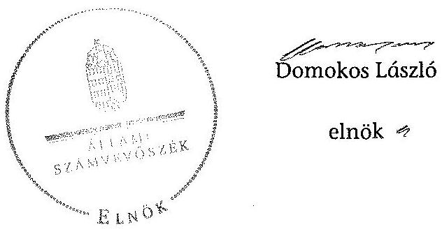

# ÁLLAMI   SZÁMVEVŐSZÉK 

## JELENTÉS

az önkormányzati vagyongazdálkodás szabályszerűségi ellenőrzéséről

Balatonboglár

---

# Állami Számvevőszék 

Iktatószám: V-0026-025-040/2013.
Témaszám: 1065
Vizsgálat-azonosító szám: V0593004

## Az ellenőrzést felügyelte:

## Makkai Mária

felügyeleti vezető
2012. december 16. napjától

## Gyüre Lajosné

felügyeleti vezető
2012. december 15. napjáig

## Az ellenőrzést vezette és az ellenőrzés végrehajtásáért felelős:

## Kesjár János

ellenőrzésvezető

## Az ellenőrzést végezték:

| Dr. Ernst László | Alexovics Ágota | Keszthelyi Zoltán |
| :-- | :-- | :-- |
| számvevő tanácsos | számvevő tanácsos | számvevő tanácsos |

## Szabó Leonóra

számvevő

## A témához kapcsolódó eddig készített számvevőszéki jelentések:

| címe | sorszáma |
| :-- | :-- |
| Jelentés a helyi önkormányzatok gazdálkodási rendszerének | 0822 |
| 2007. évi átfogó és egyéb szabályszerűségi ellenőrzéséről |  |
| Jelentés a közbeszerzési rendszer működésének ellenőrzéséről | 0831 |
| Jelentés a 2009. június 7-én megtartott Európai Parlament tagjai | 1005 |
| választásának lebonyolításához felhasznált pénzeszközök elszámol |  |

Jelentéseink az Országgyűlés számítógépes hálózatán és az Interneten a www.asz.hu címen is olvashatóak.

---

# TARTALOMJEGYZÉK 

BEVEZETÉS ..... 3
I. ÖSSZEGZŐ MEGÁLLAPÍTÁSOK, KÖVETKEZTETÉSEK, JAVASLATOK ..... 5
II. RÉSZLETES MEGÁLLAPÍTÁSOK ..... 9

1. A vagyongazdálkodási tevékenység szabályozottsága ..... 9
1.1. A feladatellátás formáinak meghatározása, a döntések megalapozottsága ..... 9
1.2. A vagyonnal gazdálkodó szervezetek szervezeti rendjének szabályozottsága, a kötelező szabályzatok megfelelősége ..... 9
1.3. A vagyongazdálkodás szabályozása ..... 10
2. A vagyongazdálkodás szabályszerűsége ..... 12
2.1. A vagyon nyilvántartásának megfelelősége ..... 12
2.2. A vagyongazdálkodást érintő gazdasági események követelmények szerinti dokumentáltsága ..... 13
2.3. A vagyongazdálkodási intézkedések, döntések szabályszerűsége ..... 14
3. A vagyonváltozást eredményező gazdasági események szabályszerűsége ..... 16
3.1. A vagyon értékének és összetételének változása ..... 16
3.2. Közbeszerzési eljárás alkalmazása ..... 16
3.3. Hitelfelvétel, kötvénykibocsátás, garancia és kezességvállalás szabályszerűsége ..... 17
4. A vagyongazdálkodás szabályszerűségére vonatkozó belső és külső ellenőrzések hasznosulása ..... 17
4.1. A belső ellenőrzés által tett megállapítások, javaslatok hasznosulása ..... 17
4.2. A többségi tulajdonban lévő gazdasági társaságok vagyongazdálkodásának felügyelete ..... 18
4.3. A könyvvizsgálatnak a vagyongazdálkodás szabályosságához való hozzájárulása ..... 18
4.4. A külső ellenőrző szervezetek által tett javaslatok hasznosulása ..... 18

---

# MELLÉKLETEK 

1. számú Balatonboglár Városi Önkormányzat gazdálkodására jellemző adatok, mutatószámok
2. számú Balatonboglár Városi Önkormányzat vagyonának alakulása
3. számú Balatonboglár Városi Önkormányzat kötelezettségeinek alakulása

## FÜGGELÉKEK

1. számú Rövidítések jegyzéke
2. számú Értelmező szótár

---

# JELENTÉS 

## az önkormányzati vagyongazdálkodás szabályszerűségi ellenőrzéséről

## Balatonboglár

## BEVEZETÉS

Az ÁSZ kiemelten fontosnak tartja az Állami Számvevőszékről szóló 2011. évi LXVI. törvény 5. § (4) bekezdése alapján az önkormányzati vagyon kezelésének, a vagyonnal való gazdálkodási szabályok betartásának az ellenőrzését. Az ellenőrzés feladata a vagyongazdálkodással kapcsolatban a közpénzek átláthatósága, nyilvánossága érdekében a jogszabályokban, belső szabályzatokban megfogalmazott előírások érvényesülésének áttekintése. Az Állami Számvevőszék nem csak az ellenőrzött szervezet vagyongazdálkodásának a hibáira mutat rá, számon kérve azok kijavítását, hanem megállapításaival, javaslataival segíti a közpénzzel, a közvagyonnal való felelős gazdálkodást.

Az önkormányzati vagyon alapvető funkciója, hogy a közérdeket és egyúttal az önkormányzati célok megvalósítását szolgálja. A feladatellátás terén elsősorban a kötelezően ellátandó feladatok végrehajtását hivatott szolgálni, amely mellett az önként vállalt feladatok ellátása is megvalósulhat.

## Az ellenőrzés célja az Önkormányzatnál annak értékelése volt, hogy:

- a vagyongazdálkodási tevékenységet, annak szervezeti kereteit szabályozták-e;
- az önkormányzati vagyongazdálkodás törvényességét, szabályszerűségét biztosították-e a döntések előkészítése és végrehajtása során;
- jogszerű döntéseken alapult-e a vagyon értékének és összetételének változása;
- a belső ellenőrzés elősegítette-e a vagyongazdálkodás szabályszerű működését, valamint hasznosultak-e a korábbi külső ellenőrzések által tett javaslatok.

Az ellenőrzés típusa: szabályszerűségi ellenőrzés
Az ellenőrzés a 2007. január 1. és 2011. év december 31. közötti időszakra terjedt ki, kitekintéssel a helyszíni ellenőrzés befejezéséig tartó időszak releváns folyamataira. Az egyes közbeszerzési eljárások lefolytatásának ellenőrzése a 2011. évet és a 2012. év I. negyedévét érintette.

---

Az ellenőrzés szakmai módszertana az Állami Számvevőszék Ellenőrzési Kézikönyvében foglalt szakmai szabályokon alapult, amely a Legfőbb Ellenőrző Intézmények Nemzetközi Szervezete (INTOSAI) által kiadott nemzetközi standardok (ISSAI) figyelembevételével készült.

A vagyongazdálkodás szabályozottságát a helyi szabályozások (rendeletek, szabályzatok, utasítások) ellenőrzésével végeztük el. A vagyonváltozások köréből az ellenőrizendő tételeket mintavétellel, a számviteli nyilvántartásokból választottuk ki.

Balatonboglár lakosainak száma 2011. január 1-jén 6155 fő volt. A 2010. évi önkormányzati választást követően az Önkormányzat kilenctagú Képviselőtestületének munkáját négy állandó bizottság segítette. Az Önkormányzat mellett a 2007-2011. években kisebbségi önkormányzat nem működött. A polgármester a 2010. évi önkormányzati választás óta tölti be tisztségét, a jegyző 2009. szeptember 15. óta látja el feladatát.

Az Önkormányzat feladatainak végrehajtása érdekében a 2011. évben hat költségvetési intézményt működtetett, amelyekből egy önállóan működött és gazdálkodott, öt önállóan működött. A feladatok ellátásában részt vett egy gazdasági társaság és négy társulás. Az Önkormányzat a 2011. évi költségvetési beszámolója szerint 1476,7 millió Ft költségvetési bevételt ért el és 1420,9 millió Ft költségvetési kiadást teljesített, 2011. december 31-én a könyvviteli mérleg szerint 10658,7 millió Ft értékű vagyonnal rendelkezett.
2011. év végén az Önkormányzat adósságállománya 1719,2 millió Ft volt, melyből a hosszú lejáratú kötelezettségek 1367,8 millió Ft-ot tettek ki. A Polgármesteri hivatalban dolgozó köztisztviselők száma 2011. december 31-én 33 fő, az Önkormányzat által foglalkoztatott közalkalmazottak száma 144 fő volt. Az Önkormányzat gazdálkodására jellemző adatokat, mutatószámokat az 1-3. számú mellékletek tartalmazzák.

Az ÁSZ a 2011. évi LXVI. törvény 29. § (1) bekezdése szerint a jelentéstervezetet megküldte egyeztetésre Balatonboglár Város Önkormányzat polgármesterének, aki az ÁSZ tv. 29. § (2) bekezdésében foglalt észrevételezési jogával nem élt, a jelentéstervezetre észrevételt nem tett.

---

# I. ÖSSZEGZŐ MEGÁLLAPÍTÁSOK, KÖVETKEZTETÉSEK, JAVASLATOK 

Az Önkormányzat vagyona 2007 és 2011 között - a könyvviteli mérleg adatai alapján - 4,9%-kal, 10162,9 millió Ft-ról 10658,7 millió Ft-ra nőtt. Felhalmozási célra 934,8 millió Ft kiadást teljesítettek, a vagyon növekedését a korábban felvett hitelek igénybevételéből és kötvénykibocsátásból származó bevételből finanszírozták. Összegszerűen és arányaiban is a legnagyobb mértékben, 400,7 millió Ft-tal a beruházások, felújítások értéke emelkedett, amely folyamatban lévő beruházások (DDOP pályázati támogatásból megvalósult orvosi rendelő átalakítás, felújítás, turisztikai beruházás és városközpont rehabilitáció) elszámolásának következményeként jelentkezett. Pénzeszközei 273,7 millió Ft-tal növekedtek a kötvénykibocsátásból származó fel nem használt bevétel miatt.

Az Önkormányzat a vagyonnal való gazdálkodási tevékenységét alapvetően a jogszabályi előírások szerint szabályozta. A vagyongazdálkodási rendeletben meghatározták az önkormányzati feladatellátást biztosító törzsvagyon körét, azon belül a forgalomképtelen és a korlátozottan forgalomképes vagyonelemeket, illetve a forgalomképes vagyon körébe tartozó vagyontárgyakat. A hosszú lejáratú, felhalmozási célú kötvénykibocsátás esetében - betartva a jogszabályi előírást - fedezetként az Önkormányzat törzsvagyont nem ajánlott fel. Az Önkormányzat az Áht. $_1$-ben foglalt előírás ellenére csak 2011. október 20-ától szabályozta az ingyenes vagyonátruházás eseteit és módját, azonban 2007-2011. években ingyenes vagyonátruházás nem történt.

A vagyongazdálkodási rendelet és az önkormányzati SzMSz$_{2,3}$ között nem volt összhang a polgármesterre átruházott tulajdonosi hatáskör összeghatára tekintetében. Az Önkormányzat a vagyongazdálkodási feladatokhoz kapcsolódóan a polgármesterre, a bizottságokra átruházott hatáskörökhöz nem írt elő beszámolási kötelezettséget.

A vagyon nyilvántartása, a vagyongazdálkodási döntések végrehajtása, valamint a vagyongazdálkodáshoz kapcsolódó gazdálkodási jogkörök gyakorlása során nem tettek eleget a jogszabályokban és a belső szabályzatokban előírtaknak. A vagyongazdálkodási rendeletben a vagyon nyilvántartására a vagyonleltárt nevesítették, amely azonban megnevezésében, tartalmában és összetételében sem felelt meg az Áhsz.-ben meghatározott vagyonkimutatásnak. A szabályozás hiánya hozzájárult ahhoz, hogy az Ötv.-ben és az Áht. $_1$ ben foglaltak ellenére nem készítettek az éves zárszámadásokhoz a vagyonállapotról vagyonkimutatást és a zárszámadási rendelettervezet előterjesztésekor a Képviselő-testület részére tájékoztatásul nem mutatták be. Az ingatlanvagyon számviteli nyilvántartásában szereplő bruttó értékek és az ingatlanvagyon kataszter hasonló tartalmú adatai 2011. december 31-én a 147/1992. (XI. 6.) Korm. rendelet előírása ellenére nem egyeztek meg. Az eltérések visszavezethetőek arra, hogy a 2007-2011. években a két nyilvántartás közötti összhang igazolását, vagy az eltérések rendezését szolgáló egyeztetéseket nem végeztek. Az

---

egyeztetések elmaradása miatt a földhivatali ingatlan nyilvántartás adataival való egyezőség sem igazolt.

A 2008. és a 2010. évben a mennyiségi felvétellel történő leltározáskor a tárgyi eszközök kiértékelése - az Áhsz.-ben és a leltározási szabályzat $_{1,2}$-ben foglalt előírás ellenére - nem történt meg. A Polgármesteri hivatal és az önkormányzati intézmények kezelésében lévő tárgyi eszközök esetében a 2007., a 2009. és a 2011. években - a vagyongazdálkodási rendeletben foglaltak ellenére - a leltározást nem mennyiségi felvétellel, hanem a részletező nyilvántartások alapján egyeztetéssel hajtották végre. A 2010-2011. években az üzemeltetésre, vagyonkezelésbe adott eszközök könyvviteli mérlegben szereplő értékeit az Áhsz. előírása ellenére nem támasztották alá 2010-ben négy, 2011-ben hat érintett szervezet leltárával.

A 2007-2011 évek között a vagyongazdálkodással összefüggő döntéselőkészítés folyamatában nem írták elő az Önkormányzat tulajdonosi jogainak, érdekeinek védelmét szolgáló garanciális elemek szerződésben, egyéb dokumentumban való rögzítésének kötelezettségét. A vagyongazdálkodási rendeletben rendelkeztek a vagyon hasznosítására értékbecslés készítésének kötelezettségéről. Ennek ellenére a vagyonértékesítés és vagyonhasznosítás esetében a döntés előkészítése során a vagyontárgyak forgalmi (piaci) értékének meghatározására nem készíttettek forgalmi értékbecslést. A beruházási szabályzatban előírtak ellenére beruházási célprogramot, illetve beruházási programot nem készítettek, illetve a versenytárgyalást országos napilapban nem hirdették meg. Az Önkormányzat a vagyonértékesítés során megsértette az Áht. $_1$-ben foglaltakat, mivel nyilvános versenyeztetés nélkül értékesített egy ingatlant.

A gazdálkodási jogkörök gyakorlása során eszközbeszerzések, járda és kerékpárút tervezés, útberuházás, ingatlan értékesítések, valamint tagi kölcsönszerződés esetében az Áht.-ban és az Ámr. $_2$-ben előírtak ellenére a kötelezettségvállalást nem előzte meg annak ellenjegyzése.

A beruházások és felújítások megvalósítása során lefolytatták a Kbt. $_{1,2}$-ben előírt esetekben a közbeszerzési eljárást és eleget tettek az egybeszámítási kötelezettségnek a 2011-2012. év 1. negyedévében.

A belső ellenőrzés nem segítette a vagyongazdálkodás szabályszerű működését, mivel a 2007-2011. évek között mindössze egy ellenőrzés kapcsolódott a vagyongazdálkodáshoz, amely hiányosságot nem tárt fel.

Az ÁSZ 2007. évi ellenőrzési javaslataiból nem hasznosította a polgármester az Áht. $_1$ szerinti mérlegek és kimutatások Képviselő-testület elé terjesztésére vonatkozó javaslatot. Nem hasznosította továbbá a jegyző pedig a céljellegű, működési, fejlesztési támogatások, a nettó 5 millió Ft-ot elérő szerződések és az éves költségvetési beszámoló szöveges indoklásának közzétételére, valamint a gazdálkodás során a működésbeli hibák megelőzésére, feltárására, illetve kijavítására vonatkozó javaslatokat. A jegyző csak a 2012. évben, az újabb helyszíni ellenőrzés ideje alatt gondoskodott - a 2007. évig visszamenőleg - a támogatások, a vagyonnal történő gazdálkodáshoz kapcsolódó szerződések, valamint a 2007-2009. évi költségvetés és beszámoló közérdekű adatainak a közzétételéről.

---

A Képviselő-testület 2007-2011. évek között rendszeresen beszámoltatta a gazdasági társaságát az önkormányzati feladat ellátásához üzemeltetésre átadott vagyonnal való gazdálkodásról.

Az Állami Számvevőszékről szóló 2011. évi LXVI. törvény 33. § (1) bekezdésében foglaltak értelmében a jelentésben foglalt megállapításokhoz kapcsolódó intézkedési tervet köteles az ellenőrzött szervezet vezetője összeállítani, és azt a jelentés kézhezvételétől számított 30 napon belül az ÁSZ részére megküldeni. Amennyiben az intézkedési tervet határidőben nem küldi meg a szervezet, vagy
 az nem elfogadható, az ÁSZ elnöke a hivatkozott törvény 33. § (3) bekezdés a)-b) pontjaiban foglaltakat érvényesítheti.

Az ellenőrzés intézkedést igénylő megállapításai és javaslatai:

# a jegyzőnek 

1. A leltározás végrehajtása nem volt szabályos a következők miatt:
a) A leltározási szabályzat ${ }_{1,2}$-ben foglalt előírás ellenére a leltározás folyamatában a mennyiségi felvételt követő kiértékelés elmaradt a 2008. és a 2010. évben a könyvviteli mérlegben értékkel szereplő tárgyi eszközöknél. Ennek hiányában a leltár nem felelt meg az Áhsz. 37. § (2) bekezdésében előírtaknak, mivel az eszközcsoport valódiságát nem támasztotta alá.
b) A tárgyi eszközök leltározását nem a vagyongazdálkodási rendeletben előírt páratlan években (a 2007., a 2009. és a 2011. években) végezték el mennyiségi felvétellel.
c) A 2010-2011. években az üzemeltetésre, vagyonkezelésbe adott eszközök könyvviteli mérlegben szereplő értékeit - az Áhsz. 37. § (4) bekezdés előírása ellenére - nem támasztották alá 2010-ben négy, 2011-ben hat érintett szervezet leltárával.

## Javaslat

Intézkedjen
a) a leltározási szabályzat ${ }_{1,2}$ előírásainak megfelelően a leltározás folyamatában a mennyiségi felvételt követő kiértékelés végrehajtásáról a mérlegben értékkel szereplő tárgyi eszközöknél, az eszközcsoport valódiságának az Áhsz. 37. § (2) bekezdésének megfelelő alátámasztásáról;
b) a vagyongazdálkodási rendelet előírásainak betartása érdekében a Polgármesteri hivatal és az önkormányzati intézmények kezelésében lévő tárgyi eszközök esetében a páratlan években a mennyiségi felvétellel történő leltározásról.
c) az Áhsz. 37. § (4) bekezdés előírásának megfelelően, hogy az üzemeltetésre, vagyonkezelésbe adott eszközök könyvviteli mérlegben szereplő értékeit az üzemeltetést, vagyonkezelést végző szerv által elkészített, hitelesített leltárral támasszák alá.

---

2. A vagyonértékesítés és vagyonhasznosítás esetében a döntések előkészítése során a vagyontárgyak forgalmi (piaci) értékének meghatározására - a vagyongazdálkodási rendelet előírása ellenére - nem állt rendelkezésre 3 hónapnál nem régebbi forgalmi értékbecslés.

# Javaslat 

Intézkedjen a vagyongazdálkodási rendeletben foglalt előírásra figyelemmel az önkormányzati vagyon körébe tartozó vagyontárgy értékesítésére, illetve egyéb módon történő hasznosítására irányuló döntéseket megelőzően a forgalmi (piaci) érték meghatározására vonatkozó értékbecslés elkészítéséről.
3. Az Önkormányzatnál az Ötv. 78. § (2) bekezdésében foglaltak ellenére nem készítettek az éves zárszámadásokhoz a vagyonállapotról vagyonkimutatást.

## Javaslat

Intézkedjen a Mötv. 110. § (2) bekezdésében foglalt előírásoknak megfelelően a vagyonállapotról szóló vagyonkimutatás elkészítéséről és annak a zárszámadásról szóló előterjesztés keretében az Áht. 2 91. § (2) bekezdésében foglalt mérlegek és kimutatások közötti megjelenítéséről.
4. Az ingatlanvagyon számviteli nyilvántartásában szereplő bruttó értékek és az ingatlanvagyon kataszter hasonló tartalmú adatai 2011. december 31-én a 147/1992. (XI. 6.) Korm. rendelet 1. § (2) bekezdésében foglalt előírás ellenére nem egyeztek meg. Az eltérések visszavezethetőek arra, hogy a 2007-2011. években a két nyilvántartás közötti összhang igazolását, vagy az eltérések rendezését szolgáló egyeztetéseket nem végeztek.

## Javaslat

Intézkedjen, hogy a 147/1992. (XI. 6.) Korm. rendelet 1. § (3) bekezdésében rögzítetteknek megfelelően biztosítsa az egyezőséget az ingatlanvagyon kataszter adatai és a számviteli nyilvántartás adatai között.
5. A belső ellenőrzés nem segítette a vagyongazdálkodás szabályszerű működését, mert a témában 2007-2011 között mindössze egyetlen - hiányosságot fel nem táró - ellenőrzés történt. Ez összefüggött azzal, hogy a Ber. 21. § (2) bekezdésében előírtak ellenére nem készültek kockázatelemzések az éves belső ellenőrzési tervek összeállításához.

## Javaslat

Intézkedjen, hogy a belső ellenőrzés a Bkr. 22. § (1) bekezdés b) pontjában előírtak alapján a stratégiai és éves ellenőrzési terveket kockázatelemzéssel támassza alá, valamint a 31. § (3) pontjai alapján a magas kockázatúnak minősített területeket a lehető legrövidebb időn belül ellenőrizze.

---

# II. RÉSZLETES MEGÁLLAPÍTÁSOK 

## 1. A VAGYONGAZDÁLKODÁSI TEVÉKENYSÉG SZABÁLYOZOTTSÁGA

### 1.1. A feladatellátás formáinak meghatározása, a döntések megalapozottsága

Az Önkormányzat az $\mathrm{SzMSz}_{1,2,3}$-ban határozta meg kötelező közszolgáltatási és önként vállalt feladatait. A kötelező feladatait az Ötv. és az ágazati törvények figyelembevételével állapította meg, az önként vállalt feladatok körét az éves költségvetési rendeletekben határozta meg. A 2007-2011. évek között a feladatellátás formáinak meghatározásánál, a feladatok körének, a feladatellátás szervezeti formájának módosításánál a megalapozott döntés meghozatala érdekében a Képviselő-testület számára készített előterjesztésekben alternatív javaslatokat nem mutattak be.

A közszolgáltatások ellátásához kapcsolódóan a 2007-2011. évek között az Önkormányzat Képviselő-testülete intézmények összevonásáról és két társuláshoz való csatlakozásról döntött, amelyek azonban nem eredményeztek vagyonváltozást.

### 1.2. A vagyonnal gazdálkodó szervezetek szervezeti rendjének szabályozottsága, a kötelező szabályzatok megfelelősége

A 2007-2011. évek között hatályos $\mathrm{SzMSz}_{1,2,3}$-ban az Önkormányzat meghatározta gazdasági szervezetét. A Képviselő-testület a vagyongazdálkodási rendeletben döntött a vagyongazdálkodásra vonatkozó tulajdonosi jogok gyakorlásának átruházásáról. A Képviselő-testület nem élt az Ötv. 9. § (3) bekezdésében biztosított jogával, a tulajdonosi jogokat érintő hatáskör gyakorlásához nem adott utasítást. Átruházott hatáskör esetére nem írtak elő beszámolási kötelezettséget.

A vagyonnal gazdálkodó, az önkormányzati vagyont használó, közfeladatot ellátó költségvetési szervek alapító okirataiban a Képviselő-testület meghatározta e szervezetek közfeladatait, alaptevékenységét. A közfeladatot ellátó költségvetési szervek szervezeti és működési szabályzatának jóváhagyását a Képviselő-testület az Ötv. 9. § (3) bekezdése alapján az illetékes bizottságokra ruházta át. A hivatali SzMSz az Ámr. ${ }_{2}$ 20. § (2) bekezdés b) és k) pontjaiban ${ }^{1}$ foglaltakkal szemben nem tartalmazta a költségvetési szerv alapító okiratának keltét, számát, az alapítás időpontját, az Önkormányzat költségvetési szerveinek felsorolását. A jegyző a gazdasági szervezet ügyrendje ${ }_{1,2}$-ben szabályozta a pénzügyi-gazdasági feladatok ellátásáért felelős személyek feladatait, továbbá

[^0]
[^0]:    ${ }^{1}$ 2012. január 1-jétől az Ávr. 13. § (1) bekezdés b) és i) pontja szabályozza.

---

a vezetők és más dolgozók feladat-, hatás- és jogkörét az Ámr. ${ }_{1,2}$-ben előírtaknak megfelelően.

Az Áhsz. 37. § (7) bekezdésével összhangban a vagyongazdálkodási rendelet 6. §-ának (4) bekezdése tartalmazta, hogy a vagyonleltárt kétévente, minden páratlan költségvetési évre vonatkozóan kell elkészíteni. A leltározási szabályzat ${ }_{1,2}$ nem tartalmazta a vagyonkezelésre, koncesszióba átadott eszközök leltározásának módját. A leltározási szabályzat ${ }_{1}$ nem tartalmazta továbbá az üzemeltetésre átadott eszközök leltározásának szabályait, azok csak a 2008. január 15-i módosítást követően - a 2007. évi ÁSZ ellenőrzés javaslata alapján - épültek be a szabályozásba. A 2009. január 1-jétől hatályos leltározási szabályzat ${ }_{2}$ előírása lehetővé tette, hogy az üzemeltetésre átadott eszközök vonatkozásában a Polgármesteri hivatal az általa nyilvántartott értéket szerepeltesse a mérlegben, amely ellentétes az Áhsz. 37. § (4) bekezdésében ${ }^{2}$ foglalt szabályozással, mely szerint az üzemeltetésre átadott eszközök könyvviteli mérlegben szereplő értékeit az államháztartás szervezete az üzemeltetést végző szerv által készített leltárral köteles alátámasztani.

# 1.3. A vagyongazdálkodás szabályozása 

Az Önkormányzat a vagyongazdálkodási feladatokat és az önkormányzati vagyonnal való gazdálkodás szabályait az Ötv. előírásainak megfelelően szabályozta. A Htv. 138. § (1) bekezdés j) pontja alapján a vagyongazdálkodási rendeletben rögzítették az önkormányzati vagyonnal való felelős gazdálkodás szabályait, amely az egyéb vagyongazdálkodással kapcsolatos rendeletekkel ${ }^{3}$ együtt a teljes vagyoni körre kiterjedt. A vagyongazdálkodási rendeletben az Ötv. 79. § (2) bekezdésének megfelelően meghatározták az önkormányzati feladatellátást biztosító törzsvagyon körét, azon belül a forgalomképtelen és a korlátozottan forgalomképes vagyonelemeket, illetve a forgalomképes vagyon körébe tartozó vagyontárgyakat.

A vagyongazdálkodási rendeletben a vagyon nyilvántartására a vagyonleltárt nevesítették, amely azonban megnevezésében, tartalmában és összetételében sem felelt meg az Áhsz. 44/A. § (2) bekezdésében meghatározott vagyonkimutatásnak. Az Önkormányzat - a 2/2006. (II. 17.) számú rendeletének 3. §-a értelmében - a vagyonkimutatását a zárszámadási rendeletben az Áhsz. 44/A. §-a szerinti részletességgel mutatja be, további részletezését, tételes alábontását azonban az Áhsz. 44/A. § (2) bekezdésében foglalt előírás ellenére nem szabályozta.

A 2007-2011. évek között az előterjesztések készítésének, megtárgyalásának, véleményezésének, döntéshozatalának általános rendjét az Önkormányzat az $\mathrm{SzMSz}_{1,2,3}$-ban szabályozta. A vagyongazdálkodással összefüggő döntéselőkészítés folyamatában nem írták elő a döntést előkészítő és a döntési doku-

[^0]
[^0]:    ${ }^{2}$ Ezt az előírást a 2010. évről készült beszámolóra kell először alkalmazni.
    ${ }^{3}$ a vásárokról és piacokról szóló 16/2001. (IV. 27.) számú önkormányzati rendelet és a lakások és helyiségek bérletéről és elidegenítéséről szóló 20/2006. (XII. 12.) számú önkormányzati rendelet

---

mentáció (az előterjesztéshez csatolandó számítási és egyéb tájékoztató anyagok, a határozat indoklása) tartalmát. A vagyongazdálkodással összefüggő döntés-előkészítés folyamatában nem szabályozták az Önkormányzat tulajdonosi jogainak, érdekeinek védelmét szolgáló garanciális elemek szerződésben, egyéb dokumentumban való rögzítésének kötelezettségét. A hitelfelvételről, kötvénykibocsátásról szóló döntés-előkészítés folyamatában nem írták elő a futamidő egyes éveit terhelő kötelezettség költségvetési egyensúlyra gyakorolt hatása vizsgálatának, valamint a pénzügyi (kamat, árfolyam, visszafizetési) kockázat felmérésének kötelezettségét.

A hasznosításra szánt vagyon értéke megállapítása céljából a vagyongazdálkodási rendeletben értékbecslés készítésének kötelezettségét írták elő. Az Áht. ${ }_{1}$-ben foglaltak alapján a vagyongazdálkodási rendelet 15. §-ának (2) bekezdésében meghatározták, hogy az önkormányzati ingatlanvagyon elidegenítése, használatba, vagy bérbeadása, illetve más módon való hasznosítása nyilvános pályázati eljárás, vagy licites árverési eljárás keretében történhet. A rendelet 4. számú mellékletében rögzítették a versenyeztetési eljárás (pályáztatás, árverés) szabályait és eljárási rendjét.

Az Önkormányzat 2011. október 20-ig az Áht. ${ }_{1}$ 108. § (2) bekezdésében ${ }^{4}$ foglalt előírás ellenére nem szabályozta az ingyenes vagyonátruházás eseteit, módjait, azonban a 2007-2011. évek között térítés nélküli vagyonátadás nem történt. A 2011. októberben módosított ${ }^{5}$ vagyongazdálkodási rendelet szerint az önkormányzati vagyon tulajdonjogát, illetve használatát - jogszabály eltérő rendelkezése hiányában - térítésmentesen, vagy kedvezményesen átruházni a Képviselő-testület minősített többséggel jogosult.

A vagyongazdálkodási rendelet nem volt összhangban az Önkormányzat szervezetére és működésére vonatkozó szabályozással. Az $\mathrm{SzMSz}_{2,3}$-ban foglalt szabályozás szerint ugyanis a polgármester átruházott tulajdonosi hatáskörben a Pénzügyi bizottság előzetes egyetértésével gyakorolja a tulajdonosi jogokat 3,0 millió Ft egyedi értékhatárig a forgalomképes ingó vagyon, 5 millió Ft egyedi forgalmi értékig a forgalomképes önkormányzati portfolió (értékpapírok) felett. A vagyongazdálkodási rendeletben meghatározottak alapján - az $\mathrm{SzMSz}_{2,3}$-tól eltérően - a polgármester átruházott hatáskörben gyakorolja a forgalomképes ingó és portfólió vagyon felett a tulajdonosi jogokat 2,0 millió Ft értékhatárig az illetékes bizottságok előzetes egyetértésével.

A gazdasági társaságok és egy az Önkormányzatnak üzemeltetést végző egyéni vállalkozó vagyonkezelői feladatát, felelősségét, valamint az egyes vagyonelemek hasznosítási módját az üzemeltetői szerződésekben rögzítették.

Az éves költségvetési koncepció, az éves költségvetés és a beszámoló készítésére, a költségvetés módosítására vonatkozó szabályokat az ellenőrzési nyomvo-

[^0]
[^0]:    ${ }^{4}$ 2012. január 1-jétől a Vagyon tv. 13. § (3) bekezdése szabályozza.
    ${ }^{5}$ A vagyon térítésmentes, kedvezményes átruházásának szabályait a vagyongazdálkodási rendelet 14. §-a tartalmazza, amelynek szövegét az Önkormányzat 31/2011. (X. 20.) számú rendelete állapította meg.

---

nal ${ }_{1,2}$-ben határozták meg. Előírták az elvégzendő feladatokat, meghatározták azok tartalmát és az elkészítendő dokumentumokat. A nyilvánosságra hozatal módját, felelősét a céljellegű működési és fejlesztési támogatásokra, a vagyonnal való gazdálkodással összefüggő szerződésekre, az Önkormányzat és intézményei éves (elemi) költségvetésére és számviteli törvény szerinti költségvetési beszámolójára vonatkozóan nem határozták meg.

A gazdálkodási jogkörök - a kötelezettségvállalás ellenjegyzése,
 a szakmai teljesítésigazolás, érvényesítés és az utalvány ellenjegyzése - gyakorlásának rendjét, összeférhetetlenségének szabályait meghatározták.

# 2. A VAGYONGAZDÁLKODÁS SZABÁLYSZERŰSÉGE 

### 2.1. A vagyon nyilvántartásának megfelelősége

A Polgármesteri hivatal számviteli nyilvántartási rendszerének kialakításakor betartották az Áhsz. 9. számú melléklet számlaosztályok tartalmára vonatkozó 1. k) pontjában foglaltakat, az önkormányzati törzsvagyon, valamint a nem törzsvagyon részét képező eszközöket a főkönyvi számlák további bontásával és az analitikus nyilvántartások vezetésével elkülönítették.

Az Önkormányzatnál a 2007-2011. évekre nem készítettek az éves zárszámadásokhoz a vagyonállapotról vagyonkimutatást és a zárszámadási rendelettervezet előterjesztésekor a Képviselő-testület részére tájékoztatásul nem mutatták be, ezzel megsértették az Ötv. 78. § (2) bekezdésében ${ }^{6}$ és az Áht. ${ }_{1}$ 118. § (2) bekezdés 2. c) pontjában ${ }^{7}$ foglalt előírásokat. A 2007-2011. évi zárszámadási rendeletekhez vagyonkimutatás helyett az egyes évek év végi ingatlanvagyon-kataszteri naplóit csatolták.

Az Önkormányzat tulajdonában álló ingatlanvagyon 2003. évi számbavételét, állapotának, nagyságának, értékének felmérését követően az ingatlanok egyedi számviteli analitikájában rögzített adatokat a 147/1992. (XI. 6.) Korm. rendelet 1. § (1) bekezdése alapján nem egyeztették össze az adott ingatlanvagyon kataszter adatlapjain és betétlapjain szereplő adatokkal. Az Önkormányzat az ingatlanvagyon kataszter adatait a számviteli nyilvántartásaival, a földhivatali nyilvántartás adataival nem egyeztette, eltérést nem tárt fel. A jelen ellenőrzés az ingatlanok értékének különbözőségét állapította meg a számviteli nyilvántartás és az ingatlanvagyon kataszter adatainál, ez alapján az Önkormányzat a 147/1992. (XI. 6.) Korm. rendelet 1. § (2) bekezdése szerinti egyezőséget nem biztosította. Az egyeztetések elmaradása miatt a földhivatali ingatlan nyilvántartás adataival való egyezőség sem igazolt.

A helyszíni ellenőrzés alatt az Önkormányzat kimutatást készített a 2011. év végi forgalomképtelen, korlátozottan forgalomképes és forgalomképes ingatlanok bruttó értékéről. A kimutatás alapján a számviteli nyilvántartásban a forgalomképtelen ingatlanok bruttó értéke (korrekciót követően) 719,7 millió Ft-tal több, a korlátozottan forgalomképeseknél 562,7 millió Ft-tal, a forgalomképeseké pedig

[^0]
[^0]:    ${ }^{6}$ 2012. január 1-jétől a Mötv. 110. § (2) bekezdés
    ${ }^{7}$ 2012. január 1-jétől az Áht. 2 91. § (2) bekezdés c) pontja

---

69,7 millió Ft-tal kevesebb az ingatlanvagyon kataszterben szereplő bruttó értéknél.

A 2008. és a 2010. évben a mennyiségi felvétellel történő leltározáskor a mérlegben értékkel szereplő tárgyi eszközök kiértékelését az Áhsz. 37. § (2) bekezdése és a leltározási szabályzat ${ }_{1,2} 6$. pontjában foglalt előírás ellenére nem végezték el. A Polgármesteri hivatal és az önkormányzati intézmények kezelésében lévő tárgyi eszközök esetében a 2007., a 2009. és a 2011. években - a vagyongazdálkodási rendelet 6. § (4) bekezdésében foglaltak ellenére - a leltározást nem mennyiségi felvétellel, hanem a részletező nyilvántartások alapján készített összesítő kimutatással, egyeztetéssel hajtották végre. A szabályozással ellentétben a tárgyi eszközök leltározását mennyiségi felvétellel - a páratlan évek helyett - a 2008. és a 2010. évben hajtották végre.

Az Önkormányzatnál az Áhsz. 46. § (3) bekezdésében, illetve az értékelési szabályzat ${ }_{2,3}$-ban foglaltak ellenére a piaci értéken történő értékelést a forgalomképes ingatlanokra vonatkozóan nem végezték el minden évben. A 2008-2011. évek között csupán egyszer, a 2010. évben értékeltették a forgalomképes ingatlanokat külső ingatlan-értékbecslő céggel, amely alapján 108,3 millió Ft-ot számoltak el értékhelyesbítésként, illetve értékelési tartalékként.

Az üzemeltetésre, kezelésre, koncesszióba adott eszközök leltározása során a 2007-2009. években figyelmen kívül hagyták a leltározási szabályzat ${ }_{1,2}$ -ben az átadott eszközök leltározására előírtakat, mivel nem közölték az Önkormányzatnál nyilvántartott eszközök adatait az üzemeltető öt gazdasági szervezet felé. Ennek ellenére két üzemeltető a 2009. évi leltározást elvégezte, az erről szóló dokumentumokat megküldte az Önkormányzatnak. A 2010-2011. években az üzemeltetésre, vagyonkezelésbe adott eszközök könyvviteli mérlegben szereplő értékeit - az Áhsz. 37. § (4) bekezdés előírása ellenére - nem támasztották alá 2010-ben négy, 2011-ben hat érintett szervezet leltárával.

# 2.2. A vagyongazdálkodást érintő gazdasági események követelmények szerinti dokumentáltsága 

A Polgármesteri hivatalban, a 2007-2011. években a vagyongazdálkodás egyes területeivel kapcsolatos kiadások teljesítését és a bevételek beszedését megelőzően az alábbi esetekben nem végezték el az előírt (folyamatba épített) ellenőrzési feladatokat a gazdálkodási jogkörök gyakorlásával felhatalmazott személyek, ezáltal a működésben feltárt hiányosságok és mulasztások miatt fennállt a kiadások szabálytalan teljesítésének kockázata:

- az Áht. ${ }_{1}$ 100/C. § (3) bekezdésében ${ }^{8}$ előírtakat megsértve és az Ámr. ${ }_{2}$ 74. § (1) bekezdésében ${ }^{9}$ előírtak ellenére a kötelezettségvállalást nem előzte meg annak ellenjegyzése eszközbeszerzések, járda és kerékpárút tervezés, útberuházás, ingatlan értékesítések, valamint tagi kölcsönszerződés (össze-

[^0]
[^0]:    ${ }^{8}$ 2012. január 1-jétől az Áht. ${ }_{2}$ 37. § (1) bekezdése szabályozza.
    ${ }^{9}$ 2012. január 1-jétől az Ávr. 55. § (1) bekezdés és a (2) bekezdés f) pontja szabályozza.

---

sen 55,0 millió Ft) esetén, ezáltal az Ámr. ${ }_{2} 74 . \S$ (3) bekezdésében foglalt ellenőrzési feladatokat nem végezték el;

- 2007-ben beruházásra és beszerzésre kifizetett összesen 20 millió Ft, 2008-ban beszerzésre kifizetett összesen 1,52 millió Ft szakmai teljesítés igazolását nem a jegyző által kijelölt személy végezte el, ezért - az Ámr., 135. § (1) bekezdésében ${ }^{10}$ előírtak ellenére - a kifizetést megelőzően nem a kijelölt szakmai teljesítésigazoló által történt meg a kifizetés jogosságának, összegszerűségének és a szerződésszerű teljesítésnek az ellenőrzése; ennek kapcsán az érvényesítő az Ámr., 135. § (3) bekezdésében foglalt előírás ellenére nem ellenőrizte, az utalványok ellenjegyzői az Ámr., 137. § (3) bekezdésében foglaltak ellenére nem észrevételezték, hogy nem a jegyző által kijelölt személy végezte el a szakmai teljesítés igazolását.

Az ÁSZ 2007. évi ellenőrzéséről készített jelentésében tett javaslata ellenére a jegyző a 2007-2011. évek között nem gondoskodott az Áht., 15/A. § (1) bekezdésében előírt közzétételi kötelezettségéről. Így az Önkormányzat hivatalos lapjában vagy honlapján, legkésőbb a döntés meghozatalát követő hatvanadik napig nem tette közzé a nem normatív, céljellegű, működési, fejlesztési támogatások kedvezményezettjeinek nevére, a támogatás céljára, összegére, továbbá a támogatási program megvalósítási helyére vonatkozó adatokat. A jegyző nem gondoskodott továbbá az Áht., 15/B. § (1) bekezdésében foglaltak ellenére az Önkormányzat pénzeszközeinek felhasználásával, a vagyonnal történő gazdálkodással összefüggő, a nettó 5 millió Ft-ot elérő vagy azt meghaladó értékű szerződések adatainak (a szerződés megnevezése, tárgya, a szerződő felek, a szerződés értéke, időtartama) közzétételéről a szerződés létrejöttét követő hatvan napon belül.

A jegyző gondoskodott az Önkormányzat és felügyelete alá tartozó költségvetési szervek szervezeti és személyzeti adatainak közzétételéről az Önkormányzat honlapján. Ugyanakkor a gazdálkodásra vonatkozó adatok közül elmaradt a 2008-2009. évekre az elemi költségvetés és Számv. tv. szerinti beszámoló közzététele, mellyel megsértette az Eisztv. 3. § (2) bekezdésében foglaltakat. A 2010-2011. évi elemi költségvetést és beszámolót határidőre feltöltötték a honlapra.

A jegyző a 2012. évben a helyszíni ellenőrzés ideje alatt gondoskodott - a 2007. évig visszamenőleg - a támogatások, a vagyonnal történő gazdálkodáshoz kapcsolódó szerződések, valamint a 2007-2009. évi költségvetés és beszámoló közérdekű adatainak a közzétételéről.

# 2.3. A vagyongazdálkodási intézkedések, döntések szabályszerűsége 

A Képviselő-testület a 290/2007. (XI. 29.) számú határozatával döntött a 2556/2 hrsz., $1779 \mathrm{~m}^{2}$ területű ingatlan elidegenítéséről, a vételárat - az ingatlanvagyon kataszterben szereplő 12,2 millió Ft becsült értékkel szemben 30,0 millió Ft + áfa, összesen 36,0 millió Ft összegben határozta meg. Az Önkormányzat a vagyonértékesítés során megsértette az Áht., 108. § (1) bekezdés-

[^0]
[^0]:    ${ }^{10}$ 2012. január 1-jétől az Ávr. 57. § (1) bekezdése szabályozza.

---

ben ${ }^{11}$ foglaltakat, mivel a 2007. évi költségvetési törvényben meghatározott 20 millió Ft összegű forgalmi értékhatár felett vagyont nyilvános versenyeztetés nélkül értékesített.

Hét ingatlan elidegenítésének ${ }^{12}$ és három bérbeadásának ${ }^{13}$, valamint egy tárgyi eszköz értékesítésének ${ }^{14}$ előkészítése során nem tartották be a vagyongazdálkodási rendelet 9. § (2) bekezdés a) pontjában foglaltakat, mert az önkormányzati vagyon körébe tartozó vagyontárgy értékesítésére, illetve egyéb módon történő hasznosítására irányuló döntéseket megelőzően az adott vagyontárgy forgalmi (piaci) értékének meghatározására nem készíttettek forgalmi értékbecslést.

Figyelmen kívül hagyták egy útépítési beruházás és egy csarnokfelújítás esetében a beruházási rendelet 7. § (1) bekezdésében előírtakat, mivel nem készítettek beruházási célprogramot, valamint három beruházásnál (útépítés, orvosi rendelő, emlékhajó) a 8. § (1) bekezdését, mert nem készítettek beruházási programot. A 2008. évben az Ikarusz utca építésénél, 2009-ben a teniszcsarnok, 2011-ben a Balaton emlékhajó felújításánál és a 2008. évben a kerékpárút, a 2009. évben a Platán sor tervezésénél nem tartották be a beruházási rendelet 4. számú melléklet 1) és 3) pontjában foglalt előírásokat, mert a versenytárgyalást országos napilapban nem hirdették meg.

Az Önkormányzat a 2007-2011. évek között hosszú lejáratú, felhalmozási célú hitelt nem vett fel, 2008-ban 5952000 CHF alapú kötvényt bocsátott ki a korábban felvett hitelek kiváltására és fejlesztési célokra ${ }^{15}$. Az Önkormányzatnál szabályozás hiányában a kötvény kibocsátásakor nem mérték fel a pénzügyi (kamat, árfolyam, visszafizetési) kockázatokat, nem vizsgálták a kötvény futamidejének egyes éveit terhelő kötelezettségvállalásnak a költségvetési egyensúlyra gyakorolt hatását. Az előterjesztésben nem mutattak be alternatív javaslatot a Képviselő-testület számára, ezáltal a Képviselő-testület megfelelő információk hiányában döntött. A vagyonváltozáshoz kapcsolódó döntéshozatal során a döntéshozók az arra felhatalmazott személyek voltak. A vagyonváltozásokról hozott képviselő-testületi döntések alapján kötötték meg a szerződéseket, megállapodásokat.

[^0]
[^0]:    ${ }^{11}$ 2012. január 1-jétől a Vagyon tv. 13. § (1) bekezdése szabályozza.
    ${ }^{12}$ az 1443/3 hrsz. közút ( $30 \mathrm{~m}^{2}$ ), a 1731/2 beépítetlen terület ( $204 \mathrm{~m}^{2}$ ), a 2188/3 hrsz. belterület ( $13288 \mathrm{~m}^{2}$ ), a 2189/2 hrsz. közút ( $92 \mathrm{~m}^{2}$ ), a 2532/6 hrsz. közterület ( $56 \mathrm{~m}^{2}$ ), a 2549/A/1 hrsz. társasházi lakás ( $38 \mathrm{~m}^{2}$ ) és a 2556/2 hrsz. lakóház ( $1779 \mathrm{~m}^{2}$ ) ingatlanok
    ${ }^{13}$ a bérbe adott ingatlanok a 272/42 hrsz. ( $102 \mathrm{~m}^{2}+150 \mathrm{~m}^{2}$ ), az 1620 hrsz. ( $600 \mathrm{~m}^{2}$ ) és a 2607/3/A/1 hrsz. ( $32 \mathrm{~m}^{2}$ )
    ${ }^{14}$ Az Önkormányzat a 2008. augusztus 11-én megkötött szerződéssel értékesítette a COP-TERM2 DN80/150 FL 50 egyedi típusú nyomásszabályozó- és mérőállomást.
    ${ }^{15}$ A Képviselő-testület a 34/2008. (II. 7.) számú határozatában döntött a kötvény kibocsátásról. A kibocsátott CHF kötvény névértéke 1000 millió Ft-nak felelt meg.

---

# 3. A VAGYONVÁLTOZÁST EREDMÉNYEZŐ GAZDASÁGI ESEMÉNYEK SZABÁLYSZERŰSÉGE 

### 3.1. A vagyon értékének és összetételének változása

A 2007-2011. évek között az Önkormányzat vagyona - a könyvviteli mérleg adatai alapján - 4,9\%-kal, 10162,9 millió Ft-ról 10658,7 millió Ft-ra növekedett. Összegszerűen és arányaiban is a legnagyobb mértékben, 400,7 millió Ft-tal -
 a tárgyi eszközökön belül - a beruházások, felújítások értéke emelkedett, amely folyamatban lévő beruházások (DDOP pályázati támogatásból megvalósult orvosi rendelő átalakítás, felújítás, turisztikai beruházás és városközpont rehabilitáció) elszámolásának következményeként jelentkezett.

A Képviselő-testületnek előterjesztett éves zárszámadási rendelettervezetekben nem mutatták be az Önkormányzat eszközei után tárgyévben elszámolt eszközpótlásra fordított tényleges kiadásokat, az eszközök elhasználódási fokának alakulását. Az Önkormányzat 2007-2011. évek között az eszközállománya után 772,4 millió Ft összegű értékcsökkenést mutatott ki.

A beruházási kiadásként elszámolt felújításokat is figyelembe véve a 2007-2011. években az Önkormányzat 87,4 millió Ft felújítást hajtott végre, amely az elszámolt értékcsökkenés 11,3%-a. Az Önkormányzat fejlesztésekre 934,8 millió Ft összeget fordított a 2007-2011. évek között.

Az Önkormányzat saját vagyona (saját tőke és tartalékok összesen) 2007 és 2011 között 3,1%-kal, 9221,7 millió Ft-ról 8939,0 millió Ft-ra csökkent. A saját tőke csökkenését elsősorban a hosszú lejáratú pénzintézeti kötelezettségek növekedése okozta. A kötvénykibocsátás eredményeként a hosszú lejáratú kötelezettségek a 2007. évi 499,8 millió Ft-ról 2008-ra 1079,6 millió Ft-ra nőttek. A hosszú lejáratú kötelezettségek 100%-a pénzintézeti kötelezettség volt, amely 2007-ről 2011-re közel megháromszorozódott, 1367,8 millió Ft-ra emelkedett. A növekedést az Önkormányzat 2008. évi kötvénykibocsátása és a CHF árfolyamváltozása miatt a számviteli nyilvántartásokban elszámolt árfolyamkülönbözet okozta.

Az 1000 millió Ft-nak megfelelő összegben kibocsátott kötvényből a felhasználási célokkal összhangban az Önkormányzat 640,0 millió Ft-ot a korábban felvett hiteleinek kiváltására, 18,5 millió Ft-ot európai uniós pályázatok önrészére fordított. A felhasználási céloktól eltérően 60,0 millió Ft-ot működésre, 40,0 millió Ft-ot törzstőke emelésre használtak fel. A kötvényből származó bevétel maradványa a 2011. év végén 241,5 millió Ft volt, amelyet lekötött betétben helyeztek el.

### 3.2. Közbeszerzési eljárás alkalmazása

Az Önkormányzat 2011-ben és a 2012. év I. negyedévében lefolytatta a beruházások és felújítások megvalósítása során a jogszabály által előírt esetekben a közbeszerzési eljárást. A beruházások és felújítások esetében eleget tettek a Kbt. 1,2-ben előírt egybeszámítási kötelezettségnek.

A Képviselő-testület a Kbt. 1 és Kbt. 2 előírásait betartva, a 2011. évi és a 2012. évi közbeszerzési terveknek és módosításaiknak megfelelően lefolytatta a köz-

---

beszerzési eljárásokat, amelyek eredményesek voltak. A 2011-ben lefolytatott közbeszerzéseket három eljárásban, összesen 118,9 millió Ft ajánlati értékben, a 2012-ben lefolytatott közbeszerzéseket két eljárásban, összesen 77,4 millió Ft-os ajánlati értékben nyerték el az ajánlattevők.

# 3.3. Hitelfelvétel, kötvénykibocsátás, garancia és kezességvállalás szabályszerűsége 

Az Önkormányzat 2003-ban 500,0 millió Ft összegű, tíz éves lejáratú fejlesztési hitelt, a 2006. évben további 100,0 millió Ft összegű, éven túli lejáratú fejlesztési hitelt vett fel. A 2007-2011. években hosszú lejáratú hitelek felvételére nem került sor. A Lengyeltóti és Térsége Víziközmű Társulat megszűnése után 2007-ben az Önkormányzat átvette a ráeső 3,0 millió Ft összegű hosszú lejáratú hiteltartozást. Az Önkormányzat kizárólagos tulajdonában lévő gazdasági társasága a 2007-2011. években nem vett fel hitelt, nem bocsátott ki kötvényt.

A Képviselő-testület elsősorban az Önkormányzat hosszú lejáratú hiteleinek kiváltására 2008-ban 1000 millió Ft-nak megfelelő összegű, CHF alapú kötvényt bocsátott ki (a jelentéstervezet 3.1. pontja szerint részletezve). A döntés meghozatalakor nem rendelkeztek a kötvény fedezetéről, a visszafizetés forrásairól, mivel a meghozott képviselő-testületi határozatban csak annyit rögzítettek, hogy a fedezet az Önkormányzat adott évi költségvetése. A Képviselő-testület a döntés meghozatalát követő négy hónap elteltével - betartva az Ötv. 88. § (1) bekezdés b) pontjában foglaltakat - a visszafizetés fedezetére 178/2008. (VI. 26.) számú határozatában a saját bevételeket nevesítette, önkormányzati törzsvagyont nem ajánlott fel.

## 4. A VAGYONGAZDÁLKODÁS SZABÁLYSZERŰSÉGÉRE VONATKOZÓ BELSŐ ÉS KÜLSŐ ELLENŐRZÉSEK HASZNOSULÁSA

### 4.1. A belső ellenőrzés által tett megállapítások, javaslatok hasznosulása

A Képviselő-testület 2005. év júliusában határozott 16 a belső ellenőrzés kistérségi társulás keretében történő ellátásáról. A Képviselő-testület a 2007. évre vonatkozó belső ellenőrzési tervet nem hagyta jóvá, mellyel megsértette az Ötv. 92. § (6) bekezdésében foglaltakat. A Képviselő-testület 2008-2011. évekre jóváhagyta az Önkormányzat belső ellenőrzési terveit, amelyek a Ber. 21. § (2) bekezdésében előírtak ellenére nem kockázatelemzésen alapultak és a Ber. 21. § (4) bekezdésében 17 foglaltakkal ellentétben nem tartalmaztak ellenőrzési kapacitást a soron kívüli feladatokra, soron kívüli ellenőrzés nem volt. Vagyongazdálkodást érintő belső ellenőrzésre a 2007-2011. években egy alkalommal került sor, ennek keretében a 2009. évi pályázati elszámolások ellenőr-

[^0]
[^0]:    ${ }^{16}$ a Képviselő-testület 185/2005. (VI. 30.) számú határozata
    ${ }^{17}$ 2012. január 1-jétől a Bkr. 29. § (1) bekezdése és a 31. § (4) bekezdés j) pontja szabályozza.

---

zése történt meg, amelynek során nem tártak fel vagyongazdálkodással összefüggő szabályozási, vagy működésbeli hiányosságokat.

A polgármester a 2007. évre vonatkozóan az éves ellenőrzési jelentést nem terjesztette a Képviselő-testület elé a zárszámadási rendelettervezettel egyidejűleg, ezáltal megsértette az Ötv. 92. § (10) bekezdésében előírtakat. A 2007. évre vonatkozóan a jegyző - az Ámr. 1 149. § (2) bekezdés c) pontjában foglaltak ellenére - nem értékelte a belső kontrollrendszer működését. A 2008-2011. években a jegyző az Ámr. 1 23. számú melléklet szerinti nyilatkozatban megfelelőnek értékelte a Polgármesteri hivatal belső kontrollrendszerének működését.

# 4.2. A többségi tulajdonban lévő gazdasági társaságok vagyongazdálkodásának felügyelete 

A Képviselő-testület az ellenőrzött években több alkalommal beszámoltatta gazdasági társaságát, a Szabadidő és Sportcentrum Kft.-t a feladat ellátására üzemeltetésre átadott vagyonnal való gazdálkodásról. A polgármester a 2007-2011. években a Képviselő-testület elé terjesztette a Szabadidő és Sportcentrum Kft. egyszerűsített éves beszámolóját, a kiegészítő mellékleteket, a részletes főkönyvi kivonatot, a könyvvizsgálói záradékot, valamint a jelentősebb rendezvények jegyzékét.

### 4.3. A könyvvizsgálatnak a vagyongazdálkodás szabályosságához való hozzájárulása

Az Önkormányzat 2007-2011. évi beszámolóinak könyvvizsgálatáról készített könyvvizsgálói jelentések nem tartalmaztak az Önkormányzat vagyongazdálkodásához kapcsolódó intézkedést igénylő megállapításokat. A könyvvizsgáló hitelesítő záradékot adott az Önkormányzat részére a 2007-2011. évek beszámolóira. A könyvvizsgáló véleménye szerint az időszak éves beszámolói az Önkormányzat vagyoni, pénzügyi és jövedelmi helyzetéről megbízható és valós képet mutattak.

### 4.4. A külső ellenőrző szervezetek által tett javaslatok hasznosulása

A 2007. évi ÁSZ ellenőrzés során tett vagyongazdálkodásra vonatkozó javaslatokból az intézkedési tervben foglalt határidőre öt hasznosult, hat határidőn túl hasznosult, egy részben hasznosult és négy nem teljesült.

Határidőre hasznosította a jegyző a költségvetési rendelettervezet tartalmára, a számviteli politika, a kapcsolódó szabályzatok és a bizonylati rend kiegészítésére, az önköltségszámítás rendjének szabályozására, míg a polgármester a kötelezettségvállalásra adott felhatalmazás kiegészítésére vonatkozó javaslatokat. Határidőn túl hasznosította a jegyző a gazdasági szervezet ügyrendjének kiegészítésére, folyamatba épített ellenőrzéséért felelős személy kijelölésére, a polgármester és a jegyző az európai uniós források igénybevételének szabályozására vonatkozó javaslatokat. A polgármester nem terjesztette dokumentáltan a

---

Képviselő-testület elé az Áht. 118. § szerinti mérlegeket és kimutatásokat 18, ugyanakkor gondoskodott az önkormányzati út- és szennyvíz beruházásokhoz kapcsolódóan arról, hogy a közműfejlesztési támogatások visszaigénylése lakossági igények alapján történjen. A jegyző négy javaslatot nem hasznosított, melyek a céljellegű, működési, fejlesztési támogatások és a nettó 5 millió Ft-ot elérő szerződések, valamint az éves költségvetési beszámoló szöveges indoklásának közzétételére, a gazdálkodási jogkörök gyakorlása során a működésbeli hibák megelőzésére, feltárására, illetve kijavítására vonatkoztak.

Az Önkormányzatnál a 2007-2011. években - az ÁSZ vizsgálaton kívül - külső szervek (Magyar Államkincstár, Somogy Megyei Területfejlesztési Tanács Munkaszervezete, Dél-Dunántúli Regionális Fejlesztési Tanács és Ügynökség) a fejlesztések támogatásával kapcsolatosan végeztek ellenőrzéseket. Az ellenőrzések során hiányosságot nem állapítottak meg, egy javaslatot tettek a kerékpárforgalmi hálózat zöld területének kialakításával kapcsolatosan, melyre az Önkormányzat intézkedett.

Budapest, 2013. 28 hónap 24 nap

Melléklet: 3 db
Függelék:  2 db

[^0]
[^0]:    ${ }^{18}$ 2012. január 1-jétől az Áht. 2 91. § (2) bekezdése szabályozza

---

.

---

# Balatonboglár Város Önkormányzat gazdálkodására jellemző adatok, mutatószámok

|  Megnevezés | 2007. | 2011.  |
| --- | --- | --- |
|  A település állandó lakosainak száma (fő) január 1-én | 6260 | 6155  |
|  A Képviselő-testület tagjainak a száma (fő) (december 31-én) | 14 | 9  |
|  A Képviselő-testület munkáját segítő állandó bizottságok száma (december 31-én) | 6 | 4  |
|  A Polgármesteri hivatalban foglalkoztatott köztisztviselők száma (fő) (december 31-én) | 38 | 33  |
|  Az Önkormányzat által foglalkoztatott közalkalmazottak száma (fő) (december 31-én) | 159 | 144  |
|  Az összes vagyon értéke a december 31-i könyvviteli mérleg szerint (millió Ft) | 10162,9 | 10658,7  |
|  Az adósságállomány (hosszú és rövid lejáratú kötelezettség) december 31-én (millió Ft) | 905,6 | 1719,2  |
|  Az összes teljesített költségvetési bevétel (millió Ft)* | 1310,1 | 1476,7  |
|  Saját bevétel/ Felhalmozási célú költségvetési kiadásokkal csökkentett összes költségvetési bevétel aránya (%) | 99,9 | 93,9  |
|  Az összes teljesített költségvetési kiadás (millió Ft) | 1368,0 | 1420,9  |
|  Ebből: felhalmozási célú költségvetési kiadás (millió Ft) | 291,5 | 302,5  |
|  A költségvetési kiadásból a felhalmozási célú költségvetési kiadás aránya (%) | 21,3 | 21,3  |
|  A költségvetési intézmények száma december 31-én (db) | 7 | 6  |
|  Ebből: önállóan működő (db) | 6 | 5  |

- a költségvetési bevétel az előző évek pénzmaradványának, vállalkozási maradványának igénybevételét is tartalmazza

---

# Balatonboglár Város Önkormányzat vagyonának alakulása

|  Mérlegsor megnevezése | 2007. év (millió Ft) | 2008. év (millió Ft) | 2009. év (millió Ft) | 2010. év (millió Ft) | 2011. év (millió Ft) | Index* (Előző év=100\%) |  |  |   |
| --- | --- | --- | --- | --- | --- | --- | --- | --- | --- |
|   |  |  |  |  |  | 2008/2007. | 2009/2008. | 2010/2009. | 2011/2010.  |
|  Immateriális javak | 1,3 | 0,5 | 5,5 | 9,9 | 5,7 | 42,7 | 1023,5 | 179,5 | 57,4  |
|  Tárgyi eszközök | 8703,2 | 8674,2 | 8603,3 | 8784,4 | 8964,8 | 99,7 | 99,2 | 102,1 | 102,1  |
|  ebből: ingatlanok | 8323,9 | 8298,7 | 8220,3 | 8132,2 | 8086,6 | 99,7 | 99,1 | 98,9 | 99,4  |
|  beruházások, felújítások | 6,5 | 6,7 | 8,3 | 173,4 | 407,2 | 103,0 | 124,0 | 2100,4 | 234,8  |
|  Befektetett pénzügyi eszközök | 55,7 | 104,9 | 128,8 | 128,2 | 127,2 | 188,5 | 122,8 | 99,5 | 99,2  |
|  Üzemeltetésre átadott eszközök | 1315,4 |

 1293,9 | 1265,1 | 1229,4 | 1196,2 | 98,4 | 97,8 | 97,2 | 97,3  |
|  Befektetett eszközök összesen | 10075,6 | 10073,5 | 10002,7 | 10151,9 | 10293,9 | 100,0 | 99,3 | 101,5 | 101,4  |
|  Forgóeszközök összesen | 87,3 | 450,0 | 385,0 | 397,1 | 364,8 | 515,2 | 85,6 | 103,1 | 91,9  |
|  ebből: követelések | 32,3 | 49,5 | 51,5 | 47,2 | 36,8 | 152,9 | 104,1 | 91,7 | 77,9  |
|  pénzeszközök | 24,2 | 368,7 | 302,5 | 341,7 | 297,9 | 1523,9 | 82,0 | 113,0 | 87,2  |
|  Eszközök összesen | 10162,9 | 10523,5 | 10387,7 | 10549,0 | 10658,7 | 103,5 | 98,7 | 101,6 | 101,0  |
|  Saját tőke összesen | 9203,3 | 8796,6 | 8905,1 | 8764,7 | 8613,1 | 95,6 | 101,2 | 98,4 | 98,3  |
|  Tartalék összesen | 18,4 | 369,9 | 107,3 | 152,1 | 325,9 | 2010,2 | 29,0 | 141,8 | 214,3  |
|  Kötelezettségek összesen | 941,2 | 1357,0 | 1375,3 | 1632,2 | 1719,7 | 144,2 | 101,3 | 118,7 | 105,4  |
|  ebből: hosszú lejáratú kötelezettségek | 499,8 | 1079,6 | 1097,6 | 1246,7 | 1367,8 | 216,0 | 101,7 | 113,6 | 109,7  |
|  rövid lejáratú kötelezettségek | 405,8 | 247,9 | 249,4 | 381,5 | 351,4 | 61,1 | 100,6 | 153,0 | 92,1  |
|  Források összesen: | 10162,9 | 10523,5 | 10387,7 | 10549,0 | 10658,7 | 103,5 | 98,7 | 101,6 | 101,0  |

- Az egyes értékek kiszámításánál 3 tizedesjegyet vettünk figyelembe a pontosabb számítás érdekében.

Forrás: Magyar Államkincstár éves költségvetési beszámoló "01" számú űrlap adatai.

---

Balatonboglár Város Önkormányzat kötelezettségeinek alakulása

|  Mérlegsor megnevezése | 2007.év (millió Ft) | 2008. év (millió Ft) | 2009. év (millió Ft) | 2010. év (millió Ft) | 2011. év (millió Ft) | Index* (Előző év=100\%) |  |  |   |
| --- | --- | --- | --- | --- | --- | --- | --- | --- | --- |
|   |  |  |  |  |  | 2008/2007. | 2009/2008. | 2010/2009. | 2011/2010.  |
|  Hosszú lejáratú kötelezettségek összesen | 499,8 | 1079,6 | 1097,6 | 1246,7 | 1367,8 | 216,0 | 101,7 | 113,6 | 109,7  |
|  ebből: hosszú lejáratra kapott kölcsönök | 0,0 | 0,0 | 0,0 | 0,0 | 0,0 | - | - | - | -  |
|  tartozások fejlesztési célú kötvénykibocsátásból | 0,0 | 980,1 | 997,6 | 1134,5 | 1244,7 | - | 101,8 | 113,7 | 109,7  |
|  tartozások működési célú kötvénykibocsátásból | 0,0 | 97,0 | 98,7 | 112,2 | 123,1 | - | 101,7 | 113,7 | 109,7  |
|  beruházási és fejlesztési hitelek | 499,8 | 2,5 | 1,3 | 0,0 | 0,0 | 0,5 | 50,0 | 0,0 | -  |
|  működési célú hosszú lejáratú hitelek | 0,0 | 0,0 | 0,0 | 0,0 | 0,0 | - | - | - | -  |
|  egyéb hosszú lejáratú kötelezettségek | 0,0 | 0,0 | 0,0 | 0,0 | 0,0 | - | - | - | -  |
|  Rövid lejáratú kötelezettségek összesen | 405,8 | 247,9 | 249,4 | 381,5 | 351,4 | 61,1 | 100,6 | 153,0 | 92,1  |
|  ebből: rövid lejáratú kölcsönök | 0,0 | 0,0 | 0,0 | 0,0 | 0,0 | - | - | - | -  |
|  rövid lejáratú hitelek | 282,8 | 191,6 | 196,6 | 192,5 | 194,2 | 67,8 | 102,6 | 97,9 | 100,9  |
|  kötelezettségek áruszállításból, szolgáltatásból | 73,7 | 1,1 | 0,0 | 1,0 | 0,7 | 1,5 | 0,0 | 2461,0 | 70,2  |
|  iparűzési adó miatti feltöltési kötelezettség | 19,7 | 29,1 | 16,5 | - | - | 147,6 | 56,9 | - | -  |
|  helyi adó túlfizetése miatti kötelezettség | 18,0 | 19,7 | 31,5 | 41,3 | 41,2 | 109,5 | 159,7 | 131,3 | 99,8  |
|  támogatási program előlege miatti kötelezettség | 0,0 | 0,0 | 0,0 | 57,9 | 23,0 | - | - | - | 39,7  |
|  garancia- és kezességvállalásból származó köt. | 0,0 | 0,0 | 0,0 | 0,0 | 0,0 | - | - | - | -  |
|  h. lejár. kapott kölcsön köv. évet terhelő törl.részl. | 0,0 | 0,0 | 0,0 | 0,0 | 0,0 | - | - | - | -  |
|  felh.c.kötv.kib-ból származó tart.köv.évet terh.r. | 0,0 | 0,0 | 0,0 | 71,2 | 80,3 | - | - | - | 112,8  |
|  műk.c.kötv.kib-ból származó tart.köv.évet terh.r. | 0,0 | 0,0 | 0,0 | 7,0 | 7,9 | - | - | - | 112,8  |
|  beruh.fejl.hitel köv.évet terhelő törl. részlete | 1,1 | 0,5 | 1,3 | 1,3 | 0,0 | 44,0 | 260,3 | 99,9 | 0,0  |
|  működési c.hosszú lej.hitel köv.évet terh.törl.r. | 0,0 | 0,0 | 0,0 | 0,0 | 0,0 | - | - | - | -  |
|  egyéb hosszú lej.köt.köv.évet terh.törl. részlete | 0,0 | 0,0 | 0,0 | 0,0 | 0,0 | - | - | - | -  |
|  egyéb rövid lejáratú kötelezettségek | 10,5 | 5,9 | 3,5 | 7,7 | 2,3 | 56,2 | 58,7 | 222,4 | 30,4  |
|  egyéb különféle kötelezettségek | 0,0 | 0,0 | 0,0 | 1,6 | 1,8 | - | - | - | 108,9  |

- Az egyes értékek kiszámításánál 3 tizedesjegyet vettünk figyelembe a pontosabb számítás érdekében.

Forrás: Magyar Államkincstár éves költségvetési beszámoló "01" számú űrlap adatai.

---

.

---

# RÖVIDÍTÉSEK JEGYZÉKE 

## Törvények

Áht. 1

Áht. 2

Eisztv.

Htv.

Kbt. 1

Kbt. 2

Ötv.
Mőtv.

Számv. tv.
Vagyon tv.
2007. évi költségvetési törvény

## Rendeletek

Áhsz.

Ámr. 1

Ámr. 2

Ávr.
az államháztartásról szóló 1992. évi XXXVIII. törvény (hatályon kívül: 2012. január 1-jétől)
az államháztartásról szóló 2011. évi CXCV. törvény (hatályos: 2011. december 31-től, kivéve a 110. § (2) bekezdésében meghatározott paragrafusokat)
az elektronikus információszabadságról szóló 2005. évi XC. törvény (hatályon kívül: 2012. január 1-jétől)
a helyi önkormányzatok és szerveik, a köztársasági megbízottak, valamint egyes centrális alárendeltségű szervek feladat- és hatásköreiről szóló 1991. évi XX. törvény
a közbeszerzésekről szóló 2003. évi CXXIX. törvény (hatályon kívül: 2012. január 1-jétől)
a közbeszerzésekről szóló 2011. évi CVIII. törvény (hatályos: 2011. augusztus 21-től, kivéve a 180. § (2) bekezdésében meghatározott paragrafusok egyes bekezdéseit és a mellékleteket, amelyek 2012. január 1-jétől léptek hatályba)
a helyi önkormányzatokról szóló 1990. évi LXV. törvény Magyarország helyi önkormányzatairól szóló 2011. évi CLXXXIX. törvény (hatályos: 2012. január 1-jétől, kivéve a 144. § (2)-(5) bekezdéseiben meghatározott paragrafusok egyes bekezdéseit, pontjait, amelyek 2013. január 1-jén, illetve a 2014. évi általános önkormányzati választások napján lépnek majd hatályba)
a számvitelről szóló 2000. évi C. törvény
a nemzeti vagyonról szóló 2011. évi CXCVI. törvény (hatályos: 2012. január 1-jétől, kivéve a 20. § (2)-(3) bekezdéseiben meghatározott paragrafusokat)
2006. évi CXXVII. törvény a Magyar Köztársaság 2007. évi költségvetéséről
az államháztartás szervezetei beszámolási és könyvvezetési kötelezettségének sajátosságairól szóló 249/2000. (XII. 24.) Korm. rendelet
az államháztartás működési rendjéről szóló 217/1998. (XII. 30.) Korm. rendelet (hatályon kívül: 2010. január 1-jétől)
az államháztartás működési rendjéről szóló 292/2009. (XII. 19.) Korm. rendelet (hatályon kívül: 2012. január 1-jétől)
az államháztartásról szóló törvény végrehajtásáról szóló 368/2011. (XII. 31.) Korm. rendelet (hatályos: 2012. január 1-jétől)

---

Ber.
Bkr.
beruházási rendelet
$\mathrm{SzMSz}_{1}$

SzMSz $_{2}$

SzMSz $_{3}$
vagyongazdálkodási rendelet

147/1992. (XI. 6.) Korm. rendelet

2/2006. (II. 17.) számú rendelet

2007. évi zárszámadási rendelet

2008. évi zárszámadási rendelet

2009. évi zárszámadási rendelet

2010. évi zárszámadási rendelet

a költségvetési szervek belső ellenőrzéséről szóló 193/2003. (XI. 26.) Korm. rendelet (hatályon kívül: 2012. január 1-jétől)
a költségvetési szervek belső kontrollrendszeréről és belső ellenőrzéséről szóló 370/2011. (XII. 31.) Korm. rendelet (hatályos: 2012. január 1-jétől, kivéve a 15. § (5) bekezdését, mely 2012. július 1-jétől hatályos)
Balatonboglár Város Önkormányzatának 3/1994. (III. 7.) számú rendelete az Önkormányzat és intézményei beruházásainak megvalósításáról
Balatonboglár Város Önkormányzatának 2/2003. (I. 31.) számú rendelete az Önkormányzat Szervezeti és Működési Szabályzatáról (hatályos: 2003. január 31-től 2007. január 31-ig)
Balatonboglár Város Önkormányzatának 1/2007. (II. 1.) számú rendelete az Önkormányzat Szervezeti és Működési Szabályzatáról (hatályos: 2007. február 1-jétől 2011. február 14-ig)
Balatonboglár Város Önkormányzatának 1/2011. (II. 14.) számú rendelete az Önkormányzat Szervezeti és Működési Szabályzatáról (hatályos: 2011. február 15-től)
Balatonboglár Város Önkormányzatának 34/2001. (X. 3.) számú rendelete a Városi Önkormányzat vagyonáról, a vagyontárgyak feletti tulajdonosi jog gyakorlásáról az önkormányzatok tulajdonában lévő ingatlanvagyon nyilvántartási és adatszolgáltatási rendjéről szóló 147/1992. (XI. 6.) Korm. rendelet
Balatonboglár Város Önkormányzatának 2/2006. (II. 17.) számú rendelete az önkormányzat költségvetésének előterjesztésekor, illetőleg a zárszámadáskor a Képviselőtestület részére tájékoztatásul bemutatandó mérlegek tartalmának meghatározásáról
Balatonboglár Város Önkormányzatának 11/2008. (V. 9.) számú rendelete az Önkormányzat 2007. évi költségvetési zárszámadásáról
Balatonboglár Város Önkormányzatának 13/2009. (V. 11.) számú rendelete az Önkormányzat 2008. évi költségvetési zárszámadásáról
Balatonboglár Város Önkormányzatának 8/2010. (V. 14.) számú rendelete az Önkormányzat 2009. évi költségvetési zárszámadásáról
Balatonboglár Város Önkormányzatának 15/2011. (V. 11.) számú rendelete az Önkormányzat 2010. évi költségvetési zárszámadásáról
Balatonboglár Város Önkormányzatának 19/2012. (V. 14.) számú rendelete az Önkormányzat 2011. évi költségvetési zárszámadásáról

---

# Szórövidítések 

| áfa | általános forgalmi adó |
| :--: | :--: |
| ÁSZ | Állami Számvevőszék |
| CHF | svájci frank |
| DDOP | Dél-Dunántúli Operatív Program |
| ellenőrzési nyomvonal ${ }_{1}$ | Balatonboglár Városi Önkormányzat Polgármesteri Hivatal folyamatba épített előzetes és utólagos vezetői ellenőrzési rendszer 1. számú melléklete (hatályos: 2005. március 1-jétől 2009. szeptember 14-ig) |
| ellenőrzési nyomvonal ${ }_{2}$ | Balatonboglár Város és Ordacsehi Község költségvetési szerv ellenőrzési nyomvonala (hatályos: 2009. szeptember 15-től) |
| értékelési szabályzat ${ }_{1}$ | Balatonboglár Városi Önkormányzat Polgármesteri Hivatal eszközök és források értékelési szabályzata (hatályos: 2003. január 6-tól 2008. február 14-ig) |
| értékelési szabályzat ${ }_{2}$ | Balatonboglár Városi Önkormányzat Polgármesteri

 Hivatal eszközök és források értékelési szabályzata (hatályos: 2008. január 15-től 2010. január 14-ig) |
| értékelési szabályzat ${ }_{3}$ | Balatonboglár Városi Önkormányzat Polgármesteri Hivatal és Ordacsehi Község Önkormányzata eszközök és források értékelési szabályzata (hatályos: 2010. január 15-től) |
| gazdasági szervezet ügyrendje ${ }_{1}$ | Balatonboglár Városi Önkormányzat Polgármesteri Hivatal Gazdasági Szervezetének Ügyrendje (hatályos: 2006. január 1-jétől 2008. augusztus 31-ig) |
| gazdasági szervezet ügyrendje ${ }_{2}$ | Balatonboglár Városi Önkormányzat Polgármesteri Hivatal Gazdasági Szervezetének Ügyrendje (hatályos: 2008. szeptember 1-jétől) |
| hivatali SzMSz | Balatonboglár Városi Önkormányzat Polgármesteri Hivatalának Ügyrendje (hatályos: 2006. január 1-jétől) |
| jegyző | Balatonboglár Város Önkormányzatának jegyzője |
| Képviselő-testület | Balatonboglár Város Önkormányzat Képviselő-testülete |
| leltározási szabályzat ${ }_{1}$ | Balatonboglár Városi Önkormányzat Polgármesteri Hivatal eszközök és források leltározási és leltárkészítési szabályzata 2003. (hatályos: 2003. január 1-jétől 2008. december 31-ig) |
| leltározási szabályzat ${ }_{2}$ | Balatonboglár Városi Önkormányzat Polgármesteri Hivatal leltározási és leltárkészítési szabályzata (hatályos: 2009. január 1-jétől) |
| Önkormányzat | Balatonboglár Város Önkormányzata |
| Pénzügyi bizottság | Balatonboglár Város Önkormányzat Képviselőtestületének Pénzügyi és Városfejlesztési Bizottsága |
| polgármester | Balatonboglár Város Önkormányzat polgármestere |

---

| Polgármesteri hivatal | Balatonboglár Város Önkormányzat Polgármesteri Hiva-   tala |
| :-- | :-- |
| Szabadidő és | Urányi János Szabadidő és Sportcentrum Kft. |
| Sportcentrum Kft. |  |

---

# ÉRTELMEZŐ SZÓTÁR 

beruházás

Elhasználódási fok
felújítás
garanciavállalás
használhatósági fok
kezességvállalás

A tárgyi eszköz beszerzése, létesítése saját vállalkozásban történő előállítása, a beszerzett tárgyi eszköz üzembe helyezése. A beruházás a meglévő tárgyi eszköz bővítését, rendeltetésének megváltoztatását, átalakítását, élettartamának, teljesítőképességének közvetlen növelését eredményező tevékenység.
Az eszközgazdálkodás vizsgálatának elemzése során használt mutató, mely a tárgyi eszközök elhasználódottságát fejezi ki. Számítása: 100-használhatósági fok.
Az elhasználódott tárgyi eszköz eredeti állaga (kapacitása, pontossága) helyreállítását szolgáló időszakonként visszatérő olyan tevékenység, amely mindenképpen azzal jár, hogy az adott eszköz élettartama megnövekszik, eredeti műszaki állapota, teljesítőképessége megközelítően vagy teljesen visszaáll, az előállított termékek minősége vagy az eszköz használata jelentősen javul.
A garanciavállalás valamilyen esemény jövőbeni bekövetkezéséhez kapcsolódó kötelezettségvállalás. Az önkormányzat kötelezettségvállalása arra vonatkozóan, hogy a szerződésben meghatározott feltételek beálltakor a garancia kedvezményezettje számára, határozott összegig, határozott időpontig, felszólításra azonnal fizet. Ez a kötelezettség az önkormányzat számára azzal a bizonytalansággal jár, hogy nem tudja, hogy ezt a kötelezettségvállalását igénybe veszik-e vagy nem, és ha igen, mikor.
Az eszközgazdálkodás vizsgálatának elemzése során használt mutató, százalékban kifejezve. Számításakor a tárgyi eszköz könyv szerinti (nettó) értékét viszonyítják a tárgyi eszköz bruttó (beszerzési/létesítési) értékéhez. A %-ban kifejezett mutató csökkenése az eszköz állagának romlására, avulására utal.
A kezes arra vállal kötelezettséget, hogy az adós nem fizetése esetén helyette fizet. A kezesség járulékos kötelezettségvállalás, amely lehet egyszerű vagy készfizető, és mindig feltételezi a főkötelezettet. Az egyszerű kezességvállalás esetén a kezes mindaddig megtagadhatja a teljesítést, míg mindazoktól behajtható, akik őt megelőzően vállaltak kötelezettséget. A készfizető kezességet nem illeti meg a sortartás kifogása. A fentiek következtében mind a garancia-, mind a kezességvállalás esetében az önkormányzatnak a futamidő teljes időtartama alatt azzal kell számolnia, hogy ha a főkötelezett elmulasztja teljesíteni a fizetést, a vállalt kötelezettséget vele szemben érvényesítik az adott időpontban fennálló összeg erejéig. (a Ptk. 272-276. §-ai alapján).

---

kötvény
minősített többség
saját vagyon

A kötvény névre szóló, hitelviszonyt megtestesítő értékpapír. A kötvényben a kibocsátó (az adós) arra kötelezi magát, hogy az ott megjelölt pénzösszegnek az előre meghatározott kamatát vagy egyéb jutalékait, valamint az általa vállalt esetleges egyéb szolgáltatásokat (a továbbiakban együtt: kamat), továbbá a pénzösszeget a kötvény mindenkori tulajdonosának, illetve jogosultjának (a hitelezőnek) a megjelölt időben és módon megfizeti, illetőleg teljesíti. (a 285/2001. (XII. 26.) Korm. rendelet 1. §)
A minősített többséghez a megválasztott települési képviselők több mint a felének szavazata szükséges (az Ötv. 15. § (2) bekezdés).
A könyvviteli mérlegben szereplő eszközöknek a kötelezettségekkel csökkentett összege, amellyel azonos a források között szereplő saját tőke és tartalékok együttes összege. A saját vagyonhoz tartoznak továbbá a számviteli nyilvántartásban érték nélkül szereplő eszközök.
