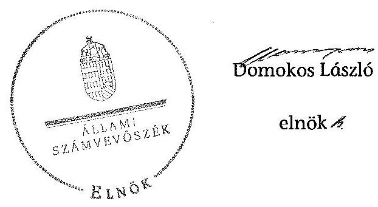

# ÁLLAMI   SZÁMVEVŐSZÉK 

## JELENTÉS

az önkormányzati vagyongazdálkodás szabályszerűségi ellenőrzéséről

Bugac
13066
2013. augusztus

---

# Állami Számvevőszék 

Iktatószám: V-0026-047-021/2013
Témaszám: 1065
Vizsgálat-azonosító szám: V0593009

## Az ellenőrzést felügyelte:

## Makkai Mária

felügyeleti vezető
2012. december 16. napjától

## Gyüre Lajosné

felügyeleti vezető
2012. december 15. napjáig

## Az ellenőrzést vezette és az ellenőrzés végrehajtásért felelős:

## Kesjár János

ellenőrzésvezető

## Az ellenőrzést végezték:

| Vörösné Lakatos | Eigner György Zoltán | Gaálné Berente Mónika |
| :-- | :-- | :-- |
| Zsuzsanna | számvevő tanácsos | számvevő |
| számvevő |  |  |

---

# TARTALOMJEGYZÉK 

BEVEZETÉS ..... 3
I. ÖSSZEGZŐ MEGÁLLAPÍTÁSOK, KÖVETKEZTETÉSEK, JAVASLATOK ..... 5
II. RÉSZLETES MEGÁLLAPÍTÁSOK ..... 9

1. A vagyongazdálkodási tevékenység szabályozottsága ..... 9
1.1. A feladatellátás formáinak meghatározása, a döntések megalapozottsága ..... 9
1.2. A vagyonnal gazdálkodó szervezetek szervezeti rendjének szabályozottsága, a kötelező szabályzatok megfelelősége ..... 10
1.3. A vagyongazdálkodás szabályozása ..... 11
2. A vagyongazdálkodás szabályszerűsége ..... 12
2.1. A vagyon nyilvántartásának megfelelősége ..... 12
2.2. A vagyongazdálkodást érintő gazdasági események követelmények szerinti dokumentáltsága ..... 13
2.3. A vagyongazdálkodási intézkedések, döntések szabályszerűsége ..... 15
3. A vagyonváltozást eredményező gazdasági események szabályszerűsége ..... 16
3.1. A vagyon értékének és összetételének változása ..... 16
3.2. Közbeszerzési eljárás alkalmazása ..... 17
3.3. Hitelfelvétel, kötvénykibocsátás, garancia és kezességvállalás szabályszerűsége ..... 18
4. A vagyongazdálkodás szabályszerűségére vonatkozó belső és külső ellenőrzések hasznosulása ..... 19
4.1. A belső ellenőrzés által tett megállapítások, javaslatok hasznosulása ..... 19
4.2. A többségi tulajdonban lévő gazdasági társaságok vagyongazdálkodásának felügyelete ..... 19
4.3. A könyvvizsgálatnak a vagyongazdálkodás szabályosságához való hozzájárulása ..... 20
4.4. A külső ellenőrző szervezetek által tett javaslatok hasznosulása ..... 21

---

# MELLÉKLETEK 

1. számú Bugac Nagyközségi Önkormányzat gazdálkodására jellemző adatok, mutatószámok
2. számú Bugac Nagyközségi Önkormányzat vagyonának alakulása
3. számú Bugac Nagyközségi Önkormányzat kötelezettségeinek alakulása

## FÜGGELÉKEK

1. számú Rövidítések jegyzéke
2. számú Értelmező szótár

---

# JELENTÉS 

## az önkormányzati vagyongazdálkodás szabályszerűségi ellenőrzéséről

## Bugac

## BEVEZETÉS

Az ÁSZ kiemelten fontosnak tartja az Állami Számvevőszékről szóló 2011. évi LXVI. törvény 5. § (4) bekezdése alapján az önkormányzati vagyon kezelésének, a vagyonnal való gazdálkodási szabályok betartásának az ellenőrzését. Az ellenőrzés feladata a vagyongazdálkodással kapcsolatban a közpénzek átláthatósága, nyilvánossága érdekében a jogszabályokban, belső szabályzatokban megfogalmazott előírások érvényesülésének áttekintése. Az Állami Számvevőszék nem csak az ellenőrzött szervezet vagyongazdálkodásának a hibáira mutat rá, számon kérve azok kijavítását, hanem megállapításaival, javaslataival segíti a közpénzzel, a közvagyonnal való felelős gazdálkodást.

Az önkormányzati vagyon alapvető funkciója, hogy a közérdeket és egyúttal az önkormányzati célok megvalósítását szolgálja. A feladatellátás terén elsősorban a kötelezően ellátandó feladatok végrehajtását hivatott szolgálni, amely mellett az önként vállalt feladatok ellátása is megvalósulhat.

## Az ellenőrzés célja az Önkormányzatnál annak értékelése volt, hogy:

- a vagyongazdálkodási tevékenységet, annak szervezeti kereteit szabályozták-e;
- az önkormányzati vagyongazdálkodás törvényességét, szabályszerűségét biztosították-e a döntések előkészítése és végrehajtása során;
- jogszerű döntéseken alapult-e a vagyon értékének és összetételének változása;
- a belső ellenőrzés elősegítette-e a vagyongazdálkodás szabályszerű működését, valamint hasznosultak-e a korábbi külső ellenőrzések által tett javaslatok.

Az ellenőrzés típusa: szabályszerűségi ellenőrzés
Az ellenőrzés a 2007. január 1. és 2011. december 31. közötti időszakra terjedt ki, kitekintéssel az ellenőrzés befejezéséig tartó időszak releváns folyamataira. Az egyes közbeszerzési eljárások lefolytatásának ellenőrzése a 2011. évet és a 2012. év I. negyedévét érintette.

---

Az ellenőrzés szakmai módszertana az Állami Számvevőszék Ellenőrzési Kézikönyvében foglalt szakmai szabályokon alapult, amely a Legfelsőbb Ellenőrző Intézmények Nemzetközi Szervezete (INTOSAI) által kiadott nemzetközi standardok (ISSAI) figyelembevételével készült.

A vagyongazdálkodás szabályszerűségének ellenőrzését a helyi szabályozások (rendeletek, szabályzatok, utasítások) ellenőrzésével végeztük el. A vagyonváltozások köréből az ellenőrizendő tételeket mintavétellel, a számviteli nyilvántartásokból választottuk ki.

Bugac lakosainak száma 2011. december 31-én 2848 fő volt. A 2010. évi önkormányzati választást követően az Önkormányzat hét tagú Képviselőtestületének munkáját három állandó bizottság segítette. Az Önkormányzat mellett kisebbségi önkormányzat nem működik. A polgármester személye a 2006. évi önkormányzati képviselő és polgármester választás során változott, a jegyző 1999 óta tölti be a tisztségét, de 2007. szeptember és 2009. augusztus között - gyermekgondozás miatti tartós távolléte alatt - feladatait megbízott jegyző látta el. Az Önkormányzat feladatainak végrehajtása érdekében a 2011. évben egy önállóan működő és gazdálkodó költségvetési szervet tartott fenn (Bugac és Bugacpusztaháza Községek Polgármesteri Hivatala). A Polgármesteri hivatalban dolgozó köztisztviselők száma 2011. december 31-én 11 fő volt.

Az Önkormányzat 1991. január 1-jétől az Ötv. 44. §-a szerint Bugacpusztaháza Község Önkormányzatával Társult Képviselő-testületet alakított, egyesített költségvetéssel oly módon, hogy közös Polgármesteri hivatalt tartanak fenn, közösen működtetik az intézményeket, a helyi adókat külön-külön döntéssel állapítják meg, a külön-külön kimutatott központi és helyi bevételeket összevontan kezelik, egységes költségvetést és zárszámadást, valamint önálló beszámolót készítenek, és önálló vagyonnyilvántartással rendelkeznek. Az Önkormányzat két gazdasági társaságban rendelkezett részesedéssel, melyből egy a Társult Önkormányzatok közös tulajdonában volt 2010-2011 között.

Az Önkormányzat a 2011. évi költségvetési beszámolója szerint 889,2 millió Ft költségvetési bevételt ért el és 495,6 millió Ft költségvetési kiadást teljesített, 2011. december 31-én a könyvviteli mérleg szerint 1763,4 millió Ft értékű vagyonnal rendelkezett, az adósságállomány értéke 701,4 millió Ft volt. Az Önkormányzat gazdálkodására jellemző adatokat, mutatószámokat az 1-3. számú mellékletek tartalmazzák.

Az ÁSZ a 2011. évi LXVI. törvény 29. § (1) bekezdése szerint a jelentéstervezetet megküldte egyeztetésre Bugac Nagyközség Önkormányzata polgármesterének, aki az ÁSZ tv. 29. § (2) bekezdésében foglalt észrevételezési jogával nem élt, a jelentéstervezetre észrevételt nem tett.

---

# I. ÖSSZEGZŐ MEGÁLLAPÍTÁSOK, KÖVETKEZTETÉSEK, JAVASLATOK 

Az Önkormányzat vagyonának könyvviteli mérleg szerinti értéke 2007-ről 2011-re 578,2 millió Ft-ról 1763,4 millió Ft-ra, 1185,2 millió Ft-tal nőtt. A több mint háromszoros növekményből meghatározó a 464,3 millió Ft a korábban érték nélkül nyilvántartott földterületek, telkek értékkülönbözete, a 298,7 millió Ft a vagyonváltozások összege (a megvalósított beruházások és felújítások, az elszámolt értékcsökkenés, valamint a kötvénykibocsátásból fejlesztési célra fel nem használt bevétel 385,4 millió Ft értékpapírba történő befektetése). Az Önkormányzat a 720,9 millió Ft összegű vagyonnövekedés 62,4%-át kötvénykibocsátásból származó bevételből finanszírozta.

Az Önkormányzat 2008. évben 450 millió Ft fejlesztési célú kötvényt bocsátott ki és ezzel a döntéssel megsértette az Ötv.-ben meghatározott adósságot keletkeztető éves kötelezettségvállalás felső határára vonatkozó előírást. Az Önkormányzat a kötvénykibocsátásból származó bevétel 85,6%-át nem a kibocsátás szerinti célra használta fel, a szabad forrását 2008-2011-ig betétként helyezte el. A kötvénykibocsátásból fennmaradó részt 2011. évben azonban az Ötv. előírását megsértve nem önkormányzati cél megvalósítását szolgáló életbiztosításokba fektette.

Az Önkormányzat vagyongazdálkodási tevékenységének szabályozottsága terén feltárt hiányosságok hozzájárultak a vagyongazdálkodási feladatok végrehajtásánál tapasztalt szabálytalanságokhoz. A gazdálkodási jogkörök gyakorlása tárgyában a 2001. évtől alkalmazott szabályzatokat 2010-ig nem aktualizálták, a 2010. évig nem készítették el az értékelési és az önköltség számítási szabályzatokat. A szabályzatok átdolgozása a 2010. évben megtörtént, de a 2011-2012. évi jogszabályi változásokat nem követték és nem vezették át.

A vagyongazdálkodási rendelet 1,2-ben meghatározták az önkormányzati feladatellátást biztosító törzsvagyon körét, azon belül a forgalomképtelen és a korlátozottan forgalomképes vagyonelemeket, illetve a forgalomképes vagyon körébe tartozó vagyontárgyakat, azonban nem írták elő a forgalomképesség megváltoztatásának szabályait. A vagyongazdálkodási rendelet 2 az Áht. 1 ellenére nem szabályozta az ingyenes vagyonátruházás, illetve a követelés elengedésének eseteit, csak módját, ugyanakkor ingyenes vagyonátadás nem történt.

Az önkormányzati vagyonnal kapcsolatos döntés előkészítés rendjéről az önkormányzati SzMSz 1,2-ben és a társult önkormányzati SzMSz 1,2-ben rendelkeztek, de az önkormányzati érdekeket védő garanciális elemek szerződésekben történő rögzítésének kötelezettségét nem írták elő, ugyanakkor a vagyonértékesítési szerződésekbe ezeket beépítették.

Az Önkormányzatnál 2007-2011 között a vagyongazdálkodás törvényességét, szabályszerűségét a döntések előkészítése és a döntések végrehajtása során csak részben biztosították. Az Önkormányzatnál a vagyon értékének és összetételének változása - a kötvénykibocsátás és a kötvényforrás lekötésének kivételével - jogszerű döntéseken alapult. A kötvénykibocsátásból származó bevétel fel nem használt részét a 2011. évben az Ötv. és a Mötv. előírásait megsértve és a vagyonrendelet 2 versenyeztetési eljárásra vonatkozó előírását be nem tartva, befektetési egységekhez kötött életbiztosításokba fektették 20,0 millió Ft és 75,6 ezer euró (20,0 millió Ft) értékben. Az Önkormányzat eljárásával az Ötv. előírásait megsértette, mivel az így elhelyezett vagyon nem önkormányzati cél megvalósítását szolgálta, valamint az életbiztosítási szerződéskötés, mint feladat nem tartozott az Ötv.-ben felsorolt önkormányzati feladatok közé. Az Önkormányzat nem tartotta be a vagyonrendelet 2-ben foglaltakat, mely értelmében 0,5 millió Ft feletti portfólió esetén versenyeztetési eljárást kell tartani. A biztosítási szerződéseket az Ámr. 1,2 előírásait figyelmen kívül hagyva ellenjegyzés nélkül kötötték meg.

A nyilvánosság biztosításának eszközeit, a nyilvánosságra hozatal módját és felelősét nem szabályozták. A jegyző az Áht. 1 előírását megsértve a vagyonnal történő gazdálkodással összefüggő, nettó ötmillió Ft-ot elérő vagy azt meghaladó értékű szerződések adatait hét esetben (a kerékpárúttal és a piaccsarnokkal kapcsolatban) nem tette közzé az Önkormányzat honlapján a 2009-2011. években.

Az Önkormányzatnál a 2007-2010 közötti időszakban a zárszámadási rendeletek vagyonkimutatásainak részletezettsége nem felelt meg az Áhsz.-ben, és a vagyongazdálkodási rendelet 1,2-ben előírtaknak. A 2009. évtől a vagyongazdálkodási rendelet előírta a vagyonkimutatás - az Áhsz. és az Áht. 1 vonatkozó rendelkezéseinek megfelelő tartalmú - részletezését, azonban a jogszabályi előírásoknak csak 2011. évi zárszámadáshoz csatolt vagyonkimutatás felelt meg. Az Önkormányzat az Áhsz. és a 147/1992. (XI. 6.) Korm. rendelet előírásait figyelmen kívül hagyva az előírt egyezőség biztosítása érdekében nem egyeztette 2007-2008 között a számviteli kimutatásban szereplő ingatlanvagyont, valamint az ingatlanvagyon kataszter adatait. A 2009. évtől történt egyeztetés, de az adatok egyezőséget kizárólag a 2011. év végén biztosították az ingatlanvagyon kataszter és a földhivatali közhiteles nyilvántartás adatai között.

Az Önkormányzat a 2007-2009. évekre elkészített könyvviteli mérleg értékadatait a Számv. tv. előírásait megsértve, az Áhsz. előírásait figyelmen kívül hagyva leltárral nem támasztották alá, a leltározási kötelezettségnek nem tettek eleget. A leltározás 2010-2011-ben a vonatkozó jogszabályoknak és szabályzatoknak megfelelően történt.

A vagyongazdálkodással kapcsolatban a gazdálkodási jogkörök gyakorlása során figyelembe vették az összeférhetetlenségi követelményeket, amelyet a szakmai teljesítésigazolás kivételével az arra felhatalmazott személyek gyakoroltak. A Polgármesteri hivatalban 2007-2011 között a vagyongazdálkodással összefüggő kiadások teljesítését megelőzően a kötelezettségvállalás ellenjegyzésére, az érvényesítésre, az utalvány ellenjegyzésére és 2010-ig a szakmai teljesítésigazolásra felhatalmazott személyek nem végezték el az Ámr. 1,2-ben előírt ellenőrzési feladataikat.

A beruházások és felújítások megvalósítása során lefolytatták a Kbt. 1-ben előírt esetben a közbeszerzési eljárást és eleget tettek az egybeszámítási kötelezettségnek. A vagyon értékesítéséről a Képviselő-testület döntött, azonban megsér-

---

tették a vagyongazdálkodási rendelet 1,2 forgalmi érték megállapítására vonatkozó szabályait, mert - az ellenőrzött tételek vonatkozásában összesen 1 millió Ft értékben - az eladási árat értékbecsléssel, illetve aktualizált értékbecsléssel nem támasztották alá.

A belső ellenőrzés nem, a könyvvizsgálat azonban elősegítette a vagyongazdálkodás szabályszerű működését. A stratégiai és éves ellenőrzési terveket 2007-2011
 között a Ber. előírásai ellenére kockázatelemzéssel nem támasztották alá, a vagyongazdálkodás szabályszerűségéhez kapcsolódóan a belső ellenőrzés nem végzett vizsgálatot. A 2009-2011 között minden évben elvégzett könyvvizsgálat jelentős számban tartalmazott megállapításokat a vagyongazdálkodás szabályszerűségére vonatkozóan. Az Önkormányzatnál a megállapítások hasznosítása eredményeként a 2011. évre a számviteli nyilvántartás, az ingatlanvagyon kataszter és a földhivatali nyilvántartás adatainak egyezőségét biztosították, a korábban nem értékelt földterületek értékelését elvégezték, a vagyonkimutatást a jogszabálynak megfelelően elkészítették.

A Társult Önkormányzatok 2010-2011 között figyelemmel kísérték a közös tulajdonukban lévő gazdasági társaság pénzügyi-gazdasági helyzetét, megtárgyalták az éves beszámolót és az üzleti tervet, beszámoltatták a gazdasági társaságot az általa végzett tevékenységről, az adósságállomány alakulásáról.

Az Állami Számvevőszékről szóló 2011. évi LXVI. törvény 33. § (1) bekezdésében foglaltak értelmében a jelentésben foglalt megállapításokhoz kapcsolódó intézkedési tervet köteles az ellenőrzött szervezet vezetője összeállítani, és azt a jelentés kézhezvételétől számított 30 napon belül az ÁSZ részére megküldeni. Amennyiben az intézkedési tervet határidőben nem küldi meg a szervezet, vagy az nem elfogadható, az ÁSZ elnöke a hivatkozott törvény 33. § (3) bekezdés a)-b) pontjaiban foglaltakat érvényesítheti.

Az ellenőrzés intézkedést igénylő megállapításai és javaslatai:

# a polgármesternek: 

1. A 2011. évben a Társult Képviselő-testület kötvénykibocsátásból származó 20,0 millió Ft-ot és 75,6 ezer eurót (20,0 millió Ft) befektetési egységekhez kötött négy életbiztosításba helyezett el. Ezzel megsértette az Ötv. 78. § (1) bekezdésében foglaltakat, mert az így elhelyezett vagyon nem önkormányzati cél megvalósítását szolgálja, az életbiztosítási szerződéskötés nem önkormányzati feladat.

## Javaslat

Intézkedjen a befektetési egységekhez kötött életbiztosítások megszüntetésére és gondoskodjon arról, hogy a kötvénykibocsátásból származó bevétel átmenetileg szabad részének befektetése az Mötv. 106. § (2) bekezdésében előírt önkormányzati céloknak feleljen meg.

---

# a jegyzőnek: 

1. Az Önkormányzat a honlapján nem tette közzé - megsértve az Eisztv. 6. § (1) és az Áht. 1 15/8. § (1) előírásait - a nettó ötmillió Ft-ot elérő vagy azt meghaladó értékű szerződések közzétételre előírt adatait.

## Javaslat

Intézkedjen az Info tv. 1. számú mellékletében meghatározott adatok közzétételéről.
2. Az ingatlanértékesítések során a vagyongazdálkodási rendelet $_{1,2}$ forgalmi érték megállapítására vonatkozó szabályait nem tartották be, az eladási árat nem értékbecslés, illetve nem aktualizált értékbecslés alapján határozták meg.

## Javaslat

Intézkedjen az önkormányzati ingatlanok értékesítéseit megelőzően a vagyonrendelet$_{2}$ forgalmi érték megállapítására vonatkozó előírásának betartásáról.
3. A stratégiai és éves ellenőrzési terveket 2007-2011 között a Ber. 18. § és 21. § (2) valamint (3) bekezdés a) pontjában foglalt előírások ellenére kockázatelemzéssel nem támasztották alá. A belső ellenőrzés nem végzett a vagyongazdálkodáshoz kapcsolódó ellenőrzést, ezért nem segítette a szabályszerű vagyongazdálkodást.

## Javaslat

Intézkedjen, hogy a belső ellenőrzés a Bkr. 22. § (1) bekezdés b) pontjában előírtak alapján a stratégiai és éves ellenőrzési terveket kockázatelemzéssel támassza alá, valamint a 31. § (3) pontja alapján a magas kockázatúnak minősített területeket a lehető legrövidebb időn belül ellenőrizze.
4. A 2007-2011. években az ellenőrzött tételeknél 279,0 millió Ft értékben a kötelezettségvállalás ellenjegyzője és az érvényesítő - az Ámr. $_{1}$ 134. § (8)-(9), az Ámr. $_{2}$ 74. § (1) és (3), az Ámr. 1 135. § (3) és az Ámr. 2 77. § (1) bekezdéseiben foglalt előírások ellenére - nem végezte el ellenőrzési feladatait.

## Javaslat

Intézkedjen, hogy a pénzügyi ellenjegyző és az érvényesítő - az Áht. 2 37. § (1) és az Ávr. 58. § (1) bekezdései előírásainak megfelelően - végezze el ellenőrzési feladatait.

---

# II. RÉSZLETES MEGÁLLAPÍTÁSOK 

## 1. A VAGYONGAZDÁLKODÁSI TEVÉKENYSÉG SZABÁLYOZOTTSÁGA

### 1.1. A feladatellátás formáinak meghatározása, a döntések megalapozottsága

Bugac Nagyközség és Bugacpusztaháza Község Képviselő-testülete az Ötv. 44. §a alapján 1991. január 1-jétől határozatlan időre Társult Képviselőtestületet alakított. A Társult Képviselő-testület az együttműködésre vonatkozó megállapodást 2007-2011. között két alkalommal $^{1}$ felülvizsgálta.

A Társult Képviselő-testület működési rendje: a Társult Képviselő-testület egészében egyesítette költségvetését; közös hivatalt - Bugac és Bugacpusztaháza Községek Polgármesteri Hivatala - tart fenn és közösen működteti intézményeit; helyi adókat a települések külön-külön döntéssel állapítanak meg; a külön-külön kimutatott központi és helyi bevételeket összevontan kezeli; egységes költségvetést és zárszámadást készít, összevont könyveléssel.

A Társult Önkormányzatok a 2007-2011. években két gazdasági programmal rendelkeztek, amelyeket a törvényi előírás szerint a választást követő hat hónapon belül elfogadtak. Mindkét gazdasági program tartalmazta az Ötv. 91. § (6) bekezdésében meghatározott szabályozási elemeket a települések sajátosságainak megfelelően.

A gazdasági program $_{1}$ legfőbb célkitűzése az volt, hogy „az önkormányzati vagyon a Képviselő-testület ciklusa alatt tartósan ne csökkenjen. Csak olyan fejlesztéseket vállaljon, melyekkel a megvalósuló eszközöket, programokat a működtetés során is zökkenőmentesen finanszírozni tudja". A gazdasági program $_{2}$-ben kiemelt célként a kötvényből származó bevétel hozamának növelése került meghatározásra.

A Társult Képviselő-testület az Ötv., valamint a közoktatási, a szociális, az egészségügyi, a közművelődési és a kommunális feladatokra vonatkozó ágazati jogszabályok előírásai alapján egyedi döntésekkel határozta meg, hogy mely feladatokat, milyen mértékben és módon lát el. A Társulásba történő belépéssel összefüggésben 2007-2011. évek között vagyonváltozás nem történt. A közszolgáltatások ellátásához 2007-2011. évek között az Ötv. 9. § (4) bekezdése alapján intézmények átszervezésére és gazdasági társaság alapítására is sor került. A Társult Képviselő-testület számára a feladatellátás formáinak meghatározásánál, a feladatok körének, a feladatellátás szervezeti formájának módosításánál a megalapozott döntés meghozatala érdekében bemutattak alternatív javaslatokat az előterjesztésekben.

A 2011. év végén az Önkormányzat két gazdasági társaságban rendelkezett részesedéssel. A 63,7 millió Ft összértékű részesedésből 60,7 millió Ft-ot a

[^0]
[^0]:    $^{1}$ 2006. október 25-én és 2010. november 3-án

---

Bácsvíz Zrt.-ben fennálló kisebbségi tulajdoni rész, 3,0 millió Ft-ot a Községgazdálkodási Kft.-ben fennálló 50%-os önkormányzati rész tett ki.

# 1.2. A vagyonnal gazdálkodó szervezetek szervezeti rendjének szabályozottsága, a kötelező szabályzatok megfelelősége 

A Társult Önkormányzatoknál külön SzMSz-szel rendelkeztek a Képviselőtestületek, a Társult Képviselő-testület, a Polgármesteri hivatal, valamint a közszolgáltatásokat ellátó intézmények. A társult önkormányzati SzMSz$_{1,2}$ és az önkormányzati SzMSz$_{1,2}$ rendelkezett a létrehozott egységes Polgármesteri hivatalról.

Az önkormányzati SzMSz$_{1}$ tartalmazott vagyongazdálkodással kapcsolatos, a Homokhátsági Regionális Önkormányzati Társulásra átruházott hatáskört. Az átruházott hatáskörben végzett tevékenységgel kapcsolatban beszámolási kötelezettséget az önkormányzati SzMSz$_{1}$ nem írt elő. Az önkormányzati SzMSz$_{2}$ nem tartalmaz átruházott hatáskört.

Az önkormányzati SzMSz$_{1}$-hez csatolt 1. sz. mellékletben a Homokhátsági Regionális Önkormányzati Társulásra átruházott hatáskörként a közcélú ártalmatlanító telep létesítése, valamint a közcélú hulladéklerakó üzemeltetése szerepelt. Az önkormányzati SzMSz$_{2}$ már nem nevesít társulásra átruházott feladatokat. Mindkét szabályzatból hiányzik a Kistérségi Társulásra átruházott (vidék- és területfejlesztésre, háziorvosi ügyeleti ellátásra vonatkozó) hatáskör.

A Képviselő-testület a vagyonnal való rendelkezés egyes döntési jogosítványait a vagyongazdálkodási rendelet $_{1,2}$-ben értékhatár és ügytípus alapján ruházta át a polgármesterre. A Képviselő-testület az átruházott hatáskör gyakorlásához a vagyongazdálkodási rendelet $_{1,2}$-ben és a közbeszerzési szabályzat $_{1,2}$-ben adott utasítást. A vagyonnal gazdálkodó, önkormányzati vagyont használó közfeladatot ellátó költségvetési szervek alapító okirataiban meghatározták a szervezetek alaptevékenységét.

A Polgármesteri hivatal működésére, feladatellátására vonatkozó általános szabályokat, a hivatal belső szervezetét a Társult Képviselő-testület által határozattal elfogadott hivatali SzMSz$_{1,2}$-ben hagyták jóvá. Az Ámr. $_{1}$ 10. § (4) bekezdését figyelmen kívül hagyva a hivatali SzMSz$_{1}$ „ügyrend" megnevezéssel került jóváhagyásra, de tartalmában SzMSz-nek felelt meg. Az Ámr. $_{1}$ 145/B. § (2) bekezdésében foglaltak ellenére a hivatali SzMSz$_{1,2}$-hez nem csatolták mellékletként az ellenőrzési nyomvonalat. A hivatali SzMSz$_{2}$ tartalmazza az Ámr. $_{2}$-ben meghatározott kötelező tartalmi elemeket.

A hivatali SzMSz$_{2}$ részletesen szabályozza a Polgármesteri hivatal jogállását, feladatait, irányítását, szervezeti felépítését és a szervezeti egységek feladatait, a működés szabályait, valamint a köztisztviselőkkel szemben támasztott általános etikai követelményeket. A vagyongazdálkodási és gazdasági munkakörökhöz tartozó feladat- és hatásköröket a munkaköri leírásokban szabályozták. A hivatali SzMSz$_{2}$ független az ügyrend, melyben a jegyző a vonatkozó jogszabályoknak megfelelően részletesen szabályozta a gazdálkodással összefüggő feladatok munkafolyamatainak leírását, a feladat- és hatásköröket, a belső és külső kapcsolattartás módját, szabályait.

---

A Polgármesteri hivatal a 2007-2011. években rendelkezett a Számv. tv. által előírt Számviteli politika$_{1,2}$-vel. Az intézmények gazdálkodási feladatait a Polgármesteri hivatal látta el, így az önkormányzati szintű - a Polgármesteri hivatal és az intézmények - egységes számviteli elvek szerinti beszámolás biztosított volt. Nem készítették el 2011. április 30-áig az Áhsz. 8. § (17) bekezdésében előírt értékelési szabályzatot és a 8. § (13) bekezdésében előírt, az önköltségszámítás rendjére vonatkozó belső szabályzatot. A 2001. január 1-jétől alkalmazott szabályzatokat nem aktualizálták 2009. december 31-éig. A jegyző írásban nem jelölte ki a szakmai teljesítés igazolási feladatok ellátásával megbízott személyeket. A szabályzatok átdolgozása a 2010. évben megtörtént, de a 2011-2012. évi jogszabályi változásokat nem követték és nem vezették át.

A vagyongazdálkodási rendelet$_{2}$ 19. § (3) bekezdésének szabályozása szerint a leltározást kétévente kellett elkészíteni. Azonban az üzemeltetésre, vagyonkezelésre, koncesszióba átadott eszközök leltározásának módját$^{2}$ a Leltározási Szabályzat$_{1}$ a 2007-2009. években nem, a Leltározási Szabályzat$_{3}$ csak a 2010. évtől szabályozta.

# 1.3. A vagyongazdálkodás szabályozása 

A vagyongazdálkodási rendelet$_{1,2}$ 2004-ben és 2009-ben került elfogadásra, melyet a jogszabályváltozások és a vagyonban bekövetkezett változások alapján aktualizáltak. A vagyongazdálkodási rendelet$_{1,2}$-vel összhangban, a költségvetési szervek alapító okirata, a Polgármesteri hivatal szervezeti és működési rendjét szabályozó egyes dokumentumok (hivatali SzMSz$_{1,2}$, folyamatszabályozás, munkaköri leírások) tartalmazták a feladatot, illetékességet, hatáskört és felelősséget, azonban az ügyrend hiánya és a gazdálkodási szabályzatok aktualizálásának elmaradása miatt a szabályozottság nem volt teljes körű.

A vagyongazdálkodási rendelet$_{2}$-ben az Ötv. 79. §-ának megfelelően meghatározták az önkormányzati feladatellátást biztosító törzsvagyon körét. Rögzítették a törzsvagyonon belül a forgalomképtelen és a korlátozottan forgalomképes vagyonelemeket, valamint a törzsvagyonba nem tartozó vagyoni kört. Az Áhsz. 44/A. §-ának és az Áht. $_{1}$ 118. § (2) bekezdésének 1. c) pontjának megfelelően meghatározták a vagyonkimutatás rendjét és tartalmát. A forgalomképesség megváltoztatásának szabályait nem írták elő.

A vagyontárgyak feletti rendelkezési jogot összeghatár alapján osztották meg a vagyongazdálkodási rendelet$_{1}$-ben a Társult Képviselő-testület, a vagyongazdálkodási rendelet$_{2}$-ben a Képviselő-testület, valamint a polgármester és a vagyonkezelők között. A vagyongazdálkodási rendelet$_{1,2}$ előírásai alapján meghatározott érték feletti ingatlan értékesítésére, illetve más módon történő hasznosítására versenyeztetéssel kerülhetett sor, rögzítették a versenyeztetéssel történő vagyonhasznosítás feltételeit és szabályait, értékhatárait. A részletes eljárási szabályok a vagyongazdálkodási rendelet$_{2}$-ben szerepeltek.

[^0]
[^0]:    $^{2}$ 131-11/2010.(04.26.) számú jegyzői rendelkezés, Leltározási Szabályzat 5.1. pont

---

A vagyongazdálkodási rendelet$_{1}$ tartalmazta a vagyon ingyenes, vagy kedvezményes átruházásának, a követelés elengedésének eseteit és módját. A vagyongazdálkodási rendelet$_{2}$ az Áht. $_{1}$ 108. § (2) bekezdés
 ${ }^{3}$ ellenére nem szabályozta az ingyenes vagyonátruházás, illetve a követelés elengedésének eseteit, csak módját, ugyanakkor ingyenes vagyonátadás nem történt.

A gazdálkodással összefüggő, jogszabályokban előírt ellenőrzési feladatok - a kötelezettségvállalás ellenjegyzése, a szakmai teljesítésigazolás, érvényesítés és az utalvány ellenjegyzése - beépítése a vagyongazdálkodási folyamatokba csak a 2010. évtől biztosították a vagyongazdálkodás szabályszerű működésének feltételét.

A hasznosításra szánt forgalomképes vagyon értékének megállapítása céljából - a vagyongazdálkodási rendelet ${ }_{1}$-ben hat hónapnál, a vagyongazdálkodási rendelet ${ }_{2}$-ben három hónapnál nem régebbi - értékbecslés készítésének kötelezettségét írták elő. A vagyonkezelési szerződés tartalmát szabályozták a vagyongazdálkodási rendelet ${ }_{2}$-ben, de nem írták elő az önkormányzati érdekeket védő garanciális elemek vagyonhasznosítási szerződésekben történő rögzítésének kötelezettségét.

A Közbeszerzési szabályzat ${ }_{1,2}$-ben a hatályos jogszabályi előírások alapján alkották meg a közbeszerzési eljárások előkészítésével, lefolytatásával kapcsolatos szabályozást.

Az éves költségvetési koncepció, a költségvetés és a beszámoló elkészítésének rendjét, munkafolyamatainak felelőseit a vagyongazdálkodásra vonatkozóan az ügyrendben, az ellenőrzési nyomvonalban és a 2010. május 5-étől hatályos költségvetés tervezési szabályzatban szabályozták. Az előterjesztések készítésének, megtárgyalásának, véleményezésének, döntéshozatalának általános rendjét az önkormányzati $\mathrm{SzMSz}_{1,2}$-ben és a társult önkormányzati $\mathrm{SzMSz}_{1,2}$-ben is szabályozták, amelyek a vagyongazdálkodást érintő előterjesztésekre is vonatkoztak.

# 2. A VAGYONGAZDÁLKODÁS SZABÁLYSZERŰSÉGE 

### 2.1. A vagyon nyilvántartásának megfelelősége

A 2007-2011. években az Ötv. 78. § (2) bekezdése alapján a zárszámadási rendeletek tartalmazták az egyes évekre vonatkozó vagyonkimutatást. A vagyongazdálkodási rendelet ${ }_{2}$-ben a 2009. évtől előírták a vagyonkimutatás - az Áhsz. 44/A. § (2), (3) bekezdésének és az Áht. ${ }_{1}$ 118. § (2) bekezdés 1. c) pontjának megfelelő tartalmú - részletezését, azonban a jogszabályi előírásoknak csak 2011. évi zárszámadáshoz csatolt vagyonkimutatás felelt meg. A törzsvagyon (ezen belül a forgalomképtelen, illetve korlátozottan forgalomképes) és a nem törzsvagyon részét képező eszközök értékének elkülönítését az analitikus nyilvántartások biztosították.

[^0]
[^0]:    ${ }^{3}$ 2012. január 1-jétől az Áht. ${ }_{2}$ 97. § (2) bekezdése tartalmazza.

---

Az Önkormányzatnál a 2007-2008. években az ingatlanvagyon kataszter és a számviteli nyilvántartás adatainak egyeztetését az Áhsz. 49. § (3) bekezdésében előírtak ellenére nem végezték el. A 2009. évtől történt egyeztetés, de az adatok egyezősége kizárólag a 2011. év végén biztosították. A 2010. évben a könyvvizsgálói megállapítás miatt elvégzett egyeztetés eredményeként 464,3 millió Ft-tal módosították a számviteli nyilvántartást.

Az Önkormányzatnál 2009-ig a számviteli nyilvántartásokban a földterületeket, utakat, csatornákat érték nélkül szerepeltették, míg a kataszteri nyilvántartásban becsült értéken nyilvántartották. A két nyilvántartás 2009. év végi záró adatokra vonatkozó egyeztetését követően a 2010. évben a számviteli nyilvántartáson átvezették a különbözetet, azonban a kataszteri nyilvántartásban elmaradt az adott évben az ingatlanokhoz kapcsolódó befejezett beruházások aktivált értékének felvezetése, így a két nyilvántartás közötti egyezőség 2010. év végén sem állt fenn.

A 2007-2010. évek között a 147/1992. (XI. 6.) Korm. rendelet 1. § (2) bekezdésében foglalt előírás ellenére nem biztosították az ingatlanvagyon kataszter és a földhivatali ingatlan nyilvántartás adatai közötti egyezőséget. A 2011. évben az ingatlan nyilvántartásban szereplő adatok lekérésével végzett egyeztetést nem dokumentálták, ellenőrzésünk alapján a kataszteri és a számviteli nyilvántartások, illetve a földhivatali ingatlan-nyilvántartás adatai közötti egyezőséget a 2011. év végén biztosították.

Az Önkormányzat a 2007-2009. évekre elkészített könyvviteli mérlegek értékadatait a Számv. tv. 69. § (1)-(2) bekezdés és az Áhsz. 37. § (2) bekezdés előírásait megsértve leltárral nem támasztotta alá, a leltározási kötelezettségnek az Áhsz. 37. § (1) bekezdés ellenére nem tettek eleget. A tárgyi eszközök leltározása a 2010. évben egyeztetés módszerével történt, megsértve ezzel az Áhsz. 37. § (3) bekezdésben foglaltakat, amely az eszközök mennyiségi felvétellel történő leltározását írja elő. A 2011. évben a tárgyi eszközök leltározása megfelelően mennyiségi felvétellel történt. A mérlegsorok értékét - a befektetett pénzügyi eszközök kivételével - a Számv. tv. általános alapelveinek és tételes szabályainak, az Áhsz., a Számviteli politika, valamint az Értékelési szabályzat előírásai alapján határozták meg.

# 2.2. A vagyongazdálkodást érintő gazdasági események követelmények szerinti dokumentáltsága 

A vagyongazdálkodással kapcsolatban a gazdálkodási jogköröket - a szakmai teljesítés igazolás kivételével - az arra írásban felhatalmazott, illetve kijelölt személyek gyakorolták. A gazdálkodási jogkörök gyakorlása során valamennyi gazdasági eseménynél betartották az Ötv.-ben, az Ámr. ${ }_{1,2}$-ben rögzített összeférhetetlenségi követelményeket.

A költségvetést terhelő kötelezettségvállalásokat az Ámr. ${ }_{1}$ 134. § (8) bekezdésében és az Ámr. ${ }_{2}$ 74. § (1) bekezdésében foglaltaknak ellenére három esetben nem foglalták írásba, továbbá egy esetben nem volt fellelhető a kötelezettségvállalás alapdokumentumát jelentő szerződés. A Polgármesteri hivatalban a kötelezettségvállalásokról nem vezettek nyilvántartást, így az Ámr. ${ }_{1}$ 134. § (13), illetve az Ámr. ${ }_{2}$ 75. § (1) be-

---

kezdésben foglaltak ellenére nem volt megállapítható az évenkénti kötelezettségvállalások, illetve a rendelkezésre álló kötelezettségvállalással nem terhelt, szabad előirányzatok összege. A nyilvántartás hiányában nem biztosították, hogy a költségvetés végrehajtása során kötelezettségvállalás és utalványozás csak a jóváhagyott kiadási előirányzatok mértékéig történjen. Az Önkormányzatnál 2007-2011 között a felhalmozási célú kiadási előirányzatok teljesített összege minden évben meghaladta a jóváhagyott kiadási előirányzat összegét. A túllépés összege a felújítások vonatkozásában a 2008. évben 2,7 millió Ft, a felhalmozási (beruházások) kiadások tekintetében a 2007. évben 0,6 millió Ft, a 2009. évben 139,6 millió Ft, a 2010. évben 1,4 millió Ft és a 2011. évben 0,4 millió Ft volt.

Az ellenőrzött vagyoncsökkenést eredményező gazdasági események közül két ingatlanértékesítés ${ }^{4}$ esetében a befolyt ellenértékről (összesen 0,3 millió Ft) nem állított ki bizonylatot (számlát) a vevő részére, ezáltal az Önkormányzat nem tartotta be a Számv. tv. 165. § (1) bekezdésében előírt bizonylati fegyelmet, illetve nem tett eleget az Áfa tv. 159. § (1) bekezdésében előírt számlaadási kötelezettségének.

A Polgármesteri hivatalban 2007-2011 között a vagyongazdálkodáshoz kapcsolódó kiadások és bevételek teljesítését megelőzően a kötelezettségvállalás ellenjegyzésére, az érvényesítésre, az utalvány ellenjegyzésére, valamint 2010-ig a szakmai teljesítésigazolásra felhatalmazott és kijelölt személyek nem végezték el az Ámr ${ }_{1,2}$-ben előírt (folyamatba épített) ellenőrzési feladataikat. Az ellenőrzések elmulasztása miatt fennállt a kiadások szabálytalan teljesítésének kockázata:

- az Áht. ${ }_{1}$ 100/C. § (3) bekezdésében és az Ámr. ${ }_{1}$ 134. § (8) bekezdésében, illetve az Ámr. ${ }_{2}$ 74. § (1) bekezdésében előírtak ellenére a kötelezettségvállalást nem előzte meg annak ellenjegyzése a 2007-2011. években megkötött valamennyi szerződés, megrendelés (összesen 279,0 millió Ft) esetében, ezáltal az Ámr. ${ }_{1}$ 134. § (9) bekezdésében, illetve az Ámr. ${ }_{2}$ 74. § (3) bekezdésében foglalt ellenőrzési feladatokat nem végezték el;
- Az érvényesítők az Ámr. ${ }_{1}$ 135. § (3) bekezdésében, illetve az Ámr. ${ }_{2}$ 77. § (1) bekezdésében foglalt előírás ellenére nem ellenőrizték, az utalványok ellenjegyzői az Ámr. ${ }_{1}$ 137. § (3) bekezdésében, illetve a Ámr. ${ }_{2}$ 79. § (2) bekezdésében foglaltak ellenére nem észrevételezték, hogy az Ámr. ${ }_{1}$-nek és az Ámr. ${ }_{2}$-nek a kötelezettségvállalás ellenjegyzésére vonatkozó előírását nem tartották be a vagyongazdálkodással összefüggő gazdasági eseményeknél;
- A 2007-2010. április 30. között teljesített (összesen 82 millió Ft) kifizetések esetében a szakmai teljesítés igazolását - szabályozás hiányában - nem a jegyző által kijelölt személy végezte el, ezért - az Ámr. 135. § (1) bekezdésében, illetve az Ámr. ${ }_{2}$ 76. § (1) bekezdésében előírtak ellenére - a kifizetést megelőzően a szakmai teljesítésigazoló által nem történt meg a kifizetés jogosságának, összegszerűségének és a szerződésszerű teljesítésnek az ellenőrzése;
- A 2007-2009 között befolyt (összesen 0,8 millió Ft) bevételek esetében a szakmai teljesítés igazolását az Ámr. ${ }_{1}$ 135. § (1) bekezdésében előírtak ellenére - szabályozás hiányában - nem a jegyző által kijelölt személy végezte el. A be-

[^0]
[^0]:    ${ }^{4}$ A 0319/6 hrsz.-hoz kapcsolódó ingatlancsere, valamint a 060 hrsz. ingatlanból 396 m² ingatlanrész értékesítés.

---

vételek teljesítése során a belső kontrollok - a bevételeket megalapozó szerződések ellenőrzése és az utalvány ellenjegyzés - szabályozás hiányában nem működtek. Nem volt dokumentált annak vizsgálata, hogy a bevételek ténylegesen a dokumentumban rögzített mértékben illetik-e meg az Önkormányzatot, az adásvételi szerződés aláírását megelőzően nem ellenőrizték, hogy a Képviselő-testület által meghatározott feltételeket és az Önkormányzat érdekeit védő garanciális elemeket a szerződésben rögzítették-e, továbbá azt, hogy a gazdálkodásra vonatkozó szabályokat betartották-e.

A jegyző az Áht. ${ }_{1}$ 15/B. § (1) bekezdésében ${ }^{5}$ előírtakat megsértve a vagyonnal történő gazdálkodással összefüggő, a nettó öt millió Ft-ot elérő vagy azt meghaladó értékű szerződések adatait hét esetben a kerékpárúttal és a piaccsarnokkal kapcsolatban nem tette közzé az Önkormányzat honlapján a 2009-2011. években.

# 2.3. A vagyongazdálkodási intézkedések, döntések szabályszerűsége 

A vagyonértékesítéssel összefüggő döntéseket - az értékhatár szerinti hatásköri előírásnak megfelelően - a Képviselő-testület hozta meg. Az ingatlanértékesítések során azonban a vagyongazdálkodási rendelet ${ }_{1,2}$ forgalmi érték megállapítására vonatkozó szabályait megsértették, mivel - az ellenőrzött tételek vonatkozásában összesen 1 millió Ft értékben - az eladási árat nem értékbecslés, illetve nem aktualizált értékbecslés alapján határozták meg. A vagyonértékesítési szerződésekben az Önkormányzat érdekeit védő garanciális elemeket - a szabályozás elmaradása ellenére - beépítették, a szerződésekben a földhivatali bejegyzés feltételeit, a költségek viselésének előírásait meghatározták.

Az Önkormányzat belső szabályzatban nem írta elő a fejlesztésekkel létrehozott létesítmények fenntarthatóságának vizsgálatát, a várható működtetési költségek számszerűsítését. Az európai uniós pályázati forrásból megvalósuló kettő fejlesztés közül egy esetében - a pályázatokhoz kötelező mellékletként csatolt megvalósíthatósági tanulmányban - vizsgálták a beruházással, felújítással létrehozott létesítmény fenntarthatóságát.

A 2007-2011. években az Önkormányzat hosszú lejáratú, pénzintézettel szembeni kötelezettségvállalásáról, a felhalmozási célú kötvénykibocsátásáról a Társult Képviselő-testület döntött 2008. évben. A kötvénykibocsátásról szóló előterjesztés nem tartalmazott szakértői értékbecslést, gazdaságossági számítást, illetve - a belső szabályzás hiányában - más tájékoztató adatokat, alternatív javaslatokat és nem tért ki a kötvény futamidejének egyes éveit terhelő kötelezettségvállalásnak a költségvetési egyensúlyra gyakorolt hatására.

A Pénzügyi bizottság ${ }_{1}$ a kötvénykibocsátás indokait és gazdasági megalapozottságát nem vizsgálta, ezért a Társult Képviselő-testület döntését a Pénzügyi bizottság ${ }_{1}$ véleménye nélkül hozta meg. A Társult Képviselő-testület a kötvény ki-

[^0]
[^0]:    ${ }^{5}$ 2012. január 1-től az Info tv. 1. számú melléklet 4. pontja szabályozza

---

bocsátásról szóló döntését megelőzően - a Képviselő-testületi ülésről készült jegyzőkönyvben rögzítettek alapján - a kötvényt lejegyző pénzintézet munkatársaitól írásbeli és szóbeli tájékoztatást kapott a választható kibocsátási kondíciókról, a kötelezettségvállalás kamat- és árfolyamkockázatairól, az adósságszolgálatról, így a döntését, a kockázatok, az adósságszolgálat ismeretében részben megalapozottan hozta meg.

A kötvénykibocsátásról szóló döntés esetében a döntéshozók az arra felhatalmazott személyek voltak, a szerződések
 és megállapodások tartalma a döntésekben foglaltakkal megegyezett. Az önkormányzati vagyont érintő döntéseket a dokumentumokban foglaltaknak megfelelően hajtották végre.

# 3. A VAGYONVÁLTOZÁST EREDMÉNYEZŐ GAZDASÁGI ESEMÉNYEK SZABÁLYSZERŰSÉGE 

### 3.1. A vagyon értékének és összetételének változása

Az Önkormányzat vagyonának értéke a 2007. évről a 2011. évre 578,2 millió Ft-ról 1763,4 millió Ft-ra, több mint háromszorosára (1185,2 millió Ft-tal) növekedett a befektetett eszközök növekedése eredményeként. A befektetett eszközök közül a tárgyi eszközök értéke 2007-ről 2011-re 763,0 millió Ft-tal emelkedett, elsősorban az ingatlanok - korábban érték nélkül nyilvántartott földterületek, telkek a jogszabályban előírt határidőn túl történt - 2010. évi értékelése (464,3 millió Ft értékben) miatt, valamint a megvalósított beruházások ${ }^{6}$ eredményeként. A befektetett pénzügyi eszközök értéke 385,4 millió Ft-tal emelkedett, a 2008. év végén kibocsátott „Infrastruktúrafejlesztési Alap Bugac" elnevezésű kötvény fejlesztésre fel nem használt részének befektetési célú lekötése miatt.

A 2011. évben a Társult Képviselő-testület - a társult önkormányzati $\mathrm{SzMSz}_{2}$ és a Kötvény szabályzat alapján meghozott - döntésével 20,0 millió Ft-ot és 75,6 ezer eurót (20,0 millió Ft) befektetési egységekhez kötött négy életbiztosításba helyeztek el, melyek biztosítottija a bugacpusztaházai polgármester, a szerződő és a kedvezményezett fél az Önkormányzat volt. A befektetési egységekhez kötött életbiztosítási szerződések megkötésével az Önkormányzat megsértette az Ötv. 78. § (1) bekezdésében ${ }^{7}$ foglaltakat, mert az így elhelyezett vagyon nem önkormányzati cél megvalósítását szolgálta. Az életbiztosítási szerződéskötés, mint feladat nem tartozott az Ötv. 8. § (1) bekezdésében ${ }^{8}$ felsorolt önkormányzati feladatok közé, valamint nem felelt meg az Ámr. ${ }_{2}$ 92. § (1) bekezdésében foglaltaknak, mert biztosítást kötni az irányító szerv által meghatározott veszélyes feladatot ellátó foglalkoztatottra lehetett. A Képviselő-testület azonban a Polgármesteri hivatalban veszélyes feladatot ellátó munkakört, tevékenységet nem határozott meg.

[^0]
[^0]:    ${ }^{6}$ piaccsarnok kialakítása, IKSZT megvalósítása, önkormányzati intézmények felújítása
    ${ }^{7}$ 2012. január 1-jétől a Mötv. 106. § (2) bekezdése tartalmazza.
    ${ }^{8}$ 2013. január 1-jétől a Mötv. 13. és 18. §-ai tartalmazzák.

---

A befektetési egységekhez kötött életbiztosításra teljesített kifizetéssel, valamint az azon felül a kötvényforrásból (a 2011. évben 353,5 millió Ft) fennmaradt szabad pénzeszköz befektetési alapokba történő elhelyezésével ${ }^{9}$ az Önkormányzat megsértette az Ötv. 88. § (1) c) bekezdését, mivel a célhoz nem kötött forrást nem betétként helyezték el.

A saját vagyon a 2007-2011 közötti időszakban 555,9 millió Ft-ról 1058,2 millió Ft-ra, 502,3 millió Ft-tal nőtt az eszközök értékének (1185,2 millió Ft-os) és a kötelezettségek összegének (682,9 millió Ft-os) egyidejű emelkedése egyenlegeként. Az Önkormányzatnak hosszú lejáratú kötelezettsége 2007. évben nem volt, 2011-re 660,9 millió Ft-ra nőtt, melynek oka a 2008. évi 450,0 millió Ft névértékű kötvénykibocsátás és a bekövetkezett árfolyamváltozás hatása volt. A befektetett eszközök fedezetének mutatója ${ }^{10}$ a 2007. évi 101,2%-os szintről a 2011. év végére - 2008-tól emelkedő tendenciát mutatva - 58,5%-os szintre, 42,7 százalékponttal csökkent, vagyis a saját tőkéből a befektetett eszközök fedezetét csökkenő mértékben tudták biztosítani.

A 2007-2011. években az Önkormányzatnál nem történt meg annak felmérése, hogy az eszközök elhasználódása, amortizációja fedezetének biztosítása mekkora forrásokat igényel, az elhasználódott eszközök pótlására tartalékot nem képeztek, külön alapot nem hoztak létre ${ }^{11}$. A Társult Képviselőtestületnek előterjesztett éves zárszámadási rendeletekben nem mutatták be az eszközpótlásra fordított tényleges kiadásokat, az eszközök használhatósági fokának alakulását. Az Önkormányzat 2007-2011 között a tárgyi eszközökre összesen 120,5 millió Ft értékcsökkenést számolt el, míg az ebben az időszakban összesen 432,4 millió Ft értékű beruházást, felújítást aktiváltak, melyből a felújítási kiadások ${ }^{12}$ összege 110,7 millió Ft, az összesen elszámolt értékcsökkenés 91,9%-a volt. Az Önkormányzat - nagyobb részben az intézményeinél végzett beruházásai, felújításai a vagyonérték megőrzését és gyarapítását szolgálták, ennek eredményeként a használhatósági fok mutató a 2007. évi 80,6%-ról a 2011. évre 85,0%-ra nőtt.

# 3.2. Közbeszerzési eljárás alkalmazása 

Az Önkormányzat a 2011-2012. I. negyedéve között a beruházások és felújítások esetében eleget tett a Kbt., 40. § (2) bekezdésében előírt egybeszámítási kötelezettségnek, illetve a becsült érték alapján megalapozottan választotta ki az alkalmazandó eljárásrendet, és a jogszabály alapján előírt esetben lefolytatta a közbeszerzési eljárást. Az Önkormányzatnál a 2011. évben a beruházások, felújítások megvalósítása során a Kbt.-ben előírt értékhatárt meghaladó esetben lefolytatták az előírt eljárást, az Önkormányzat ellen a KT-hez panasz, jogorvoslati kérelem nem érkezett és a KT hivatalból sem indított eljárást szabálytalanság miatt az Önkormányzat ellen.

[^0]
[^0]:    ${ }^{9}$ A 24/2011. (IV. 14.) számú Tkt. határozat alapján.
    ${ }^{10}$ A befektetett eszközök fedezetét a saját tőke és a befektetett eszközök hányadosa mutatja.
    ${ }^{11}$ Amortizációs alap képzésére az önkormányzatokat jogszabály nem kötelezi.
    ${ }^{12}$ általános iskola, óvoda, bölcsőde épületeinek felújítása, útfelújítások, parkfelújítás

---

# 3.3. Hitelfelvétel, kötvénykibocsátás, garancia és kezességvállalás szabályszerűsége 

A 2007-2011. években egy alkalommal felhalmozási célú kötvénykibocsátásra került sor. Hitelfelvétel és működési célú kötvénykibocsátás az Önkormányzatnál nem történt, a gazdasági társaságai és egyéb szervezet részére nem vállalt garanciát, illetve kezességet. Az Önkormányzatnak a 2007. évben rövid- és hosszú lejáratú - pénzintézetek felé fennálló - kötelezettsége nem volt.

Az Önkormányzat a 2008. évben 450,0 millió Ft (2904 ezer CHF névértékű) fejlesztési célú kötvényt bocsátott ki. A kötvénykibocsátásról szóló előterjesztéshez nem végeztek gazdaságossági számítást, nem tértek ki a kötvény futamidejének egyes éveit terhelő kötelezettségvállalásnak a költségvetési egyensúlyra gyakorolt hatására. A döntést a vagyonrendelet ${ }_{1}$ 10. § e) pontja alapján a Társult Képviselő-testület hozta meg, döntését a Pénzügyi bizottság ${ }_{2}$ nem véleményezte.

Az Önkormányzat a kötvénykibocsátásból származó bevétel kb. nyolcadrészét a kibocsátási célnak megfelelően - fejlesztési feladatok (parkfelújítás, intézményi felújítás, piaccsarnok kialakítása) finanszírozására már felhasználta. A kötvénykibocsátásból származó bevétel fel nem használt részét a tervezett szennyvízcsatorna-beruházáshoz tartalékolták, ezért 2011. májusig lekötött betétben és bankszámlapénz formájában állt rendelkezésre a forgalmazó banknál. A Képviselő-testület döntései alapján a 2011. évben befektetési egységekhez kötött négy életbiztosítást kötöttek. A szerződések biztosítottja a bugacpusztaházi polgármester, kedvezményezettje az Önkormányzat. A Társult Képviselő-testület rendszeres időközönként ${ }^{13}$ megtárgyalta a polgármester előterjesztését a kötvénykibocsátásból fennálló tartozás törlesztéséről, valamint a befektetés portfólióváltásáról.

A biztosító a biztosítási összeget - a rendelkezésre álló dokumentumok alapján - nem tőkegarantált kockázati alapba fektette be, amely azon túl, hogy ellentétes a Kötvény szabályzat III/6. pontjában foglalt előírással ${ }^{14}$ veszélyezteti az Önkormányzat gazdálkodásának biztonságát.

A vagyonrendelet ${ }_{2}$ 26. § 2/a bekezdése értelmében 500 ezer Ft feletti portfólió esetén versenyeztetési eljárást kell tartani. A döntéshozatalt megelőzően a Pénzügyi Bizottság ${ }_{2}$ és a Társult Képviselő-testület is részletesen tárgyalta a szabad pénzeszköz befektetési lehetőségeit, de a biztosítási szerződéskötésre vonatkozó döntés meghozatala előtt versenyeztetés nem történt.

A befektetési egységekhez kötött életbiztosításokat a jegyző ellenjegyzése nélkül kötötték meg, ezzel az Önkormányzat megsértette az Ámr. ${ }_{2}$ 74. § (1) bekezdését, valamint a (2) bekezdés f) pontjában a kötelezettségvállalás ellenjegyzésére vonatkozó szabályokat; továbbá a pénzgazdálkodási szabályzat ${ }_{2}$ 2.2 pontját, mely szerint „kötelezettségvállalás csak ellenjegyzés mellett jogszerű".

[^0]
[^0]:    ${ }^{13}$ Legalább havonta 1-2 alkalommal.
    ${ }^{14}$ „Befektetéssel kapcsolatos döntés csak tőkegarantált tranzakcióra vonatkozhat."

---

# 4. A VAGYONGAZDÁLKODÁS SZABÁLYSZERŰSÉGÉRE VONATKOZÓ BELSŐ ÉS KÜLSŐ ELLENŐRZÉSEK HASZNOSULÁSA 

### 4.1. A belső ellenőrzés által tett megállapítások, javaslatok hasznosulása

A 2007-2011. években az Önkormányzatnál a belső ellenőri feladatokat a Tiszakécske Város Önkormányzata által működtetett belső ellenőrzési társulás látta el. A stratégiai és éves ellenőrzési terveket 2007-2011 között a Ber. ${ }_{1}$ 18. § és 21. § előírásai ${ }^{15}$ ellenére, továbbá a jegyző által 2010. június 1-jén jóváhagyott Belső Ellenőrzési Kézikönyv VII. fejezetében előírtak ellenére kockázatelemzéssel nem támasztották alá.

#### Abstract

A belső ellenőrzés 2007-2011 között a Polgármesteri hivatalban a vagyongazdálkodás szabályszerűségéhez kapcsolódóan mindössze egy alkalommal, 2010-ben a gazdálkodási jogkörök gyakorlásához kapcsolódó szabályzatok meglétére irányulóan végzett vizsgálatot. A belső ellenőrzés megállapításai alapján aktualizált szabályzatokat a jegyző hatályba helyezte, a továbbá javaslatként megfogalmazott évenkénti aktualizálásukat azonban nem hajtotta végre. A belső ellenőr javaslatára a jegyző a 2011., 2012. években a gazdálkodási jogkörök gyakorlásához kapcsolódó szabályzatok aktualizálását nem végezte el.

A polgármester 2007-2011 között minden évben a zárszámadási rendelettervezetekkel egyidejűleg a Képviselő-testület elé terjesztette az éves ellenőrzési jelentést ${ }^{16}$, amely azonban az Ötv. 92. § (10) bekezdésében előírtak ellenére nem tartalmazta az Önkormányzat felügyelete alá tartozó költségvetési szervek éves ellenőrzési jelentései alapján készített éves összefoglaló ellenőrzési jelentést.

### 4.2. A többségi tulajdonban lévő gazdasági társaságok vagyongazdálkodásának felügyelete

Az Önkormányzat és Bugacpusztaháza Önkormányzata a 2010. évben közösen (50-50% tulajdoni hányaddal) alapította a Bugaci Községgazdálkodási Kft-t, mely kulturális ${ }^{17}$ feladatokat látott el. A gazdasági társaság Felügyelő bizottsági tagjaiként a Pénzügyi bizottság ${ }_{2}$ tagjait választották meg, amely hozzájárult a gazdasági társaság működése feletti önkormányzati tulajdonosi felelősség érvényesítéséhez. A gazdasági társaság a Számv. tv. előírásának megfelelően beszámolt a pénzügyi helyzete és eredménye alakulásáról, a gazdálkodás eredményességéről.

[^0]
[^0]:    ${ }^{15}$ 2012. január 1-jétől a Bkr. 22. § (1) bekezdés b) pontja, a 31. § (2) bekezdése tartalmazza.
    ${ }^{16}$ A Képviselő-testület az éves ellenőrzési jelentéseket a 15/2008. (III. 26.), 21/2009. (III. 25.) és a 26/2010. (V. 5.), 28/2011. (IV. 26.), 20/2012. (IV. 25.) számú határozataival elfogadta.
    ${ }^{17}$ A társaság főtevékenysége konferencia és kereskedelmi bemutató szervezése.

---

A Társult Képviselő-testület (és a véleményező jogkörrel rendelkező Pénzügyi bizottság ${ }_{2}$ ) évente több alkalommal foglalkozott a Társult Önkormányzatok tulajdonában álló gazdasági társaság feladatellátásával, megtárgyalta az éves beszámolót és az üzleti tervet, beszámoltatta a gazdasági társaság által szervezett rendezvények kulturális- és pénzügyi eredményeiről, az adósságállomány alakulásáról. A gazdasági társaság a 2010., és a 2011. évben szervezett rendezvényei ${ }^{18}$ pénzügyi elszámolásait követően a rendezvénytámogató alapítványok támogatásainak elmaradása miatt 9 millió Ft szállítói tartozást halmozott fel, egy szállító felszámolási eljárás megindítását ${ }^{19}$ kezdeményezte.

# 4.3. A könyvvizsgálatnak a vagyongazdálkodás szabályosságához való hozzájárulása 

Az Önkormányzat az Ötv. 92/A. § (2) bekezdése alapján a 2009. évtől könyvvizsgálatra ${ }^{20}$ kötelezett. A 2009-2011. évi könyvvizsgálói jelentések jelentős számban tartalmaztak vagyongazdálkodással összefüggő megállapításokat. A könyvvizsgáló a 2009. évi beszámoló felülvizsgálatakor auditálási eltérést, valamint egy kiemelt kiadási előirányzat-túllépést állapított meg. A könyvvizsgáló jelezte, hogy az Önkormányzat 2003. január 1-jéig nem tett eleget az önkormányzatok tulajdonában lévő ingatlanvagyon nyilvántartási és adatszolgáltatási rendjéről szóló 147/1992. (XI. 6.) Korm. rendelet módosítására

 vonatkozó 48/2001. (III. 27.) Korm. rendelet 3. § (2) bekezdése értelmében az ingatlanvagyon kataszter felülvizsgálatának, és az 1/2001. (BK 8.) irányelv alapján történő értékelésnek.

A 2010. évi beszámoló felülvizsgálata során a könyvvizsgáló megállapította a szabályzatok aktualizálásának hiányát. Megállapította továbbá, hogy a 2010. évi ingatlanvagyon összesítő nem tartalmazta a könyv szerinti bruttó értéket, valamint azt, hogy az ingatlankataszter adatait nem módosították az aktivált beruházások adataival, emiatt kifogásolta az egyeztetés elmaradását. Az előző évhez hasonlóan megállapította az államháztartáson kívülre működési célra véglegesen átadott pénzeszközök (0,2 millió Ft-tal, azaz 5%-kal), valamint a felhalmozási kiadási (1,4 millió Ft-tal, azaz 1,8%-kal) előirányzatok túllépését. Megállapította továbbá, hogy az Önkormányzat zárszámadási rendeletének vagyonkimutatást tartalmazó melléklete nem felelt meg az Áhsz. 44/A. §-ában, és a vagyongazdálkodási rendelet 1.2-ben előírtaknak.

A 2011. évi beszámolót felülvizsgálva a könyvvizsgáló megállapította a „tartós hitelviszonyt megtestesítő értékpapír” mérlegsor leltárral való alátámasztottságának hiányát, valamint a befektetési egységgel kombinált életbiztosítás magas kockázatát. A költségvetési rendelet módosításának elmaradása miatt ismételten több kiemelt kiadási előirányzat túllépését állapította meg, összességében 0,8 millió Ft összegben.

[^0]
[^0]:    ${ }^{18}$ A gazdasági társaság szervezte 2010-ben a „Kurultáj”, 2011-ben az „Ősök napja” elnevezésű rendezvénysorozatot.
    ${ }^{19}$ A gazdasági társaság 2011. november 4. óta felszámolás alatt áll.
    ${ }^{20}$ Az Önkormányzat a 2008. évben bocsátotta ki a kötvényt, de csak a 2009. évi teljesített kiadása (21. Kladások tevékenységenként űrlap) haladta meg a 300 millió Ft-ot.

---

A könyvvizsgálat hozzájárult a vagyongazdálkodás szabályszerűségének javulásához, az Önkormányzat részben hasznosította a könyvvizsgálói javaslatokat, mivel a 2010. évben a földterületek, utak, telkek értékelését követően 464,3 millió Ft-tal módosította a számviteli nyilvántartás adatát; a 2011. évben az egyeztetés elvégzésével biztosította a számviteli nyilvántartás, az ingatlanvagyon kataszter és a földhivatali nyilvántartás adatainak egyezőségét; a 2011. évi zárszámadási rendelet vagyonkimutatás melléklete már megfelelt az Áhsz-ben előírtaknak.

# 4.4. A külső ellenőrző szervezetek által tett javaslatok hasznosulása 

Az ÁSZ nem vizsgálta az Önkormányzat gazdálkodási rendszerét, egyéb témavizsgálatot 2007-2011 között nem végzett.

Az Önkormányzatnál a 2007-2011. években a vagyongazdálkodással, fejlesztésekkel kapcsolatban külső szervek ${ }^{21}$ végeztek ellenőrzéseket. A 2007-2011 közötti időszakban az Önkormányzatnál 19 (két európai uniós és 17 központi költségvetési támogatással megvalósult) projekt vonatkozásában végeztek helyszíni ellenőrzést. Kettő projekt helyszíni vizsgálata esetében szabályszerűségi javaslatot fogalmaztak meg, az Önkormányzat megküldte a közreműködő szervezetek részére a hiánypótlásokat, ezzel eleget téve a jegyzőkönyvbe foglalt javaslatoknak.

Budapest, 2013. 08. hónap 22. nap

Melléklet: $\quad 3 \mathrm{db}$
Függelék: $\quad 2 \mathrm{db}$

[^0]
[^0]:    ${ }^{21}$ EUTAF (Európai Támogatásokat Auditáló Főigazgatóság), MÁK, NKEK (Nemzeti Környezetvédelmi és Energia Központ Nonprofit Kft.), Mezőgazdasági és Vidékfejlesztési Hivatal, Bács-Kiskun megyei Közigazgatási Hivatal

---

.

---

# Bugac Nagyközségi Önkormányzat gazdálkodására jellemző adatok, mutatószámok

|  Megnevezés | 2007. év | 2011.év  |
| --- | --- | --- |
|  A település állandó lakosainak száma (fő) január 1-én | 2925 | 2848  |
|  A Képviselő-testület tagjainak a száma (fő) (december 31-én) | 10 | 7  |
|  A Képviselő-testület munkáját segítő állandó bizottságok száma (december 31-én) | 3 | 3  |
|  A Polgármesteri hivatalban foglalkoztatott köztisztviselők száma (fő) (december 31-én) | 12 | 11  |
|  Az Önkormányzat által foglalkoztatott közalkalmazottak száma (fő)
(december 31-én) | 71 | 66  |
|  Az összes vagyon értéke a december 31-i könyvviteli mérleg szerint (millió Ft) | 578,2 | 1763,4  |
|  Az adósságállomány (hosszú és rövid lejáratú kötelezettség) december 31-én (millió Ft) | 6,5 | 701,4  |
|  Az összes teljesített költségvetési bevétel (millió Ft)* | 440,1 | 889,2  |
|  Saját bevétel/ Felhalmozási célú költségvetési kiadásokkal csökkentett összes költségvetési
bevétel aránya (\%) | 61,6 | 34,5  |
|  Az összes teljesített költségvetési kiadás (millió Ft) | 378,8 | 495,6  |
|  Ebből: felhalmozási célú költségvetési kiadás (millió Ft) | 8,9 | 55,8  |
|  A költségvetési kiadásból a felhalmozási célú költségvetési kiadás aránya (\%) | 2,3 | 11,3  |
|  A költségvetési intézmények száma december 31-én (db) | 3 | 3  |
|  Ebből: önállóan gazdálkodó (2007) önállóan működő és gazdálkodó (2011) (db) | 1 | 1  |

- a költségvetési bevétel az előző évek pénzmaradványának, vállalkozási maradványának igénybevételét is tartalmazza

---

# 2. számú melléklet

a V-0026-047-021/2013. számú jelentéshez

## Bugac Nagyközségi Önkormányzat vagyonának alakulása

|  Mérlegsor megnevezése | 2007. év (millió Ft) | 2008. év (millió Ft) | 2009. év (millió Ft) | 2010. év (millió Ft) | 2011. év (millió Ft) | Változás %-a (Előző év=100%) | 2008/2007. | 2009/2008. | 2010/2009. | 2011/2010.  |
| --- | --- | --- | --- | --- | --- | --- | --- | --- | --- | --- |
|  Immateriális javak | 3,5 | 3,5 | 2,6 | 5,7 | 4,3 | 100,0 | 100,0 | 74,3 | 219,2 | 75,4 |
|  Tárgyi eszközök | 438,9 | 468,1 | 661,8 | 1180,0 | 1238,0 | 106,7 | 106,7 | 141,4 | 178,3 | 104,9 |
|  ebből: ingatlanok | 416,5 | 438,9 | 578,9 | 1129,2 | 1179,5 | 105,4 | 105,4 | 131,9 | 195,1 | 104,5 |
|  beruházások, felújítások | 0,0 | 0,0 | 48,6 | 21,8 | 35,0 |  |  | 0,0 | 44,9 | 160,6 |
|  Befektetett pénzügyi eszközök | 46,2 | 46,2 | 60,7 | 63,7 | 431,6 | 100,0 | 100,0 | 131,4 | 104,9 | 677,6 |
|  Üzemeltetésre átadott eszközök | 0 | 0 | 0 | 0 | 0 |  |  |  |  |   |
|  Befektetett eszközök összesen | 488,6 | 517,8 | 725,1 | 1249,4 | 1673,9 | 106,0 | 106,0 | 140,0 | 172,3 | 134,0 |
|  Forgóeszközök összesen | 89,6 | 559,4 | 536,7 | 491,3 | 89,5 | 624,3 | 624,3 | 95,9 | 91,5 | 18,2 |
|  ebből: követelések | 11,5 | 13,8 | 7,3 | 4,3 | 5,5 | 120,0 | 120,0 | 52,9 | 58,9 | 127,0 |
|  pénzeszközök | 68,5 | 537,2 | 518,4 | 457,8 | 25,8 | 784,2 | 784,2 | 96,5 | 88,3 | 5,6 |
|  Eszközök összesen | 578,2 | 1077,2 | 1261,8 | 1740,7 | 1763,4 | 186,3 | 186,3 | 117,1 | 138,0 | 101,3 |
|  Saját tőke összesen | 494,6 | 79,1 | 201,1 | 606,7 | 979,0 | 16,0 | 16,0 | 254,2 | 301,7 | 161,4 |
|  Tartalék összesen | 61,3 | 529,1 | 513,7 | 485,7 | 79,2 | 863,1 | 863,1 | 97,1 | 94,5 | 16,3 |
|  Kötelezettségek összesen | 22,3 | 469,0 | 547,0 | 648,3 | 705,2 | 2103,1 | 2103,1 | 116,6 | 118,5 | 108,8 |
|  ebből: hosszú lejáratú kötelezettségek | 0 | 450,1 | 529,5 | 646,7 | 660,9 |  |  | 117,6 | 122,1 | 102,2 |
|  rövid lejáratú kötelezettségek | 6,5 | 3,1 | 2,9 | 1,5 | 40,5 | 47,7 | 47,7 | 93,5 | 51,7 | 2700,0 |
|  Farrások összesen: | 578,2 | 1077,2 | 1261,8 | 1740,7 | 1763,4 | 186,3 | 186,3 | 117,1 | 138,0 | 101,3 |

Formás: Magyar Államkincstár éves költségvetési beszámoló "01" számú útlap adatai.

---

# Bugac Nagyközségi Önkormányzat kötelezettségeinek alakulása

|  Mérlegsor
megnevezése | 2007.év
(millió Ft) | 2008. év
(millió Ft) | 2009. év
(millió Ft) | 2010. év
(millió Ft) | 2011. év
(millió Ft) | Változás %-s (Előző év=100\%) |  |  |   |
| --- | --- | --- | --- | --- | --- | --- | --- | --- | --- |
|   |  |  |  |  |  | 2008/2007. | 2009/2008. | 2010/2009. | 2011/2010.  |
|  Hosszú lejáratú kötelezettségek összesen | 0 | 450,1 | 529,5 | 646,7 | 660,9 | - | 117,6 | 122,1 | 102,2  |
|  ebből: hosszú lejáratra kapott kölcsönök | 0 | 0 | 0 | 0 | 0 | - | - | - | -  |
|  tartozások fejlesztési célú kötvénykibocsátásból | 0 | 450,1 | 529,5 | 646,7 | 660,9 | - | 117,6 | 122,1 | -  |
|  tartozások működési célú kötvénykibocsátásból | 0 | 0 | 0 | 0 | 0 | - | - | - | -  |
|  beruházási és fejlesztési hírelek | 0 | 0 | 0 | 0 | 0 | - | - | - | -  |
|  müködési célú hosszú lejáratú hírelek | 0 | 0 | 0 | 0 | 0 | - | - | - | -  |
|  egyéb hosszú lejáratú kötelezettségek | 0 | 0 | 0 | 0 | 0 | - | - | - | -  |
|  Rövid lejáratú kötelezettségek összesen | 6,5 | 3,1 | 2,9 | 1,5 | 40,5 | 47,7 | 93,5 | 51,7 | 2700,0  |
|  ebből: rövid lejáratú kölcsönök | 0 | 0 | 0 | 0 | 0 | - | - | - | -  |
|  rövid lejáratú hírelek | 0 | 0 | 0 | 0 | 0 | - | - | - | -  |
|  kötelezettségek árustállításból, szolgáltatásból | 0 | 0 | 0 | 0 | 0 | - | - | - | -  |
|  iparűzési adó miatti feltöltési kötelezettség | 5,0 | 2,0 | 1,6 | 0,0 | 0,0 | 40,0 | 80,0 | 0,0 | -  |
|  helyi adó túlfizetése miatti kötelezettség | 1,3 | 0,8 | 0,8 | 1,4 | 1,2 |

 | 61,5 | 100,0 | 175,0 | 85,7  |
|  támogatási program előlege miatti kötelezettség | 0 | 0 | 0 | 0 | 0 | - | - | - | -  |
|  garancia- és kezességvállalásból szám. kör. | 0 | 0 | 0 | 0 | 0 | - | - | - | -  |
|  h. lejár. kapott kölcsön köv. évet terh.törl.részl. | 0 | 0 | 0 | 0 | 0 | - | - | - | -  |
|  felh.c.kötr.kib-hől.szárm.tart.köv.évet terh.r. | 0 | 0 | 0 | 0 | 39,1 | - | - | - | -  |
|  mük.c.kötr.kib-hől.szárm.tart.köv.évet terh.r. | 0 | 0 | 0 | 0 | 0 | - | - | - | -  |
|  beruh.féjl.hitel köv.évet terhelő törl. részlete | 0 | 0 | 0 | 0 | 0 | - | - | - | -  |
|  müködési c.hosszú lej.hitel köv.évet terh.törl.r. | 0 | 0 | 0 | 0 | 0 | - | - | - | -  |
|  költségvetéssel szembeni kötelezettség | 0,2 | 0,5 | 0,5 | 0,1 | 0,2 | 150,0 | 166,7 | 20,0 | 200,0  |
|  egyéb rövid lejáratú kötelezettség | 0 | 0 | 0 | 0 | 0 | - | - | - | -  |
|  munkavállalókkal szembeni különféle | 0 | 0 | 0 | 0 | 0 | - | - | - | -  |
|  egyéb különféle kötelezettség | 0 | 0 | 0 | 0 | 0 | - | - | - | -  |

Forrás: Magyar Államkincstár éves költségvetési beszámoló "01" számú üriap adatai.

---

.

---

# RÖVIDÍTÉSEK JEGYZÉKE 

## Törvények:

Áfa tv
Az általános forgalmi adóról szóló 2007. évi CXXVII. törvény
Áht. $_{1}$
az államháztartásról szóló 1992. évi XXXVIII. törvény (hatályon kívül: 2012. január 1-jétől)
Áht. $_{2}$
az államháztartásról szóló 2011. évi CXCV. törvény (hatályos: 2011. december 31-től, kivéve a 110. § (2) bekezdésében meghatározott paragrafusokat)
ÁSZ tv.
az Állami Számvevőszékről szóló 2011. évi LXVI. törvény (hatályos: 2011. július 1-jétől)
Eisztv.
az elektronikus információszabadságról szóló 2005. évi XC. törvény (hatályon kívül: 2012. január 1-jétől)
Gt.
a gazdasági társaságokról szóló 2006. évi IV. törvény
Htv.
a helyi önkormányzatok és szerveik, a köztársasági megbízottak, valamint egyes centrális alárendeltségű szervek feladat- és hatásköreiről szóló 1991. évi XX. törvény
Info tv.
az információs önrendelkezési jogról és az információszabadságról szóló 2011. évi CXII. törvény
Kbt. $_{1}$
a közbeszerzésekről szóló 2003. évi CXXIX. törvény (hatályon kívül: 2012. január 1-jétől)
Kbt. $_{2}$
a közbeszerzésekről szóló 2011. évi CVIII. törvény (hatályos: 2011. augusztus 21-től, kivéve a 180. § (2) bekezdésében meghatározott paragrafusok egyes bekezdéseit és a mellékleteket, amelyek 2012. január 1-jétől léptek hatályba)
Ötv.
a helyi önkormányzatokról szóló 1990. évi LXV. törvény
Mötv.
Magyarország helyi önkormányzatairól szóló 2011. évi CLXXXIX. törvény (hatályos: 2012. január 1-jétől, kivéve a 144. § (2)-(5) bekezdéseiben meghatározott paragrafusok egyes bekezdéseit, pontjait, amelyek 2013. január 1-jén, illetve a 2014. évi általános önkormányzati választások napján lépnek majd hatályba)
Számv. tv.
a számvitelről szóló 2000. évi C. törvény
Tkt.
a települési önkormányzatok többcélú kistérségi társulásáról szóló 2004. évi CVII. törvény (hatálytalan 2013. január 1-jétől)
Vagyon tv. $_{1}$
az állami vagyonról szóló 2007. évi CVI. törvény
Vagyon tv. $_{2}$
a nemzeti vagyonról szóló 2011. évi CXCVI. törvény (hatályos: 2012. január 1-jétől, kivéve a 20. § (2)-(3) bekezdéseiben meghatározott paragrafusokat)
Rendeletek

---

| Áhsz. | az államháztartás szervezetei beszámolási és könyvvezetési kötelezettségének sajátosságairól szóló 249/2000. (XII. 24.) Korm. rendelet |
| :--: | :--: |
| Ámr. $_{1}$ | az államháztartás működési rendjéről szóló 217/1998. (XII. 30.) Korm. rendelet (hatályon kívül: 2010. január 1-jétől) |
| Ámr. $_{2}$ | az államháztartás működési rendjéről szóló 292/2009. (XII. 19.) Korm. rendelet (hatályon kívül: 2012. január 1-jétől) |
| Ávr. | Az államháztartásról szóló törvény végrehajtásáról szóló 368/2011. (XII. 31.) Korm. rendelet (hatályos: 2012. január 1-jétől) |
| Ber. | a költségvetési szervek belső ellenőrzéséről szóló 193/2003. (XI. 26.) Korm. rendelet (hatályon kívül: 2012. január 1-jétől) |
| Bkr. | A költségvetési szervek belső kontrollrendszeréről és belső ellenőrzéséről szóló 370/2011. (XII. 31.) Korm. rendelet (hatályos: 2012. január 1-jétől, kivéve a 15. § (5) bekezdése, mely 2012. július 1-jétől hatályos) |
| társult önkormányzati $\mathrm{SzMSz}_{1}$ | Bugac Nagyközség és Bugacpusztaháza Község Önkormányzatának 3/2007. (II.15.) számú rendelete a Társult Képviselő-testület és szervei Szervezeti és Működési Szabályzatáról (hatályos 2007. február 15-étől 2011. március 31-ig) |
| társult önkormányzati $\mathrm{SzMSz}_{2}$ | Bugac Nagyközség és Bugacpusztaháza Község Önkormányzatának 4/2011.(III.31.) rendelete a Társult Képviselő-testület és szervei Szervezeti és Működési Szabályzatáról (hatályos: 2011. április 1-jétől) |
| önkormányzati $\mathrm{SzMSz}_{1}$ | Bugac Nagyközség Önkormányzatának 1/2007.(II.15.) számú rendelete az Önkormányzat Szervezeti és Működési Szabályzatáról (hatályos 2007. február 15-étől 2011. március 31-ig) |
| önkormányzati $\mathrm{SzMSz}_{2}$ | Bugac Nagyközség Önkormányzatának 1/2011.(III.31.) rendelete az Önkormányzat Szervezeti és Működési Szabályzatáról (hatályos: 2011. április 1-jétől) |
| vagyongazdálkodási   rendelet ${ }_{1}$ | Bugac Nagyközség és Bugacpusztaháza Község Önkormányzat Társult Képviselő-testületének 13/2004.(VI.23.) számú rendelete az önkormányzat vagyonáról és a vagyongazdálkodás szabályairól (hatályos 2004. június 23-ától - 2009. június 30-áig) |
| vagyongazdálkodási   rendelet $_{2}$ | Bugac Nagyközség Önkormányzatának 1/2009.(VII.1.) számú rendelete az önkormányzat vagyonáról, a vagyontárgyak feletti tulajdonosi jogok gyakorlásáról (hatályos: 2009. július 1-jétől) |
| 147/1992. (XI. 6.) Korm.   rendelet | az önkormányzatok tulajdonában lévő ingatlanvagyon nyilvántartási és adatszolgáltatási rendjéről szóló 147/1992. (XI. 6.) Korm. rendelet |

---

2007. évi költségvetési rendelet

Bugac és Bugacpusztaháza Községi Önkormányzatok Társult Képviselő-testületének 3/2007. (II. 15.) számú rendelete a 2007. évi költségvetésről
2008. évi költségvetési rendelet

Bugac és Bugacpusztaháza Községi Önkormányzatok Társult Képviselő-testületének 2/2008. (II. 27.) számú rendelete a 2008. évi költségvetésről
2009. évi költségvetési rendelet

Bugac és Bugacpusztaháza Községi Önkormányzatok Társult Képviselő-testületének 1/2009. (II. 11.) számú rendelete a 2009. évi költségvetésről
2010. évi költségvetési rendelet

Bugac és Bugacpusztaháza Községi Önkormányzatok Társult Képviselő-testületének 1/2010. (II. 11.) számú rendelete a 2010. évi költségvetésről
2011. évi költségvetési rendelet

Bugac és Bugacpusztaháza Községi Önkormányzatok Társult Képviselő-testületének 2/2011. (II. 16.) számú rendelete a 2011. évi költségvetésről
2012. évi költségvetési rendelet

Bugac és Bugacpusztaháza Községi Önkormányzatok Társult Képviselő-testületének 1/2012. (II. 23.) számú rendelete a 2012. évi költségvetésről
2007. évi zárszámadási rendelet

Bugac Nagyközségi és Bugacpusztaháza Községi Önkormányzat Társult Képviselő-testületének 4/2008. (III. 27.) számú rendelete a 2007. évi költségvetés végrehajtásáról
2008. évi zárszámadási rendelet

Bugac Nagyközségi és Bugacpusztaháza Községi Önkormányzat Társult Képviselő-testületének 3/2009. (III. 26.) számú rendelete a 2008. évi költségvetés végrehajtásáról
2009. évi zárszámadási rendelet

Bugac Nagyközségi és Bugacpusztaháza Községi Önkormányzat Társult Képviselő-testületének 2/2010. (V. 6.) számú rendelete a 2009. évi költségvetés végrehajtásáról
2010. évi zárszámadási rendelet

Bugac Nagyközségi és Bugacpusztaháza Községi Önkormányzat Társult Képviselő-testületének 6/2011. (IV. 28.) számú rendelete a 2010. évi költségvetés végrehajtásáról
2011. évi zárszámadási rendelet

Bugac Nagyközségi és Bugacpusztaháza Községi Önkormányzat Társult Képviselő-testületének 2/2012. (IV. 26.) számú rendelete a 2011. évi költségvetés végrehajtásáról

## Szórövidítések

áfa
ÁMK
ÁSZ
Bácsvíz Zrt.

általános forgalmi adó
Rigó József Általános Művelődési Központ Bugac
Állami Számvevőszék
„Bácsvíz" Észak-Bács-Kiskun Megyei Víz- és Csatornaművek Zrt. Kecskemét

---

DAOP
ellenőrzési nyomvonal

Értékelési szabályzat

FEUVE
FEUVE szabályzat
gazdasági program ${ }_{1}$
gazdasági program ${ }_{2}$
hivatali $\mathrm{SzMSz}_{1}$
hivatali $\mathrm{SzMSz}_{2}$

IKSZT
jegyző
KEOP
Képviselő-testület
Kistérségi Társulás
Költségvetés tervezési szabályzat

Kötvény

Kötvény szabályzat
közbeszerzési szabály$\mathrm{zat}_{1}$

Dél-alföldi Operatív Program
A Polgármesteri Hivatal ellenőrzési nyomvonala, a költségvetési ellenőrzéssel kapcsolatos szabályzatokat tartalmazó összevont szabályzat részeként, hatályos 2007. március 5-étől
Bugac és Bugacpusztaháza Községek Társult Önkormányzatának eszközök és források értékelési szabályzata (hatályos 2010. május 1-jétől)
folyamatba épített, előzetes, utólagos és vezetői ellenőrzés
Bugac Nagyközség Önkormányzata FEUVE szabályzata (hatályos 2007. március 5-étől)
Bugac és Bugacpusztaháza Települési Önkormányzatok Képviselő-testületének 2007-2010. évekre szóló gazdasági programja, amelyet a Társult Képviselő-testület a 26/2007. számú határozatával fogadott el
Bugac és Bugacpusztaháza Települési Önkormányzatok Képviselő-testületének 2011-2014. évekre szóló gazdasági programja, amelyet a Társult Képviselő-testület a 17/2011. számú határozatával fogadott el
Bugac és Bugacpusztaháza községek Polgármesteri Hivatalának Szervezeti és Működési Szabályzata és Ügyrendje, melyet a Társult Képviselő-testület a 42/2007. TKt. sz. határozatával hagyott jóvá, hatályos 2007. június 27-étől - 2009. december 16-áig

Bugac és Bugacpusztaháza községek Polgármesteri Hivatalának Szervezeti és Működési Szabályzata és Ügyrendje, melyet a Társult Képviselő-testület a 114/2009. TKt. sz. határozatával hagyott jóvá, hatályos 2009. december 16-ától

Integrált Közösségi Szolgáltató Tér
Bugac Nagyközség és Bugacpusztaháza Község Jegyzője
Környezet és Energia Operatív Program
Bugac Nagyközség Önkormányzatának Képviselő-testülete
Kiskunfélegyházi Többcélú Kistérségi Társulás
Bugac és Bugacpusztaháza Községek Társult Polgármesteri Hivatala költségvetés tervezési szabályzata (hatályos 2010. május 5-étől)

Infrastruktúrafejlesztési Alap Bugac Kötvény, melynek kibocsátását a Társult Képviselő-testület a 2007. december 10-i ülésén a 85/2007.TKt.sz. határozattal hagyott jóvá
Bugac és Bugacpusztaháza Önkormányzatok által kibocsátott kötvénnyel való gazdálkodás szabályzata, melyet a Társult Képviselő-testület a 6/2010. TKt. sz. határozatával hagyott jóvá (hatályos 2010. február 10-étől)
Bugac Nagyközségi és Bugacpusztaháza Község Önkormányzat 39/2006 TKt. sz. Társult Képviselő-testületi határozattal elfogadott Közbeszerzési szabályzata (hatályos

---

közbeszerzési szabály$\mathrm{zat}_{2}$
közzétételi szabályzat

Községgazdálkodási Kft. KT
Leltározási Szabályzat ${ }_{1}$

Leltározási Szabályzat ${ }_{2}$

Önkormányzat önkormányzat tulajdonosi joga, az önkormányzati tulajdonosi jog gyakorlása
pénzgazdálkodási szabályzat
pénzgazdálkodási szabályzat ${ }_{2}$

Pénzügyi bizottság ${ }_{1}$ Pénzügyi bizottság ${ }_{2}$ polgármester
Polgármesteri hivatal
Számviteli politika ${ }_{1}$
2006. május 25-étől - 2010. május 6-áig)

Bugac Nagyközségi Önkormányzat 10/2010. Kt. sz. Képviselő-testületi határozattal elfogadott Közbeszerzési szabályzata (hatályos 2010. május 6-ától)
A Közérdekű adatok megismerésére irányuló kérelmek intézésének, továbbá a kötelezően közzéteendő adatok nyilvánosságra hozatalának rendjéről szóló szabályzat, hatályos 2012. január 1-jétől
Bugaci Községgazdálkodási Korlátolt Felelősségű Társaság Közbeszerzések Tanácsa
Bugac és Bugacpusztaháza Községek Társult Önkormányzatának leltározási és leltárkészítési szabályzata (hatályos: 2001. szeptember 1-jétől - 2010. április 30-áig)

Bugac és Bugacpusztaháza Községek Társult Önkormányzatának leltározási és leltárkészítési szabályzata (hatályos 2010. május 1-jétől)
Bugac Nagyközség Önkormányzata
A helyi önkormányzatot - az Ötv-ben meghatározott eltérésekkel - megilletik mindazok a jogok és terhelik mindazok a kötelezettségek, amelyek a tulajdonost megilletik, illetőleg terhelik.
Az önkormányzati tulajdon tekintetében a képviselőtestület gyakorolja a tulajdonost megillető jogokat. A képviselő-testületet a polgármester képviseli. A képviselőtestület egyes hatásköreit a polgármesterre, a bizottságaira, a részönkormányzat testületére, a kisebbségi önkormányzat testületére, törvényben meghatározottak társulásaira ruházhatja. A gazdasági vállalkozás céljára a képviselő-testület gazdasági társaságot alapíthat.
Bugac Nagyközség Önkormányzatának pénzgazdálkodásával kapcsolatos kötelezettségvállalás, utalványozás, érvényesítés és ellenjegyzés hatásköri rendjének szabályzata (hatályos: 2001. szeptember 1-jétől - 2010. április 30-áig)
Bugac és Bugacpusztaháza Községek Társult Önkormányzatának pénzgazdálkodásával kapcsolatos kötelezettségvállalás, utalványozás, érvényesítés és ellenjegyzés hatásköri rendjének szabályzata (hatályos: 2010. május 1-jétől)
Bugac Nagyközség Képviselő-testület Pénzügyi Bizottsága
A Társult Képviselő-testület Pénzügyi Bizottsága
Bugac Nagyközség Polgármestere
Bugac és Bugacpusztaháza Községek Polgármesteri Hivatala
Bugac Nagyközség Önkormányzatának Polgármesteri Hivatala számviteli politikája (hatályos: 2001. szeptember 1-jétől - 2009. december 31-éig)

---

| Számviteli politika $_{2}$ | Bugac és Bugacpusztaháza Községek Társult Polgármesteri Hivatala számviteli politikája (hatályos 2010. január 1-jétől) |
| :--: | :--: |
| SzSzK | Szociális Szolgáltató Központ Bugac |
| Társult Képviselőtestület |

 Bugac Nagyközség és Bugacpusztaháza Község Önkormányzatának Társult Képviselő-testülete |
| Társult Önkormányzatok | Bugac Nagyközség és Bugacpusztaháza Község Önkormányzata |
| ügyrend | Ügyrend Bugac és Bugacpusztaháza Polgármesteri Hivatal gazdasági szervezetének gazdálkodással összefüggő feladataira (hatályos 2011. január 1-jétől) |

---

# ÉRTELMEZŐ SZÓTÁR 

árfolyamkockázat
felújítás
garanciavállalás
használhatósági fok
kezességvállalás

A deviza forintban kifejezett árfolyamának változásában rejlő kockázat. Az adott deviza árfolyamváltozása (erősödése vagy gyengülése) miatt a devizahitelek törlesztő részleteinek mértéke gyakran és jelentős mértékben is változhat. A forint erősödése a törlesztő részletek csökkenését, a forint gyengülése a törlesztő részletek növekedését vonja maga után.
Az elhasználódott tárgyi eszköz eredeti állaga (kapacitása, pontossága) helyreállítását szolgáló időszakonként visszatérő olyan tevékenység, melynek során az eszköz élettartama megnövekszik, minősége, használata jelentősen javul, így a pótlólagos ráfordításból a jövőben gazdasági előnyök származnak.
A garanciavállalás valamilyen esemény jövőbeni bekövetkezéséhez kapcsolódó kötelezettségvállalás. Az önkormányzat kötelezettség-vállalása arra vonatkozóan, hogy a szerződésben meghatározott feltételek beálltakor a garancia kedvezményezettje számára, határozott összegig, határozott időpontig, felszólításra azonnal fizet. Ez a kötelezettség az önkormányzat számára azzal a bizonytalansággal jár, hogy nem tudja, hogy ezt a kötelezettségvállalását igénybe veszik-e vagy nem, és ha igen, mikor.
Az eszközgazdálkodás vizsgálatának elemzése során használt mutató. Számításakor a tárgyi eszköz könyv szerinti (nettó) értékét viszonyítják a tárgyi eszköz bruttó (beszerzési/létesítési) értékéhez. A %-ban kifejezett mutató csökkenése az eszköz állagának romlására, avulására utal, ami maga után vonja az üzemeltetési és fenntartási költségek növekedését is.
A kezes arra vállal kötelezettséget, hogy az adós nem fizetése esetén helyette fizet. A kezesség járulékos kötelezettségvállalás, amely lehet egyszerű vagy készfizető, és mindig feltételezi a főkötelezettet. Az egyszerű kezességvállalás esetén a kezes mindaddig megtagadhatja a teljesítést, míg mindazoktól behajtható, akik őt megelőzően vállaltak kötelezettséget. A készfizető kezes nem illeti meg a sortartás kifogása. A fentiek következtében mind a garancia-, mind a kezességvállalás esetében az önkormányzatnak a futamidő teljes időtartama alatt azzal kell számolnia, hogy ha a főkötelezett elmulasztja teljesíteni a fizetést, a vállalt kötelezettséget vele szemben érvényesítik az adott időpontban fennálló összeg erejéig. (a Ptk. 272-276. §-ai alapján).

---

kötvény
közfeladat
saját vagyon

Társult önkormányzat

A kötvény névre szóló, hitelviszonyt megtestesítő értékpapír. A kötvényben a kibocsátó (az adós) arra kötelezi magát, hogy az ott megjelölt pénzösszegnek az előre meghatározott kamatát vagy egyéb jutalékait, valamint az általa vállalt esetleges egyéb szolgáltatásokat (a továbbiakban együtt: kamat), továbbá a pénzösszeget a kötvény mindenkori tulajdonosának, illetve jogosultjának (a hitelezőnek) a megjelölt időben és módon megfizeti, illetőleg teljesíti. (a 285/2001. (XII. 26.) Korm. rendelet 1. §)
Az állami, helyi, illetve kisebbségi önkormányzati feladat, amelynek ellátásáról az államnak, illetve az önkormányzatoknak kell gondoskodnia. A hatályos szabályozás szerint közfeladatot törvény és önkormányzati rendelet állapíthat meg. Az önkormányzatok által ellátandó feladatok keretszerű meghatározását az Ötv. és a Mötv. is tartalmazza.
A könyvviteli mérlegben szereplő eszközöknek a kötelezettségekkel csökkentett összege, amellyel azonos a források között szereplő saját tőke és tartalékok együttes összege. A saját vagyonhoz tartoznak továbbá a számviteli nyilvántartásban érték nélkül szereplő eszközök.
Társult önkormányzatot két vagy több települési képviselő-testület hozhat létre szabad elhatározásából. A társult önkormányzat nem települési önkormányzat, tagönkormányzatai az Ötv. szerint önállóan működnek, ezért a társuló önkormányzatok önállósága, helyi önkormányzáshoz való joga nem sérül. Az Ötv. értelmében a települési önkormányzatok feladataik hatékonyabb, célszerűbb megoldására szabadon társulhatnak, közösen tartanak fent hivatalt, és intézményeiket közösen működtetik. A települési önkormányzatok képviselő-testületei egyes kérdések tekintetében az őket megillető önkormányzás jogáról lemondva a döntést a tőlük elkülönülő, de tagönkormányzatok képviselőiből álló testületre ruházza, amely a döntéseit egy testületként hozza.

---

visszafizetési kockázat

Annak a kockázata, hogy a hitelt felvevőnél rendelkezésre állnak-e a visszafizetéshez, a hitel törlesztéséhez szükséges pénzügyi források. A visszafizetési kockázatot növeli a kamat- és árfolyamkockázat növekedése, mivel ezekben az esetekben az adósságszolgálat nőhet. Visszafizetési kockázatot okozhat, ha:

- a hitelfelvételből, kötvénykibocsátásból származó bevétel visszafizetéséhez szükséges forrást a bevétel felhasználási területe nem biztosítja (pl. a megvalósított beruházás működése, üzemeltetése során nem a tervezett eredményességet biztosította, vagy a tervezettnél magasabb a fenntartási költsége, a tervezett kiadási megtakarítást nem biztosítja, a betétbehelyezés alacsonyabb kamatbevételt biztosított, mint amennyi a kötvény kamata);
- a visszafizetésre tervezett forrás elérésének, teljesítésének bizonytalansága (pl. a visszafizetéshez tervezett tartalékolás elmaradt, a tervezettnél alacsonyabb a saját bevétel, a helyi adóból származó bevétel az adóalanyok, adóalapok csökkenése miatt nem teljesül);
- a kötelezettségvállaláskor a visszafizetési forrás megjelölésének, tervezésének elmaradása vagy megalapozatlan figyelembevétele.
