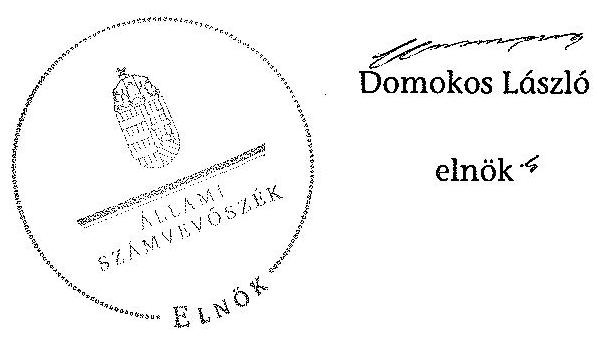

ÁLLAMI
SZÁMVEVŐSZÉK

# JELENTÉS 

az önkormányzati vagyongazdálkodás szabályszerűségi ellenőrzéséről

Kiskunfélegyháza

---

# Állami Számvevőszék 

Iktatószám: V-0026-026-038/2013.
Témaszám: 1065
Vizsgálat-azonosító szám: V0593003
Az ellenőrzést felügyelte:
Makkai Mária
felügyeleti vezető
2012. december 16. napjától

Gyüre Lajosné
felügyeleti vezető
2012. december 15. napjáig

Az ellenőrzést vezette és az ellenőrzés végrehajtásáért felelős:
Kesjár János
ellenőrzésvezető
Az ellenőrzést végezték:
Eigner György Zoltán Köllődné Gátai Mária Orosz Diána számvevő tanácsos számvevő
Vörösné Lakatos
Zsuzsanna
számvevő

A témához kapcsolódó eddig készített számvevőszéki jelentések:
címe
sorszáma
Jelentés a helyi önkormányzatok gazdálkodási rendszerének 2007. 0822
évi átfogó és egyéb szabályszerűségi ellenőrzéséről
Jelentés a közbeszerzési rendszer működésének ellenőrzéséről 0831
Jelentés a 2009. június 7-én megtartott Európai Parlament tagjai 1005
választásának lebonyolításához felhasznált pénzeszközök elszámolásának ellenőrzéséről

---

# TARTALOMJEGYZÉK 

BEVEZETÉS ..... 3
I. ÖSSZEGZŐ MEGÁLLAPÍTÁSOK, KÖVETKEZTETÉSEK, JAVASLATOK ..... 5
II. RÉSZLETES MEGÁLLAPÍTÁSOK ..... 9

1. A vagyongazdálkodási tevékenység szabályozottsága ..... 9
1.1. A feladatellátás formáinak meghatározása, a döntések megalapozottsága ..... 9
1.2. A vagyonnal gazdálkodó szervezet szervezeti rendjének szabályozottsága, a kötelező szabályzatok megfelelősége ..... 9
1.3. A vagyongazdálkodás szabályozása ..... 10
2. A vagyongazdálkodás szabályszerűsége ..... 12
2.1. A vagyon nyilvántartásának megfelelősége ..... 12
2.2. A vagyongazdálkodást érintő gazdasági események követelmények szerinti dokumentáltsága ..... 13
2.3. A vagyongazdálkodási intézkedések, döntések szabályszerűsége ..... 13
3. A vagyonváltozást eredményező gazdasági események szabályszerűsége ..... 14
3.1. A vagyon értékének és összetételének változása ..... 14
3.2. Közbeszerzési eljárás alkalmazása ..... 15
3.3. Hitelfelvétel, kötvénykibocsátás, garancia és kezességvállalás szabályszerűsége ..... 15
3.4. PPP fejlesztésekhez kapcsolódó forrásbiztosítás és a kötelezettségre gyakorolt hatása ..... 17
3.5. A térítés nélküli átadás szabályszerűsége ..... 17
4. A vagyongazdálkodás szabályszerűségére vonatkozó belső és külső ellenőrzések hasznosulása ..... 18
4.1. A belső ellenőrzés által tett megállapítások, javaslatok hasznosulása ..... 18
4.2. A többségi tulajdonban lévő gazdasági társaságok vagyongazdálkodásának felügyelete ..... 19
4.3. A könyvvizsgálatnak a vagyongazdálkodás szabályosságához való hozzájárulása ..... 19
4.4. A külső ellenőrző szervezet által tett javaslatok hasznosulása ..... 19

---

# MELLÉKLETEK 

1. számú Kiskunfélegyháza Város Önkormányzata gazdálkodására jellemző adatok, mutatószámok
2. számú Kiskunfélegyháza Város Önkormányzata vagyonának alakulása
3. számú Kiskunfélegyháza Város Önkormányzata kötelezettségeinek alakulása

## FÜGGELÉKEK

1. számú Rövidítések jegyzéke
2. számú Értelmező szótár

---

# JELENTÉS 

## az önkormányzati vagyongazdálkodás szabályszerűségi ellenőrzéséről

## Kiskunfélegyháza

## BEVEZETÉS

Az ÁSZ kiemelten fontosnak tartja az Állami Számvevőszékről szóló 2011. évi LXVI. törvény 5. § (4) bekezdése alapján az önkormányzati vagyon kezelésének, a vagyonnal való gazdálkodási szabályok betartásának az ellenőrzését. Az ellenőrzés feladata a vagyongazdálkodással kapcsolatban a közpénzek átláthatósága, nyilvánossága érdekében a jogszabályokban, belső szabályzatokban megfogalmazott előírások érvényesülésének áttekintése. Az Állami Számvevőszék nem csak az ellenőrzött szervezet vagyongazdálkodásának a hibáira mutat rá, számon kérve azok kijavítását, hanem megállapításaival, javaslataival segíti a közpénzzel, a közvagyonnal való felelős gazdálkodást.

Az önkormányzati vagyon alapvető funkciója, hogy a közérdeket és egyúttal az önkormányzati célok megvalósítását szolgálja. A feladatellátás terén elsősorban a kötelezően ellátandó feladatok végrehajtását hivatott szolgálni, amely mellett az önként vállalt feladatok ellátása is megvalósulhat.

## Az ellenőrzés célja az Önkormányzatnál annak értékelése volt, hogy:

- a vagyongazdálkodási tevékenységet, annak szervezeti kereteit szabályozták-e;
- az önkormányzati vagyongazdálkodás törvényességét, szabályszerűségét biztosították-e a döntések előkészítése és végrehajtása során;
- jogszerű döntéseken alapult-e a vagyon értékének és összetételének változása;
- a belső ellenőrzés elősegítette-e a vagyongazdálkodás szabályszerű működését, valamint hasznosultak-e a korábbi külső ellenőrzések által tett javaslatok.

Az ellenőrzés típusa: szabályszerűségi ellenőrzés
Az ellenőrzés a 2007. január 1. és 2011. december 31. közötti időszakra terjedt ki, kitekintéssel a helyszíni ellenőrzés befejezéséig tartó időszak releváns folyamataira. Az egyes közbeszerzési eljárások lefolytatásának ellenőrzése a 2011. évet és a 2012. év I. negyedévét érintette.

---

Az ellenőrzés szakmai módszertana az Állami Számvevőszék Ellenőrzési Kézikönyvében foglalt szakmai szabályokon alapult, amely a Legfőbb Ellenőrző Intézmények Nemzetközi Szervezete (INTOSAI) által kiadott nemzetközi standardok (ISSAI) figyelembevételével készült.

A vagyongazdálkodás szabályozottságát a helyi szabályozások (rendeletek, szabályzatok, utasítások) ellenőrzésével végeztük el. A vagyonváltozások köréből az ellenőrizendő tételeket mintavétellel, a számviteli nyilvántartásokból választottuk ki.

Kiskunfélegyháza lakosainak száma 2011. december 31-én 31520 fő volt. A 2010. évi önkormányzati választást követően az Önkormányzat 14 tagú Képviselő-testületének munkáját 2011. október 14-éig öt, 2011. október 15-étől két állandó bizottság segítette. Az Önkormányzat mellett a 2010. évi önkormányzati választásokat követően egy kisebbségi önkormányzat ${ }^{1}$ működik. A polgármester személye a 2010. évi önkormányzati képviselő és polgármester választás során változott, a jegyző 1990 óta tölti be a tisztségét.

Az Önkormányzat feladatainak végrehajtása érdekében a 2011. évben négy önállóan működő költségvetési intézményt tartott fenn, héttel kevesebbet, mint 2007-ben. A Polgármesteri hivatalban dolgozó köztisztviselők száma 2011. december 31-én 104 fő volt.

Az Önkormányzatnak a 2011. évben 12 gazdasági társaságban volt részesedése, ebből hat társaságban többségi befolyással rendelkezett. Az Önkormányzat a 2011. évi költségvetési beszámolója szerint 10201,0 millió Ft költségvetési bevétele volt és 9906,8 millió Ft költségvetési kiadást teljesített, 2011. december 31-én a könyvviteli mérleg szerint 26898,9 millió Ft értékű vagyonnal rendelkezett, az adósságállomány értéke 7041,4 millió Ft volt. Az Önkormányzat gazdálkodását jellemző 2007-2011. évek adatait a jelentés 1-3. mellékletei részletezik.

Az ÁSZ a 2011. évi LXVI. törvény 29. § (1) bekezdése szerint a jelentéstervezetet megküldte egyeztetésre Kiskunfélegyháza Város Önkormányzata polgármesterének, aki az ÁSZ tv. 29. § (2) bekezdésében foglalt észrevételezési jogával nem élt, a jelentéstervezetre észrevételt nem tett.

[^0]
[^0]:    ${ }^{1}$ Cigány kisebbségi önkormányzat

---

# I. ÖSSZEGZŐ MEGÁLLAPÍTÁSOK, KÖVETKEZTETÉSEK, JAVASLATOK 

Az Önkormányzat vagyona a könyvviteli mérleg szerint a 2007-2011. évek között 23181,1 millió Ft-ról 26898,9 millió Ft-ra, 3717,8 millió Ft-tal, 16,0%-kal növekedett a megvalósított beruházások, felújítások, a vagyon értékesítése és az elszámolt értékcsökkenés együttes hatásaként. A vagyonnövekedés 33,5%-kát felhalmozási célú hitelből és kötvénykibocsátásból finanszírozták. A jelentősebb önkormányzati beruházások a városi kórház rekonstrukciója, az ipari park és az általános iskola infrastrukturális fejlesztése, valamint az önkormányzati intézmények felújítása voltak. Az önkormányzati beruházások az ellenőrzött tételek vonatkozásában szabályszerűek voltak.

Kiskunfélegyháza Város Önkormányzata a vagyongazdálkodási tevékenységét és annak szervezeti kereteit a hatályos jogszabályi előírások szerint szabályozta. Az önkormányzati $\mathrm{SzMSz}_{1,2,3}$ tartalmazta a Képviselő-testületet megillető vagyongazdálkodási hatáskörök átruházását és előírta az átruházott hatáskörben történt döntések esetére a polgármester és a Pénzügyi bizottság számára a beszámolási kötelezettséget. Az átruházott hatáskör gyakorlásához a Képviselő-testület utasítást adott.

A vagyongazdálkodási rendelet ${ }_{1,2}$-ben meghatározták a törzsvagyonon belül a forgalomképtelen és a korlátozottan forgalomképes vagyonelemeket. Az Önkormányzat a 2011. évi második kötvény kibocsátása során azonban jelzáloggal terhelt egy korlátozottan forgalomképes, a törzsvagyon körébe tartozó ingatlant, megsértve ezzel az Ötv. előírását.

A vagyongazdálkodási rendelet ${ }_{1,2}$-ben rögzítették a vagyon térítés nélküli átadásának szabályait. Az Önkormányzat adatszolgáltatása szerint 2007-2011 között öt alkalommal történt térítésmentesen - 1,2 millió Ft könyvszerinti értékű - tárgyi eszköz átadás, amelyből négy esetben 0 Ft-on, egy esetben 1,2 millió Ft-on nyilvántartott eszközöket adtak át. Az intézményi átadásokról képviselő-testületi döntés nem született, azt az intézmények saját hatáskörben bonyolították le, megsértve ezzel az Ötv., valamint a vagyongazdálkodási rendelet ${ }_{1}$ előírásait. A Képviselő-testület a háziorvosi praxis ellátásához szükséges orvosi eszközök térítésmentes használatba adásáról döntött a vállalkozási szerződés időtartamára. A képviselő-testületi döntés végrehajtása során jegyzőkönyv készült a praxis ellátásának szerződött időszakára térítésmentesen átadott eszközökről. A Polgármesteri hivatal számviteli nyilvántartásában nem használatba adott eszközként szerepeltették az eszközöket, hanem véglegesen átadott eszközként kivezették a nyilvántartásból, mely nem felelt meg a Számv. tv.-ben előírt számviteli alapelvnek.

Az Önkormányzat 2011. évben a kötvénykibocsátásnál és egy beruházáshoz kapcsolódó készfizető kezességvállalásánál nem vette figyelembe az Ötv.-ben meghatározott kötelezettségvállalás felső határát, melyet 573 millió Ft-tal túllépett.

---

A vagyon nyilvántartása, a vagyongazdálkodással kapcsolatos döntések előkészítése és végrehajtása során nem biztosították teljes körűen a szabályszerűséget. Az Önkormányzat a 2007-2011. években minden évben elkészítette a vagyongazdálkodási rendeletben meghatározott szerkezetű vagyonkimutatást. A leltározás során az Önkormányzat 2007-2011. között egy eset kivételével betartotta az Áhsz. és a leltározási szabályzatokban foglalt előírásokat. A 2010. évi leltár nem tartalmazta teljes körűen az Önkormányzat eszközállományát, mivel egy 0,8 millió Ft értékben térítésmentesen átvett ingatlan nem szerepelt a leltárban. A helyszíni ellenőrzés alatt az Önkormányzatnál intézkedtek az adott ingatlan ingatlanvagyon kataszteri, analitikus és főkönyvi nyilvántartásban történő rögzítéséről.

Az Önkormányzat a számviteli kimutatásban szereplő ingatlanvagyon és az ingatlanvagyon kataszter adatai között a 2007-2011. években nem biztosította az egyezőséget. 2012-ben a Vagyon tv. hatályba lépését követően jóváhagyott vagyongazdálkodási rendelet ${ }_{2}$ előkészítésével párhuzamosan az ingatlanvagyon kataszter átfogó felülvizsgálata megtörtént és az ingatlanvagyon kataszter és a számviteli nyilvántartás közötti egyezőséget biztosították.

Az ingatlanvagyon kataszter és az illetékes földhivatal adatainak egyezőségét a 2008. évben az Önkormányzat biztosította. A 2009-2011. években az ingatlanvagyonban bekövetkezett változásokat kizárólag a földhivatal által megküldött tulajdoni lapok alapján vezették át az ingatlanvagyon kataszteri nyilvántartásba. Ez nem felelt meg a 147/1992. (XI. 6.) Korm. rendelet előírásának, mely szerint az ingatlan állapotában, értékében bekövetkezett változást a bekövetkezéstől számított 90 napon belül a kataszteren át kell vezetni, illetve a változás földhivatali ingatlan-nyilvántartásban való átvezetéséig az ingatlant a kataszterben elkülönítetten, földhivatallal rendezendő tételként kell nyilvántartani.

A gazdálkodási jogköröket a jogszabályokban foglaltakkal összhangban szabályozták, a jogkörök gyakorlása során - két utalvány ellenjegyzésének elmaradását kivéve - betartották az Ámr. ${ }_{1,2}$-ben és a belső szabályzatokban előírt követelményeket.

A sportcsarnok a 2007. évben PPP fejlesztés keretében valósult meg. A szolgáltatási díj kötelezettségvállalásáról szóló döntés-előkészítés során az előterjesztésben nem mutatták be, hogy biztosítható-e a kötelezettség (4900 millió Ft) fizetésére a forrás. A PPP fejlesztés miatti évenkénti kötelezettség (360 millió Ft) teljesítése már a 2009. évtől fizetési nehézséget okozott az Önkormányzat számára. A szolgáltatási szerződésből 2022-ig adódó fizetési kötelezettség teljesítése bizonytalan és veszélyezteti a gazdálkodás biztonságát.

Az Önkormányzatnál 2011-2012. év I. negyedéve között a beruházások, felújítások megvalósítása során a Kbt. ${ }_{1,2}$-ben előírtaknak megfelelően lefolytatták az előírt közbeszerzési eljárásokat.

A belső ellenőrzés nem járult hozzá az önkormányzat vagyongazdálkodásának szabályszerűségéhez, mert a 2007. évi egy ellenőrzést kivéve a vagyongazdálkodás tekintetében belső ellenőrzést nem végeztek. Az ÁSZ a 2010. évben az Önkormányzat gazdálkodási rendszerét átfogó jelleggel ellenőrizte. Az átfogó ellenőrzés során a vagyongazdálkodás szabályszerűségéhez tizenegy javaslatot

---

tett, melyből az intézkedési tervben foglalt határidőre hat, egy határidőn túl, egy részben hasznosult és három nem teljesült. Az Ámr. ${ }_{2}$-ben előírtak ellenére az ellenőrzési nyomvonalban továbbra sem határozták meg, hogy a tevékenységeket, feladatokat mely belső szabályzat tartalmazza részletesen. A kockázatkezelési eljárásrendben nem határozták meg a kockázatok értékelését és kategóriákba sorolását, az elfogadható kockázati szintet, a kockázatokra adható válaszok (válaszintézkedések) megvalósíthatósága mérlegelésének kötelezettségét, a válaszintézkedések folyamatba építését.

Az Önkormányzat a többségi tulajdonában lévő gazdasági társaságokat a 2007. év kivételével beszámoltatta a feladat ellátására rendelkezésre bocsátott vagyonnal való gazdálkodásról. A 2011. év végén az Önkormányzat gazdasági társasági részesedése 797,2 millió Ft volt. Az ellenőrzött időszakban a gazdasági társaságok - kivéve a Kiskunfélegyházi Ipari Park Kft. - eredményesen működtek, vagyonvesztés nem következett be,
 értékvesztést nem számoltak el. Az Ipari Park Kft. 0,5 millió Ft törzstőkével rendelkezett és 2011. év végén vesztesége 0,1 millió Ft volt.

Az Állami Számvevőszékről szóló 2011. évi LXVI. törvény 33. § (1) bekezdésében foglaltak értelmében a jelentésben foglalt megállapításokhoz kapcsolódó intézkedési tervet köteles az ellenőrzött szervezet vezetője összeállítani, és azt a jelentés kézhezvételétől számított 30 napon belül az ÁSZ részére megküldeni. Amennyiben az intézkedési tervet határidőben nem küldi meg a szervezet, vagy az nem elfogadható, az ÁSZ elnöke a hivatkozott törvény 33. § (3) bekezdés a)-b) pontjaiban foglaltakat érvényesítheti.

Az ellenőrzés intézkedést igénylő megállapításai és javaslatai:

# a Jegyzéknek: 

1. Az Önkormányzat a 2011. évi második kötvény kibocsátása során jelzáloggal terhelt egy korlátozottan forgalomképes, a törzsvagyon körébe tartozó ingatlant, megsértve ezzel az Ötv. 88. § (1) bekezdés b) pontjának előírását.

## Javaslat

Intézkedjen a 2011. évi kötvénykibocsátás fedezetéül szolgáló korlátozottan forgalomképes ingatlan cseréjéről a Vagyon tv. 5. § (7) bekezdésében foglalt előírások betartásával.
2. Az Önkormányzat a 2007-2011. években a számviteli nyilvántartásaiban és a költségvetési beszámolóiban - az Áhsz. 9. számú mellékletének a számlaosztályok tartalmára vonatkozó előírások alcím alatt található 4. c) pontjában foglaltak ellenére - a kötvény kibocsátásából fennálló tartozását nem különítette el fejlesztési és működési célú felhasználás szerint.

## Javaslat

Biztosítsa az Önkormányzat a számviteli nyilvántartásaiban és a költségvetési beszámolóiban a kötvény kibocsátásból fennálló tartozás működési és fejlesztési célú fel-

---

használás szerinti megbontását az Áhsz. 9. számú mellékletének a számlaosztályok tartalmára vonatkozó előírások alcím alatt található 4. c) pontjában foglalt előírásoknak megfelelően.
3. Az Önkormányzat a háziorvosi praxis ellátásához térítésmentesen használatba adott át eszközöket a képviselő-testületi döntés végrehajtásakor felvett jegyzőkönyv szerint. A Polgármesteri hivatal számviteli nyilvántartásában azonban nem használatba adott eszközként szerepeltették, hanem véglegesen átadott eszközként kivezették azokat a nyilvántartásból. Ezzel megsértették a Számv. tv. 15. § (3) bekezdésében előírt valódiság elvét.

# Javaslat 

Intézkedjen, hogy a Polgármesteri hivatal számviteli nyilvántartásában a háziorvosi praxis ellátásához térítésmentesen használatba adott eszközöket tartsák nyilván a Számv. tv. 15. § (3) bekezdésének megfelelően.

---

# II. RÉSZLETES MEGÁLLAPÍTÁSOK 

## 1. A VAGYONGAZDÁLKODÁSI TEVÉKENYSÉG SZABÁLYOZOTTSÁGA

### 1.1. A feladatellátás formáinak meghatározása, a döntések megalapozottsága

A kötelező és önként vállalt feladatokat, a közfeladat ellátás szervezeti módját, a vagyongazdálkodás stratégiai céljait a gazdasági program$_{1,2}$-ben, az önkormányzati SzMSz$_{1,2,3}$-ban, illetve a vagyongazdálkodási rendelet$_{1,2}$-ben rögzítették. Az átszervezésekre vonatkozó intézkedési terveket az előterjesztésekben megfogalmazott - a feladatellátás körét és formáit is tartalmazó - alternatív javaslatok alapján hagyták jóvá.

Az Önkormányzat 2007. január 1-jén 29 intézményt (11 önállóan gazdálkodót és 18 részben önállóan gazdálkodót) működtetett. Az intézmények közül 16 nevelési, közoktatási, kettő közművelődési, kettő szociális, egy egészségügyi és nyolc egyéb feladatot ellátó intézmény$^2$ volt. Az intézmények száma a 2012. évi költségvetési rendelet szerint 13-ra csökkent$^3$, amelyből hat nevelési, közoktatási, egy közművelődési, kettő szociális, egy egészségügyi és három egyéb feladatokat ellátó intézmény. A Képviselő-testület az oktatási ágazat átszervezésére vonatkozó intézkedési tervben integrált intézmények létrehozását hagyta jóvá. A szervezeti változások során óvodai, iskolai összevonásokról döntöttek. A szakképző intézmények közül egyet alapítványi működtetésbe adott át.

A feladatok ellátásában 2007. január 1-jén nyolc gazdasági társaság vett részt, melyek közül az Önkormányzat egyben 100%-os, egyben 51%-os tulajdonosi hányaddal rendelkezett. A 2011. év végén hat gazdasági társaság állt az Önkormányzat minősített - 50% feletti - befolyása alatt.

### 1.2. A vagyonnal gazdálkodó szervezet szervezeti rendjének szabályozottsága, a kötelező szabályzatok megfelelősége

Az Ötv.-ben foglaltak alapján az önkormányzati SzMSz-ről a Képviselőtestület a 2007-2011. évek között három alkalommal alkotott rendeletet. A vagyongazdálkodás szabályait vagyongazdálkodási rendelet$_{1,2}$-ben határozták meg. A Képviselő-testületet megillető hatáskörök átruházását az Ötv.-nek megfelelően az önkormányzati SzMSz$_{1,2,3}$-ban szabályozták.

A vagyongazdálkodást érintően átruházott hatáskörök az alábbiak:

[^0]
[^0]:    $^2$ Az egyéb feladatok közé tartozott a közigazgatás, közterület fenntartás, kommunális feladatok, tűzvédelem, gazdasági szolgáltatás.
    $^3$ négy önállóan működő és gazdálkodó, kilenc önállóan működő

---

- a polgármesterre átruházott hatáskörök: a hatósági ügyek tekintetében a tulajdonosi hozzájárulás megadása, a jelzálogjog, az elidegenítési és terhelési tilalom ingatlan-nyilvántartási törlésének engedélyezése, a közbeszerzési értékhatár alatti beszerzések jóváhagyása;
- a Pénzügyi bizottságra átruházott hatáskörök: az önkormányzati tulajdonban lévő ingatlanok hasznosítása, az önkormányzati tulajdonban lévő bel- és külterületi ingatlanok és termőföldek elidegenítése 10 millió Ft nettó értékhatárig (kivéve lakásingatlanok), a pályázati eljárást követően a nem lakás céljára szolgáló helyiség bérlőjének kiválasztása, a jelzálogjog és az elidegenítési és terhelési tilalom ingatlan-nyilvántartási törlésének engedélyezése;
- a társulásokra átruházott hatáskörök: a vidék- és területfejlesztéssel és a háziorvosi ügyeleti ellátással kapcsolatos döntések.

A Képviselő-testület az önkormányzati SzMSz$_{1,2,3}$-ban - az átruházott hatáskörben történt vagyongazdálkodást érintő döntések esetére - előírta a polgármester és a Pénzügyi bizottság számára a beszámolási kötelezettséget. Az átruházott hatáskör gyakorlásának feltételeit a Képviselő-testület a vagyongazdálkodási rendelet$_{1,2}$-ben, a lakásrendelet$_{1,2}$-ben, valamint a közbeszerzési szabályzatban rögzítette.

A vagyonnal gazdálkodó, közfeladatot ellátó költségvetési szervek 2011. évi intézményi alapító okirataiban a Képviselő-testület meghatározta az ellátandó közfeladatokat. A közfeladatot ellátó költségvetési szervek szervezeti és működési szabályzatait az Ötv. 9. § (3) bekezdése alapján átruházott hatáskörben a polgármester és bizottságok hagyták jóvá.

A belső szabályzatokat 2007-2010. évek között hiányosan készítették el. A gazdálkodással összefüggő szabályzatokat a 2011. évben kiegészítették, a hatályos jogszabályi előírásoknak megfelelően aktualizálták.

Az Önkormányzat az Áhsz.-ben foglaltak alapján a vagyongazdálkodási rendelet$_{1,2}$-ben szabályozta a vagyon kezelésére, nyilvántartására vonatkozó előírásokat. A jogszabály által biztosított lehetőség és feltételek fennállása alapján a költségvetési évről készített könyvviteli mérlegben kimutatott eszközöket és forrásokat kétévenként, minden páros évben kell leltározni.

# 1.3. A vagyongazdálkodás szabályozása 

Az Önkormányzat a vagyongazdálkodási rendeletét 2004-ben a Htv. 138. § (1) bekezdés j) pontja alapján és az Ötv. előírásainak megfelelően elkészítette, a jogszabályváltozásoknak és a vagyonban bekövetkezett változásoknak megfelelően aktualizálta. A vagyongazdálkodási rendelet$_{1,2}$-ben meghatározták az önkormányzati feladatellátást biztosító törzsvagyon körét, azon belül a forgalomképtelen és korlátozottan forgalomképes vagyonelemeket, valamint a vagyon nyilvántartási rendjét. A törzsvagyont, ezen belül a forgalomképtelen és korlátozottan forgalomképes, illetve a forgalomképes vagyont besorolás szerint tartották nyilván.

A vagyonelemek hasznosítási módját a vagyongazdálkodási rendelet$_{1,2}$, valamint az ezzel összhangban készült üzemeltetési szerződések is tartalmazták. A vagyontárgyak feletti rendelkezési jog megosztását a vagyon-

---

gazdálkodási rendelet$_{1,2}$-ben, és a lakásrendelet$_{1,2}$-ben az egyes vagyontípusokra, illetve értékhatárra vonatkozóan döntési szintenként meghatározták. A vagyongazdálkodási rendelet$_{1,2}$ tételesen rögzítette a forgalomképes vagyon nyilvános versenyeztetéssel történő hasznosításának feltételeit és szabályait, eseteit, értékhatárait.

A vagyongazdálkodási rendelet$_{1,2}$-vel összhangban az önkormányzati társulásokkal, valamint a gazdasági társaságokkal a vagyon üzemeltetésére kötött szerződésekben meghatározták az eszközök használatára vonatkozó elvárásokat, követelményeket, korlátokat.

Az Önkormányzat nem élt az Ötv. 80. § (2) bekezdésében biztosított jogával arra vonatkozóan, hogy az önkormányzati vagyon meghatározott részének elidegenítését, megterhelését, vállalkozásba vitelét népszavazás kiírásához köthetik.

A Vagyon tv. rendelkezéseire figyelemmel az Önkormányzat 2012. február 24-én alkotta meg a vagyongazdálkodási rendelet$_{2}$-t. A törzsvagyon tételes felsorolását tartalmazó melléklet tartalmazta a nemzetgazdasági szempontból kiemelt jelentőségű, nemzeti vagyonnak minősülő vagyonelemeket. A Vagyon tv. 9. § (1) bekezdése alapján készítendő önkormányzati közép- és hosszú távú vagyongazdálkodási tervet az Önkormányzat tájékoztatása szerint a 2012. év végéig terjesztik a Képviselő-testület elé.

A vagyongazdálkodási rendelet$_{1,2}$-ben általános szabályként előírták a döntéselőkészítés folyamatában a költség-haszon elemzés készítésének kötelezettségét. A hasznosításra szánt forgalomképes vagyon forgalmi értékének megállapítása céljából értékbecslés készítésének kötelezettségét írták elő. Az önkormányzati érdekeket védő garanciális elemek vagyonhasznosítási szerződésekben történő rögzítésének kötelezettségét a vagyongazdálkodási rendelet$_{1,2}$-ben nem írták elő, csupán a lakásrendelet$_{1,2}$ tartalmazott erre vonatkozóan kötelezettséget.

A hitelfelvételről, kötvénykibocsátásról és a PPP fejlesztésről szóló döntéselőkészítés folyamatában nem írták elő - az általános döntés-előkészítési eljárásokat meghaladóan - a futamidő egyes éveit terhelő kötelezettségek költségvetési egyensúlyra gyakorolt hatásvizsgálatát.

Az éves költségvetési koncepció, a költségvetés és a beszámoló elkészítésének rendjét, felelőseit a vagyongazdálkodásra vonatkozóan az önkormányzati SzMSz$_{1,2,3}$-ban, a hivatali SzMSz$_{1-4}$-ben, a költségvetési rendeletekben és a beszámoló elkészítésére vonatkozó éves körlevelekben, ügyrendekben szabályozták,$^4$ azonban a költségvetési rendelet módosításának rendjét nem határozták meg.

[^0]
[^0]:    $^4$ A jegyző 2011. június 1-jén hagyta jóvá a költségvetési rendelet készítésének és elfogadásának szabályzatát, mely kiterjed a költségvetési koncepció megalkotására is.

---

# 2. A VAGYONGAZDÁLKODÁS SZABÁLYSZERŰSÉGE 

### 2.1. A vagyon nyilvántartásának megfelelősége

Az Önkormányzat a 2007-2011. években az Ötv. 78. § (2) bekezdése alapján minden évben elkészítette a vagyongazdálkodási rendelet$_{1}$-ben meghatározott szerkezetű vagyonkimutatást. Az Áhsz. 9. számú melléklet 1. k) pontjában foglaltaknak megfelelően a törzsvagyon (ezen belül forgalomképtelen, illetve korlátozottan forgalomképes), valamint az egyéb vagyon részét képező eszközök elkülönítéséről a főkönyvi számlák további bontásával és az analitikus nyilvántartásokban is gondoskodtak.

Az Önkormányzat a számviteli kimutatásban szereplő ingatlanvagyon és az ingatlanvagyon kataszter adatai között a 2007-2011. években nem biztosította az egyezőséget. 2012-ben a Vagyon tv. hatályba lépését követően jóváhagyott vagyongazdálkodási rendelet$_{2}$ előkészítésével párhuzamosan az ingatlanvagyon kataszter átfogó felülvizsgálata megtörtént és az ingatlanvagyon kataszter és a számviteli nyilvántartás közötti egyezőséget biztosították.

A számviteli kimutatásban szereplő ingatlanvagyon és az ingatlanvagyon kataszter bruttó adatai között a 2007. évben 542,8 M Ft, a 2008-2010. években 542,9 M Ft, a 2011. évben 699,8 M Ft volt az eltérés, amelynek oka a nem önkormányzati tulajdonú ingatlanokon (tűzoltólaktanya, szennyvíztisztító telep, buszmegállók) végzett beruházások, felújítások számviteli nyilvántartásokban kimutatott értéke volt, mivel az ingatlanvagyon kataszteri nyilvántartásban csak a saját ingatlanok és az azokon végzett beruházások és felújítások szerepeltek.

Az ingatlanvagyon kataszter és az illetékes földhivatal adatainak egyezőségét a 2008. évben az Önkormányzat biztosította. A 2009-2011. években az ingatlanvagyonban bekövetkezett változásokat (vagyonnövekedés, vagyoncsökkenés) kizárólag a földhivatal által megküldött tulajdoni lapok alapján vezették át az ingatlanvagyon kataszteri nyilvántartásba. Ez nem felelt meg a 147/1992. (XI. 6.) Korm. rendelet 4. § előírásának, mely szerint az ingatlan állapotában, értékében bekövetkezett változást a bekövetkezéstől számított 90 napon belül a kataszteren át kell vezetni, illetve a változás földhivatali ingatlan-nyilvántartásban való átvezetéséig az ingatlant a kataszterben elkülönítetten, földhivatallal rendezendő tételként kell nyilvántartani.

Az ingatlanvagyon kataszteri nyilvántartás és a földhivatali nyilvántartás közötti egyeztetés ellenére a Magyar Államtól 2009. szeptember 30-án térítésmentesen átvett 5637/23 hrsz. ingatlan nem szerepelt az ingatlanvagyon kataszteri, valamint az analitikus és főkönyvi nyilvántartásban sem. A 2010. évi mennyiségi leltározás során nem tárta fel az Önkormányzat, hogy az átvett ingatlan nem került rögzítésre a számviteli nyilvántartásokban. A térítésmentesen átvett ingatlan átvételkori nettó forgalmi értéke 0,8 millió Ft volt, mely nem éri el az adott év mérlegfőösszegének 2%-át (493,7 millió
 Ft-ot), így az eltérés a mérleg megbízható és valós összképét lényegesen nem befolyásolta. A helyszíni ellenőrzés alatt az Önkormányzatnál intézkedtek az adott ingatlan ingatlanvagyon kataszteri, analitikus és főkönyvi nyilvántartásban történő rögzítéséről.

A 2007-2011. években a könyvviteli mérleget leltárral alátámasztották, az eszközök mérlegben szereplő értékét a Számv. tv. általános alapelveinek és tételes

---

szabályozásainak, valamint az Áhsz. és az Önkormányzat értékelési szabályzatában foglaltaknak megfelelően határozták meg. A leltározás során az Önkormányzat 2007-2011. között egy eset kivételével betartotta az Áhsz. és a leltározási szabályzatokban foglalt előírásokat. A 2010. évi leltár nem tartalmazta teljes körűen az Önkormányzat eszközállományát, mivel egy térítésmentesen átvett ingatlan nem szerepelt a leltárban.

# 2.2. A vagyongazdálkodást érintő gazdasági események követelmények szerinti dokumentáltsága 

A gazdálkodási jogkörök gyakorlására adott felhatalmazásoknál, megbízásoknál és kijelöléseknél betartották az Ámr. ${ }_{1,2}$-ben rögzített összeférhetetlenségi követelményeket. A kötelezettségvállalás ellenjegyzését, a szakmai teljesítésigazolást, az érvényesítést, az utalványozást, és annak ellenjegyzését a pénzgazdálkodási szabályzat ${ }_{1,2,3}$-ban kijelölt és felhatalmazott személyek végezték.

Egy fejlesztési célú pénzeszközátadás és egy megrendelés esetében az Áht. ${ }_{1}$ 100/C. § (3) bekezdésében ${ }^{5}$ előírtakat megsértve, és az Ámr. ${ }_{1}$ 134. § (8) bekezdésében, valamint az Ámr. ${ }_{2}$ 74. § (1) bekezdésében ${ }^{6}$ előírtak ellenére a kötelezettségvállalásokra az arra felhatalmazott személy ellenjegyzése nélkül került sor 177 ezer Ft értékben. Ezáltal az Ámr. ${ }_{1}$ 134. § (9), 135. § (3), 134. § (8) bekezdéseiben, valamint az Ámr. ${ }_{2}$ 74. § (3), 77. § (1), 74. § (1) bekezdéseiben foglalt - a kötelezettségvállalás ellenjegyzőjére, az érvényesítőre és az utalvány ellenjegyzőjére vonatkozó - ellenőrzési feladatoknak nem tettek eleget.

Az Önkormányzat az Áht. ${ }_{1}$-ben előírtaknak megfelelően közzétette a nettó ötmillió Ft-ot elérő, vagy azt meghaladó értékű árubeszerzésre, építési beruházásra, szolgáltatás megrendelésére, vagyonértékesítésre, vagyonhasznosításra, vagyon, illetve vagyoni értékű jog átadására vonatkozó, 2007-2011. években kötött szerződések megnevezését, tárgyát, a szerződést kötő felek nevét, a szerződés értékét az Önkormányzat honlapján.

### 2.3. A vagyongazdálkodási intézkedések, döntések szabályszerűsége

Az Önkormányzatnál a 2007. évi első és a 2011. évi második forint alapú kötvény kibocsátásakor szabályozás hiányában nem mérték fel a pénzügyi kockázatokat. Nem vizsgálták a kötvény futamidejének egyes éveit terhelő kötelezettségvállalásnak a költségvetési egyensúlyra gyakorolt hatását. A második kötvény kibocsátását megelőzően készített előterjesztés nem tartalmazott gazdaságossági számításokat, szakértői számításokat, alternatív javaslatot a Képviselő-testület számára.

[^0]
[^0]:    ${ }^{5}$ 2012. január 1-jétől az Áht. ${ }_{2}$ 37. § (1) bekezdése szabályozza.
    ${ }^{6}$ 2012. január 1-jétől az Ávr. 55. § (1) bekezdés szabályozza.

---

A vagyonváltozást eredményező döntések előkészítése során - a kötvények kibocsátása kivételével - betartották az Ötv., a vagyongazdálkodási rendelet ${ }_{1}$, a lakásrendelet ${ }_{1,2}$, valamint a kapcsolódó előterjesztések előírásait.

A beruházással létrehozott létesítmények fenntarthatóságának vizsgálatát külön belső szabályozásban nem írták elő. Szabályozás hiányában a 2007. évben megvalósult Kórház rekonstrukció hosszú távú fenntarthatóságára vonatkozóan számításokat nem végeztek.

Az európai uniós finanszírozással megvalósult beruházások döntés előkészítései során - a pályázatokhoz kötelezően csatolt megvalósíthatósági tanulmányokban - vizsgálták a beruházással létrehozott létesítmény fenntarthatóságát.

A 2007-2011. években az Önkormányzat hosszú lejáratú, felhalmozási célú pénzintézettel szembeni kötelezettségvállalásaira - két kötvénykibocsátásra és egy hitelfelvételre - minden esetben képviselő-testületi döntés alapján került sor, a meghozott döntésekkel azonos tartalmú dokumentumok (szerződések, megállapodások, egyéb iratok) készültek és a döntéseket a dokumentumokban foglaltaknak megfelelően hajtották végre.

A vagyonhasznosítási és vagyonértékesítési szerződésekbe - a szabályozás hiányának ellenére - az Önkormányzat érdekeit védő garanciális elemeket beépítették.

# 3. A VAGYONVÁLTOZÁST EREDMÉNYEZŐ GAZDASÁGI ESEMÉNYEK SZABÁLYSZERŰSÉGE 

### 3.1. A vagyon értékének és összetételének változása

Az Önkormányzat vagyonának értéke az ellenőrzött időszakban 23 181,1 millió Ft-ról 26 898,9 millió Ft-ra, 3717,8 millió Ft-tal, 16,0%-kal növekedett a megvalósított beruházások, felújítások, a vagyon értékesítése és az elszámolt értékcsökkenés együttes hatásaként. Az ingatlanok és kapcsolódó vagyoni értékű jogok 2310,8 millió Ft-os növekedését a városi kórház rekonstrukciója, az ipari park és az általános iskola infrastrukturális fejlesztése, valamint az önkormányzati intézmények felújítása eredményezte.

Az önkormányzat befektetett eszközállományának nettó értéke 2007-ben 22 474,4 millió Ft volt, a 2011. évre 2335,3 millió Ft-tal, 24 819,7 millió Ft-ra emelkedett. A befektetett eszközök fedezetének mutatója ${ }^{7}$ a 2007-2011 közötti időszakban végig 100% alatt maradt, tendenciájában csökkenést mutatott, vagyis a saját tőkéből a befektetett eszközök fedezetét csökkenő mértékben tudták biztosítani. A vagyonnövekedés 33,5%-kát felhalmozási célú hitelből és kötvénykibocsátásból finanszírozták.

[^0]
[^0]:    ${ }^{7}$ A befektetett eszközök fedezetét a saját tőke és a befektetett eszközök hányadosa mutatja.

---

Az Önkormányzat kötelezettségállománya a 2007. évi 4145,4 millió Ft-ról a 2011. évre 7174,2 millió Ft-ra növekedett a rövid és a hosszú lejáratú kötelezettségek állományának együttes emelkedése hatására. A hosszú lejáratú kötelezettségek (amely pénzintézeti kötelezettség volt) összege a 2007. évi 3109,3 millió Ft-ról a 2011. évre 4353,5 Ft-ra növekedett, ebből az Önkormányzat kötvénykibocsátásból származó kötelezettsége 1820,3 millió Ft-ról 3064,8 millió Ft-ra emelkedett. A túlzott mértékű kötelezettségek vállalása az Önkormányzat jövőbeni vagyoni helyzetére kockázatot jelentenek.

Az Önkormányzat a 2007-2011 közötti években öt gazdasági társaságban szerzett részesedést összesen 7,4 millió Ft értékben és egy gazdasági társaságban való részesedését értékesítette 1,0 millió Ft összegben.

A Képviselő-testületnek előterjesztett éves zárszámadási rendeletekben bemutatták az Önkormányzat eszközei után tárgyévben elszámolt értékcsökkenés összegét, azonban az eszközpótlásra fordított tényleges kiadásokat, az eszközök elhasználódási fokának ${ }^{8}$ alakulását nem.

Az elhasználódott eszközök pótlására a 2007-2011. években - az Önkormányzat kimutatása alapján - összesen 2144,2 millió Ft-ot fordítottak, ami az erre az időszakra elszámolt értékcsökkenés 89,0%-a (2409,1 millió Ft) volt.

# 3.2. Közbeszerzési eljárás alkalmazása 

Az Önkormányzat a 2011. évben rendelkezett a polgármester és a jegyző által kiadott közbeszerzési szabályzat ${ }_{2}$-vel. A Polgármesteri hivatal a 2011. és 2012. évben közzétette a honlapon az éves összesített közbeszerzési tervet.

Az Önkormányzat a 2011. évi költségvetési rendeletében egy - 2011. évben induló - beruházás (szennyvízcsatorna-hálózat építés) tervezett kiadása (92,0 millió Ft) haladta meg a Kbt. ${ }_{1}$-ben rögzített nemzeti értékhatár összegét. A beruházás megvalósításához az Önkormányzat EU támogatást nyert, azonban a támogatási szerződés megkötésének elhúzódása miatt a közbeszerzési eljárás megindítására 2012. I. negyedév végéig nem került sor.

Az Önkormányzatnál 2011-2012. év I. negyedéve között a beruházások, felújítások megvalósítása során a Kbt. ${ }_{1,2}$-ben előírtaknak megfelelően lefolytatták az előírt eljárásokat.

### 3.3. Hitelfelvétel, kötvénykibocsátás, garancia és kezességvállalás szabályszerűsége

Az Önkormányzat a 2007-2011. években egy alkalommal vett fel hosszú lejáratú beruházási célú hitelt 203,7 millió Ft értékben, egy alkalommal gazdasági társaságtól fejlesztési célú kölcsönt 8 millió Ft értékben. A hitelfelvételt a

[^0]
[^0]:    ${ }^{8}$ Az elhasználódási fok egyenlő a tárgyi eszköz összes értékcsökkenése osztva a tárgyi eszköz összes bruttó értékének összegével.

---

Képviselő-testület hagyta jóvá, a hitel biztosítékaként meghatározott ingatlanok az Önkormányzat vállalkozói vagyonát terhelték. A fejlesztési célú kölcsönszerződésről a Képviselő-testület döntött, visszafizetésére 2012-ben a Bácsvíz Zrt.-vel szemben fennálló követelés jóváírásával került sor.

Az Önkormányzat 2007-2011. években két alkalommal - a 2007. és 2011. években - bocsátott ki kötvényt. A kötvénykibocsátásokat a Képviselőtestület hagyta jóvá.

Az Önkormányzat 2007. július 31-én 1967,9 millió Ft értékben bocsátott ki kötvényt a 2007. évi költségvetésének beruházási és működési forrásszükségletének biztosítására, valamint a korábbi évek beruházási hitelállományának visszafizetésére. Az Önkormányzat 2011. február 28-án 3100,0 millió Ft értékben újabb forint alapú kötvényt bocsátott ki, melynek keretében az előző kötvény visszavásárlásra került. A kötvény kibocsátásának célja „megtakarítási intézkedések megvalósításának támogatása, Városi Kórház, Rendelőintézet, Gyógyfürdő és Rehabilitációs Központ strukturális átalakításához szükséges költségek finanszírozása, 60 napnál régebbi szállítóállomány kiegyenlítésének finanszírozása, a folyószámlahitel 300 millió Ft-tal történő csökkentése, a fennálló kötvény visszavásárlása és az éven belüli hitelek kiváltása" volt.

Az Önkormányzat az első kötvény kibocsátása során betartotta az Ötv. 88. § (1) bekezdés b) pontjában ${ }^{9}$ és a belső szabályzatokban foglalt előírásokat. Az Önkormányzat a második kibocsátáshoz kapcsolódóan jelzáloggal terhelt egy korlátozottan forgalomképes, törzsvagyoni körbe tartozó ingatlant, megsértve ezzel az Ötv. 88. § (1) bekezdés b) pontjában foglaltakat. A helyszíni ellenőrzés ideje alatt a jegyző a jelzálogjogosultnál kezdeményezte az ingatlan jelzálog fedezeti körből való kiengedését egy másik, forgalomképes ingatlan kijelölésével.

Az Önkormányzat a 2007-2011. évek költségvetési beszámolóiban az Áhsz. 9. számú melléklete 434. Tartozás kötvénykibocsátásból számlaosztály előírásai ellenére a kötvénykibocsátásból fennálló tartozását nem bontotta meg fejlesztési és működési célú felhasználás szerint.

Az Önkormányzat a 2007-2011. évek között egy beruházáshoz kapcsolódóan vállalt kezességet. A folyamatban lévő szennyvízberuházás közműveinek kiépítéséhez a beruházást megvalósító víziközmű társulat 399,7 millió Ft hitelt vett fel, melynek biztosítékaként az Önkormányzat - a tőke és annak járulékai erejéig - készfizető kezességet vállalt 2011. december 1-jén. A kötvénykibocsátásról és a kezességvállalásról szóló döntések során nem vették figyelembe az Ötv. 88. § (2) bekezdésében ${ }^{10}$ előírt adósságot keletkeztető éves kötelezettségvállalás felső határát, azt az Önkormányzat beszámolójának 25. űrlapja szerint 573 millió Ft-tal túllépték.

[^0]
[^0]:    ${ }^{9}$ 2012. január 1-jétől hatályon kívül helyezte a Mötv. 156. § (1) bekezdés a) pontja. 2012. június 30-tól a Vagyon tv. 5. § (7) bekezdése szabályozza.
    ${ }^{10}$ 2013. január 1-től a Mötv. 128. § b) pontja szabályozza

---

# 3.4. PPP fejlesztésekhez kapcsolódó forrásbiztosítás és a kötelezettségre gyakorolt hatása 

A 2007. évben - a Sport XXI. Létesítményfejlesztési Program alapján - PPP konstrukcióban valósult meg a sportcsarnok. Az Önkormányzat, a Nemzeti Sporthivatal és a magánpartner 2006. június 21-én kötötte meg a szolgáltatási szerződést, mely szerint az éves szolgáltatási díj fedezetet biztosít a projekt megvalósítása során felmerült finanszírozási jellegű, valamint az üzemeltetéshez kapcsolódó fizetési kötelezettségekre.

A Képviselő-testület 15 évre, Áfa-val együtt számítva, évente a fogyasztói árindex mértékével korrigáltan összesen 4900,0 millió Ft önkormányzatra jutó szolgáltatási díjfizetési kötelezettségvállalásáról 2006. május 18-án döntött, azonban a döntés-előkészítés során az előterjesztésben nem mutatták be, hogy az ismert feltételek mellett biztosítható-e a kötelezettség fizetésére a forrás. E határozat szerint a kötelezettségvállalás 15 éven át évente várhatóan - Áfá-val együtt számított - 360,0 millió Ft működési kiadást jelent az Önkormányzat számára. A 2007-2011 közötti időszak költségvetési és zárszámadási rendeleteiben a többéves kihatással járó döntések között bemutatták a PPP konstrukcióból adódó fizetési kötelezettséget.

Az Önkormányzat a vállalt szolgáltatási díjfizetési kötelezettségéhez a forrást - a szolgáltatási szerződésben rögzített összegben és határidőben - nem tudta biztosítani. Az Önkormányzatnak a PPP konstrukcióból adódó kötelezettsége teljesítése során már a 2009. évtől fizetési nehézségei voltak. 2011. december 31-én a PPP kötelezettségből fennálló szállítói tartozás 206,5 millió
 Ft volt, amelyből 113,8 millió Ft 90 napon túl lejárt. A polgármester a helyi önkormányzatok adósságrendezési eljárásáról szóló 1996. évi XXV. törvény 5. § (1)-(2) bekezdéseinek előírása ellenére adósságrendezési eljárást nem kezdeményezett.

Az Önkormányzat a jövőbeni kötelezettségei teljesítéséhez szükséges forrást nem határozta meg, a szolgáltatási díjfizetési kötelezettsége a jövőbeni működési jövedelmét ${ }^{11}$, pénzügyi kapacitását csökkenti. A szolgáltatási szerződésből 2022-ig adódó fizetési kötelezettség teljesítése - az összes kötelezettség növekedése mellett - bizonytalan.

### 3.5. A térítés nélküli átadás szabályszerűsége

Az Önkormányzat adatszolgáltatása szerint 2007-2011 között öt alkalommal intézmények által történt térítés nélküli tárgyi eszköz átadás. Az intézményi átadásokról képviselő-testületi döntés nem született, azt az intézmények saját

[^0]
[^0]:    ${ }^{11}$ A működési jövedelem, azaz a folyó költségvetés egyenlege megmutatja, hogy az Önkormányzat éves folyó bevétele fedezetet biztosít-e a kötelező és önként vállalt feladatellátáshoz kapcsolódó éves folyó kiadására.

---

hatáskörben bonyolították le, megsértve ezzel az Ötv. 80. § (1) ${ }^{12}$ bekezdését, valamint a vagyongazdálkodási rendelet előírását.

A 2011. évben a Kiskunfélegyházi Többcélú Közoktatási Intézmény egy érték nélkül nyilvántartott videomagnót adott át egy egyházi szervezetnek, a Móra Ferenc Múvelődési Központ Ifjúsági és Közösségi Ház térítés nélkül (térítésmentesen) adott át 0-ra leírt négy számítógépet, egy notebookot és két fényképezőgépet alkalmazottai részére. A 2010. évben a Kórház egy gyógyszertárnak érték nélkül nyilvántartott hőlégsterilizátort, továbbá a háziorvosi feladatok ellátásához nulla értéken nyilvántartott (1,1 millió Ft beszerzési értékű) eszközöket, valamint 1,2 millió Ft könyv szerinti értéken nyilvántartott eszközöket adott át.

A Képviselő-testület a 180/2010. (VIII. 26.) számú határozatában a háziorvosi praxis ellátására vonatkozó szerződés megkötéséről döntött. A polgármester által aláírt vállalkozói szerződés alapján - a vagyongazdálkodási rendelettel összhangban - az Önkormányzat a szerződés időtartama alatt a háziorvosi működéshez biztosított orvosi eszközöket térítésmentesen a közszolgáltatást ellátó vállalkozó használatába bocsátotta. A képviselő-testületi döntés végrehajtása során jegyzőkönyv készült a praxis ellátásának szerződés szerinti időszakára térítésmentesen átadott eszközökről. A Polgármesteri hivatal számviteli nyilvántartásában nem használatba adott eszközként szerepeltették az eszközöket, hanem véglegesen átadott eszközként kivezették a nyilvántartásból, mely nem felelt meg a Számv. tv. 15. § (3) bekezdésében előírt számviteli alapelvnek.

# 4. A VAGYONGAZDÁLKODÁS SZABÁLYSZERŰSÉGÉRE VONATKOZÓ BELSŐ ÉS KÜLSŐ ELLENŐRZÉSEK HASZNOSULÁSA 

### 4.1. A belső ellenőrzés által tett megállapítások, javaslatok hasznosulása

A stratégiai és éves ellenőrzési terveket 2007-2011 között a Ber. 18. § és 21. § előírásai ${ }^{13}$ ellenére kockázatelemzéssel nem támasztották alá. A 2012. évi ellenőrzési tervet a belső ellenőr a jogszabályi rendelkezést betartva kockázatelemzéssel alátámasztva készítette el. A belső ellenőrzés csak a 2007. évben vizsgálta öt oktatási intézménynél a vagyongazdálkodást, mellyel kapcsolatban hiányosságot, szabálytalanságot nem tárt fel.

A polgármester az ellenőrzött időszakban a zárszámadási rendelettervezetekkel egyidejűleg az Ötv. 92. § (10) bekezdésében előírtak szerint a Képviselő-testület elé terjesztette az éves összefoglaló ellenőrzési jelentést, melynek része volt az Önkormányzat felügyelete alá tartozó költségvetési szervek éves jelentései alapján készített éves összefoglaló ellenőrzési jelentés.

[^0]
[^0]:    ${ }^{12}$ 2012. január 1-jétől a Mötv. 107. § tartalmazza.
    ${ }^{13}$ 2012. január 1-jétől a Bkr. 22. § (1) bekezdés b) pontja, a 31. § (2) bekezdése tartalmazza.

---

# 4.2. A többségi tulajdonban lévő gazdasági társaságok vagyongazdálkodásának felügyelete 

Az Önkormányzat a vagyongazdálkodási rendeletben meghatározta az önkormányzati tulajdonrésszel működő gazdasági társaságokkal kapcsolatban a tulajdonosi képviselet gyakorlásának módját. Nem rendelkeztek azonban a többségi tulajdonban lévő gazdasági társaságoknak a feladat ellátására rendelkezésre bocsátott vagyonnal való gazdálkodásról történő beszámolásról. Ennek ellenére az Önkormányzat a 2007-2011 közötti időszakban a többségi tulajdonában lévő gazdasági társaságokat - a 2007. év kivételével - beszámoltatta.

A 2011. év végén az Önkormányzat gazdasági társasági részesedése 797,2 millió Ft volt. Az ellenőrzött időszakban a gazdasági társaságok - kivéve a Kiskunfélegyházi Ipari Park Kft. - eredményesen működtek, vagyonvesztés nem következett be, értékvesztést nem számoltak el. Az Ipari Park Kft. 0,5 millió Ft törzstőkével rendelkezett és 2011. év végén vesztesége 0,1 millió Ft volt.

### 4.3. A könyvvizsgálatnak a vagyongazdálkodás szabályosságához való hozzájárulása

Az Önkormányzat az Ötv. 92/A. § (2) bekezdése alapján könyvvizsgálatra kötelezett. Az Önkormányzat 2007-2010. évi költségvetési beszámolóiról szóló könyvvizsgálói jelentések nem tartalmaztak vagyongazdálkodásra vonatkozó javaslatot. A 2008. évről szóló jelentésében a könyvvizsgáló az Önkormányzat kötvénykibocsátásával összefüggő kockázatot jelezte, de nem minősítette jelentősnek, a jelentést korlátozás nélküli záradékkal látta el. A 2009. és 2010. évi jelentéseket „figyelemfelhívó" záradékkal látta el, mert a magas beruházási hitelállományt, a kötvényből eredő kötelezettséget, és a kezességvállalást jelentősnek és lényegesnek, emiatt kockázatosnak minősítette.

### 4.4. A külső ellenőrző szervezet által tett javaslatok hasznosulása

Az ÁSZ az Önkormányzat gazdálkodási rendszerét a 2010. évben ellenőrizte átfogó jelleggel. A jelentést a Képviselő-testület megtárgyalta, a jegyző által készített felelősöket és határidőt tartalmazó intézkedési tervet a 6/2011. (II. 9.) számú határozatával elfogadta. A gazdálkodási rendszer 2010. évi átfogó ellenőrzése során tett javaslatok közül a vagyongazdálkodás szabályszerűségéhez 11 szabályszerűségi, és három célszerűségi javaslat kapcsolódott, melyekből az intézkedési tervben foglalt határidőre nyolc hasznosult, egy részben hasznosult, kettő határidőn túl hasznosult és három nem teljesült.

A következő szabályszerűségi javaslatokat valósították meg: a polgármester gondoskodott arról, hogy a PPP beruházó magánpartner a jogszabályban előírt adatszolgáltatási kötelezettségének eleget tegyen. A jegyző kiegészítette a Polgármesteri hivatal gazdasági szervezete ügyrendjét, 2011. január 1-jétől új számlarendet helyezett hatályba. Gondoskodott arról, hogy a kiadások utalványozása előtt a szakmai teljesítésigazolók elvégezzék ellenőrzési feladataikat.

---

Az Önkormányzat 2011. évi költségvetési rendelete tartalmazta az európai uniós forrással megvalósuló projektek, programok bevételi és kiadási előirányzatait.

A stratégiai ellenőrzési tervet és az éves ellenőrzési tervet - az intézkedési tervben előírt határidőn túl, 2012-ben - kockázatelemzéssel támasztották alá.

Az utalvány ellenjegyzésére vonatkozó egy szabályszerűségi javaslat részben teljesült, mert az utalvány ellenjegyzője meggyőződött ugyan a szakmai teljesítésigazolás megtörténtéről, azonban Ámr. 74. § (3) bekezdésében előírtak ellenére a hirdetőtábla készítésére vonatkozó szerződés, az energetikai korszerűsítés céljából történt végleges pénzeszköz átadás, valamint a háziorvosi ellátáshoz térítésmentes eszközátadás esetében nem győződött meg arról, hogy a kötelezettségvállalást megelőzte-e annak ellenjegyzése.

# A következő szabályszerűségi javaslatokat nem teljesítették: 

- A jegyző az Áht. 12/A. § (1) bekezdésében előírtakat megsértette, mert nem gondoskodott arról, hogy az Önkormányzat 2010. évi költségvetése végrehajtása során tárgyévi fizetési kötelezettséget a jóváhagyott kiadási előirányzatok mértékéig vállaljanak, továbbá kifizetéseket is ezen összeghatárig rendeljenek el. A 2010. évben nyolc költségvetési szervnél a kiemelt kiadási előirányzatokat - 0,2 millió Ft és 51,4 millió Ft közötti összegekkel - túllépték. A 2011. évi költségvetés végrehajtása során az Önkormányzatnál a kiemelt kiadási előirányzatokat nem lépték túl.
- A jegyző nem egészítette ki az Ámr. 156. § (2) bekezdés ellenére az ellenőrzési nyomvonalat azzal, hogy a tevékenységeket, feladatokat mely belső szabályzat tartalmazza részletesen.
- A jegyző nem egészítette ki az Ámr. 157. § ${ }^{14}$ és a 155. § (3) ${ }^{15}$ bekezdésében hivatkozott, az államháztartásért felelős miniszter által közzétett „Útmutató a kockázatkezelés kialakításához" módszertani útmutató alapján a kockázatkezelési eljárásrendet, hogy az tartalmazza a kockázatok értékelését és kategóriákba sorolását, az elfogadható kockázati szint meghatározását, a kockázatokra adható válaszok (válaszintézkedések) megvalósíthatósága mérlegelésének kötelezettségét, a válaszintézkedések beépítését a folyamatba, valamint nem gondoskodott a kockázatkezelési rendszer működtetéséről.

A következő célszerűségi javaslatokat megvalósították: a Képviselőtestület jóváhagyta a PPP beruházásról szóló ÁSZ jelentés javaslatainak hasznosulása érdekében készített intézkedési tervet.

[^0]
[^0]:    ${ }^{14}$ 2012. január 1-jétől a Bkr. 7. § tartalmazza.
    ${ }^{15}$ 2012. január 1-jétől a Bkr. 5. § (1)-(2) és 6. § (3) bekezdései tartalmazzák

---

A következő - vagyongazdálkodást is érintő - célszerűségi javaslatot határidőn túl hasznosították:

- Az eszközök és források 2011. évben hatályos értékelési szabályzatában a jegyző nem határozta meg ${ }^{16}$ az értékelések ellenőrzéséért felelős munkaköröket. A 2011. november 7-től - határidőn túl - hatályos eszközök selejtezési és hasznosítási szabályzatában rögzítették a döntéshozatalra jogosultak körét, beleértve az üzemeltetésre átadott eszközökre vonatkozó döntéseket is.

Az ÁSZ az önkormányzat gazdálkodásának 2010. évi átfogó ellenőrzésén kívül a 2007-2011. évek között három ellenőrzést végzett. A jelentések összesen kettő szabályszerűségi, és 14 célszerűségi javaslatot tartalmaztak, melyekre intézkedtek.

Az Önkormányzatnál a 2007-2011. években - az ÁSZ ellenőrzésen kívül - kizárólag az európai uniós támogatással megvalósult fejlesztésekkel kapcsolatban voltak külső szervek ${ }^{17}$ által lefolytatott ellenőrzések. Az ellenőrzött időszakban az Önkormányzatnál 16 projekt záróelszámolása vonatkozásában került sor helyszíni ellenőrzésre. Az Önkormányzat intézkedett a jegyzőkönyvekben megfogalmazott - szabályszerűségi, illetve célszerűségi - javaslatok teljesítése érdekében és valamennyi projektet határidőben lezártak.

Budapest, 2013. 08. 26.

Melléklet: 3 db
Függelék: 2 db

[^0]
[^0]:    ${ }^{16}$ A jegyző a 2012. évben hatályos szabályzatot az ÁSZ helyszíni ellenőrzési ideje alatt kiegészítette.
    ${ }^{17}$ ESZA Társadalmi Nonprofit szolgáltató Kft., Oktatási és Kulturális Minisztérium Támogatáskezelő Igazgatósága, Dél-alföldi Regionális Fejlesztési Ügynökség Nonprofit Kft., Magyar Államkincstár, VÁTI Magyar Regionális Fejlesztési és Urbanisztikai Nonprofit Kft., Környezetvédelmi és Vízügyi Minisztérium

---

.

---

# Kiskunfélegyháza Város Önkormányzata gazdálkodására jellemző adatok, mutatószámok

|  Megnevezés | 2007. év | 2011.év  |
| --- | --- | --- |
|  A település állandó lakosainak száma (fő) január 1-én | 31893 | 31520  |
|  A Képviselő-testület tagjainak a száma (fő) (december 31-én) | 24 | 14  |
|  A Képviselő-testület munkáját segítő állandó bizottságok száma (december 31-én) | 9 | 2  |
|  A Polgármesteri hivatalban foglalkoztatott köztisztviselők száma (fő) (december 31-én) | 122 | 104  |
|  Az Önkormányzat által foglalkoztatott közalkalmazottak száma (fő) (december 31-én) | 1584 | 1293  |
|  Az összes vagyon értéke a december 31-i könyvviteli mérleg szerint (millió Ft) | 23 181,1 | 26 898,9  |
|  Az adósságállomány (hosszú és rövid lejáratú kötelezettség) december 31-én (millió Ft) | 3 820,4 | 7 041,4  |
|  Az összes teljesített költségvetési bevétel (millió Ft)* | 9 664,0 | 10 201,0  |
|  Saját bevétel/ Felhalmozási célú költségvetési kiadásokkal csökkentett összes költségvetési bevétel aránya (%) | 81,0 | 68,0  |
|  Az összes teljesített költségvetési kiadás (millió Ft) | 10 545,8 | 9 906,8  |
|  Ebből: felhalmozási célú költségvetési kiadás (millió Ft) | 1 660,5 | 592,5  |
|  A költségvetési kiadásból a felhalmozási célú költségvetési kiadás aránya (%) | 16,0 | 6,0  |
|  A költségvetési intézmények száma december 31-én (db) | 29 | 13  |
|

  Ebből: önállóan működő (db) | 11 | 4  |

- a költségvetési bevétel az előző évek pénzmaradványának, vállalkozási maradványának igénybevételét is tartalmazza

---

# Kiskunfélegyháza Város Önkormányzata vagyonának alakulása

|  Mérlegforrás megnevezése | 2007. év (millió Ft) | 2008. év (millió Ft) | 2009. év (millió Ft) | 2010. év (millió Ft) | 2011. év (millió Ft) | Index (Előző év=100\%) |  |  |   |
| --- | --- | --- | --- | --- | --- | --- | --- | --- | --- |
|   |  |  |  |  |  | 2008/2007. | 2009/2008. | 2010/2009. | 2011/2010.  |
|  Immateriális javak | 31,3 | 61,9 | 77,5 | 64,9 | 41,0 | 197,7 | 125,2 | 83,7 | 63,2  |
|  Tárgyi eszközök | 19333,2 | 20814,1 | 20822,3 | 21454,7 | 21572,6 | 107,7 | 100,0 | 103,0 | 100,5  |
|  ebből: ingatlanok | 18372,6 | 19986,5 | 20024,7 | 19816,3 | 20683,4 | 108,8 | 100,2 | 99,0 | 104,4  |
|  beruházások, felújítások | 366,3 | 166,0 | 200,6 | 1149,1 | 418,6 | 45,3 | 120,9 | 572,9 | 36,4  |
|  Befektetett pénzügyi eszközök | 822,4 | 821,4 | 818,9 | 811,0 | 811,3 | 99,9 | 99,7 | 99,0 | 100,0  |
|  Üzemeltetésre átadott eszközök | 2287,5 | 2598,1 | 2530,9 | 2457,7 | 2384,8 | 113,6 | 97,4 | 97,1 | 97,0  |
|  Befektetett eszközök összesen | 22474,4 | 24295,5 | 24249,6 | 24789,3 | 24809,7 | 108,1 | 99,8 | 102,2 | 100,1  |
|  Forgóeszközök összesen | 706,7 | 635,5 | 434,2 | 781,4 | 2089,2 | 89,9 | 68,3 | 180,0 | 267,4  |
|  ebből: követelések | 186,4 | 235,5 | 221,8 | 418,0 | 636,0 | 126,3 | 94,2 | 188,4 | 152,1  |
|  pénzeszközök | 398,7 | 68,6 | 110,6 | 258,8 | 1064,5 | 17,2 | 161,1 | 234,1 | 411,3  |
|  Eszközök összesen | 23181,1 | 24931,0 | 24683,8 | 25570,7 | 26898,9 | 107,5 | 99,0 | 103,6 | 105,2  |
|  Saját tőke összesen | 18898,5 | 20168,0 | 19423,8 | 20447,8 | 18507,1 | 106,7 | 96,3 | 105,3 | 90,5  |
|  Tartalék összesen | 137,2 | -64,9 | -145,9 | -1232,7 | 1217,6 | -47,3 | 224,7 | 845,1 | -98,8  |
|  Kötelezettségek összesen | 4145,4 | 4827,9 | 5405,9 | 6355,6 | 7174,2 | 116,5 | 112,0 | 117,6 | 112,9  |
|  ebből: hosszú lejáratú kötelezettségek | 3109,3 | 3113,4 | 2929,5 | 1347,9 | 4353,5 | 100,1 | 94,1 | 46,0 | 323,0  |
|  rövid lejáratú kötelezettségek | 711,1 | 1311,1 | 2164,9 | 4921,9 | 2687,9 | 184,4 | 165,1 | 227,3 | 54,6  |
|  Források összesen: | 23181,1 | 24931,0 | 24683,8 | 25570,7 | 26898,9 | 107,5 | 99,0 | 103,6 | 105,2  |

Fizetés: Magyar Államkincstár éves költségvetési beszámoló "01" számú űrlap adatai.

---

# Kiskunfélegyháza Város Önkormányzata kötelezettségeinek alakulása

|  Mérlegforrás
megnevezése | 2007.év
(millió Ft) | 2008. év
(millió Ft) | 2009. év
(millió Ft) | 2010. év
(millió Ft) | 2011. év
(millió Ft) | Index (Előző év=100\%) |  |  |   |
| --- | --- | --- | --- | --- | --- | --- | --- | --- | --- |
|   |  |  |  |  |  | 2008/2007. | 2009/2008. | 2010/2009. | 2011/2010.  |
|  Hosszú lejáratú kötelezettségek összesen | 3109,3 | 3113,4 | 2929,5 | 1347,9 | 4353,5 | 100,1 | 94,1 | 46,0 | 323,0  |
|  ebből: hosszú lejáratra kapott kölcsönök | 0,0 | 0,0 | 0,0 | 0,0 | 0,0 | - | - | - | -  |
|  tartozások fejlesztési célú kötvénykibocsátásból | 1820,3 | 1722,0 | 1623,5 | 0,0 | 0,0 | 94,6 | 94,3 | 0,0 | -  |
|  tartozások működési célú kötvénykibocsátásból | 0,0 | 0,0 | 0,0 | 0,0 | 3064,8 | - | - | - | -  |
|  beruházási és fejlesztési hitelek | 1289,0 | 1391,4 | 1306,0 | 1347,9 | 1288,7 | 107,9 | 93,9 | 103,2 | 95,6  |
|  működési célú hosszú lejáratú hitelek | 0,0 | 0,0 | 0,0 | 0,0 | 0,0 | - | - | - | -  |
|  egyéb hosszú lejáratú kötelezettségek | 0,0 | 0,0 | 0,0 | 0,0 | 0,0 | - | - | - | -  |
|  Rövid lejáratú kötelezettségek összesen | 711,1 | 1311,1 | 2164,9 | 4921,9 | 2687,9 | 184,4 | 165,1 | 227,3 | 54,6  |
|  ebből: rövid lejáratú kötelezettség | 0,0 | 0,0 | 0,0 | 0,0 | 308,5 | - | - | - | -  |
|  rövid lejáratú hitelek | 0,0 | 443,2 | 768,7 | 1449,5 | 951,1 | - | 173,4 | 188,6 | 65,6  |
|  kötelezettségek áruvásárlásból, szolgáltatásból | 385,0 | 423,2 | 1027,1 | 1237,0 | 1149,9 | 109,9 | 242,7 | 120,4 | 93,0  |
|  iparűzési adó miatti felhalmozási kötelezettség | 147,5 | 155,9 | 125,8 | 0,0 | 0,0 | 105,7 | 80,7 | 0,0 | -  |
|  helyi adó túlfizetése miatti kötelezettség | 6,9 | 6,4 | 7,7 | 62,6 | 73,8 | 92,8 | 120,3 | 813,0 | 117,9  |
|  támogatási program előlege miatti kötelezettség | 36,8 | 59,0 | 18,2 | 401,7 | 32,2 | 160,3 | 30,8 | 2207,1 | 8,0  |
|  garancia- és kezeskedési kötelezettség | 0,0 | 0,0 | 0,0 | 0,0 | 0,0 | - | - | - | -  |
|  h. lejár. kapott kölcsön köv. évet terhelő törl.részlet | 0,0 | 0,0 | 0,0 | 0,0 | 0,0 | - | - | - | -  |
|  felh.c kötv.kib-ból szám.tart.köv.évet terh.részlet | 98,4 | 98,4 | 98,4 | 1623,6 | 0,0 | 100,0 | 100,0 | 1650,0 | 0,0  |
|  mük.c kötv.kib-ból szám.tart.köv.évet terh.részlet | 0,0 | 0,0 | 0,0 | 0,0 | 35,2 | - | - | - | -  |
|  beruh.fell.hitel köv.évet terhelő törl. részlet | 33,6 | 89,5 | 108,0 | 127,5 | 102,9 | 266,4 | 120,7 | 118,1 | 80,7  |
|  működési c.hosszú lej.hitel köv.évet terh.törl.részlet | 0,0 | 0,0 | 0,0 | 0,0 | 0,0 | - | - | - | -  |
|  költségvetéssel szembeni kötelezettség | 2,3 | 4,0 | 5,7 | 5,5 | 9,7 | 173,9 | 142,5 | 96,5 | 176,4  |
|  egyéb rövid lejáratú kötelezettség | 0,4 | 23,2 | 5,0 | 9,4 | 8,4 | - | 21,6 | 188,0 | 89,4  |
|  munkavállalókkal szembeni különféle kötelezettség | 0,0 | 0,0 | 0,0 | 4,8 | 15,8 | - | - | - | 329,2  |
|  egyéb különféle kötelezettség | 0,2 | 8,3 | 0,3 | 0,3 | 0,4 | - | 3,6 | 0,0 | -  |

Forrás: Magyar Államkincstár éves költségvetési beszámoló "01" számú űrlap adatai.

---

.

---

# RÖVIDÍTÉSEK JEGYZÉKE 

## Törvények

Áht. 1
Áht. 2
ÁSZ tv.
Htv.

Kbt. $_{1}$
Kbt. $_{2}$

Ötv.
MÖtv.

Számv. tv.
Vagyon tv.

## Rendeletek

Áhsz.

Ámr. 1
Ámr. 2
Ávr.
az államháztartásról szóló 1992. évi XXXVIII. törvény (hatályon kívül: 2012. január 1-jétől)
az államháztartásról szóló 2011. évi CXCV. törvény (hatályos: 2011. december 31-től, kivéve a 110. § (2) bekezdésében meghatározott paragrafusokat)
az Állami Számvevőszékről szóló 2011. évi LXVI. törvény (hatályos: 2011. július 1-jétől)
a helyi önkormányzatok és szerveik, a köztársasági megbízottak, valamint egyes centrális alárendeltségű szervek feladat- és hatásköreiről szóló 1991. évi XX. törvény
a közbeszerzésekről szóló 2003. évi CXXIX. törvény (hatályon kívül: 2012. január 1-jétől)
a közbeszerzésekről szóló 2011. évi CVIII. törvény (hatályos: 2011. augusztus 21-től, kivéve a 180. § (2) bekezdésében meghatározott paragrafusok egyes bekezdéseit és a mellékleteket, amelyek 2012. január 1-jétől léptek hatályba)
a helyi önkormányzatokról szóló 1990. évi LXV. törvény Magyarország helyi önkormányzatairól szóló 2011. évi CLXXXIX. törvény (hatályos: 2012. január 1-jétől, kivéve a 144. § (2)-(5) bekezdéseiben meghatározott paragrafusok egyes bekezdéseit, pontjait, amelyek 2013. január 1-jén, illetve a 2014. évi általános önkormányzati választások napján lépnek majd hatályba)
a számvitelről szóló 2000. évi C. törvény
a nemzeti vagyonról szóló 2011. évi CXCVI. törvény (hatályos: 2012. január 1-jétől, kivéve a 20. § (2)-(3) bekezdéseiben meghatározott paragrafusokat)
az államháztartás szervezetei beszámolási és könyvvezetési kötelezettségének sajátosságairól szóló 249/2000. (XII. 24.) Korm. rendelet
az államháztartás működési rendjéről szóló 217/1998. (XII. 30.) Korm. rendelet (hatályon kívül: 2010. január 1-jétől)
az államháztartás működési rendjéről szóló 292/2009. (XII. 19.) Korm. rendelet (hatályon kívül: 2012. január 1-jétől)
Az államháztartásról szóló törvény végrehajtásáról szóló 368/2011. (XII. 31.) Korm. rendelet (hatályos: 2012. január 1-jétől)

---

| Ber. | a költségvetési szervek belső ellenőrzéséről szóló 193/2003. (XI. 26.) Korm. rendelet (hatályon kívül: 2012. január 1-jétől) |
| :--: | :--: |
| Bkr. | A költségvetési szervek belső kontrollrendszeréről és belső ellenőrzéséről szóló 370/2011. (XII. 31.) Korm. rendelet (hatályos: 2012. január 1-jétől, kivéve a 15. § (5) bekezdését, mely 2012. július 1-jétől hatályos) |
| lakásrendelet ${ }_{1}$ | Kiskunfélegyháza Város Önkormányzatának 10/2006. (III. 31.) számú rendelete az önkormányzati lakások, helyiségek bérletéről és elidegenítéséről (hatályos 2008. február 14-ig) |
| lakásrendelet ${ }_{2}$ | Kiskunfélegyháza Város Önkormányzatának 4/2008. (II. 14.) számú rendelete az önkormányzati lakások, helyiségek bérletéről és elidegenítéséről (hatályos 2008. február 14-től) |
| önkormányzati $\mathrm{SzMSz}_{1}$ | Kiskunfélegyháza Város Önkormányzatának 11/2007. (V. 1.) számú rendelete az Önkormányzat Szervezeti és Működési Szabályzatáról (hatályon kívül: 2010. október 29-től) |
| önkormányzati $\mathrm{SzMSz}_{2}$ | Kiskunfélegyháza Város Önkormányzatának 30/2010. (X. 29.) számú rendelete az Önkormányzat Szervezeti és Működési Szabályzatáról (hatályon kívül: 2011. július 1-jétől) |
|

 önkormányzati $\mathrm{SzMSz}_{3}$ | Kiskunfélegyháza Város Önkormányzatának 13/2011. (VI. 24.) számú rendelete az Önkormányzat Szervezeti és Működési Szabályzatáról (hatályos: 2011. július 1-jétől) |
| vagyongazdálkodási rendelet ${ }_{1}$ | Kiskunfélegyháza Város Önkormányzatának 42/2004. (IV. 30.) számú rendelete az önkormányzati vagyonról, a vagyon hasznosításáról, használatának, forgalmának rendjéről, vállalkozások támogatásáról (hatályos 2004. április 30-tól 2012. február 24-ig) |
| vagyongazdálkodási rendelet ${ }_{2}$ | Kiskunfélegyháza Város Önkormányzatának 4/2012. (II. 24.) számú rendelete az önkormányzati vagyonról, a vagyon hasznosításáról, használatának, forgalmának rendjéről, vállalkozások támogatásáról (hatályos: 2012. február 24-től) |
| 147/1992. (XI. 6.) Korm. rendelet | az önkormányzatok tulajdonában lévő ingatlanvagyon nyilvántartási és adatszolgáltatási rendjéről szóló 147/1992. (XI. 6.) Korm. rendelet |
| 2007. évi költségvetési rendelet | Kiskunfélegyháza Város Önkormányzatának 3/2007. (II. 16.) számú rendelete az Önkormányzat 2007. évi költségvetéséről |
| 2008. évi költségvetési rendelet | Kiskunfélegyháza Város Önkormányzatának 2/2008. (II. 15.) számú rendelete az Önkormányzat 2008. évi költségvetéséről |
| 2009. évi költségvetési rendelet | Kiskunfélegyháza Város Önkormányzatának a 2009. évi költségvetéséről szóló rendelete |

---

2010. évi költségvetési rendelet
2011. évi költségvetési rendelet
2012. évi költségvetési rendelet
2007. évi zárszámadási rendelet
2008. évi zárszámadási rendelet
2009. évi zárszámadási rendelet
2010. évi zárszámadási rendelet
2011. évi zárszámadási rendelet

## Szórövidítések

ÁSZ
Bácsvíz Zrt.
ellenőrzési nyomvonal
gazdasági program ${ }_{1}$
gazdasági program ${ }_{2}$
hivatali $\mathrm{SzMSz}_{1}$

Kiskunfélegyháza Város Önkormányzatának 2/2010. (II. 12.) számú rendelete az Önkormányzat 2010. évi költségvetéséről
Kiskunfélegyháza Város Önkormányzatának 2/2011. (II. 10.) számú rendelete az Önkormányzat 2011. évi költségvetéséről
Kiskunfélegyháza Város Önkormányzatának 7/2012. (II. 24.) számú rendelete az Önkormányzat 2012. évi költségvetéséről
Kiskunfélegyháza Város Önkormányzatának 21/2008. (IV. 30.) számú rendelete az Önkormányzat 2007. évi költségvetésének végrehajtásáról
Kiskunfélegyháza Város Önkormányzatának 14/2009. (IV. 30.) számú rendelete az Önkormányzat 2008. évi költségvetésének végrehajtásáról
Kiskunfélegyháza Város Önkormányzatának 9/2010. (IV. 30.) számú rendelete az Önkormányzat 2009. évi költségvetésének végrehajtásáról
Kiskunfélegyháza Város Önkormányzatának 11/2011. (IV. 28.) számú rendelete az Önkormányzat 2010. évi költségvetésének végrehajtásáról
Kiskunfélegyháza Város Önkormányzatának 16/2012. (IV. 27.) számú rendelete az Önkormányzat 2011. évi költségvetésének végrehajtásáról

Állami Számvevőszék
„Bácsvíz" Észak-Bács-Kiskun Megyei Víz- és Csatornaművek Zrt. Kecskemét
Az önkormányzati $\mathrm{SzMSz}_{1,3,3}$ 7. számú melléklete az Önkormányzat ellenőrzési nyomvonaláról
Kiskunfélegyháza Város Önkormányzatának 2007-2010. évekre szóló gazdasági és munkaprogramja, amelyet a Képviselő-testület a 88/2007. (IV. 26.) számú határozatával fogadott el
Kiskunfélegyháza Város Önkormányzatának 2011-2014. évekre szóló gazdasági és munkaprogramja, amelyet a Képviselő-testület a 39/2011. számú határozatával fogadott el
Kiskunfélegyháza Város Önkormányzata Polgármesteri Hivatalának Szervezeti és Működési Szabályzata, melyet a Képviselő-testület a 41/2006. (III. 30.) számú határozatával hagyott jóvá, hatályos 2006. március 30-tól - 2007. április 30-ig

---

hivatali $\mathrm{SzMSz}_{2}$
hivatali $\mathrm{SzMSz}_{3}$
hivatali $\mathrm{SzMSz}_{4}$
jegyző
Képviselő-testület
Kórház
közbeszerzési szabály$\mathrm{zat}_{1}$
közbeszerzési szabály$\mathrm{zat}_{2}$
Önkormányzat
pénzgazdálkodási szabályzat $_{1}$
pénzgazdálkodási szabályzat $_{3}$
Pénzügyi bizottság ${ }_{1}$
Pénzügyi bizottság ${ }_{2}$
polgármester

Kiskunfélegyháza Város Önkormányzata Polgármesteri Hivatalának Szervezeti és Működési Szabályzata, amely az önkormányzati SzMSz 9. számú melléklete, melyet a Képviselő-testület a 76/2007. (IV. 26.) határozatával hagyott jóvá, hatályos 2007. május 1-jétől - 2010. október 28-ig
Kiskunfélegyháza Város Önkormányzata Polgármesteri Hivatalának Szervezeti és Működési Szabályzata, amely az önkormányzati SzMSz 9. számú melléklete, amelyet a Képviselő-testület a 218/2010. határozatával hagyott jóvá, hatályos 2010. október 29-től - 2011. június 30-ig
Kiskunfélegyháza Város Önkormányzata Polgármesteri Hivatalának Szervezeti és Működési Szabályzata, amely az önkormányzati SzMSz 9. számú melléklete, amelyet a Képviselő-testület a 104/2011. határozatával hagyott jóvá, hatályos 2011. július 1-jétől
Kiskunfélegyháza Város Önkormányzatának Jegyzője
Kiskunfélegyháza Város Önkormányzatának Képviselőtestülete
Kiskunfélegyházi Városi Kórház - Rendelőintézet Gyógyfürdő és Rehabilitációs Központ
Az Önkormányzat 240/2004. számú Képviselő-testületi határozattal elfogadott Közbeszerzési szabályzata (hatályos 2004. május 1-jétől - 2009. március 31-ig)
Az Önkormányzat 59/2009. számú Képviselő-testületi határozattal elfogadott Közbeszerzési szabályzata (hatályos 2009. április 1-jétől)

Kiskunfélegyháza Város Önkormányzata
A polgármester és a jegyző 2008. június 17-ei (hatályos 2009. június 30-ig) és 2009. július 1-jei utasítása a pénzgazdálkodási jogkörök a kötelezettségvállalás és az utalványozás, érvényesítés, ellenjegyzés jogkör gyakorlására (hatályos 2009. december 31-ig)
A polgármester és a jegyző 2010. január 1-jei utasítása a pénzgazdálkodási jogkörök a kötelezettségvállalás és az utalványozás, érvényesítés, ellenjegyzés jogkör gyakorlására (hatályos 2010. január 1-jétől - 2010. december 31-ig)
A polgármester és a jegyző 2011. január 1-jei utasítása a pénzgazdálkodási jogkörök a kötelezettségvállalás és az utalványozás, érvényesítés, ellenjegyzés jogkör gyakorlására (hatályos 2011. január 1-jétől)
Kiskunfélegyháza Város Önkormányzata Képviselőtestületének Pénzügyi bizottsága (2010. október 15-ig)
Kiskunfélegyháza Város Önkormányzata Képviselőtestületének Pénzügyi, Gazdasági és Vagyongazdálkodási bizottsága (2010. október 15-től)
Kiskunfélegyháza Város Önkormányzatának Polgármestere

---

| Polgármesteri hivatal | Kiskunfélegyháza Város Önkormányzatának Polgármesteri Hivatala |
| :--: | :--: |
| ügyrend $_{1}$ | Kiskunfélegyháza Város Önkormányzat Polgármesteri Hivatala gazdasági szervezetének ügyrendje, amelyet a jegyző 2006. március 30-án hagyott jóvá, hatályos 2006. március 30-tól - 2007. január 29-éig |
| ügyrend $_{2}$ | Kiskunfélegyháza Város Önkormányzat Polgármesteri Hivatal gazdasági szervezetének ügyrendje, amelyet a jegyző 2007. január 30-án hagyott jóvá, hatályos 2007. január 30-tól - 2008. június 30-ig |
| ügyrend $_{3}$ | Kiskunfélegyháza Város Önkormányzat Polgármesteri Hivatal gazdasági szervezetének ügyrendje, amelyet a jegyző 2008. július 1-jén hagyott jóvá, hatályos 2008. július 1-jétől - 2008. december 31-ig |
| ügyrend $_{4}$ | Kiskunfélegyháza Város Önkormányzat Polgármesteri Hivatal gazdasági szervezetének ügyrendje, amelyet a jegyző 2009. január 1-jén hagyott jóvá, hatályos 2009. január 1-jétől - 2009. december 31-ig |
| ügyrend $_{5}$ | Kiskunfélegyháza Város Önkormányzat Polgármesteri Hivatal gazdasági szervezetének ügyrendje, amelyet a jegyző 2010. január 1-jén hagyott jóvá, hatályos 2010. január 1-jétől - 2010. július 1-ig |
| ügyrend $_{6}$ | Kiskunfélegyháza Város Önkormányzat Polgármesteri Hivatal gazdasági szervezetének ügyrendje, amelyet a jegyző 2010. július 2-án hagyott jóvá, hatályos 2010. július 2-tól 2011. december 31-ig |
| ügyrend $_{7}$ | Kiskunfélegyháza Város Önkormányzat Polgármesteri Hivatal gazdasági szervezetének ügyrendje, amelyet a jegyző 2012. január 1-jén hagyott jóvá, hatályos 2012. január 1-jétől |

---

.

---

# ÉRTELMEZŐ SZÓTÁR 

beruházás
felújítás
garanciavállalás
kezességvállalás
kötvény

A tárgyi eszköz beszerzése, létesítése saját vállalkozásban történő előállítása, a beszerzett tárgyi eszköz üzembe helyezése. A beruházás a meglévő tárgyi eszköz bővítését, rendeltetésének megváltoztatását, átalakítását, élettartamának, teljesítőképességének közvetlen növelését eredményező tevékenység.
Az elhasználódott tárgyi eszköz eredeti állaga (kapacitása, pontossága) helyreállítását szolgáló időszakonként visszatérő olyan tevékenység melynek során az eszköz élettartama megnövekszik, minősége, használata jelentősen javul.
A garanciavállalás valamilyen esemény jövőbeni bekövetkezéséhez kapcsolódó kötelezettségvállalás. Az önkormányzat kötelezettségvállalása arra vonatkozóan, hogy a szerződésben meghatározott feltételek beálltakor a garancia kedvezményezettje számára, határozott összegig, határozott időpontig, felszólításra azonnal fizet. Ez a kötelezettség az önkormányzat számára azzal a bizonytalansággal jár, hogy nem tudja, hogy ezt a kötelezettségvállalását igénybe veszik-e vagy nem, és ha igen, mikor.
A kezes arra vállal kötelezettséget, hogy az adós nem fizetése esetén helyette teljesít. A kezesség járulékos kötelezettségvállalás, amely lehet egyszerű vagy készfizető, és mindig feltételezi a főkötelezettet. Az egyszerű kezességvállalás esetén a kezes mindaddig megtagadhatja a teljesítést, míg mindazoktól behajtható, akik őt megelőzően vállaltak kötelezettséget. A készfizető kezes nem illeti meg a sortartás kifogása. A fentiek következtében mind a garan-cia-, mind a kezességvállalás esetében az önkormányzatnak a futamidő teljes időtartama alatt azzal kell számolnia, hogy ha a főkötelezett elmulasztja teljesíteni a fizetést, a vállalt kötelezettséget vele szemben érvényesítik az adott időpontban fennálló összeg erejéig. (a Ptk. 272-276. §-ai alapján).
A kötvény névre szóló, hitelviszonyt megtestesítő értékpapír. A kötvényben a kibocsátó (az adós) arra kötelezi magát, hogy az ott megjelölt pénzösszegnek az előre meghatározott kamatát vagy egyéb jutalékait, valamint az általa vállalt esetleges egyéb szolgáltatásokat (a továbbiakban együtt: kamat), továbbá a pénzösszeget a kötvény mindenkori tulajdonosának, illetve jogosultjának (a hitelezőnek) a megjelölt időben és módon megfizeti, illetőleg teljesíti. (a 285/2001. (XII. 26.) Korm. rendelet 1. §)

---

közfeladat
pénzügyi kapacitás

PPP
(Public Private
Partnership)

Saját vagyon

Az állami, helyi, illetve kisebbségi önkormányzati feladat, amelynek ellátásáról az államnak, illetve az önkormányzatoknak kell gondoskodnia. A hatályos szabályozás szerint közfeladatot törvény és önkormányzati rendelet állapíthat meg. Az önkormányzatok által ellátandó feladatok keretszerű meghatározását az Ötv.és a Mötv. is tartalmazza.
A pénzügyi kapacitás (financial capacity) az adósok hitelfelvételi képességének azon mértéke, ahol még a nélkül tudják növelni az adósságot, hogy csökkenteniük kellene akár a jelenbeli, akár a jövőben esedékes kiadásaikat a fizetésképtelenség elkerülése érdekében. (Forrás: Az önkormányzati rendszer pénzügyi helyzete, ÁSZKUT tanulmány 2010.
Az állami és a magánszféra együttműködésének egyik formája, amelynek keretében a közcél a magánszféra jelentős mértékű közreműködésével valósul meg. A magán partner felelőssége az infrastruktúra tervezésére, megépítésére, működtetésére és legalább részben a projekt finanszírozására terjed ki. Az állam (önkormányzat) és/vagy a szolgáltatások igénybe vevője szolgáltatási díjat fizet.
A könyvviteli mérlegben szereplő eszközöknek a kötelezettségekkel csökkentett összege, amellyel azonos a források között szereplő saját tőke és tartalékok együttes összege. A saját vagyonhoz tartoznak továbbá a számviteli nyilvántartásban érték nélkül szereplő eszközök.
