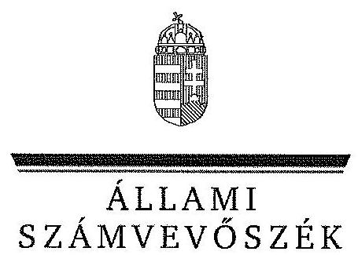
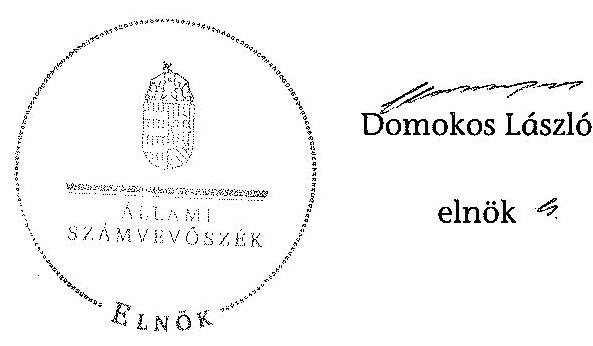
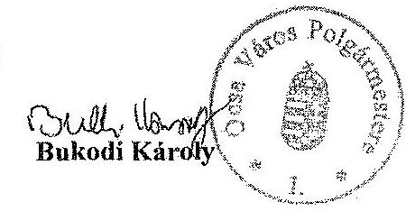
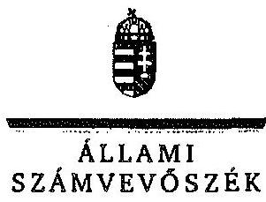
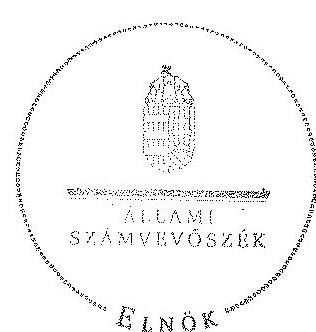
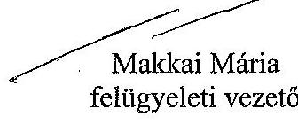

ÁLLAMI
SZÁMVEVŐSZÉK

# JELENTÉS 

az önkormányzati vagyongazdálkodás szabályszerűségi ellenőrzéséről

Ócsa
13068
2013. augusztus

---

# Állami Számvevőszék 

Iktatószám: V-0026-028-037/2013.
Témaszám: 1065
Vizsgálat-azonosító szám: V0593002

## Az ellenőrzést felügyelte:

## Makkai Mária

felügyeleti vezető
2012. december 16. napjától

## Gyüre Lajosné

felügyeleti vezető
2012. december 15. napjáig

## Az ellenőrzést vezette és az ellenőrzés végrehajtásáért felelős:

## Kesjár János

ellenőrzésvezető

## Az ellenőrzést végezték:

| Bodonyi Miklós | Kozma Gábor | Molnár Antal Lászlóné |
| :-- | :-- | :-- |
| számvevő főtanácsos | számvevő tanácsos | számvevő |

## Kányáné Murvai

Tünde
számvevő tanácsos

A témához kapcsolódó eddig készített számvevőszéki jelentések:
címe
sorszáma
A helyi önkormányzatok gazdálkodási rendszerének 2009. évi ellenőrzéséről V0468

---

# TARTALOMJEGYZÉK 

BEVEZETÉS ..... 3
I. ÖSSZEGZŐ MEGÁLLAPÍTÁSOK, KÖVETKEZTETÉSEK, JAVASLATOK ..... 5
II. RÉSZLETES MEGÁLLAPÍTÁSOK ..... 9

1. A vagyongazdálkodási tevékenység szabályozottsága ..... 9
1.1. A feladatellátás formáinak meghatározása, a döntések megalapozottsága ..... 9
1.2. A vagyonnal gazdálkodó szervezetek szervezeti rendjének szabályozottsága, a kötelező szabályzatok megfelelősége ..... 9
1.3. A vagyongazdálkodás szabályozása ..... 10
2. A vagyongazdálkodás szabályszerűsége ..... 12
2.1. A vagyon nyilvántartásának megfelelősége ..... 12
2.2. A vagyongazdálkodást érintő gazdasági események követelmények szerinti dokumentáltsága ..... 13
2.3. A vagyongazdálkodási intézkedések, döntések szabályszerűsége ..... 15
3. A vagyonváltozást eredményező gazdasági események szabályszerűsége ..... 16
3.1. A vagyon értékének és összetételének változása ..... 16
3.2. Közbeszerzési eljárás alkalmazása ..... 17
3.3. Hitelfelvétel, kötvénykibocsátás, garancia és kezességvállalás szabályszerűsége ..... 17
4. A vagyongazdálkodás szabályszerűségére vonatkozó belső és külső ellenőrzések hasznosulása ..... 18
4.1. A belső ellenőrzés által tett megállapítások, javaslatok hasznosulása ..... 18
4.2. A többségi tulajdonban lévő gazdasági társaságok vagyongazdálkodásának felügyelete ..... 19
4.3. A könyvvizsgálatnak a vagyongazdálkodás szabályosságához való hozzájárulása ..... 19
4.4. A külső ellenőrző szervezetek által tett javaslatok hasznosulása ..... 20

---

# MELLÉKLETEK 

1. számú Ócsa Város Önkormányzat gazdálkodására jellemző adatok, mutatószámok
2. számú Ócsa Város Önkormányzat vagyonának alakulása
3. számú Ócsa Város Önkormányzat kötelezettségeinek alakulása
4. számú Ócsa Város Önkormányzat polgármesterének észrevétele
5. számú A polgármester észrevételére adott válasz

## FÜGGELÉKEK

1. számú Rövidítések jegyzéke
2. számú Értelmező szótár

---

# JELENTÉS 

## az önkormányzati vagyongazdálkodás szabályszerűségi ellenőrzéséről

## Ócsa

## BEVEZETÉS

Az ÁSZ kiemelten fontosnak tartja az Állami Számvevőszékről szóló 2011. évi LXVI. törvény 5. § (4) bekezdése alapján az önkormányzati vagyon kezelésének, a vagyonnal való gazdálkodási szabályok betartásának az ellenőrzését. Az ellenőrzés feladata a vagyongazdálkodással kapcsolatban a közpénzek átláthatósága, nyilvánossága érdekében a jogszabályokban, belső szabályzatokban megfogalmazott előírások érvényesülésének áttekintése. Az Állami Számvevőszék nem csak az ellenőrzött szervezet vagyongazdálkodásának a hibáira mutat rá, számon kérve azok kijavítását, hanem megállapításaival, javaslataival segíti a közpénzzel, a közvagyonnal való felelős gazdálkodást.

Az önkormányzati vagyon alapvető funkciója, hogy a közérdeket és egyúttal az önkormányzati célok megvalósítását szolgálja. A feladatellátás terén elsősorban a kötelezően ellátandó feladatok végrehajtását hivatott szolgálni, amely mellett az önként vállalt feladatok ellátása is megvalósulhat.

## Az ellenőrzés célja az Önkormányzatnál annak értékelése volt, hogy:

- a vagyongazdálkodási tevékenységet, annak szervezeti kereteit szabályozták-e;
- az önkormányzati vagyongazdálkodás törvényességét, szabályszerűségét biztosították-e a döntések előkészítése és végrehajtása során;
- jogszerű döntéseken alapult-e a vagyon értékének és összetételének változása;
- a belső ellenőrzés elősegítette-e a vagyongazdálkodás szabályszerű működését, valamint hasznosultak-e a korábbi külső ellenőrzések által tett javaslatok.

Az ellenőrzés típusa: szabályszerűségi ellenőrzés
Az ellenőrzés a 2007. január 1. és 2011. december 31. közötti időszakra terjedt ki, kitekintéssel a helyszíni ellenőrzés befejezéséig tartó időszak releváns folyamat-

---

aira. Az egyes közbeszerzési eljárások lefolytatásának ellenőrzése a 2011. évet és a 2012. év I. negyedévét érintette.

Az ellenőrzés szakmai módszertana az Állami Számvevőszék Ellenőrzési Kézikönyvében foglalt szakmai szabályokon alapult, amely a Legfőbb Ellenőrző Intézmények Nemzetközi Szervezete (INTOSAI) által kiadott nemzetközi standardok (ISSAI) figyelembevételével készült.

A vagyongazdálkodás szabályozásának ellenőrzését a helyi szabályozások (rendeletek, szabályzatok, utasítások) ellenőrzésével végeztük el. A vagyonváltozások köréből az ellenőrizendő tételeket mintavétellel, a számviteli nyilvántartásokból választottuk ki.

Ócsa város lakosainak száma 2011. január 1-jén 9223 fő volt. A 2010. évi önkormányzati választást követően az Önkormányzat kilenctagú Képviselőtestületének munkáját három állandó bizottság segítette. Az Önkormányzat mellett 2010. októberétől a Roma Kisebbségi Önkormányzat működik. A polgármester a 2010. évi önkormányzati választás óta tölti be tisztségét, a jegyző 1991. január 1. óta látja el feladatát.

Az Önkormányzat feladatainak végrehajtása érdekében a 2011. évben a Polgármesteri hivatal mellett három költségvetési intézményt működtetett. Az önállóan működő és gazdálkodó Polgármesteri hivatal látta el az intézmények gazdálkodási tevékenységét is. A feladatok ellátásában részt vett három többségi tulajdonú és egy 40%-os tulajdoni hányadú gazdasági társasága.

Az Önkormányzat a 2011. évi költségvetési beszámolója szerint 1161,5 millió Ft költségvetési bevétele volt és 1025,7 millió Ft költségvetési kiadást teljesített, 2011. december 31-én a könyvviteli mérleg szerint 3325,4 millió Ft értékű vagyonnal rendelkezett. A 2011. év végén az Önkormányzat adósságállománya 2491,9 millió Ft volt, melyből a hosszú lejáratú kötelezettségek 2272,0 millió Ftot tettek ki. A Polgármesteri hivatalban dolgozó köztisztviselők száma 2011. december 31-én 42 fő, az Önkormányzat által foglalkoztatott közalkalmazottak száma 112 fő volt. Az Önkormányzat gazdálkodására jellemző adatokat, mutatószámokat az 1-3. számú mellékletek tartalmazzák.

Az ÁSZ a 2011. évi LXVI. törvény 29. §-a szerint a jelentéstervezetet megküldte Ócsa Város Önkormányzat polgármesterének egyeztetésre. A beérkezett észrevételt és az arra adott választ a jelentés 4-5. számú mellékletei tartalmazzák.

---

# I. ÖSSZEGZŐ MEGÁLLAPÍTÁSOK, KÖVETKEZTETÉSEK, JAVASLATOK 

Az Önkormányzat vagyonának könyvviteli mérleg szerinti értéke a 2007. évi 4495,9 millió Ft-ról 2011-re 3325,4 millió Ft-ra, 26,0%-kal csökkent, elsősorban a befektetett pénzügyi eszközök és a tárgyi eszközök értékének csökkenése miatt. A kötvénykibocsátásból származó bevétel 37%-át (555,4 millió Ft-ot) fordították beruházásra, felújításra.

Az Önkormányzat vagyongazdálkodásának szabályozottsága a 2007-2009. években alapvető hiányosságokat tartalmazott, amelyeket a 2009. évi ÁSZ ellenőrzést követően a 2010-2012. években megszüntettek. Az Önkormányzat 2007-től 2012. márciusáig - a Htv. vonatkozó előírását figyelmen kívül hagyva - a vagyongazdálkodás helyi szabályait nem határozta meg. A szabályozás hiánya is hozzájárult, hogy az Önkormányzat a gazdasági társaságának üzemeltetésre átadott, a törzsvagyon körébe tartozó víziközmű vagyontárgyakat - az Áhsz. előírása ellenére - a korlátozottan forgalomképes vagyon helyett a számviteli nyilvántartásban forgalomképes vagyonként tartotta nyilván, valamint, hogy előzetes értékbecslés nélkül értékesített négy önkormányzati ingatlant összesen 20,6 millió Ft-ért. A vagyongazdálkodás helyi szabályainak rendeletbe foglalására az ellenőrzött időszakot követően, 2012. március 29-én került sor.

Az Áht. és az Ötv. előírásainak megfelelően készítették és fogadták el az Önkormányzat, a Polgármesteri hivatal, valamint a költségvetési szervek szervezeti és működési szabályzatait, a gazdasági szervezetek ügyrendjét, a számviteli politikát és a hozzá tartozó szabályzatokat. Az önkormányzati SzMSz1,2,3-ban az Ötv. előírásainak megfelelően határozták meg a Képviselő-testületet megillető vagyongazdálkodási hatáskörök átruházását. A Pénzügyi bizottság számára a Képviselő-testület előírta az átruházott hatáskör gyakorlásához kapcsolódó beszámolási kötelezettséget. Az átruházott hatáskörben hozott döntésekre vonatkozó jogszabályi és belső szabályzatokban rögzített előírásokat betartották.

Az Önkormányzatnál a vagyongazdálkodásra vonatkozó jogszabályi előírásokat nem tartották be teljes körűen. A 2007-2011. években - az Áhsz.-ben és a leltározási szabályzat1,2-ben előírtak ellenére - a tárgyi eszközöket és az üzemeltetésre, kezelésre átadott eszközöket az évenkénti mennyiségi felvétellel történő leltározás helyett a nyilvántartások alapján leltározták, és a 2007-2009. években a leltárfelvételi íveket az üzemeltetők nem írták alá, illetve a 2010-2011. években - az Áhsz. előírása ellenére - hiányoztak az üzemeltetést, kezelést végző szervek által elkészített, hitelesített leltárak. A leltárfelvételt követően a leltárak kiértékelése minden évben elmaradt, a tárgyi eszköz leltárak - az Áhsz. előírásával ellentétesen - nem tartalmaztak értékadatot. A leltározásnál feltárt hiányosságok visszavezethetők arra is, hogy a belső ellenőrzés által az éves költségvetési beszámoló megbízhatóságának, a mérleg valódiságának értékelése keretében a vagyonnal és a vagyon nyilvántartásával, a leltározással kapcsolatos ellenőrzései során feltárt (adósok, vevők, passzív függő elszámolások mérlegsorainak eltéréseire, stb. vonatkozó) hiányosságok megszüntetésére a Ber. előírása ellenére nem készültek intézkedési tervek.

---

Az Önkormányzatnál a jogszabályokkal összhangban szabályozták a gazdálkodási jogköröket. A vagyongazdálkodás körében a 2007-2008. években megkötött szerződések esetében az Áht.-ban és az Ámr.2-ben előírtak ellenére a kötelezettségvállalást nem előzte meg annak ellenjegyzése.

Az Önkormányzat a 2007-2011. években - megsértve az Eisztv. és az Áht. előírásait - honlapján nem tette közzé a nettó ötmillió Ft-ot elérő vagy azt meghaladó értékű szerződések adatait, annak ellenére, hogy az ÁSZ korábbi ellenőrzése során javaslatot tett a hiányosság megszüntetésére.

Az Önkormányzat 2007-2011. között elkészítette, és a zárszámadási rendelet mellékletei között szerepeltette az Áht.-ban előírt vagyonkimutatást. A 2007-2011. évi zárszámadási rendelettervezetekben, illetve azok testületi előterjesztéseiben azonban nem mutatták be az eszközök elhasználódási fokának alakulását. A könyvvizsgáló a 2011. évi költségvetési rendelettervezet elfogadása előtt felhívta a figyelmet a tervezett működési hiány mérséklésének indokoltságára, a vagyoncsökkenés elkerülésére.

A Képviselő-testület az Önkormányzat gazdasági társaságai beszámolóját elfogadta. Az Ötv.-ben biztosított ellenőrzési jogával a többségi irányítást biztosító befolyás alatt működő társaságai vonatkozásában nem élt.

Az Állami Számvevőszékről szóló 2011. évi LXVI. törvény 33. § (1) bekezdésében foglaltak értelmében a jelentésben foglalt megállapításokhoz kapcsolódó intézkedési tervet köteles az ellenőrzött szervezet vezetője összeállítani, és azt a jelentés kézhezvételétől számított 30 napon belül az ÁSZ részére megküldeni. Amennyiben az intézkedési tervet határidőben nem küldi meg a szervezet, vagy az nem elfogadható, az ÁSZ elnöke a hivatkozott törvény 33. § (3) bekezdés a)-b) pontjaiban foglaltakat érvényesítheti.

Az ellenőrzés intézkedést igénylő megállapításai és javaslatai:

# a jegyzőnek 

1. Az Önkormányzat a gazdasági társaságának üzemeltetésre átadott bruttó 1300,6 millió Ft értékű víziközmű vagyontárgyakat az Ötv. 79. § (2) bekezdés b) pontjának előírása ellenére forgalomképes vagyonként tartotta nyilván.

## Javaslat

Intézkedjen az üzemeltetésre átadott víziközmű vagyonnak a Vagyon tv. 2 5. § (5) bekezdés a) pontjában előírtaknak megfelelő, korlátozottan forgalomképes vagyonként való számviteli nyilvántartásáról.
2. A leltározás végrehajtása során nem tartották be az Áhsz. és a leltározási szabályzat1,2 egyes előírásait az alábbiak tekintetében
a) A 2007-2011. években - az Áhsz. 37. § (3) bekezdésében és a leltározási szabályzat1,2-ben előírt rendelkezések ellenére - a tárgyi eszközöket és az üzemeltetésre, kezelésre átadott eszközöket az évenkénti mennyiségi felvétellel történő leltározás helyett a nyilvántartások alapján leltározták.

---

b) A 2007-2009. években a leltárfelvételi íveket az üzemeltetők - a leltározási szabályzat1-ben foglaltak ellenére - nem írták alá, illetőleg a 2010-2011. években az Áhsz. 37. § (4) bekezdés előírása ellenére - hiányoztak az üzemeltetést, kezelést végző szervek által elkészített, hitelesített leltárak.
c) A leltárfelvételt követően azok kiértékelése minden évben elmaradt, a tárgyi eszköz leltárak - az Áhsz. 37. § (2) bekezdésében foglalt előírásra ellenére - nem tartalmaztak értékadatot.

# Javaslat 

Intézkedjen, hogy
a) a Polgármesteri hivatalban a tárgyi eszközöket és az üzemeltetésre átadott eszközöket az Áhsz. 37. § (3) bekezdésének előírása alapján mennyiségi felvétellel leltározzák;
b) az üzemeltetésre átadott eszközökről a könyvviteli mérleg alátámasztásához az Áhsz. 37. § (4) bekezdés előírásának megfelelően, az üzemeltetők által évente elvégzett és
 hitelesített leltárak álljanak rendelkezésre;
c) a leltározáskor végezzék el a tárgyi eszközökről felvett leltárak kiértékelését és a leltárak tartalmazzák - az Áhsz. 37. § (2) bekezdésében foglalt előírásnak megfelelően - az értékadatokat.
3. Az Önkormányzat a 2007-2011. években - megsértve az Eisztv. 6. § (1) bekezdés és az Áht. 15/B. § (1) bekezdés előírásait - honlapján nem tette közzé a nettó ötmillió Ft-ot elérő vagy azt meghaladó értékű szerződések közzétételre előírt adatait.

## Javaslat

Intézkedjen az információs önrendelkezési jogról és az információs szabadságról szóló 2011. évi CXII. törvény 1. számú mellékletében meghatározott adatok közzétételéről.
4. A belső ellenőrzés által a vagyongazdálkodás területén feltárt (adósok, vevők, passzív függő elszámolások mérlegsorainak eltéréseire, stb. vonatkozó) hiányosságok megszüntetésére a Ber. 29. § (1) bekezdés előírása ellenére nem készültek intézkedési tervek.

## Javaslat

Intézkedjen, hogy a Bkr. 28. § c) pontjában előírtaknak megfelelően készüljön intézkedési terv a belső ellenőrzés által feltárt, a vagyongazdálkodás területét is érintő hiányosságok megszüntetésére, továbbá az intézkedési tervben foglaltakat végrehajtására.
5. A jegyző a 2010. és a 2011. évekre vonatkozóan nem tett eleget az Ámr. ${ }_{2}$ 217. § c) pontjában foglalt nyilatkozattételi kötelezettségének, nem értékelte a belső kontrollok működését. Ezt a hiányosságot az ÁSZ korábbi ellenőrzése során is kifogásolta.

---

# Javaslat 

Értékelje nyilatkozatban a Bkr. 11. § (1) bekezdés előírása alapján a belső kontrollrendszer minőségét.

---

# II. RÉSZLETES MEGÁLLAPÍTÁSOK 

## 1. A VAGYONGAZDÁLKODÁSI TEVÉKENYSÉG SZABÁLYOZOTTSÁGA

### 1.1. A feladatellátás formáinak meghatározása, a döntések megalapozottsága

Az Önkormányzat a gazdasági programban és a ciklusprogramban rögzítette az önkormányzati feladatellátással összefüggő elképzeléseket, fő irányokat, azonban az Ötv. 8. § (1) bekezdés és az ott meghatározott feladatokat szabályozó ágazati jogszabályok előírásai ellenére sem a kötelező és az önként vállalt feladatainak körét, sem az Ötv. 8. § (2) bekezdés szerint azok ellátásának módját és mértékét nem határozta meg.

A Képviselő-testület a 2007-2011 közötti időszakban egy alkalommal hozott a feladatellátás formáinak meghatározásával, módosításával összefüggő döntést. A vízgazdálkodási feladatokat ellátó, folyamatosan működő, két önkormányzati tulajdonú gazdasági társaság tevékenységi profiljának átalakításáról, a feladatok átcsoportosításáról szóló 238/2010. (XI. 24.) számú képviselőtestületi határozatában döntött az érintett társaságok vízgazdálkodási tevékenységeinek egy társaságba történő összevonásáról, a feladatok átadásáról. A határozathoz kapcsolódó előterjesztésben alternatív javaslatokat mutattak be a megalapozott döntés meghozatala érdekében.

A Képviselő-testület a 2007-2011. években nem döntött a közszolgáltatások ellátása érdekében önkormányzati intézmények létrehozásáról, gazdasági társaságok alapításáról, szövetkezet szervezéséről, valamint társulásba történő belépésről. Az Önkormányzat 2011. december 31-én a közfeladatokat három költségvetési szerv és négy gazdasági társaság útján látta el.

A 2010. július 1-ig önálló gazdálkodásra jogosult ${ }^{1}$ Halászy Károly Általános Iskola mellett a Nefelejcs Napköziotthonos Óvodát és a Falu Tamás városi könyvtárat működtette. A gazdasági társaságok közül az Ócsa Városüzemeltetési Nonprofit Kft., az (egyéb kulturális és művészeti tevékenységet ellátó) Egressy Gábor Nonprofit Kft. 100%-ban, az Ócsai Vízműüzemeltető Kft. 54%-ban, az Ócsa és Társai Szennyvíztisztító Kft. 40%-ban tartozott a tulajdonába.

### 1.2. A vagyonnal gazdálkodó szervezetek szervezeti rendjének szabályozottsága, a kötelező szabályzatok megfelelősége

A Képviselő-testület az önkormányzati $\mathrm{SzMSz}_{1,2,3}$-ban szabályozta a hatáskörök átruházását, meghatározta az átruházott hatáskör gyakorlásának szabályait és a kapcsolódó beszámolási kötelezettséget.

[^0]
[^0]:    ${ }^{1}$ 2010. július 1. után önállóan működő

---

Az SzMSz $_{2,2,3}$-ban foglaltak értelmében a Pénzügyi bizottság dönt az Önkormányzat 100-150 ezer Ft közötti követeléseiről történő lemondásról az adósok, vevők és egyéb követelések tekintetében. Az SzMSz ${ }_{1,3,3}$ előírásai szerint a Pénzügyi bizottság - az illetékes bizottságok véleményének figyelembevételével - javaslatot tesz az önkormányzati törzsvagyon kijelölésére, a különböző forgalomképesség szerinti vagyontípusok (forgalomképes, korlátozottan forgalomképes és forgalomképtelen) közötti indokolt átsorolásra. Az SzMSz ${ }_{3}$ szabályozása szerint a Pénzügyi bizottság közreműködik a telekárak kialakításában, valamint véleményezi az Önkormányzat vagyonát érintő javaslatok pénzügyi vonatkozásait.

A Képviselő-testület meghatározta a vagyonnal gazdálkodó, közfeladatot ellátó költségvetési szervek alapító okiratában a szervezetek közfeladatait, továbbá rendelkezett a közfeladatot ellátó költségvetési szervek szervezeti és működési szabályzatának jóváhagyásáról. A Nefelejcs Napköziotthonos Óvoda és a Falu Tamás városi könyvtár költségvetési gazdálkodási feladatait a Polgármesteri hivatal gazdasági szervezete látta el.

A vagyongazdálkodás szempontjából az előírásoknak megfelelően készítették és fogadták el a Polgármesteri hivatal $\mathrm{SzMSz}_{1,2}$-őt, valamint a 2010. július 1-ig önállóan működő és gazdálkodó, ezt követően önállóan működő Halászy Károly Általános Iskola szervezeti és működési szabályzatát és a gazdasági szervezetek ügyrendjét, továbbá a Polgármesteri hivatal számviteli politikáját, a hozzá tartozó szabályzatokat (a pénzkezelési szabályzatot, a leltározási szabályzat${ }_{1,2}$-t, az értékelési szabályzat${ }_{1,2}$-t). A számviteli politika a vagyongazdálkodás szempontjából megfelelő keretet biztosított az Önkormányzat költségvetési szervei egységes számviteli elvek szerinti, önkormányzati szintű beszámolójának elkészítéséhez. A leltározási szabályzat${ }_{1,2}$ és az intézmények leltározási szabályzatai évenkénti leltározást írták elő. A leltározási szabályzat${ }_{1,2}$ tartalmazta az üzemeltetésre, vagyonkezelésre, koncesszióba átadott eszközök leltározásának módját.

# 1.3. A vagyongazdálkodás szabályozása 

Az Önkormányzat 2007-től 2012 márciusáig a Htv. 138. § (1) bekezdés j) pontjában foglalt rendelkezést figyelmen kívül hagyva, a vagyongazdálkodás helyi szabályait nem határozta meg. Nem határozták meg az Önkormányzat tulajdonában álló vagyonelemek nyilvános versenyeztetéssel történő hasznosításának feltételeit, szabályait, valamint eseteit. Nem határozták meg továbbá a vagyon ingyenes átruházásának eseteit és módját, megsértve ezzel az Áht. 108. § (2) bekezdésében foglalt előírást. Ugyanakkor ingyenes átruházás 2007-2011 között nem történt.

Az önkormányzati $\mathrm{SzMSz}_{1,2,3}$-ban kialakították az előterjesztések készítésének, megtárgyalásának, véleményezésének, döntéshozatalának általános rendjét. A vagyongazdálkodási döntések előkészítési folyamatában nem írták elő a hasznosításra szánt ingatlanvagyon piaci értéke megállapítása céljából az értékbecslés készítésének kötelezettségét. Nem szabályozták a hitelfelvételről, kötvénykibocsátásról szóló döntés-előkészítési folyamatában a futamidő egyes éveit terhelő adósságszolgálat költségvetési egyensúlyra gyakorolt hatása elemzésének és bemutatásának, a pénzügyi kockázatok felmérésének követelményét.

---

2010. január 1. előtt - a szerződéskötési szabályzat hatálybalépéséig - nem írták elő a vagyongazdálkodás egyes területeit érintően az Önkormányzat tulajdonosi jogainak, érdekeinek védelmét szolgáló garanciális elemek szerződésben, egyéb dokumentumban való rögzítésének kötelezettségét, valamint a vagyongazdálkodással kapcsolatos döntések előkészítésének eljárási rendjét.

A négy vagyonkezelést végző gazdasági társasággal ${ }^{2}$ megkötött üzemeltetési szerződés tartalmazta a 2007-2011. években a vagyonkezelési feladatokat és felelősségeket, a vagyonelemek hasznosítására, illetve annak tilalmára vonatkozó rendelkezéseket, valamint a vagyontárgyak feletti rendelkezési jog megosztására vonatkozó szabályokat.

A Polgármesteri hivatal és a két nem önállóan gazdálkodó költségvetési szerv között létrejött feladatmegosztásra vonatkozó megállapodás, a 2010 júliusáig önállóan működő és gazdálkodó Halászy Károly Általános Iskola SzMSz-e, továbbá a Polgármesteri hivatal gazdasági szervezetének ügyrendje - az önkormányzati $\mathrm{SzMSz}_{1,2,3}$-mal összhangban - meghatározta a vagyonkezelési feladatokat, a vagyonelemek hasznosítására vonatkozó rendelkezéseket, valamint a vagyontárgyak feletti rendelkezési jog megosztására vonatkozó szabályokat.

Az ellenőrzött időszakot követően 2012. március 29-én az Önkormányzat megalkotta a 2012. évi vagyongazdálkodási rendeletét, amelyben rögzítette a helyi sajátosságoknak megfelelően az önkormányzati feladatellátást biztosító törzsvagyont, ezen belül a korlátozottan forgalomképes és forgalomképtelen vagyonelemek körét, meghatározásuk eljárási szabályait, továbbá a vagyonnyilvántartás rendszerére, vagyonkimutatás tartalmára vonatkozó szabályokat. A rendelet előírta továbbá az értékbecslés készítésének kötelezettségét, az ingyenes vagyonátadás módját és a versenyeztetés szabályait.

Az Önkormányzat a gazdálkodással és annak munkafolyamatba épített ellenőrzésével összefüggő jogkörök gyakorlásának rendjét, az ezekkel kapcsolatos összeférhetetlenségi követelményeket meghatározta.

A nyújtott céljellegű működési és fejlesztési támogatásokra, vagyonnal való gazdálkodással összefüggő szerződésekre, az Önkormányzat költségvetésére és zárszámadására vonatkozóan az önkormányzati $\mathrm{SzMSz}_{1,2,3}$-ban és a közzétételi szabályzatban meghatározták a nyilvánosság biztosításának eszközeit, a nyilvánosságra hozatal módját (a város internetes honlapján történő közzétételt), és a feladatok felelőseit.

Az önkormányzati $\mathrm{SzMSz}_{2,3}$-nak az ellenőrzési nyomvonalra vonatkozó előírásai, a gazdasági szervezet ügyrendje és a jegyző 2007-2011. években hozott utasításai részletesen meghatározták az éves költségvetési koncepció készítésére, az éves költségvetés készítésére és módosítására, valamint a költségvetési beszámoló készítésére és belső kontrolljaikra vonatkozó szabályokat, megnevezve a munkafolyamatok és feladatok felelőseit. Az Önkormányzat a 10/2009. (IV. 29.) számú rendeletében szabályozta a költségvetési és a

[^0]
[^0]:    ${ }^{2}$ Egressy Gábor Nonprofit Kft., Ócsa Városüzemeltető Nonprofit Kft., Ócsa Vízműüzemeltető Kft., Ócsa és Társai Szennyvíztisztító Kft.

---

zárszámadási rendelet tartalmát, azonban a zárszámadási rendelethez mellékletként csatolandó vagyonkimutatás készítésének módjáról és formájáról nem rendelkezett.

# 2. A VAGYONGAZDÁLKODÁS SZABÁLYSZERŰSÉGE 

### 2.1. A vagyon nyilvántartásának megfelelősége

Az Önkormányzat 2007-2011 között az Ötv. 78. § (2) bekezdése alapján minden évben elkészítette és a zárszámadáshoz csatolta a vagyonkimutatást, amely megfelelt az Áhsz. 44/A. §-ában meghatározott minimumkövetelményeknek. A vagyonkimutatások az Áhsz. 44/A. § (2) bekezdésében előírtak szerint önkormányzati rendeletben szabályozandó további részletezést, tételes alábontást nem tartalmaztak.

Az Áhsz. 9. számú melléklet a számlaosztályok tartalmára vonatkozó előírások cím 1. k) pontjában foglaltaknak megfelelően a törzsvagyon (ezen belül forgalomképtelen, illetve korlátozottan forgalomképes), valamint az egyéb vagyon részét képező eszközök elkülönítéséről a számlarendben foglalt előírásoknak megfelelően - a főkönyvi számlák további bontásával és a számlákhoz kapcsolódó részletező analitikus nyilvántartások vezetésével - gondoskodtak.

Az Önkormányzat az önkormányzati feladatok ellátásában részt vevő gazdálkodó szervezetnek üzemeltetésre átadott, az Ötv. 79. § (2) bekezdésének b) pontja alapján törzsvagyon körébe tartozó, bruttó 1300,6 millió Ft értékű víziközmű vagyontárgyakat az Áhsz. 9. számú melléklet számlaosztályok tartalmára vonatkozó címen belül az 1. k) pontban meghatározott előírás ellenére a számviteli nyilvántartásában nem törzsvagyonként, hanem forgalomképes vagyonként tartotta nyilván.

Az Önkormányzatnál a 2007-2011. években a vagyonkimutatásban szereplő ingatlanvagyon és az ingatlanvagyon kataszter adatainak egyeztetését elvégezték, azonban az egyeztetés tényét külön dokumentumban írásban nem rögzítették. Az egyeztetések elvégzését a belső ellenőri jelentések és a számviteli és az ingatlanvagyon kataszteri nyilvántartásokon szereplő jelzések tanúsítják. Az egyeztetések ellenére a 2007-2011. években a vagyonkataszter szerinti bruttó érték adatok év végén a 147/1992. (XI. 6.) Korm. rendelet 1. § (3) bekezdésének előírása ellenére nem egyeztek ${ }^{3}$ a számviteli nyilvántartás szerinti bruttó érték adatokkal. A 2011. év végi vagyonkataszteri adatok egyeztetését az Önkormányzat a helyszíni ellenőrzés ideje alatt elvégezte, a hibákat javította. A 2012. évi vagyonkataszteri és főkönyvi nyitó adatok ezt követően már egyezőséget mutattak.

[^0]
[^0]:    ${ }^{3}$ A vagyonkataszter eltérései a főkönyvi bruttó értékhez képest: 2007-ben 2,5 millió Ft, 2008-ban 0,9 millió Ft, 2009-ben 2,9 millió Ft, 2010-ben 5,3 millió Ft és 2011-ben 5,3 millió Ft volt.

---

Az Önkormányzat a 2007-2011. években a Számv. tv. 69. § (1)-(2) bekezdésében és az Áhsz. 37. § (1) bekezdésében előírt leltározási kötelezettségének december 31-ei fordulónappal eleget tett. A 2007-2011. években a tárgyi eszközök és az üzemeltetésre, kezelésre átadott eszközök esetében a leltározási szabályzat${ }_{1,2}$-ben előírt évenkénti mennyiségi felvétel helyett - a kialakított leltározási körzetenként - a nyilvántartások alapján történő leltározás (rovancsolás) módszerével végezték a leltározást, amely nem felelt meg az Áhsz. 37. § (3) bekezdésében foglalt előírásnak. A leltározás befejezésekor a leltározási
 körzetenként készített jegyzőkönyvekben rögzítették, hogy a leltári tárgyak hiánytalanul megvannak.

Az üzemeltetésre, kezelésre átadott eszközök leltározása során a 2007–2009. években figyelmen kívül hagyták a leltározási szabályzat ${ }_{1}$-ben foglaltakat, a Polgármesteri hivatal által készített leltárfelvételi íveket az üzemeltetők nem írták alá. A 2010. és a 2011. években az Áhsz. 37. § (4) bekezdésének előírásától ${ }^{4}$ eltérően az üzemeltetésre, kezelésre átadott közművek leltározásánál hiányoztak az üzemeltetést, kezelést végző szervek által elkészített, hitelesített leltárak.

A leltárfelvételt követően a leltárak kiértékelése minden évben elmaradt, a tárgyi eszköz leltárak nem tartalmaztak értékadatot. Ennek következtében a 2007–2011. évekre elkészített könyvviteli mérlegben a tárgyi eszköz mérlegsorok értékadatait az Áhsz. 37. § (2) bekezdés előírásainak megfelelő leltárral nem támasztották alá. A könyvviteli mérleg tárgyi eszköz sorainak értéke ugyanakkor megegyezett a záró főkönyvi kivonat értékeivel, amelyek a Számv. tv. általános alapelveinek és tételes szabályozásainak, valamint az értékelési szabályzat ${ }_{1,2}$-ben foglaltaknak megfelelően kerültek meghatározásra.

# 2.2. A vagyongazdálkodást érintő gazdasági események követelmények szerinti dokumentáltsága 

A költségvetési gazdálkodást (beleértve a vagyongazdálkodást) érintő gazdálkodási jogkörök szabályozását a gazdasági szervezet ügyrendjében és a gazdálkodási jogkörök szabályzata ${ }_{1,2}$-ben határozták meg. A FEUVE szabályzatban és a mellékletét képező ellenőrzési nyomvonalban rögzítették a gazdálkodási folyamatba épített ellenőrzési hatásköröket. A jegyző a szabályzatokban rendelkezett a szakmai teljesítés igazolásának módjáról, az azt végző személyek kijelöléséről, továbbá írásbeli megbízást adott az érvényesítés ellátására.

A kötelezettségvállalást, a szakmai teljesítésigazolást, az érvényesítést, az utalványozást és annak ellenjegyzését az Ámr. ${ }_{1}$ és az Ámr. ${ }_{2}$ előírásainak megfelelően, a vonatkozó szabályzatban kijelölt és felhatalmazott személyek gyakorolták. A gazdálkodási jogkör gyakorlása során valamennyi gazdasági eseménynél érvényesültek az Ötv.-ben, az Ámr., valamint az Ámr. ${ }_{2}$-ben rögzített összeférhetetlenségi követelmények.

[^0]
[^0]:    ${ }^{4}$ Megállapította a 317/2009. (XII. 29.) Korm. rendelet 18. §-a (hatályos: 2010. január 1-jétől), először a 2010. évről készített beszámolókra kellett alkalmazni.

---

Az Áht. 98. § (2) bekezdésében előírtakat megsértve és az Ámr. ${ }_{1}$ 138. § (8) bekezdésében előírtak ellenére a kötelezettségvállalást nem előzte meg annak ellenjegyzése a 2007–2008. években megkötött szerződések esetében. Ellenjegyzés hiányában az Ámr. 138. § (9) bekezdésében foglalt ellenőrzési feladatokat nem végezték el, nem győződtek meg a kiadási előirányzatok rendelkezésre állásáról, a fedezet meglétéről, illetve nem vizsgálták, hogy a kötelezettségvállalás megfelel-e a gazdálkodásra vonatkozó szabályoknak. A 2009–2011. években a kötelezettségvállalásoknál működtek a belső kontrollrendszer megfelelő elemei.

A 2007. évben elmulasztották a Polgármesteri hivatal külső festéséhez kapcsolódó kifizetésnél (1,8 millió Ft) az utalvány ellenjegyzését megelőzően a szakmai teljesítésigazolást, ezért az Ámr. 135. § (1) bekezdésében előírtak ellenére nem történt meg a kifizetés jogosságának, összegszerűségének és a szerződésszerű teljesítésnek az ellenőrzése. Az érvényesítő és az utalvány ellenjegyzője nem végezte el szabályosan a munkafolyamatba épített ellenőrzési feladatait, mivel az érvényesítő az Ámr. ${ }_{1}$ 135. § (3) bekezdésében ${ }^{5}$ előírtak ellenére, az utalvány ellenjegyzője az Ámr. ${ }_{1}$ 137. § (3) bekezdésében ${ }^{6}$ foglaltak ellenére nem észrevételezte a szakmai teljesítésigazolás hiányát.

Az Ócsai református templom melletti terület rendezéséhez kapcsolódó kifizetésnél (33,0 millió Ft) az érvényesítés elmaradt, ezáltal az Ámr. 135. § (3) bekezdésében foglalt előírás ellenére nem történt meg az összegszerűség, a fedezet meglétének és az előírt követelmények betartásának ellenőrzése. Az utalvány ellenjegyzője nem végezte el szabályosan a munkafolyamatba épített ellenőrzési feladatait, mivel az Ámr. 137. § (3) bekezdésében foglaltak ellenére nem észrevételezte az érvényesítés hiányát.

A Bajcsy-Zsilinszky utcai csatorna kiépítésével kapcsolatos kifizetésnél (12,0 millió Ft) az utalvány ellenjegyzése elmaradt, melynek következtében az utalvány ellenjegyzője az Ámr. 137. § (3) bekezdésében előírtak ellenére nem végezte el ellenőrzési feladatait. A 2008–2011. években a szakmai teljesítésigazoló, az érvényesítő, az utalvány ellenjegyző az ellenőrzési feladatainak eleget tett.

Az Önkormányzat az Áht. 15/A. § (1) bekezdésében előírtaknak megfelelően az ellenőrzött időszakban közzétette az általa nyújtott, nem normatív, céljellegű fejlesztési támogatások kedvezményezettjeinek nevét, a támogatás célját, összegét, a támogatási program megvalósítási helyét, továbbá közzétette az éves költségvetés és az éves beszámoló adatait a helyben szokásos módon ${ }^{7}$.

Az Önkormányzat a 2007–2011. években az Áht. 15/B. § (1) bekezdés és az Eisztv. 6. § (1) bekezdés előírásai ellenére az internetes honlapon nem tette közzé a nettó ötmillió Ft-ot elérő vagy azt meghaladó értékű, útépítésre, területrendezésre, és épületbontásra, továbbá vagyonértékesítésekre vonat-

[^0]
[^0]:    ${ }^{5}$ a 2010. évtől Ámr. ${ }_{2}$ 77. § (1) bekezdés
    ${ }^{6}$ a 2010. évtől Ámr. ${ }_{2}$ 79. § (2) bekezdés
    ${ }^{7}$ az Önkormányzat honlapján, http://www.ocsa.hu

---

kozó szerződések megnevezését, tárgyát, a szerződést kötő felek nevét, a szerződés értékét.

# 2.3. A vagyongazdálkodási intézkedések, döntések szabályszerűsége 

A vagyonhasznosítási és vagyonértékesítési szerződésekben az Önkormányzat érdekeit védő garanciális elemeket beépítették, késedelmes fizetés esetére késedelmi kamat felszámítását, a bérleti díj nem fizetése esetén a bérleti jogviszony felmondását jelölték meg. Az átruházott hatáskörben hozott döntésekre vonatkozó jogszabályi és belső szabályzatokban rögzített előírásokat betartották.

A helyi szabályozás hiányára visszavezethetően négy önkormányzati ingatlan 20,6 millió Ft-ért történő értékesítését nem előzte meg értékbecslés.

A vagyonnövekedéssel összefüggésben a beruházások európai uniós támogatásokból, hitel és kötvénykibocsátásból származó források igénybevételével valósultak meg. A döntések előkészítése során megvalósíthatósági tanulmányok készültek, amelyek szerint a létesítmények fenntarthatóak.

A városközpont fejlesztésére fordított 117,4 millió Ft-ból 84,9 millió Ft, valamint a Polgármesteri hivatal komplex akadálymentesítésére felhasznált 10,1 millió Ft-ból 9,1 millió Ft származott uniós forrásból. A Halászy Károly Általános Iskola 19,6 millió Ft-ba került infrastrukturális fejlesztéséhez 12,6 millió Ft hazai támogatás járult hozzá. Az új Egészségház 77,4 millió Ft-os építését a kötvénykibocsátás forrásaiból fedezték.

Az ellenőrzött időszakban az Önkormányzat hosszú lejáratú, felhalmozási célú, pénzintézettel szembeni kötelezettségvállalásaira (két kötvénykibocsátásra és egy hitelfelvételre) minden esetben képviselő-testületi döntés alapján került sor. A Pénzügyi bizottság a döntésekhez kapcsolódó előterjesztéseket – melyek tartalmazták a hitelfelvétel, kötvénykibocsátás indokait, annak gazdasági megalapozottságát – véleményezte.

A Képviselő-testület a kötvények kibocsátását megelőzően tájékoztatást kapott a választható kibocsátási kondíciókról, a kötelezettségvállalás kamat- és visszafizetési kockázatairól, adósságszolgálatáról. A képviselő-testületi előterjesztések viszont nem tartalmaztak gazdaságossági számításokat, alternatív javaslatokat, és nem tértek ki a kötvények futamidejének egyes éveit terhelő kötelezettségvállalásnak a költségvetési egyensúlyra gyakorolt hatásának vizsgálatára.

---

# 3. A VAGYONVÁLTOZÁST EREDMÉNYEZŐ GAZDASÁGI ESEMÉNYEK SZABÁLYSZERŰSÉGE 

### 3.1. A vagyon értékének és összetételének változása

Az Önkormányzat vagyonának értéke a 2007. évi 4495,9 millió Ft-ról 2011-re 3325,4 millió Ft-ra, 26,0%-kal csökkent, amely a befektetett pénzügyi eszközök és a tárgyi eszközök értékének csökkenése miatt következett be.

A befektetett pénzügyi eszközök értéke a 2007. évben kibocsátott Ócsa I. és a 2008. évben kibocsátott Ócsa II. elnevezésű, összesen 1500,0 millió Ft értékű kötvények felhasználásának következtében, a 2007. évi 1350,3 millió Ft-ról 2011-re 367,5 millió Ft-ra csökkent. Az Önkormányzat a kötvénykibocsátásból származó bevételből 994,4 millió Ft-ot fennálló hitelállományának, kamatkötelezettségének visszafizetésére és folyó működési kiadásokra használt fel, ezáltal nem történt vagyonnövekedés. Beruházási, felújítási célra a kötvényekből és azok kamatbevételeiből 555,4 millió Ft-ot használtak fel.

A tárgyi eszközök értéke 111,7 millió Ft-tal csökkent 2007 és 2011 között. Ennek oka, hogy az elszámolt értékcsökkenés és az ingatlanértékesítések összege meghaladta a beruházások, felújítások összegét. Az Önkormányzat a vagyonérték megőrzését külső forrásbevonás ellenére sem tudta biztosítani, ugyanakkor vagyoni helyzetét veszélyeztetik a vállalt kötelezettségek.

A hosszú lejáratú kötelezettségek a 2007. évi 1308,5 millió Ft-ról 2011-re 2272,0 millió Ft-ra, 73,6%-kal nőttek, melynek oka – a 2008. évi 200,0 millió Ft értékű kötvénykibocsátás és a 2010-ben mindössze 30,0 millió Ft fejlesztési célú hitelfelvétel kötelezettségnövelő hatása mellett – a bekövetkezett árfolyamváltozás hatása volt. (A kötvények devizanemét kibocsátásukat követően svájci frankra, majd – a Pénzügyi bizottság előzetes véleményezését követően még két alkalommal (euróra illetve ismét svájci frankra) megváltoztatta a Képviselő-testület.) Saját vagyona (saját tőke és tartalékok) 2007 és 2011 között 73,2%-kal, 3105,2 millió Ft-ról 831,3 millió Ft-ra csökkent.

Az Önkormányzat 2007–2011 között a tárgyi eszközökre együttesen 470,4 millió Ft összegű értékcsökkenést számolt el. A használhatósági fok mutató az elszámolt értékcsökkenés hatására 84,4%-ról 74,9%-ra csökkent, azaz az eszközök avultsága 9,5 százalékponttal növekedett. A 2007–2011. évek között összesen 513,2 millió Ft értékű felújítást, illetve beruházást aktiváltak, ebből a felújítási kiadások ${ }^{8}$ összege 121,1 millió Ft, az összesen elszámolt értékcsökkenés 25,7%-a volt.

A 2007–2011. évi zárszámadási rendelet-tervezetekben nem mutatták be az Önkormányzat eszközei után a tárgyévben elszámolt eszközpótlásra fordított tényleges kiadásokat, valamint az eszközök elhasználódási fokának alakulását.

[^0]
[^0]:    ${ }^{8}$ útfelújítások, iskola nyílászáróinak felújítása, településközpont, könyvtár, millenniumi park felújítás

---

# 3.2. Közbeszerzési eljárás alkalmazása 

Az Önkormányzat a 2011. évben, illetve a 2012. év I. negyedévében megvalósított felújítás során lefolytatta a jogszabályok által előírt esetben a közbeszerzési eljárást. A Kbt. ${ }_{1,2}$-ben előírt egybeszámítási kötelezettségnek eleget tettek, illetve a becsült érték alapján megalapozottan választották ki az alkalmazandó eljárásrendet. A közbeszerzéssel kapcsolatos felelősségi rendet a szabályzatokban munkakörre szólóan rögzítették. A lefolytatott közbeszerzési eljárás megfelelt a Kbt. ${ }_{1,2}$ előírásainak.

### 3.3. Hitelfelvétel, kötvénykibocsátás, garancia és kezességvállalás szabályszerűsége

Az Önkormányzat a költségvetés végrehajtása során a 2010. évben egy beruházás finanszírozására hosszú lejáratú fejlesztési célú hitelt vett fel, a 2007–2008. években kötvényt bocsátott ki, valamint egy kizárólagos tulajdonában lévő gazdasági társasága által felvett hitelhez vállalt készfizető kezességet.

Az Önkormányzat a hosszú lejáratú, felhalmozási célú hitel felvétele, a hosszú lejáratú, felhalmozási célú kötvénykibocsátások, valamint a készfizető kezességvállalás során az Ötv. 88. § (1) bekezdés b) pontjában foglaltakat betartotta, mivel fedezetként önkormányzati törzsvagyont nem ajánlott fel. (A kötvények fedezetéül az Önkormányzat a helyiadó-bevételeit ajánlotta fel a finanszírozó bank részére.) Belső szabályzat a döntésre vonatkozóan csak az előterjesztések készítésének, megtárgyalásának, véleményezésének és magának a döntés meghozatalának általános rendjét szabályozta, amelyet betartottak. Az Önkormányzat a kötvényekből származó bevételt a Képviselő-testület által elfogadott céloknak megfelelően használta fel.

A Képviselő-testület az Ötv. 9. § (3) bekezdésében előírtakat megsértve, olyan munkacsoport részére adta át a kötvénykibocsátásból származó bevétel felhasználására vonatkozó döntési hatáskörét, amely nem szerepel az Ötv. 9. § (3) bekezdésében a hatáskörrel felruházhatók között. A Képviselő-testület 2010-ben, a 34/2010. (II. 24.) számú határozatával a jogsértést megszüntette, a döntési hatáskör átruházását hatályon kívül helyezte.

Az Önkormányzat a Képviselő-testület döntése ${ }^{9}$ alapján egy kizárólagos tulajdonában lévő gazdasági társasága (Ócsa Városüzemeltetési Nonprofit Kft.) által felvett (280,0 millió Ft összegű) hitelhez készfizető kezességet vállalt. A hitel célja új Egészségház megépítése volt. A biztosítéki szerződést a felek 2009. szeptember 18-án kötötték meg. A Képviselő-testület a
 fejlesztési célú Ócsa I. és Ócsa II. kötvények felhasználásával kezességvállaló szerepében eljárva a hitelt visszafizette. Az általa visszafizetett összeggel megegyező 280,0 millió Ft-os követelésével, valamint az Ócsa 1899/5 hrsz-ú ingatlan (az Egészségház alatti földterület) értékének megfelelő összeggel (6,2 millió Ft) és az új Egészségház építésének folyamatban lévő beruházására aktivált összeggel

[^0]
[^0]:    ${ }^{9}$ a Képviselő-testület 152/2009. (VII. 27.) számú határozata

---

(71,2 millió Ft) törzstőke emelést hajtott végre 357,4 millió Ft értékben a gazdasági társaságban.

# 4. A VAGYONGAZDÁLKODÁS SZABÁLYSZERŰSÉGÉRE VONATKOZÓ BELSŐ ÉS KÜLSŐ ELLENŐRZÉSEK HASZNOSULÁSA 

### 4.1. A belső ellenőrzés által tett megállapítások, javaslatok hasznosulása

Az Önkormányzat külső szolgáltatóval látta el a belső ellenőrzési feladatokat. A belső ellenőrzés rendelkezett 2006. november 1-jétől hatályos belső ellenőrzési kézikönyvvel, továbbá a Ber. 19. §-ának megfelelő stratégiai tervvel. A belső ellenőr által összeállított éves ellenőrzési tervek - a jegyzővel közös előterjesztésben - minden évben a Képviselő-testület elé kerültek.

A belső ellenőr által az éves belső ellenőrzési terv megalapozására szolgáló kockázatelemzés módszere nem volt alkalmas a vagyongazdálkodás kritikus területeinek feltárására. A formalizált, évente csak egy-egy területen változó, részletes indoklás nélküli kockázatelemzésben a költségvetési és a zárszámadási rendelettervezetek megalapozottsága és megfelelősége, az éves költségvetési beszámoló megbízhatósága, továbbá a normatív és a kötött felhasználású költségvetési támogatások elszámolása magas kockázataik következtében minden évben bekerültek az ellenőrzési tervbe. Rendszeres feladatként tervezték a civil szervezetnek nyújtott támogatások, valamint a banki és a pénztárbizonylatok ellenőrzését is.

A vagyongazdálkodás szabályszerűségéhez kapcsolódóan a tervezett belső ellenőrzések csak az éves költségvetési beszámoló megbízhatóságának, a mérleg valódiságának értékelése kapcsán foglalkoztak a Polgármesteri hivatalban és a felügyelt költségvetési intézményeknél - a leltározások ellenőrzése keretében - a vagyonnal és a vagyon nyilvántartásával. Az ellenőrzések nem terjedtek ki a vagyon változásának szabályszerűségére. A belső ellenőr a 2007-2011. években készített jelentéseiben a mérleg hitelességének alátámasztására szolgáló kiértékelt leltárak hiányát, továbbá a vagyon-nyilvántartási hibákat (víziközmű vagyontárgyak téves besorolása) nem tárta fel.

A belső ellenőrzés által a vagyongazdálkodás területén feltárt (adósok, vevők, passzív függő elszámolások mérlegsorainak eltéréseire, stb. vonatkozó) hiányosságok megszüntetésére a Ber. 29. § (1) bekezdés ${ }^{10}$ előírása ellenére nem készültek intézkedési tervek. A jegyző írásos formában, vagy - a vezetői értekezletek emlékeztetői szerint - utasítás formájában hasznosította a belső ellenőri megállapításokat. Így hasznosultak pl. a 2009. évben a közbeszerzések lebonyolítása soron kívüli belső ellenőrzéseinek megállapításai is. Pótolták a kifizetett számlák hiányzó analitikus nyilvántartását, az új Egészségház bekerülési értékébe beszámították (aktiválták) a volt iskolaépület bontási költségeit, a 2011. évi közbeszerzési eljárásban már bíráló bizottság járt el, amelynek tagjai rendelkeztek megbízással és összeférhetetlenségi nyilatkozattal.

[^0]
[^0]:    ${ }^{10}$ 2012. január 1-jétől a Bkr. 28. § c) pontja szabályozza

---

A belső ellenőrzés éves jelentését minden évben az Ötv. 92. § (10) bekezdés előírásától eltérően nem a polgármester, hanem a megbízott Kft. - ellenőrzési vezetőként eljáró - képviselője terjesztette a zárszámadási rendelettervezet benyújtásával egyidejűleg a Képviselő-testület elé. Az éves jelentés megfelelő összefoglalását adta az adott évben az Önkormányzatnál - beleértve az intézményeknél és a gazdasági társaságoknál - végzett belső ellenőrzések fontosabb tapasztalatainak. A Képviselő-testület a jelentések elfogadásáról, vita nélkül, határozati formában döntött.

# 4.2. A többségi tulajdonban lévő gazdasági társaságok vagyongazdálkodásának felügyelete 

A Képviselő-testület (és a véleményező jogkörrel rendelkező Pénzügyi bizottság) a 2007-2011. években az Önkormányzat többségi tulajdonában álló három gazdasági társaság pénzügyi és gazdasági helyzetével az éves beszámolójuk elfogadásán és hitelezéssel, kezességvállalással összefüggő eseti döntéseken kívül nem foglalkozott. A beszámolók elfogadását, a hitelszerződések megkötésének engedélyezését és a készfizető kezességek vállalását kezdeményező testületi előterjesztések helyzetértékelést, az érintett társaságok pénzügyi, jövedelmi helyzetének elemzését és értékelését nem tartalmazták.

Az éves beszámolón kívül a közfeladatok ellátására üzemeltetésre átadott vagyonnal való gazdálkodásról az Önkormányzat nem számoltatta be a gazdasági társaságokat. Nem fordítottak figyelmet a feladatellátásra vonatkozó szerződések, megállapodások teljesítésének értékelésére, ilyen irányú ellenőrzést nem végeztek. A közfeladatok ellátása, a társaságok vagyoni, pénzügyi és jövedelmi helyzetének értékelése az Ötv. 92. § (11) b) pontjában biztosított felhatalmazás ellenére nem jelent meg ellenőrzési célként. Pozitív változásnak tekinthető, hogy 2012 elejétől a jegyző által tartott heti vezetői értekezletekre meghívják a gazdasági társaságok ügyvezetőit, akiknek tájékoztatást kell adniuk a társaságok aktuális helyzetéről.

### 4.3. A könyvvizsgálatnak a vagyongazdálkodás szabályosságához való hozzájárulása

A 2007-2011 között minden évben elvégzett könyvvizsgálat az Önkormányzat egyszerűsített összevont éves költségvetési beszámolóját megbízhatónak és hitelesnek minősítette. Az éves beszámoló megbízhatóságának minősítésén kívül az Önkormányzat eseti jelleggel a költségvetési rendelettervezet megfelelőségének vizsgálatával bízta meg a könyvvizsgálót. A megalapozottnak és a jogszabályi előírásokkal összhangban állónak értékelt 2011. évi rendelettervezet elfogadása előtt a könyvvizsgáló a jelentésében felhívta a figyelmet a 18%-os mértékű tervezett működési hiány (189,7 millió Ft) mérséklésének indokoltságára, a vagyoncsökkenés elkerülésére. A javaslat nem hasznosult, miután a Képviselő-testület a véleményezett rendelettervezetet az előirányzatok érdemi megváltoztatása nélkül fogadta el.

---

# 4.4. A külső ellenőrző szervezetek által tett javaslatok hasznosulása 

Az ÁSZ az Önkormányzat gazdálkodási rendszerének 2009-es ellenőrzése kapcsán a polgármesternek címezve 3 szabályszerűségi és 1 célszerűségi, a jegyzőnek 35 szabályszerűségi és 6 célszerűségi javaslatot fogalmazott meg. A jegyző a javaslatok hasznosítására - határidő és felelős megjelölésével - intézkedési tervet terjesztett a Képviselő-testület elé. Az intézkedési tervet a 44/2010. (II. 24.) számú határozat léptette hatályba. A belső ellenőr terven felül 2011-ben és 2012 áprilisában is ellenőrizte az intézkedési terv végrehajtását. Megállapításaival felhívta a figyelmet a még nem teljesített feladatokra.

A javaslatok közül 20 szabályszerűségi és 5 célszerűségi javaslat kapcsolható a vagyongazdálkodás területéhez. A jegyző valamennyi célszerűségi javaslatot hasznosította. Féléves gyakorisággal tájékoztatja a Képviselő-testületet az Önkormányzat adósságállományának helyzetéről; kijelölte az uniós támogatással megvalósuló fejlesztéseknél az önkormányzati szintű pályázatkoordinálás és pályázat-nyilvántartás felelőseit, és gondoskodott arról, hogy a vonatkozó szerződésekben szerepeljen az Önkormányzat részéről kapcsolatot tartó személy; a pénzügyi-számviteli dolgozók munkaköri leírásait kiegészítette az eszközök és források év végi értékeléséhez kapcsolódó feladatok megjelölésével.

A 20 szabályszerűségi javaslat közül 18-at megvalósítottak, 1 részben teljesült, 1 pedig nem került végrehajtásra. A polgármester kezdeményezésére a Képviselő-testület megszüntette a kötvénykibocsátásból származó bevétel kezelésére létrehozott munkacsoportot. A jegyző gondoskodott arról, hogy a bankszámlákon levő záró pénzkészletet figyelembe vegyék a pénzmaradvány meghatározásakor, az európai uniós támogatású fejlesztéseknél a költségvetési rendeletek tartalmazzák a bevételi és kiadási előirányzatokat, a kiadási előirányzatok feladatonként, évenkénti bontásban szerepeljenek. Az Önkormányzat honlapján közzéteszik a nyújtott céljellegű támogatásokat, megjelölve azok célját és összegét. Az ellenőrzési nyomvonal kiegészítésével meghatározták a költségvetési tervezés és zárszámadás folyamatában érvényesítendő ellenőrzéseket, így a költségvetési igények indokoltságának és teljesíthetőségének, valamint a tervezett saját bevételek és a helyi rendeletek összhangjának kontrolljait.

A jegyző kezdeményezésére a Polgármesteri hivatal $\mathrm{SzMSz}_{1}$-ét kiegészítették a javaslatban megnevezett adatokkal (a Polgármesteri hivatal törzskönyvi azonosító száma, az alapító okirat kelte, száma, a szervezeti felépítés stb.). A belső kontrollok meghatározásának pontosításaként a jegyző 2010-ben kiegészítette a gazdasági szervezet ügyrendjét a kötelezettségvállalási, a helyettesítési és a kapcsolattartási rend szabályozásával, valamint a szakmai teljesítésigazolás módjának, az egyes előírások közötti összhangjának, a kötelezettségvállaló nyilvántartásának előírásaival. A javaslatoknak megfelelően a jegyző gondoskodott a számviteli politika és a kapcsolódó szabályzatok, valamint a számlarend kiegészítéséről, ennek keretében az önköltség-számítási szabályzat elkészítéséről, a leltározási és a selejtezési szabályzatok kiegészítéséről, továbbá a számlarendben a hiányzó jogcímek, számlaösszefüggések és egyeztetési kötelezettségek meghatározásáról. Megtörtént a FEUVE rendszer belső szabályozásának módosítása. Az ellenőrzési nyomvonal leírása kiegészült az egyes tevékenységekre vonatkozó szabályzatok, felelősségek és dokumentumok megjelölésével. A kockázatkezelési szabályzatban pótolták a kockázatok azonosítására, az elfogadható kockázati szintre, a kockázatok kezelésére és nyilvántartására, valamint a rendszeres felülvizsgálatra vonatkozó előírásokat. A gazdálkodási jogkörök gyakorlásával összefüggésben a jegyző gondoskodott az uniós támogatással megvalósult fejlesztéseknél a szakmai teljesítésigazolás, az érvényesítés és az ellenjegyzés megfelelő gyakorlásáról.

A belső ellenőrzés szabályozásának korrekciója keretében meghatározták a külső szolgáltató képviseletében belső ellenőrzést végző személy jogállását, kiegészítették a belső ellenőrzési kézikönyvet a külső szakértők bevonására és a munka minőségét biztosítani hivatott eljárásokra, valamint a kézikönyv rendszeres felülvizsgálatára vonatkozó előírásokkal. Realizálták az ÁSZ 2005. évi átfogó ellenőrzésének 2009 végéig még nem hasznosított javaslatait.

Részben teljesült az Áht. 15/B. §-ban meghatározott, közzétételre vonatkozó javaslat, mert továbbra sem történt meg a nettó ötmillió Ft feletti árubeszerzésre, építési beruházásra, szolgáltatás megrendelésére, vagyonértékesítésre és vagyonhasznosításra vonatkozóan a szerződések típusának és összegének az Önkormányzat internetes honlapján történő közzététele.

Nem teljesült a belső kontrollok működésének értékelésére vonatkozó, az Ámr. ${ }_{2}$ 217. § c) pontjában foglalt, az Ámr. ${ }_{2}$ 21. számú mellékletében rögzített nyilatkozattételi kötelezettség, a jegyző sem a 2010., sem a 2011. ${ }^{11}$ évet követően e feladatának nem tett eleget.

A 2007-2011 közötti időszakban az Önkormányzatnál két európai uniós és egy központi költségvetési támogatással megvalósult fejlesztés záró helyszíni szemléjét folytatták le külső ellenőrzést végző szervek. A három ellenőrzés közül az általános iskola infrastrukturális fejlesztésére ${ }^{12}$ fordított 19,6 millió Ft felhasználását és elszámolását a 2011. augusztus 10-én kelt jegyzőkönyvben a Magyar Államkincstár, az uniós támogatású iskolai egészségfejlesztő programra ${ }^{13}$ fordított 10,0 millió Ft felhasználását és elszámolását a 2011. november 18-án kelt jegyzőkönyvben az ESZA Társadalmi Szolgáltató Nonprofit Kft. ellenőrei megfelelőnek értékelték, javaslatokat nem fogalmaztak meg.

[^0]
[^0]:    ${ }^{11}$ A 2011. évre vonatkozó nyilatkozatot a tárgyévet követően állítják ki, ezért 2012. január 1-jétől a jegyzőnek a Bkr. 11. § (1)-(4) bekezdéseinek kell eleget tennie.
    ${ }^{12}$ a „Halászy Általános Iskola infrastrukturális fejlesztése" címú, 130000409D számú támogatási szerződés
    ${ }^{13}$ az „Egészségfejlesztő programok megvalósítása az Ócsai Halász Károly Iskolában" címú, TÁMOP-4.5.3-10-11-2011-0038 számú projekt

---

A településközpont 84,9 millió Ft KMOP támogatással végrehajtott fejlesztésének ${ }^{14}$ 2010. november 30-án és december 1-jén végzett záró helyszíni szemléjén a Pro Régió Nonprofit Közhasznú Kft. ellenőrei 21 pontban állapítottak meg hiányosságot vagy szerződéstől eltérést, és tettek javaslatot azok pótlására, rendezésére. Az Önkormányzat a 2010. december 14-ig rendelkezésére álló időben - egy eltérés kivételével - megküldte a közreműködő szervezetként eljáró Kft. részére a hiánypótlásokat, ezzel eleget téve a jegyzőkönyvbe foglalt javaslatoknak.

Budapest, 2013. 08 hónap 26 nap

Melléklet: 5 db
Függelék: 2 db

Domokos László
elnök 4

[^0]
[^0]:    ${ }^{14}$ az „Ócsa Város Településközpontjának Kisléptékű Fejlesztése" címú, KMOP-5.2.1/A-2008-0045 számú projekt.

---

# Ócsa Város Önkormányzat gazdálkodására jellemző adatok, mutatószámok

|  Megnevezés | 2007. év | 2011. év  |
| --- | --- | --- |
|  A település állandó lakosainak száma (fő) január 1-én | 9027 | 9223  |
|  A Képviselő-testület
 tagjainak a száma (fő) (december 31-én) | 14 | 9  |
|  A Képviselő-testület munkáját segítő állandó bizottságok száma (december 31-én) | 6 | 3  |
|  A Polgármesteri hivatalban foglalkoztatott köztisztviselők száma (fő) (december 31-én) | 60 | 42  |
|  Az Önkormányzat által foglalkoztatott közalkalmazottak száma (fő)
(december 31-én) | 152 | 112  |
|  Az összes vagyon értéke a december 31-i könyvviteli mérleg szerint (millió Ft) | 4495,9 | 3325,4  |
|  Az adósságállomány (hosszú és rövid lejáratú kötelezettség) december 31-én (millió Ft) | 1357,5 | 2491,9  |
|  Az összes teljesített költségvetési bevétel (millió Ft)* | 1020,9 | 1161,5  |
|  Saját bevétel/ Felhalmozási célú költségvetési kiadásokkal csökkentett összes költségvetési bevétel aránya (%) | 32,4 | 64,4  |
|  Az összes teljesített költségvetési kiadás (millió Ft) | 1492,0 | 1025,7  |
|  Ebből: felhalmozási célú költségvetési kiadás (millió Ft) | 397,1 | 24,1  |
|  A költségvetési kiadásból a felhalmozási célú költségvetési kiadás aránya (%) | 26,6 | 2,3  |
|  A költségvetési intézmények száma december 31-én (db) | 3 | 3  |
|  Ebből: önállóan működő és önállóan gazdálkodó (db) | 1 | 0  |

[^0]: * a költségvetési bevétel az előző évek pénzmaradványának, vállalkozási maradványának igénybevételét is tartalmazza

---

# Ócsa Város Önkormányzat vagyonának alakulása

|  Mérlegsor megnevezése | 2007.év
(millió Ft) | 2008. év
(millió Ft) | 2009. év
(millió Ft) | 2010. év
(millió Ft) | 2011. év
(millió Ft) | Index (Előző év=100\%) |  |  |   |
| --- | --- | --- | --- | --- | --- | --- | --- | --- | --- |
|   |  |  |  |  |  | 2008/2007. | 2009/2008. | 2010/2009. | 2011/2010.  |
|  Immateriális javak | 2,4 | 1,6 | 6,9 | 4,9 | 3,6 | 69,6 | 421,3 | 70,0 | 74,1  |
|  Tárgyi eszközök | 2088,0 | 2141,0 | 2130,7 | 2147,1 | 1976,3 | 102,5 | 99,5 | 100,8 | 92,0  |
|  ebből: ingatlanok | 2045,9 | 2059,4 | 2032,6 | 1996,0 | 1950,2 | 100,7 | 98,7 | 98,2 | 97,7  |
|  beruházások, felújítások | 19,9 | 58,0 | 80,4 | 135,3 | 13,3 | 291,5 | 138,6 | 168,3 | 9,8  |
|  Befektetett pénzügyi eszközök | 1350,3 | 1534,3 | 18,9 | 359,6 | 367,5 | 113,6 | 1,2 | 1901,8 | 102,2  |
|  Üzemeltetésre átadott eszközök | 968,9 | 933,0 | 894,1 | 860,7 | 821,7 | 96,3 | 95,8 | 96,3 | 95,5  |
|  Befektetett eszközök összesen | 4409,6 | 4610,0 | 3050,6 | 3372,3 | 3169,2 | 104,5 | 66,2 | 110,5 | 94,0  |
|  Forgóeszközök összesen | 86,4 | 104,3 | 409,7 | 71,1 | 156,2 | 120,8 | 392,8 | 17,4 | 219,7  |
|  ebből: követelések | 26,7 | 42,2 | 345,5 | 46,6 | 56,8 | 158,1 | 818,7 | 13,5 | 121,9  |
|  pénzeszközök | 32,8 | 41,7 | 43,4 | 19,1 | 92,5 | 127,1 | 104,1 | 44,0 | 484,2  |
|  Eszközök összesen | 4495,9 | 4714,3 | 3460,3 | 3443,4 | 3325,4 | 104,9 | 73,4 | 99,5 | 96,6  |
|  Saját tőke összesen | 3080,8 | 3012,1 | 1437,8 | 1201,3 | 734,1 | 97,8 | 47,7 | 83,5 | 61,1  |
|  Tartalék összesen | 24,2 | 16,4 | 28,9 | 0,8 | 97,2 | 67,8 | 176,3 | 2,6 | 12908,4  |
|  Kötelezettségek összesen | 1390,9 | 1685,8 | 1993,5 | 2241,3 | 2494,1 | 121,2 | 118,3 | 112,4 | 111,3  |
|  ebből: hosszú lejáratú kötelezettségek | 1308,5 | 1504,3 | 1804,5 | 2034,1 | 2272,0 | 115,0 | 120,0 | 112,7 | 111,7  |
|  rövid lejáratú kötelezettségek | 49,0 | 136,0 | 153,7 | 205,6 | 219,9 | 277,6 | 113,0 | 133,8 | 107,0  |
|  Források összesen: | 4495,9 | 4714,3 | 3460,3 | 3443,4 | 3325,4 | 104,9 | 73,4 | 99,5 | 96,6  |

Forrás: Magyar Államkincstár éves költségvetési beszámoló "01" számú űrlep adatai.

---

# Ócsa Város Önkormányzat kötelezettségeinek alakulása

|  Mérlegsor megnevezése | 2007.év
(millió Ft) | 2008. év
(millió Ft) | 2009. év
(millió Ft) | 2010. év
(millió Ft) | 2011. év
(millió Ft) | Index (Előző év=100\%) |  |  |   |
| --- | --- | --- | --- | --- | --- | --- | --- | --- | --- |
|   |  |  |  |  |  | 2008/2007. | 2009/2008. | 2010/2009. | 2011/2010.  |
|  Hosszú lejáratú kötelezettségek összesen | 1308,5 | 1504,3 | 1804,5 | 2034,1 | 2272,0 | 115,0 | 120,0 | 112,7 | 111,7  |
|  ebből: hosszú lejáratra kapott kölcsönök | 0 | 0 | 0 | 0 | 0 | - | - | - | -  |
|  tartozások fejlesztési célú kötvénykibocsátásból | 1300,0 | 1500,0 | 1802,4 | 2010,4 | 2259,0 | 115,4 | 120,2 | 111,5 | 112,4  |
|  tartozások működési célú kötvénykibocsátásból | 0 | 0 | 0 | 0 | 0 | - | - | - | -  |
|  beruházási és fejlesztési hitelek | 0 | 0 | 0 | 23,7 | 13,0 | - | - | - | 54,9  |
|  működési célú hosszú lejáratú hitelek | 0 | 0 | 0 | 0 | 0 | - | - | - | -  |
|  egyéb hosszú lejáratú kötelezettségek | 8,5 | 4,3 | 2,1 | 0 | 0 | 50,6 | 48,8 | 0,0 | -  |
|  Rövid lejáratú kötelezettségek összesen | 49,0 | 136,0 | 153,7 | 205,6 | 219,9 | 277,6 | 113,0 | 133,8 | 107,0  |
|  ebből: rövid lejáratú kölcsönök | 0 | 0 | 0 | 0,0 | 0,0 | - | - | - | -  |
|  rövid lejáratú hitelek | 0 | 71,2 | 73,9 | 22,1 | 0,0 | - | 103,8 | 29,9 | -  |
|  kötelezettségek áruszállításból, szolgáltatásból | 10,4 | 13,2 | 19,8 | 103,2 | 33,6 | 126,9 | 150,0 | 521,2 | 32,5  |
|  iparűzési adó miatt feltöltési kötelezettség | 0 | 0 | 3,9 | - | - | - | - | - | -  |
|  helyi adó túl fizetése miatt kötelezettség | 38,6 | 51,6 | 56,1 | 36,9 | 32,2 | 133,7 | 108,7 | 65,8 | 87,3  |
|  támogatási program előlege miatt kötelezettség | 0 | 0 | 0 | 7,7 | 11,6 | - | - | - | 150,6  |
|  garancia- és kezességvállalásból szám. köt. | 0 | 0 | 0 | 0,0 | 0,0 | - | - | - | -  |
|  hosszú lejár. kapott kölcsön köv. évet terh.törl.részl. | 0 | 0 | 0 | 0,0 | 0,0 | - | - | - | -  |
|  felh.célú kötv.kib-ból szám.tart.köv.évet terh.r. | 0 | 0 | 0 | 27,1 | 135,0 | - | - | - | 498,2  |
|  műk.célú kötv.kib-ból szám.tart.köv.évet terh.r. | 0 | 0 | 0 | 0,0 | 0,0 | - | - | - | -  |
|  beruh.fejl.hitel köv.évet terhelő törl. részlete | 0 | 0 | 0 | 6,3 | 6,3 | - | - | - | 100,0  |
|  működési célú hosszú lej.hitel köv.évet terh.törl.r. | 0 | 0 | 0 | 0,0 | 0,0 | - | - | - | -  |
|  egyéb rövid lejáratú kötelezettségek | 0 | 0 | 0 | 0,9 | 0,0 | - | - | - | -  |
|  egyéb különféle kötelezettség | 0 | 0 | 0 | 1,4 | 1,2 | - | - | - | 85,7  |

Forrás: Magyar Államkincstár éves költségvetési beszámoló "01" számú űrlap adatai.

---

.

---

# 2364 Ócsa, Bajcsy Zs. u. 2. 29 378-112, fax: 29 378 067 6   Email: polghiv@oesanet.hu 

Szám: 5309-2/2013.
Hiv.szám: V-0026-028-030/2013.
Állami Számvevőszék Elnöke
Domokos László úr
részére
Budapest
Pf. 4. Pf. 54.
1364
Tisztelt Elnök Úr!
Hivatkozva fenti számú levelében, illetve annak mellékletében foglaltakra, tájékoztatom Önt, hogy Ócsa Város Önkormányzat vagyongazdálkodásának szabályszerűségi ellenőrzéséről szóló jelentéstervezet tartalmával kapcsolatban észrevételt tenni nem kívánok.

Szeretném felhívni az Elnök úr figyelmét a jelentéstervezet 6. és 7. oldalán megfogalmazott javaslatokkal kapcsolatban az alábbiakra:
1.) Az üzemeltetésre átadott víziközmű vagyon a Nemzeti vagyonról szóló 2011. évi CXCVI. tv. 5.§. a./ pontjában előírtaknak megfelelően már korlátozottan forgalomképes vagyontárgyként van számviteli nyilvántartásunkban nyilvántartva.
2.)
a./ A Jegyző utasítást adott ki, hogy a Polgármesteri Hivatalban a tárgyi eszközöket és az üzemeltetésre átadott eszközöket az államháztartás szervezeti beszámolási és könyvvezetési kötelezettségének sajátosságáról szóló 249/2000./XII.24./ Kormányrendelet (továbbiakban: Áhsz.) 37.§. (3) bekezdésének előírása alapján mennyiségi felvétellel leltározzák.
b./ Az üzemeltetésre átadott eszközökről a könyvviteli mérleg alátámasztásához az üzemeltetők által évente elvégzett és hitelesített leltár áll rendelkezésre - az Áhsz. 37. §. (4) bekezdésének megfelelően - 2012. év vonatkozásában.
c./ Az Áhsz. 37.§. (2) bekezdésében foglalt előírásoknak megfelelően a 2012. évre vonatkozó leltárak már értékre is kimutatásra kerültek, ez az önkormányzat által használt ECOSTADT programból is kinyomtatható.
3.) Az önkormányzat honlapján az információs önrendelkezési jogról és az információs szabadságról szóló 2011. évi CXII. tv. 1. számú mellékletében foglaltaknak megfelelően, 2008. évtől valamennyi nettó 5.000.000 Ft-ot elérő, vagy azt meghaladó szerződés már megtalálható.
4.) A belső ellenőrzés által a vagyongazdálkodás területén feltárt hiányosságok az önkormányzat 2010. évi mérlegét érintették, melyeket a Belső ellenőrrel egyeztetve a 2011. évi mérlegbeszámolóban az önkormányzat rendezett.

---

5.) A
 Jegyző jelenidejű dátummal 2010. és 2011. évre vonatkozó - Az államháztartás működési rendjéről szóló 292/2009./XII.19./ Kormányrendelet 217.§. c./ pontjában foglalt - nyilatkozattételi kötelezettségének eleget tett. 2012. év vonatkozásában ez már korábban megtörtént.

Ócsa, 2013. június 26.
Tisztelettel:

---

# Bukodi Károly úr 

polgármester
Ócsa Város Önkormányzat

## Ócsa

## Tisztelt Polgármester Úr!

Az Ócsa Város Önkormányzat vagyongazdálkodásának szabályszerűségi ellenőrzéséről készített jelentéstervezettel kapcsolatos levelét köszönettel megkaptam.

A levelében foglaltakra vonatkozóan az Állami Számvevőszék álláspontjáról a felügyeleti vezető által készített részletes tájékoztatást csatoltan megküldöm.

Budapest, 2013. 08. hó 22. nap

Tisztelettel:

Domokos László $\rightarrow$

Melléklet: Tájékoztatás a polgármesteri levélben foglaltakról

---

# Tájékoztatás   a polgármesteri levélben foglaltakról 

Az Ócsa Város Önkormányzat vagyongazdálkodásának szabályszerűségi ellenőrzéséről készített jelentéstervezetre vonatkozó polgármesteri levelével kapcsolatban a következő tájékoztatást adom.

Polgármester Úr levelében arról értesíti az Állami Számvevőszéket, hogy a jelentéstervezet tartalmával kapcsolatban észrevételt nem tesz, a továbbiakban pedig a jelentéstervezet egyes intézkedést igénylő megállapításai és javaslatai végrehajtására tett eddigi intézkedéseiről ad tájékoztatást, amelyek a jelentéstervezet módosítását nem indokolják.

Az Állami Számvevőszékről szóló 2011. évi LXVI. törvény 33. § (1) bekezdésben foglalt előírás alapján az ellenőrzött szervezet vezetője köteles a számvevőszéki jelentésben foglalt megállapításokhoz kapcsolódóan intézkedési tervet készíteni és azt a jelentés kézhezvételétől számított 30 napon belül az Állami Számvevőszék részére megküldeni. A számvevőszéki jelentésben az intézkedést igénylő megállapítások alapján tett javaslatok hasznosulására vonatkozó tervezett vagy már végrehajtott intézkedéseket, így a polgármesteri levélben foglalt intézkedéseket is ezen intézkedési tervben indokolt szerepeltetni. Az intézkedési tervben foglaltak végrehajtását az Állami Számvevőszék utóellenőrzés keretében ellenőrizheti.

Budapest, 2013. 08. hó 22. nap

---

# RÖVIDÍTÉSEK JEGYZÉKE 

## Törvények

Áht.
ÁSZ tv.
Eisztv.
Htv.

Kbt. $_{1}$
Kbt. $_{2}$

Ötv.
Ptk.
Számv. tv.
Vagyon tv. 1
Vagyon tv. 2

## Rendeletek

Áhsz.

Ámr. $_{1}$

Ámr. $_{2}$

Ber.

Bkr.
hivatali $\mathrm{SzMSz}_{1}$

az államháztartásról szóló 1992. évi XXXVIII. törvény (hatályon kívül: 2012. január 1-jétől)
az Állami Számvevőszékről szóló 2011. évi LXVI. törvény (hatályos: 2011. július 1-jétől)
az elektronikus információszabadságról szóló 2005. évi XC. törvény (hatályon kívül: 2012. január 1-jétől)
a helyi önkormányzatok és szerveik, a köztársasági megbízottak, valamint egyes centrális alárendeltségű szervek feladat- és hatásköreiről szóló 1991. évi XX. törvény
a közbeszerzésekről szóló 2003. évi CXXIX. törvény (hatályon kívül: 2012. január 1-jétől)
a közbeszerzésekről szóló 2011. évi CVIII. törvény (hatályos: 2011. augusztus 21-től, kivéve a 180. § (2) bekezdésében meghatározott paragrafusok egyes bekezdéseit és a mellékleteket, amelyek 2012. január 1-jétől léptek hatályba)
a helyi önkormányzatokról szóló 1990. évi LXV. törvény
a Polgári Törvénykönyvről szóló 1959. évi IV. törvény
a számvitelről szóló 2000. évi C. törvény
az állami vagyonról szóló 2007. évi CVI. törvény
a nemzeti vagyonról szóló 2011. évi CXCVI. törvény (hatályos: 2012. január 1-jétől, kivéve a 20. § (2)-(3) bekezdéseiben meghatározott paragrafusokat)
az államháztartás szervezetei beszámolási és könyvvezetési kötelezettségének sajátosságairól szóló 249/2000. (XII. 24.) Korm. rendelet
az államháztartás működési rendjéről szóló 217/1998. (XII. 30.) Korm. rendelet (hatályon kívül: 2010. január 1-jétől)
az államháztartás működési rendjéről szóló 292/2009. (XII. 19.) Korm. rendelet (hatályon kívül: 2012. január 1-jétől)
a költségvetési szervek belső ellenőrzéséről szóló 193/2003. (XI. 26.) Korm. rendelet (hatályon kívül: 2012. január 1-jétől)
a költségvetési szervek belső kontrollrendszeréről és belső ellenőrzéséről szóló 370/2011. (XII. 31.) Korm. rendelet (hatályos: 2012. január 1-jétől, kivéve a 15. § (5) bekezdése, mely 2012. július 1-jétől hatályos)
az Önkormányzat 13/2000. (XI. 8.) számú rendelete a Polgármesteri hivatal szervezeti és működési szabály-

---

hivatali $\mathrm{SzMSz}_{2}$
önkormányzati $\mathrm{SzMSz}_{1}$
önkormányzati $\mathrm{SzMSz}_{2}$
önkormányzati $\mathrm{SzMSz}_{2}$
önkormányzati $\mathrm{SzMSz}_{3}$
vagyongazdálkodási rendelet
2007. évi zárszámadási rendelet
2008. évi zárszámadási rendelet
2009. évi zárszámadási rendelet
2010. évi zárszámadási rendelet
2011. évi zárszámadási rendelet
147/1992. (XI. 6.) Korm. rendelet
zatáról (hatályos: 2000. december 1-jétől)
az Önkormányzat 9/2010. (VI. 11.) számú rendelete a Polgármesteri hivatal szervezeti és működési szabályzatáról (hatályos: 2010. június 15-től)
Ócsa Nagyközség Önkormányzat Képviselő-testülete 7/1998. (XII. 20.) számú rendelete Ócsa Nagyközség Önkormányzata Képviselő-testülete és szervei Szervezeti és Működési Szabályzatáról (hatályos: 1998. december 11-től 2008. január 1-ig)
Ócsa Város Önkormányzat Képviselő-testülete 17/2007. (XI. 6.) számú rendelete Ócsa Város Önkormányzat Képviselő-testületének Szervezeti és Működési Szabályzatáról (hatályos: 2008. január 1-jétől 2011. április 8-ig)
Ócsa Város Önkormányzat Képviselő-testülete 8/2011. (III. 31.) számú rendelete Ócsa Város Önkormányzat Képviselő-testületének Szervezeti és Működési Szabályzatáról (hatályos: 2011. április 8-tól)
Ócsa Város Önkormányzatának 10/2012. (III. 29.) számú rendelete a vagyongazdálkodásról (hatályos: 2012. április 6-tól)
Ócsa Város Önkormányzatának 7/2008. (V. 05.) számú rendelete az Önkormányzat 2007. évi költségvetésének végrehajtásáról
Ócsa Város Önkormányzatának 9/2009. (IV. 29.) számú rendelete az Önkormányzat 2008. évi költségvetésének végrehajtásáról
Ócsa Város Önkormányzatának 7/2010. (IV. 30.) számú rendelete az Önkormányzat 2009. évi költségvetésének végrehajtásáról
Ócsa Város Önkormányzatának 10/2011. (IV. 29.) számú rendelete az Önkormányzat 2010. évi költségvetésének végrehajtásáról
Ócsa Város Önkormányzatának 12/2012. (IV. 27.) számú rendelete az Önkormányzat 2011. évi költségvetésének végrehajtásáról
az önkormányzatok tulajdonában lévő ingatlanvagyon nyilvántartási és adatszolgáltatási rendjéről szóló 147/1992. (XI. 6.) Korm. rendelet

---

## Szórövidítések

ÁSZ
ciklusprogram
értékelési szabályzat ${ }_{1}$
értékelési szabályzat ${ }_{2}$

FEUVE
FEUVE szabályzat
gazdálkodási jogkörök szabályzata ${ }_{1}$
gazdálkodási jogkörök szabályzata ${ }_{2}$
gazdasági program
gazdasági szervezet ügyrendje
jegyző
közbeszerzési szabályzat ${ }_{1}$
közbeszerzési szabályzat ${ }_{2}$
Képviselő-testület KMOP
közzétételi szabályzat
leltározási szabályzat ${ }_{1}$
leltározási szabályzat ${ }_{2}$
Önkormányzat
Pénzügyi bizottság

Állami Számvevőszék
Ócsa Város Önkormányzata Képviselő-testületének 2006-2010. évekre elfogadott ciklusprogramja

Ócsa Város Önkormányzat Polgármesteri Hivatala Eszközök és források értékelési szabályzata (hatályos: 2007. október 1-jétől 2009. december 31-ig)
Ócsa Város Önkormányzat Polgármesteri Hivatala Eszközök és források értékelési szabályzata (hatályos: 2010. március 1-jétől)
folyamatba épített, előzetes, utólagos és vezetői ellenőrzés a folyamatba épített, előzetes, utólagos és vezetői ellenőrzés rendszerének szabályzata (hatályos: 2010. június 16-tól)
Ócsa Város Önkormányzat Polgármesteri Hivatala kötelezettségvállalás, utalványozás, ellenjegyzés, érvényesítés rendjének szabályzata (hatályos: 2007. október 1-jétől 2010. január 31-ig)

Ócsa Város Önkormányzat Polgármesteri Hivatala kötelezettségvállalás, utalványozás, ellenjegyzés, érvényesítés rendjének szabályzata (hatályos: 2010. február 1-jétől)
Ócsa Város Önkormányzata Képviselő-testületének 76/2011. (III. 30.) számú határozatával a 2011-2014. évekre elfogadott gazdasági programja
Ócsa Város Önkormányzat Polgármesteri Hivatal Gazdasági Szervezetének ügyrendje (hatályos: 2010. január 1-jétől)
Ócsa Város Önkormányzatának jegyzője
Ócsa Város Önkormányzat Közbeszerzési Szabályzata (hatályos: 2011. január 1-jétől 2012. január 31-ig)
Ócsa Város Önkormányzat Közbeszerzési Szabályzata (hatályos: 2012. február 1-jétől)
Ócsa Város Önkormányzatának Képviselő-testülete
Közép-magyarországi Operatív Program
a közérdekű adatok közzétételi kötelezettségének teljesítéséről szóló szabályzat (hatályos: 2008. január 1-jétől)
Ócsa Város Önkormányzatának Polgármesteri Hivatala leltározási és leltárkészítési szabályzata (hatályos: 2007. október 1-jétől 2009. december 31-ig)
Ócsa Város Önkormányzatának Polgármesteri Hivatala leltározási és leltárkészítési szabályzata (hatályos: 2010. január 1-jétől)

Ócsa Város Önkormányzat
Ócsa Város Önkormányzat Képviselő-testületének Pénzügyi, Gazdasági és Pályázatkoordináló bizottsága (2011. április 8-tól Gazdasági bizottság)

---

polgármester
Polgármesteri hivatal szerződéskötési szabályzat
TÁMOP

Ócsa Város Önkormányzatának polgármestere
Ócsa Város Önkormányzatának Polgármesteri Hivatala
Ócsa Város Önkormányzat Polgármesteri Hivatal Szerződéskötési Szabályzata (hatályos: 2010. január 1-jétől)
Társadalmi Megújulás Operatív Program

---

# ÉRTELMEZŐ SZÓTÁR 

beruházás
elhasználódási fok
felújítás
garanciavállalás
használhatósági fok
kezességvállalás

A tárgyi eszköz beszerzése, létesítése saját vállalkozásban történő előállítása, a beszerzett tárgyi eszköz üzembe helyezése. A beruházás a meglévő tárgyi eszköz bővítését, rendeltetésének megváltoztatását, átalakítását, élettartamának, teljesítőképességének közvetlen növelését eredményező tevékenység.
Az eszközgazdálkodás vizsgálatának elemzése során használt mutató, mely a tárgyi eszközök elhasználódottságát fejezi ki.
Számítása: 100-használhatósági fok.
Az elhasználódott tárgyi eszköz eredeti állaga (kapacitása, pontossága) helyreállítását szolgáló időszakonként visszatérő olyan tevékenység, amely mindenképpen azzal jár, hogy az adott eszköz élettartama megnövekszik, eredeti műszaki állapota, teljesítőképessége megközelítőleg vagy teljesen visszaáll, az előállított termékek minősége vagy az eszköz használata jelentősen javul.
A garanciavállalás valamilyen esemény jövőbeni bekövetkezéséhez kapcsolódó kötelezettségvállalás. Az önkormányzat kötelezettségvállalása arra vonatkozóan, hogy a szerződésben meghatározott feltételek beálltakor a garancia kedvezményezettje számára, határozott összegig, határozott időpontig, felszólításra azonnal fizet. Ez a kötelezettség az önkormányzat számára azzal a bizonytalansággal jár, hogy nem tudja, hogy ezt a kötelezettségvállalását igénybe veszik-e vagy nem, és ha igen, mikor.
Az eszközgazdálkodás vizsgálatának elemzése során használt mutató, százalékban kifejezve. Számításakor a tárgyi eszköz könyv szerinti (nettó) értékét viszonyítják a tárgyi eszköz bruttó (beszerzési/létesítési) értékéhez. A %ban kifejezett mutató csökkenése az eszköz állagának romlására, avulására utal.
A kezes arra vállal kötelezettséget, hogy az adós nem fizetése esetén helyette teljesít. A kezesség járulékos kötelezettségvállalás, amely lehet egyszerű vagy készfizető, és mindig feltételezi a főkötelezettet. Az egyszerű kezességvállalás esetén a kezes mindaddig megtagadhatja a teljesítést, míg mindazoktól behajtható, akik őt megelőzően vállaltak kötelezettséget. A készfizető kezes nem illeti meg a sortartás kifogása. A fentiek következtében mind a garancia-, mind a kezességvállalás esetében az önkormányzatnak a futamidő teljes időtartama alatt azzal kell számolnia, hogy ha a főkötelezett elmulasztja teljesíteni a fizetést, a vállalt kötelezettséget vele szemben érvényesítik az adott időpontban fennálló összeg erejéig. (a Ptk. 272-276. §-ai alapján).

---

kötvény
minősített többség
saját vagyon

A kötvény névre szóló, hitelviszonyt megtestesítő értékpapír. A kötvényben a kibocsátó (az adós) arra kötelezi magát, hogy az ott megjelölt pénzösszegnek az előre meghatározott kamatát vagy egyéb jutalékait, valamint az általa vállalt esetleges egyéb szolgáltatásokat (a továbbiakban együtt: kamat), továbbá a pénzösszeget a kötvény mindenkori tulajdonosának, illetve jogosultjának (a hitelezőnek) a megjelölt időben és módon megfizeti, illetőleg teljesíti. (a 285/2001. (XII. 26.) Korm. rendelet 1. §)
A minősített többséghez a megválasztott települési képviselők több mint a felének szavazata szükséges (Ötv. 15. § (2) bekezdés)

A könyvviteli mérlegben szereplő eszközöknek a kötelezettségekkel csökkentett összege, amellyel azonos a források között szereplő saját tőke és tartalékok együttes összege. A saját vagyonhoz tartoznak továbbá a számviteli nyilvántartásban érték nélkül szereplő eszközök.
