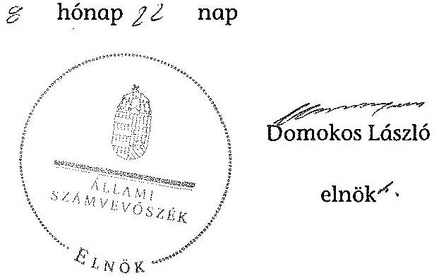
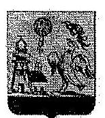
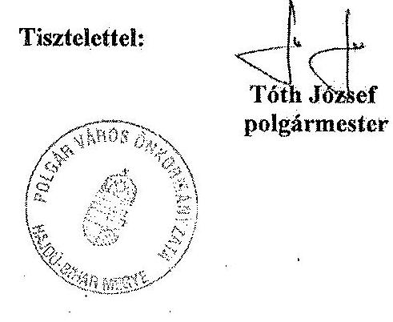
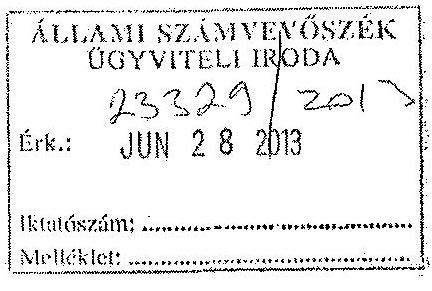

# ÁLLAMI   SZÁMVEVÔSZÉK 

## JELENTÉS

az önkormányzati vagyongazdálkodás szabályszerűségi ellenőrzéséről

Polgár
13069
2013. augusztus

---

# Állami Számvevőszék 

Iktatószám: V-0026-038-018/2013.
Témaszám: 1065
Vizsgálat-azonosító szám: V0593006

## Az ellenőrzést felügyelte:

## Makkai Mária

felügyeleti vezető
2012. december 16. napjától

Gyüre Lajosné
felügyeleti vezető
2012. december 15. napjáig

## Az ellenőrzést vezette és az ellenőrzés végrehajtásáért felelős:

## Kesjár János

vizsgálatvezető

## Az ellenőrzést végezték:

| Kozma Gábor | Tóth Marianna | Igar Tamás |
| :-- | :-- | :-- |
| számvevő tanácsos | számvevő | számvevő |

## Kiss Ferenc Károlyné

számvevő

## A témához kapcsolódó eddig készített számvevőszéki jelentések:

## címe

Jelentés a közmunkaprogramok támogatására fordított pénzeszközök hasznosulásának ellenőrzéséről
Jelentés a közbeszerzési rendszer múködésének ellenőrzéséről
sorszáma
0732
0831

---

# TARTALOMJEGYZÉK 

BEVEZETÉS ..... 3
I. ÖSSZEGZŐ MEGÁLLAPÍTÁSOK, KÖVETKEZTETÉSEK, JAVASLATOK ..... 5
II. RÉSZLETES MEGÁLLAPÍTÁSOK ..... 8

1. A vagyongazdálkodási tevékenység szabályozottsága ..... 8
1.1. A feladatellátás formáinak meghatározása, a döntések megalapozottsága ..... 8
1.2. A vagyonnal gazdálkodó szervezetek szervezeti rendjének szabályozottsága, a kötelező szabályzatok megfelelősége ..... 8
1.3. A vagyongazdálkodás szabályozása ..... 9
2. A vagyongazdálkodás szabályszerűsége ..... 10
2.1. A vagyon nyilvántartásának megfelelősége ..... 10
2.2. A vagyongazdálkodást érintő gazdasági események követelmények szerinti dokumentáltsága ..... 11
2.3. A vagyongazdálkodási intézkedések, döntések szabályszerűsége ..... 12
3. A vagyon változását eredményező gazdasági események szabályszerűsége ..... 13
3.1. A vagyon értékének és összetételének változása ..... 13
3.2. Közbeszerzési eljárás alkalmazása ..... 14
3.3. Hitelfelvétel, kötvénykibocsátás, garancia és kezességvállalás szabályszerűsége ..... 15
3.4. A térítés nélküli átadás szabályszerűsége ..... 15
4. A vagyongazdálkodás szabályszerűségére vonatkozó belső és külső ellenőrzések hasznosulása ..... 16
4.1. A belső ellenőrzés által tett megállapítások, javaslatok hasznosulása ..... 16
4.2. A többségi tulajdonban lévő gazdasági társaságok vagyongazdálkodásának felügyelete ..... 16
4.3. A könyvvizsgálatnak a vagyongazdálkodás szabályosságához való hozzájárulása ..... 17
4.4. A külső ellenőrző szervezet által tett javaslatok hasznosulása ..... 17

---

# MELLÉKLETEK 

1. számú Polgár Város Önkormányzata gazdálkodására jellemző adatok, mutatószámok
2. számú Polgár Város Önkormányzata vagyonának alakulása
3. számú Polgár Város Önkormányzata kötelezettségeinek alakulása
4. számú Polgár Város Önkormányzata polgármesterének válaszlevele

## FÜGGELÉKEK

1. számú Rövidítések jegyzéke
2. számú Értelmező szótár

---

# JELENTÉS 

## az önkormányzati vagyongazdálkodás szabályszerűségi ellenőrzéséről

## Polgár

## BEVEZETÉS

Az ÁSZ kiemelten fontosnak tartja az Állami Számvevőszékről szóló 2011. évi LXVI. törvény 5. § (4) bekezdése alapján az önkormányzati vagyon kezelésének, a vagyonnal való gazdálkodási szabályok betartásának az ellenőrzését. Az ellenőrzés feladata a vagyongazdálkodással kapcsolatban a közpénzek átláthatósága, nyilvánossága érdekében a jogszabályokban, belső szabályzatokban megfogalmazott előírások érvényesülésének áttekintése. Az Állami Számvevőszék nem csak az ellenőrzött szervezet vagyongazdálkodásának a hibáira mutat rá, számon kérve azok kijavítását, hanem megállapításaival, javaslataival segíti a közpénzzel, a közvagyonnal való felelős gazdálkodást.

Az önkormányzati vagyon alapvető funkciója, hogy a közérdeket és egyúttal az önkormányzati célok megvalósítását szolgálja. A feladatellátás terén elsősorban a kötelezően ellátandó feladatok végrehajtását hivatott szolgálni, amely mellett az önként vállalt feladatok ellátása is megvalósulhat.

## Az ellenőrzés célja az Önkormányzatnál annak értékelése volt, hogy:

- a vagyongazdálkodási tevékenységet, annak szervezeti kereteit szabályoztáke;
- az önkormányzati vagyongazdálkodás törvényességét, szabályszerűségét biztosították-e a döntések előkészítése és végrehajtása során;
- jogszerú döntéseken alapult-e a vagyon értékének és összetételének változása;
- a belső ellenőrzés elősegítette-e a vagyongazdálkodás szabályszerű működését, valamint hasznosultak-e a korábbi külső ellenőrzések által tett javaslatok.

Az ellenőrzés típusa: szabályszerűségi ellenőrzés
Az ellenőrzés a 2007. január 1. és 2011. december 31. közötti időszakra terjedt ki, kitekintéssel a helyszíni ellenőrzés befejezéséig tartó időszak releváns folya-

---

mataira. Az egyes közbeszerzési eljárások lefolytatásának ellenőrzése a 2011. évet és a 2012. év I. negyedévét érintette.

Az ellenőrzés szakmai módszertana az Állami Számvevőszék Ellenőrzési Kézikönyvében foglalt szakmai szabályokon alapult, amely a Legfőbb Ellenőrző Intézmények Nemzetközi Szervezete (INTOSAI) által kiadott nemzetközi standardok (ISSAI) figyelembevételével készült.

A vagyongazdálkodás szabályozottságát a helyi szabályozások (rendeletek, szabályzatok, utasítások) ellenőrzésével végeztük el. A vagyonváltozások köréből az ellenőrizendő tételeket mintavétellel, a számviteli nyilvántartásokból választottuk ki.

Polgár Város lakosainak száma 2011. január 1-jén 8262 fő volt. A 2010. évi önkormányzati választást követően az Önkormányzat kilenctagú Képviselőtestületének munkáját négy állandó bizottság segítette. A helyi önkormányzat mellett a 2007-2011. években kisebbségi önkormányzat nem működött. A polgármester a 2006. évi önkormányzati választás óta tölti be tisztségét, a jegyző 2000 óta látja el feladatát.

Az Önkormányzat feladatainak végrehajtása érdekében a 2011. évben öt költségvetési intézményt múködtetett. A feladatok ellátásában részt vett öt gazdasági társasága és kettő társulás. Az Önkormányzat a 2011. évi költségvetési beszámolója szerint 2269,9 millió Ft költségvetési bevételt ért el és 2042,8 millió Ft költségvetési kiadást teljesített, 2011. december 31-én a könyvviteli mérleg szerint 3320,2 millió Ft értékű vagyonnal rendelkezett. A Polgármesteri hivatalban dolgozó köztisztviselők száma 2011. december 31-én 38 fő, az Önkormányzat által foglalkoztatott közalkalmazottak száma 225 fő volt. Az Önkormányzat gazdálkodására jellemző adatokat, mutatószámokat az 1-3. számú mellékletek tartalmazzák.

Az ÁSZ a 2011. évi LXVI. törvény 29. §-a szerint a jelentéstervezetet megküldte Polgár Város Önkormányzata polgármesterének egyeztetésre, aki a megküldött válaszlevelében észrevételt nem tett. A beérkezett választ a jelentés 4. számú melléklete tartalmazza.

---

# I. ÖSSZEGZŐ MEGÁLLAPÍTÁSOK, KÖVETKEZTETÉSEK, JAVASLATOK 

Az Önkormányzat vagyona a könyvviteli mérleg szerint a 2007-2011 közötti időszakban 3034,9 millió Ft-ról 2011. év végére 3320,2 millió Ft-ra, 9,4\%-kal nőtt. A vagyonnövekedés $45 \%$-át felhalmozási célú hitelből finanszírozták. A jelentősebb önkormányzati beruházások az óvoda épületének bővítése, a tehermentesítő utak fejlesztése, a kerékpárút, valamint a műfüves sportpálya építése voltak.

Az Önkormányzat a vagyongazdálkodási tevékenységét és annak szervezeti kereteit a hatályos jogszabályi előírások szerint szabályozta, azonban a vagyont nem az értékelési szabályzatában meghatározott forgalmi értéken mutatta ki a könyvviteli mérlegében. Az önkormányzati vagyongazdálkodással kapcsolatos döntések előkészítése során betartották az Ötv. előírásait, eleget tettek a vagyongazdálkodási rendelet ${ }_{1,3}$-ben előírt versenyeztetési követelményeknek. Az Önkormányzat a hosszúlejáratú, felhalmozási célú hitel felvétele esetén nem tartotta be az Ötv. előírását, mivel fedezetként költségvetési bevételt ajánlott fel.

Az Önkormányzat a 2007-2011. években rendelkezett a vagyongazdálkodás helyi szabályait tartalmazó rendelettel és elkészítette a vagyongazdálkodási rendeletben meghatározott szerkezetű vagyonkimutatást. A Képviselőtestület meghatározta az önkormányzati feladatellátást biztosító törzsvagyon körét, nyilvántartási rendjét. Az Önkormányzat költségvetési szervei rendelkeztek az előírásoknak és a helyi sajátosságoknak megfelelő számviteli politikával és a hozzá tartozó szabályzatokkal.

A vagyon nyilvántartása során nem biztosították teljes körűen a szabályszerűséget. Az Önkormányzat a 2007-2011. években a számviteli nyilvántartásban szereplő ingatlanvagyont, valamint az ingatlanvagyon kataszter adatait minden évben egyeztette, az eltérést rendezte. Ugyanakkor a 147/1992. (XI. 6.) Korm. rendelet előírása ellenére az egyezőség biztosítása érdekében nem egyeztették a kataszteri és a földhivatali ingatlan-nyilvántartás azonos tartalmú adatait a 2007-2010. években. A 2011. évben csak részleges egyeztetésre került sor a külterületi ingatlanok vonatkozásában, így az előírt egyezőség biztosítása dokumentáltan nem igazolt.

A vagyongazdálkodási döntések előkészítési folyamatára vonatkozóan az önkormányzati $\mathrm{SzMSz}_{1,3}$-ben előírták a költség-haszon elemzés készítésének kötelezettségét. A vagyongazdálkodási rendelet ${ }_{1,3}$-ben, illetve az önkormányzati $\mathrm{SzMSz}_{1,2}$-ben azonban nem írták elő a hasznosításra szánt vagyon értéke megállapítása céljából az értékbecslés készítésének, valamint az Önkormányzat tulajdonosi jogainak, érdekeinek védelmét szolgáló garanciális elemek szerződésben, egyéb dokumentumban való rögzítésének kötelezettségét. Ugyanakkor a vagyonhasznosítási és vagyonértékesítési szerződésekbe beépítették az Önkormányzat érdekeit védő garanciális elemeket.

---

A gazdálkodási jogkörök gyakorlása során betartották az Ámr. ${ }_{1,2}$-ben rögzített összeférhetetlenségi követelményeket. A 2007. és 2008. években, a vagyonváltozáshoz kapcsolódóan nyolc esetben az Áht. ${ }_{1}$ és az Ámr. ${ }_{1}$ előírásait megsértve a kötelezettségvállalásokra az arra felhatalmazott személy ellenjegyzése nélkül került sor összesen 14,3 millió Ft értékben. Ezáltal az Ámr. ${ }_{1}$-ben foglalt a kötelezettségvállalás ellenjegyzőjére vonatkozó - ellenőrzési feladatoknak nem tettek eleget. A helyszíni ellenőrzés az Önkormányzatnak nem minden jogügyletére kiterjedően, tételes ellenőrzés vagy mintavételezés módszerével kiválasztott és rendelkezésre bocsátott dokumentumok alapján jogosulatlan kifizetést nem tárt fel.

A vagyontárgyak hasznosítása, a vagyon értékének és összetételének változását befolyásoló döntések előkészítése során betartották az Ötv. előírásait. A vagyonváltozáshoz kapcsolódóan a döntéshozatal során a döntéshozók az arra felhatalmazott személyek voltak. A vagyonváltozással járó képviselő-testületi döntésekhez kapcsolódó előterjesztéseket a Pénzügyi bizottság véleményezte és véleményéről a Képviselő-testületet tájékoztatta.

A belső ellenőrzés hozzájárult a vagyongazdálkodás szabályszerű működéséhez, az általa tett javaslatok hasznosultak. A vagyongazdálkodás szabályszerűségéhez kapcsolódó belső ellenőrzések a vagyonelemek beszerzésével, hasznosításával, nyilvántartásával összefüggésben tettek megállapításokat. Az ÁSZ 2009-ben végezte el az Önkormányzat gazdálkodási rendszerének ellenőrzését. A jelentésben a vagyongazdálkodás területéhez két szabályszerűségi javaslat kapcsolódott, melyek hasznosultak.

Az Önkormányzat a többségi tulajdonában lévő gazdasági társaságának éves beszámolóját és közhasznúsági jelentését a polgármester az Ötv.-ben foglaltak ellenére nem terjesztette a Képviselő-testület elé, így a testület a tulajdonost megillető jogait nem gyakorolta. Az Önkormányzat az Áht. ${ }_{1}$-ben foglaltak ellenére a gazdasági társaságot nem számoltatta be a feladat ellátására adott vagyonnal való felelős és rendeltetésszerű gazdálkodásról.

Az Állami Számvevőszékről szóló 2011. évi LXVI. törvény 33. § (1) bekezdésében foglaltak értelmében a jelentésben foglalt megállapításokhoz kapcsolódó intézkedési tervet köteles az ellenőrzött szervezet vezetője összeállítani, és azt a jelentés kézhezvételétől számított 30 napon belül az ÁSZ részére megküldeni. Amennyiben az intézkedési tervet határidőben nem küldi meg a szervezet, vagy az nem elfogadható, az ÁSZ elnöke a hivatkozott törvény 33. § (3) bekezdés a)-b) pontjaiban foglaltakat érvényesítheti.

Az ellenőrzés intézkedést igénylő megállapításai és javaslatai:

# a Jegyzönek 

1. A 2007-2011. években megkötött felhalmozási célú hitelszerződések szerinti biztosítékok a futamidő alatti költségvetési bevételek voltak. Az Önkormányzat ezzel megsértette az Ötv. 88. § (1) bekezdés b) pontjában foglaltakat, mivel a fedezetként felajánlott költségvetési bevételek magukba foglalják a normatív állami hozzájárulás, az állami támogatás, a személyi jövedelemadó, valamint az államháztartáson belülről

---

müködési célra átvett bevételek összegét is, amelyek hitel fedezeteként nem használhatók fel.

# Javaslat 

Intézkedjen az Áht. 84. § (4) bekezdéssel ellentétes állapot megszüntetéséről, a hitelfedezetre jogszerú ügyleti biztosítékok kijelölésével.
2. A 147/1992. (XI. 6.) Korm. rendelet 1. § (2) bekezdésében foglalt előírás ellenére a 2007-2011. évek között az ingatlanvagyon kataszter és a földhivatali ingatlannyilvántartás azonos tartalmú adatai közötti egyezőség az adategyeztetés elmaradása miatt nem igazolt.

## Javaslat

Intézkedjen, hogy a 147/1992. (XI. 6.) Korm. rendelet 1. § (2) bekezdésében rögzítetteknek megfelelően az ingatlanvagyon kataszter adatai egyezzenek meg a földhivatal ingatlan-nyilvántartásának azonos tartalmú adataival.

---

# II. RÉSZLETES MEGÁLLAPÍTÁSOK 

## 1. A VAGYONGAZDÁLKODÁSI TEVÉKENYSÉG SZABÁLYOZOTTSÁGA

### 1.1. A feladatellátás formáinak meghatározása, a döntések megalapozottsága

Az Önkormányzat a 2007-2011. évekre vonatkozó gazdasági program ${ }_{1-2}$-ben rögzítette az önkormányzati feladatellátással összefüggő fő irányokat, valamint meghatározta a feladatok ellátásának mértékét és módját. A kötelező és az önként vállalt feladatok részletes felsorolását az önkormányzati SZMSZ ${ }_{1-2}$ mellékletei tartalmazták.

Az Önkormányzat 2011. december 31-én a közfeladatok ellátását öt költségvetési szerv és öt gazdasági társaság útján biztosította. Önállóan múködött és gazdálkodott az önként vállalt feladatokat ellátó József Attila Gimnázium és Szakképző Iskola, valamint a kötelező, kommunális és településüzemeltetési feladatokat, illetve az önként vállalt, fürdő és strandszolgáltatásokat ellátó Városgondnokság. A Polgármesteri hivatal gazdálkodási körében, önállóan múködött a Napsugár Óvoda és Bölcsőde, a Vásárhelyi Pál Általános Iskola, valamint az Ady Endre Művelődési Központ és Könyvtár, amelyek döntően kötelező, kisebb részt önként vállalt feladatokat láttak el.

A feladatok ellátásában öt gazdasági társaság vett részt, melyek közül az Önkormányzat egyben rendelkezett 51,9\%-os többségi tulajdonnal. A PÉTEGISZ Zrt. az általános járóbeteg-szakellátás, szakorvosi járóbeteg-szakellátás, fekvőbeteg ellátás, egyéb humán-egészségügyi ellátás feladatait látta el. A feladatokat a társasági szerződés alapján részben kötelező, részben önként vállalt közhasznú feladatként végezte, illetve a feladatok egy részét térítési dí ellenében nyújtotta.

A Képviselő-testület a 2007-2011. években nem döntött a közszolgáltatások ellátása érdekében intézmények létrehozásáról és átszervezéséről, szövetkezet szervezéséről, valamint társulásba történő belépésről.

### 1.2. A vagyonnal gazdálkodó szervezetek szervezeti rendjének szabályozottsága, a kötelező szabályzatok megfelelősége

A Képviselő-testület a 2007-2011 között hatályos önkormányzati $\mathrm{SzMSz}_{1-2}{ }^{-}$ ben szabályozta a Képviselő-testületet megillető hatáskörök átruházását, meghatározta az átruházott hatáskör gyakorlásának szabályait és a kapcsolódó beszámolási kötelezettséget.

A 2007-2010 között hatályos önkormányzati $\mathrm{SzMSz}_{1}$-ben átruházott hatáskörben a Pénzügyi bizottság döntött a közösségi közbeszerzési értékhatárt becsült értéken el nem érő egyszerű közbeszerzési eljárások ajánlattételi felhívásának tartalmáról, a Közbeszerzési Bírálóbizottság javaslata alapján véleményezte a beérkezett

---

ajánlatokat és meghatározta a nyertes ajánlattevőt. A 2007-2011 között hatályos önkormányzati $\mathrm{SzMSz}_{1.2}$ szerint a Pénzügyi bizottság véleményezte az Önkormányzat vagyonát érintő javaslatok pénzügyi vonatkozásait, valamint ellenőrizte a vagyongazdálkodási rendelet ${ }_{1.2}$ végrehajtását.

A vagyongazdálkodás szempontjából az elöírásoknak és a helyi sajátosságoknak megfelelően készítették és fogadták el a Polgármesteri hivatal, az önállóan működő és gazdálkodó József Attila Gimnázium és Szakképző Iskola, valamint a Városgondnokság szervezeti és működési szabályzatait és gazdasági szervezeteik ügyrendjét, számviteli politikáját, valamint a hozzá tartozó szabályzatokat.

Az Önkormányzat költségvetési szerveinek leltározási szabályzatai kétévenkénti leltározást írtak elő, amelyre az Önkormányzat vagyongazdálkodási rendelet ${ }_{1,2}$-ben foglalt felhatalmazás lehetőséget adott. A Polgármesteri hivatal leltározási szabályzata tartalmazta az üzemeltetésre átadott eszközök leltározásának módját.

# 1.3. A vagyongazdálkodás szabályozása 

Az Önkormányzat megalkotta a 2007-2011 évek közötti időszakra vonatkozóan a vagyongazdálkodás helyi szabályait tartalmazó rendeletét. A vagyongazdálkodási rendelet ${ }_{1.2}$-ben meghatározták az önkormányzati feladatellátást biztosító törzsvagyon körét, nyilvántartási rendjét, ezen belül a forgalomképtelen és a korlátozottan forgalomképes vagyonelemeket, továbbá a forgalomképesség megváltoztatásának szabályait. Az Áht. 108. § (1) bekezdésében foglalt előírásokkal összhangban meghatározták az Önkormányzat tulajdonában álló vagyonelemek nyilvános versenyeztetéssel történő hasznosításának értékhatárát, szabályozták továbbá az Áht. 108. § (2) bekezdésében foglaltaknak megfelelően az ingyenes vagyonátruházással kapcsolatos döntési hatásköröket, azonban nem szabályozták az ingyenes átruházás eseteit és módját. A vagyongazdálkodási rendelet ${ }_{1.2}$ tartalmazta a vagyontárgyak feletti rendelkezési jog megosztására vonatkozó szabályokat.

Az Önkormányzat tulajdonában álló vagyonelemek nyilvános versenyeztetéssel történő hasznosításának értékhatárát a vagyongazdálkodási rendelet ${ }_{1.2}$-ben 5,0 millió Ft-ban határozták meg. A forgalomképes vagyon szerzéséről, elidegenítéséről, megterheléséről, bérbeadásáról és használatba adásáról 0,5 millió Ft értékhatárig a polgármester, 0,3 millió Ft értékhatárig a vagyonkezelést végző intézmény vezetője, egyébként a Képviselő-testület rendelkezhetett.

Az önkormányzati $\mathrm{SzMSz}_{1.2}$-ben kialakították az elő́terjesztések készítésének, megtárgyalásának, véleményezésének, döntéshozatalának általános rendjét, valamint beszámolási kötelezettséget írtak elő a Pénzügyi bizottság részére a vagyongazdálkodási rendelet ${ }_{1.2}$ végrehajtása ellenőrzéséről. Az önkormányzat vagyongazdálkodási rendeletei összhangban voltak a belső szabályozásokkal és a vonatkozó jogszabályokkal.

A Polgármesteri hivatal és az önállóan működő és gazdálkodó költségvetési szervek SzMSz-ei, továbbá a Polgármesteri hivatal gazdálkodó szervezetének ügyrendje a 2007-2011. években meghatározta a vagyonkezelési feladatokat, a vagyonelemek hasznosítására vonatkozó rendelkezéseket.

---

A jegyző a gazdálkodási jogkörök gyakorlásának rendjét, illetve a velük kapcsolatos összeférhetetlenségi követelményeket a gazdálkodó szervezet ügyrendjében, valamint a gazdálkodási jogkörök szabályzatában meghatározta.

A vagyongazdálkodási döntések előkészítési folyamatára vonatkozóan az önkormányzati $\mathrm{SzMSz}_{1,2}$-ben előírták a költség-haszon elemzés készítésének, valamint a hitelfelvételről, kötvénykibocsátásról szóló döntéssel összefüggő értékelés készítésének kötelezettségét. A vagyongazdálkodási rendelet ${ }_{1-2}{ }^{-}$ ben, illetve önkormányzati $\mathrm{SzMSz}_{1,2}$-ben nem írták elő a hasznosításra szánt vagyon értéke megállapítása céljából az értékbecslés készítésének, továbbá az Önkormányzat tulajdonosi jogainak, érdekeinek védelmét szolgáló garanciális elemek szerződésben, egyéb dokumentumban való rögzítésének kötelezettségét.

Az Önkormányzat a Vagyon tv. 9. § (1) bekezdésében meghatározott közép- és hosszú távú vagyongazdálkodási tervet még nem készített.

Az önkormányzati $\mathrm{SzMSz}_{1,2}$-ben és a kapcsolódó közzétételi szabályzatban meghatározták a nyilvánosság biztosításának eszközeit és felelőseit a céljellegű működési és fejlesztési támogatásokra, a vagyonnal való gazdálkodással összefüggő szerződésekre, az önkormányzat költségvetésére és zárszámadására vonatkozóan.

A Polgármesteri hivatal gazdálkodó szervezetének ügyrendjében meghatározták az éves költségvetési koncepció, az éves költségvetés készítésére és módosítására, valamint a beszámoló készítésére és belső kontrolljaikra vonatkozó szabályokat. Az Önkormányzat rendeletben szabályozta a költségvetési és a zárszámadási rendelet mellékleteinek tartalmát, utóbbi részeként az Áhsz. 44/A. § (2)-(3) bekezdéseiben előírtaknak megfelelően a vagyonkimutatás tartalmát.

# 2. A VAGYONGAZDÁLKODÁS SZABÁLYSZERŰSÉGE 

### 2.1. A vagyon nyilvántartásának megfelelősége

Az Önkormányzat a 2007-2011. években az Ötv. 78. § (2) bekezdése alapján minden évben elkészítette a vagyongazdálkodási rendeletben meghatározott szerkezetű vagyonkimutatást. Az Áhsz. 9. számú mellékletének a számlaosztályok tartalmára vonatkozó előírások alcím alatt található 1. k) pontjában foglaltaknak megfelelően a törzsvagyon (ezen belül a forgalomképtelen, illetve a korlátozottan forgalomképes), valamint az egyéb vagyon részét képező eszközök elkülönítéséről a főkönyvi számlák további bontásával és az analitikus nyilvántartásokban gondoskodtak.

Az Önkormányzat a 2007-2011. években az Áhsz. 49. § (3) bekezdése alapján, valamint a 147/1992. (XI. 6.) Korm. rendelet 1. § (2) és (3) bekezdésére figyelemmel a számviteli nyilvántartásban szereplő ingatlanvagyont, valamint az ingatlanvagyon kataszter adatait minden évben egyeztette, arról összesítő kimutatást készített. A 2011. évben az eltérés 10,5 millió Ft volt, melynek oka, hogy az üzemeltetésre átadott fonyódi üdülő, valamint a szintén üzemeltetésre átadott gyermekorvosi rendelő értéke a számviteli nyilvántartásban nem került

---

átvezetésre az üzemeltetésre átadott eszközök közé. A könyvviteli mérleg rendezésére 2012. év I. negyedévében került sor. Továbbá az Áhsz. 49. § (3) bekezdése, valamint a 147/1992. (XI. 6.) Korm. rendelet előírása ellenére nem egyeztették a kataszteri és a földhivatali ingatlan-nyilvántartás azonos tartalmú adatait a 2007-2010. években. A 2008. évben csak a földhivatali ingatlan nyilvántartás lekérése történt meg, 2011-ben részleges egyeztetésre került sor a külterületi ingatlanok vonatkozásában. Mindezek miatt az előírt egyezőség biztosítása dokumentáltan nem igazolt.

Az Önkormányzat a 2007-2011. években a Számv. tv. 69. § (1)-(2) és az Áhsz. 37. § (1) bekezdéseiben előírt leltározási kötelezettségének december 31-ei fordulónappal, kétévenként eleget tett, a vagyongazdálkodási rendelet ${ }_{1-2}$-ben, valamint a leltározási szabályzatban foglaltaknak megfelelően.

A vagyon év végi értékelése során nem az értékelési szabályzat értékhelyesbítéssel összefüggő előírásai szerint értékelték a vagyonelemeket. Ennek következtében a 2007-2011. években a könyvviteli mérleg a vagyont nem az értékelési szabályzatban meghatározott, értékhelyesbített, forgalmi értéken tartalmazta. Az értékelési szabályzat előírta, hogy minden költségvetési évben a mérleg fordulónapjával egyidejűleg el kell végezni az eszközök egyedi, piaci értékének meghatározását és a szabályzatban rögzített feltételek fennállása esetén az értékhelyesbítést. A jegyző az értékelési szabályzatot 2012. szeptember 18-án módosította, az értékhelyesbítés alkalmazására vonatkozó előírásokat megszüntette.

# 2.2. A vagyongazdálkodást érintő gazdasági események követelmények szerinti dokumentáltsága 

A gazdálkodási jogkörök gyakorlása során érvényesültek az Ámr. ${ }_{1,2}$-ben rögzített összeférhetetlenségi követelmények. Az operatív gazdálkodási jogköröket az arra írásban felhatalmazott személyek gyakorolták.

A 2007. és 2008. években, nyolc esetben az Áht. ${ }_{1} 100 /$ C. § (3) bekezdésében ${ }^{1}$ előírtakat megsértve, és az Ámr. ${ }_{1} 134 . \S$ (8) bekezdésében előírtak ellenére a kötelezettségvállalásokra az arra felhatalmazott személy ellenjegyzése nélkül került sor összesen 14,3 millió Ft értékben. Ezáltal az Ámr. ${ }_{1} 134 . \S$ (8) bekezdésében foglalt - a kötelezettségvállalás ellenjegyzőjére vonatkozó - ellenőrzési feladatnak nem tettek eleget, mellyel összefüggésben az Önkormányzatnál vagyoni kár nem keletkezett.

A 2007. évben a kötelezettségvállalás ellenjegyzése elmaradt a 3077-1/2007., 3071-1/2007. számú határozat alapján jóváhagyott 0,8 millió Ft, a 3079-1/2007., 3076-1/2007., 3070-1/2007., 3096-1/2007., 3368-1/2007. számú határozatokkal jóváhagyott 2,3 millió Ft, a 1135-1/2007. számú határozattal jóváhagyott 0,2 millió Ft vissza nem térítendő lakáscélú támogatások, valamint a 165/8/2007. számú határozat alapján kiutalt 1,3 millió Ft otthonteremtési támogatás esetében.

[^0]
[^0]:    ${ }^{1}$ 2012. január 1-jétől az Áht. ${ }_{2}$ 37. § (1) bekezdése szabályozza

---

A 2008. évben a kötelezettségvállalásokat nem előzte meg a kötelezettségvállalás ellenjegyzése: a 6188-1/2008., 6076-1/2008., 6034-1/2008., 6032-1/2008., számú határozatokkal jóváhagyott 2,4 millió Ft, továbbá a 2598-1/2008., 3232-1/2008 számú határozatokkal jóváhagyott 1,0 millió Ft vissza nem térítendő lakáscélú támogatások esetében. Elmaradt az ellenjegyzés a 142-2/2008. számú határozattal kiutalt 1,7 millió Ft otthonteremtési támogatás esetében is, továbbá nem történt meg az ellenjegyzés a 4,6 millió Ft összegű külterületi ingatlan értékesítésére kötött adásvételi szerződés alkalmával.

Az Önkormányzat az Elsztv. 6. § (1) bekezdésében előírtaknak megfelelően a 2007-2011. években közzétette az éves költségvetés és az éves költségvetési beszámoló adatait. Az általa nyújtott, nem normatív, céljellegű, fejlesztési támogatások kedvezményezettjeinek nevét, a támogatás célját, összegét a 20072008. években - az Áht. ${ }_{1}$ 15/A. § (1) bekezdésében foglaltakat megsértve - nem tette közzé. A közzététel a 2009-2011. években már megtörtént.

Az Önkormányzat az Áht. ${ }_{1}$ 15/B. § (1) bekezdésében előírtaknak megfelelően közzétette honlapján a nettó ötmillió Ft-ot elérő vagy azt meghaladó értékű árubeszerzésre, építési beruházásra, szolgáltatás megrendelésére, vagyonértékesítésre, vagyonhasznosításra, vagyon vagy vagyoni értékủ jog átadására vonatkozó szerződések megnevezését, tárgyát, a szerződést kötő felek nevét, a szerződés értékét.

# 2.3. A vagyongazdálkodási intézkedések, döntések szabályszerűsége 

Az Önkormányzat a tulajdonost megillető jogok gyakorlása során, a törzsvagyon és forgalomképes vagyon értékének és összetételének változását befolyásoló döntések előkészítésénél és a vagyontárgyak hasznosításánál betartotta az Ötv. 79. § (2) bekezdése², valamint a 80. § (1) bekezdése előirásait.

A vagyonhasznosítási és vagyonértékesítési szerződésekbe az Önkormányzat érdekeit védő garanciális elemeket beépítették (késedelmi kamat felszámítása késedelmes fizetéskor; bérleti jogviszony felmondása a bérleti díj fizetésének elmaradása esetén).

A 2007-2011. években az Önkormányzat hosszú lejáratú, felhalmozási célú, pénzintézettel szembeni kötelezettségvállalásaira Képviselő-testületi döntés alapján került sor. A döntés-előkészítés folyamatában összehasonlították a hitelajánlatok kondícióit és ennek megfelelően - mind a működési, mind a fejlesztési célú hitelek közül - a lehetőségek szerinti legkedvezőbb kamatozású, forint alapú hitel felvételére került sor. A Képviselő testület figyelemmel kísérte a hitelek és kamataik alakulását. A Képviselő-testület 2009-ben döntött a hitelek egy részének kiváltásáról, öt alkalommal pedig új, kedvezményesebb hitelt kínáló pénzintézettől történő hitel igénybevételéről.

A vagyonváltozáshoz kapcsolódóan a döntéshozók az arra felhatalmazott személyek voltak, betartva ezzel az Ötv. 9. § (1)-(3) bekezdéseit, a 10. § (1) be-

[^0]
[^0]:    ${ }^{2}$ 2012. január 1-től a Vagyontv. 5. §, 3. § (1) bekezdés 6. pontja szabályozza

---

kezdését, valamint a belső szabályzatok rendelkezéseit. Az elkészült dokumentumok, a megállapodások és szerződések tartalma a vagyonról hozott döntésekkel megegyezett. Az önkormányzati vagyont érintő döntések végrehajtása a dokumentumokban foglaltaknak megfelelően történt.

A vagyonváltozással járó képviselő-testületi döntésekhez kapcsolódó előterjesztéseket a Pénzügyi bizottság véleményezte és véleményéről a Képviselőtestületet tájékoztatta.

# 3. A VAGYON VÁLTOZÁSÁT EREDMÉNYEZŐ GAZDASÁGI ESEMÉNYEK SZABÁLYSZERŰSÉGE 

### 3.1. A vagyon értékének és összetételének változása

Az Önkormányzat vagyona (mérlegfőösszege) a 2007-2011 közötti időszakban a 2007. évi 3034,9 millió Ft-ról 2011. év végére 3320,2 millió Ft-ra emelkedett. A vagyon növekedését a befejezett és aktivált beruházások, valamint a beruházások állományának növekedése eredményezte.

A beruházások, felújítások sorából jellegük és nagyságrendjük miatt kiemelkednek a következőek:

- 2007. évben „Müfüves sportpálya" épült 45,9 millió Ft felhasználásával. A beruházás forrásai közül 20,0 millió Ft a Hajdú-Bihar Megyei Önkormányzat által nyújtott támogatásból, 15,7 millió Ft fejlesztési célú hitelből és 10,2 millió Ft további saját forrásból származott.
- a 2007. évi „Kerékpárút" beruházásra 81,6 millió Ft-ot használtak fel. A beruházás forrása 45,0 millió Ft Útpénztár támogatásból, a fennmaradó 36,6 millió Ft összeg saját forrásból állt.
- 2009-2010. években a „Tehermentesítő utak fejlesztése" 159,4 millió Ft volt. A beruházáshoz a 2177/2008. (XII.18.) Korm. határozat 18. a) pontja 150,0 millió Ft vissza nem térítendő támogatást hagyott jóvá a település számára. A beruházás fennmaradó részét az Önkormányzat saját forrásból finanszírozta.
- 2010. évben a „Napsugár Óvoda Bessenyei úti épületének bővítése" 294,1 millió Ft felhasználásával valósult meg. A beruházás forrásaiból az Észak-Alföldi Regionális Fejlesztési Tanács által kiírásra kerülő pályázatból nyert összeg 182,3 millió Ft, fejlesztési célú hitel 104,1 millió Ft, a fennmaradó összeg egyéb saját forrás volt.

Az Önkormányzat vagyonának alakulására és összetételére hatással volt, hogy a többségi tulajdonában lévő PÉTEGISZ Zrt. részére - a járóbeteg-szakellátó intézmény helyszínéül szolgáló 45,8 millió Ft értékű - telket véglegesen átadta, és további 21,2 millió Ft összegben támogatást adott.

A 2007-2011. években az Önkormányzat eszközeinek döntő többségét a befektetett eszközök, ezen belül az ingatlanok és a kapcsolódó vagyoni értékű jogok alkották. A befektetett eszközök értéke a 2007. év végi állapothoz képest 250,6 millió Ft-tal növekedett a 2011. év végére. Az ingatlanok és kapcsolódó vagyoni értékű jogok részaránya a befektetett eszközökhöz viszonyítva - az elvégzett beruházások és felújítások eredményeként - 3,3 százalékponttal növe-

---

kedett. Az üzemeltetésre, kezelésre átadott eszközök és pénzügyi befektetések aránya nem volt jelentős a befektetett eszközök állományán belül.

Az Önkormányzat befektetett eszközeinek meghatározó részét, 2007. évben 98,5\%-át, 2011. évben 97,1\%-át fedezték saját források. Koncesszióba adott eszközökkel az Önkormányzat nem rendelkezett.

Az Önkormányzat összes kötelezettsége a 2007. évi 221,1 millió Ft-ról a 2011. év végére 285,3 millió Ft-ra emelkedett. A kötelezettségek szerkezete is átalakult, a hosszú lejáratú kötelezettségek aránya a 2007. évi 18,3\%-ról a 2011. évre 59,5\%-ra növekedett. A hosszú lejáratú kötelezettségek növekedéséhez az Önkormányzat által végzett, a helyi infrastruktúrát felújító és fejlesztő beruházások hitelszükséglete vezetett. A 2007-2011. években 18 darab hosszú lejáratú hitelszerződést kötöttek, melyek eredményeképpen 259,6 millió Ft hosszú lejáratú hitelt vettek fel.

Az Önkormányzat az Áht. 50/A. § (4) bekezdésének előírásai alapján 2010. szeptember 1-ei dátummal elkészítette a vagyoni és pénzügyi helyzetéről, a későbbi éveket terhelő pénzügyi kötelezettségekről szóló jelentését. A jelentést az Önkormányzat honlapján, valamint a Polgármesteri hivatalban tették közzé.

Az Önkormányzat költségvetési szerveinek számviteli politikája a Számv. tv. 52. § (5)-(7) bekezdései és az Áhsz. 30. § (1)-(6) bekezdései szerint rendelkezett az eszközök értékcsökkenésének elszámolásáról. A jogszabályokban meghatározott leírási kulcsok alkalmazásától az Önkormányzat nem tért el. Az Önkormányzat nem értékelte egyedileg az egyes eszközök várható használati idejét, ezért a már nullára leírt eszközök továbbra is használatban maradtak. Az évente kiadott képviselő-testületi határozatok ${ }^{3}$ a víz- és a szennyvízdíjakból beszedett összeg 10\%-ának rekonstrukciós alapba történő elkülönítéséről rendelkeztek, azonban nem határozták meg az elkülönített összeg felhasználásának módját.

Az eszközök használhatósági foka minden eszközkategóriában csökkent a 2007. és 2011. évek között, mivel az Önkormányzat az elszámolt 692,1 millió Ft összegű értékcsökkenéssel szemben 187,3 millió Ft értékű felújítást valósított meg.

# 3.2. Közbeszerzési eljárás alkalmazása 

Az Önkormányzat 2011-ben és a 2012. év I. negyedévében lefolytatta a beruházások és felújítások megvalósítása során a jogszabály által előírt esetekben a közbeszerzési eljárást. Az Önkormányzat a beruházások és felújítások esetében eleget tett a Kbt. ${ }_{1,2}$-ben előírt egybeszámítási kötelezettségnek.

[^0]
[^0]:    ${ }^{3}$ a Képviselő-testület 198/2007. (XII. 20.) számú határozata, 181/2008. (XI. 27.) számú határozata, 181/2009. (XI. 26.) számú határozata, 157/2010. (XI. 25.) számú határozata, 139/2011. (XI. 24.) számú határozata

---

A 2011. évre tervezett beruházások, valamint a költségvetési rendelet módosításaival elfogadott felújítások nem haladták meg a nemzeti közbeszerzési értékhatárt.

Az Önkormányzat 2011. évi közbeszerzési tervét a Képviselő-testület elfogadta és az Önkormányzat honlapján közzétették.

A 2011. évi közbeszerzési terv nemzeti értékhatárt elérő közbeszerzései a 2012. évben induló „Városfejlesztés Polgáron I. ütem" elnevezésű projekthez kapcsolódtak. Az építési beruházás kivitelezésére és a kapcsolódó hitelfelvételre kiírt közbeszerzési eljárások indultak meg a 2011. évben. Az árubeszerzésre kiírt közbeszerzési eljárás a helyszíni ellenőrzés lezárásáig nem indult el.

# 3.3. Hitelfelvétel, kötvénykibocsátás, garancia és kezességvállalás szabályszerűsége 

Az Önkormányzat a 2007-2011. években 18 hosszú lejáratú hitelszerződést kötött, összesen 259,6 millió Ft értékben. A hitelszerződések közül hármat a 2007. évben, ötöt a 2008. évben, kettőt a 2009. évben, nyolcat a 2010. évben kötöttek.

A felvett hosszú lejáratú hitelek minden esetben a Magyar Fejlesztési Bank Zrt. „Sikeres Magyarországért" Önkormányzati Infrastruktúra-fejlesztési Hitelprogramja keretein belül refinanszírozott forint alapú hitelek voltak. Az ellenőrzött időszakban az Önkormányzat kötvényt nem bocsátott ki.

A 2007-2011. években megkötött 14 hitelszerződésnél biztosítékként felajánlásra kerültek a futamidő̉ alatti költségvetési bevételek. Az Önkormányzat ezzel megsértette az Ötv. 88. § (1) bekezdés b) pontjában foglaltakat, mivel a fedezetként felajánlott költségvetési bevételek magukba foglalják a normatív állami hozzájárulás, az állami támogatás, a személyi jövedelemadó, valamint az államháztartáson belülről múködési célra átvett bevételek összegét is, amelyek hitel fedezeteként nem használhatók fel.

Az Önkormányzat többségi tulajdonú gazdasági társasága által felvett hitelekért garanciát vagy kezességet nem vállalt.

### 3.4. A térítés nélküli átadás szabályszerűsége

A 2007-2011 közötti időszakban az Önkormányzat intézményei közötti térítés nélküli átadások az intézményi struktúra módosulásainak következményeként valósultak meg, lebonyolításuk pénzügyi és számviteli szempontból rendezetten megtörtént. Az Önkormányzat eszközeinek intézményein kívülre történő térítésmentes átadásait vagyongazdálkodási, pénzügyi és számviteli szempontból rendezetten bonyolították le.

A 2007. évben a Képviselő-testület a 24/2007. (II. 15.) számú határozatával a 2007. február 28-i hatállyal megszűnő Gondozási Központ intézmény eszközeit a Kistérségi társulás által fenntartott Kistérségi Szolgáltató Központ költségvetési szervnek adta. A térítésmentes átadások értéke 2,9 millió Ft volt.

---

A 2009. évben az Önkormányzat a többségi (51,9\%-os) tulajdonában lévő gazdasági társasága, a PÉTEGISZ Zrt. részére térítés nélkül eszközöket adott át, összesen 65,8 millió Ft összegben, melyet a Képviselő-testület a 199/2008. (XII. 18.) számú és a 147/2009. (IX. 24.) számú határozataival hagyott jóvá.

# 4. A VAGYONGAZDÁLKODÁS SZABÁLYSZERŰSÉGÉRE VONATKOZÓ BELSŐ ÉS KÜLSŐ ELLENŐRZÉSEK HASZNOSULÁSA 

### 4.1. A belső ellenőrzés által tett megállapítások, javaslatok hasznosulása

A Polgármesteri hivatal, mint önálló költségvetési szerv, valamint az Önkormányzat fenntartásában lévő intézmények belső ellenőrzését kistérségi társulás keretében, megállapodás ${ }^{4}$ alapján végezték el. A kockázatelemzéssel alátámasztott éves ellenőrzési tervekről - a Pénzügyi bizottság javaslata alapján minden évben a Képviselő-testület döntött.

A vagyongazdálkodás szabályszerűségéhez kapcsolódó belső ellenőrzések a vagyonelemek beszerzésével, hasznosításával, nyilvántartásával összefüggésben tettek megállapításokat. A belső ellenőrzés által tett javaslatok hasznosultak, a belső ellenőr által készített éves ellenőrzési jelentést a Képviselő-testület minden évben megtárgyalta, a szükséges intézkedésekről intézkedési terv készült.

### 4.2. A többségi tulajdonban lévő gazdasági társaságok vagyongazdálkodásának felügyelete

Az Önkormányzat a 2007-2011. években egy gazdasági társaságban rendelkezett többségi tulajdonnal. A gazdasági társaság adott évi tevékenységéről szóló beszámoló rendelkezésre állt, azt a gazdasági társaság legfőbb szerve - melynek tagja az Önkormányzat képviseletében résztvevő polgármester - megtárgyalta. Az Ötv. 80. § (1) bekezdésében foglaltak ellenére a Képviselő-testület - a gazdasági társaság éves beszámolójának és közhasznúsági jelentésének jóváhagyásakor - a tulajdonost megillető jogait nem gyakorolta, mivel az éves beszámolót a polgármester nem terjesztette a Képviselő-testület elé. Az Önkormányzat az Áht.; 104. § (3) bekezdésében foglaltak ellenére nem számoltatta be a gazdasági társaságot a feladat ellátására adott vagyonnal való felelős és rendeltetésszerű gazdálkodásról. Az Önkormányzat nem vizsgálta a társaság adósságainak alakulását, valamint a folyamatos üzletmenet biztosításának fenntarthatóságát. A feladatellátásra vonatkozó szerződés teljesítését sem vizsgálták.

[^0]
[^0]:    ${ }^{4}$ A Képviselő-testület a 82/2004. (VI. 7.) számú határozatával fogadta el a társulási megállapodásban foglaltakat. A belső ellenőrzési feladatok ellátására vonatkozó módosítást a 24/2005. (II. 14.) számú határozat tartalmazza.

---

# 4.3. A könyvvizsgálatnak a vagyongazdálkodás szabályosságához való hozzájárulása 

Az Önkormányzat által megbízott könyvvizsgáló a 2007-2011 években az általa elvégzett ellenőrzés alapján az Önkormányzat egyszerúsített összevont éves költségvetési beszámolóit megbízhatónak és hitelesnek minősítette. A könyvvizsgáló a korlátozás nélküli véleményében nem fogalmazott meg javaslatot az Önkormányzat számára.

### 4.4. A külső ellenőrző szervezet által tett javaslatok hasznosulása

Az ÁSZ 2009-ben végezte el az Önkormányzat gazdálkodási rendszerének ellenőrzését. A jelentésben a polgármesternek egy, a jegyzőnek 15 javaslatot fogalmazott meg. A jegyzőnek szóló 12 szabályszerűségi és három célszerúségi javaslat közül két szabályszerűségi és egy célszerűségi javaslat kapcsolódott a vagyongazdálkodás területéhez, melyek hasznosultak.

A 2007-2011 közötti időszakban a 2009. évi átfogó ellenőrzés mellett további két ÁSZ ellenőrzésre került sor: 2007-ben a közmunka programok támogatására fordított pénzeszközök hasznosulásának, 2008-ban a közbeszerzési rendszer múködésének ellenőrzésére. A jelentések a közmunkaprogram ellenőrzésével kapcsolatban két szabályszerűségi és két célszerűségi javaslatot, a közbeszerzési rendszer ellenőrzésével kapcsolatban öt szabályszerűségi és öt célszerűségi javaslatot tartalmaztak. A szükséges intézkedéseket az Önkormányzat mindkét ellenőrzés javaslataira megtette.

Az Önkormányzatnál a 2007-2011 közötti időszakban az Észak-Alföldi Regionális Fejlesztési Ügynökség öt, míg a MÁK hét ellenőrzést folytatott le.

A projekteket a térség- és település-felzárkóztatási célelőirányzatból, a decentralizált települési hulladék közszolgáltatás-fejlesztés támogatása, a nemzeti közművelődési, könyvtári hálózatfejlesztés támogatása, továbbá a települési önkormányzati szilárd burkolatú belterületi közutak burkolat felújítása támogatása központi költségvetési előirányzatokból, valamint az önkormányzati fejlesztések támogatása területi kötöttségek nélkül hazai forrásból valósították meg. A lefolytatott ellenőrzések közül három esetben az ellenőrök további intézkedések megtételét írták elő, a javaslatokat minden esetben hasznosították.

Budapest, 2013.

---

.

---

# Polgár Város Önkormányzata gazdálkodására jellemző adatok, mutatószámok

|  Megnevezés | 2007. | 2011.  |
| --- | --- | --- |
|  A település állandó lakosainak száma (fő) január 1-én | 8533 | 8262  |
|  A Képviselő-testület tagjainak a száma (fő) (december 31-én) | 14 | 9  |
|  A Képviselő-testület munkáját segítő állandó bizottságok száma (december 31-én) | 4 | 4  |
|  A Polgármesteri hivatalban foglalkoztatott köztisztviselők száma (fő) (december 31-én) | 44 | 38  |
|  Az Önkormányzat által foglalkoztatott közalkalmazottak száma (fő) (december 31-én) | 420 | 225  |
|  Az összes vagyon értéke a december 31-i könyvviteli mérleg szerint (millió Ft) | 3034,9 | 3320,2  |
|  Az adósságállomány (bosszú és rövid lejáratú kötelezettség) december 31-én (millió Ft) | 23,7 | 196,5  |
|  Az összes teljesített költségvetési bevétel (millió Ft)* | 2517,9 | 2269,9  |
|  Saját bevétel/ Felhalmozási célú költségvetési kiadásokkal csökkentett összes költségvetési bevétel aránya (\%) | $42,8 \%$ | $41,3 \%$  |
|  Az összes teljesített költségvetési kiadás (millió Ft) | 2449,1 | 2042,8  |
|  Ebből: felhalmozási célú költségvetési kiadás (millió Ft) | 212,5 | 58,0  |
|  A költségvetési kiadásból a felhalmozási célú költségvetési kiadás aránya (\%) | $8,7 \%$ | $2,8 \%$  |
|  A költségvetési intézmények száma december 31-én (db) | 5 | 5  |
|  Ebből: önállóan működő (db) | 2 | 2  |

- a költségvetési bevétel az előző évek pénzmaradványának, vállalkozási maradványának igénybevételét is tartalmazza

---

2. számú melléklet a V-0026-038-018/2013. számú jelentéshez

# Polgár Város Önkormányzata vagyonának alakulása

|  Mérlegter | 2007. év | 2008. év | 2009. év | 2010. év | 2011. év | Index (Előző év=100%) |  |   |
| --- | --- | --- | --- | --- | --- | --- | --- | --- |
|  mogoovezése | (millió Ft) | (millió Ft) | (millió Ft) | (millió Ft) | (millió Ft) | 2008/2007. | 2009/2008. | 2010/2009.  |
|  Immateriális javak | 21,4 | 13,6 | 6,7 | 5,7 | 2,7 | 63,5 | 49,3 | 84,3  |
|  Tárgyi eszközök | 2 808,3 | 2 873,1 | 2 915,4 | 3 215,2 | 3 081,1 | 102,3 | 101,5 | 110,3  |
|  ebből: ingatlanok | 2 672,4 | 2 690,0 | 2 660,9 | 3 069,2 | 2 958,7 | 100,7 | 98,9 | 115,3  |
|  beruházások, felújítások | 23,5 | 63,6 | 158,8 | 45,7 | 50,2 | 270,5 | 249,6 | 28,8  |
|  Befektetett pénzügyi eszközök | 2,6 | 2,5 | 3,2 | 4,8 | 5,8 | 96,2 | 128,0 | 150,2  |
|  Öremeltetésre átadott eszközök | 28,5 | 27,4 | 26,4 | 25,4 | 21,8 | 96,2 | 96,3 | 96,2  |
|  Befektetett eszközök összesen | 2 860,8 | 2 916,6 | 2 951,7 | 3 251,1 | 3 111,4 | 102,0 | 101,2 | 110,1  |
|  Forgóeszközök összesen | 174,1 | 275,4 | 213,2 | 173,2 | 208,8 | 158,2 | 77,4 | 81,2  |
|  ebből: követelések | 107,1 | 135,9 | 120,9 | 144,1 | 176,7 | 126,9 | 89,0 | 119,3  |
|  pénzeszközök | 32,5 | 71,1 | 44,7 | 10,1 | 15,7 | 218,7 | 62,9 | 22,6  |
|  Eszközök összesen | 3 034,9 | 3 192,0 | 3 164,9 | 3 424,3 | 3 320,2 | 105,2 | 99,2 | 108,2  |
|  Saját tőke összesen | 2 817,2 | 2 719,0 | 2 847,7 | 3 111,2 | 3 021,1 | 96,5 | 104,7 | 109,3  |
|  Tartalék összesen | -3,4 | 71,3 | -16,0 | -109,6 | 13,8 | -2 097,1 | -22,4 | 684,9  |
|  Kötelezettségek összesen | 221,1 | 401,7 | 333,2 | 422,7 | 285,3 | 181,7 | 82,9 | 126,9  |
|  ebből: hosszú lejáratú kötelezettségek | 40,5 | 93,2 | 91,9 | 207,3 | 169,7 | 229,8 | 98,6 | 225,5  |
|  rövid lejáratú kötelezettségek | 118,1 | 252,6 | 190,7 | 200,5 | 108,3 | 213,9 | 75,5 | 105,1  |
|  Források összesen: | 3 034,9 | 3 192,0 | 3 164,9 | 3 424,3 | 3 320,2 | 105,2 | 99,2 | 108,2  |

Fonás: Magyar Államkincstár 2008-2011 éves költségvetési beszámoló "01" számú űrlap adatai. A 2007. évi költségvetési beszámoló mérlege 157,1 M Ft összegű halmozódást tartalmaz a változó intézményi struktúra téves szerepelletése miatt, ezért a 2007. évi auditált beszámoló adatokat használjuk.

---

# Polgár Város Önkormányzata kötelezettségeinek alakulása

|  Mérlegser
megnevezése | 2007.év
(millió Ft) | 2008. év
(millió Ft) | 2009. év
(millió Ft) | 2010. év
(millió Ft) | 2011. év
(millió Ft) | Index (Előző év=100\%) |  |  |   |
| --- | --- | --- | --- | --- | --- | --- | --- | --- | --- |
|   |  |  |  |  |  | 2008/2007. | 2009/2008. | 2010/2009. | 2011/2010.  |
|  Hosszú lejáratú kötelezettségek összesen | 40,5 | 93,2 | 91,9 | 207,3 | 169,7 | $230,1 \%$ | $98,6 \%$ | $225,5 \%$ | $81,9 \%$  |
|  ebből: hosszú lejáratra kapott kölcsönök | 0,0 | 0,0 | 0,0 | 0,0 | 0,0 | - | - | - | -  |
|  tartozások fejlesztési célú kötvénykibocsátásból | 0,0 | 0,0 | 0,0 | 0,0 | 0,0 | - | - | - | -  |
|  tartozások müködési célú kötvénykibocsátásból | 0,0 | 0,0 | 0,0 | 0,0 | 0,0 | - | - | - | -  |
|  beruházási és fejlesztési hitelek | 17,8 | 73,2 | 75,7 | 195,2 | 160,5 | $411,8 \%$ | $103,4 \%$ | $258,0 \%$ | $82,2 \%$  |
|  müködési célú hosszú lejáratú hitelek | 0,0 | 0,0 | 0,0 | 0,0 | 0,0 | - | - | - | -  |
|  egyéb hosszú lejáratú kötelezettségek | 22,7 | 20,0 | 16,2 | 12,1 | 9,2 | $88,1 \%$ | $81,3 \%$ | $74,5 \%$ | $76,2 \%$  |
|  Rövid lejáratú kötelezettségek összesen | 118,1 | 252,5 | 190,7 | 200,5 | 108,3 | $213,8 \%$ | $75,5 \%$ | $105,2 \%$ | $54,0 \%$  |
|  ebből: rövid lejáratú kölcsönök | 0,0 | 0,0 | 0,0 | 0,0 | 0,0 | - | - | - | -  |
|  rövid lejáratú hitelek | 0,0 | 0,0 | 48,3 | 111,1 | 0,0 | - | - | $230,0 \%$ | $0,0 \%$  |
|  kötelezettségek áruszállításból, szolgáltatásból | 76,9 | 47,1 | 42,7 | 23,8 | 26,2 | $61,2 \%$ | $90,6 \%$ | $55,7 \%$ | $110,3 \%$  |
|  iparüzési adó miatti feltöltési kötelezettség | 26,8 | 29,1 | 13,8 | - | - | $108,4 \%$ | $47,6 \%$ | - | -  |
|  helyi adó tálfizetése miatti kötelezettség | 6,9 | 14,6 | 11,4 | 19,0 | 17,0 | $211,1 \%$ | $78,1 \%$ | $166,7 \%$ | $89,5 \%$  |
|  támogatási program előlege miatti kötelezettség | 0,0 | 0,0 | 0,0 | 0,0 | 0,0 | - | - | - | -  |
|  garancia- és kezességvállalásból szám. köt. | 0,0 | 0,0 | 0,0 | 0,0 | 0,0 | - | - | - | -  |
|  h. lejár. kapott kölcsön köv. évet terh.törl.részl. | 0,0 | 0,0 | 0,0 | 0,0 | 0,0 | - | - | - | -  |
|  felh.c kötv.kib-hól szám.tart.köv.évet terh.r. | 0,0 | 0,0 | 0,0 | 0,0 | 0,0 | - | - | - | -  |
|  mük.c.kötv.kib-hól szám.tart.köv.évet terh.r. | 0,0 | 0,0 | 0,0 | 0,0 | 0,0 | - | - | - | -  |
|  beruh.fell.hitel köv.évet terhelő törl. részlete | 5,9 | 9,3 | 12,5 | 32,6 | 36,0 | $156,9 \%$ | $134,5 \%$ | $260,5 \%$ | $110,5 \%$  |
|  müködési c.hosszú lej.hitel köv.évet terh.törl.r. | 0,0 | 0,0 | 0,0 | 0,0 | 0,0 | - | - | - | -  |
|  egyéb hosszú lej. köv.köv.évet terh.törl. részlete | 0,0 | 0,0 | 0,0 | 0,0 | 5,0 | - | - | - | -  |
|  egyéb rövid lejáratú kötelezettségek | 1,6 | 152,4 | 62,0 | 14,0 | 24,1 | $9525,1 \%$ | $40,7 \%$ | $22,6 \%$ | $172,0 \%$  |
|  egyéb különféle kötelezettségek | 0,0 | 0,0 |  | 0,0 | 0,0 | - | - | - | -  |

Fonás: Magyar Államkincstár 2008-2011 éves költségvetési beszámoló "01" számú úriap adatai. A 2007. évi költségvetési beszámoló mérlege halmozódást tartalmaz a változó intézményi struktúra téves szerepelletése miatt, ezért a 2007. évi auditált beszámoló adatokat használjuk.

---

# Polgár Város Önkormányzatának Polgármesterétől 4090 Polgár, Barankovics tér 5. Telefon: 52/573-510 Fax: 52/391-455 E-mail cím: j.toth@polgar.hu 

Ikt.szám: 4645-1/2013.

Tárgy: 2012. évi ellenőrzés
Üi: Csépányiné Bartók Margit

## ÁLLAMI SZÁMVEVŐSZÉK

Budapest
Apáczai Csere János Utca 10
1364

ÁLLAMI SZÁMVEVŐSZÉK
23523/
Frkczan 2013 JUN 28.
Iktatószám U- cose-sze-szté.
Melléklet: $\qquad$
Tisztelt Domokos László Úr!

Polgár Város Önkormányzata vagyongazdálkodásának szabályszerűségi ellenőrzéséről készült számvevőszéki jelentésben foglaltakat megismertük és azokhoz kapcsolódóan az észrevételi lehetőségünkkel nem kívánunk élni.

Polgár, 2013. június 21.

---

# RÖVIDÍTÉSEK JEGYZÉKE 

## Törvények:

| Áht $_{1}$ | az államháztartásról szóló 1992. évi XXXVIII. törvény (hatályon kívül: 2012. január 1-jétől) |
| :--: | :--: |
| Áht. $_{2}$ | az államháztartásról szóló 2011. évi CXCV. törvény (hatályos: 2011. december 31-től, kivéve a 110. § (2) bekezdésében meghatározott paragrafusokat) |
| ÁSZ tv. | az Állami Számvevőszékről szóló 2011. évi LXVI. törvény (hatályos: 2011. július 1-jétől) |
| Eisztv. | az elektronikus információszabadságról szóló 2005. évi XC. törvény (hatályon kívül: 2012. január 1-jétől) |
| Gt. | a gazdasági társaságokról szóló 2006. évi IV. törvény |
| Kbt. $_{1}$ | a közbeszerzésekről szóló 2003. évi CXXIX. törvény (hatályon kívül: 2012. január 1-jétől) |
| Kbt. $_{2}$ | a közbeszerzésekről szóló 2011. évi CVIII. törvény (hatályos: 2011. augusztus 21-től, kivéve a 180. § (2) bekezdésében meghatározott paragrafusokat) |
| Ötv. | a helyi önkormányzatokról szóló 1990. évi LXV. törvény |
| Mötv. | Magyarország helyi önkormányzatairól szóló 2011. évi CLXXXIX. törvény (hatályos: 2012. január 1-től, kivéve a 144. § (2)-(5) bekezdéseiben meghatározott paragrafusokat) |
| Számv. tv. | a számvitelről szóló 2000 . évi C. törvény |
| Vagyon tv. | a nemzeti vagyonról szóló 2011. évi CXCVI. törvény (hatályos: 2011. december 31-től, kivéve a 20. § (2)-(3) bekezdéseiben meghatározott paragrafusokat) |
| Rendeletek |  |
| Áhsz. | az államháztartás szervezetei beszámolási és könyvvezetési kötelezettségének sajátosságairól szóló 249/2000. (XII. 24.) Korm. rendelet |
| Ámr. $_{1}$ | az államháztartás múködési rendjéről szóló 217/1998. (XII. 30.) Korm. rendelet |
| Ámr. $_{2}$ | az államháztartás múködési rendjéről szóló 292/2009. (XII. 19.) Korm. rendelet (hatályon kívül: 2012. január 1jétől) |
| Ávr. | az államháztartási törvény végrehajtásáról szóló 368/2011. (XII. 31.) Korm. rendelet (hatályos: 2012. január 1-jétől) |
| Ber. | a költségvetési szervek belső ellenőrzéséről szóló 193/2003. (XI. 26.) Korm. rendelet (hatályon kívül: 2012. január 1-jétől) |

---

| Bkr. | a költségvetési szervek belső kontrollrendszeréről és belső ellenőrzéséről szóló 370/2011. (XII. 31.) Korm. rendelet (hatályos: 2012. január 1-jétől, kivéve a 15. § (5) bekezdése, mely 2012. július 1-től hatályos) |
| :--: | :--: |
| hivatali SZMSZ | Polgár Város Önkormányzat Polgármesteri hivatalának a Képviselő testület 36/2006. (III. 27.) számú határozatával elfogadott, utoljára a 96/2011. (I. 27.) számú határozatával módosított szervezeti és múködési szabályzata |
| önkormányzati $\mathrm{SzMSz}_{1}$ | Polgár Város Önkormányzatának 37/2006. (XII. 1.) számú rendelete az Önkormányzat Szervezeti és Múködési Szabályzatáról (hatályos: 2006. november 30-tól 2010. október 17-ig) |
| önkormányzati $\mathrm{SzMSz}_{2}$ | Polgár Város Önkormányzatának 18/2010. (X. 18.) számú rendelete az Önkormányzat Szervezeti és Müködési Szabályzatáról (hatályos: 2010. október 18-tól) |
| vagyongazdálkodási   rendelet $_{1}$ | Polgár Város Önkormányzatának 12/2005. (III. 31.) számú rendelete az Önkormányzat vagyonáról és a vagyongazdálkodás szabályairól (hatályos: 2005. május 1-től 2008. november 30-ig) |
| vagyongazdálkodási   rendelet $_{2}$ | Polgár Város Önkormányzatának 24/2008. (XII. 1.) számú rendelete az Önkormányzat vagyonáról és a vagyongazdálkodás szabályairól (hatályos: 2008. december 1-től) |
| 147/1992. (XI. 6.) Korm.   rendelet | az önkormányzatok tulajdonában lévő ingatlanvagyon nyilvántartási és adatszolgáltatási rendjéről szóló 147/1992. (XI. 6.) Korm. rendelet |
| Szórövidítések |  |
| Áfa | általános forgalmi adó |
| ÁSZ | Állami Számvevőszék |
| értékelési szabályzat | Polgár Város Önkormányzat Polgármesteri hivatalának számviteli politikája, az eszközök és források értékelési szabályzata (hatályos: 2005. január 1-től) |
| gazdasági program ${ }_{1}$ | a Képviselő-testület 2/2007. (I. 25.) számú határozatával elfogadott gazdasági program |
| gazdasági program ${ }_{2}$ | a Képviselő-testület 30/2011. (III. 31.) számú határozatával elfogadott gazdasági program |
| gazdálkodási jogkörök   szabályzata | Polgár Város Önkormányzat Polgármesteri hivatalának a Képviselő testület 36/2006. (III. 27.) számú határozatával elfogadott, utoljára a 96/2011. (I. 27.) számú határozatával módosított szervezeti és múködési szabályzat 1. számú melléklete |
| jegyző   Kft. | Polgár Város Önkormányzatának címzetes főjegyzője korlátolt felelősségű társaság |
| Kistérségi társulás | Polgári Kistérség Többcélú Társulása |
| Képviselő-testület | Polgár Város Önkormányzatának Képviselő-testülete |
| Korpusz '93 Kft. | KORPUSZ'93 Temetkezési, Szolgáltató és Kereskedelmi Kft. |
| MÁK | Magyar Államkincstár |
| NFÜ | Nemzeti Fejlesztési Ügynökség |
| Önkormányzat | Polgár Város Önkormányzata |

---

Pénzügyi bizottság
polgármester
Polgármesteri hivatal
PÉTEGISZ Zrt.
Zrt.

Polgár Város Önkormányzat Képviselő-testületének Pénzügyi és Városfejlesztési Bizottsága
Polgár Város Önkormányzatnak polgármestere
Polgár Város Önkormányzata Polgármesteri Hivatala
PÉTEGISZ Polgár és Térsége Egészségügyi Központ Nonprofit Zrt.
zártkörűen múködő részvénytársaság

---

.

---

# ÉRTELMEZŐ SZÓTÁR 

beruházás
felújítás
garanciavállalás
használhatósági fok
kezességvállalás
saját vagyon

A tárgyi eszköz beszerzése, létesítése saját vállalkozásban történő előállítása, a beszerzett tárgyi eszköz üzembe helyezése. A beruházás a meglévő tárgyi eszköz bővítését, rendeltetésének megváltoztatását, átalakítását, élettartamának, teljesítőképességének közvetlen növelését eredményező tevékenység.
Az elhasználódott tárgyi eszköz eredeti állaga (kapacitása, pontossága) helyreállítását szolgáló időszakonként visszatérő olyan tevékenység melynek során az eszköz élettartama megnövekszik, minősége, használata jelentősen javul.
A garanciavállalás valamilyen esemény jövőbeni bekövetkezéséhez kapcsolódó kötelezettségvállalás. Az önkormányzat kötelezettség-vállalása arra vonatkozóan, hogy a szerződésben meghatározott feltételek beálltakor a garancia kedvezményezettje számára, határozott összegig, határozott időpontig, felszólításra azonnal fizet. Ez a kötelezettség az önkormányzat számára azzal a bizonytalansággal jár, hogy nem tudja, hogy ezt a kötelezettségvállalását igénybe veszik-e vagy nem, és ha igen, mikor.
Az eszközgazdálkodás vizsgálatának elemzése során használt mutató, százalékban kifejezve. Számításakor a tárgyi eszköz könyv szerinti (nettó) értékét viszonyítják a tárgyi eszköz bruttó (beszerzési/létesítési) értékéhez. A \%ban kifejezett mutató csökkenése az eszköz állagának romlására, avulására utal.
A kezes arra vállal kötelezettséget, hogy az adós nem fizetése esetén helyette teljesít. A kezesség járulékos kötelezettségvállalás, amely lehet egyszerü vagy készfizető, és mindig feltételezi a főkötelezettet. Az egyszerủ kezességvállalás esetén a kezes mindaddig megtagadhatja a teljesítést, míg mindazoktól behajtható, akik őt megelőzően vállaltak kötelezettséget. A készfizető kezest nem illeti meg a sortartás kifogása. A fentiek következtében mind a garan-cia-, mind a kezességvállalás esetében az önkormányzatnak a futamidő teljes időtartama alatt azzal kell számolnia, hogy ha a főkötelezett elmulasztja teljesíteni a fizetést, a vállalt kötelezettséget vele szemben érvényesítik az adott időpontban fennálló összeg erejéig. (Ptk. 272-276. §ai alapján).
A könyvviteli mérlegben szereplő eszközöknek a kötelezettségekkel csökkentett összege, amellyel azonos a források között szereplő saját tőke és tartalékok együttes összege. A saját vagyonhoz tartoznak továbbá a számviteli nyilvántartásban érték nélkül szereplő eszközök.