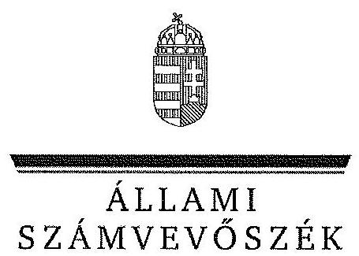
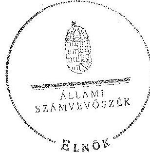

ÁLLAMI
SZÁMVEVŐSZÉK

# JELENTÉS 

az önkormányzati vagyongazdálkodás szabályszerűségi ellenőrzéséről

Pusztaszentlászló

---

# Állami Számvevőszék 

Iktatószám: V-0026-041-021/2013.
Témaszám: 1065
Vizsgálat-azonosító szám: V0593007

## Az ellenőrzést felügyelte:

## Makkai Mária

felügyeleti vezető
2012. december 16. napjától

Gyüre Lajosné
felügyeleti vezető
2012. december 15. napjáig

## Az ellenőrzést vezette és az ellenőrzés végrehajtásáért felelős:

## Kesjár János

ellenőrzésvezető

## Az ellenőrzést végezték:

| Dr. Király László | Czmarkó Frigyes György | Szabó Leonóra Ildikó |
| :-- | :-- | :-- |
| számvevő tanácsos | számvevő | számvevő |

## Vasváriné Molnár

## Judit

számvevő

---

# TARTALOMJEGYZÉK 

BEVEZETÉS ..... 3
I. ÖSSZEGZŐ MEGÁLLAPÍTÁSOK, KÖVETKEZTETÉSEK, JAVASLATOK ..... 5
II. RÉSZLETES MEGÁLLAPÍTÁSOK ..... 9

1. A vagyongazdálkodási tevékenység szabályozottsága ..... 9
1.1. A feladatellátás formáinak meghatározása, a döntések megalapozottsága ..... 9
1.2. A vagyonnal gazdálkodó szervezet szervezeti rendjének szabályozottsága, a kötelező szabályzatok megfelelősége ..... 9
1.3. A vagyongazdálkodás szabályozása ..... 10
2. A vagyongazdálkodás szabályszerűsége ..... 11
2.1. A vagyon nyilvántartásának megfelelősége ..... 11
2.2. A vagyongazdálkodást érintő gazdasági események követelmények szerinti dokumentáltsága ..... 12
2.3. A vagyongazdálkodási intézkedések, döntések szabályszerűsége ..... 14
3. A vagyonváltozást eredményező döntések jogszerűsége ..... 14
3.1. A vagyon értékének és összetételének változása ..... 14
4. A vagyongazdálkodás szabályszerűségére vonatkozó belső és külső ellenőrzések hasznosulása ..... 16
4.1. A belső ellenőrzés által tett megállapítások, javaslatok hasznosulása ..... 16
4.2. A többségi tulajdonban lévő gazdasági társaságok vagyongazdálkodásának felügyelete ..... 17
4.3. A könyvvizsgálatnak a vagyongazdálkodás szabályosságához való hozzájárulása ..... 18
4.4. A külső ellenőrző szervezet által tett javaslatok hasznosulása ..... 18

---

# MELLÉKLETEK 

1. számú Pusztaszentlászló Község Önkormányzata gazdálkodására jellemző adatok, mutatószámok
2. számú Pusztaszentlászló Község Önkormányzata vagyonának alakulása
3. számú Pusztaszentlászló Község Önkormányzata kötelezettségeinek alakulása

## FÜGGELÉKEK

1. számú Rövidítések jegyzéke
2. számú Értelmező szótár

---

# JELENTÉS 

## az önkormányzati vagyongazdálkodás szabályszerűségi ellenőrzéséről

## Pusztaszentlászló

## BEVEZETÉS

Az ÁSZ kiemelten fontosnak tartja az Állami Számvevőszékről szóló 2011. évi LXVI. törvény 5. § (4) bekezdése alapján az önkormányzati vagyon kezelésének, a vagyonnal való gazdálkodási szabályok betartásának az ellenőrzését. A helyi önkormányzatok vagyongazdálkodása szabályszerűségének ellenőrzését e célkitűzésnek megfelelően összeállított ellenőrzési program szerint végezte el. Az ellenőrzés feladata a vagyongazdálkodással kapcsolatban a közpénzek átláthatósága, nyilvánossága érdekében a jogszabályokban, belső szabályzatokban megfogalmazott előírások érvényesülésének áttekintése. Az Állami Számvevőszék nem csak az ellenőrzött szervezet vagyongazdálkodásának a hibáira mutat rá, számon kérve azok kijavítását, hanem megállapításaival, javaslataival segíti a közpénzzel, a közvagyonnal való felelős gazdálkodást.

Az önkormányzati vagyon alapvető funkciója, hogy a közérdeket és egyúttal az önkormányzati célok megvalósítását szolgálja. A feladatellátás terén elsősorban a kötelezően ellátandó feladatok végrehajtását hivatott szolgálni, amely mellett az önként vállalt feladatok ellátása is megvalósulhat.

## Az ellenőrzés célja az Önkormányzatnál annak értékelése volt, hogy:

- a vagyongazdálkodási tevékenységet, annak szervezeti kereteit szabályozták-e;
- az önkormányzati vagyongazdálkodás törvényességét, szabályszerűségét biztosították-e a döntések előkészítése és végrehajtása során;
- jogszerű döntéseken alapult-e a vagyon értékének és összetételének változása;
- a belső ellenőrzés elősegítette-e a vagyongazdálkodás szabályszerű működését, valamint hasznosultak-e a korábbi külső ellenőrzések által tett javaslatok.

Az ellenőrzés típusa: szabályszerűségi ellenőrzés
Az ellenőrzés a 2007. január 1. és 2011. év december 31. közötti időszakra terjedt ki, kitekintéssel a helyszíni ellenőrzés befejezéséig tartó időszak releváns folyamataira. Az egyes közbeszerzési eljárások lefolytatásának ellenőrzése a 2011. évet és a 2012. év I. negyedévét érintette.

Az ellenőrzés szakmai módszertana az Állami Számvevőszék Ellenőrzési Kézikönyvében foglalt szakmai szabályokon alapult, amely a Legfőbb Ellenőrző Intézmények Nemzetközi Szervezete (INTOSAI) által kiadott nemzetközi standardok (ISSAI) figyelembevételével készült.

A vagyongazdálkodás szabályozottságát a helyi szabályozások (rendeletek, szabályzatok, utasítások) ellenőrzésével végeztük el. A vagyonváltozások köréből az ellenőrizendő tételeket mintavétellel, a számviteli nyilvántartásokból választottuk ki.

Pusztaszentlászló község lakosainak száma 2011. január 1-jén 638 fő volt. A 2010. évi önkormányzati választást követően az Önkormányzat öttagú Képviselő-testületének munkáját egy állandó bizottság segítette. A helyi önkormányzat mellett a 2007-2011. években kisebbségi önkormányzat nem működött. A polgármester a 2008. augusztus 24-ei időközi polgármesteri választás óta tölti be tisztségét, a körjegyző 2007. szeptember 1-jétől látja el feladatát.

Az Önkormányzat Képviselő-testülete 2007. szeptember 1-jétől Söjtör Község Önkormányzatával Körjegyzőséget hozott létre. Az Önkormányzat feladatainak végrehajtása érdekében - a Körjegyzőségen kívül - a 2007-2011. években nem működtetett költségvetési intézményt. Az Önkormányzatnak egy többségi tulajdonban lévő gazdasági társasága volt, valamint a feladatok ellátásában kilenc társulás vett részt. Az Önkormányzatnak a 2011. évben és a 2012. év I. félévében a vagyongazdálkodáshoz kapcsolódóan közbeszerzési eljárási kötelezettsége nem volt.

Az Önkormányzat a 2011. évi költségvetési beszámolója szerint 52,6 millió Ft költségvetési bevételt ért el és 48,6 millió Ft költségvetési kiadást teljesített. 2011. december 31-én a könyvviteli mérleg szerint 382,7 millió Ft értékű vagyonnal rendelkezett. A 2011. év végén az Önkormányzat adósságállománya 4,2 millió Ft rövid lejáratú kötelezettség volt. Az Önkormányzat a 2007-2011. években hitelt nem vett fel, kötvényt nem bocsátott ki, garanciát, kezességet nem vállalt. Az Önkormányzat 2007-2011. évi beszámolóit könyvvizsgáló nem ellenőrizte, mivel a könyvvizsgálati kötelezettség nem vonatkozott rá.

A Körjegyzőségben dolgozó köztisztviselők száma 2011. december 31-én 10 fő, az Önkormányzat által foglalkoztatott közalkalmazottak száma egy fő volt. Az Önkormányzat gazdálkodására jellemző adatokat, mutatószámokat az 1-3. számú mellékletek tartalmazzák.

Az ÁSZ a 2011. évi LXVI. törvény 29. § (1) bekezdése szerint a jelentéstervezetet megküldte egyeztetésre Pusztaszentlászló Község Önkormányzata polgármesterének, aki az ÁSZ tv. 29. § (2) bekezdésében foglalt észrevételezési jogával nem élt, a jelentéstervezetre észrevételt nem tett.

---

# I. ÖSSZEGZŐ MEGÁLLAPÍTÁSOK, KÖVETKEZTETÉSEK, JAVASLATOK 

A 2007-2011. évek között az Önkormányzat vagyonának könyvviteli mérleg szerinti főösszege 9,3%-kal, 350,2 millió Ft-ról 382,7 millió Ft-ra nőtt. Ebből a tárgyi eszközök nettó értéke a beruházások, a korábban nulla értéken nyilvántartott ingatlanok értékelése, az elszámolt értékcsökkenés és az ingatlanértékesítések együttes hatására 6,1%-kal (331,9 millió Ft-ról 352,3 millió Ft-ra) növekedett. Felhalmozási célra összesen 42,4 millió Ft-ot fordítottak. Az Önkormányzat mérlegfőösszegének egynegyedét, 91,9 millió Ft-ot a befejezetlen beruházások között nyilvántartott, termálfürdő beruházással kapcsolatos eszközök képezik. A beruházások egy olyan vagyontárgyhoz (termálkút) kapcsolódtak, amelynek az Önkormányzat nem tulajdonosa, és amelyre vonatkozóan használati joga sem biztosított számára. E miatt, és a folyamatban lévő polgári perek miatt az érintett tételek számviteli nyilvántartásának korrekciója következtében a vagyon értéke jelentősen csökkenhet. További vagyoncsökkenést okozhat a termálkút beruházáshoz kapcsolódó, az NYDRFT által nyújtott támogatás késedelmi kamatokkal növelt - 2009-ig 42 millió Ft összegű - visszakövetelése is.

Az Önkormányzat vagyongazdálkodását a hatályos törvények előírásainak megfelelően szabályozta. Az Önkormányzat a vagyongazdálkodás stratégiai céljait a gazdasági programban, a vagyongazdálkodási feladatokat és az önkormányzati vagyonnal való gazdálkodás szabályait vagyongazdálkodási rendeletben, a feladatellátás szervezeti módját az önkormányzati SzMSz-ben rögzítette. A Képviselő-testület a vagyongazdálkodási feladatokhoz kapcsolódóan a polgármesternek, a bizottságnak és a társulásoknak hatáskört nem adott át.

Az Önkormányzat meghatározta az önkormányzati feladatellátást biztosító törzsvagyon körét, nyilvántartási rendjét, a forgalomképtelen és a korlátozottan forgalomképes vagyonelemeket, illetve a forgalomképes vagyon körébe tartozó vagyontárgyakat, amelyek elkülönítéséről a számviteli nyilvántartásban is gondoskodott.

Az Önkormányzat 2007-2011 között elkészítette, és a zárszámadási rendelet mellékletei között szerepeltette az Áht.-ben előírt vagyonkimutatást. A vagyonkimutatások megfeleltek az Áhsz.-ben előírtaknak. A 2010. év végétől azt megelőzően a számviteli nyilvántartásban érték nélkül nyilvántartott - 46 db ingatlan tekintetében a főkönyvi könyvelésben értéket határoztak meg, ugyanakkor nem álltak rendelkezésre az érték meghatározása alapjául szolgáló értékbecslések, sem más, az értékbecslő által kiállított dokumentum. A megrendelés alapján a megállapított értéket az értékbecslő közvetlenül a vagyonkataszterben rögzítette, ezen felül a munka elvégzését nem dokumentálták. Ezáltal megsértették a Számv. tv. előírását, mert a számviteli nyilvántartásokba csak szabályszerűen kiállított bizonylat alapján lehet adatokat bejegyezni.

---

A leltározás, a gazdálkodási jogkörök gyakorlása, és a vagyongazdálkodási döntések végrehajtása során nem tettek eleget a jogszabályokban és a belső szabályzatokban foglaltaknak, ezáltal veszélyeztették az önkormányzati vagyonnal való felelős gazdálkodást.

Az Önkormányzat a vonatkozó jogszabályok és a leltározási szabályzat által előírt leltározási kötelezettségének a 2007-2011. években december 31-ei fordulónappal eleget tett. A tárgyi eszközök leltározása azonban nem felelt meg az Áhsz.-ben és a leltározási szabályzatban foglalt további előírásoknak, mert azok leltározása nem mennyiségi felvétellel történt, illetve a leltárt nem értékelték ki.

A vagyongazdálkodás körében a gazdálkodási jogkörök gyakorlása során nem tartották be az Áht. és az Ámr. előírásait. Az ellenőrzött gazdasági események vonatkozásában 1,4 millió Ft értékű beszerzés esetében nem történt kötelezettségvállalás, valamint összesen 4,2 millió Ft kötelezettségvállalást nem előzte meg a kötelezettségvállalás ellenjegyzése. Ennek következtében az Önkormányzatot vagyoni hátrány nem érte.

A vagyongazdálkodással összefüggő döntés-előkészítés folyamatában nem szabályozták az Önkormányzat tulajdonosi jogainak, érdekeinek védelmét szolgáló garanciális elemek szerződésben, egyéb dokumentumban való rögzítésének kötelezettségét. Ingatlanértékesítésre hat hónapnál nem régebbi értékbecslés nélkül került sor annak ellenére, hogy belső szabályzatban előírták az értékbecslés készítésének kötelezettségét. Az Önkormányzat egy (nyilvántartási értéken 5,8 millió Ft értékű) ingatlan értékesítésével és egy ingatlan bérbeadásával kapcsolatos döntés előkészítése során nem tett eleget a vagyongazdálkodási rendeletben előírt versenyeztetési kötelezettségének.

A módosított vagyongazdálkodási rendelet 2008. októbertől tartalmazta az önkormányzati vagyon ingyenes vagy kedvezményes átruházásának, követelés elengedésének eseteit és módját, azonban a 2007-2011. években ingyenes vagyonátruházásra, és követelés elengedésre nem került sor.

Az Önkormányzatnak egy kizárólagos önkormányzati tulajdonban lévő gazdasági társasága van („Szentlászló" Kft.), amely a 2007-2011. években érdemi tevékenységet nem folytatott. Az Önkormányzat a Kft. fizetésképtelenségének elkerülése érdekében hét alkalommal nyújtott tagi kölcsönt összesen 0,5 millió Ft értékben. A Kft. működése szabálytalan, nem rendelkezik az Art.-ban előírt pénzforgalmi számlával, a Kft. a 2007. év végével bankszámláját megszüntette. A 2008. évtől a társasági formára kötelezően előírt saját tőke/jegyzett tőke aránya nem felelt meg a Gt. előírásainak. Az alapító az Ötv.-ben foglaltak ellenére a tulajdonosi jogokat nem gyakorolta és semmilyen intézkedést nem kezdeményezett gazdasági társaságának törvényes működése érdekében. A Képviselő-testület a Kft.-t nem számoltatta be a vagyonnal való gazdálkodásáról.

A belső ellenőrzés hozzájárult a vagyongazdálkodási feladatok ellátása során felmerült hibák, hiányosságok feltárásához, kivizsgálásához. Képviselőtestület a belső ellenőrzés számára három esetben rendelt el soron kívüli, vagyongazdálkodásra vonatkozó ellenőrzést az ellenőrzési tervekben foglalt két

---

ellenőrzésen felül. Ennek eredményeként a belső ellenőrzés felhívta a figyelmet a vagyongazdálkodással kapcsolatos hiányosságokra, amelynek hatására 2008-ban új vagyongazdálkodási rendelet készült. A termálberuházás pénzügyi és szabályszerűségi ellenőrzésével kapcsolatos belső ellenőrzés a vagyonrendelet betartására és a döntéshozatalhoz szükséges megfelelő információk megszerzésére hívta fel utólag a Képviselő-testület figyelmét, a jövőre vonatkozóan javasolta jelentős vagyoni hátrány okozása miatt a büntetőjogi felelősség megállapításához szükséges cselekmények megtételét (bizonyítékok feltárása). 2012. augusztus 1-jén az Önkormányzat felülvizsgálati kérelmet és feljelentéskiegészítést terjesztett elő a Legfőbb Ügyészséghez.

Az Állami Számvevőszékről szóló 2011. évi LXVI. törvény 33. § (1) bekezdésében foglaltak értelmében a jelentésben foglalt megállapításokhoz kapcsolódó intézkedési tervet köteles az ellenőrzött szervezet vezetője összeállítani, és azt a jelentés kézhezvételétől számított 30 napon
 belül az ÁSZ részére megküldeni. Amennyiben az intézkedési tervet határidőben nem küldi meg a szervezet, vagy az nem elfogadható, az ÁSZ elnöke a hivatkozott törvény 33. § (3) bekezdés a)-b) pontjaiban foglaltakat érvényesítheti.

Az ellenőrzés intézkedést igénylő megállapításai és javaslatai:

# a körjegyzőnek 

1. A korábban érték nélkül nyilvántartott 46 földterület 2010-ben megállapított értékeit az ingatlankataszterben a 147/1992. (XI. 6.) Korm. rendelet 4. § (2) bekezdésében előírt okirat - értékbecslési dokumentum - hiányában, a számviteli nyilvántartásban a Számv. tv. 165. § (2) bekezdésének előírása ellenére szabályszerűen kiállított bizonylat nélkül rögzítették.

## Javaslat

Intézkedjen a korábban érték nélkül nyilvántartott 46 földterület 2010-ben megállapított értékeinek a Számv. tv. 165. § (2) bekezdése szerinti szabályszerűen kiállított bizonylattal való alátámasztásáról.
2. Az Önkormányzatnál az Áhsz. 37. § (3) bekezdésében és a leltározási szabályzat ${ }_{2}$-ben foglalt előírások ellenére a tárgyi eszközök leltározását nem mennyiségi felvétellel végezték, továbbá elmaradt a leltár kiértékelése. A leltár így nem felelt meg az Áhsz. 37. § (2) bekezdésében előírtaknak, mert az eszközcsoport valódiságát nem támasztotta alá.

## Javaslat

Intézkedjen a tárgyi eszközök leltározásának az Áhsz. 37. § (3) bekezdésében és a leltározási szabályzat ${ }_{2}$-ben foglalt előírásoknak megfelelően mennyiségi felvétellel történő és a kiértékelést is magában foglaló végrehajtásáról, az eszközcsoport valódiságának az Áhsz. 37. § (2) bekezdésének megfelelő alátámasztásáról.

---

3. Az Önkormányzat a vagyonértékesítéssel és vagyonhasznosítással kapcsolatos döntések előkészítése során nem tett eleget a vagyongazdálkodási rendelet ${ }_{2}$-ben előírt versenyeztetési kötelezettségének, továbbá ingatlanértékesítésre a vagyongazdálkodási rendelet ${ }_{2}$-ben előírt - hat hónapnál nem régebbi - értékbecslés hiányában került sor.

# Javaslat 

Intézkedjen a vagyonértékesítés és vagyonhasznosítás esetében a vagyongazdálkodási rendelet ${ }_{2}$-ben előírt versenyeztetési kötelezettség betartásáról, továbbá az ingatlanok elidegenítése előtt a vagyontárgyak forgalmi (piaci) értékének értékbecsléssel történő meghatározásáról.

---

# II. RÉSZLETES MEGÁLLAPÍTÁSOK 

## 1. A VAGYONGAZDÁLKODÁSI TEVÉKENYSÉG SZABÁLYOZOTTSÁGA

### 1.1. A feladatellátás formáinak meghatározása, a döntések megalapozottsága

Az Önkormányzat az $\mathrm{SzMSz}_{1,2,3}$-ban határozta meg a kötelező közszolgáltatási és az önként vállalt feladatait. Kötelező feladatait az Ötv. és az ágazati törvények ${ }^{1}$ figyelembevételével állapította meg, az önként vállalt feladatok nagyságát az éves költségvetési rendeletekben határozta meg.

A Képviselő-testület a 2007-2010. évek között az Ötv. 91. § (7) bekezdésében előírtak ellenére gazdasági programot nem fogadott el. A 2010. évi önkormányzati választásokat követően - az Ötv.-ben meghatározott határidőn belül - megtörtént a 2011-2014. évekre szóló gazdasági program elfogadása. A gazdasági program stratégiai fejlesztési célként az ingatlanok fenntartását, felújítását tűzte ki, konkrét forrásmegjelölés nélkül.

A Képviselő-testület határozata alapján a településen az oktatási-nevelési feladatok ellátására a legcélszerűbb és a leggazdaságosabb megoldásnak a társulási formát tartotta, melyet az előterjesztésekben számításokkal nem támasztottak alá.

A közszolgáltatások ellátásához kapcsolódóan a 2007-2011. évek között a Képviselő-testület egy költségvetési szerv (körjegyzőség) alapításáról és két társulásba történő belépésről döntött², a döntések vagyonváltozást nem eredményeztek.

### 1.2. A vagyonnal gazdálkodó szervezet szervezeti rendjének szabályozottsága, a kötelező szabályzatok megfelelősége

A 2007-2011. évek között a Képviselő-testület az Ötv.-ben foglaltak alapján alkotta meg az $\mathrm{SzMSz}_{1,2,3}$-at. Az $\mathrm{SzMSz}_{1}$-et az alakuló ülést követő hat hónapos határidőn belül felülvizsgálta. A Képviselő-testület az $\mathrm{SzMSz}_{1,2,3}$-ban az Ötv.ben előírtaknak megfelelően szabályozta a hatáskörök átruházását. A Képviselő-testület a vagyongazdálkodási feladatokhoz kapcsolódóan a polgármesternek, a bizottságnak és a társulásoknak hatáskört nem adott át.

[^0]
[^0]:    ${ }^{1}$ a közoktatásról, a szociális igazgatásról és szociális ellátásokról, az egészségügyről, a gyermekvédelemről és a gyámügyi igazgatásról szóló törvények
    ${ }^{2}$ az Oktatási-nevelési intézményi társulásban való részvételről szóló 70/2007. határozat és a Zalaispa hulladékgazdálkodási társulásba való belépésről szóló 85/2007. határozat

---

A Körjegyzőség 2007-2011. években rendelkezett számviteli politikával és a kötelezően előírt szabályzatokkal, számlarenddel, pénzkezelési, leltározási, selejtezési és értékelési szabályzattal, amelyek - a számlarendet kivéve - a Körjegyzőség megalakulásával léptek hatályba. A körjegyző a 2009. évben új pénzkezelési és selejtezési szabályzatokat adott ki. A szabályzatok megfeleltek a hatályos Számv. tv. és Áhsz. előírásainak. A leltározási szabályzat ${ }_{2}$ tartalmazta, hogy a vagyonleltárt évente kell elkészíteni. Az Önkormányzatnak a 2007-2011. években vagyonkezelésre és koncesszióba átadott eszköze nem volt. Az üzemeltetésre átadott eszközök leltározásának szabályait a leltározási szabályzat ${ }_{2}$ tartalmazta.

# 1.3. A vagyongazdálkodás szabályozása 

Az Önkormányzat a vagyongazdálkodási feladatokat és az önkormányzati vagyonnal való gazdálkodás szabályait az Ötv. előírásainak megfelelően szabályozta. A vagyongazdálkodási rendelet ${ }_{1,2}$-ben rögzítették az önkormányzati vagyonnal való felelős gazdálkodás szabályait ${ }^{3}$, meghatározták az önkormányzati feladatellátást biztosító törzsvagyon körét, nyilvántartási rendjét, azon belül külön-külön meghatározva a forgalomképtelen és a korlátozottan forgalomképes vagyonelemeket, illetve a forgalomképes vagyon körébe tartozó azon vagyontárgyakat, amelyeket a rendelet mellékletei tartalmaztak.

Az Nvt. 2012-ben hatályba lépett rendelkezéseinek megfelelően az Önkormányzat vagyongazdálkodási rendeletét határidőn belül felülvizsgálta. Ennek keretében elvégezte a vagyon új szabályok szerinti besorolását. A Képviselő-testület megállapította, hogy nincs olyan vagyonelem önkormányzati tulajdonban, melyet nemzetgazdasági szempontból kiemelt jelentőségű nemzeti vagyonná kell minősíteni. Az Önkormányzat a helyszíni ellenőrzés idejéig még nem készítette el a közép és hosszú távú vagyongazdálkodási tervét.

A vagyongazdálkodási rendelet ${ }_{2}$ 2007. szeptember 1-jétől tartalmazta a forgalomképesség megváltoztatásának szabályait, a korlátozottan forgalomképes és a forgalomképes vagyon hasznosítására vonatkozó szabályokat, ugyanakkor előírta, hogy az ezzel kapcsolatos versenyeztetési eljárás rendjét külön rendeletben szabályozza. Ez utóbbi rendeletet a Képviselő-testület nem alkotta meg.

Az SzMSz ${ }_{1,2}$ a vagyonnyilvántartás felelőseit tartalmazta, azonban konkrét vagyongazdálkodási feladatokat nem tartalmazott, csak visszahivatkozást a vagyongazdálkodási rendelet ${ }_{2}$-re, és az ügyrendre. A Körjegyzőség SzMSz-e és az ellenőrzési nyomvonal ${ }_{1,2}$ tartalmazta a vagyongazdálkodással kapcsolatos feladatok meghatározását.

Az Önkormányzat egy gazdasági társasággal kötött üzemeltetői szerződést, amelyben a Zalavíz Zrt. ivóvízmű vagyon üzemeltetésével kapcsolatos feladatát, felelősségét rögzítették.

[^0]
[^0]:    ${ }^{3}$ a Htv. 138. § (1) bekezdés j) pontja

---

Az Önkormányzat 2008. augusztus 22-ig az Áht. 108. §. (2) bekezdésben ${ }^{4}$ foglalt rendelkezések ellenére nem szabályozta az ingyenes vagyonátruházás eseteit, módjait. A 2008. októberben módosított vagyongazdálkodási rendelet ${ }_{2}$ már tartalmazta az önkormányzati vagyon ingyenes vagy kedvezményes átruházásának, követelés elengedésének eseteit és módját. A 2007-2011. években ingyenes vagyonátruházásra, és követelés elengedésre nem került sor.

A vagyongazdálkodással összefüggő döntés-előkészítés folyamatában nem szabályozták az Önkormányzat tulajdonosi jogainak, érdekeinek védelmét szolgáló garanciális elemek szerződésben, egyéb dokumentumban való rögzítésének kötelezettségét. A vagyongazdálkodási rendelet ${ }_{2}$ azonban tartalmazta - a hasznosításra szánt vagyon értéke megállapítása céljából - az értékbecslés készítésének kötelezettségét.

A gazdálkodási jogkörök gyakorlásának rendjét, az összeférhetetlenségi követelményeket a gazdálkodási jogkörök szabályzatában ${ }_{1,2,3}$ rögzítették. A vagyongazdálkodást érintő belső kontrollok - a kötelezettségvállalás, a kötelezettségvállalás ellenjegyzése, a szakmai teljesítésigazolás, érvényesítés, az utalványozás és az utalvány ellenjegyzése - kialakításával a kiadások esetében biztosították a vagyongazdálkodás szabályos működésének feltételeit, ugyanakkor a körjegyző az Ámr. ${ }_{2}$ 20. § (3) bekezdés a) pontjában foglaltak ellenére a bevételek beszedésével kapcsolatos ellenőrzési feladatokat nem határozta meg.

# 2. A VAGYONGAZDÁLKODÁS SZABÁLYSZERŰSÉGE 

### 2.1. A vagyon nyilvántartásának megfelelősége

Az Önkormányzat az Ötv. 78. § (2) bekezdése alapján a 2007-2011. években elkészítette a vagyonkimutatást. A polgármester az Önkormányzat 2007-2011. évek zárszámadási rendeletének előterjesztésekor a Képviselő-testület részére tájékoztatásul bemutatta az Áht. 118. § (2) bekezdés 2. c) pontjában előírt vagyonkimutatást. A vagyonkimutatás megfelelt az Áhsz. 44/A. § (2) és (3) bekezdésében előírtaknak.

Az Áhsz. 9. számú melléklet a számlaosztályok tartalmára vonatkozó 1. k) pontjában foglaltaknak megfelelően a törzsvagyon (ezen belül a forgalomképtelen, illetve a korlátozottan forgalomképes), valamint az egyéb vagyon részét képező eszközök elkülönítéséről a főkönyvi számlák további bontásával és az analitikus nyilvántartásokban is gondoskodtak.

Az Önkormányzatnál a 2007-2011. év végi zárási feladatok keretében a 147/1992. (XI. 6.) Korm. rendeletben foglaltak alapján a vagyonkimutatásban szereplő ingatlanvagyon és az ingatlanvagyon kataszter adatainak egyeztetését elvégezték. Az egyeztetés tényét minden évben jegyzőkönyvvel igazolták. Eltérést nem állapítottak meg, annak ellenére, hogy 46 db földterület a 2010. év végéig érték nélkül szerepelt az analitikus nyilvántartásokban, így a 147/1992.

[^0]
[^0]:    ${ }^{4}$ 2012. január 1-jétől az Nvt. 13. §. (3) bekezdése szabályozza

---

(XI. 6.) Korm. rendelet 1. § (2) bekezdése szerinti egyezőséget nem biztosították. Az érintett ingatlanok a főkönyvi könyvelésben a 2010. év végétől értéken szerepelnek, ugyanakkor hiányoztak az érték alapjául szolgáló értékbecslések. A megrendelés alapján a megállapított értéket az értékbecslő közvetlenül a vagyonkataszterben rögzítette, ezen felül a munka elvégzését nem dokumentálták. Ezáltal megsértették a Számv. tv. 165. § (2) bekezdésében foglaltakat, mert a számviteli nyilvántartásokba csak szabályszerűen kiállított bizonylat alapján lehet adatokat bejegyezni.

Az Önkormányzat a 2007-2011. években a leltározási kötelezettségének december 31-ei fordulónappal eleget tett, azonban a leltározás nem felelt meg a vonatkozó jogszabályi előírásoknak és a leltározási szabályzat ${ }_{2}$ rendelkezéseinek. A leltározási szabályzat ${ }_{2}$-ben foglaltak szerint a vagyonleltárt évente, mennyiségi felvétellel - illetve a csak értékben nyilvántartott eszközök és források esetében egyeztetés alapján - kell elkészíteni. A 2007-2011. években a tárgyi eszközök leltározása - a felvett jegyzőkönyvek alapján, december 31-i fordulónappal - a helyi szabályozástól eltérően egyeztetéssel történt. Ezzel megsértették az Áhsz. 37. § (3) bekezdésében foglaltakat is, amely az eszközök mennyiségi felvétel alapján történő leltározásáról rendelkezik, továbbá a tárgyi eszközök vonatkozásában sérültek a Számv. tv. 69. § (1) bekezdés és az Áhsz. 37. § (2) bekezdés előírásai is, melyek szerint tételesen és ellenőrizhető módon, mennyiségben és értékben kell az eszközöket tartalmaznia a leltárnak.

Az üzemeltetésre átadott eszközök leltározásáról a Zalavíz Zrt. a 2007-2011. évek december 31-ei állapotának megfelelően tételes és összesítő állapotlistát küldött az üzemeltetésre átvett eszközök bruttó és nettó értékéről, valamint az év végéig elszámolandó értékcsökkenésekről.

A 2007-2011. évi könyvviteli mérlegekben a befektetett pénzügyi eszközöket, a forgóeszközöket, a pénzeszközöket és a kötelezettségeket leltárral alátámasztották, értéküket a Számv. tv. általános alapelveinek és tételes szabályainak, az Áhsz., valamint az Önkormányzat számviteli politikájának előírásai alapján határozták meg.

# 2.2. A vagyongazdálkodást érintő gazdasági események követelmények szerinti dokumentáltsága 

A gazdálkodási jogkörök gyakorlása során - egy gazdasági esemény kivételével - betartották az összeférhetetlenség kizárására előírt szabályokat. A motoros kasza beszerzéséhez a 2009. április 24-én kifizetett 205,9 ezer Ft számla szakmai teljesítésigazolását és érvényesítését az Ámr. ${ }_{2}$ 80. § (1) bekezdésében előírtak ellenére a körjegyző által kijelölt ${ }^{5}$ ugyanazon személy végezte el.

Az Igazságügyi Ingatlanforgalmi szakértő által a 2010. év decemberében elvégzett 46 db ingatlan értékbecsléséről és a vagyonkataszterbe történő rögzíté-

[^0]
[^0]:    ${ }^{5}$ A körjegyzői kijelölések a szakmai teljesítés igazoló, és az érvényesítő esetében nem azonos gazdasági eseményre vonatkoztak.

---

séről a munka elvégzését, a szakmai teljesítést a polgármester igazolta, annak ellenére, hogy nem készült értékbecslés,
 sem egyéb bizonylat a kataszteri nyilvántartásban történő átvezetésekről. A szakmai teljesítés igazolásához szükséges kötelezettségvállalás - megbízási szerződés - és a szakértő által kiállított 90 ezer Ft-ról szóló számla rendelkezésre állt. A szakmai teljesítés igazolója nem tett eleget az Ámr. 76. § (1) bekezdésében előírtaknak, mivel nem ellenőrizte a munka elvégzését, a kötelezettségvállalásban foglaltak teljesítését.

A Körjegyzőségben, a 2007-2011. években a kifizetések és a bevételek beszedését megelőzően - az ellenőrzött bizonylatok közül - az alábbi esetekben nem végezték el az előírt ellenőrzési feladatokat az arra felhatalmazott személyek. A vagyongazdálkodás tekintetében a belső kontrollok működésében feltárt hiányosságok és mulasztások miatt az Önkormányzatot vagyoni hátrány nem érte, de az alábbiak miatt fennállt a szabálytalan pénzügyi kifizetések kockázata:

- az Áht. 100/C. § (1) bekezdésében előírtakat megsértve és az Ámr. ${ }_{2}$ 72. § (8) bekezdésében előírtak ellenére a polgármester, vagy az általa írásban felhatalmazott személy írásban nem vállalt kötelezettséget 1,4 millió Ft értékben kistraktor beszerzésére, a kötelezettségvállalást nem előzte meg annak ellenjegyzése, így az Ámr. ${ }_{2}$ 74. § (3) bekezdésében foglalt ellenőrzési feladatokat nem végezték el. Ezért az utalvány az Ámr. ${ }_{2}$ 78. § (2) g) pontjában előírtak ellenére nem tartalmazhatta a kötelezettségvállalás nyilvántartási számát;
- az Áht. 100/C. § (3) bekezdésében előírtakat megsértve és az Ámr. ${ }_{2}$ 74. § (1) bekezdésében előírtak ellenére a kötelezettségvállalást nem előzte meg annak ellenjegyzése az eszközbeszerzések és a részvény átruházási szerződés esetén. Ezáltal az Ámr. ${ }_{2}$ 74. § (3) bekezdésében foglalt ellenőrzési feladatokat nem végezték el. Nem történt meg a kötelezettségvállalás ellenjegyzése a 2009. június 22-i Canon másológép beszerzéséhez kapcsolódó 0,2 millió Ft, a 2009. november 17-i Citroen autó beszerzéshez kapcsolódó 1,2 millió Ft összegű megrendelés, és a 2003. január 21-én az ELMIB Rt.-vel 10 évre kötött, 2,7 millió Ft névértékű részvény átruházási szerződés esetében, melyből 1,4 millió Ft volt a 2007-2011. években történt részvényvásárlás;
- az ingatlanértékesítésből származó bevételek teljesítése során a belső kontrollok - a bevételeket megalapozó szerződések ellenőrzése és az utalvány ellenjegyzés - szabályozás hiányában nem működtek. Az értékesítési feltételek ellenőrzését végző személyek kijelölésének hiányában a 363/4 hrsz. 3,5 millió Ft értékű belterületi ingatlan, a 0,4 millió Ft értékű gépkocsi adásvételi szerződések aláírását megelőzően nem ellenőrizték, hogy az Önkormányzat érdekelt védő garanciális elemeket szerződésben rögzítették-e, továbbá azt, hogy a gazdálkodásra vonatkozó szabályokat betartották-e;
- az utalvány ellenjegyzője az Ámr. 79. § (2) bekezdésében foglaltak ellenére nem észrevételezte az összeférhetetlenséget a motoros kasza beszerzéséhez kifizetett 0,2 millió Ft összegű számla pénzügyi teljesítése előtt. A kistraktor, autó és nyomtató beszerzés és a részvényvásárlás esetén az érvényesítő az Ámr. ${ }_{2}$ 77. § (1) bekezdésében foglalt előírás ellenére nem ellenőrizte, az utalványok ellenjegyzője az Ámr. ${ }_{2}$ 79. § (2) bekezdésében előírtak ellenére nem észrevételezte, hogy a kötelezettségvállalás ellenjegyzésére vonatkozó előírást nem tartották be.

Az Önkormányzatnak a 2007-2011. években nem volt az Áht. 15/A. és 15/B. §-ban előírt közzétételi kötelezettsége, mivel nem nyújtott 200 ezer Ft

---

feletti felhalmozási célú támogatást, illetve nem kötött pénzeszközeinek felhasználásával, a vagyonnal történő gazdálkodással összefüggő nettó 5 millió Ft-ot elérő, vagy azt meghaladó szerződéseket.

# 2.3. A vagyongazdálkodási intézkedések, döntések szabályszerűsége 

A vagyonváltozást eredményező döntések során betartották az Ötv. 79. § (2) bekezdése előírásait. Az Önkormányzatnál a 2007-2011. években a vagyonértékesítéssel (1 db) és a vagyonhasznosítással (1 db) kapcsolatos gazdasági események vonatkozásában a versenyeztetés, a vagyongazdálkodási rendelet${ }_{2}$-ben foglaltak ellenére elmaradt.

Az Önkormányzatnál nem tettek eleget a vagyongazdálkodási${ }_{2}$ rendelet 13. §-ban előírtaknak, mivel a 363/4. hrsz. alatt nyilvántartott $6171 \mathrm{~m}^{2}$ alapterületű, kivett beépítetlen terület megjelölésű ingatlan értékesítése során nem rendelkeztek független ingatlanforgalmi értékbecslő által készített, hat hónapnál nem régebbi forgalmi értékbecsléssel. Az ingatlanértékesítésről készült 2009. március 13-ai csereszerződésben az Önkormányzat tulajdonában lévő beépítetlen terület nyilvántartási értékének (5,8 millió Ft) 60%-ában került beszámításra. Az önkormányzati vagyon bérbeadására a 2007-2011. években egy bérleti szerződést kötöttek (2007. évben) egy közhasznú egyesülettel, amelyet a vagyongazdálkodási rendelet${ }_{2}$ 12. § (14) bekezdésében foglaltak értelmében csak nyilvános versenytárgyalás útján kerülhetett volna sor.

Az egyesület bérbe vette az iskolaépület második szintjén lévő helyiségeket kizárólagos használatra, a tornatermet, udvart, sport- és játszóteret, ebédlőt, illetve egyes iskolai felszereléseket közös használatra. Bérleti díjként havi 1000 Ft összegben állapodtak meg, továbbá az épület teljes rezsiköltségét és a bérelt helyiségek használatából eredendően szükségessé vált karbantartás költségeit a bérleti szerződés alapján - beleértve a földszinten működő Óvoda rezsiköltségeit is - a bérbevevő viselte.

A Képviselő-testület a 2007-2011. években hosszú lejáratú, működési és felhalmozási célú pénzintézettel szembeni kötelezettségvállalásról nem döntött.

A 2007-2011. évek beruházásait a Képviselő-testület döntése alapján beszerzett immateriális javak, gépek és járművek képezték. A vagyonváltozást eredményező gazdasági események vonatkozásában az elkészült dokumentumok (szerződések és megállapodások) tartalma a vagyonról hozott döntésekkel megegyezett. Az önkormányzati vagyont érintő döntés végrehajtása a dokumentumokban foglaltaknak megfelelően történt.

## 3. A VAGYONVÁLTOZÁST EREDMÉNYEZŐ DÖNTÉSEK JOGSZERŰSÉGE

### 3.1. A vagyon értékének és összetételének változása

A 2007-2011. évek között az Önkormányzat könyvviteli mérleg főösszege 9,3%-kal, 32,5 millió Ft-tal nőtt, a 2007. évi 350,2 millió Ft-ról, a

---

2011. évi 382,7 millió Ft-ra emelkedett. A növekedést elsősorban a befektetett eszközök értékének növekedése eredményezte.

A tárgyi eszközök nettó értéke ebben az időszakban 6,1%-kal növekedett (331,9 millió Ft-ról 352,3 millió Ft-ra) a beruházások, a korábban nulla értéken nyilvántartott ingatlanok értékelése, az elszámolt értékcsökkenés és az ingatlanértékesítések együttes hatására. Az ingatlanok és kapcsolódó vagyoni értékű jogok aránya a befektetett eszközökön belül a 2007-2011. évek között 68,0%-ról 69,5%-ra változott. A könyvviteli mérleg szerinti nettó érték a 2007. évi 235,5 millió Ft-ról 2011-re 257,4 millió Ft-ra emelkedett a 2010. évben végrehajtott értékbecslések következtében.

Az Önkormányzat pénzügyi befektetéseinek értéke 25,6%-kal (1,5 millió Ft-tal) emelkedett, a 2007. évi 6,0 millió Ft-ról 2011-re 7,5 millió Ft-ra nőtt. A növekedés a közvilágítás korszerűsítésének ellentételezése érdekében - 10 éves futamidőre - vállalt részvényvásárlásból adódott. A befektetett eszközök értéke összesen 7,0%-kal, 24,3 millió Ft-tal növekedett, 346,1 millió Ft-ról 370,4 millió Ft-ra változott, aránya azonban a mérleg főösszeghez viszonyítva a 2007. évi 98,8%-ról a 2011. évre 96,8%-ra csökkent.

Az Önkormányzat a ZALAVÍZ Zrt.-nek átadta üzemeltetésre a település ivóvízellátását szolgáló vízi közmű vagyonát, mellyel a szolgáltató közműves ivóvízellátás szolgáltatást végez. A ZALAVÍZ Zrt. az eszközök után használati díjat fizet. A használati díjat az önkormányzatok Közös Pénzügyi Alapba helyezik. Az üzemeltetésre átadott eszközök értéke a 2007. évben 6,7 millió Ft, a 2011. évben 10,6 millió Ft volt. Az üzemeltetésre átadott eszközök 58,2%-kal (3,9 millió Ft-tal) növekedtek a Közös Pénzügyi Alapból megvalósított veszély elhárításából eredő nem tervezett felújítási és rekonstrukciós kiadások miatt.

Az Önkormányzat számviteli nyilvántartásában 2007 és 2011 között befejezetlen beruházásként szerepel 91,9 millió Ft értékben egy termálkút kialakításával kapcsolatos beruházás, amely összeg - ezzel a projekttel összefüggésben - 2001 óta halmozódott fel, és 2011-re az Önkormányzat mérlegfőösszegének egynegyedét tette ki. Az eszközöket a beruházások befejezésétől nem tudta aktiválni az Önkormányzat, és a kapcsolódó, folyamatban lévő perek miatt kockázatos, hogy erre, vagy az eszközölt beruházások ellenében követelés megtérítésére sor kerülhet-e egyáltalán. A belső ellenőr jelentése megállapítja, hogy a mérlegben szereplő beruházások nem az önkormányzati vagyonhoz kapcsolódtak. A beruházással kapcsolatos körülmények az ellenőrzött időszakot megelőzően keletkeztek, ezért jelentésünk azt nem tartalmazza.

Az Önkormányzat a 2007-2011. évi zárszámadási rendelettervezetek Képviselő-testületi előterjesztéseiben nem mutatta be az eszközök elhasználódási fokának alakulását. Az Önkormányzat a 2007-2011. évek között a tárgyi eszközökre együttesen 18,3 millió Ft összegű értékcsökkenést mutatott ki.

Az Önkormányzat a 2007-2011. években mindössze 0,3 millió Ft felújítást hajtott végre, ami az elszámolt értékcsökkenés 1,5%-a volt. Az Önkormányzat a jogszabályban meghatározott leírási kulcsokat alkalmazta, attól

---

nem tért el. Az Önkormányzat beszerzésekre összesen 17,6 millió Ft összeget fordított a 2007-2011. évek között.

Az Önkormányzatnak a 2007-2011. években 42,4 millió Ft felhalmozási célú kiadása volt, melynek az 58,5%-a, 24,8 millió Ft a Zalaegerszeg és környéke csatornahálózat és szennyvíztisztító telep fejlesztéséhez átadott pénzeszköz volt. A legjelentősebb beruházások a termálfürdő beruházásához kapcsolódó telekvásárlás 0,8 millió Ft, gépjármű, kistraktor és motoros kasza beszerzések 3,0 millió Ft, településrendezési terv 1,9 millió Ft, Szent László mellszobor 0,8 millió Ft és gázkazán csere 0,6 millió Ft értékben.

# 4. A VAGYONGAZDÁLKODÁS SZABÁLYSZERŰSÉGÉRE VONATKOZÓ BELSŐ ÉS KÜLSŐ ELLENŐRZÉSEK HASZNOSULÁSA 

### 4.1. A belső ellenőrzés által tett megállapítások, javaslatok hasznosulása

Az Önkormányzatnál a belső ellenőrzési feladatok ellátását 2004. március 31-től Többcélú Belsőellenőrzési Társulás munkaszervezete keretében biztosították, mely megfelelt az Ötv. 92. § (8) bekezdésében előírtaknak. Az Önkormányzat a Ber. 4. § (2) bekezdése szerint belső ellenőrzési kötelezettségét a 2007. szeptember 14-ig hatályos SzMSz-ei (SzMSz${ }_{1,2}$) nem tartalmazták. A Képviselő-testület az SzMSz${ }_{2}$-ban rendelkezett a belső ellenőrzés Társulás útján történő ellátásáról. Az ellátandó feladatok tételes felsorolását a Körjegyzőség SzMSz-e tartalmazta.

Az Önkormányzat a 2007-2011. évekre vonatkozóan rendelkezett stratégiai, valamint éves belső ellenőrzési tervekkel. A Képviselő-testület a 2007. évre vonatkozó belső ellenőrzési tervet nem hagyta jóvá, mellyel megsértette az Ötv. 92. § (6) bekezdésében foglaltakat. A Képviselő-testület a 2008-2011. évekre jóváhagyta az Önkormányzat belső ellenőrzési terveit, azok tartalmaztak ellenőrzési kapacitást a soron kívüli feladatokra, de a 2010. és a 2011. évi terv kivételével a Ber. 18. §-a és 21. § (2) bekezdésében előírtak ellenére nem kockázatelemzésen alapultak.

A 2008. évben a belső ellenőrzési tervben rögzített - Pusztaszentlászló Önkormányzatára vonatkozó egy darab - ellenőrzés elmaradt, továbbá a Ber. 31. §-ban foglalt rendelkezések ellenére a 2008. évről nem készült éves összefoglaló jelentés.

A 2007-2011. évekre vonatkozóan a körjegyző az Ámr. 23. számú mellékletében${ }^{6}$ rögzített nyilatkozat szerint megfelelőnek értékelte a Körjegyzőség belső kontrollrendszerének működését.

A 2007-2011. években a belső ellenőrzési tervekben mindössze két ellenőrzést irányoztak elő az önkormányzat vagyongazdálkodásával kapcsolatosan, melyekből az egyik meghiúsult. A Ber. 32/B. § (6) bekezdés előírása ellenére a

[^0]
[^0]: ${ }^{6}$ 2010. január 1-jétől az Ámr. 21. számú mellékletében, 2012. január 1-jétől a Bkr. 1. számú mellékletet szabályozza

---

belső ellenőrzési terv módosítására nem került sor${ }^{7}$. A 2010. évben lefolytatott vagyongazdálkodásra vonatkozó ellenőrzés javaslatai alapján a körjegyző intézkedési tervet készített, melyben öt feladat végrehajtását írta elő határidők és felelősök megnevezésével. Az öt feladatból egy teljesítése nem történt meg, amely a KPA alap analitikus nyilvántartásának vezetésére vonatkozott.

Soron kívüli ellenőrzésként a belső ellenőr három esetben végzett ellenőrzést vagyongazdálkodással összefüggésben a Képviselő-testület
 felkérése alapján.

- a 2007. évben a vagyonrendelet szabályszerűségi ellenőrzése során a belső ellenőr új vagyonrendelet készítését javasolta, amely teljesült;
- a 2007. évben a termálberuházás ellenőrzéséről készített jelentés tervezetben a vagyonrendeletben foglaltak szigorú betartására hívta fel a figyelmet, illetve javasolta, hogy a Képviselő-testület csak - megfelelő információ, dokumentáció birtokában - hozzon „felelős” döntést a beruházással kapcsolatban. A jelentés tervezetre Pusztaszentlászló község polgármestere észrevételt tett. Az észrevételek feldolgozása, a jelentés véglegesítése - a Zala Megyei Rendőrfőkapitányság Gazdaságvédelmi Osztály által határozatban elrendelt és 2007. december 11-én végrehajtott iratlefoglalás miatt - nem történt meg;
- a 2011. évben a belső ellenőr a 2007. évben megkezdett, de a polgármester észrevétele, valamint a rendőrségi vizsgálat miatt nem véglegesített jelentéstervezet lezárása és kiegészítése kapcsán a K-2 termálkút beruházás átfogó ellenőrzését elvégezte.

A termálberuházás pénzügyi és szabályszerűségi ellenőrzésével kapcsolatos belső ellenőrzés a vagyonrendelet betartására és a döntéshozatalhoz szükséges megfelelő információk megszerzésére hívta fel utólag a Képviselő-testület figyelmét. A belső ellenőrzés a jövőre vonatkozóan javasolta jelentős vagyoni hátrány okozása miatt a büntetőjogi felelősség megállapításához szükséges cselekmények megtételét (bizonyítékok feltárása). 2012. augusztus 1-jén az Önkormányzat felülvizsgálati kérelmet és feljelentés-kiegészítést terjesztett elő a Legfőbb Úgyészséghez. A belső ellenőr legfontosabb vagyont érintő megállapítása szerint „a mérlegben a vagyon között szerepel a beruházások értéke, azonban a valóságban egyik beruházás sem az önkormányzat vagyona”.

# 4.2. A többségi tulajdonban lévő gazdasági társaságok vagyongazdálkodásának felügyelete 

Az Önkormányzat az ellenőrzött időszakban egy kizárólagos önkormányzati tulajdonban lévő gazdasági társasággal rendelkezett. A feladatellátásra vonatkozóan szerződés (megállapodás) nem született. A gazdasági társaság alapító okirata nem tartalmazta az alapító kizárólagos hatáskörébe tartozó feladatokat.

A 2007-2011. években a Képviselő-testület a „Szentlászló” Kft.-t nem számoltatta be a vagyonnal való gazdálkodásáról, a társaság adósságállományának alakulásáról, az üzletmenet biztosításának fenntarthatóságáról. A vagyongazdálkodási rendelet 1,2-ben és az SzMSz1,2,2-ben nem rendelkeztek a többségi tulajdonban lévő gazdasági társaság gazdálkodásáról történő beszámolási kötelezettségről.

A Kft. a 2007-2011. években érdemi tevékenységet nem folytatott. Az Önkormányzat feladatot nem adott át a Kft.-nek létrehozásakor. Az Önkormányzat a Kft. fizetésképtelenségének elkerülése érdekében hét alkalommal nyújtott tagi kölcsönt összesen 0,5 millió Ft értékben. A Kft. működése szabálytalan, nem rendelkezik az Art. 14. § (1) bekezdés i) pontjában előírt pénzforgalmi számlával, a Kft. a 2007. év végével bankszámláját megszüntette. Az utóbbi három évben a társasági formára kötelezően előírt saját tőke/jegyzett tőke aránya nem felelt meg a Gt. 51. §-a előírásainak, a szükséges saját tőkéről ezzel együtt a társaság más gazdasági formává való átalakításáról, vagy jogutód nélküli megszűnéséről nem gondoskodtak.

# 4.3. A könyvvizsgálatnak a vagyongazdálkodás szabályosságához való hozzájárulása 

Az Önkormányzat 2007-2011. évi beszámolóit könyvvizsgáló nem ellenőrizte, mivel a könyvvizsgálati kötelezettség nem vonatkozott rá.

### 4.4. A külső ellenőrző szervezet által tett javaslatok hasznosulása

Az ÁSZ az Önkormányzat gazdálkodási rendszerét 2007-2011. években nem ellenőrizte. Az Önkormányzatnál a 2007-2011. években külső szervek (Magyar Államkincstár, MVH Zala Megyei Regionális Illetőségű Kirendeltség, Zala Megyei Területfejlesztési Tanács) nyolc esetben a céljellegű fejlesztések hazai és uniós támogatásával összefüggésben végeztek ellenőrzéseket. Az ellenőrzések öt esetben a támogatott projektek zárójelentéseihez kapcsolódott, a támogatási szerződésekben foglalt rendelkezések betartását ellenőrizték. Három esetben történt javaslattétel, melyből kettő - a ZMTT részére a tulajdonjog átruházásával kapcsolatos iratok megküldése, valamint a termálfürdőre vonatkozó jogerős használatbavételi engedély NYDRFT részére történő bemutatása - nem teljesült.
Budapest, 2013.
28 hónap 22 nap

Domokos László
elnök 4

Melléklet:  3 db
Függelék:  2 db

---

# Pusztaszentlászló Község Önkormányzata gazdálkodására jellemző adatok, mutatószámok

|  Megnevezés | 2007. | 2011.  |
| --- | --- | --- |
|  A település állandó lakosainak száma (fő) január 1-én | 671 | 638  |
|  A Képviselő-testület tagjainak a száma (fő) (december 31-én) | 8 | 5  |
|  A Képviselő-testület munkáját segítő állandó bizottságok száma (december 31-én) | 4 | 1  |
|  A Polgármesteri hivatalban* foglalkoztatott köztisztviselők száma (fő) (december 31-én) | 10 | 10  |
|  Az Önkormányzat által foglalkoztatott közalkalmazottak száma (fő) (december 31-én) | 2 | 1  |
|  Az összes vagyon értéke a december 31-i könyvviteli mérleg szerint (millió Ft) | 350,2 | 382,7  |
|  Az adósságállomány (hosszú és rövid lejáratú kötelezettség) december 31-én (millió Ft) | 8,6 | 4,2  |
|  Az összes teljesített költségvetési bevétel (millió Ft)** | 91,7 | 52,6  |
|  Saját bevétel/ Felhalmozási célú költségvetési kiadásokkal csökkentett összes költségvetési bevétel aránya (\%) | 73,6 | 80,1  |
|  Az összes teljesített költségvetési kiadás (millió Ft) | 90,2 | 48,6  |
|  Ebből: felhalmozási célú költségvetési kiadás (millió Ft) | 12,7 | 4,1  |
|  A költségvetési kiadásból a felhalmozási célú költségvetési kiadás aránya (\%) | 14,0 | 8,4  |
|  A költségvetési intézmények száma december 31-én (db) | 0 | 0  |
|  Ebből: önállóan működő és gazdálkodó (db) | 0 | 0  |

- 2007. augusztus 31-től Söjtör-Pusztaszentlászló Körjegyzőségben a költségvetési bevétel az előző évek pénzmaradványának, vállalkozási maradványának igénybevételét is tartalmazza

---

2. számú melléklet a V-0026-041-021/2013. számú jelentéshez

#### Pusztaszentlászló Község Önkormányzata vagyonának alakulása

|  Mérlegter | 2007. év | 2008. év | 2009. év | 2010. év | 2011. év | 2012. év | 2013. év  |
| --- | --- | --- | --- | --- | --- | --- | --- |
|  megnevezése | (millió Ft) | (millió Ft) | (millió Ft) | (millió Ft) | (millió Ft) | (millió Ft) | (millió Ft)  |
|  Immateriális javak | 1,5 | 2,0 | 0,9 | 0,1 | 0,0 | 135,9 | 42,8  |
|  Tárgyi eszközök | 331,9 | 329,1 | 326,4 | 357,8 | 352,3 | 99,1 | 99,2  |
|  ebbáll. ingatlanok | 235,5 | 233,8 | 230,2 | 261,7 | 257,4 | 99,3 | 98,5  |
|  beruházások, felújítások | 91,9 | 91,9 | 92,3 | 91,9 | 91,9 | 100,0 | 100,4  |
|  Befektetett pénzügyi eszközök | 6,0 | 6,4 | 6,6 | 7,0 | 7,5 | 106,9 | 103,3  |
|  Üzemeltetésre átadott eszközök | 6,7 | 7,1 | 6,8 | 10,4 | 10,6 | 106,1 | 95,3  |
|  Befektetett eszközök összesen | 346,1 | 344,6 | 340,7 | 375,3 | 370,4 | 99,6 | 98,9  |
|  Forgóeszközök összesen | 4,1 | 5,3 | 11,0 | 3,3 | 12,3 | 129,0 | 208,2  |
|  ebbáll. követelések | 1,7 | 1,4 | 2,9 | 1,6 | 7,8 | 84,2 | 207,8  |
|  pénzeszközök | 1,7 | 2,4 | 6,6 | 0,6 | 2,8 | 146,5 | 270,8  |
|  Eszközök összesen | 350,2 | 349,9 | 351,7 | 378,6 | 382,7 | 99,9 | 100,5  |
|  Saját tőke összesen | 339,2 | 340,3 | 338,3 | 372,5 | 374,0 | 100,3 | 99,4  |
|  Tartalék összesen | 1,1 | 1,9 | 6,2 | 1,8 | 4,5 | 174,0 | 322,3  |
|  Kötelezettségek összesen | 9,9 | 7,7 | 7,2 | 4,3 | 4,2 | 77,9 | 93,3  |
|  ebbáll. hosszú lejáratú kötelezettségek | 1,2 | 0,7 | 0,7 | 0,0 | 0,0 | 57,9 | 100,0  |
|  rövid lejáratú kötelezettségek | 7,4 | 5,1 | 4,7 | 4,3 | 4,2 | 68,6 | 92,3  |
|  Források összesen | 350,2 | 349,9 | 351,7 | 378,6 | 382,7 | 99,9 | 100,5  |

Forrás: Magyar Államkincstár éves költségvetési beszámoló "01" számú űrlap adatai.

---

# Pusztaszentlászló Község Önkormányzata kötelezettségeinek alakulása

|  Mérlegsor megnevezése | 2007.év
(millió Ft) | 2008. év
(millió Ft) | 2009. év
(millió Ft) | 2010. év
(millió Ft) | 2011. év
(millió Ft) | Index (Előző év=100\%) |  |  |   |
| --- | --- | --- | --- | --- | --- | --- | --- | --- | --- |
|   |  |  |  |  |  | 2008/2007. | 2009/2008. | 2010/2009. | 2011/2010.  |
|  Hosszú lejáratú kötelezettségek összesen | 1,2 | 0,7 | 0,7 | 0,0 | 0,0 | 58,3 | 100,0 | 0,0 | -  |
|  ebből: hosszú lejáratra kapott kölcsönök | 0,0 | 0,0 | 0,0 | 0,0 | 0,0 | - | - | - | -  |
|  tartozások fejlesztési célú kötvénykibocsátásból | 0,0 | 0,0 | 0,0 | 0,0 | 0,0 | - | - | - | -  |
|  tartozások működési célú kötvénykibocsátásból | 0,0 | 0,0 | 0,0 | 0,0 | 0,0 | - | - | - | -  |
|  beruházási és fejlesztési hitelek | 1,2 | 0,7 | 0,7 | 0,0 | 0,0 | 58,3 | 100,0 | 0,0 | -  |
|  működési célú hosszú lejáratú hitelek | 0,0 | 0,0 | 0,0 | 0,0 | 0,0 | - | - | - | -  |
|  egyéb hosszú lejáratú kötelezettségek | 0,0 | 0,0 | 0,0 | 0,0 | 0,0 | - | - | - | -  |
|  Rövid lejáratú kötelezettségek összesen | 7,4 | 5,1 | 4,7 | 4,3 | 4,2 | 68,9 | 91,4 | 92,2 | 97,7  |
|  ebből: rövid lejáratú kölcsönök | 0,0 | 0,0 | 0,0 | 0,0 | 0,0 | - | - | - | -  |
|  rövid lejáratú hitelek | 0,0 | 0,0 | 0,0 | 0,0 | 0,0 | - | - | - | -  |
|  kötelezettségek áruzzállításból, szolgáltatásból | 6,8 | 4,5 | 3,2 | 3,2 | 3,2 | 66,3 | 71,1 | 100,0 | 100,0  |
|  iparűzési adó miatti feltöltési kötelezettség | 0,6 | 0,5 | 1,5 | - | - | 82,7 | 319,8 | - | -  |
|  helyi adó
 tálfizetése miatti kötelezettség | 0,0 | 0,1 | 0,0 | 0,4 | 0,3 | 585,7 | 0,0 | 0,0 | 69,2  |
|  támogatási program előlege miatti kötelezettség | 0,0 | 0,0 | 0,0 | 0,0 | 0,0 | - | - | - | -  |
|  garancia- és kezességvállalásból szám. köt. | 0,0 | 0,0 | 0,0 | 0,0 | 0,0 | - | - | - | -  |
|  h. lejár. kapott kölcsön köv. évet terh. törl. részlete | 0,0 | 0,0 | 0,0 | 0,0 | 0,0 | - | - | - | -  |
|  felh. c. kötv. kib-ból szám. tart. köv. évet terh. r. | 0,0 | 0,0 | 0,0 | 0,0 | 0,0 | - | - | - | -  |
|  mük. c. kötv. kib-ból szám. tart. köv. évet terh. r. | 0,0 | 0,0 | 0,0 | 0,0 | 0,0 | - | - | - | -  |
|  beruházásfejlesztési hitel köv. évet terhelő törl. részlete | 0,0 | 0,0 | 0,0 | 0,7 | 0,7 | - | - | - | 100,0  |
|  müködési c. hosszú lejáratú hitel köv. évet terh. törl. r. | 0,0 | 0,0 | 0,0 | 0,0 | 0,0 | - | - | - | -  |
|  egyéb hosszú lejáratú köt. köv. évet terh. törl. részlete | 0,0 | 0,0 | 0,0 | 0,0 | 0,0 | - | - | - | -  |
|  egyéb rövid lejáratú kötelezettségek | 0,0 | 0,0 | 0,0 | 0,0 | 0,0 | - | - | - | -  |
|  egyéb különféle kötelezettségek | 0,0 | 0,0 | 0,0 | 0,0 | 0,0 | - | - | - | -  |

Forrás: Magyar Államkincstár éves költségvetési beszámoló "01" számú órlap adatai.

---

.

---

# RÖVIDÍTÉSEK JEGYZÉKE 

## Törvények

Áht.
Art.
ÁSZ tv.
Eisztv.
Gt.
Htv.

Ötv.
Számv. tv.
Nvt.

## Rendeletek

Áhsz.

Ámr. 1
Ámr. 2
Ávr.

Ber.

Bkr.

147/1992. (XI. 6.) Korm. rendelet

SzMSz $_{1}$

az államháztartásról szóló 1992. évi XXXVIII. törvény (hatályon kívül: 2012. január 1-jétől)
az adózás rendjéről szóló 2003. évi XCII. törvény
az Állami Számvevőszékről szóló 2011. évi LXVI. törvény (hatályos: 2011. július 1-jétől)
az elektronikus információszabadságról szóló 2005. évi XC. törvény (hatályon kívül: 2012. január 1-jétől)
a gazdasági társaságokról szóló 2006. évi IV. törvény
a helyi önkormányzatok és szerveik, a köztársasági megbízottak, valamint egyes centrális alárendeltségű szervek feladat- és hatásköreiről szóló 1991. évi XX. törvény
a helyi önkormányzatokról szóló 1990. évi LXV. törvény
a számvitelről szóló 2000. évi C. törvény
A nemzeti vagyonról szóló 2011. évi CXCVI. törvény (hatályos: 2011. december 31-től, kivéve a 20. § (2)-(3) bekezdéselben meghatározott paragrafusokat)
az államháztartás szervezetei beszámolási és könyvvezetési kötelezettségének sajátosságairól szóló 249/2000. (XII. 24.) Korm. rendelet
az államháztartás működési rendjéről szóló 217/1998. (XII. 30.) Korm. rendelet (hatályon kívül: 2010. január 1-jétől)
az államháztartás működési rendjéről szóló 292/2009. (XII. 19.) Korm. rendelet (hatályon kívül: 2012. január 1-jétől)
Az államháztartásról szóló törvény végrehajtásáról szóló 368/2011. (XII. 31.) Korm. rendelet (hatályos: 2012. január 1-jétől)
A költségvetési szervek belső ellenőrzéséről szóló 193/2003. (XI. 26.) Korm. rendelet (hatályon kívül: 2012. január 1-jétől)
a költségvetési szervek belső kontrollrendszeréről és belső ellenőrzéséről szóló 370/2011. (XII. 31.) Korm. rendelet (hatályos: 2012. január 1-jétől, kivéve a 15. § (5) bekezdése, mely 2012. július 1-jétől hatályos)
az önkormányzatok tulajdonában lévő ingatlanvagyon nyilvántartási és adatszolgáltatási rendjéről szóló 147/1992. (XI. 6.) Korm. rendelet
Pusztaszentlászló Község Önkormányzatának 8/2003. (V. 5.) számú rendelete az Önkormányzat Szervezeti és Működési Szabályzatáról (hatályos: 2003. május 5-től 2007. április 16-ig)

---

| $\mathrm{SzMSz}_{2}$ | Pusztaszentlászló Község Önkormányzatának 5/2007. (IV.17.) számú rendelete az Önkormányzat Szervezeti és Működési Szabályzatáról (hatályos: 2007. április 17-től 2011. április 14-ig) |
| :--: | :--: |
| $\mathrm{SzMSz}_{3}$ | Pusztaszentlászló Község Önkormányzatának 4/2011. (IV. 15.) számú rendelete az Önkormányzat Szervezeti és Működési Szabályzatáról (hatályos: 2011. április 15-től) |
| vagyongazdálkodási   rendelet $_{1}$ | Pusztaszentlászló Község Önkormányzatának 10/2004. (VI. 7.) számú rendelete az Önkormányzat vagyonáról, a vagyontárgyak feletti tulajdonosi jog gyakorlásáról (hatályos: 2004. június 7-től 2008. augusztus 21-ig) |
| vagyongazdálkodási   rendelet $_{2}$ | Pusztaszentlászló Község Önkormányzatának 7/2008. (VIII. 22.) számú rendelete az Önkormányzat vagyonáról, és a vagyongazdálkodás szabályairól (hatályos: 2008. augusztus 22-től) Módosítva a 15/2011. (XII. 20.) számú rendelettel és a 8/2012. (III. 1.) számú rendelettel |
| 2007. évi zárszámadási   rendelet | Pusztaszentlászló Község Önkormányzatának 5/2008. (IV. 18.) számú rendelete az Önkormányzat 2007. évi költségvetési zárszámadásáról |
| 2008. évi zárszámadási   rendelet | Pusztaszentlászló Község Önkormányzatának 4/2009. (IV. 24.) számú rendelete az Önkormányzat 2008. évi költségvetési zárszámadásáról |
| 2009. évi zárszámadási   rendelet | Pusztaszentlászló Község Önkormányzatának 5/2010. (IV. 30.) számú rendelete az Önkormányzat 2009. évi költségvetési zárszámadásáról |
| 2010. évi zárszámadási   rendelet | Pusztaszentlászló Község Önkormányzatának 5/2011. (IV. 28.) számú rendelete az Önkormányzat 2010. évi költségvetési zárszámadásáról |
| 2011. évi zárszámadási   rendelet | Pusztaszentlászló Község Önkormányzatának 10/2012. (IV. 27.) számú rendelete az Önkormányzat 2011. évi költségvetési zárszámadásáról |
| Szórövidítések |  |
| ÁSZ | Állami Számvevőszék |
| Belsőellenőrzési Társulás   ellenőrzési nyomvonal ${ }_{1}$ | Közép-Zalai Belsőellenőrzési Társulás   Söjtör-Pusztaszentlászló Körjegyzőség ellenőrzési nyomvonala (hatályos: 2007. szeptember 1-jétől 2009. december 31-ig) |
| ellenőrzési nyomvonal ${ }_{2}$ | Söjtör-Pusztaszentlászló Körjegyzőség ellenőrzési nyomvonala (hatályos: 2010. január 1-jétől) |
| értékelési szabályzat | Söjtör-Pusztaszentlászló Körjegyzőség eszközök és források értékelési szabályzata (hatályos: 2007. szeptember 1-jétől) |
| gazdálkodási jogkörök   szabályzata $_{1}$ | Pusztaszentlászló Polgármesteri Hivatal kötelezettségvállalás, utalványozás, ellenjegyzés, érvényesítés rendjének szabályzata (hatályos: 2005. augusztus 1-től 2007. december 31-ig) |

---

gazdálkodási jogkörök szabályzata ${ }_{2}$
gazdálkodási jogkörök szabályzata ${ }_{3}$
körjegyző
Körjegyzőség
KPA
Körjegyzőség SzMSz
leltározási szabályzat ${ }_{1}$
leltározási szabályzat ${ }_{2}$
NYDRFT
Önkormányzat
pénzkezelési szabályzat
polgármester
Polgármesteri hivatal
selejtezési szabályzat
számlarend
számviteli politika
„Szentlászló" Kft., Kft.
ügyrend
ZMTT

Söjtör-Pusztaszentlászló Körjegyzőség kötelezettségvállalás, utalványozás, ellenjegyzés, érvényesítés rendjének szabályzata (hatályos: 2007. szeptember 1-jétől 2009. november 30-ig) Módosítva 2008. április 28-án és augusztus 24-én.
Söjtör-Pusztaszentlászló Körjegyzőség kötelezettségvállalás, utalványozás, ellenjegyzés, érvényesítés rendjének szabályzata (hatályos: 2009. január 1-jétől) Módosítva 2010. december 1-jén.

Söjtör-Pusztaszentlászló Körjegyzőség jegyzője
Söjtör-Pusztaszentlászló Körjegyzőség
Közös Pénzügyi Alap
Söjtör-Pusztaszentlászló Körjegyzőség Szervezeti és Működési Szabályzata (hatályos: 2009. június 1-jétől)
Pusztaszentlászló Község Önkormányzat Polgármesteri Hivatalának Leltározási szabályzata (hatályos: 2004. október 1-jétől 2007. augusztus 31-ig)

Söjtör-Pusztaszentlászló Körjegyzőség leltárkészítési és leltározási szabályzata (hatályos: 2007. szeptember 1-jétől)
Nyugat-dunántúli Regionális Fejlesztési Tanács
Pusztaszentlászló Község Önkormányzata
Söjtör-Pusztaszentlászló Körjegyzőség pénzkezelési szabályzata (hatályos: 2007. szeptember 1-jétől)
Pusztaszentlászló Község Önkormányzatának polgármestere
Pusztaszentlászló Község Önkormányzatának Polgármesteri Hivatala
Söjtör-Pusztaszentlászló Körjegyzőség felesleges vagyontárgyak hasznosításának, selejtezésének szabályzata (hatályos: 2007. szeptember 1-jétől)
Söjtör-Pusztaszentlászló Körjegyzőség számlarendje (hatályos: 2008. január 1-jétől)
Söjtör-Pusztaszentlászló Körjegyzőség számviteli politikája (hatályos: 2007. szeptember 1-jétől)
„Szentlászló" Termál Gyógy- és Idegenforgalmi Korlátolt Felelősségű Társaság
Söjtör-Pusztaszentlászló Körjegyzőség Ügyrendje (hatályos: 2008. január 1-jétől)

Zala Megyei Területfejlesztési Tanács

---

.

---

# ÉRTELMEZŐ SZÓTÁR 

beruházás
elhasználódási fok
felújítás
használhatósági fok
minősített többség
saját vagyon

A tárgyi eszköz beszerzése, létesítése, saját vállalkozásban történő előállítása, a beszerzett tárgyi eszköz üzembe helyezése. A beruházás a meglévő tárgyi eszköz bővítését, rendeltetésének megváltoztatását, átalakítását, élettartamának, teljesítőképességének közvetlen növelését eredményező tevékenység.
Az eszközgazdálkodás vizsgálatának elemzése során használt mutató, mely a tárgyi eszközök elhasználódottságát fejezi ki.
Számítása: 100-használhatósági fok.
Az elhasználódott tárgyi eszköz eredeti állaga (kapacitása, pontossága) helyreállítását szolgáló időszakonként visszatérő olyan tevékenység, amely mindenképpen azzal jár, hogy az adott eszköz élettartama megnövekszik, eredeti műszaki állapota, teljesítőképessége megközelítőleg vagy teljesen visszaáll, az előállított termékek minősége vagy az eszköz használata jelentősen javul.
Az eszközgazdálkodás vizsgálatának elemzése során használt mutató. Számításakor a tárgyi eszköz könyv szerinti (nettó) értékét viszonyítják a tárgyi eszköz bruttó (beszerzési/létesítési) értékéhez. A %-ban kifejezett mutató csökkenése az eszköz állagának romlására, avulására utal.
A minősített többséghez a megválasztott települési képviselők több mint a felének szavazata szükséges (az Ötv. 15. § (2) bekezdése).
A könyvviteli mérlegben szereplő eszközöknek a kötelezettségekkel csökkentett összege, amellyel azonos a források között szereplő saját tőke és tartalékok együttes összege. A saját vagyonhoz tartoznak továbbá a számviteli nyilvántartásban érték nélkül szereplő eszközök.
