# ÁLLAMI
SZÁMVEVŐSZÉK

## JELENTÉS

a gazdasági kamarák közfeladatai ellátására fordított költségvetési támogatások felhasználásának és a gyakorlati képzést szervező gazdálkodó szervezeteknél a szakképzési hozzájárulás teljesítésénél elszámolható költségek ellenőrzéséről a 2009-2011. években

---

# Állami Számvevőszék

Iktatószám: V-3029-578/2013.
Témaszám: 1025
Vizsgálat-azonosító szám: V0569
Az ellenőrzést felügyelte:
Makkai Mária
felügyeleti vezető
Az ellenőrzést vezette:
Solymár Ágnes
ellenőrzésvezető
Az összefoglaló jelentést készítette:
Solymár Ágnes
ellenőrzésvezető
A számvevői jelentések feldolgozásában és a jelentés összeállításában közreműködött/tek:
Belovai Sándorné Számvevő főtanácsos

Brebán Andrea
számvevő tanácsos

Vörös Katalin
számvevő tanácsos

Az ellenőrzést végezték:

Balázs Melinda számvevő tanácsos
Eötvös Magdolna számvevő tanácsos
Gyarmati István számvevő tanácsos
Kiss Rita Teréz számvevő tanácsos
Laczkovich Rita számvevő tanácsos
Dr. Sepsey Tamás számvevő vezető főtanácsos

## Zachár Péterné

számvevő tanácsos

Belovai Sándorné számvevő főtanácsos
Federics Adrienn számvevő tanácsos
Hegyes Mária számvevő tanácsos
Koczor László számvevő tanácsos
Dr. Márton Gabriella számvevő tanácsos
Varsányiné Dudás
Eleonóra
számvevő

Bertalan Rudolf számvevő
Gergely Tilda számvevő
Humli Tamásné számvevő tanácsos
Krüzselyi Attila beosztás
Ritecz Tibor számvevő tanácsos
Vörös Katalin számvevő tanácsos

A témához kapcsolódó eddig készített számvevőszéki jelentések: címe
sorszáma
Jelentés a szakképzési hozzájárulás felhasználása célszerűségének 1201 ellenőrzéséről

---

# TARTALOMJEGYZÉK

BEVEZETÉS ..... 9
I. ÖSSZEGZŐ MEGÁLLAPÍTÁSOK, KÖVETKEZTETÉSEK, JAVASLATOK ..... 13
II. RÉSZLETES MEGÁLLAPÍTÁSOK ..... 23

1. A gazdasági kamarák közfeladataihoz biztosított források megtervezése, azok felhasználásának ellenőrzése ..... 23
2. Az országos gazdasági kamarák közfeladatellátása ..... 26
2.1. A Magyar Kereskedelmi és Iparkamara közfeladatellátása ..... 26
2.1.1. A közfeladat ellátásának kialakítása ..... 26
2.1.2. A támogatások felhasználása, elszámolása ..... 28
2.1.3. A támogatások felhasználásának kontrollja ..... 31
2.2. A Magyar Agrárkamara közfeladat ellátása ..... 33
2.2.1. A közfeladat ellátásának kialakítása ..... 33
2.2.2. A támogatások felhasználása, elszámolása ..... 34
2.2.3. A támogatások felhasználásának kontrollja ..... 36
3. A területi gazdasági kamarák támogatásainak felhasználása, elszámolása és kontrollja ..... 37
3.1. A Békés Megyei Agrárkamara ..... 37
3.2. A Borsod-Abaúj-Zemplén Megyei Agrárkamara ..... 39
3.3. A Jász-Nagykun-Szolnok Megyei Agrárkamara ..... 41
3.4. A Pest Megyei Agrárkamara ..... 43
3.5. A Somogy Megyei Agrárkamara ..... 45
3.6. A Szabolcs-Szatmár-Bereg Megyei Agrárkamara ..... 47
3.7. A Veszprém Megyei Agrárkamara ..... 48
3.8. A Bács-Kiskun Megyei Kereskedelmi és Iparkamara ..... 51
3.9. A Borsod-Abaúj-Zemplén Megyei Kereskedelmi és Iparkamara ..... 53
3.10. A Budapesti Kereskedelmi és Iparkamara ..... 55
3.11. A Dunaújváros Megyei Jogú Város Kereskedelmi és Iparkamara ..... 58
3.12. A Fejér Megyei Kereskedelmi és Iparkamara ..... 60
3.13. A Győr-Moson-Sopron Megyei Kereskedelmi és Iparkamara ..... 63
3.14. A Jász-Nagykun-Szolnok Megyei Kereskedelmi és Iparkamara ..... 65
3.15. A Pest Megyei Kereskedelmi és Iparkamara ..... 67
3.16. A Pécs-Baranyai Kereskedelmi és Iparkamara ..... 69
4. A szakképzési hozzájárulás nyilvántartása, bevallása és annak ellenőrzése ..... 72

---

4.1. A gazdálkodó szervezetek szakképzési hozzájáruláshoz kapcsolódó nyilvántartásai, bevallásai
4.2. A Nemzeti Munkaügyi Hivatal szakképzési hozzájáruláshoz kapcsolódó ellenőrzése

# MELLÉKLETEK

1. számú Adatszolgáltatás a gazdasági kamaráknak a MPA képzési és fejlesztési alaprészéből nyújtott költségvetési támogatásokról (2009. év)
2. számú Adatszolgáltatás a gazdasági kamaráknak a MPA képzési és fejlesztési alaprészéből nyújtott költségvetési támogatásokról (2010. év)
3. számú Adatszolgáltatás a gazdasági kamaráknak a MPA képzési és fejlesztési alaprészéből nyújtott költségvetési támogatásokról (2011. év)
4. számú A gazdálkodó szervezeteknél feltárt szabálytalanságok a 2009. és 2011. évek között
5. számú A gazdasági kamaráknál feltárt szabálytalanságok a 2009. és 2011. évek között
6. számú Nemzeti Agrárgazdasági Kamara észrevétele
7. számú Győr-Moson-Sopron Megyei Kereskedelmi és Iparkamara észrevétele
8. számú Győr-Moson-Sopron Megyei Kereskedelmi és Iparkamara észrevételére válasz
9. számú Csepel-Autócenter Szolgáltató és Kereskedelmi Kft. észrevétele
10. számú Csepel-Autócenter Szolgáltató és Kereskedelmi Kft. észrevételére válasz
11. számú Bács-Kiskun Megyei Kereskedelmi és Iparkamara észrevétele
12. számú Bács-Kiskun Megyei Kereskedelmi és Iparkamara észrevételére válasz
13. számú Nemzeti Munkaügyi Hivatal észrevétele
14. számú Nemzeti Munkaügyi Hivatal észrevételére válasz
15. számú Faktor Tanműhelyek Kft. észrevétele
16. számú Faktor Tanműhelyek Kft. észrevételére válasz
17. számú Nemzeti Agrárgazdasági Kamara - Békés Megyei Igazgatóság észrevétele
18. számú Proviant-Kiss Kft. észrevétele
19. számú Proviant-Kiss Kft. észrevételére válasz
20. számú Pécs-Baranyai Kereskedelmi és Iparkamara észrevétele
21. számú Pécs-Baranyai Kereskedelmi és Iparkamara észrevételére válasz
22. számú Jász-Nagykun-Szolnok Megyei Kereskedelmi és Iparkamara észrevétele
23. számú Jász-Nagykun-Szolnok Megyei Kereskedelmi és Iparkamara észrevételére válasz
24. számú Nemzetgazdasági Minisztérium észrevétele
25. számú Nemzetgazdasági Minisztérium észrevételére válasz

---

26. számú Vidékfejlesztési Minisztérium észrevétele
27. számú Vidékfejlesztési Minisztérium észrevételére válasz

---

.

---

# RÖVIDÍTÉSEK JEGYZÉKE

## Jogszabályok

Ámr.
ÁSZ tv.
fogyasztóvédelmi tv.
kamarai tv.
szakképzési tv.
szakképzési hozzájárulási tv.
számviteli tv.
Szja. tv.
Tb. tv.

Egyéb rövidítések
ÁSZ
Bács KIK
Békés AK
békéltető testület

Borsod AK
Borsod KIK

Budapesti KIK
Dunaújváros KIK

EB
Fejezetet irányító szerv
Fejér KIK
FVM
Győr KIK
ISZIIR
Jász AK
Jász KIK
MAK
MKIK

Az államháztartás működési rendjéről szóló 292/2009. (XII. 19.) Korm. rendelet

Az Állami Számvevőszékről szóló 2011. évi LXVI. törvény
A fogyasztóvédelemről szóló 1997. évi CLV. törvény
A gazdasági kamarákról szóló 1999. évi CXXI. törvény
A szakképzésről szóló 1993. évi LXXVI. törvény (hatálytalan 2012. január 1-jétől, hatályon kívül helyezte 2011. évi CLXXXVII. törvény 95. §)
A szakképzési hozzájárulásról és a képzés fejlesztésének támogatásáról szóló 2003. évi LXXXVI. törvény (hatálytalan 2012. január 1-jétől, hatályon kívül helyezte 2011. évi CLV. törvény 34. § (1) bekezdés a) pontja)
A számvitelről szóló 2000. évi C. törvény
A személyi jövedelemadóról szóló 1995. évi CXVII. törvény
A társadalombiztosítás ellátásaira és a magánnyugdíra jogosultakról, valamint e szolgáltatások fedezetéről szóló 1997. évi LXXX. törvény

Állami Számvevőszék
Bács-Kiskun Megyei Kereskedelmi és Iparkamara
Békés Megyei Agrárkamara
a területi kereskedelmi és iparkamarák mellett működő békéltető testület
Borsod-Abaúj-Zemplén Megyei Agrárkamara
Borsod-Abaúj-Zemplén Megyei Kereskedelmi és Iparkamara
Budapesti Kereskedelmi és Iparkamara
Dunaújváros Megyei Jogú Város Kereskedelmi és Iparkamara
Ellenőrző bizottság
a fejezet felett rendelkező minisztérium és miniszter
Fejér Megyei Kereskedelmi és Iparkamara
Földművelésügyi és Vidékfejlesztési Minisztérium
Győr-Moson-Sopron Megyei Kereskedelmi és Iparkamara
Internet alapú Szakképzési Integrált Információs Rendszer
Jász-Nagykun-Szolnok Megyei Agrárkamara
Jász-Nagykun-Szolnok Megyei Kereskedelmi és Iparkamara
Magyar Agrárkamara
Magyar Kereskedelmi és Iparkamara

---

| MPA | Munkaerőpiaci Alap |
| :-- | :-- |
| NGM | Nemzetgazdasági Minisztérium |
| NMH | Nemzeti Munkaügyi Hivatal (2011. december 31-ével a |
|  | Nemzeti Szakképzési és Felnőttképzési Intézet általános és |
|  | egyetemes jogutóda) |
| NSZFI | Nemzeti Szakképzési és Felnőttképzési Intézet |
| NSZFT | Nemzeti Szakképzési és Felnőttképzési Tanács |
| Pest AK | Pest Megyei Agrárkamara |
| Pest KIK | Pest Megyei Kereskedelmi és Iparkamara |
| Pécs KIK | Pécs-Baranyai Kereskedelmi és Iparkamara |
| Somogy AK | Somogy Megyei Agrárkamara |
| Szabolcs AK | Szabolcs-Szatmár-Bereg Megyei Agrárkamara |
| SZKTV | Szakma Kiváló Tanulója Verseny |
| SZMM | Szociális és Munkaügyi Minisztérium |
| SZMSZ | Szervezeti és működési szabályzat |
| TAIR | Tanulószerződések információs rendszere |
| területi kamara | Az ellenőrzött területi agrárkamara illetve területi keres- |
|  | kedelmi és iparkamarák |
| VM | Vidékfejlesztési Minisztérium |
| Veszprém AK | Veszprém Megyei Agrárkamara |

---

# ÉRTELMEZŐ SZÓTÁR

| Békéltető testület | A gazdasági kamarák működtetik a fogyasztóvédelemről szóló 1997. évi CLV. törvény alapján (az 1999. évi CXXI. törvény 10. § (1) bekezdés i) pontja szerint). |
| :--: | :--: |
| Célszerinti felhasználás | A támogatásokhoz kitűzött (rendelt) céloknak megfelelő felhasználás. |
| Együttműködési megállapodás | Írásbeli megállapodás a tanuló gyakorlati képzése érdekében a szakképző iskola és a gazdálkodó szervezet között (az 1993. évi LXXVI. tv. 19. § (1) és (2) bekezdések alapján). |
| Gazdasági kamara | A területi és az országos gazdasági kamara. Az ellenőrzött időszakban gazdasági kamaraként kereskedelmi és ipari, valamint agrárkamara volt létrehozható. |
| Gazdálkodó szervezetek | A szakképzési hozzájárulásról és a képzés fejlesztésének támogatásáról szóló 2003. évi LXXXVI. törvény 2. § (2)-(4) bekezdéseiben megnevezett, szakképzési hozzájárulás fizetésére kötelezett gazdálkodó szervezetek. |
| Internet alapú Szakképzési Integrált Információs Rendszer | A Magyar Kereskedelmi és Iparkamara szakképzési feladatait támogató online rendszer, amely segíti a kamarákat a szakképzési feladataik ellátásában. A rendszer kifejlesztésének és működtetésének célja a kamarák által működtetett szakképzési rendszerben létrehozott és tárolt információk pontos és naprakész nyilvántartása volt. |
| Köztestület | A köztestület önkormányzattal és nyilvántartott tagsággal rendelkező szervezet, amelynek létrehozását törvény rendeli el. A köztestület a tagságához, illetőleg a tagsága által végzett tevékenységhez kapcsolódó közfeladatot lát el. A köztestület jogi személy. A gazdasági kamarák köztestületként folytatják tevékenységüket (az 1959. évi IV. törvény 65. § (1) és (2) bekezdései alapján). |
| Szabályszerű felhasználás | A jogszabályi előírásoknak és a támogatási szerződésekben foglalt előírásoknak megfelelően dokumentált és nyilvántartott felhasználás. |
| Szakképzési hozzájárulás | A gazdálkodó szervezetek számára kötelezően befizetendő hozzájárulás, amely jellegénél fogva csak szakképzésifejlesztési célokra fordítható (a 2003. évi LXXXVI. törvény 1. § (1) és (2) bekezdése alapján). |
| Tanulószerződés | Írásbeli megállapodás a szakképzésben résztvevő tanuló és a gazdálkodó szervezet között gyakorlati képzés céljából (az 1993. évi LXXVI. tv. 27. § (1) bekezdés alapján). |
| Területi kamara | A megyei (fővárosi) és a megyeszékhelyen kívüli megyei jogú városi kamara (az 1999. évi CXXI. törvény 2. § h) pontja szerint). |

---

.

---

# JELENTÉS

## a gazdasági kamarák közfeladatai ellátására fordított költségvetési támogatások felhasználásának és a gyakorlati képzést szervező gazdálkodó szervezeteknél a szakképzési hozzájárulás teljesítésénél elszámolható költségek ellenőrzéséről a 2009-2011. években

## BEVEZETÉS

Az Állami Számvevőszék (ÁSZ) a 2011. évben elfogadott stratégiája szerint az államháztartáson kívülre nyújtott költségvetési támogatások ellenőrzésével kíván hozzájárulni ahhoz, hogy a közpénzeket a szervezetek a közfeladatok szerződésben vállalt ellátása érdekében átlátható módon használják fel.

Az ellenőrzött időszakban a gazdasági kamarák feladatait és működésének sajátos szabályait részletesen a gazdasági kamarákról szóló 1999. évi CXXI. törvény (kamarai tv.) határozta meg. A gazdasági kamarák feladataikat a kamarai tv.-nek, a feladatellátást meghatározó további jogszabályoknak ${ }^{1}$ és alapszabályuknak megfelelően, önkormányzaton alapuló működéssel látják el.

A gazdasági kamarák három területen látnak el közfeladatokat a kamarai tv. 9-12. §, és a 13. § (1) bekezdés előírásainak megfelelően:

- a gazdaság fejlesztésével összefüggésben;
- az üzleti forgalom biztonságának és a piaci magatartás tisztességének megteremtése, megőrzése, illetve fokozása érdekében;
- a gazdasági tevékenységet folytatók általános, együttes érdekeinek érvényesítése céljából.

A gazdaságfejlesztéssel összefüggésben előírt feladatokon belül ellátták a szakképzésről szóló 1993. évi LXXVI. törvényben és végrehajtási rendeletében meghatározott feladataikat. Ennek keretében többek között feladatuk volt a szakmai és vizsgakövetelmények kidolgozása, a szintvizsga előkészítésében és megszervezésében való részvétel, a tanulószerződések és a gyakorlati képzést szerve-

[^0]
[^0]: ${ }^{1}$ A szakképzésről szóló 1993. évi LXXVI. törvény, a fogyasztóvédelemről szóló 1997. évi CLV. törvény, a felnőttképzésről szóló 2001. évi CI. törvény és az agrárkamarai rendszer új szervezeti és működési feltételei kialakításának elősegítésével összefüggő egyes kérdésekről szóló 2010. évi CXLIV. törvény.

---

ző gazdálkodó szervezetek nyilvántartása, a gyakorlati képzés ellenőrzése és szakmai versenyek szervezése. Az üzleti forgalom biztonságának és a piaci magatartás tisztességének megteremtése, megőrzése érdekében feladatuk működtetni a fogyasztóvédelemről szóló 1997. évi CLV. törvény alapján működő békéltető testületeket. A szakképzési feladatok és a békéltető testületek működtetési feladatainak támogatása az időszakban a teljes költségvetési támogatás 93,9%-át tette ki, ezért e közfeladatok ellátását ellenőriztük.

Az Országgyűlés 2011. november 21-én elfogadta az egyes adótörvények és az azzal összefüggő egyéb törvények módosításáról szóló törvényt, amely tartalmazza a kamarai tv. módosítását. Majd az agrárkamarai rendszer újjáalakításának folyamatában az Országgyűlés 2012. július 12-én elfogadta a Magyar Agrár-, Élelmiszergazdasági és Vidékfejlesztési Kamaráról szóló törvényt, amely 2012. július 24-én lépett hatályba. Emellett az Országgyűlés a kamarák egyik közfeladatát jelentő szakképzési tevékenységre vonatkozóan a 2011. december 19-i ülésnapján elfogadta a szakképzésről szóló CLXXXVII. számú törvényt, amely 2012. január 1-jén lépett hatályba. A gazdasági kamarák szakképzésben betöltött szerepe az új törvényekben nem változott.

A gazdasági kamarák országos feladatait a Magyar Kereskedelmi és Iparkamara (MKIK) és a Magyar Agrárkamara (MAK) látja el. A kereskedelmi és iparkamarákhoz tartozó vállalkozások 24 területi kereskedelmi és iparkamarát, az agrárkamarához tartozó vállalkozások 20 területi agrárkamarát hoztak létre. A gazdasági kamarák az államháztartási körbe nem tartozó, köztestületként működő jogi személyek.

A kamarák a szakképzési feladataik ellátásához a 2009-2011. évek közötti időszakban egyedi döntéssel és támogatási szerződések útján a Munkaerőpiaci Alap (MPA) ${ }^{2}$ képzési alaprészéből kaptak támogatást. A MPA felett 2009. január 1-je és 2010. június 30-a között a szociális és munkaügyi miniszter, ezt követően a nemzetgazdasági miniszter rendelkezett. A miniszterek egyben a szakképzésért és felnőttképzésért felelős miniszterek is voltak.

Az időszakban hatályos költségvetési törvényekben a kamarák mellett működő békéltető testületek működtetésére a 2009. és a 2010. évben a Szociális és Munkaügyi Minisztérium (SZMM), a 2011. évben pedig a Nemzetgazdasági Minisztérium (NGM) fejezetben terveztek támogatást. A MAK közfeladatainak ellátására a 2009. és a 2010. évben a Földművelésügyi és Vidékfejlesztési Minisztérium (FVM), a 2011. évben a Vidékfejlesztési Minisztérium (VM) fejezetben terveztek címzetten támogatást.

A foglalkoztatottak szakmai képzettsége tekintetében stratégiai jelentősége van a gazdasághoz és a munkaerőpiachoz szorosan kötődő szakmai képzésnek. A szakképzési hozzájárulás célja a szakképzésről szóló 1993. évi LXXVI. törvény (szakképzési tv.) előírásaiból következik. A szakképzési hozzájárulás beszedésével a cél a gyakorlati képzési tevékenység feltételei megteremtésének, korszerűsítésének biztosítása.

[^0]
[^0]:    ${ }^{2}$ 2012. január 1-jétől Nemzeti Foglalkoztatási Alap

---

A szakképzési hozzájárulásra kötelezettek a szakképzési hozzájárulásról és a képzés fejlesztésének támogatásáról szóló 2003. évi LXXXVI. törvényben (szakképzési hozzájárulási tv.) megnevezett gazdálkodó szervezetek. A gyakorlati képzést szervező gazdálkodó szervezetek a szakképzési hozzájárulási kötelezettségeiket a jogszabályban megjelölt költségekkel csökkenthették.

A szakképzési hozzájárulásra kötelezettek bevallási kötelezettségüket két módon teljesíthették a 2009-2011. években. A gyakorlati képzést szervezők a Nemzeti Szakképzési és Felnőttképzési Intézethez ${ }^{3}$ (NSZFI) nyújtották be és részére teljesítették szakképzési hozzájárulási kötelezettségüket. A gyakorlati képzést szervezők esetében a képzési költségek elszámolása részletes adattartalmú bevalláson történt. A gyakorlati képzést nem szervező szervezetek bevallásaikat a Nemzeti Adó és Vámhivatalhoz nyújtották be.

Az ellenőrzés jogalapját az ÁSZ tv. 5. § (3) bekezdésében foglaltak képezték. Az ellenőrzés a 2009-2011. évek közötti időszakra terjedt ki.

Az ellenőrzés célja annak megítélése volt, hogy:

- a gazdasági kamarák részére közfeladat ellátására biztosított forrást a feladat ellátásában érintett tárcák költségvetési fejezetében teljes körűen megtervezték-e és annak felhasználását ellenőrizték-e;
- az országos gazdasági kamarák kialakították-e a kamarai tv. előírásaival összhangban a szakképzéshez kapcsolódó feladatok ellátásával és a békéltető testületek működtetésével összefüggő közfeladat ellátásának egységes követelményeit, működési feltételeit;
- a gazdasági kamarák szabályszerűen és rendeltetésszerűen használták-e fel a szakképzéshez kapcsolódó és a békéltető testületek működtetésével összefüggő közfeladat ellátásra kapott költségvetési támogatásokat;
- a kapott támogatásokat szabályszerűen nyilvántartották-e, azokkal szabályszerűen elszámoltak-e;
- a gyakorlati képzést bonyolító gazdálkodó szervezetek a szakképzési hozzájárulás nyilvántartási, bevallási és elszámolási kötelezettségüknek a jogszabályi előírásoknak megfelelően tettek-e eleget.

Jelen ellenőrzés lefolytatását az indokolta, hogy a kamarai tv. 1999. évi hatályba lépése óta az ÁSZ nem ellenőrizte a gazdasági kamarák közfeladataik ellátására kapott költségvetési támogatásainak felhasználását. Továbbá a szakképzési hozzájárulás felhasználása célszerűségének ellenőrzéséről készült 1201. számú ÁSZ jelentés hiányosságokat állapított meg a gazdasági kamarák szakképzéssel összefüggő feladataira nyújtott támogatásokkal és a gyakorlati képzést szervező gazdálkodó szervezetek elszámolásainak ellenőrzésével kapcsolatosan.

[^0]
[^0]:    ${ }^{3}$ A Nemzeti Munkaügyi Hivatal (továbbiakban: NMH) néven folytatja munkáját 2012. január 1-jétől a Foglalkoztatási Hivatal, amelybe beleolvadt az Országos Munkavédelmi és Munkaügyi Főfelügyelőség, valamint a Nemzeti Szakképzési és Felnőttképzési Intézet.

---

Az ellenőrzést az ÁSZ 2012. évi első félévi ellenőrzési terve alapján, a számvevőszéki ellenőrzés szakmai szabályai szerint és a nemzetközi standardok figyelembe vételével, szabályszerűségi ellenőrzés módszerével végeztük. Az ellenőrzés szempontrendszerét előtanulmánnyal alapoztuk meg. A gazdasági kamarák közfeladat ellátásához kapott költségvetési támogatások számszerűsítését a 2009-2011. évekre bekért tanúsítványok adatai alapozták meg. Az ellenőrzés nem terjedt ki az uniós forrásból támogatott kamarai programokra.

Helyszíni ellenőrzést a VM és az NGM fejezeteknél, a MAK-nál és az MKIK-nél, kilenc területi kereskedelmi és ipar, hét területi agrárkamaránál, továbbá 87 gazdálkodó szervezetnél végeztünk.

Az MKIK és a MAK kiválasztásának indoka az volt, hogy a közfeladatok ellátásához biztosított támogatások elosztásának elveit, felhasználási szabályait ezen szervezetek határozzák meg. A területi kamarák a támogatások felhasználásáról az országos gazdasági kamaráknak számolnak el.

A 44 területi gazdasági kamarából az ellenőrzésre kiválasztott 16 területi kamara mintába választásának szempontja volt az ellenőrzött közfeladatokra kapott költségvetési támogatás nagyságrendje és az ellenőrzött közfeladat ellátás teljes körűsége. További szempont volt az országos lefedettség biztosítása.

Az ellenőrzésre kiválasztott 16 területi kamara illetékességi körébe tartozó 1471 gazdálkodó szervezetből Win Idea program segítségével, véletlenszerű rétegzett mintavétellel kiválasztott 87 gazdálkodó szervezetet ellenőriztünk.

Az Állami Számvevőszékről szóló 2011. évi LXVI. törvény 29. §-a szerint a jelentéstervezetet megküldtük egyeztetésre az érintett ellenőrzött szervezetek vezetőinek. A beérkezett észrevételeket és az arra adott válaszokat a jelentés 6-27. számú mellékletei tartalmazzák.

---

# I. ÖSSZEGZŐ MEGÁLLAPÍTÁSOK, KÖVETKEZTETÉSEK, JAVASLATOK 

A fejezetet irányító szervek (NGM, VM és jogelődjeik) a közfeladatokhoz a forrást nem megfelelő helyen, illetve nem teljes körűen tervezték meg.

Az NGM és korábban az SZMM a szakképzési feladatokhoz a forrást nem a szakképzésért és felnőttképzésért felelős fejezetben a gazdasági kamarák részére nevesítve és elkülönítve tervezték meg, ezzel megsértették a kamarai tv. előírását. A forrást támogatási szerződések alapján az MPA Képzési Alaprészéből biztosították. A MAK, szakképzésen kívüli feladataihoz a támogatás az FVM, majd a VM fejezetekben került megtervezésre, azonban az előirányzathoz a minden feladatra kiterjedő tervezést megalapozó számítás nem készült. A gazdasági kamarák mellett működő békéltető testületek működtetéséhez a forrásokat az előző évi ügyszám figyelembevételével tervezte meg az NGM, korábban az SZMM. A tervezett források mindhárom évben fedezetet nyújtottak a békéltető testületek működésére.

Az országos gazdasági kamarák a szakképzéssel összefüggő feladatok ellátásához 5820,8 millió $\mathrm{Ft}^{4}$, a békéltető testületek működtetéséhez 1050,0 millió Ft költségvetési támogatásra kötöttek szerződést a 2009-2011. években. A szakképzési feladatokhoz kapcsolódóan megkötött szerződésekkel nyújtott támogatások célja a szakképzés finanszírozása volt. Ennek keretében a gazdasági kamarák a támogatásokat a tanulószerződéssel kapcsolatos tanácsadási tevékenységre, a gazdálkodó szervezetek által folytatott gyakorlati képzés kétszintű ellenőrzésére, a gyakorlati szintvizsgáztatásra, a hazai és nemzetközi szakmai versenyek, a szakmai záróvizsgák elnöki és tagi delegálásának lebonyolítására, a szakmai vizsgaelnökök és vizsgabizottsági tagok felkészítésére, az iskolarendszerű szakképzés koordinációjára, valamint a gazdasági érdekképviseletek felkészítésére kapták.

Az országos gazdasági kamarák továbbadtak a kapott támogatásokból a szakképzési feladatokhoz 3087,4 millió Ft-ot, a békéltető testületek működéséhez 1000,5 millió Ft-ot. Ebből a helyszínen ellenőrzött területi kamarák (területi kamarák) a szakképzési feladatok elvégzéséhez a 2009-2011. években 988,1 millió Ft, a békéltető testületek működtetéséhez 683,6 millió Ft költségvetési támogatást kaptak ${ }^{5}$.

[^0]
[^0]:    ${ }^{4}$ Az 1-3. számú mellékletekben szereplő NMH tanúsítványi adatszolgáltatása alapján. A szerződött támogatás összegében a 2011. évben a 2012. évi feladatellátáshoz biztosított összeg nem szerepel.
    ${ }^{5}$ A kamarák tanúsítványi adatszolgáltatásai alapján.

---

Az országos gazdasági kamarák közfeladat ellátásával kapcsolatos támogatási szerződéseit a szakképzési területen az NSZFI, a további közfeladatoknál az illetékes minisztériumok a VM kivételével, az Ámr. szabályai szerinti tartalommal kötötték meg. A támogatási szerződések tartalmazták a támogatott tevékenység konkrét meghatározását, a támogatás összegét és az elszámolható költségeket.

A szerződésekben rögzítették továbbá a támogatás felhasználásának határidejét, az elszámolás szabályait, a támogató ellenőrzési jogát, a jogosulatlanul igénybe vett támogatás jogkövetkezményeit, a visszafizetés rendjét és biztosítékait. A szerződések előírták a támogatások felhasználásának elkülönített nyilvántartási kötelezettségét. A VM a megkötött támogatási szerződésekben nem jelölte meg a bizonylatok megőrzési határidejét, két szerződés esetében az adatokban bekövetkezett változások támogató felé történő bejelentésének kötelezettségét, illetve a bejelentési kötelezettség elmulasztásának következményeit ${ }^{6}$.

Az országos gazdasági kamarák közfeladatai ellátásához nyújtott támogatások szerződései nem teremtették meg az átlátható és elszámoltatható közpénzfelhasználás feltételeit. A jelentős költségvetési támogatás felhasználása ellenére, a gazdasági kamarákra vonatkozóan a közfeladat ellátására biztosított költségvetési támogatások felhasználásának belső kontrollhoz kapcsolódó ellenőrzési rendjét, a finanszírozott feladatok megvalósításának humánerőforrás követelményeit nem írták elő a szerződések. Az országos kamarák által továbbadott támogatások szerződései a területi kamarák vonatkozásában szintén nem határozták meg a felhasználás szabályszerűségének belső ellenőrzési kötelezettségét. A szerződések csak a 2011. év második félévére elszámolt szakképzési támogatások pénzügyi elszámolásainak könyvvizsgáló általi ellenőrzési kötelezettséget írták elő.

**A közfeladat ellátáshoz kapott költségvetési támogatások felhasználása ellenőrzési rendjének szabályozatlansága és hiányos kialakítása hozzájárult a rendeltetésnek nem megfelelő és szabálytalan támogatás felhasználáshoz.** 

A gazdasági kamarák a költségvetési támogatások felhasználásának kontrollrendszerét, a Fejér KIK kivételével nem szabályozták. Ez jelentős kockázatot jelent a közpénzek szabályszerű felhasználása tekintetében. A gazdálkodására vonatkozó szabályzatok két területi kamaránál (Pest AK, Dunaújvárosi KIK) hiányoztak, három területi kamara (Borsod AK, Jász AK, Jász KIK) esetében nem voltak összhangban a vonatkozó jogszabályok előírásaival.

[^0]
[^0]:    ${ }^{6}$ Az államháztartásról szóló törvény végrehajtásáról szóló 368/2011. (XII. 31.) Korm. rendelet 73. § (1) bekezdése azonos módon szabályozza a támogatási szerződések tartalmát 2012. január 1-jétől.

---

A gazdasági kamarák a két országos kamara kivételével a szakképzési feladataik ellátására kapott költségvetési támogatásokat az ellenőrzött támogatási szerződésekben előírt célokra fordították. A támogatások terhére elszámolt megbízások ellenőrzött kifizetéseinek teljesítésigazolását, a számviteli tv. előírása ellenére a MAK-nál 39,6\%-ban 67,9 millió Ft értékben, az MKIK-nél 18,8\%-ban 11,3 millió Ft értékben nem támasztotta alá alapdokumentum.

A támogatások felhasználása hét területi kamaránál (Borsod AK, Budapesti KIK, Dunaújvárosi KIK, Jász KIK, Pest AK, Pest KIK, Veszprém AK) nem volt szabályszerű. Ezen kamaráknál az elkülönített nyilvántartás vezetése hiányzott és az utalványozás szabálytalan volt. A számviteli tv. előírását megsértve, négy területi kamara (Borsod AK, Dunaújvárosi KIK, Jász KIK, Pest AK) a támogatás terhére elszámolt költségek bizonylatait nem, a Budapesti KIK pedig szabálytalanul utalványozta. A Budapesti KIK-nél a békéltető testület elnöke és elnökhelyettese megbízási díjainak utalványozását és ellenjegyzését a belső szabályozást megsértve ugyanazon személy végezte. Az ÁSZ ellenőrzés jogosulatlan kifizetést nem tárt fel. A kapott támogatások és azok felhasználására vonatkozó számviteli tv.-ben előírt elkülönített nyilvántartási kötelezettségének négy területi kamara (Dunaújvárosi KIK, Pest AK, Pest KIK, Veszprém AK) nem tett eleget. A nyilvántartási szabálytalanságokat sem a kamarák ellenőrző bizottságai, sem a könyvvizsgálók nem tárták fel.

A gazdasági kamarák
 tisztségviselői összeférhetetlenségre vonatkozó szabályai összhangban voltak a kamarai tv. előírásaival. A gazdasági kamarák jogszabály és a támogatási szerződések előírásainak hiányában nem határozták meg a közfeladat ellátására kapott költségvetési támogatásból finanszírozott feladatok megvalósításának humánerőforrás követelményeit. Emiatt a két országos kamaránál és a Borsod AK-nál a munkatársak összeférhetetlensége szabályozatlan volt. Ennek hatására nem volt érdemi kontroll a MAK pénztárellenőrzésénél, illetve az MKIK és a Borsod AK 100\%-os tulajdonában álló cégei által történő teljesítéseknél 10,4 millió Ft értékben. A MAK-nál a belső szabályozások szerint a pénztár utalványozója és ellenőre ugyanazon személy volt. Az MKIK-nál hat, a Borsod AK-nál egy tétel esetében a kamara részéről az utalványozó és a cég részéről a számla kibocsátója ugyanazon személy volt. Az ellenőrzés jogosulatlan kifizetést nem tárt fel. A közfeladat ellátásához kapcsolódó megbízások és a munkakörökben megjelölt feladatok között átfedések voltak. A MAK egy, az MKIK 17 kifizetéséhez kapcsolódóan 8,4 millió Ft értékben kötött megbízási szerződéseket munkatársaival, amelyek a munkaköri leírásaikban is előírt feladatokat tartalmaztak.

A szakképzési közfeladatok ellátásával összefüggésben foglalkoztatottak végzettségére vonatkozó követelményeket a kamarák által meghirdetett pályázatokban írták elő. A szakképzés ellenőrzéséhez, a vizsgákhoz igénybe vett külső szakértők megbízásának pénzügyi feltételeit a támogatási szerződések szabályozták és biztosították. A területi gazdasági kamarák munkatársai egyéb jogviszony keretében szakképzéshez kapcsolódóan (versenyek megrendezése, el-

[^0]
[^0]:    ${ }^{7}$ A gazdasági kamaráknál feltárt szabálytalanságokat az 5. számú melléklet tartalmazza.

---

lenőrzési feladatok, pénzügyi elszámolások elkészítése) csak olyan feladatokat láttak el, amelyek a munkaköri leírásukban nem szerepeltek.

A támogatások felhasználásával a gazdasági kamarák a szerződésekben meghatározott formában elszámoltak, azonban két területi kamara (Bács KIK, Pécs KIK) és az MKIK határidőn túl nyújtotta be elszámolását. A két területi kamara tekintetében az országos kamara, az MKIK-nél az NGM a késedelmet nem kifogásolta és nem szankcionálta.

# A támogatások felhasználásának ellenőrzési gyakorlata sem a fejezeteket irányító szervek, sem a továbbadott támogatások esetében az országos kamarák részéről nem volt megfelelő. 

A fejezeteket irányító szervek a gazdasági kamaráknak nyújtott támogatások felhasználásának hatékonyságát, a kamarai tv. rendelkezése ellenére nem ellenőrizték ${ }^{8}$. A hatékonyság ellenőrzésére mutatókat nem határoztak meg. Az ellenőrzött időszakban az országos kamaráknál helyszínen az NSZFI a 2007., a 2008. és a 2009. évek elszámolásait ellenőrizte. A helyszíni ellenőrzéseik az 5629,7 millió Ft értékben elszámolt támogatásból 38,7 millió Ft ( $0,7 \%$ ) felhasználását minősítették szabálytalannak és fizettették vissza.

Az országos kamarák a szakképzési feladatokra és a békéltető testületek működéséhez nyújtott támogatások felhasználásának ellenőrzési jogát a szerződésekben kikötötték, de a helyszínen nem ellenőrizték a területi kamarákat. Az országos kamarák a továbbadott támogatásokra vonatkozóan a célra történő, szabályos felhasználást csak a megküldött papír alapú dokumentumok alapján, a kialakított informatikai rendszerbe feltöltött dokumentumokon keresztül ellenőrizték. Az ellenőrzés elvégzéséről dokumentum csak a hiánypótlások esetében volt, az elszámolásokat a 2010. és a 2011. évben dokumentáltan nem fogadták el. A támogatási szerződésekben előírt elkülönített nyilvántartási kötelezettség teljesítéséről az alkalmazott ellenőrzési rendszeren keresztül nem, csak helyszíni ellenőrzéssel lehet meggyőződni. Ez is hozzájárult a területi kamaráknál feltárt nyilvántartási szabálytalanságokhoz. Az országos kamarák által felhasznált támogatások saját szervezeten belüli ellenőrzése a munkafolyamatokon belül (utalványozás, teljesítésigazolás) hiányos volt.

Az országos gazdasági kamarák, eleget téve a hatályos jogszabályi és támogatási szerződésekben előírt feladatoknak megfelelően kialakították mind a szakképzéssel, mind a békéltető testületek működtetésével összefüggő közfeladat ellátásának egységes követelményeit. Ennek keretében kidolgozták a békéltető testületek működtetésével és a szakképzéssel összefüggő nyilvántartások és a szakképzési közfeladat ellátásának egységes rendjét. A területi kamaráknak továbbadott támogatások szerződéseiben az országos kamarák rögzítették az elvégzendő feladatokat. Mindkét országos kamara meghatározta és érvényesítette a közfeladat ellátásához kapott közpénz elosztásának elveit a területi kamarák viszonylatában. A szak-

[^0]
[^0]:    ${ }^{8}$ A Magyar Agrár-, Élelmiszergazdasági és Vidékfejlesztési Kamaráról szóló 2012. évi CXXVI. törvény az agrárkamarákra vonatkozóan a költségvetési támogatás felhasználása és hatékonysága ellenőrzését 2012. augusztus 1-jétől nem írta elő.

---

képzési feladatoknál a területi kamarák által szolgáltatott adatok alapján, feladatarányosan osztották fel a várható költségvetési támogatásokat. Az MKIK a gyakorlati szintvizsgák rendszerét egységes rendben működtette, kialakítva a szintvizsgák finanszírozásának egységes elveit. A békéltető testületek támogatása a szabályozással összhangban ügyszámarányosan történt.

Az MKIK a szakképzési tv. előírásával összhangban és a szakképesítésért felelős miniszterrel létrejött megállapodás alapján ${ }^{9}$ a szakmai és vizsgakövetelmények kidolgozását elvégezte. Ebből adódóan a szintvizsgák szervezése és finanszírozása országosan egységes elvek szerint történt. A MAK az agrárszakmáknál a szakmai vizsgakövetelmények kidolgozásában, a szakmai egyeztetés során véleményezőként vett részt. A jogszabályi előírásokkal összhangban az MKIK megállapodást kötött az országos gazdasági érdekképviseleti szervezetekkel a vizsgabizottsági tagok szabályos delegálása érdekében. A szakképzési tv. előírása ellenére a MAK a megállapodásokat az agrár területen működő érdekképviseleti szervezetekkel nem kötötte meg ${ }^{10}$. Az agrárképzésben a megállapodások hiányában, a jogszabályi felhatalmazástól eltérően, a területi kamarák kötöttek a helyi érdekképviseletekkel megállapodásokat a vizsgabizottsági tagok delegálására.

Az ellenőrzött években a területi kamarák mellett működő békéltető testületek a fogyasztóvédelmi tv. előírásai szerint működtek. A testületek tagjainak és elnökeinek díjazása megfelelt a jogszabályi előírásnak. A testületek a tárgyalt ügyek számát szabályszerűen dokumentálták. A békéltető testületek közül három (Borsod KIK, Pest KIK, Jász KIK) nem küldte meg a fogyasztóvédelmi tv. előírásától eltérően az éves tevékenységéről szóló tájékoztatót a fogyasztóvédelemért felelős miniszternek.

Az ellenőrzött években a területi kamarák, a szakképzési tv. előírásainak megfelelően, az illetékességi körükbe tartozó gyakorlati képzést ellátó gazdálkodó szervezetek nyilvántartásáról gondoskodtak, a gazdálkodó szervezetnél a gyakorlati képzés szervezését, lebonyolítását ellenőrizték. Az ellenőrzések elvégzésére 113,2 millió Ft összegű támogatást használtak fel. A képzőhelyek ellenőrzése nyomán az időszak alatt a területi kamarák közül három tárt fel a gazdálkodó szervezeteknél intézkedést igénylő hibát, amelynek eredményeképpen hat gazdálkodó szervezetet tiltottak el a tevékenységtől.

Az ÁSZ által ellenőrzött gazdálkodó szervezetek a szakképzési hozzájárulás éves bevallásait a jogszabályban előírt határidőre benyújtották. A bevallásokat az NSZFI tartalmilag, formailag és számszakilag ellenőrizte. Az NSZFI a 2009. és 2010. évi bevallások felülvizsgálatánál a szakképzési hozzájárulási tv.-ben előírt határidőt betartotta. A 2011. évi bevallások felülvizsgálatát a jogszabály által előírt határidőhöz képest több hónapos késéssel végezte el a szervezet átszervezése miatt.

[^0]
[^0]:    ${ }^{9}$ Az MKIK és az SZMM között létrejött megállapodás 2009-ben 26 szakképesítés, az NGM-mel 2010-ben kötött megállapodás további 99 szakképesítés gondozását írta elő.
    ${ }^{10}$ A 2012. január 1-jétől hatályos a szakképzésről szóló 2011. évi CLXXXVII. törvény 75. § (1) és (5) bekezdéseinek szabályozása tartalmában a korábbival megegyezik.

---

Az NSZFI helyszínen nem ellenőrizte a gazdálkodó szervezetek 2009-2011. évekre vonatkozó bevallásait és elszámolásait. Az NSZFI ellenőrzött időszakban végzett helyszíni ellenőrzései a 2007. és a 2008. évi bevallásokra vonatkoztak. Az NSZFI több éves késedelemmel végzett ellenőrzései nem biztosítják a jogszabályi előírások érdemi érvényesítését.

Az ÁSZ a gyakorlati képzésben résztvevő gazdálkodó szervezetek ellenőrzésénél a szakképzési hozzájárulás bevallása és annak megalapozó nyilvántartása tekintetében jogszabálysértéseket tárt fel ${ }^{11}$. Az ellenőrzött 87 gazdálkodó szervezetből 50 (57\%) sértette meg a jogszabályi előírásokat. Az NSZFI késedelmes ellenőrzései hozzájárultak a feltárt jogsértések magas arányához.

Ellenőrzésünk alapján a 87 gazdálkodó szervezetből a jogszabály alapján kötelező foglalkozási naplót 11 gazdálkodó szervezet nem vezette, 19 nem a jogszabályi előírás szerint vezette. A foglalkozási naplók hiánya és hiányos vezetése következtében 30 gazdálkodó szervezetnél nem volt igazolt a tanulók gyakorlati foglalkozásokon való rendszeres részvétele, mulasztása és értékelése. A foglalkozási naplókat nem, vagy hiányosan vezetők az időszakban 2191,8 millió Ft-ot számoltak el szakképzési hozzájárulási kötelezettségük csökkentéseként, és ennek eredményeképpen 848,8 millió Ft-ot igényeltek vissza.

# A foglalkozási naplók vezetésének szabályszerűsége a 2009. és a 2011. évek között 

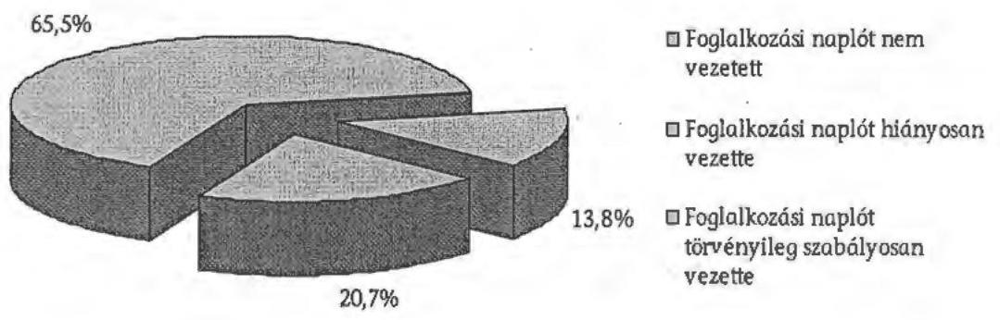

A szakképzési hozzájárulás alapjának meghatározása 16 gazdálkodó szervezetnél nem a jogszabályi előírások alapján történt, amelynek következményeképpen az előírtnál 201,8 millió Ft-tal többet fizettek be. A szakképzésben résztvevő tanulók alap vagy kiegészítő pénzbeli juttatásait tíz gazdálkodó szervezet szabálytalanul állapította meg és fizette ki. A tanulóknak elszámolt pénzbeli juttatások után egy szervezet az előírtnál alacsonyabb összegű járulékot számolt el. A tételes költségelszámolást végző gazdálkodó szervezetek 19,7\%-a sértette meg a szakképzési hozzájárulási tv.-ben megjelölt levonható költségek elszámolására vonatkozó szabályozást. Az átalány költségelszámolást végzők a jogszabályi előírás szerint jártak el.

[^0]
[^0]:    ${ }^{11}$ A gazdálkodó szervezeteknél feltárt szabálytalanságokat a 4. számú melléklet tartalmazza.

---

A késedelmes és nem megfelelő ellenőrzések hozzájárultak az ÁSZ által feltárt hibákhoz. Az ellenőrzések nem voltak eredményesek, ez növeli az állami bevételek beszedésének kockázatát.

Az Állami Számvevőszékről szóló 2011. évi LXVI. törvény 33. § (1) bekezdésében foglaltak értelmében a jelentésben foglalt megállapításokhoz kapcsolódó intézkedési tervet köteles az ellenőrzött szervezet vezetője összeállítani és azt a jelentés kézhezvételétől számított harminc napon belül az ÁSZ részére megküldeni. Amennyiben az intézkedési tervet határidőben nem küldi meg a szervezet, vagy az továbbra sem elfogadható, az ÁSZ elnöke a hivatkozott törvény 33. § (3) bekezdés a)-b) pontjaiban foglaltakat érvényesítheti.

Az ellenőrzés intézkedést igénylő megállapításai és javaslatai:

# a nemzetgazdasági miniszternek 

Az NGM a gazdasági kamaráknak nyújtott támogatások felhasználásának hatékonyságát, a kamarai tv. 34. § (3) bekezdés rendelkezése ellenére évente nem ellenőrizte.

Javaslat:
Ellenőrizze évente a támogatások felhasználásának hatékonyságát a kereskedelmi és iparkamaráknál a gazdasági kamarákról szóló 1999. évi CXXI. törvény 34. § (3) bekezdésével összhangban.

## a vidékfejlesztési miniszternek

A VM a megkötött támogatási szerződésekben az Ámr. 112. § (6) bekezdés h) és k) pontjaiban elrendeltek ellenére nem jelölte meg a bizonylatok megőrzési határidejét, az adatokban bekövetkezett változások támogató felé történő bejelentésének kötelezettségét, a bejelentési kötelezettség elmulasztásának következményeit.

Javaslat:
Intézkedjen, hogy a Magyar Agrárkamarával a támogatási szerződések megkötésekor írják elő az államháztartásról szóló törvény végrehajtásáról szóló 368/2011. (XII. 31.) Korm. rendelet 73. § (1) bekezdése h) és j) pontjaiban meghatározottak szerint a költségvetési támogatás felhasználását alátámasztó bizonylatok teljes körű megőrzésének határidejét, két szerződés esetében az adatokban bekövetkezett változások támogató felé történő bejelentésének kötelezettségét, a bejelentési kötelezettség elmulasztásának következményeit.

## a Magyar Agrárkamara és a Magyar Kereskedelmi és Iparkamara elnökeinek

1.  A támogatás terhére elszámolt megbízások kifizetéseinek teljesítés igazolását a számvitelről szóló 2000. évi C. törvény 167. § (1) bekezdés c) pontja előírásának ellenére a Magyar Agrárkamaránál 39,6\%-nál, a Magyar Kereskedelmi és Iparkamaránál 18,8\%-nál nem támasztotta alá alapdokumentum.

---

Javaslat
a) Írja elő és követelje meg a teljesítésigazolás alapdokumentumait a számvitelről szóló 2000. évi C. törvény 167. § (1) bekezdés c) pontjában előírt a rendelkezés végrehajtása igazolásának és a támogatások célra történő felhasználásának alátámasztása érdekében.
b) Intézkedjen a dokumentummal nem alátámasztott kifizetések esetében az esetleges munkajogi felelősséggel
 kapcsolatos körülmények kivizsgálásáról és annak eredményétől függően hozza meg a szükséges intézkedéseket.
2. Az országos kamarák a szakképzési feladatokra és a békéltető testületek működéséhez nyújtott támogatások felhasználásának ellenőrzési jogát a szerződésekben kikötötték, amelynek keretében az ellenőrzést végző jogosult helyszíni ellenőrzést is végezni. Az ellenőrzés elvégzéséről dokumentum csak a hiánypótlások esetében volt, az elszámolásokat a 2010. és 2011. években dokumentáltan nem fogadták el, a helyszínen nem ellenőrizték a területi kamarákat. A támogatási szerződésekben előírt elkülönített nyilvántartási kötelezettség teljesítéséről az alkalmazott ellenőrzési rendszeren keresztül nem lehetett meggyőződni.

Javaslat:
A támogatási szerződésben biztosított jogával élve ellenőrizze a helyszínen a területi kamaráknak továbbadott támogatások felhasználását, továbbá a pénzügyi elszámolásokat és a szakmai beszámolókat dokumentummal fogadja el.

# a Nemzeti Munkaügyi Hivatal főigazgatójának 

Az NSZFI helyszínen nem ellenőrizte a gazdálkodó szervezetek 2009-2011. évekre vonatkozó bevallásait és elszámolásait. Az NSZFI több éves késedelemmel végzett ellenőrzései nem biztosítják a jogszabályi előírások érdemi érvényesítését. Az ÁSZ által ellenőrzött gazdálkodók 57\%-a sértette meg a jogszabályi előírásokat.

Javaslat:
Ellenőrizze a jogszabályokat sértő 50 gazdálkodó szervezet (a 4. számú mellékletben felsorolt) 2009-2011. évekre vonatkozó szakképzési hozzájáruláshoz kapcsolódó bevallásait és megalapozó nyilvántartásait a szakképzési hozzájárulásról és a képzés fejlesztésének támogatásáról szóló 2011. évi CLV. törvény 32. § (1) bekezdés a) pontja, valamint a Nemzeti Munkaügyi Hivatalról és a szakmai irányítása alá tartozó szakigazgatási szervek feladat és hatásköréről szóló 323/2011. (XII. 28.) Korm. rendelet 4. § (2) bekezdésében foglaltak alapján. Amennyiben egy adott gazdálkodó szervezet tekintetében az ellenőrzés megállapításai felvetik a NAV ellenőrzésének szükségességét, úgy kezdeményezze az adóhatóságnál az ellenőrzés lefolytatását.

---

# a Borsod-Abaúj-Zemplén Megyei Agrárkamara, a Dunaújvárosi Kereskedelmi és Iparkamara, a Jász-Nagykun-Szolnok Megyei Kereskedelmi és Iparkamara, Pest Megyei Agrárkamara elnökeinek 

A számviteli tv. 167. § (1) bekezdés c) pontjának előírását megsértve, négy területi kamara esetében a támogatás terhére elszámolt költségek bizonylatait nem utalványozták.

Javaslat:
Követelje meg a szabályozott utalványozás gyakorlását a számvitelről szóló 2000. évi C. törvény 167. § (1) bekezdés c) pontjában előírt tartalmi követelmény biztosítása érdekében.

## a Dunaújvárosi Kereskedelmi és Iparkamara, Pest Megyei Agrárkamara, Pest Megyei Kereskedelmi és Iparkamara, Veszprém Megyei Agrárkamara elnökeinek

A kapott támogatások és azok felhasználására vonatkozó, a számviteli tv. 161/A. § (2) bekezdésben előírt elkülönített nyilvántartási kötelezettségének négy területi kamara nem tett eleget, ezáltal nem biztosították a közpénzek felhasználásának ellenőrizhetőségét.

Javaslat:
Intézkedjen a számvitelről szóló törvény 161/A. § (2) bekezdése alapján a kapott támogatások és azok felhasználásának elkülönített nyilvántartásáról a közpénzek felhasználásának ellenőrizhetősége érdekében.

## a Borsod-Abaúj-Zemplén Megyei Kereskedelmi és Iparkamara, Pest Megyei Kereskedelmi és Iparkamara, Jász-Nagykun-Szolnok Megyei Kereskedelmi és Iparkamara mellett működő békéltető testület elnökeinek

A békéltető testületek közül három nem küldte meg a fogyasztóvédelmi tv. 36/A. § (1) bekezdésének előírásától eltérően az éves tevékenységéről szóló összefoglaló tájékoztatót a fogyasztóvédelemért felelős miniszternek.

Javaslat:
Küldje meg pótlólag a fogyasztóvédelemért felelős miniszternek a fogyasztóvédelemről szóló 1997. évi CLV. törvény 36/A. § (1) bekezdésében foglaltak szerint a békéltető testület 2009-2011. évekre vonatkozó tevékenységéről elkészített összefoglaló tájékoztatót.

---

# a Budapesti Kereskedelmi és Iparkamara elnökének 

A Budapesti Kereskedelmi és Iparkamaránál a békéltető testület elnöke és elnökhelyettese megbízási díjainak utalványozását és ellenjegyzését a belső szabályozást megsértve ugyanazon személy végezte.

Javaslat:
Intézkedjen a számvevőszéki jelentésben feltárt szabálytalanság tekintetében az esetleges munkajogi felelősséggel kapcsolatos körülmények kivizsgálásáról és annak eredményétől függően hozza meg a szükséges intézkedéseket. Továbbá érvényesítse az utalványozás gyakorlásánál a 10/2005. számú főtitkári utasítás szabályozásában előírtakat.

---

# II. RÉSZLETES MEGÁLLAPÍTÁSOK 

## 1. A GAZDASÁGI KAMARÁK KÖZFELADATAIHOZ BIZTOSÍTOTT FORRÁSOK MEGTERVEZÉSE, AZOK FELHASZNÁLÁSÁNAK ELLENŐRZÉSE

Az NGM és korábban az SZMM a szakképzési feladatokhoz a költségvetési támogatást nem abban a költségvetési fejezetben nevesítve és elkülönítetten tervezték meg, amelyekben feltüntetett költségvetési szervek feladatköréhez kapcsolódóan végzik a gazdasági kamarák közfeladataikat, ezzel megsértették a kamarai tv. 34. § (2) bekezdésének előírását.

A gazdasági kamarák közfeladatai ellátásához kapcsolódó költségvetési támogatást a fejezeteket irányító szervek az ellenőrzött évekre a vonatkozó költségvetési törvényekben nem teljes körűen tervezték meg. A gazdasági kamarák által végzett szakképzéssel összefüggő feladatokhoz forrást a fejezetekben nevesítve és elkülönítve nem terveztek. A feladathoz a forrásokat támogatási szerződések alapján az MPA képzési alaprészéből biztosították. A MAK, szakképzésen kívüli feladataihoz a támogatás az FVM, majd a VM feladatkörében került megtervezésre. ${ }^{12}$ A megállapodáshoz kapcsolódó előirányzathoz a minden feladatra kiterjedő tervezést igazoló, megalapozó számítás nem készült.

A gazdasági kamarák közfeladatait a kamarai tv. 9-12. §-ai tartalmazták. A jelen ellenőrzés a közfeladatok közül a gazdasági kamarák szakképzési feladataihoz és a gazdasági kamarák mellett működő békéltető testületek működéséhez biztosított támogatásának tervezését, felhasználását és ellenőrzését vizsgálta.

A szakképzési feladatok elvégzésére az MPA terhére az MKIK-kel és a MAK-kal megkötött szerződések alapján vállalt kötelezettség együttesen a 2009. évben 1534,7 millió Ft, a 2010. évben 1500,7 millió Ft, a 2011. évben 2011,5 millió Ft volt. Az MPA képzési alaprésze a szakképzés költségeihez való hozzájárulást biztosít a gyakorlati képzéshez, valamint forrásául szolgál a gyakorlati képzés fejlesztésének, valamint a felnőttképzés támogatásának.

A MAK közfeladatainak támogatására 2009-ben 64,4 millió Ft, 2010-ben 64,4 millió Ft, 2011-ben 45,4 millió Ft tervezett összeg állt rendelkezésre a Magyar Agrárkamara, szakképzésen kívüli, állami feladatainak támogatása előirányzatban.

[^0]
[^0]:    ${ }^{12}$ a Magyar Köztársaság 2009. évi költségvetéséről szóló 2008. évi CII. törvény 1. számú mellékletének, XII. fejezetének 10/2/16 szám alatti jogcím csoportjában, a 2009. évi CXXX. törvény 1. számú mellékletének XII. fejezetének 10/2/16 szám alatti jogcím csoportjában, a 2010. évi CLXIX. törvény 1. számú mellékletének XII. fejezet 20/3/16 szám alatti jogcím csoportjában

---

Az MPA képzési alaprészén belül tervezett szakképzési célú feladatokhoz a döntés-előkészítő, tervezési feladatokat a szakképzési hozzájárulási tv. 12. § (1) bekezdésében foglaltak alapján a Nemzeti Szakképzési és Felnőttképzési Tanács (NSZFT) látta el. A gazdasági kamarák benyújtott kérelmeit a minisztérium szakképzésért felelős főosztálya ${ }^{13}$ szakmai és pénzügyi szempontból felülvizsgálta és az NSZFT elé terjesztette. Az NSZFT állásfoglalásait figyelembe véve, a szakképzési hozzájárulási tv. 11. § (2) és 14. § (7) bekezdéseiben foglalt felhatalmazás alapján rendelkezett a miniszter a támogatási szerződés megkötéséről, a jóváhagyott támogatási összeg NSZFI számlájára helyezéséről. Fenti döntések alapján kötötték meg az MKIK-kel és a MAK-kal a támogatási szerződéseket, melyekben támogatóként az NSZFI szerepelt.

A gazdasági kamarák mellett működő békéltető testületek működtetéséhez a forrást a 2009. és 2010. évi költségvetési törvényekben ${ }^{14}$ évente 375,0 millió Ft összegekben, a 2011. évi költségvetési törvényben 300,0 millió Ft összegben irányozták elő. A békéltető testületek működtetésére biztosított költségvetési forrást az előző évi ügyszám figyelembevételével, a fogyasztóvédelemi tv. 18. § (3) bekezdésében foglalt rendelkezésnek megfelelően tervezték meg. A központi költségvetésben tervezett forrás a szakmai és pénzügyi beszámolók szerint az ellenőrzött évek mindegyikében fedezetet nyújtott a békéltető testületek működésére.

Az országos gazdasági kamarák közfeladat ellátásával kapcsolatos támogatási szerződéseit a szakképzési területen az NSZFI, a további közfeladatoknál (pl. a mezőgazdaság területi igazgatásának és szabályozásának támogatása) az illetékes minisztériumok a VM kivételével, az NSZFI az államháztartás működési rendjéről szóló 292/2009. (XII. 19.) Korm. rendelet (Ámr.) 112. § (6) bekezdésében előírt általános szabályok szerint kötötték meg. Az Ámr. 2010. január 1-jei hatálybalépését megelőzően ${ }^{15}$ a korábbi szabályozás a támogatási szerződésekkel kapcsolatos tartalmi előírásokat nem fogalmazott meg.

A 2009-2011. években - az ellenőrzött időszakra vonatkozóan - a MAK-kal és az MKIK-kel az adott évi szakképzési feladatai ellátására, továbbá az MKIK-kel munkaerő piaci szereplők iskolarendszerű szakképzés koordinációs feladataira az NSZFI kötötte meg a támogatási szerződéseket. Az MKIK-kel a békéltető testületek működtetésére az SZMM, majd az NGM kötötte meg a támogatási szerződéseket.

A VM a költségvetési támogatási szerződéseket, 2010-2011. években az Ámr. 112. § (6) bekezdésében megjelölt tartalmi előírások alapján kötötte meg, de a bizonylatok megőrzési határidejét, két szerződés esetében az adatokban bekövetkezett változások támogató felé történő bejelentésének kötelezettséget, a bejelentési

[^0]
[^0]:    ${ }^{13}$ SZMM Felnőttképzési és Szakképzési Főosztálya, NGM Szakképzési és Felnőttképzési Főosztálya
    ${ }^{14}$ a Magyar Köztársaság 2009. évi költségvetéséről szóló 2008. évi CII. törvény és a Magyar Köztársaság 2010. évi költségvetéséről szóló 2009. évi CXXX. törvény 1. számú mellékletének XXVI. fejezetének 16/42/1 szám alatti jogcím csoportjában, Magyar Köztársaság 2011. évi költségvetéséről szóló 2010. évi CLXIX. törvény 1. számú mellékletének XV. fejezetének 25/14/1/1 szám alatti jogcímében
    ${ }^{15}$ az államháztartás működési rendjéről szóló 217/1998. (XII. 30.) Korm. rendelet

---

kötelezettség elmulasztásának következményeit nem nevesítette a szerződésekben.

A nem szabályozott kérdéseknél a szerződések az Ámr., valamint a polgári törvénykönyvről szóló 1959. évi IV. törvény ide vonatkozó előírásainak érvényesítését írták elő. Az államháztartásról szóló törvény végrehajtásáról szóló 368/2011. (XII. 31.) Korm. rendelet 73. § (1) bekezdése azonos módon szabályozza a támogatási szerződések tartalmát 2012. január 1-jétől.

A gazdasági kamaráknak nyújtott költségvetési támogatások felhasználását az NGM, a VM és az NSZFI ellenőrizték. Azonban a kamarai tv. 34. § (3) bekezdésében foglaltaktól eltérően az NGM és a VM a nyújtott támogatások felhasználásának hatékonyságát nem ellenőrizték ${ }^{16}$. A minisztériumok a kamarák által ellátott és ellenőrzött közfeladatok - a békéltető testületek működtetése és a gazdasági kamarák által ellátott szakképzési - ellátása hatékonyságának méréséhez mutatószámokat nem alakítottak ki. Továbbá a kamarai tv. 34. § (4) bekezdés előírása ellenére nem készítettek elemzést annak alátámasztására, hogy a jogszabályban meghatározott és a szerződésekkel megbízott, támogatott közfeladatokat a gazdasági kamarák költséghatékonyan látták-e el.

A gazdasági kamaráknak az MPA képzési alaprészének terhére nyújtott támogatások felhasználásának ellenőrzését az NSZFI ${ }^{17}$ végezte.

Az NSZFI az országos kamarák által megküldött szakmai és pénzügyi beszámolókat a támogatás elszámolásakor megküldött dokumentumok alapján ellenőrizte. Az NSZFI az elszámolásokban tapasztalt pontatlanságok miatt a támogatottat hiánypótlásra szólította fel, ennek teljesítését követően állapította meg a jogszerűen felhasznált támogatás és a maradvány összegét. Az NSZFI utólag, helyszíni ellenőrzés keretében is ellenőrizte a támogatások célnak megfelelő és szabályszerű felhasználását.

A megküldött dokumentumok felülvizsgálata alapján az NSZFI a MAK-kal kötött 2009. évi szakképzési feladatokra biztosított támogatásból 1,4 millió Ft összeget szerződésben rögzítettektől eltérő felhasználás, a 2011. évi feladatokhoz biztosított támogatásokból 0,9 millió Ft összeget programfeladat elmaradás miatt követelt vissza.

Az NSZFI 2009-2011. években egy a MAK és hat az MKIK részére a 2007., valamint 2008. évi szakképzéssel összefüggő feladatok ellátásához nyújtott támogatás felhasználását ellenőrizte összesen 5629,7 millió Ft értékben. A helyszíni ellenőrzés alapján a felhasznált támogatások 0,69\%-át, 38,7 millió Ft-ot nem fogadott el szabályszerű felhasználásnak. Az NSZFI a szabálytalan felhasználásnak minősített összeg visszafizetéséről realizáló levélben rendelkezett. Az ellenőrzések során jellemző hibaként a támogatottak a megbízási szerződések teljesítését nem

[^0]
[^0]: 
   ${ }^{16}$ A Magyar Agrár-, Élelmiszergazdasági és Vidékfejlesztési Kamaráról szóló 2012. évi CXXVI. törvény az agrárkamarákra vonatkozóan költségvetési támogatás felhasználása és hatékonysága ellenőrzését 2012. augusztus 1-jétől nem ír elő.
    ${ }^{17}$ A szakképzési hozzájárulási tv. és a végrehajtására kiadott 13/2008. (VII. 22.) SZMM rendelet 31. § d) pontja, valamint 2011. augusztus 25 -ig a 24/2007. (MiK. 10.) SZMM utasítás, 2011. augusztus 27-étől a 27/2011. (VIII. 25.) NGM utasítás 6. § (12) bekezdése alapján.

---

tudták bemutatni, a munkába járás költségeit szabálytalanul számolták el, a bizonylatok többségére nem vezették az adott támogatás terhére történő elszámolás záradékát.

A helyszíni ellenőrzés során az NSZFI megállapította továbbá, hogy az elkülönített nyilvántartást a támogatottak megvalósították, valamint azt, hogy a közbeszerzési előírásokat betartották.

Az SZMM, majd 2010. május 29-étől az NGM a békéltető testületek működtetéséhez nyújtott támogatások célnak megfelelő és szabályszerű felhasználását csak dokumentumok alapján ellenőrizte, az ellenőrzött években hiányosságot nem állapítottak meg. A békéltető testületek működéséhez biztosított és felhasznált támogatásokat a támogató minisztériumok a helyszínen nem ellenőrizték.

Az FVM, majd a VM az agrárkamarának nyújtott költségvetési támogatások a támogatási szerződések szerinti szakmai és pénzügyi beszámolásának megfelelőségét, a források célszerinti felhasználását a megküldött dokumentumok alapján, egy esetben helyszínen is ellenőrizte. A szakmai beszámolók elfogadása megtörtént, egy esetben az elszámoláshoz további kiegészítéseket kért. A VM 2011 márciusában végzett helyszíni ellenőrzésével az FVM irányítása alatt álló intézmények és a MAK között megkötött szerződéseket vizsgálta. Az ellenőrzés a MAK intézményekkel megkötött szerződései, illetve a Mezőgazdasági és Vidékfejlesztési Hivatal és a MAK között létrejött hatósági szerződésben szereplő feladatok finanszírozása között átfedést vizsgálta. Az ellenőrzés nem állapított meg átfedést a feladatokban, így a finanszírozásban sem.

# 2. AZ ORSZÁGOS GAZDASÁGI KAMARÁK KÖZFELADATELLÁTÁSA 

### 2.1. A Magyar Kereskedelmi és Iparkamara közfeladatellátása

### 2.1.1. A közfeladat ellátásának kialakítása

Az MKIK a kamarai tv. 12. § (1) bekezdés e) pontjában előírtaknak megfelelően kialakította a békéltető testületek működtetésével és a szakképzéssel összefüggő nyilvántartások egységes rendszerét, a szakképzési közfeladat ellátásának egységes rendjét. Az MKIK a kamarai tv. 12. § (1) bekezdés h) pontjában előírtak szerint a közfeladat ellátásához kapott közpénz elosztásának elveit az országos és területi kamarák viszonylatában meghatározta.

A szakképzés területén az MKIK XVII. Küldöttgyűlése 18/2004. (IV. 28.) határozatával fogadta el az MKIK Szakképzési Önkormányzati szabályzatát. Ennek 4. §-a alapján kialakította az Internet alapú Szakképzési Integrált Információs Rendszert (ISZIIR), amelynek használatát a megyei kamarákkal kötött szerződések is előírták. Az ISZIIR-ben valósul meg a szakképzési közfeladatellátásával kapcsolatos nyilvántartások és elszámolások vezetése.

Az önkormányzati szabályzat 10. §-a előírta, hogy a gyakorlati képzőhelyek ellenőrzését és akkreditációját a kamarai szakértői névjegyzékben szereplő külső szakértők végezhetik. A 11. § szerint az Oktatási és Szakképzési Kollégium szabályozta a névjegyzékbe kerüléshez szükséges végzettségi, képzettségi előírásokat. A

---

szabályzat 35. §-ában előírta, hogy a szakmai vizsgáztatásnál a vizsgabizottság munkájában csak a szakmai elméleti tantárgyak oktatásához, illetve a gyakorlati képzés ellátásához előírt képesítéssel rendelkező vehet részt. A 40. § szerint a vizsgabizottsági tagokat az országosan egységes kamarai szakértői bázisból kellett kijelölni.

Az ISZIIR rendszer 2005 óta működik, azóta folyamatosan bővül a nyilvántartás. A rendszerben nyilvános adatként rögzített a vizsgák száma, a bejelentett vizsgázók száma az MKIK kezelésében lévő szakmák esetében, a gyakorlati szintvizsga általános szabályai, a mesterképzési és mestervizsga szabályai, a szakmai és vizsgakövetelmények, a gyakorlati képzést végző gazdálkodó szervezetek és a képzőhelyeik száma, a tanulószerződések száma.

Az MKIK a szakképzési feladatoknál a területi kamarák által szolgáltatott adatok alapján, feladatarányosan osztotta fel a várható költségvetési támogatást. Az MKIK elnöksége mindegyik évben az előterjesztésben foglaltak szerint fogadta el az elosztás elveit.

Az MKIK a szakképzési tv. 7. § (1) bekezdésben előírtak és a szakképesítésért felelős miniszterrel létrejött megállapodás alapján a szakmai és vizsgakövetelmények kidolgozását az ellenőrzött években elvégezte. Az MKIK 2007. május 24-én fogadta el a Mesterképzési és Mestervizsga Szabályzatot, amelyet 2011. június 1-jén hatályba lépett új szabályzatával megújított.

Az MKIK és az SZMM között létrejött megállapodás 2009-ben 26 szakképesítés, az NGM-mel 2010-ben kötött megállapodás további 99 szakképesítés gondozását írta elő. Az MKIK a részére átadott szakmákra kidolgozta - együttműködve az országos gazdasági érdekképviseleti szervezetekkel - a szakmai és vizsgakövetelményeket a megállapodás szerint, majd azokat a miniszter elé terjesztette. A feladat ellátásához minden évben az NSZFI-vel kötött támogatási szerződés biztosított forrásokat.

Az MKIK a gyakorlati szintvizsgák országos rendszerét a területi kamarákkal megkötött megbízási szerződések alapján egységes rendben működtette, kialakította a szintvizsgáztatás finanszírozásának egységes szabályait.

A szintvizsgán részt vett tanulónként a szerződések az elszámolható maximális díjat határozták meg. A díj tartalmazta a szintvizsgáztatásban résztvevők díjazását, a területi kamara szervezési költségeit. Az MKIK és a területi kamarák közötti megbízási szerződésben rögzítették a szintvizsgán résztvevő tanulók számát.

A kamarai tv. 13. § (2) bekezdésben és a szakképzési tv. 7. § (5) bekezdésében foglaltaknak megfelelően az MKIK 2003 decemberében megállapodást kötött hét országos gazdasági érdekképviseleti szervezettel ${ }^{18}$ a szakképzésben való együttműködésről. A megállapodásokat a területi kamarák is aláírták, ami rögzítette a feladatok ellátásának módját.

[^0]
[^0]:    ${ }^{18}$ Általános Fogyasztási Szövetkezetek és Kereskedelmi Társaságok Országos Szövetsége, Magyar Iparszövetség, Vállalkozók és Munkáltatók Országos Szövetsége, Ipartestületek Országos Szövetsége, Munkaadók és Gyáriparosok Országos Szövetsége, Kereskedők és Vendéglátók Országos Érdekképviseleti Szövetsége, Stratégiai és Közszolgáltató Társaságok Országos Szövetsége

---

Az együttműködés alapján létrejött az Országos Szakképzési Együttműködési Bizottság, amely koordinálta az elvégzendő feladatokat, elvégezte az Országos Szakképzési Tanács elé kerülő szakképzéssel kapcsolatos előterjesztések véleményezését, javaslatokat fogalmazott meg az ellenőrzött időszakban a szakképzési tv. 5. § (2) bekezdés a) és e) pontjában foglalt kérdésekben. Az MKIK 2007. június 9-én megállapodott az érdekképviseleti szervezetekkel a szakképzési tv. 5. § (2) bekezdés e) pontja és a 7. § (1) bekezdésében előírt vizsgabizottsági tag kiválasztásának módjáról.

Az MKIK a területi gazdasági kamarák mellett működő békéltető testületek munkájához kapcsolódó, évenként megkötött támogatási szerződésekben rögzítette a vezetendő nyilvántartások körét. A fogyasztóvédelmi tv. 37/A. § (2) bekezdésében előírtaknak tartalmilag megfelelően elérhető az MKIK honlapján a békéltető testületek honlapja.

A fogyasztóvédelmi tv. 18. § (2) bekezdése értelmében a békéltető testület a megyei (fővárosi) kereskedelmi és iparkamarák mellett működő független testület. A kamarai tv. 10. § (1) bekezdés i) pontja alapján a területi gazdasági kamarák feladata a békéltető testületek működtetése.

Az elnökség mindhárom évben tárgyalta és jóváhagyta a békéltető testületek részére nyújtandó költségvetési támogatások felosztására vonatkozó határozati javaslatot. Az tartalmazta az előző évi ügyek arányában és az infrastruktúra fejlesztésére egyenlő mértékben a területi kamarák közti elosztás elveit. A támogatási szerződések az MKIK részére is nevesítettek feladatokat ${ }^{19}$, továbbá megjelölték az MKIK-et közreműködői tevékenysége ellentételezésére megillető támogatás arányát (3%).

A békéltető testületek eljárásának szabályait a fogyasztóvédelmi tv. tartalmazza. A fogyasztóvédelmi tv. 37. § (2) bekezdésében biztosított lehetőség ellenére a békéltető testületek egységes gyakorlatának kialakítása érdekében országos eljárási szabályzat nem készült.

# 2.1.2. A támogatások felhasználása, elszámolása 

Az MKIK-nél a támogatások célra történő felhasználás alátámasztása a teljesítést igazoló dokumentumok hiánya miatt teljes körűen nem valósult meg.

A szakképzéssel összefüggő feladatok ellátására az MKIK a 2009-2011. években 5397,7 millió $\mathrm{Ft}^{20}$ támogatásra kötött szerződést. A szerződések értelmében, a támogatások célja a szakképzés finanszírozása volt. A támogatási szerződések meghatározták az MKIK és a területi kamarák szakképzéssel összefüggő konk-

[^0]
[^0]:    ${ }^{19}$ 2009-ben egységes informatikai és ügyviteli rendszer kialakítása, országos eljárási szabályzat kidolgozása, országos konferencia megszervezése, kiadvány elkészítése a békéltető testületek tevékenységéről.
    ${ }^{20}$ Az NMH tanúsítványi adatszolgáltatása alapján. A szerződött támogatás összegében a 2011. évben a 2012. évi feladatellátáshoz biztosított összeg nem szerepel.

---

rét feladatait és a feladat ellátásához kapcsolódó forrásokat. Az MKIK ebből 2945,9 millió Ft támogatást adott tovább ${ }^{21}$ a kialakított rend szerint.

Az MKIK a támogatásokat a tanulószerződéssel kapcsolatos tanácsadási tevékenységre, a gazdálkodó szervezetek által folytatott gyakorlati képzés kétszintű ellenőrzésére, a gyakorlati szintvizsgáztatásra, a hazai és nemzetközi szakmai versenyek, a szakmai záróvizsgák elnöki és tagi delegálásának lebonyolítására, a szakmai vizsgaelnökök és vizsgabizottsági tagok felkészítésére, az iskolarendszerű szakképzési koordinációjára, a gazdasági érdekképviseletek felkészítésére kapta.

A szabályszerűségi ellenőrzés az MKIK-nél az éves szakképzési feladatok ellátásán belül négy részfeladatra (szakképesítések gondozása, gyakorlati szintvizsgák működtetése, hazai szakmai versenyek, nemzetközi versenyek) terjedt ki.

Az MKIK támogatott feladata volt egyrészt a szakképzési tv. 7. § és a létrejött megállapodások alapján a szakképesítések átvilágítása, gondozása. A szakképzési támogatási szerződések alapján mindhárom évben az MKIK ellátta a gyakorlati szintvizsgák országos rendszerének működtetésével kapcsolatos szervezési, koordinációs, ellenőrzési és adminisztrációs feladatokat is. Az MKIK szervezte a Szakma Kiváló Tanulója Versenyt és a Szakma Sztár Fesztivált a nappali tagozaton végző tanulók számára. További feladata volt a Worldskills - Euroskills nemzetközi versenyek működtetése. Az európai illetve a világ-versenyekre felváltva, két évenként került sor, ahol a világ fiataljai összemérhetik szakmai tudásukat, tapasztalatot szerezhetnek.

Az MKIK a szakképzési feladatok ellátása érdekében egyes munkavállalóit megbízási vagy vállalkozási szerződéssel létrehozott jogviszony keretében is foglalkoztatta, amelyet a támogatási szerződések nem tiltottak. Az ÁSZ ellenőrzés a foglalkoztatás dokumentumainak hiányosságait, továbbá a munkakörök és megbízások közti átfedéseket állapított meg. Az MKIK 2009-ben három, 2010-ben és 2011-ben hét-hét olyan kifizetést számolt el, amelyekre 8,4 millió Ft értékben kötött megbízási szerződéseiben az előírt feladatok a munkaköri feladatok között is szerepeltek (versenyek megrendezésével összefüggő feladatok, pénzügyi elszámolások készítése, koordinálás, szakterületi vezetőknek irányítási, ellenőrzési, koordinálási feladatok).

A megbízási szerződések kifizetéseinek 18,8\%-ához, 11,3 millió Ft összegben nem kapcsolódott teljesítést alátámasztó dokumentum ${ }^{22}$, így a teljesítés, ezáltal a támogatás célra történő felhasználás nem volt alátámasztott.

Az ellenőrzött évek elszámolásainál a 133 elemű mintából 25 kifizetésnél a teljesítésigazolás mellett nem volt azt alátámasztó dokumentum.

Az SZMM, 2011. évtől az NGM a békéltető testületek működésére összesen 1050,0 millió Ft összegben kötött támogatási szerződést az MKIK-kel, amelynek 95,3\%-át az országos kamara továbbadta a területi kamaráknak. Az MKIK a

[^0]
[^0]:    ${ }^{21}$ az MKIK tanúsítványi adatszolgáltatása alapján
    ${ }^{22}$ A gazdasági kamarákra nincs szabály arra, hogy a teljesítés igazolása során ellenőrizhető okmányok alapján ellenőrizni és igazolni kell a kiadások teljesítésének jogosságát, összegszerűségét.

---

szerződésben megjelölt feladatai ellátására összesen 49,5 millió Ft-ot használt fel ${ }^{23}$.

A területi kamarák között a fogyasztóvédelmi tv. 18. § (3) bekezdésben elrendeltekkel összhangban - az MKIK részére megjelölt feladatok támogatásának levonása után fennmaradó részt - a békéltető testületek által az előző évben tárgyalt ügyek számarányában osztotta meg. Szerződéses célhoz nem igazodó felhasználást az ellenőrzés nem állapított meg.

A támogatások felhasználása során az MKIK-nél közbeszerzési eljárás lefolytatására nem került sor. Nem volt olyan árubeszerzés és szolgáltatás igénybevétel, amely a közbeszerzési értékhatárt meghaladta volna a támogatások felhasználásának ellenőrzése alapján.

Az MKIK a támogatásokkal a szerződésekben rögzített formában és tartalommal számolt el a támogatók felé. Az elszámolási határidőt - a békéltető testületek támogatásai kivételével - betartotta. Az MKIK a békéltető testületek működéséhez kapcsolódó támogatásokkal minden évben a szerződésben megjelölt határidőn túl számolt el. A támogató a késedelmes megküldést dokumentáltan nem kifogásolta.

Az MKIK a békéltető testületek működéséhez kapott 2009. évi támogatásokkal 2010. február 15. helyett március 12-én, a 2010. évi támogatásokkal 2011. február 28. helyett március 6-án, a 2011. évi támogatásokkal 2012. február 27. helyett március 7-én számolt el.

Az MKIK a támogatások felhasználását a számlákon szerepeltetett teljesítésigazolással dokumentálta, elszámolása során betartotta a támogatási szerződésben foglalt követelményeket és a jogszabályi előírásokat. A támogatások felhasználása során a jogszabályi és a belső szabályzata ${ }^{24}$ előírásaival összhangban számolta el és fizette ki a támogatások terhére a megbízási díjakat, a költségtérítéseket és természetbeni juttatásokat. A támogatási szerződésekben rögzített tájékoztatási kötelezettségének az MKIK eleget tett.

A tájékoztatást az MKIK a szerződések alapján, a kiadványokon, szórólapokon, a kiadott Szakma Kiváló Tanulója Verseny (SZKTV) CD-n, a rendezvények meghirdetésénél végezte, a támogató és a támogatás forrásának feltüntetésével.

Az MKIK támogatásokra és azok felhasználására vonatkozó nyilvántartása megfelelt a számviteli tv. 161/A. § (2) bekezdése, illetve a támogatási szerződések előírásainak. A pénzügyi elszámolás a számviteli tv. 167. § (1) bekezdése szerinti alaki-tartalmi kellékekkel rendelkező számviteli bizonylatokkal dokumentált volt. A támogatás terhére elszámolt költségek elszámolási rendszerének kialakítása, dokumentáltsága biztosította az elvégzett feladatok ellenőrizhetőségét a számviteli tv. 161/A. § (2) bekezdése szerint. A kialakított nyilvántartási és elszámolási rendszer biztosította a bizonylatok többszöri elszámolásának kizárását. A maradványok, illetve a többletköltség kimutatása, valamint a maradvány pénzügyi rendezése szabályszerű volt.

[^0]
[^0]:    ${ }^{23}$ az NMH és az MKIK tanúsítványi adatszolgáltatásai alapján
    ${ }^{24}$ az 5/2005. számú Főtitkári Utasítás

---

Az elszámolást alátámasztó dokumentumok, számviteli bizonylatok megőrzéséről az MKIK a támogatási szerződésekben és a számviteli tv. 169. §-ában elrendeltek szerint gondoskodott.

# 2.1.3. A támogatások felhasználásának kontrollja 

Az MKIK tevékenységét és működését a jogszabályi előírásokon túl alapvetően az alapszabály és az SZMSZ határozta meg. Az ellenőrzött időszakban az MKIK belső szabályzataiban a költségvetési támogatások felhasználásának és ellenőrzésének rendjét külön nem szabályozták. Az MKIK választott tisztségviselőinek és a - költségvetési támogatás szabályszerű felhasználása érdekében - munkatársainak végzettségére vonatkozó előírásokat sem az alapszabály, sem egyéb belső szabályzat nem tartalmazott, azokat csak a meghirdetett pályázatokban írták elő.

Az MKIK a feladatai megvalósításához szükséges humánerőforrás biztosításának követelményei között a feladatok ellátásához szükséges létszámot meghatározta.

Az MKIK a szakképzéssel összefüggő kamarai feladatok ellátásához igénybe vett külső szakértők megbízásának pénzügyi feltételeit az NSZFI-vel megkötött szerződések szabályozták és biztosították.

A szerződések alapján az MKIK által kiírt pályázatok tartalmazták a pályázókkal szemben támasztott iskolai végzettség szintjére és szakirányára, munkatapasztalatra, számítógépes ismeretre, a munkahelyi kompetenciákra vonatkozó követelményeket, külső szakértőnél előírás volt a kamarai vagy érdek-képviseleti tag ajánlása.

Az MKIK az ellenőrzött három évben előírta a tisztségviselők ${ }^{23}$ összeférhetetlenségére vonatkozó szabályokat, ami megfelelt a kamarai tv. 16. § (1) bekezdés s) pontja és a 27. § előírásainak. Az MKIK a munkaviszonyban állókra összeférhetetlenségi szabályokat belső szabályzatban nem írt elő, csak a munkaszerződésekben rögzítették, hogy „a Munkavállaló további munkaviszonyának létesítése szempontjából összeférhetetlennek minősül a más gazdasági kamaráknál létesített munkaviszony."

Az MKIK a közfeladatai ellátásához kapott költségvetési támogatások felhasználásának kontrollrendszerét csak részlegesen, egy-egy kontroll elem megjelölése mellett alakította ki. A belső szabályzatok kontroll elemként jelölték meg az ellenőrzési felelősöket, vagy ilyen funkciót töltött be a számviteli tv. 167. § (1) bekezdés c) pontjában előírt tartalmi elemek - az utalványozó és a rendelkezés végrehajtását igazoló személy, mint a teljesítést igazoló aláírása - biztosítása érdekében elvégzett tevékenység. A költségvetési támogatás felhasználásáról szóló szakmai beszámoltatás, beszámolás és a pénzügyi elszámolás felelőseit, illetve dokumentumait a támogatási szerződések határozták meg.

A megjelölt kontroll elemek hiányos működése mellett nem volt biztosított a támogatások szabályszerű felhasználása és elszámolása. Ezért fordulhatott elő

[^0]
[^0]:    ${ }^{23}$ A kamarai tv. 27. § (1) bekezdése szerint az elnök, az alelnök, az ellenőrző illetve az etikai bizottságok elnökei, a főtitkár és a titkár.

---

a békéltető testületek támogatásával való késedelmes elszámolás, a teljesítést alátámasztó dokumentumok hiánya. Az MKIK a kapott támogatások felhasználásának ellenőrzéséről részlegesen gondoskodott.

Az MKIK SZMSZ-ének 73. b) pontjában a vezető jogtanácsos feladatköreként rögzítették a békéltető testületek működésére nyújtott költségvetési támogatás felhasználásra vonatkozó szakmai beszámolók és pénzügyi elszámolások ellenőrzését. A vizsgált időszakra vonatkozóan azonban a vezető jogtanácsos által elvégzendő ellenőrzésekről dokumentum nem állt rendelkezésre.

A békéltető testületek működésére, illetve a 2011. június 1. és november 30. közötti időszak szakképzési feladatainak ellátására kapott támogatások beszámolóit az MKIK felkérésére független könyvvizsgáló vizsgálta felül a támogatási szerződésekben előírtak alapján. A könyvvizsgáló az ellenőrzött támogatásokkal kapcsolatban nem tárt fel céltól eltérő felhasználást, nyilvántartásra vonatkozó hiányosságokat, a támogatás terhére elszámolt költségek dokumentáltságára vonatkozó szabálytalanságot.

Az MKIK-nél kontroll elem volt a támogatások felhasználása során teljesített kifizetéseknél alkalmazott szabályozott utalványozás. Az összeférhetetlenségi szabályok kijelölésének hiánya miatt, nem biztosította a szabályozás az utalványozás ellenőrzési funkcióját az MKIK 100%-os tulajdonában álló Szolgáltató Nonprofit Kft. által történő teljesítéseknél. Az MKIK-nél a kifizetések utalványozását ${ }^{26}$ a pénz- és értékkezelési szabályzat szerint a főtitkár végezte. A főtitkárt távollétében az utalványozásnál az MKIK koordinációs és marketing igazgatója (egyben főtitkár helyettes) helyettesítette, aki egyben az MKIK 100 %-os tulajdonában lévő Kft. ügyvezetője (képviselője) is. Emiatt a 2009. évi elszámolások között hat olyan tétel került kifizetésre összesen 10,4 millió Ft számla értékben, ahol az MKIK részéről az utalványozó és a kft. részéről a számlakibocsátó ugyanazon személy volt. Az ÁSZ ellenőrzés jogosulatlan kifizetést nem tárt fel.

Az ellenőrzött időszakban az MKIK az általa továbbadott támogatások elszámoltatásának rendjét a támogatási szerződésekben rögzítette. A hibák kizárása érdekében az MKIK a továbbadott támogatásokra - évente, támogatás fajtánként eltérő - típusszerződéseket készített. Az elkészített típusszerződések tartalmukban összhangban álltak a továbbadott támogatás forrását megjelölő szerződéssel.

A támogatottak az MKIK felé a támogatásokkal a támogatási szerződésekben előírt módon és tartalommal számoltak el. Az elszámolások szakmai és pénzügyi beszámolók elkészítésével, valamint az ISZIIR rendszerben történő elszámolással valósultak meg. Az ISZIIR rendszerben az elszámolás pontos dátuma azon esetekben, amikor a támogató hiánypótlást kért nem volt megállapítható. Ennek oka az, hogy az alkalmazott rendszer az elszámolást követő utolsó hiánypótlás dátumát rögzíti, nem pedig az elszámolás eredeti időpontját. Az MKIK a továbbadott támogatások felhasználásával kapcsolatosan helyszíni ellenőrzést a támogatott szervezeteknél nem végzett. A pályázatok elszámolásának kontrollálása csak az ISZIIR rendszeren keresztül történt. Nem megfelelő

[^0]
[^0]:    ${ }^{26}$ Az MKIK-nél az utalványozás a kifizetés engedélyezését jelentette.

---

elszámolás esetén az MKIK a hiba lista megadása mellett - a vett minta alapján - írásban hiánypótlásra szólította fel a támogatottakat. Az elszámolások elfogadásáról az MKIK a támogatottakat írásban nem értesítette.

Az MKIK-et támogatók részéről a támogatások elszámolása szabályosságának bizonylat mélységű tételes, helyszíni ellenőrzésére csak a 2011. évben, a 2009. évi szakképzési feladatok ellátására kapott támogatásoknál került sor. Az NSZFI által megbízott cég jegyzőkönyvben dokumentálta az ellenőrzést, amely szabályszerűnek minősítette az elszámolást.

# 2.2. A Magyar Agrárkamara közfeladat ellátása 

### 2.2.1. A közfeladat ellátásának kialakítása

A MAK a kamarai tv. 12. § (1) bekezdés e) pontjában előírtaknak megfelelően kialakította a szakképzéssel összefüggő nyilvántartások egységes rendszerét.

A MAK által kialakított Tanulószerződések Információs Rendszerében (TAIR), mint kialakított nyilvántartásban a területi agrárkamarák a tanulószerződések adatait rögzítették. Ezen túl az egységes rendszer biztosítására a MAK iratmintatárat működtetett pl. tanulószerződések és határozatok mintáival. A 2012. évtől a tanulószerződések és az együttműködési megállapodások nyilvántartása is az online rendszerben történik.

A MAK a kamarai tv. 12. § (1) bekezdés h) pontjában előírtak szerint a szakképzési feladatok ellátásához kapott közpénzek területi kamarák közötti elosztásának elveit meghatározta. Az agrárkamarák mellett békéltető testületek nem működtek.

A szakképzési közfeladat ellátása kapcsán a MAK az NSZFT, illetve végső döntésre a szakképzésért felelős miniszter részére előterjesztést készített. Az előterjesztés tartalmazta az országos és területi kamarák közötti elosztás elveit.

A kamarai tv. 12. § (1) bekezdés i) pontjával összhangban a MAK kidolgozta és elfogadta a vizsgaelnöki delegálás eljárás rendjéről, a versenyszervezésről a szabályzatot, valamint egységes támogatási szerződéseket dolgoztak ki az egységes eljárásrendek érdekében. A szakképzési tv. 7. § (1) bekezdésének rendelkezése alapján a MAK a szakmai egyeztetés során véleményezőként részt vett a szakmai vizsgakövetelmények kidolgozásában.

A szakképzési közfeladat keretében 2009-ben még az FVM delegálta a vizsgaelnököket. Az FVM és a MAK 2010. március 31-én szerződést kötött, amely alapján az FVM a MAK részére közfeladatként átadta 2010. április 1-jét követően 45 szakképesítésnél a szakmai vizsga elnökeinek kijelölési jogát, a szakmai és vizsgakövetelmények kidolgozását, gondozását és e szakképesítéseknél a javaslattételi lehetőséget. A szerződés tartalmazta a kamara feladat ellátásának módját.

A MAK a szakmai vizsgakövetelmények véleményezéshez elkészítette az általános mezőgazdaság, az élelmiszeripar, az erdész, a földmérő, a kertészet szakmai csoportokra a követelményeket. A MAK az ellenőrzött időszakban az agrárképzéseknél nem végzett szintvizsga előkészítési és szervezési tevékenységet, mert a 8/2008.(I. 23.) FVM rendelet értelmében nem volt szintvizsga szervezési kötelezettség.

---

A kamarai tv. 13. § (2) bekezdésben és a szakképzési tv. 7. § (5) bekezdésében foglaltak szerint a MAK több megállapodást készített elő az országos gazdasági érdekképviseleti szervezetekkel ${ }^{27}$ a szakképzésben való együttműködésről 2010 márciusa és 2011 novembere között, de a megállapodások megkötésére nem került sor. A megállapodások hiányában a szakképzési tv. 14. § (2) bekezdésében foglaltaktól eltérően ${ }^{28}$ nem az érdekképviseleti szervekkel együttműködve vett rész a szakmai vizsgabizottsági tagok kijelölésében. A megállapodások hiányában, a jogszabályi felhatalmazástól eltérően, a területi kamarák kötöttek helyben a helyi érdekképviseletekkel megállapodásokat a vizsgabizottsági tagok delegálására.

# 2.2.2. A támogatások felhasználása, elszámolása 

A MAK-nál a támogatások célra történő felhasználás alátámasztottsága a teljesítést igazoló dokumentumok hiánya miatt teljes körűen nem valósult meg.

A MAK ellenőrzött szakképzési és egyéb közfeladataihoz az NSZFI-től, a VM-től (illetve jogelődjétől) együttesen 608,0 millió Ft támogatásban részesült ${ }^{29}$. Az NSZFI-vel szakképzési feladatokra 423,1 millió Ft támogatásra kötött szerződést. A VM-mel és annak jogelődjével a MAK 184,9 millió Ft címzett és szakképzési feladatokhoz kapcsolódó támogatásra szerződött. Ezen felül az MKIK-kel is kötött szakképzési feladatokra további 59,9 millió Ft támogatásra szerződést ${ }^{30}$. A kapott támogatásokból a MAK továbbadott a területi kamaráknak 171,8 millió Ft-ot. A támogatások felhasználásáról készített beszámolókat a támogatók befogadták. A jogszabályokkal és belső szabályzata előírásaival összhangban számolta el, fizette ki a MAK a támogatások terhére elszámolt költségtérítéseket. A megbízások kifizetéseinek 39,6\%-ához, 67,9 millió Ft értékben nem kapcsolódott teljesítést alátámasztó dokumentum (munkaanyag vagy tanulmány készítés, szakértési tevékenység, tanácsadás), így a teljesítésigazolása, ezáltal a támogatás célra történő felhasználás nem volt alátámasztott.

Az ellenőrzött évek elszámolásainál a 111 elemű mintából 44 kifizetés esetében utólag nem volt megállapítható a mögötte álló megbízás tartalma.

[^0]
[^0]:    ${ }^{27}$ Élelmiszer-feldolgozók Országos Szövetsége, Fiatal Gazdák Magyarországi Szövetsége, Magyar Gazdakörök és Gazdaszövetkezetek Országos Szövetsége, Mezőgazdasági Szövetkezők és Termelők Országos Szövetsége, Haltermelők Országos Szövetsége és Terméktanácsa, Országos Erdészeti Egyesület
    ${ }^{28}$ A 2012. január 1-jétől hatályos a szakképzésről szóló 2011. évi CLXXXVII. törvény 75. § (1) és (5) bekezdései szabályozása tartalmában a korábbival megegyezik.
    ${ }^{29}$ az NMH adatszolgáltatása és az időszakban hatályos költségvetési törvények alapján
    ${ }^{30}$ a MAK tanúsítványi adatszolgáltatása alapján

---

A MAK által a szakképzéssel összefüggő kamarai feladatok ellátásához igénybe vett külső szakértők megbízásának pénzügyi feltételeit az NSZFI-vel megkötött szerződések szabályozták és biztosították. A külső szakértők kiválasztása az aktuális szakértői névjegyzékből történt - a szakoktatási szakértők, munkaszakértők, vizsgaelnökök esetében - a területi kamarák és szakmai szervezetek javaslatai alapján.

A MAK az ellenőrzött időszakban évente egy-egy nyílt közbeszerzési eljárást folytatott le indokoltan és szabályosan. A továbbadott támogatásoknál a nagyságrendekre való tekintettel közbeszerzések nem voltak.

A nyertes konzorcium feladata a MAK a szakképzési feladatainak ellátásához kapcsolódó, agráriummal kapcsolatos szakmai füzetek, CD-k és DVD-k előállítása volt, az időszakban összesen 129,9 millió Ft értékben.

A MAK a szerződések alapján kapott támogatásokkal az előírt formában és határidőre elszámolt. A VM a beszámolókat elfogadta és erről levélben tájékoztatta a MAK-ot. A támogatási szerződések a támogató tájékoztatási jogosultságát és a támogató eseti kérésére a támogatott tájékoztatási kötelezettségét tartalmazták.

A MAK részére biztosított költségvetési támogatások illetve azok felhasználásának nyilvántartása megfelelt a számviteli tv. 161/A. § (2) bekezdésének, illetve a támogatási szerződések előírásainak. A pénzügyi elszámolás a számviteli tv. 167. § (1) bekezdésében rögzített alaki-tartalmi követelményeknek megfelelő számviteli bizonylatokkal dokumentált. A pénztári kifizetések bizonylatainak utalványozási és ellenőrzési szabályozása nem biztosította a megfelelő ellenőrzést, mert a munkatársakra vonatkozó összeférhetetlenségi szabályokat nem határozták meg.

A MAK gazdasági vezetőjének a pénzkezelési szabályzat alapján utalványozási joga volt, de a munkaköri leírása alapján a házipénztár ellenőre is volt. A két feladatkör összeférhetetlen.

Az alkalmazott ügyviteli szoftver biztosította - a számla tartalmi elemeinek összehasonlításával - ugyanazon bizonylat többszöri elszámolásának kizárását, azonban a támogatás terhére elszámolt költségek dokumentáltsága a teljesítésigazolás hiányosságai miatt nem biztosította az elvégzett feladatok ellenőrizhetőségét a számviteli tv. 161/A. § (2) bekezdése előírása szerint. A MAK az elszámolást alátámasztó dokumentumok, számviteli bizonylatok megőrzéséről a támogatási szerződés és a számviteli tv. 169. §-ának előírásai szerint gondoskodott. Az ellenőrzött időszakban a szerződés szerint felhasználható támogatás maradványának kimutatása és pénzügyi rendezése szabályszerű volt.

A 2009. évben 5,3 millió Ft, a 2010. évben 4,6 millió Ft, a 2011. évben 19,7 millió Ft maradványt mutattak ki, a maradványok visszautalása rendben megtörtént.

---

# 2.2.3. A támogatások felhasználásának kontrollja 

A MAK tevékenységét és működését alapvetően az alapszabály és kiadott belső szabályzatai határozták meg. A MAK belső szabályzataiban a költségvetési támogatások felhasználásának és ellenőrzésének rendjét külön nem szabályozta. A MAK munkaköröket meghatározott a Munkaügyi szabályzatában, de a munkatársak szükséges létszámát, a - költségvetési támogatás szabályszerű felhasználása érdekében - munkatársainak végzettségére vonatkozó előírásokat sem az alapszabály, sem egyéb belső szabályzata nem tartalmazott. A MAK által foglalkoztatottakkal kapcsolatos követelményeket a pályázati kiírásai tartalmazták. Így az iskolai végzettségre, a szakmai gyakorlatra, a számítógépes ismeretekre, személyes kompetenciákra vonatkozó elvárásokat.

A költségvetési támogatás felhasználásáról szóló szakmai beszámoltatás, beszámolás és a pénzügyi elszámolás felelőseinek kijelölését a szerződések nem tették kötelezővé, nem jelölték ki. A MAK az elszámolások nagyszámú dokumentumának rendszerezéséhez és a VM számára történő előkészítéséhez egy fő munkatársat foglalkoztatott, egyéb munkaköri feladatok előírása mellett. A szakmai beszámoltatás, beszámolás és pénzügyi elszámolás dokumentumait a támogatási szerződések határozták meg.

A MAK a tisztségviselőkre vonatkozóan a kamarai tv. 27. §-ában rögzítetteken túl nem írt elő összeférhetetlenségi szabályokat. A kamara munkatársaival kapcsolatos összeférhetetlenségi szabályokat belső szabályzatokban nem rögzítették. A támogatási szerződésekhez kapcsolódó továbbadott támogatások útmutatójában előírtak szerint viszont, a munkatársak a munkakörükben foglalt feladatokra megbízási szerződést nem köthettek. Egy munkaszerződéssel alkalmazott szakreferenssel 0,05 millió Ft értékben azonban olyan feladatok ellátására is megbízási szerződést kötöttek, amely megjelölt feladatok részben a munkaszerződésében is szerepeltek.

A támogatások saját célú felhasználásának szabályszerűségét a kijelölt kontroll elemeknek kellett biztosítania, arról külön a MAK nem rendelkezett. Az ellenőrzött időszakban a MAK az általa továbbadott támogatások elszámoltatásának rendjét a támogatási szerződésekben határozta meg a területi kamarák részére. A MAK az elszámolás pénzügyi dokumentumainak körét részletes útmutatóban rögzítette, így biztosította a támogatottak elszámolásának egységességét. A MAK a tanulószerződések nyilvántartási rendszerének működtetése és tanácsadói tevékenység elvégzése céljából a támogatásokat „gesztorként" bevont területi agrárkamarák útján adta tovább. A továbbadott támogatásban részesült területi kamarák a támogatással a szerződésben előírtaknak megfelelő formában elszámoltak. A MAK ellenőrzése a támogatottak által megküldött dokumentumok alapján történt, a számszaki egyezőségre és a maradvány kimutatására vonatkozott.

A MAK által megküldött pénzügyi elszámolásokat és szakmai beszámolókat a támogatók a dokumentumok alapján ellenőrizték. Helyszíni ellenőrzést az időszakban egy-egy alkalommal a VM és az NSZFI végzett.

---

# 3. A TERÜLETI GAZDASÁGI KAMARÁK TÁMOGATÁSAINAK FELHASZNÁLÁSA, ELSZÁMOLÁSA ÉS KONTROLLJA 

### 3.1. A Békés Megyei Agrárkamara

A Békés Megyei Agrárkamara (Békés AK) a MAK-tól és a Bács-Kiskun Megyei Agrárkamarától, mint gesztortól a szakképzési feladatok elvégzéséhez a 2009-2011. években 16 szerződéssel összesen 30,8 millió Ft költségvetési támogatást kapott, amelyet a támogatási szerződésben rögzített célokra fordított.

A Békés AK mindkét támogató felé a szerződésben rögzített formában és határidőben elszámolt a folyósított támogatásokkal. A támogatás terhére elszámolt személyi juttatás, azok járulékai és a jogszabályokkal és a belső szabályzatokkal összhangban kerültek elszámolásra és kifizetésre. A támogatás felhasználásának dokumentálása, elszámolása során betartotta a támogatási szerződésekben foglalt követelményeket és a jogszabályi előírásokat. Költségtérítés és természetbeni juttatás egyik támogatási szerződés esetében sem merült fel. A pénzügyi elszámolásokat és a szakmai beszámolókat a támogató átvette, de írásbeli nyilatkozat az elfogadásról nem készült.

MAK-tól szakképzési feladatokra kapott támogatások megoszlása (millió Ft)
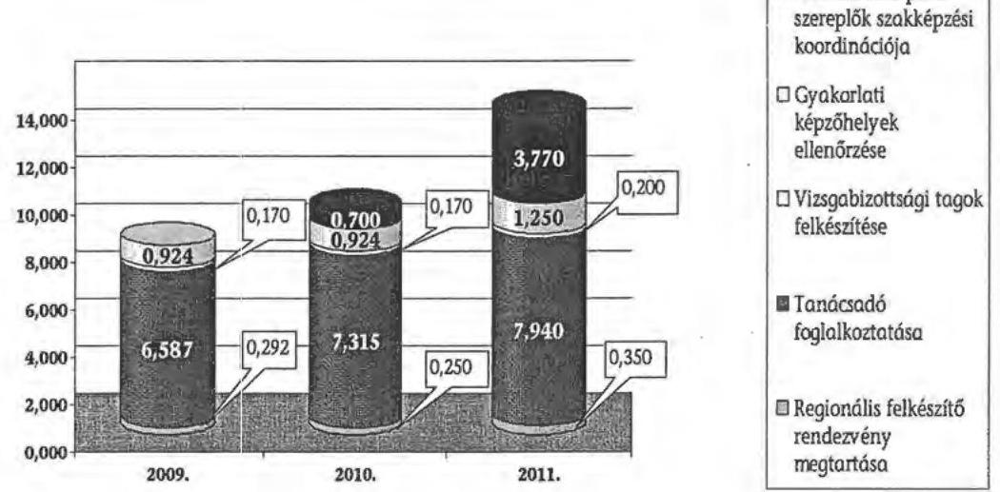

A MAK-tól kapott támogatás felhasználása keretében a Békés AK a gazdálkodó szervezet által képzett tanulók és a képzést nyújtó szervezet között létrejött tanulószerződéseket nyilvántartotta. A kamara az illetékességi körébe tartozó gyakorlati képzést ellátó, tanuló szerződéssel foglalkoztató gazdálkodó szervezeteket a szakképzési tv. 30. § (3) bekezdése szerint az időszakban ellenőrizte és intézkedést igénylő hibát nem tárt fel.

A támogatások felhasználása során közbeszerzési eljárás lefolytatására nem került sor, mert nem volt olyan árubeszerzés és szolgáltatás igénybevétel, amely a közbeszerzési értékhatárt meghaladta volna.

---

A Békés AK a támogatási szerződésekben rögzített tájékoztatási kötelezettségeinek csak részben tett eleget, mivel a támogatások keretében megvalósult szakmai rendezvények meghívóján nem szerepelt a támogatás ténye.

A kamara a kapott támogatásokat és azok felhasználását elkülönítetten, főkönyvi számlákon tartotta nyilván. A kapott támogatások felhasználásának dokumentálása során betartotta a támogatási szerződésekben és a számviteli tv. 167. § (1) bekezdésében foglalt alaki és tartalmi követelményeket. A kamara a számlákra, bérlapokra a támogatási szerződés számát, az elszámolás időpontját és összegét rávezette, továbbá ennek megfelelően rögzítette számviteli nyilvántartásában, ezzel kizárta a többszöri elszámolás lehetőségét. A nyilvántartások megfeleltek a számviteli tv. 161/A. § (2) bekezdés előírásainak, ezáltal a közpénzek felhasználásával kapcsolatos információk rendelkezésre álltak. Az elszámolásokat alátámasztó dokumentumok, számviteli bizonylatok megőrzéséről a kamara támogatási szerződés és a számviteli tv. 169. §-ban foglalt jogszabályi előírás szerint gondoskodott.

Pénzügyi maradvány egyik támogatási szerződés esetében sem, többletköltség a 2009. évi tanácsadói feladatok ellátására irányuló gesztori szerződés esetében keletkezett. A többletköltséget saját forrásból fedezte, amelynek kimutatása szabályszerű volt.

A Békés AK szabályzatban nem határozta meg a költségvetési támogatások szabályszerű felhasználásához, a szakképzési feladatok megvalósításához szükséges humánerőforrás biztosításának követelményeit. A szakképzéssel összefüggő közfeladatok ellátását a Békés AK elsősorban saját dolgozókkal, emellett külső szakértők megbízásával végezte el. Munkatársai szakképzéssel összefüggő, nem munkaköri leírásukban szereplő feladatokat nem láthattak el, egyéb jogviszony nem létesíthettek. A tilalmat az egyedi munkaszerződések rögzítették, attól eltérő gyakorlatot az ellenőrzés nem tárt fel. A külső szakértők közfeladat-ellátására vonatkozó megbízásának szakmai és pénzügyi feltételeit a támogatási szerződések rögzítették. Külső szakértőként csak agrárirányú felsőfokú végzettséggel rendelkezőket vagy szakiskolai oktatókat alkalmazott a kamara. A kamarai tisztségviselők összeférhetetlenségére vonatkozó szabályokat az alapszabályban rögzítette, összhangban a kamarai tv. 16. § (1) bekezdés s) pontjában és a 27. § (3)-(6) bekezdésében foglaltakkal.

A MAK ellenőrzéseiről a Békés AK-nál nem állt rendelkezésre dokumentum. A megküldött elszámolások, dokumentumok MAK általi ellenőrzéséről csak hiánypótlás esetén kapott a Békés AK szóbeli információt, az egyeztetések telefon vagy email útján történtek. A kamaránál a szóbeli tájékoztatás alapján elkészített hiánypótlások dokumentumai rendelkezésre álltak. A MAK a támogatás felhasználásával, elszámolásával kapcsolatosan nem végzett helyszíni ellenőrzést a Békés AK-nál.

A Békés AK működését alapvetően az alapszabály és az SZMSZ határozta meg. A költségvetési támogatások felhasználásának kontrollrendszerére vonatkozó belső szabályozás nem készült. Kontroll elemként az utalványozás szabályait a kamara az SZMSZ-ben és a pénztárkezelési szabályzatban határozta meg.

---

Az állami támogatás felhasználásáról szóló szakmai beszámoltatás, beszámolás és a pénzügyi elszámolás felelőseit, dokumentumait a támogatási szerződések, illetve az azok mellékletét képező útmutató határozták meg. A Békés AK-nál a támogatási szerződésekkel kapcsolatos feladatellátást és az ezzel kapcsolatos munkaidő-nyilvántartási kötelezettséget a munkavállaló részére munkáltatói utasítás határozta meg.

Továbbá a munkaköri leírások, illetve a belső szabályozások meghatározták a szakmai, pénzügyi beszámolási és elszámolási feladatokat. A támogatási szerződésekhez kapcsolódó teljesítés, illetve célszerinti felhasználás igazoltsága esetén a belső szabályozásnak megfelelő utalványozás alapján történt a kifizetés. A továbbadott támogatásban részesült területi kamarák határidőre elkészítették és benyújtották a Békés AK részére a pénzügyi és szakmai beszámolót. A Békés AK által elvégzett ellenőrzésekről nem állt rendelkezésre dokumentum.

A gyakorlati képzőhelyek látogatásán és a támogatási szerződések teljesítéséhez kapcsolódó utalványozási eljáráson kívül a szakképzésre irányuló, saját körben felhasznált egyéb támogatásokat a kamara ellenőrző bizottsága (EB) külön nem ellenőrizte.

# 3.2. A Borsod-Abaúj-Zemplén Megyei Agrárkamara 

A Borsod-Abaúj-Zemplén Megyei Agrárkamara (Borsod AK) a szakképzési feladatok elvégzéséhez a 2009-2011. években 11 szerződéssel összesen 15,4 millió Ft költségvetési támogatást kapott, amelyet a támogatási szerződésben rögzített célokra fordított. A támogatások felhasználása nem volt szabályszerű az utalványozás hiánya miatt.

MAK-tól szakképzési feladatokra kapott támogatások megoszlása (millió Ft)
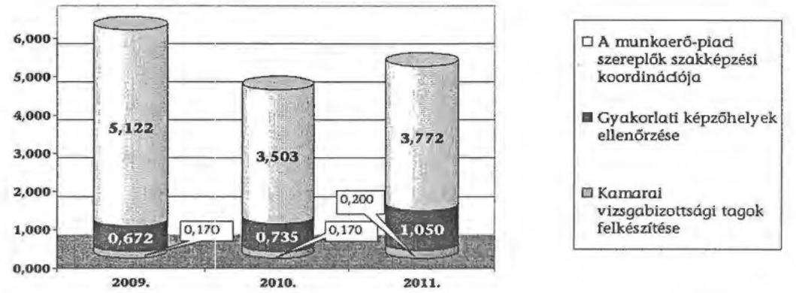

A MAK-tól kapott támogatás felhasználása keretében a Borsod AK a gazdálkodó szervezet által képzett tanulók és a képzést nyújtó szervezet között létrejött tanulószerződéseket nyilvántartotta. A kamara az illetékességi körébe tartozó gyakorlati képzést ellátó, tanuló szerződéssel foglalkoztató gazdálkodó szervezeteket a szakképzési tv. 30. § (3) bekezdése szerint az időszakban ellenőrizte, és intézkedést igénylő hibát nem tárt fel.

---

A Borsod AK a támogató felé a szerződésben rögzített formában és határidőre elszámolt a folyósított támogatásokkal. A támogatás felhasználásának dokumentálása, elszámolása során betartotta a támogatási szerződésekben foglalt követelményeket és a jogszabályi előírásokat. A támogatások felhasználása során közbeszerzési eljárás lefolytatására nem került sor, mert nem volt olyan árubeszerzés és szolgáltatás igénybevétel, amely a közbeszerzési értékhatárt meghaladta volna. Az ellenőrzött időszakban tájékoztatási kötelezettséghez kapcsolódó, bejelentést igénylő változás nem fordult elő.

A kapott támogatások felhasználásának dokumentálása, elszámolása során a pénzügyi elszámoláshoz csatolt bizonylatok nem feleltek meg a számviteli tv. 167. § (1) bekezdésében foglalt alaki és tartalmi követelményeknek, mert azok mindegyikét nem utalványozták. A munkatársak összeférhetetlensége szabályozatlanságának következménye volt az a helytelen gyakorlat is, amely szerint a kamara 100\%-os tulajdonában lévő Agrárium Nonprofit Kft. 0,020 millió Ft értékű számláját a kamara titkára utalványozta, aki egyben a kft. ügyvezetőjeként a számla kibocsátója is volt. Az ellenőrzés jogosulatlan kifizetést nem tárt fel.

A támogatásokhoz elszámolt eredeti számlákra, bizonylatokra a támogatási szerződés számát, az elszámolás időpontját és az összegét rávezették, ennek megfelelően rögzítették számviteli nyilvántartásukban, ezzel kizárták a többszöri elszámolás lehetőségét. A nyilvántartások megfeleltek a számviteli tv. 161/A. § (2) bekezdés előírásainak.

Az elszámolásokat alátámasztó dokumentumok, számviteli bizonylatok megőrzéséről a támogatási szerződés és a számviteli tv. 169. §-ában foglalt jogszabályi előírás szerint gondoskodtak. A kamarának juttatott támogatások felhasználásánál 0,003 millió Ft pénzügyi maradvány, és ugyanekkora összegű többlet felhasználás jelentkezett 2009. és a 2010. évben, amelyeket a támogatás utolsó részletének utalásakor szerződés szerint rendeztek a szerződő felek.

A Borsod AK belső szabályozásában nem határozta meg a szakképzési feladatok megvalósításához szükséges humánerőforrás biztosításának pénzügyi, szakmai feltételeit, követelményeit sem a munkatársak, sem a külső szakértők esetében. A kamarai szervezet munkatársai egyéb jogviszony keretében elláthattak a szakképzéssel összefüggő, munkaköri leírásukban nem szereplő feladatokat, amelyeket a megkötött támogatási szerződések nem tiltottak. A támogatások elszámolásánál ezekről a foglalkoztatásokról minden esetben csatolták a megbízási szerződést és a megbízottak munkaköri leírásait, illetve munkaszerződését. A megbízással ellátott konkrét feladat a csatolt munkaköri leírásokban nem szerepelt. A kamarai tisztségviselők összeférhetetlenségére vonatkozó szabályokat a kamara alapszabályában a kamarai tv. 16. § (1) bekezdés s) pontjában és a 27. § (3)-(6) bekezdéseiben foglaltakkal összhangban határozták meg.

---

A Borsod AK a költségvetési támogatások felhasználásának kontrollrendszerére vonatkozó külön belső szabályozással nem rendelkezett. A pénzkezelési szabályozás nem felelt meg a számviteli tv. 14. § (8) bekezdésében foglalt előírásoknak, mert az csak a házipénztárra vonatkozó szabályokat tartalmazta és bankszámlával kapcsolatosakat nem. A házipénztár szabályzat előírta pénztáros és pénztárellenőr feladatait, valamint az utalványozásra jogosultak körét. A szabályozás nem aktualizált, mert teljes körűen a titkár, és részlegesen a gazdasági helyettes rendelkezik utalványozási joggal, de 2009. óta a kamarának nincs gazdasági helyettese.

A szakmai beszámolás és a pénzügyi elszámolás felelőseit, az elszámolás feltételeit a támogatási szerződés és a hozzá kapcsolódó útmutató határozta meg.

A kamara eleget téve a kamarai tv. 22. § (2) bekezdésének, három tagból álló EB-t működtetett, amelynek tevékenysége az éves beszámolók elfogadására korlátozódott, a támogatások felhasználásának szabályosságát nem ellenőrizte. A kamara gazdálkodását a kamarai tv. 22. § (4) bekezdésével összhangban könyvvizsgáló vizsgálta. A gazdálkodásban észlelt szabálytalanságokat azonban sem az EB, sem a könyvvizsgáló nem tárta fel.

# 3.3. A Jász-Nagykun-Szolnok Megyei Agrárkamara 

A Jász-Nagykun-Szolnok Megyei Agrárkamara (Jász AK) a szakképzési feladatok elvégzéséhez a 2009-2011. években 10 szerződéssel összesen 3,0 millió Ft költségvetési támogatást kapott a MAK-tól és a Békés AK-tól, mint gesztortól. A támogatásokat a támogatási szerződésben rögzített célokra fordította. A támogatás terhére elszámolt személyi juttatás, azok járulékai, a jogszabályokkal és a belső szabályzatokkal összhangban kerültek elszámolásra és kifizetésre.

MAK-tól szakképzési feladatokra kapott támogatások megoszlása (millió Ft)
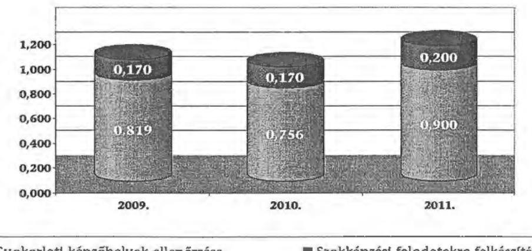

A MAK-tól kapott támogatás felhasználása keretében a Jász AK a gazdálkodó szervezet által képzett tanulók és a képzést nyújtó szervezet között létrejött, pa-

---

píron beérkezett tanulószerződéseket nyilvántartotta. A kamara az illetékességi körébe tartozó gyakorlati képzést ellátó, tanuló szerződéssel foglalkoztató gazdálkodó szervezeteket a szakképzési tv. 30. § (3) bekezdése szerint az időszakban ellenőrizte és intézkedést igénylő hibát nem tárt fel.

A Jász AK mindkét támogató felé a szerződésben rögzített formában és határidőben elszámolt a folyósított támogatásokkal. A támogatás felhasználásának dokumentálása, elszámolása során betartotta a támogatási szerződésekben foglalt követelményeket ${ }^{31}$ és a jogszabályi előírásokat. Költségtérítés és természetbeni juttatás egyik támogatási szerződés esetében sem merült fel. A pénzügyi elszámolásokat és a szakmai beszámolókat a támogató átvette, az egyeztetések közvetlen kapcsolatfelvétel, telefon vagy email útján történtek. Az elszámolás elfogadásáról írásbeli nyilatkozat vagy dokumentum nem készült.

A támogatások felhasználása során közbeszerzési eljárás lefolytatására nem került sor, mert nem volt olyan árubeszerzés és szolgáltatás igénybevétel, amely a közbeszerzési értékhatárt meghaladta volna. A Jász AK-nál nem volt olyan a gazdálkodását alapvetően módosító változás, amely a támogatási szerződésekben rögzített tájékoztatási kötelezettség teljesítését indokolta volna.

A kamara a kapott támogatásokat és azok felhasználását elkülönítetten, főkönyvi számlákon tartotta nyilván. A kapott támogatások felhasználásának dokumentálása, elszámolása során a kamara betartotta a támogatási szerződésekben és a számviteli tv. 167. § (1) bekezdésében foglalt alaki és tartalmi követelményeket. A számlákra, bérlapokra a támogatási szerződés számát, az elszámolás időpontját és összegét rávezették, ennek megfelelően rögzítették számviteli nyilvántartásukban, ezzel kizárták a többszöri elszámolás lehetőségét. A nyilvántartások megfeleltek a számviteli tv. 161/A. § (2) bekezdés előírásainak. Így a közpénzek felhasználásával kapcsolatos információk utólag ellenőrizhető módon rendelkezésre álltak. Az elszámolásokat alátámasztó dokumentumok, számviteli bizonylatok megőrzéséről a kamara a támogatási szerződés és a számviteli tv. 169. §-ában foglalt jogszabályi előírás szerint gondoskodott. Pénzügyi maradvány egyik támogatási szerződés esetében sem keletkezett. A többletköltségek kimutatása szabályszerű volt, azokat minden esetben saját forrásból biztosították.

A Jász AK szabályzatban nem határozta meg a szakképzési feladatok megvalósításához szükséges humánerőforrás biztosításának követelményeit. Így a saját dolgozók, illetve a külső szakértők szakképzéssel összefüggő közfeladatellátására vonatkozó megbízásának szakmai feltételeit nem szabályozta. Külső szakértőként agrár felsőfokú végzettséggel rendelkező, elsősorban szakiskolai oktatókat bízott meg.

A kamarai tisztségviselők összeférhetetlenségére vonatkozó szabályokat az alapszabály VI. fejezete rögzítette, összhangban a kamarai tv. 16. § (1) bekezdés s) pontjában és a 27. § (3)-(6) bekezdésében foglaltakkal. A kamara munkatársainak az egyedi munkaszerződésekben megtiltották az egyéb jogviszony létesítését, ettől eltérő gyakorlatot az ellenőrzés nem tárt fel.

[^0]
[^0]:    ${ }^{31}$ A támogatási szerződések humánerőforrás követelményeket nem írtak elő.

---

A MAK és a Békés AK a támogatások felhasználását helyszínen nem ellenőrizte. A Jász AK a költségvetési támogatások felhasználásának kontrollrendszerére vonatkozó belső szabályozást nem készített. A Jász AK belső szabályzatai - az SZMSZ kivételével - elavultak voltak, nem követték az aktuális változásokat. A kamara számviteli politikát, munkaügyi szabályzatot, iratkezelési szabályzatot 2001-ben, a házipénztár kezelésére vonatkozó szabályzatot 2007-ben készített.

A költségvetési támogatás felhasználásáról szóló szakmai beszámoltatás, beszámolás és a pénzügyi elszámolás felelősét a 2010. évtől a munkaköri leírások határozták meg, a felelősök az elszámolás során a támogatási szerződések, illetve az azok mellékletét képező útmutató szerint jártak el.

# 3.4. A Pest Megyei Agrárkamara 

A Pest Megyei Agrárkamara (Pest AK) a szakképzési feladatok elvégzéséhez a 2009-2011. években 12 szerződéssel összesen 15,9 millió Ft költségvetési támogatást kapott a MAK-tól. A támogatásokat a támogatási szerződésben rögzített célokra fordította. A támogatások felhasználása a bizonylatok alaki-tartalmi hiányosságai valamint az elkülönített nyilvántartási kötelezettség megsértése miatt nem volt szabályszerű.

MAK-tól szakképzési feladatokra kapott támogatások megoszlása (millió Ft)
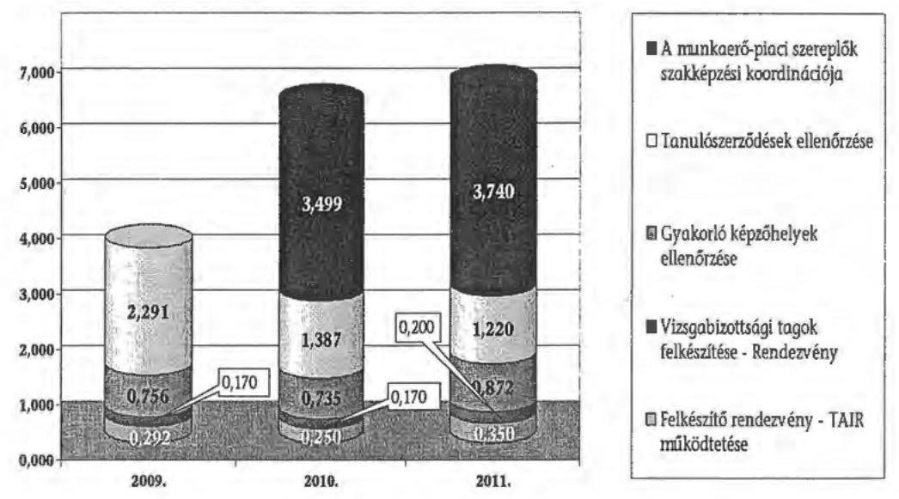

A MAK-tól kapott támogatás felhasználása keretében a Pest AK a gazdálkodó szervezet által képzett tanulók és a képzést nyújtó szervezet közötti tanulószerződéseket nyilvántartotta. A kamara az illetékességi körébe tartozó gyakorlati képzést ellátó, tanuló szerződéssel foglalkoztató gazdálkodó szervezeteket a szakképzési tv. 30. § (3) bekezdése szerint az időszakban ellenőrizte, dokumentáltan intézkedést igénylő hibát nem tárt fel.

---

A Pest AK a támogató felé a szerződésben rögzített formában, a pénzügyi és szakmai beszámoló benyújtása mellett határidőben elszámolt a folyósított támogatásokkal. A támogatás felhasználásának dokumentálása, elszámolása során betartotta a támogatási szerződésekben foglalt követelményeket és a jogszabályi előírásokat. A megbízási díjak, a költségtérítés és természetbeni juttatás a jogszabályokkal és a belső szabályozással összhangban kerültek elszámolásra és kifizetésre. A pénzügyi elszámolásokat és a szakmai beszámolókat a támogató átvette, de az elszámolás elfogadásáról írásbeli nyilatkozat vagy dokumentum nem készült.

A támogatások felhasználása során közbeszerzési eljárás lefolytatására nem került sor, mert nem volt olyan árubeszerzés és szolgáltatás igénybevétel, amely a közbeszerzési értékhatárt meghaladta volna. A támogatási szerződésekben a Pest AK számára előírt tájékoztatási kötelezettséghez kapcsolódó eseti tájékoztatáskérés az ellenőrzött időszakban nem fordult elő.

A Pest AK a kapott támogatásokat elkülönített főkönyvi számlán tartotta nyilván. A kamara a számlákra, bérlapokra rávezette a támogatási szerződés számát, az elszámolás időpontját és összegét a szerződésben előírtak szerint. A támogatások felhasználásához kapcsolódó főkönyvi számlák alábontását azonban nem alkalmazta, csak a támogatási szerződéshez előírt összesítőket. Ez a gyakorlat nem felelt meg a számviteli tv. 161/A. § (2) bekezdésben előírt elkülönítési kötelezettségnek. A MAK felé benyújtott pénzügyi elszámolások bizonylatai nem feleltek meg a számviteli tv. 167. § (1) bekezdés c) pontjában előírtaknak, mivel az ellenőrzött időszakban a bizonylatokról hiányzott az utalványozó aláírása. Az ellenőrzés jogosulatlan kifizetést nem tárt fel. A Pest AK az elszámolásokat alátámasztó dokumentumok, számviteli bizonylatok megőrzéséről a támogatási szerződés és a számviteli tv. 169. §-ában foglalt jogszabályi előírás szerint gondoskodott.

A maradvány kimutatása szabályos volt. A támogatási szerződések második részlete átutalásának feltétele volt a szakmai és pénzügyi beszámolás. Így a maradvány esetén a MAK a maradvánnyal csökkentett összeget utalta ki.

A Pest AK nem belső szabályzatban, hanem a munkaszerződésekben és munkaköri leírásokban határozta meg a feladatok megvalósításához szükséges humánerőforrás biztosításának követelményeit a végzettségi előírások kivételével. Az ellenőrzési feladatokhoz kapcsolódó megbízási szerződéseket szakiskolai gyakorlati oktatást végző tanárokkal kötötte. A kamarai tisztségviselők összeférhetetlenségére vonatkozó szabályokat a 2001. évben kiadott, 2004. évben módosított SZMSZ-ének V. fejezetében rögzítette, összhangban a kamarai tv 16. § (1) bekezdés s) pontjában és a 27. § (3)-(6) bekezdésében foglaltakkal. A kamara munkatársaira vonatkozó összeférhetetlenségi szabályt nem írt elő. Az ellenőrzött évek alatt a Pest AK-nál más jogviszonyban nem láttak el feladatot a dolgozók.

A Pest AK belső szabályzatai nem tértek ki az állami támogatások felhasználásának belső kontroll rendszerére, továbbá a szabályozások elavultak vagy hiányosak voltak. A szervezet működését alapvetően a 2004-ben módosított, illetve a 2011-ben elfogadott új alapszabály határozta meg. A kamara az utalványozás rendjét nem szabályozta, nem rendelkezett a számviteli tv. 14. §

---

(8) bekezdése szerinti pénzkezelési szabályzattal. Az állami támogatás felhasználásáról szóló szakmai beszámoltatás, beszámolás és a pénzügyi elszámolás módját a támogatási szerződések, illetve az azok mellékletét képező útmutató szabályozta. A kamara a gyakorlatban az előírások szerint járt el.

A kamara, eleget téve a kamarai tv. 22. § (2) bekezdésének, három tagból álló EB-t működtetett, amely ellenőrizte a szervezet gazdálkodását, az állami támogatás felhasználását is. A kamara gazdálkodását a kamarai tv. 22. § (4) bekezdésével összhangban könyvvizsgáló ellenőrizte. A gazdálkodásban észlelt szabálytalanságokat az utalványozási és az elkülönítési kötelezettségre vonatkozóan sem az EB, sem a könyvvizsgáló nem tárta fel.

# 3.5. A Somogy Megyei Agrárkamara 

A Somogy Megyei Agrárkamara (Somogy AK) a MAK-tól a szakképzési feladatok elvégzéséhez a 2009-2011. években 13 szerződéssel összesen 8,6 millió Ft költségvetési támogatást kapott. A Somogy AK a kapott támogatásokat a támogatási szerződésben rögzített célokra fordította. A támogatás terhére elszámolt személyi juttatások, költségtérítések és természetbeni juttatások a jogszabályokkal összhangban kerültek elszámolásra és kifizetésre.

MAK-tól szakképzési feladatokra kapott támogatások megoszlása (millió Ft)
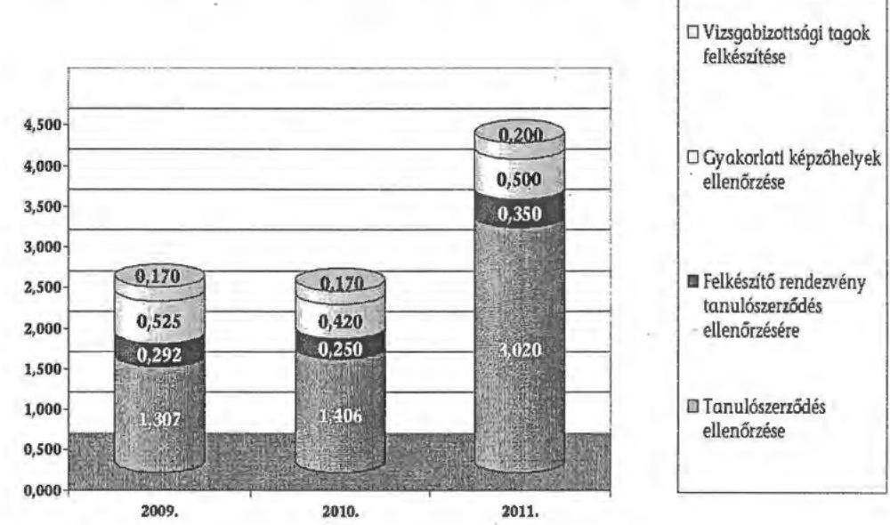

A MAK-tól kapott támogatás felhasználása keretében a Somogy AK a gazdálkodó szervezet által képzett tanulók és a képzést nyújtó szervezet között létrejött tanulószerződéseket nyilvántartotta. A kamara az illetékességi körébe tartozó gyakorlati képzést ellátó, tanuló szerződéssel foglalkoztató gazdálkodó szervezeteket a szakképzési tv. 30. § (3) bekezdése szerint az időszakban ellenőrizte és intézkedést igénylő hibát nem tárt fel.

---

A Somogy AK a támogató felé a szerződésben rögzített formában és határidőben elszámolt a folyósított támogatásokkal. A támogatás felhasználásának dokumentálása, elszámolása során betartotta a támogatási szerződésekben foglalt követelményeket és a jogszabályi előírásokat. A megbízási díjakat a jogszabályokkal összhangban számolták el és fizették ki. Az elszámolásokat a támogató minden esetben tértivevényen igazoltan átvette.

A támogatások felhasználása során közbeszerzési eljárás lefolytatására nem került sor, mert nem volt olyan árubeszerzés és szolgáltatás igénybevétel, amely a közbeszerzési értékhatárt meghaladta volna. A támogatási szerződésekben előírt tájékoztatási kötelezettséghez kapcsolódó körülmény, bejelentést igénylő változás nem fordult elő az ellenőrzött időszakban.

A kamara a kapott támogatásokat és azok felhasználását elkülönítetten, főkönyvi számlákon tartotta nyilván. A kapott támogatások felhasználásának dokumentálása, elszámolása során betartotta a támogatási szerződésekben és a számviteli tv. 167. § (1) bekezdésében foglalt alaki és tartalmi követelményeket. A támogatásokhoz elszámolt eredeti számlákra, bérlapokra a támogatási szerződés számát, az elszámolás időpontját és összegét rávezette ennek megfelelően rögzítették számviteli nyilvántartásukban, ezzel kizárták a többszöri elszámolás lehetőségét. A nyilvántartások megfeleltek a számviteli tv. 161/A. § (2) bekezdés előírásainak, biztosítva a támogatások utólagos ellenőrizhetőségét. A Somogy AK az elszámolásokat alátámasztó dokumentumok, számviteli bizonylatok megőrzéséről a támogatási szerződés és a számviteli tv. 169. §-ában foglalt jogszabályi előírás szerint gondoskodott. Maradvány egyik támogatási szerződés esetében sem keletkezett. A többletköltség a 2011. évi „A tanulószerződések rendszerének működtetésével kapcsolatos ellenőrzési, tanácsadói feladatok megvalósítása" támogatásnál fordult elő 0,3 millió Ft összegben. A többletköltség kimutatása szabályos volt, a Somogy AK azt saját forrásaiból fedezte.

A Somogy AK szakképzéssel összefüggő közfeladatainak ellátására kapott költségvetési támogatások szabályszerű felhasználásának humánerőforrás feltételeit szabályzatban nem határozta meg, a munkatársak és a külső szakértők esetében sem. A kamara munkavállalói végezhettek a munkakörükbe nem tartozó feladatokat (képzőhelyek ellenőrzését). Az összeférhetetlenségre vonatkozó szabályokat a kamara a 2001. évben kiadott alapszabályban rögzítette a tisztségviselőkre vonatkozóan a kamarai tv. 16. § (1) bekezdés s) pontjának megfelelően.

A támogatási elszámolások MAK általi ellenőrzéséről illetve elfogadásáról dokumentum nem készült, egy támogatás elszámolása kivételével. A 2009. évben lefolytatott gyakorlati képzőhelyek ellenőrzése után beadott elszámolásra kapott a kamara a MAK-tól egy írásbeli teljesítésigazolást. A Somogy AK a költségvetési támogatások felhasználásának kontrollrendszerére vonatkozó belső szabályozással nem rendelkezett. A házipénztár kezelési szabályzat szerint utalványozási jogköre a titkárnak volt. A támogatások felhasználásáról szóló szakmai beszámolás, a pénzügyi elszámolás és a beszámoltatás felelőseit titkári utasításban szabályozta.

---

A Somogy AK 3,7 millió Ft összegben adott tovább támogatást más területi kamaráknak, amelyek a támogatási szerződésekben előírtaknak megfelelően, határidőre elszámoltak. A Somogy AK a továbbadott támogatások felhasználásának ellenőrzési rendszerét nem alakította ki, az elszámolásokat nem ellenőrizte. Az általa támogatott területi kamarák és a saját elszámolásait összesítette és továbbította az országos kamara felé. A kialakított belső kontrollok ezért csak részben voltak alkalmasak a Somogy AK által felhasznált költségvetési támogatások szabályszerűségének biztosítására.

# 3.6. A Szabolcs-Szatmár-Bereg Megyei Agrárkamara 

A Szabolcs-Szatmár-Bereg Megyei Agrárkamara (Szabolcs AK) a szakképzési feladatok elvégzéséhez a 2009-2011. években 12 szerződéssel összesen 11,5 millió Ft költségvetési támogatást kapott, amelyet a támogatási szerződésben rögzített célokra fordított. A támogatás terhére elszámolt személyi juttatásokat, azok járulékait, a megbízási díjakat, a költségtérítéseket a jogszabályokkal összhangban számolták el és fizették ki. Természetbeni juttatás elszámolása nem fordult elő.

A Szabolcs AK a szerződésben rögzített formában és határidőben elszámolt a folyósított támogatásokkal. A pénzügyi elszámolásokat és a szakmai beszámolókat a támogató átvette. Elfogadó dokumentum mindössze egy pénzügyi beszámoló esetében készült.

MAK-tól szakképzési feladatokra kapott támogatások megoszlása millió Ft)
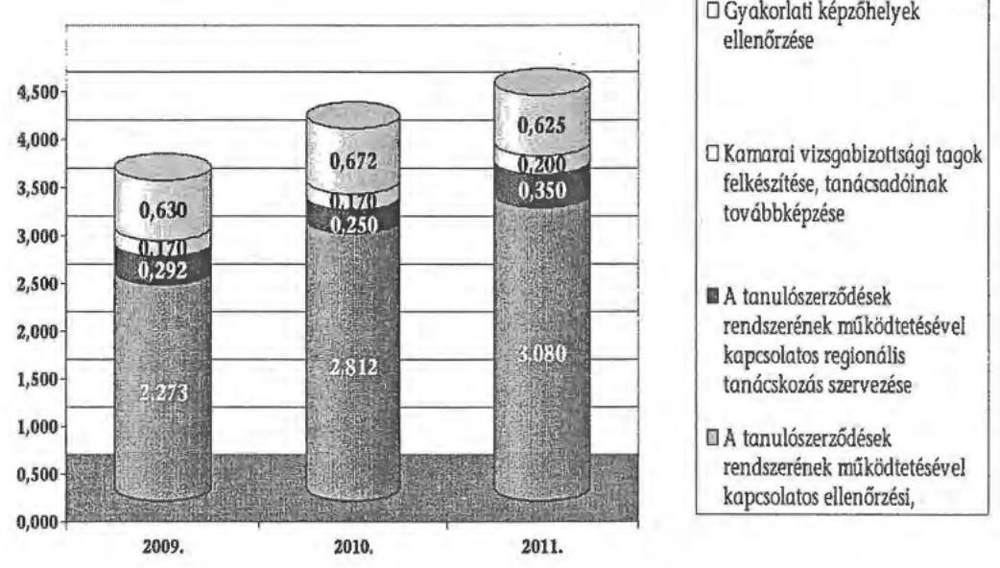

A MAK-tól kapott támogatás felhasználása keretében a Szabolcs AK a gazdálkodó szervezet által képzett tanulók és a képzést nyújtó szervezet között létrejött tanulószerződéseket nyilvántartotta. A kamara az illetékességi körébe tartozó gyakorlati képzést ellátó, tanuló szerződéssel foglalkoztató gazdálkodó szervezeteket a szakképzési tv. 30. § (3) bekezdése szerint az időszakban ellenőrizte és intézkedést igénylő hibát nem tárt fel.

---

A támogatások felhasználása során közbeszerzési eljárás lefolytatására nem került sor, mert nem volt olyan árubeszerzés és szolgáltatás igénybevétel, amely a közbeszerzési értékhatárt meghaladta volna. Az ellenőrzött időszakban tájékoztatási kötelezettséghez kapcsolódó, bejelentést igénylő változás nem fordult elő.

A kamara a kapott támogatásokat és azok felhasználását elkülönítetten, főkönyvi számlákon tartotta nyilván. A kapott támogatások felhasználása során betartotta a támogatási szerződésekben és a számviteli tv. 167. § (1) bekezdésében foglalt alaki és tartalmi követelményeket. A támogatás terhére elszámolt költségek dokumentáltsága biztosította az elvégzett feladatok ellenőrizhetőségét. A Szabolcs AK az elszámolásokat alátámasztó dokumentumok, számviteli bizonylatok megőrzéséről a támogatási szerződés és a számviteli tv. 169. §-ában foglaltak szerint gondoskodott. Pénzügyi maradvány egyik támogatási szerződés esetében sem keletkezett, a támogatásnál magasabb ráfordításnál a többletköltséget a Szabolcs AK saját forrásaiból biztosította.

A Szabolcs AK a közfeladatok megvalósításához szükséges humánerőforrás biztosításának követelményeit munkaügyi szabályzatában határozta meg. Ebben munkakörönként rögzítette a képesítési előírásokat. A külső szakértők megbízásának feltételeit külön szabályzatban nem, a velük kötött szerződésekben szabályozták. A Szabolcs AK munkatársai egyéb jogviszony keretében elláthatták szakképzéssel összefüggő, munkaköri leírásukban nem szereplő feladatokat. Külön megbízási szerződés alapján a vizsgált években a szakmai gyakorlati képzőhelyeket ellenőrizték.

A Szabolcs AK a kamarai tv. 16. § (1) bekezdés s) pontja alapján a tisztségviselőkre vonatkozóan további összeférhetetlenségi szabályt a tisztségviselők ellenőrzésére határozott meg. Rögzítette alapszabályában a kamara könyvvizsgálójára vonatkozó összeférhetetlenségi szabályokat. A munkaügyi szabályzat előírta a munkatársakra vonatkozó összeférhetetlenségi szabályt. A szabályozás szerint „nem létesíthető olyan munkaviszony, amelyben a dolgozó hozzátartozójával alá-fölérendeltségi helyzetbe kerül". Az ellenőrzés nem tárt fel a szabályozástól eltérő gyakorlatot.

Az elszámolások szabályosságát a támogató dokumentáltan nem ellenőrizte. A MAK a támogatás felhasználásával, elszámolásával kapcsolatosan nem végzett helyszíni ellenőrzést a Szabolcs AK-nál. A kamara a költségvetési támogatások felhasználásának kontrollrendszerére külön belső szabályozással nem rendelkezett. Az állami támogatás felhasználásáról szóló szakmai beszámoltatás, beszámolás és a pénzügyi elszámolás felelőseit, dokumentumait a támogatási szerződések, illetve az azok mellékletét képező útmutató határozták meg.

# 3.7. A Veszprém Megyei Agrárkamara 

A Veszprém Megyei Agrárkamara (Veszprém AK) a szakképzési feladatok elvégzéséhez a 2009-2011. években 16 szerződéssel összesen 11,8 millió Ft költségvetési támogatást, valamint a 2010. évben az FVM-től 1,6 millió Ft-ot kapott. A támogatásokat a támogatási szerződésben rögzített célokra fordította, de a felhasználás az elkülönített nyilvántartási kötelezettségre vo-

---

natkozó előírás megsértése miatt nem volt szabályszerű. A támogatás terhére elszámolt személyi juttatás, azok járulékai és a megbízási díjak a jogszabályokkal és a belső szabályzatokkal összhangban kerültek elszámolásra és kifizetésre.
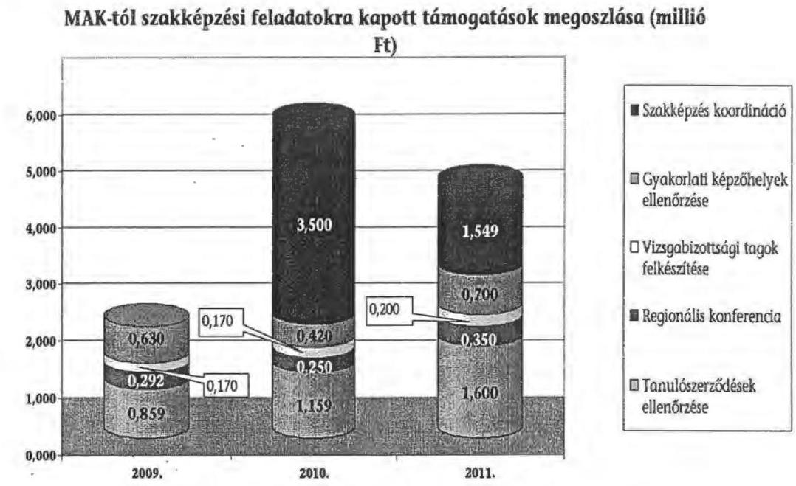

A MAK-tól kapott támogatás felhasználása keretében a Veszprém AK a gazdálkodó szervezet által képzett tanulók és a képzést nyújtó szervezet között létrejött tanulószerződéseket nyilvántartotta. A kamara az illetékességi körébe tartozó gyakorlati képzést ellátó, tanuló szerződéssel foglalkoztató gazdálkodó szervezeteket a szakképzési tv. 30. § (3) bekezdése szerint az időszakban ellenőrizte és intézkedést igénylő hibát nem tárt fel.

A Veszprém AK a szerződésben rögzített formában és határidőben elszámolt a folyósított támogatásokkal. A pénzügyi elszámolásokat és a szakmai beszámolókat a támogató átvette, az elszámolásokról írásban dokumentált elfogadó nyilatkozatot csak a 2009. évi gyakorló helyek ellenőrzéséről adott ki.

A támogatások felhasználása során közbeszerzési eljárás lefolytatására nem került sor, mert nem volt olyan árubeszerzés és szolgáltatás igénybevétel, amely a közbeszerzési értékhatárt meghaladta volna. A támogatási szerződésekben rögzített tájékoztatási kötelezettségének a kamara eleget tett.

A kapott támogatások és azok felhasználásának főkönyvi nyilvántartása nem felelt meg a támogatási szerződések és a számviteli tv. 161/A. § (2) bekezdés szerinti elkülönítési előírásainak. A Veszprém AK a 2011. január 1-től hatályos számviteli politika mellékleteként rendelkezésre bocsátott számlarendjében helyesen előírta a továbbadott támogatások ráfordításai és a bevétel számlák további részletezését támogatási szerződésenként. A támogatások saját felhasználásánál a költségek elkülönítését azonban nem írta elő. A szabályozás hiánya miatt a támogatásokból a kamara az általa elszámolt költségeket nem különítette el.

---

A kapott támogatások felhasználása során betartotta a támogatási szerződésekben és a számviteli tv. 167. § (1) bekezdésében foglalt alaki és tartalmi követelményeket. A számlákra, bérlapokra a támogatási szerződés számát, az elszámolás időpontját és összegét rávezette a szerződésben előírtak szerint. Az elszámolásokat alátámasztó dokumentumok, számviteli bizonylatok megőrzéséről a támogatási szerződés és a számviteli tv. 169. §-ában foglalt jogszabályi előírás szerint gondoskodott. A pénzügyi maradvány és a többletköltség kimutatása a támogatási szerződéseknek megfelelő, szabályszerű volt. A Veszprém AK-nál a két alkalommal keletkezett pénzügyi maradványt szabályosan visszautalta a MAK-nak.

A Veszprém AK külön szabályzatban nem határozta meg a szakképzési feladatok megvalósításához szükséges humánerőforrás biztosításának követelményeit. A külső szakértők alkalmazásának pénzügyi és szakmai feltételeit sem szabályozta. A Veszprém AK munkatársai szakképzéssel összefüggő, munkaköri leírásukban nem szereplő feladatokat egyéb jogviszony keretében elláthattak. A Veszprém AK alapszabályában nem rögzített további összeférhetetlenségi szabályokat a tisztségviselőkre vonatkozóan a kamarai tv. 16. § (1) bekezdés s) pontjában előírtakon túl.
 Veszprém AK tevékenységének és működésének szabályait a jogszabályi előírásokon túl, alapvetően a 2008. évben kiadott alapszabály és az SZMSZ határozta meg. A költségvetési támogatások felhasználásának kontrollrendszerére külön belső szabályozás nem készült. A kamara a kötelezettségvállalás és utalványozás szabályait a pénztárkezelési szabályzatban határozta meg. Az alapvető számviteli szabályzatok rendelkezésre álltak, amelyeket a 2010-2011. években aktualizáltak.

Az állami támogatás felhasználásáról szóló szakmai beszámoltatás, beszámolás és a pénzügyi elszámolás dokumentumait a támogatási szerződések, illetve az azok mellékletét képező útmutató határozták meg. Munkaköri leírásban 2011. januártól szerepeltették az adott személy felelősségi körébe tartozó, a költségvetési támogatásokkal kapcsolatban felmerült feladatokat.

Az ellenőrzött időszakban a Veszprém AK, mint gesztor kamara működött. A területi kamarákkal külön szerződések keretében határozta meg a továbbadott támogatások felhasználásának rendjét. A támogatásokkal a szerződésekben foglaltaknak megfelelően és határidőben elszámoltak a területi kamarák a Veszprém AK felé. A Veszprém AK saját elszámolásával összesítve, de külön ellenőrzés nélkül továbbította azokat a MAK felé. A Veszprém AK a támogatások felhasználására vonatkozó saját célellenőrzést nem végzett. A munkafolyamatba épített ellenőrzés a főtitkár által végzett teljesítésigazolásokon és utalványozáson keresztül érvényesült.

A MAK a támogatás felhasználásával, elszámolásával kapcsolatosan nem végzett helyszíni ellenőrzést a kamaránál. A Veszprém AK, eleget téve a kamarai tv. 22. § (2) bekezdésének, négy tagból álló EB-t működtetett, amely a támogatások felhasználásának szabályosságát nem ellenőrizte. A Veszprém AK gazdálkodását a kamarai tv. 22. § (4) bekezdésével összhangban könyvvizsgáló vizsgálta, az elkülönített nyilvántartására vonatkozó szabálytalanságot azonban nem tárta fel.

---

# 3.8. A Bács-Kiskun Megyei Kereskedelmi és Iparkamara 

A Bács-Kiskun Megyei Kereskedelmi és Iparkamara (Bács KIK) a szakképzéssel összefüggő feladataira és a békéltető testület működtetésére a 2009-2011. években 27 db támogatási szerződést kötött összesen 159,3 millió Ft összegben. A támogatásokat a szerződésekben rögzített céloknak megfelelően használta fel. A támogatások terhére elszámolt megbízási díjakat, költségtérítéseket és természetbeni juttatásokat a vonatkozó jogszabályok és belső szabályzatok előírásainak megfelelően számolta el és fizette ki.

A Bács KIK-nél a támogatások szakmai és pénzügyi elszámolásának formája, dokumentálása a szerződésben rögzített követelményeknek és a jogszabályi előírásoknak megfelelt. Öt esetben azonban a pénzügyi elszámolást határidőn túl nyújtotta be a támogató részére. A késedelmes elszámolást a támogató dokumentáltan nem kifogásolta, következménye nem volt. A támogatások felhasználása során közbeszerzési eljárás lefolytatására nem került sor, mert nem volt olyan árabeszerzés és szolgáltatás igénybevétel, amely a közbeszerzési értékhatárt meghaladta volna. A Bács KIK a támogatási szerződésekben előírt tájékoztatási kötelezettségének többek között rendezvényeken, kiértesítéseken, illetve a honlapján történő meghirdetéssel tett eleget. A támogató részére a meghatározott információkat e-mail-ben, levélben, illetve honlapján keresztül biztosította.

MKIK-től szakképzési feladatokra kapott támogatások megoszlása (millió Ft)
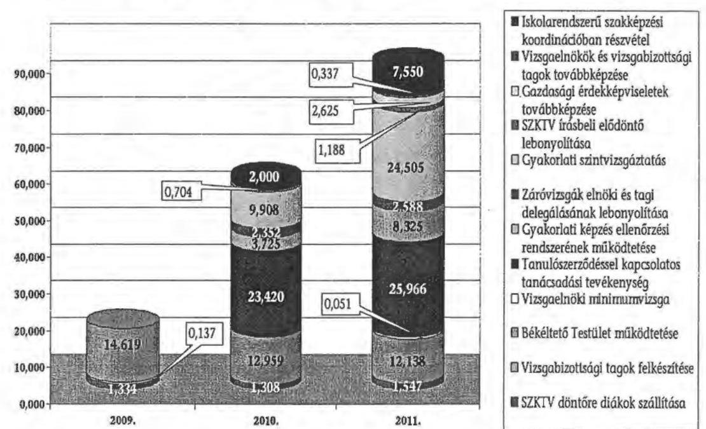

Az MKIK-től kapott támogatás felhasználása keretében a Bács KIK a gyakorlati képzést végző gazdálkodó szervezetek és a képzésben részt vevő tanulók között létrejött tanulószerződéseket az MKIK által üzemeltetett ISZIIR-ben nyilvántartotta. A kamara az illetékességi körébe tartozó gyakorlati képzést ellátó, tanuló szerződéssel foglalkoztató gazdálkodó szervezeteket a szakképzési tv. 30. §

---

(3) bekezdése szerint az időszakban ellenőrizte, és intézkedést igénylő hibát nem tárt fel.

A támogatások és azok felhasználásának nyilvántartása megfelelt a számviteli tv. 161/A. § (2) bekezdésének és a támogatási szerződések előírásainak, a pénzügyi elszámolásokat a kamara a számviteli tv. 167. § (1) bekezdésében rögzített alaki-tartalmi követelményeknek megfelelő számviteli bizonylatokkal dokumentálta. A Bács KIK a bevételek elkülönített nyilvántartási kötelezettségének a főkönyvi könyveléssel egyeztetett analitikus nyilvántartással tett eleget, a támogatások felhasználását az ISZIIR-ben rögzítette. A kialakított nyilvántartási és elszámolási rendszer kizárta az ugyanazon bizonylat többszöri elszámolását, oly módon, hogy a nyilvántartásában egy bizonylatot csak egy támogatás terhére lehetett elszámolni. Az elszámolást alátámasztó dokumentumok, számviteli bizonylatok megőrzéséről a kamara a támogatási szerződésben és a számviteli tv. 169. §-ban előírtaknak megfelelően gondoskodott, azok utólagos ellenőrzését biztosította. A Bács KIK pénzügyi elszámolásaiban egy alkalommal mutatott ki 0,2 millió Ft maradványt, 13 alkalommal többletköltséget. Az elszámolt maradványt - utófinanszírozás miatt - pénzügyileg nem kellett rendezni, a többletköltségeket a Bács KIK saját forrásaiból finanszírozta.

A Bács KIK belső szabályzatban nem határozta meg a feladatok megvalósításához szükséges humánerőforrás biztosításának követelményeit. A tanulószerződéssel kapcsolatos tanácsadási tevékenységről szóló, valamint a gyakorlati szintvizsgáztatásról, a szakmai záróvizsgák elnöki és tagi delegálásának lebonyolításáról szóló szerződések 2010-ben és 2011-ben előírták a kötelezően alkalmazandó létszámot. A Bács KIK a foglalkoztatott külső szakértőket az országos kamara szakértői névjegyzékéből választotta ki. A szakértők foglalkoztatásának pénzügyi feltételeit az MKIK-kel kötött támogatási szerződések tartalmazták.

A Bács KIK az összeférhetetlenségre vonatkozó szabályokat az alapszabályban határozta meg, összhangban a kamarai tv. 27. §-ában előírtakkal. A Bács KIK ezt meghaladóan, a kamarai tv. 16. § (1) bekezdés s) pontja szerinti további összeférhetetlenségi követelményeket nem írt elő. A Bács KIK azon munkavállalói, akik a feladatellátáshoz megfelelő szakképzettséggel rendelkeztek és a munkaköri leírásukban nem szerepelt a gyakorlati képzőhely ellenőrzése, azok egyéb jogviszony keretében azt munkaidőn túl a szabályozásuk szerint végezték.

A Bács KIK belső kontrollrendszerre vonatkozó szabályzattal nem rendelkezett. A folyamatba épített ellenőrzés az utalványozással és a teljesítésigazolással valósult meg. A Bács KIK SZMSZ-ében rögzítette a szakmai beszámoltatás, beszámolás és pénzügyi elszámolás felelőseit. Ennek megfelelően a szakképzési tevékenységért az Oktatási és Szakképzési Iroda, a békéltető testület jogszabálynak megfelelő működéséért a Jogi és Igazgatási Iroda felelt, amit azok a belső szabályzatok előírásaival összhangban elvégeztek és aláírással igazoltak. Az MKIK-kel kötött támogatási szerződések 2011 második félévétől előírták a szakképzési feladatok ellátására biztosított támogatások elszámolásának könyvvizsgáló általi ellenőrzését, amely előírásnak a Bács KIK eleget tett.

---

A Bács KIK által kapott támogatások elszámolását az MKIK helyszínen nem ellenőrizte.

A Bács KIK mellett működő békéltető testület a vizsgált időszakban a fogyasztóvédelmi tv. előírása szerint működött. A testület működésének, ezen belül a tagok és az elnök díjazásának feltételeit és forrását a támogatási szerződések határozták meg a békéltető testületek díjazásáról szóló 211/1998. (XII. 24.) Korm. rendelet előírásával összhangban. A testület a 2009-2011. években tevékenységéről évente összefoglaló tájékoztatót készített, és azt a fogyasztóvédelmi tv. 36/A. § (1) bekezdésében előírt határidőre - 2010. január 14-én, 2011. január 14-én, illetve 2012. január 12-én - megküldte a fogyasztóvédelemért felelős miniszternek. A 37/A. § (3) bekezdésben előírt információkat a www.bkmkik.hu és a www.bekeltetes.hu honlapokon nyilvánossá tette. A testület a tárgyalt ügyeket iktatta és témájuk és a határozatok fajtája szerint nyilvántartotta, ami a szakmai beszámolókban és a pénzügyi elszámolásokban szereplő adatokat, információkat alátámasztotta.

# 3.9. A Borsod-Abaúj-Zemplén Megyei Kereskedelmi és Iparkamara 

A Borsod-Abaúj-Zemplén Megyei Kereskedelmi és Iparkamara (Borsod KIK) a békéltető testületek működtetéséhez, valamint a szakképzési feladatok ellátásához 2009-2011. években 22 db támogatási szerződés alapján 157,5 millió Ft támogatásban részesült. A kapott támogatásokat a szerződésekben megjelölt célokra használta fel.

A támogatások terhére elszámolt megbízási díjak, költségtérítések és természetbeni juttatások elszámolása a vonatkozó jogszabályoknak és számviteli előírásoknak - az alaki, a tartalmi és az utalványozás követelményeinek - megfeleltek.

MKIK-től szakképzési feladatokra kapott támogatások megoszlása (millió Ft)
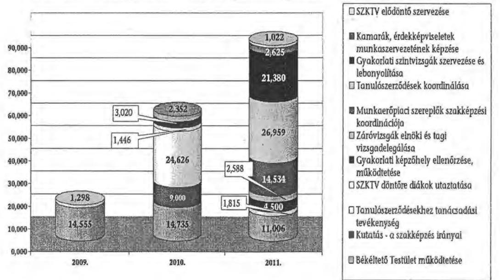

---

A támogatások felhasználása során közbeszerzési eljárás lefolytatására nem került sor, mert nem volt olyan árubeszerzés és szolgáltatás igénybevétel, amely a közbeszerzési értékhatárt meghaladta volna. A Borsod KIK a szerződésben kötelezettséget vállalt arra, hogy a bekövetkezett lényeges változásokról (pl. csőd, felszámolás stb.) a támogatót haladéktalanul értesíti, de az ellenőrzött időszakban nem történt tájékoztatásra okot adó változás.

Az MKIK-től kapott támogatás felhasználása keretében a Barsod KIK a gyakorlati képzést végző gazdálkodó szervezetek és képzőhelyek valamint a gyakorlati képzésben résztvevő tanulók között létrejött tanulószerződéseket az ISZIIR-ben nyilvántartotta. A kamara az illetékességi körébe tartozó gyakorlati képzést ellátó, tanuló szerződéssel foglalkoztató gazdálkodó szervezeteket a szakképzési tv. 30. § (3) bekezdése szerint az időszakban ellenőrizte és intézkedést igénylő hibát nem tárt fel.

A Borsod KIK az egyes támogatási szerződésekhez kapcsolódó szakmai beszámolókat és pénzügyi elszámolásokat a szerződésben rögzített formában készítette el, és azokat a támogató részére határidőre megküldte. A pénzügyi beszámolót a támogató dokumentáltan nem fogadta el. A támogatások elszámolásának ellenőrzését, elfogadását a támogatást nyújtó részéről a hiánypótlásra való felszólításon túlmenően más dokumentum nem igazolta.

A támogatás felhasználásának nyilvántartása megfelelt a számviteli tv. 161/A. § (2) bekezdésében és a támogatási szerződésben előírtaknak. A Borsod KIK a bevételeket és a költségeket támogatásonként, elkülönítetten tartotta nyilván, a költségeket a 6-os számlaosztályban különítette el. A szakértők és tanácsadók által elvégzett feladatok költségeit a kamara szakképzésért felelős vezetője a tevékenység (iskolalátogatás, képzőhely ellenőrzés) ISZIIR-ben történő rögzítését követően igazolta. A számlákat iktatás és utalványozás után a pénzügyi előadó a számviteli nyilvántartásba, majd az ISZIIR-be felvezette. A könyvelés és az ISZIIR kiadásokra vonatkozó adatainak egyezősége így biztosított volt. A pénzügyi elszámolás a számviteli tv. 167. § (1) bekezdésének megfelelő számviteli bizonylatokkal dokumentált. Integrált könyvelési szoftver biztosította az ugyanazon bizonylat többszöri elszámolásának kizárását, mert nem engedte ugyanazon bizonylat elszámolását több támogatáshoz. Az ellenőrzött években a támogatás terhére elszámolt költségek dokumentáltsága biztosította az elvégzett feladatok ellenőrizhetőségét. A bizonylatokat a Borsod KIK a támogatási szerződésben és a számviteli tv. 169. § (2) bekezdésében megjelöltek szerint őrizte. A 2009-2011. években két esetben volt maradvány, amelynek kimutatása, visszautalása szabályszerűen megtörtént. A kamara többletköltséget nem mutatott ki.

A Borsod KIK a feladatok ellátásához szükséges humánerőforrás biztosításához követelményeket belső szabályzatban nem határozott meg. A külső szakértők foglalkoztatásához a kamarai szakképzési szakértői névjegyzékbe történő felvételhez, a gyakorlati képzést végző gazdálkodó szervezetek ellenőrzéséhez kiírt pályázatokban a foglalkoztatás követelményeit viszont meghatározta. A külső szakértők és tanácsadók megbízásának, foglalkoztatásának pénzügyi feltételeit a támogatási szerződések biztosították.

---

A Borsod KIK az alapszabály mellékletében található választási szabályzatban rögzítette a tisztségviselők összeférhetetlenségére vonatkozó előírásokat. A szabályozás megfelelt a kamarai tv. 27. § (3)-(6) bekezdésekben rögzített előírásoknak. A Borsod KIK munkavállalói alkalmanként titkári engedéllyel, szabadságuk terhére elláttak munkakörükbe nem tartozó (vizsgáztatással összefüggő) feladatokat.

A Borsod KIK kialakította a munkafolyamatba épülő belső kontrolljait, a költségvetési támogatások kontrolljait külön nem szabályozta. A szakmai beszámoltatás, beszámolás és pénzügyi elszámolás felelőseit, valamint a beszámolás és pénzügyi elszámolás dokumentumait a támogatási szerződések tartalmazzák. Az ellenőrzésre vonatkozó jogosultságokat, kötelezettségeket a Borsod KIK szabályzatokba foglalta. Így a kamara titkára ellátta a gazdasági vezetői feladatokat, utalványozói jogkörrel rendelkezett, ellenőrizte a gazdálkodással kapcsolatos feladatok ellátását. Az aláírási, kötelezettségvállalási szabályokat a Borsod KIK ügyintéző szervezete működésének rendje tartalmazta, amely összeférhetetlenségi előírásokat nem tartalmazott.

A Borsod KIK mellett működő békéltető testület a fogyasztóvédelmi tv. 37. §. (1) bekezdésével összhangban rendelkezett 2009-ben jóváhagyott eljárási szabályzattal. A bekeltetes.hu honlapon a fogyasztóvédelmi tv. 37/A. § (3) bekezdésében előírt információkat közzétette. A békéltető testület a kapott támogatásokkal kapcsolatos éves beszámolóit az MKIK részére mindig határidőben megküldte, azonban a fogyasztóvédelemért felelős miniszternek a fogyasztóvédelmi tv. 36/A. § (1) bekezdésében előírtak ellenére nem juttatott el. A békéltető testület tagjainak díjazását a békéltető testületi tagok díjazásáról szóló 211/1998. (XII. 24.) Korm. rendelet és az évente megkötött támogatási szerződés szabályozta, a díjak elszámolása megfelelt a jogszabálynak és a támogatási szerződéseknek. A békéltető testület által tárgyalt ügyek nyilvántartása biztosította az ügyszámok szabályszerű dokumentálását, mivel abban rögzítették többek között a befogadott ügyeket, a tárgyalt ügyek eredményét.

# 3.10. A Budapesti Kereskedelmi és Iparkamara 

A Budapesti Kereskedelmi és Iparkamara (Budapesti KIK) 26 db támogatási szerződés keretében a békéltető testületek működtetésére, valamint a szakképzési feladatok ellátására az ellenőrzött években összesen 419,4 millió Ft támogatást kapott, amelyet teljes egészében a támogatási szerződésekben foglalt célokra fordított. A békéltető testületek működésére elszámolt támogatás felhasználása nem volt szabályszerű a kamara belső szabályzatát sértő utalványozás miatt.

A támogatások felhasználására, az azok terhére teljesített megbízási díjak, költségtérítések elszámolására önálló belső szabályzatot a Budapesti KIK nem dolgozott ki. A támogatás terhére elszámolt megbízási díjak, költségtérítések elszámolása és kifizetése a jogszabályi előírásoknak megfelelően történt.

---

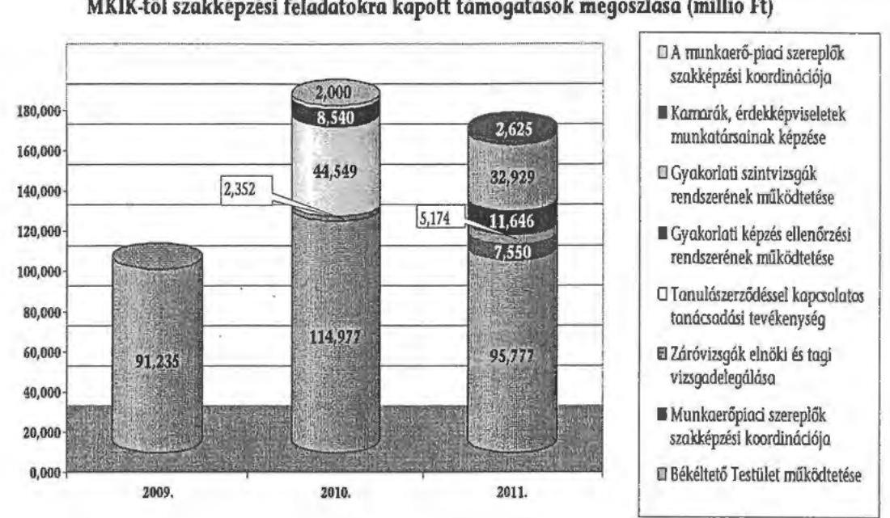

Az MKIK-től kapott támogatás felhasználása keretében a Budapesti KIK a gazdálkodó szervezet által képzett tanulók és a képzést nyújtó szervezet között létrejött tanulószerződéseket az MKIK által működtetett ISZIIR rendszerben nyilvántartotta. A Budapesti KIK az illetékességi körébe tartozó a gyakorlati képzést ellátó gazdálkodó szervezeteket összhangban a szakképzési tv. 30. § (3) bekezdésében foglaltakkal minden évben legalább egyszer ellenőrizte. Az ellenőrzések alapján intézkedést igénylő hibát a kamara nem tárt fel.

A Budapesti KIK a támogatásokkal határidőben elszámolt a támogató felé, de az elfogadásról írásos dokumentum nem állt rendelkezésre. A támogatás felhasználásának dokumentálása, elszámolása során betartotta a támogatási szerződésekben foglalt követelményeket és a jogszabályi előírásokat. A támogatások felhasználása során közbeszerzési eljárás lefolytatására nem került sor, mert nem volt olyan árubeszerzés és szolgáltatás igénybevétel, amely a közbeszerzési értékhatárt meghaladta volna. A támogatási szerződésekben előírt tájékoztatási kötelezettségének a Budapesti KIK eleget tett.

A kapott támogatások felhasználásának nyilvántartása megfelelt a számviteli tv. 161/A. § (2) bekezdésben előírtaknak, amelyet a támogatási szerződésekhez kapcsolt azonosító kódok használatával biztosított. A benyújtott pénzügyi elszámolások bizonylatai a támogatási szerződésben és a számviteli tv. 167. §-ában előírt alaki és tartalmi előírásoknak megfeleltek. A kialakított nyilvántartási és elszámolási rendszer biztosította ugyanazon bizonylatok többszöri elszámolásának megakadályozását, mert nem engedte ugyanazon bizonylat elszámolását több támogatáshoz. A támogatás terhére elszámolt költségek dokumentáltsága biztosította az elvégzett feladatok ellenőrizhetőségét a számviteli tv. 161/A. § (2) bekezdés szerint. Az elszámolást alátámasztó dokumentumok, számviteli bizonylatok megőrzése megfelelt a számviteli tv. 169. §.-ában foglaltaknak. A támogatások maradványának, illetve a többletköltségek kimutatása és elszámolása szabályszerűen történt.

---

A Budapesti KIK a feladatok megvalósításához szükséges humánerőforrás biztosításának követelményei közül az ügyintéző szervezet létszámát és feladatait az SZMSZ-ben meghatározta, de nem írta elő a vezető munkakörök betöltéséhez szükséges iskolai végzettséget. A Budapesti KIK a pályázat útján meghirdetett - megbízási szerződéssel betöltött feladatokra (szakképzési tanácsadó, szintvizsga bizottsági elnök) a honlapján közzétett pályázati felhívásban határozta meg az alkalmazáshoz szükséges iskolai végezettséget és egyéb feltételeket. A külső szakértők megbízásának szakmai és pénzügyi feltételeit a belső szabályzatok nem határozták meg, azokat jellemzően a támogatási szerződések tartalmazták. A Budapesti KIK munkatársai egyéb jogviszony keretében elláthattak szakképzéssel összefüggő, munkaköri leírásukban nem szereplő feladatokat. A vizsgáztatás körében ellátott feladatoknál a szabályozástól eltérő gyakorlatot az ellenőrzés nem tárt fel. A kamarai tisztségviselők összeférhetetlenségére vonatkozó szabályokat az Alapszabály VI. fejezete rögzítette, összhangban a kamarai törvény 16. § (1) bekezdés s) pontjában és a 27. § (3)(6) bekezdésekben foglaltakkal.

A Budapesti KIK működését alapvetően az alapszabály és az SZMSZ határozta meg. A költségvetési támogatások felhasználásának rendjére, kontrollrendszerére belső szabályozás nem készült. A kamara meglévő belső szabályzatai és a munkaköri leírások nem tartalmazták a támogatások felhasználásával, illetve annak ellenőrzésével kapcsolatos feladatokat. Az állami támogatás felhasználásáról szóló szakmai beszámoltatás, beszámolás és a pénzügyi elszámolás felelőseit, dokumentumait a támogatási szerződések, illetve az azok mellékletét képező útmutató határozták meg. A kötelezettségvállalás, utalványozás, pénzkezelés rendjét a Budapesti KIK a 10/2005. sz. főtitkári utasításban szabályozta. A békéltető testület elnöke, elnökhelyettese és tagjai részére történő kifizetéseknél az ellenjegyzés és az utalványozás is a főtitkár által történt, ami nem volt összhangban a főtitkári utasítással. A szabályzat ugyanis előírta, hogy a kötelezettségvállaló és az ellenjegyző, illetőleg az utalványozó és az ellenjegyző ugyanazon gazdasági eseményre vonatkozóan azonos személy nem lehet. Az ÁSZ ellenőrzés a megbízási díjakra vonatkozóan jogosulatlan kifizetést nem tárt fel.

A békéltető testület tevékenységét jogszabályszerűen végezte. A testület elnöke a fogyasztóvédelmi tv. 23/A. §-a szerinti listát vezetett a testületi tagokról. A testületi tagok jelölése és választása a fogyasztóvédelmi tv. 22. §-ában foglalt feltételek figyelembevételével történt. A testület a fogyasztóvédelmi tv. 37. § (1) bekezdésében foglaltaknak megfelelően működött. A testület tagjainak díjazása a 2009-2011. években minden esetben a 211/1998. (XII. 24.) Korm. rendeletben foglaltaknak megfelelően, a testületi tagokkal kötött megbízási szerződések alapján történt. A fogyasztóvédelmi tv. 36/A. § (1) bekezdésének megfelelően a testület a vizsgált időszakban határidőre összefoglaló tájékoztatót készített és küldött a fogyasztóvédelemért felelős miniszternek. A békéltető testület által tárgyalt ügyek számát a kamara szabályszerűen dokumentálta, a testület működtetési kiadásaihoz nyújtott pénzügyi támogatáshoz a tárgyalt ügyekről nyilvántartást vezetett.

---

# 3.11. A Dunaújváros Megyei Jogú Város Kereskedelmi és Iparkamara 

A Dunaújváros Megyei Jogú Város Kereskedelmi és Iparkamara (Dunaújváros KIK) 2009-2011. évek között a szakképzéssel összefüggő közfeladatai ellátásához 19 db támogatási szerződést kötött az MKIK-kel. A Dunaújváros KIK mellett az ellenőrzött években békéltető testület nem működött. A támogatási szerződések alapján 42,1 millió Ft támogatásban részesült, amelyet teljes egészében a támogatási szerződésben meghatározott szakképzési célra fordított. A támogatások felhasználása a bizonylatok alaki-tartalmi hiányosságai valamint az elkülönített nyilvántartási kötelezettség megsértése miatt nem volt szabályszerű.

A támogatások felhasználása során közbeszerzési eljárás lefolytatására nem került sor, mert nem volt olyan árubeszerzés és szolgáltatás igénybevétel, amely a közbeszerzési értékhatárt meghaladta volna. A Dunaújváros KIK a támogatási szerződésekben előírt tájékoztatási kötelezettségének a gyakorlati képzőhelyek értesítése során, az ügyintéző apparátus tanfolyamaira szóló meghívókon tett eleget.

MKIK-től szakképzési feladatokra kapott támogatások megoszlása (millió Ft)
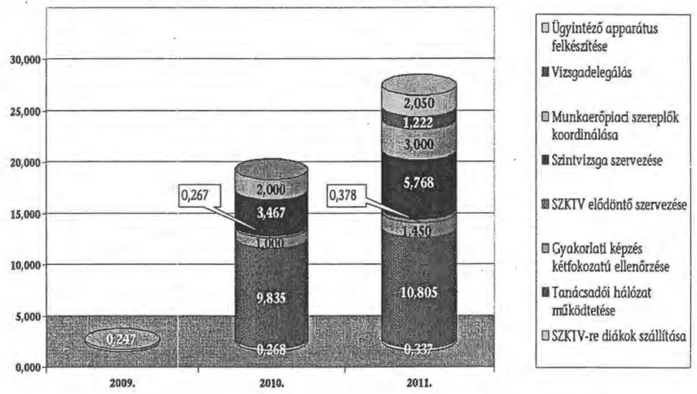

Az MKIK-től kapott támogatás felhasználása keretében a Dunaújváros KIK nyilvántartotta a gazdálkodó szervezet által képzett tanulók és a képzést nyújtó szervezet között létrejött tanulószerződéseket az MKIK által működtetett ISZIIR rendszerben. A Dunaújváros KIK az illetékességi körébe tartozó gyakorlati képzést végző gazdálkodó szervezeteknél folytatott le bevezető, illetve akkreditációs ellenőrzést a szakképzési tv. 30. § (3) bekezdése szerint. A bevezető ellenőrzéseket követően, egy kivétellel az ellenőrzöttek megkezdhették a gyakorlati képzést. Egy esetben, 2010 áprilisában fordult elő, hogy a gyakorlati képzőhely (egyéni vállalkozó) nem rendelkezett a képzéshez szükséges tárgyi felszereltséggel. A hiánypótlásra megadott 15 napos határidőn belül a képzőhely nem tel-

---

jesítette a gyakorlati képzés végzéséhez előírt feltételeket, ezért a gyakorlati képzés megkezdésére nem kapott engedélyt. Az akkreditációk során minden gyakorlati képzőhely megfelelt a követelményeknek.

A Dunaújváros KIK a támogató felé az ISZIIR-ben az ellenőrzött támogatások felhasználásáról a támogatási szerződésben előírt formában és tartalommal számolt el. A pénzügyi és a szakmai beszámolók átadás-átvételét sem a támogató, sem a Dunaújváros KIK nem dokumentálta, emiatt az elszámolás határidőre való teljesítése nem volt megállapítható. A támogató a beszámolók elfogadásáról nyilatkozatot nem adott ki. A támogatások felhasználásának dokumentálása (az alapdokumentumok elkülönített tárolása és megőrzése) az időszakban a támogatási szerződésekben előírt követelményeknek megfelelt.

A támogatások és a támogatások felhasználásának nyilvántartása nem felelt meg a számviteli tv. 161/A. § (2) bekezdésében meghatározottaknak és a támogatási szerződések előírásainak, mivel a szintvizsgáztatással összefüggésben elszámolt költségeket a Dunaújváros KIK a számviteli nyilvántartásában nem elkülönítetten tartotta nyilván. A támogatások elszámolását alátámasztó számviteli bizonylatok sem feleltek meg teljes körűen a számviteli tv. 167. § (1) bekezdés c), h) és i) pontjában szereplő előírásoknak. Emiatt a megbízási díjak kifizetése nem szabályszerű. A kamara a belföldi hivatalos kiküldetést teljesítő munkavállalók részére kiállított kiküldetési rendelvényeket szabálytalanul töltötte ki. Az Szja tv. 3. § 83. pontjában előírtaktól eltérően az indulás és az érkezés pontos idejét nem tüntette fel. Az ellenőrzés jogosulatlan kifizetést nem tárt fel. A Dunaújváros KIK természetbeni juttatást nem számolt el.

Az ellenőrzött kiadási pénztárbizonylaton 10 esetben az utalványozó, 13-ban az összeget átvevő és hét esetben a pénztáros aláírása nem szerepelt. A 127 db ellenőrzött számviteli alapbizonylat egyikén sem tüntették fel a könyvelés módját, az érintett könyvviteli számlára történő hivatkozást, valamint a könyvviteli nyilvántartásokba történő rögzítés időpontját. Ennek következtében a könyvelési feljegyzések alapján a számviteli nyilvántartásban történő visszakeresés lehetősége nem volt biztosított.

A Dunaújváros KIK biztosította az ISZIIR-ben elszámolt tételek és azok alapbizonylatainak beazonosítását, a többszöri elszámolás elkerülése érdekében a támogatási szerződések előírásának megfelelően a bizonylatokra - egy kivétellel - rávezette az előírt záradékokat. A Dunaújváros KIK a 2009-2011. években az elszámolásokban szabályszerűen mutatta ki a pénzügyi maradványt, illetve többletköltséget. A maradvány összegét a bankszámlakivonatok szerint a Dunaújváros KIK szabályosan visszautalta a támogatónak.

A Dunaújváros KIK szabályzataiban nem határozta meg a költségvetési támogatásból finanszírozott közfeladatok megvalósításához szükséges humánerőforrás követelményeit. A tanácsadói hálózat működtetésére nyújtott támogatási szerződésekben a támogató meghatározta a foglalkoztatás feltételeit. Az ezzel összhangban kiírt pályázatok alapján foglalkoztatottak megfeleltek az előírt követelményeknek. A szakképzéssel összefüggő kamarai feladatok ellátásához igénybe vett külső szakértők megbízásának szakmai és pénzügyi feltételeit belső szabályzatban a kamara nem szabályozta, a támogatási szerződések viszont rendelkeztek a pénzügyi feltételekről. A kamarai tisztségviselők összeférhetetlenségére vonatkozó szabályokat a kamara alapszabályának 84.

---

bekezdése tartalmazta a jogszabályi előírásokkal összhangban. A Dunaújváros KIK munkavállalóinak összeférhetetlenségére vonatkozó előírásokat belső szabályzatban nem írtak elő. Az ellenőrzött időszakban a kamara munkatársai egyéb jogviszony keretében elláthattak szakképzéssel összefüggő, munkaköri leírásukban nem lévő feladatokat. A Dunaújváros KIK alkalmazottai megbízás keretében közreműködtek a szakmai versenyek lebonyolításában, a szintvizsgák adminisztratív feladatainak ellátásában és a képzőhelyek ellenőrzésében.

A Dunaújváros KIK elszámolásait a támogatók dokumentáltan nem ellenőrizték. A Dunaújváros KIK az ellenőrzött időszakban a költségvetési támogatások szabályszerű felhasználásának belső kontrollrendszerét nem alakította ki. A kamara számviteli tv. 14. § (5) bekezdés d) pontjától eltérően nem rendelkezett pénzkezelési szabályzattal csak 2011 szeptemberétől. Az állami támogatás felhasználásáról szóló beszámolás és a pénzügyi elszámolás felelőseit belső szabályozás szintjén nem határozta meg. A kamara titkárának munkaköri leírása rögzítette a támogatás szabályszerű felhasználásáért való felelősséget. Az állami támogatás felhasználásáról szóló szakmai beszámoltatás, beszámolás és a pénzügyi elszámolás módját, dokumentumait a támogatási szerződések határozták meg.

# 3.12. A Fejér Megyei Kereskedelmi és Iparkamara 

A Fejér Megyei Kereskedelmi és Iparkamara (Fejér KIK) az időszakban megkötött támogatási szerződésekkel a békéltető testületek működtetése, valamint a szakképzési feladatok ellátása támogatására 21 szerződéssel 105,4 millió Ft-ot kapott az ellenőrzött években, amelyet a támogatási szerződésekben rögzített célokra fordított.

MKIK-től szakképzési feladatokra kapott támogatások megoszlása (millió Ft)
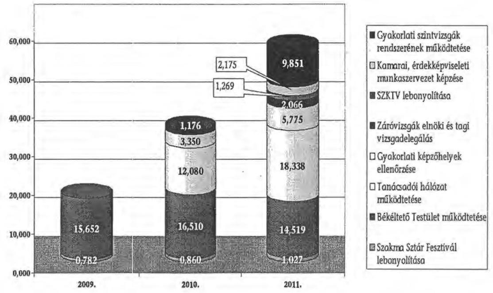

---

A támogatások felhasználása során közbeszerzési eljárás lefolytatására nem került sor, mert nem volt olyan árubeszerzés és szolgáltatás igénybevétel, amely a közbeszerzési értékhatárt meghaladta volna. A Fejér KIK a támogatási szerződésekben előírt tájékoztatási kötelezettségének eleget tett (helyi rádióban, újságban, rendezvényeken tájékoztatást adott a támogatásokról).

A kamara a támogatók felé a támogatási szerződésekben rögzített formában és határidőre elszámolt. A támogatás terhére elszámolt megbízási díjak, költségtérítések és egyéb juttatások elszámolása és kifizetése a jogszabályi előírásokkal összhangban történt. A támogatások felhasználása során közbeszerzési eljárás lefolytatására nem került sor, mert nem volt olyan árubeszerzés és szolgáltatás igénybevétel, amely a közbeszerzési értékhatárt meghaladta volna. A Fejér KIK a támogatási szerződésekben előírt tájékoztatási kötelezettségének eleget tett (helyi rádióban, újságban, rendezvényeken tájékoztatást adott a támogatásokról).

Az MKIK-től kapott támogatás felhasználása keretében a Fejér KIK nyilvántartotta a gazdálkodó szervezet által képzett tanulók és a képzést nyújtó szervezet között létrejött tanulószerződéseket az ISZIIR rendszerben. A Fejér KIK az illetékességi körébe tartozó gyakorlati képzést ellátó, tanuló szerződéssel foglalkoztató gazdálkodó szervezeteket a szakképzési tv. 30. § (3) bekezdése szerint ellenőrizte. A kamara az időszakban végzett ellenőrzések során intézkedést igénylő hibát nem tárt fel.

A támogatások és azok felhasználásának nyilvántartása megfelelt a számviteli tv. 161/A. § (2) bekezdésében és a támogatási szerződésekben foglalt előírásoknak. A kialakított nyilvántartási és elszámolási rendszer biztosította ugyanazon bizonylat többszöri elszámolásának kizárását, mert nem engedte ugyanazon bizonylat elszámolását több támogatáshoz. A kötelezettségvállalások, az utalványozások és a teljesítésigazolások a belső előírások szerint megtörténtek. A pénzügyi elszámolás a számviteli tv. 167. § (1) bekezdésének megfelelő bizonylatokkal dokumentált volt. A támogatási szerződések előírása szerint a támogatások és azok felhasználásának elkülönített kezelését és nyilvántartását munkaszámokra való könyveléssel teljesítették. A támogatás terhére elszámolt költségek dokumentáltsága biztosította az elvégzett feladatok ellenőrizhetőségét. A pénzügyi maradvány kimutatása szabályszerűen történt. A kamara a fel nem használt összeget szabályosan visszautalta a támogató részére, a többletfelhasználást saját bevételből fedezte. A kamara a támogatási szerződésben rögzítettek és a jogszabályi előírás szerint gondoskodott az elszámolást alátámasztó dokumentumok, számviteli bizonylatok megőrzéséről.

A Fejér KIK feladatainak ellátásához szükséges humánerőforrás biztosításának követelményeire külön szabályzat nem készült. Az ügyintéző szervezetre vonatkozóan a kamara belső szabályzataiban - az alapszabályban, az SZMSZ-ben, az ISO 9001-hez kapcsolódó minőségirányítási kézikönyvben, az álláspályázati felhívásokban, valamint a munkaköri leírásokban - határozta meg a követelményeket. Az SZMSZ rögzítette a működést biztosító létszámkövetelményt. A külső szakértők megbízásának szakmai és pénzügyi feltételeit a támogatási szerződések tartalmazták. A Fejér KIK munkatársai egyéb jogviszony keretében nem láthattak és nem is láttak el szakképzéssel összefüggő, a munkaköri leírásukban nem szereplő feladatokat.

---

A kamarai tisztségviselők összeférhetetlenségére vonatkozó szabályokat az alapszabályban és az SZMSZ-ben rögzítették, összhangban a kamarai törvény 16. § (1) bekezdés s) pontjában és a 27. § (3)-(6) bekezdésében foglaltakkal.

Az ügyintézői szervezetre vonatkozóan összeférhetetlenségre vonatkozó szabályokat nem határoztak meg. A külső szakértők esetében összeférhetetlenségre vonatkozó szabályokat a pályázathoz csatolandó összeférhetetlenségi nyilatkozat tartalmazta.

A Fejér KIK a költségvetési támogatások felhasználásának kontrollrendszerére vonatkozóan belső szabályozással rendelkezett. A Fejér KIK szakképzési tevékenységére vonatkozó folyamatleírása tevékenységenként, a dokumentáció és a felelős megjelölésével tartalmazta a támogatáshoz kapcsolódó egyes munkafolyamatokat, az együttműködésben érintett munkakör, kommunikációs kötelezettség megjelölésével. A minőségbiztosítási rendszerében kialakított gazdálkodási munkafolyamat leírásban negyedéves pénzügyi beszámolást írt elő. A főtitkár utasítást ${ }^{32}$ adott ki az állami és uniós pénzek felhasználásával kapcsolatban. A képzési tanácsadók munkaköri leírásában szerepelt a projektmunkában való részvétel, a pályázatok gondozása, a pénzügyi és személyügyi koordinátorában pedig a kamarai szerződésekkel kapcsolatos pénzügyi és adminisztrációs elszámolások feladata. Az Fejér KIK az ellenőrzött időszak egészében alkalmazott könyvvizsgálót, akinek feladata - a támogatási szerződések előírása szerint 2011-től - a támogatások pénzügyi elszámolásának felülvizsgálatára is kiterjedt. Az Fejér KIK EB-je is foglalkozott a pályázatok áttekintésével ${ }^{33}$. Az ellenőrzött időszakban a támogató helyszíni ellenőrzést nem végzett.

A Fejér KIK rendelkezett a számviteli tv-ben előírt számviteli politikával, számlarenddel. A kötelezettségvállalás, utalványozás, pénzkezelés kontrollrendszerére vonatkozóan az SZMSZ és a pénzkezelési szabályzat tartalmazott rendelkezést. A költségvetési támogatások felhasználásáról szóló szakmai beszámoltatás, beszámolás és a pénzügyi elszámolás felelőseit és dokumentumait a támogatási szerződések meghatározták. Az ISZIIR rendszerben és a főkönyvi könyvelésben elszámolt tételeket, kifizetéseket a kamara folyamatosan egyeztette. A folyamatba épített és vezetői ellenőrzés működött a kamaránál. A gazdasági vezető - a belső szabályozásnak megfelelően - negyedévenként pénzügyi jelentést készített a főtitkár részére, amely az egyes projektek pénzügyi alakulását is mutatta. A támogatás megfelelő elszámolása a többlépcsős belső kontrollfolyamat által biztosított volt.

A Fejér KIK mellett működő békéltető testület a fogyasztóvédelmi tv. 1837/A. §-ainak előírásai szerint folytatta tevékenységét és a működését biztosító támogatási szerződésekben rögzítetteknek megfelelően járt el. A testület által ellátott vitás ügyek, eljárások nyilvántartása biztosította az éves költségvetési törvényben címzetten kapott támogatás úgyszámarányos elszámolását. A testületi tagok díjazása a békéltető testületi tagok díjazásáról szóló 211/1998. (XII. 24.) Korm. rendelet előírásainak megfelelően történt. A testület a 2010. és a 2011. évekről határidőre - 2011. január 31-én, 2012. január 31-én - elkészítette

[^0]
[^0]:    ${ }^{32}$ 2008. január 1-jei főtitkári utasítás
    ${ }^{33}$ 2011. február 23-i jegyzőkönyv

---

és megküldte tevékenységéről a tájékoztatót a fogyasztóvédelemért felelős miniszternek, a 2009. évi tájékoztató megküldését azonban nem dokumentálta.

# 3.13. A Győr-Moson-Sopron Megyei Kereskedelmi és Iparkamara 

A 2009-2011. években a Győr-Moson-Sopron Megyei Kereskedelmi és Iparkamara (Győr KIK) a békéltető testület működtetéséhez és a szakképzéshez kapcsolódó feladatok ellátásához 22 szerződéssel 159,4 millió Ft összegben kötött támogatási szerződést az MKIK-kel. A kamara a kapott támogatásokat a támogatási szerződésekben meghatározott célokra fordította. A támogatás felhasználása és elszámolása nem volt szabályszerű, a támogatási szerződésben előírt felhasználási időszakon túl felmerült és kifizetett 0,019 millió Ft miatt.

A 2010. évben az MPA-KA-SZMM-5/2009. számú támogatási szerződéshez kapcsolódóan a Győr KIK az elszámolásban 0,004 millió Ft maradványt mutatott ki, amelynek visszautalása az elszámolással egy időben megtörtént. A kimutatott maradvánnyal szemben a helyszíni ellenőrzés által feltár hiba miatt 0,023 millió Ft a maradvány helyes összege, mivel a költségek között bérleti díjként elszámolt 0,019 millió Ft a szerződésben meghatározott teljesítési határideje után merült fel. A támogató az ÁSZ ellenőrzés során megállapított hibát nem tárta fel, az elszámolást elfogadta.

MKIK-től szakképzési feladatokra kapott támogatások megoszlása (millió Ft)
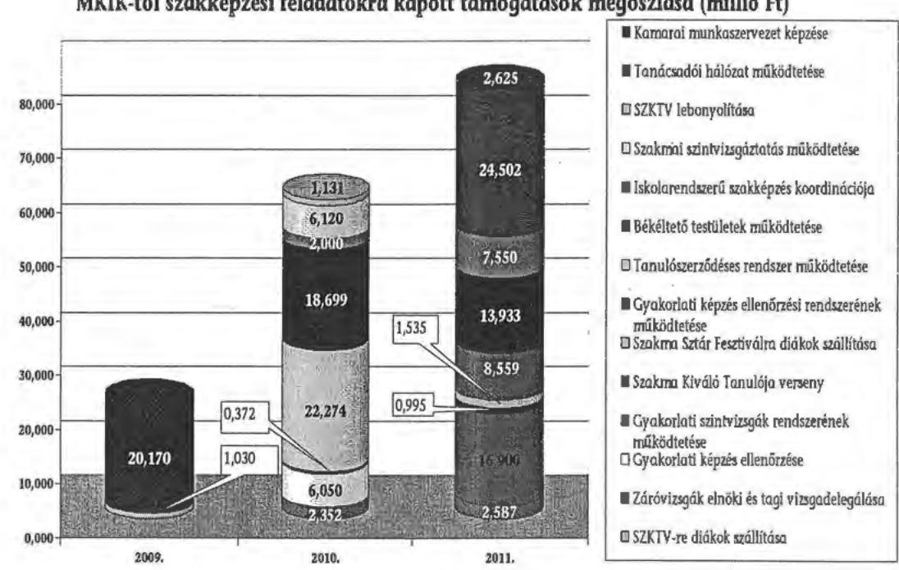

A támogatás terhére elszámolt megbízási díjakat, költségtérítéseket és természetbeni juttatásokat a jogszabályokkal és a belső szabályzatokkal összhangban számolták el és fizették ki. A támogatások felhasználása során közbeszerzési eljárás lefolytatására nem került sor, mert nem volt olyan árubeszerzés és szolgáltatás igénybevétel, amely a közbeszerzési értékhatárt meghaladta volna. A Győr KIK eleget tett a támogatási szerződésben előírt tájékoztatási

---

kötelezettségének, a közérdekű nyilvános adatokat a Győr KIK honlapján nyilvánosságra hozta, továbbá rendezvényeken és kiadványokon tájékoztatást adott a támogatásról.

A Győr KIK minden esetben a támogatási szerződésben meghatározott formában és határidőben számolt el a támogató felé. A támogatási szerződésben előírt szakmai és pénzügyi elszámolásokról az elszámolás elfogadásáról elfogadó nyilatkozatot nem adott ki.

Az MKIK-től kapott támogatás felhasználása keretében a Győr KIK a gazdálkodó szervezet által képzett tanulók és a képzést nyújtó szervezet között létrejött tanulószerződéseket az ISZIIR-ben nyilvántartotta. A kamara az illetékességi körébe tartozó gyakorlati képzést ellátó, tanuló szerződéssel foglalkoztató gazdálkodó szervezeteket a szakképzési tv. 30. § (3) bekezdése szerint az időszakban ellenőrizte és intézkedést igénylő hibát nem tárt fel.

A Győr KIK a kapott támogatások felhasználásának dokumentálása, elszámolása során betartotta a támogatási szerződésben foglalt követelményeket és a jogszabályi előírásokat. A támogatások és a támogatások felhasználásának nyilvántartása megfelelt a számviteli tv. 161/A. § (2) bekezdésében meghatározottaknak és a támogatási szerződések előírásainak. Könyvvezetési rendszerében munkaszámokra való könyveléssel biztosította a támogatások elkülönített nyilvántartását. A Győr KIK a pénzügyi elszámolást az ISZIIR által biztosított dokumentumokkal, megfelelő számviteli bizonylatokkal támasztotta alá, amelyek megfeleltek a számviteli tv. 167. § (1) bekezdésében foglalt alaki és tartalmi követelményeknek. Az elszámolást alátámasztó dokumentumok, számviteli bizonylatok megőrzéséről a támogatási szerződés és a számviteli tv. 169. §-ában foglalt előírás szerint gondoskodott.

A támogatási szerződés, valamint a számviteli tv. 161/A. § (2) bekezdésének előírása szerint kialakított nyilvántartási és elszámolási rendszer a szerződés számának az elszámolt számlákra történő rávezetésével, valamint ennek megfelelő számviteli nyilvántartásban való rögzítésével biztosította ugyanazon bizonylat többszöri elszámolásának kizárását. A támogatás terhére elszámolt költségek dokumentáltsága biztosította az elvégzett feladatok ellenőrizhetőségét.

A Győr KIK a feladatok ellátásához szükséges humánerőforrás biztosításának követelményeit az ügyintéző szervezetre vonatkozóan belső szabályozásban - alapszabályában, üzemi megállapodásában, pályázati felhívásokban, az ISO 9001 Humán erőforrás fejlesztés leírásában, valamint a munkaköri leírásokban - határozta meg. A munkaköri leírások tartalmazták az egyes munkakörök betöltéséhez szükséges iskolai végzettséget. A külső szakértők megbízásának szakmai és pénzügyi feltételeit, a díjazás rendjét, forrását, a szakértőktől elvárt iskolai végzettséget, valamint a díjazásaira vonatkozóan iránymutatásokat a támogatási szerződések tartalmaztak. A Győr KIK a honlapján közzétett szakértői pályázati felhívásokban meghatározta az alkalmazáshoz szükséges iskolai végezettséget és az egyéb feltételeket. A Győr KIK a kamarai tisztségviselők összeférhetetlenségére vonatkozó szabályokat az alapszabályban rögzítette, összhangban a kamarai tv. 16. § (1) bekezdés s) pontjában és a 27. § (3)(6) bekezdésében foglaltakkal.

---

Az összeférhetetlenségre vonatkozó szabályokat az ügyintéző szervezetre vonatkozóan titkári utasításban továbbá egyes támogatási szerződésekben rögzítették, a külső szakértők esetében a pályázathoz csatolandó nyilatkozattételi kötelezettséggel biztosították. A Győr KIK munkatársai egyéb jogviszony keretében, kizárólag munkaidőn túl láthattak el szakképzéssel összefüggő, munkaköri leírásukban nem szereplő feladatokat.

A Győr KIK-nél a költségvetési támogatások felhasználásának kontrollrendszerére vonatkozóan belső szabályozás nem volt. A kötelezettségvállalás, utalványozás, pénzkezelés kontrollrendszerére vonatkozóan az alapszabály és a gazdálkodási szabályzat tartalmazott rendelkezést. Az állami támogatás felhasználásáról szóló szakmai beszámoltatás, beszámolás és a pénzügyi elszámolás felelőseit és dokumentumait a támogatási szerződések határozták meg. A támogatási szerződések előírták a támogatás pénzügyi felhasználásának feltételeit és a beszámolási kötelezettséget, ezen belül meghatározták a pénzügyi és a szakmai beszámoló tartalmi szempontjait és szabályait.

A kötelezettségvállalások, a teljesítésigazolások a belső szabályzatban előírtak szerint megtörténtek. A szakképzési munkatárs az ISZIIR rendszerben, a pénzügyi osztály pedig az adott feladathoz kapcsolódóan rögzítette az egyes tételeket a főkönyvi könyvelésben. Az elszámolt tételeket, kifizetéseket havonta egyeztették, így a támogatás megfelelő elszámolása e többlépcsős belső kontrollfolyamat által biztosított volt.

Az MKIK a támogatás felhasználásával kapcsolatosan helyszíni ellenőrzést nem végzett a Győr KIK-nél. A pályázatok elszámolásának kontrollálása az ISZIIR rendszeren keresztül történt, a hiánypótlásokra felhívást tettek a kamara felé.

A fogyasztóvédelmi tv. 18. § (2) bekezdésében rögzítetteknek megfelelően a Győr KIK mellett működő békéltető testület a törvény VI. fejezetének előírásai szerint működött. A testület feladatát a törvény 37. §-ában rögzítettek szerint látta el. A 37/A. § (3) bekezdésében előírtak megtalálhatók a kamara honlapján. A testületi tagok díjazásáról szóló 211/1998. (XII. 24.) Korm. rendelet előírásainak megfelelően történt a tagok és az elnök díjazása. A békéltető testület a 36/A. § (1) bekezdésében foglaltaknak eleget téve a tevékenységéről szóló tájékoztatót az ellenőrzött években határidőre - 2010. január 25-én, 2011. január 24-én, 2012. január 15-én - elkészítette és megküldte a fogyasztóvédelemért felelős miniszternek. A testület a tárgyalt ügyek számát szabályszerűen dokumentálta, a nyilvántartás alátámasztotta mind a szakmai, mind a pénzügyi elszámolást.

# 3.14. A Jász-Nagykun-Szolnok Megyei Kereskedelmi és Iparkamara 

A Jász-Nagykun-Szolnok Megyei Kereskedelmi és Iparkamara (Jász KIK) 124,5 millió Ft értékben kötött az ellenőrzött években 25 támogatási szerződést az MKIK-kel, amelyet a támogatási szerződésekben rögzített célokra fordított. A támogatások felhasználása az utalványozás hiánya miatt nem volt szabályszerű.

---

MKIK-től szakképzési feladatokra kapott támogatások megoszlása (millió Ft)
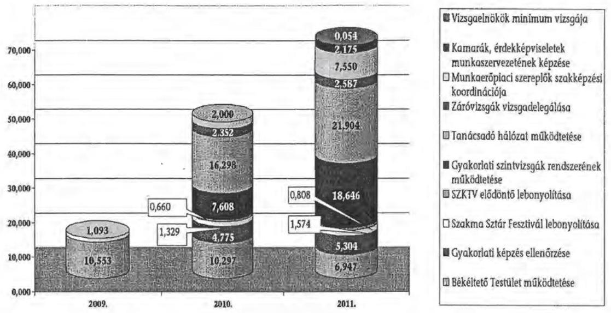

A támogatások felhasználása során közbeszerzési eljárás lefolytatására nem került sor, mert nem volt olyan árubeszerzés és szolgáltatás igénybevétel, amely a közbeszerzési értékhatárt meghaladta volna. A támogatási szerződésekben a kamara eleget tett a honlapján való közzététellel a számára előírt tájékoztatási kötelezettségének.

Az MKIK-től kapott támogatás felhasználása keretében a Jász KIK nyilvántartotta a gazdálkodó szervezet által képzett tanulók és a képzést nyújtó szervezet között létrejött tanulószerződéseket az ISZIIR rendszerben. Az illetékességi körébe tartozó gyakorlati képzést ellátó gazdálkodó szervezeteket összhangban a szakképzési tv. 30. § (3) bekezdésében foglaltakkal minden évben legalább egyszer ellenőrizte, intézkedést igénylő hibát nem tárt fel.

A Jász KIK az elszámolásokat határidőben és az előírt formában benyújtotta a támogató felé, a támogató írásban az elfogadást nem dokumentálta, de az ISZIIR rendszerben kialakított elszámolási felületet lezárta.

A támogatások nyilvántartása megfelelt a támogatási szerződésben előírtaknak és a számviteli tv. 161/A. § (2) bekezdés előírásának. A felhasználás elkülönített nyilvántartása támogatási típusonként az 5. számlaosztály alábontásával valósult meg. A benyújtott pénzügyi elszámolások bizonylatai a támogatási szerződésben és a számviteli tv. 167. § (1) bekezdés c) pontjában előírt utalványozási előírást nem teljesítették. Az ellenőrzés jogosulatlan kifizetést nem tárt fel. A Jász KIK az utalványozási jogosultságot nem szabályozta. A támogatás terhére elszámolt költségek dokumentáltsága biztosította az elvégzett feladatok ellenőrizhetőségét. Az elszámolásokat alátámasztó dokumentumok megőrzéséről a számviteli tv. 169. §-ában és a támogatási szerződésben foglalt előírásoknak megfelelően gondoskodtak. A kamaránál hét esetben volt pénzügyi maradvány, amelynek kimutatása és pénzügyi rendezése szabályszerűen történt.

---

A Jász KIK a feladatok megvalósításához szükséges humánerőforrás biztosításának követelményeit és pénzügyi forrásait szabályzatban nem, a támogatási szerződésben határozta meg. A külső szakértők megbízásának szakmai és pénzügyi feltételeit szintén a támogatási szerződések tartalmazták. A kamarai tisztségviselők összeférhetetlenségére vonatkozó szabályokat az alapszabályban és az SZMSZ-ben rögzítették, összhangban a kamarai tv. 16. § (1) bekezdés s) pontjában és a 27. § (3)-(6) bekezdésében foglaltakkal. Az ügyintéző szervezetre vonatkozó összeférhetetlenségi szabályokat a kamara belső szabályzatban nem határozta meg. A Jász KIK munkatársai egyéb jogviszony keretében, a kamarai titkár engedélyével elláttak szakképzéssel összefüggő, munkaköri leírásukban nem szereplő feladatokat. A kamara dolgozói, tanácsadói elláttak vizsgáztatási, vizsgaelnöki feladatokat alkalomszerűen, szabadságuk terhére.

A Jász KIK működését alapvetően az alapszabály határozta meg. A költségvetési támogatások felhasználásának kontrollrendszerére vonatkozó belső szabályozás nem készült. A kamara rendelkezett a számviteli tv. által előírt szabályzatokkal. Utalványozót, pénztárellenőrt a pénzkezelési szabályzat nem nevezett meg, így az nem felelt meg a számviteli tv. 14. § (8) bekezdésében előírtaknak. Az állami támogatás felhasználásáról szóló szakmai beszámoltatás, beszámolás és a pénzügyi elszámolás felelőseit, dokumentumait a Jász KIK részére az MKIK a támogatási szerződésekben határozta meg.

A Jász KIK mellett működő békéltető testület a fogyasztóvédelmi tv. 37 §-a szerint végezte tevékenységét. A testület tagjai és elnöke a békéltető tagok díjazásáról szóló 211/1998. (XII. 24.) Korm. rendelet szerinti díjazásban részesültek. A fogyasztóvédelmi tv. 36/A. § (1) bekezdése alapján készítendő összefoglaló tájékoztatót a fogyasztóvédelemért felelős miniszternek a békéltető testület az előírástól eltérően nem küldte meg. A testületnél a tárgyalt ügyek számát szabályszerűen dokumentálták.

# 3.15. A Pest Megyei Kereskedelmi és Iparkamara 

A Pest Megyei Kereskedelmi és Iparkamara (Pest KIK) 23 db támogatási szerződést kötött meg az éves békéltető testületek működtetésének, valamint a szakképzési feladatok ellátásának támogatására 234,2 millió Ft összegben az MKIK-kel, amelyet a támogatási szerződésekben rögzített célokra fordított. A támogatások felhasználása az elkülönített nyilvántartási kötelezettségre vonatkozó előírás megszegése és a bizonylatok alaki-tartalmi hiányosságai miatt nem volt szabályszerű.

A támogatások felhasználása során közbeszerzési eljárás lefolytatására nem került sor, mert nem volt olyan árubeszerzés és szolgáltatás igénybevétel, amely a közbeszerzési értékhatárt meghaladta volna. A támogatás terhére elszámolt megbízási díjak, költségtérítések elszámolása és kifizetése a jogszabályi előírásoknak megfelelően teljesítésigazolások alapján történt, természetbeni juttatások elszámolása nem volt. A támogatási szerződésekben előírt tájékoztatási kötelezettségének a kamara a honlapján történő megjelentetéssel, a meghívókon történő feltüntetéssel, valamint a szakképzési fórumokon történő tájékoztatással eleget tett.

---

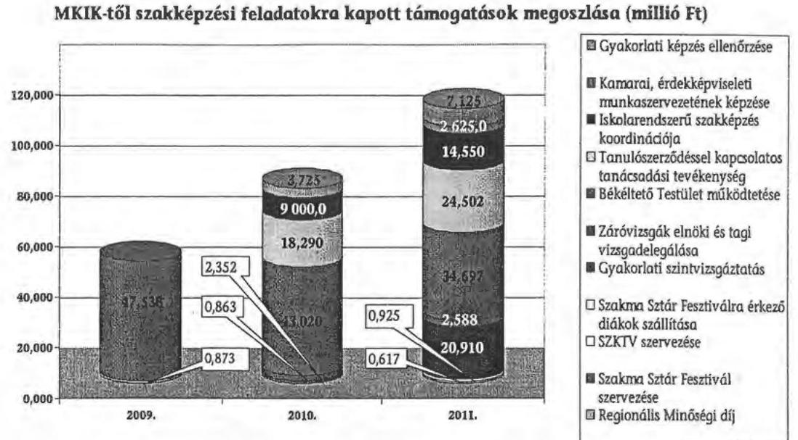

Az MKIK-től kapott támogatás felhasználása keretében a Pest KIK nyilvántartotta a gazdálkodó szervezet által képzett tanulók és a képzést nyújtó szervezet között létrejött tanulószerződéseket az ISZIIR rendszerben. Az illetékességi körébe tartozó gyakorlati képzést ellátó gazdálkodó szervezeteket összhangban a szakképzési tv. 30. § (3) bekezdésében foglaltakkal minden évben legalább egyszer ellenőrizte. Az évközi ellenőrzések során egy esetben hiányosságot találtak, mivel egy szervezetnél a tanulók nem kapták meg a díjazásukat, ezért az ellenőrzés a képzőhelyet felszólította a hiányosság pótlására. Erre nem került sor, ezért a gazdálkodó szervezetet a gyakorlati képzéstől eltiltották. Ezen túl a talált hiányosságok dokumentáláshoz kapcsolódtak, a kamara intézkedéseiben felhívta a figyelmet a hiányosságok pótlására.

A Pest KIK a pénzügyi elszámolásokat benyújtotta határidőben a támogató felé, azonban a szakmai beszámolási kötelezettségének két esetben az előírt határidőn túl tett eleget. A késedelmes beszámolást a támogató dokumentáltan nem kifogásolta, következménye nem volt. A támogatás felhasználásának dokumentálása, elszámolása során betartotta a támogatási szerződésekben foglalt követelményeket és a jogszabályi előírásokat. A támogató az ISZIIR rendszerben kialakított elszámolási felületet lezárta, de az elszámolás elfogadásról nyilatkozatot nem adott ki.

A kapott támogatások felhasználásának nyilvántartása nem felelt meg teljes körűen a számviteli. tv. 161/A. § (2) bekezdésben előírtaknak. A kamara a könyvvezetési rendszerében a bérekre nem kiterjedően, hiányos témaszámos könyveléssel végezte az elkülönített nyilvántartást. A pénzügyi elszámolások bizonylatai a támogatási szerződésben és a számviteli tv. 167. §-ában előírt alaki és tartalmi előírásoknak az i) pont kivételével megfeleltek. A könyvviteli nyilvántartásokban történő rögzítés időpontja, igazolása a bizonylatokról hiányzott. A támogatás terhére elszámolt költségek dokumentáltsága nem biztosította az elvégzett feladatok utólagos ellenőrizhetőségét az elszámolt bérek elkülönítésének hiánya miatt.

---

A bevételeknél nem alakították ki a témaszámos elkülönítést. Az elszámolásokat alátámasztó dokumentumok, számviteli bizonylatok megőrzéséről a kamara a támogatási szerződés és a számviteli tv. 169. §-ában foglalt előírás szerint gondoskodott. A kamara két esetben mutatott ki szabályosan maradványt, amelyet az utófinanszírozás miatt a végső utalásnál rendezett. A többlet ráfordításokat saját bevételből fedezte.

A Pest KIK a feladatok megvalósításához szükséges humánerőforrás biztosításának követelményeiről belső szabályzatot nem készített. A követelmények közül a munkaszerződésekben, munkaköri leírásokban az iskolai végzettséget meghatározták. A külső szakértők megbízásának szakmai és pénzügyi feltételeit a támogatási szerződések tartalmazták. A kamara munkatársai egyéb jogviszony keretében is elláttak szakképzéssel összefüggő, munkaköri leírásukban nem szereplő feladatokat. A kamarai munkatársak a támogatási szerződés alapján koordinátori, rendezvényszervezési, kiadvány-szerkesztési, kiadványlektorálási feladatok ellátására, továbbá a gazdálkodó szervezeteknél gyakorlati képzést végző szakemberek pedagógiai felkészítésére kaptak megbízást.

A kamarai tisztségviselők összeférhetetlenségére vonatkozó szabályokat az alapszabályban rögzítették, összhangban a kamarai törvény 16. § (1) bekezdés s) pontjában és a 27. § (3)-(6) bekezdéseiben foglaltakkal. Az ügyintézői szervezetre vonatkozóan összeférhetetlenséget csak a pénzkezelésre vonatkozóan határoztak meg.

A Pest KIK működését alapvetően az alapszabály határozta meg. A költségvetési támogatások felhasználásának kontrollrendszerére külön belső szabályozás nem készült. A kamara meglévő belső szabályzatai a kontroll elemekre vonatkozóan tartalmaztak szabályozást. Így a pénzgazdálkodásnál az utalványozást, a pénztárellenőrzést és a pénzkezeléssel kapcsolatos összeférhetetlenséget határozták meg. Az állami támogatás felhasználásáról szóló szakmai beszámoltatás, beszámolás és a pénzügyi elszámolás felelőseit és dokumentumait a támogatási szerződések, illetve az azok mellékletét képező útmutató határozták meg. A kamara elszámolásait független könyvvizsgáló felülvizsgálta és az ÁSZ ellenőrzés által feltárt szabálytalan felhasználást nem állapította meg. Az ellenőrzött időszakban a támogató MKIK helyszíni ellenőrzést nem végzett.

A Pest KIK mellett működő békéltető testület a fogyasztóvédelmi tv. előírásai szerint folytatta tevékenységét. A testület tagjai és elnöke a békéltető tagok díjazásáról szóló 211/1998. (XII. 24.) Korm. rendelet szerinti díjazásban és költségtérítésben részesültek. A fogyasztóvédelmi tv. 36/A. § (1) bekezdése alapján készítendő összefoglaló tájékoztatót a fogyasztóvédelemért felelős miniszternek a békéltető testület nem küldte meg. A tárgyalt ügyek számát szabályszerűen dokumentálták.

# 3.16. A Pécs-Baranyai Kereskedelmi és Iparkamara 

A Pécs-Baranyai Kereskedelmi és Iparkamara (Pécs KIK) az ellenőrzött időszakban összesen 21 db támogatási szerződést kötött meg a békéltető testület működtetésének, valamint a szakképzési feladatok ellátásának támogatására 172,8 millió Ft összegben az MKIK-kel, amelyet a támogatási szerződésekben rögzített célokra fordított.

---

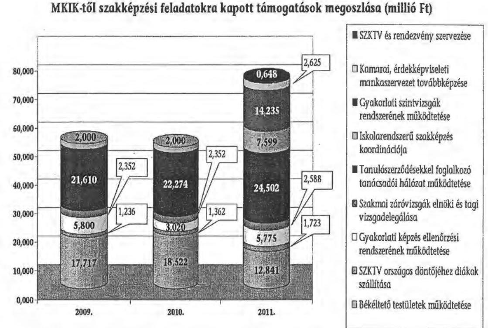

A támogatások felhasználása során közbeszerzési eljárás lefolytatására nem került sor, mert nem volt olyan árubeszerzés és szolgáltatás igénybevétel, amely a közbeszerzési értékhatárt meghaladta volna. A kamara a támogatók felé a támogatási szerződésekben rögzített formában és határidőre elszámolt. A támogatás felhasználásának dokumentálása, elszámolása során betartotta a támogatási szerződésben foglalt követelményeket. A szakmai beszámolók és a pénzügyi elszámolások a támogatást nyújtó MKIK általi elfogadásáról dokumentumok nem álltak rendelkezésre.

A kamaránál a támogatás terhére elszámolt megbízási díjak, költségtérítések elszámolása és kifizetése a jogszabályi előírásoknak megfelelően teljesítésigazolások alapján történt, természetbeni juttatások elszámolása nem volt. A Pécs KIK eleget tett a költségvetési támogatás felhasználása során a támogatási szerződésekben előírt tájékoztatási kötelezettségének. A kamara a rendezvények meghívóin, a tájékoztató kiadványokon, valamint a reklám és irányító táblákon feltüntette a támogató megnevezését.

Az MKIK-től kapott támogatás felhasználása keretében a Pécs KIK az ISZIIR nyilvántartásban rögzítette a gazdálkodó szervezetek által képzett tanulók és a képzést nyújtó szervezetek között létrejött tanulószerződéseket. Az illetékességi körébe tartozó gyakorlati képzést ellátó gazdálkodó szervezeteket összhangban a szakképzési tv. 30. § (3) bekezdésében foglaltakkal minden évben ellenőrizte. A gazdálkodó szervezeteknél elvégzett ellenőrzések 2009-ben három, 2010-ben négy, 2011-ben három esetben tártak fel hiányosságot. Összesen négy esetben eltiltó határozat született, a többinél a hiányosságokat pótolták.

---

A támogatás és felhasználásának nyilvántartása megfelelt a számviteli tv. 161/A. § (2) bekezdésében, valamint a támogatási szerződésben rögzítetteknek. A pénzügyi elszámolás a számviteli tv. 167. § (1) bekezdésében rögzített alaki tartalmi követelményeknek megfelelő számviteli bizonylatokkal dokumentált volt. A kamara ugyanazon bizonylat többszöri elszámolását kizárta, mert az elszámolás alapját képező bizonylatra felvezetésre került a támogatási szerződés száma és a támogatás terhére elszámolt összeg, ennek megfelelően rögzítették számviteli nyilvántartásukban. Az elszámolást igazoló dokumentumok, számviteli bizonylatok megőrzéséről a kamara a támogatási, illetve közreműködői szerződések és a számviteli tv. 169. § előírásai szerint gondoskodott. A támogatási összegekből maradvány nem keletkezett. Amennyiben a támogatott feladatok költsége magasabb volt a támogatás összegénél, a különbözetet a Pécs KIK saját forrásból biztosította.

A Pécs KIK belső szabályzatban nem határozta meg a feladatok megvalósításához szükséges humánerőforrás biztosításának követelményeit. Feladatait főállású kamarai, emellett külső szakértői megbízással foglalkoztatott munkavállalókkal látta el. A külső szakértők megbízásának szakmai és pénzügyi feltételeit a támogatási szerződések tartalmazták. A támogatási szerződések a szakértőktől elvárt iskolai végzettségre, a díjazás mértékére tartalmaztak iránymutatásokat, amelyeket figyelembe vettek a megbízásoknál. Ezen túlmenően a Pécs KIK honlapján közzétett szakértői pályázati felhívásokban meghatározta az alkalmazáshoz szükséges iskolai végzettséget és az egyéb feltételeket.

A kamarai tisztségviselők összeférhetetlenségére vonatkozó szabályokat az alapszabály rögzítette, összhangban a kamarai törvény 16. § (1) bekezdés s) pontjában és a 27. § (3)-(6) bekezdésekben foglaltakkal. Más összeférhetetlenségi szabályt nem határozott meg. A Pécs KIK munkatársai engedélyezés mellett elláthattak kamarai munkaviszonyukon túli, egyéb jogviszonyban feladatokat. A vizsgált időszakban a kamarai dolgozók egyéb jogviszonyának engedélyezésére nem került sor.

A Pécs KIK tevékenységét és működését alapvetően az alapszabály és az SZMSZ határozta meg. Az ellenőrzött időszakban a Pécs KIK belső szabályzataiban az állami támogatások felhasználásának rendjét, valamint a pénzgazdálkodási jogkörök gyakorlását külön nem szabályozta. A kamara kontroll elemként az utalványozást szabályozta, de az előírástól eltérően az utalványozási értékhatár megjelölésével vezetendő nyilvántartást nem vezette. Az MKIK által adott támogatások felhasználásáról szóló szakmai beszámoltatás, beszámolás és a pénzügyi elszámolás felelőseit, illetve dokumentumait a támogatási szerződések határozták meg. Az MKIK az általa adott támogatások felhasználásával kapcsolatosan helyszíni ellenőrzést a Pécs KIK-nél nem végzett. A Pécs KIK a 2011. június 1. és november 30. közötti időszakra vonatkozóan a szakképzési feladatokra és az iskolarendszerű szakképzés koordinációjában való részvétel megvalósítására kapott támogatások felhasználásának beszámolóit független könyvvizsgáló ellenőrizte, aki nem tárt fel hiányosságokat.

---

A Pécs KIK mellett működő békéltető testület a fogyasztóvédelmi tv. 1837/A. §-ainak előírásai szerint folytatta tevékenységét és működését. A testület tagjai a békéltető tagok díjazásáról szóló 211/1998. (XII. 24.) Korm. rendelet szerinti díjazásban és költségtérítésben részesültek. A testület évente összefoglaló tájékoztatót készített a fogyasztóvédelmi tv. 36/A. § (1) bekezdése alapján, melyet minden évben megküldött a fogyasztóvédelemért felelős miniszternek, továbbá az MKIK-nek. A Pécs KIK a tárgyalt ügyeket fajtájuk szerint dokumentálta.

# 4. A SZAKKÉPZÉSI HOZZÁJÁRULÁS NYILVÁNTARTÁSA, BEVALLÁSA ÉS

ANNAK ELLENŐRZÉSE

A gyakorlati képzést végző gazdálkodó szervezetek szakképzési hozzájárulás nyilvántartási, bevallási és elszámolási kötelezettségének jogszabályokban előírtak szerinti teljesítését 87 gazdálkodó szervezetnél, 3313 tanulószerződésre vonatkozóan ellenőriztük. ${ }^{34}$ Az ellenőrzöttek közül 63 gazdálkodó szervezet (72,4 %) tételes költségelszámolást, 15 (17,3 %) átalány elszámolást alkalmazott az ellenőrzött időszakban. Kilenc (10,3 %) gazdálkodó szervezet pedig megváltoztatta elszámolási módját az időszakban. Az ellenőrzés alapján 87-ből csak 37 gazdálkodó szervezetnél volt szabályos a szakképzési hozzájárulás bevallása és az ahhoz kapcsolódó nyilvántartások vezetése.

A gyakorlati képzést szervező gazdálkodó szervezetek bevallásainak feldolgozása, ellenőrzése az NSZFI feladata volt az időszakban. Az ellenőrzött gazdálkodó szervezeteknek a 2009-2011. évek között 4655 millió Ft bruttó hozzájárulási kötelezettségük, 1123,5 millió Ft befizetési kötelezettségük és 2816 millió Ft visszatérítési igényük volt.

### 4.1. A gazdálkodó szervezetek szakképzési hozzájáruláshoz kapcsolódó nyilvántartásai, bevallásai

A szakképzési tv. 25. § (1) és (2) bekezdései szerint vezetendő foglalkozási naplóra vonatkozó előírások az ellenőrzött időszakban nem változtak. A gyakorlati oktatást igazoló foglalkozási naplót 76 gazdálkodó szervezet (87,4 %) vezette, 11 az ellenőrzés részére a naplókat nem tudta átadni. A foglalkozási naplót vezetők közül 57 (75%) szervezet a jogszabályi előírásokat maradéktalanul érvényesítette a naplók vezetése során, 19 viszont a törvényi előírástól eltérően hiányosan vezette a naplókat. A foglalkozási naplókat nem, vagy hiányosan vezető gazdálkodó szervezeteknek az időszakban 593,8 millió Ft befizetési kötelezettségük és 848,8 millió Ft visszatérítési igényük volt. A foglalkozási naplók hiánya és hiányos vezetése következtében nem lehet meggyőződni a tanulók képzésének szabályszerű lefolytatásáról és a tanulók részére történő kifizetések megalapozottságáról.

[^0]
[^0]:    ${ }^{34}$ Az ÁSZ ellenőrzési programja 91 gazdálkodó szervezetet jelölt ki helyszíni ellenőrzés elvégzésére. A Castro-Káwé Kft. és a VH-Trading Kft. nem volt megtalálható az ismert címeken a helyszíni ellenőrzés ideje alatt. A Bagi és Balog Bt. és a Berényép Kft. végelszámolása miatt a helyszíni ellenőrzést csak részben lehetett lefolytatni.

---

A szakképzési tv. 25. § (2) bekezdésében foglaltak szerint „a foglalkozási naplónak tartalmaznia kell a szakmai tevékenységeket, az ezekre fordított időt és a tanuló értékelését". 2012. január 1-jétől a szakképzésről szóló 2011. évi CLXXXVII. tv. 41. § (3)(5) bekezdései a foglalkozási napló vezetésével kapcsolatos hiányosságok ellenőrzését a szakképző iskola jelzése alapján a területi kamara hatáskörébe helyezte, szabálytalanság esetén a területileg illetékes kamara bírság kiszabására köteles.

Az ellenőrzött időszak alatt a szakképzési hozzájárulási tv. 3. § (1) bekezdése szerint a szakképzési hozzájárulás alapjának meghatározása nem változott ${ }^{35}$. A gazdálkodó szervezetek közül 69-nél (79,3 %) a szakképzési hozzájárulás alapjának megállapítása szabályszerűen történt. 16 ellenőrzött esetében a szakképzési hozzájárulás alapjának megállapítása nem volt szabályos.

A gazdálkodó szervezetek figyelmen kívül hagyták a hozzájárulás alapjának megállapításánál a szakképzési hozzájárulási tv. 19. § 6. pontjában a tanulószerződések díjára vonatkozó kivételt, emiatt az ellenőrzött saját kárára tévedett a magasabb összeg megállapításakor. Más szervezetek alacsonyabb összegeket számoltak el, ilyenkor viszont az állam nem kapta meg a kötelezően befizetendő összeget.

A szakképzési hozzájárulás alapjának eltérései az ellenőrzött gazdálkodó szervezeteknél évente
millió Ft

| Év | **2009.** | **2010.** | **2011.** | **Összesen** |
| :-- | :--: | :--: | :--: | :--: |
| Az alap magasabb összegben meg-   állapítva | 44,555 | 68,560 | 88,703 | 201,818 |
| Az alap alacsonyabb összegben   megállapítva | 0,533 | 0,002 | 0 | 0,535 |

A szakképzési tv. 44. § (2) és 48. § (2) bekezdései szerint a tanulóknak tanulószerződés/hallgatói szerződés alapján történő pénzbeli juttatás illetve a kiegészítő pénzbeli juttatás kifizetésekor 77 gazdálkodó szervezetnél (88,5 %) érvényesültek az előírt mértékek. 10 gazdálkodó szervezet megsértette a jogszabályi előírást azzal, hogy nem vette figyelembe a minimálbér összegének változását vagy hiányszakmák esetében nem biztosította a tanulóknak a kiegészítő juttatást az előírás szerint.

[^0]
[^0]:    ${ }^{35}$ A szakképzési hozzájárulás alapja a hozzájárulásra kötelezettet terhelő járulék alapja. A szakképzési hozzájárulási tv. 19. § 6. pontja szerint a társadalombiztosítási járulék alapjának meghatározása sem változott.

---

Az Alba Fitter Kft. nem biztosította a szakképzési tv. 44. § (2) bekezdés szerint félév után a pénzbeli juttatás emelését. Négy ${ }^{36}$ szervezet a szakképzési tv. 48. § (2) bekezdés szerinti kiegészítő juttatást nem biztosította a tanulóknak. Négy ${ }^{37}$ gazdálkodó szervezet a minimálbér változásait nem vette figyelembe a juttatások megállapításánál. Az Autó Thermin Kft.-nél pedig 2011-ben a tanulóknak tanulószerződés alapján kifizetett pénzbeli juttatások összegének figyelembevétele 0,135 millió Ft-tal magasabb összegben történt, mivel annak megállapításánál az étkezési hozzájárulásra fizetett összeget is figyelembe vették a törvényben foglaltak ellenére.

A társadalombiztosítás ellátásaira és a magánnyugdíra jogosultakról, valamint e szolgáltatások fedezetéről szóló 1997. évi LXXX. törvényben (Tb. tv.) és a személyi jövedelemadóról szóló 1995. évi CXVII. törvényben (Szja. Tv.) előírtak szerint, a tanulóknak elszámolt pénzbeli juttatások után a jogszabályban meghatározott járulékok kerültek elszámolásra 86 (98,9 %) gazdálkodó szervezetnél. Egy esetében az előírtnál alacsonyabb összeget számoltak el.

Az INDYCAR Termelő, Kereskedelmi és Szolgáltató Kft. 2011. évi elszámolásánál a járulékok felösszesítésénél számolási hiba következtében 0,037 millió Ft-tal alacsonyabb az elszámolt összeg.

Az ellenőrzött időszak alatt a tételes elszámolást alkalmazó 71 gazdálkodó szervezet közül 14 sértette meg a szakképzési hozzájárulási tv. a költségek tételes elszámolására vonatkozó előírását az alábbiak miatt:

- A szakképzési hozzájárulási tv. mellékletének 1. a) pontja és a szakképzési tv. 48. § (1) bekezdése alapján meghatározott, a szorgalmi időszakot követő összefüggő szakmai gyakorlat 53 gazdálkodó szervezetnél nem volt. 16 szervezetnél a Tb. és Szja. tv-ekben előírtaknak megfelelően számolták el a díjakat és azok járulékait. Két gazdálkodó szervezet ${ }^{38}$ elkülönített nyilvántartást nem vezetett a szorgalmi időszakot követő szakmai gyakorlatról.
- A szakképzési hozzájárulási tv. mellékletének 1. d) pontja alapján a tanulóknak járó kötelező juttatásokat 59 gazdálkodó szervezet biztosította szabályosan. Hét gazdálkodó szervezet nem számolt el kötelező juttatás címén költséget, öt ${ }^{39}$ pedig nem tudott dokumentumokkal alátámasztani 1,864 millió Ft értékű a bevallásában szereplő kötelező juttatást.

[^0]
[^0]:    ${ }^{36}$ Audi Hungaria Motor Kft., Észak-Magyarországi Környezetvédelmi Kft., Profil Faipari Oktató és Szolgáltató Kft.; Visteon Hungary Termelő és Értékesítő Kft.
    ${ }^{37}$ Ceres Sütőipari Zrt.; Farmergép szerviz Kft.; Horváth Mónika egyéni vállalkozó; Kis Kézműves Kft.
    ${ }^{38}$ Csepel-Autócenter Szolgáltató és Kereskedelmi Kft., Hubai és Társa Kft.
    ${ }^{39}$ Antali és Társa Építő Tervező Kft., Pá-Kó 95 Autójavító- Oktató és Szolgáltató Bt., Zöld Kakas Szakképzés-szervezési Nonprofit Zrt., Csepel-Autócenter Szolgáltató és Kereskedelmi Kft., Farmergép szerviz Kft.

---

- A szakképzési hozzájárulási tv. 15. § (5) bekezdés és a szakképzési hozzájárulás tv. melléklet 1. d) pontja alapján két gazdálkodó szervezet (2,8 %) bizonylatokkal, költségfelosztással megfelelően alátámasztotta a szintvizsga szervezésével kapcsolatosan elszámolt kifizetéseket. A gazdálkodó szervezetek 97,2 %-a (69) nem végzett szintvizsgával kapcsolatos tevékenységet és nem számolt el ilyen költséget.
- A szakképzési hozzájárulási tv. mellékletének 2. pontja alapján 41 esetben szabályosan számolták el a megkötött felelősségbiztosítás és orvosi ellátás mint kötelező juttatás - költségét. 24 gazdálkodó szervezet a nyújtott juttatások után a költségeket nem számolta el.
- A szakképzési hozzájárulási tv. mellékletének 3. pontjának megfelelően 41 gazdálkodó szervezet bizonylatokkal, költségfelosztással alátámasztva számolta el a gyakorlati képzéssel kapcsolatos adminisztratív költséget. 23 szervezet nem
 számolt el adminisztratív költséget. Hat ${ }^{40}$ elszámolás nem volt bizonylatokkal, költségfelosztással alátámasztott. Egy ${ }^{41}$ gazdálkodó szervezet pedig a gyakorlati képzést közvetlenül szolgáló tárgyi eszközök és anyag vásárlást igazoló számlákat számolt el adminisztratív költségként 0,250 millió Ft értékben.
- A szakképzési hozzájárulási tv. mellékletének 4-5. pontjai alapján 50 szervezet a Tb. és az Szja. tv. előírásainak megfelelően számolta el az oktatók díjait és járulékait. 17 gazdálkodó szervezet nem számolt oktatókkal kapcsolatos költséget. Két ${ }^{42}$ szervezet nem elkülönítetten, bizonylatokkal megfelelően alátámasztva számolta el az oktatókkal kapcsolatos költségeket. Két ${ }^{43}$ gazdálkodó szervezet nem helyesen arányosította az elszámolt költségeket, emiatt 0,844 millió Ft-tal többet igényeltek vissza.

A szakképzési hozzájárulási tv. mellékletének 6. pontjában megállapított előírásoknak megfelelően, az időszakban átalány elszámolást végző összes (24) gazdálkodó szervezet a költségek elszámolásánál betartotta a meghatározott felsőhatárt.

A szakképzési hozzájárulás több, a jogszabály által megjelölt tétellel volt csökkenthető az időszakban. Az időszakban 26 gazdálkodó szervezet számolt el egyéb csökkentő tételt. A költségek elszámolása során a szakképzési hozzájárulási tv. 4. § (8) bekezdése szerinti gyakorlati képzésre átadott összeget hét, a 4. § (2) bekezdés b) pontja szerinti tárgyi eszköz bérletre és felújításra elszámolt összeget három gazdálkodó szervezet számolta el szabályosan.

[^0]
[^0]:    ${ }^{40}$ Csepptan Kft., FAKTOR Oktatásszervező és Szolgáltató Kft., Farmergép szerviz Kft., Kilencfarmer Kft., MLSZ Edzőcentrum Kft., PROVIANT-KISS Vendéglátó és Élelmiszeripari Kft.
    ${ }^{41}$ Izsó Adrienn egyéni vállalkozó
    ${ }^{42}$ Farmergép szerviz Kft., TESCO-GLOBAL Áruházak Zrt.
    ${ }^{43}$ Antali és Társa Építő Tervező Kft., Hair Trend Miskolc Kft.

---

A szakképzési hozzájárulási tv. 4. § (2) bekezdés c) pontja szerinti gyakorlati képzés céljait szolgáló tanműhelyhez kapcsolódó költségeket hat, a 4. § (5) bekezdése szerinti fejlesztésekre nyújtott támogatást 18 gazdálkodó szervezet mutatta ki szabályosan.

Az elszámolás során nyolc-nyolc szervezet szabályosan számolta el az egyéb csökkentő tételek között az anyagköltséghez és tárgyi eszközökhöz kapcsolódó költségeket. Két gazdálkodó szervezet ezen költségek elszámolásakor megsértette a szakképzési hozzájárulási tv. vonatkozó előírását az alábbiak miatt:

- A szakképzési hozzájárulási tv. 4. § (2) bekezdés b) pontjában meghatározott, a csoportos gyakorlati képzést közvetlenül szolgáló tárgyi eszközök bekerülési értéke, valamint az eszközök működését biztosító szoftverek beszerzési összege elszámolásakor egy szervezet a költségeket nem a jogszabályi előírásnak megfelelően állapította meg.

A Szentistváni Mezőgazdasági Zrt. a jogszabályi előírástól eltérően nem csökkentette a 2010. évben az MPA képzési alaprészből nyújtott támogatás összegével a szakképzési hozzájárulással szemben csökkenő tételként elszámolt összeget. A feltárt eltérés 1,697 millió Ft.

- A szakképzési hozzájárulási tv. melléklet 1. d) pontja alapján elszámolható tisztálkodási eszközről szóló 0,013 millió Ft értékű számlát egy gazdálkodó szervezet ${ }^{44}$ tévesen a szakképzési tv. 4. § (2) bekezdés d) pontjára hivatkozva számolt el. Ez összességében nem módosította az elszámolható költségek értékét.

# 4.2. A Nemzeti Munkatigyi Hivatal szakképzési hozzájáruláshoz kapcsolódó ellenőrzése 

Az ÁSZ által jelen ellenőrzés keretében ellenőrzött gyakorlati képzést végző gazdálkodó szervezetek a szakképzési hozzájárulás éves bevallásait határidőre benyújtották az NSZFI részére.

A szakképzési hozzájárulási tv. 4. § (10) bekezdés előírása értelmében az NSZFI feladata volt a bevallások és elszámolások fogadása, azok helyességének felülvizsgálata, számszaki ellenőrzése, illetve a szervezetek helyszíni ellenőrzése. Az eljárásra vonatkozó szabályokat 2009. július 1-jétől a szakképzési hozzájárulási tv. 4/B.-4/G. §-ai írták elő, így a megállapítások a szabályok bevezetését követő időszakra vonatkoznak. A bevallások teljesítésének ellenőrzése, az NSZFI eljárásnak szabályossága a helyszíni ellenőrzésre kiválasztott gazdálkodó szervezetekből vett véletlen minta alapján történt.

Az ÁSZ által ellenőrzött gazdálkodó szervezetek szakképzési hozzájárulás éves bevallásait az NSZFI tartalmilag, formailag és számszakilag ellenőrizte. Ha a bevallások hiánytalanok voltak az NSZFI a szakképzési hozzájárulási tv. 4/C. § (1) bekezdésében előírt 30 napon belül elvégezte a 2009. és a 2010. évi bevallások felülvizsgálatát.

[^0]
[^0]:    ${ }^{44}$ Matyó Agrártermelő Zrt.

---

A 2012. évben azonban a 2011. évi bevallások felülvizsgálatát nem végezte el a szakképzési hozzájárulási tv. 4/C. § (1) bekezdésében előírt 30 napon belül, a bevallások feldolgozásánál több hónapos lemaradások keletkeztek. Az ellenőrzött években átlagosan a bevallások $45,8 \%$-a volt hiánytalan, a többi esetben kötelezték a bevallót hiánypótlásra. Az NSZFI a szervezeteknek a szakképzési hozzájárulási tv. 4/B. § (4) bekezdése szerint 30 napot biztosított felhívásaiban a hiányzó dokumentáció beküldésére. A gazdálkodó szervezetek a határidőt betartva a felhívás szerint jártak el. A pótlást követően az NSZFI elvégezte az elszámolások lezárását. A 2012. évben a zárás elhúzódott a szervezet átszervezése miatt (a mintaelemek 50\%-ának lezárása a 2. félévben történt csak meg).

A 2009. évben a gazdálkodó szervezetek 37,5\%-ának, a 2010. évben 54,2\%-ának, a 2011. évben $45,8 \%$-ának bevallása volt hiánytalan. A leggyakoribb hiba a bevalláshoz a szakképzési hozzájárulási tv. 4/B. § (2) bekezdése alapján csatolandó, a területi kamara által kiállított és 60 napnál nem régebbi tanúsítvány hiánya volt (az időszakban átlagosan 30,5\%).

A tanúsítvány kiadásának feltétele volt a szakképzési hozzájárulási tv. 4/B. § (3) bekezdése szerint a foglalkozási napló és a tanulószerződések területi kamara részére történő bemutatása. Az NSZFI által 2009. és 2011. közötti időszakban végzett helyszíni ellenőrzések a 2007. és 2008. közötti időszakra leadott bevallásokra vonatkoztak. Az NSZFI jogutódja a 2012. évben a bevallásokhoz kapcsolódó helyszíni ellenőrzést nem végzett. Az ÁSZ által helyszíni ellenőrzésére kiválasztott gyakorlati képzést végző gazdálkodó szervezetek 2009-2011. évekre vonatkozó bevallásait és elszámolásait az NSZFI a helyszínen nem ellenőrizte.

Az NSZFI tanúsítványi adatszolgáltatása alapján a 2009-2011. években összesen 203 szervezetnél végzett helyszíni ellenőrzést. Az ellenőrzéseket 2009-ben és 2011-ben végezték el, 2010-ben mindössze egy előző évről áthúzódó ellenőrzés volt. Az ellenőrzött szervezetek bevallott bruttó szakképzési hozzájárulási kötelezettsége 12075,0 millió Ft, a visszajgényelt támogatás összege 6,7 millió Ft, az ellenőrzés alapján megállapított kötelezettség növekedés 103,0 millió Ft, az ellenőrzést követően megállapított kötelezettség csökkenés 26,0 millió Ft volt.

Az ÁSZ által ellenőrzésre kijelölt szervezetekből összesen 11 gazdálkodó szervezet bevallását ellenőrizte az NSZFI. Az ellenőrzésekről készített jelentések nyolc gazdálkodó szervezet esetében a bevallások adattartalmának megfelelőségét állapították meg, ezen szervezeteknél adókülönbözetet nem tártak fel.

Az NSZFI ellenőrzése nem állapított meg hiányosságot a Phoenix Mecano Kecskemét Kft., az Accor-Pannonia Hotels Zrt., a Le Belier Zrt., a Preceptum Szakképzési és Átképzési Kft., a Rába Járműipari Alkatrészgyártó Kft., a Sztanyi Bt., az Audi Hungária Motor Kft. és a Tesco Global Áruházak Zrt. esetében.

A helyszíni ellenőrzések során az NSZFI két szervezetnél tárt fel elszámolási többletet a hozzájárulási kötelezettséget csökkentő tételeknél, így a hozzájárulási kötelezettség növekedés összesen 37,1 millió Ft volt. Egy esetben pedig elszámolási hiányt tárt fel az NSZFI, amely miatt 0,5 millió Ft kötelezettség csökkentést állapított meg.

---

A FAKTOR Kft-nél az oktatók díjazásának téves elszámolása miatt 5,1 millió Ft többletet állapított meg az NSZFI. A Metro Kereskedelmi Kft. a saját dolgozói képzésére fordított 32,0 millió Ft összegű költségek elszámolásánál nem teljesítette a 13/2006 (XII.27.) SZMM rendelet 5. § szerinti adatszolgáltatást, így a hozzájárulás csökkentésére nem volt jogosult. A Nagybükk Bt. 0,5 millió Ft visszatérítésre vált jogosulttá a gyakorlati képzést végző szakoktatók díjazásának téves elszámolása miatt.

Budapest, 2013.
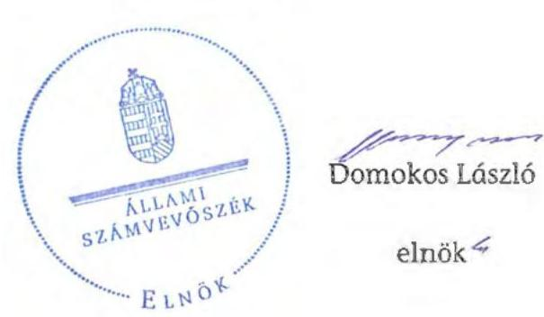

Melléklet: $\quad 27 \mathrm{db}$

---

Adat szolgáltatást igénylő szerv: Állami Számvevőszék Adat szolgáltató szerv neve: Komasti Bizottságy! Hivatal

1.  számú melléklet a V-3029-578/2013. számú jelentéshez

Adat szolgáltatás a gazdasági kamaráknak a Munkaerő-piaci Alap képzési és fejlesztési alaprészéből nyújtott költségvetési támogatásokról (az információkat a költségvetésben meghatározott összegekhez kapcsolódóan megkötött szerződésekre vonatkozóan kell megadni)

|           2005. év          |  |  |  |  |  |  |  |  |  |  |  |  |   |
| :-------------------------: | :-: | :-: | :-: | :-: | :-: | :-: | :-: | :-: | :-: | :-: | :-: | :-: | :-: |
|             | 1 | 2 | 3 | 4 | 5 | 6 | 7 | 8 | 9 | 10 | 11 |  |   |
|        Megnevezés        | Támogatási szerződés szerinti azonosítója | Támogatás célja | Szerződés szerinti összeg | Szerződés szerinti módosított összeg | Ténylegesen biztosított támogatás | Elszámolt támogatás összege | Előlegként elszámolás összege | Elszámolás esedékesség szerinti határidője | Tényleges elszámolás időpontja | Támogatás állapota* |  |  |   |
| Magyar Agráriumara 1110 Budapest, Feltárvád 10.05-06. | MPA-KA-SZMM-1/2009 | A Magyar Agráriumara 2009. évi szakképzési feladatai ellátásának támogatása | 127 201 000 | 0 | 127 201 000 | 123 367 596 | 121 984 729 | 2 320 212 | 2010.03.01 | 2010.02.15 | Lezárt |  |   |
| Magyar Korolkodalmi és Iparkamara, 1000 Budapest, Kossuth El adva táv 6-6. | MPA-KA-SZMM-6/2009 | a Magyar Korolkodalmi és Iparkamara 2010. évi szakképzési feladatai ellátása | 1 111 755 730 | 1 126 799 780 | 1 080 900 000 | 1 080 163 271 | 1 580 163 271 | 49 648 709 | 2010.12.06 | 2010.12.08 | Lezárt |  |   |
| Magyar Korolkodalmi és Iparkamara, 1000 Budapest, Kossuth El adva táv 6-6. | MPA-KA-SZMM-6/2009 | a munkavégzővel szereplői lakózomossza-ő szakképzés koordinációjában való összvédeikhez kapcsolódó feladatok mogyatósítása | 627 480 050 | 642 460 000 | 607 450 000 | 594 649 940 | 594 649 940 | 42 501 479 | 2010.12.08 | 2010.12.08 | Lezárt |  |   |
| Összesen |  |  | 1 855 240 790 | 1 795 249 780 | 1 834 741 200 | 1 788 360 807 | 1 788 877 376 | 57 374 480 | 2010.12.08 | 2010.12.08 | 2010.12.08 |  |   |

- Megjegyzések: 1. A táblázatot azért szükség szerint beszédessé bővítőkelők 2. A "Szervezet Nave, Olmo" csökket a támogatásban részesülő szervezet nevével és címével kérjük felülön! 3. Támogatás állapota oszlopbalását vagy folyamatosan lévő vagy vitatott, eljárás alatt lévő elszámolás bejegyzéseket kérjük felülnielet

Készletre: Somodi bérlős Adatazolgáltatás készüljének elérhetősége: e-mail: SomodiM@lab.hu, tel.: 434-67-39 Budapest, 2013. február h6 11. nap

Adatazolgáltatásokt felelős neve, eljárása Fölgesgelső-feljettes jogbőrzése eljárás

Pásztor Tibor osztályvezető

Bert

Benedikódok

---

Adatszolgáltatási igénylő szerv: Állami Szénvuvőesék Adatszolgáltató szerv neve: Nemzeti Munkadgyi Hivatal

2.  számú melléklet a V-3029-578/2013. számú jelentéshez

Aldatazolgáltatási igénylő szerv: Állami Szénvuvőesék Államőrző ezarvezet: Állami Szénvuvőesék

Adatszolgáltatás a gazdasági kamaráknak a Munkszöpleci Alap képzési és fejlesztési alaprészéből nyújtott költségvetési támogatásokról

(az információkat a táblázaton megelőtt évi költségvetésben meghatározott összegekhez kapcsolódóan megkötött szerződésekre vonatkozóan kell megadni)

|  2010. év |  |  |  |  |  |  |  |  |  |
 |  |  |   |
| --- | --- | --- | --- | --- | --- | --- | --- | --- | --- | --- | --- | --- | --- |
|   | 1 | 2 | 3 | 4 | 5 | 6 | 7 | 8 | 9 | 10 | 11 |  |   |
| Megnevezés | Támogatási

---

Adatámgöltségei igénylő esem. Álland Számosviszék Adatámgöltség semm neve: Bismuth Bivétefőgő Hivatal Adatámgöltsége a gazdasági hamaráknak a főonkaerőgöző Alap képzési és fejlesztési alaprészéből nyújtott költségvetési támogatásokról (az információkat a táblázatán megelőző del költségvetésben meghatározott távonpolíma bejuszolódása megelőző szerződésekre vonatkozóan kell megvetni)

|  SZTÍ, Kt |  |  |  |  |  |  |  |  |  |  |  |  |  |   |
| --- | --- | --- | --- | --- | --- | --- | --- | --- | --- | --- | --- | --- | --- | --- |
|   |  |  |  |  |  |  |  |  |  |  |  |  |  | 11  |
| Megnevezés |  | Távonpolás szerződés szerződése | Távonpolás okán | Szerződés szerinti arculati fizetési | Szerződés szerinti módosított fizetési | Távpágyasm köszéleti támogatás | Előgépített elszámolás összege | Előgépített elszámolás összege | Visszerkezett támogatás összege | Előgépített elszámolás összege | Távpágyas elszámolás közeziép | Távpágyas a köszéleti | Távpágyas a köszéleti | Távpágyas a köszéleti  |
| 1 Megyei Ágárhantart 2210 Budapest, Fehéredő út 29-30. |  | MPA-KA-012M-62011 | a Megyei Ágárhantart út, éltető szabályozási felteleteinek támogatása | 81 302 600 | 0 | 81 302 600 | 81 302 600 | 81 600 700 | 0 000 000 | 2011.12.06 | 2011.12.06 | 2011.12.06 | 2011.12.06 | 2011.12.06  |
| Megyei Ágárhantart 2210 Budapest, Fehéredő út 29-30. |  | MPA-KA-012M-62011 | a Megyei Ágárhantart 2011. évi szolgáltatási felteleteinek ellátása | 114 341 500 | 0 | 114 341 500 | 96 870 839 | 96 210 837 | 18 083 000 | 2012.01.12 | 2012.01.12 | 2012.01.12 | 2012.01.12 | 2012.01.12  |
| Megyei Ágárhantart út 29-30. |  | MPA-KA-012M-6/2012 | a kamera 2012. évi szolgáltatási felteleteink támogatása 2011.06.01.- 2011.12.30. | 1 623 839 344 | 0 | 1 220 128 387 | 319 512 339 | 718 612 253 | 712 151 842 | 2011.12.15 | 2011.12.15 | 2011.12.15 | 2011.12.15 | 2011.12.15  |
| Megyei Ágárhantart út 29-30. |  | MPA-KA-012M-4/2012 | a elismutató elismutatói ágárhantartási szabályozási felteleteink támogatása 2011.06.01.- 2011.12.30. | 220 373 941 | 0 | 220 341 048 | 307 189 719 | 577 110 750 | 14 758 111 | 2011.12.06 | 2011.12.06 | 2011.12.06 | 2011.12.06 | 2011.12.06  |
| Megyei Ágárhantart út 29-30. |  | MPA-KA-012M-6/2013 | a kamera 2013. évi szabályozási felteleteinek ellátása | 2 311 165 602 | 3 466 105 605 | 1 722 870 761 | 2 050 479 052 | 3 000 479 052 | 479 148 780 | 2012.12.17 | 2012.12.17 | 2012.12.17 | 2012.12.17 | 2012.12.17  |
| Megyei Ágárhantart út 29-30. |  | MPA-KA-012M-10/2013 | a Megyei Ágárhantartát és ágárhantart 2013. december 1. út 2013. november 30. felnőtt felüledésre a megről felkezdési és képzési távonpolékok bejuszolási felteleteink megről felüzkedési támogatás | 277 140 000 | 254 800 000 | 267 381 699 | 312 372 899 | 912 179 899 | 52 353 814 | 2012.12.15 | 2012.12.15 | 2012.12.15 | 2012.12.15 | 2012.12.15  |
| Megyei Ágárhantart út 29-30. |  | MPA-KA-012M-10/2013 | a megről felüzkedési támogatás bejuszolási felteleteink megről felüzkedési támogatás |  |  |  |  |  |  |  |  |  |  |   |
| Megyei Ágárhantart út 29-30. |  | MPA-KA-012M-10/2013 | a kamera 2013. évi szabályozási felteleteink ellátása |  |  |  |  |  |  |  |  |  |  |   |
| Megyei Ágárhantart út 29-30. |  | MPA-KA-012M-10/2013 | a megről felüzkedési támogatás bejuszolási felteleteink ellátása |  |  |  |  |  |  |  |  |  |  |   |
| Megyei Ágárhantart út 29-30. |  | MPA-KA-012M-10/2013 | a megről felüzkedési támogatás bejuszolási felteleteink ellátása |  |  |
 |  |  |  |  |  |  |  |   |
|  Megyei Agrárhantart út 29-30. |  | MPA-KA-012M-10/2013 | a kamera 2013. évi szolgáltatási feltételeinek ellátása |  |  |  |  |  |  |  |  |  |  |   |
|  Megyei Agrárhantart út 29-30. |  | MPA-KA-012M-10/2013 | a kamera 2013. évi szolgáltatási feltételeinek ellátása |  |  |  |  |  |  |  |  |  |  |   |
|  Megyei Agrárhantart út 29-30. |  | MPA-KA-012M-10/2013 | a kamera 2013. évi szolgáltatási feltételeinek ellátása |  |  |  |  |  |  |  |  |  |  |   |
|  Megyei Agrárhantart út 29-30. |  | MPA-KA-012M-10/2013 | a kamera 2013. évi szolgáltatási feltételeinek ellátása |  |  |  |  |  |  |  |  |  |  |   |
|  Megyei Agrárhantart út 29-30. |  | MPA-KA-012M-10/2013 | a kamera 2013. évi szolgáltatási feltételeinek ellátása |  |  |  |  |  |  |  |  |  |  |   |
|  Megyei Agrárhantart út 29-30. |  | MPA-KA-012M-10/2013 | a kamera 2013. évi szolgáltatási feltételeinek ellátása |  |  |  |  |  |  |  |  |  |  |   |
|  Megyei Agrárhantart út 29-30. |  | MPA-KA-012M-10/2013 | a kamera 2013. évi szolgáltatási feltételeinek ellátása |  |  |  |  |  |  |  |  |  |  |   |
|  Megyei Agrárhantart út 29-30. |  | MPA-KA-012M-10/2013 | a kamera 2013. évi szolgáltatási feltételeinek ellátása |  |  |  |  |  |  |  |  |  |  |   |
|  Megyei Agrárhantart út 29-30. |  | MPA-KA-012M-10/2013 | a kamera 2013. évi szolgáltatási feltételeinek ellátása |  |  |  |  |  |  |  |  |  |  |   |
|  Megyei Agrárhantart út 29-30. |  | MPA-KA-012M-10/2013 | a kamera 2013. évi szolgáltatási feltételeinek ellátása |  |  |  |  |  |  |  |  |  |  |   |
|  Megyei Agrárhantart út 29-30. |  | MPA-KA-012M-10/2013 | a kamera 2013. évi szolgáltatási feltételeinek ellátása |  |  |  |  |  |  |  |  |  |  |   |
|  Megyei Agrárhantart út 29-30. |  | MPA-KA-012M-10/2013 | a kamera 2013. évi szolgáltatási feltételeinek ellátása |  |  |  |  |  |  |  |  |  |  |   |
|  Megyei Agrárhantart út 29-30. |  | MPA-KA-012M-10/2013 | a kamera 2013. évi szolgáltatási feltételeinek ellátása |  |  |  |  |  |  |  |  |  |  |   |
|  Megyei Agrárhantart út 29-30. |  | MPA-KA-012M-10/2013 | a kamera 2013. évi szolgáltatási feltételeinek ellátása |  |  |  |  |  |  |  |  |  |  |   |
|  Megyei Agrárhantart út 29-30. |  | MPA-KA-012M-10/2013 | a kamera 2013. évi szolgáltatási feltételeinek ellátása |  |  |  |  |  |  |  |  |  |  |   |
|  Megyei Agrárhantart út 29-30. |  | MPA-KA-012M-10/2013 | a kamera 2013. évi szolgáltatási feltételeinek ellátása |  |  |  |  |  |  |  |  |  |  |   |
|  Megyei Agrárhantart út 29-30. |  | MPA-KA-012M-10/2013 | a kamera 2013. évi szolgáltatási feltételeinek ellátása |  |  |  |  |  |  |  |  |  |  |   |
|  Megyei Agrárhantart út 29-30. |  | MPA-KA-012M-10/2013 | a kamera 2013. évi szolgáltatási feltételeinek ellátása |  |  |  |  |  |  |  |  |  |  |   |
|  Megyei Agrárhantart út 29-30. |  | MPA-KA-012M-10/2013 | a kamera 2013. évi szolgáltatási feltételeinek ellátása |  |  |  |  |  |  |  |  |  |  |   |
|  Megyei Agrárhantart út 29-30. |  | MPA-KA-012M-10/2013 | a kamera 2013. évi szolgáltatási feltételeinek ellátása |  |  |  |  |  |  |  |  |  |  |   |
|  Megyei Agrárhantart út 29-30. |  | MPA-KA-012M-10/2013 | a kamera 2013. évi szolgáltatási feltételeinek ellátása |  |  |  |  |  |  |  |  |  |  |   |
|  Megyei Agrárhantart út 29-30. |  | MPA-KA-012M-10/2013 | a kamera 2013. évi szolgáltatási feltételeinek ellátása |  |  |  |  |  |  |  |  |  |  |   |
|  Megyei Agrárhantart út 29-30. |  | MPA-KA-012M-10/2013 | a kamera 2013. évi szolgáltatási feltételeinek ellátása |  |  |  |  |  |  |  |  |  |  |   |
|  Megyei Agrárhantart út 29-30. |  | MPA-KA-012M-10/2013 | a kamera 2013. évi szolgáltatási feltételeinek ellátása |  |  |  |  |  |  |  |  |  |  |   |
|  Megyei Agrárhantart út 29-30. |  | MPA-KA-012M-10/2013 | a kamera 2013. évi szolgáltatási feltételeinek ellátása |  |  |  |  |  |  |  |  |  |  |   |
|  Megyei Agrárhantart út 29-30. |  | MPA-KA-012M-10/2013 | a kamera 2013. évi szolgáltatási feltételeinek ellátása |  |  |  |  |  |  |  |  |  |  |   |
|  Megyei Agrárhantart út 29-30. |  | MPA-KA-012M-10/2013 | a kamera 2013. évi szolgáltatási feltételeinek ellátása |  |  |  |  |  |  |  |  |  |  |   |
|  Megyei Agrárhantart út 29-30. |  | MPA-KA-012M-10/2013 | a kamera 2013. évi szolgáltatási feltételeinek ellátása |  |  |  |  |  |  |  |  |  |  |   |
|  Megyei Agrárhantart út 29-30. |  | MPA-KA-012M-10/2013 | a kamera 2013. évi szolgáltatási feltételeinek ellátása |  |  |  |  |  |  |  |  |  |  |   |
|  Megyei Agrárhantart út 29-30. |  | MPA-KA-012M-10/2013 | a kamera 2013. évi szolgáltatási feltételeinek ellátása |  |  |  |  |  |  |  |  |  |  |   |
|  Megyei Agrárhantart út 29-30. |  | MPA-KA-012M-10/2013 | a kamera 2013. évi szolgáltatási feltételeinek ellátása |  |  |  |  |  |  |  |  |  |  |   |
| 

---

.

---

|  4. számú melléklet |  |  |  |  |  |  |  |  |  |  |  |  |  |  |  |  |  |  |  |  |  |  |  |  |  |  |  |  |  |  |  |  |  |  |  |  |  |  |  |  |  |  |  |  |  |  |  |  |  |  |  |  |  |  |  |  |  |  |  |  |  |  |  |  |  |  |  |  |  |  |  |  |  |  |  |  |  |  |  |  |  |  |  |  |  |  |  |  |  |  |  |  |  |  |  |  |  |  |  | 

---

# A gazdálkodó szervezeteknél feltárt szabálytalanságok a 2009. és 2011. évek között

|  Gazdálkodók / jogszabályi előírások |  |  |  |  |  |  |  |  |  |  |  |  |  |  |  |  |  |  |  |  |  |  |  |  |  |  |  |  |  |  |  |  |  |  |  |  |  |  |  |  |  |   |
| --- | --- | | | | | | | | | | | | | | | | | | | | | | | | | |
| | | | | | | | | | | | | | | | | | | | | | | | |
| | | | | | | | | | | | | | | | | | | | | | | | |
| | | | | | | | | | | | | | | | | | | | | | | | |
| | | | | | | | | | | | | | | | | | | | | | | | |
| | | | | | | | | | | | | | | | | | | | | | | | |
| | | | | | | | | | | | | | | | | | | | | | | | |
| | | | | | | | | | | | | | | | | | | | | | | | |
| | | | | | | | | | | | | | | | | | | | | | | | |
| | | | | | | | | | | | | | | | | | | | | | | | |
| | | | | | | | | | | | | | | | | | | | | | | | |
| | | | | | | | | | | | | | | | | | | | | | | | |
 |   |   |   |   |   |   |   |   |   |   |   |   |   |   |   |   |   |   |   |
|  |   |   |   |   |   |   |   |   |   |   |   |   |   |   |   |   |   |   |   |   |   |   |   |   |   |   |   |   |   |   |   |   |   |   |   |   |   |   |   |   |   |   |   |
|  |   |   |   |   |   |   |   |   |   |   |   |   |   |   |   |   |   |   |   |   |   |   |   |   |   |   |   |   |   |   |   |   |   |   |   |   |   |   |   |   |   |   |   |
|  |   |   |   |   |   |   |   |   |   |   |   |   |   |   |   |   |   |   |   |   |   |   |   |   |   |   |   |   |   |   |   |   |   |   |   |   |   |   |   |   |   |   |   |
|  |   |   |   |   |   |   |   |   |   |   |   |   |   |   |   |   |   |   |   |   |   |   |   |   |   |   |   |   |   |   |   |   |   |   |   |   |   |   |   |   |   |   |   |
|  |   |   |   |   |   |   |   |   |   |   |   |   |   |   |   |   |   |   |   |   |   |   |   |   |   |   |   |   |   |   |   |   |   |   |   |   |   |   |   |   |   |   |   |
|  |   |   |   |   |   |   |   |   |   |   |   |   |   |   |   |   |   |   |   |   |   |   |   |   |   |   |   |   |   |   |   |   |   |   |   |   |   |   |   |   |   |   |   |
|  |   |   |   |   |   |   |   |   |   |   |   |   |   |   |   |   |   |   |   |   |   |   |   |   |   |   |   |   |   |   |   |   |   |   |   |   |   |   |   |   |   |   |   |
|  |   |   |   |   |   |   |   |   |   |   |   |   |   |   |   |   |   |   |   |   |   |   |   |   |   |   |   |   |   |   |   |   |   |   |   |   |   |   |   |   |   |   |   |
|  |   |   |   |   |   |   |   |   |   |   |   |   |   |   |   |   |   |   |   |   |   |   |   |   |   |   |   |   |   |   |   |   |   |   |   |   |   |   |   |   |   |   |   |
|  |   |   |   |   |   |   |   |   |   |   |   |   |   |   |   |   |   |   |   |   |   |   |   |   |   |   |   |   |   |   |   |   |   |   |   |   |   |   |   |   |   |   |   |
|  |   |   |   |   |   |   |   |   |   |   |   |   |   |   |   |   |   |   |   |   |   |   |   |   |   |   |   |   |   |   |   |   |   | # A gazdálkodó szervezeteknél feltárt szabálytalanságok a 2009. és 2011. évek között

| Gazdálkodók / Jegyzőkönyvezett előírások | | | | | | | | | | | | | | | | | | | | | | | | | | | | | | | | | | | | | | | | | | | | | | | | | | | | | | | | | | | | | | | | | | | | | | | | | | | | | | | | | | | | | | | | | | | | | | | | | | | |

---

| | | | | | | | | | | | | | | | | | | | | | | | | | | | | | | | | | | | | | | | | | | | | | | | | | | | | | | | | | | | | | | | | | | | | | | | | | | | | | | | | | | | | | | | | | | | | | | | | | | | |

---

| 2009. és 2011. évek között | | | | | | | | | | | | | | | | | | | | | | | | | | | | | | | | | | | | | | | | | | | | | | | | | | | | | | | | | | | | | | | | | | | | | | | | | | | | | | | | | | | | | | | | | | | | | | | | | | | |

---

.

---

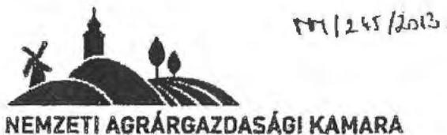

Állami Számvevőszék
Domokos László Úr
részére

# Budapest 4.

Pf. 54
1364

## Tisztelt Domokos Úr!

Köszönettel vettük a Somogy Megyei Agrárkamaránál lefolytatott ellenőrzésről megküldött számvevőszéki jelentéstervezetüket.

Egyben tájékoztatjuk, hogy a
 tervezettel kapcsolatban észrevételt, véleményt nem kívánunk tenni.

Kaposvár, 2013. június 17.

Tisztelettel:
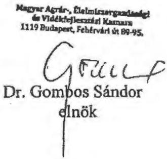

---

# GYŐR-MOSON-SOPRON MEGYEI KERESKEDELMI ÉS IPARKAMARA 

## ÁLLAMI SZÁMVEVŐSZÉK

1052 Budapest

Apáczai Csere János utca 10.

Az Önök V-3029-541/2013 iktatószámú levelükre hivatkozva a Győr-Moson-Sopron Megyei Kereskedelmi és Iparkamara az alábbi észrevételt kívánja tenni:

A Győr-Moson-Sopron Megyei Kereskedelmi és Iparkamaránál az Állami Számvevőszék ellenőrzést folytatott le, amely a támogatások költségfelhasználásának szabályszerűségét vizsgálta.
3.13. A jelentés megállapította, hogy a Győr-Moson-Sopron Megyei Kereskedelmi és Iparkamara 2009.-2011. évre 159,4 millió forint összegű támogatást kapott és használt fel. Az ÁSZ a támogatás felhasználását és elszámolását nem szabályszerűnek minősítette. Véleményünk szerint a megállapítás így nem pontos és negatív kicsengése van Kamaránk vonatkozásában.
A vizsgált időszakban 1 db 19 000,- Ft-os tétel került elszámolásra oly módon, hogy a feladattal kapcsolatban a költség ténylegesen felmerült, magára az adott feladatra számolódott el, de a számla teljesítési dátuma a támogatási időszakon túlra esett.

A többi, szinte a teljes költségvetési támogatási összeg elszámolása teljesen szabályos volt. Figyelembe véve azt, hogy a hiba nagyságrendje elenyésző, így nem valós az a megállapítás, hogy a GYMSM KIK részére folyósított költségvetési támogatás teljes elszámolása és felhasználása szabálytalan volt.

Kérjük, hogy a fentiekre tekintettel az általunk kifogásolt mondatot más formában és jelentéssel szíveskedjenek megfogalmazni.

Győr, 2013. május 13.
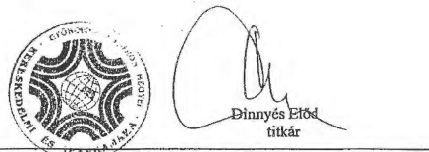

H-9021 Győr, Szent István út 10/A. $\cdot$ 9001 Győr, Pf.: 673 $\cdot$ tel.: 96/520-202, fax: 96/520-291 $\cdot$ e-mail: kamaral@gymskik.hu $\cdot$ www.gymskik.hu

---

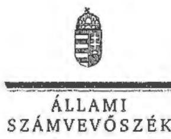

ELHök

Ikt.szám: V-3029-563/2013.

# Mihalicz Antal úr 

elnök
Győr-Moson-Sopron Megyei Kereskedelmi és Iparkamara

## Győr

## Tisztelt Elnök Úr!

A gazdasági kamarák közfeladatai ellátására fordított költségvetési támogatások felhasználásának és a gyakorlati képzést szervező gazdálkodó szervezeteknél a szakképzési hozzájárulás teljesítésénél a 2009-2011. években elszámolható költségek ellenőrzése című jelentéstervezetre tett észrevételeit köszönettel megkaptam.

Az Állami Számvevőszék észrevételekre vonatkozó álláspontjáról a felügyeleti vezető által készített részletes tájékoztatást csatoltan megküldöm.

Tájékoztatom Elnök urat, hogy a számvevőszéki jelentés az elfogadott észrevételei figyelembevételével készül.

Budapest, 2013. június 26. nap

Tisztelettel:

## 02, 462

Domokos László

Melléklet: Tájékoztatás az el nem fogadott észrevétékéről

---

.

---

# Tájékoztatás   az el nem fogadott észrevételekről 

A gazdasági kamarák közfeladatai ellátására fordított költségvetési támogatások felhasználásának és a gyakorlati képzést szervező gazdálkodó szervezeteknél a szakképzési hozzájárulás teljesítésénél a 2009-2011. években elszámolható költségek ellenőrzése című jelentéstervezetre 913/1/2013. iktatószámú levelében tett észrevételeit áttekintettük, azok kezeléséről az alábbi tájékoztatást adom.

Az észrevétele nem igényli a jelentés módosítását. Az észrevétel nem tartalmazza oldalszám megjelöléssel a kifogásolt részt, azonban tartalma alapján az a 3.1.3. fejezet első bekezdésben leírtakra vonatkozott. A hivatkozott és Önök által is elismert hiba miatt nem teljesül teljes körűen a szabályos támogatás felhasználás, de a hiba mértékére tekintettel a jelentéstervezet összegző megállapításokat tartalmazó fejezetében már nem szerepeltetjük a 3.1.3. fejezetben leírtakat.

Tájékoztatom, hogy a számvevőszéki jelentés mellékleteként szerepeltetjük a jelentéstervezethez tett észrevételeit, valamint az azokra adott válaszunkat.

Budapest, 2013. június 24 nap

Makkai Mária
felügyeleti vezető

---

.

---

# Tisztelt Állami Számvevőszék

Ikt.szám: V-3029-842/2013

Alulírott, Ivánkovics Gyula, mint a Csepel-Autócenter Szolgáltató és Kereskedelmi Kft. ügyvezető igazgatója, az Önök által készített jelentéstervezethez a következő észrevételt fűzzük.

Azt kifogásolták, hogy a foglalkoztatási napló nem tartalmazza az időt és a tanuló értékelését. Elismerjük, hogy kimondottan „Foglalkoztatási naplót” nem vezettek a tanulók. Ennek az volt az oka, hogy a tanulók nem rendelkeztek ilyen munkafüzettel, a nyomtatványboltban pedig ilyet nem forgalmaztak. Az ellenőrzésük során bemutattuk Önöknek, hogy milyen „Foglalkoztatási naplót”-t, valamint ezzel egyidejűleg milyen jelenléti ívet vezettünk. Ez tartalmazza a tanuló nevét, a hónap napjait és a ledolgozott időt. A bérszámfejtés ennek alapján készült. A tanulók értékelésével kapcsolatban elmondtuk, hogy azt az ipari tanuló felelősünk készítette, melyről nyilvántartást vezetett és havonta elküldte a tanuló iskolájának. A tanulók foglalkoztatásával kapcsolatos nyilvántartásunkat (foglalkoztatási napló, munkával töltött idő, tanulók értékelése) egyetlen kamarai ellenőrzés nem kifogásolta, azt elfogadta. 2012 január 1.-jétől a „Munkanapló” (9-12.0) A. Tü. 191 füzetet alkalmazzuk, mely ezeket az adatokat egyben tartalmazzák.

A következő kifogás, hogy nem készítettünk kimutatást a tanulószerződéssel nem rendelkező tanulóknak a szorgalmi időt követő összefüggő szakmai gyakorlat időtartamára kifizetett díjakról. Ezen kimutatások a számítógépünkben, valamint kézi nyilvántartásunkban is szerepelnek, melyet Önöknek bemutattunk. Ha nem lett volna ilyen nyilvántartásunk az adóbevallást sem tudtuk volna elkészíteni, hiszen a bevallás mellé létszámigazolást is kellett küldeni a minisztériumnak.

A tanulóknak járó egyéb juttatások, munkaruha, illetve kedvezményes étkeztetés a tanulóknak kifizetett, illetve aláírt bizonylatok alapján készültek. A kedvezményes étkezési jegyek átvételét a tanulók aláírásukkal igazolták.

A szakmunkástanulóknak kifizetett juttatások, analitikus és főkönyvi nyilvántartások alapján, és a jogszabályokban meghatározottak szerint történt.

Ezek figyelembevételével kérjük a jelentéstervezetet módosítani szíveskedjenek.

Budapest, 2013.06.18.

ÁLLAMI SZÁMVEVŐSZÉK
ÜGYVITELI IRÓDA
22484 / 2013
Érk.: JUN 24 2013

Iktatószám: 4329-57728
Melléklet:

---

.

---

# 10. számú melléklet   a V-3029-578/2013. számú jelentéshez 

## ELNÖK

ÁLLAMI
SZÁMVEVŐSZÉK

Ikt.szám: V-3029-568/2013.

## Ivánkovics Gyula úr

ügyvezető igazgató
Csepel-Autócenter Szolgáltató és Kereskedelmi Kft.

## Budapest

## Tisztelt Ügyvezető Igazgató Úr!

A gazdasági kamarák közfeladatai ellátására fordított költségvetési támogatások felhasználásának és a gyakorlati képzést szervező gazdálkodó szervezeteknél a szakképzési hozzájárulás teljesítésénél a 2009-2011. években elszámolható költségek ellenőrzése című jelentéstervezetre tett észrevételeit köszönettel megkaptam.

Az Állami Számvevőszék észrevételekre vonatkozó álláspontjáról a felügyeleti vezető által készített részletes tájékoztatást csatoltan megküldöm.

Tájékoztatom Igazgató urat, hogy a számvevőszéki jelentés az elfogadott észrevételei figyelembevételével készül.

Budapest, 2013. június 24 nap
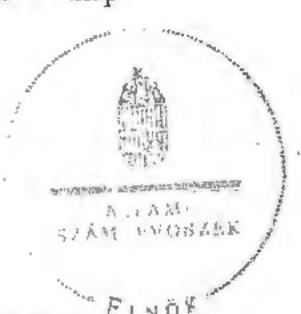

Tisztelettel:

Domokos László

Melléklet: Tájékoztatás az el nem fogadott észrevételekről

---

.

---

# Tájékoztatás   az el nem fogadott észrevételekről 

A gazdasági kamarák közfeladatai ellátására fordított költségvetési támogatások felhasználásának és a gyakorlati képzést szervező gazdálkodó szervezeteknél a szakképzési hozzájárulás teljesítésénél a 2009-2011. években elszámolható költségek ellenőrzése című jelentéstervezetre 2013. június 18-i dátummal kelt levelében tett észrevételeit áttekintettük, azok kezeléséről az alábbi tájékoztatást adom.

Az észrevétele nem igényli a jelentés módosítását. Az észrevételben nem szerepel oldalszám megjelöléssel a kifogásolt részt, a levél szövegezése alapján az a jelentéstervezet 71. oldalán (4.1. fejezet) és a 4. számú mellékletben leírtakra vonatkozott. A helyszíni ellenőrzés során jegyzőkönyvet vettek fel az ellenőrzést lefolytató számvevők, amelyben foglaltakat a CsepelAutócenter Szolgáltató és Kereskedelmi Kft. részéről annak ügyvezetője írt alá. A Kft. képviselője a jegyzőkönyvben foglaltakhoz észrevételt, megjegyzést nem tett, a hiányolt dokumentumokat nem küldte meg a helyszíni ellenőrzés időszakában, a teljességi nyilatkozatot aláírta. A jelentéstervezetben a jegyzőkönyvben foglaltakkal megegyezően szerepeltetttük a megállapításokat, a megküldött dokumentumok az észrevételt nem támasztják alá.

A jelentéstervezetben egyrészt a foglalkozási naplók szabálytalan vezetését kifogásoltuk. A jegyzőkönyv és a megküldött észrevételező levél is elismeri, hogy az ellenőrzött időszakban a szakképzésről szóló 1993. évi LXXVI. törvény 25. § (1) bekezdésében előírtaknak nem megfelelően vezették a foglalkozási naplókat. A naplók tartalmazták a szakmai tevékenységet és a tevékenység ellátásának napját, de a tevékenységre fordított időt és a tanulók értékelését nem tüntették fel bennük.

A jelentéstervezetben kifogásoltuk a helyszíni ellenőrzés során felvett jegyzőkönyv alapján, hogy a szorgalmi időszakot követő összefüggő szakmai gyakorlatról nem készült kimutatás. Az észrevételhez csatolt dokumentumok alapján megállapítható, hogy a nyári hónapokban többen is dolgoztak. De pl. a 2011. évben alkalmazott tanulók közül annak a tanulónak, akinek június hóban számoltak el bért nem állapítható meg, hogy a hivatkozott személy a szorgalmi időszakban (június 15 -éig) és/vagy azt követően végezte el a szakmai gyakorlatot. Egy másik tanuló pedig a karton szerint 2011. szeptember 1-jén lépett be a céghez, mégis elszámoltak részére július hóra is bért. Az észrevételező levélben hivatkozott és megküldött kézi nyilvántartás (feladás) nem tartalmaz neveket, azok a bérkartonokkal nem vethetők össze, a nyári gyakorlat elszámolt értékeit elkülönítve nem tartalmazza. A leírtak szerint a bérkartonok és a feladások alapján a szorgalmi időszakot érintő kifizetések és elszámolt járulékok nem különíthetőek el, ellentmondásokat tartalmaznak.

---

A jelentéstervezetben kifogásoltuk, hogy nem tudták dokumentumokkal alátámasztani a bevallásukban szereplő kötelező juttatást. A helyszíni ellenőrzés során felvett jegyzőkönyv tartalmazza, hogy a „tanulóknak a kötelező juttatásokra és azok járulékoira vonatkozó elszámolások a helyszíni ellenőrzéskor nem álltak rendelkezésre. Munkaruhát a Kft. az ellenőrzött időszakban minden évben elszámolt." A pótlólagosan megküldött étkezési jegyek átvételét igazoló dokumentumokat összevetve a bérkartonokkal megállapítható volt, hogy a bérkartonok nem tartalmaznak természetbeni juttatás adatokat, a kétféle dokumentum nem volt összhangban, az elszámolt étkezési utalványok tényleges kiadásáról a megküldött dokumentumok alapján egyértelműen nem lehet meggyőződni. A munkaruha címén elszámolt költségek a kézzel vezetett könyvelési naplóban megtalálhatóak, de a ruhák átvételét igazoló aláírt nyilatkozatokat és azok beszerzési számláit nem csatoltak az észrevételhez. A feladásból és a megküldött dokumentumokból a kötelező juttatások járulékai nem állapíthatóak meg.

Tájékoztatom, hogy a számvevőszéki jelentés mellékleteként szerepeltetjük a jelentéstervezethez tett észrevételeit, valamint az azokra adott válaszunkat.

Budapest, 2013. június 24 nap
Makkai Mária
felügyeleti vezető

---

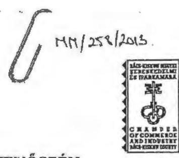

# ÁLLAMI SZÁMVEVŐSZÉK

Domokos László elnök úr részére

11. számú melléklet
a V-3029-578/2013. számú jelentéshez

ÁLLAMI SZÁMVEVŐSZÉK
Domokos László elnök úr részére

Budapest
Apáczai Csere János u. 10.
1364

Ikt. szám: 00717/13-SZK
Ügyintéző: Ördög Dóra

Tárgy: jelentéstervezet-észrevétel

Tisztelt Domokos László Úr!

Köszönettel megkaptuk a gazdasági kamarák közfeladatai ellátására fordított költségvetési
támogatások felhasználásának és a gyakorlati képzést szervező gazdálkodó szervezeteknél a
szakképzési hozzájárulás teljesítésénél a 2009-2011. években elszámolható költségek
ellenőrzéséről készített számvevőszéki jelentéstervezetet.

A tervezet 3.8. pontja tartalmazza a Bács-Kiskun Megyei Kereskedelmi és Iparkamara
ellenőrzésének eredményét. A megállapításokkal egyetértünk, alábbi észrevétel tételével:

- A támogatások pénzügyi elszámolásának határidőn túli benyújtása:

A támogatási szerződésekben rögzített határidőn belül az elszámolásokat kamaránk
elkészítette, az ISZIIR-ben lezárásra kerültek. Hiánypótlás esetén a zárást a Magyar
Kereskedelmi és Iparkamara a rendszerben feloldotta, így lehetővé vált az adatok
módosítása. A pótlást követő zárás a pótlás határidején belül megtörtént, azonban a
rendszer az eredeti dátumot nem, csak az utolsó zárás dátumát rögzíti.

- Humánerőforrás biztosításának követelményei:

A Magyar Kereskedelmi és Iparkamara Szakképzési Önkormányzati Szabályzata, Szintvizsga
Szabályzata, a 31/2004. (XI. 13.) OM rendelet (az Országos szakértői, az Országos
vizsgáztatási, az Országos szakmai szakértői és az Országos szakmai vizsgaelnöki
névjegyzékről, valamint a szakértői tevékenységről), valamint a Magyar Kereskedelmi és
Iparkamara és a Bács-Kiskun Megyei Kereskedelmi és Iparkamara között létrejött támogatási
szerződések rögzítik a feladatellátáshoz szükséges követelményrendszert.

A fogyasztóvédelemről szóló 1997. évi CLV. törvény, valamint a Magyar Kereskedelmi és
Iparkamara és a Bács-Kiskun Megyei Kereskedelmi és Iparkamara között létrejött támogatási
szerződés meghatározza a Békéltető Testület tagságának követelményeit.
Kecskemét, 2013. június 24.

Tisztelettel:

Gaál József
elnök

Bács-Kiskun Megyei Kereskedelmi és Iparkamara
H-6000 Kecskemét, Árpád krt. 4.
Tel: 0036-76/501-500, Fax: 0036-76/501-538
E-mail: bkmklk@mail.datanet.hu
Honlap: www.bkmkik.hu

---

.

---

# 12. számú melléklet   a V-3029-578/2013. számú jelentéshez 

## ELNÖK

ÁLLAMI
SZÁMVEVŐSZÉK

Ikt.szám: V-3029-567/2013.

## Gaál József úr

elnök
Bács-Kiskun Megyei Kereskedelmi és Iparkamara

## Kecskemét

## Tisztelt Elnök Úr!

A gazdasági kamarák közfeladatai ellátására fordított költségvetési támogatások felhasználásának és a gyakorlati képzést szervező gazdálkodó szervezeteknél a szakképzési hozzájárulás teljesítésénél a 2009-2011. években elszámolható költségek ellenőrzése című jelentéstervezetre tett észrevételeit köszönettel megkaptam.

Az Állami Számvevőszék észrevételekre vonatkozó álláspontjáról a felügyeleti vezető által készített részletes tájékoztatást csatoltan megküldöm.

Tájékoztatom Elnök urat, hogy a számvevőszéki jelentés az elfogadott észrevételei figyelembevételével készül.

Budapest, 2013. június 24 nap
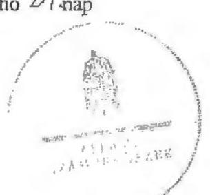

Tisztelettel:
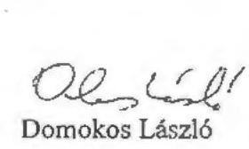

Melléklet: Tájékoztatás az el nem fogadott észrevételekről

---

.

---

# Tájékoztatás   az el nem fogadott észrevételekről 

A gazdasági kamarák közfeladatai ellátására fordított költségvetési támogatások felhasználásának és a gyakorlati képzést szervező gazdálkodó szervezeteknél a szakképzési hozzájárulás teljesítésénél a 2009-2011. években elszámolható költségek ellenőrzése című jelentéstervezetre 00717/2013. iktatószámú levelében tett észrevételeit áttekintettük, azok kezeléséről az alábbi tájékoztatást adom.

A jelentéstervezet 3.8. pontjában szereplő, a támogatások pénzügyi elszámolásának határidőn túli benyújtásához tett észrevétele nem igényli a jelentés módosítását. Az elszámolások megküldéséről és elfogadásról a jelentéstervezet rögzíti a Magyar Kereskedelmi és Iparkamara által kezelt ISZIIR rendszer és a területi gazdasági kamaráknak nyújtott támogatások elszámolásának dokumentálási hiányosságait. A Bács-Kiskun Megyei Kereskedelmi és Iparkamara (továbbiakban kamara) az ellenőrzés során az elszámolások pontos idejét nem tudta igazolni, a határidőben történő teljesítés igazolására az észrevételhez sem csatolt dokumentumot. Az ISZIIR rendszer alapján a támogatások elszámolásának késedelmes megtörténte állapítható meg.

Az észrevételben a humánerőforrás biztosításának követelményei alatt leírtak a szakképzés vizsgáztatásának, illetve a békéltető testületi tagság humánerőforrás követelményeihez kapcsolódnak és nem igénylik a jelentés módosítását. A jelentéstervezet tényként rögzíti, hogy a kamara belső szabályzatban nem határozta meg a feladatok megvalósításához szükséges humánerőforrás biztosításának követelményeit. A jelentéstervezet a megfogalmazásával egyértelműen jelzi, hogy a kamaránál a közfeladatok ellátása érdekében foglalkoztatottakra vonatkozik a megállapítás. Az észrevételben felsorolt szabályzat nem a kamara belső szabályzata, a szerződésekkel kapcsolatban a jelentéstervezet megállapítja, hogy azok létszámelőírásokat tartalmaztak. Ezen túl a jelentéstervezet külön értékelte az alkalmazásban nem álló külső szakértők, vizsgáztatásban közreműködők biztosításának módját.

Tájékoztatom, hogy a számvevőszéki jelentés mellékleteként szerepeltetjük a jelentéstervezethez tett észrevételeit, valamint az azokra adott válaszunkat.

Budapest, 2013. július hó 21. nap

Makkai Mária
felügyeleti vezető

---

.

---

# Nemzeti Munkaügyi Hivatal   Főigazgató 

Hivatkozási szám:
Ügyintézőjük:

Állami Számvevőszék
Domokos László
elnök

Budapest
Apáczai Csere János utca 10.
1052

Iktatószám: 003553-3/2013-5530
Ügyintéző: Pósa Józsefné
Telefonszám: 434-57-45

Tárgy: Észrevételek

ÁLLAMI SZÁMVEVŐSZÉK
23337/
Érkezett: 2013. JÚN. 28.
Irattári szám: V-3029-555/2013
Melléklet:

Tisztelt Elnök Úr!

A 2013. június 14-én hivatalunkhoz, V-3029-540/2013. iktatószámú levelével érkezett, a „gazdasági kamarák közfeladatai ellátására fordított költségvetési támogatások felhasználásának és a gyakorlati képzést szervező gazdálkodó szervezeteknél a szakképzési hozzájárulás teljesítésénél a 2009-2011. években elszámolt költségek ellenőrzéséről" szóló Jelentéstervezetre az alábbi észrevételeket teszem:

1. számú észrevétel - Jelentéstervezet 15. oldal, utolsó bekezdés

Kérjük pontosítani azon megállapítást, hogy a gazdálkodó szervezetek határidőre küldték be a bevallásaikat. Valószínűleg ez a megállapítás csak a kiválasztott 91 gazdálkodó szervezetre vonatkozik. (Lásd: 73. oldal 4.2 pont első mondata.)
2. számú észrevétel - Jelentéstervezet 15. oldal utolsó bekezdés, 74. oldal első bekezdés

A bekezdésekhez kapcsolódóan megjegyezni szeretném, hogy az átszervezéshez kapcsolódó, jogszabályban előírt drasztikus létszámcsökkentés vezetett a 2011. évi bevallások felülvizsgálatánál ahhoz, hogy a jogszabály által előírt határidőhöz képest több hónapos késéssel sikerült a feladatot megvalósítani.

---

3. számú észrevétel - Jelentéstervezet 16. oldal, első bekezdés

A tervezet megállapítja, hogy az NSZFI a helyszínen nem ellenőrizte a gazdálkodó szervezetek 2009-2011. évekre vonatkozó bevallásait. A 74. oldal utolsó három bekezdése ugyanakkor 11 gazdálkodó szervezet ellenőrzését említi és elmarasztalja az NSZFI-t azért, mert nem állapított meg olyan hiányosságot, melyeket az ÁSZ az ellenőrzése során tapasztalt.
Kérjük a megállapítást a jelentésből kivenni tekintettel arra, hogy az ÁSZ a gazdálkodó szervezetek 2009-2011. évekre vonatkozó bevallásait vizsgálta és ezekre vonatkozóan tette meg a megállapításait, míg az NSZFI 2009-2010 években végzett helyszíni ellenőrzéseinek megállapításai a 2007-2008. évi bevallásokra vonatkoztak. A 2009-2011. évi bevallások esetében helyszíni ellenőrzés az NSZFI részéről valóban nem történt.
4. számú észrevétel - Jelentéstervezet 16. oldal, 2. bekezdés, 17. oldal, első bekezdés

A megállapítással nem értünk egyet, nem látunk okozati összefüggést a késedelmes ellenőrzés és a jogsértés aránya között.
A vizsgált időszakra vonatkozóan nem megfelelő ellenőrzések, továbbá nem eredményes ellenőrzések nem voltak.
5. számú észrevétel - Jelentéstervezet 16. oldal, 3. bekezdés

Az ebben a bekezdésben foglalt megállapítások, valamint a 4. sz. melléklet 2-5. oszlopaiban (a foglalkoztatási naplók vezetésére vonatkozó megállapítások), illetve a 7. oszlopában (a tanulók pénzbeli/kiegészítő juttatására vonatkozó megállapítások) jelölt hibák, hiányosságok nem az NSZFI ellenőrzési kompetenciájába tartozó szakmai kérdéseire vonatkoznak. Az ellenőrzött időszakra hatályos, a szakképzési hozzájárulásról és a képzés fejlesztésének támogatásáról szóló 2003. évi LXXXVI. törvény (továbbiakban: Szht.) 4/B. §-ában foglaltak alapján a foglalkozási napló, illetve a tanulók juttatásainak megfelelősége előfeltétele volt a területi kamarák által kiadott tanúsítvány kiadásának. Az NSZFI a tanúsítvány meglétét, annak érvényességét ellenőrizte a bevallás feldolgozása, valamint a helyszíni ellenőrzések során.
6. számú észrevétel - Jelentéstervezet 18. oldalon szereplő javaslat

A Nemzeti Munkaügyi Hivatal főigazgatójának tett javaslat módosítását kérjük aszerint, hogy az ellenőrizendő hozzájárulásra kötelezettek köréből kerüljenek kiemelésre azon hozzájárulásra kötelezettek, akiknél a jogszabálysértések megállapítása kizárólag a 4. melléklet 2-5 oszlopban, illetve a 7. oszlopban jelölt hibákra, hiányosságokra vonatkoznak (Lásd: 5. számú észrevételben foglaltakat).

---

7. számú észrevétel - Jelentéstervezet 69. oldal 4. pont, első bekezdés

Az Szht. 4/B. §. (6) bekezdése szerint az éves bevallásban az elszámolás módját évente a hozzájárulásra kötelezett választja meg. A hivatkozott jogszabályi rendelkezésnek megfelelően a három ellenőrzött év tekintetében (2009-2011) évenként történt változtatás. Azt nem írja elő a jogszabály, hogy minden évben ugyanazon a módon kell elszámolnia.
8. számú észrevétel - Jelentéstervezet 69. oldal 4. pont, második bekezdés

A gyakorlati képzést szervező gazdálkodó szervezetek ellenőrzése nem kizárólag az NSZFI feladata.
Az Szht. 4. § (11) bekezdésében foglaltak alapján a szakképzési hozzájárulást gyakorlati képzés megszervezésével teljesítő hozzájárulásra kötelezettnek az állami adóhatósággal szemben nem keletkezik bevallási, befizetési és elszámolási kötelezettsége, azonban az állami adóhatóság a helyszíni ellenőrzés során a szakképzési hozzájárulási kötelezettség teljesítését az adózás rendjéről szóló 2003. évi XCII. törvény szabályai szerint ellenőrzi.
A NAV eddig is, jelenleg is folyamatosan végez ellenőrzést és a megállapításairól folyamatosan tájékoztatja hivatalunkat.
9. számú észrevétel - Jelentéstervezet 70. oldal, első bekezdés

Az Szht. 4/B. § (3) bekezdésében foglaltak szerint 2012. január 1-je előtt is a gazdasági kamara feladata volt a foglalkozási napló és a tanulószerződés, illetve hallgatói szerződés esetén fizetendő pénzbeli juttatás kifizetését igazoló dokumentumok ellenőrzése.
10. számú észrevétel - Jelentéstervezet 73. oldal 4.2 pont, második bekezdés, utolsó mondat második szó
A mondat szakmailag számunkra nem értelmezhető.
11. számú észrevétel - Jelentéstervezet 74. oldal, negyedik bekezdés

Az egyértelműség érdekében javasoljuk kiegészíteni, hogy ,.... a 2009-2011. években, a 2007-2008 évekre vonatkozóan összesen 203 szervezetnél végzett helyszíni ellenőrzést."

Budapest, 2013. június 27.

Üdvözlettel:
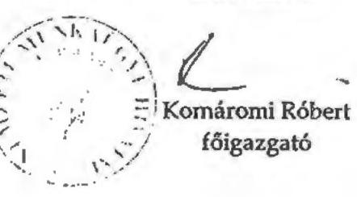

---

.

---

# 14. számú melléklet   a V-3029-578/2013. számú jelentéshez 

## ELNÖK

ÁLLAMI
SZÁMVEVŐSZÉK

Ikt.szám: V-3029-561/2013.

## Komáromi Róbert úr   főigazgató

Nemzeti Munkaügyi Hivatal

## Budapest

## Tisztelt Főigazgató Úr!

A gazdasági kamarák közfeladatai ellátására fordított költségvetési támogatások felhasználásának és a gyakorlati képzést szervező gazdálkodó szervezeteknél a szakképzési hozzájárulás teljesítésénél a 2009-2011. években elszámolható költségek ellenőrzése című jelentéstervezetre tett észrevételeit köszönettel megkaptam.

Az Állami Számvevőszék észrevételekre vonatkozó álláspontjáról a felügyeleti vezető által készített részletes tájékoztatást csatoltan megküldöm.

Tájékoztatom Főigazgató urat, hogy a számvevőszéki jelentés az elfogadott észrevételei figyelembevételével készül.

Budapest, 2013. július
hó 26. nap
Tisztelettel:

## DRSL68

Domokos László

Melléklet: Tájékoztatás az elfogadott és az el nem fogadott észrevételekről

---

.

---

# Tájékoztatás   az elfogadott és az el nem fogadott észrevételekről 

A gazdasági kamarák közfeladatai ellátására fordított költségvetési támogatások felhasználásának és a gyakorlati képzést szervező gazdálkodó szervezeteknél a szakképzési hozzájárulás teljesítésénél a 2009-2011. években elszámolható költségek ellenőrzése című jelentéstervezetre 003553-3/2013-5530. iktatószámú levelében tett észrevételeit áttekintettük, azok kezeléséről az alábbi tájékoztatást adom.

1.  Az észrevételt elfogadjuk, a hivatkozott bekezdésekben a szöveget a javasoltak szerint kiegészítjük.
2.  Az észrevétel nem igényli a jelentés módosítását, ahhoz csak magyarázatul szolgál. Az Állami Számvevőszék a jelentéstervezetben nem minősítette a szervezet átszervezését. A jelentéstervezet tényként rögzíti, hogy a bevallások felülvizsgálata a jogszabályi határidőt jelentősen túllépve valósult meg. Az Állami Számvevőszék álláspontja szerint a jogszabály egyértelmű határidőt határozott meg a felülvizsgálatra. A felülvizsgálati feladatok kiosztását a Nemzeti Munkaügyi Hivatalon (az ellenőrzött időszakban és továbbiakban NSZFI) belül a jogszabályi határidő figyelembevételével kellett volna megszervezni.
3.  Az észrevétel nem igényli a jelentés módosítását. A jelentéstervezet 16. oldal első bekezdése rögzítette, hogy a gazdálkodó szervezeteket az NSZFI a 2009-2011. évekre vonatkozóan nem ellenőrizte, az ellenőrzött időszakban a 2007. és a 2008. évi bevallásokra vonatkozó ellenőrzéseket végzett. Azt rögzítette a jelentéstervezet, hogy az NSZFI több éves késedelemmel végzett ellenőrzései nem biztosították a jogszabályi előírások érdemi érvényesítését. A jelentéstervezet 74. oldal 3. bekezdése ezzel összhangban tartalmaz megállapítást, és egyértelműen a 2007. és 2008. évi bevallásokra vonatkoznak a megállapítások. A 74. oldal utolsó három bekezdése tényként rögzíti az NSZFI által elvégzett ellenőrzések eredményeit. A jelentéstervezet nem tartalmazza azt a megállapítást, hogy az NSZFI ellenőrzései nem állapították meg azokat a hiányosságokat, amelyeket az Állami Számvevőszék jelen ellenőrzésével feltárt.
4.  Az észrevétel nem igényli a jelentés módosítását. A jelentéstervezet 16. oldal második bekezdése nem azt rögzítette, hogy az NSZFI késedelmes ellenőrzései okozták a jogsértések magas arányát. De fenntartjuk, hogy a késedelmes ellenőrzések is hozzájárultak a hibák feltárt magas arányához, mivel a jogsértéseket az NSZFI nem tárta fel és nem intézkedett azok rendezéséről. A jelentéstervezetben az NSZFI ellenőrzéseinek eredményességét külön nem minősítettük. A 17. oldal első bekezdése a gazdálkodó szervezetek ellenőrzéseinek eredménytelenségéről szól. A gazdálkodó szervezeteket az NSZFI mellett a gazdasági kamarák is ellenőrizték, ahogy ezt a jelentéstervezet is bemutatta. A területi gazdasági kamarák

---

ellenőrzéseik során hat gazdálkodó szervezetnél tártak fel intézkedést igénylő hibát (jelentéstervezet 15. oldal utolsó előtti bekezdés), pedig 2011 decemberében a kereskedelmi és iparkamaráknál 5101 gazdálkodó szervezet vett részt gyakorlati képzés szervezésében. A bevallásokat megalapozó foglalkozási naplók vezetésének ellenőrzése mind az NSZFI, mind a gazdasági kamarák feladata. Az NSZFI a bevallások alátámasztását, a területi kamarák a szakképzési és tanügyi feladatok teljesítését ellenőrizhette a naplókon keresztül. Az Állami Számvevőszék az ellenőrzött 87 gazdálkodó szervezetből 30 -nál (34,5\%) a napló vezetésének hiányát, illetve a napló hiányos vezetését állapította meg. A megállapított magas hiba arány alapján minősítette az elvégzett ellenőrzéseket az Állami Számvevőszék, illetve jelezte a bevételek beszedésével kapcsolatos magas kockázatot.
5.  Az észrevétel nem igényli a jelentés módosítását. A jelentéstervezet 16. oldal harmadik bekezdése az Állami Számvevőszék ellenőrzésével feltárt hibákat részletezi. A jelentéstervezet a 74. oldal második bekezdésében megállapítja azt, hogy a bevalláshoz kapcsolódó leggyakoribb hiba a szakképzési hozzájárulásról és a képzés fejlesztésének támogatásáról szóló 2003. évi LXXXVI. törvény (továbbiakban szakképzési hozzájárulási tv.) 4/B. § (2) bekezdése alapján csatolandó, a területi kamara által kiállított és 60 napnál nem régebbi tanúsítvány hiánya volt (az időszakban átlagosan 30,5\%). A szakképzési hozzájárulási tv. 4. § és a 4/F. § (1) bekezdéseiben foglaltak alapján az NSZFI ellenőrzési hatókörébe tartozott a bevallások és az elszámolt költségek ellenőrzése. A foglalkozási napló tartalmazza a gyakorlati oktatáson résztvevők nevét, a jelenlévők és a
 hiányzó tanulók számát, tehát a bérszámfejtést (a bérköltség, járulékok elszámolását) alátámasztó, a ledolgozott időt igazoló pénzügyi dokumentum. A bevallások ellenőrzését a foglalkozási naplók tartalmi ellenőrzése nélkül nem lehet ellenőrizni.
6. Az észrevétel nem igényli a jelentés módosítását. Az 5. számú észrevétel kapcsán leírtak és a 2012. január 1-jével hatályos, a szakképzési hozzájárulásról és a képzés fejlesztésének támogatásáról szóló 2011. évi CLV. törvény 32. § (1) bekezdés a) pontja alapján az elévülési időtartama alatt ellenőrzési joga az állami szakképzési és felnőttképzési szervnek van.
7. Az észrevétel nem igényli a jelentés módosítását. A jelentéstervezet 69. oldal 4. pont első bekezdése az ellenőrzött szervezetek bemutatásaként írja le az elszámolási módok előfordulását és az abban bekövetkezett változásokat.
8. Az észrevétel nem igényli a jelentés módosítását. A szakképzési hozzájárulási tv. 3. § (10) bekezdése rögzíti, hogy a szakképzési hozzájárulást a gyakorlati képzés megszervezésével teljesítő hozzájárulásra kötelezettnek bevallási és elszámolási, valamint az e törvény végrehajtási rendeletében előírtak szerint bejelentkezési kötelezettsége van az állami szakképzési és felnőttképzési intézettel szemben. A szakképzési hozzájárulási kötelezettség teljesítését a szakképzésért és felnőttképzésért felelős miniszter megbízásából az állami szakképzési és felnőttképzési intézet ellenőrizheti. A jelentéstervezet a 69. oldal 4. pont második bekezdésében a gyakorlati képzést szervező gazdálkodó szervezetek szakképzési hozzájárulás bevallásához kapcsolódó ellenőrzésről szól. A jelen ellenőrzés az NSZFI ellenőrzési gyakorlatára terjedt ki, azzal kapcsolatban tesz megállapításokat és nem írt az NSZFI kizárólagos ellenőrzési jogáról.

---

9. Az észrevétel nem igényli a jelentés módosítását. A szakképzési hozzájárulási tv. 4/B. § (3) bekezdése nem a területi kamara ellenőrzési kötelezettségéről szól. A területi kamarának a naplók és pénzügyi dokumentumok bemutatása esetén a tanúsítvány kiadása volt a feladata.
10. Az észrevétel alapján a 73. oldal 4.2. pont 2. bekezdés utolsó mondatában a „megtörténtének" szót „teljesítésének" szóra módosítottuk.
11. Az észrevétel nem igényli a jelentés módosítását. A 2007-2008. évekre vonatkozó ellenőrzésre való utalást a megelőző bekezdés tartalmazza.

Tájékoztatom, hogy a számvevőszéki jelentés mellékleteként szerepeltetjük a jelentéstervezethez tett észrevételeit, valamint az azokra adott válaszunkat.

Budapest, 2013. júlián hó 26 nap

Makkai Mária
felügyeleti vezető

---

.

---

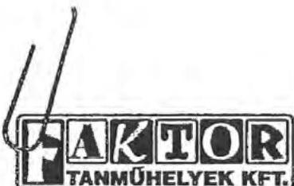

15. számú melléklet a V-3029-578/2013. számú jelentéshez

FAKTOR TANMŰHELYEK Oktatásszervező, Kereskedelmi és Szolgáltató Kft.
2400 Dunaújváros, Kenyérgyári út 3
Tel.: 25/500-860
Fax: 25/500-861
Cg.: 07 09 001208
Adósz.: 10447806-2-07
Banksz. 12024009-00102247-00100003
E-Mail: info@faktortan.hu

1052 Budapest
Apáczai Csere János u. 10.

ÁLLAMI SZÁMVEVŐSZÉK
1052 Budapest
Apáczai Csere János u. 10.

Iktatószám: V-3029-542/2013.
Adószám: 10447806-2-07

A 2013. június 13.-én a V-3029-542/2013 iktatószámon érkezett jegyzőkönyvre,
az alábbi észrevételeket tesszük:

A 2013. január 30-án a FAKTOR Tanműhelyek kft. telephelyén Dunaújváros
Kenyérgyári út 5. sz. alatt készült jegyzőkönyvben az ellenőrzés 2.2.4. pont alatt a
gyakorlati képzés adminisztratív költségei pontjában a következő megállapítást tette:
„ A Faktor Kft. a gyakorlati képzés adminisztratív költségeként elszámolt az
ellenőrzött években az Szht. melléklete 3. pontjának megfelelően a havi minimálbér
egy évre kiszámított összegét számolta el."

Az Állami Számvevőszék jelentéstervezetében azt a megállapítást tette, hogy
a gyakorlati képzéssel kapcsolatos adminisztratív költséget nem az Szht.
mellékletének 3. pontjának megfelelően számoltuk el.
„ 3. a tanulószerződés, illetve a hallgatói szerződés alapján gyakorlati képzésben
résztvevők gyakorlati képzésével és költségeinek elszámolásával összefüggő
adminisztratív költség, amelynek mértéke nem haladhatja meg évente tanulónként,
illetve hallgatóinként a 15 ezer forintot és vállalkozásonként a kötelező legkisebb havi
munkabérének (minimálbér) egy évre kiszámított összegét. „

A tanuló létszámunk:

2008/2009 II. félében 175 fő, 2009/2010 I. félévben 170 fő, 2009/2010 II. félévben
165 fő, 2010/2011 I. félévben 148 fő, 2010/2011 II. félévben 109 fő, 2011/2012 I.
félévben 118 fő volt.

Így az elszámoláshoz sem bizonylatolás, sem megosztás nem volt szükséges.
Kérjük mindezek figyelembe vételével a jelentést módosítani szíveskedjenek.
Dunaújváros, 2013. június 26.

FAKTOR TANMŰHELYEK
KORLÁTOLT FELELŐSSÉGŰ TÁRSASÁG
2400 Dunaújváros, Kenyérgyári út 3.
Cg.: 0709001208
1.

Scheszták Sándor
ügyvezető

---

.

---

# 16. számú melléklet a V-3029-578/2013. számú jelentéshez 

## ÉLNÖK

## ÁLLAMI   SZÁMVEVŐSZÉK

Ikt.szám: V-3029-566/2013.

## Scheszták Sándor úr

ügyvezető igazgató
Faktor Tanműhelyek Kft.

## Dunaújváros

## Tisztelt Ügyvezető Igazgató Úr!

A gazdasági kamarák közfeladatai ellátására fordított költségvetési támogatások felhasználásának és a gyakorlati képzést szervező gazdálkodó szervezeteknél a szakképzési hozzájárulás teljesítésénél a 2009-2011. években elszámolható költségek ellenőrzése című jelentéstervezetre tett észrevételeit köszönettel megkaptam.

Az Állami Számvevőszék észrevételekre vonatkozó álláspontjáról a felügyeleti vezető által készített részletes tájékoztatást csatoltan megküldöm.

Tájékoztatom Ügyvezető Igazgató urat, hogy a számvevőszéki jelentés az elfogadott észrevételei figyelembevételével készül.

Budapest, 2013. július hó 27 .nap
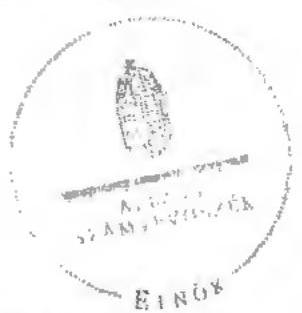

Tisztelettel:

## Domokos László

Melléklet: Tájékoztatás az el nem fogadott észrevételekről

---

.

---

# Tájékoztatás   az el nem fogadott észrevételekről 

A gazdasági kamarák közfeladatai ellátására fordított költségvetési támogatások felhasználásának és a gyakorlati képzést szervező gazdálkodó szervezeteknél a szakképzési hozzájárulás teljesítésénél a 2009-2011. években elszámolható költségek ellenőrzése című jelentéstervezetre 2013. június 26-i dátummal kelt levelében tett észrevételeit áttekintettük, azok kezeléséről az alábbi tájékoztatást adom.

Az észrevétel nem igényli a jelentés módosítását. A jegyzőkönyv csak az adminisztrációs költség elszámolt mértékét rögzíti tényként. A helyszíni ellenőrzés során 2013. január 30-i dátummal a Faktor Tanműhelyek Kft. ügyvezetőjeként aláírásával igazolta az átadott dokumentumok körét. Az átadott dokumentumok jegyzéke az adminisztrációs költségek bizonylatait nem tartalmazta. A szakképzési hozzájárulásról és a képzés fejlesztésének támogatásáról szóló 2003. évi LXXXVI. törvény mellékletének 3. pontja alapján a szakképzési hozzájárulás teljesítésénél elszámolható a tanulószerződés, illetve hallgatói szerződés alapján gyakorlati képzésben résztvevők gyakorlati képzésével és költségeinek elszámolásával összefüggő adminisztratív költség, amelynek mértéke nem haladhatja meg évente, tanulónként, illetve hallgatónként a 15 ezer forintot és vállalkozásonként a kötelező legkisebb havi munkabérnek (minimálbér) egy évre kiszámított összegét. A gyakorlati képzésben résztvevők gyakorlati képzésével és költségeinek elszámolásával összefüggő adminisztratív költségek felmerülését dokumentummal igazolni kell, ennek elszámolható mértékét maximalizálja csak a jogszabály. Dokumentumok hiányában az elszámolt adminisztrációs költség jogossága nem igazolt.

Tájékoztatom, hogy a számvevőszéki jelentés mellékleteként szerepeltetjük a jelentéstervezethez tett észrevételeit, valamint az azokra adott válaszunkat.

Budapest, 2013. július hó 24 nap

Makkai Mária
felügyeleti vezető

---

.

---

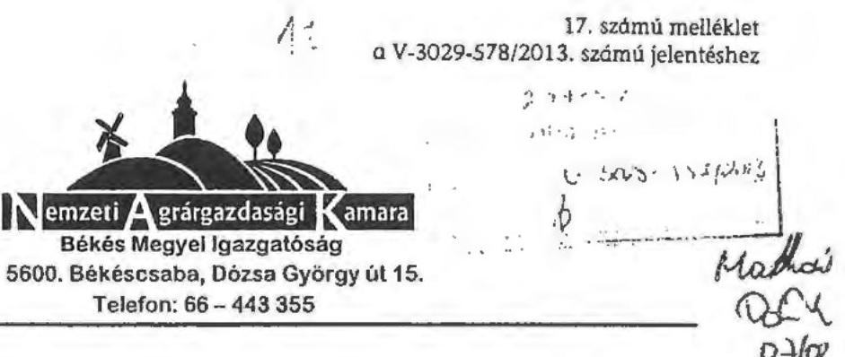

DOMOKOS László Úr
Állami Számvevőszék

1052 - Budapest, Apáczai Csere János u. 10.

Tisztelt Elnök Úr!

Tájékoztatom Elnök Urat, hogy a fenti hivatkozási szám alatt megküldött - a gazdasági kamarák közfeladatai ellátására fordított költségvetési támogatások felhasználásának és a gyakorlati képzést szervező gazdálkodó szervezeteknél a szakképzési. . . hozzájárulás teljesítésénél a 2009-2011. évben elszámolható költségek ellenőrzése - tárgyában készített szakmailag korrekt, egzakt számvevőszéki jelentéstervezetet elfogadom, az ellen nem kívánok észrevételt tenni.

A jelentés összeállításához Önnek, ill. munkatársainak jó munkát és jó egészséget kívánok!

Békéscsaba, 2013. június 27.

Tisztelettel :
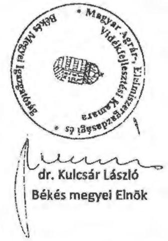

Clm: 5600 - Békéscsaba, Dózsa György út 15. | Telefon: +36 66 443-355 | Honlap: www.agrarkamara.hu

---

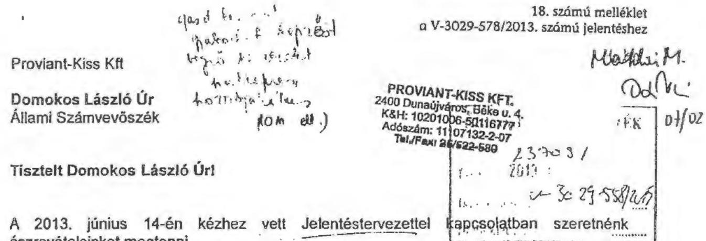

Tisztelt Domokos László Úr!

A 2013. június 14-én kézhez vett Jelentéstervezettel észrevételeinket megtenni.

A jelentéstervezetben ez szerepel:

„Az ellenőrzött időszak alatt a tételes elszámolást alkalmazó 71 gazdálkodó szervezet közül 14 sértette meg a szakképzési hozzájárulási tv. A költségek tételes elszámolására vonatkozó előírását az alábbiak miatt: hat elszámolás nem volt bizonylatokkal, költségfelosztással alátámasztott.”

Ebben a hat gazdálkodó szervezetben mi, Proviat-Kiss Kft. is meg lettünk jelölve.

Az ellenőrzés során a két ellenőr hölgy precízen, pontosan átvizsgált mindent, így az adminisztrációs költségek elszámolását is.

Minden elszámolással kapcsolatos bizonylatról készítettek fénymásolatot, talán az fordulhatott elő, hogy véletlenül itt felejtették az adminisztrációs költség helyes elszámolását igazoló számla másolatot.

Az ellenőrzés végén készült jegyzőkönyvben ez szerepel:

„2.2.4. A gyakorlati képzés adminisztratív költségei

A Proviant-Kiss Kft. a gyakorlati képzés adminisztratív költségeként az ellenőrzött években az Szht. melléklete 3. pontjának megfelelően a mindenkori havi minimálbér egy évre kiszámított összegét számolta el.”

(Tanulóink száma az ellenőrzött években 120-145 fő között mozgott).

Ennek alátámasztására most mellékelünk Önnek 3 db számla másolatot, és ha szükséges, az összes továbbít is elküldjük.

Tisztelettel:

Kiss Tibor
ügyvezető

Fazekas Mária
Fazekas Mária
gyakorlati oktatásvezető

Dunaújváros, 2013. június 24.

PROVIANT-KISS KFT.
2400 Dunaújváros, Béke u. 4.
KSH: 10201006-50116777
Adószám: 11107132-2-07
Tel./Fax: 89/882-650

---

# Kiss Tibor úr   ügyvezető igazgató   Proviant-Kiss Kft. 

## Dunaújváros

## Tisztelt Ügyvezető Igazgató Úr!

A gazdasági kamarák közfeladatai ellátására fordított költségvetési támogatások felhasználásának és a gyakorlati képzést szervező gazdálkodó szervezeteknél a szakképzési hozzájárulás teljesítésénél a 2009-2011. években elszámolható költségek ellenőrzése című jelentéstervezetre tett észrevételeit köszönettel megkaptam.

Az Állami Számvevőszék észrevételekre vonatkozó álláspontjáról a felügyeleti vezető által készített részletes tájékoztatást csatoltan megküldöm.

Tájékoztatom Ügyvezető Igazgató urat, hogy a számvevőszéki jelentés az elfogadott észrevételei figyelembevételével készül.

Budapest, 2013. július hó 24 nap

Tisztelettel:

## Domokos László

Melléklet: Tájékoztatás az el nem fogadott észrevételekről

---

.

---

# Tájékoztatás   az el nem fogadott észrevételekről 

A gazdasági kamarák közfeladatai ellátására fordított költségvetési támogatások felhasználásának és a gyakorlati képzést szervező gazdálkodó szervezeteknél a szakképzési hozzájárulás teljesítésénél a 2009-2011. években elszámolható költségek ellenőrzése című jelentéstervezetre 2013. június 24-i dátummal kelt levelében tett észrevételeit áttekintettük, azok kezeléséről az alábbi tájékoztatást adom.

Az észrevétele nem igényli a jelentés módosítását. A jegyzőkönyv csak az adminisztrációs költség elszámolt mértékét rögzíti tényként. A helyszíni ellenőrzés során 2013. február 4-i dátummal a Proviant-Kiss Kft. ügyvezetőjeként aláírásával igazolta az átadott dokumentumok körét. Az átadott dokumentumok jegyzéke az adminisztrációs költségek számláit nem tartalmazta. Az észrevételhez pótlólag megküldött dokumentumok alapján a teljes ellenőrzési időszakban elszámolt adminisztrációs költségek nem igazolhatók.

Tájékoztatom, hogy a számvevőszéki jelentés mellékleteként szerepeltetjük a jelentéstervezethez tett észrevételeit, valamint az azokra adott válaszunkat.

Budapest, 2013. július hó 24 nap

Makkai Mária
felügyeleti vezető

---

.

---

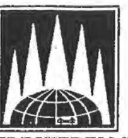

# PÉCS-BARANYAI KERESKEDELMI ÉS IPARKAMARA 

## alapitva 1881

Tárgy: Észrevétel jelentéstervezetre
Iktatószám: K/11-22/2013.
Ügyintéző: Kiss Karolin
Hiv, szám: V-3029-541/2013.

Domokos László úr
elnök

Állami Számvevőszék

## Budapest

## Tisztelt Elnök Úr!

Köszönettel vettem kézhez a gazdasági kamarák közfeladatai ellátására fordított költségvetési támogatások felhasználásának és a gyakorlati képzést szervező gazdálkodó szervezeteknél a szakképzési hozzájárulás teljesítésénél a 2009-2011. években elszámolhat költségek ellenőrzéséről készített számvevőszéki jelentéstervezetet.

A jelentéstervezet Pécs-Baranyai Kereskedelmi és Iparkamarákra vonatkozó részére a megadott határidőn belül az alábbi két észrevételt teszem:

A jelentéstervezet 68. oldalán a második bekezdés a humánerőforrás biztosításának követelményeit tartalmazó szabályzat hiányát állapította meg. Valóban nem készült ilyen témájú szabályzat, mivel - ahogyan azt a jelentéstervezet is tartalmazza - a külső szakértők megbízásának szakmai és pénzügyi feltételeire, a szakértőtől elvárt iskolai végzettségre, a díjazás mértékére vonatkozó iránymutatást a támogatási szerződések tartalmazták. A szabályzat nem írhatja felül a szerződéses jogviszonyban vállalt kötelezettségeket, ezért megalkotása csak a támogatási szerződésekben foglaltak ismétlését tartalmazhatta volna, attól történő eltérés nélkül. A Kamara az általa közzétett szakértői pályázati felhívásokban, valamint a szakértők kiválasztása során is a támogatási szerződésekben rögzített feltételeknek megfelelő szakértőket alkalmazta. Főállású munkavállalók esetében is csak az előírt feltételeknek megfelelő munkavállalók vehettek részt a feladatok megvalósításában.

A negyedik bekezdés tartalmazza, hogy az utalványozásra vonatkozó szabályozásban előírt, az utalványozási értékhatár megjelölésével vezetendő nyilvántartást a Kamara nem vezette. Az utalványozásra vonatkozó szabályozás a következőket tartalmazza: „Az elnököt, a titkárt és az általuk írásban arra felhatalmazott vezetőket utalványozási jog illet meg. Az utalványozási jogkörrel felruházott személyekről az utalványozási jog összeghatárának a megjelölésével a kincstárnoknak nyilvántartást kell vezetni." A gyakorlatban utalványozási

---

jogával csak a titkár él, sem az elnök, sem a titkár nem hatalmazott fel senkit utalványozási jog gyakorlására, emiatt nem volt miről nyilvántartást vezetni.

Minden esetben szolgáltatás megrendelése, eszköz beszerzése az illetékes munkatársak aláírásával ellátott megrendelővel indul, melyet abban az esetben lehet továbbítani, ha azt a titkár aláírásával jóváhagyta. Ezt követően a számla beérkezésekor - amennyiben a vonatkozó szerződés előírja - az illetékes munkatárs teljesítésigazolást állít ki. A beérkezett számlához a megrendelőt és - ha készült - a teljesítésigazolást az illetékes munkatárs csatolja. A számla összege abban az esetben kerül utalványozásra, ha azt a titkár aláírásával jóváhagyta. Amint azt az ellenőrzést végző kollégái is tapasztalhatták, minden számlán szerepel a titkár aláírása.

Az utalványozás a fentiek szerinti zárt rendben történik. Azért tartom fontosnak az utalványozás rendjét hangsúlyozni, mivel a jelentéstervezet csak a nyilvántartás hiányát rögzíti, az utalványozás szigorúan zárt rendjére nem tér ki. Emiatt a fenti információkkal nem rendelkező olvasó tévesen azt a következtetést vonhatja le, hogy Kamaránknál bármilyen beérkezett számla ellenőrzés nélkül, bárki által utalványozható. Ez nem így történik.

Kérem Elnök Urat, hogy a jelentéstervezetben a Pécs-Baranyai Kereskedelmi és Iparkamarára vonatkozó szövegrészt a fentiek figyelembevételével módosítsa az Állami Számvevőszék!

Pécs, 2013. június 19.

Tisztelettel:
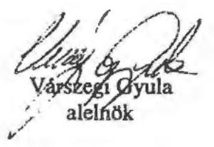

Dr. Sikfői Tamás
titkár

---

# 21. számú melléklet   a V-3029-578/2013. számú jelentéshez 

## ELNÖK

Íkt.szám: V-3029-562/2013.

## Dr. Kéri István úr

elnök
Pécs-Baranyai Kereskedelmi és Iparkamara

## Pécs

## Tisztelt Elnök Úr!

A gazdasági kamarák közfeladatai ellátására fordított költségvetési támogatások felhasználásának és a gyakorlati képzést szervező gazdálkodó szervezeteknél a szakképzési hozzájárulás teljesítésénél a 2009-2011. években elszámolható költségek ellenőrzése című jelentéstervezetre tett észrevételeit köszönettel megkaptam.

Az Állami Számvevőszék észrevételekre vonatkozó álláspontjáról a felügyeleti vezető által készített részletes tájékoztatást csatoltan megküldöm.

Tájékoztatom Elnök urat, hogy a számvevőszéki jelentés az elfogadott észrevételei figyelembevételével készül.

Budapest, 2013. július hó 27 nap
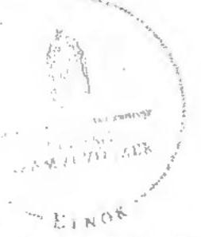

Tisztelettel:

## 02. 68   Domokos László

Melléklet: Tájékoztatás az el nem fogadott észrevételekről

---

.

---

# Tájékoztatás   az el nem fogadott észrevételekről 

A gazdasági kamarák közfeladatai ellátására fordított költségvetési támogatások felhasználásának és a gyakorlati képzést szervező gazdálkodó szervezeteknél a szakképzési hozzájárulás teljesítésénél a 2009-2011. években elszámolható költségek ellenőrzése című jelentéstervezetre K/11-22/2013. iktatószámú levelében tett észrevételeit áttekintettük, azok kezeléséről az alábbi tájékoztatást adom.

Az észrevételei nem igénylik a jelentés módosítását.
A jelentéstervezet 68. oldal második bekezdése tényként rögzíti, hogy a kamara belső szabályzatban nem határozta meg a feladatok megvalósításához szükséges humánerőforrás biztosításának követelményeit. A jelentéstervezet a megfogalmazásával egyértelműen jelzi, hogy a kamaránál a közfeladatok ellátása érdekében foglalkoztatottakra vonatkozik a megállapítás. Az észrevétel is elismeri a belső szabályozásnak a hiányát, a főállású munkavállalók alkalmazási feltételeinek szabályozatlanságát. A jelentéstervezet külön értékelte az alkalmazásban nem álló külső szakértők, vizsgáztatásban közreműködők biztosításának módját.

A jelentéstervezet 68. oldal negyedik bekezdése az észrevételben leírtakkal összhangban megállapítja, hogy a belső szabályozás előírta az utalványozási jog összeghatárának megjelölésével vezetendő nyilvántartási kötelezettséget. A kamara kincstárnoka a nyilvántartási kötelezettségét nem teljesítette. A jelentéstervezet a kamaránál az utalványozási jog gyakorlásával kapcsolatos szabálytalanságról szóló megállapítást nem tett.

Tájékoztatom, hogy a számvevőszéki jelentés mellékleteként szerepeltetjük a jelentéstervezethez tett észrevételeit, valamint az azokra adott válaszunkat.

Budapest, 2013. július hó 26 . nap

Makkai Mária
felügyeleti vezető

---

.

---

22. számú melléklet a V-3029-578/2013. számú jelentéshez

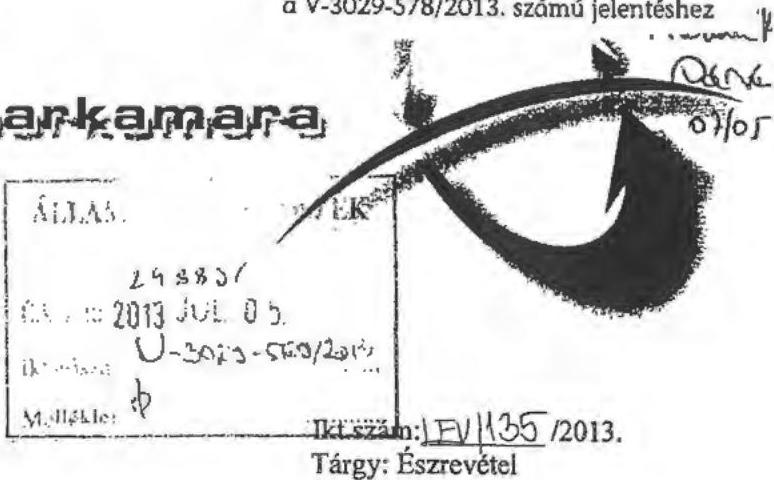

Domokos László elnök
Állami Számvevőszék

Budapest
Apáczai Csere János u. 10.
1052

Tisztelt Elnök Úr!

A gazdasági kamarák közfeladatai ellátására fordított költségvetési támogatások
felhasználásának ellenőrzéséről 2013. június 13-án köszönettel megkaptam a jelentéstervezetet,
melyre a kamaránkra vonatkozó megállapításokra az alábbi észrevételt teszem.

A jelentés rögzíti, hogy a támogatások nyilvántartása megfelel a számviteli törvény előírásainak,
ugyanakkor az utalványozás nem felelt meg a hivatkozott törvény 167. § (1) bekezdés c)
pontjában foglalt előírásoknak, valamint nincs szabályozva az utalványozási jogosultság.

Fenti hiányosságokat pótoljuk, a jövőben a megállapítás, illetve a számviteli tv. előírásai
szerint végezzük.

A jelentés rögzíti, hogy a kamara Alapszabályában és az SZMSZ-ben rögzítésre kerültek a
tisztségviselőkre vonatkozó összeférhetetlenségi szabályok, ugyanakkor az ügyintéző szervezetre
vonatkozó összeférhetetlenségi szabályokat nem határoztuk meg.

Az Alapszabály és az SZMSZ valóban nem tartalmazza, ugyanakkor valamennyi munkavállaló
munkaszerződése tartalmazza az alábbiakat.

„A Munkavállaló másik munkaviszonyt, vagy egyéb munkavégzésre irányuló jogviszonyt –
a tudományos, szakértői, oktatói vagy szerzői jogvédelmi alá tartozó munkavégzésre
irányuló munkaviszony, vagy erre irányuló megbízás kivételével – kizárólag a Kamara
titkárának jóváhagyásával létesíthet.

Munkavállaló kötelezi magát arra, hogy politikai tevékenységet nem vállal és csak olyan
közéleti tevékenységre vállalkozik, amely nem ellentétes a Munkáltató tevékenységével, nem
rontja annak hírnevét eredményes munkáját.”

A bekezdési szabályzat utalványozóra, pénztárellenőrre vonatkozó megállapítás szerinti
hiányosságot pótoljuk.

---

A jelentés megállapítja, hogy a békéltető testület összefoglaló tájékoztatója nem került megküldésre a fogyasztóvédelemért felelős miniszternek. A békéltető testület elnökének tájékoztatása szerint az MKIK-nak valamennyi évben megküldésre került az éves összefoglaló, és az MKIK vállalta, hogy azt továbbítja a minisztériumnak.

Amennyiben ez nem történt meg pótoljuk.
Végezetül köszönetemet fejezem ki Elnök Úr munkatársainak a korrekt ellenőrzés lefolytatásáért.

Szolnok, 2013. június 28.
Tisztelettel:
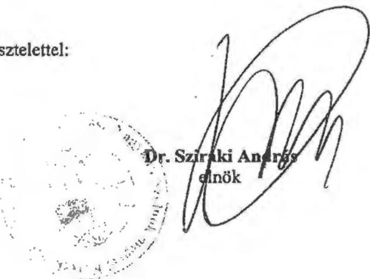

---

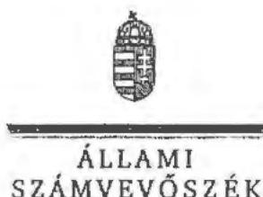

# Dr. Sziráki András úr 

elnök
Jász-Nagykun-Szolnok Megyei Kereskedelmi és Iparkamara

## Szolnok

## Tisztelt Elnök Úr!

A gazdasági kamarák közfeladatai ellátására fordított költségvetési támogatások felhasználásának és a gyakorlati képzést szervező gazdálkodó szervezeteknél a szakképzési hozzájárulás teljesítésénél a 2009-2011. években elszámolható költségek ellenőrzése című jelentéstervezetre tett észrevételeit köszönettel megkaptam.

Az Állami Számvevőszék észrevételekre vonatkozó álláspontjáról a felügyeleti vezető által készített részletes tájékoztatást csatoltan megküldöm.

Tájékoztatom Elnök urat, hogy a számvevőszéki jelentés az elfogadott észrevételei figyelembevételével készül.

Budapest, 2013. július hó 12 nap

Tisztelettel:

## 0200

Melléklet: Tájékoztatás az elfogadott és az el nem fogadott észrevételekről

---

.

---

# Tájékoztatás   az elfogadott és az el nem fogadott észrevételekről 

A gazdasági kamarák közfeladatai ellátására fordított költségvetési támogatások felhasználásának és a gyakorlati képzést szervező gazdálkodó szervezeteknél a szakképzési hozzájárulás teljesítésénél a 2009-2011. években elszámolható költségek ellenőrzése című jelentéstervezetre LEV-135/2013. iktatószámú levelében tett észrevételeit áttekintettük, azok kezeléséről az alábbi tájékoztatást adom. Az észrevétel nem jelölte meg az észrevételezett szöveget, az észrevételek a levél tartalma alapján a jelentéstervezet 3.14 pontjában leírtakra vonatkoztak.

Az utalványozással és a pénzkezelési szabályzat kiegészítésével kapcsolatban leírtak nem igénylik a jelentés módosítását.

A munkavállalók összeférhetetlenségével kapcsolatban a jelentéstervezet szövegét kiegészítjük. A jelentéstervezettel összhangban az észrevétel is elismeri, hogy az ügyintéző szervezetre vonatkozó összeférhetetlenségi szabályokat a belső szabályzatok nem tartalmazták. A munkaszerződések tartalmaznak összeférhetetlenségre vonatkozó tiltást. A munkatársak összeférhetetlenségére vonatkozóan azonban szabályozatlan, hogy mikor engedélyezheti a titkár az egyéb jogviszony keretében a munkavégzést, illetve mely politikai tevékenység rontja a munkáltató hírnevét. A kamara titkára szabályozatlanul kontrollálja a munkavállalók egyéb tevékenységeit, ennek érzékeltetésére a szöveget kiegészítettük a következő módon „Az ügyintéző szervezetre vonatkozó összeférhetetlenségi szabályokat a kamara belső szabályzatban nem határozta meg. A Jász KIK munkatársai egyéb jogviszony keretében, a kamarai titkár engedélyével elláttak szakképzéssel összefüggő, munkaköri leírásukban nem szereplő feladatokat."

A békéltető testület összefoglaló tájékoztatóinak megküldésével kapcsolatos észrevétele nem igényli a jelentéstervezet módosítását, ahhoz csak magyarázatul szolgál. A fogyasztóvédelemről szóló 1997. évi CLV. törvény 36/A. § (1) bekezdése szerint a „békéltető testület tevékenységéről évente összefoglaló tájékoztatót készít, és azt a tárgyévet követő év január 31-éig megküldi a fogyasztóvédelemért felelős miniszternek", nem pedig a Magyar Kereskedelmi és Iparkamarának (MKIK). A helyszíni ellenőrzés során pedig a Jász-NagykunSzolnok Megyei Kereskedelmi és Iparkamara a fogyasztóvédelemért felelős miniszternek való megküldést nem tudta igazolni.

Tájékoztatom, hogy a számvevőszéki jelentés mellékleteként szerepeltetjük a jelentéstervezethez tett észrevételeit, valamint az azokra adott válaszunkat.

Budapest, 2013. július hó 22 nap

Makkai Mária
felügyeleti vezető

---

.

---

# Domokos László úr részére 

elnök

Állami Számvevőszék

Iktatószám: NGM/14718-2/2013.
Hiv. szám: V-3029-538/2013.
Ügyintéző: Vész Zsófia
Telefonszám: 472-8632
Tárgy: Észrevételek ÁSZ
jelentéstervezethez

## Budapest

Apáczai Csere János u. 10. 1052

Tisztelt Elnök Úr!

A gazdasági kamarák közfeladatai ellátására fordított költségvetési támogatások felhasználásának és a gyakorlati képzést szervező gazdálkodó szervezeteknél a szakképzési hozzájárulás teljesítésénél a 2009-2011. években elszámolt költségek ellenőrzéséről szóló Jelentéstervezethez az alábbi észrevételeket, javaslatokat tesszük.

## 1. Általános észrevételek

1.1. Nem értünk egyet a Bevezetésben írt azon megállapítással, hogy a szakképzési hozzájárulás beszedésének célja csak a gyakorlati képzés feltételei megteremtésének, korszerűsítésének biztosítása.

Az ellenőrzött időszakban hatályos szakképzési hozzájárulásról és a képzés fejlesztésének támogatásáról szóló 2003. évi LXXXVI. törvény (a továbbiakban: Szht.) a szakképzési hozzájárulás több célját is tartalmazza, így például az iskolarendszeren kívüli felnőttképzés támogatása, a foglalkoztatottak szakmai tudásának továbbfejlesztéséhez képzési források biztosítása, stb.

Álláspontunk szerint ezen szövegrész törlése, vagy módosítása indokolt.

---

1.2. A Jelentéstervezetben a jelenleginél lényegesen nagyobb mértékben javasoljuk elkülöníteni a gazdasági kamarák (különösen a Magyar Kereskedelmi és Iparkamara) különböző - a szakképzéssel, szakképzési hozzájárulással, illetve a békéltető testületekkel kapcsolatos - közfeladatainak támogatására vonatkozó megállapításokat. Ugyanis a közfeladatok külön szakterületek részét képezik, különböző jogszabályok hatálya alá tartoznak. A szétválasztást az is indokolja, hogy véleményünk szerint a megállapítások sok esetben összeolvadva jelennek meg, félreérthetőek, zavart okoznak annak megítélésében, hogy mely közfeladatra vonatkoznak.

Csak egy példát kiragadva: a 11. oldal 3. bekezdése leírja, hogy az országos kamarák mekkora összegű támogatást kaptak különböző feladataikra, ezt követően megállapítja, hogy a támogatások célja a szakképzés finanszírozása volt. A békéltető testületek működtetésének célja nem lehetett a szakképzés finanszírozása, mely kifejezés szakmailag önmagában sem helytálló.
1.3. Összevontan jelennek meg a Magyar Agrárkamara (a továbbiakban: MAK) támogatására vonatkozó megállapítások is. Erre példa a 31. oldal 3. bekezdésében szereplő 608 MFt támogatási összeg, mely tartalmazza a MAK-nak a különböző forrásokból és különböző intézmények - Vidékfejlesztési Minisztérium, a Szociális és Munkaügyi Minisztérium háttérintézménye, a Nemzeti Szakképzési és Felnőttképzési Intézet (a továbbiakban: NSZFI) - által nyújtott támogatásait. Továbbá a megállapítás szerint összesen 67,9 MFt összegű támogatás felhasználása nem alátámasztott, azonban nem egyértelmű az, hogy ez mely támogatás(ok)ra vonatkozik.

Javasoljuk a Jelentéstervezetben e megállapításokat is egyértelműbben szétválasztani.

# 2. Részletes észrevételek 

2.1. Vitatjuk a 11. oldal 2. bekezdésében foglaltakat, miszerint az NGM és jogelődje megsértette a gazdasági kamarákról szóló 1999. évi CXXI. törvény (a továbbiakban: Kamtv.) előírásait azzal, hogy nem megfelelőn tervezte meg a gazdasági kamarák részére nyújtott forrást, hanem a Munkaerőpiaci Alap képzési alaprészéből (a továbbiakban: MPA KA) biztosította azt.

Az Szht. lehetővé tette, hogy az MPA KA kiadási előirányzatának szakképzésért és felnőttképzésért felelős miniszter rendelkezési jogkörében felhasználható része terhére valósuljon meg a gazdasági kamarák szakképzéssel összefüggő, a szakképzésről szóló 1993. évi LXXVI. törvényben (a továbbiakban: Szt.) megfogalmazott feladatainak támogatása, így e forrásból került biztosításra a támogatás.
2.2. A Kamtv. 34. § (3) bekezdése kimondja, hogy a költségvetési támogatás felhasználását és hatékonyságát évente ellenőriznie kell a fejezetet irányító szervnek. A támogatás felhasználásának és hatékonyságának ellenőrzésére vonatkozóan a Jelentéstervezet megállapítja, hogy az NGM és jogelődje részéről ez nem történt meg.

Álláspontunk szerint az állítás nem helytálló.

---

Egyrészt a támogatás felhasználását az NSZFI ellenőrizte, amint azt a Jelentéstervezet 30. oldal 1. bekezdése tartalmazza. Másrészt a hatékonyság ellenőrzésére vonatkozó előírás nem értelmezhető a következők miatt.
Az NGM és jogelődje által nyújtott támogatás nem a költségvetési törvényben került megállapításra, hanem a kamara célzottan kapta azt feladatfinanszírozás keretében. A forrás támogatási szerződés keretében került átadásra, és a szerződés tételesen szabályozta a felhasználást. A támogatások odaítélése részletes feladat-, idő- és költségterv alapján készült, melynek keretében a humán erőforrás szükséglet konkrétan és tételesen is meghatározásra került.

Amennyiben a támogatott a támogatási szerződésben foglalt - egyébként jogszabályokban és a támogatási szerződésben előírt - feladatait elvégezte, a hatékonyság vizsgálata szükségtelen, hiszen a támogatási szerződésben foglaltak végrehajtásának ellenőrzésekor ez megtörténik.

Kérjük a megállapítás törlését.
Ezzel összefüggésben kérjük a Jelentéstervezet 17. oldalán a nemzetgazdasági miniszternek tett javaslat - „ellenőrizze évente a támogatások felhasználásának hatékonyságát a kereskedelmi és iparkamaráknál a gazdasági kamarákról szóló 1999. évi CXXI. törvény 34. § (3) bekezdésével összhangban" - törlését.
2.3. Nem értünk egyet a 12. oldal 4. bekezdésében foglalt megállapítással, mely szerint a támogatások felhasználása ellenőrzési rendjének szabályozatlansága és hiányos kialakítása hozzájárult a nem megfelelő és szabálytalan támogatás felhasználáshoz.

Álláspontunk szerint egyrészt a hatályos jogszabályokban (Szht. és a végrehajtására kiadott 13/2008. (VII. 22.) SZMM rendelet) a támogatás felhasználása és az ellenőrzés rendje taxatíve és tételesen szabályozva volt. Másrészt a nem megfelelő és szabálytalan támogatásfelhasználást vitatjuk, hiszen a Jelentéstervezet sem tartalmaz visszafizetésre vonatkozó megállapítást. Amennyiben valóban volt szabálytalan felhasználás, bizonyára tételesen kimutatásra és megállapításra került volna.

Kérjük a szövegrész törlését.
2.4. Észrevételezzük, hogy a 13. oldal 1. bekezdése szerint a MAK-nál és a Magyar Kereskedelmi és Iparkamaránál (a továbbiakban: MKIK) a teljesítésigazolást több millió forint összegben ( $67,9 \mathrm{MFt}+11,3 \mathrm{MFt}$ ) nem támasztotta alá alapdokumentum. Ugyanakkor a jogosulatlan kifizetést nem tárt fel az ellenőrzés, sőt a 27. oldal 5. bekezdése szerint az MKIK a támogatások felhasználását megfelelően dokumentálta.
2.5. A Jelentéstervezet több pontja véleményünk szerint egymásnak ellentmondó megállapításokat tartalmaz, ezek a következők:
a) A 14. oldal 2. bekezdése szerint az MKIK határidőn túl nyújtotta be elszámolását, míg a 27. oldal 3. bekezdése alapján az MKIK az elszámolási határidőt betartotta.
b) A 14. oldal 4. bekezdésében foglaltaknak, miszerint az NSZFI a 2007. és 2008. évek elszámolását az országos kamaráknál a helyszínen ellenőrizte, ellentmond a 30. oldal

---

1.  bekezdése, mely szerint az MKIK helyszíni ellenőrzésére csak 2011-ben a 2009. évi szakképzési támogatásoknál került sor.
c) A 31. oldal 3. bekezdése szerint a MAK-nál a kifizetések egy részéhez nem kapcsolódott teljesítést alátámasztó dokumentum, míg a 32. oldal 5. bekezdése alapján a MAK részére biztosított költségvetési támogatások felhasználásának nyilvántartása megfelelő volt.

Javasoljuk az ellentmondások feloldását.
2.6. Nem értünk egyet a 16. oldal 3. bekezdése szerinti megállapítással, miszerint a tanulószerződés alapján oktatott tanulók foglalkozási naplójának nem, vagy hiányos vezetése következtében nem volt igazolt a tanulók gyakorlati foglalkozáson való rendszeres részvétele, mulasztása és értékelése, melynek következtében a szakképzési hozzájárulás bevallása jogszabálysértő volt. Az ellenőrzés időszakában hatályos szakképzésről szóló 1993. évi LXXVI. törvény (a továbbiakban: Szt.) előírta, hogy foglalkozási naplót kell vezetni, azonban az Szt. és a közoktatásról szóló 1993. évi LXXIX. törvény alapján a gyakorlati képzésen való részvételt nem kizárólag e napló, hanem még számos más tanügyigazgatási dokumentum bizonyítja. Ebből adódóan véleményünk szerint nem lehet egyértelműen kijelenteni, hogy a napló hiánya miatt nem volt igazolt a gyakorlati képzésen való részvétel és ennek következtében jogszerűtlen a bevallás. Megjegyezzük, hogy amennyiben a Jelentéstervezetben foglaltak helytállóak lennének, ezek a tanulók nem lettek volna vizsgára bocsáthatók, és nem kaphattak volna bizonyítványt sem.

Kérem észrevételeink elfogadását, a Jelentéstervezetben történő átvezetését.
Budapest, 2013. július 11.
Ödvözlettel:
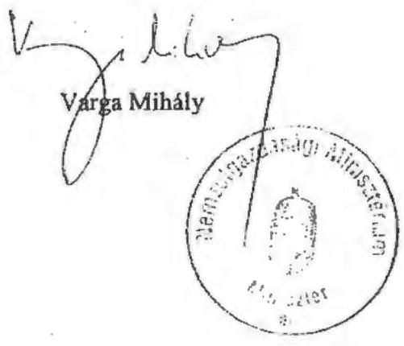

---

# 25. számú melléklet   a V-3029-578/2013. számú jelentéshez 

## ÉLKÖK

ÁLLAMI
SZÁMVEVŐSZÉK

Ikt.szám: V-3029-574/2013.

## Varga Mihály úr

miniszter
Nemzetgazdasági Minisztérium

## Budapest

## Tisztelt Miniszter Úr!

A gazdasági kamarák közfeladatai ellátására fordított költségvetési támogatások felhasználásának és a gyakorlati képzést szervező gazdálkodó szervezeteknél a szakképzési hozzájárulás teljesítésénél a 2009-2011. években elszámolható költségek ellenőrzése című jelentéstervezetre tett észrevételeit köszönettel megkaptam.

Az Állami Számvevőszék észrevételekre vonatkozó álláspontjáról a felügyeleti vezető által készített részletes tájékoztatást csatoltan megküldöm.

Tájékoztatom Miniszter urat, hogy a számvevőszéki jelentés az elfogadott észrevételei figyelembevételével készül.

Budapest, 2013. 07 hó 30 nap
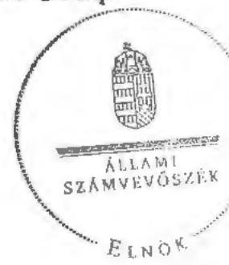

Tisztelettel:

Domokos László

Melléklet: Tájékoztatás az elfogadott és az el nem fogadott észrevételekről

---

.

---

# Tájékoztatás   az elfogadott és az el nem fogadott észrevételekről 

A gazdasági kamarák közfeladatai ellátására fordított költségvetési támogatások felhasználásának és a gyakorlati képzést szervező gazdálkodó szervezeteknél a szakképzési hozzájárulás teljesítésénél a 2009-2011. években elszámolható költségek ellenőrzése című jelentéstervezetre megküldött NGM/14718-2/2013. iktatószámú levelében tett észrevételeit áttekintettük, azok kezeléséről az alábbi tájékoztatást adom.

Általános észrevételek:
1.1. Az észrevétel nem igényli a jelentés módosítását. A jelentéstervezet bevezetője az ellenőrzés céljához kacsolódóan tartalmazza a szakképzési hozzájárulásról és a képzés fejlesztésének támogatásáról szóló 2003. évi LXXXVI. törvény (szakképzési hozzájárulási törvény) 1. §-ában megjelölt célok közül a témához kapcsolódót. A jelentéstervezetben nem szerepel, hogy „csak" erre a célra fordítható a szakképzési hozzájárulás.
1.2. Az észrevétele alapján a jelentés hivatkozott szövegét pontosítottuk az alábbiak szerint „A szakképzési feladatokhoz kapcsolódóan megkötött szerződésekkel nyújtott támogatások célja a szakképzés finanszírozása volt." A jelentés minden más esetben a két feladatot elkülönítetten kezeli, ezért további pontosítást nem igényel.
1.3. Az észrevétel nem igényli a jelentés módosítását. A Magyar Agrárkamara és a Magyar Kereskedelmi és Iparkamara ellenőrzése a bevezetőben megjelölt közfeladatokhoz nyújtott támogatásokra vonatkozott. Az ellenőrzött támogatási szerződések és kapcsolódó elszámolások dokumentumaiból vett minta ellenőrzése során állapítottuk meg a hibákat.

Részletes észrevételek
2.1. Az észrevétel nem igényli a jelentés módosítását. A gazdasági kamarákról szóló 1999. évi CXXI. törvény (kamarai tv.) 34. § (1) bekezdése szerint a gazdasági kamarák a közfeladataik ellátásával, illetve működésükkel járó költségeket több forrásból, így az 1. § e) pontja szerint a költségvetési törvényben megállapított támogatásból is fedezik. Ezzel kapcsolatban a kamarai tv. 34. § (2) bekezdése előírta, hogy „a gazdasági kamarák közfeladatainak ellátásához kapcsolódó költségvetési támogatást azon költségvetési fejezetekben kell megtervezni, amelyekben feltüntetett költségvetési szervek feladatköréhez kapcsolódóan végzik a gazdasági kamarák közfeladataikat." A szakképzésért és felnőttképzésért felelős miniszter a szociális és munkaügyi, majd a nemzetgazdasági miniszter volt, ezért a szakképzési feladatok kamarai

---

támogatásait a szociális és munkaügyi, illetve a nemzetgazdasági minisztériumok fejezeteiben kellett volna megtervezni.

A szakképzési hozzájárulási törvény 11. § (2) bekezdése valóban meghatározza, hogy a szakképzésért és felnőttképzésért felelős miniszter rendelkezzen a Munkaerőpiaci Alap megjelölt részeivel, de sem e jogszabályi helyen, sem annak 1. §-ában megjelölt célok között nem szerepel a kamarák feladatainak támogatása.
2.2. Az észrevétel nem igényli a jelentés módosítását, és a javaslat törlését. A kamarai törvény 34. § (1) bekezdésének e) pontja a közfeladatok ellátásának forrásainál csak a költségvetési törvényben megállapított támogatásról ír. Az NGM és jogelődje így nem is biztosíthatott célzott feladatfinanszírozási támogatást máshonnan, csak a költségvetési törvényben tervezett forrásból. Az észrevételben hivatkozott támogatások is költségvetési törvényben tervezett források, mert a Munkaerőpiaci Alap és forrásai is az időszakban hatályos költségvetési törvényekben tervezettek. A kamarai törvény egyértelműen kimondja, hogy „A költségvetési támogatás felhasználásáról a gazdasági kamarák évente beszámolnak a fejezetet irányító szervnek, amely a költségvetési támogatás felhasználását és hatékonyságát évente köteles ellenőrizni." A jelentéstervezet megállapította, hogy a támogatások felhasználásának és elszámolásának szabályszerűségét a Nemzeti Szakképzési és Felnőttképzési Intézet ellenőrizte, de a támogatás felhasználásának hatékonyságát nem. Megjegyezzük, hogy az NSZFI nem fejezetet irányító szerv. A szerződések előírásai pedig nem tekinthetők az ellenőrzés fogalomkörébe tartozónak.
2.3. Az észrevétel nem igényli a jelentés módosítását. A szakképzési hozzájárulási törvény, illetve a szakképzési hozzájárulásról és a képzés fejlesztésének támogatásáról szóló 2003. évi LXXXVI. törvény végrehajtásáról szóló 13/2008. (VII. 22.) SZMM rendelet nem a gazdasági kamaráknak nyújtott támogatások felhasználásával kapcsolatos ellenőrzési rendet határozzák meg, amiről a hivatkozott összegző bekezdés és az azt követő megállapítások szólnak.
2.4. Az észrevétel nem igényli a 13. oldal 1. bekezdésének a módosítását. A bekezdés tényként rögzítette, hogy a támogatások terhére elszámolt megbízások ellenőrzött kifizetéseinek teljesítésigazolását, a hivatkozott értékben nem támasztotta alá alapdokumentum. A számlán a teljesítések igazolása megtörtént, de - hivatkozva a jelentéstervezet 2.2.2. pontjában leírtakra ahhoz nem kapcsolódott a teljesítést alátámasztó dokumentum, például munkaanyag vagy tanulmány, a szakértői vagy tanácsadói tevékenység megtörténtét igazoló dokumentum. A jelentéstervezet 27. oldal 5. bekezdésében a támogatások felhasználásának dokumentálására vonatkozó megállapítás helytálló, mivel a számlák és a teljesítésigazolások rendelkezésre álltak, míg a 13. oldal 1. bekezdése a ténylegesen elvégzett munkának a dokumentumait hiányolja. A közérthetőség és egyértelműség érdekében a 27. oldal 5. bekezdés 1. mondatát a következőre pontosítjuk: „Az MKIK a támogatások felhasználását a számlákon szerepeltetett teljesítésigazolással dokumentálta..."
2.5. a) Az észrevétel nem igényli a jelentés módosítását. A jelentéstervezet 14. oldal 2. bekezdésével összhangban a részletes megállapítás azt tartalmazta, hogy „Az MKIK a támogatásokkal a szerződésekben rögzített formában és tartalommal számolt el a támogatók felé. Az elszámolási határidőt - a békéltető testületek támogatásai kivételével - betartotta."

---

2.5. b) Az észrevétel alapján az összegző megállapításoknál leírtakat kiegészítettük a 2009. évi elszámolások ellenőrzésére hivatkozással.
2.5. c) Az észrevétel nem igényli a jelentés módosítását. A teljesítést alátámasztó dokumentumok meglétét a támogatás felhasználásának ellenőrizhetősége miatt hiányoltuk. A gazdasági kamarákra vonatkozóan jogszabály nem határozza meg a teljesítések igazolásának szabályait. A támogatás felhasználásának megfelelősége pedig a számviteli törvényben előírt szabályok betartására vonatkozik.
2.6. Az észrevétel nem igényli a jelentés módosítását. A szakképzési törvény 25. § (1) bekezdése szerint a gazdálkodó szervezet a tanuló gyakorlati képzéséről köteles foglalkozási naplót vezetni, amely a (2) bekezdés szerint tartalmazza a szakmai tevékenységeket, az ezekre fordított időt és a tanuló értékelését, és ezen naplót a (3) bekezdés szerint a szakképző iskola felkérésére betekintésre rendelkezésre kell bocsátani. A közoktatásról szóló 1993. évi LXXIX. törvény utal, a közoktatási törvényhez kapcsolódó a nevelési-oktatási intézmények működéséről szóló 11/1994. (VI. 8.) MKM rendelet 4. számú melléklete pedig felsorolja a kötelezően vezetendő tanügyi dokumentumokat. Nincs a hivatkozott jogszabályokban meghatározva más olyan dokumentum, amely a szakmai gyakorlat megtörténtét igazolni tudná.

Tájékoztatom, hogy a számvevőszéki jelentés mellékleteként szerepeltetjük a jelentéstervezethez tett észrevételeit, valamint az azokra adott válaszunkat.

Budapest, 2013. 07 hó 30 nap

Makkai Mária
felügyeleti vezető

---

.

---

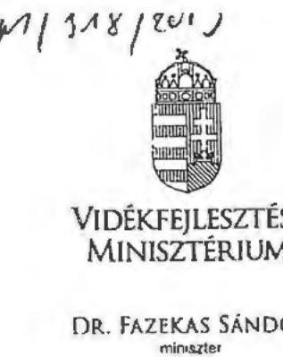

VIDÉKFEJLESZTÉSI MINISZTÉRIUM

DR. FAZEKAS SÁNDOR
miniszter
26. számú melléklet
a V-3029-578/2013. számú jelentéshez

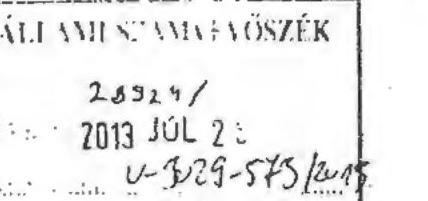

Iktatószám: PTKF/1411-1/2013.
Ügyintéző: dr. Hancsók Szabolcs
Telefonszám: (79) 52014
E-mail: szabolcs.hancsok@vm.gov.hu

Domokos László
elnök úr
részére

Állami Számvevőszék

Budapest 4.
Pf. 54.
1364

Tárgy: gazdasági kamarák 2009-2011. közötti támogatása - jelentéstervezet
véleményezése

Tisztelt Elnök Úr!

Köszönettel megkaptam a gazdasági kamarák közfeladatai ellátására fordított
költségvetési támogatások felhasználásának és a gyakorlati képzést szervező
gazdálkodó szervezeteknél a szakképzési hozzájárulás teljesítésénél a 2009-2011.
években elszámolható költségek ellenőrzéséről készített számvevőszéki
jelentéstervezetet, mellyel kapcsolatban az alábbi észrevételeket teszem:

A jelentéstervezet több helyen, így a 12. oldal 2. bekezdésében, a 17. oldalon szereplő,
vidékfejlesztési miniszternek szóló javaslatban, valamint a 21. oldal utolsó
bekezdésében is kifogásolja, hogy a tárca által kötött szerződések nem tartalmazzák a
Magyar Agrárkamara részére fennálló azon kötelezettséget, mely szerint az adataiban
bekövetkezett változást be kell jelentenie a támogató, nevezetesen a Vidékfejlesztési
Minisztérium felé.

Ezzel szemben a vizsgált időszakban a Magyar Agrárkamarával kötött szerződések
kettő kivételével tartalmazzák a hiányolt kitételt, mely minden további esetben a
következőképpen került meghatározásra:

1055 Budapest, Kossuth Lajos tér 11. Telefon: (06 1) 795 3721 Fax: (06 1) 795 0072

---

„Amennyiben a Kamara adataiban változás következik be, köteles ezt a tényt a VM Parlamenti és Társadalmi Kapcsolatok Főosztálya részére - a változást tartalmazó okirat megküldésével - 8 napon belül bejelenteni."

Az idézett kitételt tartalmazza:
PTKF/38333/8/2009. számú támogatási szerződés 12. pontja
PTKF/39035/2/2009. számú támogatási szerződés 12. pontja
PTKF/353/3/2010. számú támogatási szerződés 13. pontja
PTKF/1369/2010. számú támogatási szerződés 13. pontja
PTKF/1369-12/2010. számú támogatási szerződés 13. pontja
Kettő szerződés valóban nem tartalmazza az említett részt, nevezetesen:
PTKF/38244/1/2009. számú támogatási szerződés
PTKF/376/1/2010. számú támogatási szerződés
Kérem, hogy mindezek alapján a jelentéstervezet pontosítása iránt intézkedni szíveskedjen.

Budapest, 2013. július „15".
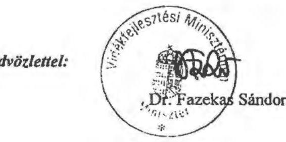

---

# 27. számú melléklet   a V-3029-578/2013. számú jelentéshez 

## ÉLHÖK

Ikt.szám: V-3029-575/2013.

Dr. Fazekas Sándor úr
miniszter
Vidékfejlesztési Minisztérium

Budapest

## Tisztelt Miniszter Úr!

A gazdasági kamarák közfeladatai ellátására fordított költségvetési támogatások felhasználásának és a gyakorlati képzést szervező gazdálkodó szervezeteknél a szakképzési hozzájárulás teljesítésénél a 2009-2011. években elszámolható költségek ellenőrzése című jelentéstervezetre tett észrevételeit köszönettel megkaptam.

Az Állami Számvevőszék észrevételekre vonatkozó álláspontjáról a felügyeleti vezető által készített részletes tájékoztatást csatoltan megküldöm.

Tájékoztatom Miniszter urat, hogy a számvevőszéki jelentés az elfogadott észrevétel figyelembevételével készül.

Budapest, 2013. 07 hó 30 nap

Tisztelettel:

Melléklet: Tájékoztatás az elfogadott észrevételről

---

.

---

# Tájékoztatás   az elfogadott észrevételről 

A gazdasági kamarák közfeladatai ellátására fordított költségvetési támogatások felhasználásának és a gyakorlati képzést szervező gazdálkodó szervezeteknél a szakképzési hozzájárulás teljesítésénél a 2009-2011. években elszámolható költségek ellenőrzése című jelentéstervezetre megküldött PTKF/1411-1/2013. iktatószámú levelében tett észrevételét áttekintettük, annak kezeléséről az alábbi tájékoztatást adom.

Az észrevétele alapján a jelentést a hivatkozott részeken pontosítjuk úgy, hogy az adatokban bekövetkezett változások szövegrészbe beillesztjük, hogy „2 szerződés esetében". Az észrevétele a megfogalmazott javaslat tartalmának módosítását nem indokolja.

Tájékoztatom, hogy a számvevőszéki jelentés mellékleteként szerepeltetjük a jelentéstervezethez tett észrevételét, valamint az arra adott válaszunkat.

Budapest, 2013. 07 hó 30 nap

Makkai Mária
felügyeleti vezető

---

.