# ÁLLAMI   SZÁMVEVŐSZÉK 

## JELENTÉS

a regionális és kistérségi fejlesztési tanácsok forráselosztási tevékenységének ellenőrzéséről

---

# Állami Számvevőszék 

Iktatószám: V-0031-088/2013.
Témaszám: 1070
Vizsgálat-azonosító szám: V0601

## Az ellenőrzést felügyelte:

Holman Magdolna
felügyeleti vezető

## Az ellenőrzést vezette és az ellenőrzés végrehajtásáért felelős:

## Salamon Ildikó

ellenőrzésvezető

## Az összefoglaló jelentést készítette:

## Salamon Ildikó

ellenőrzésvezető

## A jelentés összeállításában közremúködtek:

## Kersmájer Ágota

számvevő tanácsos
Dr. Pataki Magdolna
számvevő tanácsos
Várkonyi Zsolt Kristóf
számvevő tanácsos

## Papp Sándor

számvevő tanácsos
Péntek László
számvevő tanácsos

## Az ellenőrzési folyamatban részt vettek:

| Beck Miklós   számvevő tanácsos | Dr. Dankó István Péter   számvevő osztályvezető-   főtanácsos | Fórián Erika   számvevő tanácsos |
| :-- | :-- | :-- |
| Heinemanné Borbély   Mária   számvevő | Huszár József   számvevő tanácsos | Kersmájer Ágota   számvevő tanácsos |
| Kovácsy Tamás   számvevő tanácsos | Kökény László   számvevő tanácsos | Körmendi Tibor   számvevő |
| Luhály Matild   számvevő | Massányi Tibor   számvevő tanácsos | Dr. Nagy Ágnes   számvevő tanácsos |
| Papp Sándor   számvevő főtanácsos | Dr. Pataki Magdolna   számvevő tanácsos | Péntek László   számvevő tanácsos |
| Samu István   számvevő tanácsos | Szalontai Miklós   számvevő tanácsos | Várkonyi Zsolt Kristóf   számvevő tanácsos |
| Vida László   számvevő tanácsos |  |  |

---

# A témához kapcsolódó eddig készített számvevőszéki jelentések: 

## címe

Jelentés a helyi önkormányzatok fejlesztési célú támogatási rendszerének ellenőrzéséről
Jelentés a térségek felzárkóztatására fordított pénzeszközök fel- 1125 használásának ellenőrzéséről
Jelentés a települési önkormányzatok többcélú kistérségi társulásainak a közszolgáltatások és területfejlesztési feladatok ellátásában betöltött szerepének ellenőrzéséről

---

# TARTALOMJEGYZÉK 

BEVEZETÉS ..... 13
I. ÖSSZEGZŐ MEGÁLLAPÍTÁSOK, KÖVETKEZTETÉSEK, JAVASLATOK ..... 18
II. RÉSZLETES MEGÁLLAPÍTÁSOK ..... 30

1. A területfejlesztési célkitűzések megvalósítása, a területi tervek központi nyilvántartása ..... 30
1.1. A területfejlesztési célkitűzések fő irányai ..... 30
1.2. A területfejlesztési célkitűzések megvalósítása a központi szintű beszámolók alapján ..... 33
1.3. A dokumentációk központi nyilvántartása ..... 34
2. A regionális fejlesztési tanácsok szerepe és feladatellátása ..... 37
2.1. A regionális fejlesztési tanácsok és munkaszervezeteik szabályozottsága ..... 37
2.2. A regionális területfejlesztési koncepciók és programok ..... 41
2.2.1. A regionális területfejlesztési koncepciók, programok és az országos területfejlesztési célkitűzések összhangja ..... 41
2.2.2. A koncepciók és programok pénzügyi tervezési háttere, a nyilvántartások vezetése és az alkalmazott indikátorok ..... 43
2.3. A regionális fejlesztési tanácsok együttműködési és koordinációs tevékenysége ..... 45
2.4. A regionális fejlesztési tanácsok rendelkezésére álló decentralizált hazai források, a döntéshozatali rendszer ..... 47
2.5. A regionális fejlesztési tanácsok szerepe az uniós források döntéshozatali rendszerében ..... 54
2.5.1. A regionális operatív programok és akciótervek előkészítésében való részvétel ..... 54
2.5.2. A kiemelt projektek és regionális projektek véleményezése ..... 54
2.5.3. A regionális érdekek képviselete a monitoring, valamint a bíráló és döntés-előkészítő bizottságokban ..... 58
2.6. A regionális programok értékelése, szakmai beszámolók ..... 59
3. A kistérségi fejlesztési tanácsok szerepe és feladatellátása ..... 61
3.1. A kistérségi fejlesztési tanácsokra vonatkozó központi szabályozás ..... 61
3.2. A szervezeti keretek, a múködés szabályozottsága ..... 63
3.3. A kistérségi fejlesztési tanácsok Tftv.-ben előírt feladatainak ellátása ..... 65
3.4. A kistérségi célkitűzések teljesülésének nyomon követése, a beszámolási kötelezettségek teljesítése ..... 69

---

4. Az ellenőrzési rendszer múködése ..... 72
4.1. A törvényességi felügyelet és a külső ellenőrzések ..... 72
4.1.1. A törvényességi felügyeletet ellátó szervek ellenőrzései ..... 72
4.1.2. A regionális és a kistérségi fejlesztési tanácsoknál végzett külső ellenőrzések ..... 74
4.2. A korábbi ÁSZ ellenőrzések javaslatainak hasznosulása, az intézkedési tervek végrehajtása ..... 75
4.2.1. Az 1108. számú ÁSZ jelentés javaslatainak hasznosulása ..... 75
4.2.2. Az 1125. számú ÁSZ jelentésben megfogalmazott javaslatokra készített intézkedési tervek végrehajtása ..... 77

# MELLÉKLETEK 

1. számú Helyszínen ellenőrzött szervezetek
2. számú Kimutatás a regionális fejlesztési tanácsok részére biztosított múködési forrásokról a 2007-2011. évek között
3. számú Kimutatás a kistérségi fejlesztési tanácsok részére biztosított múködési forrásokról a 2007-2011. évek között
4. számú Kimutatás a 16/2010. (II. 5.) Korm. rendelet alapján beküldött dokumentumokról a Dokumentációs Központban
5. számú Kimutatás a regionális fejlesztési tanácsok Tftv.-ben előírt kötelezettségeinek teljesítéséről
6. számú Kimutatás a kistérségi fejlesztési tanácsok Tftv.-ben előírt kötelezettségeinek teljesítéséről
7. számú Kimutatás a regionális operatív programok 2007-2013 közötti pénzügyi kereteiről és felhasználásukról 2011. december 31-ig
8/a. számú Kimutatás a decentralizált területfejlesztési támogatások adatainak alakulásáról a 2007-2009. években
8/b. számú A decentralizált fejlesztési pályázatok alakulása a 2007-2009. években régiónként (db)
8/c. számú A decentralizált fejlesztési támogatások alakulása régiónként a 20072009. években (MFt)
8. számú A kistérségi fejlesztési tanácsok és a többcélú kistérségi társulások döntéshozatalának egyes szabályai
9. számú Kimutatás az 1108. számú ÁSZ jelentésben foglalt javaslatok hasznosulásáról, valamint az 1125. számú ÁSZ jelentés javaslataira készített intézkedési tervben foglaltak végrehajtásáról a Nemzetgazdasági Minisztériumnál és a Nemzeti Fejlesztési Minisztériumnál
10. számú A nemzeti fejlesztési miniszter jelentéstervezethez tett észrevétele
11. számú Az ÁSZ válasza a nemzeti fejlesztési miniszter jelentéstervezethez tett észrevételére

---

13. számú Lechner Lajos Tudásközpont ügyvezető igazgatójának jelentéstervezethez tett észrevétele
14. számú Az ÁSZ válasza a Lechner Lajos Tudásközpont ügyvezető igazgatójának jelentéstervezethez tett észrevételére
15. számú NORDA Észak-Magyarországi Regionális Fejlesztési Ügynökség Közhasznú Nonprofit Kft. ügyvezetőjének jelentéstervezethez tett észrevétele
16. számú Az ÁSZ válasza a NORDA Észak-Magyarországi Regionális Fejlesztési Ügynökség Közhasznú Nonprofit Kft. ügyvezetőjének jelentéstervezethez tett észrevételére
17. számú DARFÜ Dél-alföldi Regionális Fejlesztési Ügynökség Nonprofit Kft. ügyvezető igazgatójának jelentéstervezethez tett észrevétele
18. számú KDRFÜ Közép-Dunántúli Regionális Fejlesztési Ügynökség Közhasznú Nonprofit Kft. ügyvezetőjének jelentéstervezethez tett észrevétele
19. számú Szerencsi Többcélú Kistérségi Társulás elnökének jelentéstervezethez tett észrevétele

---

.

---

# RÖVIDÍTÉSEK JEGYZÉKE 

## Törvények

ÁSZ tv.
Tftv.

Tkt. tv.

Ttv.

Közpénztv.
2007. évi költségvetési törvény
2008. évi költségvetési törvény
2009. évi költségvetési törvény
2010. évi költségvetési törvény
2011. évi költségvetési törvény

## Rendeletek

Ámr. 1
Ámr. 2
184/1996. (XII. 11.)
Korm. rendelet
181/1999. (XII. 13.)
Korm. rendelet
az Állami Számvevőszékről szóló 2011. évi LXVI. törvény a területfejlesztésről és a területrendezésről szóló 1996. évi XXI. törvény
a települési önkormányzatok többcélú kistérségi társulásáról szóló 2004. évi CVII. törvény ${ }^{1}$
a helyi önkormányzatok társulásairól és együttműködéséről szóló 1997. évi CXXXV. törvény ${ }^{2}$
a közpénzekből nyújtott támogatások átláthatóságáról szóló 2007. évi CLXXXI. törvény
a Magyar Köztársaság 2007. évi költségvetéséről szóló 2006. évi CXXVII. törvény
a Magyar Köztársaság 2008. évi költségvetéséről szóló 2007. évi CLXIX. törvény
a Magyar Köztársaság 2009. évi költségvetéséről szóló 2008. évi CII. törvény
a Magyar Köztársaság 2010. évi költségvetéséről szóló 2009. évi CLXIX. törvény
a Magyar Köztársaság 2011. évi költségvetéséről szóló 2010. évi CLXXXVIII. törvény
az államháztartás működési rendjéről szóló 217/1998. (XII. 30.) Korm. rendelet ${ }^{3}$
az államháztartás működési rendjéről szóló 292/2009. (XII. 19.) Korm. rendelet ${ }^{4}$
a területfejlesztési koncepciók és programok, valamint a területrendezési tervek egyeztetésének és elfogadásának rendjéről ${ }^{5}$
az építésügyi-műszaki dokumentációk megőrzéséről és hasznosításáról szóló kormányrendelet ${ }^{6}$

[^0]
[^0]:    ${ }^{1}$ Hatályon kívül helyezte: a 2011. évi CLXXXIX. törvény 157. § c). Hatálytalan: 2013. I. 1től.
    ${ }^{2}$ Hatályon kívül helyezte: a 2011. évi CLXXXIX. törvény 157. § a). Hatálytalan: 2013. I. 1től.
    ${ }^{3}$ Hatályon kívül helyezte: a 292/2009. (XII. 19.) Korm. rendelet 249. § (2) a). Hatálytalan: 2010. I. 1-től.
    ${ }^{4}$ Hatályon kívül helyezte: a 368/2011. (XII. 31.) Korm. rendelet 177. § b). Hatálytalan: 2012. I. 1-től.
    ${ }^{5}$ Hatályon kívül helyezte: a 218/2009. (X. 6.) Korm. rendelet 24. § (3) a). Hatálytalan: 2009. X. 21-től.
    ${ }^{6}$ Hatályon kívül helyezte: a 277/2008. (XI. 24.) Korm. rendelet 7. § (5) a). Hatálytalan: 2009. I. 1-től.

---

249/2000. (XII. 24.)
Korm. rendelet
51/2005. (III. 24.) Korm. rendelet

255/2006. (XII. 8.)
Korm. rendelet

12/2007. (II. 6.)
Korm. rendelet
47/2008. (III. 5.)
Korm. rendelet
148/2008. (V. 26.)
Korm. rendelet
277/2008. (XI. 24.)
Korm. rendelet
85/2009. (IV. 10.) Korm. rendelet

218/2009. (X. 6.) Korm. rendelet

16/2010. (II. 5.) Korm. rendelet

37/2010. (II. 26.) Korm. rendelet
212/2010. (VII. 1.)
Korm. rendelet
4/2011. (I. 28.) Korm. rendelet
az államháztartás szervezetei beszámolási és könyvvezetési kötelezettségének sajátosságairól
a területfejlesztés intézményei törvényességi felügyeletének részletes szabályairól
a 2007-2013 programozási időszakban az Európai Regionális Fejlesztési Alapból, az Európai Szociális Alapból és a Kohéziós Alapból származó támogatások felhasználásának alapvető szabályairól és felelős intézményeiről ${ }^{7}$
a decentralizált helyi önkormányzati fejlesztési támogatási programok előirányzatai, valamint a vis maior tartalék felhasználásának részletes szabályairól ${ }^{8}$
a decentralizált helyi önkormányzati fejlesztési támogatási programok előirányzatai, valamint a vis maior tartalék felhasználásának részletes szabályairól ${ }^{9}$
a 2008. évi terület- és régiófejlesztési célelóirányzat felhasználásának részletes szabályairól
az építésügy, a településfejlesztés és -rendezés körébe tartozó dokumentációk központi nyilvántartásáról ${ }^{10}$
az egyes 2009. évi decentralizált önkormányzati fejlesztési és területfejlesztési célú, valamint egyes 2009. évi központi előirányzatok felhasználásának részletes szabályairól
a területfejlesztési koncepció, a területfejlesztési program és a területrendezési terv tartalmi követelményeiről, valamint illeszkedésük, kidolgozásuk, egyeztetésük, elfogadásuk és közzétételük részletes szabályairól
a területfejlesztéssel és a területrendezéssel összefüggésben megőrzendő dokumentumok gyűjtéséről, megőrzéséről, nyilvántartásáról és hasznosításáról
a területi monitoring rendszerről
az egyes miniszterek, valamint a Miniszterelnökséget vezető államtitkár feladat- és hatásköréről
a 2007-2013 programozási időszakban az Európai Regionális Fejlesztési Alapból, az Európai Szociális Alapból és a Kohéziós Alapból származó támogatások felhasználásának rendjéről

[^0]
[^0]:    ${ }^{7}$ Hatályon kívül helyezte: a 4/2011. (I. 28.) Korm. rendelet 126. § (2) 1. Hatálytalan 2011. II. 9-től.
    ${ }^{8}$ Hatályon kívül helyezte: a 47/2008. (III. 5.) Korm. rendelet 28. § (2). Hatálytalan: 2008. III. 6-tól.
    ${ }^{9}$ Hatályon kívül helyezte: a 67/2012. (IV. 5.) Korm. rendelet 31. § j). Hatálytalan: 2012. IV. 6-tól.
    ${ }^{10}$ Hatályon kívül helyezte: a 313/2012. (XI. 8.) Korm. rendelet 11. § b). Hatálytalan: 2013. I. 1-től.

---

67/2012. (IV. 5.) Korm. reges kormányrendeletek területfejlesztéssel és területrendezéssel összefüggő módosításáról és hatályon kívül helyezéséról ${ }^{11}$
5/2000. (II. 11.) FVM rendelet

18/1998. (VI. 25.) KTM rendelet
16/2006. (XII. 28.)
MeHVM-PM rendelet

14/2010. (IV. 13.) NFGM rendelet

18/2011. (V. 10.) NFM rendelet

## Határozatok

96/2005. (XII. 25.) OGY határozat
97/2005. (XII. 25.) OGY határozat
67/2007. (VI. 28.)
OGY határozat
2011/2008. (II. 14.)
Korm. határozat
a területfejlesztési koncepciók, programok és a területrendezési tervek nyilvántartásáról, továbbá az építésügyi műszaki dokumentációk megőrzésének és hasznosításának részletes szabályairól ${ }^{12}$
a területfejlesztési koncepciók, programok és a területrendezési tervek tartalmi követelményeiről ${ }^{13}$
a 2007-2013 időszakban az Európai Regionális Fejlesztési Alapból, az Európai Szociális Alapból és a Kohéziós Alapból származó támogatások felhasználásának általános eljárási szabályairól ${ }^{14}$
a területfejlesztés intézményrendszere 2010. évi múködte tését szolgáló előirányzatok felhasználásának részletes szabályairól ${ }^{15}$
a területfejlesztési intézményrendszeri feladatok támogatása előirányzat 2011. évi felhasználásának részletes szabályairól ${ }^{16}$
az Országos Fejlesztéspolitikai Koncepcióról
az Országos Területfejlesztési Koncepcióról
a területfejlesztési támogatásokról és a decentralizáció elveiről, a kedvezményezett térségek besorolásának feltételrendszeréről
a területfejlesztési támogatásokról és a decentralizáció elveiről, a kedvezményezett térségek besorolásának feltételrendszeréről szóló 67/2007. (VI. 28.) OGY határozatban meghatározott feladatok végrehajtásáról szóló Intézkedési Tervről ${ }^{17}$

[^0]
[^0]:    ${ }^{11}$ Hatályon kívül helyezte: ugyanezen rendelet 32. §. Hatálytalan: 2012. IV. 7-től.
    ${ }^{12}$ Hatályon kívül helyezte: a 16/2010. (II. 5.) Korm. rendelet 10. § (1). Hatálytalan: 2010. II. 20 -tól.
    ${ }^{13}$ Hatályon kívül helyezte: a 218/2009. (X. 6.) Korm. rendelet 24. § (3) b). Hatálytalan 2010. X. 21 -től.
    ${ }^{14}$ Hatályon kívül helyezte: a 4/2011. (I. 28.) Korm. rendelet 126. § (2) bekezdés 3. pontja. Hatálytalan 2011. II. 9-től.
    ${ }^{15}$ Hatályon kívül helyezte: a 18/2011. (V. 10.) NFM. rendelet 18. § (1). Hatálytalan: 2011. V. 13-tól.
    ${ }^{16}$ Hatályon kívül helyezte: a 43/2012. (VII. 19.) NFM. rendelet 21. § a). Hatálytalan: 2012. VII. 23 -tól.
    ${ }^{17}$ Hatályon kívül helyezte: az 1493/2011. (XII. 27.) Korm. határozat 1.b. Hatálytalan 2012. I. 1-től.

---

1254/2012. (VII. 19.)
Korm. határozat

## Utasítások

6/2007. (BK 10.) ÖTM utasítás
6/2008. (BK 8.) ÖTM utasítás
4/2009. (II. 27.) NFGM utasítás

## Szórövidítések

APEH
ÁROP
ÁSZ
CÉDE
DAOP
DARFT
DARFÜ
DARTOP
DDOP
DDRFT
DDRTOP
EMIR
EU
ÉAOP
ÉARFT
ÉMOP
ÉMRFT
ÉMRFÜ
ÉMRTOP
GDP
KDOP
a területfejlesztési politika megújításáról, az új Országos Területfejlesztési és az új Országos Fejlesztési Koncepció kidolgozásáról
a fejezeti kezelésű előirányzatok felhasználásának rendjéről ${ }^{18}$
a fejezeti kezelésű előirányzatok felhasználásának rendjéről ${ }^{19}$
a Nemzeti Fejlesztési és Gazdasági Minisztérium fejezet 2009. évi egyes fejezeti kezelésű előirányzatainak felhasználásáról ${ }^{20}$

Adó- és Pénzügyi Ellenőrzési Hivatal
Államreform Operatív Program
Állami Számvevőszék
Céljellegú decentralizált támogatás
Dél-Alföldi Operatív Program
Dél-Alföldi Regionális Fejlesztési Tanács
Dél-Alföldi Regionális Fejlesztési Ügynökség Nonprofit Kft.
Dél-Alföldi Regionális Területfejlesztési Operatív Program
Dél-Dunántúli Operatív Program
Dél-Dunántúli Regionális Fejlesztési Tanács
Dél-Dunántúli Regionális Területfejlesztési Operatív Program
Egységes Monitoring Információs Rendszer
Európai Unió
Észak-Alföldi Operatív Program
Észak-Alföldi Regionális Fejlesztési Tanács
Észak-Magyarországi Operatív Program
Észak-Magyarországi Regionális Fejlesztési Tanács
NORDA Észak-Magyarországi Regionális Fejlesztési Ügynökség Közhasznú Nonprofit Kft.
Észak-Magyarországi Régió Területfejlesztési Operatív Program
Gross Domestic Product - Bruttó hazai termék
Közép-Dunántúli Operatív Program

[^0]
[^0]:    ${ }^{18}$ Hatályon kívül helyezte: a 6/2008. (BK 8.) ÖTM utasítás 12. c). Hatálytalan: 2008. IV. 17-től.
    ${ }^{19}$ Hatályon kívül helyezte: a 8/2008. (HÉ 41.) ÖM utasítás 12. e). Hatálytalan: 2008. X. 10 -től.
    ${ }^{20}$ Hatályon kívül helyezte: a 6/2010. (II. 26.) NFGM utasítás 11. § (1). Hatálytalan: 2010. II. 27-től.

---

| KDRFÜ | Közép-Dunántúli Regionális Fejlesztési Ügynökség Köz-   hasznú Nonprofit Kft. |
| :--: | :--: |
| KDRFT | Közép-Dunántúli Regionális Fejlesztési Tanács |
| KDRTOP | Közép-Dunántúli Régió Területfejlesztési Operatív Program |
| KEOP | Környezet és Energia Operatív Program |
| KMRFT | Közép-Magyarországi Regionális Fejlesztési Tanács |
| KIM | Közigazgatási és Igazságügyi Minisztérium |
| KÖZOP | Közlekedési Operatív Program |
| KSH | Központi Statisztikai Hivatal |
| KSZ | Közremúködő Szervezet |
| KTFT | kistérségi fejlesztési tanács |
| LEADER | francia betűszó: Liaison Entre Actions pour le   Developement de l'Economie Rurale = Közösségi kezdie-   ményezés a vidéki gazdaság fejlesztéséért |
| LEKI | Leghátrányosabb helyzetú kistérségek felzárkóztatásának   támogatása |
| LHH | Leghátrányosabb helyzetú |
| LHH program | Az ÉMOP, az ÉAOP, a DAOP, a DDOP, a TÁMOP és a   TIOP kereteiből elkülönített 96,9 milliárd Ft dedikált keret   felhasználására épülő komplex program az LHH 33 kis-   térség felzárkóztatása érdekében |
| MÁK | Magyar Államkincstár |
| NEFMI | Nemzeti Erőforrás Minisztérium |
| M Ft | millió forint |
| Mrd Ft | milliárd forint |
| NFGM | Nemzeti Fejlesztési és Gazdasági Minisztérium |
| NFM | Nemzeti Fejlesztési Minisztérium |
| NFÜ | Nemzeti Fejlesztési Ügynökség |
| NGM | Nemzetgazdasági Minisztérium |
| NTH | Nemzetgazdasági Tervezési Hivatal |
| NYDOP | Nyugat-Dunántúli Operatív Program |
| NYDRFT | Nyugat-Dunántúli Regionális Fejlesztési Tanács |
| OFK | az Országos Fejlesztéspolitikai Koncepcióról szóló   96/2005. (XII. 25.) OGY határozat melléklete |
| OFTK | Nemzeti Fejlesztés 2020. Az Országos Fejlesztési Koncep-   ció és az Országos Területfejlesztési Koncepció társadalmi   egyeztetési változata. Stratégiai vitaanyag. Nemzetgaz-   dasági Tervezési Hivatal, 2012. 10. 31. |
| OTK | az Országos Területfejlesztési Koncepcióról szóló   97/2005. (XII. 25.) OGY határozat melléklete |
| OTK (első) | az Országos Területfejlesztési Koncepcióról szóló 35/1998.   (III. 20.) OGY határozat ${ }^{21}$ |

[^0]
[^0]:    ${ }^{21}$ Hatályon kívül helyezte: a 97/2005. (XII. 25.) OGY határozat VII. 4. Hatálytalan: 2005. XII. 25 -től.

---

| OGY | Országgyúlés |
| :-- | :-- |
| ÖM | Önkormányzati Minisztérium |
| ÖTM | Önkormányzati és Területfejlesztési Minisztérium |
| PM | Pénzügyminisztérium |
| RFT | Regionális Fejlesztési Tanács |
| RFÜ | Regionális Fejlesztési Ügynökség |
| RMA | Regionális Monitoring Albizottság |
| ROP | Regionális Operatív Program |
| RTOP | Regionális Területfejlesztési Operatív Program |
| SZMSZ | Szervezeti és múködési szabályzat |
| TeIR | Országos Területfejlesztési és Területrendezési Információs |
|  | Rendszer |
| TEKI | Területi kiegyenlítést szolgáló fejlesztési célú támogatás |
| TEUT | Települési önkormányzati belterületi közutak burkolat- |
|  | felújításának, korszerűsítésének támogatása |
| TKT | Többcélú Kistérségi Társulás |
| TRFC | Terület- és régiófejlesztési cálelóirányzat |
| ÚMFT | Új Magyarország Fejlesztési Terv |
| VÁTI | VÁTI Magyar Regionális Fejlesztési és Urbanisztikai Köz- |
|  | hasznú Társaság, 2009. 06. 24-től Nonprofit Kft. |

---

# ÉRTELMEZŐ SZÓTÁR 

régió
területfejlesztés
területfejlesztésért felelős minisztérium
területfejlesztési koncepció
területi terv
térség
mid-term értékelés
a statisztikai célú területi egységek nómenklatúrájának (NUTS) létrehozásáról szóló 2003. május 26-i 1059/2003/EK európai parlamenti és tanácsi rendelet által meghatározott, a tervezési-statisztikai és fejlesztési célokat szolgáló, egy vagy több megyére (a fővárosra) kiterjedő, az érintett megyék (főváros) közigazgatási határával lehatárolt társadalmi, gazdasági vagy környezeti szempontból együtt kezelendő területfejlesztési egység (Tftv. 5. § d) pont)
az országra, valamint térségeire kiterjedő társadalmi, gazdasági és környezeti területi folyamatok figyelése, értékelése, a szükséges tervszerű beavatkozási irányok meghatározása, valamint rövid, közép- és hosszú távú átfogó fejlesztési célok, koncepciók és intézkedések meghatározása, összehangolása és megvalósítása a fejlesztési programok keretében, érvényesítése az egyéb ágazati döntésekben (Tftv. 5. § a) pont)
2008. május 15 -ig az Önkormányzati és Területfejlesztési Minisztérium, 2010. május 28-ig a Nemzeti Fejlesztési és Gazdasági Minisztérium, azt követően a Nemzeti Fejlesztési Minisztérium
az ország, illetve egy térség átfogó távlati fejlesztését megalapozó és befolyásoló tervdokumentum, ami meghatározza a térség hosszú távú, átfogó fejlesztési céljait, továbbá a fejlesztési programok kidolgozásához szükséges irányelveket, információkat biztosít az ágazati és a kapcsolódó területi tervezés és a területfejlesztés szereplői számára (Tftv. 5. § m) pont)
a területfejlesztési koncepció, a területfejlesztési program, valamint területrendezési terv együttes megnevezése (218/2009. (X. 6.) Korm. rendelet 1. § l) pont)
különböző területi egységek (a régió, a megye, ezek területének egy része és a kiemelt térség) összefoglaló elnevezése (Tftv. 5. § i) pont)
az operatív programok félidei értékelése, amely a stratégiai szintű vizsgálat mellett lehetőséget ad a végrehajtás tapasztalatainak értékelése révén a fennmaradó időszak végrehajtásának korrigálására, szükséges változtatások megtételére, melynek így alapvető szerepe van a program tényleges (nem csak a tervezéskor elképzelt) sikerességének biztosítása szempontjából. (NFÜ Értékelési évkönyv, 2011.)

---

.

---

# JELENTÉS   a regionális és kistérségi fejlesztési tanácsok forráselosztási tevékenységének ellenőrzéséről 

## BEVEZETÉS

Az ország kiegyensúlyozott területi fejlődése és a térségek társadalmi, gazdasági, kulturális fejlődésének előmozdítása, valamint az átfogó területfejlesztési politika érvényesítése, az országos és a térségi területfejlesztési és területrendezési feladatok összehangolása érdekében alkotta meg az Országgyűlés a területfejlesztésről és területrendezésről szóló 1996. évi XXI. törvényt (Tftv.). Hatályba lépését követően fokozatosan épült ki a területfejlesztés négyszintű - országos, regionális, megyei és kistérségi - intézményrendszere.

A területfejlesztési politika funkcióit és alapelveit az Országgyúlés (OGY) által 2005-ben elfogadott ${ }^{22}$ Országos Területfejlesztési Koncepció (OTK) rögzítette, amely meghatározta a területfejlesztés 2020-ig szóló hosszú távú átfogó, valamint a 2013-ig szóló középtávú területi céljait.

A területfejlesztés intézményrendszerén belül a Tftv. 1999. november 7-től hatályba lépett 16. §-a jelölte meg a 35/1998. (III. 20.) OGY határozatban (első OTK) kijelölt hét tervezési statisztikai régióban ${ }^{23}$ működő regionális fejlesztési tanácsok (RFT-k) - ellenőrzött időszakban is érvényes - hatásköreit és feladatait. Az RFT-k alapvető feladata az adott régió gazdaságának és infrastruktúrájának fejlesztése, ehhez kapcsolódóan a régió területfejlesztési koncepciójának és programjának elkészítése és végrehajtásának koordinálása volt. A munkaszervezeti feladatok ellátására a Tftv. 16. § (2) bekezdése alapján az RFT-k közhasznú társaságokat - regionális fejlesztési ügynökségeket (RFÜ) - hoztak létre.

A Tftv. 2004. szeptember 1-jétől hatályos módosításával a kistérségek ${ }^{24}$ területfejlesztésben betöltött szerepének biztosítása érdekében hozták létre az országot átfedés mentesen lefedő kistérségi fejlesztési tanácsok (KTFT-k) rendszerét. Legfontosabb törvényi feladatuk a kistérség területfejlesztési koncepciójának és az annak figyelembevételével készített területfejlesztési programnak a kidolgozá-

[^0]
[^0]:    ${ }^{22}$ a 97/2005. (XII. 25.) OGY határozattal
    ${ }^{23}$ a Dél-alföldi, a Dél-dunántúli, az Észak-alföldi, az Észak-magyarországi, a Középdunántúli, a Közép-magyarországi, és a Nyugat-dunántúli régió
    ${ }^{24}$ A területfejlesztési-statisztikai kistérségek száma a kistérségek rendszerének az ellenőrzött időszak elején történt felülvizsgálata eredményeként 2007. szeptember 25-től 168-ról 174-re nőtt, majd a 2010-es iszapkatasztrófát követően 2011. január 1-jétől az Ajkai kistérségből kivált Devecseri kistérséggel 175-re bővült.

---

sa, elfogadása, végrehajtásának ellenőrzése, a megvalósítása érdekében pénzügyi tervek készítése, valamint a költségvetésük megállapítása és végrehajtása volt.

A hazai és a közösségi forrásokból nyújtandó területfejlesztési támogatások általános, továbbá a tisztán hazai területfejlesztési támogatások sajátos elveit a területfejlesztési támogatásokról és a decentralizáció elveiről, a kedvezményezett térségek besorolásának feltételrendszeréről szóló 67/2007. (VI. 28.) OGY határozat tartalmazta. A határozat az általános elvek között rögzítette, hogy „a területfejlesztési politika átfogó célja ... az ország és térségei harmonikus és kiegyensúlyozott területi fejlődésének elősegítése. Alapvető követelmény, hogy a különböző társadalmi-gazdasági adottságú térségek eltérő, sajátos, de egymással összhangban álló fejlesztési stratégiát valósitsanak meg. ... Az ország - térségeivel együtt - szervesen bekapcsolódik az európai térszerkezetbe, erősödik a decentralizáció, valamint a regionalizmus."

Az ÁSZ 2011-ben közzétett jelentésében ${ }^{25}$ megállapította, hogy a „térségek felzárkóztatása érdekében meghozott központi és helyi döntések, a kialakított szabályozási és támogatási rendszer nem járult hozzá eredményesen a területfejlesztésről és területrendezésről szóló törvényben (Tftv.) és az Országos Területfejlesztési Koncepcióban (OTK) meghatározott térségi felzárkóztatási célok megvalósitásához..... összességében a 2004-2008 között felhasznált mintegy 2100 milliárd Ft támogatás ellenére növekedett az Európai Unióhoz viszonyított lemaradásunk és az országon belüli területi fejlettségbeli különbségek is".
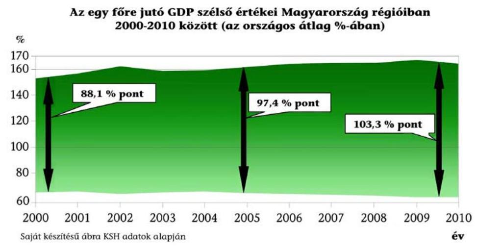

Jelen ellenőrzésünk keretében a fejlesztési tanácsok jogszabályi kötelezettségeinek teljesítését értékeltük a hazai decentralizált területfejlesztési források, valamint az Új Magyarország Fejlesztési Terv (ÚMFT) regionális operatív programjai (ROP) keretében biztosított forrásokhoz kapcsolódóan.

Az éves költségvetési törvények 2007-2009 között összesen 96,3 Mrd Ft decentralizált hazai területfejlesztési forrást tartalmaztak. Jelen ellenőrzés a céljellegú

[^0]
[^0]:    ${ }^{25}$ Jelentés a térségek felzárkóztatására fordított pénzeszközök felhasználásának ellenőrzéséről, 2011. december (1125)

---

decentralizált támogatásra (CÉDE), a területi kiegyenlítést szolgáló fejlesztési támogatásra (TEKI), a települési önkormányzatok szilárd burkolatú belterületi közutak burkolat-felújításának támogatására (TEUT), valamint a terület- és régiófejlesztési célelőirányzat (TRFC) decentralizált jogkörű, összesen 46,9 Mrd Ft döntéshozatalára terjedt ki. A 2010-2011. években ilyen jogcímen új forrásokat az éves költségvetési törvények már nem tartalmaztak.

Az ÚMFT regionális operatív programjai ${ }^{26}$ a 2007-2013 közötti időszakra vonatkozóan 1901 Mrd Ft keretet ${ }^{27}$ tartalmaztak.

Az Országgyúlés a Tftv. módosításával 2012-től alapvetően megváltoztatta a területfejlesztés szervezeti hátterét, amikor - a jogutódok egyidejú kijelölésével megszüntette az RFT-ket és a KTFT-ket. Az indokolás szerint a KTFT-k feladatai nagymértékben átfedésben álltak a területfejlesztési önkormányzati társulások feladataival, illetve azokat a többcélú kistérségi társulások (TKT) is elláthatták. A feladatokat párhuzamosan ellátó szervezetek kistérségi szinten nehezen áttekinthető rendszert eredményeztek. Regionális szinten a 2010. évet követően az RFT, mint területi szintű döntéshozó szerv szerepe lecsökkent.

Magyarország alapvető érdeke a kiegyensúlyozott területi fejlődés, ennek érdekében szükséges az Országgyúlés által kijelölt célok megvalósítása, a területfejlesztési koncepciók és programok érvényesítése, valamint az ezekből következő feladatok végrehajtása.

Ellenőrzésünk a források elosztására, a pályázati támogatási rendszer szabályszerű működésére, átláthatóságának javítására szolgáló észrevételekkel kíván hozzájárulni a területfejlesztés rendszerének jobbításához, ezáltal a jó kormányzáshoz. A területfejlesztés regionális és kistérségi szintje múködésének erősségeit és gyengeségeit, az alkalmazott hibás és a jó gyakorlatokat bemutatva célunk a döntéseket előkészítők, valamint a döntéshozók, kiemelten az Országgyúlés munkájának segítése a szabályszerűbb és átláthatóbb működés érdekében. Az ÁSZ a törvényi kötelezettségének teljesítésével, a téma objektív, rendszerszemléletű bemutatásával segíti az Országgyúlés törvényalkotó munkáját.

Az ellenőrzés célja annak megítélése volt, hogy az RFT-k és a kistérségi területfejlesztési tanácsok közreműködésével történő források elosztása szabályszerű volt-e, és hozzájárult-e a különböző szintű területfejlesztési koncepciókban meghatározott célok teljesüléséhez.

Ennek során értékeltük, hogy:

- a kialakított szabályozási és szervezeti keretek hozzájárultak-e a decentralizált támogatások felhasználásához, a fejlesztéspolitikai célkitűzések megvalósításához;

[^0]
[^0]:    ${ }^{26}$ a Dél-Alföldi, a Dél-Dunántúli, az Észak-Alföldi, az Észak-Magyarországi, a KözépDunántúli, a Közép-Magyarországi, és a Nyugat-Dunántúli Operatív Program
    ${ }^{27}$ 2011. év végén hatályos keret (uniós támogatás és hazai társfinanszírozás együtt, $280 \mathrm{Ft} /$ euró árfolyamon)

---

- szabályszerű volt-e a fejlesztési tanácsok forráselosztási tevékenysége;
- hasznosultak-e a törvényességi felügyeletet ellátó szerv és a külső ellenőrzések megállapításai és javaslatai.

Az ellenőrzés típusa szabályszerűségi ellenőrzés volt.
Ellenőrzött időszak: Az ellenőrzés a 2007. január 1. és 2011. december 31. közötti időszakra terjedt ki. Kezdeti időpontja igazodott a 2007 és 2013 közötti uniós programozási időszakhoz, továbbá a hazai decentralizált fejlesztési források feletti döntési jogkörnek a megyei területfejlesztési tanácsoktól 2007-ben történt regionális szintre kerüléséhez. A záró időpont alapját az a tény adta, hogy az RFT-ket és a kistérségi fejlesztési tanácsokat a területfejlesztéssel és a területrendezéssel összefüggő egyes törvények módosításáról szóló 2011. évi CXCVIII. törvény a jogutódok egyidejú kijelölésével 2012. január 1-jétől megszüntette.

Az ellenőrzés végrehajtásának jogszabályi alapját az Állami Számvevőszékről szóló 2011. évi LXVI. törvény (ÁSZ tv.) 5. § (2)-(3) és (6) bekezdéseiben foglaltak képezték.

Az ellenőrzés kiterjedt a kistérségi fejlesztési tanácsi feladatokat ellátó TKT-kra, az RFT-kre, továbbá a területfejlesztésért felelős Nemzeti Fejlesztési Minisztériumra (NFM), és a Dokumentációs Központ ${ }^{28}$ üzemeltetői feladatait ellátó VÁTI Magyar Regionális Fejlesztési és Urbanisztikai Nonprofit Kft-re (VÁTI), valamint utóellenőrzés keretében a Nemzetgazdasági Minisztériumra (NGM). A helyszíni ellenőrzést a kiválasztott TKT-knél és az RFT-k munkaszervezeti feladatait ellátó RFÜ-knél (ahol a megszűnt RFT-k dokumentációi megtalálhatók), az NFM-nél, valamint a VÁTI-nál folytattuk le.

Helyszíni ellenőrzésre az ÁSZ által előző években nem ellenőrzött 3 RFT-t, valamint ugyanezen régiókból tulajdonság alapú, rétegzett mintavétellel 22 TKT-t választottunk ki. Az utóellenőrzés keretében az 1108. számú „Jelentés a helyi önkormányzatok fejlesztési célú támogatási rendszerének ellenőrzéséről", és az 1125. számú „Jelentés a térségek felzárkóztatására fordított pénzeszközök felhasználásának ellenőrzéséről" című ÁSZ jelentések közzétételét követően tett intézkedéseket tekintettük át az NFM-nél és az NGM-nél. A helyszínen ellenőrzött szervezeteket az 1. számú melléklet tartalmazza. A helyszíni ellenőrzésre kijelölteken túl, tanúsítványokat kértünk be valamennyi RFÜ-től és TKT-től.

Az ellenőrzés szakmai módszertana az ÁSZ hivatalos honlapján (www.asz.hu) közzétett szakmai szabályokon alapult, amely a Legfőbb Ellenőrző Intézmények Nemzetközi Szervezete (INTOSAI) által kiadott nemzetközi standardok (ISSAI) figyelembevételével készült.

[^0]
[^0]:    ${ }^{28}$ A területfejlesztéssel és a területrendezéssel összefüggésben megőrzendő dokumentumok gyűjtéséről, megőrzéséről, nyilvántartásáról és hasznosításáról szóló 16/2010. (II. 5.) Korm. rendelet 2. § (1) bekezdése szerint 2013. április 13-tól a kijelölés a Lechner Lajos Tudásközpont Területi, Építésügyi, Örökségvédelmi és Informatikai Nonprofit Korlátolt Felelősségű Társaságra változott.

---

Az ÁSZ a 2011. évi LXVI. törvény 29. §-a szerint a jelentéstervezetet megküldte az 1. számú melléklet szerinti ellenőrzött szervezeteknek. A beérkezett észrevételeket és az arra adott válaszokat a jelentés 11-19. számú mellékletei tartalmazzák.

---

# I. ÖSSZEGZŐ MEGÁLLAPÍTÁSOK, KÖVETKEZTETÉSEK, JAVASLATOK 

Az Országos Fejlesztéspolitikai Koncepcióban (OFK) ${ }^{29}$ fejlesztéspolitikai alapelvként meghatározott szubszidiaritás, decentralizáció és regionalizmus érvényesülését az ellenőrzött időszakban nem támogatták megfelelően a kialakított szervezeti és szabályozási keretek, nem következett be a decentralizáció és a valódi regionalizmus. A területfejlesztési politika érvényesülésének alapvető pillérei közé sorolt ${ }^{30}$ regionális és kistérségi szintek fejlesztéspolitikái a végrehajtásban nem kaptak hangsúlyos szerepet. Az Országos Területfejlesztési Koncepcióban (OTK) ${ }^{31}$ az intézmény- és eszközrendszer kijelölt fejlesztési irányai ellenére, nem következett be a regionális szint fejlesztéspolitikában betöltött szerepének bővítése, a kistérségi szint megerősítése. A szakmai tevékenység és a döntéshozatal centralizált maradt, nem történt meg a regionális szintű döntési kompetenciák bővítése.

A regionális fejlesztési tanácsok szerepe a területfejlesztési célú források elosztásában a 2007-2011.években
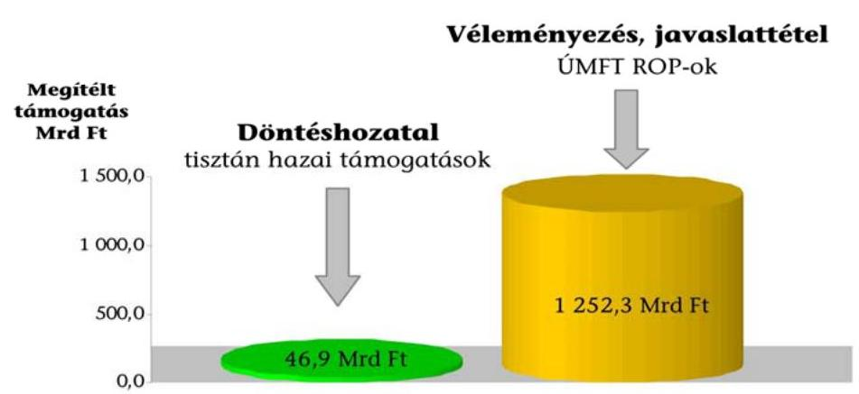

A regionális területfejlesztési politika megvalósítását korlátozta, hogy az RFT-k közvetlen döntési hatáskörébe utalt hazai decentralizált területfejlesztési források az ellenőrzött időszakban csökkentek, illetve 2010-től megszűntek. A decentralizált területfejlesztési források megszűnésével az RFT-k, mint területi szintű szervek döntéshozó szerepe lecsökkent ${ }^{32}$, tevékenységük - 2012. évi megszűnésükig - gyakorlatilag csak a véleményező, javaslattevő és területi koordinációs feladatokra korlátozódott. Ennek következtében nem maradt kiszámítható forrása a térségi szintű fejlesztési koncepciókban, programokban tisztán hazai pénzeszközökre alapozott fejlesztéseknek. A regionális célok megva-

[^0]
[^0]:    ${ }^{29}$ 96/2005. (XII. 25.) OGY határozat az Országos Fejlesztéspolitikai Koncepcióról
    ${ }^{30}$ 97/2005. (XII. 25.) OGY határozat I. 1. pont
    ${ }^{31}$ 97/2005. (XII. 25.) OGY határozat az Országos Területfejlesztési Koncepcióról
    ${ }^{32}$ A korábban megítélt támogatásokhoz kapcsolódó utógondozási feladatokat láttak el.

---

lósításához rendelkezésre álló uniós források felhasználásában az RFT-k közvetlen forráselosztási jogosítvánnyal nem rendelkeztek.

A szabályozórendszer nem támogatta a kistérségi területfejlesztési intézményrendszer átlátható múködését, a területfejlesztési feladatokat ellátó szervezetek ${ }^{33}$ között nem történt meg a feladat- és hatáskörök egyértelmú elhatárolása. A 2004. évtől létrehozott kistérségi fejlesztési tanácsok a gyakorlatban nem múködtek, feladataikat a TKT-k látták el. A kistérségekben sem a megfelelő eszközrendszerrel, sem forrásokkal nem rendelkeztek a térségi szintű területfejlesztési koncepcióikban, programjaikban meghatározott célkitúzések megvalósításához, azok ellenőrzéséhez és a koordinációs feladatok végrehajtásához.

A területfejlesztésért felelős miniszter - a Tftv. előírásait figyelmen kívül hagyva - az ellenőrzött időszakban nem számolt be évente a Kormánynak a fejlesztési tanácsok múködéséről ${ }^{34}$. Az RFT-k és a kistérségi fejlesztési tanácsi feladatokat ellátó TKT-k az ellenőrzött időszakban elkészítették a Tftv.-ben és a területfejlesztésért felelős miniszterrel kötött megállapodásokban előírt beszámolóikat.

A Kormány - a Tftv. előírásai ${ }^{35}$ és az ÁSZ erre irányuló javaslata ${ }^{36}$ ellenére nem határozta meg a miniszterek közötti folyamatos koordináció szempontjait, feladatait. Az ellenőrzött időszakban több változás érintette a területfejlesztés intézményrendszerét, kormányzati struktúrán belül elfoglalt helyét, 2010-től pedig a kapcsolódó feladatok öt miniszter feladatkörében is megjelentek.

A területfejlesztési koncepciók, programok gyűjtésével, megőrzésével, nyilvántartásával és hasznosításával kapcsolatos - 2010-től újraszabályozott - előírások alapján a Dokumentációs Központot üzemeltető VÁTI gondoskodott a részére megküldött dokumentumok megőrzéséről. Az áttekinthetőséget nem segítette, hogy csak részben különítették el a beküldött dokumentumokat a 16/2010. (II. 5.) Korm. rendeletben előírt típusok szerint. A nyilvántartásban szereplő regionális és kistérségi területfejlesztési koncepciók, programok elfogadásának dátuma mindössze 5,6\%-nál állt rendelkezésre. Ehhez hozzájárult, hogy a jogszabályban előírtak ellenére a Dokumentációs Központ Üzemeltetési Szabályzata a dokumentációk megküldésének leíró adatai között nem tartalmazta az elfogadásról, illetve a jóváhagyásról szóló határozat számát. Ennek következtében nem volt megállapítható a dokumentumok jogszabályban előírt, elfogadást követő 90 napos határidőn belüli megküldésének betartása. A jogszabály nem tartalmazott szankciókat a beküldés nem, vagy hiányos teljesítésének esetére. A régió, a kistérség területfejlesztési koncepciójának, programjának megőrzési kötelezettségét tartalmazó rendelkezést 2012. április 6-tól hatályon kívül helyezték.

[^0]
[^0]:    ${ }^{33}$ kistérségi fejlesztési tanácsok, TKT-k, területfejlesztési önkormányzati társulások
    ${ }^{34}$ A beszámolási kötelezettség az RFT-k és a KTFT-k megszűnését követően is fennmaradt, a Tftv.-ben szabályozott térségi fejlesztési tanácsok vonatkozásában.
    ${ }^{35}$ a Tftv.-ben 2004-től szerepelt a Kormány részére előírt feladat
    ${ }^{36}$ az ÁSZ 1125. számú jelentésében tett javaslat a szabályozás elkészítésére

---

A regionális területfejlesztési feladatok ellátására a hét régióban létrehozott RFT alapfeladatait, hatáskörét és működésük szabályait a Tftv., a szervezetükre és múködésükre vonatkozó legfontosabb szabályokat szervezeti és múködési szabályzataik (SZMSZ) rögzítették. A hét közül négy RFT nem múködtette a Tftv.-ben előírt program Monitoring Bizottságot ${ }^{37}$.

Az RFT-k atipikus szervezeti rendjét mutatja, hogy a Tftv. szerint jogi személyek, de nem költségvetési szervek voltak. Jogszabály nem írta elő részükre az alapító okirat készítését, a MÁK az SZMSZ-ek alapján vette azokat nyilvántartásba. Gazdálkodásukra - a Tftv.-ben foglalt sajátosságok figyelembevételével a költségvetési szervek gazdálkodására vonatkozó szabályokat kellett alkalmazni. Ezekről a sajátosságokról azonban a Tftv. és más jogszabályok nem rendelkeztek. Ellentmondásos helyzetet eredményezett a titkársági feladatok RFÜ-kbe történő kiszervezése ${ }^{38}$, mivel ezek a vállalkozásokra vonatkozó szabályok szerint gazdálkodó szervezetek ${ }^{39}$ hajtották végre a RFT-k költségvetési gazdálkodási feladatait. Mindez hozzájárult ahhoz, hogy a helyszínen ellenőrzött RFT-k számviteli és gazdálkodási szabályozottsága nem felelt meg a jogszabályi előírásoknak ${ }^{40}$ a teljes körűség és a jóváhagyás módja tekintetében.

Az RFT-k a múködésükhöz biztosított központi költségvetési hozzájárulásokat az ellenőrzött években nem használták fel teljes egészében. A költségvetési törvények szerinti éves 315-420 M Ft múködési támogatásból 2010-ben keletkezett jelentősebb ( $43,9 \mathrm{M} \mathrm{Ft}$ ) maradvány, mivel három régió nem, három pedig csak részben használta fel a Magyarországi Régiók Brüsszeli Képviselete céljára biztosított összegeket. A múködési támogatáson felül, az adott évben annak $83,3 \%$-át, illetve $64,2 \%$-át kitevő többletforrásként a regionális identitástudat erősítésére, a hazai fejlesztési programokkal kapcsolatos kommunikációra és marketingre 2008-ban 350 M Ft -ot, 2009-ben 210 M Ft -ot biztosítottak. E támogatásokból 2008-ban 39,3 M Ft-ot (11,2\%-ot), 2009-ben 105,2 M Ft-ot $(50,1 \%)$ nem használtak fel.

A területfejlesztés országos célkitűzéseinek regionális szintű lebontását szolgáló területfejlesztési koncepciók és programok kidolgozását és elfogadását a Tftv. az RFT-k feladataként írta elő. A jogszabályok - az OTK-val való összhangon túl - az elfogadás határidejét és a koncepciók, programok kezdő időpontját nem, konkrét időtávját csak 2009-től ${ }^{41}$ határozták meg. Az RFT-k egymástól eltérő módon kezelték a regionális területfejlesztési koncepciók és programok elkészítésének, illetve aktualizálásának a feladatait az ellenőrzött időszakra vonatkozóan. Ennek következtében különböző című és tartalmú dokumentumokat tekintettek a régió fejlesztési koncepciójának, programjának. Így nem volt egységes alapja a regionális - hazai és uniós forrásokat egyaránt figyelembe vevő - fejlesztéspolitikai célkitűzések teljesülése mérésének.

[^0]
[^0]:    ${ }^{37}$ feladataikat a 37/2010. (II. 26.) Korm. rendelet hatályba lépésével határozták meg
    ${ }^{38}$ A Dél-Alföldi Regionális Fejlesztési Tanács (DARFT) kivételével, ahol külön titkárság múködött.
    ${ }^{39}$ közhasznú társaságok, átalakulás után nonprofit korlátolt felelősségű társaságok
    ${ }^{40}$ 249/2000. (XII. 24.) Korm. rendelet, illetve az Ámr. ${ }_{2}$
    ${ }^{41}$ az időtávot pontosan először a 218/2009. (X. 6.) Korm. rendeletben szabályozták

---

Az uniós forrásokra támaszkodó regionális területfejlesztési célkitűzések a 2007-2013 közötti időszakra szóló ROP-okban, valamint ezek három időszakra ${ }^{42}$ bontott akcióterveiben jelentek meg, a hozzá kapcsolódó indikatív pénzügyi tervekkel együtt. Az RFT-k a 67/2007. (VI. 28.) OGY határozatban előírt kötelezettségüknek ${ }^{43}$ eleget téve, de a Korm. határozatban ${ }^{44}$ megjelöltnél rövidebb időszakra (2009-2010) elkészítették a hazai forrásokra épülő Regionális Területfejlesztési Operatív Programokat (RTOP) is. A Kormány és az RFT-k között megkötendő, az RTOP-ok pénzügyi finanszírozását biztosító tervszerződéses rendszer szabályait ${ }^{45}$ azonban nem alakították ki. Nem valósult meg a 67/2007. (VI. 28.) OGY határozatban előírt programfinanszírozásra való áttérés, a tisztán hazai decentralizált területfejlesztési támogatások alapját nem az RTOP-ok képezték.

Az OGY határozatokban ${ }^{46}$ és a Tftv.-ben előírtak ellenére, a hazai forrásokból megvalósított fejlesztések eredményeinek mérésére programszintű indikátorokat nem, projekt szintű indikátorokat csak 2009-től határoztak meg. Az indikátorok kialakítása az uniós forrásokra épülő programok esetében megvalósult.

Az RFT-k - a hazai decentralizált területfejlesztési támogatások elosztásán kívül - nem kaptak érdemi döntéshozatali szerepet. A jogszabályok elsősorban a tervezési feladatok ellátásában, valamint a végrehajtás során a régiós érdekek képviseletében biztosítottak részükre véleményezési, javaslattevő és koordinációs jogköröket. Az RFT-k részben éltek a Tftv. által biztosított jogaikkal, országos és régiót érintő fejlesztési koncepciókat, programokat, terveket véleményeztek, a gazdasági válság okozta helyi problémák kezelésére hoztak intézkedéseket ${ }^{47}$. A helyszínen ellenőrzött három RFT ellátta a Tftv. által előírt együttmüködési és koordinációs feladatokat. Részt vettek a kormányzati és a térségi érdekek egyeztetésében, a térségi szereplők közötti koordinációs feladatok ellátásában. A szakmai feladataik ellátása érdekében emellett számos szervezettel álltak kapcsolatban, civil egyeztető fórumot múködtettek.

A 2007. évtől az RFT-k döntöttek a hazai decentralizált területfejlesztési források elosztásáról. Az alapvető mozgásterüket meghatározó központi szabályozó rendszer biztosította keretek között az RFT-k kialakították a döntés előkészítést és a döntéshozatalt támogató szervezeti és múködési rendet. A kialakított szabályozási és szervezeti keretek hozzájárultak a támogatások felhasználásához. Hiányzott a komplex szemléletű, hosszú távú programozás, a 2007 és 2009 között rendelkezésre álló összesen 96,3 Mrd Ft területfejlesztési forrást évente változó összegű, feltételű és célú pályázati rendszerek keretében használták fel.

[^0]
[^0]:    ${ }^{42}$ 2007-2008., 2009-2010. és 2011-2013. évekre
    ${ }^{43}$ Középtávú regionális fejlesztési program és indikatív pénzügyi terv készítése a tisztán hazai területfejlesztési támogatásokra vonatkozóan.
    ${ }^{44}$ a 2011/2008. (II. 14.) Korm. határozat a 2009-2013. évekre írta elő
    ${ }^{45}$ A tervszerződéses rendszer szabályai kialakításának hiányosságait az ÁSZ az 1125. számú jelentésében állapította meg.
    ${ }^{46}$ 96/2005. (XII. 25.) OGY határozat, 67/2007. (VI. 28.) OGY határozat
    ${ }^{47}$ a hét RFÜ által kitöltött tanúsítványok szerint

---

A helyszínen ellenőrzött RFT-k a hazai források felhasználására vonatkozó döntések előkészítése és a döntéshozatal során alapvetően a területfejlesztésért felelős miniszterrel évente kötött megállapodásokban, a kormányrendeletekben ${ }^{48}$, valamint az azok alapján elkészített - a területfejlesztésért felelős minisztérium által nyilvántartásba vett - pályázati kiírásokban foglaltak alapján jártak el. Helyi pályázatkezelési szabályzatokat egy kivételével ${ }^{49}$ nem készítettek. A helyszínen ellenőrzött RFT-knél a pályázati döntések előkészítése és maga a döntési folyamat dokumentált volt. Előfordult azonban az is, hogy a döntési folyamat részét képező dokumentumok nem álltak rendelkezésre, és nem a központi és helyi szabályozásoknak megfelelően jártak el.

Az RFT-k által támogatott pályázatok céljai, a támogatás és a saját forrás mértéke, a megítélhető támogatás maximális összege megfelelt a kormányrendeletekben és a pályázati kiírásokban meghatározottaknak. Az RFT-k a támogatási döntések meghozatalakor elfogadták az előterjesztett támogatási javaslatokat. A 2007-2009. években a hét RFT-hez összesen 12846 db pályázatot nyújtottak be, 101 145,3 M Ft támogatási igénnyel. Az igényelt támogatások évente 1,8-2,9-szeresen haladták meg a rendelkezésre álló kereteket. A felosztható forrásokat csökkentették a 2007. évet megelőzően a következő két év terhére előre vállalt kötelezettségek is. A támogatások elosztása során a források szétaprózódása volt a jellemző. A pályázatok 60,0\%-át ( 7708 db ) támogatták, a megítélt támogatás az igényeltnek a $46,4 \%$-a ( $46942,7 \mathrm{M} \mathrm{Ft}$ ), az egy támogatott pályázatra jutó támogatás átlagosan $6,1 \mathrm{M} \mathrm{Ft}$ volt.

A jogszabályok nem tartalmaztak előírást a hazai forrásokból államháztartáson belülre nyújtott támogatások esetében a döntések előkészítésében és a döntéshozatalban résztvevő személyek összeférhetetlenségére vonatkozóan ${ }^{50}$. A döntéshozatalhoz kapcsolódó összeférhetetlenségi kérdéseket a hazai decentralizált fejlesztési támogatások felhasználásának részletes szabályait tartalmazó kormányrendeletek sem szabályozták. Ennek következtében az RFTtag megyei jogú városok polgármesterei testületi döntéshozóként részt vehettek - a helyszínen ellenőrzötteknél részt is vettek - a saját településüket érintő támogatások döntéshozatalában ${ }^{51}$. Központi szabályozás hiányában az RFT-k eltérő módon jártak el az összeférhetetlenség szabályozását és a bekért nyilatkozatok tartalmát illetően.

Az uniós források támogatáselosztási rendszerében a helyszínen ellenőrzött RFT-k éltek a jogszabályok ${ }^{52}$ által biztosított, a régiót érintő ROP-ok és

[^0]
[^0]:    ${ }^{48}$ 12/2007. (II. 6.) Korm. rendelet, 47/2008. (III. 5.) Korm. rendelet, 148/2008. (V. 26.) Korm. rendelet, 85/2009. (IV. 10.) Korm. rendelet
    ${ }^{49}$ DARFT
    ${ }^{50}$ A Közpénztv. hatálya - az 1. § (1) bekezdése alapján - az államháztartáson kívüli személyek, szervezetek részére odaítélt támogatásokra terjedt ki.
    ${ }^{51}$ A tanács illetékességi területén múködő megyei jogú városok polgármesterei a Tftv. 17. § (6) bekezdés d) pontja alapján 2004. IX. 01. - 2011. XII. 31. között a regionális fejlesztési tanács tagjai voltak.
    ${ }^{52}$ 16/2006. (XII. 28.) MeHVM-PM együttes rendelet, 255/2006. (XII. 8.) Korm. rendelet, 4/2011. (I. 28.) Korm. rendelet

---

akciótervek tartalmát, módosításait érintő, valamint a kiemelt projektek azonosítását célzó véleményezési, javaslattételi lehetőséggel. Elvégezték továbbá a közremúködő szervezet által befogadott, és az RFT-k részére megküldött projektek jogszabályok által előírt, illetve lehetővé tett értékelését, véleményezését. Az értékeléseiket és javaslataikat a közremúködő szervezetnek megküldték. A projektek értékelésére meghatározott határidők betartását a helyszínen ellenőrzött RFT-k dokumentumai alapján nem vagy csak esetenként lehetett nyomon követni, mivel az előterjesztések, határozatok nem tartalmazták a véleményezésre vonatkozó felkérés dátumát, és erről nyilvántartást nem vezettek.

Az uniós támogatások értékelési és döntési folyamataiban az RFT-k az NFÜ által felállított ROP monitoring bizottságokba, a pályázati bíráló, illetve 2011-től a döntés-előkészítő bizottságokba történő delegálásokkal vettek részt, és biztosíthatták a regionális érdekek képviseletét. A döntésekről történő visszacsatolás nem volt rendszerszerűen biztosított. A delegálásokról szóló határozatok, meghatalmazások kötött mandátumot nem tartalmaztak, és a delegált tagok részére beszámolási kötelezettséget nem írtak elő. A helyszínen ellenőrzöttek közül a DARFT határozataiban felhívta a delegáltak figyelmét a határozatokban foglaltak képviseletére.

Nem alakították ki a különböző támogatási forrásokból igényelt és megítélt támogatások - 67/2007. (VI. 28.) OGY határozatban foglaltak szerinti - egységes elektronikus nyilvántartását. A ROP-ok pénzügyi felhasználását az RFÜ-k, illetve a VÁTI - mint a ROP-ok közreműködő szervezetei - az EMIR adatbázisban tartották nyilván. A tisztán hazai forrásokra vonatkozó nyilvántartásokat az RFÜ-k munkaszervezeti feladataik keretében vezették. A helyszínen ellenőrzöttek körében előfordult, hogy a hazai támogatások pénzügyi felhasználásáról vezetett nyilvántartás nem volt megbízható, valamint nem tartalmazott az - OTK által is elvárt - eredményesség értékeléséhez szükséges adatokat.

A Tftv. 2004. szeptember 1-jétől hatályos módosításával létrehozott kistérségi fejlesztési tanácsok (KTFT-k) a Tftv. szerint jogi személyek voltak, amelyeket - megalakulásuk esetén - a MÁK vett nyilvántartásba. Gazdálkodásukra és beszámolási kötelezettségükre - a Tftv.-ben meghatározott sajátosságok figyelembevételével - a költségvetési szervek gazdálkodására vonatkozó szabályokat kellett alkalmazni, e sajátosságokat azonban a jogszabályok nem határozták meg. A szakmai munkaszervezeteik létrehozására, működésére vonatkozó részletes szabályokat a Tftv. felhatalmazása ellenére a Kormány rendeletben nem állapította meg.

A szervezeti struktúra átláthatóságát nehezítette, hogy az ellenőrzött időszakban a KTFT-k önálló jogi személyként nem működtek. A feladatokat - egy kivételével ${ }^{53}$ - a kistérség valamennyi települési önkormányzatának részvételével működő TKT-k, a szakmai munkaszervezeti feladatokat azok munkaszervezetei látták el. A feladatellátásnak ezt a formáját a Tftv. lehetővé tette, módját azonban nem szabályozta. Nem írta elő a feladat- és hatáskörök, valamint az eljárási szabályok egyéb módon történő (központi vagy helyi) szabályozását

[^0]
[^0]:    ${ }^{53}$ Érdi kistérség, ahol a fejlesztési tanács megalakulására azért került sor, mert a TKTben nem vett részt valamennyi önkormányzat.

---

sem. Egy szervezeten belül a két szervezeti funkció megjelenése a feladatellátásnál jogértelmezési problémákat okozott és eltérő gyakorlathoz vezetett. Mindkét szervezetben a kistérség településeinek polgármesterei rendelkeztek szavazati joggal, a döntéshozatalra és a végrehajtásra vonatkozó szabályok azonban eltértek.

A TKT-k SZMSZ-eiben a kistérségi fejlesztési tanácsi feladatok ellátásának szabályozása nem történt meg teljes körűen. 2011-ben a 174 kistérség 66,7\%-a rendelkezett olyan SZMSZ-szel, amelyben legalább részben meghatározták a kistérségi fejlesztési tanácsi feladatokat és az azokkal kapcsolatos eljárásrendeket. A helyszínen ellenőrzött TKT-k 45,5\%-ánál nem különült el a kistérségi fejlesztési tanácsi feladatellátás a TKT-k egyéb feladataitól, és a határozatok nem tartalmazták átlátható módon, hogy a döntéseket melyik szervezet feladatkörében hozták meg.

A kistérségi fejlesztési tanácsi feladatokra, gazdálkodásra vonatkozóan önálló szabályzatokat nem készítettek, és nem rögzítettek specifikus helyi szabályokat a feladatokat ellátó TKT-k szabályzataiban sem. A Tftv. előírásai ellenére az ellenőrzött időszak egyes éveiben a TKT-k mindössze 46,6-48,9\%-a készített a fejlesztési tanácsi feladatok vonatkozásában elkülönített költségvetést.

A kistérségi területfejlesztési koncepció és program kidolgozására - és így tervezési és végrehajtási időszakára, döntéshozó elé terjesztésére, illetve elfogadására - vonatkozóan határidőket a jogszabályok nem határoztak meg. A 2011. évben a kistérségek 63,2\%-a rendelkezett hatályos kistérségi területfejlesztési koncepcióval, 44,8\%-a középtávú területfejlesztési programmal. A jogi szabályozási hiányosságai hozzájárultak ahhoz, hogy az ellenőrzött TKT-knél a területfejlesztési koncepciók eltérő időpontokban (2002 és 2009 között) készültek, és különböző időtávra ( 3 évtől meg nem határozott időtartamra) szóltak. A jogszabály értelmezési problémák mellett a fejlesztési források hiányára vezethető vissza, hogy 2007-ben a TKT-knak mindössze 14,9\%-a, 2011-ben a 13,2\%-a rendelkezett a Tftv.-ben előírt pénzügyi tervvel területfejlesztési programjának megvalósítása érdekében.

Az ellenőrzött időszakban a 174 TKT közül évente 101-132 (58,0-75,9\%) nyújtott be pályázatot a fejlesztésekhez kapcsolódóan források igénylésére. A pályázatok a területfejlesztési és az intézmény fenntartási feladataikhoz egyaránt kapcsolódtak, a két funkció nem volt egyértelmúen elkülöníthető. A pályázatokban vállalt önrészt a megvalósításban érdekelt önkormányzatok biztosították, a kistérségi fejlesztési tanácsi feladatok ellátásához nem gyűjtöttek forrásokat.

A fejlesztési tanácsi feladatokat ellátó TKT-k közül 91 (52,3\%), a helyszínen ellenőrzöttek közül csupán hét (31,8\%) véleményezett megyei, regionális fejlesztési koncepciókat, programokat, illetve azok kistérséget érintő intézkedéseit. Mindez azt mutatja, hogy a területfejlesztés különböző szintjei között a koncepciók és a programok kidolgozásánál nem volt megfelelő a koordináció.

A Tftv. előírásai ellenére a kistérségi területfejlesztési programok végrehajtását a fejlesztési tanácsi feladatokat ellátó TKT-k nem ellenőrizték. Jogszabály nem írt elő beszámolási, információszolgáltatási kötelezettséget a programok

---

megvalósításában résztvevő önkormányzatok és egyéb szervezetek számára, így annak rendszerét a TKT-k mindössze a koordinációs feladatkörükben eljárva alakíthatták ki. Az ellenőrzött TKT-knél a kistérségi célkitúzések teljesülésének nyomon követése nem volt biztosított, helyi szabályrendszereket nem alakítottak ki. A célkitűzések megvalósításának értékelése a működési támogatáshoz kapcsolódó - a finanszírozó által előírt - szakmai beszámolókra korlátozódott, átfogó értékelésre - kettő kivételével (a Szegedi és a Halasi TKT) - nem került sor.

A kistérségi fejlesztési tanácsok és munkaszervezeteik támogatására biztosított központi források a 2007. évi 840 M Ft-ról a 2011. évre 174 M Ft-ra csökkentek. A támogatási szerződéseket a területfejlesztésért felelős minisztérium a fejlesztési tanácsi feladatokat ellátó TKT-kkel kötötte meg. A támogatásokkal a TKT-k évente elszámoltak, de arról nem kellett információt adniuk, hogy a kistérségi fejlesztési tanácsi feladatok ellátását a többi feladatuktól elkülönítetten kezel-ték-e. A fel nem használt támogatások aránya alacsony ( $0,1-0,7 \%$ ) volt, a 2010. év kivételével ( $15,8 \%$ ). A támogatási szerződésekre vonatkozó feltételrendszer szigorodása is hozzájárult ahhoz, hogy 27 TKT a múködési támogatás teljes összegét, 3 TKT pedig annak egy részét nem használta fel 2010-ben.

A fejlesztési tanácsok törvényességi felügyeletét a Kormány területi államigazgatási szervei (közigazgatási hivatalok, államigazgatási hivatalok, kormányhivatalok) látták el. A törvényességi felügyelet a beküldött jegyzőkönyvek felülvizsgálatában és a tanácsüléseken történő részvételben nyilvánult meg. A jegyzőkönyvek beküldésére vonatkozó előírások a TKT-knél - a két szervezeti funkció elkülönítésének hiánya miatt - nem voltak egyértelmúek, mivel más szabályok vonatkoztak a fejlesztési tanácsi és a többcélú társulási feladatok ellátására.

A törvényességi felügyeletet ellátó szervek a helyszínen ellenőrzöttek közül két RFT-nél kettő-kettő, továbbá öt TKT-nél összesen 10 észrevételt tettek, amelyeket az érintettek tevékenységük során figyelembe vettek. Az észrevételek az RFT-k határozataiban észlelt jogsértésekre, a TKT-knél a jegyzőkönyvek elkészítésére, a múködés és döntéshozatal törvénysértő voltára, valamint a szabályzatok hiányosságára mutattak rá. A kettő TKT-nél végzett - a kistérségi fejlesztési tanácsi feladatok ellátására is kiterjedő - helyszíni ellenőrzés hiányosságot nem állapított meg. A törvényességi felügyelet múködésének jó gyakorlata volt, hogy a Dél-Alföldön körlevelekben hívta fel a figyelmet a feladatellátása során szerzett tapasztalataira, amelyek a TKT-k napi munkájában is hasznosultak.

A fejlesztési tanácsok feladatellátását a 2007-2011. években a külső ellenőrző szervek rendszerszerűen nem ellenőrizték. A helyszínen ellenőrzött három RFT közül mindössze a DARFT-nál volt két külső ellenőrzés, amelyek intézkedést igénylő javaslatokat nem fogalmaztak meg. Az RFÜ-knél végzett külső ellenőrzések az RFT-k munkaszervezeti feladatait nem érintették. A kistérségi fejlesztési tanácsi feladatellátást, múködést külső ellenőrző szervek - a törvényességi felügyeletet gyakorlókon kívül - nem ellenőrizték. A TKT-ket ellenőrző szervezetek a fejlesztési tanácsi feladatok ellátásának ellenőrzésére nem tértek ki.

---

A 2011. évi új ÁSZ tv. hatályba lépése az intézkedési terv készítési kötelezettség előírásával pozitív hatással volt az ÁSZ javaslatainak a hasznosulására.

A helyi önkormányzatok fejlesztési célú támogatási rendszerének ellenőrzéséről szóló, 1108. számú jelentés megállapításai alapján tett javaslatokra az érintettek - erre vonatkozó kötelezettség hiányában - az ÁSZ részére intézkedési tervet nem készítettek ${ }^{54}$. A Kormánynak szóló három javaslat az önkormányzatok által igénybe vehető tisztán hazai fejlesztési célú támogatások forráskoordinációjára, az indikátor rendszerre, valamint az információs rendszer fejlesztésére vonatkoztak. Az ÁSZ jelentés megjelenését követően több olyan jogszabályi és egyéb kormányzati intézkedés történt, amelyek az ÁSZ megállapításainak a figyelembe vételét jelentették. Az intézkedések hasznosulása azonban a gyakorlatban még nem állapítható meg, mivel 2011-től nem hirdettek meg az önkormányzatok számára pályázható, hazai, decentralizált fejlesztési célú pályázatokat. A nemzeti fejlesztési miniszternek tett, a fejlesztési célú támogatások nyújtásakor a megvalósítandó cél mérhetőségét biztosító indikátorra vonatkozó javaslatot az NFM hasznosította.

A térségek felzárkóztatására fordított pénzeszközök felhasználásának ellenőrzéséről szóló, 1125. számú jelentés alapján az érintettek az új ÁSZ tv. előírásainak eleget téve intézkedési terveket készítettek. Az ÁSZ 10 javaslata alapján tervezett intézkedések közül hét teljesült, kettő részben teljesült és egy nem teljesült. Az intézkedési tervekben foglaltak határidőre történő teljesítését befolyásolták a területfejlesztés intézményrendszerében időközben bekövetkezett módosulások, illetve a 2014 és 2020 közötti uniós programozási időszakra való felkészülés.

Az ÁSZ javaslataira tett intézkedések keretében - többek között - felülvizsgálták és módosították a Tftv.-t, az Új Típusú Térségi Besorolás Munkacsoport múködött, felülvizsgálták a kedvezményezett térségek besorolásának feltételrendszeréről szóló szabályozást, elkezdődött a területfejlesztési, illetve általában a kormányzati tervezés rendszerének felülvizsgálata. A 97/2005. (XII. 25.) OGY határozatban foglaltak megvalósításáról, valamint az OTK felülvizsgálatáról szóló beszámolót J/8102. számú jelentés címen 2012. november 26-án terjesztették be az OGY-nek. A Kormány határozatában ${ }^{55}$ foglaltak alapján a Nemzetgazdasági Tervezési Hivatalban (NTH) elkészült az Országos Fejlesztési és Területfejlesztési Koncepció (OFTK) társadalmi egyeztetési változata, az egyeztetés 2013. február 20-án zárult le. Az ÁSZ javaslatainak, illetve az intézkedési tervekben foglaltak végső realizálása az OFTK elfogadását követően történhet meg.

Részben teljesült az NGM intézkedési tervének kettő - a kedvezményezett térségeket, illetve településeket tartalmazó új kormányrendelet megalkotására, valamint a 37/2010. (II. 26.) Korm. rendelet felülvizsgálatára és új kormányrendelet kiadására vonatkozó - pontja. A tervezett szabályozások részben elkészül-

[^0]
[^0]:    ${ }^{54}$ Az Állami Számvevőszékről szóló, 2011. június 24-ig hatályban volt 1989. évi XXXVIII. törvény nem tette kötelezővé az ellenőrzötteknek intézkedési terv készítését.
    ${ }^{55}$ 1254/2012. (VII. 19.) Korm. határozat

---

tek, de nem kerültek beterjesztésre a döntéshozók elé, a területfejlesztési politikában és az intézményrendszerben időközben bekövetkezett változások miatt.

Nem teljesült az NFM intézkedési tervének - a Tftv. végrehajtási rendeletek felülvizsgálata keretében tervezett - a miniszterek közötti koordináció szempontjait, szabályait megállapító kormányrendelet tervezetének elkészítésére és a Kormány elé történő benyújtására vonatkozó pontja.

Az ÁSZ tv. 33. § (1) bekezdésében foglaltak értelmében az ellenőrzött szervezet vezetője köteles a jelentésben foglalt megállapításokhoz kapcsolódó intézkedési tervet összeállítani, és azt a jelentés kézhezvételétől számított 30 napon belül az ÁSZ részére megküldeni. Amennyiben az intézkedési tervet határidőre nem küldi meg a szervezet, vagy az az ÁSZ tv. 33. § (2) bekezdésében foglalt póthatáridő eltelte ellenére továbbra sem elfogadható, az ÁSZ elnöke a hivatkozott törvény 33. § (3) bekezdés a)-b) pontjaiban foglaltakat érvényesítheti.

Az ellenőrzés intézkedést igénylő megállapításai és javaslatai:

# a nemzeti fejlesztési miniszternek 

1. A területfejlesztésért felelős miniszter - a Tftv. 27. § (5) bekezdésében foglalt előírás ellenére - az ellenőrzött időszakban nem számolt be évente a Kormánynak a tanácsok működéséről. A beszámolási kötelezettség az RFT-k és a kistérségi fejlesztési tanácsok megszűnését követően a törvényben szabályozott térségi fejlesztési tanácsok vonatkozásában továbbra is fennmaradt.

Javaslat:
A Tftv. 27. § (5) bekezdés előírása alapján számoljon be évente a Kormánynak a fejlesztési tanácsok müködéséről.
2. A területfejlesztés intézményrendszerét, kormányzati struktúrán belül elfoglalt helyét az ellenőrzött időszakban több változás is érintette. A 2010. évi kormányváltást követően a területfejlesztéshez kapcsolódó feladatok öt miniszter feladatkörében jelentek meg. A Kormány - a Tftv. 7. § I) bekezdésében kapott feladata és a 27. § (1) bekezdés a) pontjában foglalt felhatalmazása ellenére - rendeletben nem határozta meg a miniszterek közötti folyamatos koordináció szempontjait. Ezt a hiányosságot az ÁSZ az 1125. számú jelentésében már megállapította és javaslatot tett a nemzeti fejlesztési miniszter részére a miniszterek közötti koordináció szempontjainak, szabályainak kidolgozására és elfogadásának kezdeményezésére, azonban ez nem valósult meg.

Javaslat:
Dolgozza ki a Tftv. 7. § I) bekezdésében és 27. § (1) bekezdés a) pontjában foglaltak alapján a miniszterek közötti koordináció szempontjait, szabályait, és kezdeményezze a Kormánynál annak elfogadását.
3. A jogszabályok nem tartalmaztak előírást a hazai forrásokból államháztartáson belülre nyújtott támogatások esetében a döntések előkészítésében, és a döntéshozatalban résztvevő személyek összeférhetetlenségére vonatkozóan. A döntéshozatalhoz

---

kapcsolódó összeférhetetlenségi kérdéseket a hazai decentralizált fejlesztési támogatások felhasználásának részletes szabályait tartalmazó kormányrendeletek sem szabályozták. Ennek következtében az RFT-tag megyei jogú városok polgármesterei testületi döntéshozóként részt vehettek - a helyszínen ellenőrzötteknél részt is vettek - a saját településüket érintő támogatási döntések meghozatalában. Központi szabályozás hiányában az RFT-k eltérő módon jártak el az összeférhetetlenség szabályozását és a bekért nyilatkozatok tartalmát illetően.

Javaslat:
Dolgozzon ki javaslatot a hazai forrásokból államháztartáson belülre nyújtott támogatások esetében a döntések előkészítésében és a döntéshozatalban résztvevő személyek összeférhetetlenségének szabályozására, és kezdeményezze a Kormánynál annak elfogadását.

# a nemzetgazdasági miniszternek 

A területfejlesztés országos célkitűzéseinek regionális, illetve kistérségi szintű lebontását szolgáló területfejlesztési koncepciók és programok kidolgozását és elfogadását a Tftv. a regionális, illetve a kistérségi fejlesztési tanácsok feladataként írta elő. A jogszabályok - az OTK-val való összhangon túl - az elfogadás határidejét és a koncepciók, programok időbeli hatályának kezdetét nem, konkrét időtávját csak 2009-től határozták meg. Az RFT-k egymástól eltérő módon kezelték a regionális területfejlesztési koncepciók és programok elkészítésének, illetve aktualizálásának a feladatait az ellenőrzött időszakra vonatkozóan. Különböző című és tartalmú dokumentumokat tekintettek a régió fejlesztési koncepciójának, programjának. A 2011. évben a kistérségek 63,2\%-a rendelkezett hatályos kistérségi területfejlesztési koncepcióval, 44,8\%-a középtávú területfejlesztési programmal. A jogi szabályozás hiányosságai hozzájárultak ahhoz, hogy az ellenőrzött TKT-knél a területfejlesztési koncepciók eltérő időpontokban (2002 és 2009 között) készültek és különböző időtávra (3 évtől meg nem határozott időtartamra) szóltak. A hiányosságok következtében nem volt egységes alapja az egyes területi szintek fejlesztéspolitikai célkitűzései teljesülése mérésének.

Javaslat:
Kezdeményezze a különböző területi szintű koncepciók, programok időbeli hatálya összehangolásának, valamint az elkészítés és a jóváhagyás konkrét folyamatának szabályozását a területfejlesztési tervezési tevékenység átlátható, összehangolt és számon kérhető kiépítése, valamint a kitűzött célok egységes szempontok szerinti mérhetősége érdekében.

## a Lechner Lajos Tudásközpont Területi, Építésügyi, Örökségvédelmi és Informatikai Nonprofit Korlátolt Felelősségü Társaság ügyvezető igazgatójának

A Dokumentációs Központ nyilvántartásában szereplő területfejlesztési koncepciók, programok nem tartalmazták teljes körűen azok elfogadásának dátumát. Ehhez hozzájárult, hogy a 16/2010. (II. 5) számú Korm. rendelet 3. § (9) bekezdés e)

---

pontjában előírtak ellenére a Dokumentációs Központ Üzemeltetési Szabályzata, illetve a Szabályzat szerinti űrlap a dokumentációk megküldésének leíró adatai között nem tartalmazta az elfogadásról, illetve a jóváhagyásról szóló határozat számát. Ennek következtében nem volt megállapítható a dokumentumok jogszabályban előírt, elfogadást követő 90 napos határidőn belüli megküldésének betartása.

Javaslat:
Egészítse ki a Dokumentációs Központ Üzemeltetési Szabályzatát, illetve a Szabályzat szerinti űrlapot, hogy azok a dokumentációk megküldésének leíró adatai között tartalmazzák a 16/2010. (II. 5) számú Korm. rendelet 3. § (9) bekezdésében foglalt adatokat.

---

# II. RÉSZLETES MEGÁLLAPÍTÁSOK 

## 1. A TERÜLETFEJLESZTÉSI CÉLKITŰZÉSEK MEGVALÓsÍTÁSA, A TERÜLETI TERVEK KÖZPONTI NYILVÁNTARTÁSA

### 1.1. A területfejlesztési célkitűzések fő irányai

A 2005-ben elfogadott OFK ${ }^{56}$ fejlesztéspolitikai alapelvként határozta meg - többek között - a szubszidiaritás, valamint a decentralizáció és a regionalizmus elvét. Ezzel kívánta biztosítani, hogy a fejlesztéspolitikai döntések mindig a legalkalmasabb szinten szülessenek meg, a fejlesztéspolitika sokszereplőssé válása segítse elő a helyi érdekek feltárását és érvényesítését, a gyors döntéshozatalt, továbbá azt, hogy a régiók a fejlesztéspolitika meghatározó szereplőivé váljanak. A 2020-ig kitűzött stratégiai célok között szerepelt a kiegyensúlyozott területi fejlődés. Az OFK a térségi szemlélet érvényesítése, az ország kiegyensúlyozott területi fejlődése érdekében az átfogó célokat kiegészítette - többek között - a térségi versenyképesség ösztönzésének, valamint a területi felzárkózás megteremtésének a hangsúlyozásával annak érdekében, hogy a területi kohézió motorja a helyi erőforrások lehető legjobb kihasználása legyen, továbbá a leghátrányosabb helyzetű térségek kiemelt figyelmet kapjanak a fejlesztéspolitikában.

Az ország területfejlesztési politikájának célkitűzéseit, elveit és prioritásrendszerét - az OFK-val összhangban - az OTK határozta meg. A területfejlesztési politika érvényesülésének alapvető pillérei közé sorolta a különböző területi szintek, így a regionális és kistérségi szintek fejlesztéspolitikáit is ${ }^{57}$. Ezzel összefüggésben a 2020-ig meghatározott átfogó célok között lényegesnek tartotta a fejlesztési források jelentős részének decentralizálását a régiók fejlesztéspolitikai szerepének és vonatkozó kompetenciáinak megerősítésével együtt. A decentralizáció szükséges tényezőjeként határozta meg a kistérségi szint térségszervezési és fejlesztési szerepének megerősítését is. A célokat területileg összehangolt szakpolitikákkal, országos és területi fejlesztési stratégiákkal, programokkal kívánta megalapozni.

Az OTK - a központi területfejlesztési célkitűzések mellett - meghatározta az egyes régiókra kibontott jövőképet, valamint azok átfogó és területi céljait, amelyeket az RFT-knek mint kötelező kereteket kellett figyelembe venniük fejlesztési terveikben, programjaikban ${ }^{58}$. A területfejlesztési célok érvényesítését szolgáló intézmény- és eszközrendszer fejlesztési irányai között az OTK a re-

[^0]
[^0]:    ${ }^{56}$ 96/2005. (XII. 25.) OGY határozat az Országos Fejlesztéspolitikai Koncepcióról
    ${ }^{57}$ 97/2005. (XII. 25.) OGY határozat I. 1. pont
    ${ }^{58}$ 97/2005. (XII. 25.) OGY határozat VI. pont, OTK VI. fejezet

---

# gionális szint fejlesztéspolitikában betöltött szerepének bővítését, valamint a kistérségi szint megerősítését határozta meg. 

A regionális szint szerepe bővítésének fő lépései között középtávon a regionális fejlesztési programok révén a regionális szintű döntési kompetenciák bővítését, a programok végrehajtására alkalmas kapacitás folyamatos fejlesztését, a regionális szinten múködő intézmények, vállalkozások, civil szervezetek közti hálózatos együttműködések és a partnerségi kapcsolatok bővítését, valamint a regionális demokrácia kialakításához szükséges feltételek megteremtését jelölte meg.

A kistérségi szint megerősítését a fejlesztések térségi szinergiáját biztosító, integrált kistérségi tervezéssel, térségi léptékben integrált projektek megvalósításával, a fejlesztések programalapú támogatásának megteremtésével, a közszolgáltatások ellátásának racionális szervezésével, valamint a települési szintű érdekek térségi összefogásával és célszerű intézményi integrációval tervezte megvalósítani.

Az OTK területfejlesztési szervezetének megközelítésében a megyei szint egyik lehetséges funkciójaként jelent meg a „fejlesztéspolitikai integrátori szerep", amely a megyék fejlesztéspolitikai szerepének fennmaradása esetén a következő módon tervezte a megyei területfejlesztési tanácsok és a megyei önkormányzatok közti kompetencia- és felelősség-megosztást: „Amennyiben a megye is részesül decentralizált forrásokból, abban az esetben megfontolandó, hogy a források elosztása, a fejlesztéspolitikai döntéshozatal a közvetlenül választott, s éppen ezért erős legitimitással rendelkező megyei önkormányzat kompetenciájába kerüljön"59.

Az OTK-ban meghatározott célok megvalósítására a 2007-2011. években a tisztán hazai decentralizált területfejlesztési források ${ }^{60}$, valamint uniós források ${ }^{61}$ álltak rendelkezésre. A hazai decentralizált területfejlesztési források elosztásában az RFT-knek központi szinten szabályozott ${ }^{62}$, közvetlen döntéshozatali szerepük volt. A decentralizált területfejlesztési támogatások éves keretei az ellenőrzött időszakban csökkentek, majd 2010-től megszüntek, és ezzel az RFT-knek a források elosztásában betöltött korábbi döntéshozó szerepe is megszünt ${ }^{63}$. Ennek következtében nem maradt kiszámítható forrása a térségi szintű fejlesztési koncepciókban, területfejlesztési programokban a tisztán hazai pénzeszközökre alapozott fejlesztéseknek. Az uniós források elosztásában az RFT-k közvetlen döntési jogkörökkel nem rendelkeztek. Mindemellett a kistérségi szint fejlesztési funkciói háttérbe szorultak, és a szakmai döntéshozatal áttekinthetősége sem javult ${ }^{64}$. Ezek a folyamatok nem voltak összhangban az OTK-ban az intézmény- és eszközrendszer fejlesztési irányaira meghatározott célokkal.

Az Új Magyarország Fejlesztési Terv (ÚMFT 2007-2013) legfontosabb célja a foglalkoztatás bővítése és a tartós növekedés feltételeinek a megteremtése. A cé-

[^0]
[^0]:    ${ }^{59}$ OTK V. 4. pont.
    ${ }^{60}$ a 2007., a 2008. és a 2009. évi költségvetési törvények 16. számú mellékletei szerint
    ${ }^{61}$ elsősorban az Új Magyarország Fejlesztési Terv (ÚMFT) ROP-ok keretében
    ${ }^{62}$ 12/2007. (II. 6.) Korm. rendelet, 47/2008. (III. 5.) Korm. rendelet, 148/2008. (V. 26.) Korm. rendelet, 85/2009. (IV. 10.) Korm. rendelet
    ${ }^{63}$ részletesen a 2.4. pontban
    ${ }^{64}$ részletesen a 3. pontban

---

lokhoz kapcsolódó hat prioritás ${ }^{65}$ közül a területfejlesztés megvalósításának forrásait elsősorban a ROP-ok jelentették. Az uniós források felhasználásában az RFT-knek véleményező és javaslattevő szerepük volt ${ }^{66}$, így a regionális szintű döntési kompetenciák bővítése - a 97/2005. (XII. 25.) OGY határozat V. pontjában foglaltak ${ }^{67}$ ellenére - nem történt meg. Nem következett be a decentralizáció és a valódi regionalizmus, a ROP-ok végrehajtásával kapcsolatos szakmai tevékenységek és a döntéshozatal centralizált maradt.

A területfejlesztés intézményrendszerét, kormányzati struktúrán belül elfoglalt helyét az ellenőrzött időszakban több változás is érintette. A területfejlesztés szakmai irányítása 2008. május 15 -ig az ÖTM, ezt követően az NFGM felelősségi körébe tartozott. A 2010. évi kormányváltást követően a területfejlesztéshez kapcsolódó feladatok öt miniszter feladatkörében is megjelentek.

A 212/2010. (VII. 1.) Korm. rendelet alapján a nemzeti fejlesztési miniszter a Kormány fejlesztéspolitikáért, területfejlesztésért, és a fejlesztési célelóirányzatok kezeléséért, szabályozásáért és ellenőrzéséért ${ }^{68}$, a nemzetgazdasági miniszter a Kormány területfejlesztés stratégiai tervezéséért ${ }^{69}$, a belügyminiszter a Kormány területrendezésért, településfejlesztésért és településrendezésért, építésügyért ${ }^{70}$ felelős tagja. A közigazgatási és igazságügyi miniszter 2012. május 13 -ig felelős volt a leghátrányosabb helyzetű kistérségek felzárkózási programjainak irányításáért ${ }^{71}$. Ezt követően az emberi erőforrások minisztere lett a Kormány társadalmi felzárkózásért felelős tagja, így felelős a hátrányos térségekben élők társadalmi felzárkózását előmozdító programok kidolgozásáért és megvalósításáért ${ }^{72}$.

A Kormány - a Tftv. 7. § l) pontjában már 2004-ben kijelölt feladata ${ }^{73}$, valamint a 27. § (1) bekezdés a) pontja szerinti felhatalmazás ellenére - nem határozta meg a miniszterek közötti folyamatos koordináció szempontjait, feladatait. Az ÁSZ az 1125. számú jelentésében javaslatot tett a szabályozás elkészítésére, de az - a területfejlesztéssel összefüggő feladatok Kormányon belüli széttagoltsága ellenére - nem valósult meg ${ }^{74}$.

A területfejlesztési koncepciók és programok részletes tartalmi követelményeit 2009. október 20-ig a 18/1998. (VI. 25.) KTM rendeletben, azt követően a

[^0]
[^0]:    ${ }^{65}$ gazdaság fejlesztés, közlekedés fejlesztés, társadalmi megújulás, környezeti és energetikai fejlesztés, területfejlesztés, államreform
    ${ }^{66}$ 255/2006. (XII. 8.) Korm. rendelet, 16/2006. (XII. 28.) MeHVM-PM együttes rendelet, 4/2011. (I. 28.) Korm. rendelet alapján. Részletesen a 2.5. pontban.
    ${ }^{67}$ A területfejlesztési célok érvényesítését szolgáló intézmény- és eszközrendszer fejlesztési irányai
    ${ }^{68}$ 212/2010. (VII. 1.) Korm. rendelet 84. § a) és b) és n) pontjai, valamint a 85-86. §-a
    ${ }^{69}$ 212/2010. (VII. 1.) Korm. rendelet 73. § p) pontja és 82. §-a
    ${ }^{70}$ 212/2010. (VII. 1.) Korm. rendelet 37. § r), s), u) pontjai, a 39. § (3) bekezdése
    ${ }^{71}$ 212/2010. (VII. 1.) Korm. rendelet 30. § d) pont
    ${ }^{72}$ 212/2010. (VII. 1.) Korm. rendelet 41. § o) pont, 71/A. § (1) bekezdés b) pont
    ${ }^{73}$ 2004. évi LXXV. törvény 3. § (2) bekezdés
    ${ }^{74}$ részletesen a 4.2.2. pontban

---

218/2009. (X. 6.) Korm. rendeletben határozták meg ${ }^{75}$. A területi tervek időtávlatát a két jogszabály egymástól eltérően szabályozta, továbbá az új jogszabály átfogóbb és részletesebb előírásokat tartalmazott, ennek ellenére a 218/2009. (X. 6.) Korm. rendeletben nem írták elő a korábbi jogszabály alapján készített és még hatályos területfejlesztési koncepciók és programok felülvizsgálatát.

A területfejlesztési koncepciók és programok közép- és hosszútávra szóló időtávlatait a 18/1998. (VI. 25.) KTM rendeletben 3-6 évben, illetve 7-15 évben, a 218/2009. (X. 6.) Korm. rendeletben 7 évben, illetve 14 évben rögzítették.

# 1.2. A területfejlesztési célkitűzések megvalósítása a központi szintű beszámolók alapján 

A területfejlesztésért felelős miniszter a Tftv. 27. § (5) bekezdésében előírtak ellenére, az ellenőrzött időszakban nem számolt be évente a Kormánynak a tanácsok múködéséről.

A Tftv. 27. § (5) bekezdése szerint a miniszternek évente, a tárgyévet követő június 15 -éig kell beszámolnia a Kormánynak a tanácsok múködéséről. Beszámoló utoljára 2005-ben készült ${ }^{76}$. A Tftv. szerinti beszámolási kötelezettség az RFT-k és a kistérségi fejlesztési tanácsok megszűnését követően is fennmaradt, a törvényben szabályozott térségi fejlesztési tanácsok vonatkozásában.

A 97/2005. (XII. 25.) OGY határozat VII. 1. e) pontjában az OGY felkérte a Kormányt, hogy kísérje figyelemmel az OTK-ban meghatározott célok és prioritások megvalósulásának folyamatát, és a területi folyamatokról szóló esedékes beszámoló keretében ${ }^{77}$ adjon tájékoztatást az OGY határozatban foglaltak megvalósításáról, valamint 2010. október 31-ig végezze el a dokumentum szükséges felülvizsgálatát. A beszámolót késedelemmel - már a kormányváltást követően, 2012. november 26-án - terjesztették be az OGY-nek, eleget téve ezzel az ÁSZ javaslatában foglaltaknak is ${ }^{78}$. A Kormány részéről az NGM 2012 júliusában „Jelentés az ország területi folyamatainak alakulásáról, a területfejlesztési politika és a területrendezési tervek érvényesitésének hatásairól, az Országos Területfejlesztési Koncepció felülvizsgálatáról, valamint a magyar településhálózat helyzetéről" címmel készítette el a beszámolót (J/8102. számú jelentés).

A J/8102. számú jelentést az OGY Önkormányzati és területfejlesztési bizottsága általános vitára alkalmasnak tartotta, 2012. november 26-án beterjesztette és elfogadásra ajánlotta az OGY-nek ${ }^{79}$. A jelentést az OGY Fenntartható fejlődés bizottsága is megtárgyalta és 2012. december 3-án vitára ajánlotta. A jelentés a helyszíni ellenőrzés lezárásakor még tárgysorozatban volt.

A Kormány J/8102. számú jelentése szerint „a Tftv-ben, valamint az OTK-ban megfogalmazott célok kevéssé valósultak meg. A térségi versenyképesség nem nőtt. A

[^0]
[^0]:    ${ }^{75}$ A Tftv. 27. § (2) bekezdés b) pontja, majd az (1) bekezdés d) pontja alapján
    ${ }^{76}$ Az NFM tájékoztatása szerint.
    ${ }^{77}$ a Tftv. 7. § j) pontjában előírt kötelezettség
    ${ }^{78}$ Az ÁSZ 1125. számú jelentésében foglalt javaslat. Részletesen a 4.2.2. pontban.
    ${ }^{79} \mathrm{H} / 9258$. számú Iromány

---

területi felzárkózás nem következett be, sőt a területi különbségek növekedtek és nem sikerült az ország térségeit dinamizálni. A területfejlesztési intézményrendszert átfedések, párhuzamosságok és alacsony hatékonyság jellemezte. A területi tervezési rendszer nem újult meg, a visszacsatolás és az átláthatóság nem érvényesült. Hiányzott a területfejlesztési politika céljainak érvényesitéséhez szükséges kormányzati szándék."

Az NGM 2012 tavaszán lezárta - a 97/2005. (XII. 25.) OGY határozat VII. 1. e) pontjában előírtak szerinti - az OTK felülvizsgálatát, és az 1254/2012. (VII. 19.) Korm. határozatban foglaltak alapján megkezdte - a szaktárcák, a fővárosi és a megyei önkormányzatok bevonásával - az új Országos Fejlesztési és Területfejlesztési Koncepció (OFTK) kidolgozását. Az NGM megbízásából az NTH-ban elkészült az OFTK társadalmi egyeztetési változata ${ }^{80}$. Az egyeztetés 2012. december 17-én kezdődött és 2013. február 20-án zárult le.

A Kormány az 1254/2012. (VII. 19.) határozatában döntött a területfejlesztési politika megújításáról, az új Országos Területfejlesztési és az új Országos Fejlesztési Koncepció kidolgozásáról. Meghatározta a kidolgozás során figyelembe veendő szempontokat, területfejlesztési politikai elveket. A feladat felelőse a területfejlesztés stratégiai tervezéséért felelős miniszter, a határidő 2012. november 30. volt.

Az OFTK hosszú távú jövőképet (2030-ig), valamint fejlesztéspolitikai elveket és célokat határoz meg, és ezek alapján kijelöli a 2014-2020-as fejlesztési időszak nemzeti, szakpolitikai súlyait. A Koncepció megvalósítása érdekében szükségesnek ítélte meg a fejlesztéspolitikai és szakpolitikai tervezés rendszerének megújítását, egységes rendszerbe foglalva a tervezési folyamatokat.

# 1.3. A dokumentációk központi nyilvántartása 

Az ellenőrzött időszakban a területfejlesztési koncepciók, programok és a területrendezési tervek megőrzéséről a Dokumentációs Központ útján kellett gondoskodni az 5/2000. (II. 11.) FVM rendeletben, majd a 16/2010. (II. 5.) Korm. rendeletben foglaltak szerint. A Dokumentációs Központ üzemeltetését a VÁTI Magyar Regionális Fejlesztési és Urbanisztikai Nonprofit Kft. (VÁTI) Területi Információszolgáltatási és Tervezési Igazgatósága látta el. A 16/2010. (II. 5.) Korm. rendelet 2010. február 20-tól újraszabályozta a területfejlesztéssel és a területrendezéssel összefüggésben megőrzendő dokumentumok gyűjtésével, megőrzésével, nyilvántartásával és hasznosításával kapcsolatos előírásokat. Hatályba lépésével bővült a megőrzendő dokumentumok köre, és részletesebben meghatározták az ezekre vonatkozó szabályokat.

A Dokumentációs Központ üzemeltetőjének az 5/2000. (II. 11.) FVM rendelet 1. §ában hivatkozott 181/1999. (XII. 13.) Korm. rendelet 1. §-a, illetve a 16/2010. (II. 5.) Korm. rendelet 2. § (1) bekezdése jelölte ki a VÁTI-t ${ }^{81}$. A megőrzendő dokumentumok köréről az 5/2000. (II. 11.) FVM rendelet 2. §-a, majd a 16/2010. (II. 5.) Korm. rendelet 1. §-a rendelkezett.

[^0]
[^0]:    ${ }^{80}$ Nemzeti Fejlesztés 2020. Az Országos Fejlesztési Koncepció és az Országos Területfejlesztési Koncepció társadalmi egyeztetési változata. Stratégiai vitaanyag. Nemzetgazdasági Tervezési Hivatal, 2012. 10. 31.
    ${ }^{81}$ 2013. április 13-tól a kijelölés a Lechner Lajos Tudásközpont Területi, Építésügyi, Örökségvédelmi és Informatikai Nonprofit Korlátolt Felelősségű Társaságra változott.

---

A 16/2010. (II. 5.) Korm. rendelet 1. §-a szerint meg kellett őrizni - többek között a régió, a kistérség területfejlesztési koncepcióját és programját, a koncepciók, programok megalapozó munkarészeit; a költségvetésből származó pénzeszközökből megvalósuló területfejlesztési és területrendezési kutatások dokumentációit; a fejlesztési tanácsok üléseiről készült jegyzőkönyveket; a területi folyamatok alakulásáról szóló jelentést; az országos, kiemelt térségi és megyei szintű fejlesztési koncepciót, programot és a tervértékelő, elemző jelentést.

A 16/2010. (II. 5.) Korm. rendelet 3. § (1) bekezdése szerint a régió és a kistérség területfejlesztési koncepciójának, programjának, a terveket megalapozó munkarészeknek a Dokumentációs Központ részére történő megküldése a kidolgozásért felelős szerv feladata volt, az elfogadást követő 90 napon belül. E rendelkezések alapján a hétből mindössze három régió küldött területfejlesztési koncepciót, és három régió hat területfejlesztési programot a Dokumentációs Központ részére. A 174 kistérségből 118 területfejlesztési koncepciót, illetve programot tartottak nyilván ${ }^{82}$. A Dokumentációs Központba a 16/2010. (II. 5.) Korm. rendelet alapján beküldött dokumentumokat a 4. számú melléklet mutatja.

Az NFM fejlesztési ügyekért felelős helyettes államtitkára 2011 augusztusában levélben kereste meg a régiókat és a kistérségeket a területfejlesztési koncepciók és dokumentumok VÁTI-ba történő megküldésének kérésével, a 2014-2020-ig tartó tervezési időszak előkészítésének támogatása érdekében. A dokumentumok ezúton történt bekérése nem tette teljessé a nyilvántartást.

A TÉRPORT (http://www.terport.hu) felületen tették közzé a megküldött területfejlesztési koncepciókat, programokat. A felületen megtalálhatóak olyan fejlesztési koncepciók, programok is, melyeket korábbi adatgyűjtések során találtak meg.

A 16/2010. (II. 5.) Korm. rendelet 3. § (1) bekezdésében az elfogadást követő megküldésre vonatkozóan előírt 90 napos határidő teljesítésére és az elfogadó határozatra vonatkozóan 5,6\%-ban álltak rendelkezésre adatok. A Dokumentációs Központ Üzemeltetési Szabályzata, illetve a Szabályzat szerinti űrlap a dokumentációk megküldésének leíró adatai között nem tartalmazta az elfogadásról, illetve a jóváhagyásról szóló határozat számát, a 16/2010. (II. 5.) Korm. rendelet 3. § (9) bekezdés e) pontjában foglaltak ellenére. Az elfogadás dátumát a beküldők mindössze néhány esetben jelezték, a régióknál egy, a kistérségeknél hat esetben rendelkeztek dátumra vonatkozó adattal. A beérkezés időpontjaként a VÁTI a HUNTÉKA ${ }^{83}$ integrált könyvtári rendszerbe történő felvitel időpontját tartotta nyilván.

A Dokumentációs Központot üzemeltető VÁTI részben tett eleget a 16/2010. (II. 5.) Korm. rendelet 5. §-a előírásainak, amelyek szerint a régió, a megye, és a kistérség területfejlesztési koncepcióját, programját köteles volt típusonként elkülönítetten gyüjteni és tárolni. A nyilvántartásban a régiók, a megyék, a kiemelt térségek és a kistérségek területfejlesztési dokumentumai külön nyilvántartási egységben szerepeltek, a megyéken, a kiemelt tér-

[^0]
[^0]:    ${ }^{82}$ Előfordult, hogy egy kistérségből több dokumentumot küldtek, más kistérségből nem küldtek dokumentumot.
    ${ }^{83}$ HUNTÉKA: a könyvtárak közös katalógusa

---

ségeken és a kistérségeken belül azonban a területfejlesztési koncepciókat és programokat együtt tartották nyilván.

A VÁTI indoklása szerint a térségek területfejlesztési dokumentumai különböző struktúrában készültek, és gyakran előfordult, hogy a területfejlesztési koncepció és program egy dokumentumban került megküldésre, ezért tartalmazta a nyilvántartás együtt a koncepciókat és a programokat.

A VÁTI által vezetett nyilvántartás nem tartalmazta azt, hogy mely térségek küldték meg határidőn túl a területfejlesztési koncepciókat és programokat a Dokumentációs Központnak. Jogosultság hiányában a VÁTI nem vizsgálta azt sem, hogy a beküldött koncepciók, programok megfelelnek-e az előírt ${ }^{84}$ tartalmi követelményeknek. Tekintettel arra, hogy a 16/2010. (II. 5.) Korm. rendelet nem írt elő̉ szankciót a beküldés nem teljesítése esetére, továbbá nem adott feladat- és hatáskört a beküldött dokumentumok tartalmi felülvizsgálatára, a VÁTI - azok jogszabályi előírásoknak való megfelelésétől függetlenül - fogadta a beküldött dokumentumokat, de a határidő szerinti beküldést nem monitorozta.

A 16/2010. (II. 5.) Korm. rendeletet megelőzően hatályban volt 5/2000. (II. 11.) FVM rendelet 3. § (1)-(2) bekezdése előírta, hogy a területfejlesztési dokumentációkat az elfogadó határozattal együtt kell megküldeni a Dokumentációs Központnak a jóváhagyást követő 90 napon belül, de a nem teljesítést az sem szankcionálta. A 16/2010. (II. 5.) Korm. rendelet 8. § (1)-(2) bekezdése szerint az 5/2000. (II. 11.) FVM rendelet alapján gyűjtött dokumentációk megőrzéséről, nyilvántartásáról és hasznosításáról a Dokumentációs Központ gondoskodik, és a korábban gyűjtött dokumentációkat 2019. december 31-ig kell az új nyilvántartási rendszerbe illeszteni.

A 16/2010. (II. 5.) Korm. rendelet 1. § a) pont ab) alpontját - amely a régió, a kistérség területfejlesztési koncepciójának, programjának megőrzési kötelezettségét tartalmazta - 2012. április 6-tól átmeneti rendelkezés nélkül hatályon kívül helyezte a 67/2012. (IV. 5.) Korm. rendelet 26. §-a. Ennek következtében jogszabályi szinten nem tisztázott a régiók és kistérségek területfejlesztési koncepcióinak és programjainak további felhasználása, hasznosítása, és erre vonatkozó utalást az NGM és az NTH által - a megyei önkormányzatok számára - készített Útmutató ${ }^{85}$ sem tartalmaz. A helyszíni ellenőrzés lezárásakor a régiók és kistérségek által korábban megküldött területfejlesztési dokumentumokat a VÁTI még őrizte és a hozzáférést biztosította.

Az Útmutató szerint minden megyei területfejlesztési terv a megyei területfejlesztési koncepció elfogadását követően hatályát veszti, a tervek jelenleg is érvényes helyzetfeltáró és javaslattevő megállapításai viszont hasznosan támogathatják a tervezést.

[^0]
[^0]:    ${ }^{84}$ a tartalmi követelményeket a 218/2009. (X. 6.) Korm. rendelet írta elő
    ${ }^{85}$ Útmutató a megyei önkormányzatok számára a megyei területfejlesztési koncepciók kidolgozásához, valamint az Országos Területfejlesztési Koncepció kidolgozásában való közremúködéshez (2012)

---

# 2. A REGIONÁLIS FEJLESZTÉSI TANÁCSOK SZEREPE ÉS FELADATELLÁTÁSA 

### 2.1. A regionális fejlesztési tanácsok és munkaszervezeteik szabályozottsága

A megyehatárokon túlterjedő területfejlesztési feladataik ellátására a Tftv. 15. § (1) bekezdése már 1996-tól lehetőséget biztosított a megyei területfejlesztési tanácsoknak RFT-k létrehozására. A Tftv. 16. § (1) bekezdése 1999. november 7től konkrétan előírta, hogy az RFT-k az első OTK-ban meghatározott tervezési-statisztikai régiókban múködnek, valamint meghatározta ellátandó feladataikat, hatáskörüket és múködésük szabályait.

#### Abstract

A Tftv. 17. § (2) bekezdése szerint az RFT-k feladata volt többek között a régió tár-sadalmi-gazdasági helyzetének, környezeti állapotának vizsgálata és értékelése, a régió területfejlesztési koncepciójának, a régió stratégiai és operatív programjának, valamint pénzügyi tervének elfogadása, beszámoló készítése a programok végrehajtásáról, javaslattétel a hazai, közösségi és egyéb nemzetközi források öszszetételére és felhasználásának időbeli ütemezésére, valamint döntés a hatáskörükbe tartozó források hatékony és szabályszerű felhasználásáról. Ezen felül az RFT-knek a régiót érintő koncepciók és fejlesztések vonatkozásában véleményező, javaslattevő és koordinációs feladataik is voltak.

Az RFT-k a Tftv. 16. § (2) bekezdése alapján jogi személyek voltak, de nem minősültek költségvetési szervnek. Jogszabály nem írta elő részükre kötelezően az alapító okirat készítését, alapító okirattal nem rendelkeztek, a MÁK az SZMSZ-ek alapján vette azokat nyilvántartásba. A Tftv. 16. § (2) bekezdésében hivatkozott 12. § (2) bekezdés szerint az RFT-k gazdálkodására a Tftv.-ben foglalt sajátosságok figyelembevételével - a költségvetési szervek gazdálkodására vonatkozó szabályokat kellett alkalmazni. Az RFT-k gazdálkodását érintő sajátosságokat azonban külön nem határozta meg a Tftv. vagy más jogszabály. Az Ámr. 1. § (2) bekezdés l) pontja, valamint az Ámr. ${ }_{2}$ 1. § (2) bekezdés i) pontja szerint e kormányrendeletek hatálya kiterjedt „a külön törvény rendelkezése alapján a költségvetési szervek gazdálkodására vonatkozó szabályokat alkalmazó, nem költségvetési szervként müködő jogi személyekre", így az RFT-kre is. A 249/2000. (XII. 24.) Korm. rendelet 1. § (1) bekezdés k) pontja a hatálya alá tartozó szervezetek között nevesítette az RFT-ket, valamint azok munkaszervezeteit is, annak ellenére, hogy a közhasznú társaságként múködő munkaszervezeteknek nem a költségvetési rend szerint kellett gazdálkodniuk ${ }^{86}$.

A hét RFT a Tftv. 16. § (5) bekezdésének megfelelően az SZMSZ-ben rögzítette és hagyta jóvá a szervezetére és a múködésére vonatkozó legfontosabb szabályokat ${ }^{87}$. A helyszínen ellenőrzött RFT-k SZMSZ-ei a Tftv. 16. § (5) bekezdései alapján tartalmazták a Tftv.-ben előírt feladatokat. Meghatároz-

[^0]
[^0]:    ${ }^{86}$ Az előírást a 369/2011. (XII. 31.) Korm. rendelet 1. § (5) bekezdése módosította, 2012. január 1-től a költségvetési rend szerint gazdálkodó munkaszervezetekre vonatkozott.
    ${ }^{87}$ a helyszínen ellenőrzött három és az adatszolgáltatással érintett négy RFT adatai

---

ták a tanácskozási jog gyakorlásának módját, a tanácsülések összehívásának és megtartásának, valamint a határozat hozatalnak a szabályait, továbbá a tisztségviselők feladat- és jogköreit. A RFT-k Tftv.-ben előírt kötelezettségeinek teljesítését az 5 . számú melléklet mutatja be.

A Tftv. 16. § (2) bekezdésének 2004. szeptember 1-jétől hatályos előírása alapján „a regionális fejlesztési tanács a régió fejlesztési programja megvalósitásával öszszefüggő fejlesztési döntéseinek az előkészitésére, a régión belüli területfejlesztési intézmények információellátásának javitására... közhasznú társaságot hoz létre. A közhasznú társaság elláthatja a titkársági feladatokat is." A közhasznú társaságnak a Tftv. 16. § (3) bekezdésében meghatározott feladata volt többek között a régió területfejlesztési koncepciójának, a régió stratégiai és operatív fejlesztési programjának, valamint azok pénzügyi tervének a kidolgozása.

A helyszínen ellenőrzöttek közül az ÉMRFT és a KDRFT titkársági teendőit az általuk alapított RFÜ-k, a DARFT munkaszervezeti feladatait a DARFÜ és a tanács mellett múködő 5 fős titkárság együtt látta el.

A Tftv. 16. § (7) bekezdése alapján az RFT-k és titkárságuk múködésének részletes szabályait ügyrendben határozták meg. Az RFÜ-k feladatainak részletes szabályait az RFÜ-k SZMSZ-ei tartalmazták.

Az RFT-k tagjainak összetétele megfelelt a Tftv. 17. § (6) bekezdésében előírtaknak. A DARFT és a KDRFT 20 fős, az ÉMRFT 19 fős tagsággal múködött, melyből 9 fő volt a Kormány képviselője ${ }^{88}$.

# Az RFT-k kialakították a döntés előkészítést és a döntéshozatalt támogató szervezeti és múködési rendet. Az RFT-k a szakmai dokumentumok előzetes megvitatására, véleményezésére, döntéseik előkészítésére elnökséget, bizottságokat, munkacsoportokat hoztak létre. Az előkészítésben ezen felül az RFÜ-k és a titkárság is részt vettek. Előfordult azonban az is, hogy az SZMSZben nem határozták meg a bizottságok feladatait, és a múködésükre vonatkozó dokumentumok a helyszíni ellenőrzés során nem álltak rendelkezésre. 

A DARFT-nál a döntések előkészítése az elnökség, a szakmai bizottságok, a titkárság és a DARFÜ feladatai között jelent meg, nem határozták meg azonban az egyes bizottságok feladatait. Az ÉMRFT-nél az ÉMRFÜ feladata volt a régió fejlesztési programja megvalósításával összefüggő döntések előkészítése és a tanács feladatai megvalósításának előkészítése. A KDRFT-nél a szakmai előkészítést a KDRFÜ végezte, a dokumentumok előzetes megvitatását munkacsoportok, a véleményezést és a javaslatok tanács elé terjesztését munkabizottságok végezték.

A Tftv. 17. § (3) bekezdés e) pontjában foglaltak ellenére a hét RFT közül négy ${ }^{89}$ - a DARFT, az ÉMRFT, a KDRFT és az NYDRFT - nem múködtetett program Monitoring Bizottságot. E bizottság feladatait a Kormány több mint 10 év után, a területi monitoring rendszerről szóló 37/2010. (II. 26.) Korm. rendeletben ha-

[^0]
[^0]:    ${ }^{88}$ 2007. január 1-től a Kormány képviselőinek száma 11 fơről 9 főre csökkent, ezt megelőzően - a megyei jogú városok számától függően - előfordult, hogy a Kormány képviselői voltak többségben.
    ${ }^{89}$ a helyszínen ellenőrzött három és az adatszolgáltatással érintett négy RFT adatai

---

tározta meg ${ }^{90}$. Ennek értelmében a feladata volt a regionális területi folyamatok alakulásának, a megyei területfejlesztési koncepciók, programok területi hatásainak megismerése, valamint a regionális fejlesztési koncepció és program megvalósulásának és hasznosulásának elemzése, értékelése.

Az SZMSZ-ek szerint döntéshozatalra - a DARFT-hoz benyújtott támogatási szerződés módosítására irányuló kérelmek elbírálását kivéve - az RFT-k voltak jogosultak.

A DARFT SZMSZ-ének 8. § (1) bekezdés o) pontja alapján az elnök átruházott hatáskörben ellátta a hazai finanszírozású, decentralizált források pályázataihoz kapcsolódó - szerződés módosításra irányuló - kérelmek elbírálását.

Az ÉMRFT és a KDRFT esetében a titkársági feladatok RFÜ-kbe történő kiszervezése ellentmondásos helyzetet eredményezett. Az RFT-k költségvetését az RFÜ-knek a költségvetési rend szerint kellett végrehajtaniuk annak ellenére, hogy saját gazdálkodásukra és szabályzataikra a vállalkozások számviteli előírásai vonatkoztak. Ez az ellentmondásos helyzet is hozzájárult ahhoz, hogy a helyszínen ellenőrzött RFT-k - a 249/2000. (XII. 24.) Korm. rendelet 8. § (3)-(4) bekezdésében foglaltak ellenére - nem készítették el teljes körűen számviteli és gazdálkodási szabályzataikat, és előfordult, hogy azok jóváhagyása nem felelt meg a 8. § (12) bekezdésében előírtaknak.

A KDRFT nem alakította ki számviteli politikáját, és nem készítette el az eszközök és források leltározási és leltárkészítési szabályzatát, az eszközök és források értékelési szabályzatát, továbbá a pénzkezelési szabályzatot. A DARFT-nál e szabályzatokat elkészítették, a számlarendet azonban 2000 óta - a bekövetkezett változások ellenére - nem aktualizálták. Az ÉMRFT nem készítette el az eszközök és források leltározási és leltárkészítési szabályzatát, az eszközök és források értékelési szabályzatát, továbbá 2010. december 1. előtt a pénzkezelési szabályzatot. Az ÉMRFT a számviteli politikát 2003 óta nem aktualizálta.

A DARFT-nál a 2008. július 1-jétől hatályos szabályzatokat (Számviteli politika és értékelési szabályzat, Pénzkezelési szabályzat, Leltározási és selejtezési szabályzat) - felhatalmazás nélkül - a DARFT elnöke helyett a DARFT titkárságvezetője hagyta jóvá. Az ÉMRFT-nél a számviteli politika nem tartalmazta a jóváhagyó aláírását.

Az ÉMRFT és a KDRFT a 2010. január 1-jétől hatályos Ámr. 20. § (3) bekezdés a) pontjában előírtak ellenére a kötelezettségvállalás, ellenjegyzés, a szakmai teljesítés igazolása, az érvényesítés, utalványozás gyakorlásának módjával, eljárási és dokumentációs részletszabályaival, valamint az ezeket végző személyek kijelölésének rendjével kapcsolatos szabályzatot nem hagyott jóvá. A kötelezettségvállalás, az ellenjegyzés, a szakmai teljesítésigazolás, az érvényesítés, utalványozás rendjét a DARFT szabályozta, de a szabályzat az ellenjegyzés vonatkozásában ellentmondásokat tartalmazott, illetve azt nem a DARFT elnöke hagyta jóvá.

A DARFT 2008. július 1-jétől hatályos Gazdálkodás rendje szabályzatában nem volt egyértelmű, hogy a titkárságvezető, vagy a gazdasági vezető feladata a köte-

[^0]
[^0]:    ${ }^{90}$ a Tftv. 27. § (1) bekezdés h) pont 1999. november 7-től hatályos felhatalmazása

---

lezettségvállalás ellenjegyzése. A 2011. február 25-től hatályos Gazdálkodás rendje szabályzat és az Úgyrend összhangját nem teremtették meg. Az Úgyrend szerint a kötelezettségvállalás ellenjegyzésére a titkárságvezető, a Gazdálkodás rendje szabályzat szerint a gazdasági vezető, illetve a főkönyvi könyvelő jogosult. A DARFT 2008. július 1-jétől hatályos Gazdálkodás rendje szabályzatát - felhatalmazás nélkül - a DARFT elnöke helyett a DARFT titkárságvezetője hagyta jóvá.

A 2010. január 1-jétől hatályos Ámr. 2 20. § (3) bekezdés b) pontjában foglaltak ellenére a beszerzések lebonyolításával kapcsolatos eljárásrendet a helyszínen ellenőrzött RFT-k nem szabályozták.

Jogszabály kötelezően nem írta elő, de a helyszínen ellenőrzött RFT-k közül a DARFT évente elkészítette a hazai decentralizált fejlesztési támogatások pályázati rendszerének szabályait tartalmazó pályázati szabályzatot.

Az RFT-k a munkaszervezeti feladatok ellátására közhasznúsági megállapodásokat kötöttek az általuk alapított RFÜ-vel. Az RFÜ-k ellátták a tanácsok munkaszervezeti feladatait a Tftv. 16. § (2)-(3) bekezdése, továbbá a ROP-ok közremúködő szervezeti feladatait a 14/2007. (V. 8.) MeHVM-ÖTM együttes rendelet ${ }^{91}$ és a $4 / 2011$. (I. 28.) Korm. rendelet alapján.

A Tftv. 16. § (4) bekezdése alapján az RFT-k múködéséhez szükséges pénzügyi fedezetet költségvetési hozzájárulás, pályázatokon elnyert források, valamint a szavazati joggal rendelkező szervezetek befizetései biztosították. A 2007-2011. évi költségvetési törvényekben a területfejlesztésért felelős minisztérium fejezeti kezelésű előirányzatai közt szerepelt az RFT-k múködési támogatása. A „Regionális Fejlesztési Tanácsok és munkaszervezeteik müködési támogatása" jogcímen 2007-ben és 2008-ban 420-420 M Ft, 2009-ben 326,9 M Ft, 2010-ben 350 M Ft előirányzatot terveztek. A 2011. évben a „Területfejlesztési intézményrendszeri feladatok" jogcímen belül 315 M Ft forrást biztosítottak az RFT-k múködésére.

A múködési támogatások felhasználásának részletes szabályait a 2007-2009. években miniszteri utasítások, a 2010-2011. években miniszteri rendeletek tartalmazták ${ }^{92}$. A minisztériumok ${ }^{93}$ a 2007-2008. és a 2011. évben az RFT-kel, míg a 2009-2010. években az RFÜ-ket is bevonva háromoldalú támogatási szerződéseket kötöttek a felhasználásra. Ezekben rögzítették a támogatás folyósításának feltételeit, a számadási kötelezettség - pénzügyi és szakmai beszámoló teljesítésének módját, formáját, határidejét és a szerződésszegés következményeit.

A múködési támogatásból 2009-ben kettő RFT összesen 3,0 M Ft-ot (0,9\%), 2010-ben öt RFT összesen 43,9 M Ft-ot (12,5\%), 2011-ben három RFT összesen 2,8 M Ft-ot $(0,9 \%)$ nem használt fel ${ }^{94}$. Egy esetben az elszámolás késedelme lik-

[^0]
[^0]:    ${ }^{91}$ a ROP-ok végrehajtásában közreműködő szervezetek kijelöléséről
    ${ }^{92}$ 6/2007. (BK 10.) ÖTM utasítás, 6/2008. (BK 8.) ÖTM utasítás, 4/2009. (II. 27.) NFGM utasítás, 14/2010. (IV. 13.) NFGM rendelet, 18/2011. (V. 10.) NFM rendelet
    ${ }^{93}$ 2007-2008. években az ÖTM, 2009-2010. években az NFGM, a 2011. évben az NFM
    ${ }^{94}$ Forrás: az NFM adatszolgáltatása

---

vidítási problémákat okozott az érintett RFT-nél. Az RFT-k részére biztosított és a fel nem használt múködési forrásokat a 2. számú melléklet tartalmazza.

A 14/2010. (IV. 13.) NFGM rendelet, valamint az RFT-kkel kötött támogatási szerződés szerint a 2010. évi múködési támogatásból 8 M Ft kizárólagosan a régiók képviseletére volt felhasználható a Magyarországi Régiók Brüsszeli Képviseletén. Három régió nem használta fel a támogatást, egy régió mindössze 1,7 M Ft-ot, egy pedig 2,2 M Ft-ot használt fel a Brüsszeli Képviselettel kapcsolatban.

A DARFT-nál 2010-ben likviditási problémákat okozott, hogy csak 2010 végén került sor a 2009. évi múködési támogatás megfelelő elszámolására. Emiatt a 2009. évi támogatásból a $25 \%$ előlegen felüli részt csak 2011 első negyedévében utalták ki, és a 2010. évi támogatás terhére nem kaphattak előleget.

A 2008. évben az NFGM régiónként 50 M Ft támogatást biztosított az RFT-k részére a regionális identitástudat erősítésére, illetve a hazai fejlesztési programokkal kapcsolatos kommunikációra és marketingre a 148/2008. (V. 26.) Korm. rendelet 35. § (1) bekezdés f) pontja alapján, a TRFC központi fejlesztési feladatok kiemelt előirányzat terhére. A 2009. évben e feladatokra az NFGM régiónként 30 M Ft keretet biztosított a 85/2009. (IV. 10.) Korm. rendelet 27. § (1) bekezdés a) pontja alapján, a TRFC decentralizált területfejlesztési programok jogcím terhére. A minisztériummal kötött megállapodások szerint az RFTknek a támogatás felhasználásának feltételeként kommunikációs és identitásfejlesztési stratégiát, valamint költségvetési tervet és ütemtervet kellett készíteniük. A támogatást utólagosan folyósították, az RFT-k által benyújtott szöveges szakmai beszámolók és pénzügyi elszámolások alapján. A RFT-k a 2008. évi 350 M Ft-os keretből összesen 310,7 M Ft-ot, a 2009. évi 210 M Ft-os keretből mindössze 104,8 M Ft-ot használtak fel.

# 2.2. A regionális területfejlesztési koncepciók és programok 

### 2.2.1. A regionális területfejlesztési koncepciók, programok és az országos területfejlesztési célkitűzések összhangja

A Tftv. 16. § (1) bekezdése az RFT-k feladataként írta elő a régió területfejlesztési koncepciójának és programjának a kidolgozását, a 17. § (2) bekezdés b) pontja pedig a régió hosszú és középtávú területfejlesztési koncepciójának, illetve a régió fejlesztési programjának az elfogadását. E dokumentumok elkészítésének és elfogadásának konkrét határidejét és időtávját ${ }^{95}$ a Tftv. nem határozta meg, mindössze az OTK-val való összhangját írta elő. Az 1998ban elfogadott első OTK és a 2005. évi OTK is mindössze az országos koncepcióhoz való illeszkedést írta elő a regionális koncepciók készítői számára.

Az RFT-knek az 1998-ban elfogadott OTK-t követően kellett koncepciójukat elkészíteni, majd 2005-ben aktualizálni vagy új koncepció készítéséről gondoskodni.

A területfejlesztés országos célkitűzéseinek regionális szintű lebontása az RFT-k által elfogadott területfejlesztési koncepciókon, programokon keresztül valósult

[^0]
[^0]:    ${ }^{95}$ az időtávot pontosan először a 218/2009. (X. 6.) Korm. rendeletben szabályozták

---

meg. Az ellenőrzött időszakra vonatkozóan a regionális területfejlesztési koncepciók és programok elkészítésének vagy aktualizálásának a feladatait az RFT-k egymástól eltérő módon kezelték. Ennek következtében az egyes RFT-k különböző című és tartalmú dokumentumokat tekintettek a régió fejlesztési koncepciójának, illetve programjának.

Az adatszolgáltatással érintett RFT-k közül az NYDRFT a Nyugat-Dunántúli Régió Átfogó Fejlesztési Programja (2007-2013), a KMRFT a Közép-Magyarországi Régió Stratégiai Terve (2007-2013), az ÉARFT az Észak-Alföldi Régió Stratégiai Programja (2007-2013), a DDRFT a DDOP és a DDRTOP címú dokumentumokat jelölte meg a régió fejlesztési koncepciójaként.

A régió fejlesztési programjaként tekintette az NYDRFT az NYDOP-ot, a DDRFT a DDOP megalapozására készített stratégiai programokat, a DDOP-ot és az akcióterveket, a KMRFT, illetve ÉARFT a - koncepcióként is feltüntetett - KözépMagyarországi Régió Stratégiai Terve (2007-2013), illetve az Észak-Alföldi Régió Stratégiai Programja (2007-2013) címú dokumentumokat.

A helyszínen ellenőrzött három régió közül a KDRFT és az ÉMRFT nem készített az ellenőrzött időszakra vonatkozó hosszú távú területfejlesztési koncepciót. A DARFT - az érvényességi időtáv megjelölése nélkül - 1999-ben fogadta el a DélAlföld Regionális Területfejlesztési Koncepcióját, melyet 2005-ben felülvizsgált.

A Közép-dunántúli régióra 1999-ben készült koncepció, amely a gazdasági folyamatok bizonytalan alakulására való hivatkozással csak 7 évre (2006-ig) vonatkozott. Aktualizálása nem történt meg annak ellenére, hogy az abban foglaltak szerint négyévente ajánlott a megújítása, azonban a Közép-Dunántúli Regionális Stratégiai Program (2007-2013) tartalmazott koncepcionális elemeket is. Az ÉMRFT az Észak-Magyarországi Régió Fejlesztési Stratégiája (2007-2013) című dokumentumot középtávú területfejlesztési koncepciónak tekintette.

A helyszínen ellenőrzött RFT-k közül a KDRFT és az ÉMRFT elfogadta a területfejlesztés prioritásait meghatározó, a 2007-2013-ig tartó időszakra szóló regionális területfejlesztési programokat, beleértve azok stratégiai és operatív programrészeit is. A dokumentumok szerves részét képezte egy stratégia és egy stratégiai program. Utóbbi prioritásonként becsült uniós forráskeretet is tartalmazott, de hiányzott a hazai támogatási források tervezete. Célkitúzéseikben illeszkedtek az OTK-ban foglaltakhoz, kidolgozottságuk, felépítésük, tartalmi elemeik megfeleltek a 18/1998. (VI. 25.) KTM rendelet 2. számú mellékletében előírt követelményeknek.

A DARFT által 1999. évben elfogadott Dél-Alföld Területfejlesztési és Stratégiai Program a 2000-2006 közötti időszakra vonatkozott, de a régió koncepciójának 2005. évi felülvizsgálata az OTK-hoz illeszkedő stratégiai célokat és operatív programjavaslatokat is tartalmazott.

Az uniós forrásokra támaszkodó regionális területfejlesztési célkitúzések a 2007-2013-ig tartó időszakra szóló ROP-okban jelentek meg. A ROP-okban, valamint az ezek három időszakra (a 2007-2008., a 2009-2010. és a 2011-2013. évekre) bontott akcióterveiben foglalt célkitűzések illeszkedtek az OTK-ban foglaltakhoz. Tartalmazták a támogatások általános elveit, a fő prioritási tengelyeket és ezek beavatkozási területeit, a kedvezményezettek körét, valamint a végrehajtás eljárási módját. A 67/2007. (VI. 28.) OGY határozat

---

I. 5. pontja hangsúlyozta, hogy „A projektek kiválasztásának eljárási formáit célszerű összehangolni. Az eljárási formák közül az elérendő célhoz leginkább illeszkedő formát szükséges kiválasztani és alkalmazni". A ROP-ok akcióterveiben megjelölt pályázati formák és a meghirdetett pályázati kiírások módja megfelelt az OGY határozatban foglalt általános elveknek, ezek között a területfejlesztési szempontból kedvezményezett, ezen belül a leghátrányosabb helyzetű (LHH) kistérségek fejlesztésére rendelkezésre álló források differenciált felhasználási módjára vonatkozó elvnek.

A ROP-ok fő célkitűzéseit, a végrehajtásának konstrukcióit, az ezekre jutó keretösszeget és a támogatási intenzitások mértékét, a támogatható kedvezményezettek körét az öt prioritás jelölte ki. Az akciótervek alapján a hátrányos helyzetű kistérségek magasabb támogatásban részesülhettek, az LHH kistérségek pedig ezen felül komplex program révén kaptak támogatást. A DAOP 2010-ben elkészült mid-term (félidei) jelentése megállapította, hogy a pályázati kiírások összhangban álltak a fejlesztési stratégiával és az erre épülő operatív programmal.

A hazai forrásokra vonatkozóan a 2011/2008. (II. 14.) Korm. határozat II. 4. pontja alapján az RFT-k elkészítették a Regionális Területfejlesztési Operatív Programokat (RTOP), de a határozatban megjelölt 2009-2013-ig tartó időszak helyett a 2009-2010-es idôszakra. Az RTOP-okban kifejeződött a régiók sajátos térségi jellege és az azokhoz igazodó fejlesztési prioritások. Az RTOP-ok - a gondos előkészítés és a 67/2007. (VI. 28.) OGY határozat elveihez való illeszkedésük ellenére - nem hasznosultak. A készítést elrendelő 2011/2008. (II. 14.) Korm. határozat III. 1. pontjában előírtak ellenére, nem alakították ki a Kormány és az RFT-k között megkötendő, a több éves pénzügyi tervezés kereteit meghatározó tervszerződéses rendszer szabályait ${ }^{96}$.

A RTOP-ok célja az volt, hogy megalapozzák azokat a hazai forrásokból megvalósítható fejlesztési irányokat és tevékenységeket, melyek szükségesek a régiók fejlődéséhez, illeszkednek az uniós forrásokból megvalósítható fejlesztésekhez, de nem támogathatóak az EU forrásokból. A tervszerződések - a regionális programok alapján, tekintettel az ágazati fejlesztési tervekre - több évre előre rögzítették volna, hogy az adott régió a költségvetésből milyen fejlesztési területekre, célokra, melyik tárcától származó és mekkora nagyságrendű forrásokat fordíthat.

Az RFT-k és a munkaszervezeti feladatokat ellátó RFÜ-k a regionális koncepciók, stratégiák és programok kialakítása során elsősorban az előkészítésben és a készítés koordinálásában vettek részt. A helyszínen ellenőrzött régiókban a dokumentumok készítésére tudományos hátérrel rendelkező intézményeket, szervezeteket kértek fel ${ }^{97}$, ezzel biztosítva a szakmai hátteret.

# 2.2.2. A koncepciók és programok pénzügyi tervezési háttere, a nyilvántartások vezetése és az alkalmazott indikátorok 

A fejlesztési programok megvalósítása érdekében a Tftv. 17. § (2) bekezdés d) pontja az RFT-k számára előírta a pénzügyi terv készítését és elfogadását, va-

[^0]
[^0]:    ${ }^{96}$ A tervszerződéses rendszer szabályai kialakításának hiányosságait az ÁSZ az 1125. számú jelentésében is megállapította.
    ${ }^{97}$ Pannon Egyetem Turizmus Tanszék, MTA RKK, Szegedi Tudományegyetem

---

lamint a javaslattételt a hazai térségi és a közösségi források összetételére és felhasználásának időbeli ütemezésére. A 67/2007. (VI. 28.) OGY határozat elkülönítetten rögzítette az uniós és a hazai források támogatási elveit (I. illetve II. fejezet), és a hazai forrásokra támaszkodó, regionális fejlesztések körében (II. 3. pont) az uniós programokkal való harmonizálás érdekében kiemelte a programfinanszírozásra való áttérést. Feladatként írta elő a tisztán hazai decentralizált források felhasználásához kapcsolódó regionális fejlesztési program készítését, indikatív pénzügyi tervet mellékelve (II. 4. pont).

A regionális célkitűzésekhez rendelt hazai és uniós források egymástól elkülönült programokban jelentek meg. Az uniós támogatások összegét és ütemezését a ROP-ok és akcióterveik tartalmazták. Hazai forrásokat tartalmazó pénzügyi terveket azonban csak a 2009-2010-es időszakra készített - de nem hasznosult - RTOP-ok tartalmaztak.

A fejlesztési programok pénzügyi felhasználásához kapcsolódó naprakész nyilvántartások vezetéséért a Tftv. 16. § (3) bekezdés e) pontja alapján az RFT-k munkaszervezetei voltak felelősek, az erre vonatkozó feladatokat az RFT-k SZMSZ-ei tartalmazták. A nyilvántartás vezetésének általános elveit a 67/2007. (VI. 28.) OGY határozat rögzítette. Az átláthatóság, a nyomon követhetőség és a kettős finanszírozás elkerülésének biztosítása, valamint az irányítás és a vezetés naprakész tájékoztatása érdekében az OGY határozat II. 12. pontja előírta a különböző támogatási forrásokból igényelt és megítélt támogatások egységes elektronikus nyilvántartását és információs rendszerének megteremtését.

A különböző támogatási forrásokból igényelt és megítélt támogatások egységes elektronikus nyilvántartásának feltételeit nem teremtették meg, a hazai és az uniós támogatások adatai elkülönített nyilvántartásokban szerepeltek. A ROP-ok pénzügyi felhasználásának nyilvántartását az RFÜ-k, illetve a VÁTI - mint a ROP-ok közreműködő szervezetei - az EMIR adatbázisban vezették. A hazai források felhasználására vonatkozó nyilvántartásokat az RFÜ-k a munkaszervezeti feladataik keretében vezették. Előfordult, hogy a hazai decentralizált területfejlesztési támogatások pénzügyi felhasználásáról vezetett analitikus nyilvántartás nem volt megbízható, valamint nem tartalmazott az - OTK által is elvárt - eredményesség értékeléséhez szükséges adatokat, információkat.

A DARFÜ az általa vezetett nyilvántartás helyett a MÁK adatai alapján töltötte ki az ÁSZ által bekért tanúsítványban a felhasznált támogatások adatait. A KDRFÜ által vezetett nyilvántartásban a vállalt feladat, célkitúzés adatait, mutatóit nem tüntették fel. Az ÉMRFÜ a decentralizált területfejlesztési támogatások pénzügyi felhasználásáról az analitikus nyilvántartást naprakészen vezette.

A régió társadalmi, gazdasági fejlesztésére kidolgozott középtávú fejlesztési programokhoz kapcsolódóan, az értékeléseket megalapozó indikátorok meghatározását az RFT-k számára a Tftv. 17. § (3) bekezdés a) pontja írta elő kötelezettségként. A támogatási programok értékelhetőségének elvét, az indikátorok szükségességét két OGY határozat is kiemelte.

Az OFK egyik alapelvként fektette le, hogy a fejlesztéseknek mérhető, egyértelmű eredményekkel kell járniuk, a 2.5. pont előírta, hogy a tervezés folyamatában meg kell határozni az értékeléshez használható indikátorokat, és ezek segítségé-

---

vel, előre elfogadott módszertan alapján el kell végezni a tervek és programok előzetes és utólagos értékelését. A 67/2007. (VI. 28.) OGY határozat II. 5. pontja a tisztán hazai forrásoknál kiemelte, hogy a programok végrehajtásának nyomon követhetősége érdekében meg kell határozni azokat az indikátorokat (mérőszámokat), valamint monitoring folyamatokat, amelyekkel mérhető a programok megvalósítása, és értékelhető a támogatások felhasználásának hatékonysága.

A hazai forrásokból megvalósított fejlesztések eredményeinek mérésére alkalmas, programszintú indikátorokat nem alakítottak ki. Projekt szintű indikátorokat is csak a 2009. évtől (a TRFC esetében már 2008-tól) kezdődően tartalmaztak a támogatási szerződések. Ezeket az egységesen értelmezhető és mérhető indikátorokat az NFGM, valamint a régiók között lezajlott egyeztetések eredményeként alakították ki.

Az egyeztetés előtt az alkalmazott indikátorok nem voltak összehasonlíthatók, mivel eltért egymástól azok tartalma és mértékegysége. A KDRTOP ugyan kimondta, ha egy indikátorérték bármelyik évben nem éri el az időarányos célérték 70\%-át, a Monitoring Bizottság köteles javaslatot kidolgozni az indikátor célértékeinek elérése érdekében, az RTOP-ok alkalmazására azonban nem került sor.

Az indikátorok kialakítására vonatkozó előírásoknak megfelelően, számszerűsített indikátorokat a ROP-ok tartalmaztak, a bennük foglalt célkitúzésekhez rendelve, és - az NFÜ koordinálása eredményeként - az egységes mérési gyakoriságot meghatározva. A ROP-okban átfogó jellegű és specifikus indikátorokat is meghatároztak. A ROP-okban foglalt célkitúzésekhez kapcsolt indikátorokat az akciótervek bontották tovább. Rögzítették az alap és a célérték indikátort, az adatforrást, valamint a mérési gyakoriságot.

Az ellenőrzött régiók operatív programjainak átfogó jellegű indikátorai voltak a régió egy főre eső GDP-jének növekedése (\%), a foglalkoztatottsági ráta (15-64 éves korosztály, \%), és a teremtett munkahelyek száma.

# 2.3. A regionális fejlesztési tanácsok együttmúködési és koordinációs tevékenysége 

A Tftv. 17. § (1) bekezdése szerint az RFT-knek feladataik ellátásában együtt kellett működniük a kistérségi fejlesztési tanácsokkal, a megyei területfejlesztési tanácsokkal, a térségi fejlesztési tanáccsal, a régió fejlesztésében közvetlenül és közvetve közremúködő területi államigazgatási szervekkel, a területi gazdasági kamarákkal, továbbá a régió területén múködő egyesületekkel. A Tftv. 17. § (2) bekezdésének c) és m) pontjai szerint az RFT-k feladata volt a gazdaságfejlesztés területi koordinációs feladatainak ellátása, a kormányzati és a térségi érdekek egyeztetése, a régión belül a térségi szereplők közötti koordináció biztosítása, az ágazati miniszterek által regionális szinten létrehozott testületek fejlesztéspolitikai tevékenységének koordinálása, illetve más állami intézményekkel való együttműködés. A fenti feladatokat RFT-k SZMSZ-ei a tanács feladat- és hatásköreként rögzítették, a feladatellátás módját azonban nem szabályozták.

A helyszínen ellenőrzött három RFT ellátta a Tftv. által előírt feladatokat, részt vettek a kormányzati és térségi érdekek egyeztetésében, biztosították a térségi szereplők közötti koordinációt. A koordinációs tevékenység közvetetten a tanácsüléseken is érvényesült, mivel az RFT-k tagja volt 9 minisz-

---

térium egy-egy képviselője, a régió területén múködő megyei területfejlesztési tanácsok elnökei, a megyei jogú városok polgármesterei, a kistérségi fejlesztési tanácsok, illetve a TKT-k képviselői, továbbá az üléseken részt vettek a tanácskozási joggal meghívottak. Jelentős szerepe volt az együttmúködési szándékukat jelző civil szervezeteknek konzultációt biztosító együttműködési fórumnak.

Az ÉMRFT és munkaszervezete a 2005-2007. években a ROP kidolgozása során mintegy 80-100 szakmai egyeztetésen vett részt az ágazati minisztériumokkal, a kistérségi hálózatban pedig 40 szakember segítette helyszínen a pályázókat. A KDRTOP 2008-ban történt előkészítésének társadalmi egyeztetésében a vállalkozások, az önkormányzatok, civil és egyházi szervezetek képviseletében több mint 400 fő vett részt. A KDRFT napirendjére kerülő témákat a Közép-Dunántúli Egyeztető Fórumokon megtárgyalták.

Előfordult, hogy a koordinációval kapcsolatos feladatok ellátására az RFT külön támogatásban is részesült.

A koordinációval kapcsolatos feladatok ellátására - az önkormányzati és területfejlesztési miniszter 2008. május 26-i döntése értelmében - 20,0 M Ft forrást biztosítottak a DARFT részére a TRFC központi fejlesztési feladatok jogcím terhére, a 148/2008. (V. 26.) Korm. rendelet 35. § (1) bekezdés g) pontja alapján. Az NFGM és a DARFT között 2008. december 8-án létrejött és többször módosított támogatási szerződés szerint a támogatás célja a Duna-Tisza közi Homokhátság térségében hazai és uniós támogatásból megvalósuló projektek és programok koordinációja, valamint a Mercedes beruházásért felelős miniszterelnöki megbízott feladatainak elősegítése és a feladatok ellátásának koordinálása volt. A szakmai beszámolót és a pénzügyi elszámolást az NFGM, majd az NFM többszöri hiánypótlást követően elfogadta, a 20,0 M Ft támogatásból 13,0 M Ft-ot használtak fel.

A Tftv. 17. § (2) bekezdés j) és n) pontja alapján az RFT-k véleményezhették az országos, a régiót érintő ágazati fejlesztési koncepciókat és programokat, a területüket érintő területrendezési terveket, valamint az illetékes területi államigazgatási szervek régiót érintő fejlesztéseit. Az ellenőrzött időszakban a hét RFT közül kettő (a DARFT és az ÉARFT) nem véleményezett országos, ágazati fejlesztési koncepciókat, programokat és területrendezési terveket ${ }^{98}$, az egyedi projekteknél mind a hét RFT véleményt nyilvánított.

A DARFT a régiót érintő országos, ágazati fejlesztési koncepciókat, programokat és területrendezési terveket az ellenőrzött időszakban nem véleményezett, mert azok 2007 előtt készültek. Ugyanakkor határozatában kiemelt projektként való támogatását javasolta egy regionális érdekeket érintő KÖZOP projektnek. A KDRFT - többek között - az Országos Területrendezési Tervről szóló 2003. évi XXVI. törvény 2007. évi módosítását véleményezte, a régiót érintő 2000. évi CXII. ún. „Balaton törvény" kapcsán 2007-ben tett észrevételt, továbbá a Közép-

[^0]
[^0]:    ${ }^{98}$ A helyszínen ellenőrzött három és az adatszolgáltatással érintett négy RFT adatai alapján. A DARFT a tanúsítványok szerint projekteket véleményezett.

---

dunántúli régiót érintően a Baross Gábor ${ }^{99}$ Program tervezetének előterjesztése, és pályázati stratégiájának módosítása kapcsán tett javaslatot.

Az RFT-knek a gazdasági válság okozta regionális problémák leküzdésében a Tftv. 17. § (2) bekezdés k) pontja biztosított szerepet. A regionális válsághelyzet kezelésére hét régió közül kettő (a KMRFT és az ÉARFT) nem hozott intézkedést. A helyszínen ellenőrzött ÉMRFT 2009-ben, a KDRFT a 2010. és 2011. években döntött válságkezelő lépésekről (forrásátcsoportosítás, maradványkezelés, tanulmánykészítés).

Az RFÜ-k a Tftv. 16. § (3) bekezdés b), c), d) és g) pontjaiban előírtak alapján közremúködtek az önkormányzatok, gazdasági és civil szervezetek fejlesztési projektelképzeléseinek összegyújtésében, részt vettek azok projektjavaslattá történő előkészítésében, kapcsolatot tartottak a régióban múködő közigazgatási szervezetekkel a fejlesztési szükségletek és a helyi források feltárása érdekében, közreműködtek a benyújtandó pályázatok elkészítésében, szervezésében és részt vettek a területfejlesztési programok lebonyolításában.

# 2.4. A regionális fejlesztési tanácsok rendelkezésére álló decentralizált hazai források, a döntéshozatali rendszer 

A hazai decentralizált területfejlesztési források elosztása a megyei szintről fokozatosan a regionális szintre tolódott át, 2007-től az összes decentralizált fejlesztési támogatás (TRFC, TEUT, CÉDE, TEKI, LEKI) elosztásáról az RFT-k döntöttek. Az RFT-k döntési hatáskörébe utalt, költségvetési törvényekben ${ }^{100}$ szereplő támogatási kereteket a következő táblázat mutatja be ${ }^{101}$ :

A decentralizált fejlesztési források támogatási keretei a 2007-2009. években
(adatok: M Ft-ban)

| Források megnevezése | 2007 | 2008 | 2009 | Összesen |
| :--: | :--: | :--: | :--: | :--: |
| TEUT | 8000,0 | 8000,0 | 8000,0 | 24000,0 |
| TEKI,CÉDE | 10070,0 | 10070,0 | 10 170,0 | 30310,0 |
| LEKI | 5800,0 | 5800,0 | 5850,0 | 17450,0 |
| TRFC* | 15227,4 | 4900,0 | 4431,0 | 24558,4 |
| ebből: pályázati keret** | 0,0 | 3097,8 | 0,0 | 3097,8 |
| Összesen | 39097,4 | 28770,0 | 28451,0 | 96318,4 |

* Tartalmazza a decentralizált területfejlesztési programok, a decentralizált szakmai fejlesztési programok és a Vásárhelyi Terv továbbfejlesztése előirányzatait
**RFÜ-k adatszolgáltatásai alapján

[^0]
[^0]:    ${ }^{99}$ A Baross Gábor program alapja, hogy - a Lisszaboni Szerződés alapján - az innováció legyen a gazdasági fejlődés és a versenyképesség motorja, ami hozzájárulhat a gaz-dasági-jövedelmi különbségek felszámolásához. Forrása a Kutatási és Technológiai Innovációs Alap, kezelője a Nemzeti Kutatási és Technológiai Hivatal (NKTH). A pályázatokkal kapcsolatos döntéseket az RFT-k hozták meg.
    ${ }^{100}$ a 2007, a 2008 és a 2009. évi költségvetési törvények 16. számú mellékletei szerint
    ${ }^{101}$ Az államháztartás stabilitása érdekében megtett önkormányzatokat érintő kiadáscsökkentő intézkedések keretében 2010-re új előirányzatot nem állapítottak meg.

---

A 2009-ig rendelkezésre álló decentralizált területfejlesztési források évente változó összegú, feltételú és célú pályázatok keretében kerültek felhasználásra, hiányzott a komplex szemléletű, hosszú távú programozás. Az RFT-k által nyújtható fejlesztési támogatások céljait és felhasználásának részletes szabályait a decentralizált helyi önkormányzati fejlesztési támogatási programok előirányzatai és a vis maior tartalék felhasználásának részletes szabályairól szóló, valamint a TRFC felhasználásának részletes szabályairól szóló kormányrendeletek ${ }^{102}$ szabályozták. A kormányrendeletekben foglalt támogatási célterületek megfeleltek az OTK-ban foglalt célkitűzéseknek ${ }^{103}$, a felhasználás szabályai pedig a 67/2007. (VI. 28.) OGY határozat III. fejezetében foglaltaknak. A decentralizált területfejlesztési források kezelésére a területfejlesztésért felelős miniszter évente megállapodást kötött az RFT-kel, melyekben részletezték az ellátandó feladatokat.

A 2007-2009. években a decentralizált fejlesztési támogatások kedvezményezettjei az önkormányzatok és társulásaik voltak (a TRFC kivételével, melyre vállalkozások és nonprofit szervezetek is pályázhattak). A TEUT előirányzat kivételével a megpályázható jogcímek köre igen tág volt, szinte minden önkormányzati feladat fejlesztése támogatható volt. A helyszínen ellenőrzött RFT-k - egy kivételével (DARFT) - nem készítettek a pályázatok döntés-előkészítési, elbírálási rendjére szabályzatot, azt a pályázati kiírásokban határozták meg.

A DARFT Pályázati szabályzatában meghatározták a pályázati rendszer általános feltételeit, a pályázatok benyújtására és befogadására vonatkozó szabályokat, a döntések előkészítésének és a pályázatok elbírálásának rendjét, a támogatási szerződések előkészítésére és megkötésére vonatkozó szabályokat, valamint a támogatások ellenőrzését végző szervezeteket.

A pályázati felhívások közzétételét megelőzően az RFT-k a pályázati egységcsomagokat egyeztették a Pénzügyminisztérium Támogatásokat Vizsgáló Irodájával, majd kezdeményezték a pályázati felhívások területfejlesztésért felelős minisztériumnál történő nyilvántartásba vételét. A pályázati kiírások a kormányrendeletek elöírásaival összhangban tartalmazták a támogatható célokat, a kedvezményezettek körét, a döntési folyamatot, az elfogadás vagy elutasítás feltételeit, a támogatási intenzitás adható, valamint a kötelezően vállalandó önrész mértékét. Az előírások biztosították a pályázati hirdetmények szakmai ellenőrzését és az uniós források célkitűzéseivel való összhangot.

Nem voltak támogathatók az EU által társfinanszírozott pályázati rendszerben már támogatott projektek ${ }^{104}$, továbbá a 2008-ban meghirdetett pályázati felhívásokat a nyilvántartásba vétel előtt az önkormányzati és területfejlesztési minisz-

[^0]
[^0]:    ${ }^{102}$ 12/2007. (II. 6.) Korm. rendelet, 47/2008. (III. 5.) Korm. rendelet, 148/2008. (V. 26.) Korm. rendelet, 85/2009. (IV. 10.) Korm. rendelet (továbbiakban e fejezet vonatkozásában: kormányrendeletek)
    ${ }^{103}$ Az OTK III. és IV., valamint a régiók fejlesztési céljait részletező VI. fejezetében.
    ${ }^{104}$ 12/2007. (II. 6.) Korm. rendelet 5. § (2) bekezdése, 47/2008. (III.5.) Korm. rendelet 7. § (3) bekezdése, 85/2009. (IV. 10.) Korm. rendelet 6. § (1) bekezdés m) pontja

---

ternek a NFÜ-vel is egyeztetnie kellett, és csak akkor vehette nyilvántartásba, ha a pályázat célja összhangban volt az európai uniós támogatási célrendszerrel ${ }^{105}$.

A helyszínen ellenőrzött RFT-k a döntések előkészítése és a döntéshozatal során alapvetően a kormányrendeletekben, a területfejlesztésért felelős miniszterrel kötött megállapodásokban, valamint a pályázati kiírásokban foglaltak alapján jártak el. A DARFT-nál fordult elő, hogy a hazai decentralizált fejlesztési támogatások felhasználásával kapcsolatban nem az SZMSZ, a Pályázati szabályzat, illetve a 12/2007. (II. 6.) Korm. rendelet előírásainak megfelelően jártak el.

A DARFT a 2007. évben nem tartotta be Pályázati szabályzatát, mivel a beérkezett pályázatokat nem „a tanács által felkért, adott témában elismert szakemberekből álló Szakértői Bizottság", hanem a DARFÜ munkatársai értékelték. A 2007. évi LEKI pályázatok elbírálásánál nem a Pályázati szabályzat és a 12/2007. (II. 6.) Korm. rendelet 17. § (1)-(5) bekezdése alapján jártak el, mivel egy Békés megyei kistérség részére kevesebb támogatást ítéltek meg, mint amennyi a lakosságszám alapján arányosan járt volna, valamint a szintén Békés megyei projektcsomagban benyújtott pályázatokat projektenként bírálták el annak ellenére, hogy a pályázati kiírás szerint ezeket pályázatonként nem lehetett volna támogatni. Az eljárást a törvényességi felügyeletet ellátó szervhez érkezett beadvány is kifogásolta, ezért a Békés megyei LEKI keret terhére új pályázatot írtak ki ${ }^{106}$.

A tartaléklistára került pályázatok támogatásáról a DARFT elnöke döntött, mely nem felelt meg az SZMSZ és a Pályázati szabályzat előírásainak. Az SZMSZ szerint a tanács kizárólagos, át nem ruházható hatáskörébe tartozott a „döntés a hatáskörébe utalt pénzeszközök felhasználásáról.". A Pályázati szabályzat szerint is a tartaléklistából támogatott pályázatokról - a döntés előkészítő bizottság javaslatára - a tanács dönthetett. A DARFT tájékoztatása a döntésekről utólagosan rendszeresen megtörtént, melynek elfogadásáról határozattal döntött.

A helyszínen ellenőrzött RFT-knél a pályázati döntések előkészítése és maga a döntési folyamat dokumentált és átlátható volt, a DARFT-nál a döntés előkészítő bizottság hatáskörébe tartozó értékelések kivételével.

A DARFT-nál a döntés előkészítő bizottság értékelését tartalmazó jegyzőkönyvek hiányában nem volt lehetőség meggyőződni a DARFÜ szakemberei által adott szakértői pontszámon (1-70 pont) felüli, a döntés előkészítő bizottság hatáskörében javasolt pontozás (maximum +30 pont) mértékéről. Az ülésre készített előterjesztések - a 2007. évi kivételével, amelyben szerepelt a pályázatok összes pontszáma - már csak a javasolt támogatás összegét tartalmazták.

Az RFT-k a támogatási döntések meghozatalakor elfogadták az előterjesztett támogatási javaslatokat. A forráshiány miatt nem támogatott pályázatok tartaléklistára kerültek. Az RFT-k által támogatott pályázatok céljai megfeleltek a kormányrendeletekben és a pályázati kiírásokban meghatározott cél-

[^0]
[^0]:    ${ }^{105}$ 148/2008. (V. 26.) Korm. rendelet 4. § (3) bekezdés, 47/2008. (III. 5.) Korm. rendelet 3. § (6) bekezdés
    ${ }^{106}$ A projektcsomagok megvalósítására benyújtható pályázati lehetőséget a 2008. és a 2009. évben - a 2006-2007. évek tapasztalatait figyelembe véve - a 47/2008. (III. 5.) és a 85/2009. (IV. 10.) Korm. rendeletek már nem tartalmazták.

---

kitűzéseknek. Az ellenőrzött RFT-k a hazai decentralizált területfejlesztési források esetében a támogatás és a saját forrás mértékét, a megítélhető támogatás maximális összegét a támogatások felhasználásáról rendelkező kormányrendeletek alapján állapították meg. A legmagasabb támogatási intenzitás a LEKI és a TRFC pályázatoknál $95 \%$, a TEKI és a CÉDE pályázatoknál $90 \%$, míg a TEUT esetében $58 \%$ volt, amelyeket a döntések meghozatalánál betartottak. A térségek, települések hátrányos helyzetű besorolását figyelembe véve az alaptámogatáson felül többlettámogatás volt megítélhető.

A DARFT-nál a pályázatok elbírálásának egyik szempontja volt az azok kistérségi, megyei, regionális területfejlesztési koncepciókhoz, programokhoz való illeszkedése is.

Az LHH és a HH kistérségeknek, és az azokkal azonos elbírálás alá eső településeknek ${ }^{107}$ kevesebb önerővel kellett rendelkezniük, illetve bizonyos konstrukciók (TEKI, LEKI) esetében csak hátrányos helyzetű térségekből nyújthattak be pályázatot a felzárkóztatás ösztönzése érdekében. A TEKI, LEKI és CÉDE előirányzatok esetében a területi alapon nyújtható többlettámogatási mértéken felül - az önhibájukon kívül hátrányos helyzetű önkormányzatok és az önkormányzati együttműködésben vagy társulási formában fejlesztést megvalósítók részére, illetve támogatási célok alapján - további többlettámogatás volt adható.

A decentralizált fejlesztési forrásokra benyújtott és támogatott pályázatok alakulását a 2007-2009. években a következő diagram szemlélteti:
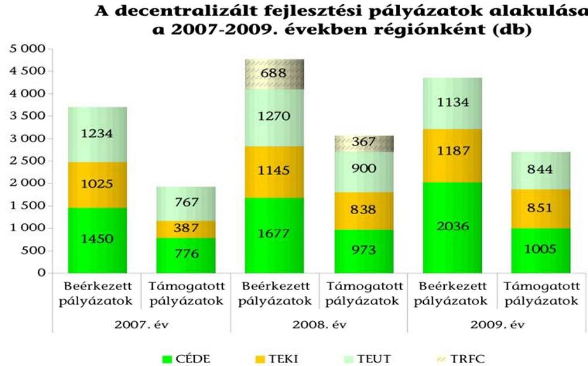

A 2007-2009. években a hét RFT-hez összesen 12846 db pályázatot nyújtottak be 101 145,3 M Ft támogatási igénnyel. A beérkezett pályázatok 3\%-a ( 385 db ) érvénytelen volt, mivel azok nem feleltek meg a formai és tartalmi követelményeknek, vagy a pályázók visszavonták kérelmüket. Az elbírált pályázatok $61,7 \%$-át ( 7708 db ) támogatták, a megítélt támogatás az igényeltnek a 46,4\%-

[^0]
[^0]:    ${ }^{107}$ a társadalmi-gazdasági és infrastrukturális szempontból elmaradott és/vagy az országos átlagot jelentősen meghaladó munkanélküliséggel sújtott települések

---

a (46 942,7 M Ft) volt. A támogatások elosztása során a források szétaprózódása volt jellemző, az egy támogatott pályázatra jutó megítélt támogatás mindössze 6,1 M Ft volt. Az ellenőrzött decentralizált területfejlesztési támogatások adatainak alakulását a 2007-2009. években a 8/a. számú, régiónkénti megbontását a 8/b-c. számú melléklet tartalmazza.

A decentralizált fejlesztési források RFT-k által felhasználható kereteit, valamint a benyújtott, támogatott pályázatok támogatási összegének alakulását az következő diagram mutatja be:
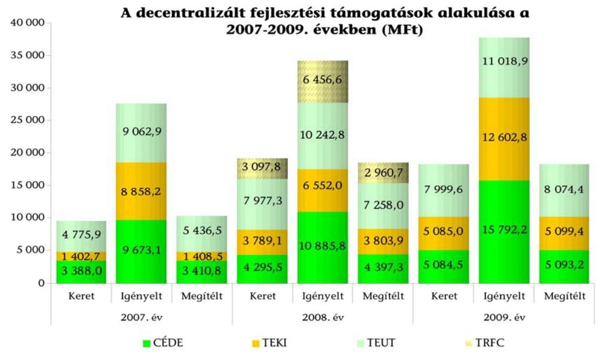

A hét RFT adatai alapján az igényelt támogatás 2007-ben a 2,9-szerese, 2008ban az 1,8-szerese, 2009-ben a 2,2-szerese volt a felhasználható keretnek. A felhasználható keret 2007-ben volt a legalacsonyabb a 2007. évi előirányzatok terhére korábbi években vállalt kötelezettségek miatt ${ }^{108}$.

A 2007. évet megelőzően, a következő két év előirányzatai terhére vállalt kötelezettségek miatt az RFT-k által 2007-ben felhasználható keret az 50,7\%-a, 2008ban a $88,9 \%$-a volt a 2007 . évi, illetve a 2008 . évi költségvetési törvényben megállapított CÉDE, TEKI és TEUT támogatások összesített előirányzatának.

A támogatási célok helyes kijelölését és a támogatások indokoltságát mutatja, hogy - egy RFT kivételével - a pályázók részéről érkező igények jelentősen meghaladták a rendelkezésre álló kereteket.

A KMRFT esetében a 2008. évi TEUT és TRFC támogatásra benyújtott pályázatok támogatásigénye kevesebb volt a felhasználható keretnél, a 2008. évi TEUT keret $96,6 \%$-ára, TRFC keret $67,1 \%$-ára nyújtottak be pályázatokat.

A támogatási szerződéseknek és azok módosításainak - az RFT-k határozatai alapján történő - előkészítését, valamint a hazai decentralizált területfejlesztési

[^0]
[^0]:    ${ }^{108}$ 2007-től már csak a tárgyévi előirányzatok terhére lehetett kötelezettséget vállalni.

---

források pénzügyi finanszírozási feladatait a MÁK végezte. A támogatások folyósításához kapcsolódóan az RFT-k feladata a TEKI, CÉDE, LEKI és a TEUT előirányzatokat érintően a támogatottaktól beérkezett számlák ellenjegyzése volt.

Az RFT-k a támogatottak szakmai és pénzügyi beszámoltatására vonatkozó szabályokat a hatályos kormányrendeletekkel összhangban a támogatási szerződésekben előírták. A MÁK-kal közösen ellenőrizték a pénzügyi elszámolásokat és a pályázatban vállalt célok megvalósítását a közbenső ellenőrzések során, valamint a projekt zárásakor a záró helyszíni ellenőrzés keretében a fenntartási kötelezettség teljesítésének vizsgálata érdekében. A pályázati céloktól eltérő felhasználás esetében határozatot hoztak a támogatások teljes, vagy részleges visszavonásáról. A kedvezményezetteket kötelezték a jogtalanul igénybevett támogatás és annak jogszabály szerint számított kamatainak visszafizetésére.

A kedvezményezettek támogatásról történő lemondása vagy a támogatási szerződésben vállalt kötelezettségek nem teljesítése miatt a 2007 és 2009 között támogatott pályázatokból $108 \mathrm{db}(1,4 \%)$ nem valósult meg. A megítélt és a felhasznált támogatási összeg aránya $92,0 \%$-ot tett ki, összesen 3739,2 M Ft támogatást nem hívtak le a kedvezményezettek ${ }^{109}$.

A hazai decentralizált fejlesztési támogatások felhasználásának részletes szabályait tartalmazó kormányrendeletek nem szabályozták a döntések előkészítésében és meghozatalában résztvevő személyek összeférhetetlenségét. A jogszabályok nem tartalmaztak elöírást a hazai forrásokból államháztartáson belülre nyújtott támogatások esetében a döntések előkészítésében és a döntéshozatalban résztvevő személyek összeférhetetlenségére vonatkozóan. A Közpénztv. hatálya - az 1. § (1) bekezdése alapján - az államháztartáson kívüli személyek, szervezetek részére odaítélt támogatásokra terjedt ki. Az ellenőrzött decentralizált fejlesztési források közül csak a 2008. évben meghirdetett TRFC-ből részesülhettek támogatásban az államháztartáson kívüli szervezetek. Központi szabályozás hiányában az RFT-k eltérő módon jártak el az összeférhetetlenség szabályozását és a bekért nyilatkozatok tartalmát illetően. A helyszínen ellenőrzött RFT-knél a megyei jogú városok polgármesterei részt vettek a saját településüket érintő támogatások döntéshozatalában ${ }^{110}$.

Az RFT-k az összeférhetetlenségi eljárások rendjére - erre vonatkozó jogszabályi előírás hiányában - külön szabályzatot nem készítettek, azonban két RFT (a DARFT és az ÉMRFT) az SZMSZ-ében szabályozta a tanácstagok összeférhetetlenségét. Ezek alapján a tag köteles volt bejelenteni a saját maga és közeli hozzátartozója érintettségét a tárgyalt ügyben, és nem vehetett részt a döntéshozatalban.

[^0]
[^0]:    ${ }^{109}$ A KMRFÜ a 2008. évi TRFC előirányzat esetében nem vezetett nyilvántartást a megvalósított pályázatok számáról, illetve a felhasznált támogatásról, ezért a megvalósított és támogatott pályázatok, valamint a felhasznált és megítélt támogatások arányának számításánál nem vettük figyelembe a KMRFT által a 2008. évi TRFC keretből támogatott pályázatok számát és a megítélt támogatások összegét sem.
    ${ }^{110}$ A tanács illetékességi területén múködő megyei jogú városok polgármesterei a Tftv. 17. § (6) bekezdés d) pontja alapján 2004. IX. 01. - 2011. XII. 31. között a regionális fejlesztési tanács tagjai voltak.

---

A helyszínen ellenőrzött RFT-knél - a DARFT kivételével - a bírálók, felkért szakértők nyilatkoztak összeférhetetlenségükről. Az ÉMRFT-nél a 2008. évben a Közpénztv.-ben, a 2009. évben pedig a hazai decentralizált fejlesztési forrásokra is az európai uniós támogatásokra vonatkozó 255/2006. (XII. 8.) Korm. rendeletben előírt összeférhetetlenségi szabályokat alkalmazták.

A saját költségvetésükből történő kifizetésekre vonatkozóan a szerződések megkötésének rendjét előíró szabályzatokat a helyszínen ellenőrzött RFT-k nem készítettek. A költségvetési szervek személyi juttatási előirányzatára és annak felhasználására, valamint a visszterhes szerződésekre vonatkozóan 2009. december 31-ig az Ámr. ${ }_{1}$, 2010. január 1-jétől az Ámr. ${ }_{2}$ határozott meg szabályokat, korlátozásokat.

Az Ámr. ${ }_{1}$ 59. § (9) és Ámr. ${ }_{2}$ 90. § (6) bekezdése szerint a költségvetési szerv állományába tartozó személynek megbízási díj a munkaköri leírása szerint számára előírható feladatra nem volt fizethető, más esetben a megbízási díj kifizetésére a megbízási szerződés alapján a feladat - megbízó által igazolt - teljesítése után kerülhetett sor. Az Ámr. ${ }_{1}$ 59. § (10) bekezdése alapján a költségvetési szerv szakmai alapfeladata keretében szellemi tevékenység végzésére szerződést - számla ellenében, külső személlyel, szervezettel - csak jogszabályban vagy az irányító szerv által szabályozott, illetve a fejezetet irányító szerv belső szabályzatában meghatározott feltételek szerinti feladatokra köthetett. Az Ámr. ${ }_{2}$ 82. § (3) bekezdése szerint pedig abban az esetben lehetett szellemi tevékenység végzésére szerződést kötni, ha az a költségvetési szerv szakmai alapfeladatai ellátásához szükséges, és az az adott feladat elvégzéséhez megfelelő személyt nem foglalkoztatott, vagy a szerződés tárgyát képező szolgáltatás egyedi, időszakos vagy időben rendszertelenül ellátandó feladat volt.

A decentralizált hazai forrásokra benyújtott pályázatok értékelését végző szakértőket 2007-2009-ben az RFÜ-k bízták meg, amely társaságokra az Ámr. ${ }_{1,2}$ előírásai nem terjedtek ki. A helyszínen ellenőrzött RFT-k kizárólag olyan egyéb feladatra alkalmaztak szakértőket, amelyeket az Ámr. ${ }_{1,2}$ lehetővé tett. Saját dolgozókkal egy, külső szakértőkkel kettő RFT kötött szerződést.

A DARFT saját dolgozókkal a 2009-2011. években a Szeghalmi kistérség hároméves szociális felzárkóztató programjának múködtetésére kötött megbízási szerződést (tervezés, végrehajtás ellenőrzése, kapcsolattartás, beszámoltatás, szakmai beszámoló). A megbízási díjak a program keretében elszámolhatóak voltak.

A DARFT a saját dolgozókon kívül megbízási szerződéssel foglalkoztatott regionális koordinátort, jogi tanácsadót, valamint szakmai tanácsadókat. A DARFT és a KDRFT vállalkozási szerződést kötött - többek között - jogi és szakmai tanácsadásra, tanulmány készítésére, az elnök melletti tanácsadói feladatok ellátására, a kommunikációs, valamint a jogi képviselet ellátására, az internetes honlap készítésére, a pénzügyi, irányítási rendszerek és a gazdálkodás vizsgálatára.

# A megbízási szerződések teljesítésének igazolását, nyilvántartását a helyszínen ellenőrzött RFT-k nem alakították ki maradéktalanul. 

A DARFT-nál a 2007-2010. években - a belső ellenőr által készített kimutatás szerint - a megbízási szerződések alapján teljesített kifizetések szakmai teljesítés igazolását nem végezték el az Ámr. ${ }_{1}$ 135. § (1) bekezdésében, valamint az Ámr. ${ }_{2} 76$. § (1) bekezdésében előírtak ellenére. A KDRFT vezetett nyilvántartást az általa megkötött szerződésekről, míg a DARFT nem.

---

# 2.5. A regionális fejlesztési tanácsok szerepe az uniós források döntéshozatali rendszerében 

### 2.5.1. A regionális operatív programok és akciótervek előkészítésében való részvétel

A ROP-ok, azok prioritási tengelyei, akciótervei tartalmára történő javaslattétel, valamint a módosításuk kezdeményezése 2011. február 8-ig a területfejlesztésért felelős miniszter feladatkörébe tartozott ${ }^{111}$. A miniszternek e feladatok ellátása során - a 255/2006. (XII. 8.) Korm. rendelet 9. § (2) bekezdése szerint - az érintett RFT-kkel egyeztetve kellett eljárnia. A 2011. február 9-től hatályos 4/2011. (I. 28.) Korm. rendelet 8. § a) pontja szerint az RFT-k közvetlenül tehettek javaslatot a szakmai felelősségi körükbe tartozó ROP-ok és akcióterveik tartalmára és azok módosítására.

A helyszínen ellenőrzött RFT-k éltek a régiót érintő ROP-ok és akciótervek tartalmát, módosításait érintő véleményezési, javaslattételi lehetőséggel a területfejlesztésért felelős miniszter feladatellátásában közreműködve, majd 2011-től közvetlenül.

A DARFT a DAOP 2007-2008., illetve a 2009-2010. évekre szóló akcióterveinek módosítására tett javaslatokat. Az ÉMRFT az ÉMOP Európai Bizottsággal történt 2006. évi előzetes egyeztetését követően javasolt módosításokat, mert a Bizottság - a szálláshelyek alacsony kihasználtsága ellenére - engedélyezte a turisztikai szálláshelyek fejlesztését. A KDRFT a KDOP 2007-2008. évi akciótervéhez kapcsolódóan, a turizmusra és közútfejlesztésre szánt források újragondolása, és az Új Magyarország Vidékfejlesztési Program által támogatott fejlesztésektől való lehatárolás körében javasolt változtatást. Javaslatairól értesítette az NFÜ-t és az ÖTMet.

A DARFT 2011-ben támogatta két megyei jogú város szociális célú városrehabilitáció projektje kiemelt projektként történő akciótervi nevesítését és a DAOP - „Rehabilitációs szolgáltatások fejlesztése" című - pályázati keretét érintő, a NEFMI által kezdeményezett 360 M Ft-os forrásátcsoportosítási javaslatát. Az ÉMRFT 2011-ben javaslatot tett a szakmai felelősségi körébe tartozó ROP és az akcióterv módosítására. A KDRFT 2011-ben a vörös iszap katasztrófa során megrongálódott 4-es és 5-ös számjegyű utak felújítása kapcsán tett javaslatot a 2011-2013-ig terjedő időszakra szóló akcióterv módosítására.

### 2.5.2. A kiemelt projektek és regionális projektek véleményezése

Az uniós támogatási rendszer a gazdaságra és a társadalomra jelentős hatást gyakorló, országos vagy regionális jelentőségű fejlesztéseket kiemelt projektként kezelte, és ezeket a projekteket jóváhagyásukat követően az akciótervek nevesítve tartalmazták. A kiemelt projekteket az ellenőrzött időszakban a Kormány ${ }^{112}$ hagyta jóvá. Az uniós források felhasználását szabályozó kormány-

[^0]
[^0]:    ${ }^{111}$ a 255/2006. (XII. 8.) Korm. rendelet 8. § (2) bekezdés b) és c) pontja alapján
    ${ }^{112}$ 2012. július 3-tól a Nemzeti Fejlesztési Kormánybizottság

---

rendeletek ${ }^{113}$ az ellenőrzött időszakban az RFT-k számára lehetőséget biztosítottak a kiemelt projektekre vonatkozó javaslattételre. A 2011. február 8-ig hatályos rendelkezések szerint a régiót érintő valamennyi kiemelt projekt azonosítását célzó javaslattétel során véleményt nyilváníthattak. A 4/2011. (I. 28.) Korm. rendelet hatályba lépésével a javaslattétel lehetősége a szakmai felelősségi körükbe tartozó ROP és akcióterv szakmai kidolgozásában való részvételben történő javaslattételre, valamint a kiemelt projektek befogadási kritériumaként meghatározott támogató nyilatkozat kiadására szűkült. A regionális szempontok az RFT-k támogatói javaslatai alapján érvényesülhettek.

A 255/2006. (XII. 8.) Korm. rendelet 17. § (1) bekezdése alapján a kiemelt projektek akciótervben történő előzetes nevesítésére javaslatot tehettek az érintett RFT-k. A (2) bekezdés alapján előzetesen meg kellett győződniük arról, hogy a javasolt kiemelt projekt hozzájárul az operatív program társadalmi-gazdasági céljaihoz, illeszkedik a területi stratégiához, egyértelmű, mérhető és elérhető célokkal rendelkezik, költséghatékony és megfelelően előkészített. A (3) bekezdés szerint az NFÜ által megküldött értesítések alapján az érintett RFT-k azokról a projektekről is véleményt nyilváníthattak, amelyek nevesítésére nem maguk tettek javaslatot. A 255/2006. (XII. 8.) Korm. rendelet 2008. május 1-jétől hatályos 6. § f) pontja véleményezési lehetőséget biztosított a fejlesztéspolitikáért felelős miniszter kiemelt projektek azonosítására vonatkozó javaslattétele során is.

A 4/2011. (I. 28.) Korm. rendelet 8. § b) pontja az RFT-k szakmai felelősségi körébe tartozó ROP-ok és akciótervek szakmai kidolgozása során biztosított javaslattételi jogot a kiemelt projektek azonosítására, továbbá az azok befogadásához szükséges támogató nyilatkozat kiadására.

# Az RFT-k éltek az uniós forrásokból megvalósítani tervezett kiemelt 

projektekre vonatkozó javaslattétel lehetőségével. A helyszíni ellenőrzés tapasztalatai szerint elsősorban a turizmusra, a környezetvédelemre és a térségi 4-es és 5-ös számjegyű közutakra vonatkozóan tettek javaslatokat. Az RFT-k a kiemelt projektek nevesítése során a jogszabályi előírásoknak megfelelően jártak el. A javaslatra szánt és már előzetesen értékelt projektek dokumentumait - a ROP közreműködői szervezeti feladatait is ellátó - RFÜ-k készítették elő. Az ellenőrzött időszakban az RFT-k 663 kiemelt projektre tettek javaslatot ${ }^{114}$. A javaslatok nagy részét (544 javaslat) 2007-2008-ban tették.

A DARFT által javasolt és elfogadott 29 kiemelt projekt közül 15 az állami közutak felújítására, egy turisztikai fejlesztésre, öt a megyei jogú városok rehabilitációjára, kettő a humán infrastruktúra fejlesztésre, hat a környezeti értékek védelmére vonatkozott. Az ÉMRFT javaslatai alapján elfogadott 28 kiemelt projekt többek között a 4-es és 5-ös számjegyű utakra és turisztikai fejlesztésekre vonatkozott. A KDRFT által javasoltak közül 20 - jellemzően a turizmushoz, a környezetvédelemhez, illetve a közlekedésfejlesztéshez kapcsolódó - projekt került jóváhagyásra.

Az ellenőrzött időszakban 202 kiemelt projekt jóváhagyása történt meg, összesen 295,0 Mrd Ft összegben ${ }^{115}$, a támogatás átlagos összege 1,46 Mrd Ft volt. A

[^0]
[^0]:    ${ }^{113}$ 255/2006. (XII. 8.) Korm. rendelet, 4/2011. (I. 28.) Korm. rendelet
    ${ }^{114}$ Forrás: az RFÜ-k által kitöltött tanúsítványok
    ${ }^{115}$ Forrás: az NFM adatszolgáltatása

---

kiemelt projekteken kívül a 2007-2011. években 12453 projekt összesen 957 328,1 M Ft támogatásban részesült. Az egy projektre jutó támogatási öszszeg 76,9 M Ft volt. A ROP-ok 2007 és 2013 közötti pénzügyi kereteit és felhasználásukat 2011. december 31-ig a 7. számú melléklet mutatja.

Az ellenőrzött időszakban a jogszabályok lehetőséget biztosítottak és feladatokat adtak az RFT-k számára az egymilliárd forint támogatás alatti, illetve 2008 végéig - külön szabályok szerint - az e feletti benyújtott és a közremúködő szervezet által befogadott projektek értékelésére, véleményezésére. Az értékelés és a véleményezés rendjét a 16/2006. (XII. 28.) MeHVM-PM együttes rendelet, majd 2011. február 9-től a 4/2011. (I. 28.) Korm. rendelet szabályozta. A projektek értékeléséhez és véleményezéséhez kapcsolódó szabályok az ellenőrzött időszakban többször módosultak ${ }^{116}$. A 16/2006. (XII. 28.) MeHVM-PM együttes rendelet módosításai érintették az értékelés szempontját, az értékelhetőség értékhatárát, az értékelhető projektek körét és az értékelés határidejét. Az előzetes formai, tartalmi értékelést és a pályázatok befogadását a közremúködő szervezetek végezték. A már értékelt projektek támogatására a bíráló bizottság, illetve 2011. február 9-től a döntés-előkészítő bizottság tett javaslatot.

A 16/2006. (XII. 28.) MeHVM-PM együttes rendelet 7. § (10) bekezdésének 2008. január 26-ig hatályos előírásai alapján a kétfordulós pályázatok első fordulójában az RFT-k a projekt javaslatokat a régió fejlesztési stratégiájához való illeszkedés szempontjából véleményezték.

A kétfordulós pályázat első fordulójában, valamint az egyfordulós pályázatoknál, amennyiben a javasolt támogatás meghaladta az egymilliárd forintot, a 16/2006. (XII. 28.) MeHVM-PM együttes rendelet 13. § (6) bekezdése és a 9. § (1) bekezdése alapján a közremúködő szervezet a teljes projektjavaslatot megküldte az érintett RFT-nek. Azt az RFT-k a közzétett értékelési szempontok alapján 20 napos határidővel külön szakértővel értékeltethették, amelynek eredményét közvetlenül a közreműködő szervezetnek küldték meg. Az egymilliárd Ft feletti projektjavaslatokra vonatkozó külön eljárás 2009. január 1-jétől az RFT-k esetében megszűnt, a projektjavaslatokat értékhatártól függetlenül egy eljárásrendben értékeltethették.

A kétfordulós pályázat első fordulójában (a ROP-ok projektjavaslatainál, vagy ha azt az akcióterv, illetve az NFÜ a felhívásban előírta), valamint a ROP egyfordulós pályázatainál (amennyiben az akcióterv előírta és a projektjavaslat a meghatározott pontszámot elérte), ha a javasolt támogatás nem haladta meg az egymilliárd forintot, a 16/2006. (XII. 28.) MeHVM-PM együttes rendelet 13. § (6) bekezdése és a 9/A. § alapján a közreműködő szervezet a projektjavaslatról készített összefoglalót küldte meg az érintett RFT-k részére. 2008. január 26. és 2008 augusztus 21. között a 9/A. § (2) bekezdés szerint az RFT-k a régió szempontjából kiemelkedően jelentős, jelentős, illetve kevésbé jelentős értékelést adhattak, a két szélső értékelés hányadát azonban az NFÜ határozhatta meg. 2008. augusztus 22. és 2009. január 1. között az RFT-k a korábbihoz hasonló minősítési rendszerben értékelhettek, a kiemelkedően jelentős 5 pont, a jelentős 3 pont, a nem jelentős 0 pont lehetett.

[^0]
[^0]:    ${ }^{116}$ A 16/2006. (XII. 28.) MeHVM-PM rendelet RFT-kre is vonatkozó előírásai 2007 és 2010 között három alkalommal módosultak, így az e feladatokat szabályozó két rendeletnek az öt év alatt összesen öt időállapota volt.

---

A szabályozás ismét változott 2009. január 1-jétől, ha az akcióterv vagy az NFÜ felhívásban előírta, a közreműködő szervezet az érintett RFT-k számára valamennyi befogadott projektjavaslatot megküldte. Az RFT-k a maximum 5 pontot érő, az NFÜ által meghatározott, regionális jelentőséget érvényesítő kritériumrendszer szerint értékeltethették a projektjavaslatokat.

A fenti feladatok elvégzésére az RFT-k számára meghatározott határidő jellemzően 20 nap volt, amely 2009. január 1-jétől 21 napra változott.

A 4/2011. (I. 28.) Korm. rendelet az RFT-k részére külön értékelési lehetőséget nem biztosított, azt a döntés előkészítő bizottságban való részvételre korlátozta.

A ROP-ok keretében a 2007-2008-as időszakban befogadott projekt javaslatokat a régió fejlesztési stratégiájához való illeszkedés szempontjából a DARFT és a KDRFT nem véleményezte, mert a projektek értékelése a jogszabályi rendelkezés - 16/2006. (XII. 28.) MeHVM-PM együttes rendelet 7. § (10) bekezdés - hatályának megszűnése után történt. Az értékeléseket a hatályban maradt 9-9/A. §ok szerint folytatták le.

A helyszínen ellenőrzött RFT-k 2008. december 31-ig külön eljárásrend szerint az egymilliárd forint alatti és feletti, ezt követően értékhatártól függetlenül, a befogadott és a részükre megküldött projektjavaslatok esetében az értékelést és a véleményezést elvégezték, értékeléseiket és javaslataikat a közreműködő szervezetnek megküldték.

Az egymilliárd forint feletti projekteknél az RFT-knek lehetősége volt külön értékelővel értékeltetni. A helyszíni ellenőrzés tapasztalatai szerint az értékeléseket a közreműködő szervezetek végezték.

A DARFT a 2008-2010. években összesen 34 határozatban hozott támogatási javaslatot. A határozatokban felhívta a bíráló bizottságokba delegált személy figyelmét, hogy a javaslatokat képviselje.

A KDRFT 2009-től az értékelési rendszer változása ellenére a projektjavaslatokat nem pontszámok alapján értékelte, hanem a korábban alkalmazott „kiemelten támogatott", „támogatott", valamint „semleges" kategóriákba sorolta.

A projektek értékelésére meghatározott 20, illetve 21 napos határidők betartását a helyszínen ellenőrzött három RFT dokumentumai alapján nem, vagy csak esetenként lehetett nyomon követni, mivel az előzetes értékelésekről szóló előterjesztések, illetve az RFT határozatok nem tartalmazták a véleményezésre vonatkozó felkérés dátumát és erről nyilvántartást nem vezettek. A feltárt dokumentumok szerint az ÉMRFT egy esetben az értékelést határidőn túl végezte el.

Az ÉMRFT a KEOP-7.2.4.0/09-2009 és a KEOP-7.1.1.1-2009 kétfordulós ágazati program projektjeit értékelte, de a 21 napos határidő betartása a rendelkezésre álló iratokból - egy kivételtől eltekintve - nem volt megállapítható. Ekkor a Környezetvédelmi és Vízügyi Minisztérium Fejlesztési Igazgatósága által 2009 júliusában megküldött pályázat értékelését augusztus 26-án végezték el. Az ÉMRFT 2007-2008-ban 11 határozatban értékelt egymilliárd forint feletti projekteket, de a 20 napos határidő betartása nem volt megállapítható, mert a dokumentumok megérkezésének időpontja nem volt ismert. A KDRFT határozatai nem tartalmazták a véleményezésre vonatkozó felkérés dátumát, erre utaló dokumentumok,

---

nyilvántartások nem álltak rendelkezésre. A DARFT a GOP-1.2.2-07/1 pályázati felhívásra beadott egymilliárd forint támogatási összegű pályázat esetében az értékelést határidőre (2008. június 16.) elvégezte.

# 2.5.3. A regionális érdekek képviselete a monitoring, valamint a bíráló és döntés-előkészítő bizottságokban 

Az RFT-k az NFÜ által felállított ROP monitoring bizottságokba ${ }^{117}$, a pályázati bíráló ${ }^{118}$, illetve 2011. február 9-től a döntés-előkészítő bizottságokba ${ }^{119}$ történő delegálásokkal vettek részt az uniós támogatások értékelési és döntési folyamataiban, illetve biztosíthatták a regionális érdekek képviseletét. Az RFT-k a ROPok bíráló bizottságaiba delegált tagoknak a 2008. január 25-ig hatályos szabályok szerint kötött mandátumot adhattak ${ }^{120}$.

Az RFT-k a ROP Monitoring Bizottságba a tanácsok tagjait, a bíráló bizottságokba rendszerint a munkaszervezeti feladatokat is ellátó RFÜ vezetőjét, illetve munkatársait delegálták. A bíráló bizottságok a közremúködő szervezetek, illetve az RFT-k által már értékelt projektek támogatására tettek javaslatot. A delegálásokról szóló határozatok, meghatalmazások nem tartalmaztak kötött mandátumot. A delegált tagok részére nem írtak elő beszámolási kötelezettséget a bizottság ülésein történtekről.

A DARFT a ROP Monitoring Bizottságba a Tanács elnökét, 2010. november 11-től pedig egy tanácstagot delegált. A KDRFT a ROP Monitoring Bizottságba 2007-ben a Tanács elnökét, 2010-ben pedig az egyik megyeszékhely polgármesterét delegálta.

A ROP projekteket bíráló bizottságokba a DARFT a titkárság vezetőjét, a DARFÜ igazgató-helyettesét és ügyvezető igazgatóját delegálta. A DARFT a DAOP projektek véleményezéséről, javaslatairól hozott határozataiban felhívta a delegált személy figyelmét, hogy a projektek régiós jelentőségét képviselje. Az ÉMRFT a ROP bíráló bizottságokba delegált tag és helyettese személyéről határozattal döntött. A KDRFT 2008-ban a KDOP 2007-2008. évekre szóló akciótervének végrehajtása érdekében kiírt pályázatok bíráló bizottságaiba 13 pályázati kiírásra benyújtott pályázatok elbírálására delegált tagokat, a kiemelt projekteket bíráló bizottságba a KDRFÜ ügyvezető igazgatóját delegálta.

A 2011-et követően kialakított ROP döntés-előkészítési bizottságokba az ÉMRFT és a DARFT is delegált tagot. A KDRFT prioritásonként egy (összesen öt) főt delegált.

A Monitoring Bizottság a ROP-ok önállóságára tekintettel, valamennyi konvergencia régióban Regionális Monitoring Albizottságok (RMA) felállításáról döntött. Az RMA-kba a helyszínen ellenőrzött RFT-k a kormányzati, önkormányzati, megyei és kistérségi képviselők közül delegáltak tagokat.

[^0]
[^0]:    ${ }^{117}$ A 255/2006. (XII. 8.) Korm. rendelet 14. § (3) bekezdés d) pont alapján külön monitoring bizottság jött létre a konvergencia régiókban és a Közép-magyarországi régióban.
    ${ }^{118}$ 16/2006. (XII. 28.) MeHVM-PM együttes rendelet 8. § (2) bekezdése
    ${ }^{119}$ 4/2011. (I. 28.) Korm. rendelet 8. § d) pont
    ${ }^{120}$ 16/2006. (XII. 28.) MeHVM-PM együttes rendelet 8. § (3) bekezdés

---

A 2008-ban megalakult Dél-alföldi RMA-ba a DARFT - saját tagjai közül - öt főt delegált. A Dél-alföldi RMA 2008 és 2011 között évente két rendes ülést tartott, ezeken javaslatokat fogalmaztak meg a Konvergencia ROP-ok Monitoring Bizottsága részére, többek között a régió-specifikus kiválasztási kritériumok kiegészítése és forrásátcsoportosítása körében. Az ÉMRFT az RMA-ba 2007 és 2009 között évente egy tagot, 2010-től négy tagot delegált. A KD RMA 2008-ban tartott ülésén tárgyalt három fő pont mindegyike a civil szervezetek pályázati lehetőségének és támogatásának a regionális akciótervbe történő beépítése volt.

# 2.6. A regionális programok értékelése, szakmai beszámolók 

A Tftv. az RFT-k részére évente beszámolási kötelezettséget írt elő, a 17. § (3) bekezdés f) pont alapján az előző évre ütemezett feladatok megvalósításáról, a középtávú fejlesztési program végrehajtásának alakulásáról, valamint a megállapodásban foglaltak végrehajtásáról a Kormány felé, a 17. § (2) bekezdés g) pont alapján a programok megvalósításáról és a pénzügyi felhasználásról a területfejlesztésért felelős miniszter felé. Az RFT-k szakmai tevékenységéről szóló beszámolási kötelezettségét írták elő a területfejlesztésért felelős miniszterrel kötött, a múködési célú támogatások felhasználásáról szóló, továbbá a decentralizált területfejlesztési pályázatok kezeléséről, valamint az egyéb célokra nyújtott támogatásokról szóló megállapodások is.

Az RFT-k és a területfejlesztésért felelős miniszter közötti megállapodások mellékletében részletezett beszámolási szempontok tartalmazták mind a hazai, mind az uniós támogatásokkal kapcsolatos tájékoztatási szempontokat, továbbá az RFT-k Tftv.-ben részletezett feladatairól szóló beszámolást. Ezek illeszkedtek a Kormány részére teljesítendő beszámolási kötelezettség tartalmi elemeihez is.

Az RFT-k az ellenőrzött időszakban elkészítették beszámolóikat ${ }^{121}$, és azokat a területfejlesztésért felelős miniszter részére küldték meg. A beszámolók száma, tartalma illeszkedett a minisztériummal kötött megállapodásokhoz. A helyszínen ellenőrzött három RFT beszámolója bemutatta a bizottságok, munkacsoportok tevékenységét, és részletesen tartalmazta a hazai decentralizált területfejlesztési források felhasználásával kapcsolatos statisztikai, pénzügyi adatokat. A beszámolók tartalmaztak információkat, adatokat a ROP támogatások, pályázatok állásáról, de a programok helyzetének értékelésére nem tértek ki.

A DARFT beszámolt a hazai decentralizált pályázati rendszer múködtetéséről, és kitért a DAOP monitoring tapasztalataira, illetve az adott időszaki akcióterv megvalósításának állására. Az ÉMRFT beszámolói részletezték a területfejlesztési célkitűzések teljesülésének mérése érdekében elvégzett, az ÉMOP prioritási tengelyeinek a regionális stratégiához való illeszkedése vizsgálatát. A KDRFT beszámolói részletezték a hazai, valamint a ROP források felhasználásával kapcsolatos pályázati és támogatási összegek alakulásának adatait, és kitértek a KDOP kétéves akciótervei végrehajtásának aktuális helyzetére.

[^0]
[^0]:    ${ }^{121}$ Forrás: az RFÜ-k által kitöltött tanúsítványok

---

A ROP-ok előrehaladásáról, aktuális helyzetéről, valamint a kétéves akciótervekben foglalt célkitűzések, mutatók teljesüléséről az NFÜ ${ }^{122}$ által készített, illetve koordinált jelentések számoltak be, értékelték az adott évben megvalósult projektek egyedi és összegzett hatását a területi célok teljesülésére. A jelentések a közremúködő szervezetek - köztük az RFÜ-k - együttműködésével készültek el, amelyeket az RMA-k és a ROP Monitoring Bizottság is megtárgyalt.

A jelentések elsősorban az elért eredményekre koncentráltak, tartalmazták az indikátorok elért (rész) teljesítését és a horizontális célok teljesülését prioritásonként, figyelembe véve a társadalmi gazdasági környezet folyamatait. Elemezték a jelentősebb felmerült problémákat és a megoldásukra hozott intézkedéseket.

A ROP-ok végrehajtásáról készült jelentések 2010-től kockázatként említették az elhúzódó gazdasági válság negatív hatásait, a programok előkészítésének késedelmét, valamint az önkormányzatok erőforrásainak csökkenését. A helyszínen ellenőrzött régiók vonatkozásában a jelentések minimális előrehaladásról (KDOP), illetve vegyes tapasztalatokról (DAOP) számoltak be, az eredménymutatók az eredeti célindikátoroktól esetenként elmaradtak. A jelentések szerint a fejlesztések értékelésének mutatói nem minden esetben voltak alkalmasak az eredmények mérésére.

A DAOP 2010. évi jelentése szerint a program előkészítésének és a projektek benyújtásának elhúzódása miatt a 109 Mrd Ft támogatási szerződésállomány közel felének megkötése 2010-ben történt. Az ÉMOP megvalósításáról szóló jelentés szerint a pénzügyi keret, valamint a támogatási igények közötti finanszírozási feszültség feloldása érdekében 2008-ban - a 2009-2010-es időszak terhére 94,3 millió euró forrást előrehoztak. A KDOP 2010. évi jelentése szerint a 6 főindikátorból csak kettő, a foglalkoztatottsági ráta és a régió egy főre jutó GDP-jének növekedése közelítette meg az eredeti célindikátort.

Az RFÜ-k koordinálásában elkészültek az uniós programozási időszak mid-term (félidős) értékelései az egyes régiókra, valamint azok szintézise. A félidős értékelés célja volt a ROP-ok előrehaladásának nyomon követése és javaslattétel a programhoz képest tapasztalt eltérések kezelésére. A félidős értékelések szerint a ROP-ok megfelelő ütemben haladtak előre, ugyanakkor egyes prioritások mutatói esetében elmaradás mutatkozott. A jelentések hangsúlyozták, hogy egyes mutatók esetében azok egyértelmú definiáltságának a hiánya, illetve eltérő évekre vonatkoztatása miatt az előrehaladás nem állapítható meg, ezért javaslatokat fogalmaztak meg az indikátorok és a célértékek felülvizsgálatára.

[^0]
[^0]:    ${ }^{122}$ a 255/2006. (XII. 8.) Korm. rendelet 7. § (2) bekezdés f) pontja, valamint a 4/2011. (I. 28.) Korm. rendelet 15. § (1) bekezdés e) és g) pontja alapján

---

# 3. A KISTÉRSÉGI FEJLESZTÉSI TANÁCSOK SZEREPE ÉS FELADATELLÁTÁSA 

### 3.1. A kistérségi fejlesztési tanácsokra vonatkozó központi szabályozás

Az Országgyűlés a Tftv. 2004. szeptember 1-jétől hatályos módosításával ${ }^{123}$ - a kistérség területfejlesztésben betöltött szerepének biztosítása érdekében - létrehozta a területfejlesztés új jogintézményét, a kistérségi fejlesztési tanácsot (a KTFT-t). A Tftv. 10/A. § (1) bekezdése szerint a KTFT-k alapvető feladata a kistérségben a területfejlesztési feladatok összehangolása, a kistérségi fejlesztési koncepció elfogadása, valamint közös területfejlesztési programok kialakítása volt. A helyi önkormányzatok képviselő-testületeinek emellett továbbra is lehetőségük volt arra, hogy - a Ttv. alapján - a közös területfejlesztési célok kidolgozására és megvalósítására jogi személyiséggel rendelkező területfejlesztési társulásokat hozzanak létre és múködtessenek. A KTFT és a területfejlesztési önkormányzati társulás feladatai - a közös területfejlesztési célok meghatározását és a területfejlesztési programok megvalósítását illetően - párhuzamosságot mutattak.

A KTFT-k feladatait, múködésük módját és feltételeit a Tftv. 10/A10/G. §-aiban határozták meg. A 10/A. § szerint a KTFT jogi személy volt, amelyet - megalakulása esetén - a MÁK-nak kellett nyilvántartásba vennie. Gazdálkodására és beszámolási kötelezettségére - a Tftv.-ben meghatározott sajátosságok figyelembe vételével - a költségvetési szervek gazdálkodására vonatkozó szabályokat kellett alkalmazni.

A Tftv. 10/C. § (1) bekezdésében rögzítették a KTFT kapcsolatrendszerét, mely szerint együtt kellett múködnie a helyi önkormányzatokkal, azok területfejlesztési társulásaival, a kistérségben múködő állami szervekkel, az érdekelt társadalmi és szakmai szervezetekkel, valamint a gazdasági szervezetekkel.

A Tftv. 10/C. § (2) bekezdésében foglaltak alapján a KTFT alapvetően tervezési és koordináló feladatokat látott el, a 10/C. § (2) bekezdés p) pontjában foglaltak ellenére, külön jogszabályban források feletti rendelkezési jogot nem kapott. A 10/C. § (2) bekezdés o) pontja alapján a KTFT szakmai munkaszervezetet múködtethetett. A munkaszervezetek létrehozásának, múködésének részletes szabályait a Tftv. 27. § (1) bekezdés m) pontjában foglalt felhatalmazás ellenére a Kormány rendeletben nem állapította meg.

A Tftv. 10/D. § (1) bekezdés a) pontja alapján a KTFT szavazati joggal rendelkező tagja volt a kistérség valamennyi önkormányzatának polgármestere. A tanácskozási joggal rendelkező tagokat a 10/D. § (1) bekezdés b) és c) pontja, a konzultációs joggal rendelkezőket a 10/D. § (2) bekezdése rögzítette.

[^0]
[^0]:    ${ }^{123}$ A Tftv.-t a területfejlesztésről és a területrendezésről szóló 1996. évi XXI. törvény és egyes kapcsolódó törvények módosításáról szóló 2004. évi LXXV. törvény módosította.

---

A KTFT-ben tanácskozási joggal rendelkező tagként vett részt a gazdasági kamaráknak a kistérségben múködő egy-egy képviselője, a megyei területfejlesztési tanács képviselője, a megyei munkaadói és munkavállalói szervezetek egy-egy kistérségi illetékességú képviselője, az iparosok és kiskereskedők országos szakmai érdekvédelmi szervezeteinek egy kistérségi illetékességú képviselője, a társadalmi szervezetek fóruma által delegált, a civil szervezetek egy képviselője, a törvényességi felügyeletet gyakorló szerv és a MÁK képviselője. Meghívottként az adott napirendek tárgyalásán tanácskozási joggal vettek részt az aktuálisan érintett gazdasági és civil szervezetek képviselői. Konzultációs joggal rendelkeztek a kistérségben múködő mindazon bírósági nyilvántartásba vett társadalmi szervezetek, amelyek a területfejlesztést érintő kérdések megtárgyalására egyeztető fórumot hoztak létre, és a KTFT-nél jelezték együttmúködési szándékukat.

A Tkt. tv. alapján - 2004 novemberét követően - megalakult TKT-k egyik feladata szintén a területfejlesztés volt. A Tftv. 10/G. §-ának rendelkezése összekötötte a kistérségi területfejlesztési tanácsi feladatokat a TKT intézményével. Ennek értelmében a KTFT-k feladatait elláthatták a kistérség valamenynyi települését magában foglaló TKT-k. A feladatok ellátásának e módját a Tftv. nem szabályozta, és nem írta elő a feladat- és hatáskörök, az eljárási szabályok rendszerének helyi szabályozását sem.

A Tftv. 10/G. § (1) bekezdése értelmében a kistérségi fejlesztési tanács feladatait a valamennyi települést magába foglaló többcélú kistérségi társulás „az e törvényben meghatározott feladat- és hatáskör, továbbá eljárási szabályok értelemszerü alkalmazásával látja el". A 10/G. § (3) bekezdése szerint „Ahol e törvény kistérségi fejlesztési tanácsot említ, azon többcélú kistérségi társulást is érteni kell...".

Azokban a kistérségekben, ahol éltek a Tftv. 10/G. §-ában biztosított lehetőséggel és a KTFT feladatait a TKT útján látták el, a törvényben meghatározott fel-adat- és hatáskörök, továbbá az eljárási szabályok értelemszerú alkalmazására vonatkozó előírás - a részletesebb jogi szabályozás hiányában - a végrehajtásnál jogértelmezési problémákat okozott és eltérő gyakorlathoz vezetett. Hiányzott az iránymutatás a múködéshez, a döntéshozatalhoz és annak dokumentálásához, így többek között a pénzügyi terv, a költségvetés elkészítéséhez és elfogadásához, a gazdálkodáshoz, a pályázati tevékenységhez, valamint a munkaszervezet múködtetéséhez. A KTFT-k és a TKT-k döntéshozatalának egyes szabályait a 9. számú melléklet tartalmazza.

Nem volt egyértelmúen szabályozott, hogy a TKT-knek önálló kistérségi fejlesztési tanácsülések keretében kell-e fejlesztési tanácsi határozatokat hozniuk, és az ülésekről külön jegyzőkönyvet kell-e felvenniük. Az ülések megtartására és a döntéshozatalra vonatkozó szabályokat a KTFT-k esetében a Tftv., míg a TKT-k társulási tanácsai esetében a Tkt. tv. tartalmazta. A KTFT-kben és a TKT-k társulási tanácsaiban egyaránt a polgármesterek rendelkeztek szavazati joggal, azonban a tanácsüléseken résztvevők körére, a szavazati jogokra, arányokra, az SZMSZ elfogadására, a határozatképességre, a döntések meghozatalára, valamint a törvényességi felügyeletre, illetve a törvényességi ellenőrzésre vonatkozóan a két törvény eltérő előírásokat tartalmazott.

A KTFT-k létrehozására vonatkozó törvényi szabályozás hatályba lépését követően nem került sor a - 2009. október 20-ig hatályos - 184/1996. (XII. 11.) Korm. rendelet módosítására a kistérségi területfejlesztési koncepció és program kidolgozására és elfogadására vonatkozóan, így a kormányrendelet szerint azok továbbra is a területfejlesztési önkormányzati társulás feladatát képezték.

---

A 218/2009. (X. 6.) Korm. rendelet 1. § g) pontja a Tftv.-ben foglaltakkal összhangban tartalmazta, hogy a kistérségi területfejlesztési koncepció és program kidolgozásáért a KTFT a felelős.

A kistérségekben a területfejlesztési feladatokat ellátó szervezetek (területfejlesztési önkormányzati társulások, KTFT-k, TKT-k) feladat- és hatásköreiben mutatkozó párhuzamosságok, valamint a feladatellátás fentiekben részletezett problémái hozzájárultak ahhoz, hogy a területfejlesztés intézményrendszerének átalakítása keretében a KTFT-ket 2012. január 1-jétől megszüntették ${ }^{124}$.

# 3.2. A szervezeti keretek, a múködés szabályozottsága 

Az ellenőrzött időszakban a kistérségi fejlesztési tanácsi feladatokat - egy kivételével - a kistérség valamennyi települési önkormányzatának részvételével működő TKT-k ${ }^{125}$, a szakmai munkaszervezeti feladatokat a TKT-k munkaszervezetei látták el. A KTFT-nek a Tftv. 10/A. §-a szerinti megalakítására az ellenőrzött időszakban mindössze egy esetben (az Érdi kistérségben) - a Tftv. 10/G. § (1) bekezdésében meghatározott feltételek nem teljesülése miatt - került sor.

A Tkt. tv. 2007. szeptember 25-től hatályos módosításával ${ }^{126}$ létrehozott Érdi kistérségben a négy érintett önkormányzat közül egy nem vett részt a TKT-ben, ezért az illetékes közigazgatási hivatal kezdeményezésére 2008. május 20 -án megalakították a jogi személyiséggel rendelkező KTFT-t ${ }^{127}$. A szervezetet a MÁK 2008. július 10-én bejegyezte, és 2012. július 17-én törölte a törzskönyvi nyilvántartásból.

A Tftv. 10/A. § (2) bekezdése alapján jogi személyként megalakult KTFT-knek a 10/D. § (6) bekezdése ${ }^{128}$ szerint SZMSZ-t kellett jóváhagyniuk, a 10/C. § (3) bekezdésében előírt egyhangú döntéssel. Az ellenőrzött időszakban a KTFT-k - a fenti egy kivételtől eltekintve - önálló jogi személyként nem múködtek, ezért önálló SZMSZ készítésére sem voltak kötelezettek. A szervezetre és múködésre vonatkozó szabályokat a feladatokat ellátó TKT-k SZMSZ-eiben sem rögzítették teljes körűen. A helyszínen ellenőrzött 22 TKT közül a 2007. évben és a 2011. évben egyaránt 12 társulás ( $54,5 \%$ ) rendelkezett a kistérségi fejlesztési tanácsi feladatellátást is szabályozó SZMSZ-szel. Ezekből az SZMSZ-ekből is hiányzott azonban - egy kivételével ${ }^{129}$ - a fejlesztési tanácsi feladatkörbe tartozó napirendek jegyzőkönyvezésének szabályozása, illetve nem vagy nem teljes körűen határozták meg az egyes feladatok végrehajtásának személyi felelőseit. A fennmaradó 10 TKT-nél (45,5\%-nál) a múködés és a döntéshozatal szabályozásának hiányosságai, illetve elmaradása miatt a kistérségi

[^0]
[^0]:    ${ }^{124}$ a területfejlesztéssel és területendezéssel összefüggő egyes törvények módosításáról szóló 2011. évi CXCVIII. törvénnyel
    ${ }^{125}$ A korábban jogi személyként megalakított KTFT-k az ellenőrzött időszakot megelőzően megszűntek, feladataikat a TKT-k vették át.
    ${ }^{126}$ A Tkt. tv.-t a települési önkormányzatok többcélú kistérségi társulásáról szóló 2004. évi CVII. törvény módosításáról szóló 2007. évi CVII. törvény módosította.
    ${ }^{127}$ Forrás: az Érdi TKT adatszolgáltatása
    ${ }^{128}$ Az előírásokat a hivatkozott 16. § (5), (7) és (9) bekezdései tartalmazták.
    ${ }^{129}$ Kiskunmajsai TKT SZMSZ-e

---

fejlesztési tanácsi feladatellátás nem különült el a TKT egyéb feladataitól. Ezek a TKT-k nem vették figyelembe, hogy a fejlesztési tanácsi, illetve a társulási tanácsi hatáskörben meghozandó döntésekre eltérő törvényi előírások vonatkoztak, és a határozatok nem tartalmazták átlátható módon, hogy az adott döntést melyik szervezet feladatkörében hozták meg ${ }^{130}$.

A Szerencsi TKT társulási megállapodásában és SZMSZ-ében csupán egy-egy azonos szövegezésű - mondatrész utalt a fejlesztési tanácsi feladatok ellátására. A jegyzőkönyvek kifejezetten a fejlesztési tanácsi feladatok ellátását a 2007-2011. években nem tartalmazták.

A Bácsalmási TKT a kistérségi fejlesztési tanácsi feladatokkal kapcsolatos napirendek megtárgyalásakor és a döntéshozatalkor nem nyilvánította ki azt, hogy a KTFT feladat- és hatáskörében jár el. A társulási tanács üléseiről felvett jegyzőkönyvek nem tartalmazták elkülönítetten a kistérségi fejlesztési tanácsi feladatokkal kapcsolatos napirendeket az egyéb napirendektől.

A 2007. évben a 174 közül 101 (58,0\%) kistérségben, míg a 2011. évben 116 (66,7\%) kistérségben rendelkeztek olyan SZMSZ-szel, amelyben legalább részben - különböző módon - meghatározták a kistérségi fejlesztési tanácsok feladatait és az azokkal kapcsolatos eljárásrendeket ${ }^{131}$.

A 2011. évben szabályozó 116 kistérség közül

- 91 kistérségben a feladatokat ellátó TKT SZMSZ-e tartalmazta a kistérségi fejlesztési tanácsi feladatellátást;
- 12 kistérségben a TKT és a KTFT részére „közös", 12 kistérségben pedig külön kistérségi fejlesztési tanácsi SZMSZ-t készítettek és hagytak jóvá, annak ellenére, hogy a KTFT jogi személyként nem alakult meg;
- a jogi személyként megalakított Érdi KTFT saját SZMSZ-szel rendelkezett.

A területfejlesztésben érintett szervezetek közötti kapcsolatrendszert a TKT-k társulási megállapodása, illetve SZMSZ-e általánosan - lényegében a Tftv. 10/C. $\S$-ában előírtakat megismételve - szabályozta. A kapcsolattartó személyét az ellenőrzött TKT-k közül hétnél (31,8\%) nevesítették a társulás vagy munkaszervezetének SZMSZ-ében, illetve az érintett munkaszervezeti dolgozó munkaköri leírásában (Bácsalmási, Edelényi, Füzesabonyi, Gyöngyös körzete, Halasi, Jánoshalmi, Velencei-tó környéki TKT). A kapcsolattartás szabályait, eljárásrendjét - így például a kapcsolattartás módját, a kapcsolatok, a kommunikáció eredménye rögzítésének szabályait, a beszámolás rendjét - nem határozták meg.

Az ellenőrzött TKT-knél a KTFT-k tevékenységére, gazdálkodására vonatkozóan külön szabályzatokat nem készítettek. Önálló jogi személyiségű KTFT megalakulása hiányában az önálló - kifejezetten a területfejlesztési feladatokhoz kap-

[^0]
[^0]:    ${ }^{130}$ Már a 0817 számú, 2008 júliusában nyilvánosságra hozott ÁSZ jelentés is megállapította, hogy „A testületi döntések dokumentálási rendjének kialakításakor a többcélú társulások 20,2\%-a nem volt figyelemmel arra, hogy a Tftv-ben elöirt döntési hatáskörök érvényesitését átlátható módon biztosítsák."
    ${ }^{131}$ A TKT-k adatszolgáltatása és az ÁSZ rendelkezésére bocsátott dokumentumok felülvizsgálata szerint.

---

csolódó pénzügyi keretekre vonatkozó - szabályzatok elkészítésének kötelezettségét jogszabály nem írta elő. A kistérségi fejlesztési tanácsi feladatokat ellátó TKT-k az ellenőrzött időszakban rendelkeztek a számviteli előírások ${ }^{132}$ szerinti belső szabályzatokkal, azok keretében azonban kistérségi fejlesztési tanácsi feladatokra vonatkozó specifikus helyi szabályokat nem rögzítettek.

A Tftv. 10/C. § (2) bekezdés m) pontja előírta, hogy a KTFT-knek meg kell állapítaniuk a költségvetésüket, és gondoskodniuk kell annak végrehajtásáról. A TKT-k adatszolgáltatása szerint a 2007. évben 81, míg a 2011. évben $85^{133}$ kistérségben ( $46,6 \%$, illetve $48,9 \%$ ) készítettek a fejlesztési tanácsi feladatok megvalósítása érdekében elkülönített költségvetést. A helyszínen ellenőrzött 22 közül a 2007. évben egy, míg a 2011. évben kettő TKT rendelkezett olyan költségvetéssel, amely elkülönítetten tartalmazta a KTFT működéséhez biztosított költségvetési támogatást.

A Füzesabonyi TKT éves költségvetésében a fejlesztési tanácsi hatáskörbe tartozó feladatok ellátására folyósított éves múködési támogatás az ellenőrzött időszakban - elkülönített módon, szakfeladaton - került megtervezésre. A TKT a költségvetéseket végrehajtotta, a támogatásokat a tervezettnek megfelelően, a vidékfejlesztési menedzser munkabére, annak járulékai és dologi kiadások fedezetére fordította.

A Bélapátfalvai TKT-nél a fejlesztési tanácsi feladatok ellátására tervezhető költségvetési támogatás összegét és jogcímét a 2007-2008. évi költségvetésekben nem, a 2009-2011. évi költségvetésekben azonban már elkülönítették.

Négy többcélú kistérségi társulás (az Egri, a Mezőföldi, a Pápai és a Velencei-tó Környéki TKT) a tanúsítványában azt közölte, hogy a KTFT költségvetését elkülönítették. A helyszíni ellenőrzés azonban megállapította, hogy a TKT-k éves költségvetései nem tartalmazták elkülönítetten a KTFT-k költségvetését.

# 3.3. A kistérségi fejlesztési tanácsok Tftv.-ben előírt feladatainak ellátása 

A Tftv. 10/C. § (2) bekezdés b) pontja alapján a KTFT-k kiemelt feladatát képezte a kistérség területfejlesztési koncepciójának kidolgozása és elfogadása, ennek figyelembevételével a területfejlesztési programjának készítése, azok megvalósításának ellenőrzése. A TKT-k - ÁSZ által felülvizsgált - adatszolgáltatása szerint hatályos kistérségi területfejlesztési koncepcióval a 2007. évben 104 (59,8\%), míg a 2011. évben 110 (63,2\%) kistérség rendelkezett. A területfejlesztési koncepcióhoz kapcsolódóan elkészített középtávú területfejlesztési program a 2007. évben 74 (42,5\%), a 2011. évben 78 (44,8\%) kistérségben állt rendelkezésre. A fejlesztési források hiányára és jogszabály értelmezési problémákra is visszavezethető, hogy a 2007. és a 2011. év vonatkozásában mindössze 26 (14,9\%), illetve 23 (13,2\%) TKT nyilatkozott úgy, hogy a kistérség területfejlesztési programjának megvalósítása érdekében

[^0]
[^0]:    ${ }^{132}$ Az előírásokat a 249/2000. (XII. 24.) Korm. rendelet 8. §-a és 49. §-a tartalmazta.
    ${ }^{133}$ A megalakulását tekintve kivételt képező Érdi KTFT-vel együtt.

---

elkészítette a Tftv. 10/C. § (2) bekezdés c) pontjában előírt pénzügyi tervet. A helyszínen ellenőrzött TKT-k közül a 2007. és a 2011. évben területfejlesztési koncepcióval $14(63,6 \%)$, illetve 16 ( $72,7 \%$ ), területfejlesztési programmal 13 $(59,1 \%)$, illetve $15(68,2 \%)$, míg pénzügyi tervvel 4-4 (18,2-18,2\%) rendelkezett.

A Tftv.-ben előírt kistérségi területfejlesztési koncepciók elkészítésének határidejét - és így a tervezési és a végrehajtási időszakot - nem határozták meg, követelményként mindössze a régió fejlesztési terveivel és az OTK-val való összhangot fogalmazták meg. A területfejlesztési koncepciók eltérő időpontokban (2002 és 2009 között) készültek és különböző időtávra (3 évtől meg nem határozott időtartamra) szóltak. A kistérségi területfejlesztési koncepciók 37,5\%-a ( 6 db ) az ellenőrzött időszakban érvényes OTK elfogadását megelőzően készült, közülük a 2005. évet követően mindössze egynek (az Edelényi TKT koncepciójának) az aktualizálása történt meg. A kistérségi területfejlesztési koncepciókban foglaltak a fő célkitúzésekben igazodtak az OTK-ban megfogalmazottakhoz, mivel a térségi versenyképességhez, a területi felzárkózáshoz, az elmaradott térségekben lévő kistelepülések működőképességének és lakosságmegtartó erejének növeléséhez, a rurális térségek területileg integrált fejlesztéséhez, illetve az országos jelentőségű, integrált fejlesztési térségekhez kapcsolódtak.

A Füzesabonyi TKT 2005-ben készítette el a 2007-2013. évekre vonatkozó területfejlesztési koncepcióját. Az OTK-val való összhang megteremtése érdekében az aktualizálás szükségességét a koncepció is rögzítette, de az nem történt meg.

A helyszínen ellenőrzött, területfejlesztési koncepcióval rendelkező kistérségek közül egy (a Kiskunmajsai TKT) nem készítette el a koncepcióhoz kapcsolódóan a - stratégiai és operatív programot magába foglaló - középtávú területfejlesztési programot.

Az ellenőrzött TKT-knél 2011-ben rendelkezésre álló 15 középtávú területfejlesztési program közül 10 tartalmazott indikátorokat (output-, ered-mény- és hatásmutatókat). Ebből területfejlesztési programok értékeléséhez használható konkrét célértékeket hat - az Egri, a Hódmezővásárhelyi, a Miskolci, a Pápai, a Szerencsi és a Velencei-tó Környéki TKT-nél rendelkezésre álló dokumentum tartalmazott. Négy területfejlesztési programban a tervezett intézkedésekhez rendelt indikátorokat csak tartalmilag határozták meg, konkrét célértékeket nem rögzítettek (az Edelényi, a Füzesabonyi, a Halasi és a Hevesi TKT-nél).

A kistérségi területfejlesztési koncepciók és programok elkészítésével jellemzően külső szakmai szervezeteket ${ }^{134}$ bíztak meg. A helyszínen ellenőrzött TKT-knél rendelkezésre álló hosszú és középtávú területfejlesztési koncepciók teljes körűen, a középtávú területfejlesztési programok ${ }^{135}$ egy kivétellel

[^0]
[^0]:    ${ }^{134}$ Pl. Borsod-Abaúj-Zemplén Megyei Fejlesztési Ügynökség, GKI Gazdaságkutató Rt., Közép-Pannon Regionális Fejlesztési Rt., Torontál Regionális Területfejlesztési Kht., VÁTI Kht., illetve VÁTI Nonprofit Kft., stb.
    ${ }^{135}$ Volt olyan kistérség, amelyben több területfejlesztési program is készült.

---

# megfeleltek a jogszabályban meghatározott tartalmi követelményeknek. 

A Hódmezővásárhelyi TKT által elfogadott, a benyújtani kívánt projektek listáját tartalmazó „Kistérségi fejlesztési program (2007-2013)" csak részben felelt meg a 18/1998. (VI. 25.) KTM rendelet 2. számú melléklet II. pontjában foglaltaknak, mivel az a tartalmi követelmények közül csak az egyes feladatok céljait tartalmazta. Nem tartalmazta az egyes projektek időbeli és pénzügyi ütemezését, a végrehajtásért felelős szervezeteket és közreműködőket, a fejlesztéshez szükséges forrásokat és az indikátorokat. „A Hódmezővásárhelyi kistérség integrált területfejlesztési, vidékfejlesztési és környezetvédelmi programja" megfelelit az előírt tartalmi követelményeknek, azonban a TKT munkaszervezeténél nem tudták a helyszíni ellenőrzés rendelkezésére bocsátani az annak elfogadásáról szóló határozatot.

A kistérségi területfejlesztési koncepciók és programok elfogadására vonatkozó kötelezettségüknek a fejlesztési tanácsi feladatokat ellátó TKT-k különböző módon tettek eleget.

A 2011. évben területfejlesztési koncepcióval rendelkező 16 kistérségben és területfejlesztési programmal rendelkező 15 kistérségben a dokumentumok elfogadása a következők szerint történt:

- a TKT társulási tanácsa a KTFT hatáskörében eljárva fogadta el a koncepciót nyolc, a programot hét kistérségben (Békési, Egri, Velencei-tó környéki, Halasi, Hevesi, Pétervásárai, Salgótarjáni kistérség, illetve a Kiskunmajsai kistérség csak a koncepciót);
- a TKT társulási tanácsa saját hatáskörben fogadta el a koncepciót és a programot négy kistérségben (Miskolci, Pápai, Pásztói, Szerencsi kistérség);
- csak részben (a koncepció vagy a program) került elfogadásra, illetve a döntésről dokumentum a helyszíni ellenőrzés során nem állt rendelkezésre négy kistérségben (Edelényi, Füzesabonyi, Hódmezővásárhelyi, Szegedi kistérség).

A Tftv. 10/C. § (2) bekezdés c) pontjában rögzített előíráson ${ }^{136}$ túl, a pénzügyi terv elkészítésére vonatkozóan központi szabályokat nem alakítottak ki. A fejlesztési tanácsi feladatokat ellátó TKT-k a területfejlesztési koncepciókban, programokban szereplő előzetes és többnyire nem aktualizált pénzügyi, finanszírozási táblákat, illetve az éves költségvetésüket tekintették pénzügyi tervnek. Külön dokumentumként elkészített pénzügyi tervet az annak meglétéről nyilatkozó TKT-k nem bocsátottak az ÁSZ ellenőrzés rendelkezésére.

A kedvezményezett térségek besorolásáról szóló 311/2007. (XI. 17.) Korm. rendeletben az ellenőrzött kistérségek közül hatot ${ }^{137}$ - a gazdasági, társadalmi, infrastruktúra-ellátottsági mutatók alapján - a komplex programmal segítendő 33 leghátrányosabb helyzetű (LHH) kistérség körébe soroltak, ahol az ellenőrzött időszak legjelentősebb keretösszegű területfejlesztési pályázati forrása a 2008. évtől megvalósuló LHH programhoz kapcsolódott. A Tftv. 10/C. (2) bekezdés b) pontja alapján a kistérségi területfejlesztési programok kidolgozásáért

[^0]
[^0]:    ${ }^{136}$ „A kistérségi fejlesztési tanács...pénzügyi tervet készít a területfejlesztési programok megvalósitása érdekében".
    ${ }^{137}$ a Bácsalmási, az Edelényi, a Hevesi, a Jánoshalmi, a Szerencsi és a Szikszói kistérség

---

és elfogadásáért a KTFT volt a felelős, ugyanakkor a kistérségi területfejlesztést, felzárkóztatást elősegítő LHH programok tervezési, javaslattételi, illetve döntési folyamataiban a KTFT hatásköri jogosítvánnyal nem rendelkezett, mivel arra külön fejlesztési bizottságot kellett alakítani. Az LHH programra elkülönített európai uniós források megpályázásához szükséges kistérségi terv és projekt-csomag összeállítását, értékelését, bírálatát és a döntési mechanizmust a 2008. év folyamán központilag - az NFÜ által - szabályozták. A kistérségi tervezési folyamatokat az önkormányzatok, a kisebbségi önkormányzatok, a vállalkozási szféra és a társadalmi szervezetek képviselőiből létrehozott kistérségi fejlesztési bizottságok felügyelték. A kistérségi fejlesztési bizottságok tagi összetételét az NFÜ-iránymutatással és az ÁROP 1.1.5/C ${ }^{138}$ pályázati kiírással összhangban alakították ki.

A Szerencsi kistérségben a kistérségi fejlesztési bizottság 28 tagból állt. Szavazati joggal rendelkezett öt polgármester a kistérség önkormányzatainak képviseletében, három fő a kisebbségi önkormányzatok, 10 fő a civil szervezetek és vállalkozók képviseletében. Tanácskozási joggal rendelkezett három fő intézményvezető, három fő a közszolgáltatások, egy fő a munkaügyi központ, és egy fő a LEADER csoport képviseletében, valamint két fő kistérségi koordinátor.

A Hevesi kistérségben a TKT társulási tanácsának 2008. októberi határozata alapján a kistérségi fejlesztési bizottságot 18 fő szavazó és 8 fő tanácskozó jogú tag alkotta. A szavazati jogú tagok az elnök (polgármester), az alelnök (országgyúlési képviselő), a mikro-térségek képviselői (polgármesterek, 3 fő), a kisebbségi szervezetek képviselői ( 2 fő), a periférikus települések képviselői (polgármesterek, 2 fő), civil-, továbbá gazdálkodó szervezetek képviselői ( 9 fő) voltak. A tanácskozási jogú tagok a területi munkaügyi központnak, a többcélú kistérségi társulás egyes intézményeinek, a helyi vidékfejlesztési irodának, a LEADER helyi közösségnek és a kistérségi koordinációs hálózatnak a tagjai/képviselői voltak.

A kistérségi fejlesztési bizottságok javaslatait a TKT-k társulási tanácsai megtárgyalták, és egyetértésük esetén határozatban kezdeményezték az LHH program és projektcsomagok NFÜ-höz történő benyújtását jóváhagyás céljából. A TKT-k társulási tanácsai az LHH programot a KTFT-k hatáskörében eljárva nem tárgyalták.

Az LHH programokban szereplő projektek támogatására irányuló pályázatokat a kistérségben működő önkormányzatok, kisebbségi önkormányzatok, vállalkozások, civil szervezetek, illetve a TKT-k nyújtották be.

A Szerencsi kistérség részére az LHH program keretében 3024,0 M Ft összegű támogatási keretet hagytak jóvá. A TKT a jóváhagyott LHH keretet - a 100,0 M Ftos gazdaságfejlesztési keret kivételével - teljes egészében lefedte tervezett projektekkel. Az önkormányzati projektek tervdokumentációját a TKT munkaszervezete állította össze és védte meg az NFÜ tervzsúrije előtt. A gazdaságfejlesztési keretből elnyerhető támogatásra a vállalkozások önállóan pályáztak, a keret felhasználásáról a TKT munkaszervezete és a kistérségi fejlesztési bizottság nem rendelkezett információval, mivel visszajelzés - az NFÜ-től, pályázóktól - nem érkezett.

[^0]
[^0]:    ${ }^{138}$ ÁROP 1.1.5/C „A leghátrányosabb helyzetü kistérségek fejlesztési és együttmüködési kapacitásainak megerősitése" című normatív pályázat

---

A Bácsalmási kistérség számára meghatározott - a közszféra és a magánszféra által együttesen felhasználható - támogatási keret 1814 M Ft volt. A TKT az LHH program keretében benyújtott pályázataira 2009-ben 109,1 M Ft, 2010-ben 209,9 M Ft, a 2011. évben 206,5 M Ft támogatást nyert el. A támogatási keret további részeire egyéb szervezetek (önkormányzatok, vállalkozások) nyújtottak be pályázatokat, erről összesített információ a TKT-nél nem állt rendelkezésre.

A Tftv. 10/C. § (2) bekezdés l) pontja lehetővé tette a KTFT-k számára, hogy saját maguk is pályázatokat nyújtsanak be a kistérség fejlesztéséhez kapcsolódó források igényléséhez. Az ellenőrzött időszakban a pályázatokat a TKT-k a saját nevükben nyújtották be, azok részben a területfejlesztési, részben az intézmény fenntartási feladataikhoz kapcsolódtak, a két funkciót nem lehetett egyértelműen elkülöníteni. Az ellenőrzött időszakban a 174 TKT közül évente 101-132 (58,0-75,9\%) nyújtott be pályázatot fejlesztési források elnyerésére, a pályázók száma a 2011. évben volt a legalacsonyabb. A helyszínen ellenőrzött TKT-k közül évente 12-14 (54,5-63,6\%) nyújtott be pályázatot. Tíz TKT (45,5\%) az ellenőrzött időszak mindegyik évében pályázott fejlesztési forrás elnyerésére. Olyan eset nem fordult elő, hogy egy társulás egyik évben sem nyújtott be pályázatot. A TKT-k pályázataiban vállalt önrészre a fedezetet a fejlesztések megvalósításában érdekelt önkormányzatok által átadott pénzeszközökböl biztosították. Ezen túlmenően a TKT-k a kistérségi fejlesztési tanácsi feladatok ellátásához vállalkozásoktól, civil szervezetektől, egyéb szervezetektől nem gyüjtöttek forrásokat.

A Hódmezővásárhelyi TKT-nek a 2007-2011. években összesen 21 db közfoglalkoztatáshoz kapcsolódó, illetve fejlesztési célú nyertes pályázata volt, közülük három kapcsolódott a területfejlesztéshez (közösségi közlekedés fejlesztése, kerékpárutak építése). A pályázatok útján elnyert támogatásból (1323,5 M Ft) a területfejlesztési célú támogatás $773,4 \mathrm{M}$ Ft-ot tett ki.

Az Edelényi TKT a 2007-2011. évek között közel egymilliárd Ft összegű pályázati forrást nyert el, zömében közmunka- és LHH programok lebonyolítására. A TKT az ellenőrzött időszak mindegyik évében nyújtott be pályázatot közmunkaprogramra, illetve fejlesztési célú támogatásra.

A TKT-k adatszolgáltatása szerint az ellenőrzött időszakban a KTFT-k, illetve a feladataikat ellátó TKT-k közül 91 (52,3\%) véleményezett egy vagy több alkalommal megyei, regionális fejlesztési koncepciókat, programokat, illetve azoknak a kistérséget érintő intézkedéseit. A helyszínen ellenőrzött többcélú kistérségi társulások közül pedig csupán hét (31,8\%) végzett ilyen feladatot, ami azt támasztja alá, hogy a területfejlesztés különböző szintjei között a koncepciók és a programok kidolgozásánál - a Tftv. 10/C. § (2) bekezdés f) pontjában foglaltak ellenére - nem volt megfelelő a koordináció.

A kistérségi fejlesztési tanácsok Tftv.-ben előírt kötelezettségeinek teljesítését a 6. számú melléklet mutatja be.

# 3.4. A kistérségi célkitűzések teljesülésének nyomon követése, a beszámolási kötelezettségek teljesítése 

A kistérségi területfejlesztési programok végrehajtását a fejlesztési tanácsi feladatokat ellátó TKT-k - a Tftv. 10/C. § (2) bekezdés b) pontjának előírása elle-

---

nére - nem ellenőrizték. Jogszabály nem írt elő beszámolási, információszolgáltatási kötelezettséget a programok megvalósításában résztvevő önkormányzatok és egyéb szervezetek (vállalkozások, civil szervezetek) számára. Jogi szabályozás hiányában az információszolgáltatás, beszámolás rendszerét a kistérségekben a fejlesztési tanácsi feladatokat ellátó TKT-k mindössze a koordinációs feladatkörükben eljárva alakíthatták ki. Az ellenőrzött TKT-knél a kistérségi célkitúzések teljesülésének nyomon követése nem volt biztosított, ahhoz helyi szabályrendszert nem alakítottak ki. A TKT-k munkaszervezetei nem kértek be rendszeresen információkat a programok végrehajtásának alakulásáról, ebből következően azok értékeléséhez sem rendelkeztek teljes körű információval. A programok megvalósításánál a fejlesztési tanácsi feladatokat ellátó TKT-k koordinációs szerepköre nem érvényesült. A területfejlesztési tervekben foglaltak megvalósításának értékelése az éves működési támogatáshoz kapcsolódó, a finanszírozó által előírt szakmai beszámolókra korlátozódott, átfogó értékelésre - kettő kivételével - nem került sor.

A Szegedi TKT-nél az „Európai uniós források hasznosulásáról a szegedi kistérségben" című értékelésben a Kistérségi Cselekvési Tervben meghatározott programok előrehaladásáról, valamint a TKT és annak munkaszervezete 2007 és 2012 között végzett szakmai és pályázati tevékenységéről számoltak be.

A Halasi TKT munkaszervezete által a 2010. évben készített - „Kiskunhalas kistérség komplex területfejlesztési programja" végrehajtásáról szóló - jelentés bemutatta a kistérséghez tartozó önkormányzatok és vállalkozások 2004 és 2009 közötti pályázati tevékenységét és annak eredményét, javaslatokat fogalmazott meg az eredeti célkitűzések megvalósítása érdekében. A jelentésben rögzítették azt is, hogy az értékeléshez teljes körű és pontos adatokhoz nem tudtak hozzájutni.

Még a központilag koordinált LHH programot is az jellemezte, hogy a projektek megvalósításáról az abban érdekelt önkormányzatok és egyéb szervezetek nem számoltak be a projektcsomagot összeállító TKT-knek. A támogatottaknak a támogató szervezetek felé volt jelentési, beszámolási kötelezettségük, az azokkal kapcsolatos dokumentumok azonban a TKT-knél, illetve azok munkaszervezeteinél nem álltak rendelkezésre teljes körűen.

A kistérségi fejlesztési tanácsi feladatok ellátására a Tftv. 10/F. § (3) bekezdésében foglaltak alapján, a KTFK-k múködéséhez és a kistérségi programok megvalósításához évente - az adott évi költségvetési törvény területfejlesztésért felelős minisztérium fejezetében meghatározott mértékű - költségvetési hozzájárulást biztosítottak. A költségvetési törvényben a „Kistérségi fejlesztési tanácsok és munkaszervezeteik támogatása" jogcímen 2007-ben és 2008-ban 840840 M Ft, 2009-ben 520 M Ft, 2010-ben 173 M Ft forrást biztosítottak. A 2011. évi költségvetési törvényben a „Területfejlesztési intézményrendszeri feladatok" jogcímcsoporton e feladatokra 174 M Ft forrás állt rendelkezésre.

A támogatási szerződéseket a területfejlesztésért felelős minisztérium a kistérségben múködő, a fejlesztési tanácsi feladatokat ellátó TKT-vel kötötte meg. A szakmai beszámolóval szemben támasztott követelmények meghatározásánál nem vették figyelembe azt, hogy a KTFT-k feladatait a TKT-k látták el. A beszámolót készítők számára nem volt egyértelmú, hogy mikor, milyen adatokat kell szerepeltetniük a KTFT-re, illetve a TKT-re vonatkozóan (a KTFT vagy a társulás tagjai, állandó meghívottjai, a civil fó-

---

rum tagjai, a tanácsülések száma, a határozatok száma, ebből pályázatokkal kapcsolatos és egyéb döntések száma, a tárgyévi költségvetés bevételi és kiadási előirányzatai vonatkozásában). Nem volt egyértelmű továbbá - a KTFT-k múködésével összefüggésben - a munkaszervezettel kapcsolatos információszolgáltatási kötelezettség sem, mivel ilyen szervezetet a TKT-k alapítottak és múködtettek.

A támogatást nyújtó minisztériumnak megküldött szöveges szakmai beszámolók a támogatási szerződés mellékletében meghatározott szempontok szerint ismertették a területfejlesztési feladatok körében elvégzett tevékenységeket, a kistérségben megvalósult fejlesztéseket, a jövőbeni fejlesztési elképzeléseket, a különböző szervezetekkel való együttmúködést, a szervezeti felépítést és a kapcsolódó számszerú adatokat. A beszámolókban a TKT-knek nem kellett információt adni arról, hogy a kistérségi fejlesztési tanácsi feladatok ellátását a többi feladatuktól elkülönítetten kezelték-e. A beszámolók egyes helyeken hivatkoztak a „Kistérségi Fejlesztési Tanácsra" vagy „Fejlesztési Tanácsra", például az elvégzett feladatok, szervezeti információk vonatkozásában (Edelényi, Hevesi TKT). Ez ellentmondásos információt hordozott, mert a hivatkozott szervezetek jogilag nem jöttek létre.

A Bélapátfalvai TKT az éves szöveges szakmai beszámolóiban ismertette - többek közt - a kistérségben megvalósult fejlesztéseket és a jövőbeni fejlesztési elképzeléseket. Az ellenőrzött időszakban ugyanakkor területfejlesztési koncepciót a fejlesztési tanácsi feladatokat ellátó TKT nem készített, koncepció (ennek keretében terv, program, cél- és indikátorrendszer) hiányában a kistérségben megvalósult fejlesztések koncepcionális összehangoltsága és a fejlesztések teljesülésének értékelhetősége nem volt biztosított.

A Pápai TKT az éves szakmai beszámolóiban felsorolta az adott évben megvalósított valamennyi pályázatát (nem csak a területfejlesztéshez, illetve a fejlesztési tanácsi feladatokhoz kapcsolódókat), ugyanakkor nem tért ki e pályázatok és a területfejlesztési koncepcióban, programban foglalt célkitűzések kapcsolatára, hatásuk értékelésére.

A KTFT-k múködéséhez biztosított támogatásból 2008-ban 1,0 M Ft (0,1\%), 2009-ben 1,9 M Ft (0,4\%), 2010-ben 27,3 M Ft (15,8\%), 2011-ben pedig 1,2 M Ft $(0,7 \%)$ nem került felhasználásra ${ }^{139}$. A fel nem használt összeg 2008-ban egy, 2009-ben kettő, 2010-ben 30, 2011-ben három TKT-t érintett. A támogatási szerződés megkötésére, hatályba lépésének feltételeire, illetve a szerződéstől való elállásra vonatkozó jogszabályi előírások szigorodása ${ }^{140}$ is szerepet játszott abban, hogy 27 TKT (azok 15,5\%-a) a 2010. évi - kistérségenként 1-1 M Ft - múködési támogatás teljes összegét, 3 TKT pedig annak egy részét nem használhatta fel. A 2011. évben egy esetben fordult elő az, hogy a TKT nem volt jogosult a tárgyévi - 1,0 M Ft összegű - támogatásra. A kistérségi fejlesztési tanácsok részére biztosított múködési forrásokat 2007 és 2011 között a 3. számú melléklet mutatja be.

[^0]
[^0]:    ${ }^{139}$ az NFM adatszolgáltatása alapján
    ${ }^{140}$ 14/2010. (IV. 13.) NFGM rendeletben

---

A 2010. évi - a korábbinál szigorúbb - támogatási feltételek szerint, amennyiben a támogatás folyósítására a tárgyév november 15 -ig a kedvezményezettnek felróható okból nem került sor, a miniszter a támogatási szerződéstől elállt.

A 2007-2011. évi támogatások felhasználására vonatkozó pénzügyi elszámolások és a szöveges szakmai beszámolók minisztérium által történt elfogadását igazoló, illetve a hiánypótlási kötelezettséget megállapító dokumentumok a TKTknél teljes körűen nem álltak rendelkezésre.

A Szikszói TKT a 2010. évi múködési támogatással kapcsolatosan a támogatási szerződést, az 1,0 M Ft támogatás felhasználásáról szóló elszámolást, valamint a szöveges szakmai beszámolót bocsátotta az ÁSZ ellenőrzés rendelkezésére. Az NFM adatszolgáltatása és írásos tájékoztatója szerint azonban a minisztérium a benyújtott számlákat és így az elszámolást nem fogadta el, ezért a TKT-nek a 2010. évi támogatás teljes összegét vissza kellett fizetnie.

# 4. Az ELLENŐRZÉSI RENDSZER MŰKÖDÉSE 

### 4.1. A törvényességi felügyelet és a külső ellenőrzések

### 4.1.1. A törvényességi felügyeletet ellátó szervek ellenőrzései

A Tftv. 16. § (10), illetve 10/A. § (4) bekezdése alapján a törvényességi felügyeletet az RFT-k és a KTFT-k felett a Kormány területi államigazgatási szervei ${ }^{141}$ látták el. Feladatuk volt annak vizsgálata, hogy az RFT-k, illetve a KTFT-k SZMSZ-e és egyéb szabályzatai megfeleltek-e a jogszabályoknak, valamint szervezetük, múködésük, döntéshozatali eljárásuk, határozataik nem sértettek-e jogszabályokat, alapszabályt vagy egyéb szabályzatokat. Az 51/2005. (III. 24.) Korm. rendelet meghatározta a területfejlesztés intézményei törvényességi felügyeletének részletes szabályait, ennek keretében a törvényességi felügyeletet ellátó szerv jogait és kötelességeit. Előírta továbbá, hogy az RFT, illetve a KTFT elnöke az ülésre szóló meghívót és az írásos előterjesztéseket az ülés előtt 5 nappal, az ülésen felvett jegyzőkönyvet az ülést követő 8 napon belül köteles megküldeni a felügyeletet gyakorló szervnek.

A fenti jogszabályi előírások alkalmazása a KTFT-knél nem volt egyértelmú, mivel a kistérségi fejlesztési tanácsi feladatokat ellátó TKT-k törvényességi ellenőrzéseire, valamint a jegyzőkönyveinek a megküldésére eltérő szabályok vonatkoztak. A Tkt. tv. 12. § (2) bekezdése alapján törvényességi ellenőrzés keretében vizsgálták ${ }^{142}$, hogy a TKT-k döntése, szervezete, múködése és döntéshozatali eljárása megfelelt-e a jogszabályoknak, a többcélú kistérségi társulási megállapodásban, valamint a társulási tanács SZMSZ-ében foglaltaknak. A

[^0]
[^0]:    ${ }^{141}$ 2008. december 31-ig megyei, illetve regionális közigazgatási hivatal; 2009. január 1-2010. augusztus 31.: regionális államigazgatási hivatal; 2010. szeptember 1-2010. december 31.: megyei közigazgatási hivatal; 2011. január 1-jétől kormányhivatal
    ${ }^{142}$ A Tkt. tv. 12. § (2) bekezdésében a törvényességi ellenőrzési jogkörrel rendelkező szervezetként 2010. december 31-ig a közigazgatási hivatalt, 2011. január 1. és december 31. között a helyi önkormányzatok törvényességi ellenőrzéséért felelős szervet jelölték meg.

---

Tkt. tv. 7. § (6) bekezdése alapján a TKT társulási tanácsának üléséről jegyzőkönyvet kellett készíteni, melyet a társulási tanács elnökének az ülést követő 15 napon belül kellett megküldenie a törvényességi ellenőrzési jogkörrel rendelkező szervnek és a társulás tagjainak.

# A törvényességi felügyelet az RFT-knél és a KTFT-knél a beküldött 

jegyzökönyvek felülvizsgálatában nyilvánult meg. A törvényességi felügyeletet ellátó szerv vezetője - az 51/2005. (III. 24.) Korm. rendelet 10. §-ában foglaltak alapján - tanácskozási joggal részt vehetett a tanácsüléseken is.

A törvényességi felügyeletet ellátó szervek a helyszínen ellenőrzött RFT-k közül a DARFT-nál és az ÉMRFT-nél tettek észrevételt két-két esetben, amelyeket az érintettek figyelembe vettek. A törvényes működés helyreállítására felügyelő biztos kirendelésére nem volt szükség.

A 2007. évben - egy bejelentés kezdeményezésére - a törvényességi felügyeletet ellátó szerv felhívással élt a DARFT elnöke felé, mivel megállapította, hogy a 2006. november 24-i tisztújító ülésen az SZMSZ módosítása során a szavazatarány nem felelt meg a Tftv.-ben előírtaknak. A DARFT többszöri tárgyalást követően 2007. december 6-án fogadta el a végleges SZMSZ-t.

A 2007. évi decentralizált önkormányzati fejlesztési programok pályázatainak elbírálásával kapcsolatos beadvány kifogásolta, hogy a döntés során a DARFT több ponton a vonatkozó jogszabályoktól és Pályázati szabályzattól eltérő módon járt el. A DARFT a törvényességi észrevétel hatására az LHH támogatási keret terhére új pályázat kiírásáról döntött, és módosította Pályázati szabályzatát.

A törvényességi felügyeletet ellátó szerv jogszabálysértést állapított meg az ÉMRFT 43/2008. (VI. 20.) számú határozatát érintően, mivel egy TRFC támogatásban részesített, foglalkoztatási kötelezettségét nem teljesítő pályázó kérelmére - a támogatás visszavonása helyett - azt a döntést hozta, hogy a pályázó foglalkoztatási kötelezettségének 5 év átlagában tegyen eleget. Ezt követően az ÉMRFT határozatban intézkedett a megítélt támogatás és kamatainak a foglalkoztatási kötelezettség nem teljesítése miatti visszafizettetéséről.

A törvényességi felügyeletet ellátó szerv jogszabályi rendelkezésekkel ellentétes intézkedéseket tárt fel az ÉMRFT két 2009. évi határozatával kapcsolatban, mivel azokban az ÉMRFÜ Kht. átalakítása kapcsán arról rendelkeztek, hogy a változások „automatikusan átvezetésre kerülnek" az ÉMRFT SZMSZ-ében. Az ÉMRFT a 61/2009. (XII. 11.) számú határozatában a kifogásolt határozatokat módosította, a 69/2009. (XII. 18.) számú határozatával az SZMSZ-t elfogadta.

A törvényességi felügyeletet ellátó szervek a helyszínen ellenőrzött, kistérségi fejlesztési tanácsi feladatokat ellátó TKT-k közül ötnél összesen 10 észrevételt tettek. Az észrevételek a TKT-k jegyzőkönyveinek elkészítésére, működésének és döntéshozatalának törvénysértő voltára, szabályzatainak hiányosságára mutattak rá. Az észrevételek alapján a TKT-k a hiányosságokat pótolták, illetve a jogszabályoknak megfelelő módon szabályozták a döntéshozatalt.

A Gyöngyös Körzete TKT-nél az Észak-Magyarországi Regionális Közigazgatási Hivatal 2008. november 13-ai levelében kifogásolta, hogy a TKT-nél nem különült el a társulási tanácsként és a kistérségi fejlesztési tanácsként való múködés.

---

A Békési TKT-nél a Dél-Alföldi Regionális Közigazgatási Hivatal törvényességi észrevétele arra vonatkozott, hogy a TKT működésében törvénysértő döntéshozatalra vezethet az, hogy a gyakorlatban a TKT ülésein nem mindig különült el a döntéshozatal. Továbbá nem volt egyértelmú, hogy a napirendet a TKT társulási tanácsként, vagy fejlesztési tanácsként tárgyalta-e meg.

A törvényességi felügyeletet ellátó szerv az ellenőrzött időszakban a helyszínen ellenőrzöttek közül kettő TKT-nél végzett helyszíni ellenőrzést, amelyek a kistérségi fejlesztési tanácsi feladatok ellátására is kiterjedtek. A két ellenőrzés közül az egyiknél az érintett TKT nem kapott visszajelzést annak eredményéről, így az ellenőrzés tapasztalatainak a kistérség általi hasznosítására sem volt lehetőség.

A Velencei-tó környéki TKT müködésével kapcsolatban a Közép-Dunántúli Regionális Közigazgatási Hivatal a 2006. október 1. és 2007. június 30. közötti időszakra kiterjedően helyszíni ellenőrzést folytatott le. Az ellenőrzési jelentés kistérségi fejlesztési tanáccsal kapcsolatos megállapítása az volt, hogy „A napirendek megállapításakor elkülönítetten tárgyalják azon kérdéseket, melyekben a társulás kistérségi fejlesztési tanácsként jár el, valamint azokat, melyekben a települési önkormányzatok többcélú kistérségi társulásról szóló 2007. évi CVII törvény alapján járnak el".

A Füzesabonyi TKT feladatainak ellátásával kapcsolatos felügyeleti ellenőrzést 2009 novemberében folytatta le az Észak-Magyarországi Regionális Közigazgatási Hivatal. Az ellenőrzés célja az volt, hogy „a kistérségi területfejlesztési tanács szervezeti és müködési szabályzata, egyéb szabályzatai megfelelnek-e a jogszabályoknak, illetve szervezete, müködése, döntéshozatali eljárása, határozatai, egyéb döntései nem sértenek-e jogszabályokat, szabályzatokat". A TKT az ellenőrzés eredményéről nem kapott értesítést.

A törvényességi felügyelet müködése hasznosulásának jó gyakorlata volt, hogy a Dél-Alföldi Regionális Közigazgatási Hivatal, illetve Államigazgatási Hivatal körlevelekben hívta fel a figyelmet, tájékoztatta az önkormányzatok jegyzőit, a munkaszervezetek és a területfejlesztési feladatokat ellátó szervezetek vezetőit a feladatellátása során szerzett tapasztalatairól.

A Halasi TKT Munkaszervezete a törvényességi felügyeletet ellátó szerv felhívása alapján 2009-től külön jegyzőkönyvet vett fel a TKT Társulási tanácsa által tárgyalt azon napirendekről, melyeken a KTFT hatáskörében járt el. A KTFT feladotés hatáskörébe tartozó napirendek tárgyalását és az azokkal kapcsolatos döntéshozatalt korábban is elkülönítették a TKT Társulási tanácsa által tárgyalt egyéb napirendektől, de akkor a tanács üléséről egy közös jegyzőkönyv készült.

# 4.1.2. A regionális és a kistérségi fejlesztési tanácsoknál végzett külső ellenőrzések 

A helyszínen ellenőrzött három RFT közül mindössze egynél, a DARFTnál volt két külső ellenőrzés. A külső ellenőrzéseknek forráselosztást érintő megállapításai nem voltak, intézkedést igénylő javaslatokat nem tartalmaztak.

Az ÁSZ 2007 májusában ellenőrizte a helyi önkormányzatok beruházásaihoz és rekonstrukcióihoz nyújtott 2006. évi felhalmozási célú támogatásokat a DARFTnál, hiányosságokat nem állapított meg.

---

Az APEH 2007 márciusában és októberében végzett ellenőrzést a DARFT-nál, amelynek tárgya az egyes adókötelezettségek teljesítése volt. A jegyzőkönyvek intézkedést igénylő megállapításokat nem tartalmaztak.

Az RFÜ-ket, mint a ROP-ok végrehajtásában közreműködő szervezeteket számos külső szerv (az ÁSZ, a Kormányzati Ellenőrzési Hivatal, az Európai Támogatásokat Auditáló Főigazgatóság, az NFÜ, a MÁK és a Nemzeti Programengedélyező Iroda) ellenőrizte. E külső ellenőrzések az ellenőrzött RFT-k munkaszervezeti feladatait nem érintették, kizárólag a közreműködő szervezeti feladatok ellátására irányultak.

Az ellenőrzött időszakban a kistérségi fejlesztési tanácsok feladatellátását, múködését külső ellenőrző szervek - a törvényességi felügyeletet gyakorlókon kívül - nem ellenőrizték.

A TKT-ket különböző szervezetek ellenőrizték, de az ellenőrzések nem a fejlesztési tanácsi feladatok ellátására, hanem a TKT-k munkaszervezeteire, a társulások által fenntartott intézményekre, az általuk benyújtott pályázatokra és a támogatások felhasználásával megvalósított fejlesztésekre irányultak.

# 4.2. A korábbi ÁSZ ellenőrzések javaslatainak hasznosulása, az intézkedési tervek végrehajtása 

### 4.2.1. Az 1108. számú ÁSZ jelentés javaslatainak hasznosulása

A helyi önkormányzatok fejlesztési célú támogatási rendszerének ellenőrzéséről szóló 1108. számú ÁSZ jelentés ${ }^{143}$ megállapításai alapján az ÁSZ a Kormánynak három, a nemzeti fejlesztési miniszternek egy javaslatot fogalmazott meg. A javaslatok az önkormányzatok által igénybe vehető tisztán hazai fejlesztési célú támogatások forráskoordinációjára, az indikátor rendszer kidolgoztatására és kötelezővé tételére, az információs rendszer fejlesztésére, valamint a fejlesztési célú támogatások nyújtásakor a mérhetőséget biztosító indikátor meghatározására vonatkoztak. A javaslatokban foglaltak végrehajtására az ÁSZ részére intézkedési tervet nem készítettek ${ }^{144}$.

Az ÁSZ jelentés megjelenését követően több olyan jogszabályi és egyéb kormányzati intézkedés történt, amelyek az ÁSZ megállapításainak a figyelembe vételét jelentették. Ezek a tervezés központi koordinációjára, a monitoring, értékelési és indikátor rendszer kidolgozására, a források szétaprózódásának elkerülésére és az információs rendszer fejlesztésére vonatkoztak. Az intézkedések hasznosulása azonban a gyakorlatban még nem állapítható meg, mivel 2011-től nem hirdettek meg az önkormányzatok számára pályázható hazai decentralizált fejlesztési célú pályázatokat. Az ÁSZ ja-

[^0]
[^0]:    ${ }^{143}$ Jelentés a helyi önkormányzatok fejlesztési célú támogatási rendszerének ellenőrzéséről, 2011. június (1108)
    ${ }^{144}$ Az Állami Számvevőszékről szóló, 2011. június 24-ig hatályban volt 1989. évi XXXVIII. törvény nem tette kötelezővé az ellenőrzötteknek intézkedési terv készítését.

---

vaslatait és a kapcsolódó intézkedéseket részletesen a 10. számú melléklet mutatja.

A 248/2011. (XII. 1.) Korm. rendelettel létrehozott NTH összehangolási és monitoring feladatokat lát el az állami pénzügyi intézkedések, a hazai és közösségi közpénzek felhasználása területén. Közreműködik a nemzeti területi tervezési feladatok koordinációjában és a térségi tervezési módszertanok készítésében, ellátja a területi elemzési, értékelési munka szakmai szintű koordinációját, módszertani támogatását, háttérelemzésekkel támogatja a monitoring, értékelési és indikátorrendszer területi szempontjainak kidolgozását.

A kormányzati stratégiai irányításról szóló 38/2012. (III. 12.) Korm. rendelet az alapelvek között fogalmazta meg a megvalósítás pénzügyi hátterének biztosítottságát, az elérni kívánt eredményekkel való összhangját, a benne szereplő célokhoz a mutatók hozzárendelését, valamint az irányítási rendszer keretében az elfogadást követően a nyomon követés biztosítását ${ }^{145}$.

Az 1600/2012. (XII. 17.) Korm. határozat 1. c) pontja szerint „a 2014-2020 között elérhető források felhasználásának tervezését integrált módon, valamennyi elérhető fejlesztési forrás figyelembevételével kell elvégezni", az 1. d) pont szerint „a fejlesztési forrásokat lehetőség szerint koncentrált módon, kevés számú fejlesztési prioritásra összpontosítva kell felhasználni, elkerülve a források nem kívánatos szétaprózódását".

A fejlesztéspolitika egységes informatikai támogatására az 1314/2010. (XII. 27.) Korm. határozatban nevesített projektgazda (a Kormányzati Informatikai Fejlesztési Ügynökség) a 2012. február 9-i döntéssel támogatásban részesült ${ }^{146}$, a fejlesztés tervezett befejezési határideje 2013. december 31.

A nemzeti fejlesztési miniszternek tett, a fejlesztési célú támogatások nyújtásakor a megvalósítandó cél mérhetőségét biztosító indikátorra vonatkozó javaslat végrehajtása érdekében az NFM belső intézkedési tervet, végrehajtásáról beszámolót készített. A 2011. évben hazai forrásokból meghirdetett pályázat tartalmazott a fejlesztésre vonatkozó célok, eredmények mérésére szolgáló szakmai és üzleti mutatókat.

Az NFM Támogatáspolitikai Főosztálya az előirányzat-felhasználásokhoz kapcsolódó rendeletek véleményezése során és a kezelésébe tartozó előirányzatoknál egyaránt figyelmet fordított a célokra vonatkozó indikátorok, mutatók meghatározására ${ }^{147}$. A területfejlesztéssel és fejlesztéspolitikával összefüggő feladatokat szolgáló előirányzat központi keretéből nyújtott támogatás ${ }^{148}$ pályázati dokumentációja tartalmazott a fejlesztésre vonatkozó célok, eredmények mérésére szolgáló szakmai és üzleti mutatókat.

[^0]
[^0]:    ${ }^{145}$ Hatálya a kormányzati stratégiai tervdokumentumokra terjed ki, nem alkalmazható az állami költségvetésre vonatkozó stratégiaalkotásra és stratégiai irányításra, valamint a Tftv. szerinti az országosnál alacsonyabb szintű területrendezési tervre.
    ${ }^{146}$ Forrás: http://www.nfu.hu/content/58
    ${ }^{147}$ „A helyi önkormányzatok fejlesztési célú támogatási rendszerének ellenőrzése c. 1108-as számú ÁSZ jelentéshez az NFM részérére megfogalmazott javaslatra készült intézkedési tervben foglaltak megvalósulásáról tájékoztatás" Budapest, 2012. február 10. Készítette: NFM Támogatáspolitikai Főosztály
    ${ }^{148}$ Felhasználásának részletes szabályait a 35/2011. (VII. 7.) NFM rendelet tartalmazza.

---

# 4.2.2. Az 1125. számú ÁSZ jelentésben megfogalmazott javaslatokra készített intézkedési tervek végrehajtása 

A térségek felzárkóztatására fordított pénzeszközök felhasználásának ellenőrzéséről szóló jelentés ${ }^{149}$ intézkedést igénylő megállapításai alapján az ÁSZ összesen 10 javaslatot fogalmazott meg, ebből kettőt a nemzeti fejlesztési miniszternek a nemzetgazdasági miniszter és a belügyminiszter, egyet a nemzetgazdasági miniszter és egyet a közigazgatási és igazságügyi miniszter bevonásával. Egy javaslat szólt továbbá a közigazgatási és igazságügyi miniszternek (a nemzetgazdasági és a nemzeti fejlesztési miniszter bevonásával), egy a nemzeti fejlesztési miniszternek, továbbá 4 javaslat a nemzetgazdasági miniszternek. Az ÁSZ tv. 33. § (1) bekezdésének megfelelően, a nemzeti fejlesztési miniszter ${ }^{150}$ és a nemzetgazdasági miniszter ${ }^{151}$ intézkedési tervet készített. Az ÁSZ javaslatait, a miniszterek intézkedési terveit és azok végrehajtását a 10. számú melléklet mutatja be.

Az ÁSZ 10 javaslata alapján tervezett intézkedések közül hét teljesült, kettő részben teljesült és egy nem teljesült. Az intézkedési tervekben foglaltak határidőre történő teljesítését befolyásolták a területfejlesztés intézményrendszerében időközben bekövetkezett módosulások ${ }^{152}$, illetve a 2014-2020-ig tartó uniós programozási időszakra való felkészülés ${ }^{153}$. Az ÁSZ javaslatainak, illetve az intézkedési tervekben foglaltak végső realizálása az OFTK elfogadását követően történhet meg.

Az ÁSZ javaslataira tett intézkedések keretében felülvizsgálták és módosították a Tftv.-t ${ }^{154}$. Ennek során a Tftv. 5. §-a kiegészült a „fejlesztési-statisztikai kistérség", valamint a „kistérségi lehatárolás" fogalmakkal, továbbá szabályozták és a törvény mellékletében határolták le a területfejlesztési-statisztikai kistérségeket. Előírták rendszeres időközönként (ötévente) a területfejlesztési-statisztikai kistérségi lehatárolás megváltoztatását, valamint a kedvezményezett területek besorolásának felülvizsgálatát a területfejlesztés stratégiai tervezéséért felelős nemzetgazdasági miniszter számára. A területfejlesztési-statisztikai kistérségi rendszer felülvizsgálata - az 1254/2012. (VII. 19.) Korm. határozat 5/A. pontja alapján - az OFTK elfogadását követően, 2013. december 31-ig esedékes.

[^0]
[^0]:    ${ }^{149}$ Jelentés a térségek felzárkóztatására fordított pénzeszközök felhasználásának ellenőrzéséről, 2011. december (1125)
    ${ }^{150}$ Iktatószám: NFM/940/1/2012. ÁSZ-hoz érkezett: 2012. január 18. Módosított intézkedési terv iktatószám: NFM/8623/4/2012. ÁSZ-hoz érkezett: 2012. május 10.
    ${ }^{151}$ Iktatószám: NGM/2854/2012. ÁSZ-hoz érkezett: 2012. február 20.
    ${ }^{152}$ A területfejlesztéssel és a területrendezéssel összefüggő egyes törvények módosításáról szóló 2011. évi CXCVIII. törvény alapján a megye vált a területfejlesztés legfontosabb területi szintjévé.
    ${ }^{153}$ A felkészülést befolyásolta az uniós keretszabályok végleges formában történő elfogadásának hiánya. Az EU Hivatalos Lapjában a következő költségvetési ciklus finanszírozási, együttmúködési szabályait 2013. február közepéig nem tették közzé annak ellenére, hogy az EU Bizottság javaslata szerinti intézkedéseket 2013-tól végre kell hajtani.
    ${ }^{154}$ egyes törvényeknek a Magyary Egyszerúsítési Programmal és a területfejlesztéssel összefüggő módosításáról szóló 2012. évi CCVII. törvény 68-72. §-aival

---

Az NGM koordinálásával tárcaközi Új Típusú Térségi Besorolás Munkacsoport működött, megtörtént a kedvezményezett térségek besorolásának feltételrendszeréről szóló szabályozás felülvizsgálata, javaslatokat dolgoztak ki a besorolás feltételrendszerére, és előterjesztés készült a kormányrendelethez.

A Tftv. átfogó módosítása, ennek keretében hatályának az uniós forrásokra való kiterjesztése lekerült ugyan a napirendről, de már a Tftv.-t módosító 2011. évi CXCVIII. törvény 25. § (4) bekezdésében általános felhatalmazást kapott a Kormány arra, hogy rendeletben állapítsa meg „az Európai Regionális Fejlesztési Alapból, az Európai Szociális Alapból és a Kohéziós Alapból származó támogatások felhasználásának rendjét". Ugyanezen törvény a területfejlesztés pénzügyi eszközeinek meghatározására, az igénybe vehető kedvezmények körének szélesítésére tett lépéseket a szabad vállalkozási zónák és ipari parkok múködésére vonatkozó szabályok megállapításával (Tftv. 22. §). A Kormány a Tftv. 27. § (1) bekezdés e) pontjában kapott felhatalmazás alapján a 27/2013. (II. 12.) Korm. rendeletben szabályozta a szabad vállalkozási zónák létrehozásának és múködésének, valamint a kedvezmények igénybevételének szabályait.

Az ÁSZ javaslataira készített intézkedési tervvel összhangban elkezdődött a területfejlesztési, illetve általában a kormányzati tervezés rendszerének felülvizsgálata. Az NGM 2012 júniusában létrehozta - valamennyi szaktárca részvételével - a Tervezésszabályozási Munkacsoportot, amelynek elsődleges feladata a tervezési rendszer és a hozzá kapcsolódó jogszabályok, így többek között a Tftv. és a területi monitoring rendszerről szóló 37/2010. (II. 26.) Korm. rendelet felülvizsgálata, átalakítása. A kormányzati stratégiai irányításról szóló 38/2012. (III. 12.) Korm. rendelet új követelményeket határozott meg a stratégiai tervdokumentumokra vonatkozóan, és előírta a rendeletnek meg nem felelő stratégiák, programok felülvizsgálatát.

Az intézkedési terveknek megfelelően 2012 júliusában elkészült a „Jelentés az ország területi folyamatainak alakulásáról, a területfejlesztési politika és a területrendezési tervek érvényesítésének hatásairól, az Országos Területfejlesztési Koncepció felülvizsgálatáról, valamint a magyar településhálózat helyzetéről" című beszámoló, amelyet 2012. november 26-án nyújtottak be az Országgyűlésnek ${ }^{155}$.

A Kormány az 1254/2012. (VII. 19.) Korm. határozatban döntött a területfejlesztési politika megújításáról, az új Országos Területfejlesztési és az új Országos Fejlesztési Koncepció kidolgozásáról, meghatározta annak irányait is, többek között a térségek, települések besorolása, fejlesztése, valamint a területfejlesztési eszközrendszer irányait illetően.

Az OFTK-t úgy kell elkészíteni, hogy „2.4. biztosítsa térségenként az eltérő fejlesztési megoldások alkalmazását", „2.5. rögzítse, hogy a települések besorolásánál a települések kockázatértékelésen alapuló veszélyeztetettségi sorrendjét is figyelembe kell venni", „2.22. segítse a legkedvezőtlenebb helyzetü térségek, települések, rétegek lemaradásának csökkentését, a társadalmi igazságosság és szolidaritás erősitését", valamint „2.26. jelölje ki a területfejlesztési eszközrendszer új irányait úgy, hogy az a pénzügyi, a szabályozási és egyéb eszközök használatára is kiterjedjen".

[^0]
[^0]:    ${ }^{155}$ a helyszíni ellenőrzés lezárásakor még tárgysorozatban volt (J/8102. számú jelentés)

---

A Korm. határozat alapján elkészült a „NEMZETI FEJLESZTÉS 2020. Az Országos Fejlesztési Koncepció és az Országos Területfejlesztési Koncepció társadalmi egyeztetési változata". A stratégiai vitaanyag társadalmi egyeztetése 2013. február 20-án zárult le.

A területi információs és monitoring rendszer továbbfejlesztése érdekében tett intézkedések keretében a 2012. január 1-jével bekövetkezett változásoknak megfelelően módosították a területi monitoring rendszerről szóló 37/2010 (II. 26.) Korm. rendeletet és a területfejlesztéssel és a területrendezéssel kapcsolatos információs rendszerről és a kötelező adatközlés szabályairól szóló 31/2007. (II. 28.) Korm. rendeletet. Az utóbbi kormányrendelet további felülvizsgálatára, a fejlesztés irányainak kijelölésére - a lejárt határidő ellenére, az intézkedési tervben foglaltak szerint - az OFTK Országgyúlés általi elfogadását követően kerülhet sor.
2011. februárban elkészült az „ELŐTERJESZTÉS a Kormány részére a területfejlesztési támogatásokról és a decentralizáció elveiről, a kedvezményezett térségek besorolásának feltételrendszeréről szóló 67/2007. (VI. 28.) OGY határozat felülvizsgálatáról, valamint új Országgyúlési határozat megalkotásáról" tervezete. Új határozat, valamint Korm. rendelet nem került kiadásra, a területfejlesztési politikában és az intézményrendszerben időközben bekövetkezett változások következtében.

Részben teljesültek az NGM intézkedési tervének a kedvezményezett térségeket, illetve településeket tartalmazó kormányrendelet megalkotására, valamint a 37/2010. (II. 26.) Korm. rendelet felülvizsgálatára ${ }^{156}$ és új kormányrendelet kiadására vonatkozó pontjai, mivel a felülvizsgálatot és az előkészítést követően - a lejárt határidő ${ }^{157}$ ellenére - azok csak részben készültek el, és nem kerültek beterjesztésre, a területfejlesztési politikában, valamint az intézményrendszerben időközben bekövetkezett változások miatt.

[^0]
[^0]:    ${ }^{156}$ A 37/2010. (II. 26.) Korm. rendeletet - a 2012. január 1-jétől bekövetkezett változások átvezetésén túl - a területi monitoring rendszer céljának elérése érdekében szükséges feladatok, eszközök, eljárásrendek, valamint az ezek múködtetésére vonatkozó előírások meghatározása érdekében tervezték módosítani.
    ${ }^{157}$ A határidő az elsőnél 2013. január 1., az utóbbinál 2012. december 15. volt.

---

Nem teljesült az NFM intézkedési tervének - a Tftv. soron következő módosításához kapcsolódóan, a végrehajtási rendeletek felülvizsgálata keretében - a miniszterek közötti koordináció szempontjait, szabályait megállapító kormányrendelet tervezetének elkészítésére és a Kormány elé történő benyújtására vonatkozó pontja ${ }^{158}$. Erre vonatkozó dokumentumokat az NFM a helyszíni ellenőrzése során nem bocsátott az ÁSZ rendelkezésére.

Budapest, 2013. U2 hó ơ nap

Melléklet: $\quad 21 \mathrm{db}$
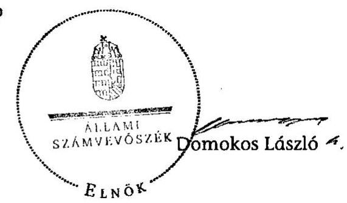

[^0]
[^0]:    ${ }^{158}$ A határidő 2012. augusztus 30. volt.

---

1. számú melléklet
a V-0031-088/2013. számú jelentéshez

# Helyszínen ellenőrzött szervezetek 

| Sorszám | Megnevezés |
| :--: | :--: |
| Minisztériumok |  |
| 1. | Nemzeti Fejlesztési Minisztérium |
| 2. | Nemzetgazdasági Minisztérium |
| Dokumentációs központ |  |
| 1. | VÁTI Magyar Regionális Fejlesztési és Urbanisztikai Nonprofit Kft. |
| Regionális fejlesztési ügynökségek |  |
| 1. | DARFÜ Dél-alföldi Regionális Fejlesztési Ügynökség Nonprofit Kft. |
| 2. | KDRFÜ Közép-Dunántúli Regionális Fejlesztési Ügynökség Közhasznú Nonprofit Kft. |
| 3. | NORDA Észak-Magyarországi Regionális Fejlesztési Ügynökség Közhasznú Nonprofit Kft. |
| Többcélú kistérségi társulások |  |
| 1. | Közép-dunántúli régió |
| 1.1. | Mezőföldi Többcélú Kistérségi Társulás (Enying, Fejér megye) |
| 1.2. | Velencei-tó Környéki Többcélú Kistérségi Társulás (Gárdony, Fejér megye) |
| 1.3. | Pápai Többcélú Kistérségi Társulás (Veszprém megye) |
| 2. | Észak-magyarországi régió |
| 2.1. | Edelényi Kistérség Többcélú Társulása (Borsod-Abaúj-Zemplén megye) |
| 2.2. | Miskolc Kistérség Többcélú Társulása (Borsod-Abaúj-Zemplén megye) |
| 2.3. | Szerencsi Többcélú Kistérségi Társulás (Borsod-Abaúj-Zemplén megye) |
| 2.4. | Szikszói Kistérségi Többcélú Társulás (Borsod-Abaúj-Zemplén megye) |
| 2.5. | Bélapátfalvai Kistérség Többcélú Társulása (Heves megye) |
| 2.6. | Egri Kistérség Többcélú Társulása (Heves megye) |
| 2.7. | Füzesabonyi Kistérség Többcélú Társulása (Heves megye) |
| 2.8. | Gyöngyös Körzete Kistérség Többcélú Társulása (Heves megye) |
| 2.9. | Hevesi Kistérség Többcélú Társulása (Heves megye) |
| 2.10. | Pétervásárai Kistérség Többcélú Társulása (Heves megye) |
| 2.11. | Pásztó Kistérség Többcélú Társulása (Nógrád megye) |
| 2.12. | Salgótarjáni Kistérség Többcélú Társulása (Nógrád megye) |
| 3. | Dél-alföldi régió |
| 3.1. | Bácsalmás Kistérségi Többcélú Társulása (Bács-Kiskun megye) |
| 3.2. | Jánoshalmi Többcélú Kistérségi Társulás (Bács-Kiskun megye) |
| 3.3. | Halasi Többcélú Kistérségi Társulás (Kiskunhalas, Bács-Kiskun megye) |
| 3.4. | Kiskunmajsai Többcélú Kistérségi Társulás (Bács-Kiskun megye) |
| 3.5. | Békési Kistérségi Társulás (Békés megye) |
| 3.6. | Hódmezővásárhelyi Többcélú Kistérségi Társulás (Csongrád megye) |
| 3.7. | Szegedi Kistérség Többcélú Társulása (Csongrád megye) |

---

# Kimutatás

a regionális fejlesztési tanácsok részére biztosított müködési forrásokról a 2007-2011. évek között*

|  Regionális fejlesztési tanács | 2007. év |  | 2008. év |  | 2009. év |  | 2010. év |  | 2011. év |   |
| --- | --- | --- | --- | --- | --- | --- | --- | --- | --- | --- |
|   | biztosított
forrás | fel nem
használt
forrás | biztosított
forrás | fel nem
használt
forrás | biztosított
forrás | fel nem
használt
forrás | biztosított
forrás | fel nem
használt
forrás | biztosított
forrás | fel nem
használt
forrás  |
|  Dél-Alföldi Regionális
Fejlesztési Tanács | 60000 | 0 | 60000 | 0 | 46700 | 646 | 50000 | 14092 | 45000 | 0  |
|  Dél-Dunántúli Regionális
Fejlesztési Tanács | 60000 | 0 | 60000 | 0 | 46700 | 0 | 50000 | 6275 | 45000 | 0  |
|  Észak-Alföldi Regionális
Fejlesztési Tanács | 60000 | 0 | 60000 | 0 | 46700 | 0 | 50000 | 0 | 45000 | 352  |
|  Észak-Magyarországi
Regionális Fejlesztési Tanács | 60000 | 0 | 60000 | 0 | 46700 | 2364 | 50000 | 6320 | 45000 | 2042  |
|  Közép-Dunántúli Regionális
Fejlesztési Tanács | 60000 | 0 | 60000 | 0 | 46700 | 0 | 50000 | 8208 | 45000 | 400  |
|  Közép-Magyarországi
Regionális Fejlesztési Tanács | 60000 | 0 | 60000 | 0 | 46700 | 0 | 50000 | 9000 | 45000 | 0  |
|  Nyugat-Dunántúli Regionális
Fejlesztési Tanács | 60000 | 0 | 60000 | 0 | 46700 | 0 | 50000 | 0 | 45000 | 0  |
|  Összesen | 420000 | 0 | 420000 | 0 | 326900 | 3010 | 350000 | 43896 | 315000 | 2793  |

- Forrás: NFM adatszolgáltatása

---

# Kimutatás

a kistérségi fejlesztési tanácsok részére biztosított müködési forrásokról a 2007-2011. évek között*

|  Kistérség | 2007. év |  | 2008. év |  | 2009. év |  | 2010. év |  | 2011. év |   |
| --- | --- | --- | --- | --- | --- | --- | --- | --- | --- | --- |
|   | biztosított
forrás | fel nem
használt
forrás | biztosított
forrás | fel nem
használt
forrás | biztosított
forrás | fel nem
használt
forrás | biztosított
forrás | fel nem
használt
forrás | biztosított
forrás | fel nem
használt
forrás  |
|  Bajai Többcélú Kistérségi Társulás | 5218 | - | 5105 | 0 | 2735 | 0 | 1000 | 0 | 1000 | 0  |
|  Bácsalmás Kistérségi Többcélú Társulás | 4183 | - | 4123 | 0 | 2548 | 0 | 1000 | 0 | 1000 | 0  |
|  Kalocsa Kistérség Többcélú Társulása | 5218 | - | 5105 | 0 | 3202 | 0 | 1000 | 0 | 1000 | 0  |
|  Kecskemét és Térsége Többcélú Társulás | 4331 | - | 4263 | 0 | 2641 | 0 | 1000 | 0 | 1000 | 0  |
|  Kiskőrösi Többcélú Kistérségi Társulás | 4664 | - | 4579 | 0 | 2852 | 0 | 1000 | 0 | 1000 | 0  |
|  Kiskunfélegyházi Többcélú Kistérségi
Önkormányzati Társulás | 4220 | - | 3632 | 0 | 2221 | 0 | 1000 | 0 | 1000 | 0  |
|  Kiskunhalasi Többcélú Kistérségi Társulás | 3998 | - | 3947 | 0 | - | - | - | - | - | -  |
|  Halasi Többcélú Kistérségi Társulás | - | - | - | - | 2431 | 0 | 1000 | 0 | 1000 | 0  |
|  Kiskunmaijasi Többcélú Kistérségi Társulás | 3444 | - | 3632 | - | 2221 | 0 | 1000 | 0 | 1000 | 0  |
|  Kunszentmiklósi Kistérség | 4109 | - | 4053 | 0 | - | - | - | - | - | -  |
|  Fehő-Kiskunsági és Dunamelléki Többcélú Kistérségi Társulás | - | - | - | - | 2501 | 0 | 1000 | 0 | 1000 | 0  |
|  Jánoshalmai Kistérség | 3592 | - | 3561 | 0 | 2174 | 0 | 1000 | 0 | 1000 | 0  |
|  Komlói Kistérség | 5107 | - | 5000 | 0 | 3132 | 0 | 1000 | 0 | 1000 | 0  |
|  Mohácsi Kistérség | 7769 | - | 7527 | 0 | 4815 | 0 | 1000 | 0 | 1000 | 0  |
|  Sásdi Kistérség | 6993 | - | 6790 | 0 | 4324 | 0 | 1000 | 0 | 1000 | 0  |
|  Sellyei Kistérség | 8176 | - | 7913 | 0 | 5072 | 0 | 1000 | 0 | 1000 | 0  |
|  Siklósi Kistérség | 8878 | - | 8579 | 0 | 5516 | 0 | 1000 | 1000 | 1000 | 0  |
|  Szigetvári Kistérség | 9802 | - | 9456 | 0 | - | - | - | - | - | -  |
|  Szigetvár - Dél-Zselic Többcélú Kistérségi Társulás | - | - | - | - | 6100 | 0 | 1000 | 0 | 1000 | 0  |
|  Pécsi Kistérség | 5884 | - | 5737 | 0 | 3623 | 0 | 1000 | 0 | 1000 | 0  |
|  Pécsvárudi Kistérség | 5107 | - | 5000 | 0 | 3132 | 0 | 1000 | 0 | 1000 | 0  |
|  Szentlőttnci Kistérség | 5958 | - | 5105 | 0 | 3202 | 0 | 1000 | 0 | 1000 | 0  |
|  Békéscsabai Kistérség | 3370 | - | 3421 | 0 | 2080 | 0 | 1000 | 0 | 1000 | 0  |
|  Mezőkovácsházai Kistérség | 5662 | - | 5526 | 0 | 3483 | 0 | 1000 | 0 | 1000 | 0  |
|  Orosházi Kistérség | 4109 | - | 4053 | 0 | 2501 | 0 | 1000 | 1000 | 1000 | 0  |
|  Sarkadi Kistérség | 4627 | - | 4544 | 0 | 2828 | 0 | 1000 | 0 | 1000 | 0  |
|  Szarvasi Kistérség | 3665 | - | 3842 | 0 | - | - | - | - | - | -  |
|  Körös-szögi Kistérség Többcélú Társulása | - | - | - | - | 2361 | 0 | 1000 | 0 | 1000 | 0  |
|  Szeghalomi Kistérség | 4331 | - | 4263 | 0 | 2641 | 0 | 1000 | 0 | 1000 | 0  |
|  Békési Kistérség | 4109 | - | 4263 | 0 | 2641 | 0 | 1000 | 0 | 1000 | 0  |
|  Gyulai Kistérség | 3444 | - | 3281 | 0 | 1987 | 0 | 1000 | 0 | 1000 | 0  |
|  Miskolci Kistérség | 5958 | - | 5807 | 0 | 3670 | 0 | 1000 | 0 | 1000 | 0  |
|  Edelényi Kistérség | 9802 | - | 9597 | 0 | 6194 | 0 | 1000 | 0 | 1000 | 0  |
|  Encsi Kistérség | 8176 | - | 8053 | 0 | 5165 | 0 | 1000 | 1000 | 1000 | 0  |

---

|  Kistérség | 2007. év |  | 2008. év |  | 2009. év |  | 2010. év |  | 2011. év |   |
| --- | --- | --- | --- | --- | --- | --- | --- | --- | --- | --- |
|   | biztosított
forrás | fel nem
használt
forrás | biztosított
forrás | fel nem
használt
forrás | biztosított
forrás | fel nem
használt
forrás | biztosított
forrás | fel nem
használt
forrás | biztosított
forrás | fel nem
használt
forrás  |
|  Kazincbarcikai Kistérség | 6660 | - | 6369 | 0 | 4044 | 0 | 1000 | 0 | 1000 | 0  |
|  Mezőkövesdi Kistérség | 5329 | - | 5211 | 0 | 3272 | 0 | 1000 | 0 | 1000 | 0  |
|  Özdi Kistérség | 7288 | - | 7070 | 0 | 4511 | 0 | 1000 | 0 | 1000 | 0  |
|  Sárospataki Kistérség | 5366 | - | 5246 | 0 | 3296 | 0 | 1000 | 0 | 1000 | 0  |
|  Sútonálpújhelyi Kistérség | 5107 | - | 5000 | 0 | 3132 | 0 | 1000 | 1000 | 1000 | 0  |
|  Szerencsi Kistérség | 5662 | - | 5526 | 0 | 3483 | 0 | 1000 | 1000 | 1000 | 0  |
|  Szikszói Kistérség | 6401 | - | 6228 | 0 | 3950 | 0 | 1000 | 1000 | 1000 | 0  |
|  Tiszaújvárosi Kistérség | 4775 | - | 4123 | 0 | 2548 | 0 | 1000 | 0 | 1000 | 0  |
|  Abaúj-Hegyközi Kistérség | 6549 | - | 6369 | 0 | 4044 | 0 | 1000 | 0 | 1000 | 0  |
|  Bodrogközi Kistérség | 5514 | - | 5386 | 0 | 3389 | 0 | 1000 | 0 | 1000 | 0  |
|  Mezőcsáti Kistérség | 4331 | - | 4263 | 0 | 2641 | 0 | 1000 | 0 | 1000 | 0  |
|  Tokaji Kistérség | 4627 | - | 4544 | 0 | 2828 | 0 | 1000 | 0 | 1000 | 0  |
|  Csongrádi Kistérség | 3444 | - | 3421 | 0 | 2080 | 0 | 1000 | 1 | 1000 | 0  |
|  Hódmezővásárhelyi Kistérség | 3296 | - | 3421 | 0 | 2080 | 0 | 1000 | 0 | 1000 | 0  |
|  Kisteleki Kistérség | 3887 | - | 3842 | 0 | 2361 | 0 | 1000 | 25 | 1000 | 0  |
|  Makói Kistérség | 4885 | - | 4790 | 0 | 2992 | 0 | 1000 | 0 | 1000 | 0  |
|  Mórahalomi Kistérség | 4331 | - | 4263 | 0 | - | - | - | - | - | -  |
|  Homokházi Kistérség Többcélú Társulása | - | - | - | - | 2641 | 0 | 1000 | 0 | 1000 | 0  |
|  Szegedi Kistérség | 3887 | - | 3842 | 0 | 2361 | 0 | 1000 | 1000 | 1000 | 0  |
|  Szentesi Kistérség | 3887 | - | 3842 | 0 | 2361 | 0 | 1000 | 0 | 1000 | 0  |
|  Bicskei Kistérség | 4183 | - | 4193 | 0 | - | - | - | - | - | -  |
|  Vértes Többcélú Kistérségi Önkormányzati Társulás | - | - | - | - | 2595 | 0 | 1000 | 0 | 1000 | 0  |
|  Dunaújvárosi Kistérség | 3665 | - | 3632 | 0 | 2221 | 0 | 1000 | 1000 | 1000 | 0  |
|  Enyingi Kistérség | 3998 | - | 3947 | 0 | - | - | - | - | - | -  |
|  Mezőföldi Többcélú Kistérségi Társulás | - | - | - | - | 2431 | 0 | 1000 | 0 | 1000 | 0  |
|  Gárdonyi Kistérség | 3592 | - | 3632 | 0 | - | - | - | - | - | -  |
|  Velencsí-tó Környéki Többcélú Kistérségi Társulás | - | - | - | - | 2221 | 0 | 1000 | 1000 | 1000 | 0  |
|  Móri Kistérség | 4035 | - | 3912 | 0 | 2408 | 0 | 1000 | 0 | 1000 | 3  |
|  Sárbogárdi Kistérség | 4109 | - | 4053 | 0 | 2501 | 0 | 1000 | 0 | 1000 | 0  |
|  Székesfehérvári Kistérség | 4331 | - | 4263 | 0 | 2641 | 0 | 1000 | 0 | 1000 | 0  |
|  Abai Kistérség | 3998 | - | 3947 | 0 | - | - | - | - | - | -  |
|  Sárvíz Többcélú Kistérségi Társulás | - | - | - | - | 2431 | 0 | 1000 | 1000 | 1000 | 0  |
|  Adonyi Kistérség | 3592 | - | 3561 | 0 | 2174 | 0 | 1000 |  | 1000 | 0  |
|  Ercsi Kistérség | 3518 | - | 3421 | 0 | - | - | - | - | - | -  |
|  Szent László Völgye Többcélú Kistérségi Társulás | - | - | - | - | 2080 | 0 | 1000 | 0 | 1000 | 0  |
|  Csomai Kistérség | 6771 | - | 6579 | 0 | 3389 | 1738 | 1000 | 1000 | 1000 | 0  |
|  Győri Kistérség | 4996 | - | 4895 | 0 | 3062 | 0 | 1000 | 1000 | 1000 | 0  |
|  Kapuvári Kistérség | 4405 | - | 4263 | 0 | - | - | - | - | - | -  |

---

|  Kistérség | 2007. év |  | 2008. év |  | 2009. év |  | 2010. év |  | 2011. év |   |
| --- | --- | --- | --- | --- | --- | --- | --- | --- | --- | --- |
|   | biztosított
forrás | fel nem
használt
forrás | biztosított
forrás | fel nem
használt
forrás | biztosított
forrás | fel nem
használt
forrás | biztosított
forrás | fel nem
használt
forrás | biztosított
forrás | fel nem
használt
forrás  |
|  Kapuvár-Beledi Kistérség Többcélú
Társulása | - | - | - | - | 2 641 | 0 | 1 000 | 0 | 1 000 | 0  |
|  Mosonmagyaróvári Kistérség | 4 922 | - | 4 825 | 0 | 3 015 | 0 | 1 000 | 0 | 1 000 | 0  |
|  Sopron–Fertődi Kistérség | 5 884 | - | 5 807 | 0 | 3 670 | 0 | 1 000 | 1 000 | 1 000 | 0  |
|  Téti Kistérség | 5 107 | - | 5 000 | 0 | - | - | - | - | - | -  |
|  Téti Kistérség Sokoróuljai
Önkormányzatainak Többcélú Társulása | - | - | - | - | 2 688 | 0 | 1 000 | 0 | 1 000 | 0  |
|  Pannonhalmai Kistérség | 4 996 | - | 4 263 | 0 | 2 641 | 0 | 1 000 | 0 | 1 000 | 0  |
|  Balmazújvárosi Kistérség | 3 592 | - | 3 561 | 0 | 2 174 | 0 | 1 000 | 0 | 1 000 | 0  |
|  Berettyóújfalai Kistérség | 7 288 | - | 7 070 | 0 | - | - | - | - | - | -  |
|  Bihari Önkormányzatok Többcélú
Kistérségi Társulása | - | - | - | - | 4 511 | 0 | 1 000 | 0 | 1 000 | 0  |
|  Debreceni Kistérség | - | - | 3 140 | 0 | - | - | - | - | - | -  |
|  Debrecen-Mikepércs Többcélú Kistérségi
Társulás | - | - | - | - | 1 893 | 0 | 1 000 | 0 | 1 000 | 0  |
|  Hajdúbőszörményi Kistérség | 3 333 | - | 3 316 | 0 | - | - | - | - | - | -  |
|  Hajdúsági Többcélú Kistérségi Társulás | - | - | - | - | 2 010 | 0 | 1 000 | 0 | 1 000 | 0  |
|  Hajdúszoboszlói Kistérség | 3 444 | - | 3 421 | 0 | 1 987 | 0 | 1 000 | 0 | 1 000 | 0  |
|  Polgári Kistérség | 3 887 | - | 3 632 | 0 | 2 221 | 0 | 1 000 | 0 | 1 000 | 0  |
|  Püspókladányi Kistérség | 4 922 | - | 4 825 | 0 | - | - | - | - | - | -  |
|  Sárréti Többcélú Kistérségi Társulás | - | - | - | - | 3 015 | 0 | 1 000 | 0 | 1 000 | 0  |
|  Derecske–Létavérési Kistérség | 4 220 | - | 4 404 | 0 | 2 735 | 0 | 1 000 | 0 | 1 000 | 0  |
|  Hajdúhadházi Kistérség | 4 627 | - | 4 544 | 0 | 2 828 | 0 | 1 000 | 0 | 1 000 | 0  |
|  Egri Kistérség | 4 035 | - | 4 193 | 0 | 2 595 | 0 | 1 000 | 0 | 1 000 | 0  |
|  Hevesi Kistérség | 5 514 | - | 5 386 | 0 | 3 389 | 0 | 1 000 | 0 | 1 000 | 0  |
|  Füzesabonyi Kistérség | 5 107 | - | 4 684 | 0 | 2 922 | 0 | 1 000 | 0 | 1 000 | 0  |
|  Gyöngyösi Kistérség | 4 775 | - | 4 754 | 0 | 2 968 | 0 | 1 000 | 0 | 1 000 | 0  |
|  Hatvani Kistérség | 4 331 | - | 3 912 | 0 | 2 408 | 0 | 1 000 | 0 | 1 000 | 0  |
|  Pétervásárai Kistérség | 5 958 | - | 5 807 | 0 | 3 670 | 0 | 1 000 | 0 | 1 000 | 0  |
|  Bélapútfalvai Kistérség | 4 922 | - | 4 368 | 0 | 2 711 | 0 | 1 000 | 0 | 1 000 | 0  |
|  Dorogi Kistérség | 4 109 | - | 4 053 | 0 | 2 501 | 0 | 1 000 | 1 000 | 1 000 | 0  |
|  Esztergomi Kistérség | 3 665 | - | 3 632 | 0 | 2 221 | 0 | 1 000 | 0 | 1 000 | 0  |
|  Kishéri Kistérség | 4 885 | - | 4 790 | 0 | 2 992 | 0 | 1 000 | 1 000 | 1 000 | 0  |
|  Komáromi Kistérség | 3 665 | - | 3 632 | 0 | - | - | - | - | - | -  |
|  Komárom-Bábolna Többcélú Kistérségi
Társulás | - | - | - | - | 2 221 | 0 | 1 000 | 0 | 1 000 | 0  |
|  Oroszlányi Kistérség | 3 665 | - | 3 632 | 0 | 2 080 | 0 | 1 000 | 0 | 1 000 | 0  |
|  Tutui Kistérség | 3 739 | - | 3 702 | 0 | 2 267 | 0 | 1 000 | 1 000 | 1 000 | 0  |
|  Tutuhányai Kistérség | 3 739 | - | 3 702 | 0 | 2 267 | 0 | 1 000 | 1 000 | 1 000 | 0  |
|  Balassagyarmati Kistérség | 6 105 | - | 6 053 | 0 | 3 155 | 0 | 1 000 | 300 | 1 000 | 0  |
|  Bátonyterenyei Kistérség | 5 070 | - | 4 965 | 0 | 3 109 | 0 | 1 000 | 0 | 1 000 | 0  |
|  Pásztói Kistérség | 5 884 | - | 5 737 | 0 | 3 623 | 0 | 1 000 | 0 | 1 000 | 0  |
|  Rétsági Kistérség | 5 773 | - | 5 632 | 0 | 2 968 | 0 | 1 000 | 0 | 1 000 | 0  |

---

|  Kistérség | 2007. év |  | 2008. év |  | 2009. év |  | 2010. év |  | 2011. év |   |
| --- | --- | --- | --- | --- | --- | --- | --- | --- | --- | --- |
|   | biztosított
forrás | fel nem
használt
forrás | biztosított
forrás | fel nem
használt
forrás | biztosított
forrás | fel nem
használt
forrás | biztosított
forrás | fel nem
használt
forrás | biztosított
forrás | fel nem
használt
forrás  |
|  Sulgótarjáni Kistérség | 6401 | - | 6369 | 0 | 4044 | 0 | 1000 | 0 | 1000 | 0  |
|  Szécsényi Kistérség | 4922 | - | 4825 | 0 | 3015 | 0 | 1000 | 1000 | 1000 | 0  |
|  Aszódi Kistérség | 3665 | - | 3632 | 0 | 2221 | 0 | 1000 | 0 | 1000 | 0  |
|  Ceglédi Kistérség | 4664 | - | 4053 | 0 | 2501 | 0 | 1000 | 0 | 1000 | 0  |
|  Duhusi Kistérség | 3739 | - | 3702 | 0 | - | - | - | - | - | -  |
|  Ország Közepe Többcélú Kistérségi Társulás | - | - | - | - | 2267 | 0 | 1000 | 1000 | 1000 | 0  |
|  Gödöllői Kistérség | 3961 | - | 3842 | 0 | 2361 | 0 | 1000 | 0 | 1000 | 0  |
|  Monori Kistérség | 4109 | - | 4053 | 0 | 2501 | 0 | 1000 | 0 | 1000 | 0  |
|  Nagykútui Kistérség | 4442 | - | 4123 | 0 | - | - | - | - | - | -  |
|  Tápló-vidéki Többcélú Kistérségi Társulás | - | - | - | - | 2548 | 0 | 1000 | 0 | 1000 | 0  |
|  Báckevei Kistérség | 4479 | - | 4404 | 0 | - | - | - | - | - | -  |
|  Carpel-Sziget és Környéke Többcélú
Önkormányzati Társulás | - | - | - | - | 2735 | 0 | 1000 | 0 | 1000 | 0  |
|  Szobi Kistérség | 4442 | - | 4368 | 0 | 2711 | 0 | 1000 | 0 | 1000 | 0  |
|  Váci Kistérség | 4405 | - | 4333 | 0 | - | - | - | - | - | -  |
|  Dunakanyar Többcélú Önkormányzati
Kistérségi Társulás | - | - | - | - | 2688 | 0 | 1000 | 1000 | 1000 | 0  |
|  Buduóni Kistérség | 3739 | - | 3702 | 0 | 2267 | 0 | 1000 | 0 | 1000 | 0  |
|  Dunakeszi Kistérség | 3222 | - | 3281 | 0 | 1987 | 0 | 1000 | 0 | 1000 | 0  |
|  Gyüli Kistérség | 3518 | - | 3351 | 0 | - | - | - | - | - | -  |
|  "Kertváros " Gyüli Kistérség Többcélú
Önkormányzati Társulás | - | - | - | - | 2034 | 0 | 1000 | 0 | 1000 | 0  |
|  Pilisvörösvári Kistérség | 4331 | - | 3982 | 0 | - | - | - | - | - | -  |
|  Pilis-Buda-Zsámbék Többcélú Kistérségi
Társulás | - | - | - | - | 2454 | 0 | 1000 | 1000 | 1000 | 0  |
|  Szentendrei Kistérség | 3961 | - | 3912 | 0 | - | - | - | - | - | -  |
|  Dunakanyari és Pilisi Önkormányzatok
Többcélú Kistérségi Társulása | - | - | - | - | 2408 | 0 | 1000 | 0 | 1000 | 0  |
|  Veresegyházi Kistérség | 3592 | - | 3561 | 0 | 2174 | 0 | 1000 | 0 | 1000 | 0  |
|  Érdi Kistérség | - | - | 3281 | 0 | 1987 | 0 | 1000 | 0 | 1000 | 0  |
|  Barcsi Kistérség | 6845 | - | 6649 | 0 | 4230 | 0 | 1000 | 0 | 1000 | 0  |
|  Csurgói Kistérség | 5662 | - | 5526 | 0 | 3483 | 0 | 1000 | 0 | 1000 | 0  |
|  Fonyódi Kistérség | 4553 | - | 4158 | 0 | 2314 | 0 | 1000 | 0 | 1000 | 0  |
|  Kaposvári Kistérség | 8693 | - | 8685 | 0 | 5586 | 0 | 1000 | 0 | 1000 | 0  |
|  Lengyelőtti Kistérség | 4479 | - | 4404 | 0 | - | - | - | - | - | -  |
|  Pogányvölgyi Többcélú Kistérségi Társulás | - | - | - | - | 2735 | 0 | 1000 | 0 | 1000 | 0  |
|  Marcali Kistérség | 6771 | - | 7000 | 0 | 4464 | 0 | 1000 | 0 | 1000 | 0  |
|  Nagyatádi Kistérség | 4996 | - | 4895 | 0 | - | - | - | - | - | -  |
|  Rinyamenti Kistérség Többcélú
Önkormányzati Társulása | - | - | - | - | 3062 | 0 | 1000 | 0 | 1000 | 0  |
|  Siófoki Kistérség | 3739 | - | 3702 | 0 | 2267 | 0 | 1000 | 0 | 1000 | 0  |
|  Talti Kistérség | 6697 | - | 6369 | 0 | - | - | - | - | - | -  |
|  Kegyány-völgye Többcélú Kistérségi
Társulás | - | - | - | - | 4044 | 0 | 1000 | 0 | 1000 | 0  |

---

|  Kistérség | 2007. év |  | 2008. év |  | 2009. év |  | 2010. év |  | 2011. év |   |
| --- | --- | --- | --- | --- | --- | --- | --- | --- | --- | --- |
|   | biztosított
forrás | fel nem
használt
forrás | biztosított
forrás | fel nem
használt
forrás | biztosított
forrás | fel nem
használt
forrás | biztosított
forrás | fel nem
használt
forrás | biztosított
forrás | fel nem
használt
forrás  |
|  Balatonföldvári Kistérség | 4 442 | - | 4 368 | 0 | 2 408 | 0 | 1 000 | 0 | 1 000 | 0  |
|  Kadurkáti Kistérség | - | - | 6 228 | 0 | 3 950 | 0 | 1 000 | 0 | 1 000 | 0  |
|  Buktalórántházai Kistérség | 5 810 | - | 5 667 | 0 | - | - | - | - | - | -  |
|  Közép-Nyirségi Önkormányzati Többcélú
Kistérségi Társulás | - | - | - | - | 3 576 | 0 | 1 000 | 0 | 1 000 | 0  |
|  Csengeri Kistérség | 4 627 | - | 4 544 | 0 | 2 828 | 0 | 1 000 | 0 | 1 000 | 0  |
|  Fehérgyarmuti Kistérség | 10 246 | - | 9 878 | 0 | - | - | - | - | - | -  |
|  Felul-Tisza Vidéki Többcélú Kistérségi
Társulás | - | - | - | - | 6 380 | 0 | 1 000 | 0 | 1 000 | 0  |
|  Kisvárdai Kistérség | 6 549 | - | 5 211 | 0 | 3 272 | 0 | 1 000 | 0 | 1 000 | 0  |
|  Mátéuzálkai Kistérség | 6 845 | - | 6 649 | 0 | - | - | - | - | - | -  |
|  Szutmári Többcélú Kistérségi Társulás | - | - | - | - | 4 230 | 0 | 1 000 | 0 | 1 000 | 0  |
|  Nagykállói Kistérség | 4 331 | - | 3 947 | 0 | - | - | - | - | - | -  |
|  Dél-Nyirségi Többcélú Önkormányzati
Kistérségi Társulás | - | - | - | - | 2 431 | 0 | 1 000 | 0 | 1 000 | 0  |
|  Nyírbátori Kistérség | 5 958 | - | 5 807 | 0 | 3 670 | 0 | 1 000 | 0 | 1 000 | 0  |
|  Nyíregyházai Kistérség | 3 665 | - | 3 632 | 0 | - | - | - | - | - | -  |
|  Nyirségi Többcélú Kistérségi Társulás | - | - | - | - | 2 221 | 0 | 1 000 | 0 | 1 000 | 0  |
|  Tiszavasvári Kistérség | 4 109 | - | 4 404 | 0 | 2 735 | 0 | 1 000 | 0 | 1 000 | 0  |
|  Vásárosnaményi Kistérség | 6 993 | - | 6 790 | 0 | - | - | - | - | - | -  |
|  Beregi Többcélú Kistérségi Önkormányzati
Társulás | - | - | - | - | 4 324 | 0 | 1 000 | 0 | 1 000 | 0  |
|  Ibrány-Nagyhalászi Kistérség | 5 514 | - | 5 386 | 0 | - | - | - | - | - | -  |
|  Közép-Szabolcsi Kistérségi Többcélú
Társulás | - | - | - | - | 3 389 | 0 | 1 000 | 0 | 1 000 | 0  |
|  Záhonyi Kistérség | - | - | 4 158 | 0 | 2 571 | 0 | 1 000 | 0 | 1 000 | 0  |
|  Jászberényi Kistérség | 4 996 | - | 4 895 | 0 | 3 062 | 0 | 1 000 | 0 | 1 000 | 0  |
|  Karcagi Kistérség | 3 555 | - | 3 526 | 0 | 2 151 | 0 | 1 000 | 1 000 | 1 000 | 0  |
|  Kunszentmártoni Kistérség | 4 627 | - | 4 544 | 0 | 2 828 | 0 | 1 000 | 0 | 1 000 | 0  |
|  Szolnoki Kistérség | 4 257 | - | 4 263 | 0 | 2 641 | 0 | 1 000 | 1 000 | 1 000 | 0  |
|  Tiszafüredi Kistérség | 4 922 | - | 4 825 | 965 | 3 015 | 0 | 1 000 | 0 | 1 000 | 0  |
|  Törökszentmiklósi Kistérség | 3 998 | - | 3 842 | 0 | 2 361 | 0 | 1 000 | 0 | 1 000 | 0  |
|  Mezőtári Kistérség | 3 555 | - | 3 526 | 0 | - | - | - | - | - | -  |
|  Berettyó-Körös Többcélú Társulás | - | - | - | - | 2 151 | 0 | 1 000 | 0 | 1 000 | 0  |
|  Bonybádi Kistérség | 5 329 | - | 4 474 | 0 | - | - | - | - | - | -  |
|  Völgységi Többcélú Kistérségi Társulás | - | - | - | - | 2 782 | 0 | 1 000 | 0 | 1 000 | 0  |
|  Dombóvári Kistérség | 4 775 | - | 4 684 | 0 | 2 922 | 0 | 1 000 | 0 | 1 000 | 0  |
|  Puksi Kistérség | 4 553 | - | 3 982 | 0 | 2 454 | 0 | 1 000 | 0 | 1 000 | 0  |
|  Szekszárdi Kistérség | 4 922 | - | 4 825 | 0 | 3 015 | 128 | 1 000 | 0 | 1 000 | 0  |
|  Tamási Kistérség | 7 584 | - | 7 491 | 0 | - | - | - | - | - | -  |
|  Tamási-Simontornyai Kistérség Többcélú
Társulás | - | - | - | - | 4 791 | 0 | 1 000 | 0 | 1 000 | 0  |
|  Celláömölki Kistérség | 6 105 | - | 5 948 | 0 | 3 109 | 0 | 1 000 | 0 | 1 000 | 1 083  |
|  Csepregi Kistérség | 4 257 | - | 4 123 | 0 | - | - | - | - | - | -  |

---

|  Kistérség | 2007. év |  | 2008. év |  | 2009. év |  | 2010. év |  | 2011. év |   |
| --- | --- | --- | --- | --- | --- | --- | --- | --- | --- | --- |
|   | biztonlott
forrás | fel nem
használt
forrás | biztonlott
forrás | fel nem
használt
forrás | biztonlott
forrás | fel nem
használt
forrás | biztonlott
forrás | fel nem
használt
forrás | biztonlott
forrás | fel nem
használt
forrás  |
|  Felső-Répcementi Többcélú Kistérségi
Társulás | - | - | - | - | 2 548 | 0 | 1 000 | 0 | 1 000 | 0  |
|  Körmendi Kistérség | 4 848 | - | 4 754 | 0 | 2 968 | 0 | 1 000 | 0 | 1 000 | 0  |
|  Közzegi Kistérség | 4 109 | - | 4 053 | 0 | 2 501 | 0 | 1 000 | 0 | 1 000 | 0  |
|  Örszzentpéteri Kistérség | 6 253 | - | 5 316 | 0 | - | - | - | - | - | -  |
|  Örségi Többcélú Kistérségi Társulás | - | - | - | - | 3 342 | 0 | 1 000 | 0 | 1 000 | 0  |
|  Sárvári Kistérség | 5 292 | - | 5 246 | 0 | 3 296 | 0 | 1 000 | 1 000 | 1 000 | 0  |
|  Szentgotthárdi Kistérség | 4 109 | - | 4 053 | 0 | 2 501 | 0 | 1 000 | 0 | 1 000 | 118  |
|  Szombathelyi Kistérség | 5 958 | - | 5 807 | 0 | 3 670 | 0 | 1 000 | 0 | 1 000 | 0  |
|  Vasvári Kistérség | 5 551 | - | 5 421 | 0 | - | - | - | - | - | -  |
|  "Vasi Hagyhát" Többcélú Kistérségi
Társulás | - | - | - | - | 3 413 | 0 | 1 000 | 0 | 1 000 | 0  |
|  Ajkai Kistérség | 7 325 | - | 5 737 | 0 | - | - | - | - | - | -  |
|  Új Atlantisz Többcélú Kistérségi Társulás | - | - | - | - | 3 623 | 0 | 1 000 | 0 | 1 000 | 0  |
|  Balatonulmádi Kistérség | 3 887 | - | 3 772 | 0 | - | - | - | - | - | -  |
|  Kelet-Balutoni Kistérség Többcélú Társulása | - | - | - | - | 2 314 | 0 | 1 000 | 0 | 1 000 | 0  |
|  Balatonfüredi Kistérség | 4 479 | - | 4 474 | 0 | 2 782 | 0 | 1 000 | 0 | 1 000 | 0  |
|  Pápai Kistérség | 8 434 | - | 6 439 | 0 | 4 090 | 0 | 1 000 | 0 | 1 000 | 0  |
|  Sümegi Kistérség | 5 329 | - | 5 211 | 0 | 3 272 | 0 | 1 000 | 1 000 | 1 000 | 0  |
|  Tupolcai Kistérség | 6 660 | - | 6 474 | 0 | - | - | - | - | - | -  |
|  Tupolca és Környéke Kistérség Többcélú
Társulása | - | - | - | - | 3 342 | 0 | 1 000 | 0 | 1 000 | 0  |
|  Várpalotai Kistérség | 3 444 | - | 3 491 | 0 | 2 127 | 0 | 1 000 | 0 | 1 000 | 0  |
|  Veszprémi Kistérség | 4 479 | - | 4 404 | 0 | 2 735 | 0 | 1 000 | 0 | 1 000 | 0  |
|  Zirci Kistérség | 4 885 | - | 4 123 | 0 | 2 548 | 0 | 1 000 | 0 | 1 000 | 0  |
|  Keszthely–Hévizi Kistérség | 4 996 | - | - | - | - | - | - | - | - | -  |
|  Keszthelyi Kistérség | - | - | 4 123 | 0 | 2 548 | 0 | 1 000 | 0 | 1 000 | 0  |
|  Hévizi Kistérség | - | - | 3 561 | 0 | 2 174 | 0 | 1 000 | 0 | 1 000 | 0  |
|  Lenti Kistérség | 6 771 | - | 6 579 | 0 | 4 184 | 0 | 1 000 | 1 000 | 1 000 | 0  |
|  Letenyei Kistérség | 6 105 | - | 5 842 | 0 | - | - | - | - | - | -  |
|  Dél-Zalú Muraltól Letenye Többcélú
Társulás | - | - | - | - | 3 693 | 0 | 1 000 | 0 | 1 000 | 0  |
|  Nagykanizsai Kistérség | 6 549 | - | 4 895 | 0 | 3 062 | 0 | 1 000 | 0 | 1 000 | 0  |
|  Zalaegerszegi Kistérség | 8 841 | - | 7 562 | 0 | 4 838 | 0 | 1 000 | 0 | 1 000 | 0  |
|  Zalaszentgróti Kistérség | 5 662 | - | 5 526 | 0 | - | - | - | - | - | -  |
|  ZalA-KAR Térségi Innovációs Társulás | - | - | - | - | 3 483 | 0 | 1 000 | 0 | 1 000 | 0  |
|  Pacsai Kistérség | - | - | 5 105 | 0 | 3 202 | 0 | 1 000 | 1 000 | 1 000 | 0  |
|  Zalakaroni Kistérség | - | - | 5 000 | 0 | 3 132 | 0 | 1 000 | 0 | 1 000 | 0  |
|  Somló Környéke Többcélú Kistérségi
Társulás | - | - | - | - | - | - | - | - | 1 000 | 0  |
|  Összesen | 840 003 | - | 840 000 | 965 | 520 000 | 1 866 | 173 000 | 27 326 | 174 000 | 1 204  |

- Forrás: NFM adatszolgáltatása

---

# Kimutatás 

## a 16/2010. (II. 5.) Korm. rendelet alapján beküldött dokumentumokról a Dokumentációs Központban*

2013. I. 17-i állapot szerint

| 1. § |  | A dokumentum típusa | A listában található dokumentumok száma |
| :--: | :--: | :--: | :--: |
| a | aa | országos területfejlesztési koncepció | 0 |
|  |  | megyei területfejlesztési koncepció | 11 |
|  |  | megyei területfejlesztési program |  |
|  |  | kiemelt térség területfejlesztési koncepció | 4 |
|  |  | kiemelt térség területfejlesztési program |  |
|  | ab | régió területfejlesztési koncepció | 3 |
|  |  | régió területfejlesztési program | 6 |
|  |  | kistérség területfejlesztési koncepció | 118 |
|  |  | kistérség területfejlesztési program |  |
|  | ac | Országos Területrendezési Terv | 0 |
|  |  | kiemelt térség területrendezési terve | 1 |
|  | ad | megyei területrendezési terv | 24 |
| b | ba | megalapozó munkarészek | 10 |
|  | bb | megalapozó munkarészek | 16 |
|  | bc | területrendezési tanulmánytervek | 0 |
|  | c | területi hatásvizsgálat | 41 |
|  | d | területi kutatás | 0 |
|  | e | tanácsi ülési jegyzőkönyvek | 83 |
|  | f | önkéntesen átadott dokumentációk, gyűjtemények, dokumentumtárak | 0 |
|  | g | az országos, kiemelt térségi és megyei szintű monitoring jelentés, éves elemző jelentés, a területi folyamatok alakulásáról szóló jelentés; | 0 |
|  | h | az országos, kiemelt térségi és megyei szintű fejlesztési koncepció, program és terv értékelő, elemző jelentése | 2 |

* Forrás: VÁTI adatszolgáltatása

---

# **Kimutatás**

# **a regionális fejlesztési tanácsok Tftv.-ben előírt kötelezettségeinek teljesítéséről**

|   | Kérdés | Jogszabályi
hivatkozás | NYDRFT | KDRFT | DDRFT | KMRFT | ÉMRFT | ÉARFT | DARFT  |
| --- | --- | --- | --- | --- | --- | --- | --- | --- | --- |
|  1. | Az RFT rendelkezik-e Alapító Okirattal? | Tftv.16. § (2)
bekezdés | I¹ | N | I¹ | I¹ | N | N | N  |
|  2. | Rendelkezett-e az RFT szabályos SZMSZ-el a
2007-2011. időszakban? | Tftv. 16. § (5)
bekezdés | I | I | I | I | I | I | I  |
|  3. | Kidolgozta-e a régió hosszú és középtávú
területfejlesztési koncepcióját a 2007-2011.
években? | Tftv. 17. § (2)
bekezdés b) pont | I² | N | I² | N⁴ | I² | I | N⁶  |
|  4. | Kidolgozta-e a területfejlesztési koncepcióhoz
kapcsolódóan a régió fejlesztési programját,
beleértve a stratégiai és operatív munkarészeket
a 2007-2011. években? | Tftv. 17. § (2)
bekezdés b) pont | I¹ | I | I⁶ | N⁴ | I | I | N⁶  |
|  5. | Elfogadott-e pénzügyi tervet a programok
megvalósítására? | Tftv. 17. § (2)
bekezdés d) pont |  |  |  |  |  |  |   |
|   | 2007. évben |  | I | I | I | N | I | N | I  |
|   | 2008. évben |  | I | I | I | N | I | N | I  |
|   | 2009. évben |  | I | I | I | N | I | N | I  |
|   | 2010. évben |  | I | N | I | N | I | N | I  |
|   | 2011. évben |  | N | N | I | N | I | N | I  |
|  6. | Forrásgyűjtési tevékenység bevételei | Tftv. 17. § (2)
bekezdés e) pont |  |  |  |  |  |  |   |
|   | 2007. évben |  | 0 | 0 | 0 | 95,7 ⁹ | 0 | 0 | 0  |
|   | 2008. évben |  | 0 | 0 | 0 | 86,1 ⁹ | 0 | 0 | 0  |
|   | 2009. évben |  | 0 | 0 | 0 | 136,6 ⁹ | 0 | 0 | 0  |
|   | 2010. évben |  | 0 | 0 | 0 | 47,9 ⁹ | 0 | 0 | 0  |
|   | 2011. évben |  | 0 | 0 | 0 | 47,5 ⁹ | 0 | 0 | 0  |
|  7. | A fejlesztési programok megvalósításáról
tájékoztatta-e a területfejlesztésért felelős
minisztert a 2007-2011. években? | Tftv. 17. § (2)
bekezdés g) pont | I | I | I | I | I | I | I  |
|  8. | Véleményezett-e országos, ágazati fejlesztési
koncepciókat, programokat, területrendezési
terveket a 2007-2011. években? | Tftv. 17. § (2)
bekezdés j) pont | I | I | I | I | I | N | I¹⁰  |
|  9. | Javaslatot dolgozott-e ki a régió társadalmi –
gazdasági válsághelyzetének enyhítésére a 2007-
2011. években? | Tftv. 17. § (2)
bekezdés k) pont | I | I | I | N | I | N | I  |
|  10. | Kidolgozott-e a költségvetési törvényben
előirányzott decentralizált támogatási keret
felhasználására finanszírozási javaslatot? | Tftv. 17. § (3)
bekezdés b) pont |  |  |  |  |  |  |   |
|   | 2007. évben |  | I | I | N | I | N | N | I  |
|   | 2008. évben |  | I | I | N | I | N | N | I  |
|   | 2009. évben |  | I | I | N | I | N | N | I  |
|   | 2010. évben |  | N | N | N | N | N | N | N  |
|   | 2011. évben |  | N | N | N | N | N | N | N  |
|  11/a. | Decentralizált támogatási keretek összege
törvény szerint CÉDE,TEKI,TEUT,TRFC a
Vásárhelyi Terv nélkül (MFI) |  |  |  |  |  |  |  |   |
|   | 2007. évben |  | 2 392,5 | 2 500,6 | 3 685,6 | 6 110,0 | 5 032,0 | 6 393,5 | 4 233,1  |
|   | 2008. évben |  | 2 081,7 | 1 964,7 | 2 848,9 | 5 224,5 | 3 239,3 | 3 641,0 | 2 969,9  |
|   | 2009. évben |  | 2 046,9 | 1 937,7 | 2 796,0 | 5 189,3 | 3 166,5 | 3 576,3 | 2 957,3  |
|  11/b. | Decentralizált támogatási keretek
felhasználható összege CÉDE,TEKI,TEUT,TRFC
a Vásárhelyi Terv nélkül (MFI) |  |  |  |  |  |  |  |   |
|   | 2007. évben |  | 961,2 | 825,0 | 910,5 | 3 680,7 | 1 199,7 | 1 031,8 | 957,7  |
|   | 2008. évben |  | 1 872,4 | 1 709,0 | 2 456,8 | 4 878,3 | 2 736,9 | 3 001,4 | 2 504,9  |
|   | 2009. évben |  | 1 754,1 | 1 629,0 | 2 307,9 | 4 751,4 | 2 552,7 | 2 818,3 | 2 355,7  |

---

|  | Kérdés | Jogszabályi hivatkozás | NyDRFT | KDRFT | DDRFT | KMRFT | ÉMRFT | ÉARFT | DARFT |
| :--: | :--: | :--: | :--: | :--: | :--: | :--: | :--: | :--: | :--: |
| 12. | Kötött-e megállapodást az illetékes miniszterrel a régió programja feladatai megvalósításához szükséges források felhasználásáról? |  |  |  |  |  |  |  |  |
|  | 2007. évben |  | I | I | I | I | I | I | I |
|  | 2008.évben |  | I | I | I | I | I | I | I |
|  | 2009.évben |  | I | I | I | I | I | I | I |
|  | 2010. évben |  | I | I | I | I | N | I | I |
|  | 2011. évben |  | I | I | I | N | N | I | I |
| 13. | Müködött-e az RFT-nél Monitoring Bizottság a 2007-2011. években? | Tftv. 17. § (3) bekezdés e) pont | N | $I^{11}$ | I | I | N | I | N |
| 14. | Beszámolt-e a Kormánynak az előző évre ütemezett feladatok megvalósításáról, a középtávú fejlesztési program megvalósulásáról, az RFT és kormányszervek közötti megállapodásokban foglaltak végrehajtásáról a 2007-2011. években? | Tftv. 17. § (3) bekezdés f) pont | I | I | $\mathrm{N}^{12}$ | I | I | I | I |

* Forrás: A regionális fejlesztési ügynökségek által kitöltött tanúsítványok.
${ }^{1}$ Az adatszolgáltatással érintett NYDRFT, a DDRFT, a KMRFT a beküldött tanúsítványok szerint az alapszabályt alapító okiratnak tekintette.
${ }^{2}$ Az adatszolgáltatással érintett NYDRFT által 2007-ben elfogadott Nyugat-dunántúli Régió Átfogó Fejlesztési Program(2007-2013).
${ }^{3}$ Az adatszolgáltatással érintett DDRFT a tanúsítványon a DDOP és a DDRTOP programokat területfejlesztési koncepciónak tüntette fel.
${ }^{4}$ Az adatszolgáltatással érintett KMRFT a beküldött tanúsítvány szerint a az ellenőrzött időszakot megelőzően fogadta el a 2007-2013. évekre vonatkozó stratégiai tervet, amely kiegészítő tájékoztatásuk szerint a régió területfejlesztési koncepciójának és programjának tekinthető.
${ }^{5}$ A helyszínen ellenőrzött ÉMRFT koncepcionális elemeket is tartalmazó stratégiával rendelkezett, hosszútávú koncepcióval nem.

* A helyszínen ellenőrzött DARFT az ellenőrzött időszakot megelőzően fogadta el hosszútávú területfejlesztési koncepciót és a stratégiai, operatív programját.
${ }^{6}$ Az adatszolgáltatással érintett NYDRFT által 2006-ban elfogadott Nyugat-dunántúli Operatív Program (2007-2013).
* Az adatszolgáltatással érintett DDRFT a tanúsítványon az akcióterveket tüntette fel programként, kiegészítő tájékoztatásuk szerint a DDOP megalapozására 5 db stratégiai fejlesztési program került kidolgozásra.
* Az adatszolgáltatással érintett KMRFT a beküldött tanúsítvány szerint forrásgyűjtési tevékenység bevételeként tekintette a pályázati díjulkat, valamint a tagdíjukat.
${ }^{10}$ A helyszínen ellenőrzött DARFT a tanúsítványok szerint projekteket véleményezett.
${ }^{11}$ A KDRFT SZMSZ-e szerint létrehozták, de a helyszíni ellenőrzés megállapítása szerint a gyakorlatban a Monitoring Bizottság nem működött.
${ }^{12}$ Az adatszolgáltatással érintett DDRFT a beküldött tanúsítvány szerint a miniszternek számolt be.

---

# Kimutatás 

a kistérségi fejlesztési tanácsok Tftv.-ben elöírt kötelezettségeinek teljesítéséröl*

| Kérdések | Jogszabályi hivatkozás | Ellenőr-   zött   időszak | Kistérségi fejlesztési tanácsok |  |  |  |
| :--: | :--: | :--: | :--: | :--: | :--: | :--: |
|  |  |  | Száma |  | Megoszlás \% |  |
|  |  |  | Igen | Nem | Igen | Nem |
| Rendelkezett-e Alapító Okirattal a kistérségi fejlesztési tanács? | Tftv. 10/A. § | 2007-2011 | 0 | 174 | 0 | 100,00\% |
| Rendelkezett-e a kistérségi fejlesztési tanács szabályos SZMSZszel a 2007-2011. időszakban? | Tftv. 10/D. §   (6) bekezdés | $\begin{aligned} & 2007 \\ & 2008 \\ & 2009 \\ & 2010 \\ & 2011 \end{aligned}$ | $\begin{aligned} & 101 \\ & 110 \\ & 113 \\ & 114 \\ & 116 \end{aligned}$ | $\begin{aligned} & 73 \\ & 64 \\ & 61 \\ & 60 \\ & 58 \end{aligned}$ | $\begin{aligned} & 58,05 \% \\ & 63,22 \% \\ & 64,94 \% \\ & 65,52 \% \\ & 66,67 \% \end{aligned}$ | $\begin{aligned} & 41,95 \% \\ & 36,78 \% \\ & 35,06 \% \\ & 34,48 \% \\ & 33,33 \% \end{aligned}$ |
| Rendelkezett-e a kistérség hosszú és középtávú területfejlesztési koncepcióval az alábbi években? | Tftv. 10/C. §   (2) bekezdés b)   pont | $\begin{aligned} & 2007 \\ & 2008 \\ & 2009 \\ & 2010 \\ & 2011 \end{aligned}$ | $\begin{aligned} & 104 \\ & 106 \\ & 109 \\ & 110 \\ & 110 \\ & 110 \end{aligned}$ | $\begin{aligned} & 70 \\ & 68 \\ & 65 \\ & 64 \\ & 64 \end{aligned}$ | $\begin{aligned} & 59,77 \% \\ & 60,92 \% \\ & 62,64 \% \\ & 63,22 \% \\ & 63,22 \% \end{aligned}$ | $\begin{aligned} & 40,23 \% \\ & 39,08 \% \\ & 37,36 \% \\ & 36,78 \% \\ & 36,78 \% \end{aligned}$ |
| Rendelkezett-e a kistérség a területfejlesztési koncepcióhoz kapcsolódó területfejlesztési programmal az alábbi években? | Tftv. 10/C. §   (2) bekezdés b)   pont | $\begin{aligned} & 2007 \\ & 2008 \\ & 2009 \\ & 2010 \\ & 2011 \end{aligned}$ | $\begin{aligned} & 74 \\ & 75 \\ & 77 \\ & 78 \\ & 78 \\ & 78 \end{aligned}$ | $\begin{aligned} & 99 \\ & 99 \\ & 97 \\ & 96 \\ & 96 \end{aligned}$ | $\begin{aligned} & 42,53 \% \\ & 43,10 \% \\ & 44,25 \% \\ & 44,83 \% \\ & 44,83 \% \end{aligned}$ | $\begin{aligned} & 56,90 \% \\ & 56,90 \% \\ & 55,75 \% \\ & 55,17 \% \end{aligned}$ |
| Fogadott-e el pénzügyi tervet a programok megvalósításához az alábbi évekre vonatkozóan? | Tftv. 10/C. §   (2) bekezdés c)   pont | $\begin{aligned} & 2007 \\ & 2008 \\ & 2009 \\ & 2010 \\ & 2011 \end{aligned}$ | $\begin{aligned} & 26 \\ & 27 \\ & 27 \\ & 23 \\ & 23 \end{aligned}$ | $\begin{aligned} & 148 \\ & 147 \\ & 147 \\ & 151 \\ & 151 \end{aligned}$ | $\begin{aligned} & 14,94 \% \\ & 15,52 \% \\ & 15,52 \% \\ & 13,22 \% \\ & 13,22 \% \end{aligned}$ | $\begin{aligned} & 85,06 \% \\ & 84,48 \% \\ & 84,48 \% \\ & 86,78 \% \\ & 86,78 \% \end{aligned}$ |
| Végzett-e forrásgyűjtési tevékenységet a területfejlesztési feladataihoz az alábbi években? | Tftv. 10/C. §   (2) bekezdés h)   pont | $\begin{aligned} & 2007 \\ & 2008 \\ & 2009 \\ & 2010 \\ & 2011 \end{aligned}$ | $\begin{aligned} & 92 \\ & 86 \\ & 86 \\ & 80 \\ & 80 \end{aligned}$ | $\begin{aligned} & 82 \\ & 88 \\ & 88 \\ & 94 \\ & 94 \end{aligned}$ | $\begin{aligned} & 52,87 \% \\ & 49,43 \% \\ & 49,43 \% \\ & 45,98 \% \end{aligned}$ | $\begin{aligned} & 47,13 \% \\ & 50,57 \% \\ & 50,57 \% \\ & 54,02 \% \end{aligned}$ |
| Nyújtott-e be pályázatot a kistérség fejlesztéséhez kapcsolódó források igényléséhez az alábbi években? | Tftv. 10/C. §   (2) bekezdés l)   pont | $\begin{aligned} & 2007 \\ & 2008 \\ & 2009 \\ & 2010 \\ & 2011 \end{aligned}$ | $\begin{aligned} & 108 \\ & 132 \\ & 124 \\ & 112 \\ & 101 \end{aligned}$ | $\begin{aligned} & 66 \\ & 42 \\ & 50 \\ & 62 \\ & 73 \end{aligned}$ | $\begin{aligned} & 62,07 \% \\ & 75,86 \% \\ & 71,26 \% \\ & 64,37 \% \\ & 58,05 \% \end{aligned}$ | $\begin{aligned} & 37,93 \% \\ & 24,14 \% \\ & 28,74 \% \\ & 35,63 \% \\ & 41,95 \% \end{aligned}$ |
| Véleményezett-e megyei, regionális fejlesztési koncepciókat, programokat, a kistérséget érintő intézkedéseket az alábbi években? | Tftv. 10/C. §   (2) bekezdés f)   pont | $\begin{aligned} & 2007 \\ & 2008 \\ & 2009 \\ & 2010 \\ & 2011 \end{aligned}$ | $\begin{aligned} & 60 \\ & 47 \\ & 28 \\ & 25 \\ & 28 \end{aligned}$ | $\begin{aligned} & 114 \\ & 127 \\ & 146 \\ & 149 \\ & 146 \end{aligned}$ | $\begin{aligned} & 34,48 \% \\ & 27,01 \% \\ & 16,09 \% \\ & 14,37 \% \\ & 16,09 \% \end{aligned}$ | $\begin{aligned} & 65,52 \% \\ & 72,99 \% \\ & 83,91 \% \\ & 85,63 \% \\ & 83,91 \% \end{aligned}$ |
| Rendelkezett-e elkülönült költségvetéssel az alábbi években? | Tftv. 10/C. §   (2) bekezdés   m) pont | $\begin{aligned} & 2007 \\ & 2008 \\ & 2009 \\ & 2010 \\ & 2011 \end{aligned}$ | $\begin{aligned} & 81 \\ & 82 \\ & 82 \\ & 86 \\ & 85 \end{aligned}$ | $\begin{aligned} & 93 \\ & 92 \\ & 92 \\ & 88 \\ & 89 \end{aligned}$ | $\begin{aligned} & 46,55 \% \\ & 47,13 \% \\ & 47,13 \% \\ & 49,43 \% \\ & 48,85 \% \end{aligned}$ | $\begin{aligned} & 53,45 \% \\ & 52,87 \% \\ & 52,87 \% \\ & 50,57 \% \\ & 51,15 \% \end{aligned}$ |

*Forrás: A 174 többcélú kistérségi társulás által kitöltött tanúsítvány, az ASZ rendelkezésére bocsátott dokumentumok.

---

# Kimutatás

a regionális operatív programok 2007-2013 közötti pénzügyi kereteiről és felhasználásukról 2011. december 31-ig

|  Megnevezés | DARFT | DDRFT | EARFT | EMRFT | KDRFT | KMRFT | NyDRFT | Régiók összesen  |
| --- | --- | --- | --- | --- | --- | --- | --- | --- |
|  A regionális fejlesztési tanács kiemelt projektre tett javaslatainak száma (db) ${ }^{1}$ | 146,0 | 44,0 | 159,0 | 107,0 | 41,0 | 125,0 | 41,0 | 663,0  |
|  Pályáztatás nélküli, elfogadott kiemelt projektek száma (db) ${ }^{2,3}$ | 21,0 | 19,0 | 32,0 | 28,0 | 20,0 | 56,0 | 26,0 | 202,0  |
|  Pályáztatás nélküli, elfogadott kiemelt projektek támogatásának összege (M Ft) ${ }^{2,3}$ | 22290,4 | 43119,5 | 26296,5 | 30836,8 | 19488,8 | 126573,6 | 26413,5 | 295019,2  |
|  Egy projektre jutó támogatás (M Ft) | 1061,4 | 2269,4 | 821,8 | 1101,3 | 974,4 | 2260,2 | 1015,9 | 1460,5  |
|  Pályáztatással kiválasztott projektek száma (db) ${ }^{2}$ | 1268,0 | 746,0 | 1391,0 | 1598,0 | 851,0 | 5713,0 | 886,0 | 12453,0  |
|  Pályáztatással kiválasztott projektek támogatásának összege (M Ft) ${ }^{2}$ | 134256,3 | 116153,6 | 154752,2 | 146739,9 | 90886,0 | 236065,0 | 78475,1 | 957328,1  |
|  Egy projektre jutó támogatás (M Ft) | 105,9 | 155,7 | 111,3 | 91,8 | 106,8 | 41,3 | 88,6 | 76,9  |
|  Összes ROP támogatás 2007-2011 között (M Ft) ${ }^{2}$ | 156546,7 | 159273,1 | 181048,7 | 177576,8 | 110374,7 | 362638,7 | 104888,6 | 1252347,3  |
|  Kiemelt projektek támogatásának aránya | $14,2 \%$ | $27,1 \%$ | $14,5 \%$ | $17,4 \%$ | $17,7 \%$ | $34,9 \%$ | $25,2 \%$ | $23,6 \%$  |
|  Pályáztatással kiválasztott projektek támogatásának aránya | $85,8 \%$ | $72,9 \%$ | $85,5 \%$ | $82,6 \%$ | $82,3 \%$ | $65,1 \%$ | $74,8 \%$ | $76,4 \%$  |
|  A ROP-ok pénzügyi kerete 2007-2013 között (M Ft) ${ }^{4}$ | 246635,4 | 232280,4 | 321199,6 | 297697,2 | 167314,8 | 483311,7 | 152765,7 | 1901204,8  |

${ }^{1}$ Forrás: Regionális fejlesztési ügynökségek által kitöltött tanúsítványok, az RFÜ-k által jelzett halmozódások kiszűrésével ${ }^{2}$ Forrás: NFM adatszolgáltatása ${ }^{3}$ A DARFT esetében az elfogadott kiemelt projektek száma és összege nem tartalmaz 8 db , a 4-5 számjegyű utak felújítására vonatkozóan jóváhagyott kiemelt projektet. E projektek akciótervi nevesítéséről 2010. március 24-én döntött a Kormány, a projektfejlesztési szakaszt követően a támogatási szerződések 2011. december 30-án léptek hatályba. A Kormány a kiírás keretét az 1081/2012. (III. 28.) és az 1246/2012. (VII. 19.) számú határozatával összesen 1,587 Mrd Ft-tal megemelte. Az EMIR-től 2011. december 31-i időponttal történő leválogatásban, és az NFM adatszolgáltatásában e projektek nem szerepelnek, mert az EMIR-ben a támogatás időpontjaként a támogatás növeléséről szóló kormányhatározatok dátuma szerepel. ${ }^{4} 2011$. év végén hatályos keret (uniós támogatás és hazai társfinanszírozás együtt, 280 Ft/euró árfolyamon)

---

# Kimutatás   a decentralizált területfejlesztési támogatások adatainak alakulásáról a 2007-2009. években* 

## I. A decentralizált támogatások alakulása

| Megnevezés | 2007. év | 2008. év | 2009. év | Összesen |
| :--: | :--: | :--: | :--: | :--: |
| CÉDE |  |  |  |  |
| Felhasználható keret | 3388,0 | 4295,5 | 5084,5 | 12768,0 |
| Igényelt támogatás | 9673,1 | 10885,8 | 15792,2 | 36351,1 |
| Megítélt támogatás | 3410,8 | 4397,3 | 5093,2 | 12901,3 |
| Felhasznált támogatás | 3345,6 | 4193,0 | 4848,7 | 12387,3 |
| TEKI |  |  |  |  |
| Felhasználható keret | 1402,7 | 3789,1 | 5085,0 | 10276,8 |
| Igényelt támogatás | 8858,2 | 6552,0 | 12602,8 | 28013,0 |
| Megítélt támogatás | 1408,5 | 3803,9 | 5099,4 | 10311,8 |
| Felhasznált támogatás | 1386,9 | 3742,1 | 4885,9 | 10014,9 |
| TEUT |  |  |  |  |
| Felhasználható keret | 4775,9 | 7977,3 | 7999,6 | 20752,8 |
| Igényelt támogatás | 9062,9 | 10242,8 | 11018,9 | 30324,6 |
| Megítélt támogatás | 5436,5 | 7258,0 | 8074,4 | 20768,9 |
| Felhasznált támogatás | 4718,7 | 6460,6 | 6875,8 | 18055,1 |
| TRFC |  |  |  |  |
| Felhasználható keret | 0 | 3097,8 | 0 | 3097,8 |
| Igényelt támogatás | 0 | 6456,6 | 0 | 6456,6 |
| Megítélt támogatás | 0 | 2960,7 | 0 | 2960,7 |
| Felhasznált támogatás | 0 | 2536,3 | 0 | 2536,3 |
| ÖSSZESEN |  |  |  |  |
| Felhasználható keret | 9566,6 | 19159,7 | 18169,1 | 46895,4 |
| Igényelt támogatás | 27594,2 | 34137,2 | 39413,9 | 101145,3 |
| Megítélt támogatás | 10255,8 | 18419,9 | 18267,0 | 46942,7 |
| Felhasznált támogatás | 9451,2 | 16932,0 | 16610,4 | 42993,6 |

* Forrás: Regionális fejlesztési ügynökségek adatszolgáltatása

---

# II. A pályázatok számának alakulása 

| Megnevezés | 2007. év | 2008. év | 2009. év | Összesen |
| :--: | :--: | :--: | :--: | :--: |
| CÉDE |  |  |  |  |
| Beérkezett pályázatok száma | 1450 | 1677 | 2036 | 5163 |
| Elbírált pályázatok száma | 1427 | 1643 | 2003 | 5073 |
| Érvénytelen pályázatok száma | 28 | 38 | 32 | 98 |
| Elutasított pályázatok száma | 646 | 666 | 998 | 2310 |
| Támogatott pályázatok száma | 776 | 973 | 1005 | 2754 |
| Megvalósított pályázatok száma | 768 | 960 | 997 | 2725 |
| TEKI |  |  |  |  |
| Beérkezett pályázatok száma | 1025 | 1145 | 1187 | 3357 |
| Elbírált pályázatok száma | 959 | 1106 | 1174 | 3239 |
| Érvénytelen pályázatok száma | 79 | 43 | 13 | 135 |
| Elutasított pályázatok száma | 559 | 264 | 323 | 1146 |
| Támogatott pályázatok száma | 387 | 838 | 851 | 2076 |
| Megvalósított pályázatok száma | 382 | 829 | 840 | 2051 |
| TEUT |  |  |  |  |
| Beérkezett pályázatok száma | 1234 | 1270 | 1134 | 3638 |
| Elbírált pályázatok száma | 1220 | 1244 | 1091 | 3555 |
| Érvénytelen pályázatok száma | 14 | 27 | 43 | 84 |
| Elutasított pályázatok száma | 453 | 343 | 247 | 1043 |
| Támogatott pályázatok száma | 767 | 900 | 844 | 2511 |
| Megvalósított pályázatok száma | 760 | 892 | 819 | 2471 |
| TRFC |  |  |  |  |
| Beérkezett pályázatok száma | 0 | 688 | 0 | 688 |
| Elbírált pályázatok száma | 0 | 623 | 0 | 623 |
| Érvénytelen pályázatok száma | 0 | 68 | 0 | 68 |
| Elutasított pályázatok száma | 0 | 252 | 0 | 252 |
| Támogatott pályázatok száma | 0 | 367 | 0 | 367 |
| Megvalósított pályázatok száma | 0 | 301 | 0 | 301 |
| ÖSSZESEN |  |  |  |  |
| Beérkezett pályázatok száma | 3709 | 4780 | 4357 | 12846 |
| Elbírált pályázatok száma | 3606 | 4616 | 4268 | 12490 |
| Érvénytelen pályázatok száma | 121 | 176 | 88 | 385 |
| Elutasított pályázatok száma | 1658 | 1525 | 1568 | 4751 |
| Támogatott pályázatok száma | 1930 | 3078 | 2700 | 7708 |
| Megvalósított pályázatok száma | 1910 | 2982 | 2656 | 7548 |

* Forrás: Regionális fejlesztési ügynökségek adatszolgáltatása

---

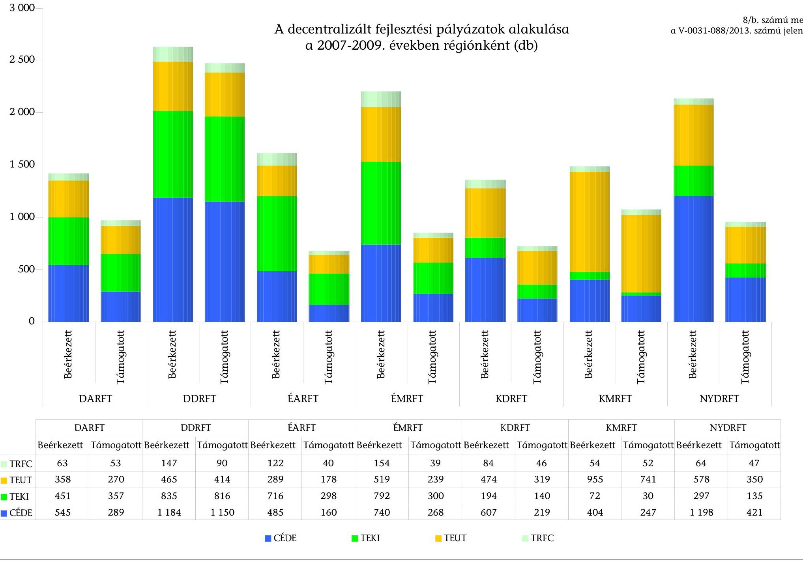

# A decentralizált fejlesztési pályázatok alakulása a 2007-2009. években régiónként (db)

|  DARFT | DORFT | ÉARFT | ÉMRFT | KDRFT | KMRFT | NYDRFT  |
| --- | --- | --- | --- | --- | --- | --- |
|  Beérkezett | Támogatott | Beérkezett | Támogatott | Beérkezett | Támogatott | Beérkezett  |
|  63 | 53 | 147 | 90 | 122 | 40 | 154  |
|  358 | 270 | 465 | 414 | 289 | 178 | 519  |
|  451 | 357 | 835 | 816 | 716 | 298 | 792  |
|  545 | 289 | 1 184 | 1 150 | 485 | 160 | 740  |
|  |   |   |   |   |   |   |

|  KERKEZET | KERKEZET | TÁMOGATOT | BEÉRKEZET | TÁMOGATOT | BEÉRKEZET | TÁMOGATOT | BEÉRKEZET | TÁMOGATOT | BEÉRKEZET | TÁMOGATOT | BEÉRKEZET | TÁMOGATOT  |
| --- | --- | --- | --- | --- | --- | --- | --- | --- | --- | --- | --- | --- |
|  8/b. számú melléklet |  |  |  |  |  |  |  |  |  |  |  |   |
|  a V-0031-088/2013. számú jelentéshez |  |  |  |  |  |  |  |  |  |  |  |   |
|  |   |   |   |   |   |   |   |   |   |   |   |   |
|  |   |   |   |   |   |   |   |   |   |   |   |   |
|  |   |   |   |   |   |   |   |   |   |   |   |   |
|  |   |   |   |   |   |   |   |   |   |   |   |   |
|  |   |   |   |   |   |   |   |   |   |   |   |   |
|  |   |   |   |   |   |   |   |   |   |   |   |   |
|  |   |   |   |   |   |   |   |   |   |   |   |   |
|  |   |   |   |   |   |   |   |   |   |   |   |   |
|  |   |   |   |   |   |   |   |   |   |   |   |   |
|  |   |   |   |   |   |   |   |   |   |   |   |   |
|  |   |   |   |   |   |   |   |   |   |   |   |   |
|  |   |   |   |   |   |   |   |   |   |   |   |   |
|  |   |   |   |   |   |   |   |   |   |   |   |   |
|  |   |   |   |   |   |   |   |   |   |   |   |   |
|  |   |   |   |   |   |   |   |   |   |   |   |   |
|  |   |   |   |   |   |   |   |   |   |   |   |   |
|  |   |   |   |   |   |   |   |   |   |   |   |   |
|  |   |   |   |   |   |   |   |   |   |   |   |   |
|  |   |   |   |   |   |   |   |   |   |   |   |   |
|  |   |   |   |   |   |   |   |   |   |   |   |   |
|  |   |   |   |   |   |   |   |   |   |   |   |   |
|  |   |   |   |   |   |   |   |   |   |   |   |   |
|  |   |   |   |   |   |   |   |   |   |   |   |   |
|  |   |   |   |   |   |   |   |   |   |   |   |   |
|  |   |   |   |   |   |   |   |   |   |   |   |   |
|  |   |   |   |   |   |   |   |   |   |   |   |   |
|  |   |   |   |   |   |   |   |   |   |   |   |   |
|  |   |   |   |   |   |   |   |   |   |   |   |   |
|  |   |   |   |   |   |   |   |   |   |   |   |   |
|  |   |   |   |   |   |   |   |   |   |   |   |   |
|  |   |   |   |   |   |   |   |   |   |   |   |   |

---

A decentralizált fejlesztési támogatások alakulása régiónként a 2007-2009. években (MFt)

8/c. számú melléklet a V-0031-088/2013. számú jelentéshez

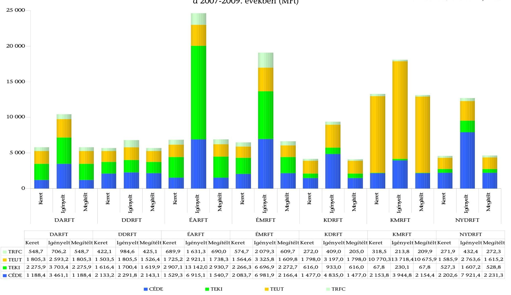

---

# A kistérségi fejlesztési tanácsok és a többcélú kistérségi társulások döntéshozatalának egyes szabályai 

| Kistérségi fejlesztési tanácsok | Többcélú kistérségi társulások |
| :--: | :--: |
| 1996. évi XXI. törvény (Tftv). 10/D. § A kistérségi fejlesztési tanács munkájában | 2004. évi CVII. törvény (Tktv.) 5. § (1) A többcélú kistérségi társulás döntést hozó szerve a társulási tanács. A társulási tanács gyakorolja a többcélú kistérségi társulási megállapodásban meghatározott feladat- és hatásköröket.   7. § (1) A társulási tanács döntését ülésén, határozattal hozza.   (2) A társulási tanács ülését az elnök, akadályoztatása esetén az elnökhelyettes, illetőleg a társulási tanács helyettesítéssel megbízott tagja hívja össze és vezeti. |
| szavazati joggal rendelkező tagként vesz részt a kistérség valamennyi települési önkormányzatának polgármestere;   A kistérségi fejlesztési tanács polgármester tagjainak megbízatása polgármesteri megbízatásuk időtartamára szól.   Képviselet:   Egy polgármester külön - az érintett képviselő-testületek által adott állandó vagy eseti - meghatalmazással több polgármestert is képviselhet. A többi tagot delegáló szerv a képviselő személyéről, illetve annak megváltoztatásáról szabadon dönthet. | 5. § (2) A társulási tanácsot a társulás tagjainak polgármesterei alkotják.   Képviselet:   A polgármester helyettesítésének rendjéről a képviselő-testület rendelkezik. |
| tanácskozási joggal rendelkező tagként vesz részt   - a gazdasági kamaráknak a kistérségben működő egy-egy képviselöje,   - a megyei területfejlesztési tanács képviselője,   - a megyei munkaügyi tanácsba delegálási joggal rendelkező munkaadói és munkavállalói szervezetek egy-egy kistérségi illetékességủ képviselője,   - az iparosok és kiskereskedők országos szakmai érdekvédelmi szervezeteinek egy kistérségi illetékességủ képviselője,   - az egyesületek fóruma által delegált, a civil szervezetek egy képviselője,   - a Kormány általános hatáskörű területi államigazgatási szerve képviselője,   - a kincstár képviselője; |  |
| meghívottként az e szervezeteket (személyeket) érintő napirendek tárgyalásán tanácskozási joggal vesznek részt mindazon gazdasági, társadalmi és egyéb szervezetek képviselői, amelyeket a kistérségi fejlesztési tanács döntése közvetlenül érint vagy amelyeket (akit) az ülésen való részvételre felkérnek. A kistérségi fejlesztési tanács a szervezeti és müködési szabályzatában szabályozhatja a kisebbségi önkormányzatok részvételét a tanács munkájában; |  |
| Konzultációs joggal rendelkeznek a kistérségben müködő mindazon bírósági nyilvántartásba vett egyesületek, amelyek a területfejlesztést érintő kérdések megtárgyalására egyeztető fórumot hoznak létre, és a kistérségi fejlesztési tanácsnál jelzik együttműködési szándékukat. Az egyeztető fórum véleményét az adott napirend tárgyalásakor ismertetni kell. |  |
|  | 7. § (4) A társulási tanács ülése nyilvános.   (5) A társulási tanács   a) zárt ülést tart választás, kinevezés, felmentés, vezetői megbízatás adása, illetőleg visszavonása, fegyelmi eljárás megindítása, fegyelmi büntetés kiszabása és állásfoglalást igénylő személyi ügy tárgyalásakor, ha az érintett a nyilvános tárgyalásba nem egyezik bele, továbbá önkormányzati hatósági ügy tárgyalásakor;   b) zárt ülést rendelhet el a vagyonával való rendelkezés és az általa kiírt pályázat tárgyalásakor, ha a nyilvános tárgyalás üzleti érdeket sértene. |
| A kistérségi fejlesztési tanács szavazati joggal rendelkező tagjai az alakuló ülésen a polgármester tagok közül elnököt választanak. Az elnök megválasztásához a szavazásra jogosult összes tag több mint felének támogató szavazatára van szükség. Az elnök képviseli a kistérségi fejlesztési tanácsot, akadályoztatása esetén a tanács képviseletét a szervezeti és müködési szabályzatában megjelölt személy látja el. Az elnök megválasztásáig az elnök feladatait a kistérségi fejlesztési tanács székhely településének polgármestere látja el. | 5. § (3) A társulási tanács alakuló ülésén titkos szavazással tagjai sorából elnököt választ, az elnök helyettesítésére, munkájának segítésére elnökhelyettes(eke)t választhat, meghatározza a helyettesítés rendjét. Az elnök személyére a társulási tanács bármely tagja javaslatot tehet. A jelöltté váláshoz - amennyiben a társulási tanács tagjainak száma a huszonötöt meghaladja - a jelen lévő tagok legalább egynegyedének szavazata szükséges. Az elnökhelyettes(ek) személyére az elnök tesz javaslatot. |
| A kistérségi fejlesztési tanács szavazati joggal rendelkező tagja egy szavazattal rendelkezik. A kistérségi fejlesztési tanács a szervezeti és müködési szabályzatában a polgármester tagok szavazatainak értékét az általuk képviselt település lakosságszámát figyelembe véve is megállapíthatja. A szavazatárányokat úgy kell kialakítani, hogy egyetlen település se kerülhessen népességszáma figyelembevételével súlyozott döntési szavazata alapján olyan helyzetbe, hogy egyedül többséget alkothasson. | 6. § (1) A társulási tanács minden tagja - a (2) bekezdésben foglalt kivétellel - egy szavazattal rendelkezik.   (2) A társulás tagjai a többcélú kistérségi társulási megállapodásban rögzíthetik, hogy a társulási tanács tagjai a település lakosságszáma vagy a költségvetési hozzájárulás arányában rendelkeznek szavazati joggal. |

---

## Kistérségi fejlesztési tanácsok

A kistérségi fejlesztési tanács szervezeti és müködési szabályzatának megalkotása és elfogadása: (Tfiv. 16. § (5), (7), (9) bek.)

- A fejlesztési tanács szervezeti és müködési szabályzatát maga állapítja meg. A szervezeti és müködési szabályzatban kell rögzíteni a tanács és a titkárság szervezetére és müködésére vonatkozó legfontosabb szabályokat. A szervezeti és müködési szabályzat elfogadásához a tanács tagjainak egyhangú támogató szavazata szükséges. Ennek hiányában a szervezeti és müködési szabályzat a tanács 30 napon belül megismételt ülésén a tanács tagjai minősített többségének támogató szavazatával elfogadható.
- A fejlesztési tanács a szervezeti és müködési szabályzatában szabályozza a tanácskozási jog gyakorlásának módját a testület ülésein, az ülés összehívásának és megtartásának, valamint a határozathozatalnak a szabályait, továbbá a tanács tiszt-
ségviselőinek feladat- és jogkörét. A tanács testülete és titkársága müködésének részletes szabályait ügyrendjében állapítja meg.
- A tanács döntéseinek előkészítése, végrehajtásának szervezése, ellenőrzése érdekében a szervezeti és müködési szabályzatban meghatározott bizottságokat hozhat létre. A tanács döntési jogkört nem ruházhat át bizottságára.

## Határozatképesség:

A kistérségi fejlesztési tanács határozatképessége, valamint a döntések meghozatalával kapcsolatos eljárás megállapítása: (16. § (8) bek).
A fejlesztési tanács határozatképes, ha az ülésén a szavazati joggal rendelkező tagok több mint fele jelen van. A tagokat megillető jogokat - ideértve a szavazás jogát is - csak a testület ülésén jelenlévő tag gyakoroltartja. A tagot csak a képviselt szerv vezetője által írásban felhatalmazott, az ülésen jelenlévő személy helyettesítheti.

## Döntés alapesetben

A tanács - ha a törvény mást nem ír elő - a jelenlevő tagok többségének szavazatával (egyszerü többség) dönt. Szavazategyenlőség esetén az elnök szavazata dönt.

## Minősített többség kell:

Törvény egyes döntésekhez előírhatja a szavazati joggal rendelkező tagok 2/3-ának támogató szavazatát (e törvény alkalmazásában: minősített többség). A szavazás nyílt, kivéve, ha a szervezeti és müködési szabályzat titkos szavazást ír elő.

Egyhangú döntés szükséges (Tfiv. 10/C. § (3) bek): A Tfiv. 10/C. § (2) bekezdés b), c), e), k) és m) pontjaiban meghatározott ügyekben, valamint a szervezeti és müködési szabályzat elfogadásáról a tanács egyhangúlag dönt. Ennek hiányában a tanács 30 napon belül megismételt ülésén a tanács szavazati jogú tagjai minősített többségének [16. § (8)] támogató szavazatával dönt;
b) kidolgozza és elfogadja a kistérség területfejlesztési koncepcióját, illetve ennek figyelembevételével készített területfejlesztési programját, ellenőrzi azok megvalósítását;
c) pénzügyi tervet készít a területfejlesztési programok megvalósítása érdekében;
e) megállapodást köthet a helyi önkormányzatokkal, az önkormányzati társulásokkal, a megyei területfejlesztési tanáccsal és a regionális fejlesztési tanáccsal a saját kistérségi fejlesztési programjai finanszírozására és megvalósítására;
k) megválasztja az elnökséget azokban a kistérségekben, ahol e törvény előírása szerint elnökséget kell létrehozni;
m) megállapítja költségvetését, gondoskodik annak végrehajtásáról, valamint figyelemmel kíséri és elősegíti a fejlesztési források hatékony, a települések szoros együttmüködését erősítő felhasználását;

Többcélú kistérségi társulások
11. § (1) A többcélú kistérségi társulás szervezeti és müködési szabályzatát - a társulási megállapodásban meghatározott keretek között a társulási tanács fogadja el a megalakulását követő három hónapon belül.

## Határozatképesség:

8. § (1) A társulási tanács akkor határozatképes, ha ülésén a társulási megállapodásban meghatározott számú, de legalább a szavazatok több mint felével rendelkező tag jelen van és a jelen lévő tagok által képviselt települések lakosságszáma meghaladja a többcélú kistérségi társulást alkotó települések lakosságszámának egyharmadát.

## Döntés alapesetben

A javaslat elfogadásához a megállapodásban meghatározott számú, de legalább annyi tag igen szavazata szükséges, amely meghaladja a jelen lévő tagok szavazatainak a felét és az általuk képviselt települések lakosságszámának egyharmadát.
8. § (2) Minősített többség szükséges:
a) a kistérség fejlesztését szolgáló - pénzügyi hozzájárulást igénylő - pályázat benyújtásához, az ahhoz szükséges települési hozzájárulás meghatározásához;
b) a 7. § (5) bekezdésének b) pontja szerinti zárt ülés elrendeléséhez;
c) a hatáskörébe utalt választás, kinevezés, felmentés, vezetői megbízatás adása, illetőleg visszavonása, fegyelmi eljárás megindítása, fegyelmi büntetés kiszabása; és
d) abban az ügyben, amit a szervezeti és müködési szabályzat meghatároz.
(3) A minősített többséghez a társulási megállapodásban meghatározott számú, de legalább annyi tag igen szavazata szükséges, amely eléri a jelen lévő tagok szavazatainak kétharmadát és az általuk képviselt települések lakosságszámának a felét.
4. § (3) A többcélú kistérségi társulás költségvetését a társulási tanács önállóan, költségvetési határozatban állapítja meg. A társulási tanács munkaszervezete [10. § (1) bekezdés] útján gondoskodik a többcélú kistérségi társulás költségvetésének végrehajtásáról.

---

## Kistérségi fejlesztési tanácsok

## Az elnökség

Azokban a kistérségekben, amelyekben a települések száma több mint huszonöt, a kistérségi fejlesztési tanács polgármester tagjaiból öt-kilenctagú elnökséget választ. Az elnökség tagjainak számát, a választás rendjét és módját, a megbízatás idejét és megszűnésének módját a tanács szervezeti és működési szabályzatában szabályozza.
Az elnökség tagjainak megválasztásához és visszahívásához a szavazásra jogosult összes tag több mint felének egyetértő szavazatára van szükség. Az elnökség tagjaira, illetve az elnökség tagja visszahívására a szavazati joggal rendelkező tagok egyharmada írásban tehet javaslatot.
Az elnökség feladatait a kistérségi fejlesztési tanács szervezeti és müködési szabályzata rögzíti. A kistérségi fejlesztési tanács feladatait az elnökségre átruházhatja, az átruházott feladatot bármikor magához vonhatja. Az elnökségre nem ruházható át a 10/C. § (3) bekezdésében meghatározott ügyekben való döntéshozatal.
Utóbbi az egyhangú döntéshozatult jelenti.

## Alakuló ülés

2004. évi LXXV. törvény 23. § (5) bek. A kistérségi fejlesztési tanács megalakulásával kapcsolatos, külön jogszabályban megállapított szervezési tevékenység ellátása a kistérség székhelye szerint illetékes megyei közigazgatási hivatal vezetőjének a feladata. A megyei közigazgatási hivatal vezetője a törvény hatálybalépését követő 30 napon belül kezdeményezi a kistérségi fejlesztési tanács megalakulását az alakuló ülés összehívásával.

## Müködést meghatározza az SZMSZ.

## Jegyzőkönyv készítése

51/2005. (III. 24.) Korm. rendelet 3. § (1) A tanács, valamint a tanács elnökségének üléséről Jegyzőkönyv kell készíteni, amely rögzíti mindazon körülményeket, amelyekből megállapítható, hogy az ülés összehívása, lebonyolítása, határozatainak elfogadása, határozata jogszerü-e. A Kormány általános hatáskörü területi államigazgatási szerve vizsgálja, hogy a jegyzőkönyv tartalmazza-e:
a) a nyílt vagy a zárt ülés megjelölését (a zárt ülés elrendelésének okát);
b) az ülés pontos helyét, idejét;
c) a megjelent tanácstagok és meghívottak nevét, hivatali beosztását, az általuk képviselt szerv megnevezését; valamint amennyiben nem a tag, illetve a meghívott vesz részt az ülésen, a képviseletükben eljáró személy e pontban megjelölt adatait és képviseleti jogosultsága igazolásának módját;
d) a tárgyalt napirendi pontokat;
e) az ülés határozatképességére vonatkozó megállapítást;
f) a hozzászólók nevét, a hozzászólások lényegét;
g) a szavazás számszerü eredményét (ideértve a támogató, az ellenző és a tartózkodó szavazatok számát is);
h) a hozott döntéseket;
i) a szervezeti és müködési szabályzatban meghatározottak aláírását.
(2) A tanács elnöke az ülésre szóló meghívót és az írásos előterjesztéseket az ülés előtt 5 nappal, az ülésen felvett jegyzőkönyvet az ülést követő 8 napon belül köteles megküldeni a Kormány általános hatáskörü területi államigazgatási szervének.

## Törvényességi felügyelet:

Tftv. 16. § (11) A Kormány általános hatáskörü területi államigazgatási szerve a törvényességi felügyelet keretében ellenőrzi, hogy:
a) szervezeti és müködési szabályzata és egyéb szabályzatai megfelelnek-e a jogszabályoknak,
b) szervezete, müködése, döntéshozatali eljárása, határozatai, illetve egyéb döntései nem sértenek-e jogszabályokat, az alapszabályt vagy egyéb szabályzatokat.

## Többcélú kistérségi társulások

## Az elnökség

9. § (1) Azokban a kistérségekben, amelyekben a társulás tagjainak száma meghaladja a huszonötöt, a társulási tanács tagjai sorából legalább öt-, de legfeljebb kilenctagú elnökséget választhat. Az elnökség előkészíti a társulási tanács döntéseét, összehangolja a bizottságok munkáját és a munkaszervezet vezetöjén keresztül irányítja a többcélú kistérségi társulás munkaszervezetét.
(2) Az elnökség müködésére, a társulási tanácsnak történő beszámolásának rendjére vonatkozó rendelkezéseket a társulási tanács szervezeti és müködési szabályzata tartalmazza.

## Alakuló ülés

5. § (2) A társulási tanács alakuló ülését a többcélú kistérségi társulás székhely települése önkormányzatának polgármestere hívja össze. A társulási tanács alakuló ülésén mondja ki a többcélú kistérségi társulás megalakulását.

## Müködést meghatározza a társulási megállapodás és az SZMSZ.

## Jegyzőkönyv készítése

7. § 6) bek A társulási tanács üléséről jegyzőkönyvet kell készíteni, melyre a képviselő-testület üléséről készített jegyzőkönyvre vonatkozó szabályokat kell alkalmazni azzal, hogy a jegyzőkönyvet az elnök és a társulási tanács által felhatalmazott tag írja alá. A jegyzőkönyvet a társulási tanács elnöke az ülést követő tizenöt napon belül megküldi a helyi önkormányzatok törvényességi ellenőrzéséért felelős szervnek és a társulás tagjainak.

## Törvényességi ellenőrzés 2011-ig:

12. § (2) A helyi önkormányzatok törvényességi ellenőrzéséért felelős szerv törvényességi ellenőrzési jogkörében vizsgálja, hogy a többcélú kistérségi társulás döntése, szervezete, müködése és döntéshozatali eljárása megfelel e a jogszabályoknak, a többcélú kistérségi társulási megállapodásban, valamint a társulási tanács szervezeti és müködési szabályzatában foglaltaknak. A helyi önkormányzatok törvényességi ellenőrzéséért felelős szerv összehívja a társulási tanács ülését, ha a 7. § (3) bekezdés c) pontja szerint tett indítványnak a társulási tanács elnöke tizenöt napon belül nem tesz eleget.

---

# KIMUTATÁS 

az 1108. számú ÁSZ jelentésben foglalt javaslatok hasznosulásáról, valamint az 1125. számú ÁSZ jelentés javaslataira készített intézkedési tervben foglaltak végrehajtásáról a Nemzetgazdasági Minisztériumnál és a Nemzeti Fejlesztési Minisztériumnál

|  | ÁSZ javaslat | Intézkedési terv (határidő, felelős) | ÁSZ javaslatainak hasznosulása, az Intézkedési terv teljesítése |
| :--: | :--: | :--: | :--: |
| 1108. számú Jelentés a helyi önkormányzatok fejlesztési célú támogatási rendszerének ellenőrzéséről |  |  |  |
| a Kormánynak |  |  |  |
| 1. Tegyen intézkedéseket - az uniós támogatásokra is figyelemmel - az önkormányzatok által igénybe vehető tisztán hazai fejlesztési célú támogatások forráskoordinációjára, a támogatási célok párhuzamosságának elkerülése és átlátható támogatási rendszer létrehozása érdekében. | Intézkedési terv nem készült.   Az Állami Számvevőszékről szóló, 2011. június 24 -ig hatályban volt 1989. évi XXXVIII. törvény nem tette kötelezővé az ellenőrzötteknek intézkedési terv készítését, és a nem megfelelő intézkedések esetére sem rendelt el szankciókat.   A törvény 25. § (1) bekezdés szerint: „Az Állami Számvevőszék ellenőrzési megállapításait megküldi az ellenőrzött szerv vezetőjének, aki arra 8 napon belül íráiban észrevételeket tehet, illetve intézkedéseket rendeltet el. Az intézkedésekről 30 napon belül tájékoztatni kell az Állami Számvevőszéket." | A 248/2011. (XII. 1.) Korm. rendelet szerint a Nemzetgazdasági Tervezési Hivatal feladata - többek között - az állami pénzügyi intézkedések összehangolásának, a hazai és közösségi közpénzek felhasználásának költségvetési, gazdálkodási és monitoringjával járó feladatok végrehajtásának a támogatása. Közremúködik továbbá a nemzeti területi tervezési feladatok koordinációjában és a térségi tervezési módszertanok készítésében, ellátja a területi elemzési, értékelési munka szakmai szintű koordinációját, módszertani támogatását, háttételemezésekkel támogatja a monitoring, értékelési és indikátorrendszer területi szempontjainak kidolgozását.   Magyarország gazdasági stabilitásáról szóló 2011. évi CXCIV. törvény 10. § (1) bekezdése szerint az önkormányzatok adósságot keletkeztető ügyleteket - a 10. § (2) bekezdésében foglalt kivételekkel - a Kormány előzetes hozzájárulásával köthetnek. Az adósságot keletkeztető ügyletekhez történő hozzájárulás részletes szabályairól szóló 353/2011. (XII. 30.) Korm. rendelet 4. § (2) bekezdése szerint a kormányhivatalok vizsgálják, hogy a tervezett fejlesztési cél törvényben meghatározott feladat ellátásához szükséges kapacitás létrehozását eredményezi-e.   A kormányzati stratégiai irányításról szóló 38/2012. (III. 12.) Korm. rendelet ${ }^{1}$ az alapelvek között fogalmazta meg a megvalósítás pénzügyi hátterének biztosítottságát, az elérni kívánt eredményekkel való összhangját, a benne szereplő célokhoz a mutatók hozzárendelését, valamint az irányítási rendszer keretében az elfogadást követően a nyomon követés biztosítását.   Az 1600/2012. (XII. 17.) Korm. határozat 1. c) pontja szerint „a 2014-2020 között elérhető források felhasználásának tervezését integrált módon, valamennyi elérhető fejlesztési forrás figyelembevételével kell elvégezni", az 1. d) pont szerint „a fejlesztési forrásokat lehetőség szerint koncentrált módon, kevés számú fejlesztési prioritásra összpontosítva kell felhasználni, elkerülve a források nem kívánatos szétaprózódását".   A fejlesztéspolitika egységes informatikai támogatása céljából 2,3 Mrd Ft-ot irányoztak elő az 1314/2010. (XII. 27.) Korm. határozatban (FAIR projekt). A kijelölt projektgazda (KH3 ${ }^{2}$ ) a 2012. február 9-i döntés alapján támogatásban részesült ${ }^{3}$, a tervezett befejezési határidő 2013. december 31. |  |
| 3. Intézkedjen a hazai fejlesztési célú támogatásokra kiterjedően az információs rendszer fejlesztésére, a különböző támogatások összehangolása és felhasználása, a támogatásokkal megvalósuló programok nyomon követése érdekében. |  |  |  |
| a nemzeti fejlesztési miniszternek |  |  |  |
| 1. A 212/2010. (VII. 1.) Korm. rendelet 85. § a), c), és f) pontjában meghatározott feladatkörében gondoskodják arról, hogy csak olyan fejlesztési célú támogatásokat lehessen nyújtani, amelyhez párosul a megvalósítandó cél mérhetőségét biztosító indikátor. | ÁSZ részére intézkedési terv nem készült, a minisztérium belső intézkedési tervet készített. | Az NFM Támogatáspolitikai Főosztálya - az erről készített beszámoló szerint - az előirányzat-felhasználáshoz kapcsolódó rendeletek véleményezése során, valamint a kezelésébe tartozó előirányzatoknál egyaránt figyelmet fordít a célokra vonatkozó indikátorok, mutatók meghatározására. A területfejlesztéssel és fejlesztéspolitikával összefüggő feladatokat szolgáló előirányzat központi keretéből nyújtott támogatás pályázati dokumentációja tartalmazott a fejlesztésre vonatkozó célok, eredmények mérésére szolgáló szakmai és üzleti mutatókat. A támogatás felhasználásának részletes szabályait a 35/2011. (VII. 7.) NFM rendelet tartalmazza. |  |

[^0]
[^0]:    ${ }^{1}$ Hatálya a kormányzati stratégiai tervdokumentumokra terjed ki, nem alkalmazható az állami költségvetésre vonatkozó stratégiaalkotásra és stratégiai irányításra, valamint a Tftv. szerinti országosnál alacsonyabb szintű területrendezési tervre.
    ${ }^{2}$ Kormányzati Informatikai Fejlesztési Ügynökség
    ${ }^{3}$ Forrás: http://www.nfu.hu/content/58

---

|   | ÁSZ javaslat | Intézkedési terv (határidő, felelős) | ÁSZ javaslatainak hasznosulása, az Intézkedési terv teljesítése  |
| --- | --- | --- | --- |
|  1125. számú jelentés a térségek felzárkóztatására fordított pénzeszközök felhasználásának ellenőrzéséről |  |  |   |
|  a nemzeti fejlesztési miniszternek a nemzetgazdasági miniszter és a belügyminiszter közremüködésével |  |  |   |
|  1. | Készítse elő a területfejlesztésről és területrendezésről szóló 1996. évi XXI. törvény módosítását, hogy az
a) tartalmazza a területfejlesztés kiemelt feladatát képező elmaradott térségek felzárkóztatásával és fejlődésével érintett térségek egzakt meghatározását
b) terjedjen ki a területfejlesztési célokat szolgáló közösségi és nemzetközi forrásokra,
és kezdeményezze Országgyűlés elé való beterjesztését. | NFM Intézkedési terv:
a) A tárgyat érintő elmaradott térség (Tftv. 5. § k) pontja), kedvezményezett térség (Tftv. 5. § l) pontja), valamint a környező szabályozásban megjelenő hátrányos helyzetű térség fogalmak helyett a törvényben egy egységes fogalomhasználat (elmaradott vagy hátrányos helyzetű térség) alkalmazása, valamint a kedvezményezett térséggel kapcsolatos jelenlegi szabályok felülvizsgálata a Tftv. soron következő, 2012. I. félévben végzendő megújítása.
Határidő: 2012. VI. 30.
b) A Tftv. soron következő, 2012. I. félévben végzendő átfogó módosítása keretében meg kell vizsgálni annak lehetőségét, hogy a törvény hatálya - mely jelenleg a hazai források kezelésére korlátozódik - a hazai támogatáson túl az uniós forrásokra is kiterjedjen. Határidő: 2012. VI. 30.
NGM Intézkedési terv:
A területfejlesztésről és területrendezésről szóló 1996. évi XXI. törvény módosítása.
Határidő: 2012. VI. 30. | A javaslat a) pontjára vonatkozó intézkedési terv teljesülit.
A Tftv.-t felülvizsgálták és az egyes törvényeknek a Magyury Egyszerüstési Programmal és a területfejlesztéssel összefüggő módosításáról szóló 2012. évi CCVII. törvény 68-72. §-aival módosították. Ennek során a Tftv. 5. §-a kiegészült a „fejlesztési-statisztikai kistérség", valamint a „kistérségi lehatárolás" fogalmakkal, valamint IV. fejezete (A területfejlesztés és a területrendezés eszközei) „A területfejlesztési-statisztikai kistérség" alcímmel. A területfejlesztési-statisztikai kistérségek és a kistérségekbe tartozó települések konkrét felsorolása bekerült a Tftv. 1. számú mellékletébe.
A Tftv. 9/B. §-a alapján a kistérségek fejlettségi szempontból történő besorolására történő javaslatétetl a nemzetgazdasági miniszter feladatkörébe került át, aki ötévente kezdeményezi a területfejlesztési-statisztikai kistérségi lehatárolás megváltoztatását, valamint felülvizsgálja a kedvezményezett területek besorolását. A Tftv.-ben ugyanakkor továbbra is indokoltnak tartották a fenntartani az elmaradott és a hátrányos helyzetű térségek megkülönböztetését. A Kormány az 1254/2012. (VII. 19.) határozatának 5/A. pontjában felkérte a területfejlesztés stratégiai tervezéséért felelős minisztert, hogy az OFTK jelenleg folyamatban lévő felülvizsgálatát követően vizsgálja felül a területfejlesztési-statisztikai kistérségi rendszert. A feladat végrehajtásának határideje 2013. december 31. Az OFTK a helyszíni ellenőrzés lezárásakor még társadalmi egyeztetés alatt volt.
A javaslat b) pontjára vonatkozó intézkedési terv teljesülit.
A Tftv. hatályának a hazai támogatásokon túl az uniós forrásokra való kiterjesztése lehetőségét az NFM megvizsgálta, a Tftv. átfogó módosítása azonban - a 20072013 közötti időszak uniós forrásainak hatékonyabb felhasználására, illetve a következő programozási időszak előkészítésére fókuszálva - lekerült napirendről. A Tftv. átfogó módosítása a 2014-2020-as uniós programozási időszak tervezésével kapcsolatban, a kohéziós keretjogszabályok végleges formában történő elfogadását követően indokolt.
A területfejlesztéssel és a területrendezéssel összefüggő egyes törvények módosításáról szóló 2011. évi CXCVIII. törvény a 25. § (4) bekezdésében a Kormány általános felhatalmazást kapott arra, hogy rendeletben állapítsa meg „az Európai Regionális Fejlesztési Alapból, az Európai Szociális Alapból és a Kohéziós Alapból származó támogatások felhasználásának rendjét".
Az ÁSZ javaslat hasznosulására utal az 1600/2012. (XII. 17.) Korm. határozat 1. k) pontja, miszerint „a 2014-2020 között elérhető források felhasználásának tervezését a területiség elvét figyelembe véve kell elvégezni, különös tekintettel a területi operatív programok tervezésére, amely során biztosítani kell a megyék hatékony közremüködését".
2. Dolgozza ki a Tftv. 7. § e) pontja alapján a területfejlesztést szolgáló pénzügyi eszközöket, az igénybe vehető kedvezmények felhasználásának szabályait, hogy az minden típusú forrásra terjedjen ki és kezdeményezze a Kormánynál annak elfogadását. | NFM Intézkedési terv:
A Tftv. soron következő, átfogó módosítása során vizsgálni kell egyrészt a fejlesztéspolitika Tftv.-ben foglalt forráskoordinációs jogosítványai megerősítésének, valamint azok alkalmazási köre kormányrendeleti úton történő kiterjesztésének lehetőségét.
Határidő: 2012. VI. 30.
NGM Intézkedési terv:
A területfejlesztésről és területrendezésről szóló 1996. évi XXI. törvény módosítása.
Határidő: 2012. VI. 30 | A Javaslatra vonatkozó intézkedési terv teljesülit.
A Tftv. felülvizsgálata során az intézkedési tervben foglaltakat vizsgálták. A 2011. évi CXCVIII. törvény 18. §-a 2012. január 1-jétől módosította a Tftv. 22. §-át a szabad vállalkozási zónák és ipari parkok működésére vonatkozó szabályokkal, a 2012. évi CCVII. törvény 68. § (2) bekezdés pedig a Tftv. 5. § j) pontját, amellyel pontosította a szabad vállalkozási zóna meghatározását. A Kormány a Tftv. 27. § (1) bekezdés e) pontjában kapott felhatalmazás alapján a 27/2013. (II. 12.) Korm. rendeletben szabályozta a szabad vállalkozási zónák létrehozásának és működésének, valamint a kedvezmények igénybevételének szabályait.  |

---

|   | ÁSZ javaslat | Intézkedési terv (határidő, felelős) | ÁSZ javaslatainak hasznosulása, az Intézkedési terv teljesítése  |
| --- | --- | --- | --- |
|  a nemzeti fejlesztési miniszternek a nemzetgazdasági miniszter közreműködésével |  |  |   |
|  1. | Készítse elő a Tftv. 6. § c) pontjában előírt, a területfejlesztési célkitűzések végrehajtását szolgáló eszköz- és intézményrendszer átfogó szabályait, és kezdeményezze annak Országgyűlés elé való beterjesztését. | NFM Intézkedési terv:
Az érintett tárcák vizsgálják felül a Tftv. előírásait a tervezési rendszer átalakítása, a törvény hatályának az uniós forrásfelhasználásra történő kiterjesítése, valamint a forráskoordináció erősítése szempontjából, és szükség esetén készítsék elő a Tftv. megújításáról szóló törvényjavaslat tervezetét.
Határidő: 2012. VI. 30.
NGM Intézkedési terv:
A területfejlesztésről és területrendezésről szóló 1996. évi XXI. törvény módosítása.
Határidő: 2012. VI. 30 | A javaslatra vonatkozó intézkedési terv teljesült.
A területfejlesztési, illetve általában a kormányzati tervezés rendszerének felülvizsgálata átfogó módon elkezdődött. Az NGM 2012 júniusában létrehozta - valamennyi szaktárca részvételével - a Tervezésszabályozási Munkacsoportot, amelynek elsődleges feladata a tervezési rendszer és hozzákapcsolódó jogszabályok, így többek között a Tftv., valamint a területi monitoring rendszerről szóló 37/2010. (II. 26.) Korm. rendelet felülvizsgálata, átalakítása.
A kormányzati stratégiai irányításról szóló 38/2012. (III.12.) Korm. rendelet új követelményeket határozott meg a stratégiai tervdokumentumok előkészítésére, társadalmi véleményezésére, elfogadására, közzétételére, megvalósítására, nyomon követésére, valamint előzetes, közbenső és utólagos értékelésére, felülvizsgálatára. A 43. §-a előírta a rendeletnek meg nem felelő stratégiák, programok felülvizsgálatát.
Az NGM előterjesztésében elfogadott, a területfejlesztési politika megújításáról, az új Országos Területfejlesztési és az új Országos Fejlesztési Koncepció kidolgozásáról szóló 1254/2012. (VII. 19.) Korm. határozat 2.26. pontja szerint az OFTK-t úgy kell elkészíteni, hogy „jelölje ki a területfejlesztési eszközrendszer új irányait úgy, hogy az a pénzügyi, a szabályozási és egyéb eszközök használatára is kiterjedjen".  |
|  a nemzeti fejlesztési miniszternek a közigazgatási és igazságügyi miniszterrel együttműködve |  |  |   |
|  1. | Dolgozza ki a Tftv. 27. § (1) bekezdés a) pontjában és 7. § l) bekezdésében foglaltak alapján a miniszterek közötti koordináció szempontjait, szabályait, és kezdeményezze a Kormánynál annak elfogadását. | NFM Intézkedési terv:
A Tftv. soron következő módosításához kapcsolódóan végrehajtási rendeletek felülvizsgálata keretében kerüljön sor a miniszterek közötti koordináció szempontjait, szabályait megállapító kormányrendelet tervezetének elkészítésére és a Kormány elé történő benyújtására.
Határidő: 2012. VIII. 30. | A javaslatra vonatkozó intézkedési terv nem teljesült.
A Tftv. felülvizsgálatához kapcsolódóan a miniszterek közötti koordináció szempontjait, szabályait megállapító kormányrendelet tervezetének elkészítésére, és a Kormány elé történő benyújtására vonatkozó dokumentumokat az NFM helyszíni ellenőrzése során nem becsítették az ÁSZ rendelkezésére.  |
|  a közigazgatási és igazságügyi miniszter a nemzetgazdasági miniszterrel és a nemzeti fejlesztési miniszterrel együttműködve |  |  |   |
|  1. | Dolgozza ki
a) a) a térségek felzárkózásának differenciált célrendszerét,
b) b) a célok elérését biztosító, a hátrányos, illetve a leghátrányosabb helyzetű besorolásból való kikerülést ösztönző eszközrendszert,
c) c) a mérőszámokat, a mérés eszközeit,
és kezdeményezze ezek beépítését az Országgyűlés, illetve a Kormány által meghatározott szabályokba, programokba. | Az ellenőrzés nem terjedt ki a javaslat fő felelősére, a KIM-re.
NGM Intézkedési terv:
Kedvezményezett térségek besorolásának feltételrendszeréről szóló szabályozás teljes felülvizsgálata.
Határidő: 2012. VI. 30. életbelépés 2013. január 1. | Az NGM intézkedési tervében foglaltak teljesültek, amelyek hozzájárulnak a javaslatban foglaltak végső teljesüléséhez.
Az NGM-ben - a tárcaközi Új Tipusú Térségi Besorolás Munkacsoport keretében - a kedvezményezett térségek besorolásának feltételrendszeréről szóló szabályozás felülvizsgálata megtörtént. Ennek során javaslatokat dolgoztak ki a besorolás feltételrendszerére, és előterjesztés készült a kormányrendelethez. A Munkacsoport munkatervében figyelembe vették az ÁSZ javaslatait.
A Kormány az 1254/2012. (VII. 19.) határozatának 5/A. pontjában ${ }^{4}$ felkérte a területfejlesztés stratégiai tervezéséért felelős minisztert, hogy „az új Országos Fejlesztési Koncepció Országgyűlés általi elfogadását követően vizsgálja felül a területfejlesztési-statisztikai kistérségi rendszert." A Korm. határozat megfogalmazta az Országis Területfejlesztési Koncepció és az Országos Fejlesztési Koncepció készítésének irányait. A dokumentumot úgy kell elkészíteni, hogy „2.4. biztosítás térségenként az eltérő fejlesztési megoldások alkalmazását", „2.5. rögzése, hogy a települések besorolásánál a települések kockázatértékelésen alapuló veszélyeztetettségi sorrendjét is figyelembe kell venni", továbbá „2.22. segítse a legkedvezőtlenebb helyzetű térségek, települések, rétegek lemaradásának csökkentését, a társadalmi igazságosság és szolidaritás erősítését".  |

[^0] [^0]: ${ }^{4}$ Beiktatta az 1526/2012. (XI. 28.) Korm. határozat 1. Hatályos 2012. XI. 29-től.

---

|   | ÁSZ javaslat | Intézkedési terv (határidő, felelős) | ÁSZ javaslatainak hasznosulása, az Intézkedési terv teljesítése  |
| --- | --- | --- | --- |
|  a nemzeti fejlesztési miniszternek |  |  |   |
|  1. | Fejlessze tovább a területi információs rendszert annak érdekében, hogy az biztosítsa a területi monitoring rendszerről szóló 37/2010. (II. 26.) Korm. rendelet 2. §-ában foglalt célok teljesítéséhez szükséges információk teljes körűségét. | NFM Intézkedési terv:
Az országos Területfejlesztési és Területrendezési Információs Rendszer (TeIR) fejlesztésének vizsgálata és annak eredménye alapján a szükséges intézkedések végrehajtása - a területi monitoring rendszerről szóló 37/2010. (II. 26.) Korm. rendelet módosításának és az Országos Területfejlesztési Koncepció (OTK) megújításának figyelembevételével.
Határidő: 2012. december 31 | A javaslatra vonatkozó intézkedési terv teljesült.
A TeIR müködésének és fejlesztésének peremfeltételeit переходi jogszabályi előírásokban és intézményrendszerben 2012. január 1-jével, a területfejlesztéssel és a területrendezéssel összefüggő egyes törvények módosításáról szóló 2011. évi CXCVIII. törvény alapján bekövetkezett változásoknak megfelelően módosították a területi monitoring rendszerről szóló 37/2010. (II. 26.) Korm. rendeletet és a területfejlesztéssel és a területrendezéssel kapcsolatos információs rendszerről és a kötelező adatközlés szabályairól szóló 31/2007. (II. 28.) Korm. rendeletet. A módosítások 2012. április 6-án léptek hatályba.
A TeIR müködését szabályozó 31/2007. (II. 28.) Korm. rendelet további felülvizsgálatára, a fejlesztés irányainak kijelölésére - a lejárt határidő ellenére, az intézkedési tervben foglaltak szerint - a jelenleg felülvizsgálat alatt álló OFTK Országgyűlés általi elfogadását követően kerülhet sor.  |
|  a nemzetgazdasági miniszternek |  |  |   |
|  1. | Készítse elő a területi folyamatok alakulásáról és a területfejlesztési politika, valamint a területrendezési tervek érvényesítésének hatásairól szóló országgyűlési beszámolót, ennek keretében adjon tájékoztatást a 97/2005. (XII. 25.) OGT határozatban foglaltak végrehajtásáról és kezdeményezze, hogy a Kormány a Tfiv. 7. § j) pontja alapján nyújtsa be az Országgyűlésnek. | NGM Intézkedési terv:
A 97/2005. (XII. 25.) OGY határozat Országos Területfejlesztési Koncepció - végrehajtásának felülvizsgálata, és jelentés készítése érvényesítésének hatásairól, új OTK megalkotása. Határidő:
felülvizsgálat és jelentés 2012. VI. 30.; Új OTK megalkotása 2012. XII. 15. | A javaslatra vonatkozó intézkedési terv teljesült.
2012 júliusában elkészült a „Jelentés az ország területi folyamatainak alakulásáról, a területfejlesztési politika és a területrendezési tervek érvényesitésének hatásairól, az Országos Területfejlesztési Koncepció felülvizsgálatáról, valamint a magyar településhádozat helyzetéről" című beszámoló. Az Országgyűlésnek 2012. november 26-án nyújtották be, a helyszíni ellenőrzés lezárásakor még tárgysorozatban volt (J/8102. számú Jelentés).
A Kormány a területfejlesztési politika megújításáról, az új Országos Területfejlesztési és az új Országos Fejlesztési Koncepció kidolgozásáról az 1254/2012. (VII. 19.) Korm. határozatban döntött.
A Korm. határozat alapján elkészült a „NEMZETI FEJLESZTÉS 2020. Az Országos Fejlesztési Koncepció és az Országos Területfejlesztési Koncepció társadalmi egyeztetési változata" A stratégiai vitaanyag a helyszíni ellenőrzés lezárásakor társadalmi egyeztetés alatt volt.  |
|  2. | Tegyen javaslatot olyan mutatószámok alkalmazására, amelyek a kistérségek fejlettségbeli mérésére túl alkalmas a felzárkóztatási célú programok hatásainak mérésére, a hatékony döntéshozói beavatkozások érdekében. | NGM Intézkedési terv:
Kedvezményezett térségek besorolásának feltételrendszeréről szóló szabályozás teljes felülvizsgálata Határidő: 2012. VI. 30. életbelépés 2013. január 1.
Kedvezményezett térségeket/településeket tartalmazó Korm. rendelet megalkotása
Határidő: 2012. VI. 30. életbelépés 2013. január 1. | A javaslatokra vonatkozó intézkedési terv első pontja teljesült, a második pontja részben teljesült.
Az NGM-ben - a tárcaközi Új Típusú Térségi Besorolás Munkacsoport keretében - a kedvezményezett térségek besorolásának feltételrendszeréről szóló szabályozás felülvizsgálata megtörtént. Ennek során javaslatokat dolgoztak ki a besorolás feltételrendszerére, és előterjesztés készült a kormányrendelethez. A Munkacsoport munkatervében figyelembe vették az ÁSZ javaslatait.
2011. februárban elkészült a tervezet az „ELŐTERJESZTÉS a Kormány részére a területfejlesztési támogatásokról és a decentralizációi eleirről, a kedvezményezett térségek besorolásának feltételrendszeréről szóló 67/2007. (VI. 28.) OGT határozat felülvizsgálatáról, valamint új Országgyüési határozat megalkotásáról" címmel. Új határozat, valamint Korm. rendelet nem került kiadásra, a területfejlesztési politikában és az intézményrendszerben időközben bekövetkezett változások következtében.
A Kormány az 1254/2012. (VII. 19.) határozatának 5/A. pontjában felkérte a területfejlesztés stratégiai tervezéséért felelős minisztert, hogy „az új Országos Fejlesztési Koncepció Országgyüés általi elfogadását követően vizsgálja felül a területfejlesztési-statisztikai kistérségi rendszert." A Korm. határozat megfogalmazta az Országis Területfejlesztési Koncepció és az Országos Fejlesztési Koncepció készítésének irányait. A dokumentumot úgy kell elkészíteni, hogy „2.4. biztosítsa térségenként az eltérő fejlesztési megoldások alkalmazását", „2.5. rögzítse, hogy a települések besorolásánál a települések kockázatértékelésen alapuló veszélyeztetettségi sorrendjét is figyelembe kell venni", továbbá „2.22. segítse a legkedvezőtlenetlét helyzetü térségek, települések, rétegek lemaradásának csökkentését, a társadalmi igazságosság és szolidaritás erősítését".  |

---

|  | ÁSZ javaslat | Intézkedési terv (határidő, felelős) | ÁSZ javaslatainak hasznosulása, az Intézkedési terv teljesítése |
| :--: | :--: | :--: | :--: |
| 3. | Készítse elő a területi monitoring rendszerről szóló 37/2010. (II. 26.) Korm. rendelet módosítását annak érdekében, hogy az tartalmazza a területi monitoring rendszer céljának elérése érdekében szükséges feladatokat, eszközöket, eljárásrendeket, valamint az ezek müködtetésére vonatkozó előirásokat. | NGM Intézkedési terv:   A területi monitoring rendszerről szóló 37/2010. (II. 26.) Korm. rendelet felülvizsgálata, új Korm. rendelet kiadása   Határidő: 2012. XII. 15. | A javaslatra vonatkozó intézkedési terv részben teljesült. A 2012. január 1-jével, a területfejlesztéssel és a területrendezéssel összefüggő egyes törvények módosításáról szóló 2011. évi CXCVIII. törvény alapján bekövetkezett változásoknak megfelelően módosították a területi monitoring rendszerről szóló 37/2010. (II. 26.) Korm. rendeletet (2012. április 6-án lépett hatályba).   Az NGM 2012 júniusában létrehozta - valamennyi szaktárca részvételével - a Tervezésszabályozási Munkacsoportot, amelynek elsődleges feladata a tervezési rendszer és hozzákapcsolódó jogszabályok, így többek között a Tftv., valamint a területi monitoring rendszerről szóló 37/2010. (II. 26.) Korm. rendelet felülvizsgálata, átalakítása. |

---

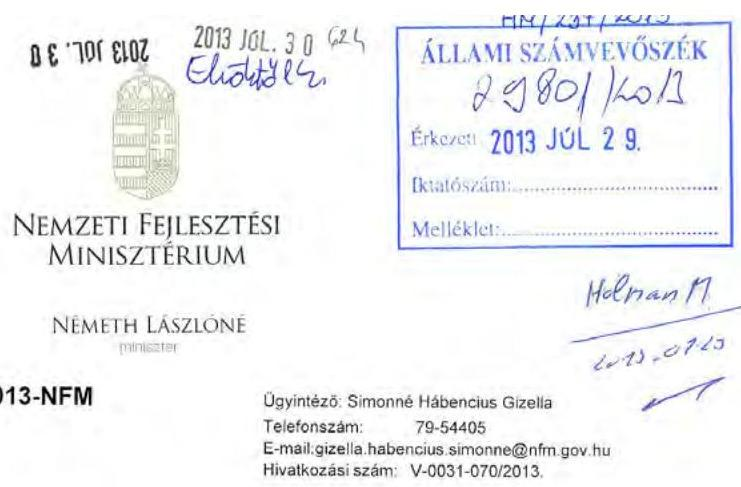

# Domokos László 

## elnök

## részére

## Állami Számvevőszék

Budapest
Apáczai Csere János u. 10.
1052
Tárgy: Jelentés-tervezet véleményezése

## Tisztelt Elnök Úr!

Köszönettel vettem az ÁSZ „Regionális és kistérségi fejlesztési tanácsok forráselosztási tevékenységének ellenőrzése" című vizsgálat jelentéstervezetét, mellyel kapcsolatosan az alábbi észrevételeket tesszük:

- A jelentéstervezetben a nemzeti fejlesztési miniszternek tett intézkedési javaslat 2. pontjában megfogalmazottakkal kapcsolatban jelezzük, hogy a Tftv 7.§ I) pontjában és a 27.§ (1) bekezdésében foglaltak szerint, a miniszterek közti koordináció szabályait és szempontjait meghatározó Kormányrendelet tervezet elkészítését a 2014-2020-as kohéziós időszakra vonatkozó uniós jogszabályok elfogadását követően tartjuk indokoltnak, ugyanis a fejlesztéspolitika hazai intézményrendszere és benne az uniós fejlesztési forrásokat kezelő intézményrendszer csak ezt követően alakul ki végleges formájában. A jelentés tervezet 10. számú mellékletében a Tftv. módosítására vonatkozóan ugyanezen logikának megfelelően a törvény módosítása is csak a kohéziós jogszabálycsomag elfogadását követően tekinthető indokoltnak.

---

- A 17. oldalon megállapításra került, hogy az RFT-k tevékenysége a decentralizált hazai források megszűnésével véleményező, javaslattevő és területi koordinációs feladatokra korlátozódott. Kérjük javítani a megállapítást, hiszen az RFT-k a megszűnésükig folyamatosan elláttak döntéshozói tevékenységet is a korábbiakban megítélt hazai decentralizált források kezelése kapcsán (kérelmek elbírálása, támogatás visszavonása, ellenőrzés, műszaki tartalom módosítás stb.). A decentralizált hazai területfejlesztési és önkormányzati fejlesztési források megszűnésével csupán az RFT-k forráselosztó tevékenysége szűnt meg.
- 25. oldal: Az NFM szakterülete a 1108. számú ÁSZ jelentésnek az NFM miniszter részére megfogalmazott javaslata kapcsán készített (belső) intézkedési tervet és az abban foglaltak megvalósulásáról szóló beszámoló is elkészült. Kérjük a megállapítás ennek megfelelő módosítását (a jelentés 74. oldalán és a 10. számú mellékletében is).

Budapest, 2013. július , 18. .

Üdvözlettel:

---

# 12. számú melléklet a V-0031-088/2013. számú jelentéshez 

ÁLLAMI
SZÁMVEVÓSZÉK

Ikt.szám: V-0031-085/2013.

## Németh Lászlóné asszony

miniszter
Nemzeti Fejlesztési Minisztérium

## Budapest

## Tisztelt Miniszter Asszony!

A regionális és kistérségi fejlesztési tanácsok forráselosztási tevékenységének ellenórzése címủ jelentéstervezetre tett észrevételeit köszönettel megkaptam.

Az Állami Számvevőszék észrevételekre vonatkozó álláspontjáról a felügyeleti vezető által készített részletes tájékoztatást csatoltan megküldöm.

Tájékoztatom Miniszter asszonyt, hogy a jelentésben - az Állami Számvevőszékről szóló 2011. évi LXVI. törvény 29. § (3) bekezdése alapján - az el nem fogadott észrevételeket szerepelhetjük az elutasítás indokának feltüntetésével együtt. Az elfogadott észrevételeket a jelentés szövegezésénél figyelembe vesszük.

Budapest, 2013. 08. hó 08 nap
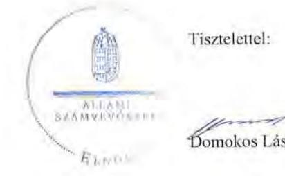

Tisztelettel:

Domokos László $\varnothing$

Melléklet: Tájékoztatás az elfogadott és az el nem fogadott észrevételekről

---

# Tájékoztatás 

## az elfogadott és az el nem fogadott észrevételekról

A regionális és kistérségi fejlesztési tanácsok forráselosztási tevékenységének ellenőrzéséről készült jelentéstervezetre az EFO/14086-3/2013-NFM iktatószámú levelében tett észrevételeit áttekintettük, azok kezeléséről az alábbi tájékoztatást adom.

A jelentéstervezetben a nemzeti fejlesztési miniszternek megfogalmazott 2. számú intézkedést igénylő megállapítás és javaslatra vonatkozó észrevétele megállapításainkat, valamint javaslatunkat nem módosítja, mivel a javaslat nem tartalmaz a jogalkotásra vonatkozóan határidőt. Az Állami Számvevőszékről szóló 2011. évi LXVI. törvény 33. § (1) bekezdésében foglaltak alapján elkészítendő intézkedési tervben kell meghatároznia a minisztériumnak a feladat végrehajtásának határidejét. Egyben megjegyzem, hogy a területfejlesztésről és a területrendezésről szóló 1996. évi XXI. törvény 7. § 1) pontja már 2004. szeptember 1-tól előirta a miniszterek területfejlesztéssel és területrendezéssel összefüggő feladatainak, valamint a miniszterek közötti folyamatos koordináció szempontjainak kormányrendeletben való szabályozását. Az Állami Számvevőszék már 2011-ben, az 1125 számú, „A térségek felzárkózatására forditott pénzeszközök felhasználásának ellenőrzéséről" szóló jelentésében is javaslatot tett a szabályozás elkészítésére, de az nem valósult meg.

Részben fogadtuk el a jelentéstervezet 17. oldalán a regionális fejlesztési tanácsok feladatairól szóló megállapításunkra vonatkozó észrevételét. A jelentéstervezet megállapítása szerint a regionális fejlesztési tanácsok „döntéshazó szerepe lecsökkent", amely nem jelenti annak teljes megszűnését, így nincs ellentmondásban az észrevételben foglaltakkal. A regionális fejlesztési tanácsok ellenőrzés szempontjából releváns forráselosztási tevékenysége azonban megszűnt. A korábban megítélt hazai decentralizált támogatások utógondozásához kapcsolódó döntéshozatalt - amelynek súlya nyilvánvalóan lényeges csökkenést jelentett korábban ellátott szerepükhöz viszonyítva - a megállapítás kifejtéseként lábjegyzetben megjelenítjük a jelentésben.

Az Állami Számvevőszék 1108 számú, „A helyi önkormányzatok fejlesztési célú támogatási rendszerének ellenőrzéséről" szóló jelentésében a nemzeti fejlesztési miniszter részére megfogalmazott javaslatra készített intézkedési tervre vonatkozó észrevételét nem fogadtuk el. A jelentéstervezet összegző megállapításai között tényként szerepeltetítik, hogy az Állami Számvevőszék részére intézkedési tervet nem küldött a minisztérium, amelyet az észrevétel sem cáfol. A jelentéstervezet ehhez kapcsolódóan azt is megjelenítette, hogy ebben az időszakban az Állami Számvevőszékről szóló törvény ezt nem írta elő kötelezettségként az ellenőrzött szervezet részére. A jelentéstervezet ugyanitt rögzítette továbbá, hogy a „nemzeti

---

fejlesztési miniszternek tett ... javaslatot az NFM hasznosította". A jelentéstervezet 75. oldala kiemelten jelenítette meg, hogy a Nemzeti Fejlesztési Minisztérium belső intézkedési tervet, végrehajtásáról beszámolót készített. A 10. számú melléklet kifejezetten az ASZ részére készített intézkedési terveket tartalmazta, észrevétele alapján azonban szerepeltetjük a jelentés a 10. számú mellékletében, hogy a minisztérium belső intézkedési tervet készített.

Tájékoztatom, hogy a számvevöszéki jelentés mellékleteiként szerepeltetjük a jelentéstervezethez tett észrevételeit, valamint azokra adott válaszunkat.

Budapest, 2013. hó nap

Holman Magdolna
felügyeleti vezető

---

# 13. számú melléklet a V-0031-088/2013. számú jelentéshez 2013. 10. 15 

## LECHNERLAJOS

Iktatószám:LLTK/50/K/2013
Ügyintéző: Rudan Pál
Telefonszám: 06-1-279-2640
E-mail cím: rudanpal@lltk.hu

## Állami Számvevőszék

## Domokos László részére

Budapest
Apáczal Csere János u. 10.
1052
Tárgy: Jelentéstervezet véleményezése

## Tisztelt Elnök Úr!

Köszönettel megkaptam V-031-070/2013. számú levelét, mely alapján az Állami Számvevőszék „Jelentéstervezet a regionális és kistérségi fejlesztési tanácsok forráselosztási tevékenységének ellenőrzéséről" c. dokumentum „II. Részletes megállapítások" szakasz „1. A területfejlesztési célkitűzések megvalósítása, a területi tervek központi nyilvántartása" fejezet „1.3 A dokumentációk központi nyilvántartása" részhez [34. és 35. oldal) az alábbi megjegyzéseket kívánom füzni:
„A 16/2010. (II. 5.) ..." kezdetű bekezdés (34. oldal) azon megállapítása igaz, hogy az elfogadást követő, megküldésre vonatkozó 90 napos határidőre vonatkozóan valóban nem állnak rendelkezésre adatok. (Mivel a területfejlesztéssel és a területrendezéssel összefüggésben megőrzendő dokumentumok gyűjtéséről, megőrzéséről, nyilvántartásáról és hasznosításáról szóló 16/2010. (II. 5.) Korm. rendelet (továbbiakban: Rendelet) a határidő be nem tartása, illetve az adatszolgáltatási kötelezettség elmulasztása esetére sem tartalmaz szankcionálási lehetőséget, valamint amiatt, hogy a Dokumentációs Központ az elfogadás tényéről kizárólag a dokumentum megküldésével, utólag szerez tudomást, a határidő betartásának figyelése nem hozna semmilyen eredményt.) Amennyiben a beküldő szerv eleget tett a Rendelet előírásainak, úgy az elfogadó határozatra vonatkozó adatok rendelkezésre állnak.

A Dokumentációs Központ holnapjáról letölthető, a dokumentumok beküldéséhez kitöltendő adatlap (http://www.e-epites.hu/webfm_send/61) 2. oldala tartalmazza a Rendelet 3.§ (9) e) pontjában előírt az elfogadásról, illetve jóváhagyásról szóló határozat, illetve jogszabály számát („Döntés száma", „Döntés dátuma (éééé.hh.nn)", „Döntés típusa" mezők).

A fentiek alapján a bekezdés általunk javasolt szövegezése:
„A 16/2010. (II. 5.) Korm. rendelet 3.§ (1) bekezdésében az elfogadást követő megküldésre előírt 90 napos határidő teljesítésére vonatkozóan nem állnak rendelkezésre adatok. Az elfogadó határozatok - amennyiben azokat az adatszolgáltatásra kötelezett megküldte rendelkezésre állnak. Az elfogadás dátumát a beküldők mindössze néhány esetben jelezték, a régióknál egy, a kistérségeknél hat esetben rendelkeznek a dátumra vonatkozó adattal. A beérkezés időpontjáként a VÁTI a HUNTÉKA integrált könyvtári rendszerbe történő felvitel időpontját tartotta nyilván."

---

# LECHNERLAJOS 

"A Dokumentációs Központot üzemeltető VÁTI..." kezdetű bekezdés (34. oldal alja III. 35. oldal teteje) azon megállapítása, hogy a nyilvántartásban minden esetben együtt tartjuk nyilván a területfejlesztési koncepciókat és programokat, csak abban az esetben igaz, amennyiben azt együtt küldte meg a megye, a kiemelt térség vagy a kistérség.

A fentiek alapján a bekezdés - és a bekezdés szövegéhez füzött magyarázat - általunk javasolt szövegezése:
„A Dokumentációs Központot üzemeltető VÁTI eleget tett a 16/2010. (II. 5.) Korm. rendelet 5.§ előírásainak, amely szerint a régió, a megye és a kistérség területfejlesztési koncepcióját, programját köteles volt típusonként elkülönítetten gyüjteni és tárolni. A nyilvántartásban a régiók, a megyék, a kiemelt térségek és a kistérségek területfejlesztési dokumentumai külön nyilvántartási egységben szerepelnek, kivéve, ha az adatbeküldésre kötelezett azokat egy dokumentumként küldte meg.

A VÁTI indoklása szerint a térségek területfejlesztési dokumentumai különbözö struktúrában készültek, és gyakran elöfordult, hogy a területfejlesztési koncepció és program egy dokumentumban - egy adathordozón - került megküldésre, ezért ezekben az esetekben a nyilvántartás együtt tartalmazza a koncepciókat és a programokat."
„A VÁTI által vezetett nyilvántartás..." kezdetű bekezdés (35. oldal) megállapításaival egyetértek, ugyanakkor meg kívánom jegyezni, hogy a beküldött dokumentumok tartalmi vizsgálatának elmaradásának oka a jogosultsági problémák mellett az is, hogy a feladatellátáshoz forrás sem állt rendelkezésre. Ráadásul a beküldési határidő betartásának utólagos figyelése - szankcionálási lehetőség hiányában - nem hoz eredményt.

A fentiek alapján a bekezdés általunk javasolt szövegezése:
„A VÁTI által vezetett nyilvántartás nem tartalmazza azt, hogy mely térségek küldték meg határidőn túl a területfejlesztési koncepciókat és programokat a Dokumentációs Központnak. Jogosultság és a feladatellátáshoz rendelet forrás hiányában a VÁTI nem vizsgálta azt sem, hogy a beküldött koncepciók, programok megfelelnek-e az előírt tartalmi követelményeknek. Tekintettel arra, hogy a 16/2010. (II. 5.) Korm. rendelet nem írt elő szankciót a beküldés nem teljesítése esetére, nem adott feladat- és hatáskört a beküldött dokumentumok tartalmi felülvizsgálatára, valamint e feladatok forrását sem teremtette meg, a VÁTI - azok jogszabályi előírásoknak megfelelésétől függetlenül - fogadta a beküldött dokumentumokat, a tudomására jutott dokumentumokat önerőből begyűjtötte, de a határidő szerinti beküldést nem monitorozta."

Kérem a végleges jelentés összeállításakor a fenti észrevételek figyelembe vételét, szövegjavaslataink elfogadását.

Budapest, 2013. július 8.

Üdvözlettel:

Lechner Lajos Tudásközpont Nonprofit Kft.
1015 Budapest, Gellerthegy 12012
MAR: 1015800108022821 2010017
1015800108022821 2011
Barkóczi Zsolt
ügyvezető

---

# 14. számú melléklet a V-0031-088/2013. számú jelentéshez 

## E L N Ö K

Ikt.szám: V-0031-084/2013.

## Barkóczi Zsolt úr

ügyvezető
Lechner Lajos Tudásközpont Nonprofit Kft.

## Budapest

## Tisztelt Ügyvezető Úr!

A regionális és kistérségi fejlesztési tanácsok forráselosztási tevékenységének ellenőrzése címủ jelentéstervezetre tett észrevételeit köszönettel megkaptam.

Az Állami Számvevőszék észrevételekre vonatkozó álláspontjáról a felügyeleti vezető által készített részletes tájékoztatást csatoltan megküldöm.

Tájékoztatom Ügyvezető urat, hogy a jelentésben - az Állami Számvevőszékről szóló 2011. évi LXVI. törvény 29. § (3) bekezdése alapján - az el nem fogadott észrevételeket szerepeltetjük az elutasítás indokának feltüntetésével együtt. Az elfogadott észrevételeket a jelentés szövegezésénél figyelembe vesszük.

Budapest, 2013. 08 hóosnap
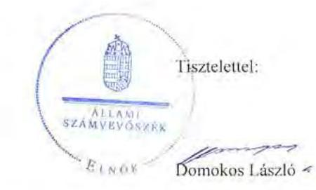

Melléklet: Tájékoztatás az elfogadott és az el nem fogadott észrevételekről

---

# Tájékoztatás 

## az elfogadott és az el nem fogadott észrevételekról

A regionális és kistérségi fejlesztési tanácsok forráselosztási tevékenységének ellenörzése címü jelentéstervezetre LI.TK/50/K/2013. iktatószámú levelében tett észrevételeit áttekintettük, azok kezeléséről az alábbi tájékoztatást adom.

A jelentéstervezet 34. oldalára tett észrevételét részben fogadtuk el. A területfejlesztési dokumentumok elfogadást követő megküldésére vonatkozóan előírt 90 napos határidő teljesítésére nem, az elfogadó határozatokra mindössze $5,6 \%$-ban álltak rendelkezésre adatok. Ennek megfelelően a jelentésben a megállapítás szövegét pontosítjuk.

Nem fogadtuk el ugyanezen bekezdést érintően a Dokumentációs Központ Üzemeltetési Szabályzatára vonatkozó megállapításunk törlésére tett észrevételét. A területfejlesztéssel és a területrendezéssel összefüggésben megőrzendő dokumentumok gyüjtéséről, megőrzéséről, nyilvántartásáról és hasznosításáról szóló 16/2010. (II. 5.) Korm. rendelet 3. § (9) bekezdés e) pontja előírja, hogy az Üzemeltetési Szabályzat szerinti űrlapnak tartalmaznia kell az elfogadásról, illetve jóváhagyásról szóló határozat számát. Észrevételében nem kifogásolta azt a megállapításban foglalt tényt, hogy ezt az Üzemeltetési Szabályzat vonatkozó űrlapja nem tartalmazta. Nem adott továbbá információt arról, hogy a Dokumentációs Központ honlapjáról letölthető adatlap része-e az Üzemeltetési Szabályzatnak, és ezzel eleget tesz-e a hivatkozott jogszabályi előírásnak.

Nem fogadtuk el a jelentéstervezet 34. oldalának utolsó bekezdésére tett javaslatát. A jelentéstervezet nem azt tartalmazza, hogy a nyilvántartásban minden esetben együtt tartják nyilván a területfejlesztési koncepciókat és programokat. A megállapítás szerint a „nyilvántartásban a régiók, a megyék, a kiemelt térségek és a kistérségek területfejlesztési dokumentumai külön nyilvántartási egységben szerepeltek, a megyéken, a kiemelt térségeken és a kistérségeken belül azonban a területfejlesztési koncepciókat és programokat együtt tartották nyilván." Az ellenőrzés rendelkezésére bocsátott nyilvántartás a dokumentumok típusaként „megyei területfejlesztési koncepció és program", „kiemelt térség területfejlesztési koncepció és program", „kistérség területfejlesztési koncepció és program" megnevezés szerinti bontásban tartalmazta a területfejlesztési koncepciókat és programokat, ezen belül a koncepciókat és a programokat elkülönítetten az összesített adatok nem tartalmazták.

A jelentéstervezet 35. oldalának 3. bekezdésére tett kiegészítő javaslatát nem fogadtuk el. A jelentéstervezet tényként állapította meg, de nem kifogásolta, hogy a VÁTI jogosultság hiányában nem vizsgálta a beküldött koncepciók, programok tartalmi követelményeknek való megfelelését. Az ellenőrzés nem terjedt ki a szervezet működésére, a feladatellátás és az azokhoz rendelt források összhangjára, így a jogszabály által el nem rendelt feladatokhoz kapcsolható forrásokra sem tehet megállapítást. A területfejlesztéssel és a területrendezéssel

---

összefüggésben megőrzendő dokumentumok gyűjtéséről, megőrzéséről, nyilvántartásáról és hasznosításáról szóló 16/2010. (II. 5.) Korm. rendelet a dokumentációk kidolgozásáért felelős szervek feladataként írta elő a területfejlesztési koncepciók és programok Dokumentációs Központ részére történő megküldését. Az Állami Számvevőszék ellenőrzése során a jogszabályban előírtak végrehajtását ellenőrizte, ezért a VÁTI tudomására jutott dokumentumok önerőből történő begyűjtése nem releváns, megállapításunkhoz csak kiegészítő információt ad.

Tájékoztatom, hogy a számvevőszékí jelentés mellékleteiként szerepeltetjük a jelentéstervezethez tett észrevételeit, valamint az azokra adott válaszunkat.

Budapest, 2013. 08. hőO/ nap
Holman Magdolna
felügyeleti vezető

---

# 15. számú melléklet a V-0031-088/2013. számú jelentéshez 

## N

Állami Számvevőszék
Domokos László úr
elnök részére

Budapest 4
Pf. 54.
1364

Tárgy: regionális és kistérségi fejlesztési tanácsok forráselosztási tevékenységének ellenőrzéséről készített jelentéstervezet véleményezése

## Tisztelt Elnök Úr!

Tárgyban jelezett, V-0031-070/2013. iktatószámú levelére válaszolva a jelentéstervezethez az alábbi észrevételeket tesszük.

## I. ÖSSZEGZŐ MEGÁLLAPÍTÁSOK

## 17. oldal első bekezdése

A szövegrész említi, hogy a szakmai munka és a döntés centralizált maradt.
A regionális döntési kompetenciák valóban nem kerültek bővítésre, ugyanakkor jelentős és szerteágazó szakmai munka folyt az RFT-k, valamint az RFÜ-k keretén belül.
Ennek megjelenítését javasoljuk a 31. oldal első bekezdésében is a szakmai tevékenység tekintetében. Az ÉMOP esetében például több regionális szintű elemzés, dokumentum készült (pl. MID-TERM értékelés, válságterv).

## II./2.1. A regionális fejlesztési tanácsok és munkaszervezeteik szabályozottsága

A II/2.1 fejezetben foglaltak- szabályozottság- tényszerűek.
Amint azt a jelentés 38. oldala is tartalmazza:
"Az ÉMRFT és a KDRFT esetében a titkársági feladatok RFÜ-kbe történő kiszervezése ellentmondásos helyzetet eredményezett. Az RFT-k költségvetését az RFÜ-knek a költségvetési rend szerint kellett végrehajtaniuk annak ellenére, hogy saját gazdálkodásukra és szabályzataikra a vállalkozások számviteli elöírásai vonatkoztak. Ez az ellentmondásos helyzet is hozzájárult ahhoz, hogy a helyszínen ellenőrzött RFT-k - ...- nem készítették el teljes körűen számviteli és gazdálkodási szabályzataikat."

Az ÉMRT és ÉMRFÜ esetében a titkársági, munkaszervezeti feladatok ellátása kiterjedt a Tanács- természetesen az Ügynökségtől elkülönített módon történő- forrásainak kezelésére, költségeinek kifizetésére is.
A feladatok és források ÉMRFÜ részére történő átadásáról - amint azt a jelentéstervezet is rögzíti - Közhasznúsági, vagy háromoldalú Támogatási Szerződések kerültek megkötésre. Ezt követően a kötelezettségvállalás, beszerzések lebonyolítása, teljesítésigazolás és kifizetés az ÉMRFÜ saját szabályzatai alapján történt meg.

NORDA Észak-Magyarországi Regionális Fejlesztési
Ügynökség Közhasznú Nonprofit Kft.
Cím: 3535 Miskolc, Széchenyi u. 107.
Tel.: +36 46/504-460
E-mail: nordadmorda.hu
www.norda.hu
www.upszechenyiterv.gov.hu

---

A fenti ellentmondásos helyzetet jól jellemzi, hogy az ÉMRFT azért csak 2010.12.01.-én készített pénzkezelési szabályzatot, mert ezt megelőzően nem müködtetett házipénztárt. Az ÉMRFT költséget- az átadott források terhére- elkülönített bankszámláról az ÉMRFÜ teljesítette banki átutalással.

# Indikátorokkal kapcsolatos észrevétel 

20. és 40. oldal: „a hazai forrásokból megvalósított fejlesztések eredményeinek mérésére programszintű indikátorokat nem, projekt szintű indikátorokat csak 2009-től határoztak meg."

Fentiekkel részben értünk egyet.
A jelentés által vizsgált 2007-2009. évi hazai pályázatok esetében:
A TRFC 2008. pályázat esetében a vállalkozások számára kiírt jogcím esetében a 2, illetve 3 évre vállalandó többletfoglalkoztatás, illetve adózás előtti eredmény növelésre vállalt kötelezettségek, mint mérhető indikátorok jelentek meg.
A többi pályázati kiírás, 2007. 2008. 2009. évi HÖF pályázatok esetében programszintű indikátorok ugyan nem voltak, de beruházások által vállalt eredmények a támogatási szerződésben minden esetben rögzítésre kerültek, melyek mérhetőek voltak (pl.: TEUT esetén megvalósult útfelújítás hossza stb.).
Az indikátorokkal kapcsolatosan továbbá megjegyezzük, hogy azok egységes alkalmazása mint azt a jelentés által is említett 2009. évi HÖF-ök esete is példázta - a hazai forrású pályázatokra igen nehézkes, mert az egyes konstrukciókban a pályázható jogcímek és azok tárgya nagyon sokrétű volt, ezért a megvalósítandó cél mérhetőségét biztosító indikátorok alkalmazása is igen nehézkes.

Miskolc, 2013. július 4.

Tisztelettel:

NORDA Észak-Magyarországi Regionális Fejlesztési
Ugynökség Közhasznú Nonprofit Kft.
Cím: 3525 Miskolc, Széchenyi u. 107.
Tel.: $+3646 / 504-460$
E-mail: nordadimorda.hu
www.norda.hu
www.ujszechenyiterv.gov.hu

---

# 16. számú melléklet a V-0031-088/2013. számú jelentéshez 

## ÉLNÉK

ÁLLAMI
SZÁMVEVÖSZÉK

Ikt.szám: V-0031-083/2013

## Gutyán Gergely úr

ügyvezető
NORDA Észak-Magyarországi Regionális Fejlesztési Ügynökség
Közhasznú Nonprofit Kft.

## Miskolc

## Tisztelt Ügyvezető Úr!

A regionális és kistérségi fejlesztési tanácsok forráselosztási tevékenységének ellenórzése címü jelentéstervezetre tett észrevételeit köszönettel megkaptam.

Az Állami Számvevőszék észrevételekre vonatkozó álláspontjáról a felügyeleti vezető által készített részletes tájékoztatást csatoltan megküldöm.

Tájékoztatom Ügyvezető urat, hogy a jelentésben - az Állami Számvevőszékről szóló 2011. évi LXVI. törvény 29. § (3) bekezdése alapján - az el nem fogadott észrevételeket szerepeltetjük az elutasítás indokának feltüntetésével együtt.

Budapest, 2013. 06 hó 05 nap
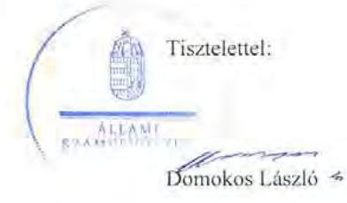

Melléklet: Tájékoztatás az el nem fogadott észrevételekről

---

# Tájékoztatás 

## az el nem fogadott észrevételekröl

A regionális és kistérségi fejlesztési tanácsok forrásélozztási tevékenységének ellenörzése címú jelentéstervezetre NORDA13/138/2 iktatószámú levelében tett észrevételeit áttekintettük, azok kezeléséről az alábbi tájékoztatást adom.

A jelentéstervezet 17. oldal első bekezdésére tett észrevétele megállapításunkat nem módosítja, a jelentéstervezet 31. oldalára tett észrevételét pedig nem fogadtuk el. A jelentéstervezet 17. és 31. oldalán szereplő megállapítások a regionális fejlesztési tanácsok szerepét az Országos Fejlesztéspolitikai Koncepcióról szóló 96/2005. (XII. 25.) OGY határozat és az Országos Területfejlesztési Koncepcióról szóló 97/2005. (XII. 25.) OGY határozatban foglaltak teljesítésének szempontjából jeleníti meg. A regionális fejlesztési tanácsok - észrevételben is szereplő - szakmai tevékenységét a jelentéstervezet 2.5 és 2.6 pontja tartalmazza.

Nem fogadtuk el a jelentéstervezet 2. fejezetének 2.1 pontjára tett kiegészítő észrevételét. A regionális fejlesztési ügynökségeknek a regionális fejlesztési tanácsok müködéséhez kapcsolódó gazdálkodási, költségvetés végrehajtási feladatait - a jelentéstervezetben megjelenített ellentmondásos helyzet ellenére - a költségvetési szervekre vonatkozó szabályok szerint kellett végrehajtaniuk. Az államháztartás szervezetei beszámolási és könyvvezetési kötelezettségének sajátosságairól szóló 249/2000. (XII. 24.) Korm. rendelet 8. § (3)-(4) bekezdésének előírásai alapján a számviteli gazdálkodási szabályzatokat el kellett készíteni, köztük a pénzkezelési szabályzatot is függetlenül attól, hogy müködött-e házipénztár vagy sem.

Nem fogadtuk el a jelentéstervezet 20. és 44. oldalán lévő megállapítással kapcsolatos észrevételét. A hazai forrásokból megvalósított fejlesztések eredményének mérésére alkalmas programszintű indikátorok meghatározásának hiányát az észrevétel is megerősíti. Az egyes beruházások során vállalt eredmények támogatási szerződésben való egyedi rögzítése programszintủ indikátorok meghatározásának hiányában - nem biztosítja a támogatással elérni kívánt célokhoz való hozzájárulás mérését.
Tájékoztatom, hogy a számvevőszékí jelentés mellékleteként szerepeltetjük a jelentéstervezethez tett észrevételeit, valamint az azokra adott válaszunkat.

Budapest, 2013. hó nap

## Ralun Jule

Holman Magdolna
felügyeleti vezető

---

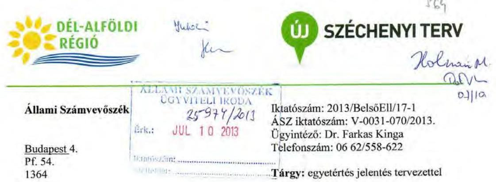

# Domokos László elnök úr részére 

Tisztelt Elnök Úr!
Alulírott Dr. Kiss Imre, mint a DARFÜ Dél-alföldi Regionális Fejlesztési Ügynökség Nonprofit Kft. ügyvezető igazgatója, ezúton tájékoztatom a Tisztelt Elnök Urat, hogy ,,a regionális és kistérségi fejlesztési tanácsok forráselasztási tevékenységének ellenőrzéséről" készített számvevőszééé jelentéstervezet megállapításaira észrevételt nem kívánok tenni.

A további eredményes és hatékony együttmüködés reményében tisztelettel:
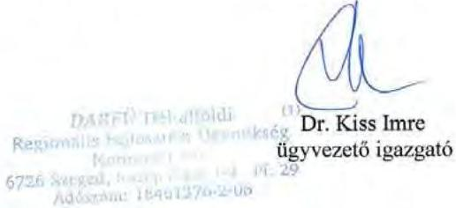

Szeged, 2013. július 8.

DARFÜ Dél-alföldi Regionális Fejlesztési Ügynökség Nonprofit Kft.
Cím: 6726 Szeged, Közép fasor 1-3.
Tel.: +36 62/561-920
E-mail: ugyfelszolgalat@darfu.hu
www.darfu.hu
www.ujszechenyiterv.gov.hu

---

# Állami Számvevőszék 

## Domokos László

## Elnök

1364 Budapest 4., pf. 332.

Iktatószám 640 01/2013
Tárgy: Visszajelzés jelentéstervezetre (VO601)

## Tisztelt Elnök úr!

2013. június 25 -én megkaptuk a regionális és kistérségi fejlesztési tanácsok forráselosztási tevékenységének ellenőrzésérők készített jelentéstervezetüket, amelyet ezúton is megköszönünk.

A jelentéstervezetet elolvastuk, azzal kapcsolatban észrevételünk nem merült fel.
A vizsgálatot végző kollégájával jó együttmüködés alakult ki, a szakterületünket érintő kérdésekben máskor is szívesen állunk rendelkezésükre.

Székesfehérvár, 2013. július 9.

További eredményes munkát kívánva, tisztelettel:
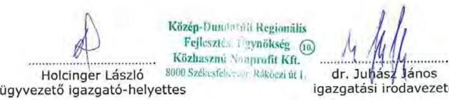

Közép-Dunántúli Regionális Fejlesztési Tanács
Clm: 8000 Székesfehérvár, Rékóczi út 1.
Tel.: +36 22/513-370
E-mail: info@kdrfu.hu
www.kdrfu.hu
www.ujzenchenyiterv.gov.hu

---

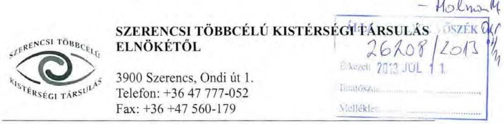

Szám: 50.120-1/2013/KIST

Tárgy: ellenőrzésről szóló jelentéstervezet elfogadása
Hivatkozási szám: V-0031-070/2013
Ügyintéző: dr. Árvay László

# Domokos László 

elnök úr részére

## Állami Számvevőszék

## Tisztelt Elnök Úr!

A regionális és kistérségi fejlesztési tanácsok forráselosztási tevékenységéről szóló számvevőszéki jelentéstervezetet megkaptuk.

A tervezetet áttekintve azt tárgyilagosnak, kellően átfogónak és részletesnek tartjuk, a benne megfogalmazottakkal kapcsolatban észrevételünk nincs, azt elfogadjuk.

Bízunk abban, hogy a jelentéstervezet kellően hozzájárul ahhoz, hogy az elkövetkező időszakban a területfejlesztés területén lévő források hatékonyabban kerülnek majd felhasználásra, ezzel is elősegítve az országon belül lévő hátrányos helyzetű kistérségek felzárkóztatását, a területi különbségek kiegyenlítését, a leszakadó régiók fejlesztését.

Szerencs, 2013. június 2.
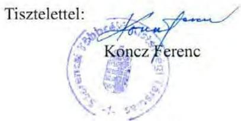