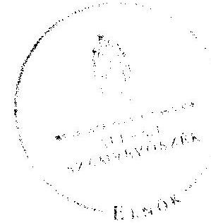
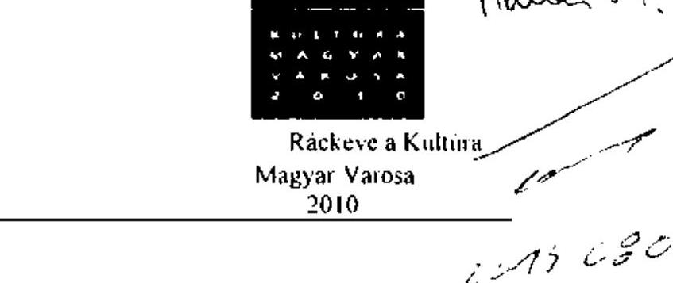
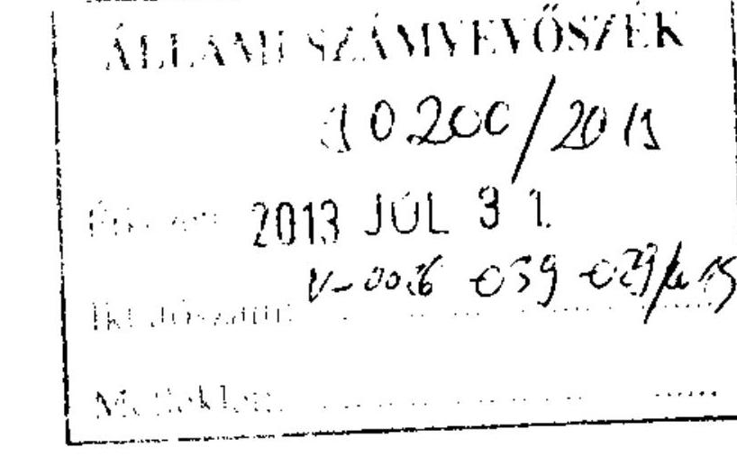
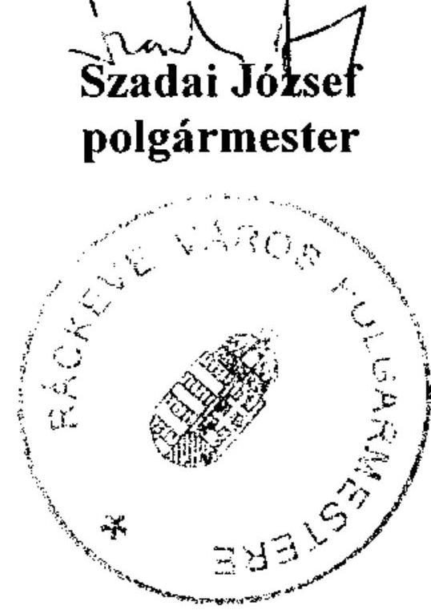
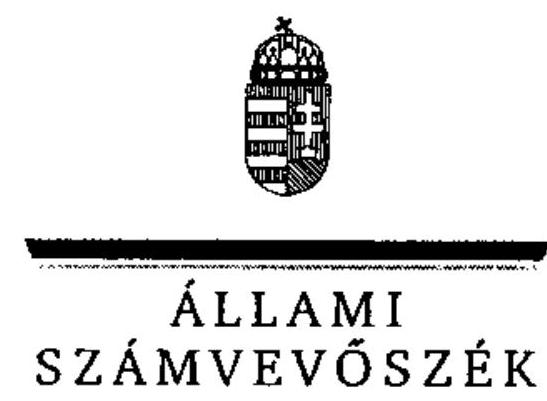
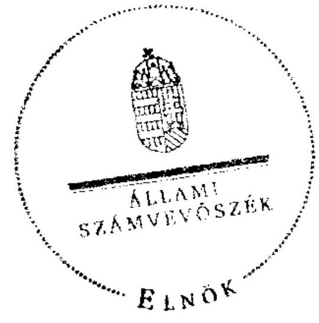
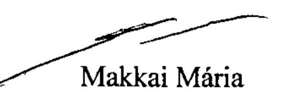

# ÁLLAMI   SZÁMVEVŐSZÉK 

## JELENTÉS

az önkormányzati vagyongazdálkodás
szabályszerúségi ellenőrzéséről
Ráckeve
13073
2013. szeptember

---

# Állami Számvevőszék 

Iktatószám: V-0026-039-032/2013.
Témaszám: 1065
Vizsgálat-azonosító szám: V0593008

## Az ellenőrzést felügyelte:

## Makkai Mária

felügyeleti vezető
2012. december 16. napjától

## Gyüre Lajosné

felügyeleti vezető
2012. december 15. napjáig

## Az ellenőrzést vezette és az ellenőrzés végrehajtásáért felelős:

## Kesjár János

ellenőrzésvezető

## Az ellenőrzést végezték:

| dr. Gaálné Berente | Dalmayné Szerző | Dombovári Nóra |
| :-- | :-- | :-- |
| Mónika | Ildikó | számvevő tanácsos |
| számvevő | számvevő tanácsos |  |

## Sali Sándorné

számvevő

A témához kapcsolódó eddig készített számvevőszéki jelentések:
Címe
sorszáma
Ráckeve Város Önkormányzata gazdálkodási rendszerének 2010. V0520-01 évi ellenőrzéséről

---

# TARTALOMJEGYZÉK 

BEVEZETÉS ..... 3
I. ÖSSZEGZŐ MEGÁLLAPÍTÁSOK, KÖVETKEZTETÉSEK, JAVASLATOK ..... 5
II. RÉSZLETES MEGÁLLAPÍTÁSOK ..... 10

1. A vagyongazdálkodási tevékenység szabályozottsága ..... 10
1.1. A feladatellátás formáinak meghatározása, a döntések megalapozottsága ..... 10
1.2. A vagyonnal gazdálkodó szervezetek szervezeti rendjének szabályozottsága, a kötelező szabályzatok megfelelősége ..... 10
1.3. A vagyongazdálkodás szabályozása ..... 11
2. A vagyongazdálkodás szabályszerűsége ..... 12
2.1. A vagyon nyilvántartásának megfelelősége ..... 12
2.2. A vagyongazdálkodást érintő gazdasági események, követelmények szerinti dokumentáltsága ..... 12
2.3. A vagyongazdálkodási intézkedések, döntések szabályszerűsége ..... 14
3. A vagyonváltozást eredményező gazdasági események szabályszerűsége ..... 14
3.1. A vagyon értékének és összetételének változása ..... 14
3.2. Közbeszerzési eljárás alkalmazása ..... 17
3.3. Hitelfelvétel, kötvénykibocsátás, garancia és kezességvállalás szabályszerűsége ..... 17
3.4. A térítés nélküli átadás szabályszerűsége ..... 18
4. A vagyongazdálkodás szabályszerűségére vonatkozó belső és külső ellenőrzések hasznosulása ..... 19
4.1. A belső ellenőrzés által tett megállapítások, javaslatok hasznosulása ..... 19
4.2. A többségi tulajdonban lévő gazdasági társaságok vagyongazdálkodásának felügyelete ..... 20
4.3. A könyvvizsgálatnak a vagyongazdálkodás szabályosságához való hozzájárulása ..... 20
4.4. A külső ellenőrző szervezet által tett javaslatok hasznosulása ..... 20

---

# MELLÉKLETEK 

1. számú Ráckeve Város Önkormányzata gazdálkodására jellemző adatok, mutatószámok
2. számú Ráckeve Város Önkormányzata vagyonának alakulása
3. számú Ráckeve Város Önkormányzata kötelezettségeinek alakulása
4. számú Ráckeve Város Önkormányzata polgármesterének észrevétele
5. számú A polgármester észrevételére adott válasz

## FÜGGELÉKEK

1. számú Rövidítések jegyzéke
2. számú Értelmező szótár

---

# JELENTÉS 

## az önkormányzati vagyongazdálkodás szabályszerűségi ellenőrzéséről

## Ráckeve

## BEVEZETÉS

Az ÁSZ kiemelten fontosnak tartja az Állami Számvevőszékről szóló 2011. évi LXVI. törvény 5. § (4) bekezdése alapján az önkormányzati vagyon kezelésének, a vagyonnal való gazdálkodási szabályok betartásának az ellenőrzését. Az ellenőrzés feladata a vagyongazdálkodással kapcsolatban a közpénzek átláthatósága, nyilvánossága érdekében a jogszabályokban, belső szabályzatokban megfogalmazott előírások érvényesülésének áttekintése. Az Állami Számvevőszék nem csak az ellenőrzött szervezet vagyongazdálkodásának a hibáira mutat rá, számon kérve azok kijavítását, hanem megállapításaival, javaslataival segíti a közpénzzel, a közvagyonnal való felelős gazdálkodást.

Az önkormányzati vagyon alapvető funkciója, hogy a közérdeket és egyúttal az önkormányzati célok megvalósítását szolgálja. A feladatellátás terén elsősorban a kötelezően ellátandó feladatok végrehajtását hivatott szolgálni, amely mellett az önként vállalt feladatok ellátása is megvalósulhat.

## Az ellenőrzés célja az Önkormányzatnál annak értékelése volt, hogy:

- a vagyongazdálkodási tevékenységet, annak szervezeti kereteit szabályoz-ták-e;
- az önkormányzati vagyongazdálkodás törvényességét, szabályszerűségét biztosították-e a döntések előkészítése és végrehajtása során;
- jogszerű döntéseken alapult-e a vagyon értékének és összetételének változása;
- a belső ellenőrzés elősegítette-e a vagyongazdálkodás szabályszerű működését, valamint hasznosultak-e a korábbi külső ellenőrzések által tett javaslatok.

Az ellenőrzés típusa: szabályszerűségi ellenőrzés.
Az ellenőrzés a 2007. január 1. és 2011. év december 31. közötti időszakra terjedt ki, kitekintéssel a helyszíni ellenőrzés befejezéséig tartó időszak releváns folyamataira. Az egyes közbeszerzési eljárások lefolytatásának ellenőrzése a 2011. évet és a 2012. év I. negyedévét érintette.

---

Az ellenőrzés szakmai módszertana az Állami Számvevőszék Ellenőrzési Kézikönyvében foglalt szakmai szabályokon alapult, amely a Legfőbb Ellenőrző Intézmények Nemzetközi Szervezete (INTOSAI) által kiadott nemzetközi standardok (ISSAI) figyelembevételével készült.

A vagyongazdálkodás szabályozottságát a helyi szabályozások (rendeletek, szabályzatok, utasítások) ellenőrzésével végeztük el. A vagyonváltozások köréből az ellenőrizendő tételeket mintavétellel, a számviteli nyilvántartásokból választottuk ki.

Ráckeve lakosainak száma 2011. január 1-jén 9990 fő volt. A 2010. évi önkormányzati választást követően az Önkormányzat kilenctagú Képviselőtestületének munkáját négy állandó bizottság segítette. Az Önkormányzat mellett a 2007-2011. években négy kisebbségi önkormányzat, német, szerb, bolgár és roma nemzetiségi önkormányzat múködött. A polgármester és a jegyző a 2010. évi önkormányzati választás óta tölti be tisztségét.

Az Önkormányzat feladatainak végrehajtása érdekében a 2011. évben tíz költségvetési intézményt múködtetett, amelyből hét önállóan múködött ${ }^{1}$, három pedig önállóan múködött ${ }^{2}$. A feladatok ellátásában részt vett három gazdasági társaság ${ }^{3}$ és egy társulás ${ }^{4}$.

Az Önkormányzat vagyona 2011. december 31-én a könyvviteli mérleg szerint 9765,1 millió Ft, az adósságállomány értéke 2856,6 millió Ft volt. A 2011. évi költségvetési beszámolója szerint 1911,0 millió Ft költségvetési bevételt ért el és 1963,0 millió Ft költségvetési kiadást teljesített, melyből a felhalmozási célú kiadás 185,0 millió Ft volt. Az Önkormányzat gazdálkodására jellemző adatokat, mutatószámokat az 1-3. számú mellékletek tartalmazzák.

Az ÁSZ a 2011. évi LXVI. törvény 29. §-a szerint a jelentéstervezetet megküldte Ráckeve Város Önkormányzata polgármesterének egyeztetésre. A beérkezett észrevételt és az arra adott választ a jelentés 4-5. számú mellékletei tartalmazzák.

[^0]
[^0]:    ${ }^{1}$ Városi Óvoda, Árpád Fejedelem Általános Iskola, Ránki György Művészeti Iskola, Bölcsőde, Skarica Máté Városi Könyvtár, Ács Károly Művelődési Központ, Hivatásos Önkormányzati Tűzoltóság
    ${ }^{2}$ Városi Intézményi Gazdasági Iroda, Szakorvosi Rendelőintézet és Polgármesteri Hivatal
    ${ }^{3}$ Keve-víz Közszolgáltató Kft., Ráckevei Városüzemeltetési és Szolgáltató Kft., Kör TV Körzeti Televízió Nonprofit Kft.
    ${ }^{4}$ RSD Parti sáv

---

# I. ÖSSZEGZŐ MEGÁLLAPÍTÁSOK, KÖVETKEZTETÉSEK, JAVASLATOK 

Az Önkormányzat vagyonának értéke elsősorban a megvalósult beruházások következtében a 2007-2011. évek között - a könyvviteli mérleg adatai alapján - 9387,8 millió Ft-ról 9765,1 millió Ft-ra, 4\%-kal nőtt. A vagyon növekedését alapvetően az aktivált beruházások, valamint a felújítások eredményezték. A 2007-2011. években az Önkormányzat beruházásokra 898,3 millió Ft kiadást teljesített, a meglévő vagyon felújítására 217,3 millió Ft-ot fordított, ami az elszámolt értékcsökkenés ( 997,2 millió Ft) $21,8 \%$-át jelentette. A legjelentősebb befejezett beruházások és felújítások a városi bölcsőde, a belterületi csapadékvíz elvezetés, a szociális szolgáltatásokat nyújtó ingatlanok bővítése és fejlesztése voltak. A 2007-2011. évek között az önkormányzati vagyon növekedése mellett könyvszerinti értéken 42,8 millió Ft vagyoncsökkenés következett be. Ezt az okozta, hogy az Önkormányzatnak az Aqualand Ráckeve Termál és Wellness Központ megvalósítása során a vállalkozó a szerződés szerint nem fizetett a strandfürdő területeinek átadásakor az átadott ingatlanokért és tárgyi eszközökért. Ezt az tette lehetővé, hogy az Önkormányzat a vállalkozónak a nettó vételárral megegyező támogatást nyújtott. A vagyontárgyak a szerződés aláírásával a vállalkozó tulajdonába kerültek, azokat könyv szerinti értéken az Önkormányzat könyveiből kivezették.

Az Önkormányzat a vagyongazdálkodási tevékenységének szervezeti kereteit alapvetően a hatályos jogszabályi előírások szerint szabályozta. Az Önkormányzati SzMSz-ben rögzítették, hogy a kötelező és önként vállalt feladatait az önállóan működő-, valamint önállóan működő és gazdálkodó költségvetési intézményein, gazdasági társaságain keresztül látja el.

Az Önkormányzat vagyongazdálkodási folyamatainak szabályozási hiányosságai teljes körűen nem biztosították a vagyongazdálkodási feladatok szabályszerű végrehajtását. Az Önkormányzatnál vagyongazdálkodási rendeletben meghatározták az önkormányzati feladatellátást biztosító törzsvagyon és a törzsvagyonnak nem minősülő vagyon körét. Rögzítették a törzsvagyonon belül a forgalomképtelen és a korlátozottan forgalomképes vagyonelemeket, de 2011. április 1-jéig a vagyongazdálkodási, illetve más önkormányzati rendeletben - az Áht ${ }_{1}$ előírásai ellenére - nem írták elő a forgalomképesség megváltoztatásának szabályait, a vagyon térítésmentes átadásának eseteit, módjait. Mindez hozzájárult ahhoz, hogy az Áht ${ }_{1}$-ben foglaltakat megsértve, térítésmentesen és Képviselő-testületi döntés nélkül adta át az egyik gazdasági társasága részére a 3,0 millió Ft könyvszerinti értéken nyilvántartott térfigyelő rendszert. Továbbá az Önkormányzat - az Ötv. előírása ellenére - Képviselő-testületi döntés nélkül bonyolította le a jogszabály alapján, közvilágítás korszerűsítéséhez kapcsolódó térítés nélküli vagyonátadásokat 4,6 millió Ft könyvszerinti értéken.

A hasznosításra szánt önkormányzati vagyon piaci értékének megállapítása céljából értékbecslés készítési kötelezettséget nem írtak elő, de a vagyon hasznosítására vonatkozó döntések előkészítése során értékbecslések történtek.

---

Készült értékbecslés az Aqualand Ráckeve Termál és Wellness Központ megvalósításához átadott ingatlanok és a rajta található felépítményekre, azonban a Képviselő-testület a forgalmi értéknél lényegesen alacsonyabb, annak mintegy egyötöde érték alatt döntött az átadásról. A beruházás megvalósítására kiírt pályázat során a tisztességtelen piaci magatartás és a versenykorlátozás tilalmáról szóló 1996. évi LVII törvényben foglaltakat nem teljesítette, mert a pályázati felhívás nem tartalmazta azon lényeges körülményt, hogy a beruházás megvalósításához az Önkormányzat támogatást is kíván nyújtani.

A vagyon nyilvántartása, a vagyongazdálkodással kapcsolatos döntések végrehajtása során nem biztosították minden esetben a vagyongazdálkodás szabályosságát. Az Önkormányzat a 2007-2011. években elkészítette és a zárszámadási rendelethez csatolta a vagyonkimutatást. A leltározási szabályzatban nem írták elő az üzemeltetésre átadott eszközök leltározásának szabályait a 2007-2008. évek között. Az üzemeltetésre átadott eszközök adatait az üzemeltetővel nem egyeztették, azok könyvviteli mérlegben szereplő értékeit nem támasztották alá az üzemeltető által hitelesített leltárral a 2009-2011. években. A 2007-2011. évek között az ingatlanvagyon kataszter és a számviteli nyilvántartások között a forgalomképesség szerinti ingatlancsoporton belül minden évben eltérés volt, melyeket nem rendeztek a 147/1992. (XI. 6.) Korm. rendelet előírása ellenére. Ugyanezen években az ingatlanvagyon kataszter és a földhivatali nyilvántartás azonos adatai közötti egyezőséget nem biztosították, - a 147/1992. (XI. 6.) Korm. rendeletben foglaltakat megsértve - mivel a feltárt eltéréseket nem tisztázták.

Az Önkormányzat a 2007-2011. években honlapján - az Eisztv. és az Áht. ${ }_{1}$ előírásai ellenére - nem tette közzé a nettó ötmillió Ft-ot elérő vagy azt meghaladó értékű szerződések adatait.

Az Önkormányzat lefolytatta a beruházások és felújítások megvalósítása során az előírt esetekben a közbeszerzési eljárást, eleget tettek a Kbt.-ben előírt egybeszámítási kötelezettségnek. Egy felújításnál - a Kbt.-ben foglalt előírásokat megsértve - olyan vállalkozót hirdettek nyertesnek, akinek nem küldtek írásbeli ajánlattételi felhívást, így érvénytelenné kellett volna nyilvánítani az ajánlatát.

A jegyző a gazdálkodási jogkörök gyakorlásához a vagyongazdálkodáshoz kapcsolódóan a kiadásoknál az ellenőrzési feladatokat meghatározta, ennek ellenére a 2007-2011. években az ellenőrzött tételeknél 36,9 millió Ft értékben a kötelezettségvállalások ellenjegyzői, a szakmai teljesítés igazolására kijelölt személyek és az érvényesítő - az Ámr. ${ }_{1,2}$-ben foglaltak ellenére - nem végezték el ellenőrzési feladataikat. A kontrollok múködésének elmaradásához hozzájárult, hogy az ÁSZ korábbi ellenőrzése során tett javaslatok ellenére az ellenőrzési nyomvonal továbbra sem tartalmazta az egyes tevékenységek, feladatok elvégzését igazoló dokumentumok megnevezését, nyilvántartási helyét. Az ellenőrzött kiadási tételek vonatkozásában kár bekövetkezésére utaló adatot, tényt nem tárt fel az ellenőrzés. A bevételek beszedésével kapcsolatos ellenőrzési feladatokat - az Ámr. ${ }_{2}$-ben foglaltak ellenére - nem határozták meg. Ez is hozzájárult ahhoz, hogy a bevételeket megalapozó szerződések esetében 74,3 millió Ft értékben nem ellenőrizték, hogy a szerződések (ingatlan-, gépjármú adásvételi szerződés) a döntéshozó által elfogadott feltételeket tartalmazzák-e,

---

továbbá, hogy a gazdálkodásra vonatkozó szabályokat betartották-e. Ennek következménye, hogy az Aqualand Ráckeve Termál és Wellness Központ megvalósításához átadott - szerződés szerinti 2,0 millió Ft-ban meghatározott - berendezésekről, tárgyi eszközökről számlát a Számv. tv. és az áfa tv. előírása ellenére nem állítottak ki.

A vagyongazdálkodással összefüggő döntések előkészítésének folyamataiban nem szabályozták a költség-haszon elemzés készítésének, továbbá az Önkormányzat tulajdonosi jogainak, érdekeinek védelmét szolgáló garanciális elemek szerződésben, egyéb dokumentumban való rögzítési kötelezettségét. Ezen kontrollok hiánya is - annak ellenére, hogy azok előírása nem jogszabályi kötelezettség - hozzájárult ahhoz, hogy egy alapítvány részére, idegenforgalmi célú beruházás esetében az Önkormányzat által több alkalommal adott összesen 24,3 millió Ft kölcsön összegéből nem fizetés miatt 5,8 millió Ft vissza nem térítendő támogatássá változott. A maradék összeg 18,5 millió Ft kamatmentes visszatérítendő támogatás maradt, amelynek a lejárata módosult 2035 évre. A tervezett, de be nem folyt kölcsön törlesztés miatt az Önkormányzat likviditási hitelt vett fel, továbbá az évek során 18,5 millió Ft értékvesztést is elszámolt. Az alapítványnak adott vissza nem térítendő támogatás és kamatmentes kölcsön nem a kötelezően ellátandó feladatokhoz kapcsolódott. A nyújtott támogatás, az elszámolt értékvesztés és a kamat nélkül nyújtott kölcsön bevétel kiesése vagyon csökkenést és likviditási gondot okozott. Az Önkormányzat által egy folyamatosan veszteségesen múködő saját társaságának nyújtott 140,6 millió Ft kamatmentes tagi kölcsön vissza nem fizetése és az ennek kapcsán 60,3 millió Ft értékvesztés elszámolása vagyoncsökkenéssel, továbbá a likviditási helyzet romlásával járt. Ezen gazdasági társaság vagyongazdálkodásának belső ellenőrzése - az éves tervben foglaltak ellenére - nem valósult meg.

A 2008-2010. években a belső ellenőrzés nem segítette a vagyongazdálkodás szabályszerű működését, mert vagyongazdálkodással kapcsolatban ellenőrzést nem végzett. Ezt követően öt alkalommal került sor vagyongazdálkodást érintő belső ellenőrzésekre, melyek a gazdálkodási szabályzatok hiányosságait, illetve a belső kontrollok nem megfelelő működését tárták fel. A feltárt hiányosságok megszüntetésére intézkedések történtek.

A Képviselő-testület a 2007-2011. években évente beszámoltatta a gazdasági társaságokat a feladat ellátására átadott vagyonnal való gazdálkodásról, de nem intézkedett a folyamatosan veszteségesen múködő gazdasági társasága veszteségének a megszüntetése és a nyújtott tagi kölcsön visszafizettetése érdekében.

Az Állami Számvevőszékről szóló 2011. évi LXVI. törvény 33. § (1) bekezdésében foglaltak értelmében a jelentésben foglalt megállapításokhoz kapcsolódó intézkedési tervet köteles az ellenőrzött szervezet vezetője összeállítani, és azt a jelentés kézhezvételétől számított 30 napon belül az ÁSZ részére megküldeni. Amennyiben az intézkedési tervet határidőben nem küldi meg a szervezet, vagy az nem elfogadható, az ÁSZ elnöke a hivatkozott törvény 33. § (3) bekezdés a)-b) pontjaiban foglaltakat érvényesítheti.

---

Az ellenőrzés intézkedést igénylő megállapításai és javaslatai:

# a polgármesternek 

1. Az Önkormányzat az Aqualand Ráckeve Termál és Wellnes Központ beruházásához egy vállalkozónak nem piaci értéken, a nettó vételárral megegyező támogatás nyújtásával átadta a strandfürdő területeit, az ingatlanon található felépítményeket és a hozzá kapcsolódó tárgyi eszközöket. Az átadott berendezésekről, tárgyi eszközökről számlát a Számv. tv. és az áfa tv. előírása ellenére nem állított ki. A beruházás megvalósítására kiírt pályázat során a tisztességtelen piaci magatartás és a versenykorlátozás tilalmáról szóló 1996. évi LVII. törvény 8. § (2) bekezdés c) pontját nem teljesítette, mert a pályázati felhívás nem tartalmazta azon lényeges körülményt, hogy a beruházás megvalósításához az Önkormányzat támogatást is kíván nyújtani.

Javaslat
Vizsgálja meg az Aqualand Ráckeve Termál és Wellnes Központ beruházás megvalósításához kapcsolódóan a pályáztatás körülményeit, a pályázati felhívás tartalmát, a vállalkozóval kötött együttmúködési szerződésben szereplő vételárat, annak megalapozottságát, a nyújtott támogatást, annak indokoltságát, az átadott tárgyi eszközök kiszámlázása elmaradásának okait, körülményeit, a vizsgálat eredményének függvényében kezdeményezze a szükséges felelősségre vonást.

## a Jegyzönek

2. A 147/1992. (XI. 6.) Korm. rendelet 1. § (2)-(3) bekezdéseiben foglalt előírások ellenére a 2007-2011. évek között az ingatlanvagyon kataszter és a földhivatali ingatlan nyilvántartás azonos tartalmú adatai, valamint az ingatlanvagyon kataszter és a számviteli nyilvántartások között az egyezőséget nem biztosították.

Javaslat
Intézkedjen, hogy a 147/1992. (XI. 6.) Korm. rendelet 1. § (2) bekezdésében rögzítetteknek megfelelően az ingatlanvagyon kataszter adatai egyezzenek meg a földhivatal ingatlan-nyilvántartásának azonos tartalmú adataival, továbbá az 1. § (3) bekezdésében foglaltakra figyelemmel biztosítsa az egyezőséget az ingatlanvagyon kataszter adatai és a számviteli nyilvántartás adatai között.
3. Az Önkormányzat a 2007-2011. években honlapján nem tette közzé - megsértve az Eisztv. 6. § (1) bekezdésének és az Áht.: 15/B. § (1) bekezdésének előírásait - a nettó ötmillió Ft-ot elérő vagy azt meghaladó értékű szerződések közzétételre előírt adatait.

Javaslat
Intézkedjen, hogy az információs önrendelkezési jogról és az információs szabadságról szóló 2011. évi CXII. törvény 1. számú mellékletében meghatározott adatok közzétételre kerüljenek.

---

4. Az üzemeltetésre átadott eszközök adatait az üzemeltetővel nem egyeztették, azok könyvviteli mérlegben szereplő értékeit nem támasztották alá az üzemeltető által hitelesített leltárral a 2009-2011. években.

Javaslat
Intézkedjen, hogy az üzemeltetésre átadott eszközökről a könyvviteli mérleg alátámasztásához, az Áhsz. 37. § (4) bekezdés előírásának megfelelően, az üzemeltetők által évente elvégzett és hitelesített leltárak álljanak rendelkezésre.
5. A 2007-2011. években az ellenőrzött tételeknél 36,9 millió Ft értékű kötelezettségvállalások esetében az ellenjegyző, a szakmai teljesítés igazolására kijelölt személy és az érvényesítő - az Ámr. ${ }_{1} 134 . \S$ (8)-(9), az Ámr. ${ }_{2} 74 . \S$ (1) és (3), az Ámr. ${ }_{1} 135 . \S$ (1), az Ámr. ${ }_{2} 76 . \S$ (1), az Ámr. ${ }_{1} 135 . \S$ (3) és az Ámr. ${ }_{2} 77 . \S$ (1) bekezdéseiben foglalt előírások ellenére - nem végezte el ellenőrzési feladatait.

Javaslat
Intézkedjen, hogy a pénzügyi ellenjegyző, a teljesítés igazolására kijelölt személy és az érvényesítő - az Áht. ${ }_{2} 37 . \S$ (1), az Ávr. 57. § (1) és az Ávr. 58. § (1) bekezdései előírásainak megfelelően - végezze el ellenőrzési feladatait.

---

# II. RÉSZLETES MEGÁLLAPÍTÁSOK 

## 1. A VAGYONGAZDÁLKODÁSI TEVÉKENYSÉG SZABÁLYOZOTTSÁGA

### 1.1. A feladatellátás formáinak meghatározása, a döntések megalapozottsága

Az Önkormányzat az önkormányzati SzMSz-ben határozta meg a kötelező közszolgáltatási és önként vállalt feladatait. Kötelező feladatait az Ötv. és az ágazati törvények figyelembevételével állapította meg, míg az önként vállalt feladatok mértékét az éves költségvetési rendeletekben határozta meg. Az önkormányzati SzMSz-ben rögzítették, hogy a kötelező és önként vállalt feladatait az önállóan működő-, valamint önállóan működő és gazdálkodó költségvetési intézményein, gazdasági társaságain keresztül látja el. Az intézmények kötelező feladatként az egészségügyi- és szociális alapellátást, a közoktatási- és köznevelési feladatokat biztosították. Az Önkormányzat többségi tulajdonában álló gazdasági társaságok látták el a városüzemeltetést, a víz- és szennyvízcsatorna működtetését, valamint a médiaszolgáltatást.

A Képviselő-testület számára a feladatellátás formáinak meghatározásánál, módosításánál a megalapozott döntés meghozatala érdekében az elő́terjesztésekben alternatív javaslatokat fogalmaztak meg.

A nem önállóan gazdálkodó intézmények gazdasági, könyvelési feladatait 2007ig az Árpád Fejedelem Általános Iskola keretein belül múködő pénzügyi csoport látta el. A Képviselő-testület 2007. év elején úgy döntött, hogy a feladatellátás formáján változtat. A megalapozott döntéshozatal érdekében a Polgármesteri hivatal három alternatívát vázolt fel a Képviselő-testület számára.

### 1.2. A vagyonnal gazdálkodó szervezetek szervezeti rendjének szabályozottsága, a kötelező szabályzatok megfelelősége

Az Önkormányzat a 2007. évben az Ötv.-ben foglaltak alapján alkotta meg az önkormányzati SzMSz-t, szabályozva a polgármesterre és a bizottságokra átruházott hatásköröket. A Képviselő-testület az átruházott hatáskör gyakorlásához utasítást nem adott. A vagyongazdálkodási feladatokat a hatályos törvényi előírásoknak megfelelően vagyongazdálkodási rendeletében szabályozta.

Az Ámr. ${ }_{1,2}$-ben foglalt előírásoknak és a helyi sajátosságoknak megfelelően készítették el a Polgármesteri hivatal SzMSz-ét, melyben szabályozták a pénzügyigazdasági feladatok ellátásáért felelős személyek feladatait, továbbá a vezetők és más dolgozók feladat-, hatás- és jogkörét. Az Önkormányzat a vagyongazdálkodási rendeletében - a leltározási szabályzat ${ }_{1,2}$-vel összhangban - kétévenkénti leltározásról rendelkezett. A leltározási szabályzat ${ }_{1}$-ben az üzemeltetésre, vagyonkezelésre, koncesszióba átadott eszközök leltározásáról azonban nem rendelkeztek a 2007. és a 2008. években. A leltározási szabályzat ${ }_{2}$-ban a

---

2009. évtől meghatározták az üzemeltetésre, vagyonkezelésre, koncesszióba átadott eszközök leltározásának kötelezettségét és végrehajtási rendjét.

# 1.3. A vagyongazdálkodás szabályozása 

Az Önkormányzat a vagyongazdálkodási feladatokat és az Önkormányzati vagyonnal való gazdálkodás szabályait az Ötv. előírásainak megfelelően szabályozta. A vagyongazdálkodási rendeletben az Ötv.-ben foglaltaknak megfelelően határozták meg az önkormányzati feladatellátást biztosító törzsvagyon, és a törzsvagyonnak nem minősülő vagyon körét. Rögzítették a törzsvagyonon belül a forgalomképtelen és a korlátozottan forgalomképes vagyonelemeket, azonban 2012-ig a forgalomképesség megváltoztatásának szabályait nem írták elő.

A 2007-2011. évek között az előterjesztések készítésének, megtárgyalásának, véleményezésének, döntéshozatalának általános rendjét az Önkormányzat SzMSz-ben szabályozta. A szabályozás kiterjedt a vagyongazdálkodást érintő előterjesztésekre is, azonban annak pontos tartalmi követelményeit nem határozták meg. A vagyongazdálkodással összefüggő döntés előkészítés folyamatában - célszerűsége ellenére - nem szabályozták a költség-haszon elemzés készítésének, továbbá az Önkormányzat tulajdonosi jogainak, érdekeinek védelmét szolgáló garanciális elemek szerződésben, egyéb dokumentumban történő rögzítésének kötelezettségét. Az Önkormányzat nem írta elő a hosszú lejáratú, fejlesztési célú hitelfelvételről szóló döntés-előkészítés folyamatában a követendő eljárásrendet, az ajánlatok összehasonlításának, a futamidő egyes éveit terhelő kötelezettség költségvetési egyensúlyra gyakorolt hatása vizsgálatának kötelezettségét.

Az Önkormányzat szabályozta a vagyonkezelők feladatait, a vagyonnal való rendelkezést. Az önkormányzati intézmények vagyonkezelői feladatát, illetékességét, hatáskörét és felelősségét az intézmények alapítói okiratában, kezelői, illetve üzemeltetői szerződésekben szabályozták, az egyes vagyonelemek hasznosítási lehetőségeivel és módjával együtt.

Az Áht. ${ }_{1}$-ben foglaltak alapján a vagyongazdálkodási rendeletben fő szabályként határozták meg, hogy az önkormányzati ingatlanvagyon elidegenítése, használatba, vagy bérbeadása, illetve más módon való hasznosítása nyilvános, vagy meghívásos pályázati eljárás keretében történhet. A vagyongazdálkodási rendeletben az Áht. ${ }_{1}$ 108. § (2) bekezdésben ${ }^{5}$ foglalt előírás ellenére nem szabályozták a térítésmentes átadás eseteit, módjait a vagyonrendelet módosításáig (2011. április 1-ig). A hasznosításra szánt vagyon piaci értékének megállapítása céljából értékbecslés készítési kötelezettséget nem írtak elő.

A jegyző a belső kontrollrendszer kialakítása során az Ámr. 2 20. § (3) bekezdés a) pontjában ${ }^{6}$ foglaltak ellenére a bevételek beszedésével kapcsolatos ellenőrzési feladatokat nem határozta meg.

[^0]
[^0]:    ${ }^{5}$ 2012. január 1-jétől a Vagyon tv. 13. § (3) bekezdése szabályozza
    ${ }^{6}$ 2012. január 1-jétől a Bkr. 8. § (2) bekezdése szabályozza

---

# 2. A VAGYONGAZDÁLKODÁs SZABÁLYSZERŰSÉGE 

### 2.1. A vagyon nyilvántartásának megfelelősége

A 2007-2011. években a zárszámadási rendeletek a vagyongazdálkodási rendeletben szabályozottak szerint meghatározott formában tartalmazták az egyes évekre vonatkozó vagyonkimutatást. A Polgármesteri hivatalban az előírásoknak megfelelően a törzsvagyon (ezen belül forgalomképtelen, illetve korlátozottan forgalomképes), valamint az egyéb vagyon részét képező eszközök elkülönítéséről gondoskodtak.

Az Önkormányzatnál a 2007-2011. években az Áhsz. 49. § (3) bekezdésében, illetve a 147/1992. (XI. 6.) Korm. rendelet 1. § (3) bekezdésében foglaltak figyelembe vételével a vagyonkimutatásban szereplő ingatlanvagyon és az ingatlanvagyon kataszter adatainak egyeztetését elvégezték, azonban a feltárt eltéréseket a nyilvántartásokon nem vezették át, az egyezőséget nem biztosították. A vagyon kataszterben szereplő forgalomképesség szerinti ingatlancsoportok bruttó értéke minden év végén ( $0,1-30,6$ millió Ft-tal) eltért a számviteli nyilvántartás azonos tartalmú bruttó érték adataitól. A 147/1992. (XI. 6.) Korm. rendelet 1. § (2) bekezdésében rögzített ingatlanvagyon kataszter és a közhiteles földhivatali nyilvántartás közötti egyeztetések során feltárt eltéréseket a helyszíni ellenőrzés lezárásáig nem vezették át, így a két nyilvántartás közötti egyezőséget nem biztosították.

Az üzemeltetésre átadott eszközök esetében a 2007-2008. évek között belső szabályozás hiányában - az Önkormányzatnál nyilvántartott eszközök leltározását nem végezték el. A 2009-2011. években figyelmen kívül hagyták a leltározási szabályzat ${ }_{2} 3$. számú mellékletében az átadott eszközök leltározására előírtakat, mivel a nyilvántartott eszközök adatait az üzemeltető gazdasági szervezettel nem egyeztették. A 2010-2011. években az üzemeltetésre, vagyonkezelésbe adott eszközök könyvviteli mérlegben szereplő értékeit az Áhsz. 37. § (4) bekezdésének ${ }^{7}$ előírása ellenére nem támasztották alá az üzemeltetést végző szervezet által elkészített, hitelesített és megküldött, a fordulónapra vonatkozó leltárral.

### 2.2. A vagyongazdálkodást érintő gazdasági események, követelmények szerinti dokumentáltsága

A vagyongazdálkodással kapcsolatban az operatív gazdálkodási jogköröket az arra írásban felhatalmazott, illetve kijelölt személyek gyakorolták. A gazdálkodási jogkör gyakorlása során valamennyi gazdasági eseménynél érvényesültek az Ámr. ${ }_{2}$-ben rögzített összeférhetetlenségi követelmények. A Polgármesteri hivatalban a 2007-2011. évek között a vagyongazdálkodáshoz kapcsolódó kiadások teljesítését megelőzően a kötelezettségvállalás ellenjegyzésére, az érvényesítésre, az utalvány ellenjegyzésére és a szakmai teljesítésigazolásra felhatalma-

[^0]
[^0]:    ${ }^{7}$ Megállapította a 317/2009. (XII. 29.) Korm. rendelet 18. §. Hatályos 2010. január 1-jétől. Először a 2010. évtől készített beszámolókra kell alkalmazni.

---

zott és kijelölt személyek nem végezték el az elöírt (folyamatba épített) ellenőrzési feladataikat:

- az Áht. ${ }_{1}$ 100/C. § (3) bekezdésében ${ }^{8}$ és az Ámr. ${ }_{1}$ 134. § (8) bekezdésében, illetve az Ámr. ${ }_{2} 74 . \S$ (1) bekezdésében ${ }^{9}$ foglalt előírás ellenére a kötelezettségvállalást nem előzte meg annak ellenjegyzése összesen 36,9 millió Ft értékben az eszközbeszerzés, a járdaépítés, a Kerekzátonyi Mólófelújítás, a Híd Vámház felújítás, a csapadékvíz elvezetés, az esőcsatorna felújítás, az ingatlan adás-vételek, a hiteles tulajdoni lap másolathoz és a telekalakítási engedélyhez kapcsolódó megrendelő esetén, ezáltal az Ámr. ${ }_{1}$ 134. § (9) bekezdésében, illetve az Ámr. ${ }_{2} 74 . \S$ (3) bekezdésében ${ }^{10}$ foglalt ellenőrzési feladatokat nem végezték el, nem győződtek meg a kiadási előirányzatok rendelkezésre állásáról, a fedezet meglétéről, illetve nem vizsgálták, hogy a kötelezettségvállalás megfelel-e a gazdálkodásra vonatkozó szabályoknak;
- a szakmai teljesítés igazolását a jegyző által kijelölt személy nem végezte el a számítógép beszerzésre, Kerekzátonyi Mólófelújításra, csatorna beruházáshoz kapcsolódó ELMŰ elektromos csatlakozásra, ingatlan adásvételéhez kapcsolódó foglalóra, két ingatlanvásárlásra, a telekalakítási engedélyre teljesített kifizetések esetében, ezért - az Ámr. ${ }_{1}$ 135. § (1) bekezdésében, illetve az Ámr. ${ }_{2} 76 . \S$ (1) bekezdésében ${ }^{11}$ előírtak ellenére - a kifizetést megelőzően a szakmai teljesítésigazoló által nem történt meg a kifizetés jogosságának, összegszerűségének és a szerződésszerű teljesítésnek az ellenőrzése, együttesen 4,4 millió Ft összegben;
- az Önkormányzatnál az ingatlanértékesítésből származó bevételek teljesítése során a belső kontrollok - a bevételeket megalapozó szerződések ellenőrzései - szabályozás hiányában nem múködtek. Az értékesítési feltételek ellenőrzését végző személyek kijelölésének hiányában a 441 hrsz. ingatlan 40 millió Ft, a 051-0 hrsz. ingatlan 0,3 millió Ft, a 35 hrsz. ingatlan 34 millió Ft és egy használt gépkocsi 0,3 millió Ft összegű adásvételi szerződések aláírását megelőzően nem ellenőrizték, hogy az Önkormányzat érdekeit védő garanciális elemeket szerződésben rögzítették-e, továbbá, hogy a gazdálkodásra vonatkozó szabályokat betartották-e;
- az érvényesítő az Ámr. ${ }_{1}$ 135. § (3) bekezdésében, illetve az Ámr. ${ }_{2} 77 . \S$ (1) bekezdésében ${ }^{12}$ foglalt előírás ellenére nem ellenőrizte, az utalványok ellenjegyzői az Ámr. ${ }_{1}$ 137. § (3) bekezdésében, illetve az Ámr. ${ }_{2} 79 . \S$ (2) bekezdésében foglaltak ellenére nem észrevételezték, hogy a jegyző által kijelölt személy nem végezte el a szakmai teljesítés igazolását, továbbá a kötelezettségvállalás ellenjegyzésére vonatkozó előírását nem tartották be.

[^0]
[^0]:    ${ }^{8}$ 2012. január 1-jétől az Áht. ${ }_{2}$ 37. § (1) bekezdése szabályozza
    ${ }^{9}$ 2012. január 1-jétől az Ávr. 55. § (1) bekezdés és a (2) bekezdés f) pontja szabályozza
    ${ }^{10}$ 2012. január 1-jétől az Áht. ${ }_{2}$ 54. § (1) bekezdése szabályozza
    ${ }^{11}$ 2012. január 1-től az Ávr. 57. § (1) bekezdése szabályozza
    ${ }^{12}$ 2012. január 1-től az Ávr. 58. § (1) bekezdése szabályozza

---

A jegyző az Áht. ${ }_{1}$ 15/B. § (1) bekezdés és az Eisztv. 6. § (1) bekezdés ${ }^{13}$ előírásai ellenére a vagyonnal történő gazdálkodással összefüggő, a nettó ötmillió Ftot elérő vagy azt meghaladó értékű városi bölcsőde tervdokumentációjára, ingatlanvásárlásra, továbbá vagyonértékesítésekre vonatkozó szerződések adatait (a szerződések megnevezését, tárgyát, a szerződő felek nevét, a szerződés értékét, időtartamát) nem tette közzé.

# 2.3. A vagyongazdálkodási intézkedések, döntések szabályszerűsége 

A 2007-2011. években az Önkormányzat hosszú lejáratú, felhalmozási célú pénzintézettel szembeni kötelezettségvállalásairól - a Pénzügyi bizottság véleményének figyelembe vételével - a Képviselő-testület döntött, melyet megelőzően tájékoztatást kapott a kötelezettségvállalás kamatkockázatairól, az adósságszolgálatról.

A hitelfelvételről szóló döntések esetében a döntéshozók az arra felhatalmazott személyek voltak, a szerződések és megállapodások tartalma a döntésekben foglaltakkal megegyezett. Az önkormányzati vagyont érintő döntéseket a dokumentumokban foglaltaknak megfelelően hajtották végre.

## 3. A VAGYONVÁLTOZÁST EREDMÉNYEZŐ GAZDASÁGI ESEMÉNYEK SZABÁLYSZERŰSÉGE

### 3.1. A vagyon értékének és összetételének változása

Az Önkormányzat vagyonának értéke a 2007-2011 évek között - a könyvviteli mérleg adatai alapján - nőtt, 9387,8 millió Ft-ról 9765,1 millió Ft-ra, 377,3 millió Ft-tal ( $4,0 \%$-kal) növekedett elsősorban a megvalósult beruházások miatt.

A legjelentősebb befejezett beruházások a városi bölcsőde (253,2 millió Ft), a belterületi csapadékvíz elvezetés ( 174,9 millió Ft), a szociális szolgáltatások bővítése és fejlesztése ( 50,3 millió Ft) voltak. A befejezetlen állomány között szerepelt 2009-ig a csatorna beruházás ( 4625,6 millió Ft), amely már 2002. évben befejeződött, de használatbavételre csak a 2010. évben került sor az üzembe helyezés során felmerült jogi vita miatt. Folyamatban lévő beruházások közül jelentős a „Levegőt Ráckeve élhetőbb központjáért" elnevezésű, 756,4 millió Ft értékben megvalósuló projekt.

Kiemelkedő volt a növekedés az üzemeltetésre átadott eszközöknél (a 2007. évi 117,1 millió Ft-ról 2011-re 4538,3 millió Ft-ra, 4421,2 millió Ft-tal) a 2010. évben üzemeltetésre átadott szennyvíz csatorna következtében. Az Önkormányzat saját vagyona 2007-ben 4374,9 millió Ft-ról 2011-ben 6908,5 millió Ft-ra, 2533,6 millió Ft-tal ( $57,9 \%$-kal) növekedett elsősorban a szennyvíz beruházással kapcsolatban aktivált eszközök osztatlan közös tulajdonban maradt va-

[^0]
[^0]:    ${ }^{13}$ 2012. január 1-jétől az információs önrendelkezési jogról és az információs szabadságról szóló 2011. évi CXII. törvény 1. számú melléklete szabályozza

---

gyonértékével. Ennek következtében a hosszú lejáratú kötelezettségek a 2007. évi 4746,7 millió Ft-ról a 2011. év végére 2657,6 millió Ft-ra csökkentek.

A 2007-2011. évek között vagyoncsökkenés következett be az Aqualand Ráckeve Termál és Wellness Központ megvalósítása során a strandfürdő területeinek átadása következtében. A Képviselő-testület pályázatot írt ki a tulajdonát képező tókerti meleg vizű strand területe (a rajta lévő felépítményekkel együtt) és környezetének hasznosítása keretében élményfürdő és kapcsolódó sport és szórakoztató egységek létesítésére. A hasznosításra kijelölt terület nagyságát maximum 12 hektárban határozták meg, mely területen helyezkedik el a mélyfúrású meleg vizű kút, amit szintén eladásra szántak.

A fejlesztés tartalmára és a hasznosítás módjára a pályázóknak kellett javaslatot tenni, többek között az ingatlan tulajdonjogával kapcsolatos elképzelésekre és a beruházás finanszírozási szerkezetére, ebben az Önkormányzat szerepére, ha van. A nyilvános pályáztatás eredményeként két pályázat érkezett, az egyik egy magánszemély, a másik pedig egy kft. volt. A nyertes az ajánlati felhívásban szereplő kiválasztási szempontok szerinti pontozásos módszerrel került kiválasztásra. A Képviselő-testület a 65/2005. (III. 7.) számú határozatával jóváhagyta a nyertes pályázóval kötött szerződést. A határozatban rögzítették, hogy a szerződésben pontosítani kell az adásvétellel érintett terület értékét, továbbá a területen található tárgyi eszközök, felépítmények, ideértve a meleg vizű kút átadásának feltételeit.

Az Önkormányzat 2005. április 29-én együttműködési szerződést kötött a pályázat nyertesével a termál és wellness központ megvalósítására. A szerződésben az Önkormányzat két részletben vételi jogot biztosított 12 hektár területre 2010. augusztus 31-ig. A vételi jog megnyílásának feltételeként az egyes ütemekben szereplő beruházások átadás-átvételét jelölték meg. Az Önkormányzat a szerződésben meghatározott nettó vételárral megegyező - a pályázati kiírásában nem szereplő - 80 millió Ft támogatás nyújtására vállalt kötelezettséget, amiből az eddig számlázott nettó összeggel megegyező, 30 millió Ft támogatást nyújtott. Az önkormányzati vagyonból eddig átadott ingatlanokért és a tárgyi eszközökért a vállalkozó nem fizetett. A projekt megvalósítása jelenleg is folyamatban van.

A felek az együttmúködési szerződésben és az opciós szerződésben rögzítve, az ingatlanok ellenértékét 78,0 millió Ft + áfa, a K. 59 kútkataszter számon nyilvántartott mélyfúrású termál kút, a strand területén lévő épületek, műtárgyak, a strand és az épületek működéséhez szükséges gépészeti és elektromos berendezések, ellátó rendszerek, továbbá az ezekkel kapcsolatos jogok ellenértékét 2,0 millió Ft + áfa összegben határozták meg. A vagyontárgyak a szerződés aláírásával kerültek a vállalkozó tulajdonába.

Az egyes ütem teljesítéseként 3 hektár strandfürdő művelési ágú területrészt számláztak ki 18,0 millió Ft + áfa értékben, a vállalkozó csak az áfa részt fizette meg 3,6 millió Ft összegben, melyet az Önkormányzat az adóhatóságnak megfizetett. További kiszámlázás történt a második ütem előteljesítéseként 2 hektár strandfürdő művelési ágú területrész 12,0 millió Ft + áfa összegben. A vállalkozó ebben az esetben is csak az áfát fizette meg 2,4 millió Ft értékben az Önkormányzatnak, amelyet az adóhatóság felé szintén elszámoltak és megfizettek. A vevővel szemben fennálló követelések nettó összegei nem kerültek kiegyenlítés-

---

re, hanem pénzforgalom nélkül - technikai bankszámlán keresztül vezetve - a nyújtott támogatás analitikus számlával szemben kerültek megszüntetésre.

Az átadott strandfürdő terület 5 hektáros részének és a tárgyi eszközök tulajdonjogának változása a földhivatali bejegyzéssel egy időben, 2007. II. negyedévében megtörtént, azt az Önkormányzat könyveiből összesen 42,8 millió Ft könyvszerinti értéken (a területekhez kapcsolódóan 20,1 millió Ft, a tárgyi eszközök vonatkozásában 22,7 millió Ft) kivezették.

Az ellenőrzés az alábbiakat állapítja meg az ingatlanok és az ingatlanon található felépítmények, kapcsolódó tárgyi eszközök átadása kapcsán:

- az Önkormányzat pályázati felhívása nem tartalmazta azon lényeges körülményt, hogy az Önkormányzat beruházási támogatást kíván nyújtani, ezért az Önkormányzat eljárásával nem biztosította a verseny tisztaságát, az esélyegyenlőségét, ezzel nem teljesítette a tisztességtelen piaci magatartás és a versenykorlátozás tilalmáról szóló 1996. évi LVII. törvény 8. § (2) bekezdés c) pontjában foglaltakat;
- a másik pályázó által felajánlott vételár a területért 100,0 millió Ft volt, lényegesen magasabb, mint a nyertessel kötött szerződésben rögzített „vételár";
- az Önkormányzat előzetesen 2003 áprilisában a beruházással érintett ingatlanok értékét szakértővel felértékeltette. Az „értéktanúsítvány" szerint 500,0 millió Ft-ban határozta meg (4166,7 Ft/négyzetméter). Ingatlanforgalmi szakvélemény készült a szerződéskötést megelőzően is, 2005 februárjában, mely az Önkormányzat pályázati kiírásában szereplő területek piaci értékét 420,0 millió Ft-ban állapította meg ( $3500,0 \mathrm{Ft} /$ négyzetméter), a szerződésben szereplő 78,0 millió Ft-os ( $600 \mathrm{Ft} /$ négyzetméteres) vételárral szemben;
- a szerződésben rögzített tárgyi eszközök átadás-átvétel teljesítését igazoló jegyzőkönyv, illetve egyéb bizonylat nem készült. Az Önkormányzat a szerződés szerinti tárgyi eszközök 2,0 millió Ft + áfa ellenértékét nem számlázta ki, a vállalkozó pedig nem fizette meg, ennek megfelelően az adóhatóság felé sem került elszámolásra, megfizetésre a 0,4 millió Ft összegű - ügylet után fizetendő - áfa. Az Önkormányzat a szerződésben foglalt gazdasági eseménynek megfelelően nem állított ki a tárgyi eszközök értékesítésére vonatkozóan számviteli bizonylatot (számlát), megsértve ezzel a Számv. tv. 166. § (3) bekezdésében foglalt előírást, valamint az Áfa tv. 60. § (1) bekezdés a) és c) pontját, mely alapján termék értékesítése, szolgáltatás nyújtása esetében a fizetendő adót az ügylet teljesítését tanúsító számla vagy egyéb okirat kézhezvételekor, vagy a teljesítést követő hónap tizenötödik napján kell megállapítani és megfizetni. A szerződésben szereplő 2,0 millió Ft-tal szemben önmagában csak a termál kút könyvszerinti nettó értéke 3,8 millió Ft volt;
- a szerződésben foglalt területátadások a beruházások megvalósulásának üteméhez igazodtak, azonban az adott beruházási ütem lezárásakor kiállított számlák az együttmúködési szerződésben foglaltak ellenére teljesítés igazolásokkal nem voltak alátámasztva.

---

A Képviselő-testület a 2012. évben a szerződésben szereplő $600 \mathrm{Ft} /$ négyzetméter áron leállította ${ }^{14}$ a strand további területeinek a vállalkozó részére történő értékesítését, a további ingatlanokat nem a szerződésben szereplő áron (fennmaradó 7 hektárt), hanem megemelt $2352 \mathrm{Ft} /$ négyzetméter áron akarta a beruházónak átadni a beruházó vételi jogának lejárata és a beruházó késedelmes teljesítése miatt. A vállalkozó ezt nem fogadta el.

Az Önkormányzat 2007-2011 évek között a tárgyi eszközökre együttesen 997,2 millió Ft összegű értékcsökkenést számolt el. Beruházásokra és felújításokra az Önkormányzat - a könyvviteli mérleg adatai alapján - 1115,6 millió Ft összeget fordított, ebből a felújítási kiadások összege 217,3 millió Ft, az összesen elszámolt értékcsökkenés $\mathbf{2 1 , 8 \% - a}$ volt. Önkormányzati szinten az eszközök használhatósági foka 2007-2011 évek között a megvalósult beruházások és az elszámolt értékcsökkenések hatására 84,2\%-ról 86,4\%-ra növekedett, azaz 2,2 százalékponttal javult. Az éves zárszámadási rendelettervezetek Képviselő-testület elé történő beterjesztéséhez kapcsolódó előterjesztésekben nem mutatták be az eszközök elhasználódásának alakulását.

# 3.2. Közbeszerzési eljárás alkalmazása 

Az Önkormányzat 2011-ben és a 2012. év I. negyedévében lefolytatta a beruházások és felújítások megvalósítása során a jogszabály által előírt esetekben a közbeszerzési eljárást. A beruházások és felújítások esetében eleget tettek a Kbt.ben előírt egybeszámítási kötelezettségnek.

A ráckevei intézményi épületek átalakítása és felújítása pályáztatása során az Önkormányzat nem tartotta be a Kbt. előírásait. A Stock ház és a „volt tüdőgondozó" felújítására tett ajánlatok elbírálása során olyan vállalkozót hirdettek ki a két részfeladat esetében nyertesnek, akinek nem küldtek a Kbt. 251. § (2) bekezdése szerinti írásbeli ajánlattételi felhívást a meghívásos eljárás lebonyolításakor, így annak pályázatát érvénytelennek kellett volna nyilvánítani. Az Önkormányzat azzal, hogy az eljárásban érvénytelen ajánlatot benyújtó ajánlattevőt hirdetett ki nyertesként, és az ajánlattevővel szerződést kötött, a Kbt. 251. §-a (4) bekezdésének a) pontjában foglaltakat figyelmen kívül hagyva nem alkalmazta az ajánlatok értékelésére vonatkozó, a Kbt. 81. § (1) bekezdésében és 88. §-a (1) bekezdésének f) pontjában előírtakat. Eljárásával megsértette továbbá a Kbt. 1. §-ának (1) és (3) bekezdésében meghatározott alapelveket is, mely szerint a közbeszerzési eljárásban - ideértve a szerződés megkötését is - az ajánlatkérő köteles biztosítani, az ajánlattevő pedig tiszteletben tartani a verseny tisztaságát és nyilvánosságát, és az ajánlatkérőnek esélyegyenlőséget és egyenlő bánásmódot kell biztosítania az ajánlattevők számára.

### 3.3. Hitelfelvétel, kötvénykibocsátás, garancia és kezességvállalás szabályszerűsége

A 2007-2011. években 10 alkalommal kötöttek szerződést hosszú lejáratú beruházási célú hitelfelvételre, és három esetben likviditási hitelt vettek fel. A beru-

[^0]
[^0]:    ${ }^{14}$ a 182/2012. (V. 18.) számú képviselő-testületi határozat

---

házási célú hitelek a „Sikeres Magyarországért" Önkormányzati Infrastruktúrafejlesztési Hitelprogram keretében meghirdetett, „Levegőt Ráckeve élhetőbb központjáért" célhoz kapcsolódtak, melyek döntően a vissza nem térítendő EU forrás igénybevételéhez szükséges önrészt biztosították.

Az Önkormányzat a Képviselő-testület döntése alapján egy alapítvány idegenforgalmi célt szolgáló (hajómalom) beruházását kamatmentes kölcsönnel segítette. A szerződés alapján több alkalommal adott kölcsön összege 24,3 millió Ft volt, amelyből a nem fizetés miatt 5,8 millió Ft vissza nem térítendő támogatássá változott, 18,5 millió Ft kamatmentes visszatérítendő támogatás maradt, amelynek lejárata a 2035. év. A tervezett, de be nem folyt kölcsön törlesztés miatt az Önkormányzat likviditási hitel felvételére kényszerült, továbbá az évek során 18,5 millió Ft értékvesztést is elszámolt. Az alapítványnak adott vissza nem térítendő támogatás és kamatmentes kölcsön nem a kötelezően ellátandó feladatokhoz kapcsolódott. A támogatás, az elszámolt értékvesztés és a kamat nélkül nyújtott kölcsön bevétel kiesése vagyon csökkenést és likviditási problémákat okozott az Önkormányzat számára.

Az Önkormányzat a 2007-2011. években nem rendelkezett és jelenleg sem rendelkezik deviza alapú hitellel, kötvényt sem bocsátott ki. A többségi tulajdonában lévő gazdasági társaságok által felvett hiteléhez kapcsolódóan garanciát és kezességet nem vállalt. A Képviselő-testület tagi kölcsönt nyújtott saját tulajdonú társaságának, a folyamatosan veszteségesen múködő ${ }^{15}$, Ipari Park Kft.nek, azonban a megállapodásokban a visszafizetésre vonatkozó garanciáról nem rendelkeztek, a kölcsön visszafizetésre nem került, a veszteség okainak feltárására intézkedést nem tettek.

A tagi kölcsön megállapodások megkötését megelőzően a Képviselő-testület megtárgyalta azok indokoltságát, és határozataival jóváhagyta az összegeket, vagy a visszafizetési idő módosítását az előterjesztésekben megjelölt célokra (kamatok, múködési költségek részbeni fedezetére). Az első tagi kölcsön nyújtására a 2000. évben került sor 147 millió Ft-os összegben, azután csaknem minden évben ki-sebb-nagyobb összegekkel nőtt a kölcsön állománya. A 2007-2011. években további kölcsön nyújtása nem történt. Az adott kölcsönök záró állománya 2011. december 31-én 80,3 millió Ft volt, minden év végén értékvesztést számoltak el, összesen 60,3 millió Ft értékben.

# 3.4. A térítés nélküli átadás szabályszerűsége 

Az Önkormányzat által a térítésmentes átadásokról készített kimutatás alapján gazdálkodó szervezet részére az ellenőrzött időszakban négy alkalommal összesen 7,6 millió Ft beszerzési értékben történt térítés nélkül (térítés mentesen) tárgyi eszköz átadás. Ebből 4,6 millió Ft értékű eszköz (jogszabály alapján) a közvilágítás korszerűsítése miatt az áramszolgáltató részére, továbbá 3,0 millió Ft a városi térfigyelő rendszer kiépítéséhez kapcsolódó eszközök az Ipari Park Kft.nek. A Polgármesteri hivatal képviselő-testületi döntés nélkül - megsértve az

[^0]
[^0]:    ${ }^{15}$ 2007-ben 2,2 millió Ft, 2008-ban 10,9 millió Ft, 2009-ben 17,7 millió Ft, 2010-ben 13,8 millió Ft, 2011-ben 17,6 millió Ft veszteség

---

Ötv. 80. § (1) ${ }^{16}$ bekezdését - bonyolította le a térítés nélküli átadásokat, melyeket a nyilvántartásból történő kivezetés bizonylata, illetve a beruházáshoz kapcsolódóan a munka elvégzéséről készült jegyzőkönyvek igazoltak. A gazdasági társasága részére a térfigyelő rendszer térítésmentes átadása az Áht., 108. §. (2) bekezdésével ellentétesen történt, mert a vagyonhoz kapcsolódó tulajdonjogot ingyenesen átruházni nem lehet, csak törvény, illetve önkormányzati rendeletben meghatározott módon és esetekben.

# 4. A VAGYONGAZDÁlKODÁs SZABÁLYSZERŰSÉGÉre VONATKOZÓ BELSŐ ÉS KÜLSŐ ELLENŐRZÉSEK HASZNOSULÁSA 

### 4.1. A belső ellenőrzés által tett megállapítások, javaslatok hasznosulása

Az SzMSz a belső ellenőrzési vezető feladatait a pénzügyi irodavezető feladataként határozta meg, mely nem felelt meg a Ber. 6. § (3) ${ }^{17}$ bekezdésben foglalt funkcionális függetlenség biztosításának. A pénzügyi irodavezető munkaköri leírása a belső ellenőrzési vezetőként ellátandó feladatot nem tartalmazta. Az összeférhetetlenséget az Önkormányzat megszüntette a 2010. év folyamán, mivel külső szolgáltatóval szerződést kötött a belső ellenőrzési vezetői és belső ellenőrzési feladatokra, továbbá új Együttmúködési megállapodás jött létre az Önkormányzat és a Többcélú Társulás között a belső ellenőrzési feladat- és felelősségi körök egyértelmú meghatározására. A 2008-2010. években a belső ellenőrzési tervek a Ber. 21. § (2) ${ }^{18}$ bekezdésében előírtak ellenére nem kockázatelemzésen alapultak és a Ber. 21. § (4) ${ }^{19}$ bekezdésében foglaltakkal ellentétben nem tartalmaztak ellenőrzési kapacitást a soron kívüli feladatokra. A helytelen gyakorlatot a 2010. évben lefolytatott ÁSZ ellenőrzés hasznosulása keretében a 2011. évben megszüntették.

A 2007-2009. évek között nem, a 2010-2011. években öt alkalommal került sor a vagyongazdálkodás körét érintő belső ellenőrzésekre, melyek a gazdálkodási szabályzatok hiányosságait, illetve a belső kontrollok nem megfelelő múködését tárták fel. Az Önkormányzat vagyongazdálkodását érintően a 20072011. évek között - egy eset kivételével - nem tártak fel olyan eseményt, ami nem tervezett, soron kívüli ellenőrzés elrendelését indokolta volna. A Gyermekjóléti és Családsegítő Szolgálatnál sikkasztás gyanúja merült fel, melynek vizsgálatát a 2010. évben lefolytatták. A soron kívüli ellenőrzés miatt elmaradt az Ipari Park Kft. vagyongazdálkodásának tervezett ellenőrzése.

Az Önkormányzat éves ellenőrzési jelentéseit a 2007-2009. évekre vonatkozóan a polgármester nem terjesztette a Képviselő-testület elé, ezzel megsértette

[^0]
[^0]:    ${ }^{16}$ 2012. január 1-jétől a Mötv. 107. § tartalmazza
    ${ }^{17}$ 2012. január 1-jétől a Bkr. 19. § (1) bekezdése tartalmazza
    ${ }^{18}$ 2012. január 1-jétől a Bkr. 31. § (2) bekezdése tartalmazza
    ${ }^{19}$ 2012. január 1-jétől a Bkr. 31. § (4) bekezdés j) pontja tartalmazza

---

az Ötv. 92. § (10) ${ }^{20}$ bekezdésében előírtakat. A 2010-2011. évekre vonatkozó, beterjesztett éves ellenőrzési jelentéseket a Képviselő-testület elfogadta.

# 4.2. A többségi tulajdonban lévő gazdasági társaságok vagyongazdálkodásának felügyelete 

A Képviselő-testület a 2007-2011. években évente beszámoltatta a gazdasági társaságokat a feladat ellátására átadott vagyonnal való gazdálkodásról. Nem intézkedett a folyamatosan veszteségesen múködő gazdasági társaságánál a veszteség okainak a feltárása és a nyújtott tagi kölcsön visszafizettetése érdekében. A Képviselő-testület a taggyűlés jogait az alapító okiratok alapján, illetve a társasági szerződésben szabályozta.

### 4.3. A könyvvizsgálatnak a vagyongazdálkodás szabályosságához való hozzájárulása

Az Önkormányzat 2007-2011. évi beszámolójának könyvvizsgálatáról készített könyvvizsgálói jelentések az egyszerűsített összevont éves költségvetési beszámolót megbízhatónak és hitelesnek minősítették. A jelentések az Önkormányzat vagyongazdálkodására kiegészítést, illetve jelzést a 2008-2010. évekre vonatkozóan tartalmaztak. A könyvvizsgálói jelzés oka, hogy az Önkormányzat, mint gesztor mérlegében szerepelnek az aktiválás után is a kommunális beruházás közös tulajdonú eszközei.

### 4.4. A külső ellenőrző szervezet által tett javaslatok hasznosulása

Az ÁSZ az Önkormányzat gazdálkodási rendszerét 2010-ben ellenőrizte átfogó jelleggel. A javaslatok megvalósítása érdekében a Képviselő-testület a 312/2010. (IX. 17.) számú határozatával hagyta jóvá az intézkedési tervet, amely tartalmazta a felelősöket és határidőket. Az ÁSZ által tett, a vagyongazdálkodás szabályszerűségére vonatkozó 11 javaslatból az intézkedési tervben foglalt határidőre nyolc valósult meg, egy részben hasznosult és kettő nem teljesült.

A Polgármester kezdeményezésére az alapítványok támogatásáról szóló döntéseket a Képviselő-testület hozta meg. A jegyző gondoskodott arról, hogy a költségvetési rendelet tartalmazza valamennyi többéves kihatással járó feladat előirányzatait éves bontásban, valamint elkülönítetten valamennyi európai uniós forrásból finanszírozott támogatással megvalósuló program, projekt bevételeit és kiadásait. A jegyző meghatározta a selejtezési szabályzatban a selejtezett eszközök hasznosítása során az ármegállapítás szabályait, valamint az üzemeltetésre átadott eszközök esetében a selejtezéssel, hasznosítással kapcsolatos döntések meghozatalára jogosultak körét. A jegyző szabályozta a számlarendben az egyeztetések dokumentálását, továbbá előírta, hogy az utalványon tüntessék fel a kötelezettségvállalás nyilvántartásba vételi sorszámát. A vagyon-

[^0]
[^0]:    ${ }^{20}$ 2013. január 1-jétől hatálytalan

---

gazdálkodási rendeletben 2011-ben szabályozták az értékpapírokkal, a vagyoni értékű jogokkal, üzletrészekkel kapcsolatos döntési jogköröket, a pályáztatásra vonatkozó szabályokat, előírták továbbá a vagyon ingyenes átruházásának eseteit, a követelésekről való lemondás eseteit és módját. A jegyző gondoskodott a 2010. évi belső ellenőrzési terv végrehajtásával a belső ellenőrzés múködtetéséről, továbbá kezdeményezte, hogy az éves tervben biztosítsanak kapacitást a soron kívüli ellenőrzési feladatokra.

Részben teljesült az Ámr. 76. § (1) bekezdésében foglalt azon előírás, hogy a szakmai teljesítés igazolója okmányok alapján ellenőrizze az összegszerűséget és a szerződések, megrendelések szerinti teljesítést, mivel jelen ellenőrzés során is előfordultak olyan utalványozások, amelyek esetében a szakmai teljesítésigazolások hiányoztak. Nem teljesültek az ÁSZ javaslata ellenére az ellenőrzési nyomvonal tartalmára vonatkozóan az Ámr. 2 156. § (2) bekezdésében előírtak, mely szerint tartalmaznia kell az egyes tevékenységek, feladatok elvégzését igazoló dokumentumok megnevezését és nyilvántartási helyét. A jegyző nem kezdeményezte a kockázatkezelési szabályzat módosítását, hogy az tartalmazza a kockázatok folyamatgazdáit, az elfogadható kockázati szint meghatározását, a válaszintézkedések beépítését a folyamatba, a kockázati környezet rendszeres felülvizsgálatát az Ámr. 2 157. §-ában foglaltak figyelembevételével.

Az Önkormányzatnál a 2007-2011 évek között - az ÁSZ ellenőrzésen kívül külső szervek nem végeztek ellenőrzéseket.

Budapest, 2013. 08. hónap 25 nap

| Melléklet: | 5 db |
| :-- | :-- |
| Függelék: | 2 db |

Domokos László
elnök 4

---

# Ráckeve Város Önkormányzata gazdálkodására jellemző adatok, mutatószámok

|  Megnevezés | 2007. | 2011.  |
| --- | --- | --- |
|  A település állandó lakosainak száma (fő) január 1-én | 9408 | 9990  |
|  A Képviselő-testület tagjainak a száma (fő) (december 31-én) | 12 | 9  |
|  A Képviselő-testület munkáját segítő állandó bizottságok száma (december 31-én) | 6 | 4  |
|  A Polgármesteri hivatalban foglalkoztatott köztisztviselők száma (fő) (december 31-én) | 35 | 31  |
|  Az Önkormányzat által foglalkoztatott közalkalmazottak száma (fő) (december 31-én) | 408 | 303  |
|  Az összes vagyon értéke a december 31-i könyvviteli mérleg szerint (millió Ft) | 9387,8 | 9765,1  |
|  Az adósságállomány (hosszú és rövid lejáratú kötelezettség) december 31-én (millió Ft) | 5012,9 | 2856,6  |
|  Az összes teljesített költségvetési bevétel (millió Ft)* | 1754,0 | 1911,0  |
|  Saját bevétel/ Felhalmozási célú költségvetési kiadásokkal csökkentett összes költségvetési bevétel aránya (\%) | $87,4 \%$ | 81,2  |
|  Az összes teljesített költségvetési kiadás (millió Ft) | 1787,0 | 1963,0  |
|  Ebből: felhalmozási célú költségvetési kiadás (millió Ft) | 228,0 | 185,0  |
|  A költségvetési kiadásból a felhalmozási célú költségvetési kiadás aránya (\%) | 12,8 | 9,4  |
|  A költségvetési intézmények száma december 31-én (db) | 11 | 10  |
|  Ebből: önállóan működő (db) | 3 | 3  |

Forrás : Magyar Államkincstár éves költségvetési beszámoló "01" számú űrlap auditálási eltérésekkel korrigált adatai.

- a költségvetési bevétel az előző évek pénzmaradványának, vállalkozási maradványának igénybevételét is tartalmazza

---

# Ráckeve Város Önkormányzata vagyonának alakulása

|  Mérlegsor megnevezése | 2007.év
(millió Ft) | 2008. év
(millió Ft) | 2009. év
(millió Ft) | 2010. év
(millió Ft) | 2011. év
(millió Ft) | Változás \%-a (Előző év=100\%) |  |  |   |
| --- | --- | --- | --- | --- | --- | --- | --- | --- | --- |
|   |  |  |  |  |  | 2008/2007. | 2009/2008. | 2010/2009. | 2011/2010.  |
|  Immateriális javak | 12,6 | 19,6 | 12,3 | 12,8 | 11,5 | 155,6 | 62,8 | 104,1 | 89,8  |
|  Tárgyi eszközök | 8919,2 | 8631,5 | 8796,7 | 4922,5 | 4951,2 | 96,8 | 101,9 | 56,0 | 100,6  |
|  ebből; ingatlanok | 3994,6 | 4220,0 | 4301,2 | 4356,9 | 4542,3 | 105,6 | 101,9 | 101,3 | 104,3  |
|  beruházások, felújítások | 4781,1 | 4176,5 | 4265,0 | 176,4 | 232,5 | 87,4 | 102,1 | 4,1 | 131,8  |
|  Befektetett pénzügyi eszközök | 59,1 | 45,6 | 42,1 | 42,6 | 40,2 | 77,2 | 92,3 | 101,2 | 94,4  |
|  Üzemeltetésre átadott eszközök | 117,1 | 705,0 | 678,6 | 4685,2 | 4538,3 | 602,0 | 96,3 | 690,4 | 96,9  |
|  Befektetett eszközök összesen | 9108,0 | 9401,7 | 9529,7 | 9663,1 | 9541,2 | 103,2 | 101,4 | 101,4 | 98,7  |
|  Forgóeszközök összesen | 279,8 | 305,7 | 219,7 | 217,9 | 223,9 | 109,3 | 71,9 | 99,2 | 102,8  |
|  ebből; követelések | 147,2 | 96,0 | 103,0 | 114,5 | 121,1 | 65,2 | 107,3 | 111,2 | 105,8  |
|  pénzeszközök | 66,6 | 148,0 | 29,3 | 23,5 | 16,1 | 222,2 | 19,8 | 80,2 | 68,5  |
|  Eszközök összesen | 9387,8 | 9707,4 | 9749,4 | 9881,0 | 9765,1 | 103,4 | 100,4 | 101,3 | 98,8  |
|  Saját tőke összesen | 4328,4 | 4970,6 | 5104,5 | 7079,3 | 6860,1 | 114,8 | 102,7 | 138,7 | 96,9  |
|  Tartalék összesen | 46,5 | 128,5 | 9,2 | 34,0 | 48,4 | 276,3 | 7,2 | 369,6 | 142,4  |
|  Kötelezettségek összesen | 5012,9 | 4608,3 | 4635,7 | 2767,7 | 2856,6 | 91,9 | 100,6 | 59,7 | 103,2  |
|  ebből; hosszú lejáratú kötelezettségek | 4746,7 | 4466,3 | 4440,2 | 2670,6 | 2657,6 | 94,1 | 99,4 | 60,1 | 99,5  |
|  rövid lejáratú kötelezettségek | 188,8 | 69,0 | 97,6 | 58,7 | 164,6 | 36,5 | 141,4 | 60,1 | 280,4  |
|  Források összesen: | 9387,8 | 9707,4 | 9749,4 | 9881,0 | 9765,1 | 103,4 | 100,4 | 101,3 | 98,8  |

Forrás: Magyar Államkincstár éves költségvetési beszámoló "01" számú űrlap auditálási eltérésekkel korrigált adatai.

---

# Ráckeve Város Önkormányzata kötelezettségeinek alakulása

|  Mérlegsor
megnevezése | 2007.év
(millió Ft) | 2008. év
(millió Ft) | 2009. év
(millió Ft) | 2010. év
(millió Ft) | 2011. év
(millió Ft) | Változás \%-a (Előző év=100\%) |  |  |   |
| --- | --- | --- | --- | --- | --- | --- | --- | --- | --- |
|   |  |  |  |  |  | 2008/2007. | 2009/2008. | 2010/2009. | 2011/2010.  |
|  Hosszú lejáratú kötelezettségek összesen | 4746,7 | 4466,3 | 4440,2 | 2670,6 | 2657,6 | $94,1 \%$ | $99,4 \%$ | $60,1 \%$ | $99,5 \%$  |
|  ebből: hosszú lejáratra kapott kölcsönök | 0,0 | 0,0 | 0,0 | 0,0 | 0,0 | - | - | - | -  |
|  tartozások fejlesztési célú kötvénykibocsátásból | 0,0 | 0,0 | 0,0 | 0,0 | 0,0 | - | - | - | -  |
|  tartozások müködési célú kötvénykibocsátásból | 0,0 | 0,0 | 0,0 | 0,0 | 0,0 | - | - | - | -  |
|  beruházási és fejlesztési hitelek | 121,1 | 119,4 | 103,0 | 205,2 | 192,2 | $98,6 \%$ | $86,3 \%$ | $199,2 \%$ | $93,7 \%$  |
|  müködési célú hosszú lejáratú hitelek | 0,0 | 0,0 | 0,0 | 0,0 | 0,0 | - | - | - | -  |
|  egyéb hosszú lejáratú kötelezettségek | 4625,6 | 4346,9 | 4337,2 | 2465,4 | 2465,4 | - | - | - | -  |
|  Rövid lejáratú kötelezettségek összesen | 188,8 | 69,0 | 97,6 | 58,7 | 164,6 | $36,5 \%$ | $141,4 \%$ | $60,1 \%$ | $280,4 \%$  |
|  ebből: rövid lejáratú kölcsönök | 0,0 | 0,0 | 0,0 | 0,0 | 0,0 | - | - | - | -  |
|  rövid lejáratú hitelek | 0,0 | 0,0 | 15,5 | 20,6 | 117,5 | - | - | $132,9 \%$ | $570,4 \%$  |
|  kötelezettségek áruszállításból, szolgáltatásból | 160,0 | 29,4 | 38,5 | 5,8 | 24,3 | $18,4 \%$ | $131,0 \%$ | $15,1 \%$ | $419,0 \%$  |
|  iparűzési adó miatti feltöltési kötelezettség | 0,0 | 0,0 | 0,0 | 0,0 | 0,0 | - | - | - | -  |
|  helyi adó túlfizetése miatti kötelezettség | 0,0 | 0,0 | 0,0 | 0,0 | 0,0 | - | - | - | -  |
|  támogatási program előlege miatti kötelezettség | 0,0 | 0,0 | 0,0 | 0,0 | 0,0 | - | - | - |   |
|  garancia- és kezességvállalásból szám. köt. | 0,0 | 0,0 | 0,0 | 0,0 | 0,0 | - | - | - | -  |
|  h. lejár. kapott kölcsön köv. évet terh.törl.részl. | 0,0 | 0,0 | 11,3 | 11,6 | 13,5 | - | - | - | -  |
|  felh.c.kötv.kib-ból szárm.tart.köv.évet terh.r. | 0,0 | 0,0 | 0,0 | 0,0 | 0,0 | - | - | - |   |
|  mük.c.kötv.kib-ból szárm.tart.köv.évet terh.r. | 0,0 | 0,0 | 0,0 | 0,0 | 0,0 | - | - | - | -  |
|  beruh.fejl.hitel köv.évet terhelő törl. részlete | 0,0 | 0,0 | 0,0 | 0,0 | 0,0 | - | - | - | -  |
|  müködési c.hosszú lej.hitel köv.évet terh.törl.r. | 0,0 | 0,0 | 0,0 | 0,0 | 0,0 | - | - | - | -  |
|  egyéb hosszú lej.köt.köv.évet terh.törl. részlete | 0,0 | 0,0 | 0,0 | 0,0 | 0,0 | - | - | - | -  |
|  egyéb rövid lejáratú kötelezettségek | 28,8 | 39,6 | 32,3 | 20,7 | 9,3 | $137,5 \%$ | $81,6 \%$ | $64,1 \%$ | $44,9 \%$  |
|  egyéb különféle kötelezettségek | 0,0 | 0,0 | 0,0 | 0,0 | 0,0 | - | - | - | -  |

Forrás: Magyar Államkincstár éves költségvetési beszámoló "01" számú űrlap auditálási eltérésekkel korrigált adatai.

---

# RÁCKEVE VÁROS POLGÁRMESTERE

2300 Ráckeve, Szent István tér 4. Telefon: 24/523-333, fax: 24/422-521, e-mail: polgarmester@rackeve.hu

4. számú melléklet
a V-0026-039-032/2013. számú jelentéshez

Szám: 4229/2013.

Tárgy: Számvevőszéki ellenőrzés megállapításaira észrevétel
Hiv.sz: V-0026-039-023/2013.

Állami Számvevőszék

Domokos László
elnök

1364 Budapest 4.
Pf.54.

10266/2013

Tárgy: Számvevőszéki ellenőrzés megállapításaira észrevétel
Hiv.sz: V-0026-039-023/2013.

Tisztelt Elnök Úr!

A fenti hivatkozási számú, 2013. július 16-án kézhez kapott – Ráckeve Város Önkormányzata vagyongazdálkodásának szabályszerűségi ellenőrzéséről készített – számvevőszéki jelentéstervezettel kapcsolatban az alábbi észrevételeket teszem:

I. Aqualand Ráckeve Termál és Wellness Központ megvalósításával kapcsolatos megállapítások

1. Az anyag 5. oldalán (I. Összegző megállapítások, következtetések, javaslatok) az szerepel, hogy „az Önkormányzat a vállalkozónak a vételárral megegyező támogatást nyújtott”. Valójában a támogatás összege a nettó vételárral volt azonos. Ugyancsak pontatlanul szerepel a 7. oldal alján (Az ellenőrzés intézkedést igénylő megállapításai, javaslati: a polgármesternek) „a vételárral megegyező támogatás nyújtásával átadta a strandfürdő területeit” szövegben, valamint a 15. oldalon „a szerződésben meghatározott ellenértékkel megegyező – a pályázati kiírásban nem szereplő – 80 millió Ft támogatás nyújtására vállalt kötelezettséget” szövegben.
Tisztelettel kérem, hogy a megállapítás kerüljön pontosításra minden előfordulási helyen.

2. Az 5. oldal alján, 6. oldal tetején az a megállapítás szerepel, hogy „Készült értékbecslés az Aqualand Ráckeve Termál és Wellness Központ megvalósításához átadott ingatlanok és a rajta található felépítményekre, azonban a Képviselő-testület a forgalmi értéknél lényegesen alacsonyabb, annak mintegy egyötöde érték alatt döntött az átadásról”.
A Nemzeti Adó- és Vámhivatal Pest Megyei Adóigazgatóságának Kiemelt Adóalanyok és Társas Vállalkozások Ellenőrzési Osztálya (továbbiakban: NAV) egyes adókötelezettségek teljesítésére irányuló ellenőrzést tartott 2013. március 14-től 2013. április 12-ig, melynek során az Aqualand Termál és Wellness Központ megvalósítását vizsgálta. A vizsgálat megállapította, hogy a vételár megfelelő, mivel az ingatlan külterületen helyezkedik el – az értékbéslés viszont belterületként vette figyelembe – „az értéket a pályázat egyéb részleteivel együtt javasolt értékelni, hiszen a

---

város számára stratégiai jelentőséggel biró fejlesztés inspirálása volt a cél." (NAV jegyzőkönyv $9-10$ oldal)
Tisztelettel kérem a NAV jegyzőkönyvben szereplő megállapítást figyelembe venni szíveskedjen, a jegyzőkönyvet mellékelem.
3. A 8. oldal tetején, valamint a 16. oldalon szereplő megállapításhoz - mely szerint az Önkormányzat pályázati felhívása nem tartalmazta azon lényeges körülményt, hogy a Wellnes központ megvalósításához beruházási támogatást is kíván nyújtani, s ezzel az önkormányzat nem biztositotta a verseny tisztaságát, esélyegyenlőségét - azt az észrevételt kívánom tenni, hogy valóban nem tartalmazta, de nem is zárta ki annak lehetőségét. Az értékelés szempontjait a pályáztatónak jogában áll meghatározni, és mivel nem az ár volt az egyetlen birálati szempont - a pályázatokat összességében értékelve - nem a legmagasabb árat kínáló pályázó nyert. Az itt szereplő - alacsony vételárra vonatkozó - megállapítás a NAV jegyzőkönyvnek a korábban már idézett megállapítását figyelembe véve - nem helytálló, tisztelettel kérem azt nem hibaként megállapítani.
4. Szintén a 16. oldalon: „Az Önkormányzat a szerzödés szerinti tárgyi eszközök 2,0 millió Ft+ÁFA ellenértékét nem számlázta ki, a vállalkozó pedig nem fizette meg, ennek megfelelően az adóhatóság felé sem került elszámolásra, megfizetésre a 0,4 millió Ft összegü- ügylet után fizetendő - áfa" megállapításhoz idézem a NAV jegyzőkönyv megállapítását, mely annak 10. oldalán szerepel: „a korábbi értékbecslések sem állapítottak meg a tárgyi eszközökre külön forgalmi értéket, továbbá a földterület és a kút, illetve az egyéb tárgyi eszközök csak együttesen, egyetlen gazdasági egységként képezhetik bármilyen vizsgálat tárgyát, megállapítható, hogy a földterületek becsült forgalmi értékébe a tárgyi eszközök is beleértendök". A NAV jegyzőkönyv a 12. oldal alján hangsúlyozza, hogy a felépítményeknek valódi piaci értékük nem volt, a földterület és az egyéb tárgyi eszközök egyetlen gazdasági egységet alkottak az eladáskor. A NAV fenti megállapításait alapul véve nem hiba, hogy a 2,0 millió Ft nem került külön kiszámlázásra, tehát nem történt mulasztás.
Tisztelettel kérem, hogy ennek alapján a polgármester számára megfogalmazott azon javaslatot, mely szerint vizsgálja meg az átadott tárgyi eszközök kiszámlázása elmaradásának okait, körülményeit, és a vizsgálat eredményének függvényében kezdeményezze a szükséges felelősségre vonást, szíveskedjen törölni. (8.oldal tetején).
5. A beruházás megvalósításához kapcsolódóan a pályáztatás körülményeinek, pályázati felhívás tartalmának, a vállalkozóval kötött együttmüködési szerződésben szereplő vételárnak, annak megalapozottságának, a nyújtott támogatás, annak indokoltságának vizsgálatára irányuló - a polgármester számára megfogalmazott - javaslat általam nem értelmezhető. A pályázati kiírásról, a beérkezett pályázatokról, a vételárról, a támogatás összegének meghatározásáról minden esetben a képviselő-testület döntött. Azóta már a harmadik képviselő-testület müködik, a harmadik polgármester tölti be a tisztséget. Kit és milyen alapon vonhatnék felelősségre - még ha indokolt lenne is 2013. nyarán?

# II. Alapítvány részére adott támogatással, önkormányzat gazdasági társaságának biztosított tagi kölcsönnel kapcsolatos megállapítások 

1. Az alapítvány részére nyújtott támogatással kapcsolatos megállapításhoz azt a megjegyzést füzöm, hogy az önkormányzati törvény (a korábban hatályban lévő 1990.

---

évi LXV, s a jelenleg hatályban lévő 2011. évi CILXXXIX. tv is) a kulturális feladatokat az önkormányzatok kötelezően ellátandó feladataként nevesíti, melynek ellátásához lakosságszám arányos állami normatíva jár. A Ráckevei Hajómalom Ráckeve kulturális életének része, egyik fő látványossága, így nem helytálló az a megállapítás, hogy ,,a kamat nélkül nyújtott támogatás és kamatmentes kölcsön nem a kötelezően elöirt feladatellátáshoz kapcsolódott". (7. oldal közepe és 18. oldal közepe). Azt is szeretném hangsúlyozni, hogy az Önkormányzat és az Alapítvány ingóságot terhelő jelzálogszerződést kötött a kölcsön összegére biztosítékként (a szerződés másolatát mellékelem).
2. A saját tulajdonú gazdasági társaság részére adott tagi kölcsönre vonatkozó megállapításhoz (7. oldal közepe és 18. oldal közepe) megjegyzem, hogy a tagi kölcsön nyújtása nem a vizsgált időszakban jelentkezett, a vizsgált időszak előtt 66,7 millió Ft visszafizetésre került. A tagi kölcsön célja az önkormányzat érdekében kialakított ipari park területéhez felvett hitel törlesztésének biztosítása volt, melynek fedezete a később jelentkező bevétel lett volna. Az ipari park kialakításától iparűzési adóbevételt várt az önkormányzat. A kölcsön nyújtásakor a gazdasági társaság még nem volt veszteséges. A veszteség okozója a vizsgált időszakban az értékcsökkenési leírás, melyet az ipari parkhoz kapcsolódó létesítmények után képzett a kft. A tagi kölcsön tőkésítését, vagyonelemek önkormányzathoz történő átvételét vizsgálta a költségvetési munkacsoport, de a nagy áfa vonzata miatt végül nem javasolta. A társaság belső ellenőrzése 2012. évben megvalósult. Tisztelettel kérem ezt is figyelembe venni a megállapítások megfogalmazásánál.

# Tisztelt Elnök Úr! 

Kérem, hogy a számvevői jelentéstervezethez tett észrevételeimet megvizsgálni, és amennyiben azokat, vagy azok egy részét elfogadja - a végleges elkészítésénél figyelembe venni szíveskedjék.

Ráckeve 2013. július 30.

## Tisztelettel:

---

# Szadai József úr 

polgármester
Ráckeve Városi Önkormányzat

## Ráckeve

## Tisztelt Polgármester Úr!

Az önkormányzati vagyongazdálkodás szabályszerűségi ellenőrzése - Ráckeve címủ jelentéstervezetre tett észrevételeit köszönettel megkaptam.

Az Állami Számvevőszék észrevételekre vonatkozó álláspontjáról a felügyeleti vezető asszony által készített részletes tájékoztatást csatoltan megküldöm.

Tájékoztatom Polgármester urat, hogy a számvevőszéki jelentés szövegezése az elfogadott észrevételei figyelembevételével készül.

Budapest, 2013. 03. hó 04 nap

Tisztelettel:

## Domokos László

Melléklet: Tájékoztatás az elfogadott és az el nem fogadott észrevételekről

---

# Tájékoztatás   az elfogadott és el nem fogadott észrevételekről 

Az önkormányzati vagyongazdálkodás szabályszerűségi ellenőrzése - Ráckeve címủ jelentéstervezetre 2013. július 31 -én érkezett észrevételeit áttekintettük, azok kezelésével kapcsolatban a következő tájékoztatást adom.

## I. Aqualand Ráckeve Termál és Wellnes Központ megvalósításával kapcsolatos megállapítások

1./ Az Önkormányzat által nyújtott, a vételárral megegyező támogatáshoz kapcsolódó észrevételét elfogadjuk. A jelentésben az érintett részeken (5. oldal, 7. oldal és a 15. oldal) a vételár előtt a „nettó" kifejezést szerepeltetjük.
2./ A jelentéstervezetben a tényeknek megfelelően szereplő „Készült értékbecslés az Aqualand Ráckeve Termál és Wellnes Központ megvalósításához átadott ingatlanok és a rajta található felépitményekre, azonban a Képviselö-testület a forgalmi értéknél lényegesen alacsonyabb, annak mintegy egyötöde érték alatt döntött az átadásról." megállapítással kapcsolatos észrevétel nem indokolja a módosítást. Az észrevételhez csatolták a NAV jegyzőkönyvét az egyes adókötelezettségek teljesítésének ellenőrzéséről, amely az általunk tett megállapításokat nem érinti, azt érdemben nem befolyásolja. Az ÁSZ megállapítását az értékesítést megelőzően készült értékbecslések alapozzák meg. Az Önkormányzat előzetesen 2003 áprilisában, majd 2005 februárjában a beruházással érintett, a pályázati kiírásában szereplő ingatlanok értékét szakértővel felértékeltette. A megbízási szerződések szerint mindkét szakértőnek arra kellett választ adnia, hogy ,,mennyi a nevezett - részben beépitett - telekegyüttes jelenlegi (2003. április havi, illetve 2005. február havi) ingatlanforgalmi értéke". Az értéktanúsítvány szerint a szakvélemény az ingatlan piaci értékét 2003-ban 500,0 millió Ft-ban ( $4166,7 \mathrm{Ft} /$ négyzetméter), 2005-ben 420,0 millió Ft-ban állapította meg ( $3500,0 \mathrm{Ft} /$ négyzetméter). Mindkét értékbecslés feltételezte a jövőre nézve, hogy azon a területen a pályázati kiírás alapján megvalósítandó fejlesztésnek engedélyezési akadálya nincs az Önkormányzat részéről. Az értékbecslő a telekegyüttest az értékelés időpontjában érvényes ingatlan nyilvántartási besorolásnak megfelelően értékelte (strandfürdő, út stb.).
3./ A pályázati felhívással kapcsolatos észrevétel megerősíti a jelentéstervezetben szereplő tényt, miszerint a pályázat nem tartalmazta azt, hogy az Önkormányzat beruházási támogatást nyújt a Wellnes központ megvalósításához, ezért nem indokolt a megállapítás módosítása. A pályázat értékelésével kapcsolatban megjegyezzük, hogy az ár a legmagasabb súlyszámmal figyelembe veendő értékelési szempont volt. Az észrevételben hivatkozott NAV jegyzőkönyvben foglaltak nem indokolják a megállapítás módosítását, ebben a témában a NAV-nak nincs kompetenciája, ez nem hozható összefüggésbe az egyes adókötelezettségek teljesítésével.

---

4./ A nem számlázott tárgyi eszközökkel kapcsolatos észrevétel alapján a javaslat törlése nem indokolt. Az ÁSZ a vagyongazdálkodás szabályszerűségét ellenőrizte, a megállapítás a szabálytalanságot rögzítette, miszerint „az Önkormányzat a tárgyi eszközök szerződés szerinti 2 millió Ft + áfa ellenértékét nem számlázta ki, a vállalkozó pedig nem fizette meg, ennek megfelelően az adóhatóság felé sem került elszámolásra, megfizetésre a 0,4 millió Ft összegü ügylet után fizetendő - áfa". Ennek kezeléséről, eljárásáról, az adóhiány megállapításáról, illetve esetleges jogkövetkezményeiről a NAV hatásköre dönteni.
5./ A Wellnes központ beruházással kapcsolatos javaslat az Önkormányzat munkáját segítő, jövőbe mutató. A beruházás körülményeinek kivizsgálása alapján feltárt nem megfelelő eljárások, előkészítések, esetleges rendszerbeli hiányosságok megismerése elősegíti a szabályoknak mindenkor és mindenben megfelelő vagyongazdálkodást. A felelősségre vonást a vizsgálat eredményének függvényében tartalmazza a javaslat.

# II Alapítvány részére adott támogatással, önkormányzat gazdasági társaságának biztosított tagi kölcsönnel kapcsolatos megállapítások 

1./ Az ellenőrzött időszakban hatályos, a helyi önkormányzatokról szóló 1990. évi LXV. törvény szerint a települési önkormányzat feladata volt többek között a közművelődési tevékenység támogatása, ahová esetleg besorolható lenne a Ráckevei Hajómalom támogatása. A muzeális intézményekről, a nyilvános könyvtári ellátásról és a közmúvelődésről szóló 1997. évi CXL. törvény 76. § (2) bekezdése tartalmazza a közművelődési tevékenység formáit. A törvény 77. §-a értelmében az Önkormányzat rendeletben határozza meg, hogy a felsorolt formák közül mit, milyen konkrét formában, módon és mértékben lát el. Az ellenőrzés rendelkezésére bocsátott rendeletek egyikében sem szerepel a Hajómalom támogatásának megfelelő forma, annak mértéke, ezért nem változtatunk azon a megállapításon, hogy nem kötelező feladat ellátásához nyújtotta az Önkormányzat a kamatmentes kölcsönt. Nem vitatható, hogy nemes célt szolgál a kölcsön, de ez nem változtat azon a helyzeten, hogy a kamatmentesen nyújtott kölcsön tervezett, de be nem érkezett törlesztése miatt az Önkormányzat likviditási hitelt vett fel. A közérthetőség miatt az észrevételben idézett megállapítást a következőre pontosítjuk: „A vissza nem térítendő támogatás és kamatmentes kölcsön nem a kötelezöen ellátandó feladatokhoz kapcsolódott."
2./ A saját tulajdonú gazdasági társaság részére nyújtott tagi kölcsönnel kapcsolatban leírtak magyarázatot jelentenek, a megállapítás megváltoztatása nem indokolt. Megjegyezzük, hogy a jelentéstervezet 18. oldalán szerepel, hogy tagi kölcsön nyújtása az ellenőrzött időszakban nem volt, ezért a leírtak pontosítása sem szükséges.

Tájékoztatom Polgármester urat, hogy a számvevőszéki jelentés mellékleteként szerepeltetjük a jelentéstervezethez tett észrevételeit, valamint az azokra adott válaszunkat.

Budapest, 2013. O9. hó 22. nap

felügyeleti vezető

---

# RÖVIDÍTÉSEK JEGYZÉKE 

## Törvények

Áht. 1
Áht. 2
ÁSZ tv.
Áfa tv.
Eisztv.
Kbt.
Ötv.
Mötv.

Számv. tv.
Vagyon tv.

## Rendeletek

Áhsz.
Ámr. 1
Ámr. 2
Ávr.
Ber.
az államháztartásról szóló 1992. évi XXXVIII. törvény (hatályon kívül: 2012. január 1-jétől)
az államháztartásról szóló 2011. évi CXCV. törvény (hatályos: 2011. december 31-től, kivéve a 110. § (2) bekezdésében meghatározott paragrafusokat)
az Állami Számvevőszékről szóló 2011. évi LXVI. törvény (hatályos: 2011. július 1-jétől)
az általános forgalmi adóról szóló 2007. évi CXXVII. törvény
Az elektronikus információszabadságról szóló 2005. évi XC. törvény (hatályon kívül 2012. január 1-jétől)
a közbeszerzésekről szóló 2003. évi CXXIX. törvény (hatályon kívül: 2012. január 1-jétől)
a helyi önkormányzatokról szóló 1990. évi LXV. törvény Magyarország helyi önkormányzatairól szóló 2011. évi CLXXXIX. törvény (hatályos: 2012. január 1-jétől, kivéve a 144. § (2)-(5) bekezdéseiben meghatározott paragrafusok egyes bekezdéseit, pontjait, amelyek 2013. január 1jén, illetve a 2014. évi általános önkormányzati választások napján lépnek majd hatályba)
a számvitelről szóló 2000. évi C. törvény
a nemzeti vagyonról szóló 2011. évi CXCVI. törvény (hatályos: 2011. december 31-től, kivéve a 20. § (2)-(3) bekezdéseiben meghatározott paragrafusokat)
az államháztartás szervezetei beszámolási és könyvvezetési kötelezettségének sajátosságairól szóló 249/2000. (XII. 24.) Korm. rendelet
az államháztartás működési rendjéről szóló 217/1998. (XII. 30.) Korm. rendelet (hatályon kívül: 2010. január 1-jétől)
az államháztartás működési rendjéről szóló 292/2009. (XII. 19.) Korm. rendelet (hatályon kívül: 2012. január 1-jétől)
Az államháztartási törvény végrehajtásáról szóló 368/2011. (XII. 31.) Korm. rendelet (hatályos: 2012. január 1-jétől)
a költségvetési szervek belső ellenőrzéséről szóló 193/2003. (XI. 26.) Korm. rendelet (hatályon kívül: 2012. január 1-jétől)

---

Bkr.
önkormányzati SzMSz
vagyongazdálkodási rendelet

## Szórövidítések

áfa
ÁSZ
gazdasági program $_{1}$
gazdasági program $_{2}$
jegyzó
Képviselő-testület
kötelezettségvállalási szabályzat $_{1}$
kötelezettségvállalási szabályzat ${ }_{2}$
kötelezettségvállalási szabályzat ${ }_{3}$
kötelezettségvállalási szabályzat ${ }_{4}$
közérdekú adatok szabályzata
leltározási szabályzat ${ }_{1}$
leltározási szabályzat ${ }_{2}$
Önkormányzat
Pénzügyi bizottság
polgármester
Polgármesteri hivatal

A költségvetési szervek belső kontrollrendszeréről és belső ellenőrzéséről szóló 370/2011. (XII. 31.) Korm. rendelet (hatályos: 2012. január 1-jétől, kivéve a 15. § (5) bekezdése, mely 2012. július 1-jétől hatályos)
Ráckeve Város Önkormányzatának 3/2007. (II. 26.) számú rendelete az Önkormányzat Szervezeti és Múködési Szabályzatáról (hatályos: 2007. március 1-jétől)
Ráckeve Város Önkormányzatának 19/2006. (VI. 26.) számú rendelete az önkormányzat vagyonáról, a vagyongazdálkodás rendjéről (hatályos: 2006. augusztus 1-jétől)
általános forgalmi adó
Állami Számvevőszék
Ráckeve Város Önkormányzat Képviselő-testületének 77/2007. (III. 23.) számú határozatával a 2007-2010. évekre elfogadott gazdasági programja
Ráckeve Város Önkormányzat Képviselő-testületének 71/2011.(II.25.) számú határozatával a 2011-2014. évekre elfogadott gazdasági programja
Ráckeve Város Önkormányzat Polgármesteri Hivatalának jegyzője
Ráckeve Város Önkormányzatának Képviselő-testülete
Kötelezettségvállalás, utalványozás, ellenjegyzés, érvényesítés rendjének szabályzata (hatályos: 2007. július 1-jétől 2009. augusztus 31-ig)

Kötelezettségvállalás, utalványozás, ellenjegyzés, érvényesítés rendjének szabályzata (hatályos: 2009. szeptember 1-jétől 2009. december 31-ig)
Kötelezettségvállalás, utalványozás, ellenjegyzés, érvényesítés rendjének szabályzata (hatályos: 2010. január 1-jétől 2011. május 31-ig)
Kötelezettségvállalás, utalványozás, ellenjegyzés, érvényesítés rendjének szabályzata (hatályos: 2011. június 1-jétől) Szabályzat a közérdekú adatok megismerésére irányuló igények teljesítésének rendjéről
Eszközök és források leltárkészítési és leltározási szabályzata (hatályos: 2006. augusztus 1-jétől 2008.december 31ig)
Leltározási és leltárkészítési szabályzat (hatályos: 2009. január 1-jétől)
Ráckeve Város Önkormányzata
Ráckeve Város Önkormányzat Képviselő-testületének Integrált Városfejlesztési és Pénzügyi Bizottság
Ráckeve Város Önkormányzatának Polgármestere
Ráckeve Város Önkormányzatának Polgármesteri Hivatala

---

számviteli politika $_{1} \quad$ ráckeve Város Önkormányzat Polgármesteri Hivatalának számviteli politikája (hatályos: 2002. január 1-jétől 2008. december 31-ig)
számviteli politika $_{2} \quad$ ráckeve Város Önkormányzat Polgármesteri Hivatalának számviteli politikája (hatályos: 2009. január 1-jétől 2011. október 14-ig)
számviteli politika $_{3} \quad$ ráckeve Város Önkormányzat Polgármesteri Hivatalának számviteli politikája (hatályos: 2011. október 15-től)
SzMSz ráckeve Város Polgármesteri Hivatalának Szervezeti és Múködési Szabályzata és Ügyrendje (hatályos: 2002. június 1-jétől)

---

# ÉRTELMEZŐ SZÓTÁR 

beruházás
elhasználódási fok
felújítás
használhatósági fok
saját vagyon

A tárgyi eszköz beszerzése, létesítése saját vállalkozásban történő előállítása, a beszerzett tárgyi eszköz üzembe helyezése. A beruházás a meglévő tárgyi eszköz bővítését, rendeltetésének megváltoztatását, átalakítását, élettartamának, teljesítőképességének közvetlen növelését eredményező tevékenység.
Az eszközgazdálkodás vizsgálatának elemzése során használt mutató, mely a tárgyi eszközök elhasználódottságát fejezi ki.
Számítása: 100-használhatósági fok
Az elhasználódott tárgyi eszköz eredeti állaga (kapacitása, pontossága) helyreállítását szolgáló időszakonként visszatérő olyan tevékenység melynek során az eszköz élettartama megnövekszik, minősége, használata jelentősen javul, így a pótlólagos ráfordításból a jövőben gazdasági előnyök származnak.
Az eszközgazdálkodás vizsgálatának elemzése során használt mutató, százalékban kifejezve. Számításakor a tárgyi eszköz könyv szerinti (nettó) értékét viszonyítják a tárgyi eszköz bruttó (beszerzési/létesítési) értékéhez. A \%ban kifejezett mutató csökkenése az eszköz állagának romlására, avulására utal.
A könyvviteli mérlegben szereplő eszközöknek a kötelezettségekkel csökkentett összege, amellyel azonos a források között szereplő saját tőke és tartalékok együttes összege. A saját vagyonhoz tartoznak továbbá a számviteli nyilvántartásban érték nélkül szereplő eszközök.