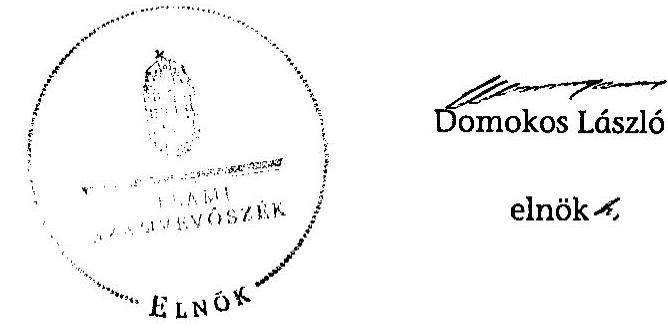

# ÁLLAMI   SZÁMVEVŐSZÉK 

## JELENTÉS

az önkormányzati vagyongazdálkodás
szabályszerúségi ellenőrzéséről
Rákóczifalva
13074
2013. szeptember

---

# Állami Számvevőszék 

Iktatószám: V-0026-049-021/2013.
Témaszám: 1065
Vizsgálat-azonosító szám: V0593010

## Az ellenőrzést felügyelte:

## Makkai Mária

felügyeleti vezető
2012. december 16. napjától

## Gyüre Lajosné

felügyeleti vezető
2012. december 15. napjáig

## Az ellenőrzést vezette és az ellenőrzés végrehajtásáért felelős:

## Kesjár János

ellenőrzésvezető

## Az ellenőrzést végezték:

| Baki István | Béres László | Hadnagyné |
| :-- | :-- | :-- |
| számvevő tanácsos | számvevő | Papp Ildikó |
|  |  | számvevő |

## dr. Dicső Ildikó

számvevő

---

# TARTALOMJEGYZÉK 

BEVEZETÉS ..... 3
I. ÖSSZEGZŐ MEGÁLLAPÍTÁSOK, KÖVETKEZTETÉSEK, JAVASLATOK ..... 5
II. RÉSZLETES MEGÁLLAPÍTÁSOK ..... 9

1. A vagyongazdálkodási tevékenység szabályozottsága ..... 9
1.1. A feladatellátás formáinak meghatározása, a döntések megalapozottsága ..... 9
1.2. A vagyonnal gazdálkodó szervezet szervezeti rendjének szabályozottsága, a kötelező szabályzatok megfelelősége ..... 10
1.3. A vagyongazdálkodás szabályozása ..... 10
2. A vagyongazdálkodás szabályszerűsége ..... 12
2.1. A vagyon nyilvántartásának megfelelősége ..... 12
2.2. A vagyongazdálkodást érintő gazdasági események követelmények szerinti dokumentáltsága ..... 13
2.3. A vagyongazdálkodási intézkedések, döntések szabályszerűsége ..... 14
3. A vagyonváltozást eredményező gazdasági események szabályszerűsége ..... 14
3.1. A vagyon értékének és összetételének változása ..... 14
3.2. Közbeszerzési eljárás alkalmazása ..... 16
3.3. Hitelfelvétel, kötvénykibocsátás, garancia és kezességvállalás szabályszerűsége ..... 16
3.4. A térítés nélküli átadás szabályszerűsége ..... 16
4. A vagyongazdálkodás szabályszerűségére vonatkozó belső és külső ellenőrzések hasznosulása ..... 16
4.1. A belső ellenőrzés által tett megállapítások, javaslatok hasznosulása ..... 16
4.2. A többségi tulajdonban lévő gazdasági társaságok vagyongazdálkodásának felügyelete ..... 17
4.3. A könyvvizsgálatnak a vagyongazdálkodás szabályosságához való hozzájárulása ..... 18
4.4. A külső ellenőrző szervezet által tett javaslatok hasznosulása ..... 19

---

# MELLÉKLETEK 

1. számú Rákóczifalva Városi Önkormányzat gazdálkodására jellemző adatok, mutatószámok
2. számú Rákóczifalva Városi Önkormányzat vagyonának alakulása
3. számú Rákóczifalva Városi Önkormányzat kötelezettségeinek alakulása

## FÜGGELÉKEK

1. számú Rövidítések jegyzéke
2. számú Értelmező szótár

---

# JELENTÉS   az önkormányzati vagyongazdálkodás szabályszerűségi ellenőrzéséről 

## Rákóczifalva

## BEVEZETÉS

Az ÁSZ kiemelten fontosnak tartja az Állami Számvevőszékről szóló 2011. évi LXVI. törvény 5. § (4) bekezdése alapján az önkormányzati vagyon kezelésének, a vagyonnal való gazdálkodási szabályok betartásának az ellenőrzését. A helyi önkormányzatok vagyongazdálkodása szabályszerűségének ellenőrzését e célkitúzésnek megfelelően összeállított ellenőrzési program szerint végezte el. Az ellenőrzés feladata a vagyongazdálkodással kapcsolatban a közpénzek átláthatósága, nyilvánossága érdekében a jogszabályokban, belső szabályzatokban megfogalmazott előírások érvényesülésének áttekintése. Az ÁSZ nem csak az ellenőrzött szervezet vagyongazdálkodásának a hibáira mutat rá, számon kérve azok kijavítását, hanem megállapításaival, javaslataival segíti a közpénzzel, a közvagyonnal való felelős gazdálkodást.

Az önkormányzati vagyon alapvető funkciója, hogy a közérdeket és egyúttal az önkormányzati célok megvalósítását szolgálja. A feladatellátás terén elsősorban a kötelezően ellátandó feladatok végrehajtását hivatott szolgálni, amely mellett az önként vállalt feladatok ellátása is megvalósulhat.

## Az ellenőrzés célja az Önkormányzatnál annak értékelése volt, hogy:

- a vagyongazdálkodási tevékenységet, annak szervezeti kereteit szabályoztáke;
- az önkormányzati vagyongazdálkodás törvényességét, szabályszerűségét biztosították-e a döntések előkészítése és végrehajtása során;
- jogszerű döntéseken alapult-e a vagyon értékének és összetételének változása;
- a belső ellenőrzés elősegítette-e a vagyongazdálkodás szabályszerű működését, valamint hasznosultak-e a korábbi külső ellenőrzések által tett javaslatok.

Az ellenőrzés típusa: szabályszerűségi ellenőrzés

---

Az ellenőrzés a 2007. január 1. és 2011. december 31. közötti időszakra terjedt ki, kitekintéssel a helyszíni ellenőrzés befejezéséig tartó időszak releváns folyamataira. Az egyes közbeszerzési eljárások lefolytatásának ellenőrzése a 2011. évet és a 2012. év I. negyedévét érintette.

Az ellenőrzés szakmai módszertana az Állami Számvevőszék Ellenőrzési Kézikönyvében foglalt szakmai szabályokon alapult, amely a Legfőbb Ellenőrző Intézmények Nemzetközi Szervezete (INTOSAI) által kiadott nemzetközi standardok (ISSAI) figyelembevételével készült.

A vagyongazdálkodás szabályozásának ellenőrzését a helyi szabályozások (rendeletek, szabályzatok, utasítások) ellenőrzésével végeztük el. A vagyonváltozások köréből az ellenőrizendő tételeket mintavétellel, a számviteli nyilvántartásokból választottuk ki.

Rákóczifalva 2009. óta város, lakosainak száma 2011. január 1-jén 5543 fő volt. A 2010. évi önkormányzati választást követően az Önkormányzat kilenctagú Képviselő-testületének munkáját három állandó bizottság segítette. Az Önkormányzat mellett a 2007-2011. években kisebbségi önkormányzat nem működött. A polgármester a 2010. évi önkormányzati választás óta tölti be tisztségét, a jegyző 2011. február 1. óta látja el feladatát.

Az Önkormányzat feladatainak végrehajtása érdekében a 2011. évben három költségvetési intézményt múködtetett, amelyekből egy önállóan működött és gazdálkodott, kettő önállóan működött. A feladatok ellátásában részt vett két gazdasági társaság és egy társulás. Az Önkormányzatnak a 2011. évi költségvetési beszámolója szerint 668,9 millió Ft költségvetési bevétele volt és 657,0 millió Ft költségvetési kiadást teljesített, 2011. december 31-én a könyvviteli mérleg szerint 2633,9 millió Ft értékű vagyonnal rendelkezett. A Polgármesteri hivatalban dolgozó köztisztviselők száma 2011. december 31-én 17 fő, az Önkormányzat által foglalkoztatott közalkalmazottak száma 77 fő volt. Az Önkormányzat gazdálkodására jellemző adatokat, mutatószámokat az 1-3. számú mellékletek tartalmazzák.

Az ÁSZ a 2011. évi LXVI. törvény 29. § (1) bekezdése szerint a jelentéstervezetet megküldte egyeztetésre Rákóczifalva Városi Önkormányzat polgármesterének, aki az ÁSZ tv. 29. § (2) bekezdésében foglalt észrevételezési jogával nem élt, a jelentéstervezetre észrevételt nem tett.

---

# I. ÖSSZEGZŐ MEGÁLLAPÍTÁSOK, KÖVETKEZTETÉSEK, JAVASLATOK 

Az Önkormányzat könyvviteli mérleg szerinti vagyona a 2007. év eleji 2815,8 millió Ft-ról 2011. év végére 2633,9 millió Ft-ra 6,5\%-kal csökkent, mert a beruházások és felújítások értéke kisebb volt, mint az időszakban elszámolt értékcsökkenés és értékvesztés együttes összege. Az Önkormányzat 2007-2011. évek között 369,7 millió Ft-ot fordított beruházásra (útépítés, középületek akadálymentesítése, strand kialakítás, ingatlanok vétele) és 92,1 millió Ft-ot felújításra. A beruházások és felújítások közel 35\%-át kötvénykibocsátásból finanszírozták.

Az Önkormányzat a vagyongazdálkodási tevékenységét és annak szervezeti kereteit alapvetően a hatályos jogszabályi előírások szerint szabályozta. 2005-ben elkészítette a vagyongazdálkodási rendelet ${ }_{1}$-et, melyet aktualizáltak a jogszabályváltozásoknak megfelelően. A vagyongazdálkodási rendelet ${ }_{1}$ tartalmazta az önkormányzati feladatellátást biztosító törzsvagyon, ezen belül a forgalomképtelen és korlátozottan forgalomképes ingatlanok körét. A vagyongazdálkodási rendelet ${ }_{1}$ szerint a vállalkozói vagyon ingyenes átruházásáról, vállalkozásba viteléről a Képviselő-testület, használatba adásáról a polgármester dönt. A rendelet az Áht. ${ }_{1}$ előírásai ellenére nem szabályozta, hogy mely esetekben kerülhet sor a vagyon térítés nélküli átruházására, használatba adására. Az Önkormányzatnál 2007-2011. évek között egy esetben, 2007 szeptemberében került sor 0,5 millió Ft könyvszerinti értéken nyilvántartott eszközöknek a térítésmentes használatba adására, az Önkormányzat 100\%-os tulajdonában lévő Falugondnokság Kft. részére egyes közfeladatainak ellátásához. Az átadást követően az eszközöket a Polgármesteri hivatal számviteli nyilvántartásában nem használatba adott eszközként szerepeltették, hanem véglegesen átadott eszközként kivezették a nyilvántartásból, megsértve ezzel a Számv. tv. rendelkezéseit.

Az Önkormányzat 2007-2011. évek között a gazdálkodási jogköröket - a szakmai teljesítésigazolás rendjének kivételével - szabályozta. A 2012. február 1-től hatályos Gazdálkodási Szabályzat már tartalmazta a szakmai teljesítésigazolás rendjét. A szabályozás ellenére a vagyon nyilvántartása, a vagyongazdálkodással kapcsolatos döntések előkészítése és végrehajtása során a gazdálkodási jogkörök gyakorlásának szabályszerűsége nem teljesült. Az ellenőrzött tételek vonatkozásában 2007-2011. évek között a kötelezettségvállalást megelőző ellenjegyzés 30 esetben, 53,1 millió Ft értékben nem történt meg. A szakmai teljesítésigazolást végző személyek 11 esetben - 25,9 millió Ft értékben - nem rendelkeztek felhatalmazással. A kiadások utalványozását megtestesítő bizonylatokon a 2007-2011. években, 19 esetben 41,5 millió Ft értékben az érvényesítés, 18 esetben 46,2 millió Ft értékben az utalványozás és az utalványozás ellenjegyzése nem történt meg. Emiatt a tevékenységre előírt - folyamatba épített - ellenőrzési feladatok végrehajtása is elmaradt.

Az Önkormányzat a 2007-2011. években - a 2010. év kivételével - minden évben elkészítette a vagyonkimutatását. A 2007-ben, 2008-ban, 2009-ben és

---

2011-ben elkészített vagyonkimutatás nem felelt meg az Áhsz.-ben előírt tartalmi követelményeknek, mert az Önkormányzat vagyonát - az ingatlanvagyon és építmények kivételével - forgalomképtelen és korlátozottan forgalomképes törzsvagyon, illetve egyéb vagyon bontásban, eszköz és forráscsoportonként nem tartalmazta.

Az Önkormányzatnál a 2007-2011. években az ingatlanvagyon kataszter és a számviteli nyilvántartás azonos tartalmú adatai megegyeztek. A 147/1992. (XI. 6.) Korm. rendelet előírása ellenére azonban a 2007-2010. évek között az ingatlanvagyon kataszter és a földhivatali ingatlan-nyilvántartás közötti egyezőséget nem biztosították. A 2011. évben a földhivatali ingatlan-nyilvántartás lekérése történt meg, az egyeztetésről és annak eredményéről nem állt rendelkezésre dokumentum, ezért a földhivatali nyilvántartás adatai és az Önkormányzat nyilvántartásai közötti egyezőség nem igazolt.

2007-2011. évek között az Önkormányzat a leltározási szabályzatában évenkénti leltározásról rendelkezett, a leltározási szabályzat azonban nem tartalmazta az üzemeltetésre, vagyonkezelésbe átadott eszközök leltározásának módját. Az Önkormányzat minden eszközcsoportnál eleget tett a leltározási kötelezettségének. A tárgyi eszköz leltárak az Áhsz. előírásai ellenére nem tartalmaztak értékadatokat, ezért a leltárak kiértékelése minden évben elmaradt. A könyvviteli mérlegben kimutatott eszközök értékének valódiságát leltárral nem támasztották alá.

Az Önkormányzat a 2007-2010. években honlapján nem tette közzé - megsértve az Eisztv. és az Áht. ${ }_{1}$ előírásait - a nettó ötmillió Ft-ot elérő vagy azt meghaladó értékű szerződések adatait. 2011. évben az Önkormányzat nettó ötmillió Ft-ot elérő vagy azt meghaladó értékű szerződést nem kötött.

Az Önkormányzat egyes kötelező és önként vállalt feladatainak ellátásában egy 100\%-os (Falugondnokság Kft.) és egy többségi (Tiszapart KKN Kft.) önkormányzati tulajdonban lévő gazdasági társasága vett részt. Az Önkormányzat vagyonában csökkenés következett be, részben a gazdasági társaságai 36,0 millió Ft tulajdoni részesedésének 35,0 millió Ft értékben elszámolt értékvesztése miatt. A Képviselő-testület 2007-2011. években beszámoltatta a társaságait a vagyonnal való gazdálkodásról. A veszteséges gazdálkodás megszüntetése érdekében ügyvezetőt váltott, bővítette a társaság tevékenységi körét, az egyik társaság eladásáról döntött. Az intézkedések azonban nem jártak eredménnyel, így a Képviselő-testület 2011-ben a Tiszapart KKN Kft. végelszámolással, 2012ben a főtevékenységként köztisztasági feladatokat ellátó Falugondnokság Kft. felszámolással történő megszüntetéséről döntött.

Az Önkormányzat összesen 43,9 millió Ft összegben nyújtott tagi kölcsönt a Falugondnokság Kft-nek, - a likviditási helyzete javítása érdekében - amelyből a társaság 26,4 millió Ft-ot visszafizetett. A gazdasági társaságnak nyújtott 5 millió Ft összegű tagi kölcsön 2009. évi elengedése nem felelt meg az Áht. előírásának, mely szerint az államháztartás alrendszereinek követeléseiről lemondani csak törvényben, a helyi önkormányzatnál a helyi önkormányzat rendeletében meghatározott módon és esetekben lehet. A vagyongazdálkodási rendelet ${ }_{1}$ azonban nem tartalmazta a követelésekről való lemondás eseteit és módját.

---

A belső ellenőrzés a 2008-2009. években ellenőrizte az Önkormányzat vagyongazdálkodását. Az ellenőrzések szabályozási, nyilvántartási hiányosságokat, a mérleg és főkönyvi adatok eltérését, valamint az ellenőrzési nyomvonal hiányosságát állapították meg. Intézkedési tervet - a Ber. előírásai ellenére - az Önkormányzatnál nem készítettek, a megtett intézkedések végrehajtását nem kísérték figyelemmel, arról nem számoltak be. Az Önkormányzat a vagyongazdálkodás szabályszerűségére tett megállapításokat nem hasznosította, ezáltal a belső ellenőrzés a vagyongazdálkodás szabályszerű működését nem segítette elő.

A könyvvizsgáló által tett javaslatokat a 2007-2011. években nem hasznosították, így pl. a belső kontrollrendszer kialakítása a helyszíni ellenőrzés időpontjáig nem történt meg, a szabályzatok közül csak a Pénzkezelési szabályzatot aktualizálták évente, a belső ellenőrzési tervek kialakítását megelőzően kockázatelemzést nem alkalmaztak.

Az Állami Számvevőszékről szóló 2011. évi LXVI. törvény 33. § (1) bekezdésében foglaltak értelmében a jelentésben foglalt megállapításokhoz kapcsolódó intézkedési tervet köteles az ellenőrzött szervezet vezetője összeállítani, és azt a jelentés kézhezvételétől számított 30 napon belül az ÁSZ részére megküldeni. Amennyiben az intézkedési tervet határidőben nem küldi meg a szervezet, vagy az nem elfogadható, az ÁSZ elnöke a hivatkozott törvény 33. § (3) bekezdés a)-b) pontjaiban foglaltakat érvényesítheti.

Az ellenőrzés intézkedést igénylő megállapításai és javaslatai:

# a jegyzőnek 

1. A 147/1992. (XI. 6.) Korm. rendelet 1. § (2) bekezdésében foglalt előírás ellenére az ingatlanvagyon kataszter és földhivatali nyilvántartás azonos tartalmú adatai közötti egyezőséget nem biztosították.

Javaslat
Intézkedjen, hogy a 147/1992. (XI. 6.) Korm. rendelet 1. § (2) bekezdésében rögzítetteknek megfelelően az ingatlanvagyon kataszter adatai egyezzenek meg a földhivatal ingatlan-nyilvántartás azonos tartalmú adataival.
2. A 2007-2011 közötti ellenőrzött tételeken belül - az Ámr. 134. § (8)-(9), az Ámr. 2 74. § (1) és (3), az Ámr. 1 135. § (1), az Ámr. 2 76. § (1), az Ámr. 1 135. § (3), az Ámr. 2 77. § (1), az Ámr. 1 136. § (3) és az Ámr. 2 78. § (2) bekezdéseiben foglalt előírások ellenére - nem történt meg 53,1 millió Ft értékű kötelezettségvállalások ellenjegyzése, 25,9 millió Ft együttes összeget tartalmazó bizonylatoknál a szakmai teljesítésigazolók nem rendelkeztek felhatalmazással, 41,5 millió Ft értékben maradt el az érvényesítés és 46,2 millió Ft értékben az utalványozásra nem került sor.

Javaslat
Intézkedjen, hogy a pénzügyi ellenjegyző, a teljesítés igazolására kijelölt személy, az érvényesítő és az utalványozó - az Áht. 2 37. § (1), az Ávr. 57. § (1), az Ávr. 58. § (1)

---

és az Ávr. 59. § (2) bekezdései előírásainak megfelelően - végezze el ellenőrzési feladatait.
3. A 2007-ben, 2008-ban, 2009-ben és 2011-ben elkészített vagyonkimutatás nem felelt meg az Áhsz. 44/A. § (2) bekezdésében előírt tartalmi követelményeknek, mert az Önkormányzat vagyonát - az ingatlanvagyon és építmények kivételével - forgalomképtelen és korlátozottan forgalomképes törzsvagyon, illetve egyéb vagyon bontásban, eszköz és forráscsoportonként nem tartalmazta.

Javaslat
Intézkedjen az önkormányzat vagyonkimutatásának az Áhsz. 44/A. § (2) bekezdésében előírtak szerinti elkészítéséről.
4. A tárgyi eszköz leltárak a Számv. tv. 69. § (1) és az Áhsz. 37. § (2) bekezdéseinek előírásai ellenére nem tartalmaztak értékadatokat, a könyvviteli mérlegben kimutatott eszközök értékének valódiságát szabályos leltárral nem támasztották alá.

Javaslat
Intézkedjen az Áhsz. 37. § (2) bekezdésében előírtaknak megfelelő - az eszközök mennyiségi és értékadatait is tartalmazó - leltár elkészítéséről, a könyvviteli mérleg valódiságának alátámasztásáról.
5. A 2007-2010. években az Önkormányzat a honlapján nem tette közzé - megsértve az Eisztv. 6. § (1) és az Áht., 15/B. § (1) előírásait - a nettó ötmillió Ft-ot elérő vagy azt meghaladó értékű szerződések közzétételre előírt adatait.

Javaslat
Intézkedjen, hogy az információs önrendelkezési jogról és az információs szabadságról szóló 2011. évi CXII. törvény 1. számú mellékletében meghatározott adatok közzétételre kerüljenek.
6. A belső ellenőrzés által a vagyongazdálkodás területén feltárt (szabályozási, nyilvántartási) hiányosságok megszüntetésére a Ber. 29. § (1) bekezdés előírása ellenére nem készültek intézkedési tervek. Az Önkormányzat a vagyongazdálkodás szabályszerűségére tett megállapításokat nem hasznosította, ezáltal a belső ellenőrzés a vagyongazdálkodás szabályszerű működését nem segítette elő.

Javaslat
Intézkedjen, hogy a Bkr. 28. § c) pontjában előírtaknak megfelelően készüljön intézkedési terv a belső ellenőrzés által feltárt, a vagyongazdálkodás területét is érintő hiányosságok megszüntetésére, továbbá az intézkedési tervben foglaltak végrehajtásáról.

---

# II. RÉSZLETES MEGÁLLAPÍTÁSOK 

## 1. A VAGYONGAZDÁLKODÁSI TEVÉKENYSÉG SZABÁLYOZOTTSÁGA

### 1.1. A feladatellátás formáinak meghatározása, a döntések megalapozottsága

Az Önkormányzat a gazdasági program ${ }_{1,2}$-ban rögzítette az önkormányzati feladatellátással összefüggő stratégiai céljait és prioritásait. Alapvető célként a város működőképességének biztosítását, a kötelező és önként vállalt feladatok ellátásához szükséges gazdasági alapok megteremtését, a feladatok önkormányzati fenntartású intézményrendszeren keresztül történő ellátását tűzte ki, a takarékosság, gazdaságosság, célszerűség és hatékonyság elveinek figyelembe vételével. A kötelező és önként vállalt feladatokat és a feladatellátásban közreműködő intézményeket az Ötv. 8. § (2) bekezdésében foglaltak szerint az $\mathrm{SzMSz}_{1}$-ben rögzítette.

A Képviselő-testület 2007-2011. évek között az intézmények átszervezéséről, megszüntetéséről és gazdasági társaság alapításáról és megszüntetéséről döntött. A Képviselő-testületnek a feladatellátás formáira, körére vonatkozóan alternatív javaslatokat 2011-ben az ÁMK átszervezése esetében mutattak be.

Az Önkormányzat a fenntartásában lévő II. Rákóczi Ferenc Általános Iskola és Alapfokú Művészetoktatási Intézményéből és a Művelődési, Sport Szabadidő Központ és Könyvtár Intézményéből 2007. augusztus 1-jével létrehozta az Általános Művelődési Központot (ÁMK). A Virágoskert Óvodát és Területi Bölcsődét 2007. augusztus 1-től összevonta egy intézménnyé. Az előterjesztésekben az öszszevonás okaként az intézmények szakmai tevékenysége színvonalának megőrzését, fejlődését és a hatékonyabb költséggazdálkodást jelölték meg. Az Egyesített Szociális Intézmény (Szociális Alapszolgáltatási Központ, Idősek Bentlakásos Otthona) feladatait 2008. július 1-jétől a Szolnoki Kistérség Többcélú Társulása Gyermekjóléti és Szociális Szolgáltató Központ vette át. A 2009-ben települési üzemeltetési feladatokra létrehozott Település- és Intézményellátó Szolgálat (TISZ) 2011. július 31-én megszűnt.

A 2011. évben az Önkormányzat egy önállóan működő és gazdálkodó és három ${ }^{1}$ önállóan működő költségvetési intézménnyel látta el az Ötv.-ből fakadó kötelező feladatait, melyből egy önállóan működő intézmény (TISZ) év közben megszűnt.

Az Önkormányzat a Szolnoki Kistérségi Többcélú Társulás keretében látja el a pedagógiai szakszolgálati, valamint a központi orvosi ügyeleti és fogorvosi ügyeleti feladatokat. A társulás keretében biztosította a gyermekjóléti szolgáltatást, a családsegítést, az étkeztetést, a házi segítségnyújtást, az idősek nappali ellátását (Idősek Klubja), a támogató szolgáltatást, az idősek bentlakásos ott-

[^0]
[^0]:    ${ }^{1}$ ÁMK, Virágoskert Óvoda és Bölcsőde, TISZ

---

hona feladatait. A társulással összefüggésben az Önkormányzat vagyonában vagyonváltozás nem következett be.

# 1.2. A vagyonnal gazdálkodó szervezet szervezeti rendjének szabályozottsága, a kötelező szabályzatok megfelelősége 

A 2007-2011. években az Önkormányzat Képviselő-testülete az Ötv. 18. § (1) bekezdésében foglaltak alapján alkotta meg SzMSz ${ }_{1}$-ét és elvégezte annak felülvizsgálatát. A vagyongazdálkodási feladatokat a törvényi előírásoknak megfelelően rendeletben szabályozta. A Képviselő-testület által a polgármesterre és a bizottságokra átruházott hatásköröket az $\mathrm{SzMSz}_{1}$ és a hatásköri rendelet tartalmazta.

Az SzMSz ${ }_{1}$ szerint az Önkormányzat nevében kötelezettséget a polgármester vállalhat, alkalmanként maximum az Önkormányzat éves költségvetésének 3\%-áig terjedő összeg erejéig az önkormányzati feladatok végrehajtására.

A Képviselő-testület az átruházott hatáskör gyakorlásához utasítást nem adott. Az SzMSz előírta az átruházott hatáskör gyakorlója számára a soron következő képviselő-testületi ülésen való beszámolási kötelezettséget az intézkedésekről és azok eredményéről.

A Képviselő-testület meghatározta a vagyonnal gazdálkodó, közfeladatot ellátó költségvetési szervek ${ }^{2}$ alapító okiratában a szervezetek közfeladatait, valamint rendelkezett a költségvetési szervek szervezeti és múködési szabályzatának a jóváhagyásáról. A Polgármesteri hivatal szervezeti felépítését, feladatait és múködési folyamatait az Önkormányzati $\mathrm{SzMSz}_{1}$-szel egységes szerkezetbe foglalt hivatali SzMSz szabályozta, melyet a Képviselő-testület jóváhagyott.

Az Önkormányzat vagyongazdálkodási feladatait a 2007-2011. évek között elsősorban a Polgármesteri hivatal pénzügyi csoportja látta el. A számviteli politika hatálya kiterjedt az intézményekre is, biztosítva az egységes számviteli elvek szerinti önkormányzati szintű beszámoló elkészítését. Az Önkormányzat a Számv. tv. 14. § (11) bekezdésében előírtak, a könyvvizsgálói és belső ellenőri jelentésekben megfogalmazott javaslatok ellenére a számviteli politikáját 2007től, a számlarendjét 2008-tól nem aktualizálta. A leltározási szabályzat az évenkénti leltározásról rendelkezett, azonban a Számv. tv. 14. § (4) bekezdésében és az Áhsz. 37. § (5) bekezdésében foglaltak ellenére az Önkormányzat gazdálkodására jellemző sajátosságként a leltározási szabályzatban nem rendelkezett az üzemeltetésre, vagyonkezelésbe, koncesszióba átadott eszközök leltározásának módjáról.

### 1.3. A vagyongazdálkodás szabályozása

Az Önkormányzat az Ötv. felhatalmazása alapján a Htv. 138. § (1) bekezdés j) pontjában foglalt rendelkezésnek megfelelően 2005-ben elkészítette a vagyongazdálkodási rendelet ${ }_{1}$-et. A rendelet aktualizálásáról a jogszabályváltozások-

[^0]
[^0]:    ${ }^{2}$ Polgármesteri hivatal, TISZ, ÁMK, Virágoskert Óvoda és Bölcsőde, Egyesített Szociális Intézmény

---

nak és a vagyonban bekövetkezett változásoknak megfelelően a Képviselőtestület döntött. A vagyongazdálkodási rendelet ${ }_{1} 1$. számú függeléke tartalmazta az önkormányzati feladatellátást biztosító törzsvagyon, ezen belül a forgalomképtelen és korlátozottan forgalomképes ingatlan vagyonelemek körét. A vagyonkimutatás részletezését, tételes alábontását a vagyongazdálkodási rendelet külön nem szabályozta. A forgalomképesség megváltoztatásának szabályait a vagyongazdálkodási rendeletben nem rögzítették. A rendelet nem tartalmazta a követelések elengedésének eseteit és módját.

A vagyongazdálkodási rendelet ${ }_{1}$ nem szabályozta a vagyonkezelői szerződések tartalmi elemeit és nem írta elő a vagyonkezelői jog gyakorlásának ellenőrzési kötelezettségét, az egyes vagyonelemek hasznosítási módját. A rendeletben a vagyontárgyak feletti rendelkezési jogot vagyontípusonként értékhatár megjelölésével megosztották a Képviselő-testület, a polgármester és az intézmények vezetője között. A Polgármesteri hivatal ügyrendje, a költségvetési szervek SzMSz-e, a közszolgáltatások ellátására alapított gazdasági társaságok alapító okirata tartalmazta a vagyonkezelési feladatokat, a hatáskört és felelősséget.

A vagyongazdálkodási rendelet ${ }_{1}$ szerint: A vagyont használók a rájuk bízott törzsvagyont bérbeadás útján hasznosíthatják. A határozatlan idejű, vagy egy évet meghaladó bérbeadáshoz a polgármester hozzájárulása szükséges. Az önkormányzati költségvetési szerv vezetője dönt a kezelésében lévő, 100 ezer forint egyedi nyilvántartási érték alatti tárgyi eszköz értékesítéséről, használatra átengedéséről, egyéb hasznosításáról vagy selejtezéséről. 100 ezer forinttól 1 millió forint értékhatárig a szerv vezetője döntését a polgármester, 1 millió forint felett a Képviselő-testület egyetértésével hozhatja meg. A vállalkozói vagyon elidegenítéséről, bérbeadásáról 10 millió forint értékhatár alatt a polgármester, felette a Képviselő-testület dönt.

A vagyongazdálkodási rendelet ${ }_{1}$ a hasznosításra szánt 5 millió forint értékhatárt meghaladó - a Megyei Illetékhivatal összehasonlító adatai alapján - ingatlan vagyon értékesítésénél írt elő forgalmi értékbecslési kötelezettséget. A vagyongazdálkodási rendelet ${ }_{1}$-ben meghatározott érték ${ }^{3}$ felett ingatlant elidegeníteni, a vagyon használatát, illetve a hasznosítás jogát átengedni csak nyilvános versenytárgyalás útján lehet. A versenyeztetés szabályait azonban nem határozták meg.

A vagyongazdálkodási rendelet ${ }_{1}$ szerint a vállalkozói vagyon ingyenes vagy jelképes ellenértékű átruházásáról, vállalkozásba viteléről a Képviselőtestület, használatba adásáról a polgármester dönthet. Az Áht. ${ }_{1}$ 108. § (2) ${ }^{4}$ bekezdésében foglalt előírások ellenére a rendelet azonban nem szabályozta, hogy mely esetekben kerülhet sor a vagyon ingyenes átruházásra, használatba adására.

A Vagyon tv. 18. § (1) bekezdésében megjelölt 60 napos határidőn túl vizsgálta felül az Önkormányzat a vagyongazdálkodási rendeletét és sorolta be vagyonelemeit a jogszabályban elrendeltek szerint. A Vagyon tv. 9. § (1) bekezdése alapján készítendő önkormányzati közép- és hosszú távú vagyongazdálkodási

[^0]
[^0]:    ${ }^{3} 1$ millió forint
    ${ }^{4}$ 2012. március 2-től a Vagyon tv. 13. § (3) bekezdése szabályozza

---

tervet még nem terjesztették a Képviselő-testület elé. A vagyonrendelet ${ }_{2}$ már tartalmazta a követelésekről való lemondást, a vagyonkezelői jog gyakorlásának részletes szabályait.

Az Önkormányzat szabályzataiban ${ }^{5}$ rögzítették az operatív gazdálkodással és annak munkafolyamatba épített ellenőrzésével összefüggő jogkörök gyakorlásának rendjét, az összeférhetetlenségi követelményeket. A szabályzatok a gazdálkodási jogköröket - a kötelezettségvállalás ellenjegyzése, érvényesítés és az utalvány ellenjegyzése - a szakmai teljesítésigazolás rendjének kivételével megjelölték. Az SzMSz ${ }_{1}$ szerint a szakmai teljesítésigazolás módjáról és az azt végző személyek kijelöléséről a jegyző belső szabályzatban rendelkezik. A 20072011. évek között a szakmai teljesítésigazolásra vonatkozó szabályzat, 2010. április 1-jétől a kötelezettségvállalásra, pénzügyi ellenjegyzésre, érvényesítésre, utalványozásra jogosult személyek aláírási mintájáról vezetett nyilvántartás nem állt rendelkezésre. Az Önkormányzat 2012. február 1-jétől hatályos Gazdálkodási Szabályzata már megjelölte a teljesítés igazolás szabályait.

Az önkormányzati $\mathrm{SzMSz}_{1}$ 2. számú melléklete tartalmazta az előterjesztések készítésének, megtárgyalásának, véleményezésének, döntéshozatalának általános rendjét. Nem írták elő a hitelfelvételről, kötvénykibocsátásról szóló dön-tés-előkészítés folyamatában a futamidő egyes éveit terhelő adósságszolgálat költségvetési egyensúlyra gyakorolt hatása elemzési és bemutatási, valamint a pénzügyi (kamat-, árfolyam-, visszafizetési) kockázatok felmérésére vonatkozó követelményét. Továbbá nem írták elő a költség-haszon elemzés készítésének a kötelezettségét, melynek az előírása nem jogszabályi kötelezettség, ugyanakkor célszerű a vagyongazdálkodás javítása érdekében. Az önkormányzati érdekeket védő garanciális elemek vagyonhasznosítási szerződésekben való rögzítésének a kötelezettségét a vagyongazdálkodási rendelet ${ }_{1}$ nem tartalmazta. A nyilvánosságra hozatallal kapcsolatos rendelkezéseket az önkormányzati $\mathrm{SzMSz}_{1}$, valamint a közérdekű adatok megismerésére irányuló igények teljesítésének rendjéről szóló szabályzat tartalmazta.

# 2. A VAGYONGAZDÁLKODÁS SZABÁLYSZERŰSÉGE 

### 2.1. A vagyon nyilvántartásának megfelelősége

A 2007-2011. évek költségvetéseinek végrehajtását jóváhagyó zárszámadási rendeletek - a 2010. évi zárszámadási rendelet kivételével - tartalmazták az egyes évekre vonatkozó vagyonkimutatást. A 2007-ben, 2008-ban, 2009-ben és 2011-ben elkészített vagyonkimutatás nem felelt meg az Áhsz. 44/A. § (2) bekezdésében előírt tartalmi követelményeknek, mert az Önkormányzat vagyonát - az ingatlanvagyon és építmények kivételével - forgalomképtelen és korlátozottan forgalomképes törzsvagyon, illetve egyéb vagyon bontásban, eszköz és forráscsoportonként nem tartalmazta.

[^0]
[^0]:    ${ }^{5}$ Kockázatkezelési szabályzat, FEUVE, leltározási szabályzat, közbeszerzési szabályzat, pénzkezelési szabályzat ${ }_{1,2,3}$.

---

Az Önkormányzatnál a 2007-2011. években elkészített vagyonkimutatásokban szereplő ingatlanvagyon és az ingatlanvagyon kataszter adatainak egyeztetését elvégezték, a számviteli nyilvántartás és az ingatlanvagyon kataszter adatainak egyezőségét biztosították. A 147/1992. (XI. 6.) Korm. rendelet 1. § (2) bekezdésének előírása ellenére a 2007-2010. évek között az ingatlanvagyon kataszter és a földhivatali ingatlan-nyilvántartás adatai egyezőségét nem biztosították. A 2011. évben a földhivatali ingatlan-nyilvántartás adatainak lekérése megtörtént. A lekért adatok számviteli nyilvántartással, ingatlanvagyon kataszterrel történő egyeztetésről, annak eredményéről nem állt rendelkezésre dokumentum, ezért a földhivatali nyilvántartás adatai és az Önkormányzat nyilvántartásai közötti egyezőség nem igazolt.

Az Önkormányzat a 2007-2011. években a Számv. tv. 69. § (1)-(2) bekezdésében és az Áhsz. 37. § (1) bekezdésében előírt leltározási kötelezettségének december 31-ei fordulónappal eleget tett. A leltárfelvételt követően minden évben elmaradt a leltárösszesítők elkészítése. A tárgyi eszköz leltárak az Áhsz. 37. § (2) bekezdés előírásai ellenére nem tartalmaztak értékadatokat, ezen leltárak kiértékelését az időszakban nem végezték el. A könyvviteli mérlegben kimutatott eszközök értékének valódiságát leltárral nem támasztották alá. Ugyanakkor a tárgyi eszközök vonatkozásában a főkönyvi nyilvántartás adatait az analitikus nyilvántartás adatai alátámasztották.

# 2.2. A vagyongazdálkodást érintő gazdasági események követelmények szerinti dokumentáltsága 

A vagyongazdálkodással összefüggő gazdálkodási jogköröket az Ámr. ${ }_{1.2}$-nek megfelelően, az $\mathrm{SzMSz}_{1}$ határozta meg. A gazdálkodási jogkörök meghatározásánál betartották az összeférhetetlenség kizárására előírt szabályokat.

Az Áht. ${ }_{1}$ 100/C. § (3) ${ }^{6}$ bekezdésben előírtakat megsértve és az Ámr. ${ }_{2} 74 . \S$ (1) bekezdésében előírtak ellenére a kötelezettségvállalást megelőző ellenjegyzés a 2007-2011. években nem történt meg. Ellenjegyzés hiányában az Ámr. 74 . § (3) bekezdésében foglalt ellenőrzési feladatokat nem végezték el, nem győződtek meg a kiadási előirányzatok rendelkezésre állásáról, a fedezet meglétéről, illetve arról, hogy a kötelezettségvállalás megfelel-e a gazdálkodásra vonatkozó szabályoknak.

A SzMSz ${ }_{1}$-ben leírtak szerint a szakmai teljesítés igazolás módjáról és az azt végző személyek kijelöléséről a jegyző belső szabályzatban volt köteles rendelkezni. Az adatszolgáltatás során átadott dokumentumok között szakmai teljesítésről rendelkező szabályzat nem volt, a szakmai teljesítésigazolást végző személyek nem rendelkeztek felhatalmazással.

A kiadások bizonylataihoz készített írásbeli rendelkezéseken a 2007-2011. években az érvényesítés, az utalványozás és az utalványozás ellenjegyzésének igazolása nem teljes körűen történt meg. Az írásbeli rendelkezések hiányosságai miatt a tevékenységre előírt (folyamatba épített) ellenőrzési feladatok végrehajtása sem történt meg. Érvényesítés hiányában Ámr. ${ }_{1}$ 135. § (3) és az Ámr. ${ }_{2}$

[^0]
[^0]:    ${ }^{6}$ 2012. január 1-jétől az Áht. ${ }_{2}$ 37. § (1) bekezdése szabályozza

---

77. § (1) bekezdésében foglalt ellenőrzési feladatokat nem végezték el, nem győződtek meg a kifizetés összegszerűségéről, a fedezet meglétéről. Az utalványozás ellenjegyzésének hiányában nem győződtek meg az Ámr. ${ }_{1}$ 137. § (3) és az Ámr. ${ }_{2}$ 79. § (2) bekezdésében előírt szakmai teljesítésigazolás és az érvényesítés megtörténtéről.

A 2007-2011. évek között a kiadási kötelezettségek (ingatlanértékesítés, eszközbeszerzés, beruházás, szolgáltatás vásárlás) teljesítése alkalmával a kötelezettségvállalás és annak ellenjegyzése 30 esetben, 53,1 millió Ft értékben nem valósult meg. Ezen túl a teljesítésigazolás 11 esetben, 25,9 millió Ft értékben; az érvényesítés 19 esetben, 41,5 millió Ft értékben; valamint az utalványozás és ellenjegyzése 18 esetben, 46,2 millió Ft értékben a vonatkozó jogszabályoknak megfelelően nem történt meg.

Az Önkormányzat a 2007-2010. években az Áht. ${ }_{1}$ 15/B. § (1) bekezdés és az Eisztv. 6. § (1) bekezdés előírásai ellenére honlapján nem tette közzé a nettó ötmillió Ft-ot elérő vagy azt meghaladó értékű, vagyonnal való gazdálkodással összefüggő szerződések megnevezését, tárgyát, a szerződést kötő felek nevét, a szerződés értékét. A 2011. évben az Önkormányzat nettó ötmillió Ft-ot elérő vagy azt meghaladó értékű szerződést nem kötött.

# 2.3. A vagyongazdálkodási intézkedések, döntések szabályszerűsége 

A vagyonhasznosítási és vagyonértékesítési szerződésekbe az Önkormányzat érdekeit védő garanciális elemeket a szabályozás hiánya ellenére beépítették.

A vagyonhasznosítási szerződések tartalmazták a jogviszony megszüntetésének feltételeit, a késedelmes fizetés szankcióit, a bérleti jog átruházásának, elcserélésének, albérletbeadásának, bérlőtársi jogviszony létesítésének feltételeit, a szükséges karbantartási, felújítási, pótlási kötelezettségeket, a közüzemi szolgáltatási díjfizetések módját.

## 3. A VAGYONVÁLTOZÁST EREDMÉNYEZŐ GAZDASÁGI ESEMÉNYEK SZABÁLYSZERŰSÉGE

### 3.1. A vagyon értékének és összetételének változása

Az Önkormányzat könyvviteli mérleg szerinti vagyona a 2007. évi 2815,8 millió Ft-ról 2011. év végére 2633,9 millió Ft-ra 6,5\%-kal csökkent, amit az okozott, hogy a beruházások és felújítások értékösszege kisebb volt, mint az időszakban elszámolt értékcsökkenések és értékvesztések együttes öszszege. A befektetett eszközérték csökkenését elsősorban az üzemeltetésre átadott eszközérték csökkenése okozta. A tárgyi eszközérték növekedése az időszakban megvalósított kerékpárút építés, útépítés és felújítás, műtárgy átvétel, középületek akadálymentesítés, szabad strand kialakítás, ingatlan vétel, az iskolai informatikai beruházás és felújítás és egyéb kisebb értékű felújítás, eszközbeszerzés miatt keletkezett.

Az Önkormányzat 36,0 millió Ft tulajdoni részesedéseinek 35,0 millió Ft összegű értékvesztése kedvezőtlenül befolyásolta az önkormányzati vagyon alakulá-

---

sát. Az Önkormányzatnak az ellenőrzött időszakban két többségi tulajdonú gazdasági társasága volt, a Falugondnokság Kft. 30,0 millió Ft és a Tiszapart KKN Kft. 6,0 millió Ft törzstőkével. A Falugondnokság Kft. az Önkormányzat 100\%-os, a Tiszapart KKN Kft. 86\%-os tulajdonában állt. A veszteséges gazdálkodás miatt mindkét társaságnak a saját tőkéje tartósan és jelentősen a jegyzett tőkéje alá csökkent. Az Önkormányzat a részesedései értékvesztéseit a Számv. tv. 54. § (1), valamint az Áhsz. 31. § (4) bekezdésében elrendeltek ellenére nem évente, hanem csak 2011. évben több évre összevontan számolta el. Az értékvesztések e módon történő elszámolása ellentétes volt az Önkormányzat értékelési szabályzatával ${ }_{2}$ is. A veszteséges gazdálkodás megszüntetése érdekében a Falugondnokság Kft-nél több esetben volt ügyvezető váltás. 2011. március 9-én a Képviselő-testület a társaság eladásáról is döntött, ami nem járt eredménnyel. Mindezeket követően 2012. szeptember 20-án a Képviselő-testület a társaság felszámolásáról döntött. A Tiszapart KKN Kft. veszteséges működésének a megszüntetésére a Képviselő-testület 2009. szeptember 17-én bővítette a társaság tevékenységi körét, ami azonban nem javította a gazdálkodást. A Képviselő-testület 2011. október 1-jén a társaság végelszámolásáról, majd korábbi döntését megváltoztatva 2012. december 29-én a társaság felszámolásáról döntött.

A polgármester 2008. és 2010. évek között 21 esetben, mindösszesen 43,9 millió Ft összegben nyújtott tagi kölcsönt a Falugondnokság Kft-nek, amelyből a társaság 26,4 millió Ft-ot fizetett vissza. A kölcsönnyújtás indoka minden esetben a társaság likviditási helyzetének javítása volt. Egy esetben 5,0 millió Ft visszafizetését a polgármester elengedte, amely nem felelt meg az Áht. ${ }_{1}$ 108. § (2) bekezdésében foglalt előírásnak, mely szerint az államháztartás alrendszereinek követeléseiről lemondani csak törvényben, a helyi önkormányzatnál a helyi önkormányzat rendeletében meghatározott módon és esetekben lehet. A vagyongazdálkodási rendelet ${ }_{1}$ azonban nem tartalmazta a követelésekről való lemondás eseteit és módját.

A kölcsönről a polgármester a vagyongazdálkodási rendelet ${ }_{1} 10 . \S$ (6) bekezdése alapján döntött, amely a vállalkozói vagyonhasznosítása vonatkozásában 10,0 millió Ft-os értékhatáráig a polgármesternek a döntést lehetővé tette. Az SzMSz 9. § (5) bekezdése alapján a polgármesternek a vagyongazdálkodási rendelet ${ }_{1} 10 . \S$ (6) bekezdésében hozott intézkedéseiről utólag a Képviselőtestület felé tájékoztatási kötelezettsége volt, amelynek azonban nem tett eleget.

A polgármester 2009 októberében képviselő-testületi felhatalmazás nélkül engedélyezte, hogy egy használt Opel Zafira 1,8 típusú ( 1,28 millió Ft értékű) személygépkocsi a Falugondnokság Kft. tulajdonába kerüljön. A gépkocsit az Önkormányzat részére történő tulajdon átruházás mellőzésével, az Impulzus Egyesület adta át közvetlenül és térítésmentesen a Kft.-nek. A gépkocsi tulajdonjoga az Önkormányzatot 2009-től illette volna meg az Egyesülettel 2003 áprilisában a lakossági szolgáltató központ üzemeltetésével kapcsolatban megkötött konzorciumi szerződés alapján.

Az Önkormányzat a 2007. és 2011. évek közötti időszakban a befektetett eszközökre összesen 491,9 millió Ft összegű értékcsökkenést számolt el, ami miatt a

---

befektetett eszközök használhatósági fok mutatója a 2007. év eleji 92,6\%-ról 2011. év végére $77,4 \%$-ra csökkent.

# 3.2. Közbeszerzési eljárás alkalmazása 

Az Önkormányzat 2011-ben az iskolai informatikai eszközbeszerzéshez folytatott le közbeszerzési eljárást. A beszerzés értéke a nemzeti közbeszerzési értékhatárt nem haladta meg. A lefolytatott közbeszerzési eljárás megfelelt a Kbt. előírásainak. Az eljárással összefüggésben jogorvoslatot nem kezdeményeztek.

### 3.3. Hitelfelvétel, kötvénykibocsátás, garancia és kezességvállalás szabályszerűsége

Az Önkormányzat 2007-ben bocsátott ki kötvényt. A kötvénykibocsátás céljaként a felek az Önkormányzat fennálló hiteleinek az előtörlesztését és a pénzügyi helyzet stabilizálását fogalmazták meg. Az Önkormányzat a kötvénykibocsátásból származó 490,7 millió Ft bevételéből 253,4 millió Ft összegben kiegyenlítette a fennálló pénzintézeti kötelezettségeit, 161,0 millió Ft-ot beruházásra és felújításokra fordított. A beruházásokhoz az Önkormányzat fejlesztési hitelt nem vett igénybe.

A Falugondnokság Kft. 2007. és 2011. évek között összesen 44,2 millió Ft összegű pénzintézeti hitelt vett fel. A hitelek biztosítékai döntően a Kft. összes bankszámlájára kiterjedő azonnali beszedési megbízás, a Kft. kizárólagos tulajdonú ingatlanjai, a Kft. pénzügyi helyzetének a folyamatos ellenőrzése és az Önkormányzat készfizető̉ kezességvállalása volt. A Kft. a hiteltartozásait visszafizette, a biztosítékok igénybevételére nem került sor.

### 3.4. A térítés nélküli átadás szabályszerűsége

Az Önkormányzat 2007. és 2011. évek között egy esetben, 2007 szeptemberében - a pénzügyi csoportvezető által aláírt átadás-átvételi jegyzőkönyv szerint adott át térítés nélkül (térítés mentesen) vagyont használatba a Falugondnokság Kft-nek közfeladatai ellátásához. Az átadott eszközállomány 29 db , összesen 0,5 millió Ft könyvszerinti értéken nyilvántartott, nagyobbrészt kertészeti kisgépekből állt. Az átadást követően az eszközöket a Polgármesteri hivatal számviteli nyilvántartásában nem használatba adott eszközként szerepeltették, hanem véglegesen átadott eszközként kivezették a nyilvántartásból, megsértve ezzel a Számv. tv. 16. § (3) bekezdésében előírtakat.

## 4. A VAGYONGAZDÁLKODÁS SZABÁLYSZERŰSÉGÉRE VONATKOZÓ BELSŐ ÉS KÜLSŐ ELLENŐRZÉSEK HASZNOSULÁSA

### 4.1. A belső ellenőrzés által tett megállapítások, javaslatok hasznosulása

Az Önkormányzatnál a belső ellenőrzési tevékenységet a 2007-2011. évek között a Szolnoki Kistérség Többcélú Társulása (Többcélú társulás) keretében, megállapodás alapján látták el. A gyakorlatban megvalósult belső ellenőrzési

---

feladat ellátási forma a 2007-2011. évek között az SzMSz 1 3. számú függelék VIII. fejezet 3/d. előírásaival nem volt összhangban, mivel a belső ellenőrzést Társulás keretében látták el a szabályozásban megjelölt megbizásos külső szakértő helyett. A 2012. évben hatályos SzMSz a Bkr. 15. § (2) bekezdésével ellentétben a belső ellenőrzési kötelezettséget nem írta elő.

A Képviselő-testület az ellenőrzési terveket változatlan tartalommal és ütemezésben, az Ötv. 92. § (6) bekezdésében meghatározott határidőn túl - tárgyévet megelőző év november 15-e után - fogadta el. Az éves ellenőrzési terveket 2007-2011. évek között a Ber. 18. § és 21. § előírásai - és a 2010. évi könyvvizsgálói jelentésben tett javaslat - ellenére kockázatelemzéssel nem támasztották alá. Az Önkormányzatnál a Képviselő-testület által jóváhagyott stratégiai ellenőrzési terv 2009-2011. évekre nem állt rendelkezésre a Ber. 32/B. § (3) bekezdése 2009. szeptember 5-től hatályos előírásának ellenére.

A belső ellenőrzés a 2007-2009. évekre vonatkozóan a 2008-2009. években ellenőrizte a vagyongazdálkodást. A 2007. évre vonatkozóan szabályozási, nyilvántartási hiányosságokat, a mérleg és főkönyvi adatok eltérését tárta fel. A 2009. évben az ellenőrzési nyomvonal hiányosságát állapította meg. A 20072011. évben hatályos $\mathrm{SzMSz}_{1}$ 3. számú függelék VIII. fejezet 3./g. pontjában a belső ellenőr részére előírt ellenőrzések 2007-2011. években nem valósultak meg. Az SzMSz ${ }_{1}$ előírta a dologi kiadások havonkénti, a bér és bérjellegú kifizetések negyedévenkénti, a beszámolók félévenkénti ellenőrzését. Intézkedési tervet a Ber. 29. §7 előírásai ellenére 2009. évre nem készítettek, a megtett intézkedések végrehajtását nem kísérték figyelemmel, arról nem számoltak be. Az Önkormányzat az éves ellenőrzésekről és annak nyomon követéséről a Ber. 29/A. $\S(1)^{8}$ bekezdésében előírtak ellenére nyilvántartást nem vezetett, a vagyongazdálkodás szabályszerűségére tett megállapításokat nem hasznosította. Mindezek következtében a belső ellenőrzés a vagyongazdálkodás szabályszerű múködését nem segítette elő.

# 4.2. A többségi tulajdonban lévő gazdasági társaságok vagyongazdálkodásának felügyelete 

Az Önkormányzat egyes kötelező és önként vállalt feladatainak ellátásában egy 100\%-os (Falugondnokság Kft.) és egy többségi (Tiszapart KKN Kft.) önkormányzati tulajdonban lévő gazdasági társasága vett részt. Az Önkormányzat a vagyongazdálkodási rendelet ${ }_{1}$-ben meghatározta az önkormányzati tulajdonrésszel működő gazdasági társaságokkal kapcsolatban a tulajdonosi képviselet gyakorlásának módját és a vagyonrendelet ${ }_{1}$ 17. §-ában szabályozta az önkormányzati érdekeltségű gazdasági társaságok beszámolási kötelezettségét.

A Képviselő-testület a 2007-2011. években évente beszámoltatta a gazdasági társaságokat a feladat ellátására átadott vagyonnal való gazdálkodásról. A képviselőtestület nem számoltatta be az FB tagokat a tulajdonosi ér-

[^0]
[^0]:    ${ }^{7}$ 2012. január 1-jétől a Bkr. 45. §-a szabályozza
    ${ }^{8}$ 2012. január 1-jétől a Bkr. 47. § (1) bekezdése szabályozza

---

dekek képviseletéről. Az Önkormányzat összesen 43,9 millió Ft összegben nyújtott tagi kölcsönt a Falugondnokság Kft-nek, - a likviditási helyzete javítása érdekében - amelyből a társaság 26,4 millió Ft-ot visszafizetett. A gazdasági társaságnak nyújtott 5 millió Ft összegű tagi kölcsön 2009. évi elengedése nem felelt meg az Áht. 108. § (2) bekezdése előírásának, amely szerint az államháztartás alrendszereinek követeléseiről lemondani csak törvényben, a helyi önkormányzatnál a helyi önkormányzat rendeletében meghatározott módon és esetekben lehet. A helyszíni ellenőrzés idején nem álltak rendelkezésre a Rákóczifalva Tiszapart KKN. Kft. 2010. évi beszámoló készítési kötelezettségével kapcsolatos dokumentumok.

# 4.3. A könyvvizsgálatnak a vagyongazdálkodás szabályosságához való hozzájárulása 

Az Önkormányzat az Ötv. 92/A. § (2) bekezdése alapján könyvvizsgálatra kötelezett volt. A könyvvizsgáló hitelesítő záradékot adott ki az Önkormányzat éves beszámolóira a 2007-2011. évekre vonatkozóan, ezek szerint a beszámolók annak vagyoni, pénzügyi és jövedelmi helyzetéről megbízható és valós képet mutattak. Az Önkormányzat 2007-2011. évi egyszerűsített összevont éves beszámolóinak könyvvizsgálatáról készített könyvvizsgálói jelentések ugyanakkor az Önkormányzat vagyongazdálkodásához kapcsolódó intézkedést igénylő megállapításokat és javaslatokat tartalmaztak. A könyvvizsgáló által tett javaslatokat 2007-2011. években nem hasznosították, így pl. a belső kontrollrendszer kialakítása a helyszíni ellenőrzés időpontjáig nem történt meg, a szabályzatok közül csak a Pénzkezelési szabályzatot aktualizálták évente, a belső ellenőrzési tervek kialakítását megelőzően kockázatelemzést nem alkalmaztak.

Az éves könyvvizsgálaton felül a Képviselő-testület 2011. január 20-i soron kívüli ülésén - a Képviselő-testület tagjainak kezdeményezésére - a 2/2011. (I. 20) számú határozatában döntött az Önkormányzat intézményeinek átvilágításáról és az átvilágítással megbízandó másik könyvvizsgáló személyéről.
„A vizsgálat célja: annak megállapítása, hogy az önkormányzatnál a feladat és hatáskörök kialakítása megfelelően történt-e, az önkormányzati tulajdonnal való rendelkezés, gazdálkodás jogszerüen történt-e, a képviselő testület átruházott hatáskörét a polgármester jogszerüen gyakorolta-e, a Képviselő-testület felhatalmazásával valósultak-e meg a kötelezettségvállalások."

A könyvvizsgáló 2011. szeptember 28-án kelt jelentésében tett megállapítások miatt a Képviselő testület 125/2011. (XI. 25.) számú határozatában jelentős vagyoni hátrányt okozó hűtlen kezelés elkövetésének alapos gyanúja miatt ismeretlen tettes elleni feljelentés megtételéről döntött. A helyszíni ellenőrzés idején a nyomozás folyamatban volt.

A könyvvizsgáló megállapította, hogy a „a polgármester képviselőtestületi döntés és felhatalmazás nélkül hatáskörét túllépve, a költségvetés elöirányzataira való tekintet nélkül vállalt több éves kötelezettségeket, melyet az adott évi költségvetés nem tartalmaz. Az önkormányzat tulajdonával való gazdálkodás nem jogszerüen történt, a képviselőtestület átruházott hatásköre nélkül hozott döntéseket, vállalt kötelezettséget a polgármester".

---

# 4.4. A külső ellenőrző szervezet által tett javaslatok hasznosulása 

Az Önkormányzatnál 2007-2011. években ÁSZ és egyéb külső ellenőrző szervezet a vagyongazdálkodást érintően nem végzett ellenőrzést.

Budapest, 2013. 08. hónap 25. nap

Melléklet: $\quad 3 \mathrm{db}$
Függelék: $\quad 2 \mathrm{db}$

---

# Rákóczifalva Városi Önkormányzat gazdálkodására jellemző adatok, mutatószámok

|  Megnevezés | 2007. év | 2011. év  |
| --- | --- | --- |
|  A település állandó lakosainak száma (fő) január 1-én | 5572,0 | 5543,0  |
|  A Képviselő-testület tagjainak a száma (fő) (december 31-én) | 14,0 | 9,0  |
|  A Képviselő-testület munkáját segítő állandó bizottságok száma (december 31-én) | 3,0 | 3,0  |
|  A Polgármesteri hivatalban foglalkoztatott köztisztviselők száma (fő) (december 31-én) | 20,0 | 17,0  |
|  Az Önkormányzat által foglalkoztatott közalkalmazottak száma (fő)
(december 31-én) | 92,0 | 77,0  |
|  Az összes vagyon értéke a december 31-i könyvviteli mérleg szerint (millió Ft) | 2815,8 | 2633,9  |
|  Az adósságállomány (hosszú és rövid lejáratú kötelezettség) december 31-én (millió Ft) | 613,0 | 704,0  |
|  Az összes teljesített költségvetési bevétel (millió Ft)* | 768,0 | 668,9  |
|  Saját bevétel/ Felhalmozási célú költségvetési kiadásokkal csökkentett összes költségvetési bevétel
aránya (\%) | 82,0 | 57,0  |
|  Az összes teljesített költségvetési kiadás (millió Ft) | 918,0 | 657,0  |
|  Ebből: felhalmozási célú költségvetési kiadás (millió Ft) | 122,0 | 23,0  |
|  A költségvetési kiadásból a felhalmozási célú költségvetési kiadás aránya (\%) | 13,0 | 4,0  |
|  A költségvetési intézmények száma december 31-én (db) | 4,0 | 3,0  |
|  Ebből: önállóan működő (db) | 3,0 | 2,0  |

- a költségvetési bevétel az előző évek pénzmaradványának, vállalkozási maradványának igénybevételét is tartalmazza

---

# Rákóczifalva Városi Önkormányzat vagyonának alakulása

|  Mérlegsor megnevezése | 2007.év
(millió Ft) | 2008. év
(millió Ft) | 2009. év
(millió Ft) | 2010. év
(millió Ft) | 2011. év
(millió Ft) | Változás \%-a (Előző év=100\%) |  |   |
| --- | --- | --- | --- | --- | --- | --- | --- | --- |
|   |  |  |  |  |  | 2008/2007. | 2009/2008. | 2010/2009.  |
|  Immateriális javak | 1,1 | 2,2 | 1,2 | 1,1 | 0,0 | 200,0 | 54,5 | 91,7  |
|  Tárgyi eszközök | 1380,6 | 1427,8 | 1452,6 | 1443,4 | 1456,9 | 103,4 | 101,7 | 99,4  |
|  ebből: ingatlanok | 1295,4 | 1341,5 | 1353,6 | 1342,2 | 1356,3 | 103,6 | 100,9 | 99,2  |
|  beruházások, felújítások | 58,8 | 65,8 | 63,8 | 76,4 | 65,6 | 111,9 | 97,0 | 119,7  |
|  Befektetett pénzügyi eszközök | 36,4 | 36,0 | 36,2 | 36,0 | 36,0 | 98,9 | 100,6 | 99,4  |
|  Üzemeltetésre átadott eszközök | 1203,1 | 1168,8 | 1124,8 | 1099,4 | 1053,1 | 97,1 | 96,2 | 97,7  |
|  Befektetett eszközök összesen | 2621,2 | 2634,8 | 2614,8 | 2579,9 | 2546,0 | 100,5 | 99,2 | 98,7  |
|  Forgóeszközök összesen | 194,6 | 98,0 | 86,1 | 79,9 | 87,9 | 50,4 | 87,9 | 92,8  |
|  ebből: követelések | 51080,0 | 44,1 | 58,2 | 63,6 | 73,0 | 0,1 | 132,0 | 109,3  |
|  pénzeszközök | 129439,0 | 42,9 | 12,2 | 2,0 | 2,5 | 0,0 | 28,4 | 16,4  |
|  Eszközök összesen | 2815,8 | 2732,8 | 2700,9 | 2659,8 | 2633,9 | 97,1 | 98,8 | 98,5  |
|  Saját tőke összesen | 2060,2 | 2036,0 | 2028,0 | 2000,7 | 1915,5 | 98,8 | 99,6 | 98,7  |
|  Tartalék összesen | 111,4 | 28,0 | $-14,7$ | $-37,4$ | 14,7 | 25,1 | $-52,5$ | 254,4  |
|  Kötelezettségek összesen | 644,2 | 668,8 | 687,6 | 696,5 | 703,7 | 103,8 | 102,8 | 101,3  |
|  ebből: hosszú lejáratú kötelezettségek | 515,7 | 533,5 | 541,5 | 556,4 | 591,6 | 103,5 | 101,5 | 102,8  |
|  rövid lejáratú kötelezettségek | 97,2 | 109,3 | 120,5 | 118,0 | 112,0 | 112,4 | 110,2 | 97,9  |
|  Források összesen: | 2815,8 | 2732,8 | 2700,9 | 2659,8 | 2633,9 | 97,1 | 98,8 | 98,5  |

Forrás: Magyar Államkincstár éves költségvetési beszámoló "01" számú űrlap adatai.

---

# Rákóczifalva Városi Önkormányzat kötelezettségeinek alakulása

|  Mérlegsor megnevezése | 2007.év
(millió Ft) | 2008. év
(millió Ft) | 2009. év
(millió Ft) | 2010. év
(millió Ft) | 2011. év
(millió Ft) | Változás \%-a (Előző év=100\%) |  |  |   |
| --- | --- | --- | --- | --- | --- | --- | --- | --- | --- |
|   |  |  |  |  |  | 2008/2007. | 2009/2008. | 2010/2009. | 2011/2010.  |
|  Hosszú lejáratú kötelezettségek összesen | 515,7 | 533,5 | 541,5 | 556,4 | 591,6 | 103,5 | 101,5 | 102,8 | 106,3  |
|  ebből: hosszú lejáratra kapott kölcsönök | 0,0 | 0,0 | 0,0 | 0,0 | 0,0 | - | - | - | -  |
|  tartozások fejlesztési célú kötvénykibocsátásból | 508,4 | 528,9 | 540,6 | 556,4 | 591,6 | 104,0 | 102,2 | 102,9 | 106,3  |
|  tartozások müködési célú kötvénykibocsátásból |  | 0,0 | 0,0 | 0,0 | 0,0 | - | - | - | -  |
|  beruházási és fejlesztési hitelek |  | 0,0 | 0,0 | 0,0 | 0,0 | - | - | - | -  |
|  müködési célú hosszú lejáratú hitelek |  | 0,0 | 0,0 | 0,0 | 0,0 | - | - | - | -  |
|  egyéb hosszú lejáratú kötelezettségek | 7,3 | 4,6 | 0,9 | 0,0 | 0,0 | 63,0 | 19,6 | 0,0 | -  |
|  Rövid lejáratú kötelezettségek összesen | 97,2 | 109,3 | 120,5 | 118,0 | 112,0 | 112,4 | 110,2 | 97,9 | 94,9  |
|  ebből: rövid lejáratú kölcsönök | 0,0 | 0,0 | 0,0 | 0,0 | 0,0 | - | - | - | -  |
|  rövid lejáratú hitelek | 17,0 | 15,0 | 37,0 | 31,5 | 32,9 | 88,2 | 246,7 | 85,1 | 104,4  |
|  kötelezettségek áruszállításból, szolgáltatásból | 62,1 | 80,5 | 68,7 | 71,4 | 43,8 | 129,6 | 85,3 | 103,9 | 61,3  |
|  iparüzési adó miatti feltöltési kötelezettség | 10,1 | 5,9 | 2,9 | 0,0 | 0,0 | 58,4 | 49,2 | 0,0 | -  |
|  helyi adó túlfizetése miatti kötelezettség | 1,3 | 1,5 | 2,5 | 2,7 | 2,1 | 115,4 | 166,7 | 108,0 | 77,8  |
|  támogatási program előlege miatti kötelezettség | 0,0 | 0,0 | 3,2 | 6,5 | 0,2 | - | - | 203,1 | 3,1  |
|  garancia- és kezességvállalásból szárm. köt. | 0,0 | 0,0 | 0,0 | 0,0 | 0,0 | - | - | - | -  |
|  h. lejár. kapott kölcsön köv. évet terh.törl.részl. | 0,0 | 0,0 | 0,0 | 0,0 | 0,0 | - | - | - | -  |
|  felh.c.kötv.kib-ból szárm.tart.köv.évet terh.r. | 0,0 | 0,0 | 0,0 | 0,0 | 30,6 | - | - | - | -  |
|  mük.c.kötv.kib-ból szárm.tart.köv.évet terh.r. | 0,0 | 0,0 | 0,0 | 0,0 | 0,0 | - | - | - | -  |
|  beruh.fejl.hitel köv.évet terhelő törl. részlete | 0,0 | 0,0 | 0,0 | 1,8 | 0,0 | - | - | - | 0,0  |
|  müködési c.hosszú lej.hitel köv.évet terh.törl.r. | 0,0 | 0,0 | 0,0 | 0,0 | 0,0 | - | - | - | -  |
|  egyéb hosszú lej.köt.köv.évet terh.törl. részlete | 2,9 | 3,1 | 3,7 | 0,0 | 0,0 | 106,9 | 119,4 | 0,0 | -  |
|  egyéb rövid lejáratú kötelezettségek | 3,4 | 3,0 | 2,1 | 3,7 | 1,0 | 88,2 | 70,0 | 176,2 | 27,0  |
|  egyéb különféle kötelezettségek | 0,4 | 0,3 | 0,4 | 0,4 | 1,4 | 75,0 | 133,3 | 100,0 | 350,0  |

Forrás: Magyar Államkincstár éves költségvetési beszámoló "01" számú űrlap adatai.

---

# RÖVIDÍTÉSEK JEGYZÉKE 

## Törvények

Áht. 1

Áht. 2

ÁSZ tv.
Eisztv.
Htv.

Kbt.
Ötv. 1
Mötv.

Számv. tv.
Vagyon tv.

## Rendeletek

Áhsz.
$\AA m r .{ }_{1}$
$\AA m r .{ }_{2}$
$\AA$ mr. 2
Ávr.
Ber.
az államháztartásról szóló 1992. évi XXXVIII. törvény (hatályon kívül: 2012. január 1-jétől)
az államháztartásról szóló 2011. évi CXCV. törvény (hatályos: 2011. december 31-től, kivéve a 110. § (2) bekezdésében meghatározott paragrafusokat)
az Állami Számvevőszékről szóló 2011. évi LXVI. törvény (hatályos: 2011. július 1-jétől)
az elektronikus információszabadságról szóló 2005. évi XC. törvény (hatályon kívül: 2012. január 1-jétől)
a helyi önkormányzatok és szerveik, a köztársasági megbízottak, valamint egyes centrális alárendeltségű szervek feladat- és hatásköreiről szóló 1991. évi XX. törvény
a közbeszerzésekről szóló 2003. évi CXXIX. törvény (hatályon kívül: 2012. január 1-jétől)
a helyi önkormányzatokról szóló 1990. évi LXV. törvény Magyarország helyi önkormányzatairól szóló 2011. évi CLXXXIX. törvény (hatályos: 2012. január 1-jétől, kivéve a 144. § (2)-(5) bekezdéseiben meghatározott paragrafusok egyes bekezdéseit, pontjait, amelyek 2013. január 1jén, illetve a 2014. évi általános önkormányzati választások napján lépnek majd hatályba)
a számvitelről szóló 2000. évi C. törvény
a nemzeti vagyonról szóló 2011. évi CXCVI. törvény (hatályos: 2012. január 1-jétől, kivéve a 20. § (2)-(3) bekezdéseiben meghatározott paragrafusokat)
az államháztartás szervezetei beszámolási és könyvvezetési kötelezettségének sajátosságairól szóló 249/2000. (XII. 24.) Korm. rendelet
az államháztartás múködési rendjéről szóló 217/1998. (XII. 30.) Korm. rendelet (hatályon kívül: 2010. január 1jétől)
az államháztartás múködési rendjéről szóló 292/2009. (XII. 19.) Korm. rendelet (hatályon kívül: 2012. január 1jétől)
az államháztartásról szóló törvény végrehajtásáról szóló 368/2011. (XII. 31.) Korm. rendelet (hatályos: 2012. január 1-jétől)
a költségvetési szervek belső ellenőrzéséről szóló 193/2003. (XI. 26.) Korm. rendelet (hatályon kívül: 2012. január 1-jétől)

---

| Bkr. | a költségvetési szervek belső kontrollrendszeréről és belső ellenőrzéséről szóló 370/2011. (XII. 31.) Korm. rendelet (hatályos: 2012. január 1-jétől, kivéve a 15. § (5) bekezdése, mely 2012. július 1-jétől hatályos) |
| :--: | :--: |
| 147/1992. (XI. 6.) Korm. rendelet | az önkormányzatok tulajdonában lévő ingatlanvagyon nyilvántartási és adatszolgáltatási rendjéről szóló 147/1992. (XI. 6.) Korm. rendelet |
| hatásköri rendelet | Rákóczifalva Város Önkormányzata Képviselőtestületének a 6/2012. (I.27.) rendeletével módosított 16/2005. (VI.24.) rendelete a Képviselő-testület hatáskörébe tartozó egyes önkormányzati hatósági ügyekben a hatáskör átruházásáról |
| $\mathrm{SzMSz}_{1}$ | Rákóczifalva Nagyközség Önkormányzatának 21/2006. (X. 20.), 18/2007. (VII. 25.) 19/2008. (XII. 3.) 15/2009. (IX. 4.), 10/2010. (X. 14.) rendeletével módosított 17/2006. (X. 11.) számú rendelete az Önkormányzat Szervezeti és Múködési Szabályzatáról |
| $\mathrm{SzMSz}_{2}$ | Rákóczifalva Város Önkormányzatának 18/2012. (IV. 27.) 22/2012. (VI. 1.) 25/2012. (VII. 31.) rendeletével módosított 10/2012. (III. 30.) számú rendelete az Önkormányzat Szervezeti és Múködési Szabályzatáról |
| vagyongazdálkodási rendelet $_{1}$ | Rákóczifalva Nagyközség Önkormányzata Képviselőtestületének 10/2007. (IV. 27.), 9/2008. (V. 29.), 15/2009. (IX. 04. és a 16/2009. (IX. 29.) rendeletével módosított 1/2005. (II. 16.) számú rendelete az önkormányzat vagyonáról és vagyongazdálkodás szabályiról |
| vagyongazdálkodási rendelet $_{2}$ | Rákóczifalva Város Önkormányzata Képviselőtestületének 13/2012. (IV. 27.) számú rendelete az önkormányzat vagyonáról és vagyongazdálkodás szabályiról |
| 2007. évi zárszámadási rendelet | Rákóczifalva Nagyközség Önkormányzatának 7/2008. (IV. 25.) számú rendelete az Önkormányzat 2007. évi költségvetésének végrehajtásáról |
| 2008. évi zárszámadási rendelet | Rákóczifalva Nagyközség Önkormányzatának 7/2009. (IV. 29.) számú rendelete az Önkormányzat 2008. évi költségvetésének végrehajtásáról |
| 2009. évi zárszámadási rendelet | Rákóczifalva Város Önkormányzatának 5/2010. (V. 7.) számú rendelete az Önkormányzat 2009. évi költségvetésének végrehajtásáról |
| 2010. évi zárszámadási rendelet | Rákóczifalva Város Önkormányzatának 7/2011. (IV. 29) számú rendelete az Önkormányzat 2010. évi költségvetésének végrehajtásáról |
| 2011. évi zárszámadási rendelet | Rákóczifalva Város Önkormányzatának 20/2012. (IV. 27) számú rendelete az Önkormányzat 2011. évi költségvetésének végrehajtásáról |
| Szórövidítések |  |
| ÁMK | Általános Múvelődési Központ |
| ÁSZ | Állami Számvevőszék |

---

értékelési szabályzat ${ }_{1} \quad$ Rákóczifalva Nagyközség Önkormányzata Polgármesteri Hivatal eszközök és források értékelési szabályzata (hatályos: 2006. szeptember 16-tól)
értékelési szabályzat ${ }_{2} \quad$ Rákóczifalva Város Önkormányzata Polgármesteri Hivatal eszközök és források értékelési szabályzata (hatályos: 2008. július 1-től)
FEUVE
gazdasági program $_{1} \quad$ Rákóczifalva Nagyközség Önkormányzatának 2007-2010. évi gazdasági programja
gazdasági program $_{2} \quad$ Rákóczifalva Város Önkormányzatának 2011-2014. évi gazdasági programja
jegyző Rákóczifalva Város Önkormányzatának jegyzője
Képviselő-testület Rákóczifalva Város Önkormányzatának Képviselőtestülete
kockázatkezelési szabályzat Rákóczifalva Nagyközség Önkormányzata Polgármesteri
közbeszerzési szabályzat Hivatalának kockázatkezelési szabályzata
közzétételi szabályzat Rákóczifalva Város Önkormányzat közbeszerzési szabályzata
közétételi szabályzat ${ }_{1} \quad$ Rákóczifalva Város Önkormányzata Polgármesteri Hivatalának a közérdekú adatok megismerésére irányuló igények teljesítésének rendjéről szóló szabályzata
leltározási szabályzat Rákóczifalva Nagyközség Önkormányzata Polgármesteri Hivatal leltározási szabályzata
Önkormányzat Rákóczifalva Város Önkormányzata
pénzkezelési szabályzat ${ }_{1} \quad$ Rákóczifalva Nagyközség Önkormányzata Polgármesteri Hivatalának pénzkezelési szabályzata (hatályos: 2006. szeptember 1-től)
pénzkezelési szabályzat ${ }_{2} \quad$ Rákóczifalva Város Önkormányzata Polgármesteri Hivatalának pénzkezelési szabályzata (hatályos: 2009. október 1-től)
pénzkezelési szabályzat ${ }_{3} \quad$ Rákóczifalva Város Önkormányzata Polgármesteri Hivatalának pénzkezelési szabályzata (hatályos: 2010. április 1-től)
Pénzügyi bizottság Rákóczifalva Város Önkormányzata Képviselőtestületének Pénzügyi, Településfejlesztési és Úgyrendi Bizottsága
polgármester Rákóczifalva Város Önkormányzatának polgármestere
Polgármesteri hivatal Rákóczifalva Város Önkormányzatának Polgármesteri Hivatala

---

# ÉRTELMEZŐ SZÓTÁR 

beruházás
felújítás
garanciavállalás
használhatósági fok
kezességvállalás

A tárgyi eszköz beszerzése, létesítése saját vállalkozásban történő előállítása, a beszerzett tárgyi eszköz üzembe helyezése. A beruházás a meglévő tárgyi eszköz bővítését, rendeltetésének megváltoztatását, átalakítását, élettartamának, teljesítőképességének közvetlen növelését eredményező tevékenység.
Az elhasználódott tárgyi eszköz eredeti állaga (kapacitása, pontossága) helyreállítását szolgáló időszakonként visszatérő olyan tevékenység, amely mindenképpen azzal jár, hogy az adott eszköz élettartama megnövekszik, eredeti műszaki állapota, teljesítőképessége megközelítően vagy teljesen visszaáll, az előállított termékek minősége vagy az eszköz használata jelentősen javul.
A garanciavállalás valamilyen esemény jövőbeni bekövetkezéséhez kapcsolódó kötelezettségvállalás. Az önkormányzat kötelezettségvállalása arra vonatkozóan, hogy a szerződésben meghatározott feltételek beálltakor a garancia kedvezményezettje számára, határozott összegig, határozott időpontig, felszólításra azonnal fizet. Ez a kötelezettség az önkormányzat számára azzal a bizonytalansággal jár, hogy nem tudja, hogy ezt a kötelezettségvállalását igénybe veszik-e vagy nem, és ha igen, mikor.
Az eszközgazdálkodás vizsgálatának elemzése során használt mutató, százalékban kifejezve. Számításakor a tárgyi eszköz könyv szerinti (nettó) értékét viszonyítják a tárgyi eszköz bruttó (beszerzési/létesítési) értékéhez. A \%-ban kifejezett mutató csökkenése az eszköz állagának romlására, avulására utal.
A kezes arra vállal kötelezettséget, hogy az adós nem fizetése esetén helyette fizet. A kezesség járulékos kötelezettségvállalás, amely lehet egyszerű vagy készfizető, és mindig feltételezi a főkötelezettet. Az egyszerű kezességvállalás esetén a kezes mindaddig megtagadhatja a teljesítést, míg mindazoktól behajtható, akik őt megelőzően vállaltak kötelezettséget. A készfizető kezest nem illeti meg a sortartás kifogása. A fentiek következtében mind a garan-cia-, mind a kezességvállalás esetében az önkormányzatnak a futamidő teljes időtartama alatt azzal kell számolnia, hogy ha a főkötelezett elmulasztja teljesíteni a fizetést, a vállalt kötelezettséget vele szemben érvényesítik az adott időpontban fennálló összeg erejéig (a Ptk. 272-276. §-ai alapján).

---

kötvény
közfeladat

A kötvény névre szóló, hitelviszonyt megtestesítő értékpapír. A kötvényben a kibocsátó (az adós) arra kötelezi magát, hogy az ott megjelölt pénzösszegnek az előre meghatározott kamatát vagy egyéb jutalékait, valamint az általa vállalt esetleges egyéb szolgáltatásokat (a továbbiakban együtt: kamat), továbbá a pénzösszeget a kötvény mindenkori tulajdonosának, illetve jogosultjának (a hitelezőnek) a megjelölt időben és módon megfizeti, illetőleg teljesíti (a 285/2001. (XII. 26.) Korm. rendelet 1. §).
Az állami, helyi, illetve kisebbségi önkormányzati feladat, amelynek ellátásáról az államnak, illetve az önkormányzatoknak kell gondoskodnia. A hatályos szabályozás szerint közfeladatot törvény és önkormányzati rendelet állapíthat meg. Az önkormányzatok által ellátandó feladatok keretszerú meghatározását az Ötv. és a Mötv. is tartalmazza.