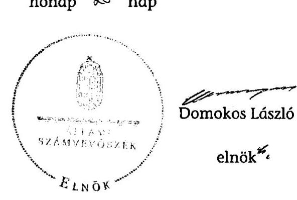

# ÁLLAMI   SZÁMVEVŐSZÉK 

## JELENTÉS

az önkormányzati vagyongazdálkodás
szabályszerúségi ellenőrzéséről
Makó
13075
2013. szeptember

---

# Állami Számvevőszék 

Iktatószám: V-0026-027-040/2013.
Témaszám: 1065
Vizsgálat-azonosító szám: V0593001

## Az ellenőrzést felügyelte:

Gyüre Lajosné (2012. december 15-ig)
felügyeleti vezető
Makkai Mária (2012. december 16-tól)
felügyeleti vezető
Az ellenőrzést vezette és az ellenőrzés végrehajtásáért felelős:
Kesjár János
ellenőrzésvezető

## Az ellenőrzést végezték:

| Laki Dóra számvevő tanácsos | Dr. Győri Gabriella számvevő | Dr. Gaálné Berente Mónika számvevő |
| :--: | :--: | :--: |
| Reichert Margit számvevő | Dr. Lajos Béla számvevő főtanácsos | Szudi Ferencné számvevő |

A témához kapcsolódó eddig készített számvevőszéki jelentések:
címe
sorszáma
Jelentés a helyi önkormányzatok gazdálkodási rendszerének 2007. évi átfogó és egyéb szabályszerűségi ellenőrzéséről
Jelentés a közbeszerzési rendszer múködésének ellenőrzéséről 0831
Jelentés a helyi adók rendszerében a hatékonyság és az eredményesség érvényesülésének ellenőrzéséről 2010.

---

# TARTALOMJEGYZÉK 

BEVEZETÉS ..... 3
I. ÖSSZEGZŐ MEGÁLLAPÍTÁSOK, KÖVETKEZTETÉSEK, JAVASLATOK ..... 5
II. RÉSZLETES MEGÁLLAPÍTÁSOK ..... 10

1. A vagyongazdálkodási tevékenység szabályozottsága ..... 10
1.1. A feladatellátás formáinak meghatározása, a döntések megalapozottsága ..... 10
1.2. A vagyonnal gazdálkodó szervezet szervezeti rendjének szabályozottsága, a kötelező szabályzatok megfelelősége ..... 11
2. A vagyongazdálkodás szabályszerűsége ..... 15
2.1. A vagyon nyilvántartásának megfelelősége ..... 15
2.2. A vagyongazdálkodást érintő gazdasági események követelmények szerinti dokumentáltsága ..... 15
2.3. A vagyongazdálkodási intézkedések, döntések szabályszerűsége ..... 16
3. A vagyonváltozást eredményező gazdasági események szabályszerűsége ..... 18
3.1. A vagyon értékének és összetételének változása ..... 18
3.2. Közbeszerzési eljárások alkalmazása ..... 19
3.3. Hitelfelvétel, kötvénykibocsátás, garancia és kezességvállalás szabályszerűsége ..... 20
4. A vagyongazdálkodás szabályszerűségére vonatkozó belső és külső ellenőrzések hasznosulása ..... 20
4.1. A belső ellenőrzés által tett megállapítások, javaslatok hasznosulása ..... 20
4.2. A többségi tulajdonban lévő gazdasági társaságok vagyongazdálkodásának felügyelete ..... 21
4.3. A könyvvizsgálatnak a vagyongazdálkodás szabályosságához való hozzájárulása ..... 22
4.4. A külső ellenőrző szervezet által tett javaslatok hasznosulása ..... 22

---

# MELLÉKLETEK 

1. számú Makó Város Önkormányzata gazdálkodására jellemző adatok, mutatószámok
2. számú Makó Város Önkormányzata vagyonának alakulása
3. számú Makó Város Önkormányzata kötelezettségeinek alakulása

## FÜGGELÉKEK

1. számú Rövidítések jegyzéke
2. számú Értelmező szótár

---

# JELENTÉS   az önkormányzati vagyongazdálkodás szabályszerűségi ellenőrzéséről 

## Makó

## BEVEZETÉS

Az Állami Számvevőszék kiemelten fontosnak tartja a nemzeti vagyon részeként az önkormányzati vagyon megőrzését és gyarapítását. Az e célkitúzésnek megfelelően összeállított ellenőrzési program alapján végezte a helyi önkormányzatok vagyongazdálkodása szabályszerűségének ellenőrzését. Az Állami Számvevőszék nem csak az ellenőrzött szervezet vagyongazdálkodásának a hibáira mutat rá, számon kérve azok kijavítását, hanem megállapításaival, javaslataival segíti a közpénzzel, közvagyonnal való felelős gazdálkodást.

Az önkormányzati vagyon alapvető funkciója, hogy a közérdeket és egyúttal az önkormányzati célok megvalósítását szolgálja. A feladatellátás terén elsősorban a kötelezően ellátandó feladatok végrehajtását hivatott szolgálni, amely mellett az önként vállalt feladatok ellátása is megvalósulhat.

## Az ellenőrzés célja az Önkormányzatnál annak értékelése volt, hogy:

- a vagyongazdálkodási tevékenységet, annak szervezeti kereteit szabályoztáke;
- az önkormányzati vagyongazdálkodás törvényességét, szabályszerűségét biztosították-e a döntések előkészítése és végrehajtása során;
- jogszerű döntéseken alapult-e a vagyon értékének és összetételének változása;
- a belső ellenőrzés elősegítette-e a vagyongazdálkodás szabályszerű működését, valamint hasznosultak-e a korábbi külső ellenőrzések által tett javaslatok.

Az ellenőrzés típusa: szabályszerűségi ellenőrzés
Az ellenőrzés a 2007. január 1. és 2011. év december 31. közötti időszakra terjedt ki, kitekintéssel a helyszíni ellenőrzés befejezéséig tartó időszak releváns folyamataira. Az egyes közbeszerzési eljárások lefolytatásának ellenőrzése a 2011. évet és a 2012. év I. negyedévét érintette.

Az ellenőrzés jogalapját az Állami Számvevőszékről szóló 2011. évi LXVI. törvény 5. § (4) bekezdése képezte.

---

Az ellenőrzés szakmai módszertana az Állami Számvevőszék Ellenőrzési Kézikönyvében foglalt szakmai szabályokon alapult, amely a Legfőbb Ellenőrző Intézmények Nemzetközi Szervezete (INTOSAI) által kiadott nemzetközi standardok (ISSAI) figyelembevételével készült.

A vagyongazdálkodás szabályozottságát a helyi szabályozások (rendeletek, szabályzatok, utasítások) ellenőrzésével végeztük el. A vagyonváltozások köréből az ellenőrizendő tételeket mintavétellel, a számviteli nyilvántartásokból választottuk ki.

A helyszíni ellenőrzés során kitöltött - az ellenőrzést végző számvevők és a jegyző által aláírt - ellenőrzési munkalapokat átadtuk az ellenőrzöttnek.

Makó 1971 óta város, lakosságának száma 2011. január 1-jén 24467 fő volt.
Az Önkormányzat Képviselő-testülete tagjainak száma 2011. december 31-én 12 fő volt. Az Önkormányzat mellett egy roma- és egy román nemzetiségi önkormányzat múködik. A polgármester 1994. év óta látja el feladatát, a jegyző 1997-től vezeti a Polgármesteri hivatalt. A Polgármesteri hivatalban dolgozó köztisztviselők száma 2011. december 31-én 121 fő volt.

Az Önkormányzat feladatainak végrehajtása érdekében a 2011. évben hét költségvetési intézményt múködtetett, amelyből egy önállóan gazdálkodott. A feladatok ellátásában részt vett hét gazdasági társasága és négy társulás.

Az Önkormányzat vagyona a 2011. december 31-ei könyvviteli mérleg szerint 33441,3 millió Ft, a kötelezettség állománya 5694,3 millió Ft volt. A 2011. évi zárszámadási rendeletben 12857,9 millió Ft költségvetési bevételt és 11124,2 millió Ft költségvetési kiadást teljesített, melyből a felhalmozási célú kiadás 6059,7 millió Ft volt. Az Önkormányzat gazdálkodására jellemző adatokat, mutatószámokat az 1-3. számú mellékletek tartalmazzák.

Az ÁSZ a 2011. évi LXVI. törvény 29. § (1) bekezdése szerint a jelentéstervezetet megküldte egyeztetésre Makó Város Önkormányzata polgármesterének, aki az ÁSZ tv. 29. § (2) bekezdésében foglalt észrevételezési jogával nem élt, a jelentéstervezetre észrevételt nem tett.

---

# I. ÖSSZEGZŐ MEGÁLLAPÍTÁSOK, KÖVETKEZTETÉSEK, JAVASLATOK 

Az Önkormányzat vagyonának könyvviteli mérleg szerinti értéke a 20072011. évek között 25 585,3 millió Ft-ról 33 441,3 millió Ft-ra, 30,7\%-kal növekedett. Az Önkormányzat a vagyon gyarapítására és a vagyon értékének megőrzésére (beruházásokra, felújításokra) 2007-2011 között 8610,5 millió Ft összeget fordított. A vagyon növekedését a saját bevételeken, hazai és uniós forrásokon kívül devizaalapú kötvénykibocsátásból származó bevételből finanszírozták, melynek következtében a hosszú lejáratú kötelezettségállomány a 2007. évi 49,2 millió Ft-ról 2011-re 5196,0 millió Ft-ra növekedett. A kötelezettségállomány ilyen mértékű növekedése hosszú távon szűkíti a vagyongazdálkodás kereteit és kockázatot jelent az Önkormányzat vagyoni helyzetére.

Az Önkormányzat a 2007-2011. években a vagyongazdálkodási tevékenységét alapvetően a jogszabályi előírások szerint szabályozta. A kötelező és az önként vállalt feladatok felsorolását az SZMSZ ${ }_{1,2}$ és a gazdasági program ${ }_{1,2}$ tartalmazta. Az Önkormányzat vagyongazdálkodási rendeletében a vagyontárgyak feletti rendelkezési jogot összeghatár alapján osztották meg a Képviselőtestület, a polgármester és a bizottságok között. A vagyongazdálkodási rendeletben meghatározták az önkormányzati feladatellátást biztosító törzsvagyont, ezen belül a korlátozottan forgalomképes és forgalomképtelen vagyonelemek körét, a forgalomképesség megváltoztatásának szabályait, valamint a vagyonelemek hasznosítási módját. A hasznosításra szánt vagyon értékének megállapítása céljából értékbecslés készítési kötelezettséget írtak elő. A vagyonhasznosítási és vagyonértékesítési szerződésekbe az Önkormányzat érdekeit védő garanciális elemeket beépítették. A Nvtv. rendelkezéseinek megfelelően a Képviselőtestület 2012 júniusában jóváhagyta a vagyongazdálkodási tervet.

A vagyongazdálkodással kapcsolatos operatív feladatokat a Polgármesteri hivatal Úgyrendjében rögzítették. A Polgármesteri hivatal számviteli politikáját és a hozzá kapcsolódó kötelezően előírt szabályzatokat - a leltározási szabályzat kivételével - a jogszabályi előírásoknak megfelelően készítették el, az intézményrendszer változását azonban nem követték naprakészen. A 2009. december 31-ével megszüntetett Termál és Gyógyfürdő intézmény a számviteli politikában, a pénzkezelési-, valamint a kötelezettségvállalási szabályzatban még a 2011. évi aktualizálás után is szerepelt. A leltározási szabályzat hiányos volt, mivel az Áhsz. rendelkezéseit figyelmen kívül hagyva a vagyonkezelésbe adott eszközök leltározásának módját nem tartalmazta. A vagyonkezelési szerződésben ugyanakkor előírták a vagyonkezelő részére a vagyonkezelésbe adott eszközök évenkénti leltározásának kötelezettségét, amely összhangban volt az Áhsz. vonatkozó rendelkezésével.

Az ellenőrzött években a zárszámadási rendeletek a vagyongazdálkodási rendeletben meghatározott formában és a tartalmi követelményeknek megfelelően tartalmazták a vagyonkimutatásokat. A könyvviteli mérlegek a vagyont a leltárral alátámasztott, az értékelési szabályzat előírásai szerint megállapított értéken tartalmazták. Az analitikus és főkönyvi nyilvántartások biztosították a

---

vagyon forgalomképesség szerinti elkülönítését. Az ingatlanvagyonra vonatkozóan a számviteli és a kataszteri nyilvántartások egyezősége fennállt. Az Áhsz. előírását betartva a vagyonkimutatásban szereplő ingatlanvagyon és az ingatlanvagyon kataszter adatai megegyeztek. Az Önkormányzatnál a 147/1992. (XI. 6.) Korm. rendeletben foglalt előírás ellenére az ingatlanvagyon kataszter és a földhivatali ingatlan-nyilvántartás azonos tartalmú adatai közötti egyezőség az adatok egyezőségét alátámasztó dokumentumok hiányában nem igazolt.

A vagyonváltozást eredményező döntés előkészítés folyamatában az előterjesztések készítésének rendjét, tartalmi és formai követelményeit az SZMSZ ${ }_{1,2}{ }^{-}$ ben és jegyzői utasításban határozták meg. Célszerűsége ellenére azonban nem rendelkeztek a költség-haszon elemzés készítésének kötelezettségéről. Az Önkormányzati vagyonnövekedéssel járó döntések előkészítése során, a pályázati követelményeknek megfelelően, megvalósíthatósági tanulmányok készültek.

Az ellenőrzött időszakban az Önkormányzat legjelentősebb beruházása az EU-s támogatással megvalósuló Hagymatikum fürdőberuházás volt. A fejlesztési irány prioritásainak kijelölésekor elsősorban a turisztikai vonzerő növelését tűzték ki célul, szerepet kapott emellett a helyi lakossági szükségletek kielégítése, a munkahelyteremtés, valamint az önkormányzati bevételek növelése is. A fürdőberuházásról szóló döntésnél, a gazdaságossági számítás során nem kellő körültekintéssel mérték fel a fejlesztésben rejlő kockázatokat: a helyi infrastrukturális (szálloda) lehetőségeket, a vendégkör megoszlását, a fizetőképes kereslet nagyságát, a környező fürdők távolságát, a beruházás várható megtérülését, annak ütemezését. A nevében és megjelenésében is megújuló fürdő üzemeltetését a korábbi intézményi fenntartás helyett - közvetlenül $48 \%$-os, közvetetten 100\%-os önkormányzati tulajdonban álló - az erre a feladatra alapított Gyógyfürdő Kft. látta el, amely az ellenőrzött időszakban veszteségesen gazdálkodott. Az Önkormányzat fürdőüzemeltetéssel kapcsolatos önként vállalt feladatának megoldása az ellenőrzött időszakban nem igazolta vissza a - Gyógyfürdő Kft. alapításának indokaként megfogalmazott - hatékony és eredményes üzemeltetési követelmény teljesítését.

A beruházások és felújítások megvalósítása során lefolytatták a Kbt. ${ }_{1,2}$-ben előírt esetekben a közbeszerzési eljárást és eleget tettek az egybeszámítási kötelezettségnek is 2011-2012. év I. negyedévében.

A pénzügyi feladatot ellátó bizottság az Ötv., valamint az SZMSZ ${ }_{1,2}$ előírásaival ellentétben a vagyonváltozás alakulása figyelemmel kisérésének eredményéről nem számolt be a Képviselő-testületnek.

A vagyongazdálkodás szabályszerűségét biztosították a döntések előkészítése és végrehajtása során. Az ellenőrzött gazdasági események tekintetében az operatív gazdálkodási jogkörök gyakorlása során, egy 0,3 millió Ft öszszegű ingatlanvásárlással kapcsolatos kifizetés kivételével betartották a jogszabályokban és a belső szabályzatokban előírt ellenőrzési követelményeket. Az ellenőrzött vagyonértékesítéssel és vagyonhasznosítással kapcsolatos gazdasági események vonatkozásában eleget tettek a vagyongazdálkodási rendeletben előírt szabályoknak, a szükséges versenyeztetési kötelezettségnek. Az ellenőrzött

---

gazdasági eseményeknél a vagyon értékének változása jogszerú döntéseken alapult.

A nyilvánosság biztosításának eszközeit, a nyilvánosságra hozatal módját és felelősét a közérdekű adatok megismerésére vonatkozó szabályzatban írták elő. A jegyző a 2007-2011. években nem tett eleget teljes körűen az Áht.-ban foglalt előírásoknak, mivel a gazdasági társaságok vonatkozásában a céljellegú múködési és fejlesztési támogatások adatait, továbbá a vagyonnal történő gazdálkodással összefüggésben a nettó ötmillió Ft-ot meghaladó vagyonkezelési szerződés adatait az Önkormányzat honlapján nem tette közzé. Nem gondoskodott 2009-2011. években az éves (elemi) költségvetés, a számviteli törvény szerinti beszámoló és a költségvetés végrehajtásáról készített beszámoló közzétételéről az Eisztv. mellékletében foglaltak ellenére.

A Képviselő-testület a többségi tulajdonú gazdasági társaságok beszámolóját minden évben megtárgyalta és a felügyelő bizottsági, valamint a könyvvizsgálói véleményre figyelemmel fogadta el. A Képviselő-testület ugyanakkor a folyamatos üzletmenet biztosításának fenntarthatóságát nem vizsgálta, a felügyelő bizottsági tagokat a tulajdonosi érdekek képviseletéről nem számoltatta be.

A belső ellenőrzés elősegítette a vagyongazdálkodás szabályszerű múködését, mert a 2007-2011. évek között a kockázatértékelés alapján összesen 14 vagyongazdálkodással kapcsolatos ellenőrzés valósult meg. A javaslatok hasznosulása érdekében intézkedési tervet készítettek, amelynek teljesítéséről a belső ellenőrzés meggyőződött. Az Önkormányzat nem élt azzal az Ötv.-ben rögzített lehetőséggel, hogy a belső ellenőrzési feladatokat ellátó szervezeti egysége a többségi tulajdonában lévő gazdasági társaságoknál ellenőrzést végezzen a vagyonkezelési szerződésben foglaltak végrehajtásának ellenőrzésére, illetve a veszteséges múködéssel összefüggésben az eredményes gazdálkodás elősegítése érdekében.

A külső ellenőrzések - köztük az ÁSZ korábbi ellenőrzései, a könyvvizsgáló javaslatai, valamint a fejlesztésekhez kapcsolódóan a közremúködő szervek megállapításai - esetében a jegyző intézkedett a hiányosságok megszüntetése érdekében, amelynek eredményeként valamennyi - a vagyongazdálkodás szabályozottságához és szabályszerűségéhez kapcsolódó - javaslat hasznosult.

Az Állami Számvevőszékről szóló 2011. évi LXVI. törvény 33. § (1) bekezdésében foglaltak értelmében a jelentésben foglalt megállapításokhoz kapcsolódó intézkedési tervet köteles az ellenőrzött szervezet vezetője összeállítani, és azt a jelentés kézhezvételétől számított 30 napon belül az ÁSZ részére megküldeni. Amennyiben az intézkedési tervet határidőben nem küldi meg a szervezet, vagy az nem elfogadható, az ÁSZ elnöke a hivatkozott törvény 33. § (3) bekezdés a)-b) pontjaiban foglaltakat érvényesítheti.

---

Az ellenőrzés intézkedést igénylő megállapításai és javaslatai:

# a Polgármesternek 

1. A pénzügyi feladatot ellátó bizottság az Ötv. 92. § (13) és (14) bekezdéseivel, valamint az SZMSZ ${ }_{1,2}$ előírásaival ellentétben a vagyonváltozás alakulása figyelemmel kisérésének eredményéről nem számolt be a Képviselő-testületnek.

Javaslat:
Intézkedjen, hogy a pénzügyi feladatot ellátó bizottság az Mötv. 120.§ (1) bekezdés b) pontja alapján a vagyonváltozás alakulását kísérje figyelemmel és arról számoljon be a Képviselő-testületnek az Mötv. 120. § (2) bekezdése alapján.

## a Jegyzönek

1. A Polgármesteri hivatal számviteli politikájához kapcsolódó, kötelezően előírt leltározási szabályzat hiányos volt, mivel az Áhsz. 37. § (4) bekezdés rendelkezéseit figyelmen kívül hagyva a vagyonkezelésbe adott eszközök leltározásának módját nem szabályozták.

Javaslat:
Intézkedjen a leltározási szabályzat kiegészítéséről, hogy a szabályzat az Áhsz. 37. § (4) bekezdésének megfelelően tartalmazza a vagyonkezelésbe adott eszközök leltározására vonatkozó rendelkezéseket.
2. Az Önkormányzatnál a 147/1992. (XI. 6.) Korm. rendelet 1. § (2) bekezdésében foglalt előírás ellenére az ingatlanvagyon kataszter és a földhivatali ingatlannyilvántartás azonos tartalmú adatai közötti egyezőség az adatok egyezőségét alátámasztó dokumentumok hiányában nem igazolt.

Javaslat:
Intézkedjen arról, hogy a 147/1992. (XI. 6.) Korm. rendelet 1. § (2) bekezdésében rögzítetteknek megfelelően biztosítsák az ingatlanvagyon kataszter adatai egyezőségét a földhivatali ingatlan-nyilvántartás azonos tartalmú adataival.
3. A Polgármesteri hivatal számviteli politikájában és a pénzkezelési-, valamint a kötelezettségvállalási szabályzatokban a 2011. évi aktualizálás után is szerepelt a 2009. december 31-én megszüntetett Termál és Gyógyfürdő intézmény.

Javaslat:
Módosítsa a számviteli politika és a pénzkezelési-, valamint a kötelezettségvállalási szabályzatokat, hogy azok ne tartalmazzák a megszüntetett Termál és Gyógyfürdő intézményt.
4. A jegyző az Áht.. 15/B. § (1) bekezdésében és az Eisztv. 6. § (1) bekezdésében foglaltaknak nem tett eleget teljes körűen, mivel a gazdasági társaságai vonatkozásában

---

a céljellegű működési és fejlesztési támogatások adatait, továbbá a vagyonnal történő gazdálkodással összefüggésben a nettó öt millió Ft-ot meghaladó vagyonkezelési szerződés adatait, továbbá az elemi költségvetést, a számviteli törvény szerinti beszámolót, valamint a költségvetés végrehajtásáról - külön jogszabályban meghatározott módon és gyakorisággal - készített beszámolót az Önkormányzat honlapján nem tette közzé.

Javaslat:
Intézkedjen az információs önrendelkezési jogról és az információ szabadságról szóló 2011. évi CXII. törvény 1. számú mellékletében meghatározott adatok közzétételéről.
5. Az Önkormányzat nem élt azzal az Ötv. 92. § (11) bekezdés b) pontjában rögzített lehetőséggel, hogy a belső ellenőrzési feladatokat ellátó szervezeti egysége a többségi tulajdonában lévő gazdasági társaságoknál ellenőrzést végezzen.

Javaslat:
Intézkedjen a Nvtv. 10. § (2) bekezdés alapján, hogy az Önkormányzat tulajdonában lévő vagyon használójának - így a gazdasági társaságainak - a vagyonnal való gazdálkodását rendszeresen ellenőrizzék.

---

# II. RÉSZLETES MEGÁLLAPÍTÁSOK 

## 1. A VAGYONGAZDÁLKODÁSI TEVÉKENYSÉG SZABÁLYOZOTTSÁGA

### 1.1. A feladatellátás formáinak meghatározása, a döntések megalapozottsága

Az Önkormányzat a 2007-2011. években feladatellátásának szervezeti kereteit, a kötelező és önként vállalt feladatait és az abban közreműködő intézményeket és gazdasági társaságokat - az Ötv. 8. § (2) bekezdésében előírtakat betartva az SZMSZ ${ }_{1,2}$-ben és a gazdasági program ${ }_{1,2}$-ben határozta meg.

A 2011. évben újraalkotott SZMSZ ${ }_{2}$-őt a Képviselő-testület 2011-ben 1 alkalommal, 2012-ben 3 alkalommal módosította, az Önkormányzat hivatalos honlapján azonban az „üvegzseb" adatok között a 2011. március 31-től hatályon kívül helyezett SZMSZ ${ }_{1}$ szerepelt.

Az önként vállalt feladatok köre a 2007-2011. évek között két feladattal az Ipari Park és a Maros-parti strand fejlesztésével - bővült. A gazdasági program ${ }_{1}$ rögzítette a fejlesztési irányokat, melyek közül a legfontosabbak a munkahelyteremtés, a gazdaságfejlesztés és a városfejlesztés, amelynek keretében a középületek rekonstrukciója és a városi fürdő fejlesztése élvezett prioritást.

Az Önkormányzat egyik önként vállalt feladata volt a városi Termál és Gyógyfürdő múködtetése. A gazdasági program ${ }_{1}$ már a fürdő fejlesztését, mint egyfajta vállalkozást vázolta fel a városépítés és turizmus, mint „kitörési pont" keretében. A fejlesztési irány prioritásainak kijelölésekor elsősorban a turisztikai vonzerő növelését tűzték ki célul, szerepet kapott emellett a helyi lakossági szükségletek kielégítése, a munkahelyteremtés, valamint az önkormányzati bevételek növelése is.

Az Önkormányzat a 2007-2011. évek között többször döntött az intézményrendszerének, illetve a feladatellátás formáinak átalakításáról. Az ellenőrzött időszakban három gazdasági társaságot alapított.

A fürdőfejlesztés lebonyolítására a Képviselő-testület 2007. december 19-én döntött a 100\%-ban önkormányzati tulajdonú Fürdőfejlesztő Kft. alapításáról, és döntött a Hagymatikum fürdőfejlesztési beruházás megindításáról. A nevében és megjelenésében is megújuló fürdő üzemeltetésére 2008 novemberében a Fürdőfejlesztő Kft. és az Önkormányzat létrehozta a Gyógyfürdő Kft.-t ${ }^{1}$ és a fürdő korábbi üzemeltetését végző Termál és Gyógyfürdő intézményét 2009. december 31-vel megszüntette.

Az Önkormányzat fürdőüzemeltetéssel kapcsolatos önként vállalt feladatának megoldása az ellenőrzött időszakban nem igazolta vissza a - Gyógyfürdő Kft.

[^0]
[^0]:    ${ }^{1}$ A társaságban a Fürdőfejlesztő Kft. 52\%-kal, az Önkormányzat 48\%-kal rendelkezett.

---

alapításának indokaként ${ }^{2}$ megfogalmazott - hatékony és eredményes üzemeltetési követelmény teljesítését. A fürdőberuházásról szóló döntésnél a fejlesztésben rejlő kockázatokat a gazdaságossági számítások során nem kellő körültekintéssel mérték fel.

A Gyógyfürdő Kft. megalakulása óta minden év végén negatív mérleg szerinti eredményt mutatott ki: 2008-ban -1,9 millió Ft, 2009-ben -0,7 millió Ft, 2010-ben $-8,8$ millió Ft, 2011-ben $-4,3$ millió Ft értékben.

Az Önkormányzat az integrált városfejlesztési és akcióterületi tervben szereplő városfejlesztési projektek ${ }^{3}$ megvalósítására 2009 augusztusában megalapította 100\%-os tulajdonnal a Városfejlesztő Kft-t. A városüzemeltetési feladatok egy részének ellátását 2011 márciusától, továbbá - a Városi Piac intézmény megszűntetésével - a piac üzemeltetését a 2012. évtől a 100\%-ban önkormányzati tulajdonú Kommunális Nonprofit Kft-re bízták.

Az Önkormányzat a termál- és fürdő céljára használt vagyonra a Fürdőfejlesztő Kft.-vel 2008 decemberében vagyonkezelési szerződést kötött.

# 1.2. A vagyonnal gazdálkodó szervezet szervezeti rendjének szabályozottsága, a kötelező szabályzatok megfelelősége 

A 2007-2011. években a Képviselő-testület az Ötv. 18. § (1) bekezdésében foglaltak alapján alkotta meg SZMSZ ${ }_{1,2}$-jét. A vagyongazdálkodási feladatokat a hatályos törvényi előírásoknak megfelelően rendeletben szabályozta. A Képvi-selő-testület által a polgármesterre és bizottságokra átruházott hatásköröket az SZMSZ ${ }_{1,2}$ tartalmazta. Az átruházott hatáskörben hozott intézkedésekről az SZMSZ ${ }_{1,2}$-ben foglaltak alapján évente a hatáskör gyakorlói beszámolási kötelezettségüknek eleget tettek. Az átruházott hatáskörök gyakorlásához a Képvi-selő-testület utasítást nem adott. A vagyongazdálkodást érintő átruházott hatáskörök a következő főbb feladatokhoz kapcsolódtak: közbeszerzés kiírása, elbírálása; értékhatártól függően tulajdonosi hozzájárulás megadása; önkormányzati bérlakások ügyében pályázat kiírása.

A Polgármesteri hivatal számviteli politikáját és a hozzá kapcsolódó kötelezően előírt szabályzatokat - a leltározási szabályzat kivételével - a jogszabályi előírásoknak megfelelően készítették el, az intézményrendszer változását azonban nem követték naprakészen. A 2009. december 31-ével megszüntetett Termál és Gyógyfürdő intézmény a számviteli politikában és a pénzkezelési-, valamint a kötelezettségvállalási szabályzatban még a 2011. évi aktualizálás után is szerepelt.

Az Önkormányzat a leltározási szabályzatban évenkénti leltározásról rendelkezett. A leltározási szabályzat az üzemeltetésre átadott eszközök leltározásá-

[^0]
[^0]:    ${ }^{2}$ A Gyógyfürdő Kft. létrehozásának indokaként fogalmazták meg a hatékony üzemeltetési keretet, az eddigiekhez képest rugalmasabb, eredményorientáltabb menedzsment múködését.
    ${ }^{3}$ Fő feladata volt 2010-2011. években a „Fürdővárosi funkciókat kiszolgáló településközpont kialakítása Makón" projekttel kapcsolatos projektmenedzseri feladatok ellátása.

---

nak módját tartalmazta, azonban a vagyonkezelésbe adott eszközökre vonatkozóan nem tartalmazott rendelkezést, amellyel figyelmen kívül hagyta az Áhsz. 37. § (4) bekezdésében foglaltakat. A vagyonkezelési szerződés IV/1. pontja ugyanakkor előírta a vagyonkezelő részére a vagyonkezelésbe adott eszközök évenkénti leltározásának kötelezettségét, amely összhangban volt az Áhsz. 37. § (4) bekezdésében foglaltakkal.

Az Önkormányzat a Htv. 138. § (1) bekezdés j) pontjában kapott felhatalmazás alapján alkotta meg vagyongazdálkodási rendeletét, majd a jogszabály-, illetve vagyonváltozással összhangban azt aktualizálta. A vagyontárgyak feletti rendelkezési jogot, a vagyongazdálkodási rendeletben összeghatár és jogcímek alapján osztották meg a Képviselő-testület, a polgármester és a bizottságok ${ }^{4}$ között. A vagyongazdálkodási rendelet összhangban volt az Önkormányzat belső szabályzataival.

Az önkormányzati feladatellátást biztosító törzsvagyont, ezen belül a korlátozottan forgalomképes és forgalomképtelen vagyonelemek körét, a vagyonleltár tartalmi előírásait a vagyongazdálkodási rendeletben szabályozták. A vagyongazdálkodással kapcsolatos operatív feladatokat a Polgármesteri hivatal Úgyrendje rögzítette.

A forgalomképesség megváltoztatásának szabályait a vagyongazdálkodási rendelet tartalmazta. A vagyonkezelő és a vagyonhasználók (üzemeltetők) feladatára, hatáskörére, felelősségére vonatkozóan a vagyongazdálkodási rendelet, a Polgármesteri hivatal Úgyrendje, a FEUVE szabályzat és a vagyonkezelési szerződés is tartalmazott rendelkezéseket.

A vagyonelemek hasznosítási módját ${ }^{5}$ a vagyongazdálkodási rendelet, valamint az ezzel összhangban készült vagyonkezelési szerződés is tartalmazta.

A vagyongazdálkodási rendelet értelmében az Önkormányzat vagyonának használói az intézmények és a gazdasági társaságok, vagyonának kezelője vagyonkezelési szerződés alapján a Fürdőfejlesztő Kft. A vagyonhasználók és a vagyonkezelő a hasznosítás keretében jogosultak voltak a használatukban lévő vagyontárgyak birtoklására, használatára, hasznainak szedésére és a birtokvédelemre. A vagyongazdálkodási rendeletben foglalt kötelezettségük volt a rendelkezésükre bocsátott vagyontárgyakkal kapcsolatos fenntartási, üzemeltetési, karbantartási és felújítási feladatok ellátása.

A vagyongazdálkodási rendeletben meghatározott érték ${ }^{6}$ feletti ingatlan értékesítésére, illetve más módon történő hasznosítására a nyilvánosság bevonásával, versenyeztetéssel kerülhetett sor. A versenyeztetés szabályait a vagyongazdálkodási rendelet mellékletében határozták meg.

[^0]
[^0]:    ${ }^{4}$ A bizottságok közül rendelkezési jog illette meg az ÚPKTB-t, valamint a Városfejlesztési, Városüzemelési, Lakásügyi és Turisztikai Bizottságot.
    ${ }^{5}$ A vagyon használója (kezelője) jogosult a használatában levő 500 ezer Ft egyedi bruttó nyilvántartási értéket meg nem haladó ingó vagyontárgy értékesítésére; a vagyonkezelő a használatába adott ingatlanokban átmenetileg üresen álló helyiségeket hasznosíthatta.
    ${ }^{6}$ bruttó 100 ezer Ft nyilvántartási érték

---

A vagyongazdálkodással összefüggő előterjesztések készítésének rendjéről, tartalmi és formai követelményeiről az SZMSZ ${ }_{1,2}$-ben rendelkeztek. A döntés előkészítés folyamatában - annak célszerűsége ellenére - a költség-haszon elemzés készítésének kötelezettségét az SZMSZ ${ }_{1,2}$-ben és a vagyongazdálkodási rendeletben nem írták elő.

A jegyző 2008. január 15-től utasításban határozta meg az adósságot keletkeztető külső forrás bevonására (hitelfelvételre, kötvénykibocsátásra) vonatkozó előterjesztések követelményeit. A követelmények között előírás volt a futamidő egyes éveit terhelő kötelezettségvállalás költségvetési egyensúlyra gyakorolt hatásának bemutatása.

A Képviselő-testület az SZMSZ ${ }_{1,2}$-ben előírta a pénzügyi feladatot ellátó bizottság számára a vagyonváltozás figyelemmel kísérésének kötelezettségét. A tájékoztatás tartalmára és formájára külön rendelkezést nem írtak elő, arra az SZMSZ ${ }_{1,2}$-ben az előterjesztés készítésére meghatározott előírások voltak érvényesek. A pénzügyi feladatot ellátó bizottság nem értékelte a vagyon alakulását és az arra ható tényezőket a Képviselő-testület számára.

A 2007-2011. években a vagyongazdálkodási rendelet szabályozta a vagyon térítésmentes átruházásának eseteit, ${ }^{7}$ és módját, mely szerint az önkormányzati vagyon ingyenes vagy kedvezményes átruházásáról dönteni a Képviselő-testület hatáskörébe tartozott. Kiemelten kezelték a telekprogramban meghatározott építési célt szolgáló telkek ingyenes vagy kedvezményes elidegenítését, amely esetekben a döntéshozatalhoz minősített többséget írtak elő.

A 2012-ben hatályba lépett Nvtv. 18. § (1) bekezdésének megfelelően az Önkormányzat vagyongazdálkodási rendeletét határidőn belül felülvizsgálta. Ennek keretében elvégezte a vagyonelemek új szabályok szerinti besorolását. A Képviselő-testület megállapította, hogy nincs olyan vagyonelem önkormányzati tulajdonban, amelyet nemzetgazdasági szempontból kiemelt jelentőségű nemzeti vagyonná kellene minősíteni. A Nvtv. rendelkezéseit figyelembe véve a vagyon térítésmentes átruházását biztosító rendelkezéseket 2012. március 1. napjával hatályon kívül helyezték.

A Képviselő-testület a Nvtv. 9. § (1) bekezdése előírása alapján a 247/2012. (VI. 27.) sz. határozatával döntött az Önkormányzat vagyongazdálkodási tervéről. A vagyongazdálkodási terv a vagyongazdálkodás egyes területein szükséges intézkedéseket és a jövőt érintő célkitűzéseket tartalmazta.

Az ingatlan- és ingó vagyongazdálkodás területére egyaránt fogalmazott meg elvárásokat. A vagyongazdálkodási tervben foglaltak szerint kiemelt célnak tekintették a vagyonelemek önkormányzati érdekeket szem előtt tartó hasznosítását, a munkahelyteremtés elősegítése érdekében az Ipari Park telekértékesítési, és mun-kahely-teremtési programjának folytatását, valamint a fürdő beruházáshoz kapcsolódó szállodai kapacitás kialakítását. Tekintettel arra, hogy a vagyongazdálkodási terv elkészítésének időpontjában az önkormányzati feladatellátás átalakítása nem fejeződött be, és a terv készítésére vonatkozó részletes szabályozás nem

[^0]
[^0]:    ${ }^{7}$ Térítésmentes átruházási jogcímnek minősültek az ajándékozás, a közérdekű kötelezettségvállalás, közalapítvány alapítása esetén az alapítványi hozzájárulás.

---

állt rendelkezésre, a Képviselő-testület úgy döntött, hogy a vagyongazdálkodási tervet a feladat-átszervezésekkel kapcsolatos törvény elfogadása után felül kell vizsgálni.

A hasznosításra szánt vagyon piaci értékének megállapítása céljából a vagyongazdálkodási rendelet értékbecslés készítési kötelezettséget írt elő, amely szerint a hat hónapnál régebben készült forgalmi értékbecslést vagy üzleti értékelést a döntést megelőzően aktualizálni kell.

Az Önkormányzat tulajdonosi jogainak védelme céljából garanciális elemek rögzítésének kötelezettségét írták elő a vagyongazdálkodás egyes területeit érintő szerződésekben. Az Ipari Park telekértékesítési programjáról szóló képviselőtestületi határozatokban ${ }^{8}$ változatos módon határoztak meg garanciális feltételeket. A befektető szabadon választhatta ki a számára vállalható és teljesíthető konstrukciót ${ }^{9}$.

Az önkormányzati érdekek védelme érdekében a Képviselő-testület tulajdonvédelmi rendelet alkotott, amelyben az ingatlantulajdon korlátozását eredményező szolgalmi jog alapítása esetére határozta meg az Önkormányzatot megillető kártalanítás mértékét és az eljárás szabályait. A tulajdonvédelmi rendelet az önkormányzati tulajdonban álló vagyon védelmének, gyarapításának egyéb vonatkozásaira nem terjedt ki.

A nyilvánosság biztosításának eszközeit, a nyilvánosságra hozatal módját és felelősét a közérdekű adatok megismerésére vonatkozó szabályzatban, a Polgármesteri hivatal Úgyrendjében és a FEUVE szabályzat tervezési csoport folyamat szabályozása keretében írták elő. Az Önkormányzat költségvetésére és zárszámadására vonatkozóan a nyilvánosság biztosítására előírt szabályok kiegészültek az SZMSZ ${ }_{1,2}$-ben a rendeletek közzétételére előírt szabályokkal.

Az operatív gazdálkodással és annak munkafolyamatba épített ellenőrzésével kapcsolatos jogkörök gyakorlásának rendjét, az ezekkel kapcsolatos összeférhetetlenségi szabályokat a FEUVE szabályzatban, a gazdálkodási jogkörök szabályzatában, a pénzkezelési szabályzatban, a leltározási szabályzatban, a beszerzési szabályzatban és a Polgármesteri hivatal Úgyrendjében határozták meg.

[^0]
[^0]:    ${ }^{8}$ 50/2008. (III. 18.) számú határozat; 270/2009. (VI. 24.) számú határozat; 316/2010. (VII. 25.) számú határozat
    ${ }^{9}$ Választható garanciális feltételek voltak: a bankgarancia, a biztosítási szerződés alapján kiállított készfizető kezességvállalást tartalmazó kötelezvény, a garanciaszervezet által vállalt kezesség, a garanciabiztosítási szerződés alapján kiállított kötelezvény, a jelzálogjog.

---

# 2. A VAGYONGAZDÁLKODÁs SZABÁLYSZERŰSÉGE 

### 2.1. A vagyon nyilvántartásának megfelelősége

Az egyes évekre vonatkozó vagyonkimutatást a 2008-2011. években a zárszámadási rendeletek ${ }^{10}$ a vagyongazdálkodási rendeletben szabályozottak szerint meghatározott formában tartalmazták.

Az Önkormányzat az Áhsz. 9. számú melléklet számlaosztályok tartalmára vonatkozó 1. k) pontjában foglaltaknak megfelelően a törzsvagyon (ezen belül forgalomképtelen, illetve korlátozottan forgalomképes), valamint a nem törzsvagyon részét képező eszközök elkülönítéséről gondoskodott. A számlarendben foglalt előírásoknak megfelelően kialakított és alkalmazott számviteli nyilvántartások (a főkönyvi számlák tovább bontása és az analitikus nyilvántartások is) biztosították a vagyon forgalomképesség szerinti elkülönített kimutatását. Az ingatlanvagyonra vonatkozóan a számviteli és a kataszteri nyilvántartások egyezősége fennállt.

Az Önkormányzatnál az ellenőrzött időszakban a vagyonkimutatásban szereplő ingatlanvagyon és az ingatlanvagyon kataszter adatai megegyeztek. A 147/1992. (XI. 6.) Korm. rendelet 1. § (2) bekezdésében foglalt előírás ellenére azonban az ingatlanvagyon kataszter és a földhivatali ingatlannyilvántartás azonos tartalmú adatai közötti egyezőség az adatok egyezőségét alátámasztó dokumentumok hiányában nem igazolt.

Az Önkormányzat a 2007-2011 évek között az Áhsz. 37. § (1), (3) és (4) bekezdésében előírt leltározási kötelezettségének december 31-ei fordulónappal eleget tett. A Polgármesteri hivatal kezelésében levő tárgyi eszközök és az üzemeltetésre átadott eszközök leltározását a leltározási szabályzatban foglalt előírásoknak megfelelően végezték el. A vagyonkezelésbe adott eszközöket - a vagyonkezelési szerződésben foglaltak szerint - a vagyonkezelő leltározta és a leltárt a mérlegkészítés időpontjáig az Önkormányzat rendelkezésére bocsátotta. A 2007-2011. évi könyvviteli mérlegekben a mérlegsorokat leltárral alátámasztották, értéküket a Számv. tv. általános alapelveinek és tételes szabályainak, az Áhsz., valamint az Önkormányzat számviteli politikájának és értékelési szabályzatának előírásai alapján határozták meg.

### 2.2. A vagyongazdálkodást érintő gazdasági események követelmények szerinti dokumentáltsága

Az ellenőrzés alá vont vagyongazdálkodást érintő valamennyi gazdasági eseménynél a gazdálkodási jogköröket az arra kijelölt és írásban felhatalmazást kapott személyek gyakorolták, érvényesültek az - Ámr. ${ }_{1}$ 138. §ban és az Ámr. ${ }_{2}$ 80. §-ban - rögzített összeférhetetlenségi követelmények. A gazdasági események tekintetében az operatív gazdálkodási jogkörök gya-

[^0]
[^0]:    ${ }^{10}$ a 2008. évi zárszámadásról szóló rendelet 9/a. sz. melléklet, a 2009. évi zárszámadásról szóló rendelet 9/a. sz. melléklet, a 2010. évi zárszámadásról szóló rendelet 21. sz. melléklet, valamint a 2011. évi zárszámadásról szóló rendelet 20. sz. melléklet

---

korlása során - egy 0,3 millió Ft összegű ingatlanvásárlással kapcsolatos kifizetés kivételével - betartották a jogszabályokban és a belső szabályzatokban ${ }^{11}$ előírt ellenőrzési követelményeket. Az ellenőrzött gazdasági eseményeknél a vagyon értékének változása jogszerú döntéseken alapult.

Az ingatlanvásárlással kapcsolatos 311/1529/2008. számú utalványrendeleten az érvényesítő és az utalvány ellenjegyzője nem végezte el ellenőrzési feladatát, mert az érvényesítést nem előzte meg a szakmai teljesítés igazolása, illetve az utalvány ellenjegyzője nem győződött meg a szakmai teljesítésigazolás és érvényesítés megtörténtéről.

A jegyző a 2007-2011. években nem tett eleget teljes körüen az Áht. 15/A. § (1) bekezdésében, valamint az Áht. 15/B. § (1) bekezdésében ${ }^{12}$ foglalt előírásoknak, mivel az ellenőrzési időszakban alapított gazdasági társaságok ${ }^{13}$ vonatkozásában a céljellegú működési és fejlesztési támogatások adatait (a kedvezményezettek nevét, a támogatás célját, összegét, a megvalósítás helyére vonatkozó adatokat) és a vagyonnal történő gazdálkodással összefüggésben a nettó ötmillió Ft-ot meghaladó vagyonkezelési szerződés adatait (a szerződés megnevezését, tárgyát, a szerződő felek nevét, a szerződés értékét, időtartamát) nem tette közzé az Önkormányzat honlapján.

A jegyző a 2009-2011. években az éves (elemi) költségvetés, a számviteli törvény szerinti beszámoló és költségvetés végrehajtásáról készített beszámoló közzétételéről az Eisztv. mellékletében ${ }^{14}$ foglaltak ellenére nem gondoskodott.

# 2.3. A vagyongazdálkodási intézkedések, döntések szabályszerűsége 

Az ellenőrzés alá vont vagyonváltozást eredményező döntések során betartották az Ötv. 79. § (2) bekezdés ${ }^{15}$ előírásait.

Az Önkormányzatnál a vagyonhasznosítással és vagyonértékesítéssel kapcsolatos gazdasági események vonatkozásában eleget tettek a vagyongazdálkodási rendeletben és a lakásgazdálkodási rendeletben előírt

[^0]
[^0]:    ${ }^{11}$ A költségvetési gazdálkodást érintő jogkörök szabályozását a 2007-2008. években a pénzkezelési szabályzat, a 2009. évtől a kötelezettségvállalás, utalványozás, ellenjegyzés, érvényesítés szabályzat tartalmazta.
    ${ }^{12}$ a 2012. évtől az információs önrendelkezési jogról és az információszabadságról szóló 2011. évi CXII. törvény 32-33. §-aiban és 37. § (1) bekezdésében a törvény 1. mellékletének III. Gazdálkodási adatok 4. és 6. pontja alapján
    ${ }^{13}$ A Gyógyfürdő Kft. 284,9 millió Ft, a Fürdőfejlesztő Kft. 28,8 millió Ft, a Városfejlesztő Kft. 7,7 millió Ft múködési célú pénzeszköz átadásban részesült 2007-2011. évek között a zárszámadási rendeletekben kimutatott adatok alapján. A Gyógyfürdő Kft-nél 2011ben 38,5 millió Ft tőketartalék képzés történt, amelyből 22,9 millió Ft-ot fejlesztési célú pénzeszköz átadásként mutattak ki a zárszámadási rendeletben.
    ${ }^{14}$ a 2012. évtől az információs önrendelkezési jogról és az információszabadságról szóló 2011. évi CXII. törvény 1. melléklet III. Gazdálkodási adatok 1. pontja
    ${ }^{15}$ 2012. január 1-jétől a Nvtv. 3. § (1) bekezdés 3. és 6. pontjai

---

szabályoknak, a versenyeztetési kötelezettségnek. A vagyonhasznosítási és vagyonértékesítési szerződésekben az Önkormányzat érdekeit védő garanciális elemeket beépítették.

A vagyonnövekedést egyrészt beruházások, másrészt felújítások eredményezték, melyek finanszírozását európai uniós és kötvénykibocsátásból származó külső források, valamint saját bevételek biztosították. Az Önkormányzati vagyonnövekedéssel járó döntések előkészítése során, a pályázati követelményeknek megfelelően, megvalósíthatósági tanulmányok készültek, amelyek tartalmazták a létesítmények fenntarthatóságának vizsgálatát.

A fürdőberuházásról szóló döntésnél, a gazdaságossági számítás során nem kellő körültekintéssel mérték fel a fejlesztésben rejlő kockázatokat: a helyi infrastrukturális (szálloda ${ }^{16}$ ) lehetőségeket, a vendégkör megoszlását, a fizetőképes kereslet nagyságát, a környező fürdők távolságát, a beruházás várható megtérülését, ${ }^{17}$ és annak ütemezését.

A hitelfelvételről és a kötvénykibocsátásról szóló Képviselő-testületi döntések esetében a döntéshozók az arra felhatalmazott személyek voltak, az elkészült dokumentumok tartalma a döntésekkel megegyezett. A dön-tés-előkészítés folyamatában betartották a külső források igénybevételével kapcsolatos - 2008. január 15-től hatályos - jegyzői utasítást. A kötvénykibocsátásból származó források felhasználási célját meghatározták, a kamat- és árfolyamkockázatot bemutatták.

A kötvénykibocsátásról szóló döntésnél a visszafizetés jövőbeni árfolyamkockázatát azonban nem kellő körültekintéssel mérték fel. Az árfolyamkockázatot $168 \mathrm{Ft} / \mathrm{CHF}$-en ${ }^{18}$ kalkulálták, ez az összeg azonban lényegesen kevesebb a kibocsátást követő években kialakult árfolyamoknál. ${ }^{19} \mathrm{Az}$ árfolyamváltozás jelentősen hozzájárult az eladósodási mutatóo ${ }^{20} 16,2$ százalékpontos növekedéséhez. A kötvény esetében az árfolyamváltozás miatt elszámolt árfolyam különbözet (még nem realizált árfolyamveszteség) 2106 millió Ft volt 2011. év végén.

[^0]
[^0]:    ${ }^{16}$ „A fürdővárosi funkciókat kiszolgáló, megújuló településközpont kialakítása Makón" projekt megvalósításának egyik célja a fürdő közvetlen közelében található épületek szállodává alakítása, valamint új parkolók kialakítása. Az 1179,5 millió Ft összköltségű fejlesztést 2010-ben kezdték el, amelynek támogatási intenzitása $75,5 \%$ volt.
    ${ }^{17}$ A pályázatban benyújtott és elfogadott számítások alapján a pénzügyi megtérülési idő a projekt egészére nézve 25,3 év, az önerő tekintetében 13,1 év. A maradványérték és az amortizáció nélkül számított megtérülés 90,4 év.
    ${ }^{18}$ A kibocsátást követően a kötvény átváltása $143,28 \mathrm{Ft} / \mathrm{CHF}$ árfolyamon történt.
    19 A svájci frank éves átlagos árfolyama 2009-ben 185,82Ft/CHF, 2010-ben 199,94 Ft/CHF, 2011-ben 226,90 Ft/CHF volt.
    ${ }^{20}$ Az eladósodási mutató a hosszú és rövid lejáratú fizetési kötelezettségek önkormányzati összes forráson belüli arányát mutatja. A mutató értéke a 2007. évi 0,7\%-ról 2011. évben $16,9 \%$-ra nőtt.

---

# 3. A VAGYONVÁLTOZÁST EREDMÉNYEZŐ GAZDASÁGI ESEMÉNYEK SZABÁLYSZERŰSÉGE 

### 3.1. A vagyon értékének és összetételének változása

Az Önkormányzat vagyonának értéke 2007-2011 között - a könyvviteli mérleg főösszege alapján - 25585,3 millió Ft-ról 33441,3 millió Ft-ra, 7856,0 millió Ft-tal, 30,7\%-kal növekedett. A vagyonváltozást 6719,4 millió Ft összeggel, $85,5 \%$-kal a befektetett eszközök állományának növekedése okozta, amelynek finanszírozására a saját forrásokon, hazai és uniós támogatásokon kívül idegen pénzeszközöket is bevontak. A fejlesztési célú hitelfelvétel és kötvénykibocsátás miatt az Önkormányzat hosszú lejáratú kötelezettségei a 2007. évi 49,2 millió Ft-ról 2011-re 5196,0 millió Ft-ra növekedtek. A kötelezettségállomány ilyen mértékű növekedése hosszú távon szűkíti a vagyongazdálkodás kereteit és kockázatot jelent az Önkormányzat vagyoni helyzetére. Az Önkormányzat - kötelezettségek nélkül számított - saját vagyona 2496,6 millió Ft-tal 9,9\%-kal nőtt 2007-2011 között.

A 2011. év végéig megvalósult beruházások ${ }^{21}$ hatására az ingatlanok állománya a 2007. évi 20033,7 millió Ft-ról 3317,8 millió Ft-tal, 23351,5 millió Ft-ra, 16,6\%-kal növekedett. Az üzemeltetésre és vagyonkezelésbe adott eszközök értéke - ugyancsak a 2011. év végéig - 937,7 millió Ft-tal, 71,0\%-kal 2258,1 millió Ft-ra, míg a folyamatban lévő beruházások értéke 2278,8 millió Ft-ról 4857,9 millió Ft-ra, 2579,1 millió Ft-tal, 113,2\%-kal növekedett.

A vagyon összetételében 2007-2011 között - az üzemeltetésre és vagyonkezelésbe adott eszközök kivételével - minden befektetett eszközcsoportnál részaránycsökkenés következett be az összes eszközértékhez viszonyítva. A részaránycsökkenést a nagy értékű eszközök múködtetésre, illetve vagyonkezelésbe adása okozta.

Az Önkormányzatnál PPP konstrukcióban megvalósuló beruházással vagyonnövekedésre, illetőleg térítésmentes vagyonátadással a vagyon csökkenésére nem került sor.

A 2007-2011 között az Önkormányzat vagyonának gyarapítására és a vagyon értékének megőrzésére (beruházásokra, felújításokra) 8610,5 millió Ft összeget fordítottak a költségvetési beszámolókban kimutatott adatok alapján, amely az időszakban elszámolt értékcsökkenések több mint két és félszerese volt. Az eszközök használhatósága (nettó értékének aránya a bruttó értékhez) 2007. évről 2011. év végére 6,6 százalékponttal romlott, ${ }^{22}$ amelynek következté-

[^0]
[^0]:    ${ }^{21}$ Nagyságrendjét tekintve jelentős befejezett beruházások a szakközépiskola rekonstrukció ( 1460,1 millió Ft), az Iskola infrastrukturális fejlesztés ( 680,5 millió Ft), az Ipari Park beruházás ( 473,9 millió Ft), a Város-rehabilitációs beruházás ( 227,0 millió Ft) és a 43-as főút tehermentesítése ( 114,6 millió Ft ) voltak.
    ${ }^{22}$ A használhatósági fok értékei: 2007-ben 87,5\%, 2008-ban 88\%, 2009-ben 86,4\%, 2010-ben $82,3 \%$, 2011-ben $80,9 \%$.

---

ben eszközeinek elhasználódási szintje (értékcsökkenés aránya a bruttó értékhez) ugyanilyen mértékben növekedett. Az Önkormányzat a 2009-2011. évi beruházásainak jelentős hányadát - közel 5 milliárd Ft értékben - nem aktiválta 2011. év végéig, így e mutatók annak hatását még nem tartalmazták.

A 2011. év végén az Önkormányzat legjelentősebb folyamatban lévő beruházása az EU-s támogatással megvalósuló Hagymatikum fürdőberuházás ${ }^{23}$ volt. A fürdőfejlesztéshez szükséges forrás egy részét az Önkormányzat a kötvény kibocsátásából származó bevételből finanszírozta, saját kimutatása alapján 2227,0 millió Ft-ot használt fel erre a fejlesztési célra.

A fürdő projekt kivitelezése 2009 novemberében kezdődött meg. A kiviteli tervdokumentáció tanúsága szerint $9266 \mathrm{~m}^{2}$ új kiszolgáló területtel bővült a korábban lényegesen szerényebb nagyságrendú fürdő, melyben a társadalombiztosítási finanszírozású egészségügyi kezelések is megvalósulnak.

A fürdőberuházás - a tervezett időponttól eltérően - a 2011. évben nem került átadásra. A kivitelezési munkálatok megkezdése óta csökkentett kapacitású működés, valamint a beruházás átadásának elhúzódása is közrejátszott a fürdő üzemeltetését végző Gyógyfürdő Kft. 2011. évi veszteséges gazdálkodási eredményének kialakulásában.

A felügyelő bizottsági tagok a Kft. beszámolóját elfogadó taggyúléseken a Kft. gazdálkodásával, eredményeivel kapcsolatban észrevételt nem tettek. A tulajdonosi jogokat gyakorló Önkormányzat a veszteséges gazdálkodással összefüggésben a 2011. évben döntött ${ }^{24}$ a Gyógyfürdő Kft. törzstőkéjének 49,7 millió Ft összegű felemeléséről, amelyből 2,5 millió Ft jegyzett tőkeemelés, 47,2 millió Ft tőketartalék képzés volt. Az Önkormányzatra eső fizetési kötelezettség abból 1,2 millió Ft jegyzett tőkeemelés, illetve 38,5 millió Ft tőketartalék képzés volt, amelynek összegét a Gyógyfürdő Kft. rendelkezésére bocsátotta.

Az Önkormányzat az ellenőrzési időszakot követően, a 2012. évben a Gyógyfürdő Kft. likviditási helyzetének helyreállítására összesen 105 millió Ft jegyzett tőkeemelést hajtott végre, amelynek következtében többségi ( $98,56 \%$-ban) tulajdonosává vált a Gyógyfürdő Kft-nek.

# 3.2. Közbeszerzési eljárások alkalmazása 

Az Önkormányzatnál a közbeszerzésekkel kapcsolatos feladatokat a Kbt. ${ }_{1}$ és Kbt. ${ }_{2}$, valamint a Kbt. szabályzat ${ }_{2}$ előírásai alapján látták el. Az Önkormányzat a 2011. évben a Kbt. ${ }_{1}$ 5. § (1) bekezdése, a 2012. évben a Kbt. ${ }_{2}$ 33. § (1) bekezdése előírásainak megfelelően elkészítette közbeszerzési terveit, melyeket az

[^0]
[^0]:    ${ }^{23}$ A DAOP-2.1.1./A 2f-2009-0006 projektazonosító számú „A Makói Gyógy-és Termálfürdő komplex gyógy- és egészségturisztikai fejlesztése, valamint az egyedi és új szolgáltatásokhoz kapcsolódó kompetenciák, marketing tevékenységek erősítése" elnevezésű beruházás tervezett összköltsége 3193,0 millió Ft volt, melyből az európai uniós támogatás 1543,3 millió Ft-ot ( $48,3 \%$-ot) tett ki.
    ${ }^{24}$ a 407/2011. (X.26.) számú határozat

---

ÜPKTB határozataival ${ }^{25}$ jóváhagyott. Közbeszerzési terveiket havi gyakorisággal aktualizáltak és honlapjukon közzétették.

A 2011. évben összesen 21 - árubeszerzési, építési, beruházási és szolgáltatási közbeszerzési eljárást folytattak le, melyből kettő érte el a közösségi értékhatárt (mindkettő beruházással kapcsolatos eljárás volt, értékük összesen 132,5 millió Ft), míg 19-re a nemzeti értékhatárt elérő közbeszerzési szabályok vonatkoztak. Közbeszerzési eljárásaiknál az egybeszámítási kötelezettségnek eleget tettek.

A 2012. év I. negyedévében egy beruházással kapcsolatos közbeszerzési eljárást folytattak le, hirdetmény közzététele nélküli tárgyalásos, nemzeti értékhatárt elérő eljárásként, melynek tervezett költsége nettó 16 millió Ft volt, a nyertes (egyetlen) ajánlat pedig 14,6 millió Ft-ot tett ki.

A 2011. évben és a 2012. év I. negyedévében az ellenőrzés alá vont közbeszerzési eljárások megfeleltek a Kbt. ${ }_{1}$ és Kbt. ${ }_{2}$ elöírásainak.

# 3.3. Hitelfelvétel, kötvénykibocsátás, garancia és kezességvállalás szabályszerúsége 

A 2007-2011. években hosszú lejáratú felhalmozási hitel felvételére és felhalmozási célú kötvénykibocsátásra egy-egy alkalommal került sor. A 150 millió Ft hitelkeretről ${ }^{26}$ szóló döntést szabályszerű közbeszerzési eljárás előzte meg.

A hitel felvételével, valamint a 3 milliárd Ft összegű felhalmozási célú kötvénykibocsátással kapcsolatos eljárás szabályszerű volt, a döntéshozók az arra felhatalmazottak voltak, a végrehajtás a döntésekkel megegyezett.

Múködési célú kötvénykibocsátás 2007-2011. évek között nem történt, az Önkormányzat garanciát, illetve kezességet a gazdasági társaságai részére nem vállalt.

## 4. A VAGYONGAZDÁLKODÁS SZABÁLYSZERŰSÉGÉRE VONATKOZÓ BELSŐ ÉS KÜLSŐ ELLENŐRZÉSEK HASZNOSULÁSA

### 4.1. A belső ellenőrzés által tett megállapítások, javaslatok hasznosulása

A belső ellenőrzés - vagyongazdálkodás szabályszerűségére tett - megállapításainak, javaslatainak a hasznosulása a 2007-2011. években összességében megfelelő volt. A 2007-2011. években az Önkormányzatnál a belső ellenőri feladatokat a Polgármesteri hivatal szervezeti egységeként, a jegyző közvetlen

[^0]
[^0]:    ${ }^{25}$ a jóváhagyó határozatok száma: 116/2011 (III. 23.) ÜPKTB és 94/2012 (III. 21.) ÜPKTB
    ${ }^{26}$ a „Sikeres Magyarországért" Önkormányzati Infrastrukturális Hitelprogram, Panel Plusz hitelcél

---

irányítása alatt működő Ellenőrzési csoport látta el, mely csoport a Makói Többcélú Kistérségi Társulást alkotó 17 települési önkormányzat belső ellenőri feladatait is végezte. Az éves belső ellenőrzési tervek összeállítása előtt kockázatelemzést készítettek a Ber. 18. §-a előírásainak megfelelően. Az éves ellenőrzési tervek mindegyik évben tartalmaztak vagyongazdálkodással összefüggő vizsgálatokat.

A 2007-2011. évek között összesen 14 vagyongazdálkodással kapcsolatos belső ellenőrzési jelentés készült. Az ellenőrzések a pályázati forrásból megvalósuló beruházásokhoz, az intézmények tárgyi eszköz nyilvántartásának szabályszerűségéhez, valamint a közbeszerzések szabályszerű lebonyolításához kapcsolódtak. A vagyongazdálkodáshoz kapcsolódó belső ellenőrzési jelentésekben összesen 11 szabályozási hiányosságot állapítottak meg, amelyekben az SZMSZ ${ }_{1,2}$, a Kbt. szabályzat ${ }_{1,2}$ a belső kontrollrendszer szabályozásának és az ellenőrzési nyomvonalnak a kiegészítését jelölték meg.

Az ellenőrzött szervezetek ${ }^{27}$ a feltárt hibák kijavítására intézkedési terveket készítettek a felelősök és a határidő meghatározásával. A belső ellenőrzés utóellenőrzés, illetve az intézkedési terv végrehajtásáról készített beszámoló (realizáló levél) útján meggyőződött a hiányosságok megszüntetéséről.

A polgármester a zárszámadási rendelettervezettel egyidejűleg minden évben a Képviselő-testület elé terjesztette a tárgyévre vonatkozó éves ellenőrzési jelentést és az Önkormányzat felügyelete alá tartozó költségvetési szervek éves jelentései alapján készített éves összefoglaló ellenőrzési jelentéseket, amelyeket a Képviselő-testület elfogadott.

# 4.2. A többségi tulajdonban lévő gazdasági társaságok vagyongazdálkodásának felügyelete 

A 2007-2011 évek között az Önkormányzat öt többségi tulajdonban lévő gazdasági társasággal rendelkezett, melyek fürdőfejlesztési, városfejlesztési, ivóvíz- és szennyvíz elvezetési, kommunális feladatokat, valamint egyéb kulturális, közművelődési tevékenységeket láttak el. A fürdőüzemeltetésre 2008 novemberében létrehozott gazdasági társaságban az Önkormányzatnak ugyan $48 \%$-os volt a részesedése, azonban a többségi tulajdonos az Önkormányzat kizárólagos tulajdonában lévő gazdasági társaság. Így a fürdőüzemeltetésre létrehozott kft. közvetetten 100\%-os önkormányzati tulajdonban volt. A Képvise-lő-testület évente május hónapban számoltatta be az Önkormányzat többségi tulajdonában lévő gazdasági társaságokat az előző évi tevékenységükről. A beszámolókat minden évben megtárgyalta és a felügyelő bizottságok, valamint a könyvvizsgálói véleményre figyelemmel fogadta el. A Képviselő-testület ugyanakkor a folyamatos üzletmenet biztosításának fenntarthatóságát nem vizsgálta, a felügyelő bizottsági tagokat a tulajdonosi érdekek képviseletéről nem számoltatta be.

[^0]
[^0]:    ${ }^{27}$ Az önkormányzat intézményei, a Polgármesteri hivatal és két gazdasági társaság.

---

A feladatellátásra vonatkozó megállapodások a feladatok teljesítésének ellenőrizhetősége érdekében tartalmaztak előírást, mely szerint a támogatás felhasználásáról az éves beszámoló keretében köteles elszámolni az adott gazdasági társaság. Az éves beszámolók keretében a támogatások felhasználásáról az elszámolások megtörténtek. A belső ellenőrzés a 2008. évben három közhasznú gazdasági társaságnál a helyszínen is ellenőrizte a megállapodásokban rögzített feladat-ellátási kötelezettség teljesítését.

A tulajdonosi érdekek védelme érdekében, az önkormányzati vagyonnal való gazdálkodással kapcsolatban az Ötv. 92. § (11) bekezdés b) pontjában ${ }^{28}$ kapott lehetőség ellenére a belső ellenőrzési feladatokat ellátó szervezeti egység nem végzett ellenőrzést 2007-2011 között a többségi tulajdonú gazdasági társaságoknál. Célszerűsége ellenére a belső ellenőrzés keretében nem ellenőrizték az Önkormányzat és a kizárólagos tulajdonában álló Fürdőfejlesztő Kft. között 2008 decemberében létrejött vagyonkezelési szerződésben foglaltak teljesítését, továbbá a megalakítása óta veszteséggel múködő, közvetetten 100\%-os önkormányzati tulajdonú Gyógyfürdő Kft.-nél a folyamatos üzletmenet biztosításának fenntarthatóságát az eredményes gazdálkodás elősegítése érdekében.

# 4.3. A könyvvizsgálatnak a vagyongazdálkodás szabályosságához való hozzájárulása 

Az Önkormányzat az Ötv. 92/A. § (3) bekezdésben foglaltak alapján köteles volt az ellenőrzött időszakban könyvvizsgálót megbízni, az éves pénzforgalmi jelentés, a könyvviteli mérleg, a pénzmaradvány-kimutatás és vállalkozási maradvány-kimutatás felülvizsgálata és záradékolása céljából. Az évenkénti könyvvizsgálói jelentések közül a 2009. évi és a 2011. évi tartalmazott a vagyongazdálkodással összefüggő javaslatokat. A könyvvizsgáló az előirányzat nyilvántartás és az analitikus nyilvántartási rendszer továbbfejlesztését fogalmazta meg feladatként a 2009. évi könyvvizsgálói jelentésben. Az Önkormányzatnál a 2011. évben integrált könyvelési rendszert vezettek be. A könyvvizsgáló a 2011. évről szóló könyvvizsgálói jelentésben javasolta a bevezetett integrált könyvelési rendszer tesztelését követő szakmai értékelését, a bevezetésből adódó feladatok áttekintését, majd az új könyvelési rendszernek megfelelő új munkamegosztás elkészítését. A javaslatok hasznosulása megtörtént.

### 4.4. A külső ellenőrző szervezet által tett javaslatok hasznosulása

Az Önkormányzatnál 2007-2011 között négy ÁSZ vizsgálat volt, melyből három érintette a vagyongazdálkodást.

- A 2007. évben az Önkormányzat gazdálkodási rendszerének ellenőrzéséről készült számvevői jelentés a polgármester részére egy szabályszerűségi és két célszerűségi, a jegyző részére 13 szabályszerűségi és hat célszerűségi javaslatot fogalmazott meg. A Képviselő-testület a 2008. év március 26-i ülésén tárgyalta az ellenőrzésről készült jelentést és a feltárt hiányossá-

[^0]
[^0]:    ${ }^{28}$ 2012. január 1-jétől az Nvtv. 10. § (2) bekezdése

---

gok megszüntetésére két intézkedési tervet ${ }^{29}$ fogadott el. A 22 javaslatból két szabályszerűségi és három célszerűségi javaslat a vagyongazdálkodással, fejlesztésekkel, azok támogatásával volt kapcsolatos, amelyeket hasznosítottak.

A szabályszerűségi javaslatok az európai uniós támogatással megvalósuló programok bevételeinek és kiadásainak az éves költségvetési és zárszámadási rendelettervezetekben való elkülönített bemutatására és a közbeszerzések belső ellenőrzés keretében történő ellenőrzésére vonatkoztak.

- A 2008. évben a közbeszerzési rendszer múködésének ellenőrzéséről készült számvevői jelentés négy szabályszerűségi és kilenc célszerűségi javaslatot tartalmazott, amelyek hasznosultak. A szabályszerűségi hiányosságok megszüntetésére a Kbt. szabályzat ${ }_{2}$, valamint a FEUVE szabályzatokat módosították, a 2009. évi belső ellenőrzési tervben szerepeltették a közbeszerzési eljárások ellenőrzését, a közbeszerzési eljárás eredményéről és teljesítéséről tájékoztatót tettek közzé a Közbeszerzési Értesítőben.

A célszerűségi javaslatok hasznosítása érdekében a helyben központosított közbeszerzésre vonatkozó helyi rendeletet megalkották, a Kbt. szabályzat ${ }_{2}$-őt kiegészítették a becsült érték meghatározása dokumentálásának módjával, a személyi hatály teljes körű rögzítésével, az ajánlatkérői érdeket szolgáló alapelvekkel, az eljárásba bevont személyek, szervezetek felelősségi körének meghatározásával, továbbá a szerződés teljesítésével kapcsolatos közzétételi kötelezettség szabályaival, az egyes eljárási folyamatok eljárási rendjével és a vonatkozó határidők meghatározásával.

- A 2009. évben a helyi önkormányzatok beruházásaihoz és rekonstrukcióihoz nyújtott 2008. évi felhalmozási célú támogatások ellenőrzéséről készült számvevői jelentés kettő szabályszerűségi és kettő célszerűségi javaslatot tartalmazott. Valamennyi javaslatot hasznosították, melyek a közbeszerzésekkel összefüggő szerződések teljesítéséről tájékoztató készítésére és közzétételére, a közbeszerzések és a közbeszerzési eljárások belső ellenőrzés keretében történő ellenőrzésére, a belső ellenőrzés éves ellenőrzési tervében a felhalmozási célú támogatással megvalósuló önkormányzati beruházások műszaki-gazdasági szempontból történő ellenőrzésének szerepeltetésére vonatkoztak.

A 2007-2011 évek között a DARFÜ négy, a VÁTI Kft. és az ESZA Kft. egy-egy fejlesztéshez kapcsolódóan folytatott ellenőrzést, melynek során összesen 36 javaslatot tettek az Önkormányzat részére, a hiányosságok megszüntetése érdekében. A vagyongazdálkodást érintő főbb megállapítások az alábbiak voltak:

- a DAOP-3.1.1/B-08-2008-0050 "43-as számú fóút tehermentesitésének biztositása Makó Város belterületén" projekt esetében az ellenőrző szerv több szabályszerűségi hiányosságot állapított meg, pl.: a beruházás aktiválása nincs összhangban a Támogatási szerződés mellékletében szereplő költségtáblával, a beruházás aktiválásának dátuma nem megfelelő, az ingatlanvagyon kataszteri dokumentum nem volt fellelhető;

[^0]
[^0]:    ${ }^{29}$ A Képviselő-testület a 76/2008. (III. 26.) számú határozatában a polgármester, a 77/2008. (III. 26.) számú határozatában a jegyző részére írt elő intézkedési kötelezettséget.

---

- a DAOP-3.2.1-2008-0025 „Makó autóbusz pályaudvar újjáépítése és a közösségi közlekedés kiszolgálásának korszerüsítése" projekt ellenőrzése megállapította, hogy a beruházás aktiválása nincs összhangban a Támogatási szerződés mellékletét képező költségtáblával, 1742 ezer Ft értékű számla teljesítésigazolása nem volt fellelhető a helyszínen;
- a DAOP-5.12/A-2f-2010-0002 „A fürdővárosi funkciókat kiszolgáló településközpont kialakítása Makón" projekt ellenőrzése megállapította, hogy a készre jelentett horizontális vállalások alátámasztása és a támogatással érintett lakások száma a rehabilitált településrészeken vállalására vonatkozó dokumentum nem állt rendelkezésre;
- a DAOP 4.2.1-2F-2f-2009-0006 „Makói Általános iskola, Alapfokú Müvészetoktatási intézmény és Logopédiai Intézet Kálvin téri épületkomplexum infrastrukturális fejlesztése" projektnél egy számla nem felelt meg a jogszabályban előírtaknak.
- a TIOP-1.1.1-07/1-2008-0346 „Infokommunikációs tudásbázis a Maros mentén" projektnél a tényleges gyári számokkal kellett korrigálni a tárgyi eszközök dokumentumait.
- a DAOP-4.3.1-09-2009-0027 „Egyenlő esélyü hozzáférés a Polgármesteri Hivatal épületéhez" projektnél megállapította az ellenőrző szerv, hogy a végleges használatba vételi engedélyt és a tárgyi eszközkartont pótolni kell.

A feltárt hiányosságok rendezésére a jegyző a szükséges intézkedési terveket elkészítette és gondoskodott a hiánypótlás teljesítéséről a támogatási összegek kifizetése érdekében.

Az Európai Uniós támogatással megvalósuló Hagymatikum fürdőberuházással kapcsolatban a DARFÜ 2010-ben szabálytalansági vizsgálatot kezdeményezett, mert a projekthez szükséges önerőt az Önkormányzat tagi kölcsön formájában biztosította a beruházást bonyolító Fürdőfejlesztő Kft-nek. A tagi kölcsön után fel nem számolt kamat és a piaci kamat között keletkező különbözetet a 85/2004. (IV. 19.) Korm. rendelet 1. § 22. pontja alapján támogatásnak minősítették, amely miatt „támogatáshalmozódás gyanúja állhat fenn". A fenti okra hivatkozva a pályázathoz benyújtott kifizetési kérelmeket elutasították. A szabálytalanság megszüntetésére az Önkormányzat a projekt megvalósítását 2011-ben a Fürdőfejlesztő Kft.-től átvette. A beruházás befejezésével kapcsolatban a DARFÜ 2012. február 29-én helyszíni ellenőrzést végzett, melynek során intézkedési javaslatot nem tett, hiánypótlást nem írt elő.

Budapest, 2013.

Melléklet: $\quad 3 \mathrm{db}$
Függelék: $\quad 2 \mathrm{db}$

---

# Makó Város Önkormányzata gazdálkodására jellemző adatok, mutatószámok

|  Megnevezés | 2007. év | 2011. év  |
| --- | --- | --- |
|  A település állandó lakosainak száma (fő) január 1-jén | 25158 | 24467  |
|  A Képviselő-testület tagjainak a száma (fő) (december 31-én) | 24 | 12  |
|  A Képviselő-testület munkáját segítő állandó bizottságok száma (december 31-én) | 6 | 3  |
|  A Polgármesteri hivatalban foglalkoztatott köztisztviselők száma (fő) (december 31-én) | 121 | 121  |
|  Az Önkormányzat által foglalkoztatott közalkalmazottak száma (fő) (december 31-én) | 3 | 3  |
|  Az összes vagyon értéke a december 31-i könyvviteli mérleg szerint (millió Ft) | 25585,3 | 33441,3  |
|  Az adósságállomány (hosszú és rövid lejáratú kötelezettség) december 31-én (millió Ft) | 180,2 | 5655,2  |
|  Az összes teljesített költségvetési bevétel (millió Ft)* | 4795,0 | 12857,9  |
|  Saját bevétel/ Felhalmozási célú költségvetsi kiadásokkal csökkentett összes költségvetési bevétel aránya (\%) | 83,6 | 118,4  |
|  Az összes teljesített költségvetési kiadás (millió Ft) | 4736,3 | 11124,2  |
|  Ebből: felhalmozási célú költségvetési kiadás (millió Ft) | 926,9 | 6059,7  |
|  A költségvetési kiadásból a felhalmozási célú költségvetési kiadás aránya (\%) | 19,6 | 54,5  |
|  A költségvetési intézmények száma december 31-én (db) | 9 | 7  |
|  Ebből: önállóan gazdálkodó (db) | 2 | 1  |

- a költségvetési bevétel az előző évek pénzmaradványának, vállalkozási maradványának igénybevételét is tartalmazza

---

# Makó Város Önkormányzata vagyonának alakulása

|  Mérlegsor megnevezése | 2007. év (millió Ft) | 2008. év (millió Ft) | 2009. év (millió Ft) | 2010. év (millió Ft) | 2011. év (millió Ft) | Index (Előző év=100\%) |  |  |   |
| --- | --- | --- | --- | --- | --- | --- | --- | --- | --- |
|   |  |  |  |  |  | 2008/2007. | 2009/2008. | 2010/2009. | 2011/2010.  |
|  Immateriális javak | 297,8 | 388,2 | 326,1 | 226,2 | 150,8 | 130,3 | 84,0 | 69,4 | 66,6  |
|  Tárgyi eszközök | 22819,2 | 21535,4 | 22367,0 | 23975,0 | 28845,1 | 94,4 | 103,9 | 107,2 | 120,3  |
|  ebből; ingatlanok | 20033,7 | 21093,3 | 21455,5 | 23146,3 | 23351,5 | 105,3 | 101,7 | 107,9 | 100,9  |
|  beruházások, felújítások | 2278,8 | 129,3 | 526,9 | 437,3 | 4857,9 | 5,7 | 407,4 | 83,0 | 1111,0  |
|  Befektetett pénzügyi eszközök | 254,3 | 224,1 | 190,1 | 558,7 | 157,2 | 88,1 | 84,8 | 293,9 | 28,1  |
|  Üzemeltetésre átadott eszközök | 1320,4 | 2759,1 | 2694,4 | 2617,9 | 2258,1 | 209,0 | 97,7 | 97,2 | 86,3  |
|  Befektetett eszközök összesen | 24691,7 | 24906,8 | 25577,6 | 27377,8 | 31411,2 | 100,9 | 102,7 | 107,0 | 114,7  |
|  Forgóeszközök összesen | 893,6 | 4077,1 | 4117,0 | 3178,7 | 2030,1 | 456,3 | 101,0 | 77,2 | 63,9  |
|  ebből; követelések | 148,3 | 225,3 | 330,6 | 289,8 | 222,7 | 151,9 | 146,7 | 87,7 | 76,8  |
|  pénzeszközök | 608,6 | 3718,4 | 3681,2 | 2761,8 | 1677,7 | 611,0 | 99,0 | 75,0 | 60,7  |
|  Eszközök összesen | 25585,3 | 28983,9 | 29694,6 | 30556,5 | 33441,3 | 113,3 | 102,5 | 102,9 | 109,4  |
|  Saját tőke összesen | 24664,8 | 21528,9 | 21812,4 | 22687,0 | 25990,0 | 87,3 | 101,3 | 104,0 | 114,6  |
|  Tartalék összesen | 585,6 | 3704,1 | 3647,3 | 2849,3 | 1757,0 | 632,5 | 98,5 | 78,1 | 61,7  |
|  Kötelezettségek összesen | 334,9 | 3750,9 | 4234,9 | 5020,2 | 5694,3 | 1120,1 | 112,9 | 118,5 | 113,4  |
|  ebből; hosszú lejáratú kötelezettségek | 49,2 | 3506,2 | 3821,3 | 4575,8 | 5196,0 | 7132,3 | 109,0 | 119,7 | 113,6  |
|  rövid lejáratú kötelezettségek | 131,0 | 103,6 | 284,5 | 412,7 | 459,2 | 79,1 | 274,5 | 145,1 | 111,3  |
|  Források összesen: | 25585,3 | 28983,9 | 29694,6 | 30556,5 | 33441,3 | 113,3 | 102,5 | 102,9 | 109,4  |

Forrás: Magyar Államkincstár éves költségvetési beszámoló "01" számú űrlap adatai.

---

# Makó Város Önkormányzata kötelezettségeinek alakulása

|  Mérlegsor megnevezése | 2007.év
(millió Ft) | 2008. év
(millió Ft) | 2009. év
(millió Ft) | 2010. év
(millió Ft) | 2011. év
(millió Ft) | Index (Előző év=100\%) |  |  |   |
| --- | --- | --- | --- | --- | --- | --- | --- | --- | --- |
|   |  |  |  |  |  | 2008/2007. | 2009/2008. | 2010/2009. | 2011/2010.  |
|  Hosszú lejáratú kötelezettségek összesen | 49,2 | 3506,2 | 3821,3 | 4575,8 | 5196,0 | 7132,4 | 109,0 | 119,7 | 113,6  |
|  ebből: hosszú lejáratra kapott kölcsönök | 0,0 | 0,0 | 0,0 | 0,0 | 0,0 |  |  |  |   |
|  tartozások fejlesztési célú kötvénykibocsátásból | 0,0 | 3452,6 | 3657,7 | 4359,0 | 4990,9 |  | 105,9 | 119,2 | 114,5  |
|  tartozások müködési célú kötvénykibocsátásból | 0,0 | 0,0 | 0,0 | 0,0 | 0,0 |  |  |  |   |
|  beruházási és fejlesztési hitelek | 49,2 | 53,6 | 163,6 | 216,8 | 205,2 | 109,0 | 305,2 | 132,5 | 94,7  |
|  müködési célú hosszú lejáratú hitelek | 0,0 | 0,0 | 0,0 | 0,0 | 0,0 |  |  |  |   |
|  egyéb hosszú lejáratú kötelezettségek | 0,0 | 0,0 | 0,0 | 0,0 | 0,0 |  |  |  |   |
|  Rövid lejáratú kötelezettségek összesen | 131,0 | 103,6 | 284,5 | 412,7 | 459,2 | 79,1 | 274,6 | 145,1 | 111,3  |
|  ebből: rövid lejáratú kölcsönök | 0,0 | 0,0 | 0,0 | 0,0 | 0,0 |  |  |  |   |
|  rövid lejáratú hitelek | 0,0 | 0,0 | 0,0 | 0,0 | 0,0 |  |  |  |   |
|  kötelezettségek áruszállításból, szolgáltatásból | 64,2 | 23,1 | 28,4 | 80,0 | 253,1 | 36,0 | 122,8 | 281,7 | 316,4  |
|  iparüzési adó miatti feltöltési kötelezettség | 0,0 | 0,0 | 0,0 | - | - |  |  |  |   |
|  helyi adó tálfizetése miatti kötelezettség | 23,4 | 29,5 | 27,7 | 29,5 | 32,7 | 126,0 | 93,9 | 106,5 | 110,8  |
|  támogatási program előlege miatti kötelezettség | 35,4 | 34,6 | 203,9 | 263,0 | 133,2 | 97,9 | 588,9 | 129,0 | 50,6  |
|  garancia- és kezességvállalásból szárm. köt. | 0,0 | 0,0 | 0,0 | 0,0 | 0,0 |  |  |  |   |
|  h. lejár. kapott kölcsön köv. évet terh.törl.részl. | 0,0 | 0,0 | 0,0 | 0,0 | 0,0 |  |  |  |   |
|  felh.c.kötv.kib-ból szárm.tart.köv.évet terh.r. | 0,0 | 0,0 | 0,0 | 0,0 | 0,0 |  |  |  |   |
|  mük.c.kötv.kib-ból szárm.tart.köv.évet terh.r. | 0,0 | 0,0 | 0,0 | 0,0 | 0,0 |  |  |  |   |
|  beruh.fejl.hitel köv.évet terhelő törl. részlete | 0,0 | 6,9 | 18,0 | 18,2 | 21,2 |  | 259,9 | 101,2 | 116,7  |
|  müködési c.hosszú lej.hitel köv.évet terh.törl.r. | 0,0 | 0,0 | 0,0 | 0,0 | 0,0 |  |  |  |   |
|  költségvetéssel szembeni kötelezettség | 7,2 | 7,1 | 6,5 | 22,0 | 19,0 | 98,6 | 91,5 | 338,5 | 86,4  |
|  egyéb rövid lejáratú kötelezettség | 0,8 | 2,4 | 0,0 | 0,0 | 0,0 |  |  |  |   |
|  munkavállalókkal szembeni különféle | 0,0 | 0,0 | 0,0 | 0,0 | 0,0 |  |  |  |   |
|  egyéb különféle kötelezettség | 0,0 | 0,0 | 0,0 | 0,0 | 0,0 |  |  |  |   |

Forrás: Magyar Államkincstár éves költségvetési beszámoló "01" számú űrlap adatai.

---

# RÖVIDÍTÉSEK JEGYZÉKE 

## Törvények

Áht.
Eisztv.
Htv.

Kbt. $_{1}$
Kbt. $_{2}$

Mötv.

Ötv.
Számv. tv.
Nvtv.

## Rendeletek

Áhsz.
Ámr. $_{1}$
Ámr. $_{2}$

Ber.
147/1992. (XI. 6.) Korm. rendelet

SZMSZ $_{1}$

az államháztartásról szóló 1992. évi XXXVIII. törvény (hatályon kívül: 2012. január 1-jétől)
Az elektronikus információszabadságról szóló 2005. évi XC. törvény
a helyi önkormányzatok és szerveik, a köztársasági megbízottak, valamint egyes centrális alárendeltségű szervek feladat- és hatásköreiről szóló 1991. évi XX. törvény
a közbeszerzésekről szóló 2003. évi CXXIX. törvény (hatályon kívül: 2012. január 1-jétől)
a közbeszerzésekről szóló 2011. évi CVIII. törvény (hatályos: 2011. augusztus 21-től, kivéve a 180. § (2) bekezdésében meghatározott paragrafusok egyes bekezdéseit és a mellékleteket, amelyek 2012. január 1-jétől léptek hatályba)
Magyarország helyi önkormányzatairól szóló 2011. évi CLXXXIX. törvény (hatályos: 2012. január 1-jétől, kivéve a 144. § (2)-(5) bekezdéseiben meghatározott paragrafusok egyes bekezdéseit, pontjait, amelyek 2013. január 1jén, illetve a 2014. évi általános önkormányzati választások napján lépnek majd hatályba)
a helyi önkormányzatokról szóló 1990. évi LXV. törvény a számvitelről szóló 2000. évi C. törvény
a nemzeti vagyonról szóló 2011. évi CXCVI. törvény (hatályos: 2011. december 31-től) kivéve a 20. § (2)-(3) bekezdéseiben meghatározott paragrafusokat)
az államháztartás szervezetei beszámolási és könyvvezetési kötelezettségének sajátosságairól szóló 249/2000. (XII. 24.) Korm. rendelet
az államháztartás múködési rendjéről szóló 217/1998. (XII. 19.) Korm. rendelet (hatályon kívül: 2010. január 1jétől)
az államháztartás múködési rendjéről szóló 292/2009. (XII. 19.) Korm. rendelet (hatályon kívül: 2012. január 1jétől)
a költségvetési szervek belső ellenőrzéséről szóló 193/2003. (XI. 26.) Korm. rendelet (hatályon kívül: 2012. január 1-jétől)
az önkormányzatok tulajdonában lévő ingatlanvagyon nyilvántartási és adatszolgáltatási rendjéről szóló 147/1992. (XI. 6.) Korm. rendelet
Makó Város Önkormányzatának 17/2003. (IV. 24.) számú rendelete az Önkormányzat Szervezeti és Múködési Szabályzatáról (hatályon kívül: 2011. március

---

SZMSZ $_{2}$

Ügyrend
vagyongazdálkodási rendelet
2007. évi zárszámadásról szóló rendelet
2008. évi zárszámadásról szóló rendelet
2009. évi zárszámadásról szóló rendelet
2010. évi zárszámadásról szóló rendelet
2011. évi zárszámadásról szóló rendelet

## Szórövidítések

ÁSZ
DARFÜ
ESZA Kft.
FEUVE szabályzat

Fürdőfejlesztő Kft. gazdálkodási jogkörök szabályzata
gazdasági program ${ }_{1}$
gazdasági program ${ }_{2}$

31-én)
Makó Város Önkormányzatának 11/2011. (III. 31.) számú rendelete az Önkormányzat Szervezeti és Múködési Szabályzatáról (hatályos: 2011. március 31-től)
Makó Város Polgármesteri hivatala gazdasági szervezetének gazdálkodási feladataival összefüggő ügyrendje
Makó Város Önkormányzatának 11/2003. (III. 26.) számú rendelete az Önkormányzat vagyonáról, a vagyontárgyak feletti tulajdonosi jogok gyakorlásáról (hatályos: 2003. március 26 -tól)
Makó Város Önkormányzatának 11/2008. (V. 5.) számú rendelete az Önkormányzat 2007. évi zárszámadásáról
Makó Város Önkormányzatának 13/2009. (IV. 30.) számú rendelete az Önkormányzat 2008. évi zárszámadásáról

Makó Város Önkormányzatának 6/2010. (IV. 29.) számú rendelete az Önkormányzat 2009. évi zárszámadásáról
Makó Város Önkormányzatának 17/2011. (IV. 28.) számú rendelete az Önkormányzat 2010. évi zárszámadásáról
Makó Város Önkormányzatának 15/2012. (IV. 26.) számú rendelete az Önkormányzat 2011. évi zárszámadásáról

Állami Számvevőszék
Dél-alföldi Regionális Fejlesztési Ügynökség
Európai Szociális Alap Társadalmi Szolgáltató Nonprofit Kft.
folyamatba épített, előzetes, utólagos és vezetői ellenőrzés szabályzata. Egységes szerkezetben az 1/2008., az 1/2009 és az 1/2011. számú módosításokkal, hatályos 2005. június 1-jétől
Makói Fürdőfejlesztő Kft.
Kötelezettségvállalás, utalványozás, ellenjegyzés, érvényesítés rendjének szabályzata. Egységes szerkezetben az 1/2009., 2/2009. és 1/2010. számú módosításokkal, hatályos: 2009. január 1-jétől (2004. június 1-je és 2009. január 1-je között Pénzkezelési szabályzatnak nevezték).
Makó Város Önkormányzat Képviselő-testületének 71/2007. (III. 28.) határozattal jóváhagyott 2007-2010. évi Gazdasági és Munkaprogramja
Makó Város Önkormányzat Képviselő-testületének 111/2011. (III. 30.) határozattal jóváhagyott 2011-2014. évi Gazdasági és Munkaprogramja

---

Gyógyfürdő Kft. jegyző
Kbt. szabályzat ${ }_{1}$
Kbt. szabályzat ${ }_{2}$
Képviselő-testület
közérdekú adatok megismerésére vonatkozó szabályzat
leltározási szabályzat

Önkormányzat
pénzügyi feladatot ellátó bizottság
polgármester
Polgármesteri hivatal
Polgármesteri hivatal
SZMSZ-e

ÜPKTB
vagyonkezelési szerződés

Városfejlesztő Kft.
VÁTI Kft.

Makói Gyógyfürdő Kft.
Makó Város Önkormányzatának Jegyzője
2009. március 31-től hatályos Közbeszerzési Szabályzat a 41/2009. (III. 18.) PÜB sz. határozattal jóváhagyva
2010. október 27-től hatályos Közbeszerzési Szabályzat a 17/2010. (X. 27.) ÜPKTB sz. határozattal jóváhagyva
Makó Város Önkormányzatának Képviselő-testülete
Közérdekú adatok megismerésére irányuló igények teljesítésének és az elektronikus közzététel rendjét rögzítő szabályzat Egységes szerkezetben az 1/2008. és az 1/2011. számú módosításokkal, hatályos 2005. október 25-től
Leltározási, leltárkészítési és selejtezési szabályzat egységes szerkezetben az 1/2009. és 1/2010. számú módosításokkal (hatályos: 2007. november 1-jétől)
Makó Város Önkormányzata
Makó Város Önkormányzat Képviselő-testületének Pénzügyi és Közbeszerzési Bizottsága, 2010. október 15-től Ügyrendi, Pénzügyi, Közbeszerzési és Tulajdonosi Bizottsága
Makó Város Önkormányzatának Polgármestere
Makó Város Önkormányzatának Polgármesteri Hivatala
Polgármesteri Hivatal Szervezeti és Múködési Szabályzata Jelenleg hatályos (egységes szerkezetű) változat a 349/2011. (IX. 21.) ÜPKTB számon jóváhagyott. Jóváhagyta: PÜB, ÜPKTB. (A vizsgált időszakban a következő számokon volt hatályban: 8/2006.(II. 8.) Üi. Biz. hat., 4/2009. (II. 4.) Üi. Biz. hat., 58/2011. (II. 9.) ÜPKTB hat., 115/2011. (III. 23.) ÜPKTB hat.)
Makó Város Önkormányzat Képviselő-testületének Ügyrendi, Pénzügyi, Közbeszerzési és Tulajdonosi Bizottsága
2008. december 18-án Makó Város Önkormányzata és a Makói Fürdőfejlesztő Kft. között a 17. hrsz., 18. hrsz. és a 11475. hrsz. A-B alrészletének vagyonkezelésbe adása tárgyában kelt szerződés és annak 1-3. számú módosítása Jóváhagyta: a Képviselő-testület, a 492/2008. (XII. 17.) határozatszámon, majd módosította a 4/2009. (I. 6.), a 20/2011. (II. 2.) és a 288/2011. (VIII. 10.) számú határozatokkal
Makói Városfejlesztő Kft.
VÁTI (Városépítési Tervező Iroda) Magyar Regionális Fejlesztési és Urbanisztikai Nonprofit Kft.

---

# ÉRTELMEZŐ SZÓTÁR 

beruházás
elhasználódási fok
felújítás
garanciavállalás
használhatósági fok
kötvény
saját vagyon

A tárgyi eszköz beszerzése, létesítése saját vállalkozásban történő előállítása, a beszerzett tárgyi eszköz üzembe helyezése. A beruházás a meglévő tárgyi eszköz bővítését, rendeltetésének megváltoztatását, átalakítását, élettartamának, teljesítőképességének közvetlen növelését eredményező tevékenység.
Az eszközgazdálkodás vizsgálatának elemzése során használt mutató, mely a tárgyi eszközök elhasználódottságát fejezi ki. Számítása: 100-használhatósági fok.
Az elhasználódott tárgyi eszköz eredeti állaga (kapacitása, pontossága) helyreállítását szolgáló, időszakonként visszatérő olyan tevékenység, amely mindenképpen azzal jár, hogy az adott eszköz élettartama megnövekszik, eredeti műszaki állapota, teljesítőképessége megközelítően vagy teljesen visszaáll, az előállított termékek minősége vagy az adott eszköz használata jelentősen javul.
A garanciavállalás valamilyen esemény jövőbeni bekövetkezéséhez kapcsolódó kötelezettségvállalás. Az önkormányzat kötelezettségvállalása arra vonatkozóan, hogy a szerződésben meghatározott feltételek beálltakor a garancia kedvezményezettje számára, határozott összegig, határozott időpontig, felszólításra azonnal fizet. Ez a kötelezettség az önkormányzat számára azzal a bizonytalansággal jár, hogy nem tudja, hogy ezt a kötelezettségvállalását igénybe veszik-e vagy nem, és ha igen, mikor.
Az eszközgazdálkodás vizsgálatának elemzése során használt mutató, százalékban kifejezve. Számításakor a tárgyi eszköz könyv szerinti (nettó) értékét viszonyítják a tárgyi eszköz bruttó (beszerzési/létesítési) értékéhez. A \%-ban kifejezett mutató csökkenése az eszköz állagának romlására, avulására utal.
A kötvény névre szóló, hitelviszonyt megtestesítő értékpapír. A kötvényben a kibocsátó (az adós) arra kötelezi magát, hogy az ott megjelölt pénzösszegnek az előre meghatározott kamatát vagy egyéb jutalékait, valamint az általa vállalt esetleges egyéb szolgáltatásokat (a továbbiakban együtt: kamat), továbbá a pénzösszeget a kötvény mindenkori tulajdonosának, illetve jogosultjának (a hitelezőnek) a megjelölt időben és módon megfizeti, illetőleg teljesíti. (285/2001. (XII. 26.) Korm. rendelet 1. §)
A könyvviteli mérlegben szereplő eszközöknek a kötelezettségekkel csökkentett összege, amellyel azonos a források között szereplő saját tőke és tartalékok együttes összege. A saját vagyonhoz tartoznak továbbá a számviteli nyilvántartásban érték nélkül szereplő eszközök.