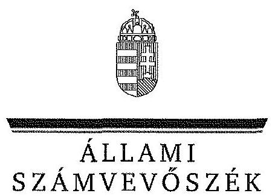
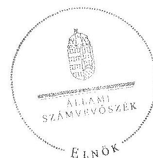
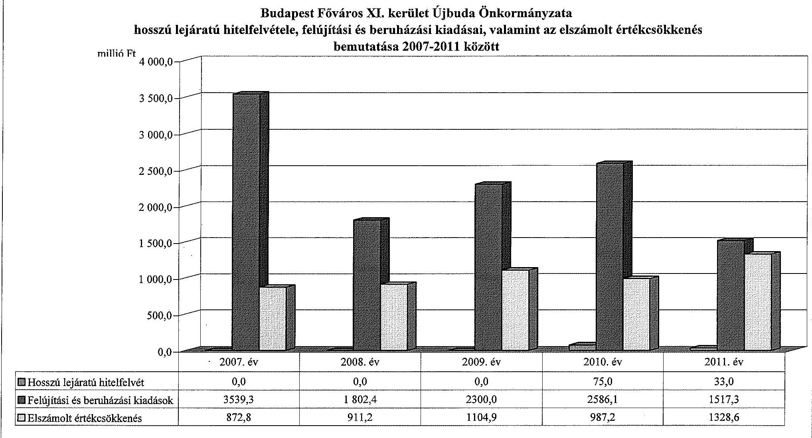
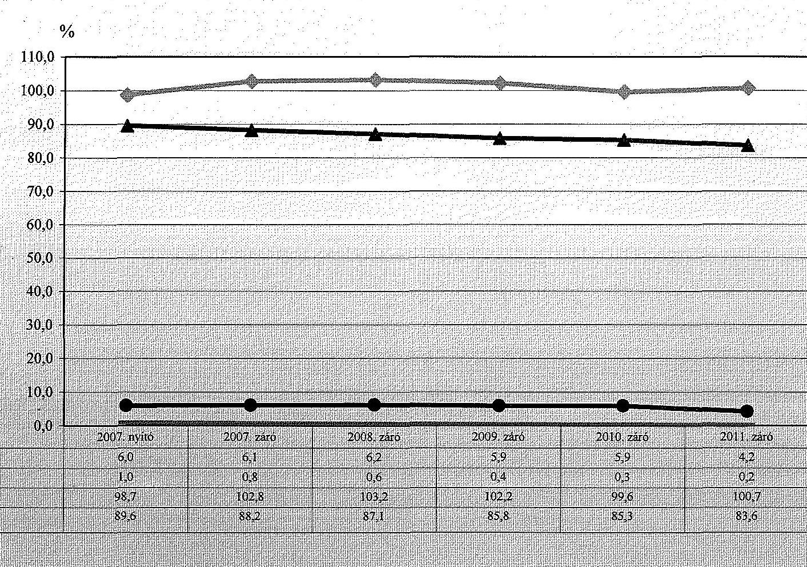
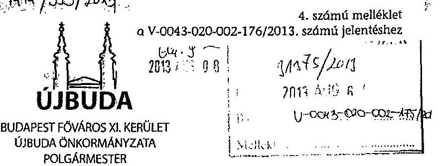
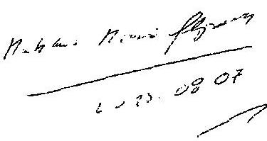
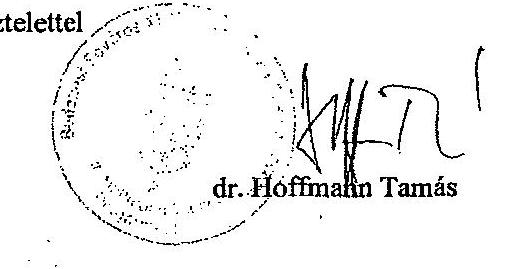

# JELENTÉS 

az önkormányzati vagyongazdálkodás szabályszerűségi ellenőrzéséről

Budapest Főváros XI. kerület Újbuda

---

# Állami Számvevőszék 

Iktatószám: V-0043-020-002-176/2013.
Témaszám: 1082
Vizsgálat-azonosító szám: V061502
Az ellenőrzést felügyelte:
Makkai Mária
felügyeleti vezető
Az ellenőrzést vezette és az ellenőrzés végrehajtásáért felelős:
Páncsics Judit
ellenőrzésvezető
A számvevőszéki jelentés összeállításában közreműködtek:
Marozsán Katalin
számvevő
Molnár Gyula Mihály
számvevő főtanácsos
Szarka Péterné
számvevő vezető főtanácsos
Az ellenőrzést végezték:
Dr. Fátrainé Zsebedics Kalmár István
Molnár Gyula Mihály
Katalin
számvevő tanácsos
számvevő főtanácsos
A témához kapcsolódó eddig készített számvevőszéki jelentések:
címe
sorszáma
Jelentés a Budapest Főváros XI. kerület Újbuda Önkormányzata 0563
gazdálkodási rendszerének átfogó ellenőrzéséről
Jelentés Budapest Főváros XI. kerület Újbuda Önkormányzata 1042
gazdálkodási rendszerének 2010. évi ellenőrzéséről

---

# TARTALOMJEGYZÉK 

BEVEZETÉS ..... 3
I. ÖSSZEGZŐ MEGÁLLAPÍTÁSOK, KÖVETKEZTETÉSEK, JAVASLATOK ..... 5
II. RÉSZLETES MEGÁLLAPÍTÁSOK ..... 10

1. A vagyongazdálkodási tevékenység szabályozottsága ..... 10
1.1. A feladatellátás formáinak meghatározása, a döntések megalapozottsága ..... 10
1.2. A vagyonnal gazdálkodó szervezetek szervezeti rendjének szabályozottsága, a kötelező szabályzatok megfelelősége ..... 11
1.3. A vagyongazdálkodás szabályozása ..... 13
1.4. A vagyonkezeléssel megbízott szervezetek beszámolási kötelezettségének szabályozása ..... 15
2. A vagyongazdálkodás szabályszerűsége ..... 15
2.1. A vagyon nyilvántartásának megfelelősége ..... 15
2.2. A vagyongazdálkodást érintő gazdasági események dokumentáltsága ..... 16
2.3. A vagyongazdálkodási döntések, intézkedések szabályszerűsége ..... 18
2.4. A vagyonkezelő beszámoltatása ..... 19
2.5. A közbeszerzési eljárások alkalmazása ..... 20
3. A vagyon változását eredményező gazdasági események szabályszerűsége ..... 20
3.1. A vagyon értékének és összetételének változása ..... 20
3.2. A vagyon fenntartására kialakított rendszer működésének megfelelősége és szabályozottsága ..... 22
3.3. Hitelfelvétel, kötvénykibocsátás garancia és kezességvállalás szabályszerűsége ..... 22
3.4. A térítés nélküli vagyonátadások és átvételek szabályszerűsége ..... 24
4. A vagyongazdálkodás szabályszerűségére vonatkozó belső és külső ellenőrzések hasznosulása ..... 24
4.1. A belső ellenőrzés által tett megállapítások, javaslatok hasznosulása ..... 24
4.2. A többségi tulajdonban lévő gazdasági társaságok vagyongazdálkodásának felügyelete ..... 26
4.3. A könyvvizsgálat hozzájárulása a vagyongazdálkodás szabályosságához ..... 27
4.4. A külső ellenőrző szervezetek által tett javaslatok hasznosulása ..... 28

---

# MELLÉKLETEK 

1. számú Budapest Főváros XI. kerület Újbuda Önkormányzata vagyonának főbb adatai 2007. január 1-je és 2011. december 31-e között
2. számú Budapest Főváros XI. kerület Újbuda Önkormányzata hosszú lejáratú hitelfelvétele, felújítási és beruházási kiadásai, valamint az elszámolt értékcsökkenés bemutatása 2007-2011 között
3. számú Budapest Főváros XI. kerület Újbuda Önkormányzata eladósodásának és az eszközök fedezettségének, használhatóságának alakulása 2007-2011 között
4. számú Budapest Főváros XI. kerület Újbuda Önkormányzata polgármesterének válaszlevele

## FÜGGELÉKEK

1. számú Rövidítések jegyzéke
2. számú Értelmező szótár

---

# JELENTÉS 

## az önkormányzati vagyongazdálkodás szabályszerűségi ellenőrzéséről

## Budapest Főváros XI. kerület Újbuda

## BEVEZETÉS

Az ÁSZ kiemelten fontosnak tartja az ÁSZ tv. 5. § (4) bekezdése alapján az önkormányzatok vagyongazdálkodási tevékenységének, a vagyongazdálkodási szabályok betartásának ellenőrzését. Az ellenőrzés feladata, hogy értékelje a vagyongazdálkodással kapcsolatban a jogszabályokban, az önkormányzati belső szabályozásban előírtak érvényesülését a közpénzek felhasználásának átláthatósága, nyilvánossága érdekében. Az ÁSZ ellenőrzése nemcsak az ellenőrzött szervezet vagyongazdálkodásának hibáira, hiányosságaira mutat rá, számon kérve azok kijavítását, hanem megállapításaival, javaslataival segíti a közpénzekkel, a közvagyonnal való felelős gazdálkodást.

Az önkormányzati vagyon alapvető funkciója, hogy a helyi közérdeket és egyúttal az önkormányzati célok megvalósítását szolgálja. A feladatellátás terén elsősorban a kötelezően ellátandó feladatok végrehajtását hivatott szolgálni, amely mellett az önként vállalt feladatok ellátása is megvalósulhat.

## Az ellenőrzés célja annak értékelése volt, hogy az Önkormányzatnál:

- a vagyongazdálkodási tevékenység, annak szervezeti keretei szabályozottak;
- a vagyongazdálkodás törvényességét, szabályszerűségét biztosították-e, a vagyon értékének és összetételének változását jogszerű döntésekkel alátámasztották-e;
- a belső ellenőrzés elősegítette-e a vagyongazdálkodás szabályszerű működését, valamint hasznosultak-e a korábbi külső ellenőrzések által tett javaslatok.

Az ellenőrzés típusa: szabályszerűségi ellenőrzés
Az ellenőrzött időszak: Az ellenőrzés a 2007. január 1. és 2011. december 31. közötti időszakra terjedt ki. A közbeszerzési eljárások lefolytatásának ellenőrzése a 2011. évet és a 2012. év I. negyedévét érintette. A nemzeti vagyonról szóló 2011. évi CXCVI. törvény egyes rendelkezései végrehajtásának ellenőrzése a nemzetgazdasági szempontból kiemelt jelentőségű nemzeti vagyonnak minősülő forgalomképtelen vagyonelemek meghatározására, valamint közép- és 

---

hosszú távú vagyongazdálkodási terv készítésére terjedt ki 2012. január 1-jétől 2013. március 1-jéig, a helyszíni ellenőrzés befejezéséig.

Az ellenőrzés szakmai módszertana az ÁSZ hivatalos honlapján közzétett szakmai szabályokon alapult, amely a Legfőbb Ellenőrző Intézmények Nemzetközi Szervezete (INTOSAI) által kiadott nemzetközi standardok (ISSAI) figyelembevételével készült.

Ellenőriztük az önkormányzati vagyongazdálkodás szabályozottságát, a helyi szabályozások jogszabályi előírásoknak való megfelelőségét (önkormányzati rendeletek, szabályzatok, utasítások) és azok gyakorlati alkalmazását. A vagyonváltozásokkal kapcsolatos gazdasági események közül az ellenőrzött tételeket véletlen mintavétellel választottuk ki a Polgármesteri hivatal 2007-2011. évi számviteli nyilvántartásaiból. Az Önkormányzattól tanúsítványt kértünk a korábbi ÁSZ ellenőrzések vagyongazdálkodásra vonatkozó javaslatainak hasznosulásáról, a könyvvizsgáló és a külső ellenőrzési szervek vagyongazdálkodással kapcsolatos 2007-2011. évi javaslataira tett intézkedésekről, valamint a 2007-2011. évek térítésmentes vagyonátadásairól és átvételeiről.

A jelentéstervezetben alkalmazott rövidítéseket az 1. számú függelék, az egyes fogalmak magyarázatát a 2. számú függelék tartalmazza.

Budapest Főváros XI. kerület Újbuda állandó lakosainak száma 2011. január 1-jén 134097 fő volt. Az Önkormányzat 25 tagú Képviselő-testületének munkáját hét állandó bizottság segítette. Az Önkormányzat az önállóan működő és gazdálkodó Polgármesteri hivatalon felül két önállóan működő és gazdálkodó, valamint 51 önállóan működő költségvetési szervvel látta el a feladatát. Az Önkormányzat a 2011. év végén 21 gazdasági társaságban rendelkezett üzletrészszel, ebből kilenc a kizárólagos tulajdonában volt.

A polgármester a 2010. évi önkormányzati választások óta tölti be tisztségét. A jegyző 2011. július 15-étől látja el feladatait.

Az Önkormányzat a 2011. évi költségvetési beszámolója szerint 21474,9 millió Ft költségvetési bevételt ért el, valamint 21860,4 millió Ft költségvetési kiadást teljesített. A 2011. december 31-ei könyvviteli mérleg szerint 62 889,6 millió Ft összegű eszközvagyonnal rendelkezett, 141,0 millió Ft hosszú lejáratú és 2503,4 millió Ft összegű rövid lejáratú kötelezettsége volt.

A Polgármesteri hivatal 59 szervezeti egységre tagolódott, az itt dolgozó köztisztviselők száma 2011. december 31-én 368 fő, az Önkormányzat által foglalkoztatott közalkalmazottak száma 2509 fő volt.

Az ÁSZ a 2011. évi LXVI. törvény 29. §-a szerint a jelentéstervezetet megküldte Budapest Főváros XI. kerület Újbuda Önkormányzata polgármesterének egyeztetésre, aki a megküldött válaszlevelében észrevételt nem tett. A beérkezett választ a jelentés 4. számú melléklete tartalmazza.

---

# I. ÖSSZEGZŐ MEGÁLLAPÍTÁSOK, KÖVETKEZTETÉSEK, JAVASLATOK 

Az Önkormányzat könyvviteli mérleg szerinti vagyona a 2007. évi 58751,1 millió Ft nyitó értékről a 2011. év végére 62889,6 millió Ft-ra, 7,0%-kal növekedett. A vagyonváltozást a befektetett eszközök 4544,9 millió Ft-os emelkedése, valamint a forgóeszközök 406,5 millió Ft-os csökkenése együttesen okozta. A 2007-2011. években felújításokra és beruházásokra fordított kiadások összege (11745,1 millió Ft) 2,3-szerese volt az elszámolt értékcsökkenés összegének (5204,7 millió Ft). Az Önkormányzat 2010-2011-ben 108,0 millió Ft hosszú lejáratú hitelt vett igénybe a kerületben élő, nehéz helyzetbe került lakáshitelesek lakó ingatlanjainak megvásárlására.

Az Önkormányzat saját vagyona 2007-ről 2011-re 54382,2 millió Ft-ról 60069,5 millió Ft-ra, 10,5%-kal (5687,3 millió Ft-tal) nőtt, a saját tőke 5809,9 millió Ft-os növekedésének és a tartalékok 122,6 millió Ft-os csökkenésének eredményeként. A vagyon alakulásával kapcsolatos adatokat és mutatószámokat a jelentés 1-3. számú mellékletei részletesen tartalmazzák.

A Képviselő-testület az Önkormányzat 2007-2013. évekre szóló gazdasági programját 2007 májusában fogadta el, melynek hatályát a 2010. évi választásokat követően 2014-ig meghosszabbították. A Képviselő-testület a kötelező és önként vállalt feladatok körét, a feladatellátás módját és mértékét rendeletben határozta meg. Az önként vállalt feladatok az egészségügy, a környezetvédelem, a kultúra, az oktatás, a sport, illetve a szociális és gyermekvédelmi feladatokhoz kapcsolódtak. Az Önkormányzat kizárólagos tulajdonában lévő gazdasági társaságai járóbeteg-ellátási, sport, szociális és közhasznú foglalkoztatási, ingatlan bérbeadási, üzemeltetési, illetve építési tevékenységet végeztek.

A Képviselő-testület a vagyongazdálkodási feladatokat az Ötv. és a Htv. előírásainak megfelelően - a helyi sajátosságok figyelembe vételével - a vagyongazdálkodási és egyéb, a vagyongazdálkodással összefüggő rendeleteiben határozta meg. A vagyongazdálkodási rendelet előírásainak megfelelően a tulajdonosi jogokat elsődlegesen a Képviselő-testület gyakorolta, ezt a jogát az SZMSZ$_{1,2,3}$-ban előírtaknak megfelelően átruházta a Gazdasági Bizottságra, illetve a polgármesterre. A vagyongazdálkodást érintő átruházott hatásköröket vagyontípusonként, értékhatárhoz kötve a vagyongazdálkodási rendelet$_{1}$-ben állapította meg. Az átruházott hatáskörben hozott vagyongazdálkodási döntésekről, intézkedésekről beszámolási kötelezettséget a Gazdasági Bizottság részére általánosan, nem rendszeres időközönként írtak elő. A polgármesternek az átruházott hatáskörben megtett intézkedéseiről az SZMSZ$_{1,2,3}$-ban havi rendszeres beszámolási kötelezettséget írtak elő.

A vagyongazdálkodási rendelet$_{1}$-ben meghatározták a vagyonelemek besorolását, az egyes vagyonelemek hasznosítási módját, a vagyonkezelői jog megszerzésének, gyakorlásának, ellenőrzésének részletes szabályait, valamint az önkormányzati vagyon ingyenes átengedésére és az elidegenítés, hasznosítás során alkalmazandó versenyeztetésre, pályáztatásra vonatkozó előírásokat.

---

A vagyongazdálkodási rendelet, és a vagyongazdálkodási területeket szabályozó önkormányzati rendeletek összhangban voltak egymással. Az Önkormányzat az Ötv. előírása szerinti vagyonkezelői jogot nem alapított, illetve vagyonkezelői szerződést a 2007-2011. években nem kötött.

A jegyző eleget tett a Htv.-ben foglalt előírásnak és kialakította a Polgármesteri hivatal számviteli rendjét, amely a vagyongazdálkodás szempontjából megfelelő keretet biztosított az egységes számviteli elvek szerinti beszámoló elkészítéséhez. A Polgármesteri hivatal számviteli politikáját, a kapcsolódó szabályzatokat a jogszabályi előírásoknak megfelelően alakították ki. Az Önkormányzatnál eleget tettek az Áhsz. és a leltározási szabályzat$_{1,2}$-ben előírt leltározási kötelezettségnek. A 2007-2011. évek között a könyvviteli mérlegben az eszközök értékelése az értékelési szabályzat$_{1,2}$-ben foglaltaknak megfelelően történt.

Az Önkormányzatnál a 2007-2011. években az Ötv. előírásainak megfelelően elkészítették a vagyonkimutatást, amit a zárszámadási rendelet mellékleteként bemutattak a Képviselő-testületnek. A vagyonkimutatás tartalma megfelelt az Áhsz.-ben és a vagyongazdálkodási rendelet-ben foglalt előírásoknak. Az Önkormányzatnál az Áhsz. előírásainak megfelelően elvégezték a számviteli nyilvántartásban szereplő ingatlanvagyon adatainak az ingatlanvagyonkataszter adataival való egyeztetését, az ingatlanok bruttó értékadatainak egyezősége fennállt. Az ingatlanvagyon nyilvántartásáról és adatszolgáltatás rendjéről szóló kormányrendeletben foglaltak érvényesülése érdekében az ingatlanvagyon-kataszter adatainak a földhivatali nyilvántartással való egyeztetése évente megtörtént, az egyezőség folyamatosan fennállt.

A 2007-2010. évekre vonatkozóan a jegyző, illetve a 2011. évre a jegyző a Polgármesteri hivatal belső kontrollrendszerének működéséről az Ámr. $_{1,2}$ szerinti nyilatkozatot megtette. A gazdálkodási jogkörök gyakorlásának rendjét, az összeférhetetlenségi követelményeket a gazdálkodási jogkörök szabályzata$_{1-5}$-ben és a pénzkezelési szabályzat$_{1-5}$-ben határozták meg. A gazdálkodási jogkörök gyakorlása során betartották az Ámr. $_{1,2}$-ben rögzített összeférhetetlenséget kizáró követelményeket. A Polgármesteri hivatalban a 2007-2008. években a vagyongazdálkodással kapcsolatos kiadások teljesítését megelőzően az ellenőrzött tételeknél a szakmai teljesítés igazolására kijelölt személyek az ellenőrzési feladataikat nem végezték el. Az Ámr.-ben előírtak ellenére a kifizetés alapját képező bizonylat a kiadások jogosultságának, összegszerűségének ellenőrzésére vonatkozó igazolást nem tartalmazott. Az utalványok ellenjegyzői az Ámr., valamint a gazdálkodási jogkörök szabályzata$_{1,2}$ előírása ellenére nem kifogásolták, hogy a szakmai teljesítésigazolók nem végezték el a kiadások jogosultságának és összegszerűségének ellenőrzését. Az ellenőrzési feladatok elvégzésének elmaradása következtében az ellenőrzött tételek esetében nem érte kár az Önkormányzatot, mivel teljesítés nélküli kifizetésre nem került sor. A 2009. évtől a szakmai teljesítés igazolók, illetve az utalványok
 ellenjegyzői eleget tettek ellenőrzési feladataiknak.

A vagyongazdálkodási döntések végrehajtása során betartották a vagyongazdálkodási rendelet ${ }_{1}$-ben foglaltakat. A döntéshozók az arra felhatalmazott személyek voltak, a döntésekkel azonos tartalmú szerződéseket, megállapodásokat kötöttek. A szerződésekbe beépítették az Önkormányzat érdekeit védő garanciális elemeket. A polgármester az átruházott hatáskörben hozott intézkedéseiről a Képviselő-testületnek havi rendszerességgel beszámolt.

A 2007-2011. években végrehajtott térítés nélküli eszközátadásról ( 1501,3 millió Ft értékben) a vagyongazdálkodási rendelet előírásainak megfelelően a Képviselő-testület és a Gazdasági Bizottság döntött. A 3249,1 millió Ft értékben lebonyolított térítés nélküli eszköz ( 48 ingatlan és gép, berendezés, felszerelés) átvétel a vagyongazdálkodási rendelet előírásainak megfelelően történt.

A 2007-2011. években a hosszú lejáratú, felhalmozási célú, pénzintézettel szembeni kötelezettségvállalásokról minden esetben a Pénzügyi Bizottság véleménye és javaslata alapján született meg a képviselő-testületi döntés az Ötv.ben előírtaknak megfelelően. A Képviselő-testület 2007-2011 között két esetben, egyenként 100,0 millió Ft összegű hosszú lejáratú hitel felvételéről döntött a nehéz helyzetbe került lakáshitellel rendelkező polgárok védelme érdekében, továbbá két kizárólagos tulajdonában lévő gazdasági társasága által felvett hitelekhez ( 1219,8 millió Ft, illetve 2983341 euró) vállalt készfizető kezességet, valamint egy bérleti szerződéshez kapcsolódó hitelfelvételhez vállalt 95,0 millió Ft-os garanciát. A hitelek felvétele, a kezesség, valamint a garanciavállalás előtt az Ötv.-ben előírt - az adósságot keletkeztető kötelezettségvállalás felső határára vonatkozó - számításokat elvégezték és a Képviselő-testület az Ötv. előírásait betartva hozta meg a döntéseit. Az Önkormányzat a fejlesztési célú hitelekhez kapcsolódó kezesség, illetve garanciavállalása alapján a helyszíni ellenőrzés befejezéséig kifizetést nem teljesített.

A 2011. évben, illetve a 2012. év I. negyedévében 16 felújítási és beruházási feladathoz lefolytatták a Kbt. ${ }_{1,2}$-ben előírtaknak megfelelően a közbeszerzési eljárásokat.

Az Önkormányzat a honlapján az Áht. ${ }_{1,2}$-ben, az Eisztv. ${ }_{1}$-ben és a közzétételi listákon szereplő adatok közzétételi mintájáról szóló IHM rendeletben foglaltaknak megfelelően a 2007-2011. években közzétette az általa nyújtott, nem normatív, céljellegű, működési és fejlesztési támogatások, a nettó ötmillió Ft-ot elérő vagy meghaladó értékű árubeszerzésre, építési beruházásra, szolgáltatás megrendelésére, vagyonértékesítésre, vagyonhasznosításra vonatkozó szerződések adatait, az elemi költségvetéseket, valamint az éves beszámolókat.

Az Önkormányzatnál 2007-2011 között a belső ellenőrzési feladatokat a Polgármesteri hivatal belső ellenőrzési egysége látta el, amely megfelelt az Ötv.ben foglaltaknak, azonban a belső ellenőrzési kötelezettséget, az ellenőrzést végző szervezet jogállását, feladatait a Ber. előírásai ellenére a hivatali SZMSZ-ben nem rögzítették. A 2007-2011. években készült 74 belső ellenőrzési jelentésből 8 jelentés kapcsolódott a vagyongazdálkodáshoz. Az Önkormányzatnál a 2007-2010. években a belső ellenőrzés a kockázatelemzés nem megfelelő módszere miatt, 2011-ben a kockázatelemzés hiánya miatt nem segítette a vagyongazdálkodási tevékenység szabályszerű működését.

A 2007-2011. években az Önkormányzat kizárólagos tulajdonában álló kilenc gazdasági társaság pénzügyi és gazdasági helyzetét a vagyongazdálkodási rendeletben átruházott hatáskörben a Gazdasági Bizottság értékelte, illetve határozatban döntött a benyújtott éves beszámolók elfogadásáról. Az Önkormányzat négy 100%-os tulajdonában álló gazdasági társaságánál a jegyzett tőke 401,3 millió Ft-os emelése, illetve az ehhez kapcsolódó 317,4 millió Ft összegű apportálás engedélyezése, valamint az átalakulások lebonyolítása a Képviselő-testület határozata alapján valósult meg. A 2007-2011. években a felügyelő bizottsági tagok, valamint a többszemélyes gazdasági társaságokban a tulajdonosi jogokat átruházott hatáskörben gyakorló polgármester beszámolása a vagyongazdálkodási rendeletben foglaltak ellenére elmaradt a Gazdasági Bizottság felé.

A 2009-2011. években az Önkormányzat tulajdonában lévő tartós részesedésekre és részvényekre - a Számv. tv., illetve az Áhsz. előírásainak megfelelően - együttesen 918,1 millió Ft értékvesztést számoltak el. Az Önkormányzat kizárólagos tulajdonú gazdasági társaságainál a saját tőke jegyzett tőke alá történt csökkenése miatt 2010-ben a Buda-Hold Kft. üzletrészénél 509,8 millió Ft, a Zsombolyai Ingatlanhasznosító Kft. üzletrészénél 137,0 millió Ft, a HadikKávéház Kft. üzletrészénél 2009-ben 47,3 millió Ft, 2010-ben 5,2 millió Ft volt az elszámolt értékvesztés összege. Az Önkormányzat 50%-os üzletrészével, 200,0 millió Ft-os törzsbetétjével alapított Újbuda Gyöngye Kft.-ben az önkormányzati tulajdonrész elvesztésének veszélye áll fenn, mivel a társaság ellen 2012 áprilisában felszámolási eljárás indult.

A könyvvizsgáló a 2007-2011. években az Önkormányzat egyszerűsített éves költségvetési beszámolóját megbízhatónak és hitelesnek minősítette. A könyvvizsgáló a jelentéseiben a vagyongazdálkodással kapcsolatos megállapításokat, javaslatokat nem tett.

Az ÁSZ az Önkormányzat 2010. évi ellenőrzéséről készült jelentésében a vagyongazdálkodással kapcsolatosan 10 javaslatot fogalmazott meg. A javaslatok közül hat az intézkedési tervben előírt határidőre megvalósult. Nem valósult meg a közérdekű adatok közzétételének belső ellenőrzésére vonatkozó javaslat, mert a 2011. évben nem végeztek a közzététel rendjének betartására vonatkozóan belső ellenőrzést és a 2012. évi munkatervben sem szerepeltették ezt a feladatot. Nem valósult meg a belső ellenőrzést végző szervezeti egység feladatainak hivatali SZMSZ-ben történő meghatározására vonatkozó javaslat.

Az Önkormányzatnál a 2007-2011. években egyéb külső szervezetek a fejlesztések támogatásával kapcsolatosan végeztek ellenőrzéseket. A vagyongazdálkodással összefüggő javaslatot nem fogalmaztak meg. A külső ellenőrzések nyilvántartása - a Ber.-ben előírtak ellenére - a 2007-2011 közötti időszakban nem valósult meg.

Az Állami Számvevőszékről szóló 2011. évi LXVI. törvény 33. § (1) bekezdésében foglaltak értelmében a jelentésben foglalt megállapításokhoz kapcsolódó intézkedési tervet köteles az ellenőrzött szervezet vezetője összeállítani, és azt a jelentés kézhezvételétől számított 30 napon belül az ÁSZ részére megküldeni. Amennyiben az intézkedési tervet határidőben nem küldi meg a szervezet, vagy az nem elfogadható, az ÁSZ elnöke a hivatkozott törvény 33. § (3) bekezdés a)-b) pontjaiban foglaltakat érvényesítheti.

---

Az ellenőrzés intézkedést igénylő megállapításai és javaslatai:

# a jegyzőnek

1. A belső ellenőrzési kötelezettséget, az ellenőrzést végző szervezet jogállását, feladatait a Ber. 4. § (2) bekezdésének előírásai ellenére a hivatali SZMSZ-ben nem rögzítették. A hiányosságot az ÁSZ 2010. évi ellenőrzésekor tett javaslat ellenére nem pótolták.

Javaslat:
Intézkedjen a Bkr. 15. § (2) bekezdésében foglaltak szerint a belső ellenőrzést végző szervezeti egység jogállásának és feladatainak a hivatali SZMSZ-ben történő meghatározásáról.
2. A külső ellenőrzések nyilvántartása a Ber. 29/A. § (1) bekezdésében előírtak ellenére a 2007-2011. közötti időszakban nem valósult meg.

Javaslat:
Intézkedjen a Bkr. 14. § (1) bekezdésében foglaltak szerint a külső ellenőrzések nyilvántartásának vezetéséről.

---

# II. RÉSZLETES MEGÁLLAPÍTÁSOK

## 1. A VAGYONGAZDÁLKODÁSI TEVÉKENYSÉG SZABÁLYOZOTTSÁGA

### 1.1. A feladatellátás formáinak meghatározása, a döntések megalapozottsága

A Képviselő-testület az Önkormányzat 2007-2013. évekre szóló gazdasági programját a 240/2007. (V. 17.) számú határozattal fogadta el. A 2010. évi választásokat követően a Képviselő-testület a gazdasági program hatályát a 115/2011. (III. 29.) számú határozatával 2014-ig meghosszabbította.

A Képviselő-testület előírta, hogy az új gazdasági programnak tartalmazni kell a működési és felhalmozási bevételek és kiadások változását legalább a program elfogadását megelőző öt évre, a tartós kötelezettségvállalásokat évenkénti bontásban, az adósságszolgálatot, az Önkormányzat, mint intézményfenntartó és meghatározó foglalkoztató legjellemzőbb mutatószámait, a vagyonmérlegek elemzését, a vagyonszerkezet változását, a vagyongyarapodás vagy a vagyonfelélés tendenciáit. A határozatban rögzítették, hogy a beruházási politikában nem élnek PPP konstrukcióval.

Az önkormányzati feladatellátás formáira vonatkozó döntések megalapozottsága érdekében a polgármester a képviselő-testületi előterjesztésekben alternatív javaslatokat mutatott be a feladatellátás körének, formájának kialakítására, módosítására.

A Képviselő-testület a kötelező és önként vállalt feladatok körét, a feladatellátás módját és mértékét az Önkormányzat kötelező és önként vállalt feladatairól szóló 5/2007. (II. 22.) számú rendeletében határozta meg ${ }^{1}$. Az Önkormányzatnak a 2007-2011. évi időszakban 41 önként vállalt feladata volt. Az önként vállalt feladatok az egészségügy, a környezetvédelem, a kultúra, az oktatás, a sport, illetve a szociális és gyermekvédelmi feladatokhoz kapcsolódtak. Az Önkormányzatnál a 2007-2011 közötti időszakban a feladatok ellátása érdekében intézmény alapításáról, átalakításokról, megszüntetésről döntöttek.

A Képviselő-testület a 434/2007. (X. 18.) számú határozatában a közterületi feladatok ellátására részben önállóan gazdálkodó költségvetési szervként az Újbuda Közterület-felügyelet intézményt alapította meg.

A 2008. évben az önállóan gazdálkodó költségvetési intézmények számát csökkentették. Három általános iskola gazdálkodási jogkörét megváltoztatták, részben önállóan gazdálkodó költségvetési szervvé minősítették. Két általános iskola megszűnt (Keveháza Általános Iskola és a Lágymányosi Általános Iskola). Az általános és középiskolák közül három intézménynél a gazdálkodás megszervezésének módja módosításra került, önállóan gazdálkodó költségvetési szervből átsorolták részben önállóan gazdálkodó költségvetési szervnek (Bárdos Lajos Általános Iskola és Gimnázium, Bethlen Gábor Általános Iskola és Újreál Gimnázium, Petőfi Sándor Általános Iskola, Gimnázium és Szakközépiskola). A Képviselőtestület a 2008. évben a Mérei Ferenc Általános Iskola, Szakiskola és Felnőttoktatási Gimnázium megszüntetéséről döntött. A 2009. évben a József Attila Gimnázium önállóan működő és gazdálkodó feladat ellátási funkciója önállóan működő funkcióra változott. A 2011. évben öt önállóan működő közösségi házat telephellyé minősítettek át, a pénzügyi-gazdálkodási feladataikat egy közösségi ház látta el, mint önállóan működő és gazdálkodó intézmény.

Az Önkormányzat kizárólagos tulajdonában lévő gazdasági társaságai az alapító okiratuk szerint járóbeteg-ellátási, sport, szociális és közhasznú foglalkoztatási, adatfeldolgozási, hardver tanácsadási, hirdetési, ingatlan bérbeadási, üzemeltetési, illetve út-, sport- és játéktér építési tevékenységet láttak el. Az Önkormányzat a 2007-2011. években gazdasági társaságot nem alapított.

Az elsőfokú szabálysértési, hatósági feladatok ellátására Budafok-Tétény Budapest XXII. kerület Önkormányzatával 2009. január 1-jétől közösen működtetett társulást 2012 végén megszüntették.

A Képviselő-testület a 2007-2011. években nem vállalt át a Fővárosi Önkormányzat feladat- és hatáskörébe tartozó közszolgáltatási feladatot.

# 1.2. A vagyonnal gazdálkodó szervezetek szervezeti rendjének szabályozottsága, a kötelező szabályzatok megfelelősége

Az Önkormányzat Képviselő-testülete szervezeti és működési rendjét az Ötv. előírásainak megfelelően szabályozta. A Képviselő-testület a 2007-2011. években az Ötv. 1. § (6) bekezdés a) pontjában ${ }^{2}$ foglaltaknak megfelelően a szervezeti-működési rendjét önállóan alakította ki. A Képviselő-testület az önkormányzat vagyongazdálkodási és egyéb, a vagyongazdálkodással összefüggő rendeleteiben a helyi sajátosságok figyelembe vételével meghatározta a vagyongazdálkodási feladatokat.

A Képviselő-testület a vagyongazdálkodási rendeleten kívül a lakás és nem lakás céljára szolgáló helyiségek elidegenítéséről, illetve bérbeadásáról szóló rendeletekben szabályozta a vagyongazdálkodási feladatokat.

A vagyongazdálkodási rendelet ${ }_{1}$ 8. § (2) bekezdése szerint a tulajdonosi jogokat a Képviselő-testület gyakorolta, ezt a jogát az SZMSZ ${ }_{1,2,3}$-ban meghatározottak szerint átruházta a bizottságaira és a polgármesterre. A Gazdasági Bizottság, illetve a polgármester átruházott tulajdonosi jogkörére vonatkozó előírásokat -idő- és értékhatár megállapításával - a vagyongazdálkodási rendelet ${ }_{1}$ 9-13. §-ai tartalmazták.

A forgalomképtelen és korlátozottan forgalomképes vagyontárgyaknak az Önkormányzat tulajdonjogát nem érintő hasznosítása esetén a hasznosítás időtartamához kötötték a polgármester, valamint a Gazdasági Bizottság döntési hatás-

[^0]
[^0]:    ${ }^{2}$ 2013. január 1-jétől az Mötv. 42. § 2. pontja tartalmazza

---

körét, illetve a Gazdasági Bizottság javaslattételi kötelezettségét írták elő a Képviselő-testület döntéséhez.

A forgalomképes önkormányzati ingó és ingatlan vagyon tekintetében a tulajdonosi jogok gyakorlását értékhatárhoz kötötték. Az Önkormányzat zárszámadása szerinti módosított költségvetési főösszeg 0,8%-áig terjedő vagyonügyletekben - amelyet az éves zárszámadási rendeletekben számszerűen millió Ft-ra kerekítve rögzítettek - a Gazdasági Bizottságot, az ezt meghaladó összegű ügyletekben
 a Képviselő-testületet jelölték meg döntéshozatalra jogosultként.

A Képviselő-testület a tulajdonosi jogokat érintő átruházott hatáskörök gyakorlásához utasítást nem adott, nem élt az Ötv. 9. § (3) bekezdésében ${ }^{3}$ biztosított jogával. Az átruházott hatáskörben hozott vagyongazdálkodási döntésekről, intézkedésekről beszámolási kötelezettséget a Gazdasági Bizottság részére általánosan, nem rendszeres időközönként írták elő.

A Gazdasági Bizottság elnökének beszámolási kötelezettségét a Képviselő-testület felé az SZMSZ ${ }_{1,2}$ 2. számú mellékletében, a bizottságok általános ügyrendjében írták elő. Az SZMSZ ${ }_{1}$ 76. § (1) bekezdésében, illetve az SZMSZ ${ }_{2}$ 79. §-ában a polgármesternek előírták, hogy minden rendes képviselő-testületi ülésen, írásban adjon tájékoztatást az eltelt időszakban átruházott hatáskörben hozott döntéseiről.

A vagyonnal gazdálkodó közfeladatot ellátó költségvetési szervek alapító okiratában a Képviselő-testület meghatározta a szervezet közfeladatait, alaptevékenységét. Az intézmények alapító okirataiban rendelkeztek az intézmény feladatainak ellátásához biztosított vagyonról, ezen belül az ingatlanvagyonról és az egyéb vagyonról. Az intézmények a használatukba adott, korlátozottan forgalomképes törzsvagyont nem idegeníthették el, illetve biztosítékul nem használhatták fel. Az önkormányzati intézményeknek a vagyon hasznosítását a kötelező feladataik ellátásához kötötték. A szabad kapacitás hasznosítására csak a kötelező feladatok ellátásán túl volt lehetőség. A vagyongazdálkodási rendelet ${ }_{1}$ 10. §-ban foglaltak alapján az egy éven belüli, az intézmények alapfeladatához tartozó ügyletek tekintetében, a bérlővel eltérő időben, közösen használt helyiség hasznosítása esetén az intézményvezető önállóan dönthetett.

A hivatali SZMSZ-ben az Ámr. ${ }_{2}$ 20. § (2) bekezdésének b) pontjában előírtak szerint a Polgármesteri hivatal törzskönyvi azonosító számát, alapító okiratának számát, keltét, az alapítás időpontját, az i) pontban előírt szervezeti ábrát 2010. december 8-i hatállyal építették be, a h) pontban előírtak alapján a 9/2008. számú jegyzői intézkedéssel a feladatokat és a hatásköröket rögzítették. A hivatali SZMSZ-ben az Ámr. ${ }_{2}$ 20. § (2) bekezdésének c) pontjában foglaltak ellenére a feladatok szakfeladatonkénti besorolása nem történt meg, az e) pontban előírtak ellenére a szervezeti egységekhez kapcsolódó létszámot nem határozták meg ${ }^{4}$.

A jegyző eleget tett a Htv. 140. § (1) bekezdés c) pontjában foglalt előírásnak és kialakította a Polgármesteri hivatal számviteli rendjét. A vagyongazdálkodás

[^0]
[^0]:    ${ }^{3}$ 2013. január 1-jétől az Mötv. 41. § (4) bekezdése tartalmazza
    ${ }^{4}$ 2012. január 1-jétől a szervezeti és működési szabályzat tartalmára vonatkozó előírásokat az Ávr. 13. § (1) bekezdése tartalmazza.

---

szempontjából az megfelelő keretet biztosított az Önkormányzat költségvetési szervei egységes számviteli elvek szerinti beszámolóinak elkészítéséhez. A Polgármesteri hivatal számviteli politikáját, a kapcsolódó szabályzatokat (számlatükör, leltározási szabályzat ${ }_{1,2}$, pénzkezelési szabályzat ${ }_{1-3}$, valamint a gazdálkodási jogkörök szabályzata ${ }_{1-5}$ ) a jogszabályi előírásoknak és a helyi sajátosságoknak megfelelően alakították ki. A jegyző intézkedett a számviteli rend önállóan működő és gazdálkodó intézmények részére történő kiterjesztéséről.

A Képviselő-testület a 2007-2011. évi költségvetési rendeletekben engedélyt adott a kétévenkénti mennyiségi felvétellel történő leltározásra az Áhsz. 37. § (7) bekezdésében foglaltaknak megfelelően, mivel az Önkormányzatnál a tulajdon védelme megfelelően biztosított és ellenőrzött volt. Az eszközökről és azok állományában bekövetkezett változásokról mennyiségben és értékben, folyamatosan az előírt részletező nyilvántartásokat vezették.

A leltározási szabályzat ${ }_{1,2}$ az üzemeltetésre, kezelésre átadott eszközök leltározásának módját tartalmazta. A 2010. évtől a 4/2010. számú jegyzői intézkedéssel előírták, hogy az üzemeltetést, kezelést végző szervezet minden év december 31-ei állapotnak megfelelően köteles elkészíteni a mérleg alátámasztásának bizonylataként szolgáló részletező nyilvántartásokból és a leltárakból a hitelesített összesített leltárt.

# 1.3. A vagyongazdálkodás szabályozása 

Az Önkormányzat a vagyongazdálkodási feladatokat és az önkormányzati vagyonnal való gazdálkodás szabályait az Ötv. 78-80/B. §-ai előírásainak ${ }^{5}$ megfelelően szabályozta. A Htv. 138. § (1) bekezdés j) pontja alapján a vagyongazdálkodási rendelet ${ }_{1}$-ben rögzítették az önkormányzati vagyonnal való felelős gazdálkodás szabályait. A vagyongazdálkodási rendelet ${ }_{1}$-ben az Ötv. 79. § (2) bekezdésének ${ }^{6}$ megfelelően meghatározták az önkormányzati feladatellátást biztosító törzsvagyon körét, azon belül a forgalomképtelen és a korlátozottan forgalomképes vagyonelemeket, illetve a forgalomképes vagyon körébe tartozó vagyontárgyakat. A vagyongazdálkodási rendelet ${ }_{1}$ és az egyéb vagyongazdálkodással kapcsolatos rendeletek (lakások és nem lakás célú helyiségek bérbeadásáról, illetve lakások és nem lakás célú helyiségek elidegenítéséről szóló rendelet) a teljes vagyoni körre kiterjedtek.

A vagyon besorolását felülvizsgálták, a vagyongazdálkodási rendelet ${ }_{1}$-et a 2011. évben kiegészítették, a rendelet hatályát kiterjesztették a tagsági jogokat megtestesítő értékpapírokra, a kárpótlási jegyekre, a nonprofit gazdasági társaságokban, illetve gazdasági társaságban az Önkormányzatot megillető egyéb gazdasági részesedésekre, portfólió vagyonra, valamint az egyéb vállalkozásban az Önkormányzatot megillető részesedésekre. A rendelet módosításával egyidejűleg a korlátozottan forgalomképes törzsvagyon körébe helyezték a közüzemi tevékenységet ellátó gazdasági társaságban, illetve nonprofit gazdasági társaságokban levő részesedéseket.

[^0]
[^0]:    ${ }^{5}$ 2012. január 1-jétől az Mötv. 106. § (2) bekezdése és a 107.§-110. §-ai tartalmazzák
    ${ }^{6}$ 2012. január 1-jétől az Mötv. 110. § (2) bekezdése, illetve 2011. december 31-jétől az Nvt. 3. § (1) bekezdés 6. pontja, valamint az 5. §-a tartalmazzák

---

A Képviselő-testület a forgalomképtelen vagyoni körbe tartozó vagyontárgyak közül az önkormányzati tulajdonban levő közcélú és nem közcélú távközlési eszközök létesítéséhez, elhelyezéséhez, bővítéséhez kötődő, a tulajdonjog gyakorlásával, a tulajdonjog korlátozásával összefüggő kérdésekben a döntést a Gazdasági Bizottság hatáskörébe utalta. A vagyongazdálkodási rendelet módosításával előírták, hogy az Önkormányzat többségi tulajdonában lévő gazdasági társaságok az elvárt vezetői információ biztosítása érdekében a Számv. tv. 160. § (4) bekezdés előírásainak megfelelően elkülönített költséghelyenkénti főkönyvi nyilvántartást legalább munkaszámokra lebontva, vagy a 6-os és 7-es számlaosztályban a költséghely, költségviselő elkülönítésével vezessék.

A vagyongazdálkodási rendelet ${ }_{2}$ 2. § (3) bekezdésében előírták, hogy vagyonelemek nemzetgazdasági szempontból kiemelt jelentőségű nemzeti vagyonná minősítéséről külön rendeletben lehet rendelkezni.

A Képviselő-testület a rendelet elfogadását megelőzően a 29/2012. (II. 23.) számú határozatában úgy döntött, hogy az Nvt. 5. § (4) bekezdésének előírásai szerint nem nyilvánít vagyonelemeket nemzetgazdasági szempontból kiemelt jelentőségű nemzeti vagyontárggyá.

A törzsvagyon, ezen belül a forgalomképtelen és korlátozottan forgalomképes, illetve az üzleti (forgalomképes) vagyon besorolás szerinti elkülönített nyilvántartását a 2007-2011. évek időszakára a hatályos számviteli politika részét képező számlarendek és számlatükrök biztosították.

Az egyes vagyonelemek hasznosítási módját a vagyongazdálkodási rendelet ${ }_{1}$ 15. §-a tartalmazta. A 25 millió Ft forgalmi értéket meghaladó önkormányzati vagyon elidegenítése, használatba vagy bérbeadása, más módon történő hasznosítása esetében előírták a versenyeztetési kötelezettséget. Szabályozták, hogy a nyilvános versenyeztetési kötelezettség mely esetekre nem vonatkozik. Az ingatlanvagyon hasznosítása versenyeztetésének eljárásrendjét a vagyongazdálkodási rendelet ${ }_{1}$-ben szabályozták.

A vállalkozásba bevitt vagyontárgyak hasznosítására a vagyongazdálkodási rendelet ${ }_{1}$ 11. § (8)-(10) bekezdései tartalmaztak előírásokat a 2011. évtől. A gazdasági társaságokban képviseleti jogot ellátó tisztségviselők a tevékenységükről írásban folyamatosan, évente egyszer személyesen voltak kötelesek beszámolni az illetékes bizottságoknak.

A vagyongazdálkodási rendelet ${ }_{1}$ 12. §-a tartalmazta az önkormányzati vagyon ingyenes átengedésének szabályait. A vagyongazdálkodási rendelet ${ }_{1}$ 12/A. §-ában előírták, hogy az Önkormányzat beruházásában épült ivóvíz- és szennyvíz-csatorna vezeték tulajdonjogát térítésmentesen a Fővárosi Önkormányzatnak kell átadni.

Az Önkormányzat vagyonának elidegenítését, megterhelését, vállalkozásba történő bevitelét népszavazáshoz nem kötötte a Képviselő-testület.

A vagyongazdálkodást érintő előterjesztések készítésének, véleményezésének és döntéshozatalának egyedi rendjét külön nem alakították ki. A Képviselőtestület az előterjesztések tartalmi követelményeit az SZMSZ ${ }_{1,2,3}$-ban általánosságban fogalmazta meg.

---

A vagyongazdálkodási rendelet ${ }_{1}$ a vagyongazdálkodási területeket szabályozó egyéb önkormányzati rendeletekkel összhangban volt.

Az operatív gazdálkodással és annak munkafolyamatba épített ellenőrzésével összefüggő jogkörök gyakorlásának rendjét az Ámr. ${ }_{1,2}$ előírásainak megfelelően kialakították. A szabályzatokban az összeférhetetlenség kizárására szolgáló követelményeket biztosították.

Az Önkormányzatnál az Nvt. 9. § (1) bekezdésében előírt közép- és hosszú távú vagyongazdálkodási tervet a helyszíni ellenőrzés befejezéséig, 2013. március 1-jéig nem készítették el.

Az Nvt. nem tartalmaz konkrét határidőt a közép- és hosszú távú vagyongazdálkodási terv elkészítésére vonatkozóan. A Képviselő-testület a vagyongazdálkodási rendelet ${ }_{2}$ 5. § (4) bekezdésében rendelkezett arról, hogy az első közép- és hosszú távú vagyongazdálkodási tervet legkésőbb 2014. január 1-jéig kell elfogadni.

# 1.4. A vagyonkezeléssel megbízott szervezetek beszámolási kötelezettségének szabályozása 

A vagyonüzemeltetők feladatát, illetékességét, hatáskörét és felelősségét az alapító okiratban, üzemeltetési szerződésben rögzítették. A vagyongazdálkodási rendelet ${ }_{1}$ 8. § (3) bekezdésében foglaltaknak megfelelően a vagyonkezelői jog megszerzésének, gyakorlásának és a vagyonkezelés ellenőrzésének részletes szabályait, a vagyonkezelés korlátait, valamint a beszámolási kötelezettséget a vagyonkezelési szerződésben kellett előírni. Az Önkormányzat az Ötv. 80/A. § előírása ${ }^{7}$ szerinti vagyonkezelői szerződést a 2007-2011. években nem kötött.

## 2. A VAGYONGAZDÁLKODÁS SZABÁLYSZERŰSÉGE

### 2.1. A vagyon nyilvántartásának megfelelősége

Az Önkormányzatnál 2007-2011 között betartották az Ötv. 78. § (2) bekezdésének ${ }^{8}$ előírását, minden évben elkészítették a vagyonkimutatást és a zárszámadási rendelettervezet előterjesztésekor az Áht. 118. § (2) bekezdés 2. c) pontja ${ }^{9}$ szerint a Képviselő-testület részére tájékoztatásul bemutatták. A 2007-2011. évi vagyonkimutatások tartalma megfelelt az Áhsz. 44/A. § (1) és (2) bekezdésében foglalt előírásoknak. Tartalmazta az Önkormányzat és intézményei saját vagyonát tételesen, törzsvagyon és törzsvagyonon kívüli, egyéb vagyon bontásban a vagyongazdálkodási rendelet ${ }_{1}$ 6. §-ában és 1. számú mellékletében előírt szerkezetnek megfelelően.

Az Önkormányzatnál a 2007-2011. években eleget tettek az Ötv. 78. § (2) bekezdésében ${ }^{10}$ foglalt előírásnak, a főkönyvi számlák alábontásával, valamint a

[^0]
[^0]:    ${ }^{7}$ 2012. január 1-jétől az Mötv. 109. §-a tartalmazza
    ${ }^{8}$ 2012. január 1-jétől az Mötv. 110. § (1)-(2) bekezdései szabályozzák
    ${ }^{9}$ 2012. január 1-jétől az Áht. ${ }_{2}$ 91. § (2) bekezdés c) pontja tartalmazza
    ${ }^{10}$ 2012. január 1-jétől az Mötv. 110. § (1)-(2) bekezdései tartalmazzák

---

számlákhoz kapcsolódó analitikus nyilvántartások vezetésével biztosították a törzsvagyon (ezen belül forgalomképtelen, illetve korlátozottan forgalomképes) többi vagyontárgytól való elkülönített nyilvántartását.

Az Önkormányzatnál a 2007-2011. években elvégezték a számviteli nyilvántartásban szereplő ingatlanvagyon adatainak az ingatlanvagyon kataszter adataival való egyeztetését az Áhsz. 49. § (3) bekezdésében foglaltak érvényesülése érdekében. Az Önkormányzatnál a leltározás során az egyeztetést elvégezték és biztosították a főkönyvi nyilvántartás, valamint annak adatait alátámasztó analitikus nyilvántartások és az ingatlanvagyon-kataszter bruttó érték adatainak egyezőségét. A 147/1992. (XI. 6.) Korm. rendelet 1. § (2) bekezdésében foglaltaknak megfelelően az ingatlanvagyon-kataszter földhivatali nyilvántartással való egyezősége folyamatosan fennállt - a földhivatallal kötött szerződés alapján - az évente biztosított adatbázis átvételével, illetve az ingatlanokkal kapcsolatos változások átvezetésével.

Az Önkormányzatnál az Áhsz. 37. § (2) bekezdésében foglaltaknak megfelelően a 2007-2011. években leltárral támasztották alá a mérlegben kimutatott eszközök állományi értékének valódiságát. Az Önkormányzatnál eleget tettek a 2007-2011. években az Áhsz. 37. § (1) és (7) bekezdésében előírt leltározási kötelezettségnek december 31-ei fordulónappal. Az éves
 költségvetési rendeletekben a Képviselő-testület a kétévenkénti mennyiségi felvétellel történő leltározás végrehajtását írta elő, amelynek a 2008. és a 2010. években eleget tettek.

A 2007-2009. években az üzemeltetésre átadott eszközök esetében a leltárfelvétel az Áhsz. 37. § (3) bekezdésében foglaltaknak megfelelően mennyiségi számbavétellel történt, a 2010-2011. években az üzemeltetésre átadott eszközök értékét az Áhsz. 37. § (4) bekezdésében ${ }^{11}$ foglalt előírásnak megfelelően az üzemeltetést végző szervek által elkészített hitelesített leltárral támasztották alá.

2007-2011 között a könyvviteli mérleg egyes sorainak értéke - az üzemeltetésre, kezelésre átadott eszközök vonatkozásában is - megegyezett a záró főkönyvi kivonat vonatkozó főkönyvi számláinak értékével, meghatározása a Számv. tv. általános alapelveinek és tételes szabályainak, valamint az értékelési szabályzat ${ }_{1,2}$-ben foglaltaknak megfelelően történt.

# 2.2. A vagyongazdálkodást érintő gazdasági események dokumentáltsága 

A 2007-2010. évekre vonatkozóan a jegyző ${ }_{1}$, illetve a 2011. évre a jegyző a Polgármesteri hivatal belső kontrollrendszerének működéséről az Ámr. ${ }_{1}$ 23. számú melléklete ${ }^{12}$ szerinti nyilatkozatot minden évben megtette.

A gazdálkodási jogkörök gyakorlásának rendjét, az összeférhetetlenségi követelményeket meghatározták a gazdálkodási jogkörök szabályzat ${ }_{1-5}$-ben, a

[^0]
[^0]:    ${ }^{11}$ megállapította a 317/2009. (XII. 29.) Korm. rendelet 18. §-a, a rendelkezést először a 2010. évről készített beszámolóra kellett alkalmazni
    ${ }^{12}$ 2010. január 1-jétől az Ámr. ${ }_{2}$ 21. számú melléklete, 2012. január 1-jétől a Bkr. 1. számú melléklete szabályozza

---

FEUVE $_{1,2}$ szabályzatban, a pénzkezelési szabályzat ${ }_{1,5}$-ben. A polgármester felhatalmazást adott kötelezettségvállalásra, a jegyző ${ }_{1}$, illetve a jegyző gondoskodott a szakmai teljesítésigazolást végzők kijelöléséről, írásbeli megbízást adott az érvényesítés ellátására, kijelölte az utalványozásra és annak ellenjegyzésére jogosultakat. A gazdálkodási jogkörök gyakorlása során betartották az Ámr. ${ }_{1}$ 138. § (1)-(3) bekezdésében, valamint az Ámr. ${ }_{2}$ 80. § (1) és (2) bekezdésében ${ }^{13}$ rögzített összeférhetetlenséget kizáró követelményeket.

A Polgármesteri hivatalban a 2007-2008. években a vagyon növekedésével kapcsolatos kiadások teljesítését megelőzően az ellenőrzött tételeknél nem végezték el a gazdálkodási és ellenőrzési jogkörök gyakorlásával felhatalmazott személyek az előírt (folyamatba épített) feladatokat.

A jegyző ${ }_{1}$ által a szakmai teljesítés igazolására kijelölt személyek ellenőrzési feladataikat nem végezték el az Ámr. ${ }_{1}$ 135. § (1) és (2) bekezdésében ${ }^{14}$ előírtak ellenére. A kifizetés alapját képező bizonylat a kiadások jogosultságának, összegszerűségének ellenőrzésére vonatkozó igazolást nem tartalmazott. Ennek következtében az ellenőrzött tételeknél kár nem érte az Önkormányzatot, mivel teljesítés nélküli kifizetésre nem került sor. A 2009. évtől a szakmai teljesítés igazolók eleget tettek ellenőrzési feladataiknak.

Az utalványok ellenjegyzője ${ }^{15}$ a kiadások teljesítését megelőzően az Ámr. ${ }_{1}$ 137. § (3) bekezdésének, valamint a gazdálkodási jogkörök szabályzata ${ }_{1,2}$ előírása ellenére nem győződött meg a szakmai teljesítésigazolás megtörténtéről, mivel nem kifogásolta a kiadások jogosultsága és összegszerűsége ellenőrzésének elmaradását. A 2009. évtől az utalványok ellenjegyzői eleget tettek ellenőrzési feladataiknak.

A polgármester az önkormányzati képviselők és polgármesterek általános választását megelőzően - 2010. szeptember 10-én - részletes jelentést tett közzé az Önkormányzat vagyoni és pénzügyi helyzetéről, valamint a Képviselő-testület megalakulását követően keletkezett, a későbbi éveket terhelő pénzügyi kötelezettségekről az Áht. ${ }_{1}$ 50/A. § (4) bekezdése előírásainak megfelelően.

A polgármesteri munkakör átadási jegyzőkönyv - a polgármesteri munkakör átadása jegyzőkönyvének tartalmáról szóló 26/2000. (IX. 27.) BM rendelet 1. § (2) bekezdésében előírtaknak megfelelően - tartalmazta az Önkormányzat vagyonára, kötelezettségeire vonatkozó aktuális adatokat. A 2010. október 7-ei jegyzőkönyv és annak 13 melléklete biztosította a polgármesteri munkakör jogszabályi előírásoknak megfelelő átadás-átvételét.

[^0]
[^0]:    ${ }^{13}$ 2012. január 1-jétől az Ávr. 60. §-a tartalmazza
    ${ }^{14}$ 2012. január 1-jétől az Ávr. 57. § (1) és (3) bekezdései tartalmazzák
    ${ }^{15}$ 2012. január 1-jétől megszűnt az utalvány ellenjegyzés

---

Az Önkormányzatnál az Áht. ${ }_{1}$ 15/A. § (1) bekezdésében és az Eisztv. ${ }_{1}$ mellékletében ${ }^{16}$ foglaltaknak megfelelően a honlapon ${ }^{17}$ a 2007-2011. években közzétették a nem normatív, céljellegű, működési és fejlesztési támogatások kedvezményezettjeinek nevét, a támogatás célját, összegét, a támogatási program megvalósítási helyét. Az Önkormányzatnál a 2007-2011. években az Áht. ${ }_{1}$ 15/B. § (1) bekezdésében Eisztv. ${ }_{1}$ mellékletében ${ }^{18}$ előírtaknak megfelelően közzétették a honlapon a nettó ötmillió Ft-ot elérő, vagy azt meghaladó értékű árubeszerzésre, építési beruházásra, szolgáltatás megrendelésére, vagyonértékesítésre, vagyonhasznosításra vonatkozó szerződések megnevezését, tárgyát, a szerződést kötő felek nevét, a szerződés értékét. Az Önkormányzatnál a 18/2005. (XII. 27.) IHM rendelet 2. számú melléklete 3.2 pontjának I. alpontjában foglaltaknak megfelelően közzé tették a honlapon a 2007-2011. évi elemi költségvetéseket, valamint az éves beszámolók adatait.

# 2.3. A vagyongazdálkodási döntések, intézkedések szabályszerűsége 

A vagyongazdálkodási döntések végrehajtása során - telkek, bérlakások, nem lakás céljára szolgáló helyiségek értékesítésekor, járművek és ingatlanok vásárlásakor, épületek és építmények korszerűsítése, valamint bővítése és létesítése kapcsán - betartották a vagyongazdálkodási rendelet ${ }_{1}$-ben, a lakások és nem lakás céljára szolgáló helyiségek elidegenítéséről szóló rendeletben, a szerződések előkészítésének és megkötésének hivatali rendjéről szóló jegyzői utasításban ${ }^{19}$ és az előterjesztésekben, valamint a bizottsági és képviselő-testületi határozatokban foglaltakat.

A vagyonváltozáshoz kapcsolódó döntéshozatalok során a döntéshozók az arra felhatalmazott személyek voltak. A polgármester az átruházott hatáskörben hozott intézkedéseiről az SZMSZ ${ }_{1,2,3}$-ban előírtaknak megfelelően a Képviselőtestületnek havi rendszerességgel beszámolt. A vagyonváltozásokról hozott képviselő-testületi döntésekkel azonos tartalmú szerződéseket, megállapodásokat kötöttek. A vagyonhasznosítási és vagyonértékesítési szerződésekbe beépítették az Önkormányzat érdekeit védő garanciális elemeket ${ }^{20}$ (késedelmi-, nem-teljesítési- és lehetetlenülési kötbér, a szerződés felmondása). Bérleti díj meg nem fizetése esetére a bérleti jogviszony felmondását felmondási okként megjelölték.

A 2007-2011. években az Önkormányzatnál a beruházások és felújítások indítását a fejlesztési szükségletek és az európai uniós pályázati lehetőségek motiválták. Az európai uniós finanszírozással megvalósult beruházások pályázatá-

[^0]
[^0]:    ${ }^{16}$ 2012. január 1-jétől az Eisztv. ${ }_{2}$ 1. számú melléklet III.3. pontja tartalmazza
    ${ }^{17}$ Az Önkormányzat honlapja: www.ujbuda.hu.
    ${ }^{18}$ 2012. január 1-jétől az Eisztv. 1. számú melléklet III.4. pontja tartalmazza
    ${ }^{19}$ a szerződések előkészítésének és megkötésének hivatali rendjéről szóló 3/2006. számú Polgármesteri-jegyzői intézkedés tartalmazta
    ${ }^{20}$ a 3/2006. számú Polgármesteri-jegyzői intézkedés írta elő

---

hoz, a döntések előkészítése során kötelezően csatolt megvalósíthatósági tanulmányokban vizsgálták a létrehozandó létesítmények fenntarthatóságát.

A 2007-2011. években a hosszú lejáratú, felhalmozási célú, pénzintézettel szembeni kötelezettségvállalásokra minden esetben képviselő-testületi döntés alapján került sor. A Pénzügyi Bizottság a döntésekhez kapcsolódó előterjesztéseket - melyek tartalmazták a hitelfelvétel indokait, annak gazdasági megalapozottságát - véleményezte.

A 2009-2011. években az Önkormányzat tulajdonában lévő tartós részesedésekre és részvényekre a Számv. tv., illetve az Ahsz. és a számviteli politika ${ }_{1,2,3}$ előírásainak megfelelően együttesen 918,1 millió Ft értékvesztést számoltak el.

Az Önkormányzat kizárólagos tulajdonú gazdasági társaságnál a saját tőke jegyzett tőke alá történt csökkenése miatt 2010-ben a Buda-Hold Kft. üzletrészénél 509,8 millió Ft, a Zsombolyai Ingatlanhasznosító Kft. üzletrészénél 137,0 millió Ft, a Hadik-Kávéház Kft. üzletrészénél 2009-ben 47,3 millió Ft, 2010-ben 5,2 millió Ft volt az elszámolt értékvesztés összege.

Az Önkormányzat 50%-os tulajdonában lévő Újbuda Gyöngye Kft. üzletrésznél a 2009. évben 100,0 millió Ft, a 2010. évben 44,0 millió Ft értékvesztést számoltak el a felvett deviza alapú hitel miatti árfolyamveszteség következtében kialakult veszteséges gazdálkodás miatt.

Az Önkormányzat egyéb részesedései körébe tartozó BAU-M Ipari, Kereskedelmi és Szolgáltató Zártkörűen Működő Részvénytársaság részvényeinél a 2011. évben 74,8 millió Ft összegben számoltak el értékvesztést a felszámolási eljárásról kapott információk alapján.

Az értékvesztések elszámolásának szükségességét dokumentumokkal (ügyvédi és könyvvizsgálói szakértői anyagok, ügyvezetői nyilatkozatok, Polgármesteri hivatali belső bizonylatok) alátámasztották. Az elszámolt értékvesztésekből visszaírásra a 2007-2011. években nem került sor, mivel annak szükségességét bizonyító esemény nem történt.

# 2.4. A vagyonkezelő beszámoltatása 

Az Önkormányzat tulajdonában lévő vagyont kezelésre nem adott át, az Ötv. 80/A. § előírása ${ }^{21}$ szerinti vagyonkezelői szerződést a 2007-2011. években nem kötött.

Az Önkormányzat az „Albertfalvai Kispiac" üzemeltetésére 2005. január 3-án a Buda-Hold Kft.-vel „vagyonkezelési szerződés"-t kötött a Gazdasági Bizottság döntése alapján, a szerződést a tartalmának megfelelően üzemeltetési szerződésnek minősítették. A szerződésben vagyonkezelői jog alapításáról és földhivatali nyilvántartásban való bejegyezéséről nem rendelkeztek. A számviteli és ingatlankataszteri nyilvántartásokban az eszközöket az üzemeltetésre átadott eszközök között szerepeltették.

[^0]
[^0]:    ${ }^{21}$ 2012. január 1-jétől az Mötv. 109. §-a tartalmazza

---

# 2.5. A közbeszerzési eljárások alkalmazása 

Az Önkormányzat a 2011. évben, illetve a 2012. év I. negyedévében ${ }^{22}$ 16 felújítási és beruházási feladathoz lefolytatta a jogszabályok által előírt közbeszerzési eljárást. A lefolytatott közbeszerzési eljárások közül egy közvetlen felhívással induló tárgyalás nélküli eljárás, 15 pedig hirdetmény nélkül induló tárgyalásos eljárás volt. Az Önkormányzat a Kbt. ${ }_{1,2}$-ben előírt egybeszámítási kötelezettségnek eleget tett, illetve a becsült érték alapján megalapozottan választották ki az alkalmazandó eljárásrendet. A közbeszerzéssel kapcsolatos felelősségi rendet a szabályzatokban rögzítették.

## 3. A VAGYON VÁLTOZÁSÁT EREDMÉNYEZŐ GAZDASÁGI ESEMÉNYEK SZABÁLYSZERŰSÉGE

### 3.1. A vagyon értékének és összetételének változása

Az Önkormányzat könyvviteli mérlegben kimutatott vagyona a 2007. évi 58751,1 millió Ft-os nyitó értékről a 2011. év végére 62889,6 millió Ft-ra, 7,0%-kal növekedett. Az eszközök értékének növekedését a befektetett eszközök értékének 8,2%-os, 4544,9 millió Ft-os emelkedése, valamint a forgóeszközök értékének 11,2%-os, 406,5 millió Ft-os csökkenése okozta. A befektetett eszközökön belül a tárgyi eszközök értéke 12,6%-kal, 6397,6 millió Ft-tal emelkedett, míg a befektetett pénzügyi eszközök állománya 51,4%-kal, 2103,2 millió Ft-tal csökkent. A forgóeszközökön belül a követelések összege 31,3%-kal 385,8 millió Ft-tal növekedett, míg a pénzeszközök összege 24,0%-kal, 443,4 millió Ft-tal csökkent. Az Önkormányzat a 2007-2011. években - a költségvetési beszámolók adatai szerint - összesen 11745,1 millió Ft-ot fordított beruházási és felújítási kiadásokra. A 2007-2011. évben megvalósult legjelentősebb beruházások és felújítások: ingatlan és lakásvásárlások (3330,4 millió Ft), intézményi beruházások és felújítások (2984,0 millió Ft), út-, járda- és parkoló építés, felújítás (2080,1 millió Ft), önkormányzati ingatlanok korszerűsítése, felújítása (1364,0 millió Ft) voltak.

Az ingatlanok és a kapcsolódó vagyoni értékű jogok mérlegben kimutatott állományi értéke a 2007. évi 49883,0 millió Ft-os nyitó értékről a 2011. évre 11,6%-kal emelkedett elsődlegesen a 2007-2011. években 10824,8 millió Ft értékben aktivált beruházások és felújítások hatására. Az összes eszközértéken belül az ingatlanok részaránya 84,9%-ról 88,5%-ra nőtt. A befektetett pénzügyi eszközök állományának csökkenését a tartós részesedések összegének 1714,4 millió Ft-os, 50,5%-os, a tartós hitelviszonyt megtestesítő értékpapírok állományának 512,8 millió Ft-os, illetve az egyéb hosszúlejáratú követelések 39,7 millió Ft-os
 csökkenése, valamint a tartós kölcsönök összegének 163,7 millió Ft-os növekedése okozta.

[^0]
[^0]:    ${ }^{22}$ A 2011. év és 2012. év I. negyedévében összesen 44 közbeszerzési eljárást folytattak le, amelyből 28 eljárás tárgya működtetési feladatokhoz kapcsolódó árubeszerzés és szolgáltatás-vásárlás volt.

---

A helyszíni ellenőrzés a vagyongazdálkodással kapcsolatos szabályok alkalmazását a Budapest XI. kerület Alsóhegy utca (Bocskai út és Karolina út közötti szakaszának) kiépítése beruházási feladatnál követte nyomon. A beruházás a KMOP-2007-2.1.1/B kódszámon meghirdetett „Belterületi utak fejlesztése" címú pályázati felhívásra vonatkozó önkormányzati döntés ${ }^{23}$ meghozatalával indult. Az Önkormányzat az ellenőrzött beruházás előkészítése során - ideértve a közbeszerzéssel kapcsolatos tevékenységeket - szabályszerűen járt el. A szerződéskötés a döntésnek megfelelt, a kifizetésekkel összefüggő pénzügyi jogkörök gyakorlása a belső szabályzatoknak megfelelően történt.

A műszaki-pénzügyi teljesítés alapján az analitikus nyilvántartásba vétel - ideértve a vagyonkataszterbe történő rögzítést is - megtörtént. A beruházás aktiválását követően a főkönyvi nyilvántartásban 2009. szeptember 30-án rögzítették a 175,2 millió Ft-os bekerülési értéket a számlarendben előírt feladás alapján, a megfelelő főkönyvi számlákon.

A Budapest XI. kerület Alsóhegy utca kiépítése üzembe helyezési okmányának dátuma 2009. szeptember 1-je volt. Az ingatlankataszterben a 4615-ös helyrajzi számú azonosítóval a beruházás átvezetése megtörtént, az a leltárban és a vagyonkimutatásban fellelhető.

Az üzemeltetésre átadott eszközök állományi értéke a 2007. évi 19,6 millió Ftról a 2011. évre közel 16-szorosára, 312,4 millió Ft-ra nőtt, elsősorban az Albertfalvai Kispiac és a Kamaraerdei Ifjúsági tábor üzemeltetésének a Buda-Hold Kft. részére történt átadása miatt.

A vagyon növekedésének pénzügyi fedezetét - a gazdasági program célkitűzésének megfelelően - hazai- és uniós támogatásból ${ }^{24}$, valamint az iparűzési adó bevételéből biztosították. Az Önkormányzatnál a 2007-2011. években aktivált beruházások, felújítások kiadásainak kiegyenlítésére - a kapott kimutatás alapján - 398,1 millió Ft hazai- és uniós támogatást vettek igénybe.

Az Önkormányzat könyvviteli mérleg szerinti forrásain belül a 2007. évről a 2011. évre a saját tőke és a tartalék együttes összege (saját vagyon) 5687,3 millió Ft-tal növekedett, a kötelezettségek pedig 35,5%-kal, 1548,8 millió Ft-tal csökkentek. Az Önkormányzat saját vagyona 2007-2011 között 54 382,2 millió Ft-ról 60 069,5 millió Ft-ra, 10,5%-kal növekedett.

A hosszú lejáratú kötelezettségek a 2007. évi 580,8 millió Ft-ról 2011-re 141,0 millió Ft-ra, 75,7%-kal csökkentek. A rövid lejáratú kötelezettségek összege ebben az időszakban 14,8%-kal, 436,0 millió Ft-tal csökkent. Az Önkormányzat eladósodási mutatója a 2007. évi 6,0%-ról a 2011. évben 4,2%-ra csökkent. A felhalmozási célú eladósodási mutató a 2011. évben 0,2% volt a 2007. évi 1,0%-kal szemben.

[^0]
[^0]:    ${ }^{23}$ a Képviselő-testület 385/2007. (IX. 20.) határozata alapján
    ${ }^{24}$ A Polgármesteri hivatalban, a 2007-2011. években aktív pályázati tevékenységet folytattak, amelynek során összesen öt hazai és nyolc európai uniós pályázaton 43,5 millió Ft-ot, illetve 866,4 millió Ft összegű támogatást nyertek el.

---

Az Önkormányzat kizárólagos tulajdonában lévő gazdasági társasága(i)nál a hosszú lejáratú kötelezettségek összege 2011. december 31-én 2103,9 millió Ft volt, ami 195,9 millió Ft-tal, 10,3%-kal haladta meg a 2007. évi nyitó értéket. A hosszú lejáratú kötelezettségek az ingatlan beruházásokhoz, felújításokhoz felvett forint- és deviza alapú hitelekből tevődtek össze.

# 3.2. A vagyon fenntartására kialakított rendszer működésének megfelelősége és szabályozottsága 

Az Önkormányzat a számviteli politikájában az Áhsz. 30. § (1)-(9) bekezdéseiben előírtak szerint határozta meg az eszközök után elszámolandó terv szerinti értékcsökkenés mértékét, illetve a Számv. tv. 53. §-ában foglaltaknak megfelelően írták elő, hogy mely esetekben szükséges a terven felüli értékcsökkenés elszámolása. Az Áhsz-ben meghatározott leírási kulcsok alkalmazásától az Önkormányzat nem tért el. A Képviselő-testület nem határozott meg elkülönített előirányzatot - az elszámolt értékcsökkenés figyelembevételével - a vagyon elhasználódásának pótlásához.

Az Önkormányzat a 2007-2011. években a befektetett eszközökre együttesen 5204,7 millió Ft összegű értékcsökkenést számolt el. Az eszközök felújítására 4118,6 millió Ft-ot, beruházásokra 7626,5 millió Ft-ot fordított. A felújítások és beruházások összege minden évben meghaladta az elszámolt értékcsökkenést. A 2007-2011. években felújításokra és beruházásokra fordított kiadások összege (11 745,1 millió Ft) 2,3-szerese volt az elszámolt értékcsökkenés összegének. A befektetett eszközök nettó értéke a 2011. évben 8,2%-kal, 4544,9 millió Ft-tal haladta meg a 2007. évi nyitó értéket.

Az eszközök használhatósági foka a 2007. évi 89,6%-ról a 2011. év végére 83,6%-ra csökkent. Az eszközök avultsága összességében 6,0 százalékponttal növekedett.

Eszközcsoportonként a használhatósági fok a 2007. évhez képest a 2011. év végére az immateriális javaknál 49,2%-ról 29,4%-ra, az ingatlanok és kapcsolódó vagyonértékű jogoknál 90,7%-ról 86,5%-ra, a gépek, berendezések, felszereléseknél 25,6%-ról 20,6%-ra, a járműveknél 30,3%-ról 29,0%-ra csökkent. Az üzemeltetésre, kezelésre átadott eszközök használhatósági foka a 2007. évi 74,8%-ról a 2011. év végére 74,9%-ra nőtt.

### 3.3. Hitelfelvétel, kötvénykibocsátás garancia és kezességvállalás szabályszerűsége

Az Önkormányzat beruházási és fejlesztési hiteleinek összege a 2007. évi 442,7 millió Ft-ról a 2011. évre 71,5%-kal, 126,2 millió Ft-ra csökkent. A 2007-2011. évi időszakban rövid lejáratú hitel felvételére, illetve kötvénykibocsátásra nem került sor. A Képviselő-testület döntése alapján a 2010. évben ${ }^{25}$, valamint a 2011. évben ${ }^{26}$ a polgármester a XI. kerületben élő nehéz helyzetbe került la-

[^0]
[^0]:    ${ }^{25}$ a Képviselő-testület 265/2009. (X. 15.) számú határozata
    ${ }^{26}$ a Képviselő-testület 147/2011. (IV. 21.) számú határozata, illetve az Önkormányzat 20/2011. (V. 31.) számú rendelete

---

káshitelesek megsegítéséhez szükséges forrás biztosítására 100,0 millió Ft-os hitelkeret szerződéseket kötött. A hitelek felvétele előtt az Ötv. 88. § (2) bekezdésében ${ }^{27}$ előírt - az adósságot keletkeztető kötelezettségvállalás felső határára vonatkozó - számításokat elvégezték, és azt a Képviselő-testületnek bemutatták. A hitelkeret szerződés keretében felvenni kívánt összeg a 2010. évben 1,7%-át, a 2011. évben 1,6%-át tette ki a hitelfelvétel felső határaként számított összegnek.

A Képviselő-testület az Önkormányzat kizárólagos tulajdonában lévő két gazdasági társasága által felvett hitelhez vállalt készfizető kezességet. Ennek során betartották az Ötv. 88. § (1) bekezdés b) pontjában ${ }^{28}$ foglalt előírásokat, valamint a (2) bekezdésben foglalt előírásoknak megfelelően a kezességvállalás felső határára vonatkozó számításokat elvégezték és azt a Képviselő-testületnek bemutatták.

Az Önkormányzat kizárólagos tulajdonában lévő Zsombolyai Ingatlanhasznosító Kft. által felvett (875,4 millió Ft és 2 983 341 euró összegű) hitelhez készfizető kezességet vállalt ${ }^{29}$. A hitel célja a Zsombolyai Ingatlanhasznosító Kft. tulajdonában lévő a Budapest XI. kerület Zsombolyai u. 4. és 5. szám alatti épületek felújítása, valamint a Polgármesteri hivatal épületein telepített mini naperőmű megépítése volt.

A Képviselő-testület a kizárólagos tulajdonában lévő Hadik-Kávéház Kft. által felvett 344,4 millió Ft összegű hitelhez készfizető kezességet vállalt ${ }^{30}$. A hitel célja a volt Hadik kávéház épületének megvásárlása volt.

A Képviselő-testület 2007. február 15. napján tett 95 millió Ft összegű garancia vállalása - egy bérleti szerződéshez ${ }^{31}$ kapcsolódó hitelfelvételhez - megfelelt az Ötv. 88. § (1) bekezdés b) pontjában, valamint a (2) bekezdésében foglalt előírásoknak, mivel a Képviselő-testület döntését megelőzően elvégezték és bemutatták az önkormányzati garanciavállalás felső határára vonatkozó számításokat. A garanciavállalás összege nem haladta meg az adósságot keletkeztető kötelezettségvállalás felső határaként számított összeget. A bérlő az Önkormányzat tulajdonában lévő ingatlanon sportlétesítmények építését és 15 évig történő működtetését vállalta, amihez az Önkormányzat garanciavállalása kapcsolódott.

Az Önkormányzatnál a fejlesztési célú hitelhez kapcsolódó kezességre, illetve garanciavállalásra 2007. január 1-je és a helyszíni ellenőrzés befejezése közötti időszakban kifizetést nem teljesítettek.

[^0]
[^0]:    ${ }^{27}$ 2012. január 1-jétől Magyarország gazdasági stabilitásáról szóló 2011. évi CXCIV. tv. 10. § (3) bekezdése tartalmazza
    ${ }^{28}$ 2012. június 30-tól az Nvt. 5. § (7) bekezdése és a 6. § (5) bekezdése tartalmazza
    ${ }^{29}$ a Képviselő-testület 336/2005. (IX. 15.), 207/2006. (VI. 15.), 448/2007. (X. 18.), 153/2010. (V. 20) számú határozatai
    ${ }^{30}$ a Képviselő-testület 158/2005. (IV. 21.) számú határozata
    ${ }^{31}$ az Uniker-Coop Kft. területbérleti szerződéséhez kapcsolódóan a Képviselő-testület 102/2007. (II. 15.) számú határozata alapján

---

# 3.4. A térítés nélküli vagyonátadások és átvételek szabályszerűsége 

Az Önkormányzat éves összevont beszámolóiban szereplő adatok szerint a 2007-2011. években 11 alkalommal történt Önkormányzaton kívülre térítés nélküli tárgyi eszköz átadás 1501,3 millió Ft értékben. A térítés nélküli eszköz átadás öt esetben Budapest Fővárosi Önkormányzatának, három esetben egyházi szervezetnek, két esetben közműépítő közösségnek, egy esetben pedig társasháznak történt. A térítés nélküli átadásokról a vagyongazdálkodási rendelet 12. §-a előírásainak megfelelően a Képviselő-testület, a Gazdasági Bizottság döntött. Egy esetben a Román Kisebbségi Önkormányzat a 41/2010. (X. 28.) számú határozatában játszóeszközök térítésmentes átadásáról döntött. Az eszközök átadásának bizonylatolása, a számviteli nyilvántartásból való kivezetése a számviteli politikában és a számlarendben ${ }^{32}$ előírtaknak megfelelően történt.

Az Önkormányzat a 2007-2011. években 56 alkalommal vett át térítés nélkül ingatlanokat, gépeket, berendezéseket és felszereléseket 3249,1 millió Ft értékben. A térítés nélküli eszközátvétel három esetben a Budapest Fővárosi Önkormányzattól, három esetben állami vagyonkezelő szervezettől, tíz esetben alapítványtól, tíz esetben gazdasági társaságoktól, négy esetben egyesületektől, illetve a Magyar Tudományos Akadémiától, 26 esetben pedig magánszemélyektől, valamint adományozóktól történt. Az átvételek a vagyongazdálkodási rendelet 12. §-ában foglalt előírásoknak megfelelően történtek.

## 4. A VAGYONGAZDÁLKODÁS SZABÁLYSZERŰSÉGÉRE VONATKOZÓ BELSŐ ÉS KÜLSŐ ELLENŐRZÉSEK HASZNOSULÁSA

### 4.1. A belső ellenőrzés által tett megállapítások, javaslatok hasznosulása

Az Önkormányzatnál 2007-2011 között a belső ellenőrzési feladatokat a Polgármesteri hivatal belső ellenőrzési egysége látta el, amely megfelelt az Ötv. 92. § (7) bekezdésben foglaltaknak. A belső ellenőrzési kötelezettséget, az ellenőrzést végző szervezet jogállását, feladatait a Ber. 4. § (2) bekezdésének előírásai ${ }^{33}$ ellenére a hivatali SZMSZ-ben nem rögzítették.

A belső ellenőrzés rendelkezett 2007. év március 1-jétől hatályos belső ellenőrzési kézikönyvvel ${ }^{34}$, továbbá a Ber. 19. §-ában ${ }^{35}$ előírt stratégiai tervvel. A 2009-2013. évekre vonatkozó stratégiai terv 2009. február 1-jén lépett hatályba. A belső ellenőrzési vezető által összeállított éves ellenőrzési tervet - a jegyzővel közös előterjesztésben - minden évben a Képviselő-testület elé terjesztették, azok elfogadásra kerültek.

[^0]
[^0]:    ${ }^{32}$ a Polgármesteri hivatal 2007-2011. években, illetve a GAMESZ 2010. évben hatályos számlarendje
    ${ }^{33}$ 2012. január 1-jétől a Bkr. 15. § (2) bekezdése tartalmazza
    ${ }^{34}$ A belső ellenőrzési kézikönyvet 2009. január 15-vel módosították.
    ${ }^{35}$ 2012. január 1-jétől a Bkr. 30. § (1) bekezdése tartalmazza

---

Az Önkormányzat éves ellenőrzési terveit a 2007-2010. években a Ber. 18. §-ában ${ }^{36}$ foglaltak szerint kockázatelemzéssel támasztották alá. A kockázatelemzés
 azonban nem tárta fel a vagyongazdálkodás kritikus területeit és azokat alacsony, illetve közepes kockázatúnak minősítette.

Az ÁSZ a 2010. évben ellenőrizte az Önkormányzat gazdálkodási rendszerét. Hiányosságként állapította meg, hogy a 2009. és a 2010. évi belső ellenőrzési tervekhez készített kockázatelemzés nem felelt meg az Ámr.-ben foglaltaknak és nem tárt fel magas kockázatú területeket.

A 2009-2010. évi kockázatelemzések ${ }^{37}$ a helyszíni ellenőrzéskor nem voltak fellelhetők. A 2011. évre kockázatelemzés a Ber. 18. §-ában ${ }^{38}$ foglaltak ellenére nem készült.

A vagyongazdálkodáshoz kapcsolódó belső ellenőrzésre a 2007-2010. években a Polgármesteri hivatalban nyolc esetben került sor.

A Polgármesteri hivatalban és az intézményekben a 2007. évben 12 ellenőrzést végeztek el. A vagyongazdálkodást három belső ellenőrzés érintette, melyből az egyik az önkormányzati ingatlanok 2005. évi vagyonnyilvántartásával és az adatszolgáltatással kapcsolatos feladatok, valamint a vagyonnyilvántartás és egyeztetés folyamatának tárgyában hozott Polgármesteri-jegyzői intézkedés végrehajtásának 2006. évi ellenőrzése során megfogalmazott javaslatok utóellenőrzése volt. A 2007. évben ellenőrizték a 2006. évi selejtezés rendjét, a selejtezési szabályzatban foglaltak betartását, továbbá a Polgármesteri hivatal Közbeszerzési csoportjánál szabályszerűségi ellenőrzést végeztek. A 2008. évben 18 belső ellenőrzésre került sor, ezen belül a vagyongazdálkodást érintően a 2007. évi közbeszerzési eljárások mintavételes vizsgálatát végezték el. A 2009. évben 18 belső ellenőrzést, ezen belül a vagyongazdálkodáshoz kapcsolódóan a közbeszerzési eljárásokat és a nem lakás célú helyiségek bérbeadásával kapcsolatos 2008. évi tevékenységet vizsgálták. A 2010. évben 16 belső ellenőrzésre került sor, ezen belül a vagyongazdálkodást két ellenőrzés érintette. Az egyik tárgya a haszonbérleti ingatlanok bérbeadásával kapcsolatos tevékenység, a másiké a közbeszerzési eljárások szabályszerűsége volt. A 2011. évben 10 belső ellenőrzésre került sor, a vagyongazdálkodáshoz kapcsolódó ellenőrzés nem volt.

A vagyongazdálkodással kapcsolatban soron kívüli ellenőrzést nem végeztek.
Szabályozási hiányosságot a 2007. évben a selejtezési szabályzat előírásait érintően tártak fel, működési hiányosságot a nem lakás célú helyiségek bérbeadásával kapcsolatos 2009. évi belső ellenőrzésnél állapítottak meg.

A belső ellenőrzés a 2007. évi selejtezési szabályzattal kapcsolatos jelentésben javaslatait a szabályozás módosítására megtette, a módosításra vonatkozó intézkedési tervet a jegyzői osztály vezetője elkészítette.

[^0]
[^0]:    ${ }^{36}$ 2012. január 1-jétől a Bkr. 31. § (2) bekezdése tartalmazza
    ${ }^{37}$ A kockázatelemzések hiányát a belső ellenőrzési vezető és az aljegyző által aláírt feljegyzés rögzíti. A belső ellenőrzési feladatok átadás-átvételi jegyzőkönyve nem tartalmazta a dokumentumokat.
    ${ }^{38}$ 2012. január 1-jétől a Bkr. 19.§ (4) és a 22.§ (1) b) bekezdése tartalmazza

---

A 2009. évi belső ellenőrzési jelentésben a nem lakás célú helyiségek bérbeadásával kapcsolatos ellenőrzés a pályázati anyagokban tárt fel hiányosságokat, továbbá az értékbecslések elavultságát állapította meg.

A jelentések a hiányosságok megszüntetésére javaslatokat tettek. A hiányosságok megszüntetésére intézkedési terv a 2007. évi selejtezési szabályozással kapcsolatban készült, határidő és felelős megjelölésével. Az intézkedési terv végrehajtásáról utóellenőrzéssel, beszámoltatással nem győződtek meg.

A belső ellenőrzés a 2007-2011. években a vagyongazdálkodás szabályszerű működését nem segítette elő, mivel 2007-2010 között a kockázatelemzés módszere nem volt megfelelő, illetve 2011-ben nem végeztek kockázatelemzést, emiatt nem tárták fel a szabályozási és a működési kockázatokat.

A 2007-2011. évekre vonatkozóan a polgármester az Ötv. 92. § (10) bekezdésében foglaltaknak megfelelően a zárszámadási rendelet tervezettel egyidejűleg a Képviselő-testület elé terjesztette a Polgármesteri hivatal tárgyévre vonatkozó éves ellenőrzési jelentéseit. Az Önkormányzat felügyelete alá tartozó költségvetési szervek éves jelentései alapján készített összefoglaló jelentés azonban az Ötv. 92. § (10) bekezdésében ${ }^{39}$ foglaltak ellenére csak a 2011. évben készült el.

# 4.2. A többségi tulajdonban lévő gazdasági társaságok vagyongazdálkodásának felügyelete 

A 2007-2011. években az Önkormányzat többségi tulajdonában álló kilenc gazdasági társaság pénzügyi és gazdasági helyzetével az éves beszámolójuk elfogadásakor a vagyongazdálkodási rendelet; 11. § (9) bekezdésében felhatalmazott Vagyongazdasági Bizottság, illetve 2011-jétől a Gazdasági Bizottság foglalkozott és hozott határozatot a benyújtott beszámolók elfogadásáról.

Az Önkormányzat többségi tulajdonában a 2007-2011. években a Buda-Hold Kft., a "MÉDIA" XI. Kft., az "Út XI" Kft., a Hadik-Kávéház Kft., a Zsombolyai Ingatlanhasznosító Kft., a KÖR 2004. Informatikai Kft., az Újbuda Sportjáért Közhasznú Nonprofit Kft., a Gyógyír XI. Kft., és az Újbuda Prizma XI. Kft. voltak.

A beszámolók elfogadását kezdeményező előterjesztések helyzetértékelést, az érintett társaságok pénzügyi, jövedelmi helyzetének elemzését és értékelését tartalmazták. Az előterjesztésekben és a beszámolókban kitértek a társaságok adósságállományának alakulására, illetve a folyamatos üzletmenet biztonságát megalapozó tőkehelyzet állapotára is.

Az éves beszámolón kívül a közfeladatok ellátására, üzemeltetésre átadott vagyonnal való gazdálkodásról a Gazdasági Bizottság beszámoltatta a gazdasági társaságokat. A feladatellátásra vonatkozó szerződések, megállapodások teljesítésének értékelése és ellenőrzése megtörtént. A polgármester a zárszámadási rendelethez csatolt mellékletben és az előterjesztésében tájékoztatta a Képviselő-testületet az Önkormányzat tulajdonában lévő gazdasági társaságokban lévő üzletrészek összegének alakulásáról. A társaságok vagyoni, pénzügyi és jö-

[^0]
[^0]:    ${ }^{39}$ 2013. január 1-jétől hatálytalan

---

vedelmi helyzetének értékelése alapján az üzletrészek értékvesztésének elszámolása a Számv. tv. 54.§ (1)-(3) bekezdéseinek és a számviteli politika ${ }_{1,2,3}$ előírásainak megfelelően megtörtént. A Zsombolyai Ingatlanhasznosító Kft., valamint a Hadik-Kávéház Kft. hitelfelvételei ügyében a Gazdasági Bizottság javaslatának megfelelően a Képviselő-testület hozott döntést, amely az önkormányzati kezességvállalásra is kitért. A gazdasági társaságok jegyzett tőkéjének emelése, az apportálások engedélyezése, az átalakulások lebonyolítása a Gazdasági Bizottság javaslata alapján a Képviselő-testület határozatának megfelelően történt meg.

A 2007-2011. években az Önkormányzat kizárólagos tulajdonában lévő gazdasági társaságai közül négy társaságnak a jegyzett tőkéjét emelték meg 401,3 millió Ft-tal (eszközök apportja 317,4 millió Ft, eredménytartalék terhére 30,0 millió Ft, pénzbeli emelés 53,9 millió Ft). Tagi kölcsön folyósítása három gazdasági társaságnak történt 238,5 millió Ft összegben.

Az Önkormányzat 50\%-os üzletrészével, 200 millió Ft-os törzsbetétjével (nem pénzbeli hozzájárulásával) 2006. január 24-én alapított ${ }^{40}$ Újbuda Gyöngye Kft. vonatkozásában az önkormányzati tulajdonrész elvesztésének veszélye áll fenn, mivel a társaság ellen 2012. április 5-én felszámolási eljárás indult.

Az Újbuda Gyöngye Kft. saját tőkéje a 2010. évi éves beszámoló adatai alapján csupán a jegyzett tőke 14,1%-át tette ki a veszteséges gazdálkodás következtében. A rendelkezésre álló iratok alapján a társaság ügyvezetését a szintén 50%-os üzletrészt birtokló társtulajdonos adta a felszámolás megkezdéséig. Az alapító okirat adatai szerint az Önkormányzat jelölte a felügyelő bizottság három tagját, illetve a 2010. szeptember 23-án megtartott taggyűlésen az Önkormányzat meghatalmazottjaként a Polgármesteri hivatal Vagyongazdálkodási Osztályának vezetője vett részt. Az osztályvezető tájékoztatása alapján az ügyben büntető eljárás folyik a nyomozó hatóságnál hűtlen kezelés bűntette miatt. Az eljárásban az Önkormányzatot ért kár tekintetében polgárjogi igény került bejelentésre.

A Gazdasági Bizottság részére a felügyelőbizottsági tagok, valamint a többszemélyes gazdasági társaságokban a tulajdonosi jogokat gyakorló polgármester folyamatos írásbeli, illetve az évente egyszeri személyes beszámolása a 2007-2011. években - a vagyongazdálkodási rendelet; 11. § (10) bekezdésében foglaltak ellenére - elmaradt.

# 4.3. A könyvvizsgálat hozzájárulása a vagyongazdálkodás szabályosságához 

A 2007-2011. években elvégzett kötelező könyvvizsgálat az Önkormányzat egyszerűsített éves költségvetési beszámolóját megbízhatónak és hitelesnek minősítette. A könyvvizsgáló a jelentéseiben a vagyongazdálkodással kapcsolatos megállapításokat, javaslatokat nem tett. A beszámoló megbízhatóságának minősítésén kívül az Önkormányzat minden évben megbízta a könyvvizsgálót a költségvetési rendelettervezet megfelelőségének ellenőrzésével. A megalapozottnak és a jogszabályi előírásokkal összhangban állónak értékelt 2007-2011. évi rendelettervezet elfogadása előtt a könyvvizsgáló jelentést bocsátott ki, ame-

[^0]
[^0]:    ${ }^{40}$ a Képviselő-testület 556/2005. (XII. 15.) határozata

---

lyek alapján a Képviselő-testület a véleményezett rendelettervezetet az előirányzatok érdemi változtatása nélkül fogadta el.

# 4.4. A külső ellenőrző szervezetek által tett javaslatok hasznosulása 

Az ÁSZ jelentése az Önkormányzat gazdálkodási rendszerének 2010-es ellenőrzése alapján a vagyongazdálkodás területéhez kapcsolódóan 10 javaslatot tett. A polgármester a javaslatok hasznosítására - határidő és felelős megjelölésével - intézkedési tervet terjesztett a Képviselő-testület elé. Az intézkedési tervet a 29/2011. (II. 17.) számú határozattal fogadták el. A terv tartalmazta a korábbi - 2005. évi - ÁSZ ellenőrzés részben, illetve nem hasznosult javaslatainak végrehajtásáról szóló intézkedéseket is. A javaslatok közül hat hasznosult, négy javaslatot az intézkedési tervben előírt határidőig nem valósítottak meg. A belső ellenőrzés az intézkedési terv végrehajtását nem ellenőrizte.

A vagyongazdálkodással kapcsolatban a következő javaslatok hasznosultak:

- az Önkormányzat nevében vagy a Polgármesteri hivatal által benyújtandó pályázatokkal kapcsolatos eljárásról szóló 18/2010. számú - 2010. november 1-jétől hatályos - polgármesteri-jegyzői intézkedés és az azt módosító 1/2011. számú - 2011. április 1-étől hatályos - együttes intézkedéssel a garanciális biztosítékok rögzítésre kerültek;
- a 2010. és a 2011. éves költségvetési beszámoló szöveges indoklását a honlapon közzétették;
- a 2005. évi ÁSZ ellenőrzés javaslatai alapján a lakások és nem lakás céljára szolgáló helyiségek elidegenítéséről szóló rendeletet a 23/2011. (V. 31.) számú rendelettel, a vagyongazdálkodási rendelet ${ }_{1}$-et a 37/2011. (X. 26.) számú rendelettel módosították;
- a párt által kezdeményezett helyiség bérbevétele esetén a fizetendő bérleti díj összege megegyezett a hasonló övezeti besorolású helyiségek bérleti díjával;
- a beszerzések értékének meghatározása során a jegyző ${ }_{1}$ gondoskodott a Kbt. ${ }_{1}$ 40. § (1)-(2) bekezdésében foglalt egybeszámítási kötelezettség figyelemmel kíséréséről;
- a 2011. július 1-jétől hatályba lépett az Önkormányzat ügyfél-tájékoztatási rendszerének szabályairól szóló 7/2011. számú polgármesteri-jegyzői intézkedés a közérdekű adatok közzétételének szabályozására.

A vagyongazdálkodással kapcsolatban a következő javaslatok nem hasznosultak:

- a közérdekű adatok közzétételének ellenőrzése témakörben a 2011. évben ellenőrzést nem végeztek, és a 2012. évi ellenőrzési tervben sem szerepeltették ezt a feladatot;
- a hivatali SZMSZ-ben a belső ellenőrzést végző szervezeti egység feladatait nem határozták meg;

---

- a kockázatelemzésre vonatkozó javaslatokat az intézkedési tervben meghatározott határidőre nem teljesítették, a javaslat a 2012. évtől hasznosult.

Az önkormányzati lakások elidegenítéséből származó bevételnek a Fővárosi Önkormányzat részére történő átadására vonatkozó 2005. évi ÁSZ ellenőrzési javaslat 2012. december 31-ig nem hasznosult, de az Ltv. 2013. január 1-jei változása ${ }^{41}$ miatt csak 2013. augusztus 15-ét követően lesz ellenőrizhető.

Az Önkormányzatnál a 2007-2011. években - az ÁSZ vizsgálaton kívül - külső szervek (az Európai Támogatásokat Auditáló Főigazgatóság, Pro Regió Közép-Magyarországi Regionális Fejlesztési és Szolgáltató Nonprofit Közhasznú Kft. és a Magyar Államkincstár) a fejlesztések támogatásával kapcsolatosan végeztek ellenőrzéseket. A vagyongazdálkodással összefüggő javaslatot nem fogalmaztak meg. Az európai uniós támogatásokkal kapcsolatban a közreműködő szervezet a megvalósítási folyamatban végzett ellenőrzéseket, a megállapított hiányosságokat pótolták. A külső ellenőrzések nyilvántartása a Ber. 29/A. § (1) bekezdésében ${ }^{42}$ előírtak ellenére a 2007-2011. közötti időszakban nem valósult meg.

Budapest, 2013. 08 hónap 2 c nap

Domokos László
elnök 4

Melléklet: 4 db
Függelék: 2 db

[^0]
[^0]:    ${ }^{41}$ 2013. január 1-jétől az Ltv. 63/A. § (1)-(3) bekezdései tartalmazzák a lakások elidegenítéséből származó bevételek módosított elszámolási előírásait.
    ${ }^{42}$ 2012. január 1-jétől a Bkr. 14.
 § (1) bekezdés szabályozza

---

.

---

Budapest Főváros XI. kerület Újbuda Önkormányzata vagyonának főbb adatai 2007. január 1-je és 2011. december 31-e között

|  Mérlegsor megnevezése | 2007. jan. 1. (millió Ft) | 2007. dec. 31. (millió Ft) | 2008. dec. 31. (millió Ft) | 2009. dec. 31. (millió Ft) | 2010. dec. 31. (millió Ft) | 2011. dec. 31. (millió Ft) | $\begin{gathered} \text { Változás } \% \text {-a } 2011 . \text { dec. } 31 . / 2007 . \text { jan. } 1 . \end{gathered}$  |
| --- | --- | --- | --- | --- | --- | --- | --- |
|  Immateriális javak | 290,5 | 305,7 | 305,4 | 363,9 | 341,2 | 248,2 | 85,4  |
|  Tárgyi eszközök | 50711,5 | 50603,6 | 51582,8 | 52591,9 | 56563,4 | 57109,1 | 112,6  |
|  ebből: ingatlanok és kapcs.vagy.ért.jogok | 49883,0 | 49827,9 | 50872,8 | 51741,7 | 55322,2 | 55683,6 | 111,6  |
|  beruházások, felújítások | 355,3 | 337,1 | 225,5 | 248,3 | 642,9 | 967,8 | 272,4  |
|  Befektetett pénzügyi eszközök | 4092,9 | 3080,2 | 2705,6 | 2606,6 | 1996,6 | 1989,7 | 48,6  |
|  Üzemeltetésre átadott eszközök | 19,6 | 320,8 | 306,6 | 329,5 | 321,0 | 312,4 | 1593,9  |
|  Befektetett eszközök összesen | 55114,5 | 54310,3 | 54900,4 | 55891,9 | 59222,2 | 59659,4 | 108,2  |
|  Forgóeszközök összesen | 3636,7 | 5680,8 | 6135,0 | 5379,0 | 3678,2 | 3230,2 | 88,8  |
|  ebből: követelések | 1233,6 | 1820,5 | 1189,0 | 1546,0 | 1589,4 | 1619,4 | 131,3  |
|  pénzeszközök | 1846,7 | 3362,2 | 4457,0 | 3239,0 | 1355,5 | 1403,3 | 76,0  |
|  Eszközök összesen | 58751,1 | 59991,1 | 61035,4 | 61270,9 | 62900,4 | 62889,6 | 107,0  |
|  Saját tőke összesen | 52841,3 | 52503,6 | 52318,4 | 53816,7 | 57107,8 | 58651,2 | 111,0  |
|  Tartalék összesen | 1540,9 | 3319,1 | 4338,0 | 3328,0 | 1867,3 | 1418,3 | 92,0  |
|  Kötelezettségek összesen | 4368,9 | 4169,4 | 4379,0 | 4126,1 | 3925,3 | 2820,1 | 64,5  |
|  ebből: hosszú lejáratú kötelezettségek | 580,8 | 452,5 | 348,2 | 256,7 | 216,7 | 141,0 | 24,3  |
|  rövid lejáratú kötelezettségek | 2939,4 | 3185,6 | 3434,8 | 3377,4 | 3500,7 | 2503,4 | 85,2  |
|  Források összesen: | 58751,1 | 59992,1 | 61035,4 | 61270,8 | 62900,4 | 62889,6 | 107,0  |

Forrás: Magyar Államkincstár éves költségvetési beszámoló "01" számú űrlap adatai.

---

2. számú melléklet a V-0043-020-002-176/2013. számú jelentéshez

---

### **Budapest Főváros XI. kerület Újbuda Önkormányzata eladósodásának és az eszközök fedezettségének, használhatóságának alakulása 2007-2011 között**

---

ÁLLAMI SZÁMVEVŐSZÉK
Domokos László
Elnök részére

Budapest
Apáczai Csere János u. 10.

Ikt.sz: I-70/34/2013.

Tisztelt Elnök Úr!

Köszönöm a megküldött, önkormányzatunk vagyongazdálkodásának szabályszerűségéről készített számvevőszéki jelentéstervezetet.

Az ellenőrzés megállapításaira nem kívánok észrevételt tenni.

Budapest, 2013. július 30.

---

# RÖVIDÍTÉSEK JEGYZÉKE 

## Törvények:

Áht. 1
Áht. 2
ÁSZ tv.
Eisztv. 1
Eisztv. 2
Htv.
Kbt. 1
Kbt. 2
Ltv.
Ötv.
Mötv.
Számv. tv.
Nvt.

## Rendeletek:

Áhsz.
Ámr. 1
Ámr. 2
Ávr.
az államháztartásról szóló 1992. évi XXXVIII. törvény (hatálytalan 2012. január 1-jétől)
az államháztartásról szóló 2011. évi CXCV. törvény (hatályos 2011. december 31-től)
az Állami Számvevőszékről szóló 2011. évi LXVI. törvény (hatályos 2011. július 1-jétől)
Az elektronikus információszabadságról szóló 2005. évi XC. törvény (hatálytalan 2012. január 1-jétől)
Az információs önrendelkezési jogról és az információszabadságról szóló 2011. évi CXII. törvény (hatályos 2012. január 1-jétől)
a helyi önkormányzatok és szerveik, a köztársasági megbízottak, valamint egyes centrális alárendeltségű szervek feladat- és hatásköreiről szóló 1991. évi XX. törvény
a közbeszerzésekről szóló 2003. évi CXXIX. törvény (hatálytalan 2012. január 1-jétől)
a közbeszerzésekről szóló 2011. évi CVIII. törvény (hatályos 2011. augusztus 21-től, kivéve a 180. § (2) bekezdésében meghatározott paragrafusok egyes bekezdéseit és a mellékleteket, amelyek 2012. január 1-jétől léptek hatályba)
a lakások és helyiségek bérletére, valamint az elidegenítésükre vonatkozó egyes szabályokról szóló 1993. évi LXXVIII. törvény
a helyi önkormányzatokról szóló 1990. évi LXV. törvény 2011. évi CLXXXIX. törvény Magyarország helyi önkormányzatairól (hatályos 2012. január 1-jétől)
a számvitelről szóló 2000. évi C. törvény
a nemzeti vagyonról szóló 2011. évi CXCVI. törvény (hatályos 2011. december 31-től) kivéve a 20. § (2)-(3) bekezdéseiben meghatározott paragrafusokat)
az államháztartás szervezetei beszámolási és könyvvezetési kötelezettségének sajátosságairól szóló 249/2000. (XII. 24.) Korm. rendelet
az államháztartás működési rendjéről szóló 217/1998. (XII. 30.) Korm. rendelet (hatálytalan 2010. január 1-jétől)
az államháztartás működési rendjéről szóló 292/2009. (XII. 19.) Korm. rendelet (hatálytalan 2012. január 1-jétől)
az államháztartásról szóló törvény végrehajtásáról szóló 368/2011. (XII. 31.) Korm. rendelet (hatályos 2012. január 1-jétől)

---

Ber.
Bkr.

18/2005. (XII. 27.) IHM rendelet

147/1992. (XI. 6.) Korm. rendelet

2007. évi költségvetési rendelet

2008. évi költségvetési rendelet

2009. évi költségvetési rendelet

2010. évi költségvetési rendelet

2011. évi költségvetési rendelet

2007. évi zárszámadási rendelet

2008. évi zárszámadási rendelet

2010. évi zárszámadási rendelet
lakások és nem lakás céljára szolgáló helyiségek bérbeadásáról szóló rendelet
lakások és nem lakás céljára szolgáló helyiségek elidegenítéséről szóló rendelet
a költségvetési szervek belső ellenőrzéséről szóló 193/2003. (XI. 26.) Korm. rendelet (hatálytalan 2012. január 1-jétől) 370/2011. (XII. 31.) Korm. rendelet a költségvetési szervek belső kontrollrendszeréről és belső ellenőrzéséről (hatályos 2012. január 1-jétől)
a közzétételi listákon szereplő adatok közzétételéhez szükséges közzétételi mintákról szóló 18/2005. (XII.27.) IHM rendelet
az önkormányzatok tulajdonában lévő ingatlanvagyon nyilvántartási és adatszolgáltatási rendjéről szóló 147/1992. (XI. 6.) Korm. rendelet
Budapest Főváros XI. kerület Újbuda Önkormányzata 7/2007. (II. 22.) számú rendelete a 2007. évi költségvetésről
Budapest Főváros XI. kerület Újbuda Önkormányzata 2/2008. (II. 29.) számú rendelete a 2008. évi költségvetésről
Budapest Főváros XI. kerület Újbuda Önkormányzata 3/2009. (II. 24.) számú rendelete a 2009. évi költségvetésről
Budapest Főváros XI. kerület Újbuda Önkormányzata 2/2010. (II. 5.) számú rendelete a 2010. évi költségvetésről
Budapest Főváros XI. kerület Újbuda Önkormányzata 7/2011. (III. 2.) számú rendelete a 2011. évi költségvetésről
Budapest Főváros XI. kerület Újbuda Önkormányzata 10/2008. (VI. 24.) számú rendelete a 2007. évi zárszámadásról
Budapest Főváros XI. kerület Újbuda Önkormányzata 16/2009. (IV. 22.) számú rendelete a 2008. évi zárszámadásról
Budapest Főváros XI. kerület Újbuda Önkormányzata 13/2010. (V. 28.) számú rendelete a 2009. évi zárszámadásról
Budapest Főváros XI. kerület Újbuda Önkormányzata 13/2011. (IV. 28.) számú rendelete a 2010. évi zárszámadásról
Budapest Főváros XI. kerület Újbuda Önkormányzata 21/2012. (IV. 25.) számú rendelete a 2011. évi zárszámadásról
Budapest Főváros XI. kerület Újbuda Önkormányzatának módosított 41/2001. (XII. 29.) számú rendelete a tulajdonában álló lakások és nem lakás célú helyiségek bérbeadásáról (hatályos 2002. január 1-jétől)
Budapest Főváros XI. kerület Újbuda Önkormányzatának módosított 40/2001. (XII. 29.) számú rendelete a tulajdonában álló lakások és nem lakás célú helyiségek elidegenítéséről (hatályos 2002. január 1-jétől)

---

SZMSZ$_{1}$
SZMSZ$_{2}$
SZMSZ$_{3}$
vagyongazdálkodási rendelet$_{1}$
vagyongazdálkodási rendelet$_{2}$

## Szórövidítések

ÁSZ
Buda-Hold Kft.
értékelési szabályzat$_{1}$
értékelési szabályzat$_{2}$

FEUVE szabályzat$_{1}$

FEUVE szabályzat$_{2}$

Gazdasági Bizottság
gazdálkodási jogkörök szabályzata$_{1}$

Budapest Főváros XI. kerület Újbuda Önkormányzat Képviselő-testületének a képviselő-testület és szervei szervezeti és működési szabályzatáról szóló 1/2003. (I. 20.) rendelete (hatálytalan 2007. március 1-jétől)
Budapest Főváros XI. kerület Újbuda Önkormányzat Képviselő-testületének a képviselő-testület és szervei szervezeti és működési szabályzatáról szóló 4/2007. (II. 22.) rendelete (hatálytalan 2011. január 1-jétől)
Budapest Főváros XI. kerület Újbuda Önkormányzat Képviselő-testületének a képviselő-testület és szervei szervezeti és működési szabályzatáról szóló 40/2010. (XII. 20.) rendelete (hatályos 2011. január 1-jétől)
Budapest Főváros XI. kerület Újbuda Önkormányzatának 13/2003. (V. 20.) számú rendelete az önkormányzat tulajdonában álló vagyonnal való rendelkezés szabályairól (hatálytalan 2012. július 1-jétől)
Budapest Főváros XI. kerület Újbuda Önkormányzatának 33/2012. (VI. 6.) számú rendelete az önkormányzat tulajdonában álló vagyonnal való rendelkezés szabályairól (hatályos 2012. július 1-jétől)

Állami Számvevőszék
BUDA-HOLD Vállalkozásszervezési és szolgáltatási Korlátolt Felelősségű Társaság
Budapest Főváros XI. kerület Újbuda Önkormányzata módosított 10/2005. számú jegyzői intézkedése a Polgármesteri Hivatal eszközök és források értékelési szabályzatáról (hatálytalan 2010. március 31-től)
Budapest Főváros XI. kerület Újbuda Önkormányzata 3/2010. számú jegyzői intézkedése a Polgármesteri Hivatal eszközök és források értékelési szabályzatáról (hatályos 2010. március 31-től)

Budapest Főváros XI. kerület Újbuda Önkormányzata 16/2005. számú jegyzői intézkedése a Polgármesteri Hivatal Folyamatba Épített Előzetes és Utólagos Vezetői Ellenőrzés (FEUVE) Szabályzatának közzétételéről (hatálytalan 2008. május 1-jétől)
Budapest Főváros XI. kerület Újbuda Önkormányzata 8/2008. számú jegyzői intézkedése a Polgármesteri Hivatal Folyamatba Épített Előzetes és Utólagos Vezetői Ellenőrzés (FEUVE) Szabályzatának közzétételéről (hatályos 2008. május 1-jétől)

Budapest Főváros XI. kerület Újbuda Önkormányzatának Vagyongazdálkodási Bizottsága (2010. december 31-ig), illetve Gazdasági Bizottsága (2011. január 1-jétől)
Budapest Főváros XI. kerület Újbuda Önkormányzata 2/2007. számú polgármesteri-jegyzői intézkedése a kötelezettségvállalási és utalványozási jogkör gyakorlásáról (hatálytalan 2008. május 1-jétől)

---

gazdálkodási jogkörök szabályzata$_{2}$

## gazdálkodási jogkörök

szabályzata$_{3}$
gazdálkodási jogkörök
szabályzata$_{4}$
gazdálkodási jogkörök
szabályzata$_{5}$
gazdasági program
Hadik-Kávéház Kft.
hivatali SZMSZ

IHM
jegyző$_{1}$
jegyző
Képviselő-testület
leltározási szabályzat$_{1}$
leltározási szabályzat$_{2}$

Önkormányzat
pénzkezelési szabályzat$_{1}$
pénzkezelési szabályzat$_{2}$
pénzkezelési szabályzat$_{3}$

Budapest Főváros XI. kerület Újbuda Önkormányzata 1/2008. számú polgármesteri-jegyzői intézkedése a kötelezettségvállalási és utalványozási jogkör gyakorlásáról (hatálytalan 2009. május 1-jétől)
Budapest Főváros XI. kerület Újbuda Önkormányzata 5/2009. számú polgármesteri-jegyzői intézkedése a kötelezettségvállalási és utalványozási jogkör gyakorlásáról (hatálytalan 2010. április 1-jétől)
Budapest Főváros XI. kerület Újbuda Önkormányzata 2/2010. számú polgármesteri-jegyzői intézkedése a kötelezettségvállalási és utalványozási jogkör gyakorlásáról (hatálytalan: 2011. június 1-jétől)
Budapest Főváros XI. kerület Újbuda Önkormányzata 2/2011. számú polgármesteri-jegyzői intézkedése a kötelezettségvállalási és utalványozási jogkör gyakorlásáról (hatályos 2011. június 1-jétől)
Budapest Főváros XI. kerület Újbuda Önkormányzatának felülvizsgált 2007-2013. évi gazdasági programja
HADIK-Kávéház Ingatlanhasznosító és Vendéglátó Korlátolt Felelősségű Társaság
a Polgármesteri hivatal szervezeti és működési szabályzatáról (ügyrendjéről) szóló 10/2007. számú polgármesteri és jegyzői együttes intézkedés
Informatikai és Hírközlési Minisztérium
Budapest XI. kerület Újbuda Önkormányzatának jegyzője 2011. június 30-ig

Budapest XI. kerület Újbuda Önkormányzatának jegyzője 2011. július 15-től

Budapest XI. kerület Újbuda Önkormányzatának Képviselő-testülete
Budapest XI. kerület Újbuda Önkormányzata 9/2005. számú jegyzői intézkedése a Polgármesteri hivatal eszközök és források leltározási és leltárkészítési szabályzatáról (hatálytalan 2010. március 31-től)
Budapest XI. kerület Újbuda Önkormányzata 4/2010. számú jegyzői intézkedése a Polgármesteri hivatal eszközök és források leltározási és leltárkészítési szabályzatáról (hatályos 2010. március 31-től)
Budapest XI. kerület Újbuda Önkormányzata
Budapest XI. kerület Újbuda Önkormányzata 1/2006. számú jegyzői intézkedése a pénzkezelés szabályozásáról (hatálytalan 2007. március 1-jétől)
Budapest XI. kerület Újbuda Önkormányzata 4/2007. számú jegyzői intézkedése a pénzkezelés szabályozásáról (hatálytalan 2008. május 15-től)
Budapest XI. kerület Újbuda Önkormányzata 11/2008. számú jegyzői intézkedése a pénzkezelés szabályozásáról (hatálytalan 2009. október 1-jétől)

---

pénzkezelési szabályzat$_{4}$ Budapest XI. kerület Újbuda Önkormányzata 9/2009. számú jegyzői intézkedése a pénzkezelés szabályozásáról (hatálytalan 2011. március 21-től)
pénzkezelési szabályzat$_{5}$ Budapest XI. kerület Újbuda Önkormányzata 3/2011.
 számú jegyzői intézkedése a pénzkezelés szabályozásáról (hatályos 2011. március 21-től)
Pénzügyi Bizottság Budapest Főváros XI. kerület Újbuda Önkormányzatának Pénzügyi Bizottsága
polgármester Budapest XI. kerület Újbuda Önkormányzatának polgármestere
Polgármesteri hivatal Budapest XI. kerület Újbuda Önkormányzatának Polgármesteri Hivatala
számviteli politika $_{1} \quad$ Budapest XI. kerület Újbuda Önkormányzata 3/2006. számú jegyzői intézkedése a Polgármesteri hivatal számviteli politikájáról és számlarendjéről (hatálytalan 2010. március 31-től)
számviteli politika $_{2} \quad$ Budapest XI. kerület Újbuda Önkormányzata 5/2010. számú jegyzői intézkedése a Polgármesteri hivatal számviteli politikájáról és számlarendjéről (hatálytalan 2011. március 31-től)
számviteli politika $_{3} \quad$ Budapest XI. kerület Újbuda Önkormányzata 5/2011. számú jegyzői intézkedése a Polgármesteri hivatal számviteli politikájáról és számlarendjéről (hatályos 2011. március 31-től)
számlarend Budapest XI. kerület Újbuda Önkormányzata a Polgármesteri hivatal számviteli politikájáról és számlarendjéről szóló jegyzői intézkedések C pontja
számlatükör Budapest XI. kerület Újbuda Önkormányzata a Polgármesteri hivatal számviteli politikájáról és számlarendjéről szóló jegyzői intézkedések B pontja
Újbuda Gyöngye Kft. Újbuda Gyöngye Létesítmény Beruházó Korlátolt Felelősségű Társaság.

---

.

---

# ÉRTELMEZŐ SZÓTÁR 

befektetett eszközök
befektetett eszközök
fedezeti mutató
eladósodási mutató
eszközök
(immateriális javak, tárgyi eszközök és üzemeltetésre átadott eszközök) használhatósági foka
eszközök pótlási mutatója
felhalmozási célú eladósodási mutató
forgalomképtelen vagyon

Befektetett eszközként csak olyan eszközt szabad kimutatni, amelynek az a rendeltetése, hogy az államháztartás szervezetének tevékenységét tartósan, legalább egy éven túl szolgálja. A befektetett eszközök közé az immateriális javakat, a tárgyi eszközöket, a befektetett pénzügyi eszközöket és az üzemeltetésre, kezelésre átadott, koncesszióba, vagyonkezelésbe adott, illetve vagyonkezelésbe vett eszközöket kell besorolni. (Forrás: Áhsz. 16. § (1) és (2) bekezdése)
A mutató kifejezi, hogy az önkormányzat saját vagyona (saját tőke+tartalékok összege) milyen arányban nyújt fedezetet a befektetett eszközökre. Számítása: saját vagyon/befektetett eszközök. A mutató értéke akkor kedvező, ha egy, vagy annál nagyobb értéket mutat.
A mutató kifejezi, hogy az önkormányzat vagyona milyen mértékben nyújt fedezetet a hosszú és rövid lejáratú kötelezettségekre. Számítása: hosszú és rövid lejáratú kötelezettségek/ összes forrás. Ha a mutató értéke emelkedett, akkor az önkormányzat eladósodottsága nőtt.
Az eszközgazdálkodás vizsgálatának elemzése során használt mutató. Számítása: immateriális javak, tárgyi eszközök és üzemeltetésre átadott eszközök könyv szerinti (nettó) értéke/ immateriális javak, tárgyi eszközök és üzemeltetésre átadott eszközök bruttó (beszerzési/létesítési) értéke. A %-ban kifejezett mutató csökkenése az eszköz állagának romlására, avulására utal, ami maga után vonja az üzemeltetési és fenntartási költségek növekedését is.
A mutató kifejezi, hogy az önkormányzat felújítási és beruházási kiadásai milyen mértékben pótolták a befektetett eszközöket (befektetett pénzügyi eszközök nélkül) az elszámolt értékcsökkenéshez képest. Számítása: felújítási és beruházási kiadások/elszámolt értékcsökkenés.
A mutató kifejezi, hogy az önkormányzat vagyona milyen mértékben nyújt fedezetet a hosszú lejáratú felhalmozási célú kötelezettségekre. Számítása: hosszú lejáratú kötelezettségek/összes forrás.
Forgalomképtelenek a helyi közutak és műtárgyaik, a terek, a parkok, továbbá a helyi önkormányzat kizárólagos tulajdonában álló, az Ötv. 9. § (5) bekezdése szerinti gazdasági társaságban fennálló részesedés - a 68/D. §-ban foglalt kivétellel - és minden más ingatlan és ingó dolog, amelyet törvény vagy a helyi önkormányzat forgalomképtelennek nyilvánít. (Forrás: Ötv. 79. § (2) bekezdés a) pontja, hatálytalan 2012. január 1-jétől)
Az a nemzeti vagyon, amely a Nvt.-ben meghatározott kivétellel nem idegeníthető el, vagyonkezelői jog, jogszabályon alapuló, továbbá az ingatlanra közérdekből külön jogszabályban feljogosított szervek javára alapított használati jog, vezetékjog

---

forgóeszközök
ingatlanvagyon-
kataszter
korlátozottan forgalomképes vagyon
közfeladat
önkormányzat többségi
tulajdonú gazdasági
társasága
önkormányzati vagyon
vagy ugyanezen okokból alapított szolgalom, továbbá a helyi önkormányzat javára alapított vezetékjog kivételével nem terhelhető meg, biztosítékul nem adható, azon osztott tulajdon nem létesíthető. (Forrás: Nvt. 3. § (1) bekezdés 3. pontja szerint, hatályos 2012. január 1-jétől)
A forgóeszközök csoportjába a könyvviteli mérlegben a készleteket, az államháztartás szervezetének tevékenységét nem tartósan szolgáló követeléseket, forgatási célú hitelviszonyt megtestesítő értékpapírokat, tulajdoni részesedést jelentő befektetéseket, pénzeszközöket és az egyéb aktív pénzügyi elszámolásokat kell besorolni. (Forrás: Áhsz. 21. § (1) bekezdése)
Az ingatlanvagyon-kataszter elkülönítetten tartalmazza - törzsvagyon és egyéb vagyon szerinti bontásban - az ingatlanra vonatkozó főbb adatokat, továbbá, ha rendelkezésre áll, az ingatlan számviteli nyilvántartás szerinti bruttó értékét, értékbecslés esetén a becsült értékét. (Forrás: 147/1992. (XI. 6.) Korm. rendelet 1. § (3) bekezdése)
Korlátozottan forgalomképesek a közművek, az intézmények és középületek, továbbá a helyi önkormányzat által meghatározott ingatlanok és ingók. (Forrás: Ötv. 79. § (2) bekezdés b) pontja, hatálytalan 2012. január 1-jétől)
A helyi önkormányzat tulajdonában álló nemzeti vagyon külön része, amely közvetlenül a kötelező önkormányzati feladatkör ellátását vagy hatáskör gyakorlását szolgálja, és amelyet törvény vagy a helyi önkormányzat rendelete korlátozottan forgalomképes vagyonelemként állapít meg. (Forrás: Nvt. 5. §. (2) bekezdés c) pontja, hatályos 2012. január 1-jétől)
A jogszabályban meghatározott állami vagy önkormányzati feladat, amit az arra kötelezett közérdekből, jogszabályban meghatározott követelményeknek és feltételeknek megfelelve végez, ideértve a lakosság közszolgáltatásokkal való ellátását, továbbá az állam nemzetközi szerződésekben vállalt kötelezettségeiből adódó közérdekű feladatokat, valamint e feladatok ellátásához szükséges infrastruktúra biztosítását is. (Forrás: Nvt. 3. § (1) bekezdés 7. pontja, hatályos 2012. január 1-jétől)
Az önkormányzat a gazdasági társaságban a szavazatok több mint ötven százalékával vagy a Ptk. 685/B. § (2)-(3) bekezdéseiben rögzített meghatározó befolyással rendelkezik.
A helyi önkormányzat vagyona a tulajdonából és a helyi önkormányzatot megillető vagyoni értékű jogokból áll, amelyek az önkormányzati célok megvalósítását szolgálják. (Forrás: Ötv. 78. § (1) bekezdése, hatálytalan 2012. január 1-jétől)
A helyi önkormányzat vagyona törzsvagyon vagy üzleti vagyon lehet. (Forrás: Nvt. 5. § (1) bekezdése, hatályos 2012. január 1-jétől)

---

vagyongazdálkodás
vagyongazdálkodási
terv
vagyonhasznosítás
vagyonkezelés
vagyonkimutatás

A vagyonnal felelős módon, rendeltetésszerűen kell gazdálkodni. (Forrás: Áht. 104. § (3) bekezdése, hatálytalan 2012. január 1-jétől)
A nemzeti vagyongazdálkodás feladata a nemzeti vagyon rendeltetésének megfelelő, az állam, az önkormányzat mindenkori teherbíró képességéhez igazodó, elsődlegesen a közfeladatok ellátásához és a mindenkori társadalmi szükségletek kielégítéséhez szükséges, egységes elveken alapuló, átlátható, hatékony és költségtakarékos működtetése, értékének megőrzése, állagának védelme, értéknövelő használata, hasznosítása, gyarapítása, továbbá az állam vagy a helyi önkormányzat feladatának ellátása szempontjából feleslegessé váló vagyontárgyak elidegenítése. (Forrás: Nvt. 7. § (2) bekezdései, hatályos 2012. január 1-jétől)
A helyi önkormányzat a vagyongazdálkodásának meghatározott rendeltetése biztosítása céljából közép- és hosszú távú vagyongazdálkodási tervet köteles készíteni. (Forrás: Nvt. 9. § (1) bekezdés, hatályos 2012. január 1-jétől)
Vagyonhasznosításnak tekintjük a koncesszióba adást, az üzemeltetésre, kezelésre történő átadást és a bérbeadást.
A tulajdonosi joggyakorló vagy a nemzeti vagyon használója által a nemzeti vagyon birtoklásának, használatának, hasznok szedése jogának bármely - a tulajdonjog átruházását nem eredményező - jogcímen történő átengedése, ide nem értve a vagyonkezelésbe adást, valamint a haszonélvezeti jog alapítását. (Forrás: Nvt. 3. § (1) bekezdés 4. pontja, hatályos 2012. január 1-jétől)
A vagyonkezelés lényege a vagyonnak a tulajdonostól elkülönülő személyre való rábízása. Az Ötv. 80/A. §-a alapján a képviselőtestület a helyi önkormányzat tulajdonában lévő korlátozottan forgalomképes és forgalomképes vagyonának az erről szóló rendeletében meghatározott körére vagyonkezelői jogot létesíthet. A vagyonkezelői jog létesítésével a vagyonnak továbbra is az önkormányzat a tulajdonosa, de a birtokbaadás következtében a vagyonkezelő lesz a vagyonkezelői jogok és kötelezettségek gyakorlója.
A helyi önkormányzat képviselő-testülete részére a zárszámadáshoz csatolt vagyonkimutatás az önkormányzat és intézményei saját vagyonának adatait (eszközeit és kötelezettségeit) mutatja be. (Forrás: Áhsz. 44/A. § (1) bekezdése)
