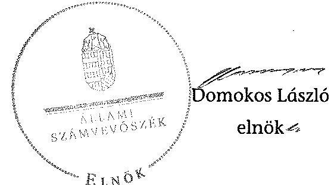
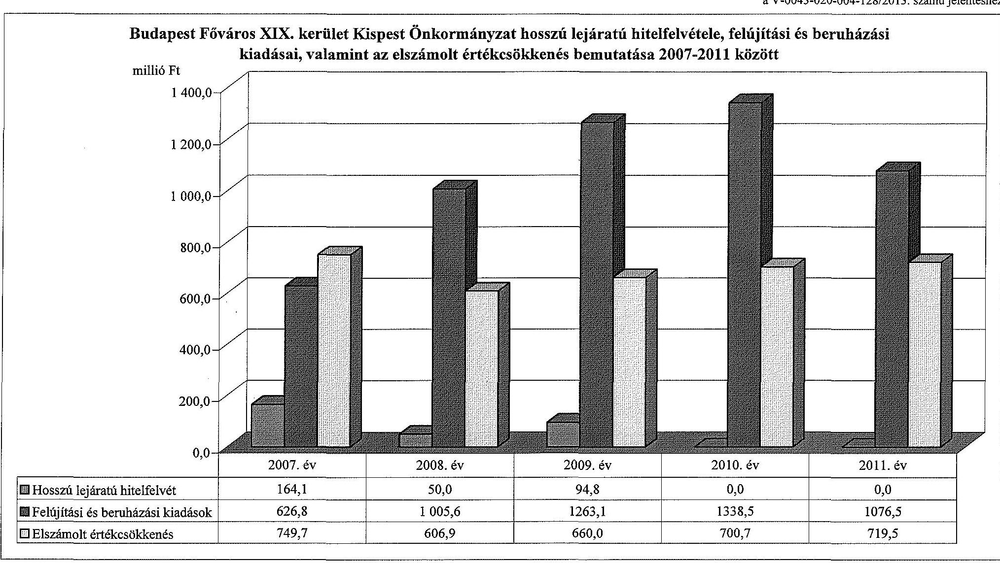
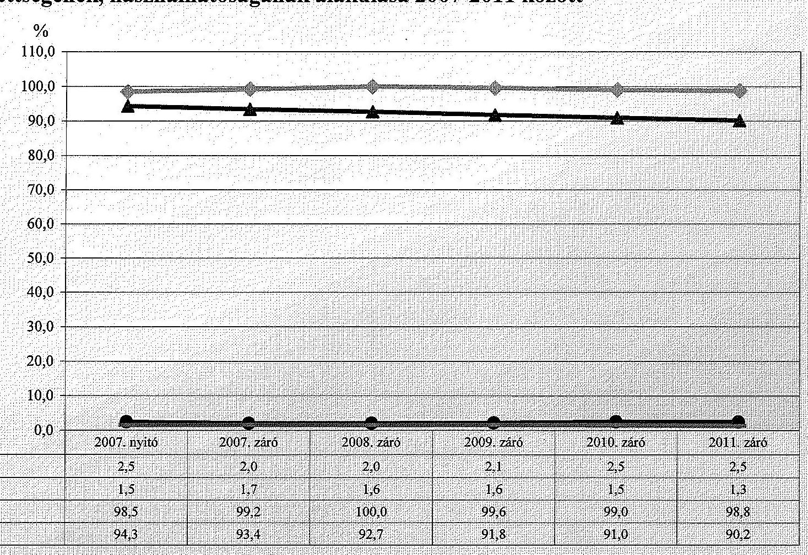
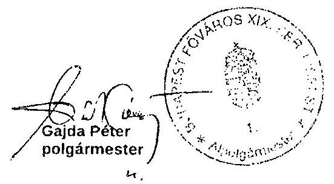

# ÁLLAMI   SZÁMVEVŐSZÉK 

## JELENTÉS

az önkormányzati vagyongazdálkodás szabályszerűségi ellenőrzéséről

Budapest Főváros XIX. kerület Kispest

---

# Állami Számvevőszék 

Iktatószám: V-0043-020-004-128/2013.
Témaszám: 1082
Vizsgálat-azonosító szám: V061504
Az ellenőrzést felügyelte:
Makkai Mária
felügyeleti vezető
Az ellenőrzést vezette és az ellenőrzés végrehajtásáért felelős:
Páncsics Judit
ellenőrzésvezető
A számvevőszéki jelentés összeállításában közreműködtek:
Farkas László
számvevő tanácsos
Marozsán Katalin
számvevő
Szarka Péterné
számvevő vezető főtanácsos
Az ellenőrzést végezték:
Farkas László Szabó Tamás Szilágyi Nándorné
számvevő tanácsos számvevő

A témához kapcsolódó eddig készített számvevőszéki jelentések:
címe
sorszáma
Jelentés a Budapest Főváros XIX. kerület Kispest Önkormányzata 0415
gazdálkodásának átfogó ellenőrzéséről
Jelentés Budapest Főváros XIX. kerület Kispest Önkormányzata 0853
gazdálkodási rendszerének 2008. évi ellenőrzéséről

---

# TARTALOMJEGYZÉK 

BEVEZETÉS ..... 3
I. ÖSSZEGZŐ MEGÁLLAPÍTÁSOK, KÖVETKEZTETÉSEK, JAVASLATOK ..... 5
II. RÉSZLETES MEGÁLLAPÍTÁSOK ..... 12

1. A vagyongazdálkodási tevékenység szabályozottsága ..... 12
1.1. A feladatellátás formáinak meghatározása, a döntések megalapozottsága ..... 12
1.2. A vagyonnal gazdálkodó szervezetek szervezeti rendjének szabályozottsága, a kötelező szabályzatok megfelelősége ..... 12
1.3. A vagyongazdálkodás szabályozása ..... 14
1.4. A vagyonkezeléssel megbízott szervezetek beszámolási kötelezettségének szabályozása ..... 16
2. A vagyongazdálkodás szabályszerűsége ..... 17
2.1. A vagyonnyilvántartás megfelelősége ..... 17
2.2. A vagyongazdálkodást érintő gazdasági események dokumentáltsága ..... 18
2.3. A vagyongazdálkodási döntések, intézkedések szabályszerűsége ..... 20
2.4. A vagyonkezelő beszámoltatása ..... 22
2.5. A közbeszerzési eljárások alkalmazása ..... 22
3. A vagyon változását eredményező gazdasági események szabályszerűsége ..... 22
3.1. A vagyon értékének és összetételének változása ..... 22
3.2. A vagyon fenntartására kialakított rendszer működésének megfelelősége és szabályozottsága ..... 23
3.3. Hitelfelvétel, kötvénykibocsátás, garancia és kezességvállalás szabályszerűsége ..... 24
3.4. A térítés nélküli vagyonátadások és átvételek szabályszerűsége ..... 25
4. A vagyongazdálkodás szabályszerűségére vonatkozó belső és külső ellenőrzések hasznosulása ..... 26
4.1. A belső ellenőrzés által tett megállapításoknak, javaslatok hasznosulása ..... 26
4.2. A többségi tulajdonban lévő gazdasági társaságok vagyongazdálkodásának felügyelete ..... 28
4.3. A könyvvizsgálat hozzájárulása a vagyongazdálkodás szabályosságához ..... 29
4.4. A külső ellenőrző szervezetek által tett javaslatok hasznosulása ..... 29

---

# MELLÉKLETEK 

1. számú Budapest Főváros XIX. kerület Kispest Önkormányzat vagyonának főbb adatai 2007. január 1-je és 2011. december 31-e között
2. számú Budapest Főváros XIX. kerület Kispest Önkormányzat hosszú lejáratú hitelfelvétele, felújítási és beruházási kiadásai, valamint az elszámolt értékcsökkenés bemutatása 2007-2011 között
3. számú Budapest Főváros XIX. kerület Kispest Önkormányzat eladósodásának és az eszközök fedezettségének, használhatóságának alakulása 2007-2011 között
4. számú Budapest Főváros XIX. kerület Kispest Önkormányzat polgármesterének válaszlevele

## FÜGGELÉKEK

1. számú Rövidítések jegyzéke
2. számú Értelmező szótár

---

# JELENTÉS 

## az önkormányzati vagyongazdálkodás szabályszerűségi ellenőrzéséről

## Budapest Főváros XIX. kerület Kispest

## BEVEZETÉS

Az ÁSZ kiemelten fontosnak tartja az ÁSZ tv. 5. § (4) bekezdése alapján az önkormányzatok vagyongazdálkodási tevékenységének, a vagyongazdálkodási szabályok betartásának ellenőrzését. Az ellenőrzés feladata, hogy értékelje a vagyongazdálkodással kapcsolatban a jogszabályokban, az önkormányzati belső szabályozásban előírtak érvényesülését a közpénzek felhasználásának átláthatósága, nyilvánossága érdekében. Az ÁSZ ellenőrzése nemcsak az ellenőrzött szervezet vagyongazdálkodásának hibáira, hiányosságaira mutat rá, számon kérve azok kijavítását, hanem megállapításaival, javaslataival segíti a közpénzekkel, a közvagyonnal való felelős gazdálkodást.

Az önkormányzati vagyon alapvető funkciója, hogy a helyi közérdeket és egyúttal az önkormányzati célok megvalósítását szolgálja. A feladatellátás terén elsősorban a kötelezően ellátandó feladatok végrehajtását hivatott szolgálni, amely mellett az önként vállalt feladatok ellátása is megvalósulhat.

## Az ellenőrzés célja annak értékelése volt, hogy az Önkormányzatnál:

- a vagyongazdálkodási tevékenység, annak szervezeti keretei szabályozottak;
- a vagyongazdálkodás törvényességét, szabályszerűségét biztosították-e, a vagyon értékének és összetételének változását jogszerű döntésekkel alátámasztották-e;
- a belső ellenőrzés elősegítette-e a vagyongazdálkodás szabályszerű működését, valamint hasznosultak-e a korábbi külső ellenőrzések által tett javaslatok.

Az ellenőrzés típusa: szabályszerűségi ellenőrzés.
Az ellenőrzött időszak: Az ellenőrzés a 2007. január 1. és 2011. december 31. közötti időszakra terjedt ki. A közbeszerzési eljárások lefolytatásának ellenőrzése a 2011. évet és a 2012. év I. negyedévét érintette. Az Nvt. egyes rendelkezései végrehajtásának ellenőrzése a nemzetgazdasági szempontból kiemelt jelentőségű nemzeti vagyonnak minősülő forgalomképtelen vagyonelemek meghatározására, valamint közép- és hosszú távú vagyongazdálkodási terv ké-

---

szítésére terjedt ki 2012. január 1-jétől 2013. március 1-jéig, a helyszíni ellenőrzés befejezéséig.

Az ellenőrzés szakmai módszertana az ÁSZ hivatalos honlapján közzétett szakmai szabályokon alapult, amely a Legfőbb Ellenőrző Intézmények Nemzetközi Szervezete (INTOSAI) által kiadott nemzetközi standardok (ISSAI) figyelembevételével készült.

Ellenőriztük az önkormányzati vagyongazdálkodás szabályozottságát, a helyi szabályozások jogszabályi előírásoknak való megfelelőségét (önkormányzati rendeletek, szabályzatok, utasítások) és azok gyakorlati alkalmazását. A vagyonváltozásokkal kapcsolatos gazdasági események közül az ellenőrzött tételeket véletlen mintavétellel választottuk ki a Polgármesteri hivatal 2007-2011. évi számviteli nyilvántartásaiból. Az Önkormányzattól tanúsítványt kértünk a korábbi ÁSZ ellenőrzések vagyongazdálkodásra vonatkozó javaslatainak hasznosulásáról, a könyvvizsgáló és a külső ellenőrzési szervek vagyongazdálkodással kapcsolatos 2007-2011. évi javaslataira tett intézkedésekről, valamint a 2007-2011. évek térítésmentes vagyonátadásairól és átvételeiről.

A jelentéstervezetben alkalmazott rövidítéseket az 1. számú függelék, az egyes fogalmak magyarázatát a 2. számú függelék tartalmazza.

Budapest Főváros XIX. kerület Kispest állandó lakosainak száma 2011. január 1-jén 60304 fő volt. Az Önkormányzat 18 tagú Képviselő-testületének munkáját hét állandó bizottság segítette. Az Önkormányzat az önállóan működő és gazdálkodó Polgármesteri hivatalon felül további hat önállóan működő és gazdálkodó, valamint 28 önállóan működő költségvetési szervvel látta el a feladatát. Az Önkormányzatnak négy kizárólagos (100%-os) tulajdonában álló gazdasági társasága volt.

A polgármester a 2006. évi önkormányzati választások óta tölti be tisztségét. A jegyző 2013. január 1-jétől látja el feladatait.

Az Önkormányzatnak a 2011. évi költségvetési beszámolója szerint 11028,8 millió Ft költségvetési bevétele volt és 11143,6 millió Ft költségvetési kiadást teljesített. A 2011. december 31-ei könyvviteli mérleg szerint 78317,6 millió Ft értékű eszközvagyonnal rendelkezett, a hosszú lejáratú kötelezettségek összege 1044,6 millió Ft, a rövid lejáratú kötelezettségeké 893,2 millió Ft volt.

A Polgármesteri hivatal 17 szervezeti egységre tagolódott, a foglalkoztatott köztisztviselők száma 2011. december 31-én 230 fő, az Önkormányzat által foglalkoztatott közalkalmazottak száma 1492 fő volt.

Az ÁSZ a 2011. évi LXVI. törvény 29. §-a szerint a jelentéstervezetet megküldte Budapest Főváros XIX. kerület Kispest Önkormányzat polgármesterének egyeztetésre, aki a megküldött válaszlevelében észrevételt nem tett. A beérkezett választ a jelentés 4. számú melléklete tartalmazza.

---

# I. ÖSSZEGZŐ MEGÁLLAPÍTÁSOK, KÖVETKEZTETÉSEK, JAVASLATOK 

Az Önkormányzat könyvviteli mérleg szerinti vagyona a 2007. évi 81868,2 millió Ft-ról 2011-re 78317,6 millió Ft-ra, 4,3%-kal csökkent. A vagyoncsökkenést a befektetett eszközök 3512,1 millió Ft-os és a forgóeszközök 38,5 millió Ft-os csökkenése okozta. A 2007-2011. években a felújításokra és beruházásokra fordított kiadások összege (5310,5 millió Ft) jelentősen (54,5%-kal) meghaladta az elszámolt értékcsökkenés összegét (3436,8 millió Ft). A beruházások, felújítások finanszírozásához 308,9 millió Ft hosszú lejáratú hitelt vettek igénybe.

Az Önkormányzat saját vagyona 2007-ről 2011-re 79495,4 millió Ft-ról 76251,0 millió Ft-ra, 3,4%-kal (3244,4 millió Ft-tal) csökkent a saját tőke 3258,4 millió Ft-os csökkenése és a tartalékok 14,0 millió Ft-os növekedése eredményeként. A vagyon alakulásával kapcsolatos adatokat és mutatószámokat a jelentés 1-3. számú mellékletei részletesen tartalmazzák.

A Képviselő-testület a 2007-2011. években a gazdasági programban meghatározta az önkormányzati feladatok ellátásának fő irányait, ellátásának módját és mértékét. Az önkormányzati SZMSZ-ben rögzítette a kötelező és önként vállalt feladatok körét. A Képviselő-testület 2007-ben két óvoda és két általános iskola megszüntetéséről, valamint 2009-ben és 2011-ben egy-egy gazdasági társaság alapításáról döntött. A feladat ellátását módosító előterjesztések nem tartalmaztak alternatív javaslatokat a megalapozott döntés meghozatala érdekében.

A Képviselő-testület meghatározta a vagyonnal gazdálkodó, közfeladatot ellátó költségvetési szervek alapító okirataiban a szervezetek közfeladatait, továbbá rendelkezett a közfeladatot ellátó költségvetési szervek szervezeti és működési szabályzatainak jóváhagyásáról. Az önkormányzati feladatok ellátásában az intézményrendszeren kívül az általa alapított négy 100%-os tulajdonú gazdasági társasága vett részt. A gazdasági társaságok alapító okirat szerinti feladata építési projektek szervezése, sportlétesítmények működtetése, sport feladatok szervezése, környezetvédelmi feladatok ellátása, hátrányos helyzetű csoportok társadalmi esélyegyenlőségének elősegítése, saját tulajdonú, illetve bérelt ingatlanok bérbeadása, üzemeltetése volt.

Az Önkormányzatnál a vagyongazdálkodással kapcsolatos feladatokat, a feladat és hatásköröket, valamint az eljárási rendet a helyi sajátosságok figyelembe vételével a képviselő-testületi rendeletekben és határozatokban, a polgármester és a jegyző által kiadott szabályzatokban, utasításokban szabályozták. A Képviselő-testület az önkormányzati SZMSZ-ben a vagyongazdálkodási hatásköröknek a polgármesterre és a Tulajdonosi bizottságra történő átruházását értékhatárhoz kötötte.

Az Önkormányzatnál a vagyongazdálkodással kapcsolatos feladatokat a Htv.-ben foglaltaknak megfelelően a teljes vagyoni körre vonatkozóan vagyongazdálkodási rendeletben szabályozták. A vagyongazdálkodási rendelet az Áht.-ben foglaltak szerint tartalmazott szabályozást a vagyon tulajdonjogának ingyenes átruházására, a forgalomképesség megváltoztatásának eljárásrendjére. Az Önkormányzatnál az Áht.-ben előírtakkal összhangban a vagyongazdálkodási és versenyeztetési rendeletekben szabályozták a meghatározott értékhatár feletti vagyontárgyak hasznosítása esetében a nyilvános versenyeztetés, pályáztatás eljárásrendjét. A vagyongazdálkodási rendeletben értékbecslés készítési kötelezettséget írtak elő a hasznosításra szánt vagyon értékének megállapítása céljából. Az Önkormányzatnál a tulajdonosi jogok védelme érdekében a garanciális elemeket a vagyongazdálkodási rendeletben előírták. A Képviselő-testület a 2007-2009. években nem, azonban a 2010-2011. években tételesen meghatározta a törzsvagyonba tartozó forgalomképtelen és korlátozottan forgalomképes, valamint a forgalomképes vagyonának körét. A vagyongazdálkodási rendelet 1. számú mellékletét, - amely a forgalomképtelen és korlátozottan forgalomképes ingatlanok felsorolást tartalmazta - 2011. évre vonatkozóan nem aktualizálták. A Képviselő-testület a vagyongazdálkodási rendelet 2. számú mellékletében szabályozta a vagyonkimutatás Áhsz.-ben előírt tartalmának további részletezését, tételes alábontását. Az Önkormányzatnál az Nvt.-ben előírtak ellenére a törvény hatályba lépését követő 60 napon belül nem alkottak rendeletet arról, hogy a forgalomképtelen vagyonelemek közül melyeket minősítenek nemzetgazdasági szempontból kiemelt jelentőségű nemzeti vagyonnak.

A vagyongazdálkodási rendelet 2008 szeptemberétől írta elő, hogy az immateriális javak és tárgyi eszközök leltározását mennyiségi felvétellel két évenként kell végrehajtani. A szabályozás nem felelt meg az Áhsz.-ben foglaltaknak, mivel az immateriális javakat a mennyiségben és értékben vezetett analitikus nyilvántartással történő egyeztetéssel évente kell leltározni. 2010-2011 között az üzemeltetésre, kezelésre átadott eszközök leltározására vonatkozó szabályozás sem felelt meg az Áhsz.-ben foglaltaknak, mert a leltározási szabályzat nem tartalmazta, hogy a mérleget az üzemeltetést, kezelést végző szerv által a december 31-ei fordulónapra vonatkozó évenkénti leltározása alapján elkészített, hitelesített, és a megállapodásban meghatározott időpontig megküldött leltárral kell alátámasztani. A 2007-2011. években a leltározás nem volt szabályos, azt nem a leltározási szabályzatban foglalt előírásoknak megfelelően végezték el. A leltár a leltározási szabályzattól eltérően nem tartalmazta a bizonylatok sorszámát, az eszközök egyértelmű meghatározását, a hitelesítő aláírásokat, továbbá az ingatlan vagyon esetében a leltárkiértékelés csak a 2010. évben készült el. Az Áhsz. előírása ellenére a 2010-2011. években a mérlegben kimutatott üzemeltetésre, kezelésre átadott eszközök állományi értékének valódiságát nem az üzemeltető, kezelő által készített és hitelesített leltárral támasztották alá. Mindezek miatt a mérlegben szereplő tételek valódisága sem volt igazolva.

A Polgármesteri hivatal 2007-2011 között rendelkezett számviteli politikával és a kapcsolódó szabályzatokkal. A számviteli politikában az Áhsz.-ben előírtak ellenére nem szabályozták a beszerzett, illetve előállított immateriális javak, tárgyi eszköz üzembe helyezésének dokumentálási szabályait. A beruházási

 kiadások elszámolásánál a vagyonelemek (telek, épület, építmény) főkönyvi könyvelésben és analitikus nyilvántartásokban rögzített adatai eltértek, a főkönyvi adatokat év végén, rendező tétellel korrigálták az ingatlanok analitikus nyilvántartásának megfelelően.

---

A térítésmentesen átadott vagyontárgyakat hibásan - egyéb csökkenés jogcímen - mutatták ki az Áhsz.-ben foglaltak ellenére. Az Önkormányzatnál a saját intézményeknek átadott eszközök és programok elszámolásakor nem az Áhsz.-ben foglaltak szerint jártak el, mert az üzemeltetésre, kezelésre átadott eszközök között csak azokat az önkormányzati tulajdonban levő eszközöket kell kimutatni, amelyeket nem saját maga vagy az irányítása alá tartozó költségvetési szerve üzemeltet.

Az Önkormányzatnál 2007-2011 között elkészítették a vagyonkimutatást, és a zárszámadási rendelettervezet előterjesztésekor a Képviselő-testület részére tájékoztatásul bemutatták. A 2007-2011. évi vagyonkimutatások tartalma megfelelt az Áhsz.-ben foglaltaknak és a vagyongazdálkodási rendelet által meghatározottaknak, mivel tartalmazta az Önkormányzat és intézményei saját vagyonát tételesen, törzsvagyon és törzsvagyonon kívüli egyéb vagyon bontásban.

A számviteli kimutatásban szereplő ingatlanvagyont, valamint az ingatlanvagyon-kataszter adatait egymással minden év végén egyeztették, amelyet külön kimutatás készítésével dokumentáltak. Az ingatlanvagyon-kataszterben és az analitikus nyilvántartásban a bruttó értékek egyeztethetőségét törzsvagyon és egyéb vagyon szerinti bontásban nem biztosították. Az ingatlanvagyonkataszter nyilvántartási adatainak év végi teljes körű egyeztetését - az ingatlanvagyon nyilvántartási és adatszolgáltatási rendjéről szóló kormányrendeletben előírtak ellenére - a földhivatali nyilvántartással nem végezték el, emiatt a teljes körű egyezőség biztosítása nem igazolható.

A vagyongazdálkodással kapcsolatban meghatározták a gazdálkodási jogkörök gyakorlásának rendjét. A 2007-2009. években, a Polgármesteri hivatalban az Ámr. ${ }_{1}$-ben foglaltak, valamint kötelezettségvállalási szabályzat ${ }_{1,2,3}$-ban előírtak ellenére a szakmai teljesítésigazoló a vagyonhasznosításból és vagyoncsökkenésből származó bevételek beszedésének elrendelése előtt nem ellenőrizte a bevételek jogosságát, összegszerűségét. Az érvényesítő az Ámr. ${ }_{1}$-ben előírtak ellenére nem észrevételezte a szakmai teljesítésigazolás hiányát. Az ellenőrzött tételeknél ennek következtében jogosulatlanul bevételt nem számoltak el.

A vagyongazdálkodási döntések végrehajtása során betartották a vagyongazdálkodási rendeletben, a lakás és helyiséggazdálkodási rendeletben, a beruházási rendeletben, valamint az előterjesztésekben, és a képviselő-testületi határozatokban foglaltakat. Az ingatlanok elidegenítése a versenyeztetési rendeletben szabályozottak alapján történt. A vagyonhasznosítási és vagyonértékesítési szerződésekbe az Önkormányzat érdekeit védő garanciális elemeket beépítették. A 2011. évben és a 2012. év I. negyedévében a tíz darab közbeszerzési eljárás köteles felújítás és beruházás esetében a becsült érték és az egybeszámítási kötelezettség figyelembe vételével folytatták le a közbeszerzési eljárásokat.

A közérdekű adatok közzétételére vonatkozó eljárásrendet a jegyző ${ }_{1}$ szabályozta. A jegyző ${ }_{1,2}$ a 2007-2011. években az Önkormányzat honlapján közzétette a működési és fejlesztési támogatások, a nettó ötmillió Ft-ot elérő, vagy azt meghaladó szerződések adatait. A 2007-2011. években az Eisztv.-ben és a közzétételi listákon szereplő adatok közzétételi mintájáról szóló IHM rendeletben

---

előírtak ellenére az éves (elemi) költségvetések és a költségvetés végrehajtásáról készített beszámolók közzététele elmaradt.

Az Önkormányzatnál az Ötv.-ben foglaltaknak megfelelően 2007-től 2010 márciusáig a belső ellenőrzési feladatokat belső ellenőr és külső szolgáltató végezte, ezt követően belső ellenőrzési csoport látta el. A 2007-2010. években az éves ellenőrzési tervekben az ellenőrzési prioritásokat - a Ber. előírásai ellenére - nem kockázatelemzéssel határozták meg. A 2007-2011. években nem tettek eleget az Ötv.-ben foglaltaknak, mert a Képviselő-testület minden esetben határidő után döntött az éves belső ellenőrzési tervről. 2007-2011 között vagyongazdálkodással kapcsolatban négy ellenőrzést végeztek, ami az összes belső ellenőrzés 16%-a volt. A jelentések javaslatokat fogalmaztak meg a leltározási feladatok végrehajtásával, az analitikus nyilvántartások naprakész vezetésével kapcsolatban. Az ellenőrzöttek intézkedési tervet készítettek a felelősök és a határidő megjelölésével. Az intézkedési tervek végrehajtásáról utóellenőrzés keretében és az intézmények beszámoltatásával győződtek meg. Az ellenőrzött időszakban a polgármester -az Ötv.-ben foglaltak ellenére - a zárszámadási rendelet tervezettel egyidejűleg az éves összefoglaló ellenőrzési jelentést nem terjesztette a Képviselő-testület elé, mivel azt a jegyző ${ }_{1,2}$ nem készítette el.

A 2007-2011. években a kizárólagos önkormányzati tulajdonban álló négy gazdasági társaság pénzügyi és gazdasági helyzetét a Képviselő-testület az üzleti terv jóváhagyásakor és az éves beszámolók elfogadásakor értékelte. A kft.-k felügyelő bizottsága megtárgyalta és elfogadásra javasolta az éves beszámolókat. Az Önkormányzat három gazdasági társasága nyereségesen gazdálkodott, a Kispesti Sport NKft. a 2011. évben veszteséges volt. A 2011. évben a négy gazdasági társaságnak összesen 7,0 millió Ft jegyzett tőkéje volt. Tőkeemelésre kizárólag a Kispesti Garázs és Parkoló Kft.-ben került sor 2,0 millió Ft értékben a kft. mérleg szerinti eredményéből.

A könyvvizsgálói jelentés tartalmazott vagyongazdálkodással kapcsolatos - az értékvesztés elszámolása és a követelések behajtása témakörben - javaslatot, melyet az Önkormányzat hasznosított.

Az ÁSZ 2008. évi ellenőrzési javaslatai közül nyolc szabályszerűségi és két célszerűségi javaslat kapcsolódott a vagyongazdálkodáshoz. A jegyző ${ }_{1}$ hat szabályszerűségi és egy célszerűségi javaslatot határidőre megvalósított. A szabályszerűségi javaslatok közül az intézkedési tervben megadott a 2010. évi határidőre - a Ber.-ben előírtak ellenére - nem készítették el az éves ellenőrzési terv kockázatelemzését, továbbá a Képviselő-testület az éves belső ellenőrzési tervet a 2009-2011. években is határidőn túl hagyta jóvá. Nem teljesült az a célszerűségi javaslat, hogy a belső ellenőrzés kockázatelemzés alapján az Önkormányzat költségvetési szerveinél és a Polgármesteri hivatalnál ellenőrizze a közbeszerzési eljárásokat. Az ÁSZ korábbi ellenőrzéseinek vagyongazdálkodással kapcsolatos teljesült javaslatai elősegítették a vagyongazdálkodás működésének szabályszerűségét.

Az Állami Számvevőszékről szóló 2011. évi LXVI. törvény 33. § (1) bekezdésében foglaltak értelmében a jelentésben foglalt megállapításokhoz kapcsolódó intézkedési tervet köteles az ellenőrzött szervezet vezetője összeállítani, és azt a jelentés kézhezvételétől számított 30 napon belül az ÁSZ részére megküldeni.

---

Amennyiben az intézkedési tervet határidőben nem küldi meg a szervezet, vagy az nem elfogadható, az ÁSZ elnöke a hivatkozott törvény 33. § (3) bekezdés a)-b) pontjaiban foglaltakat érvényesítheti.

Az ellenőrzés intézkedést igénylő megállapításai és javaslatai:

# a Jegyzõnek 

1. Az Önkormányzatnál az Nvt. hatályba lépését követő 60 napon belül a 18. § (1) bekezdésében előírtak ellenére nem jelölték meg rendeletben azokat a tulajdonukban álló forgalomképtelen vagyonelemeket, melyeket kiemelt jelentőségű nemzeti vagyonnak minősítenek.

Javaslat:
Készítsen rendelettervezetet a nemzetgazdasági szempontból kiemelt jelentőségű nemzeti vagyonnak minősülő forgalomképtelen vagyonelemek kijelölése érdekében az Nvt. 18. § (1) bekezdésében előírtak szerint és kezdeményezze a polgármesternél a rendelettervezet Képviselő-testület elé terjesztését.
2. Az Önkormányzat vagyongazdálkodási rendeletében az Áhsz. 37. §. (3) bekezdésében foglaltak ellenére az immateriális javak kétévenkénti mennyiségi felvétellel történő leltározását írták elő.

Javaslat:
Készítse el a vagyongazdálkodási rendelet módosításának tervezetét és kezdeményezze a polgármesternél a módosítás Képviselő-testület elé terjesztését annak érdekében, hogy az immateriális javak leltározásának helyi szabályozása az Áhsz. 37. §. (3) bekezdésében foglaltaknak megfeleljen.
3. A Polgármesteri hivatalban az Áhsz. 8. § (7) bekezdésében előírtak ellenére nem szabályozták a számviteli politikában a beszerzett, illetve előállított immateriális javak, tárgyi eszközök üzembe helyezésének dokumentálási szabályait.

Javaslat:
Egészítse ki a számviteli politikát az Áhsz. 8. § (7) bekezdésében előírtaknak megfelelően a beszerzett, illetve előállított immateriális javak, tárgyi eszközök üzembe helyezésének dokumentálási szabályaival.
4. A 147/1992. (XI. 6.) Korm. rendelet 1. § (2)-(3) bekezdéseiben foglalt előírások ellenére a 2007-2011. években az ingatlanvagyon-kataszter és a földhivatali ingatlan nyilvántartás azonos tartalmú adatai közötti az egyezőséget, valamint az ingatlanvagyon-kataszter és az ingatlanok számviteli nyilvántartásában szereplő bruttó érték egyezőségét nem biztosították.

Javaslat:
Intézkedjen, hogy a 147/1992. (XI. 6.) Korm. rendelet 1. § (2) bekezdésében rögzítetteknek megfelelően az ingatlanvagyon kataszter adatai egyezzenek meg a földhivatali ingatlan-nyilvántartásának azonos tartalmú adataival, továbbá az 1. § (3) bekezdésében foglaltakra figyelemmel biztosítsa az egyezőséget az ingatlanvagyon kataszter és az ingatlanok számviteli nyilvántartása szerinti bruttó érték adatok között.
5. A 2010-2011. években a mérlegben kimutatott, üzemeltetésre átadott eszközök állományi értékének valódiságát az Áhsz. 37. § (4) bekezdésében előírtak ellenére nem az üzemeltető, kezelő által készített és hitelesített leltárral támasztották alá. A 2007-2011. években a leltározást nem a leltározási szabályzat ${ }_{1,3}$-ben foglalt előírásoknak megfelelően végezték el. A leltározás során nem tartották be a leltárral szemben támasztott tartalmi és formai követelményeket. A leltár nem tartalmazta a bizonylatok sorszámát, az eszközök egyértelmű meghatározását, a hitelesítő aláírásokat. A leltárkiértékelés csak a 2010. évben készült el az ingatlan vagyonra vonatkozóan.

Javaslat:
a) biztosítsa, hogy a mérlegben kimutatott, üzemeltetésre átadott eszközök állományi értékét az Áhsz. 37. § (4) bekezdésében előírtaknak megfelelően az üzemeltető, kezelő által készített és hitelesített leltárral támasszák alá;
b) gondoskodjon a leltározási szabályzat ${ }_{2}$-ben foglaltak betartásáról. A leltározás során a leltárral szemben támasztott tartalmi és formai követelményeknek tegyenek eleget, a leltárakban tüntessék fel a bizonylatok sorszámát, az eszközök egyértelmű meghatározását, a hitelesítők aláírását. A leltárak kiértékelését a leltározási szabályzatban előírtak szerint végezzék el.
6. A fejlesztési hitel biztosítéka az Önkormányzat mindenkori költségvetése, amely nem felel meg az Ötv. 88. § (1) bekezdés b) pontjában előírtaknak, mivel a hitel fedezetéül a normatív állami hozzájárulásból, az állami támogatásból, a személyi jövedelemadóból származó bevételt, valamint államháztartáson belülről a működési és fejlesztési célra átvett bevételeket is felajánlották.

Javaslat:
Intézkedjen az Áht. 2 84. § (4) bekezdésével ellentétes állapot megszüntetéséről, a hitel fedezetére jogszerű ügyleti biztosíték kijelöléséről.
7. A polgármester a belső ellenőrzésről szóló éves összefoglaló jelentés elkészítésének hiányában az ellenőrzött időszakban az Ötv. 92. § (10) bekezdésében foglaltak ellenére a zárszámadási rendelet tervezettel egyidejűleg nem terjesztette a Képviselőtestület elé az éves összefoglaló jelentéseket.

Javaslat:
Intézkedjen, hogy a belső ellenőrzés vezetője tegyen eleget a Bkr. 22. §-ának (1) bekezdés g) pontjában rögzített előírásnak azzal, hogy az összefoglaló éves ellenőrzési jelentést elkészíti.
8. Az Eisztv. 6. § (1) bekezdéséhez rendelt mellékletben, valamint a 18/2005. (XII. 27.) IHM rendelet 2. számú mellékletének 3.2. pontjában előírtak ellenére nem tette közzé honlapján a 2007-2011. évek éves (elemi) költségvetését és a számviteli törvény szerinti költségvetési beszámolóit.

---

Javaslat:
Intézkedjen az információs önrendelkezési jogról és az információszabadságról szóló 2011. évi CXII. törvény 1. számú mellékletében meghatározott adatok közzétételéről.

---

# II. RÉSZLETES MEGÁLLAPÍTÁSOK 

## 1. A VAGYONGAZDÁLKODÁSI TEVÉKENYSÉG SZABÁLYOZOTTSÁGA

### 1.1. A feladatellátás formáinak meghatározása, a döntések megalapozottsága

Az Önkormányzat a gazdasági program ${ }_{1,2}$-ben rögzítette az önkormányzati feladatellátással összefüggő elképzeléseket, fő irányokat. A gazdasági program ${ }_{1,3}$ szerint az Önkormányzat kötelező feladatait a meglévő intézményhálózatán és négy gazdasági társaságán keresztül látta el. A gazdasági program ${ }_{1,2}$-ben előírták az önként vállalt feladatok felülvizsgálatát abból a szempontból, hogy azok a szabad kapacitás kihasználását jelentik-e, és ha igen, azok „fizetővé” tételével rentábilisan végezhetők-e. Előírták továbbá, hogy új feladat vállalására abban az esetben is, ha azt központi előírások teszik kötelezővé, kizárólag akkor kerüljön sor, ha annak pénzügyi fedezete teljes mértékben biztosított.

A Képviselő-testület az önkormányzati SZMSZ ${ }_{1,2,3}$-ban meghatározta az önként vállalt feladatokat. A Képviselő-testület meghatározta a vagyonnal gazdálkodó, közfeladatot ellátó költségvetési szervek alapító okirataiban a szervezetek közfeladatait, továbbá rendelkezett a közfeladatot
 ellátó költségvetési szervek szervezeti és működési szabályzatainak jóváhagyásáról.

A Képviselő-testület 2007-ben a gyermek létszám csökkenése miatt két óvoda és két általános iskola megszüntetéséről döntött. A Képviselő-testület 2007-2011 között az Ötv. 9. § (4) bekezdés ${ }^{1}$ előírásai alapján két gazdasági társaságot alapított. A Képviselő-testület a 380/2009. (VI. 23.) számú határozattal elfogadta a WEKERLE Városfejlesztési és Üzemeltetési Kft. alapító okiratát. A 90/2011. (II. 17.) határozata alapján 2011. február 17. napjával megalapították a Kispest Sport NKft.-t. A feladatellátás módjának meghatározásához kapcsolódó előterjesztések nem tartalmaztak alternatív javaslatokat a megalapozott döntés meghozatala érdekében.
2011. december 31-én a közfeladatokat hét önállóan működő és gazdálkodó, továbbá 28 önállóan működő költségvetési szerv, valamint négy 100%-os önkormányzati tulajdonú gazdasági társaság útján látták el.

### 1.2. A vagyonnal gazdálkodó szervezetek szervezeti rendjének szabályozottsága, a kötelező szabályzatok megfelelősége

A Képviselő-testület az önkormányzati SZMSZ ${ }_{1,2,3}$-ban szabályozta a hatáskörök átruházását, meghatározta az átruházott hatáskör gyakorlásának szabályait és a kapcsolódó beszámolási kötelezettséget. Az önkormányzati vagyonnal kapcsolatos hatáskörök átruházását a polgármesterre és a Tulajdonosi bizottságra

[^0]
[^0]:    ${ }^{1}$ 2013. január 1-jétől az Mötv. 41. § (6) bekezdése tartalmazza

---

értékhatárhoz kötötte az önkormányzati SZMSZ ${ }_{1,2,3}$ 2. és 3. számú melléklete szerint. A Képviselő-testület nem élt az Ötv. 9. § (3) bekezdésében ${ }^{2}$ biztosított jogával, nem adott utasítást az átruházott hatáskör gyakorlásához.

A Képviselő-testület az önkormányzati SZMSZ ${ }_{1,2}$-ben 2007 januárjától 2010 novemberéig a költségvetési szervek közül a nevelési-oktatási intézmények szervezeti és működési szabályzatának jóváhagyását a Közművelődési, oktatási, sport, ifjúságpolitikai és egészségügyi bizottságra ruházta át.

A hivatali SZMSZ ${ }_{1,2}$ tartalmazta az Ámr. ${ }_{2}$ 20. § (2) bekezdésének e) pontjában ${ }^{3}$ előírtaknak megfelelően a szervezeti felépítést, a működési rendet, a szervezeti egységek, a gazdasági szervezet megnevezését és feladatait, kivéve a szervezeti egységek engedélyezett létszámát. Az ÁSZ az Önkormányzat gazdálkodási rendszerének 2008. évi ellenőrzése során feltárta, hogy a jegyző, a Polgármesteri hivatal gazdasági szervezetének ügyrendjét nem készítette el. A jegyző, az ÁSZ javaslatára a hivatali SZMSZ ${ }_{1}$-t kiegészítette a gazdasági szervezet ügyrendjével, melyet a Képviselő-testület a 32/2008. (X. 22.) számú rendeletével jóváhagyott.

A Polgármesteri hivatal a 2007-2011 közötti időszakban rendelkezett számviteli politikával és a hozzá tartozó szabályzatokkal (pénzkezelési szabályzat ${ }_{1,2,3}$-mal, leltározási szabályzat ${ }_{1,2}$-vel, értékelési szabályzat ${ }_{1,2}$-vel). A számviteli politika a vagyongazdálkodás szempontjából megfelelő keretet biztosított az Önkormányzat költségvetési szervei egységes számviteli elvek szerinti, önkormányzati szintű beszámolójának elkészítéséhez. Az Áhsz. 8. § (7) bekezdésében előírtak ellenére a számviteli politikában nem szabályozták a beszerzett, illetve előállított immateriális javak, tárgyi eszközök üzembe helyezése dokumentálásának szabályait.

A leltározási szabályzat ${ }_{1}$ 2008. július 1-jéig nem tartalmazta az üzemeltetésre, vagyonkezelésre átadott eszközök leltározásának módját, az ingatlanok leltározási kötelezettségének gyakoriságát pedig nem az Áhsz. 37. § (1) bekezdésében előírtaknak megfelelően határozta meg. A leltározási szabályzat ${ }_{1}$ szerint az ingatlanokat mennyiségi felvétellel öt évenként kellett leltározni. A 2008. évi ÁSZ ellenőrzés közbenső egyeztetése során az 5-20/2008. számú polgármesteri-jegyzői közös intézkedés 2. pontjával a szabályozási hiányosságot 2008. július 1-jével megszűntették.

A vagyongazdálkodási rendelet 8. §-ának (6) bekezdése - 2008. szeptember 19-ei hatállyal - előírta, hogy az Áhsz. 37. §-ának (7) bekezdésére hivatkozva az immateriális javak és a tárgyi eszközök mennyiségi felvétellel történő leltározását két évenként kell végrehajtani. Ez a szabályozás nem felelt meg az Áhsz. 37. § (3) bekezdésében előírtaknak, mivel az immateriális javak leltározását nem mennyiségi felvétellel, hanem a mennyiségi és az értékbeli adatok egyeztetésével, évente kell végrehajtani.

[^0]
[^0]:    ${ }^{2}$ 2013. január 1-jétől az Mötv. 41. § (4) bekezdése írja elő
    ${ }^{3}$ 2012. január 1-jétől az Ávr. 13. § (1) bekezdésének e) pontja tartalmazza

---

A leltározási szabályzat ${ }_{2}$ az Áhsz. 37. § (4) bekezdésében előírtak ellenére ${ }^{4}$ nem tartalmazta az üzemeltetésre, kezelésre átadott, koncesszióba, vagyonkezelésbe adott eszközök leltározási szabályait, amely szerint az államháztartás szervezete az üzemeltetést, kezelést végző szerv által a december 31-ei fordulónapra vonatkozó évenkénti leltározása alapján elkészített, hitelesített és a megállapodásban meghatározott időpontig megküldött leltárral köteles alátámasztani a mérleg szerinti értéket.

# 1.3. A vagyongazdálkodás szabályozása 

A Képviselő-testület a Htv. 138. § (1) bekezdés j) pontja előírása alapján a vagyongazdálkodási feladatokat és az önkormányzati vagyonnal való gazdálkodás szabályait vagyongazdálkodási rendeletben határozta meg, amely az egyéb vagyongazdálkodással kapcsolatos rendeleteket ${ }^{5}$ is figyelembe véve a teljes vagyoni körre kiterjedt.

A vagyongazdálkodási rendelet 4. §-ában rendelkeztek az önkormányzati vagyon forgalomképesség szerinti besorolásáról, de 2010. március 19-ig a törzsvagyonhoz tartozó vagyontárgyak körét tételesen nem állapították meg. A vagyongazdálkodási rendelet 4. § (3) bekezdéséhez rendelt 1. számú melléklet tartalmazta a forgalomképtelen és korlátozottan forgalomképes ingatlanok felsorolását, amelyet 2011. évre vonatkozóan nem aktualizálták. A vagyongazdálkodási rendelet 8. §-a előírta a törzsvagyon, ezen belül a forgalomképtelen és korlátozottan forgalomképes, illetve a forgalomképes vagyon elkülönített nyilvántartásának módját, a rendelet 2. számú melléklete határozta meg a vagyonkimutatás tartalmi követelményeit. A Képviselő-testület előírta, hogy vagyonleltárt, illetve az ez alapján készített vagyonkimutatást az éves költségvetési beszámolóhoz kell csatolni. A vagyonleltár elkészítését, illetve annak módját, felelőseit és határidejét a vagyonleltárról szóló külön intézkedésekben ${ }^{6}$ szabályozták.

Az Áhsz. 9. számú mellékletén belül, a számlaosztályok tartalmára vonatkozó előírások 1. k) pontjában foglaltak alapján a számlarend ${ }_{1,2,3}$-ban a főkönyvi számlák bontásával elkülönítették a törzsvagyon (ezen belül forgalomképtelen, illetve korlátozottan forgalomképes), valamint az egyéb vagyon részét képező eszközöket.

Az Önkormányzat tulajdonában lévő ingatlanvagyonról a vagyongazdálkodási rendelet 8. §-ában előírtak szerint ingatlanvagyon-katasztert kell vezetni és

[^0]
[^0]:    ${ }^{4}$ Az előírás 2010. január 1-jétől hatályos.
    ${ }^{5}$ a lakás és helyiséggazdálkodási rendelet, versenyeztetési rendelet, az önkormányzat tulajdonában álló lakások béréről szóló 13/2009. (V. 22.) számú rendelet, a lakóközösségi tulajdonban lévő lakóépületek felújítási támogatásáról szóló 26/2005. (VIII. 10.) számú rendelet, a lakáscélú önkormányzati támogatásokról szóló 14/2006. (IV. 19.) számú rendelet (hatálytalan 2011. november 2-től)
    ${ }^{6}$ 15-01-7/2005. számú jegyzői intézkedés a vagyonleltár készítés folyamatáról (hatálytalan 2011. január 1-jétől), valamint a 1000-35/2011. számú polgármesteri-jegyzői együttes intézkedés a vagyonleltár készítés folyamatáról

---

biztosítani kell a vagyonleltárban szereplő ingatlanok adatainak egyezőségét az ingatlanvagyon-kataszter adataival.

A vagyongazdálkodási rendelet 3/A. §-a előírta, hogy a vagyonkezelő a vagyon kezelésével kapcsolatos jogosítványait alapító okirata, illetve a vele kötött vagyonkezelési szerződésben meghatározott keretek között gyakorolhatja. A vagyongazdálkodási rendeletben rögzítették a vagyonkezelői jog részletes szabályait. A vagyongazdálkodási rendelet (12/A. §-12/G. §-aiban) előírta a vagyonkezelő feladatait, hatáskörét, felelősségét és a vagyonkezelői jog megszerzésének, gyakorlásának, ellenőrzésének részletes szabályait. A Kispest Sport NKft.-vel kötött vagyonkezelési szerződés részletesen tartalmazza a vagyonkezelő feladatát, hatáskörét és felelősségét. A Kispest Sport NKft. alapító okiratának 6.2 pontja szerint az alapító kizárólagos hatáskörébe tartozik a társaság szervezeti és működési szabályzatának elfogadása.

A Képviselő-testület vagyongazdálkodási rendelet 6. §-ában vagyongazdálkodási irányelveket határozott meg, a rendelet 11. §-ában rögzítette az önkormányzati vagyon feletti rendelkezési jogot. Az Áht. ${ }_{1}$-ben foglaltakkal összhangban a versenyeztetési eljárás általános szabályait a vagyongazdálkodási rendelet 36. §-a rögzítette, annak részletes szabályait az Önkormányzat a versenyeztetési rendeletben határozta meg. Versenyeztetési eljárással - értékhatártól függetlenül - lehet szerződést kötni a lakások, a nem lakás célú helyiségek bérbeadására, a telekingatlan bérbeadására, az önkormányzati ingatlanvagyon elidegenítésére, amennyiben ez alól a lakás és helyiséggazdálkodási rendelet - elővásárlási joggal rendelkező bérlő felé történő elidegenítés és rászorultság esetén történő bérbeadásnál - felmentést nem ad.

A vagyongazdálkodási rendeletben előírták az önkormányzati vagyontárgy értékesítésére, illetve egyéb módon történő hasznosítására és megterhelésére irányuló döntések előkészítésekor az ingatlanvagyon piaci értékének megállapítása céljából értékbecslés készítésének kötelezettségét, annak módját a rendelet 7. § 2. pontja tartalmazta.

Az Áht. ${ }_{1}$-ben foglaltak szerint a vagyongazdálkodási rendelet 14. §-ában szabályozták az ingyenes vagyon átruházás eseteit, az (5) bekezdésben előírták, hogy az önkormányzati vagyon ingyenes vagy kedvezményes átruházásáról a Képviselő-testület dönt. Az önkormányzati vagyon meghatározott részének elidegenítését, megterhelését, vállalkozásba vitelét a Képviselő-testület nem kötötte népszavazáshoz.

Az önkormányzati $\mathrm{SZMSZ}_{1,2,3}$-ban kialakították az előterjesztések készítésének, véleményezésének, megtárgyalásának, döntéshozatalának általános rendjét. Nem szabályozták a költség-haszon elemzés készítésének kötelezettségét, a finanszírozási célú pénzügyi műveletek esetében a pénzügyi kockázatok felmérését, a hitelfelvételről szóló döntés előkészítés folyamatában a futamidő egyes éveit terhelő kötelezettség költségvetési egyensúlyra gyakorolt hatásának vizsgálatát.

A Polgármesteri hivatalban az operatív gazdálkodással és annak munkafolyamatba épített ellenőrzésével összefüggő jogkörök gyakorlásának rendjét, az ezekkel kapcsolatos összeférhetetlenséget kizáró követelményeket - az Ámr. ${ }_{1,2}$ -

---

ben előírtaknak megfelelően - a kötelezettségvállalási szabályzat ${ }_{1,3,5}$-ban határozták meg.

A vagyongazdálkodási rendelet 10. §-a előírta és a jegyzői intézkedések ${ }^{7}$ szabályozták a vagyonnal való gazdálkodással összefüggő szerződések nyilvánosságra hozatalának módját. A közérdekű adatok Eisztv. melléklete szerinti kialakításáról a 2008. évi ÁSZ ellenőrzést követően jóváhagyott intézkedési terv alapján a jegyző ${ }_{1}$ kiadta a 15-01-38. számú jegyzői intézkedést az Önkormányzat honlapján található közérdekű adatok kiegészítéséről.

Az Önkormányzatnál a helyszíni ellenőrzés befejezéséig még nem tettek eleget az Nvt. 5. § (4) bekezdésében előírtaknak, nem határozták meg az Nvt. 18. § (1) bekezdésében előírt határidőre helyi rendeletben a nemzetgazdasági szempontból kiemelt jelentőségű, nemzeti vagyonnak minősülő vagyonelemeket és nem vizsgálták felül az önkormányzati vagyon forgalomképesség szerinti besorolását.

Az Önkormányzatnál az Nvt. 9. § (1) bekezdésében előírtak szerint a helyszíni ellenőrzés befejezéséig, 2013. március 1-jéig még nem készítették el a közép- és hosszú távú vagyongazdálkodási tervet.

# 1.4. A vagyonkezeléssel megbízott szervezetek beszámolási kötelezettségének szabályozása 

Az Önkormányzat tulajdonosi jogainak, érdekeinek védelmét szolgáló garanciális elemeket a vagyongazdálkodási rendelet tartalmazta. A vagyonkezelési szerződéssel kapcsolatban a rendelet 12/E. § (2) bekezdésének a) pontja előírta az elszámolási kötelezettség tartalmát, ideértve a vagyonnal való folyamatos, valamint a vagyonkezelői jog megszűnése következtében fennálló elszámolást, továbbá az Áht. ${ }_{1}$ 105/B. § (1) bekezdés g) pontjában ${ }^{8}$ meghatározott, az Önkormányzat költségvetését megillető bevételek, illetve a költségek és a ráfordítások elkülönítésének módját.

A Képviselő-testület 211/2011. (III. 30.) számú határozata alapján 2011-ben az 100%-os önkormányzati tulajdonban lévő Kispest Sport NKft.-vel vagyonkezelési szerződést kötött. A vagyonkezelői szerződésben szabályozták a beszámolási kötelezettséget (a szerződés 10. pontja), az elszámolást a vagyonnal (a szerződés 9. pontja) és beépítettek garanciális elemeket a szerződés teljesítésére (a szerződés 14. pontja) figyelembe véve az Ötv. 80/A. § (2)-(8) bekezdései és a 80/B. § előírásait ${ }^{9}$. A garanciális elemek közé tartozott az, hogy a vagyonkezelő köteles írásban bejelenteni az Önkormányzatnak, ha az általa kezelt vagyon

[^0]
[^0]:    ${ }^{7}$ 15-01-23/2005. számú jegyzői intézkedés a Központi Úgyleti Nyilvántartás vezetésével kapcsolatos

 feladatokról, valamint a betekintésre jogosult ügyfél kérésére biztosítandó iratanyagok fénymásolatának készítéséről és kiadásáról és a 15-01-28/2008. számú jegyzői intézkedés az Önkormányzat által kötött szerződések nyilvántartásáról, a Központi Ügyleti Nyilvántartás vezetéséről és egyes jogszabályokban meghatározott közérdekű adatok közzétételéről
    ${ }^{8}$ 2012. január 1-jétől az MÖtv. 109. § (7) bekezdése írja elő
    ${ }^{9}$ 2012. január 1-jétől az MÖtv. 109. §-a tartalmazza

---

összértékében bekövetkezett 5%-os mértéket meghaladó csökkenésről tudomást szerez, az önkormányzati vagyont érintő vészhelyzet következett be, köztartozásának esedékessége meghaladja a hat hónapot.

# 2. A VAGYONGAZDÁLKODÁS SZABÁLYSZERŰSÉGE 

### 2.1. A vagyonnyilvántartás megfelelősége

A 2007-2011. években az Önkormányzatnál az Áht ${ }_{1}$ 118. § (2) bekezdés 2. c) pontjában ${ }^{10}$ előírtak alapján a vagyonkimutatásokat a zárszámadási rendeletekhez csatolták.

A Képviselő-testület a 2007-2009. években a vagyongazdálkodási rendelet 43. §-ában jegyzői hatáskörbe utalta a vagyonkimutatás készítését, azonban a rendelet nem tartalmazta a vagyonkimutatás szerkezetét. A vagyongazdálkodási rendelet 2010. évi módosítását követően a 2010-2011. években a vagyonkimutatás tartalmát a vagyongazdálkodási rendelet 8. §-ában - és a rendelet 2. számú mellékletében - szabályozták, amelynek szerkezete megfelelt az Áhsz. 44/A. § (1) és (2) bekezdéseiben foglalt előírásoknak.

Az ingatlanvagyon-kataszterben a törzsvagyont és egyéb vagyont elkülönítették. A vagyontárgyak forgalomképesség szerinti elkülönítését a vagyonkataszteri programhoz kapcsolódó tárgyi eszközök analitikus nyilvántartása nem tartalmazta. Az Áhsz. 49. § (1) bekezdésében előírtak szerint a főkönyvi számlák alábontásával biztosították a törzsvagyon (ezen belül forgalomképtelen, illetve korlátozottan forgalomképes), valamint az egyéb vagyon részét képező eszközök elkülönítését a számlarendben foglaltaknak megfelelően.

Az Áhsz. 9. számú mellékletén belül a számlaosztályok tartalmára vonatkozó előírások 1. k) pontjában foglaltak ellenére a tárgyi eszközök és az üzemeltetésre átadott eszközök egyes főkönyvi számláihoz kapcsolódóan vezetett analitikus nyilvántartások nem biztosították a megfelelő főkönyvi számlák bruttó értékével való számszerű egyeztethetőséget. A zárszámadáshoz csatolt vagyonkimutatásban a fenti hiányosság miatt a forgalomképes és a forgalomképtelen vagyon összegében eltérés volt a főkönyvi könyvelés adataihoz képest. Az Áhsz. 49. § (1) bekezdésében előírtak ellenére az ingatlanok analitikus nyilvántartása nem biztosította a könyvviteli számlák és a költségvetési beszámoló adatainak áttekinthető alátámasztását.

A 147/1992. (XI. 6) Korm. rendelet 1. § (3) bekezdésében foglaltak szerint a számviteli kimutatásban szereplő ingatlanvagyont, valamint az ingatlanvagyon-kataszter adatait egymással minden év végén egyeztették, amelyet külön kimutatás készítésével dokumentáltak. Az ingatlanvagyon-kataszterben és az analitikus nyilvántartásban eszközcsoportonként a bruttó értékek egyeztethetőségét törzsvagyon és egyéb vagyon szerinti bontásban nem biztosították.

A vagyonban történt változásokat a földhivatali értesítések, határozatok és végzések alapján felvezették az ingatlanvagyon-kataszterbe. Az ellenőrzött gaz-

[^0]
[^0]:    ${ }^{10}$ 2012. január 1-jétől az Áht ${ }_{2}$ 91. § (2) bekezdésének c) pontja írja elő

---

dasági eseményeknél eltérést nem állapítottunk meg. Az ingatlanvagyonkataszter nyilvántartási adatainak év végi teljes körű egyeztetését a földhivatali nyilvántartással nem végezték el annak költségigényessége miatt, ezért a 147/1992. (XI. 6) Korm. rendelet 1. § (2) bekezdésének megfelelően a teljes körű egyezőség biztosítását dokumentumokkal nem tudták alátámasztani.

A jegyző nyilatkozott arról, hogy a vagyon teljes körére vonatkozóan gondoskodott a 147/1992. (XI. 6.) Korm. rendelet 1. § (2) bekezdésének előírása szerint a közhiteles nyilvántartást vezető Budapest 1. számú Körzeti Földhivatal adataival való egyezőség biztosításáról, erről azonban dokumentumot nem tudott bemutatni.

A 2007-2011. évek között a könyvviteli mérleg egyes sorainak értéke - az üzemeltetésre, kezelésre átadott eszközök vonatkozásában is - megegyezett a záró főkönyvi kivonat vonatkozó főkönyvi számláinak értékével. A 2007-2011. években a tárgyi eszközök leltározásakor nem tettek eleget az Áhsz. 37. § (2) bekezdésében előírt azon kötelezettségnek, hogy a leltárak tételesen ellenőrizhető módon támasszák alá a könyvviteli mérleget. Az Önkormányzatnál az Áhsz. 37. § (4) bekezdésében ${ }^{11}$ előírtak ellenére a 2010-2011. években a mérlegben kimutatott, üzemeltetésre átadott eszközök állományi értékének valódiságát nem az üzemeltető által hitelesített leltárral támasztották alá.

A 2007-2011. években a leltározást nem a leltározási szabályzat ${ }_{1,2}$-ben foglalt előírásoknak megfelelően végezték el. A leltározás során nem tartották be a leltárral szemben támasztott tartalmi és formai követelményeket. A leltár nem tartalmazta a bizonylatok sorszámát, az eszközök egyértelmű meghatározását, a hitelesítő aláírásokat. A leltárkiértékelés csak a 2010. évben készült el az ingatlan vagyonra vonatkozóan.

Az Önkormányzat részesedéseit évente értékelték, értékvesztés elszámolását nem tartották indokoltnak.

# 2.2. A vagyongazdálkodást érintő gazdasági események dokumentáltsága 

A 2007-2011. évekre vonatkozóan a gazdálkodási jogkörök gyakorlásának rendjét, az összeférhetetlenség kizárására vonatkozó követelményeket meghatározták. A polgármester és a jegyző ${ }_{1,2}$ közös intézkedésekben gondoskodott a kötelezettségvállalók, utalványozók, illetve a szakmai teljesítésigazolást végzők és az ellenjegyzők kijelöléséről. A jegyző ${ }_{1,2}$ írásbeli megbízást adott az érvényesítés ellátására. A gazdálkodási jogkörök gyakorlása során betartották az Ámr. ${ }_{1}$ 138. § (1)-(3) bekezdésében, valamint az Ámr. ${ }_{2}$ 80. § (1) és (2) bekezdésében ${ }^{12}$ előírt összeférhetetlenséget kizáró követelményeket.

A Polgármesteri hivatalban, a 2007-2009. években a vagyongazdálkodás egyes területein nem végezték el a gazdálkodási és ellenőrzési jogkörök gyakorlásával

[^0]
[^0]:    ${ }^{11}$ Megállapította a 317/2009. (XII. 29.) Korm. rendelet 18. §-a, először a 2010. évről készített beszámolóknál kellett alkalmazni.
    ${ }^{12}$ 2013. január 1-jétől az Ávr. 60. §-a írja elő

---

felhatalmazott személyek az előírt (folyamatba épített) ellenőrzési feladatokat az alábbi esetekben:

- A 2007-2009. években az Ámr. ${ }_{1}$ 135. § (1) bekezdésében, valamint kötelezettségvállalási szabályzat ${ }_{1,2,3}$-ban előírtak ellenére a szakmai teljesítésigazoló a vagyonhasznosítás és vagyoncsökkenés bevételei beszedésének elrendelése előtt nem ellenőrizte a bevételek jogosságát, összegszerűségét. Az érvényesítő az Ámr. ${ }_{1}$ 135. § (3) bekezdésében előírtak ellenére nem észrevételezte a szakmai teljesítésigazolás hiányát. Ennek következtében azonban az ellenőrzött tételeknél az Önkormányzat jogosulatlan bevételt nem számolt el. A 2010. évtől a bevételek teljesítésigazolásának kötelezettségét belső szabályzatban nem írták elő, figyelembe véve az Ámr. ${ }_{2}$ előírásait;
- A beruházási kiadások elszámolásánál a vagyonelemek főkönyvi könyvelésben és analitikus nyilvántartásokban rögzített adatai eltértek, a főkönyvi adatokat év végén, rendező tétellel korrigálták az ingatlanok analitikus nyilvántartásának megfelelően. A megvalósított fejlesztések aktiválása során a Számv. tv. 16. § (1) bekezdésében foglalt egyedi értékelés elve nem érvényesült.

A 2008. évben egy 2,2 millió Ft-os járműbeszerzési kiadást a 13231 Járművek vásárlása, létesítése főkönyvi számlán rögzítették, az állományba vételi bizonylaton az analitikus nyilvántartásba vételt a 2001. december 31-éig hatályos 1411 Járművek aktivált állományának értéke főkönyvi számlaszámon rögzítették. A 2008-2009. években a Vak Bottyán utca 78. szám alatti ingatlan vásárlása 34,0 millió Ft értékben a 12331 Vásárolt épületek értéke főkönyvi számon került rögzítésre, míg aktiváláskor az előzetes ingatlanbecslésben meghatározott (telek, lakás, kerítés, egyéb építmény) bontásban vezették fel a tárgyi eszköz kartonokra. A mintavétellel kiválasztott ingatlanvásárlások könyvelése valamennyi esetben így történt, év végén rendező tétellel korrigálták a vagyonelemek főkönyvi adatait az ingatlanok analitikus nyilvántartásának megfelelően.

A 2007-2011. években a jegyző ${ }_{1,2}$ az Önkormányzat honlapján ${ }^{13}$ az Áht. ${ }_{1}$ 15/A. § (1) bekezdésében és az Eisztv. 6. § (1) bekezdésében ${ }^{14}$ foglaltaknak megfelelően közzétette a nem normatív, céljellegű működési és fejlesztési támogatások kedvezményezettjeinek nevét, a támogatás célját, összegét, a támogatási program megvalósítási helyét.

Az ÁSZ az Önkormányzat gazdálkodási rendszerének 2008. évi ellenőrzése során megállapította, hogy a közérdekű adatok közzététele az önkormányzat honlapján 2007. január 1-jétől nem a 18/2005. (XII. 27.) IHM rendelet és az Áht. ${ }_{1}$ 15/B. § (1) bekezdésében előírtak szerint történt. Az 5-2/2009. (III. 30.) számú polgármesteri-jegyzői közös intézkedéssel a hiányosságokat kiküszöbölték. Az Önkormányzat honlapján a 2009-2011. években az Áht. ${ }_{1}$ 15/B. § (1) bekezdésében és az Eisztv. mellékletének III/4. pontjában ${ }^{15}$ előírtaknak megfelelően közzé tették a nettó ötmillió Ft-ot elérő, vagy azt meghaladó értékű

[^0]
[^0]:    ${ }^{13}$ Az Önkormányzat honlapja: http://www.kispest.hu/
    ${ }^{14}$ 2012. január 1-jétől az Info tv. 32. §-a és az 1. számú melléklet III/3. pontja tartalmazza
    ${ }^{15}$ 2012. január 1-jétől az Info tv 1. számú melléklet III/4. pontja tartalmazza

---

árubeszerzésre, építési beruházásra, szolgáltatás megrendelésére, vagyonértékesítésre, vagyonhasznosításra vonatkozó szerződések megnevezését, tárgyát, a szerződést kötő felek nevét, a szerződés értékét.

Az Önkormányzat honlapján a jegyző ${ }_{1,2}$ a 2007-2011. évi költségvetési és zárszámadási rendeleteket közzé tette, de az Eisztv. 6. § (1) bekezdéséhez rendelt melléklet III/1. pontjában ${ }^{16}$ és a 18/2005. (XII. 27.) IHM rendelet 2. számú melléklete 3.2. pontjában előírt közzétételi kötelezettségének nem tett eleget, mert a gazdálkodási adatok közül a közfeladatot ellátó költségvetési szervek éves (elemi) költségvetései és a költségvetés végrehajtásáról készített beszámolók közzététele elmaradt.

# 2.3. A vagyongazdálkodási döntések, intézkedések szabályszerűsége 

A vagyongazdálkodási döntések végrehajtása során - telkek, bérlakások, nem lakás céljára szolgáló helyiségek értékesítésekor, járművek és ingatlanok vásárlásakor, épületek és építmények korszerűsítésekor, valamint bővítése és létesítése során - betartották a vagyongazdálkodási rendeletben, a lakás- és helyiséggazdálkodási rendeletben, a beruházási rendeletben, a versenyeztetési rendeletben, valamint az előterjesztésekben és a képviselő-testületi határozatokban foglaltakat.

A vagyonváltozáshoz kapcsolódó döntéshozatalok esetében a döntéshozók az arra felhatalmazott személyek voltak. A vagyonváltozásokról hozott képviselőtestületi döntésekkel azonos tartalmú szerződéseket, megállapodásokat kötöttek. A vagyonhasznosítási és vagyonértékesítési szerződésekbe beépítették az Önkormányzat érdekeit védő garanciális elemeket. Értékesítéskor a tulajdonjog bejegyzésének feltételéül szabták a teljes vételár kifizetését. A késedelmes fizetés esetére szankcióként előírták a késedelmi kamat felszámítását, a bérleti díj meg nem fizetése esetére a bérleti jogviszony felmondását jelölték meg.

Az európai uniós finanszírozással megvalósult beruházások pályázatához csatolt megvalósíthatósági tanulmányokban megvizsgálták a létrehozandó létesítmények fenntarthatóságát.

A Pénzügyi bizottság a vagyongazdálkodással kapcsolatos feladatokat, a pénzügyi vonatkozású előterjesztéseket megtárgyalta, azok elfogadását javasolta. A Képviselő-testület a vagyonnövekedést eredményező döntésekről az éves költségvetési rendeleteiben, valamint az évközi módosítások során határozott. Az évközi döntések meghozatala előtt a Képviselő-testülethez benyújtott előterjesztés nem tartalmazott gazdaságossági számításokat, alternatív javaslatokat. A döntés előkészítések a vagyongazdálkodási rendelet előírásainak, valamint az éves koncepciókban megfogalmazottaknak megfeleltek. Az egyes évekre vonatkozó kötelezettségvállalásokat és a költségvetési egyensúlyra gyakorolt hatásukat bemutatták.

[^0]
[^0]:    ${ }^{16}$ 2012. január 1-jétől az Info tv. 1. számú melléklet III/1. pontja írja elő

---

A vagyongazdálkodással kapcsolatos szabályok alkalmazását egy, az ellenőrzött időszakban megkezdett és befejezett Kispesti kerékpárút beruházáson keresztül is ellenőriztük. A gazdasági program, tartalmazta, hogy minden pályázati forrást szükséges kihasználni annak érdekében, hogy a tervezett kerékpárút fejlesztés végrehajtásra kerüljön. A 2009. évben egész Kispestre elkészült a kerékpárút hálózati tanulmányterv, amelyet az Önkormányzat Várospolitikai és Fejlesztési bizottsága a 12/2009. (V. 5.) számú határozatával, valamint a Városüzemeltetési és Közbiztonsági bizottsága a 36/2009. (V. 5.) számú határozatával pályázat benyújtására alkalmasnak minősített. A
 főépítésszel és a civil szervezetekkel történt egyeztetések után kialakult az útvonalterv. A pályázat benyújtásáról és a szükséges önerő biztosításáról a Képviselő-testület a 376/2009. (VI. 23.) és a 377/2009. (VI. 23.) számú határozataival döntött. A megvalósítás pénzügyi fedezetét az Önkormányzat 80%-ban a KMOP-2009-2.1.2-09-2009-0022 projekten elnyert forrásból, 20%-ban saját forrásból biztosította. A kivitelező kiválasztására közbeszerzési eljárást folytattak le, amely eredményes volt, a beérkezett pályázatok közül az ajánlattételi felhívásban foglaltaknak megfelelően az összességében legelőnyösebb ajánlatot fogadták el nettó 58,6 millió Ft értékben.

A projekt kezdő időpontja a tervezetthez képest három hónapot csúszott, mert a támogatási szerződés hatályba lépéséig a Fővárosi Önkormányzattal megkötendő együttműködési megállapodás nem jött létre (a fejlesztés fővárosi önkormányzati tulajdonban lévő területeket is érintett). A projekt záró dátuma módosult, mivel a használatbavételi engedélyt nem kapták meg időben, illetve a műszaki tartalom két alkalommal változott a kerékpártárolók kihelyezése tekintetében. A projekt műszaki zárása 2011. augusztus 18-án volt. A feltárt hiányosságok javítása, illetve pótlása megtörtént, a közreműködő szervezet szakmailag, pénzügyileg lezárta a pályázatot. A műszaki-pénzügyi teljesítést követően a beruházás teljes kiadásának aktiválása, analitikus nyilvántartásba vétele bruttó 85,2 millió Ft összegben 2011. október 1-jén megtörtént, amelynek során költségmegosztás alapján a Budapest XIX. kerület Pannónia és Hungária utakra, valamint a 161406/56 és a 162242/7 helyrajzi számokra aktiválták a beruházás értékét. A kerékpárút ingatlanvagyon-kataszterbe történő felvitele megtörtént, a 2011. évi leltározás során az építmények a leltárba felvételre kerültek.

A polgármester a vagyongazdálkodási rendelet 15. §-ában foglaltaknak megfelelően az Önkormányzat nevében koncessziós szerződést kötött a közterületeken elhelyezett reklámcélú hirdetményekkel kapcsolatos reklámgazda és ellenőrző tevékenység ellátására. A koncesszióba adást a 832/2007. (XII. 18.) számú képviselő-testületi határozat alapján közbeszerzési eljárás előzte meg, amelynek győztese a Költségvetési és közbeszerzési bizottság 43/2008. (V. 6.) határozata alapján az Europlakát Kft. lett. Az Önkormányzatnak a koncessziós szerződésből 2008-2011 között 181,5 millió Ft bevétele származott. A koncesszióból származó bevételt nem a működési, hanem az Áhsz. 9. számú mellékletében a számlaosztályok tartalmára vonatkozó előírások 14. c) pontja szerint a felhalmozási és tőke jellegű bevételek között kellett volna elszámolni.

Az Önkormányzat lakás- és helyiséggazdálkodási rendeletének előírását betartva a lakosság alapellátását szolgáló kereskedelmi, szolgáltatási, ipari, irodai, az ezekhez szükséges raktározási célra adott bérbe ingatlant. A vagyon-

---

hasznosítási szerződésben a fizetési kötelezettséget meghatározták, a számlázás ennek megfelelően történt. A szerződések az Önkormányzat érdekeit védő garanciális elemek közül a felmondás feltételét rögzítették, egyebekben a Ptk.-ra, mint irányadó jogszabályra tartalmaztak hivatkozást. A mintatételek között parkolóhely megváltás, egyszeri terembérlet, szolgálati lakás bérbeadás, továbbá korábbi szerződések aktuális módosításai voltak, amelyeket a lakás- és helyiséggazdálkodási rendeletnek megfelelően kötöttek meg.

# 2.4. A vagyonkezelő beszámoltatása 

Az Önkormányzat 2011. évben vagyonkezelői szerződést kötött - vagyonkezelői jog létesítésével - a Kispest Sport NKft.-vel, amely eleget tett a vagyonkezelői szerződésben foglalt beszámolási kötelezettségének. A szerződésben foglaltaknak megfelelően az Önkormányzatnak benyújtották a 2011. évről készített beszámolót a könyvvizsgálói véleménnyel együtt. A benyújtott beszámoló tartalmazta a szerződésben előírtaknak megfelelően az elszámolási nyilatkozatot - üzleti jelentést -, valamint a beruházási tervet. Bemutatták a bevételeket és a ráfordításokat, amelyek a vagyonkezelésbe vett eszközök használatával, hasznosításával kapcsolatban keletkeztek.

### 2.5. A közbeszerzési eljárások alkalmazása

Az Önkormányzatnál a 2011. évben, illetve a 2012. év I. negyedévében 10 felújítási és beruházási feladathoz folytattak le közbeszerzési eljárást, amelyek megfeleltek a Kbt.  $_{1,2}$ előírásainak. A lefolytatott közbeszerzési eljárások közül közösségi eljárásrendben egy nyílt, míg a nemzeti eljárásrendben kilenc eljárás volt. Ez utóbbi közül négy közvetlen felhívással induló tárgyalás nélküli eljárás, két hirdetmény nélkül induló tárgyalásos eljárás, két hirdetménnyel induló tárgyalás nélküli eljárás, egy pedig hirdetménnyel induló tárgyalásos eljárás volt. A Kbt. $_{1,2}$-ben előírt egybeszámítási kötelezettségnek eleget tettek, illetve a becsült érték alapján megalapozottan választották ki az alkalmazandó eljárást. A közbeszerzéssel kapcsolatos felelősségi rendet a szabályzatokban munkakörre szólóan rögzítették.

## 3. A VAGYON VÁLTOZÁSÁT EREDMÉNYEZŐ GAZDASÁGI ESEMÉNYEK SZABÁLYSZERŰSÉGE

### 3.1. A vagyon értékének és összetételének változása

Az Önkormányzat könyvviteli mérleg szerinti vagyona a 2007. évről 2011. évre 4,3%-kal (81868,2 millió Ft-ról 78317,6 millió Ft-ra) csökkent.

A 2007-2011 közötti időszakban a befektetett eszközök értéke 80715,7 millió Ft-ról - 4,4%-kal, 3512,1 millió Ft-tal - 77 203,6 millió Ft-ra csökkent. A befektetett eszközök 96,6%-át az ingatlanok és kapcsolódó vagyoni értékű jogok alkották. Az ingatlanok és a kapcsolódó vagyoni értékű jogok mérlegben kimutatott állományi értéke a 2007. évi 78 948,2 millió Ft-os nyitó értékről a 2011. évre 5,5%-kal csökkent, elsődlegesen a 2009. évi lakásértékesítések, a Lidl Kft.-nek 2010-ben értékesített telek, a Fővárosi Önkormányzatnak ingyenesen átadott

---

Ady Endre úti ingatlanok értékével, valamint a 2007-2011. években elszámolt amortizáció összegével.

A befektetett pénzügyi eszközök értéke a 2007. évi 1264,2 millió Ft-ról 2011. évre 817,3 millió Ft-ra csökkent, a bérlakások elidegenítéséből származó kölcsönök törlesztése miatt. Az üzemeltetésre, kezelésre átadott eszközök értéke a 2010. évi 92,4 millió Ft-ról 2011. év végére 698,9 millió Ft-ra emelkedett. Az Önkormányzat a Kispest Sport NKft.-vel 2011. november 16-án vagyonkezelési szerződést kötött 575,2 millió Ft értékben. A követelések állományának növekedése 174,6 millió Ft volt.

Az Önkormányzat saját vagyonán belül a saját tőke összege a 2007. évi 79 274,9 millió Ft-ról 2011. évre 76 016,5 millió Ft-ra csökkent, a tartalékok összege pedig a 2007. évi 220,5 millió Ft-ról 2011. évre 234,5 millió Ft-ra emelkedett. A kötelezettségek állománya a 2007. évi 2372,8 millió Ft-ról 2011. évre 2066,6 millió Ft-ra csökkent.

Az Önkormányzat eladósodottsága 2007-2011 között stagnált. Az eladósodási mutató a 2011. évben 2,5% volt. A felhalmozási célú eladósodási mutatója 1,5%-ról 1,3%-ra javult. Az eladósodási mutatók változását a hosszú lejáratú kötelezettségek csökkenésének és a rövid lejáratú kötelezettségek növekedésének együttes hatása okozta.

Az Önkormányzat hosszú lejáratú kötelezettségének állománya a 2007. évi 1260,7 millió Ft-ról 1044,6 millió Ft-ra, 17,1%-kal csökkent. A beruházási és fejlesztési hitelek állománya a 2007. évi 1035,6 millió Ft-ról a 2011. év végére 999,1 millió Ft-ra csökkent az igénybe vett 308,9 millió Ft hitel összegét meghaladó kölcsön törlesztések miatt.

A rövid lejáratú kötelezettségek állománya 2007. évben 438,8 millió Ft-tal csökkent, az év végén 309,6 millió Ft volt. A 2007. évi záró állományhoz képest 2011. évre folyamatosan 893,2 millió Ft-ra emelkedett. A rövid lejáratú kötelezettségek növekedését a 2007. évhez képest a 2011. évben igénybe vett folyószámlahitel év végi 424,5 millió Ft-os állománya, illetve az áruszállításból és egyéb rövid lejáratú kötelezettségek állományának 159,1 millió Ft-os növekedése okozta.

# 3.2. A vagyon fenntartására kialakított rendszer működésének megfelelősége és szabályozottsága 

Az Önkormányzat költségvetési szerveinek számviteli politikája a Számv. tv. 52. § (5)-(7) bekezdései és az Áhsz. 30. § (1)-(9) bekezdései szerint rendelkezett az eszközök értékcsökkenésének elszámolásáról. Az Áhsz.-ben meghatározott leírási kulcsok alkalmazásától az Önkormányzatnál nem tértek el. A számviteli politikában a Számv. tv. 52. § (5) bekezdésének megfelelően szabályozták, hogy mely eszközök után számolnak el terv szerinti értékcsökkenést. Az Önkormányzatnál a vagyon elhasználódásának pótlására vonatkozóan nem határoztak meg szabályokat.

Az Önkormányzatnál a 2007-2011. években az eszközállomány után 3436,8 millió Ft összegű értékcsökkenést számoltak el. Az eszközök felújítására

---

2485,8 millió Ft-ot, beruházásokra 2824,7 millió Ft-ot fordítottak. A felújítások és a beruházások együttes összege meghaladta az értékcsökkenés összegét. Az eszközök használhatósági foka összességében 94,3%-ról 90,2%-ra csökkent. A Képviselő-testületnek éves zárszámadási rendelettervezetek előterjesztésében az Önkormányzat eszközei után tárgyévben elszámolt értékcsökkenés összegét bemutatták.

# 3.3. Hitelfelvétel, kötvénykibocsátás, garancia és kezességvállalás szabályszerűsége 

A 2007-2011. években az Önkormányzatnál nem döntöttek új hosszú lejáratú, felhalmozási célú hitelfelvételről és kötvénykibocsátásról.

Az Önkormányzat hosszú távú fejlesztéseinek megvalósítása érdekében 2006. február 6-án 1453,0 millió Ft-os összegben - 20 éves futamidőre - kölcsönszerződést kötött. A szerződés aláirását megelőzően a Képviselő-testület a hitelfelvételről az Ötv. 10. § (1) bekezdés d) pontjának előírásának megfelelően külön határozatot hozott $^{17}$. Az Önkormányzat Városüzemeltetési bizottsága a fejlesztési hitelfelvételhez kapcsolódóan a szakmai programot megtárgyalta és elfogadta, majd a Képviselő-testület elé terjesztette. A Pénzügyi bizottság az Ötv. 92. § (13) bekezdés c) pontjának előírása szerint megtárgyalta a hitelfelvételt és javasolta a Képviselő-testületnek annak elfogadását. A hitelfelvételt közbeszerzési eljárás előzte meg. A közbeszerzési eljárás nyertese az Önkormányzat számlavezető bankja az OTP Bank lett.

A hitelt folyósító bank az $_{n}A"$ hitelcél keretében 275,4 millió Ft-ot biztosított a csapadékvíz elvezetést szolgáló beruházásokra, oktatási intézmények felújítására, közösségi terek fejlesztésére. A „B" hitelcél keretében 1032,3 millió Ft-ot az útjárdaépítésre, valamint felújításra, forgalomtechnikai fejlesztésre, uszoda és oktatási épületek felújítására, a templomtér korszerűsítésére, műszaki és szabályozási tervek elkészítésére, valamint a Gyermekek Átmeneti Otthonának kialakítására terveztek igénybe venni. A kölcsönszerződést az „A" hitelcélhoz kapcsolódóan két alkalommal módosították 2008. február 26-án, majd 2009. március 31-én. A fejlesztések 100%-ban banki hitelből valósultak meg oly módon, hogy az „A" és a „B" hitelcélokhoz szükséges saját erőt is célhitelből tervezték, melynek összege 145,3 millió Ft volt.

A fejlesztési hitel biztosítékául a Képviselő-testület a mindenkori költségvetést ajánlotta fel, amellyel megsértették Ötv. 88. § (1) bekezdés b) pontjában $^{18}$ előírtakat, mivel a hitel fedezete nem lehet a normatív állami hozzájárulás, az állami támogatás, a személyi jövedelemadóból származó bevétel, valamint államháztartáson belülről a működési és fejlesztési célra átvett bevétel. Az Ötv. 88. § (2) bekezdésében szereplő hitel felvételi korlát vizsgálatát elvégezték a döntés előtt.

Az Önkormányzatnál a hitelfelvételt megelőző gazdaságossági számításokat, összehasonlító elemzéseket nem készítettek. A hitelfelvételekhez kapcsolódóan

[^0]
[^0]: $^{17}$ A Képviselő-testület 880/2005. (IX. 8.) számú határozatában döntött a fejlesztési hitel felvételéről.
    $^{18}$ 2013. január 1-jétől az Áht. 2 84. § (4) bekezdése

---

a visszafizetési kockázat, továbbá a kötelezettségvállalás költségvetési egyensúlyra gyakorolt hatását bemutató döntés-előkészítő dokumentum sem készült. A tőke- és kamattörlesztés éves várható összegét a kölcsönszerződésben rögzített kamat- és törlesztési feltételek felhasználásával a kölcsön futamidejére bemutatták.

Az Önkormányzatnak minden ellenőrzött évben volt folyószámla hitele $^{19}$, melyeket évközben visszafizetett, csak a 2011. évi mérleg tartalmazott 424,5 millió Ft folyószámlahitel tartozást.

Az Önkormányzat az ellenőrzött időszakban nem bocsátott ki kötvényt, nem vállalt garanciát és kezességet. Az Önkormányzat kizárólagos tulajdonában álló gazdasági társaságok nem vettek fel hitelt, garanciát és kezességet sem vállaltak.

# 3.4. A térítés nélküli vagyonátadások és átvételek szabályszerűsége 

A vagyongazdálkodási rendelet 14. § (5) bekezdése alapján önkormányzati vagyont ingyenesen, vagy kedvezményesen átruházni a Képviselő-testület határozatával lehetett.

Az ellenőrzött időszakban az Önkormányzat hat esetben vett át térítésmentesen ingatlanokat és gépeket, berendezéseket. A Kincstári Vagyoni Igazgatóságtól ingatlant, alapítványtól, gazdasági társaságoktól és magánszemélytől különböző egészségügyi gépeket, műszereket kapott mintegy
 332,0 millió Ft értékben, szerződés, adománylevél, adományszerződés, jegyzőkönyv alapján.

Az Önkormányzat hat esetben adott át térítésmentesen 2341,6 millió Ft értékben ingatlanokat és gépeket szerződés alapján, az átadások a Képviselő-testület határozatával történtek. A 2007. évben a Bozsik sporttelepnek átadott 330,3 millió Ft-os ingatlan, a BRFK-nak átadott 2,2 millió Ft-os jármű, a 2010. évben a Fővárosi Önkormányzatnak átadott Ady Endre út 2005,3 millió Ft értékű vagyontárgyai az éves költségvetési beszámoló 38. számú űrlapján nem a térítésmentes átadás jogcímen szerepeltek. A térítésmentesen átadott vagyontárgyakat hibásan - egyéb csökkenés jogcímen - mutatták ki az Áhsz. 42. §-ának (1) bekezdésében és a 6. számú mellékletében foglaltak ellenére.

Az üzemeltetésre átadott eszközök analitikus nyilvántartásában tévesen szerepelt a BRFK-nak biztosított sebességmérő műszer és annak oktatási, vizsgáztatási költségei, valamint az Önkormányzat intézményeinek (gondozó szolgálat, óvoda, általános iskola, családsegítő) átadott gépek. A BRFK-nak a sebességmérő műszert és az egyéb költségeket adományként - ellenérték nélkül - adták, így helyesen a térítésmentes átadások között kellett volna szerepeltetni az Áhsz. 42. §-ának (1) bekezdésében és a 6. számú mellékletében foglaltak szerint.

[^0]
[^0]:    ${ }^{19}$ A 2007., 2008., 2010. és a 2011. években 1500 millió Ft, a 2009. évben 1000 millió Ft folyószámla hitelkerettel rendelkezett az Önkormányzat.

---

Az üzemeltetésre, vagyonkezelésbe adott eszközöket az Áhsz. 9. számú melléklete számlaosztályok tartalmára vonatkozó előírások 1. f) pontja alapján elkülönítetten mutatták ki. Az Önkormányzatnál a saját intézményeknek átadott számítástechnikai eszközöket és programokat üzemeltetésre, kezelésre átadott eszközök között vették nyilvántartásba az Áhsz. 20. § (1) bekezdésében foglaltak ellenére. Az Áhsz. 20. § (1) bekezdése szerint üzemeltetésre, kezelésre átadott eszközként csak azokat az önkormányzati tulajdonban levő eszközöket kell kimutatni, amelyeket nem saját maga vagy irányítása alá tartozó költségvetési szerv üzemeltet, hanem azok üzemeltetését, működtetését, kezelését más szervezetre bízta.

Az Önkormányzatnál a 2007-2011. években követelésről való lemondás, elengedés nem történt. 2007-ben 3,6 millió Ft, míg 2011-ben 14,1 millió Ft, az ellenőrzött öt év alatt mindösszesen 31,3 millió Ft behajthatatlanná vált követelést számoltak el hitelezési veszteségként.

# 4. A VAGYONGAZDÁLKODÁS SZABÁLYSZERŰSÉGÉRE VONATKOZÓ BELSŐ ÉS KÜLSŐ ELLENŐRZÉSEK HASZNOSULÁSA 

### 4.1. A belső ellenőrzés által tett megállapításoknak, javaslatok hasznosulása

Az Önkormányzat 2010. március 19-től a belső ellenőrzési feladatokat belső ellenőrzési csoporttal látta el, amely megfelelt az Ötv. 92. § (7) bekezdésben ${ }^{20}$ foglaltaknak. Ezt megelőzően belső ellenőr és külső szolgáltató végezte a belső ellenőrzést. A belső ellenőrzés ellátásának módját a hivatali SZMSZ ${ }_{1}$ 24/D pontjában rögzítették. A belső ellenőrzés 2010. június 1-jéig nem rendelkezett hatályos belső ellenőrzési kézikönyvvel.

A Polgármesteri hivatal belső ellenőrzési vezetője a 2011. évet megelőzően a Ber. 18. §-ában ${ }^{21}$ előírtak ellenére a stratégiai tervet és az éves belső ellenőrzési terveket nem támasztotta alá kockázatelemzéssel. Az éves ellenőrzési tervek a Ber. 21. § (2) bekezdésében ${ }^{22}$ foglaltak ellenére nem kockázatelemzés alapján felállított prioritásokon alapultak.

A 2011. évre vonatkozóan elvégzett kockázatelemzésben a Polgármesteri hivatal szervezeti egységei és az Önkormányzat intézményei által végzett tevékenységeket magas, közepes, alacsony kockázatúnak minősítették a szervezetre gyakorolt hatás és a bekövetkezés valószínűsége szerint.

A kockázatfelmérést szervezeti egységenként és intézményenként elkészített felmérőlapokkal támasztották alá, ahol a kockázati tényezőket, az alkalmazott súlyokat és a ponthatárokat előre meghatározták, majd az értékelés után ellenőrzési téma javaslattal éltek. A kockázatelemzés módszere alkalmas volt a vagyongazdálkodás kritikus területeinek feltárására.

[^0]
[^0]:    ${ }^{20}$ 2012. január 1-jétől a Bkr. 15. § (7) bekezdése valamint a 16. §-a írja elő
    ${ }^{21}$ 2012. január 1-jétől a Bkr. 19. § (4) bekezdése írja elő
    ${ }^{22}$ 2012. január 1-jétől a Bkr. 31. § (4) bekezdése írja elő

---

Az Önkormányzat a 2007-2011. években nem tett eleget az Ötv. 92. § (6) bekezdésének ${ }^{23}$, mert a Képviselő-testület minden esetben az előírt november 15-ei határidő után döntött az éves belső ellenőrzési tervről. A belső ellenőrök a 2007. és 2009. években egy-egy ellenőrzésben tártak fel vagyongazdálkodással összefüggő szabályozási és működésbeli hiányosságokat.

A 2007. évben a Kispesti Egészségügyi Intézetnél a belső ellenőrzés az önkormányzati támogatásból megvalósított fejlesztéseket, felújításokat, a vagyonnyilvántartást, a leltározást és a selejtezést ellenőrizte. A jelentés megállapításai alapján a felújítási előirányzatok terhére a működési kiadások körébe tartozó karbantartások kerültek elszámolásra.

A 2009. évben a belső ellenőrzés az Önkormányzat leltározási és selejtezési rendjének ellenőrzését végezte el. A jelentés megállapításai szerint a jegyző nem látta el megbízólevéllel a leltározást végzőket, a leltározási ütemterv nem a szabályzat alapján készült, a leltározási utasítások hiányosan kerültek kitöltésre (leltározási körzet, és ütemezés), a leltárzáró jegyzőkönyv és a leltár kiértékelés nem készült el és a leltározás dokumentálása nem felelt meg a vonatkozó szabályoknak.

Az Önkormányzatnál az ellenőrzött időszakban két soron kívüli, vagyongazdálkodási témájú ellenőrzést rendeltek el.

A VAMÜSZ költségvetési beszámolójának megbízhatósági ellenőrzésére 2007. évben került sor. Ennek keretében a 2006. évi költségvetési beszámoló jogszabályoknak való megfelelőségét, az adatok valóságtartalmát, illetve a költségvetési szerv vagyoni és pénzügyi helyzetét ellenőrizték. A jelentés megállapította, hogy a szabályzatokat nem aktualizálták, a mérleg tételekre vonatkozólag nem tartották be teljes körűen a jogszabályi előírásokat, több analitikus nyilvántartást nem vezettek, és a pénzforgalmi jelentések, valamint a kiegészítő űrlapok adatai téves könyvelést tartalmaztak.

A jegyző a 2010. évben jogtalan kifizetések miatt belső ellenőrzést rendelt el az Adóügyi csoportnál. A jelentés megállapításai alapján az Adóügyi csoport munkatársai az utalásokat dokumentációval (határozattal) nem támasztották alá, a szabálytalanságról nem értesítették a gazdasági igazgatót. A jegyző, 2010. májusában kezdeményezte a BRFK-nál a büntető eljárás megindítását. A Budapesti XVIII. és XIX. Kerületi Ügyészség a büntetőügyet hat hónapra felfüggesztette a közvetítői eljárás lefolytatása érdekében. Az Önkormányzat 2011. március 25-én megállapodást kötött az Adóügyi csoport volt munkatársával 889460 Ft összeg megfizetésére, amely részletekben 2011. augusztus 26-áig kiegyenlítésre került. A kifizetett jóvátétel fedezetet nyújtott a sikkasztás teljes összegére és az egyéb költségekre, a megállapodás teljesítésével a büntetőügy megszűnt.

A belső ellenőrzési jelentések tartalmazták a megállapított hiányosságok megszüntetésére, kijavítására vonatkozó javaslatokat. A belső ellenőrzési jelentések által feltárt hiányosságok megszüntetésére intézkedési tervek készültek. Ezeket a belső ellenőrzési csoport véleményezte és amennyiben nem találta elégségesnek a hiba elhárítására, megszüntetésére tett intézkedéseket, kezdeményezte annak kijavítását, módosítását. Az intézkedési tervekről a 2010. évtől a belső

[^0]
[^0]:    ${ }^{23}$ 2012. január 1-jétől az Áht. ${ }_{2}$ 119. § (5) bekezdése írja elő

---

ellenőrök nyilvántartást vezettek, amely megfelelt a Ber. 29/A. §-ában ${ }^{24}$ foglaltaknak, mert tartalmazta a végrehajtott intézkedések rövid leírását, a végre nem hajtott intézkedések okát, azonosíthatóan az intézkedések felelőseit, a végrehajtás határidejét, a teljesítését, illetve a teljesítés elmaradása esetén tett lépéseket.

2007-2011 között vagyongazdálkodással kapcsolatban négy ellenőrzést végeztek, ami az összes belső ellenőrzés 16%-a volt. A vagyongazdálkodás területén a belső ellenőrzések által feltárt hiányosságok megszüntetéséről három esetben győződtek meg utóellenőrzéssel (Kispesti Úszoda, Segítő Kéz Kispesti Gondozó Szolgálat, Adóügyi csoport). Az intézkedési tervek, és a javaslatok megvalósítását az aktuális ellenőrzések alkalmával áttekintették. Az Önkormányzatnál az intézkedési tervek nyomon követése megvalósult.

A polgármester az ellenőrzött időszakban az Ötv. 92. § (10) bekezdésében ${ }^{25}$ foglaltak ellenére a zárszámadási rendelet tervezettel egyidejűleg nem terjesztette a Képviselő-testület elé az éves összefoglaló jelentéseket, csak a Polgármesteri hivatalra vonatkozó éves ellenőrzési jelentést nyújtotta be (amely azt megtárgyalta és elfogadta). Az intézmények ellenőrzéséről készített éves ellenőrzési jelentések alapján az éves összefoglaló jelentést a jegyző nem készítette el.

A jegyző a belső kontrollok működésének értékelésére vonatkozó, Ámr. ${ }_{1}$ 149. § (2) bekezdés c) pontjában foglalt, az Ámr. ${ }_{1}$ 23. számú mellékletében, valamint az Ámr. ${ }_{2}$ 217. § c) pontjában foglalt, az Ámr. ${ }_{2}$ 21. számú mellékletében ${ }^{26}$ rögzített nyilatkozattételi kötelezettségének nem tett eleget.

# 4.2. A többségi tulajdonban lévő gazdasági társaságok vagyongazdálkodásának felügyelete 

Az Önkormányzatnak az analitikus nyilvántartás szerint a 2011. évben négy 100%-os tulajdonában álló gazdasági társaságában ${ }^{27}$ összesen 7,0 millió Ft jegyzett tőkéje volt. Tőkeemelésre kizárólag a Kispesti Garázs és Parkoló Kft.-ben került sor 2,0 millió Ft értékben a Kft. mérleg szerinti eredményéből.

A Képviselő-testület a 2007-2011. években az Önkormányzat kizárólagos tulajdonában álló négy gazdasági társaság pénzügyi és gazdasági helyzetét az üzleti terv jóváhagyásakor és az éves beszámoló elfogadásakor kísérte figyelemmel. A Kft.-k felügyelő bizottsága megtárgyalta és elfogadásra javasolta az éves beszámolókat. Az Önkormányzat három gazdasági társasága 2007-2011 között nyereségesen gazdálkodott, a Kispesti Sport NKft. a 2011. évben veszteséges volt. A közfeladatok ellátására üzemeltetésre, kezelésbe átadott vagyonnal való gazdálkodásról az Önkormányzat beszámoltatta a gazdasági társaságokat.

[^0]
[^0]:    ${ }^{24}$ 2012. január 1-jétől a Bkr. 21. § (2) bekezdés d) pontja és 22. § (2) bekezdés b) pontja írja elő
    ${ }^{25}$ 2012. január 1-jétől a Bkr. 22. §-ának (1) bekezdés g) pontja írja elő
    ${ }^{26}$ 2012. január 1-jétől a Bkr. 1. számú melléklete tartalmazza
    ${ }^{27}$ A Képviselő-testület a 231/2012. (IV.19.) számú határozatával elfogadta a Kispesti Garázs és Parkoló Kft. beolvadását a Kispest Városfejlesztési és Üzemeltetési Kft.-be.

---

A többségi tulajdonú gazdasági társaságok feladatai közé sorolták - az alapító okiratok szerint - az épületépítési projekt szervezését, sportlétesítmények működtetését, sportszervezést, környezetvédelmi feladatok ellátását, hátrányos helyzetű csoportok társadalmi esélyegyenlőségének elősegítését, saját tulajdonú, bérelt ingatlan bérbeadását, üzemeltetését. A közfeladatok ellátása, a társaságok vagyoni, pénzügyi és jövedelmi helyzetének értékelése egyik évben sem jelent meg ellenőrzési célként. A belső ellenőrzés nem terjedt ki a feladatellátásra vonatkozó szerződések, megállapodások teljesítésének értékelésére, nem ellenőrizték a folyamatos üzletmenet biztosításának fenntarthatóságát.

# 4.3. A könyvvizsgálat hozzájárulása a vagyongazdálkodás szabályosságához 

A 2007-2011 között elvégzett könyvvizsgálatok az Önkormányzat egyszerűsített költségvetési beszámolóit megbízhatónak és hitelesnek minősítették. Az éves beszámoló megbízhatóságának minősítésekor a 2007-2008. években a könyvvizsgáló a VAMÜSZ értékvesztésének elszámolásával kapcsolatban tett javaslatot. A könyvvizsgáló 2007. évben javasolta a VAMÜSZ-nek, hogy a követelés kezelésére, behajtására, értékvesztés elszámolására alakítson ki egységes elvet, gyakorlatot. Javasolta továbbá a 2007-2008. években a követelés állomány kezeléséről történő beszámolást. A javaslatok hasznosultak, a VAMÜSZ a 2008-2009. évek I. féléves beszámolójával egyidejűleg bemutatta a követelés állomány alakulását és kezelésének eredményeit. A követelés behajtása, az értékvesztés elszámolása egységes gyakorlatának hasznosulásáról a VAMÜSZ a könyvvizsgáló felé beszámolt.

A könyvvizsgáló a 2007-2009. évekre vonatkozó könyvvizsgálati ellenőrzés tapasztalatai alapján megállapította - összefoglaló jelentésében leírta -, hogy az Önkormányzat a vagyonkatasztere és a számviteli nyilvántartása összhangját megteremtette. A
 2010-2011. években a könyvvizsgálói záradék tartalmazta, hogy az ingatlankataszter nyilvántartásában, valamint a zárszámadáshoz készített vagyonkimutatásban szereplő értékadatok az egyszerűsített éves költségvetési beszámoló adataival összhangban vannak.

A könyvvizsgálói jelentések nem tartalmaztak megállapítást – az ÁSZ helyszíni ellenőrzése során feltárt – a tárgyi eszközök főkönyvi számláinak és az azokat alátámasztó analitikus nyilvántartások, valamint a vagyonkimutatásban szereplő adatok egyeztethetőségének hiányosságaira.

### 4.4. A külső ellenőrző szervezetek által tett javaslatok hasznosulása

Az ÁSZ az Önkormányzat gazdálkodási rendszerének 2008. évi ellenőrzése kapcsán a polgármesternek címezve három szabályszerűségi és egy célszerűségi, a jegyzőnek 19 szabályszerűségi és öt célszerűségi javaslatot fogalmazott meg. A polgármester a Képviselő-testület elé terjesztette az ÁSZ 2008. évi ellenőrzéséről szóló számvevőszéki jelentés javaslataira készített intézkedési tervet, melyet a Képviselő-testület a 131-144/2009. (III. 17.) számú határozataival jóváhagyott.

---

Az intézkedési terv végrehajtására a polgármester és a jegyző 5-2/2009. számon közös intézkedést adott ki. A javaslatok közül nyolc szabályszerűségi és két célszerűségi javaslat kapcsolódott a vagyongazdálkodás területéhez. A jegyző egy célszerűségi javaslatot és hat szabályszerűségi javaslatot határidőre megvalósított. A szabályszerűségi javaslatokból egy a 2010. évi határidő helyett 2011-ben teljesült, egy pedig nem hasznosult.

Az ÁSZ 2008. évi ellenőrzésének szabályszerűségi javaslatai közül az intézkedési tervben megadott határidőre nem teljesült az éves ellenőrzési tervet megalapozó kockázatelemzés elkészítése a Ber. 21. § (3) bekezdés a) pontjában foglaltak ellenére. Az intézkedés határideje 2010. április 10-e volt, de az intézkedés 2011-ben teljesült. Az éves ellenőrzési tervek ellenőrzési prioritásait nem kockázatelemzéssel határozták meg, és a belső ellenőrzési erőforrásokat nem a kockázatok figyelembe vételével osztották meg.

Nem teljesült az éves belső ellenőrzési terv határidőben történő elfogadására vonatkozó szabályszerűségi javaslat, mert az Ötv. 92. § (6) bekezdésében foglaltak ellenére az éves belső ellenőrzési tervet a 2009-2011. években is a Képviselőtestület az előírt határidő után hagyta jóvá.

Nem teljesült az a célszerűségi javaslat, hogy a belső ellenőrzés kockázatelemzés alapján az Önkormányzat költségvetési szerveinél és a Polgármesteri hivatalnál ellenőrizze a közbeszerzési eljárásokat.

A 2007-2011 közötti időszakban az Önkormányzatnál öt európai uniós támogatással megvalósult fejlesztés záró helyszíni szemléjét folytatták le külső ellenőrzést végző szervek. A VÁTI Nonprofit Kft. három helyszíni ellenőrzést végzett el az „I. sz. Gondozási Központ fejlesztése”, a „Segítő Kéz Kispesti Gondozó Szolgálat III. sz. Gondozási Központjának akadálymentesítése” és a „Segítő Kéz Kispesti Gondozó Szolgálat V. sz. Gondozási Központjának akadálymentesítése” projekteknél. A VÁTI Nonprofit Kft. ellenőrei megfelelő értékelést adtak, javaslatokat nem fogalmaztak meg. Mindhárom projekt esetében a záró elszámolást elfogadták.

A Pro Régió Kft. helyszíni szemlén ellenőrizte a „Kerékpározó Kispest” projektet. Az ellenőrök felhívták az Önkormányzat figyelmét, hogy a műszaki tartalom változása esetén a Támogatási Szerződés módosítását kell kezdeményezni. Nem kellett módosítani, így a záró elszámolást elfogadták. A Pro Régió Kft. helyszíni szemlén ellenőrizte a „Wekerle, ahol értéket őriz az idő” projektet. Az ellenőrök javasolták, hogy az Önkormányzat vizsgálja meg, hogy pótmunka került-e elszámolásra a pályázat keretében. Pótmunkát nem számoltak el, így a záró elszámolást elfogadták.

Budapest, 2013. O. 3.

Melléklet: 4 db
Függelék:  2 db

hónap 2 C nap

---

Budapest Főváros XIX. kerület Kispest Önkormányzat vagyonának főbb adatai 2007. január 1-je és 2011. december 31-e között

|  Mérlegsor megnevezése | 2007. jan. 1. (millió Ft) | 2007. dec. 31. (millió Ft) | 2008. dec. 31. (millió Ft) | 2009. dec. 31. (millió Ft) | 2010. dec. 31. (millió Ft) | 2011. dec. 31. (millió Ft) | Változás %-a 2011. dec. 31./ 2007. jan. 1.  |
| --- | --- | --- | --- | --- | --- | --- | --- |
|  Immateriális javak | 36,7 | 36,7 | 30,3 | 27,2 | 21,8 | 41,3 | 112,5  |
|  Tárgyi eszközök | 79343,6 | 78318,2 | 77810,7 | 75957,8 | 76112,2 | 75646,1 | 95,3  |
|  ebből: ingatlanok és kapcs.vagy.ért.jogok | 78948,2 | 77930,2 | 77431,9 | 75492,9 | 75320,4 | 74571,4 | 94,5  |
|  beruházások, felújítások | 58,7 | 100,0 | 106,6 | 207,5 | 550,4 | 838,5 | 1428,4  |
|  Befektetett pénzügyi eszközök | 1264,2 | 1180,0 | 1076,3 | 973,0 | 906,7 | 817,3 | 64,6  |
|  Üzemeltetésre átadott eszközök | 71,2 | 67,8 | 62,4 | 70,7 | 92,4 | 698,9 | 981,6  |
|  Befektetett eszközök összesen | 80715,7 | 79602,7 | 78979,7 | 77028,7 | 77133,1 | 77203,6 | 95,6  |
|  Forgóeszközök összesen | 1152,5 | 1675,9 | 2017,1 | 1650,5 | 1327,0 | 1114,0 | 96,7  |
|  ebből: követelések | 561,7 | 544,4 | 438,2 | 480,3 | 827,3 | 736,3 | 131,1  |
|  pénzeszközök | 295,6 | 663,4 | 996,4 | 860,3 | 409,0 | 314,3 | 106,3  |
|  Eszközök összesen | 81868,2 | 81278,6 | 80996,8 | 78679,2 | 78460,1 | 78317,6 | 95,7  |
|  Saját tőke összesen | 79274,9 | 78492,2 | 77897,7 | 75834,5 | 76026,2 | 76016,5 | 95,9  |
|  Tartalék összesen | 220,5 | 440,1 | 1070,9 | 887,1 | 339,6 | 234,5 | 106,3  |
|  Kötelezettségek összesen | 2372,8 | 2346,3 | 2028,2 | 1957,6 | 2094,3 | 2066,6 | 87,1  |
|  ebből: hosszú lejáratú kötelezettségek | 1260,7 | 1351,4 | 1267,8 | 1262,8 | 1153,2 | 1044,6 | 82,9  |
|  rövid lejáratú kötelezettségek | 748,4 | 309,6 | 378,3 | 417,4 | 793,9 | 893,2 | 119,3  |
|  Források összesen: | 81868,2 | 81278,6 | 80996,8 | 78679,2 | 78460,1 | 78317,6 | 95,7  |

Forrás: Magyar Államkincstár éves költségvetési beszámoló „01” számú űrlap adatai.

---

2. számú melléklet a V-0043-020-004-128/2013. számú jelentéshez

---

### **Budapest Főváros XIX. Kerület Kispest Önkormányzat eladósodásának és az eszközök fedezettségének, használhatóságának alakulása 2007-2011 között**

---

Polgármester
ikt.sz.:V-0043-020-004-124/2013.

Domokos László
Állami Számvevőszék Elnöke
1052. Budapest

Apáczai Csere János u. 10.

Tisztelt Elnök Úr!
A Budapest Főváros XIX. Kispest Önkormányzat gazdálkodási rendszerének 2007. január 1. és 2011. december 31. közötti időszak ellenőrzéséről készített, egyeztetett jelentést 2013. július 19-én megkaptam, tartalmát megismertem.
A jelentésben foglaltak megvalósítására intézkedési tervet terjesztek a Képviselőtestület elé.

További észrevételt nem kívánok tenni.

Budapest, 2013. július 22.

Tisztelettel:

---

# RÖVIDÍTÉSEK JEGYZÉKE 

| Törvények |  |
| :--: | :--: |
| Áht. 1 | az államháztartásról szóló 1992. évi XXXVIII. törvény (hatálytalan 2012. január 1-jétől) |
| Aht. 2 | az államháztartásról szóló 2011. évi CXCV. törvény |
| ÁSZ tv. | az Állami Számvevőszékről szóló 2011. évi LXVI. törvény (hatályos 2011. július 1-jétől) |
| Eisztv. | az elektronikus információszabadságról szóló 2005. évi XC. törvény (hatálytalan 2012. január 1-jétől) |
| Info tv. | az információs önrendelkezési jogról és az információ szabadságáról szóló 2011. évi CXII. törvény (hatályos 2012. január 1-jétől) |
| Htv. | a helyi önkormányzatok és szerveik, a köztársasági megbízottak, valamint egyes centrális alárendeltségű szervek feladat- és hatásköreiről szóló 1991. évi XX. törvény |
| Kbt. 1 | a közbeszerzésekről szóló 2003. évi CXXIX. törvény (hatálytalan 2012. január 1-jétől) |
| Kbt. 2 | a közbeszerzésekről szóló 2011. évi CVIII. törvény (hatályos: 2011. augusztus 21-től, kivéve a 180. § (2) bekezdésében meghatározott paragrafusok egyes bekezdéseit és a mellékleteket, amelyek 2012. január 1-jétől léptek hatályba) |
| Mötv. | Magyarország helyi önkormányzatairól szóló 2011. évi CLXXXIX. törvény (hatályos 2012. január 1-jétől) |
| Nvt. | a nemzeti vagyonról szóló 2011. évi CXCVI. törvény (hatályos: 2011. december 31-től) kivéve a 20. § (2)-(3) bekezdéseiben meghatározott paragrafusokat) |
| Ötv. | a helyi önkormányzatokról szóló 1990. évi LXV. törvény |
| Ptk. | A Polgári Törvénykönyvről szóló 1959. évi IV. törvény |
| Számv. tv. | a számvitelről szóló 2000. évi C. törvény |
| Rendeletek |  |
| Áhsz. | az államháztartás szervezetei beszámolási és könyvvezetési kötelezettségének sajátosságairól szóló 249/2000. (XII. 24.) Korm. rendelet |
| Ámr. 1 | az államháztartás működési rendjéről szóló 217/1998. (XII. 30.) Korm. rendelet (hatálytalan 2010. január 1-jétől) |
| Ámr. 2 | az államháztartás működési rendjéről szóló 292/2009. (XII. 19.) Korm. rendelet (hatálytalan 2012. január 1-jétől) |
| Ávr. | az államháztartásról szóló törvény végrehajtásáról szóló 368/2011. (XII. 31.) Korm. rendelet (hatályos 2012. január 1-jétől) |

---

Ber.

Bkr.

147/1992. (XI. 6.) Korm. rendelet

18/2005. (XII. 27.) IHM rendelet

2007. évi költségvetési rendelet

2008. évi költségvetési rendelet

2009. évi költségvetési rendelet

2010. évi költségvetési rendelet

2011. évi költségvetési rendelet

2007. évi zárszámadási rendelet

2008. évi zárszámadási rendelet

2009. évi zárszámadási rendelet

2010. évi zárszámadási rendelet

2011. évi zárszámadási rendelet
beruházási rendelet
a költségvetési szervek belső ellenőrzéséről szóló 193/2003. (XI. 26.) Korm. rendelet (hatálytalan 2012. január 1-jétől)
a költségvetési szervek belső kontrollrendszeréről és belső ellenőrzéséről szóló 370/2011. (XII. 31.) Korm. rendelet (hatályos 2012. január 1-jétől)
az önkormányzatok tulajdonában lévő ingatlanvagyon nyilvántartási és adatszolgáltatási rendjéről szóló 147/1992. (XI. 6.) Korm. rendelet
a közzétételi listákon szereplő adatok közzétételéhez szükséges közzétételi mintákról szóló 18/2005. (XII. 27.) IHM rendelet
Budapest Főváros XIX. kerület Kispest Önkormányzata Képviselő-testületének 2007. évi költségvetésről szóló 2/2007. (II. 23.) számú rendelete
Budapest Főváros XIX. kerület Kispest Önkormányzata Képviselő-testületének a 2008. évi költségvetésről szóló 5/2008. (II. 21.) számú rendelete
Budapest Főváros XIX. kerület Kispest Önkormányzata Képviselő-testületének a 2009. évi költségvetésről szóló 3/2009. (II. 20.) számú rendelete
Budapest Főváros XIX. kerület Kispest Önkormányzata Képviselő-testületének a 2010. évi költségvetésről szóló 2/2010. (II. 19.) számú rendelete
Budapest Főváros XIX. kerület Kispest Önkormányzata Képviselő-testületének a 2011. évi költségvetésről szóló 6/2011. (III. 10.) számú rendelete
Budapest Főváros XIX. kerület Kispest Önkormányzata Képviselő-testületének 10/2008. (IV. 18.) számú rendelete az Önkormányzat 2007. évi zárszámadásáról
Budapest Főváros XIX. kerület Kispest Önkormányzata Képviselő-testületének 6/2009. (IV. 24.) számú rendelete az Önkormányzat 2008. évi zárszámadásáról
Budapest Főváros XIX. kerület Kispest Önkormányzata Képviselő-testületének 10/2010. (IV. 23.) számú rendelete az Önkormányzat 2009. évi zárszámadásáról
Budapest Főváros XIX. kerület Kispest Önkormányzata Képviselő-testületének 8/2011. (IV. 26.) számú rendelete az Önkormányzat 2010. évi zárszámadásáról
Budapest Főváros XIX. kerület Kispest Önkormányzata Képviselő-testületének 9/2012. (IV. 20.) számú rendelete az Önkormányzat 2011. évi zárszámadásáról
Budapest Főváros XIX. kerület Kispest Önkormányzata Képviselő-testületének 28/2004. (VI. 18.) rendelete a beruházások, felújítások rendjéről

---

hivatali SzMSz 1
hivatali SzMSz 2
lakás és helyiséggazdálkodási rendelet
önkormányzati SZMSz 1
önkormányzati SZMSz 2
vagyongazdálkodási rendelet
versenyeztetési rendelet

## Szórövidítések

ÁSZ
BRFK
értékelési szabályzat 1
értékelési szabályzat 2
gazdasági program 1

Budapest Főváros XIX. kerület Kispest Önkormányzata Képviselő-testületének a Polgármesteri Hivatal Szervezeti és Működési Szabályzatáról szóló 43/2006. (XII. 22.) rendelete (hatálytalan 2011. november 1-jétől)
Budapest Főváros XIX. kerület Kispest Önkormányzata Képviselő-testületének a Polgármesteri Hivatal
 Szervezeti és Működési Szabályzatáról szóló 869/2011. (X. 20.) számú normatív határozata (hatályos 2011. november 1-jétől)
Budapest Főváros XIX. kerület Kispest Önkormányzata Képviselő-testületének 17/2006. (IV. 19.) rendelete az önkormányzat tulajdonában lévő lakások és nem lakás céljára szolgáló helyiségek bérletéről és elidegenítéséről
Budapest Főváros XIX. kerület Kispest Önkormányzata Képviselő-testületének a Képviselő-testület és szervei szervezeti és működési szabályzatáról szóló 1/2007. (I. 17.) rendelete (hatálytalan 2011. január 12-től)
Budapest Főváros XIX. kerület Kispest Önkormányzata Képviselő-testületének a képviselő-testület és szervei szervezeti és működési szabályzatáról szóló 25/2010. (XII. 16.) rendelete (hatálytalan 2011. május 20-tól)

Budapest Főváros XIX. kerület Kispest Önkormányzata Képviselő-testületének a képviselő-testület és szervei szervezeti és működési szabályzatáról szóló 9/2011. (V. 20.) rendelete
Budapest Főváros XIX. kerület Kispest Önkormányzata Képviselő-testületének 9/2004. (III. 16.) számú rendelete az önkormányzat vagyonáról való rendelkezés szabályairól (hatálytalan 2012. január 1-jétől)
Budapest Főváros XIX. kerület Kispest Önkormányzata Képviselő-testületének 10/2004. (III. 16.) rendelete az önkormányzat versenyeztetési eljárásának szabályairól

Állami Számvevőszék
Budapesti Rendőr-főkapitányság
5-25/2007. (V. 24.) számú polgármesteri-jegyzői közös intézkedés az eszközök és források értékelési szabályzatáról (hatálytalan 2009. november 16-ától)
5-21/2009. (XI. 11.) számú polgármesteri-jegyzői közös intézkedés az eszközök és források értékelési szabályzatáról
Budapest Főváros XIX. kerület Kispest Önkormányzata Képviselő-testületének 363/2007. (IV. 17.) számú határozatával elfogadott 2007-2010. évekre szóló gazdasági program

---

gazdasági program $_{2}$

| gazdasági vezető | Budapest Főváros XIX. kerület Kispest Önkormányzata Képviselő-testületének 535/2011. (VI. 16.) számú határozatával elfogadott 2011-2014. évekre szóló gazdasági program |
| :--: | :--: |
| gazdasági vezető | Budapest Főváros XIX. kerület Kispest Önkormányzata Polgármesteri Hivatalának Pénzügyi és Gazdasági Igazgatója |
| IHM | Informatikai és Hírközlési Minisztérium |
| jegyző $_{1}$ | Budapest Főváros XIX. kerület Kispest Önkormányzatának Jegyzője 2011. augusztus 30-ig |
| jegyző $_{2}$ | Budapest Főváros XIX. kerület Kispest Önkormányzatának Jegyzője 2011. október 1-jétől 2012. december 31-ig |
| jegyző | Budapest Főváros XIX. kerület Kispest Önkormányzatának Jegyzője 2013. január 1-jétől |
| Képviselő-testület | Budapest Főváros XIX. kerület Kispest Önkormányzatának Képviselő-testülete |
| Kispesti Sport NKft. | Kispesti Sport Nonprofit Korlátolt Felelősségű Társaság |
| kötelezettségvállalási szabályzat ${ }_{1}$ | 5-20/2005. (X. 1.) számú polgármesteri-jegyzői közös intézkedés a kötelezettségvállalás, utalványozás, az ellenjegyzés és az érvényesítés rendjének szabályzata (hatálytalan 2007. szeptember 1-jétől) |
| kötelezettségvállalási szabályzat ${ }_{2}$ | 5-28/2007. (IX. 1.) számú polgármesteri-jegyzői közös intézkedés a kötelezettségvállalás, utalványozás, az ellenjegyzés és az érvényesítés rendjének szabályzata (hatálytalan 2009. október 15-étől) |
| kötelezettségvállalási szabályzat ${ }_{3}$ | 5-17/2009. (X. 15.) számú polgármesteri-jegyzői közös intézkedés a kötelezettségvállalás, utalványozás, az ellenjegyzés és az érvényesítés rendjének szabályzata |
| leltározási szabályzat ${ }_{1}$ | 5-26/2006. (X. 19.) számú polgármesteri-jegyzői közös intézkedés a leltárkészítés és leltározási szabályzatról (hatálytalan 2009. november 16-ától) |
| leltározási szabályzat ${ }_{2}$ | 5-20/2009 (XI. 11.) számú polgármesteri-jegyzői közös intézkedés a leltárkészítés és leltározási szabályzatról |
| Önkormányzat | Budapest Főváros XIX. kerület Kispest Önkormányzat |
| pénzkezelési szabályzat ${ }_{1}$ | 5-22/2006. számú polgármesteri-jegyzői közös intézkedés Pénzkezelési szabályzat (hatálytalan 2007. június 1-jétől) |
| pénzkezelési szabályzat ${ }_{2}$ | 5-24/2007. számú polgármesteri-jegyzői közös intézkedés Pénzkezelési szabályzat (hatálytalan 2009. november 16-tól) |
| pénzkezelési szabályzat ${ }_{3}$ | 5-19/2009. számú polgármesteri-jegyzői közös intézkedés Pénzkezelési szabályzat |
| Pénzügyi bizottság | Budapest Főváros XIX. kerület Kispest Önkormányzatának Pénzügyi és Költségvetési Bizottsága |
| polgármester | Budapest Főváros XIX. kerület Kispest Önkormányzatának Polgármestere |
| Polgármesteri hivatal | Budapest Főváros XIX. kerület Kispest Önkormányzatának Polgármesteri Hivatala |

---

számviteli politika és számlarend $_{1}$

Számviteli politika
számviteli politika
számlarend $_{2}$
számlarend $_{3}$

Tulajdonosi bizottság
VAMÜSZ
WEKERLE Városfejlesztési és Üzemeltetési Kft.

5-24/2006. (VI. 29.) számú polgármesteri-jegyzői közös intézkedés a Polgármesteri hivatal és intézményei számviteli politikájáról és számlarendjéről (hatálytalan 2008. szeptember 1-jétől)
1000-86/2011. (X. 1.) számú polgármesteri-jegyzői közös intézkedés a Polgármesteri hivatal és intézményei számviteli politikájáról
5-25/2008. (VII. 19.) polgármesteri-jegyzői közös intézkedés a Polgármesteri hivatal és intézményei számlarendjéről (hatálytalan 2011. október 1-jétől)
1000-88/2011. (X. 1.) számú polgármesteri-jegyzői közös intézkedés a Polgármesteri hivatal és intézményei számlarendjéről
Budapest Főváros XIX. kerület Kispest Önkormányzatának Tulajdonosi Bizottsága
Budapest Főváros XIX. kerület Kispest Önkormányzata Vagyonkezelő Műszaki Szervezete
WEKERLE Városfejlesztési és Üzemeltetési Korlátolt Felelősségű Társaság

---

.

---

# ÉRTELMEZŐ SZÓTÁR 

befektetett eszközök
befektetett eszközök
fedezete mutató
eladósodási mutató
eszközök
(immateriális javak, tárgyi eszközök és üzemeltetésre átadott eszközök) használhatósági foka
eszközök pótlási mutatója
felhalmozási célú eladósodási mutató
forgalomképtelen vagyon

Befektetett eszközként csak olyan eszközt szabad kimutatni, amelynek az a rendeltetése, hogy az államháztartás szervezetének tevékenységét tartósan, legalább egy éven túl szolgálja. A befektetett eszközök közé az immateriális javakat, a tárgyi eszközöket, a befektetett pénzügyi eszközöket és az üzemeltetésre, kezelésre átadott, koncesszióba, vagyonkezelésbe adott, illetve vagyonkezelésbe vett eszközöket kell besorolni. (Forrás: Áhsz. 16. § (1) és (2) bekezdése)
A mutató kifejezi, hogy az önkormányzat saját vagyona (saját tőke+tartalékok összege) milyen arányban nyújt fedezetet a befektetett eszközökre. Számítása: saját vagyon/befektetett eszközök. A mutató értéke akkor kedvező, ha egy, vagy annál nagyobb értéket mutat.
A mutató kifejezi, hogy az önkormányzat vagyona milyen mértékben nyújt fedezetet a hosszú és rövid lejáratú kötelezettségekre. Számítása: hosszú és rövid lejáratú kötelezettségek/ összes forrás. Ha a mutató értéke emelkedett, akkor az önkormányzat eladósodottsága nőtt.
Az eszközgazdálkodás vizsgálatának elemzése során használt mutató. Számítása: immateriális javak, tárgyi eszközök és üzemeltetésre átadott eszközök könyv szerinti (nettó) értéke/ immateriális javak, tárgyi eszközök és üzemeltetésre átadott eszközök bruttó (beszerzési/létesítési) értéke. A %-ban kifejezett mutató csökkenése az eszköz állagának romlására, avulására utal, ami maga után vonja az üzemeltetési és fenntartási költségek növekedését is.
A mutató kifejezi, hogy az önkormányzat felújítási és beruházási kiadásai milyen mértékben pótolták a befektetett eszközöket (befektetett pénzügyi eszközök nélkül) az elszámolt értékcsökkenéshez képest. Számítása: felújítási és beruházási kiadások/elszámolt értékcsökkenés.
A mutató kifejezi, hogy az önkormányzat vagyona milyen mértékben nyújt fedezetet a hosszú lejáratú felhalmozási célú kötelezettségekre. Számítása: hosszú lejáratú kötelezettségek/összes forrás.
Forgalomképtelenek a helyi közutak és műtárgyaik, a terek, a parkok, továbbá a helyi önkormányzat kizárólagos tulajdonában álló, az Ötv. 9. § (5) bekezdése szerinti gazdasági társaságban fennálló részesedés - a 68/D. §-ban foglalt kivétellel és minden más ingatlan és ingó dolog, amelyet törvény vagy a helyi önkormányzat forgalomképtelennek nyilvánít. (Forrás: Ötv. 79. § (2) bekezdés a) pontja, hatálytalan 2012. január 1-jétől)
Az a nemzeti vagyon, amely a Nvt.-ben meghatározott kivétellel nem idegeníthető el, vagyonkezelői jog, jogszabályon alapuló, továbbá az ingatlanra közérdekből külön jogszabályban

---

forgóeszközök
ingatlanvagyon-
kataszter
korlátozottan forgalomképes vagyon
közfeladat
önkormányzat több-
ségi tulajdonú gazda-
sági társasága
önkormányzati vagyon
feljogosított szervek javára alapított használati jog, vezetékjog vagy ugyanezen okokból alapított szolgalom, továbbá a helyi önkormányzat javára alapított vezetékjog kivételével nem terhelhető meg, biztosítékul nem adható, azon osztott tulajdon nem létesíthető. (Forrás: Nvt. 3. § (1) bekezdés 3. pontja szerint, hatályos 2012. január 1-jétől)
A forgóeszközök csoportjába a könyvviteli mérlegben a készleteket, az államháztartás szervezetének tevékenységét nem tartósan szolgáló követeléseket, forgatási célú hitelviszonyt megtestesítő értékpapírokat, tulajdoni részesedést jelentő befektetéseket, pénzeszközöket és az egyéb aktív pénzügyi elszámolásokat kell besorolni. (Forrás: Áhsz. 21. § (1) bekezdése)
Az ingatlanvagyon-kataszter elkülönítetten tartalmazza - törzsvagyon és egyéb vagyon szerinti bontásban - az ingatlanra vonatkozó főbb adatokat, továbbá, ha rendelkezésre áll, az ingatlan számviteli nyilvántartás szerinti bruttó értékét, értékbecslés esetén a becsült értékét. (Forrás: 147/1992. (XI. 6.) Korm. rendelet 1. § (3) bekezdése)
Korlátozottan forgalomképesek a közművek, az intézmények és középületek, továbbá a helyi önkormányzat által meghatározott ingatlanok és ingók. (Forrás: Ötv. 79. § (2) bekezdés b) pontja, hatálytalan 2012. január 1-jétől)
A helyi önkormányzat tulajdonában álló nemzeti vagyon külön része, amely közvetlenül a kötelező önkormányzati feladatkör ellátását vagy hatáskör gyakorlását szolgálja, és amelyet törvény vagy a helyi önkormányzat rendelete korlátozottan forgalomképes vagyonelemként állapít meg. (Forrás: Nvt. 5. §. (2) bekezdés c) pontja, hatályos 2012. január 1-jétől)
A jogszabályban meghatározott állami vagy önkormányzati feladat, amit az arra kötelezett közérdekből, jogszabályban meghatározott követelményeknek és feltételeknek megfelelve végez, ideértve a lakosság közszolgáltatásokkal való ellátását, továbbá az állam nemzetközi szerződésekben vállalt kötelezettségeiből adódó közérdekű feladatokat, valamint e feladatok ellátásához szükséges infrastruktúra biztosítását is. (Forrás: Nvt. 3. § (1) bekezdés 7. pontja, hatályos 2012. január 1-jétől)
Az önkormányzat a gazdasági társaságban a szavazatok több mint ötven százalékával vagy a Ptk. 685/B. § (2)-(3) bekezdéseiben rögzített meghatározó befolyással rendelkezik.
A helyi önkormányzat vagyona a tulajdonából és a helyi önkormányzatot megillető vagyoni értékű jogokból áll, amelyek az önkormányzati célok megvalósítását szolgálják. (Forrás: Ötv. 78. § (1) bekezdése, hatálytalan 2012. január 1-jétől)
A helyi önkormányzat vagyona törzsvagyon vagy üzleti vagyon lehet. (Forrás: Nvt. 5. § (1) bekezdése, hatályos 2012. január 1-jétől)

---

vagyongazdálkodás
vagyongazdálkodási terv
vagyonhasznosítás
vagyonkezelés
vagyonkimutatás

A vagyonnal felelős módon, rendeltetésszerűen kell gazdálkodni. (Forrás: Áht. 104. § (3) bekezdése, hatálytalan 2012. január 1-jétől)
A nemzeti vagyongazdálkodás feladata a nemzeti vagyon rendeltetésének megfelelő, az állam, az önkormányzat mindenkori teherbíró képességéhez igazodó, elsődlegesen a közfeladatok ellátásához és a mindenkori társadalmi szükségletek kielégítéséhez szükséges, egységes elveken alapuló, átlátható, hatékony és költségtakarékos működtetése, értékének megőrzése, állagának védelme, értéknövelő használata, hasznosítása, gyarapítása, továbbá az állam vagy a helyi önkormányzat feladatának ellátása szempontjából feleslegessé váló vagyontárgyak elidegenítése. (Forrás: Nvt. 7. § (2) bekezdései, hatályos 2012. január 1-jétől)
A helyi önkormányzat a vagyongazdálkodásának meghatározott rendeltetése biztosítása céljából közép- és hosszú távú vagyongazdálkodási tervet köteles készíteni. (Forrás: Nvt. 9. § (1) bekezdés, hatályos 2012. január 1-jétől)
Vagyonhasznosításnak tekintjük a koncesszióba adást, az üzemeltetésre, kezelésre történő átadást és a bérbeadást.
A tulajdonosi joggyakorló vagy a nemzeti vagyon használója által a nemzeti vagyon birtoklásának, használatának, hasznok szedése jogának bármely - a tulajdonjog átruházását nem eredményező - jogcímen történő átengedése, ide nem értve a vagyonkezelésbe adást, valamint a haszonélvezeti jog alapítását. (Forrás: Nvt. 3. § (1) bekezdés 4. pontja, hatályos 2012. január 1-jétől)
A vagyonkezelés lényege a vagyonnak a tulajdonostól elkülönülő személyre való rábízása. Az Ötv. 80/A. §-a alapján a képviselőtestület a helyi önkormányzat tulajdonában lévő korlátozottan forgalomképes és forgalomképes vagyonának az erről szóló rendeletében meghatározott körére vagyonkezelői jogot létesíthet. A vagyonkezelői jog létesítésével a vagyonnak továbbra is az önkormányzat a tulajdonosa, de a birtokbaadás következtében a vagyonkezelő lesz a vagyonkezelői jogok és kötelezettségek gyakorlója.
A helyi önkormányzat képviselő-testülete részére a zárszámadáshoz csatolt vagyonkimutatás az önkormányzat és intézményei saját vagyonának adatait (eszközeit és kötelezettségeit) mutatja be. (Forrás: Áhsz. 44/A. § (1) bekezdése)
