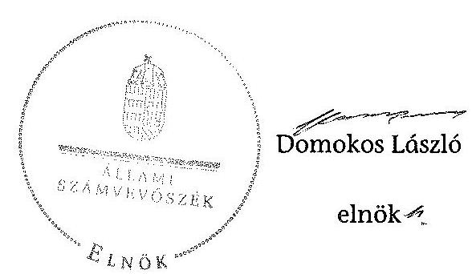
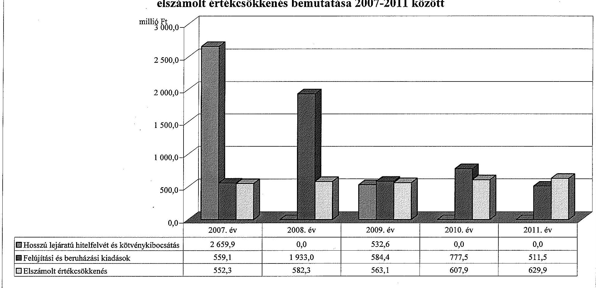
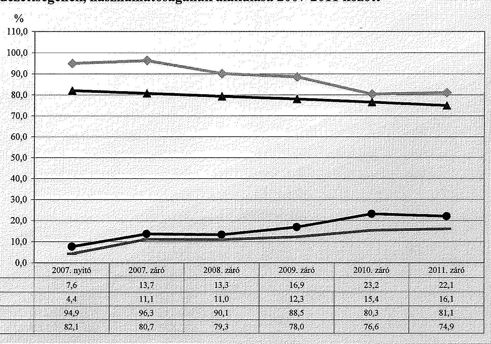
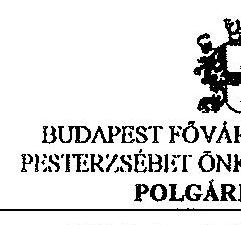
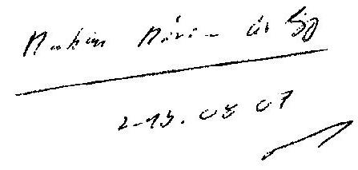
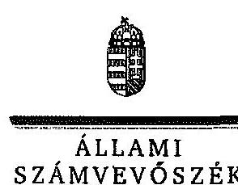
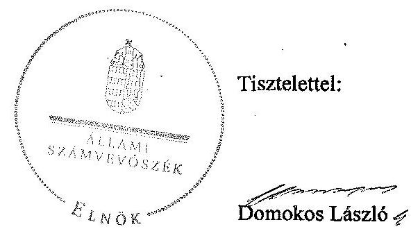

# ÁLLAMI   SZÁMVEVŐSZÉK 

## JELENTÉS

az önkormányzati vagyongazdálkodás szabályszerűségi ellenőrzéséről

Budapest Főváros XX. kerület Pesterzsébet

---

# Állami Számvevőszék 

Iktatószám: V-0043-020-005-036/2013.
Témaszám: 1082
Vizsgálat-azonosító szám: V061505
Az ellenőrzést felügyelte:
Makkai Mária
felügyeleti vezető
Az ellenőrzést vezette és az ellenőrzés végrehajtásáért felelős:
Páncsics Judit
ellenőrzésvezető
A számvevőszéki jelentés összeállításában közreműködtek:
Huszárné Borbás Melinda
számvevő
Marozsán Katalin
számvevő
Szarka Péterné
számvevő vezető főtanácsos
Az ellenőrzést végezték:
Bene István Huszárné Borbás Melinda Zakar László
számvevő számvevő számvevő tanácsos

A témához kapcsolódó eddig készített számvevőszéki jelentések:
címe
sorszáma
Jelentés a Budapest Főváros XX. kerület Pesterzsébet Önkormányzata 0572
vagyongazdálkodási rendszerének átfogó ellenőrzéséről
Jelentés Budapest Főváros XX. kerület Pesterzsébet Önkormányzata 1047
gazdálkodási rendszerének 2010. évi ellenőrzéséről

---

# TARTALOMJEGYZÉK 

BEVEZETÉS ..... 3
I. ÖSSZEGZŐ MEGÁLLAPÍTÁSOK, KÖVETKEZTETÉSEK, JAVASLATOK ..... 5
II. RÉSZLETES MEGÁLLAPÍTÁSOK ..... 11

1. A vagyongazdálkodási tevékenység szabályozottsága ..... 11
1.1. A feladatellátás formáinak meghatározása, a döntések megalapozottsága ..... 11
1.2. A vagyonnal gazdálkodó szervezetek szervezeti rendjének szabályozottsága, a kötelező szabályzatok megfelelősége ..... 12
1.3. A vagyongazdálkodás szabályozása ..... 14
1.4. A vagyonkezeléssel megbízott szervezetek beszámolási kötelezettségének szabályozása ..... 16
2. A vagyongazdálkodás szabályszerűsége ..... 17
2.1. A vagyonnyilvántartás megfelelősége ..... 17
2.2. A vagyongazdálkodást érintő gazdasági események dokumentáltsága ..... 18
2.3. A vagyongazdálkodási döntések, intézkedések szabályszerűsége ..... 19
2.4. A vagyonkezelő beszámoltatása ..... 20
2.5. A közbeszerzési eljárások alkalmazása ..... 20
3. A vagyon változását eredményező gazdasági események szabályszerűsége ..... 21
3.1. A vagyon értékének és összetételének változása ..... 21
3.2. A vagyon fenntartására kialakított rendszer működésének megfelelősége és szabályozottsága ..... 23
3.3. Hitelfelvétel, kötvénykibocsátás, garancia és kezességvállalás szabályszerűsége ..... 24
3.4. A térítés nélküli átadások szabályszerűsége ..... 25
4. A vagyongazdálkodás szabályszerűségére vonatkozó belső és külső ellenőrzések hasznosulása ..... 26
4.1. A belső ellenőrzés által tett megállapítások, javaslatok hasznosulása ..... 26
4.2. A többségi tulajdonban lévő gazdasági társaságok vagyongazdálkodásának felügyelete ..... 28
4.3. A könyvvizsgálatnak a vagyongazdálkodás szabályosságához való hozzájárulása ..... 30
4.4. A külső ellenőrző szervezetek által tett javaslatok hasznosulása ..... 30

---

# MELLÉKLETEK 

1. számú Budapest Főváros XX. kerület Pesterzsébet Önkormányzata vagyonának főbb adatai 2007. január 1-je és 2011. december 31-e között
2. számú Budapest Főváros XX. kerület Pesterzsébet Önkormányzata hosszú lejáratú hitelfelvétele és kötvénykibocsátása, felújítási és beruházási kiadásai, valamint az elszámolt értékcsökkenés bemutatása 2007-2011 között
3. számú Budapest Főváros XX. kerület Pesterzsébet Önkormányzata eladósodásának és az eszközök fedezettségének, használhatóságának alakulása 2007-2011 között
4. számú Budapest Főváros XX. kerület Pesterzsébet Önkormányzata polgármesterének észrevétele
5. számú A polgármester észrevételére adott válasz

## FÜGGELÉKEK

1. számú Rövidítések jegyzéke
2. számú Értelmező szótár

---

# JELENTÉS 

## az önkormányzati vagyongazdálkodás szabályszerűségi ellenőrzéséről

## Budapest Főváros XX. kerület Pesterzsébet

## BEVEZETÉS

Az ÁSZ kiemelten fontosnak tartja az ÁSZ tv. 5. § (4) bekezdése alapján az önkormányzatok vagyongazdálkodási tevékenységének, a vagyongazdálkodási szabályok betartásának ellenőrzését. Az ellenőrzés feladata, hogy értékelje a vagyongazdálkodással kapcsolatban a jogszabályokban, az önkormányzati belső szabályozásban előírtak érvényesülését a közpénzek felhasználásának átláthatósága, nyilvánossága érdekében. Az ÁSZ ellenőrzése nemcsak az ellenőrzött szervezet vagyongazdálkodásának hibáira, hiányosságaira mutat rá, számon kérve azok kijavítását, hanem megállapításaival, javaslataival segíti a közpénzekkel, a közvagyonnal való felelős gazdálkodást.

Az önkormányzati vagyon alapvető funkciója, hogy a helyi közérdeket és egyúttal az önkormányzati célok megvalósítását szolgálja. A feladatellátás terén elsősorban a kötelezően ellátandó feladatok végrehajtását hivatott szolgálni, amely mellett az önként vállalt feladatok ellátása is megvalósulhat.

## Az ellenőrzés célja annak értékelése volt, hogy az Önkormányzatnál:

- a vagyongazdálkodási tevékenység, annak szervezeti keretei szabályozottak-e;
- a vagyongazdálkodás törvényességét, szabályszerűségét biztosították-e, a vagyon értékének és összetételének változását jogszerű döntésekkel alátámasztották-e;
- a belső ellenőrzés elősegítette-e a vagyongazdálkodás szabályszerű működését, valamint hasznosultak-e a korábbi külső ellenőrzések által tett javaslatok.

Az ellenőrzés típusa: szabályszerűségi ellenőrzés
Az ellenőrzött időszak: Az ellenőrzés a 2007. január 1. és 2011. december 31. közötti időszakra terjedt ki. A közbeszerzési eljárások lefolytatásának ellenőrzése a 2011. évet és a 2012. év I. negyedévét érintette. Az Nvt. egyes rendelkezései végrehajtásának ellenőrzése a nemzetgazdasági szempontból kiemelt jelentőségű nemzeti vagyonnak minősülő forgalomképtelen vagyonelemek meghatározására, valamint közép- és hosszú távú vagyongazdálkodási terv készítésére terjedt ki 2012. január 1-jétől 2013. március 1-jéig, a helyszíni ellenőrzés befejezéséig.

Az ellenőrzés szakmai módszertana az ÁSZ hivatalos honlapján közzétett szakmai szabályokon alapult, amely a Legfőbb Ellenőrző Intézmények Nemzetközi Szervezete (INTOSAI) által kiadott nemzetközi standardok (ISSAI) figyelembevételével készült.

Ellenőriztük az önkormányzati vagyongazdálkodás szabályozottságát, a helyi szabályozások jogszabályi előírásoknak való megfelelőségét (önkormányzati rendeletek, szabályzatok, utasítások) és azok gyakorlati alkalmazását. A vagyonváltozásokkal kapcsolatos gazdasági események közül az ellenőrzött tételeket véletlen mintavétellel választottuk ki a Polgármesteri hivatal 2007-2011. évi számviteli nyilvántartásaiból. Az Önkormányzattól tanúsítványt kértünk a korábbi ÁSZ ellenőrzések vagyongazdálkodásra vonatkozó javaslatainak hasznosulásáról, a könyvvizsgáló és a külső ellenőrzési szervek vagyongazdálkodással kapcsolatos 2007-2011. évi javaslataira tett intézkedésekről, valamint a 2007-2011. évek térítésmentes vagyonátadásairól és átvételeiről.

A jelentéstervezetben alkalmazott rövidítéseket az 1. számú függelék, az egyes fogalmak magyarázatát a 2. számú függelék tartalmazza.

Budapest Főváros XX. kerület Pesterzsébet állandó lakosainak száma 2011. január 1-jén 64816 fő volt. Az Önkormányzat tizenhét tagú Képviselőtestületének munkáját 6 állandó bizottság segítette. Az Önkormányzat az önállóan működő és gazdálkodó Polgármesteri hivatalon felül további egy önállóan működő és gazdálkodó, valamint huszonnégy önállóan működő költségvetési szervvel látta el a feladatát. Az Önkormányzatnak négy 100%-os tulajdonában álló gazdasági társasága volt.

A polgármester az 1998. évi önkormányzati választások óta tölti be tisztségét. A jegyző 1990. év óta látja el feladatait.

Az Önkormányzatnak a 2011. évi költségvetési beszámolója szerint 9272,5 millió Ft költségvetési bevétele volt és 9365,2 millió Ft költségvetési kiadást teljesített. A 2011. december 31-ei könyvviteli mérleg szerint 24241,0 millió Ft értékű eszközvagyonnal rendelkezett, a hosszú lejáratú kötelezettségek összege 3902,0 millió Ft, a rövid lejáratú kötelezettségeké 1443,3 millió Ft volt.

A Polgármesteri hivatal 2007. január 1-jétől 2011. július 15-ig 12, 2011. július 15-től 2011. december 31-ig 13 szervezeti egységre tagolódott, a foglalkoztatott köztisztviselők száma 2011. december 31-én 186 fő, az Önkormányzat által foglalkoztatott közalkalmazottak száma 1279 fő volt.

Az ÁSZ a 2011. évi LXVI. törvény 29. §-a szerint a jelentéstervezetet megküldte Budapest Főváros XX. kerület Pesterzsébet Önkormányzata polgármesterének egyeztetésre. A beérkezett észrevételt és az arra adott választ a jelentés 4-5. számú mellékletei tartalmazzák.

---

# I. ÖSSZEGZŐ MEGÁLLAPÍTÁSOK, KÖVETKEZTETÉSEK, JAVASLATOK 

Az Önkormányzat könyvviteli mérleg szerinti vagyona a 2007. évi 22404,3 millió Ft-ról 2011-re 24241,0 millió Ft-ra, 8,2%-kal (1836,7 millió Fttal) nőtt. A vagyonnövekedést a befektetett eszközök 1763,1 millió Ft-os és a forgóeszközök 73,6 millió Ft-os növekedése okozta. A 2007-2011. években a felújításokra és beruházásokra fordított kiadások összege (4365,5 millió Ft) 48,7%-kal haladta meg az elszámolt értékcsökkenés 2935,5 millió Ft-os összegét. A beruházások, felújítások finanszírozásához 592,5 millió Ft hosszú lejáratú hitelt és 2600,0 millió Ft kötvénykibocsátásból származó forrást vettek igénybe.

Az Önkormányzat saját vagyona 2007-ről 2011-re 20435,3 millió Ft-ról 18 889,1 millió Ft-ra 7,6%-kal (1546,2 millió Ft-tal) csökkent, a saját tőke 2068,7 millió Ft-os csökkenése és a tartalékok 522,5 millió Ft-os növekedésének eredményeként. A vagyon alakulásával kapcsolatos adatokat és mutatószámokat a jelentés 1-3. számú mellékletei részletesen tartalmazzák.

A Képviselő-testület a gazdasági programban meghatározta az önkormányzati feladatok ellátásának fő irányait. Az önkormányzati SZMSZ tartalmazta a kötelező közszolgáltatási és önként vállalt feladatai ellátásának mértékét és módját. A Képviselő-testület meghatározta a vagyonnal gazdálkodó, közfeladatot ellátó költségvetési szervek alaptevékenységét, jóváhagyta az alapító okiratukat és a szervezeti és működési szabályzatukat.

Az Önkormányzatnál a vagyongazdálkodással kapcsolatos feladatokat, a feladat- és hatásköröket, valamint az eljárási rendet a vagyongazdálkodási rendeletben és helyi rendeletekben szabályozták. A vagyongazdálkodási rendelet előírásainak megfelelően a tulajdonosi jogokat a Képviselő-testület gyakorolta, ezt a jogát az önkormányzati SZMSZ-ben meghatározottak szerint átruházta a Pénzügyi bizottságra, a Gazdasági bizottságra, illetve az intézményvezetőkre. A vagyongazdálkodást érintő átruházott hatásköröket vagyontípusonként, értékhatárhoz kötve állapították meg. A vagyongazdálkodási rendelet az Áht. előírásaival összhangban tartalmazott szabályozást a vagyon tulajdonjogának ingyenes átruházására.

A Képviselő-testület az Ötv.-ben foglaltaknak eleget téve a 2007-2011. években meghatározta a törzsvagyonba tartozó forgalomképtelen és korlátozottan forgalomképes, valamint a forgalomképes vagyonának körét. A vagyongazdálkodási rendelet nem szabályozta a forgalomképesség megváltoztatásának eljárási rendjét, a meghatározott értékhatár feletti vagyontárgyak hasznosítása esetében a nyilvános versenyeztetés, pályáztatás eljárás rendjét, továbbá az értékbecslés készítésének kötelezettségét a hasznosításra szánt vagyon értékének megállapítása céljából, azonban a 2008. évtől hatályos vagyongazdálkodási rendelet már tartalmazta ezek szabályozását.

Az Önkormányzat belső szabályozási dokumentumai - az elidegenítési rendelet, a bérbeadási rendelet, a polgármester és a jegyző által kiadott szabályzatok, utasítások - a vagyongazdálkodási rendelettel összhangban voltak. A Képviselő-testület vagyonhasznosításra vonatkozó döntései összhangban voltak az Önkormányzat belső szabályozásával. A 2007-2011. években a vagyongazdálkodási rendelet az Ötv.-ben előírtak ellenére nem tartalmazta a vagyonkezelői jog részletes szabályait. (Vagyonkezelői szerződést a 2007-2011. években nem kötöttek.) A vagyonkezelői jog megszerzésének, gyakorlásának és ellenőrzésének részletes szabályait a vagyongazdálkodási rendelet tartalmazta.

A Polgármesteri hivatal számviteli politikáját és a kapcsolódó szabályzatokat a Számv. tv és az Áhsz. előírásainak megfelelően készítették el. A leltározási és leltárkészítési szabályzat 2010 novemberéig - az Áhsz.-ben előírtak ellenére - nem tartalmazta az üzemeltetésre, kezelésre átadott eszközök mennyiségi felvétellel történő leltározásának módját, idejét és nyilvántartását. Az Önkormányzat a 2007-2011. években az Áhsz.-ben előírt leltározási kötelezettségének december 31-ei fordulónappal a vagyongazdálkodási rendeletben, valamint a leltározási szabályzatban foglaltaknak megfelelően - az üzemeltetésre átadott eszközök kivételével - mennyiségi felvétellel, illetve egyeztetéssel eleget tett. Az Áhsz.-ben foglalt előírás ellenére 2010-2011-ben az üzemeltetést végző szervek hitelesített leltárt nem készítettek, az üzemeltetésre átadott eszközök mérleg szerinti értéket leltár helyett tárolási nyilatkozattal támasztották alá.

A vagyongazdálkodási döntések végrehajtása során betartották a vagyongazdálkodási rendeletben, a beszerzési szabályzatban, a bérbeadási és az elidegenítési rendeletben, valamint a képviselő-testületi határozatokban foglaltakat. A döntéshozatalok során a döntéshozók az arra felhatalmazott személyek voltak, a képviselő-testületi döntésekkel azonos tartalmú szerződéseket, megállapodásokat kötöttek. Az Önkormányzat a 2011. évben és a 2012. év 1. negyedéve között a felújítási és beruházási feladatokhoz három közbeszerzési eljárást folytatott le, a becsült érték és az egybeszámítási kötelezettség figyelembevételével a Kbt.-ben előírtaknak megfelelően.

A jegyző az Önkormányzat vagyonkimutatását a 2007-2011. években az éves költségvetésről szóló rendeletében meghatározott szerkezetben készítette el, melyet a polgármester az éves zárszámadási rendelettervezet mellékleteként benyújtott a Képviselő-testület részére. A vagyonkimutatások tartalma megfelelt az Áhsz.-ben foglalt előírásoknak, tartalmazta az Önkormányzat és intézményei saját vagyonát tételesen, törzsvagyon és törzsvagyonon kívüli, egyéb vagyon bontásban. Az Önkormányzatnál a 2007-2011. években az Ötv. előírásának megfelelően - a főkönyvi számlák alábontásával, valamint a számlákhoz kapcsolódó analitikus nyilvántartások vezetésével - biztosították a törzsvagyonnak a többi vagyontárgytól való elkülönített nyilvántartását. A Képviselőtestület 2012-ben az Önkormányzat forgalomképtelen törzsvagyonából egyetlen vagyontárgyat sem
 minősített nemzetgazdasági szempontból kiemelt jelentőségű nemzeti vagyonná.

Az Önkormányzatnál az ingatlanvagyon nyilvántartás és adatszolgáltatás rendjéről szóló kormányrendeletben foglaltak alapján a számviteli nyilvántartásban szereplő ingatlanvagyont és az ingatlanvagyon-kataszter adatait a 2008-2011. években teljes körűen egyeztették, a 2007. évben az intézményi vagyon egyeztetése nem történt meg. A 2007-2011. években a főkönyv, valamint annak adatait alátámasztó analitikus nyilvántartások és az ingatlanvagyon-

---

kataszter bruttó érték adatainak egyezősége nem állt fenn, amelyet a könyvvizsgáló a 2010-2011. évi jelentésében is megállapított. Az Önkormányzatnál az ingatlanvagyon-kataszter adatait 2005-ben egyeztették a Fővárosi Földhivatal nyilvántartásával, az eltérések rendezése 2006. januárjában megtörtént. 2006-tól az Önkormányzatnál az ingatlan valós állapotában, értékében bekövetkezett változást a földhivatali végzések alapján követték nyomon. Ez alapján azonban az ingatlanvagyon-kataszter és a földhivatali ingatlan nyilvántartás közötti teljes körű egyezőség biztosítása nem igazolható.

A jegyző az operatív gazdálkodással, és annak munkafolyamatba épített ellenőrzésével összefüggő gazdálkodási jogkörök gyakorlásának rendjét, illetve a velük kapcsolatos összeférhetetlenséget kizáró követelményeket a kötelezettségvállalási szabályzat ${ }_{1,6}$-ban határozta meg. A gazdálkodási jogkörök gyakorlása során érvényesültek az Ámr. ${ }_{1,2}$-ben rögzített összeférhetetlenségi követelmények. A Polgármesteri hivatalban a 2007-2011. években nem végezték el a folyamatba épített ellenőrzési feladatokat az arra felhatalmazott, kijelölt személyek. A 2007-2009. évek között a vagyongazdálkodás egyes területeihez kapcsolódóan - az Áht. ${ }_{1}$-ben és az Ámr. ${ }_{1}$-ben foglaltak ellenére - az ellenőrzött tételek közül tizenhat esetben, összesen 20,3 millió Ft értékű kötelezettségvállalást nem előzött meg a pénzügyi ellenjegyzés a fedezet rendelkezésre állásáról. A 2010-2011. évekre vonatkozó kötelezettségvállalási szabályzat ${ }_{5,6}$ már rögzítette, hogy a kötelezettségvállalás kizárólag ellenjegyzés után, írásban történhet az Ámr. ${ }_{2}$ előírásainak megfelelően. Ennek ellenére a 2010. évben két esetben 6,6 millió Ft értékben, a 2011. évben három esetben 5,6 millió Ft értékben a kötelezettségvállalásra nem az ellenjegyzést követően került sor. Az Ámr. ${ }_{1,2}$-ben előírt ellenőrzési feladatok elmaradása az Önkormányzatnál kiadási előirányzat túllépést nem eredményezett, a kötelezettségvállalásnak a fedezete rendelkezésre állt.

A fejlesztési feladatok finanszírozásához kapcsolódó hitelfelvételről és a kötvénykibocsátásról minden esetben a Képviselő-testület döntött. A fejlesztési célú hitelfelvétel során két esetben - a 2007. évben 55,3 millió Ft, a 2009. évben 100,6 millió Ft összegben - a Képviselő-testület a szerződésekben a hitel fedezetként az Önkormányzat költségvetését jelölte meg. Ezzel megsértették az Ötv. előírását, mivel a fedezet magában foglalta a normatív állami hozzájárulás, az állami támogatás, a személyi jövedelemadó, valamint az államháztartáson belülről működési célra átvett bevételek összegét is, amelyek hitel fedezeteként nem használhatók fel.

A Képviselő-testület a Fővárosi Vízművek Zrt. részére 2007. májusában 21,3 millió Ft értékű önkormányzati törzsvagyonba tartozó vízi közmű térítés nélküli tulajdonba adásával megsértette a vízgazdálkodásról szóló törvényben foglaltakat, mivel azokat csak használatba adhatta volna.

Az Önkormányzatnál a közérdekű adatok közzétételi kötelezettségét szabályozták. A jegyző a 2007-2011. években ezen kötelezettségének hiányosan tett eleget, mivel az Önkormányzat honlapján az Áht. ${ }_{1}$-ben és az Eisztv.-ben foglaltak ellenére - a nettó ötmillió Ft-ot elérő, vagy azt meghaladó értékű szerződések adatainak közzétételére vonatkozó kötelezettségének - a 2007. évben hat, a 2008. évben egy esetben nem tett eleget, a 2009-2011. években a közzététel megtörtént. A jegyző az Önkormányzat honlapján a 2007-2011. évi költségve-

---

tési és zárszámadási rendeleteket közzé tette, de az Eisztv.-ben és a közzétételi listákon szereplő adatok közzétételi mintájáról szóló IHM rendeletben előírtak ellenére az éves (elemi) költségvetések és a költségvetés végrehajtásáról készített beszámolók közzététele elmaradt.

A 2007-2011. években a belső ellenőrzés éves ellenőrzési tervei - a Ber. előírásaival összhangban - kockázatelemzésen alapultak. A vagyongazdálkodással kapcsolatos 20 ellenőrzés az összes belső ellenőrzés 38%-a volt. A vagyongazdálkodással kapcsolatban a belső ellenőrzés által feltárt hiányosságok kijavítására a jelentések javaslatokat fogalmaztak meg. A feltárt hiányosságok megszüntetésére az ellenőrzött szervezeteknél intézkedési tervek készültek, azok végrehajtásáról a belső ellenőrzés a beszámolók alapján, illetve utóellenőrzés keretében győződött meg. A belső ellenőrzés elősegítette a vagyongazdálkodás szabályszerű működését. A polgármester a 2007-2011. évekre vonatkozóan az Ötv.-ben előírtaknak megfelelően a Képviselő-testület elé terjesztette az Önkormányzat felügyelete alá tartozó költségvetési szervek éves ellenőrzési jelentései alapján készített éves összefoglaló jelentéseket.

Az Önkormányzat a négy 100%-os tulajdonában álló gazdasági társaságaival kötött szerződésekben előírta a feladatellátásról és a gazdasági tevékenységről szóló beszámolási kötelezettséget, melynek azok eleget tettek. A 2007-2011. évek között a TV 20 Kft., a Pesterzsébet Jégcsarnok Kft. és a Pesterzsébet Városfejlesztő Kft. esetében a Képviselő-testület nem számoltatta be a felügyelő bizottságokat. Az Integrit XX. Kft. felügyelő bizottsága a 2007-2008. évi munkájáról beszámolt a Képviselő-testületnek, de a Képviselő-testület a 2009-2011. években a felügyelő bizottsági tagokat a tulajdonosi érdekek képviseletéről már nem számoltatta be. A Képviselő-testület a 2007-2011. években garanciát és kezességet nem vállalt a többségi tulajdonában lévő gazdasági társaságok által felvett hitelhez. Az Integrit XX. Kft. a 2007. és a 2011. évben, a TV 20 Kft. a 2007. és a 2009. évben, a Pesterzsébeti Jégcsarnok Kft. a 2008. év kivételével minden évben, a Pesterzsébeti Városfejlesztő Kft. a 2009-2011. években gazdálkodott veszteségesen. A veszteségek pótlására képviselő-testületi határozatok alapján 108,5 millió Ft összegű pótbefizetést teljesítettek a gazdasági társaságok javára. A Képviselő-testület a 2008. évben a Pesterzsébeti Jégcsarnok Kft. részére 545,0 millió Ft összegű kamatmentes tagi kölcsönt nyújtott.

Az Önkormányzat 2007-2009. évi éves költségvetési beszámolóinak könyvvizsgálatáról készített könyvvizsgálói jelentések nem tartalmaztak a vagyongazdálkodására vonatkozóan javaslatokat. A könyvvizsgáló a 2010-2011. években az ingatlanoknál ellenőrizte az analitikus és a főkönyvi nyilvántartás, valamint a vagyonkataszteri nyilvántartás közötti egyezőséget és eltérést állapított meg, amely azonban nem befolyásolta a beszámoló valódiságát. A könyvvizsgáló a feltárt hiányosságok kezelésére javaslatot nem fogalmazott meg. A 2007-2011. években az Önkormányzat éves beszámolóit a könyvvizsgáló megbízhatónak és valósnak minősítette.

Az Önkormányzatnál a 2007-2011. években - az ÁSZ ellenőrzésen kívül - külső szervek a fejlesztések támogatásával kapcsolatosan végeztek ellenőrzéseket. Az ellenőrzések vagyongazdálkodással kapcsolatos javaslatokat nem fogalmaztak meg. Az ÁSZ 2010. évi ellenőrzésének a vagyongazdálkodáshoz kapcsolódóan tett tizenöt javaslata hasznosult.

---

Az Állami Számvevőszékről szóló 2011. évi LXVI. törvény 33. § (1) bekezdésében foglaltak értelmében a jelentésben foglalt megállapításokhoz kapcsolódó intézkedési tervet köteles az ellenőrzött szervezet vezetője összeállítani, és azt a jelentés kézhezvételétől számított 30 napon belül az ÁSZ részére megküldeni. Amennyiben az intézkedési tervet határidőben nem küldi meg a szervezet, vagy az nem elfogadható, az ÁSZ elnöke a hivatkozott törvény 33. § (3) bekezdés a)-b) pontjaiban foglaltakat érvényesítheti.

Az ellenőrzés intézkedést igénylő megállapításai és javaslatai:

# a Polgármesternek 

1. Az Önkormányzat a Fővárosi Vízművek Zrt.-nek 2007. májusában térítés nélkül tulajdonba átadta az önkormányzati törzsvagyonba tartozó vízi közművagyont. Az Önkormányzat megsértette a vízgazdálkodásról szóló 1995. évi LVII. törvény 10. § (1) bekezdésében foglaltakat, mivel a vízi közművagyont csak használatba adhatta volna.

Javaslat:
Vizsgálja meg a Fővárosi Vízművek Zrt.-vel kötött térítésmentes vagyonátadások szerződését és tegyen intézkedést arra, hogy a vízi közművek visszakerüljenek az Önkormányzat tulajdonába és a Képviselő-testület döntése alapján a vízgazdálkodásról szóló 1995. évi LVII. törvény 10. § (1) bekezdésében előírtaknak megfelelően adják használatba. Indokolt esetben kezdeményezzen felelősségre vonást.

## a jegyzőnek

1. Az üzemeltetésre átadott eszközök könyvviteli mérlegben szereplő értékeit az üzemeltető által hitelesített leltárral nem támasztották alá.

Javaslat:
Intézkedjen, hogy az Áhsz. 37. § (4) bekezdésében előírtaknak megfelelően a könyvviteli mérleg alátámasztásához az üzemeltetésre átadott eszközökről az üzemeltetők által évente elkészített és hitelesített leltárak álljanak rendelkezésre.
2. A 147/1992. (XI. 6.) Korm. rendelet 1. § (2)-(3) bekezdéseiben foglalt előírások ellenére a 2007-2011. évek között az ingatlanvagyon kataszter és a számviteli nyilvántartások közötti, valamint az ingatlanvagyon kataszter és a földhivatali ingatlan nyilvántartás azonos tartalmú adatai között az egyezőséget nem biztosították.

Javaslat:
Intézkedjen, hogy a 147/1992. (XI. 6.) Korm. rendelet 1. § (2) bekezdésében rögzítetteknek megfelelően az ingatlanvagyon kataszter adatai egyezzenek meg a földhivatal ingatlan-nyilvántartásának azonos tartalmú adataival, továbbá az 1. § (3) bekezdésében foglaltakra figyelemmel biztosítsa az egyezőséget az ingatlanvagyon kataszter adatai és a számviteli nyilvántartás adatai között.

---

3. Az Áht. 1-ben, valamint az Ámr. 134. § (8) bekezdésében előírtak ellenére a 2007-2009. években a kötelezettségvállalást nem előzte meg az arra kijelölt személyek ellenjegyzése 16 esetben, összesen 20,3 millió Ft értékben. Az Ámr. 2 74. § (1) bekezdésében előírtakkal szemben a 2010. évben 2 esetben, 6,6 millió Ft értékben és a 2011. évben 3 esetben, 5,6 millió Ft értékben került sor kötelezettségvállalásra a kötelezettségvállalás ellenjegyzését megelőzően.

Javaslat:
Intézkedjen, hogy a pénzügyi ellenjegyző az Áht. 2 37. § (1) bekezdésében előírtak szerint a kötelezettségvállalást megelőzően győződjön meg arról, hogy a szabad előirányzat rendelkezésre áll, a tervezett kifizetési időpontokban a pénzügyi fedezet biztosított, és a kötelezettségvállalás nem sérti a gazdálkodásra vonatkozó szabályokat.
4. Az Önkormányzat a beruházási és fejlesztési célú hitelfelvétel során két esetben a szerződésekben fedezetként az Önkormányzat költségvetését jelölte meg, ezzel megsértették az Ötv. 88. § (1) bekezdés b) pontjának előírását, mivel a hitel fedezetéül a normatív állami hozzájárulásból, az állami támogatásból, a személyi jövedelemadóból származó bevételt, valamint államháztartáson belülről a működési és fejlesztési célra átvett bevételeket is felajánlották.

Javaslat:
Intézkedjen az Áht. 2 84. § (4) bekezdésével ellentétes állapot megszüntetéséről, a hitel fedezetére jogszerű ügyleti biztosíték kijelöléséről.
5. Az Eisztv. 6. § (1) bekezdéséhez rendelt mellékletben, valamint a 18/2005. (XII. 27.) IHM rendelet 2. számú mellékletének 3.2. pontjában előírtak ellenére nem tette közzé honlapján a 2007-2011. évek éves (elemi) költségvetését és a számviteli törvény szerinti költségvetési beszámolóit.

Javaslat:
Intézkedjen az információs önrendelkezési jogról és az információszabadságról szóló 2011. évi CXII. törvény 1. számú mellékletében meghatározott adatok közzétételéről.

---

# II. RÉSZLETES MEGÁLLAPÍTÁSOK 

## 1. A VAGYONGAZDÁLKODÁSI TEVÉKENYSÉG SZABÁLYOZOTTSÁGA

### 1.1. A feladatellátás formáinak meghatározása, a döntések megalapozottsága

Az Önkormányzat a 2007-2011. évekre vonatkozó gazdasági program ${ }_{1,2}$-ben, ágazati, szakmai koncepciókban, valamint a 2008. évben elfogadott ${ }^{1}$ és a 2009. évben felülvizsgált, módosított Integrált Városfejlesztési Stratégiájában határozta meg az önkormányzati feladatellátással összefüggő elképzeléseket, fő irányokat. A fejlesztési célkitűzéseknél figyelembe vették az Önkormányzat pénzügyi forrásait, a hazai és európai uniós pályázati lehetőségeket.

A Képviselő-testület az önkormányzat $\mathrm{SZMSZ}_{1,2}$-ben határozta meg kötelező közszolgáltatási és önként vállalt feladatai ellátásának mértékét és módját. Kötelező feladatait az Ötv. és az ágazati törvények figyelembevételével állapította meg, az önként vállalt feladatokat az anyagi lehetőségeinek függvényében határozta meg. Az önkormányzati $\mathrm{SZMSZ}_{1,2}$ 3. § (1)-(2) bekezdései tartalmazták azokat a feladatokat, amelyeket az Ötv. 1. § (5) bekezdésében, és a 8. § (1) és (3) bekezdéseiben, valamint a 63. § (1) bekezdésében meghatározott kötelező és önként vállalt feladatok közül ellát.

Az Önkormányzat költségvetési intézményeinek száma a 2007. január 1-jei harmincegyről 2011.
 december 31-ére huszonötre csökkent. A Képviselő-testület a közszolgáltatások ellátásához ebben az időszakban kiválás útján egy új intézmény ${ }^{2}$ létrehozásáról, az oktatási ágazatot érintően összevonásokról döntött.

Pesterzsébet Önkormányzatának Egészségügyi Intézményéből 2011. július 1-jétől kiváltak a bölcsődei telephelyek, melyek Pesterzsébet Önkormányzatának Egyesített Bölcsődei néven új, jogutódként önállóan működő költségvetési intézményként gondoskodnak a kerület bölcsődei feladatainak ellátásáról.

A Képviselő-testület a feladatellátások szervezeti formáinak módosításáról - az Ötv. 9. § (4) bekezdésében foglaltak alapján - gazdaságossági indokok figyelembevételével határozott. A feladatellátás körének, formájának módosítá-

[^0]
[^0]:    ${ }^{1}$ A Képviselő-testület a 154/2008. (V. 15.) számú határozatával elfogadta Pesterzsébet Integrált Városfejlesztési Stratégiáját és a 48/2009. (III. 12.) számú határozatával elfogadta annak módosítását.
    ${ }^{2}$ A Képviselő-testület a 31/2011. (I. 27.) számú határozatával döntött arról, hogy a bölcsődei ellátást 2011. július 1-jétől újonnan létrehozott, önállóan működő költségvetési szerv működtetésével biztosítja.

---

sánál a megalapozott döntés meghozatala érdekében az előterjesztésekben ${ }^{3}$ alternatív javaslatokat bemutattak.

Az Önkormányzat feladatainak ellátásában a 2007. évben két, a 2008. évben három és a 2009-2011. években összesen négy 100%-os tulajdonban lévő gazdasági társasága vett részt.

A 2007. évben az Integrit XX. Kft., illetve a TV 20 Kft. közreműködött az önkormányzati feladatok ellátásában. A 2006. július 26-án megkötött Együttműködési Megállapodás alapján az Integrit XX. Kft. látta el az önkormányzati tulajdonú lakások és nem lakás célú helyiségek önkormányzati rendeletben meghatározott bérleti díjainak beszedésével, nyilvántartásával, valamint a hozzá kapcsolódó számlavezetési feladatok ellátásával a kizárólag önkormányzati tulajdonú, társasházzá nem alakított lakóingatlanok, vegyes tulajdonú, de kezelésre át nem adott (kényszerkezelt) társasházak ügyvitelével kapcsolatos feladatokat. Az Együttműködési Megállapodást a Képviselő-testület 35/2011. (I. 27.) számú, illetve a 126/2011. (IV. 27.) számú határozatai értelmében 2011. június 30-án közös megegyezéssel felbontották, két tevékenység (piacüzemeltetés, kényszerkezelt társasházak ügyvitele) azonban ezt követően is az Integrit XX. Kft.-nél maradt. A TV 20 Kft.-vel 2005. február 22-én megkötött vállalkozási szerződés alapján a Kft. a kerületi közszolgálati műsorszámok készítését, az Önkormányzati képviselőtestület ülések közvetítését, az ülésekről összefoglaló készítését, valamint a képújságban az Önkormányzat felhívásainak közzétételét látta el.

A gazdasági társaságok köre a 2008. évben kibővült a Pesterzsébet Jégcsarnok Kft.-vel4, majd a 2009. évben a Pesterzsébet Városfejlesztő Kft.-vel5. A Pesterzsébet Jégcsarnok Kft. 2009. évtől a Jégcsarnok Sportlétesítmény működtetési, üzemeltetési feladatait látta el. A Pesterzsébet Városfejlesztő Kft.-vel 2009. március 31-én megkötött Együttműködési megállapodás alapján az Önkormányzat megbízta a Pesterzsébet Városfejlesztő Kft.-t a város-rehabilitációs akcióterületek fejlesztésének végrehajtására, városrendezési terv kidolgozására.

# 1.2. A vagyonnal gazdálkodó szervezetek szervezeti rendjének szabályozottsága, a kötelező szabályzatok megfelelősége 

A Képviselő-testület a 2007-2011. években - az Ötv. 1. § (6) bekezdés a) pontjában foglaltaknak megfelelően - a szervezeti működési rendjét önállóan alakította ki. A Képviselő-testület az önkormányzat vagyongazdálkodási és egyéb, a vagyongazdálkodással összefüggő rendeleteiben a helyi sajátosságok figyelembe vételével meghatározta a vagyongazdálkodási feladatokat. Az Önkormányzat a hivatali SZMSZ-ben meghatározta gazdasági szervezetét.

[^0]
[^0]:    ${ }^{3}$ Az előterjesztésekkel kapcsolatos követelményeket, valamint az előterjesztések benyújtásának rendjét a hivatali SZMSZ, illetve az önkormányzati SZMSZ 25. számú melléklete tartalmazta.
    ${ }^{4}$ A Pesterzsébet Jégcsarnok Kft. 2007 decemberében került az Önkormányzat tulajdonába. A Képviselő-testület az 1/2008. (I. 24.) számú határozatával döntött a Pesterzsébeti Jégcsarnok Kft. alapító okiratának elfogadásáról.
    ${ }^{5}$ A Képviselő-testület a 47/2009. (III. 12.) számú határozatával létrehozta a 100%-os önkormányzati tulajdonú, Pesterzsébet Városfejlesztő Innovációs, Hasznosító és Szolgáltató Kft-t.

---

A Képviselő-testület - az Ötv. 9. § (3) bekezdés előírásaival összhangban - a 2007-2011. között hatályos önkormányzati SZMSZ${ }_{1,2}$-ben szabályozta a Képviselő-testületet megillető hatáskörök átruházását, meghatározta az átruházott hatáskör gyakorlásának szabályait.

A vagyonnal gazdálkodó, az önkormányzati vagyont használó közfeladatot ellátó költségvetési szervek alapító okirataiban a Képviselő-testület meghatározta e szervezetek közfeladatait, alaptevékenységét, továbbá rendelkezett a közfeladatot ellátó költségvetési szervek szervezeti és működési szabályzatának jóváhagyásáról. A közfeladatot ellátó költségvetési szervek szervezeti és működési szabályzatának jóváhagyását a Képviselő-testület az illetékes bizottságokra ruházta át ${ }^{6}$.

A Polgármesteri hivatal szervezeti felépítését, feladatait és működési folyamatait, eljárásrendjét és egyéb szabályait a polgármester hagyta jóvá. ${ }^{7}$ A hivatali SZMSZ tartalmazta az Ámr. ${ }_{2}$ 20. § (2) bekezdésének b), c), e), h), i) és k) pontjaiban ${ }^{8}$ meghatározott kötelező szabályozási elemeket. A hivatali SZMSZ-ben az alapító okirattal összhangban - feltüntették az alaptevékenységet szabályozó jogszabályok megjelölését, a szervezeti egységek közül nevesítették a gazdasági szervezetet és meghatározták a szervezeti egységek engedélyezett létszámát, az egyes munkakörökhöz rendelt helyettesítés rendjét, a Polgármesteri hivatal szervezeti ábráját.

A Polgármesteri hivatal számviteli politikáját a hozzá tartozó szabályzatokkal (pénzkezelési szabályzat, leltározási és leltárkészítési szabályzat, selejtezési szabályzat és értékelési szabályzat) együtt az Áhsz. előírásainak megfelelően készítették és fogadták el. A jegyző minden évben - a 24/2007., a 2/2008., a 7/2010., 5/2011. számú - a számviteli rendről szóló utasításában elrendelte, hogy az Önkormányzat felügyelete alá tartozó költségvetési intézmények az egységesség biztosítása érdekében hozzák összhangba a számviteli politikájukat a Polgármesteri hivatal számviteli politikájával.

A 45/2006. (II. 23.) számú képviselő-testületi határozattal módosított Együttműködési megállapodásban szabályozták az ONIGESZ ${ }^{9}$, mint önállóan működő és gazdálkodó költségvetési intézmény és a hozzárendelt önállóan működő költségvetési intézmények pénzügyi-gazdasági feladataival összefüggő mun-

[^0]
[^0]:    ${ }^{6}$ Az önkormányzati SZMSZ ${ }_{1}$ 5. számú és az önkormányzati SZMSZ ${ }_{2}$ 6. számú melléklete a Képviselő-testület bizottságokra átruházott hatásköreiről szól.
    ${ }^{7}$ A Polgármesteri hivatal működésének rendjét az önkormányzati SZMSZ ${ }_{1}$ 59. § (1) bekezdése, valamint átruházott hatáskörben a 6. számú melléklet 37. pontja értelmében, illetve az önkormányzati SZMSZ ${ }_{2}$ 61. § (1) bekezdése, továbbá átruházott hatáskörben a 7. számú melléklet 29. pontja értelmében a polgármester hagyta jóvá.
    ${ }^{8}$ 2012. január 1-jétől az Ávr. 13. § (1) bekezdése c), e), g), i) pontjai írják elő
    ${ }^{9}$ 2011. január 1-jétől az ONIGESZ nemcsak az oktatási és nevelési intézmények pénzügyi feladatait látta el, hanem hozzátartozik - a Polgármesteri hivatal kivételével - az önkormányzat valamennyi költségvetési intézménye. A Képviselő-testület a 140/2011. (IV. 21.) számú határozatával az ONIGESZ elnevezését Gazdasági Ellátó Szervezet Pesterzsébet Önkormányzata névre változtatta.

---

kamegosztás és a felelősségvállalás rendjét, azon belül előírták a befektetett eszközök analitikus nyilvántartása vezetésének feladatmegosztását.

A leltározási és leltárkészítési szabályzat 2010 novemberéig - az Áhsz. 37. § (1) és (3) bekezdéseiben előírtak ellenére - nem tartalmazta az üzemeltetésre, kezelésre átadott eszközök mennyiségi felvétellel történő leltározásának módját, idejét és nyilvántartását. Az értékelési szabályzatban nem határozták meg az értékelések ellenőrzéséért felelős munkaköröket, valamint az értékelési és ellenőrzési feladatokat nem írták elő az érintett dolgozók munkaköri leírásaiban. A selejtezési szabályzatban nem jelölték ki az üzemeltetésre átadott eszközök esetében a selejtezési és hasznosítási döntés meghozatalára jogosultak körét, a selejtezési eljárással kapcsolatos feladatokat az érintett dolgozók munkaköri leírása nem tartalmazta. A hiányosságok megszüntetésére tett intézkedések a 2010. évi ÁSZ ellenőrzés javaslatai alapján 2010 novemberétől épültek be a szabályozásba.

Az Önkormányzat - az Áhsz. 37. § (7) bekezdése szerinti lehetőséggel nem élt nem alkotott rendeletet kétévenkénti leltározásról, a költségvetési szerveinek leltározási és leltárkészítési szabályzatai az évenkénti leltározás szabályait az Áhsz. 37. § (3) bekezdésével összhangban tartalmazták (mennyiségi felvétel, egyeztetés).

# 1.3. A vagyongazdálkodás szabályozása 

A Képviselő-testület - a Htv. 138. § (1) bekezdés j) pontjában előírtaknak megfelelően - szabályozta az önkormányzati vagyonnal történő gazdálkodás szabályait és ehhez kapcsolódóan megalkotta a 2007-2011. évek közötti időszakra vonatkozóan a vagyongazdálkodási rendelet ${ }_{1,2}$-ét, amely az Önkormányzat vagyonáról, a vagyontárgyak feletti tulajdonosi jog gyakorlásáról szólt.

A vagyongazdálkodási rendelet ${ }_{1}$-ben - az Ötv. 79. § (2) bekezdésének ${ }^{10}$ megfelelően - meghatározták az önkormányzati feladatellátást biztosító törzsvagyon körét, ezen belül a korlátozottan forgalomképes és a forgalomképtelen, illetve a forgalomképes vagyon körébe tartozó vagyonelemeket.

A 2008. január 1-jétől hatályos vagyongazdálkodási rendelet ${ }_{2}$ hatálya kiterjedt az Önkormányzat tulajdonában lévő ingatlan és ingó vagyonra, valamint vagyoni értékű jogokra, továbbá a tagsági jogot megtestesítő értékpapírokra, kárpótlási jegyekre, illetve gazdasági társaságban az önkormányzatot megillető társasági részesedésekre. A törzsvagyon körébe tartozó korlátozottan forgalomképes vagyonelemeinek felsorolását a vagyongazdálkodási rendelet ${ }_{2}$ 3. §-a tartalmazta. A Képviselő-testület az Ötv. 79. § (2) bekezdésében előírtakon felül más vagyonelemet nem nyilvánított forgalomképtelennek.

A vagyongazdálkodási rendelettel ${ }_{1,2}$ összhangban voltak az Önkormányzat belső szabályozási - az elidegenítési rendelet ${ }_{1,2}$, a bérbeadási rendelet, a polgármester és a jegyző által kiadott szabályzatok, utasítások - dokumentumai. A

[^0]
[^0]:    ${ }^{10}$ 2012. január 1-jétől az Nvt. 5. §-a írja elő

---

Képviselő-testület vagyonhasznosításra vonatkozó döntései összhangban voltak az Önkormányzat belső szabályozásával. A 2007-2011. években a vagyongazdálkodási rendeletek ${ }_{1,2}$ az Ötv.-ben előírtak ellenére nem tartalmazták a vagyonkezelői jog részletes szabályait. Az Önkormányzat a 2007-2011. években vagyonkezelői szerződést nem kötött. A vagyonkezelői jog megszerzésének, gyakorlásának és ellenőrzésének részletes szabályait a 2012. május 22-től hatályos vagyongazdálkodási rendelet ${ }_{3}$ szabályozta.

A vagyongazdálkodási rendelet ${ }_{1,2}$ - az Áht. ${ }_{1}$ 108. § (1) bekezdésében ${ }^{11}$ foglalt előírásokkal összhangban - tartalmazott szabályozást a vagyon tulajdonjogának ingyenes átruházására.

Az önkormányzati vagyon tulajdonjogát, illetve használatának jogát - jogszabály eltérő rendelkezése hiányában - ingyenesen vagy kedvezményesen átruházni kizárólag írásos előterjesztés alapján a Képviselő-testület minősített többségű határozatával lehetett.

A 2005. évi ÁSZ ellenőrzés során megfogalmazott a vagyongazdálkodási rendelet módosítására tett javaslatot hasznosítva - az Áht. ${ }_{1}$ 108. § (1) bekezdése alapján - a vagyongazdálkodási rendelet ${ }_{2}$ 13. §-ának (1) bekezdésében - 2008. január 1-jétől - fő szabályként határozták meg, hogy a vagyon tulajdonjogát, ill. használatának jogát piaci értéken, versenytárgyalás útján kell értékesíteni. A vagyongazdálkodási rendelet ${ }_{2}$ 1. számú mellékletében szabályozták a meghatározott értékhatár feletti vagyontárgyak hasznosítása esetében a nyilvános versenyeztetés, pályáztatás eljárásrendjét.

A vagyongazdálkodási rendelet ${ }_{3}$-ben a hasznosításra szánt vagyon értéke megállapítása céljából értékbecslés készítésének kötelezettségét írták elő, amely szerint az önkormányzati vagyon körébe tartozó vagyontárgy értékesítésére, illetve egyéb módon történő hasznosítására és megterhelésére irányuló döntést megelőzően az adott vagyontárgy forgalmi (piaci) értékét ingatlan és ingó vagyon esetében 6 hónapnál nem régebbi forgalmi értékbecslés alapján kellett meghatározni. A forgalomképesség megváltoztatásának szabályait is a vagyongazdálkodási rendelet ${ }_{2}$ tartalmazta.

A vagyonnal való rendelkezési jog kiterjedt az elidegenítésre, az apportálásra, a bérbeadásra, a használat jogának átengedésére, az ingyenes átadásra, az értékpapírok vételére, eladására és a pénzügyi befektetésekre. A vagyongazdálkodási rendelet ${ }_{1+2}$-ben megosztották a vagyontárgyak feletti rendelkezési jogot a Képviselő-testület,
 a Pénzügyi Bizottság, a Gazdasági Bizottság és az önkormányzati intézmények vezetői között. A Képviselő-testület az önkormányzati vagyon meghatározott részének elidegenítését, megterhelését, vállalkozásba vitelét helyi népszavazáshoz nem kötötte.

A Képviselő-testület a vagyonváltozást eredményező döntések előkészítése folyamatában nem írta elő a költség-haszon elemzés készítésének kötelezettségét, a finanszírozási célú pénzügyi műveletek során a pénzügyi kockázatok (árfolyam-, kamat-, visszafizetési kockázat) felmérését, a beruházások fenntarthatóságának vizsgálatát.

A vagyongazdálkodási döntések végrehajtása során betartották a vagyongazdálkodási rendelet ${ }_{1,2}$-ben, a bérbeadási, az elidegenítési rendeletek ${ }_{1,2}$-ben és az előterjesztésekben, valamint a képviselő-testületi határozatokban foglaltakat. A döntéshozatalk során a döntéshozók az arra felhatalmazott személyek voltak, a képviselő-testületi döntésekkel azonos tartalmú szerződéseket, megállapodásokat kötöttek.

A jegyző az operatív gazdálkodással és annak munkafolyamatba épített ellenőrzésével összefüggő jogkörök - a kötelezettségvállalás, a kötelezettségvállalás ellenjegyzése, a szakmai teljesítésigazolás, az érvényesítés, az utalványozás, az utalványozás ellenjegyzése - gyakorlásának rendjét, illetve a velük kapcsolatos összeférhetetlenséget kizáró követelményeket a kötelezettségvállalási szabályzat ${ }_{3-6}$-ban határozta meg.

A Képviselő-testület a 38/2012. (II. 23.) számú határozatában úgy döntött, hogy az Önkormányzat forgalomképtelennek minősülő vagyonában nincs olyan vagyonelem, amit az Nvt. 5. § (4) bekezdése szerinti nemzetgazdasági szempontból kiemelt jelentőségű nemzeti vagyonként, forgalomképtelen törzsvagyonnak minősítene, ezért rendeletet sem alkotott erről.

Az Önkormányzatnál 2012. január 1-jét követően közép- és hosszú távú vagyongazdálkodási tervet - az Nvt. 9. § (1) bekezdésében előírtak ellenére - a helyszíni ellenőrzés befejezéséig még nem készítették el.

# 1.4. A vagyonkezeléssel megbízott szervezetek beszámolási kötelezettségének szabályozása 

Az Önkormányzat a 2007-2011. években gazdasági társaságaival az Ötv. 80/A. § előírása szerinti vagyonkezelői szerződést nem kötött, a feladat ellátásra kötött szerződések üzemeltetési, szolgáltatási szerződések voltak. Az üzemeltetési szerződésekben szabályozták a beszámolási kötelezettséget ${ }^{12}$, amelynek a gazdasági társaságok az éves beszámoló benyújtásával egyidejűleg eleget tettek. Az üzemeltetési, szolgáltatási szerződésekben azonban nem voltak garanciális elemek a szerződések teljesítésére, illetve szankciók a nem teljesítés esetére.

[^0]
[^0]:    ${ }^{12}$ A vagyongazdálkodási rendelet ${ }_{3} 25$. § (1) bekezdésének b) pontja előírta az elszámolási kötelezettség tartalmát, ideértve a vagyonnal való folyamatos, valamint a vagyonkezelői jog megszűnése következtében fennálló elszámolást.

---

# 2. A VAGYONGAZDÁLKODÁS SZABÁLYSZERŰSÉGE 

### 2.1. A vagyonnyilvántartás megfelelősége

A jegyző a 2007-2011. évek között - az Ötv. 78. § (2) bekezdése ${ }^{13}$ alapján minden évben elkészítette és - az Áht. ${ }_{1}$ 118. § (2) bekezdés 2. c) pontjában ${ }^{14}$ előírtak szerint - benyújtotta az éves zárszámadási rendelettervezet mellékleteként a vagyonkimutatást, amelyet leltárral alátámasztott.

A jegyző a vagyonkimutatást a 2007-2011. években az éves költségvetésről szóló rendeletében meghatározott szerkezetben készítette el. A vagyonkimutatások tartalma megfelelt az Áhsz. 44/A. § (1)-(2) bekezdésében foglalt előírásoknak, tartalmazta az Önkormányzat és intézményei saját vagyonát tételesen törzsvagyon és törzsvagyonon kívüli, egyéb vagyon bontásban. Az Önkormányzatnál a 2007-2011. években eleget tettek az Ötv. 78. § (2) bekezdésében foglalt előírásnak, mivel a főkönyvi számlák alábontásával, valamint a számlákhoz kapcsolódó analitikus nyilvántartások vezetésével biztosították a törzsvagyonnak a többi vagyontárgytól való elkülönített nyilvántartását.

Az Önkormányzatnál a 147/1992. (XI. 6.) Korm. rendelet 1. § (3) bekezdésének érvényesülése érdekében a számviteli nyilvántartásban szereplő ingatlanvagyont és az ingatlanvagyon-kataszter adatait a 2008-2011. években egyeztették, a 2007. évben az intézményi vagyon esetében nem történt egyeztetés. Az ellenőrzött időszakban a főkönyv, valamint annak adatait alátámasztó analitikus nyilvántartások és az ingatlanvagyon-kataszter bruttó érték adatainak egyezősége nem állt fenn, amelyet a könyvvizsgáló a 2010-2011. évi jelentésében is megállapított.

A helyszíni ellenőrzés időtartama alatt készített összesítő kimutatás szerint a számviteli nyilvántartásban szereplő ingatlanvagyon valamint az ingatlanvagyon kataszter adatai közötti eltérés a 2008. évben 155,2 millió Ft, a 2009. évben 135,6 millió Ft, a 2010. évben 175,4 millió Ft, a 2011. évben 149,0 millió Ft volt. A 2007-2010. évek között az ingatlanvagyon kataszterben szerepelt magasabb összeg a számviteli nyilvántartáshoz képest, a 2011. évben pedig a számviteli nyilvántartásban szereplő összeg volt több az ingatlanvagyon kataszterhez képest.

Az Önkormányzatnál az eltérések rendezését megkezdték, amely azonban a helyszíni ellenőrzés befejezéséig nem zárult le.

Az Önkormányzat 2005-ben egyeztette a digitális állami földmérési alaptérkép elkészítését követően átvett adatállományt az ingatlanvagyon-kataszter adataival. A Fővárosi Földhivatal által legyűjtött ingatlan listában harminchat ingatlan szerepelt, amelyeket az ingatlanvagyon-kataszter nem tartalmazott, a kataszteri lapok rögzítése 2006 januárjában megtörtént. Ezt követően az Önkormányzatnál az ingatlan valós állapotában, értékében bekövetkezett változást a földhivatali végzés alapján követték nyomon. Ez alapján azonban a tel-

[^0]
[^0]:    ${ }^{13}$ 2012. január 1-jétől az Mótv. 110. § (1)-(2) bekezdései írják elő
    ${ }^{14}$ 2012. január 1-jétől az Áht. ${ }_{2}$ 91. § (2) bekezdésének c) pontja írja elő

---

jes körű egyezőség biztosítása nem igazolható az ingatlanvagyon-kataszter és a földhivatali ingatlan nyilvántartás azonos tartalmú adatai között.

Az Önkormányzat a 2007-2011. években - az Áhsz. 37. § (1) bekezdésében előírt - leltározási kötelezettségének december 31-ei fordulónappal a vagyongazdálkodási rendelet ${ }_{1,2}$-ben, valamint a leltározási szabályzatban foglaltaknak megfelelően mennyiségi felvétellel, illetve egyeztetéssel eleget tett.

A 2010-2011. években a leltározás során figyelmen kívül hagyták az Áhsz. 37. § (4) bekezdésében ${ }^{15}$ foglaltakat, mivel az üzemeltetésre átadott eszközöket az üzemeltetést végző szervek által elkészített hitelesített leltárral nem támasztották alá. Az üzemeltetésre átadott eszközök mérleg szerinti értékét leltár helyett tárolási nyilatkozattal támasztották alá.

Az Önkormányzatnál a vagyonértékű jogok és a szellemi termékek, az ingatlanok és a kapcsolódó vagyonértékű jogok, valamint a gazdasági társaságokban lévő részesedések esetében az értékelési szabályzat szerint a 2007-2011. években nem éltek - az Áhsz. 34. § (12)-(14) bekezdései szerinti - a piaci értékelés lehetőségével.

# 2.2. A vagyongazdálkodást érintő gazdasági események dokumentáltsága 

A gazdálkodási jogkörök gyakorlását, a kötelezettségvállalást, a kötelezettségvállalás ellenjegyzését, az érvényesítést, az utalványozást és az utalványozás ellenjegyzését az arra írásban felhatalmazást kapott, illetve kijelölt személyek gyakorolták, az Ámr. ${ }_{1}$ 134. § (1) bekezdésének, az Ámr. ${ }_{2}$ 72. §-ának, a Polgármesteri hivatal kötelezettségvállalási szabályzat ${ }_{1,4}$-nak megfelelően.

A Polgármesteri hivatalban, a 2007-2011. években a bizonylatok aláírása előtt nem végezték el a tevékenységre előírt (folyamatba épített) ellenőrzési feladatokat az arra felhatalmazott, kijelölt személyek. 2007-2009 között az Áht. ${ }^{16}$ valamint az Ámr. ${ }_{1}$ 134. § (8) bekezdésében előírtak ellenére az arra kijelölt személy ellenjegyzése nem előzte meg tizenhat esetben, összesen 20,3 millió Ft értékű kötelezettségvállalást, így a kötelezettségvállalásra a fedezet rendelkezésre állásáról való meggyőződés hiányában került sor. A 2010-2011. évekre vonatkozó kötelezettségvállalási szabályzat ${ }_{5,6}$ már rögzítette, hogy a kötelezettségvállalás kizárólag ellenjegyzés után, írásban történhet az Ámr. ${ }_{2}$ 74. § (1) bekezdésének ${ }^{17}$ megfelelően. Ennek ellenére a 2010. évben két esetben 6,6 millió Ft értékben, a 2011. évben három esetben 5,6 millió Ft értékben a kötelezettségvállalásra nem az ellenjegyzést követően került sor. Az Ámr. ${ }_{1,2}$-ben előírt ellenőrzési feladatok elmaradása az Önkor-

[^0]
[^0]:    ${ }^{15}$ megállapította a 317/2009. (XII. 29.) Korm. rendelet 18. §-a, először a 2010. évről készített beszámolókra kellett alkalmazni
    ${ }^{16}$ a 2007-2008. években az Áht. ${ }_{1}$ 98. § (2) bekezdése, a 2009. évben a 100/B. § (3) bekezdése, 2010. augusztus 15-től a 100/C. § (3) bekezdése, 2012. január 1-jétől az Áht. ${ }_{2}$ 37. § (1) bekezdése írta elő
    ${ }^{17}$ 2012. január 1-jétől az Ávr. 55. § (1) bekezdése írja elő

---

mányzatnál kiadási előirányzat túllépést nem eredményezett, a kötelezettségvállalás fedezete rendelkezésre állt.

A jegyző az Áht. ${ }_{1}$ 15/A. § (1) bekezdésében ${ }^{18}$ és az Eisztv. 21. § (3) bekezdésében foglaltaknak megfelelően a 2007-2011. években közzétette az önkormányzat által nyújtott, nem normatív, céljellegű, működési és fejlesztési támogatások kedvezményezettjeinek nevét, a támogatás célját, összegét, a támogatási program megvalósítási helyét. A jegyző az Önkormányzat honlapján a 2007-2011. évi költségvetési és zárszámadási rendeleteket közzé tette, de az Eisztv. 1. számú mellékletében ${ }^{19}$ és a 18/2005. (XII. 27.) IHM rendelet 2. számú melléklete 3.2. pontjában előírt közzétételi kötelezettségének teljes körűen nem tett eleget, mert gazdálkodási adatok közül az éves (elemi) költségvetések és a költségvetés végrehajtásáról készített beszámolók közzététele elmaradt.

A jegyző a 2007. évben hat, a 2008. évben egy esetben az Áht. ${ }_{1}$ 15/B. § (1) bekezdésében foglaltak ellenére a nettó ötmillió Ft-ot elérő, vagy azt meghaladó értékű szerződések adatainak közzétételére vonatkozó kötelezettségének nem tett eleget, de a 2009-2011. években közzétette a nettó ötmillió Ft-ot elérő, vagy azt meghaladó értékű szerződések adatait az Önkormányzat hivatalos honlapján.

# 2.3. A vagyongazdálkodási döntések, intézkedések szabályszerűsége 

Az Önkormányzatnál a vagyongazdálkodási döntések végrehajtása során betartották a vagyongazdálkodási rendelet ${ }_{1,2}$-ben, a beszerzési szabályzat ${ }_{1-4}$-ben, a bérbeadási és az elidegenítési rendelet ${ }_{1,2}$-ben, valamint a képviselőtestületi határozatokban foglaltakat. A vagyonhasznosítása során eleget tettek az előírt versenyeztetési kötelezettségeknek.

Az ellenőrzött időszakban a döntések előkészítése szakaszában az uniós támogatással megvalósuló beruházásokkal létrejövő létesítmények fenntarthatóságának vizsgálatát az Önkormányzat nem szabályozta. Az európai uniós finanszírozással megvalósult építési beruházások előkészítése során az Önkormányzat a pályázatához kötelezően csatolt költség-haszon elemzésben vizsgálta a beruházással létrehozott létesítmény fenntarthatóságát.

A vagyonváltozáshoz kapcsolódó döntéshozatalk során a döntéshozók az arra felhatalmazott személyek voltak. A vagyonváltozásokról hozott képviselőtestületi döntésekkel azonos tartalmú szerződéseket, megállapodásokat kötöttek.

A Képviselő-testület a 125/2011. (IV. 21.) számú határozatában döntött három gépjármű beszerzéséről. A közbeszerzési eljárás nyertes ajánlattevőjével a szerződés megkötésére 2011. június 3-án került sor. A beszerzett járművekből két db gépjárművet a Polgármesteri hivatal részére, egy db gépjárművet a XX. és XXIII. kerületi Rendőrkapitányság részére adtak használatba. A Képviselő-testület a

[^0]
[^0]:    ${ }^{18}$ 2012. január 1-jétől az Info tv. 1. számú melléklete írja elő
    ${ }^{19}$ 2012. január 1-jétől az Info tv. 1. számú melléklete írja elő

---

368/2011. (XI. 10.) számú határozatával a polgármester megbízatásának idejére személyi használatba adta az egyik új személygépjárművet.

A Polgármesteri hivatal használatában lévő, 2003. évben vásárolt két db gépjármű közül az egyik gépjármű értékesítésére a Képviselő-testület a 368/2011. (XI. 10.) számú határozatban felhatalmazta a polgármestert. A Képviselő-testület a 18/2012. (I. 26.) számú határozattal a másik gépjármű tulajdonjogát a Pesterzsébeti Szociális Foglalkoztató részére térítésmentesen átadta.

A vagyongazdálkodási rendelet ${ }_{2}$-ben a hasznosításra szánt vagyon értéke megállapítása céljából értékbecslés készítésének kötelezettségét írták elő. A vagyonhasznosítási és vagyonértékesítési szerződésekbe az Önkormányzat érdekeit védő garanciákat beépítették.

Az adásvételi szerződésekben a tulajdonjog bejegyzésének feltételeként a teljes vételár kifizetését határozták meg. A
 bérleti szerződésekben a bérleti díj késedelmes fizetése vagy meg nem fizetése esetén a bérleti jogviszony felmondását írták elő.

Az Áht., 50/A. § (4) bekezdése szerint a helyi önkormányzati képviselők és polgármesterek általános választását megelőző 30 nappal a polgármester részletes jelentést tett közzé a helyi önkormányzat vagyoni és pénzügyi helyzetéről, valamint a Képviselő-testület megalakulását követően keletkezett, a későbbi éveket terhelő pénzügyi kötelezettségekről.

# 2.4. A vagyonkezelő beszámoltatása 

Az Önkormányzat gazdasági társaságai közül az önkormányzati vagyont üzemeltetői feladatokat ellátók $^{20}$ 2007-2011. évekre vonatkozó beszámolóit a Pénzügyi bizottság megtárgyalta és beterjesztette a Képviselő-testület elé, amelyeket a Képviselő-testület elfogadott.

### 2.5. A közbeszerzési eljárások alkalmazása

Az Önkormányzat a 2011. évben, illetve a 2012. év I. negyedévében összesen három beruházási és felújítási feladathoz lefolytatta a közbeszerzési eljárásokat, amelyek megfeleltek a Kbt. $^{1,2}$ előírásainak. A lefolytatott közbeszerzési eljárások - a Kbt., 251. § (2) bekezdése alapján - a nemzeti értékhatárt elérő értékű, általános egyszerű (hirdetmény közzététele nélkül induló tárgyalásos) közbeszerzési eljárások voltak. A közbeszerzéssel kapcsolatos felelősségi rendet a belső szabályzatban munkakörre lebontottan írták elő.

A Képviselő-testület a Stromfeld Aurél Általános iskola új tornacsarnokába berendezések, felszerelések beszerzéséről döntött. A nyertes ajánlattevő nettó ajánlati ára 11,9 millió Ft volt. A közbeszerzési terv 3 db új Skoda márkájú személygépkocsi beszerzését tartalmazta. A lefolytatott közbeszerzési eljárás eredményes volt, a nyertes ajánlattevő bruttó ajánlata 17,6 millió Ft (nettó 14,4 millió Ft) volt. A Budapest XX. kerület Fiume utcai útépítéssel kapcsolatos beruházást is tartalmazta a közbeszerzési terv. A közbeszerzési eljárás eredményes volt. A 3 ajánlat közül

[^0]
[^0]:    $^{20}$ Integrit XX. Kft., a Pesterzsébet Jégcsarnok Kft.

---

az egyik, a határidő lejárta után benyújtott ajánlat miatt érvénytelennek bizonyult. A nyertes ajánlat nettó összege 39,2 millió Ft volt.

Az ÁSZ a KMOP-5.1.1/C-2f-2009-0002 „Legyünk együtt, tegyünk együtt" pályázat keretében megvalósuló a Budapest XX. kerület (Lajtha L. u. - János u. - Török Flóris u. - Határ út által határolt közterületen foglalkoztató épületet is magába foglaló) „Máltai játszótér" építés részeként megvalósuló játszóház és játszótér beruházás közbeszerzési eljárását ellenőrizte.

Az ajánlattételi felhívás a Közbeszerzési Értesítő 2010. június 14-ei számában jelent meg (azonosító: KÉ-14342/2010.) Az ajánlattételi felhívásra beérkezett 4 db ajánlat bontására 2010. július 5-én került sor. A bírálóbizottság javaslatára a döntéshozó (polgármester) egy ajánlatot érvénytelennek nyilvánított. Nyertes ajánlattevőnek a Multiway Kft.-t, a nyertes ajánlatot követő legkedvezőbb ajánlatot tevőnek pedig a Ketten Egyért konzorciumot képviselő Fito System Kft.-t hirdette ki. A Multiway Kft. azonban határidőn belül a kizáró okokra vonatkozó igazolásokat csak részben nyújtotta be, ezért ajánlata érvénytelen lett. A Ketten Egyért konzorciumot képviselő Fito System Kft. a hiányzó igazolásokat határidőn belül benyújtotta, így az ajánlatkérő vele kötötte meg a vállalkozási szerződést 2010. augusztus 13-án.

A lefolytatott közbeszerzési eljárás - a Kbt. $^{1}$ 251. § (2) bekezdése alapján - a nemzeti értékhatárt elérő értékű, általános egyszerű (hirdetmény közzététele nélkül induló tárgyalásos) közbeszerzési eljárás volt. A beruházás teljes becsült értéke (nettó 115,0 millió Ft) meghaladta a nemzeti értékhatárt. A 2010. évi nemzeti értékhatár - a Kbt. $^{1}$ 258. § (1) bekezdése alapján - építési beruházás esetében 100 millió Ft volt. A beruházás tényleges bekerülési összege 143,6 millió Ft lett, egyezően az üzembe helyezési okmány és a pénzforgalmi analitika adataival.

A Máltai játszótér átadása (üzembe helyezési okmányának dátuma) 2010. december 2-án megtörtént, az állományba vételi bizonylat dátuma 2010. december 6-a volt. Az ingatlankataszterbe 170269/16 helyrajzi számú azonosítóval a beruházás átvezetése megtörtént, az a 2010-2011. évi vagyonleltárban fellelhető.

Az Önkormányzatnál az ellenőrzött közbeszerzési eljárások esetében az egybeszámítási kötelezettségnek és a becsült érték alapján történt kiválasztás tekintetében a Kbt. $^{1,2}$-ben előírtaknak megfelelően jártak el.

# 3. A VAGYON VÁLTOZÁSÁT EREDMÉNYEZŐ GAZDASÁGI ESEMÉNYEK SZABÁLYSZERŰSÉGE 

### 3.1. A vagyon értékének és összetételének változása

Az Önkormányzat könyvviteli mérleg szerinti vagyona a 2007. évi 22 404,3 millió Ft-os nyitó értékről 2011. év végére 24 241,0 millió Ft-ra (8,2%-kal) növekedett.

Az Önkormányzat a 2007-2011. években a költségvetési beszámolók adatai szerint 4365,5 millió Ft-ot fordított beruházásra és felújításra. Az ellenőrzött időszakon belül a 2008. évben kiemelkedő (1933,0 millió Ft) volt a beruházások és felújítások összege.

---

A 2008. évben megvalósult legjelentősebb beruházások és felújítások a következők voltak: az iskolai tanuszoda beruházása (683,6 millió Ft), szilárd burkolatú utak építése (288,9 millió Ft), valamint a Vörösmarty Mihály Általános Iskola életveszély elhárítása érdekében végzett felújítás (245,7 millió Ft).

A befektetett eszközök jelentős részét (2011. évben 93,0%-át) az ingatlanok és a kapcsolódó vagyoni értékű jogok alkották. Az ingatlanok és a kapcsolódó vagyoni értékű jogok aránya a befektetett eszközök összértékéhez képest a 2007. évi 93,9%-ról (21530,0 millió Ft-ból 20211,7 millió Ft) a 2011. évi 93%-ra (23 293,1 millió Ft-ból 21674,1 millió Ft) csökkent. A mérlegérték a 2007. évihez képest 7,2%-kal (20 211,7 millió Ft-ról 21674,1 millió Ft-ra) emelkedett.

Koncesszióba adott eszközökkel az Önkormányzat nem rendelkezett. A kezelésre, üzemeltetésre átadott eszközök aránya a befektetett eszközökhöz viszonyítva nem volt jelentős (egyik évben sem érte el az 0,9%-ot).

A 2008-2009. évek üzemeltetésre, kezelésre átadott eszközök mérlegérték növekedését nem új vagyonelemek üzemeltetésre történő átadása eredményezte, hanem a 2005. évben átadott eszközök $^{21}$ kerültek jelentős késéssel az Önkormányzat könyveiben átvezetésre.

A számlarendben és a számviteli politika $^{1,2}$-ben rögzítették, hogy az üzemeltetésre kezelésre átadott eszközök állományváltozásának könyvelését negyedéves zárlati feladatok során kell elvégezni, amelyet a 2005. évben nem hajtottak végre. A 2005. évben átadott eszközöknek a Polgármesteri hivatal könyveiben történő rendezése a 2008. és a 2009. évben történt meg, a 2008. évben 160,1 millió Ft bruttó értékű ingatlan, a 2009. évben szakértői értékbecslést követően 3,0 millió Ft bruttó értékű ingatlan (két darab stég) került az üzemeltetésre átadott eszközök között kimutatásra.

Az önkormányzati körön kívülről történt térítésmentes vagyon átvételek szabályosan, a vagyongazdálkodási rendelet $^{2}$ 11. § (1)-(4) bekezdéseiben foglaltak betartásával történtek meg.

Az Auchan Kft-től a Képviselő-testület 335/2007. (X. 25.) számú határozata alapján 84,9 millió Ft összegű út (körforgalom), valamint a Kincstári Vagyon Igazgatóságtól a 400/2006. (XII. 7.) számú határozat alapján 62,4 millió Ft bruttó értékű ingatlant vett át az Önkormányzat.

A pénzügyi befektetések aránya a befektetett eszközökön belül a 2007-2011. évek között 0,6%-ról 4,3%-ra emelkedett, a mérlegérték növekedése 866,3 millió Ft volt, amelyből 652,6 millió Ft-ot a tartósan adott kölcsönök emelkedése okozott. A kölcsönökön belül a legjelentősebb tétel 2011. év végén a Pesterzsébet Jégcsarnok Kft. 520,0 millió Ft-os tartozása, amely a 2008. évben kötött 545,0 millió Ft-os kamatmentes tagi kölcsön szerződésből állt fenn.

A Pesterzsébet Jégcsarnok Kft. a törlesztést nem teljesítette a szerződésben foglaltaknak megfelelően. A Képviselő-testület a 150/2010. (VII. 8.) számú határozatá-

[^0]
[^0]:    $^{21}$ Az Önkormányzat az Integrit XX. Kft.-nek 2005. június 13-án szerződéssel üzemeltetésre átadta a 170021 és a 17002 helyrajzi számú ingatlanokat.

---

val a tagi kölcsön törlesztésére haladékot adott (azt 2013. június hónaptól kezdődően kell visszafizetnie a Kft.-nek).

Az ellenőrzött időszakban a pénzügyi befektetések összegét növelte az Önkormányzat által - képviselő-testületi határozatok alapján - teljesített 108,5 millió Ft összegű pótbefizetés a 100%-os tulajdonú társaságai javára.

Az Önkormányzat könyvviteli mérleg szerinti forrásai a 2007. évről a 2011. évre kedvezőtlen folyamatot mutattak, mert a saját vagyona 1546,2 millió Ft-tal csökkent, míg a kötelezettségei 3382,9 millió Ft-tal nőttek.

A tartalékok a 2007. évi 146,5 millió Ft nyitó összegről a 2011. évre 668,9 millió Ft-ra növekedtek a kötvénykibocsátásból még rendelkezésre álló pénzeszközök eredményeképpen. A tartalékokban a 2007. év végi állományi értékhez képest jelentős - 1560,8 millió Ft-os - csökkenés következett be a 2008. évben a pénzkészlet 1530,7 millió Ft-os csökkenése miatt.

# Az ellenőrzött időszakban a hosszú lejáratú kötelezettségek közel a négyszeresükre (2925,7 millió Ft-tal), a rövid lejáratú kötelezettségek pedig a kétszeresükre (706,9 millió Ft-tal) emelkedtek. 

A hosszú lejáratú kötelezettség növekedésében meghatározó volt a 2007. évi 2600,0 millió Ft-os svájci frank alapú kötvénykibocsátás és a 2009. évi 532,6 millió Ft összegű fejlesztési hitelfelvétel. A kötvénykibocsátással kapcsolatos kötelezettség a svájci frank árfolyam növekedése $^{22}$ miatt folyamatosan nőtt. A kötvénykibocsátásból származó hosszú lejáratú kötelezettség összege a 2011. év végén 858,1 millió Ft-tal meghaladta a kibocsátáskori összeget.

### 3.2. A vagyon fenntartására kialakított rendszer működésének megfelelősége és szabályozottsága

Az Önkormányzat költségvetési szerveinek számviteli politikája - az Áhsz. 30. § (1)-(9) bekezdései szerint - rendelkezett az eszközök értékcsökkenésének elszámolásáról.

Az Önkormányzat az eszközállománya után a 2007-2011. évek között 2935,4 millió Ft összegű értékcsökkenést számolt el. Az eszközök felújítására 1104,1 millió Ft-ot, beruházásokra 3261,4 millió Ft-ot fordított. A felújítás és beruházás értéke együttesen az értékcsökkenést meghaladó volt. Ennek köszönhetően a befektetett eszközök nettó értéke a 2007. évi (nyitó) 21 530,0 millió Ft-ról 2011. évre 23 293,1 millió Ft-ra (8,2%-kal) emelkedett.

Az eszközök használhatósági foka csökkent, a 2007. évi 82,1%-ról 74,9%-ra, azaz az eszközök avultsága 7,2 százalékponttal növekedett. A kedvezőtlen folyamat fő okozója, hogy a 2011. évben az eszközök értékét növelő felújít-

[^0]
[^0]:    $^{22}$ A kötvény kibocsátásakor a svájci frank árfolyama 156,6 Ft volt, év végi értékeléskor a svájci frank árfolyama 2010-ben 222,22 Ft, 2011-ben 257,88 Ft volt.

---

ás és beruházás összege az elszámolt értékcsökkenéstől elmaradt (118,4 millió Ft-tal).

A Képviselő-testületnek előterjesztett éves zárszámadási rendelet tervezetekben nem elemezték az eszközök elhasználódási fokának alakulását, de a rendelet tervezethez csatolt mellékletek tartalmazták az elszámolt értékcsökkenés összegét.

# 3.3. Hitelfelvétel, kötvénykibocsátás, garancia és kezességvállalás szabályszerűsége 

Az Önkormányzatnál a Képviselő-testület döntése alapján - az Ötv. 10. § (1) bekezdés d) pontjában előírtakat betartva - történtek meg a beruházásokhoz, fejlesztésekhez kapcsolódó hitelfelvételek és a kötvénykibocsátás.

Az Önkormányzat a 2006. évben a „Sikeres Magyarországért" Önkormányzati Infrastruktúra Fejlesztési Program Panel Plusz Hitelprogramja keretében (I. ütem) kedvezményes kamatozású forinthitel keretszerződést kötött 104,6 millió Ft összegben. Szerződésmódosításra 2009. februárjában került sor, amelyben a hitelkeret összege a ténylegesen igénybe vett 100,6 millió Ft-ra módosult. A módosítás nem érintette az eredeti hitelszerződés fedezetre vonatkozó pontját.

Az Önkormányzat 2007-ben a „Sikeres Magyarországért" Önkormányzati Infrastruktúra Fejlesztési Program Panel Plusz Hitelprogramja (II. ütem) keretében kedvezményes kamatozású, 55,3 millió Ft-os forinthitel keretre kötött szerződést. A hitelkeret a társasházak energiatakarékos felújításához önkormányzati önrész biztosítását szolgálta, a hitelkeretből 25,3 millió Ft-ot vettek igénybe.

A szerződésekben fedezetként az Önkormányzat költségvetését jelölték meg. Az Önkormányzatnál ezzel megsértették az Ötv. 88. § (1) bekezdés b) pontjában $^{23}$ foglaltakat, mivel a fedezetként megjelölt költségvetés magába foglalja a normatív
 állami hozzájárulás, az állami támogatás, a személyi jövedelemadó, valamint az államháztartáson belülről működési célra átvett bevételek összegét is, amelyek hitel fedezeteként nem használhatók fel.

Az Önkormányzat a hitelei kiváltására - a Panel Plusz hitelek kivételével - és jövőbeni pályázatai önrészének biztosítása érdekében 2007. december 5-én 2600,0 millió Ft névértékű svájci frank alapú (16602810 CHF) kötvényt („Pesterzsébet 2022") bocsátott ki, 15 éves futamidővel.

A fizetendő kamat változó, negyedéves időközű, 3 havi CHF LIBOR ${ }^{24}+0,07\%$ mértékű. A tőketörlesztés türelmi ideje 3 év, az első törlesztés a 2010. évben az utolsó a 2022. évben esedékes.

[^0]
[^0]:    ${ }^{23}$ 2013. január 1-jétől az Áht. ${ }_{2}$ 84. § (4) bekezdése írja elő
    ${ }^{24}$ LIBOR: a London Interbank Offered Rate (londoni bankközi kamatláb) egy kamatláb, amelyet a bankok számolnak fel egymásnak a londoni bankközi piacon az általuk nyújtott hitelek után. CHF LIBOR: kamatláb svájci frankban nyújtott hitelek után a londoni bankközi piacon.

---

A kötvénykibocsátásnál a változó kamatozás miatt kamatkockázat és a svájci frank-forint árfolyam ingadozása miatt árfolyamkockázata állt fenn.

A képviselő-testületi előterjesztésben szerepelt, hogy a kötvény kamatfeltételei kedvezőbbek voltak a forintalapú célhitelnél és a MFB Zrt. által refinanszírozott hiteleknél, előnyösebb kondíciókat csupán az államilag támogatott hitelek nyújtanak. Továbbá, hogy a kötvény kibocsátás bevételéből kiváltandó hiteleknél kedvezőbb a kötvény kamatkiadása.

A kötvényhez kapcsolódó fizetési kötelezettség fedezetének forrásait - a normatív állami hozzájárulás, az állami támogatás, a személyi jövedelemadó, valamint az államháztartás keretében átcsoportosított, illetve működési célú támogatási értékű bevételek kivételével - az önkormányzat költségvetése tartalmazta.

Az Önkormányzat 2006. július 14-én kötött beruházási célú, alap- és kötelező feladatok ellátásának finanszírozására 550,0 millió Ft-os fejlesztési célú hitelkeret szerződést. Az Önkormányzat a hitel felhasználását a szerződésben meghatározott hitelcélok alapján az uszoda beruházása kapcsán hívta le 2009. május 25-én. Az Önkormányzat az uszoda létrehozására 900,5 millió Ft-ot fordított a 2006-2009. években. A beruházásra a költségvetéstől kapott címzett támogatás összege 367,9 millió Ft volt. A hitel lehívása a fennmaradó összegnek megfelelő volt 532,6 millió Ft. A fejlesztési célú hitelhez kapcsolódó fizetési kötelezettség fedezetére vonatkozóan az Önkormányzat betartotta az Ötv. 88. § (1) bekezdés b) pontjának előírását.

Az előterjesztés bemutatta a hitel igénybevételének előnyeit, hátrányait és egy esetleges másik (új) hitel felvételének hátrányait, számításokkal alátámasztottan. Az előterjesztés alapján a 2009. évi hitelkondíciókhoz képest ez a 2006 júliusában kötött hitelkeret a legkedvezőbb kondíciójú (3 havi EURIBOR ${ }^{25}+1,63\%$ kamat) volt. A képviselő-testületi előterjesztés tartalmazta, hogy a tanuszoda kivitelezését a kötvényből már kiegyenlítették, így a hitel egy „tartalék-alap" létrehozását (betétként történő lekötését) szolgálná, amelyet a pályázati támogatások előfinanszírozására használnak fel. A hitel lehívását követően a kötvény betétszámlára az összeg átutalása megtörtént.

A Képviselő-testület az - Ötv. 88. § (2)-(3) bekezdéseiben előírt - felső korlát betartásával döntött a hitelek felvételéről és a kötvények kibocsátásáról, az adósságot keletkeztető éves kötelezettségvállalással a korrigált saját bevételét nem lépte túl.

A 2011. év végén 440,0 millió Ft fel nem használt, kötvény számlán lekötött betétként elhelyezett összeg volt. Az Önkormányzat a lekötött betétben tartott forrásait a jövőbeni pályázatai önrészének biztosítására különítette el.

# 3.4. A térítés nélküli átadások szabályszerűsége 

Az Önkormányzatnál a 2007-2011. évek között tizennégy alkalommal 77,9 millió Ft összegben történt térítés nélküli tárgyi eszköz átadás önkormány-

[^0]
[^0]:    ${ }^{25}$ EURIBOR: Euro Inter-Bank Offered Rate (Európai irányadó bankközi kamatláb)

---

zati körön kívülre. Ebből öt esetben, 34,2 millió Ft összegben az Önkormányzat által korábban a 2005-2006. években átadott eszközök kivezetése az Önkormányzat könyveiből csak a 2007. évben történt meg.

A Képviselő-testület a 255/2006. (IX. 21.) számú határozatában hozzájárult az elkészült víz-, gázvezeték és közvilágítás bővítések térítésmentes átadásához a közművet üzemeltető társaságok (Fővárosi Vízművek Zrt., Főgáz Zrt., Dísz és Közvilágítás Kft.) részére. A térítésmentes átadásokról egyedi képviselő-testületi határozatokat nem hoztak.

A Képviselő-testület a Fővárosi Vízművek Zrt. részére 2007 májusában történt 21,3 millió Ft értékű térítés nélküli átadással, az önkormányzati törzsvagyon tulajdonba adásával megsértette a vízgazdálkodásról szóló 1995. évi LVII. törvény 10. § (1) bekezdésében, illetve a 6. § (3) bekezdésében foglaltakat, mivel azokat csak használatba adhatta volna.

A 2007-2011. években az önkormányzati körön kívülre történt térítés nélküli átadások egy kivétellel a vagyongazdálkodási rendelet ${ }_{1,2}$-ben rögzítetteknek megfelelően történtek, azokat a tárgynegyedévben a nyilvántartásokból szabályosan kivezették.

A 2011. évben egy mobiltelefont (15 ezer Ft bruttó értékben) térítés nélkül adtak át - a hivatali mobiltelefon használat eljárási rendjéről szóló 5/2006. számú polgármesteri-jegyzői együttes utasítás alapján - egy nyugállományba vonuló munkavállalónak.

A tanúsítványokban bemutatott térítésmentes vagyonátadások egyezősége nem állt fenn a beszámoló 38. űrlapján kimutatott összeggel a 2007., a 2008. és 2011. években. A jegyző tájékoztatása szerint a 2007. évi eltérés (156,1 millió Ft) a Polgármesteri hivatalnál volt kimutatható, amely a 38-as űrlap más soraiban, nem megfelelően szerepelt. A 2008. és a 2011. évek eltéréseinek oka az volt, hogy az előző évi befejezetlen beruházások aktiválás előtt átadásra kerültek az Önkormányzat intézményeinek (térítés nélküli átadással), így a 38-as űrlap nyitó adata még nem tartalmazta azokat.

# 4. A VAGYONGAZDÁLKODÁS SZABÁLYSZERŰSÉGÉRE VONATKOZÓ BELSŐ ÉS KÜLSŐ ELLENŐRZÉSEK HASZNOSULÁSA 

### 4.1. A belső ellenőrzés által tett megállapítások, javaslatok hasznosulása

A belső ellenőrzési feladatok ellátására a Polgármesteri hivatalon belül önálló szervezeti egységet, Ellenőrzési Osztályt hoztak létre, amely megfelelt az Ötv. 92. § (7) bekezdésben foglaltaknak. A hivatali SZMSZ-ben előírták az Ellenőrzési Osztály közvetlen jegyzői alárendeltségét, irányítását, biztosították a belső ellenőrzés funkcionális függetlenségét, és meghatározták a feladatait.

---

A belső ellenőrzés rendelkezett a jegyző által jóváhagyott belső ellenőrzési kézikönyvvel, továbbá a Ber. 19. §-ának ${ }^{26}$ megfelelő stratégiai tervvel. Az ÁSZ 2010. évi ellenőrzése hiányosságként állapította meg, hogy a 2004-2010. évekre vonatkozó stratégiai tervet nem támasztották alá kockázatelemzéssel. Az ÁSZ javaslat hasznosult, a jegyző által jóváhagyott a 2011-2018. évekre vonatkozó stratégiai tervben a fent említett hiányosságok már nem álltak fenn.

A belső ellenőrzésekhez az Ötv. 92. § (6) bekezdésének megfelelően minden évben éves ellenőrzési terv készült, amelyek jóváhagyásáról minden évben a Képviselő-testület döntött. A Képviselő-testület a 2007-2010. évi belső ellenőrzési terveket - a 2011. évi terv elfogadását kivéve - az Ötv. 92. § (6) bekezdésében előírt határidőig (előző év november 15-ig) jóváhagyta. A 2011. évi tervet a Képviselő-testület csak a törvényi határidőt követően - a 2010. december 9-ei ülésén - fogadta el.

A 2011. évi ellenőrzési terv beterjesztése - az Ötv. 92. § (6) bekezdésének megfelelően - 2010. november 11-én megtörtént, de a Képviselő-testületi ülésén képviselői kezdeményezésre a polgármester visszavonta az előterjesztést azzal, hogy a tárgyévi ellenőrzésekről szóló beszámolóval egyidejűleg tárgyalja meg a Képviselő-testület. A Képviselő-testület a 2011. évi ellenőrzési tervet a 287/2010. (XII. 9.) számú határozatával fogadta el.

Az Önkormányzat a belső ellenőrzési terveit a 2007-2011. években - a Ber. 18. §-ában ${ }^{27}$ és a 21. § (2) bekezdésében ${ }^{28}$ foglaltaknak megfelelően - kockázatelemzéssel támasztotta alá. A kockázatelemzés módszere alkalmas a vagyongazdálkodás kritikus területeinek feltárására. Az éves ellenőrzési tervek minden évben tartalmaztak a vagyongazdálkodással összefüggő, az önkormányzati vagyon hasznosítása területén tervezett ellenőrzéseket. A 2007-2011. közötti években a belső ellenőrzések közül 20 ellenőrzése irányult a vagyongazdálkodási szabályok betartására.

Ennek keretében a befektetett eszközök állománya összetételének változását, az eszközök elhasználódásának alakulását, az ingatlanhasznosításnak, a tárgyi eszközök nyilvántartásának, az önkormányzati lakások bérbeadásának szabályszerűségét, a pénzgazdálkodást, a leltározási tevékenységet, a közbeszerzési eljárás szabályszerűségét ellenőrizték.

A 2009. évben egy soron kívüli ellenőrzést végeztek - az Önkormányzat vezetése (polgármester, alpolgármester) részéről fogalmazódott meg igény a soron kívüli ellenőrzés lefolytatására - az Integrit XX. Kft. által végzett lakás elidegenítési feladatok ellátásának és az értékesítésből származó bevételek beszedésének szabályszerűségéről.

A belső ellenőrzés a 2009. évben az Integrit XX. Kft. által végzett lakás elidegenítési feladatok ellátásának és az értékesítésből származó bevételek beszedésének szabályszerűsége tárgyában végzett ellenőrzése során a selejtezési és leltározási szabályzat aktualizálásának elmulasztására hívta fel a figyelmet.

[^0]
[^0]:    ${ }^{26}$ 2012. január 1-jétől a Bkr. 22. § (1) bekezdésének b) pontja írja elő
    ${ }^{27}$ 2012. január 1-jétől a Bkr. 19. § (4) bekezdése írja elő
    ${ }^{28}$ 2012. január 1-jétől a Bkr. 31. § (4) bekezdése írja elő

---

A belső ellenőrzés által a vagyongazdálkodással összefüggő szabályozás és működés területén feltárt hiányosságok kijavítására a jelentések tartalmaztak javaslatokat. A javaslatok a szabályzatok kiegészítésére, -aktualizálására, -pontosítására, továbbá a közbeszerzési-, selejtezési-, leltározási eljárások, valamint az analitikus és főkönyvi nyilvántartások egyeztetése dokumentálási hiányosságainak megszüntetésére vonatkoztak.

Az ellenőrzöttek a belső ellenőrzési jelentésekhez öt esetben tettek észrevételt, valamennyi esetben az ellenőrzési javaslatokra - a Ber. 29. § (1) bekezdése ${ }^{29}$ alapján - intézkedési tervek készültek a felelősök és a határidők meghatározásával. A feltárt hiányosságok megszüntetéséről az ellenőrzött szervezetnél az intézkedési terv végrehajtásáról készített beszámoló alapján és realizáló értekezlet keretében, illetve utóellenőrzéssel győződtek meg.

A belső ellenőrzés a vagyongazdálkodással kapcsolatos szabályozási és működési hiányosságok feltárásával, valamint javaslataival segítette a vagyongazdálkodás szabályozási és működési hiányosságainak megszüntetését, elősegítette a vagyongazdálkodás szabályszerű működését.

A polgármester a 2007-2011. évekre vonatkozóan az Ötv. 92. § (10) bekezdésében előírtaknak megfelelően terjesztette a Képviselő-testület elé a zárszámadási rendelettervezettel egyidejűleg az éves ellenőrzési jelentést. A Képviselő-testület az Önkormányzat felügyelete alá tartozó költségvetési szervek éves ellenőrzési jelentései alapján készített 2007-2011. évi éves összefoglaló ellenőrzési jelentéseket megtárgyalta és elfogadta ${ }^{30}$.

# 4.2. A többségi tulajdonban lévő gazdasági társaságok vagyongazdálkodásának felügyelete 

Az Önkormányzat a négy 100%-os tulajdonában álló gazdasági társaságaival kötött szerződésekben előírta a feladatellátásról és a gazdasági tevékenységről szóló beszámolási kötelezettséget, melynek azok maradéktalanul eleget tettek. A Képviselő-testület - egy társaság kivételével - határozatban döntött a gazdasági társaságok beszámolóinak az elfogadásáról és jóváhagyásáról.

A TV 20 Kft. 2007-2009. évi beszámolóit átruházott hatáskörben az Oktatási és Média Bizottság ${ }^{31}$, a 2010-2011. évekre vonatkozó beszámolókat az Informatikai és Média Bizottság fogadta el.

Az éves beszámolókon kívül a közfeladatok ellátására üzemeltetésre átadott vagyonnal való gazdálkodásról az Önkormányzat a gazdasági társaságokat nem számoltatta be. A 2007-2011. évek között a TV 20 Kft., a Pesterzsébet Jég-

[^0]
[^0]:    ${ }^{29}$ 2012. január 1-jétől a Bkr. 45. § (1) bekezdése írja elő
    ${ }^{30}$ A Képviselő-testület a 128/2008. (IV. 17.), a 103/2009. (IV. 16.), a 83/2010. (IV. 15.), a 139/2011. (IV. 21.), és a 71/2012. (IV. 19.) számú határozataival fogadta el a jelentéseket.
    ${
 }^{31}$ Az önkormányzati $\mathrm{SZMSZ}_{2}$ 6. számú melléklet 3.20. pontja értelmében az Oktatási és Média Bizottság, illetve az önkormányzati $\mathrm{SZMSZ}_{2}$ 6/8. pontja értelmében az Informatikai és Média Bizottság.

---

csarnok Kft. és a Pesterzsébet Városfejlesztő Kft. esetében a Képviselő-testület nem számoltatta be a felügyelő bizottságokat. Az Integritás XX. Kft. felügyelő bizottsága a 2007-2008. évi munkájáról beszámolt a Képviselő-testületnek, de a Képviselő-testület a 2009-2011. évekre vonatkozóan a felügyelő bizottsági tagokat a tulajdonosi érdekek képviseletéről már nem számoltatta be. A Képviselő-testület egy esetben az Integritás XX. Kft.-re vonatkozóan fogadott el üzleti tervet a 2011. évben.

A felügyelő bizottság (2008. április 30-i és 2009. május 4-i) beszámolói az Integritás XX Kft. 2007-2008. évekre vonatkozó munkájával kapcsolatos ellenőrzéseket tartalmazták.

A gazdasági társaságok helyzetértékelését, az érintett társaságok pénzügyi, jövedelmi helyzetének elemzését és értékelését rendkívüli esetekben a képviselőtestületi előterjesztések tartalmazták. Ennek keretében a képviselő-testületi döntések a gazdasági társaságokat érintő tagi kölcsönök és pótbefizetések biztosítását foglalták magukba.

Az Integritás XX. Kft. a 2007. és a 2011. évben, a TV 20 Kft. a 2007. és 2009. évben volt veszteséges. A Pesterzsébeti Jégcsarnok Kft. a 2008. év kivételével, a Pesterzsébeti Városfejlesztő Kft. a 2009-2011. évek között volt veszteséges.

A Pesterzsébeti Jégcsarnok Kft. folyamatos, tartós veszteségének oka a közműköltségek (a gáz, a víz-, a csatorna-, különösen az elektromos áram díjának) inflációt meghaladó mértékű emelkedése volt. (A 2007. évi áramszámlák összege havi nettó 1,5 millió Ft, a 2008. évben havi nettó 3,2 millió Ft, a 2009. évben átlagosan nettó 3,9 millió Ft, a 2010. évben nettó 3,3 millió Ft, a 2011. évben nettó 3,1 millió Ft volt.) 2008. évi gazdasági válság miatt a látogatói létszám a 2007. évi 35,4 ezer főről 2011-ben 14 ezer főre csökkent. A Pesterzsébet Városfejlesztő Kft. bevételeinek több mint 90%-a az elnyert uniós pályázatokból, illetve az azzal összefüggő megbízások teljesítéséből származik. A Pesterzsébet Városfejlesztő Kft. a fő feladatai ellátásából, illetve az önálló tevékenységből (pl. építésügyi, műszaki ellenőrzés) származó bevételei nem biztosítottak fedezetet a működéssel kapcsolatos költségekre és ráfordításokra.

A Gt. 143. § (2) bekezdése alapján a Képviselő-testület a törzstőke csökkenése, valamint a fizetésképtelenség fennállása esetében a gazdasági társaságok részére pótbefizetések nyújtásáról határozott. A veszteségek pótlására az Integritás XX Kft. részére 2011-ben 30,9 millió Ft, a Pesterzsébet Jégcsarnok Kft.-nek a 2010. évben 28,0 millió Ft, illetve a 2011. évben 42,6 millió Ft, és a Pesterzsébet Városfejlesztő Kft.-nek a 2011. évben 7,0 millió Ft pótbefizetést teljesítettek.

Az Önkormányzat - a képviselő-testületi határozatok alapján - a 2008. évben a Pesterzsébet Jégcsarnok Kft. részére 545,0 millió Ft összegű kamatmentes tagi kölcsönt nyújtott. Az Önkormányzat a 2007-2011. években garanciát és kezességet nem vállalt a többségi tulajdonában lévő gazdasági társaságok által felvett hitelhez.

---

# 4.3. A könyvvizsgálatnak a vagyongazdálkodás szabályosságához való hozzájárulása 

A könyvvizsgálói vélemények szerint a 2007-2011. évekre vonatkozó egyszerűsített összevont éves beszámolók a költségvetések teljesítéséről a december 31-én fennálló vagyoni, pénzügyi és jövedelmi helyzetről, valamint a működés eredményéről megbízható és valós képet adtak. Az Önkormányzat 2007-2009. évek beszámolójának könyvvizsgálatáról készített könyvvizsgálói jelentések nem tartalmaztak az Önkormányzat vagyongazdálkodására vonatkozó javaslatokat. A könyvvizsgáló a 2010-2011. években a tárgyi eszközökön belül, az ingatlanoknál ellenőrizte az analitikus és a főkönyvi nyilvántartás valamint a vagyonkataszteri nyilvántartás közötti egyezőséget és eltérést állapított meg, de ez nem befolyásolta a beszámoló valódiságát. A könyvvizsgáló a feltárt hiányosságok kezelésére javaslatot nem fogalmazott meg.

A könyvvizsgálói jelentések az alábbi hiányosságokat tárták fel az ingatlan nyilvántartással kapcsolatosan:

- A 2010. évi költségvetési beszámoló könyvvizsgálati jelentése tartalmazta, hogy „A Polgármesteri hivatal nyilvántartásaiban szereplő ingatlanok bruttó értéke és a vagyonkataszteri nyilvántartás értéke közötti egyezőség vizsgálatánál, az ellenőrzési időszakban hat ingatlannál jelentkezett eltérés, melyből a vizsgálat lezárásáig két ingatlannál rendeződött az eltérési különbség. Az Intézmények esetében nem megoldott az ingatlan nyilvántartásuknak az önkormányzat kataszteri nyilvántartásával történő egyeztetése.";
- A 2011. évi költségvetési beszámoló könyvvizsgálati jelentése tartalmazta, hogy „A Polgármesteri hivatal és az Intézmények nyilvántartásaiban szereplő ingatlanok bruttó értéke és a vagyonkataszteri nyilvántartás értéke közötti egyezőség vizsgálatánál, az ellenőrzési időszakban a tavalyi évhez hasonlóan rendezetlen tételek szerepelnek, melyből a legnagyobb összegű rendezetlen tétel, rendezés végett át lett adva ügyvédnek."

### 4.4. A külső ellenőrző szervezetek által tett javaslatok hasznosulása

Az Önkormányzatnál a 2007-2011. években - az ÁSZ ellenőrzésen kívül - külső szervek a fejlesztések támogatásával kapcsolatosan végeztek ellenőrzéseket. Az ellenőrzések vagyongazdálkodással kapcsolatos javaslatokat nem fogalmaztak meg.

Az Önkormányzatnál az ellenőrzött időszakban külső szervek (Nemzeti Erőforrás Minisztérium, Oktatási és Kulturális Minisztérium, Váti Kht., Váti Nonprofit Kft., Magyar Államkincstár és a Pro Régió Ügynökség, Pro Régió Nonprofit Közhasznú Kft., Magyar Államkincstár és a Regionális Fejlesztési Ügynökség) a fejlesztések támogatásával kapcsolatosan végeztek ellenőrzéseket.

Az ÁSZ a 2010-es ellenőrzés során a vagyongazdálkodás területéhez kapcsolódóan a polgármesternek címezve két célszerűségi, a jegyzőnek tizenkét szabályszerűségi és két célszerűségi javaslatot fogalmazott meg. A javaslatok megvaló-

---

sítása érdekében a felelősöket és határidőket tartalmazó intézkedési terv készült, amelyet a Képviselő-testület az 58/2011. (II. 24.) számú határozattal jóváhagyott.

Az ÁSZ 2010. évi ellenőrzésének javaslatai közül a vagyongazdálkodáshoz kapcsolódó tizenöt javaslata hasznosult.

Az Önkormányzat hasznosította a gazdálkodási, a pénzügyi-számviteli és a folyamatba épített ellenőrzési feladatok szabályszerű végrehajtására, a leltározási és leltárkészítési-, az értékelési-, és a selejtezési szabályzat kiegészítésére, a költségvetési és a zárszámadás rendeletek szerkezetére, tartalmára, a céljellegű működési és felhalmozási célú támogatásokkal és a vagyonnal való gazdálkodással összefüggő szerződések adatainak önkormányzati honlapon történő közzétételére, továbbá a belső ellenőrzés szabályszerű kereteinek kialakítására és működtetésére vonatkozó javaslatokat.

A 2005. évi javaslatok közül egy, az önkormányzati lakások elidegenítéséből származó bevétel átadására vonatkozó javaslat 2012. december 31-ig nem hasznosult. A javaslat hasznosulása az önkormányzati lakások elidegenítéséből származó bevételek elszámolási módjára vonatkozó előírások 2013. január 1-jei módosítása miatt - az Ltv. 63/A. §-ával hatályba lépett szabályok alapján - csak 2013. augusztus 15-ét követően lesz értékelhető.

Budapest, 2013. ๑ 3 hónap 2. ${ }^{c}$ nap

Melléklet: $\quad 5 \mathrm{db}$
Függelék: $\quad 2 \mathrm{db}$

---

.

---

Budapest Főváros XX. kerület Pesterzsébet Önkormányzata vagyonának főbb adatai 2007. január 1-je és 2011. december 31-e között

|  Mérlegsor megnevezése | 2007. jan. 1. (millió Ft) | 2007. dec. 31. (millió Ft) | 2008. dec. 31. (millió Ft) | 2009. dec. 31. (millió Ft) | 2010. dec. 31. (millió Ft) | 2011. dec. 31. (millió Ft) | $\begin{gathered} \text { Változás } \% \text {-a } 2011 . \text { dec. } 31 . / 2007 . \text { jan. } 1 . \end{gathered}$  |
| --- | --- | --- | --- | --- | --- | --- | --- |
|  Immateriális javak | 244,8 | 221,7 | 205,8 | 181,2 | 206,9 | 184,2 | 75,2  |
|  Tárgyi eszközök | 21130,4 | 21145,9 | 22302,7 | 21843,8 | 22274,4 | 21983,9 | 104,0  |
|  ebből: ingatlanok és kapcs.vagy.ért.jogok | 20211,7 | 20865,7 | 20995,5 | 21542,7 | 21904,1 | 21674,1 | 107,2  |
|  beruházások, felújítások | 614,7 | 7,3 | 896,3 | 32,9 | 97,5 | 41,9 | 6,8  |
|  Befektetett pénzügyi eszközök | 136,2 | 237,4 | 773,1 | 765,5 | 850,8 | 1002,5 | 736,0  |
|  Üzemeltetésre átadott eszközök | 18,5 | 15,2 | 172,5 | 174,2 | 0,0 | 122,5 | 662,2  |
|  Befektetett eszközök összesen | 21530,0 | 21620,2 | 23454,1 | 22964,7 | 23332,1 | 23293,1 | 108,2  |
|  Forgóeszközök összesen | 874,3 | 2781,3 | 1218,5 | 1795,9 | 1090,7 | 947,9 | 108,4  |
|  ebből: követelések | 470,4 | 405,9 | 394,9 | 282,1 | 293,5 | 271,0 | 57,6  |
|  pénzeszközök | 70,6 | 1974,7 | 444,1 | 910,5 | 680,3 | 604,7 | 856,5  |
|  Eszközök összesen | 22404,3 | 24401,5 | 24672,6 | 24760,6 | 24422,8 | 24241,0 | 108,2  |
|  Saját tőke összesen | 20288,9 | 18686,4 | 20565,3 | 19376,1 | 18633,7 | 18220,2 | 89,8  |
|  Tartalék összesen | 146,4 | 2125,9 | 565,0 | 956,8 | 111,4 | 668,9 | 456,9  |
|  Kötelezettségek összesen | 1969,0 | 3589,2 | 3542,3 | 4427,7 | 5677,7 | 5351,9 | 271,8  |
|  ebből: hosszú lejáratú kötelezettségek | 976,3 | 2718,1 | 2704,8 | 3037,9 | 3763,3 | 3902,0 | 399,7  |
|  rövid lejáratú kötelezettségek | 736,4 | 623,1 | 581,4 | 1147,1 | 1898,6 | 1443,3 | 196,0  |
|  Források összesen: | 22404,3 | 24401,5 | 24672,6 | 24760,6 | 24422,8 | 24241,0 | 108,2  |

Forrás: Magyar Államkincstár éves költségvetési beszámoló "01" számú űrlap adatai.

---

2. számú melléklet a V-0043-020-005-036/2013. számú jelentéshez

---

### **Budapest Főváros XX. Kerület Pesterzsébet Önkormányzata eladósodásának és az eszközök fedezettségének, használhatóságának alakulása 2007-2011 között**

---

BUDAPEST FÖVÁROS XX. KERÜLET, PESTERZSÉBET ÖNKORMÁNYZATÁNAK POLGÁRMESTERE

1201 Budapest, Kossuth Lajos tér 1. Tel.: 283-0549, Fax: 283-0061 www.pesterzsebet.hu

Ügyiratszám: JE-297/6/2013.

# Állami Számvevőszék Domokos László elnök

**Budapest 4.**
Pf. 54
1364

1201 Budapest, Kossuth Lajos tér 1.
Tel.: 283-0549, Fax: 283-0061
www.pesterzsebet.hu

Ikt. számuk: V-0043-020-005-029/2013.

Tisztelt Domokos László Elnök Úr!

Hivatkozással fenti iktatószámú levelére, a Budapest Főváros XX. kerület Pesterzsébet Önkormányzata vagyongazdálkodásának szabályszerűségi ellenőrzéséről készített jelentéstervezettel kapcsolatban az alábbi észrevételt teszem:

Az önkormányzatok tulajdonában lévő ingatlanvagyon nyilvántartási és adatszolgáltatási rendjéről szóló 147/1992. (XI. 6.) Korm. rendelet (továbbiakban: Rendelet) 1. § (1) bekezdése értelmében az ingatlanvagyon-kataszter felfektetése és folyamatos vezetése kizárólag az önkormányzat tulajdonában lévő ingatlanra vonatkozik.

Az analitikus főkönyvi nyilvántartás vagyonkataszteri nyilvántartással való egyezőségének vizsgálata során kimutatott eltérés oka, hogy több ingatlan nem képezi önkormányzatunk tulajdonát. Mivel a Rendelet előírásai alapján ezen ingatlanok a rendezetlen állományban nyilvántartottak, ezért az 1. § (3) bekezdése alapján értelemszerűen a főkönyvben nem állhatnak rendelkezésre az értékadatok.

Problémát jelent számunkra az a megállapítás, hogy az ingatlanvagyon-kataszter adatainak egyezősége a földhivatali ingatlan-nyilvántartással nem bizonyított, ugyanis nincs olyan jogszabály, amely előírná, hogy milyen időközönként, milyen formában köteles az önkormányzat egyeztetni az ingatlanvagyon-kataszterben nyilvántartott adatokat a földhivatali nyilvántartással. Az ingatlanvagyon-kataszter felfektetése a földhivatali által kiállított tulajdoni lapok alapján, az azokon nyilvántartott adatokkal történt. Az önkormányzat tulajdonát képező ingatlanok adataiban történő változást eredményező eljárás (telekalakítás, adásvétel, társasház alapító okirat, illetve annak módosítása stb.) önkormányzatunk kezdeményezésére, illetve közreműködésével bonyolódik. Egyértelmű tehát, hogy a földhivatal - mint tulajdonost - minden esetben értesíti önkormányzatunkat a
 változásról, így az nyomon követhető, illetve átvezethető az ingatlanvagyon-kataszterben.

Várom szíves válaszukat észrevételeinkkel kapcsolatban.

**Budapest, 2013. július 30.**

**Szabados Ákos polgármester**

tárkátétében, felhatalmazásából
de Vas Imre alpolgármester

---

Ikt.szám: V-0043-020-005-033/2013.

# Szabados Ákos úr 

polgármester
Budapest Főváros XX. kerület Pesterzsébet Önkormányzata

## Budapest

## Tisztelt Polgármester Úr!

Az önkormányzati vagyongazdálkodás szabályszerűségi ellenőrzése - Budapest Főváros XX. kerület Pesterzsébet címü jelentéstervezetre tett észrevételeit köszönettel megkaptam.

Az Állami Számvevőszék észrevételekre vonatkozó álláspontjáról a felügyeleti vezető asszony által készített tájékoztatást csatoltan megküldöm.

Tájékoztatom Polgármester urat, hogy a számvevőszéki jelentés mellékleteként szerepeltetjük a jelentéstervezethez tett észrevételeit, valamint az azokra adott válaszunkat.

Budapest, 2013. augusztus 2. nap

Melléklet: Tájékoztatás az el nem fogadott észrevételekről

---

.

---

# Tájékoztatás   az el nem fogadott észrevételekről 

Az önkormányzati vagyongazdálkodás szabályszerűségi ellenőrzése - Budapest Főváros XX. kerület Pesterzsébet című jelentéstervezetre 2013. augusztus 7-én érkezett két - az ingatlanok számviteli nyilvántartása és az ingatlanvagyon-kataszter bruttó érték adatai közötti eltérés indoklására, illetve az ingatlanvagyon-kataszter és a földhivatali nyilvántartás megfelelő adatai egyezőségére vonatkozó - észrevételét áttekintettük, azok kezelésével kapcsolatban a következő tájékoztatást adom.

Az ingatlanok számviteli (analitikus és főkönyvi) nyilvántartása szerinti bruttó érték és az ingatlan kataszter bruttó érték adatai közötti eltéréssel kapcsolatos észrevétel a jelentés módosítását nem indokolja, a leírtak az eltérések okaira adnak magyarázatot. A jelentéstervezet tényszerűen mutatja be az eltéréseket, valamint azt is, hogy azok rendezését az Önkormányzat a helyszíni ellenőrzés ideje alatt megkezdte.

Az ingatlanvagyon-kataszter és a földhivatali nyilvántartás közötti nem igazolt egyezőséghez tett észrevételei nem indokolják a megállapítás módosítását. Jogszabály az egyeztetés módját, idejét nem írja elő, de az önkormányzatok tulajdonában lévő ingatlanvagyon nyilvántartási és adatszolgáltatási rendjéről szóló 147/1992. (XI. 6.) Korm. rendelet 1. § (2) bekezdésében foglaltak szerint az ingatlan adatlapjának, valamint a földre, az épületre, a közműre és az egyéb építményre vonatkozó betétlapjai adatainak egyezni kell a földhivatal ingatlannyilvántartásának azonos tartalmú adataival, illetve a közmű üzemeltetőjének nyilvántartásával. A jelentéstervezet a tényeknek megfelelően azt tartalmazza - amit az észrevétel is megerősít - hogy az Önkormányzatnál az ingatlan valós állapotában, értékében bekövetkezett változást a földhivatali végzés alapján követték nyomon. Ez alapján azonban a teljes körű egyezőség biztosítása nem igazolható. A levelében hivatkozott 147/1992. (XI. 6.) Korm. rendelet 4. § (3) bekezdése kimondja, hogy a tulajdonban vagy az ingatlan valóságos állapotában bekövetkezett változásnak a földhivatali ingatlan-nyilvántartásban való átvezetéséig az ingatlant a kataszterben elkülönítetten, földhivatallal rendezendő tételként kell nyilvántartani. Ennek értelmében az ingatlan kataszterben csak a földhivatali végzés alapján való változáskövetés nem biztosítja a teljes körű egyezőséget, ugyanis a kormányrendelet 2. számú mellékletében előírtak szerint a kataszter felfektetése után az ingatlan adataiban bekövetkező lényeges, elsősorban az értékváltozás követésére az „M" jelű, módosító adatlap szolgál. Időrendben információt nyújt az ingatlan adataiban bekövetkezett változásokról, azok okairól. Az adatlap a számítógépen vezetett kataszter esetében az adatváltozások átvezetésének alapbizonylata, míg a kézi vezetésű kataszternél a nyilvántartás része. Az adatlap a statisztikai adatszolgáltatás szempontjából is fontos szerepet tölt be, mert információhordozója az állományban bekövetkezett változásoknak. A kormányrendelet 2. számú melléklete tartalmazza továbbá, hogy az önkormányzatnak az ingatlan fekvése szerinti földhivatallal kell egyeztetnie,

---

ha a földhivatal adatai nem egyeznek meg az önkormányzat adataival - a valós helyzetnek megfelelően - a rendezést a földhivatal felé kezdeményezni kell.

Budapest, 2013. augusztus 26. nap

Makkai Mária
felügyeleti vezető ( $($

---

# RÖVIDÍTÉSEK JEGYZÉKE 

## Törvények:

Áht. 1
Áht. 2
ÁSZ tv.
Eisztv.
Info tv.

Gt.
Kbt. 1
Kbt. 2

Ltv.

Mötv.
Nvt.

Ötv.
Ptk.
Számv. tv.
Rendeletek, határozatok
Áhsz.

Ámr. 1

Ámr. 2

Ávr.
az államháztartásról szóló 1992. évi XXXVIII. törvény (hatálytalan: 2012. január 1-jétől)
az államháztartásról szóló 2011. évi CXCV. törvény
az Állami Számvevőszékről szóló 2011. évi LXVI. törvény (hatályos: 2011. július 1-jétől)
az elektronikus információszabadságról szóló 2005. évi XC. törvény (hatálytalan: 2012. január 1-jétől)
az információs önrendelkezési jogról és az információszabadságról szóló 2011. évi CXII. törvény (hatályos: 2012. január 1-jétől)
a gazdasági társaságokról szóló 2006. évi IV. törvény
a közbeszerzésekről szóló 2003. évi CXXIX. törvény (hatálytalan: 2012. január 1-jétől)
a közbeszerzésekről szóló 2011. évi CVIII. törvény (hatályos: 2011. augusztus 21-től, kivéve a 180. § (2) bekezdésében meghatározott paragrafusok egyes bekezdéseit és a mellékleteket, amelyek 2012. január 1-jétől léptek hatályba)
a lakások és helyiségek bérletére, valamint az elidegenítésükre vonatkozó egyes szabályokról szóló 1993. évi LXXVIII. törvény
Magyarország helyi önkormányzatairól szóló 2011. évi CLXXXIX. törvény (hatályos: 2012. január 1-jétől)
a nemzeti vagyonról szóló 2011. évi CXCVI. törvény (hatályos: 2011. december 31-től, kivéve a 20. § (2)-(3) bekezdésében meghatározott paragrafusokat)
a helyi önkormányzatokról szóló 1990. évi LXV. törvény
a Polgári Törvénykönyvről szóló 1959. évi IV. törvény
a számvitelről szóló 2000. évi C. törvény
az államháztartás szervezetei beszámolási és könyvvezetési kötelezettségének sajátosságairól szóló 249/2000. (XII. 24.) Korm. rendelet
az államháztartás működési rendjéről szóló 217/1998. (XII. 30.) Korm. rendelet (hatálytalan: 2010. január 1-jétől)
az államháztartás működési rendjéről szóló 292/2009. (XII. 19.) Korm. rendelet (hatálytalan: 2012. január 1-jétől)
az államháztartásról szóló törvény végrehajtásáról szóló 368/2011. (XII. 31.) Kormányrendelet (hatályos: 2012. január 1-jétől)

---

Ber.
Bkr.

147/1992. (XI. 6.) Korm. rendelet

18/2005. (XII. 27.) IHM rendelet
bérbeadási rendelet
elidegenítési rendelet $_{1}$
elidegenítési rendelet $_{2}$
vagyongazdálkodási rendelet $_{3}$
2007. évi költségvetési rendelet
a költségvetési szervek belső ellenőrzéséről szóló 193/2003. (XI. 26.) Korm. rendelet (hatálytalan: 2012. január 1-jétől) 370/2011. (XII. 31.) Korm. rendelet a költségvetési szervek belső kontrollrendszeréről és belső ellenőrzéséről (hatályos 2012. január 1-jétől)
az önkormányzatok tulajdonában lévő ingatlanvagyon nyilvántartási és adatszolgáltatási rendjéről szóló 147/1992. (XI. 6.) Korm. rendelet
a közzétételi listákon szereplő adatok közzétételéhez szükséges közzétételi mintákról szóló 18/2005. (XII.27.) IHM rendelet
Budapest Főváros XX. kerület Pesterzsébet Önkormányzatának az Önkormányzat tulajdonában álló lakások és nem lakás céljára szolgáló helyiségek bérbeadásának feltételeiről szóló 10/2006. (III. 30.) számú rendelete
Budapest Főváros XX. kerület Pesterzsébet Önkormányzatának az Önkormányzat tulajdonában lévő nem lakás céljára szolgáló helyiségek elidegenítésének feltételeiről szóló 19/2004. (IV. 6.) számú rendelete
Budapest Főváros XX. kerület Pesterzsébet Önkormányzatának az önkormányzat tulajdonában lévő lakások elidegenítésének feltételeiről szóló 20/2004. (IV. 6.) számú rendelete
Budapest Főváros XX. kerület Pesterzsébet Önkormányzatának Szervezeti és Működési Szabályzatáról szóló 45/2004. (VII. 29.) számú rendelete (hatályos: 2007. április 17 -ig)
Budapest Főváros XX. kerület Pesterzsébet Önkormányzatának 9/2007. (IV. 17.) számú rendelete a Képviselőtestület Szervezeti és Működési Szabályzatáról (hatályos 2007. április 17-től)
Budapest Főváros XX. kerület Pesterzsébet Önkormányzatának az Önkormányzat tulajdonában álló vagyonnal való rendelkezés szabályairól szóló 32/2004. (VI. 19.) számú rendelete (hatályos: 2007. december 31-éig)
Budapest Főváros XX. kerület Pesterzsébet Önkormányzatának az Önkormányzat tulajdoniában álló vagyonnal való rendelkezés szabályairól szóló 43/2007. (XII. 19.) számú rendelete (hatályos: 2008. január 1-jétől 2012. május 22-ig.)
Budapest Főváros XX. kerület Pesterzsébet Önkormányzata Képviselő-testületének az Önkormányzat tulajdonában álló vagyonnal való rendelkezés szabályairól szóló 22/2012. (V. 22.) számú rendelete (hatályos: 2012. május 22-től)
Budapest Főváros XX. kerület Pesterzsébet Önkormányzatának 4/2007. (III. 7.) számú rendelete az Önkormányzat 2007. évi költségvetésről

---

2008. évi költségvetési rendelet
2009. évi költségvetési rendelet
2010. évi költségvetési rendelet
2011. évi költségvetési rendelet
2007. évi zárszámadási rendelet
2008. évi zárszámadási rendelet
2009. évi zárszámadási rendelet

## Szórövidítések

ÁSZ
belső ellenőrzési kézikönyv
beszerzési szabályzat $_{1}$
beszerzési szabályzat $_{2}$
beszerzési szabályzat $_{3}$

Budapest Főváros XX. kerület Pesterzsébet Önkormányzatának 4/2008. (II. 29.) számú rendelete az Önkormányzat 2008. évi költségvetésről
Budapest Főváros XX. kerület Pesterzsébet Önkormányzatának 3/2009. (II. 26.) számú rendelete az Önkormányzat 2009. évi költségvetésről
Budapest Főváros XX. kerület Pesterzsébet Önkormányzatának 3/2010. (II. 17.) számú rendelete az Önkormányzat 2010. évi költségvetésről
Budapest Főváros XX. kerület Pesterzsébet Önkormányzat 7/2011. (II. 14.) számú rendelete az Önkormányzat 2011. évi költségvetésről
Budapest Főváros XX. kerület Pesterzsébet Önkormányzatának 14/2008. (IV. 30.) számú rendelete a 2007. évi költségvetés végrehajtásáról
Budapest Főváros XX. kerület Pesterzsébet Önkormányzatának 12/2009. (IV. 29.) számú rendelete a 2008. évi költségvetés végrehajtásáról
Budapest Főváros XX. kerület Pesterzsébet Önkormányzatának 9/2010. (IV. 20.) számú rendelete a 2009. évi költségvetés végrehajtásáról
Budapest Főváros XX. kerület Pesterzsébet Önkormányzatának 16/2011. (V. 6.) számú rendelete a 2010. évi költségvetés végrehajtásáról
Budapest Főváros XX. kerület Pesterzsébet Önkormányzatának 10/2012. (IV. 27.) számú rendelete a 2011. évi költségvetés végrehajtásáról

Állami Számvevőszék
Budapest Főváros XX. kerület Pesterzsébet Önkormányzat Polgármesteri Hivatal Szervezeti és Működési Szabályzatának V/3/1 számú melléklete
Budapest Főváros XX. kerület Pesterzsébet Önkormányzat Polgármesteri Hivatal Szervezeti és Működési Szabályzatának V/2/2 számú melléklete a beszerzési szabályzat (hatályos: 2004. szeptember 1-jétől 2009. július 13-ig)
Budapest Főváros XX. kerület Pesterzsébet Önkormányzat Polgármesteri Hivatal Szervezeti és Működési Szabályzatának V/2/2 számú melléklete a beszerzési szabályzat (hatályos: 2009. július 13-tól 2010. június 21-ig)
Budapest Főváros XX. kerület Pesterzsébet Önkormányzat Polgármesteri Hivatal Szervezeti és Működési Szabályzatának V/2/2 számú melléklete a beszerzési szabályzat (hatályos: 2010. június 21-től 2011. július 4-ig)

---

beszerzési szabályzat $_{4}$ Budapest Főváros XX. kerület Pesterzsébet Önkormányzat Polgármesteri Hivatal Szervezeti és Működési Szabályzatának 17. számú melléklete a beszerzési szabályzat (hatályos: 2011. július 4-től)
Ellenőrzési Osztály
ellenőrzési nyomvonal
értékelési szabályzat

Fito System Kft.
Gazdasági Bizottság
gazdasági program $_{1}$
gazdasági program $_{2}$
hivatali SzMSz

IHM
Integrit XX. Kft.
jegyző
Képviselő-testület
kötelezettségvállalási szabályzat $_{1}$

Budapest Főváros XX. kerület Pesterzsébet Önkormányzat Polgármesteri Hivatal Szervezeti és Működési Szabályzatának V/3/3 számú melléklete a hivatal ellenőrzési nyomvonalával kapcsolatos eljárási szabályzat
Budapest Főváros XX. kerület Pesterzsébet Önkormányzat Polgármesteri Hivatal Szervezeti és Működési Szabályzatának V/2/9 számú melléklete az eszközök és források értékelési szabályzat (2011. szeptember 1-jétől a hivatali SzMSz 16. mellékletét képezi az eszközök és források értékelési szabályzata)
Fito System Kertépítő és Szolgáltató Korlátolt Felelősségű Társaság
Budapest Főváros XX. kerület Pesterzsébet Önkormányzatának Gazdasági Bizottsága
Budapest Főváros XX. kerület Pesterzsébet Önkormányzatának 127/2007. (IV. 26.) számú határozatával elfogadott a 2007-2010. évekre szóló Gazdasági Programja
Budapest Főváros XX. kerület Pesterzsébet Önkormányzatának a 108/2011. (III. 24.) számú határozatával elfogadott 2011-2014. évekre szóló Gazdasági Programja

Budapest Főváros XX. kerület Pesterzsébet Önkormányzat Polgármesteri Hivatal Szervezeti és Működési Szabályzata (hatályos: 2005. június 1-jétől)
Informatikai és Hírközlési Minisztérium
Integrit XX. Városüzemeltetési, Szervező, Fejlesztő és Szolgáltató Korlátolt Felelősségű Társaság
Budapest Főváros XX. kerület Pesterzsébet Önkormányzatának Jegyzője
Budapest Főváros XX. kerület Pesterzsébet Önkormányzatának Képviselő-testülete
Budapest Főváros XX. kerület Pesterzsébet Önkormányzat Polgármesteri Hivatal Szervezeti és Működési Szabályzatának V/2/2. számú melléklete a kötelezettségvállalás, az ellenjegyzés, az utalványozás, valamint a számlák igazolásának rendjéről szóló szabályzat (hatályos: 2006. szeptember 29-től 2007. július 2-áig.)

---

kötelezettségvállalási szabályzat $_{2}$

Kötelezettségvállalási szabályzat $_{3}$

Kötelezettségvállalási szabályzat $_{4}$

Kötelezettségvállalási szabályzat $_{5}$

kötelezettségvállalási szabályzat $_{6}$
közzétételi szabályzat
leltározási és leltárkészítési szabályzat

MFB Zrt.
ONIGESZ

Önkormányzat
Pesterzsébet Jégcsarnok Kft.
Pesterzsébet Városfejlesztő Kft.

Budapest Főváros XX. kerület Pesterzsébet Önkormányzat Polgármesteri Hivatal Szervezeti és Működési Szabályzatának V/2/2. számú melléklete a kötelezettségvállalás, az ellenjegyzés, az utalványozás, valamint a számlák igazolásának rendjéről szóló szabályzat (hatályos: 2007. július 2-tól 2008. szeptember 15-ig)
Budapest Főváros XX. kerület Pesterzsébet Önkormányzat Polgármesteri Hivatal Szervezeti és Működési Szabályzatának V/2/2. számú melléklete a kötelezettségvállalás, az ellenjegyzés, az utalványozás, valamint a számlák igazolásának rendjéről szóló szabályzat (hatályos: 2008. szeptember 15-től 2009. augusztus 1-jéig)
Budapest Főváros XX. kerület Pesterzsébet Önkormányzat Polgármesteri Hivatal Szervezeti és Működési Szabályzatának V/2/2. számú melléklete a kötelezettségvállalás, az ellenjegyzés, az utalványozás, az érvényesítés, valamint a szakmai igazolás eljárási rendjéről és

 a nyilvántartásokról szóló szabályzat (hatályos: 2009. augusztus 1-jétől 2010. május 25-ig)
Budapest Főváros XX. kerület Pesterzsébet Önkormányzat Polgármesteri Hivatal Szervezeti és Működési Szabályzatának V/2/2 számú melléklete (hatályos: 2010. május 25-től 2011. március 1-jéig)
Budapest Főváros XX. kerület Pesterzsébet Önkormányzat Polgármesteri Hivatal Szervezeti és Működési Szabályzatának 10. számú melléklete (hatályos: 2011. március 1-jétől 2012. április 2-ig)
Budapest Főváros XX. kerület Pesterzsébet Önkormányzat Polgármesteri Hivatal Szervezeti és Működési Szabályzatának 6. számú melléklete a közérdekű adatok közzétételi kötelezettségének teljesítéséről szóló szabályzat
Budapest Főváros XX. kerület Pesterzsébet Önkormányzat Polgármesteri Hivatal Szervezeti és Működési Szabályzatának V/2/4. számú melléklete az eszközök és források leltározási és leltárkészítési szabályzat (2011. április 29-től a hivatali SzMSz 12. mellékletét képezi az eszközök és források leltározási és leltárkészítési szabályzata)
Magyar Fejlesztési Bank Zártkörűen Működő Részvénytársaság
Budapest Főváros XX. kerület Pesterzsébet Önkormányzatának Oktatási, Nevelési Intézmények Gazdasági Ellátó Szervezete
Budapest Főváros XX. kerület Pesterzsébet Önkormányzata
Pesterzsébet Jégcsarnok Fejlesztő és Üzemeltető Korlátolt Felelősségű Társaság
Pesterzsébet Városfejlesztő Innovációs, Hasznosító és Szolgáltató Korlátolt Felelősségű Társaság

---

Pénzügyi Bizottság
pénzkezelési szabályzat
polgármester
Polgármesteri hivatal
selejtezési szabályzat
számlarend
számviteli politika $_{1}$
számviteli politika $_{2}$

SZMSZ
TV 20 Kft.

Budapest Főváros XX. kerület Pesterzsébet Önkormányzatának Pénzügyi Bizottsága, 2011. január 1-jétől Budapest Főváros XX. kerület Pesterzsébet Önkormányzatának Pénzügyi Ellenőrző Bizottsága
Budapest Főváros XX. kerület Pesterzsébet Önkormányzat Polgármesteri Hivatal Szervezeti és Működési Szabályzatának V/2/3 számú melléklete a pénz és értékkezelési szabályzat (2010. június 1-jétől a hivatali SzMSz 11. számú mellékletét képezi a pénz és értékkezelési szabályzat)
Budapest Főváros XX. kerület Pesterzsébet Önkormányzatának Polgármestere
Budapest Főváros XX. kerület Pesterzsébet Önkormányzatának Polgármesteri Hivatala
Budapest Főváros XX. kerület Pesterzsébet Önkormányzat Polgármesteri Hivatal Szervezeti és Működési Szabályzatának V/2/5 számú melléklete a felesleges vagyontárgyak hasznosításának, selejtezésének szabályzata (2011. április 29-től a hivatali SzMSz 13. számú mellékletét képezi a felesleges vagyontárgyak hasznosításának, selejtezésének szabályzata)
Budapest Főváros XX. kerület Pesterzsébet Önkormányzat Polgármesteri Hivatal Szervezeti és Működési Szabályzatának V/2/1/A számú melléklete
Budapest Főváros XX. kerület Pesterzsébet Önkormányzat Polgármesteri Hivatal Szervezeti és Működési Szabályzatának V/2/1/B számú melléklete (hatályos: 2011. június 30-ig)
Budapest Főváros XX. kerület Pesterzsébet Önkormányzat Polgármesteri Hivatal Szervezeti és Működési Szabályzatának 9. számú melléklete (hatályos: 2011. július 1-jétől)
Szervezeti és Működési Szabályzat
TV-20 Kereskedelmi és Szolgáltató Korlátolt Felelősségű Társaság

---

# ÉRTELMEZŐ SZÓTÁR 

befektetett eszközök
befektetett eszközök
fedezete mutató
eladósodási mutató
eszközök
(immateriális javak, tárgyi eszközök és üzemeltetésre átadott eszközök) használhatósági foka
eszközök pótlási mutatója
felhalmozási célú eladósodási mutató
forgalomképtelen vagyon

Befektetett eszközként csak olyan eszközt szabad kimutatni, amelynek az a rendeltetése, hogy az államháztartás szervezetének tevékenységét tartósan, legalább egy éven túl szolgálja. A befektetett eszközök közé az immateriális javakat, a tárgyi eszközöket, a befektetett pénzügyi eszközöket és az üzemeltetésre, kezelésre átadott, koncesszióba, vagyonkezelésbe adott, illetve vagyonkezelésbe vett eszközöket kell besorolni. (Forrás: Áhsz. 16. § (1) és (2) bekezdése)
A mutató kifejezi, hogy az önkormányzat saját vagyona (saját tőke+tartalékok összege) milyen arányban nyújt fedezetet a befektetett eszközökre. Számítása: saját vagyon/befektetett eszközök. A mutató értéke akkor kedvező, ha egy, vagy annál nagyobb értéket mutat.
A mutató kifejezi, hogy az önkormányzat vagyona milyen mértékben nyújt fedezetet a hosszú és rövid lejáratú kötelezettségekre. Számítása: hosszú és rövid lejáratú kötelezettségek/ összes forrás. Ha a mutató értéke emelkedett, akkor az önkormányzat eladósodottsága nőtt.
Az eszközgazdálkodás vizsgálatának elemzése során használt mutató. Számítása: immateriális javak, tárgyi eszközök és üzemeltetésre átadott eszközök könyv szerinti (nettó) értéke/ immateriális javak, tárgyi eszközök és üzemeltetésre átadott eszközök bruttó (beszerzési/létesítési) értéke. A %-ban kifejezett mutató csökkenése az eszköz állagának romlására, avulására utal, ami maga után vonja az üzemeltetési és fenntartási költségek növekedését is.
A mutató kifejezi, hogy az önkormányzat felújítási és beruházási kiadásai milyen mértékben pótolták a befektetett eszközöket (befektetett pénzügyi eszközök nélkül) az elszámolt értékcsökkenéshez képest. Számítása: felújítási és beruházási kiadások/elszámolt értékcsökkenés.
A mutató kifejezi, hogy az önkormányzat vagyona milyen mértékben nyújt fedezetet a hosszú lejáratú felhalmozási célú kötelezettségekre. Számítása: hosszú lejáratú kötelezettségek/összes forrás.
Forgalomképtelenek a helyi közutak és műtárgyaik, a terek, a parkok, továbbá a helyi önkormányzat kizárólagos tulajdonában álló, az Ötv. 9. § (5) bekezdése szerinti gazdasági társaságban fennálló részesedés - a 68/D. §-ban foglalt kivétellel és minden más ingatlan és ingó dolog, amelyet törvény vagy a helyi önkormányzat forgalomképtelennek nyilvánít. (Forrás: Ötv. 79. § (2) bekezdés a) pontja, hatálytalan 2012. január 1-jétől)
Az a nemzeti vagyon, amely a Nvt.-ben meghatározott kivétellel nem idegeníthető el, vagyonkezelői jog, jogszabályon alapuló, továbbá az ingatlanra közérdekből külön jogszabályban

---

forgóeszközök
ingatlanvagyon-
kataszter
korlátozottan forgalomképes vagyon
közfeladat
önkormányzat több-
ségi tulajdonú gazda-
sági társasága
önkormányzati vagyon
feljogosított szervek javára alapított használati jog, vezetékjog vagy ugyanezen okokból alapított szolgalom, továbbá a helyi önkormányzat javára alapított vezetékjog kivételével nem terhelhető meg, biztosítékul nem adható, azon osztott tulajdon nem létesíthető. (Forrás: Nvt. 3. § (1) bekezdés 3. pontja szerint, hatályos 2012. január 1-jétől)
A forgóeszközök csoportjába a könyvviteli mérlegben a készleteket, az államháztartás szervezetének tevékenységét nem tartósan szolgáló követeléseket, forgatási célú hitelviszonyt megtestesítő értékpapírokat, tulajdoni részesedést jelentő befektetéseket, pénzeszközöket és az egyéb aktív pénzügyi elszámolásokat kell besorolni. (Forrás: Áhsz. 21. § (1) bekezdése)
Az ingatlanvagyon-kataszter elkülönítetten tartalmazza - törzsvagyon és egyéb vagyon szerinti bontásban - az ingatlanra vonatkozó főbb adatokat, továbbá, ha rendelkezésre áll, az ingatlan számviteli nyilvántartás szerinti bruttó értékét, értékbecslés esetén a becsült értékét. (Forrás: 147/1992. (XI. 6.) Korm. rendelet 1. § (3) bekezdése)
Korlátozottan forgalomképesek a közművek, az intézmények és középületek, továbbá a helyi önkormányzat által meghatározott ingatlanok és ingók. (Forrás: Ötv. 79. § (2) bekezdés b) pontja, hatálytalan 2012. január 1-jétől)
A helyi önkormányzat tulajdonában álló nemzeti vagyon külön része, amely közvetlenül a kötelező önkormányzati feladatkör ellátását vagy hatáskör gyakorlását szolgálja, és amelyet törvény vagy a helyi önkormányzat rendelete korlátozottan forgalomképes vagyonelemként állapít meg. (Forrás: Nvt. 5. §. (2) bekezdés c) pontja, hatályos 2012. január 1-jétől)
A jogszabályban meghatározott állami vagy önkormányzati feladat, amit az arra kötelezett közérdekből, jogszabályban meghatározott követelményeknek és feltételeknek megfelelve végez, ideértve a lakosság közszolgáltatásokkal való ellátását, továbbá az állam nemzetközi szerződésekben vállalt kötelezettségeiből adódó közérdekű feladatokat, valamint e feladatok ellátásához szükséges infrastruktúra biztosítását is. (Forrás: Nvt. 3. § (1) bekezdés 7. pontja, hatályos 2012. január 1-jétől)
Az önkormányzat a gazdasági társaságban a szavazatok több mint ötven százalékával vagy a Ptk. 685/B. § (2)-(3) bekezdéseiben rögzített meghatározó befolyással rendelkezik.
A helyi önkormányzat vagyona a tulajdonából és a helyi önkormányzatot megillető vagyoni értékű jogokból áll, amelyek az önkormányzati célok megvalósítását szolgálják. (Forrás: Ötv. 78. § (1) bekezdése, hatálytalan 2012. január 1-jétől)
A helyi önkormányzat vagyona törzsvagyon vagy üzleti vagyon lehet. (Forrás: Nvt. 5. § (1) bekezdése, hatályos 2012. január 1-jétől)

---

vagyongazdálkodás
vagyongazdálkodási
terv
vagyonhasznosítás
vagyonkezelés
vagyonkimutatás

A vagyonnal felelős módon, rendeltetésszerűen kell gazdálkodni. (Forrás: Áht. 104. § (3) bekezdése, hatálytalan 2012. január 1-jétől)
A nemzeti vagyongazdálkodás feladata a nemzeti vagyon rendeltetésének megfelelő, az állam, az önkormányzat mindenkori teherbíró képességéhez igazodó, elsődlegesen a közfeladatok ellátásához és a mindenkori társadalmi szükségletek kielégítéséhez szükséges, egységes elveken alapuló, átlátható, hatékony és költségtakarékos működtetése, értékének megőrzése, állagának védelme, értéknövelő használata, hasznosítása, gyarapítása, továbbá az állam vagy a helyi önkormányzat feladatának ellátása szempontjából feleslegessé váló vagyontárgyak elidegenítése. (Forrás: Nvt. 7. § (2) bekezdései, hatályos 2012. január 1-jétől)
A helyi önkormányzat a vagyongazdálkodásának meghatározott rendeltetése biztosítása céljából közép- és hosszú távú vagyongazdálkodási tervet köteles készíteni. (Forrás: Nvt. 9. § (1) bekezdés, hatályos 2012. január 1-jétől)
Vagyonhasznosításnak tekintjük a koncesszióba adást, az üzemeltetésre, kezelésre történő átadást és a bérbeadást.
A tulajdonosi joggyakorló vagy a nemzeti vagyon használója által a nemzeti vagyon birtoklásának, használatának, hasznok szedése jogának bármely - a tulajdonjog átruházását nem eredményező - jogcímen történő átengedése, ide nem értve a vagyonkezelésbe adást, valamint a haszonélvezeti jog alapítását. (Forrás: Nvt. 3. § (1) bekezdés 4. pontja, hatályos 2012. január 1-jétől)
A vagyonkezelés lényege a vagyonnak a tulajdonostól elkülönülő személyre való rábízása. Az Ötv. 80/A. §-a alapján a képviselőtestület a helyi önkormányzat tulajdonában lévő korlátozottan forgalomképes és forgalomképes vagyonának az erről szóló rendeletében meghatározott körére vagyonkezelői jogot létesíthet. A vagyonkezelői jog létesítésével a vagyonnak továbbra is az önkormányzat a tulajdonosa, de a birtokbaadás következtében a vagyonkezelő lesz a vagyonkezelői jogok és kötelezettségek gyakorlója.
A helyi önkormányzat képviselő-testülete részére a zárszámadáshoz csatolt vagyonkimutatás az önkormányzat és intézményei saját vagyonának adatait (eszközeit és kötelezettségeit) mutatja be. (Forrás: Áhsz. 44/A. § (1) bekezdése)
