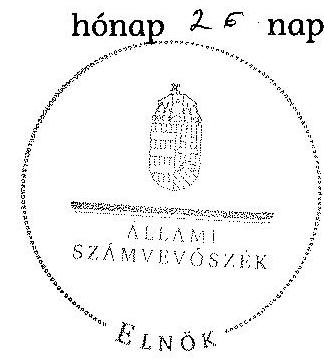
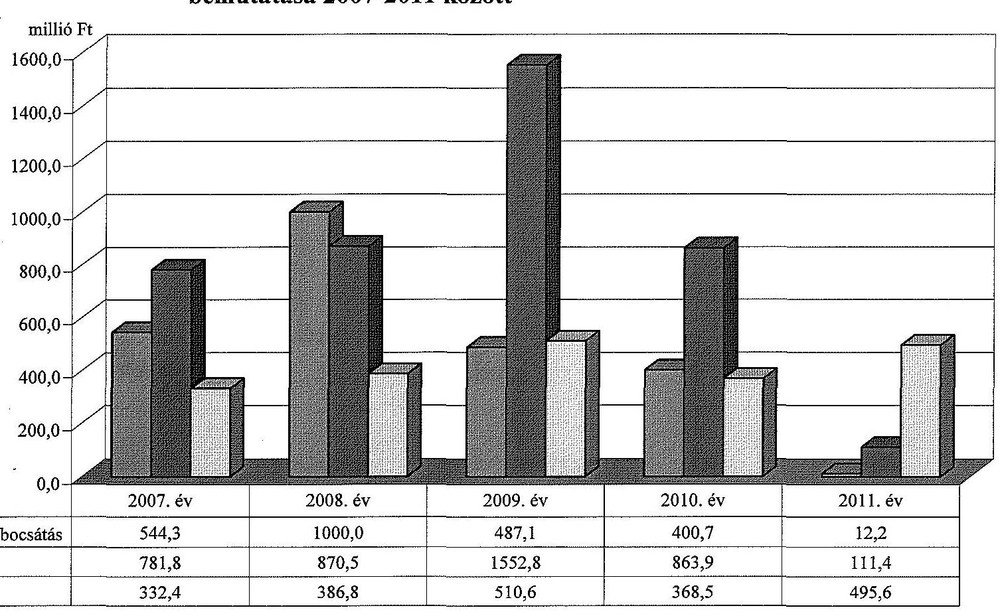
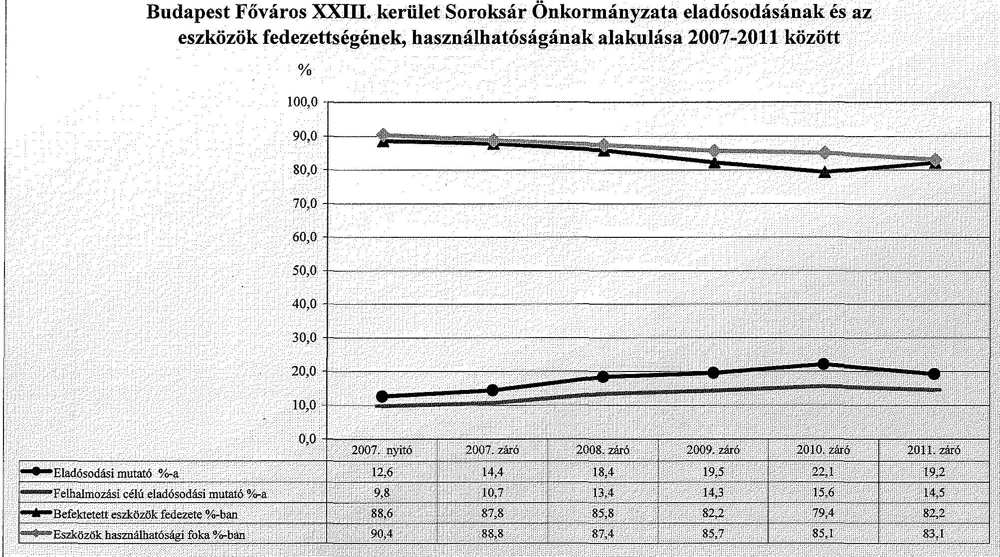

# ÁLLAMI   SZÁMVEVŐSZÉK 

## JELENTÉS

az önkormányzati vagyongazdálkodás szabályszerűségi ellenőrzéséről

Budapest Főváros XXIII. kerület Soroksár

---

# Állami Számvevőszék 

Iktatószám: V-0043-020-007-066/2013.
Témaszám: 1082
Vizsgálat-azonosító szám: V061507
Az ellenőrzést felügyelte:
Makkai Mária
felügyeleti vezető
Az ellenőrzést vezette és az ellenőrzés végrehajtásáért felelős:
Páncsics Judit
ellenőrzésvezető
A számvevőszéki jelentés összeállításában közreműködtek:
Lődiné Cser Zsuzsanna
számvevő főtanácsos
Marozsán Katalin
számvevő
Szarka Péterné
számvevő vezető főtanácsos
Az ellenőrzést végezték:

| Huszár Anna | Lődiné Cser Zsuzsanna | Tóthné Nagy Éva |
| :-- | :-- | :-- |
| számvevő | számvevő főtanácsos | számvevő főtanácsos |

A témához kapcsolódó eddig készített számvevőszéki jelentések:
címe
sorszáma
Jelentés a Budapest Főváros XXIII. kerület Soroksár Önkormányzata 0661
gazdálkodási rendszerének 2006. évi átfogó ellenőrzéséről
Jelentés a Budapest Főváros XXIII. kerület Soroksár Önkormányzata 0922
gazdálkodási rendszerének 2009. évi ellenőrzéséről

---

# TARTALOMJEGYZÉK 

BEVEZETÉS ..... 3
I. ÖSSZEGZŐ MEGÁLLAPÍTÁSOK, KÖVETKEZTETÉSEK, JAVASLATOK ..... 5
II. RÉSZLETES MEGÁLLAPÍTÁSOK ..... 11

1. A vagyongazdálkodási tevékenység szabályozottsága ..... 11
1.1. A feladatellátás formáinak meghatározása, a döntések megalapozottsága ..... 11
1.2. A vagyonnal gazdálkodó szervezetek szervezeti rendjének szabályozottsága, a kötelező szabályzatok megfelelősége ..... 13
1.3. A vagyongazdálkodás szabályozása ..... 14
1.4. A vagyonkezeléssel megbízott szervezetek beszámolási kötelezettségének szabályozása ..... 16
2. A vagyongazdálkodás szabályszerűsége ..... 17
2.1. A vagyonnyilvántartás megfelelősége ..... 17
2.2. A vagyongazdálkodást érintő gazdasági események dokumentáltsága ..... 18
2.3. A vagyongazdálkodási döntések, intézkedések szabályszerűsége ..... 18
2.4. A vagyonkezelő beszámoltatása ..... 19
2.5. A közbeszerzési eljárások alkalmazása ..... 19
3. A vagyon változását eredményező gazdasági események szabályszerűsége ..... 20
3.1. A vagyon értékének és összetételének változása ..... 20
3.2. A vagyon fenntartására kialakított rendszer működésének megfelelősége és szabályozottsága ..... 22
3.3. Hitelfelvétel, kötvénykibocsátás garancia és kezességvállalás szabályszerűsége ..... 22
3.4. A térítés nélküli vagyonátadások és átvételek szabályszerűsége ..... 24
4. A vagyongazdálkodás szabályszerűségére vonatkozó belső és külső ellenőrzések hasznosulása ..... 26
4.1. A belső ellenőrzés által tett megállapítások, javaslatok hasznosulása ..... 26
4.2. A többségi tulajdonban lévő gazdasági társaságok vagyongazdálkodásának felügyelete ..... 28
4.3. A könyvvizsgálatnak a vagyongazdálkodás szabályosságához való hozzájárulása ..... 29
4.4. A külső ellenőrző szervezetek által tett javaslatok hasznosulása ..... 29

---

# MELLÉKLETEK 

1. számú Budapest Főváros XXIII. kerület Soroksár Önkormányzata vagyonának főbb adatai 2007. január 1-je és 2011. december 31-e között
2. számú Budapest Főváros XXIII. kerület Soroksár Önkormányzata hosszú lejáratú hitelfelvétele és kötvénykibocsátása, felújítási és beruházási kiadásai, valamint az elszámolt értékcsökkenés bemutatása 2007-2011 között
3. számú Budapest Főváros XXIII. kerület Soroksár Önkormányzata eladósodásának és az eszközök fedezettségének, használhatóságának alakulása 2007-2011 között

## FÜGGELÉKEK

1. számú Rövidítések jegyzéke
2. számú Értelmező szótár

---

# JELENTÉS 

## az önkormányzati vagyongazdálkodás szabályszerűségi ellenőrzéséről

## Budapest Főváros XXIII. kerület Soroksár

## BEVEZETÉS

Az ÁSZ kiemelten fontosnak tartja az ÁSZ tv. 5. § (4) bekezdése alapján az önkormányzatok vagyongazdálkodási tevékenységének, a vagyongazdálkodási szabályok betartásának ellenőrzését. Az ellenőrzés feladata, hogy értékelje a vagyongazdálkodással kapcsolatban a jogszabályokban, az önkormányzati belső szabályozásban előírtak érvényesülését a közpénzek felhasználásának átláthatósága, nyilvánossága érdekében. Az ÁSZ ellenőrzése nemcsak az ellenőrzött szervezet vagyongazdálkodásának hibáira, hiányosságaira mutat rá, számon kérve azok kijavítását, hanem megállapításaival, javaslataival segíti a közpénzekkel, a közvagyonnal való felelős gazdálkodást.

Az önkormányzati vagyon alapvető funkciója, hogy a helyi közérdeket és egyúttal az önkormányzati célok megvalósítását szolgálja. A feladatellátás terén elsősorban a kötelezően ellátandó feladatok végrehajtását hivatott szolgálni, amely mellett az önként vállalt feladatok ellátása is megvalósulhat.

## Az ellenőrzés célja annak értékelése volt, hogy az Önkormányzatnál:

- a vagyongazdálkodási tevékenység, annak szervezeti keretei szabályozottak-e;
- a vagyongazdálkodás törvényességét, szabályszerűségét biztosították-e, a vagyon értékének és összetételének változását jogszerű döntésekkel alátámasztották-e;
- a belső ellenőrzés elősegítette-e a vagyongazdálkodás szabályszerű működését, valamint hasznosultak-e a korábbi külső ellenőrzések által tett javaslatok.

Az ellenőrzés típusa: szabályszerűségi ellenőrzés
Az ellenőrzött időszak: Az ellenőrzés a 2007. január 1. és 2011. december 31. közötti időszakra terjedt ki. A közbeszerzési eljárások lefolytatásának ellenőrzése a 2011. évet és a 2012. I. negyedévet, az Nvt. egyes rendelkezései végrehajtásának ellenőrzése a nemzetgazdasági szempontból kiemelt jelentőségű nemzeti vagyonnak minősülő forgalomképtelen vagyonelemek meghatározá-

---

sára, valamint közép- és hosszú távú vagyongazdálkodási terv készítésére terjedt ki 2012. január 1-jétől 2013. március 1-jéig, a helyszíni ellenőrzés befejezéséig.

Az ellenőrzés szakmai módszertana az ÁSZ hivatalos honlapján közzétett szakmai szabályokon alapult, amely a Legfőbb Ellenőrző Intézmények Nemzetközi Szervezete (INTOSAI) által kiadott nemzetközi standardok (ISSAI) figyelembevételével készült.

Ellenőriztük az önkormányzati vagyongazdálkodás szabályozottságát, a helyi szabályozások jogszabályi előírásoknak való megfelelőségét (önkormányzati rendeletek, szabályzatok, utasítások) és azok gyakorlati alkalmazását. A vagyonváltozásokkal kapcsolatos gazdasági események közül az ellenőrzött tételeket véletlen mintavétellel választottuk ki a Polgármesteri hivatal 2007-2011. évi számviteli nyilvántartásaiból. Az Önkormányzattól tanúsítványt kértünk a korábbi ÁSZ ellenőrzések vagyongazdálkodásra vonatkozó javaslatainak hasznosulásáról, a könyvvizsgáló és a külső ellenőrzési szervek vagyongazdálkodással kapcsolatos 2007-2011. évi javaslataira tett intézkedésekről, valamint a 2007-2011. évek térítésmentes vagyonátadásairól és átvételeiről.

A jelentéstervezetben alkalmazott rövidítéseket az 1. számú függelék, az egyes fogalmak magyarázatát a 2. számú függelék tartalmazza.

Budapest Főváros XXIII. kerület Soroksár állandó lakosainak száma 2011. január 1-jén 21927 fő volt. Az Önkormányzat 12 tagú Képviselő-testületének munkáját hat állandó bizottság segítette. Az Önkormányzat az önállóan működő és gazdálkodó Polgármesteri hivatalon felül további két önállóan működő és gazdálkodó, valamint tíz önállóan működő költségvetési szervvel látta el a feladatát. Az Önkormányzat két 100%-os önkormányzati tulajdoni hányadú gazdasági társasággal rendelkezett.

A polgármester az 1994. évi önkormányzati választások óta tölti be tisztségét. A jegyző személye az ellenőrzött időszakban változott, a jelenlegi jegyző a feladatait 2011. május 1-jétől látja el.

Az Önkormányzat a 2011. évi költségvetési beszámolója szerint 5384,2 millió Ft költségvetési bevételt ért el, valamint 5367,6 millió Ft költségvetési kiadást teljesített. A 2011. december 31-i könyvviteli mérleg szerint 20812,1 millió Ft értékű eszközvagyonnal rendelkezett, 3018,4 millió Ft hosszú lejáratú, 983,4 millió Ft rövid lejáratú kötelezettsége volt.

A Polgármesteri hivatalban dolgozó köztisztviselők száma 2011. december 31-én 152 fő, az Önkormányzat által foglalkoztatott közalkalmazottak száma 531,5 fő volt.

Az ÁSZ a 2011. évi LXVI. törvény 29. § (1) bekezdése szerint a jelentéstervezetet megküldte egyeztetésre Budapest Főváros XXIII. kerület Soroksár Önkormányzata polgármesterének, aki az ÁSZ tv. 29. § (2) bekezdésében foglalt észrevételezési jogával nem élt, a jelentéstervezetre észrevételt nem tett.

---

# I. ÖSSZEGZŐ MEGÁLLAPÍTÁSOK, KÖVETKEZTETÉSEK, JAVASLATOK 

Az Önkormányzat könyvviteli mérleg szerinti vagyona a 2007. évi 19 961,4 millió Ft-ról 2011. év végére 20812,1 millió Ft-ra, 4,3%-kal (850,7 millió Ft-tal) nőtt. A vagyonnövekedést a befektetett eszközök 841,0 millió Ft-os és a forgóeszközök 9,7 millió Ft-os növekedése okozta. A 2007-2011. évek között a felújításokra és beruházásokra fordított kiadások összege (4180,4 millió Ft) jelentősen (99,6%-kal) meghaladta az elszámolt értékcsökkenés összegét (2093,9 millió Ft). A beruházások, felújítások finanszírozásához 1044,3 millió Ft hosszú lejáratú hitelt¹ és 1400,0 millió Ft kötvénykibocsátásból származó forrást vettek igénybe.

Az Önkormányzat saját vagyona 2007-ről 2011-re 17378,1 millió Ft-ról 16 803,5 millió Ft-ra, 3,4%-kal (574,6 millió Ft-tal) csökkent a saját tőke 595,1 millió Ft-os csökkenése és a tartalékok 20,5 millió Ft-os növekedése eredményeként. A vagyon alakulásával kapcsolatos adatokat és mutatószámokat a jelentés 1-3. számú mellékletei részletesen tartalmazzák.

A Képviselő-testület a gazdasági programban¹² meghatározta az önkormányzati feladatok ellátásának fő irányait, az önkormányzati SZMSZ-ben¹² rögzítette a kötelező és önként vállalt feladatokat, azok ellátásának módját és mértékét. Az Önkormányzat a feladatait az intézményrendszerén, az általa alapított közalapítványokon, a 100%-os tulajdoni hányadú nonprofit társaságain keresztül, továbbá térségi együttműködés (társulás) keretében, illetve vállalkozói szerződések alapján látta el. A Galéria'13 NKft. a kulturális és közösségi-művelődési igények kielégítésére, a Szociális Foglalkoztató NKft. a hátrányos helyzetű csoportok társadalmi esélyegyenlőségének elősegítésére, a rehabilitációs foglalkoztatás és a munkaerőpiacon hátrányos helyzetű rétegek képzésének, foglalkoztatásának elősegítésére jött létre. A Képviselő-testület a közfeladatot ellátó költségvetési szervek alaptevékenységét meghatározta, jóváhagyta alapító okiratukat, valamint szervezeti és működési szabályzatukat.

Az Önkormányzatnál a vagyongazdálkodással kapcsolatos feladatokat és hatásköröket a Htv.-ben foglaltaknak megfelelően a teljes vagyoni körre szabályozták, de az Ötv.-ben előírtak ellenére a vagyonkezelési jog alapításának, gyakorlásának részletes szabályait a 2007-2011. évek között nem határozták meg. A vagyonkezelési jog részletes szabályozását 2012 márciusától a vagyongazdálkodási rendelet² tartalmazza. A vagyongazdálkodással kapcsolatos szabályozás megjelent az önkormányzati SZMSZ-ben¹², a vagyongazdálkodási rendeletben¹², a helyi sajátosságok figyelembe vételével kiadott további - lakás bérbeadási, lakás elidegenítési, a nem lakás céljára szolgáló helyiségek

[^1]
[^1]: ¹ Az ellenőrzött időszakban a beruházások, felújítások finanszírozásához igénybe vett 1044,3 millió Ft hitelből 900,0 millió Ft-ról a Képviselő-testület a 2009-2010. években döntött, 144,2 millió Ft-ot az ellenőrzött időszakot megelőzően kötött hitelszerződések alapján használtak fel.

---

bérbeadási és elidegenítési - rendeletekben és határozatokban, illetve a polgármester és a jegyző által kiadott szabályzatokban, utasításokban.

A Képviselő-testület - az Ötv.-ben foglaltaknak eleget téve - a 2007-2011. években a vagyongazdálkodási rendeletben¹² meghatározta a törzsvagyonba tartozó forgalomképtelen és korlátozottan forgalomképes, valamint a forgalomképes vagyonának körét. Az Nvt.-ben előírtak alapján az Önkormányzat a törzsvagyonának forgalomképesség szerinti besorolását felülvizsgálta és a vagyongazdálkodási rendelet²ben vagyonelemeket nemzetgazdasági szempontból kiemelt jelentőségű nemzeti vagyonná nem minősített át. Az Önkormányzatnál 2012. január 1-jét követően közép- és hosszú távú vagyongazdálkodási tervet a helyszíni ellenőrzés befejezéséig még nem készítettek.

A vagyongazdálkodási rendelet¹² - az Áht.¹-ben foglaltak szerint - tartalmazott szabályozást a vagyon tulajdonjogának ingyenes átruházására, a forgalomképesség megváltoztatásának rendjére. Az Önkormányzatnál az Áht.¹-ben előírtakkal összhangban a meghatározott értékhatár feletti vagyontárgyak hasznosítása esetében a nyilvános versenyeztetés, pályáztatás eljárásrendjét a 2007-2011. évek között a versenyeztetési rendeletben, 2012. január 1-jétől a vagyongazdálkodási rendelet²ben szabályozták. A Képviselő-testület a vagyonszerzés, illetve elidegenítés, a hitelfelvétel és kötvénykibocsátás ügyletei esetében az önkormányzati SZMSZ-ben¹², a vagyongazdálkodási rendeletben¹² és a helyi sajátosságok figyelembevételével kiadott további rendeletekben meghatározott értékhatárhoz kötötten döntött a hatásköröknek a bizottságokra és a polgármesterre történő átruházásáról. A vagyongazdálkodási rendeletben¹² értékbecslés készítési kötelezettséget írtak elő a hasznosításra szánt vagyon értékének megállapítása céljából.

A Polgármesteri hivatal számviteli politikáját és a kapcsolódó, a gazdálkodási jogkörök gyakorlásával összefüggő szabályzatokat a Számv. tv.-ben előírtaknak és a helyi sajátosságoknak megfelelően készítették el. A leltározási szabályzat a vagyon, azon belül az üzemeltetésre átadott eszközök leltározásának módját a 2007-2011. években az Áhsz.-ben foglaltaknak megfelelően írta elő.

Az Önkormányzatnál a 2007-2011. évek között elkészítették a vagyonkimutatást, amelyet a polgármester a zárszámadási rendelettervezettel együtt terjesztett a Képviselő-testület elé. A 2007-2011. évi vagyonkimutatások tartalma megfelelt az Áhsz.-ben és a vagyongazdálkodási rendelet¹-ben foglaltaknak, tartalmazta az Önkormányzat és intézményei saját vagyonát tételesen, törzsvagyon és törzsvagyonon kívüli egyéb tárgyi eszközök bontásban. A mérleget és a vagyonkimutatást minden évben leltárral támasztották alá. A leltározási szabályzat a 2007-2011. évek között az Áhsz.-ben foglaltaknak megfelelt. A számviteli nyilvántartásban szereplő ingatlanvagyont, valamint

 az ingatlan-vagyon-kataszter adatait minden évben - az ingatlanvagyon nyilvántartás és adatszolgáltatás rendjéről szóló kormányrendeletben foglaltak érvényesülése érdekében - egyeztették. Az egyezőség a 2007-2011. évek között - a 2011. évben egy esetet kivéve - fennállt. A jegyző a helyszíni ellenőrzés ideje alatt az egyezőség biztosítása érdekében a hiba kijavításáról intézkedett.

A vagyongazdálkodással kapcsolatban az ellenőrzött esetekben a gazdálkodási jogköröket a jogszabályoknak megfelelően, a belső szabályzatokban

---

rögzítettek szerint - az összeférhetetlenségi szabályokat is betartva - az arra írásban felhatalmazottak gyakorolták. A térítés nélküli vagyonátadásokról, átvételekről a Képviselő-testület határozott. Az átvett vagyonelemek dokumentálása, nyilvántartásba vétele az ellenőrzött dokumentumok alapján - egy esetet kivéve - szabályszerű volt. Az átvett ingatlan nyilvántartásba vételekor az időarányosan elszámolt értékcsökkenés egyidejű könyvelését elmulasztották.

A vagyongazdálkodási döntések végrehajtása során betartották a vagyongazdálkodási rendelet ${ }_{1,2}$-ben, a további rendeletekben, az előterjesztésekben, valamint a képviselő-testületi határozatokban és az Önkormányzat belső szabályzataiban foglaltakat. A vagyonváltozásokról hozott képviselő-testületi döntésekkel azonos tartalmú szerződéseket, megállapodásokat kötöttek, a szerződésekbe az Önkormányzat érdekeit védő garanciális elemeket (szankciókat a késedelmes, vagy nem teljesítés eseteire) beépítették. A 2011. évben és a 2012. év I. negyedévében a két ellenőrzött közbeszerzési eljárás köteles felújítás és beruházás esetében a közbeszerzési eljárásokat a becsült érték és az egybeszámítási kötelezettség figyelembevételével folytatták le.

A Képviselő-testület a hitelfelvételekről az adott évek költségvetési rendeleteiben, a kötvénykibocsátásokról az Ötv.-ben előírtaknak megfelelően határozattal döntött. A hitelfelvétel, kötvénykibocsátás költségvetési egyensúlyra gyakorolt hatását a költségvetés tervezése és a zárszámadás összeállítása során vizsgálták. A hitel fedezeteként a 2009. évben jelzálogfedezetet a hitelszerződésben nem kötöttek ki, a 2010. évben a hitel fedezeteként az Önkormányzat költségvetése szerepelt. A 2010. évi hitelfelvételkor nem tartották be az Ötv.-ben előírtakat, mert a hitelszerződésben kikötött biztosíték a hitel futamideje alatt kizárólag az Önkormányzat költségvetési bevétele volt. A hitel fedezetéül felajánlott költségvetési bevétel tartalmazta a normatív állami hozzájárulásból, az állami támogatásból, a személyi jövedelemadóból származó bevételt, valamint államháztartáson belülről a működési és fejlesztési célra átvett bevételeket is. Az Önkormányzatnál az Ötv.-ben előírtak nem érvényesültek, mert a Pénzügyi Bizottság a hitelfelvételekhez kapcsolódóan nem terjesztette a Képviselő-testület elé a megállapításait a hitelfelvétel indokainak és gazdasági megalapozottságának vizsgálatáról.

Az Önkormányzatnál a közérdekű adatok közzétételére vonatkozó eljárásrendet a közzétételi szabályzatban meghatározták. A jegyző ${ }_{1}$, illetve a jegyző az Önkormányzat honlapján a 2007-2011. évi költségvetési és zárszámadási rendeleteket közzétette, de az Eisztv. ${ }_{1}$-ben és a közzétételi listákon szereplő adatok közzétételi mintájáról szóló IHM rendeletben előírt közzétételi kötelezettségének nem tett eleget, mert a gazdálkodási adatok közül az éves (elemi) költségvetések és a költségvetés végrehajtásáról készített beszámolók közzététele elmaradt. A jegyző ${ }_{1}$, illetve a jegyző gondoskodott a céljellegű működési és fejlesztési támogatások, a vagyongazdálkodással összefüggő - a nettó öt millió Ft-ot elérő, vagy azt meghaladó értékű - szerződések adatainak közzétételéről, de a 2010. évben az ellenőrzött szerződések közül három vagyongazdálkodással összefüggő (építéssel, informatikai eszközbeszerzéssel, illetve a városfejlesztési stratégia kidolgozásával kapcsolatos) szerződés közzététele (összesen bruttó 64,0 millió Ft összegben) az Áht. ${ }_{1}$-ban előírtak ellenére elmaradt. A jegyző a közzététel pótlásáról a helyszíni ellenőrzés ideje alatt intézkedett.

---

Az Önkormányzatnál a 2007-2011. évek között a belső ellenőrzési feladatokat a Polgármesteri hivatal belső ellenőrzési egysége útján látták el. A belső ellenőrzés éves tervei - a 2007-2008. éveket kivéve - kockázatelemzésen alapultak és minden évben tartalmaztak a vagyongazdálkodással összefüggő ellenőrzéseket. Az ellenőrzések során feltárt hibák kijavítására a jelentések javaslatokat fogalmaztak meg. Az ellenőrzöttek intézkedési tervet készítettek a felelősök és a határidő megjelölésével, amelyek végrehajtásáról a belső ellenőrzés utóellenőrzés keretében és az intézmények beszámoltatásával győződött meg. A polgármester - az Ötv.-ben foglaltaknak megfelelően - a Képviselő-testület elé terjesztette az éves ellenőrzési jelentést és - a 2009. és 2010. évet kivéve - az Önkormányzat irányítása alá tartozó költségvetési szervek éves ellenőrzési jelentései alapján készített éves összefoglaló ellenőrzési jelentéseket. A belső ellenőrzés megállapításaival, javaslataival elősegítette a vagyongazdálkodás szabályszerű működését.

Az Önkormányzat a 100%-os tulajdoni hányadú gazdasági társaságai részére előírta a feladatellátásról és a gazdasági tevékenységről szóló beszámolási kötelezettséget. Az NKft.-k a beszámolási kötelezettségüknek eleget tettek, a Képviselő-testület az éves beszámolókat és a közhasznúsági jelentéseket elfogadta. A Képviselő-testület az FB-ket a beszámoló elfogadása keretében számoltatta be, az FB-k javaslatát az előterjesztések tartalmazták. Az Önkormányzat a gazdasági társaságai részére az ellenőrzött időszakban garanciát, kezességet nem vállalt, tagi kölcsönt nem nyújtott és törzstőke emelést sem hajtott végre. (Az Önkormányzat két 100%-os tulajdoni hányadú NKft.-je közül a Galéria'13 NKft. 2009. és 2010. évi mérleg szerinti eredménye negatív volt, de az eredménytartalék az elszámolt veszteséget fedezte. A Szociális Foglalkoztató NKft. 2008., 2009. és 2010. évi beszámolója negatív eredményt mutatott, de a 2011. júniusában tartott áfa ellenőrzéssel összefüggésben a 2010. évi beszámolót könyvvizsgálóval felülvizsgáltatták és a feltárt hibahatások miatt a Képviselőtestület 1,8 millió Ft pótbefizetést rendelt el az NKft. veszteségének fedezésére és a módosított beszámolót elfogadta.

Az Önkormányzat éves beszámolóját a könyvvizsgáló megbízhatónak és valósnak minősítette, a könyvvizsgálói jelentés vagyongazdálkodással kapcsolatos javaslatot nem tartalmazott.

Az Önkormányzat vagyongazdálkodási tevékenységét az ÁSZ-on kívül más külső ellenőrzést végző szerv nem ellenőrizte. A 2009. évi ÁSZ ellenőrzés vagyongazdálkodáshoz kapcsolódó nyolc javaslata hasznosult. A korábbi, a 2006. évi javaslatok közül két - a vízi közmű térítésmentes átadásával, a belső ellenőrzési jelentések intézkedési tervei elkészítési határidejének betartásával összefüggő - javaslat a 2009. évi ellenőrzésig és a helyszíni ellenőrzés befejezéséig sem hasznosult.

Az Állami Számvevőszékről szóló 2011. évi LXVI. törvény 33. § (1) bekezdésében foglaltak értelmében a jelentésben foglalt megállapításokhoz kapcsolódó intézkedési tervet köteles az ellenőrzött szervezet vezetője összeállítani, és azt a jelentés kézhezvételétől számított 30 napon belül az ÁSZ részére megküldeni. Amennyiben az intézkedési tervet határidőben nem küldi meg a szervezet, vagy az nem elfogadható, az ÁSZ elnöke a hivatkozott törvény 33. § (3) bekezdés a)-b) pontjaiban foglaltakat érvényesítheti.

---

Az ellenőrzés intézkedést igénylő megállapításai és javaslatai:

# a polgármesternek 

1. A 2006. évi ÁSZ ellenőrzés javaslatai közül a Fővárosi Vízművek Zrt.-nek térítésmentesen átadott vízi közmű miatt tett javaslat továbbra sem hasznosult.

Javaslat:
Vizsgálja meg a Fővárosi Vízművek Zrt.-vel kötött térítésmentes vagyonátadások szerződéseit és tegyen intézkedést arra, hogy a vízi közművek visszakerüljenek az Önkormányzat tulajdonába és a Képviselő-testület döntése alapján a vízgazdálkodásról szóló 1995. évi LVII. törvény 10. § (1) bekezdésében előírtaknak megfelelően adják használatba.

## a jegyzőnek

1. A 2010. évi hitelfelvételkor nem tartották be az Ötv. 88. § (1) bekezdés b) pontjában előírtakat, mert a hitelszerződésben kikötött biztosíték a hitel futamideje alatt kizárólag az Önkormányzat költségvetési bevétele volt. A hitel fedezetéül felajánlott költségvetési bevétel tartalmazta a normatív állami hozzájárulásból, az állami támogatásból, a személyi jövedelemadóból származó bevételt, valamint államháztartáson belülről a működési és fejlesztési célra átvett bevételeket is.

Javaslat:
Intézkedjen az Áht. 2 84. § (4) bekezdésével ellentétes állapot megszüntetéséről, a hitel fedezetére jogszerű ügyleti biztosítékok kijelöléséről.
2. A jegyző ${ }_{1}$, illetve a jegyző az Önkormányzat honlapján a 2007-2011. évi költségvetési és zárszámadási rendeleteket közzétette, de az Eisztv. ${ }_{1}$ mellékletében és a 18/2005. (XII. 27.) IHM rendelet 2. számú melléklete 3.2. pontjában előírt közzétételi kötelezettségének nem tett eleget, mert a gazdálkodási adatok közül az éves (elemi) költségvetések és a költségvetés végrehajtásáról készített beszámolók közzététele elmaradt.

Javaslat:
Intézkedjen az információs önrendelkezési jogról és az információszabadságról szóló 2011. évi CXII. törvény (Eisztv. ${ }_{2}$ ) 1. számú mellékletében meghatározott adatok közzétételéről.
3. A 2006. évi ÁSZ ellenőrzés javaslatai közül a belső ellenőrzési jelentések megállapításaira készített intézkedési tervek határidejének betartásával összefüggő javaslat továbbra sem hasznosult.

---

Javaslat:
Intézkedjen, hogy a Bkr. 28. § c) pontjában előírtaknak megfelelően és a 45. § (3) bekezdésében megadott határidőben készüljön intézkedési terv a belső ellenőrzés által feltárt, a vagyongazdálkodás területét is érintő hiányosságok megszüntetéséről.

---

# II. RÉSZLETES MEGÁLLAPÍTÁSOK 

## 1. A VAGYONGAZDÁLKODÁSI TEVÉKENYSÉG SZABÁLYOZOTTSÁGA

### 1.1. A feladatellátás formáinak meghatározása, a döntések megalapozottsága

Az Önkormányzat a 2007-2011. évekre vonatkozó gazdasági program ${ }_{1,2}$-ben valamint az önkormányzati $\mathrm{SZMSZ}_{1,2}$-ben és a 2007-2011. évi költségvetési rendeletekben rögzítette az Önkormányzat kötelező és önként vállalt feladatai körét, azok ellátásának mértékét és módját ${ }^{2}$. A gazdasági program ${ }_{1,2}$-ben kiemelt feladatként kezelték a városfejlesztést és a munkahelyteremtést. A fejlesztési célkitűzések meghatározásánál figyelembe vették az Önkormányzat pénzügyi forrásait, a lehetséges hazai és EU-s pályázati lehetőségeket. Az Önkormányzat a feladatait az intézményrendszerén, az általa alapított közalapítványokon, a kizárólagos tulajdonában lévő közhasznú, nonprofit társaságain keresztül ${ }^{3}$, továbbá térségi együttműködés (társulás) keretében, illetve vállalkozói szerződések alapján látta el.

A Képviselő-testület a feladatellátások szervezeti formáinak módosításáról gazdaságossági indokok figyelembevételével határozott. Az előterjesztések rendjében meghatározott módon alternatív javaslatokat mutatott be - a szervezeti formák választására vonatkozóan - a megalapozott döntés meghozatala érdekében.

Az új Sportcsarnok működtetésére 2010. márciusában a polgármester előterjesztése négy alternatívát - önállóan működő és gazdálkodó, vagy önállóan működő költségvetési szerv létrehozása, külső vállalkozás megbízása, feladatátadási megállapodás kötése, vagy gazdasági társaság alapítása - vázolt fel. Az előterjesztés alapján a Képviselő-testület a 233/2010. (IV. 13.) számú határozatával 2010. május 1-jétől a SORTE-vel feladatátadási megállapodás megkötéséről döntött.

A Képviselő-testület a működési területén az önkormányzati SZMSZ ${ }_{1,2}$ 6. § (4) bekezdése szerint megállapodás alapján átvállalhatta a Fővárosi Önkormányzat feladat- és hatáskörébe tartozó közszolgáltatás szervezését. Az Önkormányzat az ellenőrzött időszakban az önként vállalt egészségügyi szakellátási feladatainak (szakrendelések) biztosítása érdekében egy esetben kötött megállapodást a Fővárosi Önkormányzattal.

[^0]
[^0]:    ${ }^{2}$ A kötelező és önként vállalt feladatok felsorolását az önkormányzati SZMSZ ${ }_{1}$ 2007. február 23-tól az önkormányzati SZMSZ ${ }_{1}$ módosításáról szóló 16/2007. (II. 23.) számú rendelet 1. §-a, 2011. április 1-jétől az önkormányzati SZMSZ ${ }_{2}$ 8. és 9. §-ai tartalmazták.
    ${ }^{3}$ A Képviselő-testület által alapított intézmények, gazdasági társaságok, továbbá a létrehozott alapítványok felsorolását az önkormányzati SZMSZ ${ }_{1}$ 1. számú, illetve az önkormányzati SZMSZ ${ }_{2}$ 3. számú függeléke tartalmazta.

---

A Fővárosi Közgyűlés 2008. november 27-ei ülésének jegyzőkönyve és a bemutatott 02/78/39/2008. iktatószámú megállapodás alapján Budapest Főváros Önkormányzata, a Fővárosi Önkormányzat Jahn Ferenc Dél-pesti Kórház és Rendelőintézet, mint átadó és Soroksár Önkormányzata, valamint az ESZI, mint átvevő megállapodást kötött önkormányzati feladat és a hozzátartozó létszám átvételére. A megállapodást az Önkormányzat önként vállalt egészségügyi szakellátási feladatai (szakrendelések) biztosítása érdekében kötötték.

A közszolgáltatások ellátásához az ellenőrzött időszakban a Képviselő-testület egy új intézmény létrehozásáról döntött, ezért az Önkormányzat költségvetési szerveinek száma a 2007. január 1-jei állapothoz viszonyítva 2011. december 31-re 12-ről 13-ra
 nőtt.

A Képviselő-testület a 337/2007. (V. 8.) számú határozattal új intézmény létrehozásáról döntött. A SEPSZI a gyógypedagógiai, nevelési tanácsadás, iskolapszichológiai szolgáltatás, logopédiai ellátás, és gyógytestnevelés önálló ellátására jött létre. Az új intézmény a feladatait és a feladatot ellátó pedagógusokat az Önkormányzat általános iskoláitól vette át.

Az Önkormányzat a 2007-2011. években alapfeladatainak ellátására két, 100%-os tulajdoni hányadú NKft.-t működtetett, új gazdasági társaságot nem alapított. A Képviselő-testület 2009-ben - az Ötv. 41-44. §-ai, valamint a 1997. évi CXXXV. törvény 2. §-nak megfelelően - új társulásba történő belépésről döntött. Az Önkormányzat a 2007. évben öt közalapítványt működtetett, amelyek száma a 2011. évi összevonások következtében ötről háromra csökkent.

Az Önkormányzat az ellenőrzött időszakot megelőzően, 1998-ban hozta létre a Galéria'13 NKft.-t Soroksár lakosságának kulturális és közösségi-művelődési igényeinek kielégítésére, illetve 2002-ben a Szociális Foglalkoztató NKft.-t ${ }^{4}$ a hátrányos helyzetű csoportok társadalmi esélyegyenlőségének elősegítése, a rehabilitációs foglalkoztatás és a munkaerőpiacon hátrányos helyzetű rétegek képzésének, foglalkoztatásának elősegítése érdekében.

A 2009. évben a Ráckevei (Soroksári)-Duna ág vízgazdálkodásának és vízminőségének javítása érdekében szükséges egyes szennyvízelvezetési és elhelyezési feladatok közös megoldására Áporka, Dömsöd, Dunaharaszti, Kiskunlacháza, Majosháza, Makád, Ráckeve, Szigetbecse, Szigetcsép, Szigetszentmárton, Szigetszentmiklós, Taksony és Tass települések önkormányzataival együttműködve az Önkormányzat a Képviselő-testület 365/2009. (VI. 16.) számú határozata alapján, 2009. július 9-én Társulást hozott létre. A társulási megállapodást az Önkormányzat az 535/2009. (XII. 8.) számú határozattal fogadta el. A Társulás gazdálkodási, pénzügyi és számviteli feladatait Taksony Nagyközség Önkormányzatának Polgármesteri Hivatalja látja el.

Az Önkormányzat a 145/2011. (III. 16.) számú határozatával a Soroksár Művészeti Oktatásáért Közalapítványnak a Klébl Márton Közalapítványhoz, a 146/2011. (III. 16.) számú határozatával a Soroksár Városfejlesztéséért Közalapítványnak a Soroksári Dunáért Közalapítványhoz való csatlakozásáról döntött.

[^0]
[^0]:    ${ }^{4}$ A Szociális Foglalkoztató Kht. 2008. április 1-jével, a Galéria'13 Kht. 2008. szeptember 10-től alakult át Nonprofit Kft.-vé.

---

# 1.2. A vagyonnal gazdálkodó szervezetek szervezeti rendjének szabályozottsága, a kötelező szabályzatok megfelelősége 

Az Önkormányzatnál a 2007-2011. évek között a vagyongazdálkodási tevékenység és annak szervezeti keretei szabályozottak voltak. A Képviselő-testület az Ötv. 1. § (6) bekezdésének ${ }^{5}$ megfelelően a szervezeti működési rendjét kialakította. A vagyongazdálkodással kapcsolatos feladatait az önkormányzati SZMSZ ${ }_{1,2}$-ben, vagyongazdálkodási rendelet ${ }_{1,2}$-ben és a helyi sajátosságok figyelembe vételével további helyi rendeletekben - a lakás bérbeadási, a lakás elidegenítési, a nem lakás céljára szolgáló helyiségek elidegenítéséről, illetve azok bérbeadásáról szóló rendeletekben - szabályozta. A Képviselő-testület az önkormányzati SZMSZ ${ }_{1}$ 6. § (1) bekezdésében és az önkormányzati SZMSZ ${ }_{2}$ 10. és 11. §-ai szerint rendelkezett a Képviselő-testületet megillető hatásköröknek a polgármesterre és a bizottságokra történő átruházásáról ${ }^{6}$.

Az Önkormányzat vagyongazdálkodási rendelet ${ }_{1}$-ben meghatározott feladatait a 2007-2011. években a Polgármesteri hivatal belső szervezeti egysége - a Városgazdálkodási Főosztály, azon belül a Vagyonkezelési és Beruházási Osztály látta el. A Képviselő-testület meghatározta a közfeladatot ellátó intézményei alaptevékenységét, jóváhagyta a szervezetek alapító okiratait, illetve szervezeti és működési szabályzataikat. A költségvetési intézmények vagyongazdálkodással kapcsolatos feladata a közszolgáltatás ellátásához rendelt ingatlan használatára és bérbeadására terjedt ki, az intézmények a tevékenységükről a Képviselő-testületnek évenként beszámoltak.

A „Hivatal Ügyrendjét", vagyis a hivatali SZMSZ ${ }_{1-5}$-t - az önkormányzati SZMSZ ${ }_{1}$ 66. § (5) bekezdésében, illetve az önkormányzati SZMSZ ${ }_{2}$ 176. §-ban kapott felhatalmazás alapján - a polgármester hagyta jóvá. A hivatali SZMSZ ${ }_{1-5}$ tartalmazta az Ámr. ${ }_{1,2}$-ben ${ }^{7}$ kötelezően előírt szabályozási elemeket.

A jegyző ${ }_{1}$ a kötelező szabályzatokat (számviteli politika, pénzkezelési, leltározási és selejtezési, illetve értékelési szabályzat) a Htv. 140. § (1) bekezdés c) pontjának, illetve a Számv. tv. előírásainak megfelelően, a helyi sajátosságok figyelembevételével készítette el és adta ki. A hivatali SZMSZ ${ }_{1-5}$ mellékletét képező számviteli politika és a kapcsolódó szabályzatok hatálya a hozzárendelt önállóan működő intézményekre is kiterjedt.

A Képviselő-testület - az Áhsz. 37. § (7) bekezdése szerinti - a csak kétévenkénti mennyiségi felvétellel történő leltározás lehetőségével nem élt. Az Önkormányzatnál a vagyon leltározásának módját a 2007-2011. évek között az Áhsz. előírásainak megfelelően szabályozták. Az Áhsz. 37. § (1)-(3) bekezdése szerint a leltározási szabályzat évenkénti, december 31-i forduló nappal történő leltározást írt elő. A jegyző ${ }_{1}$ az üzemeltetésre átadott eszközök évenkénti leltározásá-

[^0]
[^0]:    ${ }^{5}$ 2013. január 1-jétől az Mötv. 53. § (1) bekezdése írja elő
    ${ }^{6}$ Az önkormányzati SZMSZ ${ }_{1}$ 4. és 5. számú, illetve az önkormányzati SZMSZ ${ }_{2}$ 2. és 3. számú mellékletei tartalmazták részletesen a Képviselő-testület által a bizottságokra, illetve a polgármesterre átruházott hatásköröket.
    ${ }^{7}$ Az SZMSZ kötelező tartalmát 2012. január 1-jétől az Ávr. 13. § (1) bekezdés c), e), g), i) pontjai írják elő.

---

nak módjával - az Áhsz. 37. § (4) bekezdésében foglaltaknak megfelelően - a szabályzatot 2010. január 1-jétől kiegészítette. A leltározási szabályzat kiterjedt a Polgármesteri hivatalon kívül az önállóan működő intézmények, a kisebbségi önkormányzatok és az önkormányzati társulás kezelésében lévő, vagy tartós és ingyenes használatába adott befektetett eszközök, készletek leltározására is.

# 1.3. A vagyongazdálkodás szabályozása 

Az Önkormányzatnál a vagyongazdálkodási feladatokat a - a Htv. 138. § (1) bekezdés j) pontja szerint, az Áht. ${ }_{1} 108$. § (1) bekezdésében ${ }^{8}$ előírtakkal összhangban - a teljes vagyoni körre rendelettel szabályozták. Az Önkormányzat a vagyongazdálkodási rendelet ${ }_{1,2}$-ben meghatározta az önkormányzati feladatellátást biztosító törzsvagyont, ezen belül a forgalomképtelen és a korlátozottan forgalomképes vagyonelemek körét. A szabályozás meghatározta az egyes vagyonelemek hasznosítási módját, a vagyontárgyak feletti rendelkezési jog megosztását az egyes vagyontípusokra, illetve értékhatárra vonatkozóan döntési szintenként a rendelkezési jog gyakorlóját.

Az önkormányzati SZMSZ ${ }_{1,2}$ mellékletei szerint az ingatlanok elidegenítésével, értékesítésével, bérbeadásával, az önkormányzati tulajdonú helyiségek további hasznosításával, a használati díj, a bérleti díj megállapításával, az ingatlanvásárlással, a vagyonszerzéssel, kezességvállalással kapcsolatos ügyekben 10,0 millió Ft, majd a 2011. évben hatályos szabályozás szerint 15,0 millió Ft értékhatárig a Gazdasági és Vagyonkezelő Bizottság hatáskörét állapították meg. Az értékpapírok forgalmazásával, értékesítésével és vásárlásával összefüggő döntési hatáskör - az éves költségvetés 1%-át meg nem haladó értékhatárig - a Pénzügyi, illetve a Gazdasági és Vagyonkezelő Bizottság hatáskörébe tartozott az önkormányzati SZMSZ ${ }_{1}$ 26/2010. (XII. 2.) számú rendelettel történt módosítása alapján.

A Képviselő-testület a 2007-2011. években az ingatlanvagyon hasznosítása esetén a versenyeztetési kötelezettséget külön rendeletben (versenyeztetési szabályzat) határozta meg. (2012. január 1-jétől a vagyongazdálkodási rendelet ${ }_{2}$ IV. fejezete tartalmazza a vagyon hasznosításával kapcsolatos versenyeztetési szabályokat.)

A vagyongazdálkodási rendelet ${ }_{1}$ - az Áht. ${ }_{1} 108$. § (2) bekezdésében ${ }^{9}$ foglaltakkal összhangban - meghatározta a vagyon tulajdonjogának, valamint a vagyonhoz kapcsolódó, önállóan forgalomképes vagyoni értékű jogoknak az ingyenes átruházását, az ingyenes átruházás módját és eseteit.

A Képviselő-testület az önkormányzati SZMSZ ${ }_{1}$ 2. számú mellékletének 3.40. pontjában átruházott hatáskörként a Gazdasági és Közbeszerzési Bizottság hatáskörét állapította meg a követelésekről történő lemondás, a követelések elengedésének eseteire.

[^0]
[^0]:    ${ }^{8}$ 2012. január 1-jétől az Nvt. 13. § (1) bekezdése szabályozza
    ${ }^{9}$ A szabályozásra 2012. január 1-jétől az Nvt. 13. § (3) bekezdése az irányadó.

---

A Képviselő-testület a vagyonkezelői jog részletes szabályait a 2007-2011. években - az Ötv. 80/B. §-ban ${ }^{10}$ előírtak ellenére - rendeletben nem határozta meg. (Az Önkormányzat 2007. január 1. és 2011. szeptember 5. között vagyonkezelői szerződést nem kötött.) A vállalkozásba bevitt (apport), a vállalkozásnak átadott vagyontárgyak hasznosítására vonatkozó elvárásokat, követelményeket, korlátokat az eszközök használatára, továbbadására vonatkozóan (elidegenítési tilalom kikötése) a gazdasági társaságok alapító okirataiban rögzítették. A vagyonkezelői jog megszerzésének, gyakorlásának és a vagyonkezelés ellenőrzésének részletes szabályait a vagyongazdálkodási rendelet ${ }_{2}$ 2012. március 1-jétől hatályos módosítása ${ }^{11}$ szabályozta.

A Képviselő-testület az önkormányzati vagyon meghatározott részének elidegenítését, megterhelését, vállalkozásba vitelét helyi népszavazáshoz nem kötötte. A vagyongazdálkodással összefüggő döntés előkészítés folyamatában a vagyongazdálkodási rendelet ${ }_{1}$-ben, a feladat- és hatásköri jegyzékben, továbbá a felelősök munkaköri leírásában határozták meg a gazdálkodással és annak munkafolyamatba épített ellenőrzésével összefüggő jogkörök gyakorlásának rendjét, az összeférhetetlenségi követelményeket. A feladatellátást ügyrendben nem szabályozták, a munkaköri leírásokban részletesen, a jogszabályokkal és a belső szabályzatokkal összhangban határozták meg. (A vagyongazdálkodást érintő előterjesztésekért felelős szervezeti egység ${ }^{12}$ az ellenőrzött időszakban ügyrenddel nem rendelkezett, a vagyongazdálkodást érintő előterjesztéseket a munkaköri leírásokban meghatározott felelősséggel, az előterjesztések rendje szerint készítették el és annak megfelelően nyújtották be a Képviselő-testület elé.)

Az Önkormányzat a hitelfelvételre és kötvénykibocsátásra vonatkozó szabályozást a 2007-2011. évek költségvetési rendeleteiben - az Ötv. 88. § (1) bekezdés b) pontjának ${ }^{13}$ előírásával összhangban - határozta meg. A hitelfelvétel, kötvénykibocsátás költségvetési egyensúlyra gyakorolt hatását a költségvetés tervezése és a zárszámadás összeállítása során vizsgálták, a hasznosításra szánt vagyon értékének megállapítása céljából értékbecslés készítésének kötelezettségét szabályozták ${ }^{14}$, de nem írták elő a költség-haszon elemzés készítésének kötelezettségét, a beruházások fenntarthatóságának vizsgálatát.

Az Önkormányzat a közzétételi szabályzatban meghatározta a közérdekű adatok - a céljellegű működési és fejlesztési támogatások, a vagyonnal való gazdálkodással összefüggő szerződések, az Önkormányzat költségvetési és zár-

[^0]
[^0]:    ${ }^{10}$ A vagyonkezelői jog létesítésének és gyakorlásának szabályozási kötelezettségét 2012. január 1-jétől az Mötv. 109. §-a írja elő.
    ${ }^{11}$ A vagyongazdálkodási rendelet ${ }_{2}$ a módosításáról szóló 10/2012. (II. 24.) számú rendelet alapján kiegészült a vagyonkezelői jog szabályaival.
    ${ }^{12}$ Vagyongazdálkodási/Vagyonkezelési és Beruházási Osztály
    ${ }^{13}$ Az önkormányzati hitelfelvétel és kötvénykibocsátás fedezetét 2013. január 1-jétől az Áht. ${ }_{2}$ 84. § (4) bekezdése határozza meg.
    ${ }^{14}$ A vagyongazdálkodási rendelet ${ }_{1}$-et módosító 34/2006. (XI. 17.) számú rendelet alapján a vagyongazdálkodási rendelet ${ }_{1}$ 7/A. §-sal egészült ki, amelynek (2) bekezdése az önkormányzati vagyontárgy értékének meghatározását értékbecsléshez köti.

---

számadási rendeletei - megismerésének, nyilvánosságra hozatalának módját, a nyilvánosság biztosításának eszközeit, felelősét.

Az éves költségvetési koncepció és az éves költségvetés készítésére, módosítására, valamint a beszámoló készítésére vonatkozó szabályokat rendeletben, valamint jegyzői utasításban határozták meg. A zárszámadási rendelet és kötelező mellékletét képező vagyonkimutatás előírt tartalmának további részletezését, tételes alábontását az Áhsz. 44/A. § (2) bekezdésében foglaltaknak megfelelően a vagyongazdálkodási rendeletben szabályozták. A 14/2006. (III. 25.) rendelettel módosított vagyongazdálkodási rendelet 6. §-a kiegészült a vagyonkimutatás kötelező tartalmára vonatkozó előírással, amely előírást 2012. január 1-jétől a vagyongazdálkodási rendelet ${ }_{2}$ II. fejezet 14. §-a tartalmazta.

Az Önkormányzat a törzsvagyonának forgalomképesség szerinti besorolását
 (korlátozottan forgalomképes és forgalomképtelen) 2012-ben felülvizsgálta. Az Önkormányzat a vagyongazdálkodási rendelet ${ }_{2}$ 2012. március 1-jétől hatályos módosításában ${ }^{15}$ nemzetgazdasági szempontból kiemelt jelentőségű, nemzeti vagyonná nem minősített át vagyonelemeket. Az Önkormányzat 2012. január 1-jét követően közép- és hosszú távú vagyongazdálkodási tervet - az Nvt. 9. § (1) bekezdésében foglaltak szerint - a helyszíni ellenőrzés befejezéséig még nem készített.

# 1.4. A vagyonkezeléssel megbízott szervezetek beszámolási kötelezettségének szabályozása 

Az Önkormányzat 2007. január 1. és 2011. szeptember 5. között vagyonkezelői szerződést nem kötött. A Képviselő-testület 484/2011. (VII. 5.) számú határozatában kapott felhatalmazás alapján a polgármester a Galéria'13 NKft.-vel 2011. szeptember 5-én vagyonkezelői szerződést kötött. A vagyonkezelői szerződés 6. i.) pontja az Önkormányzat tulajdonosi jogainak védelme érdekében előírta a vagyonkezelő beszámolási kötelezettségét. A vagyonkezelői szerződés a teljesítésre vonatkozó garanciális elemeket, illetve szankciókat a késedelmes, vagy nem teljesítés eseteire - az azonnali hatályú felmondást is lehetséges intézkedésként nevesítve - tartalmazott. A vagyonkezelői szerződés 7. pontja az Önkormányzat ellenőrzési jogát, a 13. pont az azonnali felmondás eseteit nevesítette.

[^0]
[^0]:    ${ }^{15}$ A vagyongazdálkodási rendelet ${ }_{2}$ 10/2012. (II. 24.) számú rendelettel módosított 4. és 5. §-ai rögzítik, hogy az önkormányzati törzsvagyonon belül melyek azok a vagyonelemek, amelyek közvetlenül a kötelező önkormányzati feladat- és hatáskör ellátását, a közhatalom gyakorlását szolgálják és nemzetgazdasági szempontból kiemelt jelentőségűek.

---

# 2. A VAGYONGAZDÁLKODÁS SZABÁLYSZERŰSÉGE 

### 2.1. A vagyonnyilvántartás megfelelősége

Az Önkormányzatnál a 2007-2011. évek között minden évben - a jogszabályi előírásoknak megfelelő tartalommal - elkészítették a vagyon állapotáról a vagyonkimutatást és a zárszámadási rendelettervezettel együtt terjesztették a Képviselő-testület elé. A vagyonkimutatás tartalmazta az Önkormányzat és intézményei saját vagyonát tételesen, törzsvagyon (ezen belül forgalomképtelen, illetve korlátozottan forgalomképes), forgalomképes és egyéb tárgyi eszközök bontásban. Az Önkormányzatnál a főkönyvi számlák alábontásával, valamint a számlákhoz kapcsolódó analitikus nyilvántartások vezetésével eleget tettek a jogszabályi előírásnak, biztosították a törzsvagyon többi vagyontárgytól való elkülönített nyilvántartását. A mérleget, illetve a vagyonkimutatást - amely a Polgármesteri hivatal és az intézmények vagyonkimutatásának összesítése alapján készült - minden évben leltárral támasztották alá.

Az Önkormányzatnál a 2007-2011. évek között az Áhsz. 49. § (3) bekezdése alapján, valamint a 147/1992. (XI. 6.) Korm. rendelet 1. § (2) bekezdésére figyelemmel a számviteli nyilvántartásban szereplő ingatlanvagyont, valamint az ingatlanvagyon kataszter adatait minden évben a közhiteles nyilvántartást vezető illetékes földhivatal ${ }^{16}$ adataival egyeztették, a változásokat a nyilvántartásokban átvezették. Az egyezőség a 2007-2011. évek között - a 2011. évben egy esetet kivéve - fennállt és az ellenőrzött dokumentumok minden esetben tartalmazták a földhivatali „Nem hiteles tulajdoni lap", illetve a „Tulajdoni lap szemle" másolatát.

A 2011. évben egy ingatlan esetében - a Galéria'13 NKft.-vel összefüggésben - a számviteli analitika és az ingatlanvagyon-kataszter adatai eltérést mutattak, mert a befejezetlen beruházások analitikus nyilvántartásából kétszer adták fel a főkönyv felé a Galéria'13 NKft. épületének 13,7 millió Ft értékű felújítását, amelyet az ingatlanvagyon-kataszterben is duplán vezettek át. A jegyző a helyszíni ellenőrzés ideje alatt az egyezőség biztosítása érdekében a hiba kijavításáról intézkedett.

Az Önkormányzat a 2007-2011. években a leltározási és selejtezési szabályzat előírásait betartotta, a leltározási kötelezettségének - az üzemeltetésre átadott eszközöket is beleértve - minden évben eleget tett, a leltárt kiértékelték. A vagyonleltár az ingatlanokat és a vagyoni értékű jogokat tételesen, az ingóságokat mérleg szerinti értékben jelenítette meg. Az ellenőrzött főkönyvi számlaszámok esetében - a 2008. évben egy esetet kivéve - az analitika, a főkönyv és a mérleg megfelelő adatai egyezőséget mutattak. A vagyont az éves könyvviteli mérlegek az értékelési szabályzat előírásai szerint megállapított értéken tartalmazták.

A Polgármesteri hivatal és a részben önálló intézmények 2008. évi vagyonleltárában a szellemi termékek esetében az analitika 0,6 millió Ft-tal tért el a főkönyvtől, amelyet az Önkormányzatnál a 2009. évben rendeztek.

[^0]
[^0]:    ${ }^{16}$ Budapest 1. számú Körzeti Földhivatal

---

# 2.2. A vagyongazdálkodást érintő gazdasági események dokumentáltsága 

Az ellenőrzött időszakban a vagyongazdálkodással összefüggő gazdasági eseményeknél a gazdálkodási jogköröket az Ámr. ${ }_{1,2}$ vonatkozó rendelkezései szerint és a kötelezettségvállalási szabályzatban rögzítetteknek megfelelően - az összeférhetetlenségi szabályokat is betartva - az arra írásban felhatalmazott, illetve kijelölt személyek gyakorolták. Az ellenőrzött esetekben a vagyonelemekhez kapcsolódó gazdasági események bizonylatain a tevékenységre előírt (folyamatba épített) ellenőrzéseket elvégezték.

A polgármester a 2010. évben az önkormányzati képviselők és polgármesterek általános választását megelőző 30 nappal elkészítette és az Áht. 150/A. §-nak megfelelően a Képviselő-testület elé terjesztette az Önkormányzat 2006-2010. I. féléve vagyoni és pénzügyi helyzetét bemutató adatokat, a Képviselő-testület megalakulását követően keletkezett, a későbbi éveket terhelő pénzügyi kötelezettségeket (hitelfelvételeket, kötvénykibocsátásokat), valamint a több éves elkötelezettséggel járó kiadásokat (például csapadékcsatorna építések adatait). A tájékoztatás 2010. augusztus 30-án az Önkormányzat honlapjára felkerült. Munkakör átadás-átvételi jegyzőkönyv az ellenőrzött időszakban nem készült, mert a polgármester az 1994. évi önkormányzati választás óta folyamatosan tölti be a tisztségét.

A jegyző ${ }_{1}$, illetve a jegyző az Önkormányzat honlapján a 2007-2011. évi költségvetési és zárszámadási rendeleteket közzétette, de az Eisztv. ${ }_{1}$ mellékletében és a 18/2005. (XII. 27.) IHM rendelet 2. számú melléklete 3.2. pontjában előírt közzétételi kötelezettségének teljes körűen nem tett eleget, mert a gazdálkodási adatok közül az éves (elemi) költségvetések és a költségvetés végrehajtásáról készített beszámolók közzététele ${ }^{17}$ elmaradt.

A jegyző ${ }_{1}$, illetve a jegyző - az Áht. ${ }_{1}$ 15/A. §-ban és a 15/B. §-ban ${ }^{18}$ előírtaknak megfelelően - gondoskodott a céljellegű működési és fejlesztési támogatások, a vagyongazdálkodással összefüggő - a nettó öt millió Ft-ot elérő, vagy azt meghaladó értékű - szerződések adatainak közzétételéről, de a 2010. évben az ellenőrzött szerződések közül három vagyongazdálkodással összefüggő (építésre, informatikai eszközök beszerzésére és a városfejlesztési stratégia elkészítésére kötött) szerződés közzététele (összesen bruttó 64,0 millió Ft összegben) elmaradt. A jegyző a közzététel pótlásáról a helyszíni ellenőrzés ideje alatt intézkedett.

### 2.3. A vagyongazdálkodási döntések, intézkedések szabályszerűsége

Az Önkormányzat a vagyontárgyak hasznosítása, a vagyon értékének és összetételének változását befolyásoló döntések előkészítése során betartotta a jog-

[^0]
[^0]:    ${ }^{17}$ 2012. január 1-jétől az éves költségvetés és a költségvetés végrehajtásáról készített beszámoló közzétételi kötelezettségét az Eisztv. ${ }_{2}$ 1. számú melléklete határozza meg.
    ${ }^{18}$ Az Áht. ${ }_{1}$ 15/A. és 15/B. §-aiban előírt közzétételi kötelezettséget 2012. január 1-jétől az Eisztv. ${ }_{2}$ 1. számú mellékletének 3. és 4. pontjai határozzák meg.

---

szabályok és a belső szabályzatok előírásait. A Képviselő-testület az önkormányzati tulajdonban lévő lakások értékesítéséhez a vagyongazdálkodási rendeletnek megfelelően - ingatlanforgalmi értékbecslő, illetve igazságügyi ingatlanforgalmi szakértő által - készített értékbecsléseket tartalmazó előterjesztések alapján hozta meg a döntéseket. Az ellenőrzött esetekben a vagyongazdálkodáshoz kapcsolódó döntések során a döntéshozók - a jogszabályban, valamint a belső szabályzatokban foglaltaknak megfelelően - az arra felhatalmazott személyek voltak.

Az önkormányzati tulajdonú ingatlanok bérbeadási feladatait a Polgármesteri hivatal látta el a 2007-2011. évek között. Az Önkormányzat a nem lakás céljára szolgáló helyiségek bérbeadási rendelete 4. § (1) bekezdését betartva a lakosság alapellátását szolgáló kereskedelmi, szolgáltatási, ipari, irodai, valamint az ezekhez szükséges raktározási célra adott bérbe ingatlanokat. A díjtételeket a rendeletben meghatározott díjtáblázat alkalmazásával állapították meg és számlázták ki a bérlőknek. Az elszámolások szabályszerűen, dokumentáltan történtek.

A vagyonváltozásokról hozott képviselő-testületi döntésekkel azonos tartalmú szerződéseket, megállapodásokat kötöttek, a vagyonhasznosítási és vagyonértékesítési szerződésekbe a Képviselő-testület tulajdonosi jogai védelme érdekében a garanciális elemeket - késedelmes fizetés esetére szankcióként késedelmi kamat felszámítását, a vételárhátralék erejéig az ingatlan-nyilvántartásba jelzálogjog, elidegenítési és terhelési tilalom bejegyzését - beépítették. Az ellenőrzött esetekben az Ötv. 92. § (13) bekezdés b) pontjában és a (14) bekezdésben előírtak ${ }^{19}$ nem érvényesültek, mert a Pénzügyi Bizottság beszámolót a vagyonváltozás alakulásáról nem készített, ezért azokat az ellenőrzött dokumentumok nem tartalmazták.

# 2.4. A vagyonkezelő beszámoltatása 

A Galéria'13 NKft.-t a vagyonkezelői szerződés 6.) i.) pontja alapján évente egyszeri adatszolgáltatási kötelezettség terhelte a vagyonkezelésbe kapott ingatlanok és egyéb vagyoni eszközök állapotának változására vonatkozóan. A vagyonkezelő a 2011. évre - a muzeális tárgyak gyarapodásával összefüggésben - a beszámolási kötelezettségének 2012. január 17-én eleget tett.

### 2.5. A közbeszerzési eljárások alkalmazása

Az Önkormányzatnál a 2011. évben, illetve a 2012. év I. negyedévében a két vagyongazdálkodással kapcsolatos feladathoz lefolytatott közbeszerzési eljárás megfelelt a Kbt. ${ }_{1,2}$ előírásainak. Az ellenőrzött közbeszerzési eljárások esetében a Kbt. ${ }_{1,2}$-ben előírtaknak megfelelően jártak el, az egybeszámítási kötelezettségnek eleget tettek, illetve a becsült érték alapján megalapozottan választották ki az alkalmazott eljárást.

[^0]
[^0]:    ${ }^{19}$ A Pénzügyi Bizottság feladatait 2012. január 1-jétől az Mötv. 120. § (1)-(2) bekezdései tartalmazzák.

---

Az Önkormányzat a 2011. évben a Galéria'13 NKft. épületének részleges felújítására kiírt közbeszerzési eljárást a Kbt. 125. § (2) bekezdése szerinti egyszerű közbeszerzési eljárást folytatta le. Az ajánlattételi felhívásban rögzítették a pénzügyigazdasági és a műszaki-szakmai alkalmasság minimum követelményeit, az elbírálás szempontjait. Az Önkormányzat az ajánlattételi felhívását három ajánlattevőnek küldte meg egyidejűleg, írásban. A felkért ajánlattevők határidőre benyújtották ajánlatukat, amelyet a Bíráló Bizottság alkalmasnak talált. A kiírásnak megfelelően, a legalacsonyabb összegű ellenszolgáltatást tartalmazó ajánlattevővel kötötték meg a vállalkozási szerződést nettó 11,0 millió Ft összegben. A szerződés módosítására nem került sor, az abban foglaltaknak a vállalkozó maradéktalanul eleget tett.

Az Önkormányzat a 2012. év I. negyedévében az „Útkarbantartás 2012." tárgyú közbeszerzési eljárást a Kbt. 121. § (1) bekezdés b) pontja és a 122. § (7) bekezdés a) pontja szerint hirdetmény közzététele nélküli tárgyalásos közbeszerzési eljárásban folytatta le. Az eljárást megindító felhívást, amely tartalmazta az építési feladat általános ismertetését, a műszaki paramétereket, feltételeket és az ajánlattétellel kapcsolatos további kérdéseket közzétették. A határidő lejártáig három ajánlat érkezett be. A Bíráló Bizottság egy ajánlattevőt hiánypótlásra kért fel, az ajánlatokat a felhívásban rögzített, „legalacsonyabb összegű ellenszolgáltatás" módszerével bírálta el. Az Önkormányzat, betartva a szerződéskötési tilalmi időszakra vonatkozó szabályokat (Kbt. 124. § (6) bekezdése szerint), a nyertes ajánlattevővel 2012. március 30-án vállalkozási keretszerződést kötött nettó 40,0 millió Ft összegben. A szerződés módosítására nem került sor, az abban foglaltaknak a vállalkozó maradéktalanul eleget tett.

# 3. A VAGYON VÁLTOZÁSÁT EREDMÉNYEZŐ GAZDASÁGI ESEMÉNYEK SZABÁLYSZERŰSÉGE 

### 3.1. A vagyon értékének és összetételének változása

Az Önkormányzat vagyona - amely a könyvviteli mérlegben kimutatott eszközök értéke - a 2007. évi 19961,4 millió Ft-os nyitó állományi értékről 2011. év végére 20812,1 millió Ft-ra, 4,3 %-kal nőtt. A 2007-2011. évek között a befektetett eszközök 94,6 %-98,3 % közötti részarányt képviseltek
 az eszközvagyonon belül, míg a forgóeszközök részaránya 5,4% és 1,7% között alakult. A befektetett eszközök állományának nettó értéke a 2007. évi 19612,6 millió Ft-os nyitó értékről a 2011. év végére 4,3%-kal, 20453,6 millió Ft-ra nőtt.

Az Önkormányzat a 2007-2011. években - az éves költségvetési beszámolók adatai szerint - összesen 4180,4 millió Ft-ot fordított beruházási és felújítási kiadásokra. Az öt év alatt bekövetkezett vagyonnövekedéshez legnagyobb mértékben a tárgyi eszközökön belül az ingatlanok és ingatlanokhoz kapcsolódó vagyoni értékű jogok állományának 1049,5 millió Ft-os (5,8%) emelkedése járult hozzá. Az összes eszközértéken belül az ingatlanok részaránya a 2007. évi 90,8%-ról 2011-re 92,1%-ra nőtt.

Vagyonnövekedést eredményeztek az Önkormányzat intézményeinek ingatlanjain végzett értéknövelő felújítások, amelyek 2007-ben 254,8 millió Ft-tal, 2008-ban 384,3 millió Ft-tal növelték a korlátozottan forgalomképes ingatlanvagyon állományát. A forgalomképtelen vagyon 2009. évi

---

állományának emelkedéséhez 635,7 millió Ft-tal járult hozzá az utak kisajátításából, 65,7 millió Ft-tal a földterület kisajátításokból eredő vagyonnövekedés.

Az Önkormányzatnál a 2007-2011. évek között a vagyongazdálkodás szabályszerűségét biztosították, a vagyon értékének és összetételének változását jogszerű döntésekkel támasztották alá. A vagyongazdálkodással kapcsolatos szabályok alkalmazását egy, az Önkormányzatnál, a 2008. évben kiemelt beruházás, a Sportcsarnok építése esetében követte nyomon az ellenőrzés. A beruházást megalapozó közbeszerzési eljárás szabályszerűségét az építés-szerelési munkák kivitelezésére megkötött nettó 676,2 millió Ft (bruttó 835,7 millió Ft) összegű, a bekerülési érték mintegy 80%-át lefedő vállalkozói szerződés teljesítésére alapozva minősítettük. A választott nyílt közbeszerzési eljárás megfelelt a Kbt.¹-ben foglaltaknak, mert a beruházás teljes becsült értéke meghaladta a nemzeti értékhatárt².

A Sportcsarnok létrehozásáról a Képviselő-testület még a 18/2004. (V. 11.) számú határozatával a „Sportkoncepció" elfogadása keretében döntött. A beruházásra az Önkormányzat 2008. évi költségvetése 600,0 millió Ft-ot, a 2009. évi költségvetése 750,0 millió Ft-ot tartalmazott. A 2008-2009. évi fejlesztési célok forrását a Képviselő-testület az 525/2007. (XII. 4.) határozata alapján kötvénykibocsátással biztosította. Az ajánlati felhívást a Kbt.¹ 48. § (1) bekezdésében foglaltaknak megfelelően közzé tették. A beérkezett három ajánlatot a Bíráló Bizottság érvényesnek nyilvánította. Az elbírálás az előre meghatározott bírálati szempontoknak megfelelően történt. A nyertes ajánlattevővel 2008. augusztus 26-án - az ajánlati felhívásban rögzített időpontban és tartalommal - a vagyongazdálkodási rendelet¹ előírásának betartásával a vállalkozási szerződést megkötötték. A szerződés garanciális elemeket, a határidő csúszás esetére kötbért, az utólag felmerülő hibák kijavítására garanciális időszakot és teljesítési biztosítékot tartalmazott. A Sportcsarnok műszaki átvétele és a teljesítésigazolás minden részszámlához és a végszámlához dokumentáltan megtörtént, az elszámolások szabályszerűek voltak. A beruházás aktiválása szakaszosan, az egyes munkák (pl. út és parkoló kialakítás, csapadékvíz elvezetés, csatornázás) hiánytalan, megfelelő minőségű elvégzését igazoló műszaki átadás-átvételi dokumentumok alapján történt.

Vagyoncsökkenést eredményezett a korlátozottan forgalomképes ingatlanvagyon állományában a Fővárosi Önkormányzat részére megállapodás alapján történt szennyvíz- és csapadékvíz csatorna térítésmentes átadása, amelynek kivezetett nyilvántartási értéke a 2007. évben 988,3 millió Ft, a 2008. évben 165,0 millió Ft volt.

Az üzemeltetésre átadott eszközök állományi értéke a 2007. év eleji 955,5 millió Ft-ról a 2011. évre 6,9%-kal, 889,8 millió Ft-ra csökkent, mivel az értéknövelő felújításokból és átadásokból származó állománynövekedések összegét (115,8 millió Ft) meghaladta az öt év alatt elszámolt értékcsökkenés összege (181,5 millió Ft).

Az Önkormányzat pénzügyi befektetéseinek értéke a befektetett eszközöknek évente 0,7-0,5%-át tette ki, amely a 2007. évi 130,2 millió Ft-ról 2011-re 98,2 millió Ft-ra csökkent. A csökkenés abból eredt, hogy a dolgozói lakásépítési és vásárlási kölcsönök állománya, a kihelyezések évről-évre mérséklődtek. Az

[^2]:
[^2]: A 2008. évi nemzeti értékhatár építési beruházás esetében 90,0 millió Ft volt.

---

Önkormányzat két gazdasági társaságában (Szociális Foglalkoztató NKft., Galéria'13 NKft.) a tulajdoni részesedés összesen 4,7 millió Ft értéket tett ki. A befektetések az Önkormányzat mérlegében bekerülési értéken szerepeltek, amelyek könyv szerinti értéke a 2007-2011. évek között nem változott.

Az Önkormányzat könyvviteli mérleg szerinti forrásai 2007-ről 2011-re 850,7 millió Ft-tal, 4,3%-kal bővültek, elsődlegesen a 2007. és 2008. évi kötvénykibocsátások, valamint a 2009. és 2010. években felvett fejlesztési célú hitelek eredményeként. Az Önkormányzat mérlegfőösszegének növekedését eszköz oldalon a befektetett eszközök értékének 841,0 millió Ft-os (4,3%-os) növekedése, forrás oldalon a kötelezettségek 1425,3 millió Ft-os (55,2%-os) növekedése eredményezte a saját tőke állományának 595,1 millió Ft-os csökkenése mellett. A befektetett eszközök fedezete mutató évről-évre csökkent, a 2007. évi 88,6%-ról 2011-re 82,2%-ra mérséklődött.

A hosszú lejáratú kötelezettségek állománya a 2007. évi 1955,2 millió Ft-ról a 2011. év végére 54,4%-kal, (1063,2 millió Ft-tal) 3018,4 millió Ft-ra nőtt. Az állományváltozást a 2007. évi 400,0 millió Ft értékű és a 2008. évi 1000,0 millió Ft értékű kötvénykibocsátás, a 2009-2010. években felvett, összesen 900,0 millió Ft összegű fejlesztési célú hitel, a deviza alapú kötvénykibocsátások és a deviza alapon felvett hitel után a 2009-2011. években elszámolt árfolyamveszteség okozta. Az Önkormányzat saját vagyona a 2007-2011. évek között a tartalékok állományának öt év alatt bekövetkezett 20,5 millió Ft-os növekedése mellett összességében 3,3%-kal (574,6 millió Ft-tal) csökkent.

# 3.2. A vagyon fenntartására kialakított rendszer működésének megfelelősége és szabályozottsága 

Az Önkormányzat a számviteli politikában a jogszabályi előírásoknak megfelelően szabályozta az eszközök értékcsökkenésének elszámolását. A 2007-2011. években az immateriális javak és a tárgyi eszközök állománya után 2093,9 millió Ft összegű értékcsökkenést számolt el. Az eszközök felújítására 1137,3 millió Ft-ot, beruházásra 3043,1 millió Ft-ot fordítottak. A felújítási kiadások az elszámolt értékcsökkenés 54,3%-át tették ki, ugyanakkor a felújítás és beruházás együttes értéke 99,6%-kal meghaladta az elszámolt értékcsökkenés összegét.

Az eszközök használhatósági foka az elszámolt értékcsökkenés hatására 90,4%-ról 83,1%-ra csökkent (azaz az eszközök avultsága 7,3 százalékponttal nőtt). Az Önkormányzat a 2007-2011. évek zárszámadási rendeleteiben az eszközök után a tárgyévben elszámolt értékcsökkenés összegét az éves költségvetési beszámolóhoz csatolt mellékletben (38-as űrlap) mutatta be.

### 3.3. Hitelfelvétel, kötvénykibocsátás garancia és kezességvállalás szabályszerűsége

Az Önkormányzat a 2007-2011. évek között a hosszú lejáratú, felhalmozási célú hitelfelvételek, valamint a hosszú lejáratú, felhalmozási célú kötvénykibocsátások esetén az Ötv. 88. § (1) bekezdés b) pontjában, valamint a 2007-2011.

---

évek költségvetési rendeleteiben meghatározott fedezetnyújtással összefüggő korlátozó előírásokat - a 2010. évi hitelszerződésben nyújtott biztosíték kivételével - betartotta. A 2010. évi hitelszerződésben kikötött biztosíték kizárólag az Önkormányzat költségvetési bevétele volt a hitel futamideje alatt, ami nem felelt meg az Ötv. 88. § (1) bekezdés b) pontjában előírtaknak. A hitel fedezetéül felajánlott költségvetési bevétel tartalmazta a normatív állami hozzájárulásból, az állami támogatásból, a személyi jövedelemadóból származó bevételt, valamint államháztartáson belülről a működési és fejlesztési célra átvett bevételeket is.

A Képviselő-testület a 2009. és a 2010. évben fejlesztési célú hitel felvételéről döntött. A 2009. évi költségvetési rendelet 10. § (3) bekezdése, illetve a 2010. évi költségvetési rendelet 89. §-a szerint, összeghatár nélkül felhatalmazta a polgármestert a hitel felvételére és a hitelszerződés megkötésére. A polgármester a szerződéseket a 2009. évben 500,0 millió Ft, a 2010. évben 400,0 millió Ft hitel felvételére megkötötte, a Képviselő-testületet a hitelfelvételről (futamidő, devizanem, kamat) tájékoztatta.

A 2009. június 5-én aláírt hitelszerződés szerint a „Sikeres Magyarországért" Önkormányzati Infrastruktúrafejlesztési Hitelprogram keretében 500,0 millió Ft összegű, 10 éves futamidejű, kedvezményes kamatozású célhitel igénybevételére nyílt lehetőség kulturális és sportcélú infrastruktúra kialakítására. A hitelből 487,1 millió Ft-ot 2009-ben, 12,1 millió Ft-ot 2010 januárjában vették igénybe, a fennmaradó 0,8 millió Ft-ot nem használták fel. Az ellenőrzött dokumentumok alapján a hitelkeretből felvett 499,2 millió Ft-ot célnak megfelelően, a Sportcsarnok létesítésére használták fel.

A 2010. július 28-án aláírt hitelszerződés alapján 10 éves futamidejű, euro alapú fejlesztési célú hitelt vettek igénybe. Az 1,6 millió euro összegből a szerződésben rögzített feltételeknek megfelelően - a lehívások napjának deviza vételi árfolyamán számítva - 400,0 millió Ft-ot vettek fel a 2010. évi költségvetésben tervezett beruházások és fejlesztések finanszírozására.

Az Önkormányzat a hitelfelvételekhez kapcsolódóan a kölcsönszerződésben rögzített kamat- és törlesztési feltételek alapján a tőke- és kamattörlesztés éves várható összegét a kölcsön futamidejére a költségvetési rendeletekben bemutatta. A 2007-ben és a 2008-ban kibocsátott kötvényekhez, valamint a 2009-ben és 2010-ben felvett hitelekhez kapcsolódó tőketörlesztési és kamatfizetési kötelezettséget az esedékességtől kezdődően az éves költségvetésbe betervezte, továbbá bemutatta a futamidő egyes éveit terhelő várható kötelezettségvállalások összegét és az adósságszolgálat alakulását. A polgármester, illetve a Képviselő-testület az Ötv. 88. § (2)-(3) bekezdéseiben előírt felső korlát betartásával döntött a hitelek felvételéről és a kötvények kibocsátásáról, az adósságot keletkeztető éves kötelezettségvállalással a korrigált saját bevételét nem lépte túl. A Pénzügyi Bizottság tevékenységét illetően - az ellenőrzött esetekben - az Ötv. 92. § (13) bekezdés c) pontjában, illetve a (14) bekezdésben előírtak nem érvényesültek, mert a Pénzügyi Bizottság a hitelfelvételekhez kapcsolódóan nem terjesztette a Képviselő-testület elé a megállapításait a hitelfelvétel indokainak és gazdasági megalapozottságának vizsgálatáról.

Az Önkormányzat a 2007-2011. években a működéséhez évről-évre növekvő összegű folyószámlahitelt vett igénybe. A folyószámlahitel év végi állománya a

---

2007-2010. években 67,2 millió Ft és 732,9 millió Ft között alakult, a 2011. évben 500,4 millió Ft volt.

Az Önkormányzat a 2007. és a 2008. években fejlesztési célú kötvényt bocsátott ki, amelyekről mindkét esetben - az Ötv. 10. § (1) bekezdés d) pontjának megfelelően - a Képviselő-testület döntött. Az Önkormányzat 2007. évi költségvetési rendeletének 2. § (1) bekezdése és a 10. § (3) bekezdésében a felhalmozási feladatok fedezetére betervezett 650,0 millió Ft célhitelből 400,0 millió Ft lehívását hagyta jóvá. A Képviselő-testület 2007. július 3-án a hitelfelvétel helyett 400,0 millió Ft értékben kötvény kibocsátásáról határozott, mivel a döntés megalapozásához készített előterjesztés összehasonlító számításai alapján a forint alapú célhitellel szemben a svájci frank alapú kötvénykibocsátás várható kamatkiadása és egyéb költségei alacsonyabbak voltak. A Képviselő-testület az 525/2007. (XII. 4.) számú határozatával a 2008-2009. évi fejlesztési célok forrásának biztosítására 1000,0 millió Ft svájci frank alapú kötvény kibocsátásáról döntött. Az Önkormányzatnál a kötvénykibocsátásból származó bevételt a tervezett beruházási célokra használták fel.

Az Önkormányzat a 100%-os tulajdoni hányadú gazdasági társaságai részére a 2007-2011. években hitelfelvételhez, kötvénykibocsátáshoz garanciát, kezességet nem vállalt, továbbá tagi kölcsönt nem nyújtott és tőkeemelést nem hajtott végre.

Az Önkormányzat eladósodottsága a 2007-2011. évek között nőtt. Kötelezettségei 59,2%-kal, a 2007. évi 2514,2 millió Ft-ról 2011-re 4001,8 millió Ft-ra nőttek a hosszú lejáratú kötelezettségállomány - két kötvénykibocsátással (1400,0 millió Ft) és két fejlesztési célú hitelfelvétellel (1044,3 millió Ft) összefüggő - emelkedése hatására. A rövid lejáratú kötelezettségek állománya 2011-re 75,9%-kal nőtt, elsősorban a hitelek és a kötvények következő évet terhelő törlesztő részletei miatt. A hosszú és
 rövid lejáratú kötelezettségek összes forráson belüli arányát kifejező eladósodási mutató mértéke a 2007-2010. évek között minden évben nőtt, 12,6 %-ról 22,1 %-ra, a 2011. évben viszont 19,2 %-ra mérséklődött. A felhalmozási célú eladósodási mutató 2007. év eleji 9,8 %-ról a 2011. év végére 14,5 %-ra nőtt. A mutató 2010-ig tartó növekvő tendenciája (2010-ben 15,6%) azt fejezi ki, hogy a felhalmozási célú hosszú lejáratú fizetési kötelezettségek aránya nőtt az Önkormányzat összes forrásán belül.

# 3.4. A térítés nélküli vagyonátadások és átvételek szabályszerűsége 

Az Önkormányzat a 2007-2011. években összesen nettó 1178,3 millió Ft értékű vagyont adott át nyolc szerződés keretében, térítés nélkül, önkormányzaton kívülre. A térítés nélküli vagyonátadások előkészítése, a döntéshozatal az Ötv. 79. § (2) bekezdése, a 80. § (1)-(2) bekezdése, valamint a vagyongazdálkodási rendelet előírásainak megfelelően, a Képviselő-testület határozatai alapján történtek. A térítés nélküli átadások kivezetése a nyilvántartásokból az átadásról készült dokumentumok alapján alátámasztottan, a számviteli politikában és a számlarendben előírtaknak megfelelően történt.

Az ellenőrzött térítés nélküli vagyonátadásokból három a Fővárosi Önkormányzat, egy a Református Egyház, illetve egy állami szerv, további kettő a közhasznú

---

társaság és az alapítványi óvoda részére történt. Az Önkormányzatnál a térítés nélkül átadások keretében a Fővárosi Önkormányzatnak szennyvízcsatorna-, illetve közvilágítás részt, a Református Egyháznak ingatlant, a Galéria'13 NKft.-nek szellemi terméket, képzőművészeti alkotást, egyéb gépeket, berendezéseket, az óvodának gumiburkolatot adtak át.

Térítés nélküli vagyonátvétel önkormányzaton kívülről a 2007-2011. években, 11 esetben, összesen 4,6 millió Ft vagyonnövekedést eredményezett (átvett összes bruttó érték 5,3 millió Ft volt). A vagyonátvételekről a vagyongazdálkodási rendeletben előírt értékhatár betartásával a Képviselő-testület határozott. A térítés nélküli átvételek dokumentálása, nyilvántartásba vétele - egy esetet kivéve - szabályszerű volt. (Az MNV Zrt.-től a 2010. évben 1,1 millió Ft bruttó értéken átvett ingatlan nyilvántartásba vételekor az Áhsz. 32. § (3) bekezdésének előírása ellenére elmulasztották az időarányosan elszámolt értékcsökkenés (0,3 millió Ft) egyidejű könyvelését. (Ezt a helyszíni ellenőrzés lezárásáig sem pótolták.)

A térítés nélküli vagyonváltozások tételeit a számviteli szabályozás szerint az analitikus nyilvántartásból negyedévente készített összevont feladás alapján rögzítették a főkönyvben. A gazdasági események könyvelése folyamatára a FEUVE szabályzat és az ellenőrzési nyomvonal nem terjedt ki. A térítés nélküli vagyonváltozásoknál a 2009-2011. években négy esetben a gazdasági eseményeket nem a valós tartalmuknak megfelelően rögzítették a könyvelésben. Az Önkormányzat éves költségvetési beszámolójának 38-as űrlapjain a nem megfelelő rögzítés miatt feltárt hiba a vagyon változások szerkezetében okozott eltérést, de a könyvekben kimutatott vagyon nagyságát nem befolyásolta.

A főkönyvi könyvelésben hibás mozgásnem kód alkalmazása miatt nem megfelelően szerepelt 2009-ben a térítésmentes átadás soron 70,1 millió Ft, amely helyesen (saját ingatlan aktiválás) egyéb növekedés lett volna. 2010-ben 1,4 millió Ft gép átadása az ESZI-nek megtörtént, azonban az Önkormányzat főkönyvében térítésmentes átadás helyett egyéb csökkenés kóddal rögzítették.

Az Önkormányzat 2011-ben rendezte a Galéria'13 NKft.-vel a társaság használatában álló 185775 és 185870 helyrajzi számú ingatlanok jogi helyzetét. Az Önkormányzat a Galéria'13 NKft. vagyonkezelésébe adta a két ingatlant, a tulajdoni lapon a vagyonkezelési jog bejegyzése megtörtént. Az analitikus és főkönyvi nyilvántartásban a 185775 helyrajzi számú ingatlan átvezetése a 16-os számlacsoportba nem történt meg. A hiba előfordulását az okozta, hogy az alapdokumentációk (szerződések) átadását belső szabályozás nem írta elő. A helytelen könyvelés miatt a 2010. évi 38-as űrlap térítésmentes átadás sora tévesen tartalmazta az 1,1 millió Ft-os tételt. A 185870 helyrajzi számú ingatlanon - a vagyonkezelési szerződés megkötését megelőzően - 13,7 millió Ft összegű értéknövelő felújítást végeztek, amellyel az ingatlan értéke 43,7 millió Ft-ra nőtt. A főkönyvben a 2011. évi felújítás összege - kétszeres feladás miatt - duplán szerepelt. Az ingatlankataszter nyilvántartásban az ingatlan helytelen összegét a helyszíni ellenőrzés ideje alatt javították és a 2011. évi vagyonleltárban már a helyes bruttó összeggel (43,7 millió Ft) tüntették fel.

A 2007-2011. évek közötti időszakban az Önkormányzat követelést nem engedett el, illetve követelésről nem mondott le.

---

# 4. A VAGYONGAZDÁLKODÁS SZABÁLYSZERŰSÉGÉRE VONATKOZÓ BELSŐ ÉS KÜLSŐ ELLENŐRZÉSEK HASZNOSULÁSA 

### 4.1. A belső ellenőrzés által tett megállapítások, javaslatok hasznosulása

Az Önkormányzat a 2007-2011. évek között a belső ellenőrzési feladatokat a Polgármesteri hivatal belső ellenőrzési egysége útján látta el. A belső ellenőrzés ellátásának módja megfelelt az Ötv. 92. § (7) bekezdésében foglaltaknak. A belső ellenőrzés rendelkezett az ellenőrzött időszakban hatályos belső ellenőrzési kézikönyvvel, továbbá a Ber. 19. §-ának megfelelő stratégiai tervvel.

A belső ellenőrzésekhez a Ber. 21. §-ának megfelelően minden évben éves ellenőrzési terv${ }^{21}$ készült, amelyek jóváhagyásáról a Képviselő-testület döntött. A 2007-2010. évi belső ellenőrzési terveket az Ötv. 92. § (6) bekezdésében előírt határidőig (előző év november 15-ig) a Képviselő-testület jóváhagyta, de a 2011. évi ellenőrzési tervet csak az előírt határidőt követően (2010. december 7-én) fogadta el.

A Képviselő-testület a 2010. október 8-ai ülésén az ellenőrzési terv tárgyalását a napirendről levette. Az október 28-ai ülés jegyzőkönyve szerint a jegyző tájékoztatta a Képviselő-testületet a jogszabályi kötelezettségről, de a napirend tárgyalását mégis december 7-ére tették át, ezért az ellenőrzési terv jóváhagyásáról szóló döntés az Ötv.-ben előírt határidőig nem született meg. A 2011. évi ellenőrzési tervet a 788/2010. (XII. 7.) számú határozattal fogadták el.

Az Önkormányzat belső ellenőrzési terveit a 2007-2008. években nem kockázatelemzéssel támasztották alá, de a 2009-2011. évi ellenőrzési tervek már a Ber. 21. § (2) bekezdésében foglaltaknak megfelelően kockázatelemzés alapján készültek.

A 2009. évi ÁSZ ellenőrzés megállapította, hogy a 2007. és a 2008. évi ellenőrzési tervet kockázatelemzés nem támasztotta alá. Az ÁSZ ellenőrzést követően készített 2009., 2010. és 2011. évi ellenőrzési tervekhez már készítettek kockázatelemzést, amely kiterjedt a feleslegessé vált vagyontárgyak hasznosításának (leltározás, selejtezés) folyamatára, a közbeszerzésekre, a beruházásokra, felújításokra, az EU-s pályázatokra, valamint az Önkormányzat minősített többséget biztosító befolyása (Gt. 52. § (2) bekezdése) alatt működő gazdasági társaságaira is.

A 2007-2011. években az ellenőrzések végrehajtására az éves ellenőrzési tervek alapján került sor, a Képviselő-testület - a Ber. 21. § (4), illetve (6) bekezdése szerinti - soron kívüli ellenőrzés elrendeléséről nem döntött.

Az éves ellenőrzési tervek minden évben tartalmaztak a vagyongazdálkodással összefüggő ellenőrzéseket. A 2007-2011. évekre tervezett ellenőrzések közül húsz ellenőrzés - 2007-ben négy, 2008-ban kettő, 2009-ben három, 2010-ben hét, 2011-ben négy - irányult a vagyongazdálkodási tevékenység ellenőrzésére. A belső ellenőrzés megállapításai alapján, a vagyongazdálkodással összefüggés-

[^0]
[^0]:    ${ }^{21}$ Az ellenőrzési terv összeállítására vonatkozó előírásokat 2012. január 1-jétől a Bkr. 19. § (4) bekezdése, a 22. § (1) bekezdés b) pontja és a 31. § (4) bekezdése tartalmazza.

---

ben végzett húsz ellenőrzésből tíz esetben a belső ellenőr hiányosságot, szabálytalanságot nem állapított meg. Az Önkormányzat - a belső ellenőrzések megállapításai alapján - a közbeszerzések, a beszámolók leltárral való alátámasztottsága, a leltározási tevékenység, a térítésmentes átadások során szabályszerűen járt el.

A belső ellenőrzés a beruházások, felújítások, a gazdasági társaságok pénzügyigazdasági tevékenységének ellenőrzése során a szabályozás és a működés területén feltárt hiányosságok kijavítására, illetve egy esetben személyes felelősségre vonásra tett javaslatot.

A belső ellenőrzés a 2010. évben a Sportcsarnok beruházással kapcsolatos kötelezettségvállalás és a kifizetések szabályszerűsége tárgyában végzett ellenőrzése során felhívta a keretgazdák és a jegyző figyelmét az előirányzatok belső átcsoportosítása fontosságára és a pénzügyi teljesítéssel összefüggésben a szerződésmódosítás elmaradására.

A Grassalkovich Antal Általános Iskola teljes körű, komplex akadálymentesítésére 2010-ben elnyert támogatás, illetve a 2010-2011-ben az EU forrásból kerékpártárolók építésére elnyert támogatás felhasználása szabályszerűségének ellenőrzése során a belső ellenőr javasolta, hogy a projektekhez kapcsolódó számlák kiegyenlítése az elkülönített elszámoláshoz kialakított alszámlákról történjék.

A 2011. évben a Szociális Foglalkoztató NKft. részére juttatott önkormányzati támogatás és a beszerzett eszközök nyilvántartása szabályszerűségének ellenőrzése során a belső ellenőrzés megállapításai alapján a szabályzatok aktualizálásának, az analitikus nyilvántartások naprakész vezetésének elmulasztása, a Számv. tv. előírásainak megsértése miatt az ügyvezető személyes felelősségre vonását kezdeményezték. A polgármester a Képviselő-testület 468/2011. (VI. 7.) számú határozata alapján a feljelentést megtette. Az eljárást a nyomozó hatóság${ }^{22}$, mivel a nyomozás adatai alapján nem állapítható meg a büncselekmény elkövetése" megszüntette, és erről a 2012. augusztus 23-án kelt 60300-3786/2011. számú határozattal a polgármestert értesítette.

A belső ellenőrzés javaslatai alapján tíz esetben az ellenőrzöttek - a Ber. 29. §-a alapján - intézkedési tervet készítettek a felelősök és a határidők megjelölésével. A belső ellenőrzés az intézkedési tervek végrehajtásáról az intézményeket beszámoltatta és a tízből két esetben utóellenőrzést is végzett. Az utóellenőrzés megállapította, hogy a feltárt hiányosságokat az intézkedési tervben előírt határidőkre pótolták. A belső ellenőrzés a javaslataival segítette a vagyongazdálkodás szabályozási és működési hiányosságainak megszüntetését, elősegítette a vagyongazdálkodás szabályszerű működését.

A polgármester az Ötv. 92. § (10) bekezdésében${ }^{23}$ foglaltaknak megfelelően a zárszámadási rendelettervezettel egyidejűleg terjesztette a Képviselő-testület elé a tárgyévre vonatkozó éves ellenőrzési jelentést és - a 2009. és 2010. éveket kivéve - az Önkormányzat felügyelete alá tartozó költségvetési szervek éves ellenőrzési jelentései alapján készített éves összefoglaló ellenőrzési jelentéseket. A Képviselő-testület az éves ellenőrzési jelentésről szóló tájékoztatót napirendjére

[^0]
[^0]:    ${ }^{22}$ Nemzeti Adó- és Vámhivatal Közép-Magyarországi Regionális Bűnügyi Igazgatóság
    ${ }^{23}$ 2013. január 1-jétől hatálytalan

---

vette és véleményezési jogkörrel megtárgyalta, elfogadásáról külön határozatot nem hozott. A jegyző, illetve a jegyző a belső kontrollok működésének értékelésére vonatkozóan az Ámr. -ben rögzített nyilatkozattételi kötelezettségének${ }^{24}$ eleget tett.

# 4.2. A többségi tulajdonban lévő gazdasági társaságok vagyongazdálkodásának felügyelete 

Az Önkormányzat a két NKft.-je részére - a társadalmi közös szükségletek kielégítésére kötött évenkénti megállapodásokban - előírta a feladatellátásról és a gazdasági tevékenységről szóló beszámolási kötelezettséget. A Képviselőtestület a 2007-2011. években az éves beszámoló elfogadásával egyidőben évente beszámoltatta az NKft.-it a feladataik ellátásáról. A Képviselő-testület az éves beszámolókat és a közhasznúsági jelentéseket minden évben megtárgyalta és határozattal elfogadta.

A Képviselő-testület az NKft.-k pénzügyi és gazdasági helyzetét figyelemmel kísérte, az FB-ket a beszámoló elfogadása keretében beszámoltatta. Az FB-k véleményét, javaslatát - a beszámolók elfogadására vonatkozóan - az előterjesztések tartalmazták. Az Önkormányzat az NKft.-k részére az ellenőrzött időszakban garanciát, kezességet nem vállalt, tagi kölcsönt nem nyújtott és törzstőke emelést nem hajtott végre. Az Önkormányzat két 100%-os tulajdoni hányadú NKft.-je közül a Galéria'13 NKft. mérleg szerinti eredménye a 2009. és a 2010. évi beszámoló szerint negatív volt, de az eredménytartalék az elszámolt veszteséget fedezte. A Szociális Foglalkoztató NKft. 2008., 2009. és 2010. évi beszámolója negatív eredményt mutatott, de a 2011 júniusában tartott áfa ellenőrzéssel összefüggésben a 2010. évi beszámolót könyvvizsgálóval
 felülvizsgáltatták és a feltárt hibahatások miatt a beszámoló módosult. A Képviselő-testület az NKft. veszteségének fedezésére 1,8 millió Ft pótbefizetést rendelt el és az 573/2011. (IX. 13.) számú határozatával a felülvizsgált, módosított beszámolót elfogadta.

A Képviselő-testület az 548/2011. (VIII. 30.) számú határozattal kiegészítette a Szociális Foglalkoztató NKft. alapító okiratát, miszerint a társaság veszteségének fedezésére az Önkormányzat, mint alapító évente legfeljebb egy alkalommal maximum 2 millió Ft értékű pótbefizetési kötelezettség elrendeléséről határozhat. A pótbefizetés összege az Önkormányzat törzsbetétjét nem növeli, annak fel nem használt részét köteles az NKft. visszafizetni. Az NKft. alapító okirata módosítására a 2011. júniusban tartott áfa ellenőrzést követően került sor. Az ellenőrzés megállapítása szerint az arányosításba bevont vissza nem igényelhető áfa az egyéb ráfordításokat 1,8 millió Ft értékben növelte, ezáltal a társaság 2008-2010. évi vesztesége növekedett. A Képviselő-testület az 549/2011. (VIII. 30.) számú határozattal 1,8 millió Ft pótbefizetést rendelt el a társaság veszteségének fedezetére a 2011. évi általános tartalék terhére.

[^0]
[^0]:    ${ }^{24}$ 2012. január 1-jétől a Bkr. 1. számú melléklete tartalmazza a belső kontrollrendszer működéséről készítendő nyilatkozatot.

---

# 4.3. A könyvvizsgálatnak a vagyongazdálkodás szabályosságához való hozzájárulása 

Az Önkormányzat 2007-2011. évi költségvetési beszámolóit a könyvvizsgáló minden évben megbízhatónak és hitelesnek minősítette. A könyvvizsgáló véleménye szerint a zárszámadáshoz készített vagyonkimutatásban, valamint az önkormányzati ingatlankataszter nyilvántartásban szereplő értékadatok az éves költségvetési beszámoló adataival összhangban voltak. A jelentések az Önkormányzat vagyongazdálkodására vonatkozóan javaslatot nem tartalmaztak.

### 4.4. A külső ellenőrző szervezetek által tett javaslatok hasznosulása

Az ellenőrzött időszakban a vagyongazdálkodási tevékenységet az ÁSZ-on kívül más külső ellenőrzést végző szerv nem ellenőrizte. Az ÁSZ a 2007-2011. években a vagyongazdálkodással, fejlesztésekkel, azok támogatásával összefüggésben az Önkormányzatot egy alkalommal ellenőrizte.

Az ÁSZ a 2009. évi ellenőrzés során megállapította, hogy „a 2006. évi ellenőrzés szabályszerűségi javaslatai közül kettő csak részben hasznosult, három javaslat pedig nem teljesült". Az ÁSZ a jogszabályi előírások maradéktalan betartása érdekében javasolta a polgármesternek és a jegyzőnek, hogy gondoskodjanak a 2006. évi ellenőrzés során tett és nem teljesült javaslatok végrehajtásáról. A 2006. évi javaslatok közül a helyszíni ellenőrzés befejezéséig kettő teljes körűen, kettő - a vízi közmű térítésmentes átadásával, a belső ellenőrzési jelentések intézkedési tervei elkészítési határidejének betartásával összefüggő javaslat - továbbra sem hasznosult. Az önkormányzati lakások elidegenítéséből származó bevétel átadására vonatkozó javaslat hasznosulása - az Ltv. 2013. január 1-jétől hatályos változása miatt - csak 2013. augusztus 15-ét követően lesz értékelhető.

A költségvetési gazdálkodási és ellenőrzési jogkörök szabályozottságának biztosításához kapcsolódó javaslat hasznosult, mert a jegyző közvetlenül a 2009. évi ellenőrzést követően a pénzügyi-számviteli képesítéssel nem rendelkező érvényesítők megbízását visszavonta.

A költségvetési rendelet összeállítására, jóváhagyásának rendjére, tartalmára és szerkezetére vonatkozó javaslat hasznosult, mert a 2010. és a 2011. évi zárszámadási rendelet szöveges indokolása a közvetett támogatásokat tartalmazó kimutatást tartalmazott.

A 2006. évi megállapítás szerint a polgármester - megsértve az Ötv. 79. § (1)-(2) bekezdésében és a vízgazdálkodásról szóló 1995. évi LVII. törvény 6. § (3) bekezdésében foglaltakat - nem rendelkezett a Fővárosi Vízművek Zrt. részére térítésmentesen átadott nettó 29,4 millió Ft értékű víznyomócső fővárosi önkormányzati tulajdonba adásáról, illetve a saját tulajdonba vételéről. Az Önkormányzat az ellenőrzés részére bemutatta a Fővárosi Vízművek Zrt.-vel folytatott 2010. évi levelezést, amely szerint jogértelmezésbeli különbségek miatt a vagyon tulajdonjogának rendezésére megoldás nem született.

---

Az intézkedési terv készítési kötelezettség teljesítésének a Ber. 29. § (1) bekezdése szerinti határideje betartásával összefüggésben tett javaslat továbbra is csak részben hasznosult. A korábbi 35%-os arányhoz képest ugyan javult, de az ellenőrzéssel érintett szervezeti egységek vezetői az intézkedési terveket a 2010. évben lefolytatott ellenőrzések mintegy 28%-ában továbbra is az ellenőrzési jelentés kézhezvételétől számított 15 napon túl készítették el.

Az ÁSZ 2009. évi ellenőrzése során a vagyongazdálkodáshoz kapcsolódó 8 javaslat (a polgármesternek egy célszerűségi, a jegyzőnek hat szabályszerűségi és egy célszerűségi javaslat) hasznosult.

A polgármester a Képviselő-testület 2009. szeptember 15-ei ülésén az ÁSZ intézkedést igénylő megállapításait és a 2/2009. (VI. 15.) számú polgármesteri utasítással kiadott intézkedési tervet ismertette. Az intézkedési terv a feladatok, határidők, felelősök megjelölését tartalmazta, végrehajtásáról a 2011. évben utóellenőrzés keretében meggyőződtek.

A jegyző a javaslatok alapján gondoskodott arról, hogy

- az Áht. 8/A. § (7) bekezdésében előírtaknak megfelelően a 2010. évi költségvetés megállapításakor, illetve azt követően folyamatosan a finanszírozási célú pénzügyi műveleteket költségvetési hiányt módosító költségvetési bevételként, illetve költségvetési kiadásként ne vegyék figyelembe;
- a költségvetési tervezési folyamatban a munkafolyamatba épített ellenőrzés érvényesüljön;
- a Polgármesteri hivatal és intézményei előirányzatait a költségvetési igények indokoltsága és teljesíthetősége, valamint az ismert kötelezettségek alapozzák meg;
- a saját bevételek (helyi adók, intézményi térítési díjak, egyéb szolgáltatási díjak) előirányzatai és a költségvetés megalapozását szolgáló helyi rendeletek közötti összhang biztosított legyen;
- a kockázatkezelési eljárásrendben a kockázatok azonosítása, a konkrét kockázatok folyamatgazdáinak a kijelölése, a kockázatok értékelése és kategóriába sorolása megtörténjen, meghatározta a kockázatokra adható válaszintézkedéseket, biztosította a kockázati környezet felülvizsgálatát és a kockázatnyilvántartás vezetését;
- a belső ellenőrzési vezető az éves belső ellenőrzési tervet a Ber. 18. §-ában foglalt előírásnak megfelelően kockázatelemzés alapján készítse el;
- a belső ellenőrzésre vonatkozó stratégiai és éves terv készítése során a kockázatelemzés kiterjedjen az Önkormányzat többségi irányítást biztosító befolyása alatt működő gazdasági társaságokra is.

Budapest, 2013.
Melléklet: 3 db
Függelék: 2 db

Domokos László
elnök 4

---

Budapest Főváros XXIII. kerület Soroksár Önkormányzata vagyonának főbb adatai 2007. január 1-je és 2011. december 31-e között

|  Mérlegsor megnevezése | 2007. jan. 1. (millió Ft) | 2007. dec. 31. (millió Ft) | 2008. dec. 31. (millió Ft) | 2009. dec. 31. (millió Ft) | 2010. dec. 31. (millió Ft) | 2011. dec. 31. (millió Ft) | $\begin{gathered} \text { Változás } \% \text {-a } 2011 . \text { dec. } 31 . / 2007 . \text { jan. } 1 . \end{gathered}$  |
| --- | --- | --- | --- | --- | --- | --- | --- |
|  Immateriális javak | 43,7 | 47,5 | 61,8 | 55,2 | 33,7 | 76,1 | 174,1  |
|  Tárgyi eszközök | 18483,2 | 17934,7 | 18453,8 | 19516,6 | 19873,0 | 19389,5 | 104,9  |
|  ebből: ingatlanok és kapcs.vagy.ért.jogok | 18116,3 | 17520,3 | 17949,4 | 18186,2 | 19514,2 | 19165,8 | 105,8  |
|  beruházások, felújítások | 218,2 | 186,1 | 262,3 | 984,6 | 54,3 | 0,6 | 0,3  |
|  Befektetett pénzügyi eszközök | 130,2 | 129,4 | 122,8 | 119,1 | 114,9 | 98,2 | 75,4  |
|  Üzemeltetésre átadott eszközök | 955,5 | 931,0 | 921,7 | 949,7 | 912,7 | 889,8 | 93,1  |
|  Befektetett eszközök összesen | 19612,6 | 19042,6 | 19560,1 | 20640,6 | 20934,3 | 20453,6 | 104,3  |
|  Forgóeszközök összesen | 348,8 | 565,6 | 1125,0 | 533,3 | 402,1 | 358,5 | 102,8  |
|  ebből: követelések | 131,7 | 151,0 | 162,5 | 166,5 | 227,8 | 181,0 | 137,4  |
|  pénzeszközök | 163,2 | 294,1 | 856,1 | 260,1 | 51,7 | 65,7 | 40,3  |
|  Eszközök összesen | 19961,4 | 19608,2 | 20685,1 | 21173,9 | 21336,4 | 20812,1 | 104,3  |
|  Saját tőke összesen | 17232,2 | 16375,1 | 15931,8 | 16676,0 | 17189,3 | 16637,1 | 96,5  |
|  Tartalék összesen | 145,9 | 345,2 | 857,7 | 296,1 | -572,7 | 166,4 | 114,1  |
|  Kötelezettségek összesen | 2583,3 | 2887,9 | 3895,6 | 4201,8 | 4719,8 | 4008,6 | 155,2  |
|  ebből: hosszú lejáratú kötelezettségek | 1955,2 | 2089,1 | 2768,4 | 3024,2 | 3332,5 | 3018,4 | 154,4  |
|  rövid lejáratú kötelezettségek | 559,0 | 731,8 | 1027,8 | 1109,9 | 1380,9 | 983,4 | 175,9  |
|  Források összesen: | 19961,4 | 19608,2 | 20685,1 | 21173,9 | 21336,4 | 20812,1 | 104,3  |

Forrás: Magyar Államkincstár éves költségvetési beszámoló "01" számú űrlap adatai.

---

Budapest Főváros XXIII. kerület Soroksár Önkormányzata hosszú lejáratú hitelfelvétele és kötvénykibocsátása, felújítási és beruházási kiadásai, valamint az elszámolt értékcsökkenés bemutatása 2007-2011 között

---

### 3. számú melléklet a V-0043-020-007-066/2013. számú jelentéshez

---

.

---

# RÖVIDÍTÉSEK JEGYZÉKE 

## Törvények:

Áht. 

Áht. 
ÁSZ tv.
Eisztv.
Info tv.

Gt.
Htv.

Kbt. 

Kbt. 

Ltv.

Mötv.
Nvt.

Ötv.
Ptk.
Számv. tv.
1997. évi CXXXV. törvény

## Rendeletek

Áhsz.

Ámr. 
az államháztartásról szóló 1992. évi XXXVIII. törvény (hatálytalan 2012. január 1-jétől)
az államháztartásról szóló 2011. évi CXCV. törvény
az Állami Számvevőszékről szóló 2011. évi LXVI. törvény (hatályos 2011. július 1-jétől)
az elektronikus információszabadságról szóló 2005. évi XC. törvény
az információs önrendelkezési jogról és az információszabadságról szóló 2011. évi CXII. törvény (hatályos: 2012. január 1-jétől)
a gazdasági társaságokról szóló 2006. évi IV. törvény
a helyi önkormányzatok és szerveik, a köztársasági megbízottak, valamint egyes centrális alárendeltségű szervek feladat- és hatásköreiről szóló 1991. évi XX. törvény
a közbeszerzésekről szóló 2003. évi CXXIX. törvény (hatálytalan 2012. január 1-jétől)
a közbeszerzésekről szóló 2011. évi CVIII. törvény (hatályos 2011. augusztus 21-től, kivéve a 180. § (2) bekezdésében meghatározott paragrafusok egyes bekezdéseit és a mellékleteket, amelyek 2012. január 1-jétől léptek hatályba)
a lakások és helyiségek bérletére, valamint az elidegenítésükre vonatkozó egyes szabályokról szóló 1993. évi LXXVIII. törvény
Magyarország helyi önkormányzatairól szóló 2011. évi CLXXXIX. törvény (hatályos: 2012. január 1-jétől)
a nemzeti vagyonról szóló 2011. évi CXCVI. törvény (hatályos 2011. december 31-től, kivéve a 20. § (2)-(3) bekezdéseiben meghatározott paragrafusokat)
a helyi önkormányzatokról szóló 1990. évi LXV. törvény (hatálytalan 2012. január 1-jétől)
a Polgári Törvénykönyvről szóló 1959. évi IV. törvény
a számvitelről szóló 2000. évi C. törvény
a helyi önkormányzatok társulásairól és együttműködéséről szóló 1997. évi CXXXV. törvény
az államháztartás szervezetei beszámolási és könyvvezetési kötelezettségének sajátosságairól szóló 249/2000. (XII. 24.) Korm. rendelet
az államháztartás működési rendjéről szóló 217/1998. (XII. 30.) Korm. rendelet (hatálytalan 2010. január 1-jétől)

---

Ámr. 

Ávr.

Ber.
Bkr.
147/1992. (XI. 6.) Korm. rendelet

18/2005. (XII. 27.) IHM rendelet

2007. évi költségvetési rendelet

2008. évi költségvetési rendelet

2009. évi költségvetési rendelet

2010. évi költségvetési rendelet

2011. évi költségvetési rendelet

2007. évi zárszámadási rendelet

2008. évi zárszámadási rendelet

2010. évi zárszámadási rendelet

az államháztartás működési rendjéről szóló 292/2009. (XII. 19.) Korm. rendelet (hatálytalan 2012. január 1-jétől)
az államháztartásról szóló törvény végrehajtásáról szóló 368/2011. (XII. 31.) Korm. rendelet (hatályos: 2012. január 1-jétől)
a költségvetési szervek belső ellenőrzéséről szóló 193/2003. (XI. 26.) Korm. rendelet (hatálytalan 2012. január 1-jétől)
a költségvetési szervek belső kontrollrendszeréről és belső ellenőrzéséről szóló
 370/2011. (XII. 31.) Korm. rendelet
az önkormányzatok tulajdonában lévő ingatlanvagyon nyilvántartási és adatszolgáltatási rendjéről szóló 147/1992. (XI. 6.) Korm. rendelet
a közzétételi listákon szereplő adatok közzétételéhez szükséges közzétételi mintákról szóló 18/2005. (XII. 27.) IHM rendelet
Budapest Főváros XXIII. kerület Soroksár Önkormányzatának 19/2007. (III. 9.) számú rendelete a 2007. évi költségvetésről
Budapest Főváros XXIII. kerület Soroksár Önkormányzatának 11/2008. (III. 10.) számú rendelete a 2008. évi költségvetésről
Budapest Főváros XXIII. kerület Soroksár Önkormányzatának 21/2009. (III. 9.) számú rendelete a 2009. évi költségvetésről
Budapest Főváros XXIII. kerület Soroksár Önkormányzatának 21/2009. (III. 11.) számú rendelete a 2010. évi költségvetésről
Budapest Főváros XXIII. kerület Soroksár Önkormányzatának 10/2011. (II. 25.) számú rendelete a 2011. évi költségvetésről
Budapest Főváros XXIII. kerület Soroksár Önkormányzatának 22/2008. (IV. 25.) számú rendelete a 2007. évi költségvetés végrehajtásáról
Budapest Főváros XXIII. kerület Soroksár Önkormányzatának 31/2009. (IV. 24.) számú rendelete a 2008. évi költségvetés végrehajtásáról
Budapest Főváros XXIII. kerület Soroksár Önkormányzatának 9/2010. (IV. 23.) számú rendelete a 2009. évi költségvetés végrehajtásáról
Budapest Főváros XXIII. kerület Soroksár Önkormányzatának 19/2011. (IV. 22.) számú rendelete a 2010. évi költségvetés végrehajtásáról
Budapest Főváros XXIII. kerület Soroksár Önkormányzatának 23/2012. (V. 6.) számú rendelete a 2011. évi költségvetés végrehajtásáról

---

37/2006. (XI. 17.) rendelet
lakás bérbeadási rendelet
nem lakás céljára szolgáló helyiségek bérbeadási rendelete
lakás elidegenítési rendelet
nem lakás céljára szolgáló helyiségek elidegenítéséről szóló rendelet önkormányzati SZMSZ₁
önkormányzati SZMSZ₂
vagyongazdálkodási rendelet
vagyongazdálkodási rendelet₂
versenyeztetési szabályzat

## Szórövidítések

áfa
ÁSZ
belső ellenőrzési kézikönyv

Budapest Főváros XXIII. kerület Soroksár Önkormányzatának az éves költségvetési koncepció és az éves költségvetés készítésére, módosítására, valamint a beszámoló készítésére vonatkozó szabályokat a költségvetési és zárszámadási rendelet tartalmáról, a mellékleteiről és a szöveges indokolásról szóló 37/2006. (XI. 17.) rendelete
Budapest Főváros XXIII. kerület Soroksár Önkormányzatának 39/2004. (V. 26.) számú rendelete az Önkormányzat tulajdonában álló lakások bérbeadásának feltételeiről
Budapest Főváros XXIII. kerület Soroksár Önkormányzatának 30/2004. (IV. 23.) számú rendelete az Önkormányzat tulajdonában álló nem lakás céljára szolgáló helyiségek bérbeadásának feltételeiről
Budapest Főváros XXIII. kerület Soroksár Önkormányzatának 31/2004. (IV. 23.) számú rendelete az Önkormányzat tulajdonában lévő lakások elidegenítésének feltételeiről
Budapest Főváros XXIII. kerület Soroksár Önkormányzatának 29/2004. (IV. 23.) számú rendelete az Önkormányzat tulajdonában lévő helyiségek elidegenítéséről
Budapest Főváros XXIII. kerület Soroksár Önkormányzatának 50/2004. (VI. 18.) számú rendelete a Képviselőtestület Szervezeti és Működési Szabályzatáról (a módosításokkal egységes szerkezetben, hatálytalan 2011. április 1-jétől)
Budapest Főváros XXIII. kerület Soroksár Önkormányzatának 11/2011. (III. 26.) számú rendelete a Képviselőtestület Szervezeti és Működési Szabályzatáról
Budapest Főváros XXIII. kerület Soroksár Önkormányzatának 32/2004. (IV. 23.) számú rendelete az Önkormányzat vagyonáról, a vagyontárgyak feletti jog gyakorlásáról (hatálytalan 2012. január 1-jétől)
Budapest Főváros XXIII. kerület Soroksár Önkormányzatának 43/2011. (XI. 18.) számú rendelete az Önkormányzat vagyonáról, a vagyontárgyak feletti tulajdonosi jogok gyakorlásáról (hatályos 2012. január 1-jétől)
Budapest Főváros XXIII. kerület Soroksár Önkormányzatának 15/2004. (III. 26.) számú rendelete az Önkormányzat vagyonának értékesítése, hasznosítása során alkalmazandó versenyeztetési eljárás szabályairól (hatálytalan 2012. január 1-jétől)
általános forgalmi adó
Állami Számvevőszék
Budapest Főváros XXIII. kerület Soroksár Önkormányzat Polgármesteri Hivatala SZMSZ-ének III/1. számú melléklete

---

ellenőrzési nyomvonal
előterjesztések rendje
értékelési szabályzat

ESZI
EU
FB
feladat- és hatásköri
jegyzék
FEUVE
FEUVE szabályzat

Galéria'13 NKft.
Gazdasági és Vagyonkezelő Bizottság
gazdasági program₁
gazdasági program₂
hivatali SZMSZ₁
hivatali SZMSZ₂
hivatali SZMSZ₃
hivatali SZMSZ₄

Budapest Főváros XXIII. kerület Soroksár Önkormányzat Polgármesteri Hivatala FEUVE szabályzatának 1. számú melléklete
Budapest Főváros XXIII. kerület Soroksár Önkormányzat Polgármesteri Hivatala SZMSZ-ének I/7. számú melléklete a képviselő-testületi, bizottsági előterjesztések rendjéről, a jegyzőkönyvek elkészítéséről és a döntések végrehajtásáról Budapest Főváros XXIII. kerület Soroksár Önkormányzat Polgármesteri Hivatala SZMSZ-ének II/4. számú melléklete az eszközök és források értékelési szabályzata
Budapest Főváros XXIII. kerület Soroksár Önkormányzatának Egészségügyi és Szociális Intézménye
Európai Unió
Felügyelő Bizottság
Budapest Főváros XXIII. kerület Soroksár Önkormányzat Polgármesteri Hivatala SZMSZ-ének I/3. számú melléklete a Polgármesteri Hivatal feladat- és hatásköri jegyzéke
folyamatba épített előzetes, utólagos és vezetői ellenőrzés
Budapest Főváros XXIII. kerület Soroksár Önkormányzat Polgármesteri Hivatala SZMSZ-ének III/3. számú melléklete a Folyamatba Épített, Előzetes, Utólagos és Vezetői Ellenőrzés rendszeréről szóló szabályzat
Galéria'13 Soroksár Kulturális Szolgáltató Nonprofit Korlátolt Felelősségű Társaság
Budapest Főváros XXIII. kerület Soroksár Önkormányzat Képviselő-testületének Gazdasági és Vagyonkezelő Bizottsága
Budapest Főváros XXIII. kerület Soroksár Önkormányzatának 246/2007. (IV. 10.) számú határozattal elfogadott, a 2007-2010. évekre vonatkozó Gazdasági Programja
Budapest Főváros XXIII. kerület Soroksár Önkormányzatának 306/2011. (IV. 18.) számú határozattal elfogadott, a 2011-2014. évekre vonatkozó Gazdasági Programja
Budapest Főváros XXIII. kerület Soroksár Önkormányzat Képviselő-testülete Polgármesteri Hivatalának Szervezeti és Működési Szabályzata (hatálytalan 2008. január 1-jétől)
Budapest XXIII. kerület Soroksár Önkormányzat Képviselő-testülete Polgármesteri Hivatalának Szervezeti és Működési Szabályzata (hatálytalan 2009. szeptember 26-tól)
Budapest Főváros XXIII. kerület Soroksár Önkormányzat Képviselő-testülete Polgármesteri Hivatalának Szervezeti és Működési Szabályzata (hatálytalan 2011. április 1-jétől)
Budapest Főváros XXIII. kerület Soroksár Önkormányzat Képviselő-testülete Polgármesteri Hivatalának Szervezeti és Működési Szabályzata (hatálytalan 2011. szeptember 1-jétől)

---

| hivatali SZMSZ₅ | Budapest Főváros XXIII. kerület Soroksár Önkormányzat Képviselő-testülete Polgármesteri Hivatalának Szervezeti és Működési Szabályzata (hatálytalan 2012. január 1-jétől) |
| :--: | :--: |
| IHM | Informatikai és Hírközlési Minisztérium |
| jegyző, | Budapest Főváros XXIII. kerület Soroksár Önkormányzatának jegyzője 2011. április 15-ig |
| jegyző | Budapest Főváros XXIII. kerület Soroksár Önkormányzatának jegyzője 2011. május 1-jétől |
| Képviselő-testület | Budapest Főváros XXIII. kerület Soroksár Önkormányzat Képviselő-testülete |
| kötelezettségvállalási szabályzat | Budapest Főváros XXIII. kerület Soroksár Önkormányzat Polgármesteri Hivatala SZMSZ-ének II/8. számú melléklete a kötelezettségvállalás, a szakmai teljesítésigazolás, az érvényesítés, az utalványozás és az ellenjegyzés szabályzata |
| közbeszerzési szabályzat | Budapest Főváros XXIII. kerület Soroksár Önkormányzat Polgármesteri Hivatala SZMSZ-ének IV/1. számú melléklete a közbeszerzési szabályzat |
| közzétételi szabályzat | Budapest Főváros XXIII. kerület Soroksár Önkormányzat Polgármesteri Hivatala SZMSZ-ének I./14. számú melléklete az elektronikus információszabadságról szóló 2005. évi XC. törvényben foglalt közzétételi kötelezettségek végrehajtásáról szóló szabályzat |
| leltározási szabályzat | Budapest Főváros XXIII. kerület Soroksár Önkormányzat Polgármesteri Hivatala SZMSZ-ének II/3. számú melléklete a leltározási és selejtezési szabályzat |
| NKft. | Nonprofit Korlátolt felelősségű társaság |
| Önkormányzat | Budapest Főváros XXIII. kerület Soroksár Önkormányzata |
| Pénzügyi Bizottság | Budapest Főváros XXIII. kerület Soroksár Önkormányzat Képviselő-testületének Pénzügyi Bizottsága |
| polgármester | Budapest Főváros XXIII. kerület Soroksár Önkormányzatának polgármestere |
| Polgármesteri hivatal | Budapest Főváros XXIII. kerület Soroksár Önkormányzatának Polgármesteri Hivatala |
| SEPSZI | Soroksári Egységes Pedagógiai Szakszolgálat és Pedagógiai Szakmai Szolgáltató Intézmény |
| SORTE | Soroksári Torna Egyesület |
| Sportcsarnok | Szabadidő-, Kulturális- és Sportcentrum |
| számviteli politika | Budapest Főváros XXIII. kerület Soroksár Önkormányzat Polgármesteri Hivatala SZMSZ-ének II/2. számú melléklete a számviteli politika |
| számlarend | Budapest Főváros XXIII. kerület Soroksár Önkormányzat Polgármesteri Hivatala SZMSZ-ének II/7. számú melléklete a számlarend |
| Szociális Foglalkoztató NKft. | Soroksári Szociális Foglalkoztató Nonprofit Korlátolt Felelősségű Társaság |

---

SZMSZ
Társulás
ügyrend
vagyonkataszter szabályzat
szervezeti és működési szabályzat
Ráckevei (Soroksári)-Duna ág Parti Sáv Önkormányzati Társulás
Budapest Főváros XXIII. kerület Soroksár Önkormányzat Polgármesteri Hivatala SZMSZ-ének II/1. számú melléklete Pénzügyi-gazdasági Osztály Ügyrendje
Budapest Főváros XXIII. kerület Soroksár Önkormányzat Polgármesteri Hivatala SZMSZ-ének IV/4. számú melléklete az Önkormányzat vagyonkataszterének vezetéséről és számítógépes karbantartásáról szóló szabályzat

---

# ÉRTELMEZŐ SZÓTÁR 

befektetett eszközök
befektetett eszközök
fedezete mutató
eladósodási mutató
eszközök
(immateriális javak, tárgyi eszközök és üzemeltetésre átadott eszközök) használhatósági foka
eszközök pótlási mutatója
felhalmozási célú eladósodási mutató
forgalomképtelen vagyon

Befektetett eszközként csak olyan eszközt szabad kimutatni, amelynek az a rendeltetése, hogy az államháztartás szervezetének tevékenységét tartósan, legalább egy éven túl szolgálja. A befektetett eszközök közé az immateriális javakat, a tárgyi eszközöket, a befektetett pénzügyi eszközöket és az üzemeltetésre, kezelésre átadott, koncesszióba, vagyonkezelésbe adott, illetve vagyonkezelésbe vett eszközöket kell besorolni. (Forrás: Áhsz. 16. § (1) és (2) bekezdése)
A mutató kifejezi, hogy az önkormányzat saját vagyona (saját tőke+tartalékok összege) milyen arányban nyújt fedezetet a befektetett eszközökre. Számítása: saját vagyon/befektetett eszközök. A mutató értéke akkor kedvező, ha egy, vagy annál nagyobb értéket mutat.
A mutató kifejezi, hogy az önkormányzat vagyona milyen mértékben nyújt fedezetet a hosszú és rövid lejáratú kötelezettségekre. Számítása: hosszú és rövid lejáratú kötelezettségek/ összes forrás. Ha a mutató értéke emelkedett, akkor az önkormányzat eladósodottsága nőtt.
Az eszközgazdálkodás vizsgálatának elemzése során használt mutató. Számítása: immateriális javak, tárgyi eszközök és üzemeltetésre átadott eszközök könyv szerinti (nettó) értéke/ immateriális javak, tárgyi eszközök és üzemeltetésre átadott eszközök bruttó (beszerzési/létesítési) értéke. A %-ban kifejezett mutató csökkenése az eszköz állagának romlására, avulására utal, ami maga után vonja az üzemeltetési és fenntartási költségek növekedését is.
A mutató kifejezi, hogy az önkormányzat felújítási és beruházási kiadásai milyen mértékben pótolták a befektetett eszközöket (befektetett pénzügyi eszközök nélkül) az elszámolt értékcsökkenéshez képest. Számítása: felújítási és beruházási kiadások/elszámolt értékcsökkenés.
A mutató kifejezi, hogy az önkormányzat vagyona milyen mértékben nyújt fedezetet a hosszú lejáratú felhalmozási célú kötelezettségekre. Számítása: hosszú lejáratú kötelezettségek/összes forrás.
Forgalomképtelenek a helyi közutak és műtárgyaik, a terek, a parkok, továbbá a helyi önkormányzat kizárólagos tulajdonában álló, az Ötv. 9. § (5) bekezdése szerinti gazdasági társaságban fennálló részesedés - a 68/D. §-ban foglalt kivétellel és minden más ingatlan és ingó dolog, amelyet törvény vagy a helyi önkormányzat forgalomképtelennek nyilvánít. (Forrás: Ötv. 79. § (2) bekezdés a) pontja, hatálytalan 2012. január 1-jétől)
Az a nemzeti vagyon, amely a Nvt.-ben meghatározott kivétellel nem idegeníthető el, vagyonkezelői jog, jogszabályon alapuló, továbbá az ingatlanra közérdekből külön jogszabályban

---

forgóeszközök
ingatlanvagyon-
kataszter
korlátozottan forgalomképes vagyon
közfeladat
önkormányzat többségi
tulajdonú gazdasági társasága
önkormányzati vagyon
feljogosított szervek javára alapított használati jog, vezetékjog vagy ugyanezen okokból alapított szolgalom, továbbá a helyi önkormányzat javára alapított vezetékjog kivételével nem terhelhető meg, biztosítékul nem adható, azon osztott tulajdon nem létesíthető. (Forrás: Nvt. 3. § (1) bekezdés 3. pontja szerint, hatályos 2012. január 1-jétől)
A forgóeszközök csoportjába a könyvviteli mérlegben a készleteket, az államháztartás szervezetének tevékenységét nem tartósan szolgáló követeléseket, forgatási célú hitelviszonyt megtestesítő értékpapírokat, tulajdoni részesedést jelentő befektetéseket, pénzeszközöket és az egyéb aktív pénzügyi elszámolásokat kell besorolni. (Forrás: Áhsz. 21. § (1) bekezdése)
Az ingatlanvagyon-kataszter elkülönítetten tartalmazza - törzsvagyon és egyéb vagyon szerinti bontásban - az ingatlanra vonatkozó főbb adatokat, továbbá, ha rendelkezésre áll, az ingatlan számviteli nyilvántartás szerinti bruttó értékét, értékbecslés esetén a becsült értékét. (Forrás: 147/1992. (XI. 6.) Korm. rendelet 1. § (3) bekezdése)
Korlátozottan forgalomképesek a közművek, az intézmények és középületek, továbbá a helyi önkormányzat által meghatározott ingatlanok és ingók. (Forrás: Ötv. 79. § (2) bekezdés b) pontja, hatálytalan 2012. január 1-jétől)
A helyi önkormányzat tulajdonában álló nemzeti vagyon külön része, amely közvetlenül a kötelező önkormányzati feladatkör ellátását vagy hatáskör gyakorlását szolgálja, és amelyet törvény vagy a helyi önkormányzat rendelete korlátozottan forgalomképes vagonelemként állapít meg. (Forrás: Nvt. 5. §. (2) bekezdés c) pontja, hatályos 2012. január 1-jétől)
A jogszabályban meghatározott állami vagy önkormányzati feladat, amit az arra kötelezett közérdekből, jogszabályban meghatározott követelményeknek és feltételeknek megfelelve végez, ideértve a lakosság közszolgáltatásokkal való ellátását, továbbá az állam nemzetközi szerződésekben vállalt kötelezettségeiből adódó közérdekű feladatokat, valamint e feladatok ellátásához

 szükséges infrastruktúra biztosítását is. (Forrás: Nvt. 3. § (1) bekezdés 7. pontja, hatályos 2012. január 1-jétől)
Az önkormányzat a gazdasági társaságban a szavazatok több mint ötven százalékával vagy a Ptk. 685/B. § (2)-(3) bekezdéseiben rögzített meghatározó befolyással rendelkezik.
A helyi önkormányzat vagyona a tulajdonából és a helyi önkormányzatot megillető vagyoni értékű jogokból áll, amelyek az önkormányzati célok megvalósítását szolgálják. (Forrás: Ötv. 78. § (1) bekezdése, hatálytalan 2012. január 1-jétől)
A helyi önkormányzat vagyona törzsvagyon vagy üzleti vagyon lehet. (Forrás: Nvt. 5. § (1) bekezdése, hatályos 2012. január 1-jétől)

---

vagyongazdálkodás
vagyongazdálkodási terv
vagyonhasznosítás
vagyonkezelés
vagyonkimutatás

A vagyonnal felelős módon, rendeltetésszerűen kell gazdálkodni. (Forrás: Áht. 104. § (3) bekezdése, hatálytalan 2012. január 1-jétől)
A nemzeti vagyongazdálkodás feladata a nemzeti vagyon rendeltetésének megfelelő, az állam, az önkormányzat mindenkori teherbíró képességéhez igazodó, elsődlegesen a közfeladatok ellátásához és a mindenkori társadalmi szükségletek kielégítéséhez szükséges, egységes elveken alapuló, átlátható, hatékony és költségtakarékos működtetése, értékének megőrzése, állagának védelme, értéknövelő használata, hasznosítása, gyarapítása, továbbá az állam vagy a helyi önkormányzat feladatának ellátása szempontjából feleslegessé váló vagyontárgyak elidegenítése. (Forrás: Nvt. 7. § (2) bekezdései, hatályos 2012. január 1-jétől)
A helyi önkormányzat a vagyongazdálkodásának meghatározott rendeltetése biztosítása céljából közép- és hosszú távú vagyongazdálkodási tervet köteles készíteni. (Forrás: Nvt. 9. § (1) bekezdés, hatályos 2012. január 1-jétől)
Vagyonhasznosításnak tekintjük a koncesszióba adást, az üzemeltetésre, kezelésre történő átadást és a bérbeadást.
A tulajdonosi joggyakorló vagy a nemzeti vagyon használója által a nemzeti vagyon birtoklásának, használatának, hasznok szedése jogának bármely - a tulajdonjog átruházását nem eredményező - jogcímen történő átengedése, ide nem értve a vagyonkezelésbe adást, valamint a haszonélvezeti jog alapítását. (Forrás: Nvt. 3. § (1) bekezdés 4. pontja, hatályos 2012. január 1-jétől)
A vagyonkezelés lényege a vagyonnak a tulajdonostól elkülönülő személyre való rábízása. Az Ötv. 80/A. §-a alapján a képviselőtestület a helyi önkormányzat tulajdonában lévő korlátozottan forgalomképes és forgalomképes vagyonának az erről szóló rendeletében meghatározott körére vagyonkezelői jogot létesíthet. A vagyonkezelői jog létesítésével a vagyonnak továbbra is az önkormányzat a tulajdonosa, de a birtokbaadás következtében a vagyonkezelő lesz a vagyonkezelői jogok és kötelezettségek gyakorlója.
A helyi önkormányzat képviselő-testülete részére a zárszámadáshoz csatolt vagyonkimutatás az önkormányzat és intézményei saját vagyonának adatait (eszközeit és kötelezettségeit) mutatja be. (Forrás: Áhsz. 44/A. § (1) bekezdése)
