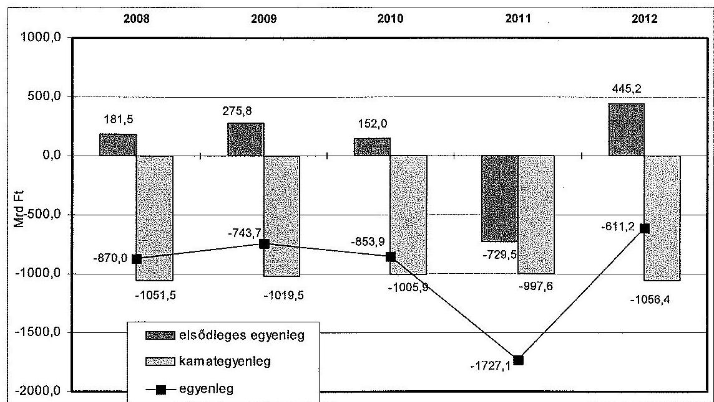
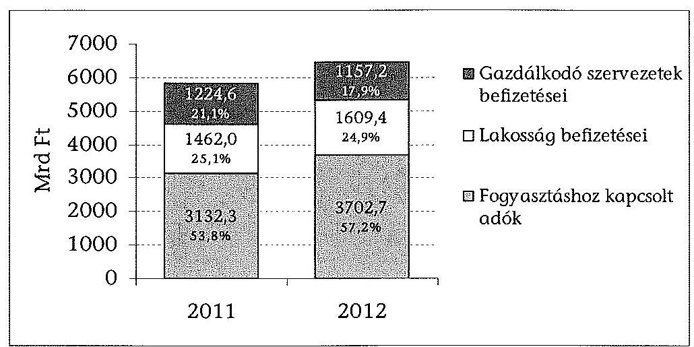
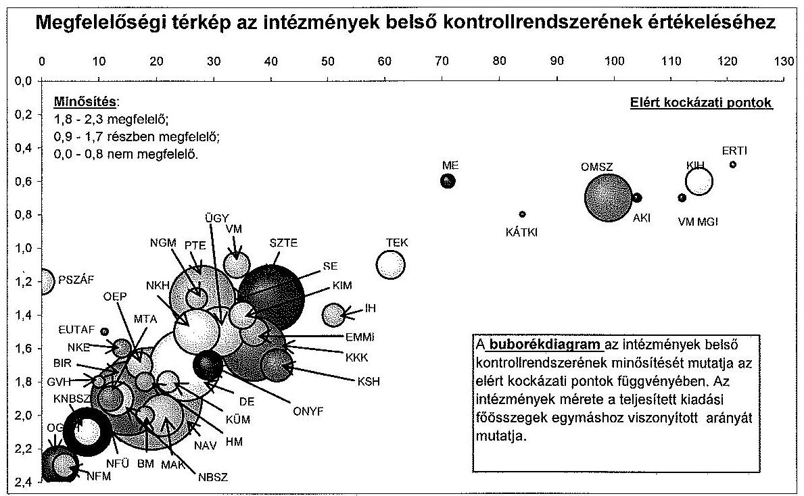
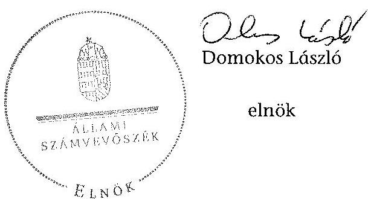

# ÁLLAMI   SZÁMVEVŐSZÉK 

## JELENTÉS

Magyarország 2012. évi központi költségvetése végrehajtásának ellenőrzéséről

---

# Állami Számvevőszék 

Iktatószám: V-0069-242/2013.
Témaszám: 1104
Vizsgálat-azonosító szám: V0629

## Az ellenőrzést felügyelte:

Dr. Horváth Margit
felügyeleti vezető

## Az ellenőrzés végrehajtásáért felelős:

Keresztes Tamás
ellenőrzésvezető

Az ellenőrzés végrehajtásában közremüködők:
Görgényi Gábor
számvevő tanácsos
Niklai Heléna
számvevő tanácsos

A számvevői munkaanyagok feldolgozásában és a Jelentés összeállításában közremüködtek:

| Barta József | Bene István | Csordás Péterné |
| :-- | :-- | :-- |
| számvevő tanácsos | számvevő | számvevő |
| Dormán István | Eötvös Magdolna | Federics Adrienn |
| Zoltán | számvevő tanácsos | számvevő tanácsos |
| számvevő |  |  |
| Fehér Piroska | Fekete Gábor | Ferencz Katalin |
| számvevő gyakornok | számvevő tanácsos | Zsuzsanna |
|  |  | számvevő tanácsos |
| Dr. Füredi Szabolcs | Gácsi Györgyi Ivett | Gregor Andrea |
| számvevő gyakornok | számvevő | számvevő gyakornok |
| Gyarmati István | Gyeraj Péter | Huszár Anna |
| számvevő tanácsos | számvevő | számvevő |
| Hadnagyné Papp | Jagicza Istvánné | Dr. Jakab Kornél |
| Ildikó | számvevő tanácsos | számvevő tanácsos |
| számvevő |  |  |

---

| Kováts Tibor Balázs számvevő | Meyerné Horváth Judit számvevő | Molnár Bálint számvevő |
| :--: | :--: | :--: |
| Németh Andrea számvevő gyakornok | Oláh Róbert számvevő tanácsos | Rurik Sarolta Edit számvevő gyakornok |
| Sápi Henriett számvevő | Séra Andrásné számvevő tanácsos | Szólya Ildikó számvevő tanácsos |
| Szöllősiné Hrabóczki   Etelka   számvevő tanácsos | Tukacs Éva számvevő tanácsos | Vasváriné Molnár Judit számvevő |
| Vlasits Ágnes számvevő | Winter Zsuzsa számvevő főtanácsos | Zagyi Judit számvevő tanácsos |
| Zakar László számvevő tanácsos |  |  |

# Az ellenőrzést végezték: 

| Baki István   számvevő tanácsos | Balázs Melinda   számvevő tanácsos | Baloghné Sebestyén   Éva   számvevő |
| :-- | :-- | :-- |
| Barta József   számvevő tanácsos | Bene István   számvevő | Berki László   számvevő |
| Bertalan Rudolf Gyula   számvevő | Bozsik Tamás   számvevő | Bretus Zoltán János   számvevő |
| Budai Éva   számvevő | Burenzsargal   Narantuja   számvevő tanácsos | Bús Zoltánné Hütter   Erzsébet   számvevő tanácsos |
| Buzás Zoltán   számvevő | Czmarkó Frigyes   György   számvevő | Csordás Péterné   számvevő |
| Dancsóné Kuron Ildikó   számvevő tanácsos | Daróczi Ágnes Lenke   számvevő | Deák Tamásné   számvevő tanácsos |

---

| Dobos András Csaba számvevő tanácsos | Eötvös Magdolna számvevő tanácsos | Ernst László számvevő tanácsos |
| :--: | :--: | :--: |
| Éva Katalin   számvevő tanácsos | Federics Adrienn számvevő tanácsos | Fekete Gábor számvevő tanácsos |
| Fekete Győr László számvevő | Fekete Mária számvevő | Fodor Edit számvevő |
| Fórián Erika számvevő tanácsos | Dr. Gaálné Berente Mónika számvevő | Gácsi Györgyi Ivett számvevő |
| Gelencsér Zsolt számvevő | Gergely Tilda számvevő | Gölöncsér Péter számvevő |
| Gyarmati István számvevő tanácsos | Dr. Györi Gabriella Márta számvevő | Hadházy Sándor György számvevő tanácsos |
| Hadnagyné Papp Ildikó számvevő | Dr. Halmné Harsányi Zsuzsa számvevő tanácsos | Hálóné Pelikán Veronika számvevő |
| Hámoriné Maróti Györgyi számvevő főtanácsos | Huszár Anna számvevő | Jagicza Istvánné számvevő tanácsos |
| Jakab Laura számvevő | Dr. Jártas Ágnes számvevő tanácsos | Jenei Zoltán Béláné számvevő |
| Kerekes Gábor számvevő | Kincses Erzsébet Eszter számvevő | Kisné Agócs Éva számvevő |
| Koczor László számvevő tanácsos | Kóródi Gábor számvevő | Kovács Richárd számvevő |
| Kováts Tibor Balázs számvevő | Kökény László számvevő tanácsos | Krüzselyi Attila számvevő tanácsos |
| Kulcsár Lászlóné számvevő | Kuszinger Andrea számvevő | Kuzma Ágota számvevő |

---

| Magyaricsné Hajdú Regina számvevő | Dr. Márton Gabriella számvevő tanácsos | Massányi Tibor számvevő tanácsos |
| :--: | :--: | :--: |
| Mészáros Ildikó Éva számvevő | Meyerné Horváth Judit számvevő | Molnár-Sipos Judit számvevő |
| Nagy Ildikó számvevő | Nagy László Imre számvevő | Nagyné Lakhézi Éva számvevő tanácsos |
| Dr. Németh Eszter számvevő | Némethné Nagy Mária számvevő | Oláh Róbert számvevő tanácsos |
| Orosz Diána számvevő | Pats Regina számvevő | Pencz Mária számvevő |
| Pénzes Gyula számvevő tanácsos | Polyák Ferenc számvevő tanácsos | Puskás Balázs számvevő |
| Rábai György számvevő | Reichert Margit számvevő | Robák Ferencné számvevő tanácsos |
| Samu István számvevő tanácsos | Sápi Henriett számvevő | Schmidt János számvevő |
| Séra Andrásné számvevő tanácsos | Sipos Attila számvevő | Szalontai Miklós számvevő tanácsos |
| Szepes Béla Bálint számvevő tanácsos | Szilágyi Zsuzsanna számvevő tanácsos | Dr. Szima Mária számvevő tanácsos |
| Szólya Ildikó számvevő tanácsos | Dr. Szöllősi Zsolt számvevő | Szöllősiné Hrabóczki Etelka számvevő tanácsos |
| Temesváry Miklós számvevő tanácsos | Terbe Mónika számvevő tanácsos | Tóth Árpád számvevő tanácsos |
| Tóth Béla számvevő | Tóth Richárd számvevő | Tóthné Nagy Éva számvevő főtanácsos |

---

| Tukacs Éva számvevő tanácsos | Turai Erzsébet számvevő | Uram Ferenc számvevő tanácsos |
| :--: | :--: | :--: |
| Vacsora Erika számvevő tanácsos | Valastyánné dr. Vízhányó Júlia számvevő | Varga Ágnes Klára számvevő |
| Varsányiné Dudás   Eleonóra   számvevő | Vas Lajos számvevő tanácsos | Dr. Vass Gábor számvevő tanácsos |
| Vasváriné Molnár Judit számvevő | Vida Cecília számvevő | Vincze Béla Róbert számvevő |
| Völgyesi Mátyás számvevő | Vörös Mária számvevő főtanácsos | Vörösné Lakatos Zsuzsanna számvevő |
| Winter Zsuzsa számvevő főtanácsos | Zachár Péterné számvevő tanácsos | Zagyi Judit számvevő tanácsos |
| Zaroba Szilvia számvevő tanácsos | Dr. Zelei Andrásné számvevő | Dr. Zsolnay András számvevő |
| Hajdu Károlyné számvevő tanácsos | Kovácsy Tamás számvevő tanácsos |  |

# A témához kapcsolódó eddig készített számvevôszéki jelentések: 

címe
sorszáma
Jelentés a Magyar Köztársaság 2011. évi költségvetése végrehajtásának ellenőrzéséről
Jelentés a belső kontrollrendszer és a belső ellenőrzés szabályszerűségének a zárszámadási ellenőrzésbe bevont központi költségvetési intézményeknél lefolytatott ellenőrzéséről
Jelentés a 2011. évi költségvetés fejezeti kezelésű előirányzatai tervezésének és évközi módosításainak a szabályszerűség és a pénz-ügyi-szakmai megalapozottság szempontjából történő ellenőrzéséről

---

# TARTALOMJEGYZÉK 

BEVEZETÉS ..... 5
I. ÖSSZEGZŐ MEGÁLLAPÍTÁSOK, KÖVETKEZTETÉSEK, JAVASLATOK ..... 8
II. RÉSZLETES MEGÁLLAPÍTÁSOK ..... 21
A) A ZÁRSZÁMADÁSI TÖRVÉNYJAVASLAT MEGBÍZHATÓSÁGA ..... 21
B) A KÖZPONTI ALRENDSZER ..... 24

1. A központi költségvetés 2012. évi törvényi előirányzatainak teljesítése, a hiány alakulása ..... 24
2. A központi alrendszer finanszírozása és bruttó adóssága ..... 25
3. A kormányprogramok végrehajtása ..... 28
4. A központi költségvetés közvetlen bevételei és kiadásai, a belső kontrollok múködése és az elszámolások megbízhatósága ..... 30
4.1. A közvetlen bevételek előirányzatainak teljesülése ..... 30
4.2. A közvetlen bevételek elszámolásának megbízhatósága és a belső kontrollok múködése ..... 34
4.3. A közvetlen kiadások, adósságszolgálattal, állami vagyonnal kapcsolatos kiadások előirányzatainak felhasználása ..... 40
4.4. A központi tartalékok felhasználása ..... 46
4.5. A közvetlen kiadások elszámolásának megbízhatósága és a belső kontrollok múködése ..... 47
5. A NAV és a Kincstár informatikai rendszerei ..... 50
6. A költségvetési szervek és a fejezeti kezelésű előirányzatok ..... 53
6.1. A belső kontrollrendszerek múködése ..... 56
6.2. A költségvetési beszámolók minősítése ..... 61
6.3. A kiadási és bevételi előirányzatok alakulása ..... 63
6.4. A pénzforgalmi folyamatok szabályszerűsége ..... 69
6.5. A KIM intézményeinek gazdálkodása ..... 77
7. Az európai uniós támogatások ..... 81
7.1. A támogatások felhasználása és az Európai Unióval történő elszámolások ..... 81
7.2. Az Uniós fejlesztések fejezet előirányzatainak felhasználása ..... 85
8. Az elkülönített állami pénzalapok költségvetésének végrehajtása ..... 87

---

9. A társadalombiztosítás pénzügyi alapjai költségvetésének végrehajtása ..... 90
9.1. A Nyugdíjbiztosítási Alap költségvetésének végrehajtása ..... 90
9.2. A Nyugdíjbiztosítási Alap belső kontrolljainak múködése ..... 93
9.3. Az Egészségbiztosítási Alap költségvetésének végrehajtása ..... 94
9.4. Az Egészségbiztosítási Alap belső kontrolljainak múködése ..... 96
C) FELKÉSZÜLÉS A 2014. ÉVI KÖLTSÉGVETÉS VÉLEMÉNYEZÉSÉRE ..... 98
D) UTÓELLENŐRZÉS ..... 99
10.A Magyar Köztársaság 2011. évi költségvetése végrehajtásának ellenőrzése (1297) ..... 99
11.A belső kontrollrendszer és a belső ellenőrzés szabályszerűségének a zárszámadási ellenőrzésbe bevont központi költségvetési intézményeknél lefolytatott ellenőrzése (1298) ..... 100
12. A 2011. évi költségvetés fejezeti kezelésű előirányzatai tervezésének és évközi módosításainak a szabályszerűség és a pénzügyi-szakmai megalapozottság szempontjából történő ellenőrzése (1299) ..... 101
MELLÉKLETEK
1. számú Rövidítések jegyzéke
2. számú A kockázatelemzés alapján ellenőrzésre kiválasztott költségvetési szervek
3. számú A 2012. évi költségvetés végrehajtásának ellenőrzésébe bevont szervezetek
4. számú A 2010., a 2011. és a 2012. évi zárszámadás ellenőrzése során a beszám- lókra/elszámolásokra adott minősítések
5. számú A Széll Kálmán Tervek végrehajtása érdekében 2012. évben történt intézkedések értékelése
6. számú Kiemelt közérdeklődésre számot tartó területek
7. számú Belső kontroll felmérés eredménye az intézményeknél és a fejezeti kezelésű előirányzatoknál 2012. évben
8. számú Belső kontroll felmérés eredménye a nyilatkozatok figyelembevételével az intézményeknél és a fejezeti kezelésű előirányzatoknál 2012. évben
9. számú Az NSRK 2007-2012 között megítélt, szerződéssel lekötött és kifizetett össze- geinek alakulása a 2007-2013-as keret \%-ában
10. számú Az ÚMVP 2007-2012 között szerződéssel lekötött és kifizetett összegeinek alakulása a 2007-2013-as keret \%-ában
11. számú Az elkülönített állami pénzalapok 2012. évi költségvetési adatai
12. számú Utóellenőrzés
13. számú Az EDP egyenleg levezetése a GDP \%-ában
14. számú Az ellenőrzött szervezetek ÁSZ által el nem fogadott észrevételei

---

# RÖVIDÍTÉSEK JEGYZÉKE 

A rövidítések jegyzékét az 1. számú melléklet tartalmazza.

---

.

---

# JELENTÉS 

## Magyarország 2012. évi központi költségvetése végrehajtásának ellenőrzéséről

## BEVEZETÉS

Az államháztartásért felelős miniszter a jogszabályi határidőnek megfelelően 2013. június 30 -án átadta az ÁSZ részére a Kormány által elfogadott, a Magyarország 2012. évi központi költségvetése végrehajtásáról szóló törvényjavaslatot. Elvégeztük a törvényjavaslat adatainak és a helyszíni ellenőrzés során kapott adatok összevetését, ellenőriztük az adatok közötti konzisztenciát. A 2012. évi zárszámadási törvényjavaslatról kialakított véleményünket a beszámolóknál, illetve az elszámolásoknál számszerúsített hibákra alapoztuk. Az ellenőrzés lefolytatásának jogalapját az Állami Számvevőszékről szóló 2011. évi LXVI. törvény 5. § (7) bekezdése képezte.

A zárszámadási ellenőrzés célja volt egyrészről a megfelelő bizonyosság megszerzése arról, hogy a 2012. évi költségvetés végrehajtásáról készített törvényjavaslatot megalapozó pénzügyi beszámolók/elszámolások összessége nem tartalmaz a megbízhatóságot befolyásoló lényeges hibát.

Másrészt ellenőrzésünk feladata volt annak megállapítása, hogy az ellenőrzött szervezeteknél a gazdálkodás és a szakmai feladatellátás szabályszerü volt-e, megfelelt-e a vonatkozó jogszabályok és egyéb szabályozások előírásainak, továbbá annak feltárása, hogy a költségvetés végrehajtásában jog- és hatáskörrel rendelkezők a jogszabályokban kapott felhatalmazásuk szerint, az előírásoknak megfelelően jártak-e el; a kapott felhatalmazások keretei között a kötelezettségeiknek megfelelően gazdálkodtak-e a közpénzekkel. Ellenőrzésünk során elvégeztük a gazdálkodási kereteket megalapozó kormányzati programok, így a Széll Kálmán Tervben és a Konvergencia Programban a 2012. évre kitűzött célok, feladatok végrehajtásának vizsgálatát.

Az ellenőrzés további céljai között szerepelt a költségvetés végrehajtásáról készített törvényjavaslat összeállítási folyamatának ellenőrzése, a törvényjavaslat törvényességi - különös tekintettel az Áht. 89. §-ában foglaltak - ellenőrzése és az Országgyűlés (OGY) megalapozott döntéshozatalának támogatása érdekében a törvényjavaslat egésze megbízhatóságának értékelése. Ennek keretében törekedtünk annak feltárására, hogy vajon a Kvtv. 2012. évi módosításainak indokai és háttérszámításai kellően megalapozták-e az OGY döntéseit.

Magyarország 2012. évi központi költségvetését az Országgyűlés a 2011. évi CLXXXVIII. törvényben hagyta jóvá. Év közben a törvényt többször módosították. A módosítások érdemben nem befolyásolták a kiadási és a bevételi főöszszeget és a központi költségvetés hiányát. A jelentősebb módosítások az ön-

---

kormányzati alrendszer adósságátvállalásához, valamint az általános forgalmi adó bevételének növeléséhez és ezzel egyidejűleg a szakmai fejezeti kezelésű előirányzatok kiadásinak emeléséhez kapcsolódtak.

Mindezeken túl ellenőrzésünk célja volt, hogy az Állami Számvevőszék (ÁSZ) megállapításaival hozzájáruljon a ,jó kormányzás" megerősítéséhez.

Az ellenőrzés keretében első ízben értékeltük a zárszámadási törvényjavaslat összeállításának folyamatát. Teljes körűen ellenőriztük a központi kezelésű bevételi és kiadási előirányzatokat, a fejezeti kezelésű előirányzatokat, a minisztériumok igazgatási címeiről készített beszámolókat, valamint az elkülönített állami pénzalapok és a társadalombiztosítás pénzügyi alapjai költségvetésének végrehajtását. Az ellenőrzés kiemelt figyelmet fordított a Közigazgatási és Igazságügyi Minisztériumra (KIM), ahol a 2011. évi zárszámadás ellenőrzésében a Belügyminisztérium költségvetési intézményeinél bevált statisztikai mintavételezést továbbfejlesztve alkalmaztuk. Ennek keretében átfogó képet nyertünk a teljes fejezet gazdálkodásáról. Alkalmaztuk a kockázatelemzést a központi alrendszer további intézményeinek ( 21 db ) a zárszámadási ellenőrzésbe történő bevonásához, mellyel az intézményi lefedettséget növeltük (2. számú melléklet).

Helyszíni ellenőrzés keretében mintegy száz intézmény, fejezeti kezelésű előirányzat beszámolójának, gazdálkodásának auditálását, valamint több tucat központi kezelésű bevétel és kiadás ellenőrzését végeztük el.

A Nyugdíjbiztosítási Alap és az Egészségbiztosítási Alap tekintetében ellenőriztük és minősítettük az intézményi éves elemi költségvetési beszámolót, az ellátási éves elemi költségvetési beszámolót, az alap konszolidált éves költségvetési beszámolóját, valamint a Nyugdíjbiztosítási Alap és az Egészségbiztosítási Alap összevont konszolidált éves költségvetési beszámolóját. Az elkülönített állami pénzalapok és az Egészségbiztosítási Alap esetében hasznosítottuk a könyvvizsgálók által kiadott minősítéseket és megállapításokat.

A zárszámadási ellenőrzés általános céljaival összhangban, a terület sajátosságaira figyelemmel, ellenőriztük az uniós és a kapcsolódó költségvetési támogatások felhasználását az érintett fejezeteknél. Értékeltük a 2007-2013. évi uniós költségvetési periódus programjainak időarányos teljesülését és a támogatások lehívását, továbbá az Európai Unióval való 2012. évi elszámolásokat. A zárszámadási ellenőrzés ugyanakkor nem terjedt ki az uniós támogatások felhasználását ellenőrző hazai szervezetek ellenőrzési tevékenységének minősítésére.

A zárszámadási ellenőrzéshez ebben az évben is kapcsolódnak további ellenőrzések. Az ÁSZ stratégiájában lefektetett irányoknak megfelelően a központi intézmények köréből emeltünk be az ellenőrzésbe hét intézményt, amelyeknél a zárszámadás keretében elvégeztük a beszámolók minősítését, azt követően pedig a szakmai feladatellátással, a gazdálkodással kapcsolatban több évre kitekintő értékelést adunk a külön szabályszerűségi ellenőrzések keretében.

---

Ezek együttes hatásaként a helyszíni ellenőrzés lefedte a központi alrendszer Kvtv. szerinti bevételi föösszegének 97\%-át, illetve kiadási föösszegének 91\%-át, több mint 140 Mrd Ft-tal megnöveltük az ellenőrzési lefedettséget az előző évhez képest. Az ellenőrzésbe bevont szervezeteket a 3. számú melléklet tartalmazza.

A beszámolók, illetve az elszámolások megbízhatóságát, a költségvetés végrehajtásának szabályszerűségét a pénzügyi-szabályszerüségi ellenőrzés módszerével értékeltük. A pénzügyi-szabályszerűségi ellenőrzés lényege, hogy az ellenőrzés terjedelme a belső kontrollrendszerek kockázatbecslésén alapul, amely meghatározza a mintavételi darabszámot. A KIM fejezet intézményeinél alkalmazott ellenőrzési módszer a költségvetési címek pénzforgalmi ellenőrzésére és a követelések, kötelezettségek, aktív és passzív pénzügyi elszámolások, valamint az előirányzat-maradványok keletkezésének és felhasználásának ellenőrzésére irányult. A KIM többintézményes intézményi címek ellenőrzése során az adott címhez/alcímhez tartozó összes intézmény főkönyvi adatbázisát aggregáltuk. Ez képezte a mintavételezés alapját. Ennek eredményeként a többintézményes címek/alcímek ellenőrzését, amely több mint 400 intézményt jelentett, a KIM irányító szerve közreműködésével az adott intézmények helyszíni ellenőrzése nélkül tudtuk elvégezni. Ez az ellenőrzési megközelítés - az erőforrásokkal való takarékos gazdálkodás, valamint az ellenőrzési bizonyosság magas szinten tartása mellett - nagymértékben hozzájárult a zárszámadás ellenőrzési lefedettségének növeléséhez.

Az ellenőrzés során kiemelt figyelmet fordítottunk a 2011. évi zárszámadási ellenőrzés és a kapcsolódó ( 1298 és 1299 számú jelentések) ellenőrzések során feltárt hiányosságok felszámolására tett intézkedésekre, azok végrehajtására és hasznosulására.

A beszámolók minősítéséhez tízezres nagyságrendű mintatétel dokumentum alapú ellenőrzését végeztük el. Jelentésünkben a mintegy 3000 oldalt kitevő számvevői munkaanyag adatait, minősítéseit, megállapításait szintetizáltuk.

Az ÁSZ az Állami Számvevőszékről szóló 2011. évi LXVI. törvény 29. §-a szerint a jelentéstervezetet megküldte az ellenőrzött szervezetek vezetőinek. A határidőben beérkezett és figyelembe nem vett észrevételeket, valamint az el nem fogadás indokolását a jelentés 14. számú melléklete tartalmazza.

---

# I. ÖSSZEGZŐ MEGÁLLAPÍTÁSOK, KÖVETKEZTETÉSEK, JAVASLATOK 

Ellenőrzésünk során megállapítottuk, hogy a 2012. évi költségvetés végrehajtása a jogszabályi előírásoknak megfelelt, a zárszámadási törvényjavaslat megalapozott és a törvényjavaslatban szerepeltetett adatok megbízhatóak. A beszámolóknál és elszámolásoknál feltárt hibák ${ }^{1}$ összességükben nem érték el azt a szintet, hogy a törvényjavaslat egészének megbízhatóságát befolyásolják.

Ellenőriztük a zárszámadási törvényjavaslatban szereplő adatok helytállóságát és alátámasztottságát. Ennek keretében elvégeztük a költségvetés végrehajtásáról készített, az Országgyűlés elé terjesztendő zárszámadásról szóló törvényjavaslat adatainak és a helyszíni ellenőrzés során kapott adatok összevetését, ellenőriztük az adatok közötti konzisztenciát. Megállapítottuk, hogy a beszámolók és elszámolások, valamint a törvényjavaslat adatai összhangban vannak.

A törvényjavaslat szöveges indokolása a reálfolyamatok értékeléséből kiindulva bemutatja a költségvetés eredetileg kitűzött céljait, azok teljesülését és ehhez kapcsolódóan elemzi a pénzügyi-jövedelmi folyamatokat. A zárszámadási törvényjavaslat adatait a szöveges indokolások megfelelően alátámasztják.

Az ellenőrzés keretében első ízben értékeltük a törvényjavaslat öszszeállításának folyamatát. A zárszámadási törvényjavaslat összeállításával kapcsolatban szabályozási, valamint az informatikai rendszert érintő hiányosságokat állapítottunk meg. Kockázatot jelent a törvényjavaslat összeállítása során, hogy a folyamatban alkalmazott kontrollok az NGM-nél szabályozási szinten nem jelennek meg, így nem számon kérhetők, nem reprodukálhatók. Az NGM, illetve az adatszolgáltatók (NAV, Kincstár, ÁKK Zrt., fejezetek, alapok kezelői) közötti adategyeztetések manuálisan történnek. Ezen felül kockázatot jelent, hogy nem teljesen zárt a törvényjavaslat összeállításához alkalmazott informatikai rendszer, abból a szempontból, hogy a rendszer nem teljes körűen dokumentált és naplózott, emiatt a folyamatok nem teljes körűen reprodukálhatóak.

A 2012. évi költségvetési folyamatok a 2011. évihez képest összességében kedvezőbbek voltak, amelyet alátámaszt a hiány alakulása, továbbá a gazdálkodás tervszerűségének és a beszámolók, illetve elszámolások megbízhatóságának javulása.

[^0]
[^0]:    ${ }^{1}$ A zárszámadás egészére összesített hibák összege 9,9 Mrd Ft, ennek 49,8\%-át az alapoknál, $43,9 \%$-át az intézményeknél azonosítottuk. A feltárt hibák összege nem haladja meg a központi alrendszer 15021,2 Mrd Ft-os kiadási főösszegének 2\%-át, 300,4 Mrd Ft-ot, azaz a lényegességi küszöböt.

---

Az államháztartás központi alrendszerének költségvetése integrálja a központi költségvetés, az elkülönített állami pénzalapok és a társadalombiztosítás pénzügyi alapjai előirányzatait. Az elfogadott Kvtv.-ben az OGY az államháztartás központi alrendszerének bevételi főösszegét 14 340,9 Mrd Ftban, kiadási főösszegét 14 917,1 Mrd Ft-ban, hiányát 576,2 Mrd Ft-ban állapította meg. A Kvtv. többszöri módosításával a központi alrendszer bevételi főöszszege 14 437,1 Mrd Ft-ra, kiadási főösszege 15 109,0 Mrd Ft-ra, a hiány összege 671,9 Mrd Ft-ra módosult. A hiány összegének módosítását az önkormányzati adósságok törlesztéséhez nyújtott állami támogatás 95,7 Mrd Ft összegben tervezett kiadása indokolta.

A zárszámadási törvényjavaslat az államháztartás központi alrendszerének 2012. évi pénzforgalmi hiányát 598,6 Mrd Ft-ban határozza meg, amely egyharmada a 2011. évinek. 2012-ben nem merültek fel olyan egyszeri kiadási tételek, amelyek a tervezett hiány mértékét jelentősen elmozdították volna. A pénzforgalmi szemléletű hiány a törvényi módosításokkal megemelt összegnél 10,9\%-kal kisebb lett. A központi alrendszer finanszírozása az év minden napján biztosított volt. Magyarország 2012. évi központi költségvetése végrehajtásának összesített adatai alapján megállapítható, hogy az év közben előre nem látható események megfelelő kezelésével, tervszerűen történt a költségvetés végrehajtása.

Az államháztartás központi alrendszerének 2012. évi pénzforgalmi szemléletű hiánya (Mrd Ft-ban)

| Megnevezés | Módosított   elöirányzat | Tényleges   teljesités | Eltérés |
| :-- | :--: | :--: | :--: |
| Központi költségvetés | $-689,5$ | $-611,2$ | 78,3 |
| Elkülönített állami   pénzalapok | 53,0 | 130,1 | 77,1 |
| Nyugdíjbiztosítási Alap | 0,0 | $-70,6$ | $-70,6$ |
| Egészségbiztosítási Alap | $-35,3$ | $-46,9$ | $-11,6$ |
| Központi alrendszer | $\mathbf{- 6 7 1 , 8}$ | $\mathbf{- 5 9 8 , 6}$ | $\mathbf{7 3 , 2}$ |

A pénzforgalmi egyenlegtől eltér az EU módszertana szerint kiszámított egyenleg (EDP egyenleg), amely a bevételeket és kiadásokat szélesebb körre, a kormányzati szektorra eredményszemléletben veszi figyelembe és piaci értékelést alkalmaz. Az EU a különböző eljárások (pl. túlzott hiány eljárás) során ezt az egyenleget veszi figyelembe. Az államháztartás ${ }^{2}$ EDP egyenlege ${ }^{3}$ 2012. évben a GDP 1,9\%-a lett, így a hiány a Konvergencia Programban kitüzött 2,5\% alatt maradt. Az EDP egyenleg 2011. évben 4,3\% többletet mutatott elsősorban a magán-nyugdíjpénztári rendszerből a társadalombiztosítási rendszerbe visszalépők vagyonának NYRACSA-hoz történő átvétele miatt.

[^0]
[^0]:    ${ }^{2}$ A központi és az önkormányzati alrendszerek.
    ${ }^{3}$ Az EDP egyenleg levezetését a 13. számú melléklet tartalmazza.

---

A pénzforgalmi hiány alakulását a központi alrendszer egyes területei különböző arányban és ellentétes irányban befolyásolták. A központi költségvetés pénzforgalmi hiányának GDP arányos mutatója 2,2\%-ra, 0,2 százalékponttal a tervezett érték felett teljesült. Az aránynövekedés mögött a GDP tervezettnél ${ }^{4}$ kisebb növekedése, továbbá az önkormányzati adósságok törlesztéséhez nyújtott állami támogatás nem tervezett kiadása állt. Pozitívan befolyásolta a központi alrendszer pénzforgalmi egyenlegének alakulását az elkülönített állami pénzalapok tervezettnél nagyobb többlete. Ezzel ellentétes hatást gyakorolt az egyenlegre a TB Alapok hiányának nem tervezett növekedése, amit döntően a nyugdijkiadások vártnál 3\%-kal magasabb teljesülése okozott.

Meghatározóak a költségvetési egyenleg alakulásának szempontjából az ún. felülről nyitott kiadási előirányzatok, ${ }^{5}$ mivel teljesülésük módosítás nélkül eltérhet az előirányzattól. Ezen előirányzatok teljesülése a 2012. évi hiányt negatívan nem befolyásolta, mivel összességében nem lépték túl a módosított előirányzatot, annak 94,9\%-ában teljesültek.

A központi költségvetés elsődleges egyenlege ${ }^{6}$ 2012-ben (445,2 Mrd Ft) a 2004. évi Európai Uniós csatlakozás óta az egyes évek adatait összehasonlítva a legkedvezöbb volt. Hasonlóképpen a pénzforgalmi szemléletű hiány (-611,2 Mrd Ft) is, annak ellenére, hogy a negatív kamategyenleg 58,8 Mrd Fttal nőtt.

# A központi költségvetés egyenlegének alakulása 

[^0]
[^0]:    ${ }^{4}$ A 2012. évi költségvetésben a folyóáras GDP-t 29 188,0 Mrd Ft-ban tervezték. Ugyanakkor a gazdaság teljesítménye 2012-ben 1,7\%-kal csökkent a külső gazdasági környezet, az egyszeri hatások, illetve a takarékossági intézkedések miatt. 2012-ben a bruttó hazai termék értéke folyó áron 28 252,2 Mrd Ft lett. (Forrás: KSH)
    ${ }^{5}$ A központi alrendszer Kvtv. 9. számú mellékletében felsorolt előirányzatai.
    ${ }^{6}$ Az elsődleges egyenleg a kamatbevételek/kiadások nélküli egyenleget jelenti.

---

A Kormánynak 2012-ben a 2011. évihez (214,9 Mrd Ft) képest kisebb összegben kellett elrendelnie a költségvetési egyenleg tartását biztosító intézkedéseket ( $86,2 \mathrm{Mrd} \mathrm{Ft}$ ). A költségvetési szervek, illetve a fejezeti kezelésű előirányzatok esetében végrehajtott zárolások összegét év végén elvonták. A Kormány a hiánycél tartása érdekében nem engedélyezte a fejezeteknek a $27,1 \mathrm{Mrd}$ Ft öszszegű egyensúlybiztosítási tartalékaik felhasználását. Maradványtartási kötelezettséget - a korábbi évek gyakorlatától eltérően - nem írtak elő, viszont a beruházás jellegű beszerzéseket a 2011. évhez hasonlóan 2012-ben is korlátozták, a közigazgatásban dolgozók létszámkeretét közel 2\%-kal (6398 fővel) csökkentették. A költségvetési szervek és a fejezeti kezelésű előirányzatok maradványa annak ellenére, hogy a Kormány nem rendelt el maradványtartást, az előző három év tendenciáját követve tovább emelkedett. A 2012. évi maradvány összege 710,7 Mrd Ft, amely a 2011. évi ( $602,0 \mathrm{Mrd}$ Ft) maradványhoz képest közel $20 \%$-kal növekedett.

A központi tartalékok a céltartalékból, a rendkívüli kormányzati intézkedésekre szolgáló tartalékból, az Országvédelmi Alapból és a kamatkockázati tartalékból állnak. A tartalékok felhasználása $55,4 \%$-os volt, összesen $200763,6 \mathrm{MFt}$ tot tett ki. A költségvetés kiadási vagy bevételi oldalát negatívan befolyásoló tényezők, kockázatok kivédése érdekében létrehozott Országvédelmi Alap ( 170,0 Mrd Ft), illetve a kamatkockázati tartalék ( $98,0 \mathrm{Mrd}$ Ft) előirányzatainak felhasználására nem került sor. Rendkívüli kormányzati intézkedésekre szolgáló tartalékot kell képezni az előre nem valószínűsíthető, nem tervezhető költségvetési kiadásokra és az előirányzott, de elháríthatatlan ok miatt elmaradó költségvetési bevételek pótlására. Ezen tartalékból 46,8 Mrd Ft-ot az Áht. 2012. évben hatályos előírásaitól eltérően ${ }^{7}$ a fejezetek egyébként tervezhető többlet-forrás-igényének finanszírozására használták fel. ${ }^{8}$

A központi alrendszer 2012. évi bruttó adósságállománya (20 720,1 Mrd Ft) a GDP arányában 73,3\% volt, amely 1,8 százalékponttal (235,4 Mrd Ft-tal) alacsonyabb az előző évinél, így hozzájárult ahhoz, hogy az államadósság ${ }^{9}$ a csökkenő tendencia tekintetében megfeleljen az Alaptörvényben, illetve a Stabilitási törvényben elöírtaknak. Az adósság csökkenése irányába hatott a tervezettnél alacsonyabb év végi devizaárfolyam (az árfolyamváltozás hatása 662,0 Mrd Ft volt), a NYRACSA eszközeinek értékesítéséből-, és egyéb bevételeiből származó, valamint az állampapír bevonásból megvalósított adósságtörlesztés (355,2 Mrd Ft).

A központi alrendszer adósságán belül a forint adósság részaránya $\mathbf{5 8 , 1 \%}$, míg a devizaadósságé $40,2 \%$ volt 2012. év végén. Az arány a 2011. évihez viszonyítva kedvezően alakult a forint árfolyamának erősödése és a lejárt devizaadósság döntően forint kibocsátásokból történő refinanszírozása miatt. En-

[^0]
[^0]:    ${ }^{7}$ Az Áht. tartalékokra vonatkozó szabályai 2013. január 1-jétől módosultak, így a Rendkívüli kormányzati intézkedésekre szolgáló tartalékot már szabályosan lehet az év közben meghozott kormányzati döntések finanszírozására fordítani.
    ${ }^{8}$ 2011-ben a szabálytalanul felhasznált tartalék 19,5 Mrd Ft volt.
    ${ }^{9}$ A központi alrendszer adósságán felül tartalmazza az önkormányzati szektor adósságát is.

---

nek köszönhetően a devizaadósság 2012. évi aránya 9 százalékponttal mérséklődött. Az arányváltozás hozzájárul Magyarország árfolyamkitettségének csökkentéséhez.

Az EU módszertana egy szélesebb körű adósság meghatározást alkalmaz, az ún. kormányzati szektor adósságát, amely magában foglalja a központi alrendszer, az önkormányzati alrendszer, illetve egyes állami tulajdonú gazdasági társaságok adósságát is. A kormányzati szektor adósságát a Konvergencia Program a GDP 78,4\%-ában határozta meg. Az adósság a GDP 79,2\%ában, 22 381,0 Mrd Ft-ra teljesült, a vártnál alacsonyabb GDP miatt. Az adósság a 2011. évi adathoz képest így is 2,2 százalékponttal csökkent.

A hazai költségvetésben 2012-re 1567,4 Mrd Ft EU forrás felhasználást terveztek, amely 1088,5 Mrd Ft összegben ${ }^{10} 69,4 \%$-ban teljesült. A Kormány intézkedéseket hozott az EU források igénybevételének gyorsítására. A gyorsítás 2012-ben részlegesen fejtette ki a hatását. A programokra teljesített kötelezettségvállalások az időarányoshoz mérten jobb arányt mutattak az Új Magyarország Vidékfejlesztési Programnál. A Nemzeti Stratégiai Referencia Keret Operatív Programjaira 2013. év végéig Magyarország számára rendelkezésre álló uniós és kapcsolódó hazai társfinanszírozás 8209,3 Mrd Ft összegű keretét 77\%-ra kötötték le támogatási szerződéssel. A teljesített kifizetések aránya a 2011. év végi 28,0\%-ról 2012. év végére $40,7 \%$-ra emelkedett. A 2007-2012. között lekötött összegek és a teljesített kifizetések azonban továbbra is elmaradtak az időarányostól. Az Operatív Programok egyharmadánál (ÁROP, EKOP, KEOP, TÁMOP, TIOP) a 2012. évi adatok alapján - kormányzati, illetve európai bizottsági intézkedések hiányában - továbbra is magas a forrásvesztés kockázata. Az agrár- és vidékfejlesztési uniós támogatásokra az Új Magyarország Vidékfejlesztési Program ${ }^{11}$ kötelezettségvállalások tekintetében a teljesítés meghaladta ugyan az időarányost, a kifizetések teljesítése azonban elmaradt, a teljes keret $59,4 \%$-át érte el (872,6 Mrd Ft összegben).

A társadalombiztosítási alapok előirányzatai a központi alrendszer mintegy harmadát teszik ki. Az Egészségbiztosítási Alapból fedezik a természetbeni és pénzbeli ellátásokat, a Nyugdíjbiztosítási Alapból a profiltisztításnak megfelelően már kizárólag a nyugdíjakat.

A TB Alapok törvényi módosított bevétele 4449,7 Mrd Ft, kiadása 4485,0 Mrd Ft volt. A bevételek 4510,6 Mrd Ft-ra (101,4\%), a kiadások 4628,1 Mrd Ft-ra (103,2\%) teljesültek, így a TB Alapok 117,6 Mrd Ft hiánnyal zártak. A Nyugdíjbiztosítási Alap kiadásai 2011. évhez képest közel 7\%-kal csökkentek, mivel a rokkantsági és rehabilitációs ellátások finanszírozása az Egészségbiztosítási Alaphoz került. Az Ny. Alap 2012-ben a tervezett nullszaldóhoz képest 70,6 Mrd Ft hiánnyal zárt. Ezt egyrészt a kiegészítő nyugdíjemelés (a januárban végrehajtott nyugdíjemelésen túl, a makrogazdasági paraméterek kedvezőbb alakulása miatti további 1,6\%-os emelés), másrészt a 40 év jogosultsági idővel nyugellátást igénybe vevő nők tervezettet jelentősen meghaladó létszáma

[^0]
[^0]:    ${ }^{10}$ Az Uniós támogatások (11,6 Mrd Ft összegű) utólagos megtérülésével együtt.
    ${ }^{11}$ 2012-től Darányi Ignác Terv.

---

( 77 ezer fő vette igénybe, amely mintegy 30 ezer fővel magasabb a vártnál) együttesen okozta. Az Egészségbiztosítási Alap 2012. évi (-46,9 Mrd Ft) hiánya a vártnál $32,8 \%$-kal magasabb lett, ugyanakkor a 2011. évihez (-83,4 Mrd Ft) képest közel a felével csökkent a gyógyszertámogatás kiadásain elért megtakarítás eredményeképpen. A Társadalombiztosítási Alapok múködési költsége - a korábbi évek tendenciáit követve - alacsony volt, mindössze a kiadási főösszeg $0,5 \%$-át tette ki.

Az elkülönített állami pénzalapok ${ }^{12}$ egyes jól körülhatárolható területeken nyújtanak támogatást a mintegy 380 Mrd Ft kiadásukkal, így a foglalkoztatás, a kutatás, a nukleáris hulladéktárolás, a határon túli magyarok és a kultúra támogatása, valamint az árvízvédelem területén. Az alapok közül a legnagyobb összegű kiadást a foglalkoztatási alap teljesítette, mintegy 305 Mrd Fttal. Az alapok együttes egyenlege 130,1 Mrd Ft többlettel zárt, amely 2,5-szer nagyobb a tervezettnél. Ez zömében ( $67 \%$-ban) a Nemzeti Foglalkoztatási Alaphoz köthető, ahol a bevételek jelentősen túlteljesültek, részint a szakképzési hozzájárulás ${ }^{13}$ kedvezményeinek megszüntetése, részint az egészségbiztosítási és munkaerő-piaci járulék alapot megillető bevétel túlteljesülése miatt.

Ellenőrzésünk fókuszát képezte a központi költségvetési bevételek és kiadások teljesítésének értékelése. Ezen belül az adó és adójellegủ bevételek összege a tervezetthez képest összességében 355,4 Mrd Ft-tal ( $5,2 \%$-kal) alacsonyabb összegben teljesült a módosított előirányzathoz képest. A gazdálkodó szervezetek befizetései 82,5\%-ra, fogyasztáshoz kapcsolt adók $98,9 \%$-ra, a lakosság befizetései pedig $96 \%$-ra teljesültek. A pénzügyi szervezetek különadójából a vártnál 102,1 Mrd Ft-tal ( $54,6 \%$-kal), az eva-ból 78,5 Mrd Ft-tal ( $34,9 \%$-kal), az szja-ból 75,9 Mrd Ft-tal ( $4,8 \%$-kal) kevesebb öszszeg folyt be. A pénzügyi szervezetek különadójánál az alacsonyabb összegű teljesítést az okozta, hogy a pénzügyi szervezetek egy törvénymódosítás alapján a végtörlesztéshez kapcsolódó veszteségeik egy részével csökkenthették a befizetési kötelezettségeiket.

# A 2012. évi adó és adójellegú bevételek alakulása 

| Megnevezés | Módosított   elöirányzat   (Mrd Ft) | Teljesités   (Mrd Ft) | Teljesités   - módosi-   tott   (Mrd Ft) |
| :-- | :--: | :--: | :--: |
| Gazdálkodó szervezetek befizetései | 1402,6 | 1157,2 | $-245,4$ |
| Fogyasztáshoz kapcsolt adók | 3745,0 | 3702,7 | $-42,3$ |
| Lakosság befizetései | 1677,1 | 1609,4 | $-67,7$ |
| Adó és adójellegú bevételek   összesen | $\mathbf{6 8 2 4 , 7}$ | $\mathbf{6 4 6 9 , 3}$ | $\mathbf{- 3 5 5 , 4}$ |

[^0]
[^0]:    ${ }^{12}$ NEFA, BGA, KNPA, NKA, WMA, KTIA.
    ${ }^{13}$ A szakképzési hozzájárulás felhasználása célszerűségének ellenőrzéséről szóló ÁSZ jelentés megállapításai hasznosultak.

---

Ugyanakkor az adó és adójellegú bevételek teljesítésében a 2011. évhez mérten $11,5 \%$-os növekedés tapasztalható, melyben arányeltolódás figyelhető meg a fogyasztási típusú (áfa, jövedéki adó stb.) adók javára. A 2011. évhez képest a fogyasztáshoz kapcsolt adókból 570,4 Mrd Ft-tal (18,2\%kal), a lakosság befizetéseiből 147,4 Mrd Ft-tal ( $9,2 \%$-kal) több bevétel realizálódott, míg a gazdálkodó szervezetek befizetéseinél 67,4 Mrd Ft-tal ( $5,8 \%$-kal) kevesebb bevétel folyt be. Ezek eredőjeként a fogyasztáshoz kapcsolt adók öszszes adóbevételhez viszonyított aránya a 2011. évhez képest 3,4 százalékponttal $57,2 \%$-ra nőtt, ugyanakkor a gazdálkodó szervezetek befizetéseinek aránya a 2011. évi $21 \%$-ról $17,9 \%$-ra csökkent. A lakosság befizetéseinek aránya az összes adóbevétel egynegyede volt, a 2011. évihez képest érdemben nem változott.

A központi kezelésű előirányzatok teljesítésében közreműködő két nagy szervezet, a NAV és a Kincstár szakmai feladatellátását támogató kontrolljait és informatikai rendszereit külön ellenőriztük.

Megállapítottuk, hogy a NAV egységes folyószámla rendszerének kialakítására részintézkedések (ügyfél nyilvántartási rendszerek teljes körű egységesítése, a környezetvédelmi termékdíj, a népegészségügyi termékadó és az energiaadó folyószámla- és szakrendszeri integrációja) történtek, ugyanakkor a stratégiai célkitúzés, illetve annak ütemezése nem valósult meg. Az egységes folyószámla rendszer teljes megvalósítása a feladatellátás hatékonyságát és eredményességét pozitívan befolyásolná. A NAV az egyes adózókra az adószakmai, illetve vámszakmai területen külön vezeti adónemeként a folyószámlát. A két terület informatikai rendszerei nem integráltak, automatikusan nem biztosítanak a másik területhez hozzáférést. Gyakoriak azok az esetek (végrehajtás, adatszolgáltatások, ellenőrzésre kiválasztások stb.), amikor a két terület között szükséges a kapcsolat megteremtése. Jelenleg ez csak többletmunkával, kigyűjtésekkel, manuális - kockázatot hordozó - módon biztosítható.

A 2011. évihez képest 2012-ben a NAV-nál az informatikai müködés szabályozottsága javult, a szabályozatlanságból eredő kockázatok csökkentek. Az informatikai müködés és biztonság szabályozási környezete az informatikai munkakörben dolgozók speciális jogosultságainak ke-

---

zelése, az alkalmazásfejlesztés és változáskezelés területén, a rendkívüli helyzetek kezelése tekintetében azonban továbbra sem teljes körü. E szabályozatok kiadását az IBSZ előírja és kidolgozásuk a helyszíni ellenőrzés során folyamatban volt.

Az adóbevételek ellenőrzése során a megbízhatóságot nem befolyásoló hibákat tártunk fel a NAV-nál a pénzforgalmi rendszer, az illetékkiszabás, a behajthatatlanná nyilvánítás, a fizetési kedvezmények és az adótúlfizetések belső kontrolljainak múködésében. A pénzforgalmi rendszer nem rendelkezik beépített kontroll mechanizmussal a kiutalás jóváhagyását követően, a kiutalás teljesítéséig keletkező adózói köztartozás automatikus kiszűrésére. A NAV a vagyonszerzési illetékügyi eljárásokat 2012. évben hatályos belső eljárási rend nélkül folytatta le, az előírt ügyintézési időt több esetben túllépte, illetve az esetek kisebb hányadában indokolatlanul hosszú idő elteltével indította meg az illeték megállapítására vonatkozó eljárásokat. A behajthatatlanná nyilvánítás ellenőrzött tételeinek $56 \%$-a, míg a fizetési kedvezmények vizsgált tételeinek $48 \%$-a esetében a NAV belső kontrolljai nem múködtek teljes körűen.

A NAV által kezelt összes hátralékállomány 2012. évben 2142,7 Mrd Ft volt, amely $4,5 \%$-kal meghaladta a 2011. évi összeget. A hátralékállománynak egyharmada volt a működő adózók hátraléka, vagyis a hátralékállomány kétharmada „beragadt". A működő adóalanyok hátraléka a 2011. évihez képest $16,1 \%$-kal, 744,9 Mrd Ft-ra nőtt. Megállapítottuk, hogy a NAV nem tett intézkedést az adóvégrehajtás megindítására 261,8 Mrd Ft múködő adózói hátralék esetében. Ez az összeg 53,7 Mrd Ft-tal haladta meg a 2011. évi adatot. A beszedési intézkedéssel nem érintett adózók esetében egy hátralékos adózóra átlagosan 72 ezer Ft hátralék jutott.

Összesen 105 beszámolót és elszámolást ellenőriztünk a 2012. év vonatkozásában, ezek közül 3 esetben adtunk korlátozott minősítést. A 2011. évben az ellenőrzésünk szintén 105 beszámolót, illetve elszámolást érintett és 5 korlátozott, valamint 1 elutasító záradék volt.

Az ellenőrzés során azt tapasztaltuk, hogy az intézmények fogadókészek voltak a helyszíni ellenőrzés folyamatában feltárt hibák javítására is. Ennek jegyében a megállapításaink alapján öt intézmény és egy fejezeti kezelésű előirányzat beszámolóját ${ }^{14}$ az ellenőrzött szervezet kijavította. Ezzel hozzájárultunk a korrekt és megbízható beszámolók számának és a zárszámadási törvényjavaslat megbízhatóságának növeléséhez.

Megbízhatóak a központi kezelésű kiadási és bevételi előirányzatok teljesítési adatai, kivéve a Nemzeti Földalappal kapcsolatos bevételek, amelyet korlátozott minősítéssel láttunk el. ${ }^{15}$ A bevételekhez kapcsolódó szerződés-állomány-nyilvántartások nem elégséges szintű megbízhatóságát, az informatikai rendszerek zártságának hiányát állapítottuk meg. A hibák elsősorban ab-

[^0]
[^0]:    ${ }^{14}$ A BM és az NGM igazgatása, az ERTI, az EUTAF, és az OMSZ, valamint a BM fejezeti kezelésű előirányzatiról készült beszámolóját.
    ${ }^{15}$ A 2010-2012. évi zárszámadás ellenőrzése során a beszámolókra/elszámolásokra adott minősítéseket részletesen a 4. számú melléklet mutatja be.

---

ból eredtek, hogy a szerződések adatait és nyilvántartásait a jogelőd szervezetek nem tartották naprakészen, a szerződéses adatokban (tulajdoni, illetve földhasználati viszonyok) és a nyilvántartásokban az időközben bekövetkezett változásokat sem vezették át.

Az ellenőrzésbe bevont költségvetési szervek és fejezeti kezelésű előirányzatok vonatkozásában ahhoz, hogy a beszámolók megbízhatóságát értékelni tudjuk, elvégeztük a belső kontroll rendszereik kiépítettségének és múködésének értékelését. ${ }^{16}$ Ennek alapján az intézmények 85\%-a jól teljesített, részben vagy egészben megfelelő minősítést kapott. A nem megfelelő kategóriába tipikusan a zárszámadási ellenőrzésbe kockázatelemzés alapján kiválasztott új intézmények kerültek, és számukra lehetőséget biztosítottunk a helyszíni ellenőrzés utáni javításra. Az intézmények éltek a lehetőséggel és kijavították, illetve kijavítják a belső kontrollrendszereik hibáit. Az ennek alapján módosított, összesített értékelés szerint 15 százalékponttal, 100\%-osra emelkedett a megfelelő és a részben megfelelő minősítések együttes aránya, így az ellenőrzés hozzájárult a „jó kormányzás" megerősítéséhez is.

A kontrollrendszerek értékelésének eredményei megerősítették a belső ellenőrzés működése és a belső kontrollrendszerek minősége közötti szinergia hatást. Ahol a belső ellenőrzés jól működött, a kontrollrendszerek elemei is magasabb minősítést kaptak. A továbbfejlesztés irányát - a 2011. évi tapasztalatokhoz hasonlóan - továbbra is a kockázatkezelés kiterjesztése és a monitoring funkciók erősítése, valamint a belső kontrollrendszer teljes körű kiépítettsége és működtetése jelenti.

A zárszámadási ellenőrzésünk keretében megvizsgáltuk, hogy az NFÜ-nél az uniós források igénybevételére kialakított pályáztatási rendszer biztosította-e, hogy támogatásban csak az Áht. szerinti átláthatóságnak megfelelő szervezetek részesülhetnek. Megállapítottuk, hogy az NFÜ az átláthatóság érvényesítése érdekében nem alakított ki megfelelő kontrollokat. Belső eljárásrendje 2012. október 23-ig nem írta elő a tulajdonosi adatok adatbázisokkal, közhiteles nyilvántartásokkal való összevetését. Az NFÜ ellenőrzés nélkül elfogadta a pályázó cégek, szervezetek nyilatkozatait. Előfordult, hogy nyilatkozattétel nélkül részesültek szervezetek támogatásban. Így a pályáztatási rendszer kontrolljainál kockázatot jelent, hogy olyan kedvezményezett is részesülhet támogatásban, amely nem jogosult a támogatás igénybevételére.

A költségvetési szervek és a fejezeti kezelésű előirányzatok beszámolóinak, illetve az intézményi címek előirányzatainak megbízhatósága a 2011. évi ellenőrzési tapasztalatainkhoz képest kis mértékben javult. Elfogadó véleményt 59, korlátozott záradékot 2 esetben adtunk (a KIM fejezetnél), elutasító vélemény nem volt. Az elfogadó véleménnyel érintett területek közül 15 intézménynél ${ }^{17}$ és 7 fejezeti kezelésű előirányzat ${ }^{18}$ esetében kisebb hiányos-

[^0]
[^0]:    ${ }^{16}$ A belső kontrollrendszerek értékeléséhez az öt kontrollpillér állapotát 233 kérdést tartalmazó kérdőívvel mértük fel.
    ${ }^{17}$ A BIR, az MKÜ, a KIM, az NGM, a NAV, az NFÜ, az EMMI igazgatása, a PSZÁF, az ERTI, az NKH, a KKK, a PTE, az SE, az SZTE és az OMSZ esetében.
    ${ }^{18} \mathrm{Az}$ ME, a KIM, a BM, az NGM, a KüM, az UF és az EMMI esetében.

---

ságokat, szabálytalanságokat tártunk fel. A feltárt hibák jól körülhatárolható területeken jelentkeztek, így a megbízásos jogviszony keretében történő foglalkoztatásnál, a személyi juttatások kifizetésénél, a kötelezettségvállalások ellenjegyzésénél, a mérlegtételek besorolásánál, értékelésénél, a dolgozók lakáskölcsönének a fejezeti kezelésű előirányzat terhére történő elszámolásánál, a bizonylatokkal való alátámasztottságnál, a támogatásokkal történő elszámolásoknál, valamint a függő kiadásoknál és bevételeknél.

A zárszámadás keretében ellenőriztük az egyik legösszetettebb fejezetet, a Közigazgatási és Igazságügyi Minisztériumot és intézményeit. A fejezethez 432 intézmény és 37 fejezeti kezelésű előirányzat tartozott. A tavalyi évben a Belügyminisztérium intézményeinél bevált statisztikai mintavételezési módszer továbbfejlesztésével végeztük el a KIM fejezet intézményi címeinek teljes körü ellenőrzését. Összességében megállapítottuk, hogy a KIM fejezet kiadásai és bevételei megbízhatóak. A Fővárosi, megyei kormányhivataloknál (alcím) és a KIH-nél kisebb hiányosságokat, szabálytalanságokat tártunk fel, így a mérlegtételek besorolásánál, a megbízásos jogviszony keretében történő foglalkoztatásnál, valamint a személyi juttatások körében elszámolt kifizetéseknél.

A KIM fejezeten belül az NKE beszámolója és a Megyei intézményfenntartó szervek, átvett intézmények alcím korlátozott minősítést kapott. A megyei intézményfenntartó szerveknél a dologi kiadásokat érintő téves könyvelést, az előző évi felhalmozási célú előirányzat-maradvány nem megfelelő bevételi jogcímen történt elszámolását és a követelések év végi állományának hibás értékelését állapítottuk meg. Az NKE esetében a jogelőd intézményektől átvett vagyonelemek értékelése nem volt megfelelő.

A zárszámadási ellenőrzésünk keretében külön minősítettük az alapok beszámolóit. A két TB Alap (az Egészségbiztosítási Alap és a Nyugdíjbiztosítási Alap) konszolidált beszámolóját, valamint az elkülönített állami pénzalapok beszámolóit az ÁSZ elfogadó véleménnyel látta el. Az alapok a kötelező könyvvizsgálat eltörlését követően is alkalmaznak könyvvizsgálókat, ellenőrzésünkben a könyvvizsgálók véleményét hasznosítottuk. Az E. Alap ellátási beszámolója esetében kisebb hiányosságokat, szabálytalanságokat tártunk fel. Elmaradt a nemzetközi elszámolásokból eredő külföldi követelések értékelése és leltározása, az ellátások megtérítésével összefüggő számlakibocsátás, valamint hiányos volt az MNV Zrt. értékvesztésekre vonatkozó adatszolgáltatása.

Ellenőrzésünk során kiemelt figyelmet fordítottunk a 2011. évi költségvetés végrehajtása, valamint az ahhoz kapcsolódó ellenőrzések ${ }^{19}$ során tett javaslataink hasznosulására. A korábbi évekhez képest pozitív változás, hogy a javaslatok alapján az intézkedési terv készítési kötelezettségének valamennyi érintett eleget tett.

A 2011. évi zárszámadás ellenőrzéséről szóló ÁSZ jelentésben megfogalmazott 6 átfogó javaslatból 3 hasznosult. Az eljárási illetékek szabályozási rendszerének felülvizsgálata megtörtént, a magánszemélyek fizetési kedvez-

[^0]
[^0]:    ${ }^{19}$ A megállapításokat a 1298 és 1299 számú jelentések tartalmazzák.

---

ményre vonatkozó kérelmeinél illetékmentességet vezettek be, a gazdálkodók esetében pedig az illetékmértéket megemelték. A NAV végrehajtotta az adatvagyonának és az informatikai alkalmazásainak biztonsági besorolását, illetve felülvizsgálta és módosította a behajthatatlanná nyilvánításhoz kapcsolódó belső szabályozásokat.

Javaslataink közül 3 részben valósult meg, illetve megvalósulásuk a helyszíni ellenőrzés lezárásakor folyamatban volt. A tartalékok felhasználásával összefüggő javaslatunk alapján módosították az Áht. vonatkozó rendelkezését, így a rendkívüli kormányzati intézkedésre szolgáló tartalékot az év közben meghozott kormányzati döntések finanszírozására lehet fordítani. Az általános célú fejezeti tartalék kérdéskörét az NGM intézkedési terve szerint a 2014. évi költségvetés tervezése keretében tekintik át. A Nemzeti Földalapnál a folyamatok jó irányba haladnak, a szerződés nyilvántartási rendszer kialakítása megkezdődött. Fontos előrelépés, hogy az NFÜ az UF fejezeti kezelésű előirányzatairól egyetlen főkönyvi kivonatot és beszámolót készített, viszont az analitikus nyilvántartások, a főkönyvi kivonat és a beszámolók adatainak egyezősége rendszerszerűen továbbra sem biztosított, ez továbbra is kockázatot jelent a beszámoló megbízhatósága tekintetében.

A 2011. évi zárszámadási ellenőrzésünkre ráépülő, a belső kontrollrendszer szabályszerűségét bemutató ellenőrzésünkről készült jelentésünk javaslata teljes körüen hasznosult ${ }^{20}$. A jelentésünkben átfogó képet adtunk a kiválasztott költségvetési intézmények kontrollrendszerének kiépítéséről és múködéséről. Meghatároztuk a továbbfejlesztés irányait, ennek középpontjában a belső ellenőrzés megerősítése állt a kockázatkezelés kiterjesztése és az intézmények teljes kontrollrendszerének ellenőrzése mellett. Az intézmények vezetői a belső ellenőrzést megerősítették, az ellenőrzések számát növelték és tartalmukat kibővítették. Ezen intézkedések alapján javult a belső kontrollrendszerek megfelelősége, amely kihatott a 2012. évi beszámolók színvonalára is.

A 2011. évi zárszámadási ellenőrzésre ráépülő másik ellenőrzésünk a fejezeti kezelésű előirányzatok tervezéséről és felhasználásáról adott átfogó képet. A jelentésünkben tett két javaslatunk részben hasznosult. A fejezeti kezelésű előirányzatok feladat-alapú tervezése jogszabályi és módszertani alapjának kidolgozási határideje 2013. december 31. Az előkészületek azt mutatják, hogy leghamarabb a 2015. évi költségvetés tervezése során hasznosulhat a javaslatunk. A fejezeti kezelésű előirányzatok kezelésével, felhasználásával kapcsolatos eljárási rendekre vonatkozó formai és tartalmi követelmények átfogó előírására vonatkozó javaslatunk részben hasznosult, olyan értelemben módosították az államháztartásról szóló törvényt, ${ }^{21}$ hogy az eljárási rendek kötelezően kiterjednek az év közben megnyitott, valamint az előző évről áthúzódó előirányzatokra. Az eljárási rendek tartalmi és formai egységesítését biztosító részletes szabályozás továbbra sem épült be az államháztartás múködési szabályrendszereibe.

[^0]
[^0]:    ${ }^{20}$ A jelentésünk megállapításai és a megtett intézkedések hozzájárulhatnak a költségvetési szervek integritásának megerősödéséhez.
    ${ }^{21}$ Az Áht. 28. §-a.

---

Az Állami Számvevőszékről szóló 2011. évi LXVI. törvény 33. § (1) bekezdésében foglaltak értelmében a Jelentésben foglalt megállapításokhoz kapcsolódó intézkedési tervet köteles az ellenőrzött szervezet vezetője összeállítani és azt a jelentés kézhezvételétől számított harminc napon belül az ÁSZ részére megküldeni. Amennyiben az intézkedési tervet határidőben nem küldi meg a szervezet, vagy az továbbra sem elfogadható, az ÁSZ elnöke a hivatkozott törvény 33. § (3) bekezdés a)- b) pontjaiban foglaltakat érvényesítheti.

A helyszíni ellenőrzés intézkedést igénylő megállapításai és javaslatai
Az államháztartás müködését érintő átfogó javaslatok:

# a NAV elnökének 

A NAV 2011. január 1-jével jött létre az APEH és a VP szervezeti integrációjával. A NAV egyes stratégiai dokumentumaiban szerepel, hogy az elvárható adatminőség és adattartalom biztosítása érdekében kiemelt figyelmet fordítanak a szervezetnél az adatvagyon-gazdálkodásra és az informatikai fejlesztésekre. Kiemelten fontos, hogy a NAV kidolgozott stratégia és azzal összhangban álló ütemezésnek megfelelően folytassa az egységes folyószámlarendszer kialakítása érdekében megtett intézkedéseit.

A NAV az egyes adózókra vonatkozóan az adószakmai és a vámszakmai területen jelenleg elkülönülten vezeti az adó- és járulék-nemenkénti folyószámlát. Számos olyan terület határozható meg, ahol az adó- és a vámszakma együttműködése szükséges. A két terület informatikai rendszerei jelenleg még nem teljes körűen integráltak, automatikusan nem biztosítanak a másik területhez hozzáférést. A hozzáférés csak időigényes többletmunkával, kigyűjtésekkel, hibákat, egyéb kockázatokat hordozó manuális beavatkozásokkal oldható meg. Az adóbeszedés hatékonyságának növelését célzó kormányzati törekvésekhez is illeszkedik az integrált folyószámlarendszer kialakítása, amely számos előnnyel járna mind az adózók oldaláról, mind az állam bevételei szempontjából. Az adóalanyok kötelezettségeinek és pénzforgalmának egységes nyilvántartása lényegesen pontosabb lenne, biztosítaná a tartozások teljes körű számbavételét, nagymértékben javítaná az adóvisszatérítések pontosságát, segítené az adóvisszatartások alkalmazását.

Javaslat:
Készítse el az adó-, illetve a vámszakmai terület folyószámlarendszereinek teljes körű egységesítését biztosító feladat- és ütemtervét a felelősök, a források számbavételével. Ennek keretében hasznosítsa a már integrált adónemek kezelésének tapasztalatait.

## a nemzetgazdasági miniszternek

A zárszámadási törvényjavaslat összeállításával kapcsolatban szabályozási, valamint az informatikai rendszert érintő hiányosságokat állapítottunk meg. Kockázatot jelent a törvényjavaslat összeállítása során, hogy a folyamatban alkalmazott kontrollok az NGM-nél szabályozási szinten nem jelennek meg, így nem számon kérhetők, nem reprodukálhatók. Az NGM, illetve az adatszolgáltatók (NAV, Kincstár, ÁKK Zrt., fejezetek, alapok kezelői) közötti adategyeztetések manuálisan történnek. Ezen felül

---

kockázatot jelent, hogy nem teljesen zárt a törvényjavaslat összeállításához alkalmazott informatikai rendszer, abból a szempontból, hogy a rendszer nem teljes körűen dokumentált és naplózott, emiatt a folyamatok nem teljes körűen reprodukálhatóak.

Javaslat:

1. Alakítsa ki a zárszámadási törvényjavaslat összeállítása során alkalmazott kontrollok szabályozási rendszerét és múködését.
2. Biztosítsa a zárszámadási törvényjavaslat összeállítását támogató informatikai rendszer teljes körű zártságát.

Az állami vagyonnal kapcsolatos javaslat:

# a vidékfejlesztési miniszternek 

A Nemzeti Földalappal kapcsolatos bevételeket korlátozott minősítéssel láttuk el. A minősítést arra alapoztuk, hogy a bevételekhez kapcsolódó szerződésállomány nyilvántartásainak megbízhatósága nem érte el a megfelelő szintet, a nyilvántartásokat támogató informatikai rendszereknél nem biztosították a teljes körű zártságot. A hibák elsősorban abból eredtek, hogy a jogelőd szervezetek a szerződések adatait és nyilvántartásait nem tartották naprakészen, a szerződéses adatokban (tulajdoni, illetve földhasználati viszonyok) időközben bekövetkezett változásokat sem vezették át a nyilvántartásokon.

Javaslat:
Intézkedjen annak érdekében, hogy a Nemzeti Földalapkezelő Szervezet nyilvántartásai naprakész, valós adatokat tartalmazzanak.

Az európai uniós források felhasználásával összefüggő javaslat:

## az NFÜ elnökének

A zárszámadási ellenőrzésünk keretében megvizsgáltuk, hogy az NFÜ-nél az uniós források igénybevételére kialakított pályáztatási rendszer biztosította-e, hogy támogatásban csak az Áht. szerinti átláthatóságnak megfelelő szervezetek részesülhetnek. Megállapítottuk, hogy az NFÜ az átláthatóság érvényesítése érdekében nem alakított ki megfelelő kontrollokat.

Javaslat:
Határozza meg az Áht. szerinti átláthatóság egyes szempontjait igazoló dokumentumokat, amelyek alapján fel tudja mérni a pályázó szervezetek követelményeknek való megfelelőségét. Alakítsa ki a pályázati támogatások elbírálásához az átláthatósági kockázatokat kezelő kontrollrendszert.

---

# II. RÉSZLETES MEGÁLLAPÍTÁSOK 

## A) A ZÁRSZÁMADÁSI TÖRVÉNYJAVASLAT MEGBÍZHATÓSÁGA

A zárszámadási dokumentum prezentációjára az Áht. fogalmaz meg előírásokat, amelyeket a törvényjavaslat teljesít.

A szöveges indokolás az NGM zárszámadási tájékoztatójában foglaltaknak megfelelően a reálfolyamatok értékeléséből kiindulva bemutatja a költségvetés eredetileg kitűzött céljait, azok teljesülését és ehhez kapcsolódóan elemzi a pénzügyi-jövedelmi folyamatokat. A zárszámadási törvényjavaslat adatait a szöveges indokolások megfelelően alátámasztják.

Az általános indokolás mellékletei a tájékoztató előírásainak megfelelően a makrogazdasági mutatók mellett az államháztartás összefoglaló adatait, az alrendszerek funkcionális és közgazdasági mérlegelt, azok vagyoni, továbbá létszám- és béradatait, az európai uniós forrásokkal kapcsolatos adatokat, a költségvetés finanszírozásának, adósság- és követelésállományának beszámolóit mutatják be.

Kockázatokat tártunk fel a zárszámadási törvényjavaslat összeállítási folyamatában. Az összeállítás során alkalmazott kontrollok szabályozási szinten nem jelennek meg, az NGM a 2012. évi zárszámadási törvényjavaslat összeállítására vonatkozó külön eljárásrenddel nem rendelkezett, belső szabályzatai nem tartalmazták megfelelő részletességgel a törvényjavaslat öszszeállítási folyamatával kapcsolatos feladatokat.

Az NGM hatályos SzMSz-e tartalmazza a törvényjavaslat elkészítéséért felelős szervezeti egységeket. A folyamatban részt vevő egyes szak(fő)osztályok ügyrendjel tartalmaznak utalást a zárszámadási dokumentum összeállításához kapcsolódó szerepvállalásra.

Az NGM 2012. évi zárszámadás összeállításához kapcsolódó - 2013 áprilisában kiadott - útmutatója és az egyes szakterületeinek munkaprogramja tartalmazta a zárszámadási törvényjavaslat kidolgozását megalapozó beszámolási keretrendszert, a kapcsolódó feladatokat és azok ütemezését.

Az NGM indoklása alapján - mivel egyrészt a törvényjavaslatok tartalma az évek során változhat, másrészt a zárszámadást a költségvetéssel megegyező szerkezetben kell bemutatni - a mindenkori útmutató és a munkaprogram tartalmazza a konkrét előírásokat a törvényjavaslat kidolgozásához szükséges adatok átadására, az adatokat, információkat szolgáltató szervek és az NGM közötti adategyeztetésre, valamint az NGM szervezetén belül történő adategyeztetésekre vonatkozó iránymutatásokat.

A 2012. évi zárszámadás összeállításának informatikai támogatására, az adategyeztetésre, illetve javításra az NGM a Költségvetési Adatcserélő Rendszert

---

(KAR) alkalmazta. Kockázatot jelent, hogy nem teljesen zárt az NGM, illetve a NAV, a Kincstár, a fejezetek, az alapok kezelői közötti adategyeztetés rendszere, valamint a törvényjavaslat összeállítása során alkalmazott informatikai rendszer, abból a szempontból, hogy a rendszer nem teljes körűen dokumentált és naplózott, emiatt a folyamatok nem teljes körűen reprodukálhatóak. Az UF fejezet esetében további kockázatot jelent, hogy nem áll rendelkezésre az NFÜ által működtetett EMIR-ben a zárszámadást támogató lekérdezési modul.

Az NGM KAR rendszere részére az Elektronikus Kormányzati Gerinchálózat biztosítja a védett informatikai infrastruktúrát, a KAR ennek részeként rendelkezik hozzáférés-védelemmel, biztonsági mentések rendszerével és titkosítással, azonban a jogosultságkezelés nem dokumentált és a naplózás nem teljes körű, ezért a folyamatok nem reprodukálhatóak teljes körűen. A KAR zártságát biztosító kontrollokról nem készült rendszerleírás. Az adatrögzítéssel, mentéssel, benyújtással és zárolással kapcsolatos leírásokat az NGM által készített Felhasználói Kézikönyv tartalmazta.

A KAR rendszerbe a Kincstár, a fejezetek, illetve az alapkezelők töltötték fel az adatokat internetes felületen keresztül. Az adatok megbízhatóságáért az adatszolgáltatók felelősek.

A KAR a zárszámadási törvénynek megfelelő címrendi bontásban az elemi beszámolókból a fejezeti indoklás számait generálta. Az elemi beszámolókat összeállítók ellenőrzési kötelezettsége volt a KAR által generált fejezeti indoklásban szereplő számok összevetése az elemi beszámoló adataival, illetve javaslattétel a címrend szükséges módosítására. A központi kezelésű előirányzatok adatait az NGM töltötte fel a rendszerbe.

Az NGM nyilatkozata szerint a Kincstárral, a fejezetekkel, az ELKA és a TB Alapkezelőivel, az ÁKK Zrt.-vel és a NAV-val a számszaki adategyeztetéseket elvégezte, ellenőrzései kiterjedtek a teljes dokumentum (beszámolók és a zárszámadási törvény mellékletei) adatai egyezőségének ellenőrzésére, továbbá az általános indokolás adatainak megfelelőségére. A zárszámadás NGM-en belüli egyeztetését követően az összeállított törvényjavaslat visszamutatásra került az adatszolgáltatók részére és szóbeli tárcaegyeztetéseket is végeztek.

Ellenőriztük a zárszámadási törvényjavaslatban szereplő adatok helytállóságát és alátámasztottságát. Ennek keretében elvégeztük a költségvetés végrehajtásáról készített, az Országgyúlés elé terjesztendő törvényjavaslat adatainak és a helyszíni ellenőrzés során kapott adatok összevetését; ellenőriztük a törvényjavaslatban szerepeltetett, vonatkozó adatok közötti konzisztenciát és a megállapított eltérések okait. Megállapítottuk, hogy a beszámolók és elszámolások adatai alátámasztják a törvényjavaslatban szerepeltetett adatokat.

A 2012. évi zárszámadási törvényjavaslatról kialakított véleményünket a beszámolóknál, illetve az elszámolásoknál számszerúsített hibákra alapoztuk.

A zárszámadási törvényjavaslat megalapozottságáról történő véleményalkotásnál a megállapított hibákat a zárszámadás egészére összesítetten, illetve ellenőrzött területenként jelenítettük meg és viszonyítottuk a zárszámadási törvényja-

---

vaslat vonatkozásában megállapított lényegességi küszöbhöz (a központi alrendszer kiadási főösszegének 2\%-ához), valamint az ellenőrzött terület - a központi kezelésű előirányzatok, intézmények, fejezeti kezelésű előirányzatok, elkülönített állami pénzalapok, TB Alapok - összesített kiadási főösszegéhez. Az EU-val való elszámolások esetében a hibaértékeléshez a viszonyítás alapja az EU-val való elszámolások bevételeinek főösszege (az EU és központi költségvetési forrás összesen).

A zárszámadás egészére összesített hibák összege 9891,1 M Ft. A feltárt hibák összege nem haladja meg a központi alrendszer 15021 171,3 M Ft-os kiadási főösszegének $2 \%$-át, $300423,4 \mathrm{M}$ Ft-ot, azaz a lényegességi küszöböt, amely alapján a zárszámadási törvényjavaslat megalapozott és a törvényjavaslatban szerepeltetett adatok megbízhatóak.

A beszámolóknál/elszámolásoknál számszerúsített hibák összege 9891,1 M Ft volt. A helyszíni ellenőrzés során a hibák 49,8\%-át a TB Alapoknál (ezen belül a hibák $99 \%$-át az E. Alapnál), $43,9 \%$-át az intézményeknél, $4,9 \%$-át a fejezeti kezelésű előirányzatoknál, $0,1 \%$-át az EU-val való elszámolásoknál (UF Fejezeti kezelésű előirányzatok) és $1,3 \%$-át a központi kezelésű előirányzatoknál tártuk fel. A feltárt hibák nem érték el az adott ellenőrzési terület vonatkozásában megállapított lényegességi küszöböt.

A zárszámadási ellenőrzés során ellenőrzési területenként megállapított hibák összesítését a következő táblázat mutatja:

| Ellenőrzött terület | Megállapított   összes hiba   (M Ft) | Lényegességi   küszöb   (M Ft) |
| :-- | :--: | :--: |
| Központi kezelésű előirányzatok | 132,3 | 94179,1 |
| Intézmények | 4342,7 | 24944,2 |
| Fejezeti kezelésű előirányzatok ${ }^{22}$ | 485,5 | 20279,7 |
| Alapok | 4921,8 | 100127,1 |
| EU-val való elszámolások | 8,8 | 27105,4 |
| Mindösszesen | $\mathbf{9 8 9 1 , 1}$ | $\mathbf{3 0 0 4 2 3 , 4}$ |

[^0]
[^0]:    ${ }^{22}$ UF Fejezeti kezelésű előirányzatok nélkül

---

# B) A KÖZPONTI ALRENDSZER 

## 1. A KÖZPONTI KÖLTSÉGVETÉS 2012. ÉVI TÖRVÉNYI ELŐIRÁNYZATAINAK TELJESÍTÉSE, A HIÁNY ALAKULÁSA

Az Országgyűlés a Kvtv.-ben az államháztartás központi alrendszerének bevételi főösszegét 14 340,9 Mrd Ft-ban, kiadási főösszegét 14 917,1 Mrd Ftban, hiányát 576,2 Mrd Ft-ban állapította meg. A Kvtv. módosításáról szóló törvényekben 2012. év végére a központi alrendszer bevételi főösszege 14 437,1 Mrd Ft-ra, kiadási főösszege 15 109,0 Mrd Ft-ra, a hiány összege 671,9 Mrd Ft-ra módosult. A hiány összegének módosítását az önkormányzati adósságok törlesztéséhez nyújtott támogatás $95,7 \mathrm{Mrd}$ Ft összegű tervezett kiadása indokolta.

Az államháztartás központi alrendszerének 2012. évi hiánya pénzforgalmi szemléletben 598,6 Mrd Ft-ra teljesült, amely 3,9\%-kal meghaladja az eredetileg tervezett összeget, de 10,9\%-kal elmarad a törvényi módosított összegtől. A 2012. évi hiány jelentősen ( $65,5 \%$-kal) alacsonyabb a 2011. évi teljesítésnél. Magyarország 2012. évi központi költségvetése végrehajtásának összesített adatai alapján megállapítható, hogy az év közben előre nem látható események megfelelő kezelésével, tervszerűen történt a költségvetés végrehajtása.

| Megnevezés |  | 2011. évi teljesítés | 2012. évi |  |  |
| :--: | :--: | :--: | :--: | :--: | :--: |
|  |  |  | Eredeti | Módosított | Teljesítés |
|  |  | Elöirányzat |  |  |  |
|  |  | M Ft-ban |  |  |  |
| Központi költségvetés | Bevételi   föösszeg | 8342 181,5 | 9452798,9 | 9548 972,0 | 9403593,4 |
|  | Kiadási   föösszeg | 10069284,9 | 10046606,5 | 10238479,6 | 10014816,8 |
|  | Egyenleg | $-1727103,4$ | $-593807,6$ | $-689507,6$ | $-611223,4$ |
| Elkülönített állami pénzalapok | Bevételi   föösszeg | 428797,7 | 438454,3 | 438454,3 | 508364,6 |
|  | Kiadási   föösszeg | 359630,5 | 385463,2 | 385463,2 | 378222,2 |
|  | Egyenleg | 69167,2 | 52991,1 | 52991,1 | 130142,4 |
| TB alapok | Bevételi   föösszeg | 4451663,4 | 4449693,9 | 4449693,9 | 4510570,0 |
|  | Kiadási   föösszeg | 4535317,0 | 4485038,1 | 4485038,1 | 4628132,3 |
|  | Egyenleg | $-83653,6$ | $-35344,2$ | $-35344,2$ | $-117562,3$ |
| Központi alrendszer | Bevételi   föösszeg | 13222642,6 | 14340947,1 | 14437120,2 | 14422528,0 |
|  | Kiadási   föösszeg | 14964232,4 | 14917107,8 | 15108980,9 | 15021171,3 |
|  | Egyenleg | $-1741589,8$ | $-576160,7$ | $-671860,7$ | $-598643,3$ |

A központi alrendszer legnagyobb hányadát kitevő központi költségvetés előirányzatainak alakulása az alrendszer egészére - méreténél fogva - jelentős

---

hatást gyakorolt. A központi költségvetés egyenlegét egyes bevételek és kiadások teljesítése eltérően alakította.

A költségvetési szervek és fejezeti kezelésű előirányzatok bevételei a tervezettnél 107,7 Mrd Ft-tal, a kamatbevételek 86,6 Mrd Ft-tal magasabb összegben teljesültek. A családtámogatások, szociális juttatások az előirányzottnál 35,7 Mrd Ft-tal, míg az EU költségvetéséhez történő hozzájárulás 29,5 Mrd Ft-tal alacsonyabb öszszegben teljesült.

Az adó és adójellegű bevételek 355,4 Mrd Ft-tal elmaradtak a módosított előirányzattól. Az egyszerűsített vállalkozói adónál 78,5 Mrd Ft-tal, a pénzügyi szervezetek különadójánál 102,1 Mrd Ft-tal és a személyi jövedelemadónál 75,9 Mrd Ft-tal kevesebb folyt be a vártnál. A költségvetési szervek és fejezeti kezelésű előirányzatok kiadásai 88,0 Mrd Ft-tal, a kamatkiadások 137,4 Mrd Ft-tal voltak magasabbak a módosított előirányzatnál. Az önkormányzati adósságok törlesztéséhez nyújtott támogatás nem tervezett kiadása 73,7 Mrd Ft volt.

A kamatkockázati tartalék ( 98,0 Mrd Ft) és az Országvédelmi Alap ( 170,0 Mrd Ft) előirányzatainak felhasználására nem került sor.

A központi költségvetés hiányának GDP arányos mutatóját a 2\%-ra tervezték, ehhez képest a hiány 2,2\%-ra teljesült. Az Országgyűlés a 2012. évi egyenleg javítása érdekében adójogszabályokat módosított, újakat fogadott el, illetve a Kormány saját hatáskörében intézkedett.

A bevételnövelés céljából kétszer emelték a dohánytermékek jövedéki adóját, a mezőgazdaság egyes szektoraiban fordított áfát vezettek be, emellett elfogadták a távközlési szolgáltatásokra kivetett új adónemet, valamint változtatták az innovációs járulékelőleg előlegfizetési szabályait. A kiadáscsökkentés meghatározó részét az elrendelt zárolások, illetve az állami vagyonnal és a Nemzeti Földalappal kapcsolatos kiadásoknál előírt megtakarítások jelentették.

A központi alrendszer bevételének és kiadásának mintegy harmadát kitevő TB Alapok hiánya - döntően a nyugdíjkiadások 3,4\%-os túlteljesülése ${ }^{23}$ miatt - az eredeti előirányzat 3,3-szerese ( 117,6 Mrd Ft) lett.

Az alrendszer bevételeinek és kiadásainak közel 3\%-át kitevő elkülönített állami pénzalapok előirányzott egyenlege 53,0 Mrd Ft többlet volt, amely 2,5szeresére teljesült a bevételeknek a tervezettnél kedvezőbb alakulása miatt.

# 2. A KÖZPONTI ALRENDSZER FINANSZírozÁSA ÉS BRUTTÓ ADÓSSÁGA 

A központi költségvetés, a társadalombiztosítás pénzügyi alapjai és az elkülönített állami pénzalapok finanszírozása 2012-ben biztosított volt.

A központi költségvetés finanszírozási tervét az év folyamán az ÁKK Zrt. hat alkalommal módosította, a finanszírozási tervek és a finanszírozás valós folyamatai között jelentős eltérések adódtak. Ebben szerepet játszottak a 2011 és 2012 fordulóján bekövetkezett tőkeplaci problémák, valamint a deviza forrásbevonás

[^0]
[^0]:    ${ }^{23}$ A túlteljesülést a kiegészítő nyugdíjemelés és az ellátottak tervezettnél magasabb száma indokolta.

---

időzítésével és nagyságával kapcsolatos bizonytalanságok. A finanszírozás tervezhetőségét nehezítette az IMF/EU hiteltárgyalások elhúzódása is.

A teljes nettó finanszírozási igény 2012. évben 852,0 Mrd Ft volt, amelyet nagyrészt a nettó kibocsátás finanszírozott. A teljes nettó kibocsátás 2012-ben 531,0 Mrd Ft volt, amelyből a nettó forint kibocsátás 1713,0 Mrd Ft, a nettó deviza kibocsátás -1182,0 Mrd Ft lett a piaci devizakötvény kibocsátás elmaradása miatt.

A KESZ állománya 2012. december végén a 219,4 Mrd Ft megelőlegezéssel együtt összesen 443,0 Mrd Ft lett. A KESZ egyenlege 2011. év végén 217,0 Mrd Ft-os megelőlegezés mellett 596,0 Mrd Ft volt. A KESZ záró állománya 2012. évben minden nap elérte az ÁKK Zrt. által meghatározott minimális KESZ záró állomány értékét. (A megelőlegezések nem tartalmazzák az OEP és ONYF számára törvényi előírások alapján a KESZ terhére nyújtott megelőlegezések összegét.)

A Kincstár feladatkörébe tartozik a központi költségvetés letéti számláinak kezelése és analitikájának vezetése, amely a vonatkozó jogszabályoknak, valamint a Kincstár belső szabályzatának megfelelően, szabályszerűen történt.

A központi alrendszer bruttó adóssága a devizában és a forintban fennálló adósságot, illetve az ÁKK Zrt.-nél elhelyezett M2M betétek állományát tartalmazza.

A központi alrendszer 2012. évi bruttó adósságállománya a GDP arányában 73,3\% volt, amely 1,8 százalékponttal (235,4 Mrd Ft-tal) alacsonyabb a 2011. évinél.

A teljes bruttó államadósságon belül a forint- (58,1\%), illetve a devizaadósság (40,2\%) részaránya is kedvezően alakult a 2011. év végihez képest, döntően a kedvezőbb árfolyam (az árfolyamváltozás hatása 662,0 Mrd Ft volt) és a devizalejáratok forint kibocsátásokból történő refinanszírozása miatt. Az arányváltozás hozzájárul Magyarország árfolyamkitettségének csökkentéséhez. Az államadósság 2011. évihez viszonyított csökkenésében szerepet játszott a NYRACSA vagyonának értékesítéséből befolyt összeg, illetve a NYRACSA tulajdonában lévő állampapírok költségvetésnek történő átadása ( 355,2 Mrd Ft), továbbá a M2M betétek állományának a keresztárfolyamok változása miatt bekövetkezett csökkenése ( 71,8 Mrd Ft) is.

A devizaadósság 8326,6 Mrd Ft összegű 2012. évi tényleges állománya 1843,8 Mrd Ft-tal ( $18,1 \%$-kal) alacsonyabb a 10170,4 Mrd Ft-os 2011. évi állományi adatnál.

A forintban fennálló adósság 12042,4 Mrd Ft-os 2012. évi tényleges állománya 1680,2 Mrd Ft-tal ( $16,2 \%$-kal) magasabb a 10362,2 Mrd Ft-os 2011. évi forint adósságállománynál.

A központi alrendszer 2012. évi bruttó adósságának tervezett állománya 19 328,3 Mrd Ft volt, amely 7,2\%-kal magasabban, 20720,1 Mrd Ft-ra teljesült. Ezen belül a devizaadósság a tervezettől 252,9 Mrd Ft-tal elmaradt, a forint-

---

adósság állománya a tervezettnél 1491,5 Mrd Ft-tal magasabb, miközben az M2M betétek állománya kismértékben nőtt.

| Központi költségvetés   adóssága (Mrd Ft) | 2011.   tény | 2012.   terv | 2012.   tény | 2012. tény   megoszlása |
| :-- | :--: | :--: | :--: | :--: |
| Deviza | 10170,4 | 8579,5 | 8326,6 | $40,2 \%$ |
| Forint | 10362,2 | 10550,9 | 12042,4 | $58,1 \%$ |
| Összesen | $\mathbf{2 0 5 3 2 , 6}$ | $\mathbf{1 9 1 3 0 , 4}$ | $\mathbf{2 0 3 6 9 , 0}$ | $\mathbf{9 8 , 3 \%}$ |
| Egyéb kötelezettségek (M2M) | 422,9 | 197,9 | 351,1 | $1,7 \%$ |
| Mindösszesen | $\mathbf{2 0 9 5 5 , 5}$ | $\mathbf{1 9 3 2 8 , 3}$ | $\mathbf{2 0 7 2 0 , 1}$ | $\mathbf{1 0 0 , 0 \%}$ |

A devizaadósság alakulásának - a forintárfolyam kedvezőtlen alakulásával öszszefüggően - fő tényezői voltak a nemzetközi pénzügyi szervezetektől és külföldi pénzintézetektől felvett hitelek állományának 253,4 Mrd Ft-os növekedése, továbbá az önkormányzatoktól 2011-ben átvállalt devizahitelek 83,5 Mrd Ft-os állománynövelő hatása, melyeket ellensúlyozott a devizakötvények állományának jelentős, 600,2 Mrd Ft nagyságrendű csökkenése.

A forintadósság állományának alakulásánál döntően a forintkötvények (423,1 Mrd Ft-tal) és a kincstárjegyek (1037,3 Mrd Ft-tal) magasabb állománya okozta a tervezettől való eltérést, mivel az ÁKK Zrt. kiemelt célja volt az államadósság portfóliójában a forintadósság arányának növelése.

# A NYRACSA vagyongazdálkodási feladatait a jogszabályokban foglaltaknak megfelelően látta el. 

A NYRACSA 2012. évi induló vagyona 684,3 Mrd Ft volt. Ennek mértékét növelte a magánnyugdijpénztári tagok 2012. évi visszalépéséhez kapcsolódó 51,0 Mrd Ft vagyontranszfer. A 2012-ben megszűnő magánnyugdijpénztárak által a NYRACSA-nak átadott vagyon 5,0 Mrd Ft-ot tett ki. Emellett 0,1 Mrd Ft bevétel származott az Összefogás az Államadósság Ellen Alap befizetéseiből.

A NYRACSA törvény 9. § (2) bekezdése értelmében a NYRACSA a magyar állam által kibocsátott hitelviszonyt megtestesítő értékpapírokat térítésmentesen átadja az államnak, amelyeket az állam névértéken vesz át és von be. Ez alapján 2012-ben egy alkalommal került sor állampapírok bevonása útján az államadósság 31,2 Mrd Ft-tal való csökkentésére.

A NYRACSA 2011. évi értékesítési bevételeiből 80,7 Mrd Ft adósságtörlesztésre fordítható maradvány keletkezett, amelyet a NYRACSA adósságcsökkentés céljából átadott az államnak.

Eszközei eladásából a NYRACSA 2012. évet érintő bevétele 214,3 Mrd Ft volt. Az értékesítés során realizált - az eszközök 2011. május 31-i átvételi értékéhez (208,5 Mrd Ft) viszonyított - nyereség 5,8 Mrd Ft, a bekerülési érték 2,8\%-a.

A NYRACSA számlájáról az ÁKK Zrt. a tárgyévi értékesítési és egyéb bevételeiből 243,2 Mrd Ft-ot, az Összefogás az Államadósság Ellen Alap befizetéseiből további 0,1 Mrd Ft-ot adott át az államnak az államadósság csökkentésére, ne-

---

vezetesen az IMF felé történő hitelek törlesztésére. Az utalásokra 2012 novemberében és decemberében került sor.

A NYRACSA törvény 2. § (6a) bekezdése értelmében a NYRACSA az eszközeit térítésmentesen az állam tulajdonába adhatja. Ezen eszközök felett a tulajdonosi jogokat az MNV Zrt. gyakorolja. Háromoldalú megállapodás (NYRACSA, ÁKK Zrt. és MNV Zrt.) értelmében a NYRACSA egyes eszközeit átadta az államnak, melyet követően a Magyar Állam tulajdonosi jogait az MNV Zrt. gyakorolja. Ezen átadott eszközök átadási értéke 132,6 Mrd Ft volt.
2012. év végén a NYRACSA tulajdonában lévő eszközök vonatkozásában a nem realizált eredmény $36,8 \mathrm{Mrd}$ Ft volt, kamat-, tőke- és osztalékbevételekből 18,1 Mrd Ft bevétel realizálódott. A NYRACSA működési kiadásai összesen 0,2 Mrd Ft-ot tettek ki 2012-ben, a vagyonváltozásait figyelembe véve a 2012. évi záró állomány 316,0 Mrd Ft volt.

# 3. A KORMÁNYPROGRAMOK VÉGREHAJTÁSA 

A 2011 márciusában meghirdetett Széll Kálmán Terv az államadósság csökkentését tűzte ki célul, a cél eléréséhez szükséges lépéseket 26 programpontban ${ }^{24}$ nevesítette. A Széll Kálmán Tervben előírt intézkedések ütemes végrehajtása mellett, a tervezettől elmaradó növekedés miatt új intézkedések megtétele vált szükségessé a Konvergencia Programban vállalt hiánypálya tartása érdekében.

A 2012 áprilisában kiadott Széll Kálmán Terv 2.0 gazdaságpolitikai akcióterv a kormányzati stratégiai célkitűzések megvalósításához szükséges intézkedéseket foglalja össze.

A Széll Kálmán Terv 2.0 dokumentum részeként jelent meg 2012 áprilisában Magyarország 2012-2015-re vonatkozó Konvergencia Programja. Kialakítása a Gazdasági és Pénzügyminiszterek Tanácsa (Ecofin) által 2012. március 13-án elfogadott, a túlzott hiány eljárás keretében Magyarországhoz intézett ajánlásainak figyelembevételével történt. Az elkészült programot a Kormány az Európai Tanács és az Európai Bizottság részére nyújtja be minden évben. Az uniós szabályok szerinti módszertan alapján a programok az Áht. szerinti államháztartásnál bővebb körre, az ún. kormányzati szektorra (központi kormányzat, helyi önkormányzatok ${ }^{25}$, társadalombiztosítási alapok és egyes állami tulajdoni részesedésű gazdasági társaságok) tartalmaznak összevont célértékeket.

A Konvergencia Programban 2,5\%-ban határozták meg az államháztartás EDP egyenlegének 2012. évi mértékét. A 2012. októberi EDP Végrehajtási Jelentés-

[^0]
[^0]:    ${ }^{24}$ Foglalkoztatás és munkaerőpiac, nyugdíjrendszer, közösségi közlekedés, felsőoktatás, egészségügy, állami és önkormányzati finanszírozás, államadósság csökkentő alap befizetései témakörében.
    ${ }^{25}$ Az Áht. végrehajtási rendeleteinek folyamatban lévő módosítása pozitív irányban változtat a szabályozáson, az önkormányzatoknak 2013. II. félévétől havi szinten kell adatot szolgáltatniuk a költségvetési egyenlegük alakulásáról, amely lehetővé teszi a monitoring megerősitését és az évközi beavatkozást.

---

ben ${ }^{26}$ a Kormány felülvizsgálta a Konvergencia Program hiánypályáját, és a 2012. évi tervezett hiány mértékét $2,7 \%$-ra módosította.

A Konvergencia Programban kitűzött 2,5\%-os EDP egyenleg cél helyett a 2012. évi teljesített hiány a 2013. áprilisi jelentés szerint a GDP 1,9\%-a, 531,6 Mrd Ft lett. A tervezettnél alacsonyabb hiány elsősorban a helyi önkormányzatok többletéből adódott, amely a szervezeti átalakulásokra és a hitelfelvétel korlátozására vezethető vissza.

A kormányzati szektor egyenlegének összetevői a központi kormányzat 736,0 Mrd Ft hiánya (a GDP 2,6\%-a), a helyi önkormányzatok 207,6 Mrd Ft többlete (a GDP $0,7 \%-a$ ), illetve a TB alapok 3,2 Mrd Ft hiánya.

A 2012. évi Konvergencia Program az EU módszertan szerinti kormányzati szektor adósságának 2012. évi tervezett mértékét $78,4 \%$-ban határozta meg, melyet az októberi EDP jelentés $78,3 \%$-ra módosított.

A 2012. évi GDP KSH által publikált értéke folyó áron 28 252,2 Mrd Ft volt, amely a 2011. évi adat $100,4 \%$-a.

2012-ben a kormányzati szektor tényleges adóssága $22381,0 \mathrm{Mrd}$ Ft volt, amely GDP-arányosan 79,2\%. Ez a 2011-es 81,4\%-os adatnál 2,2 százalékponttal alacsonyabb, a 2012. évi Konvergencia Programban, illetve a 2012. októberi EDP jelentésben szereplő tervezett értékeknél viszont 0,8 , illetve 0,9 százalékponttal magasabb.

A 2012. októberi EDP jelentésben tervezett 2012. évi $78,3 \%$-os és a tényleges $79,2 \%$-os adósságráta közötti 0,9 százalékpontos eltérés oka, hogy a tényleges GDP ( $28276,0 \mathrm{Mrd}$ Ft volt) elmaradt a 2012 októberében tervezett GDP-től (29 041,0 Mrd Ft).

Értékeltük a Széll Kálmán Terv Adósság és Akciótervében foglaltak, valamint a Széll Kálmán Terv 2.0 államháztartás pozícióját befolyásoló intézkedéseinek megvalósulását. Megállapítottuk, hogy a Széll Kálmán Tervekben foglaltak végrehajtása hozzájárult a költségvetési hiánycél teljesítéséhez. A 2012. év végéig határidős 14 programpontból 12 feladatot végrehajtottak, a közösségi közlekedés átszervezésével összefüggő két programpont végrehajtása folyamatban van. ${ }^{27}$ A Széll Kálmán Tervek megvalósítása során több jelentős strukturális változás is történt (nyugdíjrendszer, felsőoktatási rendszer, önkormányzati alrendszer átalakítása).

[^0]
[^0]:    ${ }^{26}$ Jelentés a Gazdasági és Pénzügyminiszterek Tanácsa által 2012. március 13-án a túlzott hiány eljárás keretében kiadott ajánlás megvalósítása érdekében hozott intézkedésről (2012. október).
    ${ }^{27}$ Az intézkedések megvalósulásának összefoglalását az 5. számú melléklet tartalmazza.

---

# 4. A KÖZPONTI KÖLTSÉGVETÉS KÖZVETLEN BEVÉTELEI ÉS KIADÁSAI, A BELSŐ KONTROLLOK MÜKÖDÉSE ÉS AZ ELSZÁMOLÁSOK MEGBÍZHATÓSÁGA 

### 4.1. A közvetlen bevételek elöirányzatainak teljesülése

A központi költségvetés közvetlen bevételei közül a legjelentősebbek az adó- és adójellegủ bevételek, amelyek a központi költségvetés összes bevételének $69 \%$-át teszik ki.

Az adó és adójellegű bevételek teljesítése $6469,3 \mathrm{Mrd} \mathrm{Ft}$ volt, amely 355,4 M Ft-tal ( $5,2 \%$-kal) maradt el a módosított előirányzattól. Ezen belül a gazdálkodó szervezetek teljesített befizetései 245,4 Mrd Ft-tal, a lakossági befizetések 67,7 Mrd Ft-tal, a fogyasztáshoz kapcsolt adók 42,3 Mrd Ft-tal alacsonyabb összegben teljesültek a módosított előirányzathoz képest.

Ugyanakkor az adó és adójellegủ bevételek teljesítésében a 2011. évhez mérten 11,5\%-os növekedés tapasztalható, melyben arányeltolódás figyelhető meg a fogyasztási típusú (áfa, jövedéki adó stb.) adók javára. A 2011. évhez képest a fogyasztáshoz kapcsolt adókból 570,4 Mrd Ft-tal (18,2\%kal), a lakosság befizetéseiből 147,4 Mrd Ft-tal ( $9,2 \%$-kal) több bevétel realizálódott, míg a gazdálkodó szervezetek befizetéseinél 67,4 Mrd Ft-tal (5,8\%-kal) kevesebb bevétel folyt be. Ezek eredőjeként a fogyasztáshoz kapcsolt adók öszszes adóbevételhez viszonyított aránya a 2011. évhez képest 3,4 százalékponttal $57,2 \%$-ra nőtt, ugyanakkor a gazdálkodó szervezetek befizetéseinek aránya a 2011. évi $21 \%$-ról $17,9 \%$-ra csökkent.

Az adó és adójellegű bevételek 2012. évi előirányzatait és azok teljesítését a következő táblázat szemlélteti.

---

| Törvényi elöirányzat megnevezése | 2011. évi teljesités | 2012. évi |  |  | 2012. évi teljesítés / 2012. évi módosított elöirányzat | 2012. évi   teljesítés   / 2011.   évi   teljesítés |
| :--: | :--: | :--: | :--: | :--: | :--: | :--: |
|  |  | Eredeti | Módosi-   tott | Teljesités |  |  |
|  |  | elöirányzat |  |  |  |  |
|  |  | M Ft-ban |  |  |  | \%-ban |
| Gazdálkodó szervezetek befizetései | 1210211,7 | 1401588,7 | 1402586,2 | 1157200,3 | 82,5 | 95,6 |
| Társasági adó | 316620,3 | 356200,0 | 356200,0 | 342305,2 | 96,1 | 108,1 |
| Hitelintézeti járadék | 9388,6 | 8100,0 | 8100,0 | 9742,8 | 120,3 | 103,8 |
| Cégautóadó | 25256,0 | 46000,0 | 46000,0 | 32307,1 | 70,2 | 127,9 |
| Energiaellátók jövedelemadója | 16885,8 | 14000,0 | 14000,0 | 5610,0 | 40,1 | 33,2 |
| Egyszerüsített vállalkozói adó | 172272,6 | 225017,5 | 225017,5 | 146531,3 | 65,1 | 85,1 |
| Energia adó | 17253,1 | 17900,0 | 17900,0 | 16857,2 | 94,2 | 97,7 |
| Környezetterhelési díj | 6261,1 | 8500,0 | 8500,0 | 7254,7 | 85,3 | 115,9 |
| Bányajáradék | 111522,1 | 94000,0 | 94000,0 | 103561,3 | 110,2 | 92,9 |
| Játékadó | 51639,2 | 78400,0 | 78400,0 | 52438,4 | 66,9 | 101,5 |
| Egyéb befizetések | 16123,0 | 33000,0 | 33000,0 | 17971,0 | 54,5 | 111,5 |
| Egyéb központosított bevételek | 108563,6 | 178471,2 | 179468,7 | 172040,5 | 95,9 | 158,5 |
| Pénzügyi szervezetek különadója | 186482,9 | 187000,0 | 187000,0 | 84935,8 | 45,4 | 45,5 |
| Egyes ágazatokat terheló́ különadó | 171943,4 | 155000,0 | 155000,0 | 165645,2 | 106,9 | 96,3 |
| Fogyasztáshoz kapcsolt adók | 3132318,0 | 3649850,0 | 3745025,6 | 3702695,2 | 98,9 | 118,2 |
| Általános forgalmi adó | 2219450,9 | 2722000,0 | 2817175,6 | 2747408,4 | 97,5 | 123,8 |
| Jövedéki adó | 875114,1 | 913850,0 | 913850,0 | 929406,6 | 101,7 | 106,2 |
| Regisztrációs adó | 34479,0 | 14000,0 | 14000,0 | 13671,0 | 97,7 | 39,7 |
| Távközlési adó | - | - | - | 12209,2 | - | - |
| Népegészségügyi termékadó | 3274,0 | - | - | - | - | - |
| Lakosság befizetései | 1462016,4 | 1677150,0 | 1677150,0 | 1609445,6 | 96,0 | 110,1 |
| Személyi jövedelemadó | 1382785,8 | 1574300,0 | 1574300,0 | 1498395,7 | 95,2 | 108,4 |
| Egyéb lakossági adók | 179,7 | 150,0 | 150,0 | 183,2 | 122,1 | 101,9 |
| Illeték befizetések | 75345,5 | 102500,0 | 102500,0 | 109611,9 | 106,9 | 145,5 |
| Háztartási alkalmazott utáni regisztrációs díj | 5,3 | - | - | 11,2 | - | 210,7 |
| Magánszemélyek jogviszony megszünéséhez kapcsolódó különadója | 3700,1 | 200,0 | 200,0 | 1243,6 | 621,8 | 32,6 |
| Adó- és adó jellegü bevételek összesen | 5804546,1 | 6728588,7 | 6824761,8 | 6469341,1 | 94,8 | 111,5 |
| Egyéb bevételek | 38667,6 | 19950,4 | 19950,4 | 26138,9 | 131,0 | 67,6 |
| Uniós elszámolások |  |  |  |  |  |  |
| Vámbeszedési költség megtérítése | 9379,9 | 8644,0 | 8644,0 | 8999,0 | 104,1 | 95,9 |
| Összesen | 5852593,6 | 6757183,1 | 6853356,2 | 6504479,0 | 94,9 | 111,1 |

A gazdálkodó szervezetek befizetéseinél a hitelintézeti járadék, a bányajáradék és az egyes ágazatokat terhelő́ különadó tekintetében tapasztalható 21,9 Mrd Ft-os többlet nem tudta kompenzálni a többi adónem vártnál alacsonyabb teljesülését. A legmagasabb összegű elmaradás a pénzügyi szervezetek különadójánál (102,1 Mrd Ft), az egyszerűsített vállalkozói adónál

---

(78,5 Mrd Ft), a játékadónál ( $26,0 \mathrm{MrdFt}$ ) és az egyéb befizetéseknél $(15,0 \mathrm{Mrd} \mathrm{Ft})$ jelentkezett.

A hitelintézeti járadék teljesítése $1642,8 \mathrm{M}$ Ft-tal (20,3\%-kal) meghaladta a törvényi módosított előirányzatot. Az NGM tájékoztatása alapján a 2012. évi előirányzattól való jelentős eltérést elsősorban a rögzített törlesztési árfolyamú devizakölcsönökkel kapcsolatosan megtérített összegek utáni járadékfizetési kötelezettség eredményezte.

A bányajáradékból származó 2012. évi bevétel 9561,3 M Ft-tal, 10,2\%-kal haladta meg az előirányzatot. A Magyar Bányászati és Földtani Hivatal tájékoztatása alapján a túlteljesítés a kőolaj világpiaci árának növekedéséből és a forint/dollár árfolyam emelkedéséből, a magas világpiaci ár miatti 6 százalékpontos tőzsdei felárból, valamint a széndioxid és a geotermikus energia járadék köteles mennyiségének növekedéséből adódott.

Az egyes ágazatokat terhelő̉ különadó teljesítése 10645,2 M Ft-tal (6,9\%-kal) meghaladta a törvényi előirányzatot. Az magasabb bevétel hátterében a fogyasztói árak az adóalap növelő hatása, illetve nagy összegű téves befizetés áll.

Az egyszerúsített vállalkozói adó 2012. évi teljesítése 78 486,2 M Ft-tal (34,9\%kal) elmaradt a törvényi előirányzattól. Az NGM tájékoztatása szerint az éves teljesítés előirányzattól való nagymértékủ elmaradását két ellentétes hatás okozta: egyrészt az adóalanyok számának jelentős csökkenése, másrészt 2012. január 1jével az adómérték 30\%-ról 37\%-ra történő megemelése. Az előirányzattól való elmaradás hátterében a nem megfelelően kidolgozott tervezés állt.

A játékadó 2012. évi teljesítése $25961,6 \mathrm{M}$ Ft-tal ( $33,1 \%$-kal) elmaradt a törvényi előirányzattól. Az előirányzat elmaradásának hátterében az állt, hogy a pénznyerő̉ automata-üzemeltetés és az ahhoz kapcsolódó játékadó fizetési kötelezettség megszűnt, illetve hogy már 2012-re számoltak az online fogadásokból származó bevételek megadóztatásával, azonban a kapcsolódó törvényjavaslat 2013. április végén került benyújtásra.

Az egyéb befizetések teljesítése 2012. évben $15029,0 \mathrm{M}$ Ft-tal ( $45,5 \%$-kal) elmaradt a törvényi előirányzattól. Az NGM tájékoztatása alapján az egyéb befizetések teljesítésének elmaradását a megszűnt adónemekre teljesített kiutalások (viszszatérítések) okozták.

A pénzügyi szervezetek különadójának 2012. évi teljesítése 102 064,2 M Ft-tal ( $54,6 \%$-kal) elmaradt a törvényi előirányzattól. Az elmaradás hátterében az állt, hogy az adó alanyai - a Bankszövetséggel kötött megállapodásnak megfelelően módosított törvény alapján - a 2011. évi különadó alapjukat a végtörlesztési konstrukciókból adódó veszteségük 30\%-ával adóvisszatérítés címén csökkenthették és az ezzel kapcsolatos visszaigénylések a 2012. évben jelentkeztek. ${ }^{28}$

A fogyasztáshoz kapcsolt adók esetében az általános forgalmi adónál jelentkező alulteljesülést csak részben kompenzálta a jövedéki adó bevételi többlete, illetve az év közben bevezetett távközlési adó 12,2 Mrd Ft összegű bevétele.

[^0]
[^0]:    ${ }^{28}$ A végtörlesztéseknek is köszönhetően 2011-ről 2012. évre 26\%-kal csökkent a lakosság devizahitel állománya. (Forrás: KSH)

---

Az általános forgalmi adó 2012. évi teljesítése 69 767,2 M Ft-tal (2,5\%-kal) elmaradt a módosított előirányzattól és 25 408,4 M Ft-tal ( $0,9 \%$-kal) meghaladta az eredeti előirányzatot. Az előirányzat összegét évközben 95 175,6 M Ft-tal megnövelték, az önkormányzatok unlós támogatásának növekedése és a 75 napos kiutalási szabály bevezetése miatt.

A jövedéki adó 2012. évi teljesítése 15 556,6 M Ft-tal (1,7\%-kal) haladta meg az eredeti előirányzatot. A túlteljesülésben főként a dohánytermékek forgalmának vártnál kedvezőbb alakulása játszott szerepet.

A lakosság befizetéseinek elmaradását döntően a személyi jövedelemadó $4,8 \%$-os alulteljesülése okozta.

A személyi jövedelemadó 2012. évi bevétele 75 904,3 M Ft-tal elmaradt az eredeti előirányzattól. Az adóbevétel teljesülése szempontjából meghatározó kiáramló bértömeg a 2012. évi költségvetés tervezésénél figyelembe vett makrogazdasági előrejelzésekhez képest alacsonyabb ütemben növekedett. Emellett a tervezetthez képest magasabb volt az igénybevett adókedvezmények összege.

A Kvtv.-ben az Adósságszolgálattal kapcsolatos bevételek és kiadások fejezet bevételi előirányzata 59,3 Mrd Ft volt. A 2012. évi előirányzatok és a devizában történő teljesítés tervezettől való eltérésének oka, hogy a forint kötvények árfolyamnyeresége miatti bevételek és a KESZ-re kapott kamatok magasabb szinten teljesültek, illetve hogy a tervezéskor figyelembe vett devizaárfolyam jelentősen alacsonyabb volt a teljesítéskori árfolyamnál. A 2012. évi tervezéskor figyelembe vett euro árfolyam $267,5 \mathrm{Ft} / \mathrm{EUR}$, a tényleges árfolyama $289,3 \mathrm{Ft} / \mathrm{EUR}$ volt. Ezen felül a nem tervezett sorokon befolyt bevétel 5,8 Mrd Ftot tett ki.

Az állami vagyonnal kapcsolatos bevételek esetében a 37,0 Mrd Ft-os eredeti előirányzat 60,9 Mrd Ft-ra teljesült. A 2011. évi teljesítés 36,3 Mrd Ft volt. A 2012. évi teljesítés az előző évi teljesítést és az előirányzatot is megközelítőleg 70\%-kal meghaladta. Ebben több tényező együttes hatása érvényesült.

Az értékesítési bevételeken belül a kibocsátási egységek 2012. évi nem tervezett értékesítési bevétele 10,6 Mrd Ft volt, amely az EUA II. és EUA III. kibocsátási egységek értékesítéséből származott. A részletes megállapításokat az 6. számú melléklet tartalmazza.

A hasznosítási bevételek 2012. évi előirányzata 115,9\%-ra teljesült, a túlteljesítést az osztalékbevételek - elsősorban a MOL részvénycsomagból származó 10,0 Mrd Ft osztalékbevétel - 165,2\%-os teljesítése eredményezte.

Az egyéb bevételek 0,5 Mrd Ft-os tervezett bevétele 9,2 Mrd Ft-ban realizálódott, ami mintegy húszszoros teljesítést jelent. A túlteljesítést elsősorban az indokolja, hogy a nem privatizációhoz köthető egyéb egyszeri bevételekre mindössze $50,0^{\circ} \mathrm{M}$ Ft eredeti előirányzatot terveztek. Ez hatvanszoros értékben, 3,0 Mrd Ftban teljesült, továbbá ezen a soron számolták el az MFB által az ÁAK Zrt.-nél végrehajtott 6,0 Mrd Ft-os tőkeleszállítást is.

A Nemzeti Földalappal kapcsolatos bevételek előirányzatának teljesítése 2011. évben mindössze 3,6 Mrd Ft-ot tett ki. A 2012. évi eredeti előirányzat 13,4 Mrd Ft volt, amely 8,9 Mrd Ft-ra teljesült. Ennek oka a termőföld értékesítés és a hasznosítási bevételek tervezettől elmaradó teljesítése.

---

A termőföld értékesítéséből származó bevételek eredeti előirányzata 2,0 Mrd Ft, a teljesítése $87,0 \mathrm{M}$ Ft volt. Az elmaradást az okozta, hogy a földvagyon MNV Zrt.től történt átadás-átvétele elhúzódott, a naprakész vagyonnyilvántartás 2012ben csak részben állt rendelkezésre. A hasznosítási bevételek 2012. évi eredeti előirányzata $10,6 \mathrm{Mrd}$ Ft, a teljesítés $8,7 \mathrm{Mrd}$ Ft volt. A 2012. évi eredeti előirányzat $82,1 \%$-ban teljesült, amelynek oka, hogy a szerződés szerinti díjakat csak részben számlázták ki, mivel az MNV Zrt.-től hiányos, illetve nem pontos szerződésadatbázist vett át az NFA.

# 4.2. A közvetlen bevételek elszámolásának megbízhatósága és a belső kontrollok múködése 

A NAV önadózással kapcsolatos belső kontrolljai megfelelőn múködtek. Az egyéb ellenőrzött adószakmai területek (illetékkiszabás, fizetési kedvezmények, elévülés, behajthatatlanság miatti törlés) tekintetében azonban a kontrollok nem müködtek teljes körüen.

A NAV 2012. évben az adóbevételek elszámolása során valamennyi lényeges adóztatási területre vonatkozóan a jogszabályoknak és saját belső szabályzatainak megfelelően járt el. A kiutalásokra és átvezetésekre az adózói folyószámlán rendelkezésre álló megfelelő fedezetek fennállása esetén került sor. A NAV a kiutalásokra és átvezetésekre vonatkozó, az Art. 37. § (4) bekezdésében meghatározott határidőket betartotta. A bevallásadatok folyószámlára történő könyvelése az előírásoknak megfelelően történt.

Az adóhatóság a bevallások feldolgozását és azok helyességének az Art. 34 § (1) bekezdése szerinti vizsgálatát a bevallás-feldolgozó rendszerben végezte el. A bevallás-feldolgozó rendszer - az Art. 90. § (6) bekezdésével összhangban - a szűrő feltételek megfelelő beállításával biztosította a bevallások köztartozás miatti felülvizsgálatra, illetve kiutalás előtti ellenőrzésre történő kiválasztását. A köztartozás felülvizsgálata során a belső kontrollok megfelelően működtek a kiutalás jóváhagyásáig. A köztartozással érintett ügyekben az adóhatóság - az Art. 151. § (3)-(5) bekezdéseknek megfelelően - élt visszatartási jogával.

Az adószakmai terület pénzforgalmi rendszere nem rendelkezik beépített kontroll mechanizmussal a kiutalás jóváhagyását követően, a kiutalás teljesítéséig keletkező adózói köztartozás automatikus kiszűrésére. E kontroll hiányában fennáll a kockázata annak, hogy a kiutalás akkor is teljesítésre kerül ha - az akár 75 napos - kiutalási időszakban az adózónak köztartozása keletkezik.

Az áfa mintatételeknél megállapítottuk, hogy egyes esetekben a köztartozás szürése és a kérelem pénzügyi rendezése között jelentős időkülönbség van, amely annak kockázatát hordozza, hogy amennyiben a szürés és a kiutalás közötti időszakban köztartozás keletkezik, az a kiutaláskor nem kerül figyelembe vételre.

Az illeték megállapítások esetében a belső kontrollok kiépítése és múködtetése nem volt teljes körű (szabályozási, határidő túllépési problémák). Ugyanakkor a vagyonszerzési illetékek esetében a 90 napot meghaladó kiszabatlan/elintézetlen ügyek száma jelentősen, több mint felével csökkent, a 2011. évi 27901 db-ról 11941 db-ra. Ebből 6121 db egy éven túli. A kiszabatlan illetékek a költségvetés bevételeire kedvezőtlen hatást gyakorolnak.

---

A NAV a vagyonszerzési illetékügyi eljárásokat hatályos belső eljárási rend nélkül folytatta le, amely a kontrollok működése szempontjából kockázatot jelent.

A NAV írásbeli tájékoztatása szerint az öröklési, ajándékozási és visszterhes vagyonátruházási illeték előírásának rendjéről a vagyonszerzési illeték ügyek eljárási rendjéről szóló 1071/B/2009. APEH utasítás 2012. január 1-től nem hatályos és a tárgykört szabályozó eljárási rend kidolgozása a helyszíni ellenőrzés lezárásakor is folyamatban volt.

Az adóhatóság az illeték kiszabására rendelkezésre álló Art. 125. § (3) bekezdésében előírt ügyintézési határidőt túllépte az ellenőrzött esetek 16\%-ában.

Az esetek 10,2\%-ában a NAV az illetékkiszabás alapját képező okirat beérkezését követően indokolatlanul hosszú idő elteltével indította meg az illeték megállapítására vonatkozó eljárást. Az első eljárási cselekményre két esetben 2,5 hónap, három esetben közel 4 hónap, egy esetben közel 8 hónap elteltével került sor.

Az esetek 10,2\%-ában az adóhatóság nem vagy nem határidőben írta elő az eljárási illetéket az adózók folyószámláján. Az esetek 11,1\%-ában a NAV az eljárási rendben meghatározott határidőn belül nem ellenőrizte az előírt eljárási illetékek adózók általi megfizetését.

Megállapítottuk, hogy a NAV egységes folyószámla rendszerének kialakítására részintézkedések (ügyfél nyilvántartási rendszerek teljes körű egységesítése, a környezetvédelmi termékdíj, a népegészségügyi termékadó és az energiaadó folyószámla- és szakrendszeri integrációjára) történtek, ugyanakkor a stratégiai célkitúzés, illetve annak ütemezése nem valósult meg. Az egységes folyószámla rendszer teljes megvalósítása a feladatellátás hatékonyságát és eredményességét pozitívan befolyásolná.

A NAV adószakmai és vámszakmai területeinek integrációja keretében első fázisként 2012. január 1-jével megvalósult az internetes kitöltő ellenőrző programok egységesítése, a közös új NAV hivatali kapu nyitása, a közös NAV ügyféltájékoztatás biztosítása, továbbá kialakították az egységes adóalany- és ügyféltörzset.

A NAV-nál 2012. március 28-án elnöki döntés született az egységes folyószámla rendszerének kialakításáról. Amely magában foglalja az adó- és vámszakterület szakrendszereinek integrációját is. Ennek végrehajtására három - környezetvédelmi, jövedéki és vám - munkacsoportot alakítottak, amelyek 2012. június 15-re elkészítették az integráció megvalósíthatósági tanulmányait. 2012 szeptemberében döntés született három adónem, a környezetvédelmi termékdíj, a népegészségügyi termékadó és az energiaadó folyószámla- és szakrendszeri integrációjára, valamint a kapcsolódó szervezeti integráció megvalósítására. Ezek eredményeként 2013. február 18-tól az érintett adónemek kötelezettség és pénzforgalmi oldalára az adószakmai rendszerek továbbítanak könyvelési tételeket.

A NAV ellenőrzési tevékenységének lefedettsége 2012-ben ugyan csökkent, viszont az adóhatóság a 2011. évhez viszonyítva eredményesebb ellenőrzéseket végzett, mivel a költségvetési bevételek növelése érdekében a kevesebb, de koncentráltabb, hatékonyabb vizsgálat lefolytatását helyezte előtérbe.

---

Az ellenőrzéseken belül a bevallások utólagos ellenőrzésénél a korábbi évhez képest az ellenőrzések száma 74915 db -ról 67251 db -ra, 10,2\%-kal csökkent.

Az utólagos adóellenőrzések eredményeként az adóhatóság 2012-ben 526,4 Mrd Ft nettó adókülönbözetet állapított meg, ami 29,4\%-os növekedést jelent a 2011. évihez (406,7 Mrd Ft) képest.

Amíg a 2011. évben lefolytatott utólagos adóellenőrzések 65,9\%-ánál született adóhatósági megállapítás, addig a 2012. évben a megállapítással zárult adóellenőrzések $66,1 \%$-os arányt képviseltek.

Az adóhatóság kiválasztó rendszere 2012-ben a főbb adónemeknél (társasági adó, személyi jövedelemadó, áfa, fogyasztói árkiegészítés) 2156841 db bevallást választott ki kiutalás előtti ellenőrzésre, amely a 2011. évi adatokhoz képest 5,6\%-os csökkenést jelent. A bevallások 2,7\%-át ( 59119 db ) vonta az adóhatóság ellenőrzés alá. A 2012. évben 1790 949,0 M Ft kiutalása történt meg egyedi kockázatelemzést követően, ellenőrzés nélkül, amely 7,6\%-os növekedést jelent a 2011. évi összeghez ( 1663 953,0 M Ft) képest. A megállapított adó- illetve támogatáskülönbözet $8,7 \%$-kal 22557,0 M Ft-ra csökkent a 2011. évi adókülönbözethez képest ( $24523,0 \mathrm{MFt}$ ).

Az adóhatóság a revíziók során jellemzően a törvényi előírásoknak megfelelően folytatta ellenőrzéseit. Az ellenőrzésekkel kapcsolatosan meghozott határozatok $6,8 \%$-ánál a jogerő dátuma viszont nem szabályszerűen került megállapításra.
2012. évben a fizetési kedvezményre irányuló kérelmek száma, valamint a kérelemmel érintett összeg a megelőző évekhez képest jelentősen csökkent.
2012. évben 13,5\%-kal ( 23431 db -bal) kevesebb fizetési kedvezményre vonatkozó kérelem került benyújtásra, mint a 2011. évben. A kérelmekben szereplő teljes összeg 194265 M Ft volt, ami 18,2\%-os csökkenést jelent a megelőző évhez képest. A 2012. évben elkészített I. fokú határozatok 90,9\%-a vált jogerőssé, ami 1,7 százalékponttal elmaradt a 2011. évi aránytól.

A fizetési kedvezmények belső kontrolljának értékelése alapján megállapítható, hogy a NAV a 2012. évben a fizetési könnyítési mintatételek 47,5\%-ában és a mérséklési mintatételek $47,5 \%$-ában az eljárása során nem tartotta be a vonatkozó jogszabályokat és belső eljárási rendeket.

Az adóhatóság a mintatételek 6\%-ánál nem írta elő, az esetek 18,6\%-ában késve írta elő az eljárási illetéket az adózók folyószámláján. Az esetek 9,3\%-ánál a fizetési kedvezményre irányuló kérelem beérkezését követően az előírt határidőn belül nem ellenőrizte az adózó folyószámláján az eljárási illeték megfizetését és nem hívta fel határozatban az adózó figyelmét a fizetési kötelezettség elmulasztására.

A NAV a kiválasztott mintatételek 9,3\%-ánál nem tartotta be a törvény által előírt ügyintézési határidőt. Az adóhatóság a határidő túllépéssel érintett mintatételeknél - a Ket. 33/A. § (1) bekezdésében foglaltakkal ellentétben - egyik esetben sem térítette vissza az eljárási illetéket az adózó részére.

---

Az adóhatóság - az előírt feltételek adózó általi nem teljesítése esetén - az érvényét veszített fizetési könnyítések 60,7\%-ában nem megfelelően intézkedett az adózó folyószámláján az előírt részletek visszarendezéséről.

A NAV a fizetési könnyítések 13,6\%-ánál, valamint a mérséklések 5,1\%-ánál a döntéseket nem az Art. 133.-134. §-aiban, az Szja tv. 63. § (7) bekezdésében, valamint a NAV 1095/2012. eljárási rendjében foglaltaknak megfelelően hozta.

Akadályozhatja az eljárás menetét, hogy a nyilatkozattételi felhívás kiküldése a Ket., az Art. és a NAV 1095/2012. eljárási rendje szerint nincs határidőhöz kötve. Az adóhatóság a mintatételek 49,2\%-ában a Ket. 51. § (2) bekezdése alapján a kérelem elbírálását megalapozó tényállás tisztázásához - nyilatkozattételi felhívás keretén belül - adatszolgáltatásra kérte fel az adózót.

A NAV által kezelt összes hátralékállomány 2012. évben 2142,7 Mrd Ft volt, amely 4,5\%-kal meghaladta a 2011. évi 2051,0 Mrd Ft-os összeget. Az állomány kétharmada tőketartozás, egyharmada az adóhatóság szankcionálási tevékenységével összefüggő késedelmi pótlék és bírságtartozás. A 2012. évi hátralékállomány $34,8 \%$-a a működő adózók hátraléka volt, amely 3,5 százalékpontos növekedést jelent a 2011. évihez képest. A NAV tájékoztatása szerint a működő adózók hátralékán belül a magánszemélyek hátraléka jellemzően csak hosszabb távon behajtható, illetve a végrehajtható vagyon hiánya miatt korlátozottan behajtható.

Az adószakmai területen a hátralékok állománya 2012. év végén 2054,6 Mrd Ft volt, $2,8 \%$-kal magasabb, mint 2011-ben. 2012. évben a hátralékállomány $32,6 \%-a, 2011$. évben a hátralékállomány $30 \%$-a volt a működő adóalanyi körhöz köthető. A vámszakmai területen a hátralékok állománya jelentősen ( $66,6 \%$ kal) növekedett 2011. évhez képest, 2012. év végén 88079,0 M Ft volt. A hátralékállomány $84,8 \%$-a köthető a működő adóalanyi körhöz.

# A hátralékkezelésbe be nem vont múködő adózói hátralék aránya 2011. évhez képest kedvezőtlenül változott. 

Az adószakmai területen $33 \%$-ról $35 \%$-ra, a vámszakmai területen $25 \%$-ról $36,2 \%$-ra növekedett az arány.

Kedvezőnek mondható ugyanakkor, hogy a NAV által foganatosított végrehajtási cselekmények összege 2012. évben 2805,8 Mrd Ft volt, amely az előző évhez képest $15 \%$-os növekedésnek felel meg. A beszedett hátralékok összege 2012. évben 340,7 Mrd Ft volt, 2,8\%-kal meghaladva az előző évi összeget. Az adóhatóság a hátralék beszedése során az ellenőrzött esetekben a vonatkozó jogszabályok szerint járt el, valamennyi végrehajtási cselekmény foganatosítására kísérletet tett a belső szabályozóeszközökben meghatározottak szerint eljárva.

Amennyiben lehetséges volt, alkalmazták a végrehajtási átvezetést, mint az első végrehajtási cselekményt. Az adós ismert bankszámlái ellen kibocsátott hatósági átutalási megbízás eredménytelensége esetén, a jövedelem letiltással, valamint a gépjármú és ingatlanfoglalással kapcsolatos intézkedéseket elvégezte az adóhatóság. Ezt követte a helyszíni eljárás.

Az ellenőrzött mintatételek közül a túlfizetéssel rendelkező magánszemélyeknél a túlfizetések négy esetben nem voltak valósak.

---

Három adózó esetében a bevallás benyújtására vagy az előírás hiányára volt visszavezethető a túlfizetés, egy magánszemély esetében, az adózó 2013. január 13-án önellenőrzést nyújtott be, amely alapján a folyószámlája rendeződött.

Az elévülés miatt törölt hátralékok teljes összege 2012. évben 49 122,0 M Ft volt, amely a 2011. évi 51 201,0 M Ft-hoz képest 4,1\%-os csökkenést jelent.

# A NAV elévüléssel kapcsolatos belső irányítási eszközei megfelelő 

környezetet biztosítottak a belső kontrollok működéséhez. Alkalmazásuk során azonban kisebb jelentőségű következetlenségek, adminisztratív hiányosságok előfordultak.

Az ellenőrzött hátralékos tételek $28,8 \%$-ánál a tartozásokat az elévülés megtörténtét követő 1 éven túl törölték az adózói folyószámláról, így az elévülések folyamatos nyomon követése során az adóhatóság továbbra sem tárja fel az összes elévült tételt.

A mintatételek $25,4 \%$-ánál az ellenőrzésre kiválasztott hátralék összegek beszedésére nem indított végrehajtást az adóhatóság.

A mintatételek 18,6\%-ánál hiányosságot tártunk fel a végrehajtási cselekmények foganatosítása körében.

A gazdálkodó szervezetek mintatételeinek 40,9\%-ánál a cégbíróság értesítése nem vagy nem megfelelően adminisztrált módon, illetve a végrehajtási eljárás megindítását követő 1 éven túl történt meg.

A NAV 2012. évi éves tevékenységéről szóló beszámolója alapján 379,0 Mrd Ft behajthatatlan tartozást tartott nyílván, amely 12\%kal meghaladta a 2011. évi állományt. A működő adózói hátralékállományból 2012. évben 174,0 Mrd Ft tartozást kellett behajthatatlanként nyilvántartásba venni, 12,0 Mrd Ft-tal kevesebbet a 2011. évi összegnél.

A tartozások behajthatatlanná nyilvánításának mintatételei 52,5\%-ánál a NAV - a tavalyi évhez hasonlóan - nem teljes körűen tartotta be a vonatkozó jogszabályokat és belső szabályzatokat.

A NAV az eredménytelenül lefolytatott végrehajtási eljárást követően az Art. 162. $\S$-a alapján az adózói hátralékot behajthatatlannak minősítette és mind az adózói folyószámlán, mind a végrehajtói letéti számlán behajthatatlanság címén nyilvántartásba vette.

Az adóhatóság a foglalási jegyzőkönyvet tartalmazó mintatételek 53,1\%-ánál az Art. 163. §-ával ellentétben - nem hozott végzést a végrehajtási költségekről, illetve nem írta elő a végrehajtási költséget a letéti számlán.

Az adóhatóság a vállalkozásokkal kapcsolatos mintatételek 28\%-ánál csak 1 éven túl értesítette a cégbíróságot a végrehajtási eljárás indításáról.

Az önálló bírósági végrehajtónak átadott esetek 50\%-ánál az adóhatóság a behajthatatlanság miatti törlést nem az önálló bírósági végrehajtó 6 hónapon belüli tájékoztatása alapján végezte el.

---

Az adóhatóság hat mintatételnél a jogerős cégbírósági törlést követően 1 éven túl törölte véglegesen a behajthatatlanként nyilvántartott hátralékot. A NAV ezekben az esetekben is a behajthatatlanság miatti törlést megelőzően lefolytatta a végrehajtási cselekményeket - a helyszíni eljárás kivételével - annak ellenére, hogy a tartozás behajtására a cégtörlés miatt nem volt lehetősége. A 2013. év első negyedévében a cégbírósági értesítéssel és a végrehajtási-költség végzések szabályalval kapcsolatban is eljárási rendel adott ki a NAV.

Az MNV Zrt.-nél az állami vagyonnal kapcsolatos bevételek kezelésére vonatkozóan szabályozási hiányosságokat állapítottunk meg. A tervezés során a terv-tény adatok alakulásának megfelelő vagyonkezelési feladatát, a keretátcsoportosítások, módosítások dokumentációs követelményét, az eljárási rendjét 2012-re ${ }^{29}$ nem tudta kialakítani. A vagyon-nyilvántartási szabályzat a számviteli és ingatlan-nyilvántartási szakterületek közötti közös feladatokat, a kapcsolattartást és az adatok egyeztetésének folyamatát nem szabályozta. Az MNV Zrt. hasznosítási bevételeinek bérleti díjakra kötött szerződései 20-30 éve a jogelődök által kötött szerződések, ezért időszerű módosításuk, újrakötésük és egységesítésük.

Az NFA-nál 2012-re csak részben alakították ki a vagyon-nyilvántartási rendszer múködtetésének felelősségi és eljárási szabályait. A gazdálkodás ügyrendjét 2012. negyedik negyedévében adták ki. A FEUVE rendszerének szabályzata elkészült, de a gyakorlatban nem múködik teljes körűen, ezért a kontrollok érvényre jutását csak részben támogatja. A szabálytalanságok kezelésének rendje csak a 2013. év során készült el. A belső kontrollrendszer szabályozása és működése még nem teljes körű. Az előirányzatok kezelésének kontrollpontjait az NFA nem határozta meg, a bizonylatok ellenőrzésénél a négy szem elve nem minden esetben érvényesült. A rábízott vagyon beszámoló készítési feladatát az NFA vagyonnyilvántartó rendszere nem tudja kiszolgálni, mert a rendszerben nincs kialakítva az adatbázisok közötti kapcsolat. A belső kontrolltevékenységek informatikai támogatottságának kiépítése még nem zárult le, az IBSZ nem készült el, a rendszer teljes védelme még nem épült ki.

Az értékesítési bevételek ellenőrzött mintatételeinél hiányosság volt, hogy az értékesítési eljárás rendjét külön szabályzatban nem rögzítették, továbbá hiányzott a késedelmes fizetés következményének meghatározása, nem szabályozták az értékbecslő alkalmazásának a feltételeit sem. Általános hiányosság volt, hogy a kincstári értesítőn, a kiállított számlákon az ellenőrzés megtörténtét (aláírással) nem igazolták.

A kiszámlázott összeg a hasznosítási bevételek ellenőrzött tételeinek 36,2\%ánál felelt meg az adott időre a haszonbérleti szerződésből kiszámolható követeléseknek, az esetek $51,7 \%$-ánál volt a jogosnál kisebb, illetve az esetek $12,1 \%$ ánál magasabb volt. Az ellenőrzött haszonbérleti szerződések számlázott idő után fizetendő összes követelése 1153,1 M Ft, a kiszámlázott bérleti díj összességében 132,3 M Ft-tal volt kevesebb a szerződésből és a rendelkezésre álló dokumentáció alapján kiszámolható követelésnél. Ez az ellenőrzött haszonbérleti szerződésekből származó követelések 11,5\%-át jelenti. A hibák elsősorban abból eredtek, hogy a szerződések adatait és nyilvántartásait a jogelőd szervezetek

[^0]
[^0]:    ${ }^{29}$ 2013-ra a szabályozás elkészült.

---

nem tartották naprakészen, a szerződéses adatokban (tulajdoni, illetve földhasználati viszonyok) és a nyilvántartásokban az időközben bekövetkezett változásokat sem vezették át.

A feltárt hibák alapján a Nemzeti Földalappal kapcsolatos bevételek elszámolásai csak részben feleltek meg a jogszabályi előírásoknak, ezért a bevételt korlátozott véleménnyel láttuk el.

# 4.3. A közvetlen kiadások, adósságszolgálattal, állami vagyonnal kapcsolatos kiadások előirányzatainak felhasználása 

A Kvtv. 3. §-ában foglaltak szerint a 9. sz. melléklet 1. pontja tartalmazza a központi alrendszer azon előirányzatait, melyek teljesülése külön szabályozás nélkül is eltérhet az előirányzattól (ún. felülről nyitott előirányzatok).

A Kvtv. 9. sz. mellékletében szereplő központi kezelésű előirányzatok kiadásteljesítése összesen 116 798,9 M Ft-tal ( $4,5 \%$-kal) haladta meg a törvényi módosított előirányzatot.

A Céltartalékok, az Adósságszolgálattal kapcsolatos bevételek és kiadások, a Fogyasztói árkiegészítés, Az állam által vállalt kezesség és viszontgarancia érvényesítése, a Rokkantsági, rehabilitációs ellátások fedezetére átadott pénzeszközök, a Nemzetközi elszámolások kiadásai, valamint Az Állami vagyonnal kapcsolatos bevételek és kiadások felülről nyitott előirányzatainak kiadás-teljesítései összesen 171 933,2 M Ft-tal ( $10,7 \%$-kal) haladták meg a módosított előirányzatot.

A Peres ügyek, az NCsSzA, a Vállalkozások folyó támogatása (XLII. fejezet), az Egyéb költségvetési kiadások, a Kormányzati rendkívüli kiadások és a Támogatás az önkormányzati adósságok törlesztéséhez felülről nyitott előirányzatainak ki-adás-teljesítései összesen 55 134,3 M Ft-tal ( $5,7 \%$-kal) maradtak el a módosított előirányzattól.

A központi költségvetés egyes központi kezelésű előirányzatainak kiadásteljesítési adatait a következő táblázat tartalmazza.

---

| Törvényl elöirányzat megnevezése | 2011. évl teljesítés | 2012. évl |  |  | 2012. évl teljesítés / 2012. évl módosittolt elöirányzat | 2012. évl teljesítés / 2011. évl teljesítés |
| :--: | :--: | :--: | :--: | :--: | :--: | :--: |
|  |  | Eredett | Módosított | Teljesítés |  |  |
|  |  | elöirányzat |  |  |  |  |
|  |  | M Ft-ban |  |  | \%-ban |  |
| Közszolgálati médiaszolgáltatás támogatása* | 53737,4 | 61800,0 | 61835,7 | 61835,7 | 100 | 115,1 |
| Helyi önkormányzatok támogatásai és helyben maradó személyi jövedelemadója | 1195626,5 | 1041930,8 | 1084546,0 | 1066707,2 | 98,4 | 89,2 |
| Volt egyházi ingatlanok tulajdoni helyzetének zendezése | 11600,0 | 5790,5 | 5790,5 | 4947,9 | 85,4 | 42,7 |
| Teleptilési és területi nemzetiségi önkormányratok támogatása | 1510,2 | 1520,0 | 1520,0 | 1515,7 | 99,7 | 100,4 |
| Vállalkozások folyó támogatása (XVII. fejezet) | 208836,2 | 230814,0 | 255873,0 | 255186,3 | 99,7 | 122,2 |
| K-600 hírrendszer müködtetésére | 260,0 | 55,0 | 260,0 | 260,0 | 100 | 100 |
| Peces ügyek | 440,2 | 800,0 | 800,0 | 777,1 | 97,1 | 176,5 |
| Nemzeti Család- és Szociálpolitikai Alap | - | 852631,9 | 857031,9 | 816978,2 | 95,3 | - |
| Lakóstámogatások | 129079,3 | 120100,0 | 120100,0 | 124000,7 | 103,2 | 96,1 |
| Vállalkozások folyó támogatása (XIII. fejezet) | 3156,2 | 6730,0 | 6730,0 | 4295,9 | 63,8 | 136,1 |
| Fogyasztói árklegészítés | 108263,0 | 93000,0 | 93000,0 | 96861,3 | 104,2 | 89,5 |
| Egyéb költségvetési kiadások | 13789,2 | 15834,5 | 15791,4 | 13661,1 | 86,5 | 99,1 |
| Az állom által vállalt kezesség és vízszorganoncia érvényesítése | 29447,9 | 40213,3 | 40213,3 | 40806,7 | 101,5 | 138,6 |
| Kormányzati zendkívüli kiadások | 4457,4 | 4216,7 | 4216,7 | 4064,5 | 96,4 | 91,2 |
| Goroncia és hozzájárulás a támadulombiztosítási ellátásokhoz | 637783,8 | 675492,3 | 675760,3 | 690895,3 | 102,2 | 108,3 |
| Nemzetközi elszámolások kiadásai | 944,9 | 2258,1 | 2258,1 | 2356,2 | 104,3 | 249,4 |
| Támogatás az önkormányzati adósságok törlesztéséhez | - | - | 95700,0 | 73679,8 | 77 | - |
| Összesen | 2398932,2 | 3153187,1 | 3321426,9 | 3258829,6 | 98,1 | 135,8 |

*A 2011. évi teljesítés tartalmazza az I. OGY fejezet 10. Közszolgálati médiaszolgáltatás támogatása és a 15. Üzemben tartási díj átvállalása címek előirányzatait is.

Az OGY fejezet 10. Közszolgálati hozzájárulás cím vonatkozásában a médiaszolgáltatásokról és tömegkommunikációról szóló törvény 4. számú melléklete a közszolgálati hozzájárulás mértékét 2012. évre vonatkozóan 64 800,0 M Ft-ban határozta meg, ezzel szemben a Kvtv. 61 800,0 M Ft eredeti előirányzatot tartalmazott.

A költségvetési törvényjavaslat tárgyalása során az OGY elfogadta a T/4365/757. számú, zárószavazás előtti módosító javaslatot, amely alapján a Közszolgálati hozzájárulás előirányzat terhére - a felhasználási célt nem módosítva - a fejezeten belül 3000,0 M Ft Fejezeti egyensúlybiztosítási tartalékot képeztek. A tartalék a Kvtv. 27. § (11) bekezdésében megállapított feltétel fennállásának hiányában nem került felhasználásra.

# A IX. Helyi önkormányzatok támogatásai és helyben maradó személyi jövedelemadója fejezet előirányzatának 42615,2 M Ft összegű növekedését a 36 598,1 M Ft összegű Kormány hatáskörű és a 6017,1 M Ft összegű fejezeti hatáskörű módosítások okozták. A Kormány 2012. év folyamán 16 kor-

---

mányhatározattal 75 új címet, illetve a 86 . címen belül 27 alcímet hozott létre, valamint döntött fejezeten belüli és fejezetek közötti átcsoportosításokról.

A KIM fejezet 20. címről az EMMI fejezet 23. címére átkerült Volt egyházi ingatlanok tulajdoni helyzetének rendezése cím 5790,5 M Ft összegű előirányzata 4947,9 M Ft összegben teljesült.

Az államosított egyházi ingatlanok kártalanítási eljárása során az OTP Bank Nyrt. részére engedményezett összeg egy része 2010. évben nem került kifizetésre, mert a 2010. évi költségvetés nem tartalmazott elég fedezetet erre a célra. A 2010. évi fedezethiány miatti elmaradt kifizetések áthúzódtak a 2011., majd a 2012. évre. 2012. évben azonban a volt egyházi ingatlanok tulajdoni helyzete 4947,9 M Ft összegű előirányzat-felhasználással teljes körűen rendeződött.

A KIM fejezet 26. címről az EMMI fejezet 22. címre év közben átadott Települési és területi nemzetiségi önkormányzatok támogatása cím 2012. évi eredeti előirányzata 1520,0 M Ft volt. A települési és területi nemzetiségi önkormányzatok 506,6 M Ft általános működési támogatásban és 1018,7 M Ft feladatalapú támogatásban részesültek 2012. évben. A bevétel a visszafizetett támogatásokból 9,6 M Ft volt.

Az NFM fejezet 17. Vállalkozások folyó támogatása címén belül a Bányabezárás jogcímcsoport 2012. évi előirányzatát a 15/2012. (II. 16.) Korm. rendelet 1000,0 M Ft-ban határozta meg, amely teljes egészében felhasználásra került. A helyközi személyszállítási közszolgáltatások költségtérítésének 2012. évi teljesítése 182 127,3 M Ft volt, amely 686,7 M Ft-tal ( $0,4 \%$-kal) elmaradt az eredeti előirányzattól. A vasúti pályahálózat müködtetésének költségtérítése jogcímcsoport 2012. évi eredeti előirányzata 47000,0 M Ft volt, amely év közben 72 059,0 M Ft-ra módosult és 100\%-ban felhasználásra került.

Az NFM fejezet 24. K-600 hírrendszer müködtetésére cím előirányzatánál a teljesítés közel ötszörösen meghaladta az eredeti előirányzat összegét. Az előirányzatból történő kifizetés egy szolgáltatóval kötött „közszolgáltatási" szerződés alapján történt. A teljesítéshez a szükséges forrás 2011-2012-ben csak átcsoportosítással volt biztosítható. Az előirányzat-átcsoportosítások szabályszerűen történtek.

A XLII. fejezet 32. Egyéb költségvetési kiadások cím, 1. Vegyes kiadások alcím, 7. Védelmi felkészítés előirányzatai jogcímcsoport, 2. Honvédelmi Tanács és a kormány speciális müködési feltételeinek biztosítása jogcím előirányzatából a védelmi felkészítés egyes kérdéseiről szóló 1105/2011. (IV. 22.) Korm. határozat 2. sz. melléklete alapján a védelmi igazgatás informatikai rendszerének működtetésére, fenntartására 175,0 M Ft dologi kiadást, a védelmi igazgatás informatikai rendszerének fejlesztésére 30,0 M Ft dologi kiadást csoportosítottak át a K-600 hírrendszer müködtetésére címre.

Az NFM fejezet 25. Peres ügyek cím kiadásai alulteljesítésének oka a peres ügyek számának és azok lezárási időpontjainak nehéz prognosztizálhatósága.

Az EMMI fejezet 21. Nemzeti Család- és Szociálpolitikai Alap cím 2012. évi $4,7 \%$-os alulteljesülését alapvetően a Családi pótlék jogcímcsoport 2,5\%-os, 8943,3 M Ft-os, a Korhatár előtti ellátás, balettművészeti életjáradék jogcím-

---

csoport 11,3\%-os, $24746,4 \mathrm{M}$ Ft-os, Politikai rehabilitációs és más nyugdíjkiegészítések jogcímcsoport $26,7 \%$-os, $5417,4 \mathrm{M}$ Ft-os elmaradása eredményezte. Az Alap bevételét a Ny. Alapból átvett pénzeszköz alcím tartalmazza. A $17714,0 \mathrm{M}$ Ft-os előirányzat 100\%-ban teljesült.

A 2012-ben létrehozott NCsSzA a szociális ellátások egy meghatározott köre, valamint az ún. korai nyugdijak azon csoportja került besorolásra, amelyek a nyugdijrendszer profiltisztitása során a Ny. Alapból kikerültek. Az NCsSzA nem alapszerüen múködik, az Alapra a központi kezelésű előirányzatok szabályozása vonatkozik.

A XLII. A költségvetés közvetlen bevételei és kiadásai fejezet 29. Lakástámogatások cím 2012. évi teljesítése a 2012. évi módosított előirányzatot 3,2\%-kal haladta meg. Ennek oka, hogy a devizakölcsönök törlesztési árfolyamának rögzítését érintő megtérítésről és a közszférában dolgozók támogatásáról szóló 57/2012. (III. 30.) Korm. rendelet a költségvetési törvény jóváhagyását követően született, így ehhez a támogatási formához előirányzatot nem terveztek. Az „árfolyamgátba" belépő lakáscélú devizahitelesek támogatására 2012-ben 2843,0 M Ft volt a költségvetési kiadás.

A XLII. A költségvetés közvetlen bevételei és kiadásai fejezet 30. Vállalkozások folyó támogatása cím alulteljesülésének az oka, hogy az Eximbank Zrt. kamatkiegyenlítése a várható hitelkihelyezések, valamint az árfolyamok és kamatszintek bizonytalansága miatt nehezen prognosztizálható. Az Eximbank Zrt. kamatkiegyenlítése jogcímcsoport 2012. évi teljesítése 2454,9 M Ft-tal (37,8\%-kal) elmaradt az eredeti előirányzattól.

A XLII. A költségvetés közvetlen bevételei és kiadásai fejezet 31. Fogyasztói árkiegészítés 2012. évi, 2011. évihez képest jelentkező jelentős mértékű kiadáscsökkentése az utazási kedvezményrendszer felülvizsgálatának eredménye, amit a Széll Kálmán Terv intézkedési terve tartalmazott. A kedvezményrendszer szabályozásának átalakítása megtörtént, azonban magának a kedvezményrendszernek a felülvizsgálata még nem.

A XLII. A költségvetés közvetlen bevételei és kiadásai fejezet 32. Egyéb költségvetési kiadások cím teljesítésének a módosított előirányzathoz viszonyított 7,9\%-os elmaradása döntően a Magán- és jogi személyek kártérítése, az Egyéb vegyes kiadások és a Gazdálkodó szervezetek által befizetett termékdíjvisszaigénylés jogcímcsoportok teljesítésének elmaradásából, valamint a Felszámolásokkal kapcsolatos kiadások és a MEHIB és Eximbank behajtási jutaléka jogcímcsoportok túlteljesülésének együttes hatásából adódott.

A Kormány a védelmi felkészítés egyes kérdéseiről szóló 1182/2012. (VI. 1.) Korm. határozatában előirtak szerint $43,1 \mathrm{M}$ Ft-tal csökkent az egyéb vegyes kiadások jogcímcsoport, valamint a Kvtv. módosításáról szóló 2012. évi XX. törvény szerint 1042,0 M Ft-tal a Védelmi felkészítés jogcímcsoport előirányzata.

A XLII. A költségvetés közvetlen bevételei és kiadásai fejezet 33. Az állam által vállalt kezesség és viszontgarancia érvényesítése cím előirányzata 101,5\%-on teljesült.

---

Egyes alcímeken a teljesítés az előirányzat alatt maradt (pl.: a Garantiqa Zrt. garanciaügyleteiből eredő fizetési kötelezettség fedezetéül szolgáló $21535,8 \mathrm{M}$ Ft-os előirányzat $56,8 \%$-ban teljesült), azonban több jogcím esetében a Kvtv. előirányzatot nem tartalmazott, de azokon jelentős mértékű kifizetés történt (pl.: a Kormány által vállalt egyedi kezesség jogcímen 19 534,1 M Ft került kifizetésre).

A XLII. A költségvetés közvetlen bevételei és kiadásai fejezet 34. Kormányzati rendkívüli kiadások cím alulteljesülésének az oka a Pénzbeli kárpótlás ( $96,7 \%$ ) és az 1947-es Párizsi Békeszerződésből eredő kárpótlás ( $95,8 \%$ ) jogcímcsoportok alulteljesülése. A teljesítés 2011. évhez viszonyított elmaradásában a kárpótoltak számának csökkenése játszott szerepet.

A XLII. A költségvetés közvetlen bevételei és kiadásai fejezet 35. Garancia és hozzájárulás a társadalombiztosítási ellátásokhoz cím előirányzatát év közben a költségvetés általános és céltartalékából történt átcsoportosítások eredményeként $268,0 \mathrm{M}$ Ft-tal megemelték, új jogcímcsoportok (2012. évi kompenzáció, Prémiumévek) jöttek létre. A cím módosított előirányzata és a teljesülés közötti eltérést az E. Alap Rokkantsági, rehabilitációs ellátások fedezetére átadott pénzeszköz jogcímcsoport 108,2\%-os teljesítése okozta.

A XLII. A költségvetés közvetlen bevételei és kiadásai fejezet 36. Nemzetközi elszámolások kiadásai $4,3 \%$-kal haladták meg az előirányzat összegét. Az eltérést az előirányzat tervezése, illetve a kifizetések teljesítése időpontjában fennálló árfolyam-különbség okozta. A 2012. évi teljesítés előző évhez viszonyított jelentős mértékű ( $249,4 \%$ ) növekedésének oka, hogy a Nemzetközi tagdíjak alcímen belül két jogcímcsoport (IBRD alaptőke-emelés és IBRD alaptőke értékállóságának biztosítása) 2012-ben jelentett először fizetési kötelezettséget Magyarország számára.

A XLII. fejezet 38. Támogatás az önkormányzati adósságok törlesztéséhez címen a Kvtv. nem tartalmazott eredeti előirányzatot. Az Országgyúlés a 2012. évi CLXXXVII. törvény 8. §-ában módosította a Kvtv.-t, amely 76/C. §-a alapján az állam egyszeri, vissza nem térítendő költségvetési támogatást nyújtott az 5000 fő lakosságszámot meg nem haladó település települési önkormányzata és a többcélú kistérségi társulás 2012. december 12 -én fennálló adósságállományának teljes visszafizetéséhez, valamint ezen adósságállomány 2012. december 28 -áig számított járulékainak megfizetéséhez.

A költségvetési támogatás kiutalása 2012. december 27-28-án összesen 73679,8 M Ft összegben (a módosított előirányzat 77\%-a) megtörtént. Az aluteljesülést több tényező együttesen okozta. Az adósságállomány becslése a 2011. évi költségvetési beszámoló adataiból indult ki, a 2011. év végi árfolyamértéken. A 2012-ben visszafizetett ügyletek csökkentették az adósságállományt, emellett az új adósságot keletkeztető ügyletek 2012-ben a bankok csökkenő hitelezési hajlandóságának következtében, és a Stabilitási törvényben rögzített szabály miatt jelentősen visszaestek. A devizatartozások esetében az árfolyamváltozás is befolyásolta a tényleges kiutalás összegét. Emellett a Kormány - a Kvtv. 76/C. § (11) bekezdése alapján - úgy döntött, hogy a nem kötelező önkormányzati feladatellátás miatt eladósodott önkormányzatok nem részesülnek teljes mértékű adósságkonszolidációban.

---

Az államadóssággal kapcsolatos kiadások összege az előirányzathoz képest 3,5\%-kal kedvezőtlenebbül alakult, annak ellenére, hogy a kamatkockázati tartalék felhasználása nem történt meg. A 2011. évihez képest 105,2 Mrd Fttal magasabb kiadás a korábbi évek adatához képest is kiemelkedő.

| 2011. évi teljesítés | 2012. évi |  |  | 2012. évi teljesítés / 2012. évi módosított elöirányzat | 2012. évi teljesítés / 2011. évi teljesítés |
| :--: | :--: | :--: | :--: | :--: | :--: |
|  | Eredeti | Módosított | Teljesítés |  |  |
|  | elöirányzat |  |  |  |  |
| M Ft-ban |  |  |  |  |  |
| 1112 887,6 | 1176 662,5 | 1176662,5 | 1218 120,2 | 103,5\% | 109,5\% |

A túlteljesülést elsősorban az okozta, hogy a forintadósság tervezett összege (10 550,9 Mrd Ft) jelentősen magasabb összegben teljesült (12 042,4 Mrd Ft).

Ebben szerepet játszottak a 2011 és 2012 fordulóján bekövetkezett tőkepiaci problémák, valamint a deviza forrásbevonás időzítésével és nagyságával kapcsolatos bizonytalanságok. A finanszírozás tervezhetőségét nehezítette az IMF/EU hiteltárgyalások elhúzódása is.

Az Adósságszolgálattal kapcsolatos kiadásokat a következő táblázat mutatja be (adatok M Ft-ban):

| Cím | Módosított   elöirányzat | Teljesítés | Teljesítés   $\%$-ban |
| :-- | :--: | :--: | :--: |
| A devizában fennálló adósság   kamatkiadásai | 319938,7 | 330944,0 | 103,4 |
| A forintban fennálló adósság   kamatkiadásai | 745045,1 | 871416,8 | 117,0 |
| Az adósságkezelés egyéb kiadásai | 13678,7 | 15759,4 | 115,2 |
| Kamatkockázati tartalék | 98000,0 | - | - |
| Összesen | $\mathbf{1 1 7 6 6 6 2 , 5}$ | $\mathbf{1 2 1 8 1 2 0 , 2}$ | $\mathbf{1 0 3 , 5}$ |

A devizában fennálló adósság kamatkiadásai vonatkozásában az előirányzattól való eltérő teljesítésben a legmeghatározóbb jogcímek az EBB hitelek kamatelszámolásai, az IMF hitelek kamatelszámolásai, az EB hitelek kamata és az 1999-ben kibocsátott devizakötvények kamatelszámolásai voltak. Ezen jogcímeken történt eltérések a devizában fennálló adósság kamatkiadásai tekintetében az előirányzat és a teljesítés eltérésének 74\%-át adják. Az eltérést a hozam és árfolyamhatások okozták.

A forintban fennálló adósság kamatkiadásainál az előirányzat és a teljesítés eltérését jellemzően meghatározó jogcím a Hiányt finanszírozó és adósságmegújító államkötvények kamatelszámolásai (kamatkiadás) és a Diszkont kincstárjegy.

A Hiányt finanszírozó és adósságmegújító államkötvények kamatelszámolásainál az előirányzat és a teljesítés eltérése 86 680,5 M Ft volt. Ennek oka a terve-

---

zettnél magasabb mértékű kibocsátás, amivel összefüggésben a volumenhatás 21393,3 M Ft, és a tervezettnél magasabb hozam, illetve árfolyamveszteség, amelyek együttesen 65287,2 M Ft-ot tettek ki.

A Diszkont kincstárjegyek kamatelszámolásai eredeti előirányzata és a teljesítés közötti eltérés 34271,2 M Ft volt. A tervezettnél nagyobb mennyiségben történt kibocsátás miatti volumenhatás 21350,5 M Ft volt, a nagyobb hozam miatt fellépő hozamhatás 12920,7 M Ft-tal járult hozzá a teljesítés előirányzattól való eltéréséhez.

Az adósságkezelés egyéb kiadásain belül az előirányzat és a teljesítési adatok eltérésének 92,9\%-át a deviza elszámolásokon belül a Piaci kibocsátások, hitelfelvételek, átvállalások elszámolásai és a Forint elszámolások jelentették.

A Piaci kibocsátások, hitelfelvételek, átvállalások elszámolásai előirányzata és a teljesítés eltérése 1332,5 M Ft volt. Ennyivel kedvezőbben alakult a kiadás, mivel 2012. során nem került sor a tervezett devizakötvény kibocsátására.

A Forint elszámolások esetében a teljesítés 3264,7 M Ft-tal tér el az előirányzattól, ami a 2012. év során hangsúlyossá váló belföldi piacról történő finanszirozással függ össze. A tervezetthez képest jelentősen emelkedett a lakossági állampapírok kibocsátása, ezzel együtt az értékesítéshez kapcsolódó jutalékok mértéke.

# Az Állami vagyonnal és a Nemzeti Földalappal kapcsolatos összes 

kiadás eredeti előirányzata 127585,5 M Ft volt, amelyet év közben több alkalommal 132 880,7 M Ft-ra módosítottak. A 2012. évi teljesítés ( 137422,5 M Ft) $3,4 \%$-kal meghaladta a módosított előirányzatot, amit a $100 \%$-ban állami tulajdonban lévő NISZ Zrt. 19 900,0 M Ft összegű alaptőke emelése okozott.

A NISZ Zrt. tőkeemelése a Magyar Telekom Nyrt. tulajdonában volt gazdasági társaság kivásárlására irányult. A NISZ Zrt.-nek a Magyar Állammal hatályos szolgáltatási szerződése volt az állami készenléti szervek (rendőrség, mentők, tűzoltóság, katasztrófavédelem stb.) országos lefedettségű, zárt rádiótávközlő szolgáltatás nyújtására.

### 4.4. A központi tartalékok felhasználása

A központi költségvetés tartalékainak (Céltartalékok, Rendkívüli kormányzati intézkedésekre szolgáló tartalék, Országvédelmi Alap) 2012. évi eredeti törvényi előirányzata összesen 360000,0 M Ft volt, amely a Rendkívüli kormányzati intézkedésekre szolgáló tartalék évközi, egy alkalommal kormányhatározat alapján történő változtatását követően, összesen 362394,8 M Ft-ra módosult. Az év során 203 871,6 M Ft-ot csoportosítottak át a fejezetekhez, amelyből 3108,0 M Ft visszarendezésre került 2012-ben. Ezt figyelembe véve a tartalékok felhasználása $55,4 \%$-os volt, összesen 200763,6 M Ftot tett ki.

Az év végi fel nem használt tartalék összege 161631,2 M Ft volt úgy, hogy a Céltartalékok esetében az előirányzathoz képest 8368,8 M Ft-os túllépés történt, a Rendkívüli kormányzati intézkedésekre szolgáló tartalék megemelt előirányzata 100\%-osan felhasználásra került, míg az Országvédelmi Alapból nem történt felhasználás.

---

A Céltartalékok 90000,0 M Ft összegű előirányzata terhére 2012. évben öszszesen 101476,8 M Ft felhasználás történt, az évközi, összesen 3108,0 M Ft-os visszarendezés figyelembe vételével a tényleges felhasználás 2012-ben 98368,8 M Ft volt, amely az előirányzathoz képest 8368,8 M Ft-os túllépést jelentett.

2012-ben összesen 116 kormányhatározat került kiadásra a Rendkívüli kormányzati intézkedésekre szolgáló tartalék előirányzatának fejezetekhez történő átcsoportosítására, amelyekkel a 100000,0 M Ft-ról 102394,8 M Ft-ra megemelt előirányzat teljes összege felhasználásra került.

# 4.5. A közvetlen kiadások elszámolásának megbízhatósága és a belső kontrollok múködése 

A IX. Helyi önkormányzatok támogatásai és helyben maradó személyi jövedelemadója fejezettel kapcsolatos 2012. évi előirányzat módosítással és felhasználással összefüggő tevékenységet a szakmailag illetékes minisztériumok (BM, NGM, KIM, NFM, EMMI és VM) és a Kincstári igazgatóságok, valamint a Kincstár a vonatkozó jogszabályi rendelkezéseknek megfelelően végezték.

A benyújtott igényléseket a kincstári igazgatóságok szabályszerűségi szempontból felülvizsgálták, a hiányosságokat pótoltatták, a döntést hozó minisztériumokat összesítő kimutatások készítésével tájékoztatták az Igénylésekről, pályázatokról. A minisztériumoknál az igénylések és pályázatok szakmai felülvizsgálatát és bírálatát a jogszabályi, illetve szakértők által kialakított bírálati szempontok alapján végezték el.

A támogatás folyósítását megelőzően végzendő értesítési, ellenőrzési, bírálati, döntési, egyéb eljárási és ellenőrzési tevékenységek a minisztériumokban szabályzataiknak megfelelően történtek.

A Kvtv. a helyi önkormányzatok támogatásaival kapcsolatban 19 rendelet megalkotását írta elő. A rendeletalkotásra vonatkozó határidőt 12 esetben nem tartották be az ágazati miniszterek (NFM, EMMI, VM, KIM), emiatt az önkormányzatoknál a pályázatok elkészítésére rendelkezésre álló idő jelentősen lerövidült.

Az NFM 3, az EMMI 7, a VM és KIM 1-1 rendeletét határidőn túl alkotta meg. A rendeletalkotások átlagos késedelme 53 nap volt (25-180 nap között).

A települési és területi önkormányzatok támogatásaival, nyilvántartásával kapcsolatos feladatok ellátásáért felelős államigazgatási szerv vezetője (Támogató) 2012. június 30 -ig a közigazgatási és igazságügy miniszter, 2012. július 1-től az emberi erőforrások minisztere volt.

A feladatalapú támogatások jogszabály szerinti felosztása az előírt határidőre megtörtént, azonban a nemzetiségi önkormányzatok számlaszámai a folyósításhoz csak részben álltak a Támogató rendelkezésére. A támogatás utalásáig 542 nemzetiségi önkormányzat nem teljesítette törzskönyvi nyilvántartásba vételi, és fizetési számlanyitási kötelezettségét, ezért részükre a támogatás folyósítását felfüggesztették. A nemzetiségi önkormányzatok törzskönyvi nyilvántar-

---

tásba vételi és fizetési számlanyitási kötelezettsége teljesítéséről a Kincstár tájékoztatta a Támogatót. A 2012. évben a feladatalapú támogatás folyósítása öt részletben történt. A támogatások utalásához a rendelkező levelet a vonatkozó jogszabályok alapján a kötelezettségvállalásra jogosult miniszter írta alá, amelyet a Kincstár részéről ellenjegyeztek.

A Támogató nem élt a 28/2012. (III.6.) Korm. rendelet 14. § (2) bekezdésében foglalt lehetőséggel, mivel az általa nyújtott támogatások cél szerinti felhasználását nem ellenőrizte.

Az NGM belső kontrolljai a központi költségvetés tartalékai előirányzatának átcsoportosítására hozott döntései során általában megfelelően múködtek.

A kormányhatározatok és az azok alapját képező kormány-előterjesztések minden esetben az Áht. és az Ávr. előírásai szerint készültek, és kerültek kiadásra.

Az elmúlt évek ellenőrzési tapasztalatával egyezően a Rendkívïll kormányzati intézkedésekre szolgáló tartalék előirányzatának átcsoportosításakor az éves szinten átcsoportosított előirányzat $45,7 \%$-át kitevő 46792,6 M Ft összegben az igénylés nem felelt meg az Áht. 21. § (1) bekezdésében előírtaknak, mivel a fejezetek többletforrás-igénye nem minősült előre nem valószínűsíthetőnek, nem tervezhetőnek, illetve előirányzott, de elháríthatatlan ok miatt elmaradó bevétel miatt pótolandónak.

Az NCsSzA cím felhasználása esetében a belső kontrollok alapvetően megfelelően múködtek.

Az Életkezdési támogatás jogcímcsoport ellenőrzésénél a helyszíni ellenőrzés megállapította, hogy a Start számlák megnyitásáról, vezetéséről a Kincstár és a hitelintézetek szerződéseket kötöttek. A szerződésekről a Kincstár belső nyilvántartást nem vezet. Jogszabály nem írja elő belső nyilvántartás vezetését, azonban azt célszerű lenne kialakítani, hogy naprakészen nyomon lehessen követni a szerződésekben bekövetkező változásokat.

A fiatalok életkezdési támogatása, ezen belül a titkos örökbefogadás miatt paszszívvá vált számláknál a kiskorú ügyfél titkos örökbefogadása esetében a gyermek javára az örökbefogadást megelőzően jóváírt támogatások és a támogatások utáni kamatok nem kerülnek jóváírásra, mivel a gyermek az örökbefogadást követően új gyermekként kerül be a nyilvántartásba. Ezt az esetet a fiatalok életkezdési támogatásáról szóló 2005. évi CLXXIV. törvény és a Start-számlával, kincstári letéti Start-számlával rendelkező gyermek magasabb összegű állami támogatásra való jogosultságának igazolásáról szóló 1/2008. (I. 17.) PM rendelet nem szabályozza. A Kincstár 2012. október 31 -én javaslatot tett az NGM felé a jogszabály kiegészítésére, amelynek nyomán a minisztérium megkezdte a jogszabály módosításának előkészítését. A helyszíni ellenőrzés lezárásáig a jogszabály elfogadására nem került sor.

A Megváltozott munkaképességűek kereset-kiegészítése jogcímcsoportnál egy esetben - éves szinten $4,1 \mathrm{M}$ Ft összegű kifizetésnél - nem volt megállapítható a bányászati tevékenységet igazoló cég adott időpontban végzett föld alatti bányászati tevékenysége. A Kincstár által kiadott nyilatkozat szerint a föld alatti bányamunka végzésével összefüggő irat, igazolás bekérésére, vizsgálatára jogszabály az igényelbíráló számára kötelezettséget nem ír elő.

---

Az Egyéb költségvetési kiadások címen belül az 1\% szja közcélú felhasználása jogcímcsoportnál 3 esetben előfordult, hogy az ügyintézésre nyitva álló határidőt a NAV túllépte.

A Közszolgálati hozzájárulás, a Volt egyházi ingatlanok tulajdoni helyzetének rendezése cím, a Vállalkozások folyó támogatása, a K-600 hírrendszer müködtetésére cím, a Peres Ügyek, a Lakástámogatások, a Fogyasztói árkiegészítés, Az állam által vállalt kezesség és viszontgarancia érvényesítése, a tőkekövetelések visszatérülése és a követeléskezelés költségei előirányzatok, a Kormányzati rendkívüli kiadások, a Garancia és hozzájárulás a társadalombiztosítási ellátásokhoz cím, a Nemzetközi elszámolások valamint a Támogatás az önkormányzati adósságok törlesztéséhez cím esetében az adott cím adatait a vonatkozó jogszabályok, valamint belső utasítások előírásai szerint állították össze. A kifizetések jogszerúek voltak és elszámolásuk szabályszerűen történt. A költségvetés adatai az adott cím előirányzatának teljesüléséről és elszámolásáról megbízható és valós képet mutatnak.

Az adósságszolgálattal kapcsolatos kiadások vonatkozásában az ÁKK Zrt. által alkalmazott belső kontroll mechanizmusok megfelelően működtek, a belső szabályzatok átfogták az ÁKK Zrt. adósságkezeléssel kapcsolatos alapvető feladatait, a munkafolyamatok végrehajtásának szabályait. Az ÁKK Zrt. tevékenysége során a kockázatok kezelése szabályozott keretek között, a folyamatok ellenőrzés mellett, a felelősségi körök világos megosztásával történt. A mintába került tranzakciókhoz kapcsolódó dokumentáció teljes körű, a folyamatok ellenőrizhetőek és átláthatóak voltak. Az adósságszolgálattal, illetve a NYRACSA-val kapcsolatos elszámolások megbízhatóak, szabályosak voltak, bizonylati alátámasztottságuk megfelelő volt.

Az MNV Zrt. állami vagyonnal kapcsolatos kiadásokkal összefüggő feladatellátása során a vagyonértékelési kötelezettség általánosan teljesült. A monitoring rendszer múködtetéséről és a feladatok ellátásáról megfelelően gondoskodtak. A gazdálkodási jogkörök személyekre bontottan meghatározottak, a kötelezettségek, a szerződések nyilvántartása és nyomon követése naprakész volt. Az MNV Zrt. vagyon-nyilvántartási, illetve integrált vagyon-nyilvántartási rendszerének a kialakítása 2008. óta folyamatosan „félkész" állapotban van. Az ellenőrzött kiadások esetében az ellenőrzés hiányosságot nem tárt fel.

Az állami vagyonnal kapcsolatos kiadásoknak része volt az Ajka város lakosságának alapvető közszolgáltatásokkal való ellátásának fenntartása érdekében történő kötelezettség átvállalása 1747,6 M Ft kiadással, amit a Kormány határozatban rendelt el. A feladat teljesítésére a nemzeti fejlesztési miniszter által kiadott határozat III. pontja 2 olyan, a kötelezettség-átvállaláshoz kapcsolódó feltételt is rögzített, amely a költségvetés hosszú távú érdekeit szolgálta. A vonatkozó szerződést határidőn belül megkötötték, a vételárat - az állami részesedést nem tartalmazó - gazdasági társaságnak, mint eladónak határidőben kifizették, azonban a nemzeti fejlesztési miniszter határozata szerinti feltételeket a szerződésben nem rögzítették.

A teljesítés dokumentumait az NFM államtitkára élve a jogszabályban biztosított lehetőséggel 2012. december 18-án 2022. december 10-ig „Korlátozott terjesztésú-

---

nek", minősítette. A minősített adattartalom felhasználása miatt az MNV Zrt. a 2012. december 20-i döntését az NFM által kibocsátott RJGY határozat minősitésének megismétlésével hozta meg.

A Nemzeti Földalappal kapcsolatos kiadások esetében az NFA belső kontrolljai az előírásoknak megfelelően működtek. A Nemzeti Földalappal kapcsolatos kiadások ellenőrzött tételeinek elszámolása szabályszerűen valósult meg, az NFA tevékenységével kapcsolatos vagyonértékelési kötelezettség teljesült.

Az MNV Zrt. és az NFA közötti vagyonátadás két ütemben 2012-ben lezárult. Ennek során $1644568,8 \mathrm{ha}, 13748938,0 \mathrm{AK}$ került átadás-átvételre, összesen $433882,8 \mathrm{M}$ Ft összegben.

A termőföld adásvételek a termőföldre vonatkozó elővásárlási és előhaszonbérleti jog gyakorlásának részletes szabályai alapján, jogszerűen és az NFA belső szabályzatai alapján történtek, a megvett területek tulajdoni státuszát az NFA nyilvántartása a rendelkezésre álló dokumentációknak megfelelően tartalmazta.

Az NFA múködésének a költségvetési támogatása az elmúlt két évben nőtt (2011ben 1043,9 M Ft, 2012-ben 1107,0 M Ft volt). Az NFA szervezeti struktúrája és keretei 2012-re döntően kialakultak, feladatai és a tevékenysége jól és kellően meghatározott volt, azonban a szervezet munkaerő feltöltöttsége a feladatok szabta igények alapján még nem volt teljes körű.

# 5. A NAV És a KincstÁr informatikai RENDSZEREI 

A NAV a KIB 25. sz. ajánlásnak megfelelően alakította ki az informatikai feladatellátás és az informatikai biztonság felügyeletének és ellenőrzésének szervezeti kereteit. Az informatikai fejlesztési és üzemeltetési feladatok ellátása szervezeti szinten elkülönül, az informatikai biztonság felügyeletéért felelős szervezet informatikai területtől való szervezeti függetlensége biztosított.

A 2011. évi zárszámadási ellenőrzés megállapította, hogy az informatikai múködés és az informatikai biztonság szabályozottsága nem volt teljes körű. A NAV 2012-ben új szabályzatokat fogadott el a felhasználói jogosultságkezelés, a mentések, a naplózás, valamint az informatikai katasztrófa elhárítás területén, ezzel az informatikai müködés szabályozottsága javult, a szabályozatlanságból eredő kockázatok csökkentek.

Az informatikai müködés és biztonság szabályozási környezete azonban továbbra sem teljes körü.

Az informatikai biztonság szempontjából kiemelt fontosságú terület, az informatikai munkakörben dolgozók speciális jogosultságainak kezelése nem szabályozott. Nincsenek hatályban az egész szervezetre vonatkozó szabályok az informatikai alkalmazásfejlesztés és változáskezelés területén, ami kockázatot jelent az informatikai rendszerek fejlesztéséhez, módosításához kapcsolódó (tesztelési, dokumentációs) feladatok egységes elvek szerinti végrehajtása, illetve annak számon kérhetősége szempontjából. Nincsenek teljes körűen kidolgozva a rendkívüli helyzetek kezelésére vonatkozó szabályzatok és eljárásrendek sem. E szabályozatok kiadását az IBSZ előírja és kidolgozásuk a helyszíni ellenőrzés során folya-

---

matban volt, azonban a helyszíni ellenőrzés lezárásáig nem kerültek elfogadásra az Informatikai Katasztrófa-elhárítási Tervek, továbbá nem készültek el a bevallás feldolgozó és a FOK2P rendszerre vonatkozó üzemszüneti eljárásrendek.

A NAV a felhasználói jogosultságok teljes körű felülvizsgálatát kezdeményezte, mely alapján az érintett szervezeti egységek intézkedtek az ellenőrzés által feltárt, biztonsági kockázatot jelentő jogosultságok visszavonásáról.

A NAV nem rendelkezett szabályzattal az informatikai rendszerek naplózásával, a naplóállományok kezelésével kapcsolatban. E szabályozási hiányosság a helyszíni ellenőrzés időszakában, a biztonsági naplóállományok kezeléséről szóló szabályzat kiadásával részben megszűnt. Az IBSZ által előírt másik naplózási terület, a funkcionális és biztonsági megfelelőségre vonatkozó naplózás és naplóelemzés szabályait a NAV nem dolgozta ki. Nem megoldott továbbá a naplóállományok megelőző-feltáró jellegű vizsgálata és az adatmódosításokra vonatkozó naplóállományok elemzése, ami a naplózás, mint informatikai kontroll elem eredményességét korlátozza.

Az ellenőrzött informatikai rendszerek vonatkozásában a NAV rendelkezett a rendszerek használatának szabályait leíró dokumentumokkal és a rendszerek használatát támogató felhasználói dokumentációkkal. A dokumentumok használhatóságát korlátozza, hogy azok egységes szerkezetbe foglalása és naprakészen tartása nem valósult meg teljes körűen.

A pénzforgalmi rendszerekben a beérkező adatok feldolgozása zárt rendszerben történt. A feldolgozási folyamatok nyomon követhetőek voltak, a rendszerek a hibás adatok kiszűrését beépített ellenőrzésekkel támogatták. A pénzforgalmi rendszerek automatizált ellenőrzési mechanizmusokkal vizsgálták a kiutalás feltételeinek fennállását a kiutalási időszak alatt.

A bevallás-feldolgozó rendszerbe beérkező bevallások feldolgozása zárt rendszerben valósult meg. Az informatikai rendszer által végzett ellenőrzések kiterjedtek a bevallások adattípus helyességi, nagyságrendi és belső összefüggés vizsgálatára, továbbá a NAV belső nyilvántartásaival való egyezőségének és az előzményadatokkal való konzisztenciájának ellenőrzésére is. A bevallás feldolgozás lépései és az adatmódosítások nyomon követhetőek voltak.

A vizsgált rendszerek üzemeltetéséhez kapcsolódó szervezeti szintű feladatok meghatározottak és szabályozottak voltak. A rendszerek üzemeltetéséhez kapcsolódó feladatokat az üzemeltetési szabályzat és az üzemeltetési leírások tartalmazták. Az adatok mentése egységesen szabályozott, a mentések végrehajtása megfelelően támogatott volt.

A NAV a vizsgált rendszereket működtető informatikai eszközök fizikai védelmének szabályait kidolgozta. Az adószakmai rendszereket működtető eszközök esetében a fizika veszélyforrásokkal szembeni védelem megfelelő volt. A vámszakmai rendszerek üzembiztos működtetése szempontjából azonban magas kockázatot jelent, hogy a rendszereket működtető eszközök elhelyezésére szolgáló gépterem a fizikai veszélyforrásokkal szemben nem nyújt megfelelő védelmet. A kockázatok kezelésére a NAV 2012-ben megkezdte a szerverterem új helyszínen történő kialakítását, az eszközök költöztetése várhatóan 2014 második féléve során fog befejeződni.

---

A Kincstár a szervezet munkavégzésének alapvető szabályozási feltételeit biztosította. A Kincstár kialakította az informatikai biztonság szabályozási keretét, a szervezet rendelkezett IBSZ-szel és az azt kiegészítő Végrehatási Utasítással, illetve Biztonsági Szabályzattal, azonban az informatikai biztonság részletes eljárásait szabályozó előírások nem követték a szervezeti változásokat, továbbá alapvető dokumentumok (pl. katasztrófa-elhárítási terv, informatikai stratégia) kidolgozása, illetve hatályba léptetése elmaradt, annak ellenére, hogy az ÁSZ ezek hiányát az előző években már megállapította. Előrelépést jelent, hogy a hiányosságokra intézkedési terv készült, amelynek eredményeként elnöki utasítás keretében 2013. január 22-én hatályba lépett az IBDR, amelynek teljes körű alkalmazhatóságára vonatkozó megvalósíthatósági terv a helyszíni ellenőrzés lezárásáig nem került elfogadásra.

A Kincstár a szervezet múködésének informatikai támogatására az informatikai igazgató alá tartozó szervezeti átcsoportosításával létrehozta a Kincsinfo-t. A Kincstár informatikai szervezeti felépítése mind az informatikai szervezet függetlensége, mind a feladatkörök szétválasztása tekintetében megfelel a KIB 25. sz. ajánlásában megfogalmazott követelményeknek.

Az ellenőrzött időszakban informatikai biztonsággal kapcsolatos belső ellenőrzés nem történt. Az informatikai referens munkakör betöltése csak 2012. év végével valósult meg. Az informatikai biztonsági ellenőrzések hiánya magas kockázatot jelent, mert nem biztosított az informatikai biztonsági előírások érvényesülésének számon kérhetősége, továbbá az esetleges biztonsági kockázatok azonosíthatósága.

Az informatikai rendszerek fizikai biztonságára vonatkozóan a Kincstár rendelkezett szabályozással, ugyanakkor biztonsági szempontból kockázatot jelent, hogy a vidéki kirendeltségek szerverhelységeinek kialakítása nem felel meg teljes körűen a KIB 25. sz. ajánlás előírásainak. A Kincstár az IBDR részeként elkészítette a Katasztrófa-elhárítási tervet, azonban az jelenlegi állapotában (pl. hiányzik a katasztrófahelyzetben értesítendők elérhetősége) nem tudja teljes körűen betölteni funkcióját, ami kockázatot jelent a biztonságos és folyamatos múködés szempontjából. Nem készült el továbbá a Müködésfolytonossági terv, amelynek kidolgozása a Kincsinfo tájékoztatása szerint 2013-ban várható.

A hozzáférési jogosultságok kialakítása logikai szinten az ajánlásoknak megfelelően szabályozott, azonban az IBSZ hiányossága, hogy az alkalmazásokra nézve nem határozott meg sem naplózási, sem felügyeleti előírásokat. Az ellenőrzés a KIR-ben több olyan felhasználói jogosultságot is feltárt, amely a hatályos biztonsági előírásoknak nem felelt meg. Magas kockázatot jelent, hogy nincs adatbázis szintű jogosultság-menedzsment, felügyelet, továbbá az elmúlt 3 évben nem volt olyan ellenőrzés, amely a KIR jogosultságkezelését érintette.

A Kincstár kialakította az informatikai rendszer hardver és szoftver elemeire vonatkozó változáskezelési eljárásait, azonban a változáskezelések dokumentálása nem teljes körűen valósult meg a KIR esetében. A rendszer programmódosításainak esetében a változtatások megrendelése, tesztelése és végrehajtásának folyamata nyomon követhető volt, azonban a változtatásokat az üzemeltetési és fejlesztési kézikönyvekben nem vezették át. A KIR nem rendelkezik naprakész

---

üzemeltetési és felhasználói dokumentációval, a rendszer üzemeltetési folyamatai alapvetően a kialakult gyakorlat szerint működtek.

A KIR-rel kapcsolatos informatikai tevékenységektől elvárt rendelkezésre állási szintek ${ }^{30}$, nincsenek meghatározva, ami a folyamatos rendelkezésre állás szempontjából kockázatot jelent. A rendszer nem naplózza sem a felhasználói, sem az adatelemek tekintetében végzett műveleteket, így a KIR-en belüli adatmódosítások utólagos nyomon követhetősége nem biztosított.

A Kincstár 2012-ben projektet indított, amelynek célja a 2002-ben létrehozott KIR kiváltása. Ennek oka, hogy a KIR megbízhatósága és a rendszer által biztosított funkciók köre, a számfejtés, finanszírozás, könyvelés és bevallás jelenleg meglévő folyamatai már nem felelnek meg teljes mértékben az elvárt szakmai követelményeknek. Továbbá a törvényi változások teljes mértékű optimális kezelésére a statikus (nem rugalmas, nehezen bővíthető és fejleszthető) adatbázismodell már nem alkalmas.

# 6. A KÖLTSÉGVEtÉSI SZERVEK ÉS A FEJEZETI KEZELÉSŰ ELŐIRÁNYZATOK 

A központi költségvetési fejezetekhez tartozó intézmények és fejezeti kezelésű előirányzatok ${ }^{31}$ kiadásainak eredeti előirányzata 4883,0 Mrd Ft, törvénnyel ${ }^{32}$ módosított előirányzata 4979,2 Mrd Ft, a módosított előirányzat összesen 6311,2 Mrd Ft, a teljesítés 5067,2 Mrd Ft volt, amely az előző évi teljesítés $107,1 \%$-a.

A Kormány a Széll Kálmán Terv kiterjesztésével, a 2012. évi költségvetési egyenleg tartását biztosító intézkedések keretében az irányítása alá tartozó fejezetek részére (KIM, ME, VM, HM, BM, NGM, NAV, NFM, KüM, UF, EMMI, KSH) és a KEHI fejezeti jogosítványú költségvetési szervnél zárolási kötelezettséget írt elő. A 2012. évet terhelő, összességében 86 201,0 M Ft zárolási kötelezettség az előző évi 214 942,9 M Ft összegű zárolás $40,1 \%$-a volt.

Az 1122/2012. (IV. 25.) Korm. határozat a fejezetek részére 37 395,5 M Ft zárolást rendelt el, melyet az 1152/2012. (V. 16.) Korm. határozat 32 393,9 M Ft-ra módosított. A Kormány az 1428/2012. (X. 8.) határozatában további 48 780,9 M Ft zárolásáról döntött, melyet az 1635/2012. (XII. 18.) és az 1672/2012. (XII. 27.) Korm. határozatok 53 807,1 M Ft-ra módosították.

A zárolási kötelezettség fejezetek, alrendszerek közötti nullszaldós átrendezésére, valamint a zárolási kötelezettség részbeni bevétel befizetéssel történő kiváltására a költségvetési fejezetgazda, illetve a fejezetet irányító szervek vezetőjének kezdeményezésére a nemzetgazdasági miniszter engedélyével kerülhetett sor.

[^0]
[^0]:    ${ }^{30}$ Az információkhoz vagy az informatikai rendszerekhez való hozzáférés biztosítása.
    ${ }^{31}$ A költségvetési beszámolók minősítését és az ellenőrzés megállapításait a KIM intézményei tekintetében a Jelentés 6.5. pontja, az UF fejezet tekintetében a Jelentés 7. pontja tartalmazza.
    ${ }^{32}$ 2012. évi XX. törvény, 2012. évi LXVII. törvény, 2012. évi CXV. törvény.

---

A zárolt előirányzatokat az 1635/2012. (XII. 18.) Korm. határozat 1. és 3. pontjainak rendelkezése alapján elvonták. Az elvonások a fejezetek törvénnyel módosított előirányzatainak átlagosan 1,3\%-át tették ki.

A törvénnyel módosított előirányzathoz viszonyított legnagyobb arányú elvonás az ME $(7,8 \%)$ és az NGM $(4,3 \%)$ fejezetet érintette.

Az alap- és közfeladatok ellátását a források csökkentése nem veszélyeztette, mivel a tárcák a zárolásokra vonatkozó döntéseikben figyelembe vették az ágazati, szakmapolitikai érdekeket és a determinációkat. Egyes feladatok azonban emellett is csak csökkentett összegben teljesülhettek (pl. a pályázati keretek csökkentése vagy támogatási szerződések alacsonyabb összegre való megkötése miatt). Az NFM fejezetnél egyes projektek elmaradtak, illetve átütemezésre kerültek. A VM fejezetnél átcsoportosításokkal, feladat és fizetési átütemezésekkel ellensúlyozták a zárolások hatását.

Az NFM-nél a pályázati keret csökkenése következtében nem megvalósítható a Balaton törvény hatálya alá tartozó településeken az egyedi szennyvízkezelő berendezések létesítése, mely veszélyezteti a 2008-tól kezdődően megvalósuló Program hosszú távú céljainak érvényesülését. Továbbá a Phare programokhoz kapcsolódó digitalizálási projekt elmaradása az elektronikusan rendelkezésre álló rendezett adatállomány hiánya miatt megnehezíti a megvalósult pályázatokról szóló utólagos értékelések, elemzések elvégzését és növelheti a pályázati dokumentumok esetleges hiányából adódó, az Európai Bizottság által megállapított szankcionálás kockázatát.

A Kvtv. a fejezetek 2012. évi költségvetésében összesen 27 128,1 M Ft egyensúlybiztosítási tartalékot tartalmazott. A tervszerű gazdálkodást nehezítette, hogy a tartalékképzés indítvány alapján a 2012. évi költségvetési törvényjavaslat zárószavazás előtti átdolgozásával került beépítésre. A tartalékok felhasználásáról az Országgyűlés felhatalmazásával, a Kvtv. 27. §-ában előírt feltételek alapján ${ }^{33}$ 2012. szeptember 30 -át követően a Kormány dönthetett. A felhasználást 2012. évben a Kormány nem engedélyezte.

A Kormány az 1036/2012. (II. 1.) Korm. határozatában az irányítása alá tartozó fejezeteknél az intézményi beruházások körében beszerzési tilalmat rendelt el.

A Kormány lehetőséget biztosított a tilalmak részbeni feloldására. A kérelmek elbírálásának eljárásrendje a beszerzési folyamatokat jelentősen lassította, kedvezőtlen hatást gyakorolt a tervezhetőségre, a közbeszerzési eljárások lefolytatására. Az elmaradt beszerzések tovább rontották a müködés feltételeit.

Az 1004/2012. (I. 11.) Korm. határozat a fejezetek részére - a HM fejezet kivételével - 6398 fös létszámcsökkentést írt elő. Az ellenőrzött intézmények a létszámcsökkentéseket végrehajtották, a kapcsolódó egyszeri kiadások fedezetét a rendelkezésre álló források (2011. évi maradvány, tárgyévi költség-

[^0]
[^0]:    ${ }^{33}$ A 2012. évre várható hiány a felhasználni kívánt tartalékösszeg figyelembe vételével nem haladhatta meg a GDP $2,5 \%$-át.

---

vetés) biztosították. A HM fejezetnél a 103/2011. (IX. 23.) HM utasítás alapján szervezeti és létszám-racionalizálást hajtottak végre.

A Kormány maradványtartási kötelezettséget - az előző évekkel szemben - 2012. évben nem rendelt el, melynek pozitív hatásai a kötelezettségállomány alakulásában nem mutatkoztak.

A központi költségvetési fejezetek éves átlagos lejárt kötelezettségállománya ( $58018,0 \mathrm{MFt}$ ) a 2011. évhez képest $47,7 \%$-kal ( $18748,0 \mathrm{MFt}$ ) növekedett, 2010-hez viszonyítva pedig több mint a kétszeresére emelkedett. A 2012. év végi lejárt kötelezettségállomány ( $66610,0 \mathrm{MFt}$ ) $36 \%$-át a 30 nap alatti, $15,0 \%$-át a $30-60$ nap közötti, $38,8 \%$-át a 60 napon túli állomány tette ki, az átütemezett tartozásállomány $10,2 \%$ volt. A tartozásállományt jellege szerint $84,7 \%$-ban a szállítói tartozás tette ki, az állammal szembeni kötelezettség $15,3 \%$ volt.

A tartozás $74,7 \%$-a ( $49744,0 \mathrm{MFt}$ ) az EMMI, $22,8 \%$-a ( $15204,0 \mathrm{MFt}$ ) a KIM fejezetnél koncentrálódott.

Az EMMI tartozásai között kiemelkedő az egyetemek, főiskolák címen belül, a betegellátást is végző négy egyetem adóssága, az SZTE 1953,0 M Ft, a PTE 4476,0 M Ft, a DE 1853,0 M Ft és az SE 312,0 M Ft. Az SZTE, PTE, DE és az SE mérlegében összesen $12267,0 \mathrm{MFt}$ hosszú lejáratú kötelezettséget mutatott ki, ebből az SZTE 8756,4 M Ft-ot, a PTE 2803,6 M Ft-ot. A négy egyetem rövid lejáratú kötelezettségállománya $26123,7 \mathrm{M}$ Ft volt, ebből a PTE $27,6 \%$-ot, a DE $23,2 \%$-ot, az SZTE $18 \%$-ot, az SE $31,2 \%$-ot képviselt.

A fejezetek likviditási gondjait mérsékelte, hogy a Kormány a fejezetek által kimutatott 2011. évi kötelezettségvállalással terhelt, valamint a kötelezettségvállalással nem terhelt és meghiúsult kötelezettségvállaláshoz kapcsolódó maradványok felhasználását más célra, több ütemben jóváhagyta, továbbá a központi költségvetési tartalékokból jóváhagyott igénylés alapján növelte a fejezetek előirányzatait.

A Kormány az ME fejezet 3. cím Rendkívüli kormányzati intézkedések előirányzatból $90587,7 \mathrm{M}$ Ft csoportosított át a fejezetek részére, amely az előző évhez képest ( $56502,1 \mathrm{MFt}$ ) $160,3 \%$-os növekedést jelent. Az átcsoportosított előirányzat $62,8 \%$-a három fejezethez került (a KIM 12,7\%, a BM 33,1\% és az EMMI 17\%). Támogatásban részesült továbbá az OGY, a KE, a BIR, az ME, a VM, a HM, az NGM, a NAV, a KüM és az NFM fejezet.

A KIM fejezet 24. cím Céltartalékok előirányzatából minden fejezet részesült, öszszesen $35570,1 \mathrm{M}$ Ft támogatás került átcsoportosításra. A céltartalékból jellemzően a 2012. évi létszám és bérintézkedéseket (bérkompenzáció, szervezetkorszerúsítéssel kapcsolatos létszámcsökkentések egyszeri kiadásai) és a foglalkoztatási jogviszonyt támogató intézkedéseket (Prémiumévek program, pályakezdő fiatalok munkatapasztalat szerzése) finanszírozták.

A rendkívüli kormányzati intézkedésre szolgáló tartalékból, valamint a céltartalékokból átcsoportosított előirányzatok igénylése és felhasználása a jogszabályi előírásokkal összhangban volt, az elszámolások több esetben a helyszíni ellenőrzés lezárásakor még folyamatban voltak.

---

A fejezetek 2012. évi előirányzatainak teljesítését a fejezetek, alrendszerek közötti feladatátrendezés is befolyásolta. Legjelentősebb mértékű átszervezés az ME, a KIM, a HM, az NFM és az EMMI fejezeteket érintette.

A közigazgatás megújítása keretében 2012. január 1-jével létrehozták a megyei intézményfenntartó központokat, a KIM átvette a megyei önkormányzati - nem egészségügyi feladatokat ellátó - intézményeket (2011. évi CLIV. törvény, 258/2011. (XII. 7.) Korm. rendelet alapján).

A kormányzati koordináció átszervezése során a KIM-től átvett feladatokkal 1135,0 M Ft támogatás került az ME-hez.

A HM fejezet feladatrendszeréből kikerültek a felsőoktatási és ügyészségi feladatok, 2011. december 31-vel megszűnt a ZMNE, a Katonai Ügyészség. A Katonai Ügyészség személyi állományát a Legfőbb Ügyészség vette át.

A Nemzeti Távközlési Gerinchálózat 2012. évi finanszírozásáról szóló 1137/2012. (V. 3.) Korm. határozattal 9 fejezettől összesen 3579,4 M Ft előirányzat-átrendezés történt az NFM fejezet javára a Nemzeti Infokommunikációs Központ által központilag koordinált Nemzeti Hálózatfejlesztési Projekt megvalósítása érdekében.

Az EMMI az egyházakkal való kapcsolattartás koordinációjával, a romák társadalmi integrációjával, a társadalmi felzárkóztatással, a nemzetiségpolitikával és a társadalmi és civil kapcsolatok fejlesztésével kapcsolatos feladatokat és a feladatok teljesítéséhez szükséges létszámot és előirányzatokat a KIM-től vette át.

A költségvetési szervek és a fejezeti kezelésű előirányzatok maradványa, az előző három év tendenciáját követve tovább növekedett. A 2012. évi maradvány összege 710 742,6 M Ft volt, amely a 2011. évi maradványhoz képest 18,1\%-kal növekedett, a lekötöttség 86,4\%-os volt. Jelentősebb összegű maradvány az UF fejezetnél, valamint a kiterjedt intézményhálózattal, illetve szakmai programok finanszírozásával megbízott fejezeteknél képződött (EMMI, NFM).

A fejezetek irányító szervei eleget tettek az irányításuk alá tartozó költségvetési szervek és a fejezeti kezelésű előirányzatok beszámolóival kapcsolatos felülvizsgálati kötelezettségeiknek, azonban a beszámoló-készítés - Áhsz. 10. § (4) bekezdésében előírt - határidejét fejezeti szinten az ME, a KIM, a VM, a BM, az NGM, a KüM, és az EMMI nem tartotta be.

A beszámolók javítására és ismételt letétbe helyezésére került sor a BM és az NGM igazgatása, az ERTI, az EUTAF, és az OMSZ, valamint a BM fejezeti kezelésű előirányzatairól készült beszámolók esetében a helyszíni ellenőrzés folyamatában megállapított hibák javítását követően.

# 6.1. A belső kontrollrendszerek múködése 

Felméréseink alapján a belső kontrollok működését az ellenőrzésbe bevont intézmények és a fejezeti kezelésű előirányzatok vonatkozásában 85\%-os arányban minősítettük részben, vagy egészben megfelelőnek, illetve 15\%-ban nem megfelelőnek. Az eredmény megegyezik a 2011. évre vonatkozó felmérés eredményével, ugyanakkor fontos megjegyezni, hogy a belső kontrollrendszerek értékelését a 2012. évi zárszámadás ellenőrzése keretében már 40 költségvetési szervre és 14 fejezeti kezelésű előirányzatra vonatkozóan végeztük el.

---

A 2011. évi zárszámadás ellenőrzéséhez kapcsolódva 28 költségvetési szervre és 11 fejezeti kezelésű előirányzatra vonatkozóan végeztük el a felmérést, amelyről külön ÁSZ Jelentés ${ }^{34}$ készült. Az ellenőrzött intézményi kör növekedése annak köszönhető, hogy a korábbi gyakorlattól eltérően 2012. évre vonatkozóan kockázatelemzés módszerével kerültek kiválasztásra az ellenőrzöttek.

Amennyiben a 2011. évben ellenőrzött intézményi kör 2012. évre vonatkozó eredményeit összesítjük, akkor $94 \%$-os a részben, vagy egészben megfelelő, és mindössze $6 \%$-os a nem megfelelő minősítésű intézmények aránya, amely alátámasztja a 2011. évi zárszámadási ellenőrzéshez kapcsolódó belső kontroll ellenőrzésünk eredményét.

A 2012. évre vonatkozó összesített eredmény kialakulását negatívan befolyásolta, hogy az újonnan ellenőrzött intézmények többsége esetében (KIH, AKI, ERTI, VM MGI, KÁTKI, OMSZ) a belső kontrollrendszerek nem megfelelő minősítésűek lettek. Mindez megerősíti, hogy indokolt volt a kockázatelemzés módszerével új intézményeket bevonni a zárszámadási ellenőrzésbe.

Általánosságban elmondható, hogy 2012-re tovább javult az intézményi szintü szabályozottság (pl. belső szabályzatok aktualizálása, jogszabályi változások átvezetése, egyszerűsítés), nőtt a gazdálkodás hatékonysága, javult a bizonylati fegyelem. Ugyanakkor ismétlődő hiba, hogy olyan, a működéshez nélkülözhetetlen elemek hiányosak, mint a belső kontrollrendszer teljes körű kiépítettsége, múködése és monitoringja.

A felmérés alapján az előző évekhez hasonlóan egyértelmű korreláció mutatkozik a belső ellenőrzési tevékenység, illetve a belső kontrollok működésének minősége között. Azoknál az intézményeknél, ahol a monitoring részben megfelelő, illetve nem megfelelő minősítést kapott, ott jellemzően a belső kontrollrendszer összesített minősítése is rosszabb lett. Kiemelt probléma továbbra is a monitoring részét képező belső ellenőrzés helyzete, mert a belső ellenőrök létszámának és ezzel együtt a végzett ellenőrzések számának évek óta tartó csökkenő trendje ugyan már a legtöbb esetben megszűnt, de még mindig alacsony a belső kontrollrendszerek egészére vonatkozó ellenőrzések aránya.

Továbbra is fenntartjuk azt a megállapítást, miszerint a belső kontrollrendszer folyamatos továbbfejlesztése szükséges, melynek legfontosabb irányai a belső kontrollok erősítése, a belső ellenőrzés minőségének javítása, a belső kontrollrendszerre és a belső ellenőrzésre vonatkozó továbbképzések bővítése.

A következő ábra szemlélteti az intézmények belső kontrollrendszerének értékelését. Az értékelés alapján a legmagasabb kockázati pont-értéket az ERTI, a KIH, a VM MGI, az AKI, az OMSZ és a KÁTKI kapta.

[^0]
[^0]:    ${ }^{34}$ Jelentés a belső kontrollrendszer és a belső ellenőrzés szabályszerűségének a zárszámadási ellenőrzésbe bevont központi költségvetési intézményeknél lefolytatott ellenőrzéséről (1298).

---

A 40 költségvetési szervre és 14 fejezeti kezelésű előirányzatra vonatkozóan elvégzett értékelésünk alapján a belső kontrollok kiépítettsége és múködése az ellenőrzésbe bevont költségvetési szervek közül 18 esetben megfelelő, 15 esetben részben megfelelő, 7 esetben (ME, KIH, AKI, ERTI, KÁTKI, VM MGI, OMSZ) nem megfelelő minősítést ért el. A fejezeti kezelésű előirányzatok közül 8 megfelelő, 5 részben megfelelő, egy pedig (ME fejezeti kezelésű előirányzatok) nem megfelelő minősítést kapott. A költségvetési szervek belső kontrollrendszerének kialakítása és múködtetése 2012-ben alapvetően betöltötte funkcióját, ugyanakkor az egyes rendszerelemek több területén tártunk fel a kontrollok eredményes és hatékony müködését kedvezőtlenül befolyásoló tényezőket. A helyszíni ellenőrzés eredményeit a belső kontrollrendszerre vonatkozóan a 7. számú melléklet mutatja be.

A kontrollkörnyezet az intézmények és fejezeti kezelésű előirányzatok 78\%ánál megfelelő, $16 \%$-ánál részben, $6 \%$-ánál pedig nem megfelelő. Az öt pillér közül a kontrollkörnyezet a legerősebb, ezen a területen három intézmény (KIH, ERTI, OMSZ) kivételével megfelelő a minősítés. A kontrollkörnyezet összesített minősítését a belső szabályozások megfelelő kialakítása jól reprezentálja, azonban három szabályozási terület a közbeszerzés, a kockázatkezelés és az információbiztonság szabályozása nem megfelelő.

A közbeszerzési szabályzatoknak a kétharmada felel meg teljes mértékben a követelményeknek, a kockázatkezelés és az információ biztonsági szabályzatoknak viszont csak közel fele.

Nem rendelkezett hatályos, a jogosult vezető által aláirt informatikai biztonsági szabályzattal öt intézmény (KÁTKI, AKI, TEK, NGM igazgatása, EMMI igazgatá-
sa).

---

A fejezeti kezelésű előirányzatok felhasználásának rendjét és hatásköreit az államháztartásért felelős miniszterrel egyetértésben szabályozták, de ismétlődő hiányosság, hogy az Áht. 28. § (1) bekezdésében meghatározott február 15-ei határidőhöz képest jelentős késéssel léptették hatályba (a BIR március 22-én, a BM május 30-án, a KIM március 22-én, április 13-án, az NGM június 5-én, a KüM július 5-én, az EMMI április 12-én, illetve október 20-án, a HM július 27én, az UF fejezetnél az NFM július 17-én és 19-én).

A belső kontroll pillérek közül a kockázatkezelés lett a legalacsonyabb minősítésű a 2012. évre vonatkozó felmérés eredményeként, amely az intézmények és fejezeti kezelésű előirányzatok 31\%-ánál megfelelő, 30\%-ánál részben, 39\%-ánál pedig nem megfelelő. Az intézmények és fejezeti kezelésű előirányzatok háromnegyedénél ugyan felmérték és elvégezték a kockázatok elemzését, azonban a kockázatokat az intézmények közel fele nem kezelte és a beszámolási év során nem is vizsgálta felül. A kockázatkezelés legnagyobb hiányosságai, hogy nem végezték el a kockázatok értékelését, nem határozták meg az elfogadható kockázati keretet, a kockázati reakciót és a válaszintézkedéseket.

A kontrolltevékenységek az intézmények és fejezeti kezelésű előirányzatok 72\%-ánál megfelelő, 17\%-ánál részben megfelelő, 11\%-ánál pedig nem megfelelő. A kontrolltevékenységek az intézmények közel háromnegyedénél megfelelően, a többi esetben pedig részben megfelelően, illetve 5 intézmény (ME, AKI, ERTI, VM MGI, KÁTKI) esetében nem megfelelően múködtek. A legnagyobb hiányosság a közbeszerzések ellenőrzése területén tapasztalható, ahol a költségvetési szervek több mint harmadánál nem megfelelően működnek a kontrollok alapvetően azért, mert a lebonyolítás folyamatát nem támogatják ellenőrzési listák, amely a folyamatba épített ellenőrzés egyik legfontosabb kontrolleszköze. A gazdálkodásban a négy szem elve érvényesül, a feladatkörök szétválasztása megfelelően megtörtént, azonban az informatikai rendszerekhez való hozzáférés kontrolljai az intézmények és fejezeti kezelésű előirányzatok közel felénél nem megfelelőek. Ismétlődő hiányosság, hogy a fejezeti kezelésű előirányzatoknál a számítástechnikai támogatottság nem bizonyult megfelelőnek.

Az információ és kommunikáció az intézmények és fejezeti kezelésű előirányzatok 54\%-ánál megfelelő, 37\%-ánál részben megfelelő, 9\%-ánál (PSZÁF, KIH, ME igazgatása, ERTI, VM MGI) nem megfelelő. A belső szabályzatok az információ átadásának formáját meghatározták, az alkalmazottak a munkavégzéshez szükséges információkhoz időben hozzájutnak, a szabályzatok az érintett dolgozók rendelkezésére állnak. Nem rendelkezik azonban kommunikációs stratégiával az intézmények 41\%-a. Az intézmények 13\%-ánál nem határozták meg belső szabályzatokban az információk átadásának formáit, ami problémát okozhat a vezetői döntésekhez szükséges információk időben rendelkezésre bocsátásához. Az intézmények 89\%-a ( 35 intézmény) kialakította a szabálytalanságok, illetve a korrupció gyanújával kapcsolatos jelentések eljárásrendjét.

A monitoring az intézmények és fejezeti kezelésű előirányzatok 35\%-ánál megfelelő, 32\%-ánál részben, 33\%-ánál pedig nem megfelelő. A költségvetési szervek közel 38\%-ánál (PSZÁF, MKÜ, KIH, ME, VM, ERTI, VM MGI,

---

KÁTKI, TEK, NBSZ, IH, NGM, EUTAF, PTE) nem megfelelő a monitoring rendszer kialakítása és több mint $50 \%$ nem alakított ki monitoring stratégiát. A belső kontrollrendszerek önértékelését az intézmények 18\%-a nem végezte el, viszont az intézmények $80 \%$-a gondoskodott a belső ellenőrzés által feltárt hibák kijavításáról. A belső ellenőrzés az intézmények 72\%-ánál, a fejezeti kezelésű előirányzatok 79\%-ánál vizsgálta és értékelte a belső kontrollrendszer kialakítását, megfelelőségét, a belső kontrollrendszer müködésének gazdaságosságát, hatékonyságát eredményességét, illetve intézkedett a költségvetési szerv a belső ellenőrzés által feltárt belső kontrollrendszert érintő hibák kijavításáról.

A belső kontrollrendszer felmérésének részletes eredményeit a helyszíni ellenőrzés lezárását követően átadtuk a nem megfelelő minősítést elért intézmények (KIH, ME igazgatás, ERTI, AKI, VM MGI, KÁTKI, OMSZ) részére. Egyúttal nyilatkozatokat kértünk be arra vonatkozóan, hogy a helyszíni ellenőrzés lezárása óta, és azt követően milyen intézkedéseket tettek, illetve szándékoznak megtenni a jelzett hibák kijavítása érdekében.

Az intézmények a nyilatkozataikban foglalt, a belső kontrollrendszert érintően megtett, illetve megtenni tervezett intézkedéseik figyelembe vételével a belső kontrollok működését $100 \%$-os arányban minősítettük részben vagy egészben megfelelőnek, a helyszíni ellenőrzés során megállapított $85 \%$-kal szemben. ${ }^{35} \mathrm{~A}$ $100 \%$-os arány biztosításának elengedhetetlen feltétele, hogy az intézmények elvégezzék a nyilatkozatokban bemutatott intézkedéseikre vonatkozó vállalásokat.

A nyilatkozatok szerint a belső kontrollrendszer elemeinél az alábbi, legjellemzőbb intézkedéseket tették meg, illetve tervezik megtenni az érintett intézmények:

- a kontrollkörnyezet területén a gazdálkodási szabályzatok aktualizálása;
- a kockázatkezelés területén a kockázatkezelési szabályzat elkészítése, a folyamatok belső kockázatainak - ide értve a csalás, korrupció kockázatát meghatározása, az értékelések elkészítése és a válaszintézkedések meghozatala;
- a kontrolltevékenységek során a közbeszerzések ellenőrzése területén a kontrollok működését átfogóan támogató eljárások kidolgozása, az ellenőrzési nyomvonal elkészítése;
- az információ és kommunikáció pillér minősítésének javítása érdekében a kommunikációs stratégia kidolgozása, a napi munkavégzéshez és a vezetői döntéshez szükséges információk rendelkezésre állásának biztosítása;
- a monitoring területén a monitoring stratégia kidolgozása és a belső kontrollrendszer értékelésére irányuló ellenőrzések tervbe vétele.

[^0]
[^0]:    ${ }^{35}$ Az eredmények részletezését a 8. számú melléklet tartalmazza.

---

# 6.2. A költségvetési beszámolók minősítése 

Elfogadó véleménnyel láttuk el az OGY Hivatala, az ME, a BM, a VM, a HM, az NFM, a KüM igazgatása, a GVH, a KSH, az MTA Titkársága intézmények, továbbá az AKI, a KNBSZ, a TEK, az AH, a Kincstár, az EUTAF és a DE intézmények, továbbá az OGY, a BIR, az MKÜ, a KIM, az ME, a VM, a HM, a BM, az NGM, az NFM, a KüM, az EMMI és az MTA fejezeti kezelésű előirányzatok 2012. évi költségvetési beszámolóit, amelyek a vagyoni, pénzügyi helyzetről megbízható és valós képet adtak.

A költségvetési beszámolókat az Szt. előírásainak megfelelően, az Áhsz.-ben meghatározott formában és tartalommal készítették el. A beszámolók egyes űrlapjainak, valamint az egyes tételeinek a fókönyvi kivonatokkal, analitikus nyilvántartásokkal, leltárakkal való egyezősége fennállt. A beszámolók elkészitésénél a számviteli alapelvek érvényesültek. A kincstári költségvetési beszámolók és az elemi beszámolók adatai közötti egyeztetéseket elvégezték.

Elfogadó véleményünket figyelemfelhívó megjegyzéssel egészítettük ki a BIR, az MKÜ, a KIM, az NGM, a NAV, az EMMI igazgatása, a PSZÁF, az IH, az ERTI, a VM MGI, a KÁTKI, az NBSZ, az NKH, a KKK, a PTE, az SE, az SZTE és az OMSZ intézmények, valamint az ME, a KIM, a BM, az NGM, a KüM, és az EMMI fejezeti kezelésű előirányzatok beszámolóinál.

Az intézményeknél a figyelemfelhívásban szereplő megállapítások jellemzően a szabályozottsághoz, a mérlegellenőrzés során feltárt szabálytalanságokhoz, a megbízásos jogviszony keretében történő foglalkoztatáshoz, személyi juttatások körében elszámolt kifizetésekhez, a kötelezettségvállalás ellenjegyzéséhez, a vizsgált pénzügyi elszámolások hiányosságához, ellenőrzési kötelezettség elmulasztásához kapcsolódtak.

A fejezeti kezelésű előirányzatok esetében a megállapítások jellemzően a mérlegellenőrzés során feltárt (mérlegtételek besorolási, értékelési hibájára) szabálytalanságokhoz, a dolgozók lakáskölcsönének helytelenül a fejezeti kezelésű előirányzat terhére történő elszámolásához, bizonylatokkal alá nem támasztott szerződésben rögzített költségek megtérítéséhez, hiányosan alátámasztott kötelezettségvállalással terhelt maradványhoz, támogatásokkal való elszámolási határidő be nem tartásához kapcsolódtak.

A helyszíni ellenőrzés folyamatában a BM és az NGM igazgatása, az ERTI, az EUTAF, és az OMSZ, valamint a BM fejezeti kezelésű előirányzatairól készült beszámolók javítására került sor megállapításaink alapján, annak biztositása érdekében, hogy a beszámolók, és az azok alapján készülő zárszámadási törvényjavaslat a 2012. évi központi költségvetés végrehajtásáról megbízható és valós képet mutasson. Véleményadásunk ennek megfelelően a javított beszámolókon alapult.

A beszámoló javítása az ERTI, és az EUTAF esetében az európai uniós támogatási előlegek elszámolásának nem megfelelő gyakorlata miatt vált szükségessé.

Az ERTI a 2013. március 18-én készült mérlegében az Áhsz. rendelkezéseivel ellentétben nem mutatott ki összesen 112,0 M Ft kötelezettséget. Az Áhsz. alapján a rövid lejáratú kötelezettségek között ki kell mutatni a nemzetközi támogatási

---

programok miatti kötelezettségeket, a támogatási program előlege miatti kötelezettségeket, illetve az előfinanszírozás miatti kötelezettségek.

Az EUTAF mérlegének ellenőrzése során megállapítottuk, hogy az aktív pénzügyi elszámolások között helytelenül szerepel 91,0 M Ft összegű Nemzetközi támogatási program átfutó kiadás, mivel azt a tényleges felmerülésüknek megfelelően az érintett kiadási előirányzat növekedéseként kell elszámolni az Áhsz előírásai szerint. A költségvetési passzív átfutó bevétel mérleg értékéből 123,2 M Ft nem felelt meg az Áhsz.-ben rögzített előírásoknak.

A BM igazgatása beszámolója a helyszíni ellenőrzés során a mérleg több sorát érintően javításra került.

A támogatási programelőlegek elszámolásához kapcsolódóan a kötelezettségek állományát növelték meg. A beszámolóban javításra került továbbá, a követelések és az idegen pénzeszközök mérlegértéke, a lakásvásárlásra adott kölcsönök elszámolási hibája miatt. A javítás következtében módosult a saját tőke értéke is.

Az NGM igazgatása nem minden esetben könyvelte át a feltételes adómegállapítás iránti kérelem benyújtásához kapcsolódó eljárási díjat a költségvetési passzív függő számláról a közhatalmi bevételek közé. Ebből következően a bevétel teljesítési adata, a maradvány kötelezettségvállalással nem terhelt része és a mérleg kötelezettségek és tartalékok sora változott.

Az NGM a kincstári számlájára befizetett eljárási díjakat függő bevételként tartja nyilván. Az eljárási díjak nem minden esetben kerültek végleges bevételként elszámolásra, annak ellenére, hogy a kérelem elbírálása jogerősen megtörtént. A felülvizsgálat során a költségvetési passzív függő bevételből 213,0 M Ft-ot közhatalmi bevételként számoltak el, egyúttal feltárták a szabályozási hiányosságot is.

Az OMSZ beszámolójában egy téves elszámolást érintően javításra került a tárgyi eszközök és a tőkeváltozások mérlegértéke.

Az intézményhez 2006. évben a Kincstári Vagyonigazgatóság jóváhagyásával ingyenesen került egy földterület vagyonkezelői joga, amelyen a szerződés alapján légi mentő bázist kellett kialakítani. A beruházás megvalósítását a Légimentő Nonprofit Kft. végezte el, ezáltal a létesítmények tényleges beruházási értéken a Kft nyilvántartásában szerepelnek. Az OMSZ 2012 áprilisában készített műszaki szakértői értékelés alapján a légi bázis létesítményét 290,7 M Ft értékben tévesen a tárgyi eszközök között nyilvántartásba vette, majd átvezette az üzemeltetésre átadott eszközcsoportba. A módosítás hatásaként a helyszíni ellenőrzés során a befektetett eszközök állományából kivezetésre került a tévesen aktivált öszszeg és a kapcsolódó időarányosan elszámolt 6,9 M Ft értékcsökkenés.

A BM fejezeti kezelésű előirányzatokról készített beszámoló mérlegében az Áhsz. előírásaival ellentétben a Rövid lejáratú kölcsönök mérlegsor helyett a Tartósan adott kölcsönök között szerepeltették a BM Igazgatás részére - a Svájci-Magyar Együttmúködési Program keretében uniós forrásból megvalósuló projekthez - biztosított $33,0 \mathrm{M}$ Ft átmeneti forrást.

---

# 6.3. A kiadási és bevételi előirányzatok alakulása 

Az ellenőrzött költségvetési szervek ${ }^{36}$ részére 2012. évre a Kvtv. 806 264,8 M Ft kiadási, $352860,3 \mathrm{M}$ Ft bevételi előirányzatot és $453404,5 \mathrm{M}$ Ft költségvetési támogatást hagyott jóvá. A beszámolási időszakban a kiadási előirányzat 957 251,7 M Ft-ra, a bevételi előirányzat (pénzforgalom nélküli bevételek nélkül) $387222,9 \mathrm{M}$ Ft-ra, a támogatási előirányzat $495398,3 \mathrm{M}$ Ft-ra emelkedett. A teljesítés a kiadásoknál $863098,2 \mathrm{M}$ Ft, a bevételeknél (pénzforgalom nélküli bevételek nélkül) $384 \quad 966,2 \mathrm{M}$ Ft, a támogatásoknál 496 398,4 M Ft volt. A kiadási előirányzat teljesítése $9,8 \%$-kal maradt el a módosított kiadási előirányzattól, az eredeti előirányzatot pedig $7 \%$-kal haladta meg.

Az eredeti kiadási előirányzat év közben több mint 50\%-kal növekedett az OGY Hivatalánál, az ME, a VM, az NGM, az EMMI igazgatásánál, az AKI, az ERTI, a VM MGI és az EUTAF intézményeknél.

Az 1122/2012. (IV. 25.) Korm. határozat alapján elrendelt zárolás az ellenőrzött intézményeket 3068,3 M Ft-ban érintette. Az 1428/2011. (X. 8.) Korm. határozat az ellenőrzött intézmények esetében további 5651,1 M Ft zárolást írt elő, amelynek $51 \%$-a (2882,9 M Ft) a PTE-t, az SE-t, az SZTE-t és a DE-t érintette. Az eredeti támogatási előirányzathoz viszonyított legmagasabb mértékű zárolás a HM igazgatása ( $9,6 \%$ ), a KÁTKI ( $4,6 \%$ ), és a Kincstár ( $4,7 \%$ ) esetében történt. A zárolás érdemben nem befolyásolta az intézmények múködését, alapfeladataik ellátását nem veszélyeztette, ennek ellenére néhány intézménynek a likviditás fenntartására fokozott figyelmet kellett fordítani. A likviditási problémák megoldását gyakori előirányzat-módosításokkal, a kiadások visszafogásával, és fegyelmezett gazdálkodással biztosították.

A KÁTKI a 2011. évi zárolás után jelentős kiadáscsökkentő, valamint a bevételek növelését célzó intézkedéseket tett, melyeket a 2012. évben is fenntartott.

A HM igazgatása a 26/2012. (IV. 21) HM utasítás alapján tartós megtakarításokat rendelt el (létszámfelvételi, egyéb foglalkoztatási tilalom, az intézményi múködési kiadások 10\%-os csökkentése, bútor, személygépjármú, informatikai eszköz és telefon beszerzési tilalom). A 103/2011. (IX. 23.) HM utasítás alapján szervezeti átalakításra és 1100 fős létszámcsökkentés végrehajtására került sor.

A DE az üzemeltetéssel kapcsolatos szerződéseket felülvizsgálta, az önként vállalt feladatait csökkentette (bölcsődei férőhelyek) a fejlesztéseket átütemezte, a kötelezően ellátandó feladatait átszervezte.

A PTE likviditásának megőrzése érdekében 850,0 M Ft összegű egészségügyi gépműszer beszerzést halasztott el és saját hatáskörben 104 fős létszámcsökkentést hajtott végre. A PTE gazdálkodásában 2003 óta vannak likviditási gondok, amelyek a Klinikai Központ folyamatos veszteségtermelésével, PPP konstrukcióban megvalósított beruházások, felújítások (Zsolnay Kulturális Negyed projekt, Tudásközpont) múködtetési költségeivel, a Szőlészeti és Borászati Kutatóintézet átvétele miatti többletköltségekkel és a kockázati pótlékkal kapcsolatos kártérítési igények teljesítésével állnak összefüggésben.

[^0]
[^0]:    ${ }^{36}$ NFÜ és a KIM intézményi kör nélkül.

---

Az SZTE csökkentette a dologi kiadásokat és a központi egységek költségvetési keretét, megkezdte az ún. zöld iroda programok végrehajtását.

A gazdálkodást jelentősen befolyásolta, hogy az irányító szervek - az Áht.-ban biztosított hatáskörükben - a költségvetési szervek előirányzatain keletkező megtakarítás terhére az NBSZ-nél 450,0 M Ft, az AKI-nál 60,0 M Ft és a KNBSZ-nél 270,0 M Ft előirányzat-elvonást alkalmaztak. A KNBSZ-nél az elvonás teljes összegében a dologi előirányzatokat érintette.

A likviditási gondok következtében támogatási keret elörehozásra néhány intézmény kényszerült.

A BIR intézményei a bírák egy havi plusz juttatásának biztosítására, illetve múködési kiadások finanszírozására igényeltek megelőlegezett forrást. Az EUTAF-nál két esetben likviditási problémát okozott az uniós támogatások (ETE, VOP) felhasználásának utófinanszírozása, mivel a müködési költségei jelentős hányadát meg kellett előlegeznie. A PTE keret-előrehozási kérelmét a saját bevételek szezonalitása indokolta.

A BIR, az AKI, az ERTI, a VM MGI és a Kincstár esetében a kiadások eredeti előirányzatának alultervezése volt megállapítható.

A BIR intézményei likviditásának fenntartása a $2068,1 \mathrm{M}$ Ft összegű egyensúlybiztosítási tartalék képzése miatt okozott gondot, amelynek következtében az intézmények a dologi kiadásoknál már eleve 1068,1 M Ft-tal, az intézményi beruházásoknál 550,0 M Ft-tal, a felújításoknál 450,0 M Ft-tal kevesebb forrásból tudtak gazdálkodni.

A teljesített dologi kiadások előirányzatai jelentősen meghaladták az eredeti előirányzatot az AKI (389,1\%), az ERTI (183,9\%), és a VM MGI (523,2\%) esetében. Az eltérés fő oka a dologi kiadások előző évek teljesítési adataihoz viszonyított jelentős alultervezése volt.

A Kincstár 2012. évi költségvetésében a dologi előirányzat csak az intézmény rezsiköltségére és a szolgáltatási kiadásokra nyújtott fedezetet, a 2011. évi dologi kiadások terhére megvalósított zárolás ( 1917,0 M Ft) miatt. A müködés finanszírozásához 1,5-2,0 Mrd Ft-os forrás hiányzott. Év közben volt olyan időszak, amikor az intézmény a kötelezettségeit nem tudta kiegyenlíteni, a számlákat visszatartotta. A IV. negyedévben befolyt többletbevételek, továbbá az uniós projektek bevételei, valamint a Kincsinfo müködéséhez szükséges személyi juttatások és járulékok előirányzat terhére ( 988,2 M Ft) végrehajtott előirányzatátcsoportosítások után az intézmény likviditása helyreállt.

A beszerzési tilalom alól több intézmény kért mentesítést, melyeket többségében jóváhagytak. Néhány intézménynek engedély hiányában, illetve az engedélyezés elhúzódása miatt el kellett halasztania beszerzéseit.

A KIM igazgatása részére 47 esetben engedélyezték a beszerzéseket, 49 esetben elutasították 4 eset 2013-ban került elbírálásra. Az IH egy esetben, a KNBSZ és a KKK két alkalommal kért feloldást, melyeket - a személygépjármú beszerzésére vonatkozó igényt kivéve - engedélyeztek. Az NKH informatikai eszközök és szerverek beszerzésére irányuló kérelmét, valamint a DE mind a 15 benyújtott kérelmét elutasították. Az NBSZ és a NAV Igazgatás összes kérelmét jóváhagyták (13at 2012. évben, 5-öt 2013-ban), de a NAV személygépjármú beszerzésénél 300 helyett 250 db gépjármú beszerzéséhez járultak hozzá.

---

Az intézményi kör kiadásai módosított előirányzattól elmaradó teljesítésének egyik oka a rövid lejáratú kötelezettségek növekedése volt. Az ellenőrzött intézményeknél a rövid lejáratú kötelezettségek állománya 45,9\%-kal ( 35 192,8 M Ft-ról 51 363,1 M Ft-ra) növekedett 2011-hez képest. A rövid lejáratú kötelezettség emelkedését több tényező - egymással ellentétes - hatása alakította.

Jelentős volt a kötelezettségállomány növekedése az EMMI igazgatása (6,6szoros), az ERTI (25-szörös), a VM MGI (121-szeres), az EUTAF (174-szeres) és a KKK (279-szeres) esetében.

A BM igazgatása, az ERTI, és az EUTAF esetében a nemzetközi támogatási programok előlege, míg a többi intézménynél a szállítói tartozás növekedése okozta a rövid lejáratú kötelezettségek emelkedését. A KKK teljes kötelezettségállományából $88,6 \%$ ( $12217,5 \mathrm{M}$ Ft) a következő évet terhelő szállítói kötelezettség az ÁAK Zrt.-vel 364 napos halasztott fizetési határidővel kötött szerződés szerint.

Az intézmények megtakarításaik során - a korábbi évek gyakorlatának megfelelően - számoltak a maradványtartás esetleges elrendelésével is, így a szerződéskötések során a kifizetések 2013. évre történő átütemezésére törekedtek.

Az ellenőrzött intézményeknél a hosszú lejáratú kötelezettségek állománya a 2011. évihez képest 5,6\%-kal (12 371,0 M Ft-ra) növekedett. Jelentős hosszú lejáratú kötelezettség állománnyal a PTE, az SZTE, a SE, a DE rendelkezik.

Az intézmények 2012. évi gazdálkodását az aktív pénzügyi elszámolások nagyságrendje érdemben nem befolyásolta, összege 3751,0 M Ft volt, amely az előző évhez képest $8,6 \%$-os növekedést jelent.

Kiemelkedő volt az állományi növekedés az OGY Hivatala (316,5\%), a KIM (176,0\%), a BM (241,3\%) és a NAV igazgatásánál (350,5\%), a Kincstár (220,6\%) és az EUTAF ( $170,2 \%$ ) intézményeknél, az utólag finanszírozott nemzetközi támogatási program elszámolásával kapcsolatosan.

Az ellenőrzött intézményeknél a módosított bevételi előirányzatok a Kvtv.ben meghatározott eredeti előirányzatokhoz ( $352860,3 \mathrm{M}$ Ft) képest összesen $9,7 \%$-kal ( $387222,9 \mathrm{M}$ Ft) növekedtek, a teljesítés 384 966,2 M Ft volt.

A kiugró saját bevételi teljesítést kimutató intézmények (MKÜ, VM, BM, KIM, NAV igazgatása) esetében az uniós projektek biztosítására elszámolt támogatásértékű bevételek voltak meghatározóak.

A keletkezett többletbevételek felhasználásának jóváhagyása, a vonatkozó előírásoknak megfelelően történt, felhasználásuk összhangban volt a jogszabályokban meghatározott alapfeladatokkal, az előirányzat felhasználási céljával.

Az intézményi saját bevételek alakulására hatást gyakoroltak a 2012. évi feladatváltozások.

A NAV-nak 2012-ben 185 új feladatot kellett ellátnia, melyhez más fejezetektől 7000,0 M F értékben csoportosítottak át forrást az 1186/2012. (VI. 5.) Korm. határozat alapján.

---

A KKK 2012. évi költségvetési bevételét a teljes úthálózatra kiterjedő útdi] megállapítása figyelembevételével határozták meg, amely a tervektől eltérően mégsem került bevezetésre. Emiatt az eredeti bevételi előirányzat 20450,4 M Ft-tal csökkent.

A Kincstárnak a 2012. évi költségvetés készítésekor még nem volt betervezve, hogy az állampapír forgalmazás kiemelt feladattá válik, valamint a Premium Euró Magyar Államkötvény forgalmazása is új feladatként jelentkezett 2012 év végén.

A maradvány-felhasználás (pénzforgalom nélküli bevételek) módosított előirányzata $74572,0 \mathrm{M}$ Ft, a teljesítése pedig $66294,9 \mathrm{M}$ Ft volt.

A követelések állománya érdemben nem befolyásolta a bevételek teljesülését, a kintlévőségek mértéke likviditási problémát nem okozott. A követelések állománya az előző évi 13 866,1 M Ft-ról 10 893,1 M Ft-ra (78,6\%-ra) csökkent.

Jelentősen csökkent a BIR (45,3\%-ra), az MKÜ (29,9\%-ra), az AKI (30,7\%-ra) az ERTI ( $14,1 \%$-ra), a BM igazgatása ( $26,1 \%$-ra), valamint az NKH ( $45,7 \%$-ra) követelésállománya. A csökkenés nominálisan a BIR-nél (3902,5 M Ft) és az NKH-nál (250,9 M Ft) volt a meghatározó a bírságbevételekkel kapcsolatos követelések Kincstárnak történő átadása miatt. Ezzel ellentételesen több mint a tízszeresére növekedett az NGM igazgatása, és több mint háromszorosára az NFM igazgatása követelés-állománya. Az NGM igazgatása követeléséből 452,6 M Ft a Magyar Nemzeti Kereskedőház Zrt. és a Kárpát Régió Üzleti Hálózat Zrt. megalakulásához kapcsolódóan átutalt tőkerész mérleg fordulónapig be nem jegyzett összege.

Az intézmények 2012. évi gazdálkodását a passzív pénzügyi elszámolások nagysága érdemben nem befolyásolta. A 2012. évi záró állományi értéke 30334,5 M Ft, amely 2011. évhez képest 4,5\%-kal növekedett. A legnagyobb összegű növekedés a BIR az MKÜ, valamint a Kincstár beszámolójában mutatható ki a költségvetésen kívüli elszámolások számláinak magas egyenlege (letéti állomány) miatt.

A költségvetési szervek teljesített kiadásait 57,4\%-ban (496 385,2 M Ft) költségvetési támogatás finanszírozta.

Az irányító szervek által a rendkívüli tartalékból és céltartalékból az intézmények számára igényelt támogatási források általában egyszeri, egyedi feladatokat finanszíroztak.

Az OGY Hivatala számára a Kormány a Törvényalkotás Információs Rendszerének és az Országgyúlés weboldala fejlesztésének támogatásához 200,0 M Ft átcsoportosításáról döntött.

A BIR intézményei részére 1100,0 M Ft egyszeri jellegű átcsoportosítás történt a bírák felmentéséhez kapcsolódóan. A fejezetnél 2012. június 30 -ával 194 fő bíró felső korhatár miatti felmentése történt meg.

A TEK a megnövekedett túlszolgálat pénzbeli megváltására 211,1 M Ft, az internet szürését és ellenőrzését szolgáló egység létrehozására 100,0 M Ft többlettámogatásban részesült.

---

Az NGM igazgatása felhalmozási kiadási előirányzatát az 1670/2012. (XII. 21.) Korm. határozat 6000,0 M Ft-tal emelte meg.

Az ME az év közben jelentkező többletfeladatokra összesen 143,0 M Ft forrást kapott.

A NAV két új közúti határátkelőhely létrehozásának finanszírozása 986,4 M Ftot, az Európai Bizottság végrehajtási eljárása miatt támogatás-levonással érintett programok megvalósításához 102,7 M Ft támogatást kapott.

A Kincstár 1930,4 M Ft-ot kapott a lakossági állampapír állományának növelése érdekében az új értékesítési pontok kialakítására, a számítástechnikai rendszerek fejlesztésével kapcsolatosan felmerülő többletkiadások fedezetére.

Az ellenőrzött fejezeti kezelésú előirányzatokra ${ }^{37}$ 2012. évre a Kvtv. 906 291,8 M Ft kiadási, 181 476,5 M Ft bevételi előirányzatot és 724 815,3 M Ft költségvetési támogatást hagyott jóvá. A beszámolási időszakban a kiadási előirányzat 1272 133,6 M Ft-ra, a bevételi előirányzat (pénzforgalom nélküli bevételek nélkül) 301 917,3 M Ft-ra, a támogatási előirányzat 758 215,0 M Ft-ra módosult. A teljesítés a kiadásoknál 1013 986,1 M Ft, a bevételeknél (pénzforgalom nélküli bevételek nélkül) 227 378,0 M Ft, a támogatásoknál 764 171,6 M Ft volt.

A fejezeti kezelésű előirányzatokat az 1122/2012. (IV. 25.) Korm. határozat alapján 13 485,5,0 M Ft, az 1428/2011. (X. 8.) Korm. határozat alapján 22 542,3 M Ft zárolás érintette. Támogatási keret-előrehozásra az NFM-nél és az EMMI-nél került sor deviza-átutalás fedezetének biztosítása, illetve az elői-rányzat-finanszírozási tervtől eltérő mértékben jelentkező kiadási igény miatt.

Az OGY, a BIR, a HM, és az NGM fejezeti kezelésű előirányzatok kivételével a kiadási elöirányzat teljesítése meghaladta az eredeti előirányzatot. A KIM és a BM fejezeti kezelésű kiadási előirányzatainak teljesítése több mint kétszerese volt az eredeti kiadási előirányzatnak, az MKÜ, az NFM, a KüM, az EMMI, és az MTA fejezeti kezelésű előirányzatoknál 101,2\% (VM) és 179,4\% (ME) között alakult.

Az OGY fejezeti kezelésű előirányzatoknál az alacsony összegű teljesítés oka, hogy a Kossuth tér rendezésére előirányzott 2400,0 M Ft-ot az évközl 1000,0 M Ft előirányzat növeléssel együtt átcsoportosították az OGY Hivatalához.

A BIR és az NGM fejezet fejezeti kezelésű előirányzatai között 2068,1 M Ft, illetve 3000,0 M Ft összegben előirányzott fejezeti egyensúlybiztosítási tartalékot kormánydöntés hiányában nem használták fel. Emellett az NGM NBTC fejezeti kezelésű előirányzatánál a pályázati eljárás lezárásának 2013-ra való áthúzódása miatt és a Szervezetátalakítási alap előirányzatának felhasználási rendjéből következően nem volt teljesítés.

A kiadások teljesítésének a módosított előirányzathoz viszonyított aránya 48,6\% (BIR) és 93,2\% (KüM) között alakult. A teljesítés elmaradásában a fejezeti egyensúlybiztosítási tartalék felhasználásának tilalmán túl egyes kiadások

[^0]
[^0]:    ${ }^{37}$ UF Fejezeti kezelésű előirányzatok nélkül.

---

pénzügyi teljesítésének a következő évre való áthúzódása is szerepet játszott, melyre a zárolásoknak a pénzforgalom szempontjából késői (2012. december 18-ai) feloldása is hatással volt.

Az irányító szervek a fejezeti kezelésű előirányzatok kiadásainak 41,4\%-át (400 389,2 M Ft-ot) külső kezelő szervek bevonásával teljesítették. Jogszabály és/vagy megállapodás alapján összesen 13 külső kezelő szerv végzett a KIM, VM, BM, NGM, NFM és EMMI fejezetnél a fejezeti kezelésű előirányzatokkal kapcsolatban szakmai, pénzügyi és ellenőrzési feladatokat.

A fejezetek közül a fejezeti kezelésű előirányzatok kiadási teljesítésében a legmagasabb volt a külső kezelő szervek által kezelt kiadási teljesítés a VM fejezetnél $(90,3 \%)$. Ez az arány a KIM-nél $8,5 \%$-ot, a BM-nél $0,2 \%$-ot, az NGM-nél $27,9 \%$-ot, az NFM-nél $35,6 \%$-ot, az EMMI-nél $4 \%$-ot tett ki.

A fejezeti kezelésű előirányzatoknál a kötelezettségek állományának nagyságrendje a feladatok végrehajtására rendelkezésre álló források miatt érdemben nem befolyásolta az előirányzatokkal való gazdálkodást. A fejezeti kezelésű előirányzatok beszámolóiban a rövid lejáratú kötelezettségek záró állománya $5,9 \%$-kal ( $45560,7 \mathrm{M}$ Ft-ra) nőtt a 2011. évhez képest, hosszú lejáratú kötelezettség nem volt. A kötelezettségek a VM, BM, NGM, EMMI, MTA fejezeti kezelésű előirányzatoknál jellemzően a támogatási szerződésekben vállalt kötelezettségekből adódtak. Az előirányzatok felhasználásának jellege miatt a KIM és a ME fejezeti kezelésű előirányzatoknál a teljes kötelezettségállományt a szállítói tartozás tette ki, a KüM és az NFM fejezeti kezelésű előirányzatoknál a szállítói állomány volt a meghatározó.

A fejezeti kezelésű előirányzatoknál az egyéb aktív pénzügyi elszámolások állománya érdemben nem befolyásolta az előirányzatokkal való gazdálkodást. Az egyéb aktív pénzügyi elszámolások értéke az előző évi 105,4 M Ft-ról 1337,1 M Ft-ra növekedett a HM Hozzájárulás a NATO Biztonsági Beruházási Programjához fejezeti kezelésű előirányzatnál bekövetkezett állománynövekedés ( $1332,0 \mathrm{M} \mathrm{Ft})$ miatt.

A fejezeti kezelésű előirányzatok bevételi előirányzatainak teljesítése $120,1 \%$-kal meghaladta az eredeti előirányzatot, de $22,3 \%$-kal alatta maradt a módosított előirányzatnak. A többletbevételek jellemzően az előző évek előirányzat maradványának felhasználásából, kormányhatározatok alapján átcsoportosított előirányzat-maradványokból, a kedvezményezettek által fel nem használt, vagy szabálytalanul felhasznált visszafizetett támogatásokból adódtak. Egyes fejezeteknél (pl. VM) a bevételeken belül jelentősebb arányt képviseltek az uniós forrásból származó bevételek.

A Kvtv. az OGY, BIR, MKÜ, KIM, ME, NGM és az MTA fejezeti kezelésű előirányzatok esetében nem irányzott elő bevételt, teljesítés azonban valamennyi fejezetnél volt. A teljesítés az MTA-nál meghaladta, az OGY, az MKÜ és az ME esetében megegyezett a módosított előirányzattal. A BIR, a KIM, a VM, a HM, a BM, az NGM, az NFM, a KüM és az EMMI esetében a saját bevételek teljesítése különböző mértékben elmaradt a módosított előirányzattól. A bevételi lemaradás jellemző oka az előirányzatosított, de teljes összegében fel nem

---

használt maradvány volt. Ebből következően az alacsonyabb bevételi teljesítés nem hatott negatívan a feladatok végrehajtására.

A követelések állománya érdemben nem befolyásolta a bevételek teljesülését, a kintlévőségek mértéke likviditási problémát nem okozott. A fejezeti kezelésű előirányzatok beszámolóiban a követelések záró állománya az előző évhez képest 5,1\%-kal (373 793,7 M Ft-ra) csökkent. Az ME, az NFM, a KUM, az EMMI és az MTA fejezeti kezelésű előirányzatainál a követelések értéke az előző évhez képest növekedett, a KIM, a VM, a BM, a HM és az NGM esetében csökkent az előfinanszírozás miatti követelések és a támogatási program előlegek összegének változása miatt.

A fejezeti kezelésű előirányzatok költségvetési támogatásának teljesítése a BIR, a KIM, az ME, a HM, az NGM, az NFM, a KüM és az EMMI fejezeteknél meghaladta a saját bevételek teljesítését, a MKÜ, a VM, a BM és az MTA fejezeteknél ugyanakkor a bevételek teljesítése magasabb összegű volt a támogatásnál.

A fejezeti kezelésű előirányzatok 2012. évi gazdálkodását a passzív pénzügyi elszámolások nagysága érdemben nem befolyásolta. A fejezeti kezelésű előirányzatok egyéb passzív pénzügyi elszámolásainak záró állománya 2,0\%-kal (4701,3 M Ft-ra) nőtt a 2011. évhez képest. Növekedést a KIM, az NFM, az EMMI és az MTA mutatott ki, a többi fejezeti kezelésű előirányzatnál csökkent vagy nulla volt az állomány a végrehajtott rendezések következtében.

A Kvtv. 9. számú melléklete alapján az MKÜ, a KIM, a VM, a HM, a BM, az NGM, az NFM és az EMMI felülről nyitott előirányzatai eredeti előirányzata összesen 388 265,7 M Ft volt. Az 539 798,9 M Ft módosított előirányzat 397 743,6 M Ft-ra teljesült, amely 142 055,3 M Ft-tal, 26,3\%-kal alacsonyabb a módosított előirányzatnál. A támogatási előirányzatokat a KIM, a VM, a BM, az NFM és az EMMI fejezetnél, összesen 5956,6 M Ft-tal szabályszerűen (elői-rányzat-módosítás nélkül) túllépték.

# 6.4. A pénzforgalmi folyamatok szabályszerűsége 

A költségvetési szervek beszámolóiban, a könyvviteli mérlegekben az előírt számviteli alapelvek - a feltárt hibák kivételével - érvényesültek. A zárlati rendező tételek könyvelését az előírásoknak megfelelően végezték el.

Az ellenőrzött költségvetési intézményeknél (PSZÁF, MKÜ, VM MGI, KÁTKI, BM igazgatása, IH, NGM igazgatása, NAV igazgatása, KKK, KüM igazgatása, DE, PTE, SE, SZTE) a mérlegsorokat érintő megbízhatósági hibák öszszege 424,0 M Ft volt, amely nem érte el a beszámolókra megállapított lényegességi küszöb értékét. A mérlegsorok megbízhatósági hibái a befektetett pénzügyi eszközöknél (VM MGI, SZTE) és az értékcsökkenés elszámolásánál (KÁTKI) adódott, a pénzeszközök mérlegsort (PSZÁF), a követelések mérlegsort (NGM igazgatása) és az egyéb aktív passzív pénzügyi elszámolások mérlegsort (IH) érintette. A mérlegsorok adatai az Szt. és az Áhsz. előírásainak megfelelően a főkönyvi számlákkal, és az analitikus nyilvántartások adataival - az ERTI kivételével - megegyeztek. A mérlegsorok tartalma, besorolása - a

---

VM MGI és a KÁTKI kivételével - az Szt. előírásainak megfelelő, szabályszerű volt.

A PSZÁF nem tartotta be az Szt. és az Áhsz. előírásait, a pénzeszközök leltárral történő alátámasztásának hitelességéről nem győződtek meg. A pénzeszközök mérlegsor $2,9 \mathrm{M}$ Ft összegben nem tartalmazott valós adatokat. A PSZÁF-nál ezzel összefüggésben belső ellenőrzést rendeltek el, amely a helyszíni ellenőrzés lezárásakor folyamatban volt.

Az ERTI Tőkeváltozások mérlegsor adata 1,3 M Ft-tal eltért a főkönyvi kivonat és az analitikus nyilvántartás adataitól.

A VM MGI-nél a tartósan adott kölcsönökből a mérleg fordulónapot követő egy éven belül esedékes $0,4 \mathrm{M}$ Ft, az SZTE-nél $14,2 \mathrm{M}$ Ft összegű részlet átsorolása nem történt meg.

A KÁTKI-nál informatikai rendszer, valamint épület felújítása történt, az eszközök aktiválása után a tárgyévi értékcsökkenés $1,5 \mathrm{M}$ Ft összegét nem számolták el.

Az NGM igazgatásánál a KIR áthúzódó tételei következtében nem állították be követelésként a személyi jövedelemadót terhelő járulékok 12,3 M Ft-os összegét, melyek 2013-ban rendeződtek.

A követelések állományát év végén leltárral szabályszerűen támasztották alá, tartalma, besorolása az Áhsz. előírásainak megfelelt. Az ellenőrzött intézmények beszámolóinak ellenőrzése során a mérleg valódiságát nem befolyásoló szabályszerűségi hibát a követelések mérlegsomál állapítottunk meg. A NAV adófolyószámlán szereplő előző éveket érintő többletek összegét nem egyeztették a NAV-val és nem mutatták ki a mérlegben (KIM igazgatása, VM MGI, BM igazgatása, Kincstár, MTA).

A NAV adófolyószámla kivonata a KIM igazgatásánál 287,5 M Ft, a BM igazgatásánál 7,5 M Ft, a VM MGI-nél 15,0 M Ft, az MTA-nál 1,4 M Ft adózói többletet mutatott.

A Kincstár egyéb követelések állománya nem tartalmazta a NAV folyószámlakivonaton a már megszűnt adónemek előző évekből adódó és az egyéb, még élő adónemek 4,6 M Ft-os túlfizetés összegét.

Az egyéb aktív pénzügyi elszámolások mérlegsort - az SZTE és az SE kivételével - tételes leltárral szabályszerűen alátámasztották, amely megegyezett a főkönyvi könyvelés és az analitikus nyilvántartás záró adataival. Évek óta rendezetlen tételeket a PSZÁF, a BM igazgatása, a KIM igazgatása és a NAV igazgatása, az előlegekkel nem határidőre történő elszámolásokkal az NGM igazgatása beszámolója tartalmazott. Az IH az egyéb aktív elszámolások között olyan kiadást szerepeltetett ( $26,3 \mathrm{M}$ Ft) amely egy vitatott, és peresített előleg elszámolásához kapcsolódott.

A BM igazgatása rendezetlen tételeinek jelentős része ( $64,4 \mathrm{M}$ Ft) a 2008-2011. években keletkezett.

---

Az SE mérlegében az egyéb aktív pénzügyi elszámolások állomány értéke 355,2 M Ft volt, melyről analitikus nyilvántartást nem vezettek, a mérlegsort leltárral nem támasztották alá.

A KIM igazgatásnál az egyéb aktív pénzügyi elszámolások év végi állománya 449,2 M Ft volt, amely tartalmazott a korábbi évekre vonatkozó tételeket is (pl. $0,7 \mathrm{M}$ Ft értékben 2010. évről).

Az NGM igazgatásánál az előlegekkel az elszámolás határidőben nem történt meg, a számviteli politika előlegek kezelésére vonatkozó előírását nem tartották be. A késedelmesen elszámolt előlegek szja és eho vonzata a helyszíni ellenőrzés idején nem volt számszerűsíthető, mivel az eltérés a rendszer hiányossága, év közben elszámolt tételekre is vonatkoztatva pótlólagos, teljes körű felülvizsgálata szükséges.

A hosszú lejáratú kötelezettségek nyitó értékében az SE nem mutatott ki összeget, annak ellenére, hogy volt olyan tárgyi eszköz beszerzése, melynek kifizetése a szerződés alapján a 2012. évet követő időszakot is érintette. Az éven belüli kötelezettség átvezetése megtörtént, de az ellenőrzött mintákból egy esetben 2,8 M Ft-tal többet vezettek át rövid lejáratú kötelezettségként, mint amit a fizetési ütemezés előírt.

Az egyéb passzív pénzügyi elszámolások mérlegsor esetében az IH-nál állapítottunk meg hibát Az utólagos elszámolásra felvett vitatott, peresített előleghez kapcsolódó 3,8 M Ft összegű visszafizetés tartalmában nem passzív átfutó kiadás, így azt a mérlegben már nem lehetett volna szerepeltetni.

A mérlegben a befektetett eszközök, készletek, saját tőke, tartalékok év végi értékelése és számviteli elszámolása megfeleltek a számviteli alapelveknek, a jogszabályok és a belső számviteli szabályzatok előírásainak.

A költségvetési beszámolók részét képező pénzforgalmi jelentések az Áhsz. előírásaival összhangban tartalmazták az előirányzatokat. Az ellenőrzött költségvetési intézményeknél (PSZÁF, MKÜ igazgatás, ERTI, AKI, VM MGI, KÁTKI, IH, NGM igazgatás, NKH, KüM igazgatás, PTE, SZTE, OMSZ) a pénzforgalmi beszámolót érintő megbízhatósági hibák összege 151,7 M Ft volt, amely nem érte el a beszámolókra megállapított lényegességi küszöb értékét.

Az intézményi beszámolók kiadásainak teljesítései adatai megbízhatóak voltak. Érvényesültek a törvényesség, az átláthatóság és az elszámoltathatóság követelményei. Az intézmények költségvetési előirányzatait a Kvtv., a jogszabályi előírások és felhatalmazások betartásával, rendeltetési céljuknak megfelelően használták fel, a kiemelt előirányzatokra vonatkozó előírásokat betartották.

A pénzforgalmi jelentés ellenőrzése során a személyi juttatások kifizetéséhez kapcsolódóan tapasztaltunk szabályszerűségi hiányosságokat az IH-nál, BM és az NGM igazgatásánál, az NBSZ-nél és az SE-nél.

Az IH-nál és az NBSZ-nél az ellenőrzött megbízási szerződésekben a feladatok egy része az alaptevékenységgel összefüggő feladatokra vonatkozott, ami nem állt összhangban az Ávr.-ben előírtakkal.

---

A BM igazgatásánál 4-esetben fordult elő a Kttv. 8. § előírásával összhangban nem lévő, alap- illetve ügyviteli feladatvégzésre irányuló megbízás.

Az NGM igazgatásánál olyan 30 napon túl elszámolatlan előlegek voltak, amelyek után a kamatkedvezményből származó jövedelem szja és eho fizetési kötelezettségét nem számították ki, és nem vallották be. Ez nem felel meg az SZJA törvény és az NGM belső előírásainak.

Az SE-nél a megbízási díjak esetében a feladat meghatározás és a teljesítésigazolások hiányosságait állapítottuk meg.

A dologi kiadások ellenőrzésénél szabályszerűségi hibákat tártunk fel, az ellenőrzött intézmények közül három (BIR, MKÜ, NKH) nem tartotta be a Kbt. előírásait.

A BIR és az MKÜ a közbeszerzés mellőzésével formailag megsértette a Kbt.-ben előírt közbeszerzési eljárás lefolytatásának kötelezettségét.

Az NKH a Kbt.-ben előírt egybeszámítási szabály figyelmen kívül hagyásával kötött szerződést épület-takarításra 2012. évben.

A pénzforgalmi beszámoló esetében megbízhatósági hibákat az Áht. előírásaival ellentétes kötelezettségvállalásoknál állapítottunk meg az ERTInél, a VM MGI-nél, a KÁTKI-nál, az NKH-nál, a PTE-nél, az SZTE-nél és az OMSZ-nél.

Az ERTI-nél 5,0 M Ft, a VM MGI-nél 1,6 M Ft, a KÁTKI-nál 0,7 M Ft összegben kötelezettségvállalás nélküli teljesítés történt.

Az NKH-nál a megbízhatósági hibák összege $0,8 \mathrm{M}$ Ft volt, mely az új belépőnél jogalap nélküli illetményeltérítéséből és kommunikációs szerződéseknél az ajánlati ártól eltérő kötelezettségvállalásból adódott.

A PTE-nél az ellátottak pénzbeli juttatásai előirányzat soron előirányzat túllépés történt 11,9 M Ft-os összegben.

Az SZTE-nél a támogatási célú kölcsönök nyújtása előirányzaton fedezet nélküli kötelezettségvállalás történt 3,8 M Ft összegben.

Az OMSZ-nél hatályos szerződés, illetőleg kötelezettségvállalás mellőzésével öszszesen 122,0 M Ft összegben hajtottak végre készletbeszerzést.

Az intézményi beszámolók kiegészítő mellékletének számszaki része megfelelt a jogszabályi előírásoknak, ugyanakkor az Áhsz.-ben megfogalmazott szöveges indoklásra vonatkozó kötelezettséget és elkészítésének határidejét nem teljeskörűen tartották be.

Az NKH és az OMSZ szöveges indoklása nem tartalmazta a gazdálkodást és köz-feladat-ellátást befolyásoló tényezőket, az év végi kötelezettségállomány alakulását, annak összetételét.

Az előirányzat-módosítások, átcsoportosítások a jogszabályi előírásoknak megfeleltek, előkészítettek, szakmailag indokoltak, dokumentáltak és ellenőrizhetőek voltak. Az intézmények az előirányzat változásokról- a PTE-t ki-

---

véve - a jogszabályi követelményeknek megfelelő analitikus nyilvántartást vezettek.

A PTE analitikus nyilvántartása nem tartalmazta az összesen 3098,2 M Ft összegű, saját hatáskörű előirányzat-módosítást.

A kormányzati és országgyűlési hatáskörben végrehajtott előirányzatmódosítások megfeleltek a Kvtv., az Áht. és az Ávr. előírásainak.

Az irányító szervi hatáskörben végrehajtott előirányzat-módosítások - a PTE kivételével - megfeleltek az Áht.-ben és az Ávr.-ben foglaltaknak. Az intézmények által benyújtott többletbevételi kérelmeket az irányítószerv felülvizsgálta, felhasználását többségében engedélyezte.

A PTE egy saját hatáskörűnek feltűntetett irányító szervi előirányzat-módosítást nem a jogszabályban meghatározottak szerint hajtott végre. Személyi juttatás kiadási előirányzatát az előirásoktól eltérően emelték meg 168,0 M Ft-tal.

Az intézményi hatáskörben végrehajtott előirányzat-módosítások megfeleltek az Ávr.-ben foglaltaknak.

Az ellenőrzött intézmények 2012. évi jóváhagyandó maradványának összege 91 645,5 M Ft, amelyből 84 490,8 M Ft kötelezettségvállalással terhelt. A kötelezettségvállalással terhelt előirányzat-maradvány összegét az Ávr.-nek megfelelően állapították meg.

Az ellenőrzött intézményeknél az összes előirányzat maradvány 92,2\%-át kötelezettségvállalással terhelt. A maradvány teljes összegét az intézmények 46\%-a (pl. DE, SZTE, OMSZ, MTA) kötötte le, ugyanakkor 50\% alatt terhelte a maradványát a PSZÁF, az ME és a HM igazgatása, valamint az EUTAF.

A felhasználható maradvány nagyságrendjében szerepet játszott, hogy a 2011. évi kötelezettségvállalással terhelt, de pénzügyileg 2012. június 30 -ig nem teljesült, valamint a meghiúsult, továbbá a kötelezettségvállalással nem terhelt elő-irányzat-maradványok felhasználásáról csak az év végén született kormánydöntés. A költségvetési egyensúlyt biztosító intézkedések is a kiadások visszafogására, halasztott kifizetésre késztették az intézményeket, amely tovább növelte a kifizetetlen kötelezettségvállalások összegét.

Az irányító szervek az intézmények tárgyévi maradványainak felülvizsgálatát az Ávr. alapján elvégezték, a maradvány elszámolás dokumentumait - a KüM kivételével - határidőben nyújtották be az NGM felé.

A maradvány elszámolás minden ellenőrzött intézménynél megfelelt a jogszabályi előírásoknak, a lekötöttség vizsgálata során - a VM MGI, az SZTE és az OMSZ kivételével - szabálytalanságot nem tártunk fel.

A VM MGI kötelezettségvállalási dokumentumait $0,7 \mathrm{M}$ Ft értékben kötelezettségvállalásra nem jogosult személy írta alá.

Az SZTE-nél egy esetben múködési célú kötelezettségvállalásként tüntettek fel felhalmozási célú - szállítói finanszírozással érintett - részt 277,0 M Ft értékben, egy

---

másik esetben 0,5 M Ft-tal kevesebb összeget mutatott a kötelezettségvállalás bizonylata.

Az OMSZ előirányzat-maradványának ellenőrzésekor 2 tétel esetében megállapítottuk, hogy 377,4 M Ft értékben nem jogszerűen szerepelt a kötelezettségvállalással terhelt maradványok között.

A fejezeti kezelésú előirányzatok beszámolóiban a mérlegek tárgyévi nyitó adatai - a KIM és az EMMI fejezeteknél a feladatátadásokból eredő eltérések kivételével - megegyeztek az előző évi záró adatokkal. A Kincstár nyilvántartási rendszeréből adódóan a fejezetek közötti átrendezések nem az éves könyvelés keretében, hanem visszamenőlegesen a nyitó állományi adatok módosításával történtek. Így a 2011. évi záró mérlegadatok eltértek a 2012. évi nyitó mérlegadatoktól, mellyel sérült a valódiság, a folytonosság és a következetesség számviteli alapelve.

A KIM fejezet 1205/2012. (VI. 26.) Korm. határozat 1. és 2. sz. melléklete szerinti fejezeti kezelésű előirányzatai átadásra kerültek az EMMI fejezet részére a féléves költségvetési beszámoló alapulvételével. A mérlegben az eszközök és a források 2012. évi nyitó állományát a 2011. évi záró állományhoz képest az EMMI-nél 11627,7 M Ft-tal magasabb, a KIM-nél ugyanennyivel alacsonyabb összegben mutatták ki.

A beszámoló mérlegekben az eszközök és a források egyezősége fennállt. Az eszközök és a források besorolása, év végi értékelése és számviteli elszámolása megfelelt a számviteli alapelveknek, a jogszabályok és a belső számviteli szabályzatok előírásainak, adatai egyezőséget mutattak a leltár, a főkönyvi kivonat és az analitikus nyilvántartás adataival.

A fejezeti kezelésű előirányzatok beszámolóinak ellenőrzése során a beszámoló megbízhatóságát befolyásoló lényeges hibát nem állapítottunk meg.

A KIM és az ME fejezeti kezelésű előirányzatai mérlegében összesen 178,0 M Ft összegben dolgozóknak nyújtott lakáskölcsönöket mutattak ki, amely nincs összhangban a fejezeti kezelésű előirányzatok Áht.-ban előírt rendeltetésével. Az Áht. előírásai szerint ezek az előirányzatok a fejezetet irányító szerv sajátos szakmai, ágazati feladatai ellátására szolgálnak.

A követelések besorolását, értékelését, az értékvesztés elszámolását a jogszabályi előírások szerint hajtották végre. Az áruszállításból és szolgáltatásból származó követeléseket elfogadott, elismert nyilvántartási értéken szerepeltették a mérlegekben. A mérlegekben nem mutattak ki kétes, illetve behajthatatlan követeléseket. Az egyenlegközlő leveleket az érintettek részére kiküldték, el nem ismert követelés nem volt.

A kötelezettségek, az aktív és passzív pénzügyi elszámolások mérlegsorok tartalma, besorolása, szabályszerű volt, év végi értékelése a számviteli alapelveknek megfelelően történt. A függő-, átfutó-, kiegyenlítő valamint a költségvetésen kívüli elszámolásoknál szabálytalan elszámolást - a BM kivételével - az ellenőrzés nem tapasztalt.

---

A BM 2012. évi mérlegében a költségvetési passzív függő elszámolások között egyenlegében 216,5 M Ft 2007-2011. években az építésügyi célelőirányzattal kapcsolatban keletkezett, nem beazonosított bírság-bevétel szerepelt.

A pénzforgalmi adatok megbízható és valós képet mutattak a gazdálkodás folyamatairól. A kiadások ellenőrzése során szabályzzerűségi és a beszámoló megbízhatóságát befolyásoló lényeges hibát nem állapítottunk meg. Az előirányzatokat a jogszabályi előírások, felhatalmazások és kezelő szervezetek belső szabályzataiban foglaltak szerint használták fel. Az engedélyezési és jóváhagyási eljárások, a pénzügyi jogkörök gyakorlása megfelelt a gazdálkodási szabályzatokban foglalt előírásoknak. ${ }^{38}$

A fejezeti kezelésű előirányzatok felhasználási, elszámolási, értékelési és ellenőrzési rendszere - a KIM, a VM, az NGM, a KüM és az EMMI fejezeteknél tapasztalt hiányosságok kivételével - 2012-ben megfelelően működött, biztosítva ezzel a felhasználások nyomon követését és átláthatóságát. A támogatási szerződések összhangban voltak a vonatkozó gazdálkodási szabályzatokkal. A felhasználásokkal való elszámolás feltételeit a támogatási szerződésekben rögzítették. Leggyakrabban előforduló hiányosság volt a kedvezményezettek elszámolásainak, illetve a beérkezett beszámolók és pénzügyi elszámolások ellenőrzésének késedelme, amely a pénzforgalmi jelentések megbízhatóságát nem befolyásolta.

A KIM-nél két szakmai és pénzügyi beszámolót a támogatási szerződésben rögzített határidőt követően fogadták el, illetve a beérkezett szakmai beszámolók és pénzügyi elszámolások ellenőrzése késedelmesen történt meg.

A VM-nél a pályázatok útján odaítélt támogatások esetében nem vezettek naprakész nyilvántartást a pénzügyi elszámolást határidőben be nem nyújtó kedvezményezettekről. Egy szerződés nem tartalmazta az ellenőrzéstürési kötelezettséget és az Ávr. előírásainak megfelelően a kötelező megőrzési időt a támogatással létrehozott vagyon tekintetében.

Az NGM-nél a jogi szolgáltatás nyújtására irányuló megbízási szerződésben nem rögzítették, hogy a költségek elszámolása csak eredeti vagy hitelesített bizonylatok alapján történhet, így az 1,6 M Ft értékben kiszámlázott költségek megtérítését bizonylattal nem támasztották alá.

A KüM-nél két támogatási programelőleget (összesen 0,8 M Ft-ot) érintően a támogatási szerződésben előírt elszámolási határidő 2012 júniusában lejárt, azonban a szakmai terület a szerződésben foglalt kötelezettségek érvényesítése érdekében intézkedést nem tett.

Az EMMI-nél 5 támogatási szerződést érintően (összesen 387,5 M Ft-ot) határidőn túl számoltak el, illetve egy esetben ( $10,6 \mathrm{MFt}$ ) az elszámolás beérkezését követő 60 napon belül nem végezték el annak ellenőrzését.

A fejezeti kezelésű előirányzatok ellenőrzése során - a KIM, az ME és az EMMI - kivételével céltól eltérő felhasználást nem állapítottunk meg.

[^0]
[^0]:    ${ }^{38}$ A parlagfű elleni védekezés támogatása előirányzat felhasználásával kapcsolatos részletes megállapításainkat a 6. számú melléklet tartalmazza.

---

A KIM 2,4 M Ft, az ME 10,0 M Ft értékben folyósított dolgozói lakáskölcsönt fejezeti kezelésű előirányzat terhére 2012. évben.

Az EMMI-nél nem a szerződésben foglaltak szerint használtak fel 480,0 M Ft támogatási összegből 42,4 M Ft-ot. A támogatás első részletének elszámolási határideje 2012. július 31 -én lejárt, azóta az elszámolás elfogadhatóságával, esetleges visszafizetésével kapcsolatban egyeztetések folytak.

A fejezeti kezelésű előirányzatok bevételeinél szabályszerűségi, megbízhatósági hibát nem állapítottunk meg. Az előírt bevételek megfelelő összegben és időben realizálódtak. A befolyt bevételek elszámolása, bevételezése, dokumentálása, nyilvántartása és felhasználása a jogszabályi és belső szabályzatokban rögzített előírásoknak megfeleltek.

A fejezeti kezelésű előirányzatok beszámoló kiegészítő mellékletének számszaki része és szöveges indokolása - a KIM kivételével - megfelelt a jogszabályi előírásoknak, az MTA és a BIR - az Áhsz.-ben megfogalmazott előírásokkal ellentétben - nem készített szöveges indokolást. A kimutatásokban szereplő állományi és forgalmi adatok megegyeztek a mérlegben, illetve a pénzforgalmat részletező kimutatásokban szereplő adatokkal.

A KIM szöveges beszámolója a 8/2012. (III. 22.) KIM utasításban foglaltakkal ellentétben nem tartalmazta kellő részletességgel azokat a tényezőket, amelyek befolyásolták az alaptevékenység ellátását, az előirányzatok tervezettől eltérő felhasználását, a pénzügyi helyzetre, az eszközök nagyságára és összetételére hatással lévő azon körülményeket, amelyek a költségvetés összeállításánál nem voltak ismertek, illetve pénzügyileg nem kerültek rendezésre.

Az előirányzatok évközi módosításai, átcsoportosításai a jogszabályi előírásoknak megfeleltek, előkészítettek, szakmailag indokoltak, dokumentáltak és ellenőrizhetőek voltak. A fejezetek az előirányzat változásokról a jogszabályi követelményeknek megfelelő analitikus nyilvántartást vezettek. Az előirányzatok fejezetek közötti és fejezeten belüli átcsoportosítása nyomon követhető volt, a módosításokat a Kincstárnak szabályszerűen bejelentették.

A fejezeti kezelésű előirányzatok 194184,8 M Ft összegű maradványának $75,4 \%$-át kötelezettségvállalással lekötötték. Legnagyobb mértékű, $60 \%$ feletti volt a lekötöttség az KIM, a VM, az NFM, a KüM és az EMMI esetében. Az OGY és az MKÜ teljes előirányzat maradványa nem volt kötelezettségvállalással lekötve.

A maradvány-elszámolás minden fejezetnél megfelelt a jogszabályi előírásoknak, levezetése szabályszerű volt. A lekötöttség vizsgálata során - a KIM és az EMMI kivételével - szabálytalanságot nem tártunk fel; a kötelezettségvállalással terhelt maradvány bizonylatokkal megfelelően alátámasztott volt.

A KIM-nél az 1038/2012. (II. 21.) Korm. határozat alapján Rendkívüli kormányzati intézkedésekre szolgáló tartalékból átcsoportosított 1014,4 M Ft-ból 325,7 M Ft maradvány lekötésére nem került sor, kötelezettségvállalással nem volt alátámasztott. A KIM a beszámoló vonatkozó részét ennek megfelelően módosította, a javításokat a beszámoló Kincstárnak történő beküldését megelőzően átvezették.

---

Az EMMI a PHARE programokhoz kapcsolódó törvényi sorokon összesen 238,5 M Ft összegű, kötelezettségvállalással terhelt maradványt mutatott ki, melynek alátámasztása hiányos volt. A PHARE programok lezárása, illetve elszámolási határideje 8-10 évvel ezelőtti, a programok maradványával nem számoltak el.

# 6.5. A KIM intézményeinek gazdálkodása 

A KIM intézményi kör ${ }^{39}$ beszámoló területeinek ellenőrzése során megbízhatósági hibát a KIH ( $53,4 \mathrm{M} \mathrm{Ft}$ ), az NKE címeknél ( $71,8 \mathrm{MFt}$ ), továbbá a 8.1. Fövárosi, megyei kormányhivatalok ( $34,6 \mathrm{MFt}$ ) és a 8.2. Megyei intézményfenntartó szervek, átvett intézmények ( $1733,7 \mathrm{MFt}$ ) alcímeknél tapasztaltunk.

Korlátozott véleménnyel láttuk el az NKE beszámolóját és a 8.2. Megyei intézményfenntartó szervek, átvett intézmények alcímet (a továbbiakban: 8.2. alcím), mivel a feltárt hibák a lényegességi szintet nem érték el, azonban a fel nem tárt esetleges hibák pénzügyi elszámolásra gyakorolt hatásai lényegesek lehetnek.

Az NKE-nél a jogelőd intézményektől átvett vagyonelemek nem megfelelő értékelését, a 8.2. alcímnél a dologi kiadásokat érintő téves könyvelést, az előző évi felhalmozási célú előirányzat-maradvány nem megfelelő bevételi jogcímen történt elszámolását és a követelések év végi állományának hibás értékelését állapítottuk meg.

Elfogadó véleménnyel láttuk el az SZTNH, az EBH, a KEK KH, a 9. Kutatóintézetek, a BI intézményi címeket és a 8.3. Esztergom Város Önkormányzatától állami fenntartásba vett intézmények (továbbiakban: 8.3. alcím) alcímet.

Elfogadó véleményünket figyelemfelhívó megjegyzéssel egészítettük ki a 8.1. Fövárosi, megyei kormányhivatalok (a továbbiakban: 8.1.) alcímnél és a KIH-nél a mérlegellenőrzés során feltárt szabálytalanságok, a megbízásos jogviszony keretében történő foglalkoztatás, a személyi juttatások körében elszámolt kifizetések esetében feltárt szabálytalanságok miatt.

A KIM intézményeinek 2012. évi tevékenységét és gazdálkodását lényegesen befolyásolta, hogy 2012. januártól alapvető változások, illetve év közbeni feladatváltozások, átszervezések történtek, valamint a 2013. januártól hatályos intézkedések előkészítése zajlott.

A 8.3. alcím 11 intézménye 2012. január 1-től kerültek át az önkormányzati alrendszerből a központi alrendszerbe. Évközben egy intézmény címrendi besorolása változott. 2013. évtől az intézmények az EMMI irányítása alá kerültek.

A 9. Kutatóintézetek cím 4 intézményéből 2 intézmény (az ISZKI és a KKI) tevékenységét nem érintették változások, míg 2012. augusztus 16-tól az ECOSTAT beolvadt a KIH-be.

[^0]
[^0]:    ${ }^{39}$ A KIM igazgatása kivételével.

---

A TKKI irányító szerve 2012. május 14-től a KIM helyett az EMMI lett.
A KIH 2012. augusztus 16-tól jött létre Wekerle Sándor Alapkezelőből (15. cím), melybe beolvadt a KIM Igazságügyi Szolgálata (13. cím), az ECOSTAT (9. címből), valamint a KIM Vagyonkezelő Központ (16. cím).

Az NKE 2012. január 1-jén jött létre a ZMNE és a Rendőrtiszti Főiskola átalakulásával, valamint a Budapesti Corvinus Egyetemből kiváló Közigazgatástudományi Kar csatlakozásával, azok általános jogutódjaként.

A 8.2. alcím esetében a megyei önkormányzatoktól átvett intézményekre vonatkozó jogszabályi intézkedések gyakorlati megvalósítása nem volt kellően előkészített, amely az intézményhálózat vonatkozásában nehézségeket okozott.

A 8.2. alcím intézményeinek száma 388 volt, ebből 19 MIK középirányító és 369 átvett intézmény. Több mint 20 Mrd Ft hiányzott az átvett intézmények elégséges múködéséhez, a megyei önkormányzatok jelentős adóssággal küzdöttek és a szolgáltatásokat 2012-ben is biztosítani kellett. A jelentős forráshiány ellenére a KIM fenn tudta tartani az átvett intézmények működőképességét. Az átvett 388 intézmény működésére és átadás-átvételére vonatkozó jogszabályi környezet előkészítésére 2011-ben nem állt elegendő idő rendelkezésre, mivel az intézmények átvétele része volt a túlzott deficit eljárás alóli kikerülés érdekében tett kormányzati intézkedéseknek. Az I. negyedévben már körvonalazódó, 2012. II-III. negyedévre tervezett jogalkotói intézkedések megállították az év elején elindult, az intézményhálózat KIM fejezetbe integrálódási folyamatát, kontrolling rendszerének, fejezeti irányításának további kialakítását, fejlesztését.

Az intézményhálózat működésének és gazdálkodásának stabilitását jelentősen korlátozta a folyamatosan változó jogi környezet és az intézményeknek az alrendszerváltás végrehajtása után 15 hónapon belül ismét alkalmazkodni kellett az irányítószervi és középirányító szervi változás következményeihez. A megyei intézményfenntartó központok (MIK) 2013. március 31-én a Szociális és Gyermekvédelmi Főigazgatóságba történő beolvadással megszűntek.

A KIM intézményi köre esetében az NKE-t speciális gazdálkodás jellemzi. Az Áhsz. előírásai alapján az NKE önköltségszámítás rendjére vonatkozó belső szabályzata az oktatási, illetve az egyéb tevékenységek költségeinek, ráfordításainak az elkülönítéséről rendelkezett. Az NKE által készített önköltség számítási kalkulációk objektív, jogszabályi okok miatt ugyanakkor nem tartalmaznak jelentős költségeket, ráfordításokat, így az elkészített kalkulációk nem a tényleges önköltségeket tartalmazzák. Az egyetem költségvetésében éves szinten körülbelül 1500,0-2000,0 M Ft összeg nem jelenik meg, a 2012-es költségvetési évre vonatkoztatva. Ezek az összegek a HM, illetve a BM 2012. évi költségvetésében találhatóak meg. Az Alaptörvény 39. cikkében foglaltak szerint a közpénzeket és a nemzeti vagyont az átláthatóság elve szerint kell kezelni.

Az egyetemen oktatási, illetve egyéb, például a gazdasági területen dolgozó személyek egy része nem az egyetemmel áll közalkalmazotti jogviszonyban, hanem vezényléssel dolgoznak az NKE-n. A vezényléssel biztosított fegyveres, illetve személyi állomány illetményét a honvédelemért és a rendészetért felelős miniszter útján az illetékes tárcák biztosítják, azok költségvetését terhelik. Az NKE-n teljes munkaidős álláshelyek száma az állománytábla alapján 680 fő. Emellett 222 fő

---

dolgozik vezényléssel teljes munkaidőben úgy az egyetemnél, hogy az illetményüket az illetékes vezénylést elrendelő tárca költségvetésében találjuk.

A KIM intézményi körének 294 754,2 M Ft-os eredeti kiadási előirányzata az évközi módosítások következtében 31,6\%-kal növekedett. A teljesítés 347 815,9 M Ft-os összege a módosított előirányzattól 10,4\%-kal elmaradt. A bevételek eredeti előirányzata 87 727,6 M Ft volt, a módosított előirányzat $59,2 \%$-kal növekedett, a teljesítés $135263,5 \mathrm{M}$ Ft volt.

A KIM fejezet intézményi körét a Széll Kálmán Terv kiterjesztése keretében az 1122/2012. (IV. 25.) Korm. határozat 3127,9 M Ft, az 1428/2012. (IX. 8.) Korm. határozat 5172,4 M Ft összegben érintette, utóbbiból a kormányhatározatok alapján előírt zárolási kötelezettség 2584,0 M Ft lett. A zárolások végrehajtásának összege így összesen 5711,9 M Ft volt. Az előírt zárolások nehézségeket okoztak az intézmények gazdálkodásában, de a kormányhivatalok kivételével összességében nem voltak olyan mértékűek, hogy azok működésre gyakorolt hatásait az intézmények takarékos gazdálkodással ne tudták volna ellensúlyozni.

Az 1036/2012. (II. 21.) Korm. határozatban elrendelt beszerzési tilalmat, valamint a kormányzati létszámcsökkentést előíró 1004/2012. (I. 11.) Korm. határozatban foglaltakat az intézmények végrehajtották.

A kiadások teljesülése során likviditási probléma csak néhány intézményi címnél lépett fel, de takarékos gazdálkodással sikerült megőrizniük költségvetésük egyensúlyát. A kötelezettségek kifizetése sem a feladatellátást, sem az intézmények likviditási helyzetét alapvetően nem változtatta meg.

A 8.1. alcímnél történt 2767,0 M Ft zárolás érzékenyen érintette a dologi és a felhalmozási kiadásokat, likviditási problémákat, a szükséges beruházások elmaradását, jelentős számlatartozásokat, kötelezettségvállalások leállitását és a bevételek meghatározott köre utáni befizetések részben történő teljesítését okozták.

A 8.2. alcím közfeladat ellátása, szervezeti felépítése, gazdálkodása és az azt érintő problémák köre nagyon eltérő, így az előirányzatok, illetve azok teljesítésének adatai nem tették lehetővé, hogy abból az alcím egészére érvényes következtetéseket vonjunk le. A 8.2. és 8.3. alcímben szereplő intézmények esetében mindösszesen 252 keret-előrehozási kérelem került benyújtásra a Kincstárhoz, amely a tervszerű gazdálkodástól való eltérést és a gyakori beavatkozási kényszert támasztja alá.

A KIM intézmények bevételei lényegesen meghaladták az eredeti előirányzatokat, de elmaradtak a módosított előirányzatoktól. A követelések nagysága és behajtásukra tett intézkedések hatása az intézmények gazdálkodására meghatározó hatással nem volt.

A 8.1. alcímnél a közhatalmi bevételek módosított előirányzattól való elmaradásának fő okai a gazdasági környezet kedvezőtlen alakulása és a jogszabályok változása.

Az intézményi címek ellenőrzése alapvetően pénzforgalmi szemléletű volt, amely kiegészült négy kiemelt mérlegsor (követelések, kötelezettségek, egyéb aktív és egyéb passzív pénzügyi elszámolások) ellenőrzésével. Ameny-

---

nyiben jelentős hibát tapasztaltunk az ellenőrzést kiterjesztettük a mérleg egészére. A kiemelt mérlegsorok besorolása, értékelése megfelelt a jogszabályi előírásoknak, azokat tételes leltárral alátámasztották, a függő tételek tisztázása érdekében általában megtették a szükséges intézkedéseket.

A 8.1. és a 8.2. alcímeknél - az Áhsz. előírásait megsértve - esetenként elmaradt a követelések év végi értékelése, ezért olyan kisösszegű követelések szerepelnek a beszámolókban, amelyek behajtása kétséges. Az aktív és passzív pénzügyi elszámolások besorolása esetenként tévesen történt. Szabályszerüségi hibákat a kötelezettségvállalás folyamatával, annak formai, tartalmi és szakmai előírásaival, a közbeszerzési eljárás lefolytatásához kapcsolódóan tapasztaltunk.

A helyszíni ellenőrzés során feltárt hibák miatt kiterjesztett ellenőrzés az NKE-t érintette.

Az NKE nyitó mérlege nem tartalmazott adatot, így nem mutatott egyezőséget a jogelőd intézmények zárómérleg adataival. Az átvett vagyonelemeket helytelenül évközi vagyongyarapodásként vette nyilvántartásba. Nyilvántartásaiban az átvett vagyonelemek értéke $71,8 \mathrm{M}$ Ft összeggel nem egyezik meg a jogelőd intézmények beszámolóit alátámasztó nyilvántartások záró értékeivel. A beszámolót alátámasztó elszámolások és nyilvántartások csak részben felelnek meg a vonatkozó jogszabályi előírásoknak. A probléma részben arra vezethető vissza, hogy sem az Áht., sem az Áhsz. nem tartalmaz számviteli szabályozást arra az esetre, amikor a költségvetési szerv egy folyamatosan múködő szervezeti egysége kiválik, és egy másik költségvetési szervhez csatlakozik.

A KIH mérlegének tartós részesedések sora 53,3 M Ft összegben a vagyontörvény alapján nem valós adatot tartalmazott.

# A KIM intézményi kör kiadási előirányzatainak ellenőrzésekor a lényegességi küszöböt meghaladó megbízhatósági hiba nem került 

feltárásra. A költségvetési előirányzatokat a jogszabályi előírások betartásával használták fel, érvényesültek a törvényesség, az átláthatóság és az elszámoltathatóság követelményei. A kiadási előirányzatok ellenőrzése során szabályszerűségi hibákat az SZTNH-nál, a BI-nél, szabályszerűségi és megbízhatósági hibákat a 8.1. és a 8.2. alcímeknél állapítottunk meg.

Az SZTNH-nál és a BI-nél több esetben a szerződés teljesítésének kezdő időpontja megelőzte a kötelezettségvállalás időpontját.

A 8.1. és a 8.2. alcímeknél a legjellemzőbb szabályszerűségi hibák a kötelezettségvállalás, az érvényesítés, az utalványozás, az ellenjegyzés és a szakmai teljesítésigazolás előírásainak be nem tartásával voltak kapcsolatosak. A 8.1. alcímnél a jutalom előirányzaton 33,4 M Ft kifizetés történt, megsértve ezzel az 1517/2011. (XII. 30.) Korm. határozat előírásait, továbbá egy megbízási szerződést az Ávr. előírásaival ellentétesen alaptevékenység ellátására kötöttek 1,2 M Ft összegben.

A 8.2. alcímnél a dologi kiadások között 1472,7 M Ft összegben egy megbízhatósági hibát találtunk, amely a Fejér MIK által felmondott energiaszolgáltatási szerződés következményeként történt. Az intézmény az eszköz megváltási értékről szóló számlát a dologi kiadásokra könyvelte, ahelyett, hogy az eszközöket beruházásként a beszerzési értéken aktiválta volna, megsértve ezzel az Áhsz. vonatkozó előírásait. Az ellátottak, kamat, kölcsön kiadások között a Bács-Kiskun MIK

---

hat esetben nyújtott összesen 23,1 M Ft értékben tagi kölcsönt különböző megyei nonprofit szervezetnek, megsértve ezzel az Áht. 41. § (2) bekezdésének előírásait.

A bevételek ellenőrzése során szabályszerűségi hibát a 8.1. és a 8.2. alcímeknél tapasztaltunk, amelyek az utalványozó, ellenjegyző aláírásának, valamint az érvényesítés, utalványozás, ellenjegyzés dátumainak hiányából adódtak. Megbízhatósági hibát a 8.2. alcímnél tapasztaltunk, egy esetben a működési bevételeket, két esetben a felhalmozási célú bevételeket érintően.

A 8.2. alcím esetében a Baranya MIK-nél a letéti számláról a Kincstár által teljesített 91,7 M Ft nem előző évi előirányzat-maradvány átvételként, hanem felhalmozási célú, támogatásértékű bevételek elszámolásaként került be a könyveikbe. Ezen belül 11,6 M Ft összegben a késedelmi kamat és ügyleti kamat visszafizetések bevételét nem felhalmozási bevételként kellett volna elszámolni. A Békés MIK 2012 januárjában devizaszámlát nyitott a Kincstárnál és átutalta ide az OTP-nél megszüntetett devizaszámla egyenlegét. A tételt a könyveiben 142,3 M Ft összegben felhalmozási célú, támogatásértékủ bevétel helyi önkormányzattól előirányzatának teljesítéseként könyvelte előző évi, felhalmozási célú előirányzat-maradvány, pénzmaradvány átvétel előirányzatának teljesítése helyett.

Az intézményi címeknél az előirányzat-módosításokat, átcsoportosításokat az Áht. és az Ávr. előírásainak megfelelően, Kormány-, irányító szerviés intézményi hatáskörben hajtottak végre, a módosításokat a nyilvántartásaikban hatásköröknek megfelelően dokumentálták.

A KIM intézményeinél az előirányzat-maradvány megállapítása, a kötelezettségvállalással terhelt maradvány alátámasztása a jogszabályi előírásoknak megfelelt.

# 7. Az EURÓPAI UNIÓs TÁMOGATÁsOK 

### 7.1. A támogatások felhasználása és az Európai Unióval történő elszámolások

A zárszámadási törvényjavaslat Általános indokolás „A 2012. évi európai uniós költségvetési kapcsolatok" c. mellékletének adatai alapján a 2012. évi hazai költségvetésben megjelenő EU források összesen 1088 547,8 M Ft-ot ${ }^{40}$ tettek ki.

A költségvetésben megjelenő uniós támogatások 2012. évi összege 19,2\%-kal haladta meg a 2011. évi 913 026,3 M Ft-os összeget. A 2012. évi kiadási előirányzatok a Kvtv.-ben jóváhagyott 1567500,9 M Ft-os összeghez képest jelentősen, $30,6 \%$-kal ( $478953,1 \mathrm{M}$ Ft-tal) alulteljesültek. A zárszámadási törvényjavaslat általános indoklása szerint az alulteljesülés az NSRK esetében a kiemelt projektek csúszásával, a kivitelezések, a közbeszerzési eljárások elhúzódásával, továbbá a kedvezményezettí oldalról elmaradó számlabenyújtással magyarázható.

[^0]
[^0]:    ${ }^{40}$ Az Uniós támogatások 11 637,5 M Ft összegű utólagos megtérülésével együtt.

---

2012-ben a költségvetésben megjelenő uniós és kapcsolódó költségvetési támogatások összege a zárszámadási törvényjavaslat Általános indokolás „A 2012. évi európai uniós költségvetési kapcsolatok" c. mellékletének adatai alapján $1355269,8 \mathrm{MFt}^{41}$, a tervezett $1776825,9 \mathrm{M}$ Ft-os előirányzat 76,2\%-a.

Ezen belül a 2012-ben lehívott uniós támogatások összege 1076910,3 M Ft (a 2012-re tervezett $1527687,7 \mathrm{M}$ Ft-os összeg 70,5\%-a), a kapcsolódó központi költségvetési támogatásokból 278359,5 M Ft kifizetést teljesítettek (a tervezett $249138,2 \mathrm{M}$ Ft-os összeg 111,7\%-a).

A 2007-2013-as időszak uniós támogatásainak döntő többségét biztosító NSRK keretében teljesített összes kötelezettségvállalás - a megtett gyorsító intézkedések ellenére - 2012. év végén továbbra is elmaradt az időarányos teljesítéstől. 2012. év végéig Magyarország számára rendelkezésre álló uniós és kapcsolódó hazai társfinanszírozás $8209319,5 \mathrm{M}$ Ft összegű keretét $77,4 \%$-ra kötötték le támogatási szerződéssel 6351678,3 M Ft összegben. Az NSRK-ból teljesített kifizetések aránya a 2011. év végi 28,0\%-ról 2012. év végére 40,7\%-ra emelkedett. A 2007-2012. között teljesített 3340835,8 M Ft-os kifizetés azonban továbbra is jelentősen elmarad az időarányostól. A 2007-2012. között megítélt, szerződéssel lekötött és kifizetett összegek alakulását az NFÜ tanúsítványának adatai alapján a 9. számú melléklet mutatja be.

Az NSRK forrásai igénybevételének gyorsítására az 1423/2011. (XII. 6.) számú Korm. határozat alapján intézkedések történtek.

Az NFÜ intézkedéseket hozott a kifizetéseket akadályozó tényezők kiküszöbölésére, a projektek előrehaladásának fokozottabb nyomon követésére az időben történő beavatkozás lehetőségének megteremtése érdekében. A kifizetések átfutási idejét csökkentették, a pénzügyi elszámolás szabályait módosították.

Az uniós források gyorsabb lehívását szolgálta a 285/2012. (X. 9.) Korm. rendelettel létrehozott EU Önerő Alap, amelyet a Kormány a közszférát érintő uniós támogatású projektek finanszírozási helyzetének javítására hozott létre, a kifizetési állomány mintegy 200-300 Mrd Ft összegű emelése érdekében. Az eredeti elképzelés csak részben teljesült, mert az önerő támogatáshoz kapcsolódó kifizetés 2012-ben 68,1 Mrd Ft volt.

A gyorsításra vonatkozó kormányzati intézkedések hatása 2012-ben még nem érvényesült teljes körűen. A le nem kötött kötelezettségvállalási keretek, valamint az alacsony kumulált kifizetési arány alapján a 2007-2013 időszak végére több Operatív Program esetében a 2012. évi adatok alapján - kormányzati, illetve európai bizottsági intézkedések hiányában - magas a forrásvesztés kockázata.

Az agrár- és vidékfejlesztési uniós támogatásokra az ÚMVP intézkedésein keresztül a 2007-2013-as időszakban - a hazai társfinanszírozással együtt 1469577,9 M Ft-nak (5248,5 M EUR) megfelelő összeg hívható le. 2007-től 2012. év végéig az ÚMVP-re rendelkezésre álló keret $93,6 \%$-át kötötték le szerződéssel 1374912,2 M Ft összegben, így a kötelezettségvállalások tekinte-

[^0]
[^0]:    ${ }^{41}$ Az Uniós támogatások utólagos megtérülése nélkül.

---

tében a teljesítés meghaladta az időarányost. A kifizetések teljesítése azonban elmarad az időarányostól, 2007-től 2012. év végéig a teljes keret $59,4 \%$-át érte el, $872626,8 \mathrm{M}$ Ft összegben. Az ÚMVP IV. tengelyében, a LEADER Programban a legalacsonyabb a kötelezettségvállalással terhelt összeg és a kifizetett támogatások aránya a 2007-2012-es időszakban. Az ÚMVP 2007-2012 között szerződéssel lekötött és kifizetett összegek alakulását a 10. számú melléklet mutatja be.

Az ÚMVP IV. LEADER tengelynél a kötelezettségvállalások a rendelkezésre álló 76 489,6 M Ft-os (273,2 M EUR) keret $58,3 \%$-át, $44613,4 \mathrm{M}$ Ft-ot, míg a kifizetések a teljes keret $17,5 \%$-át, $13368,4 \mathrm{M}$ Ft-ot érték el.

Az ÚMVP esetében a VM tanúsítványában szolgáltatott adatok nem egyeznek meg a zárszámadási törvényjavaslat Általános indokolás „Az Új Magyarország Vidékfejlesztési Program intézkedései szerinti kötelezettségvállalási keretelőirányzatok, és a pénzügyi teljesülés alakulása" c. mellékletében szereplő adatokkal, a tanúsítvány a kumulált kötelezettségvállalási állományt a zárszámadási törvényjavaslatban szereplő összegeknél 123 971,6 M Ft-tal, a kumulált kifizetési teljesítési adatokat 121214,0 M Ft-tal magasabb összegben mutatja. Az eltérést az okozza, hogy a zárszámadási törvényjavaslatban szereplő, fent hivatkozott melléklet adataihoz nem lettek hozzászámítva az NVT-ről ÚMVP-re áthúzódó kötelezettségvállalás és teljesített kifizetés összegei.

Az NSRK és az ÚMVP források mellett a költségvetési szervek közvetlenül is pályáztak uniós támogatásokra. Ezek összege 2012. évben 11 439,2 M Ft volt. A támogatások felhasználásával kapcsolatban a költségvetési szerveknek 2012. évben visszafizetési kötelezettségük nem keletkezett, azonban egyes projekteknél forráshiányt állapítottunk meg.

A NAV igazgatásához a Customs\&Fiscalis programok - az EU Bizottság és a tagállamok közötti több kedvezményezettel megkötött megállapodás szerinti - éves juttatásának előlege egy Magyarország ellen indított szabálytalansági eljárás miatt nem érkezett meg, így az elmaradt összeg visszapótlása ( $102,7 \mathrm{M}$ Ft) a rendkívüli kormányzati intézkedésekre szolgáló tartalékból történő előirányzatátcsoportosítással történt meg. A DE esetén a közvetlen uniós projektek, az EUTAF esetén a közvetett támogatások utófinanszírozása gondot okozott a teljesítést követő átlag 90-120 nap között történő finanszírozás, illetve a megelőlegezett nagy összegű számlák miatt.

Az NSRK-ból a kedvezményezettek felé teljesített kifizetések alapján 2007 és 2012 között Magyarország összesen 2526 857,5 M Ft (9049,3 M EUR) összeget igényelt az EU Bizottságtól, amelyből a Bizottság 2012. év végéig 2356612,7 M Ft ( 8316,3 M EUR) összeget (a benyújtott kifizetési. igény $91,9 \%$-a) utalt át Magyarország részére, a különbözet 170244,8 M Ft (733,1 M EUR).

2012-ben a december 18. után benyújtott kifizetési igényeket (636,6 M EUR) az EU Bizottság nem teljesítette tárgyévben a késői benyújtás miatt. Az EU Bizottság a közbeszerzési eljárások ellenőrzésénél kifogásokat fogalmazott meg a diszkriminatív kiválasztási eljárások, nem megfelelő értékelési kritériumok miatt egyes EKOP és KEOP projekteknél. Ennek következtében összesen 130db elszámolásra benyújtott tételt nem fogadott el. Az EU Bizottság és a magyar fél közötti egyeztetés a helyszíni ellenőrzés befejezéséig nem zárult le, annak következményeiről az

---

egyeztetés után dönt az EU Bizottság. Ezeket az összegeket átmenetileg, vagy amennyiben az egyeztetések után sem teljesíti az EU Bizottság a kifizetéseket véglegesen a hazai költségvetésnek kell finanszíroznia.

Az NSRK-val kapcsolatos EU Bizottsággal történő elszámolások során 2012-ben 15 849,8 M Ft árfolyam veszteség keletkezett, amelyet a központi költségvetés finanszírozott.

Az EU Bizottsággal történő elszámolás során árfolyam veszteség/nyereség keletkezhet, ha az idôközi átutalási igénylés pénzügyi teljesítésekor érvényes árfolyammal jóváírt támogatás összege eltér az átutalási igénylésben szereplő támogatás forint összegétől. Az EU-val szemben fennálló (pl. szabálytalanság miatti) kötelezettség elöírása és annak pénzügyi teljesítésekor is keletkezhet árfolyamkülönbözet.

Az ÚMVP-ből teljesített kifizetések alapján Magyarország 2007-2012-ben mindösszesen 549 886,2 M Ft, (1983,2 M EUR) kifizetési igényt nyújtott be az EU Bizottság felé, amelyből 2012. év végéig a Bizottság 548 881,9 M Ft (1979,5 M EUR) - a benyújtott kifizetési igény 99,8\%-a - átutalását teljesítette. Ez az unió által biztosított 3860,0 M EUR keretnek az 51,4\%-a. A különbözet a LEADER tengelynél a 2010-ben benyújtott kifizetési igényből az EU Bizottság által el nem ismert előleg miatt alkalmazott 1004,3 M Ft (3,7 M EUR) összegű pénzügyi korrekció volt.

Az ÚMVP-vel kapcsolatos EU Bizottsággal történő elszámolások során 2012-ben 3143,5 M Ft árfolyam veszteség keletkezett, amelyet a központi költségvetés finanszírozott.

A kapott támogatásokon felül az uniós tagság alapján a költségvetést megillető bevételek a XLII. A költségvetés közvetlen bevételei és kiadásai fejezet 7. Egyéb uniós bevételek címen jelennek meg. A cím eredeti, 48 630,8 M Ft összegű előirányzata 50,3\%-on, 24 440,9 M Ft-ra teljesült. Az eredeti előirányzattól való elmaradást több tényező együttes hatása okozta.

A vámbeszedési költségmegtérítés 8999,0 M Ft-os teljesítése 355,0 M Ft-tal, 4,1\%kal haladta meg az eredeti előirányzatot. A költségvetésnek 0,19 milliárd forint bevétele keletkezett a más országokkal megosztott nemzeti vámbevételekből.

Cukorágazati hozzájárulás beszedési költségeinek megtérítése alcímen a költségvetésbe 201,1 M Ft folyt be, amely $15,8 \%$-kal meghaladta az eredeti előirányzatot. A túlteljesítés oka, hogy a gyártók 2012-ben 47,5 M Ft összegű többletilletéket fizettek meg a kvótán felüli cukor és izoglükóz uniós piacra bocsátásához kapcsolódóan.

Uniós támogatások utólagos megtérüléséből a költségvetésnek 2012. évben 39 813,2 M Ft helyett 11637,5 M Ft bevétele folyt be, ami az előirányzat 29,2\%-a. Az elmaradás oka, hogy az NFT I. 2012. évre tervezett végső egyenleg elszámolásának egy része már 2011-ben teljesült, így 2012-ben 6027,3 M Ft, a tervezett bevételek $38,0 \%$-a realizálódott. A Kohéziós Alap jogcímcsoporton a tényleges 2006,9 M Ft összegű bevétel a tervezett összeg 8,4\%-át érte el, mivel a Kohéziós Alap projektek zárási folyamata jelentősen elmaradt a tervezettől. Az Egyéb uniós támogatások utólagos megtérülése 3603,3 M Ft értékủ nem tervezett bevételt eredményezett.

---

Magyarország 2012. évi fizetési kötelezettségét az EU felé a közösségi jogszabályoknak megfelelően, 234 857,6 M Ft összegben teljesítette, amely az eredeti, 264 336,6 M Ft-os előirányzat $88,8 \%$-át tette ki.

A 2012. év decemberben hatályba lépett uniós költségvetés-módosítás, valamint a korábbi évek áfa- és GNI-egyenlegek utólagos korrekciói jelentős mértékben csökkentették a nemzeti hozzájárulás összegét, így az év utolsó hónapjában az EU Bizottság rendezte az időközben felgyülemlett túlfizetés összegét a központi költségvetés felé összesen 49601,9 M Ft összegben.

# 7.2. Az Uniós fejlesztések fejezet előirányzatainak felhasználása 

Az ÁSZ az NFÜ 2012. évi beszámolóját elfogadó véleménnyel látta el, amelyet figyelemfelhívó megjegyzéssel egészített ki, mivel az NFÜ a KTIA 2012. évi 1054,5 M Ft összegű alapkezelői díjával a 14/2011. (III. 4.) NFM utasítás által előírt határidőre nem számolt el.

Az NFM tájékoztatása szerint az alapkezelői díj elszámolása 2013. évben megtörtént, és a maradványösszeg az Alap számlájára visszautalásra került.

Az UF fejezet fejezeti kezelésű előirányzatainak 2012. évi felhasználásáról készített beszámolót az ÁSZ elfogadó véleménnyel látta el, amelyet figyelemfelhívó megjegyzéssel egészített ki a lebonyolítási számlák záró egyenlegei átvezetésének elmulasztása, valamint a jogosulatlan támogatáskifizetés miatt. A fejezeti kezelésű előirányzatoknál megbízhatósági hibát állapítottunk meg összesen 8,8 M Ft összegben. Az NFÜ nem könyvelte és ezért a mérlegben az egyéb passzív pénzügyi elszámolások között nem mutatta ki az ISPA/KA lebonyolítási számla 2012. év végi záró egyenlegét.

Az NFÜ 2012. évi intézményi kiadási előirányzata 33621,9 M Ft összegben, az eredeti kiadási előirányzat $373,9 \%$-ára, a módosított előirányzat $83,8 \%$-ára teljesült. A 2012. évi intézményi bevételi előirányzat $44668,8 \mathrm{M}$ Ft összegben realizálódott. A teljesítések 2011. évhez képest jelentős növekedése mögött az ÁSZ 2009., 2010. és 2011. évi zárszámadási jelentéseiben kifogásolt - TS előirányzatokból, valamint a JEREMIE-típusú pénzügyi eszköz előirányzatból teljesített - kifizetések a fejezeti kezelésű előirányzatok és az intézmény közötti számviteli rendezése áll.

Az UF fejezet fejezeti kezelésű előirányzatainak 2012. évi kiadási előirányzata az eredeti előirányzat $72,8 \%$-ára és a módosított előirányzat $63,6 \%$ ában, 1131033,7 M Ft összegben teljesült. A bevételek az eredeti előirányzat $71,8 \%$-án, illetve a módosított előirányzat $69,3 \%$-án 977734,9 M Ft-ra teljesültek. A költségvetési támogatás a módosított $217856,2 \mathrm{M}$ Ft-os előirányzat $100 \%$-ára teljesült.

Az UF fejezet 2012. évi múködését és gazdálkodását a költségvetési egyensúlyt biztosító kiadáscsökkentő intézkedések közül az évközi központi zárolások és elvonások érintették, amelyek a közfeladat-ellátásban nem okoztak zavart.

---

Az 1122/2012. (IV. 25.) és az 1428/2012. (X. 8.) Korm. határozatok alapján az NFÜ intézményi költségvetéséből 24,2 M Ft dologi előirányzatot, a Szakmai fejezeti kezelésű előirányzatokból és az Európai uniós programokhoz kapcsolódó tartalékból összesen 3792,3 M Ft-ot zároltak. Továbbá az 1635/2012. (XII. 19.) Korm. határozat alapján a fejezettől 3650,3 M Ft költségvetési támogatást vontak el.

Az NFÜ és az UF fejezet fejezeti kezelésű előirányzatai költségvetési beszámolóiban, a könyvviteli mérlegekben az előírt számviteli alapelvek - a feltárt hibák kivételével - érvényesültek. A fejezeti kezelésű előirányzatoknál a mérlegsorokat érintő megbízhatósági hiba összege 8,8 M Ft volt, amely nem érte el a beszámolóra megállapított lényegességi küszöb értékét.

Az NFÜ elmulasztotta a lebonyolítási számlák év végi záró egyenlegének átutalását az EFK számlákra, amellyel megsértette az Áhsz. előírását és a NFÜ Zárlati köriratának előírásait.

Az UF fejezet fejezeti kezelésű előirányzatainál a mérleg ellenőrzése során megbízhatósági hibának minősült, hogy az NFÜ nem könyvelte és ezért a mérlegben az egyéb passzív pénzügyi elszámolások között nem mutatta ki az ISPA/KA lebonyolítási számla 2012. év végi záró egyenlegét 8,8 M Ft összegben, amely következtében sérült a teljesség számviteli alapelve.

A mérlegsorok adatai a Sztv. és az Áhsz. előírásainak megfelelően a főkönyvi számlákkal, és az analitikus nyilvántartások adataival megegyeztek. Ugyanakkor kockázatot jelent, hogy az analitikus nyilvántartások adatainak forrásául szolgáltató EMIR, IMIR informatikai rendszerekből az adatok nem kerülnek át automatikusan a főkönyvi könyvelés rendszerébe, így az informatikai rendszerek zártsága nem biztosított. Ezt az NFÜ 2013 januárjában kiadott belső ellenőrzési jelentése is tartalmazza. A mérlegsorok tartalma, besorolása a Sztv. előírásainak megfelelő, szabályszerű volt. Az év végi értékelés a számviteli alapelveknek megfelelően történt.

A zárszámadási ellenőrzés keretében lefolytatott kiegészítő ellenőrzésünk megállapította, hogy az NFÜ belső kontrollrendszere nem nyújt garanciát arra, hogy csak átlátható szervezet részesüljön uniós és kapcsolódó költségvetési támogatásban. Ezt támasztja alá, hogy az NFÜ belső eljárásrendje 2012. október 23-ig nem írta elő a tulajdonosi adatok adatbázisokkal történő - Közreműködő Szervezet általi - összevetését, így nem volt biztosított az Áht. vonatkozó rendelkezésének érvényre jutása. Továbbá az ellenőrzött 74 cég közül - az NFÜ adatszolgáltatása alapján - 18 cég nem küldte meg az átláthatóságról szóló nyilatkozatot, ennek ellenére az NFÜ támogatási szerződést kötött velük összesen 3076,1 M Ft értékben. 2013. I. negyedév végéig az érintett cégek részére teljesített kifizetések (előleg és számlák alapján utalt összegek) 854,9 M Ft-ot tettek ki (a szerződéses összeg 27,8\%-a). A nyilatkozatok hiányában az NFÜ nem tudta lefolytatni az átláthatósági vizsgálatokat, tehát a pályázók nem feleltek meg a pályázati kiírásban foglalt feltételeknek, így nem voltak jogosultak a támogatásra. A részletes megállapításokat a 6. számú melléklet tartalmazza.

Az előirányzatokat a jogszabályi előírások, felhatalmazások és a belső szabályzatokban foglaltak szerint használták fel. 2012. évben az IMIR, EMIR, IIER

---

rendszerek alkalmasak voltak arra, hogy a kifizetés előtti ellenőrzések zártságát biztosítsák.

A kialakított szabályozási rendszer múködése tekintetében az előirányzatok felhasználását szabályozó rendelet, eljárásrend, a számviteli politika és a döntés-előkészítés területén hiányosságokat állapítottunk meg.

A fejezeti kezelésű előirányzatok 2012. évi felhasználását szabályozó rendeletet a nemzeti fejlesztési miniszter az Áht.-ban meghatározott határidőn túl adta ki. Az eljárásrend nem tért ki a 285/2012. (X. 9.) Korm. rendelet alapján évközi elői-rányzat-módosítással biztosított EU Önerő Alap előirányzat felhasználásának szabályaira.

A fejezeti kezelésű előirányzatok aktualizált számviteli politikáját késedelmesen, 2012. decemberben adták ki, abban nem szabályozták, hogy a számviteli elszámolás, az egyedi értékelés szempontjából mi minősül lényegesnek.

A 4/2011. (I. 28.) Korm. rendelet módosítása 2012. július 26 -tól megszüntette a döntés-előkészítő bizottságot, így a 26/2012. (X. 24) NFM utasítás hatályba lépéséig nem volt szabályozva az ÚszT pályázatok döntés-előkészítési folyamata.

A BM, a KülM, az NFM, az NGM, és a VM fejezetek fejezeti kezelésű előirányzatainál kialakított szabályozási rendszer 2012. évben megfelelően biztosította az uniós források szabályszerú és rendeltetési célnak megfelelő felhasználását.

# 8. Az elKÜlÖNített Állami PÉNZALAPOK KÖlTSÉGVETÉSÉNEK VÉGREHAJTÁSA 

Az ELKA gazdálkodása és az előirányzatok felhasználása összhangban volt a költségvetési gazdálkodásra vonatkozó szabályokkal. Az alapok beszámolóit elfogadó véleménnyel láttuk el, azok a vagyoni, pénzügyi és jövedelmi helyzetről megbízható és valós képet adnak. A NEFA, az NKA és a KTIA esetében a NAV által beszedett bevételi adatok megbízhatóak. Az ellenőrzésünk által feltárt hibák, hiányosságok miatt elfogadó véleményünket figyelemfelhívó megjegyzéssel egészítettük ki a WMA-nál, mivel nem rendelkezik hatályos, a jogosult vezető által jóváhagyott bizonylati szabályzattal (bizonylati renddel), továbbá nem minden esetben érvényesültek az Ávr. utalványozásra vonatkozó előírásai.

Az ELKA 2012. évi beszámolóit - függetlenül attól, hogy a törvényi kötelezettség megszűnt - könyvvizsgálók ellenőrizték. A könyvvizsgálók az ELKA 2012. évi beszámolóiról elfogadó véleményeket adtak ki.

A Kvtv. a NEFA, a KNPA és az NKA költségvetését szufficites egyenleggel, a BGA, a WMA és a KTIA költségvetését nullszaldóval állapította meg. Az ELKA 2012. évi összesített egyenlege az eredetileg tervezett $52991,1 \mathrm{M}$ Ft-hoz képest 130 142,4 M Ft-ra teljesült. Az ELKA költségvetésének alakulását a 11. számú melléklet mutatja be.

A NEFA-nál a tervezett egyenleghez képest $53705,4 \mathrm{M}$ Ft-tal több szufficit teljesült, amelyet elsősorban a bevételi többlet, ezen belül a szakképzési hozzájáru-

---

lás ${ }^{42}$ ( $27652,5 \mathrm{M}$ Ft), illetve az egészségbiztosítási és munkaerő-piaci járulék ( $7196,6 \mathrm{M} \mathrm{Ft}$ ) előirányzatot meghaladó teljesítése eredményezett. A kiadás az eredeti előirányzat szintjén teljesült.

A KTIA esetében a $21566,4 \mathrm{M}$ Ft-os többletet a bevételek $32 \%$-os túlteljesülése, valamint a kiadások tervezettől történt $15,7 \%$-os elmaradása együttesen eredményezte. A bevételi forrásokat egyrészről szűkítette, hogy 2012. évtől a központi költségvetés az Alap kiadásaihoz már nem járul hozzá (2011. évben a hozzájárulás $14179,0 \mathrm{M}$ Ft volt), másrészről az innovációs járulék bevallási szabályainak változásából eredően ezen a bevételi jogcímen jelentős többlet ( $13006,6 \mathrm{MFt}$ ) realizálódott. A Kvtv. 15. §-a korlátozta a kiadási oldalt, ugyanis meghatározott kivételekkel az Alap évi forrásai terhére új kötelezettség az államháztartásért felelős miniszter egyetértésével volt vállalható.

A BGA 2012. évben 407,0 M Ft deficittel zárt az egyéb támogatások túlteljesülése miatt. A KNPA 2012. évi 17752,1 M Ft szufficites egyenlege a beruházási, fejlesztési kiadások csökkenéséből, az NKA 4016,5 M Ft szufficites egyenlege - döntően a játékadó bevétel túlteljesítése miatti - az évközi többletbevételekből adódott. A WMA 2012. évben 16,1 M Ft-os egyenleggel zárt, az alapból 2012. évben kártalanításra nem volt kifizetés, a teljesített $4,5 \mathrm{M}$ Ft-os kiadást teljes egészében az alap múködtetése érdekében használták fel.

A NEFA teljesített 2012. évi egyenlegét kedvezőtlenül befolyásolta, hogy a BM az MPA ${ }^{43}$ 2011. évi forrásaiból a közfoglalkoztatási programra átvett támogatás 1183,1 M Ft összegű maradványát az Alappal kötött költségvetési szerződésben és az Flt.-ben foglalt kötelezettsége ellenére a NEFA helyett - az NGM jóváhagyásával - a központi költségvetésbe utalta át.

A Kvtv. 9. sz. melléklete az alapok közül egyedül a NEFA-nál határozott meg felülről nyitott előirányzatokat. A felülről nyitott előirányzatok 13415 M Fttal $16,9 \%$-kal haladták meg a módosított előirányzatot. Tekintettel a NEFA 2012. évi szufficitjére, a túlteljesítések nem jelentettek kockázatot az Alap tervezett egyenlegére.

Az 1428/2012. (X. B.) Korm. határozat a NEFA-nál 15 600,0 M Ft, az NKA-nál 900,0 M Ft zárolását rendelte el. Továbbá az 1122/2012. (IV. 25.) Korm. határozat alapján az EMMI számára meghatározott zárolási kötelezettségből 690,4 M Ft összeget - az NGM engedélyével - a NKA-nál érvényesítettek.

A NEFA-nál a kiadások teljesítését a zárolás nem befolyásolta a jelentős többletbevétel miatt.

Az NKA-nál a zárolások következtében a kötelezettségvállalással nem terhelt kereteket arányosan csökkentették. Év végén a $900,0 \mathrm{M}$ Ft zárolás feloldásra került, viszont az idő rövidsége miatt új pályázati felhívás kiírására nem volt mód, tárgyévi kötelezettségvállalással lekötni már nem tudták. A végrehajtott zárolások összességében szűkítették az Alap mozgásterét, de a szakmai feladatok ellátásában forráshiányt, feladatok halasztását, elmaradását nem okozták, mely an-

[^0]
[^0]:    ${ }^{42}$ A szakképzési hozzájárulás felhasználása célszerűségének ellenőrzéséről szóló ÁSZ jelentés megállapításai hasznosultak.
    ${ }^{43}$ Az MPA elnevezése 2012. január 1-jétől módosult NEFA-ra.

---

nak is köszönhető, hogy év közben a bevételek a tervezettnél magasabb összegben teljesültek.

Az alapok jogszabályokban meghatározott feladataikat 2012. évben a vonatkozó jogszabályoknak megfelelően, cél szerint teljesítették.

A NEFA esetében a Nemzeti Közfoglalkoztatási Program megvalósításának hatására az alap feladatrendszere, költségvetése átstrukturálódott.

A 2011. évhez képest az álláskeresési támogatások kiadási előirányzata kevesebb, mint felére csökkent, ugyanakkor a Startmunka-program kiadási előirányzaton az előző évi forrás több mint kétszerese jelent meg, valamint közel kétszeresére nőtt a közfoglalkoztatás támogatása.

Megállapítottuk, hogy 2011. évhez hasonlóan a NEFA ellenőrzési rendszere 2012-ben sem működött megfelelően.

A számviteli szabályozottság, valamint az évközi és éves területi adatszolgáltatások nem voltak egységesek, 2012. évben sem volt megfelelő a belső ellenőrzési feladatok ellátása, a kormányhivatalokban továbbra sem rendelkeztek függetlenített belső ellenőrök megbízásáról.

A BGA 2012-ben 12 759,4 M Ft támogatást nyújtott, amely $21 \%$-kal meghaladta a 2011. évi teljesítést. Ezen belül a legjelentősebb összegeket oktatási nevelési pályázatokra ( $5529,0 \mathrm{MFt}$ ) és egyedi kérelmek támogatására ( $5552,0 \mathrm{MFt}$ ) fordították. A külföldön élő magyarság támogatására fordított források átláthatóságára és az egységesítésére megfogalmazott célkitűzések ellenére a támogatási rendszerben továbbra is fennáll a párhuzamosság, mivel 2012-ben a BGA-n kívül három fejezetnél (KIM, MTA, EMMI) állapított meg a Kvtv. előirányzatot összesen 2265,1 M Ft összegben a határon túli magyarok támogatására.

A BGA alapkezelője a 2012. évi múködési költségére, illetve az éven túli kötelezettségvállalás arányára vonatkozó jogszabályban előírt korlátokat betartotta. A belső ellenőrzés megfelelően működött, lényeges szabálytalanságot nem tárt fel.

A KNPA-nál a Kvtv. a Paksi Atomerőmű Zrt. részére 19 329,4 M Ft befizetését írta elő, melynek teljesítése 2012-ben 100\%-ban megtörtént. A 2012-es év során a beruházási és fejlesztési feladatokra jóváhagyott pénzügyi keret felhasználása $96,2 \%$-os volt, összhangban az alap munkaprogramjával. Az alapkezelő független belső ellenőrzése az alap gazdálkodásával összefüggésben lényeges hibát, hiányosságot nem állapított meg.

Az NKA cél szerinti feladatait határidőben teljesítette, pályázati kiírások elhúzódására nem került sor. A 2012. évben beérkezett pályázatok száma a 2011. évihez képest $2,1 \%$-kal csökkent, viszont jelentős mértékben $38 \%$-kal nőtt a megítélt támogatások összege ( $9812,5 \mathrm{M}$ Ft-ra), ezáltal az egy támogatottra jutó átlagosan elnyert összeg magasabb volt. A megítélt támogatások felhasználásának köre megfelelt az Nkatv.-ben rögzített támogatási céloknak, a pályázati rendszer működtetésénél, az összeférhetetlenségi szabályok alkalmazásánál,

---

a kifizetések lebonyolításánál betartották az alap forrásainak felhasználására vonatkozó jogszabályokat és belső eljárásrendeket.

Az NKA ellenőrzési rendszere szabályozott volt, megfelelt a vonatkozó jogszabályok előírásainak. A belső ellenőrzés megállapította, hogy a hibák, pontatlanságok száma csökkent, a pályázati pénzek és támogatások felhasználása nyomon követhető, a támogatottak a pályázati dokumentációt és bizonylatokat elkülönítetten kezelik, a támogatások felhasználása célirányos volt.

A WMA kártalanítási rendszerének átalakítása 2011. évben azon kormányzati cél mentén kezdődött meg, mely szerint a katasztrófavédelem terén általánosan olyan kártalanítási rendszert kell kialakítani, amely az öngondoskodás irányába hat. Ezen cél nem teljesült, mivel öngondoskodást ösztönző lépések a 2012. évben sem az alapkezelő, sem a kormányzat részéről nem történtek. Ezt támasztja alá a WMA szerződések állományának csökkenése is, 2004-től 1464 db kártalanítási szerződés jött létre, amelyből az új szerződők belépéseinek számát lényegesen meghaladó megszűnések miatt 2012. év végén 718 db kártalanítási szerződés volt élő. A kártalanítási szerződések számának a csökkenését az alacsony érdekeltség, a konstrukció csekély ismertsége, illetve az érintett magánszemélyek pénzügyi nehézségei okozták. A WMA alapkezelőjének ellenőrzési tevékenysége a szerződések feltételeinek teljesítésére, a befizetések ellenőrzésére korlátozódott. Az alapkezelő helyszíni ellenőrzést - a vonatkozó eljárásrendnek megfelelően - a szerződések 5\%-ában végzett.

A KTIA felügyeleti rendszere változott. A Kormány az 1221/2012. (VII. 02.) határozatában, az NKITT megszüntetésével egyidejűleg létrehozta a Nemzeti Fejlesztési Kormánybizottságot. Az alapkezelő (NFÜ) a 2012. évben a vonatkozó jogszabályoknak megfelelően látta el az alapkezelési feladatait. Az alapkezelő belső ellenőrzése lezárta a KTIA alapkezelő váltásával összefüggő, valamint a szabálytalanságkezelésre vonatkozó ellenőrzését. Az ellenőrzések főbb megállapításai szerint az alapkezelő 2011. évi változásával összefüggő átadás-átvétel a dokumentációs hiányosságok ellenére gyorsan és hatékonyan megvalósult, a szabálytalanságkezeléssel összefüggésben pedig az ellenőrzés eredményeként önálló eljárásrend került kidolgozásra. A KTIA alapkezelője összesen 25100,0 M Ft támogatási összeg felhasználását ellenőrizte, amely alapján 997,3 M Ft visszafizetését írták elő.

# 9. A TÁRSADALOMBIZTOSÍTÁs PÉNZÜGYI ALAPJAI KÖLTSÉGVETÉSÉNEK VÉGREHAJTÁSA 

### 9.1. A Nyugdíjbiztosítási Alap költségvetésének végrehajtása

Az Ny. Alap müködési, ellátási, konszolidált költségvetési beszámolóit elfogadó véleménnyel láttuk el, azok az alap vagyoni, pénzügyi helyzetéről megbízható és valós képet adnak. Az adatok leltárakkal, analitikus nyilvántartásokkal megfelelően alátámasztottak voltak.

Az Ny. Alap ellátási szektoránál az ellenőrzésünk által feltárt hibák, hiányosságok miatt az elfogadó véleményünket figyelemfelhívó megjegyzéssel egészítettük ki. Az MNV Zrt. értékvesztésekre vonatkozó teljes körű adat-

---

szolgáltatásának hiánya miatt 50,9 M Ft értékvesztés elszámolása nem történt meg.

A Kvtv. az Ny. Alap bevételi és kiadási főösszegét 2749 626,0 M Ft-ban, „0" egyenleggel határozta meg. 2012. évben a költségvetési bevételek 2765 989,6 M Ft-ban, a kiadások 2836 628,7 M Ft-ban teljesültek, a hiány 70639,1 M Ft volt. A hiányt elsősorban a nyugellátásokra fordított kiadások előirányzatot $3,4 \%$-kal meghaladó teljesítése okozta.

A profiltisztitás hatására az Ny. Alap 2012. évi költségvetése tartalmilag jelentősen eltér a korábbi évek költségvetésétől. Az Ny. Alap finanszírozási feladatkörében csak a korbetöltött öregségi nyugdijak, az öregségi nyugdijakká átalakult korbetöltött rokkantsági nyugdijak, a szolgálatfüggő nyugellátások, valamint a hozzátartozói nyugellátások folyósitása maradt. Így a 2011. évhez viszonyitva 646 056,1 M Ft-tal csökkent az Ny. Alapból finanszírozott ellátások kiadási volumene, és 492 ezer fővel az ellátotti létszám. A 2012-es év a profiltisztitás átmeneti időszakának tekinthető, mert a befolyt bevételekből a kiadások finanszírozásához az E. Alap és az NCsSzA részére 176 477,9 M Ft összegű pénzeszköz átadás történt.

Az Ny. Alap 2012. évi teljesített bevétele (2 765 989,6 M Ft) 16 363,6 M Ft-tal, $0,6 \%$-kal magasabb volt az éves törvényi előirányzatnál, és 282 569,0 M Ft-tal, $9,3 \%$-kal elmaradt az előző évi teljesítéstől.

A bevételek alakulását döntően az határozta meg, hogy a szociális hozzájárulási adó Ny. Alapot megillető része ( $1805920,7 \mathrm{M}$ Ft) és a biztosítottak által fizetett járulék ( $787904,4 \mathrm{MFt}$ ) együttes összege $0,3 \%$-kal meghaladta az eredeti előirányzatot.

A bevételi főösszeg bázishoz viszonyított 9,3\%-os csökkenésének oka, hogy a profiltisztítás miatt csökkentek a kiadások, így ehhez kapcsolódóan a költségvetési hozzájárulás összege is $72,1 \%$-kal (261 901,8 M Ft-tal) csökkent.

A NAV által beszedett bevételek tekintetében az Ny. Alap beszámolójának pénzforgalmi adatai - indokolt eltéréssel - egyezőséget mutattak a NAV adatszolgáltatásában szereplő összegekkel. A NAV és a Kincstár az osztott és nem osztott adónemekről teljes körüen, az előírt határidőben teljesítette a jogszabályban előírt adatszolgáltatási kötelezettségét.

Az Ny. Alap beszámolójában a NAV által beszedett bevételekhez kapcsolódó túlfizetés és hátralék állományok, valamint az értékvesztés az Áhsz. előírásainak megfelelően, a NAV adatszolgáltatásai alapján kerültek kimutatásra. Az Ny. Alap beszámolójában, főkönyvében szereplő adatok megegyeztek a NAV leltáradataival.

Az Ny. Alap 2012. évi kiadási főösszege 2836 628,7 M Ft, amely 87 002,7 M Ft-tal, 3,2\%-kal meghaladta az eredeti előirányzatot, az előző évi teljesítéstől pedig 212 153,6 M Ft-tal, 7,0\%-kal elmaradt.

A kiadások $93,2 \%$-át a nyugellátásra fordított kiadások tették ki. A teljesítés $12,7 \%$-kal elmarad az előző évitől, és $3,4 \%$-kal magasabb volt a tervezett előirányzatnál. A 2012. évi ellátási kiadás előző évhez viszonyított csökkenésében meghatározó szerepe volt a végrehajtott profiltisztításnak.

---

A teljesített kiadások előirányzathoz viszonyított növekedésében egyrészt a 2012. novemberben, január 1-jei visszamenőleges hatállyal végrehajtott 1,6\%-os mértékű kiegészítő nyugdíjemelés ( $41009,6 \mathrm{M}$ Ft), másrészt a szolgálatfüggő ellátások 44 439,9 M Ft-os túlteljesítése játszott szerepet.

Az Ny. Alap egyéb kiadásainak összege 4909,5 M Ft volt, amely az éves előirányzat 68,7\%-át tette ki. Ezen belül a postaköltség összege ( $3825,9 \mathrm{M}$ Ft) az előirányzattól $38,3 \%$-kal, a bázisidőszaki teljesítéshez viszonyítva $37,0 \%$-kal elmaradt. Ennek oka, hogy növekedett a bankszámlára történő utalások aránya, valamint a profiltisztítás miatt csökkent az Ny. Alap által finanszírozott nyugdíjkiadások köre és összege.

A szociális hozzájárulási adóból származó bevételek és a nyugdíj kifizetések közötti időbeli eltérés, valamint az adórendszer átalakításával összefüggő pénzeszköz átutalásának összege és ütemezése szükségessé tette a KESZ igénybevételét. Az év folyamán az igénybevett napi átlagos hitelállomány (naptári napra számítva) 29047,7 M Ft, a hitelszámla 2012. decemberi záró egyenlege $67976,6 \mathrm{M}$ Ft volt.

A felülről nyitott előirányzatok összességében 85 626,6 M Ft-tal (3,3\%-kal) haladták meg a módosított előirányzatot. A felülről nyitott előirányzatok közül kockázatosnak csak a szolgálatfüggő-nyugellátás ( $44439,9 \mathrm{M}$ Ft-tal, 73,2\%-kal magasabb teljesítés) tekinthető. A 2012. évi hiány ( $70639,1 \mathrm{MFt}$ ) döntő részét a jelentős ellátotti létszámnövekedés (2011. évi 17 ezer fơről 2012. év végére elérte a 77 ezer főt) okozta.

Az Ny. Alap költségvetési szerveinél 2012. év során összesen a bevételi oldalon 1219,4 M Ft, a kiadási oldalon 2966,8 M Ft összegű előirányzat-változás történt, melyek szakmailag indokoltak, előkészítettek és dokumentáltak voltak, megfeleltek a hatásköri előírásoknak. Az előirányzat-változások során betartották a kiemelt előirányzatokra vonatkozó előírásokat.

Az 1122/2012. (IV. 15.) Korm. határozat alapján a nyugdíjbiztosítási költségvetési szerveknél 137,7 M Ft zárolást rendeltek el. A zárolás intézkedési terv alapján teljes egészében az ONYF-nél került végrehajtásra, mely összeg az ONYF 2012. évi eredeti kiadási előirányzatának 2,5\%-át, a dologi előirányzatának 4,3\%-át tette ki. Az 1635/2012. (XII. 18.) Korm. határozat a zárolást előirányzat csökkentésre módosította.

A kormányzati létszámcsökkentésről szóló 1004/2012. (I. 11.) Korm. határozatban foglaltak alapján az Ny. Alap költségvetési szerveinél 162 fő létszámcsökkentést írtak elő, amely alapján az ONYF-nél 35 fővel, az igazgatási szerveknél (NYUFIG, KNYI) 127 fővel csökkent a létszám.

Az 1036/2012. (II. 21.) Korm. határozat beszerzési tilalmat rendelt el a bútor, személygépjármú, informatikai eszköz és telefonbeszerzésekre, a szervezetek az előírásokat betartották.

Az Ny. Alap múködési szektorában a 2012. évi felhasználható előirányzatmaradvány összege 1546,7 M Ft, melyből 1545,8 M Ft a tárgyévben, 0,9 M Ft a 2011. évben keletkezett. Az előirányzat-maradvány megállapítása megfelelt a jogszabályi előírásoknak. Kötelezettségvállalással terhelt előirányzat-

---

maradvány 1491,1 M Ft volt, melyből 314,7 M Ft felhalmozási célú, 1176,4 M Ft működési célú előirányzat maradvány volt. A kötelezettségvállalásokkal terhelt 2012. évi maradványhoz tételes - szerződésekkel, megrendelésekkel dokumentált - nyilvántartás állt rendelkezésre, mely jogcímenkénti bontásban tartalmazta a kötelezettségeket, a dokumentáltság megfelelt a jogszabályi előírásoknak, és a belső szabályzatokban előírtaknak.

# 9.2. A Nyugdíjbiztosítási Alap belső kontrolljainak múködése 

A belső kontrollok az ellátások megállapítása és folyósítása folyamatában megfelelően múködtek.

Az ellátási kiadások ellenőrzésénél az informatikai kontrollokra támaszkodtunk, mivel itt jellemző volt a magas szintű automatizáltság. A kiválasztott mintákon a kontrollok működését ellenőriztük a határozatok ellenőrző (ún. konszignációs) listával való átadásától, a számfejtésen keresztül egészen az ellátottak részére történő átutalásig, illetve a NYUFIG ellátási beszámolójába történő bekerülésig. Az Ny. Alap ellátási kiadásaira vett mintatételek ellenőrzése során kellő bizonyosságot szereztünk arról, hogy a kontrollok megléte és megfelelő működése biztosította az Ny. Alap ellátási beszámolójának megbízhatóságát.

Az ONYF a felügyeleti ellenőrzései keretében a nyugdíj-megállapításának és folyósításának ügyintézési tevékenységét, a hatósági feladatellátást, a hatályos jogszabályok betartását és jogalkalmazást ellenőrizte. Intézkedést igénylő megállapítás nem volt.

Az ONYF a központi igazgatási szerveknél (KNYI, NYUFIG) ellenőrzéseket végzett a 2011. évi költségvetési beszámoló megalapozottsága, a szervezeteknél történt átszervezésekkel kapcsolatos változások tárgyában. A szükséges dokumentumok elkészültek, az ellenőrök jelezték a felmerülő problémákat a vizsgált szervezetek felé, amelyek megoldása zömében az ellenőrzés ideje alatt megtörtént.

A felügyeleti ellenőrzés rendszere és belső szabályozása 2012-ben megfelelő volt, az ellenőrzési főosztály a belső szabályzatokban foglaltak szerint végezte az ellenőrzéseket.

Az ONYF és költségvetési szervei belső ellenőrzésének szabályozása megfelelt az előírásoknak. A belső ellenőrzés a tevékenységét éves ellenőrzési terv alapján végezte. Az éves ellenőrzési tervben 11 ellenőrzési feladatot irányoztak elő, de az 1 fős létszámcsökkenés következtében az ellenőrzési terv módosításra került, az ellenőrzések száma 11-ről 7-re csökkent, egy soron kívüli rendszerellenőrzés történt.

A 2012. évi ellenőrzések során büntető, szabálysértési, kártérítési, illetve fegyelmi eljárás megindítására okot adó cselekmény, mulasztás vagy hiányosság gyanúja nem merült fel. Az ellenőrök megállapították, hogy a szabályozás néhány esetben nem teljes körű vagy felülvizsgálatra szorul, néhány esetben nyilvántartási és egyéb adminisztrációs hibát, hiányosságok megszüntetésére intézkedési tervek készültek, a tárgyévi intézkedések végrehajtása 86 intézkedést írtak elő, amiből 83 került végrehajtása - maradéktalanul nem történt meg. Az elmaradt intézkedések oka egyrészről a kapacitáshiány, másrész-

---

ről a témát az irányító szerv új utasítása részletesen szabályozta, ezért a kérdéses intézkedések megtétele okafogyottá vált.

# 9.3. Az Egészségbiztosítási Alap költségvetésének végrehajtása 

Az E. Alap múködési költségvetési beszámolóját elfogadó véleménnyel láttuk el, a beszámoló az alap vagyoni, pénzügyi helyzetéről megbízható és valós képet ad. Az adatok leltárakkal, analitikus nyilvántartásokkal megfelelően alátámasztottak voltak.

Az E. Alap ellátási és konszolidált beszámolóira adott elfogadó véleményünket az ellenőrzésünk által feltárt hibák, hiányosságok miatt figyelemfelhívó megjegyzéssel egészítettük ki a nemzetközi elszámolásokból eredő külföldi követelések értékelésének és leltározásának hiánya, az ellátások megtérítésével összefüggő számlakibocsátás elmaradása, az MNV Zrt. értékvesztésekre vonatkozó teljes körű adatszolgáltatásának hiánya miatt.

Az E. Alap bevételi és kiadási oldala között a korábbi évekhez hasonlóan 2012. évben sem volt egyensúly. A hiány 46923,2 M Ft-ra teljesült, amely az eredetileg tervezett hiány összegét $32,8 \%$-kal meghaladta. Kedvező változás, hogy a 2012. évi hiány a 2011. évi összegnek közel a felével ( $44 \%$-kal) csökkent.

A teljesített bevétel ( $1744580,4 \mathrm{MFt}$ ) 2,6\%-kal meghaladta az eredeti előirányzatot, és $24,3 \%$-kal a 2011. évi teljesítést. A 2011. évhez viszonyított növekedést elsősorban az Ny. Alap profiltisztítása következtében az E. Alaphoz átkerült ellátások okozták, a rokkantsághoz kapcsolódó ellátások tervezett fedezete megjelent az E. Alap költségvetésében (előirányzati szinten $342342,2 \mathrm{MFt}$ tal).

A gyógyszergyártók és forgalmazók befizetései $23129,3 \mathrm{M}$ Ft-tal, az egészségügyi szolgáltatók egyéb visszafizetései $4695,2 \mathrm{M}$ Ft-tal, a központi költségvetési hozzájárulások $15135,0 \mathrm{M}$ Ft-tal magasabb összegben teljesültek az eredeti előirányzatnál.

Az alap járulék- és hozzájárulások bevétele a tervezett szinten teljesült, a 2011. évi teljesítéshez viszonyítva $23,4 \%$-kal növekedett. Ennek legfőbb oka, hogy a jogcímcsoporton belül a biztosítotti egészségbiztositási járulék $23,5 \%$-os bevételi többlettel teljesült a 2011. évhez képest a járulék mértékének növelése miatt.

Az ellátások fedezetéül szolgáló bevételek 54,1\%-a ( $943563,1 \mathrm{M}$ Ft) NAV által beszedett bevétel volt. A NAV által beszedett bevételek tekintetében az E. Alap beszámolójának pénzforgalmi adatai egyezőséget mutattak a NAV adatszolgáltatásában szereplő összegekkel. A NAV és a Kincstár az osztott és nem osztott adónemekről teljes körűen, az előírt határidőben teljesítette a jogszabályban előírt adatszolgáltatási kötelezettségét.

Az E. Alap beszámolójában a NAV által beszedett bevételekhez kapcsolódó túlfizetés és hátralék állományok, valamint az értékvesztés az Áhsz. előírásainak megfelelően, a NAV adatszolgáltatásai alapján kerültek kimutatásra. Az Alap beszámolójában, fökönyvében szereplő adatok megegyeztek a NAV leltáradataival.

---

A bevételek másik jelentős csoportja, a Költségvetési hozzájárulások alcím teljesítése 594516,3 M Ft volt, ami az előirányzottat 2,6\%-kal haladta meg, míg a 2011. évi tényadatokhoz viszonyítva 7,4\%-kal csökkent.

A központi költségvetésből a tervezettnél magasabb hozzájárulásra a rokkantsági és rehabilitációs ellátások előirányzatot meghaladó kiadásnövekedése miatt volt szükség. A csökkenés oka 2011-hez képest az volt, hogy a jogcímcsoporton belül a járulék címen átvett pénzeszköz előirányzata 61,1\%-ra csökkent.

Az E. Alap új adónemekből 44206,5 M Ft bevételt realizált. A teljesítés a baleseti adó esetében $4,8 \%$-kal meghaladta, a népegészségügyi termékadó esetében $4,7 \%$-kal elmaradt az eredeti előirányzattól.

Az E. Alap konszolidált kiadási főösszegének eredeti előirányzata 1735412,1 M Ft volt, melyet kormányzati, fejezeti, intézményi hatáskörben 1796006,6 M Ft-ra módosítottak, a teljesítés 1791503,6 M Ft volt. Az alapkezelő az évközi előirányzat-módosításokat és átcsoportosításokat a jogszabályi előírásoknak megfelelően hajtotta végre. Az alap teljesített kiadásai az eredeti előirányzatot $3,2 \%$-kal meghaladták, de a módosítottól $0,3 \%$-kal elmaradtak.

A kiadások előirányzat módosítására a megnövekedett gyógyszergyártói és forgalmazói befizetések adtak lehetőséget. A módosításból az ellátási kiadásokat (azon belül a természetbeni ellátásokat) $57863,8 \mathrm{M}$ Ft érintette.

Az Egészségbiztosítás pénzbeli ellátásai alcím kiadásai összesen 553 309,9 M Ftra teljesültek. A pénzbeli ellátások kiadásai összességükben $0,4 \%$-kal maradtak el az eredeti előirányzattól, ellenétes hatások következtében. A táppénzkiadások 16463,4 M Ft-os elmaradása ellensúlyozni tudta a rokkantsági és rehabilitációs kiadások 16023,5 M Ft-os előirányzat túllépését.

A Természetbeni ellátások alcím kiadásai az eredeti előirányzathoz képest $4,9 \%$-kal magasabb összegben, 1223 208,2 M Ft-ra teljesültek.

A Gyógyító-megelőző ellátások jogcímcsoport eredeti 824 906,4 M Ft-os előirányzata 842 253,3 M Ft-ra módosult, és 842053,9 M Ft-ra (a módosított előirányzat 99,98\%-ában) teljesült. A gyógyító-megelőző ellátásokat érintően kormányzati hatáskörben összességében 17346,9 M Ft többletforrás bevonására került sor. A többletforrás a járó- és fekvőbeteg szakellátásban került felhasználásra.

A Gyógyszertámogatás jogcímcsoport eredeti 277 700,0 M Ft-os előirányzata 315 165,0 M Ft-ra módosult, a teljesítés 315129,5 M Ft volt. Az eredeti előirányzatot meghaladó teljesítést a gyógyszertámogatások alultervezése okozta. Az eredeti előirányzatot a Széll Kálmán Tervben meghatározott célok determinálták. A teljesített kiadások 2011. évhez viszonyított 16,4\%-os csökkenését a Széll Kálmán Tervhez kapcsolódó intézkedések eredményezték. A jogcímcsoporton belül a megtakarítás a legnagyobb volumenű Gyógyszertámogatás kiadásai előirányzaton jelentkezett.

A bevételek és kiadások eltérő teljesítése miatt az Alap az év minden napján igénybe vette a KESZ hitelállományát, év végén 46216,3 M Ft hitelállománynyal zárt. Az év folyamán az igénybevett napi átlagos hitelállomány (naptári napra számítva) 88 153,1 M Ft volt.

---

A felülről nyitott előirányzatok teljesítése 2165,3 M Ft-tal maradt el a módosított előirányzattól, így nem jelentettek kockázatot a költségvetés egyenlegére.

A múködési szektor eredeti 9272,1 M Ft-os kiadási előirányzata 12002,8 M Ft-ra módosult, a teljesítés 9960,7 M Ft volt. Az előirányzatmódosítást elsősorban az előző évi 1858,0 M Ft-os kötelezettségvállalással terhelt maradvány felhasználása eredményezte. A 2012. évi alapkezelői működésre jellemző volt a takarékos gazdálkodás, amely érdekében a főigazgató takarékossági intézkedési tervet adott ki 2012. május hónapban.

Az 1122/2012 (IV. 25.) Korm. határozat 132,7 M Ft-ot zárolt, amely feladat elmaradást és feladat átütemezést nem idézett elő, de likviditási problémát okozott, mert a dologi kiadások $98,0 \%$-a már az első negyedévben kötelezettségvállalással terhelt volt.

Az 1004/2012. (I. 11.) Korm. határozat végrehajtása érdekében az álláshelyek számát $11 \%$-kal ( 159 álláshellyel) kellett csökkenteni. A főigazgató a létszámcsökkentésre már 2011-ben felkészült, szeptember 14-től határozatlan időre létszámfelvételi tilalmat rendelt el. A létszámcsökkentésekhez kapcsolódó egyszeri kiadások összege 94,7 M Ft volt, amelynek fedezetét az 1156/2012. (V. 16.) Korm. határozatban foglaltak szerint a 2011. évi kötelezettségvállalással nem terhelt maradvány képezte.

A múködési szektor 2012. évi előirányzat-maradvány összege 2066,4 M Ft, melyből kötelezettségvállalással terhelt 1795,8 M Ft, a kötelezettségvállalással nem terhelt maradvány $270,6 \mathrm{M}$ Ft volt. Az előirányzat-maradvány levezetése, valamint az előirányzat-maradvány kötelezettségvállalásának dokumentálása megfelelt a jogszabályi előírásoknak.

# 9.4. Az Egészségbiztosítási Alap belső kontrolljainak múködése 

A kiadások és bevételek ellenőrzése során hibákat, szabálytalan kifizetéseket nem állapítottunk meg. A költségvetési előirányzatok rendeltetési cél szerinti felhasználása biztosított volt. A belső kontrollok az ellátások megállapítása és folyósítása folyamatában - a feltárt, a beszámoló megbízhatóságát nem befolyásoló hibák kivételével - megfelelően múködtek.

Az alap ellátási beszámolója könyvviteli mérlegének követelések soránál és az értékvesztések elszámolásánál tártunk fel megbízhatósági hibákat.

A nemzetközi elszámolásokból eredő külföldi követelések esetében az analitikus nyilvántartás nem volt naprakész, a jóváírások feldolgozása és a megfelelő számlákhoz rendelése nem volt teljes körű. Nem múködött folyamatos belső kontroll, amely biztosította volna a külföldi biztosítottak magyarországi ellátása miatt kifizetett összegek továbbszámlázását a külföldi összekötő szerveknek. A rendszer kontrolljaira és szabályozási hiányosságokra visszavezethetően 30855 esetben nem tudták beazonosítani a külföldi biztosítókat a pontatlan vagy hiányzó azonosító számok miatt, ezért nem tudták kiállítani a számlákat. A külföldi összekötő szervekkel szemben fennálló követeléseket nem leltározták a leltározási szabályzatban előírt módon és időben, az év végi követelésállományról

---

(4870,4 M Ft) a külföldi partner összekötő szervekkel az egyeztetés nem történt meg, ami ellentétes az Áhsz. és az OEP belső szabályzatainak előírásaival.

A járuléktartozás fejében átvett vagyonelemek vonatkozásában az MNV Zrt. jogelődjeivel kötött megállapodások nem rögzítették a vagyonelemek értékelési szabályait, és az értékvesztés egységes elszámolásának módját.

Szabályszerüségi hibákat a NAV felé teljesítendő adatszolgáltatások, illetve az informatikai rendszerek területén tártunk fel.

Az OEP nem teljes körűen teljesítette a NAV felé a törvényben előírt havi rendszerességű adatszolgáltatási kötelezettségét az egészségügyi szolgáltatást igénybevevő, de az egészségügyi szolgáltatásra jogosultak nyilvántartásában nem szereplő személyekre vonatkozóan.

Az OEP IT Stratégiában megfogalmazott „centralizált informatika" nem valósult meg, jelenleg széttagoltan múködik. A külsős üzemeltetők, szerződés alapján dolgozók hozzáférése az éles rendszerekhez és adatbázisokhoz kockázatot jelent. Az OEP nem rendelkezik webvédelmi céleszközzel, megfelelő behatolás felismerő rendszerekkel és adatszivárgás elleni védelemmel. Jelenleg e rendszerek bevezetésének emberi erőforrás szükséglete nem biztosított.

Az alapkezelő a jogszabályi kötelezettségének eleget téve ellenőrizte a folyósított természetbeni ellátásokat.

Az elvégzett ellenőrzések eredményeként az ellenőrzött esetek több mint 20\%-át érintően összességében 1460,7 M Ft visszatérítési kötelezettséget állapított meg. Az orvosszakmai és gyógyszerészeti ellenőrzés az országosan indított ellenőrzések, illetve a területi hivatalok saját hatáskörében végzett ellenőrzései során összességében 1097,1 M Ft indokolatlan, jogalap nélküli finanszírozás visszatérítésére tett javaslatot.

A pénzbeli ellátásoknál jogszabályi előírás alapján a Kormányhivatalok illetékes szakigazgatási szerveinek a kifizetőhelyeket legalább 5 évente ellenőrizniük kell. A szakigazgatási szervek 2012. év folyamán országosan 47 kifizetőhelynél lépték túl az 5 éves határidőt.

Az OEP nyilatkozata szerint 2012. december 31-ig bezárólag átfogó ellenőrzést végeztek minden érintett kifizetőhelynél, és 2013. január 1-jén már nem volt olyan kifizetőhelyet múködtető foglalkoztató, ahol az utolsó átfogó ellenőrzést 5 évnél régebben folytatták volna le.

Az alapkezelő belső ellenőrzése a szakfeladatok ellenőrzésére helyezte a hangsúlyt. 2012-ben sor került egyebek mellett a pénzbeli ellátások megállapításával, folyósításával kapcsolatos eljárási kérdések rendszerszerű vizsgálatára, az anyatej ellátás elszámolásához kapcsolódó ellenőrzésre, az ellenjegyzéshez kötött nagyértékű gyógyászati segédeszközök ellenőrzésére. Az ellenőrzések súlyos hibát, hiányosságot nem tártak fel.

---

# C) FELKÉSZÜLÉS A 2014. ÉVI KÖLTSÉGVETÉS VÉLEMÉNYEZÉSÉRE 

A 2013. évi I. negyedéves adatok alapján kitekintést adtunk az egyes bevételi és kiadási előirányzatok 2013. évi teljesítésére, azok hiányra gyakorolt kockázataira vonatkozóan. Ezt egyrészt a Költségvetési Tanács 2013. I. féléves költségvetési folyamatokról készített elemzésének elkészítése során hasznosítottuk, illetve a 2014. évi költségvetés véleményezésekor hasznosítani fogjuk.

---

# D) UTÓELLENŐRZÉS 

## 10. A MaGyar KöztÁrsasÁG 2011. ÉVI KöltsÉGVETÉse VÉGREHajTÁSÁNAK ELLENŐRZÉSE (1297)

Az ÁSZ Jelentés átfogó javaslatokat fogalmazott meg az államháztartás működési rendjét érintően a nemzetgazdasági miniszter, az állami vagyonnal kapcsolatosan a vidékfejlesztési miniszter, az európai uniós források felhasználásával összefüggően az NFÜ elnöke, az adóbeszedéssel kapcsolatosan a nemzetgazdasági miniszter és a NAV elnöke részére. Az intézkedési terv készítési és megküldési kötelezettségüknek a címzettek eleget tettek.

A 2011. évi zárszámadás ellenőrzéséről szóló ÁSZ jelentésben megfogalmazott 6 átfogó javaslat közül 3 hasznosult, 3 javaslat részben valósult meg, illetve megvalósulásuk a helyszíni ellenőrzés lezárásakor folyamatban volt.

## Az ÁSZ Jelentésben foglalt javaslatok hasznosulása

| Javaslat címzettje | Jelentésben tett javaslatok közül |  |  |
| :--: | :--: | :--: | :--: |
|  | megvalósul-   tak (db) | Nem való-   sultak meg   (db) | részben   megvaló-   sultak   (db) |
| nemzetgazdasági miniszter | 1 | - | 1 |
| vidékfejlesztési miniszter | - | - | 1 |
| NAV elnöke | 2 | - | - |
| NFÜ elnöke | - | - | 1 |

Az ÁSZ Jelentés megállapításaihoz kapcsolódóan elnöki figyelemfelhívás került megfogalmazásra a közigazgatási és igazságügyi miniszter, a vidékfejlesztési miniszter, a belügyminiszter, a nemzetgazdasági miniszter, a NAV elnöke, a nemzeti fejlesztési miniszter, a külügyminiszter, az emberi erőforrások minisztere, az NFÜ és az SZTNH elnöke, továbbá az ONYF főigazgatója részére. A figyelemfelhívó levekben foglaltakhoz kapcsolódó elbírálási és tájékoztatási kötelezettségnek a címzettek eleget tettek. A megfogalmazott, összesen 51 figyelemfelhívásból 29 hasznosult, 4 részben hasznosult, valamint 12 aktualitását vesztette részben a jogszabályi környezet változásai, részben a megváltozott feladatellátás és gazdálkodási körülmények következtében, 6 nem hasznosult.

Az utóellenőrzésünk tapasztalatai szerint a nem hasznosult figyelemfelhívások alapfeladat ellátására kötött megbízási szerződésekhez (BM, VM), a NEFA belső ellenőrzéséhez, valamint az uniós támogatások felhasználásának ellenőrzéséhez kapcsolódtak.

---

# Az ÁSZ jelentéshez kapcsolódó elnöki figyelemfelhívások hasznosulása 

| Figyelemfelhívás címzettje | Elnöki figyelemfelhívások közül |  |  |  |
| :--: | :--: | :--: | :--: | :--: |
|  | megva-   lósultak   (db) | nem va-   lósultak   meg (db) | részben   megvaló-   sultak (db) | Aktualitá-   sát vesztet-   te (db) |
| közigazgatási és igazságügyi   miniszter | 2 | - | - | - |
| vidékfejlesztési miniszter | 1 | 1 | - | 2 |
| belügyminiszter | 1 | 1 | - | - |
| nemzetgazdasági miniszter | 2 | 1 | 1 | 1 |
| NAV elnöke | 2 | - | - | - |
| nemzeti fejlesztési miniszter | 2 | 1 | 1 | 4 |
| külügyminiszter | 1 | - | - | - |
| emberi erőforrás miniszter | 1 | - | - | 1 |
| NFÜ elnöke | 13 | 2 | 1 | 2 |
| SZTNH elnöke | 1 | - | - | - |
| ONYF főigazgatója | 3 | - | 1 | 2 |

Utóellenőrzés keretein belül vizsgáltuk a javaslatok és figyelemfelhívások hasznosulását, melyek megállapításait a 12. számú melléklet tartalmazza.

## 11. A BELSŐ KONTROLLRENDSZER ÉS A BELSŐ ELLENŐRZÉS SZABÁLYSZERŰSÉGÉNEK A ZÁRSZÁMADÁSI ELLENŐRZÉSBE BEVONT KÖZPONTI KÖLTSÉGVETÉSI INTÉZMÉNYEKNÉL LEFOLYTATOTT ELLENÖRZÉSE (1298)

Az ÁSZ Jelentésben foglalt intézkedést igénylő javaslat alapján az ellenőrzötteknek felül kellett vizsgálni a fejezetnél, illetve intézményeknél a belső ellenőrzés létszámát, súlyát, szerepét, annak érdekében, hogy a belső ellenőrzés alkalmas legyen a kontrollrendszer egészének rendszeres ellenőrzésére. A megállapításokhoz kapcsolódó intézkedési tervet az ellenőrzött szervek vezetői (Levéltár, KE, AB, ME, VM igazgatása, NAV, KüM igazgatása, EMMI igazgatása) összeállították és az ÁSZ részére megküldték. Az intézkedési tervben foglaltak alkalmasak voltak az ellenőrzés javaslatában megfogalmazottak végrehajtására.

Az ellenőrzéshez kapcsolódóan - a helyszíni ellenőrzés lezárását követően - lehetőséget biztosítottunk az intézmények vezetői számára, hogy nyilatkozzanak az általunk feltárt kontrollhibák kijavítását szolgáló már megtett, illetve tervezett intézkedéseikről, amely a „jó gyakorlatok" kialakítását, illetve megerősítését szolgálta. A belső kontrollrendszerben feltárt hiányosságok kijavítására vonat-

---

kozóan az ÁSZ elnöke 2012. június 15 -én kelt levelében figyelemfelhívással fordult az ellenőrzött szervek vezetőihez. ${ }^{44}$

A helyszíni ellenőrzés és a megállapításokhoz kapcsolódó intézkedési tervek, valamint, a belső kontrollrendszer hibáinak kijavítása érdekében megtett, illetve tervezett intézkedésekről benyújtott nyilatkozatok ${ }^{45}$ alapján megállapítható, hogy a belső kontrollrendszerekre vonatkozó ÁSZ ellenőrzés javaslatai hasznosultak. Az intézmények által az intézkedési tervekben és a nyilatkozatok alapján a belső kontrollrendszert érintően vállalt feladatok javarészt megvalósultak ennek megfelelően - az ME kivételével - minden intézmény és fejezeti kezelésű előirányzat belső kontrollrendszer minősítése részben, vagy egészben megfelelőre változott.

A VM igazgatása, az UF fejezeti kezelésű előirányzatok, az EMMI igazgatása és fejezeti kezelésű előirányzatok nem megfelelő minősítése részben megfelelőre; a BIR, a MEH, a KüM igazgatása, az NFÜ, a GVH, a KSH, az ONYF, a KIM igazgatása és fejezeti kezelésű előirányzatok, a VM fejezeti kezelésű előirányzatok, az NGM fejezeti kezelésű előirányzatok részben megfelelő minősítése, megfelelőre változott.

Az intézményeknek biztosított javítási lehetősége eredményesnek tekinthető, mivel a 2011-ben nem megfelelő minősítést elért VM igazgatása, NFÜ, UF fejezeti kezelésű előirányzatok esetében a belső kontrollrendszer minősítése 2012ben részben megfelelőre változott.

A fentiek alól kivételt az ME képez, mivel a nyilatkozatban vállaltak ellenére a belső kontrollrendszer minősítése 2012-ben is nem megfelelő lett.

# 12. A 2011. ÉVI KÖLTSÉGVEŁÉS FEJEZETI KEZELÉSŰ ELŐIRÁNYZATAI TERVEZÉSÉNEK ÉS ÉVKÖZI MÓDOSÍTÁSAINAK A SZABÁLYSZERŰSÉG ÉS A PÉNZÜGYI-SZAKMAI MEGALAPOZOTTSÁG SZEMPONTJÁBÓL TÖRTÉNŐ ELLENŐRZÉSE (1299) 

Az ÁSZ Jelentésben két javaslatot fogalmaztunk meg a nemzetgazdasági miniszter részére.

Javasoltuk, hogy a közpénzek eredményesebb hasznosulása, a tervszerű felhasználás erősítése, a feladatok és a források közötti összhang biztosítása érdekében dolgozza ki a fejezeti kezelésű előirányzatok feladat-alapú tervezésének jogszabályi és módszertani alapját, továbbá a bevezetés feltételrendszerét. A miniszter az intézkedési tervben 2013. december 31-ei határidőt írt elő a programalapú költségvetési rendszer jogszabályi és módszertani alapjainak, vala-

[^0]
[^0]:    ${ }^{44} \mathrm{KE}, \mathrm{AB}, \mathrm{AJBH}, \mathrm{BIR}, \mathrm{MKÜ}, \mathrm{KIM}, \mathrm{ME}, \mathrm{VM}, \mathrm{NGM}, \mathrm{MEH}, \mathrm{KüM}, \mathrm{NFÜ}, \mathrm{EMMI}, \mathrm{GVH}, \mathrm{KSH}$, ONYF.
    ${ }^{45}$ A 2012. évi zárszámadás során helyszíni ellenőrzésre ki nem jelölt intézmények vezetői a megtett intézkedések megvalósulásáról Nyilatkozatot nyújtottak be az ÁSZ-hoz 2013. július 5-éig (Levéltár, KE, AB, Országgyűlési Biztosok Hivatala).

---

mint a bevezetés feltételrendszerének vizsgálatára. A feladat végrehajtása a helyszíni ellenőrzés alatt folyamatban volt.

Javasoltuk továbbá, hogy kezdeményezze a fejezeti kezelésű előirányzatok kezelésével, felhasználásával kapcsolatos eljárási rendekre vonatkozó formai és tartalmi követelmények átfogó előírását az egységes szabályozás kialakítása érdekében, valamint azt, hogy az átfogó szabályozás terjedjen ki az évközben jelentkező új feladatokra, a következő költségvetési évre áthúzódó előirányzatfelhasználás szabályaira. A javaslat részben hasznosult.

Az intézkedési terv a fejezeti kezelésű előirányzatok eljárási rendjének készítésére vonatkozóan az Áht.-ban megjelenő szabályok módosítására, kiegészítésére 2013. január 1-jei határidőt rendelt el, az Áht. 28. §-ának módosítása határidőre megtörtént. Az eljárási rendek formai és tartalmi követelményeit az Ávr. 30. §-a tartalmazza, amely azonban nem módosult, így az eljárási rendek egységes, átfogó szabályozásának jogszabályi feltételeiben nem történt előrelépés.

Az Áht. 28. § (1) bekezdésének előírásából törlésre került a fejezeti kezelésű előirányzatok kezelésével, felhasználásával kapcsolatos szabályok megalkotásának határideje, amely az új előirányzatoknál tovább növeli a szakmai feladatellátás késedelmes indításának, illetve annak a kockázatát, hogy a költségvetési év során akár hónapokig szabályozás nélkül történjen a felhasználás.

Az Áht. 28. § (1a) bekezdése előírja, hogy a rendeletnek, szabályzatnak - a költségvetési évre tekintet nélkül - tartalmaznia kell az adott fejezet valamennyi fejezeti kezelésű előirányzatára vonatkozóan a felhasználási szabályokat, mindaddig, amíg annak módosított kiadási előirányzatai terhére kifizetés teljesíthető. A törvényi módosítás biztosíthatja a fejezeti kezelésű előirányzatok teljes körű szabályozását.

Budapest, 2013. ๑3 hónap 23 . nap

Melléklet: 14 db

---

MELlÉKLETEK

---

.

---

# RÖVIDÍTÉSEK JEGYZÉKE 

## Törvények

Áht.
Alaptörvény
Art.
Flt.

Kbt.
Ket.

Kttv.

Kvtv.

Nkatv.
Stabilitási törvény

Szja. tv.
Sztv.

## Rendeletek

Áhsz.

Ávr.

## További rövidítések

ÁAK Zrt.
AAV
AB
áfa
AH
AJBH
AK
AKI
ÁKK Zrt.
APEH
ÁSZ
BÁH
BGA
BI
BIR
BM
az államháztartásról szóló 2011. évi CXCV. törvény
Magyarország Alaptörvénye
2003. évi XCII. törvény az adózás rendjéről
a foglalkoztatás elősegítéséről és a munkanélküliek ellátásáról szóló 1991. évi IV. törvény
a közbeszerzésekről szóló 2011. évi CVIII. törvény
a közigazgatási hatósági eljárás és szolgáltatás általános szabályairól szóló 2004. évi CXL. törvény
a közszolgálati tisztviselőkről szóló 2011. évi CXCIX. törvény
a Magyarország 2012. évi költségvetéséről szóló 2011. évi CLXXXVIII. törvény
1993. évi XXIII. törvény a Nemzeti Kulturális Alapról
2011. évi CXCIV. törvény Magyarország gazdasági stabilitásáról;
1995. évi CXVII. törvény a személyi jövedelemadóról
2000. évi C. törvény a számvitelről
249/2000. (XII. 24.) Korm. rendelet az államháztartás szervezetei beszámolási és könyvvezetési kötelezettségének sajátosságairól
368/2011. (XII. 31.) Korm. rendelet az államháztartásról szóló törvény végrehajtásáról

Állami Autópálya Kezelő Zrt.
Assigned Allocation Units (előírt elosztási egységek)
Alkotmánybíróság
általános forgalmi adó
Alkotmányvédelmi Hivatal
Alapvető Jogok Biztosának Hivatala
aranykorona
Agrárgazdasági Kutató Intézet
Államadósság Kezelő Központ Zártkörűen Múködő Részvénytársaság
Adó- és Pénzügyi Ellenőrzési Hivatal
Állami Számvevőszék
Bevándorlási és Állampolgársági Hivatal
Bethlen Gábor Alapkezelő Nonprofit Zrt.
Balassi Intézet
Bíróságok
Belügyminisztérium

---

| CER | Certified Emission Reduction (hitelesített kibocsátáscsökkentési egység) |
| :--: | :--: |
| Customs\&Fiscalis | Customs 2013 és Fiscalis 2013-as programok |
| db | darab |
| DE | Debreceni Egyetem |
| E | Ezer |
| E. Alap | Egészségbiztosítási Alap |
| EB | Európai Bizottság |
| EBB | Európai Beruházási Bank |
| EBH | Egyenlő Bánásmód Hatóság |
| Ecofin | Gazdasági és Pénzügyminiszterek Tanácsa |
| ECOSTAT | Kormányzati Gazdaság- és Társadalom-stratégiai Kutató Intézet |
| EDP | Európai Unió Túlzott Hiány Eljárása (Excessive Deficit Procedure) |
| EFK | Elöirányzat-Felhasználási Keretszámla |
| EKOP | Elektronikus Közigazgatás Operatív Program |
| ELKA | Elkülönített állami pénzalapok |
| EMIR | Egységes Monitoring Információs Rendszer |
| EMMI | Emberi Eröforrások Minisztériuma |
| ENSZ | Egyesült Nemzetek Szövetsége |
| ERFA | Európai Regionális Fejlesztési Alap |
| ERTI | Erdészeti Tudományos Intézet |
| ERU | Emission Reduction Unit (kibocsátás-csökkentési egység) |
| ESA'95 | European System of Accounts (Európai Számviteli Rendszer) |
| ETE | Európai Területi Együttmúködés |
| EVA | Egyszerűsített vállalkozói adó |
| EU | Európai Unió |
| EU Bizottság | Európai Bizottság |
| EUA | European Union Allowances (EUA) |
| EUR | Európa |
| EUTAF | Európai Támogatásokat Auditáló Főigazgatóság (NGM) |
| Eximbank Zrt. | Magyar Export-Import Bank Zrt. (2012. év közepétől az Eximbank Zrt. szervezete 2012. év közepétől összeolvadt az MEHIB Zrt-vel az új nevük EXIM Export Bank Biztosító Zrt.) |
| FEUVE | Folyamatba épített, előzetes, utólagos és vezetői ellenőrzés |
| FOK2P | pénzforgalmi rendszer |
| FORRÁS SQL | FORRÁS SQL Integrált Ügyviteli Rendszer |
| Ft | forint |
| Garantiqa Zrt. | Garantiqa Hitelgarancia Zártkörűen múködő részvénytársaság |
| GDP | Gross Domestic Product - Bruttó hazai termék |
| GF | Gazdasági Főigazgatóság |

---

| GNI | Gross National Income - Bruttó Nemzeti Jövedelem |
| :--: | :--: |
| GOP | Gazdaságfejlesztési Operatív Program |
| GVH | Gazdasági Versenyhivatal |
| HM | Honvédelmi Minisztérium |
| HUF | forint |
| IBDR | Informatikai Biztonsági Dokumentum Rendszer |
| IBRD | International Bank for Reconstruction and Development -   Nemzetközi Újjáépítési és Fejlesztési Bank |
| IBSZ | Informatikai Biztonsági Szabályzat |
| IH | Információs Hivatal |
| IIER | Integrált Igazgatási és Ellenőrzési Rendszer |
| IKIM | Ipari Kereskedelmi és Idegenforgalmi Minisztérium |
| IMF | Nemzetközi Valutaalap |
| IMIR | IMIR 2007-2013 Integrált Monitoring és Információs Rendszer (az ETE és az IPA programok információs rendszere) |
| ISPA/KA | Instrument for Structural Policies for Pre-Accession - olyan program, amely környezetvédelmi és közlekedési beruházásokat támogat, az ISPA előcsatlakozási alap szerepét fokozatosan a Kohéziós Alap veszi át |
| ISZKI | Igazságügyi Szakértői és Kutató Intézetek |
| IT | Information technology (információ technológia) |
| JEREMIE | Joint European Resources for Micro to Medium Enterprises (mikro, kis- és középvállalkozásokat támogató közös európai források, EU forrásból finanszírozott támogatás, pénzügyi eszköz) |
| JTO | Jogi Támogató Osztály |
| K11 | a költségvetés tervezésének és a beszámoló összeállításának támogatását biztosító rendszer |
| KAR | Költségvetési Adatcserélő rendszer |
| KÁT | Közigazgatási államtitkár |
| KÁTKI | Kisállattenyésztési Kutatóintézet és Génmegőrzési Koordinációs Központ |
| KEHI | Kormányzati Ellenőrzési Hivatal |
| KEOP | Környezet és Energia Operatív Program |
| KESZ | Kincstári Egységes Számla |
| Kft. | Korlátolt felelősségű társaság |
| KGR | Költségvetési Gazdálkodási Rendszer |
| KGR-K11 rendszer | elemi költségvetés és elemi költségvetési beszámoló készítést támogató web-es felületű rendszer |
| KIB | Közigazgatási Informatikai Bizottság |
| KIH | Közigazgatási és Igazságügyi Hivatal |
| KIM | Közigazgatási és Igazságügyi Minisztérium |
| Kincsinfo | Kincsinfo Kincstári Informatikai Nonprofit Kft. |
| Kincstár | Magyar Államkincstár |

---

| kincstári igazgatósá- | Magyar Államkincstár Megyei Igazgatóságai |
| :--: | :--: |
| gok |  |
| KIR | Központosított Illetmény-számfejtési Rendszere |
| KKI | Közpolitikai Kutatások Intézete |
| KKK | Közlekedésfejlesztési Koordinációs Központ |
| KNBSZ | Katonai Nemzetbiztonsági Szolgálat |
| KNYI | Központi Nyugdíjnyilvántartó és Informatikai Igazgatóság |
| KNPA | Központi Nukleáris Pénzügyi Alap |
| Korm. határozat | kormányhatározat |
| Korm. rendelet | kormányrendelet |
| Kormány | Magyar Köztársaság Kormánya |
| Kormányhivatalok | Fővárosi, megyei kormányhivatalok |
| KSH | Központi Statisztikai Hivatal |
| KTIA | Kutatási és Technológiai Innovációs Alap |
| KüM | Külügyminisztérium |
| LEADER | Liaison Entre Actions pour le Developpement de l'Economie Rurale, Közösségi kezdeményezés a vidéki gazdaság fejlesztéséért |
| Levéltár | Állambiztonsági Szolgálatok Történeti Levéltára |
| M | millió |
| M2M | mark-to-market |
| MÁV, MÁV Zrt. | Magyar Államvasutak Zártkörűen múködő részvénytársaság |
| MÁV Start Zrt. | MÁV-START Vasúti Személyszállító Zártkörűen múködő részvénytársaság |
| ME | Miniszterelnökség |
| MEH | Magyar Energia Hivatal |
| MEHIB Zrt. | Magyar Exporthitel Biztosító Zártkörűen múködő részvénytársaság (2012. év közepétől a MEHIB Zrt. szervezete 2012. év közepétől összeolvadt az EXIMBANK Zrt-vel az új nevük EXIM Export Bank Biztosító Zrt.) |
| MFB, MFB Zrt. | Magyar Fejlesztési Bank Zártkörűen múködő részvénytársaság |
| MIK | Megyei intézményfenntartó központok |
| MKÜ | Magyar Köztársaság Ügyészsége |
| MNV Zrt. | Magyar Nemzeti Vagyonkezelő Zártkörűen múködő részvénytársaság |
| MOL, MOL Nyrt. | Magyar Olaj- és Gázipari Nyilvánosan múködő részvénytársaság |
| MPA | Munkaerőpiaci Alap |
| Mrd | milliárd |
| MTA | Magyar Tudományos Akadémia |
| MNV Zrt. | Magyar Nemzeti Vagyonkezelő Zártkörűen múködő részvénytársaság |
| NATO | North Atlantic Treaty Organization (Észak-atlanti Szerzö- |

---

|  | dés Szervezete) |
| :--: | :--: |
| NAV | Nemzeti Adó- és Vámhivatal |
| NBSZ | Nemzetbiztonsági Szakszolgálat |
| NBTC | Nemzetközi befektetéseket támogató célelőirányzat |
| NCsSzA | Nemzeti Család- és Szociálpolitikai Alap |
| NEFA | Nemzeti Foglalkoztatási Alap |
| NFA | Nemzeti Földalap |
| NFM | Nemzeti Fejlesztési Minisztérium |
| NFT | Nemzeti Fejlesztési Terv |
| NFÜ | Nemzeti Fejlesztési Ügynökség |
| NGM | Nemzetgazdasági Minisztérium |
| NHP | Növekedési Hitelprogram |
| NISZ, NISZ Zrt. | Nemzeti Infokommunikációs Szolgáltató Zrt. |
| NKA | Nemzeti Kulturális Alap |
| NKE | Nemzeti Közszolgálati Egyetem |
| NKH | Nemzeti Közlekedési Hatóság |
| NKITT | Nemzeti Kutatási, Innovációs és Tudománypolitikai Ta-   nács |
| NRSZH | Nemzeti Rehabilitációs és Szociális Hivatal |
| NSRK | Magyarország 2006. július 11-i 1083/2006/EK Tanácsi   Rendelet 27. cikke szerinti, a 2007-2013-as programozási   időszakra vonatkozó Nemzeti Stratégiai Referencia Kerete |
| Ny. Alap | Nyugdíjbiztosítási Alap |
| NYRACSA | Nyugdíjreform és Adósságcsökkentő Alap |
| Nyrt. | nyilvánosan múködő részvénytársaság |
| NYUFIG | Nyugdíjfolyósító Igazgatóság |
| OBH | Országos Bírósági Hivatal |
| OEP | Országos Egészségbiztosítási Pénztár |
| OGY | Országgyúlés |
| OKTVF | Országos Környezetvédelmi, Természetvédelmi és Vízügyi   Főfelügyelőség |
| OMSZ | Országos Mentőszolgálat |
| ONYF | Országos Nyugdíjbiztosítási Főigazgatóság |
| OTP Bank Nyrt. | Országos Takarékpénztár és Kereskedelmi Bank Nyilváno-   san Múködő Részvénytársaság |
| OVH | Országos Vízügyi Hivatal |
| pl. | például |
| PM | Pénzügyminisztérium |
| PPP | Public Private Partnership, (Közfeladatok megoldása a   közszféra és a magántőke együttmúködésével) |
| PSZÁF | Pénzügyi Szervezetek Állami Felügyelete |
| PTE | Pécsi Tudományegyetem |
| RJGY | Részvényesi Jogok Gyakorlója |
| RMU | Removal Unit (Eltávolítási Egység) |

---

| SE | Semmelweis Egyetem |
| :-- | :-- |
| sz. | számú |
| szja | személyi jövedelemadó |
| SzMSz | Szervezeti és Müködési Szabályzat |
| SZTE | Szegedi Tudományegyetem |
| SZTNH | Szellemi Tulajdon Nemzeti Hivatala |
| TA | Társasági adó |
| TB Alapok | a társadalombiztosítás pénzügyi alapjai |
| TEK | Terrorelhárítási Központ |
| TKKI | Türr István Képző és Kutató Intézet |
| TS | Technikai Segítségnyújtás |
| tv. | törvény |
| UF | Uniós fejlesztések |
| ÚMVP | Új Magyarország Vidékfejlesztési Program |
| VM | Vidékfejlesztési Minisztérium |
| VM MGI | Vidékfejlesztési Minisztérium Mezőgazdasági Gépesítési |
|  | Intézet |
| VOP | Végrehajtás Operatív Program |
| VP | Vám- és Pénzügyőrség |
| web | World Wide Web (Világháló) |
| WMA | Wesselényi Miklós Ár- és Belvízvédelmi Kártalanítási Alap |
| ZBR | Zöld Beruházási Rendszer |
| ZMNE | Zrínyi Miklós Nemzetvédelmi Egyetem |
| Zrt. | Zártkörűen múködő részvénytársaság |

---

# A kockázatelemzés alapján ellenőrzésre kiválasztott költségvetési szervek 

| Fejezet | Költségvetési szerv |
| :--: | :--: |
| I. Országgyúlés | 1. Országgyúlés Hivatala |
|  | 20. Pénzügyi Szervezetek Állami Felügyelete |
| VI. Bíróságok | 1. Bíróságok cím |
| VIII. Magyar Köztársaság Ügyészsége | 1. Ügyészségek cím |
| XI. Miniszterelnökség | 1. Miniszterelnökség |
|  | 6. Információs Hivatal |
| XIV. Belügyminisztérium | 4. Terrorelhárítási Központ |
|  | 8. Alkotmányvédelmi Hivatal |
|  | 9. Nemzetbiztonsági Szakszolgálat |
| XVI. Nemzeti Adó- és Vámhivatal | 1. Nemzeti Adó- és Vámhivatal igazgatása |
| XVII. Nemzeti Fejlesztési Minisztérium | 7. Nemzeti Közlekedési Hatóság |
|  | 8. Közlekedésfejlesztési Koordinációs Központ |
| XIX. Uniós fejlesztések | 1. Nemzeti Fejlesztési Ügynökség |
| XX. Emberi Erőforrások Minisztériuma | 5. Debreceni Egyetem |
|  | 5. Pécsi Tudományegyetem |
|  | 5. Semmelweis Egyetem |
|  | 5. Szegedi Tudományegyetem |
|  | 14. Országos Mentőszolgálat |
| XXX. Gazdasági Versenyhivatal | 1. Gazdasági Versenyhivatal igazgatása |
| XXXI. Központi Statisztikai Hivatal | 1. Központi Statisztikai Hivatal |
| XXXIII. Magyar Tudományos Akadémia | 1. MTA Titkársága |

---

.

---

# A 2012. évi költségvetés végrehajtásának ellenőrzésébe bevont szervezetek 

## Alkotmányos fejezetek

1. Országgyúlés
2. Bíróságok
3. Magyar Köztársaság Ügyészsége

## Minisztériumok

4. Miniszterelnökség
5. Közigazgatási és Igazságügyi Minisztérium
6. Vidékfejlesztési Minisztérium
7. Honvédelmi Minisztérium
8. Belügyminisztérium
9. Nemzetgazdasági Minisztérium
10. Nemzeti Fejlesztési Minisztérium
11. Külügyminisztérium
12. Emberi Erőforrások Minisztériuma

## Egyéb fejezetek

13. Nemzeti Adó- és Vámhivatal
14. Gazdasági Versenyhivatal
15. Központi Statisztikai Hivatal
16. Magyar Tudományos Akadémia

## Egyéb szervezetek

17. Pénzügyi Szervezetek Állami Felügyelete
18. Magyar Államkincstár
19. Magyar Bányászati és Földtani Hivatal
20. Szellemi Tulajdon Nemzeti Hivatala
21. Egyenlő Bánásmód Hatóság
22. Közigazgatási és Elektronikus Közszolgáltatások Központi Hivatala
23. Balassi Intézet

---

24. Türr István Képző és Kutatóintézet
25. Közigazgatási és Igazságügyi Hivatal
26. Nemzeti Közszolgálati Egyetem
27. Erdészeti Tudományos Intézet
28. Agrárgazdasági Kutatóintézet
29. VM Mezőgazdasági Gépesítési Intézet
30. Kisállattenyésztési Kutatóintézet és Génmegőrzési Koordinációs Központ
31. Terrorelhárítási Központ
32. Alkotmányvédelmi Hivatal
33. Nemzetbiztonsági Szakszolgálat
34. Információs Hivatal
35. Európai Támogatásokat Auditáló Főigazgatóság
36. Nemzeti Közlekedési Hatóság
37. Közlekedésfejlesztési Koordinációs Központ
38. Debreceni Egyetem
39. Pécsi Tudományegyetem
40. Semmelweis Egyetem
41. Szegedi Tudományegyetem
42. Országos Mentőszolgálat
43. Nemzeti Média- és Hírközlési Hatóság
44. MEHIB Zrt.
45. MFB Zrt.
46. EXIMBANK Zrt.
47. Garantiqa Hitelgarancia Zrt.
48. Agrár-Vállalkozási és Hitelgarancia Alapítvány
49. Államadósság Kezelő Központ Zrt.
50. Nemzeti Földalapkezelő Szervezet
51. Magyar Nemzeti Vagyonkezelő Zrt.
52. Nemzeti Fejlesztési Ügynökség
53. Állambiztonsági Szolgálatok Történeti Levéltára
54. Katonai Nemzetbiztonsági Szolgálat

---

# Alapok 

55. Nemzeti Foglalkoztatási Alap
56. Bethlen Gábor Alap
57. Központi Nukleáris Pénzügyi Alap
58. Nemzeti Kulturális Alap
59. Wesselényi Miklós Ár- és Belvízvédelmi Kártalanítási Alap
60. Kutatási és Technológiai Innovációs Alap
61. Nyugdíjbiztosítási Alap
62. Egészségbiztosítási Alap

## KIM többintézményes címek

63. Fővárosi, megyei Kormányhivatalok ( 20 db intézmény)
64. Megyei intézményfenntartó szervek, átvett intézmények ( 388 db intézmény)
65. Esztergom Város Önkormányzatától állami fenntartásba vett intézmények ( 12 db intézmény)
66. Kutatóintézetek ( 3 db intézmény)

---

.

---

# A 2010., a 2011. és a 2012. évi zárszámadás ellenőrzése során a beszámolókra/elszámolásokra adott minősítések 

## 1. A 2010. évi zárszámadás ellenőrzése

Közvetlen előirányzatok

|  | Darabszám | Arány |
| :--: | :--: | :--: |
| Elfogadó | 21 | $88 \%$ |
| Korlátozott | 3 | $12 \%$ |
| Elutasító | 0 | $0 \%$ |
| Összesen | 24 | $\mathbf{1 0 0 \%}$ |

| Fejezet/cím |  | Megnevezés | Minősités |
| :--: | :--: | :--: | :--: |
| XV. |  | Nemzetgazdasági Minisztérium |  |
|  | 29. | Egyéb lakástámogatások | Korlátozott |
| XLIII. |  | Az állami vagyonnal kapcsolatos bevételek és kiadások |  |
|  | 1. | Az állami vagyonnal kapcsolatos bevételek | Korlátozott |
|  | 2. | Az állami vagyonnal kapcsolatos kiadások | Korlátozott |

Költségvetési szervek és fejezeti kezelésű előirányzatok

|  | Darabszám | Arány |
| :--: | :--: | :--: |
| Elfogadó | 27 | $69 \%$ |
| Korlátozott | 10 | $26 \%$ |
| Elutasító | 2 | $5 \%$ |
| Összesen | $\mathbf{3 9}$ | $\mathbf{1 0 0 \%}$ |

| Fejezet/cím | Megnevezés | Minősités |
| :--: | :-- | :--: |
| VI. | Bíróságok fejezet 1. címe | Korlátozott |
| XII. | Vidékfejlesztési Minisztérium |  |
|  | Igazgatás | Elutasító |

---

|  | Fejezeti kezelésű előirányzatok | Elutasító |
| :--: | :--: | :--: |
| XIII. | Honvédelmi Minisztérium |  |
|  | Igazgatás | Korlátozott |
|  | Fejezeti kezelésű előirányzatok | Korlátozott |
| XVII. | Nemzeti Fejlesztési Minisztérium |  |
|  | Fejezeti kezelésű előirányzatok | Korlátozott |
| XVIII. | Külügyminisztérium |  |
|  | Központi Igazgatás | Korlátozott |
| XIX. | Uniós fejlesztések |  |
|  | Nemzeti Fejlesztési Ügynökség | Korlátozott |
|  | Fejezeti kezelésű előirányzatok | Korlátozott |
| XX. | Nemzeti Eröforrás Minisztérium |  |
|  | Igazgatás | Korlátozott |
|  | Fejezeti kezelésű előirányzatok | Korlátozott |
| XXX. | Gazdasági Versenyhivatal | Korlátozott |

Az elkülönített állami pénzalapok és a TB alapok

|  | Darabszám | Arány |
| :--: | :--: | :--: |
| Elfogadó | 10 | $91 \%$ |
| Korlátozott | 0 | $0 \%$ |
| Elutasító | 1 | $9 \%$ |
| Összesen | 11 | $\mathbf{1 0 0 \%}$ |

| Fejezet/cím | Megnevezés | Minősítés |
| :--: | :--: | :--: |
| LXIX. | Kutatási és Technológiai Inno-   vációs Alap | Elutasító |

---

# 2. A 2011. évi zárszámadás ellenőrzése 

Közvetlen előirányzatok

|  | Darabszám | Arány |
| :--: | :--: | :--: |
| Elfogadó | 21 | $88 \%$ |
| Korlátozott | 3 | $12 \%$ |
| Elutasító | 0 | $0 \%$ |
| Összesen | 24 | $\mathbf{1 0 0 \%}$ |

| Fejezet/cím |  | Megnevezés | Minősités |
| :--: | :--: | :--: | :--: |
| XLII. |  | A költségvetés közvetlen bevételei és kiadásai |  |
|  | 29. | Lakástámogatások | Korlátozott |
| XLIV. |  | Nemzeti Földalappal kapcsolatos bevételek és kiadások |  |
|  | 1. | Nemzeti Földalappal kapcsolatos bevételek | Korlátozott |
|  | 2. | Nemzeti Földalappal kapcsolatos kiadások | Korlátozott |

Költségvetési szervek, intézményi címek és fejezeti kezelésű előirányzatok

|  | Darabszám | Arány |
| :--: | :--: | :--: |
| Elfogadó | 68 | $98 \%$ |
| Korlátozott | 1 | $1 \%$ |
| Elutasító | 1 | $1 \%$ |
| Összesen | 70 | $100 \%$ |

| Fejezet/cím | Minősités |
| :-- | :-- |
| XIX. | Uniós fejlesztések   Nemzeti Fejlesztési Ügynökség   Fejezeti kezelésú előirányzatok |  |
|  |  |  |

Elkülönített állami pénzalapok és TB alapok

|  | Darabszám | Arány |
| :--: | :--: | :--: |
| Elfogadó | 10 | $91 \%$ |
| Korlátozott | 1 | $9 \%$ |
| Elutasító | 0 | $0 \%$ |
| Összesen | 11 | $100 \%$ |

---

|  | Fejezet/cím | Minősités |
| :-- | :-- | :-- |
| LXXI. | Nyugdíjbiztosítási Alap múködési   beszámolója | Korlátozott |

# 3. A 2012. évi zárszámadás ellenőrzése 

Központi kezelésű előirányzatok

|  | Darabszám | Arány |
| :--: | :--: | :--: |
| Elfogadó | 30 | $97 \%$ |
| Korlátozott | 1 | $3 \%$ |
| Elutasító | 0 | $0 \%$ |
| Összesen | 31 | $\mathbf{1 0 0 \%}$ |

| Fejezet/cím |  | Megnevezés | Minősités |
| :--: | :--: | :--: | :--: |
| XLIV. |  | Nemzeti Földalappal kapcsolatos bevételek és kiadások |  |
|  | 1. | Nemzeti Földalappal kapcsolatos bevételek | Korlátozott |

Költségvetési szervek, intézményi címek és fejezeti kezelésű előirányzatok

|  | Darabszám | Arány |
| :--: | :--: | :--: |
| Elfogadó | 59 | $97 \%$ |
| Korlátozott | 2 | $3 \%$ |
| Elutasító | 0 | $0 \%$ |
| Összesen | 61 | $\mathbf{1 0 0 \%}$ |

| Fejezet/cím/alcím |  | Megnevezés | Minősités |
| :--: | :--: | :--: | :--: |
| X. |  | Közigazgatási és Igazságügyi Minisztérium |  |
|  | 8.2. | Megyei intézményfenntartó szervek, átvett intézmények | Korlátozott |
|  | 17. | Nemzeti Közszolgálati Egyetem | Korlátozott |

---

Elkülönített állami pénzalapok és TB alapok

|  | Darabszám | Arány |
| :--: | :--: | :--: |
| Elfogadó | 13 | $100 \%$ |
| Korlátozott | 0 | $0 \%$ |
| Elutasító | 0 | $0 \%$ |
| Összesen | 13 | $\mathbf{1 0 0 \%}$ |

---

.

---

# A Széll Kálmán Tervek végrehajtása érdekében 2012. évben történt intézkedések értékelése

|  Feladat | Határidő | Végrehajtás állapota | Megjegyzés  |
| --- | --- | --- | --- |
|  Új nyugdíjrendszer múködéséhez szükséges jogszabályok megalkotása, Új fenntartható nyugdíjrendszer hatályba lépése | 2011. december 31. | Végrehajtva | 2011. évi CLXVII. törvény, 2011. évi CLXVI. törvény 48. §-a módosította a Tny. 62. §-át, 2011. évi CXCIV. törvény 48. § (1) bekezdése módosította a 1997. évi LXXX. tv. 19. § (2) bekezdését, 2011. évi CXCI. törvény, 327/2011. (XII. 29.) Korm. rendelet  |
|  Korábbi rokkanttá minősítések felülvizsgálata | 2012. január 01. | Végrehajtva | 7/2012. (II. 13.) NEFMI rendelet, 8/2012. (II. 21.) NEFMI rendelet (2011. évi CXCI. törvény)  |
|  MÁV Zrt. adósságrendezésének és átszervezésének tervét kidolgozni | 2011. december 31. | Részben végrehajtva | 1451/2011. (XII. 22.) Korm. határozat  |
|  Nemzeti Közlekedési Holding megalakítása, közösségi közlekedés szervezeti konszolidációja | 2012. január 01. | Részben végrehajtva | 4/2012. (II. 29.) és a 29/2012. (IX. 24.) NFM - MNV Zrt. RJGy határozat  |
|  Közmunkák új rendszerének elindítása | 2012. január 01. | Végrehajtva | 2011. évi CVI. törvénnyel módosított 1993. évi III. törvény  |
|  Pártok nominális támogatása értékének 2011-es szinten történő befagyasztása | - | Végrehajtva | A pártok támogatása 2012. évben a 2011. évi öszszeggel egyező.  |
|  Új közoktatási törvény hatályba lépése | 2012. szeptember 1. | Végrehajtva | 2011. évi CXC. törvény  |
|  Új felsőoktatási rendszer múködésének megkezdése | 2012. szeptember 1. | Végrehajtva | 2011. évi CCIV. törvény, módosította a 2012. évi CCVIII. törvény  |
|  Költségvetési szervek, fejezeti és egyéb kezelésű előirányzatok kiadásainak mérséklése | 2012. év | Végrehajtva | 1004/2012. (I. 11.), 1036/2012. (II. 21.), 1122/2012. (IV. 25.), 1428/2012. (X. 8.)  |

---

|  Gyógyszer-támogatási kiadások csökkentése | 2012. év | Végrehajtva  |
| --- | --- | --- |
|  Helyi önkormányzati alrendszer egyenlegjavítása | 2012. év | Végrehajtva  |
|  Távközlési szolgáltatási adó bevezetése | 2012. év | Végrehajtva  |
|  Fordított általános forgalmi adó bevezetése a mezgazdaságban | 2012. év | Végrehajtva  |

Módosultak: 2006. évi XCVIII., 2005. évi XCV., 1997. évi LXXXIII. tv., 217/1997. (XII. 1.), 134/1999. (VIII. 31.), 364/2010. (XII. 30.) Korm. rendelet. A gyógyszer-támogatási kiadások csökkentése a tervezett 83,0 Mrd Ft volt. A bevételi és kiadási oldalakat érintő intézkedések hatására 77,2 Mrd Ft volt a gyógyszerkassza egyenleg javulása.

Az önkormányzati alrendszer az eredetileg előirányzott 150 Mrd Ft-os hiányhoz képest 90,3 Mrd Ft többlettel zárt.

2012. évi LVI. törvény 2012. július 1-jén hatályba lépett, de a tervezett 30,0 Mrd Ft-tal szemben 12,2 Mrd Ft bevétel folyt be.

2007. évi CXXVII. törvény, 2003. évi XCII. törvény módosítása 2012. július 1-jén lépett hatályba.

---

A nyugdíjrendszerben végrehajtott 2012. évi profiltisztítás hatására megszűntek, illetve átmenetileg szociális ellátássá alakultak át - a 40 év jogosultsági idővel rendelkező nők részére járó (ún. szolgálatfüggő) nyugellátások kivételével az ún. korai öregségi nyugdíjak, továbbá megszűntetésre kerültek a rokkantsági, baleseti rokkantsági nyugdíjak és a rehabilitációs járadékok is, melyek helyére a megmaradt munkaképesség hasznosítására, a munkába való visszavezetésre ösztönző új ellátórendszer lépett. Ez olyan jelentős strukturális változás, amely egyrészt javítja az átláthatóságot, másrészt a munkavállalásra ösztönöz.

Az Ny. Alap finanszírozási feladatköre szűkült, a nyugdíjkorhatár előtti nyugellátások a NCsSzA-ból, a rokkantsági, rehabilitációs ellátások az E. Alapból kerülnek finanszírozásra.

A Konvergencia Program 2012-re a rokkantsághoz és egészségkárosodáshoz kapcsolódó ellátások átalakítása kapcsán 88,0 Mrd Ft megtakarítást tervezett. A profiltisztítás miatt ezen kiadások 2012. évtől az E. Alap finanszírozásába kerültek át. A becsült megtakarítással szemben csak 24,9 Mrd Ft (28,3\%) kiadás csökkenés jelentkezett.

Az Országgyűlés elrendelte, hogy a Magyar Állam legkésőbb 2011. december 30-i hatállyal ellenérték nélkül vállaljon át a MÁV Zrt. hitelviszonyon alapuló tartozásaiból legfeljebb 64,0 Mrd Ft tőkeösszegű adósságot és annak járulékait. Törvényi felhatalmazás alapján a Kormány 50,0 Mrd Ft személyszállítási és pályavasúti tevékenység müködtetéséhez szükséges forgóeszköz finanszírozás célú hitelszerződésből eredő tartozás átvállalásáról az 1451/2011. (XII. 22.) határozatában rendelkezett.

A közösségi közlekedés konszolidációja első lépéseként a Nemzeti Közlekedési Holding 2012. január 1-jei létrehozása helyett - költséghatékonyság érdekében - az MNV Zrt. mint tulajdonosi joggyakorló feladata volt a közlekedési szolgáltatók (MÁV, Volán) átalakítása és egységes vagyonkezelésének kialakítása.

A MÁV Csoport átszervezése kapcsán a különálló személyszállítási, vontatási és javítási tevékenység integrálásra került a MÁV Start Zrt.-be. A pályahálózat-müködtetési feladatok ellátására azonban az előírt 2012. június 30 -i határidőre nem hoztak létre önálló vasúti társaságot. A müködési és üzemviteli folyamatok egységesítése érdekében a Volán átszervezése is megkezdődött, a 24 önálló Volán társaság helyett - egyelőre a jogi önállóságát megtartó - 7 regionális társaság (holding) létrehozásával. A teljes integráció legkésőbb 2014. december 31-ig valósul meg. A közösségi közlekedés konszolidációja és a szervezet-átalakítási folyamatok költségvetési takarékossági hatása a jövőben jelentkezik.

A személyszállítási szolgáltatásokról szóló 2012. évi XLI. törvény a 2012. július 1-jei hatályba lépésével megteremtette a közösségi közlekedés új dij- és kedvezményrendszere kialakításának jogszabályi hátterét. Az új dijrendszer egyes elemei fokozatosan kerülnek bevezetésre (pl. 2012-ben megszűntek az 5 kilométeres övezetű helyközi menetjegyek, kötelező a kiegészítő jegy vásárlása az országos személyszállítási szolgáltatás díjaihoz kapcsolódóan Budapestet érintő autóbuszvonalakon). A kedvezményrendszer átalakítására a Kormány szociálpolitikai intézkedéseivel összhangban a ké-

---

sőbbiekben kerül sor. A közösségi közlekedés új tarifa- és kedvezményrendszere kapcsán a költségvetési megtakarítási hatások a jövőben lesznek érzékelhetők.

A közmunkák új rendszerének elindítása keretében módosult a szociális igazgatásról és a szociális ellátásokról szóló 1993. évi III. törvény, amely megállapította a rendszeres szociális segély és a foglalkoztatást helyettesítő támogatás együttfolyósítási határát.

A pártok nominális támogatása értékének 2011-es szinten történő befagyasztása következtében a pártok támogatása 2012. évben 2,5 Mrd Ft volt, amely megegyezett a 2011. évi támogatás összegével.

A nemzeti köznevelésről szóló 2011. évi CXC. törvény 2012. szeptember 1-jén lépett hatályba. A kapcsolódó közoktatást érintő jogszabályokat az új törvénynek megfelelően dolgozták ki, illetve módosították a meglévőket. Az intézkedések költségvetésre gyakorolt hatásai a jövőben lesznek érzékelhetők.

A nemzeti felsőoktatásról szóló 2011. évi CCIV. törvény 2012. szeptember 1-jei hatályba lépésével megkezdte múködését a felsőoktatás új rendszere. A törvény megváltoztatta a felsőoktatási intézmények finanszírozási rendjét és az államilag támogatott hallgatói státus helyett a magyar állami ösztöndíjas képzési formát vezette be. A törvény az Alkotmánybíróság határozata alapján kiegészült a hallgatói juttatások és az intézményfinanszírozás szabályaival. A Széll Kálmán Tervben meghatározott rendelkezéseknek megfelelően a felsőoktatási költségvetési előirányzatok jelentősen csökkentek. Az állami fenntartású felsőoktatási intézmények 2011-ben 189,3 Mrd Ft támogatást kaptak. A támogatás összege 2012-ben 157,5 Mrd Ft-ra teljesült.

A Széll Kálmán Terv 2.0-ban 2012. évre meghatározott kiadáscsökkentő intézkedések meghatározó részét a költségvetési szervek, valamint a központi és a fejezeti kezelésú előirányzatok kiadásainál előírt 44,7 Mrd Ft-os kiadáscsökkentés jelentette. Az előírt kiadáscsökkentés megvalósítása érdekében a 1122/2012. (IV. 25.) Korm. határozat 40,0 Mrd Ft, a 1428/2012. (X. 8.) Korm. határozat további 74,4 Mrd Ft zárolását írta elő az egyes fejezetek számára, ezzel összességében 114,4 Mrd Ft-tal javítva az államháztartás egyenlegét. A zárolások végrehajtásával a Széll Kálmán Terv 2.0-ban előírt kiadáscsökkenés többszöröse (256\%-a) teljesült.

Az E. Alap vonatkozásában a Széll Kálmán Terv 2012-ben a gyógyszertámogatások területén 83,0 Mrd Ft megtakarítást becsült. A gyógyszertámogatás kiadása 2012. évben 61,7 Mrd Ft-tal alacsonyabb összegben teljesült az előző évihez képest. A gyógyszergyártói bevételek összesen az előző évi bevételt 15,4 Mrd Ft-tal meghaladták. Így a Széll Kálmán Tervben, valamint az 1226/2011. (VI. 30.) Korm. határozatban kitűzött cél 5,8 Mrd Ft híján teljesült.

A Helyi önkormányzati alrendszer egyenlegjavításával összefüggésben az önkormányzati alrendszer az eredetileg előirányzott 150,0 Mrd Ft-os hiányhoz képest 90,3 Mrd Ft többlettel zárt.

---

A Széll Kálmán Terv 2.0-ban előírt intézkedésként szerepelt a távközlési szolgáltatási adó bevezetése, 30,0 Mrd Ft előirányzott bevétellel 2012. évre. A különadóról szóló törvény 2012. július 1-jén lépett hatályba. Az adóból a 2012. évi teljesítés 12,2 Mrd Ft volt.

A Széll Kálmán Terv 2.0 az egyensúlyjavító költségvetési intézkedések között mutatja be a fordított áfa gabonakereskedelemre történő kiterjesztését ${ }^{1}$, amelytől 2012-ben $10,0 \mathrm{Mrd}$ Ft eredményszemléletű többletbevételt várt, amelynek hatása nem került kimutatásra.

[^0]
[^0]:    ${ }^{1}$ A fordított adózás mezőgazdasági szektorra történő kiterjesztésével kapcsolatban egyes törvények módosításáról szóló 2012. évi XLIX. törvény, hatályos 2012. július 1-től.

---

.

---

# Kiemelt közérdeklődésre számot tartó területek 

## 1. A széndioxid KVóták Értékesítése 2012-ben

Magyarország 2009-ben kötelezettséget vállalt arra, hogy ún. nemzetközi klímafinanszírozás céljára 2010-2012. között 6 millió eurót fordít, amit a Kormány a nemzeti vagyon részét képező jogosultságok (kvóták) értékesítésével kívánt teljesíteni az Európai Uniós tagállamok gyakorlatának megfelelően.

Magyarország 2012-ben két emisszió-kereskedelmi alrendszeren belül folytatott értékesítési tevékenységet:

- az ENSZ Éghajlatváltozási Keretegyezménye keretében létrejött Kiotói Jegyzőkönyv alá tartozó rendszerben, amely 2015. év közepéig, az ún. kiegyenlítési („true-up") periódus végéig biztosítja a kiotói egységek értékesíthetőségét árverésen, versenyeztetés mellőzésével vagy közvetetten (kiotói kvóta típusok: AAU, RMU, ERU, CER, a továbbiakban: kiotói kvóták);
- az Európai Unió Emisszió-kereskedelmi Rendszerében, ahol EUA II. kvóták és kivételes eljárásban EUA III. kvóták korai értékesítésére volt lehetőség 2012ben (a továbbiakban: EUA kvóták).

A nemzeti fejlesztésért felelős miniszter nemzetközi és európai emissziókereskedelemben való részvételi jogát és feladatait a 2007. évi LX. törvény és a 212/2010. (VII. 1.) Korm. rendelet határozta meg. A részvételhez szükséges kibocsátási jogosultságokra vonatkozó vagyonkezelői jog a minisztert illette meg. A jog gyakorlását a nemzeti vagyonról szóló 2011. évi CXCVI. törvény érvényes vagyonkezelési szerződés meglétéhez kötötte.

A nemzeti fejlesztési miniszter a 2012. évi értékesítések időpontjában hatályos, de tartalmilag elavult vagyonkezelői szerződés alapján vett részt a kereskedésben. ${ }^{1}$ A vagyonkezelői szerződés módosítása érdekében történt kezdeményezések 2012-ben nem vezettek eredményre, mivel az előkészített szerződést az NFM tartalmi és formai hiányosságok miatt nem írta alá. Az átmeneti időszakban az értékesítések jogi hátterét az MNV Zrt. igazgatósági határozatával biztosította az NFM, így azok a jogszabályoknak megfelelően teljesültek.

A kvótaértékesítéssel összefüggő feladatmegosztást (a végrehajtás szervezeti és hatásköri kereteit, a nyilvántartást és az elszámolást) a hatályos jogszabályi előírások miatt a széttagoltság jellemezte.

A kvótaforgalom mennyiségi nyilvántartása a törvényi előírásoknak megfelelően a VM és az OKTVF feladata volt, amelyek közül egyik sem állt az NFM irányítása és felügyelete alatt. Emiatt az egységes nyilvántartás rendszere

[^0]
[^0]:    ${ }^{1}$ 1998. február 24-én kelt a KVI és az IKIM Központi Igazgatás között határozatlan idôre létrejött Vagyonkezelői szerződés

---

2012-ben nem valósulhatott meg. A kvótákat értékesítő nemzeti fejlesztési miniszternek ugyanakkor semmilyen nyilvántartási kötelezettsége nem volt. Jogszabályi előírások a kibocsátási egységek értékesítéséből származó bevételek elszámolását is széttagolttá tették.

A VM irányítása alatt álló OKTVF közhiteles és nyilvános forgalmi jegyzékben tartja nyilván a kibocsátási jogosultságok teljes forgalmát. A kibocsátási egységek forgalmát a VM a Forrás SQL programban könyveli és tartja nyilván. Az NFM az értékesíthető egységekről az OKTVF-től értesül, melyet minden értékesítés előtt és után, az egységmozgatásokat követően kér be.

A kiotói kvóták átruházásából befolyó bevételt az NFM fejezet bevételeként kell elszámolni. Az EUA kvóták értékesítésének bevételeit az Állami vagyonnal kapcsolatos bevételek és kiadások fejezeten belül kell elszámolni.

A kiotói kvóták egy része napi tőzsdei árfolyamon futó termék (ERU, CER), míg más kiotói kvóták (AAU, RMU) tőzsdén nem szerepelnek, értékük minden esetben a piaci kereslet-kínálat függvényében változik. A piacot 2012-ben erős túlkínálat, kereslethiány és rendkívül nyomott forgalmi érték jellemezte. Emiatt kiotói kvóták értékesítésére 2012-ben nem került sor. A kizárólag mennyiségükben nyilvántartott kvótaegységek esetén értékvesztés azonban nem következett be, mivel a korábbi gazdasági válság miatt nőtt Magyarország szabad kvótamennyisége, ami nemzeti vagyongyarapodást eredményezett. (A kiotói kvótatöbblet forgalmi értéke 150,0 M Ft-ról 204,5 M Ft értékre emelkedett a vonatkozó kibocsátási leltárjelentések alapján).

A 2020-tól induló új globális klímavédelmi megállapodás tárgyalásainak 2015-ig tartó előkészületei során sikerült Magyarország kiotói kvótatöbbletének teljes átvitelét biztosítani a Jegyzökönyv 2013-tól 2020-ig tartó második kötelezettségvállalási időszakára. A kiotói kvótatöbblet 2020. utáni törléséről szóló döntést is sikerült megakadályozni, megőrizve ezen egységek 2020. utáni új globális klímavédelmi megállapodásban való felhasználhatóságát.

Az EUA II. kibocsátási egységek értékesítéséből származó bevétel 2012-ben 10 560,6 M Ft volt. Az értékesítések 2012. május és november hónapban történtek meg. A kibocsátási egységek értékesítése az uniós és a nemzeti jogszabályokkal összhangban valósult meg.

Tőzsdén kívüli piacon kötött Kvótaértékesítési- és Bizományosi megállapodással 2,5 millió EUA II. kibocsátási egység értékesítése révén 16804000 euró bevétel keletkezett és tőzsdén kötött EUA aukciós szolgáltatásokról szóló Megállapodással 2,5 millió EUA II. egység értékesítése révén 16150000 euró bevétel realizálódott. Az első értékesítés másodlagos piacon volt lehetséges.

A második értékesítés az NFM és az Európai Energia Tőzsde között megkötött megállapodás alapján, két ütemben történt. Az első 1,25 millió EUA II. kvótaegység az Európai Energia Tőzsde azonnali piacán 6,63 euró aukciós áron (8 287500 euró), a második 1,25 millió EUA II. kvótaegység 6,29 euró aukciós áron ( 7862500 euró) kelt el.

Az EUA azonnali árfolyamok esetében a szakértői előrejelzéseket (7-14 eurós egységár) azok ingadozása (6-9 euró értékhatárok között) és év végi zuhanása nem igazolta vissza. Az árfolyamcsökkenést az európai uniós jogi környezet bizonyta-

---

lansága, az Unió két szabályozásba való beavatkozása, illetve a Kiotói Jegyzökönyv folytatásának bizonytalansága idézte elő 2012-ben. Az EUA árfolyamának változásait 2012-ben és jelenleg is a gazdasági (makrogazdasági- és energlapiaci folyamatok) és politikai folyamatok (EU döntéshozóinak beavatkozása) befolyásolják.

Az EUA kvótaértékesítésből befolyó bevételeket a Kvtv. alapján a hazai, illetve harmadik országokban megvalósuló, üvegházhatású gázkibocsátás csökkentésével kapcsolatos intézkedésekre, valamint hazai és harmadik országokban bekövetkező éghajlatváltozás kezelésére kell felhasználni. A 2012. évi értékesítés bevételei ZBR Panel II tartaléklistás pályázatokra kerültek felhasználásra 2012ben.

Az EUA III. egységek értékesítése 2013-től válik lehetővé. Magyarország az EU Kibocsátás-kereskedelmi Rendszerének 2013-2020-ig tartó időszakát megelőzően, már 2012-ben értékesíthetett 1,761 millió EUA III. egységet ún. korai aukció keretében, mintegy 1,8 Mrd Ft bevétellel kalkulálva. A közös aukciós platformhoz való csatlakozást a szigorú körülményeknek való megfelelést követően öszszesen 601 ezer magyar EUA III. egység értékesítése követte 2012-ben (az adásvétel 2012. év végéig pénzügyileg nem realizálódott), az itt el nem adott 1,16 millió EUA III. egységet a 2013-ban folytatott harmadik kereskedési időszak keretén belül árverezte el az ország. Az EUA III. árfolyama alacsony, de stabil a likvid piacon, azonban az EU Kibocsátás-kereskedelmi Rendszer strukturális reformjai hiányában 3-4 euró közötti.

A kvótaértékesítés lehetősége az értékesíthető mennyiségtől, a piaci keres-let-kínálattól, az értékesítés lebonyolításához jogszabályok által meghatározott határidőktől és belső eljárás alapján előírt feltételek teljesítésétől függ.

Az értékesítés folyamata esetenként több hónapot vesz igénybe, amit az előírt felülvizsgálati, ellenőrzési és engedélyezési eljárások lefolytatásának időszükséglete határoz meg.

# 2012-ben néhány esetben a tervezett és megindított értékesítés nem realizálódott a potenciális partnerek körüli bizonytalanságok, a vevő elállása, valamint egyéb okok miatt. 

2011. év végén és 2012. év elején kilenc (magyar és külföldi) ajánlattevő kereste meg a tárcát EUA II. egységekre vonatkozó vétell ajánlatokkal. Az ajánlatokkal kapcsolatban - összehasonlító elemzés eredményeként, szakmailag megalapozott véleményezést követően - felmerült problémák (képviseletre nem jogosult nyújtotta be az ajánlatot, az ajánlatot benyújtó cégnek a beszámolója alapján nem volt megfelelő fedezete az adásvételhez, az ajánlattevő egyéb okok miatt nem felelt meg a felülvizsgálati feltételeknek) miatt szerződéskötésre nem került sor.

A nemzeti fejlesztési miniszter 2,9 millió RMU egység értékesítését kísérelte meg, de az értékesítés meghiúsult, mivel a piaci ár drasztikus esése miatt az értékesítés céljából megkeresett potenciális társaságok közül a legjobb ajánlatot adó cég a vételtől elállt és a szerződéskötés halasztásra került.

---

# 2. Az átláthatósáG EllenŐrzése az NFÜ PÁlyázat elbírálási GYAKORLATÁBAN 

A K/10564 számú, 2013. március 27 -én kelt, NFM miniszternek címzett írásbeli kérdésben egy országgyúlési képviselő arra kereste a választ, milyen tulajdonosi struktúrájú szervezetek részesültek az ERFA és Magyarország költségvetéséből biztosított forrásokból. Kérte továbbá annak bemutatását, hogy a vissza nem térítendő támogatást elnyerő 74 cég esetében mikor és milyen mértékű összeg került kifizetésre. A miniszter által adott válasz nem adott pontos képet a pályázó tulajdonosi hátterét vizsgáló NFÜ ellenőrzési gyakorlatáról.

A képviselöi levél alapján a zárszámadás ellenőrzéséhez kapcsolódóan kiegészítő célellenőrzést végeztünk annak megállapítására, hogy az uniós források pályáztatása és a beérkezett pályázatok elbírálása során az NFÜ a 2012. évben biztosította-e a 2012. január 1-től hatályos Áht. azon rendelkezésének betartását, miszerint támogatásban csak átlátható szervezet részesülhet.

Az Áht. 50. § (1) bekezdése szerint költségvetési támogatás abban az esetben biztosítható, ha a támogatási igény benyújtója jogi személy vagy jogi személyiséggel nem rendelkező más szervezet esetén átlátható szervezetnek minősül. Az Áht. 50. § (2) bekezdése előírása ${ }^{2}$ tartalmazza az átlátható szervezet definícióját.

Átlátható szervezetnek minősül az olyan államháztartáson kívüli gazdálkodó szervezet, amelynek tulajdonosi szerkezete, a pénzmosás és a terrorizmus finanszírozása megelőzéséről és megakadályozásáról szóló törvény szerint meghatározott tényleges tulajdonosa megismerhető; az Európai Unió tagállamában, az EGT-megállapodásban részes államban, az OECD tagállamában, vagy olyan államban rendelkezik adóilletőséggel, amellyel Magyarországnak kettős adózás elkerüléséről szóló egyezménye van; nem minősül a társasági adóról és az osztalékadóról szóló törvény szerint meghatározott ellenőrzött külföldi társaságnak. Továbbá a gazdálkodó szervezetben közvetlenül vagy közvetetten több mint $25 \%$-os tulajdonnal, befolyással, szavazati joggal bíró gazdálkodó szervezetnek is meg kell felelnie a fenti feltételeknek.

Nem minősül átlátható szervezetnek az ún. offshore cég. ${ }^{3}$ Amennyiben egy hazai vállalkozást offshore tulajdonlással hoznak létre, úgy harmadik felek polgári jogi igények érvényesítésekor nem fogják tudni igazolni a hazai vállalkozás és annak tényleges mögöttes tulajdonosa közötti tulajdonosi viszonyt, amely kockázatot jelent az ezen cégekkel szemben keletkező követelések érvényesítése szempontjából.

[^0]
[^0]:    ${ }^{2}$ Az Áht. 50. § (2) bekezdését hatályon kívül helyezte a 2013. évi CIII. tv. 18. § (1) bekezdése 2013. június 30 -tól. Az átlátható szervezet fogalmát a nemzeti vagyonról szóló 2011. CXCVI. tv. 3. § (1) bekezdése az Áht. előírásával azonos módon határozza meg
    ${ }^{3}$ Olyan külföldi jogi személy, mely bejegyzésének, létezésének, képviselői eljárási jogosultságának igazolását követően hazai vállalkozást alapíthat és tulajdonolhat

---

Az egyes támogatási konstrukciók esetében az NFÜ a támogatási döntés előkészítése során 2012. évben arra helyezte a fő hangsúlyt, hogy olyan vállalkozásokat támogasson, amelyek hosszú távú, fenntartható beruházásaikkal eredményesen képesek hozzájárulni Magyarország és az érintett terület fejlesztési terveihez és felzárkóztatásához. Ennek megfelelően az NFÜ elsősorban azt vizsgálta minden pályázat esetében, hogy a vállalkozás képes-e megvalósítani a kiírásban szabott feltételeket, a projekt műszakilag és pénzügyileg megfelelően előkészített-e, képes-e a fejlesztéssel létrejött projekteredmény az új, hozzáadott érték megteremtésére. Az Áht. szerinti átláthatóság követelményének való megfelelés ellenőrzése, így csak másodlagos szempont volt, mely „önbevallásos" alapon, nyilatkozatok kitöltésével történt.

A támogatási kérelmek elbírálása vonatkozásában a 4/2011. (I. 28.) Korm. rendelet nem tartalmaz részletes szabályokat az Áht. átláthatósági követelményeinek ellenőrzéséhez.

Az NFÜ belső eljárásrendje 2012. október 23-ig nem írta elő a tulajdonosi adatok adatbázisokkal, közhiteles nyilvántartásokkal történő - Közreműködő Szervezet általi - összevetését, így nem volt biztosított az Áht. vonatkozó rendelkezésének érvényre jutása.

Az uniós támogatások felhasználásának belső eljárásrendjét tartalmazó4 26/2012. (X. 24.) NFM utasítás hatályba lépését megelőzően 2012. évben a pályázatok érkeztetését, befogadását a 24/2011. (V. 6.) NFM utasítás alapján végezték. A tartalmi ellenőrzésre vonatkozó kritériumok mindössze annak vizsgálatát írták elő, hogy a pályázat megfelelt-e a felhívásban meghatározott követelményeknek, illetve a támogatást igénylő a támogatásra való jogosultságát igazoltane. A 26/2012. (X. 24.) NFM utasítás 43. §-a kiegészült a pályázati adatok Országos Cégnyilvántartó és Céginformációs Rendszer és a Kincstár adatbázisa alapján végzett további ellenőrzésekkel. A jogosultság megállapítása érdekében a cégnyilvántartás és a Kincstár adatbázisa alapján ellenőrizni kell a támogatást igénylő adatait, a pályázat és az aktuálisan lekért adatok azonosságát és azt, hogy az esetleges eltérés érinti-e a támogatást igénylő jogosultságát.

A pályázó a pályázat beadásakor nyilatkozik arról, hogy jogi személy vagy jogi személyiséggel nem rendelkező más szervezet esetén átlátható szervezetnek minősül. Nyilatkozik továbbá arról, hogy az általa képviselt szervezetnek tényleges tulajdonosa megismerhető, a képviselt szervezet az EU tagállamában, az EGT megállapodásban részes államban, az OECD tagállamában vagy olyan államban rendelkezik adóilletőséggel, amellyel Magyarországnak kettős adózás elkerüléséről szóló egyezménye van, nem minősül ellenőrzött külföldi társaságnak. Az államháztartáson kívüli jogi személy vagy jogi személyiséggel nem rendelkező gazdálkodó szervezetben közvetlenül vagy közvetetten több, mint $25 \%$-os tulajdonnal, befolyással rendelkező gazdálkodó szervezet tekintetében az előzőekben leírt feltételek fennállásáról is nyilatkoznia kell a pályázónak. Ez a nyilatkozat a pályázat befogadásának egyik kritériuma.

[^0]
[^0]:    ${ }^{4}$ Az Egységes Müködési Kézikönyvről szóló 24/2011. (V. 6.) és a 26/2012. (X. 24.) NFM utasítás

---

A KSz a tulajdonosok azonosságát a cégkivonat alapján ellenőrzi, és ha bármilyen ellentmondást tapasztal pl. valamely adatbázisban szereplő információ és a pályázatban szereplő információ között, akkor egyeztet a pályázóval (ebben az esetben külön kéri a teljes kapcsolati háló bemutatását).

Az ÚSzT pályázati útmutatókban tájékoztatják a pályázókat, hogy csak átlátható szervezet számára nyújtható támogatás.

Az ellenőrzött 74 cég közül - az NFÜ adatszolgáltatása alapján - 18 cég nem küldte meg az átláthatóságról szóló nyilatkozatot, ennek ellenére az NFÜ támogatási szerződést kötött velük összesen 3076,1 M Ft értékben. 2013. I. negyedév végéig a teljesített kifizetések (előleg és számlák alapján utalt összegek) $854,9 \mathrm{M}$ Ft-ot tettek ki (a szerződéses összeg $27,8 \%$-a). A nyilatkozatok hiányában az NFÜ nem tudta lefolytatni az átláthatósági vizsgálatokat, tehát a pályázók nem feleltek meg a pályázati kiírásban foglalt feltételeknek, így nem voltak jogosultak a támogatásra.

---

# 3. A PARLAGFŰ ELLENI KÖZÉrDEKŰ VÉDEKEZÉS VÉGREHAJTÁSÁNAK TÁMOGATÁSA 

A Parlagfű elleni közérdekű védekezés végrehajtásának támogatása 2012. évben a VM fejezet fejezeti kezelésű előirányzatai között szerepelt. Az előirányzat felhasználásának célja a közérdekű védekezés és a kapcsolódó célprogramok finanszírozása volt.

Az előirányzat 2012. évi felhasználására a rendeltetési célnak és a jogszabályi előírásoknak megfelelően került sor.

Az eredeti kiadási és támogatási előirányzat a Kvtv. szerint 79,0 M Ft volt, melyet 72,4 M Ft 2011. évről áthúzódó maradvány egészített ki. A megyei kormányhivatalok, valamint a NÉBIH részére a parlagfű elleni közérdekű védekezés költségeire megelőlegezett és fel nem használt támogatás visszautalásából 2012. évben a VM számláján 135,2 M Ft bevétel realizálódott. A bevételből 96,9 M Ft összegben a VM megállapodásokat kötött a 2013. évi felhasználásra. A felhasználási célok meghatározásának időbeli elhúzódása miatt 2012. évben a szerződések aláírására, a 2011. évi maradvány pénzügyi teljesítésére, előirányzat átcsoportosítására az 1503/2012. (XI. 16.) Korm. határozat késői kiadása miatt év végén került sor. A 2012. évi 40,3 M Ft kötelezettségvállalással nem terhelt maradvány keletkezésének oka, hogy a VM-nek a rövid időre való tekintettel ennek az összegnek szerződésekkel való lekötésére már nem volt módja.

---

.

---

### 7. SZ. MELÍÉKLET A V-0069-242/2013. SZ. JELENTÉSHEZ

|  SZ. MELÍÉKLET |  |  |  |  |  |  |  |  |  |  |  |  |  |  |  |  |  |  |  |  |   |
| --- | --- | --- | --- | --- | --- | --- | --- | --- | --- | --- | --- | --- | --- | --- | --- | --- | --- | --- | --- | --- | --- |
|  BIBL. |  |  |  |  |  |  |  |  |  |  |  |  |  |  |  |  |  |  |  |  |   |
|  Rendszer elemek |  |  |  |  |  |  |  |  |  |  |  |  |  |  |  |  |  |  |  |  |   |
|  1 |  |  |  |  |  |  |  |  |  |  |  |  |  |  |  |  |  |  |  |  |   |
|  1 |  |  |  |  |  |  |  |  |  |  |  |  |  |  |  |  |  |  |  |  |   |
|  1 |  |  |  |  |  |  |  |  |  |  |  |  |  |  |  |  |  |  |  |  |   |
|  2 |  |  |  |  |  |  |  |  |  |  |  |  |  |  |  |  |  |  |  |  |   |
|  2 |  |  |  |  |  |  |  |  |  |  |  |  |  |  |  |  |  |  |  |  |   |
|  3 |  |  |  |  |  |  |  |  |  |  |  |  |  |  |  |  |  |  |  |  |   |
|  3 |  |  |  |  |  |  |  |  |  |  |  |  |  |  |  |  |  |  |  |  |   |
|  4 |  |  |  |  |  |  |  |  |  |  |  |  |  |  |  |  |  |  |  |  |   |
|  4 |  |  |  |  |  |  |  |  |  |  |  |  |  |  |  |  |  |  |  |  |   |
|  5 |  |  |  |  |  |  |  |  |  |  |  |  |  |  |  |  |  |  |  |  |   |
|  5 |  |  |  |  |  |  |  |  |  |  |  |  |  |  |  |  |  |  |  |  |   |
|  5 |  |  |  |  |  |  |  |  |  |  |  |  |  |  |  |  |  |  |  |  |   |
|  5 |  |  |  |  |  |  |  |  |  |  |  |  |  |  |  |  |  |  |  |  |   |
|  5 |  |  |  |  |  |  |  |  |  |  |  |  |  |  |  |  |  |  |  |  |   |
|  5 |  |  |  |  |  |  |  |  |  |  |  |  |  |  |  |  |  |  |  |  |   |
|  5 |  |  |  |  |  |  |  |  |  |  |  |  |  |  |  |  |  |  |  |  |   |
|  5 |  |  |  |  |  |  |  |  |  |  |  |  |  |  |  |  |  |  |  |  |   |
|  5 |  |  |  |  |  |  |  |  |  |  |  |  |  |  |  |  |  |  |  |  |   |
|  5 |  |  |  |  |  |  |  |  |  |  |  |  |  |  |  |  |  |  |  |  |   |
|  5 |  |  |  |  |  |  |  |  |  |  |  |  |  |  |  |  |  |  |  |  |   |
|  5 |  |  |  |  |  |  |  |  |  |  |  |  |  |  |  |  |  |  |  |  |   |
|  5 |  |  |  |  |  |  |  |  |  |  |  |  |  |  |  |  |  |  |  |  |   |
|  5 |  |  |  |  |  |  |  |  |  |  |  |  |  |  |  |  |  |  |  |  |   |
|  5 |  |  |  |  |  |  |  |  |  |  |  |  |  |  |  |  |  |  |  |  |   |
|  5 |  |  |  |  |  |  |  |  |  |  |  |  |  |  |  |  |  |  |  |  |   |
|  5 |  |  |  |  |  |  |  |  |  |  |  |  |  |  |  |  |  |  |  |  |   |
|  5 |  |  |  |  |  |  |  |  |  |  |  |  |  |  |  |  |  |  |  |  |   |
|  5 |  |  |  |  |  |  |  |  |  |  |  |  |  |  |  |  |  |  |  |  |   |
|  5 |  |  |  |  |  |  |  |  |  |  |  |  |  |  |  |  |  |  |  |  |   |
|  5 |  |  |  |  |  |  |  |  |  |  |  |  |  |  |  |  |  |  |  |  |   |
|  5 |  |  |  |  |  |  |  |  |  |  |  |  |  |  |  |  |  |  |  |  |   |
|  5 |  |  |  |  |  |  |  |  |  |  |  |  |  |  |  |  |  |  |  |  |   |
|  5 |  |  |  |  |  |  |  |  |  |  |  |  |  |  |  |  |  |  |  |  |   |
|  5 |  |  |  |  |  |  |  |  |  |  |  |  |  |  |  |  |  |  |  |  |   |
|  5 |  |  |  |  |  |  |  |  |  |  |  |  |  |  |  |  |  |  |  |  |   |
|  5 |  |  |  |  |  |  |  |  |  |  |  |  |  |  |  |  |  |  |  |  |   |
|  5 |  |  |  |  |  |  |  |  |  |  |  |  |  |  |  |  |  |  |  |  |   |
|  5 |  |  |  |  |  |  |  |  |  |  |  |  |  |  |  |  |  |  |  |  |   |
|  5 |  |  |  |  |  |  |  |  |  |  |  |  |  |  |  |  |  |  |  |  |   |
|  5 |  |  |  |  |  |  |  |  |  |  |  |  |  |  |  |  |  |  |  |  |   |
|  

---

### 8. SZ. MELÍÉKLET A V-0069-242/2013. SZ. JELENTÉSHEZ

|  SZs. | Rendszer elem | OGY | FISZAF | NXÚ | BIR | KIR
igazgatás | KIR | NKE | NE
igazgatás | VN
igazgatás | ERTI | AKI | VM MUI | KÁTKI | HM
igazgatás | KNBSZ | BM
igazgatás | TEK | AH | NBSZ | IH  |
| --- | --- | --- | --- | --- | --- | --- | --- | --- | --- | --- | --- | --- | --- | --- | --- | --- | --- | --- | --- | --- | --- |
|  1 | Kontrollárnyezet | megfelel |  |  |  |  |  |  |  |  |  |  |  |  |  |  |  |  |  |  |   |
|  2 | Kucházatkozcika |  |  |  |  |  |  |  |  |  |  |  |  |  |  |  |  |  |  |  |   |
|  3 | Kontrollkivékenységek |  |  |  |  |  |  |  |  |  |  |  |  |  |  |  |  |  |  |  |   |
|  4 | Információ és kommunikáció |  |  |  |  |  |  |  |  |  |  |  |  |  |  |  |  |  |  |  |   |
|  5 | Munkorleg |  |  |  |  |  |  |  |  |  |  |  |  |  |  |  |  |  |  |  |   |
|  6 | ÖSSZEVENT ÉRTÉKELÉS |  |  |  |  |  |  |  |  |  |  |  |  |  |  |  |  |  |  |  |   |

### 8. SZ. MELÍÉKLET A V-0069-242/2013. SZ. JELENTÉSHEZ

|  SZs. | Rendszer elem | OGY | FISZAF | NXÚ | BIR | KIR
igazgatás | KIR | NKE | NE
igazgatás | VN
igazgatás | ERTI | AKI | VM MUI | KÁTKI | HM
igazgatás | KNBSZ | BM
igazgatás | TEK | AH | NBSZ | IH  |
| --- | --- | --- | --- | --- | --- | --- | --- | --- | --- | --- | --- | --- | --- | --- | --- | --- | --- | --- | --- | --- | --- |
|  1 | Kontrollárnyezet |  |  |  |  |  |  |  |  |  |  |  |  |  |  |  |  |  |  |  |   |
|  2 | Kucházatkozcika |  |  |  |  |  |  |  |  |  |  |  |  |  |  |  |  |  |  |  |   |
|  3 | Kontrollkivékenységek |  |  |  |  |  |  |  |  |  |  |  |  |  |  |  |  |  |  |  |   |
|  4 | Információ és kommunikáció |  |  |  |  |  |  |  |  |  |  |  |  |  |  |  |  |  |  |  |   |
|  5 | Munkorleg |  |  |  |  |  |  |  |  |  |  |  |  |  |  |  |  |  |  |  |   |
|  6 | ÖSSZEVENT ÉRTÉKELÉS |  |  |  |  |  |  |  |  |  |  |  |  |  |  |  |  |  |  |  |   |

### 8. SZ. MELÍÉKLET A V-0069-242/2013. SZ. JELENTÉSHEZ

|  SZs. | Rendszer elem | OGY | FISZAF | NXÚ | BIR | KIR
igazgatás | KIR | NKE | NE
igazgatás | VN
igazgatás | ERTI | AKI | VM MUI | KÁTKI | HM
igazgatás | KNBSZ | BM
igazgatás | TEK | AH | NBSZ | IH  |
| --- | --- | --- | --- | --- | --- | --- | --- | --- | --- | --- | --- | --- | --- | --- | --- | --- | --- | --- | --- | --- | --- |
|  1 | Kontrollárnyezet |  |  |  |  |  |  |  |  |  |  |  |  |  |  |  |  |  |  |  |   |
|  2 | Kucházatkozcika |  |  |  |  |  |  |  |  |  |  |  |  |  |  |  |  |  |  |  |   |
|  3 | Kontrollkivékenységek |  |  |  |  |  |  |  |  |  |  |  |  |  |  |  |  |  |  |  |   |
|  4 | Információ és kommunikáció |  |  |  |  |  |  |  |  |  |  |  |  |  |  |  |  |  |  |  |   |
|  5 | Munkorleg |  |  |  |  |  |  |  |  |  |  |  |  |  |  |  |  |  |  |  |   |
|  6 | ÖSSZEVENT ÉRTÉKELÉS |  |  |  |  |  |  |  |  |  |  |  |  |  |  |  |  |  |  |  |   |

### 8. SZ. MELÍÉKLET A V-0069-242/2013. SZ. JELENTÉSHEZ

|  SZs. | Rendszer elem | OGY | FISZAF | NXÚ | KIR | KIR | KIR | KOM
igazgatás | KIR | KEM
igazgatás | DE | FTE | SE | SZTE | OMSZ | GVH | KSH | MTA | ONYF | OEP  |
| --- | --- | --- | --- | --- | --- | --- | --- | --- | --- | --- | --- | --- | --- | --- | --- | --- | --- | --- | --- | --- |
|  1 | Kontrollárnyezet |  |  |  |  |  |  |  |  |  |  |  |  |  |  |  |  |  |  |   |
|  2 | Kucházatkozcika |  |  |  |  |  |  |  |  |  |  |  |  |  |  |  |  |  |  |   |
|  3 | Kontrollkivékenységek |  |  |  |  |  |  |  |  |  |  |  |  |  |  |  |  |  |  |   |
|  4 | Információ és kommunikáció |  |  |  |  |  |  |  |  |  |  |  |  |  |  |  |  |  |  |   |
|  5 | Munkorleg |  |  |  |  |  |  |  |  |  |  |  |  |  |  |  |  |  |  |   |
|  6 | ÖSSZEVENT ÉRTÉKELÉS |  |  |  |  |  |  |  |  |  |  |  |  |  |  |  |  |  |  |   |

### 8. SZ. MELÍÉKLET A V-0069-242/2013. SZ. JELENTÉSHEZ

|  SZs. | Rendszer elem | OGY | FISZAF | NXÚ | KIR | KIR | KIR | KOM
igazgatás | KIR | KEM
igazgatás | DE | FTE | SE | SZTE | OMSZ | GVH | KSH | MTA | ONYF | OEP  |
| --- | --- | --- | --- | --- | --- | --- | --- | --- | --- | --- | --- | --- | --- | --- | --- | --- | --- | --- | --- | --- |
|  1 | Kontrollárnyezet |  |  |  |  |  |  |  |  |  |  |  |  |  |  |  |  |  |  |   |
|  2 | Kucházatkozcika |  |  |  |  |  |  |  |  |  |  |  |  |  |  |  |  |  |  |   |
|  3 | Kontrollkivékenységek |  |  |  |  |  |  |  |  |  |  |  |  |  |  |  |  |  |  |   |
|  4 | Információ és kommunikáció |  |  |  |  |  |  |  |  |  |  |  |  |  |  |  |  |  |  |   |
|  5 | Munkorleg |  |  |  |  |  |  |  |  |  |  |  |  |  |  |  |  |  |  |   |
|  6 | ÖSSZEVENT ÉRTÉKELÉS |  |  |  |  |  |  |  |  |  |  |  |  |  |  |  |  |  |  |   |

### 8. SZ. JELENTÉSHEZ

|  SZs. | Rendszer elem | OGY | FISZAF | NXÚ | KIR | KIR | KIR | KOM
igazgatás | KIR | KEM
igazgatás | DE | FTE | SE | SZTE | OMSZ | GVH | KSH | MTA | ONYF | OEP  |
| --- | --- | --- | --- | --- | --- | --- | --- | --- | --- | --- | --- | --- | --- | --- | --- | --- | --- | --- | --- | --- |
|  1 | Kontrollárnyezet |  |  |  |  |  |  |  |  |  |  |  |  |  |  |  |  |  |  |   |
|  2 | Kucházatkozcika |  |  |  |  |  |  |  |  |  |  |  |  |  |  |  |  |  |  |   |
|  3 | Kontrollkivékenységek |  |  |  |  |  |  |  |  |  |  |  |  |  |  |  |  |  |  |   |
|  4 | Információ és kommunikáció |  |  |  |  |  |  |  |  |  |  |  |  |  |  |  |  |  |  |   |
|  5 | Munkorleg |  |  |  |  |  |  |  |  |  |  |  |  |  |  |  |  |  |  |   |
|  6 | ÖSSZEVENT ÉRTÉKELÉS |  |  |  |  |  |  |  |  |  |  |  |  |  |  |  |  |  |  |   |

### 8. SZ. JELENTÉSHEZ

|  SZs. | Rendszer elem | OGY | FISZAF | NXÚ | KIR | KIR | KIR | KOM
igazgatás | KIR | KEM
igazgatás | DE | FTE | SE | SZTE | OMSZ | GVH | KSH | MTA | ONYF | OEP  |
| --- | --- | --- | --- | --- | --- | --- | --- | --- | --- | --- | --- | --- | --- | --- | --- | --- | --- | --- | --- | --- |
|  1 | Kontrollárnyezet |  |  |  |  |  |  |  |  |  |  |  |  |  |  |  |  |  |  |   |
|  2 | Kucházatkozcika |  |  |  |  |  |  |  |  |  |  |  |  |  |  |  |  |  |  |   |
|  3 | Kontrollkivékenységek |  |  |  |  |  |  |  |  |  |  |  |  |  |  |  |  |  |  |   |
|  4 | Információ és kommunikáció |  |  |  |  |  |  |  |  |  |  |  |  |  |  |  |  |  |  |   |
|  5 | Munkorleg |  |  |  |  |  |  |  |  |  |  |  |  |  |  |  |  |  |  |   |
|  6 | ÖSSZEVENT ÉRTÉKELÉS |  |  |  |  |  |  |  |  |  |  |  |  |  |  |  |  |  |  |   |

---

Az NSRK 2007-2012 között megítélt, szerződéssel lekötött és kifizetett összegeinek alakulása a 2007-2013-as keret \%-ában

|  NSRK operatív programok | 2007-2013-as keret összeg | 2007-2012 |  | 2007-2012 |  | 2007-2012 |   |
| --- | --- | --- | --- | --- | --- | --- | --- |
|   |  | Támogatási | döntéssel | Szerződéssel |  | Kifizetett | támogatási  |
|   |  | lekötött összeg |  | összeg |  | összeg | összeg  |
|   | M Ft | M Ft | Arány | M Ft | Arány | M Ft | Arány  |
|  ÁROP | 49220,0 | 34644,2 | 70,4\% | 30332,3 | 61,6\% | 16867,1 | 34,3\%  |
|  DAOP | 246635,4 | 210621,8 | 85,4\% | 191824,3 | 77,8\% | 138512,9 | 56,2\%  |
|  DDOP | 232280,4 | 205860,7 | 88,6\% | 178212,6 | 76,7\% | 129109,8 | 55,6\%  |
|  ÉÁOP | 321199,6 | 271406,1 | 84,5\% | 232501,8 | 72,4\% | 146681,7 | 45,7\%  |
|  EKOP | 118076,0 | 93478,2 | 79,2\% | 82055,7 | 69,5\% | 41980,4 | 35,6\%  |
|  ÉMOP | 297697,2 | 248221,7 | 83,4\% | 231860,5 | 77,9\% | 146549,9 | 49,2\%  |
|  GOP | 941730,2 | 790385,8 | 83,9\% | 734239,5 | 78,0\% | 442231,5 | 47,0\%  |
|  KDOP | 167314,8 | 139847,1 | 83,6\% | 120973,1 | 72,3\% | 80594,8 | 48,2\%  |
|  KEOP | 1484561,1 | 1133387,2 | 76,3\% | 1068502,2 | 72,0\% | 303968,7 | 20,5\%  |
|  KMOP | 483311,7 | 440823,4 | 91,2\% | 419066,8 | 86,7\% | 303530,9 | 62,8\%  |
|  KÖZOP | 1877455,4 | 1925752,3 | 102,6\% | 1689471,3 | 90,0\% | 762252,9 | 40,6\%  |
|  NYDOP | 152765,7 | 129025,5 | 84,5\% | 119623,8 | 78,3\% | 87829,2 | 57,5\%  |
|  TÁMOP | 1146244,4 | 812859,3 | 70,9\% | 751662,3 | 65,6\% | 452094,6 | 39,4\%  |
|  TIOP | 587019,1 | 415805,7 | 70,8\% | 410094,3 | 69,9\% | 227218,6 | 38,7\%  |
|  VOP | 103808,5 | 91257,7 | 87,9\% | 91257,7 | 87,9\% | 61412,7 | 59,2\%  |
|  Összesen | 8209319,5 | 6943376,7 | 84,6\% | 6351678,2 | 77,4\% | 3340835,7 | 40,7\%  |

Forrás: NFÜ, árfolyam: $280 \mathrm{Ft} /$ EUR

---

Az ÚMVP 2007-2012 között szerződéssel lekötött és kifizetett összegek alakulása a 2007-2013-as keret \%-ában

|  UMVP intézkedési tengelyek | 2007-2013-as keretösszeg | 2007-2012 között szerződéssel lekötött összeg |  | 2007-2012 között kifizetett támogatási összeg |   |
| --- | --- | --- | --- | --- | --- |
|   | M Ft | M Ft | arány | M Ft | arány  |
|  I. tengely | 668721,0 | 650981,7 | $97 \%$ | 418452,8 | $63 \%$  |
|  II. tengely | 473020,5 | 472560,6 | $100 \%$ | 314000,1 | $66 \%$  |
|  III. tengely | 193705,8 | 152271,7 | $79 \%$ | 85865,0 | $44 \%$  |
|  IV. tengely | 76489,6 | 44613,4 | $58 \%$ | 13368,4 | $17 \%$  |
|  TS keret | 57640,9 | 54484,8 | $95 \%$ | 40940,6 | $71 \%$  |
|  Összesen | 1469577,8 | 1374912,2 | $94 \%$ | 872626,9 | $59 \%$  |

Forrás: VM, árfolyam: $280 \mathrm{Ft} /$ EUR

---

# Az elkülönített állami pénzalapok 2012. évi költségvetési adatai

|  Megnevezés | Eredeti előirányzat | Törvényileg módosított előirányzat | Összes módosított előirányzat | 2012. évi teljesítés  |
| --- | --- | --- | --- | --- |
|  **Nemzeti Foglalkoztatási Alap** |  |  |  |   |
|  bevétel | 341 125,2 | 341 125,2 | 362 399,0 | 392 319,4  |
|  kiadás | 307 632,3 | 307 632,3 | 328 906,1 | 305 121,1  |
|  egyenleg | 33 492,9 | 33 492,9 | 33 492,9 | 87 198,3  |
|  **Bethlen Gábor Alap** |  |  |  |   |
|  bevétel | 11 672,8 | 11 672,8 | 13 940,7 | 13 224,9  |
|  kiadás | 11 672,8 | 11 672,8 | 13 940,7 | 13 631,9  |
|  egyenleg | 0,0 | 0,0 | 0,0 | -407,0  |
|  **Központi Nukleáris Pénzügyi Alap** |  |  |  |   |
|  bevétel | 30 270,0 | 30 270,0 | 30 270,0 | 30 595,7  |
|  kiadás | 13 173,3 | 13 173,3 | 13 173,3 | 12 843,6  |
|  egyenleg | 17 096,7 | 17 096,7 | 17 096,7 | 17 752,1  |
|  **Nemzeti Kulturális Alap** |  |  |  |   |
|  bevétel | 10 166,0 | 10 166,0 | 11 859,3 | 12 527,7  |
|  kiadás | 7 764,5 | 7 764,5 | 9 898,9 | 8 511,2  |
|  egyenleg | 2 401,5 | 2 401,5 | 1 960,4 | 4 016,5  |
|  **Wesselényi Miklós Ár- és Belvízvédelmi Kártalanítási Alap** |  |  |  |   |
|  bevétel | 20,3 | 20,3 | 20,3 | 20,6  |
|  kiadás | 20,3 | 20,3 | 20,3 | 4,5  |
|  egyenleg | 0,0 | 0,0 | 0,0 | 16,1  |
|  **Kutatási és Technológiai Innovációs Alap** |  |  |  |   |
|  bevétel | 45 200,0 | 45 200,0 | 45 430,2 | 59 676,3  |
|  kiadás | 45 200,0 | 45 200,0 | 44 004,2 | 38 109,9  |
|  egyenleg | 0,0 | 0,0 | 1 426,0 | 21 566,4  |
|  **Összesen** |  |  |  |   |
|  bevétel | 438 454,3 | 438 454,3 | 463 919,5 | 508 364,6  |
|  kiadás | 385 463,2 | 385 463,2 | 409 943,5 | 378 222,2  |
|  egyenleg | 52 991,1 | 52 991,1 | 53 976,0 | 130 142,4  |

---

.

---

# Utóellenőrzés 

Az utóellenőrzés során a javaslatainkban és az elnöki figyelemfelhívó levelekben foglaltak teljesülését tekintettük át.

## Javaslataink

1. A nemzetgazdasági miniszternek javasoltuk, hogy teremtsen összhangot a fejezetek részéről év közben felmerült többletigények teljesítése és a költségvetésben biztosított tartalékok felhasználása között. Ezzel összefüggésben mérlegelje az általános célú (pl. fejezeti) tartalék kötelező képzésének előírását.

A javaslatunk részben hasznosult. A nemzetgazdasági miniszter által megküldött és az ÁSZ elnöke által jóváhagyott intézkedési tervben foglaltak szerint egyrészt 2012. december 31-ei határidővel kezdeményezi az Áht. módosítását a Rendkívüli kormányzati intézkedésekre szolgáló tartalék felhasználási szabályainak pontosítása céljából, másrészt a 2014. évi tervezési tájékoztató kiadása során Magyarország 2014. évi központi költségvetésének tervezésekor mérlegeli és esetlegesen javasolja az általános célú fejezeti tartalék képzésének előírását.

Az Áht. módosítása 2013. január 1-jei hatállyal megtörtént, a 21. § (1) bekezdésében az „előre nem valószínüsíthető, nem tervezhető költségvetési kiadásokra" szövegrész helyébe az „év közben meghozott kormányzati döntésekböl következö feladatok finanszírozására" szöveg került.

Az általános célú fejezeti tartalék megképzésével kapcsolatos intézkedés nem került végrehajtásra, miután a feladat végrehajtásának határideje a helyszíni ellenőrzés végéig még nem járt le.
2. A vidékfejlesztési miniszter részére javasoltuk, hogy gondoskodjon a Nemzeti Földalapnál a megbízható és zárt szerződés nyilvántartási rendszer kialakításáról.

A javaslatunk részben hasznosult. A VM az intézkedési tervében a szerződés nyilvántartási rendszer bevezetésének határidejét 2013. szeptember 30-ában jelölte meg. A rendszer kialakítása megkezdődött, az NFA tájékoztatása szerint a rendszer bevezetése az intézkedési tervben foglalt határidőhöz képest csúszással fog megvalósulni, azonban a rendszer kritikus elemei, illetve központi adatbázisa és annak legfontosabb műveletei, folyamatai a 2013. év végére elkészülnek.
3. Az NFÜ elnökének szóló javaslatunk kezdeményezte intézkedések megtételét annak érdekében, hogy az UF fejezet kezelésében lévő valamennyi fejezeti kezelésű előirányzatról egyetlen, főkönyvi kivonattal és leltárral szabályszerűen alátámasztott beszámoló készüljön.

A javaslat részben hasznosult, a fejezeti kezelésű előirányzatok 2012. évi felhasználásáról az NFÜ egyetlen főkönyvi kivonatot és beszámolót készített, azonban a számvitelt támogató informatikai rendszerekből nyert analitikus nyilvántartások, a főkönyvi kivonat és a beszámolók adatainak egyezősége

---

rendszerszerűen továbbra sem volt biztosított 2012-ben az informatikai rendszerek zártságának hiánya következtében.
4. A NAV elnöke részére megfogalmazott egyik javaslatunk a NAV információs vagyonának biztonsági osztályba sorolását és az alkalmazások biztonsági besorolását kezdeményezte.

A javaslatunk hasznosult, a NAV végrehajtotta az adatvagyonának biztonsági osztályba sorolását és az informatikai alkalmazásainak biztonsági besorolását.
5. A NAV elnöke részére tett másik javaslatunk a behajthatatlanná nyilvánításhoz kapcsolódó belső szabályozások megfelelőségének felülvizsgálatát kezdeményezte.

A javaslat hasznosult, a NAV az intézkedési tervében a behajthatatlanság miatti törlések vonatkozásában három feladatot határozott meg. Az első feladatnak megfelelően a behajthatatlan adótartozás nyilvántartásáról szóló 1006/2012. sz. eljárási rend módosításáról szóló 1137/2012. sz. eljárási rend kiadására sor került. A második feladat célkitűzéseinek megfelelően a 1006/2012. sz. eljárási rend módosításáról szóló 1137/2012. sz. eljárási rend 1. sz. melléklete az adótartozás behajthatatlanná minősitéséhez egy országosan egységes feljegyzés mintát tartalmaz. A harmadik feladat előírásának megfelelően a behajthatatlanná nyilvánítás folyamatát támogató informatikai program felülvizsgálata megtörtént, a program szükséges módosítását megkezdték, a munka végrehajtása a helyszíni ellenőrzés lezárásáig részben teljesült.
6. A nemzetgazdasági miniszter részére az adóbeszedéssel kapcsolatos javaslat a NAV hatáskörébe tartozó eljárási illetékek szabályozási rendszerének (mérték, mentességek) felülvizsgálatára vonatkozott, a beszedési költségek arányosabbá tétele érdekében.

A javaslatunk hasznosult, az Itv. 33. § (2) bekezdése alapján 2013. január 1-ei hatállyal a magánszemélyek által az adó- és vámhatóságnál kezdeményezett fizetési könnyítési és adómérséklési kérelmek tekintetében is illetékmentesség került bevezetésre, valamint a gazdálkodó szervezetek kérelmei vonatkozásában az illeték összegét megemelték.

# Elnöki figyelemfelhívó levelek 

Az ÁSZ a 2011. évi zárszámadás ellenőrzése során az elnöki figyelemfelhívó levelekben javaslatot fogalmazott meg a IX. fejezetre vonatkozó rendeletalkotási kötelezettség határidőben történő teljesítésére: a BM-nél 4, a NEFMI-nél 6, az NFM-nél 2 és a VM-nél 1 jogcím esetében.

A 2012. évben a IX. fejezetre vonatkozó rendeletalkotási kötelezettség határidőben történő teljesítése 12 rendelet esetében nem valósult meg és 4 minisztériumot érintett (NFM, EMMI, VM, KIM). Az NFM 3, az EMMI 7, a VM és KIM 1-1 rendeletét határidőn túl alkotta meg. A rendeletalkotások átlagos késedelme 53 nap volt (25-180 nap között). Tekintettel arra, hogy a rendeletek 2013 elején kiadásra kerültek, a szerepüket betöltötték, további intézkedésre nincs szükség.

---

Valamennyi, a belügyminiszter jogalkotási felelősségébe tartozó, a IX. fejezetre vonatkozó rendelet határidőben megalkotásra került.

A belügyminiszternek szóló elnöki levél a BM igazgatása és a BÁH esetében a Ktv. 1. § (9) bekezdésével ellentétesen ügyviteli feladatokra kötött megbízási szerződésekre hívta fel a figyelmet. A miniszter soron kívüli felülvizsgálat elrendeléséről adott tájékoztatást. A kifogásolt megbízási szerződések 2012. év végén lejártak, azonban a 2012. évi helyszíni ellenőrzés a Kttv. 8. § előírásával összhangban nem lévő alap-, illetve ügyviteli feladatvégzésre irányuló megbízást továbbra is tapasztalt.

A közigazgatási és igazságügyi miniszternek szóló elnöki figyelemfelhívó levél a fejezeti kezelésű előirányzatokból nyújtott támogatások felhasználásának kontrolljaira, illetve a kis összegű igazságügyi követelések törlésére vonatkozó jogszabályi előírások összhangjának megteremtésére szólított fel. A 2012. évben a támogatások felhasználásának beszámolási és ellenőrzési rendjét szabályozták, melynek eredményeként az elszámoltatás javult, a 2012. évi zárszámadás ellenőrzése csak egy-két esetben tapasztalt határidőcsúszást. Az igazságügyi követeléseket érintő jogszabályi felülvizsgálatot elvégezték és javaslatot tettek az előírások módosítására.

A külügyminiszter az elnöki figyelemfelhívó levélben foglaltakra intézkedett, hogy a Nemzetközi Fejlesztési Együttmúködés fejezeti kezelésű előirányzat terhére biztosított kifizetéseknél a záradékolási engedélyeken a gazdasági eseményt a záradékoló pénzügyi ellenjegyzéssel lássa el. Az elszámolási és nyilvántartási kötelezettség betartása érdekében az engedélyt a kifizetési bizonylatokhoz csatolják.

A 2011. évi zárszámadás ellenőrzéséhez kapcsolódóan a NAV elnöke részére megküldött levél az informatikai rendszer hiányosságára hívta fel a figyelmet az innovációs járulék bevallás feldolgozásához kapcsolódóan. Az átadott dokumentációk alapján a NAV az innovációs járulék bevallás folyamatába beépítette az előzményadatokkal való összevetést biztosító kontrollt. A fejlesztést a szakterület elfogadta, annak éles üzembe helyezése megvalósult.

Az ÁSZ elnöke felhívta továbbá a NAV elnökének figyelmét a cégbíróság értesítésére vonatkozóan belső szabályozottság hiányára. A figyelemfelhívó levélben foglaltakkal kapcsolatos elbírálási és tájékoztatási kötelezettségnek a NAV elnöke eleget tett. A NAV a figyelemfelhívó levélre adott válaszának megfelelően a 1024/2013. sz. eljárási rendben a cégbíróság értesítésére vonatkozóan meghatározta az eljárás során betartandó pontos határidőket.

A 2011. évi zárszámadási ellenőrzés során feltárt hiányosságok miatt a NEFA és a KTIA esetében fordult figyelemfelhívással az ÁSZ elnöke az alapkezelőkhöz. A NEFA-nál az utóellenőrzés során megállapítást nyert, hogy az elnöki levélben foglaltak végrehajtása nem történt meg, mert a 2012. évben sem volt megfelelő a belső ellenőrzési feladatok ellátása, a kormányhivatalokban továbbra sem rendelkeztek függetlenített belső ellenőrök megbízásáról. A KTIA esetében problémaként merült fel, hogy az alap múködésének és a gazdálkodá-

---

sának folyamatait a 2011. évre vonatkozóan a belső ellenőrzés nem ellenőrizte. Az alapkezelő a hiányosságot pótolva a három ellenőrzést végzett a 2012. évben.

A 2011. évi költségvetés végrehajtásának ellenőrzése során az Ny. Alapnál feltárt hibák, hiányosságok megszüntetésére az ÁSZ elnöke figyelemfelhívó levéllel fordult az ONYF főigazgatójához. Az ONYF a megtett intézkedésekről a tájékoztatási kötelezettségének eleget tett.

A követeléseket érintően (vevők, járuléktartozás fejében átvett követelések) az MNV Zrt., mint vagyonkezelő nem adott meg értékvesztés elszámolásához adatokat. Az alapkezelő kezdeményezte az MNV Zrt.-vel kötendő 2012. évi megállapodás tervezet kiegészítését, amit az MNV Zrt. is elfogadott, azonban a megállapodás a felek miatti vitás kérdések miatt az ellenőrzés lezárásáig nem került aláírásra. Az MNV Zrt. 2012. évre vonatkozó adatszolgáltatásában értékvesztés elszámolására - az elévült követelések kivételével - továbbra sem tett javaslatot.

Az egyszerűsített csoportos értékvesztés elszámolására vonatkozóan az ONYF értékelési szabályzata nem határozta meg az egyes minősítési kategóriákhoz tételesen hozzárendelt százalékos mutató kiszámításának módszerét. Ezen mutatók kiszámításának módszerei a 2012. évi értékelési szabályzat módosítása tartalmazza.

A követelések egyes kategóriáihoz rendelt várható megtérülési mutatók november 30-ai felülvizsgálata megtörtént. A megyék illetve a NYUFIG által átadott dokumentumokban kimutatott adatok alapján meghatározásra kerültek a december 31-i követelésállományra képzett értékvesztés \%-os kulcsai.

Az egyéb passzív pénzügyi elszámolások között nyilvántartott, elévült függő, be nem azonosított bevételek kivezetése az egyéb bevétellel szemben az ellenőrzés részére átadott analitika alapján megtörtént.

A rövid lejáratú kötelezettségek között a 2004. évi átfordítás során a NYUFIGnál keletkezett hibás tételekből és egyéb okból tévesen túlfizetésként kimutatott összegek ( $2,6 \mathrm{M} \mathrm{Ft}$ ) folyószámla rendszerben történő javítása 2012 novemberében megkezdődött, és az összes elévült tétel rendezése a decemberi zárás előtt befejeződött.

Az orvosszakértői állásfoglalásokból eredő kiadások megtéríttetésére (Tny. 80. § (4a) bekezdése szerint) - megállapodás hiányában - az ellenőrzés lezárásáig nem került sor. Ezen kiadások 2012. évben is az ONYF-et terhelték 8,2 M Ft összegben. Az ellenőrzés részére átadott X./1531-2/2012. ikt. számú, 2012. február 29-én kelt, az NRSZH főigazgatója által írt levél alapján az NRSZH a perköltség viselési, és késedelmi kamatfizetési kötelezettségét nem vitatja, azonban költségvetése erre fedezetet nem nyújt. Fentiek alapján 20072010. közötti időszakban felmerült költségek ONYF részére történő megtérítése a jövőben sem várható. Az érintett kiadások a profiltisztítás következtében 2012-től az E. Alapnál jelennek meg.

---

A Magyar Köztársaság 2010. évi költségvetésének végrehajtásának ellenőrzéséről szóló 1117. számú ÁSZ jelentésben megfogalmazott intézkedést igénylő javaslatok végrehajtásának utóellenőrzése a jellemzően kis összegű, de költségesen utalható (nagy arányban külföldi nyugdíjellátás, végrehajtói jutalék) kötelezettségek folyósításának költséghatékonyabb megoldására tett javaslat kapcsán a Tny. változott, miszerint kérelemre a nyugellátást negyedévente, félévente vagy évente is lehet folyósítani. A törvényi kiegészítés nem ad egyértelmű megoldást a költségek csökkentésére, mert a kérelem benyújtásának elmaradása esetén a korábbi szabályoknak megfelelően jár el a NYUFIG.

Az ÁSZ elnöke figyelemfelhívással fordult az emberi erőforrások miniszteréhez a fejezeti kezelésű előirányzatok gazdálkodását, a 2011. évi felhasználás szabályszerűségét érintő megállapítások tekintetében (pl. a támogatási szerződés megkötésére a felhasználási időszak véghatáridejét követően került sor, a szakmai főosztály nem tett, illetve késedelmesen tett eleget a beszámoló ellenőrzési, illetve a helyszíni ellenőrzési kötelezettségének). Megállapítottuk, hogy a fejezet a figyelemfelhívó levélre adott válaszban meghatározott feladatokat végrehajtotta.

A nemzetgazdasági miniszternek címzett elnöki figyelemfelhívó levél első megállapítása az UF fejezet fejezeti kezelésű előirányzatai beszámolójának öszszeállítására vonatkozott, amely a könyvelési rendszerben nem volt megoldott, 32 rész-főkönyvi kivonat aggregálásából állították össze a beszámolót. A fejezeti kezelésű előirányzatok 2012. évi felhasználásáról az NFÜ egyetlen fökönyvi kivonatot és beszámolót készített, azonban a számvitelt támogató informatikai rendszerekből nyert analitikus nyilvántartások, a fökönyvi kivonat és a beszámolók adatainak egyezősége rendszerszerűen továbbra sem volt biztosított 2012-ben az informatikai rendszerek zártságának hiánya következtében.

A második megállapítás szerint a jellemzően szabálytalanságokból eredő, EU Bizottság felé teljesített visszafizetéseket az NFÜ az IgH felé fennálló kötelezettségvállalásként könyvelte le annak ellenére, hogy kötelezettségvállalással nem rendelkezett. A figyelemfelhívással kapcsolatban az NGM nem tett intézkedést. Ez a hiba már lezárt OP-hez kapcsolódik, további intézkedés nem szükséges.

A harmadik megállapítás az európai uniós forrásokból nyújtott támogatásoknál a lebonyolítási számlákról történő kifizetések esetében a dokumentált utalványozás és ellenjegyzés biztosítására vonatkozott, amely teljesült.

A negyedik megállapítás a beszámoló 77-78. Európai Uniós támogatással megvalósuló programokhoz kapcsolódó kötelezettségvállalások állományának alakulása címú űrlapjai kitöltési utasításának felülvizsgálatát érintette. A beszámoló kötelezettségvállalásokhoz kapcsolódó űrlap kitöltési utasítását a 2012. évi éves elemi költségvetési beszámoló szabályozása keretében kiegészítették. Továbbá kiegészítették az adategyezőséghez szükséges ellenőrzések szempontjait.

---

A nemzeti fejlesztési miniszter részére megküldött elnöki figyelemfelhívó levél első pontja szerint az NSRK keretére teljesített lekötések és kifizetések elmaradtak az időarányostól. A figyelemfelhívó levélben tett megállapítás a 2012. év vonatkozásában részben továbbra is fennáll. Az NSRK-ra teljesített összes kötelezettségvállalás - a megtett gyorsító intézkedések ellenére - a 2012. év végén továbbra is elmaradt az időarányos teljesítéstől, a 2007-2013 időszak végére több NSRK Operatív Program esetében még mindig magas a forrásvesztés kockázata.

A második megállapítás szerint az uniós finanszírozási arány a hátralévő években fokozatosan csökkenni fog, ami azt jelenti, hogy 2012-2015. között a tényleges hazai finanszírozási arány meg fogja haladni az előírt 15\%-ot. Az EU Bizottság a 2012. évben is magas arányban finanszírozta az elszámolható költségeket. Az uniós előirányzatok felülről nyitottságának köszönhetően a támogatások kifizetése biztosított a kedvezményezettek számára. A jövőben várható uniós finanszírozás összegének csökkenésére azonban fel kell készülni, azt a következő évek költségvetéseinek tervezés során figyelembe kell venni.

A harmadik megállapítás szerint az ÁSZ a korábbi zárszámadás-ellenőrzések során felhívta a figyelmet arra, hogy az éves költségvetési előirányzatok felhasználását szabályozó rendeleteket az NFÜ felügyeletét ellátó minisztériumok az államháztartásról szóló törvényben előírt határidőhöz képest késedelemmel adták ki. A fejezeti kezelésú előirányzatok 2012. évi felhasználási rendjének szabályozása 2012-ben is késedelmesen történt meg. Az Áht. módosítása miatt a rendelet kiadása már nincs határidőhöz kötve.

A negyedik megállapításban kifogásoltuk, hogy az uniós támogatások felhasználásának rendjét szabályozó 4/2011. (I. 28.) Korm. rendelet a korábban hatályos rendeleteket nem megfelelően helyezte hatályon kívül, ezáltal nem volt biztosított az egységes eljárás a támogatások elbírálásánál. Az NFM nem tett intézkedést a megállapítással kapcsolatban. A 2012. évi zárszámadás ellenőrzése során ebből adódó problémákat nem állapítottunk meg.

Az ötödik megállapításban felhívtuk a figyelmet, hogy az UF fejezet előirányzatai esetében a hazai költségvetést érintő pénzügyi kockázatokat csökkentheti, ha a szabálytalansági eljárások kivizsgálásának ideje alatt az érintett projekt kifizetéseit felfüggesztik. A megállapításban foglaltakat továbbra sem vették figyelembe. A szabálytalansági eljárások kivizsgálásánál a hazai költségvetést érintő pénzügyi kockázatok növelésére hat az a 2012. év folyamán végrehajtott - a kifizetések gyorsítására irányuló - intézkedés, mely szerint a szabálytalansággal érintett kifizetési kérelem felfüggesztése helyett csak a szabálytalansággal érintett számla kifizetését kell felfüggeszteni.

A nemzeti fejlesztési miniszter részére elnöki figyelemfelhívás történt a minisztérium igazgatása tekintetében, mivel olyan tevékenység ellátására kötöttek megbízási szerződést, amely csak közszolgálati jogviszonyban látható el. A megbízásos jogviszony keretében történő foglalkoztatást, vala-

---

mint a szerződéskötési folyamatot felülvizsgálták. A szerződéskötési rendről szóló belső szabályozást pontosították, a jogellenes szerződéseket megszüntették.

A 2011. évi zárszámadási ellenőrzésről készített ÁSZ jelentésben megfogalmazottak alapján a nemzeti fejlesztési miniszter részére küldött figyelemfelhívó levélben rögzítésre került, hogy a K-600 hírrendszer fejlesztése keretében a 2007. évben beszerzett eszközök nem jelennek meg egyetlen szervezet mérlegében sem. A nemzeti fejlesztési miniszter a figyelemfelhívó levélre adott válaszában arról tájékoztatta az ÁSZ elnökét, hogy „A NISZ Zrt. rendelkezésére bocsátott adatok alapján a beszerzésekben szereplő összegek megoszlanak a Közbeszerzési és Ellátási Föigazgatóság (KEF), valamint az NGM könyveiben". A válaszlevélben az eszközök beazonosításának, rendezésének határidejét 2012. december 15. napjában jelölte meg. Az intézkedési tervben meghatározott határidőre (2012. december 15.) a 2011. évet megelőzően beszerzett eszközök esetében a vagyonrendezés folyamatban van. A NISZ Zrt. 2013. április 9-ei tájékoztatása szerint „Az NHP döntése értelmében a tárgyi vagyonelemeknek az MNV Zrt. vagyonkezelésébe és számviteli nyilvántartásába kell kerülniük." Az NFM tájékoztatása szerint az eszközök leltározása és beazonosítása megtörtént, a selejtezési folyamat és ennek megfelelően az eszközök MNV Zrt. általi nyilvántartásba vétele várhatóan 2013. év végére fejeződik be.

Az NFÜ elnöke részére elnöki figyelemfelhívás történt az Uniós fejlesztések fejezet tekintetében.

Az elnöki figyelemfelhívó levél első pontjában megfogalmazott megállapításra - a selejtezési szabályzatban foglalt előírásoktól eltérően, selejtezési eljárás lefolytatása nélkül került sor - az intézkedési terv alapján a selejtezéssel és a támogatás-elszámolással kapcsolatos feladatokat az NFÜ 2012. szeptember 30-ai határidővel végrehajtotta, a függő és átfutó tételek rendezésének határidejét - az ÁSZ javaslatára 2013. december 31. helyett - 2013. január 31-re módosította. A 2011. évet megelőző időszakból származó passzív függő tételeket az NFÜ szabályszerűen kivezette. A 2011. évet megelőző időszakból származó aktív függő és átfutó tételeket az NFÜ teljes körűen nem vezette ki.

A figyelemfelhívó levél második pontjában a követelések és a kötelezettségek egyeztetésével kapcsolatban megfogalmazott megállapításban foglaltak alapján az NFÜ intézkedett és az év végi egyeztetések megtörténtek 2012-ben.

A figyelemfelhívó levél harmadik pontjában foglaltak nem teljesültek, a számvitelt támogató informatikai rendszerekből nyert analitikus nyilvántartások, a fökönyvi kivonat és a beszámolók adatainak egyezősége rendszerszerűen továbbra sem volt biztosított 2012-ben. Az EMIR és a FORRÁS SQL közötti szoftveres kapcsolat fejlesztése folyamatban van. Az IMIR rendszer fejlesztésének specifikációja szintén folyamatban van jelenleg.

---

A figyelemfelhívó levél negyedik megállapításával, amely szerint az NFT 1. három OP-jánál a 2009. évi zárást követően már nem lehet kötelezettséget vállalni, az NFÜ elnöke nem értett egyet. Tekintettel a programok 2009. évi lezárására, a felhívásunk 2013-ban már nem releváns.

Az önkormányzati kedvezményezettek esetében a támogatási szerződés helyett alkalmazott támogatói okiratokhoz kapcsolódó ötödik megállapítás a 2012. évben már nem releváns, ugyanis 2012. évtől az önkormányzati kedvezményezettek esetében a támogatási szerződéskötés kötelezettsége kikerült az Áht.-ból.

A hatodik megállapítás szerint a könnyített elbírálású támogatások esetében kiadott támogatói okiratoknál nem volt biztosított a kötelezettségvállalás pénzügyi ellenjegyzése. A megtett intézkedések eredményeként a 2012. évi mintatételek ellenőrzésekor a támogatói okiratokon szerepelt pénzügyi ellenjegyzés.

A támogatási program előleg-kifizetések „szállítói előleg"-ként történő nyilvántartására vonatkozó hetedik és nyolcadik megállapításokra tett intézkedések alapján az el nem számolt szállítói előlegeket, így az SLA előlegeket, az intézmény 2012-től függő kiadásként tartja nyilván, a fejezeti előirányzatokon pedig támogatási programelőleg miatti követelésként kerültek könyvelésre. Ez a könyvelési gyakorlat már megfelel a megállapításokban hivatkozott jogszabályi előírásoknak. A számviteli szabályzatok ennek megfelelő aktualizálása azonban az ellenőrzés lezárásáig még nem történt meg.

Az SLA szerződések elszámolásaira vonatkozó kilencedik, tizenegyedik és tizenkettedik megállapításokhoz kapcsolódóan az NFÜ elvégeztette a közremúködő szervezetek 2007-2010. évekre vonatkozó elszámolásainak felülvizsgálatát. A könyvvizsgálói jelentésekben foglaltak összegzése alapján a KSz-ek fenti időszakban realizált „ledolgozandó" eredménye összesen 6677,8 M Ft volt. A szervezetek - három kivétellel - 2012. december 31-ig „ledolgozták" a megállapított eredményt. További 31,7 M Ft összegű ledolgozandó eredmény maradt 2013. évre áthúzódóan a MAG Zrt.-nél, 51,7 M Ft az ESZA Nonprofit Kft.-nél és 31,3 M Ft a Wekerle Sándor Alapkezelőnél (KIH).

A tizedik megállapítással, amely szerint a KöFI KEOP KSz megszűnését követően az NFM igazgatás részére teljesített $36,9 \mathrm{M}$ Ft összegű támogatáskifizetés nem a KEOP TS előirányzat célja szerinti felhasználásra irányult, az NFÜ nem értett egyet, álláspontjuk szerint a KöFI megszủnését követően az SLA szerinti elszámolást követően fennmaradt mintegy 37 M Ft a KöFI költségvetési forrásból megelőlegezett pénzeszköze, amely az utófinanszírozás miatt volt szükséges. A KöFI müködéséhez ez az összeg költségvetési forrásból volt biztosítva, melyet az NFM fejezeti kezelésű költségvetési forrásból biztosított. A KöFI megszűnésével az NFÜ álláspontja szerint a fejezetet, azaz NFM-et illeti az összeg, így a figyelemfelhívásban foglaltak nem teljesültek.

---

A tizenharmadik számú megállapítás szerint 2011-ben az ellenőrzött GOP pénzforgalmi tételek esetében a kifizetés elötti ellenőrzések rendszere nem volt teljesen zárt, az EMIR-ben a specifikáció következtében a másodlagos ellenőrzéseket az elsődleges ellenőrzések lezárását megelőzően is el lehetett végezni, illetve az elsődleges ellenőrzés adatait utólagosan módosítani lehetett. 2012-ben fejlesztést hajtottak végre az EMIRben, amellyel a négy szem elvén alapuló ellenőrzések esetleges eltérésének tisztázását követő utólagos módosítás már nyomon követhető.

A Széchenyi Tőkealapkezelő Zrt. részére teljesített támogatások céltól eltérő felhasználására vonatkozó tizennegyedik megállapítással kapcsolatban az EU Bizottság 2013. március 20-án kelt határozatában elfogadta az új támogatási konstrukciót. Ennek megfelelően a kifizetések már nem minősülnek céltól eltérő felhasználásnak.

Az NFÜ elnökéhez figyelemfelhívó levéllel fordultunk a Magyar Köztársaság 2010. évi költségvetése végrehajtásának ellenőrzéséről szóló 1117. számú ÁSZ Jelentésben megfogalmazott az UF fejezetet érintő intézkedést igénylő megállapítások végrehajtása érdekében.

Az első megállapítás nem teljesült, ugyanis az NFÜ elnöke nem értett egyet az ÁSZ azon megállapításával, hogy az ESZA Nonprofit Kft. folyamatos működése során használt eszközök értéke az SLA szerződés alapján biztosított összegből 227,9 M Ft értékben levonásra kerüljön. Az ÁSZ 36. témasorszámú ellenőrzése keretében 2013. évben ellenőrzi az ESZA Nonprofit Kft. gazdálkodását, mely során figyelemmel lesz a zárszámadás keretében tett megállapításokra.

Az önerő biztosítására vonatkozó második megállapítás teljesült. Az önerő 1083/2006/EK tanácsi rendelet előírásaival összhangban történő megállapítása a TÁMOP-4.2.1/B-09/1/KMR-2010-0001, és a TÁMOP-4.2.1/B-09/1/KMR-2010-0002 támogatási szerződés módosításában megtörtént, a támogatás intenzitása $94,98 \%$-ra nőtt a kedvezményezett önerejének változatlanul hagyásával.

A 100\%-os uniós finanszírozásból tervezett és nem teljesült EKOP KGR projekt fizikai megvalósításával és a projekt végső pénzügyi rendezésével kapcsolatos döntés meghozatalára vonatkozó harmadik megállapítás részben teljesült. A Kormány 1447/2012. (X. 11.) határozatának 1. pontjában rendelkezett a projekt múszaki tartalmának csökkentéséről, a támogatási összeg csökkentéséről ( 11,8 Mrd Ft helyett 4,5 Mrd Ft); 4. pontja szerint a visszafizetendő támogatás forrása az UF fejezet fejezeti kezelésű előirányzata ( 5,3 Mrd Ft kifizetésből támogatott összeg maradt 4,5 Mrd Ft, a különbözet 0,9 Mrd Ft a visszafizetendő támogatás). A 7,3 Mrd Ft ( 11,8 Mrd Ft-4,5 Mrd Ft) keret újra felhasználható a módosított akcióterv szerint. Az EKOP kerete 118,1 Mrd Ft, ebből 2012. december 31-ig támogatási döntéssel lekötött összeg 93,5 Mrd Ft, a szerződéssel lekötött összeg 82,1 Mrd Ft.

---

Az SZTNH elnöke az ÁSZ elnöki figyelemfelhívó levélben foglaltakra tekintettel - a vezető beosztásban lévő dolgozók részére rendkívüli munkavégzés címen kifizetett személyi juttatás nem volt összhangban a Ktv. 40. § (7) bekezdésének előírásaival - új közszolgálati szabályzat kiadásáról intézkedett.

Az ÁSZ elnöke figyelemfelhívással fordult a vidékfejlesztési miniszterhez az uniós támogatások felhasználását érintő kötelezettségvállalások, az időarányostól elmaradt kifizetések kockázatai (forrásvesztés) tekintetében. A vidékfejlesztési miniszter tájékoztatást adott az elmaradások részbeni okairól, a tervezett intézkedésekről. Az intézkedések eredményeként 2012. év végére az ÜMVP vonatkozásában a rendelkezésre álló keretből szerződéssel lekötött összeg elérte a 94\%-ot. A kifizetések aránya összességében 2007-2011-hez viszonyítva $45 \%$-ról $59 \%$-ra emelkedett.

A vidékfejlesztési miniszternek szóló elnöki figyelemfelhívó levélben megfogalmazott további megállapítások közül 2012. évben megvalósult az IBSZ és a Múködésfolytonossági és Katasztrófa-elhárítási terv kiadmányozása, nem teljesült a VM igazgatásnál alapfeladat ellátására szóló megbízási jogviszony jogszerúen köztisztviselői jogviszonnyá változtatása státusz hiányában.

---

# Az EDP egyenleg levezetése a GDP \%-ában 

| Egyenlegmutató összetevői | 2012. év |
| :--: | :--: |
| 1. Központi alrendszer pénzforgalmi egyenlege | $-2,1 \%$ |
| 2. Önkormányzati alrendszer pénzforgalmi egyenlege | $0,4 \%$ |
| I. Államháztartás pénzforgalmi egyenlege (1.+2.) | $-1,7 \%$ |
| a) Eredményszemléletre történő áttérés miatti korrekció | $-0,5 \%$ |
| b) Pénzügyi tranzakciók kiiktatása | $-0,1 \%$ |
| c) Egyéb korrekciók | $0,2 \%$ |
| d) Államháztartáson kívüli szervezetek egyenlege | $0,2 \%$ |
| Kormányzati szektor EDP egyenlege [I.+a)+b)+c)+d)] | $-1,9 \%$ |
| Központi kormányzati alszektor EDP egyenlege | $-2,6 \%$ |
| Helyi kormányzat alszektor EDP egyenlege | $0,7 \%$ |

---

.

---

# Az ellenőrzött szervezetek ÁSZ által el nem fogadott észrevételei 

## 1. VIDÉKFEJLESZTÉSI MINISZTÉRIUM

## Megállapítás

A Nemzeti Földalappal kapcsolatos bevételeket korlátozott minősítéssel láttuk el. A minősítést arra alapoztuk, hogy a bevételekhez kapcsolódó szerződésállomány nyilvántartásainak megbízhatósága nem érte el a megfelelő szintet, a nyilvántartásokat támogató informatikai rendszereknél nem biztosították a teljes körű zártságot. A hibák elsősorban abból eredtek, hogy a jogelőd szervezetek a szerződések adatait és nyilvántartásait nem tartották naprakészen, a szerződéses adatokban (tulajdoni, illetve földhasználati viszonyok) időközben bekövetkezett változásokat sem vezették át a nyilvántartásokon.

Javaslat:
Intézkedjen annak érdekében, hogy a Nemzeti Földalapkezelő Szervezet nyilvántartásai naprakész, valós adatokat tartalmazzanak.

## Észrevétel

A 21. oldalon található javaslat szövegéből kérem törölni a "valós" kifejezést, mivel a Nemzeti Földalapkezelő Szervezet nyilvántartásai valós adatokkal müködnek, csak esetenként az egyes adatbázisok közötti átjárhatóság nem biztosított.

## El nem fogadott észrevétel indokolása

Véleményünk szerint a nem naprakész nyilvántartás nem biztosítja valós adatokat.

## Megállapítás

A belső kontrolltevékenységek informatikai támogatottságának kiépítése még nem zárult le, az IBSZ nem készült el, a rendszer teljes védelme még nem épült ki.

## Észrevétel

41. oldal első bekezdésének utolsó mondata nem helytálló, ezért pontosítása javasolt az alábbiak figyelembe vételével:

- a belső kontrolltevékenységek informatikai támogatása a jelenlegi elvárásokhoz igazodik - az @VATAR fejlesztés keretén belül lesznek kialakítva a folyamatok és az azokhoz kapcsolódó ellenőrzési pontok, amelyet az NFA informatikai rendszere továbbra is támogatni fog;

---

- az IBSZ ágazati szinten elkészült (vidékfejlesztési miniszteri aláírással, a VM IT stratégiájához illeszkedően), az NFA ehhez igazodóan megkezdte a saját, IT szempontú adatvédelmi és üzemeltetési szabályozásának kialakítását;
- "a rendszer teljes védelme még nem épült ki" mondatrész törlése indokolt, mivel nem helytálló, hiszen többek között (csak a legfontosabbakat említve):
o az NFA a Nemzeti Távközlési Gerinchálózathoz csatlakozik, amely a kormányzat számára előírt szintű hálózati védelmet garantálja;
o a belső hálózati hozzáférések erős biztonsági protokollal és jogosultsági rendszerrel/szintekkel védettek;
o az egyes felhasználói eszközök külön-külön egyedi és központi végpontvírus/kártékony szoftver védelemmel vannak ellátva;
o a szervereken tárolt adatokról biztonsági mentés készül (napi inkrementálással és heti teljes mentéssel);

# El nem fogadott észrevétel indokolása 

Az informatikai támogatottság, ahogy észrevételükben is jelezték az @VATAR fejlesztés keretében lesznek teljes körűen kialakítva. Ezen fejlesztés azonban még nem zárult le, ahogy azt a megállapításunkban is jeleztünk.

Az NFA nem rendelkezik elfogadott IBSZ-szel, az erre vonatkozó megállapításunkat nem áll módunkban törölni.

A rendszer teljes védelmére vonatkozó megállapításunkkal nem vitatjuk, hogy számos védelmi kontroll kiépítésre került, a védelem teljes körűségének hiányát kifogásoljuk.

## 2. BELÜGYMINISZTÉRIUM

## Megállapítás

A kötelezettségek, az aktív és passzív pénzügyi elszámolások mérlegsorok tartalma, besorolása, szabályszerű volt, év végi értékelése a számviteli alapelveknek megfelelően történt. A függő-, átfutó-, kiegyenlítő valamint a költségvetésen kívüli elszámolásoknál szabálytalan elszámolást - a BM kivételével - az ellenőrzés nem tapasztalt.

A BM 2012. évi mérlegében a költségvetési passzív függő elszámolások között egyenlegében 216,5 M Ft 2007-2011. években az építésügyi célelőirányzattal kapcsolatban keletkezett, nem beazonosított bírság-bevétel szerepelt.

---

# Észrevétel 

Az államháztartás szervezetei beszámolási és könyvvezetési kötelezettségéről szóló 249/2000. (XII. 24.) Korm. rendelet Számlaosztály tartalmára vonatkozó előírások 4. h) pontja alapján „A függő, átfutó, kiegyenlítő bevételek számlacsoport számláin az államháztartás szervezetéhez beérkezett olyan pénzeszközök elszámolását kell kimutatni, amelynek rendeltetése tisztázatlan, vagy olyan feladat ellátásával kapcsolatos, amelynek bevételi előirányzata - ide nem értve a nem társadalombiztosítási alapokat terhelő ellátásokat - nem szerepel a költségvetés bevételi jogcímei között."

A függő tételek beazonosítását a tárca folyamatosan végzi. Az előző években keletkezett beazonosítatlan állomány, amely 2010-ben még 472 M Ft volt, 2011-re 332,3 M Ft-ra, 2012-re pedig 216,5 M Ft-ra csökkent. A 2010-es kiinduló évet bázisnak tekintve 2012. év végéig $84 \%$-kal csökkent a rendezetlen bevételek állománya, amely jelentős összegűnek mondható. A 2011. évben keletkezett függő bevételek állományának $57 \%$-a rendezésre került.

A függő bevételek állományának rendezése a vonatkozó jogszabályoknak megfelelően történt.

## El nem fogadott észrevétel indokolása

Az államháztartás szervezetei beszámolási és könyvvezetési kötelezettségéről szóló 249/2000. (XII. 24.) Korm. rendelet Számlaosztály tartalmára vonatkozó előírások 4. h) pontja a következő előírásokat is tartalmazza, amelyek a 20072011. években keletkezett függő bevételek rendezése vonatkozásában nem teljesültek: „A számlacsoport számláihoz kapcsolódóan analitikus nyilvántartást kell vezetni, amelyben az elszámolásra jellemző adatokat rögzíteni kell. A függő, átfutó és kiegyenlítő bevételekről vezetett nyilvántartásokban fel kell jegyezni az elszámolás érdekében tett intézkedéseket is. A függő elszámolások rendezése érdekében szükséges intézkedéseket haladéktalanul kell végrehajtani."

## 3. Nemzetgazdasági Minisztérium

## Megállapítás

Rendkívüli kormányzati intézkedésekre szolgáló tartalékot kell képezni az előre nem valószínűsíthető, nem tervezhető költségvetési kiadásokra és az előirányzott, de elháríthatatlan ok miatt elmaradó költségvetési bevételek pótlására. Ezen tartalékból 46,8 Mrd Ft-ot az Áht. 2012. évben hatályos előírásaitól eltérően a fejezetek egyébként tervezhető többletforrás-igényének finanszírozására használták fel.

## Észrevétel

A mondat törlését kérem. Az, hogy a költségvetés összeállításakor egyes feladatokra nem lehetett pontosan megmondani, hogy mennyi forrás szükséges, illetve szükséges-e, továbbá a Kormány év közbeni egyéb más döntéseinek következtében szükségessé vált a forrás biztosítása és ezt kezelni lehetett a tartalék

---

terhére, azt az Áht.-ban előírt szabálynak való megfelelés szempontjából elfogadhatónak tartjuk.

# El nem fogadott észrevétel indokolása 

Az ellenőrzésünk során feltárt esetekben a tartalékok felhasználása olyan többletigények finanszírozását szolgálta, melyek előretekintő tervezéssel, illetve a zárolások megalapozottabb megállapításával elkerülhetőek lettek volna.

## Megállapítás

Az államadóssággal kapcsolatos kiadások összege az előirányzathoz képest 3,5\%-kal kedvezőtlenebbül alakult, annak ellenére, hogy a kamatkockázati tartalék felhasználása nem történt meg. A 2011. évihez képest 105,2 Mrd Fttal magasabb kiadás a korábbi évek adatához képest is kiemelkedő.

## Észrevétel

A bruttó kamatkiadásokat nem szakszerű önmagukban nézni. A nettó kamatkiadásoknál jóval kisebb az eltérés a tervhez képest, és az előző évhez képest is csekélyebb a növekedés. A forint államkötvények finanszírozási aránya nőtt meg a tervhez képest, ez növeli a nettó kamatkiadást is, de sokkal jobban növeli a bruttót.

## El nem fogadott észrevétel indokolása

Megállapításunkat továbbra is fenntartjuk, mivel a zárszámadási törvényjavaslat a bruttó elszámolás elvének megfelelően külön szerepelteti a kamatbevételeket és a kamatkiadásokat, ezért az ÁSZ-nak arról külön kell véleményt alkotnia.

## 4. Nemzeti Adó- és VÁmhivatal

## Megállapítás

Az adóbevételek ellenőrzése során a megbízhatóságot nem befolyásoló hibákat tártunk fel a NAV-nál a pénzforgalmi rendszer, az illetékkiszabás, a behajthatatlanná nyilvánítás, a fizetési kedvezmények és az adótúlfizetések belső kontrolljainak múködésében. A pénzforgalmi rendszer nem rendelkezik beépített kontroll mechanizmussal a kiutalás jóváhagyását követően, a kiutalás teljesítéséig keletkező adózói köztartozás automatikus kiszűrésére. A NAV a vagyonszerzési illetékügyi eljárásokat 2012. évben hatályos belső eljárási rend nélkül folytatta le, az előírt ügyintézési időt több esetben túllépte, illetve az esetek kisebb hányadában indokolatlanul hosszú idő elteltével indította meg az illeték megállapítására vonatkozó eljárásokat. A behajthatatlanná nyilvánítás ellenőrzött tételeinek $56 \%$-a, míg a fizetési kedvezmények vizsgált tételeinek $42 \%$-a esetében a NAV belső kontrolljai nem múködtek teljes körűen.

---

# Észrevétel 

A jelentés tervezet ugyan megbízhatóságot nem befolyásoló hibaként jelezte a fentieket. Azonban azzal kapcsolatban fontos rámutatni az alábbiakra:

- A fenti megállapítás nem szakmai érvek mentén - informatikai rendszerek (FOK2P) vizsgálata során - fogalmazódott meg, kizárólag informatikai megközelítést tükröz, egyszerủ programozási feladatként megjelenítve a problémát, és mellőz minden szakmai tanulmányt, konkrét esetet, tényleges elemzést.
- A fenti megállapítást a véleményezések során minden alkalommal szakmai érvek mentén megkifogásoltuk, és jeleztük, hogy a javaslatot szakmailag nem megvalósítható, több problémát keletkeztet, mint amit megold, és felhívtuk arra a figyelmet, hogy egy kvázi végtelenített eljárási folyamatot indítanánk be, mely csak automatizmussal nem is valósítható meg. Kifejtettük, hogy aránytalan a javaslat megvalósítására fordított összeg hozadéka (köztartozás-visszatartás összege) és a fejlesztésre fordított költség, illetve ennek eredményeként kiutalt késedelmi kamat. Nagyobb a kockázata egy automatizmussal -- mely napon az nem tisztázott - a FOK2P-ből adóügyi szakaszba (ellenőrzéssel nem érintett tétel esetében) visszafordított a tételnek, melynél a visszatartási cselekményt le kell folytatni, majd ismételten a FOK2P-felé leválogatni, mellyel időigénye miatt nem biztosítható eljárás lefolytathatósága a kamatmentes kiutalásra nyitva álló határidőn belül. A kamatfizetési kötelezettség nagyobb kockázatot hordoz magában, mint azon eset, amikor időközben ténylegesen keletkezik az adózónak esetleg tartozása, és a NAV már nem gyakorolja visszatartási jogát. Jelezzük továbbá, hogy ez végtelenített folyamattá is válhat adózó specifikusan, mely folyamatos visszafordítás a ki nem utalt összeg késedelmi kamatát növeli. Továbbá meg kell említenünk azt az esetet is, amikor ellenőrzéssel volt érintett a bevallás, ebben az esetben az ellenőrzésről jegyzőkönyv készült, amelyben rögzítésre kerül azon tény is, hogy az adózónak van-e köztartozása. Amennyiben ez a tétel is visszafordításra kerülne egy automatizmussal a FOK2P-ből, felveti a jegyzőkönyvezett állapot módosíthatóságát az adózó bevonása nélkül, mely szintén jelentős idő és kamatfizetésikockázattal bír.
- Az ÁSZ valamennyi korábbi költségvetési évet érintően vizsgálata a pénzforgalmi rendszer 2012. évi gyakorlattal azonos múködését, valamint a rá vonatkozó változatlan belső szabályokat, és a múködés ezen kockázatát egyetlen évben sem tartotta említésre méltónak. A korábbi kiutalási határidőhöz hasonlóan a 75 napos (és kizárólag áfára vonatkozó) kiutalási szabály miatti változás sem érzékelhető abban az esetben, ha az adózó rendelkezik köztartozással, hiszen az említett kiutalás jóváhagyását megelőzi a köztartozás vizsgálat.

A fentiek mérlegelését követően kérjük a megállapítás törlését, amennyiben a fentiek ellenére a megállapítást továbbra is tartalmazni fogja a jelentés, úgy az alábbi szövegjavaslatot tesszük:

---

"a pénzforgalmi rendszer nem rendelkezik beépitett kontroll mechanizmussal a tartozással a vizsgálat időpontjában nem érintett tételek kiutalásának jóváhagyását követően, a vissza nem tartott tételek kiutalásának teljesüléséig esetlegesen keletkező adózói köztartozás automatikus szűrésére ".

# El nem fogadott észrevétel indokolása 

A megállapítás nem csupán a pénzforgalmi rendszer informatikai kontrolljainak (mely a 2012. évi zárszámadás kiemelt területe volt), de az adószakmai tevékenység ellenőrzésének is az eredménye.

Viszont az ellenőrzés nem talált olyan dokumentumot, tanulmányt, amely felmérte volna a jelzett belső kontroll mechanizmus kiépítés megvalósíthatóságának lehetőségeit, illetve annak költségigényeit. Továbbá a megállapítás helytállóságát nem befolyásolják a jelzett hiányosság kiküszöbölésének megvalósítási módjai, illetve annak nehézségei.

## Megállapítás

Az adóhatóság az illeték kiszabására rendelkezésre álló Art. 125. § (3) bekezdésében előírt ügyintézési határidőt túllépte az ellenőrzött esetek 16\%-ában.

## Észrevétel

Javasoljuk megvizsgálni, hogy az ügyintézési határidő túllépése a 2012. évben kiszabott illeték ügyekre vonatkozik-e. Továbbra is fenntartjuk, hogy 2012. évet megelőző határidő túllépésekből (különösen az illetékintegrációt megelőzően még az illetékhivatalhoz beérkezett ügyekben) semmiképp sem lehet következtetést levonni arra nézve, hogy a NAV 2012. évi kiszabási tevékenysége során betartja-e az illeték megállapítására vonatkozó határidőket.

## El nem fogadott észrevétel indokolása

Az ÁSZ az illetékbevételeknél azt ellenőrizte, hogy a 2012. évben befolyt illetékek esetében az illetékkiszabás és a bevétel elszámolása során a NAV betartot-ta-e a vonatkozó szabályozásokat. A megállapításunkat a mintatételeknél feltárt hibákra alapoztuk.

## Megállapítás

A fizetési kedvezmények belső kontrolljának értékelése alapján megállapítható, hogy a NAV a 2012. évben a fizetési könnyítési mintatételek 47,5\%-ában és a mérséklési mintatételek $47,5 \%$-ában az eljárása során nem tartotta be a vonatkozó jogszabályokat és belső eljárási rendeket.

---

# Észrevétel 

„...fizetési könnyítési mintatételek 47,5\%-ában és a mérséklési mintatételek 47,5\%ában az eljárás során nem tartotta be a vonatkozó jogszabályokat és belső eljárási rendet."

Kérjük törölni a jelentésből.
Az arányszám számítása általunk nem ismert módon történt, valamint a korábbi munkaanyagban sem szerepelt. Továbbá, véleményünk szerint e bekezdés ellentmond az ugyan ezen oldal ötödik apró betűs bekezdésében foglaltakkal, mely hasonlót fogalmaz meg, azonban az arányszám jelentősen eltér a két bekezdésben.

## El nem fogadott észrevétel indokolása

Az észrevételezett arányszámok - ahogy a helyszíni ellenőrzésről készült Számvevői munkaanyag is bemutatja, - az összes, szabálytalansággal érintett fizetési könnyítés és adómérséklés százalékát mutatják az ellenőrzésbe bevont összes mintatételhez képest. A jelzett 5. részbekezdés csupán döntéshozatal során tapasztalt hibák arányát mutatja a mintatételeken belül.

## Megállapítás

Akadályozhatja az eljárás menetét, hogy a nyilatkozattételi felhívás kiküldése a Ket., az Art. és a NAV 1095/2012. eljárási rendje szerint nincs határidőhöz kötve. Az adóhatóság a mintatételek 49,2\%-ában a Ket. 51. § (2) bekezdése alapján a kérelem elbírálását megalapozó tényállás tisztázásához - nyilatkozattételi felhívás keretén belül - adatszolgáltatásra kérte fel az adózót.

## Észrevétel

Az a megállapítás, hogy, a nyilatkozattételi felhívás nincs határidőhöz kötve és ez akadályozza az eljárás menetét, nem helytálló, hiszen az ügyintézési határidőn belül számos olyan tény merülhet fel (új bevallás benyújtása, vagyonfeltárási eljárás eredménye, stb.), mely megalapozhatja a nyilatkozattételi felhívás kiküldésének szükségességét.

## El nem fogadott észrevétel indokolása

Az ÁSZ nem a nyilatkozattételi felhívás kiküldését kifogásolta, hanem azt a tényt állapította meg, hogy a nyilatkozattételi felhívás kiküldése a Ket., az Art. és a NAV 1095/2012. eljárási rendje szerint nincs határidőhöz kötve. Ez szükségtelenül meghosszabbíthatja az eljárás menetét.

## Megállapítás

Az ellenőrzött mintatételek közül a túlfizetéssel rendelkező magánszemélyeknél a túlfizetések négy esetben nem voltak valósak.

---

# Észrevétel 

Továbbra is fenntartjuk azon korábbi álláspontunkat, mely szerint minden olyan túlfizetés valós, amely mögött tényleges pénzmozgás van. Véleményünk szerint a hivatkozott négy mintatétel esetében nem beszélhetünk nem valós (fiktív) túlfizetésekről, mivel a túlfizetések összegét minden esetben adózói be fizetés keletkeztette nem pedig olyan fiktív könyvelési tétel, mely mögött nincs valós pénzmozgás. Javasoljuk a "valós túlfizetés" kifejezés helyett más megnevezés (pl.: kötelezettség nélküli befizetés) alkalmazását.

## El nem fogadott észrevétel indokolása

Véleményünk szerint az a túlfizetés, amely abból adódik, hogy az adózó befizetést teljesített, de adóbevallást nem nyújtott be, nem minősül valósnak. A NAV vonatkozó eljárásrendje szerint sem utalható vissza ilyen esetben az adózónak a túlfizetés, hanem fel kell hívni a bevallási kötelezettségének teljesítésére.

## Megállapítás

Az ellenőrzött hátralékos tételek 28,8\%-ánál a tartozásokat az elévülés megtörténtét követő 1 éven túl törölték az adózói folyószámláról, így az elévülések folyamatos nyomon követése során az adóhatóság továbbra sem tárja fel az öszszes elévült tételt.

A mintatételek $25,4 \%$-ánál az ellenőrzésre kiválasztott hátralék összegek beszedésére nem indított végrehajtást az adóhatóság.

A mintatételek 18,6\%-ánál hiányosságot tártunk fel a végrehajtási cselekmények foganatosítása körében.

A gazdálkodó szervezetek mintatételeinek 40,9\%-ánál a cégbíróság értesítése nem vagy nem megfelelően adminisztrált módon, illetve a végrehajtási eljárás meginditását követő 1 éven túl történt meg.

## Észrevétel

Annak érdekében, hogy az adózók részére az Art. 43. § (8) bekezdésében taglaltaknak megfelelően kiküldött folyószámla-kivonatok minél pontosabb, aktuálisabb folyószámla állapotot tükrözzenek. 2012. évben a NA V a 2011. december 31 -én vélhetően elévült tételek legyűjtését és az elévülés szempontjából pontosan körülhatárolható esetek központi rendezését még a folyószámlák zárását megelőzően elvégezte.

Ezen legyűjtés, azaz az elévülés folyamatos nyomon követése során az elévült tételek feltárása teljes körűen megtörténik. Tekintettel arra azonban, hogy az elévülés időpontját számos tényező befolyásolja - a költségvetés bevételi oldalának megfelelő biztosítása miatt - ebből a legyűjtött állományból csak azon vélhetően elévült tételek évültetése történik meg központilag, amelyeknél informatikai automatizmusokkal pontosan megállapítható az elévülés ténye. Ezen tételek a vélhetően elévült állomány kb. 10\%-át teszik ki.

---

Azon vélhetően elévült tételek esetében, ahol az elévülés ténye automatikusan nem állapítható meg, az elévülés adóigazgatóságok által történő vizsgálata szükséges. Az adóigazgatóságok a felülvizsgálatot a legyűjtött állomány alapján folyamatosan végzik és a ténylegesen elévült tételeket törlik a folyószámláról. A felülvizsgálat a költségvetés szempontjainak kiemelt figyelembe vételével alapos munkavégzést igényel, annak érdekében, hogy el nem évült tétel - tehát még érvényesíthető kötelezettség és jogosultság - ne kerülhessen ki a nyilvántartásból.

Az előzőekben részletezettek alapján az automatikusan el nem évültethető tételek nagy tételszáma és a tényleges elévülés megállapításának összetettsége miatt az elévült tételek hiánytalan feltárását követően nem minden esetben kerül azonnal sor a teljes körű elévültetésre.

A minél teljesebb körű elévültetés érdekében a tavalyi évben az adó igazgatóságok munkáját az elévült tétel feltételezhető keletkezési évének legyűjtésben történő feltüntetése, illetve a vélhetően elévült tételek listájának többféle szempontból törtértő szűrése segítette.

Meg kívánjuk azt is jegyezni, hogy az elévülés megtörténtének késedelmes rögzítésével kapcsolatos megállapítás döntő többségében 50 ezer forintnál kisebb tétel összeget érintett.

Ugyancsak kisösszegű mintatételekről van szó azoknál az elévültetéseknél, ahol nem került sor teljes körű végrehajtásra (a helyszíni eljárás ugyanis a tartozással arányban nem álló költségeket eredményezne). Az utóbbiaknál az érintett mintatételek tételösszege 3 ezer és 32 ezer Ft között volt. Ilyen nagyságrendű összegek esetén az ingatlan-nyilvántartás lekérdezés nem célszerű, illetve az ingatlan-végrehajtás nem lenne jogszerű. Ugyanebben a körben a behajtási gyakorlat szerint a gépjármú-nyilvántartás, illetve gépjármúfoglalás sem lehet minden esetben indokolt.

Mindezen esetekkel kapcsolatban is felmerült a témával foglalkozó szakterületek kapacitás korlátja. A hátralékkezelési módszerek jellemzően a nagyobb öszszegű hátralékok kezelését preferálják. Arra is fel szeretnénk hívni a figyelmet, hogy az elévültetések késedelméből a költségvetésnek semmilyen hátránya nem származott, továbbá az ilyen kis összegű tételek elévülés könyvelésének késése/ elmaradása - véleményünk szerint - nem torzította a hátralékállomány alakulásáról alkotott képet.

# El nem fogadott észrevétel indokolása 

A megtett észrevételek nem befolyásolják a - dokumentált - ellenőrzési bizonyítékokkal alátámasztott megállapításainkat. Továbbá a hátralékállomány alakulásáról bemutatott kép, így a kincstári beszámolóban a NAV adatszolgáltatása alapján megjelenő követelés állomány annak költségvetésre gyakorolt hatásának mértékétől függetlenül nem valós, amennyiben a tényleges elévülések könyvelése nem vagy késedelmesen történik meg.

---

# Megállapítás 

A tartozások behajthatatlanná nyilvánításának mintatételei 52,5\%-ánál a NAV - a tavalyi évhez hasonlóan - nem teljes körüen tartotta be a vonatkozó jogszabályokat és belső szabályzatokat.

A NAV az eredménytelenül lefolytatott végrehajtási eljárást követően az Art. 162. $\S$-a alapján az adózói hátralékot behajthatatlannak minősítette és mind az adózói folyószámlán, mind a végrehajtói letéti számlán behajthatatlanság címén nyilvántartásba vette.

Az adóhatóság a foglalási jegyzőkönyvet tartalmazó mintatételek 53,1\%-ánál az Art. 163. §-ával ellentétben - nem hozott végzést a végrehajtási költségekről, illetve nem írta elő a végrehajtási költséget a letéti számlán.

Az adóhatóság a vállalkozásokkal kapcsolatos mintatételek 28\%-ánál csak 1 éven túl értesítette a cégbíróságot a végrehajtási eljárás indításáról.

Az önálló bírósági végrehajtónak átadott esetek 50\%-ánál az adóhatóság a behajthatatlanság miatti törlést nem az önálló bírósági végrehajtó 6 hónapon belüli tájékoztatása alapján végezte el.

Az adóhatóság hat mintatételnél a jogerős cégbírósági törlést követően 1 éven túl törölte véglegesen a behajthatatlanként nyilvántartott hátralékot. A NAV ezekben az esetekben is a behajthatatlanság miatti törlést megelőzően lefolytatta a végrehajtási cselekményeket - a helyszíni eljárás kivételével - annak ellenére, hogy a tartozás behajtására a cégtörlés miatt nem volt lehetősége.

## Észrevétel

A megállapított szabálytalanságokhoz észrevételeink az alábbiak:
A meg nem hozott végrehajtási költséggel kapcsolatos végzések többségében kisebb összegű tartozásbehajtással, illetve olyan helyszíni eljárással függnek öszsze, ahol nemleges foglalás történt. A helyszíni eljárás általában az adminisztratív behajtást követő "utolsó" végrehajtási cselekmény. Amennyiben a korábbi cselekmények eredménytelenek voltak, továbbá a helyszíni eljárás is eredménytelen, akkor a végrehajtási költség végzés meghozatalával csak tovább növekednének a behajthatatlan tartozások. Ezekben az ügyekben a behajtás hatékonysági és célszerüségi szempontjai is mérlegelésre kerültek.

Az önálló bírósági végrehajtónak átadott esetekkel kapcsolatban észrevételezett mintatételeknél 6 hónapon túli adatok alapján történt a behajthatatlanná nyilvánítás. Véleményünk szerint ez érdemben nem befolyásolta a tartozásbehajtást, a behajthatatlanná nyilvánított tételeket évente felül kell vizsgálni. A gyakorlatban nincs lényegi különbség a behajthatatlanná nyilvánított és a behajthatatlanná nem nyilvánított hátralék tételek között, ugyanis az 5 és fél éves elévülési határidőn belül a szakterületnek - kapacitás korlátai függvényében -- foglalkozni kell minden hátralék tétel behajtásával. A behajthatatlanná nyilvánítás csak egy jelzés, illetve adós minősítésnek (behajtási kockázat besorolásnak) tekinthető, ami azt is mutatja, hogy a hátralékkezelési terület már foglalkozott az érintett adózó tartozásával.

---

A cégtörlést követően előfordulhatnak végrehajtási cselekmények, Amennyiben betéti társaságról van szó, a mögöttes kötelezéssel a társaság beltagjai ellen folyhat behajtási eljárás. A cégbíróság által törölt céget az adóhatóság a nyilvántartásaiból csak a mögöttes kötelezés eredménytelenségét követően törli. Az észrevételezett mintatételek között volt olyan betéti társaság, ahol a szakterület folyamatba tette a mögöttes kötelezés érvényesítését. Amennyiben a cég jogutód nélküli törlést követően olyan vagyontárgy kerül elő, amelynek a törölt cég volt a tulajdonosa, akkor vagyonrendezési eljárás keretében történhet kielégítés a törölt céggel szemben fennálló (pl. NAV) követelésekre.

# El nem fogadott észrevétel indokolása 

A végrehajtási költséggel kapcsolatos észrevételével kapcsolatban az át nem vezetés indoka, hogy a zárszámadás ellenőrzése során az ÁSZ nem célszerüséget, hanem jogszabályoknak és belső szabályozásoknak megfelelőséget vizsgál, aminek viszont ezen esetekben a NAV nem felelt meg.

Az önálló bírósági végrehajtónak átadott esetekre tett megállapítással kapcsolatban megjegyezzük, hogy az belső szabályozás be nem tartását mutatja be. A megállapítás dokumentált ellenőrzési bizonyítékokkal alátámasztott. Valamint megjegyezzük, hogy a behajthatatlanná nyilvánítás nem csupán jelzés, mert az a tartozás folyószámla nyilvántartásból való kivezetéssel jár együtt.

A cégtörlést követően előforduló végrehajtási cselekményekkel kapcsolatban megjegyezzük, hogy az esetek többségében a végrehajtási cselekmény szükségtelen (pl.: Kft.-k).

## 5. Nemzeti Fejlesztési Minisztérium

## Megállapítás

A zárszámadási ellenőrzés keretében lefolytatott kiegészítő ellenőrzésünk megállapította, hogy az NFÜ belső kontrollrendszere nem nyújt garanciát arra, hogy csak átlátható szervezet részesüljön uniós és kapcsolódó költségvetési támogatásban. Ezt támasztja alá, hogy az NFÜ belső eljárásrendje 2012. október 23 -ig nem írta elő a tulajdonosi adatok adatbázisokkal történő - Közremüködő Szervezet általi - összevetését, így nem volt biztosított az Áht. vonatkozó rendelkezésének érvényre jutása. Továbbá az ellenőrzött 74 cég közül - az NFÜ adatszolgáltatása alapján - 18 cég nem küldte meg az átláthatóságról szóló nyilatkozatot, ennek ellenére az NFÜ támogatási szerződést kötött velük összesen 3076,1 M Ft értékben. 2013. I. negyedév végéig az érintett cégek részére teljesített kifizetések (előleg és számlák alapján utalt összegek) 854,9 M Ft-ot tettek ki (a szerződéses összeg $27,8 \%$-a). A nyilatkozatok hiányában az NFÜ nem tudta lefolytatni az átláthatósági vizsgálatokat, tehát a pályázók nem feleltek meg a pályázati kiírásban foglalt feltételeknek, így nem voltak jogosultak a támogatásra.

---

# Észrevétel 

Az NFÜ-vel együttmúködve, fejlesztéspolitikai kormányzati felelősségünkben mindent megtettünk, hogy egy olyan eljárásrendet alakítsunk ki, amely arányosan kezeli a 2007-13-as időszakban eddig beérkezett százezres nagyságot meghaladó pályázat feldolgozásából az intézményrendszerre háruló terhet, az uniós és hazai szigorú követelményeknek való megfelelést, valamint a pályázók adminisztratív terheinek lehetőség szerint minimálisra történő csökkentését is a pályázatok elbírálási gyakorlatában. Ezek a determinációként fellépő tényezők azok, amelyek miatt, amennyiben állami adatnyilvántartásból egy adat nem elérhető (amely tekintetében megjegyzendő azonban, hogy nagyelőrelépéseket sikerült elérnünk), eljárásaink során a fejlesztések sikereiben egyaránt érdekelt pályázók nyilatkozataira hagyatkozunk. Ezért az a megállapítás, amely szerint az átláthatóság ellenőrzése nem megfelelően garantálja a jogszabályi követelmények betartását véleményünk szerint pontosításra szorul.

A pályázók a pályázat benyújtásával egyidejúleg teljes felelősséggel nyilatkoznak arról, hogy megfelelnek a velük szemben támasztott jogszabályi követelményeknek. Ebbe beleértendő az átláthatósági követelmény is. Amennyiben az intézményrendszer tudomására jut bármely olyan információ, amely alapján a nyilatkozat valóságához kétség férne, akkor természetesen köteles lépéseket foganatosítani a szabályszerű helyzet reparálása, illetve biztosítása érdekében.

Fontos azonban hangsúlyozni azt a tényt is, hogy az átláthatóság követelményének érvényesítésére részletszabályokat a jogalkotó nem dolgozott ki. Emiatt fordulhat az elő, hogy a közbeszerzési és az uniós támogatásnyújtási, de még ez utóbbin belül is az agrár és a regionális politikai támogatási gyakorlat eltér egymástól, ámbár ugyanazt a szabályt célozza érvényesíteni. Emiatt véleményünk szerint a jelentéstervezetben az NFÜ elnöke részére tett javaslatokat nem megfelelő szintre telepíti a Számvevőszék, hiszen azt kormányzati, alkotmányjogi jogalkotói szinten lenne szükséges kezelni.

Figyelembe véve, hogy a jelentés-tervezet 6. sz. mellékletében szereplő, az országgyűlési képviselők által kérelmezett 74 cég vonatkozásában (a pályázóktól bekért nyilatkozatok visszaküldésétől függetlenül) az NFÜ megvizsgálta, hogy az egyes cégek esetében felmerül-e az átláthatósági követelményeknek való nem megfelelés gyanúja, ezért azon megállapítás, mely szerint a 18 nem nyilatkozó cég nem felelt meg a felhívásban foglalt feltételeknek és így jogosulatlanul jutott támogatáshoz téves. Ezért az NFÜ által a Számvevőszék részére közvetlenül megküldött észrevételekkel összhangban kérjük a jelentéstervezet pontosítását.

Ugyanígy egyetértünk az NFÜ azon megjegyzésével is, amely szerint nem pontos az a megállapítás, hogy az NFÜ gyakorlata nem felel meg a jogszabályi követelményeknek, hiszen végrehajtási/eljárási kérdések ma jogszabályi szinten nincsenek rendezve e kérdésben, tehát a nem megfelelés nem értelmezhető. Amennyiben a jogszabályok iránymutatást fogalmaznának meg a követendő gyakorlatra, akkor természetesen az NFÜ jogkövető eljárása számon kérhető kell, hogy legyen.

---

# El nem fogadott észrevétel indokolása 

Az Áht. 50. § (1) bekezdése szerint költségvetési támogatás abban az esetben biztosítható, ha a támogatási igény benyújtója jogi személy vagy jogi személyiséggel nem rendelkező más szervezet esetén átlátható szervezetnek minősül.

Az ellenőrzés megállapította, hogy az NFÜ eljárása során a törvényben előírt kötelezettsége ellenére nem folytatta le a gazdálkodó szervezetek átláthatóságához kapcsolódó ellenőrzést. Bekérte ugyan a nyilatkozatot, de annak ellenére megkapták a támogatást a pályázók, hogy azok megküldték volna az átláthatósághoz kapcsolódó nyilatkozataikat. Az NFÜ-nek, mint az uniós források jogszerű felhasználásáért felelős intézménynek kiemelt figyelmet kell fordítania arra, hogy csak olyan gazdasági szereplők juthassanak támogatáshoz, amelyek a forrásokat az operatív programokban megfogalmazott céloknak megfelelően használják fel és a jogszabályokban előírt követelményeknek megfelelnek. Amennyiben az NFÜ már korábban észlelte, hogy a gazdasági társaságok átláthatóságához kapcsolódó előírásokat nem kellő hatékonysággal tudja érvényesíteni, úgy haladéktalanul kezdeményeznie kellett volna akár kormányzati szinten is egy olyan eljárásrend kialakítását, amely biztosítja, hogy a jogszabályokban megfogalmazott céloknak megfelelően csak átlátható szervezet részesülhessen támogatásban. Az NFÜ felelőssége a vonatkozó kérdésben azért is kiemelkedő, mert a közigazgatás rendszerében ez a szervezet felel a legnagyobb volumenben uniós és az ahhoz kapcsolódó hazai támogatások elbírálásáért és azok jogszerű felhasználásáért.

## 6. Magyar TudomÁnyos AkadÉmia

## Megállapítás

A fejezeti kezelésű előirányzatok beszámoló kiegészítő mellékletének számszaki része és szöveges indokolása - a KIM kivételével - megfelelt a jogszabályi előírásoknak, az MTA és a BIR - az Áhsz.-ben megfogalmazott előírásokkal ellentétben - nem készített szöveges indokolást. A kimutatásokban szereplő állományi és forgalmi adatok megegyeztek a mérlegben, illetve a pénzforgalmat részletező kimutatásokban szereplő adatokkal.

## Észrevétel

A jelentés tervezet II. B) 6.4. pontjának harmincadik bekezdését (77. oldal) ugyancsak javaslom pontosítani, mivel az MTA a fejezeti kezelésű előirányzatok esetében is elkészítette a beszámoló szöveges indoklását. Az MTA Közgyűlése által elfogadott, az Nemzetgazdasági Minisztérium részére megküldött zárszámadás szöveges beszámolója tartalmazza a fejezeti kezelésű előirányzatok bemutatását is, amelyet az előző évek számvevőszéki vizsgálatai is elfogadtak.

## El nem fogadott észrevétel indokolása

Az államháztartás szervezetei beszámolási és könyvvezetési kötelezettségének sajátosságairól szóló 249/2000. (XII. 24.) Korm. rendelet 40. § (1) bekezdésének előírása szerint: „A kiegészítő melléklet elkészítésének célja - a Tv.-ben foglaltakon

---

túlmenően -, hogy az államháztartás szervezete alap-, illetve vállalkozási tevékenységeként meghatározott feladatok ellátásánál az államháztartás részére az állami pénzek felhasználását, valamint az eszközök nagyságát és összetételét részletesen, a valóságos helyzetet tükrözően bemutassa. A kiegészítő melléklet számszaki részből és szöveges indokolásból áll." A szöveges indoklás kötelező tartalmai elemeit a Korm. rendelet 40. § (4)-(11) bekezdései tartalmazzák.

A Nemzetgazdasági Minisztérium részére megküldött zárszámadás szöveges beszámolója funkciójában és tartalmában is eltér a beszámoló szöveges indoklásától, ezért nem helyettesítheti azt.

# 7. Állami AdóssÁgkezelő ZRT. 

## Megállapítás

A kamatkockázati tartalék ( $98,0 \mathrm{Mrd}$ Ft) és az Országvédelmi Alap ( $170,0 \mathrm{Mrd}$ Ft) előirányzatainak felhasználására nem került sor.

Az államadóssággal kapcsolatos kiadások összege az előirányzathoz képest $3,5 \%$-kal kedvezőtlenebbül alakult, annak ellenére, hogy a kamatkockázati tartalék felhasználása nem történt meg. A 2011. évihez képest 105,2 Mrd Fttal magasabb kiadás a korábbi évek adatához képest is kiemelkedő.

## Észrevétel

A Jelentéstervezet több helyen is azt írja, hogy 2012-ben a kamatkockázati tartalék felhasználására nem került sor (pl. a 27. oldal 4. bekezdés, 46. oldal 2. bekezdés). Bár a kamatkockázati tartalék költségvetési elszámolásának módját pontosan nem ismeri az ÁKK, azonban amint azt a 46. oldali táblázatban is bemutatja az ÁSZ, a költségvetés adósságszolgálatával kapcsolatos kiadásainak teljesülése - főként a magasabb bruttó kamatkiadás miatt - meghaladta a kamatkockázati tartalékot is tartalmazó módosított előirányzatot. A kamatkockázati tartalék célja pont az volt, hogy az előirányzatot meghaladó többlet kamatkiadásnak tervezetten biztosítva legyen a költségvetésben a fedezete. Éppen ezért javasoljuk, hogy a kamatkockázati tartalék felhasználásáról pontosabban fogalmazzon a jelentés.

## El nem fogadott észrevétel indokolása

Megállapításunk összhangban van a zárszámadási törvényjavaslat általános indoklásával. „A hiány alakulásának értékelésekor ki kell emelni, hogy a költségvetési törvényben megtervezett 320,0 milliárd forintos kockázati tartalékok (Országvédelmi Alap, kamatkockázati tartalék, fejezeti egyensúlybiztositási tartalék) nem kerültek felhasználásra." A fel nem használt tartalékok összegei javították a költségvetés egyenlegét.

---

# 8. MaGyar Államkincstár 

## Megállapítás

Az államháztartás központi alrendszerének 2012. évi pénzforgalmi szemléletű hiánya (Mrd Ft-ban)

| Megnevezés | Módosított   elöirányzat | Tényleges teljesí-   tés | Eltérés |
| :-- | --: | --: | --: |
| Központi költségve-   tés | $-689,5$ | $-611,2$ | 78,3 |
| Elkülönített állami   pénzalapok | 53,0 | 130,1 | 77,1 |
| Nyugdíjbiztosítási   Alap | 0,0 | $-70,6$ | $-70,6$ |
| Egészségbiztosítási   Alap | $-35,3$ | $-46,9$ | $-11,6$ |
| Központi alrendszer | $\mathbf{- 6 7 1 , 8}$ | $\mathbf{- 5 9 8 , 6}$ | $\mathbf{7 3 , 2}$ |

## Észrevétel

a központi költségvetési tényleges teljesítési adatai nyilvántartásunkban helyesen 629,3 Mrd Ft-ként szerepel. Ugyanebben a táblázatban a Ny. Alap és az E. Alap teljesítési adatai szintén eltérnek, az összegek helyesen 70,3, illetve 47,1 Mrd Ft.

## El nem fogadott észrevétel indokolása

Az adatokat nem módosítottuk, mivel azok megegyeznek a zárszámadási törvényjavaslatban bemutatott teljesítési adatokkal.

## Megállapítás

A 2012. évi maradvány összege 710,7 Mrd Ft, amely a 2011. évi (602,0 Mrd Ft) maradványhoz képest közel 20\%-kal növekedett. (Összegző megállapítások)

A 2012. évi maradvány összege 710 742,6 M Ft volt, amely a 2011. évi maradványhoz képest $18,1 \%$-kal növekedett. (Részletes megállapítások)

## Észrevétel

A központi költségvetési szerveknek és a fejezeti kezelésű előirányzatoknak a Kincstárhoz benyújtott költségvetési beszámolójában az előirányzatmaradvány, pénzmaradvány igénybevételének előirányzata 599 845,3 M Ft, teljesítése 528 301,3 M Ft. A költségvetési szervek és fejezeti kezelésű előirány-

---

zatok 2012. évi számlamaradványának a 24-es űrlapon feltüntetett összege 685 754,5 M Ft.

# El nem fogadott észrevétel indokolása 

A Jelentés-tervezet elkészítésénél csak az ellenőrzött költségvetési szervek és fejezeti kezelésű előirányzatok beszámolója állt rendelkezésünkre, ezért a költségvetési szervek és a fejezeti kezelésű előirányzatok 2012. évi maradványának összesített adatait az NGM „Tanúsítvány a 2012. évi költségvetésimaradványokról" dokumentum alapján szerepeltettük a Jelentés-tervezetben. A Tanúsítvány szerint a költségvetési szervek és a fejezeti kezelésű előirányzatok 2012. évi maradványa 714 355,7 M Ft, a Nyugdíjbiztosítási Alap költségvetési szerveinek 1546,7 M Ft és az Egészségbiztosítási Alap költségvetési szerveinek 2066,4 M Ft maradványa nélküli összeg 710 742,6 M Ft.

## Megállapítás

| Megnevezés |  | 2011. évi teljesítés | 2012. évi |  |  |
| :--: | :--: | :--: | :--: | :--: | :--: |
|  |  |  | Eredeti | Módosított | Teljesítés |
|  |  | Elöirányzat |  |  |  |
|  |  | M Ft-ban |  |  |  |
| Központi költségvetés | Bevételi   föösszeg | 8342 181,5 | 9452798,5 | 9548972,0 | 9403593,4 |
|  | Kiadási   föösszeg | 10069284,9 | 10046606,6 | 10238479,6 | 10014816,8 |
|  | Egyenleg | $-1727103,4$ | $-593808,1$ | $-689507,6$ | $-611223,4$ |
| Elkülönített állami pénz alapok | Bevételi föösszeg | 428797,7 | 438454,3 | 438454,3 | 508364,6 |
|  | Kiadási föösszeg | 359630,5 | 385463,2 | 385463,2 | 378222,2 |
|  | Egyenleg | 69167,2 | 52991,1 | 52991,1 | 130142,4 |
| TB alapok | Bevételi föösszeg | 4451663,4 | 4449693,9 | 4449693,9 | 4510570,0 |
|  | Kiadási föösszeg | 4535317,0 | 4485038,1 | 4485038,1 | 4628132,3 |
|  | Egyenleg | $-83653,6$ | $-35344,2$ | $-35344,2$ | $-117562,3$ |
| Központi alrendszer | Bevételi föösszeg | 13222642,6 | 14340946,7 | 14437120,2 | 14422528,0 |
|  | Kiadási föösszeg | 14964232,4 | 14917 107,9 | 15108980,9 | 15021 171,3 |
|  | Egyenleg | $-1741589,8$ | $-576161,2$ | $-671860,7$ | $-598643,3$ |

## Észrevétel

A központi költségvetés 2012. évi törvényi előirányzatainak teljesítését és a hiány alakulását bemutató táblázat (26. oldal) 2011. évi és 2012. évi teljesítési adatai nem egyeznek meg a kincstári elszámolások beszámolási és könyvvezetési kötelezettségéről szól 240/2003. (XII.17.) kormányrendelet szerinti mérleg ezen adatkör csoportjának teljesítési adataival. A kormányrendelet szerinti mérlegadatok a kincstár forint számlavezetési adataira támaszkodnak.

---

# El nem fogadott észrevétel indokolása 

A táblázatban szereplő 2011. és 2012. évi teljesítési adatok megegyeznek a 2011. évi zárazámadási törvény, illetve a 2012. évi zárazámadási törvényjavaslat adataival.

## Megállapítás

| Törvényi elöirányzat megnevezése | 2011. évi teljesítés | 2012. évi |  |  | 2012. évi teljesítés / 2012. évi módosított elöirányzat | 2012. évi teljesítés / 2011. évi teljesítés |
| :--: | :--: | :--: | :--: | :--: | :--: | :--: |
|  |  | Eredeti | Módosított | Teljesítés |  |  |
|  |  | elöirányzat |  |  |  |  |
|  |  | M Ft-ban |  |  | \%-ban |  |
| Közszolgálati médiaszolgáltatás támogatása" | 53737,4 | 61800,0 | 61835,7 | 61835,7 | 100 | 115,1 |
| Helyi önkormányzatok támogatásai és helyben maradó személyi jövedelemadéja | 1195626,5 | 1041930,8 | 1084546,0 | 1066707,2 | 98,4 | 89,2 |
| Volt egyházi ingatlanok tulajdoni helyzetének rendezése | 11600,0 | 5790,5 | 5790,5 | 4947,9 | 85,4 | 42,7 |
| Települési és területi nemzettségi önkormányzatok támogatása | 1510,2 | 1520,0 | 1520,0 | 1515,7 | 99,7 | 100,4 |
| Vállalkozások folyó támogatása (XVII. fejezet) | 208836,2 | 230814,0 | 255873,0 | 255186,3 | 99,7 | 122,2 |
| K-600 hírrendszer müködtetésére | 260,0 | 55,0 | 260,0 | 260,0 | 100 | 100 |
| Penc ügyek | 440,2 | 800,0 | 800,0 | 777,1 | 97,1 | 176,5 |
| Nemzeti Család- és Szociálpolitikai Alap | - | 852631,9 | 857031,9 | 816978,2 | 95,3 | - |
| Lakástámogatások | 129079,3 | 120100,0 | 120100,0 | 124000,7 | 103,2 | 96,1 |
| Vállalkozások folyó támogatása (XLII. fejezet) | 3156,2 | 6730,0 | 6730,0 | 4295,9 | 63,8 | 136,1 |
| Fogyasztói árkiegészítés | 108263,0 | 93000,0 | 93000,0 | 96861,3 | 104,2 | 89,5 |
| Egyéb költségvetési kiadások | 13789,2 | 15834,5 | 15791,4 | 13661,1 | 86,5 | 99,1 |
| Az állom által vállalt kezesség és viszonigomncia érvényesítése | 29447,9 | 40213,3 | 40213,3 | 40806,7 | 101,5 | 138,6 |
| Kormányzati rendkívüli kiadások | 4457,4 | 4216,7 | 4216,7 | 4064,5 | 96,4 | 91,2 |
| Goroncia és hozzájárulás a támadalombiztosítási ellátásokhoz | 637783,8 | 675492,3 | 675760,3 | 690895,3 | 102,2 | 108,3 |
| Nemzetközi elszámolások kiadásai | 944,9 | 2258,1 | 2258,1 | 2356,2 | 104,3 | 249,4 |
| Támogatás az önkormányzati adósságok törlészitéséhez | - | - | 95700,0 | 73679,8 | 77 | - |
| Összesen | 2398932,2 | 3153187,1 | 3321426,9 | 3258829,6 | 98,1 | 135,8 |

## Észrevétel

A Közszolgálati médiaszolgáltatás támogatása" helyett a költségvetési törvény előirányzat cím megnevezés alkalmazását, ami Közszolgálati hozzájárulás", Az I. Országgyűlés fejezet 10. cím megnevezése 2012-ben: (a 2011. évi CLXXXVIII. törvény 1. számú melléklete szerint) „Közszolgálati hozzájárulás". A táblázatban szereplő .Közszolgálati médiaszolgáltatás támogatása" 2011-es megnevezés.

A Kormányzati rendkívüli kiadások" sor megnevezése helyett a "Pénzbeli kárpótlás" megnevezés alkalmazását, mivel a táblázat 3. sora már tartalmazza a

---

"Volt egyházi ingatlanok tulajdoni helyzetének rendezése" kormányzati trendkívüli kiadás egyik jogcímcsoportját.

# El nem fogadott észrevétel indokolása 

A Jelentés-tervezet ezen táblázatában szereplő kifogásolt elnevezések megegyeznek a zárszámadási törvényjavaslat 1. számú mellékletében szereplő megnevezésekkel és besorolásokkal.

## Megállapítás

A XLII. A költségvetés közvetlen bevételei és kiadásai fejezet 32. Egyéb költségvetési kiadások cím teljesítésének a módosított előirányzathoz viszonyított $7,9 \%$-os elmaradása döntően a Magán- és jogi személyek kártérítése, az Egyéb vegyes kiadások és a Gazdálkodó szervezetek által befizetett termékdíjvisszaigénylés jogcímcsoportok teljesítésének elmaradásából, valamint a Felszámolásokkal kapcsolatos kiadások és a MEHIB és Eximbank behajtási jutaléka jogcímcsoportok túlteljesülésének együttes hatásából adódott.

## Észrevétel

Javasoljuk lábjegyzetben megjegyezni, hogy a MEHIB Zrt. és EXIMBANK Zrt. 2012. év közepétől megszűntek önállóan múködni, feladataikat az EXIM Export Bank Biztosító Zrt. látja el.

## El nem fogadott észrevétel indokolása

A Jelentés-tervezet ezen bekezdésében a XLII. A költségvetés közvetlen bevételei és kiadásai fejezet 32. Egyéb költségvetési kiadások cím MEHIB és Eximbank behajtási jutaléka jogcímcsoportról írunk, melynek elnevezése megegyezik a Kvtv.-ben és a zárszámadási törvényjavaslatban szereplő elnevezéssel.

## Megállapítás

A Kormány az ME fejezet 3. cím Rendkívüli kormányzati intézkedések előirányzatból $90587,7 \mathrm{M}$ Ft csoportosított át a fejezetek részére, amely az előző évhez képest ( $56502,1 \mathrm{MFt}$ ) 160,3\%-os növekedést jelent. Az átcsoportosított előirányzat $62,8 \%$-a három fejezethez került (a KIM $12,7 \%$, a BM $33,1 \%$ és az EMMI 17\%). Támogatásban részesült továbbá az OGY, a KE, a BIR, az ME, a VM, a HM, az NGM, a NAV, a KüM és az NFM fejezet.

## Észrevétel

A rendkívüli kormányzati intézkedések előirányzatból a Pénzügyi Szervezetek Állami Felügyelete részére is történt átcsoportosítás, ami a szövegben nem szerepel.

## El nem fogadott észrevétel indokolása

A Pénzügyi Szervezetek Állami Felügyelete a I. Országgyúlés (OGY) fejezethez tartozik, jogállásától függetlenül. A Jelentés-tervezet szövegében szerepel, hogy

---

a ME fejezet 3. cím Rendkívüli kormányzati intézkedések előirányzatból az OGY fejezet is támogatásban részesült.

# 9. Nemzeti KözlekEdési HatósáG 

## Megállapítás

A dologi kiadások ellenőrzésénél szabályszerűségi hibákat tártunk fel, az ellenőrzött intézmények közül három (BIR, MKÜ, NKH) nem tartotta be a Kbt. előírásait.

A BIR és az MKÜ a közbeszerzés mellőzésével formailag megsértette a Kbt.-ben előírt közbeszerzési eljárás lefolytatásának kötelezettségét.

Az NKH a Kbt.-ben előírt egybeszámítási szabály figyelmen kívül hagyásával kötött szerződést épület-takarításra 2012. évben.

## Észrevétel

A 2012-ben közbeszerzés útján megkötött takarítási szerződést megelőzően a Hatóság egyes ingatlanjainak takarítását különböző vállalkozások, különböző feltételrendszereket megfogalmazó szerződések alapján látták el. A szervezeti átalakulást követően a szerződések egységesítése és költséghatékonyabbá tétele vált szükségessé, azonban az egybeszámítási szabályok miatt az új beszerzés csak közbeszerzési eljárás útján realizálódhatott.

Az azt megelőző időszakban hatályos szerződések megkötésekor az akkori Kbt. szabályai szerint nem állt fenn egybeszámítási kötelezettség, vagy ha igen, azt a korábbi tárgyidőszakra vonatkozó vizsgálatban és a megkötéskor hatályos Kbt. alapján kell elbírálni. A Starsec Kft-vel kötött szerződés összege - ahogyan azt már többször is jeleztük - a közbeszerzési eljárás szempontjából nem volt releváns, azonban a Vajdahunyad utcai takarítás, mint szolgáltatás becsült értéke az eljárás során figyelembe vételre került, azonban természetesen csak az új szerződés hatályának alapján (2 év). Nyilvánvalóan és teljes mértékben téves az a megállapítás, hogy a StarSec szerződés határozatlan időre szóló, tehát 4 évre vonatkozó összege hozzászámítandó az új közbeszerzéshez, ugyanis nem a megelőző szerződés, hanem a közbeszerzési eljárásban adott időszakra beszerzett jövőbeni tevékenység becsült értéke vizsgálandó. (A megállapítás annyiban helyes, hogy a Star Sec szerződésének értéke valóban a 4 éves összegnek megfelelő, de ez szempontunkból irreleváns, az ellenőrzéskor ez az információ tévesen került alkalmazásra.) A StarSec Kft.-vel kötött szerződés (ahogyan a többi szerződés) természetesen hatályban volt, hiszen sem a meg lévő szerződést megszüntető szerződés, sem az új szerződés hatálya nem állapítható meg előre, egyrészt az NFM ellenőrzés, másrészt az aláírási metódusok időigényének kiszámíthatatlansága miatt. A feladat jellege (takarítás) megköveteli annak folyamatos végzését, a Hatóság nem maradhat takarítás nélkül, így természetesen a megfelelő szerződések (így a StarSec Kft.-vel kötött szerződés is) mindaddig hatályban voltak, amíg az új szerződés megkötésre nem került. A már említett ügymeneti kiszámíthatatlanság miatt így előfordulhatott, hogy a Sector szerződése és az új szerződés egy hétig párhuzamosan volt hatályos, azonban az érintett ingatlanban az új vállalkozó - erre irányuló egyeztetést és megegye-

---

zést követően - az előző szerződés hatályának lejártáig nem teljesített. Ismételten hangsúlyozzuk, hogy az érintett közbeszerzési eljárás során a Hatóság nem sértette meg az egybe számítási kötelezettséget."

# El nem fogadott észrevétel indokolása 

Az észrevételt nem tudjuk figyelembe venni, a megállapítást továbbra is fenntartjuk. Az NKH által 2012. december 14-én megkötött vállalkozási szerződések nem esnek a Kbt. 9. §-ában felsorolt kivételek körébe, így az NKH a szerződések megkötésekor figyelmen kívül hagyta az új Kbt. 18. §-ának (2) bekezdésében előírt egybeszámítási kötelezettséget.

Megállapítható, hogy az ellenőrzött szervezet és a StarSec Kft. között irodaépület takarítására vonatkozó, határozott időre szóló szerződés 2012. december 29i, határozatlan idejűre történő módosításával a beszerzés értéke a régi Kbt. 38. $\S$-a (1) bekezdésének b) pontja szerint összesen 19195200 Ft-ra emelkedett. A Közbeszerzések Tanácsa 3/2004. (KÉ. 126.) számú ajánlásának 2. pontja szerint a közbeszerzés nélkül kötött szerződésekben foglalt feltételek változtatása során az ajánlatkérőnek az újonnan megállapított feltételeket a szerződésmódosítást megelőzően meg kell vizsgálnia abból a szempontból, hogy a régi Kbt. alkalmazásának feltételei nem teljesülnek-e. Amennyiben a régi Kbt. alkalmazásának feltételei fennállnak, úgy az ajánlatkérőnek közbeszerzési eljárást kell lefolytatnia. A szerződés módosítását közbeszerzési eljárás lefolytatása nem előzte meg. A régi Kbt. 240. § (1) bekezdése szerint közbeszerzési eljárást kell lefolytatni az ajánlatkérőknek, ha megadott tárgyú közbeszerzésének értéke a közbeszerzés megkezdésekor eléri vagy meghaladja a nemzeti értékhatárt. Tekintettel arra, hogy az ellenőrzött szervezet a régi Kbt. alanyi hatálya alá tartozó szervezet, a szerződés fentiek szerinti módosításával megsértette a régi Kbt. 240. § (1) bekezdésében előírt közbeszerzési eljárás lefolytatásának kötelezettségét. Megállapítható, hogy az ellenőrzött szervezet az irodaépületek takarítására 2011 decemberében kiírt általános egyszerű közbeszerzési eljárás megindításának időpontjában a fenti, határozatlan idejű takarítási szerződés alapján a beszerezni kívánt tevékenység vonatkozásában már szerződéses jogviszonyban állt. A fentiek szerint az általános egyszerű közbeszerzési eljárás becsült értékéhez a régi Kbt. 40. §-ában előírt egybeszámítási szabályok szerint hozzá kellett volna adni a már fennálló szerződés értékét, így az ellenőrzött szervezet jogszerűen nem alkalmazhatta volna az általános egyszerű közbeszerzési eljárási formát.

## Megállapítás

Az intézményi beszámolók kiegészítő mellékletének számszaki része megfelelt a jogszabályi előírásoknak, ugyanakkor az Áhsz.-ben megfogalmazott szöveges indoklásra vonatkozó kötelezettséget és elkészítésének határidejét nem teljeskörűen tartották be.

Az NKH és az OMSZ szöveges indoklása nem tartalmazta a gazdálkodást és köz-feladat-ellátást befolyásoló tényezőket, az év végi kötelezettségállomány alakulását, annak összetételét.

---

# Észrevétel 

A 2012. évi költségvetési beszámoló gazdasági területének szöveges indoklásában az alábbiak szerepelnek, amelyek értelmezésünk szerint a gazdálkodást befolyásoló tényezők: "Gazdálkodási környezet alakulása, pozitív, negatív hatások A 2012. évben a gazdálkodási környezet alakulására a következő egyéb működési célú pénzeszközként kapott támogatások voltak pozitív hatással: $\cdot$ Közúti Közlekedésbiztonsági Akcióprogram 2011-2013. A közúti közlekedésbiztonság egyes állami feladatainak teljesítéséhez szükséges pénzügyi forrásokról és azok felhasználásának módjáról a 188/1996. (XII. 17.) Kormányrendelet rendelkezik. A rendelkezésre álló forrást három egymást követő évre szóló akcióprogram alapján kidolgozott éves intézkedési terv szerint lehet felhasználni, melyet a közlekedésért felelős miniszter és a belügyminiszter hagyott jóvá. A jóváhagyott Közúti Közlekedésbiztonsági Akcióprogram (KKBAP) 2012. évi Intézkedési Tervében megfogalmazott feladatokra az NFM 1.267.630 e Ft müködési célú pénzeszközt adott át Nemzeti Közlekedési Hatóságnak.

- Az NKH az " Államreform Operatív Program a Jogszabályok és folyamatok egyszerűsítése" ÁROP-1.2.6/A program keretében támogatásértékű bevételként 6.251. e Ft támogatást kapott.
- Az NKH, az Állami Autópályakezelő Zrt. és a Közlekedésfejlesztési Koordinációs Központ megállapodása keretében egyéb múködési célú pénzeszközként 49.990 e Ft támogatást kapott a Hatóság.

A gazdálkodási környezetre az alábbi tényezők gyakoroltak negatív hatást:
A 2012. és 2013. évi költségvetési hiánycél biztosítása érdekében hozott 1122/2012. (IV.25.) Korm. határozat 1. pontja, valamint 1. sz. melléklete rendelkezik a Kormány irányítása alá tartozó fejezetek, így az NFM előirányzatait érintő zárolás összegéről. Az NFM részére megállapított kötelezettség teljesítése érdekében az NKH részére 77,5 millió forint többlet befizetési kötelezettséget írt elő meghatározott ütemezéssel. Hatóságunk az ütemezésnek megfelelően 2012. december 20-ig a befizetési kötelezettségének maradéktalanul eleget tett.

A 2012. évi költségvetési egyenleg tartását biztosító intézkedésekről szóló 1428/2012. (X.8.) Korm. határozat 1. és 3. pontja, 1. sz. melléklete, az államháztartásról szóló 2011. évi CXCV. törvény 47.§ (1.) bekezdése, valamint a jogalkotásról szóló 2010. évi CXXX. törvény 23.§ (4.) bekezdése c.) pontja a Nemzeti Közlekedési Hatóság részére további 300.000 e Ft befizetési kötelezettséget írt elő. Hatóságunk a befizetési kötelezettségnek 2012. november 30 -ig eleget tett."

Továbbá nem ismertek, nem értelmezhetőek számunkra, hogy pontosan mit takarnak az Önök által elvárt, a gazdálkodást és közfeladat-ellátást befolyásoló tényezők.

## El nem fogadott észrevétel indokolása

Az észrevételt nem tudjuk figyelembe venni, a megállapítást továbbra is fenntartjuk. A Hatóság által átadott kiegészítő melléklet nem tartalmaz teljes körű

---

információt a Hatóság működéséről, céljai eléréséről. A kiegészítő mellékletnek nincs előírt formai követelménye, de az Szt., az Áhsz., és az NGM útmutató világosan leírja, milyen tartalmi követelményei vannak, és azon túl is célszerú belefoglalni minden olyan tényt, adatot, információt, amely megvilágítja, érthetővé teszi a külső személy számára a beszámolóban foglalt adatok halmazát.

A Hatóság kiegészítő melléklete nem tartalmaz többek között olyan lényeges információkat, mint például: a 2011. évvel való összehasonlítást, a 2012-ben lezajlott és lényeges szervezeti változást, a vezetőségcserét, a fő célokat, feladatokat, a szervezeti szintű teljesítményértékelést, a nagy projekteket, a támogatások céljának teljesülését és a források felhasználását, a müködésigazdálkodási nehézségeket, a bevétel és a kiadás tényleges teljesülésének okait, vagyon és a tartalék alakulását, a leltározás eredményét, az esetleges leltárhiányt és annak okát, a telephelyeket, a létszámot, a személyi juttatásokat, és a létszám hiányt, a peres ügyeket, a munkaügyi pereket, az előirányzatok alakulását, a módosítások indoklását, a maradvány levezetését, magyarázatát, a beruházásokat, a tervezett beruházásokat, az elmaradt beruházásokat.

# 10. Nemzeti Fejlesztési ÜGynökség 

## Megállapítás

A zárszámadási ellenőrzés keretében lefolytatott kiegészítő ellenőrzésünk megállapította, hogy az NFÜ belső kontrollrendszere nem nyújt garanciát arra, hogy csak átlátható szervezet részesüljön uniós és kapcsolódó költségvetési támogatásban. Ezt támasztja alá, hogy az NFÜ belső eljárásrendje 2012. október 23-ig nem írta elő a tulajdonosi adatok adatbázisokkal történő - Közreműködő Szervezet általi - összevetését, így nem volt biztosított az Áht. vonatkozó rendelkezésének érvényre jutása. Továbbá az ellenőrzött 74 cég közül - az NFÜ adatszolgáltatása alapján - 18 cég nem küldte meg az átláthatóságról szóló nyilatkozatot, ennek ellenére az NFÜ támogatási szerződést kötött velük összesen 3076,1 M Ft értékben. 2013. I. negyedév végéig az érintett cégek részére teljesített kifizetések (előleg és számlák alapján utalt összegek) 854,9 M Ft-ot tettek ki (a szerződéses összeg $27,8 \%$-a). A nyilatkozatok hiányában az NFÜ nem tudta lefolytatni az átláthatósági vizsgálatokat, tehát a pályázók nem feleltek meg a pályázati kiírásban foglalt feltételeknek, így nem voltak jogosultak a támogatásra.

## Észrevétel

A jelentéstervezet hivatkozott részletes megállapításaival kapcsolatban az alábbi észrevételeket tesszük:

Az NFÜ - számos más feltételhez hasonlóan - nyilatkozat alapján győződik meg a pályázó átláthatóságáról, vagy annak ellenkezőjéről. Az átláthatósági követelményeknek való megfelelésről a pályázat benyújtásával egyidejúleg nyilatkozik minden pályázó, ez az eljárás összhangban van az Áht.-val. A nyilatkozatban foglaltak valóságtartalmát - ellenkező bizonyításig - az NFÜ, illetve a közreműködő szervezet elfogadja, és ennek megfelelően jár el. Ez biztosítja - többek között- az elbírálásra rendelkezésre álló határidők betartását.

---

Megjegyezzük, hogy az NFÜ által kezelt, uniós támogatásokat nyilvántartó Egységes Monitoring Rendszer (EMIR) és az Országos Cégnyilvántartó és Céginformációs Szolgálat (OCCR) adatbázisa között - a magyar közigazgatásban egyedülálló módon - 2012. február óta létezik adatkapcsolat, mely elősegíti a pályázatok közhiteles adatokkal történő kitöltését, így csökkenti mind a pályázó, mind az ellenőrzéseket végző intézményrendszer adminisztrációs terheit. Ez összhangban van a Kormány adminisztrációs terhek csökkentését célzó programjával (Magyary program). Az OCCR-be csak olyan cég kerülhet, melynek alapítása összhangban van a jogszabályokkal, uniós támogatást pedig nem kaphat olyan cég, amely nem szerepel az OCCR-ben.

Álláspontunk szerint az átláthatósági követelményeknek való teljes megfelelést nem lehet a Céginformációs Szolgálat adatai alapján megvizsgálni, a törvényben foglalt adatok egy része nem derül ki belőle. Például a tényleges tulajdonos (ilyen például az a természetes személy, akinek megbízásából valamely ügyleti megbízást végrehajtanak) definícióját megvizsgálva arra jutottunk, hogy a tényleges tulajdonosok kóre messze túlmutat a cégkivonatokban megjelenő, bármekkora tulajdoni hányaddal rendelkező természetes vagy jogi személyek körénél. Erre vonatkozó külön nyilatkozattételi kötelezettség előírása nem vezet teljes bizonyosságra, tekintettel arra, hogy annak valóságtartalmát az intézményrendszer nem tudja vizsgálni. Ugyanígy, amennyiben a pályázó szervezetben külföldi székhelyű szervezet van, ennek tulajdoni hányadának megismerése is további vizsgálatot igényel, melynek részletszabályai nincsenek meghatározva, és amely várhatóan nem fér bele a döntéshozatalra jogszabályban megszabott határidőbe.

Az országgyűlési képviselők által kérelmezett 74 cég jelentős részéről bebizonyosodott, hogy azok tulajdonosai kizárólag belföldi illetőségűek, vagy tulajdonosaik között olyan külföldi illetőségű cég van, amelyek székhelye a jelentésben hivatkozott jogszabályok alapján olyan államban van, amelyben bejegyzett cégek nem minősülnek offshore cégnek. Ezt az NFÜ a visszaküldött nyilatkozatoktói függetlenül megvizsgálta, megbizonyosodva arról, hogy a cégek egy részénél nem merül fel az átláthatósági követelményeknek való nem megfelelés gyanúja.

# Ennek megfelelően önmagában azaz állítás, hogy a 18, nem nyilatkozó cég nem felelt meg a felhívásban foglalt feltételeknek és így jogosulatlanul jutott támogatáshoz nem valós. Ezért kérjük javítani a jelentésben. 

Az NFÜ elnökének szóló javaslattal kapcsolatban észrevételünk a következő:
Az Áht. szerinti átláthatóság vizsgálatának pontos menetét, követelményeit jogszabálynak kell meghatároznia, mivel ezeknek nemcsak az NFÜ által kezelt uniós pályázatoknál, hanem bármilyen, uniós, nemzetközi vagy hazai költségvetésből nyújtott támogatásnál érvényesülnie kell.

Kérjük ezért a javaslatot az NFÜ elnöke helyett a Kormány felelős tagjának címezni.

---

Véleményünk szerint a részletes ellenőrzés több közigazgatási szervnél is többletfeladatot jelentene (pl. NAV), így ennek adminisztratív- és költségterheit, időigényét a részletszabályok kialakításakor figyelembe kell venni. Mivel nem uniós elvárásról van szó, vizsgálni kell a költségek uniós forrásból történő elszámolhatóságát is.

Összefoglalva a fentieket, álláspontunk szerint a továbbiakban is a pályázó nyilatkozata alapján lehet a leghatékonyabban meggyőződni az átláthatósági követelményeknek való megfelelésről. Kérjük törölni a jelentésből, hogy az NFÜ gyakorlata nem megfelelő, ugyanis a részletes elvárások jogszabályi szinten jelen pillanatban nem állnak rendelkezésre.

# El nem fogadott észrevétel indokolása 

Az Áht. 50. § (1) bekezdése szerint költségvetési támogatás abban az esetben biztosítható, ha a támogatási igény benyújtója jogi személy vagy jogi személyiséggel nem rendelkező más szervezet esetén átlátható szervezetnek minősül.

Az ellenőrzés megállapította, hogy az NFÜ eljárása során a törvényben előírt kötelezettsége ellenére nem folytatta le a gazdálkodó szervezetek átláthatóságához kapcsolódó ellenőrzést. Bekérte ugyan a nyilatkozatot, de annak ellenére megkapták a támogatást a pályázók, hogy azok megküldték volna az átláthatósághoz kapcsolódó nyilatkozataikat. Az NFÜ-nek, mint az uniós források jogszerú felhasználásáért felelős intézménynek kiemelt figyelmet kell fordítania arra, hogy csak olyan gazdasági szereplők juthassanak támogatáshoz, amelyek a forrásokat az operatív programokban megfogalmazott céloknak megfelelően használják fel és a jogszabályokban előírt követelményeknek megfelelnek. Amennyiben az NFÜ már korábban észlelte, hogy a gazdasági társaságok átláthatóságához kapcsolódó előírásokat nem kellő hatékonysággal tudja érvényesíteni, úgy haladéktalanul kezdeményeznie kellett volna akár kormányzati szinten is egy olyan eljárásrend kialakítását, amely biztosítja, hogy a jogszabályokban megfogalmazott céloknak megfelelően csak átlátható szervezet részesülhessen támogatásban. Az NFÜ felelőssége a vonatkozó kérdésben azért is kiemelkedő, mert a közigazgatás rendszerében ez a szervezet felel a legnagyobb volumenben uniós és az ahhoz kapcsolódó hazai támogatások elbírálásáért és azok jogszerű felhasználásáért

## 11. Nemzeti Földalapkezelő SzerVEZET

## Megállapítás

A Nemzeti Földalappal kapcsolatos bevételeket korlátozott minősítéssel láttuk el. A minősítést arra alapoztuk, hogy a bevételekhez kapcsolódó szerződésállomány nyilvántartásainak megbízhatósága nem érte el a megfelelő szintet, a nyilvántartásokat támogató informatikai rendszereknél nem biztosították a teljes körű zártságot. A hibák elsősorban abból eredtek, hogy a jogelőd szervezetek a szerződések adatait és nyilvántartásait nem tartották naprakészen, a szerződéses adatokban (tulajdoni, illetve földhasználati viszonyok) időközben bekövetkezett változásokat sem vezették át a nyilvántartásokon.

---

Javaslat:
Intézkedjen annak érdekében, hogy a Nemzeti Földalapkezelő Szervezet nyilvántartásai naprakész, valós adatokat tartalmazzanak.

# Észrevétel 

A 21. oldalon található javaslat szövegéből kérem törölni a "valós" kifejezést, mivel a Nemzeti Földalapkezelő Szervezet nyilvántartásai valós adatokkal múködnek, csak esetenként az egyes adatbázisok közötti átjárhatóság nem biztosított.

## El nem fogadott észrevétel indokolása

Véleményünk szerint a nem naprakész nyilvántartás nem biztosítja a valós adatokat.

## Megállapítás

A belső kontrolltevékenységek informatikai támogatottságának kiépítése még nem zárult le, az IBSZ nem készült el, a rendszer teljes védelme még nem épült ki.

## Észrevétel

41. oldal első bekezdésének utolsó mondata nem helytálló, ezért pontosítása javasolt az alábbiak figyelembe vételével:

- a belső kontrolltevékenységek informatikai támogatása a jelenlegi elvárásokhoz igazodik - az @VATAR fejlesztés keretén belül lesznek kialakítva a folyamatok és az azokhoz kapcsolódó ellenőrzési pontok, amelyet az NFA informatikai rendszere továbbra is támogatni fog;
- az IBSZ ágazati szinten elkészült (vidékfejlesztési miniszteri aláírással, a VM IT stratégiájához illeszkedően), az NFA ehhez igazodóan megkezdte a saját, IT szempontú adatvédelmi és üzemeltetési szabályozásának kialakítását;
- "a rendszer teljes védelme még nem épült ki" mondatrész törlése indokolt, mivel nem helytálló, hiszen többek között (csak a legfontosabbakat említve):
- az NFA a Nemzeti Távközlési Gerinchálózathoz csatlakozik, amely a kormányzat számára előírt szintű hálózati védelmet garantálja;
- a belső hálózati hozzáférések erős biztonsági protokollal és jogosultsági rendszerrel/szintekkel védettek;
- az egyes felhasználói eszközök külön-külön egyedi és központi végpontvírus/kártékony szoftver védelemmel vannak ellátva;
- a szervereken tárolt adatokról biztonsági mentés készül (napi inkrementálással és heti teljes mentéssel);

---

# El nem fogadott észrevétel indokolása 

Az informatikai támogatottság, ahogy észrevételükben is jelezték az @VATAR fejlesztés keretében lesznek teljes körűen kialakítva. Ezen fejlesztés azonban még nem zárult le, ahogy azt a megállapításunkban is jeleztünk.

Az NFA nem rendelkezik elfogadott IBSZ-szel, az erre vonatkozó megállapításunkat nem áll módunkban törölni.

A rendszer teljes védelmére vonatkozó megállapításunkkal nem vitatjuk, hogy számos védelmi kontroll kiépítésre került, a védelem teljes körűségének hiányát kifogásoljuk.

## 12. OrszÁGos EgészsÉgBizTosítÁsi PÉnZTÁr

## Megállapítás

A nemzetközi elszámolásokból eredő külföldi követelések esetében az analitikus nyilvántartás nem volt naprakész, a jóváírások feldolgozása és a megfelelő számlákhoz rendelése nem volt teljes körű. Nem működött folyamatos belső kontroll, amely biztosította volna a külföldi biztosítottak magyarországi ellátása miatt kifizetett összegek továbbszámlázását a külföldi összekötő szerveknek. A rendszer kontrolljaira és szabályozási hiányosságokra visszavezethetően 30855 esetben nem tudták beazonosítani a külföldi biztosítókat a pontatlan vagy hiányzó azonosító számok miatt, ezért nem tudták kiállítani a számlákat. A külföldi összekötő szervekkel szemben fennálló követeléseket nem leltározták a leltározási szabályzatban előírt módon és időben, az év végi követelésállományról ( 4870,4 M Ft) a külföldi partner összekötő szervekkel az egyeztetés nem történt meg, ami ellentétes az Áhsz. és az OEP belső szabályzatainak előírásaival.

## Észrevétel

Az E. Alap tekintetében a nemzetközi elszámolásokból eredő külföldi követelések esetében célszerűnek tartjuk a közösségi jogforrásokban előírtak figyelembe vételét a hatályos jogszabályok (Áhsz.) harmonizálásával, illetve kiegészítésével a nemzetközi elszámolások speciális helyzetével.

## El nem fogadott észrevétel indokolása

A nemzetközi elszámolásokból eredő külföldi követelésekre vonatkozó közösségi jogforrások nem az egyes tagállamok összekötő szervei között fennálló követelések és tartozások egyeztetésének rendjét szabályozzák, hanem az egyeztetés után kialakult adós-hitelezői pozíciók kimutatását írja elő aszerint, hogy benyújtott, rendezett vagy vitatott követelésről van-e szó, továbbá ezen beszámoló elkészítésének határidejéről, beküldéséről, annak bizottság általi elfogadásáról. Az uniós szabályozás nem ütközik a hatályos magyar szabályozással, sőt az uniós szabályozásnak az OEP akkor tud megfelelni, ha a követelések és kötelezettségek egyeztetését előzetesen elvégezte. Ezért nem tudjuk elfogadni, hogy a követelések leltározása a zárszámadásig nem készült el.

---

# Megállapítás 

Az OEP IT Stratégiában megfogalmazott „centralizált informatika" nem valósult meg, jelenleg széttagoltan múködik. A külsős üzemeltetők, szerződés alapján dolgozók hozzáférése az éles rendszerekhez és adatbázisokhoz kockázatot jelent. Az OEP nem rendelkezik webvédelmi céleszközzel, megfelelő behatolás felismerő rendszerekkel és adatszivárgás elleni védelemmel. Jelenleg e rendszerek bevezetésének emberi erőforrás szükséglete nem biztosított.

## Észrevétel

Jelenleg minden külsős hozzáférés az OEP szakemberek felügyelete mellett történhet csak meg. Az elmúlt két évben megtörtént a kritikus jelentőségű rendszerek karbantartásának/supportjának/stb. OEP oldali átvétele, mely az IT rendszerek jelentős részében teljes OEP szakemberek általi kezelését foglalja magába. A fennálló szakemberhiány, illetve az egyes szakalkalmazások tulajdoni viszonyainak rendezetlensége miatt adódó, külsősök közvetett hozzáférését igénylő rendszerek kiváltása megkezdődött.

## El nem fogadott észrevétel indokolása

A fenti észrevétel a megállapításunknak nem mond ellent, általános észrevételként Önök is megjegyezték a létszám hiány és az évek óta csökkenő költségvetés problémáját, ezért ennek megjelenítését a számvevőszéki jelentésben változatlan formában szerepeltetjük.

## 13. PÉnZÜGYI SzERVEZETEK Állami FELÜGYELETE

## Megállapítás

A belső kontroll pillérek közül a kockázatkezelés lett a legalacsonyabb minősítésű a 2012. évre vonatkozó felmérés eredményeként, amely az intézmények és fejezeti kezelésű előirányzatok 31\%-ánál megfelelő, 30\%-ánál részben, $39 \%$-ánál pedig nem megfelelő. Az intézmények és fejezeti kezelésű előirányzatok háromnegyedénél ugyan felmérték és elvégezték a kockázatok elemzését, azonban a kockázatokat az intézmények közel fele nem kezelte és a beszámolási év során nem is vizsgálta felül. A kockázatkezelés legnagyobb hiányosságai, hogy nem végezték el a kockázatok értékelését, nem határozták meg az elfogadható kockázati keretet, a kockázati reakciót és a válaszintézkedéseket.

Az információ és kommunikáció az intézmények és fejezeti kezelésű előirányzatok $\mathbf{5 0 \%}$-ánál megfelelő, $37 \%$-ánál részben megfelelő, $13 \%$-ánál (PSZÁF, KIH, ME igazgatása, ERTI, VM MGI, MTA Titkársága és fejezeti kezelésű előirányzatok) nem megfelelő. A belső szabályzatok az információ átadásának formáját meghatározták, az alkalmazottak a munkavégzéshez szükséges információkhoz időben hozzájutnak, a szabályzatok az érintett dolgozók rendelkezésére állnak. Nem rendelkezik azonban kommunikációs stratégiával az intézmények $44 \%$-a. Az intézmények $13 \%$-ánál nem határozták meg belső szabályzatokban az információk átadásának formáit, ami problémát okozhat

---

a vezetői döntésekhez szükséges információk időben rendelkezésre bocsátásához. Az intézmények $87 \%$-a ( 34 intézmény) kialakította a szabálytalanságok, illetve a korrupció gyanújával kapcsolatos jelentések eljárásrendjét.

A monitoring az intézmények és fejezeti kezelésű előirányzatok 35\%-ánál megfelelő, $32 \%$-ánál részben, $33 \%$-ánál pedig nem megfelelő. A költségvetési szervek közel 38\%-ánál (PSZÁF, MKÜ, KIH, ME, VM, ERTI, VM MGI, KÁTKI, TEK, NBSZ, IH, NGM, EUTAF, PTE) nem megfelelő a monitoring rendszer kialakítása és több mint $50 \%$ nem alakított ki monitoring stratégiát. A belső kontrollrendszerek önértékelését az intézmények $18 \%$-a nem végezte el, viszont az intézmények $80 \%$-a gondoskodott a belső ellenőrzés által feltárt hibák kijavításáról. A belső ellenőrzés az intézmények 72\%-ánál, a fejezeti kezelésű előirányzatok $79 \%$-ánál vizsgálta és értékelte a belső kontrollrendszer kialakítását, megfelelőségét, a belső kontrollrendszer múködésének gazdaságosságát, hatékonyságát eredményességét, illetve intézkedett a költségvetési szerv a belső ellenőrzés által feltárt belső kontrollrendszert érintő hibák kijavításáról.

# Észrevétel 

A V-0069-09412013. iktatószámú jelentéstervezet a Felügyelet belső kontrollrendszere körében a kockázatkezelés, az információ és kommunikáció, valamint a monitoring rendszer elemek múködését (60-61. oldal, illetve 7. és 8 . szám ú melléklet) "nem megfelelő"-nek minősítette.

Ismételten hangsúlyozni kívánom, hogy a felsorolt kontrollelemek "nem megfelelő" minősítését nem tartjuk megalapozottnak, tekintve, hogy szabálytalanság feltárására a Felügyelet gazdasági területén éppen a belső kontrollok múködéséből eredően, saját hatáskörben (a gazdasági terület által) került sor, és a feltárást követően haladéktalanul megtörténtek a szükséges intézkedések. Megjegyezni kívánom, hogy a belső kontrollrendszer múködésének 2011. évi vizsgálatáról készült számvevői jelentés a Felügyeletet a legjobban teljesítő intézmények között nevesítette, és a kockázatkezelés tekintetében az ÁSZ munkatársai tanulmányozták az itt folyó munkát. Észrevételezem továbbá, hogy megítélésünk szerint az ÁSZ módszertani útmutatója értelmében sem indokolt az adott minősítés. Kérem Elnök urat, hogy - a megküldött jelentéstervezettel összefüggésben is - szíveskedjék felülvizsgáltatni a részletes indokolásunkat, és annak ismételt áttekintését követően újragondolni a belső kontrollrendszerek múködését érintő minősítést.

Részletes indoklás:
A költségvetési szervek belső kontrollrendszeréről és belső ellenőrzéséről 370/2011. (XII. 31.) Korm. rendelet 7. § (1) bekezdésében foglaltakkal összhangban a Felügyelet kockázatkezelési rendszert múködtet, mely keretében felmérte és megállapította a tevékenységében, gazdálkodásában rejlő kockázatokat, valamint meghatározta az egyes kockázatokkal kapcsolatban szükséges intézkedéseket, valamint azok teljesítése folyamatos nyomon követésének módját.

---

Kockázatkezelés:
A Felügyeleten múködő, folyamatalapú integrált kockázatkezelési rendszer keretében 2012. évben is azonosításra és értékelésre kerültek a szervezet stratégiai célkitűzéseivel és tevékenységének ellátásával összefüggésben lévő folyamatok. Megjegyzendő, hogy a Felügyelet fennállása óta nem fordult elő visszaélés a pénzeszközök kezelésének területén, ezért a kockázatértékelés során nem valószínűsítettünk kezelendő kockázatot.

Mindazon folyamatok esetében intézkedési terv kidolgozására került sor, amelyek a kockázati tűréshatárt elérték, illetve meghaladták, és jellegüknél fogva nem a kockázatok azon körébe tartoznak, amelyeknél a szervezet a kockázat viselésére kényszerül.

A Felügyelet integrált kockázatkezelési rendszere továbbfejlesztéseként 2012ben felmérte és folyamatosan azonosítja a működésében rejlő integritási kockázatokat is, és az egyes tényezők aktuális kockázati értékét a kockázatfelmérés során rendszeresen értékeli.

A Felügyelet kijelölt szervezeti egység és felelős útján működteti a szabálytalanságok, nem-megfelelőségek kezelését.

A humánkockázatok kiszűrésére a Felügyeleten működő kiválasztási rendszer szolgál. Az adott munkakörnek megfelelő iskolai végzettség és képzettség, szükséges szakmai gyakorlat igazolását, erkölcsi bizonyítvány meglétét a Humánpolitikai főosztály ellenőrzi, meghatározott munkakörökben a biztonsági igazgató kezdeményezi a nemzetbiztonsági ellenőrzést.

Mind a Gazdasági igazgatóság, mind a Felügyelet belső ellenőrzése átvizsgálta a 2011. október 10. - 2013. április 26. napja közötti időszakban a pénztárat érintő gazdasági eseményeket, és az azokkal összefüggésben keletkezett dokumentumokat. Megállapítást nyert, hogy a pénztáros munkakörével és munkatársai bizalmával visszaélve bűncselekmény elkövetésének alapos gyanújára okot adó műveleteket hajtott végre. A visszaélés feltárását követően a Felügyelet minden olyan szükséges intézkedést megtett, amely az adott helyzetben szükséges és elvárható volt (a szabálytalanság jelentése, a pénztáros munkájának azonnali felfüggesztése, a pénztár teljes körű leltározása, a pénztáros munkaviszonyának azonnali hatállyal történő megszűntetése, büntető feljelentés megtétele, a pénztáros munkaviszonyban töltött idejére vonatkozóan soron kívüli belső ellenőrzés elrendelése).

A Felügyelet házipénztárában bekövetkezett visszaélés a Gazdasági igazgatóságon belül működő belső kontrollok keretében került feltárásra. Korábban a Felügyeleten ilyen, vagy hasonló eset nem fordult elő.

Információs és kommunikációs rendszer:
A Felügyelet döntés-előkészítő és koordináló testülete a vezetői értekezlet, amely biztosítja a működéssel kapcsolatos információk megosztását, megalapozza a döntéshozatalt, meghatározza az elvégzendő feladatokat, és végzi a számonkérést.

---

A Felügyelet Gazdálkodási kontrolling szabályzata definiálja gazdasági terület által döntéshozatal érdekében biztosítandó folyamatos információkat.

A visszaélés észlelésekor a Felügyelet érintett szervezeti egysége, a Gazdasági igazgatóság a szükséges jelentéstételi kötelezettségének eleget tett (költségvetési szerv vezetője, biztonsági igazgató, belső ellenőrzés, nem megfelelőségek kezelésére kijelölt személy, informatika, nyomozó hatóság).

Nyomon követés:
A Felügyelet valamennyi tevékenységében kialakításra került az eseti és folyamatos nyomon követés rendszere. A forint és a valutapénztár múködése, a munkafolyamatokban végzendő ellenőrzési tevékenységek és feladatok szabályozottak, a felelősségi körök meghatározottak.

A pénztár ellenőrzése, egyeztetése, leltározása folyamatában hiányosságok kerültek feltárásra, a hiányosságok megszüntetése érdekében részletes intézkedési terv készült. A vonatkozó szabályozó dokumentumokba, és a munkafolyamatba épített kontrollok körébe további, azok szigorítását és fokozottabb ellenőrzését szolgáló elemek kerülnek beépítésre.

Összefoglalva a fentieket, álláspontunk szerint nem helytálló a kockázatkezelés, információs és kommunikációs rendszer, monitoring rendszer nem megfelelő működésére vonatkozó megállapítás. A szabálytalanság feltárása a Felügyelet gazdasági területén éppen a belső kontrollok múködéséből eredően saját hatáskörben került feltárásra, és történtek meg a feltárást követően haladéktalanul a szükséges intézkedések.

# El nem fogadott észrevétel indokolása 

A PSZÁF-nál a belső kontrollrendszer összességében részben megfelelő minősítést kapott. A kontrollrendszer öt eleme közül a kontrollkörnyezet, valamint a kontrolltevékenység megfelelően múködött a 2012. év folyamán, viszont megállapítottuk, hogy a kontrollrendszer három alappillére (kockázatkezelés, információs és kommunikációs rendszer, monitoring) nem volt megfelelő, a szabályozásnak a gyakorlatban történő hasznosítása nem múködött teljes körűen.

A költségvetési szervek belső kontrollrendszeréről és belső ellenőrzéséről 370/2011. (XII. 31.) Korm. rendelet 4. § b) pontja értelmében a belső kontrollrendszer tartalmazza mindazon elveket, eljárásokat és belső szabályzatokat, melyek biztosítják, hogy az eszközökkel és forrásokkal való gazdálkodásban ne kerüljön sor pazarlásra, visszaélésre, rendeltetésellenes felhasználásra.

A PSZÁF ügyvezető igazgatója által 2013. május 7 -én tett nyilatkozat alapján „a pénzeszközök kimutatott pénztárak 6,8 millió forintos állományi értékéből 2,9 millió forint leltárral történő alátámasztottságának hitelessége kérdéses."

A belső kontrollrendszer értékelése alapján a három pillérnek a múködése nem volt megfelelő, mivel a szabályozottság, illetve a folyamatba épített kontrollok nem tették lehetővé, hogy az eszközökkel való gazdálkodásban ne kerüljön sor visszaélésre.

---

.