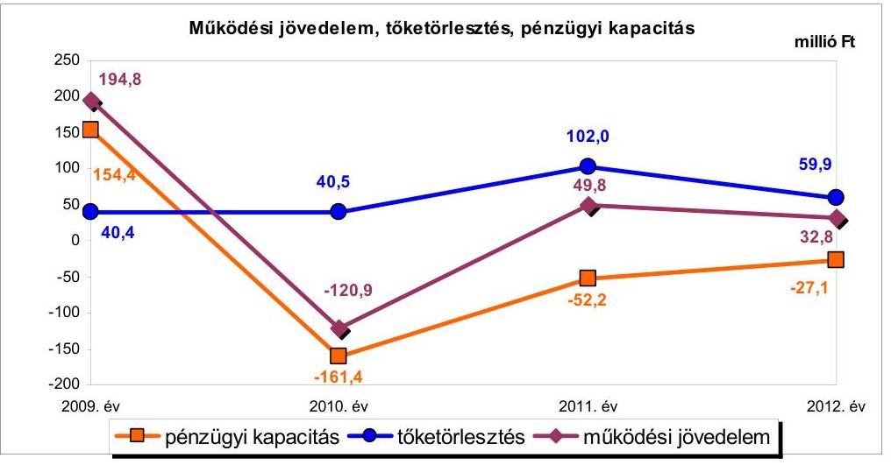
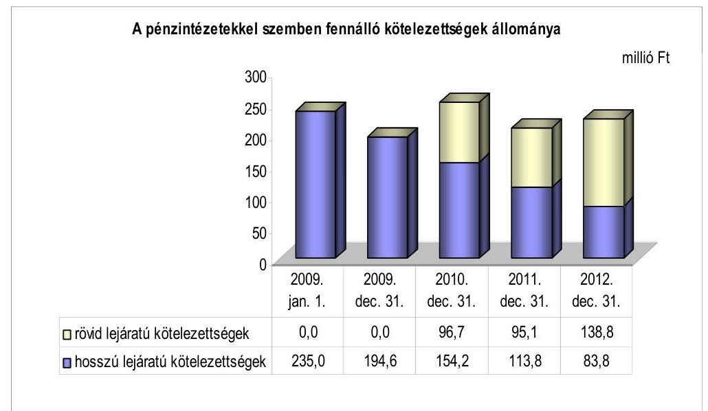
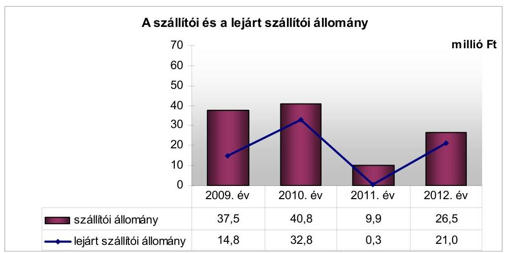
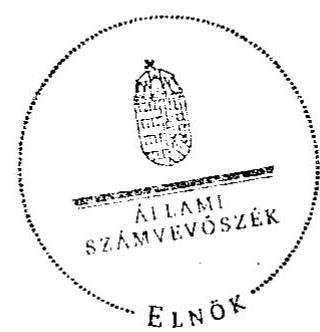
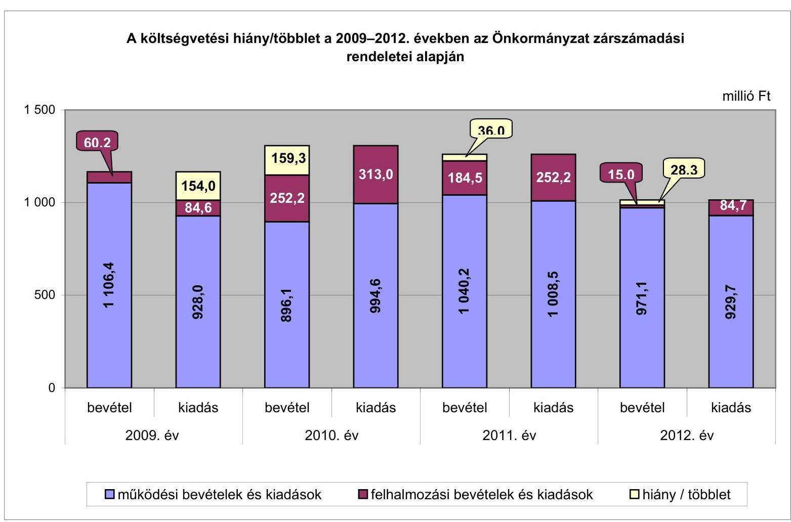
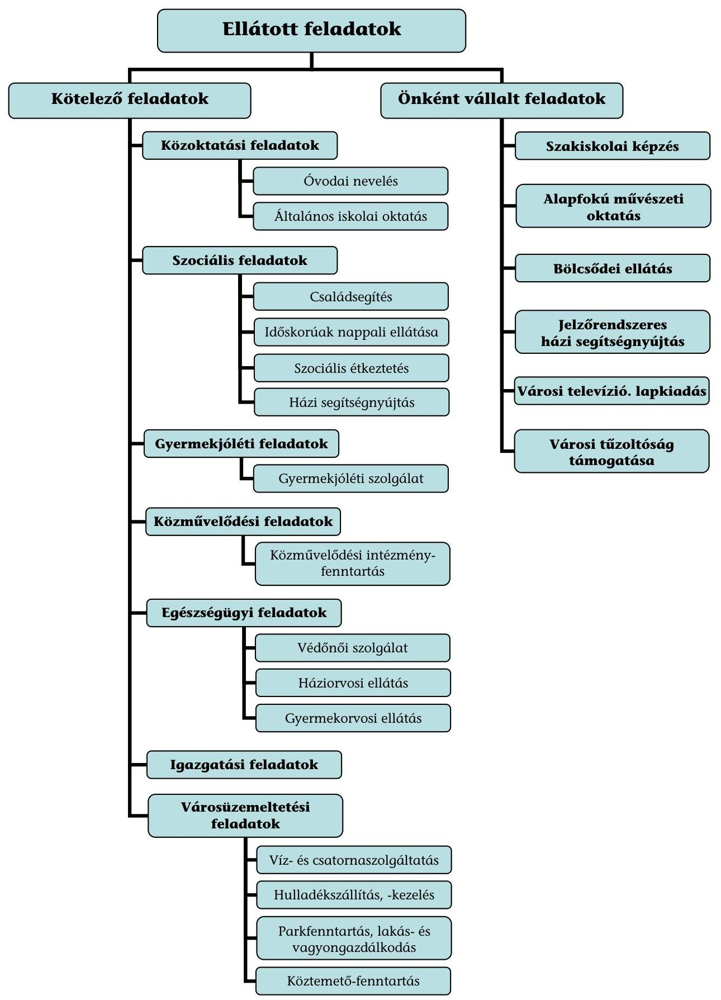

# ÁLLAMI   SZÁMVEVŐSZÉK 

## JELENTÉS

az önkormányzatok pénzügyi gazdálkodási helyzetének, szabályosságának ellenőrzéséről

ÁCS
13081
2013. szeptember

---

# Állami Számvevőszék 

Iktatószám: V-0030-346-010/2013.
Témaszám: 1069
Vizsgálat-azonosító szám: V059219

## Az ellenőrzést felügyelte:

## Renkó Zsuzsanna

felügyeleti vezető
Az ellenőrzést vezette és az ellenőrzés végrehajtásáért felelős:
Dér Lívia
ellenőrzésvezető

## Az ellenőrzést végezték:

| Kalmár István | Kozma Gábor |
| :-- | :-- |
| számvevő tanácsos | számvevő tanácsos |

---

# TARTALOMJEGYZÉK 

BEVEZETÉS ..... 3
I. ÖSSZEGZŐ MEGÁLLAPÍTÁSOK, KÖVETKEZTETÉSEK, JAVASLATOK ..... 6
II. RÉSZLETES MEGÁLLAPÍTÁSOK ..... 16

1. Az Önkormányzat kötelező és önként vállalt feladatai, a feladatellátás szervezeti keretei ..... 16
2. A pénzügyi egyensúlyt fenntartását veszélyeztető pénzügyi kockázatok és az ezek csökkentése érdekében tett intézkedések ..... 18
3. A pénzügyi gazdálkodási folyamatok szabályosságát, megfelelőségét biztosító belső kontrollok ..... 28
4. Az ÁSZ korábbi ellenőrzése során a pénzügyi, gazdálkodási helyzet javítására tett javaslatainak megvalósítása ..... 30

---

# MELLÉKLETEK 

1. számú A költségvetési hiány/többlet a 2009-2012. években az Önkormányzat zárszámadási rendeletei alapján
2. számú Az Önkormányzat bevételei és kiadásai, valamint adósságszolgálata a 2009-2012. években (a CLF módszer szerint)
3/a. számú Az Önkormányzat által a 2009-2012. években megvalósított (műszakilag befejezett) fejlesztések forrásösszetétele
3/b. számú Az Önkormányzat 2012. december 31-én folyamatban lévő fejlesztési feladataihoz kapcsolódó kötelezettségeinek összegzése
3. számú Az önkormányzati feladatok ellátásában résztvevő gazdasági társaságok egyes kiemelt adatai
4. számú Az Önkormányzat 2012. december 31-én fennálló, hosszú lejáratú adósságot keletkeztető kötelezettségvállalásai
5. számú Az Önkormányzat kötelezettségeinek és egyes kötelezettségvállalásainak 2009. december 31-ei és 2012. december 31-ei állománya, valamint a 2013. évben és az azt követő években várható kötelezettségek, kötelezettségvállalások miatti kiadások

## FÜGGELÉKEK

1. számú Rövidítések jegyzéke
2. számú Fogalomtár
3. számú Az Önkormányzat által ellátott feladatok 2012. december 31-én

---

# JELENTÉS 

## az önkormányzatok pénzügyi gazdálkodási helyzetének, szabályosságának ellenőrzéséről ÁCS

## BEVEZETÉS

Az államháztartás helyi szintjén, az önkormányzati alrendszerben az utóbbi években megjelenő gazdálkodási nehézségek, a pénzforgalmi hiány növekedése, az eladósodás az ÁSZ figyelmét a helyi önkormányzatok pénzügyi helyzetére irányította.

Az ÁSZ a 2013. év I. félévi ellenőrzési tervben foglaltaknak megfelelően az önkormányzatok pénzügyi gazdálkodási helyzetének, szabályosságának ellenőrzésével az önkormányzatok 2011. évben megkezdett helyzetelemzését folytatta. Az ellenőrzés keretében értékeljük az önkormányzatok adósságkezelési és likviditási helyzetét. Bemutatjuk a pénzügyi egyensúly alakulására hatással lévő folyamatokat, feltárjuk az ezekre ható kockázatokat. Értékeljük a pénzügyi egyensúlyi helyzetet befolyásoló döntésmegalapozó, döntés-előkészítő eljárások szabályosságát, minősítjük az ezekkel összefüggő belső kontrollok kialakítását, működését.

Az ellenőrzés eredményének várható hatásaként a megállapításokkal segítséget nyújtunk az önkormányzatok számára a pénzügyi egyensúly helyreállítása, javítása és fenntartása érdekében szükségessé váló intézkedések megtételéhez.

Az ellenőrzés típusa: szabályszerűségi ellenőrzés.

## Az ellenőrzés célja annak értékelése volt, hogy:

- az ellenőrzött időszakban a kötelező és önként vállalt feladatok ellátását biztosító szervezeti formák változása milyen hatást gyakorolt az Önkormányzat pénzügyi helyzetének alakulására;
- az Önkormányzat pénzügyi - ezen belül működési és felhalmozási - egyensúlya milyen irányban változott, a változást milyen okok idézték elő, továbbá milyen intézkedéseket tettek a pénzügyi egyensúly biztosítása, illetve javítása érdekében, az intézkedések hatására javult-e az Önkormányzat pénzügyi helyzete;
- a költségvetési kiadások finanszírozása érdekében vállalt, pénzintézetekkel szembeni kötelezettségek hogyan alakultak, a kötelezettségek fennállása miként befolyásolja az Önkormányzat jövőbeli pénzügyi egyensúlyi helyzetét;

---

- az Önkormányzat beazonosította, felmérte, értékelte-e a pénzügyi egyensúlyt befolyásoló pénzügyi kockázatokat, a finanszírozási célú pénzügyi műveletekkel kapcsolatban írtak-e elő kockázatértékelési kötelezettséget;
- az Önkormányzat által kialakított belső kontrollok biztosítják-e a pénzügyi gazdálkodás folyamatainak szabályosságát és eredményességét;
- hasznosultak-e az ÁSZ korábbi ellenőrzése során a pénzügyi, gazdálkodási helyzet javítására tett szabályszerűségi és célszerűségi javaslatok.

Az ellenőrzés a 2009. január 1-jétől 2012. december 31-éig terjedő időszakot ölelte fel. A pénzintézetekkel szembeni kötelezettségek állományára vonatkozóan az ellenőrzés kezdő időpontjaként a 2012. december 31-én fennálló kötelezettségek keletkezésének időpontját vettük figyelembe. A jövőbeni kötelezettségek megállapításakor az adósságkonszolidáció hatását is értékeltük.

Az ellenőrzés szakmai módszertana az ÁSZ Ellenőrzési Elvek és Standardokban foglalt szakmai szabályokon alapult, amely a Legfőbb Ellenőrző Intézmények Nemzetközi Szervezete (INTOSAI) által kiadott nemzetközi standardok (ISSAI) figyelembevételével készült.

Az ellenőrzés során használt rövidítéseket az 1. számú, az egyes fogalmak magyarázatát a 2. számú függelék tartalmazza.

Az ellenőrzés jogszabályi alapját az ÁSZ tv. 1. § (3) bekezdésének, 5. § (2)(6) bekezdéseinek, valamint az Áht. 61. § (2) bekezdésének előírásai képezik.

Az Országgyűlés 2012 végén a helyi önkormányzatok adósságállományának részleges konszolidációjáról döntött. Az 5000 fő lakosságszámot meg nem haladó települési önkormányzatok számára nyújtott törlesztési célú támogatással ${ }^{1}$ lehetővé tették a 2012. december 12-én fennálló adósságállományuk és annak 2012. december 28-áig számított járulékai teljes megfizetését. Az 5000 fő lakosságszám feletti települések esetében a 2013. évben az állam differenciált, az adóerő-képességet figyelembe vevő, 40-70%-ig terjedő mértékben vállalja át ${ }^{2}$ az önkormányzatok 2012. december 31-i, az átvállalás időpontjában fennálló adósságállományát és annak járulékait. Az adósságkonszolidációs intézkedéssel egyidejűleg a Kormány elrendelte ${ }^{3}$ az önkormányzatok adósságállománya újratermelődésének megakadályozása céljából a hitelengedélyezési és a likvid hitelekre vonatkozó szabályozás szigorítását.

Ács Város Önkormányzata a település lakónépességére tekintettel a 2013. évi adósságátvállalásban érintett. Az adósságkonszolidáció keretében - a 2013. február 27-én kötött megállapodásban - Magyar Állam az Önkormányzat

[^0]
[^0]:    ${ }^{1}$ Magyarország 2012. évi központi költségvetéséről szóló 2011. évi CLXXXVIII. törvény 76/C. §-a (beiktatta a 2012. évi CLXXXVII. törvény 8. §-a, hatályos 2012. XII. 6-tól)
    ${ }^{2}$ Magyarország 2013. évi központi költségvetéséről szóló 2012. évi CCIV. törvény 7276. §-ai
    ${ }^{3}$ 1540/2012. (XII. 4.) Korm. határozat a helyi önkormányzatok adósságállományának részleges konszolidációjáról

---

fennálló adósságállományának 50,0%-át (106,4 millió Ft-ot) és annak járulékait átvállalta. A pénzügyi egyensúlya jövőbeni alakulását befolyásoló, az ellenőrzött időszakban fennállt kockázatokra tett megállapításaink - a pénzintézetekkel szembeni kötelezettségekkel összefüggésben feltárt kockázatok kivételével - az adósságkonszolidációt követően is helytállóak és időszerűek.

Ács város lakosainak száma 2012. január 1-jén 7144 fő volt, ami 102 fős csökkenést jelent a 2009. év eleji (7246 fő) lakosságszámhoz képest. Az Önkormányzat a 2012. évi költségvetési beszámolója szerint 986,4 millió Ft költségvetési bevételt ért el, és 1023,7 millió Ft költségvetési kiadást teljesített. A 2012. december 31-i könyvviteli mérleg alapján 2290,4 millió Ft értékű vagyonnal rendelkezett, amely a 2009. év végi állományhoz (2182,7 millió Ft-hoz) viszonyítva 4,9%-kal (107,7 millió Ft-tal) nőtt. A vagyonnövekedésben meghatározó volt a tárgyi eszközök, azon belül az ingatlanok állományának emelkedése, az ellenőrzött időszakban megvalósított fejlesztési feladatok eredményeként. A 2012. évben a tárgyi eszközök állománya 1522,9 millió Ft, a forgóeszközök állománya 67,5 millió Ft volt.

Az ÁSZ tv. 29. § (1) bekezdése szerint a jelentéstervezetet megküldtük a polgármester részére, aki az ÁSZ tv. 29. § (2) bekezdésében foglalt észrevételezési jogával nem élt, a jelentéstervezetre észrevételt nem tett.

---

# I. ÖSSZEGZŐ MEGÁLLAPÍTÁSOK, KÖVETKEZTETÉSEK, JAVASLATOK 

Ács Város Önkormányzatának pénzügyi egyensúlya az ellenőrzött időszakban rövid távon nem volt biztosított. A 2013. évi, részleges adósságkonszolidáció eredményeként az Önkormányzat pénzügyi helyzete javul, azonban az adósságátvállalást (106,4 millió Ft adósság és annak járulékai) követően fennmaradó kötelezettségek teljesíthetősége továbbra is kockázatos. Az ellenőrzött időszak jövedelemtermelő képessége alapján várhatóan képződő bevételek a feladatellátáshoz szükséges kiadásokat, valamint a tőketörlesztés fedezetét nem biztosítják, a működést rövid távon korlátozzák.

Az Önkormányzat költségvetésének elemzését a CLF módszer alapján számított mutatók alapján végeztük. A pénzügyi kapacitás 2009-2012. évek közötti változását az alábbi ábra szemlélteti:

Az Önkormányzat a 2009-2012. években összesen 4528,2 millió Ft költségvetési bevételt ért el, és 4620,5 millió Ft költségvetési kiadást teljesített. Működési költségvetésének egyensúlya az ellenőrzött időszakban - a 2010. év kivételével - fennállt, bár a működési jövedelem 2011. évi kedvező változását (170,7 millió Ft-os növekedését) a 2012. évben (17,0 millió Ft-os) visszaesés követte. A folyó költségvetési egyenleg (a működési jövedelem) 2009-2012 között évenként ellentétes irányban és 2009-2011 között jelentős mértékben változott, melyben a folyó bevételek alakulása volt a meghatározó. A működési jövedelem 2009-ről 2010-re történő 315,7 millió Ft-os csökkenését főként a folyó bevételek - ezen belül a helyi iparűzési adóbevétel és a költségvetési támogatás 249,5 millió Ft-os csökkenése okozta. A helyi iparűzési adóbevétel egy adóalany adójának székhely és telephelyek közötti megosztása, valamint az előző évi adótúlfizetések visszafizetése következtében csökkent. A 2010. évről 2011-re a működési jövedelem 170,7 millió Ft-tal nőtt döntően a helyi iparűzési adóbevétel 155,2 millió Ft-os növekedésének eredményeként. Az Önkormányzat működőképességének megőrzésére 2010-ben 9,5 millió Ft, 2011-ben 8,2 millió Ft,

---

2012-ben 23,6 millió Ft, összesen 41,3 millió Ft vissza nem térítendő ÖNHIKI támogatásban részesült. A működőképességének megőrzésére juttatott költségvetési támogatások nélkül az Önkormányzat működési jövedelme a 2010. évben 130,4 millió Ft hiányt, 2011-ben 41,6 millió Ft, 2012-ben 9,2 millió Ft többletet mutatott volna. A 2010. évben 4,9 millió Ft vis maior támogatást is kaptak.

Az Önkormányzat felhalmozási költségvetésének egyensúlya az ellenőrzött időszakban nem állt fenn. A felhalmozási költségvetés egyenlege 2009-2012 között minden évben negatív volt, összesen 248,8 millió Ft felhalmozási forráshiány keletkezett. A felhalmozási kiadások 2010. évi növekedését döntően a Komplex közoktatás-fejlesztési, az informatikai fejlesztési és a bölcsődei egység kialakítási projektek megvalósítása okozta. A felhalmozási kiadások fedezetét 2009-ben még a nettó működési jövedelemből, a 2010-2012. években azonban hosszú lejáratú, fejlesztési, támogatás-megelőlegező, folyószámla- és éven belüli, likvid hitelekből biztosították. A műszakilag befejezett fejlesztések esetében az utófinanszírozás az Önkormányzatnak felhalmozási kockázatot jelentett, mivel a fejlesztések finanszírozását csak támogatásmegelőlegező hitellel tudta biztosítani.

A kötelező és önként vállalt feladatok ellátását biztosító szervezeti formák változása - egyes feladatok kizárólagos önkormányzati tulajdonú gazdasági társaságba történt kiszervezése -, az intézményrendszer átalakítása 37,4 millió Ft-tal javította az Önkormányzat pénzügyi helyzetét. A 2009-2012. években végrehajtott kiadáscsökkentő és bevételnövelő intézkedések az Önkormányzat adatszolgáltatása szerint - 40,9 millió Ft megtakarítást és 52,1 millió Ft többletbevételt eredményeztek, együttesen 93,0 millió Ft-tal javították a pénzügyi helyzetét.

Az Önkormányzatnál az alacsony működési jövedelemtermelő-képesség miatt fennállt kockázatok:

- az önként vállalt feladatok ellátása miatti működési kockázat a 2010. évben. Az önként vállalt feladatokra fordított kiadások összes működési kiadásokon belüli aránya az új, önként vállalt feladatként ellátott bölcsőde működtetése miatt a 2009. évi 2,5%-ról (23,3 millió Ft-ról) 2012-re 3,3%-ra (31,0 millió Ft-ra) nőtt. A 2010. évben az önként vállalt feladatok miatti működési kockázat a működési költségvetés forráshiánya (a negatív működési jövedelem) miatt fennállt;
- a bevételi kitettség kockázata: 2009-2012 között három gazdasági társaságtól folyt be a helyi iparűzési adóbevétel átlagosan 57,8%-a, összesen 759,3 millió Ft;
- a létesítmények jövőbeni üzemeltetése miatti kockázat: a 2009-2012 között megvalósított fejlesztéseknél a jövőbeni üzemeltetés várható kiadásait és bevételeit nem számszerűsítették és nem mutatták be, továbbá azok működtetése nem teremt bevételnövelési lehetőséget.

Az Önkormányzat - kizárólag forintban fennálló - pénzintézetekkel szembeni kötelezettségeinek állománya 2009. január 1-jétől 2012. december
 31-ig 235,0 millió Ft-ról 222,6 millió Ft-ra, 5,3%-kal (12,4 millió Ft-tal) csökkent.

---

Az ellenőrzött időszakban egyre növekvő mértékű, rövid lejáratú hitelfelvétel és a folyószámlahitel tartóssá válása az Önkormányzat fizetőképességének, rövid távú pénzügyi egyensúlyának kedvezőtlen irányú változását, banki kitettség miatti pénzügyi kockázatot jelzett. A folyószámlahitel napi, átlagos állománya 2010-2012 között 95,3%-kal (33,9 millió Ft-ról 66,2 millió Ft-ra), év végi egyenlege 28,9%-kal (55,1 millió Ft-ról 71,0 millió Ft-ra), a hitellel zárt napok száma közel négyszeresre (96-ról 366-ra) növekedett. A munkabér-megelőlegezési hitel napi, átlagos állománya 2011-ről 2012-re ugyan 16,4%-kal (3,3 millió Ft-tal) csökkent, azonban a hitel-igénybevételi napok száma közel háromszorosra (92-ről 261-re) nőtt, a hitel 2012. év végi állománya 17,8 millió Ft volt.

Visszafizetési kockázatot jelent, hogy az Önkormányzat forrás hiányában nem tudta 60,0 millió Ft összegű likviditási hitelét - az alapszerződésben foglalt határidőre - 2012 júniusában visszafizetni. A hitel 2012. év végén még fennálló állománya 40,0 millió Ft volt. A kockázat kezelésére a hitel esedékességének időpontját módosították, a hitelt éven túli lejáratúvá változtatták.

A lejárt szállítói állomány 2009-2012 között 14,8 millió Ft-ról 21,0 millió Ft-ra nőtt, annak ellenére, hogy a szállítói állomány 37,5 millió Ft-ról 26,5 millió Ft-ra csökkent. 2011-2012 között emelkedett mind a szállítói (16,6 millió Ft-tal), mind a lejárt szállítói állomány (20,7 millió Ft-tal). A 2012. év végi, lejárt szállítói kötelezettség 64,3%-a (13,5 millió Ft) 30 nap alatti, 2,9%-a (0,6 millió Ft) 31-60 nap közötti, 13,8%-a (2,9 millió Ft) 61-90 nap közötti, 19,0%-a (4,0 millió Ft) 91-365 nap közötti lejárt tartozás volt, ami szállítói kitettség miatti kockázatot hordoz.

Nemfizetési kockázatot jelent, hogy a 2012. év végén az Önkormányzatnak 71,6 millió Ft, helyi adóból származó bevétel-visszafizetési, továbbá 16,0 millió Ft kiadáselmaradás, 49,8 millió Ft projekt önrész és 9,3 millió Ft garancia visszafizetési kötelezettsége is fennállt, melyeknek teljesíthetősége az alacsony működési jövedelemtermelő képességre tekintettel hordoz kockázatot.

Az Önkormányzat kötelezettségei teljesíthetőségének kockázatát jelenti, hogy a részleges adósságátvállalást követően fennmaradó kötelezettségekre az ellenőrzött évek jövedelemtermelő képessége alapján a várhatóan képződő működési jövedelem nem nyújt fedezetet, ami a működést korlátozza.

A fennálló hiteltartozások fedezeteként összesen 21 ingatlant terhelt jelzálog. Ebből az ellenőrzött időszakot megelőzően hét ingatlanra - melyből hat törzsvagyonba tartozó, korlátozottan forgalomképes volt - jegyeztek be jelzálogot. A jelzáloggal terhelt ingatlanok 2012. december 31-ei könyv szerinti értéke 268,0 millió Ft volt, ami 41,8%-os (79,0 millió Ft-os) növekedést jelent 2009-2012 között. A jelzálogterhet viselő ingatlanok aránya a forgalomképes (225,0 millió Ft) és korlátozottan forgalomképes (628,0 millió Ft) ingatlanok együttes, könyv szerinti értékének 31,4%-át tette ki. Az ellenőrzött időszakban 14 ingatlannal bővült a biztosítékba adás mértéke, mely az esetleges fedezetbevonás miatt kockázatot jelent a kötelezettségek teljesítéséhez, ingatlanértékesítésből elérhető források szűkülése miatt. Az adósságkonszolidációval ezen kockázat csökkenhet.

---

A kizárólagos önkormányzati tulajdonú gazdasági társaság, a Városfejlesztési Kft. pénzügyi helyzete a 2011. évi alapítása óta eltelt időszakban - a 2011. évi és a 2012. év I. félévi beszámolók adatai alapján - nem stabil, mérlegen kívüli kockázatot hordoz. A társaság adózott eredménye az első gazdálkodási év után negatív összegű (-19,0 millió Ft), kötelezettségállománya 2011. december 31-én 21,6 millió Ft volt, mely meghatározó részben (17,4 millió Ft) szállítói kötelezettségből állt.

Az Önkormányzatnál a kockázatkezelési rendszer keretében a pénzügyi egyensúlyt befolyásoló kockázatok feltárása, beazonosítása, felmérése, értékelése és kezelése - 2009-ben az Ámr., 2010-2011-ben az Ámr., 2012-ben a Bkr. előírásai ellenére - elmaradt. Annak ellenére maradt el a kockázatok kezelése, hogy az ellenőrzött időszakban fennállt az önként vállalt feladatok miatti működési, a fejlesztések utófinanszírozásából adódó felhalmozási, az alacsony szintű működési jövedelemtermelő képesség miatti, a helyi adókkal összefüggő bevételi kitettségből eredő és a fejlesztések során kialakított létesítmények jövőbeni üzemeltetése miatti kockázat. Fennállt továbbá a likvid hitelek növekvő állománya okán a visszafizetési és a banki kitettség miatti, valamint a magas lejárt szállítói állományból következő szállítói kitettség miatti, a magas bevétel-visszafizetési, kiadáselmaradási, projekt önrész és garancia visszafizetési kötelezettségből adódó nemfizetési, valamint a fedezetbevonások növekvő mértékével összefüggő pénzügyi, a kizárólagos tulajdonában lévő gazdasági társasága miatti mérlegen kívüli kockázat és a kötelezettségek jövőbeni teljesíthetőségének kockázata. Az Önkormányzatnál a finanszírozási célú pénzügyi műveletekkel kapcsolatban nem írtak elő kockázatértékelési kötelezettséget.

Az Önkormányzatnál a pénzügyi gazdálkodási folyamatok szabályosságát, megfelelőségét, a kockázatok kezelését biztosító belső kontrolltevékenységek kialakítása - a 2009. évben az Ámr.-ben, a 2010-2011. években az Ámr.-ben, a 2012. évben a Bkr.-ben foglalt előírások ellenére - nem volt megfelelő, mert nem írták elő a feladat átadás-átvételre vonatkozó döntés előkészítési folyamatában annak értékelését, hogy a döntés milyen hatást gyakorol a kötelező és az önként vállalt feladatokra fordított kiadások arányára, a pénzügyi egyensúlyi helyzetre. Nem szabályozták továbbá a feladatellátáshoz kapcsolódó támogatási rendszer feltételeit, a feladatellátási szerződések tartalmi követelményeit és a feladatellátás teljesítésével kapcsolatos beszámolási kötelezettséget. Nem határozták meg az ellenőrzési nyomvonalat, a költségvetés- és zárszámadás-készítés folyamatát. Nem írták elő a fejlesztések kockázatainak döntés-előkészítési folyamatban történő feltárásának kötelezettségét és a pályázatkészítés feltételeire vonatkozó szabályokat. Nem határozták meg a pénzintézeti kötelezettségvállalásokkal kapcsolatos döntések kockázatai feltárása, a futamidő egyes éveit terhelő kötelezettség költségvetési egyensúlyra gyakorolt hatása vizsgálatának kötelezettségét. Nem írták elő a pénzintézeti szolgáltatások igénybevételének pályáztatási vagy több ajánlatkérési kötelezettségét, nem készítettek a szállítói (kiemelten a lejárt szállítói) tartozások, az egyéb kiadáselmaradások kezelésére vonatkozó szabályozást. Nem határozták meg az Önkormányzat minősített többségi befolyása alatt álló gazdasági társaság részére a pénzügyi helyzete alakulásáról a beszámolási kötelezettséget, valamint a pénzügyi helyzete alakulása vizsgálatának kötelezettségét.

---

Az ellenőrzött időszak belső ellenőrzési terveinek készítését megelőzően - a 2009. évben az Ámr.1-ben, a 2010-2011. években az Ámr.2-ben, a 2009-2011. években a Ber.-ben, 2012. január 1-jétől a Bkr.-ben foglaltak ellenére - nem írták elő a pénzügyi egyensúlyi helyzetet befolyásoló döntések kockázati tényezőinek feltárását és a feltárt kockázati tényezők belső ellenőrzés keretében történő ellenőrzését.

A pénzügyi gazdálkodási folyamatok szabályosságát, megfelelőségét, a kockázatok kezelését biztosító belső kontrollok működése gyenge volt, mert elmaradt az önkormányzati feladatátadásoknál annak értékelése, hogy a döntés milyen hatással bír az Önkormányzat pénzügyi egyensúlyi helyzetére. A fejlesztéseket megelőző döntés-előkészítési folyamatban nem tárták fel az előkészítés, a lebonyolítás és a működtetés kockázatait, ezzel együtt a pénzügyi egyensúlyi helyzetre gyakorolt hatását. Nem vizsgálták a döntés-előkészítés szakaszában a pénzintézeti kötelezettségvállalások kockázatait, valamint a hitelfelvételről szóló döntés előkészítési folyamatában a futamidő egyes éveit terhelő kötelezettség költségvetési egyensúlyra gyakorolt hatását. A belső ellenőrzés keretében nem ellenőrizték az Önkormányzat pénzügyi egyensúlyi helyzetét befolyásoló döntések kockázati tényezőit. Mindezek miatt a kialakított belső kontrollok nem biztosították a pénzügyi gazdálkodási folyamatok eredményességét.

Az ÁSZ az Önkormányzat állami feladat (közfeladat) ellátás szervezeti és humánerőforrás rendszerét a 2010. évben ellenőrizte, melynek során a pénzügyi gazdálkodási helyzet javítására négy célszerűségi javaslatot tett. Egy célszerűségi javaslat esetében az előző ellenőrzés óta nem fordult elő a javaslattal érintett esemény, egy javaslat teljesült, kettőt nem hasznosítottak.

Az Önkormányzatnál a jelen ellenőrzés során a gazdálkodási feladatok ellátásával és a könyvvezetési kötelezettség teljesítésével kapcsolatban az alábbi szabályszerűségi hibákat tártuk fel:

- a 2011. évben, az Áhsz.-ben rögzített szabály ellenére, a folyószámlahitel felvételeket (és azok törlesztéseit) halmozottan vették nyilvántartásba a főkönyvi könyvelésben;
- a 2010. évben a felújítások fordított áfa elszámolásánál nem tartották be az Áhsz.-ben foglaltakat, emiatt a felújítások fordított áfa kiadása és bevétele kétszeres összeggel szerepelt a pénzforgalmi adatokban;
- a könyvviteli mérlegekben a szállítói kötelezettségek között mutattak ki - az Áhsz.-ben foglalt előírások ellenére - 2010-ben 1,5 millió Ft, 2012-ben 8,1 millió Ft egyéb rövid lejáratú kötelezettségnek minősülő, kiadási elmaradási jogcímhez tartozó tételeket;
- a fennálló hiteltartozások fedezeteként 1998-ban hat törzsvagyonba tartozó, korlátozottan forgalomképes ingatlanra jegyeztek be jelzálogot, mellyel megsértették az Ötv.-ben4 foglalt azon előírást, hogy az önkormányzati törzsvagyon hitel fedezetéül nem használható fel.

[^0]
[^0]:    4 Hatálytalan 2012. január 1-jétől, a 2012. március 31-től hatályos előírást az Áht. tartalmazza.

---

Az ÁSZ tv. 33. § (1) bekezdésében foglaltak értelmében az ellenőrzött szervezet vezetője köteles a jelentésben foglalt megállapításokhoz kapcsolódó intézkedési tervet összeállítani és azt a jelentés kézhezvételétől számított harminc napon belül az ÁSZ részére megküldeni. Amennyiben az intézkedési tervet határidőben nem küldi meg a szervezet, vagy az továbbra sem elfogadható, az ÁSZ elnöke a hivatkozott törvény 33. § (3) bekezdés a)-b) pontjaiban foglaltakat érvényesítheti.

# Az ellenőrzés intézkedést igénylő megállapításai és javaslatai: 

## a polgármesternek

1. Az Önkormányzat működési jövedelme a 2009. évi 194,8 millió Ft-tól 2012-re 32,8 millió Ft-ra csökkent. Működőképességük megőrzésére 2010-2012 között ÖNHIKI, 2010-ben vis major támogatásban részesültek. A likviditás biztosítására 2010-től igénybe vett folyószámlahitel 2012-re tartóssá vált, ezen túl 2011-től munkabér-megelőlegezési hitelt is igénybe vettek. 2012. december 31-én a pénzintézeti kötelezettség 222,6 millió Ft, a szállítói tartozás 26,5 millió Ft, az egyéb kötelezettség 146,6 millió Ft volt. A 2012. év végi szállítói állományból 21,0 millió Ft lejárt tartozás volt. Az Önkormányzat kizárólagos tulajdonában lévő gazdasági társaság pénzügyi helyzetének alakulásáról beszámolási kötelezettséget nem írtak elő annak ellenére, hogy az veszteségesen gazdálkodott. A működési jövedelem várhatóan nem nyújt fedezetet az adósságkonszolidációt követően a fennmaradó kötelezettségek tőketörlesztési kötelezettségére, annak teljesítéséhez szabad tartalék sem áll rendelkezésre. A bevételnövelő és a kiadáscsökkentő intézkedések nem biztosítottak elegendő forrást a pénzügyi egyensúly helyreállításához.

Javaslat:
A működési jövedelemtermelő képesség és a feladatellátás összhangja, valamint az Önkormányzat pénzügyi egyensúlyának helyreállítása, hosszú távú fenntarthatósága érdekében - a 2013. évi kormányzati adósságkonszolidációt, valamint a 2013. évtől változó feladatellátási kötelezettséget, feladatfinanszírozási rendszert figyelembe véve - felelősök és határidők megjelölésével kezdeményezzen intézkedéseket, melyek keretében:
a) a költségvetési rendelettervezet, valamint annak évközi módosítása előterjesztését megelőzően mérjék fel a bevételszerző, kiadáscsökkentő lehetőségeket, és terjessze a Képviselő-testület elé a bevételek növelését, a kiadások csökkentését célzó intézkedések bevezetéséhez szükséges - a Htv. 140. § (1) bekezdés a) pontja alapján a jegyző által elkészített - döntési javaslatát;
b) terjesszen a Képviselő-testület elé jóváhagyásra - a Htv. 140. § (1) bekezdés a) pontja alapján a jegyző által elkészített - az Önkormányzat gazdasági helyzetének elemzésén alapuló, a pénzügyi egyensúlyi helyzet gyors helyreállítását, hosszú távú fenntartását, valamint az adósságállomány újratermelődésének elkerülését biztosító intézkedéseket tartalmazó reorganizációs programot;
c) az adósságkonszolidációt követően fennmaradó kötelezettségek jövőbeni teljesítése, a fizetőképesség megőrzése érdekében terjesszen a Képviselő-testület elé a Htv. 140. § (1) bekezdés a) pontja alapján a jegyző által elkészített - döntési

---

javaslatot, amelyben a Képviselő-testület kötelezettséget vállal arra, hogy előre meghatározott összegben és módon
 a realizált többletbevételeket, a meglévő és a jövőben képződő tartalékokat mindaddig a kötelezettségek rendezésére fordítja, azt nem használja más célra, amíg az Önkormányzat és a kizárólagos tulajdonában lévő gazdasági társaság pénzügyi egyensúlya rövid távon veszélyeztetett;
d) a szállítói kitettség és az Adósságrendezési tv. 4-9. §-aiban szabályozott adósságrendezési eljárás megindításának elkerülése érdekében, meghatározott gyakorisággal számoljon be a Képviselő-testületnek az Önkormányzat lejárt szállítói állománya alakulásáról. Intézkedjen a szállítói számlák esedékesség szerinti kiegyenlítéséről vagy a lejárt tartozások átütemezéséről;
e) terjesszen a jegyző közreműködésével elkészített intézkedési tervet a Képviselőtestület elé jóváhagyásra, az Önkormányzat kizárólagos tulajdonában lévő gazdasági társaság pénzügyi helyzetének stabilizálása érdekében;
f) írja elő az Önkormányzat kizárólagos tulajdonában lévő gazdasági társaság beszámolási kötelezettségét pénzügyi helyzete alakulásáról.
2. Az Önkormányzat a fennálló hiteltartozások fedezeteként az 1998. évben - az Ötv. 88. § (1) bekezdés b) pontjában ${ }^{5}$ foglalt előírást megsértve - az önkormányzati törzsvagyon részét képező hat korlátozottan forgalomképes ingatlanára engedélyezte jelzálogjog bejegyzését.

Javaslat:
A pénzintézeti kötelezettségvállalásokkal kapcsolatos jogszerű biztosíték, illetve fedezet felajánlása érdekében:
a) intézkedjen, hogy jövőbeni hitelfelvétel, kötvénykibocsátás fedezeteként az Áht. 84. § (4) bekezdésében előírtak szerint az Önkormányzat törzsvagyonába tartozó ingatlan ne kerüljön felhasználásra;
b) a jogellenes állapot megszüntetése érdekében vizsgálja meg a jogszerű biztosíték cseréjének lehetőségét, és terjesszen javaslatot a Képviselő-testület elé a biztosíték cseréjéről.

# a jegyzőnek 

1. A 2011. évben az Önkormányzatnál a folyószámlahitel felvételét és törlesztését a főkönyvi könyvelésben - az Áhsz. 9. számú mellékletének a számlaosztályok tartalmára vonatkozó előírásai 3. b) pontjában ${ }^{6}$ előírt szabályoktól eltérően - halmozottan mutatták ki, a hitel felvételét bevételként, törlesztését kiadásként számolták el.
[^0]
[^0]:    ${ }^{5}$ Hatálytalan 2012. január 1-jétől, a 2012. március 31-től hatályos előírás: az Áht. 84. § (4) bekezdése.
    ${ }^{6}$ 2012. január 1-jétől az Áhsz. 9. számú mellékletének a számlaosztályok tartalmára vonatkozó előírásai 3. bb) pontja

---

Javaslat:
A könyvvezetési és a beszámoló készítési kötelezettség szabályszerű teljesítése érdekében intézkedjen, hogy a könyvvezetés során a folyószámla- és munkabérmegelőlegezési hitel felvételét és törlesztését a főkönyvi könyvelésben az Áhsz. 9. számú mellékletének a számlaosztályok tartalmára vonatkozó előírásai 3. bb) pontjában rögzített előírásoknak megfelelően végezzék.
2. A 2010. évben a felújítások fordított áfa elszámolásánál az Önkormányzatnál nem tartották be az Áhsz. 9. számú mellékletének a számlaosztályok tartalmára vonatkozó előírások 1. i) pontjában foglaltakat, ennek következtében a felújítások fordított áfa kiadása és bevétele (45,4 millió Ft) duplikáltan szerepelt a folyó bevételek és folyó kiadások számviteli nyilvántartásokban kimutatott pénzforgalmi összegében.

Javaslat:
Intézkedjen, hogy fordított áfa elszámolás esetén - az Áhsz. 9. számú mellékletének a számlaosztályok tartalmára vonatkozó előírások 1. i) pontjában foglalt előírás alapján - a szállító számlája alapján kiállított belső bizonylat alapján, pénzforgalom nélküli tételként számolják el a felújítás előzetes beszerzési árba beszámítandó vagy be nem számítandó áfa kiadását, illetve áfa bevételét a 499. Pénzforgalom nélküli költségvetési bevételek és kiadások sajátos elszámolása számlával szemben.
3. Az Önkormányzat könyvviteli mérlegeiben szereplő, szállítókkal szembeni kötelezettség - az Áhsz. 26. § (5) bekezdés c) pontjában foglalt előírást megsértve - a 2010. évben 1,5 millió Ft, a 2012. évben 8,1 millió Ft összegben egyéb rövid lejáratú kötelezettségnek minősülő, kiadási elmaradási jogcímhez tartozó tételeket is tartalmazott.

Javaslat:
Intézkedjen, hogy a könyvviteli mérlegben szállítókkal szembeni kötelezettségként az Áhsz. 26. § (5) bekezdés c) pontjában foglalt előírás alapján az áruszállításból és szolgáltatás teljesítésből származó, áfát is tartalmazó kötelezettségeket mutassák ki.
4. A kockázatkezelési rendszer keretében az ellenőrzött időszakban fennállt, a pénzügyi egyensúlyt befolyásoló kockázatok feltárása, beazonosítása, értékelése, a kockázatok kezelése - a 2009. évben az Ámr., 145/C. § (1)-(3) bekezdéseiben, a 2010-2011. években az Ámr., 157. § (1)-(3) bekezdéseiben, a 2012. évben a Bkr. 7. § (1)-(2) bekezdéseiben foglalt jogszabályi előírások ellenére - elmaradt. Annak ellenére maradt el a kockázatok kezelése, hogy az ellenőrzött időszakban fennállt az önként vállalt feladatok miatti működési kockázat, a fejlesztések utófinanszírozása miatt a felhalmozási kockázat, az alacsony működési jövedelemtermelő képesség miatti kockázat, a helyi adókkal összefüggő bevételi kitettség kockázata, a fejlesztések során kialakított létesítmények jövőbeni üzemeltetése miatti kockázat, a növekvő mértékben igénybe vett likvid hitelek és a folyószámlahitel tartóssá válása miatti banki kitettség kockázata és a visszafizetési kockázat, a magas lejárt szállítói állomány miatt a szállítói kitettség kockázata, a magas bevétel-visszafizetési, kiadási elmaradás, projekt önrész és garancia-visszafizetési kötelezettség miatt a nemfizetési kockázat, a fedezetbevonások növekvő mértéke miatti kockázat, továbbá a gazdasági társaság pénzügyi helyzete miatti mérlegen kívüli kockázat és a kötelezettségek jövőbeni teljesíthetőségének kockázata.

---

Javaslat:
Működtessen a Bkr. 7. § (1)-(2) bekezdéseiben foglalt előírásoknak megfelelő, a pénzügyi egyensúlyt befolyásoló kockázatok kezelésére alkalmas kockázatkezelési rendszert.
5. A pénzügyi gazdálkodási folyamatok szabályossága, megfelelősége vonatkozásában a kockázatok kezelését biztosító belső kontrolltevékenységek kialakítása - a 2009. évben az Ámr., 145/E. § (1)-(2) bekezdéseiben, a 2010-2011. években az Ámr., 158. § (1)-(2) bekezdéseiben, a 2012. évben a Bkr. 8. § (1)-(2) bekezdéseiben foglalt előírások ellenére - nem volt megfelelő, mert a feladat átadás-átvételre vonatkozóan a döntés-előkészítés folyamatában nem írták elő annak értékelését, hogy a döntés milyen hatással bír a kötelező és önként vállalt feladatokra fordított kiadások arányára, a pénzügyi egyensúlyi helyzetre. Nem írták elő az önkormányzati feladatellátáshoz kapcsolódó támogatási rendszer feltételeit, a szerződések tartalmi követelményeinek meghatározását, valamint a beszámoltatási kötelezettséget a feladatellátási szerződések keretében történő feladatellátás teljesítéséről. A döntés-előkészítés szakaszában nem írták elő a fejlesztési döntések kockázatainak feltárását és kezelését, valamint a pénzintézeti kötelezettségvállalással kapcsolatos döntések kockázatainak feltárását és a futamidő egyes éveit terhelő kötelezettség költségvetési egyensúlyra gyakorolt hatásának vizsgálatát. Nem határozták meg a pénzintézeti szolgáltatások igénybevételével kapcsolatosan a közbeszerzési értékhatár alatti esetekben a pályáztatási kötelezettséggel összefüggő kontrolltevékenységeket. Nem alakították ki a fejlesztésekhez kapcsolódóan a pályázatkészítés feltételeivel összefüggő kontrolltevékenységeket. Nem határozták ki a fejlesztésekhez kapcsolódóan a pályázatkészítés feltételeivel összefüggő kontrolltevékenységeket, a költségvetés és zárszámadás készítés folyamatát.

Javaslat:
Alakítsa ki a Bkr. 8. § (1)-(2) bekezdései alapján azokat a belső kontrolltevékenységeket, amelyek biztosítják a pénzügyi-gazdálkodási folyamatok szabályosságát, a pénzügyi egyensúlyi helyzet alakulását befolyásoló döntések kockázatainak kezelését. Készítse el a hiányzó szabályozásokat. Ennek keretében:
a) írja elő a feladat átadás-átvételre vonatkozó döntések előkészítése során a döntés kötelező és önként vállalt feladatok arányára, ezáltal a pénzügyi egyensúlyi helyzetre gyakorolt hatásának vizsgálatát;
b) írja elő az önkormányzati feladatellátáshoz kapcsolódó támogatási rendszer feltételeit, valamint a szerződések minimum tartalmi követelményeinek meghatározásával összefüggő kontrolltevékenységeket;
c) határozza meg a feladatellátási szerződések teljesítésére vonatkozó beszámolási kötelezettséggel kapcsolatos kontrolltevékenységeket;
d) határozza meg a fejlesztések döntés-előkészítés folyamatában a lebonyolítás és a működtetés kockázatai feltárásának és kezelésének kötelezettségét;
e) írja elő a pénzintézeti kötelezettségvállalások kockázatainak döntés-előkészítő szakaszban történő feltárását, a futamidő egyes éveit terhelő kötelezettségek költségvetési egyensúlyra gyakorolt hatásának vizsgálatát;

---

f) határozza meg a pénzintézeti szolgáltatások igénybevételével kapcsolatosan a közbeszerzési értékhatár alatti esetekben a pályáztatási kötelezettséggel kapcsolatos kontrolltevékenységeket;
g) határozza meg a fejlesztésekhez kapcsolódóan a pályázatkészítés feltételeivel összefüggő kontrolltevékenységeket;
h) készítse el az ellenőrzési nyomvonalat;
i) határozza meg a szállítói tartozások és az egyéb kiadáselmaradások rendezésének helyi szabályait;
j) határozza meg a költségvetés és a zárszámadás készítés folyamatának helyi szabályait.
6. Az Önkormányzatnál az ellenőrzött időszak belső ellenőrzési terveinek készítését megelőzően - a 2009. évben az Ámr. 145/C. § (2) bekezdésében, a 2010-2011. években az Ámr. 157. § (2) bekezdésében, a 2009-2011. években a Ber. 18. §-ában, a 21. § (2) bekezdésében és a (3) bekezdés a) pontjában, 2012. január 1-jétől a Bkr. 7. § (2) bekezdésében, a 29. § (1) bekezdésében, a 31. § (2)-(4) bekezdéseiben foglaltak ellenére - nem írták elő a pénzügyi egyensúlyi helyzetet befolyásoló döntések kockázati tényezőinek feltárását, és a belső ellenőrzési tervek nem tartalmazták az ellenőrzési tervet megalapozó kockázatelemzéseket, valamint az Önkormányzatnál nem ellenőrizték ezeket a kockázati tényezőket.

Javaslat:
Intézkedjen a belső ellenőrzés vezetője felé, hogy a Bkr. 7. § (2) bekezdésében foglaltak szerint mérjék fel a gazdálkodásban rejlő kockázatokat, a 29. § (1) bekezdésében, a 31. § (2)-(4) bekezdéseiben foglalt előírások szerint az éves belső ellenőrzési tervek tartalmazzák a pénzügyi egyensúlyi helyzetet befolyásoló döntésekkel kapcsolatos feltárt kockázati tényezők ellenőrzését, valamint biztosítsa az ellenőrzési tervek végrehajtását.

---

# II. RÉSZLETES MEGÁLLAPÍTÁSOK 

## 1. Az ÖNKORMÁNYZAT KÖTELEZŐ ÉS ÖNKÉNT VÁLLALT FELADATAI, A FELADATELLÁTÁS SZERVEZETI KERETEI

Az Önkormányzatnál a kötelező és az önként vállalt feladatok ellátását a 2009-2012. évek közötti időszakban nem szabályozták, azok körét nem rögzítették. Kötelező feladatként a közoktatási (óvodai nevelés, általános iskolai oktatás), a szociális (családsegítés, időskorúak nappali ellátása, szociális étkeztetés, házi segítségnyújtás), a gyermekjóléti (gyermekjóléti szolgáltatás), az egészségügyi alapszolgáltatási (védőnő, háziorvos, gyermekorvos), a közművelődési és az igazgatási feladatokat látták el. Kötelező feladatként biztosították továbbá a városüzemeltetést (a víz- és csatornaszolgáltatást, a hulladékszállítást, -kezelést, a parkfenntartást, a lakás- és vagyongazdálkodást, a köz-temető-fenntartást). Önként vállalt feladatként végezték a szakiskolai képzést és az alapfokú művészeti oktatást, a jelzőrendszeres házi segítségnyújtást, a városi televízió működtetését és a helyi lap kiadását, a városi tűzoltóság támogatását, valamint 2010 júliusától a bölcsődei ellátást. A feladatellátás részletezését a 3. számú függelék tartalmazza.

A kötelező és önként vállalt feladatokra fordított kiadások arányára, finanszírozásuk forrásaira vonatkozóan nem készítettek elemzést, az önként vállalt feladatok pénzügyi egyensúlyi helyzetre gyakorolt hatását az ellenőrzött időszakban nem értékelték. A kötelező feladatokra használták fel a működési kiadásoknak 2009-ben a 97,5%-át (905,1 millió Ft-ot), 2012-ben a 96,7%-át (905,4 millió Ft-ot). Az önként vállalt feladatokra fordított működési kiadások összes működési kiadásokon belüli aránya a 2009. évi 2,5%-ról (23,3 millió Ft-ról) 2012-re 3,3%-ra (31,0 millió Ft-ra) nőtt, döntően a - 2010-től új, önként vállalt feladatként ellátott - bölcsőde működtetése miatt. Az Önkormányzat számára az önként vállalt feladatok ellátása - a működési célú kiadások ezen feladatokra felhasznált csekély mértéke és aránya alapján, a 2010. év kivételével - nem jelentett működési kockázatot. A 2010. évben az önként vállalt feladatok miatti működési kockázat a működési költségvetés forráshiánya (a negatív működési jövedelem) miatt állt fenn. A felhalmozási célú kiadások 9,9%-át (75,8 millió Ft-ot) fordították 2009-2012 között önként vállalt feladatokhoz kapcsolódó fejlesztésekre: a bölcsőde elhelyezésére, a közösségi tér kialakítására, a foglalkoztatás biztosítására, valamint a településkép javítására. Az önként vállalt feladatok felhalmozási kiadásai a felhalmozási költségvetési kiadásokon belüli alacsony arányukra tekintettel nem jelentettek felhalmozási kockázatot.

Az ellenőrzött időszakban az Önkormányzat saját költségvetési szervei végezték a bölcsődei és az óvodai ellátást, az általános iskolai és a szakiskolai oktatást, a szociális alapszolgáltatási feladatok közül a családsegítést, az időskorúak nappali ellátását, a házi segítségnyújtást, a gyermekjóléti szolgáltatást, a közműve-

---

lődési feladatokat és a
 városüzemeltetést. A többcélú kistérségi társulás látta el a szociális feladatok közül a jelzőrendszeres házi segítségnyújtást. Gazdasági társaságok útján biztosították az alapfokú művészeti oktatást, a háziorvosi és a gyermekorvosi ellátást, a szilárd hulladékszállítást, -kezelést, a víz- és csatornaszolgáltatást, egyéni vállalkozás végezte a védőnői szolgálatot. A köztemetőt egyházi szervezet tartotta fenn. A 2011. júniusáig önkormányzati költségvetési szerv által ellátott szociális étkeztetési, egyes városüzemeltetési (lakásgazdálkodási, vagyonüzemeltetési, park- és közterület-fenntartási) feladatokkal a kizárólagos önkormányzati tulajdonú Városfejlesztési Kft.-t bízták meg. Gazdasági társaság feladatellátásába adták 2011-ben a városi televízió működtetését és a helyi lap kiadását is.

Az Önkormányzat az ellenőrzött időszakban szervezeti változásokat hajtott végre, melyek eredményeként a 2012. év végére a költségvetési szervek száma hárommal (hétről négyre), a telephelyek száma eggyel csökkent, a feladatellátásban résztvevő gazdasági társaságok száma - a 2011-ben létrehozott Városfejlesztési Kft.-vel - eggyel nőtt.

Az Önkormányzat 2010-ben egy intézménybe vonta össze három, korábban önállóan működő közoktatási intézményét, melynek következtében egy telephelyet megszüntettek. Az összevonást követően egy intézmény látta el az óvodai nevelés, az alapfokú oktatás, valamint a szakiskolai képzés feladatait. Az intézkedéssel - az Önkormányzat adatszolgáltatása szerint - a 2010-2012. évek között 33,0 millió Ft kiadási megtakarítást értek el.

Az Önkormányzat 2011. júliusától az intézményei gazdálkodási feladatait végző, önállóan gazdálkodó költségvetési szervét megszüntette, és a gazdálkodási feladatok ellátását az újonnan alapított, kizárólagos önkormányzati tulajdonú gazdasági társaság (a Városfejlesztési Kft.) keretei között szervezte meg. Ezen gazdasági társaságot bízta meg egyes városüzemeltetési feladatok ellátásával is. Az átszervezés - az Önkormányzat adatszolgáltatása szerint - 2011-2012 között közel azonos mértékben csökkentette a személyi kiadásokat és növelte a dologi és egyéb kiadásokat, ami összességében 4,4 millió Ft megtakarítást jelentett.

Az Önkormányzat a feladatai ellátásában résztvevő gazdasági társaságok közül tulajdoni részesedéssel még a Komárom-Ács Vízmű Kft.-ben rendelkezett (8,0%).

Az ellenőrzött időszakban a kötelező és az önként vállalt feladatok ellátását biztosító szervezeti formák változása, az intézményrendszer átalakítása 37,4 millió Ft-tal javította az Önkormányzat pénzügyi helyzetét.

---

# 2. A PÉNZÜGYI EGYENSÚLY FENNTARTÁSÁT VESZÉLYEZTETŐ PÉNZÜGYI KOCKÁZATOK ÉS AZ EZEK CSÖKKENTÉSE ÉRDEKÉBEN TETT INTÉZKEDÉSEK 

Az Önkormányzat költségvetésének elemzését CLF módszerrel hajtottuk végre. Az Önkormányzat 2009-2012. években teljesített bevételeit és kiadásait, valamint adósságszolgálatát a 2. számú melléklet, a főbb önkormányzati adatokat a következő tábla mutatja be:

|  |  |  |  | millió Ft |
| :--: | :--: | :--: | :--: | :--: |
| Megnevezés | 2009. év | 2010. év | 2011. év | 2012. év |
| Folyó bevételek | 1123,2 | 873,7 | 1043,6 | 969,7 |
| Folyó kiadások | 928,4 | 994,6 | 993,8 | 936,9 |
| Működési jövedelem | 194,8 | -120,9 | 49,8 | 32,8 |
| Felhalmozási bevételek | 43,4 | 275,9 | 182,0 | 16,7 |
| Felhalmozási kiadások | 80,3 | 321,3 | 278,4 | 86,8 |
| Felhalmozási költségvetés egyenlege | -36,9 | -45,4 | -96,4 | -70,1 |
| Folyó és felhalmozási bevételek összesen | 1166,6 | 1149,6 | 1225,6 | 986,4 |
| Folyó és felhalmozási kiadások összesen | 1008,7 | 1315,9 | 1272,2 | 1023,7 |
| Finanszírozási műveletek nélküli pozíció | 157,9 | -166,3 | -46,6 | -37,3 |
| Finanszírozási műveletek egyenlege | -165,4 | 101,9 | 18,6 | 32,0 |
| Tárgyévi pénzügyi pozíció | -7,5 | -64,4 | -28,0 | -5,3 |
| Hiteltörlesztés, értékpapír beváltás | 40,4 | 40,5 | 102,0 | 59,9 |
| Nettó működési jövedelem | 154,4 | -161,4 | -52,2 | -27,1 |

Az Önkormányzat a 2009-2012. években összesen 4528,2 millió Ft költségvetési bevételt ért el, és 4620,5 millió Ft költségvetési kiadást teljesített. Működési költségvetésének egyensúlya az ellenőrzött időszakban - a 2010. év kivételével - fennállt, bár a működési jövedelem 2011. évi kedvező változását (170,7 millió Ft-os növekedését) a 2012. évben (17,0 millió Ft) visszaesés követte. A folyó költségvetési egyenleg (a működési jövedelem) 2009-2012 között évenként ellentétes irányban és 2009-2011 között jelentős mértékben változott, melyben a folyó bevételek alakulása volt a meghatározó. A működési jövedelem 2009-2010 közötti, 315,7 millió Ft-os romlását főként a folyó bevételek 249,5 millió Ft-os - ezen belül a helyi iparűzési adóbevétel és a költségvetési támogatás - csökkenése okozta. A helyi iparűzési adóbevétel egy adóalany adójának székhely és telephelyek közötti megosztása, valamint az előző évi adótúlfizetések visszafizetése következtében csökkent. A 2010. évről 2011-re a működési jövedelem 170,7 millió Ft-tal nőtt, döntően a helyi iparűzési adóbevétel 155,2 millió Ft-os növekedésének eredményeként. A 2011-ről 2012-re történő 17,0 millió Ft-os működési jövedelem csökkenésnek szintén a helyi adók mérséklődése volt az oka.

Az Önkormányzat működőképességének megőrzésére 2010-ben 9,5 millió Ft, 2011-ben 8,2 millió Ft, 2012-ben 23,6 millió Ft, összesen 41,3 millió Ft vissza nem térítendő ÖNHIKI támogatásban részesült. A működőképességének megőrzésére juttatott költségvetési támogatások nélkül az Önkormányzat működési jövedelme a 2010. évben 130,4 millió Ft hiányt és 2011-ben 41,6 millió Ft, 2012-ben 9,2 millió Ft többletet mutatott volna. A 2010. évben 4,9 millió Ft vis maior támogatást is kaptak.

---

A pénzügyi kapacitás (nettó működési jövedelem) a 2009. évről a 2010. évre jelentősen csökkent, majd a 2011-2012. években, az előző évihez viszonyítva javult, de negatív értékű maradt. A nettó működési jövedelem 2009-ben 154,4 millió Ft volt, majd negatív értékűre változott, 2010-ben -161,4 millió Ft, 2011-ben -52,2 millió Ft, a 2012. év végén -27,1 millió Ft - összességében -86,3 millió Ft - hiányt mutatott. A pénzügyi kapacitás változását 2009-2012 között főként a működési jövedelem változása határozta meg, azonban - a hosszú lejáratú hitelek tőketörlesztésének évente közel azonos nagyságrendje mellett - 2011-ben a folyószámlahitel törlesztése és a támogatás-megelőlegezési hitel visszafizetése, 2012-ben a likvid hitel törlesztése is befolyásolta.

Az Önkormányzatnál a 2011. évben, az Áhsz. 9. számú melléklete, a számlaosztályok tartalmára vonatkozó előírások 3. b) pontjában $^{7}$ rögzített szabály ellenére, a folyószámlahitel felvételeket (és azok törlesztéseit) halmozottan vették nyilvántartásba a főkönyvi könyvelésben.

Az Önkormányzat felhalmozási költségvetésének egyensúlya az ellenőrzött időszakban nem állt fenn. A felhalmozási költségvetés egyenlege 2009-2012 között minden évben negatív volt, összesen 248,8 millió Ft felhalmozási forráshiány keletkezett. A felhalmozási kiadások 2010. évi növekedését döntően a Komplex közoktatás-fejlesztési, az informatikai fejlesztési és a bölcsődei egység kialakítási projektek megvalósítása okozta. A felhalmozási kiadások fedezetét 2009-ben még a nettó működési jövedelemből, a 2010-2012. években azonban hosszú lejáratú, fejlesztési, támogatás-megelőlegezési, folyószámla- és éven belüli, likvid hitelekből biztosították.

A felhalmozási kiadások további, jelentős részét útfelújításokra és gyalogátkelőhelyek, valamint a művelődési intézmény (Bagolyvár) külső és belső felújítására, bölcsőde-rekonstrukcióra fordították 2009-2012 között.

Az Önkormányzat teljes finanszírozási igénye $^{8}$ 2010-ben 206,8 millió Ft, 2011-ben 148,6 millió Ft, 2012-ben 97,2 millió Ft volt, a 2009. évben 117,5 millió Ft pénzügyi többlet keletkezett. A 2009. évi költségvetési többlet és a 2010-2012. évi hiány alakulását az Önkormányzat zárszámadási rendeletei alapján az 1. számú melléklet tartalmazza.

A 2010. évben a felújítások fordított áfa elszámolásánál nem tartották be az Áhsz. 9. számú melléklete számlaosztályok tartalmára vonatkozó előírásainak 1. i) pontjában foglaltakat, ennek következtében a felújítások fordított áfa kiadása és bevétele kétszeres összeggel szerepelt a pénzforgalmi adatokban. A halmozódott áfa kiszűrésének eredményeként az ellenőrzéshez felhasznált - folyó bevételi és folyó kiadási - adatok 45,4 millió Ft-tal csökkentek, a 2. számú mellékletben (az 1.1.1. és a 2.2.2. sorokban) bemutatottak szerint.

A folyó bevételek a 2009. évi 1123,2 millió Ft-ról 2010-re 873,7 millió Ft-ra csökkentek, majd a 2011. évi 1043,6 millió Ft-ra emelkedést követően, 2012-

[^0]
[^0]:    $^{7}$ 2012. január 1-jétől Áhsz. 9. számú melléklet 3. bb) pontja
    $^{8}$ a nettó működési jövedelemnek és a felhalmozási költségvetés egyenlegének negatív eredménye

---

ben 969,7 millió Ft-ra teljesültek. A folyó bevételek 2009-2012 közötti változásait a helyi adóbevételek, ezen belül alapvetően a helyi iparűzési adóbevétel évenként ellentétes irányú, ingadozó nagyságrendű változása okozta.

Az Önkormányzatnak az ellenőrzött időszakban négy helyi adóból (iparűzési adó, vállalkozók kommunális és magánszemélyek kommunális adója, építményadó) származott bevétele. A helyi adók és pótlékok összesen 1482,7 millió Ft-os összege adta a 2009-2012. évi folyó bevételek 37,0%-át. Ezen bevételcsoport önkormányzati gazdálkodásban betöltött szerepe azonban - a folyó bevételeken belüli hányadának mérséklődése (2009-ben 43,3%, 486,2 millió Ft, 2012-ben 34,5%, 334,1 millió Ft) alapján - csökkent. A helyi adóbevételekben a helyi iparűzési adó volt a meghatározó, mely 1314,6 millió Ft forrást biztosított az ellenőrzött időszakban. A helyi iparűzési adóbevétel 2009-ről 2010-re történő, 232,6 millió Ft-os csökkenését az előző évi túlfizetések tárgyévi visszafizetése mellett, egy adóalany (gázszolgáltató vállalat) adójának jogszabályváltozás - a helyi iparűzési adó székhely és telephelyek közötti megosztása - miatti jelentős csökkenése okozta. A 2010-ről 2011-re történő, 155,2 millió Ft-os növekedést két új adózó belépése (szélerőműparkok létrehozása Ács külterületén) és a tárgyévi túlfizetések - visszautalási kötelezettséget meghaladó - összege eredményezte. 2009-2012 között három gazdasági társaságtól folyt be a helyi iparűzési adóbevétel átlagosan 57,8%-a, összesen 759,3 millió Ft, ami a bevételi kitettség kockázatát jelzi. A kivetett adók mértéke az építményadó és a magánszemélyek kommunális adója esetében nem érte el a törvényi maximumot. A vállalkozók kommunális adója jogszabályi változások miatt 2011-től megszűnt. Az építményadót a 2012. évben vezették be, mely 19,1 millió Ft-tal javította az Önkormányzat pénzügyi helyzetét.

A költségvetési támogatás és az szja 1767,6 millió Ft-os, együttes összege az ellenőrzött időszak folyó bevételének átlagosan 44,1%-át jelentette. Ezen bevételek a 2009. évi 456,4 millió Ft-ról 2010-ben 4,3%-kal (19,8 millió Ft-tal) nőttek, 2011-ben 9,7%-kal (46,3 millió Ft-tal), 2012-ben 5,8%-kal (25,0 millió Ft-tal) csökkentek az előző évihez viszonyítva. A 2010. évi növekedés az szja emelkedésének a hatása, a 2011-2012. évi csökkenést a közoktatási ágazatban a csökkenő tanulólétszám miatti normatív hozzájárulás mérséklődése okozta.

Az egyéb saját bevételek az ellenőrzött négy évben 493,9 millió Ft forrást jelentettek, mely a folyó bevételek 12,3%-át képezte. Ezen bevételek évenként változó összegű teljesülését az államháztartáson belülről kapott, támogatásértékű bevételek (214,3 millió Ft) alakulása határozta meg, a bérleti és intézményi ellátási díjak (224,5 millió Ft) folyamatos növekedése mellett.

A felhalmozási bevételek 2009-2012 közötti összege 518,0 millió Ft volt. A felhalmozási bevételek összege a 2009. évi 43,4 millió Ft-ról a 2010. évre, főként a „Komplex közoktatás fejlesztés Ácson" projekthez kapcsolódó EU-s támogatás eredményeként 275,9 millió Ft-ra nőtt, majd a 2011. évben, a projektek előrehaladásával, 182,0 millió Ft-ra csökkent. A 2012. évi 16,7 millió Ft felhalmozási bevétel döntő részét a - tárgyi eszközök értékesítéséből és
 osztalékbevételből realizált - saját tőkebevétel (14,9 millió Ft) jelentette.

---

A folyó kiadások 2009-2012 között a költségvetési kiadásoknak 83,4%-át (3853,7 millió Ft-ot) jelentették. A 2009. évi 928,4 millió Ft-ról 2010-re 66,2 millió Ft-tal (7,1%-kal) nőtt a folyó kiadások összege, főként a közfoglalkoztatottak létszámának emelkedése és a 21,6 millió Ft központi bérkompenzáció kifizetése miatt, mely növekedéshez a szociálpolitikai juttatások emelkedése is hozzájárult. A 2011. évben az előző évivel közel azonos szintű teljesülést követően, 2012-ben 5,7%-os (56,9 millió Ft-os) csökkenés mutatkozott a folyó kiadásokban, döntően a létszámcsökkentés eredményeként. A személyi juttatások és a munkaadókat terhelő járulékok (2179,1 millió Ft) az ellenőrzött időszak folyó kiadásainak 56,5%-át tették ki. Ezen kiadások 2009-2010 között 560,7 millió Ft-ról 30,6 millió Ft-tal növekedtek. Ezt követően folyamatosan, 2012-re 477,6 millió Ft-ra csökkentek az összesen 39 fős - benne a Városfejlesztési Kft.-be kiszervezett feladatokkal összefüggő - létszámcsökkenés eredményeként. A dologi és egyéb folyó kiadások 2009-2012 közötti, együttes összege (1249,0 millió Ft) a folyó kiadások közel egyharmadát (32,4%-át) jelentette. Ezen kiadások 2011-ről 2012-re változtak jelentősen, 298,0 millió Ft-ról 18,1%-kal (53,9 millió Ft-tal) nőttek, döntően a Városfejlesztési Kft. által ellátott feladatok Önkormányzat felé történt számlázása miatt. A transzferkiadások 2009-2012 közötti összege 347,7 millió Ft volt, melynek közel háromnegyedét, 253,7 millió Ft-ot a magánszemélyeknek nyújtott szociálpolitikai és egyéb juttatások jelentették. Az önkormányzati feladatok ellátásában résztvevő - alapfokú művészeti oktatást végző - Ritmus Oktató Közhasznú Nonprofit Kft. részére 17,0 millió Ft-ot, a Városfejlesztési Kft.-nek az alapításkor, tőketartalékként 24,4 millió Ft pénzeszközt adtak át. Az önkormányzati feladatellátásban résztvevő gazdasági társaságok egyes kiemelt adatait a 4. számú melléklet tartalmazza.

A 2009-2012. években a felhalmozási kiadások (766,8 millió Ft) költségvetési kiadásokon belüli aránya 16,6% volt. A felhalmozási kiadások aránya és összege a 2010. évben (24,4%, 321,3 millió Ft) és a 2011. évben (21,9%, 278,4 millió Ft) volt a legmagasabb, melyet döntően a „Komplex közoktatásfejlesztés Ácson" projekt, továbbá a bölcsődei ellátás feltételeinek kialakítása eredményezett. Az ellenőrzött időszakban beruházásokra és felújításokra 676,7 millió Ft-ot fordítottak. Egyéb felhalmozási kiadásokra 90,1 millió Ft-ot használtak fel, melynek jelentős részét a kamatkiadások (50,9 millió Ft) és az áfa-befizetés (14,8 millió Ft) tették ki. Az Önkormányzat az ellenőrzött időszakban 640,9 millió Ft-ot fordított a 74, műszakilag befejezett fejlesztési feladatra, melyből 13-nak az egyedi értéke meghaladta a 10 millió Ft-ot. A műszakilag befejezett fejlesztések teljes⁹ bekerülési költségének (657,2 millió Ft) forrását 351,3 millió Ft (53,5%) önkormányzati saját bevétel, 25,9 millió Ft (3,9%) hitel, 263,1 millió Ft (40,0%) EU-s, valamint 16,9 millió Ft (2,6%) egyéb központi támogatás képezte. A 2012. év végén folyamatban lévő fejlesztési feladatokra - egy felújításra, két beruházásra és hat, 10 millió Ft alatti bekerülési értékű fejlesztésre - fordított, 35,8 millió Ft-ot önkormányzati saját bevételből fedezték. A folyamatban lévő fejlesztések kötelezettségvállalásai 2012. december 31-e utáni kiadásainak összege 41,7 millió Ft, amelynek tervezett forrása 13,0 millió Ft (31,2%) saját bevétel és 28,7 millió Ft (68,8%) EU-s támogatás. Az Önkormányzatnak a 2012. év végén nem volt elbírálás alatti, fejlesztési célú pályázata. A 2009-2012 között megvalósult és a folyamatban lévő fejlesztési feladatokat, valamint azok forrásösszetételét a 3/a. és a 3/b. számú mellékletek mutatják be.

A műszakilag befejezett fejlesztések esetében az utófinanszírozás az Önkormányzatnak felhalmozási kockázatot jelentett, mivel a fejlesztések finanszírozását csak támogatás-megelőlegező hitellel tudta biztosítani. A 2009-2012 között megvalósított fejlesztéseknél a jövőbeni üzemeltetés várható kiadásait és bevételeit nem számszerűsítették és nem mutatták be, továbbá azok működtetése nem teremt bevételnövelési lehetőséget, ami a fejlesztések során kialakított létesítmények jövőbeni üzemeltetése miatti kockázatot jelzi.

Az Önkormányzat - kizárólag forintban fennálló - pénzintézetekkel szembeni kötelezettségeinek állománya 2009. január 1-jétől 2012. december 31-ig 235,0 millió Ft-ról 222,6 millió Ft-ra, 5,3%-kal (12,4 millió Ft-tal) csökkent. A pénzintézetekkel szemben a 2009-2012. években fennálló kötelezettségeket az alábbi ábra mutatja be:

A pénzintézetekkel szembeni, hosszú lejáratú kötelezettségek 2009. január 1-jei állománya három fejlesztési célú hitelből állt, melyekből egyet 2012 végéig visszafizettek. A hosszú lejáratú kötelezettségek 2009-2012 között a folyamatos tőketörlesztések következtében csökkentek, melyet a 2012. évben egy hitelfelvétel mérsékelt. Az Önkormányzat a 2012. év végén három hosszú lejáratú, összesen 83,8 millió Ft értékű, változó kamatozású kötelezettséggel rendelkezett.

A 2012. év végén fennálló hosszú lejáratú hitelek közül kettőt 2009 előtt vettek fel az úthálózat kialakítására (az 1999-ben igénybevett összeg 193,0 millió Ft), valamint az egészségház felújítására (a 2005-ben igénybevett összeg 26,3 millió Ft). A két hitel törlesztésére a 2009-2012 közötti időszakban 66,5 millió Ft-ot, kamatfizetésre 41,5 millió Ft-ot, az egyéb költségekre 1,8 millió Ft-ot fordítottak. A 2012. év végi állományuk 73,8 millió Ft volt.

---

A tornacsarnok felújítására 2012-ben felvett 10,0 millió Ft beruházási hitel első törlesztő részlete 2013 júliusában esedékes, 5,0 millió Ft összeggel. A teljesített kamat 0,6 millió Ft, az egyéb kiadás 0,1 millió Ft volt.

Az igénybevett hiteleket ingatlanokra bejegyzett jelzálogjoggal biztosították.
Az ellenőrzött időszakban a hosszú lejáratú pénzintézeti kötelezettségek miatti összes tőketörlesztés 161,2 millió Ft volt, a kamatkiadás 48,3 millió Ft-tal, az egyéb költségekre fordított összeg 3,3 millió Ft-tal rontotta az Önkormányzat pénzügyi egyensúlyát.

A pénzintézetekkel szembeni, rövid lejáratú kötelezettségek a 2010. évtől álltak fenn, melyek év végi állománya folyószámla-, likviditási, támogatás- és munkabér-megelőlegezési hitelek igénybevétele miatt változott. A rövid lejáratú kötelezettségek 2012. december 31-ei állománya 71,0 millió Ft folyószámla-, 17,8 millió Ft munkabér-megelőlegezési, 10,0 millió Ft támogatásmegelőlegező és 40,0 millió Ft működési célú likvid hitelből állt. A 2009-2012 között keletkezett pénzintézeti kötelezettségekből az Önkormányzatnak szabadon felhasználható, átmeneti jelleggel befektethető forrása nem volt, igénybe nem vett hitelkerettel nem rendelkezett. Devizaalapú hitelt nem vettek fel, kötvényt nem bocsátottak ki.

A pénzintézeti kötelezettségvállalásokról minden esetben a Képviselő-testület döntött. Az Önkormányzat a költségvetés tervezése, valamint a hitelfelvételek előkészítése során figyelembe vette az adósságot keletkeztető kötelezettségvállalások felső határát. A kötelezettségvállalásokról szóló dokumentumok nem tartalmazták a várható adósságszolgálati terheket és azok forrásait. A pénzintézeti kötelezettségek állományváltozását, a változások okait nem elemezték, a döntés-előkészítő és egyéb dokumentumokban a kamatkockázatot nem értékelték, illetve a változó kamatozású kötelezettségvállalások jövőbeni terheit nem mutatták be. Az adósságot keletkeztető kötelezettségvállalásokra vonatkozó döntések előkészítése során nem kértek több pénzintézettől ajánlatot¹⁰. A 2012. december 31-én fennálló, hosszú lejáratú adósságot keletkeztető kötelezettségvállalásokat az 5. számú melléklet tartalmazza.

Az Önkormányzat 2009-2012 között nem értékelte likviditási helyzetét, a likvid hitelek, szállítói kötelezettségek, az egyéb kiadáselmaradás, a bevételek visszatérítése miatti kötelezettségek állományát, változását, a változások okait és hatását a pénzügyi egyensúlyi helyzetre.

A folyószámlahitelek és a munkabér-megelőlegezési hitelek 2009-2012. évekbeli igénybevételét a következő tábla mutatja be:

| Megnevezés | 2009. év | 2010. év | 2011. év | 2012. év |
| :-- | --: | --: | --: | --: |
| Folyószámlahitel |  |  |  |  |
| Keretösszeg január 1-jén (millió Ft) | 0,0 | 30,0 | 60,0 | 80,0 |
| Átlagos, napi állomány (millió Ft) | 0,0 | 33,9 | 54,2 | 66,2 |
| Hitellel zárt napok száma (nap) | 0 | 96 | 341 | 366 |
| Egyenleg állomány az időszak végén (millió Ft) | 0,0 | 55,1 | 35,1 | 71,0 |
| Teljesített kamat és egyéb kiadás (millió Ft) | 0,0 | 0,8 | 5,3 | 7,0 |
| Munkabér-megelőlegezési hitel |  |  |  |  |
| Keretösszeg január 1-jén (millió Ft) | 0,0 | 0,0 | 0,0 | 35,7 |
| Átlagos, napi állomány (millió Ft) | 0,0 | 0,0 | 20,1 | 16,8 |
| Hitellel zárt napok száma (nap) | 0 | 0 | 92 | 261 |
| Egyenleg állomány az időszak végén (millió Ft) | 0,0 | 0,0 | 0,0 | 17,8 |
| Teljesített kamat és egyéb kiadás (millió Ft) | 0,0 | 0,0 | 0,5 | 1,2 |

A folyószámlahitel napi, átlagos állománya 2010-2012 között 95,3%-kal (33,9 millió Ft-ról 66,2 millió Ft-ra), év végi egyenlege 28,9%-kal (55,1 millió Ft-ról 71,0 millió Ft-ra), a hitellel zárt napok száma közel négyszeresére (96-ról 366-ra) növekedett. A munkabér-megelőlegezési hitel napi, átlagos állománya 2011-ről 2012-re ugyan 16,4%-kal (3,3 millió Ft-tal) csökkent, azonban a hitel-igénybevételi napok száma (92-ről 261-re) közel háromszorosra nőtt. A munkabér-megelőlegezési hitelt 2012-ben nem tudták visszafizetni, év végi állománya 17,8 millió Ft volt. Az ellenőrzött időszakban az egyre növekvő mértékű hitelfelvétel és a folyószámlahitel tartóssá válása az Önkormányzat fizetőképességének, rövid távú pénzügyi egyensúlyának kedvezőtlen irányú változását, banki kitettség miatti pénzügyi kockázatot jelzett.

A 2010. évben 21,6 millió Ft támogatás-megelőlegező, valamint 20,0 millió Ft működési célú hitelt vettek igénybe, melyeket 2011-ben - szerződés szerint visszafizettek. A 2011. évben 60,0 millió Ft éven belüli, likviditási célú hitelt vettek fel, melyet forrás hiányában nem tudtak a szerződésben foglalt határidőre visszafizetni, ami visszafizetési kockázatot jelez. A kockázat kezelésére a hitel esedékességének időpontját 2013. június végéig meghosszabbították. A hitelt 2012-ben részben törlesztették, a 2012. év végi állománya 40,0 millió Ft volt. A 2012. évben 10,0 millió Ft támogatás-megelőlegező hitelt vettek igénybe, mely 2013-ban esedékes. A rövid lejáratú hitelek fokozott igénybevétele, valamint a referenciakamatok és a kamatprémiumok mértékének növekedése miatt 2010-ről 2012-re 1,5 millió Ft-ról 13,8 millió Ft-ra növekedett a rövid lejáratú hitelállomány éves kamat- és egyéb kiadása, mely jelentősen nem befolyásolta az Önkormányzat pénzügyi egyensúlyi helyzetét.

Az Önkormányzat hosszú és rövid lejáratú kötelezettségei együttes összegének a 2009. év végén 11,5%-át (37,5 millió Ft-ot), a 2012. év végén 6,7%-át (26,5 millió Ft-ot) a szállítókkal szembeni kötelezettségek tették ki.

---

Az Önkormányzat 2009-2012 közötti szállítói és lejárt szállítói állományát a következő ábra mutatja be:

Az Önkormányzat a könyvviteli mérlegeiben - az Áhsz. 26. § (5) bekezdés c) pontjában foglalt előírások ellenére - a szállítói kötelezettségek között mutatott ki 2010-ben 1,5 millió Ft, 2012-ben 8,1 millió Ft egyéb rövid lejáratú kötelezettségnek minősülő, kiadási elmaradási jogcímhez tartozó tételeket, amely összegekkel a szállítói állományt csökkentettük.

A szállítói állomány 2009-2012 közötti, 37,5 millió Ft-ról 26,5 millió Ft-ra történt csökkenése mellett, a lejárt szállítói állomány 14,8 millió Ft-ról
 21,0 millió Ft-ra nőtt. A lejárt szállítói állomány jelentős része a működésből eredő, rendszeres kiadásokhoz (közszolgáltatások, élelmiszer beszerzések) kapcsolódott. A lejárt szállítói állomány 2010-ről 2011-re 32,5 millió Ft-tal csökkent, amelyhez a pályázatok elszámolásából és kártalanításból befolyt bevételek biztosítottak forrást. 2011-2012 között nőtt mind a szállítói (16,6 millió Ft-tal), mind a lejárt szállítói állomány (20,7 millió Ft-tal), ami a fizetőképesség romlását mutatja. A 2012. év végi, lejárt szállítói állomány a tárgyévi dologi kiadások egy havi átlagának (28,5 millió Ft-nak) közel háromnegyedét tette ki. A 2012. év végi, lejárt szállítói kötelezettség 64,3%-a (13,5 millió Ft) 30 nap alatti, 2,9%-a (0,6 millió Ft) 31-60 nap közötti, 13,8%-a (2,9 millió Ft) 61-90 nap közötti, 19,0%-a (4,0 millió Ft) 91-365 nap közötti lejárt tartozás, míg 2011-ben a mindössze 0,3 millió Ft lejárt szállítói állomány 30 napon belüli tartozás volt. A szállítói állomány 2012. december 31-ei összege és kedvezőtlen összetétele miatt fennállt a szállítói kitettség miatti kockázat. Az Önkormányzatnál a szállítói kötelezettségek változásának okait és a pénzügyi helyzetre gyakorolt hatásait nem értékelték, azonban a szállítói kitettség enyhítésére a lejárt tartozások egy részének átütemezésével 2012-ben intézkedtek.

Az Önkormányzat 2012. december 31-én további 59,1 millió Ft egyéb, hosszú lejáratú kötelezettséggel rendelkezett, amely nemfizetési kockázatot hordoz. Ezen összeg két kötelezettségből tevődött össze.

Az Önkormányzatnak a Hulladékgazdálkodási Társulás tagjaként - e társulás által 2008-ban elnyert KEOP-1.1.1/2F.-2008-0001 számú pályázathoz - önrészfizetési kötelezettsége keletkezett. A Hulladékgazdálkodási Társulás gesztor önkormányzata az Önkormányzat által fizetendő önrészt megelőlegezte, majd ezen

---

követelését a Győr-Szol Győri Közszolgáltató és Vagyongazdálkodó Zrt.-re engedményezte. Az önrész részletekben történő megfizetésére 2012. január 31-én kötött megállapodás alapján az Önkormányzatnak 2012. december 31-én 49,8 millió Ft fizetési kötelezettsége állt fenn.

Az Önkormányzatnak egy további gazdasági társaság felé, a gazdasági társaság által nyújtott szolgáltatáshoz adott garanciából eredően, a garancia időtartamára visszafizetési kötelezettsége keletkezett, melynek összege a 2012. év végén 9,3 millió Ft volt.

Az ellenőrzött időszakban az Önkormányzat bevételi visszatérítésként - évenként változó nagyságrendű - 6,3-74,7 millió Ft közötti, egyéb kiadáselmaradásként 1,5-8,1 millió Ft közötti összeget mutatott ki. A 2012. év végén 71,6 millió Ft, helyi adóból származó bevétel-visszafizetési és 16,0 millió Ft, a Többcélú kistérségi társulás részére fizetendő hozzájárulásokból álló és egyéb kiadáselmaradás miatti kötelezettség állt fenn. Az összesen 87,6 millió Ft - figyelembe véve az alacsony működési jövedelemtermelő képességet - nemfizetési kockázatot jelent. Az Önkormányzat nem kísérte figyelemmel az egyéb kiadáselmaradásokat és bevétel-visszatérítési kötelezettséget, nem értékelte és nem elemezte azok állományváltozását és hatását a pénzügyi egyensúlyi helyzetre.

A fennálló hiteltartozások fedezeteként összesen 21 ingatlanra - ebből 1998-ban hét ingatlanra, melyből hat törzsvagyonba tartozó, korlátozottan forgalomképes volt - jegyeztek be jelzálogot. A jelzáloggal terhelt ingatlanok 2012. december 31-ei könyv szerinti értéke 268,0 millió Ft volt, ami 41,8%-os (79,0 millió Ft-os) növekedést jelent 2009-2012 között. A jelzálogterhet viselő ingatlanok aránya a forgalomképes (225,0 millió Ft) és korlátozottan forgalomképes (628,0 millió Ft) ingatlanok együttes, könyv szerinti értékének 31,4%-át tette ki. A forgalomképes ingatlanok körében 14 ingatlannal nőtt a biztosítékba adás mértéke az ellenőrzött időszakban, mely az esetleges fedezetbevonás miatt kockázatot jelent a kötelezettségek teljesítéséhez ingatlanértékesítésből elérhető források szűkülése miatt. Az adósságkonszolidációval ezen kockázat csökkenhet. Az Önkormányzat megsértette az Ötv. 88. § (1) bekezdés b) pontjában $^{11}$ foglalt azon előírást, hogy az önkormányzati törzsvagyon hitel fedezetéül nem használható fel. Az adósságot keletkeztető kötelezettségvállalások tárgyalása során a Képviselő-testület folyamatosan figyelemmel kísérte a jelzáloggal terhelt ingatlanok számát, értékét, ezek változását, pénzügyi helyzetre gyakorolt hatását azonban nem értékelték.

A kizárólagos önkormányzati tulajdonú gazdasági társaság, a Városfejlesztési Kft. pénzügyi helyzete a 2011. évi alapítása óta eltelt időszakban - a 2011. évi és a 2012. év I. félévi beszámolók adatai alapján - nem stabil, mérlegen kívüli kockázatot hordoz. A társaság adózott eredménye az első gazdálkodási év után negatív összegű (-19,0 millió Ft), kötelezettségállománya 2011. december 31-én 21,6 millió Ft volt, mely meghatározó részben (17,4 millió Ft) szállítói kötelezettségből állt.

[^0]
[^0]:    $^{11}$ Hatálytalan 2012. január 1-jétől, a 2012. március 31-től hatályos előírás: az Áht. 84. § (4) bekezdése.

---

Az Önkormányzatnál - az adatszolgáltatása szerint - a 2009-2012. években végrehajtott kiadáscsökkentő és bevételnövelő intézkedések 40,9 millió Ft megtakarítást és 52,1 millió Ft többletbevételt eredményeztek, együttesen 93,0 millió Ft-tal javították a pénzügyi helyzetet.

A kiadási megtakarítások a Városfejlesztési Kft. részére történt 2011. évi feladatátadáshoz (4,4 millió Ft), az intézmények 2011. évi összevonásához, a közoktatási létszámcsökkentéshez (33,0 millió Ft) és a civil szervezetek támogatásának csökkentéséhez (3,5 millió Ft) kapcsolódtak. A bevételnövelő intézkedések a helyi adók hátralékbehajtását és új adónem bevezetését foglalták magukban, melyekből tartós bevételnövelést (19,1 millió Ft) az építményadó 2012. évi bevezetése jelentett.

Az Önkormányzat kötelezettségeinek állománya 2012. december 31-én 395,8 millió Ft volt. Ebből a pénzintézetekkel szembeni kötelezettségek állománya együttesen 222,6 millió Ft, melyből hosszú lejáratú 83,8 millió Ft, rövid lejáratú 138,8 millió Ft volt. Az egyéb hosszú lejáratú kötelezettség 59,1 millió Ft, a szállítói állomány 26,5 millió Ft, a bevétel-visszafizetési kötelezettség 71,6 millió Ft, a kiadáselmaradás 16,0 millió Ft terhet jelentett a 2012. év végén. Az Önkormányzat nem rendelkezett a jövőbeni fizetési kötelezettségek teljesítésére felhasználható szabad forrással, erre a célra tartalékot nem képzett. A bevételnövelő és kiadáscsökkentő intézkedések hatása számottevően és tartósan nem javította a pénzügyi egyensúlyi helyzetet. A 2013. évi, részleges - a pénzintézetekkel szembeni kötelezettségállomány 50,0%-át, 106,4 millió Ft-ot érintő - adósságkonszolidáció eredményeként az Önkormányzat pénzügyi helyzete javul. Azonban az adósságátvállalást követően fennmaradó kötelezettségei jövőbeni teljesíthetőségének kockázatát jelenti, hogy az ellenőrzött évek jövedelemtermelő képessége alapján a várhatóan képződő működési jövedelem nem nyújt fedezetet az ellátandó feladatokra és a vállalt pénzintézeti és egyéb fizetési kötelezettségek teljesítésére, ami a működést korlátozza. A szükséges forrás hiányában az Önkormányzat pénzügyi egyensúlya rövid távon nem biztosított.

Az Önkormányzat kötelezettségeinek és egyes kötelezettségvállalásainak 2009. december 31-ei és 2012. december 31-ei állományát, valamint a kötelezettségek, kötelezettségvállalások miatt a 2013. évben és az azt követő években várható kiadásokat a 6. számú melléklet mutatja be.

Az Önkormányzatnál a kockázatkezelési rendszer keretében a pénzügyi egyensúlyt befolyásoló kockázatok feltárása, beazonosítása, felmérése, értékelése és kezelése - a 2009. évben az Ámr. 145/C. § (1)-(3) bekezdéseiben, a 2010-2011. években az Ámr. 157. § (1)-(3) bekezdéseiben, a 2012. évben a Bkr. 7. § (1)-(2) bekezdéseiben foglalt jogszabályi előírások ellenére - elmaradt. Annak ellenére maradt el a kockázatok kezelése, hogy az ellenőrzött időszakban fennállt az önként vállalt feladatok miatti működési, a fejlesztések utófinanszírozásából adódó felhalmozási, az alacsony szintű működési jövedelemtermelő képesség miatti, a helyi adókkal összefüggő bevételi kitettségből eredő, a fejlesztések során kialakított létesítmények jövőbeni üzemeltetése miatti, a likvid hitelek növekvő állománya okán a visszafizetési és a banki kitettség miatti, valamint a magas, lejárt szállítói állományból következő szállítói kitettség miatti, a magas bevétel-visszafizetési, kiadáselmaradási, projekt önrész és

---

garancia visszafizetési kötelezettségből adódó nemfizetési, továbbá a fedezetbevonások növekvő mértékével összefüggő pénzügyi, a kizárólagos tulajdonában lévő gazdasági társasága miatti mérlegen kívüli kockázat és a kötelezettségek jövőbeni teljesíthetőségének kockázata. Az Önkormányzatnál a finanszírozási célú pénzügyi műveletekkel kapcsolatban nem írtak elő kockázatértékelési kötelezettséget.

Az Önkormányzatnál nem mérték fel az elszámolt értékcsökkenés és az eszközpótlásra fordított kiadások arányát, és nem különítettek el az eszközök pótlására, felújítására szolgáló pénzeszközöket. Az Önkormányzat eszközeinek használhatósági foka a 2009. évi 71,5%-ról 2012-re 74,0%-ra növekedett, az ellenőrzött időszakban megvalósított beruházások, felújítások eredményeként.

# 3. A PÉNZÜGYI GAZDÁLKODÁSI FOLYAMATOK SZABÁLYOSSÁGÁT, MEGFELELŐSÉGÉT BIZTOSÍTÓ BELSŐ KONTROLLOK 

Az Önkormányzatnál a belső kontrollrendszer keretében, a pénzügyi gazdálkodási folyamatok szabályosságát biztosító kontrollok közül a feladatellátás szabályosságát, megfelelőségét, a kockázatok kezelését biztosító belső kontrolltevékenységek kialakítása - a 2009. évben az Ámr. 145/E. § (1)(2) bekezdéseiben, a 2010-2011. években az Ámr. 158. § (1)-(2) bekezdéseiben, a 2012. évben a Bkr. 8. § (1)-(2) bekezdéseiben foglalt előírások ellenére - nem volt megfelelő, mert nem írták elő a feladat átadás-átvételre vonatkozó döntés előkészítési folyamatában annak értékelését, hogy a döntés milyen hatást gyakorol a kötelező és önként vállalt feladatokra fordított kiadások arányára, a pénzügyi egyensúlyi helyzetre. Nem szabályozták továbbá a feladatellátáshoz kapcsolódó támogatási rendszer feltételeit, a feladatellátási szerződések tartalmi követelményeit és a feladatellátás teljesítésével kapcsolatos beszámolási kötelezettséget.

Az Önkormányzatnál a belső kontrollrendszer keretében, a pénzügyi gazdálkodási folyamatok szabályosságát biztosító kontrollok közül a pénzügyi egyensúlyi helyzet alakulását befolyásoló, a kockázatok kezelését biztosító belső kontrolltevékenységek kialakítása - a 2009. évben az Ámr. 145/E. § (1)(2) bekezdéseiben, a 2010-2011. években az Ámr. 158. § (1)-(2) bekezdéseiben, a 2012. évben a Bkr. 8. § (1)-(2) bekezdéseiben foglalt előírások ellenére - nem volt megfelelő, mert nem határozták meg az ellenőrzési nyomvonalat, a költségvetés- és zárszámadás-készítés folyamatát. Nem írták elő továbbá a fejlesztések előkészítése, lebonyolítása és működtetése kockázatai döntéselőkészítési folyamatban történő feltárásának és kezelésének kötelezettségét, a pályázatkészítés feltételeire vonatkozó szabályokat. Rendelkeztek azonban kockázatkezelési szabályzattal és a szabálytalanságok kezelésének eljárásrendjével, valamint előírták a beruházások pályáztatási kötelezettségét.

Az Önkormányzatnál a belső kontrollrendszer keretében, a pénzügyi gazdálkodási folyamatok szabályosságát biztosító kontrollok közül a pénzügyi, gazdasági döntések megalapozását szolgáló döntés-előkészítő, valamint a pénzintézeti kötelezettségvállalások szabályosságát, megfelelőségét, a kockázatok kezelését biztosító belső kontrolltevékenységek kialakítása - a 2009. évben az Ámr. 145/E. § (1)-(2) bekezdéseiben, a 2010-2011. években az Ámr. 158. § (1)-(2) bekezdéseiben, a 2012. évben a Bkr. 8. § (1)-(2) bekezdéseiben foglalt előírások ellenére - nem volt megfelelő, mert nem írták elő a pénzintézeti kötelezettségvállalások kockázatai (kamat, visszafizetés, árfolyam) döntés-előkészítés szakaszában történő feltárásának, a hitelfelvételről szóló döntés előkészítési folyamatában a futamidő egyes éveit terhelő kötelezettség költségvetési egyensúlyra gyakorolt hatása vizsgálatának kötelezettségét. Nem írták elő a pénzintézeti szolgáltatások igénybevételének pályáztatási vagy több ajánlatkérési kötelezettségét, nem készítettek a szállítói tartozások (kiemelten a lejárt szállítói tartozások) és az egyéb kiadáselmaradások kezelésére vonatkozó szabályozást. Nem írták elő az Önkormányzat minősített többségi befolyása alatt álló gazdasági társaság részére csődeljárás megindítása esetén a bejelentési és a pénzügyi helyzete alakulásáról a beszámolási kötelezettséget, valamint a pénzügyi helyzete alakulása vizsgálatának kötelezettségét.

Az ellenőrzött időszak belső ellenőrzési terveinek készítése során - a 2009. évben az Ámr. 145/C. § (2) bekezdésében, a 2010-2011. években az Ámr. 157. § (2) bekezdésében, a 2009-2011. években a Ber. 18. §-ában, a 21. § (2) bekezdésben és a (3) bekezdés a)
 pontjában, 2012. január 1-jétől a Bkr. 7. § (2) bekezdésében, a 29. § (1) bekezdésében, a 31. § (2)-(4) bekezdéseiben foglaltak ellenére – nem írták elő a pénzügyi egyensúlyi helyzetet befolyásoló döntések kockázati tényezőinek feltárását és a feltárt kockázati tényezők belső ellenőrzés keretében történő ellenőrzését.

Összességében a pénzügyi gazdálkodási folyamatok szabályosságát, megfelelőségét, kockázatainak kezelését biztosító kontrolltevékenységek kialakítása – a 2009. évben az Ámr. ${ }_{1} 145/$E. § (1)-(2) bekezdéseiben, a 2010-2011. években az Ámr. ${ }_{2}$ 158. § (1)-(2) bekezdéseiben, a 2012. évben a Bkr. 8. § (1)-(2) bekezdéseiben foglalt előírások ellenére – nem volt megfelelő.

A feladatellátás szabályosságát, a pénzügyi egyensúlyi helyzet alakulását, továbbá a pénzügyi gazdasági döntések megalapozását szolgáló döntéselőkészítő, valamint a pénzintézeti kötelezettségvállalások szabályosságát, megfelelőségét, a kockázatok kezelését biztosító belső kontrollok működése gyenge volt, mert elmaradt az önkormányzati feladatátadásoknál annak értékelése, hogy a döntés milyen hatással bír az Önkormányzat pénzügyi egyensúlyi helyzetére. A fejlesztéseket megelőző döntés-előkészítési folyamatban nem tárták fel az előkészítés, a lebonyolítás és a működtetés kockázatait, ezzel együtt a pénzügyi egyensúlyi helyzetre gyakorolt hatását. Nem vizsgálták a döntés-előkészítés szakaszában a pénzintézeti kötelezettségvállalások kockázatait, valamint a hitelfelvételről szóló döntés előkészítési folyamatában a futamidő egyes éveit terhelő kötelezettség költségvetési egyensúlyra gyakorolt hatását. A belső ellenőrzés keretében nem ellenőrizték az Önkormányzat pénzügyi egyensúlyi helyzetét befolyásoló döntések kockázati tényezőit. Mindezek miatt a kialakított belső kontrollok nem biztosították a pénzügyi gazdálkodási folyamatok eredményességét.

---

# 4. Az ÁSZ korábbi ellenőrzése során a pénzügyi, gazdálkodási helyzet javítására tett javaslatainak megvalósítása

Az ÁSZ az Önkormányzat állami feladat (közfeladat) ellátás szervezeti és humánerőforrás rendszerét a 2010. évben ellenőrizte, melynek során a pénzügyi gazdálkodási helyzet javítására négy célszerűségi javaslatot tett.

Egy célszerűségi javaslat esetében az előző ellenőrzés óta nem fordult elő a javaslattal érintett esemény. A további célszerűségi javaslatokból egy teljesült, kettő javaslatot nem hasznosítottak, mivel a feladatellátás átszervezéséről hozott intézkedésekkel kapcsolatban költséghatékonysági számításokat, elemzéseket nem készítettek, alternatív szervezeti megoldásokat nem dolgoztak ki, és a szervezeti változások végrehajtását követően az átszervezések feladatellátásra gyakorolt hatásának, eredményének, a feladatellátás szakmai, pénzügyi mutatóinak értékelése elmaradt.

Budapest, 2013. 09 hónap 02 nap

Melléklet: $\quad 7 \mathrm{db}$
Függelék: $\quad 3 \mathrm{db}$

02 118 Domokos László elnök

---

Ács Város Önkormányzata

1. számú melléklet
a V-0030-346-010/2013. számú jelentéshez

---

Az Önkormányzat bevételei és kiadásai, valamint adósságszolgálata a 2009–2012. években (a CLF módszer szerint)

|   | 2009. év | 2010. év | 2011. év | 2012. év  |
| --- | --- | --- | --- | --- |
|  1.1.1. Saját működési bevételek**** | 556,01 | 286,11 | 489,63 | 443,4  |
|  1.1.2. Költségvetési támogatások ÖNHIKI támogatások nélkül* | 360,37 | 358,90 | 327,02 | 313,6  |
|  1.1.3. Alágezleti bevételek | 125,17 | 162,60 | 144,99 | 125,8  |
|  1.1.4. Államháztartáson belülről kapott támogatások | 51,42 | 37,00 | 64,80 | 60,9  |
|  1.1.5. Elj-tól és külföldről kapott bevételek | 0,00 | 0,00 | 0,00 | 0,00  |
|  1.1.6. Államháztartáson kívülről kapott bevételek | 6,43 | 6,38 | 4,44 | 2,11  |
|  1.1.7. Hozam- és kamatbevételek** | 1,30 | 10,10 | 0,23 | 0,30  |
|  1.1.8. Kölcsönök visszatérülése, igénybevétele | 0,80 | 1,00 | 0,65 | 0,00  |
|  1.1.9. Előző évi pénzmaradvány átvétele | 1,50 | 2,00 | 3,90 | 0,00  |
|  1.1.10. ÖNHIKI támogatások | 0,00 | 9,50 | 8,20 | 23,6  |
|  1.1. Folyó bevételek = 1.1.1.+1.1.2.+1.1.3.+1.1.4.+1.1.5.+1.1.6.+1.1.7.+1.1.8.+1.1.9.+1.1.10 | 1 123,00 | 873,70 | 1 043,60 | 969,70  |
|  1.2.1. Működési kiadások kamatkiadások nélkül | 849,77 | 901,40 | 847,32 | 829,32  |
|  1.2.2. Államháztartáson belülre átadott pénzeszközök | 9,30 | 9,40 | 18,43 | 2,60  |
|  1.2.3.1. vállalkozásoknak | 16,27 | 15,60 | 40,03 | 16,00  |
|  1.2.3.2. Elj-nak, illetve külföldre | 0,00 | 0,00 | 0,00 | 0,00  |
|  1.2.3.3. magánszemélyeknek | 28,50 | 54,20 | 73,10 | 67,90  |
|  1.2.3.4. nonprofit szervezeteknek | 2,80 | 1,60 | 1,30 | 0,50  |
|  1.2.4. Transferkiadások (=1.2.3.1.+1.2.3.2.+1.2.3.3.+1.2.3.4.) | 47,50 | 71,40 | 114,40 | 84,40  |
|  1.2.4. Kamatkiadások** | 0,50 | 1,70 | 9,50 | 13,30  |
|  1.2.5. Kölcsönök nyújtása, törlesztése | 1,45 | 0,10 | 0,10 | 0,00  |
|  1.2.6. Előző évi pénzmaradvány átadás | 0,00 | 0,00 | 3,90 | 7,50  |
|  1.2. Folyó kiadások = 1.2.1.+1.2.2.+1.2.3.+1.2.4.+1.2.5.+1.2.6 | 928,40 | 994,60 | 993,80 | 836,90  |
|  1.3. Folyó költségvetés egyenlege, működési jövedelem (1.1.–1.2.) | 194,80 | -125,90 | 49,80 | 32,80  |
|  2. FELHALMOZÁSI KÖLTSÉGVETÉS*** |  |  |  |   |
|  2.1.1. Saját tökebevételek | 22,10 | 48,50 | 34,10 | 14,90  |
|  2.1.2. Költségvetési támogatások | 6,10 | 4,90 | 10,80 | 1,00  |
|  2.1.3. Államháztartáson belülről kapott támogatások | 8,50 | 169,40 | 133,00 | 0,00  |
|  2.1.4. Elj-tól és külföldről kapott támogatások | 0,00 | 0,00 | 0,00 | 0,00  |
|  2.1.5. Államháztartáson kívülről kapott bevételek | 5,30 | 24,60 | 3,80 | 0,40  |
|  2.1.6. Hozam- és kamatbevételek | 1,10 | 0,30 | 0,00 | 0,00  |
|  2.1.7. Kölcsönök visszatérülése, igénybevétele | 0,30 | 0,20 | 0,30 | 0,40  |
|  2.1.8. Előző évi pénzmaradvány átvéte | 0,00 | 0,00 | 0,00 | 0,00  |
|  2.1. Felhalmozási bevételek = 2.1.1.+2.1.2.+2.1.3.+2.1.4.+2.1.5.+2.1.6.+2.1.7.+2.1.8 | 43,40 | 275,90 | 182,00 | 16,70  |
|  2.2.1. Saját beruházási kiadás átfúró | 3,10 | 21,30 | 129,70 | 36,80  |
|  2.2.2. Saját felújítási kiadás átfúró**** | 47,00 | 276,00 | 102,50 | 21,30  |
|  2.2.3. Államháztartáson belülre átadott pénzeszközök | 0,80 | 0,00 | 0,00 | 0,00  |
|  2.2.4. Elj-nak és külföldnek adott pénzeszközök | 0,00 | 0,00 | 0,00 | 0,00  |
|  2.2.5. Államháztartáson kívülre adott pénzeszközök | 0,00 | 0,80 | 0,00 | 7,80  |
|  2.2.6. Befektetési célú részesedések vásárlási | 1,20 | 8,30 | 1,00 | 0,00  |
|  2.2.7. Kamatkiadások | 20,30 | 11,90 | 9,80 | 8,90  |
|  2.2.8. Kölcsönök nyújtása, törlesztése | 0,00 | 0,40 | 0,60 | 0,00  |
|  2.2.9. Előző évi pénzmaradvány átadás | 1,90 | 2,00 | 0,00 | 0,00  |
|  2.2.10. ÁFA befizetések | 0,00 | 0,00 | 14,80 | 0,00  |
|  2.2. Felhalmozási kiadások = 2.2.1.+2.2.2.+2.2.3.+2.2.4.+2.2.5.+2.2.6.+2.2.7.+2.2.8.+2.2.9.+2.2.10 | 70,30 | 521,30 | 258,40 | 66,80  |
|  2.3. Felhalmozási költségvetés egyenlege (2.1.–2.2.) | -27,00 | -245,40 | -76,40 | -50,10  |
|  3. FINANSZÍROZÁSI MÜVELETEK NÉLKÜLI (GFS) POZÍCIO (1.3.+2.3.) | 167,80 | -371,30 | -26,60 | -17,30  |
|  4. FINANSZÍROZÁSI MÜVELETEK |  |  |  |   |
|  4.1. Hitelfelvétel |  |  |  |   |
|  4.2. Hitelförlesztés | 0,00 | 96,10 | 90,00 | 11,10  |
|  4.3. Forgatási és befektetési célú értékpapírok kibocsátása | 0,00 | 0,00 | 0,00 | 0,00  |
|  4.4. Forgatási és befektetési célú értékpapírok beváltása | 0,00 | 0,00 | 0,00 | 0,00  |
|  4.5. Forgatási és befektetési célú értékpapírok értékesítése | 0,00 | 155,00 | 0,00 | 0,00  |
|  4.6. Forgatási és befektetési célú értékpapírok vásárlása | 80,00 | 50,00 | 1,90 | 0,00  |
|  4.7. Egyéb finanszírozási bevételek (függő, átfutó, kiegyenlítő) | -2,10 | -19,40 | -9,90 | 8,90  |
|  4.8. Egyéb finanszírozási kiadások (függő, átfutó, kiegyenlítő) | 42,00 | 49,90 | 17,30 | -5,30  |
|  4.9. Finanszírozási műveletek egyenlege (4.1.-4.2.+4.3.-4.4.+4.5.-4.6.+4.7.-4.8.) | -165,40 | 101,90 | 18,60 | 32,00  |
|  5. TÁRGYÉVI PÉNZÜGYI POZÍCIO (1.3.+2.3.+4.9.) | -7,50 | -64,40 | -28,00 | -5,30  |
|  6. NETTÓ MÜKÖDÉSI JÖVEDELEM = működési jövedelem (1.3.) - töketörlesztés (4.2.+4.4.) | 154,40 | -161,40 | -52,20 | -27,10  |
|  7. TÁJÉKOZTATÓ ADATOK |  |  |  |   |
|  Összes kötelezettség | 405,90 | 331,30 | 282,00 | 295,80  |
|  ebből rövid lejáratú | 171,10 | 209,30 | 177,90 | 274,60  |
|  Összes szállítói kötelezettség**** | 37,00 | 40,80 | 6,90 | 26,50  |
|  ebből lejárt (tanúsítványból) | 14,90 | 32,80 | 0,30 | 21,00  |
|  Pénz- és tökepiac kötelezettség (adósság) | 194,80 | 250,90 | 208,90 | 222,80  |
|  ebből rövid lejáratú | 41,80 | 137,20 | 135,90 | 160,50  |
|  ebből hosszú lejáratú kötelezettségek következő évet terhelő törlesztő részletei (analitikából) | 41,60 | 40,50 | 40,80 | 21,70  |
|  PPP szerződéses állomány jelenértéken (tanúsítványból) | 0,00 | 0,00 | 0,00 | 0,00  |
|  ebből lejárt szolgáltatási díj miatti kötelezettség | 0,00 | 0,00 | 0,00 | 0,00  |
|  Folyószámla-, likvid- és munkabér-megelőlegezési hitel napi átlagos állománya (tanúsítványból) | 0,00 | 20,30 | 122,10 | 140,30  |
|  Részség- és garanciavállalások (tanúsítványból) | 0,00 | 0,00 | 0,00 | 0,00  |
|  Jogerős bírósági ítéletekből adódó kötelezettségek (tanúsítványból) | 0,00 | 0,00 | 0,00 | 0,00  |
|  Finanszírozásba bevonható eszközök | 204,10 | 41,90 | 16,50 | 0,20  |
|  Tartós hitelviszonyt megalapozó értékpapírok | 0,00 | 8,30 | 10,60 | 0,00  |
|  Hosszú lejáratú bankbetétek | 0,00 | 0,00 | 0,00 | 0,00  |
|  Értékpapírok | 105,00 | 0,00 | 0,00 | 0,00  |
|  Pénzeszközök (idegen nélkül) | 99,10 | 23,60 | 5,90 | 0,20  |

- A költségvetési szerveknél a számviteli szabályoknak megfelelően a bevételekben nem térül, a kiadásokban nem jelenik meg az amortizáció, a vagyoni helyzetet az egyenleg befolyásolja.

* A költségvetési támogatásból, a
 2009. évben a hozam- és kamatbevételekből, a kamatkiadásokból a felhalmozási célú részt az Önkormányzat adatszolgáltatása szerinti mértékben vettük figyelembe a 2.1.2., a 2.1.6., illetve a 2.2.7. sorokon.

* Bevételekben vagyonmegőrzésre és -védelemre fordítható források.

****Az Önkormányzat a 2010. évi könyvviteli mérlegében 1,5 millió Ft, a 2012. évi könyvviteli mérlegében 8,1 millió Ft összegű kiadáselmaradást a szállítói kötelezettségek között mutatott ki, amely összegekkel az Összes szállítói kötelezettség sor érintett évi adatait csökkentettük.

*****Az Önkormányzat a 2010. évi pénzforgalmi adatok között 45,4 millió Ft fordított ála bevételt és kiadást kétszeresen vette nyilvántartásba. A felhalmozódás kiszűrésére a 2010. év oszlopában az 1.1.1. és 2.2.2. sorok adatait ezen összeggel csökkentettük, ennek megfelelően módosultak az érintett összegző sorok is.

1. Az EU-tól kapott támogatások számviteli elszámolása az államháztartáson belülről kapott támogatások között történt (2.1.3. soron).

---

## Az Önkormányzat által a 2009–2012. években megvalósított (műszakilag befejezett) fejlesztések forrásösszetétele

|   |  |  |  |  |  |  |  |  |  |  |  |  |  |  |  |  |  |  |  |  |  |  |  |  |  |  |  |  |  |  |  |  |  |  |  |  |  |  |  |  |  |  |  |  |  |  |  |  |  |  |  |  |  |  |  |  |  |  |  |  |  |  |  |  |  |  |  |  |  |  |  |  |  |  |  |  |  |  |  |  |  |  |  |  |  |  |  |  |  |  |  |  |  |  |  |  |  |  |  |  |  |  |  |  |  |  |  |  |  |  |  |  |

---

|   | Fejlesztési feladat (beruházás, felújítás) |  | Beruházás, felújítás |  |  |  |  |  |  |  |  |  |  |  |  |  | 2012. december 31-ig megvalósított fejlesztések |  |  |  |  |  |   |
| --- | --- | --- | --- | --- | --- | --- | --- | --- | --- | --- | --- | --- | --- | --- | --- | --- | --- | --- | --- | --- | --- | --- |
|   |  |  |  |  |  |  |  |  |  |  |  |  |  |  |  |  | Saját forrás |  |  | Támogatás |  |   |
|   |  |  |  |  |  |  |  |  |  |  |  |  |  |  |  |  | Saját bevétel | Hitel | Kötvény | EU-s támogatás |  | Egyéb központi  |
|   |  |  |  |  |  |  |  |  |  |  |  |  |  |  |  |  |  |  |  |  |  |  | támogatás  |
|  5. |  | Megnevezés |  |  |  |  |  |  |  |  |  |  |  |  |  |  |  |  |  |  |  |   |
|   |  |  |  |  |  |  |  |  |  |  |  |  |  |  |  |  |  |  |  |  |  |   |
|  1 |  | 2 |  | 3 |  | 4 |  | 5 |  | 6 |  | 7 |  | 8 | 9 | 10 | 11 | 12 | 13 | 14 | 15 | 16  |
|  6. |  | EU finanszírozás esetén az igénybevett előleg összege |  |  |  |  |  |  |  |  |  |  |  |  |  |  |  |  |  |  |  |   |
|  7. |  | EU finanszírozás esetén az előfinanszírozás összege |  |  |  |  |  |  |  |  |  |  |  |  |  |  |  |  |  |  |  |   |

A = ha a forrás már rendelkezésre áll, a kifizetés, pénzügyi teljesítés azonban egyéb okból (pl. hibás teljesítés miatti számla (számlavisszatartás, vitatott számla) nem történt meg.

B = ha a forráshoz a hitelszerződés megkötése folyamatban van, továbbá - támogatások (EU-s, hazai) lehívása esetében - ha a lehívás megtörtént, de a forrás még nem áll rendelkezésre, a kiutalása folyamatban van.

C = ha a forrás nem áll rendelkezésre.

---

## Az Önkormányzat 2012. december 31-én folyamatban lévő fejlesztési feladataihoz kapcsolódó kötelezettségeinek összegzése

|   |  |  |  |  |  |  |  |  |  |  |  |  |  |  |  |  |  |  |  |  |  |  |  |  |  |  |  |  |  |  |  |  |  |  |  |  |  |  |  |  |   |
| --- | --- | --- | --- | --- | --- | --- | --- | --- | --- | --- | --- | --- | --- | --- | --- | --- | --- | --- | --- | --- | --- | --- | --- | --- | --- | --- | --- | --- | --- | --- | --- | --- | --- | --- | --- | --- | --- | --- | --- | --- |
|   |  |  |  |  |  |  |  |  |  |  |  |  |  |  |  |  |  |  |  |  |  |  |  |  |  |  |  |  |  |  |  |  |  |  |  |  |  |  |  |   |
|   |  |  |  |  |  |  |  |  |  |  |  |  |  |  |  |  |  |  |  |  |  |  |  |  |  |  |  |  |  |  |  |  |  |  |  |  |  |  |  |   |
|   |  |  |  |  |  |  |  |  |  |  |  |  |  |  |  |  |  |  |  |  |  |  |  |  |  |  |  |  |  |  |  |  |  |  |  |  |  |  |  |   |
|   |  |  |  |  |  |  |  |  |  |  |  |  |  |  |  |  |  |  |  |  |  |  |  |  |  |  |  |  |  |  |  |  |  |  |  |  |  |  |  |   |
|   |  |  |  |  |  |  |  |  |  |  |  |  |  |  |  |  |  |  |  |  |  |  |  |  |  |  |  |  |  |  |  |  |  |  |  |  |  |  |  |   |
|   |  |  |  |  |  |  |  |  |  |  |  |  |  |  |  |  |  |  |  |  |  |  |  |  |  |  |  |  |  |  |  |  |  |  |  |  |  |  |  |   |
|   |  |  |  |  |  |  |  |  |  |  |  |  |  |  |  |  |  |  |  |  |  |  |  |  |  |  |  |  |  |  |  |  |  |  |  |  |  |  |  |   |

  |  |  |  |  |   |
|   |  |  |  |  |  |  |  |  |  |  |  |  |  |  |  |  |  |  |  |  |  |  |  |  |  |  |  |  |  |  |  |  |  |  |  |  |  |  |  |   |
|   |  |  |  |  |  |  |  |  |  |  |  |  |  |  |  |  |  |  |  |  |  |  |  |  |  |  |  |  |  |  |  |  |  |  |  |  |  |  |  |   |
|   |  |  |  |  |  |  |  |  |  |  |  |  |  |  |  |  |  |  |  |  |  |  |  |  |  |  |  |  |  |  |  |  |  |  |  |  |  |  |  |   |
|   |  |  |  |  |  |  |  |  |  |  |  |  |  |  |  |  |  |  |  |  |  |  |  |  |  |  |  |  |  |  |  |  |  |  |  |  |  |  |  |   |
|   |  |  |  |  |  |  |  |  |  |  |  |  |  |  |  |  |  |  |  |  |  |  |  |  |  |  |  |  |  |  |  |  |  |  |  |  |  |  |  |   |
|   |  |  |  |  |  |  |  |  |  |  |  |  |  |  |  |  |  |  |  |  |  |  |  |  |  |  |  |  |  |  |  |  |  |  |  |  |  |  |  |   |
|   |  |  |  |  |  |  |  |  |  |  |  |  |  |  |  |  |  |  |  |  |  |  |  |  |  |  |  |  |  |  |  |  |  |  |  |  |  |  |  |   |
|   |  |  |  |  |  |  |  |  |  |  |  |  |  |  |  |  |  |  |  |  |  |  |  |  |  |  |  |  |  |  |  |  |  |  |  |  |  |  |  |   |
|   |  |  |  |  |  |  |  |  |  |  |  |  |  |  |  |  |  |  |  |  |  |  |  |  |  |  |  |  |  |  |  |  |  |  |  |  |  |  |  |   |
|   |  |  |  |  |  |  |  |  |  |  |  |  |  |  |  |  |  |  |  |  |  |  |  |  |  |  |  |  |  |  |  |  |  |  |  |  |  |  |  |   |
|   |  |  |  |  |  |  |  |  |  |  |  |  |  |  |  |  |  |  |  |  |  |  |  |  |  |  |  |  |  |  |  |  |  |  |  |  |  |  |  |   |
|   |  |  |  |  |  |  |  |  |  |  |  |  |  |  |  |  |  |  |  |  |  |  |  |  |  |  |  |  |  |  |  |  |  |  |  |  |  |  |  |   |
|   |  |  |  |  |  |  |  |  |  |  |  |  |  |  |  |  |  |  |  |  |  |  |  |  |  |  |  |  |  |  |  |  |  |  |  |  |  |  |  |   |
|   |  |  |  |  |  |  |  |  |  |  |  |  |  |  |  |  |  |  |  |  |  |  |  |  |  |  |  |  |  |  |  |  |  |  |  |  |  |  |  |   |
|   |  |  |  |  |  |  |  |  |  |  |  |  |  |  |  |  |  |  |  |  |  |  |  |  |  |  |  |  |  |  |  |  |  |  |  |  |  |  |  |   |
|   |  |  |  |  |  |  |  |  |  |  |  |  |  |  |  |  |  |  |  |  |  |  |  |  |  |  |  |  |  |  |  |  |  |  |  |  |  |  |  |   |
|   |  |  |  |  |  |  |  |  |  |  |  |  |  |  |  |  |  |  |  |  |  |  |  |  |  |  |  |  |  |  |  |  |  |  |  |  |  |  |  |   |
|   |  |  |  |  |  |  |  |  |  |  |  |  |  |  |  |  |  |  |  |  |  |  |  |  |  |  |  |  |  |  |  |  |  |  |  |  |  |  |  |   |
|   |  |  |  |  |  |  |  |  |  |  |  |  |  |  |  |  |  |  |  |  |  |  |  |  |  |  |  |  |  |  |  |  |  |  |  |  |  |  |  |   |

  |  |  |   |
|   |  |  |  |  |  |  |  |  |  |  |  |  |  |  |  |  |  |  |  |  |  |  |  |  |  |  |  |  |  |  |  |  |  |  |  |  |  |  |  |   |
|   |  |  |  |  |  |  |  |  |  |  |  |  |  |  |  |  |  |  |  |  |  |  |  |  |  |  |  |  |  |  |  |  |  |  |  |  |  |  |  |   |
|   |  |  |  |  |  |  |  |  |  |  |  |  |  |  |  |  |  |  |  |  |  |  |  |  |  |  |  |  |  |  |  |  |  |  |  |  |  |  |  |   |
|   |  |  |  |  |  |  |  |  |  |  |  |  |  |  |  |  |  |  |  |  |  |  |  |  |  |  |  |  |  |  |  |  |  |  |  |  |  |  |  |   |
|   |  |  |  |  |  |  |  |  |  |  |  |  |  |  |  |  |  |  |  |  |  |  |  |  |  |  |  |  |  |  |  |  |  |  |  |  |  |  |  |   |
|   |  |  |  |  |  |  |  |  |  |  |  |  |  |  |  |  |  |  |  |  |  |  |  |  |  |  |  |  |  |  |  |  |  |  |  |  |  |  |  |   |
|   |

---

## Az önkormányzati feladatok ellátásában résztvevő gazdasági társaságok egyes kiemelt adatai

|  Gazdasági társaság megnevezése | 2012. december 31-én | a gazdasági társaságnak szerződéses kötelezettségre, feladatellátási szerződésre alapozottan az Önkormányzat költségvetéséből nyújtott  |
| --- | --- | --- |
|   | önkormányzati | önkormányzati gazdasági társaságának  |
|   |  | tulajdoni hányada (%)  |
|  I. 100%-os tulajdoni hányadú gazdasági társaságok |  |   |
|  Ács Városfejlesztési és Közszolgáltató Kft. | 100,0 | 0,0  |
|  100%-os tulajdoni hányadú gazdasági társaságok összesen | x | x  |
|  II. 75-99%-os tulajdoni hányadú gazdasági társaságok |  |   |
|  75-99%-os tulajdoni hányadú gazdasági társaságok összesen | x | x  |
|  I. + II. együtt (75-100%-os tulajdoni hányadú gazdasági társaságok) |  |   |
|  minősített befolyásszerző tulajdoni hányadú gazdasági társaságok összesen | x | x  |
|  III. 51-74%-os tulajdoni hányadú gazdasági társaságok |  |   |
|  51-74%-os tulajdoni hányadú gazdasági társaságok összesen | x | x  |
|  IV. egyéb, közfeladatot ellátó gazdasági társaságok |  |   |
|  Komárom-Ács Vízmű Kft. | 8,0 | x  |
|  RITMUS Oldaló Közhasznú Nonprofit Kft. | 0,0 | x  |
|  Győr-Szol Zrt. | 0,0 | x  |
|  egyéb, közfeladatot ellátó gazdasági társaságok összesen | x | x  |
|  Összesen | x | x  |

---

Az Önkormányzat 2012. december 31-én fennálló, hosszú lejáratú adósságot keletkeztető kötelezettségvállalásai

|  Megnevezés | Szerződéskötés/
Kibocsátás időpontja | Összeg
millió Ft | Kamat
(referencia kamat + kamatfelár) | Felhasználás célja  |
| --- | --- | --- | --- | --- |
|  OTP célhitel | 1999. 07. 06 | 193,0 | 3 havi BUBOR + 3,40 % | úthálózat kialakítása  |
|  Raiffeisen beruházási hitel | 2005. 11. 30 | 26,3 | 3 havi EURIBOR + 1,50 % | egészségház felújítása  |
|  Pannon Takarék beruházási hitel | 2012. 06. 27 | 10,0 | jegybanki alapkamat + 6,0 % | tornacsarnok felújítása  |
|  Éven túl hosszabbított OTP
működési hitel | 2011. 07. 19 | 60,0 | 1 havi BUBOR + 3,25 % | átmeneti likviditási problémák kezelése  |

---

Az Önkormányzat kötelezettségeinek és egyes kötelezettségvállalásainak 2009. december 31-ei és 2012. december 31-ei állománya, valamint a 2013. évben és az azt követő években várható kötelezettségek, kötelezettségvállalások miatti kiadások

|  Megnevezés | Állomány 2009. december 31-én | Állomány 2012. december 31-én | A 2012. év végén fennálló kötelezettségek, kötelezettségvállalások alapján várható kiadások a 2013-2015. években* |   |
| --- | --- | --- | --- | --- |
|  OTP célhitel | 99,9 | 54,9 | 52,2 | 14,6  |
|  Raiffeisen beruházási hitel | 23,7 | 18,9 | 6,5 | 15,2  |
|  Pannon Takarék beruházásihitel | 0,0 | 10,0 | 11,5 | 0,0  |
|  Éven túl hosszabbított OTP működési hitel | 0,0 | 40,0 | 40,2 | 0,0  |
|  Átvett víziközmű hitel | 71,0 | 0,0 | 0,0 | 0,0  |
|  Folyószámlahitel | 0,0 | 71,0 | 71,0 | 0,0  |
|  Munkabér-megelőlegezési hitel | 0,0 | 17,8 | 17,8 | 0,0  |
|  Támogatás-megelőlegezési hitel | 0,0 | 10,0 | 10,0 | 0,0  |
|  Pénzintézeti kötelezettségek összesen | 194,6 | 222,6 | 209,2 | 29,8  |
|  Szállítói állomány | 37,5 | 26,5 | 26,5 | 0,0  |
|  Egyéb (kiadási elmaradás és bevételi visszatérítés miatti) kötelezettség | 93,3 | 87,6 | 87,6 | 0,0  |
|  Egyéb hosszú lejáratú kötelezettség (támogatott projekt önrészének részletekben történő megfizetése, valamint garancia visszafizetési kötelezettség) | 0,0 | 59,1 | 36,8 | 36,9  |

*: Az adatok az adósságkonszolidáció várható hatását nem tartalmazzák.

---

# RÖVIDÍTÉSEK JEGYZÉKE 

## Törvények

Adósságrendezési tv.
Áht.
ÁSZ tv.
Htv.

Ötv.

## Rendeletek

Áhsz.

Ámr. 1

Ámr. 2

Ber.
Bkr.

## Szórövidítések

áfa
ÁSZ
EU
Hulladékgazdálkodási Társulás
jegyző
Képviselő-testület
Önkormányzat
polgármester
Polgármesteri Hivatal szja
Többcélú kistérségi társulás
Városfejlesztési Kft.
a helyi önkormányzatok adósságrendezési eljárásáról szóló 1996. évi XXV. törvény
az államháztartásról szóló 2011. évi LXVI. törvény
az Állami Számvevőszékről szóló 2011. évi LXVI. törvény
a helyi önkormányzatok és szerveik, a köztársasági megbízottak, valamint az egyes centrális érdekeltségű szervek feladat- és hatásköreiről szóló 1991. évi XX. törvény
a helyi önkormányzatokról szóló 1990. évi LXV. törvény
az államháztartás szervezetei beszámolási és könyvvezetési kötelezettségének sajátosságairól szóló 249/2000. (XII. 24.) Korm. rendelet
az államháztartás működési rendjéről szóló 217/1998. (XII. 30.) Korm. rendelet (hatálytalan 2010. január 1-jétől)
az államháztartás működési rendjéről szóló 292/2009. (XII. 19.) Korm. rendelet (hatálytalan 2012. január 1-jétől)
a költségvetési szervek belső ellenőrzéséről szóló 193/2003. (XI. 26.) Korm. rendelet (hatálytalan 2012. január 1-jétől)
a költségvetési szervek belső kontrollrendszeréről és belső ellenőrzéséről szóló 370/2011. (XII. 31.) Korm. rendelet (hatályos 2012. január 1-jétől)
általános forgalmi adó
Állami Számvevőszék
Európai Unió
Győr Nagytérségi Hulladékgazdálkodási Társulás
Ács Város Önkormányzatának jegyzője
Ács Város Önkormányzatának Képviselő-testülete
Ács Város Önkormányzata
Ács Város Önkormányzatának polgármestere
Ács Város Önkormányzatának Polgármesteri Hivatala személyi jövedelemadó
Komárom-Bábolna Többcélú Kistérségi Társulás
Ács Városfejlesztési és Közszolgáltató Kft.

---

# FOGALOMTÁR 

adósságszolgálat
banki kitettség
bevételi kitettség
felhalmozási bevétel
felhalmozási kiadás
felhalmozási kockázat
felhalmozási költségvetés egyenlege
folyó bevétel
folyó kiadás
fordított áfa

Az adósság tőkerészének törlesztése és az esedékes kamat együttes összege.
Az önkormányzat pénzügyi helyzete olyan külső körülmények hatására is módosulhat, amelyekre az önkormányzatnak nincs hatása, emiatt banki kitettsége keletkezik. Pl.: rövid távú kötelezettségek fennállása esetén kizárólag a bank egyoldalú döntésén múlik, hogy továbbra is biztosít-e hitelt az önkormányzatnak, valamint azt milyen feltételekkel bocsátja az önkormányzat rendelkezésére.
Az önkormányzat pénzügyi helyzete olyan külső körülmények hatására is módosulhat, amelyekre az önkormányzatnak nincs hatása, emiatt a költségvetés egyensúlya, biztonsága veszélybe kerülhet. Pl.: az önkormányzat bevételeinek alakulása függhet néhány nagy adózó gazdasági helyzetének, tevékenységének alakulásától, illetve székhelyének, telephelyének változásától.
Az önkormányzatok tárgyévi felhalmozási célú költségvetési bevételei.
Az önkormányzatok tárgyévi felhalmozási célú költségvetési kiadásai.
Az a kockázat, amely a folyamatban lévő felhalmozási feladatok finanszírozási forrásának hiányára utal.

- a folyamatban lévő beruházások kockázata (előfinanszírozni kell a projektet, az önerőhöz a források nem állnak rendelkezésre, az önkormányzat finanszírozási terve, ismert forrásösszetétele és annak nagysága nem támasztja alá az ütemezett fizetést);
- a benyújtott pályázatok finanszírozhatósága (a saját erőhöz szükséges források nem állnak rendelkezésre, a pénzügyi szabályozási és a külső finanszírozási környezet bizonytalan);
- az uniós támogatásokhoz való hozzájutás kiszámíthatóságának feltételei romlottak.
A felhalmozási költségvetés egyenlege a felhalmozási bevételek és felhalmozási kiadások különbözete. Megmutatja, hogy az Önkormányzat éves felhalmozási célú költségvetési bevétele fedezetet biztosít-e az éves felhalmozási célú költségvetési kiadásokra. A mutató pozitív értéke megtakarítást, negatív értéke hiányt jelez.
Az önkormányzatok tárgyévi működési célú költségvetési bevételei.
Az önkormányzatok tárgyévi működési célú költségvetési kiadásai.
Az általános forgalmi adóról szóló 2007. évi CXXVII. törvény 142. §-ában meghatározott termékekre és szolgáltatásokra alkalmazott adózási rend, melynek keretében az adót a termék beszerzője, szolgáltatás igénybevevője fizeti.
garanciavállalás
gazdasági társaságok miatti kockázat
használhatósági fok

Valamilyen esemény jövőbeni bekövetkezéséhez kapcsolódó kötelezettségvállalás. A garanciavállalás az önkormányzat kötelezettség-vállalása arra vonatkozóan, hogy a szerződésben meghatározott feltételek beálltakor a garancia kedvezményezettje számára, határozott összegig, határozott időpontig, felszólításra azonnal fizet.

 Ez a kötelezettség az önkormányzat számára azzal a bizonytalansággal jár, hogy nem tudja, hogy ezt a kötelezettségvállalását igénybe veszik-e vagy nem, és ha igen, mikor.
Az a kockázat, amely a gazdasági társaságok kedvezőtlen pénzügyi döntései következtében az önkormányzat pénzügyi egyensúlyi helyzetét veszélyeztetik:

- az önkormányzat az önként vállalt és/vagy a kötelező feladatot ellátó társaságának a tevékenység ellátásához pénzeszközt ad át;
- az önkormányzat nem vizsgálja a feladatellátás választott szervezeti megoldásának hatékonyságát;
- a kötelező feladat ellátást biztosító gazdasági társaság tevékenységének ágazati szabályozása változik (vízi közművagyon üzemeltetése);
- a kizárólagos vagy többségi tulajdonú társaságok pénzügyi helyzete nem stabil, amely az alapítóra kötelezettségeket háríthat;
- az önkormányzat a társaságok tevékenységét nem kísérte figyelemmel, nem élt az alapítói (irányítói) jogok gyakorlásával, a társaságok gazdálkodásának önkormányzati szintű konszolidálása nem biztosított;
- az önkormányzat garanciát vagy kezességet vállal a gazdasági társaság kötelezettségeire;
- a társaságoknak átadott pénzeszköz uniós elvárásoknak megfelelő kezelése.
Az eszközgazdálkodás vizsgálatának elemzése során használt mutató. Számításakor a tárgyi eszköz könyv szerinti nettó értékét viszonyítják a tárgyi eszköz bruttó (beszerzési/létesítési) értékéhez. A %-ban kifejezett mutató csökkenése az eszköz állagának romlására, avulására utal, ami maga után vonja az üzemeltetési és fenntartási költségek növekedését is. (A mutató számítása során az eszközök könyv szerinti bruttó és nettó értékét a nettósított önkormányzati beszámoló 38. űrlap vonatkozó soraiból és oszlopából számítjuk. A számítás során figyelmen kívül hagyjuk a nem aktivált beruházásokat.)

---

kamatkockázat
kezességvállalás
közfeladat
mérlegen kívüli kockázat
nemfizetési kockázatot jelentő tényezők

A változó kamatozású forint-, vagy a devizahitelek futamideje alatt a kamat emelkedése miatt fennálló kockázat, melynek növekedése miatt nő a hitel törlesztő részlete.
Szerződésben vállalt olyan kötelezettség, amely alapján a kötelezett nem teljesítése esetén a kezes maga fog a jogosultnak teljesíteni. Olyan járulékos kötelezettségvállalás, amely lehet egyszerű vagy készfizető, és mindig feltételezi a főkötelezettet. Az egyszerű kezességvállalás esetén a kezes mindaddig megtagadhatja a teljesítést, míg mindazoktól behajtható, akik őt megelőzően vállaltak kötelezettséget. A készfizető kezességvállalás esetén a kezességvállalást nem illeti meg a sortartás kifogása. A fentiek következtében mind a garancia-, mind a kezességvállalás esetében az önkormányzatnak a futamidő teljes időtartama alatt azzal kell számolnia, hogy ha a főkötelezett elmulasztja teljesíteni a fizetést, a vállalt kötelezettséget vele szemben érvényesítik az adott időpontban fennálló összeg erejéig (a polgári törvénykönyvről szóló 1959. évi IV. törvény továbbiakban Ptk. - 272-276. §-ai alapján).
Állami, helyi, illetve kisebbségi önkormányzati feladat, amelynek ellátásáról az államnak, illetve az önkormányzatoknak kell gondoskodni. A hatályos szabályozás szerint közfeladatot törvény és önkormányzati rendelet állapíthat meg. Az önkormányzatok által ellátandó feladatok keretszerű meghatározását az Ötv. tartalmazza.
Az önkormányzatok által alapított gazdasági társaságok kötelezettségvállalásai során az önkormányzatok által adott garancia- és kezességvállalások, Public Private Partnership (Partnerségi együttműködés közfeladatok ellátására a magánszektor bevonásával, továbbiakban: PPP) szerződésekből eredő kötelezettségvállalások. A konszolidáció hiánya miatt ezek a kockázatok nem épülnek be az önkormányzat mérlegébe. A garancia- és kezességvállalások beváltása esetén lép fel a kockázat. PPP konstrukció esetében a kockázat abban áll, hogy képes-e az önkormányzat teljesíteni a rendelkezésre állási díjat, a megvalósítás során létrejött beruházás jelent-e többletbevételt az önkormányzatnak, javult-e az ellátás színvonala.
Ez a kockázat akkor keletkezik, ha a fennálló kötelezettségek teljesítésére nem áll rendelkezésre fedezet, és nem is kerül sor a kifizetésre. Egyes elemei:

- szállítói kockázat (egyre növekvő szállítói állomány, növekvő arányú közüzemi tartozások, a mérlegben kimutatott adatok tartalmaznak vitatott vagy szállítói finanszírozáshoz kapcsolódó kötelezettségeket, a lejárt szállítói állomány összetétele kedvezőtlen irányba tolódott el, sikertelen szállítói átütemezések);

---

ÖNHIKI támogatás
önkormányzat korlátlan felelősségének értelmezése

- pénzintézeti kockázat (növekedési tendencia jelentős, árfolyamveszteség vagy a fizetendő kamat mértéke/kezelési költsége nőtt, kezességvállalás nagysága emelkedett, a fedezetbevonás egyre több forgalomképes ingatlant érint, az önkormányzat adósságát újabb kötelezettségvállalással teljesíti, így adósságspirálba kerül s kiszolgáltatottá válik, az önkormányzat pénzügyi döntési hatáskörét korlátozza a pénzintézet, a pénzintézet informálisan vagy formálisan fokozatosan átveszi a rendelkezési lehetőséget az önkormányzati bevétel felhasználási módjára vonatkozóan, ennek során saját érdekeit érvényesíti);
- egyéb visszterhes kötelezettségek kockázata (lízing, visszafizetési kötelezettséggel átvett pénzeszközök értéke nőtt, jogerős peres eljárások miatti kötelezettség vagy adótartozás áll fenn);
- jövőbeni kötelezettségek teljesíthetőségének kockázata (nem rendelkezik az önkormányzat szabad tartalékkal, nettó működési jövedelemmel, nem tettek bevételnövelő, kiadáscsökkentő intézkedéseket, a követelésállományból a kétes kintlévőségek nagysága számottevő, a fedezetként felhasználható ingatlanállomány forgalmi értéke csökkent, értékesítésének lehetősége piaci oldalról korlátozott). Az önkormányzatok működőképességét szolgáló, önhibájukon kívül hátrányos helyzetben levő települési önkormányzatok támogatása.
Az önkormányzat korlátlan felelősséggel tartozik felszámolás esetén a Gt. 54. § (2) bekezdése alapján a minősített többségi befolyással rendelkező, illetve a Csődtv. 63. § (2) bekezdése alapján a kizárólagos önkormányzati tulajdonú gazdasági társaság minden olyan kötelezettségéért, amelynek kielégítését a felszámolási eljárás során az adós vagyona nem fedez, ha a hitelezőinek a felszámolási eljárás során vagy annak lezárását követő 90 napos jogvesztő határidőn belül benyújtott keresete alapján a bíróság - az adós társaság felé érvényesített tartósan hátrányos üzletpolitikájára figyelemmel - megállapítja az önkormányzat korlátlan és teljes felelősségét a társaság tartozásaiért.
A Csődtv. 63. § (2) bekezdése 2012. március 1-jei hatállyal az alábbiak szerint változott:
A minősített többséget biztosító befolyás alatt álló, valamint egyszemélyes gazdaság, továbbá az egyéni cég felszámolása esetében a befolyással rendelkező, illetve az egyedüli tag (részvényes) korlátlan felelősséggel tartozik a társaság minden olyan kötelezettségéért, amelynek kielégítését a felszámolási eljárás során az adós vagyona nem fedezi, ha a hitelezőnek a felszámolási eljárás során, vagy annak lezárását követő 90 napos jog-

---

önkormányzat többségi tulajdonában lévő gazdasági társaságok
önkormányzat tulajdonosi joga, az önkormányzati tulajdonosi jog gyakorlása
pénzügyi egyensúly
vesztő határidőn belül benyújtott keresete alapján a bíróság megállapítja e tagnak (részvényesnek) - az adós társaság felé érvényesített tartósan hátrányos üzletpolitikájára figyelemmel - korlátlan és teljes felelősségét a társaság tartozásaiért. A felszámoló a keresetindítást megalapozó körülményekről és információkról köteles a hitelezői választmányt, a hitelezői képviselőt vagy a hozzá forduló hitelezőket tájékoztatni.
Az önkormányzat a gazdasági társaságban a szavazatok több mint ötven százalékával vagy a Ptk. 685/B. § (2)-(3) bekezdéseiben rögzített meghatározó befolyással rendelkezik. A befolyással rendelkező akkor rendelkezik egy jogi személyben meghatározó befolyással, ha annak tagja, illetve részvényese, és jogosult e jogi személy vezető tisztségviselői vagy felügyelőbizottsága tagjainak többségének megválasztására, illetve visszahívására, vagy a jogi személy más tagjaival, illetve részvényeseivel kötött megállapodás alapján egyedül rendelkezik a szavazatok több mint ötven százalékával (Ptk. 685/B. § (2) bek.). A meghatározó befolyás akkor is fennáll, ha a befolyással rendelkező számára e jogosultságok közvetett módon (köztes vállalkozásain keresztül, a Ptk. 685/B. § (3), (4) bek. szerint) biztosítottak.
A helyi önkormányzat és az önkormányzat irányítása alá tartozó költségvetési szerv többségi tulajdonában, illetve többségi befolyása alatt álló gazdálkodó szervezet esetében hitelfelvétel, kölcsönfelvétel, garancia- vagy kezességvállalás, tartozásátvállalás, tartozás-elengedés, értékpapír kibocsátás, vásárlás, pénzügyi lízing, tartós bérleti szerződés, ingyenes vagyonjuttatás (így különösen: ajándékozás, ingyenes engedményezés), vagy követelésvásárlás, követelésengedményezés végrehajtására vonatkozóan az államháztartásról szóló 1992. évi XXXVIII. törvény 100/M. § (4) bekezdése alapján az önkormányzat rendelkezik döntési jogosultsággal.
A helyi önkormányzatot - az Ötv-ben meghatározott eltérésekkel - megilletik mindazok a jogok és terhelik mindazok a kötelezettségek, amelyek a tulajdonost megilletik, illetőleg terhelik.
Az önkormányzati tulajdon tekintetében a képviselőtestület gyakorolja a tulajdonost megillető jogokat. A képviselőtestületet a polgármester képviseli. A képviselőtestület egyes hatásköreit a polgármesterre, a bizottságaira, a részönkormányzat testületére, a kisebbségi önkormányzat testületére, törvényben meghatározottak társulásaira ruházhatja. A gazdasági vállalkozás céljára a képviselőtestület gazdasági társaságot alapíthat.
Az önkormányzati (kötelező és önként vállalt) feladatok ellátása érdekében teljesített kiadások és az ehhez rendelkezésre álló pénzeszközök összhangját fejezi ki. Pénzügyi egyensúly esetén az elért (költségvetési és fi-

---

pénzügyi kapacitás
pénzügyi kockázat
nanszírozási célú) bevételek fedezetet nyújtanak a feladatellátásra fordított (költségvetési és finanszírozási célú) kiadásokra.
A pénzügyi kapacitás (financial capacity) a jövedelemtermelő képességet méri. A működési bevételekből a működési kiadások és a hitelek tőketörlesztésének kifizetése után fennmaradó jövedelem.
Megmutatkozhat a költségvetés nagyságrendjének, szerkezetének nem megalapozott módosításaiban, a bevételi és a kiadási előirányzatoktól lényegesen eltérő teljesítésekben, a nem megfelelő belső kontrollrendszer működésében, a tudatos károkozásokban, a biztosítások elmaradásában, a hibás fejlesztési döntésekben, a nem a terveknek megfelelő forrásfelhasználásokban. Jelentkezhet továbbá a bevételek és kiadások ütemkülönbsége miatt felvett folyószámla- és likvidhitelek költségvetési év végén fennálló egyenlege miatt, amely az önkormányzat költségvetésébe - akár tartósan - beépülő forráshiányt jelzi. A pénzügyi kockázatok forráshiány, likviditáshiány, bonitáshiány formájában, esetleg látens csődben jelentkezhetnek.
Jellemző működési kockázatok, pl.:

- bevételi kitettség miatti kockázat (az önkormányzat ÖNHIKI támogatással működött, a helyi adóbevétel jelentős része egy-két nagy adóalanytól származik, nincs az önkormányzatnak további helyi adó bevezetési lehetősége, az önkormányzat bevételeinek növekedése egyszeri támogatásból, pénzeszköz átvételből származik);
- működési jövedelemtermelő képesség miatti kockázat (a működési jövedelem csökkenő tendenciájú vagy a vizsgált időszak több évében negatív volt);
- adósságszolgálat miatti kockázat (hitelt csak újabb hitel felvételével tudtak kifizetni, a finanszírozási szerkezet kedvezőbb irányú átstrukturálása nem lehetséges, a felhalmozási hiányra nem nyújt fedezetet a nettó működési jövedelem illetve a kapott uniós és hazai támogatás);
- önként vállalt feladatok miatti kockázat (az önként vállalt feladatok aránya magas vagy nőtt az áttekintett időszakban);
- a fejlesztések során kialakított létesítmények jövőbeni üzemeltetése miatti kockázat (nem számszerűsítették a várható működési kiadásokat, a fejlesztés fenntartási kötelezettségével nem számoltak, a fejlesztés nem teremt bevételnövelési lehetőséget).

---

szállítói kitettség
transzferkiadások
visszafizetési kockázat

Az önkormányzat pénzügyi helyzete olyan külső körülmények hatására is módosulhat, amelyekre az önkormányzatnak nincs hatása, pl.: a lejárt szállítói tartozások rendezése függhet attól, hogy a szállító milyen intézkedéseket foganatosít az önkormányzattal szemben.
Közvetlen ellenszolgáltatás nélküli jövedelemáramlás az állami költségvetésből a gazdasági/magán szféra felé. Negatív adónak is tekinthetjük. Növelik a rendelkezésre álló jövedelmet, a fogyasztást megemelik.
Annak a kockázata, hogy a hitelt felvevőnél rendelkezésre állnak-e a visszafizetéshez, a hitel törlesztéséhez szükséges pénzügyi források. Egy adott kötelezettség keletkezését megelőzően, illetve azt követően olyan pénzügyi helyzet állhat fenn, amely a kötelezettség visszafizetését korlátozhatja, meggátolhatja, ellehetetleníti. Visszafizetési kockázatot okozhat, ha pl.:

- a hitelfelvételből, kötvénykibocsátásból származó bevétel visszafizetéséhez szükséges forrást a bevétel felhasználási területe nem biztosítja, (pl. a megvalósított beruházás működése, üzemeltetése során nem a tervezett eredményességet biztosította, vagy a tervezettnél magasabb a fenntartási költsége, a tervezett kiadási megtakarítást nem biztosítja, a betétbehelyezés alacsonyabb kamatbevételt biztosított, mint amennyi a kötvény kamata);
- a visszafizetésre tervezett forrás elérésének, teljesítésének bizonytalansága (pl.: a visszafizetéshez tervezett tartalékolás elmaradt, a tervezettnél alacsonyabb a saját bevétel, a helyi adóból származó bevétel az adóalanyok, adóalapok csökkenése miatt nem teljesül);
- a kötelezettségvállaláskor a visszafizetési forrás megjelölésének, tervezésének elmaradása, vagy megalapozatlan figyelembevétele;
- a hosszú lejáratú hitel helyett a kötvénykibocsátás gyakorlata egyben az önkormányzatok adósságot keletkeztető kötelezettségvállalása esetében az átlagos visszafizetési futamidő meghosszabbodásával járt együtt. Az önkormányzatok a hosszú
 lejáratú hiteleket általában legfeljebb 10-15 éves futamidőre vették fel, ettől eltérően a kötvények jellemző futamideje 20-25 év. A hitel és kötvény visszafizetés hosszú futamidejének és a jellemzően 35 évvel késleltetett tőketörlesztésnek a tényleges teherbírást elleplező kockázata van, kiszámíthatatlanabbá teszi a visszafizetés tényleges fedezetét.

---

# Az Önkormányzat által ellátott feladatok 2012. december 31-én 

