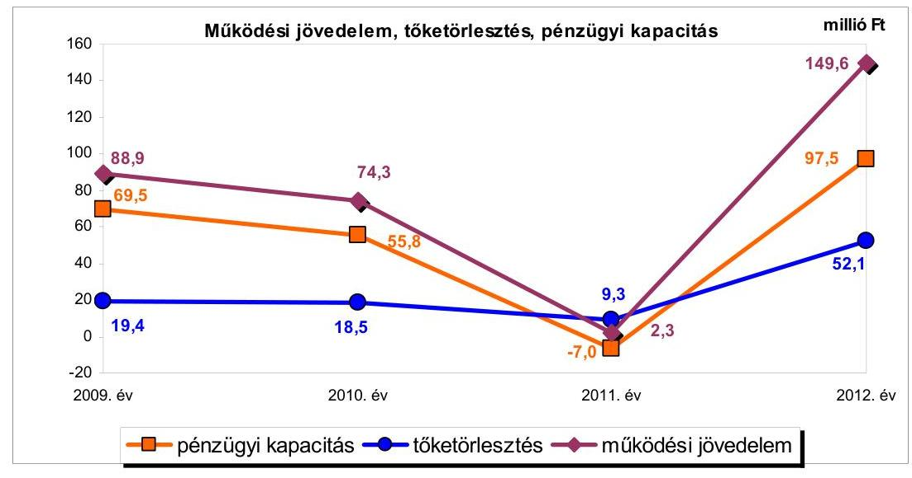
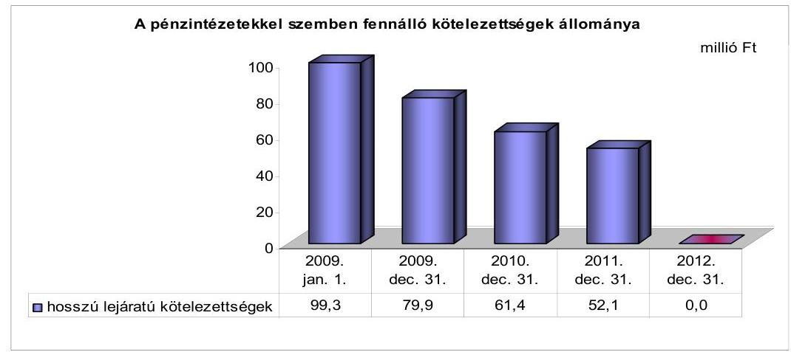
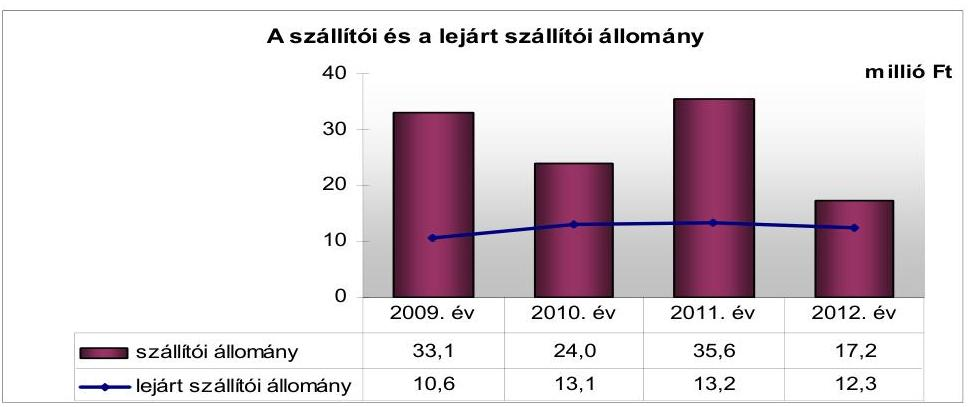
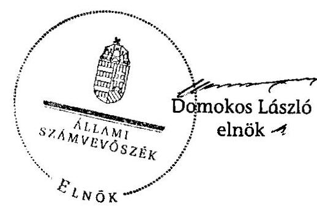
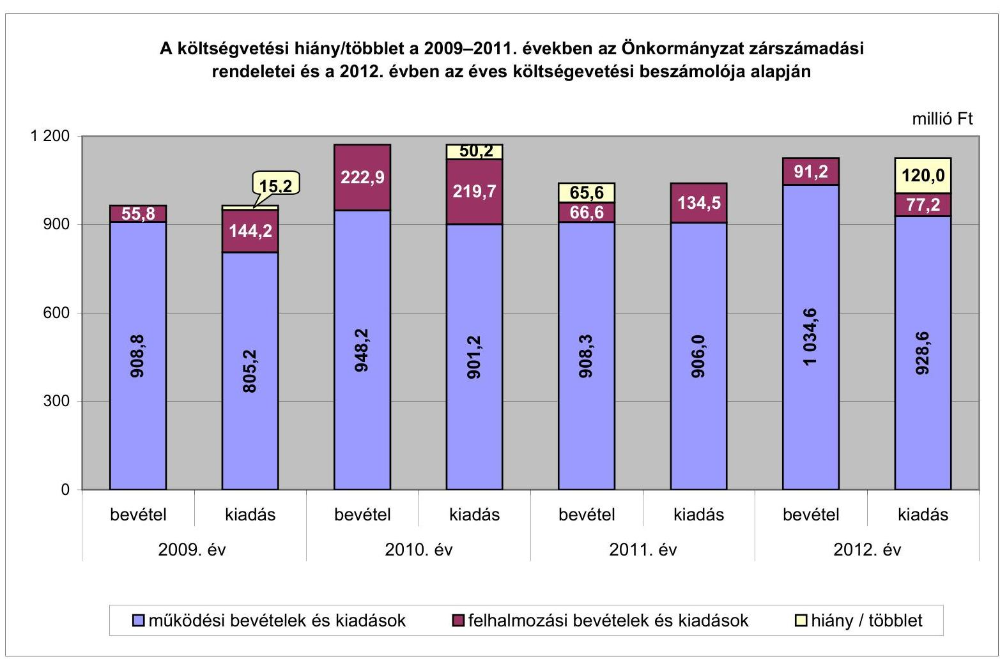
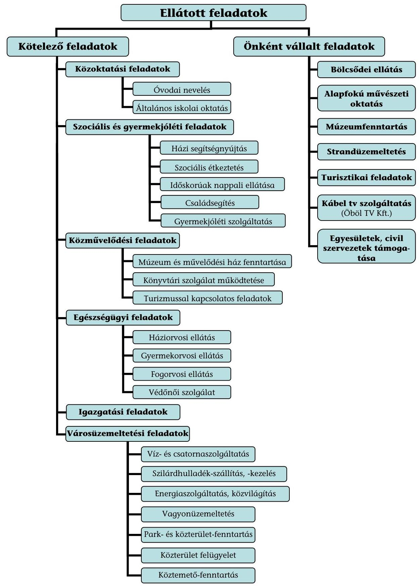

# ÁLLAMI   SZÁMVEVŐSZÉK 

## JELENTÉS

az önkormányzatok pénzügyi gazdálkodási helyzetének, szabályosságának ellenőrzéséről

BALATONKENESE
13082
2013. szeptember

---

# Állami Számvevőszék 

Iktatószám: V-0030-347-010/2013.
Témaszám: 1069
Vizsgálat-azonosító szám: V059220

## Az ellenőrzést felügyelte:

## Renkó Zsuzsanna

felügyeleti vezető
Az ellenőrzést vezette és az ellenőrzés végrehajtásáért felelős:
Dér Lívia
ellenőrzésvezető
Az ellenőrzést végezte:
Pálfiné Pusztai Magdolna Ritecz Tibor
számvevő tanácsos
számvevő tanácsos

---

# TARTALOMJEGYZÉK 

BEVEZETÉS ..... 3
I. ÖSSZEGZŐ MEGÁLLAPÍTÁSOK, KÖVETKEZTETÉSEK, JAVASLATOK ..... 6
II. RÉSZLETES MEGÁLLAPÍTÁSOK ..... 14

1. Az Önkormányzat kötelező és önként vállalt feladatai, a feladatellátás szervezeti keretei ..... 14
2. A pénzügyi egyensúlyt fenntartását veszélyeztető pénzügyi kockázatok és az ezek csökkentése érdekében tett intézkedések ..... 16
3. A pénzügyi gazdálkodási folyamatok szabályosságát, megfelelőségét biztosító belső kontrollok ..... 25

---

# MELLÉKLETEK 

1. számú A költségvetési hiány/többlet a 2009-2011. években az Önkormányzat zárszámadási rendeletei és a 2012. évben az éves költségvetési beszámolója alapján
2. számú Az Önkormányzat bevételei és kiadásai, valamint adósságszolgálata a 2009-2012. években (a CLF módszer szerint)
3/a. számú Az Önkormányzat által a 2009-2012. években megvalósított (műszakilag befejezett) fejlesztések forrásösszetétele
3/b. számú Az Önkormányzat 2012. december 31-én folyamatban lévő fejlesztési feladataihoz kapcsolódó kötelezettségeinek összegzése
3/c. számú Az Önkormányzat által beadott, elbírálás alatti pályázatok forrásaiból megvalósuló fejlesztésekhez kapcsolódó kötelezettségvállalások összegzése
3. számú Az önkormányzati feladatok ellátásában résztvevő gazdasági társaságok egyes kiemelt adatai
4. számú Az Önkormányzat kötelezettségeinek és egyes kötelezettségvállalásainak 2009. december 31-ei és 2012. december 31-ei állománya, valamint a 2013. évben és az azt követő években várható kötelezettségek, kötelezettségvállalások miatti kiadások

## FÜGGELÉKEK

1. számú Rövidítések jegyzéke
2. számú Fogalomtár
3. számú Az Önkormányzat által ellátott feladatok 2012. december 31-én

---

# JELENTÉS 

## az önkormányzatok pénzügyi gazdálkodási helyzetének, szabályosságának ellenőrzéséről BALATONKENESE

## BEVEZETÉS

Az államháztartás helyi szintjén, az önkormányzati alrendszerben az utóbbi években megjelenő gazdálkodási nehézségek, a pénzforgalmi hiány növekedése, az eladósodás az ÁSZ figyelmét a helyi önkormányzatok pénzügyi helyzetére irányította.

Az ÁSZ a 2013. év I. félévi ellenőrzési tervben foglaltaknak megfelelően az önkormányzatok pénzügyi gazdálkodási helyzetének, szabályosságának ellenőrzésével az önkormányzatok 2011. évben megkezdett helyzetelemzését folytatta. Az ellenőrzés keretében értékeljük az önkormányzatok adósságkezelési és likviditási helyzetét. Bemutatjuk a pénzügyi egyensúly alakulására hatással lévő folyamatokat, feltárjuk az ezekre ható kockázatokat. Értékeljük a pénzügyi egyensúlyi helyzetet befolyásoló döntésmegalapozó, döntés-előkészítő eljárások szabályosságát, és minősítjük az ezekkel összefüggő belső kontrollok kialakítását, működését.

Az ellenőrzés eredményének várható hatásaként a megállapításokkal segítséget nyújtunk az önkormányzatok számára a pénzügyi egyensúly helyreállítása, javítása és fenntartása érdekében szükségessé váló intézkedések megtételéhez.

Az ellenőrzés típusa: szabályszerűségi ellenőrzés.

## Az ellenőrzés célja annak értékelése volt, hogy:

- az ellenőrzött időszakban a kötelező és önként vállalt feladatok ellátását biztosító szervezeti formák változása milyen hatást gyakorolt az Önkormányzat pénzügyi helyzetének alakulására;
- az Önkormányzat pénzügyi - ezen belül működési és felhalmozási - egyensúlya milyen irányban változott, a változást milyen okok idézték elő, továbbá milyen intézkedéseket tettek a pénzügyi egyensúly biztosítása, illetve javítása érdekében, az intézkedések hatására javult-e az Önkormányzat pénzügyi helyzete;
- a költségvetési kiadások finanszírozása érdekében vállalt, pénzintézetekkel szembeni kötelezettségek hogyan alakultak, a kötelezettségek fennállása miként befolyásolja az Önkormányzat jövőbeli pénzügyi egyensúlyi helyzetét;

---

- az Önkormányzat beazonosította, felmérte, értékelte-e a pénzügyi egyensúlyt befolyásoló pénzügyi kockázatokat, a finanszírozási célú pénzügyi műveletekkel kapcsolatban írtak-e elő kockázatértékelési kötelezettséget;
- az Önkormányzat által kialakított belső kontrollok biztosítják-e a pénzügyi gazdálkodás folyamatainak szabályosságát és eredményességét.

Utóellenőrzésre nem került sor, mivel az ÁSZ a 2009-2012. években nem végzett ellenőrzést az Önkormányzatnál.

Az ellenőrzés a 2009. január 1-jétől 2012. december 31-éig terjedő időszakot ölelte fel. A pénzintézetekkel szembeni kötelezettségek állományára vonatkozóan az ellenőrzés kezdő időpontjaként a 2012. december 31-én fennálló kötelezettségek keletkezésének időpontját vettük figyelembe. A jövőbeni kötelezettségek megállapításakor az adósságkonszolidáció hatását is értékeltük.

Az ellenőrzés szakmai módszertana az ÁSZ Ellenőrzési Elvek és Standardokban foglalt szakmai szabályokon alapult, amely a Legfőbb Ellenőrző Intézmények Nemzetközi Szervezete (INTOSAI) által kiadott nemzetközi standardok (ISSAI) figyelembevételével készült.

Az ellenőrzés során használt rövidítéseket az 1. számú, az egyes fogalmak magyarázatát a 2. számú függelék tartalmazza.

Az ellenőrzés jogszabályi alapját az ÁSZ tv. 1. § (3) bekezdésének, 5. § (2)-(6) bekezdéseinek, valamint az Áht. 61. § (2) bekezdésének előírásai képezik.

Az Országgyűlés 2012 végén a helyi önkormányzatok adósságállományának részleges konszolidációjáról döntött. Az 5000 fő lakosságszámot meg nem haladó települési önkormányzatok számára nyújtott törlesztési célú támogatással ${ }^{1}$ lehetővé tették a 2012. december 12-én fennálló adósságállományuk és annak 2012. december 28-áig számított járulékai teljes megfizetését. Az 5000 fő lakosságszám feletti települések esetében a 2013. évben az állam differenciált - az adóerő-képességet figyelembe vevő, 40-70\%-ig terjedő - mértékben vállalja át ${ }^{2}$ az önkormányzat 2012. december 31-i, az átvállalás időpontjában fennálló adósságállományát és annak járulékait. Az adósságkonszolidációs intézkedéssel egyidejűleg a Kormány elrendelte ${ }^{3}$ az önkormányzatok adósságállománya újratermelődésének megakadályozása céljából a hitelengedélyezési és a likvid hitelekre vonatkozó szabályozás szigorítását.

Balatonkenese Város Önkormányzata, a település lakónépességére tekintettel, a 2012. évben részesült 77,5 millió Ft összegű törlesztési célú támogatásban,

[^0]
[^0]:    ${ }^{1}$ Magyarország 2012. évi központi költségvetéséről szóló 2011. évi CLXXXVIII. törvény 76/C. §-a (beiktatta a 2012. évi CLXXXVII. törvény 8. §-a, hatályos 2012. XII. 6-tól)
    ${ }^{2}$ Magyarország 2013. évi központi költségvetéséről szóló 2012. évi CCIV. törvény 7276. §-ai
    ${ }^{3}$ 1540/2012. (XII. 4.) Korm. határozat a helyi önkormányzatok adósságállományának részleges konszolidációjáról

---

mely a 2012. december 12-én fennálló pénzintézeti kötelezettségeit és azok járulékait fedezte. Az ÁSZ jelen ellenőrzése során tett megállapításai az adósságkonszolidációt követően is helytállóak és időszerűek.

Balatonkenese város lakosainak száma 2012. január 1-jén 3573 fő volt, ami 31 fős csökkenést jelent a 2009. év eleji 3604 fő lakosságszámhoz képest. Az Önkormányzat költségvetési beszámolója szerint a 2012. évben 1125,8 millió Ft költségvetési bevételt ért el, és 1005,8 millió Ft költségvetési kiadást teljesített. A 2009. évi tényadatokhoz viszonyítva a bevételek 161,2 millió Ft-tal (16,7\%-kal), a kiadások 56,4 millió Ft-tal (5,9\%-kal) növekedtek. A 2012. december 31-i könyvviteli mérleg alapján az Önkormányzat 11 937,2 millió Ft értékű vagyonnal rendelkezett, amely a 2009. év végi állományhoz (11 865,0 millió Ft) viszonyítva 0,6\%-kal (72,2 millió Ft-tal) növekedett. A 2012. december 31-i összes kötelezettsége 39,7 millió Ft volt, amely a 2009. évihez képest 81,6 millió Ft-tal csökkent, döntően az adósságkonszolidációhoz kapcsolódó, törlesztési célú támogatás eredményeként. Az Önkormányzat a 2012. év végén 130,4 millió Ft szabad pénzmaradvánnyal rendelkezett.

Az ÁSZ tv. 29. § (1) bekezdése szerint a jelentéstervezetet megküldtük a polgármester részére, aki az ÁSZ tv. 29. § (2) bekezdésében foglalt észrevételezési jogával nem élt, a jelentéstervezetre észrevételt nem tett.

---

# I. ÖSSZEGZŐ MEGÁLLAPÍTÁSOK, KÖVETKEZTETÉSEK, JAVASLATOK 

Balatonkenese Város Önkormányzatának pénzügyi egyensúlya az ellenőrzött időszakban középtávon nem volt biztosított. Az Önkormányzat folyó költségvetési egyenlege, működési jövedelemtermelő képességének eredményeként az ellenőrzött időszak minden évében pozitív értéket mutatott. A működési bevételek biztosították a működési kiadások és - a 2011. év kivételével - az adósságszolgálat finanszírozását. Az állam az Önkormányzat 2012. december 12-én fennálló adósságállománya és annak 2012. december 28-án fennálló járulékai együttes összegére - összesen 77,5 millió Ft - törlesztési célú támogatást nyújtott. Az egyszeri, vissza nem térítendő költségvetési támogatás eredményeként az Önkormányzat pénzügyi egyensúlyi helyzete javult, azonban a pénzügyi egyensúly hosszú távú fenntartásához a jövedelemtermelő képesség megőrzése szükséges.

Az Önkormányzat költségvetésének elemzését a CLF módszerrel számított mutatók alapján végeztük. Pénzügyi kapacitásának a 2009-2012. évek közötti változását az alábbi ábra mutatja be:

Az ellenőrzött időszakban az Önkormányzat összesen 4236,4 millió Ft költségvetési bevételt ért el, valamint 4116,6 millió Ft költségvetési kiadást teljesített. Működési költségvetésének egyensúlya a 2009-2012. években biztosított volt, a - jövedelemtermelő képessége alapján - képződött bevételek a feladatok ellátásához szükséges kiadásokat fedezték, összesen 315,1 millió Ft többlet keletkezett. A 2012. évi működési jövedelem összege 60,7 millió Ft-tal (68,3\%-kal) haladta meg a 2009. évi értéket. A működési jövedelem a 2010. évről a 2011. évre jelentősen, 72,0 millió Ft-tal (96,9\%-kal) csökkent, melyet elsősorban a költségvetési támogatások, ezen belül a feladathoz kötött, központosított előirányzatból juttatott támogatások, valamint az átengedett bevételek

---

csökkenése okozott. A 2011. évről 2012-re a működési jövedelem 147,3 millió Ft-tal nőtt, döntően a helyi adók - a helyi iparűzési adó alanyai számának emelkedése miatti -, valamint a költségvetési támogatások növekedése révén. A költségvetési támogatás 2012. évi, 85,4 millió Ft-os növekményéből 77,5 millió Ft (90,7\%) az adósságkonszolidációhoz - a pénzintézeti kötelezettség fennálló állományának visszafizetéséhez - biztosított vissza nem térítendő támogatás volt. Az Önkormányzat az ellenőrzött időszakban ÖNHIKI támogatásban nem részesült.

A felhalmozási költségvetés egyensúlya az ellenőrzött időszakban nem állt fenn, összesen 195,3 millió Ft felhalmozási forráshiány keletkezett. A felhalmozási költségvetés hiányára az összesen 215,8 millió Ft nettó működési jövedelem és - a 2009. évben részben, a 2011. évben teljes egészében - a pénzmaradvány biztosított fedezetet. A felhalmozási forráshiány 2011. évi növekedésében a két legjelentősebb fejlesztési feladatra fordított kiadások emelkedése volt meghatározó, melyet - a felhalmozási bevételek között meg nem jelenő, de rendelkezésre álló - előző évi pénzmaradvány igénybevételével finanszíroztak.

Az ellenőrzött időszakban a kötelező és az önként vállalt feladatok ellátását biztosító szervezeti formák nem változtak, így nem voltak hatással az Önkormányzat pénzügyi helyzetének alakulására. A feladatok bővülését, majd csökkenését okozta az önkormányzat egy óvodájának és iskolájának az - Önkormányzat gesztorságával működő - intézményfenntartó társuláshoz történt csatlakozása, majd kiválása. A bevételnövelő intézkedések (az idegenforgalmi adómérték és az intézményi térítési díjak emelése, a szabadstrand fizetőssé tétele, az óvoda és iskola csatlakozása) az Önkormányzat adatszolgáltatása szerint összesen 5,8 millió Ft többletbevételt eredményeztek, nem gyakoroltak jelentős hatást a pénzügyi egyensúlyi helyzetre.

A megvalósított felújításokhoz, beruházásokhoz kapcsolódóan a jövőbeni üzemeltetés várható kiadásait és bevételeit, a működtetés forrásait nem számszerűsítették, továbbá a megvalósított létesítmények működtetése nem teremt bevételnövelési lehetőséget, ezért a fejlesztések során kialakított létesítmények jövőbeni üzemeltetése miatti kockázat fennállt.

A szállítókkal szembeni kötelezettség 2012. december 31-én 17,2 millió Ft-ot tett ki, ebből 12,3 millió Ft (71,5\%) lejárt tartozás volt, amely a 2012. évi dologi kiadások egy havi átlagának (30,1 millió Ft-nak) 40,9\%-át tette ki. A 2012. évben az Önkormányzatnál fennállt a lejárt szállítói állomány miatti szállítói kitettség kockázata. A 60 napon túl lejárt szállítói kötelezettségek állománya 11,7 millió Ft volt.

Az Önkormányzat hat folyamatban lévő peres eljárásban érintett alperesként, melyek kimutatott, összes perértéke 280,7 millió Ft volt. A folyamatban lévő perek kimenetele jelentős hatással lehet az Önkormányzat pénzügyi helyzetére, és pénzügyi kockázatot jelenthet.

Az Önkormányzat minősített többségi befolyása alatt álló gazdasági társaság pénzügyi helyzete nem stabil - az ellenőrzött időszak éveiben a saját tőke negatív (2012. december
 31-én - 3,3 millió Ft) volt -, gazdálkodása mérlegen kívüli kockázatot jelent. Az Önkormányzat feladata gondoskodni a Tátorján Kft. negatív saját tőkéjének pótlásáról, mely kedvezőtlen hatást gyakorol az Önkormányzat pénzügyi egyensúlyára.

Az Önkormányzat pénzintézetekkel szembeni kötelezettségeinek állománya 2009. január 1-jétől 2011. december 31-ig 47,5%-kal, 99,3 millió Ft-ról 52,1 millió Ft-ra csökkent, majd 2012. december 31-ére - a törlesztési célú támogatás eredményeként - megszűnt. A 2009. január 1-jei, pénzintézetekkel szembeni kötelezettségek állományát hat hosszú lejáratú, forintalapú, fejlesztési hitel képezte, melyekből négyet a 2012. év III. negyedév végéig visszafizettek. A hiteltörlesztéseket folyamatosan teljesítették, az ellenőrzött időszakban hosszú lejáratú hitelt nem vettek fel. Folyószámlahitelt a likviditási helyzet függvényében vettek igénybe, melynek átlagos, napi állománya a 2009. évi 24,0 millió Ft-ról 2012-re 21,5 millió Ft-ra mérséklődött, az igénybevételi napok száma a felére, 102 napra csökkent. A hosszú lejáratú és a folyószámlahitel kamat- és egyéb kiadásaira kifizetett, összesen 14,0 millió Ft számottevően nem befolyásolta az Önkormányzat pénzügyi egyensúlyi helyzetét. A 77,5 millió Ft törlesztési célú támogatásból a hosszú lejáratú hitelek tőketörlesztésére 43,3 millió Ft-ot, kamat- és egyéb kiadásaira 0,3 millió Ft-ot, a folyószámlahitel visszafizetésére 33,6 millió Ft-ot, járulékaira 0,3 millió Ft-ot fordítottak.

Az Önkormányzatnak a 2012. év végén - a törlesztési célú költségvetési támogatás felhasználását követően - csak rövid lejáratú kötelezettsége állt fenn, mely 17,2 millió Ft szállítói állományt, 14,9 millió Ft bevétel-visszatérítési és 7,6 millió Ft jogerős végzéssel lezárt peres eljárásból származó kötelezettséget tartalmazott. A szállítói állományban 12,3 millió Ft volt a lejárt tartozás, melynek 95,1%-át (11,7 millió Ft-ot) vitatott tartozás tette ki. A törlesztési célú támogatás az Önkormányzat pénzügyi egyensúlyi helyzetét kedvezően befolyásolta, azonban pénzügyi egyensúlyának hosszú távú fenntartásához a jövedelemtermelő képességének megőrzése szükséges, melynek révén a jövőbeni kötelezettségek teljesíthetősége az Önkormányzat számára nem jelent kockázatot.

Az Önkormányzatnál a kockázatkezelési rendszer keretében a pénzügyi egyensúlyt befolyásoló kockázatok feltárása, beazonosítása, felmérése, értékelése és kezelése - a 2009. évben az Ámr. ${ }_{1}$-ben, a 2010-2011. években az Ámr. ${ }_{2}$-ben, a 2012. évben a Bkr.-ben foglalt jogszabályi előírások ellenére elmaradt. Annak ellenére maradt el a kockázatok kezelése, hogy az ellenőrzött időszakban fennállt a fejlesztések során kialakított létesítmények jövőbeni üzemeltetéséből és a szállítói kitettségből eredő, a folyamatban lévő perek kimeneteléből adódó, valamint az Önkormányzat minősített többségi tulajdonában lévő - veszteségesen gazdálkodó - gazdasági társasága miatti mérlegen kívüli kockázat. Az ellenőrzött időszakban nem írtak elő a finanszírozási célú pénzügyi műveletekkel kapcsolatban kockázatértékelési kötelezettséget.

A pénzügyi gazdálkodási folyamatok szabályosságát, megfelelőségét, kockázatainak kezelését biztosító kontrolltevékenységek kialakítása - a 2009. évben az Ámr. ${ }_{1}$-ben, a 2010-2011. években az Ámr. ${ }_{2}$-ben, a 2012. évben a Bkr.-ben foglalt előírások ellenére - nem volt megfelelő, mert nem írták elő a feladat átadás-átvételére vonatkozóan a döntés-előkészítés folyamatában annak értékelését, hogy a döntés milyen hatást gyakorol a kötelező és önként vállalt feladatokra fordított kiadások arányára, a pénzügyi egyensúlyi helyzetre. Nem szabályozták továbbá a feladatellátáshoz kapcsolódó támogatási rendszer feltételeit, illetve a feladatellátási szerződések tartalmi követelményeit. Az Önkormányzat nem rendelkezett kockázatkezelési szabályzattal, ellenőrzési nyomvonallal és a szabálytalanságok kezelésének eljárásrendjével. Nem határozták meg az önkormányzati fejlesztések előkészítése, lebonyolítása és működtetése kockázatai döntés-előkészítési folyamatban történő feltárásának és kezelésének kötelezettségét, továbbá a fejlesztésekhez kapcsolódó külső források, támogatások figyelési rendszerét, a pályázatkészítés feltételeit és szervezeti kereteit. Nem írták elő a pénzintézeti kötelezettségvállalásokkal kapcsolatos döntések kockázatai feltárásának, a futamidő egyes éveit terhelő kötelezettségek pénzügyi egyensúlyra gyakorolt hatásának döntés-előkészítés során történő vizsgálatát. Nem készült szabályozás a szállítói tartozások (kiemelten a lejárt szállítói tartozások) és egyéb kiadáselmaradások kezelésére vonatkozóan. Az ellenőrzött időszak belső ellenőrzési terveinek készítését megelőzően - a 2009. évben az Ámr. 1-ben, a 2010-2011. években az Ámr.-ben, a 2009-2011. években a Ber.-ben, 2012. január 1-jétől a Bkr.-ben foglaltak ellenére - nem rendelkeztek a pénzügyi egyensúlyi helyzetet befolyásoló döntések kockázati tényezőinek feltárásáról és belső ellenőrzés keretében történő ellenőrzéséről.

A pénzügyi gazdálkodási folyamatok szabályosságát, megfelelőségét, a kockázatok kezelését biztosító belső kontrollok működése annak ellenére jó volt, hogy a hiányos szabályozás miatt a feladat átvétel-átadás döntés-előkészítési folyamatában nem végezték el annak értékelését, hogy a döntés milyen hatással bír az Önkormányzat pénzügyi egyensúlyi helyzetére. Nem tárták fel az önkormányzati fejlesztések esetében a döntés-előkészítés folyamatában az előkészítés, a lebonyolítás és a működtetés kockázatait, továbbá a lejárt szállítói tartozások rendezésére nem intézkedtek.

Az ellenőrzés a gazdálkodási feladatok ellátásával és a könyvvezetési kötelezettség teljesítésével kapcsolatban az alábbi szabályszerűségi hibákat tárta fel:

- két hosszú lejáratú hitelszerződés megkötésekor (2001-ben 15,6 millió Ft, 2005-ben 23,7 millió Ft összegben igénybevett hitelek esetében) a törzsvagyonba tartozó, korlátozottan forgalomképes (erdő, tábor) ingatlanokra engedélyezett jelzálogjog bejegyzésével megsértették az Ötv.-ben ${ }^{4}$ foglalt előírást, amely szerint az önkormányzati törzsvagyon hitel fedezetéül nem használható fel;
- a 2011. évi könyvviteli mérlegben - az Áhsz.-ben foglaltak ellenére - a Szociális Szövetkezet részére éven belüli lejáratra nyújtott, 2,0 millió Ft összegű kölcsönt követelésként nem mutatták ki, azt végleges pénzeszköz-átadásként számolták el számviteli nyilvántartásukban;
- a 2012. évi könyvviteli mérlegben - az Áhsz.-ben előírtak ellenére - egy jogerős határozattal lezárt peres eljárásból eredő, 7,6 millió Ft összegű, egyéb rövid lejáratú kötelezettséget nem mutattak ki.

Az ÁSZ tv. 33. § (1) bekezdésében foglaltak értelmében az ellenőrzött szervezet vezetője köteles a jelentésben foglalt megállapításokhoz kapcsolódó intézkedési tervet összeállítani, és azt a jelentés kézhezvételétől számított harminc napon belül az ÁSZ részére megküldeni. Amennyiben az intézkedési tervet határidőben nem küldi meg a szervezet vezetője, vagy az továbbra sem elfogadható, az ÁSZ elnöke a hivatkozott törvény 33. § (3) bekezdés a-b) pontjaiban foglaltakat érvényesítheti.

[^0]
[^0]:    ${ }^{4}$ Hatálytalan 2012. január 1-jétől, a 2012. március 31-től hatályos, új jogszabályi előírást az Áht. tartalmazza.

# Az ellenőrzés intézkedést igénylő megállapításai és javaslatai: 

## a polgármesternek

1. Az Önkormányzat működési jövedelme minden évben pozitív volt. A nettó működési jövedelem a 2011. év kivételével pozitív volt. 2012. december 31-én fennálló pénzintézeti kötelezettség - a kormányzati adósságkonszolidáció eredményeként - nem volt, a szállítói állomány 17,2 millió Ft, az egyéb kötelezettségek összege 22,5 millió Ft volt. A 2012. év végén fennálló szállítói tartozásból 12,3 millió Ft lejárt esedékességű volt. A 2012. év végén rendelkezésre álló szabad pénzmaradvány összege 130,4 millió Ft volt. Az Önkormányzat az ellenőrzött időszakban kiadáscsökkentő intézkedéseket nem tett, a bevételnövelő intézkedések eredménye számottevően nem javította a pénzügyi egyensúlyi helyzetet. Az Önkormányzat minősített többségi befolyása alatt álló gazdasági társaságának saját tőkéje az ellenőrzött időszak minden évében negatív volt, a tőkerendezésből adódó kötelezettség az Önkormányzatot terheli.

Javaslat:
A működési jövedelemtermelő képesség és a feladatellátás összhangja, valamint az Önkormányzat pénzügyi egyensúlyának hosszú távú fenntarthatósága érdekében - a 2012. évi kormányzati adósságkonszolidációt, valamint a 2013. évtől változó feladatellátási kötelezettséget, feladatfinanszírozási rendszert figyelembe véve - felelősök és határidők megjelölésével kezdeményezzen intézkedéseket, melyek keretében:
a) a költségvetési rendelettervezet, valamint annak évközi módosítása előterjesztését megelőzően mérje fel a bevételszerző, kiadáscsökkentő lehetőségeket, és terjessze a Képviselő-testület elé a bevételek növelését, a kiadások csökkentését célzó intézkedések bevezetéséhez szükséges - a Htv. 140. § (1) bekezdés a) pontja alapján a jegyző által elkészített - döntési javaslatát;
b) terjesszen a Képviselő-testület elé jóváhagyásra - a Htv. 140. § (1) bekezdés a) pontja alapján a jegyző által elkészített - az Önkormányzat gazdasági helyzetének elemzésén alapuló, a pénzügyi egyensúlyi helyzet hosszú távú megőrzését és az adósságállomány újratermelődésének elkerülését biztosító intézkedéseket tartalmazó stabilizációs programot;
c) a szállítói kitettség és az Adósságrendezési tv. 4-9. §-aiban szabályozott adósságrendezési eljárás megindításának elkerülése érdekében a szállítói számlák esedékesség szerinti kiegyenlítése szabad pénzmaradvány rendelkezésre állása esetén történjen meg. Meghatározott gyakorisággal számoljon be a Képviselőtestületnek az Önkormányzat lejárt szállítói állománya alakulásáról. Intézkedjen a szállítói számlák esedékesség szerinti kiegyenlítéséről vagy a lejárt tartozások átütemezéséről;
d) terjesszen a jegyző közreműködésével elkészített intézkedési tervet a Képviselőtestület elé jóváhagyásra, a minősített többségi befolyása alatt álló gazdasági társaság pénzügyi helyzetének stabilizálása érdekében.
2. Az Önkormányzat két hosszú lejáratú - a 2001. évben 15,6 millió Ft, a 2005. évben 23,7 millió Ft összegben igénybevett - hitel esetében az Ötv. 88. § (1) bekezdés b) pontjában ${ }^{5}$ foglalt előírást megsértve, a hitelszerződésekben törzsvagyonba tartozó, korlátozottan forgalomképes (erdő, tábor) ingatlanokra engedélyezett jelzálogjog bejegyzést.

Javaslat:
Intézkedjen, hogy jövőbeni hitelfelvétel és kötvénykibocsátás fedezeteként, az Áht. 84. § (4) bekezdésében előírtak szerint, az Önkormányzat törzsvagyonába tartozó ingatlan ne kerüljön felhasználásra.

# a jegyzőnek 

1. A 2011. évi könyvviteli mérlegben - az Áhsz. 22. § (1) bekezdés c) pontjában foglalt előírás ellenére - az Önkormányzat által a Szociális Szövetkezet részére a 2011. évben éven belüli lejáratra nyújtott 2,0 millió Ft kölcsönből a mérlegforduló napon fennálló követelést nem mutatták ki, a kölcsönt végleges pénzeszközátadásként számolták el. A 2012. évi könyvviteli mérlegben - az Áhsz. 26. § (1) bekezdésében és az (5) bekezdés ds) pontjában előírtak ellenére - az egyéb rövid lejáratú kötelezettségek között egy jogerős határozattal lezárt, peres eljárásból eredő, 7,6 millió Ft összegű kötelezettséget nem mutattak ki.

Javaslat:
A könyvvezetési és a beszámoló készítési kötelezettség szabályszerű teljesítése érdekében intézkedjen, hogy
a) az Áhsz. 22. § (1) bekezdés c) pontjában foglalt előírás alapján a mérlegben a követelések között mutassák ki az Önkormányzat által adott, rövid lejáratú kölcsönöket;
b) az Áhsz. 26. § (1) bekezdésében és az (5) bekezdés ds) pontjában előírtak alapján a mérlegben az egyéb rövid lejáratú kötelezettségek teljes körű bemutatása érdekében szerepeltessék a jogerős határozattal lezárt, peres eljárásból eredő kötelezettségeket is.
2. A kockázatkezelési rendszer keretében az ellenőrzött időszakban fennállt, a pénzügyi egyensúlyt befolyásoló kockázatok feltárása, beazonosítása, értékelése, a kockázatok kezelése - a 2009. évben az Ámr.1 145/C. § (1)-(3) bekezdéseiben, a 2010-2011. években az Ámr. ${ }_{2}$ 157. § (1)-(3) bekezdéseiben, a 2012. évben a Bkr. 7. § (1)-(2) bekezdéseiben foglalt jogszabályi előírások ellenére - elmaradt. Annak ellenére maradt el a kockázatok kezelése, hogy az ellenőrzött időszakban fennállt a fejlesztések során

[^0]
[^0]:    ${ }^{5}$ Hatálytalan 2012. január 1-jétől, a 2012. március 31-től hatályos jogszabályi előírás: az Áht. 84. § (4) bekezdése.

kialakított létesítmények jövőbeni üzemeltetése miatti kockázat, az éven túli lejárt esedékességű szállítói tartozás miatti szállítói kitettség kockázata, a folyamatban lévő perek kimenetele miatti és az Önkormányzat minősített többségi tulajdonában lévő - veszteségesen gazdálkodó - gazdasági társaság miatti mérlegen kívüli kockázat.

Javaslat:
Működtessen a Bkr. 7. § (1)-(2) bekezdéseiben foglalt előírásoknak megfelelő, a pénzügyi egyensúlyt befolyásoló kockázatok kezelésére alkalmas kockázatkezelési rendszert.
3. A
 pénzügyi gazdálkodási folyamatok szabályossága, megfelelősége vonatkozásában a kockázatok kezelését biztosító belső kontrolltevékenységek kialakítása - a 2009. évben az Ámr. 145/E. § (1)-(2) bekezdéseiben, a 2010-2011. években az Ámr. ${ }_{2}$ 158. § (1)-(2) bekezdéseiben, a 2012. évben a Bkr. 8. § (1)-(2) bekezdéseiben foglalt előírások ellenére - nem volt megfelelő, mert a feladat átadásra, átvételére vonatkozóan a döntés-előkészítés folyamatában nem írták elő annak értékelését, hogy a döntés milyen hatással bír a kötelező és önként vállalt feladatokra fordított kiadások arányára, a pénzügyi egyensúlyi helyzetre. Nem írták elő a feladatellátáshoz kapcsolódó támogatási rendszer feltételeit, illetve a feladat-ellátási szerződések tartalmi követelményeit. Nem írták elő az önkormányzati fejlesztések döntés-előkészítési folyamatában az előkészítés, a lebonyolítás és a működtetés kockázatai feltárásának és kezelésének kötelezettségét, nem határozták meg a fejlesztésekhez kapcsolódó külső források, támogatások figyelési rendszerét, a pályázatkészítés feltételeit és szervezeti kereteit. Nem írták elő a pénzintézeti kötelezettségvállalásokkal kapcsolatos döntések kockázatai feltárásának, a futamidő egyes éveit terhelő kötelezettségek pénzügyi egyensúlyra gyakorolt hatásának döntés-előkészítés során történő vizsgálatát. Az Önkormányzat nem rendelkezett kockázatkezelési szabályzattal, ellenőrzési nyomvonallal és a szabálytalanságok kezelésének eljárásrendjével. Nem határozták meg továbbá a szállítói tartozások (kiemelten a lejárt szállítói tartozások) és egyéb kiadáselmaradások rendezésének helyi szabályait.

Javaslat:
Alakítsa ki az Bkr. 8. § (1)-(2) bekezdései alapján azokat a belső kontrolltevékenységeket, amelyek biztosítják a pénzügyi-gazdálkodási folyamatok szabályosságát, illetve a pénzügyi egyensúlyi helyzet alakulását befolyásoló döntések kockázatainak kezelését. Készítse el a hiányzó szabályozásokat. Ennek keretében:
a) írja elő a feladat átadás-átvételre vonatkozó döntések előkészítése során a döntés kötelező és önként vállalt feladatok arányára, ezáltal a pénzügyi egyensúlyi helyzetre gyakorolt hatásának vizsgálatát;
b) írja elő az önkormányzati feladatellátáshoz kapcsolódó támogatási rendszer feltételeit, valamint a szerződések minimum tartalmi követelményeinek meghatározásával összefüggő kontrolltevékenységeket;
c) határozza meg a fejlesztések döntés-előkészítési folyamatában az előkészítés, a lebonyolítás és a működtetés kockázatai feltárásának és kezelésének kötelezettségét;

---

d) határozza meg a fejlesztésekhez kapcsolódó külső források, támogatások figyelési rendszerével, a pályázat készítés feltételeivel összefüggő kontrolltevékenységeket és a pályázatkészítés szervezeti kereteit;
e) írja elő a pénzintézeti kötelezettségvállalások kockázatainak döntés-előkészítő szakaszban történő feltárását, a futamidő egyes éveit terhelő kötelezettségek költségvetési egyensúlyra gyakorolt hatásának vizsgálatát;
f) készítse el a kockázatkezelési szabályzatot, az ellenőrzési nyomvonalat és a szabálytalanságok kezelésének eljárásrendjét;
g) határozza meg a szállítói tartozások és az egyéb kiadáselmaradások rendezése helyi szabályait.
4. Az Önkormányzatnál az ellenőrzött időszak belső ellenőrzési terveinek készítését megelőzően - a 2009. évben az Ámr. 145/C. § (2) bekezdésében, a 2010-2011. években az Ámr. 157. § (2) bekezdésében, a 2009-2011. években a Ber. 18. §-ában, a 21. § (2) bekezdésében és a (3) bekezdés a) pontjában, 2012. január 1-jétől a Bkr. 7. § (2) bekezdésében, a 29. § (1) bekezdésében és a 31. § (2)-(4) bekezdéseiben foglalt előírások ellenére - nem írták elő a pénzügyi egyensúlyi helyzetet befolyásoló döntések kockázati tényezőinek feltárását, a belső ellenőrzési tervek nem tartalmazták az ellenőrzési terveket megalapozó kockázatelemzéseket, és az Önkormányzatnál nem ellenőrizték ezeket a kockázati tényezőket.

Javaslat:
Intézkedjen a belső ellenőrzés vezetője felé, hogy a Bkr. 7. § (2) bekezdésében foglaltak szerint mérje fel a gazdálkodásban rejlő kockázatokat, a 29. § (1) bekezdésében és a 31. § (2)-(4) bekezdéseiben foglalt előírások szerint az éves belső ellenőrzési tervek tartalmazzák a pénzügyi egyensúlyi helyzetet befolyásoló döntésekkel kapcsolatos feltárt kockázati tényezők ellenőrzését, valamint biztosítsa az ellenőrzési tervek végrehajtását.

---

# II. RÉSZLETES MEGÁLLAPÍTÁSOK 

## 1. Az ÖNKORMÁNYZAT KÖTELEZŐ ÉS ÖNKÉNT VÁLLALT FELADATAI, A FELADATELLÁTÁS SZERVEZETI KERETEI

A kötelező és az önként vállalt feladatokat az Önkormányzat az SZMSZ-ében nem szabályozta. Kötelező feladatai a közoktatási, a szociális és gyermekjóléti, a közművelődési, az egészségügyi, az igazgatási és a városüzemeltetési feladatok voltak. A kötelező és önként vállalt feladatok körét, ezen kiadások mértékét a Képviselő-testület az éves költségvetési rendeletekben határozta meg. Az Önkormányzat önként vállalt feladatnak tekintette a bölcsődei ellátást, az alapfokú művészeti oktatást, a múzeum fenntartását, a strandüzemeltetést, a turisztikai feladatok ellátását, a kábel tv szolgáltatást, valamint az egyesületek és civil szervezetek támogatását. (A feladatellátás részletezését a 3. számú függelék tartalmazza.)

A kötelező és önként vállalt feladatokra fordított kiadások arányának, az egyes ágazatok finanszírozási forrásainak alakulására, a kötelező és önként vállalt feladatok pénzügyi egyensúlyi helyzetre gyakorolt hatására, az önként vállalt feladatok felülvizsgálatára vonatkozó elemzést, értékelést nem készítettek. Az ellenőrzött időszakban, az Önkormányzat adatszolgáltatása szerint, a működési kiadások összege folyamatosan - a 2009. évi 812,9 millió Ft-ról 2010-re 901,2 millió Ft-ra, 2011-re 906,0 millió Ft-ra, 2012-re 928,6 millió Ft-ra -, összesen 14,2%-kal emelkedett. Ebben döntő szerepe a kötelező feladatokra felhasznált működési kiadások 100,2 millió Ft-os növekedésének volt, melyet az óvodai ellátás és az általános iskolai oktatás bővülése okozott. A működési kiadások emelkedéséhez 15,5 millió Ft-tal járult hozzá az önként vállalt feladatok kiadásainak - főként a strandszolgáltatás bővülésével összefüggő - növekedése. Az összes működési kiadásból a kötelező feladatokra a 2009. évben 766,1 millió Ft-ot (94,2%-ot), a 2010. évben 854,6 millió Ft-ot (94,8%-ot), a 2011. évben 856,4 millió Ft-ot (94,5%-ot), a 2012. évben 866,3 millió Ft-ot (93,3%-ot) fordítottak. Az önként vállalt feladatok érdekében teljesített működési kiadások összege a 2009. évben 46,8 millió Ft (5,8%), a 2010. évben 46,6 millió Ft (5,2%), a 2011. évben 49,6 millió Ft (5,5%), a 2012. évben 62,3 millió Ft (6,7%) volt. Az önként vállalt feladatok ellátása, azok működési kiadásainak nagyságrendje és az összes működési kiadáson belüli alacsony aránya miatt - figyelembe véve a pozitív működési jövedelmet -, nem jelentett működési kockázatot. A 2012. december 31-ig műszakilag befejezett és folyamatban lévő felújítások, beruházások teljes bekerülési költségének 14,9%-át (82,4 millió Ft-ot) fordította az Önkormányzat önként vállalt feladatok ellátására, így a felhalmozási kiadások aránya és összege nem jelentett felhalmozási kockázatot.

Az Önkormányzatnál az ellenőrzött időszakban a kötelező és önként vállalt feladatok ellátását végző költségvetési szervek száma (öt) nem változott, azonban intézményi feladatok átvételére, majd átadására sor került, melynek következtében - az ellenőrzött időszakon belül - kettővel nőtt, majd csökkent a telephelyek száma.

Balatonvilágos Község Önkormányzata az óvodájával és az iskolájával - az Önkormányzat gesztorságával működő - Közoktatási intézményfenntartó társulásba 2009. augusztus 1-jén belépett, majd 2012. július 1-jén kivált.

A kötelező feladatok közül a Polgármesteri Hivatal végezte az igazgatási, valamint részben - a védőnői szolgálat tekintetében - az egészségügyi feladatokat. Intézményfenntartó társulások útján látták el a közoktatási, a szociális és gyermekjóléti feladatokat. Az Önkormányzat - a Közoktatási intézményfenntartó társulás gesztoraként - a közoktatási feladatokat két önállóan működő költségvetési szerve (az Iskola és az Óvoda) útján, a szociális és a gyermekjóléti feladatokat (házi segítségnyújtás, szociális étkeztetés, időskorúak nappali ellátása, családsegítés, gyermekjóléti szolgáltatás,) egy önállóan működő intézménye - a Területi Szociális Szolgáltató Intézmény - által végezte. A közművelődési feladatokat (a művelődési ház és múzeum fenntartását, a könyvtári szolgálat működtetését és a turizmussal kapcsolatos feladatokat) a Közművelődési Intézmény és Könyvtár látta el. A Városgondnokság végezte többek között a vagyonüzemeltetést, a park- és közterület-fenntartást, a közterület-felügyeletet, a köztemető-fenntartást és a strandüzemeltetést. Az egészségügyi feladatok közül a háziorvosi, a gyermekorvosi és a fogorvosi ellátás biztosítására gazdasági társaságokkal kötöttek feladatellátási szerződést. Ugyancsak gazdasági társaságok végezték a víz- és csatornaszolgáltatást, a szilárdhulladék-szállítást, kezelést, az energiaszolgáltatást, a közvilágítási feladatokat, valamint a kábel tv szolgáltatást.

Az Önkormányzat egy gazdasági társaságban, a Tátorján Kft.-ben rendelkezett minősített többségi (94,0%-os) tulajdoni részesedéssel. Fő tevékenységi köre a gyermekek napközbeni ellátása, családi napközi működtetése, házi gyermekfelügyelet, valamint alternatív ellátások keretében játszóház és játéktár létrehozása, működtetése és egyéb - bentlakás nélküli - szociális ellátások biztosítása volt.

A feladatellátásban résztvevő gazdasági társaságok közül a - szilárdhulladékszállítást, -kezelést végző - Zöldfok Zrt.-ben rendelkezett még az Önkormányzat tulajdoni részesedéssel, amelyeknek nagysága 0,003% (10 ezer Ft) volt.

A gazdasági társaságok által ellátott feladatok köre nem változott. Az önkormányzati feladatok ellátásában résztvevő gazdasági társaságok egyes kiemelt adatait a 4. számú melléklet tartalmazza.

Az ellenőrzött időszakban a kötelező és önként vállalt feladatok ellátását biztosító szervezeti formák nem változtak, így nem gyakoroltak hatást az Önkormányzat pénzügyi egyensúlyi helyzetének alakulására.

---

# 2. A PÉNZÜGYI EGYENSÚLY FENNTARTÁSÁT VESZÉLYEZTETŐ PÉNZÜGYI KOCKÁZATOK ÉS AZ EZEK CSÖKKENTÉSE ÉRDEKÉBEN TETT INTÉZKEDÉSEK 

Az Önkormányzat költségvetésének elemzését CLF módszerrel hajtottuk végre. A CLF módszer szerinti, a 2009-2012. évek közötti időszak részletes adatait a 2. számú melléklet, a főbb önkormányzati adatokat az alábbi tábla mutatja be:

|  | millió Ft |  |  |  |
| :-- | --: | --: | --: | --: |
| Megnevezés | 2009. év | 2010. év | 2011. év | 2012. év |
| Folyó bevételek | 901,8 | 975,5 | 908,3 | 1078,2 |
| Folyó kiadások | 812,9 | 901,2 | 906,0 | 928,6 |
| Működési jövedelem | $\mathbf{88,9}$ | $\mathbf{74,3}$ | $\mathbf{2,3}$ | $\mathbf{149,6}$ |
| Felhalmozási bevételek | 62,8 | 195,6 | 66,6 | 47,6 |
| Felhalmozási kiadások | 136,5 | 219,7 | 134,5 | 77,2 |
| Felhalmozási költségvetés egyenlege | $\mathbf{-73,7}$ | $\mathbf{-24,1}$ | $\mathbf{-67,9}$ | $\mathbf{-29,6}$ |
| Folyó és felhalmozási bevételek összesen | 964,6 | 1171,1 | 974,9 | 1125,8 |
| Folyó és felhalmozási kiadások összesen | 949,4 | 1120,9 | 1040,5 | 1005,8 |
| Finanszírozási műveletek nélküli pozíció | $\mathbf{15,2}$ | $\mathbf{50,2}$ | $\mathbf{-65,6}$ | $\mathbf{120,0}$ |
| Finanszírozási műveletek egyenlege | -20,4 | -36,6 | $-5,8$ | $-53,7$ |
| Tárgyévi pénzügyi pozíció | $\mathbf{-5,2}$ | $\mathbf{13,6}$ | $\mathbf{-71,4}$ | $\mathbf{66,3}$ |
| Hiteltörlesztés, értékpapír beváltás | 19,4 | 18,5 | 9,3 | 52,1 |
| Nettó működési jövedelem | $\mathbf{69,5}$ | $\mathbf{55,8}$ | $\mathbf{-7,0}$ | $\mathbf{97,5}$ |

Az ellenőrzött időszakban az Önkormányzat összesen 4236,4 millió Ft költségvetési bevételt ért el, valamint 4116,6 millió Ft költségvetési kiadást teljesített. A működési és felhalmozási költségvetésének egyenlege (finanszírozási műveletek nélküli pozíciója) összességében - a 2011. év kivételével - pozitív volt, 119,8 millió Ft többletet mutatott, elsősorban a 2012. évi pozitív egyenleg miatt.

Az Önkormányzat folyó költségvetési egyenlege, működési
 jövedelme az ellenőrzött időszak minden évében pozitív volt, 2009-2012 között 68,3%-kal (60,7 millió Ft-tal) nőtt. Összesen 315,1 millió Ft működési forrástöbblet keletkezett, amely fedezte a kötelező és önként vállalt feladatokra fordított folyó kiadásokat. A működési jövedelem 2010-ről 2011-re jelentősen, 72,0 millió Ft-tal (96,9%-kal) csökkent, melyet elsősorban a költségvetési támogatások (56,7 millió Ft-os) - azon belül a feladathoz kötött, központosított előirányzatokból juttatott támogatások -, valamint az átengedett bevételek (9,2 millió Ft-os) csökkenése okozott. A működési jövedelem 2011-2012 között 147,3 millió Ft-tal (több mint hatvanszorosára) növekedett. Ennek oka főként a helyi adók, adózók számának emelkedése miatti, 45,6 millió Ft-os, valamint a költségvetési támogatások 85,4 millió Ft-os (35,7%-os) emelkedése - melynek 90,7%-a a pénzintézeti kötelezettségek visszafizetésére szolgáló, törlesztési célú támogatás (77,5 millió Ft) - volt. Az ellenőrzött időszakban az Önkormányzat ÖNHIKI támogatásban nem részesült.

Az Önkormányzat nettó működési jövedelme (pénzügyi kapacitása) az ellenőrzött időszakban - a 2011. év kivételével - pozitív volt. A nettó működési jövedelem a 2009-2011. évek közötti időszakban folyamatosan (69,5 millió Ft-ról -7,0 millió Ft-ra) csökkent, azonban 2012-re jelentős (97,5 millió Ft-ra) javulást mutatott. A pénzügyi kapacitás alakulását elsősorban az ingadozó nagyságú, pozitív működési jövedelem határozta meg, a hiteltörlesztés összegének 2009-2011 közötti csökkenése mellett. A hiteltörlesztés a 2011. évről a 2012. évre kiugró mértékben, 42,8 millió Ft-tal növekedett, a hitelek - törlesztési célú támogatás segítségével teljesített - visszafizetése miatt.

A felhalmozási költségvetés egyenlege 2009-2012-ben negatív volt, az ellenőrzött időszakban összesen 195,3 millió Ft felhalmozási forráshiány keletkezett. A felhalmozási költségvetés hiányára az összesen 215,8 millió Ft nettó működési jövedelem és - a 2009. évben részben, a 2011. évben teljes egészében - az előző évi pénzmaradvány biztosított fedezetet.

A felhalmozási költségvetés hiányának 2009-2010 közötti, 49,6 millió Ft-os csökkenését a két jelentős fejlesztési feladat - az Óvoda infrastrukturális fejlesztése és az útkorszerűsítés - kapcsán jóváírt EU-s támogatások növekedése eredményezte. A 2010-ről 2011-re bekövetkezett, az előző évihez képest megemelkedett forráshiányt - a felhalmozási bevételek között meg nem jelenő, de rendelkezésre állt - előző évi pénzmaradvány igénybevételével finanszírozták. A felhalmozási költségvetés hiánya 2011-ről 2012-re 38,3 millió Ft-tal csökkent a befejezett fejlesztések támogatásának előző évről áthúzódó elszámolása következtében, azonban a felhalmozási költségvetés egyenlege negatív maradt.

Az Önkormányzat teljes finanszírozási igénye $^{6}$ 2009-ben 4,2 millió Ft, 2011-ben 74,9 millió Ft volt, azonban 2010-ben 31,7 millió Ft, 2012-ben 67,9 millió Ft, az ellenőrzött időszakban összességében 20,5 millió Ft forrástöbblet keletkezett. A költségvetési hiány/többlet alakulását az Önkormányzat 2009-2011. évi zárszámadási rendeletei és a 2012. évi költségvetési beszámolója alapján az 1. számú melléklet tartalmazza.

A folyó bevételek (3863,8 millió Ft) a 2009. évi 901,8 millió Ft-ról a 2010. évre 73,7 millió Ft-tal, 8,2%-kal növekedtek, döntően az szja és a támogatásértékű bevételek növekedésének együttes hatására. A támogatásértékű bevételek az - Önkormányzat gesztorságával működő - intézményfenntartó társulás tagönkormányzatainak és az ellátottak számának növekedése révén emelkedtek. A 2010-ről 2011-re történő 67,2 millió Ft-os, 6,9%-os csökkenést a költségvetési - ezen belül az Önkormányzat által igényelt, feladathoz kötött, normatív felhasználású és központosított - támogatások, valamint az szja bevételek mérséklődése okozta. A folyó bevételek a 2011. évről a 2012. évre 169,9 millió Ft-tal, 18,7%-kal növekedtek a költségvetési támogatások, a helyi adók - adózók számának emelkedése miatti - és az intézményi működési bevételek növekedésének együttes hatására.

Az Önkormányzatnak a helyi adókból - a helyi iparűzési, az idegenforgalmi, az építmény-, valamint a telekadóból - és pótlékokból összesen 1165,5 millió Ft bevétele keletkezett az ellenőrzött időszakban. Ezen bevételek folyó bevételen belüli átlagos aránya 30,2% (291,4 millió Ft) volt, a 2009-2011. években alacsony ingadozást mutatott. A legnagyobb, 2011-ről 2012-re történő 16,4%-os, 45,6 millió Ft-os adóbevétel növekedést főként az - adózók számának emelkedése miatti - iparűzési adóbevétel emelkedése eredményezte. A helyi iparűzési adóbevétel számos vállalkozástól - 2009-ben 379, 2012-ben már 467 adózótól származott, így nem jelentett bevételi kitettséget az Önkormányzat számára. A helyi adókból származó bevételek szerkezetét és összetételét a költségvetési és a 2009-2011. évi zárszámadási rendeletek előterjesztéseiben bemutatták.

A helyi adók mértéke az ellenőrzött időszakban a jogszabályi felső határt nem érte el. Mértékük - a tartózkodás után kivetett idegenforgalmi adó mértékének kivételével, amely évente folyamatosan növekedett - változatlan volt. A 2009. évről a 2011. évre az építményadó 63,3 millió Ft-ról 105,1 millió Ft-ra nőtt, mivel a 2011. évtől az üdülő épület után is építményadó-fizetési kötelezettség állt fenn, és ezzel egy időben az építmény után fizetendő idegenforgalmi adót megszüntették. A jogszabályban rögzített, maximálisan kivethető adómértékeket el nem érő helyi adómértékek következtében az Önkormányzat - adatszolgáltatása szerint - 2009-ben 95,4 millió Ft, 2010-ben 100,4 millió Ft, 2011-ben 141,0 millió Ft, 2012-ben 156,6 millió Ft, összesen 493,4 millió Ft bevételtől esett el.

Az egyéb saját bevételek az ellenőrzött időszakban 957,7 millió Ft forrást jelentettek az Önkormányzat számára, mely a folyó bevételeknek átlagosan a 24,8%-át képezte. Ezen bevételek részaránya a folyó bevételeken belül folyamatosan, a 2009. évi 21,2%-ról (191,1 millió Ft-ról), a 2012. évre 25,3%-ra (273,0 millió Ft-ra) növekedett. A változást döntően az intézményi ellátási és a szolgáltatási díjbevételek emelkedése okozta.

A felhalmozási bevételek az ellenőrzött időszakban (372,6 millió Ft) évente eltérő összeggel, 2009-2011 között különböző irányban változtak. Ezen bevételcsoportban - 78,0%-os, átlagos részaránnyal - az államháztartáson belülről kapott támogatások (290,6 millió Ft) voltak a meghatározók. Az ellenőrzött időszak legjelentősebb fejlesztési feladatainak - az Óvoda infrastrukturális fejlesztésének és a Széchenyi utca felújításának - kiadásaihoz kapcsolódóan ezek a támogatások a 2010. évben teljesültek a legnagyobb összegben (176,1 millió Ft), majd 2011-2012-re csökkentek. A 2012. évi felhalmozási bevételek (47,6 millió Ft) 19,0 millió Ft-tal (28,5%-kal) voltak alacsonyabbak az előző évinél, a fejlesztési feladatok befejeződése, csökkenése miatt. Az Önkormányzat a 2009. évben 0,4 millió Ft, a 2011. évben 0,8 millió Ft, a 2012. évben 1,4 millió Ft osztalékbevételt realizált.

A folyó kiadások az ellenőrzött időszakban (3548,7 millió Ft) folyamatosan, a 2009. évi 812,9 millió Ft-ról 2012-re 928,6 millió Ft-ra, összesen 115,7 millió Ft-tal (14,2%-kal) növekedtek, melyet a személyi és dologi jellegű kiadások emelkedése határozott meg. A személyi juttatások és a munkaadót terhelő járulékok a 2009. évi 420,6 millió Ft-ról 2012-re 472,3 millió Ft-ra (12,3%-kal) növekedtek, a feladatbővüléssel - a balatonvilágosi óvoda és iskola Közoktatási intézményfenntartó társuláshoz történt csatlakozásával - járó, 25 fős személyi állományváltozás miatt. A dologi kiadások a 2009. évi 293,4 millió Ft-ról 2012-re 360,8 millió Ft-ra (23,0%) nőttek. A dologi kiadások emelkedésében is szerepe volt a feladatbővülésnek, valamint a 2010-2011. években a települési utak, utcák karbantartási munkáira teljesített kifizetések növekedésének. Az ellenőrzött időszak transzferkiadásainak (338,3 millió Ft-nak) több mint felét, 181,9 millió Ft-ot magánszemélyek számára (szociálpolitikai juttatásokra), több mint egyharmadát, 115,4 millió Ft-ot nonprofit szervezetek támogatására fizették ki. Az önként vállalt feladatok ellátásában résztvevő, minősített többségi önkormányzati tulajdonú Tátorján Kft.-nek 41,0 millió Ft, a kábel tv szolgáltatást végző, Öböl Tv. Kft.-nek 13,4 millió Ft, az egészségügyi feladatokat ellátó gazdasági társaságoknak 9,1 millió Ft, a víz- és csatornaszolgáltatást biztosító gazdasági társaságnak 3,9 millió Ft pénzeszközt adtak át.

A 2009-2012. évek költségvetési kiadásain belül a felhalmozási kiadások (567,9 millió Ft) aránya 13,8% volt. A felhalmozási kiadások 2010. évi kiemelkedő nagyságú összegét (219,7 millió Ft) és költségvetési kiadásokon belüli arányát (19,6%) elsősorban a két, nagy értékű felújítási feladat - az utcakorszerűsítés és az Óvoda infrastrukturális fejlesztése - megvalósításához kapcsolódó kifizetések okozták. Az ellenőrzött időszakban a felhalmozási kiadásokból - a beruházási és felújítási kiadásokon (542,8 millió Ft) kívül - egyéb jogcímekre (befektetések vásárlására, kölcsönnyújtásra, államháztartáson kívülre és belülre átadott pénzeszközökre) összesen 25,1 millió Ft-ot használtak fel.

A 2009-2012. évek között megvalósított, 2012. december 31-ig műszakilag befejezett fejlesztési feladatokra az ellenőrzött időszakban 533,2 millió Ft-ot fordítottak, melyek teljes $^{7}$ bekerülési költsége 542,8 millió Ft volt. Ezen beruházások és felújítások forrásának 56,3%-át (305,7 millió Ft-ot) EU-s támogatás, 3,2%-át (17,3 millió Ft-ot) hazai támogatás, 40,5%-át (219,8 millió Ft-ot) önkormányzati saját bevétel képezte. A 2012. december 31-én folyamatban lévő fejlesztési feladatokra 9,6 millió Ft-ot teljesítettek, melyeknek 31,3%-át (3,0 millió Ft-ot) EU-s támogatási előlegből, 68,7%-át (6,6 millió Ft-ot) saját bevételből finanszírozták. Ezen beruházások, felújítások ellenőrzött időszak végén fennálló kötelezettségvállalása 614,5 millió Ft, melynek 95,2%-át (585,0 millió Ft-ot) EU-s támogatásból, 4,8%-át (29,5 millió Ft-ot) saját bevételből tervezik finanszírozni, melyhez a szükséges saját forrás $^{8}$ rendelkezésre áll. Az Önkormányzat által beadott, elbírálás alatti pályázatok forrásaiból két beruházást - a kerékpáros turisztikai útfejlesztést és a napelemes rendszer kiépítését - terveznek megvalósítani teljes egészében EU-s támogatásból, melyek tervezett összköltsége 159,1 millió Ft.

Az Önkormányzat 2009-2012. években műszakilag befejezett, folyamatban lévő és a beadott, elbírálás alatti pályázatok forrásaiból megvalósult, illetve megvalósuló fejlesztési feladatait és azok forrásösszetételét a 3/a., 3/b. és 3/c. számú mellékletek mutatják be.

A megvalósított felújításokhoz, beruházásokhoz kapcsolódóan a jövőbeni üzemeltetés várható kiadásait és bevételeit, a működtetés forrásait nem számszerúsítették, továbbá a megvalósított létesítmények működtetése nem teremt bevételnövelési lehetőséget, ezért a fejlesztések során kialakított létesítmények jövőbeni üzemeltetése miatti kockázat fennáll.

Az Önkormányzat pénzintézeti kötelezettségeinek állománya 2009. január 1-jétől 2011. december 31-ig 47,5%-kal, 99,3 millió Ft-ról 52,1 millió Ft-ra csökkent, majd 2012. december 31-ére - a törlesztési célú támogatás eredményeként - megszűnt.

Az Önkormányzat pénzintézetekkel szemben 2009-2012. években fennálló kötelezettségeit az alábbi ábra mutatja be $^{9}$:

Az ellenőrzött időszakban a pénzintézetekkel szembeni kötelezettségek állományát hosszú lejáratú, forintalapú, fejlesztési hitelek képezték. A hitelállomány a törlesztések következtében évente, folyamatosan csökkent. A pénzintézetekkel szembeni kötelezettségek 2009. január 1-jei állománya (99,3 millió Ft) a 2001-2008. években felvett, hat fejlesztési hitel tőketörlesztési kötelezettségét tartalmazta.

A hosszú lejáratú (175,7 millió Ft összegben felvett) hitelekből négyet - azok lejáratának megfelelően - a 2012. év III. negyedév végéig visszafizettek. A Viziközmű Társulat (10,6 millió Ft) beruházási hitele a 2012. évben, a közintézmények beltéri világításkorszerűsítésére (15,6 millió Ft), a Parti sétány arculatfejlesztés megvalósítására (4,7
 millió Ft) és a közvilágítási rendszer korszerűsítésére (71,0 millió Ft) felvett hitelek 2010-ben jártak le.

Az adósságkonszolidáció a fejlesztési hitelekből kettőt érintett. Az 50,1 millió Ft összegben (a strand part korrekció II. ütemének megvalósítására) igénybe vett hitel lejáratát 2019-re, a 23,7 millió Ft összegben (a strand bejárati és vizesblokk épületek építésére, felújítására) felvett hitel lejáratát 2018-ra ütemezték. A két hitel 2012. december 12-én fennálló, 43,3 millió Ft-os tőketartozását és azok 0,3 millió Ft-os járulékait az Önkormányzat a törlesztési célú támogatás felhasználásával teljes összegben visszafizette, így a 2012. év végén hitelállománnyal nem rendelkezett.

[^0]
[^0]:    ${ }^{9}$ A hosszú lejáratú hitelek következő évet terhelő törlesztő részletei a hosszú lejáratú kötelezettségek között szerepelnek.

---

A hosszú lejáratú hitelek kamataira és egyéb kiadásaira a 2009. év és 2012. december 31. között összesen 10,7 millió Ft-ot fizettek ki. A hosszú lejáratú pénzintézeti kötelezettségek kamat- és egyéb kiadása az ellenőrzött időszakban kedvezőtlenül, de számottevően nem befolyásolta az Önkormányzat pénzügyi egyensúlyi helyzetét.

Az Önkormányzat két hosszú lejáratú hitelszerződés megkötésekor (a 2001. évben 15,6 millió Ft, a 2005. évben 23,7 millió Ft összegben igénybevett hitelek esetében) a törzsvagyonba tartozó, korlátozottan forgalomképes (erdő, tábor) ingatlanokra engedélyezett jelzálogjog bejegyzésével megsértette az Ötv. 88. § (1) bekezdés b) pontjában ${ }^{10}$ foglalt előírást, amely szerint az önkormányzati törzsvagyon hitel fedezetéül nem használható fel. A hiteleket 2010-ben, illetve 2012-ben visszafizették, mellyel a jelzálogteher megszűnt.

A Képviselő-testület a hosszú lejáratú, adósságot keletkeztető kötelezettségvállalásokból adódó fizetési kötelezettségekről tájékoztatást kapott, azonban az nem tartalmazta a visszafizetés forrásait, és a törlesztések fedezetének biztosítására nem képeztek elkülönített tartalékot.

Az Önkormányzat az ellenőrzött időszakban nem értékelte likviditási helyzetét, a rövid lejáratú kötelezettségek állományát, változását, a változások okait, hatását a pénzügyi egyensúlyi helyzetre. Működésének egyensúlyát a 2009-2012. években folyószámlahitel felvételével tudta biztosítani. A folyószámlahitelek 2009-2012. évekbeli igénybevételét az alábbi tábla mutatja be:

| Megnevezés | 2009. év | 2010. év | 2011. év | 2012. év |
| :-- | --: | --: | --: | --: |
| Keretösszeg január 1-jén (millió Ft) | 50,0 | 50,0 | 50,0 | 50,0 |
| Átlagos, napi állomány (millió Ft) | 24,0 | 8,4 | 19,8 | 21,5 |
| Hitellel zárt napok száma (nap) | 204 | 102 | 89 | 102 |
| Egyenleg állomány az időszak végén (millió Ft) | 0,0 | 0,0 | 0,0 | 0,0 |
| Teljesített kamat és egyéb kiadás (millió Ft) | 2,0 | 0,2 | 0,3 | 0,8 |

A folyószámlahitel keretösszege a 2009. évi 50,0 millió Ft-ról 2012. júniusában 10,0 millió Ft-tal csökkent. A folyószámlahitel átlagos, napi állománya a 2009. évi 24,0 millió Ft-ról - 2010-re jelentősen csökkent, majd folyamatos növekedés mellett - 2012-ben 21,5 millió Ft-ra mérséklődött, a likviditási helyzet függvényében változott. A folyószámlahitelt 2009-2012-ben minden év végére visszafizették. Az ellenőrzött időszakban kamatra 2,8 millió Ft-ot, egyéb költségre 0,5 millió Ft-ot fordítottak, ami nem gyakorolt jelentős hatást az Önkormányzat pénzügyi helyzetére. A folyószámlahitel 2012. december 12-én fennálló, 33,6 millió Ft-os összegét (0,3 millió Ft kamatát és egyéb költségét) a törlesztési célú támogatásból visszafizették.

Az Önkormányzat hosszú és rövid lejáratú kötelezettségeinek 2009. december 31-én 27,3%-a (33,1 millió Ft), 2012. december 31-én 43,3%-a (17,2 millió Ft) szállítókkal szembeni kötelezettség volt.

[^0]
[^0]:    ${ }^{10}$ Hatálytalan 2012. január 1-jétől, a 2012. március 31-től hatályos új jogszabályi előírás az Áht. 84. § (4) bekezdése.

---

A 2009-2012 közötti szállítói és lejárt szállítói állományt az alábbi ábra mutatja be:

A lejárt szállítói kötelezettségek állománya az ellenőrzött időszakban átlagosan 12,3 millió Ft volt, aránya a szállítói állományon belül a 2009. évi 32,0%-ról (10,6 millió Ft-ról) a 2012. évre 71,5%-ra (12,3 millió Ft-ra) növekedett. A 2009. évben a lejárt szállítói állomány egésze 30 nap alatti volt, azonban 2010-ben a 71,0%-át a közvilágítás üzemeltetéséhez kapcsolódó 90 napot meghaladó tartozás tette ki. A 2012. évi lejárt szállítói állomány 95,1%-át, 11,7 millió Ft-ot ezen tételek éven túl lejárt állománya képezte, további 0,6 millió Ft 30 nap alatt lejárt tartozás volt. A 2012. évi lejárt szállítói állomány a dologi kiadások egy havi átlagának (30,1 millió Ft-nak) a 40,9%-át jelentette, mely a szállítói kitettség kockázatát jelzi.

A 2010-2012. években nem vizsgálták a szállítói kitettséget, nem elemezték a szállítói kötelezettségek állományának változását és annak hatásait a pénzügyi egyensúlyi helyzetre. A polgármester nem tájékoztatta a Pénzügyi bizottságot és a Képviselő-testületet a 60 napot meghaladó, szállítók felé fennálló kötelezettségekről az Adósságrendezési tv. 4-9. §-aiban foglaltak ellenére. A 2012. évben a szállítói kötelezettségek teljesítéséhez figyelembe vehető forrás a működési jövedelem volt.

A 2012. év végén fennálló, 14,9 millió Ft bevétel-visszatérítési kötelezettség döntően helyi adók túlfizetéséből (13,1 millió Ft) származott.

Az ellenőrzött időszakban nem kötöttek lízingszerződést, PPP ${ }^{11}$ konstrukcióban nem valósítottak meg fejlesztést, a 2012. év végén jelzáloggal terhelt ingatlant nem mutattak ki az Önkormányzatnál.

Az Önkormányzatnak az ellenőrzött időszakban kezességvállalásból eredően 6,0 millió Ft összegű fizetési kötelezettsége keletkezett, melyet teljesített.

Az Önkormányzat a többségi tulajdonában álló Tátorján Kft. folyószámlahitelének fedezeteként a 2008. évben vállalt készfizető kezességet, azonban a hitelt a gazdasági társaság nem tudta visszafizetni. Az Önkormányzat a hiteltörlesztés

[^0]
[^0]:    ${ }^{11}$ Public Private Partnership (Partnerségi együttműködés közfeladatok ellátására a magánszektor bevonásával)

---

fedezetére 6,0 millió Ft vissza nem térítendő támogatást nyújtott 2010-ben a Tátorján Kft.-nek.

Az Önkormányzat az ellenőrzött időszakban kölcsönt nem vett fel, az általa nyújtott kölcsönök összege 2009-2012 között összesen 8,9 millió Ft volt. A kölcsönöket három szervezet - a Szociális Szövetkezet (2,0 millió Ft), a Labdarúgó Club (2,0 millió Ft) és a Balaton Keleti Kapuja Turisztikai Egyesület (4,9 millió Ft) - részére, pályázati források megelőlegezésére fizették ki. A Szociális Szövetkezet a kölcsöntartozását - a Képviselő-testület jóváhagyásával - 2012-ben munkavégzéssel törlesztette. A másik két kölcsön visszafizetése ${ }^{12}$ - a pályázathoz kapcsolódó elbírálások, elszámolások elhúzódása miatt - a helyszíni ellenőrzés befejezéséig nem történt meg. A nyújtott kölcsönök - nagyságrendjük miatt - a pénzügyi helyzetre nem gyakoroltak jelentős hatást.

Az Önkormányzat a 2011. évi könyvviteli mérlegben - az Áhsz. 22. § (1) bekezdés c) pontjában foglaltak ellenére - a Szociális Szövetkezet részére nyújtott, 2,0 millió Ft összegű kölcsönt követelésként nem mutatta ki, azt végleges pénz-eszköz-átadásként (a 3812 főkönyvi számlán) számolták el.

Az ellenőrzött időszakban 0,8 millió Ft összegben behajthatatlan követelés törléséről és 0,7 millió Ft összegben követelés elengedésről ${ }^{13}$ döntött a Képviselőtestület, melyek a pénzügyi egyensúlyi helyzetre nem voltak hatással.

Az Önkormányzatnak egy jogerős határozattal lezárt, 7,6 millió Ft összegű, ki nem fizetett kötelezettsége állt fenn - munkaviszony jogellenes megszüntetése miatt - a 2012. év végén, melyet 2013. márciusában teljesítettek. Az Önkormányzat 2012. december 31-én hat folyamatban lévő peres eljárásban volt érintett alperesként, melyek közül kettő elbirtoklás (0,7 millió Ft), egy kártérítés (272,8 millió Ft), kettő munkaviszony jogellenes megszüntetése (4,3 millió Ft) és egy elszámolás (2,9 millió Ft) iránt indított eljárásokhoz kapcsolódott. A kimutatott, összes perérték 280,7 millió Ft volt. Az Önkormányzatnál figyelemmel kísérték a folyamatban lévő peres eljárások alakulását, azonban nem értékelték a jogerős határozattal lezárt ügy pénzügyi egyensúlyi helyzetre gyakorolt hatását. A peres eljárások száma nőtt az ellenőrzött időszakban, a folyamatban lévő perek kimenetele jelentős hatással lehet az Önkormányzat pénzügyi helyzetére, és pénzügyi kockázatot jelenthet.

A jogerős határozattal lezárt, 7,6 millió Ft összegű, egyéb rövid lejáratú kötelezettséget, az Áhsz. 26. § (1) bekezdésében és az (5) bekezdés ds) pontjában foglaltak ellenére, a 2012. évi könyvviteli mérlegben nem mutatták ki.

Az Önkormányzatnak a 2012. év végén - a vissza nem térítendő, törlesztési célú költségvetési támogatás (77,5 millió Ft) felhasználását követően - pénzintézeti kötelezettsége nem állt fenn, rövid lejáratú kötelezettségként 17,2 millió Ft szállítói állományt, 14,9 millió Ft bevétel-visszatérítési és 7,6 millió Ft peres eljárásból származó kötelezettséget tartottak nyilván. A szállítói állományban

[^0]
[^0]:    ${ }^{12}$ A szerződésekben a konkrét véghatáridő rögzítésén kívül a visszafizetés általános határidejeként a támogatás megérkezésének időpontját határozták meg.
    ${ }^{13}$ belső szabályzatban meghatározott módon

---

12,3 millió Ft volt a lejárt tartozás, melynek 95,1%-át (11,7 millió Ft-ot) vitatott tartozás tette ki. A törlesztési célú támogatás az Önkormányzat pénzügyi egyensúlyi helyzetét kedvezően befolyásolta, azonban pénzügyi egyensúlyának hosszú távú fenntartásához szükséges a jövedelemtermelő képességének megőrzése. A jövőbeni kötelezettségek teljesíthetősége az Önkormányzat számára a jövedelemtermelő képessége változatlansága esetén nem jelent kockázatot. Az Önkormányzat kötelezettségeinek és egyes kötelezettségvállalásainak 2009. december 31-ei és 2012. december 31-ei állományát, valamint a 2013. évben és az azt követő években a kötelezettségek miatt várható kiadásokat az 5. számú melléklet mutatja be.

Az Önkormányzat az ellenőrzött időszakban egy gazdasági társaságban (a Tátorján Kft.-ben) 94,0%-os tulajdoni részesedéssel, minősített többségi befolyással rendelkezett. Az ellenőrzött időszakban évente beszámoltatták ezen gazdasági társaságot, azonban nem értékelték pénzügyi helyzetének az Önkormányzat pénzügyi egyensúlyi helyzetére gyakorolt hatását, nem tárták fel a fennálló kötelezettségeiből adódó kockázatokat. Az Önkormányzatnak a Tátorján Kft. folyószámla-hiteléhez vállalt készfizető kezességéből 6,0 millió Ft fizetési kötelezettsége keletkezett, melyet teljesített. Az Önkormányzat működési célú támogatásra a 2009-2012. évek között összesen 41,0 millió Ft-ot ${ }^{14}$ fizetett ki a döntően önként vállalt önkormányzati feladatokat ellátó - Tátorján Kft. részére. A gazdasági társaság pénzügyi helyzete az ellenőrzött időszakban nem volt stabil ${ }^{15}$ a saját tőke negatív értéke miatt, gazdálkodása mérlegen kívüli kockázatot jelent. Az Önkormányzat feladata gondoskodni a Tátorján Kft. negatív saját tőkéjének pótlásáról, mely kedvezőtlen hatást gyakorol az Önkormányzat pénzügyi egyensúlyára.

Az Önkormányzatnál a kockázatkezelési rendszer keretében a pénzügyi egyensúlyt befolyásoló kockázatok feltárása, beazonosítása, felmérése, értékelése és kezelése - a 2009. évben az Ámr. 145/C. § (1)-(3) bekezdéseiben, a 2010-2011. években az Ámr. ${ }_{2}$ 157. § (1)-(3) bekezdéseiben, a 2012. évben a Bkr. 7. § (1)-(2) bekezdéseiben foglalt jogszabályi előírások ellenére - elmaradt. Annak ellenére maradt el a kockázatok kezelése, hogy az ellenőrzött időszakban fennállt a fejlesztések során kialakított létesítmények jövőbeni üzemeltetéséből és a szállítói kitettségből eredő, a folyamatban lévő perek kimeneteléből adódó, valamint az Önkormányzat minősített többségi tulajdonában lévő veszteségesen gazdálkodó - gazdasági társasága miatti mérlegen kívüli kockázat. Az ellenőrzött időszakban nem írtak elő a finanszírozási célú pénzügyi műveletekkel kapcsolatban kockázatértékelési kötelezettséget.

Az Önkormányzat - adatszolgáltatása szerint - az ellenőrzött időszakban kiadáscsökkentő intézkedéseket nem tett, a végrehajtott bevételnövelő intéz-

[^0]
[^0]:    ${ }^{14}$ mely
 nem haladta meg - a Római Szerződés 87. és 88. cikkének a de minimis támogatásokra való alkalmazásáról szóló 1998/2006/EK rendeletben foglalt - bármely három pénzügyi év időszakában a 200 000 EUR-t
    ${ }^{15}$ A Tátorján Kft. jegyzett tőkéje 3,0 millió Ft, a saját tőkéje 2009-ben -7,0 millió Ft, 2010-ben -2,6 millió Ft, 2011-ben -2,4 millió Ft, 2012-ben -3,3 millió Ft, a 2012. év végén az eredménytartaléka -5,4 millió Ft volt.

---

kedések 5,8 millió Ft többletbevételt eredményeztek, amely az Önkormányzat pénzügyi helyzetére nem gyakorolt hatást.

A bevételnövelő intézkedések keretében a tartózkodás után fizetendő idegenforgalmi adó mértékét és az intézményi térítési díjakat emelték, valamint a szabadstrandot fizetőssé tették, továbbá a Balatonvilágosi óvoda és iskola csatlakozása kapcsán képződött bevételi többlet.

Az Önkormányzatnál 2009. január 1-jén foglalkoztatottak létszáma 116 főről, 2012. december 31-re 131 főre növekedett. A közoktatási ágazatban négy fő, a szociális és gyermekjóléti feladatoknál két fő, a Polgármesteri Hivatalban három fő és a Városgondnokságon hét fő létszámnövekedés történt, valamint az egészségügyi ágazatban egy fő létszámcsökkentésre került sor.

Az ellenőrzött időszakban az Önkormányzatnál nem mérték fel az elhasználódott eszközök felújításának, pótlásának forrásigényét, nem értékelték az elszámolt értékcsökkenés és az eszközpótlásra fordított kiadások egymáshoz viszonyított arányát. A 2009-2012. években összesen 468,5 millió Ft értékcsökkenést számoltak el, felújításokra, beruházásokra 542,8 millió Ft-ot, ebből eszközpótlásra 369,8 millió Ft-ot fordítottak. Az eszközök használhatósági foka a 2009. évi 92,7%-ról a 2012. évre 90,1%-ra csökkent, az eszközök értékének növekedésénél nagyobb összegű értékcsökkenés és a fejlesztések 2012. évi csökkenése miatt.

# 3. A PÉNZÜGYI GAZDÁLKODÁSI FOLYAMATOK SZABÁLYOSSÁGÁT, MEGFELELŐSÉGÉT BIZTOSÍTÓ BELSŐ KONTROLLOK 

Az Önkormányzatnál a belső kontrollrendszer keretében, a pénzügyi gazdálkodási folyamatok szabályosságát biztosító kontrollok közül a feladatellátás szabályosságát, megfelelőségét, a pénzügyi egyensúlyi helyzet alakulását befolyásoló és a pénzügyi gazdasági döntések megalapozását szolgáló, a pénzintézeti kötelezettségvállalások szabályosságát, megfelelőségét, a kockázatok kezelését biztosító kontrolltevékenységek kialakítása - a 2009. évben az Ámr. ${ }_{1}$ 145/E. § (1)-(2) bekezdéseiben, a 2010-2011. években az Ámr. ${ }_{2}$ 158. § (1)-(2) bekezdéseiben, a 2012. évben a Bkr. 8. § (1)-(2) bekezdéseiben foglalt előírások ellenére - nem volt megfelelő, mert nem írták elő a feladat átadás-átvételére vonatkozóan a döntés-előkészítés folyamatában annak értékelését, hogy a döntés milyen hatást gyakorol a kötelező és önként vállalt feladatokra fordított kiadások arányára, a pénzügyi egyensúlyi helyzetre. Nem szabályozták továbbá a feladatellátáshoz kapcsolódó támogatási rendszer feltételeit, illetve a feladatellátási szerződések tartalmi követelményeit. Az Önkormányzat nem rendelkezett kockázatkezelési szabályzattal, ellenőrzési nyomvonallal és a szabálytalanságok kezelésének eljárásrendjével. Nem határozták meg az önkormányzati fejlesztések előkészítése, lebonyolítása és működtetése kockázatai döntés-előkészítési folyamatban történő feltárásának és kezelésének kötelezettségét, továbbá a fejlesztésekhez kapcsolódó külső források, támogatások figyelési rendszerét, a pályázatkészítés feltételeit és szervezeti kereteit. Nem írták elő a pénzintézeti kötelezettségvállalásokkal kapcsolatos döntések kockázatai feltárásának, a futamidő egyes éveit terhelő kötelezettségek pénzügyi egyensúlyra gyakorolt hatásának döntés-előkészítés során történő

---

vizsgálatát. Nem készült szabályozás a szállítói tartozások (kiemelten a lejárt szállítói tartozások) és egyéb kiadáselmaradások rendezésére vonatkozóan.

Ügyrendben szabályozták a költségvetés- és a zárszámadás-készítés folyamatát. A fejlesztések esetében (a beruházásokra) pályáztatási kötelezettséget írtak elő. Az Önkormányzat rendelkezett közbeszerzési és a közbeszerzés hatálya alá nem tartozó beszerzések lebonyolítására vonatkozó szabályzattal.

Az Önkormányzatnál az ellenőrzött időszak belső ellenőrzési terveinek készítését megelőzően - a 2009. évben az Ámr. ${ }_{1}$ 145/C. § (2) bekezdésében, a 2010-2011. években az Ámr. ${ }_{2}$ 157. § (2) bekezdésében, a 2009-2011. években a Ber. 18. §-ában, a 21. § (2) bekezdésében és a (3) bekezdés a) pontjában, 2012. január 1-jétől a Bkr. 7. § (2) bekezdésében, a 29. § (1) bekezdésében és a 31. § (2)(4) bekezdéseiben foglaltak ellenére - nem rendelkeztek a pénzügyi egyensúlyi helyzetet befolyásoló döntések kockázati tényezőinek feltárásáról, ezért a belső ellenőrzési tervek nem tartalmazták az ellenőrzési tervet megalapozó kockázatelemzéseket. Ezáltal a pénzügyi egyensúlyi helyzetet befolyásoló döntések kockázati tényezőinek feltárása és belső ellenőrzés keretében történő ellenőrzése elmaradt az Önkormányzatnál.

Összességében a pénzügyi gazdálkodási folyamatok szabályosságát, megfelelőségét, kockázatainak kezelését biztosító kontrolltevékenységek kialakítása - a 2009. évben az Ámr. ${ }_{1}$ 145/E. § (1)-(2) bekezdéseiben, a 2010-2011. években az Ámr. ${ }_{2}$ 158. § (1)-(2) bekezdéseiben, a 2012. évben a Bkr. 8. § (1)-(2) bekezdéseiben foglalt előírások ellenére - nem volt megfelelő. A kialakított kontrollok nem biztosították a pénzügyi-gazdálkodási folyamatok eredményességét.

A feladatellátás szabályosságát, a pénzügyi egyensúlyi helyzet alakulását, továbbá a pénzügyi gazdasági döntések megalapozását szolgáló döntéselőkészítő, valamint a pénzintézeti kötelezettségvállalások szabályosságát, megfelelőségét, a kockázatok kezelését biztosító belső kontrollok működése annak ellenére jó volt, hogy a hiányos szabályozás miatt a feladat átvétel-átadás döntés-előkészítési folyamatában nem végezték el annak értékelését, hogy a döntés milyen hatással bír az Önkormányzat pénzügyi egyensúlyi helyzetére. Nem tárták fel az önkormányzati fejlesztések esetében a döntéselőkészítés folyamatában az előkészítés, a lebonyolítás és a működtetés kockázatait. Az Önkormányzat a lejárt szállítói tartozások rendezése érdekében nem intézkedett.

Budapest, 2013.

Melléklet: 7 db
Függelék: $\quad 3 \mathrm{db}$

03 hónap 16 nap

---

Balatonkenese Város Önkormányzata

1. számú melléklet a V-0030-347-010/2013. számú jelentéshez

---

### Az Önkormányzat bevételei és kiadásai, valamint adósságszolgálata a 2009–2012. években (a CLF módszer szerint)

|  1. FOLYÓ KÖLTSÉGVETÉS* | 2009. év | 2010. év | 2011. év | 2012. év  |
| --- | --- | --- | --- | --- |
|  1.1.1. Saját működési bevételek | 424.0 | 409.2 | 407.0 | 486.5  |
|  1.1.2. Költségvetési támogatások ÖNHIKI támogatások nélkül** | 291.4 | 295.7 | 239.0 | 324.4  |
|  1.1.3. Alategedett bevételek | 101.1 | 125.8 | 116.6 | 119.0  |
|  1.1.4. Államháztartáson belülről kapott támogatások | 72.5 | 138.0 | 135.5 | 129.0  |
|  1.1.5. EU-tól és külföldről kapott bevételek | 0.0 | 0.0 | 0.0 | 0.0  |
|  1.1.6. Államháztartáson kívülről kapott bevételek | 0.7 | 1.4 | 5.6 | 17.7  |
|  1.1.7. Hozam- és kamatbevételek** | 12.1 | 5.4 | 4.6 | 1.8  |
|  1.1.8. Kölcsönök visszatérülése, igénybevétele | 0.0 | 0.0 | 0.0 | 0.0  |
|  1.1.9. Előző évi pénzmaradvány átvétel | 0.0 | 0.0 | 0.0 | 0.0  |
|  1.1.10. ÖNHIKI támogatások | 0.0 | 0.0 | 0.0 | 0.0  |
|  1.1. Folyó bevételek = 1.1.1.+1.1.2.+1.1.3.+1.1.4.+1.1.5.+1.1.6.+1.1.7.+1.1.8.+1.1.9.+1.1.10. | 901.9 | 975.5 | 908.3 | 1 078.2  |
|  1.2.1. Működési kiadások kamatkiadások nélkül | 719.3 | 807.4 | 816.1 | 833.1  |
|  1.2.2. Államháztartáson belülre átadott pénzeszközök | 5.4 | 1.8 | 1.4 | 10.3  |
|  1.2.2.1. vállalkozásoknak | 10.2 | 10.3 | 13.2 | 7.3  |
|  1.2.2.2. EU-nak, illetve külföldre | 0.0 | 0.0 | 0.0 | 0.0  |
|  1.2.2.3. magánszemélyeknek | 35.2 | 41.4 | 48.0 | 57.3  |
|  1.2.2.4. nonprofit szervezeteknek | 35.6 | 37.3 | 24.4 | 17.9  |
|  1.2.3. Trenézférkiadások (=1.2.3.1.+1.2.3.2.+1.2.3.3.+1.2.3.4.) | 81.2 | 89.0 | 85.8 | 82.5  |
|  1.2.4. Kamatkiadások** | 7.4 | 2.8 | 2.9 | 2.7  |
|  1.2.5. Kölcsönök nyújtása, törlesztése | 0.0 | 0.0 | 0.0 | 0.0  |
|  1.2.6. Előző évi pénzmaradvány-átadás | 0.0 | 0.0 | 0.0 | 0.0  |
|  1.2. Folyó kiadások = 1.2.1.+1.2.2.+1.2.3.+1.2.4.+1.2.5.+1.2.6. | 812.9 | 901.2 | 908.0 | 928.8  |
|  1.3. Folyó költségvetés egyenlege, működési jövedelem (1.1. - 1.2.) | 88.5 | 74.3 | 2.3 | 149.6  |
|  2. FELHALMOZÁSI KÖLTSÉGVETÉS*** |  |  |  |   |
|  2.1.1. Saját tökebevételek | 14.5 | 13.5 | 15.5 | 13.5  |
|  2.1.2. Költségvetési támogatások | 7.0 | 0.4 | 0.0 | 0.0  |
|  2.1.3. Államháztartáson belülről kapott támogatások | 32.3 | 176.1 | 47.6 | 34.6  |
|  2.1.4. EU-tól és külföldről kapott támogatások** | 0.0 | 0.0 | 0.0 | 0.0  |
|  2.1.5. Államháztartáson kívülről kapott bevételek | 6.0 | 5.5 | 5.1 | 5.1  |
|  2.1.6. Hozam- és kamatbevételek | 0.0 | 0.0 | 0.0 | 0.0  |
|  2.1.7. Kölcsönök visszatérülése, igénybevétele | 1.0 | 0.6 | 0.4 | 0.4  |
|  2.1.8. Előző évi pénzmaradvány-átvétel | 0.0 | 0.0 | 0.0 | 0.0  |
|  2.1. Felhalmozási bevételek = 2.1.1.+2.1.2.+2.1.3.+2.1.4.+2.1.5.+2.1.6.+2.1.7.+2.1.8. | 62.8 | 195.6 | 66.8 | 47.8  |
|  2.2.1. Saját beruházási kiadás átfával | 23.3 | 14.0 | 47.6 | 64.2  |
|  2.2.2. Saját felújítási kiadás átfával | 76.4 | 204.8 | 86.7 | 48.7  |
|  2.2.3. Államháztartáson belülre átadott pénzeszközök | 0.0 | 0.0 | 0.0 | 0.0  |
|  2.2.4. EU-nak és külföldnek adott pénzeszközök | 0.0 | 0.0 | 0.0 | 0.0  |
|  2.2.5. Államháztartáson kívülre adott pénzeszközök | 5.0 | 1.0 | 0.2 | 0.0  |
|  2.2.6. Befektetési célú részesedések vásárlása | 11.8 | 0.0 | 0.0 | 0.0  |
|  2.2.7. Kamatkiadások | 0.0 | 0.0 | 0.0 | 0.0  |
|  2.2.8. Kölcsönök nyújtása, törlesztése | 0.0 | 0.1 | 0.0 | 0.0  |
|  2.2.9. Előző évi pénzmaradvány átadás | 0.0 | 0.0 | 0.0 | 0.0  |
|  2.2.10. ÁFA befizetések | 0.0 | 0.0 | 0.0 | 0.0  |
|  2.2. Felhalmozási kiadások = 2.2.1.+2.2.2.+2.2.3.+2.2.4.+2.2.5.+2.2.6.+2.2.7.+2.2.8.+2.2.9.+2.2.10. | 138.5 | 219.7 | 134.5 | 77.3  |
|  2.3. Felhalmozási költségvetés egyenlege (2.1. – 2.2.) | -73.7 | -24.1 | -67.9 | -29.8  |
|  3. FINANSZÍROZÁSI MÜVELETEK NÉLKÜLI (GFS) POZÍCIO (1.3.+2.3.) | 15.2 | 50.2 | -65.6 | 120.0  |
|  4. FINANSZÍROZÁSI MÜVELETEK |  |  |  |   |
|  4.1. Hitelfelvétel | 0.0 | 0.0 | 0.0 | 0.0  |
|  4.2. Hiteltörlesztés | 19.4 | 18.5 | 5.3 | 52.1  |
|  4.3. Forgalási és befektetési célú értékpapírok kibocsátása | 0.0 | 0.0 | 0.0 | 0.0  |
|  4.4. Forgalási és befektetési célú értékpapírok beváltása | 0.0 | 0.0 | 0.0 | 0.0  |
| 

 4.5. Forgalási és befektetési célú értékpapírok értékesítése | 25.0 | 0.0 | 0.0 | 0.0  |
|  4.6. Forgalási és befektetési célú értékpapírok vásárlása | 25.0 | 0.0 | 0.0 | 0.0  |
|  4.7. Egyéb finanszírozási bevételek (függő, átfutó, kiegyenülő) | 1.3 | -16.4 | 0.4 | 2.3  |
|  4.8. Egyéb finanszírozási kiadások (függő, átfutó, kiegyenülő) | 2.2 | 1.7 | -3.1 | 2.8  |
|  4.9. Finanszírozási műveletek egyenlege (4.1.-4.2.+4.3.-4.4.+4.5.-4.6.+4.7.-4.8.) | -20.4 | -36.8 | -5.8 | -53.6  |
|  5. TÁRGYÉVI PÉNZÜGYI POZÍCIÓ (1.3.+ 2.3.+4.9.) | -5.2 | 13.6 | -71.4 | 66.4  |
|  6. NETTO MÜKÖDÉSI JÖVEDELEM = működési jövedelem (1.3.) - töketörlesztés (4.2.+4.4.) | 69.5 | 55.8 | -7.0 | 97.5  |
|  TÁJÉKOZTATÓ ADATOK |  |  |  |   |
|  Összes kötelezettség**** | 121.3 | 94.4 | 100.8 | 29.7  |
|  ebből rövid lejáratú**** | 50.1 | 42.3 | 58.0 | 35.7  |
|  Összes szállítói kötelezettség | 23.1 | 24.0 | 35.6 | 17.2  |
|  ebből lejárt (tanúsítványból) | 10.6 | 13.1 | 13.2 | 12.3  |
|  Pénz- és tőkepiac kötelezettség (adósság) | 79.9 | 61.4 | 52.1 | 0.0  |
|  ebből rövid lejáratú | 18.7 | 6.3 | 6.5 | 0.0  |
|  ebből hosszú lejáratú kötelezettségek következő évet terhelő törlesztő részletei (analitikából) | 18.7 | 6.3 | 6.3 | 0.0  |
|  PPP szerződéses állomány jelenértéken (tanúsítványból) | 0.0 | 0.0 | 0.0 | 0.0  |
|  ebből lejárt szolgáltatási díj miatti kötelezettség | 0.0 | 0.0 | 0.0 | 0.0  |
|  Folyószámla-, likvid- és munkabér-megfelelőlegzési hitel napi átlagos állománya (tanúsítványból) | 24.0 | 6.4 | 19.8 | 21.5  |
|  Kezesség és garanciavállalások (tanúsítványból) | 6.0 | 0.0 | 0.0 | 0.0  |
|  Jogerős bírósági tételekből adódó kötelezettségek (tanúsítványból) | 0.0 | 0.0 | 0.0 | 7.6  |
|  Finanszírozásba bevonható eszközök | 113.3 | 126.9 | 55.5 | 121.9  |
|  Tartós hitelviszonyt megtestesítő értékpapírok | 0 | 0 | 0 | 0  |
|  Hosszú lejáratú bankbetétek | 0 | 0 | 0 | 0  |
|  Értékpapírok | 0 | 0 | 0 | 0  |
|  Pénzeszközök (idegen nélkül) | 113.3 | 126.9 | 55.5 | 121.9  |

- A költségvetési szerveknél a számviteli szabályoknak megfelelően a bevételekben nem térül, a kiadásokban nem jelenik meg az amortizáció, a vagyoni helyzetet az egyenleg befolyásolja.

* A költségvetési támogatásból, a 2009. évben a hozam- és kamatbevételekből, a kamatkiadásokból a felhalmozási célú részt az Önkormányzat adatszolgáltatása szerinti mértékben vettük figyelembe a 2.1.2., a 2.1.6., illetve a 2.2.7. sorokon.

*** Bevételekben vagyonmegőrzésre és -bővítésre fordítható források.

**** A pénzes elírásából eredő, jogerős határozattal lezárt, rövid lejáratú kötelezettséggel (7.6 millió Ft-tal) növelt összeg.

1. Az EU-tól kapott támogatások számviteli elszámolása, a jogszabályi előírásoknak megfelelően, az államháztartáson belülről kapott támogatások között történt (2.1.3. soron).

---

## **Az Önkormányzat által a 2009–2012. években megvalósított (műszakilag befejezett) fejlesztések forrásösszetétele**

|  Fejlesztési feladat (beruházás, felújítás) |  | Beruházás, felújítás |  |  |  |  |  |  |  |  |  |  |  |  |  |  |  |  |  |  |  |  |  |  |  |  |  |  |  |  |  |  |  |  |  |  |  |  |  |  |  |  |  |  |  |  |  |  |  |  |  |  |  |  |  |  |  |  |  |  |  |  |  |  |  |  |  |  |  |  |  |  |  |  |  |  |  |  |  |  |  |  |  |  |  |  |  |  |  |  |  |  |  |  |  |  |  |  |  |  |  |  |

---

### **Az Önkormányzat 2012. december 31-én folyamatban lévő fejlesztési feladataihoz kapcsolódó kötelezettségeinek összegzése**

|   |  |  |  |  |  |  |  |  |  |  |  |  |  |  |  |  |  |  |  |  |  |  |  |  |  |  |  |  |  |  |  |  |  |  |  |  |  |  |  |  |  |  |  |  |  |  |  |  |  |  |  |  |  |  |  |  |  |  |  |  |  |  |  |  |  |  |  |  |  |  |  |  |  |  |  |  |  |  |  |  |  |  |  |  |  |  |  |  |  |  |  |  |  |  |  |  |  |  |  |  | 

---

### **Az Önkormányzat által beadott, elbírálás alatti pályázatok forrásaiból megvalósuló fejlesztésekhez kapcsolódó kötelezettségvállalások összegzése**

|  Sorszám | Fejlesztési feladat (beruházás, felújítás) | Beruházás, felújítás | Teljes bekerülési költség (terv) | Ebből kötelező feladatra fordítandó összeg | A teljes bekerülési költségből eszközpótlásra tervezett összeg | 2012. december 31. ig teljesített kiadás | 2012. december 31. ig teljesített kiadás | A 2012. év utáni időszakra vállalt kötelezettségek forrásösszetétele | Saját forrás | Támogatás | Bevétel rendelkezésre állása | EU-s támogatás | Bevétel rendelkezésre állása | Egyéb központi támogatás | Bevétel rendelkezésre állása  |
| --- | --- | --- | --- | --- | --- | --- | --- | --- | --- | --- | --- | --- | --- | --- | --- |
|  1 | 2 | 3 | 4 | 5 | 6 | 7 | 8 | 9 | 10 | 11 | 12 | 13 | 14 | 15 | 16  |
|  1. | Beruházások |  |  |  |  |  |  |  |  |  |  |  |  |  |   |
|  1.1 | Kerékpáros turisztikai úthálózat, attrakciók és kapcsolódó szolgáltatások fejlesztése Balatonkenese térségében* KDOF-2.1.1/D-12-2012-0040 | 2013 | 2013 | 99,2 | 0,0 | 0,0 | 0,0 | 99,2 | 0,0 | - | 0,0 | - | 0,0 | - | 99,2  |
|  1.2 | KOEP-2012-4.10.0./ Napelemes rendszer kiépítése | 2013 | 2013 | 59,9 | 0,0 | 0,0 | 0,0 | 59,9 | 0,0 | - | 0,0 | - | 0,0 | - | 59,9  |
|   | Beruházások összesen |  |  | 159,1 | 0,0 | 0,0 | 0,0 | 159,1 | 0,0 | 0,0 | 0,0 | 0,0 | 0,0 | 159,1 | 0,0  |
|  2. | Összesen |  |  | 159,1 | 0,0 | 0,0 | 0,0 | 159,1 | 0,0 | 0,0 | 0,0 | 0,0 | 0,0 | 159,1 | 0,0  |

Bevétel rendelkezésre állása:

A = ha a forrás már rendelkezésre áll, a támogatási szerződést, hitelszerződést megkötötte, a képviselő-testületi határozat rendelkezésre áll a saját forrásról;

B = ha a forrás közbeszerzési eljárása folyamatban van;

C = ha a forrás közbeszerzési eljárása még nem indult el, a forrás nem áll rendelkezésre.

---

### **Az önkormányzati feladatok ellátásában résztvevő gazdasági társaságok egyes kiemelt adatai**

|  Gazdasági társaság
megnevezése |  |  |  |  |  |  |  |  |  |  |  |  |  |  |  |  |  |  |  |  |  |  |  |  |  |  |  |  |   |
| --- | --- | --- | --- | --- | --- | --- | --- | --- | --- | --- | --- | --- | --- | --- | --- | --- | --- | --- | --- | --- | --- | --- | --- | --- | --- | --- | --- | --- | --- |
|   |  |  |  |  |  |  |  |  |  |  |  |  |  |  |  |  |  |  |  |  |  |  |  |  |  |  |  |  |   |
|  Gazdasági társaság
megnevezése | önkormányzat | önkormányzat
gazdasági
társaságának | saját tőke,
jegyzett tőke
aránya | kötelező
feladathoz | önként
vállalt
feladathoz | hosszú
lejáratú
hitelből,
kötvényből | lízingből | lejárt szállító
állományból | működési célú pénzeszközátadás | felhalmozási célú pénzeszközátadás | felhalmozási célú pénzeszközátadás |  |  |  |  |  |  |  |  |  |  |  |  |  |  |  |  |   |
|   | tulajdoni hányada (%) |  |  |  |  |  |

  |  |  |  |  |  |  |  |  |  |  |  |  |  |  |  |  |  |  |  |  |   |
|   |  |  |  |  |  |  |  |  |  |  |  |  |  |  |  |  |  |  |  |  |  |  |  |  |  |  |  |   |
|   |  |  |  |  |  |  |  |  |  |  |  |  |  |  |  |  |  |  |  |  |  |  |  |  |  |  |  |   |
|   | I. 100%-os tulajdoni
hányadú gazdasági
társaságok |  |  |  |  |  |  |  |  |  |  |  |  |  |  |  |  |  |  |  |  |  |  |  |  |  |  |  |   |
|  100%-os tulajdoni
hányadú gazdasági
társaságok összesen | x | x | x | 0,0 | 0,0 | 0,0 | 0,0 | 0,0 | 0,0 | 0,0 | 0,0 | 0,0 | 0,0 | 0,0 | 0,0 | 0,0 | 0,0 | 0,0 | 0,0 | 0,0 | 0,0 | 0,0 |  |  |  |  |  |   |
|  II. 75-99%-os tulajdoni
hányadú gazdasági társaságok |  |  |  |  |  |  |  |  |  |  |  |  |  |  |  |  |  |  |  |  |  |  |  |  |  |  |  |  |   |
|  Tátorján Szociális
Szolgáltatóház Kiemelten
Közhasznú Nonprofit Kft. | 94,0 | 0,0 | -1,1% | x | 76,0 | 0,0 | 0,0 | 0,0 | 7,0 | 14,2 | 11,3 | 8,5 | 0,0 | 0,0 | 0,0 | 0,0 | 0,0 | 0,0 | 0,0 | 0,0 | 0,0 |  |  |  |  |  |  |   |
|  75-99%-os tulajdoni
hányadú gazdasági
társaságok összesen | x | x | x | 0,0 | 76,0 | 0,0 | 0,0 | 0,0 | 7,0 | 14,2 | 11,3 | 8,5 | 0,0 | 0,0 | 0,0 | 0,0 | 0,0 | 0,0 | 0,0 | 0,0 | 0,0 |  |  |  |  |  |  |   |
|  I. + II. együtt (75-100%-os tulajdoni hányadú gazdasági társaságok) |  |  |  |  |  |  |  |  |  |  |  |  |  |  |  |  |  |  |  |  |  |  |  |  |  |  |  |  |   |
|  minősített befolyásszerű
tulajdoni hányadú
gazdasági társaságok
összesen | x | x | -1,1% | 0,0 | 76,0 | 0,0 | 0,0 | 0,0 | 7,0 | 14,2 | 11,3 | 8,5 | 0,0 | 0,0 | 0,0 | 0,0 | 0,0 | 0,0 | 0,0 | 0,0 | 0,0 |  |  |  |  |  |  |   |
|  III. 51-74%-os tulajdoni hányadú gazdasági társaságok |  |  |  |  |  |  |  |  |  |  |  |  |  |  |  |  |  |  |  |  |  |  |  |  |  |  |  |  |   |
|  51-74%-os tulajdoni
hányadú gazdasági
társaságok összesen | x | x | x | 0,0 | 0,0 | 0,0 | 0,0 | 0,0 | 0,0 | 0,0 | 0,0 | 0,0 | 0,0 | 0,0 | 0,0 | 0,0 | 0,0 | 0,0 | 0,0 | 0,0 | 0,0 |  |  |  |  |  |  |   |
|  IV. egyéb, közfeladatot ellátó gazdasági társaságok |  |  |  |  |  |  |  |  |  |  |  |  |  |  |  |  |  |  |  |  |  |  |  |  |  |  |  |  |   |
|  DRV.Zrt. | x | x | x | 0,0 | 0,0 | 400,3 | 0,0 | 67,3 | 0,0 | 0,0 | 0,0 | 0,0 | 3,9 | 0,0 | 0,0 | 0,0 | 0,0 | 0,0 | 0,0 | 0,0 |  |  |  |  |  |  |  |   |
|  E-ÖN Energiaszolgáltató
Kft. | x | x | x | 0,0 | 0,0 | x | x | x | 0,0 | 0,0 | 0,0 | 0,0 | 0,0 | 0,0 | 0,0 | 0,0 | 0,0 | 0,0 | 0,0 | 0,0 |  |  |  |  |  |  |  |   |
|  AVE Zöldfok.Zrt. | 0,003 | x | 12,5% | 0,0 | 0,0 | 570,8 | 0,0 | 0,0 | 0,0 | 0,0 | 0,0 | 0,0 | 0,0 | 0,0 | 0,0 | 0,0 | 0,0 | 0,0 | 0,0 | 0,0 |  |  |  |  |  |  |  |   |
|  Öböl Tv Kft. | x | x | x | 0,0 | 0,0 | x | x | x | 2,7 | 2,7 | 4,0 | 4,0 | 0,0 | 0,0 | 0,0 | 0,0 | 0,0 | 0,0 | 0,0 |  |  |  |  |  |  |  |  |   |
|  egészségügyi feladatokat
ellátó gt-ok | x | x | x | x | x | x | x | 2,5 | 1,8 | 2,3 | 2,5 | 0,0 | 0,0 | 0,0 | 0,0 | 0,0 | 0,0 | 0,0 | 0,0 |  |  |  |  |  |  |  |  |   |
|  egyéb, közfeladatot ellátó
gazdasági társaságok
összesen | x | x | x | 0,0 | 0,0 | 971,1 | 0,0 | 67,3 | 5,2 | 4,5 | 6,3 | 6,5 | 3,9 | 0,0 | 0,0 | 0,0 | 0,0 | 0,0 | 0,0 | 0,0 |  |  |  |  |  |  |  |   |
|  Összesen | x | x | x | 0,0 | 76,0 | 971,1 | 0,0 | 67,3 | 12,2 | 18,7 | 17,6 | 15,0 | 3,9 | 0,0 | 0,0 | 0,0 | 0,0 | 0,0 | 0,0 | 0,0 |  |  |  |  |  |  |  |   |

---

Az Önkormányzat kötelezettségeinek és egyes kötelezettségvállalásainak 2009. december 31-ei és 2012. december 31-ei állománya, valamint a 2013. évben és az azt követő években várható kötelezettségek, kötelezettségvállalások miatti kiadások

|  Megnevezés | Állomány 2009. december 31-én | Állomány 2012. december 31-én | A 2012. év végén fennálló kötelezettségek, kötelezettségvállalások alapján várható kiadások a 2013-2015. években |   |
| --- | --- | --- | --- | --- |
|   |  |  | 2013-2015. években | 2016. évtől  |
|  Hosszú lejáratú hitelek | 79,9 | 0,0 | 0,0 | 0,0  |
|  Pénzintézeti kötelezettségek összesen | 79,9 | 0,0 | 0,0 | 0,0  |
|  Szállítói tartozásállomány | 33,1 | 17,2 | 17,2 | 0,0  |
|  Készfizető kezességvállalás | 6,0 | 0,0 | 0,0 | 0,0  |
|  Bevétel visszatérítési kötelezettség (helyi adó, egyéb) | 8,3 | 14,9 | 14,9 | 0,0  |
|  Jogerős végzéssel lezárt, ki nem fizetett kötelezettség* | 0,0 | 7,6 | 7,6 | 0,0  |

---

# RÖVIDÍTÉSEK JEGYZÉKE 

## Törvények

Adósságrendezési tv.
Áht.
ÁSZ tv.
Htv.

Ötv.
Stabilitási tv.

## Rendeletek

Áhsz.

Ámr. 1

Ámr. 2

Ber.
Bkr.

SZMSZ

## Szórövidítések

ÁSZ
EU
Iskola
jegyző
Képviselő-testület
Közoktatási intézményfenntartó társulás

Labdarúgó Club
Óvoda
Öböl Tv Kft.
a helyi önkormányzatok adósságrendezési eljárásáról szóló 1996. évi XXV. törvény
az államháztartásról szóló 2011. évi CXCV. törvény
az Állami Számvevőszékről szóló 2011. évi LXVI. törvény
a helyi önkormányzatok és szerveik, a köztársasági megbízottak, valamint az egyes centrális érdekeltségű szervek feladat- és hatásköreiről szóló 1991. évi XX. törvény
a helyi önkormányzatokról szóló 1990. évi LXV. törvény Magyarország gazdasági stabilitásáról szóló 2011. évi CXCIV. törvény
az államháztartás szervezetei beszámolási és könyvvezetési kötelezettségének sajátosságairól szóló 249/2000. (XII. 24.) Korm. rendelet
az államháztartás működési rendjéről szóló 217/1998. (XII. 30.) Korm. rendelet (hatálytalan 2010. január 1-jétől)
az államháztartás működési rendjéről szóló 292/2009. (XII. 19.) Korm. rendelet (hatálytalan 2012. január 1-jétől)
a költségvetési szervek belső ellenőrzéséről szóló 193/2003. (XI. 26.) Korm. rendelet (hatálytalan 2012. január 1-jétől)
a költségvetési szervek belső kontrollrendszeréről és belső ellenőrzéséről szóló 370/2011. (XII. 31.) Korm. rendelet (hatályos 2012. január 1-jétől)
Balatonkenese Nagyközség Önkormányzata Képviselőtestületének 8/2007. (IV. 16.) számú rendelete a Szervezeti és Működési Szabályzatról

Állami Számvevőszék
Európai Unió
Pilinszky János Általános Iskola és Alapfokú Művészetoktatási Intézmény Balatonkenese
Balatonkenese Város Önkormányzatának jegyzője
Balatonkenese Város Önkormányzatának Képviselőtestülete
Balatonkenese, Balatonvilágos, Küngös Közoktatási Intézményi Társulás, 2012. július 1-jétől Balatonvilágos kilépett a társulásból
2008.

 Balatonkenese Labdarúgó Club

Kippkopp Óvoda és Bölcsőde Balatonkenese
Öböl Tv Gyártó Kereskedelmi Művészeti Szolgáltató Kft

---

| ÖNHIKI támogatás | Önhibájukon kívül hátrányos helyzetben lévő települési   önkormányzatok támogatása |
| :-- | :-- |
| Önkormányzat | Balatonkenese Város Önkormányzata |
| Pénzügyi bizottság | Balatonkenese Város Önkormányzata Képviselő-   testületének Pénzügyi Bizottsága |
| polgármester | Balatonkenese Város Önkormányzatának polgármestere |
| Polgármesteri Hivatal | Balatonkenese Város Önkormányzatának Polgármesteri   Hivatala |
| szja | személyi jövedelemadó |
| Szociális Szövetkezet | Balatonkenese Szociális, Fogyasztási és Értékesítő Szövet-   kezet |
| Tátorján Kft. | Tátorján - Szociális Szolgáltatóház Kiemelten Közhasznú   Nonprofit Kft. |
| Városgondnokság | Balatonkenese Város Városgondnoksága |
| Víziközmű Társulat | Balatonkenesei Beruházó Víziközmű Társulat |
| Zöldfok Zrt. | AVE Zöldfok Településgazdálkodási és Kommunális Zrt. |

---

# FOGALOMTÁR 

adósságszolgálat
bevételi kitettség

CLF módszer

Az adósság tőkerészének törlesztése és az esedékes kamat együttes összege.
Az önkormányzat pénzügyi helyzete olyan külső körülmények hatására is módosulhat, amelyekre az önkormányzatnak nincs hatása, emiatt a költségvetés egyensúlya, biztonsága veszélybe kerülhet. Pl.: az önkormányzat bevételeinek alakulása függhet néhány nagy adózó gazdasági helyzetének, tevékenységének alakulásától, illetve székhelyének, telephelyének változásától.
Az önkormányzatok költségvetése elemzésének eszköze. A módszer következetesen elkülöníti a folyó és a felhalmozási költségvetés bevételeit és kiadásait, azok költségvetési egyenlegeit. Bizonyos mértékig a vállalati gazdálkodás logikai elemeit érvényesíti az önkormányzatok pénzügyi, jövedelmi helyzetének vizsgálata során.
A folyó költségvetés egyenlege, a működési jövedelem megmutatja, hogy az Önkormányzat éves folyó bevétele fedezetet biztosít-e a kötelező és önként vállalt feladatellátáshoz kapcsolódó éves folyó kiadására. A működési jövedelem negatív értéke pénzügyileg fenntarthatatlan helyzetet jelez. A mutató pozitív értéke megtakarítást mutat, amely forrásul szolgálhat az Önkormányzat fennálló kötelezettségei megfizetéséhez, valamint fejlesztéseihez.
A felhalmozási költségvetés pozitív értéke felhalmozási többletet mutat, amely a jövőbeni fejlesztések forrását biztosíthatja. Amennyiben a folyó költségvetési hiány finanszírozása a felhalmozási többletből történik, ez szűkebb értelemben vagyonfelélésnek tekinthető. Amennyiben a felhalmozási költségvetés megtakarítása fejlesztési célú hitelek, kötvények adósságszolgálatát finanszírozza, az változatlan vagyontömeg mellett, a korábban megelőlegezett tőkebevételek valós realizációjának tekinthető. A felhalmozási deficit által generált finanszírozási igény önmagában nem jár pénzügyi kockázattal, a pénzügyileg fenntartható beruházásokhoz kapcsolódó kötelezettségvállalás (adósságszolgálat) átlátható és szabályozott költségvetési gazdálkodással teljesíthető.
A módszer a pénzügyi kapacitás fogalmát helyezi a középpontba. Az adós hitelfelvételi képessége, hosszú távú fizetőképessége vagy bonitása a pénzügyi kapacitással, ezen belül is a nettó működési jövedelemmel jellemezhető. A nettó működési jövedelmet a tőketörlesztés levonásával a folyó költségvetés egyenlegéből származtatjuk. A nettó működési jövedelem negatív értéke az egyes költségvetési években jelentkező adósságszolgálat túlzott mértékére utal, kivéve, ha annak finanszírozására a korábbi években képzett tartalékok fedezetet nyújtanak. A nettó működési jövedelem negatív értékének felhalmozási többletből, vagy

---

felhalmozási bevétel
felhalmozási kiadás
felhalmozási kockázat
felhalmozási költségvetés egyenlege
folyó bevétel
folyó kiadás
gazdasági társaságok miatti kockázat
további hitelből történő finanszírozása pénzügyileg nem fenntartható gazdálkodást vetít előre. A pozitív értéket mutató nettó működési jövedelem fejlesztési kiadások fedezetét biztosíthatja, illetve a folyamatosan, évenként képződő pozitív nettó működési jövedelemből meghatározható a jövőben vállalható, teljesíthető éves adósságszolgálat, ily módon az a hitelösszeg, amely - a többi tényezőt, feltételt adottnak tekintve - visszafizetési kockázat nélkül felvehető.
Az önkormányzatok tárgyévi felhalmozási célú költségvetési bevételei.
Az önkormányzatok tárgyévi felhalmozási célú költségvetési kiadásai.
Az a kockázat, amely a folyamatban lévő felhalmozási feladatok finanszírozási forrásának hiányára utal:

- a folyamatban lévő beruházások kockázata (előfinanszírozni kell a projektet, az önerőhöz a források nem állnak rendelkezésre, az önkormányzat finanszírozási terve, ismert forrásösszetétele és annak nagysága nem támasztja alá az ütemezett fizetést);
- a benyújtott pályázatok finanszírozhatósága (a saját erőhöz szükséges források nem állnak rendelkezésre, a pénzügyi szabályozási és a külső finanszírozási környezet bizonytalan);
- az uniós támogatásokhoz való hozzájutás kiszámíthatóságának feltételei romlottak.
A felhalmozási költségvetés egyenlege a felhalmozási bevételek és felhalmozási kiadások különbözete. Megmutatja, hogy az Önkormányzat éves felhalmozási célú költségvetési bevétele fedezetet biztosít-e az éves felhalmozási célú költségvetési kiadásokra. A mutató pozitív értéke megtakarítást, negatív értéke hiányt mutat.
Az önkormányzatok tárgyévi működési célú költségvetési bevételei.
Az önkormányzatok tárgyévi működési célú költségvetési kiadásai.
Az a kockázat, amely a gazdasági társaságok kedvezőtlen pénzügyi döntései következtében az önkormányzat pénzügyi egyensúlyi helyzetét veszélyeztetik:
- az önkormányzat az önként vállalt és/vagy a kötelező feladatot ellátó társaságának a tevékenység ellátásához pénzeszközt ad át;
- az önkormányzat nem vizsgálja a feladatellátás választott szervezeti megoldásának hatékonyságát;
- a kötelező feladat ellátást biztosító gazdasági társaság tevékenységének ágazati szabályozása változik (víziközművagyon üzemeltetése);

---

használhatósági fok
kezességvállalás
kötelező közszolgáltatás (az önkormányzati feladatokat érintően)
közfeladat

- a kizárólagos vagy többségi tulajdonú társaságok pénzügyi helyzete nem stabil, amely az alapítóra kötelezettségeket háríthat;
- az önkormányzat a társaságok tevékenységét nem kísérte figyelemmel, nem élt az alapítói (irányítói) jogok gyakorlásával, a társaságok gazdálkodásának önkormányzati szintű konszolidálása nem biztosított;
- az önkormányzat garanciát vagy kezességet vállal a gazdasági társaság kötelezettségeire;
- a társaságoknak átadott pénzeszköz uniós elvárásoknak megfelelő kezelése.
Az eszközgazdálkodás vizsgálatának elemzése során használt mutató. Számításakor a tárgyi eszköz könyv szerinti nettó értékét viszonyítják a tárgyi eszköz bruttó (beszerzési/létesítési) értékéhez. A %-ban kifejezett mutató csökkenése az eszköz állagának romlására, avulására utal, ami maga után vonja az üzemeltetési és fenntartási költségek növekedését is. (A mutató számítása során az eszközök könyv szerinti bruttó és nettó értékét a nettósított önkormányzati beszámoló 38. űrlap vonatkozó soraiból és oszlopából számítjuk. A számítás során figyelmen kívül hagyjuk a nem aktivált beruházásokat.)
Szerződésben vállalt olyan kötelezettség, amely alapján a kötelezett nem teljesítése esetén a kezes maga fog a jogosultnak teljesíteni. Olyan járulékos kötelezettségvállalás, amely lehet egyszerű vagy készfizető, és mindig feltételezi a főkötelezettet. Az egyszerű kezességvállalás esetén a kezes mindaddig megtagadhatja a teljesítést, míg mindazoktól behajtható, akik őt megelőzően vállaltak kötelezettséget. A készfizető kezes nem illeti meg a sortartás kifogása. A fentiek következtében mind a garancia-, mind a kezességvállalás esetében az önkormányzatnak a futamidő teljes időtartama alatt azzal kell számolnia, hogy ha a főkötelezett elmulasztja teljesíteni a fizetést, a vállalt kötelezettséget vele szemben érvényesítik az adott időpontban fennálló összeg erejéig (a polgári törvénykönyvről szóló 1959. évi IV. törvény - továbbiakban Ptk. - 272-276. §-ai alapján).
A helyi önkormányzati feladatkörbe tartozó, a köztisztasággal és a településtisztasággal, valamint az élet- és vagyonbiztonsággal összefüggő egyes - közszolgáltatás útján megvalósuló - közfeladatok ellátása, amelynek kötelező igénybevételét külön jogszabály (törvény, helyi önkormányzati rendelet) határozza meg.
Állami, helyi, illetve kisebbségi önkormányzati feladat, amelynek ellátásáról az államnak, illetve az önkormányzatoknak kell gondoskodni. A hatályos szabályozás szerint közfeladatot törvény és önkormányzati rendelet állapíthat meg. Az önkormányzatok által ellátandó feladatok keretszerû meghatározását az Ötv. tartalmazza.

---

ÖNHIKI támogatás
önkormányzat korlátlan felelősségének értelmezése
önkormányzat többségi tulajdonában lévő gazdasági társaságok

Az önkormányzatok működőképességét szolgáló, önhibájukon kívül hátrányos helyzetben levő települési önkormányzatok támogatása.
Az önkormányzat korlátlan felelősséggel tartozik felszámolás esetén a Gt. 54. § (2) bekezdése alapján a minősített többségi befolyással rendelkező, illetve a Csődtv. 63. § (2) bekezdése alapján a kizárólagos önkormányzati tulajdonú gazdasági társaság minden olyan kötelezettségéért, amelynek kielégítését a felszámolási eljárás során az adós vagyona nem fedez, ha a hitelezőinek a felszámolási eljárás során benyújtott keresete alapján a bíróság - az adós társaság felé érvényesített tartósan hátrányos üzletpolitikájára figyelemmel - megállapítja az önkormányzat korlátlan és teljes felelősségét a társaság tartozásaiért.
A Csődtv. 63. § (2) bekezdése 2012. március 10-i hatállyal az alábbiak szerint változott:
A minősített többséget biztosító befolyás alatt álló, valamint egyszemélyes gazdaság, továbbá az egyéni cég felszámolása esetében a befolyással rendelkező, illetve az egyedüli tag (részvényes) korlátlan felelősséggel tartozik a társaság minden olyan kötelezettségéért, amelynek kielégítését a felszámolási eljárás során az adós vagyona nem fedezi, ha a hitelezőnek a felszámolási eljárás során vagy annak lezárását követő 90 napos jogvesztő határidőn belül benyújtott keresete alapján a bíróság megállapítja e tagnak (részvényesnek) - az adós társaság felé érvényesített tartósan hátrányos üzletpolitikájára figyelemmel - korlátlan és teljes felelősségét a társaság tartozásaiért. A felszámoló a keresetindítást megalapozó körülményekről és információkról köteles a hitelezői választmányt, a hitelezői képviselőt vagy a hozzá forduló hitelezőket tájékoztatni.
Az önkormányzat a gazdasági társaságban a szavazatok több mint ötven százalékával vagy a Ptk. 685/B. § (2)-(3) bekezdéseiben rögzített meghatározó befolyással rendelkezik. A befolyással rendelkező akkor rendelkezik egy jogi személyben meghatározó befolyással, ha annak tagja, illetve részvényese és jogosult e jogi személy vezető tisztségviselői vagy felügyelőbizottsága tagjainak többségének megválasztására, illetve visszahívására, vagy a jogi személy más tagjaival, illetve részvényeseivel kötött megállapodás alapján egyedül rendelkezik a szavazatok több mint ötven százalékával (Ptk. 685/B. § (2) bek.). A meghatározó befolyás akkor is fennáll, ha a befolyással rendelkező számára e jogosultságok közvetett módon (köztes vállalkozásain keresztül, a Ptk. 685/B. § (3), (4) bek. szerint) biztosítottak.
A helyi önkormányzat és az önkormányzat irányítása alá tartozó költségvetési szerv többségi tulajdonában, illetve többségi befolyása alatt álló gazdálkodó szervezet esetében hitelfelvétel, kölcsönfelvétel, garancia- vagy kezességvállalás, tartozásátvállalás, tartozás-elengedés, értékpapír kibocsátás, vásárlás, pénzügyi lízing, tartós bérleti szerződés, ingyenes vagyonjuttatás (így különösen: ajándékozás, ingyenes engedményezés) vagy követelésvásárlás, követelésengedményezés végrehajtására vonatkozóan az Áht1 100/M. § (4) bekezdése alapján az önkormányzat rendelkezik döntési jogosultsággal.
A helyi önkormányzatot - az Ötv-ben meghatározott eltérésekkel - megilletik mindazok a jogok, és terhelik mindazok a kötelezettségek, amelyek a tulajdonost megilletik, illetőleg terhelik.
Az önkormányzati tulajdon tekintetében a képviselőtestület gyakorolja a tulajdonost megillető jogokat. A képviselőtestületet a polgármester képviseli. A képviselőtestület egyes hatásköreit a polgármesterre, a bizottságaira, a részönkormányzat testületére, a kisebbségi önkormányzat testületére, törvényben meghatározottak társulásaira ruházhatja. A gazdasági vállalkozás céljára a képviselőtestület gazdasági társaságot alapíthat.
Az önkormányzati (kötelező és önként vállalt) feladatok ellátása érdekében teljesített kiadások és az ehhez rendelkezésre álló pénzeszközök összhangját fejezi ki. Pénzügyi egyensúly esetén az elért (költségvetési és finanszírozási célú) bevételek fedezetet nyújtanak a feladatellátásra fordított (költségvetési és finanszírozási célú) kiadásokra.
A pénzügyi kapacitás (financial capacity) a jövedelemtermelő képességet méri. A működési bevételekből a működési kiadások és a hitelek tőketörlesztésének kifizetése után fennmaradó jövedelem.
Megmutatkozhat a költségvetés nagyságrendjének, szerkezetének nem megalapozott módosításaiban, a bevételi és a kiadási előirányzatoktól lényegesen eltérő teljesítésekben, a nem megfelelő belső kontrollrendszer működésében, a tudatos károkozásokban, a biztosítások elmaradásában, a hibás fejlesztési döntésekben, a nem a terveknek megfelelő forrásfelhasználásokban. Jelentkezhet továbbá a bevételek és kiadások ütemkülönbsége miatt felvett folyószámla- és likvidhitelek költségvetési év végén fennálló egyenlege miatt, amely az önkormányzat költségvetésébe - akár tartósan - beépülő forráshiányt jelzi. A pénzügyi kockázatok forráshiány, likviditáshiány, bonitáshiány formájában, esetleg látens csődben jelentkezhetnek.
Jellemző működési kockázatok, pl.:

- bevételi kitettség miatti kockázat (az önkormányzat ÖNHIKI támogatással működött, a helyi adóbevétel jelentős része egy-két nagy adóalanytól származik, nincs az önkormányzatnak további helyi adó bevezetési lehetősége, az

 önkormányzat bevételeinek növekedése egyszeri támogatásból, pénzeszközt átvételből származik);

---

- működési jövedelemtermelő képesség miatti kockázat (a működési jövedelem csökkenő tendenciájú vagy a vizsgált időszak több évében negatív volt);
- adósságszolgálat miatti kockázat (hitelt csak újabb hitel felvételével tudtak kifizetni, a finanszírozási szerkezet kedvezőbb irányú átstrukturálása nem lehetséges, a felhalmozási hiányra nem nyújt fedezetet a nettó működési jövedelem, illetve a kapott uniós és hazai támogatás);
- önként vállalt feladatok miatti kockázat (az önként vállalt feladatok aránya magas vagy nőtt az áttekintett időszakban);
- a fejlesztések során kialakított létesítmények jövőbeni üzemeltetése miatti kockázat (nem számszerúsítették a várható működési kiadásokat, a fejlesztés fenntartási kötelezettségével nem számoltak, a fejlesztés nem teremt bevételnövelési lehetőséget).
szállítói kitettség Az önkormányzat pénzügyi helyzete olyan külső körülmények hatására is módosulhat, amelyekre az önkormányzatnak nincs hatása, pl.: a lejárt szállítói tartozások rendezése függhet attól, hogy a szállító milyen intézkedéseket foganatosít az önkormányzattal szemben.
transzferkiadások
Közvetlen ellenszolgáltatás nélküli jövedelemáramlás az állami költségvetésből a gazdasági/magán szféra felé. Negatív adónak is tekinthetjük. Növelik a rendelkezésre álló jövedelmet, a fogyasztást megemelik.

---

# Az Önkormányzat által ellátott feladatok 2012. december 31-én 

