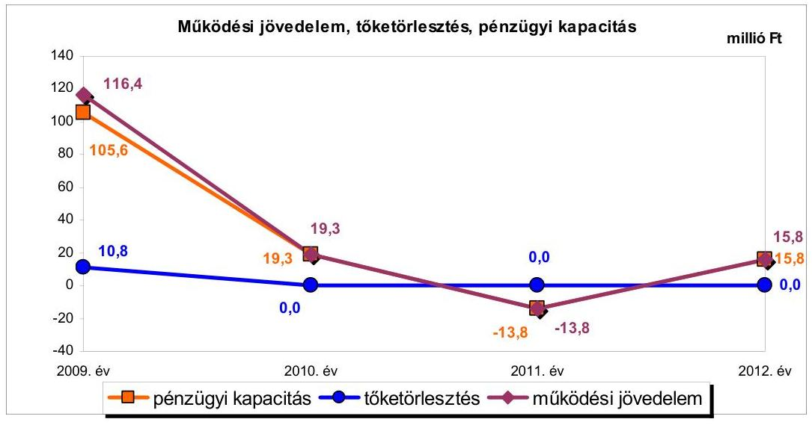
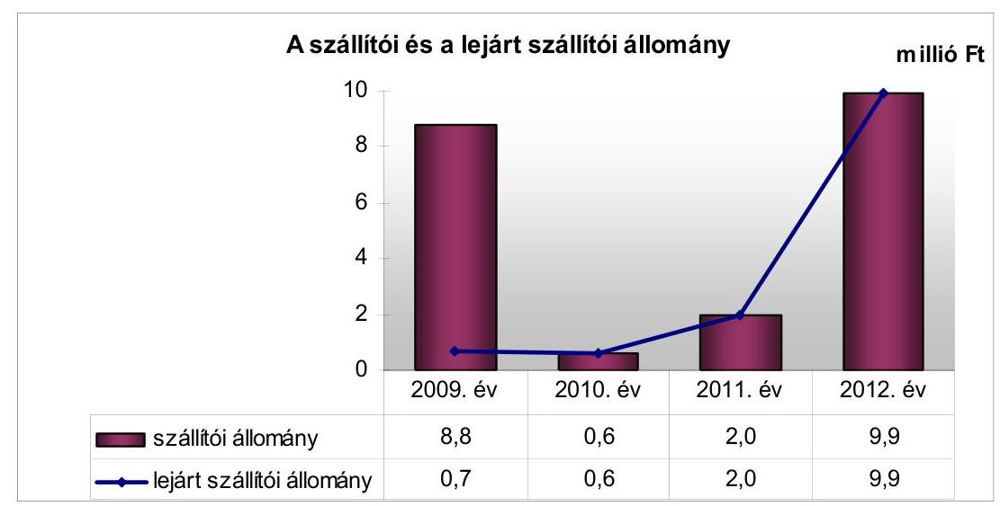
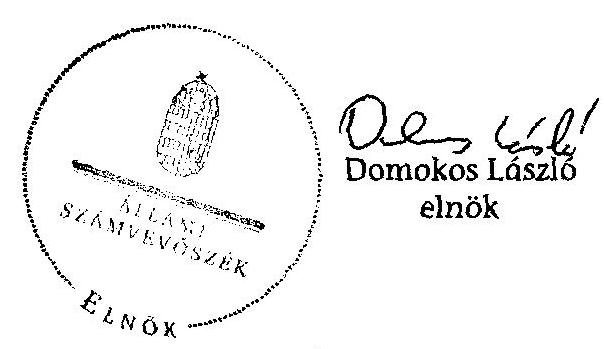
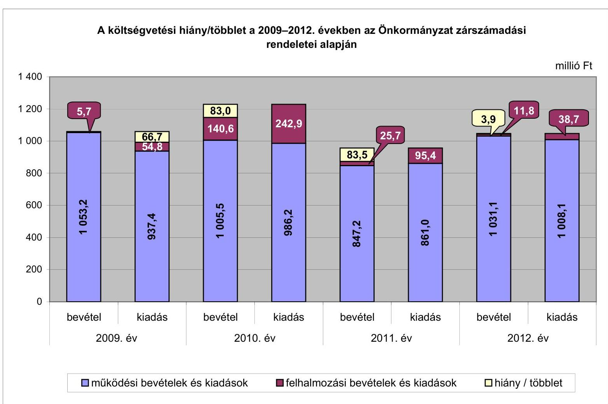
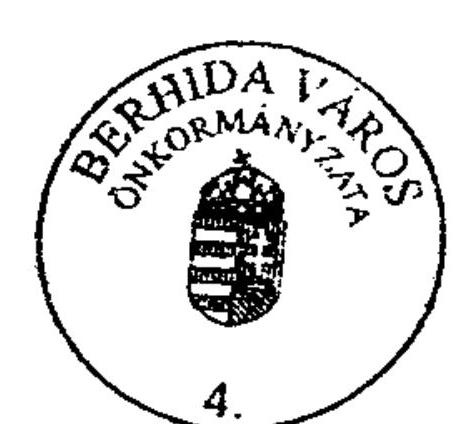
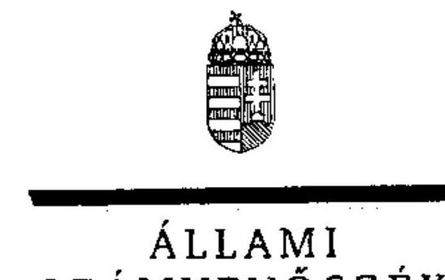
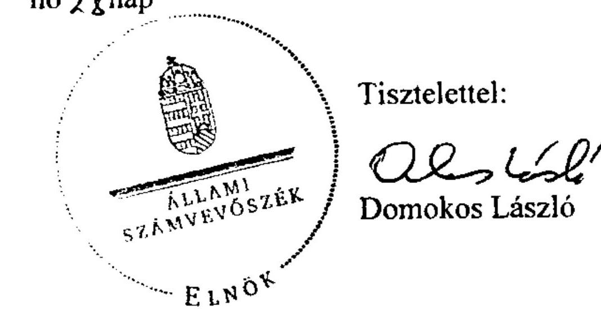
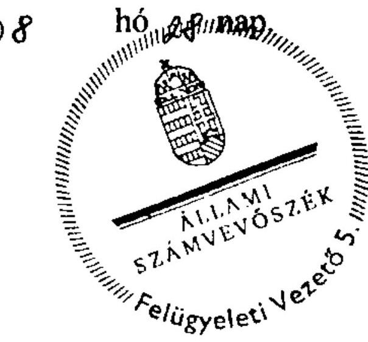
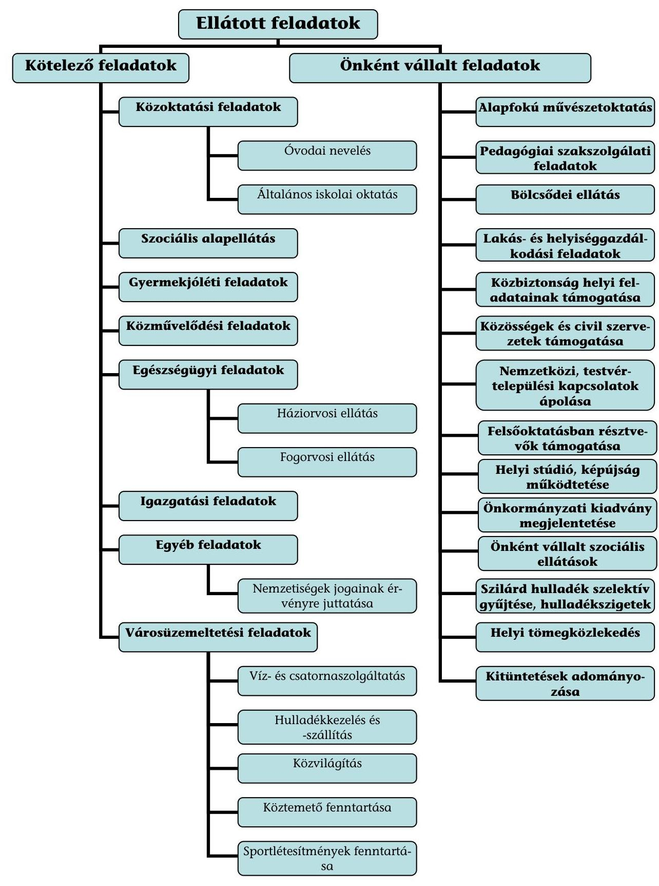

# ÁLLAMI   SZÁMVEVŐSZÉK 

## JELENTÉS

az önkormányzatok pénzügyi gazdálkodási helyzetének, szabályosságának ellenőrzéséről

## BERHIDA

---

# Állami Számvevőszék 

Iktatószám: V-0030-348-014/2013.
Témaszám: 1069
Vizsgálat-azonosító szám: V059221

## Az ellenőrzést felügyelte:

## Renkó Zsuzsanna

felügyeleti vezető
Az ellenőrzést vezette és az ellenőrzés végrehajtásáért felelős:
Dér Lívia
ellenőrzésvezető

## Az ellenőrzést végezték:

| Beke Andrea | Eigner György Zoltán | Kántor Ilona |
| :-- | :-- | :-- |
| számvevő | számvevő tanácsos | számvevő tanácsos |

---

# TARTALOMJEGYZÉK 

BEVEZETÉS ..... 3
I. ÖSSZEGZŐ MEGÁLLAPÍTÁSOK, KÖVETKEZTETÉSEK, JAVASLATOK ..... 6
II. RÉSZLETES MEGÁLLAPÍTÁSOK ..... 12

1. Az Önkormányzat kötelező és önként vállalt feladatai, a feladatellátás szervezeti keretei ..... 12
2. A pénzügyi egyensúly fenntartását veszélyeztető pénzügyi kockázatok és az ezek csökkentése érdekében tett intézkedések ..... 14
3. A pénzügyi gazdálkodási folyamatok szabályosságát, megfelelőségét biztosító belső kontrollok ..... 21
4. Az ÁSZ korábbi ellenőrzése során a pénzügyi, gazdálkodási helyzet javítására tett javaslatainak megvalósítása ..... 23

---

# MELLÉKLETEK 

1. számú A költségvetési hiány/többlet a 2009-2012. években az Önkormányzat zárszámadási rendeletei alapján
2. számú Az Önkormányzat bevételei és kiadásai, valamint adósságszolgálata a 2009-2012. években (a CLF módszer szerint)
3/a. számú Az Önkormányzat által a 2009-2012. években megvalósított (műszakilag befejezett) fejlesztések forrásösszetétele
3/b. számú Az Önkormányzat 2012. december 31-én folyamatban lévő fejlesztési feladataihoz kapcsolódó kötelezettségeinek összegzése
3/c. számú Az Önkormányzat által beadott, elbírálás alatti pályázatok forrásaiból megvalósuló fejlesztésekhez kapcsolódó kötelezettségvállalások összegzése
3. számú Az önkormányzati feladatok ellátásában résztvevő gazdasági társaságok egyes kiemelt adatai
4. számú Az Önkormányzat kötelezettségeinek és egyes kötelezettségvállalásainak 2009. december 31-ei és 2012. december 31-ei állománya, valamint a 2013. évben és az azt követő években várható kötelezettségek, kötelezettségvállalások miatti kiadások
6/a. számú Berhida Város Önkormányzata Polgármesterének a jelentéstervezethez tett észrevétele
6/b. számú Az ÁSZ válasza Berhida Város Önkormányzata Polgármesterének a jelentéstervezethez tett észrevételére

## FÜGGELÉKEK

1. számú Rövidítések jegyzéke
2. számú Fogalomtár
3. számú Az Önkormányzat által ellátott feladatok 2012. december 31-én

---

# JELENTÉS 

## az önkormányzatok pénzügyi gazdálkodási helyzetének, szabályosságának ellenőrzéséről BERHIDA

## BEVEZETÉS

Az államháztartás helyi szintjén, az önkormányzati alrendszerben az utóbbi években megjelenő gazdálkodási nehézségek, a pénzforgalmi hiány növekedése, az eladósodás az ÁSZ figyelmét a helyi önkormányzatok pénzügyi helyzetére irányította.

Az ÁSZ a 2013. év I. félévi ellenőrzési tervben foglaltaknak megfelelően az önkormányzatok pénzügyi gazdálkodási helyzetének, szabályosságának ellenőrzésével az önkormányzatok 2011. évben megkezdett helyzetelemzését folytatta. Az ellenőrzés keretében értékeljük az önkormányzatok adósságkezelési és likviditási helyzetét. Bemutatjuk a pénzügyi egyensúly alakulására hatással lévő folyamatokat, feltárjuk az ezekre ható kockázatokat. Értékeljük a pénzügyi egyensúlyi helyzetet befolyásoló döntésmegalapozó, dön-tés-előkészítő eljárások szabályosságát, és minősítjük az ezekkel összefüggő belső kontrollok kialakítását, múködését.

Az ellenőrzés eredményének várható hatásaként a megállapításokkal segítséget nyújtunk az önkormányzatok számára a pénzügyi egyensúly helyreállítása, javítása és fenntartása érdekében szükségessé váló intézkedések megtételéhez.

Az ellenőrzés típusa: szabályszerűségi ellenőrzés.

## Az ellenőrzés célja annak értékelése volt, hogy:

- az ellenőrzött időszakban a kötelező és önként vállalt feladatok ellátását biztosító szervezeti formák változása milyen hatást gyakorolt az Önkormányzat pénzügyi helyzetének alakulására;
- az Önkormányzat pénzügyi - ezen belül múködési és felhalmozási - egyensúlya milyen irányban változott, a változást milyen okok idézték elő, továbbá milyen intézkedéseket tettek a pénzügyi egyensúly biztosítása, illetve javítása érdekében, és az intézkedések hatására javult-e az Önkormányzat pénzügyi helyzete;
- a költségvetési kiadások finanszírozása érdekében vállalt, pénzintézetekkel szembeni kötelezettségek hogyan alakultak, a kötelezettségek fennállása miként befolyásolja az Önkormányzat jövőbeli pénzügyi egyensúlyi helyzetét;

---

- az Önkormányzat beazonosította, felmérte, értékelte-e a pénzügyi egyensúlyt befolyásoló pénzügyi kockázatokat, és a finanszírozási célú pénzügyi műveletekkel kapcsolatban írtak-e elő kockázatértékelési kötelezettséget;
- az Önkormányzat által kialakított belső kontrollok biztosítják-e a pénzügyi gazdálkodás folyamatainak szabályosságát és eredményességét;
- hasznosultak-e az ÁSZ korábbi ellenőrzése során a pénzügyi, gazdálkodási helyzet javítására tett szabályszerűségi és célszerűségi javaslatok.

Az ellenőrzés a 2009. január 1-jétől 2012. december 31-éig terjedő időszakot ölelte fel. A pénzintézetekkel szembeni kötelezettségek állományára vonatkozóan az ellenőrzés kezdő időpontjaként a 2012. december 31-én fennálló kötelezettségek keletkezésének időpontját vettük figyelembe.

Az ellenőrzés szakmai módszertana az ÁSZ Ellenőrzési Elvek és Standardokban foglalt szakmai szabályokon alapult, amely a Legfőbb Ellenőrző Intézmények Nemzetközi Szervezete (INTOSAI) által kiadott nemzetközi standardok (ISSAI) figyelembevételével készült.

Az ellenőrzés során használt rövidítéseket az 1. számú, az egyes fogalmak magyarázatát a 2. számú függelék tartalmazza.

Az ellenőrzés jogszabályi alapját az ÁSZ tv. 1. § (3) bekezdésének, 5. § (2)(6) bekezdéseinek, valamint az Áht. 61. § (2) bekezdésének előírásai képezik.

Az Országgyűlés 2012 végén a helyi önkormányzatok adósságállományának részleges konszolidációjáról döntött. Az 5000 fő lakosságszámot meg nem haladó települési önkormányzatok számára nyújtott törlesztési célú támogatással ${ }^{1}$ lehetővé tették a 2012. december 12-én fennálló adósságállományuk és annak 2012. december 28 -áig számított járulékai teljes megfizetését. Az 5000 fő lakosságszám feletti települések esetében a 2013. évben az állam differenciált az adóerő-képességet figyelembe vevő, 40-70\%-ig terjedő - mértékben vállalja át ${ }^{2}$ az önkormányzatok 2012. december 31-i, az átvállalás időpontjában fennálló adósságállományát és annak járulékait. Az adósságkonszolidációs intézkedéssel egyidejűleg a Kormány elrendelte ${ }^{3}$ az önkormányzatok adósságállománya újratermelődésének megakadályozása céljából a hitelengedélyezési és a likvid hitelekre vonatkozó szabályozás szigorítását.

Berhida Város Önkormányzata 2012. december 31-én pénzintézetekkel szembeni kötelezettségekkel nem rendelkezett, így a kormányzati adósságkonszolidációban nem volt érintett.

[^0]
[^0]:    ${ }^{1}$ Magyarország 2012. évi központi költségvetéséről szóló 2011. évi CLXXXVIII. törvény 76/C. §-a (beiktatta a 2012. évi CLXXXVII. törvény 8. §-a, hatályos 2012. XII. 6-tól)
    ${ }^{2}$ Magyarország 2013. évi központi költségvetéséről szóló 2012. évi CCIV. törvény 7276. §-ai
    ${ }^{3}$ 1540/2012. (XII. 4.) Korm. határozat a helyi önkormányzatok adósságállományának részleges konszolidációjáról

---

Berhida város lakosainak száma 2012. január 1-jén 6074 fő volt, ami 38 fős csökkenést jelent a 2009. év eleji ( 6112 fő) lakosságszámhoz képest. Az Önkormányzat a 2012. évben 1042,9 millió Ft költségvetési bevételt és 1046,8 millió Ft költségvetési kiadást teljesített. A 2012. december 31-i könyvviteli mérleg alapján az Önkormányzat 2949,8 millió Ft értékű vagyonnal rendelkezett, amely a 2009. év végi állományhoz (2909,0 millió Ft) viszonyítva 1,4\%-kal (40,8 millió Ft-tal) növekedett a fejlesztések következtében. A 2012. évben az eszközök közül a tárgyi eszközök állománya 2002,7 millió Ft, a forgóeszközök állománya 196,4 millió Ft volt. Az Önkormányzat a 2012. év végén 105,2 millió Ft szabad pénzmaradvánnyal rendelkezett.

Az ÁSZ tv. 29. § (1) bekezdése szerint a jelentéstervezetet megküldtük a polgármester részére, aki az ÁSZ tv. 29. § (2) bekezdésében foglalt észrevételezési jogával élt, a jelentéstervezetre észrevételt tett. A beérkezett észrevételt és az arra adott választ a jelentés 6/a.-6/b. számú mellékletei tartalmazzák.

---

# I. ÖSSZEGZŐ MEGÁLLAPÍTÁSOK, KÖVETKEZTETÉSEK, JAVASLATOK 

Berhida Város Önkormányzatának pénzügyi egyensúlya az ellenőrzött időszakban középtávon nem volt biztosított. Az Önkormányzatot az adósságkonszolidációs intézkedések nem érintették. A 2012. december 31-én fennálló 21,2 millió Ft kötelezettségállomány nem gyakorol érdemi hatást a pénzügyi egyensúlyi helyzet jövőbeni alakulására, melynek hosszú távú fenntartásához elsődlegesen a múködési jövedelemtermelő képesség megfelelő színvonalának megőrzése szükséges.

Az Önkormányzat költségvetésének elemzését a CLF módszer alapján számított mutatók alapján végeztük. Az Önkormányzat pénzügyi kapacitásának a 2009. év és a 2012. év közötti változását az alábbi ábra mutatja be:

Az Önkormányzat 2009-2012 között összesen 4267,3 millió Ft költségvetési bevételt ért el, és 4371,0 millió Ft költségvetési kiadást teljesített. Az Önkormányzat folyó költségvetési egyenlege, múködési jövedelme az ellenőrzött időszakban - a 2011. évi kivételével - pozitív értéket mutatott. A folyó költségvetés egyenlege 2009-ről 2011-re jelentősen, 130,2 millió Ft-tal csökkent, melynek oka a folyó bevételek - azon belül a költségvetési támogatások és a helyi adókból származó bevételek - csökkenése volt. Az Önkormányzat folyó bevételei a 2011. évben már nem fedezték a folyó kiadásokat, a múködési forráshiányt a szabad pénzmaradvány felhasználásával finanszírozták. A 2012. évben a múködési jövedelem pozitívvá vált, a folyó bevételek - előző évihez viszonyított, 20,9\%-os (176,7 millió Ft-os), a folyó kiadások emelkedését meghaladó növekedésének eredményeként. Az Önkormányzat az ellenőrzött időszakban ÖNHIKI támogatásban nem részesült. Az Önkormányzatnál a múködési jövedelemtermelő képesség miatti kockázat - a múködési jövedelem 20092011. évek közötti, folyamatos csökkenése és 2011. évi negatív értéke miatt fennállt, azonban a kockázat a 2012. évre megszűnt.

---

A felhalmozási költségvetés egyenlege az ellenőrzött időszak minden évében negatív volt. 2009-2012 között összesen 241,4 millió Ft felhalmozási forráshiány alakult ki, melynek 52,6\%-ára (126,9 millió Ft-ra) a nettó működési jövedelem fedezetet nyújtott, míg 47,4\%-ának (114,5 millió Ft-nak) a finanszírozását a szabad pénzmaradvány biztosította. A felhalmozási költségvetés egyenlegének alakulását a pályázati támogatások jóváírásának és a fejlesztési feladatok kiadásai teljesítésének - utófinanszírozás miatti - ütemkülönbsége is befolyásolta.

Az ellenőrzött időszakban a pénzügyi egyensúlyi helyzetet befolyásoló feladatátvétel és -átadás nem történt, a kötelező és önként vállalt feladatok ellátását biztosító szervezeti formák nem változtak. Az önként vállalt feladatok körének bővülése (bölcsődei ellátás) az ellenőrzött időszakban összességében 4,7 millió Ft többletkiadást jelentett, mely az Önkormányzat pénzügyi helyzetére csekély mértékű, negatív hatást gyakorolt. A bevételnövelő és kiadáscsökkentő intézkedések (a kommunális és építményadó mértékének növelése, valamint munkabér-megtakarítás) kis mértékben - együttesen 21,5 millió Ft-tal - javították az Önkormányzat pénzügyi egyensúlyi helyzetét, melyből 15,0 millió Ft tartós hatásúnak minősül.

A jövedelemtermelő képesség csökkenése miatt az Önkormányzatnál fennállt:

- az önként vállalt feladatok miatti múködési kockázat: az önként vállalt feladatokra fordított kiadások összege és múködési kiadásokon belüli aránya - 2009-ben 34,3 millió Ft (3,7\%), 2010-ben 41,4 millió Ft (4,2\%), 2011-ben 41,4 millió Ft (4,8\%), 2012-ben 38,4 millió Ft (3,8\%) - nem volt jelentős, azonban a 2011. évben az önként vállalt feladatok ellátása, tekintettel a negatív múködési jövedelemre ( $-13,8$ millió Ft), múködési kockázatot jelentett;
- a bevételi kitettség kockázata: a helyi adóbevételek meghatározó része néhány adózótól származott.

Az Önkormányzat pénzintézettel szembeni, hosszú lejáratú hitelszerződésből eredő kötelezettségének állománya 2009. január 1-jén 10,8 millió Ft volt, melyet a 2009. év I. félévében visszafizettek. Az Önkormányzat mérlegében hosszú lejáratú kötelezettségként szerepelt egy, az 1996. évben a Magyar Államtól 856,8 millió Ft értékben - a Várpalota és Térsége Környezetvédelmi Rehabilitációs Program kommunális alprogramjának megvalósításához - felvett felhalmozási kölcsön. A kötelezettség 2009. évi nyitó állománya 346,4 millió Ft volt. Az ellenőrzött időszakban az Önkormányzat 34,6 millió Ftot fordított törlesztésre. A felhalmozási kölcsönhöz nem kapcsolódott kamatfizetési kötelezettség. Az Országgyűlés a 2011. évi költségvetési törvényben 2011. december 1-jei hatállyal - lemondott a Magyar Âllamnak az Önkormányzattal szemben fennálló követeléséről.

Az Önkormányzat az ellenőrzött időszakban nem vállalt hosszú és rövid lejáratú pénzintézeti kötelezettséget. Az Önkormányzatnak a 2012. év végén pénzintézetekkel szembeni kötelezettsége nem volt, a szállítói állománya miatt - a szállítói finanszírozást figyelmen kívül hagyva - 2,7 millió Ft fizetési, bevételeiből 11,3 millió Ft visszafizetési kötelezettsége állt fenn.

---

# A rövid lejáratú kötelezettségek az Önkormányzat pénzügyi egyensúlyának fenntartását érdemben nem befolyásolták. 

Az Önkormányzatnál a kockázatkezelési rendszer keretében a pénzügyi egyensúlyt befolyásoló kockázatok beazonosítása, felmérése, értékelése és kezelése - a 2009. évben az Ámr. ${ }_{1}$-ben, a 2010-2011. években az Ámr. ${ }_{2}$-ben, a 2012. évben pedig a Bkr.-ben foglalt jogszabályi előírások ellenére - elmaradt. Annak ellenére maradt el a kockázatok kezelése, hogy az ellenőrzött időszakban fennállt a múködési jövedelemtermelő képesség csökkenése miatti kockázat, a helyi adókhoz kapcsolódó bevételi kitettség, valamint - a múködési költségvetés negatív egyenlege következtében - az önként vállalt feladatok ellátásának múködési kockázata. Az Önkormányzatnál a finanszírozási célú pénzügyi műveletekkel kapcsolatban nem írtak elő kockázatértékelési kötelezettséget.

A pénzügyi gazdálkodási folyamatok szabályosságát, megfelelőségét, kockázatainak kezelését biztosító kontrolltevékenységek kialakítása - a 2009. évben az Ámr. ${ }_{1}$-ben, a 2010-2011. években az Ámr. ${ }_{2}$-ben, a 2012. évben a Bkr.ben foglalt előírások ellenére - részben volt megfelelő, mivel nem írták elő a feladat átadás-átvételre vonatkozó döntés-előkészítés folyamatában a döntésnek a kötelező és önként vállalt feladatokra fordított kiadások arányára, ezzel együtt az Önkormányzat pénzügyi egyensúlyi helyzetére gyakorolt hatása értékelésének kötelezettségét. Nem határozták meg az önkormányzati fejlesztések esetében a döntés-előkészítés folyamatában az előkészítés, a lebonyolítás és a múködtetés kockázatai feltárásának és kezelésének kötelezettségét. Nem készítettek szabályzatot a szállítói tartozások (kiemelten a lejárt szállítói tartozások) és az egyéb kiadáselmaradások rendezésére vonatkozóan. Az ellenőrzött időszak belső ellenőrzési terveinek készítését megelőzően - a 2009. évben az Ámr. ben, a 2010-2011. években az Ámr. ${ }_{2}$-ben, a 2009-2011. években a Ber.-ben, 2012. január 1-jétől a Bkr.-ben foglaltak ellenére - nem rendelték el a pénzügyi egyensúlyi helyzetet befolyásoló döntések kockázati tényezőinek feltárását és a feltárt kockázati tényezők belső ellenőrzés keretében történő ellenőrzését.

Az Önkormányzatnál a pénzügyi gazdálkodási folyamatokba beépített belső kontrollok múködése jó volt, annak ellenére, hogy nem tárták fel a fejlesztéseket megelőző döntés előkészítési folyamatában az előkészítés, a lebonyolítás kockázatait, azonban az új feladatként jelentkező bölcsődei feladat ellátását megelőzően számításokkal támasztották alá a feladat pénzügyi egyensúlyi helyzetre gyakorolt hatását, valamint az ellenőrzött időszakot megelőzően felvett hitelt folyósító pénzintézetet közbeszerzési eljárás keretében választották ki. A belső ellenőrzés a pénzügyi egyensúlyi helyzetet befolyásoló döntések kockázatait nem vizsgálta. Az Önkormányzat által kialakított kontrollok biztosították a pénzügyi gazdálkodási folyamatok eredményességét.

Az Önkormányzat gazdálkodási rendszerének 2008. évi ÁSZ ellenőrzése során a pénzügyi gazdálkodási helyzet javítására tett, öt szabályszerűségi és 11 célszerűségi javaslatot teljes körűen hasznosították.

Az ellenőrzés során a könyvvezetési kötelezettség teljesítésével kapcsolatban szabályszerűségi hibát tártunk fel. Az Önkormányzat a 2010-2011. években összesen 146,5 millió Ft felhalmozási célú támogatási bevételt és ezzel azonos

---

nagyságrendű felhalmozási kiadást pénzforgalmi szempontból nem mutatott ki a könyveiben - két EU-s támogatásból szállítói finanszírozással megvalósított fejlesztéssel összefüggésben -, amivel megsértették a Számv. tv. és az Áhsz. szerinti teljesség, valamint a bruttó elszámolás számviteli elveket.

Az ÁSZ tv. 33. § (1) bekezdésében foglaltak értelmében az ellenőrzött szervezet vezetője köteles a jelentésben foglalt megállapításokhoz kapcsolódó intézkedési tervet összeállítani, és azt a jelentés kézhezvételétől számított harminc napon belül az ÁSZ részére megküldeni. Amennyiben az intézkedési tervet határidőben nem küldi meg a szervezet vezetője, vagy az továbbra sem elfogadható, az ÁSZ elnöke a hivatkozott törvény 33. § (3) bekezdés a-b) pontjaiban foglaltakat érvényesítheti.

# Az ellenőrzés intézkedést igénylő megállapításai és javaslatai: 

## a polgármesternek

1. Az Önkormányzat működési jövedelme a 2011. év kivételével pozitív volt, azonban 2009-ről 2012-re csökkent. Az Önkormányzatnak 2012. december 31-én pénzintézeti kötelezettsége nem volt, a 9,9 millió Ft szállítói - egyben 100,0\%-ban lejárt tartozásból 7,2 millió Ft szállítói finanszírozáshoz kapcsolódott. Az egyéb kötelezettség 11,3 millió Ft volt. A bevételnövelő és a kiadáscsökkentő intézkedések kis mértékben javították a pénzügyi egyensúlyi helyzetet.

Javaslat:
A működési jövedelemtermelő képesség és a feladatellátás összhangja, valamint az Önkormányzat pénzügyi egyensúlyának hosszú távú fenntarthatósága érdekében - a 2013. évtől változó feladatellátási kötelezettséget, feladatfinanszírozási rendszert figyelembe véve - felelősök és határidők megjelölésével kezdeményezzen intézkedéseket, melyek keretében:
a) a költségvetési rendelettervezet, valamint annak évközi módosítása előterjesztését megelőzően mérjék fel a bevételszerző, kiadáscsökkentő lehetőségeket, és terjessze a Képviselő-testület elé a bevételek növelését, a kiadások csökkentését célzó intézkedések bevezetéséhez szükséges - a Htv. 140. § (1) bekezdés a) pontja alapján a jegyző által elkészített - döntési javaslatát;
b) terjesszen a Képviselő-testület elé jóváhagyásra - a Htv. 140. § (1) bekezdés a) pontja alapján a jegyző által elkészített - az Önkormányzat gazdasági helyzetének elemzésén alapuló, a pénzügyi egyensúlyi helyzet hosszú távú megőrzését és az adósságállomány újratermelődésének elkerülését biztosító intézkedéseket tartalmazó stabilizációs programot.

## a jegyzőnek

1. A Számv. tv. 15. § (2) bekezdésében és az Áhsz. 9. § (2) bekezdésében foglalt teljesség, valamint a Számv. tv. 15. § (9) bekezdésében és az Áhsz. 9. § (6) bekezdésében foglalt bruttó elszámolás elvének előírása ellenére az Önkormányzat a 2010-2011. években - két EU-s támogatásból, szállítói finanszírozással megvalósult fejlesztéséhez

---

kapcsolódóan - összesen 146,5 millió Ft felhalmozási célú támogatási bevételt és ezzel azonos összegű felhalmozási kiadást pénzforgalmi szempontból nem mutatott ki a könyveiben.

Javaslat:
Intézkedjen, hogy a jövőben az EU-s támogatásból, szállítói finanszírozással megvalósuló fejlesztések során a felhalmozási célú támogatási bevétel és a felhalmozási kiadás kimutatására a Számv. tv. 15. § (2) bekezdésében és az Áhsz. 9. § (2) bekezdésében foglalt teljesség, valamint a Számv. tv. 15. § (9) bekezdésében és az Áhsz. 9. § (6) bekezdésében foglalt bruttó elszámolás elvének érvényesítésével kerüljön sor.
2. A kockázatkezelési rendszer keretében az ellenőrzött időszakban fennállt, a pénzügyi egyensúlyt befolyásoló kockázatok feltárása, beazonosítása, értékelése és kezelése - a 2009. évben az Ámr. 145/C. § (1)-(3) bekezdéseiben, a 2010-2011. években az Ámr. 2 157. § (1)-(3) bekezdéseiben, a 2012. évben a Bkr. 7. § (1)-(2) bekezdéseiben foglalt jogszabályi előírások ellenére - elmaradt. Annak ellenére maradt el a kockázatok kezelése, hogy az ellenőrzött időszakban fennállt a müködési jövedelemtermelő képesség csökkenése miatti kockázat, a helyi adókhoz kapcsolódó bevételi kitettség, valamint - a működési költségvetés negatív egyenlege következtében - az önként vállalt feladatok ellátása miatti működési kockázat.

Javaslat:
Működtessen a Bkr. 7. § (1)-(2) bekezdéseiben foglalt előírásoknak megfelelő, a pénzügyi egyensúlyt befolyásoló kockázatok kezelésére alkalmas kockázatkezelési rendszert.
3. A pénzügyi gazdálkodási folyamatok szabályossága, megfelelősége vonatkozásában a kockázatok kezelését biztosító belső kontrolltevékenységek kialakítása - a 2009. évben az Ámr. 145/E. § (1)-(2) bekezdéseiben, a 2010-2011. években az Ámr. 2 158. § (1)-(2) bekezdéseiben, a 2012. évben a Bkr. 8. § (1)-(2) bekezdéseiben foglalt előírások ellenére - részben volt megfelelő, mert a feladat átadás-átvételre vonatkozóan a döntés-előkészítés folyamatában nem írták elő annak értékelését, hogy a döntés milyen hatással bír a kötelező és önként vállalt feladatokra fordított kiadások arányára, a pénzügyi egyensúlyi helyzetre. Nem írták elő az önkormányzati fejlesztések esetében a döntés-előkészítés folyamatában az előkészítés, a lebonyolítás és a működtetés kockázatai feltárásának és kezelésének kötelezettségét. Nem szabályozták a szállítói tartozások és egyéb kiadáselmaradások rendezésével összefüggő kontrolltevékenységeket.

Javaslat:
Alakítsa ki az Bkr. 8. § (1)-(2) bekezdései alapján azokat a belső kontrolltevékenységeket, amelyek biztosítják a pénzügyi-gazdálkodási folyamatok szabályosságát, a pénzügyi egyensúlyi helyzet alakulását befolyásoló döntések kockázatainak kezelését. Készítse el a hiányzó szabályozást. Ennek keretében:
a) írja elő a feladat átadás-átvételre vonatkozó döntések előkészítése során a döntés kötelező és önként vállalt feladatok arányára, ezáltal a pénzügyi egyensúlyi helyzetre gyakorolt hatásának vizsgálatát;

---

b) határozza meg a fejlesztések döntés-előkészítés folyamatában az előkészítés, a lebonyolítás és a múködtetés kockázatai feltárásának és kezelésének kötelezettségét;
c) határozza meg a szállítói tartozások és az egyéb kiadáselmaradások rendezésének helyi szabályait.
4. Az Önkormányzatnál az ellenőrzött időszak belső ellenőrzési terveinek készítését megelőzően - a 2009. évben az Ámr.1 145/C. § (2) bekezdésében, a 2010-2011. években az Ámr. 1 157. § (2) bekezdésében, a 2009-2011. években a Ber. 18. §-ában, a 21. § (2) bekezdésében és a (3) bekezdés a) pontjában, 2012. január 1-jétől a Bkr. 7. § (2) bekezdésében, a 29. § (1) bekezdésében és a 31. § (2)-(4) bekezdéseiben foglaltak ellenére - nem írták elő a pénzügyi egyensúlyi helyzetet befolyásoló döntések kockázati tényezőinek feltárását, a belső ellenőrzési tervek nem tartalmazták az ellenőrzési terveket megalapozó kockázatelemzéseket, továbbá az Önkormányzatnál nem ellenőrizték ezeket a kockázati tényezőket.

Javaslat:
Intézkedjen a belső ellenőrzés vezetője felé, hogy a Bkr. 7. § (2) bekezdésében foglaltak szerint mérjék fel a gazdálkodásban rejlő kockázatokat, a 29. § (1) bekezdésében és a 31. § (2)-(4) bekezdéseiben foglalt előírások szerint az éves belső ellenőrzési tervek tartalmazzák a pénzügyi egyensúlyi helyzetet befolyásoló döntésekkel kapcsolatos feltárt kockázati tényezők ellenőrzését, valamint biztosítsa az ellenőrzési tervek végrehajtását.

---

# II. RÉSZLETES MEGÁLLAPÍTÁSOK 

## 1. Az ÖNKORMÁNYZAT KÖTELEZŐ ÉS ÖNKÉNT VÁLlALT FELADATAI, A FELADATELLÁTÁS SZERVEZETI KERETEI

Az Önkormányzat a kötelező és önként vállalt feladatait az Ötv. és a kapcsolódó ágazati törvények alapján az SZMSZ ${ }_{1,2,3}$-ban meghatározta. Kötelező feladatai 2009. január 1-jén és 2012. december 31-én a közoktatási feladatok közül az óvodai nevelés és az általános iskolai oktatás, a szociális alapellátási és gyermekjóléti feladatok, a közművelődési, az egészségügyi (háziorvosi és fogorvosi), az igazgatási és az egyéb (nemzetiségek jogainak érvényre juttatása), valamint a városüzemeltetési feladatok ${ }^{4}$ voltak. Önként vállalt feladatként végezték az alapfokú művészetoktatást, az oktatáshoz kapcsolódó pedagógiai szakszolgálati feladatokat, 2010-től a bölcsődei ellátást ${ }^{5}$, a lakás- és helyiséggazdálkodást ${ }^{6}$, a közbiztonság helyi feladatainak támogatását, a közösségek és civil szervezetek tevékenységének támogatását, a nemzetközi, testvér-települési kapcsolatok ápolását, a felsőoktatásban résztvevők támogatását, a helyi stúdió és képújság múködtetését, egy önkormányzati kiadvány megjelentetését, egyes szociális ellátásokat, a szilárd hulladék szelektív módon történő gyűjtését, hulladékszigetek kialakítását, a helyi tömegközlekedés biztosítását, valamint önkormányzati kitüntetések adományozását. (A feladatellátás részletezését a 3. számú függelék tartalmazza.)

A kötelező és az önként vállalt feladatokra fordított kiadások arányának, mértékének és azok változásának a pénzügyi egyensúlyi helyzetre gyakorolt hatását az Önkormányzat a 2009-2012. években nem értékelte.

Az Önkormányzat - adatszolgáltatása szerint - kötelező feladatokra 2009-ben az összes múködési célú költségvetési kiadás 96,3\%-át ( 902,5 millió Ft-ot), 2010ben $95,8 \%$-át ( 944,8 millió Ft-ot), 2011-ben $95,2 \%$-át ( 819,6 millió Ft-ot), 2012ben $96,2 \%$-át ( 969,7 millió Ft-ot) fordította. A kötelező feladatokra fordított kiadások 2009-2010 közötti változása a közfoglalkoztatottak létszámának 46,9\%-os (64 főről 94 főre történt) növekedésének következménye. A 2010-2011 közötti változást a közfoglalkoztatáshoz kapcsolódó jogszabályi változások miatt átalakult finanszírozási rendszer alapján - a 2010. évihez képest - alacsonyabb összegű kiadás ${ }^{7}$ okozta. A 2012. évre - az előző évihez képest - bekövet-

[^0]
[^0]:    ${ }^{4}$ Városüzemeltetési feladatok között a köztemető és sportlétesítmény fenntartási, valamint - gazdasági társaságok útján - a víz- és csatornaszolgáltatási, a hulladékkezelési és -szállítási, illetve a közvilágítási feladatok ellátását biztosították.
    ${ }^{5}$ Az Önkormányzat az SZMSZ ${ }_{1,2}$-ben a Gyvt. 94. § (3) bekezdésének ellenére kötelező feladatként jelölte meg a bölcsődei feladat ellátását. A 10/2013. (V. 8.) számú rendeletében $\left(\mathrm{SZMSZ}_{3}\right)$ a bölcsődei feladatellátást az önként vállalt feladatok közé sorolta át.
    ${ }^{6}$ Az Önkormányzat szolgálati lakásokkal rendelkezik.
    ${ }^{7}$ A közfoglalkoztatásban résztvevők létszáma a 2010. évi 94 főről a 2011. évre 48 főre csökkent. A foglalkoztatás a 2011. évben 4 órában valósulhatott meg.

---

kezett jelentős növekedés oka jórészt az államháztartási gazdálkodásra vonatkozó előírások változásához kapcsolódó technikai, nyitó és rendező tételek könyvelése ${ }^{8}$ miatti halmozódás volt.

Az önként vállalt feladatokra a múködési kiadásoknak 2009-ben a 3,7\%-át (34,3 millió Ft-ot), 2010-ben a 4,2\%-át (41,4 millió Ft-ot), 2011-ben a 4,8\%-át (41,4 millió Ft-ot), 2012-ben a 3,8\%-át (38,4 millió Ft-ot) használták fel.

Az önként vállalt feladatok ellátása a 2009-2010. és a 2012. években nem jelentett múködési kockázatot az Önkormányzat számára a feladatokra fordított kiadások múködési kiadásokon belüli alacsony aránya miatt. A 2011. évben az önként vállalt feladatok ellátása miatti múködési kockázat a negatív múködési jövedelemre ( $-13,8$ millió Ft) tekintettel fennállt, mely a 2012. évben a múködési jövedelemtermelő képesség javulásának eredményeként megszünt. A 2009-2012 közötti időszakban megvalósult és a folyamatban lévő fejlesztésekre teljesített kiadások 5,6\%-át (33,3 millió Ft-ot) fordították önként vállalt feladatokra, ami - nagyságrendje miatt - nem jelentett felhalmozási kockázatot.

A 2009-2012. évek között az Önkormányzatnál - adatszolgáltatása szerint - a kötelező és az önként vállalt feladatokat ellátó szervezeti rendszer nem változott jelentősen. Az Önkormányzat 2012. december 31-én nyolc költségvetési szervet tartott fenn. Az egy önállóan múködő és gazdálkodó, valamint a hét önállóan múködő költségvetési szerv összesen 19 telephellyel rendelkezett. Gazdasági társaságok biztosították a víz- és csatornaszolgáltatási, a hulladékkezelési, -szállítási, a közvilágítási, valamint a helyi tömegközlekedési feladatokat.

A költségvetési szervek száma 2008. december 31-e és 2012. december 31-e között hárommal csökkent, a közmúvelődési feladatokat ellátó intézmények 2009. évi összevonását és az Alapfokú Művészetoktatási Intézménynek az Ady Endre Általános Iskolába történt, 2010. évi beolvasztását követően. A telephelyek száma is összességében hárommal mérséklődött. A 2009. évi és a 2010. évi intézményösszevonások, valamint az Ady Endre Általános és Művészeti Iskola és a Családsegítő Központ vilonyai telephelyének megszüntetése következtében néggyel csökkent, majd a vilonyai óvodának az - Önkormányzat által gesztorként működtetett - intézmény-fenntartó társuláshoz való csatlakozásával eggyel nőtt.

Az ellenőrzött időszakban a pénzügyi egyensúlyi helyzetet befolyásoló feladatátvétel és -átadás nem történt, a kötelező és önként vállalt feladatok ellátását biztosító szervezeti formák nem változtak. Feladatbővülés az önként vállalt, bölcsődei ellátás beindításával következett be. A Képviselő-testület döntése alapján 2010. szeptember 1-jétől a Hétszínvirág Óvoda és Bölcsődében

[^0]
[^0]:    ${ }^{8}$ Az Áht. és az Ávr. előírásai alapján 2012. január 1-jétől az önkormányzati intézmények részére pénzforgalmilag is átadásra került az előző évi pénzmaradvány összege, valamint - támogatásértékű bevétel, illetve kiadásként - a függő, átfutó, kiegyenlítő bevételek és kiadások összege. Ezek a tételek megnövelték a tárgyévi költségvetési bevételek és kiadások összegét, de összességében nem változtatták az Önkormányzat költségvetési egyenlegét.

---

bölcsődei csoportot indítottak ${ }^{9}$. Ezen intézkedés a múködési kiadásokat 12,3 millió Ft-tal, a bevételeket 7,6 millió Ft-tal (az állami támogatást 6,3 millió Ft-tal, a saját bevételeket 1,3 millió Ft-tal) növelte. Az önként vállalt feladatok körének bővülése az ellenőrzött időszakban összességében 4,7 millió Ft többletkiadást jelentett, mely az Önkormányzat pénzügyi helyzetére csekély mértékű negatív hatást gyakorolt.

Az Önkormányzat kötelező és önként vállalt feladatai ellátásában résztvevő gazdasági társaságok által végzett feladatokban nem következett be változás az ellenőrzött időszakban. Az Önkormányzat a feladatellátásban résztvevő gazdasági társaságok közül egy társaságban rendelkezett - 1,3\%-os (11,2 millió Ft) - tulajdoni részesedéssel. Az Önkormányzat többségi befolyása alatt nem állt gazdasági társaság. A feladatellátásban érintett gazdasági társaságok egyes kiemelt adatait a 4 . számú melléklet tartalmazza.

# 2. A PÉNZÜGYI EGYENSÚLY FENNTARTÁSÁT VESZÉLYEZTETŐ PÉNZÜGYI KOCKÁZATOK ÉS AZ EZEK CSÖKKENTÉSE ÉRDEKÉBEN TETT INTÉZKEDÉSEK 

Az Önkormányzat költségvetésének elemzését a CLF módszerrel hajtottuk végre. A CLF módszer szerinti, 2009-2012. évek közötti részletes adatokat a 2. számú melléklet, a főbb önkormányzati adatokat az alábbi tábla mutatja be:

|  |  |  |  | millió Ft |
| :-- | --: | --: | --: | --: |
| Megnevezés | 2009. év | 2010. év | 2011. év | 2012. év |
| Folyó bevételek | 1053,2 | 1005,5 | 847,2 | 1023,9 |
| Folyó kiadások | 936,8 | 986,2 | 861,0 | 1008,1 |
| Müködési jövedelem | $\mathbf{1 1 6 , 4}$ | $\mathbf{1 9 , 3}$ | $\mathbf{- 1 3 , 8}$ | $\mathbf{1 5 , 8}$ |
| Felhalmozási bevételek | 5,7 | 218,2 | 94,6 | 19,0 |
| Felhalmozási kiadások | 55,4 | 320,5 | 164,3 | 38,7 |
| Felhalmozási költségvetés egyenlege | $\mathbf{- 4 9 , 7}$ | $\mathbf{- 1 0 2 , 3}$ | $\mathbf{- 6 9 , 7}$ | $\mathbf{- 1 9 , 7}$ |
| Folyó és felhalmozási bevételek összesen | 1058,9 | 1223,7 | 941,8 | 1042,9 |
| Folyó és felhalmozási kiadások összesen | 992,2 | 1306,7 | 1025,3 | 1046,8 |
| Finanszírozási múveletek nélküli pozíció | $\mathbf{6 6 , 7}$ | $\mathbf{- 8 3 , 0}$ | $\mathbf{- 8 3 , 5}$ | $\mathbf{- 3 , 9}$ |
| Finanszírozási műveletek egyenlege | -21,6 | $-15,7$ | 2,0 | $-11,9$ |
| Tárgyévi pénzügyi pozíció | $\mathbf{4 5 , 1}$ | $\mathbf{- 9 8 , 7}$ | $\mathbf{- 8 1 , 5}$ | $\mathbf{- 1 5 , 8}$ |
| Hiteltörlesztés, értékpapír beváltás | 10,8 | 0,0 | 0,0 | 0,0 |
| Nettó müködési jövedelem | $\mathbf{1 0 5 , 6}$ | $\mathbf{1 9 , 3}$ | $\mathbf{- 1 3 , 8}$ | $\mathbf{1 5 , 8}$ |

Az Önkormányzatnál a 2010-2011. években összesen 146,5 millió Ft fejlesztési célú támogatási bevételt és ezzel azonos nagyságrendű felhalmozási kiadást pénzforgalmi szempontból nem mutattak $\mathrm{ki}^{10}$ a könyvekben két EU-s támogatásból, szállítói finanszírozással megvalósított fejlesztéssel összefüggésben,

[^0]
[^0]:    ${ }^{9}$ a Képviselő-testület 43/2010. (IV. 29.) számú határozata
    ${ }^{10}$ A 2. számú melléklet 2010. és 2011. évi 2.1.3. Államháztartáson belülről kapott támogatások, valamint 2.2.1. Saját beruházási kiadás áfával és 2.2.2. Saját felújítási kiadás áfával sorai a feltárt hiba összegével korrigált adatokat tartalmazzák.

---

amivel megsértették a Számv. tv. 15. § (2) bekezdésében és az Áhsz. 9. § (2) bekezdésében foglalt teljesség, valamint a Számv. tv. 15. § (9) bekezdése és az Áhsz. 9. § (6) bekezdése szerinti bruttó elszámolás elvét. A mérlegben a tárgyi eszközállomány értékét helyesen állapították meg. A hiba - nagyságrendjére tekintettel - az Önkormányzat 2010. és 2011. évi költségvetési beszámolóiban közzétett, pénzügyi és vagyoni helyzetéről adott megbízható és valós képet lényegesen nem befolyásolta.

Az Önkormányzat 2009-2012 között összesen 4267,3 millió Ft költségvetési bevételt ért el, és 4371,0 millió Ft költségvetési kiadást teljesített. Folyó költségvetésének egyenlege, múködési jövedelme az ellenőrzött időszakban - a 2011. évi kivételével - pozitív értéket mutatott. 2009-ről 2011-re jelentősen, 130,2 millió Ft-tal csökkent, főként a folyó bevételek csökkenése miatt. A folyó bevételeken belül - az ellátotti létszám, a normatívák fajlagos összegének és a normatív kötött felhasználású támogatások mérséklődése miatt - a költségvetési támogatások, valamint a helyi adókból származó bevételek ${ }^{11}$ csökkentek. A folyó kiadások 2009-2011 közötti növekedése is hozzájárult a 2011. évi múködési jövedelem negatívvá válásához. Az Önkormányzat folyó bevételei a 2011. évben már nem fedezték a folyó kiadásokat, a múködési forráshiányt a szabad pénzmaradvány felhasználásával finanszírozták. A 2012. évben a működési jövedelem ismét pozitívvá vált, a folyó bevételek előző évihez viszonyított, 20,9\%-os (176,7 millió Ft-os) emelkedésének eredményeként. A folyó bevételek 2012. évi növekedésében szerepe volt a költségvetési támogatások, az egyéb átengedett bevételek és a helyi adóbevételek emelkedésének. A folyó bevételek működési jövedelemre gyakorolt pozitív hatását azonban mérsékelte a folyó kiadások 17,1\%-os (147,1 millió Ft-os) növekedése. Az Önkormányzat az ellenőrzött időszakban ÖNHIKI támogatásban nem részesült. Az Önkormányzatnál a múködési jövedelemtermelő képesség miatti kockázat - a múködési jövedelem 2009-2011. évek közötti, folyamatos csökkenése és 2011. évi negatív értéke miatt - fennállt, a kockázat a 2012. évre megszűnt.

Az Önkormányzat nettó múködési jövedelme (pénzügyi kapacitása) 20102012 között megegyezett a múködési jövedelem összegével, évenkénti változását a folyó költségvetés egyenlege határozta meg. 2009-ben a múködési jövedelmet 10,8 millió Ft hiteltörlesztés ${ }^{12}$ terhelte. A nettó múködési jövedelem csak a 2009. évben biztosított fedezetet a felhalmozási forráshiány egészére.

A felhalmozási költségvetés egyenlege 2009-2012 között minden évben negatív volt. Ezen időszakban összesen 241,4 millió Ft felhalmozási forráshiány keletkezett. A felhalmozási forráshiány fedezetére igénybe vehető nettó múködési jövedelem - az ellenőrzött időszak egészét tekintve - mindössze annak 52,6\%-ára (126,9 millió Ft-ra) biztosított forrást, míg 47,4\%-ára (114,5 millió Ft-ra) a szabad pénzmaradványt használták fel. A felhal-

[^0]
[^0]:    ${ }^{11}$ A helyi adóbevételek 2011. évi csökkenését az adóalanyok számának 2010 és 2011 közötti csökkenése mellett, egy meghatározó vállalkozás székhelyének a településről történt áthelyezése okozta.
    ${ }^{12}$ Az Önkormányzat a 2005. évben - ingatlanvásárlási céllal - felvett hitelből a 2009. évben fennállt tartozását kifizette, az ellenőrzött időszak többi évében pénzintézetekkel szembeni kötelezettsége nem volt.

---

mozási költségvetés egyenlegét alapvetően az határozta meg, hogy a felhalmozási kiadások önrészének fedezetét - képviselő-testületi döntés alapján - a szabad pénzmaradvány képezte, továbbá, hogy a pályázati támogatások jóváírásának és a fejlesztési feladatok kiadásai teljesítésének üteme az utófinanszírozás miatt eltérő volt.

Az Önkormányzat évenkénti teljes finanszírozási igénye ${ }^{13}$ - a CLF módszer szerint - a 2010. évben 83,0 millió Ft, a 2011. évben 83,5 millió Ft, a 2012. évben 3,9 millió Ft volt. Az ellenőrzött időszakban az Önkormányzat pénzügyi egyensúlyi helyzetét kedvezően befolyásolta a 2009. évben képződött 55,9 millió Ft finanszírozási többlet. A költségvetési hiány/többlet alakulását, az Önkormányzat 2009-2012. évi zárszámadási rendeletei alapján, az 1. számú melléklet ${ }^{14}$ tartalmazza.

A folyó bevételek az előző évihez viszonyítva, a 2009. évi 1053,2 millió Ft-ról 2010-re 47,7 millió Ft-tal ( $4,5 \%$-kal), 2011-re 158,3 millió Ft-tal ( $15,7 \%$-kal) csökkentek, 2012-re 176,7 millió Ft-tal ( $20,9 \%$-kal) nőttek. A folyó bevételek 2009-2011 közötti csökkenését a költségvetési támogatások és a helyi adókból származó bevételek mérséklődése okozta. A költségvetési támogatások változása az ellátotti létszám és az állami támogatások fajlagos összegének, valamint a normatív kötött támogatások csökkenésével magyarázható. A 2012. évi növekedés oka - az államháztartási gazdálkodási előírások változásához kapcsolódó technikai, nyitó és rendező tételeken túl - a költségvetési támogatások, az egyéb átengedett bevételek és a helyi adókból származó bevételek emelkedése.

A költségvetési támogatások és az szja együttes összege az ellenőrzött időszakban a folyó bevételek $45,7 \%$-át ( 1797,4 millió Ft-ot) tette ki. Ezen bevételek a 2009. évi 509,1 millió Ft-ról a 2012. évre 112,7 millió Ft-tal ( $22,1 \%$-kal) csökkentek. Az ellátotti létszám és a normatívák fajlagos összegének csökkenésén túl, a 2010-ről 2011-re történő $22,8 \%$-os ( 114,5 millió Ft-os) csökkenés oka, hogy a 2011. évtől az önkormányzatok a közcélú és a közhasznú munkavégzés fedezetéül szolgáló támogatást már nem - normatív, kötött felhasználású költségvetési támogatásként, hanem államháztartáson belülről átvett, támogatásértékű működési bevételként kapták meg.

A helyi adók (iparúzési adó, építményadó, magánszemélyek kommunális adója) és pótlékok az ellenőrzött időszakban 903,2 millió Ft forrást jelentettek. Ezen bevételek részaránya a folyó bevételeken belül a 2009. évi $25,2 \%$-ról (265,3 millió Ft-ról) a 2012. évre 19,3\%-ra (197,3 millió Ft-ra) csökkent. A helyi adókból befolyt bevételek 2011. évi jelentős (a 2010. évihez képest 64,3 millió Ft-os, $25,6 \%$-os) csökkenését az adóalanyok számának csökkenése mellett egy, a helyi iparúzési adófizetésben meghatározó vállalkozás székhelyének a településről történt áthelyezése okozta. A törvényi felső határt csak az iparúzési adó mértékénél alkalmazták. Az Önkormányzat a Képviselő-testület döntése

[^0]
[^0]:    ${ }^{13}$ a nettó múködési jövedelem és a felhalmozási költségvetés együttes negatív egyenlege
    ${ }^{14}$ A zárszámadási rendeletek a bevételeket és kiadásokat nem a CLF módszer szerint hanem a pénzforgalom nélküli tételek figyelembe vételével - tartalmazzák, ezért az 1. számú mellékletben a 2. számú melléklet adataitól eltérő összegek szerepelnek.

---

alapján 2011. január 1-jétől a magánszemélyek kommunális adója és az építményadó mértékét megemelte ${ }^{15}$. Az Önkormányzatnál az ellenőrzött időszakban a helyi adók kapcsán fennállt a bevételi kitettség miatti kockázat, mert az adóbevétel meghatározó része néhány adófizetőtől származott ${ }^{16}$.

Az egyéb saját bevételek a 2009. évi 152,2 millió Ft-ról 2012-re 279,8 millió Ft-ra, 83,8\%-kal (127,6 millió Ft-tal) növekedtek. A legjelentősebb (111,2 millió Ft-os) emelkedés a 2012. évben következett be, amikor - az önkormányzatok könyvvezetésére vonatkozó jogszabály változása hatására, az addig önállóan múködő intézmények technikai, nyitó és rendező tételei miatt az államháztartáson belülről kapott támogatások (működési célú támogatásértékű bevételek) 28,8 millió Ft-tal, az előző évi pénzmaradvány átvétele 79,9 millió Ft-tal növekedett.

A felhalmozási bevételek 2009-2012 közötti 337,5 millió Ft-os összege a felhalmozási kiadások 58,3\%-ára nyújtott fedezetet. Ezen bevételek a 2009. évi 5,7 millió Ft-ról 2010-re 218,2 millió Ft-ra (közel negyvenszeresre) emelkedtek, 2011-re 94,6 millió Ft-ra (56,6\%-kal), 2012-re 19,0 millió Ft-ra (79,9\%-kal) csökkentek a fejlesztési feladatokra kapott, támogatásértékű bevételek változása miatt. Az összes felhalmozási bevételből az EU-s támogatások összege a 2009-2012. években összesen 309,8 millió Ft, a felhalmozási bevételek 91,8\%-a volt.

A folyó kiadások a 2009-2012. években a költségvetési kiadásoknak a 86,8\%-át (3792,1 millió Ft-ot) tették ki. A folyó kiadások 2009-ről 2010-re - a közfoglalkoztatás bővülése miatti személyi juttatások és járulékai növekedésének hatására - 936,8 millió Ft-ról 49,4 millió Ft-tal (5,3\%-kal) emelkedtek. A 2011. évre - a közfoglalkoztatás rendszerének változása miatti személyi juttatás és járulékainak csökkenésével, valamint az EU-s pályázatok keretében megvalósított múködési projektek 2010. évi lezárásával - 125,2 millió Ft-tal (12,7\%kal) csökkentek az előző évihez képest. A folyó kiadások 2011-ről 2012-re 147,1 millió Ft-tal (17,1\%-kal) emelkedtek, melynek - az államháztartási gazdálkodásra vonatkozó előírások változásához kapcsolódó technikai, nyitó és rendező tételek következtében - az államháztartáson belülre átadott pénzeszközök (támogatásértékű kiadások) 32,3 millió Ft-os emelkedése, továbbá a 81,0 millió Ft összegű előző évi pénzmaradvány-átadás volt az oka.

Az Önkormányzat a 2009-2012. években felhalmozási kiadásokra 578,9 millió Ft-ot, a költségvetési kiadások 13,2\%-át fordította. A felhalmozási kiadások 93,5\%-át (541,3 millió Ft-ot) beruházásokra és felújításokra használták fel, az egyéb felhalmozási kiadások (37,6 millió Ft) túlnyomó része a fel-

[^0]
[^0]:    ${ }^{15}$ Az Önkormányzat a Képviselő-testület döntése alapján 2011. január 1-jétől a magánszemélyek kommunális adójának mértékét az építmény $\mathrm{m}^{2}$-ben számított hasznos alapterülete után $80 \mathrm{Ft} / \mathrm{m}^{2}$-ről $90 \mathrm{Ft} / \mathrm{m}^{2}$-re, az építményadó összegét $800 \mathrm{Ft} / \mathrm{m}^{2}$-ről $900 \mathrm{Ft} / \mathrm{m}^{2}$-re emelte.
    ${ }^{16}$ A befolyt helyi iparúzési adónak a 2009. évben 57,9\%-a, a 2010. évben 64,1\%-a kétkét adózótól, a 2011. évben 46,5\%-a és a 2012. évben 40,8\%-a egy-egy adózótól származott.

---

halmozási kölcsön ${ }^{17}$ miatt fennállt 34,6 millió Ft kötelezettség megfizetéséből adódott. Az ellenőrzött időszakban a müszakilag befejezett fejlesztésekre 511,4 millió Ft-ot teljesítettek, melyek teljes ${ }^{18}$ bekerülési költsége 555,8 millió Ft volt. Ezen fejlesztési feladatok forrását 42,5\%-ban (236,2 millió Ft) saját bevétel, $55,7 \%$-ban (309,8 millió Ft) EU-s támogatás, 1,8\%-ban ( 9,8 millió Ft) egyéb központi támogatás képezte. A 2012. év végén folyamatban lévő felújítások és beruházások kiadásaira az ellenőrzött időszakban 29,9 millió Ft-ot fordítottak, melyek teljes bekerülési költsége 36,5 millió Ft volt. Ezen fejlesztési feladatokat 100,0\%-ban ( 36,5 millió Ft) saját bevétel fedezte. A 2012. december 31-e utáni kötelezettségvállalások összege 53,0 millió Ft, amelynek tervezett forrása 7,0 millió Ft saját bevétel, 38,8 millió Ft EU-s támogatás, valamint 7,2 millió Ft egyéb központi támogatás. Az elbírálás alatti pályázatok forrásaiból 73,7 millió Ft összegben két önkormányzati intézmény energetikai (napelem telepítése) beruházását tervezik megvalósítani 11,1 millió Ft (15,1\%) saját bevétel és 62,6 millió Ft (84,9\%) EU-s - szállítói finanszírozással igényelt támogatás felhasználásával. A 2009-2012 között megvalósult, folyamatban lévő és az elbírálás alatti pályázatok fejlesztési feladatait és azok forrásösszetételét a 3/a., a 3/b. és a 3/c. számú mellékletek mutatják be.

A 2009-2012 közötti fejlesztések során kialakított létesítmények jövőbeni üzemeltetése nem jelent kockázatot, mert a fejlesztések döntően az intézmények korszerűsítésére, ezáltal az energiafogyasztás csökkentésére irányultak. Ezzel kapcsolatos számítások minden esetben készültek, a várható múködési kiadásokat és megtakarításokat számszerúsítették. Az Önkormányzat a pályázati forrásokból megvalósított fejlesztések esetében igénybe vette a szállítói finanszírozást. A folyamatban lévő és a pályázatokban foglalt fejlesztések finanszírozására a saját forrás összegét a költségvetési rendeletben, a pályázati céltartalékok között megtervezték.

Az Önkormányzat pénzintézettel szembeni, hosszú lejáratú hitelszerződésből eredő kötelezettségének állománya 2009. január 1-jén 10,8 millió Ft volt, melyet a 2009. év I. féléve során - szerződés szerint - visszafizetett. A kötelezettségállomány egy 2005-ben felvett, 32,5 millió Ft összegű, forintalapú, változó kamatozású hitelből származott, amelyet - a hitelcélnak megfelelően ingatlanvásárlásra fordítottak ${ }^{19}$. A hitel kamataira 0,6 millió Ft kiadást teljesítettek. A hitel biztosítékaként két, forgalomképes ingatlanra jelzálogjogot alapítottak, és a folyósítási díj megfizetésére óvadéki szerződést ${ }^{20}$ kötöttek. A biztosíték nem jelentett terhet, illetve kockázatot az Önkormányzat számára, mert a hitel törlesztését és a folyósítási díj megfizetését a szerződésben foglaltak szerint teljesítették. A hosszú lejáratú pénzintézeti kötelezettségek miatt az Önkor-

[^0]
[^0]:    ${ }^{17}$ Az Önkormányzat által az 1996. évben a Magyar Államtól, 856,8 millió Ft értékben felvett felhalmozási kölcsön, az ún. „japán hitel".
    ${ }^{18}$ A teljes bekerülési költség magában foglalja a fejlesztési feladatokra az ellenőrzött időszakot megelőzően teljesített kiadásokat is.
    ${ }^{19}$ a Polgármesteri Hivatal épületrészének 2005. évi megvásárlása
    ${ }^{20}$ Az Óvadéki szerződés szerint a folyósítási díj biztosítására 0,8 millió Ft óvadék szolgált.

---

mányzat forgalomképes ingatlanaira bejegyzett jelzálogjogot a 2009. év I. félévben törölték.

A 2005. évi pénzintézeti kötelezettségvállalásról a Képviselő-testület döntött. A fejlesztési hitelt folyósító pénzintézetet közbeszerzési eljárás alapján választották ki. Az Önkormányzat az ellenőrzött időszakban pénzintézeti kötelezettséget nem vállalt, számlavezető pénzintézete nem változott.

Az Önkormányzat mérlegében hosszú lejáratú kötelezettségként szerepelt egy, az 1996. évben a Magyar Államtól, 856,8 millió Ft értékben felvett felhalmozási kölcsön, az ún. „japán hitel"21. A kötelezettség 2009. évi nyitó állománya 346,4 millió Ft volt, melyet - a szerződésben foglalt ütemezésnek megfelelően évente két alkalommal törlesztettek. Az ellenőrzött időszakban az Önkormányzat 34,6 millió Ft-ot fordított a törlesztésre. A felhalmozási kölcsönhöz nem kapcsolódott kamatfizetési kötelezettség. Az Országgyúlés - 2011. december 1jei hatállyal - lemondott a Magyar Államnak az Önkormányzattal szemben fennálló követeléséről.

A szállítókkal szembeni kötelezettségek az Önkormányzat hosszú és rövid lejáratú kötelezettségeinek 2009-ben a 2,4\%-át ( 8,8 millió Ft-ot), 2012. december 31 -én a $46,7 \%$-át ( 9,9 millió Ft-ot) tették ki. Az arány növekedésének oka, hogy a kötelezettségállomány - a 2009. év végi 359,7 millió Ft-ról a 2012. év végére 21,2 millió Ft-ra - csökkent.

Az Önkormányzat 2009-2012. évek közötti szállítói és lejárt szállítói állományát az alábbi ábra mutatja be:

A szállítói tartozások 2012. évi összege 9,9 millió Ft volt, ami 1,1 millió Ft-tal (12,5\%-kal) haladta meg a 2009. évi állományt. A 2012. évi tartozásállomány-

[^0]
[^0]:    ${ }^{21}$ A japán Overseas Economic Cooperation Fund (OECF) az 1994. évben aláírt egyezmény szerint a Magyar Állam részére kölcsönt folyósított a Várpalota és Térsége Környezetvédelmi Rehabilitációs Program kommunális alprogramjának megvalósításához.

---

ból 7,2 millió Ft a szállítói finanszírozás miatti kötelezettség, mely összeg nélkül a szállítói állomány 2,7 millió Ft volt, ami harmada a 2009. évinek. A szállítói finanszírozású tételeket figyelmen kívül hagyva a lejárt szállítói állomány az ellenőrzött időszakban csaknem négyszeresére ( 2,7 millió Ft-ra) emelkedett. A 2010-2012. években a szállítói állomány teljes egészében 30 nap alatti lejárt tartozás volt. A 2012. év végén a - szállítói finanszírozás nélküli lejárt állomány $85,2 \%$-a ( 2,3 millió Ft ) 30 nap alatti, $7,4 \%$-a ( 0,2 millió Ft ) 31 és 60 nap, $7,4 \%$-a ( 0,2 millió Ft ) 61 és 90 nap közötti tartozás volt. A - szállítói finanszírozás nélküli - lejárt szállítói állomány 2011. és 2012. évi növekedése az Önkormányzat pénzügyi helyzetének romlására utal, de nagyságrendje miatt nem jelentett pénzügyi kockázatot.
Az Önkormányzat bevétel-visszafizetési kötelezettségének állománya a 2012. évben a 2009. évihez viszonyítva 57,0\%-kal, 26,3 millió Ft-ról 11,3 millió Ft-ra csökkent, mely döntően támogatási program előlege miatti és helyi adó visszafizetési kötelezettségből származott. Ezen kötelezettség, nagyságrendje miatt, jelentősen nem befolyásolta az Önkormányzat pénzügyi egyensúlyi helyzetét.

A Képviselő-testületet évente az éves zárszámadási rendeletek előterjesztéseiben tájékoztatták a rövid és hosszú lejáratú kötelezettségállomány alakulásáról.

A Képviselő-testület az ellenőrzött időszakban - szobabér, lakbér címén fennálló - összesen 0,5 millió Ft követelés behajthatatlanná nyilvánításáról döntött ${ }^{22}$. A behajthatatlan követelés összege az összes követelés 1,5\%-át tette ki, ami nagyságrendje miatt nem volt hatással az Önkormányzat pénzügyi egyensúlyi helyzetére.

Az ellenőrzött időszakban nem kötöttek lízingszerződést, PPP ${ }^{23}$ konstrukcióban nem valósítottak meg fejlesztést és a 2012. év végén jelzáloggal terhelt ingatlant nem mutattak ki.

Az Önkormányzat 2012. december 31-ei összes kötelezettsége 21,2 millió Ft rövid lejáratú kötelezettségből állt. Pénzintézetekkel szembeni kötelezettsége nem volt, a - szállítói finanszírozású tételek nélküli - szállítói állománya 2,7 millió Ft-ot, a bevétel-visszafizetési kötelezettsége 11,3 millió Ft-ot tett ki. A rövid lejáratú kötelezettségek az Önkormányzat pénzügyi egyensúlyának fenntartását érdemben nem befolyásolják. A pénzügyi egyensúly hosszú távú fenntartásához a múködési jövedelemtermelő képességének megőrzése szükséges. Az Önkormányzat kötelezettségeinek és egyes kötelezettségvállalásainak 2009. december 31-ei és 2012. december 31-ei állományát, valamint a 2013. évben és az azt követő években várható kötelezettségek, kötelezettségvállalások miatti kiadások összegét az 5 . számú melléklet tartalmazza.

Az ellenőrzött időszakban - az Önkormányzat adatszolgáltatása szerint - a bevételnövelő intézkedésekből (a kommunális adó és az építményadó mérté-

[^0]
[^0]:    ${ }^{22}$ a Képviselő-testület 135/2011. (IX. 29.) számú határozata
    ${ }^{23}$ Public Private Partnership (Partnerségi együttmúködés közfeladatok ellátására a magánszektor bevonásával)

---

kének emelése) 15,0 millió Ft - tartós jellegű - többletbevétel származott. A helyettesítéshez és támogatott munkabérű foglalkoztatáshoz kapcsolódó kiadáscsökkentő intézkedések 6,5 millió Ft megtakarítást eredményeztek. A bevételnövelő és kiadáscsökkentő intézkedések kis mértékben, együttesen 21,5 millió Ft-tal javították az Önkormányzat pénzügyi egyensúlyi helyzetét.

Az Önkormányzatnál a kockázatkezelési rendszer keretében a pénzügyi egyensúlyt befolyásoló kockázatok beazonosítása, felmérése, értékelése és kezelése a 2009. évben az Ámr. ${ }_{1}$ 145/C. § (1)-(3) bekezdéseiben, a 2010-2011. években az Ámr. ${ }_{2}$ 157. § (1)-(3) bekezdéseiben, és a 2012. évben a Bkr. 7. § (1)(2) bekezdéseiben foglalt jogszabályi előírások ellenére elmaradt. Annak ellenére maradt el a kockázatok kezelése, hogy az ellenőrzött időszakban fennállt a működési jövedelemtermelő képesség csökkenése miatti kockázat, a helyi adókhoz kapcsolódó bevételi kitettség, valamint - a működési költségvetés negatív egyenlege következtében - az önként vállalt feladatok ellátásának működési kockázata. A finanszírozási célú pénzügyi műveletekkel kapcsolatban nem írtak elő kockázatértékelési kötelezettséget.

Az Önkormányzatnál az ellenőrzött időszakban nem végeztek felmérést az elszámolt értékcsökkenés és az eszközök pótlására fordított kiadások egymáshoz viszonyított arányának alakulásáról. Az eszközök pótlására, felújítására nem különítettek el pénzeszközöket. Az ellenőrzött időszakban összesen 337,1 millió Ft terv szerinti értékcsökkenést számoltak el, az eszközök pótlására - az Önkormányzat adatszolgáltatása szerint - 153,2 millió Ft-ot fordítottak. Az eszközök használhatósági foka a 2009. évi 72,9\%-ról a 2012. évre 70,2\%ra csökkent, a 2011. évtől az elszámolt értékcsökkenés összegét el nem érő felhalmozási kiadások miatt.

# 3. A PÉNZÜGYI GAZDÁLKODÁSI FOLYAMATOK SZABÁLYOSSÁGÁT, MEGFELELŐSÉGÉT BIZTOSÍTÓ BELSŐ KONTROLLOK 

Az Önkormányzatnál a belső kontrollrendszer keretében a pénzügyi gazdálkodási folyamatok szabályosságát biztosító kontrollok közül a feladatellátás szabályosságát, megfelelőségét, a kockázatok kezelését biztosító kontrolltevékenységek kialakítása - a 2009. évben az Ámr. ${ }_{1}$ 145/E. § (1)-(2) bekezdéseiben, a 2010-2011. években az Ámr. ${ }_{2}$ 158. § (1)-(2) bekezdéseiben, a 2012. évben a Bkr. 8. § (1)-(2) bekezdéseiben foglalt előírások ellenére - nem volt megfelelő, mert nem írták elő a feladat átadás-átvételre vonatkozó döntéselőkészítés folyamatában a döntésnek a kötelező és önként vállalt feladatokra fordított kiadások arányára, ezzel együtt a pénzügyi egyensúlyi helyzetre gyakorolt hatása értékelésének kötelezettségét.

Az Önkormányzatnál a belső kontrollrendszer keretében a pénzügyi gazdálkodási folyamatok szabályosságát biztosító kontrollok közül a pénzügyi egyensúlyi helyzet alakulását befolyásoló, a kockázatok kezelését biztosító kontrolltevékenységek kialakítása - a 2009. évben az Ámr. ${ }_{1}$ 145/E. § (1)(2) bekezdéseiben, a 2010-2011. években az Ámr. ${ }_{2}$ 158. § (1)-(2) bekezdéseiben, a 2012. évben a Bkr. 8. § (1)-(2) bekezdéseiben foglalt előírások ellenére részben volt megfelelő, mivel nem írták elő az önkormányzati fejlesztések

---

esetében a döntés-előkészítés folyamatában az előkészítés, a lebonyolítás és a működtetés kockázatai feltárásának és kezelésének kötelezettségét. Rendelkeztek azonban kockázatkezelési szabályzattal, ellenőrzési nyomvonallal és a szabálytalanságok kezelésének eljárásrendjével. Meghatározták a költségvetés és a zárszámadás készítésének folyamatát, a fejlesztésekhez kapcsolódó külső források, támogatások figyelési rendszerét, a pályázatkészítés feltételeit és szervezeti kereteit. Szabályozták az Önkormányzat által nyújtott, nem normatív, céljellegű, működési és felhalmozási célú pénzeszközátadások feltételrendszerét.

Az Önkormányzatnál a belső kontrollrendszer keretében a pénzügyi gazdálkodási folyamatok szabályosságát biztosító kontrollok közül a pénzügyi gazdasági döntések megalapozását szolgáló döntés-előkészítő, valamint a pénzintézeti kötelezettségvállalások szabályosságát, megfelelőségét, a kockázatok kezelését biztosító kontrolltevékenységek kialakítása - a 2009. évben az Ámr. ${ }_{1}$ 145/E. § (1)-(2) bekezdéseiben, a 2010-2011. években az Ámr. ${ }_{2}$ 158. § (1)-(2) bekezdéseiben, a 2012. évben a Bkr. 8. § (1)-(2) bekezdéseiben foglalt előírások ellenére - nem volt megfelelő, mivel nem írták elő a pénzintézeti kötelezettségvállalások kockázatai (kamat, visszafizetés, árfolyam) döntéselőkészítési szakaszban történő feltárásának kötelezettségét ${ }^{24}$. Nem határozták meg a szállítói tartozások (kiemelten a lejárt szállítói tartozások), az egyéb kiadáselmaradások rendezésére és a pénzügyi kötelezettségek teljesítésére vonatkozó helyi szabályokat. Az ellenőrzött időszak belső ellenőrzési terveinek készítését megelőzően - a 2009. évben az Ámr. ${ }_{1}$ 145/C. § (2) bekezdésében, a 20102011. években az Ámr. ${ }_{2}$ 157. § (2) bekezdésében, a 2009-2011. években a Ber. 18. §-ában, a 21. § (2) bekezdésében és a (3) bekezdés a) pontjában, 2012. január 1-jétől a Bkr. 7. § (2) bekezdésében, a 29. § (1) bekezdésében és a 31. § (2)(4) bekezdéseiben foglaltak ellenére - nem rendelték el a pénzügyi egyensúlyi helyzetet befolyásoló döntések feltárását és a feltárt kockázati tényezők belső ellenőrzés keretében történő ellenőrzését.

Összességében az ellenőrzött időszakban a pénzügyi gazdálkodási folyamatok szabályosságát, megfelelőségét, kockázatainak kezelését biztosító kontrolltevékenységek kialakítása - a 2009. évben az Ámr. ${ }_{1}$ 145/E. § (1)-(2) bekezdéseiben, a 2010-2011. években az Ámr. ${ }_{2}$ 158. § (1)-(2) bekezdéseiben, a 2012. évben a Bkr. 8. § (1)-(2) bekezdéseiben foglalt előírások ellenére - részben volt megfelelő.

Az Önkormányzatnál a pénzügyi gazdálkodási folyamatokba beépített belső kontrollok múködése jó volt, annak ellenére, hogy nem tárták fel a fejlesztéseket megelőző döntés előkészítési folyamatában az előkészítés, a lebonyolítás kockázatait, azonban az új feladatként jelentkező bölcsődei feladat ellátását megelőzően számításokkal támasztották alá a feladat pénzügyi egyensúlyi helyzetre gyakorolt hatását, valamint az ellenőrzött időszakot megelőzően felvett hitelt folyósító pénzintézetet közbeszerzési eljárás keretében választották ki.

[^0]
[^0]:    ${ }^{24}$ A 2013-ban elfogadott $\mathrm{SZMSZ}_{3}$-ban rögzítették, hogy „a költségvetés egyensúlyi helyzetének, illetve fejlesztési forrás biztosítása érdekében amennyiben hitel felvételéről, kölcsön igénybevételéről dönt a Képviselő-testület, ezen esetben a kamat, a visszafizetés, illetve az árfolyam kockázat feltárását a döntés előkészítéshez csatolni kell."

---

A belső ellenőrzés a pénzügyi egyensúlyi helyzetet befolyásoló döntések kockázatait nem vizsgálta. Az Önkormányzat által kialakított kontrollok biztosították a pénzügyi gazdálkodási folyamatok eredményességét.

# 4. Az ÁSZ korábBi EllenŐrzése során a PÉnzüGyi, gazdálkoDÁSI HELYZET JAVÍTÁSÁRA TETT JAVASLATAINAK MEGVALÓsÍTÁSA 

Az ÁSZ az Önkormányzat gazdálkodási rendszerét a 2008. évben ellenőrizte, amelynek során a pénzügyi gazdálkodási helyzet javítására öt szabályszerűségi és 11 célszerűségi javaslatot tett. Ezen javaslatokban foglaltakat teljes körúen hasznosították.

Budapest, 2013. 05 hónap 17 nap

Melléklet: $\quad 9 \mathrm{db}$
Függelék: $\quad 3 \mathrm{db}$

---

Berhida Város Önkormányzata

1. számú melléklet a V-0030-348-014/2013. számú jelentéshez

---

### Az Önkormányzat bevételei és kiadásai, valamint adósságszolgálata a 2009–2012. években (a CLF módszer szerint)

|  1. FOLYÓ KÖLTSÉGVETÉS* | 2009. év | 2010. év | 2011. év | 2012. év  |
| --- | --- | --- | --- | --- |
|  1.1.1. Saját működési bevételek | 340,2 | 331,9 | 261,8 | 292,0  |
|  1.1.2. Költségvetési támogatások ÖNHIKI támogatások nélkül** | 462,8 | 456,0 | 347,2 | 358,9  |
|  1.1.3. Alengedett bevételek | 160,7 | 138,6 | 129,6 | 169,5  |
|  1.1.4. Államháztartáson belülről kapott támogatások | 66,8 | 68,3 | 96,2 | 118,0  |
|  1.1.5. EU-tól és külföldről kapott bevételek | 0,0 | 0,0 | 0,0 | 0,0  |
|  1.1.6. Államháztartáson kívülről kapott bevételek | 0,3 | 2,3 | 2,8 | 0,2  |
|  1.1.7. Hozam- és kamatbevételek** | 22,4 | 8,4 | 9,6 | 5,4  |
|  1.1.8. Kölcsönök visszatérülése, igénybevétele | 0,0 | 0,0 | 0,0 | 0,0  |
|  1.1.9. Előző évi pénzmaradvány átvétel | 0,0 | 0,0 | 0,0 | 75,9  |
|  1.1.10. ÖNHIKI támogatások | 0,0 | 0,0 | 0,0 | 0,0  |
|  1.1. Folyó bevételek =1.1.1.=1.1.2.=1.1.3.=1.1.4.=1.1.5.=1.1.6.=1.1.7.=1.1.8.=1.1.9.=1.1.10 | 1.053,3 | 1.005,5 | 847,2 | 1.023,6  |
|  1.2.1. Működési kiadások kamatikiadások nélkül | 784,0 | 841,3 | 721,5 | 762,0  |
|  1.2.2. Államháztartáson belülre átadott pénzeszközök | 4,1 | 7,1 | 1,8 | 34,1  |
|  1.2.2.1. vállalkozásoknak | 0,9 | 0,9 | 0,9 | 1,3  |
|  1.2.2.2. EU-nak, illetve külföldre | 0,0 | 0,0 | 0,0 | 0,0  |
|  1.2.2.3. magárszámolyaknak | 142,2 | 130,6 | 121,2 | 124,4  |
|  1.2.2.4. nonprofit szervezeteknek | 5,6 | 6,2 | 5,6 | 5,3  |
|  1.2.3. Transzferkiadások (=1.2.3.1.=1.2.3.2.=1.2.3.3.=1.2.3.4.) | 148,7 | 137,8 | 137,7 | 131,0  |
|  1.2.4. Kamatikiadások** | 0,0 | 0,0 | 0,0 | 0,0  |
|  1.2.5. Kölcsönök nyújtása, törlesztése | 0,0 | 0,0 | 0,0 | 0,0  |
|  1.2.6. Előző évi pénzmaradvány átadás | 0,0 | 0,0 | 0,0 | 81,0  |
|  1.2. Folyó kiadások = 1.2.1.=1.2.2.=1.2.3.=1.2.4.=1.2.5.=1.2.6. | 936,8 | 986,2 | 861,0 | 1.008,1  |
|  1.3. Folyó költségvetés egyenlege, működési jövedelem (1.1. - 1.2.) | 116,4 | 19,3 | -13,8 | 15,8  |
|  2. FELHALMOZÁSI KÖLTSÉGVETÉS*** |  |  |  |   |
|  2.1.1. Saját tökebevételek | 1,9 | 0,4 | 0,8 | 1,3  |
|  2.1.2. Költségvetési támogatások | 0,0 | 0,0 | 0,0 | 1,2  |
|  2.1.3. Államháztartáson belülről kapott támogatások | 2,5 | 216,8 | 92,9 | 1,4  |
|  2.1.4. EU-tól és külföldről kapott támogatások | 0,0 | 0,0 | 0,0 | 0,0  |
|  2.1.5. Államháztartáson kívülről kapott bevételek | 0,0 | 0,0 | 0,0 | 0,0  |
|  2.1.6. Hozam- és kamatbevételek | 0,0 | 0,0 | 0,0 | 0,0  |
|  2.1.7. Kölcsönök visszatérülése, igénybevétele | 1,3 | 1,0 | 0,9 | 0,7  |
|  2.1.8. Előző évi pénzmaradvány átvétel | 0,0 | 0,0 | 0,0 | 0,4  |
|  2.1. Felhalmozási bevételek =2.1.1.=2.1.2.=2.1.3.=2.1.4.=2.1.5.=2.1.6.=2.1.7.=2.1.8. | 5,7 | 218,2 | 94,6 | 19,0  |
|  2.2.1. Saját beruházási kiadás átával | 22,9 | 281,5 | 80,3 | 26,1  |
|  2.2.2. Saját felújítási kiadás átával | 21,0 | 27,4 | 71,9 | 15,2  |
|  2.2.3. Államháztartáson belülre átadott pénzeszközök | 0,0 | 0,0 | 0,0 | 0,0  |
|  2.2.4. EU-nak és külföldnek adott pénzeszközök | 0,0 | 0,0 | 0,0 | 0,0  |
|  2.2.5. Államháztartáson kívülre adott pénzeszközök | 0,0 | 0,0 | 0,0 | 0,0  |
|  2.2.6. Befektetési célú részesedések vásárlása | 0,0 | 0,0 | 0,0 | 0,0  |
|  2.2.7. Kamatikiadások | 0,0 | 0,0 | 0,0 | 0,0  |
|  2.2.8. Kölcsönök nyújtása, törlesztése | 10,9 | 11,6 | 12,1 | 2,0  |
|  2.2.9. Előző évi pénzmaradvány átadás | 0,0 | 0,0 | 0,0 | 2,4  |
|  2.2.10. ÁFA befizetések | 0,0 | 0,0 | 0,0 | 0,0  |
|  2.2. Felhalmozási kiadások = 2.2.1.=2.2.2.=2.2.3.=2.2.4.=2.2.5.=2.2.6.=2.2.7.=2.2.8.=2.2.9.=2.2.10 | 55,4 | 320,5 | 164,3 | 38,7  |
|  2.3. Felhalmozási költségvetés egyenlege (2.1. - 2.2.) | -49,7 | -102,3 | -69,7 | -19,1  |
|  3. FINANSZÍROZÁSI MŰVELETEK NÉLKÜLI (GFS) POZÍCÍÓ (1.3.+2.3.) | 66,7 | -83,0 | -83,5 | -3,9  |
|  4. FINANSZÍROZÁSI MŰVELETEK |  |  |  |   |
|  4.1. Hilelfelvétel | 0,0 | 0,0 | 0,0 | 0,0  |
|  4.2. Hileltörlesztés | 10,8 | 0,0 | 0,0 | 0,0  |
|  4.3. Forgatási és befektetési célú értékpapírok kibocsátása | 0,0 | 0,0 | 0,0 | 0,0  |
|  4.4. Forgatási és befektetési célú értékpapírok beváltása | 0,0 | 0,0 | 0,0 | 0,0  |
|  4.5. Forgatási és befektetési célú értékpapírok értékesítése | 2,0 | 2,0 | 0,0 | 0,0  |
|  4.6. Forgatási és befektetési célú értékpapírok vásárlása | 0,0 | 0,0 | 0,0 | 0,0  |
|  4.7. Egyéb finanszírozási bevételek (függő, átfutó, kiegyenlítő) | -3,9 | -23,5 | 0,3 | 2,0  |
|  4.8. Egyéb finanszírozási kiadások (függő, átfutó, kiegyenlítő) | 8,9 | -5,6 | -1,7 | 13,9  |
|  4.9. Finanszírozási műveletek egyenlege (4.1.-4.2.=4.3.-4.4.=4.5.-4.6.=4.7.-4.8.) | -21,6 | -15,7 | 2,0 | -11,9  |
|  5. TÁRGYÉVI PÉNZÜGYI POZÍCÍÓ (1.3.+ 2.3.+4.9.) | 45,1 | -98,7 | -81,5 | -15,8  |
|  6. NETTO MŰKÖDÉSI JÖVEDELEM = működési jövedelem (1.3.) - töketörlesztés (4.2.+4.4.) | 105,6 | 19,0 | -13,8 | 15,8  |
|  TAJÉKOZTATÓ ADATOK |  |  |  |   |
|  Összes kötelezettség | 359,7 | 316,4 | 9,8 | 21,2  |
|  ebből rövid lejáratú | 58,5 | 40,2 | 9,8 | 21,2  |
|  Összes szállítói kötelezettség | 8,8 | 0,6 | 2,0 | 9,9  |
|  ebből lejárt (tanúsítványból) | 0,7 | 0,6 | 2,0 | 9,9  |
|  Pénz- és tőkepiaci kötelezettség (adósság) | 0,0 | 0,0 | 0,0 | 0,0  |
|  ebből rövid lejáratú | 0,0 | 0,0 | 0,0 | 0,0  |
|  ebből hosszú lejáratú kötelezettségek következő évet terhelő törlesztő részletei (analitikából) | 0,0 | 0,0 | 0,0 | 0,0  |
|  IFPP szerződéses állomány jelenértéken (tanúsítványból) | 0,0 | 0,0 | 0,0 | 0,0  |
|  ebből lejárt szolgáltatási díj miatti kötelezettség | 0,0 | 0,0 | 0,0 | 0,0  |
|  Folyószámla-, likvid- és munkabér-megetőlegrzési hitel napi átlagos állománya (tanúsítványból) | 0,0 | 0,0 | 0,0 | 0,0  |
|  Kezesség és garanciavállalások (tanúsítványból) | 0,0 | 0,0 | 0,0 | 0,0  |
|  Jogerős bírósági ítéletekből adódó kötelezettségek (tanúsítványból) | 0,0 | 0,0 | 0,0 | 0,0  |
|  Finanszírozásba bevonható eszközök | 308,3 | 207,5 | 126,0 | 110,2  |
|  Tartós hitelviszonyt megtestesítő értékpapírok | 2,0 | 0,0 | 0,0 | 0,0  |
|  Hosszú lejáratú bankbetétek | 0,0 | 0,0 | 0,0 | 0,0  |
|  Értékpapírok | 0,0 | 0,0 | 0,0 | 0,0  |
|  Pénzeszközök (idegen nélkül) | 306,3 | 207,5 | 126,0 | 110,2  |

- A költségvetési szerveknéi a számviteli szabályoknak megfelelően a bevételekben nem térül, a kiadásokban nem jelenik meg az amortizáció, a vagyoni helyzetet az egyenleg befolyásolja.

* A költségvetési támogatásból, a 2009. évben a hozam- és kamatbevételekből, a kamatikiadásokból a felhalmozási célú részt az Önkormányzat adatszolgáltatása szerinti mértékben vettük figyelembe a 2.1.2., a 2.1.8., illetve a 2.2.7. sorokon.

*** Bevételekben vagyonmegőrzésre és -tólvítésre fordítható források.

1. Az EU-tól kapott támogatások számviteli elszámolása a jogszabályi előírásoknak megfelelően az államháztartáson belülről kapott támogatások között történt (2.1.3. soron).

Megjegyzés: A pénzforgalomba el nem számolt szállítói finanszírozás miatti korrekciók: 2010. év oszlop 2.1.3. sor +77,6 millió Ft, 2.2.1. sor +77,6 millió Ft, 2011. év oszlop 2.1.3. sor +68,9 millió Ft, 2.2.1 sor +28,8 millió Ft, 2.2.2 sor +40,1 millió Ft.

---

Berhida Város Önkormányzata

Az Önkormányzat által a 2009–2012. években megvalósított (műszakilag befejezett) fejlesztések forrásösszetétele

|  |   |   |   |   |   |   |   |   |   |   |   |   |   |   |   |   |   |   |   |   |   |   |   |   |   |   |   |   |   |   |   |   |   |   |   |   |   |   |   |   |   |   |   |   |   |   |   |   |   |   |   |   |   |   |   |   |   |   |   |   |   |   |   |   |   |   |   |   |   |   |   |   |   |   |   |   |   |   |   |   |   |   |   |   |   |   |   |   |   |   |   |   |   |   |   |   |   |   |   |   |   |   |   |   |   |   |   |   |   |   |   |   |   |   |  

---

Berhida Város Önkormányzata a V-0030-348-014/2013. számú jelentéshez

Az Önkormányzat 2012. december 31-én folyamatban lévő fejlesztési feladataihoz kapcsolódó kötelezettségeinek összegzése

|  |   |   |   |   |   |   |   |   |   |   |   |   |   |   |   |   |   |   |   |   |   |   |   |   |   |   |   |   |   |
| --- | --- | --- | --- | --- | --- | --- | --- | --- | --- | --- | --- | --- | --- | --- | --- | --- | --- | --- | --- | --- | --- | --- | --- | --- | --- | --- | --- | --- | --- |
|   |  |  |  |  |  |  |  |  |  |  |  |  |  |  |  |  |  |  |  |  |  |  |  |  |  |  |  |  |   |
|   | Fejlesztési feladat (beruházás, |  |  |  |  |  |  |  |  |  |  |  |  |  |  |  |  |  |  |  |  |  |  |  |  |  |  |  |   |
|   | felújítás) |  |  |  |  |  |  |  |  |  |  |  |  |  |  |  |  |  |  |  |  |  |  |  |  |  |  |  |   |
|   |  |  |  |  |  |  |  |  |  |  |  |  |  |  |  |  |  |  |  |  |  |  |  |  |  |  |  |  |   |
|   |  |  |  |  |  |  |  |  |  |  |  |  |  |  |  |  |  |  |  |  |  |  |  |  |  |  |  |  |   |
|   |  |  |  |  |  |  |  |  |  |  |  |  |  |  |  |  |  |  |  |  |  |  |  |  |  |  |  |  |   |
|   |  |  |  |  |  |  |  |  |  |  |  |  |  |  |  |  |  |  |  |  |  |  |  |  |  |  |  |  |   |
|   |  |  |  |  |  |  |  |  |  |  |  |  |  |  |  |  |  |  |  |  |  |  |  |  |  |  |  |  |   |
|   |  |  |  |  |  |  |  |  |  |  |  |  |  |  |  |  |  |  |  |  |  |  |  |  |  |  |  |  |   |
|   |  |  |  |  |  |  |  |  |  |  |  |  |  |  |  |  |  |  |  |  |  |  |  |  |  |  |  |  |   |
|   |  |  |  |  |  |  |  |  |  |  |  |  |  |  |  |  |  |  |  |  |  |  |  |  |  |  |  |  |   |
|   |  |  |  |  |  |  |  |  |  |  |  |  |  |  |  |  |  |  |  |  |  |  |  |  |  |  |  |  |   |
|   |  |  |  |  |  |  |  |  |  |  |  |  |  |  |  |  |  |  |  |  |  |  |  |  |  |  |  |  |   |
|   |  |  |  |  |  |  |  |  |  |  |  |  |  |  |  |  |  |  |  |  |  |  |  |  |  |  |  |  |   |
|   |  |  |  |  |  |  |  |  |  |  |  |  |  |  |  |  |  |  |  |  |  |  |  |  |  |  |  |  |   |
|   |  |  |  |  |  |  |  |  |  |  |  |  |  |  |  |  |  |  |  |  |  |  |  |  |  |  |  |  |   |
|   |  |  |  |  |  |  |  |  |  |  |  |  |  |  |  |  |  |  |  |  |  |  |  |  |  |  |  |  |   |
|   |  |  |  |  |  |  |  |  |  |  |  |  |  |  |  |  |  |  |  |  |  |  |  |  |  |  |  |  |   |
|   |  |  |  |  |  |  |  |  |  |  |  |  |  |  |  |  |  |  |  |  |  |  |  |  |  |  |  |  |   |
|   |  |  |  |  |  |  |  |  |  |  |  |  |  |  |  |  |  |  |  |  |  |  |  |  |  |  |  |  |   |
|   |  |  |  |  |  |  |  |  |  |  |  |  |  |  |  |  |  |  |  |  |  |  |  |  |  |  |  |  |   |
|   |  |  |  |  |  |  |  |  |  |  |  |  |  |  |  |  |  |  |  |  |  |  |  |  |  |  |  |  |   |
|   |  |  |  |  |  |  |  |  |  |  |  |  |  |  |  |  |  |  |  |  |  |  |  |  |  |  |  |  |   |
|   |  |  |  |  |  |  |  |  |  |  |  |  |  |  |  |  |  |  |  |  |  |  |  |  |  |  |  |  |   |
|   |  |  |  |  |  |  |  |  |  |  |  |  |  |  |  |  |  |  |  |  |  |  |  |  |  |  |  |  |   |
|   |  |  |  |  |  |  |  |  |  |  |  |  |  |  |  |  |  |  |  |  |  |  |  |  |  |  |  |  |   |
|   |  |  |  |  |  |  |  |  |  |  |  |  |  |  |  |  |  |  |  |  |  |  |  |  |  |  |  |  |   |
|   |  |  |  |  |  |  |  |  |  |  |  |  |  |  |  |  |  |  |  |  |  |  |  |  |  |  |  |  |   |
|   |  |  |  |  |  |  |  |  |  |  |  |  |  |  |  |  |  |  |  |  |  |  |  |  |  |  |  |  |   |
|   |  |  |  |  |  |  |  |  |  |  |  |  |  |  |  |  |  |  |  |  |  |  |  |  |  |  |  |  |   |
|   |  |  |  |  |  |  |  |  |  |  |  |  |  |  |  |  |  |  |  |  |  |  |  |  |  |  |  |  |   |
|   |  |  |  |  |  |  |  |  |  |  |  |  |  |  |  |  |  |  |  |  |  |  |  |  |  |  |  |  |   |
|   |  |  |  |  |  |  |  |  |  |  |  |  |  |  |  |  |  |  |  |  |  |  |  |  |  |  |  |  |   |
|   |  |  |  |  |  |  |  |  |  |  |  |  |  |  |  |  |  |  |  |  |  |  |  |  |  |  |  |  |   |
|   |

---

Berhida Város Önkormányzata

Az Önkormányzat által beadott, elbírálás alatti pályázatok forrásaiból megvalósuló fejlesztésekhez kapcsolódó kötelezettségvállalások összegzése

3/c. számú melléklet a V-0030-348-014/2013. számú jelentéshez

millió Ft

|  |   |   |   |   |   |   |   |   |   |   |   |   |   |   |   |   |   |   |   |   |   |   |
| --- | --- | --- | --- | --- | --- | --- | --- | --- | --- | --- | --- | --- | --- | --- | --- | --- | --- | --- | --- | --- | --- | --- |
|   | Fejlesztési feladat (beruházás, felújítás) |  | Beruházás, felújítás |  |  |  |  |  |  |  |  |  |  |  |  |  |  |  |  |  |  |   |
|   |  |  |  |  |  |  |  |  |  |  |  | A 2012. év utáni időszakra vállalt kötelezettségek forrásösszetétele |  |  |  |  |  |  |  |  |  |   |
|   |  |  |  |  |  |  |  |  |  |  |  |  |  |  |  |  |  |  |  |  |  |   |
|   |  |  |  |  |  |  |  |  |  |  |  |  | Saját forrás |  |  |  |  |  | Támogatás |  |  |   |
|   |  |  |  |  |  |  |  |  |  |  |  |  |  |  |  |  |  |  |  |  |  |   |
|  Sorszám | Megnevezés |  | kezdete (év) | tervezett befejezése (év) |  |  |  |  |  |  |  |  |  |  |  |  |  |  |  |  |  |   |
|   |  |  |  |  |  |  |  |  |  |  |  |  |  |  |  |  |  |  |  |  |  |   |
|   |  |  |  |  |  |  |  |  |  |  |  |  |  |  |  |  |  |  |  |  |  |   |
|   | 1 | 2 | 3 | 4 | 5 | 6 | 7 | 8 | 9 | 10 | 11 | 12 | 13 | 14 | 15 | 16 | 17 | 18 | 19 |  |  |   |
|  1. | Beruházások |  |  |  |  |  |  |  |  |  |  |  |  |  |  |  |  |  |  |  |  |   |
|   | 1.1.1 | Napelemes rendszer kiépítése Ady Általános Iskola és Közös Hivatal | 2013 | 2014 |  | 42,6 | 42,6 | 0,0 | 0,0 | 42,6 | 6,4 | A | 0,0 | - | 0,0 | - | 36,2 | C | 0,0 | - |  |   |
|   | 1.1.2 | Napelemes rendszer kiépítése II. Rákóczi F. Általános Iskola és Sűni Óvoda | 2013 | 2014 |  | 31,1 | 31,1 | 0,0 | 0,0 | 31,1 | 4,7 | A | 0,0 | - | 0,0 | - | 26,4 | C | 0,0 | - |  |   |
|   |  | Beruházások összesen |  |  |  | 73,7 | 73,7 | 0,0 | 0,0 | 73,7 | 11,1 |  | 0,0 |  | 0,0 |  | 62,6 |  | 0,0 |  |  |   |
|  3. | Összesen |  |  |  |  | 73,7 | 73,7 | 0,0 | 0,0 | 73,7 | 11,1 |  | 0,0 |  | 0,0 |  | 62,6 |  | 0,0 |  |  |   |
|   |  |  |  |  |  | 73,7 | 73,7 | 0,0 | 0,0 | 73,7 | 11,1 |  | 0,0 |  | 0,0 |  | 62,6 |  | 0,0 |  |  |   |

Bevétel rendelkezésre állása: A= ha a forrás már rendelkezésre áll, a támogatási szerződést, hitelszerződést megkötötte, a képviselő-testületi határozat rendelkezésre áll a saját forrásról; B= ha a forrás közbeszerzési eljárása folyamatban van; C= ha a forrás közbeszerzési eljárása még nem indult el, a forrás nem áll rendelkezésre.

---

Berhida Város Önkormányzata 4. számú melléklet a V-0030-348-014/2013. számú jelentéshez

Az önkormányzati feladatok ellátásában résztvevő gazdasági társaságok egyes kiemelt adatai

|  Gazdasági társaság megnevezése | 2012. december 31-én | a gazdasági társaságnak szerződéses kötelezettségre, feladatellátási szerződésre alapozottan az Önkormányzat költségvetéséből nyújtott  |
| --- | --- | --- |
|   | önkormány-zat | önkormányzat gazdasági társaságának  |
|   |  | tulajdoni hányada (%)  |
|  I. 100%-os tulajdoni hányadú gazdasági társaságok |  |   |
|  100%-os tulajdoni hányadú gazdasági társaságok összesen | x | x  |
|  II. 75-99%-os tulajdoni hányadú gazdasági társaságok |  |   |
|  75-99%-os tulajdoni hányadú gazdasági társaságok összesen | x | x  |
|  I. + II. együtt (75-100%-os tulajdoni hányadú gazdasági társaságok) |  |   |
|  minősített befolyásszerző tulajdoni hányadú gazdasági társaságok összesen | x | x  |
|  III. 51-74%-os tulajdoni hányadú gazdasági társaságok |  |   |
|  51-74%-os tulajdoni hányadú gazdasági társaságok összesen | x | x  |
|  IV. egyéb, közfeladatot ellátó gazdasági társaságok |  |   |
|  Bakonykarszt Zrt.* | 1,3 | 0,0  |
|  Vertikál Zrt. | 0,0 | 0,0  |
|  egyéb, közfeladatot ellátó gazdasági társaságok összesen | x | x  |
|  Összesen | x | x  |

- A Bakonykarszt Zrt. 2011. december 31-ei saját tőke és jegyzett tőke aránya 8,77%, összes kötelezettsége 492,8 millió Ft, lejárt szállítói állománya nem volt.

---

Az Önkormányzat kötelezettségeinek és egyes kötelezettségvállalásainak 2009. december 31-ei és 2012. december 31ei állománya, valamint a 2013. évben és az azt követő években várható kötelezettségek, kötelezettségvállalások miatti kiadások

|  Megnevezés | Állomány 2009. december 31-én | Állomány 2012. december 31-én | A 2012. év végén fennálló kötelezettségek, kötelezettségvállalások alapján várható kiadások a |   |
| --- | --- | --- | --- | --- |
|   |  |  | 2013-2015. években | 2016. évtől  |
|  Hosszú lejáratú, felhalmozási kölcsön | 324,6 | 0,0 | 0,0 | 0,0  |
|  Szállítói állomány* | 8,8 | 9,9 | 9,9 | 0,0  |
|  Bevétel-visszatérítési kötelezettség | 26,3 | 11,3 | 11,3 | 0,0  |

- A 2012. december 31-ei szállítói állományból 7,2 millió Ft szállítói finanszírozás miatt keletkezett.

---

# Berhida Város Önkormányzatának ${ }^{V-0030-3418-008-008}$ 

8181. Berhida, Veszprémi u. 1-3.

Tel.:88/585-621, Fax: 88/585-620 E-mail: polgarmester@berhida.hu

Ikt.szám: TI-182-2/2013

## Állami Számvevőszék   Domokos László elnök úr

## 1052 BUDAPEST

Apáczai Csere János utca 10.
Pf 54
1364
Hivatkozással a Tisztelt Cím V-0030-348-002/2013 iktatószámú levelére - Berhida Város Önkormányzatának pénzügyi gazdálkodási helyzetének, szabályosságának ellenőrzéséről szóló jelentés tervezet tárgyában - az alábbi módosítást szeretnénk kérni:

A jelentés tervezet 9 oldalán „Az ellenőrzés intézkedést igénylő megállapításai és javaslatai: a jegyơnek"...

1. pontjában foglalt javaslat (a 2010-2011. évi szállitói finanszírozási bevétel és kiadás kimutatásával kapcsolatban):
„Intézkedjen, hogy a jövőben az EU-s támogatásból, szállitói finanszirozással megvalósuló fejlesztések során a felhalmozási célú támogatási bevétel és a felhalmozási kiadás kimutatására a Számv. tv. 15. §. (2) bekezdésében és az Áhsz. 9. §. (2) bekezdésében foglalt teljesség, valamint a Számviteli tv. 15. §. (9) bekezdésében és az Áhsz 9. §. (6) bekezdésében foglalt bruttó elszámolás elvének érvényesítésével kerüljön sor."

A fenti pont törlését szeretnénk kémi a javaslatok közül, mivel az Állami Számvevőszék által tartott helyszíni ellenőrzés folyamán ellenőrzésre került, illetve megállapítást nyert, hogy a 2012. ev folyaman az Önkormányzat által nyert egyéb pályázati támogatás szállitói finanszirozási bevétele és a kapcsolódó kiadások már pénzforgalmi szempontból is megfelelően kerültek kimutatásra az Önkormányzat könyveiben, így a jegyző további intézkedése már nem releváns.

Közremüködésüket előre is köszönjük.

Tisztelettel:
Berhida, 2013. augusztus 5.

Pergő Margit
polgárméster

---

# E L N Ö K 

## ȦLLAMI

SZÁMVEVÔSZÉK

Ikt.szám: V-0030-348-010/2013.

## Pergő Margit úrhölgy

polgármester

Berhida Város Önkormányzata

## Berhida

## Tisztelt Polgármester Úrhölgy!

Köszönettel megkaptam Berhida Város Önkormányzata pénzügyi gazdálkodási helyzetének, szabályosságának ellenőrzéséről szóló jelentéstervezetre tett észrevételét.

A jelentéstervezet javaslatára vonatkozó észrevételével kapcsolatosan az Állami Számvevőszék álláspontját a mellékletként csatolt, a felügyeleti vezető által készített indokolás tartalmazza.

Budapest, 2013. 08
hó 2 s nap

Melléklet: Észrevételekre adott válasz

---

# Pergö Margit úrhölgy   polgármester 

Berhida Város Önkormányzata

## Berhida

## Tisztelt Polgármester Úrhölgy!

Berhida Város Önkormányzata pénzügyi gazdálkodási helyzetének, szabályosságának ellenőrzéséről szóló jelentéstervezetre tett észrevételét az Állami Számvevőszékről szóló 2011. évi LXVI. törvény 29. § (2) bekezdésében meghatározott tizenöt napos határidőn belül küldte meg.

Felhívom szíves figyelmét, hogy a számvevőszéki jelentésben szereplő javaslatokkal kapcsolatosan Polgármester úrhölgynek a jogszabályi előírások mérlegelési jogkört nem biztosítanak, azokhoz kapcsolódóan az Állami Számvevőszékről szóló 2011. évi LXVI. törvény 33. § (1) bekezdése szerint intézkedési terv készitési kötelezettsége van. Az ellenőrzés során feltárt számviteli hiányosságok jövőbeni elkerülése érdekében intézkedést kérünk akkor is, ha a hiányosság nem a teljes időszakban állt fent. Az észrevételben foglaltak a javaslat megalapozottságát jelentő megállapítást nem módosítják, ezért javaslatunkat továbbra is fenntartjuk.

Tájékoztatom, hogy a számvevőszéki jelentés mellékleteként szerepeltetjük a jelentéstervezetre tett észrevételét, valamint az arra adott válaszlevelünket.

Budapest, 2013.

Tisztelettel:
Renkó Zsuzsanna

---

# RÖVIDÍTÉSEK JEGYZÉKE 

## Törvények

Áht.
ÁSZ tv.
Htv.

Számv. tv.

## Rendeletek

Áhsz.

Ámr. 1

Ámr. 2

Ávr.
Ber.
Bkr.

SZMSZ $_{1}$

SZMSZ $_{2}$

SZMSZ $_{3}$

## Szórövidítések

ÁSZ
EU
jegyzó
Képviselő-testület
Önkormányzat
polgármester
Polgármesteri Hivatal
szja
az államháztartásról szóló 2011. évi CXCV. törvény az Állami Számvevőszékről szóló 2011. évi LXVI. törvény a helyi önkormányzatok és szerveik, a köztársasági megbízottak, valamint az egyes centrális érdekeltségű szervek feladat- és hatásköreiről szóló 1991. évi XX. törvény a számvitelről szóló 2000. évi C. törvény
az államháztartás szervezetei beszámolási és könyvvezetési kötelezettségének sajátosságairól szóló 249/2000. (XII. 24.) Korm. rendelet
az államháztartás múködési rendjéről szóló 217/1998. (XII. 30.) Korm. rendelet (hatálytalan 2010. január 1jétől)
az államháztartás múködési rendjéről szóló 292/2009. (XII. 19.) Korm. rendelet (hatálytalan 2012. január 1jétől)
az államháztartásról szóló törvény végrehajtásáról szóló 368/2011. (XII. 31.) Korm. rendelet
a költségvetési szervek belső ellenőrzéséről szóló 193/2003. (XI. 26.) Korm. rendelet (hatálytalan 2012. január 1-jétől)
a költségvetési szervek belső kontrollrendszeréről és belső ellenőrzéséről szóló 370/2011. (XII. 31.) Korm. rendelet (hatályos 2012. január 1-jétől)
Berhida Város Önkormányzatának 7/2007. (III. 30.) számú rendelete a szervezeti és múködési szabályzatáról (hatályos 2007. április 1-jétől 2011. június 30 -áig)
Berhida Város Önkormányzatának 9/2011. (V. 03.) számú rendelete a szervezeti és múködési szabályzatáról (hatályos 2013. május 09-éig)
Berhida Város Önkormányzatának 10/2013. (V. 8.) számú rendelete a szervezeti és múködési szabályzatáról (hatályos 2013. május 10-étől)

Állami Számvevőszék
Európai Unió
Berhida Város Önkormányzatának jegyzője
Berhida Város Önkormányzatának Képviselő-testülete
Berhida Város Önkormányzata
Berhida Város Önkormányzatának polgármestere
Berhida Város Önkormányzatának Polgármesteri Hivatala
személyi jövedelemadó

---

# FOGALOMTÁR 

adósságszolgálat
bevételi kitettség

CLF módszer

Az adósság tőkerészének törlesztése és az esedékes kamat együttes összege.
Az önkormányzat pénzügyi helyzete olyan külső körülmények hatására is módosulhat, amelyekre az önkormányzatnak nincs hatása, emiatt a költségvetés egyensúlya, biztonsága veszélybe kerülhet. Pl.: az önkormányzat bevételeinek alakulása függhet néhány nagy adózó gazdasági helyzetének, tevékenységének alakulásától, illetve székhelyének, telephelyének változásától
Az önkormányzatok költségvetése elemzésének eszköze. A módszer következetesen elkülöníti a folyó és a felhalmozási költségvetés bevételeit és kiadásait, azok költségvetési egyenlegeit. Bizonyos mértékig a vállalati gazdálkodás logikai elemeit érvényesíti az önkormányzatok pénzügyi, jövedelmi helyzetének vizsgálata során.
A folyó költségvetés egyenlege, a múködési jövedelem megmutatja, hogy az Önkormányzat éves folyó bevétele fedezetet biztosít-e a kötelező és önként vállalt feladatellátáshoz kapcsolódó éves folyó kiadására. A múködési jövedelem negatív értéke pénzügyileg fenntarthatatlan helyzetet jelez. A mutató pozitív értéke megtakarítást mutat, amely forrásul szolgálhat az Önkormányzat fennálló kötelezettségei megfizetéséhez, valamint fejlesztéseihez.
A felhalmozási költségvetés pozitív értéke felhalmozási többletet mutat, amely a jövőbeni fejlesztések forrását biztosíthatja. Amennyiben a folyó költségvetési hiány finanszírozása a felhalmozási többletből történik, ez szűkebb értelemben vagyonfelélésnek tekinthető. Amennyiben a felhalmozási költségvetés megtakarítása fejlesztési célú hitelek, kötvények adósságszolgálatát finanszírozza, az változatlan vagyontömeg mellett, a korábban megelőlegezett tőkebevételek valós realizációjának tekinthető. A felhalmozási deficit által generált finanszírozási igény önmagában nem jár pénzügyi kockázattal, a pénzügyileg fenntartható beruházásokhoz kapcsolódó kötelezettségvállalás (adósságszolgálat) átlátható és szabályozott költségvetési gazdálkodással teljesíthető.
A módszer a pénzügyi kapacitás fogalmát helyezi a középpontba. Az adós hitelfelvételi képessége, hosszú távú fizetőképessége vagy bonitása a pénzügyi kapacitással, ezen belül is a nettó múködési jövedelemmel jellemezhető. A nettó múködési jövedelmet a tőketörlesztés levonásával a folyó költségvetés egyenlegéből származtatjuk. A nettó múködési jövedelem negatív értéke az egyes költségvetési években jelentkező adósságszolgálat túlzott mértékére utal, kivéve, ha annak finanszírozására a korábbi években kép-

---

felhalmozási bevétel
felhalmozási kiadás
felhalmozási kockázat
felhalmozási költségvetés egyenlege
folyó bevétel
folyó kiadás
gesztor
használhatósági fok
zett tartalékok fedezetet nyújtanak. A nettó múködési jövedelem negatív értékének felhalmozási többletből vagy további hitelből történő finanszírozása pénzügyileg nem fenntartható gazdálkodást vetít előre. A pozitív értéket mutató nettó múködési jövedelem fejlesztési kiadások fedezetét biztosíthatja, illetve a folyamatosan, évenként képződő pozitív nettó múködési jövedelemből meghatározható a jövőben vállalható, teljesíthető éves adósságszolgálat, ily módon az a hitelösszeg, amely - a többi tényezőt, feltételt adottnak tekintve - visszafizetési kockázat nélkül felvehető.
Az önkormányzatok tárgyévi felhalmozási célú költségvetési bevételei.
Az önkormányzatok tárgyévi felhalmozási célú költségvetési kiadásai.
Az a kockázat, amely a folyamatban lévő felhalmozási feladatok finanszírozási forrásának hiányára utal.

- a folyamatban lévő beruházások kockázata (előfinanszírozni kell a projektet, az önerőhöz a források nem állnak rendelkezésre, az önkormányzat finanszírozási terve, ismert forrásösszetétele és annak nagysága nem támasztja alá az ütemezett fizetést);
- a benyújtott pályázatok finanszírozhatósága (a saját erőhöz szükséges források nem állnak rendelkezésre, a pénzügyi szabályozási és a külső finanszírozási környezet bizonytalan);
- az uniós támogatásokhoz való hozzájutás kiszámíthatóságának feltételei romlottak.
A felhalmozási költségvetés egyenlege a felhalmozási bevételek és felhalmozási kiadások különbözete. Megmutatja, hogy az Önkormányzat éves felhalmozási célú költségvetési bevétele fedezetet biztosít-e az éves felhalmozási célú költségvetési kiadásokra. A mutató pozitív értéke megtakarítást, negatív értéke hiányt mutat.
Az önkormányzatok tárgyévi múködési célú költségvetési bevételei.
Az önkormányzatok tárgyévi múködési célú költségvetési kiadásai.
A társulási megállapodásban meghatározott képviselőtestület, illetve annak szerve, amely az intézmény közös fenntartásával, illetve a közös foglalkoztatással kapcsolatos feladat- és hatásköröket gyakorolja. (Forrás: 1997. évi CXXXV. törvény a helyi önkormányzatok társulásairól és együttműködéséről)
Az eszközgazdálkodás vizsgálatának elemzése során használt mutató. Számításakor a tárgyi eszköz könyv szerinti nettó értékét viszonyítják a tárgyi eszköz bruttó (beszerzési/létesítési) értékéhez. A \%-ban kifejezett mutató csökkenése az eszköz állagának romlására, avulására utal, ami

---

kötelező közszolgáltatás (az önkormányzati feladatokat érintően)
közfeladat

ÖNHIKI támogatás
pénzügyi egyensúly
pénzügyi kapacitás
pénzügyi kockázat
maga után vonja az üzemeltetési és fenntartási költségek növekedését is. (A mutató számítása során az eszközök könyv szerinti bruttó és nettó értékét a nettósított önkormányzati beszámoló 38. űrlap vonatkozó soraiból és oszlopából számítjuk. A számítás során figyelmen kívül hagyjuk a nem aktivált beruházásokat.)
A helyi önkormányzati feladatkörbe tartozó, a köztisztasággal és a településtisztasággal, valamint az élet- és vagyonbiztonsággal összefüggő egyes - közszolgáltatás útján megvalósuló - közfeladatok ellátása, amelynek kötelező igénybevételét külön jogszabály (törvény, helyi önkormányzati rendelet) határozza meg.
Állami, helyi, illetve kisebbségi önkormányzati feladat, amelynek ellátásáról az államnak, illetve az önkormányzatoknak kell gondoskodni. A hatályos szabályozás szerint közfeladatot törvény és önkormányzati rendelet állapíthat meg. Az önkormányzatok által ellátandó feladatok keretszerű meghatározását az Ötv. tartalmazza.
Az önkormányzatok múködőképességét szolgáló, önhibájukon kívül hátrányos helyzetben levő települési önkormányzatok támogatása.
Az önkormányzati (kötelező és önként vállalt) feladatok ellátása érdekében teljesített kiadások és az ehhez rendelkezésre álló pénzeszközök összhangját fejezi ki. Pénzügyi egyensúly esetén az elért (költségvetési és finanszírozási célú) bevételek fedezetet nyújtanak a feladatellátásra fordított (költségvetési és finanszírozási célú) kiadásokra.
A pénzügyi kapacitás (financial capacity) a jövedelemtermelő képességet méri. A múködési bevételekből a múködési kiadások és a hitelek tőketörlesztésének kifizetése után fennmaradó jövedelem.
Megmutatkozhat a költségvetés nagyságrendjének, szerkezetének nem megalapozott módosításaiban, a bevételi és a kiadási előirányzatoktól lényegesen eltérő teljesítésekben, a nem megfelelő belső kontrollrendszer múködésében, a tudatos károkozásokban, a biztosítások elmaradásában, a hibás fejlesztési döntésekben, a nem a terveknek megfelelő forrásfelhasználásokban. Jelentkezhet továbbá a bevételek és kiadások ütemkülönbsége miatt felvett folyószámla- és likvidhitelek költségvetési év végén fennálló egyenlege miatt, amely az önkormányzat költségvetésébe - akár tartósan - beépülő forráshiányt jelzi. A pénzügyi kockázatok forráshiány, likviditáshiány, bonitáshiány formájában, esetleg látens csődben jelentkezhetnek.
Jellemző múködési kockázatok, pl.:

- bevételi kitettség miatti kockázat (az önkormányzat ÖNHIKI támogatással múködött, a helyi adóbevétel jelentős része egy-két nagy adóalanytól származik, nincs az önkormányzatnak további helyi adó bevezetési lehetősége, az önkormányzat bevételeinek növe-

---

kedése egyszeri támogatásból, pénzeszköz átvételből származik);

- múködési jövedelemtermelő képesség miatti kockázat (a múködési jövedelem csökkenő tendenciájú vagy a vizsgált időszak több évében negatív volt);
- adósságszolgálat miatti kockázat (hitelt csak újabb hitel felvételével tudtak kifizetni, a finanszírozási szerkezet kedvezőbb irányú átstrukturálása nem lehetséges, a felhalmozási hiányra nem nyújt fedezetet a nettó múködési jövedelem, illetve a kapott uniós és hazai támogatás);
- önként vállalt feladatok miatti kockázat (az önként vállalt feladatok aránya magas vagy nőtt az áttekintett időszakban);
- a fejlesztések során kialakított létesítmények jövőbeni üzemeltetése miatti kockázat (nem számszerúsítették a várható múködési kiadásokat, a fejlesztés fenntartási kötelezettségével nem számoltak, a fejlesztés nem teremt bevétel növelési lehetőséget).
szállítói finanszírozás Olyan támogatás-finanszírozási forma, amelyben a számla támogatásra eső részét közvetlenül a szállítónak -, illetve engedményezés esetén az engedményesnek - fizetik ki az önerő kifizetésének igazolása után, a benyújtást követő 30 napon belül. (Forrás: Nemzeti Fejlesztési Úgynökség által kiadott Pénzügyi elszámolás részletes szabályai dokumentum.)

---

# Az Önkormányzat által ellátott feladatok 2012. december 31-én 

