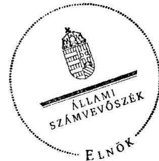
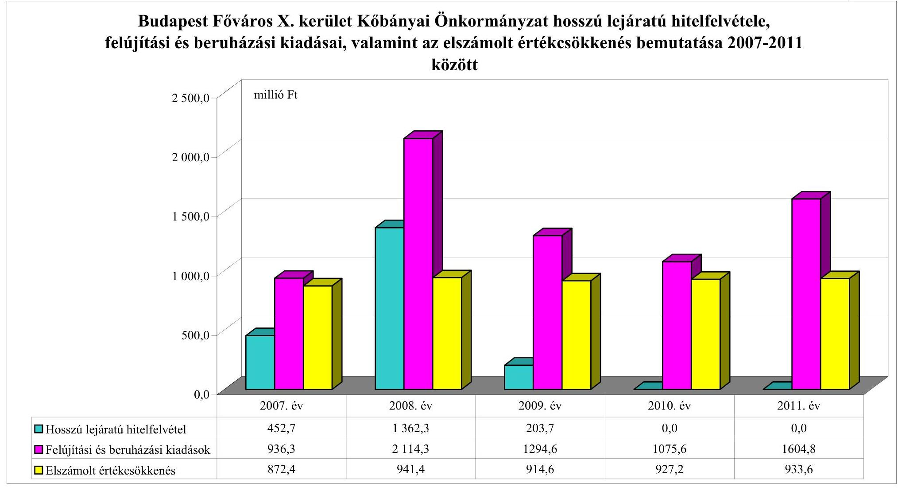
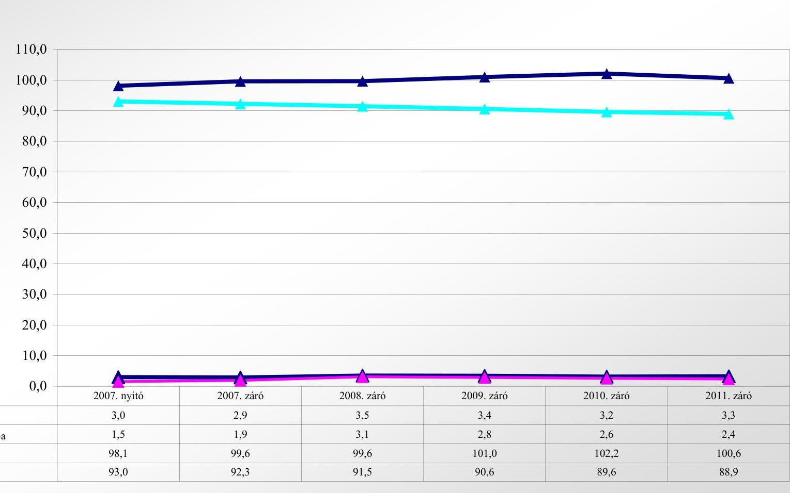

# JELENTÉS 

az önkormányzati vagyongazdálkodás szabályszerűségi ellenőrzéséről

Budapest Főváros X. kerület Kőbánya

---

# Állami Számvevőszék 

Iktatószám: V-0043-020-001-174/2013.
Témaszám: 1082
Vizsgálat-azonosító szám: V061501
Az ellenőrzést felügyelte:
Makkai Mária
felügyeleti vezető
Az ellenőrzést vezette és az ellenőrzés végrehajtásáért felelős:
Páncsics Judit
ellenőrzésvezető
A számvevőszéki jelentés összeállításában közremúködtek:
Horváthné Menyhárt Erika
számvevő főtanácsos
Marozsán Katalin
számvevő
Szarka Péterné
számvevő vezető főtanácsos
Az ellenőrzést végezték:
Horváthné Menyhárt Erika Polyák Ferenc Vas Lajos
számvevő főtanácsos számvevő tanácsos számvevő tanácsos

A témához kapcsolódó eddig készített számvevőszéki jelentések:
címe
sorszáma
Jelentés Budapest Főváros X. kerület Kőbányai Önkormányzata 0417
gazdálkodásának átfogó ellenőrzéséről
Jelentés a Budapest Főváros X. kerület Kőbányai Önkormányzat 0842
gazdálkodási rendszerének 2008. évi ellenőrzéséről

---

# TARTALOMJEGYZÉK 

BEVEZETÉS ..... 3
I. ÖSSZEGZŐ MEGÁLLAPÍTÁSOK, KÖVETKEZTETÉSEK, JAVASLATOK ..... 5
II. RÉSZLETES MEGÁLLAPÍTÁSOK ..... 11

1. A vagyongazdálkodási tevékenység szabályozottsága ..... 11
1.1. A feladatellátás formáinak meghatározása, a döntések megalapozottsága ..... 11
1.2. A vagyonnal gazdálkodó szervezetek szervezeti rendjének szabályozottsága, a kötelező szabályzatok megfelelősége ..... 12
1.3. A vagyongazdálkodás szabályozása ..... 13
1.4. A vagyonkezeléssel megbízott szervezetek beszámolási kötelezettségének szabályozása ..... 15
2. A vagyongazdálkodás szabályszerűsége ..... 15
2.1. A vagyonnyilvántartás megfelelőssége ..... 15
2.2. A vagyongazdálkodást érintő gazdasági események dokumentáltsága ..... 16
2.3. A vagyongazdálkodási döntések, intézkedések szabályszerűsége ..... 18
2.4. A vagyonkezelő beszámoltatása ..... 19
2.5. A közbeszerzési eljárások alkalmazása ..... 20
3. A vagyon változását eredményező gazdasági események szabályszerűsége ..... 21
3.1. A vagyon értékének és összetételének változása ..... 21
3.2. A vagyon fenntartására kialakított rendszer működésének megfelelősége és szabályozottsága ..... 22
3.3. Hitelfelvétel, kötvénykibocsátás, garancia és kezességvállalás szabályszerűsége ..... 23
3.4. A térítés nélküli vagyon átadások és átvételek szabályszerűsége ..... 23
4. A vagyongazdálkodás szabályszerűségére vonatkozó belső és külső ellenőrzések hasznosulása ..... 25
4.1. A belső ellenőrzés által tett megállapítások, javaslatok hasznosulása ..... 25
4.2. A többségi tulajdonban lévő gazdasági társaságok vagyongazdálkodásának felügyelete ..... 26
4.3. A könyvvizsgálat hozzájárulása a vagyongazdálkodás szabályosságához ..... 27
4.4. A külső ellenőrző szervezetek által tett javaslatok hasznosulása ..... 27

---

# MELLÉKLETEK 

1. számú Budapest Főváros X. kerület Kőbányai Önkormányzat vagyonának főbb adatai 2007. január 1-je és 2011. december 31-e között
2. számú Budapest Főváros X. kerület Kőbányai Önkormányzat hosszú lejáratú hitelfelvétele, felújítási és beruházási kiadásai, valamint az elszámolt értékcsökkenés bemutatása 2007-2011 között
3. számú Budapest Főváros X. kerület Kőbányai Önkormányzat eladósodásának és az eszközök fedezettségének, használhatóságának alakulása 2007-2011 között

## FÜGGELÉKEK

1. számú Rövidítések jegyzéke
2. számú Értelmező szótár

---

# JELENTÉS 

## az önkormányzati vagyongazdálkodás szabályszerűségi ellenőrzéséről

## Budapest Főváros X. kerület Kőbánya

## BEVEZETÉS

Az ÁSZ kiemelten fontosnak tartja az ÁSZ tv. 5. § (4) bekezdése alapján az önkormányzatok vagyongazdálkodási tevékenységének, a vagyongazdálkodási szabályok betartásának ellenőrzését. Az ellenőrzés feladata, hogy értékelje a vagyongazdálkodással kapcsolatban a jogszabályokban, az önkormányzati belső szabályozásban előírtak érvényesülését a közpénzek felhasználásának átláthatósága, nyilvánossága érdekében. Az ÁSZ ellenőrzése nemcsak az ellenőrzött szervezet vagyongazdálkodásának hibáira, hiányosságaira mutat rá, számon kérve azok kijavítását, hanem megállapításaival, javaslataival segíti a közpénzekkel, a közvagyonnal való felelős gazdálkodást.

Az önkormányzati vagyon alapvető funkciója, hogy a helyi közérdeket és egyúttal az önkormányzati célok megvalósítását szolgálja. A feladatellátás terén elsősorban a kötelezően ellátandó feladatok végrehajtását hivatott szolgálni, amely mellett az önként vállalt feladatok ellátása is megvalósulhat.

## Az ellenőrzés célja annak értékelése volt, hogy az Önkormányzatnál:

- a vagyongazdálkodási tevékenység, annak szervezeti keretei szabályozottak-e;
- a vagyongazdálkodás törvényességét, szabályszerűségét biztosították-e, a vagyon értékének és összetételének változását jogszerű döntésekkel alátámasztották-e;
- a belső ellenőrzés elősegítette-e a vagyongazdálkodás szabályszerű működését, valamint hasznosultak-e a korábbi külső ellenőrzések által tett javaslatok.

Az ellenőrzés típusa: szabályszerűségi ellenőrzés
Az ellenőrzött időszak: Az ellenőrzés a 2007. január 1. és 2011. december 31. közötti időszakra terjedt ki. A közbeszerzési eljárások lefolytatásának ellenőrzése a 2011. évet és a 2012. év I. negyedévét érintette. Az Nvt. egyes rendelkezései végrehajtásának ellenőrzése a nemzetgazdasági szempontból kiemelt jelentőségű nemzeti vagyonnak minősülő forgalomképtelen vagyonelemek meghatározására, valamint közép- és hosszú távú vagyongazdálkodási 

---

terv készítésére terjedt ki 2012. január 1-jétől 2013. március 1-jéig, a helyszíni ellenőrzés befejezéséig.

Az ellenőrzés szakmai módszertana az ÁSZ hivatalos honlapján közzétett szakmai szabályokon alapult, amely a Legfőbb Ellenőrző Intézmények Nemzetközi Szervezete (INTOSAI) által kiadott nemzetközi standardok (ISSAI) figyelembevételével készült.

Ellenőriztük az önkormányzati vagyongazdálkodás szabályozottságát, a helyi szabályozások jogszabályi előírásoknak való megfelelőségét (önkormányzati rendeletek, szabályzatok, utasítások) és azok gyakorlati alkalmazását. A vagyonváltozásokkal kapcsolatos gazdasági események közül az ellenőrzött tételeket véletlen mintavétellel választottuk ki a Polgármesteri hivatal 2007-2011. évi számviteli nyilvántartásaiból. Az Önkormányzattól tanúsítványt kértünk a korábbi ÁSZ ellenőrzések vagyongazdálkodásra vonatkozó javaslatainak hasznosulásáról, a könyvvizsgáló és a külső ellenőrzési szervek vagyongazdálkodással kapcsolatos 2007-2011. évi javaslataira tett intézkedésekről, valamint a 2007-2011. évek térítésmentes vagyonátadásairól és átvételeiről.

A jelentéstervezetben alkalmazott rövidítéseket az 1. számú függelék, az egyes fogalmak magyarázatát a 2. számú függelék tartalmazza.

Budapest Főváros X. kerület Kőbánya állandó lakosainak száma 2011. január 1-jén 75698 fő volt. Az Önkormányzat 17 tagú Képviselő-testületének munkáját öt állandó bizottság segítette. Az Önkormányzat az önállóan működő és gazdálkodó Polgármesteri hivatalon felül további három önállóan működő és gazdálkodó, valamint 33 önállóan működő költségvetési szervvel látta el a feladatait. Az Önkormányzatnak 2011. év végén négy kizárólagos (100%-os) tulajdonában álló gazdasági társasága volt.

A polgármester a 2010. évi önkormányzati választások óta tölti be tisztségét. A jegyző 2011. március 11-től látja el feladatait.

Az Önkormányzatnak a 2011. évi költségvetési beszámolója szerint 17 326,1 millió Ft költségvetési bevétele volt és 15818,0 millió Ft költségvetési kiadást teljesített. A 2011. december 31-i könyvviteli mérleg szerint 96 805,2 millió Ft értékű eszközvagyonnal rendelkezett, a hosszú lejáratú kötelezettségek összege 2279,3 millió Ft, a rövid lejáratú kötelezettségeké 878,0 millió Ft volt.

A Polgármesteri hivatal 15 szervezeti egységre tagolódott, a foglalkoztatott köztisztviselők száma 2011. december 31-én 250 fő, az Önkormányzat által foglalkoztatott közalkalmazottak száma 1766 fő volt.

Az ÁSZ a 2011. évi LXVI. törvény 29. § (1) bekezdése szerint a jelentéstervezetet megküldte egyeztetésre Budapest Főváros X. kerület Kőbányai Önkormányzat polgármesterének, aki az ÁSZ tv. 29. § (2) bekezdésében foglalt észrevételezési jogával nem élt, a jelentéstervezetre észrevételt nem tett.

---

# I. ÖSSZEGZŐ MEGÁLLAPÍTÁSOK, KÖVETKEZTETÉSEK, JAVASLATOK 

Az Önkormányzat könyvviteli mérleg szerinti vagyona a 2007. évi 94 194,3 millió Ft nyitó értékről 2011. év végére 96 805,2 millió Ft-ra, 2,8%-kal (2610,9 millió Ft-tal) nőtt. A vagyon növekedését a befektetett eszközök 6,2 millió Ft-os csökkenése és a forgóeszközök 2617,1 millió Ft-os növekedése okozta. A 2007-2011 években a felújításokra és beruházásokra fordított kiadások összege (7025,6 millió Ft) jelentősen (53,1%-kal) meghaladta az elszámolt értékcsökkenés (4589,2 millió Ft) összegét. A beruházások és felújítások finanszírozásához - az ellenőrzött időszakot megelőzően megkötött hitelszerződések alapján - 2018,7 millió Ft hosszú lejáratú hitelből származó forrást vettek igénybe.

Az Önkormányzat saját vagyona 2007-ről 2011-re 91012,4 millió Ft-ról 93315,5 millió Ft-ra 2,5%-kal (2303,1 millió Ft-tal) növekedett a saját tőke 674,7 millió Ft-os és a tartalékok 1628,4 millió Ft-os növekedésének eredményeként. A vagyon alakulásával kapcsolatos adatokat és mutatószámokat a jelentés 1-3. számú mellékletei részletesen tartalmazzák.

A Képviselő-testület a gazdasági programban meghatározta az önkormányzati feladatok ellátásának fő irányait. Az Önkormányzatnál a vagyongazdálkodással kapcsolatos feladatokat, a feladat- és hatásköröket, valamint az eljárási rendet önkormányzati rendeletekben, a polgármester és a jegyző, illetve a jegyző által kiadott szabályzatokban és utasításokban szabályozták. A Képviselő-testület 2009-ben, határozatban rögzítette az Önkormányzat önként vállalt feladatait. Meghatározta a vagyonnal gazdálkodó, közfeladatot ellátó költségvetési szervek alaptevékenységét, jóváhagyta az alapító okiratukat és a szervezeti és működési szabályzatukat. A vagyonüzemeltetési feladatok ellátását két 100%-os tulajdonú gazdasági társaságával biztosította.

Az Önkormányzatnál a vagyongazdálkodási feladatokat a Htv.-ben foglaltaknak megfelelően a teljes vagyoni körre vonatkozóan a vagyongazdálkodási rendeletben, a lakásrendeletben és az elidegenítési rendeletben szabályozták. A Képviselő-testület - az Ötv.-ben foglaltaknak eleget téve - a 2007-2011. években meghatározta a törzsvagyonba tartozó forgalomképtelen és korlátozottan forgalomképes vagyonának körét. Az Önkormányzatnál az Nvt.-ben előírtak ellenére - a törvény hatályba lépését követő 60 napon belül - rendeletben nem jelölték meg azokat a forgalomképtelen vagyonelemeket, melyeket kiemelt jelentőségű nemzeti vagyonnak minősítenek. Az Önkormányzatnál az Nvt.-ben előírtak alapján a közép- és hosszú távú vagyongazdálkodási tervet sem készítették el a helyszíni ellenőrzés befejezéséig.

A vagyongazdálkodási rendelet - az Áht.-ban előírtak szerint - tartalmazott szabályozást a vagyon tulajdonjogának ingyenes, vagy kedvezményes megszerzésére, átruházására. Az Önkormányzatnál - az Áht.-ban foglaltakkal összhangban - a lakás rendeletben és az elidegenítési rendeletben szabályozták a meghatározott értékhatár feletti vagyontárgyak hasznosítása esetében a nyilvános versenyeztetés, pályáztatás hatásköri és eljárási szabályait. A vagyongazdálkodási rendeletben értékbecslés készítési kötelezettséget írtak elő a hasznosításra szánt vagyon értékének megállapítása céljából. A forgalomképesség megváltoztatásának eljárásrendjét és dokumentálásának módját nem szabályozták. A Képviselő-testület a vagyonkezelői jog gyakorlásának szabályait és a vagyon feletti tulajdonjog átruházott hatáskörben történő gyakorlását értékhatárhoz kötötten a vagyongazdálkodási rendeletben szabályozta. Az átruházott hatáskörben hozott intézkedésekről beszámolási kötelezettséget nem írt elő.

A Polgármesteri hivatal számviteli politikáját és a kapcsolódó szabályzatokat a jogszabályi előírásoknak és a helyi sajátosságoknak megfelelően készítették el. A 2008. november 1-jétől hatályban lévő leltározási szabályzat az üzemeltetésre átadott eszközök leltározásának módját az Áhsz.-ben foglaltaknak megfelelően tartalmazta. A Képviselő-testület nem élt az Áhsz. szerinti lehetőséggel, nem alkotott rendeletet a két évenkénti leltározásról. A vagyonkimutatás Áhsz.-ben előírt tartalmának további részletezését, tételes alábontását a vagyongazdálkodási rendelet, valamint a számlarend tartalmazta.

Az Önkormányzatnál 2007-2011. években elkészítették a vagyonkimutatást és a zárszámadási rendelettervezet előterjesztésekor a Képviselő-testület részére tájékoztatásul bemutatták. A 2007-2011. évi vagyonkimutatások tartalma megfelelt az Áhsz.-ben és a vagyongazdálkodási rendeletben foglaltaknak, tartalmazta az Önkormányzat és intézményei saját vagyonát tételesen, törzsvagyon és törzsvagyonon kívüli egyéb vagyon bontásban, a vagyongazdálkodási rendelet, illetve a számlarend szerinti további részletezésben. A vagyonkimutatást - a mérleggel egyezően - az Önkormányzatnál leltárral alátámasztották.

A számviteli nyilvántartásban szereplő ingatlanvagyont, valamint az ingatlanvagyon-kataszter adatait az Önkormányzatnál minden évben egyeztették. Az egyeztetésről felvett jegyzőkönyvek szerint a főkönyvi könyvelésében és a vagyon-kataszterben lévő bruttó értékek év végén megegyeztek. Az ingatlan-vagyon-kataszter adatait a közhiteles nyilvántartást vezető illetékes földhivatal adataival - az ingatlanvagyon nyilvántartási és adatszolgáltatási rendjéről szóló kormányrendeletben előírtak ellenére - a 2002. évet követően nem egyeztették. A változásokat - a földhivatal által megküldött iratok alapján - a nyilvántartásokban átvezették, de a teljes körű egyezőség fennállása nem igazolt.

A vagyongazdálkodással kapcsolatban meghatározták a gazdálkodási jogkörök gyakorlásának rendjét. A Polgármesteri hivatalban a 2007-2011. években a vagyongazdálkodás egyes területeihez kapcsolódóan az ellenőrzött tételeknél a kötelezettségvállalást, a kötelezettségvállalás ellenjegyzését, a szakmai teljesítésigazolást, az érvényesítést, az utalványozást és az utalványozás ellenjegyzését az arra felhatalmazottak - három esetet kivéve - a szabályozásnak megfelelően végezték. Az ellenőrzés során megállapított eltérések az ellenőrzött tételek 0,8%-át, 529,4 ezer Ft értékben érintette, amely nem érte el az ellenőrzés által meghatározott lényegességi szintet.

Az Önkormányzat
 - az ellenőrzési időszakot megelőzően -a Fővárosi Vízművek Zrt.-nek 31,1 millió Ft értékben, a Fővárosi Csatornázási Művek Zrt.-nek 221,1 millió Ft értékben törzsvagyonba tartozó vízi közművet térítésmentesen adott át, melyet a Polgármesteri Hivatal számviteli nyilvántartásából a 2010.

---

évben vezettek ki. Az Önkormányzat az eszközöket a vízgazdálkodásról szóló törvényben foglaltak ellenére nem használatba, hanem tulajdonba adta át.

A 2007-2011. év között 10 alkalommal (64,9 millió Ft értékben) történt önkormányzaton kívülre térítés nélkül tárgyi eszköz átadás-átvétel. Az átadásról, illetve átvételről 3 esetben (2,8 millió Ft-ot érintően) - a vagyongazdálkodási rendelet előírása ellenére - nem a Képviselő-testület, hanem a Sport, ifjúsági, civil és kisebbségi bizottság, a Pénzügyi Bizottság, illetve a polgármester döntött. Az eszközök átadásának dokumentálása 3 esetben (15,6 millió Ft-ot érintően) nem a számviteli politikában előírtaknak megfelelően történt.

Az ellenőrzött időszakban az Önkormányzat 100%-os tulajdonában lévő gazdasági társaságaiban lévő tartós részesedései után nem számolt el értékvesztést. Három részvénytársaságban lévő 2%-os, vagy az alatti részesedést megtestesítő részvény után együttesen 6,6 millió Ft volt az elszámolt értékvesztés összege. Az értékvesztés elszámolására vonatkozó döntést alátámasztó dokumentumot két esetben (5,8 millió Ft értékben) az Önkormányzat az ÁSZ részére nem tudott bemutatni.

A képviselő-testületi döntéseknek megfelelően az ingatlanok elidegenítése hirdetmény útján közzétett versenyeztetéssel történt. A vagyongazdálkodási döntések végrehajtása során betartották a vagyongazdálkodási rendeletben, a lakásrendelet$_{1,2}$-ben, valamint az elidegenítési rendeletben foglaltakat. Az Önkormányzatnál a 2011. évben és 2012. év I. negyedévében felújítás és beruházás kivitelezésével összefüggésben közbeszerzési eljárást nem indítottak, ezért az ellenőrzés során a vagyonváltozáshoz kapcsolódó kifizetések szerződéseit - amennyiben azok összegük szerint a Kbt$_{1,2}$ hatálya alá tartoztak - tekintettük át. Megállapítottuk, hogy az Önkormányzat a közbeszerzési eljárásokat lefolytatta, az egybeszámítási kötelezettségnek eleget tett.

A közérdekű adatok - ezen belül a céljellegű működési és felhalmozási célú támogatások és a nettó ötmillió Ft-ot elérő vagy meghaladó szerződések adatai, az önkormányzati költségvetési és a zárszámadási rendeletek - közzétételére vonatkozó eljárásrendet a polgármester és a jegyző$_{1}$ közös utasításként kiadott közzétételi szabályzatban határozta meg. A jegyző$_{1}$ és a jegyző a 2007-2011. években az Önkormányzat honlapján közzétette a működési és fejlesztési támogatások, a nettó ötmillió Ft-ot elérő, vagy azt meghaladó szerződések adatait. A jegyző$_{1}$, illetve a jegyző az Önkormányzat honlapján a 2007-2011. évi éves (elemi) költségvetések és a költségvetés végrehajtásáról készített beszámolók az Eisztv.-ben és a közzétételi listákon szereplő adatok közzétételi mintájáról szóló IHM rendeletben előírt közzétételi kötelezettségének - az ÁSZ korábbi ellenőrzése során tett javaslat ellenére - sem tett eleget.

A belső ellenőrzési feladatokat az Önkormányzat a 2007-2011. években a Polgármesteri Hivatal belső szervezeti egysége útján látta el. A belső ellenőrzés éves ellenőrzési tervei kockázatelemzésen alapultak, összesen 17 vagyongazdálkodással kapcsolatos ellenőrzést folytattak le. A jelentések javaslatokat fogalmaztak meg a szabályzatok kiegészítésére, a közbeszerzési, leltározási, selejtezési eljárások dokumentálási hiányosságainak megszüntetésére, a teljesítésigazolás rendjének szabályozására. Az ellenőrzöttek intézkedési tervet készítettek a felelősök és a határidő megjelölésével. Az intézkedési tervek végrehajtásá-

---

ról utóellenőrzés keretében és az intézmények beszámoltatásával győződtek meg. A belső ellenőrzés elősegítette a vagyongazdálkodás szabályszerű működését. A polgármester az Ötv.-ben foglaltaknak megfelelően a Képviselő-testület elé terjesztette az Önkormányzat felügyelete alá tartozó költségvetési szervek 2007-2011. évi éves ellenőrzési jelentései alapján készített éves összefoglaló ellenőrzési jelentéseket.

Az Önkormányzat a vagyonüzemeltetéssel megbízott önkormányzati tulajdonú gazdasági társaságokkal kötött szerződésekben előírta a feladatellátásról és a gazdasági tevékenységről szóló éves beszámolási kötelezettséget, melynek a társaságok eleget tettek. A Képviselő-testület megtárgyalta és elfogadta a beszámolókat. Az éves beszámolók elfogadását kezdeményező előterjesztések tartalmazták az érintett társaságok pénzügyi, jövedelmi helyzetének elemzését és értékelését. Az éves beszámolón kívül a Képviselő-testület a közfeladatok ellátásáról, az üzemeltetésre átadott vagyonnal való gazdálkodásról a gazdasági társaságokat nem számoltatta be és nem vizsgálta a folyamatos üzletmenet fenntarthatóságát. A Képviselő-testület nem számoltatta be a felügyelő bizottsági tagokat a tulajdonosi érdekek képviseletéről. Az Önkormányzat kizárólagos tulajdonában lévő gazdasági társaságok hitelt nem vettek fel, részükre a Képviselő-testület tagi kölcsönt nem nyújtott. Az Önkormányzat képviselő-testületi döntés alapján tőkét emelt a Kőbánya-Gergely Utca Ingatlanfejlesztő Kft.-nél, a Kőbányai Vagyonkezelő Zrt.-nél és a KÖKERT Non-profit Kft.-nél összesen 242,2 millió Ft értékben, amiből a 2008. és a 2010. években a Kőbánya-Gergely Utca Ingatlanfejlesztő Kft. 205,7 millió Ft értékben részesült. A Képviselő-testület a 2011. évben a Kőbánya-Gergely Utca Ingatlanfejlesztő Kft.-nél a veszteség rendezésére a törzstőke leszállításáról döntött 450,0 millió Ft összegben, valamint a 2011. év végével jóváhagyta a Kft. Kőbányai Vagyonkezelő Zrt.-be történő beolvadását. A három millió Ft-os törzstőkével rendelkező Kőbányai Média és Kulturális Non-profit Kft. több évben veszteségesen gazdálkodott, de eredménytartaléka a veszteségekre forrást biztosított.

Az Önkormányzat éves beszámolóit a könyvvizsgáló megbízhatónak és valósnak minősítette. A 2010. évi könyvvizsgálói jelentés egy vagyongazdálkodáshoz kapcsolódó észrevételt tartalmazott, amely alapján az eltérés korrigálása a könyvvizsgálati időszakban megtörtént.

Az Önkormányzat vagyongazdálkodási tevékenységét az ÁSZ-on kívül más külső ellenőrzést végző szerv nem ellenőrizte. Az ÁSZ korábbi ellenőrzései kiterjedtek a vagyongazdálkodás működésének szabályszerűségére. A jegyző, a javaslatok hasznosítására - határidő és felelős megjelölésével - intézkedési tervet terjesztett a Képviselő-testület elé. Az intézkedési tervet a Képviselő-testület jóváhagyta. A belső ellenőr a 2010. évben ellenőrizte az intézkedési terv végrehajtását. Az ÁSZ ellenőrzések során a vagyongazdálkodással kapcsolatban megfogalmazott javaslatok a közzétételre vonatkozó javaslat kivételével hasznosultak.

Az ÁSZ tv. 33. § (1) bekezdésében foglaltak értelmében a jelentésben foglalt megállapításokhoz kapcsolódó intézkedési tervet köteles az ellenőrzött szervezet vezetője összeállítani és azt a jelentés kézhezvételétől számított harminc napon belül az ÁSZ részére megküldeni. Amennyiben az intézkedési tervet határidőben nem küldi meg a szervezet, vagy az továbbra sem elfogadható, az ÁSZ el-

---

nöke a hivatkozott törvény 33. § (3) bekezdés a)-b) pontjaiban foglaltakat érvényesítheti.

Az ellenőrzés intézkedést igénylő megállapításai és javaslatai:

# a polgármesternek

1. Az Önkormányzat - az ellenőrzési időszakot megelőzően - térítésmentesen a Fővárosi Vízművek Zrt.-nek 31,1 millió Ft értékben, a Fővárosi Csatornázási Művek Zrt.-nek 221,1 millió Ft értékben önkormányzati törzsvagyonba tartozó vízi közművet adott át, amelyet a 2010. évben vezettek ki a Polgármesteri Hivatal számviteli nyilvántartásából. Az Önkormányzat az eszközöket a vízgazdálkodásról szóló 1995. évi LVII. törvény 10. § (1) bekezdésében foglaltak ellenére nem használatba, hanem tulajdonba adta át.

Javaslat:
Vizsgálja meg a Fővárosi Vízművek Zrt.-vel, valamint a Fővárosi Csatornázási Művek Zrt.-vel kötött térítésmentes vagyonátadások szerződéseit és tegyen intézkedést arra, hogy a vízi közművek visszakerüljenek az Önkormányzat tulajdonába és a Képviselő-testület döntése alapján a vízgazdálkodásról szóló 1995. évi LVII. törvény 10. § (1) bekezdésében előírtaknak megfelelően adják használatba. Indokolt esetben kezdeményezzen felelősségre vonást.

## a jegyzőnek

1. Az Önkormányzatnál az Nvt. hatályba lépését követő 60 napon belül a törvény 18. § (1) bekezdésében előírtak ellenére nem jelölték meg rendeletben azokat a tulajdonukban álló forgalomképtelen vagyonelemeket, melyeket kiemelt jelentőségű nemzeti vagyonnak minősítenek.

Javaslat:
Készítsen rendelettervezetet a nemzetgazdasági szempontból kiemelt jelentőségű nemzeti vagyonnak minősülő forgalomképtelen vagyonelemek kijelölése érdekében az Nvt. 18. § (1) bekezdésében előírtak szerint és kezdeményezze a polgármesternél a rendelettervezet Képviselő-testület elé terjesztését.
2. Az ingatlanvagyon-kataszter adatait a 147/1992. (XI. 6.) Korm. rendelet 1. § (2) bekezdésében előírtak ellenére a közhiteles nyilvántartást vezető illetékes földhivatal adataival a 2002. évet követően nem egyeztették. A változásokat - a földhivatal által megküldött iratok alapján - a nyilvántartásokban átvezették, de a teljes körű egyezőség fennállása nem igazolt.

Javaslat:
Intézkedjen, hogy a 147/1992. (XI. 6.) Korm. rendelet 1. § (2) bekezdésében rögzítetteknek megfelelően az ingatlanvagyon-kataszter adatai egyezzenek meg a földhivatal ingatlan-nyilvántartásának azonos tartalmú adataival.

---

3. A jegyző, illetve a jegyző az Önkormányzat honlapján a 2007-2011. évi éves (elemi) költségvetések és a költségvetés végrehajtásáról készített beszámolók az Eisztv. mellékletében és a 18/2005. (XII. 27.) IHM rendelet 2. számú melléklete 3.2. pontjában előírt közzétételi kötelezettségének nem tett eleget.

Javaslat:
Intézkedjen, hogy az Info tv. 1. számú mellékletében meghatározott adatok közzétételre kerüljenek.

---

# II. RÉSZLETES MEGÁLLAPÍTÁSOK

## 1. A VAGYONGAZDÁLKODÁSI TEVÉKENYSÉG SZABÁLYOZOTTSÁGA

### 1.1. A feladatellátás formáinak meghatározása, a döntések megalapozottsága

Az Önkormányzat 2007-2011. évekre rendelkezett az Ötv. 91. § (6) bekezdése$^{1}$ szerinti tartalommal meghatározott és jóváhagyott gazdasági program$_{1,2}$-vel. A gazdasági program$_{1}$ koncepcionális törekvéseket, alapelveket és fő irányokat rögzített. A gazdasági program$_{2}$ már részletesen meghatározta a célkitűzéseket, a feladatellátással kapcsolatos fejlesztéseket, és prognosztizálta a gazdasági program végrehajtásához felhasználható bevételeket.

Az ÁSZ 2008. évi utóellenőrzése hiányosságként állapította meg, hogy az Önkormányzat nem vette számba és nem rögzítette az önként vállalt feladatokat. A Képviselő-testület ezért 2009-ben megtárgyalta és a 2059/2009. (XII. 17.) számú határozatával elfogadta az önként vállalt feladatokról és azok ráfordításairól szóló előterjesztést, előírta annak figyelembe vételét az éves költségvetések készítésénél. A kötelező és az önként vállalt feladatok ellátásáról az Önkormányzat az egységes költségvetéséből gondoskodott.

Az Önkormányzat költségvetési szerveinek száma a 2007. január 1-jei 42-ről 2011. december 31-ére 37-re csökkent. A Képviselő-testület ebben az időszakban határozott intézmények megszüntetéséről, összevonásáról, szétválásáról és alapításáról is. A Képviselő-testület a feladatellátás szervezeti formáinak módosításáról gazdaságossági és szakmai indokok alapján, alternatív javaslatok figyelembevételével döntött.

2007-ben a Gazdasági Műszaki Ellátó Szolgálat (GAMESZ), 2008-ban a Szociális Foglalkoztató szűnt meg, megalakult a Kertvárosi Általános Iskola, 2009-ben az Egészségügyi Szolgálat önálló intézmény lett, 2010-ben megszűnt a Kápolna téri Általános Iskola és a Kőbányai Gyermek és Ifjúsági Szabadidő Központ, mint önálló intézmény, 2011-ben megszűnt a Felnőttek Általános Iskolája, megalakult a BÁRKA Szociális és Gyermekjóléti Központ a megszűnő Családsegítő Szolgálat és a Gyermekjóléti Központ feladatát átvéve.

Az Önkormányzat 2011. év végén négy gazdasági társaságnak volt 100%-os tulajdonosa, melyből két társaság - a Kőbányai Vagyonkezelő Zrt. és a KÖKERT Non-profit Közhasznú Kft. - feladatkörébe tartozott az önkormányzati ingatlanok és közterületek kezelése, üzemeltetése. A további két társaság (Kőbányai Szivárvány Non-profit Kft., Kőbányai Média és Kulturális Non-profit Kft.) szociális gondoskodással, illetve médiaszolgáltatással foglalkozott.

[^0]
[^0]: $^{1}$ 2013. január 1-jétől az Mötv. 116. §-a írja elő

---

A Képviselő-testület a 2007-2011. években előterjesztések alapján a közszolgáltatások költség-hatékony ellátása érdekében egy biztonsággal és vagyonvédelemmel foglalkozó gazdasági társaság megszüntetéséről, egy közterületek és intézmények üzemeltetésével, fejlesztésével foglalkozó gazdasági társaság alapításáról, továbbá egy ingatlanfejlesztő gazdasági társaság beolvasztásáról döntött$^{2}$. Az ingatlanfejlesztő gazdasági társaság megszűnését a veszteséges gazdálkodás indokolta.

A Képviselő-testület 2008-ban döntött$^{3}$ arról, hogy a közigazgatási területéhez tartozó termőföldek védelmét mezei őrszolgálattal kívánja ellátni, amelynek létrehozását és működtetését - a XVI. és a XVII. kerületi önkormányzatokkal közösen - társulási formában tervezte. A társulási megállapodást 2011-ben kötötték meg az érintett önkormányzatok. Az
 Önkormányzat a társuláshoz vagyoni hozzájárulást nem adott, a társulás működési költségeihez a megállapodás szerinti pénzügyi hozzájárulást biztosított.

A Képviselő-testület nem vállalt át feladatot a Fővárosi Önkormányzattól.

# 1.2. A vagyonnal gazdálkodó szervezetek szervezeti rendjének szabályozottsága, a kötelező szabályzatok megfelelősége 

A Képviselő-testület a 2007-2011. évek között a vagyongazdálkodással kapcsolatos feladatait rendeletben szabályozta. A Képviselő-testület élt az Ötv. 9. § (3) bekezdésében ${ }^{4}$ biztosított jogával és döntött a hatáskörök polgármesterre, bizottságokra történő átruházásáról. A szabályozás megjelent a vagyongazdálkodási rendeletben, az önkormányzati SZMSZ ${ }_{1.5}$-ben, az elidegenítési, illetve a lakásrendelet ${ }_{1.2}$-ben, amelyekben utasítást is adott a tulajdonosi jogokat érintő átruházott hatáskörök gyakorlásához. Az átruházott hatáskörben hozott intézkedésekről beszámolási kötelezettséget nem írtak elő.

Átruházott hatáskörben a polgármester döntött a forgalomképtelen vagyon tulajdonjogát nem érintő hasznosításáról, amennyiben a vagyontárgyak hasznosítására irányuló szerződések időtartama az egy évet nem haladta meg, a korlátozottan forgalomképes vagyontárgyak szerzéséről, elidegenítéséről, megterheléséről, bérleti, vagy használati jogának átengedéséről, továbbá a forgalomképes ingó és ingatlan vagyon tekintetében hárommillió forint összeghatárig.

A Képviselő-testület a vagyonnal gazdálkodó, közfeladatot ellátó költségvetési szervek alapító okiratában meghatározta az alaptevékenységüket, továbbá jóváhagyta szervezeti és működési szabályzatukat. Ez utóbbi feladatot átruházott hatáskörben 2011 novemberétől - az önkormányzati SZMSZ ${ }_{3}$ 3. számú melléklete alapján - a polgármester gyakorolta.

[^0]
[^0]:    ${ }^{2}$ 2007-ben megszűnt a KÖZ-KÖVÉD Kht., 2008-ban létrejött a KŐKERT Non-profit Közhasznú Kft., 2011-ben a Kőbánya-Gergely Utca Ingatlanfejlesztő Kft. beolvadt a Kőbányai Vagyonkezelő Zrt.-be.
    ${ }^{3}$ 354/2008. (II. 28.) számú határozat
    ${ }^{4}$ 2013. január 1-jétől az Mötv. 41. § (4) bekezdése írja elő

---

A Polgármesteri hivatal szervezeti és működési rendjét a 2007. és 2008. években ügyrend ${ }_{1,2}$-ben szabályozták, ami hiányosan tett eleget az Ámr. ${ }_{1}$ 13/A. § (3) bekezdésében előírtaknak.

Az ügyrend ${ }_{1,2}$ nem tartalmazta a költségvetési szerv létrehozásáról szóló jogszabályra történő hivatkozást, a költségvetési szerv törzskönyvi azonosító számát, az alapító okirat számát, az ellátandó és a szakfeladat rend szerint besorolt alaptevékenységet és a szabályozó jogszabályok megjelölését, a költségvetési szervhez rendelt más költségvetési szervek felsorolását.

A hivatali SZMSZ a 2009. évtől - az engedélyezett létszám kivételével - már tartalmazta az Ámr. ${ }_{2}$ 20. § (2) bekezdésében ${ }^{5}$ meghatározott kötelező szabályozási elemeket.

A jegyző ${ }_{1}$ elkészítette a Polgármesteri hivatal, valamint az intézmények gazdálkodással kapcsolatos szabályzatait (számviteli politika ${ }_{1-4}$, számlarend ${ }_{1,2}$, gazdálkodási jogkörök szabályzata ${ }_{1,2,3}$, értékelési szabályzat ${ }_{1,2,3}$, leltározási szabályzat ${ }_{1,2,3}$, selejtezési szabályzat ${ }_{1,2,3}$ ), amelyek 2008. november 1-jét követően megfelelő keretet biztosítottak a vagyongazdálkodás szempontjából az Önkormányzat költségvetési szervei egységes számviteli elvek szerinti, önkormányzati szintű beszámolójának elkészítéséhez.

A leltározási szabályzat ${ }_{1}$ nem szabályozta az üzemeltetésre átadott eszközök leltározásának módját, de a 2008. november 1-jétől a leltározási szabályzat ${ }_{2,3}$ már tartalmazta azt, az Áhsz. 37. §-ában foglaltaknak megfelelően ${ }^{6}$.

A számviteli politikát és a kapcsolódó szabályzatokat a Számv. tv., az Áhsz. előírásainak és a helyi sajátosságoknak megfelelően készítették el. A Képviselőtestület nem élt az Áhsz. 37. § (7) bekezdése szerinti lehetőséggel és nem alkotott rendeletet a kétévenkénti leltározásról.

# 1.3. A vagyongazdálkodás szabályozása 

Az Önkormányzatnál a vagyongazdálkodási feladatokat a Htv. 138. § (1) bekezdésének j) pontjában foglaltak szerint a teljes vagyoni körre vonatkozóan szabályozták. Meghatározták az önkormányzati feladatellátást biztosító törzsvagyont, ezen belül a korlátozottan forgalomképes és forgalomképtelen vagyonelemek körét. A vagyongazdálkodási rendelet összhangban volt a jogszabályokkal és az Önkormányzat belső szabályozási dokumentumaival. A vagyongazdálkodási rendeletben szabályozták:

- az Áht. 108. § (2) bekezdésében ${ }^{7}$ foglaltak szerint a vagyon tulajdonjogának, valamint a vagyonhoz kapcsolódó, önállóan forgalomképes vagyoni értékű jogoknak az ingyenes vagy kedvezményes megszerzését, átruházását, előírták az ingyenes átruházás módját és eseteit;

[^0]
[^0]:    ${ }^{5}$ 2012. január 1-jétől az Ávr. 13. § (1) bekezdése írja elő
    ${ }^{6}$ 2008-2009 között az Áhsz. 37. § (1) és (3) bekezdése, a 2010. évtől az Áhsz. 37. § (1) és (4) bekezdése írja elő
    ${ }^{7}$ 2012. január 1-jétől az Nvt. 13. § (3) bekezdése szabályozta

---

- az egyes vagyonelemek hasznosítási módját, megosztották a vagyon feletti rendelkezési jogot vagyontípusonként, a döntési szintekhez értékhatárokat rendeltek a rendelkezési joggyakorlók szerint;
- a tulajdonosi jog és a vagyonkezelői jog gyakorlásának szabályait;
- az önkormányzati vagyon hasznosításának nyilvánosságát;
- a hasznosításra szánt vagyon értékének megállapítása céljából értékbecslés készítésének kötelezettségét.

A Képviselő-testület rendeletet alkotott az önkormányzati beszerzések versenyeztetésének eljárásrendjéről. A lakásrendelet ${ }_{1,2}$-ben és az elidegenítési rendeletben szabályozta a meghatározott értékhatár feletti vagyontárgyak hasznosítása esetében a nyilvános versenyeztetés, pályáztatás hatásköri és eljárási szabályait.

A forgalomképesség megváltoztatásának módja szerepelt a vagyongazdálkodási rendeletben, de nem szabályozták annak eljárásrendjét és a dokumentálás módját. A vagyongazdálkodást érintő előterjesztés készítésének, véleményezésének és döntéshozatalának rendjét külön nem szabályozták, arra az önkormányzati SZMSZ ${ }_{1-5}$-ben rögzített, az előterjesztésekre vonatkozó általános szabályok voltak érvényesek. A vagyon meghatározott részének elidegenítését, megterhelését, vállalkozásba történő vitelét helyi népszavazáshoz nem kötötték.

A beruházásokkal létrejövő vagyon fenntarthatóságának vizsgálatát nem szabályozták, de az EU-s támogatásból megvalósuló beruházások esetében a fenntarthatóság bemutatása a pályázat kötelező eleme volt. A tulajdonosi jogok védelme céljából a szerződésekbe és egyéb dokumentumokba garanciális elemek beépítését nem szabályozták, a Ptk. előírásai szerint jártak el. Szabályzatban nem rendelkeztek a költség-haszon elemzés készítésének követelményéről, a hitelfelvétel, a kötvénykibocsátás költségvetési egyensúlyra gyakorolt hatásának vizsgálatáról.

Az 1447/2007. (XII. 18.) számú képviselő-testületi határozattal jóváhagyott együttműködési megállapodásban a Polgármesteri hivatal és a hozzá rendelt önállóan és részben önállóan gazdálkodó költségvetési szervek munkamegosztásának és felelősségvállalásának rendjét előírták, a befektetett eszközök analitikus nyilvántartása vezetésének feladatmegosztását rögzítették.

A gazdálkodási jogkörök gyakorlásának rendjét, az összeférhetetlenséget kizáró követelményekre is tekintettel polgármesteri és jegyzői közös utasításokban határozták meg, az Ámr. ${ }_{1,2}$-ben rögzített követelményeknek megfelelően.

Az éves költségvetési koncepció és az éves költségvetés készítésére, módosítására, valamint a beszámoló készítésére vonatkozó szabályokat a számviteli politika ${ }_{1-4}$ tartalmazta. A zárszámadási rendelet kötelező mellékletét képező vagyonkimutatás tartalmának részletezését a vagyongazdálkodási rendelet, illetve a számlarend ${ }_{1,2}$ tartalmazta.

---

Az Önkormányzatnál a közérdekű adatok nyilvánosságának biztosítási rendjét, a nyilvánosságra hozatal módját, felelőseit a közzétételi szabályzatban, a közérdekű adatok megismerésére irányuló igény teljesítésének rendjét a 23/2006. számú jegyzői utasításban szabályozták.

Az Nvt. 18. § (1) bekezdése szerint az Önkormányzat 60 napon belül köteles rendeletben megjelölni azokat a vagyonelemeket, melyeket kiemelt jelentőségű vagyonnak minősít. Az Önkormányzatnál - tájékoztatásuk szerint - folyamatban van az ingatlanvagyon forgalomképesség szerinti besorolásának felülvizsgálata, a kiemelt jelentőségű, nemzeti vagyonnak minősülő vagyonelemek meghatározása, így nem történt meg határidőben a törvényi előírás végrehajtása. Az Önkormányzat 2013. március 1-jéig, a helyszíni ellenőrzés befejezéséig az Nvt. 9. § (1) bekezdésében foglaltak szerint nem készítette el a közép- és hosszú távú vagyongazdálkodási tervét.

# 1.4. A vagyonkezeléssel megbízott szervezetek beszámolási kötelezettségének szabályozása 

Az Önkormányzat 2007-2011. között az Ötv. 80/A. §-a ${ }^{8}$ szerinti vagyonkezelői jogot nem adott át társaságainak. Az önkormányzati vagyont üzemeltető társaságoknál megbízási, majd ingatlankezelői, illetve „vagyonkezelői" szerződésekben, 2011-től pedig közszolgáltatási szerződésekben szabályozták a beszámolási kötelezettséget, továbbá nevesítettek garanciális elemeket a szerződésekben foglalt feladatok teljesítésére, illetve szankciókat a nem teljesítés esetére. A társaságok a zárszámadással egyidejűleg számoltak be a Képviselőtestületnek a szakmai és gazdasági tevékenységükről.

## 2. A VAGYONGAZDÁLKODÁS SZABÁLYSZERŰSÉGE

### 2.1. A vagyonnyilvántartás megfelelőssége

Az Önkormányzatnál a 2007-2011. években betartották az Ötv. 78. § (2) bekezdésének ${ }^{9}$ előírását, minden évben elkészítették a vagyonállapotról a vagyonkimutatást és a zárszámadási rendelettervezet előterjesztésekor a Képviselő-testület részére tájékoztatásul bemutatták. A vagyonkimutatást - a mérleggel egyezően - az Önkormányzat leltárral alátámasztotta.

Az önkormányzati vagyon részét képező törzsvagyonról a többi vagyontárgytól elkülönített nyilvántartást vezettek, igazodva az Áhsz. 44/A § (1) és (2) bekezdésében foglalt előírásokhoz. A vagyonkimutatást a vagyongazdálkodási rendeletben meghatározott szerkezetben készítették el. A Képviselő-testület a 2007-2011. években a zárszámadást és a mellékletét képező vagyonkimutatást rendelettel elfogadta.

Az Önkormányzatnál az ingatlanvagyonról a 147/1992. (XI. 6.) Korm. rendeletnek megfelelően ingatlanvagyon-katasztert vezettek. A számviteli nyilván-

[^0]
[^0]:    ${ }^{8}$ 2012. január 1-jétől az Mötv. 109. §-a írja elő
    ${ }^{9}$ 2012. január 1-jétől az Mötv. 110. § (1)-(2) bekezdései írják elő

---

tartásban szereplő ingatlanvagyont, valamint az ingatlanvagyonkataszter adatait minden évben egyeztették. Az egyeztetésről felvett jegyzőkönyvek szerint a Polgármesteri hivatal főkönyvi könyvelésében szereplő és a tárgyi eszköz nyilvántartással összekapcsolt ingatlanvagyon-kataszterben lévő bruttó értékek év végén megegyeztek.

Az ingatlanvagyon-kataszter adatait a Korm. rendelet 1. § (2) bekezdésében előírtak ellenére a közhiteles nyilvántartást vezető illetékes földhivatal adataival a 2002. évet követően nem egyeztették. A változásokat - a földhivatal által megküldött iratok alapján - a nyilvántartásokban átvezették, de a teljes körű egyezőség biztosítása nem igazolható.

#### Abstract

A Polgármesteri hivatal 2013. január 29-én, az ellenőrzés részére adott írásbeli nyilatkozata szerint az ingatlanvagyon-kataszter nyilvántartásainak 2002. évben történt felülvizsgálatakor egyeztették a nyilvántartott adatokat a földhivatali tulajdonlapokkal. Ezt követően a változások egyeztetése alapvetően a földhivatal által megküldött iratok alapján történt, az Önkormányzathoz beérkező földhivatali értesítések, határozatok és végzések felvezetésre kerültek a kataszterbe, ezzel egyidejűleg a jogi rendezettség rovat módosításra került. Ingatlan értékesítés, vásárlás esetén a kataszter jogi rendezettség rovat "rendezetlen kikerült" vagy "rendezetlen bekerült" besorolást kapott, melyet az új tulajdonos bejegyzését elrendelő határozat felvezetésekor átvezették „rendezettre". A különböző vagyongazdálkodási ügyekhez az ingatlan nyilvántartási rendszerből lekért tulajdoni lapok adatait felvezették a kataszterbe. Az összes ingatlan tulajdoni lapját - költségvetési fedezet hiánya miatt - nem kérdezték le, de ez az Önkormányzat álláspontja szerint nem is indokolt, hisz a változások a határozatok alapján követhetőek, így az egyeztetés megvalósult, és az adatok megegyeznek a földhivatal ingatlan nyilvántartásban szereplő adatokkal.

A véletlenszerűen kiválasztott tételek ellenőrzése esetében a földhivatal által megküldött dokumentumok adatai az Önkormányzat nyilvántartási rendszerében rögzítésre kerültek.

A vagyon leltározását - ideértve az üzemeltetésre átadott vagyonelemeket is - az Önkormányzatnál a számviteli politika keretében kialakított leltározási szabályzat ${ }_{1,2,3}$ alapján végezték el december 31-ei fordulónappal, eleget téve az Áhsz. 37. § (1) bekezdésében előírt leltározási kötelezettségnek, a mérleg sorai főkönyvi kivonattal alátámasztottak. A bemutatott dokumentumok, jegyzőkönyvek tanúsága szerint 2007-2011. között a mérleg és a főkönyvi kivonat egyezősége fennállt. A leltározási jegyzőkönyvek szerint a leltár értékelését a 2007-2011. évekre vonatkozóan elvégezték. A mérleg a vagyont a szabályozásnak megfelelően elkészített és kiértékelt leltár alapján tartalmazta. A leltározás során egyeztetésre kerültek a főkönyvi számlák egyenlegei és az analitikus nyilvántartások. Az egyeztetésről készített dokumentum szerint a főkönyvi és analitikus nyilvántartások között nem volt eltérés.

# 2.2. A vagyongazdálkodást érintő
 gazdasági események dokumentáltsága 

A kötelezettségvállalás, annak ellenjegyzése, a szakmai teljesítésigazolás, az érvényesítés, az utalványozás, továbbá annak ellenjegyzése az ellenőrzött tételeknél az arra felhatalmazott személyek által történt. A teljesítésigazoláshoz -

---

egy eset kivételével - dokumentumok (számlák, műszaki átadás-átvételi jegyzőkönyvek) kapcsolódtak. A gazdálkodási jogkörök gyakorlása során két esetet kivéve - érvényre jutottak az Ámr. ${ }_{1}$ 138. § (1)-(3) bekezdésében, valamint az Ámr. ${ }_{2}$ 80. § (1)-(2) bekezdésében ${ }^{10}$ rögzített összeférhetetlenségre vonatkozó előírások. A jelzett három eltérés az ellenőrzött tételek 0,8\%-át érintette, 529,4 ezer Ft értékben, ami nem érte el az ellenőrzés által meghatározott lényegességi szintet.

Az ellenőrzött tételek közül a 2010. augusztus 30-án a gépek, berendezések, felszerelések főkönyvi számlára könyvelt „HP CP5225 500 lapos adagoló" 79,4 ezer Ft értékű beszerzési tételhez a kötelezettségvállalási előlap szerint szerződés kapcsolódott, amely azonban nem volt fellelhető.

Az ellenőrzött tételekből két alkalommal - 450 ezer Ft összegben - fordult elő, hogy ugyanazon gazdasági műveletre vonatkozóan a kötelezettségvállaló és a kötelezettségvállalás ellenjegyzője, illetve az utalványozó és az utalványt ellenjegyző személy azonos volt.

A polgármester a 2010. évben az önkormányzati képviselők és polgármesterek általános választását megelőző 30 nappal elkészítette a „Budapest Főváros X. kerületi Önkormányzat négyéves (2006-2010) mérlege" dokumentumot. (A dokumentum az Önkormányzat honlapján fellelhető.) A dokumentum részletesen bemutatja a 2006-2010. közötti időszak eseményeit, de nem tartalmazta az Áht. 50/A. § (4) bekezdésében meghatározott jelentést az Önkormányzat vagyoni és pénzügyi helyzetéről, valamint a Képviselő-testület megalakulását követően keletkezett, a későbbi éveket terhelő pénzügyi kötelezettségekről.

A polgármesteri munkakör átadása jegyzőkönyvének tartalmáról szóló 26/2000. (IX. 27.) BM rendelet 1. § (1) bekezdés d) pontja alapján K/59946/2010/XXII iktatószámon - átadás-átvételi jegyzőkönyv készült 2010. október 11-én. A polgármester a BM rendeletben előírt követelményeknek eleget tett. A jegyzőkönyv felvételénél jelen volt a Budapest Főváros Közigazgatási Hivatalának munkatársa is, aki a jegyzőkönyvet a jelenlévőkkel (átadó polgármester, átvevő polgármester, jegyző ${ }_{1}$ ) együtt aláírta.

A jegyző ${ }_{1}$, illetve a jegyző az Önkormányzat honlapján a közérdekű gazdálkodási adatok nyilvánossága követelmény keretében a 2007-2011. évi éves (elemi) költségvetéseket és a költségvetés végrehajtásáról készített beszámolókat az Eisztv. mellékletében ${ }^{11}$ és a 18/2005. (XII. 27.) IHM rendelet 2. számú melléklete 3.2. pontjában előírtak ellenére nem tette közzé.

A jegyző ${ }_{1}$, illetve a jegyző eleget tett az Áht. 15/B. § (1) bekezdésében ${ }^{12}$ előírt, a vagyongazdálkodással összefüggő szerződésekre vonatkozó elektronikus közzétételi kötelezettségnek, mivel a nettó ötmillió Ft-ot elérő, vagy azt meghaladó értékű árubeszerzésre, építési beruházásra, szolgáltatás megrendelésére, vagyonértékesítésre, vagyonhasznosításra vonatkozó szerződések főbb adatait

[^0]
[^0]:    ${ }^{10}$ 2012. január 1-jétől az Ávr. 60. §-a írja elő
    ${ }^{11}$ 2012. január 1-jétől az Info tv. 1. számú melléklete tartalmazza
    ${ }^{12}$ 2012. január 1-jétől az Info tv. 1. számú melléklet III. 4. pontja írja elő

---

közzétette ${ }^{13}$. A céljellegű működési és fejlesztési támogatások listájának közzétételével eleget tett az Áht. 15/A. § (1) bekezdésében ${ }^{14}$, az Eisztv. 6.§ (1) bekezdésében és mellékletében foglaltaknak.

# 2.3. A vagyongazdálkodási döntések, intézkedések szabályszerűsége 

A korlátozottan forgalomképes és a forgalomképes ingatlanok hasznosítása során - ideértve a nyilvánosság (a versenyeztetés) biztosításának követelményét is - az Önkormányzat a vagyongazdálkodási rendelet előírásai alapján járt el, a vagyon hasznosítása az ellenőrzött tételeknél szabályszerű volt.

A vagyonhasznosítással kapcsolatban a vagyongazdálkodási rendelet meghatározta azokat az összeghatárokat, melyeken belül a polgármester, a Tulajdonosi Bizottság, vagy a Képviselő-testület rendelkezett döntési kompetenciával.

A nyilvánosság követelményével összefüggésben a vagyongazdálkodási rendelet a hárommillió forintot meghaladó hasznosítás alkalmával írta elő a nyilvános (indokolt esetben zártkörű) versenyeztetési kötelezettséget, megjelölve az attól történő eltérés feltételeit.

Az Önkormányzatnál a nem lakás céljára szolgáló helyiségek bérbeadása során a 24/2004. (V. 20.) számú önkormányzati rendeletnek megfelelően, szabályszerűen jártak el.

A vagyon hasznosítása esetén a döntéshozók az arra felhatalmazottak voltak, az eljárások során a vagyongazdálkodási rendelet és a belső szabályzatok előírásait betartották. A vagyonváltozásokról hozott döntések, a megkötött megállapodások, szerződések tartalma és azok végrehajtása is megfelelt a belső szabályozásnak, valamint az előterjesztésekben és a képviselő testületi határozatokban foglaltaknak. A vagyonhasznosítási és vagyonértékesítési szerződések az Önkormányzat érdekeit védő garanciális elemeket tartalmaztak (a szerződés tárgyát képező munka késedelme, nem szerződés szerinti teljesítése, illetve közbenső intézkedés elmulasztása esetén kötbérköteles).

A beruházások előkészítése során a megvalósítani kívánt létesítmények fenntarthatóságát az ellenőrzött tételek körében - az uniós forrásból megvalósított létesítmények kivételével - nem vizsgálták.

Az uniós forrásból megvalósuló létesítmények fenntarthatóságát az uniós előírások szerinti dokumentumok alapján vizsgálták.

Az ellenőrzött időszak alatt az Önkormányzat a 100\%-os tulajdonában lévő tartós részesedései után nem számolt el értékvesztést. Három részvénytársaságban a 2\%-os vagy az alatti részesedést megtestesítő értékpapírok után - az értékelési szabályzat ${ }_{1,2,3}$-ban meghatározottak szerint - értékvesztést számolt el, aminek értéke együttesen 6,6 millió Ft volt. Az értékvesztés elszámolására vo-

[^0]
[^0]:    ${ }^{13}$ A dokumentumok az Önkormányzat honlapján (www.kobanya.hu önkormányzat/üvegzseb közpénzek felhasználása) elérhetőek.
    ${ }^{14}$ 2012. január 1-jétől az Info tv. 1. számú melléklet III. 3. pontja írja elő

---

natkozó döntést alátámasztó dokumentumot két esetben az Önkormányzat az ÁSZ részére nem tudott bemutatni.

Az Alba Regia Építő Vállalkozó Holding Rt. esetében az Önkormányzat 0,07658 \% részesedéssel (0,8 millió Ft) rendelkezett, amelyből az ellenőrzést megelőző időszakban 0,6 millió Ft összeget értékvesztés címen már elszámoltak. A fennmaradó 0,2 millió Ft-ot - mivel a felszámoló biztos nyilatkozata alapján a tulajdonosok részére megtérülés nem várható - a 2009. évben értékvesztésként elszámolták. Az 1992. március 31-én bejegyzett Alba Regia Építő Vállalkozó Holding Rt.-t a 2004 januárjában indított felszámolási eljárás lezárásaként a cégjegyzékből 2011. szeptember 27-ei hatállyal törölték.

A Hollóházi Porcelán Manufaktúra Zrt. esetében az Önkormányzat 0,39919 \% részesedéssel rendelkezett. Az Önkormányzat kimutatása szerint 2007-2011. között az elszámolt értékvesztés mértéke 0,8 millió Ft volt, amelyre vonatkozóan döntést alátámasztó dokumentum nem állt rendelkezésre.

A Mixolid Zrt. esetében az Önkormányzat részesedése 2,0 \% (5,0 millió Ft). A teljes összeget - az Önkormányzat tulajdonában lévő részvények és üzletrészek, valamint kárpótlási jegyek értékelése tárgyában 2010. február 28-án felvett jegyzőkönyv tanúsága szerint - a 2009. évben értékvesztés címen elszámolták, döntést alátámasztó dokumentumot az Önkormányzat az ÁSZ részére nem tudott bemutatni.

# 2.4. A vagyonkezelő beszámoltatása 

Vagyonüzemeltetői feladatokat a 2007-2011. években - a vagyonkezelői jog átruházása nélkül - a Kőbányai Vagyonkezelő Zrt. végzett.

A Kőbányai Vagyonkezelő Zrt. - alapítója és 100%-os tulajdonosa az Önkormányzat - 2009 júniusáig megbízási szerződés, 2011 augusztusáig ingatlankezelési szerződés alapján látta el az önkormányzati tulajdonú bérlakások üzemeltetésével, karbantartásával kapcsolatos feladatokat, ideértve a társasházakban (vegyes tulajdonú épületek) lévő önkormányzati lakások tulajdonosi képviseletét és az Önkormányzattól kapott megbízás alapján az intézmények karbantartásával kapcsolatos feladatokat is. Az Önkormányzat részére végzett alapfeladatokat 2011. augusztus óta közszolgáltatási keretszerződés és a 2011. évi éves közszolgáltatási szerződés alapján végezte.

A Közszolgáltatási keretszerződés 9.1. pontja értelmében a Kőbányai Vagyonkezelő Zrt. köteles a közszolgáltatási kötelezettség teljesítéséről az Önkormányzatot tájékoztatni. A 2007-2011. években a Kőbányai Vagyonkezelő Zrt. eleget tett a beszámolási kötelezettségnek. A Képviselő-testület a beszámolókat megtárgyalta és elfogadta ${ }^{15}$.

A Kőbányai Vagyonkezelő Zrt. beszámolóit könyvvizsgáló is felülvizsgálta és azokat - a 2010. évi beszámoló kivételével - hitelesítő záradékkal látta el.

[^0]
[^0]:    ${ }^{15}$ Az Önkormányzat a beszámolók elfogadásáról a 824/2008. (V. 22.), a 974/2009. (V. 26.), a 1079/2010. (V. 20.), a 135/2011. (III. 17.) és a 161/2012. (IV. 19.) számú határozatokkal döntött.

---

#### Abstract

„A 2010. évi beszámolóra vonatkozó korlátozott záradék oka volt, hogy a követelésekre vonatkozóan kiküldött egyeztető levelekre csak elhanyagolható mértékben érkezett válasz és ezen az arányon lényegesen nem javított a 2011. március 10-ig kiegyenlített tételek értéke, ezért a kimutatott vevőállomány közel felét nem lehetett tisztázott állománynak minősíteni."

Az Önkormányzat a 100\%-os tulajdonában lévő KŐKERT Non-profit Kft.-vel 2008 májusában kötött „vagyonkezelői" szerződést a vagyonkezelői jog átruházása nélkül. A szerződés 9.1. pontja értelmében a vagyont üzemeltető társaság köteles a kezelésében lévő vagyonnal elszámolni. A KŐKERT Non-profit Kft. a 2008-2011. években eleget tett a beszámolási kötelezettségnek, könyvvizsgáló által felülvizsgált beszámolóit a Képviselő-testület megtárgyalta és elfogadta ${ }^{16}$.

# 2.5. A közbeszerzési eljárások alkalmazása 

Az Önkormányzat beszerzési rendjét a versenyeztetési rendeletben szabályozták, ami a közbeszerzések eljárásrendjét is tartalmazta.

A 2011. év és 2012. év I. negyedévében az Önkormányzatnál lefolytatták a közbeszerzési eljárásokat a Kbt. ${ }_{1,2}$ által előírt értékhatárt elérő vagy azt meghaladó értékű beszerzéseknél, amely eljárások során az egybeszámítási kötelezettségnek eleget tettek.

Az Önkormányzatnál a 2011. évben, illetve a 2012. év I. negyedévében nem volt felújítás és beruházás kivitelezésével összefüggésben lefolytatott építési beruházási közbeszerzési eljárás. Ebben az időszakban csak hangszer beszerzéssel (2 db) és beruházási előkészítéshez kapcsolódó tervezési szolgáltatási feladatokkal (9 db) kapcsolatos közbeszerzési eljárásokat folytattak le.

Az Önkormányzat 2007. évi közbeszerzési tervében három körforgalmi csomópont kialakítása szerepelt, hirdetmény közzétételével induló nyílt egyszerű eljárás alkalmazásával, bruttó 78,0 millió Ft tervezett összeggel. (A három körforgalmi csomópont a Budapest X. kerület Harmat utca - Gitár utca, a Mádi utca - Gitár utca és az Óhegy utca - Kőér utca találkozása.) A bekerülési összeget a Képviselő-testület 360/2007. (III. 29.) számú határozata 80,0 millió Ft-ra megemelte. A három eljárásból az ÁSZ a Budapest X. kerület Harmat utca - Gitár utca körforgalmi csomópont kialakítását ellenőrizte.

A Mádi utca - Gitár utca körforgalmi csomópont kiépítése engedélyokiratát a Vagyongazdálkodási és Kerület Üzemeltetési Bizottság a 148/2007. (III. 20.), a Harmat utca - Gitár utca körforgalmi csomópont kiépítése engedélyokiratát pedig a 149/2007. (III. 20.) számú határozatával fogadta el 29,4 millió Ft, illetve 31,4 millió Ft bekerülési összegekkel. A beruházások fenntarthatóságát az Önkormányzat nem vizsgálta.

A vállalkozási szerződést 2007. november 21-én kötötték meg a nyertes ajánlattevővel 34,5 millió Ft bruttó vállalási áron, a szerződést a gazdálkodási jogkörök szabályzatának ${ }_{1}$ megfelelően az alpolgármester és az aljegyző írta alá, a szerződésbe a garanciális elemek bekerültek (kötbér, illetve öt év jótállás).

A beruházás tényleges bekerülési összege 35,6 millió Ft lett, egyezően az üzembe helyezési okmány és a pénzforgalmi analitika adataival.

Az Önkormányzat az ellenőrzött beruházás előkészítése során - ideértve a közbeszerzéssel kapcsolatos tevékenységeket - szabályszerűen járt el. A szerződéskötés a döntésnek megfelelt, a kifizetésekkel összefüggő pénzügyi jogkörök gyakorlása a belső szabályzatoknak

[^0]
[^0]:    ${ }^{16}$ Az Önkormányzat a beszámolók elfogadásáról az 1663/2008. (XI. 20.), az 542/2009. (IV. 16.), az 1097/2010. (V. 20.), a 250/2011. (IV. 21.) és a 168/2012. (IV. 19.) számú határozatokkal döntött.

---
 megfelelően történt. A műszaki-pénzügyi teljesítés alapján az analitikus nyilvántartásba vétel - ideértve a vagyonkataszterbe történő rögzítést is - megtörtént. A beruházás a leltárban fellelhető.

# 3. A VAGYON VÁLTOZÁSÁT EREDMÉNYEZŐ GAZDASÁGI ESEMÉNYEK SZABÁLYSZERŰSÉGE 

### 3.1. A vagyon értékének és összetételének változása

Az Önkormányzat könyvviteli mérleg szerinti vagyona a 2007. évi 94 194,3 millió Ft-os nyitó értékről 2011. év végére 96 805,2 millió Ft-ra, 2,8%-kal növekedett. A befektetett eszközök értéke 2011-ben 6,2 millió Ft-tal maradt el a 2007. évi értéktől. A forgóeszközök értéke az ellenőrzött időszakban 2617,1 millió Ft-tal nőtt a követelések 2,4-szeres (2007. évi 720,4 millió Ft-ról 2011-re 1755,6 millió Ft-ra), a pénzeszközök 5,8-szeres (2007. évi 329,8 millió Ft-ról 2011-re 1919,0 millió Ft-ra) növekedése következtében.

Az Önkormányzat a 2007-2011. években - a költségvetési beszámolók adatai szerint - összesen 7025,6 millió Ft-ot fordított beruházási és felújítási kiadásokra (telek, ingatlan vásárlás, járda, körforgalmi csomópont építés, pinceprogram, városrész rehabilitáció, jármű vásárlás, lakóépület felújítás, nyílászárók cseréje, útfelújítás).

Az eszközök értékének növekedése elsősorban a tárgyi eszközökön belül az ingatlanok és kapcsolódó vagyoni értékű jogok, valamint a forgóeszközök közül a pénzeszközök értékének emelkedése miatt következett be. Az ingatlanok és a kapcsolódó vagyoni értékű jogok állományi értéke a 2007. évi 86701,9 millió Ft-os nyitó értékről a 2011. évre 89 232,3 millió Ft-ra, 2530,4 millió Ft-tal nőtt. A növekedés több mint felét három telek vásárlása tette ki, összesen 1405,7 millió Ft értékben.

Az üzemeltetésre átadott eszközök állományi értéke a 2007. évről a 2011. évre 56,8%-kal (1151,1 millió Ft-ról 1497,0 millió Ft-ra) csökkent. A 2010. évben vezették ki 300,9 millió Ft értékben az üzemeltetésre átadott eszközök közül azokat a közműveket, melyeket közüzemi szolgáltatók (Fővárosi Vízművek Zrt., Fővárosi Csatornázási Művek Zrt., Fővárosi Gázművek Zrt. és az ELMŰ Zrt.) részére 2007. évet megelőzően térítésmentesen adtak át. A GAMESZ 2007. évi megszűnésekor a hozzárendelt intézmények mintegy 360,0 millió Ft összegű vagyonát a Polgármesteri hivatal számviteli nyilvántartásába visszavezették.

---

Az Önkormányzat könyvviteli mérleg szerinti forrásain belül a 2007. évről a 2011. évre a saját tőke és a tartalék összege együttesen 2303,1 millió Ft-tal nőtt, a kötelezettségek 9,7%-kal (3181,9 millió Ft-ról 3489,7 millió Ft-ra) emelkedtek. Az Önkormányzat saját vagyona a 2007-2011. évek között elsősorban a tartalékok 1628,4 millió Ft-os (336,0 millió Ft-ról 1964,4 millió Ft-ra) állomány növekedése miatt emelkedett.

A vagyon növekedésének pénzügyi fedezetét hazai- és uniós támogatásból ${ }^{17}$, iparűzési adó bevételéből, valamint az ellenőrzési időszakot megelőzően megkötött hitelszerződések alapján igénybe vett hosszú lejáratú hitelfelvételből biztosították. Az Önkormányzatnál a 2007-2011. években aktivált beruházások, felújítások kiadásainak kiegyenlítésére - az ellenőrzés során kapott önkormányzati kimutatás alapján - 1738,7 millió Ft hazai és uniós támogatást vettek igénybe.

A hosszú lejáratú kötelezettségek a 2007. évi 1446,2 millió Ft-ról 2011-re 2279,3 millió Ft-ra, 57,6%-kal nőttek, az ellenőrzött időszakot megelőzően kötött hitelszerződések alapján igénybe vett hitelek, valamint az esedékes hiteltörlesztések miatt. Az ellenőrzött időszakon kívül megkötött hitelszerződések alapján az Önkormányzat a 2007-2011. években 2018,7 millió Ft hosszú lejáratú hitelből származó forrást vett igénybe.

Az Önkormányzat 2001. január 1-jén a Fővárosi Önkormányzattól 10 év futamidőre város-rehabilitációs célú pályázat keretében hosszú lejáratú 45,4 millió Ft kölcsönt kapott. A visszafizetés 2011. szeptember 28-án megtörtént.

Az Önkormányzat 2007. április 19-én egyedi lízingszerződés keretében készfizető kezességet vállalt 36 hónap futamidőre. A lízingbevevő Széchényi István Általános Iskola helyett, saját forráshiányában az Önkormányzat fizette meg a 4,7 millió Ft összegű lízingdíjat. A lízing tárgya számítógép volt, a szerződésből eredő tartozást a mérlegben az egyéb hosszú lejáratú kötelezettségek között mutattak be. A visszafizetés 2 év alatt megtörtént.

Az eladósodási és a felhalmozási célú eladósodás 2007-ről 2011-re 3,0%-ról 3,3%-ra, illetve 1,5%-ról 2,4%-ra nőtt. Az arányváltozást az okozta, hogy a kötelezettségek összege 3181,9 millió Ft-ról 3489,7 millió Ft-ra növekedett.

# 3.2. A vagyon fenntartására kialakított rendszer működésének megfelelősége és szabályozottsága 

Az Önkormányzat a számviteli politikájában a jogszabályi előírásoknak megfelelően meghatározta a befektetett eszközök értékcsökkenési leírásának módját. Az Áhsz. 30. § (2) bekezdésében foglalt leírási kulcsok alkalmazásától nem tértek el.

[^0]
[^0]:    ${ }^{17}$ A Polgármesteri hivatalban a 2007-2011. években aktív pályázati tevékenységet folytattak, amelynek során 3 hazai és 12 uniós pályázaton 1727,0 millió Ft-ot, illetve 11,7 millió Ft-ot, összesen 1738,7 millió Ft-ot nyertek el.

---

Az Önkormányzatnál 2007-2011. között immateriális javakra, tárgyi eszközökre, üzemeltetésre-kezelésre átadott, vagyonkezelésbe vett eszközökre együttesen 4589,2 millió Ft összegű értékcsökkenést számoltak el. A használhatósági fok mutató 93%-ról 88,9%-ra csökkent, így az eszközök avultsága 4,1 százalékponttal növekedett.

A beruházási és felújítási kiadásokra fordított összeg a 2007-2011. években 7025,6 millió Ft volt, ami az elszámolt értékcsökkenés 153,1%-át tette ki. Az Önkormányzatnál az ellenőrzött időszakban az elszámolt értékcsökkenésnél nagyobb összeget fordítottak vagyonpótlásra. A 2007-2011. évi zárszámadási rendeletekben nem mutatták be az eszközpótlásra fordított tényleges kiadásokat, valamint az eszközök elhasználódási fokának alakulását. Elkülönített felújítási alapképzésről a Képviselő-testület nem döntött.

# 3.3. Hitelfelvétel, kötvénykibocsátás, garancia és kezességvállalás szabályszerűsége 

Az Önkormányzat az ellenőrzött időszakban hosszú lejáratú hitelszerződést nem kötött, felhalmozási célú kötvényt nem bocsátott ki. (Az ellenőrzött időszakon kívül 2003., 2005., 2006. és 2012. években kötött 4 beruházás finanszírozására hosszú lejáratú fejlesztési célú hitelszerződést.) Belső szabályzat a döntésre vonatkozóan csak az előterjesztések készítésének, megtárgyalásának, véleményezésének és a döntés meghozatalának általános rendjét szabályozta, külön a hitelfelvétel, kötvénykibocsátás eljárás rendjét nem.

Az Önkormányzat többségi tulajdonában lévő gazdasági társaságok hitelt nem vettek fel, a Képviselő-testület tagi kölcsönt nem nyújtott.

Az Önkormányzatnál a 2007-2011. években a Képviselő-testület döntése alapján összesen 242,2 millió Ft értékben hajtottak végre tőkeemelést a Kőbánya-Gergely Utca Ingatlanfejlesztő Kft.-nél, a Kőbányai Vagyonkezelő Zrt.-nél és a KŐKERT Non-profit Kft.-nél, amelyből a 2008. és 2010. években a Kőbánya-Gergely Utca Ingatlanfejlesztő Kft. 205,7 millió Ft értékben részesült. A Kőbánya-Gergely Utca Ingatlanfejlesztő Kft.-nél az előző években keletkezett veszteség rendezésére a Képviselő-testület a 2011. évben a törzstőke leszállításáról döntött 450,0 millió Ft értékben. A 2011. év végén a Kőbánya-Gergely Utca Ingatlanfejlesztő Kft beolvadt a Kőbányai Vagyonkezelő Zrt.-be. A három millió Ft-os törzstőkével rendelkező Kőbányai Média és Kulturális Non-profit Kft. több évben veszteségesen gazdálkodott, veszteségét az eredmény-tartalékból rendezték.

### 3.4. A térítés nélküli vagyon átadások és átvételek szabályszerűsége

A Polgármesteri hivatal Városüzemeltetési és Vagyongazdálkodási főosztálya 2010. december 13-án feljegyzésben kérte a Gazdasági és Pénzügyi főosztálytól a Fővárosi Vízművek Zrt. által üzemeltetett 31,1 millió Ft összegű, a Fővárosi Gázművek Zrt. által üzemeltetett 5,1 millió Ft összegű, a Fővárosi Csatornázási Művek Zrt. által üzemeltetett 221,1 millió Ft és az ELMŰ Zrt. által üzemeltetett 43,6 millió Ft összegű tárgyi eszközök nyilvántartásból való kivezetését, arra

---

való hivatkozással, hogy ezen eszközök a 2007. évet megelőzően már térítésmentesen, tulajdonba adásra kerültek a közmű szolgáltatók részére. A Gazdasági és Pénzügyi főosztály a 2010. évben a tárgyi eszközöket a feljegyzés alapján kivezette a nyilvántartásokból.

Az önkormányzati vízi közmű törzsvagyon tulajdonba és nem használatba való átadása a Fővárosi Vízművek Zrt. és a Fővárosi Csatornázási Művek Zrt. részére ellentétes a vízgazdálkodásról szóló 1995. évi LVII. törvény 10. § (1) bekezdésében foglaltakkal.

Az Önkormányzat a gazdasági események rögzítése során nem tett eleget az Áhsz. 51. § (1) bekezdés b) pontjában foglaltaknak, mert a gazdasági eseményeket a megtörténtük után - legkésőbb a tárgynegyedévet követő hónap 15. napjáig - nem rögzítették a könyvvezetésben. Ennek következtében a 2007. évet megelőző gazdasági események hatásának számviteli rendezése csak a 2010. évben történt meg.

Az Önkormányzat az ellenőrzés által kért tanúsítványban nem tüntetett fel arra vonatkozó adatot, hogy 2007-2011. évek között történt volna térítés nélküli vagyonátadás a Fővárosi Vízművek Zrt. a Fővárosi Csatornázási Művek Zrt. részére, így az esemény az ellenőrzési időszakot és a kivezetést megelőzően történt. Az elszámolás nem a gazdasági esemény tényleges jogcímén, hanem egyéb csökkenésként történt.

A 2007-2011. évek között 10 alkalommal (64,9 millió Ft értékben) történt önkormányzaton kívülre térítés nélküli immateriális javak és tárgyi eszköz átadás-átvétele. Az átadás-átvételről három esetben (2,8 millió Ft-ot érintően) a vagyongazdálkodási rendelet 20. § (2) bekezdésének előírása ellenére, nem a Képviselő-testület döntött.

A Sport, ifjúsági, civil és kisebbségi bizottság a 224/2008. (X. 21.) számú határozatában döntött gépek, berendezések és felszerelések térítés nélküli átadásáról a Kőbányai Sport Klubnak. A Pénzügyi Bizottság a 2533/2009. számú intézkedése alapján a polgármester döntött gépek, berendezések és felszerelések térítés nélküli átvételéről a Junior Achievement Kft.-től. A 2/2010. számú Polgármesteri és Jegyzői utasítás alapján vettek át gépeket, berendezéseket és felszereléseket térítés nélkül a Kőbánya Közbiztonságért Közalapítványtól.

Az Önkormányzaton belüli átadások és átvételek a Pataky Múvelődési Központ, a GAMESZ, a Szociális Foglalkoztató és a Szent László Gimnázium részére történtek. A GAMESZ 2007. december 31-én, a Szociális Foglalkoztató 2008. május 31-én megszűnt. A két intézmény iratai levéltári archiválásra kerültek, ezért azokat nem tudták bemutatni.

Az ellenőrzött tételek közül az eszközök átadásának dokumentálása három esetben (15,6 millió Ft-ot érintően) nem a számviteli politikában előírtaknak megfelelően történt.

Kőbánya Sport Klubnak átadott gépek, berendezések és felszerelések esetében az átadás-átvételi jegyzőkönyvről az átadó és az átvevő aláírása hiányzott.

---

Magyarországi Evangéliumi Testvérközösség által fenntartott Wesley János Óvoda és Általános Iskola részére 2004. évi döntések alapján gépek, berendezések és felszerelések átadásának számviteli dokumentálása 2008-ban történt meg.

Az Önkormányzat tulajdonában lévő Szivárvány Kht.-től immateriális javak és gépek, berendezések és felszerelések átvétele a 2011. évben leltár alapján történt, nem készült átadás-átvételi jegyzőkönyv, megállapodás vagy szerződés.

# 4. A VAGYONGAZDÁLKODÁS SZABÁLYSZERŰSÉGÉRE VONATKOZÓ BELSŐ ÉS KÜLSŐ ELLENŐRZÉSEK HASZNOSULÁSA 

### 4.1. A belső ellenőrzés által tett megállapítások, javaslatok hasznosulása

Az Önkormányzat a 2007-2011. években a belső ellenőrzési feladatokat a Polgármesteri hivatal belső ellenőrzési egysége útján látta el, amely megfelelt az Ötv. 92. § (7) bekezdésben ${ }^{18}$ foglaltaknak. A belső ellenőrzés ellátásának módját a Polgármesteri hivatal ügyrendjének mellékletét képező 1/2007. számú polgármesteri és jegyzői közös utasításban, majd 2009-től a Polgármesteri hivatal SZMSZ-ének XIII. pontjában is rögzítették. A belső ellenőrzés rendelkezett 2007. február 1-jétől hatályos belső ellenőrzési kézikönyvvel, továbbá a Ber. 18. §-ának megfelelően kockázatelemzésen alapuló stratégiai és éves ellenőrzési tervvel. A belső ellenőrzés által összeállított éves ellenőrzési tervek - a jegyzővel közös előterjesztésben - minden évben a képviselő-testületi ülések napirendjén szerepeltek, azokat a Képviselő-testület elfogadta.

A Polgármesteri hivatal belső ellenőrzési egysége 2007-2011. között 17 belső ellenőrzési jelentést készített a vagyongazdálkodásról. Ebből egy célellenőrzési és három utóellenőrzési jelentés volt. Az ellenőrzések keretében a vagyonkezelő társaságok tevékenységének szabályszerűségét és az alapító okiratban foglaltaknak való megfelelését, a közbeszerzések szabályozottságát és a végrehajtás szabályosságát,
 a vagyonvédelem szabályozottságát, a selejtezési eljárások célszerűségét, a hivatali helyiségek bérbeadását és a leltározási tevékenységet ellenőrizték. A célellenőrzés az azonos tartalmú közbeszerzések egybeszámításának ellenőrzésére irányult.

A belső ellenőrzési jelentések szabályozási és működési hiányosságokat egyaránt feltártak. A javaslatok elsősorban a 100%-ban önkormányzati tulajdonú társaságok és az önállóan működő és gazdálkodó intézmények egyes szabályzatainak kiegészítésére, aktualizálására, továbbá a megbízási szerződések Ptk.-nak való megfelelőségére, a közbeszerzési, selejtezési, leltározási eljárások dokumentálási hiányosságainak megszüntetésére, a szabályok betartására, a kintlévőségek nyilvántartásának naprakész vezetésére és a behajtási tevékenység fokozására, a teljesítésigazolás rendjének szabályozására irányultak.

[^0]
[^0]:    ${ }^{18}$ 2013. január 1-jétől az Mötv. 119. § (4) bekezdése írja elő

---

A belső ellenőrzés által feltárt hibák kijavítására a Polgármesteri hivatalnál és intézményeinél a Ber. 29. § előírásaival ${ }^{19}$ összhangban minden esetben készültek intézkedési tervek, a felelősök és a határidők megjelölésével. Az intézkedési tervek végrehajtásáról három esetben utóellenőrzéssel, a többi esetben az intézmények beszámoltatásával győződtek meg. A belső ellenőrzés a vagyongazdálkodáshoz kapcsolódó szabályozási és működési hiányosságok feltárásával, valamint javaslataival segítette a vagyongazdálkodás szabályozási és működési hiányosságainak megszüntetését.

A ellenőrzött időszakban a polgármester az Ötv. 92. § (10) bekezdésében ${ }^{20}$ foglaltaknak megfelelően terjesztette a Képviselő-testület elé a zárszámadási rendelettervezettel egyidejűleg a Polgármesteri hivatal belső ellenőrzési egysége által készített összefoglaló éves ellenőrzési jelentést, amelynek mellékletét képezték az Önkormányzat felügyelete alá tartozó önálló költségvetési szervek belső ellenőrei által készített éves jelentések. A Képviselő-testület az éves összefoglaló ellenőrzési jelentéseket megtárgyalta és elfogadta ${ }^{21}$.

A jegyző ${ }_{1}$, illetve a jegyző nyilatkozatai a belső kontrollok működéséről - amelyet az Ámr. ${ }_{1,2}$ alapján kellett elkészítenie - az ellenőrzött időszakra vonatkozóan, a 2007. évet minősítő jegyző ${ }_{1}$ dokumentuma kivételével rendelkezésre álltak.

# 4.2. A többségi tulajdonban lévő gazdasági társaságok vagyongazdálkodásának felügyelete 

A Képviselő-testület a 2007-2011. években az Önkormányzat 100%-os tulajdonában lévő társaságok üzleti terveit és éves beszámolóit megtárgyalta és jóváhagyta. Az éves beszámolók elfogadását kezdeményező előterjesztések tartalmaztak helyzetértékelést, illetve az érintett társaságok pénzügyi, jövedelmi helyzetének elemzését és értékelését.

A Képviselő-testület az éves beszámolón kívül a közfeladatok ellátásáról, az üzemeltetésre átadott vagyonnal való gazdálkodásról a gazdasági társaságokat nem számoltatta be, nem fordítottak figyelmet a feladatellátásra vonatkozó szerződések, megállapodások teljesítésének értékelésére, ilyen irányú ellenőrzést nem végeztek. A közfeladatok ellátása, a társaságok vagyoni, pénzügyi és jövedelmi helyzetének értékelése ellenőrzési célként nem jelent meg. Az Önkormányzatnál nem vizsgálták a társaságok adósságainak alakulását, a folyamatos üzletmenet biztosításának fenntarthatóságát. A Képviselő-testület nem számoltatta be a felügyelő bizottsági tagokat a tulajdonosi érdekek képviseletéről. A vagyont üzemeltető társaságok vezetői azonban kötelező jelleggel

[^0]
[^0]:    ${ }^{19}$ 2012. január 1-jétől a Bkr. 21. §-a írja elő
    ${ }^{20}$ hatálytalan 2013. január 1-jétől
    ${ }^{21}$ A Képviselő-testület a 673/2008. (IV. 24.), 540/2009. (IV. 16), 861/2010. (IV. 20.), 236/2011. (IV. 21.) számú határozataival vette tudomásul a jelentéseket. A 2011. évi tudomásul vételről határozat nem született. (A 2012. március 22-ei képviselő-testületi ülésén 30. napirendi pontként szerepelt.)

---

részt vettek a heti vezetői értekezleteken, ahol folyamatos tájékoztatást adtak az aktuális feladatokról, problémákról.

# 4.3. A könyvvizsgálat hozzájárulása a vagyongazdálkodás szabályosságához 

A 2007-2011. között minden évben elvégzett könyvvizsgálat az Önkormányzat egyszerűsített/éves költségvetési beszámolóját megbízhatónak és hitelesnek minősítette. Az éves beszámoló megbízhatóságának minősítésén kívül az Önkormányzat a költségvetési és a zárszámadási rendelettervezet megfelelőségének vizsgálatával is megbízta a könyvvizsgálót. A könyvvizsgáló a rendelettervezeteket megalapozottnak és a jogszabályi előírásokkal összhangban állónak értékelte. A könyvvizsgáló nyilatkozott az ingatlankataszter nyilvántartás, a zárszámadáshoz készített vagyonkimutatás és a beszámoló érték adatainak összhangjáról is.

A könyvvizsgáló a 2010. évi beszámoló kapcsán tett egy vagyongazdálkodáshoz kapcsolódó észrevételt, amely alapján az eltérés korrigálása a könyvvizsgálati időszakban megtörtént.

### 4.4. A külső ellenőrző szervezetek által tett javaslatok hasznosulása

Az ÁSZ az Önkormányzat gazdálkodási rendszerének 2008-as átfogó ellenőrzése kapcsán a polgármesternek címezve egy szabályszerűségi, a jegyző ${ }_{1}$-nek 11 szabályszerűségi és 10 célszerűségi javaslatot fogalmazott meg. A jegyző ${ }_{1}$ a javaslatok hasznosítására - határidő és felelős megjelölésével - intézkedési tervet terjesztett a Képviselő-testület elé. Az intézkedési tervet az 54/2009. (I. 22.) számú határozattal hagyta jóvá. A belső ellenőr a 2010. évben ellenőrizte az intézkedési terv végrehajtását. A belső ellenőri jelentés szerint az intézkedési terv végrehajtása ellenőrzésük lefolytatásáig 87%-ban megtörtént.

Az ÁSZ ellenőrzés során megfogalmazott javaslatok közül négy szabályszerűségi és egy célszerűségi javaslat kapcsolódott a vagyongazdálkodás területéhez. Az Önkormányzat a javaslatokat - a közzétételre vonatkozó javaslat kivételével - hasznosította.

A több év alatt megvalósuló beruházások esetében a költségvetés megalapozottságához műszaki kivitelezési ütemtervet készített az Önkormányzat, amely tartalmazta éves bontásban feladatonként és célonként a bekerülési összegen túl a források (saját bevétel, felhalmozási célú hitel, pályázat) meghatározását.

A jegyző ${ }_{1}$ biztosította, hogy az Önkormányzat közzétételi kötelezettségének a 18/2005. (XII. 27.) IHM rendelet 2. § (1) bekezdésében és annak 1. és 2. számú mellékletében előírt szerkezetben tegyen eleget, de a 2007-2011. évi éves (elemi) költségvetéseket és a költségvetés végrehajtásáról készített beszámolókat az előírtak ellenére a jegyző és a jegyző sem tette közzé.

A gazdálkodási, a pénzügyi-számviteli és a folyamatba épített ellenőrzési feladatok szabályszerű végrehajtási feltételeinek kialakítása érdekében a jegyző ${ }_{1}$ gondoskodott arról, hogy az Ámr. ${ }_{1}$ 17. § (4) bekezdésében foglaltaknak megfelelően a Polgármesteri hivatal SZMSZ-ét elkészítsék és azt az Ámr. ${ }_{1}$ 10. § (5) bekezdésében ${ }^{22}$ előírtak alapján a Képviselő-testület jóváhagyja. Elkészítette az Ámr., 17. § (5) bekezdésében előírtak alapján a Polgármesteri hivatal gazdasági szervezetének ügyrendjét, meghatározta a vezetők és a más dolgozók feladat-, hatás- és jogkörét.

A belső ellenőrzés szabályszerű kereteinek kialakítása érdekében gondoskodott a Ber. 4. § (2) bekezdésében foglaltak szerint arról, hogy a Polgármesteri hivatal SZMSZ-ében előírják a belső ellenőrzési kötelezettséget, az ellenőrzést végző szervezeti egység jogállását és feladatait. Jóváhagyta a Ber. 12. § k) pontjában foglaltaknak megfelelően a belső ellenőrzési vezető által, az ellenőrök rendszeres továbbképzéséhez elkészített képzési tervet és a Ber. 19. §-ában foglaltaknak megfelelően a stratégiai tervet.

A jegyző, meghatározta a belső szabályzatban az európai uniós források igénybevételének és felhasználásának önkormányzati szintű feladatait, ennek keretében rögzítette a döntési jogköröket, a pályázatkoordinálás feladatait és felelősét, az európai uniós pályázatokról önkormányzati szintű nyilvántartás vezetésének felelősét, az információk áramlásának rendjét.

Az Önkormányzat vagyongazdálkodási tevékenységét a 2007-2011. évek között - az ÁSZ-on kívül - külső ellenőrzést végző szerv nem ellenőrizte.

Budapest, 2013. 09. hó 10. nap

Domokos László elnök

Melléklet: $\quad 3 \mathrm{db}$
Függelék: $\quad 2 \mathrm{db}$

[^0]
[^0]:    ${ }^{22}$ Az Ámr., 10. § (5) bekezdése hatályos volt 2008. december 31-ig volt, 2009. január 1-jétől a költségvetési szervek jogállásáról és gazdálkodásáról szóló 2008. évi CV. törvény 8. § (2) bekezdés a) pontja írta elő 2010. augusztus 15-ig.

---

Budapest Főváros X. kerület Kőbányai Önkormányzat vagyonának főbb adatai 2007. január 1-je és 2011. december 31-e között

|  Mérlegsor megnevezése | 2007. jan. 1. (millió Ft) | 2007. dec. 31. (millió Ft) | 2008. dec. 31. (millió Ft) | 2009. dec. 31. (millió Ft) | 2010. dec. 31. (millió Ft) | 2011. dec. 31. (millió Ft) | $\begin{gathered} \text { Változás } \% \text {-a } 2011 . \text { dec. } 31 . / 2007 . \text { jan. } 1 . \end{gathered}$  |
| --- | --- | --- | --- | --- | --- | --- | --- |
|  Immateriális javak | 39,8 | 44,8 | 58,9 | 79,1 | 73,7 | 52,8 | 132,7  |
|  Tárgyi eszközök | 88661,7 | 88870,6 | 90275,5 | 90209,4 | 89620,6 | 90011,7 | 101,5  |
|  ebből: ingatlanok és kapcs.vagy.ért.jogok | 86701,9 | 87921,7 | 89179,3 | 88695,2 | 87705,2 | 89232,3 | 102,9  |
|  beruházások, felújítások | 1499,6 | 518,5 | 674,6 | 1107,7 | 1549,5 | 409,4 | 27,3  |
|  Befektetett pénzügyi eszközök | 2898,6 | 2780,4 | 2771,1 | 2603,2 | 2713,5 | 2183,5 | 75,3  |
|  Üzemeltetésre átadott eszközök | 1151,1 | 1002,1 | 630,8 | 612,5 | 455,0 | 497,0 | 43,2  |
|  Befektetett eszközök összesen | 92751,2 | 92697,9 | 93736,3 | 93504,2 | 92862,8 | 92745,0 | 100,0  |
|  Forgóeszközök összesen | 1443,1 | 2696,7 | 3322,4 | 4591,8 | 5278,2 | 4060,2 | 281,4  |
|  ebből: követelések | 720,4 | 820,2 | 1024,0 | 1360,9 | 1847,1 | 1755,6 | 243,7  |
|  pénzeszközök | 329,8 | 478,4 | 1829,1 | 2736,1 | 2995,9 | 1919,0 | 581,9  |
|  Eszközök összesen | 94194,3 | 95394,6 | 97058,7 | 98096,0 | 98141,0 | 96805,2 | 102,8  |
|  Saját tőke összesen | 90676,4 | 90781,6 | 91378,5 | 91521,7 | 91601,2 | 91351,1 | 100,7  |
|  Tartalék összesen | 336,0 | 1531,0 | 2022,8 | 2949,6 | 3269,2 | 1964,4 | 584,6  |
|  Kötelezettségek összesen | 3181,9 | 3082,0 | 3657,5 | 3624,6 | 3270,6 | 3489,7 | 109,7  |
|  ebből: hosszú lejáratú kötelezettségek | 1446,2 | 1810,9 | 2972,7 | 2782,3 | 2527,3 | 2279,3 | 157,6  |
|  rövid lejáratú kötelezettségek | 1361,1 | 934,7 | 414,2 | 566,2 | 585,2 | 878,0 | 64,5  |
|  Források összesen: | 94194,3 | 95394,6 | 97058,8 | 98095,9 | 98141,0 | 96805,2 | 102,8  |

Forrás: Magyar Államkincstár éves költségvetési beszámoló "01" számú űrlap adatai.

---

2. számú melléklet a V-0043-020-001-174/2013. számú jelentéshez

---

### **Budapest Főváros X. kerület Kőbányai Önkormányzat eladósodásának és az eszközök fedezettségének, használhatóságának alakulása 2007-2011 között**

---

# RÖVIDÍTÉSEK JEGYZÉK 

## Törvények:

| Áht. | az államháztartásról szóló 1992. évi XXXVIII. törvény (hatálytalan 2012. január 1-jétől) |
| :--: | :--: |
| ÁSZ tv. | az Állami Számvevőszékről szóló 2011. évi LXVI. törvény (hatályos 2011. július 1-jétől) |
| Eisztv. | az elektronikus információszabadságról szóló 2005. évi XC. törvény (hatálytalan 2012. január 1-jétől) |
| Info. tv. | az információs önrendelkezési jogról és az információszabadságról szóló 2011. évi CXII. törvény (hatályos 2012. január 1-jétől) |
| Htv. | a helyi önkormányzatok és szerveik, a köztársasági megbízottak, valamint egyes centrális alárendeltségű szervek feladat- és hatásköreiről szóló 1991. évi XX. törvény |
| Kbt. $_{1}$ | a közbeszerzésekről szóló 2003.
 évi CXXIX. törvény (hatálytalan 2012. január 1-jétől) |
| Kbt. 2 | a közbeszerzésekről szóló 2011. évi CVIII. törvény (hatályos 2011. augusztus 21-től, kivéve a 180. § (2) bekezdésében meghatározott paragrafusok egyes bekezdéseit és a mellékleteket, amelyek 2012. január 1-jétől léptek hatályba) |
| Mötv. | Magyarország helyi önkormányzatairól szóló 2011. évi CLXXXIX. törvény |
| Nvt. | a nemzeti vagyonról szóló 2011. évi CXCVI. törvény (hatályos 2011. december 31-től) kivéve a 20. § (2)-(3) bekezdéseiben meghatározott paragrafusokat) |
| Ötv. | a helyi önkormányzatokról szóló 1990. évi LXV. törvény |
| Ptk. | a Polgári Törvénykönyvről szóló 1959. évi IV. törvény |
| Számv. tv. | a számvitelről szóló 2000. évi C. törvény |
| Rendeletek |  |
| Áhsz. | az államháztartás szervezetei beszámolási és könyvvezetési kötelezettségének sajátosságairól szóló 249/2000. (XII. 24.) Korm. rendelet |
| Ámr. $_{1}$ | az államháztartás működési rendjéről szóló 217/1998. (XII. 30.) Korm. rendelet (hatálytalan 2010. január 1-jétől) |
| Ámr. 2 | az államháztartás működési rendjéről szóló 292/2009. (XII. 19.) Korm. rendelet (hatálytalan 2012. január 1-jétől) |
| Ávr. | az államháztartásról szóló törvény végrehajtásáról szóló 368/2011. (XII. 31.) Korm. rendelet |
| Ber. | a költségvetési szervek belső ellenőrzéséről szóló 193/2003. (XI. 26.) Korm. rendelet (hatálytalan 2012. január 1-jétől) |

---

| Bkr. | a költségvetési szervek belső kontrollrendszeréről és belső ellenőrzéséről szóló 370/2011. (XII. 31.) Korm. rendelet |
| :--: | :--: |
| 147/1992. (XI. 6.) Korm. rendelet | az önkormányzatok tulajdonában lévő ingatlanvagyon nyilvántartási és adatszolgáltatási rendjéről szóló 147/1992. (XI. 6.) Korm. rendelet |
| 18/2005. (XII. 27.) IHM rendelet | a közzétételi listákon szereplő adatok közzétételéhez szükséges közzétételi mintákról szóló 18/2005. (XII. 27.) IHM rendelet |
| hivatali SZMSZ | Budapest Főváros X. kerület Kőbányai Önkormányzat 3/2009. (II. 20.) számú rendelete a Budapest Főváros X. kerület Kőbányai Önkormányzat Polgármesteri Hivatalának Szervezeti és Működési Szabályzatáról |
| 2007. évi költségvetési rendelet | Budapest Főváros X. kerület Kőbányai Önkormányzat 10/2007. (III. 2.) számú rendelete az Önkormányzat 2007. évi költségvetéséről |
| 2008. évi költségvetési rendelet | Budapest Főváros X. kerület Kőbányai Önkormányzat 3/2008. (II. 22.) számú rendelet az Önkormányzat 2008. évi költségvetéséről |
| 2009. évi költségvetési rendelet | Budapest Főváros X. kerület Kőbányai Önkormányzat 4/2009. (II. 20.) számú rendelete az önkormányzat 2009. évi költségvetéséről |
| 2010. évi költségvetési rendelet | Budapest Főváros X. kerület Kőbányai Önkormányzat 3/2010. (II. 15.) számú rendelete az önkormányzat 2010. évi költségvetéséről |
| 2011. évi költségvetési rendelet | Budapest Főváros X. kerület Kőbányai Önkormányzat 6/2011. (II. 18.) számú rendelete az Önkormányzat 2011. évi költségvetéséről |
| lakásrendelet ${ }_{1}$ | Budapest Főváros X. kerület Kőbányai Önkormányzat Képviselő-testületének 12/2007. (III. 30.) számú rendelete az önkormányzat tulajdonában álló lakások bérbeadásának feltételeiről és a lakások béréről (hatálytalan 2008. december 20-tól) |
| lakásrendelet ${ }_{2}$ | Budapest Főváros X. kerület Kőbányai Önkormányzat Képviselő-testületének 68/2008. (XII. 20.) számú rendelete az önkormányzat tulajdonában álló lakások bérbeadásának feltételeiről és a lakások béréről |
| elidegenítési rendelet | Budapest Főváros X. kerület Kőbányai Önkormányzat Képviselő-testületének 46/2007. (XII. 19.) számú rendelete az önkormányzat tulajdonában álló lakások és nem lakás céljára szolgáló helységek elidegenítésének feltételeiről |
| önkormányzati SZMSZ ${ }_{1}$ | Budapest Főváros X. kerület Kőbányai Önkormányzat Képviselő-testületének 55/2003. (XII. 18.) számú rendelete az Önkormányzat Szervezeti és Működési Szabályzatáról (hatálytalan 2008. január 1-jétől) |

---

önkormányzati SZMSZ ${ }_{2}$ Budapest Főváros X. kerület Kőbányai Önkormányzat Képviselő-testületének 39/2007. (XII. 19.) számú rendelete az Önkormányzat Szervezeti és Működési Szabályzatáról (hatálytalan 2009. április 1-jétől)
önkormányzati SZMSZ ${ }_{3}$ Budapest Főváros X. kerület Kőbányai Önkormányzat Képviselő-testületének 5/2009 (III. 20.) számú rendelete az Önkormányzat Szervezeti és Működési Szabályzatáról (hatálytalan 2011. január 1-jétől)
önkormányzati SZMSZ ${ }_{4}$ Budapest Főváros X. kerület Kőbányai Önkormányzat Képviselő-testületének 30/2010. (XII. 17.) számú rendelete az Önkormányzat Szervezeti és Működési Szabályzatáról (hatálytalan 2011. december 1-jétől)
önkormányzati SZMSZ ${ }_{5}$ Budapest Főváros X. kerület Kőbányai Önkormányzat Képviselő-testületének 31/2011. (IX. 23.) számú rendelete az Önkormányzat Szervezeti és Működési Szabályzatáról
vagyongazdálkodási rendelet

Versenyeztetési rendelet

2007. évi zárszámadási rendelet

2008. évi zárszámadási rendelet

Budapest Főváros X. kerület Kőbányai Önkormányzat Képviselő-testületének 23/2007. (VI. 29.) számú rendelete az önkormányzati beszerzések versenyeztetési rendjéről
Budapest Főváros X. kerület Kőbányai Önkormányzat 14/2008. (IV. 25.) számú rendelete az Önkormányzat 2007. évi költségvetési beszámolójáról és zárszámadásáról
Budapest Főváros X. kerület Kőbányai Önkormányzat 11/2009. (IV. 17.) számú rendelete az Önkormányzat 2008. évi költségvetési beszámolójáról és zárszámadásáról
Budapest Főváros X. kerület Kőbányai Önkormányzat 7/2010. (IV. 21.) számú rendelete az Önkormányzat 2009. évi költségvetési beszámolójáról és zárszámadásáról
Budapest Főváros X. kerület Kőbányai Önkormányzat 16/2011. (IV. 28.) számú rendelete az Önkormányzat 2010. évi költségvetési beszámolójáról és zárszámadásáról
a Budapest Főváros X. kerület Kőbányai Önkormányzat 15/2012. (IV. 23.) számú rendelete az Önkormányzat 2011. évi költségvetési beszámolójáról, zárszámadásáról és pénzmaradványáról

## Szórövidítések

ÁSZ
értékelési szabályzat ${ }_{1}$
Állami Számvevőszék
13/2004. számú jegyzői utasítás az eszközök és források értékeléséről (hatálytalan 2008. január 1-jétől)

---

értékelési szabályzat ${ }_{2}$
értékelési szabályzat ${ }_{3}$
gazdasági program ${ }_{1}$
gazdasági program ${ }_{2}$
gazdálkodási jogkörök szabályzata ${ }_{1}$
gazdálkodási jogkörök szabályzata ${ }_{3}$
jegyző ${ }_{1}$
jegyző
Képviselő-testület
közzétételi szabályzat
leltározási szabályzat ${ }_{1}$
leltározási szabályzat ${ }_{2}$
leltározási szabályzat ${ }_{3}$
Önkormányzat
polgármester
Polgármesteri hivatal
selejtezési szabályzat ${ }_{1}$
polgármesteri és jegyzői közös utasítás az eszközök és források értékeléséről (hatálytalan 2011. december 15-től)
20/2011. számú polgármesteri és jegyzői közös utasítás az eszközök és források értékeléséről
Budapest Főváros X. kerület Kőbányai Önkormányzat Képviselő-testületének 1345/2007. (XII. 6.) számú határozatával elfogadott gazdasági program (2007-2010)
Budapest Főváros X. kerület Kőbányai Önkormányzat Képviselő-testületének 530/2011. (VI. 16.) számú határozatával elfogadott gazdasági program (2011-2014)
5/2004. számú jegyzői utasítás a kötelezettségvállalás, utalványozás, ellenjegyzés, teljesítés igazolás és érvényesítés szabályozásáról (hatálytalan 2008. január 1-jétől)
12/2008. számú polgármesteri és jegyzői közös utasítás a kötelezettségvállalás, utalványozás, ellenjegyzés, teljesítés igazolás és érvényesítés szabályozásáról (hatálytalan 2010. április 12-től)
2/2010. számú polgármesteri és jegyzői közös utasítás a kötelezettségvállalás, utalványozás, ellenjegyzés, teljesítés igazolás és érvényesítés szabályozásáról
Budapest Főváros X. kerület Kőbányai Önkormányzat jegyzője 2010. december 31-ig
Budapest Főváros X. kerület Kőbányai Önkormányzat jegyzője 2011. március 11-től
Budapest Főváros X. kerület Kőbányai Önkormányzat Képviselő-testülete
3/2007. számú polgármesteri és jegyzői közös utasítás a közérdekű adatok megismerési és közzétételi szabályzata
27/2004. számú jegyzői utasítás leltározási és leltárkészítési szabályzat (hatálytalan 2008. november 1-jétől)
17/2008. számú polgármesteri és jegyzői közös utasítás leltározási és leltárkészítési szabályzat (hatálytalan 2011. január 1-jétől)
12/2010. számú polgármesteri és jegyzői közös utasítás leltározási és leltárkészítési szabályzat
Budapest Főváros X. kerület Kőbányai Önkormányzat
Budapest Főváros X. kerület Kőbányai Önkormányzat polgármestere
Budapest Főváros X. kerület Kőbányai Önkormányzat Polgármesteri Hivatala
35/2005. számú jegyzői utasítás a felesleges vagyontárgyak hasznosításának, selejtezésének szabályzata (hatálytalan 2008. november 1-jétől)

---

| selejtezési szabályzat ${ }_{2}$ | 16/2008. számú polgármesteri és jegyzői közös utasítás a felesleges vagyontárgyak hasznosításának, selejtezésének szabályzata (hatálytalan 2011. december 15-től) |
| :--: | :--: |
| selejtezési szabályzat ${ }_{3}$ | 18/2011. számú polgármesteri és jegyzői közös utasítás a felesleges vagyontárgyak hasznosításának, selejtezésének szabályzata |
| számviteli politika ${ }_{1}$ | 12/2004. számú jegyzői utasítás a Budapest Főváros X. kerület Kőbányai Önkormányzat Polgármesteri Hivatala Számviteli Politikájáról (hatálytalan 2008. január 1-jétől) |
| számviteli politika ${ }_{2}$ | polgármesteri és jegyzői közös utasítás a Budapest Főváros X. kerület Kőbányai Önkormányzat Polgármesteri Hivatala Számviteli Politikájáról (hatálytalan 2010. december 1-jétől) |
| számviteli politika ${ }_{3}$ | 13/2010. számú polgármesteri és jegyzői közös utasítás a Budapest Főváros X. kerület Kőbányai Önkormányzat Polgármesteri Hivatala Számviteli Politikájáról (hatálytalan 2011. december 15-től) |
| számviteli politika ${ }_{4}$ | 19/2011. számú polgármesteri és jegyzői közös utasítás a Budapest Főváros X. kerület Kőbányai Önkormányzat Polgármesteri Hivatala Számviteli Politikájáról |
| számlarend $_{1}$ | 11/2001. számú jegyzői utasítás a Polgármesteri Hivatal számlarendjéről (hatálytalan 2008. január 1-jétől) |
| számlarend $_{2}$ | polgármesteri és jegyzői közös utasítás a Polgármesteri Hivatal számlarendjéről |
| Szivárvány Kht. | Szivárvány Szociális Gondoskodást Nyújtó Közhasznú Társaság |
| ügyrend $_{1}$ | 1/2004. számú polgármesteri és jegyzői közös utasítás Budapest Főváros X. kerület Kőbányai Önkormányzat Polgármesteri Hivatala Ügyrendi Szabályzata a szervezetéről és működéséről (hatálytalan 2008. április 1-jétől) |
| ügyrend $_{2}$ | 2/2008. számú polgármesteri és jegyzői közös utasítás Budapest Főváros X. kerület Kőbányai Önkormányzat Polgármesteri Hivatala Ügyrendi Szabályzata a szervezetéről és működéséről |

---

# ÉRTELMEZŐ SZÓTÁR 

befektetett eszközök
befektetett eszközként csak olyan eszközt szabad kimutatni, amelynek az a rendeltetése, hogy az államháztartás szervezetének tevékenységét tartósan, legalább egy éven túl szolgálja. A befektetett eszközök közé az immateriális javakat, a tárgyi eszközöket, a befektetett pénzügyi eszközöket és az üzemeltetésre, kezelésre átadott, koncesszióba, vagyonkezelésbe adott, illetve vagyonkezelésbe vett eszközöket kell besorolni. (Forrás: Áhsz. 16. § (1) és (2) bekezdése)
befektetett eszközök A mutató kifejezi, hogy az önkormányzat saját vagyona (saját fedezete mutató
eladósodási mutató
eszközök
(immateriális javak, tárgyi eszközök és üzemeltetésre átadott eszközök) használhatósági foka
eszközök pótlási mutatója
felhalmozási célú eladósodási mutató
forgalomképtelen vagyon

A mutató kifejezi, hogy az önkormányzat vagyona milyen mértékben nyújt fedezetet a hosszú és rövid lejáratú kötelezettségekre. Számítása: hosszú és rövid lejáratú kötelezettségek/ összes forrás. Ha a mutató értéke emelkedett, akkor az önkormányzat eladósodottsága nőtt.
Az eszközgazdálkodás vizsgálatának elemzése során használt mutató. Számítása: immateriális javak, tárgyi eszközök és üzemeltetésre átadott eszközök könyv szerinti (nettó) értéke/ immateriális javak, tárgyi eszközök és üzemeltetésre átadott eszközök bruttó (beszerzési/létesítési) értéke. A %-ban kifejezett mutató csökkenése az eszköz állagának romlására, avulására utal, ami maga után vonja az üzemeltetési és fenntartási költségek növekedését is.
A mutató kifejezi, hogy az önkormányzat felújítási és beruházási kiadásai milyen mértékben pótolták a befektetett eszközöket (befektetett pénzügyi eszközök nélkül) az elszámolt értékcsökkenéshez képest. Számítása: felújítási és beruházási kiadások/elszámolt értékcsökkenés.
A mutató kifejezi, hogy az önkormányzat vagyona milyen mértékben nyújt fedezetet a hosszú lejáratú felhalmozási célú kötelezettségekre. Számítása: hosszú lejáratú kötelezettségek/összes forrás.
Forgalomképtelenek a helyi közutak és műtárgyaik, a terek, a parkok, továbbá a helyi önkormányzat kizárólagos tulajdonában álló, az Ötv. 9. § (5) bekezdése szerinti gazdasági társaságban fennálló részesedés - a 68/D. §-ban foglalt kivétellel és minden más ingatlan és ingó dolog, amelyet törvény vagy a helyi önkormányzat forgalomképtelennek nyilvánít. (Forrás: Ötv. 79. § (2) bekezdés a) pontja, hatálytalan 2012. január 1-jétől)
Az a nemzeti vagyon, amely a Nvt.-ben meghatározott kivétellel nem idegeníthető el, vagyonkezelői jog, jogszabályon alapuló, továbbá az ingatlanra közérdekből külön jogszabályban

---

forgóeszközök
ingatlanvagyon-
kataszter
korlátozottan forgalomképes vagyon
közfeladat
önkormányzat többségi tulajdonú gazdasági társasága
önkormányzati vagyon
feljogosított szervek javára alapított használati jog, vezetékjog vagy ugyanezen okokból alapított szolgalom, továbbá a helyi önkormányzat javára alapított vezetékjog kivételével nem terhelhető meg, biztosítékul nem adható, azon osztott tulajdon nem létesíthető. (Forrás: Nvt. 3. § (1) bekezdés 3. pontja szerint, hatályos 2012. január 1-jétől)
A forgóeszközök csoportjába a könyvviteli mérlegben a készleteket, az államháztartás szervezetének tevékenységét nem
 tartósan szolgáló követeléseket, forgatási célú hitelviszonyt megtestesítő értékpapírokat, tulajdoni részesedést jelentő befektetéseket, pénzeszközöket és az egyéb aktív pénzügyi elszámolásokat kell besorolni. (Forrás: Áhsz. 21. § (1) bekezdése)
Az ingatlanvagyon-kataszter elkülönítetten tartalmazza - törzsvagyon és egyéb vagyon szerinti bontásban - az ingatlanra vonatkozó főbb adatokat, továbbá, ha rendelkezésre áll, az ingatlan számviteli nyilvántartás szerinti bruttó értékét, értékbecslés esetén a becsült értékét. (Forrás: 147/1992. (XI. 6.) Korm. rendelet 1. § (3) bekezdése)
Korlátozottan forgalomképesek a közművek, az intézmények és középületek, továbbá a helyi önkormányzat által meghatározott ingatlanok és ingók. (Forrás: Ötv. 79. § (2) bekezdés b) pontja, hatálytalan 2012. január 1-jétől)
A helyi önkormányzat tulajdonában álló nemzeti vagyon külön része, amely közvetlenül a kötelező önkormányzati feladatkör ellátását vagy hatáskör gyakorlását szolgálja, és amelyet törvény vagy a helyi önkormányzat rendelete korlátozottan forgalomképes vagyonelemként állapít meg. (Forrás: Nvt. 5. §. (2) bekezdés c) pontja, hatályos 2012. január 1-jétől)
A jogszabályban meghatározott állami vagy önkormányzati feladat, amit az arra kötelezett közérdekből, jogszabályban meghatározott követelményeknek és feltételeknek megfelelve végez, ideértve a lakosság közszolgáltatásokkal való ellátását, továbbá az állam nemzetközi szerződésekben vállalt kötelezettségeiből adódó közérdekű feladatokat, valamint e feladatok ellátásához szükséges infrastruktúra biztosítását is. (Forrás: Nvt. 3. § (1) bekezdés 7. pontja, hatályos 2012. január 1-jétől)
Az önkormányzat a gazdasági társaságban a szavazatok több mint ötven százalékával vagy a Ptk. 685/B. § (2)-(3) bekezdéseiben rögzített meghatározó befolyással rendelkezik.
A helyi önkormányzat vagyona a tulajdonából és a helyi önkormányzatot megillető vagyoni értékű jogokból áll, amelyek az önkormányzati célok megvalósítását szolgálják. (Forrás: Ötv. 78. § (1) bekezdése, hatálytalan 2012. január 1-jétől)
A helyi önkormányzat vagyona törzsvagyon vagy üzleti vagyon lehet. (Forrás: Nvt. 5. § (1) bekezdése, hatályos 2012. január 1-jétől)

---

vagyongazdálkodás
vagyongazdálkodási terv
vagyonhasznosítás
vagyonkezelés
vagyonkimutatás

A vagyonnal felelős módon, rendeltetésszerűen kell gazdálkodni. (Forrás: Áht. 104. § (3) bekezdése, hatálytalan 2012. január 1-jétől)
A nemzeti vagyongazdálkodás feladata a nemzeti vagyon rendeltetésének megfelelő, az állam, az önkormányzat mindenkori teherbíró képességéhez igazodó, elsődlegesen a közfeladatok ellátásához és a mindenkori társadalmi szükségletek kielégítéséhez szükséges, egységes elveken alapuló, átlátható, hatékony és költségtakarékos működtetése, értékének megőrzése, állagának védelme, értéknövelő használata, hasznosítása, gyarapítása, továbbá az állam vagy a helyi önkormányzat feladatának ellátása szempontjából feleslegessé váló vagyontárgyak elidegenítése. (Forrás: Nvt. 7. § (2) bekezdései, hatályos 2012. január 1-jétől)
A helyi önkormányzat a vagyongazdálkodásának meghatározott rendeltetése biztosítása céljából közép- és hosszú távú vagyongazdálkodási tervet köteles készíteni. (Forrás: Nvt. 9. § (1) bekezdés, hatályos 2012. január 1-jétől)
Vagyonhasznosításnak tekintjük a koncesszióba adást, az üzemeltetésre, kezelésre történő átadást és a bérbeadást.
A tulajdonosi joggyakorló vagy a nemzeti vagyon használója által a nemzeti vagyon birtoklásának, használatának, hasznok szedése jogának bármely - a tulajdonjog átruházását nem eredményező - jogcímen történő átengedése, ide nem értve a vagyonkezelésbe adást, valamint a haszonélvezeti jog alapítását. (Forrás: Nvt. 3. § (1) bekezdés 4. pontja, hatályos 2012. január 1-jétől)
A vagyonkezelés lényege a vagyonnak a tulajdonostól elkülönülő személyre való rábízása. Az Ötv. 80/A. §-a alapján a képviselőtestület a helyi önkormányzat tulajdonában lévő korlátozottan forgalomképes és forgalomképes vagyonának az erről szóló rendeletében meghatározott körére vagyonkezelői jogot létesíthet. A vagyonkezelői jog létesítésével a vagyonnak továbbra is az önkormányzat a tulajdonosa, de a birtokbaadás következtében a vagyonkezelő lesz a vagyonkezelői jogok és kötelezettségek gyakorlója.
A helyi önkormányzat képviselő-testülete részére a zárszámadáshoz csatolt vagyonkimutatás az önkormányzat és intézményei saját vagyonának adatait (eszközeit és kötelezettségeit) mutatja be. (Forrás: Áhsz. 44/A. § (1) bekezdése)
