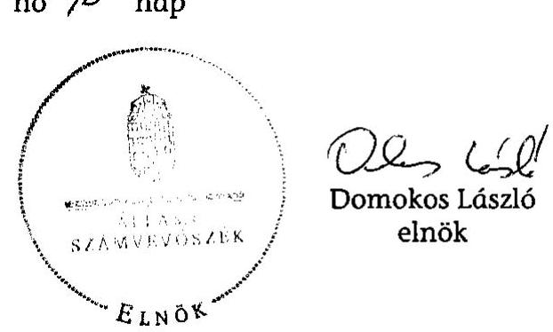
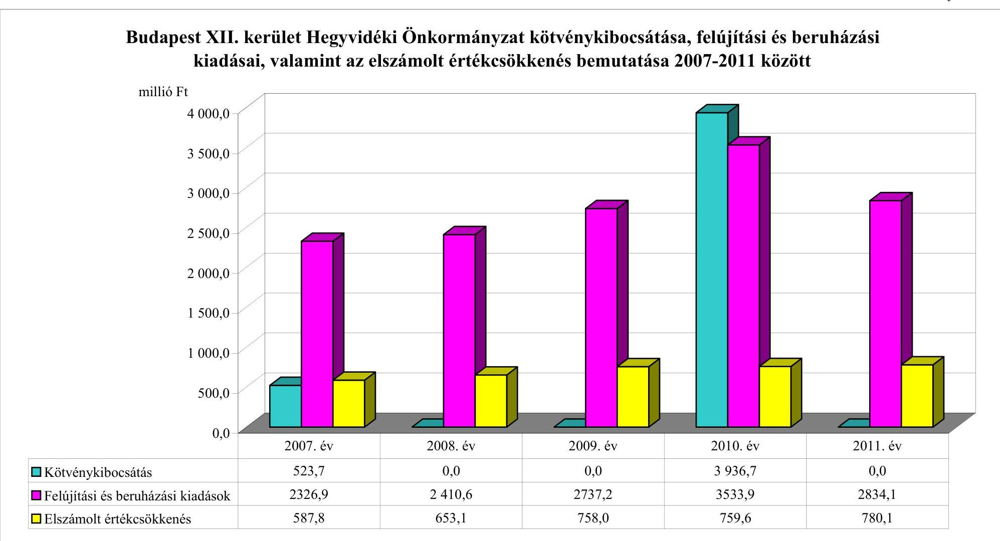
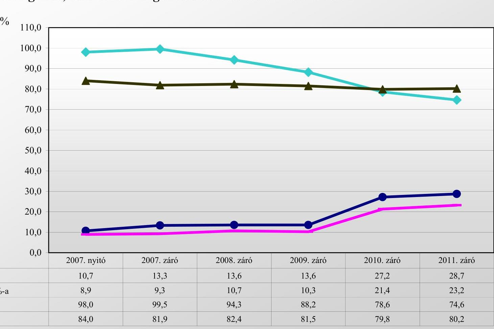
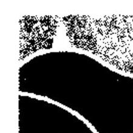
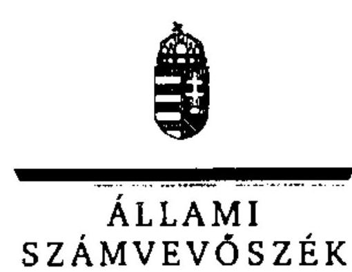

# ÁLLAMI   SZÁMVEVŐSZÉK 

## JELENTÉS

az önkormányzati vagyongazdálkodás szabályszerűségi ellenőrzéséről

Budapest XII. kerület Hegyvidék

---

# Állami Számvevőszék 

Iktatószám: V-0043-020-003-072/2013.
Témaszám: 1082
Vizsgálat-azonosító szám: V061503
Az ellenőrzést felügyelte:
Makkai Mária
felügyeleti vezető
Az ellenőrzést vezette és az ellenőrzés végrehajtásáért felelős:
Páncsics Judit
ellenőrzésvezető
A számvevőszéki jelentés összeállításában közremúködtek:
Marozsán Katalin
számvevő
Szarka Péterné
számvevő vezető főtanácsos
Trenovszki István
számvevő tanácsos
Az ellenőrzést végezték:
Szabó Leonóra Szarvas Szilárd Trenovszki István
számvevő számvevő számvevő tanácsos

A témához kapcsolódó eddig készített számvevőszéki jelentések:
címe
sorszáma
Jelentés a Budapest Főváros XII. kerület Hegyvidék Önkormányzata gazdálkodási rendszerének 2006. évi átfogó ellenőrzéséről
Jelentés a Budapest Főváros XII. kerület Hegyvidéki Önkormányzat 0923
gazdálkodási rendszerének 2009. évi ellenőrzéséről

---

# TARTALOMJEGYZÉK 

BEVEZETÉS ..... 3
I. ÖSSZEGZŐ MEGÁLLAPÍTÁSOK, KÖVETKEZTETÉSEK, JAVASLATOK ..... 5
II. RÉSZLETES MEGÁLLAPÍTÁSOK ..... 11

1. A vagyongazdálkodási tevékenység szabályozottsága ..... 11
1.1. A feladatellátás formáinak meghatározása, a döntések megalapozottsága ..... 11
1.2. A vagyonnal gazdálkodó szervezetek szervezeti rendjének szabályozottsága, a kötelező szabályzatok megfelelősége ..... 12
1.3. A vagyongazdálkodás szabályozása ..... 15
1.4. A vagyonkezeléssel megbízott szervezetek beszámolási kötelezettségének szabályozása ..... 17
2. A vagyongazdálkodás szabályszerűsége ..... 18
2.1. A vagyonnyilvántartás megfelelősége ..... 18
2.2. A vagyongazdálkodást érintő gazdasági események dokumentáltsága ..... 20
2.3. A vagyongazdálkodási döntések, intézkedések szabályszerűsége ..... 21
2.4. A vagyonkezelő beszámoltatása ..... 22
2.5. A közbeszerzési eljárások alkalmazása ..... 22
3. A vagyon változását eredményező gazdasági események szabályszerűsége ..... 23
3.1. A vagyon értékének és összetételének változása ..... 23
3.2. A vagyon fenntartására kialakított rendszer múködésének megfelelősége és szabályozottsága ..... 26
3.3. Hitelfelvétel, kötvénykibocsátás, garancia és kezességvállalás szabályszerűsége ..... 26
3.4. A térítés nélküli átadások szabályszerűsége ..... 27
4. A vagyongazdálkodás szabályszerűségére vonatkozó belső és külső ellenőrzések hasznosulása ..... 27
4.1. A belső ellenőrzés által tett megállapításoknak, javaslatok hasznosulása ..... 27
4.2. A többségi tulajdonban lévő gazdasági társaságok vagyongazdálkodásának felügyelete ..... 29
4.3. A könyvvizsgálat hozzájárulása a vagyongazdálkodás szabályosságához ..... 30
4.4. A külső ellenőrző szervezetek által tett javaslatok hasznosulása ..... 31

---

# MELLÉKLETEK 

1. számú Budapest XII. kerület Hegyvidéki Önkormányzat vagyonának főbb adatai 2007. január 1-je és 2011. december 31-e között
2. számú Budapest XII. kerület Hegyvidéki Önkormányzat kötvénykibocsátása, felújítási és beruházási kiadásai, valamint az elszámolt értékcsökkenés bemutatása 2007-2011 között
3. számú Budapest XII. kerület Hegyvidéki Önkormányzat eladósodásának és az eszközök fedezettségének, használhatóságának alakulása 2007-2011 között
4. számú Budapest Főváros XII. kerület Hegyvidéki Önkormányzat polgármesterének észrevétele
5. számú A polgármester észrevételére adott válasz

## FÜGGELÉKEK

1. számú Rövidítések jegyzéke
2. számú Értelmező szótár

---

# JELENTÉS 

## az önkormányzati vagyongazdálkodás szabályszerűségi ellenőrzéséről

## Budapest XII. kerület Hegyvidék

## BEVEZETÉS

Az ÁSZ kiemelten fontosnak tartja az ÁSZ tv. 5. § (4) bekezdése alapján az önkormányzatok vagyongazdálkodási tevékenységének, a vagyongazdálkodási szabályok betartásának ellenőrzését. Az ellenőrzés feladata, hogy értékelje a vagyongazdálkodással kapcsolatban a jogszabályokban, az önkormányzati belső szabályozásban előírtak érvényesülését a közpénzek felhasználásának átláthatósága, nyilvánossága érdekében. Az ÁSZ ellenőrzése nemcsak az ellenőrzött szervezet vagyongazdálkodásának hibáira, hiányosságaira mutat rá, számon kérve azok kijavítását, hanem megállapításaival, javaslataival segíti a közpénzekkel, a közvagyonnal való felelős gazdálkodást.

Az önkormányzati vagyon alapvető funkciója, hogy a helyi közérdeket és egyúttal az önkormányzati célok megvalósítását szolgálja. A feladatellátás terén elsősorban a kötelezően ellátandó feladatok végrehajtását hivatott szolgálni, amely mellett az önként vállalt feladatok ellátása is megvalósulhat.

## Az ellenőrzés célja annak értékelése volt, hogy az Önkormányzatnál:

- a vagyongazdálkodási tevékenység, annak szervezeti keretei szabályozottak-e;
- a vagyongazdálkodás törvényességét, szabályszerűségét biztosították-e, a vagyon értékének és összetételének változását jogszerű döntésekkel alátá-masztották-e;
- a belső ellenőrzés elősegítette-e a vagyongazdálkodás szabályszerű működését, valamint hasznosultak-e a korábbi külső ellenőrzések által tett javaslatok.

Az ellenőrzés típusa: szabályszerűségi ellenőrzés
Az ellenőrzött időszak: Az ellenőrzés a 2007. január 1. és 2011. december 31. közötti időszakra terjedt ki. A közbeszerzési eljárások lefolytatásának ellenőrzése a 2011. évet és a 2012. év I. negyedévét érintette. Az Nvt. egyes rendelkezései végrehajtásának ellenőrzése a nemzetgazdasági szempontból kiemelt jelentőségű nemzeti vagyonnak minősülő forgalomképtelen vagyonelemek meghatározására, valamint közép- és hosszú távú vagyongazdálkodási terv készítésére terjedt ki 2012. január 1-jétől 2013. március 1-jéig, a helyszíni ellenőrzés befejezéséig.

---

Az ellenőrzés szakmai módszertana az ÁSZ hivatalos honlapján közzétett szakmai szabályokon alapult, amely a Legfőbb Ellenőrző Intézmények Nemzetközi Szervezete (INTOSAI) által kiadott nemzetközi standardok (ISSAI) figyelembevételével készült.

Ellenőriztük az önkormányzati vagyongazdálkodás szabályozottságát, a helyi szabályozások jogszabályi előírásoknak való megfelelőségét (önkormányzati rendeletek, szabályzatok, utasítások) és azok gyakorlati alkalmazását. A vagyonváltozásokkal kapcsolatos gazdasági események közül az ellenőrzött tételeket véletlen mintavétellel választottuk ki a Polgármesteri hivatal 2007-2011. évi számviteli nyilvántartásaiból. Az Önkormányzattól tanúsítványt kértünk a korábbi ÁSZ ellenőrzések vagyongazdálkodásra vonatkozó javaslatainak hasznosulásáról, a könyvvizsgáló és a külső ellenőrzési szervek vagyongazdálkodással kapcsolatos 2007-2011. évi javaslataira tett intézkedésekről, valamint a 2007-2011. évek térítésmentes vagyonátadásairól és átvételeiről.

A jelentéstervezetben alkalmazott rövidítéseket az 1. számú függelék, az egyes fogalmak magyarázatát a 2 . számú függelék tartalmazza.

Budapest XII. kerület Hegyvidéki Önkormányzat állandó lakosainak száma 2011. január 1-jén 59154 fő volt. Az Önkormányzat 18 tagú Képviselőtestületének munkáját 10 állandó bizottság segítette. Az Önkormányzat az önállóan működő és gazdálkodó Polgármesteri hivatalon felül további hat önállóan működő és gazdálkodó, valamint 25 önállóan működő költségvetési szervvel látta el a feladatát. Az Önkormányzatnak négy 100\%-os tulajdonában álló gazdasági társasága ${ }^{1}$ volt.

A polgármester a 2006. évi önkormányzati választások óta tölti be tisztségét. A jegyző személye az ellenőrzött időszakban változott. A jelenlegi jegyző 2011. február 18-ától látja el feladatait.

Az Önkormányzatnak a 2011. évi költségvetési beszámolója szerint 11 944,1 millió Ft költségvetési bevétele volt és 12897,3 millió Ft költségvetési kiadást teljesített. A 2011. december 31-ei könyvviteli mérleg szerint 38 337,1 millió Ft értékű eszközvagyonnal rendelkezett, a hosszú lejáratú kötelezettségek összege 8902,0 millió Ft, a rövid lejáratú kötelezettségeké 2 111,8 millió Ft volt.

A Polgármesteri hivatal 16 szervezeti egységre tagolódott, a foglalkoztatott köztisztviselők száma 2011. december 31-én 252 fő, az Önkormányzat által foglalkoztatott közalkalmazottak száma 1158 fő volt.

Az ÁSZ a 2011. évi LXVI. törvény 29. §-a szerint a jelentéstervezetet megküldte Budapest Főváros XII. kerület Hegyvidéki Önkormányzat polgármesterének egyeztetésre. A beérkezett észrevételt és az arra adott választ a jelentés 4-5. számú mellékletei tartalmazzák.

[^0]
[^0]:    ${ }^{1}$ Fáber Kft., Hágó Kft., MOM NKft., Hegyvidéki Városfejlesztési NKft.

---

# I. ÖSSZEGZŐ MEGÁLLAPÍTÁSOK, KÖVETKEZTETÉSEK, JAVASLATOK 

Az Önkormányzat könyvviteli mérleg szerinti vagyona a 2007. évi 32 266,2 millió Ft nyitó értékről 2011. év végére 38 337,1 millió Ft-ra, 18,8\%kal (6070,9 millió Ft-tal) nőtt. A vagyonnövekedést a befektetett eszközök 7398,1 millió Ft-os növekedése és a forgóeszközök 1327,2 millió Ft-os csökkenése okozta. A 2007-2011. években a felújításokra és beruházásokra fordított kiadások összege ( 13842,7 millió Ft) 3,9-szerese volt az elszámolt értékcsökkenés összegének ( 3538,5 millió Ft). A beruházások, felújítások finanszírozásához 4460,4 millió Ft kötvénykibocsátásból származó forrást vettek igénybe.

Az Önkormányzat saját vagyona 2007-ről 2011-re 28419,7 millió Ft-ról 27 160,8 millió Ft-ra, 4,4\%-kal (1258,9 millió Ft-tal) csökkent, a saját tőke 375,4 millió Ft-os és a tartalékok 883,5 millió Ft-os csökkenésének eredményeként. A vagyon alakulásával kapcsolatos adatokat és mutatószámokat a jelentés 1-3. számú mellékletei részletesen tartalmazzák.

Az ellenőrzött időszakban az Önkormányzat a gazdasági programokban, a 2007-2011. évi költségvetési rendeleteiben, önkormányzati rendeletben és eseti döntéseiben határozta meg a kötelező és az önként vállalt feladatok ellátásának formáját, mértékét és a feladatok ellátásához szükséges intézményrendszert. A Képviselő-testület meghatározta a vagyonnal gazdálkodó, közfeladatot ellátó költségvetési szervek alaptevékenységét, jóváhagyta alapító okiratukat és a szervezeti és múködési szabályzatukat. Az irányítása alá tartozó költségvetési intézmények vagyonkezeléssel kapcsolatos feladata a közszolgáltatás ellátásához rendelt, tartós használatukba adott ingatlanvagyon használatára és bérbeadására terjedt ki.

Az Önkormányzatnál a vagyongazdálkodással kapcsolatos feladatokat, a feladat- és hatásköröket, valamint az eljárási rendet a helyi sajátosságok figyelembevételével a Képviselő-testület rendeletekben és határozatokban, a polgármester és a jegyző ${ }_{1}$, valamint a jegyző által kiadott szabályzatokban/utasításokban szabályozták. Az önkormányzati SZMSZ tartalmazta az Ötv.-ben előírt feladat- és hatásköröket, a Képviselő-testület, a polgármester, alpolgármester, a jegyző és a bizottságok alapvető feladatait, hatásköreit, a testületi ülések előkészítésének és lebonyolításának rendjét, meghatározta a Tulajdonosi Bizottság és a Pénzügyi Bizottság vagyongazdálkodási feladatait. Ezek a bizottságok a számukra az önkormányzati SZMSZ-ben előírt évenkénti beszámolási kötelezettségüknek csak a 2010. évre vonatkozóan tettek eleget. A gazdasági társaságok alapítására vonatkozó előterjesztéseket a Tulajdonosi Bizottság és a Pénzügyi Bizottság véleményezte, azonban az Önkormányzat gazdasági társaságokban való részvételét gazdasági-pénzügyi szempontból önálló napirendként nem értékelték. Az üzleti terv és a beszámoló jóváhagyását a polgármester gyakorolta, így a bizottságok a polgármester eseti előterjesztéseit tárgyalták, szükség esetén hozzájárultak egy-egy döntéshez, vagy támogatták a gazdasági társaságokat érintő képviselő-testületi előterjesztéseket.

---

A Képviselő-testület a vagyongazdálkodási feladatokat a Htv.-ben foglaltaknak megfelelően a teljes vagyoni körre kiterjedően a vagyongazdálkodási és az elidegenítési rendeletben szabályozta. Az Önkormányzat vagyongazdálkodást érintő belső szabályzatai a vagyongazdálkodási és az elidegenítési rendelettel összhangban voltak. A vagyongazdálkodási rendeletben meghatározták az önkormányzati feladatellátást biztosító törzsvagyont, ezen belül a korlátozottan forgalomképes és forgalomképtelen vagyonelemek körét, gondoskodtak annak aktualizálásáról, eleget téve az Ötv.-ben foglaltaknak. A forgalomképesség megváltoztatásának jogát a Képviselő-testület magának tartotta fenn. Az Önkormányzatnál az Nvt.-ben előírtak alapján 2012-ben felülvizsgálták a forgalomképtelen és korlátozottan forgalomképes vagyonelemeket és nemzetgazdasági szempontból kiemelt jelentőségű, nemzeti vagyonnak minősülő vagyonelemeket nem határoztak meg. A Képviselő-testület az Nvt.-ben előírtak alapján a helyszíni ellenőrzés befejezéséig közép- és hosszú távú vagyongazdálkodási tervet még nem fogadott el.

A vagyongazdálkodási rendeletben a vagyonkezelői jog részletes szabályait az Ötv.-ben és az Áht.,-ben előírtak ellenére nem szabályozták. A vagyongazdálkodási rendelet előírásai az ellenőrzött időszakban tartalmazták az önkormányzati vagyon tulajdonjogának ingyenes, vagy kedvezményes átruházási feltételeit, azonban annak eljárás rendjét nem szabályozták. A vagyonkimutatás Áhsz.-ben előírt tartalmának további részletezését, tételes alábontását a Képviselő-testület a vagyongazdálkodási rendeletben szabályozta.

A Számv. tv.-ben és az Áhsz.-ben előírt számviteli politikát és a kapcsolódó szabályzatokat - az érvényesítési feladatok ellátására vonatkozó írásbeli megbízás kivételével - a jogszabályi előírásoknak és a helyi sajátosságoknak megfelelően elkészítették. A Képviselő-testület a mennyiségi felvétellel történő leltározás gyakoriságát az Áhsz.-nek megfelelően kétévenként írta elő a vagyongazdálkodási rendeletben, de az Önkormányzatnál 2009-től nem éltek a tárgyi eszközök kétévenkénti leltározásának lehetőségével, azokat minden évben menynyiségi felvétellel leltározták. A leltározási szabályzat az üzemeltetésre átadott eszközök leltározásának módját a 2007-2009. években az Áhsz.-ben foglaltaknak megfelelően írta elő, de 2010-től az Áhsz.-ben előírt módosítást a leltározási szabályzaton nem vezették át. A 2010-2011. években az Áhsz.-ben foglaltak ellenére az üzemeltetésre átadott eszközök leltározását nem az üzemeltetést végző, hanem az átadó szerv (Polgármesteri hivatal) végezte el. Mindezek ellenére a mérleg valós adatokkal való alátámasztása biztosított volt.

Az Önkormányzatnál 2007-2011 között elkészítették a vagyonkimutatást, és a zárszámadási rendelettervezet előterjesztésekor a Képviselő-testület részére tájékoztatásul bemutatták. A 2007-2011. évi vagyonkimutatások tartalma megfelelt az Áhsz.-ben és a vagyongazdálkodási rendeletben foglaltaknak, mivel az tartalmazta az Önkormányzat és intézményei saját vagyonát tételesen törzsvagyon és törzsvagyonon kívüli egyéb vagyon bontásban.

Az Önkormányzatnál a 2007-2011. években elvégezték a számviteli nyilvántartásban szereplő ingatlanvagyon adatainak az ingatlanvagyon-kataszter adataival való egyeztetését az ingatlanvagyon nyilvántartás és adatszolgáltatás rendjéről szóló kormányrendeletben foglaltak érvényesülése érdekében. A főkönyv, valamint annak adatait alátámasztó analitikus nyilvántartások és az

---

ingatlanvagyon-kataszter bruttó érték adatainak egyezőségét a 2007-2011. években biztosították.

Az ingatlanvagyon-kataszter és a földhivatali nyilvántartás között az egyezőség a 2007-2011. években nem állt fenn. A 2009. évben elvégzett egyeztetés ellenére az egyezőség 2013. március 1-ig továbbra sem volt biztosított, mivel 16 esetben nem történt intézkedés az illetékes földhivatal felé az értékesített ingatlanok nyilvántartásokból történő kivezetésével kapcsolatban.

A Polgármesteri hivatal az Ámr.,-ben előírt gazdálkodási jogkörök gyakorlásának rendjét az összeférhetetlenségi követelményekre figyelemmel határozta meg. A 2007-2009. években a gazdálkodási jogkörök szabályzatában előírtak ellenére a szakmai teljesítésigazolók 269,3 millió Ft bevétel beszedésének elrendelése előtt nem ellenőrizték a bevételek jogosságát, összegszerűségét, a 20072011. években 737,2 millió Ft bevétel beszedését megelőzően nem végezték el az érvényesítéssel, az utalványozással és az utalvány ellenjegyzésével kapcsolatos feladatokat, ennek ellenére az Önkormányzat - az ellenőrzött tételeknél jogosulatlanul bevételt nem számolt el.

A vagyongazdálkodási döntések végrehajtása során betartották a vagyongazdálkodási és az elidegenítési rendeletben és a képviselő-testületi határozatokban foglaltakat. A vagyonváltozáshoz kapcsolódó döntéseknél a döntéshozók az arra felhatalmazott személyek voltak. A vagyonváltozásokról hozott képviselő-testületi döntésekkel azonos tartalmú szerződéseket, megállapodásokat kötöttek, a vagyongazdálkodási és az elidegenítési rendeletben előírtak szerint a vagyonhasznosítási és vagyonértékesítési szerződésekbe beépítették az Önkormányzat érdekeit védő garanciális elemeket.

A 2011. évben és 2012. év I. negyedévében a nyolc közbeszerzési eljárás köteles felújítás és beruházás esetében a becsült érték és az egybeszámítási kötelezettség figyelembe vételével választották ki az alkalmazandó eljárásrendet, és folytatták le a közbeszerzési eljárásokat a Kbt. ${ }_{1,2}$ előírásainak megfelelően. Jogorvoslati eljárást az érdekeltek nem kezdeményeztek.

Az Önkormányzatnál a hitelfelvétel és a kötvénykibocsátás rendjét külön nem szabályozták, de - az Ötv. előírásának megfelelően - a kötvénykibocsátásról a Képviselő-testület határozattal döntött. Az Önkormányzat a 2007-2011. közötti időszakban fejlesztési célú hitelszerződést nem kötött. A 2010. évi kötvénykibocsátások előkészítése és megvalósítása során - az Ötv. előírásai ellenére az Önkormányzat a mindenkori költségvetését és bankszámlája feletti inkaszszójogot ajánlotta fel biztosítékként, amellyel a normatív állami hozzájárulást, az állami támogatást, a személyi jövedelemadót, valamint az államháztartáson belülről múködési célra átvett bevételeket is megjelölték fedezetül. A kötvénykibocsátásból származó forrást a Képviselő-testület által elfogadott fejlesztési céloknak megfelelően használták fel.

Az Önkormányzatnál a közérdekú adatok közzétételi kötelezettségét szabályozták, de a jegyző́, valamint a jegyző a 2007-2011. években ezen kötelezettségének hiányosan tett eleget. A 2007-2011. években az Áht. ${ }_{1}$-ben előírtaknak megfelelően az Önkormányzat honlapján közzétették a nettó ötmillió Ft-ot elérő, vagy azt meghaladó értékű árubeszerzésre, építési beruházásra, szolgálta-

---

tás megrendelésére, vagyonértékesítésre, vagyonhasznosításra vonatkozó szerződések adatait, viszont az Eisztv. mellékletében meghatározott önkormányzati elemi költségvetések és a Számv. tv. szerinti beszámolók közzététele elmaradt. Az Áht.,-ben, az Eisztv.-ben és a közzétételi listákon szereplő adatok közzétételéhez szükséges közzétételi mintákról szóló IHM rendeletben foglaltaknak megfelelően a 2007. és a 2009-2010. években közzétette az általa nyújtott céljellegú működési és fejlesztési támogatások adatait, de 2008. és 2011. években azt elmulasztotta.

A 2007-2011. években a belső ellenőrzés éves ellenőrzési tervei - a Ber. előírásaival összhangban - kockázatelemzésen alapultak. A Polgármesteri hivatalban és az intézményekben 2007-2011 között összesen 15 belső ellenőrzési jelentés érintette a vagyongazdálkodást. A jelentések javaslatokat fogalmaztak meg a szabályzatok kiegészítésére, aktualizálására, a Vagyongazdálkodási Irodára vonatkozó ellenőrzési nyomvonal kialakítására, a kintlévőségek nyilvántartásának naprakész vezetésére, a behajtási tevékenység fokozására, a behajthatatlan követelések leírása kezdeményezésének megalapozottabb indoklására, továbbá a tárgyi eszközök helytelen besorolásának, értékelésének kijavítására. Az ellenőrzöttek intézkedési tervet készítettek a felelősök és a határidő megjelölésével, melyek végrehajtásáról az ellenőrzött szervezet írásos beszámoltatásával győződtek meg. A belső ellenőrzés elősegítette a vagyongazdálkodás szabályszerű működését. A polgármester az Ötv.-ben foglaltaknak megfelelően a Képviselő-testület elé terjesztette a 2007-2011. évi éves ellenőrzési jelentések alapján készített éves összefoglaló ellenőrzési jelentéseket.

Az Önkormányzat a vagyonüzemeltetéssel megbízott önkormányzati tulajdonú gazdasági társaságokkal kötött szerződésekben előírta a feladatellátásról és a gazdasági tevékenységről szóló beszámolási kötelezettséget, melynek azok eleget tettek. Az Önkormányzat gazdasági társaságokba ingatlant, tárgyi eszközöket nem apportált. Az ellenőrzött időszakban a gazdasági társaságok - a Fáber Kft. kivételével - eredményesen gazdálkodtak. A Fáber Kft. 2007. évben 15,9 millió Ft veszteséget mutatott ki, majd az azt követő éveket pozitív eredménnyel zárta. Az Önkormányzat a Kft. tőkehelyzetét 2008. évben vagyonátadással rendezte.

A Képviselő-testület az ügyvezetőket és a felügyelő bizottsági tagokat a tulajdonosi érdekek képviseletéről nem számoltatta be. Az Önkormányzat gazdasági társaságainak felügyelő bizottságai a tevékenységükről a tulajdonosi jogokat gyakorló polgármestert az üléseikről készített jegyzőkönyvek megküldésével tájékoztatták. Beszámolóikat a polgármester - a vagyongazdálkodási rendeletben a tulajdonosi jogok gyakorlására kapott felhatalmazással élve - tulajdonosi határozattal elfogadta.

A 2007-2011. években elvégzett könyvvizsgálat az Önkormányzat egyszerűsített összevont éves költségvetési beszámolóját megbízhatónak és valósnak minősítette. A könyvvizsgáló a jelentéseiben két esetben tett javaslatot az Önkormányzat részére. A javaslatokat az Önkormányzat hasznosította.

Az Önkormányzat gazdálkodási rendszerének 2007. és 2009. évi ÁSZ ellenőrzések javaslatai közül 23 javaslat kapcsolódott a vagyongazdálkodás területéhez. A javaslatok hasznosítására a jegyző ${ }_{1}$ - határidő és felelős megjelölésével -

---

intézkedési tervet készített, amelyet azonban nem terjesztettek a Képviselőtestület elé. A jegyző ${ }_{1}$ nem hasznosította a Számv. tv.-ben foglalt előírások ellenére a részesedések év végi értékelésekor a 2007-2011. években elszámolt értékvesztések számításokkal történő alátámasztására vonatkozó javaslatot. Önkormányzati üzletrészek 2007. és 2008. évi értékvesztését és visszaírását alátámasztó számításokat nem tudták az ellenőrzés számára bemutatni.

Az ÁSZ tv. 33. § (1) bekezdésében foglaltak értelmében a jelentésben foglalt megállapításokhoz kapcsolódó intézkedési tervet köteles az ellenőrzött szervezet vezetője összeállítani és azt a jelentés kézhezvételétől számított harminc napon belül az ÁSZ részére megküldeni. Amennyiben az intézkedési tervet határidőben nem küldi meg a szervezet, vagy az továbbra sem elfogadható, az ÁSZ elnöke a hivatkozott törvény 33. § (3) bekezdés a)-b) pontjaiban foglaltakat érvényesítheti.

Az ellenőrzés intézkedést igénylő megállapításai és javaslatai:

# a jegyzőnek 

1. Az Ötv. 80/B. §-ban előírtak ellenére a vagyonkezelői jog megszerzésének, gyakorlásának és a vagyonkezelés ellenőrzésének részletes szabályait a helyi önkormányzati rendeletben nem szabályozta.

Javaslat:
Készítse elő az Mötv. 109. § (4) bekezdésében előírtak alapján a vagyonkezelői jog ellenértéke, az ingyenes átengedése, a vagyonkezelői jog gyakorlása, valamint a vagyonkezelés ellenőrzése részletes szabályairól szóló rendelettervezetet a képviselőtestület elé terjesztés érdekében.
2. A 2010. évi kötvénykibocsátások fedezetéül az Ötv. 88. § (1) bekezdés b) pontjában foglaltak ellenére a folyó bevételek engedményezésével, illetve az Önkormányzat mindenkori költségvetésével és bankszámlája feletti inkasszójog biztosításával biztosítékként a normatív állami hozzájárulás, az állami támogatás, a személyi jövedelemadó, valamint az államháztartáson belülről müködési célra átvett bevételeket is megjelölték.

Javaslat:
Intézkedjen az Áht. 2 84. § (4) bekezdésével ellentétes állapot megszüntetéséről, a kötvény fedezetéül jogszerű ügyleti biztosíték kijelöléséről.
3. A leltározási szabályzat a 2007-2009. években tartalmazta az üzemeltetésre átadott eszközök leltározásának módját is, de azt az Áhsz. - 2010. január 1-jétől hatályba lépett - 37. § (4) bekezdése előírásainak megfelelően nem módosították. A 20102011. években az üzemeltetésre átadott eszközök leltározását az Áhsz. 37. § (4) bekezdésében foglaltak ellenére nem az üzemeltető által készített és hitelesített leltárral támasztották alá.

---

Javaslat:
a) módosítsa a leltározási szabályzatot az Áhsz. 37. § (4) bekezdésében előírtak alapján, hogy az üzemeltetésre, kezelésre átadott, koncesszióba, vagyonkezelésbe adott eszközöket az államháztartás szervezete az üzemeltetést, kezelést végző szerv által a december 31-ei fordulónapra vonatkozó évenkénti leltározása alapján elkészített, hitelesített és a megállapodásban meghatározott időpontig megküldött leltárral köteles alátámasztani;
b) intézkedjen arról, hogy az Áhsz. 37. § (4) bekezdés előírásának megfelelően a könyvviteli mérlegben kimutatott üzemeltetésre, vagyonkezelésbe adott eszközöket az üzemeltetést, kezelést végző szerv által elkészített, hitelesített leltárral támasszák alá.
4. Az ingatlanvagyon-kataszter és a földhivatali nyilvántartás között az egyezőség a 2007-2011. években nem állt fenn. A 2009. évben elvégzett egyeztetés ellenére az egyezőség 2013. március 1-jéig továbbra sem volt biztosított, mivel 16 esetben nem történt intézkedés az illetékes földhivatal felé az értékesített ingatlanok földhivatali nyilvántartásból való kivezetésére.

Javaslat:
Intézkedjen, hogy a 147/1992. (XI. 6.) Korm. rendelet 1. § (2) bekezdésében rögzítetteknek megfelelően az ingatlanvagyon kataszter adatai egyezzenek meg a földhivatal ingatlan-nyilvántartásának azonos tartalmú adataival.
5. Az Önkormányzat a 2008. és a 2011. években nem tette közzé honlapján az Eisztv. 6. § (1) bekezdéséhez rendelt mellékletben, valamint az Áht. ${ }_{1}$ 15/A. § (1) bekezdésében előírtak ellenére az általa nyújtott nem normatív, céljellegű, működési és fejlesztési támogatások kedvezményezettjeinek nevét, a támogatás célját, összegét, a támogatási program megvalósítási helyét. Az Eisztv. 6. § (1) bekezdéséhez rendelt mellékletben előírtak ellenére nem tette közzé honlapján a 2007-2011. évek éves (elemi) költségvetését és a számviteli törvény szerinti költségvetési beszámolóit.

Javaslat:
Intézkedjen az információs önrendelkezési jogról és az információszabadságról szóló 2011. évi CXII. törvény 1. számú mellékletében meghatározott adatok közzétételéről.

---

# II. RÉSZLETES MEGÁLLAPÍTÁSOK 

## 1. A VAGYONGAZDÁLKODÁSI TEVÉKENYSÉG SZABÁLYOZOTTSÁGA

### 1.1. A feladatellátás formáinak meghatározása, a döntések megalapozottsága

A 2007-2011. években a gazdasági program ${ }_{1,2}$ rögzítette az ágazati feladatokat, a feladatellátással kapcsolatos fejlesztés fő irányait, a jelentős fejlesztési feladatokat és azok forrásait. A Képviselő-testület a 2010. évi önkormányzati választásokat követően az Ötv.-ben meghatározott időn belül - 2011 áprilisában jóváhagyta a 2011-2014. évekre szóló gazdasági program ${ }_{3}$-at a 46/2011. (IV. 28.) számú határozatával. A gazdasági program ${ }_{1,2,3}$-ban, a 2009. évi vagyongazdálkodási koncepcióban és a 2007-2011. évi költségvetési rendeletekben rögzítették az Ötv. 8. § (1) bekezdése ${ }^{2}$, illetve a 63. § (1) és (2) bekezdése, valamint az ott meghatározott feladatokat szabályozó ágazati jogszabályok előírásai alapján az Önkormányzat intézményeit és az ellátott feladataik mértékét.

A Képviselő-testület az Önkormányzat kötelező és önként vállalt feladatairól szóló 37/2007. (XII. 20.) számú rendeletében határozta meg az Ötv.-ben és az ágazati jogszabályokban számára megállapított kötelező feladatokat. Az önként vállalt feladatok és az azokkal kapcsolatos képviselő-testületi döntések felsorolását, valamint ellátásuk módját, mértékét a rendelet függeléke tartalmazta. Az önkormányzati SZMSZ meghatározta, hogy a törvényekben előírt kötelező feladatokat meghaladó feladat és hatáskör az Ötv.-ben meghatározott módon kerülhet az Önkormányzat feladat és hatáskörébe, de az erre vonatkozó döntések átruházását csak általánosságban határozta meg.

Az Önkormányzat önként vállalt feladatként látta el a gyermekes családok, a Budapest Hegyvidéki Kamarazenekar, az Angelica Leánykar, illetve a kerületi rendezvények támogatását, továbbá a társasházak támogatását a járdák síkos-ság-mentesítéséhez.

Az Önkormányzat költségvetési szerveinek száma a 2007. január 1-jei állapothoz viszonyítva 2011. december 31-re kettővel csökkent. A Képviselő-testület a feladatellátások szervezeti formáinak módosításáról, az intézmények megszüntetéséről a gazdaságossági indokokat figyelembe véve határozott.

A képzés színvonalának emelését egyetemi háttér bevonásával oldották meg. A Kiss János Általános és Középiskola 2007. augusztus 1-jétől jogutód nélkül történő megszüntetésére tett javaslatot - a múködését biztosító ingatlanvagyonnak az ELTE részére 25 évre történő, ingyenes használatba átadásával egyidejúleg - a Képviselő-testület elfogadta. Az előterjesztés részletesen ismertette a megszüntetéssel járó feladatokat, valamint a költségvetésre gyakorolt hatásként bemutatta

[^0]
[^0]:    ${ }^{2}$ 2013. január 1-jétől az Mötv. 13. § (1) bekezdése szabályozza

---

az ELTE részére évente fizetendő hozzájárulást és a korábbi évek mintegy 200 millió Ft állami normatíván felüli fenntartási kiadását, melynek egyenlegeként évente 150 millió Ft megtakarítást vártak el. Az ingatlanvagyon a szükséges felújítások vállalásával az önkormányzat tulajdonában maradt.

A Hegyvidéki Művelődési Központot a Képviselő-testület 131/2010. (VI. 24.) számú határozatával 2010. augusztus 31-től megszüntették, amit az előterjesztés szerint az is indokolt, hogy NKft.-ként rugalmasabban tud gazdálkodni, valamint pályázatok útján olyan forrásokhoz is hozzájuthat, amelyeket költségvetési szervként kisebb eséllyel tudna elnyerni. Közfeladatait 2010. szeptember 1-jétől a Képviselő-testület 74/2010. (III. 18.) számú határozatával - 500,0 ezer Ft törzstőkével - alapított MOM NKft. közművelődési megállapodás alapján látta el. A feladatok ellátásához szükséges vagyont az Önkormányzat bérleti dí ellenében biztosította a MOM NKft. részére.

Az Önkormányzatnál a fogyatékos személyek nappali ellátását 2009. év végéig társulás útján látták el, a 2010. évtől fenntartói hozzájárulás helyett az igénybe vett szolgáltatás ellenértékének megfizetéséről döntöttek. A társulási megállapodás felmondását gazdaságossági elemzés előzte meg, mely szerint a döntéssel évente a korábbi kiadások felét megtakarítják. A változtatás nem járt vagyonváltozással.

Az Önkormányzat a Társulásba nem vitt be vagyont. A feladatellátáshoz szükséges ingatlant Budapest Főváros Önkormányzata biztosította a Társulás számára. A múködtetés során az Önkormányzat az épület kazánjának felújításhoz 1,5 millió Ft-tal, a tetőszerkezet felújításához 6,9 millió Ft-tal és az akadálymentesítéshez 2,7 millió Ft-tal járult hozzá. Ezek a felújítások az ingatlanra kerültek aktiválásra, a Társulás megszűnése esetén az ingatlannal együtt a Fővárosi Önkormányzat tulajdonába kerülnek vissza.

A Képviselő-testület a 2007-2011. években a közszolgáltatások ellátásának biztosítása érdekében a MOM NKft. létrehozásán kívül még egy gazdasági társaság alapításáról döntött.

A Képviselő-testület 65/2008. (V. 15.) számú határozatával 600 ezer Ft törzstőkével, $75 \%$-os tulajdoni részesedéssel megalapította a Hegyvidék Városfejlesztési NKft.-t, majd 2009. augusztus 18 -tól a társaságban $100 \%$-os tulajdonos lett.

Az Önkormányzat az ellenőrzött időszakban gazdasági társaságainak átalakításáról, illetve megszüntetéséről nem hozott döntést. Az ellenőrzött időszakban a Képviselő-testület nem vállalt át a Fővárosi Önkormányzat feladat- és hatáskörébe tartozó közszolgáltatás szervezését, ellátását.

# 1.2. A vagyonnal gazdálkodó szervezetek szervezeti rendjének szabályozottsága, a kötelező szabályzatok megfelelősége 

Az önkormányzati SZMSZ tartalmazta az Ötv.-ben előírtak szerint a Képviselőtestület, a bizottságok, a polgármester, az alpolgármester és a jegyző alapvető feladatait és hatásköreit, a testületi ülések előkészítésének és lebonyolításának rendjét. Előírta a vagyonszerzésre, vagy elidegenítésre vonatkozó előterjesztések előzetes véleményezésre történő megküldését a Tulajdonosi Bizottság részére, a bizottságok feladatait meghatározó melléklet részletezte az önkormányzati vagyonnal való gazdálkodásban betöltött szerepüket.

---

A Képviselő-testület a vagyongazdálkodással kapcsolatos feladatait és hatásköreit, valamint élve az Ötv. 9. § (3) bekezdésében ${ }^{3}$ biztosított jogával a vagyongazdálkodással kapcsolatos hatáskörök átruházását és azok gyakorlásának részletes szabályait a vagyongazdálkodási, valamint az elidegenítési rendeletben határozta meg.

A Képviselő-testület az önkormányzati SZMSZ 40. § (3) bekezdésében szabályozta a bizottságok évenkénti beszámolási kötelezettségét a végzett munkájukról. 2008 novemberétől a Tulajdonosi Bizottságnak előírta, hogy az átruházott hatáskörben meghozott döntésekről 30 napon belül, írásban számoljon be. Az önkormányzati SZMSZ 3. számú melléklete a Tulajdonosi Bizottságnak az Önkormányzat gazdasági társaságaiban történő részvételével összefüggésben írt elő feladatokat, továbbá meghatározta az önkormányzati vagyon kezelésével, múködtetésével foglalkozó szervezet kialakítására vonatkozó javaslattételi jogkörét. A Pénzügyi Bizottságnak előírta a vagyonváltozás alakulásának figyelemmel kísérését. Az előírt évenkénti beszámolási kötelezettség ellenére mindkét bizottság mindössze a 2010. évi munkájáról számolt be a Képviselőtestületnek.

A Polgármesteri hivatal belső szervezeti tagozódását, munka- és ügyfélfogadási rendjét a Képviselő-testület 194/2004. (VII. 20.) számú határozatával állapították meg az önkormányzati SZMSZ 65. § (2) bekezdésében meghatározottak szerint.

A jegyző ${ }_{1}$ által készített hivatali Ügyrendet a polgármester hagyta jóvá az önkormányzati SZMSZ 65. § (3) bekezdésében kapott felhatalmazás alapján, ami az előírásoknak és a helyi sajátosságoknak megfelelően tartalmazta a Polgármesteri hivatal vagyongazdálkodási feladatait az Önkormányzat munkájának szervezésében, a döntések előkészítésében és végrehajtásában. A Polgármesteri hivatalon belüli munkamegosztásban a Vagyongazdálkodási Iroda feladatkörébe tartozott az Önkormányzat vagyonával kapcsolatos döntések előkészítése és a döntések végrehajtása.

A hivatali Ügyrend tartalmazta a Polgármesteri hivatal szervezeti felépítését, de nem tartalmazta az Ámr. ${ }_{1,2}$ előírásainak ${ }^{4}$ megfelelően az alaptevékenységet szabályozó jogszabályok megjelölését, a szervezeti ábrát, a Polgármesteri hivatalhoz rendelt költségvetési szervek felsorolását. A hivatali Ügyrendben nem határozták meg a szervezeti egységek engedélyezett létszámát, hiányosan tartalmazta az egyes munkakörökhöz rendelt helyettesítés rendjét és a szervezeti egységek közül nem nevesítették a gazdasági szervezetet. A jegyző ${ }_{1}$ a 2008. július 1-jén kiadott Pénzügyi és Költségvetési Iroda ügyrendjének általános rendelkezéseiben gazdasági szervezetként az Irodát nevesítette.

A gazdálkodási jogkörök gyakorlásának rendjét, az összeférhetetlenségi követelményeket a gazdálkodási jogkörök szabályzatában határozták meg. A jegy-

[^0]
[^0]:    ${ }^{3}$ 2013. január 1-jétől az Mötv. 41. § (4) bekezdése szabályozza
    ${ }^{4}$ 2010. január 1-jéig az Ámr. ${ }_{1}$ 10. § (4) bekezdése, 2011. december 31-ig az Ámr. ${ }_{2}$ 20. § (2) bekezdése, 2012. január 1-jétől az Ávr. 13. § (1) bekezdése írta elő, hogy az SZMSZnek mit kell kötelezően tartalmaznia.

---

ző1 és a jegyző gondoskodott a szakmai teljesítésigazolást végzők kijelöléséről, valamint az összeférhetetlenségi követelmények teljesítéséről. A gazdálkodási jogkörök szabályzatának melléklete tartalmazta az érvényesítési feladattal megbízott személyek aláírási mintáját, azonban a jegyzö ${ }_{1}$, illetve a jegyző az Ámr. ${ }_{1}$ 135. § (4) bekezdésében, valamint az Ámr. ${ }_{2}$ 77. § (4) bekezdésében előírtak ${ }^{5}$ ellenére nem adott írásbeli megbízást az érvényesítési feladatok ellátására.

A Képviselő-testület a vagyonnal gazdálkodó, közfeladatot ellátó költségvetési szervek alaptevékenységét meghatározta, határozatban jóváhagyta alapító okiratukat valamint szervezeti és múködési szabályzatukat. Az ellenőrzött intézményi alapító okiratok, valamint szervezeti és múködési szabályzatok tartalmazták az általuk ellátandó közfeladatokat. Az alapító okiratokban előírták, hogy a tartós használatba adott vagyon a közfeladatok ellátására szolgál, viszont a szervezeti és múködési szabályzatok a vagyongazdálkodásról rendelkezést nem tartalmaztak.

A Vagyongazdálkodási Iroda vagyongazdálkodással kapcsolatos feladatait a hivatali Ügyrend meghatározta, a részfeladatokat ellátó GESZ alapító okirata, valamint szervezeti és múködési szabályzata az intézmény saját feladatait tartalmazta. A GESZ és a hozzá rendelt intézmények közötti munkamegosztás és felelősségvállalás rendjét megállapodások szabályozták, amelyeket a Képviselőtestület felhatalmazása alapján a polgármester hagyta jóvá. A GESZ alapító okiratának, valamint szervezeti és múködési szabályzatának aktualizálása folyamatosan megtörtént.

A Képviselő-testület a kétévenkénti mennyiségi leltározást az Áhsz. 37. § (7) bekezdése alapján a vagyongazdálkodási rendelet 14. § (3)-(6) bekezdéseiben 2007. június 18 -ától előírta, de a 2009. évtől ezzel a lehetőséggel nem éltek, minden évben mennyiségi leltározással támasztották alá a beszámolót. A leltározási szabályzat a 2007-2009. években tartalmazta az üzemeltetésre átadott eszközök leltározásának módját, de azt az Áhsz. - 2010. január 1-jétől hatályba lépett - 37. § (4) bekezdése előírásainak megfelelően nem aktualizálták, nem írták elő az üzemeltetést végző szerv által a december 31-ei fordulónapra vonatkozó évenkénti leltározás alapján elkészített, hitelesített leltár határidőre történő megküldését.

A vagyonnal való gazdálkodással összefüggő szerződésekre, a céljellegú múködési és fejlesztési támogatásokra, az Önkormányzat költségvetésére, valamint a költségvetési beszámolókra, a zárszámadásra vonatkozó nyilvánosság biztosításának eszközeit, a nyilvánosságra hozatal módját, felelőseit a 3/2003. jegyzői utasításban, majd a 2/2008. polgármesteri-jegyzői együttes utasításban határozták meg az Áht. ${ }_{1}$ 15/A. és 15/B. §-ának, az Eisztv. 21. §-ának ${ }^{6}$ és a 18/2005. (XII. 27.) IHM rendelet 2. számú mellékletének megfelelően. Az utasítások részletesen meghatározták a feladatokat, a felelősöket, a teljesítés ellenőrzésének és az arról való beszámolásnak a rendjét is.

[^0]
[^0]:    ${ }^{5}$ 2012. január 1-jétől az Ávr. 57. § (4) bekezdése szabályozza
    ${ }^{6}$ 2012. január 1-jétől az Info tv. 1. számú melléklete szabályozza

---

# 1.3. A vagyongazdálkodás szabályozása 

A Képviselő-testület a vagyongazdálkodási feladatokat a Htv. 138. § (1) bekezdésének j) pontjában foglaltak szerint a teljes vagyoni körre vonatkozóan szabályozta a vagyongazdálkodási és az elidegenítési rendeletben, összhangban az Ötv. és az Áht. ${ }_{1}$ elöírásaival. Meghatározták az önkormányzati feladatellátást biztosító törzsvagyont, ezen belül a korlátozottan forgalomképes és forgalomképtelen vagyonelemek körét, gondoskodtak annak aktualizálásáról, eleget téve az Ötv. 80/A. § (1) bekezdésében ${ }^{7}$ foglaltaknak.

Az Önkormányzat vagyongazdálkodást érintő belső szabályzatai a vagyongazdálkodási és az elidegenítési rendelettel összhangban voltak. A vagyongazdálkodási rendelet előírásai tartalmazták, hogy milyen feltételek esetén kerülhet sor önkormányzati vagyon tulajdonjogának, valamint önállóan forgalomképes vagyoni értékű jogoknak ingyenes, vagy kedvezményes átruházására, amelynek döntési jogkörét a Képviselő-testület nem ruházta át. A forgalomképesség megváltoztatásának jogát is fenntartotta magának a Képviselő-testület. Az önkormányzati vagyon meghatározott részének elidegenítését, megterhelését, vállalkozásba vitelét a Képviselő-testület nem kötötte helyi népszavazáshoz, nem élt az Ötv. 80. § (2) bekezdésében biztosított lehetőséggel.

A Képviselő-testület a vagyonkezelői jog részletes szabályait az Ötv. 80/B. §-ában ${ }^{8}$ és az Áht. ${ }_{1} 105 /$ A.-D. §-aiban előírtak ellenére rendeletben nem írta elő. A Képviselő-testület a gazdasági program ${ }_{1,2,3}$-ban deklarálta, hogy vagyonkezelői szerződést nem kíván kötni. Az önkormányzati intézmények alapító okiratában korlátozott hasznosítást (bérbeadás) határoztak meg az általuk használt vagyon tekintetében. Az Önkormányzat tulajdonában álló lakás és nem lakás céljára szolgáló helyiségek üzemeltetése a GESZ feladata volt, a GESZ szervezeti és múködési szabályzatának 4.3. pontjában megfogalmazottak szerint.

A vagyontárgyak feletti rendelkezési jogot a vagyongazdálkodási rendeletben vagyontípusonként, értékhatárhoz kötötten osztották meg a Képviselő-testület, a Tulajdonosi Bizottság és a polgármester között.

A forgalomképtelen törzsvagyon bérbe-, használatba adása 2007. június 18-ig a Polgármesteri hivatal feladatkörébe tartozott. Ezt követően 150 millió Ft felett a Képviselő-testület saját hatáskörben döntött, ezen összeg alatt a polgármestert hatalmazta fel a döntés meghozatalára a Tulajdonosi Bizottság egyetértésével. A helyi közutak és műtárgyalk esetén koncessziós pályázat kiírásának és elbírálásának jogát az ellenőrzött időszakban a Képviselő-testület magának tartotta fenn.

A korlátozottan forgalomképes ingó vagyontárgyak szerzése, elidegenítése, megterhelése, gazdasági társaságba való bevitele tekintetében a döntési kompetenciákat értékhatárhoz kötve gyakorolták. 200 ezer Ft alatt az intézményvezetők, a 2 millió Ft-ig a polgármester, 20 millió Ft-ig a Tulajdonosi Bizottság és 20 millió Ft felett pedig a Képviselő-testület döntött. Az intézmények és a Polgár-

[^0]
[^0]:    ${ }^{7}$ 2012. január 1-jétől az Mötv. 109. §-a szabályozza
    ${ }^{8}$ 2012. január 1-jétől az Mötv. 109. § (4) bekezdése írja elő

---

mesteri hivatal a használatukban lévő, korlátozottan forgalomképes vagyont bérbe adhatták, amit a vagyongazdálkodási rendelet 10. § (1) bekezdésében egy évet meghaladóan a polgármester előzetes hozzájárulásához kötöttek.

A forgalomképes vagyon szerzését, elidegenítését, bérbeadását, illetve használatba adásának jogkörét a 2007. június 18. utáni időszakban 150 millió Ft egyedi értékhatár felett a Képviselő-testület, alatta a polgármester gyakorolta. Az ellenőrzött időszakban a polgármester gyakorolta a gazdasági társaságokban a meglévő önkormányzati tulajdonú tőkerészesedéshez kapcsolódó jogokat és döntött az önkormányzati vagyon alkalmi, 30 napot nem meghaladó hasznosításáról.

A Képviselő-testület a vagyongazdálkodási rendeletben 2009 júniusától felhatalmazta a polgármestert minden évben július 1-je és szeptember 15-e közötti időszakra a nem törzsvagyon körébe tartozó vagyontárgy szerzésére azzal, hogy ezen időszakot követő első testületi ülésen a döntéseiről tájékoztatnia kell a Kép-viselő-testületet.

A Képviselő-testület a vagyongazdálkodási rendelet 13. §-ában 2007 júniusától a 20 millió Ft egyedi értékhatár feletti, 2008 novemberétől a mindenkori költségvetési törvényben meghatározott egyedi versenyeztetési értékhatárt meghaladó esetekben a vagyontárgyak elidegenítését, hasznosítását nyilvános, vagy indokolt esetben zártkörű versenyeztetési eljárás lefolytatásához kötötte. 2007 júniusától a hasznosításra szánt vagyon forgalmi értékének megállapítására a vagyongazdálkodási rendelet 6/A. §-ában és az elidegenítési rendelet 14. § (1) bekezdésében és 23. §-ában értékbecslés készítésének kötelezettségét írta elő.

Az elidegenítési rendelet a lakások és nem lakás céljára szolgáló helyiségek nem bérlő részére történő elidegenítését 2007. június 18-ig árverés, ezt követően 20 millió Ft felett versenytárgyalás lefolytatásához kötötte. Ezen értékhatár alatt a Képviselő-testület felmentést adott a versenyeztetés alól. A nem a bérlő részére történt értékesítésre 2008. november 19-től a vagyongazdálkodási rendeletben foglaltakkal azonos szabályozást adtak ki. A versenyeztetés/árverés szabályait 2007. június 18 -ig az elidegenítési rendelet mellékletében részletezték, ezt követően annak részleteit nem tartották szükségesnek rendeletben szabályozni a rendelet módosításának előterjesztése szerint.

2007 júniusától a versenytárgyalás lebonyolítását végző ügyvédi iroda által alkalmazott eljárási rend adott ügyre aktualizált, a polgármesterrel jóváhagyatott változata szerint bonyolították a versenytárgyalásokat.

A vagyongazdálkodást érintő előterjesztések készítésének, véleményezésének, megtárgyalásának és döntéshozatalának rendjét az önkormányzati SZMSZ-ben meghatározták az Ötv. 18. § (1) bekezdése és a 23. § (1) bekezdése szerint. A vagyongazdálkodással kapcsolatos szabályozás, a döntés-előkészítési és a döntési dokumentáció tartalmának előírásai a döntések megalapozottságát mind a vagyongazdálkodás, mind az elidegenítések során biztosították. A vagyongazdálkodási döntések előkészítési folyamatában a költség-haszon elemzés készítésének kötelezettségét az önkormányzati SZMSZ csak több döntési alternatíva esetére írta elő.

Az Önkormányzat nem rendelkezett belső szabályzattal a finanszírozási célú pénzügyi műveletek pénzügyi kockázatai (kamat-, árfolyam-, visszafizetési

---

kockázat) felmérésére, illetve a hitelfelvételről, kötvénykibocsátásról szóló dön-tés-előkészítés folyamatában a futamidő egyes éveit terhelő kötelezettség költségvetési egyensúlyra gyakorolt hatásának vizsgálatára.

Az éves költségvetési koncepció és az éves költségvetés készítésére, módosítására, valamint a beszámoló készítésére vonatkozó szabályokat a Polgármesteri hivatal 2008. július 1-jén kiadott gazdálkodási ügyrendje tartalmazta. A zárszámadási rendelet kötelező mellékletét képező vagyonkimutatás előírt tartalmának további részletezését, tételes alábontását az Áhsz. 44/A. § (2) bekezdésében foglaltaknak megfelelően a vagyongazdálkodási rendelet 2. számú mellékletében szabályozták, ami előírta a törzsvagyon, ezen belül a forgalomképtelen és korlátozottan forgalomképes, illetve az üzleti (forgalomképes) vagyon elkülönített bemutatását.

A Képviselő-testület az Önkormányzat ingatlanvagyonának forgalomképesség szerinti besorolását - az Nvt. 5. §-ának megfelelően - 2012-ben felülvizsgálta. A vagyongazdálkodási rendeletét a törvényi előírással összefüggésben módosította, változás csak a megnevezésekben történt. A Képviselő-testület a 12/2012. (III. 1.) számú határozatában úgy döntött, hogy az Önkormányzat forgalomképtelen vagyonából nemzetgazdasági szempontból kiemelt jelentőségű nemzeti vagyonnak minősülő vagyonelemeket nem határoz meg. A Kép-viselő-testület az Nvt. 9. § (1) bekezdésében előírtak alapján a helyszíni ellenőrzés befejezéséig közép- és hosszú távú vagyongazdálkodási tervet még nem fogadott el.

A Vagyongazdálkodási Iroda a vagyongazdálkodási ügyekért felelős aljegyzö ${ }_{3}$ (aki egyben az Iroda vezetője) irányításával az Nvt.-ben foglaltak alapján 2012 decemberében vagyongazdálkodási tervet készített, melyben az önkormányzati vagyongazdálkodás közép- és hosszú távú stratégiáját vázolták fel. A dokumentum a Képviselő-testület elé nem került beterjesztésre. Az 1/2013. polgármesterialjegyzői együttes utasítás meghatározta a koncepció által vázolt elképzelések megvalósítását szolgáló jogalkotási javaslatok és intézkedési tervek szervezeti egységekre bontását, valamint végrehajtásának részletkérdéseit.

Az Önkormányzat az ellenőrzött időszakban egy esetben adott át vagyontárgyat tőketartalék címen vállalkozásának. A saját gazdasági társaságai részére a jegyzett tőkét pénzbeli hozzájárulásként biztosította. A vállalkozásba adott vagyontárgy hasznosítására, az eszköz használatára, továbbadására vonatkozó elvárásokat, követelményeket, korlátokat nem határozták meg.

# 1.4. A vagyonkezeléssel megbízott szervezetek beszámolási kötelezettségének szabályozása 

Az Önkormányzat az Ötv.-ben és az Áht. ${ }_{1}$-ban szabályozottak szerint vagyonkezelői szerződést az ellenőrzött időszakban nem kötött.

A Képviselő-testület az intézményeknek a feladatok ellátásához szükséges ingatlanvagyont az alapító okirataikban kizárólagos használatba adta, amelyet a könyvviteli mérlegükben nyilvántartásba vettek. Az Önkormányzat 21 intézménye részére az alapító okiratban engedélyezték - az alapfeladat ellátásának sérelme nélkül - a használatukban lévő ingatlan bérbeadását, a vagyongazdálkodási rendelet előírásai szerint. A bérbeadási tevékenység arányának

---

felső határát az intézményenként meghatározott 5-20\%-os mértékben határozták meg.

Az Önkormányzat társaságai részére az általuk kezelt, illetve üzemeltetett vagyonnal való elszámolást az üzemeltetési és a közszolgáltatási szerződésekben előírták.

# 2. A VAGYONGAZDÁlKODÁs SZABÁLYSZERŰSÉGE 

### 2.1. A vagyonnyilvántartás megfelelősége

Az Önkormányzatnál 2007-2011. között az Ötv. 78. § (2) bekezdésének ${ }^{9}$ megfelelően minden évben elkészítették a vagyonkimutatást és azt a zárszámadási rendelettervezet előterjesztésekor - az Áht.; 118. § (2) bekezdés 2. c) pontjában előírtak szerint - a Képviselő-testület részére tájékoztatásul bemutatták. A vagyonkimutatások tartalma megfelelt az Áhsz. 44/A. § (1) és (2) bekezdéseiben foglaltaknak, mert tartalmazta az Önkormányzat és intézményei saját vagyonát tételesen, törzsvagyon és törzsvagyonon kívüli, egyéb vagyon bontásban. Az Önkormányzatnál az Ötv. 78. § (2) bekezdésében foglalt előírásnak megfelelően gondoskodtak a törzsvagyon (ezen belül a forgalomképtelen, illetve a korlátozottan forgalomképes) és az egyéb vagyon részét képező eszközök nyilvántartásokban történő elkülönítéséről. Az elkülönített nyilvántartást a főkönyvi számlák alábontásával, valamint a számlákhoz kapcsolódó analitikus nyilvántartások vezetésével biztosították. A főkönyvi és az analitikus nyilvántartások között az egyezőség fennállt.

Az Önkormányzatnál a 2009. évben dokumentáltan egyeztették az ingatlanvagyon kimutatást a közhiteles nyilvántartás (az illetékes földhivatal) adataival az Áhsz. 49. § (3) bekezdésében foglaltaknak megfelelően, valamint a 147/1992. (XI. 6.) Korm. rendelet 1. § (2) bekezdésében foglalt egyezőség biztosítása érdekében. Az egyeztetés és kiértékelés ellenére az Önkormányzat ingat-lanvagyon-katasztere és a földhivatali nyilvántartás közötti egyezőség 2013. február végéig nem állt fenn. A pénzügyi irodavezető az egyeztetés eredményéről írásban - a 2009. november 2-án kelt levelében - tájékoztatta a Városgazdálkodási Iroda vezetőjét, melyben intézkedésüket kérte a kimutatott 28 db ingatlannal kapcsolatos eltérés rendezésére. Az Önkormányzat részéről 2013. február végéig 16 esetben nem történt intézkedés az illetékes földhivatal felé az értékesített ingatlanok nyilvántartásokból történő kivezetésével kapcsolatban.

Az intézkedések 42,8\%-ban ( 12 db ingatlan esetén) jártak eredménnyel. 10 db ingatlannal kapcsolatosan az Önkormányzat megállapította, hogy azok 19931994. évben értékesítésre kerültek, azokat az Önkormányzat kataszteri nyilvántartásából kivezették, ugyanakkor a földhivatali nyilvántartásokban továbbra is önkormányzati tulajdonként szerepeltek. A fennmaradó 6 db ingatlan tulajdonjogának tisztázásával egy ügyvédi irodát bíztak meg.

[^0]
[^0]:    ${ }^{9}$ 2012. január 1-jétől az Mötv. 110. § (1)-(2) bekezdése szabályozza

---

A vagyoncsökkenéssel kapcsolatosan ellenőrzött ingatlanértékesítések esetében az ingatlankataszteri nyilvántartásban az átvezetések megtörténtek a földhivatali határozatok, illetve a tulajdoni lapok alapján.

Az Önkormányzatnál a 2007-2011. években elvégezték a számviteli nyilvántartásban szereplő ingatlanvagyon adatainak az ingatlanvagyon-kataszter adataival való egyeztetését a 147/1992. (XI. 6.) Korm. rendelet 1. § (3) bekezdésében foglaltak érvényesülése érdekében. A 2007. évben a leltározást a vagyongazdálkodási rendeletben engedélyezett kétévenkénti leltározás lehetőségével élve végezték. A 2009. évben és azt követő években ezzel a lehetőséggel nem éltek. A 2009-2011. években december 31-ei fordulónappal eleget tettek az Áhsz. 37. § (1) bekezdésében, továbbá a leltározási szabályzatban előírt leltározási kötelezettségüknek.

A leltározás során az egyeztetést elvégezték. A fókönyv, valamint annak adatait alátámasztó analitikus nyilvántartások és az ingatlanvagyonkataszter bruttó érték adatainak egyezőségét a 2007-2011. években biztosították. Az egyeztetés tényét minden évben az ingatlanvagyonkataszteri nyilvántartás adataiból, az egyedi nyilvántartó lapokról, a leltárból és a főkönyvi számlák adataiból készített összesítő kimutatásokkal dokumentálták.

Az Önkormányzat az Áhsz. 37. § (2) bekezdésében foglaltaknak megfelelően a 2007-2011. években leltárral támasztotta alá a mérlegben kimutatott, üzemeltetésre átadott eszközök állományi értékének valódiságát. A 2007-2009. évek között az üzemeltetésre átadott eszközök esetében a leltárfelvétel az Áhsz. 37. § (3) bekezdésében foglaltaknak megfelelően az üzemeltetésre átadó részéről mennyiségi számbavétellel megtörtént. A 2010-2011. években az üzemeltetésre átadott eszközök leltározását az Áhsz. 37. § (4) bekezdésében foglaltak ellenére nem az üzemeltető által készített és hitelesített leltárral támasztották alá.

Az Önkormányzatnál a 2007-2011. évek között a könyvviteli mérleg egyes sorainak értéke - az üzemeltetésre, kezelésre átadott eszközök vonatkozásában is - megegyezett a záró főkönyvi kivonat vonatkozó főkönyvi számláinak értékével. Az Önkormányzat az ellenőrzött időszakban 369 ezer Ft összegben nem tett eleget a Számv. tv. 15. § (3) bekezdésében előírt valódiság elvének ${ }^{10}$, valamint az Áhsz. 22. § (8) bekezdésében előírtaknak, mivel azok egy 2003. évi nyitó függő tételt tartalmaztak, amelyre vonatkozó leltárt nem tudták alátámasztani alapbizonylattal, tartalma ismeretlen volt. A hiba összege nem haladta meg az Áhsz. 5. § 8. pontjában ${ }^{11}$ meghatározott jelentős összegű hiba mértékét. A Polgármesteri hivatal tájékoztatása szerint 2012. évben megállapították, hogy az összeg 21 tételből állt, melyeket rendeztek, a 2012. évi beszámolóban már nem szerepel függő tétel.

[^0]
[^0]:    ${ }^{10}$ „A könyvvitelben rögzített és a beszámolóban szereplő tételeknek a valóságban is megtalálhatóknak, bizonyíthatóknak, kívülállók által is megállapíthatóknak kell lenniük."
    ${ }^{11}$ 2013. március 12-től a jelentős összegű hiba a mérlegfőösszegének 2 százaléka, illetve ha a mérlegfőösszeg 2 százaléka nem haladja meg az 1 millió forintot, akkor az 1 millió forint.

---

# 2.2. A vagyongazdálkodást érintő gazdasági események dokumentáltsága 

A jegyző, a Polgármesteri hivatalra vonatkozóan a gazdálkodási jogkörök szabályzatát az összeférhetetlenségi követelményeket is figyelembe véve adta ki. A jegyző, illetve a jegyző gondoskodott a szakmai teljesítésigazolást végzők kijelöléséről. A gazdálkodási jogkörök szabályzatának melléklete tartalmazta az érvényesítési feladattal megbízott személyek aláírási mintáját, azonban a jegy$\mathbf{z o ́}_{1}$ az Ámr. ${ }_{1} 135 . \S$ (4) bekezdésében, valamint az Ámr. ${ }_{2} 77 . \S$ (4) bekezdésében foglaltak ellenére nem adott írásbeli megbízást az érvényesítési feladatok ellátására. A gazdálkodási jogkörök gyakorlása során betartották az Ámr. ${ }_{1}$ 138. § (1)-(3) bekezdéseiben, valamint az Ámr. ${ }_{2} 80 . \S$ (1) és (2) bekezdéseiben ${ }^{12}$ rögzített összeférhetetlenségi követelményeket.

A 2007-2011. években a Polgármesteri hivatalban a vagyongazdálkodás egyes területeivel kapcsolatos kiadások teljesítését megelőzően elvégezték a gazdálkodási és ellenőrzési jogkörök gyakorlásával felhatalmazott személyek az előírt (folyamatba épített) ellenőrzési feladatokat. A szakmai teljesítésigazolók a kiadások teljesítésének elrendelése előtt ellenőrizték, szakmailag igazolták annak jogosságát, összegszerűségét, kötelezettségvállalás esetében annak teljesítését, amely megfelelt az Ámr. ${ }_{1} 135 . \S$ (1) bekezdésében és az Ámr. ${ }_{2} 76 . \S$ (1) bekezdésében foglaltaknak.

A szakmai teljesítésigazolók a 2007-2009. években 269,3 millió Ft értékben az Ámr. ${ }_{1}$ 135. § (1) bekezdésében, illetve a 2010. és a 2011. években az Ámr. ${ }_{2} 76 . \S$ (2) bekezdésében, valamint a gazdálkodási jogkörök szabályzatában előírtak ellenére 737,2 millió Ft értékben a bevételek beszedésének elrendelése előtt nem ellenőrizték a bevételek jogosságát, összegszerűségét. Ennek ellenére az Önkormányzat bevételt az ellenőrzött tételeknél jogosulatlanul nem számolt el.

Az Ámr. ${ }_{1}$ 136. § (6) és az Ámr. ${ }_{2}$ 78. § (4) a) pontjában foglaltak ${ }^{13}$ szerint a termékértékesítésből, szolgáltatásnyújtásból befolyó, valamint a közigazgatási hatósági határozaton alapuló bevételek beszedését megelőzően azokat nem kell külön utalványozni. A gazdálkodási jogkörök szabályzata ennél szigorúbb szabályozást tartalmazott, mert ezen bevételek esetében is előírta az érvényesítéssel, az utalványozással és az utalvány ellenjegyzésével kapcsolatos feladatok elvégzését. Az Önkormányzatnál a 2007-2011. években a gazdálkodási jogkörök szabályzatának vonatkozó rendelkezéseit nem tartották be, ennek ellenére az ellenőrzött tételeknél jogosulatlanul bevételt nem számoltak el.

A polgármester - az Áht. ${ }_{1}$ 50/A. § (4) bekezdése előírásainak megfelelően - az önkormányzati képviselők és polgármesterek általános választását megelőzően 2010. augusztus 31-én részletes jelentést tett közzé az Önkormányzat honlapján ${ }^{14}$ az Önkormányzat vagyoni és pénzügyi helyzetéről, valamint a Képviselő-

[^0]
[^0]:    ${ }^{12}$ 2012. január 1-jétől az Ávr. 60. §-a szabályozza
    ${ }^{13}$ 2012. január 1-jétől az Ávr. 59. § (5) bekezdése szabályozza
    ${ }^{14}$ az Önkormányzat honlapja: www.hegyvidek.hu

---

testület megalakulását követően keletkezett, a későbbi éveket terhelő pénzügyi kötelezettségekről.

Az Önkormányzat a 2007-2011. években az Áht. ${ }_{1}$ 15/B. § (1) bekezdésében előírtaknak megfelelően közzétette a nettó ötmillió Ft-ot elérő, vagy azt meghaladó értékű árubeszerzésre, építési beruházásra, szolgáltatás megrendelésére, vagyonértékesítésre, vagyonhasznosításra vonatkozó szerződések megnevezését, tárgyát, a szerződést kötő felek nevét és a szerződés értékét a honlapján.

Az Önkormányzat - az Áht. ${ }_{1}$ 15/A. § (1) bekezdésében foglaltak ellenére - a 2008. és a 2011. években nem tette közzé, a 2007. és a 2009-2010. években közzétette az általa nyújtott nem normatív, céljellegú, múködési és fejlesztési támogatások kedvezményezettjeinek nevét, a támogatás célját, összegét, a támogatási program megvalósítási helyét. Az Eisztv. ${ }^{15}$ 21. § (3) bekezdésében foglaltaknak megfelelően nem tette közzé honlapján a 2007-2011. évekre vonatkozóan az elemi költségvetéseket és az intézményei költségvetési beszámolóit.

# 2.3. A vagyongazdálkodási döntések, intézkedések szabályszerűsége 

A vagyongazdálkodási döntések végrehajtása során - bérlakások, nem lakás céljára szolgáló helyiségek értékesítésekor, ingatlanok és jármúvek vásárlásakor, épületek és építmények korszerűsítésekor, valamint bővítésük és létesítésük kapcsán - betartották a vagyongazdálkodási, illetve az elidegenítési rendeletben, az előterjesztésekben, valamint a képviselő-testületi határozatokban foglaltakat. A vagyonváltozáshoz kapcsolódó döntéseknél a döntéshozók az arra felhatalmazott személyek voltak. A vagyonváltozásokról hozott képviselőtestületi döntésekkel azonos tartalmú szerződéseket, megállapodásokat kötöttek, amelyekbe az Önkormányzat érdekeit védő garanciális elemeket beépítették.

Az Önkormányzatnál szabályozták ${ }^{16}$ a döntések előkészítése szakaszában az uniós támogatással megvalósuló beruházásokkal létrejövő létesítmények fenntarthatóságának vizsgálatát. A 2007-2011. években az Önkormányzat az európai uniós finanszírozással megvalósult pályázatokban az előkészítésük során készített megvalósíthatósági tanulmányokban a létrehozandó létesítmények fenntarthatóságát vizsgálták, a beruházásból eredő költség-csökkentéseket és a várható megtakarításokat bemutatták.

A KEOP-2009-5-3.0/A épületenergetikai pályázatra benyújtott megvalósíthatósági tanulmányban bemutatták a korszerűsítésből eredő 1,7 millió Ft/év energiaköltség és 1,9 millió Ft/év múködési költség-csökkenést. A KEOP-2009-3.3.3. megújuló energiahordozó rendszer megvalósításától évente 3,1 millió Ft költségmegtakarítást várnak el.

[^0]
[^0]:    ${ }^{15}$ 2012. január 1-jétől az Info tv. 1. számú melléklete írja elő
    ${ }^{16}$ az Önkormányzat polgármesterének és jegyzőjének 5/2008. számú együttes utasítása az európai uniós és hazai pályázatokkal kapcsolatos feladatokról

---

A 2007-2011 közötti időszakban hosszú lejáratú, felhalmozási célú hitelfelvételre, pénzintézettel szembeni kötelezettségvállalásokra nem került sor. A 2010. évi kötvénykibocsátásokat megelőzően az előterjesztésekben a Képviselőtestület tájékoztatást kapott ${ }^{17}$ a választható kibocsátási kondíciókról és a kötelezettségvállalás kamat- és visszafizetési kockázatairól. Az előterjesztések tartalmaztak gazdaságossági számításokat, alternatív javaslatokat, azonban nem tértek ki a kötvények futamidején belül az adósságszolgálatra és az egyes éveket terhelő kötelezettségvállalásnak a költségvetési egyensúlyra gyakorolt hatására. A Képviselő-testület 2009. és 2010. évi döntései nyomán 2010. évben 2722,1 millió Ft Raiffeisen kötvényt és 1214,6 millió Ft Volksbank kötvényt bocsátottak ki.

# 2.4. A vagyonkezelő beszámoltatása 

Az Önkormányzatnál vagyonkezelői szerződést a 2007-2011. években nem kötöttek.

A vagyonüzemeltetési feladatokat végző GESZ és a hozzárendelt intézmények pénzügyi-gazdasági feladatainak ellátását a munkamegosztás és a felelősségvállalás rendjét rögzítő együttműködési megállapodásokban szabályozták, amelyeket a Képviselő-testület felhatalmazása alapján a polgármester hagyott jóvá. A GESZ költségvetési szervként látta el vagyonüzemeltetési feladatait, tevékenységéről az általános szabályok szerint számolt be. Tevékenységét a belső ellenőrzés rendszeresen ellenőrizte, a hiányosságokra vonatkozó javaslatokat a GESZ figyelembe vette. Az Önkormányzat a tulajdonában lévő egyes ingatlanok (irodaházak, sporttelep) üzemeltetésére, hasznosítására az egyik gazdasági társaságával (Fáber Kft.) üzemeltetési, valamint a kerület parkolási és közlekedési rendszere működtetésére közszolgáltatási szerződést kötött. Tevékenységéről az Önkormányzatnak beszámolt. A Fáber Kft. 2007. évi veszteségét tartalmazó beszámoló alapján, az annak rendezése érdekében készített előterjesztés áttekintette a társaság múködését, a veszteség rendezése mellett az üzemeltetésre átadott eszközök szerkezetét módosították, amely megalapozta a jövőbeli eredményes vagyonüzemeltetési tevékenységet.

### 2.5. A közbeszerzési eljárások alkalmazása

Az Önkormányzat a 2011. évben, illetve a 2012. év I. negyedévében nyolc felújítás és beruházás megvalósítása érdekében lefolytatta a jogszabályok által előírt közbeszerzési eljárásokat. Kettő közülük közvetlen felhívással induló tárgyalás nélküli eljárás, hat pedig hirdetmény nélkül induló tárgyalásos eljárás volt. A Kbt ${ }^{18}$-1,2-ben előírt egybeszámítási kötelezettségnek eleget tettek, illetve a

[^0]
[^0]:    ${ }^{17}$ előterjesztések a Képviselő-testület 258/2009. (XII. 16.) és a 265/2010. (XI. 18.) számú határozataihoz
    ${ }^{18}$ a közbeszerzésekről szóló 2003. évi CXXIX. törvény hatálytalan 2012. január 1-jétől, a közbeszerzésekről szóló 2011. évi CVIII. törvény hatályos 2011. augusztus 21-től, kivéve a 180. § (2) bekezdésében meghatározott paragrafusok egyes bekezdéseit és a mellékleteket, amelyek 2012. január 1-jétől léptek hatályba

---

becsült érték alapján megalapozottan választották ki az alkalmazandó eljárást. Jogorvoslati eljárást az érdekeltek nem kezdeményeztek.

Az ellenőrzött időszakban a vagyongazdálkodással kapcsolatos szabályok alkalmazását egy megkezdett és befejezett beruházási feladaton keresztül is nyomon követte az ellenőrzés. Az „Általános iskola komplex felújítása és infrastrukturális fejlesztésének lebonyolítása" során az első két közbeszerzési eljárást a Kbt. ${ }_{1}$ 92. § c) pontja alapján eredménytelennek nyilvánította az Önkormányzat, mivel az ajánlatkérő rendelkezésére álló anyagi fedezet mértékét meghaladóak voltak az ajánlatok. A harmadik, hirdetmény nélküli tárgyalásos közbeszerzési eljárás eredményes volt. A beruházás 2009. évben befejeződött, az üzembe helyezés 2009. október 8-án megtörtént. Az állományba vétel értéke az intézmény épületeinél 509,2 millió Ft, a sportlétesítménynél 15,5 millió Ft volt.

# 3. A VAGYON VÁLTOZÁSÁT EREDMÉNYEZŐ GAZDASÁGI ESEMÉNYEK SZABÁLYSZERŰSÉGE 

### 3.1. A vagyon értékének és összetételének változása

Az Önkormányzat könyvviteli mérleg szerinti vagyona - a mérlegben kimutatott eszközök értéke - a 2007. évi 32 266,2 millió Ft-os nyitó összegről 2011. év végére 38 337,1 millió Ft-ra, 18,8\%-kal nőtt. A növekedés a befektetett eszközök 7398,1 millió Ft-os, 25,5\%-os emelkedésének és a forgóeszközök 1327,2 millió Ft-os, 40,5\%-os csökkenésének egyenlegeként keletkezett. A MÁK és az Önkormányzat adatai a 2009. évi zárszámadásnál nem egyeztek meg.

A 2009. évi mérlegfőösszeg a MÁK adatbázisában 33 645,9 millió Ft, az Önkormányzat számviteli nyilvántartásaiban 33527,7 millió Ft volt. A 118,2 millió Ft eltérést az okozta, hogy a MÁK rendszerében nem szerepelt a tartós részesedésekre elszámolt 143,5 millió Ft értékvesztés, valamint az idegen pénzeszközök 25,3 millió Ft-os állománya. Az aljegyző, és a pénzügyi irodavezető 2013. február 25-én írásban nyilatkozott arról, hogy a MÁK részére nyomtatott formában leadott 2009. évi számszaki és szöveges beszámoló megegyezik az Önkormányzatnál rögzített adatokkal, eltérés az elektronikusan benyújtott adathordozó esetében állt fenn. A MÁK az eltérésre vonatkozóan észrevételt nem tett, a jegyző; pedig az elektronikus és a papíralapon benyújtott adatok egyezőségének biztosítása érdekében nem intézkedett.

Az immateriális javak, a tárgyi eszközök és az üzemeltetésre átadott eszközök állománya 6722,1 millió Ft-tal emelkedett, ami a 14076,9 millió Ft-os növekedés és a 7354,8 millió Ft-os csökkenés eredményeként következett be. A beruházások és felújítások értéke 13 842,7 millió Ft-ot, az önkormányzaton kívülről térítésmentesen átvett eszközöké 234,2 millió Ft-ot tett ki. A 2007-2011. évek között a vagyon meghatározó részét az ingatlanok és a kapcsolódó vagyoni értékű jogok jelentették, ennek mérlegfőösszeghez viszonyított aránya a 2007. évi nyitó érték 75,0\%-ról a 2011. évre 82,3\%-ra, 24 207,3 millió Ft-ról 31 537,2 millió Ft-ra emelkedett.

A beruházások és felújítások értékéből a szabadidősport központ bővítése 2532,6 millió Ft-ot, a MOM Gesztenyéskert kulturális sport és szabadidő negyed funkcióbővítő fejlesztése 4805,7 millió Ft-ot, a belterületi utak felújítása

---

1437,8 millió Ft-ot tett ki, a Polgármesteri hivatal és az intézmények ingatlan felújításai és eszközbeszerzései 5066,6 millió Ft-tal növelték a vagyont.

A befektetett eszközökön belül az immateriális javak állománya 405,5 millió Ft-ról 91,4 millió Ft-ra, a járművek állománya 31,6 millió Ft-ról 26,4 millió Ftra csökkent. A gépek és berendezések értéke 340,6 millió Ft-ról 568,2 millió Ftra nőtt. Az üzemeltetésre átadott eszközök értéke közel kétszeresére, 1329,4 millió Ft-ról 2442,5 millió Ft-ra emelkedett.

Az immateriális javak, a tárgyi eszközök és az üzemeltetésre átadott eszközök könyv szerinti értékének csökkenését az önkormányzati lakások, üzlethelyiségek és egyéb ingatlanok értékesítése (2259,4 millió Ft), az elszámolt értékcsökkenés ( 3538,5 millió Ft), a gépek, berendezések és járművek értékesítése (20,5 millió Ft) és az eszközök leselejtezése (233,8 millió Ft) okozták. Egyéb jogcímen 1302,6 millió Ft csökkenést számoltak el az értékelési szabályzatnak megfelelően.

A befektetett pénzügyi eszközök könyvszerinti értéke a 2007-2011. években öszszességében 676,0 millió Ft-tal növekedett.

A részesedések értéke 718,2 millió Ft-tal emelkedett, amelyhez az OTP részvények önkormányzati tulajdonba kerülése 699,3 millió Ft-tal, az Olimpia Szálloda Kft.ben meglévő részesedéshez újabb üzletrész vásárlása 36,4 millió Ft-tal járult hozzá. Az Önkormányzat két gazdasági társaságot alapított, 2008-ban a Hegyvidéki Városfejlesztési NKft.-ét 600 ezer Ft, a MOM NKft.-ét 500 ezer Ft törzstőkével. A Fáber Kft.-ben 4,0 millió Ft összegben törzstőkét emeltek, továbbá 3 millió Ft öszszegben rendezték a 2007. évi nyitó mérlegből hiányzó részesedés nyilvántartásba vételét. A részesedések csökkenése a 2007. évben két üzletrész eladásából ${ }^{19}$ ( 6,8 millió Ft), valamint tartósan veszteséges múködés miatt a LAND-TRADE Kft. esetében értékvesztés elszámolásából ( 10,5 millió Ft), illetve a Hágó Kft. törzstőkéjének a leszállításából ( 8,3 millió Ft) tevődött össze. A befektetett pénzügyi eszközökben további csökkenést a kárpótlási jegyek leértékelése ( 1,9 millió Ft), a kölcsön törlesztések, valamint az egy éven belül esedékes tartozások forgóeszközök közé történő átvezetése ( 5,9 millió Ft) és az önkormányzati lakások értékesítése kapcsán a részletfizetésből származó követelésállomány átvezetése (34,4 millió Ft) okozott.

A tartós részesedésekben bekövetkezett változásokról valamennyi esetben a Tulajdonosi Bizottság döntött. A LAND-TRADE Kft.-ben lévő üzletrészre 2008-ban elszámolt 10,5 millió Ft értékvesztést, továbbá az Olimpia Szálloda Kft. esetében a 2007-ben elszámolt 2,4 millió Ft értékvesztést és annak 2008. évi visszaírását alátámasztó számításokat nem tudták átadni az ellenőrzés részére, mert azok a Számv. tv. 54. § (2) bekezdésének előírásai ellenére nem voltak fellelhetőek.

A vagyon növekedésének pénzügyi fedezetét az önkormányzati ingatlanok eladásából és hasznosításából származó bevételek, hazai- és uniós támogatások, valamint fejlesztési célú kötvénykibocsátások biztosították. Az Önkormányzat vagyonának forrásösszetétele jelentős mértékben változott. A saját tőke és a tartalék együttes összege 1258,9 millió Ft-tal (4,4\%-kal) csökkent, a kötelezett-

[^0]
[^0]:    ${ }^{19}$ Pallace Szálló Kft., Inter-Európa Bank Nyrt.

---

ségek állománya pedig 7329,8 millió Ft-tal (190,5\%-kal) növekedett, melynek következtében a befektetett eszközök saját tőkével való fedezettsége 98,0\%-ról $78,6 \%$-ra csökkent.

Az Önkormányzat eladósodottsága növekedett, mivel a 2007-2011. években az a hosszú és rövid lejáratú kötelezettségek állománya 3842,9 millió Ft-ról 11013,8 millió Ft-ra, az eladósodási mutató 10,7\%-ról 28,7\%-ra, a felhalmozási célú eladósodási mutató $8,9 \%$-ról $23,2 \%$-ra emelkedett. A mutatók romlását alapvetően a fejlesztési célú kötvénykibocsátásból eredő kötelezettségek emelkedése, továbbá a saját tőke és a tartalékok csökkenése okozta.

A pénzintézetek felé fennálló kötelezettségek közül a 2003. és a 2004. években felvett devizaalapú beruházási hitelek 2007. január 1-jei 974,2 millió Ft összegű állománya a tőketörlesztés és az árfolyamváltozás következtében 2011. december 31-re 543,1 millió Ft-ra csökkent. A devizaalapú kötvények 2007. január 1jei állománya a kibocsátások és az árfolyamveszteség hatására 1943,9 millió Ft-ról 2011. december 31-re 8496,4 millió Ft-ra emelkedett. A kötelezettségek változását az alábbi táblázat mutatja:

Az Önkormányzat pénzintézetekkel szembeni kötelezettségeinek alakulása 2007-2011. években
adatok millió Ft-ban

| Megnevezés | Nyitó állomány 2007. január 1-jén | kötvénykibocsátás / hitelfelvétel 2007-2011 között | Elszámolt árfolyamveszteség 2011. december 31-én | Tőketörlesztések | Záró állomány 2011. december 31-én |
| :--: | :--: | :--: | :--: | :--: | :--: |
| Hegyvidéki   Sportcsarnok I.   kötvény | 1943,9 |  | 1224,9 |  | 3168,8 |
| Hegyvidéki   Sportcsarnok II.   kötvény |  | 523,7 | 323,7 |  | 847,4 |
| MOM Gesztenyéskert Fejlesztési Program kötvény |  | 2722,1 | 389,2 |  | 3111,3 |
| Hegyvidéki   Ingatlanok   2010 kötvény |  | 1214,6 | 154,3 |  | 1368,9 |
| Kötvények összesen | 1943,9 | 4460,4 | 2092,1 |  | 8496,4 |
| Hosszú lejáratú fejlesztési célú hitelek | 974,2 |  | 135,6 | 566,7 | 543,1 |
| Mindösszesen | 2918,1 | 4460,4 | 2227,7 | 566,7 | 9039,5 |

Az egyéb hosszú és rövid lejáratú kötelezettségek és a függő, átfutó és kiegyenlítő tételek 2007. január 1-jei állománya 928,4 millió Ft-ról 2011. december 31-re 2136,9 millió Ft-ra növekedett. Ezen belül a rövid lejáratú kötelezettségek 2011. év végi 1974,3 millió Ft összegéből jelentősebbek voltak a MOM Gesztenyéskert kulturális sport és szabadidő negyed funkcióbővítő fejlesztéséhez kapcsolódó, végleges elszámolásra váró pályázati támogatás 898,3 millió Ft, a lakásértékesítésekből származó bevételekből a Fővárosi Önkormányzattal szemben fennál-

---

ló kötelezettség 559,0 millió Ft, a szállítók felé történő tartozás 442,7 millió Ftösszegben. Az Önkormányzatnak a 2011. év végén egyéb hosszú lejáratú kötelezettsége nem volt.

# 3.2. A vagyon fenntartására kialakított rendszer múködésének megfelelősége és szabályozottsága 

Az Önkormányzat a számviteli politikájában meghatározta a befektetett eszközök értékcsökkenési leírásának módját, az Áhsz. 30. § (2) bekezdésében foglalt leírási kulcsok alkalmazásától nem tértek el. Az Önkormányzat 2007-2011. között az immateriális javakra, a tárgyi eszközökre és az üzemeltetésre átadott eszközökre együttesen 3538,5 millió Ft összegű értékcsökkenést számolt el. A beruházások és a felújítások aktivált összege 15471,8 millió Ft volt, amiből 8077,0 millió Ft volt felújítás, ami a 2007-2011. években elszámolt értékcsökkenésnek több mint kétszerese. A használhatósági fok mutató az elszámolt értékcsökkenés hatására $84,0 \%$-ról $80,2 \%$-ra csökkent, azaz az eszközök avultsága 3,8 százalékponttal emelkedett.

A mutató romlását az aktiválások ellenére az okozta, hogy az értékesítés, a selejtezés és az egyéb jogcímen elszámolt csökkenések miatt az eszközök bruttó értéke az értékcsökkenési leírásnál kisebb ütemben növekedett.

Az Önkormányzat a vagyon pótlására vonatkozóan belső szabályozást nem alakított ki. Emiatt a vagyonpótlás tudatosabb, szabályozott keretek közötti megtervezésének hiánya növelte a vagyonvesztés kockázatát. A beruházásokat és felújításokat a Polgármesteri hivatal szervezeti egységei és az intézmények javaslatait mérlegelve, a költségvetés készítése és év közbeni módosítása során tervezte, illetve hagyta jóvá a Képviselő-testület.

### 3.3. Hitelfelvétel, kötvénykibocsátás, garancia és kezességvállalás szabályszerúsége

Az Önkormányzat a 2007-2011. közötti időszakban fejlesztési célú hitelszerződést nem kötött, kötvényt összesen 4460,4 millió Ft névértéken bocsátott ki.

A 2007. évi 523,7 millió Ft értékű kötvény a szabadidősport centrum megvalósításához kapcsolódó kibocsátás második lejegyzési üteméből származott ${ }^{20}$. A 2010. évben a MOM Gesztenyéskert kulturális sport és szabadidő negyed funkcióbővítő fejlesztéséhez (2009. novemberi döntéssel) 2722,1 millió Ft, továbbá befektetési célú ingatlanvásárláshoz 1214,6 millió Ft értékben euró alapú kötvényt bocsátott ki az Önkormányzat ${ }^{21}$.

[^0]
[^0]:    ${ }^{20}$ A Képviselő-testület a 34/2006. (II. 16.) számú határozatában döntött a szabadidősport centrum megvalósításához szükséges 2500 millió Ft névértékű, svájci frank alapú kötvény kibocsátásáról, valamint a 2006. és 2007. években két részletben történő lejegyzéséről.
    ${ }^{21}$ A Képviselő-testület a 2010. évi kötvénykibocsátásokról a 258/2009. (XII. 16.) és a 265/2010. (XI. 18.) számú határozatokban döntött.

---

A kötvényekből származó bevételt a Képviselő-testület által elfogadott céloknak megfelelően használták fel. A 2010. évi kötvénykibocsátások előkészítése a számviteli politikában előírt tárgyalásos pályáztatási eljárásrend alapján történt, azonban a biztosítékok vonatkozásában nem tartották be az Ötv. 88. § (1) bekezdés b) pontjában ${ }^{22}$ foglalt előírásokat. Az érvényes ajánlatokat ismertető előterjesztésben, majd a kötvénykibocsátást engedélyező 2010. novemberi képviselő-testületi határozatban a folyó bevételek engedményezését, illetve az Önkormányzat mindenkori költségvetését és bankszámlája feletti inkasszójogot jelölték meg biztosítékként, amellyel a normatív állami hozzájárulást, az állami támogatást, a személyi jövedelemadót, valamint az államháztartáson belülről múködési célra átvett bevételeket is felajánlották fedezetként.

# 3.4. A térítés nélküli átadások szabályszerűsége 

Az Önkormányzatnál a 2007-2011. évek között 11 alkalommal, 180,5 millió Ft értékben történt a Polgármesteri hivatal és az intézmények között térítés nélküli tárgyi eszköz átadás. Az eszközök átadásának bizonylatolása, a számviteli nyilvántartásból való kivezetése a számviteli politikában és a számlarendben előírtaknak megfelelően történt. Az Önkormányzat a 2007-2011. évek között térítés nélkül tárgyi eszközt önkormányzati körön kívülre nem adott át. Az Önkormányzat a 2009. évi 38. úrlapon nem megfelelően, térítésmentes átadásként mutatta ki a Fáber Kft-nek 2009. évben üzemeltetésre átadott irodaház 1112,2 millió Ft-os összegét, de az analitikus nyilvántartásban, a főkönyvben és a mérlegben is helyesen, üzemeltetésre átadott eszközként mutatta ki.

## 4. A VAGYONGAZDÁLKODÁs SZABÁLYSZERŰSÉGÉRE VONATKOZÓ BELSŐ ÉS KÜLSŐ ELLENŐRZÉSEK HASZNOSULÁSA

### 4.1. A belső ellenőrzés által tett megállapításoknak, javaslatok hasznosulása

Az Önkormányzat 2007-2011. között a belső ellenőrzési feladatokat belső ellenőrzési egységgel látta el, amely megfelelt az Ötv. 92. § (7) bekezdésben ${ }^{23}$ foglaltaknak. A belső ellenőrzés ellátásának módját a hivatali Ügyrendben szabályozták. A belső ellenőrzés rendelkezett 2007 júliusától hatályos belső ellenőrzési kézikönyvvel, továbbá a Képviselő-testület 234/2007. (XI. 8.) számú határozatával elfogadott, a Ber. 18.-19. §-ának ${ }^{24}$ megfelelő stratégiai tervvel. Az éves ellenőrzési terveket - a jegyző ${ }_{1}$-gyel, illetve a jegyzővel közös előterjesztésben - minden évben a Pénzügyi Bizottság hagyta jóvá, az önkormányzati SZMSZ 3. számú mellékletének 11. pontja alapján, átruházott hatáskörben. Az Önkormányzat 2007-2011. évi ellenőrzési terveit a Ber. 18. §-ában

[^0]
[^0]:    ${ }^{22}$ 2012. január 1-jétől az Nvt. 5. § (7) bekezdése és a 6. §-a szabályozza
    ${ }^{23}$ 2013. január 1-jétől az Mötv. 119. § (4) bekezdése szabályozza
    ${ }^{24}$ 2012. január 1-jétől a Bkr. 19. § (4) bekezdése és a 22. § (1) bekezdés b) pontja szabályozza

---

foglaltak szerint kockázatelemzéssel támasztották alá. A kockázatelemzés módszere alkalmas volt a vagyongazdálkodás kritikus területeinek feltárására.

A Polgármesteri hivatalban és az intézményekben 2007-2011 között a belső ellenőrzés által végzett ellenőrzések közül összesen 15 jelentés érintette a vagyongazdálkodást. Ellenőrizték a tárgyi eszközök nyilvántartásának, az önkormányzati lakások bérbeadásának szabályszerűségét, a Vagyongazdálkodási Iroda feladatkörébe tartozó egyes tevékenységek ellátását, a tulajdonosi állásfoglalások előkészítése során alkalmazott eljárási rendszer megfelelőségét, a GESZ ingatlan-üzemeltetési feladatával kapcsolatban a helyiség bérleti díjak emelését, a külön szolgáltatási díjak megállapítását és a helyiségek bérleti díj hátralékainak behajtását. Az ellenőrzések kiterjedtek az Önkormányzat kizárólagos tulajdonában álló, több éve múködő három gazdasági társaság gazdálkodásának, a múködése szabályozottságának és az elszámolásaik megfelelőségének értékelésére is.

A belső ellenőrzési jelentések szabályozási és múködési hiányosságokat tártak fel. Javaslatokat tettek a szabályzatok kiegészítésére, a kialakult jó gyakorlat szabályzatokban történő rögzítésére, illetve a meglévők aktualizálására, pontosítására, a Vagyongazdálkodási Irodára vonatkozó ellenőrzési nyomvonal kialakítására, a kintlévőségek nyilvántartásának naprakész vezetésére és a behajtási tevékenység fokozására, a behajthatatlan követelések leírása kezdeményezésének megalapozottabb indoklására, továbbá a tárgyi eszközök helytelen besorolásának, értékelésének kijavítására. A belső ellenőrzési feladatok ellátása során feltárt hibák kijavítására a Polgármesteri hivatalnál és az intézményeknél a Ber. 29. §-a alapján ${ }^{25}$ intézkedési tervek készültek a felelősök és a határidők meghatározásával. Az intézkedési tervek végrehajtásáról helyszíni ellenőrzés során nem győződtek meg, a hiányosságok megszüntetéséről az ellenőrzött intézmények és hivatali szervezeti egységek beszámoltak az ellenőrzési csoport vezetője részére.

A belső ellenőrzés a vagyongazdálkodáshoz kapcsolódó szabályozási és múködési hiányosságok feltárásával, valamint javaslataival segítette azok megszüntetését.

A 2007-2011. évre vonatkozóan a polgármester az Ötv. 92. § (10) bekezdésében foglaltaknak megfelelően a Képviselő-testület elé terjesztette a zárszámadási rendelettervezettel egyidejúleg az éves ellenőrzési jelentést. A Képviselő-testület a beszámolókat elfogadta. Az önkormányzati intézmények belső ellenőrzését is a Polgármesteri hivatal belső ellenőrzési csoportja végezte, így az éves összefoglaló ellenőrzési jelentések azonosak a beterjesztett jelentésekkel. Az ellenőrzött időszakban a vagyongazdálkodás területén rendkívüli ellenőrzésre nem került sor, az egyéb témákban lefolytatott soron kívüli ellenőrzéseket jogszabályi előírások, intézményi szervezet-átalakítás, a kintlévőségek, illetve a beruházáshoz szükséges önerő növekedése indokolták.

[^0]
[^0]:    ${ }^{25}$ 2012. január 1-jétől a Bkr. 45.-46. §-ai szabályozzák

---

# 4.2. A többségi tulajdonban lévő gazdasági társaságok vagyongazdálkodásának felügyelete 

Az Önkormányzat az ellenőrzött időszakban a gazdasági társaságokba ingatlant, egyéb tárgyi eszközöket nem apportált. A múködésükhöz szükséges ingatlanok az Önkormányzat tulajdonában maradtak. A MOM NKft. részére a múködéséhez szükséges vagyonelemeket 2010. évben havi nettó 2,0 millió Ft, 2011. április 28 -ától 2,5 millió Ft bérleti dí fejében adta bérbe az Önkormányzat.

A Képviselő-testület az ellenőrzött időszakban nem számoltatta be az ügyvezetőket és a felügyelő bizottsági tagokat a tulajdonosi érdekek képviseletéről. Az Önkormányzat 100\%-os tulajdonában lévő gazdasági társaságok felügyelő bizottságai a tevékenységükről a tulajdonosi jogokat gyakorló polgármestert az üléseikről készített jegyzőkönyvek megküldésével tájékoztatták.

Az Önkormányzat tulajdonában lévő gazdasági társaságok esetében a vagyongazdálkodási rendelet 6. § (2) bekezdése szerint a tulajdonosi jogokat a Képviselö-testület gyakorolta, de ezt a jogát szerveire, intézményeire átruházhatta. A vagyongazdálkodási rendeletben a polgármesterre, illetve a bizottságokra ruházta át a tulajdonosi jogok gyakorlását a vagyon hasznosítása tekintetében. A vagyongazdálkodási rendelet 12. § (2) bekezdés b) pontjában felhatalmazta a polgármestert a gazdasági társaságokban lévő, önkormányzati tulajdonú tőkerészesedéshez kapcsolódó tagsági jogok gyakorlására az ellenőrzött időszakban. A gazdasági társaságok alapításáról előterjesztés alapján a Képviselő-testület döntött. A meglévő gazdasági társaságok alaptőkéjének módosításához a vagyongazdálkodási rendelet 12. §-a szerint a polgármester a Tulajdonosi Bizottság hozzájárulását kérte.

A gazdasági társaságok által beküldött valamennyi irat, beszámoló a polgármesterhez, mint a tulajdonos képviselőjéhez érkezett. Az iratokat a Vagyongazdálkodási Iroda figyelemmel kísérte, nyilvántartotta. Emellett a gazdasági társaságokkal a Polgármesteri hivatal napi kapcsolatban állt, a négyből három a feladatok nagy részét a Polgármesteri hivatal megbízásából végezte, térítés ellenében. A havi és éves elszámolások, valamint a folyamatos kapcsolat a gazdasági társaságokkal biztosította a gazdasági társaságok múködésének folyamatos nyomon követését. Az ellenőrzött időszakban a gazdasági társaságok - egy kivétellel - eredményesen gazdálkodtak.

A Fáber Kft. 2007. évi mérlegében 15931 ezer Ft veszteséget mutatott ki, 12,8 millió Ft-os negatív saját tőke mellett. A Fáber Kft. tőke helyzetének rendezésére az Önkormányzat 2008. év végén egy turulmadarat ábrázoló szobor tulajdonjogát adta át 20,0 millió Ft apport értéken, amelyet a Kft. a 2008. évi beszámolójában tőketartalék emeléseként mutatott ki. A rendezés a Tulajdonosi Bizottság egyetértésével történt (121/2008. (X. 27.) számú határozat). A 2008. évtől a Fáber Kft. eredményesen gazdálkodott.

Az önkormányzati SZMSZ 19. § (3) bekezdésének a) pontja a képviselő-testületi ülések kötelező napirendi pontjaként írta elő a polgármester beszámolóját a képviselő-testületi ülések közötti időszakban végzett munkájáról és a Polgármesteri hivatal tevékenységéről. A polgármester a beszámolási kötelezettségének eleget tett.

---

Az alapító okiratokat, azok módosítását a polgármester írta alá, ugyanakkor a személyügyi döntéseket (ügyvezető és felügyelő bizottsági tagok, elnök megbízása) a polgármester a Képviselő-testület elé terjesztette annak ellenére, hogy erről a vagyongazdálkodási rendelet 12. § (2) bekezdés b) pontjában kapott felhatalmazás alapján önállóan is dönthetett volna. A döntésekről a Képviselőtestület határozatokat hozott.

Az önkormányzati SZMSZ 3. számú mellékletében előírtak szerint a Pénzügyi Bizottság feladata volt az Önkormányzat gazdasági társaságokban való részvételére irányuló előterjesztés véleményezése, az önkormányzati alapítású társaságok gazdasági, pénzügyi ellenőrzései tapasztalatainak elemzése. A Tulajdonosi Bizottság feladata volt az Önkormányzat gazdasági társaságokban való részvételére irányuló előterjesztések előkészítése, a gazdasági társaság, társulás létrehozásának véleményezése, az Önkormányzatot képviselő személyre vonatkozó javaslattétel, a gazdasági társaságokban való részvétel értékelése gazda-sági-pénzügyi szempontból. A gazdasági társaságok alapítására vonatkozó előterjesztéseket a Tulajdonosi Bizottság és a Pénzügyi Bizottság véleményezte, azonban az Önkormányzat gazdasági társaságokban való részvételének gaz-dasági-pénzügyi szempontú értékelése önálló napirendként nem szerepelt a bizottságok ülésein. Az üzleti terv és a beszámoló jóváhagyását a polgármester gyakorolta, a bizottságok a polgármester eseti előterjesztéseit tárgyalták, így egy-egy döntéshez hozzájárultak, illetve támogatták a gazdasági társaságokat érintő képviselő-testületi előterjesztéseket.

# 4.3. A könyvvizsgálat hozzájárulása a vagyongazdálkodás szabályosságához 

A könyvvizsgáló az Önkormányzat 2007-2011. évekről készített egyszerűsített összevont éves költségvetési beszámolóját megbízhatónak és valósnak minősítette.

Az Önkormányzat 2010. évi egyszerűsített összevont éves beszámolójának vizsgálatáról készített jelentésében a könyvvizsgáló haladéktalan intézkedést kért annak érdekében, hogy a Sportcentrum ${ }^{26}$ beruházásához kapcsolódóan a 2006. évben forgalomba hozott „Hegyvidéki Sportcsarnok I" és a 2007. évi „Hegyvidéki Sportcsarnok II" kötvények kamatának és tőkéjének megfizetése a bérlő szerződésellenes magatartása miatt ne okozzon pénzügyi veszteséget az Önkormányzatnak. A könyvvizsgáló javaslatát figyelembe véve az Önkormányzat a bérlővel egyezséget kötött.

A Sportcentrumot az Önkormányzat 2007. novembertől nyilvános pályázati eljárás nyertesével kötött 15 éves bérleti szerződés keretében múködtette. Az Önkormányzat vagyonának védelmében a könyvvizsgáló a 2010. évi beszámoló könyvvizsgálata során a követelések értékelése nyomán sürgős intézkedést kért. A szerződés teljesítése során felmerült problémák a szerződés megszűnéséhez vezet-

[^0]
[^0]:    ${ }^{26}$ a beruházás megvalósítása és a későbbi bérbeadás során használt rövid név, jelenleg XII. ker. Hegyvidéki Önkormányzat Szabadidősport Központ, illetve Hegyvidéki Szabadidősport Központ

---

tek, a bérleti jogviszony bíróság által jóváhagyott egyezség alapján 2012. december 31. napján közös megegyezéssel megszűnt ${ }^{27}$.

Az Önkormányzat az éves beszámoló megbízhatóságának minősítésén kívül a Képviselő-testület vagyongazdálkodásával kapcsolatos előterjesztéseinek vizsgálatával is megbízta a könyvvizsgálót. A Pénzügyi Bizottság - MOM NKft. alapításával kapcsolatos - ülésén elhangzottakkal összefüggésben a könyvvizsgáló javaslatot fogalmazott meg. Véleménye szerint a közfeladat-ellátás gazdálkodó szervezetnek történő átadása nem azonos a számviteli és adójogi értelemben vett jogutódlással, mivel a feladatátadó költségvetési szerv, a feladatátvevő pedig gazdasági társaság. A javaslat hasznosult a MOM NKft. alapító okiratának módosítása során.

# 4.4. A külső ellenőrző szervezetek által tett javaslatok hasznosulása 

Az ÁSZ 2006. és 2009. évi ellenőrzései kapcsán a polgármesternek címezve 17 szabályszerűségi és hat célszerűségi, a jegyző;-nek 35 szabályszerűségi és négy célszerűségi javaslatot fogalmazott meg. A jegyző; a javaslatok hasznosítására - határidő és felelős megjelölésével - intézkedési tervet készített, amelyet azonban nem terjesztettek a Képviselő-testület elé. A jegyző; által utasítás formájában, az 1/2007. (III. 7.) számon kiadott, majd a 6/2007. (VI. 5.) számon módosított intézkedési terv végrehajtását a belső ellenőrzés nem vizsgálta. A javaslatok közül 19 szabályszerűségi és négy célszerűségi javaslat kapcsolható a vagyongazdálkodás területéhez. A polgármester és a jegyző részére tett szabályszerűségi és célszerűségi javaslatok közül 22 javaslatra intézkedtek, egyet nem hasznosítottak, illetve egy javaslat hasznosulása 2013. augusztus 15. után értékelhető.

A vagyongazdálkodási rendeletben rögzítették a tárgyi eszközök leltározási kötelezettségével kapcsolatos előírásokat, valamint a vagyon forgalomképesség szerinti besorolása megváltoztatásának módját. A vagyonértékesítések során gondoskodtak az értékbecslések elkészíttetéséről és a versenyeztetési eljárások lefolytatásáról, törzsvagyonként nyilvántartott vagyont nem idegenítettek el. Biztosították az önkormányzati törzsvagyon (ezen belül a forgalomképtelen, illetve a korlátozottan forgalomképes) és a nem törzsvagyon részét képező eszközök elkülönített nyilvántartását. Megvizsgálták annak lehetőségét, hogy a vízi közművek visszakerüljenek az Önkormányzat tulajdonába, intézkedtek a pártszervezetek által használt helyiségek bérleti dijának megállapításáról és beszedéséről. Az évente lefolytatott közbeszerzési eljárások eredményét és statisztikai összegzését megküldték a Közbeszerzési Tanács részére. A költségvetési és zárszámadási rendeletekben az intézményi felhalmozási kiadásokat feladatonként, a felújítási előirányzatokat célonként mutatták be. Gondoskodtak a gazdálkodási jogkörökkel kapcsolatos munkafolyamatba épített ellenőrzési feladatok meghatározásáról és

[^0]
[^0]:    ${ }^{27}$ Előterjesztés Budapest XII. kerület Hegyvidéki Önkormányzat Képviselő-testülete ülésére: a Hegyvidéki Sportcsarnok és Sportközpont Korlátolt Felelősségű Társaság alapítása, és a Budapest XII. kerület 7911/2 helyrajzi számon nyilvántartott, természetben Csörsz u. 14. szám alatti ingatlanon épült sportcentrum birtokbavétele és bérbeadása tárgyában (2013. január)

---

végrehajtásáról. Rendszeresen beszámoltatták a kötelezettségvállalásra, az utalványozásra és az ellenjegyzésre felhatalmazott személyeket.

Nem teljesült a mérleg fordulónapján meglévő részesedések év végi értékelésére vonatkozó javaslat, mivel a jegyző; a Számv. tv. 54. § (1)-(3) bekezdéseiben foglalt előírások ellenére nem gondoskodott a 2007-2008. években elszámolt 12,9 millió Ft összegű értékvesztés és a 2,4 millió Ft értékvesztés visszaírásának számításokkal történő alátámasztásáról.
2012. december 31-ig nem történt meg az önkormányzati lakások elidegenítéséből származó bevétel átadása Budapest Főváros Önkormányzatának, az Ltv. módosítása miatt ${ }^{28}$ az erre vonatkozó javaslat hasznosulása csak 2013. augusztus 15 -ét követően lesz ellenőrizhető.

Vagyongazdálkodással kapcsolatos ÁSZ-on kívüli külső ellenőrzés egy alkalommal volt az Önkormányzatnál a 2007-2011. közötti időszakban. Az Általános Iskola uniós támogatással megvalósított komplex felújítását és infrastrukturális fejlesztését ellenőrizte 2010 decemberében az EUTAF. A feltárt hiányosságok az adatszolgáltatás teljesítésének, illetve a hirdetőtábla kihelyezésének elmulasztásával, valamint a hiánypótlás késedelmes benyújtásával kapcsolatban merültek fel. A tájékoztató tábla kihelyezéséről az aljegyzö ${ }_{2}$ gondoskodott, a többi hiányosság esetében utólagos intézkedést nem írt elő az ellenőrzés.

Budapest, 2013. 05 hó $10 \quad$ nap

Melléklet: 5 db
Függelék: 2 db

28 Az Ltv. 63/A. § (1) bekezdése 2013. január 1-jétől hatályos.

---

# Budapest XII. kerület Hegyvidéki Önkormányzat vagyonának föbb adatai 2007. január 1-je és 2011. december 31-e között

|  Mérlegsor megnevezése | 2007. jan. 1. (millió Ft) | 2007. dec. 31. (millió Ft) | 2008. dec. 31. (millió Ft) | 2009. dec. 31. (millió Ft) | 2010. dec. 31. (millió Ft) | 2011. dec. 31. (millió Ft) | $\begin{gathered} \text { Változás } \% \text {-a } \ 2011 . \text { dec. } 31 . / \ 2007 . \text { jan. } 1 . \end{gathered}$  |
| --- | --- | --- | --- | --- | --- | --- | --- |
|  Immateriális javak | 405,5 | 305,1 | 193,1 | 77,8 | 68,2 | 91,4 | 22,5  |
|  Tárgyi eszközök | 26289,1 | 26965,4 | 28038,8 | 28859,4 | 31140,5 | 32212,2 | 122,5  |
|  ebből: ingatlanok és kapcs.vagy.ért.jogok | 24207,3 | 23360,4 | 27561,3 | 28315,0 | 28159,3 | 31537,2 | 130,3  |
|  beruházások, felújítások | 1709,6 | 3271,3 | 164,7 | 210,7 | 2587,4 | 80,4 | 4,7  |
|  Befektetett pénzügyi eszközök | 964,5 | 918,7 | 902,4 | 1282,9 | 1061,7 | 1640,5 | 170,1  |
|  Üzemeltetésre átadott eszközök | 1329,4 | 1303,0 | 1131,2 | 2152,9 | 2118,8 | 2442,5 | 183,7  |
|  Befektetett eszközök összesen | 28988,5 | 29492,2 | 30265,5 | 32373,0 | 34389,2 | 36386,6 | 125,5  |
|  Forgóeszközök összesen | 3277,7 | 4673,5 | 3530,8 | 1272,9 | 3050,8 | 1950,5 | 59,5  |
|  ebből: követelések | 873,0 | 860,0 | 583,0 | 720,6 | 604,9 | 670,9 | 76,8  |
|  pénzeszközök | 2351,8 | 3770,7 | 2891,8 | 503,4 | 2401,2 | 1256,0 | 53,4  |
|  Eszközök összesen | 32266,2 | 34165,7 | 33796,3 | 33645,9 | 37440,0 | 38337,1 | 118,8  |
|  Saját tőke összesen | 26420,7 | 25802,7 | 26259,2 | 28496,8 | 24827,9 | 26045,3 | 98,6  |
|  Tartalék összesen | 1999,0 | 3553,6 | 2267,7 | 61,5 | 2193,1 | 1115,5 | 55,8  |
|  Kötelezettségek összesen | 3846,5 | 4809,4 | 5269,4 | 5087,6 | 10419,0 | 11176,3 | 290,6  |
|  ebből: hosszú lejáratú kötelezettségek | 2873,7 | 3165,9 | 3609,9 | 3450,4 | 7995,2 | 8902,0 | 309,8  |
|  rövid lejáratú kötelezettségek | 569,2 | 1384,4 | 980,0 | 1121,7 | 2172,4 | 2111,8 | 371,0  |
|  Források összesen: | 32266,2 | 34165,7 | 33796,3 | 33645,9 | 37440,0 | 38337,1 | 118,8  |

Forrás: Magyar Államkincstár éves költségvetési beszámoló "01" számú űrlap adatai.

---

2. számú melléklet a V-0043-020-003-072/2013. számú jelentéshez

# Budapest XII. kerület Hegyvidéki Önkormányzat kötvénykibocsátása, felújítási és beruházási kiadásai, valamint az elszámolt értékcsökkenés bemutatása 2007-2011 között

|   | 2007. év | 2008. év | 2009. év | 2010. év | 2011. év  |
| --- | --- | --- | --- | --- | --- |
|  **Kötvénykibocsátás** | 523,7 | 0,0 | 0,0 | 3 936,7 | 0,0  |
|  **Felújítási és beruházási kiadások** | 2326,9 | 2 410,6 | 2737,2 | 3533,9 | 2834,1  |
|  **Elszámolt értékcsökkenés** | 587,8 | 653,1 | 758,0 | 759,6 | 780,1  |

---

### **Budapest XII. kerület Hegyvidéki Önkormányzat eladósodásának és az eszközök fedezettségének, használhatóságának alakulása 2007-2011 között**

---

Állami Számvevőszék
Domokos László
elnök
1052 Budapest
Apáczai Csere J. u. 10.
Tárgy: jelentéstervezetre válasz

1,126 Budapest, Böszörményi út 23-25.
Telefonszám: 2245900
Faxszám: 2245944
e-mail cím: Mizser.Karola@hegyvidek.hu
Ugyintéző: Hegedúsné dr. Mizser Karola Kitti
Iktatási szám: XI-31761/2.12013.
Hivatkozási szám: V-0043-020-003-062/2013.

Tisztelt Elnök Úr!
Köszönettel vettem a Budapest Főváros XII. kerület Hegyvidéki Önkormányzat 2007. január 1-je és 2011. december 31. közötti időszakra terjedő vagyongazdálkodási szabályszerűségi ellenőrzésről készített számvevőszéki jelentéstervezetet.

A jegyző részére tett intézkedést igénylő megállapításokkal és javaslatokkal kapcsolatban az alábbiakról tájékoztatom.

1. Az 1. pontban meghatározott intézkedési javaslattal kapcsolatban tájékoztatom, hogy Önkormányzatunk Képviselő-testülete 2013. június 24-én fogadta el a 4/1994. (III.2.) Budapest Főváros XII. kerületi Önkormányzat rendelete a Budapest Főváros XII. kcrülcti Önkormányzat vagyona feletti tulajdonosi jogok gyakorlásáról szóló rendeletének módosítását, melynek értelmében a vagyonkezelői jog részletszabályainak rendeletbe foglalása megtörtént. Mellékelten megküldöm az egységes szerkezetű rendeletet.
2. Tájékoztatom Önt, hogy az 5. pontban kifogásolt közérdekủ adatok honlapon történő közzététele időközben megtörtént.

Fentiekre tekintettel a fenti két megállapítás szerepeltetése a végleges jelentésben álláspontom szerint okafogyott.
3. A 2, 3, és 4. pontban meghatározott intézkedési javaslatokat megalapozottnak tartom, köszönettel elfogadom, azokkal, továbbá a II. Részletes megállapítások fejezetben foglaltakkal kapcsolatosan szakmai észrevételt nem kívánok tenni.

Egyúttal tájékoztatom Önt, hogy a jelentéstervezetben foglaltakra tekintettel megkezdtük a szabályzataink módosítását, a kötvények fedezetével kapcsolatosan tárgyalásokat kezdeményeztünk az érintett Bankokkal. A végleges jelentés kézhezvételét követően az Intézkedési tervet elkészítjük, és a szükséges intézkedéseket megtesszük.

---

Természetesen fenti javaslatokon túl az egyéb észrevételeket is figyelembe fogjuk venni a további eljárások, belső szabályzatok kialakítása, módosítása során, kérem azonban, hogy a már megtett intézkedéseket Önök is vegyék figyelembe a végleges jelentés elkészitésekor.

A vizsgálat során tapasztalt segitő együttmúködésüket és szakmai útmutatásaikat ezúton köszönjük meg.

Budapest Hegyvidék, 2013. 08.09.
Tisztelettel:
Pokorni Zoltán
polgármester

---

# Pokorni Zoltán úr 

polgármester
Budapest Fôváros XII. kerület Hegyvidéki Önkormányzat

## Budapest

## Tisztelt Polgármester Úr!

A Budapest XII. kerület Hegyvidéki Önkormányzat vagyongazdálkodásának szabályszerűségi ellenôrzéséről szóló jelentéstervezetre tett észrevételeit köszönettel megkaptam.

Az Állami Számvevôszék észrevételekre vonatkozó álláspontjáról a felügyeleti vezetô által készített részletes tájékoztatást csatoltan megküldöm.

Tájékoztatom Polgármester urat, hogy a jelentésben - az Állami Számvevôszékről szóló 2011. évi LXVI. törvény 29. § (3) bekezdése alapján - a számvevőszéki jelentés mellékleteiként közzétesszük a jelentéstervezethez tett észrevételeit, valamint azokra adott válaszunkat.

Budapest, 2013. 03 hó 10 nap

Tisztelettel:

## (h)   Domokos László

Melléklet: Tájékoztatás az elfogadott és az el nem fogadott észrevételekröl

---

# Tájékoztatás 

## az elfogadott és az el nem fogadott észrevételekröl

Köszönettel vettem Budapest XII. kerület Hegyvidéki Önkormányzat vagyongazdálkodásának szabályszerűségi ellenőrzéséről szóló jelentéstervezetre a XI-31761-/3/2013. iktatószámú levelében tett észrevételeit és a már megtett intézkedéseikről szóló tájékoztatást. A jelentéstervezet intézkedést igénylő megállapításaival és javaslataival kapcsolatos észrevételeit áttekintettük, azok kezeléséről az alábbi tájékoztatást adom.

1. A jelentéstervezet 1. számú és az 5. számú javaslatához tett észrevételek nem igénylik a jelentés módosítását, mivel a helyszíni ellenőrzés befejezését követően megtett intézkedéseik ellenőrzését - a vagyonkezelői jog részletes szabályainak 2013. június 24 -ével történt önkormányzati rendeletbe foglalását, valamint a 2007-2011. évek éves elemi költségvetések és a költségvetési beszámolók, továbbá a 2008. és a 2011. évi nem normatív müködési és fejlesztési célú támogatásokra vonatkozó adatok közzétételét - az Állami Számvevőszék az Állami Számvevőszékről szóló 2011. évi LXVI. törvény 33. § (7) bekezdése alapján utóellenőrzés keretében végezheti.
2. A jelentéstervezet 2., 3. és 4. számú javaslataihoz füzött észrevételek sem igénylik a jelentés módosítását, mivel azokat megalapozottnak tartották és elfogadták.

Budapest, 2013. 35 hó 4 nap

Makkai Mária
felügyeleti vezető

---

# RÖVIDÍTÉSEK JEGYZÉKE 

| Törvények |  |
| :--: | :--: |
| Áht. 1 | az államháztartásról szóló 1992. évi XXXVIII. törvény (hatálytalan 2012. január 1-jétől) |
| Áht. 2 | az államháztartásról szóló 2011. évi CXCV. törvény (hatályos 2012. január 1-től) |
| ÁSZ tv. | az Állami Számvevőszékről szóló 2011. évi LXVI. törvény (hatályos 2011. július 1-jétől) |
| Eisztv. | az elektronikus információszabadságról szóló 2005. évi XC. törvény (hatálytalan 2012. január 1-jétől) |
| Info tv. | az információs önrendelkezési jogról és az információszabadságról szóló 2011. évi CXII. törvény (hatályos 2012. január 1-jétől) |
| Gt. | a gazdasági társaságokról szóló 2006. évi IV. törvény |
| Htv. | a helyi önkormányzatok és szerveik, a köztársasági megbízottak, valamint egyes centrális alárendeltségú szervek feladat- és hatásköreiről szóló 1991. évi XX. törvény |
| Kbt. $_{1}$ | a közbeszerzésekről szóló 2003. évi CXXIX. törvény (hatálytalan 2012. január 1-jétől) |
| Kbt. 2 | a közbeszerzésekről szóló 2011. évi CVIII. törvény (hatályos 2011. augusztus 21-től, kivéve a 180. § (2) bekezdésében meghatározott paragrafusok egyes bekezdéseit és a mellékleteket, amelyek 2012. január 1-jétől léptek hatályba) |
| Ltv. | a lakások és helyiségek bérletére, valamint az elidegenítésükre vonatkozó egyes szabályokról szóló 1993. évi LXXVIII. törvény |
| Mötv. | Magyarország helyi önkormányzatairól szóló 2011. évi CLXXXIX. Törvény (hatályos 2012. január 1-jétől) |
| Nvt. | a nemzeti vagyonról szóló 2011. évi CXCVI. törvény (hatályos 2011. december 31-től) kivéve a 20. § (2)-(3) bekezdéseiben meghatározott paragrafusokat) |
| Ötv. | a helyi önkormányzatokról szóló 1990. évi LXV. törvény |
| Ptk. | a Polgári Törvénykönyvről szóló 1959. évi IV. törvény |
| Számv. tv. | a számvitelről szóló 2000. évi C. törvény |
| Rendeletek |  |
| Áhsz. | az államháztartás szervezetei beszámolási és könyvvezetési kötelezettségének sajátosságairól szóló 249/2000. (XII. 24.) Korm. rendelet |
| Ámr. 1 | az államháztartás múködési rendjéről szóló 217/1998. (XII. 30.) Korm. rendelet (hatálytalan 2010. január 1jétől) |
| Ámr. 2 | az államháztartás múködési rendjéről szóló 292/2009. (XII. 19.) Korm. rendelet (hatálytalan 2012. január 1jétől) |

---

Ávr.
Ber.
Ber.
Bkr.
147/1992. (XI. 6.) Korm. rendelet

18/2005. (XII. 27.) IHM rendelet

2007. évi költségvetési rendelet

2008. évi költségvetési rendelet

2009. évi költségvetési rendelet

2010. évi költségvetési rendelet

2011. évi költségvetési rendelet

2007. évi zárszámadási rendelet

az államháztartásról szóló törvény végrehajtásáról szóló 368/2011. (XII. 31.) Korm. rendelet (hatályos 2012. január 1-jétől)
a költségvetési szervek belső ellenőrzéséről szóló 193/2003. (XI. 26.) Korm. rendelet (hatálytalan 2012. január 1-jétől)
a költségvetési szervek belső kontrollrendszeréről és belső ellenőrzéséről szóló 370/2011. (XII. 31.) Korm. rendelet
az önkormányzatok tulajdonában lévő ingatlanvagyon nyilvántartási és adatszolgáltatási rendjéről szóló 147/1992. (XI. 6.) Korm. rendelet
a közzétételi listákon szereplő adatok közzétételéhez szükséges közzétételi mintákról szóló 18/2005. (XII.27.) IHM rendelet
Budapest XII. kerület Hegyvidéki Önkormányzat Képvise-lő-testületének 9/2007. (III. 21.) rendelete Budapest XII. kerület Hegyvidék Önkormányzata 2007. évi költségvetéséről
Budapest XII. kerület Hegyvidéki Önkormányzat Képvise-lő-testületének 8/2008. (III. 19.) rendelete Budapest XII. kerület Hegyvidék Önkormányzata 2008. évi költségvetéséről
Budapest XII. kerület Hegyvidéki Önkormányzat Képvise-lő-testületének 5/2009. (II. 24.) rendelete Budapest XII. kerület Hegyvidék Önkormányzata 2009. évi költségvetéséről
Budapest XII. kerület Hegyvidéki Önkormányzat Képvise-lő-testületének 2/2010. (II. 26.) rendelete Budapest XII. kerület Hegyvidék Önkormányzata 2010. évi költségvetéséről
Budapest XII. kerület Hegyvidéki Önkormányzat Képvise-lő-testületének 5/2011. (II. 23.) rendelete Budapest XII. kerület Hegyvidék Önkormányzata 2011. évi költségvetéséről
Budapest XII. kerület Hegyvidéki Önkormányzat Képvise-lő-testületének 14/2008. (V. 23.) rendelet Budapest XII. kerület Hegyvidék Önkormányzat 2007. évi költségvetésének végrehajtásáról szóló beszámoló (zárszámadás) elfogadásáról
Budapest XII. kerület Hegyvidéki Önkormányzat Képvise-lő-testületének 8/2009. (V. 21.) rendelete Budapest XII. kerület Hegyvidék Önkormányzat 2008. évi költségvetésének végrehajtásáról szóló beszámoló (zárszámadás) elfogadásáról

---

2009. évi zárszámadási rendelet
2010. évi zárszámadási rendelet
2011. évi zárszámadási rendelet
elidegenítési rendelet
önkormányzati SZMSZ
vagyongazdálkodási rendelet

## Szórövidítések

aljegyzö ${ }_{1}$
aljegyzö ${ }_{2}$
aljegyzö ${ }_{3}$

Általános iskola
ÁSZ
értékelési szabályzat

EUTAF
Fáber Kft.

Budapest XII. kerület Hegyvidéki Önkormányzat Képvise-lö-testületének 12/2010. (V. 20.) rendelet Budapest XII. kerület Hegyvidék Önkormányzat 2009. évi költségvetésének végrehajtásáról szóló beszámoló (zárszámadás) elfogadásáról
Budapest XII. kerület Hegyvidéki Önkormányzat Képvise-lö-testületének 13/2011. (V. 30.) rendelete Budapest XII. kerület Hegyvidék Önkormányzat 2010. évi költségvetésének végrehajtásáról szóló beszámoló (zárszámadás) elfogadásáról
Budapest XII. kerület Hegyvidéki Önkormányzat Képvise-lö-testületének 19/2012. (V. 30.) rendelete Budapest XII. kerület Hegyvidék Önkormányzat 2011. évi költségvetésének végrehajtásáról szóló beszámoló (zárszámadás) elfogadásáról
a Budapest XII. kerület Hegyvidéki Önkormányzat Képvi-selő-testületének többször módosított 2/2001. (X. 31.) számú rendelete az önkormányzati lakások és nem lakások céljára szolgáló helyiségek elidegenítéséről
a Budapest XII. kerület Hegyvidéki Önkormányzat Képvi-selő-testületének többször módosított 12/1995. (X. 25.) számú rendelete az Önkormányzat Szervezeti és Múködési Szabályzatáról
a Budapest XII. kerület Hegyvidéki Önkormányzat Képvi-selő-testületének többször módosított 4/1994. (III. 2.) számú rendelete az Önkormányzat vagyona feletti tulajdonosi jogok gyakorlásáról

Budapest XII. kerület Hegyvidéki Önkormányzat Aljegyzője, 2007. január 1-jétől február 11-éig jegyzői feladatot látott el.
Budapest XII. kerület Hegyvidéki Önkormányzat Aljegyzője, 2010. június 10-étől 2011. február 17-éig jegyzői feladatot látott el.
Budapest XII. kerület Hegyvidéki Önkormányzat Aljegyzője, 2012. július 9-étől a tartósan távollévő jegyzőt helyettesíti a hivatali Ügyrendben meghatározott feladatkörben
Tamási Áron Általános Iskola és Német Két Tannyelvű Nemzetiségi Gimnázium
Állami Számvevőszék
Budapest XII. kerület Hegyvidéki Önkormányzat Számviteli politika VII. fejezete, az Eszközök és források értékelési szabályzata (hatályos: 2008. július 1-jétől)
Európai Támogatásokat Auditáló Főigazgatóság
FÁBER Tervező, Fővállalkozó és Ingatlanforgalmazó Kft.

---

gazdasági program $_{1} \quad$ Budapest XII. kerület Hegyvidéki Önkormányzat Képvise-lő-testületének 252/2005. (XI. 24.) számú határozatával jóváhagyott, 2005-2007. évekre vonatkozó gazdasági programja
gazdasági program $_{2} \quad$ Budapest XII. kerület Hegyvidéki Önkormányzat Képvise-lő-testületének 235/2006. (XII. 7.) számú határozatával jóváhagyott, 2007-2010. évekre vonatkozó gazdasági programja
gazdasági program $_{3} \quad$ Budapest XII. kerület Hegyvidéki Önkormányzat Képvise-lő-testületének 46/2011. (IV. 28.) számú határozatával jóváhagyott, 2011-2014. évekre vonatkozó gazdasági programja
gazdálkodási jogkörök
szabályzata
Budapest XII. kerület Hegyvidéki Önkormányzat Számviteli politika VI. fejezete, a Pénzkezelési, pénzgazdálkodási és kötelezettségvállalási szabályzat (hatályos 2008. július 1-jétől)
gazdálkodási ügyrend
Budapest XII. kerület Hegyvidéki Önkormányzat Polgármesteri Hivatala Pénzügyi és Költségvetési Irodájának ügyrendje
GESZ
Gazdasági Ellátó Szolgálat
hivatali Ügyrend
Budapest XII. kerület Hegyvidéki Önkormányzat Polgármesteri Hivatal Úgyrendje
IHM
Informatikai és Hírközlési Minisztérium
INTOSAI
Legfelsőbb Ellenőrző Intézmények Nemzetközi Szervezete
jegyzö $_{1}$
Budapest XII. kerület Hegyvidéki Önkormányzat Jegyzője 2007. február 12-étől 2010. június 10-éig
jegyző
Budapest XII. kerület Hegyvidéki Önkormányzat Jegyzője 2011. február 18-ától, tartósan távol 2012. július 9-étől, helyettesítését az aljegyzők végzik a Polgármesteri Hivatal Úgyrendjében meghatározott helyettesítési rend alapján
Képviselő-testület
Budapest XII. kerület Hegyvidéki Önkormányzat Képvise-lő-testülete
leltározási szabályzat
Budapest XII. kerület Hegyvidéki Önkormányzat Számviteli politika VIII. fejezete, a Leltározási-, leltárkészítési- és selejtezési szabályzat (hatályos: 2008. július 1-jétől)
MÁK
Mogyar Államkincstár
MOM NKft.
MOM Kulturális Központ Nonprofit Korlátolt felelősségű társaság
NGM
Nemzetgazdasági Minisztérium
NKft.
Önkormányzat
Pénzügyi Bizottság
Pénzügyi irodavezető
Nonprofit Korlátolt felelősségű társaság
Budapest XII. kerület Hegyvidéki Önkormányzat
Budapest XII. kerület Hegyvidéki Önkormányzat Képvise-lő-testületének Pénzügyi Bizottsága
Budapest XII. kerület Hegyvidéki Önkormányzat Polgármesteri Hivatala Pénzügyi és Költségvetési Irodájának vezetője

---

| PM | Pénzügyminisztérium |
| :--: | :--: |
| polgármester | Budapest XII. kerület Hegyvidéki Önkormányzat Polgármestere |
| Polgármesteri hivatal | Budapest XII. kerület Hegyvidéki Önkormányzat Polgármesteri Hivatala |
| Polgármesteri hivatal szervezeti tagozódása | A 198/1991. (V. 23.) számú Képviselő-testületi határozat állapította meg az önkormányzati SZMSZ 65. § (2) bekezdésében meghatározottak szerint |
| számlarend | Budapest XII. kerület Önkormányzat Számviteli politika II. fejezete, a Számlarend (hatályos 2008. július 1-jétől) |
| számviteli politika ${ }_{1}$ | Budapest XII. kerület Hegyvidéki Önkormányzat Számviteli politika (hatályos 2007. január 1-jétől) |
| számviteli politika ${ }_{2}$ | Budapest XII. kerület Hegyvidéki Önkormányzat Számviteli politika (hatályos 2008. július 1-jétől) |
| Társulás | a Budavári Önkormányzat, a Budapest II. kerületi Önkormányzat, a Budapest Főváros XI. kerületi Önkormányzat és a Budapest Főváros XII. kerületi Önkormányzat Intézményfenntartói Társulása |
| Tulajdonosi Bizottság | Budapest XII. kerület Hegyvidéki Önkormányzat Képvise-lő-testületének Tulajdonosi és Városfejlesztési Bizottsága |
| Vagyongazdálkodási Iroda | Budapest XII. kerület Hegyvidéki Önkormányzat Polgármesteri Hivatal Vagyongazdálkodási Iroda |
| Városgazdálkodási Iroda | Budapest XII. kerület Hegyvidéki Önkormányzat Polgármesteri Hivatal Városgazdálkodási Irodája |
| Városüzemeltetési Iroda | Budapest XII. kerület Hegyvidéki Önkormányzat Polgármesteri Hivatal Városüzemeltetési Irodája |
| városgazdálkodási irodavezető | Budapest XII. kerület Hegyvidéki Önkormányzat Polgármesteri Hivatal Városgazdálkodási Irodájának vezetője |

---

# ÉRTELMEZŐ SZÓTÁR 

befektetett eszközök
befektetett eszközként csak olyan eszközt szabad kimutatni, amelynek az a rendeltetése, hogy az államháztartás szervezetének tevékenységét tartósan, legalább egy éven túl szolgálja. A befektetett eszközök közé az immateriális javakat, a tárgyi eszközöket, a befektetett pénzügyi eszközöket és az üzemeltetésre, kezelésre átadott, koncesszióba, vagyonkezelésbe adott, illetve vagyonkezelésbe vett eszközöket kell besorolni. (Forrás: Áhsz. 16. § (1) és (2) bekezdése)
befektetett eszközök A mutató kifejezi, hogy az önkormányzat saját vagyona (saját fedezete mutató
eladósodási mutató
eszközök
(immateriális javak, tárgyi eszközök és üzemeltetésre átadott eszközök) használhatósági foka
eszközök pótlási mutatója
felhalmozási célú eladósodási mutató
forgalomképtelen vagyon

A mutató kifejezi, hogy az önkormányzat vagyona milyen mértékben nyújt fedezetet a hosszú és rövid lejáratú kötelezettségekre. Számítása: hosszú és rövid lejáratú kötelezettségek/ összes forrás. Ha a mutató értéke emelkedett, akkor az önkormányzat eladósodottsága nőtt.
Az eszközgazdálkodás vizsgálatának elemzése során használt mutató. Számítása: immateriális javak, tárgyi eszközök és üzemeltetésre átadott eszközök könyv szerinti (nettó) értéke/ immateriális javak, tárgyi eszközök és üzemeltetésre átadott eszközök bruttó (beszerzési/létesítési) értéke. A \%-ban kifejezett mutató csökkenése az eszköz állagának romlására, avulására utal, ami maga után vonja az üzemeltetési és fenntartási költségek növekedését is.
A mutató kifejezi, hogy az önkormányzat felújítási és beruházási kiadásai milyen mértékben pótolták a befektetett eszközöket (befektetett pénzügyi eszközök nélkül) az elszámolt értékcsökkenéshez képest. Számítása: felújítási és beruházási kiadások/elszámolt értékcsökkenés.
A mutató kifejezi, hogy az önkormányzat vagyona milyen mértékben nyújt fedezetet a hosszú lejáratú felhalmozási célú kötelezettségekre. Számítása: hosszú lejáratú kötelezettségek/összes forrás.
Forgalomképtelenek a helyi közutak és műtárgyaik, a terek, a parkok, továbbá a helyi önkormányzat kizárólagos tulajdonában álló, az Ötv. 9. § (5) bekezdése szerinti gazdasági társaságban fennálló részesedés - a 68/D. §-ban foglalt kivétellel és minden más ingatlan és ingó dolog, amelyet törvény vagy a helyi önkormányzat forgalomképtelennek nyilvánít. (Forrás: Ötv. 79. § (2) bekezdés a) pontja, hatálytalan 2012. január 1jétől)
Az a nemzeti vagyon, amely a Nvt.-ben meghatározott kivétellel nem idegeníthető el, vagyonkezelői jog, jogszabályon alapuló, továbbá az ingatlanra közérdekből külön jogszabályban

---

forgóeszközök
ingatlanvagyon-
kataszter
korlátozottan forgalomképes vagyon
közfeladat
önkormányzat több-
ségi tulajdonú gazda-
sági társasága
önkormányzati vagyon
feljogosított szervek javára alapított használati jog, vezetékjog vagy ugyanezen okokból alapított szolgalom, továbbá a helyi önkormányzat javára alapított vezetékjog kivételével nem terhelhető meg, biztosítékul nem adható, azon osztott tulajdon nem létesíthető. (Forrás: Nvt. 3. § (1) bekezdés 3. pontja szerint, hatályos 2012. január 1-jétől)
A forgóeszközök csoportjába a könyvviteli mérlegben a készleteket, az államháztartás szervezetének tevékenységét nem tartósan szolgáló követeléseket, forgatási célú hitelviszonyt megtestesítő értékpapírokat, tulajdoni részesedést jelentő befektetéseket, pénzeszközöket és az egyéb aktív pénzügyi elszámolásokat kell besorolni. (Forrás: Áhsz. 21. § (1) bekezdése)
Az ingatlanvagyon-kataszter elkülönítetten tartalmazza - törzsvagyon és egyéb vagyon szerinti bontásban - az ingatlanra vonatkozó főbb adatokat, továbbá, ha rendelkezésre áll, az ingatlan számviteli nyilvántartás szerinti bruttó értékét, értékbecslés esetén a becsült értékét. (Forrás: 147/1992. (XI. 6.) Korm. rendelet 1. § (3) bekezdése)
Korlátozottan forgalomképesek a közművek, az intézmények és középületek, továbbá a helyi önkormányzat által meghatározott ingatlanok és ingók. (Forrás: Ötv. 79. § (2) bekezdés b) pontja, hatálytalan 2012. január 1-jétől)
A helyi önkormányzat tulajdonában álló nemzeti vagyon külön része, amely közvetlenül a kötelező önkormányzati feladatkör ellátását vagy hatáskör gyakorlását szolgálja, és amelyet törvény vagy a helyi önkormányzat rendelete korlátozottan forgalomképes vagyonelemként állapít meg. (Forrás: Nvt. 5. §. (2) bekezdés c) pontja, hatályos 2012. január 1-jétől)
A jogszabályban meghatározott állami vagy önkormányzati feladat, amit az arra kötelezett közérdekből, jogszabályban meghatározott követelményeknek és feltételeknek megfelelve végez, ideértve a lakosság közszolgáltatásokkal való ellátását, továbbá az állam nemzetközi szerződésekben vállalt kötelezettségeiből adódó közérdekű feladatokat, valamint e feladatok ellátásához szükséges infrastruktúra biztosítását is. (Forrás: Nvt. 3. § (1) bekezdés 7. pontja, hatályos 2012. január 1-jétől)
Az önkormányzat a gazdasági társaságban a szavazatok több mint ötven százalékával vagy a Ptk. 685/B. § (2)-(3) bekezdéseiben rögzített meghatározó befolyással rendelkezik.
A helyi önkormányzat vagyona a tulajdonából és a helyi önkormányzatot megillető vagyoni értékű jogokból áll, amelyek az önkormányzati célok megvalósítását szolgálják. (Forrás: Ötv. 78. § (1) bekezdése, hatálytalan 2012. január 1-jétől)
A helyi önkormányzat vagyona törzsvagyon vagy üzleti vagyon lehet. (Forrás: Nvt. 5. § (1) bekezdése, hatályos 2012. január 1-jétől)

---

vagyongazdálkodás
vagyongazdálkodási terv
vagyonhasznosítás
vagyonkezelés
vagyonkimutatás

A vagyonnal felelős módon, rendeltetésszerűen kell gazdálkodni. (Forrás: Áht. 104. § (3) bekezdése, hatálytalan 2012. január 1-jétől)
A nemzeti vagyongazdálkodás feladata a nemzeti vagyon rendeltetésének megfelelő, az állam, az önkormányzat mindenkori teherbíró képességéhez igazodó, elsődlegesen a közfeladatok ellátásához és a mindenkori társadalmi szükségletek kielégítéséhez szükséges, egységes elveken alapuló, átlátható, hatékony és költségtakarékos múködtetése, értékének megőrzése, állagának védelme, értéknövelő használata, hasznosítása, gyarapítása, továbbá az állam vagy a helyi önkormányzat feladatának ellátása szempontjából feleslegessé váló vagyontárgyak elidegenítése. (Forrás: Nvt. 7. § (2) bekezdései, hatályos 2012. január 1-jétől)
A helyi önkormányzat a vagyongazdálkodásának meghatározott rendeltetése biztosítása céljából közép- és hosszú távú vagyongazdálkodási tervet köteles készíteni. (Forrás: Nvt. 9. § (1) bekezdés, hatályos 2012. január 1-jétől)
Vagyonhasznosításnak tekintjük a koncesszióba adást, az üzemeltetésre, kezelésre történő átadást és a bérbeadást.
A tulajdonosi joggyakorló vagy a nemzeti vagyon használója által a nemzeti vagyon birtoklásának, használatának, hasznok szedése jogának bármely - a tulajdonjog átruházását nem eredményező - jogcímen történő átengedése, ide nem értve a vagyonkezelésbe adást, valamint a haszonélvezeti jog alapítását. (Forrás: Nvt. 3. § (1) bekezdés 4. pontja, hatályos 2012. január 1-jétől)
A vagyonkezelés lényege a vagyonnak a tulajdonostól elkülönülő személyre való rábízása. Az Ötv. 80/A. §-a alapján a képviselőtestület a helyi önkormányzat tulajdonában lévő korlátozottan forgalomképes és forgalomképes vagyonának az erről szóló rendeletében meghatározott körére vagyonkezelői jogot létesíthet. A vagyonkezelői jog létesítésével a vagyonnak továbbra is az önkormányzat a tulajdonosa, de a birtokbaadás következtében a vagyonkezelő lesz a vagyonkezelői jogok és kötelezettségek gyakorlója.
A helyi önkormányzat képviselő-testülete részére a zárszámadáshoz csatolt vagyonkimutatás az önkormányzat és intézményei saját vagyonának adatait (eszközeit és kötelezettségeit) mutatja be. (Forrás: Áhsz. 44/A. § (1) bekezdése)