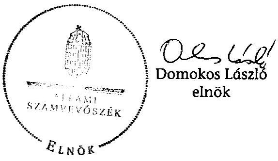
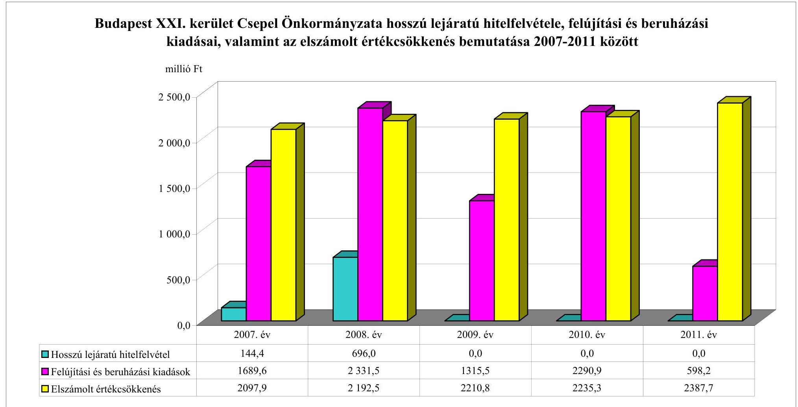
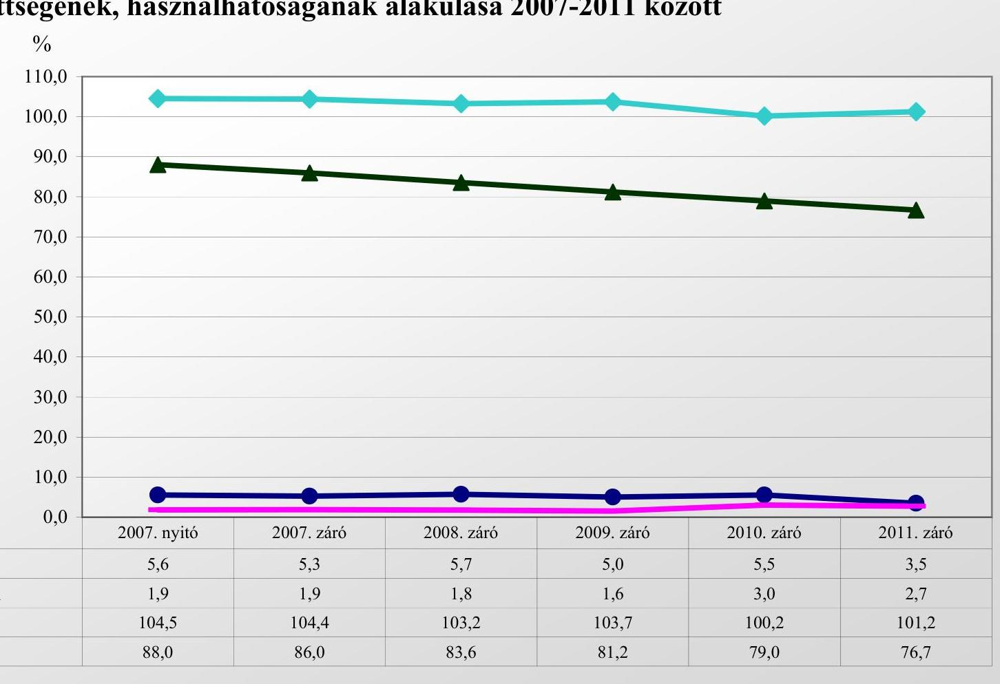
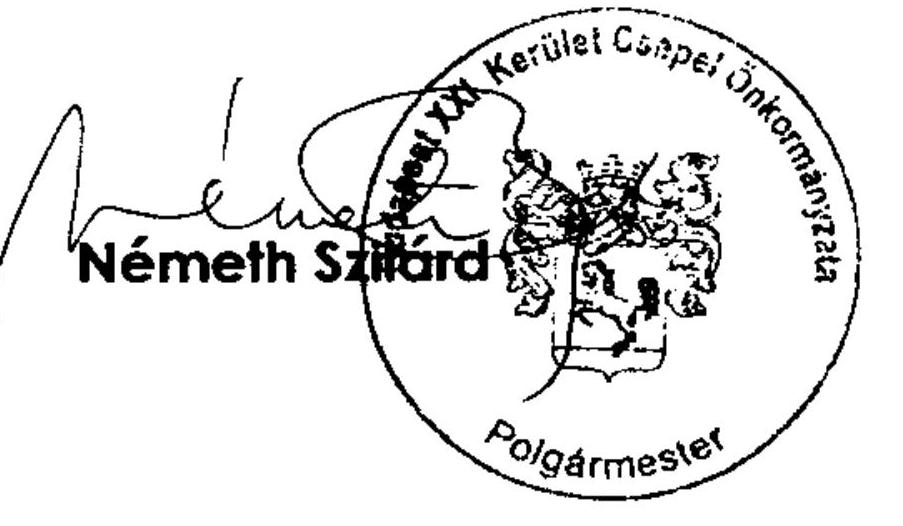

# ÁLLAMI   SZÁMVEVŐSZÉK 

## JELENTÉS

az önkormányzati vagyongazdálkodás szabályszerűségi ellenőrzéséről

Budapest XXI. kerület Csepel

---

# Állami Számvevőszék 

Iktatószám: V-0043-020-006-056/2013.
Témaszám: 1082
Vizsgálat-azonosító szám: V061506
Az ellenőrzést felügyelte:
Makkai Mária
felügyeleti vezető
Az ellenőrzést vezette és az ellenőrzés végrehajtásáért felelős:
Páncsics Judit
ellenőrzésvezető
A számvevőszéki jelentés összeállításában közreműködtek:
Kriston-Vizi János
számvevő tanácsos
Marozsán Katalin
számvevő
Szarka Péterné
számvevő vezető főtanácsos
Az ellenőrzést végezték:
Dr. Baloghné Sebestyén Éva Kriston-Vizi János Dr. Lajos Béla
számvevő számvevő tanácsos számvevő főtanácsos

A témához kapcsolódó eddig készített számvevőszéki jelentések:
címe
sorszáma
Jelentés a Budapest Főváros XXI. kerület Csepel Önkormányzata 0657
gazdálkodási rendszerének 2006. évi átfogó ellenőrzéséről
Jelentés a Magyar Köztársaság 2006. évi költségvetése végrehajtásá- 0724
nak helyszíni ellenőrzéséhez
Függelék:
A helyi önkormányzatok beruházásaihoz és rekonstrukcióihoz nyújtott 2006. évi felhalmozási célú támogatások ellenőrzése
Jelentés a Budapest Főváros XXI. kerület Csepel Önkormányzata 0959
gazdálkodási rendszerének 2009. évi ellenőrzéséről

---

# TARTALOMJEGYZÉK 

BEVEZETÉS ..... 3
I. ÖSSZEGZŐ MEGÁLLAPÍTÁSOK, KÖVETKEZTETÉSEK, JAVASLATOK ..... 5
II. RÉSZLETES MEGÁLLAPÍTÁSOK ..... 12

1. A vagyongazdálkodási tevékenység szabályozottsága ..... 12
1.1. A feladatellátás formáinak meghatározása, a döntések megalapozottsága ..... 12
1.2. A vagyonnal gazdálkodó szervezetek szervezeti rendjének szabályozottsága, a kötelező szabályzatok megfelelősége ..... 13
1.3. A vagyongazdálkodás szabályozása ..... 14
1.4. A vagyonkezeléssel megbízott szervezetek beszámolási kötelezettségének szabályozása ..... 17
2. A vagyongazdálkodás szabályszerűsége ..... 17
2.1. A vagyonnyilvántartás megfelelősége ..... 17
2.2. A vagyongazdálkodást érintő gazdasági események dokumentáltsága ..... 19
2.3. A vagyongazdálkodási döntések, intézkedések szabályszerűsége ..... 21
2.4. A vagyonkezelő beszámoltatása ..... 22
2.5. A közbeszerzési eljárások alkalmazása ..... 22
3. A vagyon változását eredményező gazdasági események szabályszerűsége ..... 23
3.1. A vagyon értékének és összetételének változása ..... 23
3.2. A vagyon fenntartására kialakított rendszer működésének megfelelősége és szabályozottsága ..... 24
3.3. Hitelfelvétel, kötvénykibocsátás garancia és kezességvállalás szabályszerűsége ..... 25
3.4. A térítés nélküli vagyonátadások és átvételek szabályszerűsége ..... 26
4. A vagyongazdálkodás szabályszerűségére vonatkozó belső és külső ellenőrzések hasznosulása ..... 27
4.1. A belső ellenőrzés által tett megállapítások, javaslatok hasznosulása ..... 27
4.2. A többségi tulajdonban lévő gazdasági társaságok vagyongazdálkodásának felügyelete ..... 30
4.3. A könyvvizsgálat hozzájárulása a vagyongazdálkodás szabályosságához ..... 31
4.4. A külső ellenőrző szervezetek által tett javaslatok hasznosulása ..... 31

---

# MELLÉKLETEK 

1. számú Budapest XXI. kerület Csepel Önkormányzata vagyonának főbb adatai 2007. január 1-je és 2011. december 31-e között
2. számú Budapest XXI. kerület Csepel Önkormányzata hosszú lejáratú hitelfelvétele, felújítási és beruházási kiadásai, valamint az elszámolt értékcsökkenés bemutatása 2007-2011 között
3. számú Budapest XXI. kerület Csepel Önkormányzata eladósodásának és az eszközök fedezettségének, használhatóságának alakulása 2007-2011 között
4. számú Budapest XXI. kerület Csepel Önkormányzata polgármesterének észrevétele

## FÜGGELÉKEK

1. számú Rövidítések jegyzéke
2. számú Értelmező szótár

---

# JELENTÉS   az önkormányzati vagyongazdálkodás szabályszerűségi ellenőrzéséről 

## Budapest XXI. kerület Csepel

## BEVEZETÉS

Az ÁSZ kiemelten fontosnak tartja az ÁSZ tv. 5. § (4) bekezdése alapján az önkormányzatok vagyongazdálkodási tevékenységének, a vagyongazdálkodási szabályok betartásának ellenőrzését. Az ellenőrzés feladata, hogy értékelje a vagyongazdálkodással kapcsolatban a jogszabályokban, az önkormányzati belső szabályozásban előírtak érvényesülését a közpénzek felhasználásának átláthatósága, nyilvánossága érdekében. Az ÁSZ ellenőrzése nemcsak az ellenőrzött szervezet vagyongazdálkodásának hibáira, hiányosságaira mutat rá, számon kérve azok kijavítását, hanem megállapításaival, javaslataival segíti a közpénzekkel, a közvagyonnal való felelős gazdálkodást.

Az önkormányzati vagyon alapvető funkciója, hogy a helyi közérdeket és egyúttal az önkormányzati célok megvalósítását szolgálja. A feladatellátás terén elsősorban a kötelezően ellátandó feladatok végrehajtását hivatott szolgálni, amely mellett az önként vállalt feladatok ellátása is megvalósulhat.

## Az ellenőrzés célja annak értékelése volt, hogy az Önkormányzatnál:

- a vagyongazdálkodási tevékenység, annak szervezeti keretei szabályozottak;
- a vagyongazdálkodás törvényességét, szabályszerűségét biztosították-e, a vagyon értékének és összetételének változását jogszerű döntésekkel alátámasztották-e;
- a belső ellenőrzés elősegítette-e a vagyongazdálkodás szabályszerű működését, valamint hasznosultak-e a korábbi külső ellenőrzések által tett javaslatok.

Az ellenőrzés típusa: szabályszerűségi ellenőrzés.
Az ellenőrzött időszak: az ellenőrzés a 2007. január 1. és 2011. december 31. közötti időszakra terjedt ki. A közbeszerzési eljárások lefolytatásának ellenőrzése a 2011. évet és a 2012. év I. negyedévét érintette. Az Nvt. egyes rendelkezései végrehajtásának ellenőrzése a nemzetgazdasági szempontból kiemelt jelentőségű nemzeti vagyonnak minősülő forgalomképtelen vagyonelemek meghatározására, valamint közép- és hosszú távú vagyongazdálkodási terv ké-

---

szítésére terjedt ki 2012. január 1-jétől 2013. március 1-jéig, a helyszíni ellenőrzés befejezéséig.

Az ellenőrzés szakmai módszertana az ÁSZ hivatalos honlapján közzétett szakmai szabályokon alapult, amely a Legfőbb Ellenőrző Intézmények Nemzetközi Szervezete (INTOSAI) által kiadott nemzetközi standardok (ISSAI) figyelembevételével készült.

Ellenőriztük az önkormányzati vagyongazdálkodás szabályozottságát, a helyi szabályozások jogszabályi előírásoknak való megfelelőségét (önkormányzati rendeletek, szabályzatok, utasítások) és azok gyakorlati alkalmazását. A vagyonváltozásokkal kapcsolatos gazdasági események közül az ellenőrzött tételeket véletlen mintavétellel választottuk ki a Polgármesteri hivatal 2007-2011. évi számviteli nyilvántartásaiból. Az Önkormányzattól tanúsítványt kértünk a korábbi ÁSZ ellenőrzések vagyongazdálkodásra vonatkozó javaslatainak hasznosulásáról, a könyvvizsgáló és a külső ellenőrzési szervek vagyongazdálkodással kapcsolatos 2007-2011. évi javaslataira tett intézkedésekről, valamint a 2007-2011. évek térítésmentes vagyonátadásairól és átvételeiről.

A jelentéstervezetben alkalmazott rövidítéseket az 1. számú függelék, az egyes fogalmak magyarázatát a 2. számú függelék tartalmazza.

Budapest XXI. kerület Csepel állandó lakosainak száma 2011. január 1-jén 88700 fő volt. Az Önkormányzat 21 tagú képviselő-testületének munkáját négy állandó bizottság segítette. Az Önkormányzat 2011 végén az önállóan működő és gazdálkodó Polgármesteri hivatalon felül három önállóan működő és gazdálkodó, valamint 36 önállóan működő költségvetési szervvel és egy igazgatási társulással látta el a feladatát. Az Önkormányzat két 100%-os tulajdoni hányadú gazdasági társasággal rendelkezett.

A polgármester a 2010. évi önkormányzati választások óta tölti be tisztségét. A jegyző 2000. április 1-jétől látja el feladatait.

Az Önkormányzatnak a 2011. évi költségvetési beszámolója szerint 16 855,9 millió Ft költségvetési bevétele volt és 15242,0 millió Ft költségvetési kiadást teljesített. A 2011. december 31-i könyvviteli mérleg szerint 75 159,2 millió Ft értékű eszközvagyonnal rendelkezett, a hosszú lejáratú kötelezettségek összege 2065,8 millió Ft, a rövid lejáratú kötelezettségeké 579,0 millió Ft volt.

A Polgármesteri hivatal 30 szervezeti egységre tagolódott, a foglalkoztatott köztisztviselők száma 2011. december 31-én 214 fő, az Önkormányzat által foglalkoztatott közalkalmazottak száma 2119 fő volt.

Az ÁSZ a 2011. évi LXVI. törvény 29. §-a szerint a jelentéstervezetet megküldte Budapest XXI. kerület Csepel Önkormányzata polgármesterének egyeztetésre, aki a megküldött válaszlevelében észrevételt nem tett. A beérkezett választ a jelentés 4. számú melléklete tartalmazza.

---

# I. ÖSSZEGZŐ MEGÁLLAPÍTÁSOK, KÖVETKEZTETÉSEK, JAVASLATOK 

Az Önkormányzat könyvviteli mérlegben kimutatott vagyona a 2007. évi 83 871,6 millió Ft-ról 2011-re 75 159,2 millió Ft-ra, 8712,4 millió Ft-tal, 10,4%-kal csökkent. A vagyon csökkenését a befektetett eszközök értékének 3993,6 millió Ft-os (5,3%-os) és a forgóeszközök értékének 4718,8 millió Ft-os (56,5%-os) csökkenése okozta. Az Önkormányzat 2007-2011 között felújításokra, beruházásokra 8225,7 millió Ft-ot, az elszámolt 11 124,2 millió Ft értékcsökkenésnél 26,1%-kal kisebb összeget fordított. A beruházások, felújítások finanszírozásához felvett 840,4 millió Ft hitelből 705,2 millió Ft volt a 2002-ben igénybe vett forint alapú hitel deviza alapú hitellé történő átalakítása.

Az Önkormányzat saját vagyona 2007-ről 2011-re 78 900,8 millió Ft-ról 72 404,6 millió Ft-ra 8,2%-kal (6496,2 millió Ft-tal) csökkent a saját tőke 1553,2 millió Ft-os és a tartalékok 4943,0 millió Ft-os csökkenése eredményeként. A saját vagyon csökkenését elsősorban az üzemeltetésre átadott eszközök és a pénzeszközök csökkenése okozta. A vagyon alakulásával kapcsolatos adatokat és mutatószámokat a jelentés 1-3. számú mellékletei részletesen tartalmazzák.

A Képviselő-testület a gazdasági programban meghatározta az önkormányzati feladatok ellátásának fő irányait. Az önkormányzati SZMSZ-ben szabályozták a kötelező és önként vállalt feladatokat, rendelkeztek azok ellátásának módjáról és mértékéről. A Képviselő-testület meghatározta a vagyonnal gazdálkodó, közfeladatot ellátó költségvetési szervek alaptevékenységét, jóváhagyta az alapító okiratukat, valamint a szervezeti és működési szabályzatukat. Az ellenőrzött időszakban a Polgármesteri hivatal szervezeti és működési szabályzattal nem rendelkezett, a hivatal jogállására vonatkozó főbb adatokat az önkormányzati SZMSZ tartalmazta. A Képviselő-testület a Polgármesteri hivatal SZMSZ-ét 2013. március 1-jétől léptette hatályba. Az önkormányzati intézmények és az önkormányzati kizárólagos tulajdonú Csepp TV Kft. használatában lévő vagyonelemeken kívül minden más ingatlanvagyont a 100%-os önkormányzati tulajdonú CSEVAK Zrt. és a Csepeli Piac Kft. (2011-ben beolvadt a CSEVAK Zrt.-be) üzemeltette. A helyi kábeltelevízió működtetését és a helyi újság kiadását a Csepp TV Kft. végezte.

Az Önkormányzatnál rendeletekben és határozatokban, valamint a polgármester és a jegyző által kiadott szabályzatokban, utasításokban szabályozták a vagyongazdálkodással kapcsolatos feladatokat, a feladat- és hatásköröket, valamint az eljárási rendet. A vagyongazdálkodási rendelet 1,3-ban meghatározták a törzsvagyon és a törzsvagyonon kívüli forgalomképes vagyon körét, a forgalomképesség megváltoztatásának előírásait. Szabályozták a vagyonhasznosítás módját, feltételeit, döntési szintjét, a döntési jogosítványokat megosztották a Képviselő-testület, a polgármester és a Tulajdonosi bizottság között. Előírták a térítésmentes vagyonátadás és a követelés-elengedés lehetséges módjait és eseteit, a vagyonhasznosítás versenyeztetésének eljárásrendjét, a vagyonkezelői jog megszerzésének, a vagyonkezelői szerződés megkötésének követelményeit, a

---

vagyonkezelői jog alapításának szabályait. Vagyonkezelői jog alapítására és az ingatlan-nyilvántartásba való bejegyeztetésére nem került sor. Az Önkormányzat irányítása alá tartozó költségvetési intézmények vagyonkezeléssel kapcsolatos jogköre a közfeladat ellátásához rendelt ingatlan használatára és az egy évnél rövidebb időtartamú bérbeadására terjedt ki. A vagyongazdálkodási rendelet 1,2 megfelelt az Áht. 1 és az Ötv. előírásainak.

Az Önkormányzatnál 2012. január 1-jét követően az Nvt.-ben foglalt közép- és hosszú távú vagyongazdálkodási tervet a helyszíni ellenőrzés befejezéséig, 2013. március 1-jéig nem készítették el.

A Polgármesteri hivatal a Számv. tv.-ben előírt szabályzatokkal rendelkezett, amelyek megfeleltek a jogszabályi előírásoknak. A számviteli politikát, a számlarendet, valamint a gazdálkodás szabályzatait a jegyző utasítással adta ki. A jegyző az intézményvezetőkhöz címzett intézkedésében kiterjesztette a számviteli politika alkalmazását az Önkormányzat intézményeire is.

A 2007-2011. években a gazdálkodási jogköröket, a gazdálkodási jogkörök gyakorlásának rendjét, az összeférhetetlenség kizárásának követelményeit a kötelezettségvállalási szabályzat 1-4-ben határozták meg az Ámr. 1-2 előírásainak megfelelően. A szabályzat név szerint tartalmazta az egyes gazdálkodási jogkörökkel felruházott személyeket.

A CSEVAK Zrt. által ellátott feladatok díjazását - kivéve a beruházások és a felújítások esetében - az Önkormányzat működési célra átadott pénzeszközként biztosította. Az Önkormányzat és a CSEVAK Zrt. vagyonkezelési megállapodása alapján végeztetett, illetve végzett a költségvetési rendeletben jóváhagyott a Zrt. üzleti tervében is szereplő - beruházási és felújítási munkák előirányzatai terhére 22 tétel esetében 46,1 millió Ft összegben a Polgármesteri hivatalban nem vállaltak kötelezettséget az Ámr. 1,2-ben, továbbá a kötelezettségvállalási szabályzat 1-4-ben előírtak ellenére.

A vagyongazdálkodási rendelet 1,2-ben előírtaknak megfelelően az ingatlanok hasznosítása hirdetmény útján közzétett versenyeztetéssel történt. A vagyonhasznosítási és vagyonértékesítési szerződésekbe az Önkormányzat érdekeit védő garanciális elemeket beépítették. A vagyongazdálkodási döntések végrehajtása előtt a térítésmentes vagyonátadások és átvételek ellenőrzött tételeinél 9 esetben, 12,2 millió Ft értékben hiányzott a képviselő-testületi döntés.

A Képviselő-testület a vagyongazdálkodási rendelet 1,2-ben az Önkormányzat képviseletét a polgármesterre ruházta a vagyonával kapcsolatos valamennyi szerződés aláírása során. Ennek ellenére 2007-től 2010 októberéig az ellenőrzött önkormányzati tulajdonú lakások adásvételi, valamint a lakások és nem lakás
 céljára szolgáló helyiségek bérbeadási szerződései közül 35 esetben, 111,8 millió Ft értékben a polgármester helyett a CSEVAK Zrt. vezetői írtak alá. A vagyongazdálkodási rendelet ${ }_{1,2}$-ben előírtak ellenére a polgármester a vagyonkezelési megállapodás teljesítésének ellenőrzéséről szükség szerint, de legalább évenként nem számolt be a Képviselő-testületnek. A 2008-2011. években az önkormányzati belső ellenőrzés a CSEVAK Zrt.-nél a vagyonkezelési megállapodásban rögzített ellenőrzést nem végezte. Az ellenőrzési feladat a vagyon-

---

kezelési megállapodásban foglaltak betartására vonatkozott, de a megállapodásban az ellenőrzés tárgyát részletesen nem rögzítették.

A zárszámadási rendeletek mellékleteként elkészített vagyonkimutatás megfelelt az Áhsz. előírásainak, az önkormányzati vagyont forgalomképesség szerinti bontásban tartalmazta, azonban az ingatlanokat a vagyongazdálkodási rendelet ${ }_{1,2}$ előírása ellenére nem az előírt bruttó-nettó értékkel, hanem csak a mérleg szerinti nettó értékkel tüntették fel. A vagyon könyvviteli mérleg szerinti értékét számviteli nyilvántartásokkal és kiértékelt leltárakkal támasztották alá az üzemeltetésre átadott eszközök kivételével. Az Áhsz. előírásának megfelelően szabályozott, az ingatlanok kétévenkénti mennyiségi leltározásakor a 2008. és 2010. évben nem tartották be a leltározási szabályzat ${ }_{1,2}$ - szigorú számadású nyomtatványok használatára, a leltárfelvételi jegyek kitöltésére vonatkozó előírásait. Az üzemeltetésre átadott eszközök leltár dokumentumai között a leltározók és leltárellenőrök megbízásai és a leltárkiértékelés jegyzőkönyvei nem voltak fellelhetők.

Az ingatlanvagyon-kataszter és a földhivatali nyilvántartások adatait összevetették, az eltérések rendezésére intézkedéseket tettek, azonban a földhivatali ingatlan-nyilvántartás és az ingatlanvagyon-kataszter 24 tételnél nem egyezett a nyilvántartott tulajdonos személyében lévő eltérések miatt. Ezáltal nem volt biztosított a földhivatali nyilvántartás és az ingatlanvagyon-kataszter között az ingatlanvagyon nyilvántartási és adatszolgáltatási rendjéről szóló kormányrendeletben előírt egyezőségi követelmény betartása. Az ingatlanok számviteli nyilvántartása és az ingatlanvagyon-kataszter adatai 28 tétel esetében, 89,1 millió Ft bruttó értéknél nem mutattak egyezőséget, amely azonban a mérleg valódiságát nem befolyásolta.

A Polgármesteri hivatalban a kötelezettségvállalási szabályzat ${ }_{1,4}$-ben előírták a bevételek beszedésének elrendelését megelőző szakmai teljesítésigazolást. Az ingatlanvagyon-értékesítési, valamint a hasznosítási bevételek beszedésének elrendelése előtt a szakmai teljesítésigazolást 32 esetben, 270,4 millió Ft összegben - az előírás ellenére - nem végezték el.

A vagyoncsökkenések- és hasznosítások ellenőrzött mintatételei esetében a Képviselő-testület éves összesítésben az eljárásokat lebonyolító CSEVAK Zrt. éves üzleti terveinek elfogadásával döntött. A CSEVAK Zrt. vezetője által beterjesztett üzleti terv 2. táblázatában az értékesítendő önkormányzati ingatlanok címének és helyrajzi számának feltüntetése nem tekinthető az önkormányzati vagyonelemekről szóló egyedi döntésnek, mivel az üzleti terv elfogadásáról szóló határozatban az önkormányzati SZMSZ-ben előírtaknak megfelelően az érintett ingatlanok címei és helyrajzi számai nem szerepeltek.

A 2011. évben és 2012. év I. negyedévében a hat darab, összesen 281,9 millió Ft értékű közbeszerzési eljárás köteles felújítás és beruházás esetében a becsült értékre és az egybeszámítási kötelezettségre és az eljárások lefolytatására vonatkozó szabályokat betartották, az ellenőrzött közbeszerzéseknél jogorvoslati eljárást nem kezdeményeztek.

A jegyző gondoskodott a céljellegű működési és felhalmozási támogatások közzétételéről, valamint az Önkormányzat pénzeszközei felhasználásával,

---

vagyonnal történő gazdálkodással összefüggő - a nettó öt millió Ft-ot elérő, vagy azt meghaladó értékű - árubeszerzésre, építési beruházásra, szolgáltatás megrendelésre, vagyonértékesítésre, vagyonhasznosításra vonatkozó szerződések adatainak az Önkormányzat honlapján történő közzétételéről. A jegyző az Önkormányzat honlapján a 2007-2010. évi éves (elemi) költségvetések és a költségvetés végrehajtásáról készített éves beszámolók az Eisztv. mellékletében, valamint a közzétételi listákon szereplő adatok közzétételi mintáiról szóló IHM rendeletben előírt közzétételi kötelezettségének nem tett eleget.

A Képviselő-testület döntése alapján 2008-ban az OTP Bank Nyrt.-nél fennálló 705,2 millió Ft fejlesztési célhitelállományt svájci frank alapú hitelre alakították át. Az előterjesztést a Pénzügyi bizottság az Ötv.-ben előírtak ellenére nem véleményezte. A hitel átalakítása 2008-2010 között kedvező hatással volt a vagyoni helyzetre, mert az adósságszolgálat alacsonyabb volt, mint a korábbi forinthitelnél lett volna. A 2011. évben a vagyoni helyzetre gyakorolt hatás kedvezőtlen lett, a 2008-2011. évi összesített hatás pozitív volt.

Az Önkormányzat kizárólagos tulajdonú gazdasági társaságaival kötött szerződésekben előírta a feladatellátásról és a gazdasági tevékenységről szóló beszámolási kötelezettséget, melynek azok maradéktalanul eleget tettek. A társaságok éves beszámolóit - kivéve a CSEVAK Zrt. 2007. és 2010. évi, illetve a Csepp TV Kft. 2010. évi beszámolóját - az ellenőrzött években pozitív mérleg szerinti eredménnyel fogadta el a Képviselő-testület. A Képviselő-testület a CSEVAK Zrt. 2007. évi beszámolóját 15,4 millió Ft, a 2010. évi beszámolóját 62,3 millió Ft veszteséggel hagyta jóvá. A veszteséget 2007-ben a tervezettet meghaladó összegű adók és az egyéb ráfordítások kiadásai, 2010-ben a szervezeti átvilágítás és átalakítás, valamint beruházásokhoz kapcsolódó többlet kiadások okozták. A Csepp TV Kft. 2010. évi beszámolóját a Képviselő-testület 2,9 millió Ft veszteséggel hagyta jóvá, melynek elszámolását az eredménytartalékkal szemben engedélyezte.

A belső ellenőrzés éves ellenőrzési tervei kockázatelemzésen alapultak, a Ber. 2007-2011. években hatályos előírásával összhangban. A 2007-2011. évi 77 belső ellenőrzésből $17 \mathrm{db}(22,1 \%)$ vagyongazdálkodásra irányult. A jelentések javaslatokat fogalmaztak meg a leltározással, a gazdálkodási jogkör szabályozásával, illetve az egyes vagyonváltozások bizonylatolásával és a nyilvántartások vezetésével kapcsolatban. Az ellenőrzöttek intézkedési tervet készítettek a felelősök és a határidő megjelölésével. Az intézkedési tervek végrehajtásáról az intézmények, beszámoltatásán keresztül győződtek meg. A belső ellenőrzés 2010. évi éves ellenőrzési jelentését a polgármester az Ötv.-ben előírtak ellenére nem a zárszámadási rendelettervezettel egyidejűleg, hanem csak 2011 szeptemberében terjesztette a Képviselő-testület elé. A 2011. évi éves ellenőrzési jelentést nem készítették el, ezért az Ötv.-ben előírtak ellenére a polgármester a 2011. évi zárszámadási rendelettervezettel egyidejűleg azt nem nyújtotta be a Képviselő-testületnek.

A könyvvizsgáló a 2007-2011. években megállapította, hogy az Önkormányzat éves költségvetési beszámolói megbízható, valós képet nyújtanak az önkormányzat eszközeiről, forrásairól és azok változásairól. A könyvvizsgálói jelentések megjelölték a pénzügyi egyensúlyhiány főbb okait, továbbá felhívták a figyelmet a belső ellenőrzés fontosságára, szerepének erősítésére.

---

A korábbi ÁSZ jelentések 14 vagyongazdálkodással kapcsolatos javaslata közül két javaslat nem hasznosult. A vízi közművek térítésmentes vagyonátadásával kapcsolatban a polgármesternek megfogalmazott javaslat nem teljesült. A Fővárosi Vízművek Zrt.-nek korábban a vízgazdálkodásról szóló 1995. évi LVII. törvényben foglaltak ellenére térítésmentesen tulajdonba adott, törzsvagyonba tartozó vízi közművek visszavételéről a polgármester - a Fővárosi Vízművek Zrt. érdemi válaszának hiányában, a szerződés módosítása, illetve a szerződés érvénytelenségének megállapítására irányuló bírósági döntés nélkül - a szerződés semmisségére hivatkozva 2008. év végén, egyoldalúan intézkedett. Az ÁSZ a 2006. évi ellenőrzése során javaslatot tett a jegyzőnek a térítésmentes vagyonátadás szabályszerűségének betartására, amely nem hasznosult, mert a 2007-2011. években a vagyongazdálkodási rendelet ${ }_{2}$-ben foglaltak ellenére a vagyon ingyenes átengedését 5 esetben összesen 4,0 millió Ft összegben, a vagyon ellenérték nélküli átvételét 4 alkalommal összesen 8,2 millió Ft összegben nem előzte meg képviselő-testületi döntés. Az ellenőrzött időszakban külső szervek négy EU-s és egy állami támogatással megvalósult fejlesztést ellenőriztek. Két uniós projekt ellenőrzése során három szabályszerűségi és három célszerűségi észrevételt fogalmaztak meg vagyongazdálkodást érintően, amelyekre az Önkormányzat intézkedett.

Az ÁSZ tv. 33. § (1) bekezdésében foglaltak értelmében a jelentésben foglalt megállapításokhoz kapcsolódó intézkedési tervet köteles az ellenőrzött szervezet vezetője összeállítani és azt a jelentés kézhezvételétől számított harminc napon belül az ÁSZ részére megküldeni. Amennyiben az intézkedési tervet határidőben nem küldi meg a szervezet, vagy az továbbra sem elfogadható, az ÁSZ elnöke a hivatkozott törvény 33. § (3) bekezdés a)-b) pontjaiban foglaltakat érvényesítheti.

Az ellenőrzés intézkedést igénylő megállapításai és javaslatai:

# a Polgármesternek 

1. Az Önkormányzat és a CSEVAK Zrt. által kötött vagyonkezelési megállapodás alapján végzett, illetve végeztetett, a költségvetési rendeletben jóváhagyott - az üzleti tervben is szereplő - egyes felújítási, beruházási munkák előirányzatai terhére a Polgármesteri hivatalban nem vállaltak kötelezettséget az Ámr. 134. § (3), illetve az Ámr. 2 72. § (1) bekezdésében, továbbá a kötelezettségvállalási szabályzat ${ }_{1-4}$-ben foglaltak ellenére.

Javaslat:
Intézkedjen arról, hogy az Önkormányzat költségvetésében jóváhagyott - a CSEVAK Zrt. által végzendő beruházási, illetve felújítási munkák - kiadási előirányzatai terhére az Ávr. 52. § (6) bekezdésében foglalt előírás alapján minden esetben vállaljanak előzetesen írásban kötelezettséget.
2. A vagyongazdálkodási rendelet ${ }_{2}$-ben előírt, a vagyonkezelési megállapodásban foglaltak teljesítésének ellenőrzéséről szükség szerinti, de legalább évenkénti beszámolási kötelezettségének a polgármester a Képviselő-testület felé nem tett eleget.

Javaslat:
Tartsa be a vagyongazdálkodási rendelet ${ }_{3}$-ban előírtakat és számoljon be a Képviselő-testületnek a vagyonkezelési megállapodás teljesítésének ellenőrzéséről szükség szerint, de legalább évenként.
3. Az Önkormányzat a Fővárosi Vízművek Zrt.-nek - az ellenőrzési időszakot megelőzően - térítés nélkül tulajdonba adta az önkormányzati törzsvagyonba tartozó vízi közművagyont. Az Önkormányzat megsértette a vízgazdálkodásról szóló 1995. évi LVII. törvény 10. § (1) bekezdésében foglaltakat, mivel a vízi közművagyont csak használatba adhatta volna.

Javaslat:
Vizsgálja meg a Fővárosi Vízművek Zrt.-vel kötött térítésmentes vagyonátadások szerződéseit és tegyen szabályszerű intézkedést arra, hogy a vízi közművek visszakerüljenek az Önkormányzat tulajdonába, és azokat a Képviselő-testület döntése alapján a vízgazdálkodásról szóló 1995. évi LVII. törvény 10. § (1) bekezdésében előírtaknak megfelelően adják használatba.

# a jegyzőnek 

1. Az Önkormányzatnál 2008. december 31-ével egyoldalúan intézkedtek a Fővárosi Vízművek Zrt.-nek 2007. évet megelőzően térítésmentesen tulajdonba adott vízi közművek számviteli nyilvántartásba vételéről. A 2011. december 31-ei állapot szerint a térítésmentesen átadott vízi közművek az önkormányzati vagyonelemek között 27,1 millió Ft állományi értékben továbbra is szerepeltek, 9,1 millió Ft kimutatott értékcsökkenéssel. A vízi közmű sorsa jogilag véglegesen azonban nem rendeződött a Fővárosi Vízművek Zrt. érdemi válasz intézkedése hiányában.

Javaslat:
Intézkedjen arról, hogy a számviteli nyilvántartást a korábban megkötött térítésmentes vagyonátadási szerződésnek megfelelően módosítsák és intézkedjenek az ügylet megfelelő jogi rendezéséről.
2. A 2011. évi éves ellenőrzési jelentést a Ber. 12. § h) pontjában előírtak ellenére nem készítették el, így az Ötv. 92. § (10) bekezdésében előírtak ellenére a polgármester a 2011. évi zárszámadási rendelettervezettel egyidejűleg nem nyújtotta be a Képviselő-testületnek.

Javaslat:
Intézkedjen, hogy a belső ellenőrzés vezetője tegyen eleget a Bkr. 22. §-ának (1) bekezdés g) pontjában rögzített előírásnak azzal, hogy az összefoglaló éves ellenőrzési jelentést elkészíti.
3. A földhivatali ingatlan-nyilvántartás és az ingatlanvagyon-kataszter 24 tételnél eltért, emiatt nem biztosított a 147/1992. (XI. 6.) Korm. rendelet 1. § (2) bekezdésében előírt egyezőségi követelmény betartása. Az ingatlanok számviteli nyilvántartása és

---

az ingatlanvagyon-kataszter adatai az 1. § (3) bekezdés előírása ellenére 28 tétel bruttó értékénél 89,1 millió Ft összegben nem mutattak egyezőséget.

Javaslat:
Intézkedjen, hogy a 147/1992. (XI. 6.) Korm. rendelet 1. § (2) bekezdésében rögzítetteknek megfelelően az ingatlanvagyon kataszter adatai egyezőségét biztosítsák a földhivatal ingatlan-nyilvántartásának azonos tartalmú adataival, továbbá az 1. § (3) bekezdésében foglaltakra figyelemmel biztosítsa az egyezőséget az ingatlanvagyon kataszter adatai és az ingatlanok számviteli nyilvántartásában szereplő bruttó érték között.
4. A jegyző az Önkormányzat honlapján a 2007-2010. évi éves (elemi) költségvetések és a költségvetés végrehajtásáról készített
 beszámolók az Eisztv. mellékletében és a 18/2005. (XII. 27.) IHM rendelet 2. számú melléklete 3.2. pontjában előírt közzétételi kötelezettségének nem tett eleget.

Javaslat:
Intézkedjen az információs önrendelkezési jogról és az információszabadságról szóló 2011. évi CXII. törvény 1. számú mellékletében meghatározott adatok közzétételéről.

---

# II. RÉSZLETES MEGÁLLAPÍTÁSOK 

## 1. A VAGYONGAZDÁLKODÁSI TEVÉKENYSÉG SZABÁLYOZOTTSÁGA

### 1.1. A feladatellátás formáinak meghatározása, a döntések megalapozottsága

A 2006-2010. évekre szóló gazdasági program¹ meghatározta az ágazati feladatok, valamint a működtetési és fejlesztési elképzelések fő irányát¹. A gazdasági program¹ a fejlesztési célokat 2013-ig vázolta. A fejlesztési elképzelések forrásául az ún. „északi bevétel"-ből² származó pénzeszközökön kívül a helyi adóból, a vagyongazdálkodásból, valamint kötvénykibocsátásból származó bevételeket jelölték meg. Stratégiai célként határozták meg a „sziget" jelleg kihasználásából adódó idegenforgalmi és tőkebefektetési lehetőségek kihasználását.

A Képviselő-testület a 2011-2014. évekre szóló gazdasági program²-t „Jövőkép" elnevezéssel az 580/2011. (IX. 29.) számú határozatával fogadta el az Ötv. 91. § (7) bekezdésében³ foglalt határidőt közel fél évvel túllépve.

Az önkormányzati SZMSZ-ben rögzítették a kötelező feladatok ellátásának elsődlegességét, valamint azt, hogy a feladatok ellátásáról az Önkormányzat intézményein és a gazdasági társaságain keresztül gondoskodnak. Az Önkormányzat az Ötv. 8. § (1)-(2) bekezdései⁴ alapján - anyagi lehetőségeivel és a lakosság igényeivel összefüggésben - az SZMSZ-ben határozta meg önként vállalt feladatai ellátásának előzetes feltételeit, majd az SZMSZ függelékében sorolta fel az önként vállalt feladatok körét és ellátásuk módját, mértékét.

Az Önkormányzat 2007. január 1-jén 9 önállóan gazdálkodó és 39 részben önállóan gazdálkodó intézményt működtetett. A feladatellátásban közreműködött három gazdasági társasága, egy igazgatási társulás, valamint öt közalapítvány is. Az intézmények közoktatási, egészségügyi, szociális és gyermekvédelmi, közművelődési és sportfeladatot láttak el. Az igazgatási szakterület feladatairól a Polgármesteri hivatal és a Budapest Főváros IX. kerület Ferencváros Önkormányzatával közösen, a szabálysértési hatáskörök gyakorlására létrehozott igazgatási társulás útján gondoskodtak.

A hatékonyabb feladatellátás érdekében az intézmények átszervezéséről, összevonásokról döntöttek. Az intézményrendszer 2007. évi átszervezéséről több elő-

[^0]
[^0]:    ¹ A Képviselő-testület „Dinamikus és élhető város a nagyvároson belül" címmel a 221/2007. (III. 21.) számú határozatával fogadta el a 2006-2010. évekre szóló gazdasági program¹-et.
    ² A Csepel-sziget északi részén elhelyezkedő önkormányzati tulajdonú ingatlanok 2005. decemberi értékesítéséből származó, bruttó 11370 millió Ft összegű bevétel.
    ³ 2013. január 1-jétől az Mötv. 116. § (5) bekezdése írja elő
    ⁴ 2013. január 1-jétől az Mötv. 11. § (1)-(2) bekezdése és a 13. § (1) bekezdése írja elő

---

terjesztésben, alternatív javaslatok⁵ megtárgyalását követően határozott a Képviselő-testület. A 2007-2011. években új intézmények létrehozásáról, gazdasági társaságok alapításáról nem döntöttek. 2011. év végén az intézményrendszert érintő összevonások eredményeképpen négy önállóan működő és gazdálkodó és 36 önállóan működő költségvetési szerv, 2 gazdasági társaság és 1 igazgatási társulás között oszlott meg a feladatellátás. A gazdasági társaságok közül a CSEVAK Zrt. az Önkormányzat egyes vagyonkezelési, a Csepp TV Kft. a helyi média feladatokat, míg a Csepeli Piac Kft. - a CSEVAK Zrt.-be 2011. évben történt beolvadásáig - a piac működtetési feladatait látta el. A Csepeli Piac Kft.nek a CSEVAK Zrt.-be történő beolvadásáról a Képviselő-testület döntött, amelynek következtében a CSEVAK Zrt. tőkéje 52,4 millió Ft összeggel nőtt.

Az Önkormányzat az ellenőrzött időszakban nem kötött megállapodást a Fővárosi Önkormányzat feladat- és hatáskörébe tartozó közszolgáltatás szervezésének átvállalásáról.

# 1.2. A vagyonnal gazdálkodó szervezetek szervezeti rendjének szabályozottsága, a kötelező szabályzatok megfelelősége 

A Képviselő-testület az önkormányzati SZMSZ-ben meghatározta a szerveit, a feladat- és hatáskörét és a működése szabályait. Az önkormányzati SZMSZ 5/AB. mellékletében döntöttek a Képviselő-testületet megillető - vagyongazdálkodás körében a lakás- és helyiséggazdálkodással (lakásbérleti szerződések megkötése), a közbeszerzésekkel és a gazdálkodással kapcsolatos - hatáskörök polgármesterre történő átruházásáról, előírva a beszámolási kötelezettséget.

A Képviselő-testület a vagyonnal gazdálkodó költségvetési szervek és gazdasági társaságok alapító okiratát jóváhagyta és az ellátandó közfeladataikat meghatározta. Az intézmények szervezeti és működési szabályzatait átruházott hatáskörben a Szociális, Lakás- és Egészségügyi Bizottság, valamint az Oktatási, Közművelődési, Ifjúsági és Sport Bizottság fogadta el.

A Polgármesteri hivatal az ellenőrzött időszakban rendelkezett alapítói okirattal, de szervezeti és működési szabályzata nem volt, a jogállására vonatkozó főbb adatokat az önkormányzati SZMSZ tartalmazta. Az önkormányzati SZMSZ-ben az Ámr. 2 20. § (2) bekezdés b), e), h) pontjaiban foglaltak ellenére nem rögzítették a Polgármesteri hivatal szervezeti egységeinek feladatkörét, engedélyezett létszámát, a kapcsolattartás és a helyettesítés rendjét. A Képviselőtestület 2013. március 1-jétől hatályba léptette a hivatali SZMSZ-t, amelyben az előzőekben említett hiányosságokat megszüntették. A Polgármesteri hivatalhoz önállóan működő költségvetési szervet nem rendeltek. A Polgármesteri hivatal a Számv. tv. 14. §-ában előírt szabályzatokkal, valamint 161. §-ában előírt számlarenddel rendelkezett, amelyek megfeleltek a jogszabályi előírásoknak. A jegyző a számviteli politikát, a számlarendet, valamint a gazdálkodási szabályzatokat utasítással adta ki. A jegyző az intézményvezetőkhöz címzett intézkedésében a számviteli politika alkalmazását kiterjesztette az Önkormányzat intézményeire is. Az operatív gazdálkodásra, a munkafolyamatba épített ellenőrzésekre és az azokra vonatkozó összeférhetetlenségre vonatkozó köve-

[^0]
[^0]:    ⁵ az 55/2007. számú előterjesztés és a 62/2007. számú előterjesztés tartalmazta

---

telményeket a pénzkezelési szabályzatban, illetve a kötelezettségvállalási szabályzat¹.⁴-ben rögzítették.

# 1.3. A vagyongazdálkodás szabályozása 

A Képviselő-testület a Htv. 138. § (1) bekezdés j) pontjában foglalt kötelezettségének eleget téve a tulajdonában álló teljes vagyoni körre a vagyongazdálkodási rendelet¹,² -ben szabályozta a vagyongazdálkodási feladatokat.

Az Ötv. 78-79. §-ai előírásainak⁶ megfelelően a vagyongazdálkodási rendelet¹,² -ben meghatározták a törzsvagyon körét, a forgalomképes és a korlátozottan forgalomképes vagyonelemeket, valamint az Áhsz. 49. § (1) bekezdése és 9. számú mellékletének 3. d) pontja előírásainak megfelelően a vagyon számviteli nyilvántartási rendjét. A Képviselő-testület döntött a törzsvagyonon kívüli forgalomképes vagyon köréről, szabályozta a forgalomképesség megváltoztatásának előírásait, a döntési szintet (Képviselő-testület), az eljárás rendjét és a dokumentálás módját (alapító okiratok módosítása). A vagyongazdálkodási rendelet¹,² -ben külön alcím alatt rendelkeztek az önkormányzati vagyonkezelő szervezetekről, amely szerint a CSEVAK Zrt. volt az Önkormányzat egységes vagyongazdálkodási rendszerének alapintézménye.

A Képviselő-testület az Nvt. előírása alapján 2012 májusában megalkotott vagyongazdálkodási rendelet³-ban - előzetes felülvizsgálat alapján - módosította a forgalomképtelen, a korlátozottan forgalomképes és forgalomképes vagyonelemek besorolását. A vagyongazdálkodási rendelet³-ban az Önkormányzat nemzetgazdasági szempontból kiemelt jelentőségű, nemzeti vagyonnak minősülő vagyonelemet nem határozott meg, a rendelet mellékletében a törzsvagyon körébe tartozó vagyonelemeket tételesen felsorolta.

A számlarendben és a számlatükörben az Áhsz. 9. számú melléklete 1. k) pontjában előírtak szerint gondoskodtak a törzsvagyon és a forgalomképes (üzleti) vagyon elemeinek elkülönített számviteli nyilvántartásáról.

A vagyongazdálkodási rendelet¹,² -ben az Áht.¹ 108. § (2) bekezdése⁷ alapján a szabályozták a térítésmentes vagyonátadás és a követelés-elengedés lehetséges módjait és eseteit.

Vagyon ingyenes vagy kedvezményes átengedése csak a Képviselő-testület döntése alapján a következő esetekben történhetett: közérdekű kötelezettségvállalás céljára; közalapítvány javára, alapítványrendelés, alapítványi hozzájárulás címén; feladat- és hatáskör átadása esetén a feladat ellátásához szükséges vagyontárgyak vonatkozásában; ingatlanok tulajdoni rendezése kapcsán; az Önkormányzat beruházásában készült közművek esetében elsődlegesen Budapest Főváros Önkormányzata részére, másodlagosan - amennyiben Budapest Főváros Önkormányzata a közművek átvételétől elzárkózik - a közszolgáltatók részére.

[^0]
[^0]:    ⁶ 2011. december 31-től az Nvt. 5. §-a és a 3. § (1) bekezdés 6. pontja írja elő
    ⁷ 2012. március 2-től az Nvt. 13. § (3) bekezdése írja elő

---

Az önkormányzati képviselők által használt informatikai eszközöket, telefonokat ingyenesen vagy kedvezményesen átruházni az adott választási ciklus lejártakor, vagy a tárgyi eszköz selejtezésekor lehetséges.

Követelés elengedésére a következő esetekben kerülhetett sor: csődegyezségi megállapodásban, felszámolási eljárás során, ha a követelés várhatóan nem térül meg; a végrehajtás során, ha a követelés nem, vagy csak részben térül meg; ha követelés érvényesítése aránytalan költséggel jár; a kötelezett nem lelhető fel.

A vagyongazdálkodási rendelet¹,² -ben szabályozták a vagyonhasznosítás módját, feltételeit, a döntési jogosítványokat megosztva a Képviselő-testület, a Tulajdonosi bizottság⁸ és a polgármester között. A vagyon feletti rendelkezési jogot a vagyon forgalomképessége szerint, a döntési szintekhez kapcsolódóan szabályozták és értékhatárokat rendeltek a rendelkezési joggyakorlókhoz.

A forgalomképtelen, a korlátozottan forgalomképes és a forgalomképes ingatlan vagyon esetében a tulajdonosi jogokat a Képviselő-testület gyakorolta, kivéve az 50 millió Ft alatti forgalomképtelen és a korlátozottan forgalomképes ingatlanok, valamint a 20-100 millió Ft közötti forgalomképes ingatlanok tulajdonjogának megszerzését, illetve a tulajdonjogot nem érintő bérleti vagy használati jog átengedését, mert ezeket a hatásköröket 2007 májusától 2010 októberéig a Tulajdonosi Bizottság gyakorolhatta. A polgármester ebben az időszakban a 20 millió Ft alatti forgalomképes ingatlan tulajdonjogának megszerzésére volt jogosult.

A forgalomképes vagyon elidegenítése esetében a tulajdonosi jogokat 2007 májusától 2010 októberéig 20 millió Ft alatt a polgármester, 20-250 millió Ft között a Tulajdonosi bizottság, 250 millió Ft felett a Képviselő-testület gyakorolhatta.

A 20 millió Ft feletti vagyontárgy hasznosítására nyilvános versenyeztetési kötelezettséget írtak elő, amitől „indokolt" esetben el lehetett térni, és zártkörű versenytárgyalást lehetett lebonyolítani, az indokolt esetek fogalmát azonban a rendelet nem határozta meg. Az ellenőrzés az ellenőrzött gazdasági eseményeknél nem tapasztalt „indokolt" esetre hivatkozással eltérést a versenyeztetéstől. A Képviselő-testület az intézményi használatba adott vagyontárgyakkal kapcsolatban engedélyezte - legfeljebb egy évre - a bérbe-, használatba-, haszonbérletbe-, haszonkölcsönbe adást.

A vagyongazdálkodási rendelet¹,² -ben szabályozták a vagyonkezelői jog megszerzésének, a vagyonkezelői szerződés megkötésének követelményeit, előírva a szerződést biztosító mellékkötelezettségek kikötését és a megszegése esetére szóló jogkövetkezményeket, rögzítve a vagyonkezelés korlátait az Ötv. és az Áht.¹ előírásaival összhangban. A vagyongazdálkodási rendelet¹,² kimondta, hogy „vagyonkezelői jog alapítása vagyonkezelői szerződéssel történik". A Képviselőtestület az Ötv. 80/A. §-a⁹, illetve az Áht.¹ 105/B. §-a szerinti vagyonkezelői jog alapításáról, valamint koncessziós szerződés megkötéséről nem döntött, önkormányzati tulajdonú ingatlant ilyen joggal nem terheltek meg.

[^0]
[^0]:    ⁸ A Képviselő-testület a Tulajdonosi bizottságot a Tulajdonosi bizottság felállításával összefüggő egyes helyi rendeletek módosításáról szóló 17/2007. (V. 15.) számú rendelettel hozta létre, a bizottság 2007. május 15 -től 2010 októberéig működött.
    ⁹ 2012. január 1-jétől az Mötv. 109. §-a írja elő

---

Az Önkormányzat nem élt az Ötv. 80. § (2) bekezdésében foglalt azon lehetőséggel, hogy a vagyon meghatározott részének elidegenítését, megterhelését, vállalkozásba bevitelét helyi népszavazáshoz kösse.

Az ingatlanvagyon hasznosítás versenyeztetésének eljárásrendjét és a hasznosításra szánt vagyon értékének előzetes megállapítása céljából értékbecslés készítését a vagyongazdálkodási rendelet¹,² -ben szabályozták, illetve előírták.
 A vagyongazdálkodási rendelet ${ }_{1,2}$-nek a belső szabályzatokkal való összhangja biztosított volt.

A vagyongazdálkodást érintő döntések előkészítésének rendjét mind az önkormányzati SZMSZ-ben, mind a vagyongazdálkodási rendelet ${ }_{1,2}$-ben meghatározták. A vagyongazdálkodási döntések előkészítési folyamatában nem írták elő a költség-haszon elemzés készítésének kötelezettségét, a beruházások fenntarthatóságának vizsgálatát. A hitelfelvétel és kötvénykibocsátás, mint eladósodással járó kötelezettségvállalás költségvetési egyensúlyra gyakorolt hatásának vizsgálatát sem tették kötelezővé.

Az Önkormányzat az Nvt. 9. § (1) bekezdése szerinti közép- és hosszú távú vagyongazdálkodási tervet a helyszíni ellenőrzés 2013. március 1-jei befejezéséig nem készített.

Az önállóan működő és gazdálkodó költségvetési szervekhez rendelt önállóan működő költségvetési szervek munkamegosztásának és felelősségvállalásának rendjét együttműködési megállapodásokban szabályozták, a megállapodásokban rögzítették a használatra átadott eszközök analitikus nyilvántartása vezetésének feladatmegosztását.

Az Önkormányzat az analitikus nyilvántartások megbízhatóságára alapozva az Áhsz. 37. § (7) bekezdése alapján a tárgyévi költségvetési rendeletek IV. fejezetében engedélyt adott az Önkormányzat tulajdonában lévő tárgyi eszközök kétévenkénti - mennyiségi felvétellel történő - leltározására.

A 2007-2011. években a gazdálkodási jogköröket, a gazdálkodási jogkörök gyakorlásának rendjét, az összeférhetetlenség kizárásának követelményeit a kötelezettségvállalási szabályzat ${ }_{1,4}$-ben határozták meg Ámr. ${ }_{1}$ 134.-138. §-aiban, illetve az Ámr. ${ }_{2}$ 72.-80. §-aiban foglaltaknak megfelelően. A szabályzat név szerint tartalmazta az egyes gazdálkodási jogkörökkel felruházott személyeket.

A CSEVAK Zrt.-vel a vagyongazdálkodási feladatok ellátására a Képviselőtestület döntésével megkötött megállapodás az Önkormányzat tulajdonában lévő forgalomképtelen, korlátozottan forgalomképes és forgalomképes - üzleti vagyon „üzemeltetésére, hatékony működtetésére, megőrzésére, gyarapítására" vonatkozott. A vagyongazdálkodási rendelet ${ }_{1,2}$ és a CSEVAK Zrt.-vel kötött megállapodás szerint - az intézmények használatában lévő vagyon kivételével - az Önkormányzat tulajdonában lévő vagyon teljes körével a CSEVAK Zrt. gazdálkodhatott az önkormányzat érdekeinek „sérelme nélkül", a vagyont nem idegeníthette el, nem terhelhette meg. Jogosult volt a vagyontárgyak tulajdonviszonyokat nem érintő hasznosítására (a bérbeadást is beleértve), vagyontárgy térítésmentes átadására csak a Képviselő-testület döntése alapján kerülhetett sor.

---

A polgármester és a jegyző 2006. július 28-ával, majd 2010. február 4-ével közös utasítást adott ki a szerződéskötések rendjéről, amelyben előírták a szerződéskötés folyamatában a jogászi közreműködés követelményét és a szerződésekben az Önkormányzat érdekeit védő garanciális elemek és szerződést biztosító mellékkötelezettségek (bankgarancia, óvadék, kötbér, késedelmi kamat) kikötését.

# 1.4. A vagyonkezeléssel megbízott szervezetek beszámolási kötelezettségének szabályozása 

A Képviselő-testület a vagyongazdálkodási rendelet ${ }_{1,2}$-ben a vagyonkezelő szervezetek feladatainak és jogállásának meghatározásával összefüggésben előírta, hogy: „a vagyonkezelő szervezetek vezetői a feladatok végrehajtásáról az éves zárszámadás keretében, illetve a tulajdonosi taggyülés során az éves beszámoló elfogadásával egyidejűleg kötelesek számot adni". Ezen kötelezettségeiket szervezeti és működési szabályzataik is tartalmazták.

A vagyongazdálkodási rendelet ${ }_{2}$ előírta, hogy a vagyonkezelési szerződésben foglaltak betartását a polgármester köteles folyamatosan figyelemmel kísérni, és erről legalább évente beszámolni a Képviselő-testületnek.

A CSEVAK Zrt.-vel kötött vagyonkezelési megállapodás az Ötv. 92. § (11) bekezdés b) pontjában foglaltakkal összhangban 2007. december 3-tól rögzítette, hogy a Polgármesteri hivatal belső ellenőrzése az éves munkaterve, vagy eseti megbízás alapján jogosult és köteles a megállapodásban foglaltak betartását ellenőrizni.

## 2. A VAGYONGAZDÁLKODÁS SZABÁLYSZERŰSÉGE

### 2.1. A vagyonnyilvántartás megfelelősége

Az Önkormányzatnál az Ötv. 78. § (2) bekezdése ${ }^{10}$ alapján a 2007-2011. években elkészítették a vagyonkimutatást a zárszámadási rendelettervezet mellékleteként. A 2007-2011. évi vagyonkimutatások az Áhsz. 44/A. § (1)-(2) bekezdéseiben foglalt előírásoknak megfelelően tartalmazták az Önkormányzat és intézményei saját vagyonát tételesen törzsvagyon és törzsvagyonon kívüli, egyéb vagyon bontásban. A vagyonkimutatásokban a vagyongazdálkodási rendelet ${ }_{1}$ 33. § (3) bekezdés a) pontjában, illetve a vagyongazdálkodási rendelet ${ }_{2}$ 44. § (3) bekezdés a) pontjában előírtak ellenére az ingatlanokat nem az előírt bruttó-nettó értékkel, hanem csak a mérleg szerinti nettó értékkel tüntették fel. Az önkormányzati törzsvagyonról, a korlátozottan forgalomképes vagyonról és az egyéb forgalomképes (üzleti) vagyonról az elkülönített nyilvántartást a főkönyvi számlák megfelelően kialakított alábontásával és az ezekhez kapcsolódó analitikus nyilvántartások vezetésével biztosították.

Az ingatlanvagyon számviteli nyilvántartási adatait az ingatlanvagyonkataszterrel évente egyeztették, az eltérések okait kivizsgálták. A számviteli

[^0]
[^0]:    ${ }^{10}$ 2012. január 1-jétől az Mötv. 110. § (1)-(2) bekezdése írja elő

---

nyilvántartásokat és az ingatlanvagyon-katasztert a közhiteles nyilvántartást vezető földhivatal adataival összevetették. Az észlelt eltérések rendezésére a 2008-2012. években intézkedéseket tettek egyrészt a földhivatal, másrészt az önkormányzati ingatlanvagyon nyilvántartásokat vezető Városgazdálkodási ágazat, illetve a CSEVAK Zrt. felé, ennek ellenére a teljes egyezőség nem állt fenn. A helyszíni ellenőrzés során megállapítottuk, hogy 24 tétel a földhivatali nyilvántartással nem egyezett a nyilvántartott tulajdonos személyében lévő eltérések miatt, ezáltal nem volt biztosított a földhivatali nyilvántartás és az ingatlanvagyon-kataszter közötti, a 147/1992. (XI. 6.) Korm. rendelet 1. § (2) bekezdésében előírt egyezőségi követelmény betartása.

Az ingatlanok számviteli nyilvántartása és az ingatlanvagyon-kataszter adatai 28 tétel esetében 89,1 millió Ft bruttó értékben eltértek egymástól, emiatt nem volt biztosított a 147/1992. (XI. 6.) Korm. rendelet 1. § (3) bekezdésében előírt egyezőség a számviteli nyilvántartás és az ingatlanvagyon-kataszter azonos tartalmú adatai között.

A vagyont tartalmazó könyvviteli mérleg adatokat kiértékelt leltárral támasztották alá, kivéve 2008. évben a CSEVAK Zrt.-nek üzemeltetésre átadott ingatlanok mérleg szerinti adatait. A 100 ezer forintnál nagyobb egyedi értékű tárgyi eszközöket - élve az Áhsz. 37. § (7) bekezdésében foglalt lehetőséggel a Képviselő-testület rendelete alapján - szabályosan, mennyiségi felvétellel kétévente leltározták. Az eszközvagyon mérleg szerinti értékelését, a bekerülési értékek meghatározását és az értékcsökkenés elszámolását az értékelési szabályzat előírásaival összhangban végezték el. Az ingatlanvagyon-leltár megbízhatóságát több hiányosság érintette. Az ingatlanok 2008. és 2010. évi mennyiségi leltározásakor a leltárfelvételi ívek - az irodaépületek kivételével - sorszámozás nélküli, egyszerű gépi listák voltak, amelyek nem feleltek meg az előírt szigorú számadású nyomtatványok kritériumainak. A leltárfelvételi jegyek a leltározási szabályzat ${ }_{1}$ 7. b) pontja és 5. számú melléklete, illetve a leltározási szabályzat ${ }_{2}$ 12. pontja és 5. számú mellékletében előírtak ellenére nem tartalmazták a beépített hasznos alapterületet vagy térfogatot, az épülettartozékok és az ingatlan területén lévő építmények felsorolását. Az üzemeltetésre, kezelésre átadott önkormányzati ingatlanvagyon leltározását a leltározási szabályzat ${ }_{1,2}$ 6. pontjának előírása alapján a CSEVAK Zrt. végezte, de a leltározáskor a leltározási szabályzat ${ }_{1,2}$-ben előírtakat nem tartották be.

A leltározási dokumentumokban a CSEVAK Zrt. leltározóinak és leltárellenőreinek megbízása nem volt fellelhető. A leltározási szabályzat ${ }_{1}$ leltárkiértékelő napló elkészítését írta elő, azonban a CSEVAK Zrt. által elvégzett 2008. évi ingatlan leltárról nem készült el a leltárkiértékelés. A leltározási szabályzat ${ }_{2}$ teljes egyezés, vagy eltérések megállapítására jegyzőkönyvek felvételét írta elő, ennek ellenére a 2010. évben az önkormányzati ingatlanok leltározáskor a CSEVAK Zrt. nem készített jegyzőkönyvet a leltár befejezéséről, a leltár egyezőségéről, illetve az esetleges leltáreltérésekről. Ez nem felelt meg az Áhsz. előírásaival összhangban lévő a leltározási szabályzat ${ }_{2}$ 14. pontja utolsó előtti bekezdésének és 21. számú mellékletének.

---

# 2.2. A vagyongazdálkodást érintő gazdasági események dokumentáltsága 

A gazdálkodási jogkörök gyakorlása a vagyongazdálkodással kapcsolatos gazdasági események körében - az alábbi eseteket kivéve - szabályos volt:

- A vagyonhasznosítással kapcsolatos gazdasági események közül a lakásértékesítés, a lakások, illetve a nem lakás céljára szolgáló helyiségek bérbeadási szerződéseit az Önkormányzat képviseletében 2007. január 1-jétől 2010. októberéig nem a polgármester írta alá. A Képviselő-testület a polgármesterre ruházta az Önkormányzat képviseletét az önkormányzati tulajdonú lakások adásvételi szerződéskötések esetében ${ }^{11}$, ezzel szemben a szerződéseket 2007. január 1-jétől 2010. októberéig 35 esetben, összesen 111,8 millió Ft értékben a CSEVAK Zrt. vezetői írták alá az eladó képviseletében, „a polgármester felhatalmazása alapján" megjegyzéssel. A lakások, illetve a nem lakás célú ingatlanok hasznosítására kötött bérleti szerződéseknél hasonló hiányosság állapítható meg. Két lakás, illetve 19 nem lakás céljára szolgáló helyiség bérbeadása esetében a bérleti szerződésekben a CSEVAK Zrt. szerepelt bérbeadóként annak ellenére, hogy a Képviselő-testület a polgármesterre ruházta át a bérbeadói jog ${ }^{12}$ gyakorlását. Ez a gyakorlat ellentétes volt az önkormányzati vagyongazdálkodási rendelet ${ }_{1}$ 8. § (5) bekezdésében és a vagyongazdálkodási rendelet ${ }_{2}$ 20. § (6) bekezdésében előírtakkal ${ }^{13}$.
- A Polgármesteri hivatalban a kötelezettségvállalási szabályzat ${ }_{1,4}$-ben előírták a bevételek beszedésének elrendelését megelőző szakmai teljesítésigazolást. Az ingatlanvagyon értékesítéséből, valamint hasznosításából származó bevételek beszedésének elrendelése előtt a szakmai teljesítésigazolást az előírás ellenére az ellenőrzött mintatételek közül 32 esetben, összesen 270,4 millió Ft összegben nem végezték el.
- A vagyonnövekedéssel kapcsolatos gazdasági események közül a CSEVAK Zrt. által végzett egyes (az ellenőrzött mintában összesen 46,1 millió Ft összegű 22 tételnél) felújítási, beruházási munkákra nem volt kötelezettségvállalás. A CSEVAK Zrt. az Önkormányzattal kötött megállapodás alapján végezte, illetve végeztette a kezelésébe adott ingatlanok felújítási, beruházási munkáit. Az ellenőrzött időszakban három, egymást követő megállapodásban a következők szerint határozták meg a CSEVAK Zrt. és az Önkormányzat együttműködését, valamint elszámolását: „A CSEVAK Kft. az általa kezelt lakás illetve helyiségekkel kapcsolatos várható ráfordításokat éves üzleti tervében tervezi meg, amelyet az Önkormányzat Képviselő-testülete hagy jóvá, valamint biztosít fedezetet éves költségvetési rendeletében." Az elvégzett munkák műszaki

[^0]
[^0]:    ${ }^{11}$ a lakás elidegenítési rendelet 3. § (2) bekezdése tartalmazta
    ${ }^{12}$ az önkormányzat tulajdonában álló lakások bérbeadásának feltételeiről szóló 7/2006. (III. 21.) számú rendelet 2. § (1) bekezdése, illetve az önkormányzati tulajdonban álló nem lakás céljára szolgáló helyiségek bérbeadásának feltételeiről szóló 4/1996. (II. 6.) számú rendelet 3. § (1) bekezdése írta elő
    ${ }^{13}$ A vagyongazdálkodási rendelet ${ }_{1}$ 8. § (5) bekezdése, illetve a vagyongazdálkodási rendelet ${ }_{2}$ 20. § (6) bekezdése szerint az Önkormányzat vagyonával kapcsolatos valamennyi szerződés aláírása során az Önkormányzatot a polgármester képviseli.

---

tartalmáról, annak pénzben kifejezett értékéről szóló írásbeli megállapodások nem készültek. A CSEVAK Zrt. részére az Önkormányzat a benyújtott elszámolásai, számlái alapján utólag fizetett. Így a költségvetési rendeletben jóváhagyott - az üzleti tervben is szereplő - egyes felújítási, beruházási munkák előirányzatainak felhasználására a Polgármesteri hivatalban az Ámr. 134. § (3) bekezdésében, illetve az Ámr. ${ }_{2}$ 72. § (1) bekezdésében, továbbá a kötelezettségvállalási szabályzat ${ }_{1-4}$ „ad.1/", illetve 1. pontjában foglaltak ellenére, az előírásoknak megfelelő tartalmú kötelezettségvállalás nem történt.

A gazdálkodási jogkörök gyakorlása során betartották az összeférhetetlenség kizárására előírt szabályokat ${ }^{14}$.

A polgármester - az Áht. ${ }_{1}$ 50/A. § (4) bekezdése szerinti tájékoztatási kötelezettségének eleget téve - az önkormányzati képviselők és polgármesterek általános választását megelőző 30 nappal (2010. augusztus 31-én) az előírt részletes jelentést közzétette az önkormányzat vagyoni és pénzügyi helyzetéről, valamint a Képviselő-testület megalakulását követően keletkezett, a későbbi éveket terhelő
 pénzügyi kötelezettségekről.

A polgármesteri munkakör átadásának jegyzőkönyve ${ }^{15}$ tartalmazta az Önkormányzat gazdálkodásával kapcsolatosan az aktuális pénzügyi helyzetről, a tartozásokról és követelésekről, valamint az önkormányzati hitelállományról szóló tájékoztatást, az aktuális adatokat az Önkormányzat vagyonára és kötelezettségeire vonatkozóan.

Az Önkormányzatnál a 7/2009. (XII. 3.) polgármesteri-jegyzői közös utasításban ${ }^{16}$ rendelkeztek a közérdekű adatok nyilvánosságra hozataláról. A jegyző az Áht. ${ }_{1}$ 15/B. § (1) bekezdésében ${ }^{17}$ előírtaknak megfelelően közzétette a 2007-2011. években kötött nettó ötmillió Ft-ot elérő, vagy azt meghaladó értékű árubeszerzésre, építési beruházásra, szolgáltatás megrendelésére, vagyonértékesítésre, vagyonhasznosításra vonatkozó szerződések megnevezését, tárgyát, a szerződést kötő felek nevét, a szerződés értékét az Önkormányzat honlapján ${ }^{18}$.

Az Önkormányzat honlapján az Áht. ${ }_{1}$ 15/A. § (1) bekezdésében és az Eisztv. Melléklet III. Gazdálkodási szabályok 3. pontjában ${ }^{19}$ foglaltaknak megfelelően közzétették a 2007-2011. években nyújtott, nem normatív, céljellegű, működési és fejlesztési támogatások kedvezményezettjeinek nevét, a támogatás célját,

[^0]
[^0]:    ${ }^{14}$ az Ámr. ${ }_{1}$ 138. § (1)-(3) bekezdése, Ámr. ${ }_{2}$ 80. §-a, 2013. január 1-jétől az Ávr. 60. §-a írja elő
    ${ }^{15}$ A polgármesteri munkakör átadása jegyzőkönyvének tartalmáról szóló 26/2000. (IX. 27.) BM rendelet 1. § (1) bekezdés d) pontja alapján a polgármesteri munkakör át-adás-átvételéről 2010. október 7-én készült jegyzőkönyv.
    ${ }^{16}$ Szabályzat Budapest XXI. kerület Csepel Önkormányzata és Polgármesteri hivatala közérdekű adatok nyilvánosságra hozatala rendjéről
    ${ }^{17}$ 2012. január 1-jétől az Info tv. 1. számú melléklete írja elő
    ${ }^{18}$ az Önkormányzat internetes honlapjának címe: http://www.csepel.hu
    ${ }^{19}$ 2012. január 1-jétől az Info tv. 1. számú melléklete írja elő

---

összegét, a támogatási program megvalósítási helyét. A jegyző az Önkormányzat honlapján a 2007-2010. évi éves (elemi) költségvetések és a költségvetés végrehajtásáról készített beszámolók az Eisztv. mellékletében ${ }^{20}$ és a 18/2005. (XII. 27.) IHM rendelet 2. számú melléklete 3.2. pontjában előírt közzétételi kötelezettségének nem tett eleget.

# 2.3. A vagyongazdálkodási döntések, intézkedések szabályszerűsége 

A vagyonváltozásokról hozott képviselő-testületi döntésekkel azonos tartalmú szerződéseket, megállapodásokat kötöttek. A 2007-2011. években egy esetben került sor egy 2002-ben felvett hosszú lejáratú, felhalmozási célú hitel devizanemének megváltoztatására. A Képviselő-testület 2008-ban döntött az OTP Bank Nyrt.-nél fennálló 705,2 millió Ft fejlesztési célhitelállomány átalakításáról svájci frank alapú hitelre. Az előterjesztést a Pénzügyi bizottság az Ötv. 92. § (13) bekezdés c) pontjában előírtak ${ }^{21}$ ellenére nem véleményezte. Az Önkormányzat a hitelfeltételek átalakításának döntés-előkészítésére vonatkozóan nem határozott meg tartalmi követelményeket. Öt pénzintézetet kerestek meg, akiktól alternatív javaslatokat, illetve ajánlatokat szereztek be. A döntés előkészítése során a deviza konverzióval járó aktuális kamat- és árfolyamkondíciókat ismertették. A döntés-előkészítésben nem számoltak kamat- és árfolyamkockázattal. Az előterjesztésben a kamatkockázatra és az árfolyamkockázatra vonatkozóan megismételték az egyik ajánlattevő (OTP Bank Nyrt.) erre vonatkozó általános állítását, hogy az árfolyam- és kamatkockázat kezelhető ${ }^{22}$.

A vagyonnövekedésekről (ingatlanvásárlásokról, beruházásokról, felújításokról) a Képviselő-testület hozott döntéseket. A vagyonnövekedések a döntéseknek megfelelően valósultak meg.

A vagyoncsökkenések és hasznosítások területén az ellenőrzött forgalomképes ingatlan értékesítések, illetve bérbeadások mintatételei esetében a Képviselőtestület éves összesítésben az eljárásokat lebonyolító CSEVAK Zrt. éves üzleti terveinek elfogadásával döntött, de az önkormányzati SZMSZ 25. § (4) bekezdésében előírtaktól eltérően a határozat szövegében nem sorolták fel az érintett ingatlanok címeit és helyrajzi számait.

A polgármester az átruházott hatáskörében hozott döntéseiről a vagyongazdálkodási rendelet ${ }_{2}$ 19. § (2) bekezdésében előírt évi kétszeri beszámolási kötelezettségének nem tett eleget.

[^0]
[^0]:    ${ }^{20}$ 2012. január 1-jétől az Info tv. 1. számú melléklete írja elő
    ${ }^{21}$ 2013. január 1-jétől az Mötv. 120. § (1)-(2) bekezdése írja elő
    ${ }^{22}$ Javaslat Budapest XXI. kerület Csepel Önkormányzata által korábban felvett önkormányzati hitelek kiváltásának lehetőségére, illetve a még rendelkezésre álló északi pénz hozamának növelésére, Budapest, 2008. március 3. http://csepel.hu/anyagok/dokumentumtar/Testuleti_anyagok/2008/0320/06508Bankipdf.pdf, valamint Tájékoztató Budapest Főváros XXI. kerület Csepel Önkormányzat meglévő, hosszú távú hiteleinek kiváltási lehetőségeiről és szabad pénzeszközeinek hasznosításáról

---

A vagyonhasznosítási és vagyonértékesítési szerződésekbe beépítették az Önkormányzat érdekeit védő garanciális elemeket. Értékesítéskor a tulajdonjog bejegyzésének feltételéül szabták a teljes vételár kifizetését. A késedelmes fizetés esetére a szerződéstől való elállást, illetve szankcióként késedelmi kamat felszámítását előírták, a bérleti díj meg nem fizetése esetére a bérleti jogviszony rendkívüli felmondását jelölték meg.

# 2.4. A vagyonkezelő beszámoltatása 

A vagyonkezelő szervezetek közül az önállóan működő és gazdálkodó költségvetési szervek a zárszámadás keretében, a gazdasági társaságok pedig a Számv. tv. szerinti beszámolójuk keretében a Képviselő-testület előtt tevékenységükről évente beszámoltak.

Az Önkormányzat a CSEVAK Zrt.-vel kötött vagyonkezelési megállapodásban vagyonkezelői jogot nem adott át. A megállapodásnak megfelelően a CSEVAK Zrt. havonta elszámolt a Polgármesteri hivatal felé az önkormányzati vagyont érintő bevételekkel és a kiadásokkal. A vagyongazdálkodási rendelet ${ }_{2}$ 11. § (5) bekezdésének előírása alapján a Képviselő-testület a CSEVAK Zrt. üzleti beszámolóját évente megtárgyalta, és döntött a beszámolójának elfogadásáról.

A vagyongazdálkodási rendelet ${ }_{1,2}$-ben előírtak alapján a polgármester a Képviselő-testületnek a vagyonkezelési megállapodásban foglaltak teljesítésének ellenőrzéséről szükség szerinti, de legalább évenkénti beszámolási kötelezettségének nem tett eleget. A 2008-2011. években a belső ellenőrzés a CSEVAK Zrt.-nél a vagyonkezelési megállapodásban rögzített ellenőrzést nem hajtotta végre. Az ellenőrzési feladat a vagyonkezelési megállapodásban foglaltak betartására vonatkozott, a megállapodásban az ellenőrzés tárgyát részletesen nem rögzítették.

### 2.5. A közbeszerzési eljárások alkalmazása

Az Önkormányzat a 2011. évben, illetve a 2012. év I. negyedévében hat felújítási és beruházási feladathoz lefolytatta az előírt közbeszerzési eljárást. Az eljárások közül öt építési beruházás volt, összesen 241,9 millió Ft, egy pedig árubeszerzés (13 db személygépkocsi) összesen 40,0 millió Ft nettó (áfa nélküli) értékben.

A lefolytatott közbeszerzési eljárások közül négy közvetlen felhívással induló tárgyalás nélküli eljárás volt. A Kbt. ${ }_{1,2}$-ben előírt egybeszámítási kötelezettségnek eleget tettek, illetve a becsült érték alapján megalapozottan választották ki az alkalmazott eljárásrendet. Az eljárásokat szabályszerűen bonyolították le, jogorvoslati eljárást az érdekeltek nem kezdeményeztek.

---

# 3. A VAGYON VÁLTOZÁSÁT EREDMÉNYEZŐ GAZDASÁGI ESEMÉNYEK SZABÁLYSZERŰSÉGE 

### 3.1. A vagyon értékének és összetételének változása

Az Önkormányzat könyvviteli mérleg szerinti vagyona - amely a könyvviteli mérlegben kimutatott eszközök értéke - a 2007. évi 83871,6 millió Ft-os nyitó értékről 2011. év végére 75159,2 millió Ft-ra, 10,4%-kal (8712,4 millió Ft-tal) csökkent. A vagyon csökkenését a befektetett eszközök értékének 2007. évi 75516,2 millió Ft-ról a 2011. évre 71522,6 millió Ft-ra való 5,3%-os (4089,6 millió Ft-os) csökkenése és a forgóeszközök értékének 56,5%-os, (4718,8 millió Ft-os) csökkenése okozta.

A befektetett eszközökön belül a vagyonkezelésre, üzemeltetésre átadott eszközök értéke 18,5%-kal, 6265,1 millió Ft-tal csökkent, míg a tárgyi eszközök értéke 5,8%-kal, 2360,4 millió Ft-tal nőtt. A forgóeszközök csökkenését elsősorban a pénzeszközök értékének 69,1%-os, 5054,2 millió Ft-os csökkenése okozta.

Az Önkormányzat a 2007-2011. években - a költségvetési beszámolók adatai szerint - összesen 8225,7 millió Ft-ot fordított felújítási és beruházási kiadásokra.

Az Önkormányzat saját vagyona 2007-ről (78 900,8 millió Ft) 2011-re (72 404,6 millió Ft) 8,2%-kal (6496,2 millió Ft-tal) csökkent a saját tőke 1553,2 millió Ft-os és a tartalékok 4943,0 millió Ft-os csökkenésének eredményeként. A befektetett eszközök fedezete a 2007. évi nyitó mérlegből számított 104,5%-ról a 2011. évi záró mérleg adatai szerint 101,2%-ra csökkent, mivel a saját vagyon csökkenésének üteme magasabb volt a befektetett eszközök csökkenési üteménél.

Az ellenőrzött időszakban az Önkormányzatnak a három 100%-os önkormányzati tulajdonú gazdasági társaságán kívül 6 társaságban volt tulajdoni részesedése.

CSM Ipari Park Szolgáltató Kht. (500,0 ezer Ft, 16,0%), Syntán Vegyianyag Gyártó Kft. (9600,0 ezer Ft, 7,9%), AGMI Anyagvizsgáló és Minőségellenőrző Zrt. (3320,0 ezer Ft, 2,0%), Jövő Záloga Szakképzési Nonprofit Kft. (250,0 ezer Ft, 16,67%) Budapesti Önkormányzati Szövegség (200,0 ezer Ft, 4,35%), Weiss Manfréd Nonprofit Kft. (250,0 ezer Ft, 25,0%). Az esetleges értékvesztések, illetve visszaírások szükségességét minden évben vizsgálták.

A 2007-2011 között a CSM Ipari Park Szolgáltató Kht.-ban meglévő 500 ezer Ft-os részesedést teljes mértékben, a Syntán Vegyianyag Gyártó Kft. részesedéséből pedig 3168,0 ezer Ft-ot számoltak el értékvesztésként. Az értékvesztéseket az értékelési szabályzat előírásai szerint, a társaságok éves beszámolói alapján állapították meg. A CSM Ipari Park Szolgáltató Kht. részesedésének értékvesztésként való elszámolását a társasággal szembeni csődeljárás indokolta.

Az ellenőrzött időszakban számos fejlesztés valósult meg a kerületben.

---

Csepel-kertváros tervezett utcáiban a szennyvízcsatorna kivitelezése, a Hollandi úti főgyűjtő szennyvízcsatorna II. ütemének megépítése, a belterületi utak szilárd burkolattal történő ellátása, a közlekedési jelzőlámpás csomópontok kiépítése mellett energia-takarékossági szempontból is jelentős felújításokat végeztek. Megvalósult az intézmények nyílászáróinak részbeni vagy teljes cseréje, a gázfütéssel ellátott intézmények kéményeinek a felújítása. Folytatódott a lakások és nem lakás céljára szolgáló épületek felújítása. Egyéb fejlesztésként megvalósult a szakorvosi rendelő rekonstrukciója és eszközfejlesztése. Európai uniós támogatásból megvalósult a Hétszínvirág Óvoda és a Vénusz utca 2. szám alatti orvosi rendelő akadálymentesítése.

A vagyongazdálkodással kapcsolatos szabályok alkalmazását egy, az ellenőrzött időszakban megkezdett és befejezett beruházási feladaton keresztül is ellenőriztük. A Közép-Magyarországi Operatív Program támogatási rendszerében a KMOP 2.1.1/B-08-2008-0049 számú „Belterületi utak fejlesztése Budapest XXI. kerülete, Csepel területén" című projekt 10 utcát érintett 102,7 millió Ft pályázati támogatással. A Képviselő-testület az 505/2008. (IX. 04.) számú határozatával döntött arról, hogy a belterületi utak fejlesztéséről szóló KMOP-2008-2.1.1/B pályázaton részt vesz, és biztosítja a 77,5 millió Ft-os önrészt az „északi bevétel" terhére. A beruházás összköltségét 221,5 millió Ft-ra, a kivitelezést három részteljesítéses ütemben, a befejezés határidejét 2010. június 30-ára tervezték. A beruházás előkészítésért és a lebonyolításért a CSEVAK Zrt. volt a felelős. Egyszerű, nyílt nemzeti közbeszerzési eljárást hirdettek, amelyen hét ajánlattevő indult. A hét ajánlatból három érvénytelen volt. A bíráló bizottság a legolcsóbb ajánlatok közül kiválasztotta a nyerteseket. A nyertesekkel 2009. szeptemberben kötötték meg a vállalkozási szerződést. A szerződések teljesítéséről szóló hirdetmény szerint a szerződés szerinti nettó összeg 112,4 millió Ft, a két kivitelezőnek kifizetett vállalkozói díj összege nettó 116,0 millió Ft volt. A közbeszerzés eredményeként a kivitelezési költségek 20%-kal alacsonyabbak lettek a tervezettnél, ezért a támogatási szerződés módosításával az Önkormányzat 27,5 millió Ft támogatási keretösszegről lemondott. A mintegy 1439 m hosszú belterületi útépítés határidőre elkészült és műszakilag átvették. A Pro Régió Közép-Magyarországi Regionális Fejlesztési és Szolgáltató Nonprofit Közhasznú Kft. a megvalósítás követelményeknek való megfelelőségét ellenőrizte, majd 2011. november 16-án záró elszámolást hagyott jóvá. A beruházásnak a tervezői, lebonyolítói, hatósági, valamint engedélyezési díjakkal együtt számított összes kiadása bruttó 157,8 millió Ft volt, amelyből 94,5 millió Ft volt az uniós támogatás. A 10 belterületi
 út bekerülési költségeit aktiválták és a jogszabályi előírásnak megfelelően a vagyonkataszteri nyilvántartásba vették.

Az Önkormányzat Pénzügyi bizottsága a vagyonváltozás alakulását figyelemmel kísérte. Minden ellenőrzött évben beszámoltatta a Polgármesteri hivatalt a megelőző év vagyonváltozásáról, és az erről szóló előterjesztésekben foglaltakat tudomásul vette.

# 3.2. A vagyon fenntartására kialakított rendszer működésének megfelelősége és szabályozottsága 

Az immateriális javakra, a tárgyi eszközökre és az üzemeltetésre, vagyonkezelésre átadott eszközökre az ellenőrzött időszakban összesen 11 124,2 millió Ft összegű értékcsökkenést számoltak el. Az Önkormányzatnál a 2007-2011.

---

években felújításra és beruházásra fordított 8225,7 millió Ft összegű kiadás nem érte el az időszakban elszámolt értékcsökkenés összegét, annak 73,9%-át tette ki. Eszközpótlási céltartalék képzéséről a Képviselő-testület nem döntött.

A CSEVAK Zrt.-t az Önkormányzat a tulajdonában lévő vagyon üzemeltetésére, hatékony, gazdaságos működtetésére, megőrzésére, gyarapítására, egyes kötelező, illetőleg önként vállalt feladatainak hatékony ellátására hozta létre.

A CSEVAK Zrt. által ellátott feladatokat, az elszámolás rendjét, a fizetés módját az Önkormányzat és a CSEVAK Zrt. közötti megállapodásban szabályozták úgy, hogy a CSEVAK Zrt. feladatát a törvényesség betartásával, valamint az Önkormányzat vagyongazdálkodásával kapcsolatos, mindenkor hatályos rendeleteiben foglaltak alapján, 2011. áprilisától önköltségesen, haszon felszámítása nélkül látja el, a mindenkori aktuális megállapodásban foglaltak szerint. A CSEVAK Zrt. köteles volt az éves feladatokra vonatkozó pénzügyi javaslatát az Önkormányzatnak a tárgyévet megelőző év december 15. napjáig megküldeni. A Képviselő-testület a költségvetési rendelet elfogadását követően a költségvetési előirányzatok figyelembe vételével az elvégzett egyeztetések után hagyta jóvá a CSEVAK Zrt. feladataira vonatkozó üzleti tervét. Az Önkormányzat a CSEVAK Zrt. által ellátott feladatok díjazását - a beruházásokat és felújításokat kivéve - működési célra átadott pénzeszközzel biztosította.

# 3.3. Hitelfelvétel, kötvénykibocsátás garancia és kezességvállalás szabályszerűsége 

A 2002-2006. években a Képviselő-testület döntése alapján 2318,0 millió Ft értékben kötöttek hosszú lejáratú, felhalmozási célú hitelszerződést, amelyeknek felhasználása és törlesztése részben az ellenőrzési időszakra esik, részben pedig azon túli időszakra szóló kötelezettségvállalást jelentett.

2008. márciusában a Képviselő-testület a polgármester előterjesztése alapján döntött ${ }^{23}$ a 2002-ben felvett 1000,0 millió Ft-os hitel svájci frank alapú deviza hitelre történő konvertálásáról. A konverzió eredményeként az Önkormányzatnak a még fennálló 705,2 millió Ft-os hiteléből 4609008 svájci frank összegű deviza hitel adóssága keletkezett. A hitel átalakítása 2008-2010 között kedvező hatással volt a vagyoni helyzetre, mert az adósságszolgálat alacsonyabb volt, mint a korábbi forinthitelnél lett volna. A 2011. évben a vagyoni helyzetre gyakorolt hatás kedvezőtlen lett, a 2008-2011. évek összesített hatása pozitív volt. Az Ötv. 88. § (1) bekezdés b) pontjában foglalt előírással összhangban a hitel fedezetét saját bevételek (iparűzési adó és építményadó bevétel) képezték. A hitel biztosítékaként az Önkormányzat forgalomképes ingatlanokat ajánlott fel. A hitel és járulékai visszafizetésének biztosítékaként összességében

[^0]
[^0]:    ${ }^{23}$ A felvett hitelek kiváltásának lehetőségét a 2008. évi 65. számú előterjesztés alapján tárgyalta a Képviselő-testület. A Képviselő-testület 171/2008. (III. 20.) számú határozata alapján a polgármester az OTP Bank Nyrt.-vel folytatott tárgyalást a forint alapú hitel konvertálásáról. A svájci frank alapú deviza hitelre történő konvertálást a Képviselő-testület a 370/2008. (V. 15.) és a 371/2008. (V. 15.) számú határozatokkal hagyta jóvá.

---

900,0 millió Ft értékben jelzálogjog illeti meg a pénzintézetet egy Budapest XXI. kerületében lévő ipartelepként nyilvántartott ingatlanon.

Az Önkormányzat 2009-től újabb hitelt nem vett fel, ennek köszönhetően a hitelállomány a 2007. év végi 1703,8 millió Ft-ról a 2011. év végére 1202,9 millió Ft-ra 29,4%-kal csökkent. A felvett hitelek fejlesztési célt szolgáltak.

Az ellenőrzési időszakban az Önkormányzat Képviselő-testülete nem bocsátott ki kötvényt, garanciát, illetve kezességet sem vállalt. Az Önkormányzat kizárólagos tulajdonában álló három gazdasági társasága sem vett fel hitelt.

A hosszú és rövid lejáratú kötelezettségek összes forráson belüli arányát kifejező eladósodási mutató mértéke 2007-2011. között 5,6%-ról 3,5%-ra csökkent. A kötelezettségek aránya a forrásokon belül a 2007. évi 5,9%-ról 2011-ben 3,7%-ra mérséklődött, mivel a rövid lejáratú kötelezettségek állománya 2521,3 millió Ft-tal csökkent, a hosszú lejáratú kötelezettségeké pedig 505,8 millió Ft-tal emelkedett.

# 3.4. A térítés nélküli vagyonátadások és átvételek szabályszerűsége 

A Képviselő-testület a vagyongazdálkodási rendelet ${ }_{1,2}$-ben határozta meg a vagyon ingyenes vagy kedvezményes átengedésének feltételeit. A vagyongazdálkodási rendelet ${ }_{2}31. \S$ (3), illetve 22. § (1) bekezdésében foglaltak ellenére az Önkormányzaton kívülre történő térítésmentes átadást, illetve átvételt kilenc alkalommal 12,2 millió Ft összegben nem előzte meg a Képviselő-testület döntése. A Képviselő-testület helyett - annak hatáskörét elvonva - a térítésmentes eszközátadásokat a polgármester, illetve az intézményekben azok vezetői hagyták jóvá.

Az Önkormányzatnál a 2007-2011. évek között 15 alkalommal történt térítés nélküli eszköz átadás, illetve átvétel. Nyolc esetben történt eszköz átadás 8,4 millió Ft értékben, melyből öt esetben (4,0 millió Ft értékben) nem volt képviselő-testületi döntés. Hét esetben történt eszköz átvétel 199,1 millió Ft értékben, amelyből négy esetben (8,2 millió Ft értékben) nem volt képviselő-testületi döntés.

Önkormányzaton kívülre történő vagyonátadások képviselő-testületi határozat nélkül a következők voltak: A 2007. évben a Radnóti Miklós Művelődési Ház 1,1 millió Ft összegben, a Királyerdei Művelődési Ház pedig 0,3 millió Ft értékben adott át számítógépeket a dolgozóinak. A Polgármesteri hivatal 2008-ban 2,1 millió Ft értékben a XXI. Kerületi Rendőrkapitányság részére, 2009-ben pedig magánszemélynek 0,3 millió Ft értékben adott át számítógépeket. 2011-ben a Csepeli Szociális Szolgálat 0,2 millió Ft értékű berendezési tárgyakat adott át a Budapesti Vagyonkezelő Zrt.-nek.

Térítésmentes átvételek képviselő-testületi határozat nélkül a következők voltak: A 2007. évben az Egészséges Csepeli Polgárért Alapítvány adott át eszközöket a Csepeli Egészségügyi Szolgálatnak (0,3 millió Ft), az Oktatási Szolgáltató Intézmény 2010-ben számítógépeket vett át a Jövő Záloga Nonprofit Kft.-től (0,5 millió Ft), a Magyar Villamos Művek Zrt. 2010-ben SOLAR napenergiát hasznosító fűtőberendezést adott át a Csepeli Egészségügyi Szolgálatnak

---

(7,1 millió Ft), a Csepeli Polgárért Alapítványtól egy szervert (0,3 millió Ft) vett át a Tóth Ilona Egészségügyi Szolgálat.

# 4. A VAGYONGAZDÁLKODÁS SZABÁLYSZERŰSÉGÉRE VONATKOZÓ BELSŐ ÉS KÜLSŐ ELLENŐRZÉSEK HASZNOSULÁSA 

### 4.1. A belső ellenőrzés által tett megállapítások, javaslatok hasznosulása

Az Önkormányzat 2007-2011 között a belső ellenőrzési feladatokat a Polgármesteri hivatal belső szervezeti egysége útján látta el. A belső ellenőrzés ellátásának módját az önkormányzati SZMSZ rögzítette, a feladatellátás módja megfelelt az Ötv. 92. § (7) bekezdésében foglaltaknak.

A belső ellenőrzés által összeállított éves ellenőrzési terveket a polgármester minden évben a Képviselő-testület elé terjesztette, de azokat az Ötv. 92. § (6) bekezdésében foglalt előírások ellenére a 2010-2011. években az előírt határidő (november 15.) után hagyta jóvá a Képviselő-testület.

A 2011. évi belső ellenőrzési tervet második előterjesztésre az előírt november 15-e után tíz nappal, 2010. november 25-én fogadta el a Képviselő-testület. A 2012. évi tervet kilenc napos késéssel, 2011. november 24-én fogadták el.

A belső ellenőrzés a Ber. 18. §-ában ${ }^{24}$ foglaltaknak megfelelően kockázatelemzések alapján minősítette az egyes gazdálkodási területeket. A kockázati besorolásokat az éves ellenőrzési tervek tartalmazták. A vagyongazdálkodást a kockázatos területek között szerepeltették, és minden évben több ilyen tárgyú ellenőrzést végzett a Polgármesteri hivatal belső ellenőrzése. A 2007-2011. években lefolytatott 77 belső ellenőrzésből 17 (22,1%) volt vagyongazdálkodási tárgyú.

Vagyongazdálkodást érintően soron kívüli belső ellenőrzésre két esetben került sor, mindkettő 2007-ben, a Polgármesteri hivatal és a CSEVAK Zrt. tevékenysége vonatkozásában. Az Önkormányzat által megkötött beruházási szerződések szabályosságát, valamint a felhalmozási célú támogatásokkal megvalósított beruházások bonyolításának és elszámolásának szabályosságát ellenőrizték.

A Képviselő-testület a vagyongazdálkodást érintően két esetben indított soron kívüli ellenőrzést az Önkormányzatnál. A Képviselő-testület az 516/2010. (X. 12.) számú határozatával ad-hoc vizsgálóbizottságot hozott létre a „csepeli lakásbotrány és más esetleges visszaélésekkel kapcsolatban”. A bizottság felállítását kezdeményező előterjesztés ${ }^{25}$ tisztázatlan bérlakás felújításokkal, részrehajló cégmegbízásokkal és a vagyonkezelő vezetőjének visszaélés-gyanús, politikai célú személyes adatkezelésével indokolta a soron kívüli ellenőrzési igényt.

[^0]
[^0]:    ${ }^{24}$ 2012. január 1-jétől a Bkr. 19. § (4) bekezdése írja elő
    ${ }^{25}$ Előterjesztés vizsgáló bizottság javasolt felállítására a csepeli lakásbotrány és más esetleges visszaélésekkel kapcsolatban (Budapest, 2010. szeptember 15. 2010. évi 190. számú előterjesztés a Képviselő-testület 2010. szeptember 23-i ülésére).

---

Az ad-hoc bizottság 2011. február 21-én záró jelentést készített ${ }^{26}$, amelyet a Képviselő-testület elfogadott és a javaslatok végrehajtását vállalta (személyi felelőst nem jelölt meg a végrehajtásra) ${ }^{27}$.

Az elfogadott bizottsági záró jelentés több, a vagyongazdálkodást érintő javaslatot tett. A bizottság egy közbenső javaslatára felfüggesztették a bérlakások elidegenítését. Célszerűnek tartották az önkormányzati tulajdonú ingatlanok bérbeadása és elidegenítése szabályainak felülvizsgálatát, az ingatlan felújítások szabályozásának megváltoztatását. A bizottság jogi felelősségre vonásként feljelentést javasolt „a lakásfelújításokkal kapcsolatban; a közbeszerzésekkel kapcsolatban”. A Budapesti Rendőr-főkapitányság Gazdaságvédelmi Főosztály Korrupciós Bűnözés Elleni Osztálya hivatali visszaélés és hűtlen kezelés megalapozott gyanúja tárgyában ismeretlen tettes ellen a 2010. évtől folytat nyomozást, és a jegyzőtől több ízben iratokat kértek be. A jegyző a rendőrségtől a helyszíni ellenőrzés befejezéséig nem kapott tájékoztatást az ügyről és az ügy állásáról.

A Képviselő-testület az 507/2011. (VI. 30.) számú határozata alapján ad-hoc vizsgáló bizottságot hozott létre az ÁSZ 2006. évi jelentésében az ingyenes közmű és egyéb vagyoni tulajdonjog átruházására tett megállapításainak kivizsgálására. A bizottság létrehozásának indokaként az előterjesztésben az ÁSZ jelentés következő megállapításaira hivatkoztak:
„A 2003-2005. években, 21 esetben megsértve az Ötv. előírását, a Képviselő-testület felhatalmazása nélkül ingyenes közmű és egyéb vagyon tulajdonjog átruházás történt. A polgármester és a jegyző felelősek azért, mert a Képviselő-testület rendelkezésének hiányában közművagyon tulajdonjogát, illetve a vagyongazdálkodási rendeletben előírtakkal ellentétesen a Képviselő-testület döntése nélkül közmű és egyéb vagyon tulajdonjogát ingyenesen átruházták. A polgármester és a jegyző felelősek azért is, mert 21 eset közül 20 esetben - megsértve az Áht. előírását - nem csak a vagyongazdálkodási rendeletben meghatározott ingyenes vagyonátruházási esetekben ruházták át közmű és egyéb vagyon tulajdonjogát. A vagyon tulajdonjogának ingyenes átruházása során felelősek azért is, mert a gazdasági társaságok részére törzsvagyonba tartozó vízi közmű vagyont ruháztak át. Vízi közmű vagyont ruháztak át ingyenesen a Fővárosi Csatornázási Művek Rt. részére, négy esetben összesen 120,5 millió Ft nettó értékben, illetve a Fővárosi Vízművek Rt. részére, három esetben összesen 36,4 millió Ft nettó értékben, melyeket a vagyongazdálkodási rendelet nem tett lehetővé, valamint ezekkel a vagyonátruházásokkal megsértették az Ötv. és a vízgazdálkodásról szóló 1995. évi törvény előírásait, mivel mindkét jogszabály előírása szerint az önkormányzati törzsvagyon része a vízi közmű.”

A „ingyenesen átruházott közművek körülményeinek feltárására” felállított ad-hoc vizsgáló bizottság összesen két ízben - 2011. augusztus 4-én és szeptember 20-án - ülésezett, bizottsági jelentést a helyszíni ellenőrzés lezárásáig nem tett közzé.

Az önkormányzati belső ellenőrzések működésbeli
 és szabályozásbeli hiányosságokat is feltártak a vagyongazdálkodással kapcsolatban, és javaslatokat tettek azok kijavítására az Áht. 1 121/B. § (2) bekezdésében${ }^{28}$, valamint a Ber. 27. §-ában${ }^{29}$ foglaltaknak megfelelően.

[^0]
[^0]:    ${ }^{26} \mathrm{http}: / /$ csepel.hu/anyagok/dokumentumtar/Bizottsgok/ad-
    hoc/lakasb/2011.02.21.jelents.pdf
    ${ }^{27}$ 118/2011. (II. 25.) számú határozat

---

2007-ben megállapították, hogy a CSEVAK Zrt. és az Önkormányzat közötti megállapodásban előírt pénzügyi elszámolás rendjének következetes, ellenőrzött végrehajtása szükséges. A megállapodásban egyértelművé kell tenni a beruházási feladatok végrehajtására biztosított forrásokkal való szabályszerű és megbízható gazdálkodás követelményét és az ellenőrzésre vonatkozó előírásokat. A működési költségek pénzügyi elszámolása során számon kell kérni az elszámolásokat alátámasztó dokumentumok, bizonylatok és az analitikus kimutatások részletes összeállítási kötelezettségét. A Polgármesteri hivatal által bonyolított közbeszerzési eljárási dokumentumok ellenőrzöttsége több esetben nem felelt meg a belső szabályozás előírásainak.

2008-ban a fő megállapítások között szerepelt, hogy az intézmények által megkötött bérleti szerződések tartalmi felülvizsgálatát az Oktatási Szolgáltató Intézménynek és az intézményeknek időszakosan el kell végezniük annak érdekében, hogy a szerződésben rögzített feltételek a szabályozásnak megfeleljenek.

2009-ben javasolták, hogy a Nagy Imre Általános Művelődési Központ a gazdálkodási jogkörökről szóló szabályzatát az Ámr.${ }^{1}$ vonatkozó előírásainak megfelelően javítsa és egészítse ki, a számla kibocsátását megelőzően minden esetben kerüljön sor az adott beruházás dokumentált módon történő átvételére, az átadás-átvétel dátuma minden esetben előzze meg a számla kiállításának dátumát. Javaslatként szerepelt továbbá, hogy az Oktatási Szolgáltató Intézménynél a kiállított állományba vételi bizonylatokat maradéktalanul szükséges kitölteni a megfelelő adattartalommal. Javasolták azt is, hogy a Csepeli Egészségügyi Szolgálat a leltározási szabályzatában rögzítse az idegen tulajdonú eszközök leltározására vonatkozó eljárási szabályokat.
2010. évi ellenőrzés javasolta, hogy az Oktatási Szolgáltató Intézmény leltározási szabályzata utaljon arra, hogy az egyeztetéssel leltározandó mérlegsorok leltározása milyen dokumentumok, információk alapján történjen. Az Oktatási Szolgáltató Intézmény és a CSEVAK Zrt. együttműködési megállapodásában az ellentmondások kerüljenek megszüntetésre, az Oktatási Szolgáltató Intézmény és a CSEVAK Zrt. is csak azokat a feladatokat végezze, amelyeket az együttműködési megállapodás nevesít a számára. Az uniós forrásból megvalósuló projektek közbeszerzési eljárásában vegyenek igénybe műszaki-szakmai közreműködőt a pályáztatás szakszerűségének biztosítására. Javasolták, hogy az éves közbeszerzési terv összeállításához a belső szervezeti egységek a közbeszerzési értékhatárt el nem érő beszerzéseikről is szolgáltassanak információkat.

A belső ellenőrzések során megállapított hiányosságok megszüntetésére az ellenőrzött szervezetek minden esetben készítettek intézkedési terveket. A feltárt hiányosságok megszüntetéséről beszámoltattak az ellenőrzött szervezeteket. A beszámolókat az ellenőrzöttek a tárgyévet követő január 31-ig küldték meg a jegyzőnek.

A 2007-2009. évi éves ellenőrzési jelentéseket és az éves összefoglaló ellenőrzési jelentéseket beterjesztették a Képviselő-testületnek. A 2010. évi éves ellenőrzési

[^0]
[^0]:    ${ }^{28}$ 2012. január 1-jétől az Áht. 2 70. § (2) bekezdése írja elő
    ${ }^{29}$ 2012. január 1-jétől a Bkr. 39-41. §-ai írják elő

---

jelentést az Ötv. 92. § (10) bekezdésében előírtak ellenére nem a zárszámadási rendelettervezettel egy időben, hanem csak 2011 szeptemberében terjesztette a polgármester a Képviselő-testület elé. A 2011. évi éves ellenőrzési jelentést nem készítették el, az Ötv. 92. § (10) bekezdésében előírtak ellenére a polgármester a 2011. évi zárszámadási rendelettervezettel egyidejűleg nem nyújtotta be a Képviselő-testületnek.

# 4.2. A többségi tulajdonban lévő gazdasági társaságok vagyongazdálkodásának felügyelete 

A 2007-2011. években az Önkormányzat kizárólagos tulajdonában három gazdasági társaság - a CSEVAK Zrt., a Csepeli Piac Kft. (a CSEVAK Zrt.-be történt 2011. évi beolvadásáig) és a Csepp TV Kft. - állt, amelyeknek a vagyongazdálkodását figyelemmel kísérték. A Képviselő-testület a vagyongazdálkodási rendelet 2 11. § (5) bekezdése alapján évente az éves beszámoló keretében számoltatta be a társaságok vezetőit a feladataik elvégzéséről, a vagyonnal való gazdálkodásról. A Képviselő-testület minden esetben elfogadta a társaságok beszámolóit. A társaságok éves beszámolóit - kivéve a CSEVAK Zrt. 2007. és 2010. évi illetve a Csepp TV Kft. 2010. évi beszámolóját - az ellenőrzött években pozitív mérleg szerinti eredménnyel fogadta el a Képviselő-testület.

A CSEVAK Kft. 2007. január 1-jétől október 8-ig 16,6 millió Ft nyereséget, az átalakulást követően a CSEVAK Zrt. 2007. október 8-tól december 31-ig 15,4 millió Ft veszteséget mutatott ki a beszámolójában. A Képviselő-testület a CSEVAK Zrt. 2010. évi beszámolóját 62,3 millió Ft összegű veszteséggel hagyta jóvá. A CSEVAK Zrt. veszteségét 2007-ben a tervezettet meghaladó összegű adók és az egyéb ráfordítások között elszámolt káresemény (9,9 millió Ft összegű sikkasztás) kiadásai, 2010-ben a szervezeti átvilágítás és átalakítás, valamint beruházásokhoz kapcsolódó többlet kiadások okozták. A Csepp TV Kft. 2010. évi beszámolója 2,9 millió Ft negatív mérleg szerinti eredménnyel került elfogadásra. A veszteséget a korábbi évek eredménytartaléka terhére rendezték.

A társaságok felügyelő bizottságait a tulajdonosi érdekek képviseletéről a 2007-2010. években - az éves társasági beszámolók véleményezésein túlmenően - nem számoltatta be a Képviselő-testület, 2011-ben mindhárom társaság felügyelő bizottságának 2010. évi tevékenységéről tájékoztató beszámolókat vett tudomásul.

Társasági vagyonmérlegeket és vagyonleltárakat fogadott el a Képviselőtestület a CSEVAK Zrt. 2007. évi átalakulása (kft.-ből zrt.-vé), illetve a 2011. évi Csepeli Piac Kft.-vel való összeolvadása kapcsán. A Csepeli Piac Kft. vagyonmérlegét és vagyonleltárát a 2011. évi CSEVAK Zrt.-vel történt összeolvadásakor fogadta el a Képviselő-testület.

---

# 4.3. A könyvvizsgálat hozzájárulása a vagyongazdálkodás szabályosságához 

Az Önkormányzat az Ötv. 92/A. § (3) bekezdésben${ }^{30}$ foglaltak alapján könyvvizsgálót bízott meg az éves elemi költségvetési beszámoló és az egyszerűsített éves beszámoló felülvizsgálatára. A könyvvizsgáló az ellenőrzött 2007-2011. évek tekintetében megállapította, hogy az Önkormányzat költségvetési beszámolója megbízható, valós képet nyújt az önkormányzat eszközeiről, forrásairól és azok változásairól. A 2007-2009., valamint a 2011. évi rendelettervezet elfogadása előtt a könyvvizsgáló a jelentésében felhívta a figyelmet a költségvetési hiány, az áthúzódó kötelezettségek finanszírozási forrás hiányának elkerülésére, valamint a belső ellenőrzés fontosságára és szerepének erősítésére.

A könyvvizsgáló az Áhsz. 46. § (2) bekezdésében${ }^{31}$ előírtak szerint az önkormányzati ingatlan-vagyon kataszter és a számviteli nyilvántartások értékadatai közötti egyezőségről is véleményt mondott. Megállapította, hogy „Az önkormányzati ingatlanvagyon kataszter nyilvántartásban, valamint a zárszámadáshoz készített vagyonkimutatásban szereplő értékadatok az egyszerűsített éves költségvetési beszámoló adataival összhangban vannak." A könyvvizsgáló további megállapítása volt, hogy az „Önkormányzat az ingatlan-vagyonkataszterrel kapcsolatos jogszabályi kötelezettségeit folyamatosan igyekszik teljesíteni. Az elkészült kataszter teljes körű és áttekinthető módon tartalmazza az összes vagyonelemet, a számviteli nyilvántartásokkal való egyeztethetősége biztosított." „A számviteli nyilvántartásokban valamennyi ingatlan értékkel szerepel."

A könyvvizsgálói jelentések nem tartalmaztak észrevételt az ÁSZ helyszíni ellenőrzése során megállapított ingatlanvagyon-kataszter és számviteli nyilvántartás közötti eltérésekre.

### 4.4. A külső ellenőrző szervezetek által tett javaslatok hasznosulása

Az Önkormányzatnál a 2007-2011. évek közötti időszakban három ÁSZ ellenőrzés volt. Az Önkormányzat mindhárom ellenőrzést követően intézkedési tervet készített a végrehajtásért felelősök megnevezésével és a végrehajtás határidejével, amelyet a Képviselő-testület határozatban elfogadott. Az intézkedési tervek végrehajtásáról beszámolók készültek.

Az ÁSZ jelentések a vagyongazdálkodást érintően 14 javaslatot tartalmaztak, melyből 2 célszerűségi és 12 szabályszerűségi javaslat volt. A javaslatok hasznosítása céljából a polgármester 2007. december 18-án intézkedési tervet adott ki, melyet az abban foglaltak - határidőben történő - végrehajtása érdekében megküldött a jegyzőnek és a CSEVAK Zrt. ügyvezető igazgatójának. A célszerűségi javaslatok és 10 szabályszerűségi javaslat hasznosult.

[^0]
[^0]:    ${ }^{30}$ 2013. január 1-jétől hatálytalan
    ${ }^{31}$ Az Áhsz. 46. § (2) bekezdése hatálytalan 2013. március 12-től

---

A polgármesternek címzett két célszerűségi javaslat - a forrásmegosztási rendelettervezet véleményezésére, valamint ingatlanvagyon-kataszteri nyilvántartás és az önkormányzati tulajdonú lakások analitikus nyilvántartása közötti egyezőség biztosítása érdekében a FEUVE megszervezésére tett javaslat - megvalósult.

A jegyző az éves zárszámadási rendelettervezetek összeállításakor gondoskodott arról, hogy az európai uniós támogatással megvalósuló programok jogcím szerinti bevételeit és kiadásait elkülönítetten (a tervezetek 9. sz. mellékletében) mutassák be.

Az ÁSZ szabályszerűségi javaslatai közül nem hasznosult a polgármester részére megfogalmazott vízi közművel kapcsolatos javaslat. A polgármester többször közölte levélben a Fővárosi Vízművek Zrt.-vel, hogy a vízi közmű térítésmentes átadása a jogszabályok tiltása miatt semmis. Érdemi válasz hiányában egyoldalúan intézkedett - a szerződés módosítása, illetve a szerződés érvénytelenségének megállapítására irányuló bírósági döntés nélkül - az érintett vagyonelemek önkormányzati tulajdonba való visszavételéről. Az Önkormányzat a vízi közműveket 2008. december 31-ével${ }^{32}$ nyilvántartásba vette. A 2011. december 31-ei állapot szerint az önkormányzati vagyonelemek között 27,1 millió Ft állományi értékben szerepeltek, 9,1 millió Ft kimutatott értékcsökkenéssel. A közmű végleges sorsa nem rendeződött a Fővárosi Vízművek Zrt. érdemi válasz/intézkedés hiányában.

Az ÁSZ a korábbi ellenőrzése során javaslatot tett a jegyzőnek a térítésmentes vagyonátadás szabályszerűségének betartására, amely nem hasznosult. A vagyongazdálkodási rendelet${ }^{2}$ 31. § (3) bekezdésében foglaltak ellenére a vagyon ingyenes átengedését 5 esetben, a vagyon ellenérték nélküli átvételét a rendelet 22. § (1) bekezdésében előírtak ellenére 4 alkalommal nem előzte meg képviselő-testületi döntés.

Az Önkormányzatnál a vagyongazdálkodást érintően kilenc beruházás nyert pályázati úton - 138,0 millió Ft - támogatást az ellenőrzött időszakban, amelyek közül öt pályázat elszámolása zárult le 2011. december 31-ig külső szervek ellenőrzésével${ }^{33}$, négy beruházási célú pályázat lebonyolítása a helyszíni ellenőrzés idején folyamatban volt.

[^0]
[^0]:    ${ }^{32}$ 2012. december 31-i mérlegértékkel: a Tölgyes u. vízvezeték 8,2 millió Ft (értékcsökkenés: 2,4 millió Ft), a Csepeli út vízvezeték 18,5 millió Ft (értékcsökkenés: 6,6 millió Ft), Vasút u. vízvezeték 0,4 millió Ft (értékcsökkenés: 0,1 millió Ft)
    ${ }^{33}$ Pro Régió Közép-Magyarországi Regionális Fejlesztési és Szolgáltató Nonprofit Közhasznú Kft., VÁTI Nonprofit Kft., Magyar Államkincstár

---

Külső szervek négy EU-s és egy állami támogatással megvalósult fejlesztést ellenőriztek az ellenőrzött időszakban. Vagyongazdálkodást érintően két projektnél${ }^{34}$ három szabályszerűségi hibát (számviteli nyilvántartás elkülönítése, egyezősége és beruházás aktiválása) és három célszerűségi javaslatot (garanciális munkák elvégzése, útszegélykövek helyreállítása, jelzőtáblák pótlása) fogalmaztak meg. Az Önkormányzat a hibákat teljes körűen kijavította.

Budapest, 2013. 03 hónap / 0 nap;

[^0]
[^0]:    ${ }^{34}$ KMOP-2.1.1/B-082008-0049 Belterületi utak fejlesztése Budapest XXI. Kerülete Csepel területén és a KMOP-2.1.1/B-082008-0029 Budapest XXI. Kerület Csepel belterületi csapadékvíz-elvezető rendszerének fejlesztése projektek

---

Budapest XXI. kerület Csepel Önkormányzata vagyonának főbb adatai 2007. január 1-je és 2011. december 31-e között

|  Mérlegsor megnevezése | 2007. jan. 1. (millió Ft) | 2007. dec. 31. (millió Ft) | 2008. dec. 31. (millió Ft) | 2009. dec. 31. (millió Ft) | 2010. dec. 31. (millió Ft) | 2011. dec. 31. (millió Ft) | $\begin{gathered} \text { Változás } \% \text {-a } 2011 . \text { dec. } 31 . / 2007 . \text { jan. } 1 . \end{gathered}$
 \end{gathered}$  |
| --- | --- | --- | --- | --- | --- | --- | --- |
|  Immateriális javak | 174,3 | 118,9 | 145,3 | 179,3 | 201,4 | 170,3 | 97,7  |
|  Tárgyi eszközök | 40620,1 | 40788,8 | 41763,5 | 42480,4 | 43354,2 | 42980,5 | 105,8  |
|  ebből: ingatlanok és kapcsolódó vagyoni értékű jogok | 36577,0 | 39259,7 | 39000,4 | 39363,6 | 39563,1 | 39728,1 | 108,6  |
|  beruházások, felújítások | 3599,6 | 939,0 | 2257,6 | 2634,1 | 3316,5 | 2866,9 | 79,6  |
|  Befektetett pénzügyi eszközök | 901,4 | 1131,4 | 990,1 | 904,7 | 854,7 | 816,4 | 90,6  |
|  Üzemeltetésre átadott eszközök | 33820,5 | 32345,4 | 31415,1 | 29905,8 | 28956,9 | 27555,4 | 81,5  |
|  Befektetett eszközök összesen | 75516,2 | 74384,5 | 74314,0 | 73470,2 | 73367,2 | 71522,6 | 94,7  |
|  Forgóeszközök összesen | 8355,4 | 7871,6 | 7620,9 | 7252,3 | 4491,3 | 3636,6 | 43,5  |
|  ebből: követelések | 774,4 | 650,4 | 907,2 | 1388,3 | 1119,8 | 1203,8 | 155,4  |
|  pénzeszközök | 7317,6 | 6978,9 | 6097,5 | 5043,0 | 2779,8 | 2263,4 | 30,9  |
|  Eszközök összesen | 83871,6 | 82256,1 | 81934,9 | 80722,5 | 77858,5 | 75159,2 | 89,6  |
|  Saját tőke összesen | 71648 | 70729,6 | 70556,5 | 71641,4 | 71367,6 | 70095,0 | 97,8  |
|  Tartalék összesen | 7253 | 6910,3 | 6169,9 | 4537,8 | 2118,9 | 2309,6 | 31,8  |
|  Kötelezettségek összesen | 4971 | 4616,2 | 5208,5 | 4543,3 | 4372,0 | 2754,6 | 55,4  |
|  ebből: hosszú lejáratú kötelezettségek | 1560 | 1559,1 | 1449,8 | 1263,6 | 2369,9 | 2065,8 | 132,4  |
|  rövid lejáratú kötelezettségek | 3100,3 | 2765,3 | 3231,6 | 2796,8 | 1943,3 | 579,0 | 18,7  |
|  Források összesen: | 83871,6 | 82256,1 | 81934,9 | 80722,5 | 77858,5 | 75159,2 | 89,6  |

Forrás: Magyar Államkincstár éves költségvetési beszámoló „01” számú űrlap adatai.

---

2. számú melléklet a V-0043-020-006-056/2013. számú jelentéshez

# Budapest XXI. kerület Csepel Önkormányzata hosszú lejáratú hitelfelvétele, felújítási és beruházási kiadásai, valamint az elszámolt értékcsökkenés bemutatása 2007-2011 között

|  Hosszú lejáratú hitelfelvétel | 144,4 | 696,0 | 0,0 | 0,0 | 0,0  |
| --- | --- | --- | --- | --- | --- |
|  Felújítási és beruházási kiadások | 1689,6 | 2331,5 | 1315,5 | 2290,9 | 598,2  |
|  Elszámolt értékcsökkenés | 2097,9 | 2192,5 | 2210,8 | 2235,3 | 2387,7  |

---

### **Budapest XXI. kerület Csepel Önkormányzata eladósodásának és az eszközök fedezettségének, használhatóságának alakulása 2007-2011 között**

---

# BUDAPEST XXI. KERÜLET CSEPEL ÖNKORMÁNYZATA 

## POLGÁRMESTER

Hivatkozási szám: V-0043-020-006-047/2013.
Témaszám: 1082
Vizsgálat-azonosító szám: V061506

## ÁLLAMI SZÁMVEVŐSZÉK

## Domonkos László elnök

## Budapest

## Tisztelt Elnök Úr!

Önkormányzatunk vagyongazdálkodásának szabályszerűségi ellenőrzéséről készült, 2013. július 26-án átvett Jelentéstervezetet áttekintettük, az abban foglaltakkal kapcsolatban észrevételt nem kívánok tenni.

Tájékoztatom Önt, hogy a Jelentéstervezetben megfogalmazott javaslatok, valamint a megállapításokban meghatározottak figyelembe vételével intézkedési tervben rögzítjük - határidő és felelős megjelölésével - a javaslatok végrehajtásának konkrét feladatait, melyet az Állami Számvevőszék által megküldött végleges Jelentéssel együtt terjesztem a Képviselő-testület soron következő ülésére.

A Képviselő-testületnek a Jelentésben meghatározottakkal kapcsolatos döntéséről és az elfogadott intézkedési tervről írásban adok tájékoztatást.

Végezetül megköszönöm az Állami Számvevőszéknek az önkormányzatunk vagyongazdálkodási tevékenysége javítását szolgáló megállapításait, javaslatait és segítő közreműködését.

Budapest, 2013. augusztus 22.

Tisztelettel:

---

# RÖVIDÍTÉSEK JEGYZÉKE 

## Törvények

| Áht. | az államháztartásról szóló 1992. évi XXXVIII. törvény (hatálytalan 2012. január 1-jétől) |
| :--: | :--: |
| Áht. | az államháztartásról szóló 2011. évi CXCV. törvény |
| ÁSZ tv. | az Állami Számvevőszékről szóló 2011. évi LXVI. törvény (hatályos 2011. július 1-jétől) |
| Eisztv. | az elektronikus információszabadságról szóló 2005. évi XC. törvény (hatálytalan 2012. január 1-jétől) |
| Info tv. | az információs önrendelkezési jogról és az információszabadságról szóló 2011. évi CXII. törvény (hatályos 2012. január 1-jétől) |
| Htv. | a helyi önkormányzatok és szerveik, a köztársasági megbízottak, valamint egyes centrális alárendeltségű szervek feladat- és hatásköreiről szóló 1991. évi XX. törvény |
| Kbt. | a közbeszerzésekről szóló 2003. évi CXXIX. törvény (hatálytalan 2012. január 1-jétől) |
| Kbt. | a közbeszerzésekről szóló 2011. évi CVIII. törvény (hatályos 2011. augusztus 21-től, kivéve a 180. § (2) bekezdésében meghatározott paragrafusok egyes bekezdéseit és a mellékleteket, amelyek 2012. január 1-jétől léptek hatályba) |
| Mötv. | Magyarország helyi önkormányzatairól szóló 2011. évi CLXXXIX. törvény (hatályos 2012. január 1-jétől) |
| Nvt. | a nemzeti vagyonról szóló 2011. évi CXCVI. törvény (hatályos 2011. december 31-től) kivéve a 20. § (2)-(3) bekezdéseiben meghatározott paragrafusokat |
| Ötv. | a helyi önkormányzatokról szóló 1990. évi LXV. törvény |
| Számv. tv. | a számvitelről szóló 2000. évi C. törvény |

## Rendeletek

Áhsz.
Ámr. 1
Ámr. 2
Ávr.
Ber.
Bkr.
az államháztartás szervezetei beszámolási és könyvvezetési kötelezettségének sajátosságairól szóló 249/2000. (XII. 24.) Korm. rendelet
az államháztartás működési rendjéről szóló 217/1998. (XII. 30.) Korm. rendelet (hatálytalan 2010. január 1-jétől)
az államháztartás működési rendjéről szóló 292/2009. (XII. 19.) Korm. rendelet (hatálytalan 2012. január 1-jétől)
az államháztartásról szóló törvény végrehajtásáról szóló 368/2011. (XII. 31.) Korm. rendelet (hatályos 2012. január 1-jétől)
a költségvetési szervek belső ellenőrzéséről szóló 193/2003. (XI. 26.) Korm. rendelet (hatálytalan 2012. január 1-jétől)
370/2011. (XII. 31.) Korm. rendelet a költségvetési szervek belső kontrollrendszeréről és belső ellenőrzéséről (hatályos 2012. január 1-jétől)

---

147/1992. (XI. 6.) Korm. rendelet

18/2005. (XII. 27.) IHM rendelet

2007. évi költségvetési rendelet
2008. évi költségvetési rendelet
2009. évi költségvetési rendelet
2010. évi költségvetési rendelet
2011. évi költségvetési rendelet
lakás elidegenítési rendelet
önkormányzati SZMSZ
vagyongazdálkodási rendelet ${ }_{1}$
vagyongazdálkodási rendelet ${ }_{2}$
vagyongazdálkodási rendelet ${ }_{3}$
2007. évi zárszámadási rendelet

2008. évi zárszámadási rendelet

2009. évi zárszámadási rendelet

az önkormányzatok tulajdonában lévő ingatlanvagyon nyilvántartási és adatszolgáltatási rendjéről szóló 147/1992. (XI. 6.) Korm. rendelet
a közzétételi listákon szereplő adatok közzétételéhez szükséges közzétételi mintákról szóló 18/2005. (XII. 27.) IHM rendelet
Budapest XXI. Kerület Csepel Önkormányzatának a 2007. évi költségvetésről szóló 9/2007. (II. 27.) számú rendelete
Budapest XXI. Kerület Csepel Önkormányzatának a 2008. évi költségvetésről szóló 6/2008. (II. 1.) számú rendelete
Budapest XXI. Kerület Csepel Önkormányzatának a 2009. évi költségvetésről szóló 5/2009. (II. 19.) számú rendelete
Budapest XXI. Kerület Csepel Önkormányzatának a 2010. évi költségvetésről szóló 5/2010. (II. 23.) számú rendelete
Budapest XXI. Kerület Csepel Önkormányzatának a 2011. évi költségvetésről szóló 3/2011. (II. 25.) számú rendelete
32/2003. (XI. 25.) Budapest-Csepel Önkormányzata Kt. rendelete Budapest-Csepel Önkormányzata tulajdonában álló, lakás céljára szolgáló ingatlanok elidegenítéséről (hatályos 2010. december 31-ig)
Budapest XXI. Kerület Csepel Önkormányzata és szervei Szervezeti és Működési Szabályzatáról szóló 10/2007. (III. 26.) számú rendelete (hatályos 2007. március 26-tól)
Budapest Csepel Önkormányzatának az Önkormányzat vagyonáról és a vagyona feletti tulajdonosi jogok gyakorlásáról szóló 38/2005. (XII. 13.) számú rendelete (hatálytalan 2007. november 27-től)
Budapest XXI. Kerület. Csepel Önkormányzatának az Önkormányzat vagyonáról és a vagyona feletti tulajdonosi jogok gyakorlásáról szóló 37/2007. (XI. 27.) számú rendelete (hatálytalan 2012. május 3-tól)
Budapest XXI. Kerület Csepel Önkormányzatának az Önkormányzat vagyonáról és a vagyona feletti tulajdonosi jogok gyakorlásáról szóló 11/2012. (V. 3.) számú rendelete (hatályos 2012. május 3-tól)
Budapest XXI. Kerület Csepel Önkormányzatának a 2007. évi költségvetésének teljesítéséről szóló 12/2008. (IV. 17.) számú rendelete
Budapest XXI. Kerület Csepel Önkormányzatának a 2008. évi költségvetésének teljesítéséről szóló 14/2009. (IV. 16.) számú rendelete
Budapest XXI. Kerület Csepel Önkormányzatának a 2009. évi költségvetésének teljesítéséről szóló 10/2010. (IV. 20.) számú rendelete
Budapest XXI. Kerület Csepel Önkormányzatának a 2010. évi költségvetésének teljesítéséről szóló 18/2011. (IV. 28.) számú rendelete

---

2011. évi zárszámadási rendelet

Szárövidítések
ÁSZ
Csepeli Piac Kft.
Csepp TV Kft.
CSEVAK Zrt.

CSM Ipari Park Szolgáltató Kht.
értékelési szabályzat
gazdasági program ${ }_{1}$
gazdasági program ${ }_{2}$
hivatali SZMSZ
IHM
jegyző
Képviselő-testület
kötelezettségvállalási szabályzat ${ }_{1}$
kötelezettségvállalási szabályzat ${ }_{2}$
kötelezettségvállalási szabályzat ${ }_{3}$

Állami Számvevőszék
Csepeli Piacfejlesztő és Üzemeltető Korlátolt Felelősségű Társaság
Csepp-TV Dél-Pesti Televízió Stúdió Korlátolt Felelősségű Társaság
Csepeli Vagyonkezelő Zártkörűen Működő Részvénytársaság (2011. május 1-jétől Csepeli Városgazda Nonprofit Zártkörűen Működő Részvénytársaság)
Csepel Művek Ipari Park Szolgáltató Közhasznú Társaság
Budapest XXI. Kerület Csepel Önkormányzata Polgármesteri Hivatalának a 2007-2011. években érvényes „Eszközök és források értékelési szabályzata”
„Dinamikus és élhető város - a nagyvároson belül” Budapest XXI. Kerület Csepel Önkormányzatának Gazdasági programja (2006-2010-2013)
„JÖVŐKÉP” Budapest XXI. kerület Csepel Önkormányzatának Gazdasági programja (2011-2014)
Polgármesteri hivatal szervezeti és működési szabályzata (hatályos 2013. március 1-től)
Informatikai és Hírközlési Minisztérium
Budapest XXI. Kerület Csepel Önkormányzatának jegyzője
Budapest XXI. Kerület Csepel Önkormányzatának Képviselő-testülete
kötelezettségvállalási szabályzat ${ }_{1}$
kötelezettségvállalási szabályzat ${ }_{2}$
kötelezettségvállalási szabályzat ${ }_{3}$

Budapest XXI. Kerület Csepel Önkormányzata Polgármesteri hivatalának költségvetési alapokmányában meghatározott bevételek és kiadások gazdálkodásával kapcsolatos jogkörök szabályozásáról szóló 3/2006. (III. 31.) számú polgármesteri és jegyzői közös utasítás (hatályos 2008. november 17-ig)
Budapest XXI. Kerület Csepel Önkormányzatának a Polgármesteri hivatal költségvetési alapokmányában meghatározott bevételek és kiadások gazdálkodásával kapcsolatos jogkörök szabályozásáról szóló 7/2008. (X. 31.) számú polgármesteri és jegyzői közös utasítás (hatályos 2008. november 17-től 2009. november 1-jéig)
Budapest XXI. Kerület Csepel Önkormányzata a Polgármesteri hivatalának költségvetési alapokmányában meghatározott bevételek és kiadások gazdálkodásával kapcsolatos jogkörök szabályozásáról szóló 5/2009. (XI. 02.) számú polgármesteri és jegyzői közös utasítás (hatályos 2009. november 2-től 2011. április 13-ig)

---

kötelezettségvállalási szabályzat ${ }_{4}$

| leltározási szabályzat ${ }_{1}$ | Budapest XXI. Kerület Csepel Önkormányzata Polgármesteri hivatalának költségvetési alapokmányában meghatározott bevételek és kiadások gazdálkodásával kapcsolatos jogkörök szabályozásáról szóló 6/2011. (IV. 13.) számú polgármesteri és jegyzői közös utasítás (hatályos 2011. április 13-tól) |
| :--: | :--: |
| leltározási szabályzat ${ }_{1}$ | Budapest XXI. Kerület Csepel Önkormányzata Polgármesteri Hivatalának Eszközök és Források Leltározási és Leltárkészítési Szabályzata (hatálytalan 2009. január 1-jétől) |
| leltározási szabályzat ${ }_{2}$ | Budapest XXI. Kerület Csepel Önkormányzata Polgármesteri Hivatalának Eszközök és Források Leltározási és Leltárkészítési Szabályzata (hatályos 2009. január 1-jétől) |
| Önkormányzat | Budapest XXI. Kerület Csepel Önkormányzata |
| Pénzügyi bizottság | Budapest XXI. Kerület Csepel Önkormányzatának Pénzügyi, ellenőrzési és közbeszerzési bizottsága (2011-től Pénzügyi, ellenőrzési és ügyrendi bizottság) |
| polgármester | Budapest XXI. Kerület Csepel Önkormányzatának polgármestere |
| Polgármesteri hivatal | Budapest XXI. Kerület Csepel Önkormányzatának Polgármesteri Hivatala |
| számviteli politika | a 2/2008. (VI. 27.) számú jegyzői utasítás a Számviteli szabályzat „A” fejezetéről |
| számlarend | a 2/2008. (VI. 27.)
 számú jegyzői utasítás a Számviteli szabályzat „B" fejezetéről |
| Tulajdonosi bizottság | Budapest XXI. Kerület Csepel Önkormányzatának Tulajdonosi Bizottsága (2007. május 15-től 2010. októberéig) |
| vagyonkezelési megállapodás | Budapest XXI. Kerület Csepel Önkormányzata és a CSEVAK Kft. között 2006. november 13-án létrejött Megállapodás (hatálytalan 2009. december 1-jétől), Budapest XXI. Kerület Csepel Önkormányzatának és a CSEVAK Zrt. között létrejött vagyonkezelési megállapodás (hatálytalan 2011. április 21-től), Budapest XXI. Kerület Csepel Önkormányzatának az Önkormányzat és a CSEVAK Zrt. között létrejött megállapodás önkormányzati feladatok ellátásáról és elszámolásának egyes kérdéseiről (hatályos 2011. április 21-től) |

---

# ÉRTELMEZŐ SZÓTÁR 

befektetett eszközök
befektetett eszközként csak olyan eszközt szabad kimutatni, amelynek az a rendeltetése, hogy az államháztartás szervezetének tevékenységét tartósan, legalább egy éven túl szolgálja. A befektetett eszközök közé az immateriális javakat, a tárgyi eszközöket, a befektetett pénzügyi eszközöket és az üzemeltetésre, kezelésre átadott, koncesszióba, vagyonkezelésbe adott, illetve vagyonkezelésbe vett eszközöket kell besorolni. (Forrás: Áhsz. 16. § (1) és (2) bekezdése)
befektetett eszközök A mutató kifejezi, hogy az önkormányzat saját vagyona (saját fedezete mutató
eladósodási mutató
eszközök
(immateriális javak, tárgyi eszközök és üzemeltetésre átadott eszközök) használhatósági foka
eszközök pótlási mutatója
felhalmozási célú eladósodási mutató
forgalomképtelen vagyon

A mutató kifejezi, hogy az önkormányzat vagyona milyen mértékben nyújt fedezetet a hosszú és rövid lejáratú kötelezettségekre. Számítása: hosszú és rövid lejáratú kötelezettségek/ összes forrás. Ha a mutató értéke emelkedett, akkor az önkormányzat eladósodottsága nőtt.
Az eszközgazdálkodás vizsgálatának elemzése során használt mutató. Számítása: immateriális javak, tárgyi eszközök és üzemeltetésre átadott eszközök könyv szerinti (nettó) értéke/ immateriális javak, tárgyi eszközök és üzemeltetésre átadott eszközök bruttó (beszerzési/létesítési) értéke. A %-ban kifejezett mutató csökkenése az eszköz állagának romlására, avulására utal, ami maga után vonja az üzemeltetési és fenntartási költségek növekedését is.
A mutató kifejezi, hogy az önkormányzat felújítási és beruházási kiadásai milyen mértékben pótolták a befektetett eszközöket (befektetett pénzügyi eszközök nélkül) az elszámolt értékcsökkenéshez képest. Számítása: felújítási és beruházási kiadások/elszámolt értékcsökkenés.
A mutató kifejezi, hogy az önkormányzat vagyona milyen mértékben nyújt fedezetet a hosszú lejáratú felhalmozási célú kötelezettségekre. Számítása: hosszú lejáratú kötelezettségek/összes forrás.
Forgalomképtelenek a helyi közutak és műtárgyaik, a terek, a parkok, továbbá a helyi önkormányzat kizárólagos tulajdonában álló, az Ötv. 9. § (5) bekezdése szerinti gazdasági társaságban fennálló részesedés - a 68/D. §-ban foglalt kivétellel - és minden más ingatlan és ingó dolog, amelyet törvény vagy a helyi önkormányzat forgalomképtelennek nyilvánít. (Forrás: Ötv. 79. § (2) bekezdés a) pontja, hatálytalan 2012. január 1-jétől)
Az a nemzeti vagyon, amely a Nvt.-ben meghatározott kivétellel nem idegeníthető el, vagyonkezelői jog, jogszabályon alapuló, továbbá az ingatlanra közérdekből külön jogszabályban

---

forgóeszközök
ingatlanvagyon-
kataszter
korlátozottan forgalomképes vagyon
közfeladat
önkormányzat több-
ségi tulajdonú gazda-
sági társasága
önkormányzati vagyon
feljogosított szervek javára alapított használati jog, vezetékjog vagy ugyanezen okokból alapított szolgalom, továbbá a helyi önkormányzat javára alapított vezetékjog kivételével nem terhelhető meg, biztosítékul nem adható, azon osztott tulajdon nem létesíthető. (Forrás: Nvt. 3. § (1) bekezdés 3. pontja szerint, hatályos 2012. január 1-jétől)
A forgóeszközök csoportjába a könyvviteli mérlegben a készleteket, az államháztartás szervezetének tevékenységét nem tartósan szolgáló követeléseket, forgatási célú hitelviszonyt megtestesítő értékpapírokat, tulajdoni részesedést jelentő befektetéseket, pénzeszközöket és az egyéb aktív pénzügyi elszámolásokat kell besorolni. (Forrás: Áhsz. 21. § (1) bekezdése)
Az ingatlanvagyon-kataszter elkülönítetten tartalmazza - törzsvagyon és egyéb vagyon szerinti bontásban - az ingatlanra vonatkozó főbb adatokat, továbbá, ha rendelkezésre áll, az ingatlan számviteli nyilvántartás szerinti bruttó értékét, értékbecslés esetén a becsült értékét. (Forrás: 147/1992. (XI. 6.) Korm. rendelet 1. § (3) bekezdése)
Korlátozottan forgalomképesek a közművek, az intézmények és középületek, továbbá a helyi önkormányzat által meghatározott ingatlanok és ingók. (Forrás: Ötv. 79. § (2) bekezdés b) pontja, hatálytalan 2012. január 1-jétől)
A helyi önkormányzat tulajdonában álló nemzeti vagyon külön része, amely közvetlenül a kötelező önkormányzati feladatkör ellátását vagy hatáskör gyakorlását szolgálja, és amelyet törvény vagy a helyi önkormányzat rendelete korlátozottan forgalomképes vagyonelemként állapít meg. (Forrás: Nvt. 5. §. (2) bekezdés c) pontja, hatályos 2012. január 1-jétől)
A jogszabályban meghatározott állami vagy önkormányzati feladat, amit az arra kötelezett közérdekből, jogszabályban meghatározott követelményeknek és feltételeknek megfelelve végez, ideértve a lakosság közszolgáltatásokkal való ellátását, továbbá az állam nemzetközi szerződésekben vállalt kötelezettségeiből adódó közérdekű feladatokat, valamint e feladatok ellátásához szükséges infrastruktúra biztosítását is. (Forrás: Nvt. 3. § (1) bekezdés 7. pontja, hatályos 2012. január 1-jétől)
Az önkormányzat a gazdasági társaságban a szavazatok több mint ötven százalékával vagy a Ptk. 685/B. § (2)-(3) bekezdéseiben rögzített meghatározó befolyással rendelkezik.
A helyi önkormányzat vagyona a tulajdonából és a helyi önkormányzatot megillető vagyoni értékű jogokból áll, amelyek az önkormányzati célok megvalósítását szolgálják. (Forrás: Ötv. 78. § (1) bekezdése, hatálytalan 2012. január 1-jétől)
A helyi önkormányzat vagyona törzsvagyon vagy üzleti vagyon lehet. (Forrás: Nvt. 5. § (1) bekezdése, hatályos 2012. január 1-jétől)

---

vagyongazdálkodás
vagyongazdálkodási terv
vagyonhasznosítás
vagyonkezelés
vagyonkimutatás

A vagyonnal felelős módon, rendeltetésszerűen kell gazdálkodni. (Forrás: Áht. 104. § (3) bekezdése, hatálytalan 2012. január 1-jétől)
A nemzeti vagyongazdálkodás feladata a nemzeti vagyon rendeltetésének megfelelő, az állam, az önkormányzat mindenkori teherbíró képességéhez igazodó, elsődlegesen a közfeladatok ellátásához és a mindenkori társadalmi szükségletek kielégítéséhez szükséges, egységes elveken alapuló, átlátható, hatékony és költségtakarékos működtetése, értékének megőrzése, állagának védelme, értéknövelő használata, hasznosítása, gyarapítása, továbbá az állam vagy a helyi önkormányzat feladatának ellátása szempontjából feleslegessé váló vagyontárgyak elidegenítése. (Forrás: Nvt. 7. § (2) bekezdései, hatályos 2012. január 1-jétől)
A helyi önkormányzat a vagyongazdálkodásának meghatározott rendeltetése biztosítása céljából közép- és hosszú távú vagyongazdálkodási tervet köteles készíteni. (Forrás: Nvt. 9. § (1) bekezdés, hatályos 2012. január 1-jétől)
Vagyonhasznosításnak tekintjük a koncesszióba adást, az üzemeltetésre, kezelésre történő átadást és a bérbeadást.
A tulajdonosi joggyakorló vagy a nemzeti vagyon használója által a nemzeti vagyon birtoklásának, használatának, hasznok szedése jogának bármely - a tulajdonjog átruházását nem eredményező - jogcímen történő átengedése, ide nem értve a vagyonkezelésbe adást, valamint a haszonélvezeti jog alapítását. (Forrás: Nvt. 3. § (1) bekezdés 4. pontja, hatályos 2012. január 1-jétől)
A vagyonkezelés lényege a vagyonnak a tulajdonostól elkülönülő személyre való rábízása. Az Ötv. 80/A. §-a alapján a képviselőtestület a helyi önkormányzat tulajdonában lévő korlátozottan forgalomképes és forgalomképes vagyonának az erről szóló rendeletében meghatározott körére vagyonkezelői jogot létesíthet. A vagyonkezelői jog létesítésével a vagyonnak továbbra is az önkormányzat a tulajdonosa, de a birtokbaadás következtében a vagyonkezelő lesz a vagyonkezelői jogok és kötelezettségek gyakorlója.
A helyi önkormányzat képviselő-testülete részére a zárszámadáshoz csatolt vagyonkimutatás az önkormányzat és intézményei saját vagyonának adatait (eszközeit és kötelezettségeit) mutatja be. (Forrás: Áhsz. 44/A. § (1) bekezdése)
